## Question 1, Part 1

### Countries which have medaled in winter games and their respective counts

  
  
As the dataset consisted of some countries which are now defucnt or merged,
following operations were performed:
1. GDR,FRG,EUA were classified as GER
2. URS was classified as RUS
3. TCH was classified as CZE
4. The only countries which are not present in the updated list are of Unified team and Yugoslavia
  
  

```
## 'data.frame':	201 obs. of  4 variables:
##  $ Country       : chr  "Afghanistan" "Albania" "Algeria" "American Samoa*" ...
##  $ Code          : chr  "AFG" "ALB" "ALG" "ASA" ...
##  $ Population    : int  32526562 2889167 39666519 55538 70473 25021974 91818 43416755 3017712 103889 ...
##  $ GDP.per.Capita: num  594 3945 4206 NA NA ...
```

```
## 'data.frame':	5770 obs. of  9 variables:
##  $ Year      : int  1924 1924 1924 1924 1924 1924 1924 1924 1924 1924 ...
##  $ City      : Factor w/ 19 levels "Albertville",..: 3 3 3 3 3 3 3 3 3 3 ...
##  $ Sport     : Factor w/ 7 levels "Biathlon","Bobsleigh",..: 1 1 1 1 1 1 1 1 1 1 ...
##  $ Discipline: Factor w/ 15 levels "Alpine Skiing",..: 2 2 2 2 2 2 2 2 2 2 ...
##  $ Athlete   : Factor w/ 3761 levels "ÖBERG, Carl-Göran",..: 301 2095 2096 3472 164 1511 1512 3483 398 831 ...
##  $ Country   : Factor w/ 45 levels "AUS","AUT","BEL",..: 16 16 16 16 37 37 37 37 15 15 ...
##  $ Gender    : Factor w/ 2 levels "Men","Women": 1 1 1 1 1 1 1 1 1 1 ...
##  $ Event     : Factor w/ 83 levels "10000M","1000M",..: 58 58 58 58 58 58 58 58 58 58 ...
##  $ Medal     : Factor w/ 3 levels "Bronze","Gold",..: 1 1 1 1 2 2 2 2 3 3 ...
```

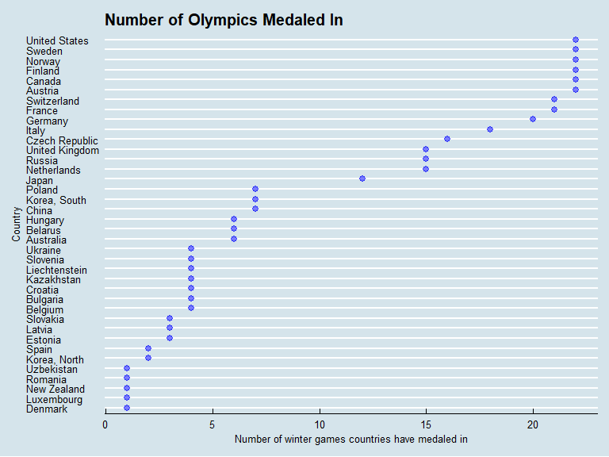<!-- -->

  
  
  
## Question 1 Part 2

### Medals of each type a country has won in winter olympics
  
  
An issue with just applying grouping operations to dataset is that it results in values which are inflated due to consideration of each medal obtained in team events as individual medal. This results in the results getting skewed.
    
To mitigate this effect, I have considered to count only those which are distinct based on attributes like Year,Sport,Discipline,Event,Medal. This results in obtaining *accurate* values of medal counts for most of countries with minor differences for some countries.  
  
In the all-time medal count, Norway occupies the top slot with 329 medals. In my analysis, since I have combined the different symbols for Germany and Russia, they appear on top followed by Norway with its 329 medals.  
  
  
  

```r
#But here the individual medals are repeatedly added in team counts for group events, so need to find a way to prevent this.

# cgp_medaltype = group_by(cgp,Country,Medal)
# cgp_mts = summarize(cgp_medaltype,count=n())
# reorderby = aggregate(count ~ Country,cgp_mts,sum)
# cgp_mts = merge(cgp_mts,reorderby,by="Country")
# colnames(cgp_mts) = c("Country","Medal","Medal_Type_Count","Total_Count")
# 
# ggplot(cgp_mts,aes(x=Medal_Type_Count,y=reorder(Country,Total_Count),color=Medal)) + geom_point() + facet_grid(. ~ Medal)

#so some modifications are made while grouping to remove this anomaly

cgp_temp = cgp
cgp_temp <- within(cgp_temp, Gender[Event == 'Pairs'] <- 'Men')

cgp_temp = group_by(cgp_temp,Country,Medal)
cgp_temp = summarize(cgp_temp,count=n_distinct(Year,City,Sport,Discipline,Event,Gender))
reorderby = aggregate(count ~ Country,cgp_temp,sum)
cgp_temp = merge(cgp_temp,reorderby,by="Country")
colnames(cgp_temp) = c("Country","Medal","Medal_Type_Count","Total_Count")


cgp_mt_team = group_by(cgp,Country,Medal)
cgp_team_mts = summarize(cgp_mt_team,count=n_distinct(Year,City,Sport,Discipline,Event,Gender))
reorderby = aggregate(count ~ Country,cgp_team_mts,sum)
cgp_team_mts = merge(cgp_team_mts,reorderby,by="Country")
colnames(cgp_team_mts) = c("Country","Medal","Medal_Type_Count","Total_Count")

p = ggplot(cgp_temp,aes(x=Medal_Type_Count,y=reorder(Country,Total_Count),color=Medal)) + geom_point() + facet_grid(. ~ Medal)

interactive1 = p + ggtitle("Medal Count of each type for Countries across Years")+xlab("Medal Count")+ylab(NULL)+scale_color_manual(values = c("Bronze"=rgb(205,127,50,maxColorValue = 255),"Gold"=rgb(255,219,88,maxColorValue = 255),"Silver"="Dark Grey")) + scale_x_continuous(breaks = seq(0,175,25))

combined_summary = merge(cgp_plot1,cgp_team_mts,by="Country")
colnames(combined_summary) = c("Country","Olympics medaled in","Medal","Medal_Type_Count","Total_Count")

combined_summary_temp = merge(cgp_plot1,cgp_temp,by="Country")
colnames(combined_summary_temp) = c("Country","Olympics medaled in","Medal","Medal_Type_Count","Total_Count")

interactive1
```

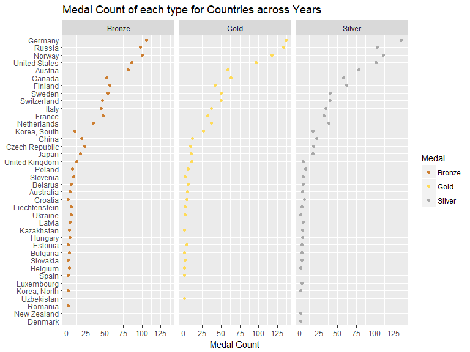<!-- -->

```r
#ggplotly(p)
```

  
## Question 1 Part 3 

### Visualization for USA: Based on Gender 


```r
summary_sorted = combined_summary[order(-combined_summary[,5]),]
rownames(summary_sorted) <- 1:nrow(summary_sorted)
top10 = summary_sorted[1:30,]

combined_subset = filter(combined,Country %in% top10$Country)
subset_gp = group_by(combined_subset,Country,Year,Gender)
subset_gps_1 = summarise(subset_gp,count=n_distinct(City,Sport,Discipline,Event,Medal))
#Men vs women comparison for United states
p1 = ggplot(filter(subset_gps_1,Country=="United States"),aes(x=Year,y=count,color=Gender))+geom_line(lwd=0.8)+xlab("Years")+ylab("Medal Count")+ggtitle("Medal Count for United States across years for Men and Women")+scale_color_manual(values =c("Blue","Pink")) + theme_minimal() + scale_x_continuous(breaks = seq(1924,2014,8))

p1
```

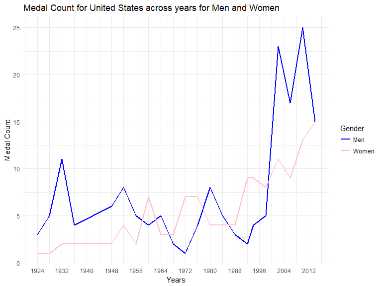<!-- -->

```r
p = filter(subset_gps_1,Country=="United States") %>% 
  group_by(.,Gender) %>% 
  summarise(.,count_total = sum(count))%>%
  ggplot(.,aes(x=Gender,y=count_total))+geom_bar(stat="identity",width = 0.2) + ylab("Medals won overtime by athletes of USA") + xlab("Gender") + ggtitle("Medals won by Male and Female Athletes across Years for USA") + theme_minimal()
p
```

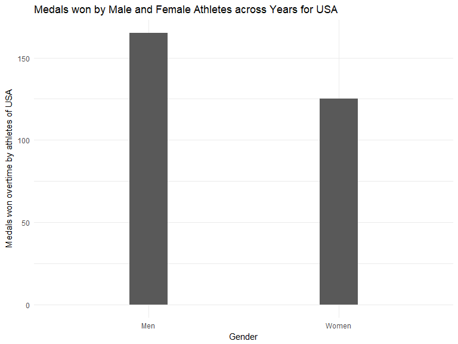<!-- -->
  
## Question 1 Part 4 
  
### Visualization for top 10 countries
  
  

```r
#Top 10 countries total medals
#p = ggplot(top10,aes(x=Total_Count,y=reorder(Country,Total_Count))) + geom_point()+xlab("Total Count of Medals Won")+ylab("Country")+ggtitle("Top Countries with respect to Medals won")
#p
top6 = summary_sorted[1:18,]
combined_temp <- within(combined, Gender[Event == 'Pairs'] <- 'Men')
top3_c = filter(combined_temp,Country %in% top6$Country)
#Year wise medal tally for top 10 countries
medals_indi = group_by(top3_c,Country,Year)
medals_acrossyr = summarise(medals_indi,count=n_distinct(Sport,Discipline,Event,Gender,Medal))
#aggregate(count~Country,medals_acrossyr,sum)
interactive2= ggplot(medals_acrossyr,aes(x=Year,y=count,color=Country))+geom_line(lwd=0.8) + xlab("Year") + ylab("Medals won per Year") + ggtitle("Medals won across Years")+ scale_x_continuous(breaks = seq(1924,2014,8))

interactive2
```

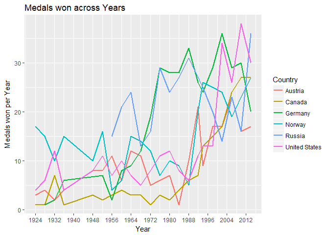<!-- -->
  
  

## Question 2 Part 1
  
### Medal counts comparison on different metrics
  
  

```r
combined_summary_subset = filter(combined_summary_temp[combined_summary_temp$Medal=="Gold",])
rownames(combined_summary_subset) <- 1:nrow(combined_summary_subset)
small_df = subset(combined_temp,select=c("Country","Population","GDP.per.Capita"))
part2 = merge(combined_summary_subset,small_df,by="Country")

part2 = part2[!duplicated(part2),]
rownames(part2) = 1:nrow(part2)

#Unnormalized Plot based on Gold Medals
ggplot(part2,aes(x=Medal_Type_Count,y=reorder(Country,Medal_Type_Count)))+geom_point(color="Blue",size=2.5,alpha=0.6) + xlab("Gold Medal Count") + ylab("Country") + ggtitle("Unadjusted ranking based on gold medal count") + theme_economist()+ scale_x_continuous(breaks = seq(0,175,25))
```

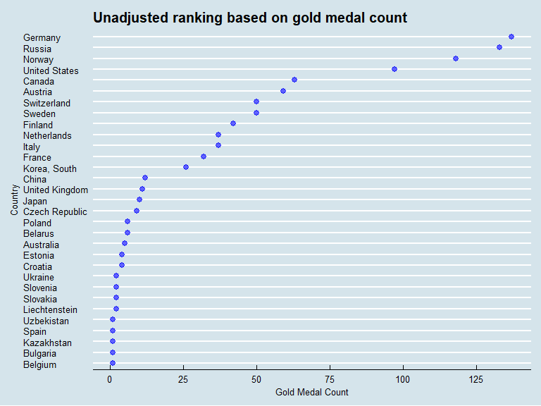<!-- -->

```r
#Adjusted based on gold medals + population
sdf = part2[order(-part2[,4],-part2[,6]),]
ggplot(sdf,aes(x=Medal_Type_Count,y=Country))+geom_point(color="Blue",size=2.5,alpha=0.6) + xlab("Gold Medal Count") + ylab("Country") + ggtitle("Adjusted ranking based for gold medal count based on population") + theme_economist()+ scale_x_continuous(breaks = seq(0,175,25))
```

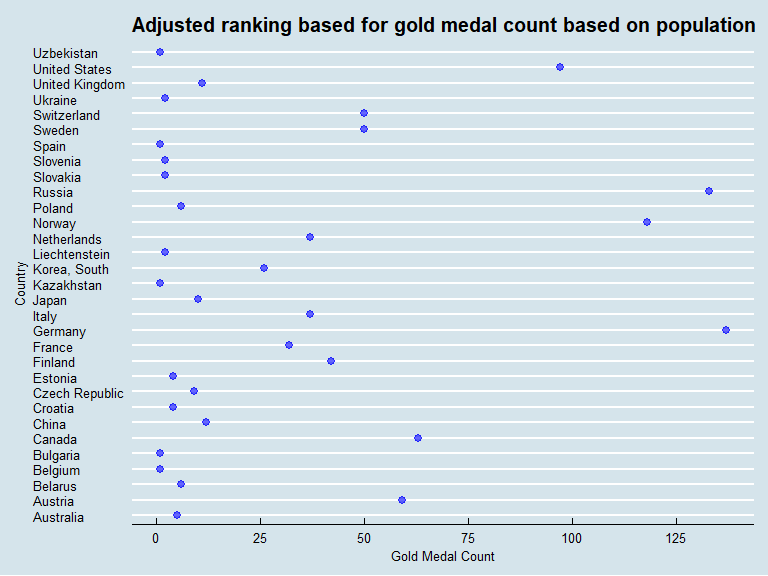<!-- -->

```r
#Adjusted based on GDP

ggplot(sdf,aes(x=Medal_Type_Count,y=reorder(Country,GDP.per.Capita,na.rm=TRUE)))+geom_point(color="Blue",size=2.5,alpha=0.6) + xlab("Gold Medal Count") + ylab("Country") + ggtitle("Adjusted ranking for gold medal count based on GDPperCapita")+ theme_economist()+ scale_x_continuous(breaks = seq(0,175,25))
```

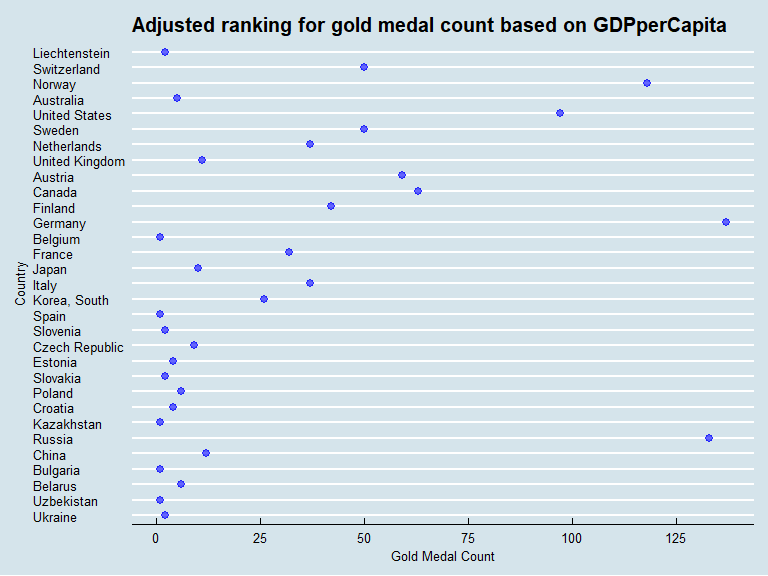<!-- -->
  
Generally the countries that have a higher GDP per capita tend to do well overallat winter olympics and more specifically with respect to their Gold Medal Count, in this case, for examples countries like Switzerland and Sweden
  
  
##Question 3 Part 1

### Host Country Advantage


```r
library(rvest)
library(stringr)
wiki_hosts <- read_html("https://en.wikipedia.org/wiki/Winter_Olympic_Games")
hosts <- html_table(html_nodes(wiki_hosts, "table")[[5]], fill=TRUE)
hosts <- hosts[-1,1:3]
hosts$city <- str_split_fixed(hosts$Host, n=2, ",")[,1]
hosts$country <- str_split_fixed(hosts$Host, n=2, ",")[,2]

cc = data_frame(hosts$Year,hosts$city,hosts$country)
colnames(cc) = c("Year","City","Host Country")
cc$City[cc$City=="St. Moritz"] = "St.Moritz"
cc$City[cc$City=="Garmisch-Partenkirchen"] = "Garmisch Partenkirchen"
cc = cc[1:24,]
cc = cc[-c(5,6),]
combined_cc = merge(combined_temp,cc,by=c("Year","City"))
combined_cc$`Host Country` = str_trim(combined_cc$`Host Country`,"left")
host_adv = subset(combined_cc,Country==`Host Country`)

host_adv_gp = group_by(host_adv,Country,Year)
host_adv_gps = summarize(host_adv_gp,count=n_distinct(Year,City,Sport,Discipline,Event,Gender,Medal))
reorderby_host = aggregate(count ~ Country,host_adv_gps,sum)
host_adv_gps = merge(host_adv_gps,reorderby_host,by="Country")
colnames(host_adv_gps) = c("HC Country","Year","Medal_Type_Count_HC","Medals when hosted")

host_total_medals = subset(host_adv_gps,select=c("HC Country","Medals when hosted"))
host_total_medals = host_total_medals[!duplicated(host_total_medals),]

#Number of times olympics hosted
hc_year = subset(host_adv_gps,select=c("HC Country","Year"))
hc_year = group_by(hc_year,hc_year$`HC Country`)
hc_year = summarise(hc_year,count=n())

host_total_medals$`Medals when hosted` = host_total_medals$`Medals when hosted`/hc_year$count
host_total_medals$`Medals when hosted` = as.integer(host_total_medals$`Medals when hosted`)

total_medals = subset(combined_summary_temp,select=c("Country","Olympics medaled in","Total_Count"))
total_medals = total_medals[!duplicated(total_medals),]
colnames(host_total_medals) = c("Country","Medals when hosted")

host_combined = merge(host_total_medals,total_medals,by="Country")

colnames(hc_year) = c("Country","count")
host_combined = merge(host_combined,hc_year,by="Country")

host_combined["Remaining_participation"] = host_combined$`Olympics medaled in`- host_combined$count

host_combined["Average_Rest"] = host_combined$Total_Count/host_combined$Remaining_participation

host_combined$Average_Rest = as.integer(host_combined$Average_Rest)

interactive3 = ggplot(host_combined,aes(x=host_combined$`Medals when hosted`,y=host_combined$`Average_Rest`,text=paste("Country: ",host_combined$Country)))+geom_point(alpha=0.5,size=2.5)+xlab("Medals won when hosted the games")+ geom_abline(intercept = 0,slope = 1) + ylab("Mean value of medals won for rest of the olympics")+ggtitle("Comparative Study of Host Country Advantage") + xlim(0,90) + ylim(0,90) + theme_minimal()
interactive3
```

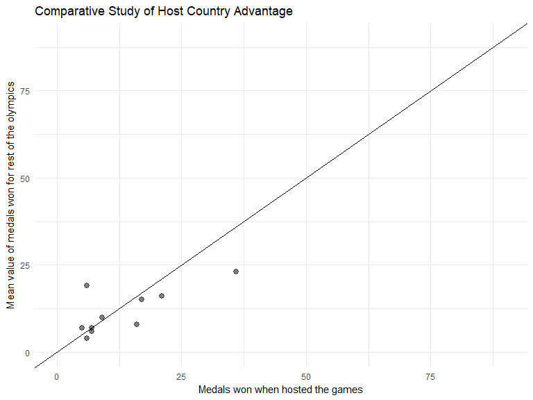<!-- -->
  
  
This visualization allows us to contrast the total medals achieved when a country was hosting the olympics to the average of all medals obtained when the country was not hosting.  Although the analysis needs more scrutiny, the plot suggests an evidence or pattern that suggests host country advantage, as many of the observations fall on the right side of the 45 degree line in the scatterplot, thereby indicating influence of host country advantage on the medal tally.
  
  
## Question 4
  
For this analysis, I have selected the country of Norway. The next two visualizations depict the events and sports respectively that have helped Norway obtain most number of medals.
  
  


```r
snorway = combined_temp %>% filter(Country=='Norway')
sngp = group_by(snorway,Sport,Discipline,Event)
sngps = summarise(sngp,count=n_distinct(Year,Gender,Medal))

sngps = sngps[order(-sngps$count),]
sngps['cumsum_count'] = cumsum(sngps$count)
top10_ne = sngps[1:10,]

ggplot(top10_ne,aes(x=reorder(Event,count),y=count)) + geom_bar(stat="identity") + coord_flip() + xlab("Event which have brought most medals") + ylab("Count") + ggtitle("Events which have brought most medals to Norway") + theme_minimal()
```

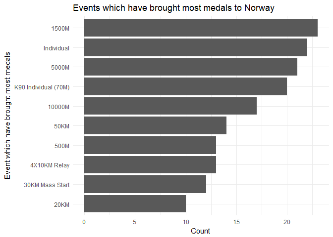<!-- -->
  
  
These top 10 events have brought half of Norway's total medals.  
  

```r
sngp_sport = group_by(snorway,Sport)
sngpss = summarise(sngp_sport,count=n_distinct(Discipline,Event,Year,Gender,Medal))

sngps_sports = sngpss[order(-sngpss$count),]
sngps_sports['cumsum_count'] = cumsum(sngps_sports$count)
sngps_sports['Percent_medals_brought'] = sngps_sports['count']*100/329
ggplot(sngps_sports,aes(x=reorder(Sport,Percent_medals_brought),y=Percent_medals_brought)) + geom_bar(stat="identity",width = 0.5) + coord_flip() + xlab("Sports") + ylab('Percent of total medals brought in by specific sport (%)') + ggtitle("Percent of total medals brought by Sports") + theme_minimal()
```

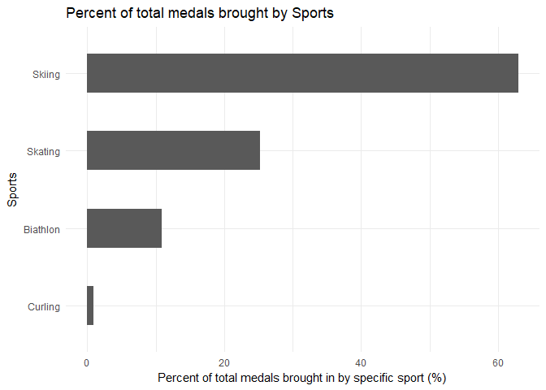<!-- -->
  
  
This is an interesting result which describes that Skiing has brought more than 60% of the total 329 medals for Norway.  
  


## Question 5
### Most Successful athletes  
  
In this part, for analysing the performance of athletes, I have used the following metrics:  
1. Most Successful athletes in terms of Total Medals obtained.
2. Athletes who have participated in most olympics across years.
3. Most Successful athletes in terms of Total Medals obtained categorized by Sports.  
  

```r
ath = group_by(combined_temp,Athlete)
aths = summarise(ath,count=n_distinct(Year,City,Sport,Discipline,Event,Medal))
aths = aths[order(-aths$count),]
aths = aths[1:10,]
ggplot(aths,aes(x=reorder(Athlete,count),y=count)) + geom_bar(stat="identity") + coord_flip() + xlab("Top Athletes") +ylab("Medals won by them") + ggtitle("Most Successful Athletes") + theme_minimal()
```

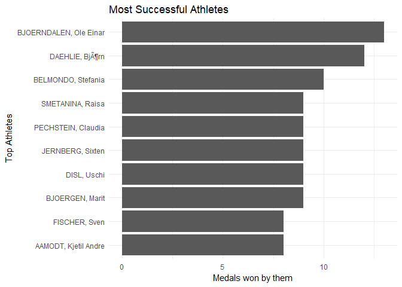<!-- -->

### Longest Participating athletes in Winter olympics


```r
ath_y = group_by(combined_temp,Athlete)
ath_ys = summarise(ath_y,count=n_distinct(Year))
ath_ys = ath_ys[order(-ath_ys$count),]
ggplot(ath_ys[1:20,],aes(x=reorder(Athlete,count),y=count))+geom_bar(stat="identity")+coord_flip()+xlab("Top Athletes wrt participation") + ylab("Number of winter olympics participated") + ggtitle("Athletes who have participated the most number of times in olympics") + theme_minimal()
```

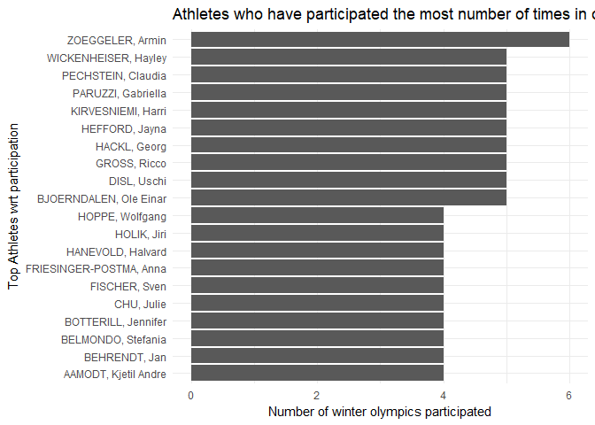<!-- -->

### Top medal wins by athletes by Sports


```r
ath_spg = group_by(combined_temp,Sport,Athlete)
ath_spg = summarize(ath_spg,count=n_distinct(Year,Discipline,Event,Medal))
ath_spg = ath_spg[order(-ath_spg$count,ath_spg$Sport),]

ggplot(ath_spg[1:15,],aes(x=reorder(interaction(Sport,Athlete),count),y=count)) + geom_point(alpha=0.5,size=2.5,color=c("blue")) + coord_flip() + xlab("Top Medal wining Athletes by Sport") + ylab("Number of medals won") +ggtitle("Top Medal wins by athletes categorized by Sports") + theme_minimal()
```

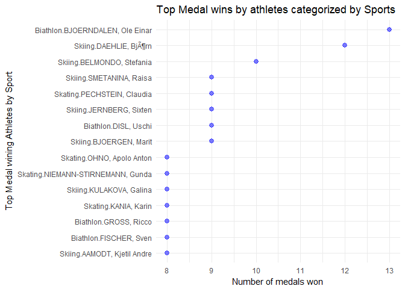<!-- -->

## Question 6 : Interactivity

### Interactive Plot 1
  
  
I have added interactivity for this plot as adding interactivity allows a user to view the statistics of a country (individual medal tally and total medal tally) that he is interested in carefully, thus allowing him to gain valuable information through the visualization.  
  
  

```r
ggplotly(interactive1)
```

<!--html_preserve--><div id="htmlwidget-089f91445a657ce0ff54" style="width:576px;height:576px;" class="plotly html-widget"></div>
<script type="application/json" data-for="htmlwidget-089f91445a657ce0ff54">{"x":{"data":[{"x":[4,81,5,3,3,53,19,1,23,1,57,48,106,4,45,18,3,1,10,4,5,35,100,7,1,98,1,9,1,54,47,5,13,86],"y":[18,34,19,8,10,33,25,17,24,11,32,28,38,12,29,23,13,5,26,14,16,27,36,21,3,37,9,20,7,31,30,15,22,35],"text":["Medal_Type_Count:   4<br />reorder(Country, Total_Count): Australia<br />Medal: Bronze","Medal_Type_Count:  81<br />reorder(Country, Total_Count): Austria<br />Medal: Bronze","Medal_Type_Count:   5<br />reorder(Country, Total_Count): Belarus<br />Medal: Bronze","Medal_Type_Count:   3<br />reorder(Country, Total_Count): Belgium<br />Medal: Bronze","Medal_Type_Count:   3<br />reorder(Country, Total_Count): Bulgaria<br />Medal: Bronze","Medal_Type_Count:  53<br />reorder(Country, Total_Count): Canada<br />Medal: Bronze","Medal_Type_Count:  19<br />reorder(Country, Total_Count): China<br />Medal: Bronze","Medal_Type_Count:   1<br />reorder(Country, Total_Count): Croatia<br />Medal: Bronze","Medal_Type_Count:  23<br />reorder(Country, Total_Count): Czech Republic<br />Medal: Bronze","Medal_Type_Count:   1<br />reorder(Country, Total_Count): Estonia<br />Medal: Bronze","Medal_Type_Count:  57<br />reorder(Country, Total_Count): Finland<br />Medal: Bronze","Medal_Type_Count:  48<br />reorder(Country, Total_Count): France<br />Medal: Bronze","Medal_Type_Count: 106<br />reorder(Country, Total_Count): Germany<br />Medal: Bronze","Medal_Type_Count:   4<br />reorder(Country, Total_Count): Hungary<br />Medal: Bronze","Medal_Type_Count:  45<br />reorder(Country, Total_Count): Italy<br />Medal: Bronze","Medal_Type_Count:  18<br />reorder(Country, Total_Count): Japan<br />Medal: Bronze","Medal_Type_Count:   3<br />reorder(Country, Total_Count): Kazakhstan<br />Medal: Bronze","Medal_Type_Count:   1<br />reorder(Country, Total_Count): Korea, North<br />Medal: Bronze","Medal_Type_Count:  10<br />reorder(Country, Total_Count): Korea, South<br />Medal: Bronze","Medal_Type_Count:   4<br />reorder(Country, Total_Count): Latvia<br />Medal: Bronze","Medal_Type_Count:   5<br />reorder(Country, Total_Count): Liechtenstein<br />Medal: Bronze","Medal_Type_Count:  35<br />reorder(Country, Total_Count): Netherlands<br />Medal: Bronze","Medal_Type_Count: 100<br />reorder(Country, Total_Count): Norway<br />Medal: Bronze","Medal_Type_Count:   7<br />reorder(Country, Total_Count): Poland<br />Medal: Bronze","Medal_Type_Count:   1<br />reorder(Country, Total_Count): Romania<br />Medal: Bronze","Medal_Type_Count:  98<br />reorder(Country, Total_Count): Russia<br />Medal: Bronze","Medal_Type_Count:   1<br />reorder(Country, Total_Count): Slovakia<br />Medal: Bronze","Medal_Type_Count:   9<br />reorder(Country, Total_Count): Slovenia<br />Medal: Bronze","Medal_Type_Count:   1<br />reorder(Country, Total_Count): Spain<br />Medal: Bronze","Medal_Type_Count:  54<br />reorder(Country, Total_Count): Sweden<br />Medal: Bronze","Medal_Type_Count:  47<br />reorder(Country, Total_Count): Switzerland<br />Medal: Bronze","Medal_Type_Count:   5<br />reorder(Country, Total_Count): Ukraine<br />Medal: Bronze","Medal_Type_Count:  13<br />reorder(Country, Total_Count): United Kingdom<br />Medal: Bronze","Medal_Type_Count:  86<br />reorder(Country, Total_Count): United States<br />Medal: Bronze"],"type":"scatter","mode":"markers","marker":{"autocolorscale":false,"color":"rgba(205,127,50,1)","opacity":1,"size":5.66929133858268,"symbol":"circle","line":{"width":1.88976377952756,"color":"rgba(205,127,50,1)"}},"hoveron":"points","name":"Bronze","legendgroup":"Bronze","showlegend":true,"xaxis":"x","yaxis":"y","hoverinfo":"text","frame":null},{"x":[5,59,6,1,1,63,12,4,9,4,42,32,137,37,10,1,26,2,37,118,6,133,2,2,1,50,50,2,11,97,1],"y":[18,34,19,8,10,33,25,17,24,11,32,28,38,29,23,13,26,16,27,36,21,37,9,20,7,31,30,15,22,35,4],"text":["Medal_Type_Count:   5<br />reorder(Country, Total_Count): Australia<br />Medal: Gold","Medal_Type_Count:  59<br />reorder(Country, Total_Count): Austria<br />Medal: Gold","Medal_Type_Count:   6<br />reorder(Country, Total_Count): Belarus<br />Medal: Gold","Medal_Type_Count:   1<br />reorder(Country, Total_Count): Belgium<br />Medal: Gold","Medal_Type_Count:   1<br />reorder(Country, Total_Count): Bulgaria<br />Medal: Gold","Medal_Type_Count:  63<br />reorder(Country, Total_Count): Canada<br />Medal: Gold","Medal_Type_Count:  12<br />reorder(Country, Total_Count): China<br />Medal: Gold","Medal_Type_Count:   4<br />reorder(Country, Total_Count): Croatia<br />Medal: Gold","Medal_Type_Count:   9<br />reorder(Country, Total_Count): Czech Republic<br />Medal: Gold","Medal_Type_Count:   4<br />reorder(Country, Total_Count): Estonia<br />Medal: Gold","Medal_Type_Count:  42<br />reorder(Country, Total_Count): Finland<br />Medal: Gold","Medal_Type_Count:  32<br />reorder(Country, Total_Count): France<br />Medal: Gold","Medal_Type_Count: 137<br />reorder(Country, Total_Count): Germany<br />Medal: Gold","Medal_Type_Count:  37<br />reorder(Country, Total_Count): Italy<br />Medal: Gold","Medal_Type_Count:  10<br />reorder(Country, Total_Count): Japan<br />Medal: Gold","Medal_Type_Count:   1<br />reorder(Country, Total_Count): Kazakhstan<br />Medal: Gold","Medal_Type_Count:  26<br />reorder(Country, Total_Count): Korea, South<br />Medal: Gold","Medal_Type_Count:   2<br />reorder(Country, Total_Count): Liechtenstein<br />Medal: Gold","Medal_Type_Count:  37<br />reorder(Country, Total_Count): Netherlands<br />Medal: Gold","Medal_Type_Count: 118<br />reorder(Country, Total_Count): Norway<br />Medal: Gold","Medal_Type_Count:   6<br />reorder(Country, Total_Count): Poland<br />Medal: Gold","Medal_Type_Count: 133<br />reorder(Country, Total_Count): Russia<br />Medal: Gold","Medal_Type_Count:   2<br />reorder(Country, Total_Count): Slovakia<br />Medal: Gold","Medal_Type_Count:   2<br />reorder(Country, Total_Count): Slovenia<br />Medal: Gold","Medal_Type_Count:   1<br />reorder(Country, Total_Count): Spain<br />Medal: Gold","Medal_Type_Count:  50<br />reorder(Country, Total_Count): Sweden<br />Medal: Gold","Medal_Type_Count:  50<br />reorder(Country, Total_Count): Switzerland<br />Medal: Gold","Medal_Type_Count:   2<br />reorder(Country, Total_Count): Ukraine<br />Medal: Gold","Medal_Type_Count:  11<br />reorder(Country, Total_Count): United Kingdom<br />Medal: Gold","Medal_Type_Count:  97<br />reorder(Country, Total_Count): United States<br />Medal: Gold","Medal_Type_Count:   1<br />reorder(Country, Total_Count): Uzbekistan<br />Medal: Gold"],"type":"scatter","mode":"markers","marker":{"autocolorscale":false,"color":"rgba(255,219,88,1)","opacity":1,"size":5.66929133858268,"symbol":"circle","line":{"width":1.88976377952756,"color":"rgba(255,219,88,1)"}},"hoveron":"points","name":"Gold","legendgroup":"Gold","showlegend":true,"xaxis":"x2","yaxis":"y","hoverinfo":"text","frame":null},{"x":[3,78,4,1,2,58,22,6,18,1,2,62,32,135,3,34,17,3,1,17,4,2,2,38,1,111,7,103,2,4,40,40,1,4,101],"y":[18,34,19,8,10,33,25,17,24,1,11,32,28,38,12,29,23,13,5,26,14,16,6,27,2,36,21,37,9,20,31,30,15,22,35],"text":["Medal_Type_Count:   3<br />reorder(Country, Total_Count): Australia<br />Medal: Silver","Medal_Type_Count:  78<br />reorder(Country, Total_Count): Austria<br />Medal: Silver","Medal_Type_Count:   4<br />reorder(Country, Total_Count): Belarus<br />Medal: Silver","Medal_Type_Count:   1<br />reorder(Country, Total_Count): Belgium<br />Medal: Silver","Medal_Type_Count:   2<br />reorder(Country, Total_Count): Bulgaria<br />Medal: Silver","Medal_Type_Count:  58<br />reorder(Country, Total_Count): Canada<br />Medal: Silver","Medal_Type_Count:  22<br />reorder(Country, Total_Count): China<br />Medal: Silver","Medal_Type_Count:   6<br />reorder(Country, Total_Count): Croatia<br />Medal: Silver","Medal_Type_Count:  18<br />reorder(Country, Total_Count): Czech Republic<br />Medal: Silver","Medal_Type_Count:   1<br />reorder(Country, Total_Count): Denmark<br />Medal: Silver","Medal_Type_Count:   2<br />reorder(Country, Total_Count): Estonia<br />Medal: Silver","Medal_Type_Count:  62<br />reorder(Country, Total_Count): Finland<br />Medal: Silver","Medal_Type_Count:  32<br />reorder(Country, Total_Count): France<br />Medal: Silver","Medal_Type_Count: 135<br />reorder(Country, Total_Count): Germany<br />Medal: Silver","Medal_Type_Count:   3<br />reorder(Country, Total_Count): Hungary<br />Medal: Silver","Medal_Type_Count:  34<br />reorder(Country, Total_Count): Italy<br />Medal: Silver","Medal_Type_Count:  17<br />reorder(Country, Total_Count): Japan<br />Medal: Silver","Medal_Type_Count:   3<br />reorder(Country, Total_Count): Kazakhstan<br />Medal: Silver","Medal_Type_Count:   1<br />reorder(Country, Total_Count): Korea, North<br />Medal: Silver","Medal_Type_Count:  17<br />reorder(Country, Total_Count): Korea, South<br />Medal: Silver","Medal_Type_Count:   4<br />reorder(Country, Total_Count): Latvia<br />Medal: Silver","Medal_Type_Count:   2<br />reorder(Country, Total_Count): Liechtenstein<br />Medal: Silver","Medal_Type_Count:   2<br />reorder(Country, Total_Count): Luxembourg<br />Medal: Silver","Medal_Type_Count:  38<br />reorder(Country, Total_Count): Netherlands<br />Medal: Silver","Medal_Type_Count:   1<br />reorder(Country, Total_Count): New Zealand<br />Medal: Silver","Medal_Type_Count: 111<br />reorder(Country, Total_Count): Norway<br />Medal: Silver","Medal_Type_Count:   7<br />reorder(Country, Total_Count): Poland<br />Medal: Silver","Medal_Type_Count: 103<br />reorder(Country, Total_Count): Russia<br />Medal: Silver","Medal_Type_Count:   2<br />reorder(Country, Total_Count): Slovakia<br />Medal: Silver","Medal_Type_Count:   4<br />reorder(Country, Total_Count): Slovenia<br />Medal: Silver","Medal_Type_Count:  40<br />reorder(Country, Total_Count): Sweden<br />Medal: Silver","Medal_Type_Count:  40<br />reorder(Country, Total_Count): Switzerland<br />Medal: Silver","Medal_Type_Count:   1<br />reorder(Country, Total_Count): Ukraine<br />Medal: Silver","Medal_Type_Count:   4<br />reorder(Country, Total_Count): United Kingdom<br />Medal: Silver","Medal_Type_Count: 101<br />reorder(Country, Total_Count): United States<br />Medal: Silver"],"type":"scatter","mode":"markers","marker":{"autocolorscale":false,"color":"rgba(169,169,169,1)","opacity":1,"size":5.66929133858268,"symbol":"circle","line":{"width":1.88976377952756,"color":"rgba(169,169,169,1)"}},"hoveron":"points","name":"Silver","legendgroup":"Silver","showlegend":true,"xaxis":"x3","yaxis":"y","hoverinfo":"text","frame":null}],"layout":{"margin":{"t":52.5296803652968,"r":18.9954337899543,"b":37.2602739726027,"l":92.7853881278539},"plot_bgcolor":"rgba(235,235,235,1)","paper_bgcolor":"rgba(255,255,255,1)","font":{"color":"rgba(0,0,0,1)","family":"","size":14.6118721461187},"title":"Medal Count of each type for Countries across Years","titlefont":{"color":"rgba(0,0,0,1)","family":"","size":17.5342465753425},"xaxis":{"domain":[0,0.320649416539827],"type":"linear","autorange":false,"tickmode":"array","range":[-5.8,143.8],"ticktext":["0","25","50","75","100","125"],"tickvals":[8.88178419700125e-016,25,50,75,100,125],"ticks":"outside","tickcolor":"rgba(51,51,51,1)","ticklen":3.65296803652968,"tickwidth":0.66417600664176,"showticklabels":true,"tickfont":{"color":"rgba(77,77,77,1)","family":"","size":11.689497716895},"tickangle":-0,"showline":false,"linecolor":null,"linewidth":0,"showgrid":true,"gridcolor":"rgba(255,255,255,1)","gridwidth":0.66417600664176,"zeroline":false,"anchor":"y","title":"","titlefont":{"color":"rgba(0,0,0,1)","family":"","size":14.6118721461187},"hoverformat":".2f"},"annotations":[{"text":"Medal Count","x":0.5,"y":-0.0393201420598681,"showarrow":false,"ax":0,"ay":0,"font":{"color":"rgba(0,0,0,1)","family":"","size":14.6118721461187},"xref":"paper","yref":"paper","textangle":-0,"xanchor":"center","yanchor":"top","annotationType":"axis"},{"text":"Bronze","x":0.160324708269914,"y":1,"showarrow":false,"ax":0,"ay":0,"font":{"color":"rgba(26,26,26,1)","family":"","size":11.689497716895},"xref":"paper","yref":"paper","textangle":-0,"xanchor":"center","yanchor":"bottom"},{"text":"Gold","x":0.5,"y":1,"showarrow":false,"ax":0,"ay":0,"font":{"color":"rgba(26,26,26,1)","family":"","size":11.689497716895},"xref":"paper","yref":"paper","textangle":-0,"xanchor":"center","yanchor":"bottom"},{"text":"Silver","x":0.839675291730086,"y":1,"showarrow":false,"ax":0,"ay":0,"font":{"color":"rgba(26,26,26,1)","family":"","size":11.689497716895},"xref":"paper","yref":"paper","textangle":-0,"xanchor":"center","yanchor":"bottom"},{"text":"Medal","x":1.02,"y":1,"showarrow":false,"ax":0,"ay":0,"font":{"color":"rgba(0,0,0,1)","family":"","size":14.6118721461187},"xref":"paper","yref":"paper","textangle":-0,"xanchor":"left","yanchor":"bottom","legendTitle":true}],"yaxis":{"domain":[0,1],"type":"linear","autorange":false,"tickmode":"array","range":[0.4,38.6],"ticktext":["Denmark","New Zealand","Romania","Uzbekistan","Korea, North","Luxembourg","Spain","Belgium","Slovakia","Bulgaria","Estonia","Hungary","Kazakhstan","Latvia","Ukraine","Liechtenstein","Croatia","Australia","Belarus","Slovenia","Poland","United Kingdom","Japan","Czech Republic","China","Korea, South","Netherlands","France","Italy","Switzerland","Sweden","Finland","Canada","Austria","United States","Norway","Russia","Germany"],"tickvals":[1,2,3,4,5,6,7,8,9,10,11,12,13,14,15,16,17,18,19,20,21,22,23,24,25,26,27,28,29,30,31,32,33,34,35,36,37,38],"ticks":"outside","tickcolor":"rgba(51,51,51,1)","ticklen":3.65296803652968,"tickwidth":0.66417600664176,"showticklabels":true,"tickfont":{"color":"rgba(77,77,77,1)","family":"","size":11.689497716895},"tickangle":-0,"showline":false,"linecolor":null,"linewidth":0,"showgrid":true,"gridcolor":"rgba(255,255,255,1)","gridwidth":0.66417600664176,"zeroline":false,"anchor":"x","title":"","titlefont":{"color":"rgba(0,0,0,1)","family":"","size":14.6118721461187},"hoverformat":".2f"},"shapes":[{"type":"rect","fillcolor":null,"line":{"color":null,"width":0,"linetype":[]},"yref":"paper","xref":"paper","x0":0,"x1":0.320649416539827,"y0":0,"y1":1},{"type":"rect","fillcolor":"rgba(217,217,217,1)","line":{"color":"transparent","width":0.66417600664176,"linetype":"solid"},"yref":"paper","xref":"paper","x0":0,"x1":0.320649416539827,"y0":1,"y1":1.05774278215223},{"type":"rect","fillcolor":null,"line":{"color":null,"width":0,"linetype":[]},"yref":"paper","xref":"paper","x0":0.346017250126839,"x1":0.653982749873161,"y0":0,"y1":1},{"type":"rect","fillcolor":"rgba(217,217,217,1)","line":{"color":"transparent","width":0.66417600664176,"linetype":"solid"},"yref":"paper","xref":"paper","x0":0.346017250126839,"x1":0.653982749873161,"y0":1,"y1":1.05774278215223},{"type":"rect","fillcolor":null,"line":{"color":null,"width":0,"linetype":[]},"yref":"paper","xref":"paper","x0":0.679350583460173,"x1":1,"y0":0,"y1":1},{"type":"rect","fillcolor":"rgba(217,217,217,1)","line":{"color":"transparent","width":0.66417600664176,"linetype":"solid"},"yref":"paper","xref":"paper","x0":0.679350583460173,"x1":1,"y0":1,"y1":1.05774278215223}],"xaxis2":{"type":"linear","autorange":false,"tickmode":"array","range":[-5.8,143.8],"ticktext":["0","25","50","75","100","125"],"tickvals":[8.88178419700125e-016,25,50,75,100,125],"ticks":"outside","tickcolor":"rgba(51,51,51,1)","ticklen":3.65296803652968,"tickwidth":0.66417600664176,"showticklabels":true,"tickfont":{"color":"rgba(77,77,77,1)","family":"","size":11.689497716895},"tickangle":-0,"showline":false,"linecolor":null,"linewidth":0,"showgrid":true,"domain":[0.346017250126839,0.653982749873161],"gridcolor":"rgba(255,255,255,1)","gridwidth":0.66417600664176,"zeroline":false,"anchor":"y","title":"","titlefont":{"color":"rgba(0,0,0,1)","family":"","size":14.6118721461187},"hoverformat":".2f"},"xaxis3":{"type":"linear","autorange":false,"tickmode":"array","range":[-5.8,143.8],"ticktext":["0","25","50","75","100","125"],"tickvals":[8.88178419700125e-016,25,50,75,100,125],"ticks":"outside","tickcolor":"rgba(51,51,51,1)","ticklen":3.65296803652968,"tickwidth":0.66417600664176,"showticklabels":true,"tickfont":{"color":"rgba(77,77,77,1)","family":"","size":11.689497716895},"tickangle":-0,"showline":false,"linecolor":null,"linewidth":0,"showgrid":true,"domain":[0.679350583460173,1],"gridcolor":"rgba(255,255,255,1)","gridwidth":0.66417600664176,"zeroline":false,"anchor":"y","title":"","titlefont":{"color":"rgba(0,0,0,1)","family":"","size":14.6118721461187},"hoverformat":".2f"},"showlegend":true,"legend":{"bgcolor":"rgba(255,255,255,1)","bordercolor":"transparent","borderwidth":1.88976377952756,"font":{"color":"rgba(0,0,0,1)","family":"","size":11.689497716895},"y":0.927821522309711},"hovermode":"closest"},"source":"A","attrs":{"28d823da35bf":{"x":{},"y":{},"colour":{},"type":"ggplotly"}},"cur_data":"28d823da35bf","visdat":{"28d823da35bf":["function (y) ","x"]},"config":{"modeBarButtonsToAdd":[{"name":"Collaborate","icon":{"width":1000,"ascent":500,"descent":-50,"path":"M487 375c7-10 9-23 5-36l-79-259c-3-12-11-23-22-31-11-8-22-12-35-12l-263 0c-15 0-29 5-43 15-13 10-23 23-28 37-5 13-5 25-1 37 0 0 0 3 1 7 1 5 1 8 1 11 0 2 0 4-1 6 0 3-1 5-1 6 1 2 2 4 3 6 1 2 2 4 4 6 2 3 4 5 5 7 5 7 9 16 13 26 4 10 7 19 9 26 0 2 0 5 0 9-1 4-1 6 0 8 0 2 2 5 4 8 3 3 5 5 5 7 4 6 8 15 12 26 4 11 7 19 7 26 1 1 0 4 0 9-1 4-1 7 0 8 1 2 3 5 6 8 4 4 6 6 6 7 4 5 8 13 13 24 4 11 7 20 7 28 1 1 0 4 0 7-1 3-1 6-1 7 0 2 1 4 3 6 1 1 3 4 5 6 2 3 3 5 5 6 1 2 3 5 4 9 2 3 3 7 5 10 1 3 2 6 4 10 2 4 4 7 6 9 2 3 4 5 7 7 3 2 7 3 11 3 3 0 8 0 13-1l0-1c7 2 12 2 14 2l218 0c14 0 25-5 32-16 8-10 10-23 6-37l-79-259c-7-22-13-37-20-43-7-7-19-10-37-10l-248 0c-5 0-9-2-11-5-2-3-2-7 0-12 4-13 18-20 41-20l264 0c5 0 10 2 16 5 5 3 8 6 10 11l85 282c2 5 2 10 2 17 7-3 13-7 17-13z m-304 0c-1-3-1-5 0-7 1-1 3-2 6-2l174 0c2 0 4 1 7 2 2 2 4 4 5 7l6 18c0 3 0 5-1 7-1 1-3 2-6 2l-173 0c-3 0-5-1-8-2-2-2-4-4-4-7z m-24-73c-1-3-1-5 0-7 2-2 3-2 6-2l174 0c2 0 5 0 7 2 3 2 4 4 5 7l6 18c1 2 0 5-1 6-1 2-3 3-5 3l-174 0c-3 0-5-1-7-3-3-1-4-4-5-6z"},"click":"function(gd) { \n        // is this being viewed in RStudio?\n        if (location.search == '?viewer_pane=1') {\n          alert('To learn about plotly for collaboration, visit:\\n https://cpsievert.github.io/plotly_book/plot-ly-for-collaboration.html');\n        } else {\n          window.open('https://cpsievert.github.io/plotly_book/plot-ly-for-collaboration.html', '_blank');\n        }\n      }"}],"cloud":false},"highlight":{"on":"plotly_click","persistent":false,"dynamic":false,"selectize":false,"opacityDim":0.2,"selected":{"opacity":1}},"base_url":"https://plot.ly"},"evals":["config.modeBarButtonsToAdd.0.click"],"jsHooks":[]}</script><!--/html_preserve-->

### Interactive Plot 2
  
I have added interactivity for this visualization as this allows a person to trace the respective medal counts for top countries across years. This allows a comparative study not only across years but also across countries for a specific year. This is an added advantage of this visualization.
  
  

```r
ggplotly(interactive2)
```

<!--html_preserve--><div id="htmlwidget-a16dd85953bb2d95bb29" style="width:672px;height:480px;" class="plotly html-widget"></div>
<script type="application/json" data-for="htmlwidget-a16dd85953bb2d95bb29">{"x":{"data":[{"x":[1924,1928,1932,1936,1948,1952,1956,1960,1964,1968,1972,1976,1980,1984,1988,1992,1994,1998,2002,2006,2010,2014],"y":[3,4,2,4,8,8,11,6,12,11,5,6,7,1,10,21,9,17,17,23,16,17],"text":["Year: 1924<br />count:  3<br />Country: Austria","Year: 1928<br />count:  4<br />Country: Austria","Year: 1932<br />count:  2<br />Country: Austria","Year: 1936<br />count:  4<br />Country: Austria","Year: 1948<br />count:  8<br />Country: Austria","Year: 1952<br />count:  8<br />Country: Austria","Year: 1956<br />count: 11<br />Country: Austria","Year: 1960<br />count:  6<br />Country: Austria","Year: 1964<br />count: 12<br />Country: Austria","Year: 1968<br />count: 11<br />Country: Austria","Year: 1972<br />count:  5<br />Country: Austria","Year: 1976<br />count:  6<br />Country: Austria","Year: 1980<br />count:  7<br />Country: Austria","Year: 1984<br />count:  1<br />Country: Austria","Year: 1988<br />count: 10<br />Country: Austria","Year: 1992<br />count: 21<br />Country: Austria","Year: 1994<br />count:  9<br />Country: Austria","Year: 1998<br />count: 17<br />Country: Austria","Year: 2002<br />count: 17<br />Country: Austria","Year: 2006<br />count: 23<br />Country: Austria","Year: 2010<br />count: 16<br />Country: Austria","Year: 2014<br />count: 17<br />Country: Austria"],"type":"scatter","mode":"lines","line":{"width":3.02362204724409,"color":"rgba(248,118,109,1)","dash":"solid"},"hoveron":"points","name":"Austria","legendgroup":"Austria","showlegend":true,"xaxis":"x","yaxis":"y","hoverinfo":"text","frame":null},{"x":[1924,1928,1932,1936,1948,1952,1956,1960,1964,1968,1972,1976,1980,1984,1988,1992,1994,1998,2002,2006,2010,2014],"y":[1,1,7,1,3,2,3,4,3,3,1,3,2,4,6,7,13,15,17,24,27,27],"text":["Year: 1924<br />count:  1<br />Country: Canada","Year: 1928<br />count:  1<br />Country: Canada","Year: 1932<br />count:  7<br />Country: Canada","Year: 1936<br />count:  1<br />Country: Canada","Year: 1948<br />count:  3<br />Country: Canada","Year: 1952<br />count:  2<br />Country: Canada","Year: 1956<br />count:  3<br />Country: Canada","Year: 1960<br />count:  4<br />Country: Canada","Year: 1964<br />count:  3<br />Country: Canada","Year: 1968<br />count:  3<br />Country: Canada","Year: 1972<br />count:  1<br />Country: Canada","Year: 1976<br />count:  3<br />Country: Canada","Year: 1980<br />count:  2<br />Country: Canada","Year: 1984<br />count:  4<br />Country: Canada","Year: 1988<br />count:  6<br />Country: Canada","Year: 1992<br />count:  7<br />Country: Canada","Year: 1994<br />count: 13<br />Country: Canada","Year: 1998<br />count: 15<br />Country: Canada","Year: 2002<br />count: 17<br />Country: Canada","Year: 2006<br />count: 24<br />Country: Canada","Year: 2010<br />count: 27<br />Country: Canada","Year: 2014<br />count: 27<br />Country: Canada"],"type":"scatter","mode":"lines","line":{"width":3.02362204724409,"color":"rgba(183,159,0,1)","dash":"solid"},"hoveron":"points","name":"Canada","legendgroup":"Canada","showlegend":true,"xaxis":"x","yaxis":"y","hoverinfo":"text","frame":null},{"x":[1928,1932,1936,1952,1956,1960,1964,1968,1972,1976,1980,1984,1988,1992,1994,1998,2002,2006,2010,2014],"y":[1,2,6,7,2,8,9,12,19,29,28,28,33,26,24,29,36,29,30,20],"text":["Year: 1928<br />count:  1<br />Country: Germany","Year: 1932<br />count:  2<br />Country: Germany","Year: 1936<br />count:  6<br />Country: Germany","Year: 1952<br />count:  7<br />Country: Germany","Year: 1956<br />count:  2<br />Country: Germany","Year: 1960<br />count:  8<br />Country: Germany","Year: 1964<br />count:  9<br />Country: Germany","Year: 1968<br />count: 12<br />Country: Germany","Year: 1972<br />count: 19<br />Country: Germany","Year: 1976<br />count: 29<br />Country: Germany","Year: 1980<br />count: 28<br />Country: Germany","Year: 1984<br />count: 28<br />Country: Germany","Year: 1988<br />count: 33<br />Country: Germany","Year: 1992<br />count: 26<br />Country: Germany","Year: 1994<br />count: 24<br />Country: Germany","Year: 1998<br />count: 29<br />Country: Germany","Year: 2002<br />count: 36<br />Country: Germany","Year: 2006<br />count: 29<br />Country: Germany","Year: 2010<br />count: 30<br />Country: Germany","Year: 2014<br />count: 20<br />Country: Germany"],"type":"scatter","mode":"lines","line":{"width":3.02362204724409,"color":"rgba(0,186,56,1)","dash":"solid"},"hoveron":"points","name":"Germany","legendgroup":"Germany","showlegend":true,"xaxis":"x","yaxis":"y","hoverinfo":"text","frame":null},{"x":[1924,1928,1932,1936,1948,1952,1956,1960,1964,1968,1972,1976,1980,1984,1988,1992,1994,1998,2002,2006,2010,2014],"y":[17,15,10,15,10,16,4,6,15,14,12,7,10,9,5,20,26,25,24,19,23,27],"text":["Year: 1924<br />count: 17<br />Country: Norway","Year: 1928<br />count: 15<br />Country: Norway","Year: 1932<br />count: 10<br />Country: Norway","Year: 1936<br />count: 15<br />Country: Norway","Year: 1948<br />count: 10<br />Country: Norway","Year: 1952<br />count: 16<br />Country: Norway","Year: 1956<br />count:  4<br />Country: Norway","Year: 1960<br />count:  6<br />Country: Norway","Year: 1964<br />count: 15<br />Country: Norway","Year: 1968<br />count: 14<br />Country: Norway","Year: 1972<br />count: 12<br />Country: Norway","Year: 1976<br />count:  7<br />Country: Norway","Year: 1980<br />count: 10<br />Country: Norway","Year: 1984<br />count:  9<br />Country: Norway","Year: 1988<br />count:  5<br />Country: Norway","Year: 1992<br />count: 20<br />Country: Norway","Year: 1994<br />count: 26<br />Country: Norway","Year: 1998<br />count: 25<br />Country: Norway","Year: 2002<br />count: 24<br />Country: Norway","Year: 2006<br />count: 19<br />Country: Norway","Year: 2010<br />count: 23<br />Country: Norway","Year: 2014<br />count: 27<br />Country: Norway"],"type":"scatter","mode":"lines","line":{"width":3.02362204724409,"color":"rgba(0,191,196,1)","dash":"solid"},"hoveron":"points","name":"Norway","legendgroup":"Norway","showlegend":true,"xaxis":"x","yaxis":"y","hoverinfo":"text","frame":null},{"x":[1956,1960,1964,1968,1972,1976,1980,1984,1988,1994,1998,2002,2006,2010,2014],"y":[15,21,24,13,16,29,24,27,31,25,20,14,23,16,36],"text":["Year: 1956<br />count: 15<br />Country: Russia","Year: 1960<br />count: 21<br />Country: Russia","Year: 1964<br />count: 24<br />Country: Russia","Year: 1968<br />count: 13<br />Country: Russia","Year: 1972<br />count: 16<br />Country: Russia","Year: 1976<br />count: 29<br />Country: Russia","Year: 1980<br />count: 24<br />Country: Russia","Year: 1984<br />count: 27<br />Country: Russia","Year: 1988<br />count: 31<br />Country: Russia","Year: 1994<br />count: 25<br />Country: Russia","Year: 1998<br />count: 20<br />Country: Russia","Year: 2002<br />count: 14<br />Country: Russia","Year: 2006<br />count: 23<br />Country: Russia","Year: 2010<br />count: 16<br />Country: Russia","Year: 2014<br />count: 36<br />Country: Russia"],"type":"scatter","mode":"lines","line":{"width":3.02362204724409,"color":"rgba(97,156,255,1)","dash":"solid"},"hoveron":"points","name":"Russia","legendgroup":"Russia","showlegend":true,"xaxis":"x","yaxis":"y","hoverinfo":"text","frame":null},{"x":[1924,1928,1932,1936,1948,1952,1956,1960,1964,1968,1972,1976,1980,1984,1988,1992,1994,1998,2002,2006,2010,2014],"y":[4,6,12,4,8,11,7,10,7,5,8,11,12,8,6,11,13,13,34,26,38,30],"text":["Year: 1924<br />count:  4<br />Country: United States","Year: 1928<br />count:  6<br />Country: United States","Year: 1932<br />count: 12<br />Country: United States","Year: 1936<br />count:  4<br />Country: United States","Year: 1948<br />count:  8<br />Country: United States","Year: 1952<br />count: 11<br />Country: United States","Year: 1956<br />count:  7<br />Country: United States","Year: 1960<br />count: 10<br />Country: United States","Year: 1964<br />count:  7<br />Country: United States","Year: 1968<br />count:  5<br />Country: United States","Year: 1972<br />count:  8<br />Country: United States","Year: 1976<br />count: 11<br />Country: United States","Year: 1980<br />count: 12<br />Country: United States","Year: 1984<br />count:  8<br />Country: United States","Year: 1988<br />count:  6<br />Country: United States","Year: 1992<br />count: 11<br />Country: United States","Year: 1994<br />count: 13<br />Country: United States","Year: 1998<br />count: 13<br />Country: United States","Year: 2002<br />count: 34<br />Country: United States","Year: 2006<br />count: 26<br />Country: United States","Year: 2010<br />count: 38<br />Country: United States","Year: 2014<br />count: 30<br />Country: United States"],"type":"scatter","mode":"lines","line":{"width":3.02362204724409,"color":"rgba(245,100,227,1)","dash":"solid"},"hoveron":"points","name":"United States","legendgroup":"United States","showlegend":true,"xaxis":"x","yaxis":"y","hoverinfo":"text","frame":null}],"layout":{"margin":{"t":43.7625570776256,"r":7.30593607305936,"b":40.1826484018265,"l":37.2602739726027},"plot_bgcolor":"rgba(235,235,235,1)","paper_bgcolor":"rgba(255,255,255,1)","font":{"color":"rgba(0,0,0,1)","family":"","size":14.6118721461187},"title":"Medals won across Years","titlefont":{"color":"rgba(0,0,0,1)","family":"","size":17.5342465753425},"xaxis":{"domain":[0,1],"type":"linear","autorange":false,"tickmode":"array","range":[1919.5,2018.5],"ticktext":["1924","1932","1940","1948","1956","1964","1972","1980","1988","1996","2004","2012"],"tickvals":[1924,1932,1940,1948,1956,1964,1972,1980,1988,1996,2004,2012],"ticks":"outside","tickcolor":"rgba(51,51,51,1)","ticklen":3.65296803652968,"tickwidth":0.66417600664176,"showticklabels":true,"tickfont":{"color":"rgba(77,77,77,1)","family":"","size":11.689497716895},"tickangle":-0,"showline":false,"linecolor":null,"linewidth":0,"showgrid":true,"gridcolor":"rgba(255,255,255,1)","gridwidth":0.66417600664176,"zeroline":false,"anchor":"y","title":"Year","titlefont":{"color":"rgba(0,0,0,1)","family":"","size":14.6118721461187},"hoverformat":".2f"},"yaxis":{"domain":[0,1],"type":"linear","autorange":false,"tickmode":"array","range":[-0.85,39.85],"ticktext":["0","10","20","30"],"tickvals":[-1.11022302462516e-016,10,20,30],"ticks":"outside","tickcolor":"rgba(51,51,51,1)","ticklen":3.65296803652968,"tickwidth":0.66417600664176,"showticklabels":true,"tickfont":{"color":"rgba(77,77,77,1)","family":"","size":11.689497716895},"tickangle":-0,"showline":false,"linecolor":null,"linewidth":0,"showgrid":true,"gridcolor":"rgba(255,255,255,1)","gridwidth":0.66417600664176,"zeroline":false,"anchor":"x","title":"Medals won per Year","titlefont":{"color":"rgba(0,0,0,1)","family":"","size":14.6118721461187},"hoverformat":".2f"},"shapes":[{"type":"rect","fillcolor":null,"line":{"color":null,"width":0,"linetype":[]},"yref":"paper","xref":"paper","x0":0,"x1":1,"y0":0,"y1":1}],"showlegend":true,"legend":{"bgcolor":"rgba(255,255,255,1)","bordercolor":"transparent","borderwidth":1.88976377952756,"font":{"color":"rgba(0,0,0,1)","family":"","size":11.689497716895},"y":0.913385826771654},"annotations":[{"text":"Country","x":1.02,"y":1,"showarrow":false,"ax":0,"ay":0,"font":{"color":"rgba(0,0,0,1)","family":"","size":14.6118721461187},"xref":"paper","yref":"paper","textangle":-0,"xanchor":"left","yanchor":"bottom","legendTitle":true}],"hovermode":"closest"},"source":"A","attrs":{"28d810706fa0":{"x":{},"y":{},"colour":{},"type":"ggplotly"}},"cur_data":"28d810706fa0","visdat":{"28d810706fa0":["function (y) ","x"]},"config":{"modeBarButtonsToAdd":[{"name":"Collaborate","icon":{"width":1000,"ascent":500,"descent":-50,"path":"M487 375c7-10 9-23 5-36l-79-259c-3-12-11-23-22-31-11-8-22-12-35-12l-263 0c-15 0-29 5-43 15-13 10-23 23-28 37-5 13-5 25-1 37 0 0 0 3 1 7 1 5 1 8 1 11 0 2 0 4-1 6 0 3-1 5-1 6 1 2 2 4 3 6 1 2 2 4 4 6 2 3 4 5 5 7 5 7 9 16 13 26 4 10 7 19 9 26 0 2 0 5 0 9-1 4-1 6 0 8 0 2 2 5 4 8 3 3 5 5 5 7 4 6 8 15 12 26 4 11 7 19 7 26 1 1 0 4 0 9-1 4-1 7 0 8 1 2 3 5 6 8 4 4 6 6 6 7 4 5 8 13 13 24 4 11 7 20 7 28 1 1 0 4 0 7-1 3-1 6-1 7 0 2 1 4 3 6 1 1 3 4 5 6 2 3 3 5 5 6 1 2 3 5 4 9 2 3 3 7 5 10 1 3 2 6 4 10 2 4 4 7 6 9 2 3 4 5 7 7 3 2 7 3 11 3 3 0 8 0 13-1l0-1c7 2 12 2 14 2l218 0c14 0 25-5 32-16 8-10 10-23 6-37l-79-259c-7-22-13-37-20-43-7-7-19-10-37-10l-248 0c-5 0-9-2-11-5-2-3-2-7 0-12 4-13 18-20 41-20l264 0c5 0 10 2 16 5 5 3 8 6 10 11l85 282c2 5 2 10 2 17 7-3 13-7 17-13z m-304 0c-1-3-1-5 0-7 1-1 3-2 6-2l174 0c2 0 4 1 7 2 2 2 4 4 5 7l6 18c0 3 0 5-1 7-1 1-3 2-6 2l-173 0c-3 0-5-1-8-2-2-2-4-4-4-7z m-24-73c-1-3-1-5 0-7 2-2 3-2 6-2l174 0c2 0 5 0 7 2 3 2 4 4 5 7l6 18c1 2 0 5-1 6-1 2-3 3-5 3l-174 0c-3 0-5-1-7-3-3-1-4-4-5-6z"},"click":"function(gd) { \n        // is this being viewed in RStudio?\n        if (location.search == '?viewer_pane=1') {\n          alert('To learn about plotly for collaboration, visit:\\n https://cpsievert.github.io/plotly_book/plot-ly-for-collaboration.html');\n        } else {\n          window.open('https://cpsievert.github.io/plotly_book/plot-ly-for-collaboration.html', '_blank');\n        }\n      }"}],"cloud":false},"highlight":{"on":"plotly_click","persistent":false,"dynamic":false,"selectize":false,"opacityDim":0.2,"selected":{"opacity":1}},"base_url":"https://plot.ly"},"evals":["config.modeBarButtonsToAdd.0.click"],"jsHooks":[]}</script><!--/html_preserve-->

### Interactive Plot 3
  
Adding interactivity to this plot allows us to view the medal tallies for host nations. This allows us to contrast the total medals achieved when a country was hosting olympics to the average of all medals obtained when the country was not hosting.
  

```r
ggplotly(interactive3)
```

<!--html_preserve--><div id="htmlwidget-f8b32fba2c1fdec9c110" style="width:672px;height:480px;" class="plotly html-widget"></div>
<script type="application/json" data-for="htmlwidget-f8b32fba2c1fdec9c110">{"x":{"data":[{"x":[9,16,7,6,7,6,21,36,5,17],"y":[10,8,6,19,7,4,16,23,7,15],"text":["host_combined$`Medals when hosted`:  9<br />host_combined$Average_Rest: 10<br />Country:  Austria","host_combined$`Medals when hosted`: 16<br />host_combined$Average_Rest:  8<br />Country:  Canada","host_combined$`Medals when hosted`:  7<br />host_combined$Average_Rest:  6<br />Country:  France","host_combined$`Medals when hosted`:  6<br />host_combined$Average_Rest: 19<br />Country:  Germany","host_combined$`Medals when hosted`:  7<br />host_combined$Average_Rest:  7<br />Country:  Italy","host_combined$`Medals when hosted`:  6<br />host_combined$Average_Rest:  4<br />Country:  Japan","host_combined$`Medals when hosted`: 21<br />host_combined$Average_Rest: 16<br />Country:  Norway","host_combined$`Medals when hosted`: 36<br />host_combined$Average_Rest: 23<br />Country:  Russia","host_combined$`Medals when hosted`:  5<br />host_combined$Average_Rest:  7<br />Country:  Switzerland","host_combined$`Medals when hosted`: 17<br />host_combined$Average_Rest: 15<br />Country:  United States"],"type":"scatter","mode":"markers","marker":{"autocolorscale":false,"color":"rgba(0,0,0,1)","opacity":0.5,"size":9.4488188976378,"symbol":"circle","line":{"width":1.88976377952756,"color":"rgba(0,0,0,1)"}},"hoveron":"points","showlegend":false,"xaxis":"x","yaxis":"y","hoverinfo":"text","frame":null},{"x":[-4.5,94.5],"y":[-4.5,94.5],"text":"intercept: 0<br />slope: 1","type":"scatter","mode":"lines","line":{"width":1.88976377952756,"color":"rgba(0,0,0,1)","dash":"solid"},"hoveron":"points","showlegend":false,"xaxis":"x","yaxis":"y","hoverinfo":"text","frame":null}],"layout":{"margin":{"t":43.7625570776256,"r":7.30593607305936,"b":40.1826484018265,"l":37.2602739726027},"font":{"color":"rgba(0,0,0,1)","family":"","size":14.6118721461187},"title":"Comparative Study of Host Country Advantage","titlefont":{"color":"rgba(0,0,0,1)","family":"","size":17.5342465753425},"xaxis":{"domain":[0,1],"type":"linear","autorange":false,"tickmode":"array","range":[-4.5,94.5],"ticktext":["0","25","50","75"],"tickvals":[0,25,50,75],"ticks":"","tickcolor":null,"ticklen":3.65296803652968,"tickwidth":0,"showticklabels":true,"tickfont":{"color":"rgba(77,77,77,1)","family":"","size":11.689497716895},"tickangle":-0,"showline":false,"linecolor":null,"linewidth":0,"showgrid":true,"gridcolor":"rgba(235,235,235,1)","gridwidth":0.66417600664176,"zeroline":false,"anchor":"y","title":"Medals won when hosted the games","titlefont":{"color":"rgba(0,0,0,1)","family":"","size":14.6118721461187},"hoverformat":".2f"},"yaxis":{"domain":[0,1],"type":"linear","autorange":false,"tickmode":"array","range":[-4.5,94.5],"ticktext":["0","25","50","75"],"tickvals":[0,25,50,75],"ticks":"","tickcolor":null,"ticklen":3.65296803652968,"tickwidth":0,"showticklabels":true,"tickfont":{"color":"rgba(77,77,77,1)","family":"","size":11.689497716895},"tickangle":-0,"showline":false,"linecolor":null,"linewidth":0,"showgrid":true,"gridcolor":"rgba(235,235,235,1)","gridwidth":0.66417600664176,"zeroline":false,"anchor":"x","title":"Mean value of medals won for rest of the olympics","titlefont":{"color":"rgba(0,0,0,1)","family":"","size":14.6118721461187},"hoverformat":".2f"},"shapes":[{"type":"rect","fillcolor":null,"line":{"color":null,"width":0,"linetype":[]},"yref":"paper","xref":"paper","x0":0,"x1":1,"y0":0,"y1":1}],"showlegend":false,"legend":{"bgcolor":null,"bordercolor":null,"borderwidth":0,"font":{"color":"rgba(0,0,0,1)","family":"","size":11.689497716895}},"hovermode":"closest"},"source":"A","attrs":{"28d812ea6361":{"x":{},"y":{},"text":{},"type":"ggplotly"},"28d814c47b84":{"intercept":{},"slope":{}}},"cur_data":"28d812ea6361","visdat":{"28d812ea6361":["function (y) ","x"],"28d814c47b84":["function (y) ","x"]},"config":{"modeBarButtonsToAdd":[{"name":"Collaborate","icon":{"width":1000,"ascent":500,"descent":-50,"path":"M487 375c7-10 9-23 5-36l-79-259c-3-12-11-23-22-31-11-8-22-12-35-12l-263 0c-15 0-29 5-43 15-13 10-23 23-28 37-5 13-5 25-1 37 0 0 0 3 1 7 1 5 1 8 1 11 0 2 0 4-1 6 0 3-1 5-1 6 1 2 2 4 3 6 1 2 2 4 4 6 2 3 4 5 5 7 5 7 9 16 13 26 4 10 7 19 9 26 0 2 0 5 0 9-1 4-1 6 0 8 0 2 2 5 4 8 3 3 5 5 5 7 4 6 8 15 12 26 4 11 7 19 7 26 1 1 0 4 0 9-1 4-1 7 0 8 1 2 3 5 6 8 4 4 6 6 6 7 4 5 8 13 13 24 4 11 7 20 7 28 1 1 0 4 0 7-1 3-1 6-1 7 0 2 1 4 3 6 1 1 3 4 5 6 2 3 3 5 5 6 1 2 3 5 4 9 2 3 3 7 5 10 1 3 2 6 4 10 2 4 4 7 6 9 2 3 4 5 7 7 3 2 7 3 11 3 3 0 8 0 13-1l0-1c7 2 12 2 14 2l218 0c14 0 25-5 32-16 8-10 10-23 6-37l-79-259c-7-22-13-37-20-43-7-7-19-10-37-10l-248 0c-5 0-9-2-11-5-2-3-2-7 0-12 4-13 18-20 41-20l264 0c5 0 10 2 16 5 5 3 8 6 10 11l85 282c2 5 2 10 2 17 7-3 13-7 17-13z m-304 0c-1-3-1-5 0-7 1-1 3-2 6-2l174 0c2 0 4 1 7 2 2 2 4 4 5 7l6 18c0 3 0 5-1 7-1 1-3 2-6 2l-173 0c-3 0-5-1-8-2-2-2-4-4-4-7z m-24-73c-1-3-1-5 0-7 2-2 3-2 6-2l174 0c2 0 5 0 7 2 3 2 4 4 5 7l6 18c1 2 0 5-1 6-1 2-3 3-5 3l-174 0c-3 0-5-1-7-3-3-1-4-4-5-6z"},"click":"function(gd) { \n        // is this being viewed in RStudio?\n        if (location.search == '?viewer_pane=1') {\n          alert('To learn about plotly for collaboration, visit:\\n https://cpsievert.github.io/plotly_book/plot-ly-for-collaboration.html');\n        } else {\n          window.open('https://cpsievert.github.io/plotly_book/plot-ly-for-collaboration.html', '_blank');\n        }\n      }"}],"cloud":false},"highlight":{"on":"plotly_click","persistent":false,"dynamic":false,"selectize":false,"opacityDim":0.2,"selected":{"opacity":1}},"base_url":"https://plot.ly"},"evals":["config.modeBarButtonsToAdd.0.click"],"jsHooks":[]}</script><!--/html_preserve-->

```r
#interactive3
```


## Question 7 Data Table
  
This Data Table adds interactivity to the normal data frame, allowing us to perform diferent operations like searching, sorting on the data frame dealing with medals obtained by countries.  
  
  

```r
for_dt = subset(combined_summary_subset,select=c("Country","Olympics medaled in","Medal_Type_Count","Total_Count"))
colnames(for_dt) = c("Country","Olympics_medaled_in","Gold_Medals","Total_Medals")

datatable(for_dt)
```

<!--html_preserve--><div id="htmlwidget-0f5d5d9fae6896236692" style="width:100%;height:auto;" class="datatables html-widget"></div>
<script type="application/json" data-for="htmlwidget-0f5d5d9fae6896236692">{"x":{"filter":"none","data":[["1","2","3","4","5","6","7","8","9","10","11","12","13","14","15","16","17","18","19","20","21","22","23","24","25","26","27","28","29","30","31"],["Australia","Austria","Belarus","Belgium","Bulgaria","Canada","China","Croatia","Czech Republic","Estonia","Finland","France","Germany","Italy","Japan","Kazakhstan","Korea, South","Liechtenstein","Netherlands","Norway","Poland","Russia","Slovakia","Slovenia","Spain","Sweden","Switzerland","Ukraine","United Kingdom","United States","Uzbekistan"],[6,22,6,4,4,22,7,4,16,3,22,21,20,18,12,4,7,4,15,22,7,15,3,4,2,22,21,4,15,22,1],[5,59,6,1,1,63,12,4,9,4,42,32,137,37,10,1,26,2,37,118,6,133,2,2,1,50,50,2,11,97,1],[12,218,15,5,6,174,53,11,50,7,161,112,378,116,45,7,53,9,110,329,20,334,5,15,2,144,137,8,28,284,1]],"container":"<table class=\"display\">\n  <thead>\n    <tr>\n      <th> <\/th>\n      <th>Country<\/th>\n      <th>Olympics_medaled_in<\/th>\n      <th>Gold_Medals<\/th>\n      <th>Total_Medals<\/th>\n    <\/tr>\n  <\/thead>\n<\/table>","options":{"columnDefs":[{"className":"dt-right","targets":[2,3,4]},{"orderable":false,"targets":0}],"order":[],"autoWidth":false,"orderClasses":false}},"evals":[],"jsHooks":[]}</script><!--/html_preserve-->
