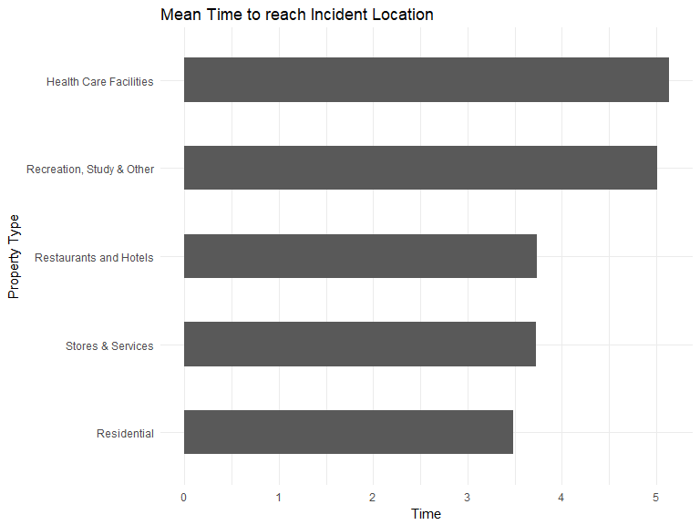

  
## 1. Location of Severe Fires  
  


```r
library(dplyr)
library(ggthemes)
library(ggplot2)
library(plotly)
library(leaflet)
library(readr)
library(RColorBrewer)
library(geosphere)
library(datetime)

#Read in the CSV Files

fires <- read_csv("severe_incidents.csv")

fires = fires[!(fires$Longitude=="-73.349799"),]
fires = fires[!(fires$Longitude=="-78.8653985"),]
fires = fires[!(fires$Longitude=="-74.8161585"),]
fires = subset(fires,Longitude >= -74.6768 & fires$Longitude <= -73.2816 & Latitude >= 40.4114 &  Latitude <= 40.9820)

#print (nrow(fires))

content <- paste("Incident:",fires$INCIDENT_TYPE_DESC,"<br/>",
                 "Property Type:",fires$PROPERTY_USE_DESC,"<br/>",
                 "Address:",paste(fires$STREET_HIGHWAY,fires$ZIP_CODE,sep=" "),"<br/>",
                 "Borough:",fires$BOROUGH_DESC,"<br/>")
f <- leaflet(fires) %>% setView(lng = -74.0156491, lat = 40.7022541, zoom = 10) %>% addTiles('http://{s}.basemaps.cartocdn.com/light_all/{z}/{x}/{y}.png')

f %>% addCircles(col="Orange",popup = content)
```

<!--html_preserve--><div id="htmlwidget-4ac179a2f85f8c70aeee" style="width:768px;height:576px;" class="leaflet html-widget"></div>
<script type="application/json" data-for="htmlwidget-4ac179a2f85f8c70aeee">{"x":{"options":{"crs":{"crsClass":"L.CRS.EPSG3857","code":null,"proj4def":null,"projectedBounds":null,"options":{}}},"setView":[[40.7022541,-74.0156491],10,[]],"calls":[{"method":"addTiles","args":["http://{s}.basemaps.cartocdn.com/light_all/{z}/{x}/{y}.png",null,null,{"minZoom":0,"maxZoom":18,"maxNativeZoom":null,"tileSize":256,"subdomains":"abc","errorTileUrl":"","tms":false,"continuousWorld":false,"noWrap":false,"zoomOffset":0,"zoomReverse":false,"opacity":1,"zIndex":null,"unloadInvisibleTiles":null,"updateWhenIdle":null,"detectRetina":false,"reuseTiles":false}]},{"method":"addCircles","args":[[40.7896311,40.6537806,40.8376726,40.75533,40.7475915,40.713269,40.8145029,40.6255401,40.8365982,40.5741456,40.7530101,40.6909905,40.693022,40.830181,40.6846619,40.8228961,40.8253285,40.7161881,40.5778906,40.6271013,40.6915487,40.6277816,40.8547742,40.8376726,40.83306,40.8068287,40.6785715,40.683317,40.680294,40.8272518,40.7609205,40.6909686,40.6157166,40.66307,40.7087988,40.6431272,40.7120711,40.8520482,40.6580404,40.6891808,40.892043,40.650969,40.6688844,40.611838,40.7747911,40.629294,40.7123586,40.6325086,40.7518389,40.6938168,40.6785162,40.7792193,40.696354,40.8640865,40.6440977,40.6497724,40.6256834,40.6656761,40.6586479,40.7074026,40.7124464,40.767267,40.7995653,40.7293961,40.798945,40.8341233,40.7482299,40.684389,40.8750651,40.6760051,40.7005923,40.6125807,40.8312965,40.5898361,40.697747,40.8736964,40.7601572,40.8515529,40.678848,40.6440977,40.6981779,40.6832555,40.5977813,40.689161,40.6375197,40.7600597,40.6127771,40.767267,40.6675125,40.6911099,40.8343783,40.6022332,40.6824413,40.7232838,40.7362842,40.8200893,40.8463347,40.6532915,40.7972632,40.694572,40.5898389,40.6462579,40.6468818,40.6965612,40.7672719,40.7667646,40.8802474,40.694746,40.711801,40.681758,40.7021768,40.5987408,40.8272518,40.8956007,40.8252681,40.5925568,40.8660651,40.68221,40.593487,40.7736925,40.7176171,40.6192922,40.6341186,40.6695654,40.6644738,40.763368,40.704881,40.7428947,40.8360928,40.69195,40.828552,40.765359,40.6083482,40.6233405,40.664997,40.662835,40.6978113,40.6821237,40.7756059,40.680385,40.7133423,40.8310945,40.5954985,40.6115795,40.6764516,40.675037,40.8411102,40.8259061,40.6250008,40.7660942,40.6813005,40.767267,40.6997926,40.7477997,40.5890391,40.7157032,40.7370037,40.6902272,40.6429175,40.7412434,40.695845,40.7183857,40.8245652,40.6947808,40.75533,40.8283767,40.6263234,40.5689688,40.7064678,40.8445717,40.6288924,40.6234886,40.6798838,40.6331944,40.6580404,40.8062714,40.6331944,40.7507757,40.6366274,40.618243,40.6624144,40.8376036,40.8263483,40.6385162,40.7178006,40.8444033,40.8706786,40.6697368,40.8443458,40.8878455,40.6975765,40.7908156,40.6159856,40.8681819,40.6817799,40.6536517,40.6879578,40.5936492,40.8339028,40.7591376,40.8864651,40.808055,40.6879475,40.7416224,40.830575,40.8696771,40.6799111,40.6911099,40.628564,40.6698156,40.712734,40.8402557,40.8714368,40.6323294,40.720046,40.6263679,40.6719316,40.8252492,40.7494974,40.7027385,40.7005923,40.7988378,40.7403608,40.726162,40.8624708,40.8043683,40.623915,40.8231519,40.620722,40.6644957,40.67763,40.7851039,40.8415353,40.6762072,40.797988,40.6709946,40.759637,40.6323136,40.6656761,40.7175758,40.6736824,40.8652023,40.7149319,40.7704844,40.7512121,40.6664226,40.6878827,40.8785105,40.7431861,40.8003236,40.731623,40.6672244,40.6414276,40.7320289,40.8789858,40.6903067,40.6775066,40.7190683,40.764625,40.5955409,40.8852213,40.7217896,40.664997,40.6673735,40.890244,40.7620774,40.766016,40.6386713,40.643285,40.794316,40.7334788,40.8272518,40.8450485,40.6759771,40.7240626,40.7206075,40.7426633,40.7817204,40.6795789,40.69541,40.645458,40.617534,40.8514876,40.6644957,40.7883666,40.6492793,40.7152154,40.7859096,40.678758,40.7458025,40.647344,40.6155781,40.6498807,40.79725,40.7148199,40.690334,40.79935,40.6715889,40.7589541,40.8322246,40.745063,40.8161056,40.7381375,40.5954985,40.7597616,40.8167638,40.7385115,40.6639572,40.7709869,40.7838194,40.679317,40.7636563,40.7896311,40.6735749,40.6166187,40.5885832,40.7040377,40.752913,40.8684188,40.5834881,40.7294057,40.692968,40.8514876,40.7432938,40.6714824,40.6696857,40.6289688,40.8459533,40.697053,40.6733229,40.8262866,40.703688,40.682232,40.6431288,40.8650373,40.6959468,40.5351171,40.6602674,40.7654129,40.7019871,40.6715773,40.6792777,40.5754975,40.5839354,40.603877,40.7390042,40.7047981,40.7004948,40.7498942,40.7678433,40.7564494,40.8339028,40.6027214,40.6032709,40.8789203,40.5859899,40.6859721,40.6706614,40.7144349,40.705253,40.7737724,40.810014,40.8272518,40.669217,40.70689,40.6142588,40.6325086,40.8395224,40.728672,40.728672,40.6945993,40.8424821,40.773813,40.7678433,40.7641402,40.6654891,40.690405,40.6699273,40.6294744,40.6672244,40.7942847,40.675828,40.8578912,40.67087,40.685806,40.7936179,40.6431272,40.765359,40.688928,40.7367202,40.7090269,40.686619,40.6468818,40.705534,40.6826611,40.7037981,40.7584332,40.8299163,40.8603573,40.7123672,40.8624708,40.7621935,40.8610395,40.7250728,40.647905,40.7320289,40.5986499,40.708944,40.711757,40.7352956,40.7088212,40.6257285,40.828552,40.8525255,40.5955794,40.7954774,40.6763835,40.8519846,40.7175486,40.831622,40.6318492,40.6387292,40.697801,40.8296624,40.7504266,40.6487614,40.6674677,40.6589793,40.8231982,40.8517966,40.695139,40.645106,40.767267,40.7306517,40.7507095,40.6975388,40.6764563,40.7245847,40.6504055,40.8465512,40.699736,40.8641484,40.798945,40.6254938,40.7641402,40.7305359,40.6810973,40.7697512,40.7747911,40.834184,40.6537806,40.664827,40.680236,40.6911686,40.6995541,40.7311286,40.7275967,40.704876,40.655555,40.8129648,40.828552,40.6761071,40.654427,40.6689702,40.6761749,40.5449269,40.8145502,40.618243,40.630023,40.6806645,40.6710418,40.7722387,40.8179282,40.688535,40.6412196,40.7812786,40.7915751,40.6368996,40.7654129,40.7654129,40.684358,40.6043649,40.7469705,40.7314293,40.6976238,40.750294,40.7457829,40.5938867,40.8488503,40.8448026,40.6979208,40.7658305,40.7271055,40.639854,40.7427209,40.6682201,40.7076534,40.5971315,40.559889,40.6832555,40.6913821,40.8084815,40.7523188,40.5487711,40.6263234,40.6935602,40.6953611,40.7015019,40.813845,40.8939239,40.7250601,40.8798952,40.614782,40.699808,40.7272605,40.8211329,40.6329817,40.750276,40.7994739,40.6887901,40.7517421,40.8425918,40.6982354,40.6045554,40.8561652,40.6644869,40.7398435,40.8531747,40.8430514,40.7906046,40.6439853,40.6634371,40.848957,40.7272842,40.6745504,40.6385162,40.6883972,40.798781,40.8721708,40.7869987,40.8871345,40.6675125,40.8084815,40.8206448,40.8180736,40.7020844,40.7875785,40.7464661,40.7988378,40.6717858,40.7857376,40.8156548,40.6674798,40.6663616,40.6551346,40.8312965,40.7947798,40.7473337,40.6472084,40.6930761,40.8098689,40.6498807,40.6320152,40.5822632,40.7378448,40.6333991,40.705413,40.8457618,40.6815494,40.6638578,40.747196,40.5643669,40.6768203,40.7717443,40.7623502,40.6117127,40.5504971,40.5765475,40.8157688,40.7024398,40.6698261,40.5826684,40.6486479,40.6690587,40.7001484,40.605946,40.8486926,40.713269,40.6717858,40.869135,40.8514908,40.5883873,40.6012563,40.6385162,40.7041269,40.68024,40.5558469,40.6099786,40.7501752,40.5971315,40.6947925,40.6698261,40.8482605,40.79935,40.8222748,40.671774,40.69394,40.6488379,40.7507757,40.7055303,40.849323,40.6352975,40.7173989,40.8303174,40.7988378,40.743778,40.738445,40.6424793,40.646738,40.6941104,40.6541536,40.7073943,40.7462516,40.763368,40.7092667,40.729446,40.7293685,40.8469612,40.8743665,40.6617965,40.6493774,40.857538,40.6261768,40.7169701,40.8344303,40.733398,40.6686015,40.8256843,40.70303,40.7173109,40.8111677,40.7376317,40.6556633,40.6430688,40.8182115,40.7641402,40.8421711,40.8253285,40.6389001,40.7235068,40.702313,40.8516539,40.6643667,40.752857,40.8369441,40.8339028,40.7250728,40.8395224,40.8365951,40.7584332,40.7636234,40.5878084,40.8023095,40.8253285,40.8253285,40.8404447,40.6989682,40.6208557,40.6704332,40.6779802,40.7058722,40.766016,40.6808089,40.6879475,40.831137,40.8096932,40.657945,40.747243,40.6647137,40.5950465,40.6329817,40.6736824,40.8283767,40.8030321,40.6276706,40.6576614,40.847287,40.6360225,40.8272518,40.593149,40.697053,40.6775334,40.858386,40.6795789,40.7927713,40.7259303,40.745952,40.6639572,40.6643667,40.6941331,40.7792193,40.831622,40.6794385,40.8029919,40.8258196,40.7679183,40.7263608,40.7153245,40.806408,40.8241559,40.6708734,40.742261,40.8150973,40.6690558,40.673916,40.712734,40.5643721,40.6233405,40.5558534,40.6886668,40.7123906,40.592559,40.663069,40.7654129,40.6797237,40.786213,40.8557533,40.6785162,40.680569,40.8885459,40.6072025,40.6973197,40.6081078,40.62206,40.6423101,40.8285133,40.8870855,40.7280972,40.8387288,40.6598588,40.8489321,40.8895068,40.7657168,40.6870006,40.8224895,40.708214,40.5930865,40.7520899,40.760861,40.6148089,40.7412434,40.7362903,40.8166377,40.608797,40.74655,40.703543,40.8472474,40.9179949,40.8285133,40.8285133,40.828641,40.8523427,40.8145502,40.7634937,40.6720265,40.6598384,40.8477599,40.6441019,40.7046077,40.7487467,40.7095145,40.672837,40.672667,40.6490992,40.7656661,40.643285,40.5485488,40.5870827,40.8743242,40.8595729,40.6988892,40.8145029,40.838928,40.8841897,40.766016,40.670589,40.706237,40.7345398,40.688535,40.7329588,40.7032599,40.6046529,40.8714368,40.683771,40.6211937,40.8087289,40.6407044,40.7714126,40.6914285,40.6232075,40.8977024,40.7024398,40.8600348,40.7242841,40.8387288,40.5444206,40.714069,40.6730326,40.7669761,40.6691924,40.8159328,40.6723159,40.633516,40.699801,40.5794801,40.7370037,40.5998457,40.7472355,40.5826684,40.7383645,40.6806645,40.8487726,40.604486,40.5825499,40.6333453,40.6134788,40.7128658,40.7280054,40.752381,40.7115017,40.680294,40.7656661,40.8236587,40.7718639,40.5906398,40.6227937,40.8741761,40.6467217,40.5700062,40.8743665,40.7011587,40.692902,40.8056135,40.763368,40.6653055,40.684001,40.622585,40.8382585,40.587104,40.824944,40.767267,40.6648752,40.7278553,40.6028516,40.7994169,40.695289,40.8260012,40.7417814,40.7432937,40.72866,40.8182385,40.8118668,40.7747911,40.7362278,40.7117748,40.7120711,40.6462657,40.8451638,40.6900255,40.6902493,40.699819,40.790896,40.7657168,40.6720828,40.6374242,40.6933574,40.7040438,40.6752022,40.7261938,40.7019274,40.6688844,40.718648,40.8435424,40.8703483,40.6980091,40.6443876,40.8426459,40.7646961,40.6900255,40.7246172,40.6624144,40.7353898,40.7157032,40.682584,40.637755,40.8517966,40.7360172,40.6782401,40.7168029,40.8289769,40.8624708,40.8707745,40.8593361,40.6255924,40.652109,40.703747,40.8317579,40.7041208,40.7631584,40.7743404,40.7765182,40.749791,40.6997926,40.729446,40.8344303,40.8261291,40.718941,40.7194779,40.6607154,40.6342269,40.7100676,40.6372235,40.7136408,40.683154,40.6300412,40.830575,40.7609205,40.6257285,40.7010602,40.8163934,40.6362546,40.8275641,40.6074203,40.714295,40.7185365,40.7781416,40.8451505,40.7184121,40.7161881,40.8489876,40.6681067,40.7524816,40.7184892,40.740787,40.7789217,40.5837297,40.8411102,40.8697672,40.7608261,40.8627963,40.8298737,40.8538777,40.6879475,40.7609205,40.6872234,40.6955795,40.8203177,40.8516688,40.7665848,40.6916468,40.6904832,40.857538,40.6432112,40.7320369,40.8428815,40.692889,40.790896,40.67921,40.713269,40.664827,40.8456993,40.794316,40.7328809,40.6644957,40.7869151,40.6109061,40.618113,40.8273936,40.6768991,40.6710418,40.8115224,40.6321936,40.6886668,40.8134276,40.5839688,40.820536,40.6848064,40.8739816,40.7384705,40.8053365,40.8231982,40.6150916,40.7422562,40.7534898,40.748801,40.7849942,40.7329221,40.6216239,40.686323,40.8376726,40.7432937,40.870562,40.7064935,40.7164701,40.7804359,40.7581416,40.7273161,40.7126574,40.7209004,40.713269,40.6093424,40.6909905,40.6551008,40.6768236,40.6759771,40.5792193,40.7267622,40.7050871,40.7507757,40.7118647,40.9206623,40.7301456,40.7789952,40.8305358,40.6769442,40.6390582,40.646738,40.683038,40.715766,40.767532,40.8272518,40.833213,40.6864673,40.7543987,40.897626,40.596324,40.6301639,40.68024,40.6647137,40.8231295,40.7261134,40.6921695,40.7101324,40.828296,40.7275248,40.7772491,40.8341233,40.6461399,40.7248137,40.5857119,40.7032286,40.765874,40.6727524,40.7634937,40.830181,40.7599095,40.6955497,40.631034,40.644514,40.6353312,40.6112501,40.7076534,40.6461346,40.7538674,40.790998,40.6366274,40.8216621,40.8663153,40.7174081,40.677303,40.7066508,40.8267557,40.6094882,40.6749963,40.8432448,40.8652468,40.5610776,40.6796276,40.7757218,40.8415353,40.6356541,40.7507095,40.59973,40.706758,40.6063299,40.7075969,40.6835961,40.7115017,40.6706903,40.8139962,40.6564949,40.682308,40.8446428,40.7054161,40.7092667,40.7751216,40.5525017,40.6598217,40.5952746,40.8176818,40.636097,40.8268321,40.747765,40.8106086,40.7240626,40.539421,40.7048245,40.7328746,40.6739875,40.6646102,40.699736,40.8496021,40.8373589,40.7837168,40.7293685,40.7146301,40.8477319,40.7497177,40.6713087,40.8376726,40.6638578,40.8376726,40.7583563,40.6350203,40.8520482,40.7540642,40.641745,40.7060006,40.7313474,40.70968,40.6064816,40.8555207,40.6796276,40.6387292,40.8663153,40.8001992,40.6168401,40.6234544,40.762107,40.8406087,40.7023572,40.701404,40.729446,40.681211,40.8278208,40.8259447,40.6389508,40.6772872,40.6333453,40.605069,40.6766472,40.7132956,40.8221704,40.6321887,40.8669013,40.6879475,40.7267125,40.6768203,40.8672693,40.8154643,40.5780091,40.8504173,40.7752992,40.871423,40.7527625,40.6416829,40.7554039,40.7550402,40.5552269,40.858386,40.8290247,40.684001,40.704825,40.6885626,40.6706903,40.627833,40.6107365,40.818462,40.7554773,40.8122959,40.8320331,40.589285,40.6959468,40.767532,40.695956,40.7124318,40.7362278,40.8349665,40.683154,40.7486451,40.7749409,40.67301,40.7032959,40.8241065,40.8277784,40.7506175,40.7095639,40.7335212,40.7208775,40.838014,40.689354,40.6981779,40.7187073,40.8438329,40.7405375,40.8182115,40.6333101,40.8044031,40.5792193,40.764077,40.8557533,40.6973134,40.7396527,40.682077,40.6512331,40.6516145,40.6674798,40.8377179,40.6204,40.673916,40.7588646,40.603877,40.6770756,40.6189018,40.7779595,40.6320152,40.6267789,40.6663103,40.8023095,40.7579032,40.663818,40.7161,40.8432448,40.7320289,40.6630258,40.6568598,40.834009,40.8392298,40.680312,40.8392298,40.8264347,40.7896311,40.6303834,40.7736925,40.6462657,40.8459533,40.7770587,40.7145257,40.7131237,40.7852539,40.6996768,40.587976,40.6134331,40.8560877,40.840195,40.7152403,40.7059678,40.7339528,40.6735145,40.6597606,40.6389001,40.620131,40.652192,40.7299553,40.690405,40.6044395,40.69538,40.8268321,40.9035599,40.6411325,40.6064568,40.7591565,40.8661734,40.708542,40.5457563,40.6064568,40.7284627,40.6897086,40.6643667,40.6501766,40.6267789,40.8119081,40.5741456,40.7326097,40.6536036,40.8461516,40.8408568,40.7563257,40.6191944,40.6914285,40.733016,40.6369565,40.7230614,40.571728,40.7736925,40.8239304,40.7374733,40.7163828,40.6753358,40.8799393,40.6063299,40.7583563,40.7116977,40.7736711,40.6841283,40.6374784,40.7292376,40.7217267,40.6846619,40.8704351,40.6748242,40.6064568,40.7010204,40.8129648,40.6655332,40.5748797,40.6061616,40.7169131,40.7168212,40.773813,40.6874929,40.6874929,40.6784022,40.7022571,40.618585,40.7782237,40.830503,40.8883378,40.6761024,40.7263496,40.6287633,40.6360425,40.6685763,40.7279634,40.8989352,40.7135157,40.7779595,40.6751974,40.7628454,40.6840453,40.6867667,40.740787,40.629385,40.7390042,40.7601784,40.7235064,40.7019274,40.5806558,40.688245,40.6122987,40.6956898,40.7040202,40.7030717,40.580723,40.6913821,40.7255879,40.8068287,40.7033756,40.6586479,40.706597,40.6888543,40.713655,40.84147,40.8428815,40.798945,40.7025075,40.6508471,40.7908156,40.6323644,40.7608224,40.7591565,40.7802844,40.6490992,40.5926796,40.5560714,40.683742,40.8663153,40.6648458,40.7616323,40.7293685,40.646738,40.6885626,40.8684188,40.635318,40.618644,40.6287633,40.7804471,40.6485533,40.810843,40.6659664,40.6208304,40.6368786,40.6359604,40.6193242,40.6331944,40.7349548,40.6701536,40.6522995,40.6780731,40.6441151,40.8842045,40.703115,40.669543,40.7772491,40.7437594,40.6955795,40.8395224,40.7453976,40.708127,40.8557565,40.7110193,40.6334757,40.6574649,40.8637976,40.8287372,40.6978195,40.7002225,40.7331191,40.7145257,40.679097,40.6689702,40.6562894,40.6760371,40.6072025,40.700187,40.8200893,40.7096559,40.8030321,40.6392915,40.8409932,40.6597606,40.8245652,40.8043683,40.6502296,40.68323,40.8929633,40.7281603,40.7634937,40.6785162,40.831624,40.6706903,40.8312965,40.5955794,40.7197594,40.6720265,40.7458918,40.8275641,40.8130561,40.7927713,40.6471387,40.5497768,40.7020412,40.6635409,40.7482299,40.7326097,40.7361492,40.6411723,40.7024398,40.7653898,40.8884724,40.7466763,40.7082657,40.6516145,40.85277,40.8784403,40.704881,40.6223666,40.8478503,40.5451312,40.701553,40.8287552,40.8285984,40.744031,40.8531747,40.7348847,40.7073943,40.5010869,40.8741761,40.8107804,40.6481094,40.6296178,40.6420002,40.8353918,40.6680968,40.7890023,40.8259021,40.6337817,40.6468818,40.6609752,40.7101325,40.7233958,40.6255401,40.6580417,40.773813,40.7559092,40.667653,40.57654,40.7507757,40.5673593,40.7075969,40.5625625,40.7258739,40.806408,40.752857,40.625115,40.7191315,40.7624101,40.70823,40.7534898,40.8253285,40.7187442,40.7583563,40.8273936,40.6696791,40.8025058,40.6960035,40.8003236,40.7288781,40.6508249,40.7293961,40.7184755,40.6202587,40.699028,40.7262313,40.7589541,40.7777048,40.8362532,40.702705,40.7365564,40.6078381,40.8157958,40.7815475,40.7143082,40.6022332,40.8770007,40.846506,40.6078078,40.7092667,40.7992319,40.7190145,40.6512331,40.8140898,40.5552269,40.6705445,40.8167638,40.8455046,40.680294,40.7355638,40.6431272,40.8626711,40.6866976,40.6382714,40.7501276,40.7104657,40.6458021,40.6315493,40.654196,40.5507875,40.702259,40.695956,40.699736,40.7739746,40.7326097,40.605069,40.6695654,40.6562187,40.616488,40.6313073,40.7665848,40.6374784,40.6349248,40.6420339,40.7638942,40.6685356,40.7271043,40.7167367,40.7233561,40.602048,40.6221837,40.7053865,40.7002048,40.6485533,40.69321,40.5826684,40.7638942,40.6261555,40.7381375,40.7583563,40.7608924,40.7386908,40.8275641,40.752857,40.709534,40.8134932,40.608797,40.6681067,40.530183,40.8852213,40.813727,40.678694,40.699736,40.7171876,40.7149514,40.7128658,40.8277062,40.6785113,40.7608924,40.790998,40.7597616,40.7352119,40.5973925,40.6664226,40.7817476,40.6923953,40.6044712,40.8341875,40.753474,40.6263679,40.7367202,40.8584228,40.8842749,40.7145257,40.5961147,40.743688,40.8915118,40.8626711,40.6797237,40.70908,40.6320152,40.6959468,40.6006927,40.7255915,40.700169,40.6752372,40.643285,40.8209947,40.8054183,40.608797,40.7048055,40.618243,40.7616404,40.8228961,40.7126587,40.7742944,40.7630596,40.6159856,40.6639572,40.618243,40.8627253,40.5987408,40.767532,40.5987408,40.6424292,40.605946,40.6785162,40.7403608,40.865449,40.706237,40.6427988,40.5952418,40.6888543,40.621032,40.6466888,40.6332284,40.7462516,40.5741456,40.674757,40.7132217,40.7200386,40.6256834,40.6751974,40.6823907,40.5765475,40.8268321,40.7938457,40.7580838,40.7560558,40.8526857,40.6190599,40.7559092,40.6690587,40.5489726,40.8341875,40.7143082,40.7396689,40.6447554,40.6808948,40.593149,40.8441394,40.8488465,40.626886,40.60032,40.7654129,40.6255401,40.6913821,40.7608261,40.618794,40.8044031,40.8075129,40.8180594,40.712734,40.6431288,40.7155738,40.8203235,40.5583359,40.711801,40.7405375,40.6891808,40.8196006,40.688535,40.7896482,40.8628472,40.63581,40.8558189,40.8332882,40.7705947,40.6981779,40.6329817,40.683086,40.6695262,40.5953639,40.8127206,40.8362187,40.8681819,40.692831,40.6659664,40.637755,40.6325086,40.7490692,40.6675125,40.8360928,40.5814726,40.6316525,40.8313939,40.650706,40.6608871,40.6301015,40.70621,40.8241559,40.8217268,40.6318701,40.8552648,40.6956898,40.7267977,40.8256524,40.8283281,40.7082522,40.8584038,40.8313035,40.8341233,40.5643669,40.5390227,40.7065725,40.6879827,40.7778563,40.629006,40.5899815,40.6653055,40.6447554,40.7082284,40.6775066,40.6630185,40.5935963,40.6093424,40.7458471,40.7781416,40.5961734,40.7717443,40.7739133,40.6028314,40.6012266,40.8727853,40.6743731,40.7410705,40.6709946,40.6413111,40.8310945,40.6082574,40.6664954,40.6498807,40.6885422,40.6823907,40.7045598,40.5992839,40.810843,40.660826,40.83363,40.8111677,40.699736,40.8684188,40.6096202,40.676449,40.79725,40.6726018,40.7683708,40.6516145,40.808055,40.760861,40.7069436,40.6609752,40.7169291,40.6345952,40.713269,40.7808121,40.7679106,40.7531456,40.7642415,40.7675028,40.5874526,40.8341233,40.6301639,40.695791,40.7120892,40.693823,40.612487,40.6316969,40.7625684,40.77818,40.6027499,40.7745134,40.8068287,40.7371882,40.7115017,40.692902,40.6773215,40.6447451,40.7308661,40.7529668,40.8461516,40.8446428,40.8663153,40.7355638,40.748484,40.809098,40.695587,40.6905434,40.824889,40.6420002,40.6879475,40.629735,40.6826611,40.5935637,40.6755331,40.759478,40.666259,40.6536517,40.6233405,40.6792777,40.8452162,40.8272518,40.835502,40.7658562,40.766016,40.6221146,40.6870422,40.7615144,40.670001,40.6708992,40.8259021,40.7942847,40.8672693,40.682914,40.7239497,40.7532711,40.703234,40.7101325,40.608309,40.6616371,40.7285977,40.7620774,40.8511229,40.745156,40.6416461,40.618254,40.6762072,40.7378077,40.7262882,40.689161,40.8158845,40.6496021,40.7410673,40.7851039,40.7113899,40.6726114,40.7204318,40.6655332,40.6889575,40.6516145,40.6221146,40.8714368,40.692346,40.7005049,40.6738334,40.6042819,40.7213974,40.6996768,40.7305597,40.6799111,40.8092586,40.7299748,40.695719,40.708127,40.6146394,40.6516546,40.7095639,40.7168847,40.6255924,40.6738334,40.7987854,40.7278553,40.7406196,40.6553516,40.6229985,40.6165191,40.8667868,40.752913,40.7190145,40.777504,40.6784022,40.899206,40.8451638,40.7607892,40.681521,40.63496,40.8751735,40.619249,40.8824932,40.8172698,40.7292376,40.6863928,40.691737,40.6522995,40.750276,40.6629444,40.6720669,40.8244569,40.683751,40.7082375,40.8849782,40.7339528,40.6300412,40.7536531,40.6461346,40.7875785,40.6685763,40.6062222,40.6016326,40.8211329,40.6532915,40.6639572,40.8426459,40.8377179,40.6691924,40.712798,40.613613,40.7789085,40.8516539,40.72441,40.7641748,40.6245355,40.7916801,40.6387181,40.5520911,40.5520911,40.6340272,40.8659738,40.6502296,40.6609752,40.537285,40.7804359,40.5569742,40.6263519,40.700548,40.7230124,40.8884769,40.6624144,40.6654891,40.5910174,40.7576055,40.7404792,40.7168847,40.8939239,40.9206623,40.684668,40.7421612,40.7602267,40.6405477,40.7432937,40.6934375,40.658504,40.8211329,40.7280054,40.6687934,40.8377728,40.5992839,40.6255401,40.754091,40.8328527,40.8650996,40.731644,40.6423101,40.8241065,40.7636234,40.5782396,40.7548147,40.8272518,40.6430097,40.733398,40.8520482,40.7040202,40.6727437,40.6102789,40.5984009,40.688245,40.6242551,40.8268559,40.7653068,40.7000492,40.7272456,40.6817799,40.7096644,40.5946224,40.7271055,40.7064761,40.8023804,40.7524986,40.8780219,40.8145029,40.7088522,40.6640832,40.6127771,40.7352119,40.8484295,40.6013708,40.689354,40.875393,40.672818,40.7123672,40.7503043,40.8654142,40.7439539,40.8882255,40.6839015,40.8433825,40.6995541,40.6537806,40.6313026,40.693573,40.6941104,40.693161,40.6190599,40.6250705,40.7164701,40.6793184,40.705046,40.8068287,40.696376,40.7175758,40.5545781,40.6941661,40.6654394,40.7340911,40.7069168,40.6287633,40.618553,40.6046104,40.8320331,40.6262732,40.7178343,40.6682201,40.8115341,40.6287633,40.8401202,40.6851356,40.5761121,40.6915487,40.769164,40.730722,40.8904293,40.6955501,40.681521,40.7450136,40.5103735,40.681842,40.7890023,40.6749963,40.8738176,40.757517,40.9035599,40.5940322,40.8073044,40.6191944,40.6502893,40.75814,40.7922522,40.7114079,40.8660651,40.7267125,40.7167288,40.6988381,40.8000771,40.8672693,40.620299,40.5285001,40.7205088,40.70303,40.7507757,40.6763001,40.6954644,40.8470225,40.6738334,40.722338,40.7436253,40.6631068,40.7058634,40.662835,40.7770587,40.6496021,40.6331944,40.7355362,40.7458762,40.7153934,40.6321887,40.6580404,40.9055337,40.6866044,40.7140602,40.6786643,40.6493774,40.6516145,40.824283,40.7581251,40.8551175,40.7454534,40.7253112,40.9055337,40.790998,40.6123951,40.753474,40.7628658,40.630336,40.760446,40.6793184,40.762801,40.6720828,40.69691,40.7593502,40.6622426,40.5914496,40.8272518,40.6316969,40.806408,40.7500842,40.6675125,40.6928842,40.6237545,40.7608224,40.643152,40.7628658,40.580222,40.6127252,40.7588061,40.6474779,40.8182385,40.7792665,40.5959518,40.8421837,40.6620054,40.8301514,40.7096559,40.7646896,40.626711,40.6287633,40.6368996,40.815846,40.6426696,40.6644957,40.6951507,40.6586479,40.8006353,40.7124464,40.7099525,40.6072025,40.8843959,40.6709931,40.7988378,40.6523754,40.7545714,40.6357624,40.6407044,40.680294,40.848957,40.6280227,40.722181,40.6100814,40.7660682,40.7685007,40.6646417,40.6155986,40.6424292,40.6989682,40.7301735,40.6904108,40.899455,40.7457167,40.6324248,40.8663153,40.7868424,40.7146555,40.8529008,40.6213905,40.8774778,40.8342393,40.5938517,40.8339028,40.641745,40.6086933,40.7238572,40.7588061,40.852119,40.5525375,40.7750344,40.763524,40.7915751,40.6766939,40.8295571,40.6731881,40.7315386,40.744009,40.8663153,40.6741919,40.5808716,40.6728948,40.8171409,40.6236767,40.783266,40.6768236,40.8175144,40.8216621,40.7728489,40.7006937,40.712734,40.830181,40.6487614,40.790998,40.8477319,40.8654374,40.704082,40.734791,40.6785162,40.832374,40.655555,40.6537806,40.6768236,40.6102703,40.7295445,40.6306844,40.6708734,40.628564,40.7361492,40.6340272,40.6545334,40.6611692,40.6674061,40.6917829,40.6852363,40.7001484,40.7707671,40.6639572,40.6745829,40.798945,40.790896,40.7187073,40.7646405,40.7493631,40.767267,40.7048245,40.8075129,40.859157,40.6690242,40.5267669,40.8885497,40.802373,40.8284364,40.7540172,40.7649838,40.628263,40.8447807,40.6257285,40.8416518,40.744009,40.5868744,40.8471956,40.7436253,40.6946376,40.6328349,40.6343884,40.6874929,40.608797,40.6697915,40.754707,40.6395331,40.694968,40.7598871,40.8401258,40.7773266,40.6244003,40.8286684,40.6955795,40.663189,40.6629444,40.831622,40.75533,40.7115625,40.8290547,40.7584749],[-73.94006,-73.956165,-73.8654793,-73.991177,-73.9980082,-73.962081,-73.9554427,-74.0925066,-73.9431735,-73.9891318,-73.8773249,-73.9351495,-73.916257,-73.86406,-73.9790047,-73.9509114,-73.9438167,-73.9865604,-73.9609477,-73.932626,-73.9367547,-74.1211208,-73.8504053,-73.8654793,-73.848147,-73.9174895,-73.9162994,-73.7774044,-73.7545931,-73.9386949,-73.9886647,-73.8143855,-73.9091408,-73.8946201,-73.852385,-73.9054201,-73.7764355,-73.9224459,-73.8901334,-73.9095042,-73.858116,-73.976976,-73.8931265,-74.1384478,-73.9089965,-74.028678,-73.8917096,-74.1374066,-73.9946789,-73.7860061,-73.9639049,-73.9809561,-73.9406945,-73.8924176,-73.9668924,-73.9233941,-74.0301806,-73.8932513,-73.923936,-73.9599578,-73.7398097,-73.9841435,-73.9657474,-73.9980108,-73.9423635,-73.9166594,-73.8634053,-73.986564,-73.8847428,-73.7761177,-73.9428911,-73.9357927,-73.8817387,-73.9296076,-73.754669,-73.9040198,-73.8194193,-73.8620863,-73.866083,-73.9668924,-73.9869842,-73.9845664,-73.7835231,-73.992623,-74.0842046,-73.8233077,-73.939683,-73.9841435,-73.8642554,-73.9169362,-73.8906495,-73.7541611,-73.8804866,-73.9825451,-73.9181725,-73.8561946,-73.8608071,-73.9387889,-73.940519,-73.9561384,-73.8045878,-73.9308123,-73.949147,-73.8280562,-73.9210862,-73.9388098,-73.8549625,-73.785671,-73.942228,-73.816943,-73.8163559,-73.7660256,-73.9386949,-73.8389915,-73.8566642,-73.9879849,-73.9224986,-73.9057905,-73.943484,-73.9456902,-73.8117522,-73.9483698,-73.945864,-73.8831719,-73.9051748,-73.95924,-73.944389,-73.8828342,-73.9159082,-73.730665,-73.9422999,-73.9875868,-74.0905372,-73.9559516,-73.9881325,-73.9261458,-73.908023,-73.864994,-73.80379,-73.7578529,-74.0129181,-73.9070236,-73.7782169,-73.9945951,-73.9741058,-73.8699132,-73.9398447,-73.9393239,-74.0304542,-73.9077028,-73.9556916,-73.9841435,-73.7785755,-73.9029142,-73.9445784,-73.9858054,-73.8249982,-73.9072915,-74.083768,-73.8694985,-73.908799,-73.9928301,-73.9480977,-73.8477376,-73.991177,-73.9028321,-74.0328637,-74.1339733,-73.9607713,-73.9153079,-74.118532,-74.0851262,-73.8078643,-73.995162,-73.8901334,-73.9201784,-73.995162,-73.9744533,-74.0241926,-73.9840732,-73.9098626,-73.9275652,-73.9146987,-74.0099788,-73.9852709,-73.8829191,-73.9182743,-73.9874678,-73.9011339,-73.855372,-73.9496477,-73.9764719,-74.0814171,-73.8887972,-73.9238936,-73.933049,-73.9419305,-74.1001259,-73.908766,-73.9902683,-73.8510567,-73.929314,-73.825011,-73.99375,-73.9415003,-73.8850215,-73.9141379,-73.9169362,-74.028976,-73.9841189,-73.9890414,-73.8877444,-73.867155,-74.0942439,-73.9553481,-74.0298737,-73.9141333,-73.94761,-73.7755853,-73.744143,-73.9428911,-73.9538699,-73.8973652,-73.8214161,-73.9224251,-73.9353288,-74.00726,-73.8948779,-74.020296,-73.9769418,-73.894388,-73.9769031,-73.8807245,-74.0069476,-73.961981,-73.9847943,-73.8823053,-74.1603606,-73.8932513,-73.7524538,-74.0043837,-73.8238286,-73.8166315,-73.7401518,-73.7630287,-73.9368983,-73.9072304,-73.8710001,-73.778728,-73.9322644,-73.856597,-73.9224614,-74.086807,-73.8158011,-73.8616449,-73.9682473,-73.9470022,-74.0064401,-73.871773,-73.7582909,-73.8793521,-73.9998669,-73.9881325,-73.98781,-73.860298,-73.9186877,-73.9852394,-74.0745703,-73.8924971,-73.96276,-73.9974473,-73.9386949,-73.9130614,-73.8949325,-73.7967066,-73.9047847,-73.9320841,-73.9490041,-73.9783093,-73.741002,-74.006368,-74.0807883,-73.9144786,-73.9769418,-73.9745459,-73.9436024,-73.8066231,-73.7844452,-73.813461,-73.8854808,-74.007988,-74.0337281,-73.9340916,-73.968038,-73.9980331,-73.9920503,-73.9474324,-73.88019,-73.8428948,-73.9445251,-73.9786216,-73.9142894,-74.0060301,-73.7782169,-73.9898077,-73.8647469,-73.9844382,-73.9102483,-73.986982,-73.9799099,-73.787288,-73.8808847,-73.94006,-73.952937,-74.1004474,-74.1463682,-74.0115969,-73.9061839,-73.8925258,-73.9708328,-73.7873784,-73.825103,-73.9144786,-73.9001059,-73.9475632,-73.882362,-74.1371852,-73.8986402,-73.75733,-73.7757158,-73.925671,-73.885026,-73.89486,-73.9506703,-73.9269562,-73.9376266,-74.2383854,-73.8682244,-73.889979,-73.8099833,-73.7517409,-73.955294,-73.9910583,-73.9484803,-73.995429,-73.7337013,-73.9618598,-73.7441142,-73.8549676,-73.7731953,-73.8587667,-73.908766,-74.0025837,-73.9960724,-73.8750607,-73.81657,-73.9266708,-73.7480597,-73.759986,-73.925335,-73.9120261,-73.804705,-73.9386949,-73.9846192,-73.759894,-73.9688702,-74.1374066,-73.8833435,-73.9984634,-73.9984634,-73.9750276,-73.8875485,-73.9561806,-73.7731953,-73.9866172,-73.7523447,-73.805741,-73.8806939,-73.9444744,-73.9224614,-73.951114,-73.9165529,-73.8910777,-73.781422,-73.832577,-73.9494987,-73.9054201,-73.9875868,-73.836346,-73.9857331,-73.7578318,-73.869155,-73.949147,-73.738038,-73.9100217,-73.8234535,-73.9688967,-73.8984806,-73.9015992,-73.9849007,-73.9224251,-73.9936126,-73.8309465,-73.9812178,-74.007405,-73.8158011,-73.978934,-73.941759,-73.7956319,-73.987819,-73.8004512,-73.9276178,-73.9422999,-73.9000091,-73.7645918,-73.965616,-73.85177,-73.9101781,-73.9993157,-73.847812,-74.152217,-74.0133644,-73.8081373,-73.94437,-73.9691367,-73.9349125,-73.9395878,-73.7272481,-73.8894936,-73.9092138,-73.740136,-74.010319,-73.9841435,-73.9830602,-73.9176667,-73.8877695,-73.9585526,-73.8503228,-73.9253925,-73.9015238,-73.9096327,-73.8985704,-73.9423635,-73.9585374,-73.9866172,-74.0017279,-73.808211,-73.9605925,-73.9089965,-73.878572,-73.956165,-73.767003,-73.750831,-73.8636772,-73.8324548,-73.91812,-73.9852947,-73.955704,-73.8840548,-73.9498725,-73.9422999,-73.8488327,-73.7367681,-73.906674,-73.9513004,-74.1485346,-73.886497,-73.9840732,-74.02838,-73.9496252,-73.9392515,-73.9259369,-73.9381524,-73.9434948,-73.9644311,-73.9779421,-73.9446725,-73.9110521,-73.889979,-73.889979,-73.832112,-74.1667368,-73.7571222,-73.738295,-73.9849705,-73.9967693,-73.9996309,-73.7963187,-73.9083114,-73.8609559,-73.8406704,-73.9819269,-73.9467217,-74.0121899,-73.9845919,-73.9871039,-74.0117945,-73.952211,-74.1069421,-73.9845664,-73.9253448,-73.9448985,-73.739344,-74.1874717,-74.0328637,-73.9649995,-73.7940565,-73.9859472,-73.8021306,-73.8497765,-73.8048103,-73.8805823,-73.9106038,-73.768584,-73.8532226,-73.9088655,-73.9978155,-73.8187618,-73.9553784,-73.9835656,-73.9707907,-73.8523022,-73.9029918,-73.7418829,-73.8975291,-73.8959198,-74.000602,-73.9056095,-73.8828574,-73.946429,-74.0114771,-73.8975741,-73.8904375,-73.993628,-73.8036154,-74.0099788,-73.9511754,-73.9379413,-73.8631858,-73.8091359,-73.8557585,-73.8642554,-73.9448985,-73.9177149,-73.9253907,-74.0126306,-73.9788249,-73.9439002,-73.9538699,-73.9054393,-73.9764445,-73.9062439,-73.9562295,-73.9522086,-73.9163354,-73.8817387,-73.9766245,-73.8693524,-73.9557204,-73.9091696,-73.9030954,-73.9340916,-73.941755,-73.8208159,-73.8761959,-73.9109175,-73.73413,-73.8798454,-73.8622574,-73.9517458,-73.86032,-74.1319105,-73.900047,-73.9632455,-73.9151518,-74.1607133,-74.1750834,-73.9999077,-73.8171714,-73.9871631,-73.8867682,-74.0842712,-73.9223355,-73.9366628,-73.912192,-74.0004772,-73.9032682,-73.962081,-73.9054393,-73.865281,-73.9391197,-73.9505275,-73.9993631,-74.0099788,-73.9099238,-73.946749,-74.2016273,-73.9624499,-73.8952934,-73.952211,-73.8477427,-73.8867682,-73.9097514,-73.9474324,-73.8424933,-73.9364146,-73.858108,-73.9330007,-73.9744533,-73.9636908,-73.8594304,-73.9156034,-73.7589493,-73.8717897,-73.9538699,-73.8862069,-73.878235,-73.900729,-73.909434,-73.960156,-73.9499329,-73.968393,-74.0015494,-73.95924,-73.7754397,-73.8610772,-73.8477683,-73.918635,-73.863791,-73.766833,-73.9055537,-73.9096246,-73.9218433,-73.9418146,-73.9266205,-73.87507,-73.7451,-73.8991314,-73.9038982,-73.8492715,-73.9614732,-73.9851673,-73.9598737,-73.9516563,-73.8541532,-73.9866172,-73.9429382,-73.9438167,-74.0167625,-73.9811917,-73.784775,-73.9156201,-73.9074554,-73.9929789,-73.9271227,-73.908766,-73.9812178,-73.8833435,-73.9393254,-73.9688967,-73.9636868,-74.1923175,-73.9532967,-73.9438167,-73.9438167,-73.9403262,-73.944096,-73.9036911,-73.9281875,-73.7840498,-73.9653437,-73.9852394,-73.8748741,-73.825011,-73.9174546,-73.9253951,-73.9368599,-73.8310566,-73.899803,-73.7845305,-73.9978155,-74.0043837,-73.9028321,-73.936328,-74.0832664,-73.9532225,-73.8993097,-74.1443499,-73.9386949,-73.925472,-73.75733,-73.9637207,-73.8906237,-73.9783093,-73.97133,-73.8164878,-73.998009,-73.9102483,-73.9074554,-73.9057844,-73.9809561,-73.847812,-73.8682313,-73.9638477,-73.9157313,-73.9284808,-73.983319,-73.8008252,-73.9186323,-73.891913,-73.91979,-73.890698,-73.9194287,-73.87667,-73.873115,-73.9890414,-74.1159703,-73.9559516,-74.1346215,-73.9619203,-73.8037852,-73.9715673,-73.985893,-73.889979,-74.0101098,-73.9496313,-73.8854348,-73.9639049,-73.892328,-73.8549785,-73.8208033,-73.7620707,-73.7541296,-73.967572,-74.0132276,-73.8801113,-73.9041614,-73.9864832,-73.9270824,-73.8313889,-73.9422581,-73.8452362,-73.9761894,-73.8283597,-73.8110266,-73.959679,-73.7982003,-73.8818841,-73.9668663,-74.0799652,-73.8694985,-73.9371233,-73.9428531,-74.1536392,-73.864903,-73.922331,-73.9368648,-73.8956178,-73.8801113,-73.8801113,-73.853429,-73.8644105,-73.886497,-73.9889648,-73.8605755,-73.91878,-73.895621,-73.9565748,-73.8101685,-73.7085711,-73.9433319,-73.7483755,-73.77737,-73.9464782,-73.8374283,-73.8924971,-74.1577963,-73.8138691,-73.8245523,-73.8874273,-73.796048,-73.9554427,-73.87623,-73.8336069,-73.9852394,-73.9476457,-73.9641218,-73.8106947,-73.9434948,-73.801258,-73.8901156,-73.9465472,-73.867155,-73.9262221,-74.0290066,-73.8849627,-73.9523828,-73.8178092,-73.8126799,-73.9571409,-73.872719,-73.9871631,-73.9086178,-73.898448,-73.9270824,-74.1739916,-73.9900165,-73.9057506,-73.9168932,-73.8856896,-73.9431183,-73.8930328,-74.026951,-73.746775,-73.9419211,-73.8249982,-73.9682156,-73.9991249,-74.0842712,-73.9820398,-73.9496252,-73.8939852,-73.9749052,-73.9636141,-74.0947318,-74.1030323,-73.8014838,-73.8481715,-73.9742534,-73.7909874,-73.7545931,-73.8374283,-73.8938913,-73.9576012,-73.94975,-74.1652396,-73.8258419,-73.9081822,-73.8644731,-73.863791,-73.8052658,-73.805504,-73.9255888,-73.95924,-73.9931399,-73.950299,-73.962796,-73.8365619,-74.091681,-73.820508,-73.9841435,-73.7834447,-73.9761186,-73.9629869,-73.9374899,-73.943388,-73.9005191,-73.9823575,-73.9211468,-73.9095655,-73.9168002,-73.8954395,-73.9089965,-73.722525,-73.9997,-73.7764355,-73.8965501,-73.9075203,-73.9304732,-73.9481901,-73.9848612,-73.9451536,-73.9761894,-73.9419418,-73.8972198,-73.9341197,-73.8964732,-73.9194087,-73.9586676,-73.881,-73.8931265,-73.7955234,-73.8432577,-73.8555654,-73.744023,-73.8797637,-73.9104556,-73.7261973,-73.9304732,-73.8910095,-73.9098626,-73.7597707,-73.9858054,-73.788854,-74.007206,-73.9092138,-73.997813,-73.9405515,-73.8200282,-73.8764098,-73.9224251,-73.8944343,-73.8552809,-73.9314961,-74.017381,-73.954442,-73.8180132,-73.9158559,-73.7861669,-73.8431696,-73.9528276,-73.9084766,-73.7785755,-73.8610772,-73.9266205,-73.8218713,-73.956535,-73.9863391,-73.9466908,-74.0847179,-73.7843173,-74.0185115,-73.796534,-73.9792436,-73.982368,-73.9415003,-73.9886647,-73.9276178,-73.9465648,-73.9483483,-74.0794912,-73.8671927,-74.1175832,-73.9939834,-73.9477009,-73.9544957,-73.8851481,-73.9882771,-73.9865604,-73.8503429,-73.7339739,-73.756081,-73.9223613,-73.7134989,-73.8223106,-73.9605921,-73.9398447,-73.8415662,-73.8039109,-73.9084559,-73.8552757,-73.9147369,-73.825011,-73.9886647,-73.8275399,-73.9327595,-73.9399316,-73.9160001,-73.9846419,-73.9239143,-73.9878747,-73.9096246,-73.903066,-74.0024827,-73.8785713,-73.753752,-73.9451536,-73.9280339,-73.962081,-73.767003,-73.8894105,-73.96276,-73.7994597,-73.9769418,-73.9775615,-74.0090295,-73.959107,-73.9251143,-73.9359257,-73.9392515,-73.9034522,-73.9389225,-73.9619203,-73.88524,-74.0871212,-73.8470898,-73.7313459,-73.9027462,-73.8737046,-73.9356786,-73.8894936,-73.9643849,-73.8531958,-73.9729575,-73.750442,-73.9151081,-73.800377,-74.0886167,-73.9744535,-73.8654793,-73.9211468,-73.8449961,-73.7847092,-73.9570296,-73.949897,-73.8165257,-74.0071492,-73.7638008,-73.995751,-73.962081,-74.006085,-73.9351495,-73.9346418,-73.8683964,-73.8949325,-73.9819464,-73.8487465,-73.7741562,-73.9744533,-73.7996071,-73.787364,-74.0058883,-73.7822193,-73.9032431,-73.7541352,-73.955985,-73.909434,-73.926095,-73.7377386,-73.8270488,-73.9386949,-73.8994401,-73.8158142,-73.9732125,-73.85624,-74.0671162,-74.0007419,-73.946749,-73.899803,-73.9505135,-73.9984096,-73.9824974,-73.8408388,-73.861717,-73.9978625,-73.9824378,-73.9166594,-73.9327156,-74.0111217,-73.8088963,-73.8071528,-73.9573957,-73.7693911,-73.9889648,-73.86406,-73.8316067,-73.7438898,-73.9094074,-73.7473579,-74.1253614,-74.1341889,-74.0117945,-73.9591952,-73.8720535,-73.9421653,-74.0241926,-73.861132,-73.8927783,-73.9339369,-73.80456,-73.7392285,-73.9375027,-74.0842439,-73.808538,-73.9391899,-73.8679186,-74.1613512,-73.9356355,-73.9338854,-73.8807245,-74.0768859,-73.9176667,-73.9691316,-73.941399,-73.9964726,-73.8165963,-73.8268178,-73.7909874,-73.8907167,-73.909835,-73.9530996,-73.925946,-73.93872,-73.9022465,-73.7754397,-73.8474545,-74.1542458,-73.9264759,-74.1042493,-73.898521,-74.0010439,-73.9415319,-73.982957,-73.8534618,-73.7967066,-74.1652642,-73.812774,-73.9563918,-73.8010598,-73.8950177,-73.9096327,-73.9326296,-73.8876616,-73.9141864,-73.8477683,-74.0096768,-73.9162128,-73.9973251,-73.7828401,-73.8654793,-73.9517458,-73.8654793,-73.9903747,-74.1382819,-73.9224459,-73.9152771,-74.013814,-74.008801,-73.9825664,-74.010962,-73.7552298,-73.8406395,-73.9356355,-74.0133644,-73.8927783,-73.9650421,-74.0349011,-73.9549182,-73.9274975,-73.8296706,-73.8187541,-73.918572,-73.8610772,-73.922406,-73.9259438,-73.8859034,-73.9880308,-73.7716985,-74.0947318,-73.942771,-73.9181996,-73.958356,-73.9521101,-74.1167513,-73.8500285,-73.825011,-73.8986573,-73.900047,-73.8692022,-73.904374,-73.9530931,-73.8569959,-73.9536403,-73.866145,-73.9751147,-74.0805481,-73.9794756,-73.9708212,-74.1120594,-73.8906237,-73.9448489,-73.950299,-73.924586,-73.9301862,-73.8907167,-74.029275,-74.1440399,-73.9433135,-73.8246999,-73.909427,-73.9159057,-73.9319934,-73.9376266,-73.8270488,-73.742734,-73.7481101,-73.722525,-73.9190264,-73.9792436,-73.9707525,-73.8135847,-73.8133274,-74.00625,-73.8210246,-73.9457596,-73.9871896,-73.7911422,-73.7976207,-73.986555,-73.868236,-73.936321,-73.9869842,-73.9908008,-73.8879061,-73.759221,-73.8541532,-74.1616495,-73.9372212,-73.9819464,-73.8670503,-73.8854348,-73.9322753,-73.7921397,-73.777614,-74.0106468,-73.9333061,-73.9562295,-73.9399956,-73.960486,-73.873115,-73.8168597,-73.995429,-73.793166,-73.9002097,-73.9880174,-73.941755,-73.946878,-73.7796281,-73.9532967,-73.8604253,-73.9111661,-73.79374,-73.9391899,-73.8158011,-73.9400108,-73.8851687,-73.84098,-73.8666681,-73.83713,-73.8666681,-73.9405896,-73.94006,-73.943491,-73.9456902,-73.8965501,-73.8986402,-73.9890502,-73.9443863,-73.7674396,-73.8411689,-73.8111353,-73.7947956,-73.971261,-73.8861202,-73.8305555,-74.0054243,-73.9421261,-73.9546438,-73.8758792,-73.9199635,-74.0167625,-73.985693,-73.732086,-73.9880663,-73.805741,-74.1337851,-73.830581,-73.9415319,-73.8548211,-73.9046734,-73.9745974,-73.9670062,-73.88731,-73.927407,-74.1788737,-73.9745974,-74.0053451,-73.8034796,-73.9074554,-73.9291978,-73.946878,-73.9101925,-73.9891318,-73.9876848,-74.0032573,-73.8418832,-73.9397731,-73.9699991,-74.1066624,-73.8126799,-73.9935743,-74.0832479,-73.9115834,-74.0907441,-73.9456902,-73.8948616,-73.9198446,-74.0012118,-73.7337986,-73.8662446,-73.9964726,-73.9903747,-73.8170316,-73.9837235,-73.8156274,-73.9931614,-73.9771539,-73.9848505,-73.9790047,-73.8432277,-73.8936743,-73.9745974,-73.9481277,-73.9498725,-73.9370026,-73.9941892,-73.9051746,-73.7417196,-73.9977594,-73.9561806,-73.9329582,-73.9329582,-73.9486606,-73.7489872,-73.9424109,-73.9041558,-73.861619,-73.8517116,-73.7458197,-73.8229783,-73.9182572,-73.9125377,-73.9868078,-73.9881305,-73.897094,-73.9886069,-73.9880174,-73.8734214,-73.9389158,-73.8467911,-73.8291877,-73.7134989,-74.13033,-73.7337013,-73.967329,-73.9792916,-73.881,-74.1343856,-73.8239836,-74.0341134,-73.967345,-73.9397347,-73.9569864,-73.958303,-73.9253448,-73.989893,-73.9174895,-73.8126296,-73.923936,-73.943086,-73.8466225,-73.8196712,-73.7863905,-73.8785713,-73.9423635,-73.956354,-73.9485975,-73.9764719,-73.9952509,-73.8307509,-73.9670062,-73.9514614,-73.9464782,-74.0802896,-74.2006578,-73.7695642,-73.8927783,-73.8988837,-73.9101826,-73.8477683,-73.909434,-73.9301862,-73.8925258,-74.023235,-73.974866,-73.9182572,-73.7849674,-73.9240781,-73.95068,-73.9020319,-74.0818995,-74.1163111,-74.1214836,-73.9206184,-73.995162,-73.8997711,-73.9821898,-73.9401333,-73.9441766,-73.8774771,-73.8660899,-73.92158,-73.911662,-73.9824378,-73.706747,-73.9327595,-73.8833435,-73.9794201,-73.9111765,-73.9316556,-73.7942482,-74.1634122,-73.9445257,-73.9025314,-73.9101751,-73.8956825,-73.8086661,-73.9758174,-73.9443863,-73.798215,-73.906674,-73.9357175,-73.8720675,-73.8208033,-73.9908136,-73.8561946,-73.9963521,-73.936328,-73.984101,-73.8307544,-73.9199635,-73.9480977,-73.9353288,-73.9282622,-73.907126,-73.861014,-73.739311,-73.9889648,-73.9639049,-73.867258,-73.8907167,-73.8817387,-73.7645918,-73.8436824,-73.8605755,-73.9869224,-73.8671927,-73.9081702,-73.97133,-74.0046192,-74.1397897,-73.8886348,-73.9335647,-73.8634053,-73.9876848,-73.9790623,-73.9857061,-73.9871631,-73.9857026,-73.8303507,-73.8748906,-73.9551147,-73.9333061,-73.892167,-73.8803897,-73.944389,-73.9647787,-73.8903989,-74.1666178,-73.8771045,-73.8772968,-73.8791716,-73.858681,-73.9056095,-73.8066038,-73.968393,-74.2516134,-73.8258419,-73.9525943,-74.0107685,-73.9424768,-73.8988312,-73.9178637,-73.9735839,-73.9740865,-73.8887809,-74.1230263,-73.949147,-73.889199,-73.9445168,-73.9340362,-74.0925066,-73.920597,-73.9561806,-73.9944915,-73.885297,-73.9572673,-73.9744533,-74.0990361,-73.8165963,-73.9139053,-73.9416896,-73.9186323,-73.9929789,-74.0807339,-73.8520791,-73.7951972,-73.94164,-73.9729575,-73.9438167,-73.7779405,-73.9903747,-73.9251143,-73.7498377,-73.9088066,-73.9464199,-73.9322644,-73.8220439,-73.94909,-73.9980108,-74.0021904,-73.9417836,-73.916223,-73.9317814,-73.8428948,-73.9183219,-73.853219,-73.9500199,-74.0058348,-73.9619154,-73.9389112,-73.9583152,-73.7819783,-73.7541611,-73.8991768,-73.8856209,-73.759194,-73.7754397,-73.9558284,-74.0008184,-74.0106468,-73.9020286,-74.1120594,-73.8208667,-73.8647469,-73.9029302,-73.7545931,-73.7165515,-73.9054201,-73.9076505,-73.9268351,-74.1350888,-73.9461276,-73.7372871,-73.9601883,-73.9957317,-73.9220305,-74.1501518,-73.920075,-73.742734,-73.9096327,-73.9310472,-73.9876848,-73.942771,-73.8831719,-73.9187743,-74.022815,-74.1552634,-73.9846419,-73.9931614,-73.994962,-74.0877116,-73.9149929,-73.7419254,-73.8631165,-73.9589105,-73.9957261,-73.9480171,-73.9038005,-73.938755,-73.9538913,-73.9240781,-73.971872,-74.0842712,-73.9149929,-73.9819445,-74.0060301,-73.9903747,-73.9085946,-73.8046086,-73.8671927,-73.9929789,-73.964027,-73.9588772,-74.1536392,-73.7339739,-74.1862199,-73.8793521,-73.9595814,-74.013527,-73.9096327,-73.9801753,-74.0096945,-73.8014838,-73.9114894,-73.9970691,-73.9085946,-73.9421653,-73.9898077,-73.8738251,-74.1622274,-73.9368983,-73.9510075,-73.7314507,-73.9087335,-73.9095987,-73.992528,-74.0298737,-73.9857331,-73.8556336,-73.8624273,-73.9443863,-73.7766028,-73.8870833,-73.836454,-73.9076505,-74.0101098,-73.957488,-73.941755,-73.9376266,-73.9603651,-73.8996058,-73.909204,-73.8008646,-73.8924971,-73.8958907,-73.9656807,-74.1536392,-73.7727391,-73.9840732,-73.9884489,-73.9509114,-73.9900231,-73.9832222,-73.8379593,-74.0814171,-73.9102483,-73.9840732,-73.9022948,-73.7660256,-73.8270488,-73.7660256,-73.9617419,-74.0004772,-73.9639049,-73.8973652,-73.866342,-73.9641218,-73.9794365,-73.7637309,-73.8466225,-74.010257,-73.9541271,-74.1652068,-74.0015494,-73.9891318,-73.9110633,-73.7357705,-73.7575102,-74.0301806,-73.8734214,-73.8766171,-73.9999077,-73.9415319,-73.9440652,-73.9241548,-73.9616049,-73.9191233,-74.0348057,-73.9944915,-73.9366628,-74.1801811,-73.9095987,-73.7819783,-73.8517331,-74.0142628,-73.8713531,-73.925472,-73.8203651,-73.9320295,-73.945877,-73.9428862,-73.889979,-74.0925066,-73.9253448,-73.8039109,-74.012584,-73.9372212,-73.9170241,-73.8621871,-73.9890414,-73.9506703,-74.0093595,-73.9228924,-74.1175218,-73.942228,-73.759221,-73.9095042,-73.9217582,-73.9434948,-73.9717387,-73.8472741,-73.9017542,-73.8826742,-73.9140965,-73.9585348,-73.9869842,-73.9978155,-73.854148,-73.788894,-73.8009353,-73.9019618,-73.9073341,-73.8887972,-73.79516,-73.9020319,-74.007206,-74.1374066,-73.9969217,-73.8642554,-73.9159082,-73.9757493,-74.1467554,-73.8681616,-74.00449,-73.9094681,-73.9712955,-73.939598,-73.891913,-73.8210105,-74.075993,-73.8922573,-73.967345,-73.7857489,-73.8813605,-73.9509245,-73.7486147,-73.892996,-73.9290391,-73.9166594,-74.1319105,-74.2348102,-73.8065597,-73.8052879,-73.7506781,-73.991212,-73.9556725,-73.9931399,-74.0142628,-74.0065358,-73.9470022,-73.839801,-73.7766513,-74.006085,-74.0018474,-73.9544957,-73.7757824,-73.9632455,-73.9842913,-73.7657504,-73.9131273,-73.8634266,-73.843092,-73.9997129,-73.9847943,-73.7781391,-73.9070236,-73.7492286,-73.7694337,-73.9340916,-73.8229309,-73.8766171,-73.9165969,-73.9780191,-73.95068,-73.9506442,-73.9261465,-73.9614732,-73.9096327,-73.8925258,-73.74895,-73.864537,-73.968038,-73.9627541,-73.9821294,-73.9333061,-73.929314,-73.9668663,-73.8753751,-73.889199,-74.0091299,-74.1819311,-73.962081,-73.9274086,-73.9813036,-73.8726024,-73.7753371,-73.9030605,-73.8120701,-73.9166594,-74.0007419,-73.759278,-73.9884895,-73.9431,-74.1663941,-74.1622558,-73.949366,-73.956546,-73.9639138,-73.9158084,-73.9174895,-73.9056081,-73.7909874,-73.805504,-73.807595,-74.0991567,-73.8605118,-73.8605253,-73.8418832,-73.93872,-73.8927783,-73.7165515,-73.860989,-73.9526499,-73.920767,-73.8239196,-73.9114049,-73.8988312,-73.825011,-73.940538,-73.9100217,-73.9286448,-73.8173588,-73.866012,-73.876953,-73.933049,-73.9559516,-73.955294,-73.8212543,-73.9386949,-73.8846664,-73.9632002,-73.9852394,-73.8261492,-73.8580115,-73.883592,-73.778586,-73.9531942,-73.8887809,-73.951114,-73.8692022,-73.946727,-73.8386716,-73.9749084,-73.7362094,-73.9445168,-73.7551537,-73.9647487,-73.9876718,-73.9186877,-73.8443778,-73.8732963,-73.9780257,-74.02636,-74.0069476,-73.8783059,-73.9803296,-73.992623,-73.855145,-73.9679311,-73.9978679,-73.9769031,-73.9827281,-73.9190887,-73.9998628,-73.9370026,-73.7620478,-73.9333061,-73.8261492,-73.867155,-73.804688,-73.7811834,-73.9083822,-74.1227489,-73.9837535,-73.8111353,-73.8905585,-73.9141379,-73.9474577,-73.726885,-73.753759,-73.9111765,-73.9367995,-74.0045464,-73.7911422,-74.0107864,-73.9314961,-73.9083822,-73.9658493,-73.9761186,-73.7213241,-73.8308366,-73.9590505,-74.141602,-73.9084389,-73.9061839,-74.0008184,-73.9549428,-73.9486606,-73.865092,-73.9075203,-73.9734963,-73.8923275,-73.892354,-73.8375024,-73.970936,-73.8802141,-73.9424014,-73.9771539,-73.7824434,-73.914002,-73.9401333,-73.8187618,-73.953778,-73.9905279,-73.9497648,-73.8397945,-73.843987,-73.8620357,-73.9546438,-73.982368,-73.8629677,-73.9591952,-73.9788249,-73.9868078,-73.7597779,-73.9518433,-73.9088655,-73.9387889,-73.9102483,-73.9104556,-73.9399956,-73.8856896,-73.9586624,-73.9119031,-73.9582618,-73.9156201,-73.9958677,-73.9847444,-74.077031,-73.8398577,-74.1687633,-74.114892,-74.114892,-73.9502225,-73.9200805,-73.9282622,-73.889199,-74.1505721,-73.949897,-74.1043011,-73.9190132,-73.917068,-74.0050623,-73.9100416,-73.9098626,-73.7523447,-73.8906091,-73.7708644,-74.0001448,-74.0107864,-73.8497765,-73.787364,-73.964033,-73.9870435,-73.8118521,-73.9556779,-73.9211468,-73.9967044,-73.844548,-73.9088655,-73.8481715,-73.8775764,-73.9420692,-73.9780191,-74.0925066,-73.992079,-73.8744441,-73.9218805,-74.0060051,-74.0132276,-73.8210246,-73.9636868,-73.9521495,-73.9758316,-73.9386949,-73.963828,-73.87507,-73.9224459,-73.9397347,-73.8720436,-74.183492,-73.9601849,-73.8239836,-74.1382653,-73.9225509,-73.9638425,-73.7413534,-74.0006983,-73.9238936,-74.0048258,-74.0702163,-73.9467217,-74.0082297,-73.9525956,-73.8269005,-73.832023,-73.9554427,-73.8596335,-73.8881241,-73.939683,-73.8738251,-73.9060276,-73.9764678,-73.936321,-73.8733905,-73.781826,-73.9849007,-73.8095799,-73.8529114,-73.8574583,-73.8332194,-73.9609365,-73.9049591,-73.8324548,-73.956165,-73.999565,-73.922748,-73.960156,-73.8091556,-74.0348057,-74.0736698,-73.9570296,-73.7478869,-73.903031,-73.9174895,-73.789004,-73.7524538,-74.1706409,-73.7862636,-73.8190077,-74.0084927,-73.8618987,-73.9182572,-74.080001,-73.9982719,-73.9159057,-74.1169076,-73.7515977,-73.9871039,-73.9426533,-73.9182572,-73.8887858,-73.8205948,-74.1905191,-73.9367547,-73.9962592,-73.880061,-73.903948,-73.7856609,-73.8923275,-73.7866227,-74.2496876,-73.783577,-73.9740865,-73.808538,-73.8186586,-73.9689605,-73.8548211,-74.0947051,-73.9542245,-74.1066624,-73.9273025,-73.9937104,-73.9462817,-73.796432,-73.9224986,-73.8986573,-73.9438923,-73.914072,-73.9371189,-73.8692022,-73.9614276,-74.1583158,-73.9051991,-73.9038982,-73.9744533,-73.8081024,-73.734883,-73.8980633,-73.9083822,-73.8098604,-73.6580927,-73.915875,-73.8317036,-73.9261458,-73.9890502,-73.9679311,-73.995162,-73.986602,-73.9121398,-74.0026315,-74.1167513,-73.8901334,-73.9002214,-73.973511,-73.7947411,-73.7717716,-73.9055537,-73.9333061,-73.8242494,-73.9891415,-73.892836,-73.9814397,-73.7496537,-73.9002214,-73.9421653,-74.0659469,-73.992528,-73.9894109,-73.993413,-73.9050667,-73.7478869,-73.965671,-73.9419418,-73.78701,-73.9198034,-73.8771981,-74.0929217,-73.9386949,-74.1622558,-73.9186323,-73.8352436,-73.8642554,-73.9210812,-73.9341323,-73.8307509,-73.975467,-73.9894109,-73.957523,-74.0850018,-73.872541,-73.9704907,-73.9168002,-73.9151287,-73.7389265,-73.9096429,-73.9126937,-73.8918607,-73.9963521,-73.9643068,-74.00435,-73.9182572,-73.9110521,-73.952868,-73.9086747,-73.9769418,-73.97422,-73.923936,-73.9543231,-73.7398097,-73.9280086,-73.8208033,-73.8523717,-73.8737632,-73.9538699,-73.8913823,-73.9716804,-73.9948506,-73.9523828,-73.7545931,-73.8904375,-74.0763857,-74.0066904,-74.0073163,-73.977029,-73.8937881,-73.9370796,-74.0248288,-73.9617419,-73.944096,-73.9944561,-73.813223,-73.8725896,-73.9781195,-73.9983981,-73.8927783,-73.9452772,-73.8429015,-73.9327519,-74.0801616,-73.8425883,-73.8739309,-73.7591081,-73.908766,-74.013814,-74.0243203,-73.9173028,-73.872541,-73.849422,-74.1995509,-73.9665424,-73.9870734,-73.9446725,-73.996828,-73.8687206,-73.8142346,-73.8261657,-73.999422,-73.8927783,-73.8620833,-74.1619244,-73.9782437,-73.947877,-73.9254354,-73.9507404,-73.8683964,-73.9529521,-73.861132,-73.7391109,-73.7832084,-73.9890414,-73.86406,-73.9349125,-73.9421653,-73.9162128,-73.8538268,-73.738118,-73.7201577,-73.9639049,-73.8926669,-73.8840548,-73.956165,-73.8683964,-74.0017501,-73.8985441,-73.9454015,-73.91979,-74.028976,-73.9790623,-73.9502225,-73.8768171,-73.9183129,-73.9861278,-73.9412407,-73.7607673,-73.912192,-73.923291,-73.9102483,-73.7560793,-73.9423635,-73.9451536,-73.9908008,-73.9322383,-73.9193699,-73.9841435,-73.812774,-73.9170241,-73.9275303,-73.7707948,-74.1682465,-73.8322822,-73.964301,-73.8810511,-73.9483979,-73.7668941,-73.999149,-73.9084777,-73.9276178,-73.8722181,-73.999422,-73.9569745,-73.8317639,-73.6580927,-73.9807197,-74.0059408,-74.0917326,-73.9329582,-74.1536392,-73.8924047,-73.991633,-74.1194925,-73.808341,-73.7247821,-73.8870326,-73.9862967,-74.0802696,-73.8782345,-73.9327595,-73.9372943,-73.953778,-73.847812,-73.991177,-73.9447527,-73.874445,-73.8221195],10,null,null,{"lineCap":null,"lineJoin":null,"clickable":true,"pointerEvents":null,"className":"","stroke":true,"color":"Orange","weight":5,"opacity":0.5,"fill":true,"fillColor":"Orange","fillOpacity":0.2,"dashArray":null},["Incident: 100 - Fire, other <br/> Property Type: 429 - Multifamily dwelling <br/> Address: 1 AVE 10029 <br/> Borough: 1 - Manhattan <br/>","Incident: 117 - Commercial Compactor fire, confined to rubbish <br/> Property Type: 429 - Multifamily dwelling <br/> Address: BEDFORD AVE 11225 <br/> Borough: 4 - Brooklyn <br/>","Incident: 111 - Building fire <br/> Property Type: 429 - Multifamily dwelling <br/> Address: THIERIOT AVE 10460 <br/> Borough: 2 - Bronx <br/>","Incident: 111 - Building fire <br/> Property Type: 162 - Bar or nightclub <br/> Address: W 39 ST 10018 <br/> Borough: 1 - Manhattan <br/>","Incident: 100 - Fire, other <br/> Property Type: 429 - Multifamily dwelling <br/> Address: W 26 ST 10001 <br/> Borough: 1 - Manhattan <br/>","Incident: 100 - Fire, other <br/> Property Type: 429 - Multifamily dwelling <br/> Address: BEDFORD AVE 11211 <br/> Borough: 4 - Brooklyn <br/>","Incident: 117 - Commercial Compactor fire, confined to rubbish <br/> Property Type: 429 - Multifamily dwelling <br/> Address: AMSTERDAM AVE 10027 <br/> Borough: 1 - Manhattan <br/>","Incident: 111 - Building fire <br/> Property Type: 429 - Multifamily dwelling <br/> Address: VICTORY BLVD 10301 <br/> Borough: 3 - Staten Island <br/>","Incident: 111 - Building fire <br/> Property Type: 429 - Multifamily dwelling <br/> Address: W 161 ST 10032 <br/> Borough: 1 - Manhattan <br/>","Incident: 117 - Commercial Compactor fire, confined to rubbish <br/> Property Type: 429 - Multifamily dwelling <br/> Address: SURF AVE 11224 <br/> Borough: 4 - Brooklyn <br/>","Incident: 111 - Building fire <br/> Property Type: 429 - Multifamily dwelling <br/> Address: 90 ST 11372 <br/> Borough: 5 - Queens <br/>","Incident: 111 - Building fire <br/> Property Type: 429 - Multifamily dwelling <br/> Address: VAN BUREN ST 11221 <br/> Borough: 4 - Brooklyn <br/>","Incident: 111 - Building fire <br/> Property Type: 500 - Mercantile, business, other <br/> Address: CENTRAL AVE 11221 <br/> Borough: 4 - Brooklyn <br/>","Incident: 111 - Building fire <br/> Property Type: 419 - 1 or 2 family dwelling <br/> Address: GLEASON AVE 10472 <br/> Borough: 2 - Bronx <br/>","Incident: 131 - Passenger vehicle fire <br/> Property Type: 965 - Vehicle parking area <br/> Address: ATLANTIC AVE 11217 <br/> Borough: 4 - Brooklyn <br/>","Incident: 111 - Building fire <br/> Property Type: 429 - Multifamily dwelling <br/> Address: HAMILTON PL 10031 <br/> Borough: 1 - Manhattan <br/>","Incident: 111 - Building fire <br/> Property Type: 429 - Multifamily dwelling <br/> Address: STNICHOLAS AVE 10031 <br/> Borough: 1 - Manhattan <br/>","Incident: 111 - Building fire <br/> Property Type: 500 - Mercantile, business, other <br/> Address: CLINTON ST 10002 <br/> Borough: 1 - Manhattan <br/>","Incident: 350 - Extrication, rescue, other <br/> Property Type: 174 - Rapid transit station <br/> Address: IND D BRIGHTONBEACH AVE 99999 <br/> Borough: 4 - Brooklyn <br/>","Incident: 111 - Building fire <br/> Property Type: 419 - 1 or 2 family dwelling <br/> Address: E 45 ST 11234 <br/> Borough: 4 - Brooklyn <br/>","Incident: 111 - Building fire <br/> Property Type: 429 - Multifamily dwelling <br/> Address: LAFAYETTE AVE 11221 <br/> Borough: 4 - Brooklyn <br/>","Incident: 111 - Building fire <br/> Property Type: 429 - Multifamily dwelling <br/> Address: CLOVE RD 10310 <br/> Borough: 3 - Staten Island <br/>","Incident: 111 - Building fire <br/> Property Type: 419 - 1 or 2 family dwelling <br/> Address: NARRAGANSETT AVE 10461 <br/> Borough: 2 - Bronx <br/>","Incident: 111 - Building fire <br/> Property Type: 500 - Mercantile, business, other <br/> Address: ARCHER ST 10460 <br/> Borough: 2 - Bronx <br/>","Incident: 111 - Building fire <br/> Property Type: 419 - 1 or 2 family dwelling <br/> Address: ELLIS AVE 10462 <br/> Borough: 2 - Bronx <br/>","Incident: 111 - Building fire <br/> Property Type: 419 - 1 or 2 family dwelling <br/> Address: E 138 ST 10454 <br/> Borough: 2 - Bronx <br/>","Incident: 111 - Building fire <br/> Property Type: 429 - Multifamily dwelling <br/> Address: SARATOGA AVE 11233 <br/> Borough: 4 - Brooklyn <br/>","Incident: 111 - Building fire <br/> Property Type: 419 - 1 or 2 family dwelling <br/> Address: 118 RD 11434 <br/> Borough: 5 - Queens <br/>","Incident: 130 - Mobile property (vehicle) fire, other <br/> Property Type: 900 - Outside or special property, other <br/> Address: MERRICK BLVD 11413 <br/> Borough: 5 - Queens <br/>","Incident: 117 - Commercial Compactor fire, confined to rubbish <br/> Property Type: 429 - Multifamily dwelling <br/> Address: DOUGLASS BLVD 10039 <br/> Borough: 1 - Manhattan <br/>","Incident: 111 - Building fire <br/> Property Type: 449 - Hotel/motel, commercial <br/> Address: W 47 ST 10036 <br/> Borough: 1 - Manhattan <br/>","Incident: 111 - Building fire <br/> Property Type: 419 - 1 or 2 family dwelling <br/> Address: 132 ST 11419 <br/> Borough: 5 - Queens <br/>","Incident: 111 - Building fire <br/> Property Type: 419 - 1 or 2 family dwelling <br/> Address: E 66 ST 11234 <br/> Borough: 4 - Brooklyn <br/>","Incident: 111 - Building fire <br/> Property Type: 429 - Multifamily dwelling <br/> Address: RIVERDALE AVE 11207 <br/> Borough: 4 - Brooklyn <br/>","Incident: 111 - Building fire <br/> Property Type: 419 - 1 or 2 family dwelling <br/> Address: 70 DR 11375 <br/> Borough: 5 - Queens <br/>","Incident: 111 - Building fire <br/> Property Type: 500 - Mercantile, business, other <br/> Address: GLENWOOD RD 11236 <br/> Borough: 4 - Brooklyn <br/>","Incident: 111 - Building fire <br/> Property Type: 419 - 1 or 2 family dwelling <br/> Address: 184 PL 11423 <br/> Borough: 5 - Queens <br/>","Incident: 111 - Building fire <br/> Property Type: 429 - Multifamily dwelling <br/> Address: RICHMAN PLZ 10453 <br/> Borough: 2 - Bronx <br/>","Incident: 111 - Building fire <br/> Property Type: 500 - Mercantile, business, other <br/> Address: PENNSYLVANIA AVE 11207 <br/> Borough: 4 - Brooklyn <br/>","Incident: 111 - Building fire <br/> Property Type: 419 - 1 or 2 family dwelling <br/> Address: COVERT ST 11207 <br/> Borough: 4 - Brooklyn <br/>","Incident: 111 - Building fire <br/> Property Type: 519 - Food and beverage sales, grocery store <br/> Address: WHITEPLAINS RD 10466 <br/> Borough: 2 - Bronx <br/>","Incident: 111 - Building fire <br/> Property Type: 429 - Multifamily dwelling <br/> Address: GREENWOOD AVE 11218 <br/> Borough: 4 - Brooklyn <br/>","Incident: 111 - Building fire <br/> Property Type: 429 - Multifamily dwelling <br/> Address: VERMONT ST 11207 <br/> Borough: 4 - Brooklyn <br/>","Incident: 100 - Fire, other <br/> Property Type: 700 - Manufacturing, processing <br/> Address: VICTORY BLVD 99999 <br/> Borough: 3 - Staten Island <br/>","Incident: 100 - Fire, other <br/> Property Type: 429 - Multifamily dwelling <br/> Address: 35 ST 11105 <br/> Borough: 5 - Queens <br/>","Incident: 111 - Building fire <br/> Property Type: 429 - Multifamily dwelling <br/> Address: 78 ST 11209 <br/> Borough: 4 - Brooklyn <br/>","Incident: 111 - Building fire <br/> Property Type: 900 - Outside or special property, other <br/> Address: METROPOLITAN AVE 11385 <br/> Borough: 5 - Queens <br/>","Incident: 111 - Building fire <br/> Property Type: 429 - Multifamily dwelling <br/> Address: PORT RICHMOND AVE 10302 <br/> Borough: 3 - Staten Island <br/>","Incident: 651 - Smoke scare, odor of smoke <br/> Property Type: 161 - Restaurant or cafeteria <br/> Address: W 33 ST 10001 <br/> Borough: 1 - Manhattan <br/>","Incident: 111 - Building fire <br/> Property Type: 419 - 1 or 2 family dwelling <br/> Address: 166 ST 11433 <br/> Borough: 5 - Queens <br/>","Incident: 111 - Building fire <br/> Property Type: 900 - Outside or special property, other <br/> Address: WASHINGTON AVE 11238 <br/> Borough: 4 - Brooklyn <br/>","Incident: 111 - Building fire <br/> Property Type: 160 - Eating, drinking places, other <br/> Address: W 73 ST 10023 <br/> Borough: 1 - Manhattan <br/>","Incident: 111 - Building fire <br/> Property Type: 429 - Multifamily dwelling <br/> Address: GARVEY BLVD 11206 <br/> Borough: 4 - Brooklyn <br/>","Incident: 100 - Fire, other <br/> Property Type: 429 - Multifamily dwelling <br/> Address: E 193 ST 10458 <br/> Borough: 2 - Bronx <br/>","Incident: 111 - Building fire <br/> Property Type: 419 - 1 or 2 family dwelling <br/> Address: ARGYLE RD 11218 <br/> Borough: 4 - Brooklyn <br/>","Incident: 111 - Building fire <br/> Property Type: 419 - 1 or 2 family dwelling <br/> Address: E 57 ST 11203 <br/> Borough: 4 - Brooklyn <br/>","Incident: 111 - Building fire <br/> Property Type: 419 - 1 or 2 family dwelling <br/> Address: 83 ST 11209 <br/> Borough: 4 - Brooklyn <br/>","Incident: 111 - Building fire <br/> Property Type: 429 - Multifamily dwelling <br/> Address: NEW JERSEY AVE 11207 <br/> Borough: 4 - Brooklyn <br/>","Incident: 111 - Building fire <br/> Property Type: 429 - Multifamily dwelling <br/> Address: E 92 ST 11212 <br/> Borough: 4 - Brooklyn <br/>","Incident: 111 - Building fire <br/> Property Type: 429 - Multifamily dwelling <br/> Address: DIVISION AVE 11211 <br/> Borough: 4 - Brooklyn <br/>","Incident: 111 - Building fire <br/> Property Type: 419 - 1 or 2 family dwelling <br/> Address: 217 PL 11429 <br/> Borough: 5 - Queens <br/>","Incident: 111 - Building fire <br/> Property Type: 429 - Multifamily dwelling <br/> Address: W 57 ST 10019 <br/> Borough: 1 - Manhattan <br/>","Incident: 111 - Building fire <br/> Property Type: 429 - Multifamily dwelling <br/> Address: W 105 ST 10025 <br/> Borough: 1 - Manhattan <br/>","Incident: 111 - Building fire <br/> Property Type: 429 - Multifamily dwelling <br/> Address: W 3 ST 10012 <br/> Borough: 1 - Manhattan <br/>","Incident: 111 - Building fire <br/> Property Type: 429 - Multifamily dwelling <br/> Address: E 116-ST-MARIN BLVD 10035 <br/> Borough: 1 - Manhattan <br/>","Incident: 111 - Building fire <br/> Property Type: 519 - Food and beverage sales, grocery store <br/> Address: SHERIDAN AVE 10456 <br/> Borough: 2 - Bronx <br/>","Incident: 111 - Building fire <br/> Property Type: 419 - 1 or 2 family dwelling <br/> Address: 102 ST 11368 <br/> Borough: 5 - Queens <br/>","Incident: 111 - Building fire <br/> Property Type: 429 - Multifamily dwelling <br/> Address: WYCKOFF ST 11217 <br/> Borough: 4 - Brooklyn <br/>","Incident: 111 - Building fire <br/> Property Type: 429 - Multifamily dwelling <br/> Address: E 205 ST 10458 <br/> Borough: 2 - Bronx <br/>","Incident: 111 - Building fire <br/> Property Type: 419 - 1 or 2 family dwelling <br/> Address: 130 AVE 11435 <br/> Borough: 5 - Queens <br/>","Incident: 111 - Building fire <br/> Property Type: 429 - Multifamily dwelling <br/> Address: FLUSHING AVE 11206 <br/> Borough: 4 - Brooklyn <br/>","Incident: 111 - Building fire <br/> Property Type: 419 - 1 or 2 family dwelling <br/> Address: E 35 ST 11234 <br/> Borough: 4 - Brooklyn <br/>","Incident: 111 - Building fire <br/> Property Type: 429 - Multifamily dwelling <br/> Address: BRONX RIVER AVE 10472 <br/> Borough: 2 - Bronx <br/>","Incident: 134 - Water vehicle fire <br/> Property Type: 898 - Dock, marina, pier, wharf <br/> Address: LACON CT 11229 <br/> Borough: 4 - Brooklyn <br/>","Incident: 111 - Building fire <br/> Property Type: 419 - 1 or 2 family dwelling <br/> Address: 199 ST 11412 <br/> Borough: 5 - Queens <br/>","Incident: 100 - Fire, other <br/> Property Type: 419 - 1 or 2 family dwelling <br/> Address: HEATH AVE 10463 <br/> Borough: 2 - Bronx <br/>","Incident: 111 - Building fire <br/> Property Type: 429 - Multifamily dwelling <br/> Address: BARCLAY AVE 11355 <br/> Borough: 5 - Queens <br/>","Incident: 111 - Building fire <br/> Property Type: 429 - Multifamily dwelling <br/> Address: MULINER AVE 10462 <br/> Borough: 2 - Bronx <br/>","Incident: 111 - Building fire <br/> Property Type: 429 - Multifamily dwelling <br/> Address: LIBERTY AVE 11208 <br/> Borough: 4 - Brooklyn <br/>","Incident: 111 - Building fire <br/> Property Type: 419 - 1 or 2 family dwelling <br/> Address: ARGYLE RD 11218 <br/> Borough: 4 - Brooklyn <br/>","Incident: 111 - Building fire <br/> Property Type: 000 - Property Use, other <br/> Address: JAY ST 11201 <br/> Borough: 4 - Brooklyn <br/>","Incident: 117 - Commercial Compactor fire, confined to rubbish <br/> Property Type: 429 - Multifamily dwelling <br/> Address: NEVINS ST 11217 <br/> Borough: 4 - Brooklyn <br/>","Incident: 741 - Sprinkler activation, no fire - unintentional <br/> Property Type: 429 - Multifamily dwelling <br/> Address: ALMEDA AVE 11691 <br/> Borough: 5 - Queens <br/>","Incident: 111 - Building fire <br/> Property Type: 161 - Restaurant or cafeteria <br/> Address: COURT ST 11201 <br/> Borough: 4 - Brooklyn <br/>","Incident: 111 - Building fire <br/> Property Type: 419 - 1 or 2 family dwelling <br/> Address: CORSON AVE 10301 <br/> Borough: 3 - Staten Island <br/>","Incident: 111 - Building fire <br/> Property Type: 419 - 1 or 2 family dwelling <br/> Address: 41 AVE 11355 <br/> Borough: 5 - Queens <br/>","Incident: 111 - Building fire <br/> Property Type: 419 - 1 or 2 family dwelling <br/> Address: E 32 ST 11234 <br/> Borough: 4 - Brooklyn <br/>","Incident: 111 - Building fire <br/> Property Type: 962 - Residential street, road or residential driveway <br/> Address: W 57 ST 10019 <br/> Borough: 1 - Manhattan <br/>","Incident: 111 - Building fire <br/> Property Type: 429 - Multifamily dwelling <br/> Address: LORING AVE 11208 <br/> Borough: 4 - Brooklyn <br/>","Incident: 355 - Confined space rescue <br/> Property Type: 429 - Multifamily dwelling <br/> Address: MADISON ST 11221 <br/> Borough: 4 - Brooklyn <br/>","Incident: 111 - Building fire <br/> Property Type: 419 - 1 or 2 family dwelling <br/> Address: MINFORD PL 10460 <br/> Borough: 2 - Bronx <br/>","Incident: 111 - Building fire <br/> Property Type: 500 - Mercantile, business, other <br/> Address: CORNAGA AVE 11691 <br/> Borough: 5 - Queens <br/>","Incident: 111 - Building fire <br/> Property Type: 419 - 1 or 2 family dwelling <br/> Address: HALE AVE 11208 <br/> Borough: 4 - Brooklyn <br/>","Incident: 111 - Building fire <br/> Property Type: 429 - Multifamily dwelling <br/> Address: E 4 ST 10009 <br/> Borough: 1 - Manhattan <br/>","Incident: 111 - Building fire <br/> Property Type: 429 - Multifamily dwelling <br/> Address: 48 ST 11377 <br/> Borough: 5 - Queens <br/>","Incident: 111 - Building fire <br/> Property Type: 429 - Multifamily dwelling <br/> Address: SEWARD AVE 10473 <br/> Borough: 2 - Bronx <br/>","Incident: 111 - Building fire <br/> Property Type: 429 - Multifamily dwelling <br/> Address: MORRISPARK AVE 10462 <br/> Borough: 2 - Bronx <br/>","Incident: 111 - Building fire <br/> Property Type: 419 - 1 or 2 family dwelling <br/> Address: LINDEN BLVD 11203 <br/> Borough: 4 - Brooklyn <br/>","Incident: 117 - Commercial Compactor fire, confined to rubbish <br/> Property Type: 429 - Multifamily dwelling <br/> Address: E 115 ST 10029 <br/> Borough: 1 - Manhattan <br/>","Incident: 111 - Building fire <br/> Property Type: 500 - Mercantile, business, other <br/> Address: BEDFORD AVE 11205 <br/> Borough: 4 - Brooklyn <br/>","Incident: 117 - Commercial Compactor fire, confined to rubbish <br/> Property Type: 429 - Multifamily dwelling <br/> Address: BEACHCHANNEL DR 11693 <br/> Borough: 5 - Queens <br/>","Incident: 111 - Building fire <br/> Property Type: 419 - 1 or 2 family dwelling <br/> Address: E 49 ST 11203 <br/> Borough: 4 - Brooklyn <br/>","Incident: 111 - Building fire <br/> Property Type: 429 - Multifamily dwelling <br/> Address: NOSTRAND AVE 11226 <br/> Borough: 4 - Brooklyn <br/>","Incident: 132 - Road freight or transport vehicle fire <br/> Property Type: 900 - Outside or special property, other <br/> Address: 120 STREET 11418 <br/> Borough: 5 - Queens <br/>","Incident: 111 - Building fire <br/> Property Type: 429 - Multifamily dwelling <br/> Address: 31 ST 11105 <br/> Borough: 5 - Queens <br/>","Incident: 111 - Building fire <br/> Property Type: 519 - Food and beverage sales, grocery store <br/> Address: VERNON BLVD 11106 <br/> Borough: 5 - Queens <br/>","Incident: 111 - Building fire <br/> Property Type: 419 - 1 or 2 family dwelling <br/> Address: E 218 ST 10469 <br/> Borough: 2 - Bronx <br/>","Incident: 111 - Building fire <br/> Property Type: 419 - 1 or 2 family dwelling <br/> Address: 110 AVE 11433 <br/> Borough: 5 - Queens <br/>","Incident: 111 - Building fire <br/> Property Type: 429 - Multifamily dwelling <br/> Address: GRAND ST 11206 <br/> Borough: 4 - Brooklyn <br/>","Incident: 111 - Building fire <br/> Property Type: 419 - 1 or 2 family dwelling <br/> Address: 111 AVE 11420 <br/> Borough: 5 - Queens <br/>","Incident: 100 - Fire, other <br/> Property Type: 322 - Alcohol or substance abuse recovery center <br/> Address: VANWYCK EXPY E 11418 <br/> Borough: 5 - Queens <br/>","Incident: 111 - Building fire <br/> Property Type: 429 - Multifamily dwelling <br/> Address: BEACHCHANNEL DR 11691 <br/> Borough: 5 - Queens <br/>","Incident: 117 - Commercial Compactor fire, confined to rubbish <br/> Property Type: 419 - 1 or 2 family dwelling <br/> Address: DOUGLASS BLVD 10039 <br/> Borough: 1 - Manhattan <br/>","Incident: 111 - Building fire <br/> Property Type: 419 - 1 or 2 family dwelling <br/> Address: SETON AVE 10466 <br/> Borough: 2 - Bronx <br/>","Incident: 111 - Building fire <br/> Property Type: 429 - Multifamily dwelling <br/> Address: BRUCKNER BLVD         SB 10473 <br/> Borough: 2 - Bronx <br/>","Incident: 142 - Brush or brush-and-grass mixture fire <br/> Property Type: 931 - Open land or field <br/> Address: BAY 43 ST 11214 <br/> Borough: 4 - Brooklyn <br/>","Incident: 111 - Building fire <br/> Property Type: 429 - Multifamily dwelling <br/> Address: VERMILYEA AVE 10034 <br/> Borough: 1 - Manhattan <br/>","Incident: 112 - Fires in structure other than in a building <br/> Property Type: 899 - Residential or self-storage units <br/> Address: ABERDEEN ST R/O 11233 <br/> Borough: 4 - Brooklyn <br/>","Incident: 142 - Brush or brush-and-grass mixture fire <br/> Property Type: 669 - Forest, timberland, woodland <br/> Address: AVE X 11229 <br/> Borough: 4 - Brooklyn <br/>","Incident: 111 - Building fire <br/> Property Type: 429 - Multifamily dwelling <br/> Address: EAST END AVE 10028 <br/> Borough: 1 - Manhattan <br/>","Incident: 111 - Building fire <br/> Property Type: 429 - Multifamily dwelling <br/> Address: 150 ST 11367 <br/> Borough: 5 - Queens <br/>","Incident: 111 - Building fire <br/> Property Type: 500 - Mercantile, business, other <br/> Address: AVE M 11210 <br/> Borough: 4 - Brooklyn <br/>","Incident: 111 - Building fire <br/> Property Type: 419 - 1 or 2 family dwelling <br/> Address: GLENWOOD RD 11210 <br/> Borough: 4 - Brooklyn <br/>","Incident: 111 - Building fire <br/> Property Type: 419 - 1 or 2 family dwelling <br/> Address: CLEVELAND ST 11207 <br/> Borough: 4 - Brooklyn <br/>","Incident: 111 - Building fire <br/> Property Type: 564 - Laundry, dry cleaning <br/> Address: GASTON-BLVD-STONE AVE 11236 <br/> Borough: 4 - Brooklyn <br/>","Incident: 111 - Building fire <br/> Property Type: 429 - Multifamily dwelling <br/> Address: 1 AVE 10009 <br/> Borough: 1 - Manhattan <br/>","Incident: 111 - Building fire <br/> Property Type: 429 - Multifamily dwelling <br/> Address: MANHATTAN AVE         GP 11206 <br/> Borough: 4 - Brooklyn <br/>","Incident: 100 - Fire, other <br/> Property Type: 161 - Restaurant or cafeteria <br/> Address: BROADWAY 11373 <br/> Borough: 5 - Queens <br/>","Incident: 111 - Building fire <br/> Property Type: 429 - Multifamily dwelling <br/> Address: GRANDCONCOURSE 10453 <br/> Borough: 2 - Bronx <br/>","Incident: 111 - Building fire <br/> Property Type: 419 - 1 or 2 family dwelling <br/> Address: 231 ST 11411 <br/> Borough: 5 - Queens <br/>","Incident: 111 - Building fire <br/> Property Type: 429 - Multifamily dwelling <br/> Address: STNICHOLAS AVE 10033 <br/> Borough: 1 - Manhattan <br/>","Incident: 111 - Building fire <br/> Property Type: 429 - Multifamily dwelling <br/> Address: 9 AVE 10019 <br/> Borough: 1 - Manhattan <br/>","Incident: 322 - Motor vehicle accident with injuries <br/> Property Type: 960 - Street, other <br/> Address: CLOVE RD 10304 <br/> Borough: 3 - Staten Island <br/>","Incident: 111 - Building fire <br/> Property Type: 429 - Multifamily dwelling <br/> Address: OCEAN AVE 11230 <br/> Borough: 4 - Brooklyn <br/>","Incident: 111 - Building fire <br/> Property Type: 419 - 1 or 2 family dwelling <br/> Address: 15 ST 11215 <br/> Borough: 4 - Brooklyn <br/>","Incident: 111 - Building fire <br/> Property Type: 131 - Church, mosque, synagogue, temple, chapel <br/> Address: RUTLAND RD 11212 <br/> Borough: 4 - Brooklyn <br/>","Incident: 111 - Building fire <br/> Property Type: 419 - 1 or 2 family dwelling <br/> Address: CORNELIA ST 11237 <br/> Borough: 4 - Brooklyn <br/>","Incident: 111 - Building fire <br/> Property Type: 419 - 1 or 2 family dwelling <br/> Address: FORBELL ST 11416 <br/> Borough: 5 - Queens <br/>","Incident: 111 - Building fire <br/> Property Type: 419 - 1 or 2 family dwelling <br/> Address: 24 RD 11357 <br/> Borough: 5 - Queens <br/>","Incident: 111 - Building fire <br/> Property Type: 599 - Business office <br/> Address: MONTAUK ST 11413 <br/> Borough: 5 - Queens <br/>","Incident: 111 - Building fire <br/> Property Type: 599 - Business office <br/> Address: VESEY ST 10280 <br/> Borough: 1 - Manhattan <br/>","Incident: 111 - Building fire <br/> Property Type: 429 - Multifamily dwelling <br/> Address: WASHINGTON AVE 10456 <br/> Borough: 2 - Bronx <br/>","Incident: 111 - Building fire <br/> Property Type: 419 - 1 or 2 family dwelling <br/> Address: BEACH 47 ST 11691 <br/> Borough: 5 - Queens <br/>","Incident: 111 - Building fire <br/> Property Type: 419 - 1 or 2 family dwelling <br/> Address: 76 ST 11214 <br/> Borough: 4 - Brooklyn <br/>","Incident: 111 - Building fire <br/> Property Type: 429 - Multifamily dwelling <br/> Address: STJOHNS PL 11217 <br/> Borough: 4 - Brooklyn <br/>","Incident: 100 - Fire, other <br/> Property Type: 564 - Laundry, dry cleaning <br/> Address: CRESCENT ST 11208 <br/> Borough: 4 - Brooklyn <br/>","Incident: 111 - Building fire <br/> Property Type: 599 - Business office <br/> Address: W 168 ST 10032 <br/> Borough: 1 - Manhattan <br/>","Incident: 100 - Fire, other <br/> Property Type: 419 - 1 or 2 family dwelling <br/> Address: W 150 ST 10039 <br/> Borough: 1 - Manhattan <br/>","Incident: 100 - Fire, other <br/> Property Type: 429 - Multifamily dwelling <br/> Address: 3 AVE 11209 <br/> Borough: 4 - Brooklyn <br/>","Incident: 111 - Building fire <br/> Property Type: 419 - 1 or 2 family dwelling <br/> Address: 25 AVE 11103 <br/> Borough: 5 - Queens <br/>","Incident: 111 - Building fire <br/> Property Type: 429 - Multifamily dwelling <br/> Address: FRANKLIN AVE 11205 <br/> Borough: 4 - Brooklyn <br/>","Incident: 111 - Building fire <br/> Property Type: 429 - Multifamily dwelling <br/> Address: W 57 ST 10019 <br/> Borough: 1 - Manhattan <br/>","Incident: 111 - Building fire <br/> Property Type: 419 - 1 or 2 family dwelling <br/> Address: 177 ST 11433 <br/> Borough: 5 - Queens <br/>","Incident: 111 - Building fire <br/> Property Type: 429 - Multifamily dwelling <br/> Address: 38 AVE 11377 <br/> Borough: 5 - Queens <br/>","Incident: 111 - Building fire <br/> Property Type: 429 - Multifamily dwelling <br/> Address: BEDFORD AVE 11235 <br/> Borough: 4 - Brooklyn <br/>","Incident: 354 - Trench/below-grade rescue <br/> Property Type: 429 - Multifamily dwelling <br/> Address: GRAND ST 10002 <br/> Borough: 1 - Manhattan <br/>","Incident: 111 - Building fire <br/> Property Type: 180 - Studio/theater, other <br/> Address: MAIN ST 11367 <br/> Borough: 5 - Queens <br/>","Incident: 111 - Building fire <br/> Property Type: 599 - Business office <br/> Address: WILSON AVE 11207 <br/> Borough: 4 - Brooklyn <br/>","Incident: 111 - Building fire <br/> Property Type: 419 - 1 or 2 family dwelling <br/> Address: WESTERVELT AVE 10301 <br/> Borough: 3 - Staten Island <br/>","Incident: 111 - Building fire <br/> Property Type: 419 - 1 or 2 family dwelling <br/> Address: 94 ST 11373 <br/> Borough: 5 - Queens <br/>","Incident: 111 - Building fire <br/> Property Type: 419 - 1 or 2 family dwelling <br/> Address: JEFFERSON AVE 11237 <br/> Borough: 4 - Brooklyn <br/>","Incident: 111 - Building fire <br/> Property Type: 429 - Multifamily dwelling <br/> Address: FORSYTH ST 10002 <br/> Borough: 1 - Manhattan <br/>","Incident: 111 - Building fire <br/> Property Type: 429 - Multifamily dwelling <br/> Address: W 144 ST 10031 <br/> Borough: 1 - Manhattan <br/>","Incident: 111 - Building fire <br/> Property Type: 419 - 1 or 2 family dwelling <br/> Address: 98 ST 11421 <br/> Borough: 5 - Queens <br/>","Incident: 111 - Building fire <br/> Property Type: 449 - Hotel/motel, commercial <br/> Address: W 39 ST 10018 <br/> Borough: 1 - Manhattan <br/>","Incident: 111 - Building fire <br/> Property Type: 419 - 1 or 2 family dwelling <br/> Address: JACKSON AVE 10456 <br/> Borough: 2 - Bronx <br/>","Incident: 111 - Building fire <br/> Property Type: 429 - Multifamily dwelling <br/> Address: RIDGE BLVD 11209 <br/> Borough: 4 - Brooklyn <br/>","Incident: 111 - Building fire <br/> Property Type: 419 - 1 or 2 family dwelling <br/> Address: BARBARA ST 10306 <br/> Borough: 3 - Staten Island <br/>","Incident: 111 - Building fire <br/> Property Type: 429 - Multifamily dwelling <br/> Address: WILSON ST 11211 <br/> Borough: 4 - Brooklyn <br/>","Incident: 111 - Building fire <br/> Property Type: 429 - Multifamily dwelling <br/> Address: W MOUNT EDEN AVE 10453 <br/> Borough: 2 - Bronx <br/>","Incident: 111 - Building fire <br/> Property Type: 161 - Restaurant or cafeteria <br/> Address: FOREST AVE 10310 <br/> Borough: 3 - Staten Island <br/>","Incident: 111 - Building fire <br/> Property Type: 579 - Motor vehicle or boat sales, services, repair <br/> Address: VAN DUZER ST 10304 <br/> Borough: 3 - Staten Island <br/>","Incident: 111 - Building fire <br/> Property Type: 419 - 1 or 2 family dwelling <br/> Address: 133 ST 11420 <br/> Borough: 5 - Queens <br/>","Incident: 111 - Building fire <br/> Property Type: 162 - Bar or nightclub <br/> Address: NEW UTRECHT AVE 11219 <br/> Borough: 4 - Brooklyn <br/>","Incident: 111 - Building fire <br/> Property Type: 429 - Multifamily dwelling <br/> Address: PENNSYLVANIA AVE 11207 <br/> Borough: 4 - Brooklyn <br/>","Incident: 111 - Building fire <br/> Property Type: 429 - Multifamily dwelling <br/> Address: E 136 ST 10454 <br/> Borough: 2 - Bronx <br/>","Incident: 111 - Building fire <br/> Property Type: 162 - Bar or nightclub <br/> Address: NEW UTRECHT AVE 11219 <br/> Borough: 4 - Brooklyn <br/>","Incident: 111 - Building fire <br/> Property Type: 599 - Business office <br/> Address: E 42 ST 10017 <br/> Borough: 1 - Manhattan <br/>","Incident: 111 - Building fire <br/> Property Type: 429 - Multifamily dwelling <br/> Address: SENATOR ST 11220 <br/> Borough: 4 - Brooklyn <br/>","Incident: 111 - Building fire <br/> Property Type: 419 - 1 or 2 family dwelling <br/> Address: 20 AVE 11204 <br/> Borough: 4 - Brooklyn <br/>","Incident: 118 - Trash or rubbish fire, contained <br/> Property Type: 429 - Multifamily dwelling <br/> Address: LIVONIA AVE 11212 <br/> Borough: 4 - Brooklyn <br/>","Incident: 111 - Building fire <br/> Property Type: 419 - 1 or 2 family dwelling <br/> Address: W 167 ST 10452 <br/> Borough: 2 - Bronx <br/>","Incident: 111 - Building fire <br/> Property Type: 429 - Multifamily dwelling <br/> Address: E 163 ST 10451 <br/> Borough: 2 - Bronx <br/>","Incident: 111 - Building fire <br/> Property Type: 419 - 1 or 2 family dwelling <br/> Address: 7 AVE                 E 11220 <br/> Borough: 4 - Brooklyn <br/>","Incident: 111 - Building fire <br/> Property Type: 162 - Bar or nightclub <br/> Address: DELANCEY ST S 10002 <br/> Borough: 1 - Manhattan <br/>","Incident: 111 - Building fire <br/> Property Type: 429 - Multifamily dwelling <br/> Address: HONEYWELL AVE 10460 <br/> Borough: 2 - Bronx <br/>","Incident: 111 - Building fire <br/> Property Type: 429 - Multifamily dwelling <br/> Address: PARK TER W 10034 <br/> Borough: 1 - Manhattan <br/>","Incident: 112 - Fires in structure other than in a building <br/> Property Type: 429 - Multifamily dwelling <br/> Address: 9 ST 11215 <br/> Borough: 4 - Brooklyn <br/>","Incident: 111 - Building fire <br/> Property Type: 429 - Multifamily dwelling <br/> Address: CROSS BRONX EXPY      N 10457 <br/> Borough: 2 - Bronx <br/>","Incident: 111 - Building fire <br/> Property Type: 429 - Multifamily dwelling <br/> Address: E 227 ST 10466 <br/> Borough: 2 - Bronx <br/>","Incident: 111 - Building fire <br/> Property Type: 429 - Multifamily dwelling <br/> Address: MARCY AVE 11206 <br/> Borough: 4 - Brooklyn <br/>","Incident: 111 - Building fire <br/> Property Type: 429 - Multifamily dwelling <br/> Address: WESTEND AVE 10025 <br/> Borough: 1 - Manhattan <br/>","Incident: 111 - Building fire <br/> Property Type: 429 - Multifamily dwelling <br/> Address: PARK HILL AVE 10304 <br/> Borough: 3 - Staten Island <br/>","Incident: 111 - Building fire <br/> Property Type: 429 - Multifamily dwelling <br/> Address: BAINBRIDGE AVE 10458 <br/> Borough: 2 - Bronx <br/>","Incident: 111 - Building fire <br/> Property Type: 429 - Multifamily dwelling <br/> Address: BAINBRIDGE ST 99999 <br/> Borough: 4 - Brooklyn <br/>","Incident: 111 - Building fire <br/> Property Type: 429 - Multifamily dwelling <br/> Address: LINDEN BLVD 11226 <br/> Borough: 4 - Brooklyn <br/>","Incident: 111 - Building fire <br/> Property Type: 429 - Multifamily dwelling <br/> Address: THROOP AVE 11221 <br/> Borough: 4 - Brooklyn <br/>","Incident: 111 - Building fire <br/> Property Type: 429 - Multifamily dwelling <br/> Address: RICHMOND RD 10304 <br/> Borough: 3 - Staten Island <br/>","Incident: 111 - Building fire <br/> Property Type: 429 - Multifamily dwelling <br/> Address: WEBSTER AVE 10456 <br/> Borough: 2 - Bronx <br/>","Incident: 111 - Building fire <br/> Property Type: 599 - Business office <br/> Address: W 44 ST 10017 <br/> Borough: 1 - Manhattan <br/>","Incident: 111 - Building fire <br/> Property Type: 419 - 1 or 2 family dwelling <br/> Address: PAULDING AVE 10466 <br/> Borough: 2 - Bronx <br/>","Incident: 130 - Mobile property (vehicle) fire, other <br/> Property Type: 700 - Manufacturing, processing <br/> Address: LINCOLN AVE 10454 <br/> Borough: 2 - Bronx <br/>","Incident: 111 - Building fire <br/> Property Type: 419 - 1 or 2 family dwelling <br/> Address: LEFFERTS BLVD 11419 <br/> Borough: 5 - Queens <br/>","Incident: 112 - Fires in structure other than in a building <br/> Property Type: 599 - Business office <br/> Address: W 21 ST 10010 <br/> Borough: 1 - Manhattan <br/>","Incident: 111 - Building fire <br/> Property Type: 429 - Multifamily dwelling <br/> Address: ST NICHOLAS AVE 10032 <br/> Borough: 1 - Manhattan <br/>","Incident: 111 - Building fire <br/> Property Type: 500 - Mercantile, business, other <br/> Address: E BEDFORD PARK BLVD 10458 <br/> Borough: 2 - Bronx <br/>","Incident: 111 - Building fire <br/> Property Type: 419 - 1 or 2 family dwelling <br/> Address: MACDOUGAL ST 11233 <br/> Borough: 4 - Brooklyn <br/>","Incident: 100 - Fire, other <br/> Property Type: 429 - Multifamily dwelling <br/> Address: MADISON ST 11221 <br/> Borough: 4 - Brooklyn <br/>","Incident: 111 - Building fire <br/> Property Type: 419 - 1 or 2 family dwelling <br/> Address: 79 ST 11209 <br/> Borough: 4 - Brooklyn <br/>","Incident: 111 - Building fire <br/> Property Type: 419 - 1 or 2 family dwelling <br/> Address: 7 ST 11215 <br/> Borough: 4 - Brooklyn <br/>","Incident: 111 - Building fire <br/> Property Type: 429 - Multifamily dwelling <br/> Address: MADISON ST 10002 <br/> Borough: 1 - Manhattan <br/>","Incident: 111 - Building fire <br/> Property Type: 419 - 1 or 2 family dwelling <br/> Address: WATERLOO PL 10460 <br/> Borough: 2 - Bronx <br/>","Incident: 111 - Building fire <br/> Property Type: 429 - Multifamily dwelling <br/> Address: WHITEPLAINS RD 10467 <br/> Borough: 2 - Bronx <br/>","Incident: 111 - Building fire <br/> Property Type: 419 - 1 or 2 family dwelling <br/> Address: SILVERLAKE RD 10301 <br/> Borough: 3 - Staten Island <br/>","Incident: 111 - Building fire <br/> Property Type: 800 - Storage, other <br/> Address: N 11 ST 11211 <br/> Borough: 4 - Brooklyn <br/>","Incident: 611 - Dispatched & canceled en route <br/> Property Type: UUU - Undetermined <br/> Address: 82 ST 11209 <br/> Borough: 4 - Brooklyn <br/>","Incident: 111 - Building fire <br/> Property Type: 500 - Mercantile, business, other <br/> Address: EASTERN PKWY 11233 <br/> Borough: 4 - Brooklyn <br/>","Incident: 111 - Building fire <br/> Property Type: 429 - Multifamily dwelling <br/> Address: W 145 ST 10031 <br/> Borough: 1 - Manhattan <br/>","Incident: 111 - Building fire <br/> Property Type: 419 - 1 or 2 family dwelling <br/> Address: 203 ST 11364 <br/> Borough: 5 - Queens <br/>","Incident: 111 - Building fire <br/> Property Type: 419 - 1 or 2 family dwelling <br/> Address: 211 ST 11411 <br/> Borough: 5 - Queens <br/>","Incident: 111 - Building fire <br/> Property Type: 429 - Multifamily dwelling <br/> Address: FLUSHING AVE 11206 <br/> Borough: 4 - Brooklyn <br/>","Incident: 111 - Building fire <br/> Property Type: 429 - Multifamily dwelling <br/> Address: CENTRAL PARK N 10026 <br/> Borough: 1 - Manhattan <br/>","Incident: 111 - Building fire <br/> Property Type: 592 - Bank <br/> Address: QUEENS BLVD 11377 <br/> Borough: 5 - Queens <br/>","Incident: 111 - Building fire <br/> Property Type: 429 - Multifamily dwelling <br/> Address: MAIN ST 11435 <br/> Borough: 5 - Queens <br/>","Incident: 111 - Building fire <br/> Property Type: 429 - Multifamily dwelling <br/> Address: NAGLE AVE 10034 <br/> Borough: 1 - Manhattan <br/>","Incident: 111 - Building fire <br/> Property Type: 429 - Multifamily dwelling <br/> Address: E 126 ST 10035 <br/> Borough: 1 - Manhattan <br/>","Incident: 111 - Building fire <br/> Property Type: 429 - Multifamily dwelling <br/> Address: 71 ST 11228 <br/> Borough: 4 - Brooklyn <br/>","Incident: 151 - Outside rubbish, trash or waste fire <br/> Property Type: 429 - Multifamily dwelling <br/> Address: TIFFANY ST 10459 <br/> Borough: 2 - Bronx <br/>","Incident: 111 - Building fire <br/> Property Type: 419 - 1 or 2 family dwelling <br/> Address: 7 AVE 11209 <br/> Borough: 4 - Brooklyn <br/>","Incident: 200 - Overpressure rupture, explosion, overheat other <br/> Property Type: 960 - Street, other <br/> Address: PROSPECT PARK W 11215 <br/> Borough: 4 - Brooklyn <br/>","Incident: 111 - Building fire <br/> Property Type: 429 - Multifamily dwelling <br/> Address: FULTON ST 11207 <br/> Borough: 4 - Brooklyn <br/>","Incident: 112 - Fires in structure other than in a building <br/> Property Type: UUU - Undetermined <br/> Address: W 82 ST 10024 <br/> Borough: 1 - Manhattan <br/>","Incident: 100 - Fire, other <br/> Property Type: 429 - Multifamily dwelling <br/> Address: E 178 ST 10460 <br/> Borough: 2 - Bronx <br/>","Incident: 111 - Building fire <br/> Property Type: 500 - Mercantile, business, other <br/> Address: COLUMBIA ST 11231 <br/> Borough: 4 - Brooklyn <br/>","Incident: 111 - Building fire <br/> Property Type: 429 - Multifamily dwelling <br/> Address: MANHATTAN AVE 10025 <br/> Borough: 1 - Manhattan <br/>","Incident: 112 - Fires in structure other than in a building <br/> Property Type: 960 - Street, other <br/> Address: 6 ST 11215 <br/> Borough: 4 - Brooklyn <br/>","Incident: 111 - Building fire <br/> Property Type: 419 - 1 or 2 family dwelling <br/> Address: 86 ST 11370 <br/> Borough: 5 - Queens <br/>","Incident: 111 - Building fire <br/> Property Type: 419 - 1 or 2 family dwelling <br/> Address: HARBOR RD 10303 <br/> Borough: 3 - Staten Island <br/>","Incident: 111 - Building fire <br/> Property Type: 419 - 1 or 2 family dwelling <br/> Address: NEW JERSEY AVE 11207 <br/> Borough: 4 - Brooklyn <br/>","Incident: 111 - Building fire <br/> Property Type: 419 - 1 or 2 family dwelling <br/> Address: 210 ST 11428 <br/> Borough: 5 - Queens <br/>","Incident: 111 - Building fire <br/> Property Type: 000 - Property Use, other <br/> Address: LORRAINE ST 11231 <br/> Borough: 4 - Brooklyn <br/>","Incident: 111 - Building fire <br/> Property Type: 429 - Multifamily dwelling <br/> Address: HUTCHINSON RIVER PKWY E 10475 <br/> Borough: 2 - Bronx <br/>","Incident: 111 - Building fire <br/> Property Type: 419 - 1 or 2 family dwelling <br/> Address: COOLIDGE AVE 11435 <br/> Borough: 5 - Queens <br/>","Incident: 111 - Building fire <br/> Property Type: 419 - 1 or 2 family dwelling <br/> Address: 249 ST 11363 <br/> Borough: 5 - Queens <br/>","Incident: 111 - Building fire <br/> Property Type: 419 - 1 or 2 family dwelling <br/> Address: 56 AVE 11364 <br/> Borough: 5 - Queens <br/>","Incident: 111 - Building fire <br/> Property Type: 429 - Multifamily dwelling <br/> Address: CARROLL ST 11213 <br/> Borough: 4 - Brooklyn <br/>","Incident: 111 - Building fire <br/> Property Type: 429 - Multifamily dwelling <br/> Address: COOPER ST 11207 <br/> Borough: 4 - Brooklyn <br/>","Incident: 111 - Building fire <br/> Property Type: 429 - Multifamily dwelling <br/> Address: E GUN HILL RD 10467 <br/> Borough: 2 - Bronx <br/>","Incident: 111 - Building fire <br/> Property Type: 419 - 1 or 2 family dwelling <br/> Address: 197 ST 11365 <br/> Borough: 5 - Queens <br/>","Incident: 111 - Building fire <br/> Property Type: 429 - Multifamily dwelling <br/> Address: 1 AVE 10035 <br/> Borough: 1 - Manhattan <br/>","Incident: 111 - Building fire <br/> Property Type: 429 - Multifamily dwelling <br/> Address: 99 ST 11374 <br/> Borough: 5 - Queens <br/>","Incident: 111 - Building fire <br/> Property Type: 429 - Multifamily dwelling <br/> Address: E NEW YORK AVE 11212 <br/> Borough: 4 - Brooklyn <br/>","Incident: 115 - Incinerator overload or malfunction, fire confined <br/> Property Type: 429 - Multifamily dwelling <br/> Address: JERSEY ST 10301 <br/> Borough: 3 - Staten Island <br/>","Incident: 111 - Building fire <br/> Property Type: 419 - 1 or 2 family dwelling <br/> Address: JEWEL AVE 11367 <br/> Borough: 5 - Queens <br/>","Incident: 111 - Building fire <br/> Property Type: 429 - Multifamily dwelling <br/> Address: E 214 ST 10467 <br/> Borough: 2 - Bronx <br/>","Incident: 111 - Building fire <br/> Property Type: 429 - Multifamily dwelling <br/> Address: CLINTON AVE 11205 <br/> Borough: 4 - Brooklyn <br/>","Incident: 100 - Fire, other <br/> Property Type: 419 - 1 or 2 family dwelling <br/> Address: PACIFIC ST 11216 <br/> Borough: 4 - Brooklyn <br/>","Incident: 111 - Building fire <br/> Property Type: 419 - 1 or 2 family dwelling <br/> Address: W BROADWAY 10013 <br/> Borough: 1 - Manhattan <br/>","Incident: 111 - Building fire <br/> Property Type: 419 - 1 or 2 family dwelling <br/> Address: 98 ST 11369 <br/> Borough: 5 - Queens <br/>","Incident: 412 - Gas leak (natural gas or LPG) <br/> Property Type: 960 - Street, other <br/> Address: SEAGIRT AVE 11691 <br/> Borough: 5 - Queens <br/>","Incident: 100 - Fire, other <br/> Property Type: 808 - Outbuilding or shed <br/> Address: JEROME AVE 10467 <br/> Borough: 2 - Bronx <br/>","Incident: 111 - Building fire <br/> Property Type: 400 - Residential, other <br/> Address: BROADWAY 10012 <br/> Borough: 1 - Manhattan <br/>","Incident: 111 - Building fire <br/> Property Type: 419 - 1 or 2 family dwelling <br/> Address: 15 ST 11215 <br/> Borough: 4 - Brooklyn <br/>","Incident: 111 - Building fire <br/> Property Type: 880 - Vehicle storage, other <br/> Address: 12 ST 11215 <br/> Borough: 4 - Brooklyn <br/>","Incident: 111 - Building fire <br/> Property Type: 419 - 1 or 2 family dwelling <br/> Address: LOWERRE PL 10466 <br/> Borough: 2 - Bronx <br/>","Incident: 111 - Building fire <br/> Property Type: 429 - Multifamily dwelling <br/> Address: 37 ST 11103 <br/> Borough: 5 - Queens <br/>","Incident: 111 - Building fire <br/> Property Type: 429 - Multifamily dwelling <br/> Address: W 55 ST 10019 <br/> Borough: 1 - Manhattan <br/>","Incident: 111 - Building fire <br/> Property Type: 429 - Multifamily dwelling <br/> Address: BAY ST LANDING 10301 <br/> Borough: 3 - Staten Island <br/>","Incident: 117 - Commercial Compactor fire, confined to rubbish <br/> Property Type: 429 - Multifamily dwelling <br/> Address: E 103 ST 11236 <br/> Borough: 4 - Brooklyn <br/>","Incident: 111 - Building fire <br/> Property Type: 429 - Multifamily dwelling <br/> Address: CENTRAL PARK W 10025 <br/> Borough: 1 - Manhattan <br/>","Incident: 111 - Building fire <br/> Property Type: 429 - Multifamily dwelling <br/> Address: W 9 ST 10003 <br/> Borough: 1 - Manhattan <br/>","Incident: 117 - Commercial Compactor fire, confined to rubbish <br/> Property Type: 429 - Multifamily dwelling <br/> Address: DOUGLASS BLVD 10039 <br/> Borough: 1 - Manhattan <br/>","Incident: 111 - Building fire <br/> Property Type: 419 - 1 or 2 family dwelling <br/> Address: TOWNSEND AVE 10453 <br/> Borough: 2 - Bronx <br/>","Incident: 118 - Trash or rubbish fire, contained <br/> Property Type: 891 - Warehouse <br/> Address: ATLANTIC AVE 11207 <br/> Borough: 4 - Brooklyn <br/>","Incident: 422 - Chemical spill or leak <br/> Property Type: 629 - Laboratory or science lababoratory <br/> Address: UNION TNPK 11432 <br/> Borough: 5 - Queens <br/>","Incident: 100 - Fire, other <br/> Property Type: 500 - Mercantile, business, other <br/> Address: FLUSHING AVE 11251 <br/> Borough: 4 - Brooklyn <br/>","Incident: 111 - Building fire <br/> Property Type: 700 - Manufacturing, processing <br/> Address: 33 ST 11101 <br/> Borough: 5 - Queens <br/>","Incident: 111 - Building fire <br/> Property Type: 429 - Multifamily dwelling <br/> Address: 2 AVE 10128 <br/> Borough: 1 - Manhattan <br/>","Incident: 111 - Building fire <br/> Property Type: 564 - Laundry, dry cleaning <br/> Address: 5 AVE 11217 <br/> Borough: 4 - Brooklyn <br/>","Incident: 111 - Building fire <br/> Property Type: 419 - 1 or 2 family dwelling <br/> Address: 219 ST 11411 <br/> Borough: 5 - Queens <br/>","Incident: 200 - Overpressure rupture, explosion, overheat other <br/> Property Type: 960 - Street, other <br/> Address: 47 ST 11220 <br/> Borough: 4 - Brooklyn <br/>","Incident: 111 - Building fire <br/> Property Type: 419 - 1 or 2 family dwelling <br/> Address: OSGOOD AVE 10304 <br/> Borough: 3 - Staten Island <br/>","Incident: 111 - Building fire <br/> Property Type: 500 - Mercantile, business, other <br/> Address: UNIVERSITY AVE 10453 <br/> Borough: 2 - Bronx <br/>","Incident: 111 - Building fire <br/> Property Type: 429 - Multifamily dwelling <br/> Address: PROSPECT PARK W 11215 <br/> Borough: 4 - Brooklyn <br/>","Incident: 111 - Building fire <br/> Property Type: 429 - Multifamily dwelling <br/> Address: W 87 ST 10024 <br/> Borough: 1 - Manhattan <br/>","Incident: 111 - Building fire <br/> Property Type: 419 - 1 or 2 family dwelling <br/> Address: BROOKLYN AVE 11203 <br/> Borough: 4 - Brooklyn <br/>","Incident: 111 - Building fire <br/> Property Type: 419 - 1 or 2 family dwelling <br/> Address: 159 ST 11432 <br/> Borough: 5 - Queens <br/>","Incident: 111 - Building fire <br/> Property Type: 419 - 1 or 2 family dwelling <br/> Address: 208 PL 11360 <br/> Borough: 5 - Queens <br/>","Incident: 111 - Building fire <br/> Property Type: 419 - 1 or 2 family dwelling <br/> Address: 115 AVE 11420 <br/> Borough: 5 - Queens <br/>","Incident: 111 - Building fire <br/> Property Type: 429 - Multifamily dwelling <br/> Address: 80 ST 11373 <br/> Borough: 5 - Queens <br/>","Incident: 445 - Arcing, shorted electrical equipment <br/> Property Type: 429 - Multifamily dwelling <br/> Address: 46 ST 11220 <br/> Borough: 4 - Brooklyn <br/>","Incident: 111 - Building fire <br/> Property Type: 429 - Multifamily dwelling <br/> Address: 97 ST 11209 <br/> Borough: 4 - Brooklyn <br/>","Incident: 111 - Building fire <br/> Property Type: 419 - 1 or 2 family dwelling <br/> Address: SNYDER AVE 11203 <br/> Borough: 4 - Brooklyn <br/>","Incident: 111 - Building fire <br/> Property Type: 439 - Boarding/rooming house, residential hotels <br/> Address: W 101 ST 10025 <br/> Borough: 1 - Manhattan <br/>","Incident: 111 - Building fire <br/> Property Type: 519 - Food and beverage sales, grocery store <br/> Address: PELL ST 10013 <br/> Borough: 1 - Manhattan <br/>","Incident: 111 - Building fire <br/> Property Type: 419 - 1 or 2 family dwelling <br/> Address: STATE ST 11201 <br/> Borough: 4 - Brooklyn <br/>","Incident: 100 - Fire, other <br/> Property Type: 429 - Multifamily dwelling <br/> Address: 5 AVE 10026 <br/> Borough: 1 - Manhattan <br/>","Incident: 111 - Building fire <br/> Property Type: 419 - 1 or 2 family dwelling <br/> Address: SHEPHERD AVE 11208 <br/> Borough: 4 - Brooklyn <br/>","Incident: 111 - Building fire <br/> Property Type: 419 - 1 or 2 family dwelling <br/> Address: 36 AVE 11368 <br/> Borough: 5 - Queens <br/>","Incident: 111 - Building fire <br/> Property Type: 429 - Multifamily dwelling <br/> Address: W 155 ST 10032 <br/> Borough: 1 - Manhattan <br/>","Incident: 412 - Gas leak (natural gas or LPG) <br/> Property Type: 963 - Street or road in commercial area <br/> Address: 3 AVE 10016 <br/> Borough: 1 - Manhattan <br/>","Incident: 111 - Building fire <br/> Property Type: 429 - Multifamily dwelling <br/> Address: BROOK AVE 10455 <br/> Borough: 2 - Bronx <br/>","Incident: 111 - Building fire <br/> Property Type: 419 - 1 or 2 family dwelling <br/> Address: JANE ST 10014 <br/> Borough: 1 - Manhattan <br/>","Incident: 112 - Fires in structure other than in a building <br/> Property Type: 881 - Parking garage, (detached residential garage) <br/> Address: BEACH 47 ST 11691 <br/> Borough: 5 - Queens <br/>","Incident: 111 - Building fire <br/> Property Type: 500 - Mercantile, business, other <br/> Address: W 45 ST 10036 <br/> Borough: 1 - Manhattan <br/>","Incident: 111 - Building fire <br/> Property Type: 419 - 1 or 2 family dwelling <br/> Address: COMMONWEALTH AVE 10473 <br/> Borough: 2 - Bronx <br/>","Incident: 111 - Building fire <br/> Property Type: 419 - 1 or 2 family dwelling <br/> Address: E 22 ST 10010 <br/> Borough: 1 - Manhattan <br/>","Incident: 111 - Building fire <br/> Property Type: 419 - 1 or 2 family dwelling <br/> Address: DUMONT AVE 11212 <br/> Borough: 4 - Brooklyn <br/>","Incident: 111 - Building fire <br/> Property Type: 429 - Multifamily dwelling <br/> Address: W 60 ST 10019 <br/> Borough: 1 - Manhattan <br/>","Incident: 111 - Building fire <br/> Property Type: 429 - Multifamily dwelling <br/> Address: W 79 ST 10024 <br/> Borough: 1 - Manhattan <br/>","Incident: 111 - Building fire <br/> Property Type: 419 - 1 or 2 family dwelling <br/> Address: 119 RD 11434 <br/> Borough: 5 - Queens <br/>","Incident: 111 - Building fire <br/> Property Type: 419 - 1 or 2 family dwelling <br/> Address: 25 AVE 11369 <br/> Borough: 5 - Queens <br/>","Incident: 100 - Fire, other <br/> Property Type: 429 - Multifamily dwelling <br/> Address: 1 AVE 10029 <br/> Borough: 1 - Manhattan <br/>","Incident: 111 - Building fire <br/> Property Type: 429 - Multifamily dwelling <br/> Address: PARK PL 11216 <br/> Borough: 4 - Brooklyn <br/>","Incident: 111 - Building fire <br/> Property Type: 419 - 1 or 2 family dwelling <br/> Address: DUDLEY AVE 10301 <br/> Borough: 3 - Staten Island <br/>","Incident: 111 - Building fire <br/> Property Type: 429 - Multifamily dwelling <br/> Address: ROCKLAND AVE 10314 <br/> Borough: 3 - Staten Island <br/>","Incident: 111 - Building fire <br/> Property Type: 449 - Hotel/motel, commercial <br/> Address: STONE ST 10004 <br/> Borough: 1 - Manhattan <br/>","Incident: 111 - Building fire <br/> Property Type: 429 - Multifamily dwelling <br/> Address: BROADWAY 11106 <br/> Borough: 5 - Queens <br/>","Incident: 111 - Building fire <br/> Property Type: 429 - Multifamily dwelling <br/> Address: GRANDCONCOURSE 10458 <br/> Borough: 2 - Bronx <br/>","Incident: 111 - Building fire <br/> Property Type: 429 - Multifamily dwelling <br/> Address: BELT PKWY             N 11223 <br/> Borough: 4 - Brooklyn <br/>","Incident: 111 - Building fire <br/> Property Type: 419 - 1 or 2 family dwelling <br/> Address: 182 ST 11366 <br/> Borough: 5 - Queens <br/>","Incident: 111 - Building fire <br/> Property Type: 419 - 1 or 2 family dwelling <br/> Address: 95 AVE 11419 <br/> Borough: 5 - Queens <br/>","Incident: 111 - Building fire <br/> Property Type: 429 - Multifamily dwelling <br/> Address: UNIVERSITY AVE 10453 <br/> Borough: 2 - Bronx <br/>","Incident: 111 - Building fire <br/> Property Type: 429 - Multifamily dwelling <br/> Address: 65 ST 11377 <br/> Borough: 5 - Queens <br/>","Incident: 111 - Building fire <br/> Property Type: 429 - Multifamily dwelling <br/> Address: STJOHNS PL 11233 <br/> Borough: 4 - Brooklyn <br/>","Incident: 111 - Building fire <br/> Property Type: 419 - 1 or 2 family dwelling <br/> Address: ELTON ST 11208 <br/> Borough: 4 - Brooklyn <br/>","Incident: 111 - Building fire <br/> Property Type: 419 - 1 or 2 family dwelling <br/> Address: CATHERINE ST 10302 <br/> Borough: 3 - Staten Island <br/>","Incident: 100 - Fire, other <br/> Property Type: 429 - Multifamily dwelling <br/> Address: E 176 ST 10457 <br/> Borough: 2 - Bronx <br/>","Incident: 111 - Building fire <br/> Property Type: 419 - 1 or 2 family dwelling <br/> Address: 196 ST 11412 <br/> Borough: 5 - Queens <br/>","Incident: 111 - Building fire <br/> Property Type: 500 - Mercantile, business, other <br/> Address: NY-BREWER BLVD 11434 <br/> Borough: 5 - Queens <br/>","Incident: 111 - Building fire <br/> Property Type: 429 - Multifamily dwelling <br/> Address: GERARD AVE 10452 <br/> Borough: 2 - Bronx <br/>","Incident: 111 - Building fire <br/> Property Type: 419 - 1 or 2 family dwelling <br/> Address: CENTRAL AVE 11385 <br/> Borough: 5 - Queens <br/>","Incident: 111 - Building fire <br/> Property Type: 419 - 1 or 2 family dwelling <br/> Address: CROSBY AVE 11207 <br/> Borough: 4 - Brooklyn <br/>","Incident: 111 - Building fire <br/> Property Type: 419 - 1 or 2 family dwelling <br/> Address: E 28 ST 11226 <br/> Borough: 4 - Brooklyn <br/>","Incident: 111 - Building fire <br/> Property Type: 429 - Multifamily dwelling <br/> Address: DYCKMAN ST 10034 <br/> Borough: 1 - Manhattan <br/>","Incident: 111 - Building fire <br/> Property Type: 429 - Multifamily dwelling <br/> Address: LEWIS AVE 11206 <br/> Borough: 4 - Brooklyn <br/>","Incident: 112 - Fires in structure other than in a building <br/> Property Type: 808 - Outbuilding or shed <br/> Address: ANDROVETTE ST 10309 <br/> Borough: 3 - Staten Island <br/>","Incident: 100 - Fire, other <br/> Property Type: 599 - Business office <br/> Address: FLATLANDS AVE 11208 <br/> Borough: 4 - Brooklyn <br/>","Incident: 100 - Fire, other <br/> Property Type: 500 - Mercantile, business, other <br/> Address: ASTORIA BLVD 11102 <br/> Borough: 5 - Queens <br/>","Incident: 111 - Building fire <br/> Property Type: 365 - Police station <br/> Address: JAMAICA AVE 11435 <br/> Borough: 5 - Queens <br/>","Incident: 111 - Building fire <br/> Property Type: 419 - 1 or 2 family dwelling <br/> Address: 222 ST 11413 <br/> Borough: 5 - Queens <br/>","Incident: 111 - Building fire <br/> Property Type: 429 - Multifamily dwelling <br/> Address: FRANKLIN AVE 11216 <br/> Borough: 4 - Brooklyn <br/>","Incident: 117 - Commercial Compactor fire, confined to rubbish <br/> Property Type: 429 - Multifamily dwelling <br/> Address: W 24 ST 11224 <br/> Borough: 4 - Brooklyn <br/>","Incident: 111 - Building fire <br/> Property Type: 429 - Multifamily dwelling <br/> Address: OCEAN AVE 11235 <br/> Borough: 4 - Brooklyn <br/>","Incident: 111 - Building fire <br/> Property Type: 419 - 1 or 2 family dwelling <br/> Address: 85 ST 11214 <br/> Borough: 4 - Brooklyn <br/>","Incident: 111 - Building fire <br/> Property Type: 331 - Hospital - medical or psychiatric <br/> Address: WINCHESTER BLVD 11426 <br/> Borough: 5 - Queens <br/>","Incident: 111 - Building fire <br/> Property Type: 429 - Multifamily dwelling <br/> Address: ROSS ST 11211 <br/> Borough: 4 - Brooklyn <br/>","Incident: 111 - Building fire <br/> Property Type: 419 - 1 or 2 family dwelling <br/> Address: 210 ST 11411 <br/> Borough: 5 - Queens <br/>","Incident: 100 - Fire, other <br/> Property Type: 161 - Restaurant or cafeteria <br/> Address: 111 ST 11368 <br/> Borough: 5 - Queens <br/>","Incident: 111 - Building fire <br/> Property Type: 161 - Restaurant or cafeteria <br/> Address: BELL BLVD 11361 <br/> Borough: 5 - Queens <br/>","Incident: 100 - Fire, other <br/> Property Type: 419 - 1 or 2 family dwelling <br/> Address: 110 ST 11368 <br/> Borough: 5 - Queens <br/>","Incident: 100 - Fire, other <br/> Property Type: 429 - Multifamily dwelling <br/> Address: WEBSTER AVE 10456 <br/> Borough: 2 - Bronx <br/>","Incident: 111 - Building fire <br/> Property Type: 419 - 1 or 2 family dwelling <br/> Address: BAY 22 ST 11214 <br/> Borough: 4 - Brooklyn <br/>","Incident: 111 - Building fire <br/> Property Type: 161 - Restaurant or cafeteria <br/> Address: 86 ST 11214 <br/> Borough: 4 - Brooklyn <br/>","Incident: 111 - Building fire <br/> Property Type: 419 - 1 or 2 family dwelling <br/> Address: RESERVOIR PL 10467 <br/> Borough: 2 - Bronx <br/>","Incident: 111 - Building fire <br/> Property Type: 429 - Multifamily dwelling <br/> Address: BEACH 94 ST 11693 <br/> Borough: 5 - Queens <br/>","Incident: 111 - Building fire <br/> Property Type: 429 - Multifamily dwelling <br/> Address: JEFFERSON AVE 11221 <br/> Borough: 4 - Brooklyn <br/>","Incident: 111 - Building fire <br/> Property Type: 419 - 1 or 2 family dwelling <br/> Address: 226 ST 11413 <br/> Borough: 5 - Queens <br/>","Incident: 111 - Building fire <br/> Property Type: 419 - 1 or 2 family dwelling <br/> Address: 199 ST 11423 <br/> Borough: 5 - Queens <br/>","Incident: 111 - Building fire <br/> Property Type: 429 - Multifamily dwelling <br/> Address: JEFFERSON ST 11237 <br/> Borough: 4 - Brooklyn <br/>","Incident: 111 - Building fire <br/> Property Type: 500 - Mercantile, business, other <br/> Address: 23 AVE 11105 <br/> Borough: 5 - Queens <br/>","Incident: 111 - Building fire <br/> Property Type: 419 - 1 or 2 family dwelling <br/> Address: SOUND VIEW TER 10465 <br/> Borough: 2 - Bronx <br/>","Incident: 117 - Commercial Compactor fire, confined to rubbish <br/> Property Type: 429 - Multifamily dwelling <br/> Address: DOUGLASS BLVD 10039 <br/> Borough: 1 - Manhattan <br/>","Incident: 100 - Fire, other <br/> Property Type: 429 - Multifamily dwelling <br/> Address: 8 ST 11215 <br/> Borough: 4 - Brooklyn <br/>","Incident: 100 - Fire, other <br/> Property Type: 419 - 1 or 2 family dwelling <br/> Address: 109 AVE 11412 <br/> Borough: 5 - Queens <br/>","Incident: 111 - Building fire <br/> Property Type: 429 - Multifamily dwelling <br/> Address: OCEAN PKWY 11218 <br/> Borough: 4 - Brooklyn <br/>","Incident: 111 - Building fire <br/> Property Type: 571 - Service station, gas station <br/> Address: PORT RICHMOND AVE 10302 <br/> Borough: 3 - Staten Island <br/>","Incident: 111 - Building fire <br/> Property Type: 519 - Food and beverage sales, grocery store <br/> Address: BOSTON RD 10460 <br/> Borough: 2 - Bronx <br/>","Incident: 111 - Building fire <br/> Property Type: 161 - Restaurant or cafeteria <br/> Address: LAGUARDIA PL 10012 <br/> Borough: 1 - Manhattan <br/>","Incident: 111 - Building fire <br/> Property Type: 500 - Mercantile, business, other <br/> Address: LAGUARDIA PL 10012 <br/> Borough: 1 - Manhattan <br/>","Incident: 111 - Building fire <br/> Property Type: 429 - Multifamily dwelling <br/> Address: N OXFORD WALK 11205 <br/> Borough: 4 - Brooklyn <br/>","Incident: 111 - Building fire <br/> Property Type: 419 - 1 or 2 family dwelling <br/> Address: MARMION AVE 10460 <br/> Borough: 2 - Bronx <br/>","Incident: 111 - Building fire <br/> Property Type: 429 - Multifamily dwelling <br/> Address: E 79 ST 10021 <br/> Borough: 1 - Manhattan <br/>","Incident: 100 - Fire, other <br/> Property Type: 564 - Laundry, dry cleaning <br/> Address: BELL BLVD 11361 <br/> Borough: 5 - Queens <br/>","Incident: 111 - Building fire <br/> Property Type: 429 - Multifamily dwelling <br/> Address: W 52 ST 10019 <br/> Borough: 1 - Manhattan <br/>","Incident: 111 - Building fire <br/> Property Type: 579 - Motor vehicle or boat sales, services, repair <br/> Address: S CONDUIT AVE 11413 <br/> Borough: 5 - Queens <br/>","Incident: 111 - Building fire <br/> Property Type: 419 - 1 or 2 family dwelling <br/> Address: 107 AVE 11433 <br/> Borough: 5 - Queens <br/>","Incident: 111 - Building fire <br/> Property Type: 429 - Multifamily dwelling <br/> Address: ESSEX ST 11208 <br/> Borough: 4 - Brooklyn <br/>","Incident: 100 - Fire, other <br/> Property Type: 429 - Multifamily dwelling <br/> Address: NEW YORK AVE 11210 <br/> Borough: 4 - Brooklyn <br/>","Incident: 111 - Building fire <br/> Property Type: 429 - Multifamily dwelling <br/> Address: E NEW YORK AVE 99999 <br/> Borough: 4 - Brooklyn <br/>","Incident: 111 - Building fire <br/> Property Type: 210 - Schools, non-adult, other <br/> Address: 5 AVE 10029 <br/> Borough: 1 - Manhattan <br/>","Incident: 111 - Building fire <br/> Property Type: 429 - Multifamily dwelling <br/> Address: PACIFIC ST 11233 <br/> Borough: 4 - Brooklyn <br/>","Incident: 111 - Building fire <br/> Property Type: 429 - Multifamily dwelling <br/> Address: WASHINGTON AVE 10458 <br/> Borough: 2 - Bronx <br/>","Incident: 111 - Building fire <br/> Property Type: 419 - 1 or 2 family dwelling <br/> Address: 134 AVE 11434 <br/> Borough: 5 - Queens <br/>","Incident: 111 - Building fire <br/> Property Type: 419 - 1 or 2 family dwelling <br/> Address: 110 ST 11419 <br/> Borough: 5 - Queens <br/>","Incident: 240 - Explosion (no fire), other <br/> Property Type: 629 - Laboratory or science lababoratory <br/> Address: MADISON AVE 10029 <br/> Borough: 1 - Manhattan <br/>","Incident: 111 - Building fire <br/> Property Type: 429 - Multifamily dwelling <br/> Address: GLENWOOD RD 11236 <br/> Borough: 4 - Brooklyn <br/>","Incident: 111 - Building fire <br/> Property Type: 161 - Restaurant or cafeteria <br/> Address: 9 AVE 10019 <br/> Borough: 1 - Manhattan <br/>","Incident: 111 - Building fire <br/> Property Type: 419 - 1 or 2 family dwelling <br/> Address: 97 AVE 11419 <br/> Borough: 5 - Queens <br/>","Incident: 111 - Building fire <br/> Property Type: 161 - Restaurant or cafeteria <br/> Address: E 19 ST 10003 <br/> Borough: 1 - Manhattan <br/>","Incident: 111 - Building fire <br/> Property Type: 419 - 1 or 2 family dwelling <br/> Address: 104 AVE 11412 <br/> Borough: 5 - Queens <br/>","Incident: 111 - Building fire <br/> Property Type: 419 - 1 or 2 family dwelling <br/> Address: NICHOLS AVE 11208 <br/> Borough: 4 - Brooklyn <br/>","Incident: 100 - Fire, other <br/> Property Type: 599 - Business office <br/> Address: NOSTRAND AVE 11226 <br/> Borough: 4 - Brooklyn <br/>","Incident: 111 - Building fire <br/> Property Type: 419 - 1 or 2 family dwelling <br/> Address: 112 AVE 11429 <br/> Borough: 5 - Queens <br/>","Incident: 111 - Building fire <br/> Property Type: 564 - Laundry, dry cleaning <br/> Address: BROADWAY 11233 <br/> Borough: 4 - Brooklyn <br/>","Incident: 111 - Building fire <br/> Property Type: 419 - 1 or 2 family dwelling <br/> Address: 129 ST 11415 <br/> Borough: 5 - Queens <br/>","Incident: 112 - Fires in structure other than in a building <br/> Property Type: 962 - Residential street, road or residential driveway <br/> Address: 3 AVE 10022 <br/> Borough: 1 - Manhattan <br/>","Incident: 111 - Building fire <br/> Property Type: 419 - 1 or 2 family dwelling <br/> Address: E 169 ST 10459 <br/> Borough: 2 - Bronx <br/>","Incident: 111 - Building fire <br/> Property Type: 429 - Multifamily dwelling <br/> Address: WALTON AVE 10468 <br/> Borough: 2 - Bronx <br/>","Incident: 111 - Building fire <br/> Property Type: 429 - Multifamily dwelling <br/> Address: MONTGOMERY ST 10002 <br/> Borough: 1 - Manhattan <br/>","Incident: 100 - Fire, other <br/> Property Type: 429 - Multifamily dwelling <br/> Address: NAGLE AVE 10034 <br/> Borough: 1 - Manhattan <br/>","Incident: 111 - Building fire <br/> Property Type: 429 - Multifamily dwelling <br/> Address: 10 AVE 10019 <br/> Borough: 1 - Manhattan <br/>","Incident: 111 - Building fire <br/> Property Type: 419 - 1 or 2 family dwelling <br/> Address: ELY AVE 10469 <br/> Borough: 2 - Bronx <br/>","Incident: 111 - Building fire <br/> Property Type: 161 - Restaurant or cafeteria <br/> Address: E 7 ST 10009 <br/> Borough: 1 - Manhattan <br/>","Incident: 441 - Heat from short circuit (wiring), defective/worn <br/> Property Type: 161 - Restaurant or cafeteria <br/> Address: 5 AVE 11220 <br/> Borough: 4 - Brooklyn <br/>","Incident: 111 - Building fire <br/> Property Type: 419 - 1 or 2 family dwelling <br/> Address: JEWEL AVE 11367 <br/> Borough: 5 - Queens <br/>","Incident: 100 - Fire, other <br/> Property Type: 900 - Outside or special property, other <br/> Address: W 7 ST 11223 <br/> Borough: 4 - Brooklyn <br/>","Incident: 112 - Fires in structure other than in a building <br/> Property Type: 962 - Residential street, road or residential driveway <br/> Address: SCHOLES ST 11206 <br/> Borough: 4 - Brooklyn <br/>","Incident: 111 - Building fire <br/> Property Type: 429 - Multifamily dwelling <br/> Address: HIGHLAND AVE 11432 <br/> Borough: 5 - Queens <br/>","Incident: 111 - Building fire <br/> Property Type: 429 - Multifamily dwelling <br/> Address: E 16 ST 10003 <br/> Borough: 1 - Manhattan <br/>","Incident: 111 - Building fire <br/> Property Type: 419 - 1 or 2 family dwelling <br/> Address: 162 ST 11432 <br/> Borough: 5 - Queens <br/>","Incident: 111 - Building fire <br/> Property Type: 579 - Motor vehicle or boat sales, services, repair <br/> Address: UTICA AVE 11234 <br/> Borough: 4 - Brooklyn <br/>","Incident: 111 - Building fire <br/> Property Type: 429 - Multifamily dwelling <br/> Address: STNICHOLAS AVE 10027 <br/> Borough: 1 - Manhattan <br/>","Incident: 111 - Building fire <br/> Property Type: 419 - 1 or 2 family dwelling <br/> Address: VALENTINE AVE 10457 <br/> Borough: 2 - Bronx <br/>","Incident: 111 - Building fire <br/> Property Type: 419 - 1 or 2 family dwelling <br/> Address: BEACH 32 ST 11691 <br/> Borough: 5 - Queens <br/>","Incident: 117 - Commercial Compactor fire, confined to rubbish <br/> Property Type: 429 - Multifamily dwelling <br/> Address: COLUMBUS AVE 10025 <br/> Borough: 1 - Manhattan <br/>","Incident: 111 - Building fire <br/> Property Type: 419 - 1 or 2 family dwelling <br/> Address: 109 AVE 11417 <br/> Borough: 5 - Queens <br/>","Incident: 111 - Building fire <br/> Property Type: 429 - Multifamily dwelling <br/> Address: DAVIDSON AVE 10453 <br/> Borough: 2 - Bronx <br/>","Incident: 111 - Building fire <br/> Property Type: 182 - Auditorium, concert hall <br/> Address: CANAL ST 10002 <br/> Borough: 1 - Manhattan <br/>","Incident: 100 - Fire, other <br/> Property Type: 419 - 1 or 2 family dwelling <br/> Address: POWELL AVE 10462 <br/> Borough: 2 - Bronx <br/>","Incident: 111 - Building fire <br/> Property Type: 419 - 1 or 2 family dwelling <br/> Address: SIMONSON AVE 10303 <br/> Borough: 3 - Staten Island <br/>","Incident: 112 - Fires in structure other than in a building <br/> Property Type: 960 - Street, other <br/> Address: 59 ST 11220 <br/> Borough: 4 - Brooklyn <br/>","Incident: 111 - Building fire <br/> Property Type: 419 - 1 or 2 family dwelling <br/> Address: 95 AVE 11435 <br/> Borough: 5 - Queens <br/>","Incident: 111 - Building fire <br/> Property Type: 429 - Multifamily dwelling <br/> Address: W 152 ST 10031 <br/> Borough: 1 - Manhattan <br/>","Incident: 111 - Building fire <br/> Property Type: 429 - Multifamily dwelling <br/> Address: UN PLZ 10017 <br/> Borough: 1 - Manhattan <br/>","Incident: 112 - Fires in structure other than in a building <br/> Property Type: 881 - Parking garage, (detached residential garage) <br/> Address: E 45 ST 11203 <br/> Borough: 4 - Brooklyn <br/>","Incident: 111 - Building fire <br/> Property Type: 419 - 1 or 2 family dwelling <br/> Address: PRESIDENT ST 11213 <br/> Borough: 4 - Brooklyn <br/>","Incident: 111 - Building fire <br/> Property Type: 419 - 1 or 2 family dwelling <br/> Address: FRANKTON ST 11422 <br/> Borough: 5 - Queens <br/>","Incident: 111 - Building fire <br/> Property Type: 210 - Schools, non-adult, other <br/> Address: FAILE ST 10459 <br/> Borough: 2 - Bronx <br/>","Incident: 111 - Building fire <br/> Property Type: 549 - Specialty shop <br/> Address: JEROME AVE 10453 <br/> Borough: 2 - Bronx <br/>","Incident: 111 - Building fire <br/> Property Type: 419 - 1 or 2 family dwelling <br/> Address: 220 ST 11411 <br/> Borough: 5 - Queens <br/>","Incident: 111 - Building fire <br/> Property Type: 429 - Multifamily dwelling <br/> Address: 50 ST 11220 <br/> Borough: 4 - Brooklyn <br/>","Incident: 461 - Building or structure weakened or collapsed <br/> Property Type: UUU - Undetermined <br/> Address: W 57 ST 10019 <br/> Borough: 1 - Manhattan <br/>","Incident: 100 - Fire, other <br/> Property Type: 429 - Multifamily dwelling <br/> Address: E 13 ST 10009 <br/> Borough: 1 - Manhattan <br/>","Incident: 111 - Building fire <br/> Property Type: 579 - Motor vehicle or boat sales, services, repair <br/> Address: 37 AVE 11101 <br/> Borough: 5 - Queens <br/>","Incident: 111 - Building fire <br/> Property Type: 500 - Mercantile, business, other <br/> Address: CYPRESSHILLS ST 11385 <br/> Borough: 5 - Queens <br/>","Incident: 111 - Building fire <br/> Property Type: 429 - Multifamily dwelling <br/> Address: STMARKS AVE 11216 <br/> Borough: 4 - Brooklyn <br/>","Incident: 111 - Building fire <br/> Property Type: 429 - Multifamily dwelling <br/> Address: QUEENS BLVD 11375 <br/> Borough: 5 - Queens <br/>","Incident: 111 - Building fire <br/> Property Type: 419 - 1 or 2 family dwelling <br/> Address: E 55 ST 11203 <br/> Borough: 4 - Brooklyn <br/>","Incident: 111 - Building fire <br/> Property Type: 500 - Mercantile, business, other <br/> Address: WEBSTER AVE 10457 <br/> Borough: 2 - Bronx <br/>","Incident: 111 - Building fire <br/> Property Type: 429 - Multifamily dwelling <br/> Address: MYRTLE AVE 11206 <br/> Borough: 4 - Brooklyn <br/>","Incident: 111 - Building fire <br/> Property Type: 429 - Multifamily dwelling <br/> Address: MORRIS AVE 10468 <br/> Borough: 2 - Bronx <br/>","Incident: 111 - Building fire <br/> Property Type: 429 - Multifamily dwelling <br/> Address: E 116-ST-MARIN BLVD 10035 <br/> Borough: 1 - Manhattan <br/>","Incident: 111 - Building fire <br/> Property Type: 131 - Church, mosque, synagogue, temple, chapel <br/> Address: AVE J 11230 <br/> Borough: 4 - Brooklyn <br/>","Incident: 111 - Building fire <br/> Property Type: 429 - Multifamily dwelling <br/> Address: W 52 ST 10019 <br/> Borough: 1 - Manhattan <br/>","Incident: 111 - Building fire <br/> Property Type: 511 - Convenience store <br/> Address: AVE OF AMERICAS 10014 <br/> Borough: 1 - Manhattan <br/>","Incident: 112 - Fires in structure other than in a building <br/> Property Type: 900 - Outside or special property, other <br/> Address: 133 ST 11435 <br/> Borough: 5 - Queens <br/>","Incident: 100 - Fire, other <br/> Property Type: 429 - Multifamily dwelling <br/> Address: E 72 ST 10021 <br/> Borough: 1 - Manhattan <br/>","Incident: 111 - Building fire <br/> Property Type: 429 - Multifamily dwelling <br/> Address: 35 ST 11105 <br/> Borough: 5 - Queens <br/>","Incident: 111 - Building fire <br/> Property Type: 429 - Multifamily dwelling <br/> Address: E 174 ST 10460 <br/> Borough: 2 - Bronx <br/>","Incident: 111 - Building fire <br/> Property Type: 429 - Multifamily dwelling <br/> Address: BEDFORD AVE 11225 <br/> Borough: 4 - Brooklyn <br/>","Incident: 111 - Building fire <br/> Property Type: 419 - 1 or 2 family dwelling <br/> Address: 178 PL 11434 <br/> Borough: 5 - Queens <br/>","Incident: 111 - Building fire <br/> Property Type: 419 - 1 or 2 family dwelling <br/> Address: 133 RD 11413 <br/> Borough: 5 - Queens <br/>","Incident: 112 - Fires in structure other than in a building <br/> Property Type: 881 - Parking garage, (detached residential garage) <br/> Address: 87 AVE 11421 <br/> Borough: 5 - Queens <br/>","Incident: 111 - Building fire <br/> Property Type: 500 - Mercantile, business, other <br/> Address: JAMAICA AVE 11418 <br/> Borough: 5 - Queens <br/>","Incident: 100 - Fire, other <br/> Property Type: 961 - Highway or divided highway <br/> Address: 54 AVE 11378 <br/> Borough: 5 - Queens <br/>","Incident: 111 - Building fire <br/> Property Type: 429 - Multifamily dwelling <br/> Address: STMARKS PL 10009 <br/> Borough: 1 - Manhattan <br/>","Incident: 111 - Building fire <br/> Property Type: 429 - Multifamily dwelling <br/> Address: HEWES ST 11211 <br/> Borough: 4 - Brooklyn <br/>","Incident: 117 - Commercial Compactor fire, confined to rubbish <br/> Property Type: 429 - Multifamily dwelling <br/> Address: COZINE AVE 11207 <br/> Borough: 4 - Brooklyn <br/>","Incident: 117 - Commercial Compactor fire, confined to rubbish <br/> Property Type: 429 - Multifamily dwelling <br/> Address: W 129 ST 10027 <br/> Borough: 1 - Manhattan <br/>","Incident: 117 - Commercial Compactor fire, confined to rubbish <br/> Property Type: 429 - Multifamily dwelling <br/> Address: STNICHOLAS AVE 10033 <br/> Borough: 1 - Manhattan <br/>","Incident: 111 - Building fire <br/> Property Type: 419 - 1 or 2 family dwelling <br/> Address: 88 ST 11417 <br/> Borough: 5 - Queens <br/>","Incident: 111 - Building fire <br/> Property Type: 419 - 1 or 2 family dwelling <br/> Address: 148 RD 11422 <br/> Borough: 5 - Queens <br/>","Incident: 111 - Building fire <br/> Property Type: 429 - Multifamily dwelling <br/> Address: BELMONT AVE 11212 <br/> Borough: 4 - Brooklyn <br/>","Incident: 117 - Commercial Compactor fire, confined to rubbish <br/> Property Type: 429 - Multifamily dwelling <br/> Address: BERGEN ST 11213 <br/> Borough: 4 - Brooklyn <br/>","Incident: 111 - Building fire <br/> Property Type: 419 - 1 or 2 family dwelling <br/> Address: NELSON AVE 10308 <br/> Borough: 3 - Staten Island <br/>","Incident: 111 - Building fire <br/> Property Type: 429 - Multifamily dwelling <br/> Address: FAILE ST 10474 <br/> Borough: 2 - Bronx <br/>","Incident: 111 - Building fire <br/> Property Type: 429 - Multifamily dwelling <br/> Address: 20 AVE 11204 <br/> Borough: 4 - Brooklyn <br/>","Incident: 111 - Building fire <br/> Property Type: 419 - 1 or 2 family dwelling <br/> Address: 77 ST 11209 <br/> Borough: 4 - Brooklyn <br/>","Incident: 111 - Building fire <br/> Property Type: 519 - Food and beverage sales, grocery store <br/> Address: NOSTRAND AVE 11216 <br/> Borough: 4 - Brooklyn <br/>","Incident: 117 - Commercial Compactor fire, confined to rubbish <br/> Property Type: 429 - Multifamily dwelling <br/> Address: ALBANY AVE 11213 <br/> Borough: 4 - Brooklyn <br/>","Incident: 445 - Arcing, shorted electrical equipment <br/> Property Type: 960 - Street, other <br/> Address: 21 ST 11102 <br/> Borough: 5 - Queens <br/>","Incident: 111 - Building fire <br/> Property Type: 429 - Multifamily dwelling <br/> Address: ESPLANADE GARDENS PLZ 10030 <br/> Borough: 1 - Manhattan <br/>","Incident: 111 - Building fire <br/> Property Type: 419 - 1 or 2 family dwelling <br/> Address: LEXINGTON AVE 11238 <br/> Borough: 4 - Brooklyn <br/>","Incident: 111 - Building fire <br/> Property Type: 419 - 1 or 2 family dwelling <br/> Address: MARLBOROUGH RD 11226 <br/> Borough: 4 - Brooklyn <br/>","Incident: 111 - Building fire <br/> Property Type: 429 - Multifamily dwelling <br/> Address: W 77 ST 10024 <br/> Borough: 1 - Manhattan <br/>","Incident: 111 - Building fire <br/> Property Type: 429 - Multifamily dwelling <br/> Address: 3 AVE 10029 <br/> Borough: 1 - Manhattan <br/>","Incident: 111 - Building fire <br/> Property Type: 419 - 1 or 2 family dwelling <br/> Address: E 83 ST 11236 <br/> Borough: 4 - Brooklyn <br/>","Incident: 111 - Building fire <br/> Property Type: 429 - Multifamily dwelling <br/> Address: ASTORIA BLVD 11102 <br/> Borough: 5 - Queens <br/>","Incident: 118 - Trash or rubbish fire, contained <br/> Property Type: 429 - Multifamily dwelling <br/> Address: ASTORIA BLVD 11102 <br/> Borough: 5 - Queens <br/>","Incident: 111 - Building fire <br/> Property Type: 419 - 1 or 2 family dwelling <br/> Address: LIBERTY AVE 11417 <br/> Borough: 5 - Queens <br/>","Incident: 111 - Building fire <br/> Property Type: 419 - 1 or 2 family dwelling <br/> Address: SIERRA CT 10314 <br/> Borough: 3 - Staten Island <br/>","Incident: 111 - Building fire <br/> Property Type: 419 - 1 or 2 family dwelling <br/> Address: 220 ST 11364 <br/> Borough: 5 - Queens <br/>","Incident: 111 - Building fire <br/> Property Type: 419 - 1 or 2 family dwelling <br/> Address: 87 AVE 11427 <br/> Borough: 5 - Queens <br/>","Incident: 100 - Fire, other <br/> Property Type: 429 - Multifamily dwelling <br/> Address: BRIDGE ST 11201 <br/> Borough: 4 - Brooklyn <br/>","Incident: 111 - Building fire <br/> Property Type: 429 - Multifamily dwelling <br/> Address: W 30 ST 10001 <br/> Borough: 1 - Manhattan <br/>","Incident: 112 - Fires in structure other than in a building <br/> Property Type: 960 - Street, other <br/> Address: W 23 ST 10011 <br/> Borough: 1 - Manhattan <br/>","Incident: 111 - Building fire <br/> Property Type: 419 - 1 or 2 family dwelling <br/> Address: BEACH 67 ST 11692 <br/> Borough: 5 - Queens <br/>","Incident: 111 - Building fire <br/> Property Type: 429 - Multifamily dwelling <br/> Address: MOUNT HOPE PL 10453 <br/> Borough: 2 - Bronx <br/>","Incident: 111 - Building fire <br/> Property Type: 419 - 1 or 2 family dwelling <br/> Address: VAN NEST AVE 10462 <br/> Borough: 2 - Bronx <br/>","Incident: 111 - Building fire <br/> Property Type: 419 - 1 or 2 family dwelling <br/> Address: 86 AVE 11418 <br/> Borough: 5 - Queens <br/>","Incident: 111 - Building fire <br/> Property Type: 599 - Business office <br/> Address: BROADWAY 10019 <br/> Borough: 1 - Manhattan <br/>","Incident: 200 - Overpressure rupture, explosion, overheat other <br/> Property Type: 960 - Street, other <br/> Address: NORMAN AVE 11222 <br/> Borough: 4 - Brooklyn <br/>","Incident: 200 - Overpressure rupture, explosion, overheat other <br/> Property Type: 599 - Business office <br/> Address: 6 AVE 11220 <br/> Borough: 4 - Brooklyn <br/>","Incident: 424 - Carbon monoxide incident <br/> Property Type: 599 - Business office <br/> Address: E 27 ST 10010 <br/> Borough: 1 - Manhattan <br/>","Incident: 112 - Fires in structure other than in a building <br/> Property Type: 962 - Residential street, road or residential driveway <br/> Address: 5 AVE 11215 <br/> Borough: 4 - Brooklyn <br/>","Incident: 445 - Arcing, shorted electrical equipment <br/> Property Type: 161 - Restaurant or cafeteria <br/> Address: BROADWAY 10006 <br/> Borough: 1 - Manhattan <br/>","Incident: 111 - Building fire <br/> Property Type: 579 - Motor vehicle or boat sales, services, repair <br/> Address: E 19 ST 11229 <br/> Borough: 4 - Brooklyn <br/>","Incident: 111 - Building fire <br/> Property Type: 419 - 1 or 2 family dwelling <br/> Address: NAVESINK PL 10306 <br/> Borough: 3 - Staten Island <br/>","Incident: 112 - Fires in structure other than in a building <br/> Property Type: 960 - Street, other <br/> Address: NEVINS ST 11217 <br/> Borough: 4 - Brooklyn <br/>","Incident: 200 - Overpressure rupture, explosion, overheat other <br/> Property Type: 963 - Street or road in commercial area <br/> Address: BROADWAY 11221 <br/> Borough: 4 - Brooklyn <br/>","Incident: 111 - Building fire <br/> Property Type: 429 - Multifamily dwelling <br/> Address: LENOX AVE 10027 <br/> Borough: 1 - Manhattan <br/>","Incident: 111 - Building fire <br/> Property Type: 419 - 1 or 2 family dwelling <br/> Address: 66 AVE 11362 <br/> Borough: 5 - Queens <br/>","Incident: 111 - Building fire <br/> Property Type: 419 - 1 or 2 family dwelling <br/> Address: CROWN AVE 10312 <br/> Borough: 3 - Staten Island <br/>","Incident: 111 - Building fire <br/> Property Type: 429 - Multifamily dwelling <br/> Address: RIDGE BLVD 11209 <br/> Borough: 4 - Brooklyn <br/>","Incident: 112 - Fires in structure other than in a building <br/> Property Type: 808 - Outbuilding or shed <br/> Address: RYERSON ST 11205 <br/> Borough: 4 - Brooklyn <br/>","Incident: 111 - Building fire <br/> Property Type: 429 - Multifamily dwelling <br/> Address: 159 ST 11433 <br/> Borough: 5 - Queens <br/>","Incident: 113 - Cooking fire, confined to container <br/> Property Type: 429 - Multifamily dwelling <br/> Address: YORK ST 11201 <br/> Borough: 4 - Brooklyn <br/>","Incident: 111 - Building fire <br/> Property Type: 419 - 1 or 2 family dwelling <br/> Address: TIERNEY PL 10465 <br/> Borough: 2 - Bronx <br/>","Incident: 111 - Building fire <br/> Property Type: 419 - 1 or 2 family dwelling <br/> Address: GUNTHER AVE 10466 <br/> Borough: 2 - Bronx <br/>","Incident: 100 - Fire, other <br/> Property Type: 500 - Mercantile, business, other <br/> Address: 164 ST 11366 <br/> Borough: 5 - Queens <br/>","Incident: 112 - Fires in structure other than in a building <br/> Property Type: 965 - Vehicle parking area <br/> Address: E 210 ST 10467 <br/> Borough: 2 - Bronx <br/>","Incident: 112 - Fires in structure other than in a building <br/> Property Type: 419 - 1 or 2 family dwelling <br/> Address: E 64 ST 11234 <br/> Borough: 4 - Brooklyn <br/>","Incident: 111 - Building fire <br/> Property Type: 419 - 1 or 2 family dwelling <br/> Address: ILION AVE 11412 <br/> Borough: 5 - Queens <br/>","Incident: 111 - Building fire <br/> Property Type: 429 - Multifamily dwelling <br/> Address: 67 AVE 11375 <br/> Borough: 5 - Queens <br/>","Incident: 111 - Building fire <br/> Property Type: 429 - Multifamily dwelling <br/> Address: EAGLE AVE 10456 <br/> Borough: 2 - Bronx <br/>","Incident: 200 - Overpressure rupture, explosion, overheat other <br/> Property Type: 960 - Street, other <br/> Address: 55 ST 11219 <br/> Borough: 4 - Brooklyn <br/>","Incident: 111 - Building fire <br/> Property Type: 429 - Multifamily dwelling <br/> Address: KISSENA BLVD 11355 <br/> Borough: 5 - Queens <br/>","Incident: 118 - Trash or rubbish fire, contained <br/> Property Type: 439 - Boarding/rooming house, residential hotels <br/> Address: W 110 ST 10026 <br/> Borough: 1 - Manhattan <br/>","Incident: 100 - Fire, other <br/> Property Type: 900 - Outside or special property, other <br/> Address: BOND ST 11201 <br/> Borough: 4 - Brooklyn <br/>","Incident: 100 - Fire, other <br/> Property Type: 599 - Business office <br/> Address: 2 AVE 10017 <br/> Borough: 1 - Manhattan <br/>","Incident: 111 - Building fire <br/> Property Type: 599 - Business office <br/> Address: E TREMONT AVE 10462 <br/> Borough: 2 - Bronx <br/>","Incident: 112 - Fires in structure other than in a building <br/> Property Type: 962 - Residential street, road or residential driveway <br/> Address: CYPRESS AVE 11385 <br/> Borough: 5 - Queens <br/>","Incident: 111 - Building fire <br/> Property Type: 419 - 1 or 2 family dwelling <br/> Address: ANNAPOLIS ST 11691 <br/> Borough: 5 - Queens <br/>","Incident: 111 - Building fire <br/> Property Type: 429 - Multifamily dwelling <br/> Address: TIEBOUT AVE 10457 <br/> Borough: 2 - Bronx <br/>","Incident: 117 - Commercial Compactor fire, confined to rubbish <br/> Property Type: 429 - Multifamily dwelling <br/> Address: GEORGIA AVE 11207 <br/> Borough: 4 - Brooklyn <br/>","Incident: 111 - Building fire <br/> Property Type: 564 - Laundry, dry cleaning <br/> Address: W 15 ST 10011 <br/> Borough: 1 - Manhattan <br/>","Incident: 111 - Building fire <br/> Property Type: 511 - Convenience store <br/> Address: E BURNSIDE AVE 10453 <br/> Borough: 2 - Bronx <br/>","Incident: 111 - Building fire <br/> Property Type: 419 - 1 or 2 family dwelling <br/> Address: DALY AVE 10460 <br/> Borough: 2 - Bronx <br/>","Incident: 111 - Building fire <br/> Property Type: 429 - Multifamily dwelling <br/> Address: E 104 ST 10029 <br/> Borough: 1 - Manhattan <br/>","Incident: 111 - Building fire <br/> Property Type: 419 - 1 or 2 family dwelling <br/> Address: 52 ST 11220 <br/> Borough: 4 - Brooklyn <br/>","Incident: 111 - Building fire <br/> Property Type: 429 - Multifamily dwelling <br/> Address: WILLIAMS AVE 11207 <br/> Borough: 4 - Brooklyn <br/>","Incident: 111 - Building fire <br/> Property Type: 419 - 1 or 2 family dwelling <br/> Address: HUGHES AVE 10457 <br/> Borough: 2 - Bronx <br/>","Incident: 100 - Fire, other <br/> Property Type: 500 - Mercantile, business, other <br/> Address: GREAT JONES ST 10003 <br/> Borough: 1 - Manhattan <br/>","Incident: 111 - Building fire <br/> Property Type: 880 - Vehicle storage, other <br/> Address: ROCKAWAY BLVD 11421 <br/> Borough: 5 - Queens <br/>","Incident: 112 - Fires in structure other than in a building <br/> Property Type: 960 - Street, other <br/> Address: 7 AVE 11220 <br/> Borough: 4 - Brooklyn <br/>","Incident: 111 - Building fire <br/> Property Type: 429 - Multifamily dwelling <br/> Address: GREENE AVE 11216 <br/> Borough: 4 - Brooklyn <br/>","Incident: 111 - Building fire <br/> Property Type: 429 - Multifamily dwelling <br/> Address: E 118 ST 10035 <br/> Borough: 1 - Manhattan <br/>","Incident: 111 - Building fire <br/> Property Type: 429 - Multifamily dwelling <br/> Address: BARNES AVE 10467 <br/> Borough: 2 - Bronx <br/>","Incident: 116 - Fuel burner/boiler malfunction, fire confined <br/> Property Type: 429 - Multifamily dwelling <br/> Address: CROSSISLAND PKWY S 11357 <br/> Borough: 5 - Queens <br/>","Incident: 111 - Building fire <br/> Property Type: 419 - 1 or 2 family dwelling <br/> Address: E 226 ST 10466 <br/> Borough: 2 - Bronx <br/>","Incident: 115 - Incinerator overload or malfunction, fire confined <br/> Property Type: 429 - Multifamily dwelling <br/> Address: LORING AVE 11208 <br/> Borough: 4 - Brooklyn <br/>","Incident: 111 - Building fire <br/> Property Type: 400 - Residential, other <br/> Address: LENOX AVE 10027 <br/> Borough: 1 - Manhattan <br/>","Incident: 111 - Building fire <br/> Property Type: 429 - Multifamily dwelling <br/> Address: COURTLANDT AVE 10451 <br/> Borough: 2 - Bronx <br/>","Incident: 118 - Trash or rubbish fire, contained <br/> Property Type: 429 - Multifamily dwelling <br/> Address: E 149 ST 10451 <br/> Borough: 2 - Bronx <br/>","Incident: 300 - Rescue, EMS incident, other <br/> Property Type: 898 - Dock, marina, pier, wharf <br/> Address: FERRY TERMINAL DR 99999 <br/> Borough: 3 - Staten Island <br/>","Incident: 111 - Building fire <br/> Property Type: 429 - Multifamily dwelling <br/> Address: WESTEND AVE 10024 <br/> Borough: 1 - Manhattan <br/>","Incident: 111 - Building fire <br/> Property Type: 599 - Business office <br/> Address: COURT SQ 11101 <br/> Borough: 5 - Queens <br/>","Incident: 111 - Building fire <br/> Property Type: 429 - Multifamily dwelling <br/> Address: CENTRAL PARK N 10026 <br/> Borough: 1 - Manhattan <br/>","Incident: 114 - Chimney or flue fire, confined to chimney or flue <br/> Property Type: 429 - Multifamily dwelling <br/> Address: SACKMAN ST 11212 <br/> Borough: 4 - Brooklyn <br/>","Incident: 111 - Building fire <br/> Property Type: 500 - Mercantile, business, other <br/> Address: W 83 ST 10024 <br/> Borough: 1 - Manhattan <br/>","Incident: 111 - Building fire <br/> Property Type: 429 - Multifamily dwelling <br/> Address: E 152 ST 10455 <br/> Borough: 2 - Bronx <br/>","Incident: 111 - Building fire <br/> Property Type: 429 - Multifamily dwelling <br/> Address: CARROLL ST 11225 <br/> Borough: 4 - Brooklyn <br/>","Incident: 111 - Building fire <br/> Property Type: 215 - High school/junior high school/middle school <br/> Address: CROWN ST 11225 <br/> Borough: 4 - Brooklyn <br/>","Incident: 100 - Fire, other <br/> Property Type: 519 - Food and beverage sales, grocery store <br/> Address: CHURCH AVE 11212 <br/> Borough: 4 - Brooklyn <br/>","Incident: 118 - Trash or rubbish fire, contained <br/> Property Type: 961 - Highway or divided highway <br/> Address: BRONX RIVER AVE 10472 <br/> Borough: 2 - Bronx <br/>","Incident: 111 - Building fire <br/> Property Type: 429 - Multifamily dwelling <br/> Address: RIVERSIDE DR 10025 <br/> Borough: 1 - Manhattan <br/>","Incident: 111 - Building fire <br/> Property Type: 429 - Multifamily dwelling <br/> Address: 41 AVE 11373 <br/> Borough: 5 - Queens <br/>","Incident: 113 - Cooking fire, confined to container <br/> Property Type: 429 - Multifamily dwelling <br/> Address: BEDFORD AVE 11226 <br/> Borough: 4 - Brooklyn <br/>","Incident: 111 - Building fire <br/> Property Type: 429 - Multifamily dwelling <br/> Address: WEIRFIELD ST 11207 <br/> Borough: 4 - Brooklyn <br/>","Incident: 111 - Building fire <br/> Property Type: 429 - Multifamily dwelling <br/> Address: E 149 ST 10454 <br/> Borough: 2 - Bronx <br/>","Incident: 111 - Building fire <br/> Property Type: 419 - 1 or 2 family dwelling <br/> Address: SNYDER AVE 11203 <br/> Borough: 4 - Brooklyn <br/>","Incident: 111 - Building fire <br/> Property Type: 429 - Multifamily dwelling <br/> Address: BROOKLYN AVE 11210 <br/> Borough: 4 - Brooklyn <br/>","Incident: 111 - Building fire <br/> Property Type: 429 - Multifamily dwelling <br/> Address: SHORE FRONT PKWY 11694 <br/> Borough: 5 - Queens <br/>","Incident: 111 - Building fire <br/> Property Type: 429 - Multifamily dwelling <br/> Address: 52 AVE 11373 <br/> Borough: 5 - Queens <br/>","Incident: 111 - Building fire <br/> Property Type: 419 - 1 or 2 family dwelling <br/> Address: E 80 ST 11236 <br/> Borough: 4 - Brooklyn <br/>","Incident: 111 - Building fire <br/> Property Type: 419 - 1 or 2 family dwelling <br/> Address: 223 ST 11429 <br/> Borough: 5 - Queens <br/>","Incident: 111 - Building fire <br/> Property Type: 429 - Multifamily dwelling <br/> Address: BRONX PARK S 10460 <br/> Borough: 2 - Bronx <br/>","Incident: 111 - Building fire <br/> Property Type: 419 - 1 or 2 family dwelling <br/> Address: 76 ST 11416 <br/> Borough: 5 - Queens <br/>","Incident: 100 - Fire, other <br/> Property Type: 500 - Mercantile, business, other <br/> Address: EMPIRE BLVD 11225 <br/> Borough: 4 - Brooklyn <br/>","Incident: 111 - Building fire <br/> Property Type: 210 - Schools, non-adult, other <br/> Address: 44 AVE 11368 <br/> Borough: 5 - Queens <br/>","Incident: 111 - Building fire <br/> Property Type: 571 - Service station, gas station <br/> Address: AMBOY RD 10306 <br/> Borough: 3 - Staten Island <br/>","Incident: 111 - Building fire <br/> Property Type: 449 - Hotel/motel, commercial <br/> Address: BROADWAY 10036 <br/> Borough: 1 - Manhattan <br/>","Incident: 111 - Building fire <br/> Property Type: 429 - Multifamily dwelling <br/> Address: PARK AVE 10021 <br/> Borough: 1 - Manhattan <br/>","Incident: 461 - Building or structure weakened or collapsed <br/> Property Type: 419 - 1 or 2 family dwelling <br/> Address: 41 ST 11103 <br/> Borough: 5 - Queens <br/>","Incident: 111 - Building fire <br/> Property Type: 419 - 1 or 2 family dwelling <br/> Address: LEGGETT PL 10314 <br/> Borough: 3 - Staten Island <br/>","Incident: 111 - Building fire <br/> Property Type: 419 - 1 or 2 family dwelling <br/> Address: ANNADALE RD 10312 <br/> Borough: 3 - Staten Island <br/>","Incident: 100 - Fire, other <br/> Property Type: 429 - Multifamily dwelling <br/> Address: W 33 ST 11224 <br/> Borough: 4 - Brooklyn <br/>","Incident: 111 - Building fire <br/> Property Type: 429 - Multifamily dwelling <br/> Address: HARDING AVE 10465 <br/> Borough: 2 - Bronx <br/>","Incident: 134 - Water vehicle fire <br/> Property Type: 898 - Dock, marina, pier, wharf <br/> Address: FRONT ST 99999 <br/> Borough: 3 - Staten Island <br/>","Incident: 111 - Building fire <br/> Property Type: 419 - 1 or 2 family dwelling <br/> Address: BARBEY ST 11207 <br/> Borough: 4 - Brooklyn <br/>","Incident: 112 - Fires in structure other than in a building <br/> Property Type: 800 - Storage, other <br/> Address: OLYMPIA BLVD 10305 <br/> Borough: 3 - Staten Island <br/>","Incident: 111 - Building fire <br/> Property Type: 419 - 1 or 2 family dwelling <br/> Address: E 58 ST 11203 <br/> Borough: 4 - Brooklyn <br/>","Incident: 111 - Building fire <br/> Property Type: 429 - Multifamily dwelling <br/> Address: EASTERN PKWY 11213 <br/> Borough: 4 - Brooklyn <br/>","Incident: 445 - Arcing, shorted electrical equipment <br/> Property Type: 429 - Multifamily dwelling <br/> Address: WYCKOFF AVE 11237 <br/> Borough: 4 - Brooklyn <br/>","Incident: 111 - Building fire <br/> Property Type: 429 - Multifamily dwelling <br/> Address: 19 AVE 11214 <br/> Borough: 4 - Brooklyn <br/>","Incident: 111 - Building fire <br/> Property Type: 419 - 1 or 2 family dwelling <br/> Address: ANTHONY AVE 10457 <br/> Borough: 2 - Bronx <br/>","Incident: 111 - Building fire <br/> Property Type: 429 - Multifamily dwelling <br/> Address: BEDFORD AVE 11211 <br/> Borough: 4 - Brooklyn <br/>","Incident: 117 - Commercial Compactor fire, confined to rubbish <br/> Property Type: 429 - Multifamily dwelling <br/> Address: SACKMAN ST 11212 <br/> Borough: 4 - Brooklyn <br/>","Incident: 111 - Building fire <br/> Property Type: 429 - Multifamily dwelling <br/> Address: HOLLAND AVE 10467 <br/> Borough: 2 - Bronx <br/>","Incident: 111 - Building fire <br/> Property Type: 429 - Multifamily dwelling <br/> Address: PINEHURST AVE 10033 <br/> Borough: 1 - Manhattan <br/>","Incident: 111 - Building fire <br/> Property Type: 419 - 1 or 2 family dwelling <br/> Address: AVE Z 11235 <br/> Borough: 4 - Brooklyn <br/>","Incident: 111 - Building fire <br/> Property Type: 429 - Multifamily dwelling <br/> Address: BAY 26 ST 11214 <br/> Borough: 4 - Brooklyn <br/>","Incident: 111 - Building fire <br/> Property Type: 519 - Food and beverage sales, grocery store <br/> Address: 7 AVE 11220 <br/> Borough: 4 - Brooklyn <br/>","Incident: 151 - Outside rubbish, trash or waste fire <br/> Property Type: 419 - 1 or 2 family dwelling <br/> Address: SENECA AVE 11385 <br/> Borough: 5 - Queens <br/>","Incident: 111 - Building fire <br/> Property Type: 429 - Multifamily dwelling <br/> Address: FULTON ST 11216 <br/> Borough: 4 - Brooklyn <br/>","Incident: 352 - Extrication of victim(s) from vehicle <br/> Property Type: 961 - Highway or divided highway <br/> Address: ARTHUR KILL RD 99999 <br/> Borough: 3 - Staten Island <br/>","Incident: 111 - Building fire <br/> Property Type: 419 - 1 or 2 family dwelling <br/> Address: AVE P 11230 <br/> Borough: 4 - Brooklyn <br/>","Incident: 111 - Building fire <br/> Property Type: 429 - Multifamily dwelling <br/> Address: LEVERICH ST 11372 <br/> Borough: 5 - Queens <br/>","Incident: 111 - Building fire <br/> Property Type: 419 - 1 or 2 family dwelling <br/> Address: E 19 ST 11229 <br/> Borough: 4 - Brooklyn <br/>","Incident: 111 - Building fire <br/> Property Type: 419 - 1 or 2 family dwelling <br/> Address: 98 ST 11373 <br/> Borough: 5 - Queens <br/>","Incident: 111 - Building fire <br/> Property Type: 419 - 1 or 2 family dwelling <br/> Address: BARBEY ST 11239 <br/> Borough: 4 - Brooklyn <br/>","Incident: 111 - Building fire <br/> Property Type: 429 - Multifamily dwelling <br/> Address: E 176 ST 10453 <br/> Borough: 2 - Bronx <br/>","Incident: 113 - Cooking fire, confined to container <br/> Property Type: 419 - 1 or 2 family dwelling <br/> Address: 5 AVE 10026 <br/> Borough: 1 - Manhattan <br/>","Incident: 111 - Building fire <br/> Property Type: 429 - Multifamily dwelling <br/> Address: ZEREGA AVE 10473 <br/> Borough: 2 - Bronx <br/>","Incident: 111 - Building fire <br/> Property Type: 429 - Multifamily dwelling <br/> Address: STERLING PL 11213 <br/> Borough: 4 - Brooklyn <br/>","Incident: 111 - Building fire <br/> Property Type: 419 - 1 or 2 family dwelling <br/> Address: 86 AVE 11421 <br/> Borough: 5 - Queens <br/>","Incident: 100 - Fire, other <br/> Property Type: 429 - Multifamily dwelling <br/> Address: SCHENECTADY AVE 11203 <br/> Borough: 4 - Brooklyn <br/>","Incident: 111 - Building fire <br/> Property Type: 150 - Public or government, other <br/> Address: E 42 ST 10017 <br/> Borough: 1 - Manhattan <br/>","Incident: 117 - Commercial Compactor fire, confined to rubbish <br/> Property Type: 429 - Multifamily dwelling <br/> Address: TAYLOR ST 11211 <br/> Borough: 4 - Brooklyn <br/>","Incident: 111 - Building fire <br/> Property Type: 419 - 1 or 2 family dwelling <br/> Address: BOGART AVE 10462 <br/> Borough: 2 - Bronx <br/>","Incident: 111 - Building fire <br/> Property Type: 419 - 1 or 2 family dwelling <br/> Address: E 78 ST 11236 <br/> Borough: 4 - Brooklyn <br/>","Incident: 111 - Building fire <br/> Property Type: 419 - 1 or 2 family dwelling <br/> Address: 204 ST 11423 <br/> Borough: 5 - Queens <br/>","Incident: 111 - Building fire <br/> Property Type: 419 - 1 or 2 family dwelling <br/> Address: FTELEY AVE 10472 <br/> Borough: 2 - Bronx <br/>","Incident: 111 - Building fire <br/> Property Type: 429 - Multifamily dwelling <br/> Address: CENTRAL PARK N 10026 <br/> Borough: 1 - Manhattan <br/>","Incident: 111 - Building fire <br/> Property Type: 419 - 1 or 2 family dwelling <br/> Address: 79 ST 11373 <br/> Borough: 5 - Queens <br/>","Incident: 111 - Building fire <br/> Property Type: 429 - Multifamily dwelling <br/> Address: 51 AVE 11373 <br/> Borough: 5 - Queens <br/>","Incident: 111 - Building fire <br/> Property Type: 881 - Parking garage, (detached residential garage) <br/> Address: E 96 ST 11236 <br/> Borough: 4 - Brooklyn <br/>","Incident: 111 - Building fire <br/> Property Type: 419 - 1 or 2 family dwelling <br/> Address: E 93 ST 11236 <br/> Borough: 4 - Brooklyn <br/>","Incident: 111 - Building fire <br/> Property Type: 429 - Multifamily dwelling <br/> Address: TAAFFE PL 11205 <br/> Borough: 4 - Brooklyn <br/>","Incident: 117 - Commercial Compactor fire, confined to rubbish <br/> Property Type: 429 - Multifamily dwelling <br/> Address: LENOX RD 11226 <br/> Borough: 4 - Brooklyn <br/>","Incident: 114 - Chimney or flue fire, confined to chimney or flue <br/> Property Type: 161 - Restaurant or cafeteria <br/> Address: KENT AVE 11211 <br/> Borough: 4 - Brooklyn <br/>","Incident: 111 - Building fire <br/> Property Type: 429 - Multifamily dwelling <br/> Address: 9 AVE 10011 <br/> Borough: 1 - Manhattan <br/>","Incident: 111 - Building fire <br/> Property Type: 429 - Multifamily dwelling <br/> Address: 1 AVE 10009 <br/> Borough: 1 - Manhattan <br/>","Incident: 111 - Building fire <br/> Property Type: 564 - Laundry, dry cleaning <br/> Address: JAMAICA AVE 11423 <br/> Borough: 5 - Queens <br/>","Incident: 111 - Building fire <br/> Property Type: 581 - Department or discount store <br/> Address: QUEENS BLVD 11373 <br/> Borough: 5 - Queens <br/>","Incident: 111 - Building fire <br/> Property Type: 161 - Restaurant or cafeteria <br/> Address: 108 ST 11375 <br/> Borough: 5 - Queens <br/>","Incident: 111 - Building fire <br/> Property Type: 429 - Multifamily dwelling <br/> Address: W 174 ST 10453 <br/> Borough: 2 - Bronx <br/>","Incident: 111 - Building fire <br/> Property Type: 429 - Multifamily dwelling <br/> Address: WALLACE AVE 10467 <br/> Borough: 2 - Bronx <br/>","Incident: 111 - Building fire <br/> Property Type: 419 - 1 or 2 family dwelling <br/> Address: 146 DR 11434 <br/> Borough: 5 - Queens <br/>","Incident: 111 - Building fire <br/> Property Type: 419 - 1 or 2 family dwelling <br/> Address: E 98 ST 11236 <br/> Borough: 4 - Brooklyn <br/>","Incident: 100 - Fire, other <br/> Property Type: 429 - Multifamily dwelling <br/> Address: UNIVERSITY AVE 10468 <br/> Borough: 2 - Bronx <br/>","Incident: 111 - Building fire <br/> Property Type: 419 - 1 or 2 family dwelling <br/> Address: E 56 ST 11234 <br/> Borough: 4 - Brooklyn <br/>","Incident: 111 - Building fire <br/> Property Type: 429 - Multifamily dwelling <br/> Address: WOODPOINT RD 11211 <br/> Borough: 4 - Brooklyn <br/>","Incident: 111 - Building fire <br/> Property Type: 429 - Multifamily dwelling <br/> Address: WOODYCREST AVE 10452 <br/> Borough: 2 - Bronx <br/>","Incident: 117 - Commercial Compactor fire, confined to rubbish <br/> Property Type: 429 - Multifamily dwelling <br/> Address: 57 AVE 11368 <br/> Borough: 5 - Queens <br/>","Incident: 111 - Building fire <br/> Property Type: 419 - 1 or 2 family dwelling <br/> Address: 230 ST 11413 <br/> Borough: 5 - Queens <br/>","Incident: 111 - Building fire <br/> Property Type: 429 - Multifamily dwelling <br/> Address: PROSPECT AVE 10459 <br/> Borough: 2 - Bronx <br/>","Incident: 100 - Fire, other <br/> Property Type: 900 - Outside or special property, other <br/> Address: PUTNAM AVE 11385 <br/> Borough: 5 - Queens <br/>","Incident: 112 - Fires in structure other than in a building <br/> Property Type: 962 - Residential street, road or residential driveway <br/> Address: 70 AVE 11375 <br/> Borough: 5 - Queens <br/>","Incident: 300 - Rescue, EMS incident, other <br/> Property Type: 174 - Rapid transit station <br/> Address: BROADWAY 99999 <br/> Borough: 4 - Brooklyn <br/>","Incident: 111 - Building fire <br/> Property Type: 429 - Multifamily dwelling <br/> Address: GRAMERCY PARK E 10003 <br/> Borough: 1 - Manhattan <br/>","Incident: 111 - Building fire <br/> Property Type: 429 - Multifamily dwelling <br/> Address: PARKSIDE AVE 11226 <br/> Borough: 4 - Brooklyn <br/>","Incident: 111 - Building fire <br/> Property Type: 429 - Multifamily dwelling <br/> Address: CLARENDON RD 11226 <br/> Borough: 4 - Brooklyn <br/>","Incident: 111 - Building fire <br/> Property Type: 429 - Multifamily dwelling <br/> Address: RANDALL AVE 10473 <br/> Borough: 2 - Bronx <br/>","Incident: 111 - Building fire <br/> Property Type: 161 - Restaurant or cafeteria <br/> Address: W 52 ST 10019 <br/> Borough: 1 - Manhattan <br/>","Incident: 111 - Building fire <br/> Property Type: 174 - Rapid transit station <br/> Address: W 168 ST 99999 <br/> Borough: 1 - Manhattan <br/>","Incident: 111 - Building fire <br/> Property Type: 429 - Multifamily dwelling <br/> Address: W 147 ST 10030 <br/> Borough: 1 - Manhattan <br/>","Incident: 111 - Building fire <br/> Property Type: 419 - 1 or 2 family dwelling <br/> Address: 61 ST 11220 <br/> Borough: 4 - Brooklyn <br/>","Incident: 111 - Building fire <br/> Property Type: 161 - Restaurant or cafeteria <br/> Address: E 5 ST 10009 <br/> Borough: 1 - Manhattan <br/>","Incident: 111 - Building fire <br/> Property Type: 419 - 1 or 2 family dwelling <br/> Address: 105 AVE 11433 <br/> Borough: 5 - Queens <br/>","Incident: 111 - Building fire <br/> Property Type: 429 - Multifamily dwelling <br/> Address: ANDREWS AVE 10453 <br/> Borough: 2 - Bronx <br/>","Incident: 111 - Building fire <br/> Property Type: 429 - Multifamily dwelling <br/> Address: OSBORN ST 11212 <br/> Borough: 4 - Brooklyn <br/>","Incident: 111 - Building fire <br/> Property Type: 599 - Business office <br/> Address: W 35 ST 10001 <br/> Borough: 1 - Manhattan <br/>","Incident: 111 - Building fire <br/> Property Type: 429 - Multifamily dwelling <br/> Address: OGDEN AVE 10452 <br/> Borough: 2 - Bronx <br/>","Incident: 111 - Building fire <br/> Property Type: 500 - Mercantile, business, other <br/> Address: WEBSTER AVE 10456 <br/> Borough: 2 - Bronx <br/>","Incident: 111 - Building fire <br/> Property Type: 429 - Multifamily dwelling <br/> Address: E 7 ST 10009 <br/> Borough: 1 - Manhattan <br/>","Incident: 100 - Fire, other <br/> Property Type: 429 - Multifamily dwelling <br/> Address: BOSTON RD 10460 <br/> Borough: 2 - Bronx <br/>","Incident: 111 - Building fire <br/> Property Type: 429 - Multifamily dwelling <br/> Address: AMSTERDAM AVE 10032 <br/> Borough: 1 - Manhattan <br/>","Incident: 740A - Unnecessary alarm/construction activities <br/> Property Type: UUU - Undetermined <br/> Address: 3 AVE 10022 <br/> Borough: 1 - Manhattan <br/>","Incident: 111 - Building fire <br/> Property Type: 429 - Multifamily dwelling <br/> Address: E 63 ST 10021 <br/> Borough: 1 - Manhattan <br/>","Incident: 142 - Brush or brush-and-grass mixture fire <br/> Property Type: 931 - Open land or field <br/> Address: E SERVICE RD 10314 <br/> Borough: 3 - Staten Island <br/>","Incident: 111 - Building fire <br/> Property Type: 429 - Multifamily dwelling <br/> Address: 7 AVE 10026 <br/> Borough: 1 - Manhattan <br/>","Incident: 111 - Building fire <br/> Property Type: 429 - Multifamily dwelling <br/> Address: ST NICHOLAS AVE 10031 <br/> Borough: 1 - Manhattan <br/>","Incident: 111 - Building fire <br/> Property Type: 429 - Multifamily dwelling <br/> Address: STNICHOLAS AVE 10031 <br/> Borough: 1 - Manhattan <br/>","Incident: 118 - Trash or rubbish fire, contained <br/> Property Type: 173 - Bus station <br/> Address: BROADWAY 10033 <br/> Borough: 1 - Manhattan <br/>","Incident: 111 - Building fire <br/> Property Type: 429 - Multifamily dwelling <br/> Address: THROOP AVE 11206 <br/> Borough: 4 - Brooklyn <br/>","Incident: 111 - Building fire <br/> Property Type: 419 - 1 or 2 family dwelling <br/> Address: ROYCE ST 11234 <br/> Borough: 4 - Brooklyn <br/>","Incident: 111 - Building fire <br/> Property Type: 429 - Multifamily dwelling <br/> Address: ROCHESTER AVE 11213 <br/> Borough: 4 - Brooklyn <br/>","Incident: 111 - Building fire <br/> Property Type: 808 - Outbuilding or shed <br/> Address: 122 AVE 11434 <br/> Borough: 5 - Queens <br/>","Incident: 100 - Fire, other <br/> Property Type: 419 - 1 or 2 family dwelling <br/> Address: JULIANA PL 11211 <br/> Borough: 4 - Brooklyn <br/>","Incident: 111 - Building fire <br/> Property Type: 429 - Multifamily dwelling <br/> Address: W 55 ST 10019 <br/> Borough: 1 - Manhattan <br/>","Incident: 111 - Building fire <br/> Property Type: 419 - 1 or 2 family dwelling <br/> Address: CHESTNUT ST 11208 <br/> Borough: 4 - Brooklyn <br/>","Incident: 111 - Building fire <br/> Property Type: 419 - 1 or 2 family dwelling <br/> Address: LEFFERTS BLVD 11419 <br/> Borough: 5 - Queens <br/>","Incident: 111 - Building fire <br/> Property Type: 429 - Multifamily dwelling <br/> Address: SHERMAN AVE 10456 <br/> Borough: 2 - Bronx <br/>","Incident: 111 - Building fire <br/> Property Type: 429 - Multifamily dwelling <br/> Address: ALEXANDER AVE 10454 <br/> Borough: 2 - Bronx <br/>","Incident: 111 - Building fire <br/> Property Type: 429 - Multifamily dwelling <br/> Address: WINTHROP ST 11203 <br/> Borough: 4 - Brooklyn <br/>","Incident: 111 - Building fire <br/> Property Type: 419 - 1 or 2 family dwelling <br/> Address: 134 ST 11355 <br/> Borough: 5 - Queens <br/>","Incident: 111 - Building fire <br/> Property Type: 419 - 1 or 2 family dwelling <br/> Address: SNEDIKER AVE 11207 <br/> Borough: 4 - Brooklyn <br/>","Incident: 100 - Fire, other <br/> Property Type: 429 - Multifamily dwelling <br/> Address: BEACH 54 ST 11691 <br/> Borough: 5 - Queens <br/>","Incident: 111 - Building fire <br/> Property Type: 429 - Multifamily dwelling <br/> Address: 55 ST 11219 <br/> Borough: 4 - Brooklyn <br/>","Incident: 111 - Building fire <br/> Property Type: 429 - Multifamily dwelling <br/> Address: LORRAINE ST 11231 <br/> Borough: 4 - Brooklyn <br/>","Incident: 111 - Building fire <br/> Property Type: 419 - 1 or 2 family dwelling <br/> Address: JACKSON AVE 10456 <br/> Borough: 2 - Bronx <br/>","Incident: 111 - Building fire <br/> Property Type: 429 - Multifamily dwelling <br/> Address: E 124 ST 10035 <br/> Borough: 1 - Manhattan <br/>","Incident: 151 - Outside rubbish, trash or waste fire <br/> Property Type: 962 - Residential street, road or residential driveway <br/> Address: STONE ST 10304 <br/> Borough: 3 - Staten Island <br/>","Incident: 151 - Outside rubbish, trash or waste fire <br/> Property Type: 931 - Open land or field <br/> Address: HAWTHORNE ST 11225 <br/> Borough: 4 - Brooklyn <br/>","Incident: 111 - Building fire <br/> Property Type: 839 - Refrigerated storage <br/> Address: PARK AVE              E 10457 <br/> Borough: 2 - Bronx <br/>","Incident: 142 - Brush or brush-and-grass mixture fire <br/> Property Type: 419 - 1 or 2 family dwelling <br/> Address: NEWARK AVE 10303 <br/> Borough: 3 - Staten Island <br/>","Incident: 111 - Building fire <br/> Property Type: 419 - 1 or 2 family dwelling <br/> Address: DOUGLASS BLVD 10039 <br/> Borough: 1 - Manhattan <br/>","Incident: 143 - Grass fire <br/> Property Type: 931 - Open land or field <br/> Address: GERRITSEN AVE 11234 <br/> Borough: 4 - Brooklyn <br/>","Incident: 100 - Fire, other <br/> Property Type: 419 - 1 or 2 family dwelling <br/> Address: 196 ST 11412 <br/> Borough: 5 - Queens <br/>","Incident: 111 - Building fire <br/> Property Type: 500 - Mercantile, business, other <br/> Address: STMARKS AVE 11238 <br/> Borough: 4 - Brooklyn <br/>","Incident: 111 - Building fire <br/> Property Type: 429 - Multifamily dwelling <br/> Address: E 188 ST 10458 <br/> Borough: 2 - Bronx <br/>","Incident: 111 - Building fire <br/> Property Type: 429 - Multifamily dwelling <br/> Address: 5 AVE 11217 <br/> Borough: 4 - Brooklyn <br/>","Incident: 111 - Building fire <br/> Property Type: 429 - Multifamily dwelling <br/> Address: W 94 ST 10025 <br/> Borough: 1 - Manhattan <br/>","Incident: 111 - Building fire <br/> Property Type: 429 - Multifamily dwelling <br/> Address: 73 AVE 11367 <br/> Borough: 5 - Queens <br/>","Incident: 461 - Building or structure weakened or collapsed <br/> Property Type: 419 - 1 or 2 family dwelling <br/> Address: 8 AVE 10011 <br/> Borough: 1 - Manhattan <br/>","Incident: 111 - Building fire <br/> Property Type: 429 - Multifamily dwelling <br/> Address: CHESTER ST 11212 <br/> Borough: 4 - Brooklyn <br/>","Incident: 111 - Building fire <br/> Property Type: 429 - Multifamily dwelling <br/> Address: OSBORN ST 11212 <br/> Borough: 4 - Brooklyn <br/>","Incident: 111 - Building fire <br/> Property Type: 429 - Multifamily dwelling <br/> Address: ELDERT ST 11237 <br/> Borough: 4 - Brooklyn <br/>","Incident: 111 - Building fire <br/> Property Type: 429 - Multifamily dwelling <br/> Address: W 73 ST 10023 <br/> Borough: 1 - Manhattan <br/>","Incident: 111 - Building fire <br/> Property Type: 429 - Multifamily dwelling <br/> Address: POWELL AVE 10462 <br/> Borough: 2 - Bronx <br/>","Incident: 111 - Building fire <br/> Property Type: 429 - Multifamily dwelling <br/> Address: LINCOLN AVE 11208 <br/> Borough: 4 - Brooklyn <br/>","Incident: 111 - Building fire <br/> Property Type: 429 - Multifamily dwelling <br/> Address: W 110 ST 10025 <br/> Borough: 1 - Manhattan <br/>","Incident: 111 - Building fire <br/> Property Type: 429 - Multifamily dwelling <br/> Address: E 162 ST 10451 <br/> Borough: 2 - Bronx <br/>","Incident: 111 - Building fire <br/> Property Type: 429 - Multifamily dwelling <br/> Address: 30 DR 11102 <br/> Borough: 5 - Queens <br/>","Incident: 111 - Building fire <br/> Property Type: 429 - Multifamily dwelling <br/> Address: AVE A 10009 <br/> Borough: 1 - Manhattan <br/>","Incident: 131 - Passenger vehicle fire <br/> Property Type: 961 - Highway or divided highway <br/> Address: 84 AVE 11432 <br/> Borough: 5 - Queens <br/>","Incident: 111 - Building fire <br/> Property Type: 429 - Multifamily dwelling <br/> Address: E 137 ST 10454 <br/> Borough: 2 - Bronx <br/>","Incident: 111 - Building fire <br/> Property Type: 511 - Convenience store <br/> Address: SOUTHERN BLVD 10459 <br/> Borough: 2 - Bronx <br/>","Incident: 111 - Building fire <br/> Property Type: 429 - Multifamily dwelling <br/> Address: STERLING PL 11233 <br/> Borough: 4 - Brooklyn <br/>","Incident: 151 - Outside rubbish, trash or waste fire <br/> Property Type: 951 - Railroad right-of-way <br/> Address: 43 AVE 11373 <br/> Borough: 5 - Queens <br/>","Incident: 111 - Building fire <br/> Property Type: 429 - Multifamily dwelling <br/> Address: 3 AVE 10451 <br/> Borough: 2 - Bronx <br/>","Incident: 111 - Building fire <br/> Property Type: 419 - 1 or 2 family dwelling <br/> Address: MONTAUK AVE 11208 <br/> Borough: 4 - Brooklyn <br/>","Incident: 111 - Building fire <br/> Property Type: 429 - Multifamily dwelling <br/> Address: BELMONT AVE 11208 <br/> Borough: 4 - Brooklyn <br/>","Incident: 111 - Building fire <br/> Property Type: 429 - Multifamily dwelling <br/> Address: MADISON ST 10002 <br/> Borough: 1 - Manhattan <br/>","Incident: 111 - Building fire <br/> Property Type: 429 - Multifamily dwelling <br/> Address: HYLAN BLVD 10305 <br/> Borough: 3 - Staten Island <br/>","Incident: 111 - Building fire <br/> Property Type: 429 - Multifamily dwelling <br/> Address: OCEAN AVE 11230 <br/> Borough: 4 - Brooklyn <br/>","Incident: 111 - Building fire <br/> Property Type: 419 - 1 or 2 family dwelling <br/> Address: O`GORMAN AVE 10306 <br/> Borough: 3 - Staten Island <br/>","Incident: 100 - Fire, other <br/> Property Type: 429 - Multifamily dwelling <br/> Address: LAFAYETTE AVE 11205 <br/> Borough: 4 - Brooklyn <br/>","Incident: 111 - Building fire <br/> Property Type: 419 - 1 or 2 family dwelling <br/> Address: 85 AVE 11432 <br/> Borough: 5 - Queens <br/>","Incident: 111 - Building fire <br/> Property Type: 419 - 1 or 2 family dwelling <br/> Address: AVE W 11223 <br/> Borough: 4 - Brooklyn <br/>","Incident: 142 - Brush or brush-and-grass mixture fire <br/> Property Type: 931 - Open land or field <br/> Address: 16 ST 11215 <br/> Borough: 4 - Brooklyn <br/>","Incident: 111 - Building fire <br/> Property Type: 121 - Ballroom, gymnasium <br/> Address: ASTORIA BLVD 11102 <br/> Borough: 5 - Queens <br/>","Incident: 111 - Building fire <br/> Property Type: 891 - Warehouse <br/> Address: VAN BRUNT ST 11231 <br/> Borough: 4 - Brooklyn <br/>","Incident: 111 - Building fire <br/> Property Type: 429 - Multifamily dwelling <br/> Address: E 97 ST 10029 <br/> Borough: 1 - Manhattan <br/>","Incident: 111 - Building fire <br/> Property Type: 429 - Multifamily dwelling <br/> Address: BELMONT AVE 10458 <br/> Borough: 2 - Bronx <br/>","Incident: 117 - Commercial Compactor fire, confined to rubbish <br/> Property Type: 429 - Multifamily dwelling <br/> Address: WASHINGTON AVE 11238 <br/> Borough: 4 - Brooklyn <br/>","Incident: 111 - Building fire <br/> Property Type: 173 - Bus station <br/> Address: JAMAICA AVE 11207 <br/> Borough: 4 - Brooklyn <br/>","Incident: 112 - Fires in structure other than in a building <br/> Property Type: 962 - Residential street, road or residential driveway <br/> Address: E 228 ST 10466 <br/> Borough: 2 - Bronx <br/>","Incident: 111 - Building fire <br/> Property Type: 419 - 1 or 2 family dwelling <br/> Address: BEACH 98 ST 11693 <br/> Borough: 5 - Queens <br/>","Incident: 111 - Building fire <br/> Property Type: 419 - 1 or 2 family dwelling <br/> Address: FARMERS BLVD 11412 <br/> Borough: 5 - Queens <br/>","Incident: 111 - Building fire <br/> Property Type: 419 - 1 or 2 family dwelling <br/> Address: NAMEOKE AVE 11691 <br/> Borough: 5 - Queens <br/>","Incident: 111 - Building fire <br/> Property Type: 419 - 1 or 2 family dwelling <br/> Address: E 8 ST 11230 <br/> Borough: 4 - Brooklyn <br/>","Incident: 111 - Building fire <br/> Property Type: 419 - 1 or 2 family dwelling <br/> Address: 55 ST 11220 <br/> Borough: 4 - Brooklyn <br/>","Incident: 111 - Building fire <br/> Property Type: 429 - Multifamily dwelling <br/> Address: WHEELER AVE 10472 <br/> Borough: 2 - Bronx <br/>","Incident: 111 - Building fire <br/> Property Type: 500 - Mercantile, business, other <br/> Address: W 238 ST 10463 <br/> Borough: 2 - Bronx <br/>","Incident: 111 - Building fire <br/> Property Type: 429 - Multifamily dwelling <br/> Address: STMARKS PL 11217 <br/> Borough: 4 - Brooklyn <br/>","Incident: 111 - Building fire <br/> Property Type: 429 - Multifamily dwelling <br/> Address: UNIVERSITY AVE 10452 <br/> Borough: 2 - Bronx <br/>","Incident: 111 - Building fire <br/> Property Type: 419 - 1 or 2 family dwelling <br/> Address: 102 ST 11414 <br/> Borough: 5 - Queens <br/>","Incident: 322 - Motor vehicle accident with injuries <br/> Property Type: UUU - Undetermined <br/> Address: GEORGE WASHINGTON BRDG 10033 <br/> Borough: 1 - Manhattan <br/>","Incident: 111 - Building fire <br/> Property Type: 429 - Multifamily dwelling <br/> Address: E 233 ST 10466 <br/> Borough: 2 - Bronx <br/>","Incident: 111 - Building fire <br/> Property Type: 599 - Business office <br/> Address: AVEOFAMERICAS 10036 <br/> Borough: 1 - Manhattan <br/>","Incident: 111 - Building fire <br/> Property Type: 419 - 1 or 2 family dwelling <br/> Address: 115 ST 11419 <br/> Borough: 5 - Queens <br/>","Incident: 111 - Building fire <br/> Property Type: 419 - 1 or 2 family dwelling <br/> Address: EDGEWATER D PARK 10465 <br/> Borough: 2 - Bronx <br/>","Incident: 151 - Outside rubbish, trash or waste fire <br/> Property Type: 429 - Multifamily dwelling <br/> Address: S 9 ST 11211 <br/> Borough: 4 - Brooklyn <br/>","Incident: 111 - Building fire <br/> Property Type: 429 - Multifamily dwelling <br/> Address: BEACH 69 ST 11692 <br/> Borough: 5 - Queens <br/>","Incident: 111 - Building fire <br/> Property Type: 429 - Multifamily dwelling <br/> Address: 85 ST 11372 <br/> Borough: 5 - Queens <br/>","Incident: 111 - Building fire <br/> Property Type: 429 - Multifamily dwelling <br/> Address: E 58 ST 10022 <br/> Borough: 1 - Manhattan <br/>","Incident: 111 - Building fire <br/> Property Type: 419 - 1 or 2 family dwelling <br/> Address: SKYLINE DR 10304 <br/> Borough: 3 - Staten Island <br/>","Incident: 111 - Building fire <br/> Property Type: 429 - Multifamily dwelling <br/> Address: 94 ST 11373 <br/> Borough: 5 - Queens <br/>","Incident: 111 - Building fire <br/> Property Type: 891 - Warehouse <br/> Address: STARR AVE 11101 <br/> Borough: 5 - Queens <br/>","Incident: 111 - Building fire <br/> Property Type: 429 - Multifamily dwelling <br/> Address: W 137 ST 10030 <br/> Borough: 1 - Manhattan <br/>","Incident: 352 - Extrication of victim(s) from vehicle <br/> Property Type: 500 - Mercantile, business, other <br/> Address: VICTORY BLVD 10314 <br/> Borough: 3 - Staten Island <br/>","Incident: 100 - Fire, other <br/> Property Type: 419 - 1 or 2 family dwelling <br/> Address: 99 ST 11368 <br/> Borough: 5 - Queens <br/>","Incident: 111 - Building fire <br/> Property Type: 429 - Multifamily dwelling <br/> Address: SUYDAM ST 11237 <br/> Borough: 4 - Brooklyn <br/>","Incident: 111 - Building fire <br/> Property Type: 429 - Multifamily dwelling <br/> Address: W 177 ST 10033 <br/> Borough: 1 - Manhattan <br/>","Incident: 142 - Brush or brush-and-grass mixture fire <br/> Property Type: 931 - Open land or field <br/> Address: RANDOLPH ST 10466 <br/> Borough: 2 - Bronx <br/>","Incident: 111 - Building fire <br/> Property Type: 429 - Multifamily dwelling <br/> Address: WHEELER AVE 10472 <br/> Borough: 2 - Bronx <br/>","Incident: 111 - Building fire <br/> Property Type: 419 - 1 or 2 family dwelling <br/> Address: WHEELER AVE 10472 <br/> Borough: 2 - Bronx <br/>","Incident: 111 - Building fire <br/> Property Type: 881 - Parking garage, (detached residential garage) <br/> Address: BLACKROCK AVE 10472 <br/> Borough: 2 - Bronx <br/>","Incident: 111 - Building fire <br/> Property Type: 429 - Multifamily dwelling <br/> Address: BRADY AVE 10462 <br/> Borough: 2 - Bronx <br/>","Incident: 111 - Building fire <br/> Property Type: 419 - 1 or 2 family dwelling <br/> Address: FAILE ST 10474 <br/> Borough: 2 - Bronx <br/>","Incident: 100 - Fire, other <br/> Property Type: 429 - Multifamily dwelling <br/> Address: W 50 ST 10019 <br/> Borough: 1 - Manhattan <br/>","Incident: 111 - Building fire <br/> Property Type: 429 - Multifamily dwelling <br/> Address: RUBY ST 11208 <br/> Borough: 4 - Brooklyn <br/>","Incident: 111 - Building fire <br/> Property Type: 429 - Multifamily dwelling <br/> Address: ROCKAWAY PKWY 11212 <br/> Borough: 4 - Brooklyn <br/>","Incident: 111 - Building fire <br/> Property Type: 429 - Multifamily dwelling <br/> Address: E 178 ST 10457 <br/> Borough: 2 - Bronx <br/>","Incident: 111 - Building fire <br/> Property Type: 429 - Multifamily dwelling <br/> Address: CORTELYOU RD 11226 <br/> Borough: 4 - Brooklyn <br/>","Incident: 111 - Building fire <br/> Property Type: 429 - Multifamily dwelling <br/> Address: 88 AVE 11435 <br/> Borough: 5 - Queens <br/>","Incident: 111 - Building fire <br/> Property Type: 419 - 1 or 2 family dwelling <br/> Address: 264 ST 11411 <br/> Borough: 5 - Queens <br/>","Incident: 111 - Building fire <br/> Property Type: 429 - Multifamily dwelling <br/> Address: STAGG WALK 11206 <br/> Borough: 4 - Brooklyn <br/>","Incident: 111 - Building fire <br/> Property Type: 419 - 1 or 2 family dwelling <br/> Address: 138 AVE 11413 <br/> Borough: 5 - Queens <br/>","Incident: 111 - Building fire <br/> Property Type: 419 - 1 or 2 family dwelling <br/> Address: 160 ST 11434 <br/> Borough: 5 - Queens <br/>","Incident: 111 - Building fire <br/> Property Type: 419 - 1 or 2 family dwelling <br/> Address: NEW YORK AVE 11203 <br/> Borough: 4 - Brooklyn <br/>","Incident: 117 - Commercial Compactor fire, confined to rubbish <br/> Property Type: 429 - Multifamily dwelling <br/> Address: COLLEGE POINT BLVD 11354 <br/> Borough: 5 - Queens <br/>","Incident: 111 - Building fire <br/> Property Type: 419 - 1 or 2 family dwelling <br/> Address: E 103 ST 11236 <br/> Borough: 4 - Brooklyn <br/>","Incident: 100 - Fire, other <br/> Property Type: 419 - 1 or 2 family dwelling <br/> Address: WILSON AVE 10308 <br/> Borough: 3 - Staten Island <br/>","Incident: 111 - Building fire <br/> Property Type: 419 - 1 or 2 family dwelling <br/> Address: BEACH 90 ST 11693 <br/> Borough: 5 - Queens <br/>","Incident: 445 - Arcing, shorted electrical equipment <br/> Property Type: 642 - Electrical distribution <br/> Address: CO-OP CITY BLVD 10475 <br/> Borough: 2 - Bronx <br/>","Incident: 111 - Building fire <br/> Property Type: 500 - Mercantile, business, other <br/> Address: E FORDHAM RD 10458 <br/> Borough: 2 - Bronx <br/>","Incident: 100 - Fire, other <br/> Property Type: 700 - Manufacturing, processing <br/> Address: SOUTH RD 11433 <br/> Borough: 5 - Queens <br/>","Incident: 111 - Building fire <br/> Property Type: 429 - Multifamily dwelling <br/> Address: AMSTERDAM AVE 10027 <br/> Borough: 1 - Manhattan <br/>","Incident: 111 - Building fire <br/> Property Type: 429 - Multifamily dwelling <br/> Address: WYATT ST 10460 <br/> Borough: 2 - Bronx <br/>","Incident: 111 - Building fire <br/> Property Type: 500 - Mercantile, business, other <br/> Address: BOSTON RD 10475 <br/> Borough: 2 - Bronx <br/>","Incident: 111 - Building fire <br/> Property Type: 429 - Multifamily dwelling <br/> Address: W 55 ST 10019 <br/> Borough: 1 - Manhattan <br/>","Incident: 111 - Building fire <br/> Property Type: 429 - Multifamily dwelling <br/> Address: NEW YORK AVE 11213 <br/> Borough: 4 - Brooklyn <br/>","Incident: 111 - Building fire <br/> Property Type: 429 - Multifamily dwelling <br/> Address: CLYMER ST 11211 <br/> Borough: 4 - Brooklyn <br/>","Incident: 111 - Building fire <br/> Property Type: 429 - Multifamily dwelling <br/> Address: PARSONS BLVD 11365 <br/> Borough: 5 - Queens <br/>","Incident: 111 - Building fire <br/> Property Type: 429 - Multifamily dwelling <br/> Address: LEXINGTON AVE 11238 <br/> Borough: 4 - Brooklyn <br/>","Incident: 142 - Brush or brush-and-grass mixture fire <br/> Property Type: 931 - Open land or field <br/> Address: 168 ST 11365 <br/> Borough: 5 - Queens <br/>","Incident: 142 - Brush or brush-and-grass mixture fire <br/> Property Type: 900 - Outside or special property, other <br/> Address: 65 PL 11385 <br/> Borough: 5 - Queens <br/>","Incident: 111 - Building fire <br/> Property Type: 419 - 1 or 2 family dwelling <br/> Address: E 26 ST 11229 <br/> Borough: 4 - Brooklyn <br/>","Incident: 111 - Building fire <br/> Property Type: 429 - Multifamily dwelling <br/> Address: WHITEPLAINS RD 10467 <br/> Borough: 2 - Bronx <br/>","Incident: 111 - Building fire <br/> Property Type: 429 - Multifamily dwelling <br/> Address: MACON ST 11233 <br/> Borough: 4 - Brooklyn <br/>","Incident: 100 - Fire, other <br/> Property Type: 429 - Multifamily dwelling <br/> Address: 4 AVE 11209 <br/> Borough: 4 - Brooklyn <br/>","Incident: 111 - Building fire <br/> Property Type: 880 - Vehicle storage, other <br/> Address: EASTBAY AVE 10474 <br/> Borough: 2 - Bronx <br/>","Incident: 111 - Building fire <br/> Property Type: 419 - 1 or 2 family dwelling <br/> Address: E 26 ST 11226 <br/> Borough: 4 - Brooklyn <br/>","Incident: 111 - Building fire <br/> Property Type: 419 - 1 or 2 family dwelling <br/> Address: BAYSIDE AVE 11354 <br/> Borough: 5 - Queens <br/>","Incident: 111 - Building fire <br/> Property Type: 500 - Mercantile, business, other <br/> Address: LIBERTY AVE 11419 <br/> Borough: 5 - Queens <br/>","Incident: 111 - Building fire <br/> Property Type: 419 - 1 or 2 family dwelling <br/> Address: E 19 ST 11230 <br/> Borough: 4 - Brooklyn <br/>","Incident: 142 - Brush or brush-and-grass mixture fire <br/> Property Type: 931 - Open land or field <br/> Address: ONEIDA AVE 10470 <br/> Borough: 2 - Bronx <br/>","Incident: 100 - Fire, other <br/> Property Type: 937 - Beach <br/> Address: FRONT ST 99999 <br/> Borough: 3 - Staten Island <br/>","Incident: 111 - Building fire <br/> Property Type: 429 - Multifamily dwelling <br/> Address: ANDREWS AVE 10468 <br/> Borough: 2 - Bronx <br/>","Incident: 111 - Building fire <br/> Property Type: 419 - 1 or 2 family dwelling <br/> Address: GRAND AVE 11378 <br/> Borough: 5 - Queens <br/>","Incident: 118 - Trash or rubbish fire, contained <br/> Property Type: 429 - Multifamily dwelling <br/> Address: UNIVERSITY AVE 10452 <br/> Borough: 2 - Bronx <br/>","Incident: 100 - Fire, other <br/> Property Type: 419 - 1 or 2 family dwelling <br/> Address: ADLAI CIR 10312 <br/> Borough: 3 - Staten Island <br/>","Incident: 111 - Building fire <br/> Property Type: 429 - Multifamily dwelling <br/> Address: E BROADWAY 10002 <br/> Borough: 1 - Manhattan <br/>","Incident: 111 - Building fire <br/> Property Type: 429 - Multifamily dwelling <br/> Address: LIBERTY AVE 11212 <br/> Borough: 4 - Brooklyn <br/>","Incident: 111 - Building fire <br/> Property Type: 808 - Outbuilding or shed <br/> Address: 35 ST 11103 <br/> Borough: 5 - Queens <br/>","Incident: 111 - Building fire <br/> Property Type: 429 - Multifamily dwelling <br/> Address: JEROME ST 11207 <br/> Borough: 4 - Brooklyn <br/>","Incident: 111 - Building fire <br/> Property Type: 429 - Multifamily dwelling <br/> Address: W 136 ST 10030 <br/> Borough: 1 - Manhattan <br/>","Incident: 111 - Building fire <br/> Property Type: 429 - Multifamily dwelling <br/> Address: PITKIN AVE 11207 <br/> Borough: 4 - Brooklyn <br/>","Incident: 111 - Building fire <br/> Property Type: 429 - Multifamily dwelling <br/> Address: 72 ST 11209 <br/> Borough: 4 - Brooklyn <br/>","Incident: 111 - Building fire <br/> Property Type: 419 - 1 or 2 family dwelling <br/> Address: 207 ST 11411 <br/> Borough: 5 - Queens <br/>","Incident: 111 - Building fire <br/> Property Type: 419 - 1 or 2 family dwelling <br/> Address: KENSINGTON ST 11239 <br/> Borough: 4 - Brooklyn <br/>","Incident: 111 - Building fire <br/> Property Type: 419 - 1 or 2 family dwelling <br/> Address: MAIN ST 11367 <br/> Borough: 5 - Queens <br/>","Incident: 111 - Building fire <br/> Property Type: 419 - 1 or 2 family dwelling <br/> Address: E 4 ST 11223 <br/> Borough: 4 - Brooklyn <br/>","Incident: 100 - Fire, other <br/> Property Type: 429 - Multifamily dwelling <br/> Address: W 25 ST 10001 <br/> Borough: 1 - Manhattan <br/>","Incident: 111 - Building fire <br/> Property Type: 419 - 1 or 2 family dwelling <br/> Address: OLYMPIA BLVD 10305 <br/> Borough: 3 - Staten Island <br/>","Incident: 111 - Building fire <br/> Property Type: 112 - Billiard center, pool hall <br/> Address: E 23 ST 10010 <br/> Borough: 1 - Manhattan <br/>","Incident: 111 - Building fire <br/> Property Type: 429 - Multifamily dwelling <br/> Address: NOSTRAND AVE 11216 <br/> Borough: 4 - Brooklyn <br/>","Incident: 111 - Building fire <br/> Property Type: 429 - Multifamily dwelling <br/> Address: MONTEREY AVE 10457 <br/> Borough: 2 - Bronx <br/>","Incident: 118 - Trash or rubbish fire, contained <br/> Property Type: 500 - Mercantile, business, other <br/> Address: KINGS HWY 11223 <br/> Borough: 4 - Brooklyn <br/>","Incident: 413 - Oil or other combustible liquid spill <br/> Property Type: 960 - Street, other <br/> Address: BRIGHTON 4 RD 11235 <br/> Borough: 4 - Brooklyn <br/>","Incident: 111 - Building fire <br/> Property Type: NNN - None <br/> Address: CASTLETON AVE 10301 <br/> Borough: 3 - Staten Island <br/>","Incident: 111 - Building fire <br/> Property Type: 419 - 1 or 2 family dwelling <br/> Address: SENECA AVE 10301 <br/> Borough: 3 - Staten Island <br/>","Incident: 412 - Gas leak (natural gas or LPG) <br/> Property Type: 981 - Construction site <br/> Address: 164 ST 11432 <br/> Borough: 5 - Queens <br/>","Incident: 111 - Building fire <br/> Property Type: 429 - Multifamily dwelling <br/> Address: 67 RD 11375 <br/> Borough: 5 - Queens <br/>","Incident: 350 - Extrication, rescue, other <br/> Property Type: UUU - Undetermined <br/> Address: E 44 ST 10017 <br/> Borough: 1 - Manhattan <br/>","Incident: 111 - Building fire <br/> Property Type: 429 - Multifamily dwelling <br/> Address: 171 ST 11432 <br/> Borough: 5 - Queens <br/>","Incident: 111 - Building fire <br/> Property Type: 500 - Mercantile, business, other <br/> Address: MERRICK BLVD 11413 <br/> Borough: 5 - Queens <br/>","Incident: 111 - Building fire <br/> Property Type: 800 - Storage, other <br/> Address: COLLEGEPOINT BLVD 11354 <br/> Borough: 5 - Queens <br/>","Incident: 111 - Building fire <br/> Property Type: 429 - Multifamily dwelling <br/> Address: FOX ST 10459 <br/> Borough: 2 - Bronx <br/>","Incident: 111 - Building fire <br/> Property Type: 429 - Multifamily dwelling <br/> Address: E 76 ST 10021 <br/> Borough: 1 - Manhattan <br/>","Incident: 111 - Building fire <br/> Property Type: 419 - 1 or 2 family dwelling <br/> Address: AVE Y 11235 <br/> Borough: 4 - Brooklyn <br/>","Incident: 142 - Brush or brush-and-grass mixture fire <br/> Property Type: 931 - Open land or field <br/> Address: LISK AVE 10303 <br/> Borough: 3 - Staten Island <br/>","Incident: 112 - Fires in structure other than in a building <br/> Property Type: 922 - Tunnel <br/> Address: BENCHLEY PL 10475 <br/> Borough: 2 - Bronx <br/>","Incident: 111 - Building fire <br/> Property Type: 419 - 1 or 2 family dwelling <br/> Address: FOSTER AVE 11236 <br/> Borough: 4 - Brooklyn <br/>","Incident: 142 - Brush or brush-and-grass mixture fire <br/> Property Type: 931 - Open land or field <br/> Address: BEACH 149 ST 11694 <br/> Borough: 5 - Queens <br/>","Incident: 111 - Building fire <br/> Property Type: 429 - Multifamily dwelling <br/> Address: WALLACE AVE 10467 <br/> Borough: 2 - Bronx <br/>","Incident: 100 - Fire, other <br/> Property Type: 429 - Multifamily dwelling <br/> Address: 149 ST 11435 <br/> Borough: 5 - Queens <br/>","Incident: 111 - Building fire <br/> Property Type: 419 - 1 or 2 family dwelling <br/> Address: 106 AVE 11435 <br/> Borough: 5 - Queens <br/>","Incident: 111 - Building fire <br/> Property Type: 429 - Multifamily dwelling <br/> Address: WILLIS AVE 10454 <br/> Borough: 2 - Bronx <br/>","Incident: 111 - Building fire <br/> Property Type: 429 - Multifamily dwelling <br/> Address: 1 AVE 10009 <br/> Borough: 1 - Manhattan <br/>","Incident: 100 - Fire, other <br/> Property Type: 700 - Manufacturing, processing <br/> Address: 4 AVE 11232 <br/> Borough: 4 - Brooklyn <br/>","Incident: 111 - Building fire <br/> Property Type: 419 - 1 or 2 family dwelling <br/> Address: PUTNAM AVE 11216 <br/> Borough: 4 - Brooklyn <br/>","Incident: 111 - Building fire <br/> Property Type: 429 - Multifamily dwelling <br/> Address: AVE K 11230 <br/> Borough: 4 - Brooklyn <br/>","Incident: 111 - Building fire <br/> Property Type: 419 - 1 or 2 family dwelling <br/> Address: LATTING ST 10461 <br/> Borough: 2 - Bronx <br/>","Incident: 111 - Building fire <br/> Property Type: 419 - 1 or 2 family dwelling <br/> Address: GARRETSON AVE 10305 <br/> Borough: 3 - Staten Island <br/>","Incident: 111 - Building fire <br/> Property Type: 429 - Multifamily dwelling <br/> Address: E TREMONT AVE 10465 <br/> Borough: 2 - Bronx <br/>","Incident: 111 - Building fire <br/> Property Type: 429 - Multifamily dwelling <br/> Address: W 57 ST 10019 <br/> Borough: 1 - Manhattan <br/>","Incident: 151 - Outside rubbish, trash or waste fire <br/> Property Type: 419 - 1 or 2 family dwelling <br/> Address: 145 DR 11434 <br/> Borough: 5 - Queens <br/>","Incident: 111 - Building fire <br/> Property Type: 429 - Multifamily dwelling <br/> Address: AVE C 10009 <br/> Borough: 1 - Manhattan <br/>","Incident: 111 - Building fire <br/> Property Type: 419 - 1 or 2 family dwelling <br/> Address: E 9 ST 11223 <br/> Borough: 4 - Brooklyn <br/>","Incident: 111 - Building fire <br/> Property Type: 429 - Multifamily dwelling <br/> Address: E 119 ST 10035 <br/> Borough: 1 - Manhattan <br/>","Incident: 111 - Building fire <br/> Property Type: 429 - Multifamily dwelling <br/> Address: VERNON AVE 11206 <br/> Borough: 4 - Brooklyn <br/>","Incident: 111 - Building fire <br/> Property Type: 429 - Multifamily dwelling <br/> Address: UNION AVE 10459 <br/> Borough: 2 - Bronx <br/>","Incident: 111 - Building fire <br/> Property Type: 429 - Multifamily dwelling <br/> Address: E 27 ST 10016 <br/> Borough: 1 - Manhattan <br/>","Incident: 111 - Building fire <br/> Property Type: 160 - Eating, drinking places, other <br/> Address: QUEENS BLVD 11104 <br/> Borough: 5 - Queens <br/>","Incident: 100 - Fire, other <br/> Property Type: 419 - 1 or 2 family dwelling <br/> Address: 48 ST 11378 <br/> Borough: 5 - Queens <br/>","Incident: 111 - Building fire <br/> Property Type: 580 - General retail, other <br/> Address: MELROSE AVE 10455 <br/> Borough: 2 - Bronx <br/>","Incident: 133 - Rail vehicle fire <br/> Property Type: 951 - Railroad right-of-way <br/> Address: LEGGETT AVE 10474 <br/> Borough: 2 - Bronx <br/>","Incident: 111 - Building fire <br/> Property Type: 429 - Multifamily dwelling <br/> Address: 35 ST 11105 <br/> Borough: 5 - Queens <br/>","Incident: 142 - Brush or brush-and-grass mixture fire <br/> Property Type: 931 - Open land or field <br/> Address: COMMONWEALTH BLVD 11426 <br/> Borough: 5 - Queens <br/>","Incident: 111 - Building fire <br/> Property Type: 429 - Multifamily dwelling <br/> Address: STJAMES PL 10038 <br/> Borough: 1 - Manhattan <br/>","Incident: 100 - Fire, other <br/> Property Type: 419 - 1 or 2 family dwelling <br/> Address: 184 PL 11423 <br/> Borough: 5 - Queens <br/>","Incident: 100 - Fire, other <br/> Property Type: 564 - Laundry, dry cleaning <br/> Address: FLATLANDS AVE 11236 <br/> Borough: 4 - Brooklyn <br/>","Incident: 111 - Building fire <br/> Property Type: 429 - Multifamily dwelling <br/> Address: WEEKS AVE 10457 <br/> Borough: 2 - Bronx <br/>","Incident: 111 - Building fire <br/> Property Type: 429 - Multifamily dwelling <br/> Address: MALCOLM X BLVD 11221 <br/> Borough: 4 - Brooklyn <br/>","Incident: 111 - Building fire <br/> Property Type: 400 - Residential, other <br/> Address: LAFAYETTE AVE 11216 <br/> Borough: 4 - Brooklyn <br/>","Incident: 111 - Building fire <br/> Property Type: 429 - Multifamily dwelling <br/> Address: SANDS ST 11201 <br/> Borough: 4 - Brooklyn <br/>","Incident: 111 - Building fire <br/> Property Type: 429 - Multifamily dwelling <br/> Address: E 105 ST 10029 <br/> Borough: 1 - Manhattan <br/>","Incident: 112 - Fires in structure other than in a building <br/> Property Type: 599 - Business office <br/> Address: AVEOFAMERICAS 10017 <br/> Borough: 1 - Manhattan <br/>","Incident: 118 - Trash or rubbish fire, contained <br/> Property Type: 429 - Multifamily dwelling <br/> Address: KINGSTON AVE 11213 <br/> Borough: 4 - Brooklyn <br/>","Incident: 111 - Building fire <br/> Property Type: 599 - Business office <br/> Address: AVE L 11236 <br/> Borough: 4 - Brooklyn <br/>","Incident: 111 - Building fire <br/> Property Type: 429 - Multifamily dwelling <br/> Address: DEKALB AVE 11221 <br/> Borough: 4 - Brooklyn <br/>","Incident: 111 - Building fire <br/> Property Type: 419 - 1 or 2 family dwelling <br/> Address: 88 LA 11385 <br/> Borough: 5 - Queens <br/>","Incident: 354 - Trench/below-grade rescue <br/> Property Type: 429 - Multifamily dwelling <br/> Address: DEAN ST 11233 <br/> Borough: 4 - Brooklyn <br/>","Incident: 118 - Trash or rubbish fire, contained <br/> Property Type: 429 - Multifamily dwelling <br/> Address: QUAY ST 11222 <br/> Borough: 4 - Brooklyn <br/>","Incident: 111 - Building fire <br/> Property Type: 000 - Property Use, other <br/> Address: MYRTLE AVE 11385 <br/> Borough: 5 - Queens <br/>","Incident: 100 - Fire, other <br/> Property Type: 419 - 1 or 2 family dwelling <br/> Address: VERMONT ST 11207 <br/> Borough: 4 - Brooklyn <br/>","Incident: 111 - Building fire <br/> Property Type: 419 - 1 or 2 family dwelling <br/> Address: GRANDCENTRAL PKWY S 11432 <br/> Borough: 5 - Queens <br/>","Incident: 111 - Building fire <br/> Property Type: 579 - Motor vehicle or boat sales, services, repair <br/> Address: BLONDELL AVE 10461 <br/> Borough: 2 - Bronx <br/>","Incident: 111 - Building fire <br/> Property Type: 419 - 1 or 2 family dwelling <br/> Address: LACONIA AVE 10469 <br/> Borough: 2 - Bronx <br/>","Incident: 111 - Building fire <br/> Property Type: 419 - 1 or 2 family dwelling <br/> Address: NASHVILLE BLVD 11411 <br/> Borough: 5 - Queens <br/>","Incident: 131 - Passenger vehicle fire <br/> Property Type: 965 - Vehicle parking area <br/> Address: HORNELL LOOP 11239 <br/> Borough: 4 - Brooklyn <br/>","Incident: 111 - Building fire <br/> Property Type: 429 - Multifamily dwelling <br/> Address: SELWYN AVE 10457 <br/> Borough: 2 - Bronx <br/>","Incident: 131 - Passenger vehicle fire <br/> Property Type: 961 - Highway or divided highway <br/> Address: EXIT 32 11364 <br/> Borough: 5 - Queens <br/>","Incident: 111 - Building fire <br/> Property Type: 429 - Multifamily dwelling <br/> Address: MALCOLM X BLVD 11221 <br/> Borough: 4 - Brooklyn <br/>","Incident: 111 - Building fire <br/> Property Type: 419 - 1 or 2 family dwelling <br/> Address: CALDWELL AVE 11378 <br/> Borough: 5 - Queens <br/>","Incident: 111 - Building fire <br/> Property Type: 429 - Multifamily dwelling <br/> Address: LIVONIA AVE 11212 <br/> Borough: 4 - Brooklyn <br/>","Incident: 111 - Building fire <br/> Property Type: 419 - 1 or 2 family dwelling <br/> Address: 212 ST 11364 <br/> Borough: 5 - Queens <br/>","Incident: 114 - Chimney or flue fire, confined to chimney or flue <br/> Property Type: 400 - Residential, other <br/> Address: GRAND ST 10002 <br/> Borough: 1 - Manhattan <br/>","Incident: 111 - Building fire <br/> Property Type: 419 - 1 or 2 family dwelling <br/> Address: 116 DR 11434 <br/> Borough: 5 - Queens <br/>","Incident: 111 - Building fire <br/> Property Type: 429 - Multifamily dwelling <br/> Address: 8 AVE 11220 <br/> Borough: 4 - Brooklyn <br/>","Incident: 131 - Passenger vehicle fire <br/> Property Type: 579 - Motor vehicle or boat sales, services, repair <br/> Address: JEROME AVE 10453 <br/> Borough: 2 - Bronx <br/>","Incident: 111 - Building fire <br/> Property Type: 429 - Multifamily dwelling <br/> Address: W 12 ST 10011 <br/> Borough: 1 - Manhattan <br/>","Incident: 112 - Fires in structure other than in a building <br/> Property Type: 400 - Residential, other <br/> Address: ALICE CT 11213 <br/> Borough: 4 - Brooklyn <br/>","Incident: 142 - Brush or brush-and-grass mixture fire <br/> Property Type: 931 - Open land or field <br/> Address: UNION TNPK 11385 <br/> Borough: 5 - Queens <br/>","Incident: 111 - Building fire <br/> Property Type: 419 - 1 or 2 family dwelling <br/> Address: MANOR AVE 10472 <br/> Borough: 2 - Bronx <br/>","Incident: 111 - Building fire <br/> Property Type: 429 - Multifamily dwelling <br/> Address: NAGLE AVE 10034 <br/> Borough: 1 - Manhattan <br/>","Incident: 112 - Fires in structure other than in a building <br/> Property Type: 500 - Mercantile, business, other <br/> Address: JEROME AVE 10468 <br/> Borough: 2 - Bronx <br/>","Incident: 111 - Building fire <br/> Property Type: 419 - 1 or 2 family dwelling <br/> Address: ESPLANADE 10469 <br/> Borough: 2 - Bronx <br/>","Incident: 151 - Outside rubbish, trash or waste fire <br/> Property Type: 419 - 1 or 2 family dwelling <br/> Address: E 46 ST 11234 <br/> Borough: 4 - Brooklyn <br/>","Incident: 4004 - Scaffold Incident <br/> Property Type: 900 - Outside or special property, other <br/> Address: 1 AVE 11232 <br/> Borough: 4 - Brooklyn <br/>","Incident: 111 - Building fire <br/> Property Type: 000 - Property Use, other <br/> Address: RUTLEDGE ST 11211 <br/> Borough: 4 - Brooklyn <br/>","Incident: 111 - Building fire <br/> Property Type: 419 - 1 or 2 family dwelling <br/> Address: WILCOX AVE 10465 <br/> Borough: 2 - Bronx <br/>","Incident: 111 - Building fire <br/> Property Type: 161 - Restaurant or cafeteria <br/> Address: STNICHOLAS AVE 11385 <br/> Borough: 5 - Queens <br/>","Incident: 111 - Building fire <br/> Property Type: 419 - 1 or 2 family dwelling <br/> Address: FRANCIS LEWIS BLVD 11361 <br/> Borough: 5 - Queens <br/>","Incident: 111 - Building fire <br/> Property Type: 419 - 1 or 2 family dwelling <br/> Address: 26 AVE 11354 <br/> Borough: 5 - Queens <br/>","Incident: 111 - Building fire <br/> Property Type: 429 - Multifamily dwelling <br/> Address: 2 AVE 10028 <br/> Borough: 1 - Manhattan <br/>","Incident: 412 - Gas leak (natural gas or LPG) <br/> Property Type: 981 - Construction site <br/> Address: 54 ST 11377 <br/> Borough: 5 - Queens <br/>","Incident: 111 - Building fire <br/> Property Type: 500 - Mercantile, business, other <br/> Address: 177 ST 11433 <br/> Borough: 5 - Queens <br/>","Incident: 111 - Building fire <br/> Property Type: 460 - Dormitory-type residence, other <br/> Address: QUEENS BLVD 11373 <br/> Borough: 5 - Queens <br/>","Incident: 111 - Building fire <br/> Property Type: 429 - Multifamily dwelling <br/> Address: WOODYCREST AVE 10452 <br/> Borough: 2 - Bronx <br/>","Incident: 111 - Building fire <br/> Property Type: 419 - 1 or 2 family dwelling <br/> Address: RANDALL AVE 10465 <br/> Borough: 2 - Bronx <br/>","Incident: 111 - Building fire <br/> Property Type: 500 - Mercantile, business, other <br/> Address: N 9 ST 11211 <br/> Borough: 4 - Brooklyn <br/>","Incident: 111 - Building fire <br/> Property Type: 429 - Multifamily dwelling <br/> Address: RIVINGTON ST 10002 <br/> Borough: 1 - Manhattan <br/>","Incident: 111 - Building fire <br/> Property Type: 419 - 1 or 2 family dwelling <br/> Address: PALM CT 11203 <br/> Borough: 4 - Brooklyn <br/>","Incident: 111 - Building fire <br/> Property Type: 419 - 1 or 2 family dwelling <br/> Address: ROSEWOOD PL 10304 <br/> Borough: 3 - Staten Island <br/>","Incident: 111 - Building fire <br/> Property Type: 419 - 1 or 2 family dwelling <br/> Address: 178 ST 11432 <br/> Borough: 5 - Queens <br/>","Incident: 111 - Building fire <br/> Property Type: 429 - Multifamily dwelling <br/> Address: 64 ST 11220 <br/> Borough: 4 - Brooklyn <br/>","Incident: 111 - Building fire <br/> Property Type: 419 - 1 or 2 family dwelling <br/> Address: 168 ST 11432 <br/> Borough: 5 - Queens <br/>","Incident: 111 - Building fire <br/> Property Type: 429 - Multifamily dwelling <br/> Address: DEAN ST 11217 <br/> Borough: 4 - Brooklyn <br/>","Incident: 112 - Fires in structure other than in a building <br/> Property Type: 429 - Multifamily dwelling <br/> Address: 48 ST 11204 <br/> Borough: 4 - Brooklyn <br/>","Incident: 111 - Building fire <br/> Property Type: 161 - Restaurant or cafeteria <br/> Address: ST NICHOLAS AVE 10032 <br/> Borough: 1 - Manhattan <br/>","Incident: 111 - Building fire <br/> Property Type: 429 - Multifamily dwelling <br/> Address: W 47 ST 10036 <br/> Borough: 1 - Manhattan <br/>","Incident: 100 - Fire, other <br/> Property Type: 500 - Mercantile, business, other <br/> Address: UTICA AVE 11234 <br/> Borough: 4 - Brooklyn <br/>","Incident: 111 - Building fire <br/> Property Type: 429 - Multifamily dwelling <br/> Address: BARTLETT ST 11206 <br/> Borough: 4 - Brooklyn <br/>","Incident: 671 - HazMat release investigation w/no HazMat <br/> Property Type: 213 - Elementary school, including kindergarten <br/> Address: W 134 St 99999 <br/> Borough: 1 - Manhattan <br/>","Incident: 111 - Building fire <br/> Property Type: 419 - 1 or 2 family dwelling <br/> Address: TOMPKINS CIR 10304 <br/> Borough: 3 - Staten Island <br/>","Incident: 111 - Building fire <br/> Property Type: 419 - 1 or 2 family dwelling <br/> Address: WATSON AVE 10472 <br/> Borough: 2 - Bronx <br/>","Incident: 111 - Building fire <br/> Property Type: 419 - 1 or 2 family dwelling <br/> Address: POLAND PL 10314 <br/> Borough: 3 - Staten Island <br/>","Incident: 461 - Building or structure weakened or collapsed <br/> Property Type: 429 - Multifamily dwelling <br/> Address: DIVISION ST 10002 <br/> Borough: 1 - Manhattan <br/>","Incident: 111 - Building fire <br/> Property Type: 429 - Multifamily dwelling <br/> Address: RICHARDSON ST 11211 <br/> Borough: 4 - Brooklyn <br/>","Incident: 100 - Fire, other <br/> Property Type: 429 - Multifamily dwelling <br/> Address: E 85 ST 10028 <br/> Borough: 1 - Manhattan <br/>","Incident: 111 - Building fire <br/> Property Type: 429 - Multifamily dwelling <br/> Address: SOUTHERN BLVD 10460 <br/> Borough: 2 - Bronx <br/>","Incident: 111 - Building fire <br/> Property Type: 429 - Multifamily dwelling <br/> Address: ESSEX ST 10002 <br/> Borough: 1 - Manhattan <br/>","Incident: 111 - Building fire <br/> Property Type: 511 - Convenience store <br/> Address: CLINTON ST 10002 <br/> Borough: 1 - Manhattan <br/>","Incident: 111 - Building fire <br/> Property Type: 160 - Eating, drinking places, other <br/> Address: WILLIAMSBRIDGE RD 10461 <br/> Borough: 2 - Bronx <br/>","Incident: 111 - Building fire <br/> Property Type: 162 - Bar or nightclub <br/> Address: 243 ST 11422 <br/> Borough: 5 - Queens <br/>","Incident: 111 - Building fire <br/> Property Type: 962 - Residential street, road or residential driveway <br/> Address: 223 ST 11364 <br/> Borough: 5 - Queens <br/>","Incident: 100 - Fire, other <br/> Property Type: 900 - Outside or special property, other <br/> Address: 47 ST 11378 <br/> Borough: 5 - Queens <br/>","Incident: 111 - Building fire <br/> Property Type: 419 - 1 or 2 family dwelling <br/> Address: 256 ST 11004 <br/> Borough: 5 - Queens <br/>","Incident: 111 - Building fire <br/> Property Type: 419 - 1 or 2 family dwelling <br/> Address: LEE CT 11357 <br/> Borough: 5 - Queens <br/>","Incident: 111 - Building fire <br/> Property Type: 160 - Eating, drinking places, other <br/> Address: CONEY ISLAND AVE 11235 <br/> Borough: 4 - Brooklyn <br/>","Incident: 111 - Building fire <br/> Property Type: 241 - Adult education center, college classroom <br/> Address: W 168 ST 10032 <br/> Borough: 1 - Manhattan <br/>","Incident: 111 - Building fire <br/> Property Type: 419 - 1 or 2 family dwelling <br/> Address: MICKLE AVE 10469 <br/> Borough: 2 - Bronx <br/>","Incident: 112 - Fires in structure other than in a building <br/> Property Type: 900 - Outside or special property, other <br/> Address: 162 ST 11358 <br/> Borough: 5 - Queens <br/>","Incident: 111 - Building fire <br/> Property Type: 519 - Food and beverage sales, grocery store <br/> Address: W FORDHAM RD 10468 <br/> Borough: 2 - Bronx <br/>","Incident: 111 - Building fire <br/> Property Type: 429 - Multifamily dwelling <br/> Address: HAVILAND AVE 10472 <br/> Borough: 2 - Bronx <br/>","Incident: 111 - Building fire <br/> Property Type: 419 - 1 or 2 family dwelling <br/> Address: LORING PL S 10453 <br/> Borough: 2 - Bronx <br/>","Incident: 111 - Building fire <br/> Property Type: 419 - 1 or 2 family dwelling <br/> Address: LEFFERTS BLVD 11419 <br/> Borough: 5 - Queens <br/>","Incident: 111 - Building fire <br/> Property Type: 500 - Mercantile, business, other <br/> Address: W 47 ST 10036 <br/> Borough: 1 - Manhattan <br/>","Incident: 111 - Building fire <br/> Property Type: 429 - Multifamily dwelling <br/> Address: 116 ST 11419 <br/> Borough: 5 - Queens <br/>","Incident: 111 - Building fire <br/> Property Type: 342 - Doctor, dentist or oral surgeon office <br/> Address: BROADWAY 11206 <br/> Borough: 4 - Brooklyn <br/>","Incident: 100 - Fire, other <br/> Property Type: 962 - Residential street, road or residential driveway <br/> Address: east 143 street 10030 <br/> Borough: 1 - Manhattan <br/>","Incident: 111 - Building fire <br/> Property Type: 429 - Multifamily dwelling <br/> Address: W TREMONT AVE 10453 <br/> Borough: 2 - Bronx <br/>","Incident: 111 - Building fire <br/> Property Type: 161 - Restaurant or cafeteria <br/> Address: W 56 ST 10019 <br/> Borough: 1 - Manhattan <br/>","Incident: 111 - Building fire <br/> Property Type: 400 - Residential, other <br/> Address: GOODWIN PL 11221 <br/> Borough: 4 - Brooklyn <br/>","Incident: 111 - Building fire <br/> Property Type: 429 - Multifamily dwelling <br/> Address: LIVINGSTON ST 11201 <br/> Borough: 4 - Brooklyn <br/>","Incident: 111 - Building fire <br/> Property Type: 429 - Multifamily dwelling <br/> Address: UNIVERSITY AVE 10468 <br/> Borough: 2 - Bronx <br/>","Incident: 100 - Fire, other <br/> Property Type: 429 - Multifamily dwelling <br/> Address: E 95 ST 11236 <br/> Borough: 4 - Brooklyn <br/>","Incident: 111 - Building fire <br/> Property Type: 429 - Multifamily dwelling <br/> Address: JONES ST 10014 <br/> Borough: 1 - Manhattan <br/>","Incident: 111 - Building fire <br/> Property Type: 429 - Multifamily dwelling <br/> Address: E 180 ST 10460 <br/> Borough: 2 - Bronx <br/>","Incident: 111 - Building fire <br/> Property Type: 419 - 1 or 2 family dwelling <br/> Address: 118 AVE 11412 <br/> Borough: 5 - Queens <br/>","Incident: 111 - Building fire <br/> Property Type: 429 - Multifamily dwelling <br/> Address: E 105 ST 10029 <br/> Borough: 1 - Manhattan <br/>","Incident: 111 - Building fire <br/> Property Type: 161 - Restaurant or cafeteria <br/> Address: FULTON ST 11217 <br/> Borough: 4 - Brooklyn <br/>","Incident: 111 - Building fire <br/> Property Type: 210 - Schools, non-adult, other <br/> Address: BEDFORD AVE 11211 <br/> Borough: 4 - Brooklyn <br/>","Incident: 111 - Building fire <br/> Property Type: 419 - 1 or 2 family dwelling <br/> Address: 178 PL 11434 <br/> Borough: 5 - Queens <br/>","Incident: 111 - Building fire <br/> Property Type: 429 - Multifamily dwelling <br/> Address: CLINTON AVE 10457 <br/> Borough: 2 - Bronx <br/>","Incident: 111 - Building fire <br/> Property Type: 429 - Multifamily dwelling <br/> Address: CENTRAL PARK W 10025 <br/> Borough: 1 - Manhattan <br/>","Incident: 300 - Rescue, EMS incident, other <br/> Property Type: UUU - Undetermined <br/> Address: 170 ST 11365 <br/> Borough: 5 - Queens <br/>","Incident: 111 - Building fire <br/> Property Type: 429 - Multifamily dwelling <br/> Address: PROSPECT PARK W 11215 <br/> Borough: 4 - Brooklyn <br/>","Incident: 111 - Building fire <br/> Property Type: 429 - Multifamily dwelling <br/> Address: BROADWAY 10024 <br/> Borough: 1 - Manhattan <br/>","Incident: 142 - Brush or brush-and-grass mixture fire <br/> Property Type: 931 - Open land or field <br/> Address: 86th Street     13th - 14 AVE 11228 <br/> Borough: 4 - Brooklyn <br/>","Incident: 142 - Brush or brush-and-grass mixture fire <br/> Property Type: 900 - Outside or special property, other <br/> Address: E 16 ST 11230 <br/> Borough: 4 - Brooklyn <br/>","Incident: 111 - Building fire <br/> Property Type: 429 - Multifamily dwelling <br/> Address: E 161 ST 10451 <br/> Borough: 2 - Bronx <br/>","Incident: 111 - Building fire <br/> Property Type: 429 - Multifamily dwelling <br/> Address: PACIFIC ST 11213 <br/> Borough: 4 - Brooklyn <br/>","Incident: 111 - Building fire <br/> Property Type: 429 - Multifamily dwelling <br/> Address: ALBANY AVE 11213 <br/> Borough: 4 - Brooklyn <br/>","Incident: 111 - Building fire <br/> Property Type: 429 - Multifamily dwelling <br/> Address: TIMPSON PL 10455 <br/> Borough: 2 - Bronx <br/>","Incident: 111 - Building fire <br/> Property Type: 419 - 1 or 2 family dwelling <br/> Address: E 39 ST 11210 <br/> Borough: 4 - Brooklyn <br/>","Incident: 111 - Building fire <br/> Property Type: 429 - Multifamily dwelling <br/> Address: LAFAYETTE AVE 11205 <br/> Borough: 4 - Brooklyn <br/>","Incident: 111 - Building fire <br/> Property Type: 429 - Multifamily dwelling <br/> Address: BRYANT AVE 10474 <br/> Borough: 2 - Bronx <br/>","Incident: 142 - Brush or brush-and-grass mixture fire <br/> Property Type: 931 - Open land or field <br/> Address: SEAVIEW AVE 10305 <br/> Borough: 3 - Staten Island <br/>","Incident: 111 - Building fire <br/> Property Type: 429 - Multifamily dwelling <br/> Address: CINCINATUS AVE 10473 <br/> Borough: 2 - Bronx <br/>","Incident: 111 - Building fire <br/> Property Type: 419 - 1 or 2 family dwelling <br/> Address: 234 ST 11413 <br/> Borough: 5 - Queens <br/>","Incident: 111 - Building fire <br/> Property Type: 429 - Multifamily dwelling <br/> Address: KINGSBRIDGE TER 10463 <br/> Borough: 2 - Bronx <br/>","Incident: 111 - Building fire <br/> Property Type: 419 - 1 or 2 family dwelling <br/> Address: 90 ST 11373 <br/> Borough: 5 - Queens <br/>","Incident: 111 - Building fire <br/> Property Type: 429 - Multifamily dwelling <br/> Address: W 127 ST 10035 <br/> Borough: 1 - Manhattan <br/>","Incident: 111 - Building fire <br/> Property Type: 429 - Multifamily dwelling <br/> Address: ALDUS ST 10459 <br/> Borough: 2 - Bronx <br/>","Incident: 111 - Building fire <br/> Property Type: 429 - Multifamily dwelling <br/> Address: AVE N 11230 <br/> Borough: 4 - Brooklyn <br/>","Incident: 111 - Building fire <br/> Property Type: 419 - 1 or 2 family dwelling <br/> Address: 54 AVE 11368 <br/> Borough: 5 - Queens <br/>","Incident: 100 - Fire, other <br/> Property Type: 449 - Hotel/motel, commercial <br/> Address: E 46 ST 10017 <br/> Borough: 1 - Manhattan <br/>","Incident: 142 - Brush or brush-and-grass mixture fire <br/> Property Type: 900 - Outside or special property, other <br/> Address: CLOVERDALE BLVD 11364 <br/> Borough: 5 - Queens <br/>","Incident: 111 - Building fire <br/> Property Type: 429 - Multifamily dwelling <br/> Address: 18 ST 11102 <br/> Borough: 5 - Queens <br/>","Incident: 111 - Building fire <br/> Property Type: 429 - Multifamily dwelling <br/> Address: 169 ST 11365 <br/> Borough: 5 - Queens <br/>","Incident: 162 - Outside equipment fire <br/> Property Type: 241 - Adult education center, college classroom <br/> Address: HOWARD AVE 10304 <br/> Borough: 3 - Staten Island <br/>","Incident: 111 - Building fire <br/> Property Type: 429 - Multifamily dwelling <br/> Address: S PORTLAND AVE 11217 <br/> Borough: 4 - Brooklyn <br/>","Incident: 100 - Fire, other <br/> Property Type: 962 - Residential street, road or residential driveway <br/> Address: THIERIOT AVE 10460 <br/> Borough: 2 - Bronx <br/>","Incident: 111 - Building fire <br/> Property Type: 511 - Convenience store <br/> Address: QUEENS BLVD 11104 <br/> Borough: 5 - Queens <br/>","Incident: 111 - Building fire <br/> Property Type: 419 - 1 or 2 family dwelling <br/> Address: FENTON AVE 10469 <br/> Borough: 2 - Bronx <br/>","Incident: 111 - Building fire <br/> Property Type: 419 - 1 or 2 family dwelling <br/> Address: 93 AVE 11433 <br/> Borough: 5 - Queens <br/>","Incident: 111 - Building fire <br/> Property Type: 429 - Multifamily dwelling <br/> Address: S 6 ST 11211 <br/> Borough: 4 - Brooklyn <br/>","Incident: 111 - Building fire <br/> Property Type: 429 - Multifamily dwelling <br/> Address: 2 AVE 10035 <br/> Borough: 1 - Manhattan <br/>","Incident: 131 - Passenger vehicle fire <br/> Property Type: 965 - Vehicle parking area <br/> Address: BEECH AVE 11355 <br/> Borough: 5 - Queens <br/>","Incident: 112 - Fires in structure other than in a building <br/> Property Type: 981 - Construction site <br/> Address: CHARLTON ST 10013 <br/> Borough: 1 - Manhattan <br/>","Incident: 111 - Building fire <br/> Property Type: 419 - 1 or 2 family dwelling <br/> Address: 196 ST 11423 <br/> Borough: 5 - Queens <br/>","Incident: 111 - Building fire <br/> Property Type: 429 - Multifamily dwelling <br/> Address: KENMARE ST 10012 <br/> Borough: 1 - Manhattan <br/>","Incident: 111 - Building fire <br/> Property Type: 429 - Multifamily dwelling <br/> Address: BEDFORD AVE 11211 <br/> Borough: 4 - Brooklyn <br/>","Incident: 111 - Building fire <br/> Property Type: 419 - 1 or 2 family dwelling <br/> Address: 86 ST 11209 <br/> Borough: 4 - Brooklyn <br/>","Incident: 111 - Building fire <br/> Property Type: 429 - Multifamily dwelling <br/> Address: VAN BUREN ST 11221 <br/> Borough: 4 - Brooklyn <br/>","Incident: 111 - Building fire <br/> Property Type: 419 - 1 or 2 family dwelling <br/> Address: LENOX RD 11203 <br/> Borough: 4 - Brooklyn <br/>","Incident: 111 - Building fire <br/> Property Type: 419 - 1 or 2 family dwelling <br/> Address: AUTUMN AVE 11208 <br/> Borough: 4 - Brooklyn <br/>","Incident: 112 - Fires in structure other than in a building <br/> Property Type: 564 - Laundry, dry cleaning <br/> Address: ATLANTIC AVE 11207 <br/> Borough: 4 - Brooklyn <br/>","Incident: 111 - Building fire <br/> Property Type: 419 - 1 or 2 family dwelling <br/> Address: NEPTUNE AVE 11224 <br/> Borough: 4 - Brooklyn <br/>","Incident: 111 - Building fire <br/> Property Type: 429 - Multifamily dwelling <br/> Address: YELLOWSTONE BLVD 11375 <br/> Borough: 5 - Queens <br/>","Incident: 111 - Building fire <br/> Property Type: 419 - 1 or 2 family dwelling <br/> Address: LIBERTY AVE 11412 <br/> Borough: 5 - Queens <br/>","Incident: 300 - Rescue, EMS incident, other <br/> Property Type: 174 - Rapid transit station <br/> Address: E 42 ST 10017 <br/> Borough: 1 - Manhattan <br/>","Incident: 412 - Gas leak (natural gas or LPG) <br/> Property Type: 210 - Schools, non-adult, other <br/> Address: 165 ST 11432 <br/> Borough: 5 - Queens <br/>","Incident: 111 - Building fire <br/> Property Type: 419 - 1 or 2 family dwelling <br/> Address: AVEL 11210 <br/> Borough: 4 - Brooklyn <br/>","Incident: 111 - Building fire <br/> Property Type: 419 - 1 or 2 family dwelling <br/> Address: ST LUKES PL 10014 <br/> Borough: 1 - Manhattan <br/>","Incident: 100 - Fire, other <br/> Property Type: 419 - 1 or 2 family dwelling <br/> Address: 23 AVE 11360 <br/> Borough: 5 - Queens <br/>","Incident: 111 - Building fire <br/> Property Type: 419 - 1 or 2 family dwelling <br/> Address: FRANKLIN AVE 10456 <br/> Borough: 2 - Bronx <br/>","Incident: 111 - Building fire <br/> Property Type: 419 - 1 or 2 family dwelling <br/> Address: 136 RD 11413 <br/> Borough: 5 - Queens <br/>","Incident: 111 - Building fire <br/> Property Type: 340 - Clinics, doctors offices, hemodialysis cntr, other <br/> Address: NEW KIRK AVE 11226 <br/> Borough: 4 - Brooklyn <br/>","Incident: 111 - Building fire <br/> Property Type: 429 - Multifamily dwelling <br/> Address: E 93 ST 11236 <br/> Borough: 4 - Brooklyn <br/>","Incident: 111 - Building fire <br/> Property Type: UUU - Undetermined <br/> Address: MAC DONOUGH ST 11233 <br/> Borough: 4 - Brooklyn <br/>","Incident: 111 - Building fire <br/> Property Type: 142 - Clubhouse <br/> Address: 218 ST 11429 <br/> Borough: 5 - Queens <br/>","Incident: 112 - Fires in structure other than in a building <br/> Property Type: 981 - Construction site <br/> Address: UNION ST 11354 <br/> Borough: 5 - Queens <br/>","Incident: 111 - Building fire <br/> Property Type: 429 - Multifamily dwelling <br/> Address: DOUGLASS BLVD 10039 <br/> Borough: 1 - Manhattan <br/>","Incident: 111 - Building fire <br/> Property Type: 419 - 1 or 2 family dwelling <br/> Address: JEFFERSON PL 10456 <br/> Borough: 2 - Bronx <br/>","Incident: 111 - Building fire <br/> Property Type: 419 - 1 or 2 family dwelling <br/> Address: 128 ST 11419 <br/> Borough: 5 - Queens <br/>","Incident: 111 - Building fire <br/> Property Type: 429 - Multifamily dwelling <br/> Address: E 47 ST 10017 <br/> Borough: 1 - Manhattan <br/>","Incident: 111 - Building fire <br/> Property Type: 419 - 1 or 2 family dwelling <br/> Address: RICHARDSON AVE 10466 <br/> Borough: 2 - Bronx <br/>","Incident: 111 - Building fire <br/> Property Type: 419 - 1 or 2 family dwelling <br/> Address: CEDAR AVE 10305 <br/> Borough: 3 - Staten Island <br/>","Incident: 111 - Building fire <br/> Property Type: 400 - Residential, other <br/> Address: 60 ST 11219 <br/> Borough: 4 - Brooklyn <br/>","Incident: 151 - Outside rubbish, trash or waste fire <br/> Property Type: 429 - Multifamily dwelling <br/> Address: FULTON ST 11216 <br/> Borough: 4 - Brooklyn <br/>","Incident: 111 - Building fire <br/> Property Type: 429 - Multifamily dwelling <br/> Address: SNEDIKER AVE 11207 <br/> Borough: 4 - Brooklyn <br/>","Incident: 111 - Building fire <br/> Property Type: 439 - Boarding/rooming house, residential hotels <br/> Address: W 141 ST 10031 <br/> Borough: 1 - Manhattan <br/>","Incident: 111 - Building fire <br/> Property Type: 429 - Multifamily dwelling <br/> Address: GREENE ST 10012 <br/> Borough: 1 - Manhattan <br/>","Incident: 311 - Medical assist, assist EMS crew <br/> Property Type: 951 - Railroad right-of-way <br/> Address: FLATBUSH AV EXT 11201 <br/> Borough: 4 - Brooklyn <br/>","Incident: 142 - Brush or brush-and-grass mixture fire <br/> Property Type: 931 - Open land or field <br/> Address: UNION TNPK 11375 <br/> Borough: 5 - Queens <br/>","Incident: 100 - Fire, other <br/> Property Type: 429 - Multifamily dwelling <br/> Address: UNDERHILL AVE 10472 <br/> Borough: 2 - Bronx <br/>","Incident: 111 - Building fire <br/> Property Type: 429 - Multifamily dwelling <br/> Address: WASHINGTONSQUARE VLGE 10012 <br/> Borough: 1 - Manhattan <br/>","Incident: 111 - Building fire <br/> Property Type: 429 - Multifamily dwelling <br/> Address: W 70 ST 10023 <br/> Borough: 1 - Manhattan <br/>","Incident: 111 - Building fire <br/> Property Type: 429 - Multifamily dwelling <br/> Address: SHERIDAN AVE 10456 <br/> Borough: 2 - Bronx <br/>","Incident: 100 - Fire, other <br/> Property Type: 419 - 1 or 2 family dwelling <br/> Address: BEVERLEY RD 11203 <br/> Borough: 4 - Brooklyn <br/>","Incident: 112 - Fires in structure other than in a building <br/> Property Type: 898 - Dock, marina, pier, wharf <br/> Address: WEST ST 10014 <br/> Borough: 1 - Manhattan <br/>","Incident: 111 - Building fire <br/> Property Type: 429 - Multifamily dwelling <br/> Address: SHORE FRONT PKWY 11692 <br/> Borough: 5 - Queens <br/>","Incident: 111 - Building fire <br/> Property Type: 419 - 1 or 2 family dwelling <br/> Address: 148 ST 11435 <br/> Borough: 5 - Queens <br/>","Incident: 111 - Building fire <br/> Property Type: 162 - Bar or nightclub <br/> Address: 1 AVE 10021 <br/> Borough: 1 - Manhattan <br/>","Incident: 111 - Building fire <br/> Property Type: 419 - 1 or 2 family dwelling <br/> Address: 137 AVE 11434 <br/> Borough: 5 - Queens <br/>","Incident: 117 - Commercial Compactor fire, confined to rubbish <br/> Property Type: 429 - Multifamily dwelling <br/> Address: W 50 ST 10019 <br/> Borough: 1 - Manhattan <br/>","Incident: 111 - Building fire <br/> Property Type: 419 - 1 or 2 family dwelling <br/> Address: GLEASON AVE 10472 <br/> Borough: 2 - Bronx <br/>","Incident: 111 - Building fire <br/> Property Type: 599 - Business office <br/> Address: 39 AVE 11354 <br/> Borough: 5 - Queens <br/>","Incident: 111 - Building fire <br/> Property Type: 419 - 1 or 2 family dwelling <br/> Address: SPRINGFIELD BLVD 11411 <br/> Borough: 5 - Queens <br/>","Incident: 111 - Building fire <br/> Property Type: 419 - 1 or 2 family dwelling <br/> Address: PAERDEGAT 5 ST 11236 <br/> Borough: 4 - Brooklyn <br/>","Incident: 142 - Brush or brush-and-grass mixture fire <br/> Property Type: 931 - Open land or field <br/> Address: ROCKAWAY BLVD 11422 <br/> Borough: 5 - Queens <br/>","Incident: 100 - Fire, other <br/> Property Type: 419 - 1 or 2 family dwelling <br/> Address: BODINE ST 10310 <br/> Borough: 3 - Staten Island <br/>","Incident: 112 - Fires in structure other than in a building <br/> Property Type: 419 - 1 or 2 family dwelling <br/> Address: BYRNE AVE 10314 <br/> Borough: 3 - Staten Island <br/>","Incident: 111 - Building fire <br/> Property Type: 599 - Business office <br/> Address: BROADWAY 10005 <br/> Borough: 1 - Manhattan <br/>","Incident: 111 - Building fire <br/> Property Type: 429 - Multifamily dwelling <br/> Address: E 21 ST 11226 <br/> Borough: 4 - Brooklyn <br/>","Incident: 100 - Fire, other <br/> Property Type: 429 - Multifamily dwelling <br/> Address: JUNCTION BLVD 11372 <br/> Borough: 5 - Queens <br/>","Incident: 111 - Building fire <br/> Property Type: 429 - Multifamily dwelling <br/> Address: 2 AVE 10029 <br/> Borough: 1 - Manhattan <br/>","Incident: 111 - Building fire <br/> Property Type: 419 - 1 or 2 family dwelling <br/> Address: SENATOR ST 11220 <br/> Borough: 4 - Brooklyn <br/>","Incident: 412 - Gas leak (natural gas or LPG) <br/> Property Type: 429 - Multifamily dwelling <br/> Address: LAFAYETTE AVE 10473 <br/> Borough: 2 - Bronx <br/>","Incident: 100 - Fire, other <br/> Property Type: 429 - Multifamily dwelling <br/> Address: VALENTINE AVE 10458 <br/> Borough: 2 - Bronx <br/>","Incident: 118 - Trash or rubbish fire, contained <br/> Property Type: 984 - Industrial plant yard - area <br/> Address: MASPETH AVE 11211 <br/> Borough: 4 - Brooklyn <br/>","Incident: 111 - Building fire <br/> Property Type: 419 - 1 or 2 family dwelling <br/> Address: 135 ST 11420 <br/> Borough: 5 - Queens <br/>","Incident: 111 - Building fire <br/> Property Type: 881 - Parking garage, (detached residential garage) <br/> Address: 111 AVE 11429 <br/> Borough: 5 - Queens <br/>","Incident: 111 - Building fire <br/> Property Type: 419 - 1 or 2 family dwelling <br/> Address: W 152 ST 10039 <br/> Borough: 1 - Manhattan <br/>","Incident: 142 - Brush or brush-and-grass mixture fire <br/> Property Type: 900 - Outside or special property, other <br/> Address: STEUBEN ST 10304 <br/> Borough: 3 - Staten Island <br/>","Incident: 352 - Extrication of victim(s) from vehicle <br/> Property Type: 963 - Street or road in commercial area <br/> Address: 130 ST 11420 <br/> Borough: 5 - Queens <br/>","Incident: 111 - Building fire <br/> Property Type: 429 - Multifamily dwelling <br/> Address: W 171 ST 10032 <br/> Borough: 1 - Manhattan <br/>","Incident: 142 - Brush or brush-and-grass mixture fire <br/> Property Type: 174 - Rapid transit station <br/> Address: * METRO 10467 <br/> Borough: 2 - Bronx <br/>","Incident: 100 - Fire, other <br/> Property Type: 419 - 1 or 2 family dwelling <br/> Address: ABBEY RD 10308 <br/> Borough: 3 - Staten Island <br/>","Incident: 111 - Building fire <br/> Property Type: 429 - Multifamily dwelling <br/> Address: FULTON ST 11213 <br/> Borough: 4 - Brooklyn <br/>","Incident: 111 - Building fire <br/> Property Type: 881 - Parking garage, (detached residential garage) <br/> Address: 3 ST 11102 <br/> Borough: 5 - Queens <br/>","Incident: 111 - Building fire <br/> Property Type: 429 - Multifamily dwelling <br/> Address: E 178 ST 10460 <br/> Borough: 2 - Bronx <br/>","Incident: 111 - Building fire <br/> Property Type: 419 - 1 or 2 family dwelling <br/> Address: HANNAH ST 10301 <br/> Borough: 3 - Staten Island <br/>","Incident: 111 - Building fire <br/> Property Type: 599 - Business office <br/> Address: 37 AVE 11101 <br/> Borough: 5 - Queens <br/>","Incident: 111 - Building fire <br/> Property Type: 429 - Multifamily dwelling <br/> Address: E 3 ST 11223 <br/> Borough: 4 - Brooklyn <br/>","Incident: 111 - Building fire <br/> Property Type: 429 - Multifamily dwelling <br/> Address: HUMBOLDT ST 11206 <br/> Borough: 4 - Brooklyn <br/>","Incident: 111 - Building fire <br/> Property Type: 419 - 1 or 2 family dwelling <br/> Address: 83 ST 11214 <br/> Borough: 4 - Brooklyn <br/>","Incident: 111 - Building fire <br/> Property Type: 419 - 1 or 2 family dwelling <br/> Address: 139 ST 11435 <br/> Borough: 5 - Queens <br/>","Incident: 111 - Building fire <br/> Property Type: 419 - 1 or 2 family dwelling <br/> Address: 107 AVE 11423 <br/> Borough: 5 - Queens <br/>","Incident: 111 - Building fire <br/> Property Type: 419 - 1 or 2 family dwelling <br/> Address: 171 ST 11432 <br/> Borough: 5 - Queens <br/>","Incident: 111 - Building fire <br/> Property Type: 429 - Multifamily dwelling <br/> Address: MILLER AVE 11207 <br/> Borough: 4 - Brooklyn <br/>","Incident: 111 - Building fire <br/> Property Type: 429 - Multifamily dwelling <br/> Address: TRINITY AVE 10455 <br/> Borough: 2 - Bronx <br/>","Incident: 111 - Building fire <br/> Property Type: 429 - Multifamily dwelling <br/> Address: rogers 11225 <br/> Borough: 4 - Brooklyn <br/>","Incident: 111 - Building fire <br/> Property Type: 419 - 1 or 2 family dwelling <br/> Address: DECATUR ST 11233 <br/> Borough: 4 - Brooklyn <br/>","Incident: 142 - Brush or brush-and-grass mixture fire <br/> Property Type: 669 - Forest, timberland, woodland <br/> Address: W 173 ST 10032 <br/> Borough: 1 - Manhattan <br/>","Incident: 150 - Outside rubbish fire, other <br/> Property Type: 429 - Multifamily dwelling <br/> Address: FOREST AVE 11385 <br/> Borough: 5 - Queens <br/>","Incident: 111 - Building fire <br/> Property Type: 419 - 1 or 2 family dwelling <br/> Address: JAMAICA AVE 11423 <br/> Borough: 5 - Queens <br/>","Incident: 111 - Building fire <br/> Property Type: 419 - 1 or 2 family dwelling <br/> Address: GRAHAM CT 11354 <br/> Borough: 5 - Queens <br/>","Incident: 111 - Building fire <br/> Property Type: 419 - 1 or 2 family dwelling <br/> Address: KATAN AVE 10308 <br/> Borough: 3 - Staten Island <br/>","Incident: 111 - Building fire <br/> Property Type: 429 - Multifamily dwelling <br/> Address: E 91 ST 11212 <br/> Borough: 4 - Brooklyn <br/>","Incident: 142 - Brush or brush-and-grass mixture fire <br/> Property Type: 669 - Forest, timberland, woodland <br/> Address: FOREST RD 10304 <br/> Borough: 3 - Staten Island <br/>","Incident: 111 - Building fire <br/> Property Type: 500 - Mercantile, business, other <br/> Address: LONGWOOD AVE 10455 <br/> Borough: 2 - Bronx <br/>","Incident: 111 - Building fire <br/> Property Type: 519 - Food and beverage sales, grocery store <br/> Address: FT HAMILTON PKWY 11219 <br/> Borough: 4 - Brooklyn <br/>","Incident: 111 - Building fire <br/> Property Type: 429 - Multifamily dwelling <br/> Address: EDGECOMBE AVE 10031 <br/> Borough: 1 - Manhattan <br/>","Incident: 300 - Rescue, EMS incident, other <br/> Property Type: UUU - Undetermined <br/> Address: MADISON AVE 10016 <br/> Borough: 1 - Manhattan <br/>","Incident: 111 - Building fire <br/> Property Type: 419 - 1 or 2 family dwelling <br/> Address: STEPHENS AVE 10473 <br/> Borough: 2 - Bronx <br/>","Incident: 131 - Passenger vehicle fire <br/> Property Type: 965 - Vehicle parking area <br/> Address: UNION TNPK 11432 <br/> Borough: 5 - Queens <br/>","Incident: 111 - Building fire <br/> Property Type: 419 - 1 or 2 family dwelling <br/> Address: BERKLEY ST 10312 <br/> Borough: 3 - Staten Island <br/>","Incident: 111 - Building fire <br/> Property Type: 419 - 1 or 2 family dwelling <br/> Address: 143 ST 11435 <br/> Borough: 5 - Queens <br/>","Incident: 111 - Building fire <br/> Property Type: 500 - Mercantile, business, other <br/> Address: HURON ST 11222 <br/> Borough: 4 - Brooklyn <br/>","Incident: 111 - Building fire <br/> Property Type: 419 - 1 or 2 family dwelling <br/> Address: VANWYCK EXPY W 11436 <br/> Borough: 5 - Queens <br/>","Incident: 111 - Building fire <br/> Property Type: 429 - Multifamily dwelling <br/> Address: SHEFFIELD AVE 11207 <br/> Borough: 4 - Brooklyn <br/>","Incident: 111 - Building fire <br/> Property Type: 161 - Restaurant or cafeteria <br/> Address: MYRTLE AVE 11205 <br/> Borough: 4 - Brooklyn <br/>","Incident: 111 - Building fire <br/> Property Type: 429 - Multifamily dwelling <br/> Address: W 182 ST 10033 <br/> Borough: 1 - Manhattan <br/>","Incident: 111 - Building fire <br/> Property Type: 429 - Multifamily dwelling <br/> Address: E 174 ST 10457 <br/> Borough: 2 - Bronx <br/>","Incident: 111 - Building fire <br/> Property Type: 429 - Multifamily dwelling <br/> Address: 20 ST 11105 <br/> Borough: 5 - Queens <br/>","Incident: 111 - Building fire <br/> Property Type: 429 - Multifamily dwelling <br/> Address: 108 ST 11375 <br/> Borough: 5 - Queens <br/>","Incident: 111 - Building fire <br/> Property Type: 429 - Multifamily dwelling <br/> Address: AVEK 11230 <br/> Borough: 4 - Brooklyn <br/>","Incident: 111 - Building fire <br/> Property Type: 429 - Multifamily dwelling <br/> Address: MACOMBS RD 10453 <br/> Borough: 2 - Bronx <br/>","Incident: 111 - Building fire <br/> Property Type: 599 - Business office <br/> Address: W 29 ST 10001 <br/> Borough: 1 - Manhattan <br/>","Incident: 111 - Building fire <br/> Property Type: 419 - 1 or 2 family dwelling <br/> Address: 154 ST 11434 <br/> Borough: 5 - Queens <br/>","Incident: 111 - Building fire <br/> Property Type: 500 - Mercantile, business, other <br/> Address: ARCHER ST 10460 <br/> Borough: 2 - Bronx <br/>","Incident: 111 - Building fire <br/> Property Type: 429 - Multifamily dwelling <br/> Address: EMPIRE BLVD 11225 <br/> Borough: 4 - Brooklyn <br/>","Incident: 111 - Building fire <br/> Property Type: 580 - General retail, other <br/> Address: ARCHER ST 10460 <br/> Borough: 2 - Bronx <br/>","Incident: 111 - Building fire <br/> Property Type: 140 - Clubs, other <br/> Address: W 43 ST 10036 <br/> Borough: 1 - Manhattan <br/>","Incident: 111 - Building fire <br/> Property Type: 429 - Multifamily dwelling <br/> Address: CHARLES AVE 10302 <br/> Borough: 3 - Staten Island <br/>","Incident: 111 - Building fire <br/> Property Type: 429 - Multifamily dwelling <br/> Address: RICHMAN PLZ 10453 <br/> Borough: 2 - Bronx <br/>","Incident: 111 - Building fire <br/> Property Type: 419 - 1 or 2 family dwelling <br/> Address: 47 ST 11101 <br/> Borough: 5 - Queens <br/>","Incident: 111 - Building fire <br/> Property Type: 429 - Multifamily dwelling <br/> Address: 56 ST 11220 <br/> Borough: 4 - Brooklyn <br/>","Incident: 412 - Gas leak (natural gas or LPG) <br/> Property Type: 599 - Business office <br/> Address: WALL ST 10005 <br/> Borough: 1 - Manhattan <br/>","Incident: 111 - Building fire <br/> Property Type: 429 - Multifamily dwelling <br/> Address: E 14 ST 10003 <br/> Borough: 1 - Manhattan <br/>","Incident: 111 - Building fire <br/> Property Type: 599 - Business office <br/> Address: LIBERTY PL 10006 <br/> Borough: 1 - Manhattan <br/>","Incident: 111 - Building fire <br/> Property Type: 429 - Multifamily dwelling <br/> Address: DIX AVE 11691 <br/> Borough: 5 - Queens <br/>","Incident: 111 - Building fire <br/> Property Type: 579 - Motor vehicle or boat sales, services, repair <br/> Address: STILLWELL AVE 10461 <br/> Borough: 2 - Bronx <br/>","Incident: 111 - Building fire <br/> Property Type: 429 - Multifamily dwelling <br/> Address: FULTON ST 11213 <br/> Borough: 4 - Brooklyn <br/>","Incident: 111 - Building fire <br/> Property Type: 429 - Multifamily dwelling <br/> Address: 59 ST 11220 <br/> Borough: 4 - Brooklyn <br/>","Incident: 111 - Building fire <br/> Property Type: 429 - Multifamily dwelling <br/> Address: VALENTINE AVE 10458 <br/> Borough: 2 - Bronx <br/>","Incident: 100 - Fire, other <br/> Property Type: 429 - Multifamily dwelling <br/> Address: W 106 ST 10025 <br/> Borough: 1 - Manhattan <br/>","Incident: 111 - Building fire <br/> Property Type: 429 - Multifamily dwelling <br/> Address: 96 ST 11209 <br/> Borough: 4 - Brooklyn <br/>","Incident: 111 - Building fire <br/> Property Type: 419 - 1 or 2 family dwelling <br/> Address: E 21 ST 11210 <br/> Borough: 4 - Brooklyn <br/>","Incident: 111 - Building fire <br/> Property Type: 419 - 1 or 2 family dwelling <br/> Address: 29 ST 11102 <br/> Borough: 5 - Queens <br/>","Incident: 111 - Building fire <br/> Property Type: 419 - 1 or 2 family dwelling <br/> Address: CROSBY AVE 10461 <br/> Borough: 2 - Bronx <br/>","Incident: 111 - Building fire <br/> Property Type: 419 - 1 or 2 family dwelling <br/> Address: 134 ST 11418 <br/> Borough: 5 - Queens <br/>","Incident: 100 - Fire, other <br/> Property Type: 419 - 1 or 2 family dwelling <br/> Address: HIMROD ST 11237 <br/> Borough: 4 - Brooklyn <br/>","Incident: 522 - Water or steam leak <br/> Property Type: 580 - General retail, other <br/> Address: QUEENS BLVD 11373 <br/> Borough: 5 - Queens <br/>","Incident: 111 - Building fire <br/> Property Type: 429 - Multifamily dwelling <br/> Address: CHAUNCEY ST 11233 <br/> Borough: 4 - Brooklyn <br/>","Incident: 300 - Rescue, EMS incident, other <br/> Property Type: 951 - Railroad right-of-way <br/> Address: E 161 St. 10452 <br/> Borough: 2 - Bronx <br/>","Incident: 111 - Building fire <br/> Property Type: 579 - Motor vehicle or boat sales, services, repair <br/> Address: SHERIDAN EXPY 10459 <br/> Borough: 2 - Bronx <br/>","Incident: 111 - Building fire <br/> Property Type: 429 - Multifamily dwelling <br/> Address: 42 ST 11219 <br/> Borough: 4 - Brooklyn <br/>","Incident: 111 - Building fire <br/> Property Type: 429 - Multifamily dwelling <br/> Address: 130 AVE 11434 <br/> Borough: 5 - Queens <br/>","Incident: 111 - Building fire <br/> Property Type: 331 - Hospital - medical or psychiatric <br/> Address: CASTLETON AVE 10301 <br/> Borough: 3 - Staten Island <br/>","Incident: 111 - Building fire <br/> Property Type: 962 - Residential street, road or residential driveway <br/> Address: NOSTRAND AVE 11229 <br/> Borough: 4 - Brooklyn <br/>","Incident: 111 - Building fire <br/> Property Type: 519 - Food and beverage sales, grocery store <br/> Address: ATLANTIC AVE 11233 <br/> Borough: 4 - Brooklyn <br/>","Incident: 412 - Gas leak (natural gas or LPG) <br/> Property Type: 963 - Street or road in commercial area <br/> Address: ROEBLING ST 11211 <br/> Borough: 4 - Brooklyn <br/>","Incident: 111 - Building fire <br/> Property Type: 429 - Multifamily dwelling <br/> Address: W 139 ST 10031 <br/> Borough: 1 - Manhattan <br/>","Incident: 111 - Building fire <br/> Property Type: 419 - 1 or 2 family dwelling <br/> Address: BROADWAY 10310 <br/> Borough: 3 - Staten Island <br/>","Incident: 111 - Building fire <br/> Property Type: 419 - 1 or 2 family dwelling <br/> Address: BOUCK AVE 10469 <br/> Borough: 2 - Bronx <br/>","Incident: 111 - Building fire <br/> Property Type: 881 - Parking garage, (detached residential garage) <br/> Address: LEFFERTS BLVD 11419 <br/> Borough: 5 - Queens <br/>","Incident: 111 - Building fire <br/> Property Type: 419 - 1 or 2 family dwelling <br/> Address: 66 ST 11378 <br/> Borough: 5 - Queens <br/>","Incident: 111 - Building fire <br/> Property Type: 599 - Business office <br/> Address: BROADWAY 10036 <br/> Borough: 1 - Manhattan <br/>","Incident: 111 - Building fire <br/> Property Type: 429 - Multifamily dwelling <br/> Address: BARKER AVE 10467 <br/> Borough: 2 - Bronx <br/>","Incident: 118 - Trash or rubbish fire, contained <br/> Property Type: 429 - Multifamily dwelling <br/> Address: UNION AVE 10455 <br/> Borough: 2 - Bronx <br/>","Incident: 111 - Building fire <br/> Property Type: 429 - Multifamily dwelling <br/> Address: WESTEND AVE 11235 <br/> Borough: 4 - Brooklyn <br/>","Incident: 111 - Building fire <br/> Property Type: 419 - 1 or 2 family dwelling <br/> Address: PAULDING AVE 10462 <br/> Borough: 2 - Bronx <br/>","Incident: 111 - Building fire <br/> Property Type: 429 - Multifamily dwelling <br/> Address: E 82 ST 10028 <br/> Borough: 1 - Manhattan <br/>","Incident: 111 - Building fire <br/> Property Type: 429 - Multifamily dwelling <br/> Address: BURKE AVE 10467 <br/> Borough: 2 - Bronx <br/>","Incident: 111 - Building fire <br/> Property Type: 599 - Business office <br/> Address: LEXINGTON AVE 10017 <br/> Borough: 1 - Manhattan <br/>","Incident: 111 - Building fire <br/> Property Type: 519 - Food and beverage sales, grocery store <br/> Address: DANIEL LOW TER 10301 <br/> Borough: 3 - Staten Island <br/>","Incident: 112 - Fires in structure other than in a building <br/> Property Type: 960 - Street, other <br/> Address: 5 AVE 10017 <br/> Borough: 1 - Manhattan <br/>","Incident: 111 - Building fire <br/> Property Type: 161 - Restaurant or cafeteria <br/> Address: E 49 ST 10017 <br/> Borough: 1 - Manhattan <br/>","Incident: 111 - Building fire <br/> Property Type: 419 - 1 or 2 family dwelling <br/> Address: KISSAM AVE 10306 <br/> Borough: 3 - Staten Island <br/>","Incident: 112 - Fires in structure other than in a building <br/> Property Type: 960 - Street, other <br/> Address: E 188 ST 10458 <br/> Borough: 2 - Bronx <br/>","Incident: 111 - Building fire <br/> Property Type: 429 - Multifamily dwelling <br/> Address: W 151 ST 10031 <br/> Borough: 1 - Manhattan <br/>","Incident: 111 - Building fire <br/> Property Type: 429 - Multifamily dwelling <br/> Address: PUTNAM AVE 11216 <br/> Borough: 4 - Brooklyn <br/>","Incident: 111 - Building fire <br/> Property Type: 419 - 1 or 2 family dwelling <br/> Address: TROUTMAN ST 11221 <br/> Borough: 4 - Brooklyn <br/>","Incident: 111 - Building fire <br/> Property Type: 429 - Multifamily dwelling <br/> Address: GATES AVE 11221 <br/> Borough: 4 - Brooklyn <br/>","Incident: 111 - Building fire <br/> Property Type: 429 - Multifamily dwelling <br/> Address: MILLER AVE 11207 <br/> Borough: 4 - Brooklyn <br/>","Incident: 111 - Building fire <br/> Property Type: 419 - 1 or 2 family dwelling <br/> Address: 80 ST 11209 <br/> Borough: 4 - Brooklyn <br/>","Incident: 111 - Building fire <br/> Property Type: 419 - 1 or 2 family dwelling <br/> Address: COLLFIELD AVE 10314 <br/> Borough: 3 - Staten Island <br/>","Incident: 118 - Trash or rubbish fire, contained <br/> Property Type: 429 - Multifamily dwelling <br/> Address: W 139 ST 10030 <br/> Borough: 1 - Manhattan <br/>","Incident: 100 - Fire, other <br/> Property Type: 900 - Outside or special property, other <br/> Address: FRANKLIN AVE 11355 <br/> Borough: 5 - Queens <br/>","Incident: 111 - Building fire <br/> Property Type: 429 - Multifamily dwelling <br/> Address: JACKSON AVE 10455 <br/> Borough: 2 - Bronx <br/>","Incident: 111 - Building fire <br/> Property Type: 429 - Multifamily dwelling <br/> Address: GRANT AVE 10456 <br/> Borough: 2 - Bronx <br/>","Incident: 111 - Building fire <br/> Property Type: 579 - Motor vehicle or boat sales, services, repair <br/> Address: KNAPP ST 11235 <br/> Borough: 4 - Brooklyn <br/>","Incident: 111 - Building fire <br/> Property Type: 429 - Multifamily dwelling <br/> Address: LEWIS AVE 11206 <br/> Borough: 4 - Brooklyn <br/>","Incident: 112 - Fires in structure other than in a building <br/> Property Type: 981 - Construction site <br/> Address: UNION ST 11354 <br/> Borough: 5 - Queens <br/>","Incident: 111 - Building fire <br/> Property Type: 419 - 1 or 2 family dwelling <br/> Address: 217 ST 11411 <br/> Borough: 5 - Queens <br/>","Incident: 111 - Building fire <br/> Property Type: 419 - 1 or 2 family dwelling <br/> Address: 211 ST 11429 <br/> Borough: 5 - Queens <br/>","Incident: 111 - Building fire <br/> Property Type: 419 - 1 or 2 family dwelling <br/> Address: COMMONWEALTH BLVD 11426 <br/> Borough: 5 - Queens <br/>","Incident: 111 - Building fire <br/> Property Type: 429 - Multifamily dwelling <br/> Address: E 167 ST 10452 <br/> Borough: 2 - Bronx <br/>","Incident: 115 - Incinerator overload or malfunction, fire confined <br/> Property Type: 210 - Schools, non-adult, other <br/> Address: DEAN ST 11217 <br/> Borough: 4 - Brooklyn <br/>","Incident: 111 - Building fire <br/> Property Type: 429 - Multifamily dwelling <br/> Address: TUDOR CITY PL 10017 <br/> Borough: 1 - Manhattan <br/>","Incident: 111 - Building fire <br/> Property Type: 419 - 1 or 2 family dwelling <br/> Address: 25 DR 11354 <br/> Borough: 5 - Queens <br/>","Incident: 111 - Building fire <br/> Property Type: 881 - Parking garage, (detached residential garage) <br/> Address: 125 ST 11420 <br/> Borough: 5 - Queens <br/>","Incident: 134 - Water vehicle fire <br/> Property Type: 898 - Dock, marina, pier, wharf <br/> Address: PIER 11 10005 <br/> Borough: 1 - Manhattan <br/>","Incident: 111 - Building fire <br/> Property Type: 429 - Multifamily dwelling <br/> Address: SCHLEY AVE 10465 <br/> Borough: 2 - Bronx <br/>","Incident: 111 - Building fire <br/> Property Type: 419 - 1 or 2 family dwelling <br/> Address: W 149 ST 10031 <br/> Borough: 1 - Manhattan <br/>","Incident: 112 - Fires in structure other than in a building <br/> Property Type: 882 - Parking garage, general vehicle <br/> Address: AVE OF AMERICAS 10001 <br/> Borough: 1 - Manhattan <br/>","Incident: 111 - Building fire <br/> Property Type: 429 - Multifamily dwelling <br/> Address: 89 AVE 11432 <br/> Borough: 5 - Queens <br/>","Incident: 111 - Building fire <br/> Property Type: 419 - 1 or 2 family dwelling <br/> Address: 172 ST 11365 <br/> Borough: 5 - Queens <br/>","Incident: 111 - Building fire <br/> Property Type: 210 - Schools, non-adult, other <br/> Address: STANTON ST 10002 <br/> Borough: 1 - Manhattan <br/>","Incident: 111 - Building fire <br/> Property Type: 419 - 1 or 2 family dwelling <br/> Address: SAINTLAWRENCE AVE 10460 <br/> Borough: 2 - Bronx <br/>","Incident: 111 - Building fire <br/> Property Type: 429 - Multifamily dwelling <br/> Address: LEXINGTON AVE 11221 <br/> Borough: 4 - Brooklyn <br/>","Incident: 111 - Building fire <br/> Property Type: 160 - Eating, drinking places, other <br/> Address: JAY ST 11201 <br/> Borough: 4 - Brooklyn <br/>","Incident: 111 - Building fire <br/> Property Type: 429 - Multifamily dwelling <br/> Address: ALLEN ST 10002 <br/> Borough: 1 - Manhattan <br/>","Incident: 111 - Building fire <br/> Property Type: 599 - Business office <br/> Address: E TREMONT AVE 10460 <br/> Borough: 2 - Bronx <br/>","Incident: 111 - Building fire <br/> Property Type: 419 - 1 or 2 family dwelling <br/> Address: 73 AVE 11364 <br/> Borough: 5 - Queens <br/>","Incident: 111 - Building fire <br/> Property Type: 429 - Multifamily dwelling <br/> Address: RANDALL AVE 10473 <br/> Borough: 2 - Bronx <br/>","Incident: 111 - Building fire <br/> Property Type: 419 - 1 or 2 family dwelling <br/> Address: LOCKMAN AVE 10303 <br/> Borough: 3 - Staten Island <br/>","Incident: 352 - Extrication of victim(s) from vehicle <br/> Property Type: 951 - Railroad right-of-way <br/> Address: IRT SUBWAY 99999 <br/> Borough: 1 - Manhattan <br/>","Incident: 111 - Building fire <br/> Property Type: 161 - Restaurant or cafeteria <br/> Address: STILLWELL AVE 11224 <br/> Borough: 4 - Brooklyn <br/>","Incident: 111 - Building fire <br/> Property Type: 419 - 1 or 2 family dwelling <br/> Address: GILLMORE ST 11369 <br/> Borough: 5 - Queens <br/>","Incident: 111 - Building fire <br/> Property Type: 429 - Multifamily dwelling <br/> Address: BELMONT AVE 10458 <br/> Borough: 2 - Bronx <br/>","Incident: 118 - Trash or rubbish fire, contained <br/> Property Type: 429 - Multifamily dwelling <br/> Address: BUSHWICK AVE 11221 <br/> Borough: 4 - Brooklyn <br/>","Incident: 111 - Building fire <br/> Property Type: 161 - Restaurant or cafeteria <br/> Address: HORACEHARDING EXPY S 11365 <br/> Borough: 5 - Queens <br/>","Incident: 111 - Building fire <br/> Property Type: 419 - 1 or 2 family dwelling <br/> Address: 120 AVE 11434 <br/> Borough: 5 - Queens <br/>","Incident: 111 - Building fire <br/> Property Type: 891 - Warehouse <br/> Address: 3 AVE 11232 <br/> Borough: 4 - Brooklyn <br/>","Incident: 111 - Building fire <br/> Property Type: 564 - Laundry, dry cleaning <br/> Address: CHURCH AVE 11203 <br/> Borough: 4 - Brooklyn <br/>","Incident: 100 - Fire, other <br/> Property Type: 429 - Multifamily dwelling <br/> Address: CARROLL ST 11225 <br/> Borough: 4 - Brooklyn <br/>","Incident: 111 - Building fire <br/> Property Type: 429 - Multifamily dwelling <br/> Address: W 164 ST 10032 <br/> Borough: 1 - Manhattan <br/>","Incident: 111 - Building fire <br/> Property Type: 429 - Multifamily dwelling <br/> Address: E 15 ST 11230 <br/> Borough: 4 - Brooklyn <br/>","Incident: 111 - Building fire <br/> Property Type: 419 - 1 or 2 family dwelling <br/> Address: BELMONT AVE 11208 <br/> Borough: 4 - Brooklyn <br/>","Incident: 111 - Building fire <br/> Property Type: UUU - Undetermined <br/> Address: ASH AVE 11355 <br/> Borough: 5 - Queens <br/>","Incident: 200 - Overpressure rupture, explosion, overheat other <br/> Property Type: 962 - Residential street, road or residential driveway <br/> Address: 85 ST 11214 <br/> Borough: 4 - Brooklyn <br/>","Incident: 111 - Building fire <br/> Property Type: 419 - 1 or 2 family dwelling <br/> Address: 146 ST 11436 <br/> Borough: 5 - Queens <br/>","Incident: 111 - Building fire <br/> Property Type: 429 - Multifamily dwelling <br/> Address: F D R DR              W 10009 <br/> Borough: 1 - Manhattan <br/>","Incident: 111 - Building fire <br/> Property Type: 429 - Multifamily dwelling <br/> Address: 68 ST 11228 <br/> Borough: 4 - Brooklyn <br/>","Incident: 111 - Building fire <br/> Property Type: 429 - Multifamily dwelling <br/> Address: BROOKLYN AVE 11210 <br/> Borough: 4 - Brooklyn <br/>","Incident: 111 - Building fire <br/> Property Type: 429 - Multifamily dwelling <br/> Address: NOSTRAND AVE 11210 <br/> Borough: 4 - Brooklyn <br/>","Incident: 111 - Building fire <br/> Property Type: 419 - 1 or 2 family dwelling <br/> Address: ROCKAWAY BLVD 11434 <br/> Borough: 5 - Queens <br/>","Incident: 111 - Building fire <br/> Property Type: 429 - Multifamily dwelling <br/> Address: POWELL BLVD 10026 <br/> Borough: 1 - Manhattan <br/>","Incident: 112 - Fires in structure other than in a building <br/> Property Type: 963 - Street or road in commercial area <br/> Address: NORTHERN BLVD 11368 <br/> Borough: 5 - Queens <br/>","Incident: 111 - Building fire <br/> Property Type: 569 - Professional supplies, services <br/> Address: BRISTOL ST 11212 <br/> Borough: 4 - Brooklyn <br/>","Incident: 111 - Building fire <br/> Property Type: 419 - 1 or 2 family dwelling <br/> Address: 84 RD 11432 <br/> Borough: 5 - Queens <br/>","Incident: 111 - Building fire <br/> Property Type: 429 - Multifamily dwelling <br/> Address: W 171 ST 10032 <br/> Borough: 1 - Manhattan <br/>","Incident: 100 - Fire, other <br/> Property Type: 429 - Multifamily dwelling <br/> Address: JEWEL AVE 11367 <br/> Borough: 5 - Queens <br/>","Incident: 100 - Fire, other <br/> Property Type: 429 - Multifamily dwelling <br/> Address: LEFFERTS AVE 11213 <br/> Borough: 4 - Brooklyn <br/>","Incident: 111 - Building fire <br/> Property Type: 429 - Multifamily dwelling <br/> Address: WORTMAN AVE 11207 <br/> Borough: 4 - Brooklyn <br/>","Incident: 111 - Building fire <br/> Property Type: 500 - Mercantile, business, other <br/> Address: COMMERCE AVE 10462 <br/> Borough: 2 - Bronx <br/>","Incident: 111 - Building fire <br/> Property Type: 429 - Multifamily dwelling <br/> Address: TAYLOR AVE 10460 <br/> Borough: 2 - Bronx <br/>","Incident: 440 - Electrical  wiring/equipment problem, other <br/> Property Type: 419 - 1 or 2 family dwelling <br/> Address: 103 ST 11417 <br/> Borough: 5 - Queens <br/>","Incident: 116 - Fuel burner/boiler malfunction, fire confined <br/> Property Type: 429 - Multifamily dwelling <br/> Address: TAYLOR AVE 10460 <br/> Borough: 2 - Bronx <br/>","Incident: 111 - Building fire <br/> Property Type: 429 - Multifamily dwelling <br/> Address: BRADHURST AVE 10039 <br/> Borough: 1 - Manhattan <br/>","Incident: 111 - Building fire <br/> Property Type: 429 - Multifamily dwelling <br/> Address: 1 AVE 10029 <br/> Borough: 1 - Manhattan <br/>","Incident: 111 - Building fire <br/> Property Type: 419 - 1 or 2 family dwelling <br/> Address: E 34 ST 11210 <br/> Borough: 4 - Brooklyn <br/>","Incident: 111 - Building fire <br/> Property Type: 429 - Multifamily dwelling <br/> Address: EAST END AVE 10028 <br/> Borough: 1 - Manhattan <br/>","Incident: 111 - Building fire <br/> Property Type: 599 - Business office <br/> Address: FLATLANDS AVE 11236 <br/> Borough: 4 - Brooklyn <br/>","Incident: 111 - Building fire <br/> Property Type: 419 - 1 or 2 family dwelling <br/> Address: E 176 ST 10457 <br/> Borough: 2 - Bronx <br/>","Incident: 111 - Building fire <br/> Property Type: 429 - Multifamily dwelling <br/> Address: RIVERSIDE BLVD 10023 <br/> Borough: 1 - Manhattan <br/>","Incident: 111 - Building fire <br/> Property Type: 429 - Multifamily dwelling <br/> Address: METROPOLITAN AVE 11211 <br/> Borough: 4 - Brooklyn <br/>","Incident: 111 - Building fire <br/> Property Type: 429 - Multifamily dwelling <br/> Address: 193 ST 11423 <br/> Borough: 5 - Queens <br/>","Incident: 111 - Building fire <br/> Property Type: 419 - 1 or 2 family dwelling <br/> Address: 127 ST 11356 <br/> Borough: 5 - Queens <br/>","Incident: 451 - Biological hazard, confirmed or suspected <br/> Property Type: 174 - Rapid transit station <br/> Address: AIR TRAIN 11435 <br/> Borough: 5 - Queens <br/>","Incident: 111 - Building fire <br/> Property Type: 419 - 1 or 2 family dwelling <br/> Address: BEACH FRONT  RD 11692 <br/> Borough: 5 - Queens <br/>","Incident: 111 - Building fire <br/> Property Type: 419 - 1 or 2 family dwelling <br/> Address: RYDER AVE 11230 <br/> Borough: 4 - Brooklyn <br/>","Incident: 111 - Building fire <br/> Property Type: 429 - Multifamily dwelling <br/> Address: HUGHES AVE 10458 <br/> Borough: 2 - Bronx <br/>","Incident: 111 - Building fire <br/> Property Type: 419 - 1 or 2 family dwelling <br/> Address: CODDINGTON AVE 10461 <br/> Borough: 2 - Bronx <br/>","Incident: 100 - Fire, other <br/> Property Type: 599 - Business office <br/> Address: BROADWAY 10013 <br/> Borough: 1 - Manhattan <br/>","Incident: 111 - Building fire <br/> Property Type: 429 - Multifamily dwelling <br/> Address: BOERUM ST 11206 <br/> Borough: 4 - Brooklyn <br/>","Incident: 111 - Building fire <br/> Property Type: 429 - Multifamily dwelling <br/> Address: MANHATTAN AVE         GP 11222 <br/> Borough: 4 - Brooklyn <br/>","Incident: 100 - Fire, other <br/> Property Type: 419 - 1 or 2 family dwelling <br/> Address: LOGAN ST 11208 <br/> Borough: 4 - Brooklyn <br/>","Incident: 111 - Building fire <br/> Property Type: 429 - Multifamily dwelling <br/> Address: E 96 ST 11212 <br/> Borough: 4 - Brooklyn <br/>","Incident: 111 - Building fire <br/> Property Type: 429 - Multifamily dwelling <br/> Address: 61 ST 11220 <br/> Borough: 4 - Brooklyn <br/>","Incident: 111 - Building fire <br/> Property Type: 419 - 1 or 2 family dwelling <br/> Address: 19 AVE 11204 <br/> Borough: 4 - Brooklyn <br/>","Incident: 111 - Building fire <br/> Property Type: 419 - 1 or 2 family dwelling <br/> Address: 149 RD 11422 <br/> Borough: 5 - Queens <br/>","Incident: 111 - Building fire <br/> Property Type: 419 - 1 or 2 family dwelling <br/> Address: STUYVESANT ST 10003 <br/> Borough: 1 - Manhattan <br/>","Incident: 111 - Building fire <br/> Property Type: 419 - 1 or 2 family dwelling <br/> Address: 107 AVE 11433 <br/> Borough: 5 - Queens <br/>","Incident: 111 - Building fire <br/> Property Type: 419 - 1 or 2 family dwelling <br/> Address: BUCHANAN AVE 10314 <br/> Borough: 3 - Staten Island <br/>","Incident: 111 - Building fire <br/> Property Type: 419 - 1 or 2 family dwelling <br/> Address: 91 AVE 11418 <br/> Borough: 5 - Queens <br/>","Incident: 111 - Building fire <br/> Property Type: 429 - Multifamily dwelling <br/> Address: EDGECOMBE AVE 10031 <br/> Borough: 1 - Manhattan <br/>","Incident: 111 - Building fire <br/> Property Type: 419 - 1 or 2 family dwelling <br/> Address: BRONX BLVD 10470 <br/> Borough: 2 - Bronx <br/>","Incident: 111 - Building fire <br/> Property Type: 419 - 1 or 2 family dwelling <br/> Address: E 92 ST 11236 <br/> Borough: 4 - Brooklyn <br/>","Incident: 111 - Building fire <br/> Property Type: 429 - Multifamily dwelling <br/> Address: QUENTIN RD 11223 <br/> Borough: 4 - Brooklyn <br/>","Incident: 111 - Building fire <br/> Property Type: 429 - Multifamily dwelling <br/> Address: E 56 ST 10022 <br/> Borough: 1 - Manhattan <br/>","Incident: 111 - Building fire <br/> Property Type: 429 - Multifamily dwelling <br/> Address: DECATUR AVE 10458 <br/> Borough: 2 - Bronx <br/>","Incident: 111 - Building fire <br/> Property Type: 599 - Business office <br/> Address: JOHNSON AVE 11237 <br/> Borough: 4 - Brooklyn <br/>","Incident: 111 - Building fire <br/> Property Type: 419 - 1 or 2 family dwelling <br/> Address: ARDEN AVE 10312 <br/> Borough: 3 - Staten Island <br/>","Incident: 111 - Building fire <br/> Property Type: 599 - Business office <br/> Address: QUENTIN RD 11223 <br/> Borough: 4 - Brooklyn <br/>","Incident: 111 - Building fire <br/> Property Type: 599 - Business office <br/> Address: VARICK ST 10014 <br/> Borough: 1 - Manhattan <br/>","Incident: 111 - Building fire <br/> Property Type: 419 - 1 or 2 family dwelling <br/> Address: LAKEWOOD AVE 11435 <br/> Borough: 5 - Queens <br/>","Incident: 142 - Brush or brush-and-grass mixture fire <br/> Property Type: 419 - 1 or 2 family dwelling <br/> Address: OSBORN ST 11212 <br/> Borough: 4 - Brooklyn <br/>","Incident: 111 - Building fire <br/> Property Type: 429 - Multifamily dwelling <br/> Address: E 51 ST 11203 <br/> Borough: 4 - Brooklyn <br/>","Incident: 111 - Building fire <br/> Property Type: 429 - Multifamily dwelling <br/> Address: NOSTRAND AVE 11210 <br/> Borough: 4 - Brooklyn <br/>","Incident: 111 - Building fire <br/> Property Type: 419 - 1 or 2 family dwelling <br/> Address: E 147 ST 10455 <br/> Borough: 2 - Bronx <br/>","Incident: 111 - Building fire <br/> Property Type: 429 - Multifamily dwelling <br/> Address: SURF AVE 11224 <br/> Borough: 4 - Brooklyn <br/>","Incident: 111 - Building fire <br/> Property Type: 429 - Multifamily dwelling <br/> Address: E 13 ST 10003 <br/> Borough: 1 - Manhattan <br/>","Incident: 112 - Fires in structure other than in a building <br/> Property Type: 808 - Outbuilding or shed <br/> Address: 36 ST 11232 <br/> Borough: 4 - Brooklyn <br/>","Incident: 111 - Building fire <br/> Property Type: 331 - Hospital - medical or psychiatric <br/> Address: WATERS PL 10461 <br/> Borough: 2 - Bronx <br/>","Incident: 300 - Rescue, EMS incident, other <br/> Property Type: 174 - Rapid transit station <br/> Address: IND SUBWAY 10452 <br/> Borough: 2 - Bronx <br/>","Incident: 111 - Building fire <br/> Property Type: 599 - Business office <br/> Address: E 51 ST 10022 <br/> Borough: 1 - Manhattan <br/>","Incident: 111 - Building fire <br/> Property Type: 419 - 1 or 2 family dwelling <br/> Address: CLOVE RD 10301 <br/> Borough: 3 - Staten Island <br/>","Incident: 444 - Power line down <br/> Property Type: 960 - Street, other <br/> Address: LIBERTY AVE 11419 <br/> Borough: 5 - Queens <br/>","Incident: 111 - Building fire <br/> Property Type: 429 - Multifamily dwelling <br/> Address: UNIVERSITY PL 10003 <br/> Borough: 1 - Manhattan <br/>","Incident: 111 - Building fire <br/> Property Type: 419 - 1 or 2 family dwelling <br/> Address: BROOK ST 10301 <br/> Borough: 3 - Staten Island <br/>","Incident: 132 - Road freight or transport vehicle fire <br/> Property Type: 951 - Railroad right-of-way <br/> Address: MASPETH AVE 11378 <br/> Borough: 5 - Queens <br/>","Incident: 120 - Fire in mobile prop. used as a fixed struc., other <br/> Property Type: 931 - Open land or field <br/> Address: PATTERSON AVE 10306 <br/> Borough: 3 - Staten Island <br/>","Incident: 111 - Building fire <br/> Property Type: 210 - Schools, non-adult, other <br/> Address: EAST END AVE 10028 <br/> Borough: 1 - Manhattan <br/>","Incident: 151 - Outside rubbish, trash or waste fire <br/> Property Type: 961 - Highway or divided highway <br/> Address: E 165 ST 10459 <br/> Borough: 2 - Bronx <br/>","Incident: 111 - Building fire <br/> Property Type: 429 - Multifamily dwelling <br/> Address: 46 ST 11377 <br/> Borough: 5 - Queens <br/>","Incident: 111 - Building fire <br/> Property Type: 599 - Business office <br/> Address: CENTRE ST 10013 <br/> Borough: 1 - Manhattan <br/>","Incident: 111 - Building fire <br/> Property Type: 429 - Multifamily dwelling <br/> Address: 133 AVE 11422 <br/> Borough: 5 - Queens <br/>","Incident: 111 - Building fire <br/> Property Type: 429 - Multifamily dwelling <br/> Address: WILLETT AVE 10467 <br/> Borough: 2 - Bronx <br/>","Incident: 111 - Building fire <br/> Property Type: 419 - 1 or 2 family dwelling <br/> Address: 83 ST 11214 <br/> Borough: 4 - Brooklyn <br/>","Incident: 111 - Building fire <br/> Property Type: 429 - Multifamily dwelling <br/> Address: W 43 ST 10036 <br/> Borough: 1 - Manhattan <br/>","Incident: 444 - Power line down <br/> Property Type: 962 - Residential street, road or residential driveway <br/> Address: PERSHING CRES 11435 <br/> Borough: 5 - Queens <br/>","Incident: 111 - Building fire <br/> Property Type: 429 - Multifamily dwelling <br/> Address: W 65 ST 10023 <br/> Borough: 1 - Manhattan <br/>","Incident: 111 - Building fire <br/> Property Type: 419 - 1 or 2 family dwelling <br/> Address: 127 ST 11420 <br/> Borough: 5 - Queens <br/>","Incident: 111 - Building fire <br/> Property Type: 429 - Multifamily dwelling <br/> Address: 47 ST 11219 <br/> Borough: 4 - Brooklyn <br/>","Incident: 111 - Building fire <br/> Property Type: 429 - Multifamily dwelling <br/> Address: E 14 ST 10009 <br/> Borough: 1 - Manhattan <br/>","Incident: 112 - Fires in structure other than in a building <br/> Property Type: 900 - Outside or special property, other <br/> Address: E HOUSTON ST 10012 <br/> Borough: 1 - Manhattan <br/>","Incident: 111 - Building fire <br/> Property Type: 439 - Boarding/rooming house, residential hotels <br/> Address: ATLANTIC AVE 11217 <br/> Borough: 4 - Brooklyn <br/>","Incident: 111 - Building fire <br/> Property Type: 419 - 1 or 2 family dwelling <br/> Address: EASTCHESTER RD 10469 <br/> Borough: 2 - Bronx <br/>","Incident: 111 - Building fire <br/> Property Type: 419 - 1 or 2 family dwelling <br/> Address: LIBERTY AVE 11207 <br/> Borough: 4 - Brooklyn <br/>","Incident: 111 - Building fire <br/> Property Type: 419 - 1 or 2 family dwelling <br/> Address: QUENTIN RD 11223 <br/> Borough: 4 - Brooklyn <br/>","Incident: 100 - Fire, other <br/> Property Type: 429 - Multifamily dwelling <br/> Address: GERRY ST 11206 <br/> Borough: 4 - Brooklyn <br/>","Incident: 111 - Building fire <br/> Property Type: 429 - Multifamily dwelling <br/> Address: W 129 ST 10027 <br/> Borough: 1 - Manhattan <br/>","Incident: 111 - Building fire <br/> Property Type: 429 - Multifamily dwelling <br/> Address: CROWN ST 11213 <br/> Borough: 4 - Brooklyn <br/>","Incident: 111 - Building fire <br/> Property Type: 429 - Multifamily dwelling <br/> Address: W 28 ST 11224 <br/> Borough: 4 - Brooklyn <br/>","Incident: 134 - Water vehicle fire <br/> Property Type: 898 - Dock, marina, pier, wharf <br/> Address: ARKANSAS DR 11234 <br/> Borough: 4 - Brooklyn <br/>","Incident: 111 - Building fire <br/> Property Type: 429 - Multifamily dwelling <br/> Address: JAMAICA AVE 11429 <br/> Borough: 5 - Queens <br/>","Incident: 111 - Building fire <br/> Property Type: 429 - Multifamily dwelling <br/> Address: MOTT ST 10013 <br/> Borough: 1 - Manhattan <br/>","Incident: 100 - Fire, other <br/> Property Type: 429 - Multifamily dwelling <br/> Address: E 79 ST 10021 <br/> Borough: 1 - Manhattan <br/>","Incident: 111 - Building fire <br/> Property Type: 419 - 1 or 2 family dwelling <br/> Address: MONROE ST 11221 <br/> Borough: 4 - Brooklyn <br/>","Incident: 111 - Building fire <br/> Property Type: 419 - 1 or 2 family dwelling <br/> Address: MONROE ST 11221 <br/> Borough: 4 - Brooklyn <br/>","Incident: 111 - Building fire <br/> Property Type: 429 - Multifamily dwelling <br/> Address: ATLANTIC AVE 11216 <br/> Borough: 4 - Brooklyn <br/>","Incident: 445 - Arcing, shorted electrical equipment <br/> Property Type: 519 - Food and beverage sales, grocery store <br/> Address: FRANCIS LEWIS BLVD 11412 <br/> Borough: 5 - Queens <br/>","Incident: 111 - Building fire <br/> Property Type: 881 - Parking garage, (detached residential garage) <br/> Address: AVEI 11210 <br/> Borough: 4 - Brooklyn <br/>","Incident: 112 - Fires in structure other than in a building <br/> Property Type: 500 - Mercantile, business, other <br/> Address: 20 AVE 11105 <br/> Borough: 5 - Queens <br/>","Incident: 111 - Building fire <br/> Property Type: 429 - Multifamily dwelling <br/> Address: WHITE PLAINS RD 10472 <br/> Borough: 2 - Bronx <br/>","Incident: 111 - Building fire <br/> Property Type: 429 - Multifamily dwelling <br/> Address: E 229 ST 10466 <br/> Borough: 2 - Bronx <br/>","Incident: 111 - Building fire <br/> Property Type: 419 - 1 or 2 family dwelling <br/> Address: 135 AVE 11413 <br/> Borough: 5 - Queens <br/>","Incident: 461 - Building or structure weakened or collapsed <br/> Property Type: 965 - Vehicle parking area <br/> Address: 72 AVE 11367 <br/> Borough: 5 - Queens <br/>","Incident: 111 - Building fire <br/> Property Type: 519 - Food and beverage sales, grocery store <br/> Address: RALPH AVE 11234 <br/> Borough: 4 - Brooklyn <br/>","Incident: 111 - Building fire <br/> Property Type: 419 - 1 or 2 family dwelling <br/> Address: E 81 ST 11236 <br/> Borough: 4 - Brooklyn <br/>","Incident: 111 - Building fire <br/> Property Type: 429 - Multifamily dwelling <br/> Address: 10 ST 11215 <br/> Borough: 4 - Brooklyn <br/>","Incident: 118 - Trash or rubbish fire, contained <br/> Property Type: 429 - Multifamily dwelling <br/> Address: E 7 ST 10003 <br/> Borough: 1 - Manhattan <br/>","Incident: 445 - Arcing, shorted electrical equipment <br/> Property Type: 960 - Street, other <br/> Address: BROADWAY 10471 <br/> Borough: 2 - Bronx <br/>","Incident: 111 - Building fire <br/> Property Type: 429 - Multifamily dwelling <br/> Address: HENRY ST 10002 <br/> Borough: 1 - Manhattan <br/>","Incident: 111 - Building fire <br/> Property Type: 429 - Multifamily dwelling <br/> Address: 68 ST 11228 <br/> Borough: 4 - Brooklyn <br/>","Incident: 111 - Building fire <br/> Property Type: 429 - Multifamily dwelling <br/> Address: PITKIN AVE 11208 <br/> Borough: 4 - Brooklyn <br/>","Incident: 111 - Building fire <br/> Property Type: 419 - 1 or 2 family dwelling <br/> Address: 11 ST 11106 <br/> Borough: 5 - Queens <br/>","Incident: 111 - Building fire <br/> Property Type: 400 - Residential, other <br/> Address: 101 AVE 11416 <br/> Borough: 5 - Queens <br/>","Incident: 100 - Fire, other <br/> Property Type: 962 - Residential street, road or residential driveway <br/> Address: 114 ST 11419 <br/> Borough: 5 - Queens <br/>","Incident: 111 - Building fire <br/> Property Type: 419 - 1 or 2 family dwelling <br/> Address: 256 ST 11004 <br/> Borough: 5 - Queens <br/>","Incident: 111 - Building fire <br/> Property Type: 429 - Multifamily dwelling <br/> Address: JEWETT AVE 10302 <br/> Borough: 3 - Staten Island <br/>","Incident: 111 - Building fire <br/> Property Type: 331 - Hospital - medical or psychiatric <br/> Address: WINCHESTER BLVD 11426 <br/> Borough: 5 - Queens <br/>","Incident: 424 - Carbon monoxide incident <br/> Property Type: 449 - Hotel/motel, commercial <br/> Address: E 57 ST 10022 <br/> Borough: 1 - Manhattan <br/>","Incident: 111 - Building fire <br/> Property Type: 429 - Multifamily dwelling <br/> Address: E 6 ST 10009 <br/> Borough: 1 - Manhattan <br/>","Incident: 111 - Building fire <br/> Property Type: 400 - Residential, other <br/> Address: MYRTLE AVE 11385 <br/> Borough: 5 - Queens <br/>","Incident: 100 - Fire, other <br/> Property Type: 962 - Residential street, road or residential driveway <br/> Address: MEEKER ST 10306 <br/> Borough: 3 - Staten Island <br/>","Incident: 111 - Building fire <br/> Property Type: 549 - Specialty shop <br/> Address: 120 ST 11419 <br/> Borough: 5 - Queens <br/>","Incident: 100 - Fire, other <br/> Property Type: 429 - Multifamily dwelling <br/> Address: 101 ST 11209 <br/> Borough: 4 - Brooklyn <br/>","Incident: 445 - Arcing, shorted electrical equipment <br/> Property Type: 962 - Residential street, road or residential driveway <br/> Address: Washington Ave. 11205 <br/> Borough: 4 - Brooklyn <br/>","Incident: 111 - Building fire <br/> Property Type: 429 - Multifamily dwelling <br/> Address: MOORE ST 11206 <br/> Borough: 4 - Brooklyn <br/>","Incident: 111 - Building fire <br/> Property Type: 429 - Multifamily dwelling <br/> Address: PENN ST 11211 <br/> Borough: 4 - Brooklyn <br/>","Incident: 111 - Building fire <br/> Property Type: 419 - 1 or 2 family dwelling <br/> Address: BRIGHTON 10 ST 11235 <br/> Borough: 4 - Brooklyn <br/>","Incident: 111 - Building fire <br/> Property Type: 519 - Food and beverage sales, grocery store <br/> Address: BROADWAY 11221 <br/> Borough: 4 - Brooklyn <br/>","Incident: 111 - Building fire <br/> Property Type: 429 - Multifamily dwelling <br/> Address: E 3 ST 10003 <br/> Borough: 1 - Manhattan <br/>","Incident: 111 - Building fire <br/> Property Type: 429 - Multifamily dwelling <br/> Address: E 138 ST 10454 <br/> Borough: 2 - Bronx <br/>","Incident: 111 - Building fire <br/> Property Type: 419 - 1 or 2 family dwelling <br/> Address: 88 RD 11435 <br/> Borough: 5 - Queens <br/>","Incident: 111 - Building fire <br/> Property Type: 429 - Multifamily dwelling <br/> Address: E 92 ST 11212 <br/> Borough: 4 - Brooklyn <br/>","Incident: 111 - Building fire <br/> Property Type: 963 - Street or road in commercial area <br/> Address: GRAHAM AVE 11206 <br/> Borough: 4 - Brooklyn <br/>","Incident: 111 - Building fire <br/> Property Type: 429 - Multifamily dwelling <br/> Address: ATLANTIC AVE 11416 <br/> Borough: 5 - Queens <br/>","Incident: 111 - Building fire <br/> Property Type: 419 - 1 or 2 family dwelling <br/> Address: 82 DR 11435 <br/> Borough: 5 - Queens <br/>","Incident: 111 - Building fire <br/> Property Type: 419 - 1 or 2 family dwelling <br/> Address: REYNOLD ST 10464 <br/> Borough: 2 - Bronx <br/>","Incident: 100 - Fire, other <br/> Property Type: 429 - Multifamily dwelling <br/> Address: E 180 ST 10460 <br/> Borough: 2 - Bronx <br/>","Incident: 111 - Building fire <br/> Property Type: 429 - Multifamily dwelling <br/> Address: E 116-ST-MARIN BLVD 10029 <br/> Borough: 1 - Manhattan <br/>","Incident: 111 - Building fire <br/> Property Type: 419 - 1 or 2 family dwelling <br/> Address: RUTLEDGE ST 99999 <br/> Borough: 4 - Brooklyn <br/>","Incident: 100 - Fire, other <br/> Property Type: 960 - Street, other <br/> Address: CHURCH AVE 11226 <br/> Borough: 4 - Brooklyn <br/>","Incident: 111 - Building fire <br/> Property Type: 429 - Multifamily dwelling <br/> Address: WESTEND AVE 10025 <br/> Borough: 1 - Manhattan <br/>","Incident: 111 - Building fire <br/> Property Type: 419 - 1 or 2 family dwelling <br/> Address: 54 ST 11219 <br/> Borough: 4 - Brooklyn <br/>","Incident: 100 - Fire, other <br/> Property Type: 500 - Mercantile, business, other <br/> Address: MAIN ST 11354 <br/> Borough: 5 - Queens <br/>","Incident: 111 - Building fire <br/> Property Type: 429 - Multifamily dwelling <br/> Address: E 56 ST 10022 <br/> Borough: 1 - Manhattan <br/>","Incident: 111 - Building fire <br/> Property Type: 429 - Multifamily dwelling <br/> Address: E 89 ST 10128 <br/> Borough: 1 - Manhattan <br/>","Incident: 111 - Building fire <br/> Property Type: 419 - 1 or 2 family dwelling <br/> Address: NEW YORK AVE 11203 <br/> Borough: 4 - Brooklyn <br/>","Incident: 111 - Building fire <br/> Property Type: 419 - 1 or 2 family dwelling <br/> Address: CAMERON AVE 10305 <br/> Borough: 3 - Staten Island <br/>","Incident: 142 - Brush or brush-and-grass mixture fire <br/> Property Type: 931 - Open land or field <br/> Address: ARTHUR KILL RD 10309 <br/> Borough: 3 - Staten Island <br/>","Incident: 111 - Building fire <br/> Property Type: 571 - Service station, gas station <br/> Address: MERRICK BLVD 11434 <br/> Borough: 5 - Queens <br/>","Incident: 111 - Building fire <br/> Property Type: 429 - Multifamily dwelling <br/> Address: VALENTINE AVE 10458 <br/> Borough: 2 - Bronx <br/>","Incident: 111 - Building fire <br/> Property Type: 419 - 1 or 2 family dwelling <br/> Address: HINSDALE ST 11207 <br/> Borough: 4 - Brooklyn <br/>","Incident: 111 - Building fire <br/> Property Type: 549 - Specialty shop <br/> Address: 30 AVE 11103 <br/> Borough: 5 - Queens <br/>","Incident: 100 - Fire, other <br/> Property Type: 500 - Mercantile, business, other <br/> Address: 108 ST 11375 <br/> Borough: 5 - Queens <br/>","Incident: 111 - Building fire <br/> Property Type: 419 - 1 or 2 family dwelling <br/> Address: E 93 ST 11236 <br/> Borough: 4 - Brooklyn <br/>","Incident: 111 - Building fire <br/> Property Type: 429 - Multifamily dwelling <br/> Address: GATES AVE 11221 <br/> Borough: 4 - Brooklyn <br/>","Incident: 111 - Building fire <br/> Property Type: 429 - Multifamily dwelling <br/> Address: GRANDCONCOURSE 10458 <br/> Borough: 2 - Bronx <br/>","Incident: 111 - Building fire <br/> Property Type: 881 - Parking garage, (detached residential garage) <br/> Address: 68 ST 11220 <br/> Borough: 4 - Brooklyn <br/>","Incident: 111 - Building fire <br/> Property Type: 579 - Motor vehicle or boat sales, services, repair <br/> Address: MCDONALD AVE 11204 <br/> Borough: 4 - Brooklyn <br/>","Incident: 111 - Building fire <br/> Property Type: 124 - Playground <br/> Address: RALPH AVE 11234 <br/> Borough: 4 - Brooklyn <br/>","Incident: 142 - Brush or brush-and-grass mixture fire <br/> Property Type: 961 - Highway or divided highway <br/> Address: CLEARVIEW EXPY 11360 <br/> Borough: 5 - Queens <br/>","Incident: 111 - Building fire <br/> Property Type: 429 - Multifamily dwelling <br/> Address: KINGS HWY 11203 <br/> Borough: 4 - Brooklyn <br/>","Incident: 100 - Fire, other <br/> Property Type: 429 - Multifamily dwelling <br/> Address: DOUGLASS BLVD 10027 <br/> Borough: 1 - Manhattan <br/>","Incident: 111 - Building fire <br/> Property Type: 429 - Multifamily dwelling <br/> Address: JUNIUS ST 11212 <br/> Borough: 4 - Brooklyn <br/>","Incident: 117 - Commercial Compactor fire, confined to rubbish <br/> Property Type: 429 - Multifamily dwelling <br/> Address: WARREN ST 10304 <br/> Borough: 3 - Staten Island <br/>","Incident: 111 - Building fire <br/> Property Type: 419 - 1 or 2 family dwelling <br/> Address: CAMPBELL AVE 10310 <br/> Borough: 3 - Staten Island <br/>","Incident: 111 - Building fire <br/> Property Type: 419 - 1 or 2 family dwelling <br/> Address: BARKER ST 10310 <br/> Borough: 3 - Staten Island <br/>","Incident: 111 - Building fire <br/> Property Type: 161 - Restaurant or cafeteria <br/> Address: AVE    N 11234 <br/> Borough: 4 - Brooklyn <br/>","Incident: 111 - Building fire <br/> Property Type: 429 - Multifamily dwelling <br/> Address: NEWUTRECHT AVE 11219 <br/> Borough: 4 - Brooklyn <br/>","Incident: 111 - Building fire <br/> Property Type: 429 - Multifamily dwelling <br/> Address: MAURICE AVE 11377 <br/> Borough: 5 - Queens <br/>","Incident: 200 - Overpressure rupture, explosion, overheat other <br/> Property Type: 960 - Street, other <br/> Address: 6 AVE 11217 <br/> Borough: 4 - Brooklyn <br/>","Incident: 111 - Building fire <br/> Property Type: 419 - 1 or 2 family dwelling <br/> Address: E 40 ST 11203 <br/> Borough: 4 - Brooklyn <br/>","Incident: 111 - Building fire <br/> Property Type: 419 - 1 or 2 family dwelling <br/> Address: BROOKLYN AVE 11216 <br/> Borough: 4 - Brooklyn <br/>","Incident: 111 - Building fire <br/> Property Type: 429 - Multifamily dwelling <br/> Address: SEAVIEW AVE 11239 <br/> Borough: 4 - Brooklyn <br/>","Incident: 111 - Building fire <br/> Property Type: 429 - Multifamily dwelling <br/> Address: BRONX BLVD 10467 <br/> Borough: 2 - Bronx <br/>","Incident: 112 - Fires in structure other than in a building <br/> Property Type: 419 - 1 or 2 family dwelling <br/> Address: HART ST 11237 <br/> Borough: 4 - Brooklyn <br/>","Incident: 111 - Building fire <br/> Property Type: 429 - Multifamily dwelling <br/> Address: PITKIN AVE 11212 <br/> Borough: 4 - Brooklyn <br/>","Incident: 111 - Building fire <br/> Property Type: 429 - Multifamily dwelling <br/> Address: W 70 ST 10023 <br/> Borough: 1 - Manhattan <br/>","Incident: 111 - Building fire <br/> Property Type: 419 - 1 or 2 family dwelling <br/> Address: 264 ST 11004 <br/> Borough: 5 - Queens <br/>","Incident: 111 - Building fire <br/> Property Type: 429 - Multifamily dwelling <br/> Address: BROADWAY 11211 <br/> Borough: 4 - Brooklyn <br/>","Incident: 111 - Building fire <br/> Property Type: 429 - Multifamily dwelling <br/> Address: BOSTON RD 10460 <br/> Borough: 2 - Bronx <br/>","Incident: 111 - Building fire <br/> Property Type: 429 - Multifamily dwelling <br/> Address: E 33 ST 10016 <br/> Borough: 1 - Manhattan <br/>","Incident: 100 - Fire, other <br/> Property Type: 900 - Outside or special property, other <br/> Address: WOODWARD AVE 11385 <br/> Borough: 5 - Queens <br/>","Incident: 112 - Fires in structure other than in a building <br/> Property Type: 960 - Street, other <br/> Address: W 190 ST 10040 <br/> Borough: 1 - Manhattan <br/>","Incident: 111 - Building fire <br/> Property Type: 419 - 1 or 2 family dwelling <br/> Address: 168 PL 11432 <br/> Borough: 5 - Queens <br/>","Incident: 111 - Building fire <br/> Property Type: 429 - Multifamily dwelling <br/> Address: ROXBURY ST 10303 <br/> Borough: 3 - Staten Island <br/>","Incident: 111 - Building fire <br/> Property Type: 429 - Multifamily dwelling <br/> Address: WINTHROP ST 11225 <br/> Borough: 4 - Brooklyn <br/>","Incident: 111 - Building fire <br/> Property Type: 429 - Multifamily dwelling <br/> Address: GRAND AVE 10468 <br/> Borough: 2 - Bronx <br/>","Incident: 111 - Building fire <br/> Property Type: 429 - Multifamily dwelling <br/> Address: E 166 ST 10456 <br/> Borough: 2 - Bronx <br/>","Incident: 111 - Building fire <br/> Property Type: 429 - Multifamily dwelling <br/> Address: 60 PL 11385 <br/> Borough: 5 - Queens <br/>","Incident: 111 - Building fire <br/> Property Type: 596 - Post office or mailing firms <br/> Address: ARCHER AVE 11435 <br/> Borough: 5 - Queens <br/>","Incident: 111 - Building fire <br/> Property Type: 429 - Multifamily dwelling <br/> Address: E 20 ST 10009 <br/> Borough: 1 - Manhattan <br/>","Incident: 111 - Building fire <br/> Property Type: 429 - Multifamily dwelling <br/> Address: METROPOLITAN AVE 11211 <br/> Borough: 4 - Brooklyn <br/>","Incident: 111 - Building fire <br/> Property Type: 519 - Food and beverage sales, grocery store <br/> Address: FOCH BLVD 11436 <br/> Borough: 5 - Queens <br/>","Incident: 111 - Building fire <br/> Property Type: 429 - Multifamily dwelling <br/> Address: BELMONT AVE 11212 <br/> Borough: 4 - Brooklyn <br/>","Incident: 100 - Fire, other <br/> Property Type: 331 - Hospital - medical or psychiatric <br/> Address: CLARKSON AVE 11203 <br/> Borough: 4 - Brooklyn <br/>","Incident: 111 - Building fire <br/> Property Type: 429 - Multifamily dwelling <br/> Address: EUCLID AVE 11208 <br/> Borough: 4 - Brooklyn <br/>","Incident: 300 - Rescue, EMS incident, other <br/> Property Type: UUU - Undetermined <br/> Address: BEACH 98 ST 11693 <br/> Borough: 5 - Queens <br/>","Incident: 100 - Fire, other <br/> Property Type: 961 - Highway or divided highway <br/> Address: BROOKLYNBRIDGE 11201 <br/> Borough: 4 - Brooklyn <br/>","Incident: 111 - Building fire <br/> Property Type: 429 - Multifamily dwelling <br/> Address: SEWARD AVE 10473 <br/> Borough: 2 - Bronx <br/>","Incident: 111 - Building fire <br/> Property Type: 429 - Multifamily dwelling <br/> Address: CATHERINE SLIP 10002 <br/> Borough: 1 - Manhattan <br/>","Incident: 111 - Building fire <br/> Property Type: 429 - Multifamily dwelling <br/> Address: E 124 ST 10035 <br/> Borough: 1 - Manhattan <br/>","Incident: 111 - Building fire <br/> Property Type: 419 - 1 or 2 family dwelling <br/> Address: 39 ST 11218 <br/> Borough: 4 - Brooklyn <br/>","Incident: 111 - Building fire <br/> Property Type: 429 - Multifamily dwelling <br/> Address: GILLESPIE AVE 10461 <br/> Borough: 2 - Bronx <br/>","Incident: 111 - Building fire <br/> Property Type: 429 - Multifamily dwelling <br/> Address: E 96 ST 11212 <br/> Borough: 4 - Brooklyn <br/>","Incident: 111 - Building fire <br/> Property Type: 429 - Multifamily dwelling <br/> Address: W 144 ST 10031 <br/> Borough: 1 - Manhattan <br/>","Incident: 111 - Building fire <br/> Property Type: 800 - Storage, other <br/> Address: E 126 ST 10035 <br/> Borough: 1 - Manhattan <br/>","Incident: 111 - Building fire <br/> Property Type: 700 - Manufacturing, processing <br/> Address: E 52 ST 11203 <br/> Borough: 4 - Brooklyn <br/>","Incident: 111 - Building fire <br/> Property Type: 429 - Multifamily dwelling <br/> Address: GRANITE ST 11207 <br/> Borough: 4 - Brooklyn <br/>","Incident: 111 - Building fire <br/> Property Type: 419 - 1 or 2 family dwelling <br/> Address: CARPENTER AVE 10466 <br/> Borough: 2 - Bronx <br/>","Incident: 111 - Building fire <br/> Property Type: 419 - 1 or 2 family dwelling <br/> Address: 221 PL 11428 <br/> Borough: 5 - Queens <br/>","Incident: 111 - Building fire <br/> Property Type: 400 - Residential, other <br/> Address: W 50 ST 10019 <br/> Borough: 1 - Manhattan <br/>","Incident: 111 - Building fire <br/> Property Type: 429 - Multifamily dwelling <br/> Address: WASHINGTON AVE 11238 <br/> Borough: 4 - Brooklyn <br/>","Incident: 111 - Building fire <br/> Property Type: 419 - 1 or 2 family dwelling <br/> Address: SAINTLAWRENCE AVE 10472 <br/> Borough: 2 - Bronx <br/>","Incident: 111 - Building fire <br/> Property Type: 419 - 1 or 2 family dwelling <br/> Address: MILLER AVE 11207 <br/> Borough: 4 - Brooklyn <br/>","Incident: 111 - Building fire <br/> Property Type: 511 - Convenience store <br/> Address: BRONX RIVER AVE 10472 <br/> Borough: 2 - Bronx <br/>","Incident: 111 - Building fire <br/> Property Type: 419 - 1 or 2 family dwelling <br/> Address: BEACH 32 ST 11691 <br/> Borough: 5 - Queens <br/>","Incident: 100 - Fire, other <br/> Property Type: 000 - Property Use, other <br/> Address: AUSTIN ST 11375 <br/> Borough: 5 - Queens <br/>","Incident: 111 - Building fire <br/> Property Type: 429 - Multifamily dwelling <br/> Address: RUBY ST 11208 <br/> Borough: 4 - Brooklyn <br/>","Incident: 112 - Fires in structure other than in a building <br/> Property Type: 419 - 1 or 2 family dwelling <br/> Address: AVET 11234 <br/> Borough: 4 - Brooklyn <br/>","Incident: 111 - Building fire <br/> Property Type: 429 - Multifamily dwelling <br/> Address: WATSON AVE 10472 <br/> Borough: 2 - Bronx <br/>","Incident: 111 - Building fire <br/> Property Type: 429 - Multifamily dwelling <br/> Address: E 149 ST 10455 <br/> Borough: 2 - Bronx <br/>","Incident: 111 - Building fire <br/> Property Type: 439 - Boarding/rooming house, residential hotels <br/> Address: W 94 ST 10024 <br/> Borough: 1 - Manhattan <br/>","Incident: 111 - Building fire <br/> Property Type: 700 - Manufacturing, processing <br/> Address: 44 ST 11220 <br/> Borough: 4 - Brooklyn <br/>","Incident: 111 - Building fire <br/> Property Type: 419 - 1 or 2 family dwelling <br/> Address: MAYBURY AVE 10308 <br/> Borough: 3 - Staten Island <br/>","Incident: 111 - Building fire <br/> Property Type: 429 - Multifamily dwelling <br/> Address: 66 ST 11385 <br/> Borough: 5 - Queens <br/>","Incident: 111 - Building fire <br/> Property Type: 429 - Multifamily dwelling <br/> Address: EMPIRE BLVD 11203 <br/> Borough: 4 - Brooklyn <br/>","Incident: 111 - Building fire <br/> Property Type: 429 - Multifamily dwelling <br/> Address: 102 ST 11368 <br/> Borough: 5 - Queens <br/>","Incident: 4004 - Scaffold Incident <br/> Property Type: 460 - Dormitory-type residence, other <br/> Address: 3 AVE 10003 <br/> Borough: 1 - Manhattan <br/>","Incident: 112 - Fires in structure other than in a building <br/> Property Type: 900 - Outside or special property, other <br/> Address: 1 AVE 10016 <br/> Borough: 1 - Manhattan <br/>","Incident: 111 - Building fire <br/> Property Type: 599 - Business office <br/> Address: 38 ST 11218 <br/> Borough: 4 - Brooklyn <br/>","Incident: 111 - Building fire <br/> Property Type: 161 - Restaurant or cafeteria <br/> Address: FRONT ST 11201 <br/> Borough: 4 - Brooklyn <br/>","Incident: 111 - Building fire <br/> Property Type: 579 - Motor vehicle or boat sales, services, repair <br/> Address: W 54 ST 10019 <br/> Borough: 1 - Manhattan <br/>","Incident: 111 - Building fire <br/> Property Type: 419 - 1 or 2 family dwelling <br/> Address: ROMBOUTS AVE 10466 <br/> Borough: 2 - Bronx <br/>","Incident: 111 - Building fire <br/> Property Type: 429 - Multifamily dwelling <br/> Address: DENMAN ST 11373 <br/> Borough: 5 - Queens <br/>","Incident: 111 - Building fire <br/> Property Type: 429 - Multifamily dwelling <br/> Address: KEAP ST 11211 <br/> Borough: 4 - Brooklyn <br/>","Incident: 112 - Fires in structure other than in a building <br/> Property Type: 429 - Multifamily dwelling <br/> Address: CHURCH AVE 11203 <br/> Borough: 4 - Brooklyn <br/>","Incident: 111 - Building fire <br/> Property Type: 429 - Multifamily dwelling <br/> Address: E 182 ST 10457 <br/> Borough: 2 - Bronx <br/>","Incident: 111 - Building fire <br/> Property Type: 429 - Multifamily dwelling <br/> Address: ROCHAMBEAU AVE 10467 <br/> Borough: 2 - Bronx <br/>","Incident: 111 - Building fire <br/> Property Type: 429 - Multifamily dwelling <br/> Address: MANHATTAN AVE         GP 11211 <br/> Borough: 4 - Brooklyn <br/>","Incident: 111 - Building fire <br/> Property Type: 419 - 1 or 2 family dwelling <br/> Address: CONEY ISLAND AVE 11230 <br/> Borough: 4 - Brooklyn <br/>","Incident: 100 - Fire, other <br/> Property Type: 419 - 1 or 2 family dwelling <br/> Address: BELMONT AVE 10457 <br/> Borough: 2 - Bronx <br/>","Incident: 111 - Building fire <br/> Property Type: 419 - 1 or 2 family dwelling <br/> Address: WILSON AVE 10312 <br/> Borough: 3 - Staten Island <br/>","Incident: 142 - Brush or brush-and-grass mixture fire <br/> Property Type: 952 - Railroad yard <br/> Address: IND E YARD 11367 <br/> Borough: 5 - Queens <br/>","Incident: 111 - Building fire <br/> Property Type: 500 - Mercantile, business, other <br/> Address: WARD AVE 10472 <br/> Borough: 2 - Bronx <br/>","Incident: 111 - Building fire <br/> Property Type: 429 - Multifamily dwelling <br/> Address: ELDER AVE 10472 <br/> Borough: 2 - Bronx <br/>","Incident: 111 - Building fire <br/> Property Type: 429 - Multifamily dwelling <br/> Address: CORONA AVE 11368 <br/> Borough: 5 - Queens <br/>","Incident: 112 - Fires in structure other than in a building <br/> Property Type: 429 - Multifamily dwelling <br/> Address: MORRIS AVE 10453 <br/> Borough: 2 - Bronx <br/>","Incident: 111 - Building fire <br/> Property Type: 429 - Multifamily dwelling <br/> Address: 162 ST 11365 <br/> Borough: 5 - Queens <br/>","Incident: 112 - Fires in structure other than in a building <br/> Property Type: 931 - Open land or field <br/> Address: KENT AVE 11211 <br/> Borough: 4 - Brooklyn <br/>","Incident: 142 - Brush or brush-and-grass mixture fire <br/> Property Type: 931 - Open land or field <br/> Address: CONFERENCE HOUSE PARK 10307 <br/> Borough: 3 - Staten Island <br/>","Incident: 111 - Building fire <br/> Property Type: 429 - Multifamily dwelling <br/> Address: BENCHLEY PL 10475 <br/> Borough: 2 - Bronx <br/>","Incident: 111 - Building fire <br/> Property Type: 429 - Multifamily dwelling <br/> Address: W 125 ST 10027 <br/> Borough: 1 - Manhattan <br/>","Incident: 412 - Gas leak (natural gas or LPG) <br/> Property Type: 981 - Construction site <br/> Address: 4 AVE 11215 <br/> Borough: 4 - Brooklyn <br/>","Incident: 355 - Confined space rescue <br/> Property Type: 962 - Residential street, road or residential driveway <br/> Address: E 35 ST 11210 <br/> Borough: 4 - Brooklyn <br/>","Incident: 111 - Building fire <br/> Property Type: 429 - Multifamily dwelling <br/> Address: ROCKAWAY PKWY 11236 <br/> Borough: 4 - Brooklyn <br/>","Incident: 111 - Building fire <br/> Property Type: 429 - Multifamily dwelling <br/> Address: GRANDVIEW PL 10452 <br/> Borough: 2 - Bronx <br/>","Incident: 111 - Building fire <br/> Property Type: 419 - 1 or 2 family dwelling <br/> Address: 3 ST 11215 <br/> Borough: 4 - Brooklyn <br/>","Incident: 111 - Building fire <br/> Property Type: 429 - Multifamily dwelling <br/> Address: W 88 ST 10024 <br/> Borough: 1 - Manhattan <br/>","Incident: 111 - Building fire <br/> Property Type: 519 - Food and beverage sales, grocery store <br/> Address: BRYANT AVE 10459 <br/> Borough: 2 - Bronx <br/>","Incident: 111 - Building fire <br/> Property Type: 419 - 1 or 2 family dwelling <br/> Address: TAYLOR ST 10310 <br/> Borough: 3 - Staten Island <br/>","Incident: 111 - Building fire <br/> Property Type: 429 - Multifamily dwelling <br/> Address: NOSTRAND AVE 11226 <br/> Borough: 4 - Brooklyn <br/>","Incident: 111 - Building fire <br/> Property Type: 419 - 1 or 2 family dwelling <br/> Address: HEGEMAN AVE 11207 <br/> Borough: 4 - Brooklyn <br/>","Incident: 111 - Building fire <br/> Property Type: 429 - Multifamily dwelling <br/> Address: TEN EYCK ST 11206 <br/> Borough: 4 - Brooklyn <br/>","Incident: 100 - Fire, other <br/> Property Type: 419 - 1 or 2 family dwelling <br/> Address: LOMBARDY ST 11222 <br/> Borough: 4 - Brooklyn <br/>","Incident: 111 - Building fire <br/> Property Type: 419 - 1 or 2 family dwelling <br/> Address: VICTORY BLVD 10301 <br/> Borough: 3 - Staten Island <br/>","Incident: 111 - Building fire <br/> Property Type: 419 - 1 or 2 family dwelling <br/> Address: LENOX RD 11212 <br/> Borough: 4 - Brooklyn <br/>","Incident: 100 - Fire, other <br/> Property Type: 429 - Multifamily dwelling <br/> Address: E 79 ST 10021 <br/> Borough: 1 - Manhattan <br/>","Incident: 412 - Gas leak (natural gas or LPG) <br/> Property Type: 963 - Street or road in commercial area <br/> Address: 9 AVE 10018 <br/> Borough: 1 - Manhattan <br/>","Incident: 100 - Fire, other <br/> Property Type: 429 - Multifamily dwelling <br/> Address: DUMONT AVE 11207 <br/> Borough: 4 - Brooklyn <br/>","Incident: 111 - Building fire <br/> Property Type: 429 - Multifamily dwelling <br/> Address: OCEANA DR E 11235 <br/> Borough: 4 - Brooklyn <br/>","Incident: 111 - Building fire <br/> Property Type: 429 - Multifamily dwelling <br/> Address: E 42 ST 10017 <br/> Borough: 1 - Manhattan <br/>","Incident: 100 - Fire, other <br/> Property Type: 000 - Property Use, other <br/> Address: MILLER FLD 10306 <br/> Borough: 3 - Staten Island <br/>","Incident: 111 - Building fire <br/> Property Type: 429 - Multifamily dwelling <br/> Address: 139 ST 11435 <br/> Borough: 5 - Queens <br/>","Incident: 111 - Building fire <br/> Property Type: 419 - 1 or 2 family dwelling <br/> Address: MARSHALL AVE 11697 <br/> Borough: 5 - Queens <br/>","Incident: 118 - Trash or rubbish fire, contained <br/> Property Type: 429 - Multifamily dwelling <br/> Address: KINGSLAND AVE 11211 <br/> Borough: 4 - Brooklyn <br/>","Incident: 111 - Building fire <br/> Property Type: 429 - Multifamily dwelling <br/> Address: E 137 ST 10454 <br/> Borough: 2 - Bronx <br/>","Incident: 111 - Building fire <br/> Property Type: 500 - Mercantile, business, other <br/> Address: W 35 ST 10001 <br/> Borough: 1 - Manhattan <br/>","Incident: 111 - Building fire <br/> Property Type: 419 - 1 or 2 family dwelling <br/> Address: CEDAR ST 10304 <br/> Borough: 3 - Staten Island <br/>","Incident: 111 - Building fire <br/> Property Type: 419 - 1 or 2 family dwelling <br/> Address: EXETER ST 11375 <br/> Borough: 5 - Queens <br/>","Incident: 111 - Building fire <br/> Property Type: 881 - Parking garage, (detached residential garage) <br/> Address: 171 ST 11358 <br/> Borough: 5 - Queens <br/>","Incident: 111 - Building fire <br/> Property Type: 429 - Multifamily dwelling <br/> Address: MESEROLE ST 11206 <br/> Borough: 4 - Brooklyn <br/>","Incident: 111 - Building fire <br/> Property Type: 500 - Mercantile, business, other <br/> Address: E 46 ST 10017 <br/> Borough: 1 - Manhattan <br/>","Incident: 111 - Building fire <br/> Property Type: 429 - Multifamily dwelling <br/> Address: ST NICHOLAS AVE 10031 <br/> Borough: 1 - Manhattan <br/>","Incident: 111 - Building fire <br/> Property Type: 419 - 1 or 2 family dwelling <br/> Address: CAMBRIDGE RD 11432 <br/> Borough: 5 - Queens <br/>","Incident: 111 - Building fire <br/> Property Type: 449 - Hotel/motel, commercial <br/> Address: W 43 ST 10036 <br/> Borough: 1 - Manhattan <br/>","Incident: 111 - Building fire <br/> Property Type: 429 - Multifamily dwelling <br/> Address: E 161 ST 10451 <br/> Borough: 2 - Bronx <br/>","Incident: 100 - Fire, other <br/> Property Type: 419 - 1 or 2 family dwelling <br/> Address: 225 ST 11413 <br/> Borough: 5 - Queens <br/>","Incident: 118 - Trash or rubbish fire, contained <br/> Property Type: 965 - Vehicle parking area <br/> Address: WALNUT AVE 10454 <br/> Borough: 2 - Bronx <br/>","Incident: 111 - Building fire <br/> Property Type: 429 - Multifamily dwelling <br/> Address: TOMPKINS AVE 11206 <br/> Borough: 4 - Brooklyn <br/>","Incident: 400 - Hazardous condition, other <br/> Property Type: 429 - Multifamily dwelling <br/> Address: 1 AVE 10035 <br/> Borough: 1 - Manhattan <br/>","Incident: 111 - Building fire <br/> Property Type: 419 - 1 or 2 family dwelling <br/> Address: 70 RD 11367 <br/> Borough: 5 - Queens <br/>","Incident: 350 - Extrication, rescue, other <br/> Property Type: 951 - Railroad right-of-way <br/> Address: CHURCH AVE 99999 <br/> Borough: 4 - Brooklyn <br/>","Incident: 522 - Water or steam leak <br/> Property Type: 963 - Street or road in commercial area <br/> Address: W 3 ST 10012 <br/> Borough: 1 - Manhattan <br/>","Incident: 111 - Building fire <br/> Property Type: 429 - Multifamily dwelling <br/> Address: WALKER ST 10013 <br/> Borough: 1 - Manhattan <br/>","Incident: 300 - Rescue, EMS incident, other <br/> Property Type: 174 - Rapid transit station <br/> Address: KINGS HWY 99999 <br/> Borough: 4 - Brooklyn <br/>","Incident: 100 - Fire, other <br/> Property Type: 900 - Outside or special property, other <br/> Address: MYRTLE AVE 11237 <br/> Borough: 4 - Brooklyn <br/>","Incident: 111 - Building fire <br/> Property Type: 800 - Storage, other <br/> Address: THOMAS ST 11222 <br/> Borough: 4 - Brooklyn <br/>","Incident: 111 - Building fire <br/> Property Type: 500 - Mercantile, business, other <br/> Address: 36 AVE 11368 <br/> Borough: 5 - Queens <br/>","Incident: 111 - Building fire <br/> Property Type: 881 - Parking garage, (detached residential garage) <br/> Address: 23 ST 11105 <br/> Borough: 5 - Queens <br/>","Incident: 111 - Building fire <br/> Property Type: 429 - Multifamily dwelling <br/> Address: STARLING AVE 10462 <br/> Borough: 2 - Bronx <br/>","Incident: 111 - Building fire <br/> Property Type: 429 - Multifamily dwelling <br/> Address: HARRISON AVE 11206 <br/> Borough: 4 - Brooklyn <br/>","Incident: 111 - Building fire <br/> Property Type: 429 - Multifamily dwelling <br/> Address: BANK ST 10014 <br/> Borough: 1 - Manhattan <br/>","Incident: 100 - Fire, other <br/> Property Type: 900 - Outside or special property, other <br/> Address: CONEY ISLAND AVE 11229 <br/> Borough: 4 - Brooklyn <br/>","Incident: 111 - Building fire <br/> Property Type: 419 - 1 or 2 family dwelling <br/> Address: W 138 ST 10037 <br/> Borough: 1 - Manhattan <br/>","Incident: 111 - Building fire <br/> Property Type: 429 - Multifamily dwelling <br/> Address: MADISON AVE 10037 <br/> Borough: 1 - Manhattan <br/>","Incident: 111 - Building fire <br/> Property Type: 419 - 1 or 2 family dwelling <br/> Address: WEXFORD TER 11432 <br/> Borough: 5 - Queens <br/>","Incident: 111 - Building fire <br/> Property Type: 419 - 1 or 2 family dwelling <br/> Address: CORNAGA AVE 11691 <br/> Borough: 5 - Queens <br/>","Incident: 111 - Building fire <br/> Property Type: 429 - Multifamily dwelling <br/> Address: SEDGWICK AVE 10463 <br/> Borough: 2 - Bronx <br/>","Incident: 111 - Building fire <br/> Property Type: 419 - 1 or 2 family dwelling <br/> Address: MAPES AVE 10460 <br/> Borough: 2 - Bronx <br/>","Incident: 111 - Building fire <br/> Property Type: 419 - 1 or 2 family dwelling <br/> Address: EGGERT PL 11691 <br/> Borough: 5 - Queens <br/>","Incident: 111 - Building fire <br/> Property Type: 429 - Multifamily dwelling <br/> Address: JAMAICA AVE 11423 <br/> Borough: 5 - Queens <br/>","Incident: 111 - Building fire <br/> Property Type: 500 - Mercantile, business, other <br/> Address: 7 AVE 10001 <br/> Borough: 1 - Manhattan <br/>","Incident: 118 - Trash or rubbish fire, contained <br/> Property Type: 429 - Multifamily dwelling <br/> Address: AVEV 11223 <br/> Borough: 4 - Brooklyn <br/>","Incident: 100 - Fire, other <br/> Property Type: 569 - Professional supplies, services <br/> Address: 3 AVE 11232 <br/> Borough: 4 - Brooklyn <br/>","Incident: 111 - Building fire <br/> Property Type: 429 - Multifamily dwelling <br/> Address: AVENUESAINTJOHN 10455 <br/> Borough: 2 - Bronx <br/>","Incident: 111 - Building fire <br/> Property Type: 419 - 1 or 2 family dwelling <br/> Address: KISSAM AVE 10306 <br/> Borough: 3 - Staten Island <br/>","Incident: 111 - Building fire <br/> Property Type: 419 - 1 or 2 family dwelling <br/> Address: LEFFERTS BLVD 11420 <br/> Borough: 5 - Queens <br/>","Incident: 111 - Building fire <br/> Property Type: 419 - 1 or 2 family dwelling <br/> Address: COMMONWEALTH AVE 10473 <br/> Borough: 2 - Bronx <br/>","Incident: 111 - Building fire <br/> Property Type: 400 - Residential, other <br/> Address: CARTER AVE 10457 <br/> Borough: 2 - Bronx <br/>","Incident: 111 - Building fire <br/> Property Type: 891 - Warehouse <br/> Address: MERRICK BLVD 11413 <br/> Borough: 5 - Queens <br/>","Incident: 111 - Building fire <br/> Property Type: 419 - 1 or 2 family dwelling <br/> Address: 251 ST 11426 <br/> Borough: 5 - Queens <br/>","Incident: 111 - Building fire <br/> Property Type: 429 - Multifamily dwelling <br/> Address: GLENWOOD RD 11236 <br/> Borough: 4 - Brooklyn <br/>","Incident: 111 - Building fire <br/> Property Type: 429 - Multifamily dwelling <br/> Address: LORING PL N 10468 <br/> Borough: 2 - Bronx <br/>","Incident: 111 - Building fire <br/> Property Type: 429 - Multifamily dwelling <br/> Address: PUTNAM AVE 11221 <br/> Borough: 4 - Brooklyn <br/>","Incident: 111 - Building fire <br/> Property Type: 429 - Multifamily dwelling <br/> Address: GROVE AVE 10302 <br/> Borough: 3 - Staten Island <br/>","Incident: 131 - Passenger vehicle fire <br/> Property Type: 965 - Vehicle parking area <br/> Address: 21 ST 11101 <br/> Borough: 5 - Queens <br/>","Incident: 111 - Building fire <br/> Property Type: 161 - Restaurant or cafeteria <br/> Address: SPRINGFIELD BLVD 11429 <br/> Borough: 5 - Queens <br/>","Incident: 111 - Building fire <br/> Property Type: 429 - Multifamily dwelling <br/> Address: OCEAN AVE 11226 <br/> Borough: 4 - Brooklyn <br/>","Incident: 100 - Fire, other <br/> Property Type: 429 - Multifamily dwelling <br/> Address: 13 AVE 11219 <br/> Borough: 4 - Brooklyn <br/>","Incident: 111 - Building fire <br/> Property Type: 419 - 1 or 2 family dwelling <br/> Address: KINGS HWY 11236 <br/> Borough: 4 - Brooklyn <br/>","Incident: 111 - Building fire <br/> Property Type: 419 - 1 or 2 family dwelling <br/> Address: AMBOY RD 10308 <br/> Borough: 3 - Staten Island <br/>","Incident: 100 - Fire, other <br/> Property Type: 331 - Hospital - medical or psychiatric <br/> Address: STOCKHOLM ST 11237 <br/> Borough: 4 - Brooklyn <br/>","Incident: 111 - Building fire <br/> Property Type: 419 - 1 or 2 family dwelling <br/> Address: 217 ST 11411 <br/> Borough: 5 - Queens <br/>","Incident: 117 - Commercial Compactor fire, confined to rubbish <br/> Property Type: 429 - Multifamily dwelling <br/> Address: MYRTLE AVE 11206 <br/> Borough: 4 - Brooklyn <br/>","Incident: 111 - Building fire <br/> Property Type: 429 - Multifamily dwelling <br/> Address: 27 AVE 11102 <br/> Borough: 5 - Queens <br/>","Incident: 111 - Building fire <br/> Property Type: 429 - Multifamily dwelling <br/> Address: E 13 ST 10003 <br/> Borough: 1 - Manhattan <br/>","Incident: 100 - Fire, other <br/> Property Type: 419 - 1 or 2 family dwelling <br/> Address: NOSTRAND AVE 11229 <br/> Borough: 4 - Brooklyn <br/>","Incident: 111 - Building fire <br/> Property Type: 419 - 1 or 2 family dwelling <br/> Address: CLEVELAND ST 11207 <br/> Borough: 4 - Brooklyn <br/>","Incident: 111 - Building fire <br/> Property Type: 429 - Multifamily dwelling <br/> Address: E 94 ST 11212 <br/> Borough: 4 - Brooklyn <br/>","Incident: 111 - Building fire <br/> Property Type: 429 - Multifamily dwelling <br/> Address: PARROTT PL 11228 <br/> Borough: 4 - Brooklyn <br/>","Incident: 461 - Building or structure weakened or collapsed <br/> Property Type: 419 - 1 or 2 family dwelling <br/> Address: VAN PELT AVE 10303 <br/> Borough: 3 - Staten Island <br/>","Incident: 111 - Building fire <br/> Property Type: 429 - Multifamily dwelling <br/> Address: W 56 ST 10019 <br/> Borough: 1 - Manhattan <br/>","Incident: 111 - Building fire <br/> Property Type: 130 - Places of worship, funeral parlors, other <br/> Address: 47 ST 11219 <br/> Borough: 4 - Brooklyn <br/>","Incident: 111 - Building fire <br/> Property Type: 419 - 1 or 2 family dwelling <br/> Address: 51 ST 11219 <br/> Borough: 4 - Brooklyn <br/>","Incident: 111 - Building fire <br/> Property Type: 419 - 1 or 2 family dwelling <br/> Address: YORK AVE 10301 <br/> Borough: 3 - Staten Island <br/>","Incident: 111 - Building fire <br/> Property Type: 429 - Multifamily dwelling <br/> Address: STEINWAY ST 11103 <br/> Borough: 5 - Queens <br/>","Incident: 111 - Building fire <br/> Property Type: 419 - 1 or 2 family dwelling <br/> Address: 232 ST 11413 <br/> Borough: 5 - Queens <br/>","Incident: 111 - Building fire <br/> Property Type: 580 - General retail, other <br/> Address: AUSTIN ST 11374 <br/> Borough: 5 - Queens <br/>","Incident: 360 - Water & ice-related rescue, other <br/> Property Type: 946 - Lake, river, stream <br/> Address: N 5 ST 11211 <br/> Borough: 4 - Brooklyn <br/>","Incident: 111 - Building fire <br/> Property Type: 429 - Multifamily dwelling <br/> Address: MULBERRY ST 10012 <br/> Borough: 1 - Manhattan <br/>","Incident: 111 - Building fire <br/> Property Type: 419 - 1 or 2 family dwelling <br/> Address: E 24 ST 11229 <br/> Borough: 4 - Brooklyn <br/>","Incident: 134 - Water vehicle fire <br/> Property Type: 143 - Yacht Club <br/> Address: BERGEN AVE and Avenue U 11234 <br/> Borough: 4 - Brooklyn <br/>","Incident: 111 - Building fire <br/> Property Type: 429 - Multifamily dwelling <br/> Address: MC KIBBIN ST 11206 <br/> Borough: 4 - Brooklyn <br/>","Incident: 100 - Fire, other <br/> Property Type: 962 - Residential street, road or residential driveway <br/> Address: WALLABOUT ST 11211 <br/> Borough: 4 - Brooklyn <br/>","Incident: 111 - Building fire <br/> Property Type: 419 - 1 or 2 family dwelling <br/> Address: KINGS HWY 11203 <br/> Borough: 4 - Brooklyn <br/>","Incident: 111 - Building fire <br/> Property Type: 419 - 1 or 2 family dwelling <br/> Address: ADELPHI ST 11205 <br/> Borough: 4 - Brooklyn <br/>","Incident: 142 - Brush or brush-and-grass mixture fire <br/> Property Type: 931 - Open land or field <br/> Address: OLYMPIA BLVD 10305 <br/> Borough: 3 - Staten Island <br/>","Incident: 111 - Building fire <br/> Property Type: 161 - Restaurant or cafeteria <br/> Address: STEINWAY ST 11103 <br/> Borough: 5 - Queens <br/>","Incident: 111 - Building fire <br/> Property Type: 429 - Multifamily dwelling <br/> Address: 52 ST 11204 <br/> Borough: 4 - Brooklyn <br/>","Incident: 111 - Building fire <br/> Property Type: 429 - Multifamily dwelling <br/> Address: JANE ST 10014 <br/> Borough: 1 - Manhattan <br/>","Incident: 111 - Building fire <br/> Property Type: 429 - Multifamily dwelling <br/> Address: W 43 ST 10036 <br/> Borough: 1 - Manhattan <br/>","Incident: 111 - Building fire <br/> Property Type: 429 - Multifamily dwelling <br/> Address: 48 ST 11103 <br/> Borough: 5 - Queens <br/>","Incident: 111 - Building fire <br/> Property Type: 419 - 1 or 2 family dwelling <br/> Address: 164 ST 11365 <br/> Borough: 5 - Queens <br/>","Incident: 111 - Building fire <br/> Property Type: 429 - Multifamily dwelling <br/> Address: WATSON AVE 10472 <br/> Borough: 2 - Bronx <br/>","Incident: 111 - Building fire <br/> Property Type: 599 - Business office <br/> Address: W 35 ST 10001 <br/> Borough: 1 - Manhattan <br/>","Incident: 111 - Building fire <br/> Property Type: 500 - Mercantile, business, other <br/> Address: S 8 ST 11211 <br/> Borough: 4 - Brooklyn <br/>","Incident: 111 - Building fire <br/> Property Type: 429 - Multifamily dwelling <br/> Address: LA SALLE ST 10027 <br/> Borough: 1 - Manhattan <br/>","Incident: 111 - Building fire <br/> Property Type: 161 - Restaurant or cafeteria <br/> Address: VICTORY BLVD 10314 <br/> Borough: 3 - Staten Island <br/>","Incident: 111 - Building fire <br/> Property Type: 419 - 1 or 2 family dwelling <br/> Address: 243 ST 11422 <br/> Borough: 5 - Queens <br/>","Incident: 111 - Building fire <br/> Property Type: 419 - 1 or 2 family dwelling <br/> Address: COLON ST 10312 <br/> Borough: 3 - Staten Island <br/>","Incident: 521 - Water evacuation <br/> Property Type: 981 - Construction site <br/> Address: JEROME AVE 10467 <br/> Borough: 2 - Bronx <br/>","Incident: 422 - Chemical spill or leak <br/> Property Type: 241 - Adult education center, college classroom <br/> Address: BROADWAY 10027 <br/> Borough: 1 - Manhattan <br/>","Incident: 111 - Building fire <br/> Property Type: 429 - Multifamily dwelling <br/> Address: SULLIVAN ST 11231 <br/> Borough: 4 - Brooklyn <br/>","Incident: 461 - Building or structure weakened or collapsed <br/> Property Type: 962 - Residential street, road or residential driveway <br/> Address: MYRTLE AVE 11205 <br/> Borough: 4 - Brooklyn <br/>","Incident: 111 - Building fire <br/> Property Type: 429 - Multifamily dwelling <br/> Address: COLUMBIA ST 10002 <br/> Borough: 1 - Manhattan <br/>","Incident: 111 - Building fire <br/> Property Type: 429 - Multifamily dwelling <br/> Address: WARREN ST 10007 <br/> Borough: 1 - Manhattan <br/>","Incident: 111 - Building fire <br/> Property Type: 419 - 1 or 2 family dwelling <br/> Address: 164 ST 11432 <br/> Borough: 5 - Queens <br/>","Incident: 111 - Building fire <br/> Property Type: 429 - Multifamily dwelling <br/> Address: E 165 ST 10456 <br/> Borough: 2 - Bronx <br/>","Incident: 111 - Building fire <br/> Property Type: 429 - Multifamily dwelling <br/> Address: 3 ST 11231 <br/> Borough: 4 - Brooklyn <br/>","Incident: 111 - Building fire <br/> Property Type: 429 - Multifamily dwelling <br/> Address: 48 ST 11103 <br/> Borough: 5 - Queens <br/>","Incident: 116 - Fuel burner/boiler malfunction, fire confined <br/> Property Type: 429 - Multifamily dwelling <br/> Address: 2 AVE 10029 <br/> Borough: 1 - Manhattan <br/>","Incident: 111 - Building fire <br/> Property Type: 429 - Multifamily dwelling <br/> Address: W 45 ST 10036 <br/> Borough: 1 - Manhattan <br/>","Incident: 111 - Building fire <br/> Property Type: 419 - 1 or 2 family dwelling <br/> Address: 56 AVE 11373 <br/> Borough: 5 - Queens <br/>","Incident: 400 - Hazardous condition, other <br/> Property Type: 210 - Schools, non-adult, other <br/> Address: RICHMOND AVE 10314 <br/> Borough: 3 - Staten Island <br/>","Incident: 111 - Building fire <br/> Property Type: 419 - 1 or 2 family dwelling <br/> Address: CARROLL ST 11213 <br/> Borough: 4 - Brooklyn <br/>","Incident: 111 - Building fire <br/> Property Type: 419 - 1 or 2 family dwelling <br/> Address: E 91 ST 10128 <br/> Borough: 1 - Manhattan <br/>","Incident: 111 - Building fire <br/> Property Type: 419 - 1 or 2 family dwelling <br/> Address: 230 ST 11411 <br/> Borough: 5 - Queens <br/>","Incident: 111 - Building fire <br/> Property Type: 419 - 1 or 2 family dwelling <br/> Address: NATIONAL DR 11234 <br/> Borough: 4 - Brooklyn <br/>","Incident: 111 - Building fire <br/> Property Type: 429 - Multifamily dwelling <br/> Address: CLAY AVE 10456 <br/> Borough: 2 - Bronx <br/>","Incident: 200 - Overpressure rupture, explosion, overheat other <br/> Property Type: 963 - Street or road in commercial area <br/> Address: W 36 ST 10018 <br/> Borough: 1 - Manhattan <br/>","Incident: 111 - Building fire <br/> Property Type: 429 - Multifamily dwelling <br/> Address: 82 ST 11209 <br/> Borough: 4 - Brooklyn <br/>","Incident: 111 - Building fire <br/> Property Type: 981 - Construction site <br/> Address: E 19 ST 10003 <br/> Borough: 1 - Manhattan <br/>","Incident: 111 - Building fire <br/> Property Type: 429 - Multifamily dwelling <br/> Address: ESPLANADE 99999 <br/> Borough: 2 - Bronx <br/>","Incident: 111 - Building fire <br/> Property Type: 419 - 1 or 2 family dwelling <br/> Address: E 220 ST 10467 <br/> Borough: 2 - Bronx <br/>","Incident: 111 - Building fire <br/> Property Type: 429 - Multifamily dwelling <br/> Address: METROPOLITAN AVE 11211 <br/> Borough: 4 - Brooklyn <br/>","Incident: 111 - Building fire <br/> Property Type: 000 - Property Use, other <br/> Address: BEACH 45 ST 11691 <br/> Borough: 5 - Queens <br/>","Incident: 111 - Building fire <br/> Property Type: 419 - 1 or 2 family dwelling <br/> Address: 78 ST 11373 <br/> Borough: 5 - Queens <br/>","Incident: 111 - Building fire <br/> Property Type: 808 - Outbuilding or shed <br/> Address: AMUNDSON AVE 10466 <br/> Borough: 2 - Bronx <br/>","Incident: 111 - Building fire <br/> Property Type: 429 - Multifamily dwelling <br/> Address: LORING PL N 10468 <br/> Borough: 2 - Bronx <br/>","Incident: 111 - Building fire <br/> Property Type: 161 - Restaurant or cafeteria <br/> Address: VAN BRUNT ST 11231 <br/> Borough: 4 - Brooklyn <br/>","Incident: 111 - Building fire <br/> Property Type: 419 - 1 or 2 family dwelling <br/> Address: MARCY AVE 11211 <br/> Borough: 4 - Brooklyn <br/>","Incident: 111 - Building fire <br/> Property Type: 429 - Multifamily dwelling <br/> Address: BROOKLYN AVE 11210 <br/> Borough: 4 - Brooklyn <br/>","Incident: 111 - Building fire <br/> Property Type: 429 - Multifamily dwelling <br/> Address: LEWIS AVE 11206 <br/> Borough: 4 - Brooklyn <br/>","Incident: 422 - Chemical spill or leak <br/> Property Type: 429 - Multifamily dwelling <br/> Address: E 12 ST 11229 <br/> Borough: 4 - Brooklyn <br/>","Incident: 111 - Building fire <br/> Property Type: 419 - 1 or 2 family dwelling <br/> Address: HAMILTON PL 11378 <br/> Borough: 5 - Queens <br/>","Incident: 131 - Passenger vehicle fire <br/> Property Type: 962 - Residential street, road or residential driveway <br/> Address: WOODBINE ST 11385 <br/> Borough: 5 - Queens <br/>","Incident: 100 - Fire, other <br/> Property Type: 419 - 1 or 2 family dwelling <br/> Address: 140 ST 11436 <br/> Borough: 5 - Queens <br/>","Incident: 111 - Building fire <br/> Property Type: 429 - Multifamily dwelling <br/> Address: E 103 ST 11236 <br/> Borough: 4 - Brooklyn <br/>","Incident: 111 - Building fire <br/> Property Type: 429 - Multifamily dwelling <br/> Address: E 163 ST 10459 <br/> Borough: 2 - Bronx <br/>","Incident: 111 - Building fire <br/> Property Type: 429 - Multifamily dwelling <br/> Address: W 112 ST 10025 <br/> Borough: 1 - Manhattan <br/>","Incident: 111 - Building fire <br/> Property Type: 161 - Restaurant or cafeteria <br/> Address: VICTORY BLVD 10314 <br/> Borough: 3 - Staten Island <br/>","Incident: 111 - Building fire <br/> Property Type: 419 - 1 or 2 family dwelling <br/> Address: 184 ST 11412 <br/> Borough: 5 - Queens <br/>","Incident: 111 - Building fire <br/> Property Type: 419 - 1 or 2 family dwelling <br/> Address: 20 AVE 11204 <br/> Borough: 4 - Brooklyn <br/>","Incident: 111 - Building fire <br/> Property Type: 429 - Multifamily dwelling <br/> Address: W 48 ST 10036 <br/> Borough: 1 - Manhattan <br/>","Incident: 111 - Building fire <br/> Property Type: 519 - Food and beverage sales, grocery store <br/> Address: HAMILTON PL 10031 <br/> Borough: 1 - Manhattan <br/>","Incident: 111 - Building fire <br/> Property Type: 564 - Laundry, dry cleaning <br/> Address: RUTGERS ST 10002 <br/> Borough: 1 - Manhattan <br/>","Incident: 111 - Building fire <br/> Property Type: 429 - Multifamily dwelling <br/> Address: W 66 ST 10023 <br/> Borough: 1 - Manhattan <br/>","Incident: 111 - Building fire <br/> Property Type: 500 - Mercantile, business, other <br/> Address: NORTHERN BLVD 11354 <br/> Borough: 5 - Queens <br/>","Incident: 111 - Building fire <br/> Property Type: 419 - 1 or 2 family dwelling <br/> Address: PARK HILL AVE 10304 <br/> Borough: 3 - Staten Island <br/>","Incident: 111 - Building fire <br/> Property Type: 429 - Multifamily dwelling <br/> Address: DUMONT AVE 11212 <br/> Borough: 4 - Brooklyn <br/>","Incident: 112 - Fires in structure other than in a building <br/> Property Type: 960 - Street, other <br/> Address: 20 AVE 11204 <br/> Borough: 4 - Brooklyn <br/>","Incident: 111 - Building fire <br/> Property Type: 429 - Multifamily dwelling <br/> Address: DAVIDSON AVE 10468 <br/> Borough: 2 - Bronx <br/>","Incident: 111 - Building fire <br/> Property Type: 429 - Multifamily dwelling <br/> Address: BEACH CHANNEL DR 11691 <br/> Borough: 5 - Queens <br/>","Incident: 111 - Building fire <br/> Property Type: 429 - Multifamily dwelling <br/> Address: UNION ST 11354 <br/> Borough: 5 - Queens <br/>","Incident: 111 - Building fire <br/> Property Type: 429 - Multifamily dwelling <br/> Address: BEACH CHANNEL DR 11691 <br/> Borough: 5 - Queens <br/>","Incident: 111 - Building fire <br/> Property Type: 429 - Multifamily dwelling <br/> Address: E 18 ST 11226 <br/> Borough: 4 - Brooklyn <br/>","Incident: 111 - Building fire <br/> Property Type: 419 - 1 or 2 family dwelling <br/> Address: 19 AVE 11214 <br/> Borough: 4 - Brooklyn <br/>","Incident: 111 - Building fire <br/> Property Type: 429 - Multifamily dwelling <br/> Address: WASHINGTON AVE 11238 <br/> Borough: 4 - Brooklyn <br/>","Incident: 322 - Motor vehicle accident with injuries <br/> Property Type: 599 - Business office <br/> Address: QUEENS BLVD 11377 <br/> Borough: 5 - Queens <br/>","Incident: 100 - Fire, other <br/> Property Type: 429 - Multifamily dwelling <br/> Address: CRUGER AVE 10467 <br/> Borough: 2 - Bronx <br/>","Incident: 111 - Building fire <br/> Property Type: 130 - Places of worship, funeral parlors, other <br/> Address: CLYMER ST 11211 <br/> Borough: 4 - Brooklyn <br/>","Incident: 111 - Building fire <br/> Property Type: 500 - Mercantile, business, other <br/> Address: MC DONALD AVE 11218 <br/> Borough: 4 - Brooklyn <br/>","Incident: 111 - Building fire <br/> Property Type: 429 - Multifamily dwelling <br/> Address: BEACH 31 ST 11691 <br/> Borough: 5 - Queens <br/>","Incident: 130 - Mobile property (vehicle) fire, other <br/> Property Type: 880 - Vehicle storage, other <br/> Address: ATLANTIC AVE 11416 <br/> Borough: 5 - Queens <br/>","Incident: 100 - Fire, other <br/> Property Type: 419 - 1 or 2 family dwelling <br/> Address: 76 ST 11228 <br/> Borough: 4 - Brooklyn <br/>","Incident: 111 - Building fire <br/> Property Type: 419 - 1 or 2 family dwelling <br/> Address: LOTT ST 11226 <br/> Borough: 4 - Brooklyn <br/>","Incident: 111 - Building fire <br/> Property Type: 419 - 1 or 2 family dwelling <br/> Address: GRANDVIEW AVE 10303 <br/> Borough: 3 - Staten Island <br/>","Incident: 111 - Building fire <br/> Property Type: 500 - Mercantile, business, other <br/> Address: 9 AVE 10011 <br/> Borough: 1 - Manhattan <br/>","Incident: 111 - Building fire <br/> Property Type: 429 - Multifamily dwelling <br/> Address: SURF AVE 11224 <br/> Borough: 4 - Brooklyn <br/>","Incident: 111 - Building fire <br/> Property Type: 564 - Laundry, dry cleaning <br/> Address: ROCKAWAY AVE 11233 <br/> Borough: 4 - Brooklyn <br/>","Incident: 111 - Building fire <br/> Property Type: 419 - 1 or 2 family dwelling <br/> Address: HEMPSTEAD AVE 11429 <br/> Borough: 5 - Queens <br/>","Incident: 111 - Building fire <br/> Property Type: 419 - 1 or 2 family dwelling <br/> Address: 207 ST 11427 <br/> Borough: 5 - Queens <br/>","Incident: 111 - Building fire <br/> Property Type: 419 - 1 or 2 family dwelling <br/> Address: 83 ST 11209 <br/> Borough: 4 - Brooklyn <br/>","Incident: 111 - Building fire <br/> Property Type: 700 - Manufacturing, processing <br/> Address: PITKIN AVE 11208 <br/> Borough: 4 - Brooklyn <br/>","Incident: 151 - Outside rubbish, trash or waste fire <br/> Property Type: 900 - Outside or special property, other <br/> Address: FULTON ST 11208 <br/> Borough: 4 - Brooklyn <br/>","Incident: 111 - Building fire <br/> Property Type: 429 - Multifamily dwelling <br/> Address: W 33 ST 11224 <br/> Borough: 4 - Brooklyn <br/>","Incident: 111 - Building fire <br/> Property Type: 429 - Multifamily dwelling <br/> Address: EDGECOMBE AVE 10031 <br/> Borough: 1 - Manhattan <br/>","Incident: 100 - Fire, other <br/> Property Type: 210 - Schools, non-adult, other <br/> Address: E 109 ST 10029 <br/> Borough: 1 - Manhattan <br/>","Incident: 111 - Building fire <br/> Property Type: 429 - Multifamily dwelling <br/> Address: 35 ST 11106 <br/> Borough: 5 - Queens <br/>","Incident: 111 - Building fire <br/> Property Type: 429 - Multifamily dwelling <br/> Address: SUTTON PL S 10022 <br/> Borough: 1 - Manhattan <br/>","Incident: 111 - Building fire <br/> Property Type: 429 - Multifamily dwelling <br/> Address: SEDGWICK AVE 10453 <br/> Borough: 2 - Bronx <br/>","Incident: 111 - Building fire <br/> Property Type: 429 - Multifamily dwelling <br/> Address: 93 ST 11209 <br/> Borough: 4 - Brooklyn <br/>","Incident: 111 - Building fire <br/> Property Type: 429 - Multifamily dwelling <br/> Address: 9 AVE 10018 <br/> Borough: 1 - Manhattan <br/>","Incident: 111 - Building fire <br/> Property Type: 429 - Multifamily dwelling <br/> Address: EASTERN PKWY 11213 <br/> Borough: 4 - Brooklyn <br/>","Incident: 100 - Fire, other <br/> Property Type: 419 - 1 or 2 family dwelling <br/> Address: CARLTON BLVD 10312 <br/> Borough: 3 - Staten Island <br/>","Incident: 111 - Building fire <br/> Property Type: 429 - Multifamily dwelling <br/> Address: CLAY AVE 10456 <br/> Borough: 2 - Bronx <br/>","Incident: 111 - Building fire <br/> Property Type: 419 - 1 or 2 family dwelling <br/> Address: WEXFORD TER 11432 <br/> Borough: 5 - Queens <br/>","Incident: 111 - Building fire <br/> Property Type: 429 - Multifamily dwelling <br/> Address: VAN DOREN ST 11368 <br/> Borough: 5 - Queens <br/>","Incident: 111 - Building fire <br/> Property Type: 419 - 1 or 2 family dwelling <br/> Address: 53 ST 11220 <br/> Borough: 4 - Brooklyn <br/>","Incident: 111 - Building fire <br/> Property Type: 419 - 1 or 2 family dwelling <br/> Address: GLEN ST 11208 <br/> Borough: 4 - Brooklyn <br/>","Incident: 142 - Brush or brush-and-grass mixture fire <br/> Property Type: 931 - Open land or field <br/> Address: GERRITSEN AVE 11234 <br/> Borough: 4 - Brooklyn <br/>","Incident: 111 - Building fire <br/> Property Type: 419 - 1 or 2 family dwelling <br/> Address: GRISWOLD AVE 10465 <br/> Borough: 2 - Bronx <br/>","Incident: 142 - Brush or brush-and-grass mixture fire <br/> Property Type: 931 - Open land or field <br/> Address: W 181 ST 10040 <br/> Borough: 1 - Manhattan <br/>","Incident: 111 - Building fire <br/> Property Type: 419 - 1 or 2 family dwelling <br/> Address: E 31 ST 11210 <br/> Borough: 4 - Brooklyn <br/>","Incident: 111 - Building fire <br/> Property Type: 500 - Mercantile, business, other <br/> Address: AVEU 11223 <br/> Borough: 4 - Brooklyn <br/>","Incident: 100 - Fire, other <br/> Property Type: 174 - Rapid transit station <br/> Address: ASTORIA BLVD 11102 <br/> Borough: 5 - Queens <br/>","Incident: 111 - Building fire <br/> Property Type: 419 - 1 or 2 family dwelling <br/> Address: VICTORY BLVD 10301 <br/> Borough: 3 - Staten Island <br/>","Incident: 111 - Building fire <br/> Property Type: 429 - Multifamily dwelling <br/> Address: BROADWAY 11221 <br/> Borough: 4 - Brooklyn <br/>","Incident: 111 - Building fire <br/> Property Type: 569 - Professional supplies, services <br/> Address: 162 ST 11358 <br/> Borough: 5 - Queens <br/>","Incident: 100 - Fire, other <br/> Property Type: 419 - 1 or 2 family dwelling <br/> Address: 80 ST 11228 <br/> Borough: 4 - Brooklyn <br/>","Incident: 350 - Extrication, rescue, other <br/> Property Type: 174 - Rapid transit station <br/> Address: IRT SUBWAY 99999 <br/> Borough: 2 - Bronx <br/>","Incident: 111 - Building fire <br/> Property Type: 564 - Laundry, dry cleaning <br/> Address: E 139 ST 10454 <br/> Borough: 2 - Bronx <br/>","Incident: 111 - Building fire <br/> Property Type: 419 - 1 or 2 family dwelling <br/> Address: TAYLOR AVE 10473 <br/> Borough: 2 - Bronx <br/>","Incident: 111 - Building fire <br/> Property Type: 429 - Multifamily dwelling <br/> Address: MADISON ST 10002 <br/> Borough: 1 - Manhattan <br/>","Incident: 111 - Building fire <br/> Property Type: 419 - 1 or 2 family dwelling <br/> Address: E 28 ST 11226 <br/> Borough: 4 - Brooklyn <br/>","Incident: 111 - Building fire <br/> Property Type: 429 - Multifamily dwelling <br/> Address: CHAMBERS ST 10007 <br/> Borough: 1 - Manhattan <br/>","Incident: 117 - Commercial Compactor fire, confined to rubbish <br/> Property Type: 429 - Multifamily dwelling <br/> Address: PARK AVE 10451 <br/> Borough: 2 - Bronx <br/>","Incident: 111 - Building fire <br/> Property Type: 419 - 1 or 2 family dwelling <br/> Address: LYNN ST 10306 <br/> Borough: 3 - Staten Island <br/>","Incident: 111 - Building fire <br/> Property Type: 500 - Mercantile, business, other <br/> Address: GRAND ST 11206 <br/> Borough: 4 - Brooklyn <br/>","Incident: 111 - Building fire <br/> Property Type: 564 - Laundry, dry cleaning <br/> Address: 73 AVE 11364 <br/> Borough: 5 - Queens <br/>","Incident: 111 - Building fire <br/> Property Type: 429 - Multifamily dwelling <br/> Address: COVERT ST 11207 <br/> Borough: 4 - Brooklyn <br/>","Incident: 111 - Building fire <br/> Property Type: 429 - Multifamily dwelling <br/> Address: MORRIS AVE 10451 <br/> Borough: 2 - Bronx <br/>","Incident: 111 - Building fire <br/> Property Type: 419 - 1 or 2 family dwelling <br/> Address: LEXINGTON AVE 11238 <br/> Borough: 4 - Brooklyn <br/>","Incident: 360 - Water & ice-related rescue, other <br/> Property Type: 940 - Water area, other <br/> Address: W 90 ST 10029 <br/> Borough: 1 - Manhattan <br/>","Incident: 111 - Building fire <br/> Property Type: 419 - 1 or 2 family dwelling <br/> Address: MACE AVE 10469 <br/> Borough: 2 - Bronx <br/>","Incident: 111 - Building fire <br/> Property Type: 419 - 1 or 2 family dwelling <br/> Address: STILLWELL PL 11236 <br/> Borough: 4 - Brooklyn <br/>","Incident: 111 - Building fire <br/> Property Type: 429 - Multifamily dwelling <br/> Address: CROTONA AVE 10458 <br/> Borough: 2 - Bronx <br/>","Incident: 111 - Building fire <br/> Property Type: 419 - 1 or 2 family dwelling <br/> Address: MORRIS AVE 10456 <br/> Borough: 2 - Bronx <br/>","Incident: 111 - Building fire <br/> Property Type: 419 - 1 or 2 family dwelling <br/> Address: E 74 ST 10021 <br/> Borough: 1 - Manhattan <br/>","Incident: 111 - Building fire <br/> Property Type: 981 - Construction site <br/> Address: JAY ST 11201 <br/> Borough: 4 - Brooklyn <br/>","Incident: 461 - Building or structure weakened or collapsed <br/> Property Type: 419 - 1 or 2 family dwelling <br/> Address: 55 ST 11219 <br/> Borough: 4 - Brooklyn <br/>","Incident: 111 - Building fire <br/> Property Type: 419 - 1 or 2 family dwelling <br/> Address: ROCKAWAY BLVD 11416 <br/> Borough: 5 - Queens <br/>","Incident: 111 - Building fire <br/> Property Type: 419 - 1 or 2 family dwelling <br/> Address: 150 ST 11436 <br/> Borough: 5 - Queens <br/>","Incident: 111 - Building fire <br/> Property Type: 419 - 1 or 2 family dwelling <br/> Address: ELIZABETH AVE 11692 <br/> Borough: 5 - Queens <br/>","Incident: 111 - Building fire <br/> Property Type: 500 - Mercantile, business, other <br/> Address: SOUTHERN BLVD 10455 <br/> Borough: 2 - Bronx <br/>","Incident: 111 - Building fire <br/> Property Type: 429 - Multifamily dwelling <br/> Address: E 170 ST 10456 <br/> Borough: 2 - Bronx <br/>","Incident: 111 - Building fire <br/> Property Type: 429 - Multifamily dwelling <br/> Address: BAINBRIDGE AVE 10458 <br/> Borough: 2 - Bronx <br/>","Incident: 111 - Building fire <br/> Property Type: 579 - Motor vehicle or boat sales, services, repair <br/> Address: 156 ST 11433 <br/> Borough: 5 - Queens <br/>","Incident: 111 - Building fire <br/> Property Type: 439 - Boarding/rooming house, residential hotels <br/> Address: JUNIUS ST 11212 <br/> Borough: 4 - Brooklyn <br/>","Incident: 111 - Building fire <br/> Property Type: 161 - Restaurant or cafeteria <br/> Address: 8 AVE 11220 <br/> Borough: 4 - Brooklyn <br/>","Incident: 111 - Building fire <br/> Property Type: 519 - Food and beverage sales, grocery store <br/> Address: PORT RICHMOND AVE 10302 <br/> Borough: 3 - Staten Island <br/>","Incident: 151 - Outside rubbish, trash or waste fire <br/> Property Type: 500 - Mercantile, business, other <br/> Address: W 28 ST 10001 <br/> Borough: 1 - Manhattan <br/>","Incident: 111 - Building fire <br/> Property Type: 429 - Multifamily dwelling <br/> Address: LORING AVE 11208 <br/> Borough: 4 - Brooklyn <br/>","Incident: 111 - Building fire <br/> Property Type: 429 - Multifamily dwelling <br/> Address: GRANDCONCOURSE 10453 <br/> Borough: 2 - Bronx <br/>","Incident: 100 - Fire, other <br/> Property Type: 900 - Outside or special property, other <br/> Address: SHELL RD 11224 <br/> Borough: 4 - Brooklyn <br/>","Incident: 111 - Building fire <br/> Property Type: 419 - 1 or 2 family dwelling <br/> Address: MORNINGSTAR RD 10303 <br/> Borough: 3 - Staten Island <br/>","Incident: 111 - Building fire <br/> Property Type: 429 - Multifamily dwelling <br/> Address: COMMONWEALTH AVE 10472 <br/> Borough: 2 - Bronx <br/>","Incident: 111 - Building fire <br/> Property Type: 429 - Multifamily dwelling <br/> Address: 40 ST 11232 <br/> Borough: 4 - Brooklyn <br/>","Incident: 300 - Rescue, EMS incident, other <br/> Property Type: 210 - Schools, non-adult, other <br/> Address: RIVERDALE AVE 11212 <br/> Borough: 4 - Brooklyn <br/>","Incident: 111 - Building fire <br/> Property Type: 429 - Multifamily dwelling <br/> Address: OCEAN PKWY 11230 <br/> Borough: 4 - Brooklyn <br/>","Incident: 111 - Building fire <br/> Property Type: 429 - Multifamily dwelling <br/> Address: BUSHWICK AVE 11206 <br/> Borough: 4 - Brooklyn <br/>","Incident: 111 - Building fire <br/> Property Type: 429 - Multifamily dwelling <br/> Address: SOUTHERN BLVD 10459 <br/> Borough: 2 - Bronx <br/>","Incident: 111 - Building fire <br/> Property Type: 429 - Multifamily dwelling <br/> Address: DEWEY AVE 10465 <br/> Borough: 2 - Bronx <br/>","Incident: 111 - Building fire <br/> Property Type: 599 - Business office <br/> Address: BAY ST 10301 <br/> Borough: 3 - Staten Island <br/>","Incident: 111 - Building fire <br/> Property Type: 419 - 1 or 2 family dwelling <br/> Address: BASSFORD AVE 99999 <br/> Borough: 2 - Bronx <br/>","Incident: 111 - Building fire <br/> Property Type: 429 - Multifamily dwelling <br/> Address: WASHINGTON AVE 11205 <br/> Borough: 4 - Brooklyn <br/>","Incident: 114 - Chimney or flue fire, confined to chimney or flue <br/> Property Type: 419 - 1 or 2 family dwelling <br/> Address: 80 RD 11432 <br/> Borough: 5 - Queens <br/>","Incident: 111 - Building fire <br/> Property Type: 429 - Multifamily dwelling <br/> Address: COLGATE AVE 10472 <br/> Borough: 2 - Bronx <br/>","Incident: 111 - Building fire <br/> Property Type: 429 - Multifamily dwelling <br/> Address: RIVERSIDE DR 10031 <br/> Borough: 1 - Manhattan <br/>","Incident: 111 - Building fire <br/> Property Type: 882 - Parking garage, general vehicle <br/> Address: 209 ST 11429 <br/> Borough: 5 - Queens <br/>","Incident: 111 - Building fire <br/> Property Type: 429 - Multifamily dwelling <br/> Address: PARK AVE              E 10458 <br/> Borough: 2 - Bronx <br/>","Incident: 111 - Building fire <br/> Property Type: 429 - Multifamily dwelling <br/> Address: W 162 ST 10452 <br/> Borough: 2 - Bronx <br/>","Incident: 111 - Building fire <br/> Property Type: 429 - Multifamily dwelling <br/> Address: SHERIDAN AVE 10456 <br/> Borough: 2 - Bronx <br/>","Incident: 131 - Passenger vehicle fire <br/> Property Type: 571 - Service station, gas station <br/> Address: AMBOY RD 10306 <br/> Borough: 3 - Staten Island <br/>","Incident: 111 - Building fire <br/> Property Type: 579 - Motor vehicle or boat sales, services, repair <br/> Address: STORER AVE 10309 <br/> Borough: 3 - Staten Island <br/>","Incident: 112 - Fires in structure other than in a building <br/> Property Type: 500 - Mercantile, business, other <br/> Address: 150 ST 11435 <br/> Borough: 5 - Queens <br/>","Incident: 111 - Building fire <br/> Property Type: 419 - 1 or 2 family dwelling <br/> Address: 142 ST 11435 <br/> Borough: 5 - Queens <br/>","Incident: 111 - Building fire <br/> Property Type: 419 - 1 or 2 family dwelling <br/> Address: GROSVENOR ST 11363 <br/> Borough: 5 - Queens <br/>","Incident: 112 - Fires in structure other than in a building <br/> Property Type: 962 - Residential street, road or residential driveway <br/> Address: 15 AVE 11219 <br/> Borough: 4 - Brooklyn <br/>","Incident: 111 - Building fire <br/> Property Type: 419 - 1 or 2 family dwelling <br/> Address: E 14 ST 11235 <br/> Borough: 4 - Brooklyn <br/>","Incident: 111 - Building fire <br/> Property Type: 519 - Food and beverage sales, grocery store <br/> Address: 4 AVE 11232 <br/> Borough: 4 - Brooklyn <br/>","Incident: 111 - Building fire <br/> Property Type: 419 - 1 or 2 family dwelling <br/> Address: 53 ST 11220 <br/> Borough: 4 - Brooklyn <br/>","Incident: 111 - Building fire <br/> Property Type: 429 - Multifamily dwelling <br/> Address: JOHN ST 10038 <br/> Borough: 1 - Manhattan <br/>","Incident: 111 - Building fire <br/> Property Type: 429 - Multifamily dwelling <br/> Address: PACIFIC ST 11216 <br/> Borough: 4 - Brooklyn <br/>","Incident: 118 - Trash or rubbish fire, contained <br/> Property Type: 419 - 1 or 2 family dwelling <br/> Address: 94 ST 11414 <br/> Borough: 5 - Queens <br/>","Incident: 412 - Gas leak (natural gas or LPG) <br/> Property Type: 960 - Street, other <br/> Address: ROCKAWAYBEACH BLVD 11691 <br/> Borough: 5 - Queens <br/>","Incident: 111 - Building fire <br/> Property Type: 419 - 1 or 2 family dwelling <br/> Address: 86 ST 11228 <br/> Borough: 4 - Brooklyn <br/>","Incident: 111 - Building fire <br/> Property Type: 429 - Multifamily dwelling <br/> Address: W 22 ST 10011 <br/> Borough: 1 - Manhattan <br/>","Incident: 111 - Building fire <br/> Property Type: 429 - Multifamily dwelling <br/> Address: E 85 ST 10028 <br/> Borough: 1 - Manhattan <br/>","Incident: 111 - Building fire <br/> Property Type: 419 - 1 or 2 family dwelling <br/> Address: BEACH 44 ST 11691 <br/> Borough: 5 - Queens <br/>","Incident: 111 - Building fire <br/> Property Type: 429 - Multifamily dwelling <br/> Address: PARK AVE 10021 <br/> Borough: 1 - Manhattan <br/>","Incident: 111 - Building fire <br/> Property Type: 599 - Business office <br/> Address: W 65 ST 10022 <br/> Borough: 1 - Manhattan <br/>","Incident: 111 - Building fire <br/> Property Type: 429 - Multifamily dwelling <br/> Address: BESSEMUND AVE 11691 <br/> Borough: 5 - Queens <br/>","Incident: 300 - Rescue, EMS incident, other <br/> Property Type: 669 - Forest, timberland, woodland <br/> Address: FLATBUSH AVE 11234 <br/> Borough: 4 - Brooklyn <br/>","Incident: 111 - Building fire <br/> Property Type: 419 - 1 or 2 family dwelling <br/> Address: CHESTNUT DR 10467 <br/> Borough: 2 - Bronx <br/>","Incident: 111 - Building fire <br/> Property Type: 519 - Food and beverage sales, grocery store <br/> Address: CROSS BAY BLVD 11417 <br/> Borough: 5 - Queens <br/>","Incident: 111 - Building fire <br/> Property Type: 429 - Multifamily dwelling <br/> Address: W 17 ST 10011 <br/> Borough: 1 - Manhattan <br/>","Incident: 111 - Building fire <br/> Property Type: 000 - Property Use, other <br/> Address: 6 ST 11215 <br/> Borough: 4 - Brooklyn <br/>","Incident: 131 - Passenger vehicle fire <br/> Property Type: 965 - Vehicle parking area <br/> Address: JOHNFKENNEDY ARPT 99999 <br/> Borough: 5 - Queens <br/>","Incident: 111 - Building fire <br/> Property Type: 429 - Multifamily dwelling <br/> Address: WASHINGTON AVE 10456 <br/> Borough: 2 - Bronx <br/>","Incident: 111 - Building fire <br/> Property Type: 419 - 1 or 2 family dwelling <br/> Address: WHEATLEY ST 11691 <br/> Borough: 5 - Queens <br/>","Incident: 352 - Extrication of victim(s) from vehicle <br/> Property Type: 419 - 1 or 2 family dwelling <br/> Address: MEADOW RD 11434 <br/> Borough: 5 - Queens <br/>","Incident: 111 - Building fire <br/> Property Type: 419 - 1 or 2 family dwelling <br/> Address: SNYDER AVE 11203 <br/> Borough: 4 - Brooklyn <br/>","Incident: 111 - Building fire <br/> Property Type: 429 - Multifamily dwelling <br/> Address: 121 ST 11419 <br/> Borough: 5 - Queens <br/>","Incident: 100 - Fire, other <br/> Property Type: 419 - 1 or 2 family dwelling <br/> Address: FULTON ST 11208 <br/> Borough: 4 - Brooklyn <br/>","Incident: 111 - Building fire <br/> Property Type: 400 - Residential, other <br/> Address: ST NICHOLAS AVE 11237 <br/> Borough: 4 - Brooklyn <br/>","Incident: 111 - Building fire <br/> Property Type: 429 - Multifamily dwelling <br/> Address: W 6 ST 11223 <br/> Borough: 4 - Brooklyn <br/>","Incident: 117 - Commercial Compactor fire, confined to rubbish <br/> Property Type: 429 - Multifamily dwelling <br/> Address: Fredrick Douglass Blvd. 10027 <br/> Borough: 1 - Manhattan <br/>","Incident: 111 - Building fire <br/> Property Type: 419 - 1 or 2 family dwelling <br/> Address: MAPLE ST 11225 <br/> Borough: 4 - Brooklyn <br/>","Incident: 111 - Building fire <br/> Property Type: 429 - Multifamily dwelling <br/> Address: ANDERSON AVE 10452 <br/> Borough: 2 - Bronx <br/>","Incident: 112 - Fires in structure other than in a building <br/> Property Type: 599 - Business office <br/> Address: BROADWAY 99999 <br/> Borough: 1 - Manhattan <br/>","Incident: 721 - Bomb scare - no bomb <br/> Property Type: 439 - Boarding/rooming house, residential hotels <br/> Address: MYRTLE AVE 11206 <br/> Borough: 4 - Brooklyn <br/>","Incident: 111 - Building fire <br/> Property Type: 429 - Multifamily dwelling <br/> Address: GRANDCONCOURSE 10458 <br/> Borough: 2 - Bronx <br/>","Incident: 111 - Building fire <br/> Property Type: 419 - 1 or 2 family dwelling <br/> Address: BRUSNWICK AVE 11691 <br/> Borough: 5 - Queens <br/>","Incident: 117 - Commercial Compactor fire, confined to rubbish <br/> Property Type: 429 - Multifamily dwelling <br/> Address: ELDERTS LA 11208 <br/> Borough: 4 - Brooklyn <br/>","Incident: 111 - Building fire <br/> Property Type: 429 - Multifamily dwelling <br/> Address: W 101 ST 10025 <br/> Borough: 1 - Manhattan <br/>","Incident: 111 - Building fire <br/> Property Type: 500 - Mercantile, business, other <br/> Address: LINCOLN PL 11238 <br/> Borough: 4 - Brooklyn <br/>","Incident: 111 - Building fire <br/> Property Type: 599 - Business office <br/> Address: COLUMBUS CIR 10023 <br/> Borough: 1 - Manhattan <br/>","Incident: 111 - Building fire <br/> Property Type: 429 - Multifamily dwelling <br/> Address: CHURCH AVE 11203 <br/> Borough: 4 - Brooklyn <br/>","Incident: 111 - Building fire <br/> Property Type: 429 - Multifamily dwelling <br/> Address: LINCOLN AVE 10454 <br/> Borough: 2 - Bronx <br/>","Incident: 111 - Building fire <br/> Property Type: 500 - Mercantile, business, other <br/> Address: E 58 ST 10022 <br/> Borough: 1 - Manhattan <br/>","Incident: 100 - Fire, other <br/> Property Type: 900 - Outside or special property, other <br/> Address: 75 ST 11385 <br/> Borough: 5 - Queens <br/>","Incident: 111 - Building fire <br/> Property Type: 429 - Multifamily dwelling <br/> Address: HEGEMAN AVE 11207 <br/> Borough: 4 - Brooklyn <br/>","Incident: 111 - Building fire <br/> Property Type: 419 - 1 or 2 family dwelling <br/> Address: DUANE ST 10013 <br/> Borough: 1 - Manhattan <br/>","Incident: 322 - Motor vehicle accident with injuries <br/> Property Type: 807 - Outside material storage area <br/> Address: WESTERN AVE 10303 <br/> Borough: 3 - Staten Island <br/>","Incident: 111 - Building fire <br/> Property Type: 429 - Multifamily dwelling <br/> Address: BEDFORD AVE 11211 <br/> Borough: 4 - Brooklyn <br/>","Incident: 463 - Vehicle accident, general cleanup <br/> Property Type: 921 - Bridge, trestle <br/> Address: RFK BRDG 99999 <br/> Borough: 1 - Manhattan <br/>","Incident: 111 - Building fire <br/> Property Type: 429 - Multifamily dwelling <br/> Address: CENTRAL PARK S 10023 <br/> Borough: 1 - Manhattan <br/>","Incident: 111 - Building fire <br/> Property Type: 429 - Multifamily dwelling <br/> Address: 95 ST 11372 <br/> Borough: 5 - Queens <br/>","Incident: 100 - Fire, other <br/> Property Type: 419 - 1 or 2 family dwelling <br/> Address: 210 ST 11361 <br/> Borough: 5 - Queens <br/>","Incident: 111 - Building fire <br/> Property Type: 571 - Service station, gas station <br/> Address: ASTORIA BLVD S 11102 <br/> Borough: 5 - Queens <br/>","Incident: 111 - Building fire <br/> Property Type: 429 - Multifamily dwelling <br/> Address: ROCKAWAY BEACH BLVD 11693 <br/> Borough: 5 - Queens <br/>","Incident: 111 - Building fire <br/> Property Type: 429 - Multifamily dwelling <br/> Address: SHERIDAN AVE 10456 <br/> Borough: 2 - Bronx <br/>","Incident: 100 - Fire, other <br/> Property Type: 429 - Multifamily dwelling <br/> Address: 60 ST 11219 <br/> Borough: 4 - Brooklyn <br/>","Incident: 111 - Building fire <br/> Property Type: 419 - 1 or 2 family dwelling <br/> Address: 115 RD 11412 <br/> Borough: 5 - Queens <br/>","Incident: 111 - Building fire <br/> Property Type: 429 - Multifamily dwelling <br/> Address: JEFFERSON ST 10002 <br/> Borough: 1 - Manhattan <br/>","Incident: 111 - Building fire <br/> Property Type: 429 - Multifamily dwelling <br/> Address: HART ST 11206 <br/> Borough: 4 - Brooklyn <br/>","Incident: 111 - Building fire <br/> Property Type: 419 - 1 or 2 family dwelling <br/> Address: OLIVER PL 10314 <br/> Borough: 3 - Staten Island <br/>","Incident: 111 - Building fire <br/> Property Type: 429 - Multifamily dwelling <br/> Address: BRABANT ST 10303 <br/> Borough: 3 - Staten Island <br/>","Incident: 111 - Building fire <br/> Property Type: 429 - Multifamily dwelling <br/> Address: MAIN ST 99999 <br/> Borough: 1 - Manhattan <br/>","Incident: 111 - Building fire <br/> Property Type: 429 - Multifamily dwelling <br/> Address: LEXINGTON AVE 10028 <br/> Borough: 1 - Manhattan <br/>","Incident: 111 - Building fire <br/> Property Type: 419 - 1 or 2 family dwelling <br/> Address: E 8 ST 11223 <br/> Borough: 4 - Brooklyn <br/>","Incident: 111 - Building fire <br/> Property Type: 429 - Multifamily dwelling <br/> Address: 28 ST 11105 <br/> Borough: 5 - Queens <br/>","Incident: 323 - Motor vehicle/pedestrian accident (MV Ped) <br/> Property Type: 962 - Residential street, road or residential driveway <br/> Address: E 138 ST 10454 <br/> Borough: 2 - Bronx <br/>","Incident: 111 - Building fire <br/> Property Type: 429 - Multifamily dwelling <br/> Address: 50 AVE 11377 <br/> Borough: 5 - Queens <br/>","Incident: 111 - Building fire <br/> Property Type: 429 - Multifamily dwelling <br/> Address: 171 ST 11432 <br/> Borough: 5 - Queens <br/>","Incident: 111 - Building fire <br/> Property Type: 419 - 1 or 2 family dwelling <br/> Address: 106 AVE 11435 <br/> Borough: 5 - Queens <br/>","Incident: 412 - Gas leak (natural gas or LPG) <br/> Property Type: 419 - 1 or 2 family dwelling <br/> Address: 132 ST 11420 <br/> Borough: 5 - Queens <br/>","Incident: 424 - Carbon monoxide incident <br/> Property Type: 150 - Public or government, other <br/> Address: RICHMOND TER 10301 <br/> Borough: 3 - Staten Island <br/>","Incident: 112 - Fires in structure other than in a building <br/> Property Type: 174 - Rapid transit station <br/> Address: INDF E 63 ST 10021 <br/> Borough: 1 - Manhattan <br/>","Incident: 111 - Building fire <br/> Property Type: 419 - 1 or 2 family dwelling <br/> Address: 37 DR 11368 <br/> Borough: 5 - Queens <br/>","Incident: 131 - Passenger vehicle fire <br/> Property Type: 965 - Vehicle parking area <br/> Address: WATERS PL 10461 <br/> Borough: 2 - Bronx <br/>","Incident: 111 - Building fire <br/> Property Type: 429 - Multifamily dwelling <br/> Address: W 173 ST 10032 <br/> Borough: 1 - Manhattan <br/>","Incident: 111 - Building fire <br/> Property Type: 429 - Multifamily dwelling <br/> Address: VALENTINE AVE 10458 <br/> Borough: 2 - Bronx <br/>","Incident: 111 - Building fire <br/> Property Type: 419 - 1 or 2 family dwelling <br/> Address: 251 ST 11426 <br/> Borough: 5 - Queens <br/>","Incident: 111 - Building fire <br/> Property Type: 429 - Multifamily dwelling <br/> Address: 42 AVE 11368 <br/> Borough: 5 - Queens <br/>","Incident: 111 - Building fire <br/> Property Type: 429 - Multifamily dwelling <br/> Address: W 123 ST 10027 <br/> Borough: 1 - Manhattan <br/>","Incident: 100 - Fire, other <br/> Property Type: 900 - Outside or special property, other <br/> Address: BLEECKER ST 11221 <br/> Borough: 4 - Brooklyn <br/>","Incident: 111 - Building fire <br/> Property Type: 500 - Mercantile, business, other <br/> Address: 101 AVE 11419 <br/> Borough: 5 - Queens <br/>","Incident: 111 - Building fire <br/> Property Type: 429 - Multifamily dwelling <br/> Address: E 163 ST 10456 <br/> Borough: 2 - Bronx <br/>","Incident: 111 - Building fire <br/> Property Type: 419 - 1 or 2 family dwelling <br/> Address: ROCKAWAY PKWY 11236 <br/> Borough: 4 - Brooklyn <br/>","Incident: 111 - Building fire <br/> Property Type: 419 - 1 or 2 family dwelling <br/> Address: LEFFERTS BLVD 11419 <br/> Borough: 5 - Queens <br/>","Incident: 111 - Building fire <br/> Property Type: 429 - Multifamily dwelling <br/> Address: E 37 ST 11210 <br/> Borough: 4 - Brooklyn <br/>","Incident: 100 - Fire, other <br/> Property Type: 564 - Laundry, dry cleaning <br/> Address: BROADWAY 11233 <br/> Borough: 4 - Brooklyn <br/>","Incident: 111 - Building fire <br/> Property Type: 419 - 1 or 2 family dwelling <br/> Address: DICTUM CT 11234 <br/> Borough: 4 - Brooklyn <br/>","Incident: 111 - Building fire <br/> Property Type: 419 - 1 or 2 family dwelling <br/> Address: 121 ST 11420 <br/> Borough: 5 - Queens <br/>","Incident: 111 - Building fire <br/> Property Type: 419 - 1 or 2 family dwelling <br/> Address: 103 ST 11369 <br/> Borough: 5 - Queens <br/>","Incident: 111 - Building fire <br/> Property Type: 419 - 1 or 2 family dwelling <br/> Address: HEGEMAN AVE 11208 <br/> Borough: 4 - Brooklyn <br/>","Incident: 111 - Building fire <br/> Property Type: 429 - Multifamily dwelling <br/> Address: LINDEN BLVD 11226 <br/> Borough: 4 - Brooklyn <br/>","Incident: 111 - Building fire <br/> Property Type: 429 - Multifamily dwelling <br/> Address: OCEAN AVE 11230 <br/> Borough: 4 - Brooklyn <br/>","Incident: 111 - Building fire <br/> Property Type: 161 - Restaurant or cafeteria <br/> Address: FRANKLIN AVE 11216 <br/> Borough: 4 - Brooklyn <br/>","Incident: 111 - Building fire <br/> Property Type: 419 - 1 or 2 family dwelling <br/> Address: OHM AVE 10465 <br/> Borough: 2 - Bronx <br/>","Incident: 111 - Building fire <br/> Property Type: 429 - Multifamily dwelling <br/> Address: DOUGLASS BLVD 10039 <br/> Borough: 1 - Manhattan <br/>","Incident: 116 - Fuel burner/boiler malfunction, fire confined <br/> Property Type: 429 - Multifamily dwelling <br/> Address: LONGFELLOW AVE 10460 <br/> Borough: 2 - Bronx <br/>","Incident: 111 - Building fire <br/> Property Type: 429 - Multifamily dwelling <br/> Address: E 66 ST 10021 <br/> Borough: 1 - Manhattan <br/>","Incident: 111 - Building fire <br/> Property Type: 429 - Multifamily dwelling <br/> Address: W 55 ST 10019 <br/> Borough: 1 - Manhattan <br/>","Incident: 111 - Building fire <br/> Property Type: 419 - 1 or 2 family dwelling <br/> Address: CROSS BAY BLVD 11693 <br/> Borough: 5 - Queens <br/>","Incident: 111 - Building fire <br/> Property Type: 419 - 1 or 2 family dwelling <br/> Address: 84 ST 11421 <br/> Borough: 5 - Queens <br/>","Incident: 111 - Building fire <br/> Property Type: 419 - 1 or 2 family dwelling <br/> Address: 85 ST 11370 <br/> Borough: 5 - Queens <br/>","Incident: 111 - Building fire <br/> Property Type: 429 - Multifamily dwelling <br/> Address: 157 ST 11434 <br/> Borough: 5 - Queens <br/>","Incident: 111 - Building fire <br/> Property Type: 429 - Multifamily dwelling <br/> Address: LINCOLN PL 11216 <br/> Borough: 4 - Brooklyn <br/>","Incident: 114 - Chimney or flue fire, confined to chimney or flue <br/> Property Type: 429 - Multifamily dwelling <br/> Address: BRYANT AVE 10459 <br/> Borough: 2 - Bronx <br/>","Incident: 112 - Fires in structure other than in a building <br/> Property Type: 900 - Outside or special property, other <br/> Address: 5 AVE 10029 <br/> Borough: 1 - Manhattan <br/>","Incident: 111 - Building fire <br/> Property Type: 429 - Multifamily dwelling <br/> Address: BARKER AVE 10467 <br/> Borough: 2 - Bronx <br/>","Incident: 111 - Building fire <br/> Property Type: 419 - 1 or 2 family dwelling <br/> Address: HANCOCK ST 11216 <br/> Borough: 4 - Brooklyn <br/>","Incident: 111 - Building fire <br/> Property Type: 331 - Hospital - medical or psychiatric <br/> Address: 113 ST 11432 <br/> Borough: 5 - Queens <br/>","Incident: 510 - Person in distress, other <br/> Property Type: 951 - Railroad right-of-way <br/> Address: IND E LEXINGTON AVE 99999 <br/> Borough: 1 - Manhattan <br/>","Incident: 111 - Building fire <br/> Property Type: 419 - 1 or 2 family dwelling <br/> Address: MURDOCK AVE 11429 <br/> Borough: 5 - Queens <br/>","Incident: 111 - Building fire <br/> Property Type: 429 - Multifamily dwelling <br/> Address: TEN EYCK WALK 11206 <br/> Borough: 4 - Brooklyn <br/>","Incident: 142 - Brush or brush-and-grass mixture fire <br/> Property Type: 931 - Open land or field <br/> Address: PINSON ST 11691 <br/> Borough: 5 - Queens <br/>","Incident: 422 - Chemical spill or leak <br/> Property Type: 114 - Ice rink: indoor, outdoor <br/> Address: EAST DR 11225 <br/> Borough: 4 - Brooklyn <br/>","Incident: 118 - Trash or rubbish fire, contained <br/> Property Type: 429 - Multifamily dwelling <br/> Address: ST MARKS PL 10003 <br/> Borough: 1 - Manhattan <br/>","Incident: 111 - Building fire <br/> Property Type: 160 - Eating, drinking places, other <br/> Address: 37 ST 11103 <br/> Borough: 5 - Queens <br/>","Incident: 111 - Building fire <br/> Property Type: 429 - Multifamily dwelling <br/> Address: EASTCHESTER RD 10461 <br/> Borough: 2 - Bronx <br/>","Incident: 111 - Building fire <br/> Property Type: 429 - Multifamily dwelling <br/> Address: LAMONT AVE 11373 <br/> Borough: 5 - Queens <br/>","Incident: 111 - Building fire <br/> Property Type: 419 - 1 or 2 family dwelling <br/> Address: E 2 ST 11218 <br/> Borough: 4 - Brooklyn <br/>","Incident: 111 - Building fire <br/> Property Type: 429 - Multifamily dwelling <br/> Address: FTHAMILTON PKWY 11209 <br/> Borough: 4 - Brooklyn <br/>","Incident: 117 - Commercial Compactor fire, confined to rubbish <br/> Property Type: 429 - Multifamily dwelling <br/> Address: COLUMBIA ST 11231 <br/> Borough: 4 - Brooklyn <br/>","Incident: 522 - Water or steam leak <br/> Property Type: 981 - Construction site <br/> Address: REEDER ST 11373 <br/> Borough: 5 - Queens <br/>","Incident: 111 - Building fire <br/> Property Type: 429 - Multifamily dwelling <br/> Address: E 9 ST 10009 <br/> Borough: 1 - Manhattan <br/>","Incident: 111 - Building fire <br/> Property Type: 419 - 1 or 2 family dwelling <br/> Address: COURT ST 11201 <br/> Borough: 4 - Brooklyn <br/>","Incident: 111 - Building fire <br/> Property Type: 419 - 1 or 2 family dwelling <br/> Address: LACOMBE AVE 10473 <br/> Borough: 2 - Bronx <br/>","Incident: 100 - Fire, other <br/> Property Type: 429 - Multifamily dwelling <br/> Address: CATON AVE 11226 <br/> Borough: 4 - Brooklyn <br/>","Incident: 111 - Building fire <br/> Property Type: 511 - Convenience store <br/> Address: 7 AVE 10011 <br/> Borough: 1 - Manhattan <br/>","Incident: 116 - Fuel burner/boiler malfunction, fire confined <br/> Property Type: 429 - Multifamily dwelling <br/> Address: W 82 ST 10024 <br/> Borough: 1 - Manhattan <br/>","Incident: 111 - Building fire <br/> Property Type: 419 - 1 or 2 family dwelling <br/> Address: WATER ST 10002 <br/> Borough: 1 - Manhattan <br/>","Incident: 111 - Building fire <br/> Property Type: 429 - Multifamily dwelling <br/> Address: PROSPECT PL 11233 <br/> Borough: 4 - Brooklyn <br/>","Incident: 111 - Building fire <br/> Property Type: 429 - Multifamily dwelling <br/> Address: CROSBY ST 10013 <br/> Borough: 1 - Manhattan <br/>","Incident: 111 - Building fire <br/> Property Type: 429 - Multifamily dwelling <br/> Address: CROWN ST 11213 <br/> Borough: 4 - Brooklyn <br/>","Incident: 111 - Building fire <br/> Property Type: 419 - 1 or 2 family dwelling <br/> Address: 118 RD 11412 <br/> Borough: 5 - Queens <br/>","Incident: 111 - Building fire <br/> Property Type: 564 - Laundry, dry cleaning <br/> Address: CHURCH AVE 11203 <br/> Borough: 4 - Brooklyn <br/>","Incident: 111 - Building fire <br/> Property Type: 419 - 1 or 2 family dwelling <br/> Address: CROSS BAY BLVD 11693 <br/> Borough: 5 - Queens <br/>","Incident: 111 - Building fire <br/> Property Type: 429 - Multifamily dwelling <br/> Address: WHITE PLAINS RD 10467 <br/> Borough: 2 - Bronx <br/>","Incident: 111 - Building fire <br/> Property Type: 881 - Parking garage, (detached residential garage) <br/> Address: PRINCETON ST 11435 <br/> Borough: 5 - Queens <br/>","Incident: 111 - Building fire <br/> Property Type: 419 - 1 or 2 family dwelling <br/> Address: 175 ST 11433 <br/> Borough: 5 - Queens <br/>","Incident: 111 - Building fire <br/> Property Type: 429 - Multifamily dwelling <br/> Address: GASTON-BLVD-STONE AVE 11212 <br/> Borough: 4 - Brooklyn <br/>","Incident: 111 - Building fire <br/> Property Type: 311 - 24-hour care Nursing homes, 4 or more persons <br/> Address: FANNING ST 10314 <br/> Borough: 3 - Staten Island <br/>","Incident: 111 - Building fire <br/> Property Type: 429 - Multifamily dwelling <br/> Address: E HOUSTON ST 10002 <br/> Borough: 1 - Manhattan <br/>","Incident: 300 - Rescue, EMS incident, other <br/> Property Type: UUU - Undetermined <br/> Address: AIR TRAIN 11435 <br/> Borough: 5 - Queens <br/>","Incident: 412 - Gas leak (natural gas or LPG) <br/> Property Type: 962 - Residential street, road or residential driveway <br/> Address: 73 ST 11378 <br/> Borough: 5 - Queens <br/>","Incident: 111 - Building fire <br/> Property Type: 429 - Multifamily dwelling <br/> Address: MAC DOUGAL ST 11233 <br/> Borough: 4 - Brooklyn <br/>","Incident: 142 - Brush or brush-and-grass mixture fire <br/> Property Type: 951 - Railroad right-of-way <br/> Address: BOROUGH PLC 11377 <br/> Borough: 5 - Queens <br/>","Incident: 111 - Building fire <br/> Property Type: 419 - 1 or 2 family dwelling <br/> Address: 240 ST 11426 <br/> Borough: 5 - Queens <br/>","Incident: 111 - Building fire <br/> Property Type: 881 - Parking garage, (detached residential garage) <br/> Address: 116 AVE 11412 <br/> Borough: 5 - Queens <br/>","Incident: 112 - Fires in structure other than in a building <br/> Property Type: 960 - Street, other <br/> Address: WOODWARD AVE 11385 <br/> Borough: 5 - Queens <br/>","Incident: 111 - Building fire <br/> Property Type: 161 - Restaurant or cafeteria <br/> Address: QUENTIN RD 11234 <br/> Borough: 4 - Brooklyn <br/>","Incident: 111 - Building fire <br/> Property Type: 700 - Manufacturing, processing <br/> Address: 39 ST 11232 <br/> Borough: 4 - Brooklyn <br/>","Incident: 111 - Building fire <br/> Property Type: 429 - Multifamily dwelling <br/> Address: 89 AVE 11432 <br/> Borough: 5 - Queens <br/>","Incident: 111 - Building fire <br/> Property Type: 429 - Multifamily dwelling <br/> Address: GREENWICH ST 10013 <br/> Borough: 1 - Manhattan <br/>","Incident: 111 - Building fire <br/> Property Type: 419 - 1 or 2 family dwelling <br/> Address: E 46 ST 11234 <br/> Borough: 4 - Brooklyn <br/>","Incident: 100 - Fire, other <br/> Property Type: 429 - Multifamily dwelling <br/> Address: GASTON-BLVD-STONE AVE 11212 <br/> Borough: 4 - Brooklyn <br/>","Incident: 111 - Building fire <br/> Property Type: 429 - Multifamily dwelling <br/> Address: W 104 ST 10025 <br/> Borough: 1 - Manhattan <br/>","Incident: 111 - Building fire <br/> Property Type: 965 - Vehicle parking area <br/> Address: AVE C 10009 <br/> Borough: 1 - Manhattan <br/>","Incident: 111 - Building fire <br/> Property Type: 419 - 1 or 2 family dwelling <br/> Address: 81 AVE 11426 <br/> Borough: 5 - Queens <br/>","Incident: 111 - Building fire <br/> Property Type: 419 - 1 or 2 family dwelling <br/> Address: RUSSELL ST 11414 <br/> Borough: 5 - Queens <br/>","Incident: 111 - Building fire <br/> Property Type: 881 - Parking garage, (detached residential garage) <br/> Address: E 17 ST 11230 <br/> Borough: 4 - Brooklyn <br/>","Incident: 111 - Building fire <br/> Property Type: 419 - 1 or 2 family dwelling <br/> Address: WATCHOGUE RD 10314 <br/> Borough: 3 - Staten Island <br/>","Incident: 412 - Gas leak (natural gas or LPG) <br/> Property Type: 429 - Multifamily dwelling <br/> Address: BAILEY AVE 10468 <br/> Borough: 2 - Bronx <br/>","Incident: 300 - Rescue, EMS incident, other <br/> Property Type: UUU - Undetermined <br/> Address: BROADWAY 11106 <br/> Borough: 5 - Queens <br/>","Incident: 111 - Building fire <br/> Property Type: 429 - Multifamily dwelling <br/> Address: AVEC 10009 <br/> Borough: 1 - Manhattan <br/>","Incident: 522 - Water or steam leak <br/> Property Type: 963 - Street or road in commercial area <br/> Address: E 84 ST 10028 <br/> Borough: 1 - Manhattan <br/>","Incident: 111 - Building fire <br/> Property Type: 599 - Business office <br/> Address: ATLANTIC AVE 11216 <br/> Borough: 4 - Brooklyn <br/>","Incident: 111 - Building fire <br/> Property Type: 419 - 1 or 2 family dwelling <br/> Address: E 237 ST 10470 <br/> Borough: 2 - Bronx <br/>","Incident: 111 - Building fire <br/> Property Type: 429 - Multifamily dwelling <br/> Address: WEEKS AVE 10457 <br/> Borough: 2 - Bronx <br/>","Incident: 111 - Building fire <br/> Property Type: 449 - Hotel/motel, commercial <br/> Address: MADISON AVE 10022 <br/> Borough: 1 - Manhattan <br/>","Incident: 111 - Building fire <br/> Property Type: 419 - 1 or 2 family dwelling <br/> Address: SUNNYSIDE AVE 11207 <br/> Borough: 4 - Brooklyn <br/>","Incident: 100 - Fire, other <br/> Property Type: 419 - 1 or 2 family dwelling <br/> Address: AVEB 11236 <br/> Borough: 4 - Brooklyn <br/>","Incident: 111 - Building fire <br/> Property Type: 419 - 1 or 2 family dwelling <br/> Address: GRACE AVE 10469 <br/> Borough: 2 - Bronx <br/>","Incident: 100 - Fire, other <br/> Property Type: 419 - 1 or 2 family dwelling <br/> Address: E 5 ST 11230 <br/> Borough: 4 - Brooklyn <br/>","Incident: 111 - Building fire <br/> Property Type: 429 - Multifamily dwelling <br/> Address: DEKALB AVE 10467 <br/> Borough: 2 - Bronx <br/>","Incident: 111 - Building fire <br/> Property Type: 429 - Multifamily dwelling <br/> Address: W 138 ST 10030 <br/> Borough: 1 - Manhattan <br/>","Incident: 111 - Building fire <br/> Property Type: 429 - Multifamily dwelling <br/> Address: E 14 ST 10009 <br/> Borough: 1 - Manhattan <br/>","Incident: 100 - Fire, other <br/> Property Type: 419 - 1 or 2 family dwelling <br/> Address: 116 AVE 11434 <br/> Borough: 5 - Queens <br/>","Incident: 118 - Trash or rubbish fire, contained <br/> Property Type: 429 - Multifamily dwelling <br/> Address: CORNELIA ST 11221 <br/> Borough: 4 - Brooklyn <br/>","Incident: 111 - Building fire <br/> Property Type: 419 - 1 or 2 family dwelling <br/> Address: E 40 ST 11203 <br/> Borough: 4 - Brooklyn <br/>","Incident: 111 - Building fire <br/> Property Type: 500 - Mercantile, business, other <br/> Address: KISSENA BLVD 11355 <br/> Borough: 5 - Queens <br/>","Incident: 111 - Building fire <br/> Property Type: 419 - 1 or 2 family dwelling <br/> Address: ROGERS AVE 11225 <br/> Borough: 4 - Brooklyn <br/>","Incident: 111 - Building fire <br/> Property Type: 549 - Specialty shop <br/> Address: 3 AVE 11215 <br/> Borough: 4 - Brooklyn <br/>","Incident: 111 - Building fire <br/> Property Type: 215 - High school/junior high school/middle school <br/> Address: W 143 ST 10031 <br/> Borough: 1 - Manhattan <br/>","Incident: 100 - Fire, other <br/> Property Type: 419 - 1 or 2 family dwelling <br/> Address: 102 ST 11417 <br/> Borough: 5 - Queens <br/>","Incident: 111 - Building fire <br/> Property Type: 161 - Restaurant or cafeteria <br/> Address: METROPOLITAN AVE 11375 <br/> Borough: 5 - Queens <br/>","Incident: 111 - Building fire <br/> Property Type: 419 - 1 or 2 family dwelling <br/> Address: E 221 ST 10467 <br/> Borough: 2 - Bronx <br/>","Incident: 111 - Building fire <br/> Property Type: 429 - Multifamily dwelling <br/> Address: MANHATTAN AVE         GP 11222 <br/> Borough: 4 - Brooklyn <br/>","Incident: 111 - Building fire <br/> Property Type: 419 - 1 or 2 family dwelling <br/> Address: 48 ST 11204 <br/> Borough: 4 - Brooklyn <br/>","Incident: 111 - Building fire <br/> Property Type: 579 - Motor vehicle or boat sales, services, repair <br/> Address: 37 AVE 11368 <br/> Borough: 5 - Queens <br/>","Incident: 111 - Building fire <br/> Property Type: 429 - Multifamily dwelling <br/> Address: E 21 ST 11226 <br/> Borough: 4 - Brooklyn <br/>","Incident: 461 - Building or structure weakened or collapsed <br/> Property Type: 210 - Schools, non-adult, other <br/> Address: W END AVE 10024 <br/> Borough: 1 - Manhattan <br/>","Incident: 111 - Building fire <br/> Property Type: 429 - Multifamily dwelling <br/> Address: 10 ST 11215 <br/> Borough: 4 - Brooklyn <br/>","Incident: 111 - Building fire <br/> Property Type: 429 - Multifamily dwelling <br/> Address: MOTT AVE 11691 <br/> Borough: 5 - Queens <br/>","Incident: 111 - Building fire <br/> Property Type: 429 - Multifamily dwelling <br/> Address: OCEAN AVE 11229 <br/> Borough: 4 - Brooklyn <br/>","Incident: 111 - Building fire <br/> Property Type: 429 - Multifamily dwelling <br/> Address: EAGLE AVE 10456 <br/> Borough: 2 - Bronx <br/>","Incident: 111 - Building fire <br/> Property Type: 363 - Reformatory, juvenile detention center <br/> Address: LINDEN BLVD 11203 <br/> Borough: 4 - Brooklyn <br/>","Incident: 111 - Building fire <br/> Property Type: 429 - Multifamily dwelling <br/> Address: DUMONT AVE 11212 <br/> Borough: 4 - Brooklyn <br/>","Incident: 111 - Building fire <br/> Property Type: 429 - Multifamily dwelling <br/> Address: SELWYN AVE 10457 <br/> Borough: 2 - Bronx <br/>","Incident: 111 - Building fire <br/> Property Type: 429 - Multifamily dwelling <br/> Address: W 164 ST 10032 <br/> Borough: 1 - Manhattan <br/>","Incident: 111 - Building fire <br/> Property Type: 419 - 1 or 2 family dwelling <br/> Address: JEROME ST 11207 <br/> Borough: 4 - Brooklyn <br/>","Incident: 111 - Building fire <br/> Property Type: 429 - Multifamily dwelling <br/> Address: S 1 ST 11211 <br/> Borough: 4 - Brooklyn <br/>","Incident: 111 - Building fire <br/> Property Type: 419 - 1 or 2 family dwelling <br/> Address: MILL AVE 11234 <br/> Borough: 4 - Brooklyn <br/>","Incident: 111 - Building fire <br/> Property Type: 429 - Multifamily dwelling <br/> Address: PARK AVE 10028 <br/> Borough: 1 - Manhattan <br/>","Incident: 111 - Building fire <br/> Property Type: 429 - Multifamily dwelling <br/> Address: ANDREWS AVE 10453 <br/> Borough: 2 - Bronx <br/>","Incident: 111 - Building fire <br/> Property Type: 500 - Mercantile, business, other <br/> Address: LAFAYETTE ST 10012 <br/> Borough: 1 - Manhattan <br/>","Incident: 112 - Fires in structure other than in a building <br/> Property Type: 429 - Multifamily dwelling <br/> Address: W 53 ST 10019 <br/> Borough: 1 - Manhattan <br/>","Incident: 122 - Fire in motor home, camper, recreational vehicle <br/> Property Type: 900 - Outside or special property, other <br/> Address: TOMPKINS ST 10304 <br/> Borough: 3 - Staten Island <br/>","Incident: 111 - Building fire <br/> Property Type: 419 - 1 or 2 family dwelling <br/> Address: 128 ST 11356 <br/> Borough: 5 - Queens <br/>","Incident: 111 - Building fire <br/> Property Type: 419 - 1 or 2 family dwelling <br/> Address: BAILEY PL 10303 <br/> Borough: 3 - Staten Island <br/>","Incident: 111 - Building fire <br/> Property Type: 419 - 1 or 2 family dwelling <br/> Address: TARLTON ST 10306 <br/> Borough: 3 - Staten Island <br/>","Incident: 111 - Building fire <br/> Property Type: 419 - 1 or 2 family dwelling <br/> Address: TARLTON ST 10306 <br/> Borough: 3 - Staten Island <br/>","Incident: 111 - Building fire <br/> Property Type: 429 - Multifamily dwelling <br/> Address: KENILWORTH PL 11210 <br/> Borough: 4 - Brooklyn <br/>","Incident: 111 - Building fire <br/> Property Type: 519 - Food and beverage sales, grocery store <br/> Address: W 207 ST 10034 <br/> Borough: 1 - Manhattan <br/>","Incident: 111 - Building fire <br/> Property Type: 891 - Warehouse <br/> Address: E 52 ST 11203 <br/> Borough: 4 - Brooklyn <br/>","Incident: 111 - Building fire <br/> Property Type: 429 - Multifamily dwelling <br/> Address: HEGEMAN AVE 11207 <br/> Borough: 4 - Brooklyn <br/>","Incident: 100 - Fire, other <br/> Property Type: 161 - Restaurant or cafeteria <br/> Address: HYLAN BLVD 10308 <br/> Borough: 3 - Staten Island <br/>","Incident: 111 - Building fire <br/> Property Type: 429 - Multifamily dwelling <br/> Address: 2 AVE 10035 <br/> Borough: 1 - Manhattan <br/>","Incident: 111 - Building fire <br/> Property Type: 974 - Aircraft loading area <br/> Address: CEDAR GROVE AVE 10306 <br/> Borough: 3 - Staten Island <br/>","Incident: 111 - Building fire <br/> Property Type: 419 - 1 or 2 family dwelling <br/> Address: E 59 ST 11234 <br/> Borough: 4 - Brooklyn <br/>","Incident: 100 - Fire, other <br/> Property Type: 429 - Multifamily dwelling <br/> Address: GREENE AVE 11237 <br/> Borough: 4 - Brooklyn <br/>","Incident: 111 - Building fire <br/> Property Type: 599 - Business office <br/> Address: AVE OF AMERICAS 10013 <br/> Borough: 1 - Manhattan <br/>","Incident: 111 - Building fire <br/> Property Type: 429 - Multifamily dwelling <br/> Address: HENRY HUDSON PKWY E 10463 <br/> Borough: 2 - Bronx <br/>","Incident: 111 - Building fire <br/> Property Type: 429 - Multifamily dwelling <br/> Address: LIVONIA AVE 11212 <br/> Borough: 4 - Brooklyn <br/>","Incident: 111 - Building fire <br/> Property Type: 519 - Food and beverage sales, grocery store <br/> Address: S CONDUIT AVE 11413 <br/> Borough: 5 - Queens <br/>","Incident: 423 - Refrigeration leak <br/> Property Type: 114 - Ice rink: indoor, outdoor <br/> Address: BENNETT FIELD 11234 <br/> Borough: 4 - Brooklyn <br/>","Incident: 100 - Fire, other <br/> Property Type: 429 - Multifamily dwelling <br/> Address: 46 AVE 11361 <br/> Borough: 5 - Queens <br/>","Incident: 111 - Building fire <br/> Property Type: 429 - Multifamily dwelling <br/> Address: W 16 ST 10011 <br/> Borough: 1 - Manhattan <br/>","Incident: 111 - Building fire <br/> Property Type: 599 - Business office <br/> Address: GREENWICH ST 10013 <br/> Borough: 1 - Manhattan <br/>","Incident: 111 - Building fire <br/> Property Type: 419 - 1 or 2 family dwelling <br/> Address: GUNTHER AVE 10466 <br/> Borough: 2 - Bronx <br/>","Incident: 111 - Building fire <br/> Property Type: 419 - 1 or 2 family dwelling <br/> Address: AVEL 11236 <br/> Borough: 4 - Brooklyn <br/>","Incident: 111 - Building fire <br/> Property Type: 429 - Multifamily dwelling <br/> Address: ST JAMES PL 11238 <br/> Borough: 4 - Brooklyn <br/>","Incident: 112 - Fires in structure other than in a building <br/> Property Type: 960 - Street, other <br/> Address: MADISON AVE 10010 <br/> Borough: 1 - Manhattan <br/>","Incident: 111 - Building fire <br/> Property Type: 419 - 1 or 2 family dwelling <br/> Address: MURRAY ST 11355 <br/> Borough: 5 - Queens <br/>","Incident: 322 - Motor vehicle accident with injuries <br/> Property Type: 960 - Street, other <br/> Address: FLATBUSH AVE 11226 <br/> Borough: 4 - Brooklyn <br/>","Incident: 111 - Building fire <br/> Property Type: 161 - Restaurant or cafeteria <br/> Address: QUEENS BLVD 11104 <br/> Borough: 5 - Queens <br/>","Incident: 111 - Building fire <br/> Property Type: 429 - Multifamily dwelling <br/> Address: HICKS ST 11201 <br/> Borough: 4 - Brooklyn <br/>","Incident: 111 - Building fire <br/> Property Type: 429 - Multifamily dwelling <br/> Address: 88 ST 11414 <br/> Borough: 5 - Queens <br/>","Incident: 111 - Building fire <br/> Property Type: 429 - Multifamily dwelling <br/> Address: EAGLE AVE 10456 <br/> Borough: 2 - Bronx <br/>","Incident: 111 - Building fire <br/> Property Type: 419 - 1 or 2 family dwelling <br/> Address: 67 RD 11375 <br/> Borough: 5 - Queens <br/>","Incident: 111 - Building fire <br/> Property Type: 419 - 1 or 2 family dwelling <br/> Address: ATKINS AVE 11208 <br/> Borough: 4 - Brooklyn <br/>","Incident: 111 - Building fire <br/> Property Type: 429 - Multifamily dwelling <br/> Address: W 163 ST 10032 <br/> Borough: 1 - Manhattan <br/>","Incident: 100 - Fire, other <br/> Property Type: 963 - Street or road in commercial area <br/> Address: W 6 ST 11223 <br/> Borough: 4 - Brooklyn <br/>","Incident: 111 - Building fire <br/> Property Type: 429 - Multifamily dwelling <br/> Address: VICTORY BLVD 10301 <br/> Borough: 3 - Staten Island <br/>","Incident: 651 - Smoke scare, odor of smoke <br/> Property Type: UUU - Undetermined <br/> Address: W 37 ST 10018 <br/> Borough: 1 - Manhattan <br/>","Incident: 111 - Building fire <br/> Property Type: 429 - Multifamily dwelling <br/> Address: HARROD AVE 10472 <br/> Borough: 2 - Bronx <br/>","Incident: 111 - Building fire <br/> Property Type: 429 - Multifamily dwelling <br/> Address: SHERMAN AVE 10034 <br/> Borough: 1 - Manhattan <br/>","Incident: 111 - Building fire <br/> Property Type: 429 - Multifamily dwelling <br/> Address: BARROW ST 10014 <br/> Borough: 1 - Manhattan <br/>","Incident: 444 - Power line down <br/> Property Type: 962 - Residential street, road or residential driveway <br/> Address: 55 ST 11220 <br/> Borough: 4 - Brooklyn <br/>","Incident: 142 - Brush or brush-and-grass mixture fire <br/> Property Type: 900 - Outside or special property, other <br/> Address: SCHLEY AVE 10465 <br/> Borough: 2 - Bronx <br/>","Incident: 111 - Building fire <br/> Property Type: 429 - Multifamily dwelling <br/> Address: E 63 ST 10021 <br/> Borough: 1 - Manhattan <br/>","Incident: 111 - Building fire <br/> Property Type: 419 - 1 or 2 family dwelling <br/> Address: AMHERST ST 11235 <br/> Borough: 4 - Brooklyn <br/>","Incident: 111 - Building fire <br/> Property Type: 599 - Business office <br/> Address: PARK AVE 10022 <br/> Borough: 1 - Manhattan <br/>","Incident: 111 - Building fire <br/> Property Type: 429 - Multifamily dwelling <br/> Address: DOUGLASS BLVD 10039 <br/> Borough: 1 - Manhattan <br/>","Incident: 111 - Building fire <br/> Property Type: 429 - Multifamily dwelling <br/> Address: E 16 ST 11226 <br/> Borough: 4 - Brooklyn <br/>","Incident: 100 - Fire, other <br/> Property Type: 429 - Multifamily dwelling <br/> Address: 57 AVE 11368 <br/> Borough: 5 - Queens <br/>","Incident: 117 - Commercial Compactor fire, confined to rubbish <br/> Property Type: 429 - Multifamily dwelling <br/> Address: RICHMAN PLZ 10453 <br/> Borough: 2 - Bronx <br/>","Incident: 111 - Building fire <br/> Property Type: 429 - Multifamily dwelling <br/> Address: MOORE ST 11206 <br/> Borough: 4 - Brooklyn <br/>","Incident: 111 - Building fire <br/> Property Type: 419 - 1 or 2 family dwelling <br/> Address: SUTTER AVE 11208 <br/> Borough: 4 - Brooklyn <br/>","Incident: 142 - Brush or brush-and-grass mixture fire <br/> Property Type: 931 - Open land or field <br/> Address: EDWARD CURRY AVE 10314 <br/> Borough: 3 - Staten Island <br/>","Incident: 111 - Building fire <br/> Property Type: 419 - 1 or 2 family dwelling <br/> Address: E 12 ST 11223 <br/> Borough: 4 - Brooklyn <br/>","Incident: 111 - Building fire <br/> Property Type: 419 - 1 or 2 family dwelling <br/> Address: 103 AVE 11419 <br/> Borough: 5 - Queens <br/>","Incident: 111 - Building fire <br/> Property Type: 519 - Food and beverage sales, grocery store <br/> Address: FOREST AVE 10302 <br/> Borough: 3 - Staten Island <br/>","Incident: 111 - Building fire <br/> Property Type: 429 - Multifamily dwelling <br/> Address: GRANDCONCOURSE 10456 <br/> Borough: 2 - Bronx <br/>","Incident: 100 - Fire, other <br/> Property Type: 429 - Multifamily dwelling <br/> Address: E 65 ST 10021 <br/> Borough: 1 - Manhattan <br/>","Incident: 111 - Building fire <br/> Property Type: 419 - 1 or 2 family dwelling <br/> Address: 115 TER 11411 <br/> Borough: 5 - Queens <br/>","Incident: 111 - Building fire <br/> Property Type: 429 - Multifamily dwelling <br/> Address: THOMPSON ST 10012 <br/> Borough: 1 - Manhattan <br/>","Incident: 111 - Building fire <br/> Property Type: 429 - Multifamily dwelling <br/> Address: BAINBRIDGE ST 99999 <br/> Borough: 4 - Brooklyn <br/>","Incident: 111 - Building fire <br/> Property Type: 464 - Barracks, dormitory <br/> Address: BEEKMAN ST 10038 <br/> Borough: 1 - Manhattan <br/>","Incident: 412 - Gas leak (natural gas or LPG) <br/> Property Type: 962 - Residential street, road or residential driveway <br/> Address: PIAVE AVE 10305 <br/> Borough: 3 - Staten Island <br/>","Incident: 100 - Fire, other <br/> Property Type: 429 - Multifamily dwelling <br/> Address: NORMAN AVE 11222 <br/> Borough: 4 - Brooklyn <br/>","Incident: 400 - Hazardous condition, other <br/> Property Type: 429 - Multifamily dwelling <br/> Address: PINE ST 10005 <br/> Borough: 1 - Manhattan <br/>","Incident: 111 - Building fire <br/> Property Type: 429 - Multifamily dwelling <br/> Address: W 115 ST 10026 <br/> Borough: 1 - Manhattan <br/>","Incident: 142 - Brush or brush-and-grass mixture fire <br/> Property Type: 931 - Open land or field <br/> Address: MAIN ST 11355 <br/> Borough: 5 - Queens <br/>","Incident: 100 - Fire, other <br/> Property Type: 429 - Multifamily dwelling <br/> Address: DARROW PL 10475 <br/> Borough: 2 - Bronx <br/>","Incident: 111 - Building fire <br/> Property Type: 460 - Dormitory-type residence, other <br/> Address: AMSTERDAM AVE 10027 <br/> Borough: 1 - Manhattan <br/>","Incident: 111 - Building fire <br/> Property Type: 599 - Business office <br/> Address: WOODHAVEN BLVD 11379 <br/> Borough: 5 - Queens <br/>","Incident: 111 - Building fire <br/> Property Type: 419 - 1 or 2 family dwelling <br/> Address: VANSICLEN AVE 11207 <br/> Borough: 4 - Brooklyn <br/>","Incident: 100 - Fire, other <br/> Property Type: 419 - 1 or 2 family dwelling <br/> Address: E 32 ST 11234 <br/> Borough: 4 - Brooklyn <br/>","Incident: 111 - Building fire <br/> Property Type: 429 - Multifamily dwelling <br/> Address: 56 AVE 11373 <br/> Borough: 5 - Queens <br/>","Incident: 111 - Building fire <br/> Property Type: 429 - Multifamily dwelling <br/> Address: MOUNT HOPE PL 10457 <br/> Borough: 2 - Bronx <br/>","Incident: 111 - Building fire <br/> Property Type: 419 - 1 or 2 family dwelling <br/> Address: W 4 ST 11223 <br/> Borough: 4 - Brooklyn <br/>","Incident: 111 - Building fire <br/> Property Type: 429 - Multifamily dwelling <br/> Address: LEXINGTON AVE 11221 <br/> Borough: 4 - Brooklyn <br/>","Incident: 111 - Building fire <br/> Property Type: 429 - Multifamily dwelling <br/> Address: PARKSIDE PL 10467 <br/> Borough: 2 - Bronx <br/>","Incident: 111 - Building fire <br/> Property Type: 419 - 1 or 2 family dwelling <br/> Address: 132 AVE 11434 <br/> Borough: 5 - Queens <br/>","Incident: 111 - Building fire <br/> Property Type: 429 - Multifamily dwelling <br/> Address: MONTGOMERY ST 10002 <br/> Borough: 1 - Manhattan <br/>","Incident: 111 - Building fire <br/> Property Type: 419 - 1 or 2 family dwelling <br/> Address: OAK AVE 11355 <br/> Borough: 5 - Queens <br/>","Incident: 111 - Building fire <br/> Property Type: 419 - 1 or 2 family dwelling <br/> Address: TENBROECK AVE 10469 <br/> Borough: 2 - Bronx <br/>","Incident: 111 - Building fire <br/> Property Type: 419 - 1 or 2 family dwelling <br/> Address: 106 ST 11368 <br/> Borough: 5 - Queens <br/>","Incident: 111 - Building fire <br/> Property Type: 419 - 1 or 2 family dwelling <br/> Address: HARPER AVE 10466 <br/> Borough: 2 - Bronx <br/>","Incident: 354 - Trench/below-grade rescue <br/> Property Type: 642 - Electrical distribution <br/> Address: DOWNING ST 11238 <br/> Borough: 4 - Brooklyn <br/>","Incident: 111 - Building fire <br/> Property Type: 429 - Multifamily dwelling <br/> Address: CLAY AVE 10457 <br/> Borough: 2 - Bronx <br/>","Incident: 100 - Fire, other <br/> Property Type: 161 - Restaurant or cafeteria <br/> Address: JAMAICA AVE 11418 <br/> Borough: 5 - Queens <br/>","Incident: 111 - Building fire <br/> Property Type: 519 - Food and beverage sales, grocery store <br/> Address: BEDFORD AVE 11216 <br/> Borough: 4 - Brooklyn <br/>","Incident: 111 - Building fire <br/> Property Type: 419 - 1 or 2 family dwelling <br/> Address: 58 ST 11219 <br/> Borough: 4 - Brooklyn <br/>","Incident: 111 - Building fire <br/> Property Type: 429 - Multifamily dwelling <br/> Address: EVERGREEN AVE 11221 <br/> Borough: 4 - Brooklyn <br/>","Incident: 111 - Building fire <br/> Property Type: 429 - Multifamily dwelling <br/> Address: TAAFFE PL 11205 <br/> Borough: 4 - Brooklyn <br/>","Incident: 322 - Motor vehicle accident with injuries <br/> Property Type: 963 - Street or road in commercial area <br/> Address: LLOYD AVE 11435 <br/> Borough: 5 - Queens <br/>","Incident: 111 - Building fire <br/> Property Type: 429 - Multifamily dwelling <br/> Address: 93 ST 11209 <br/> Borough: 4 - Brooklyn <br/>","Incident: 118 - Trash or rubbish fire, contained <br/> Property Type: 900 - Outside or special property, other <br/> Address: FRONT ST 10304 <br/> Borough: 3 - Staten Island <br/>","Incident: 111 - Building fire <br/> Property Type: 429 - Multifamily dwelling <br/> Address: S 6 ST 11211 <br/> Borough: 4 - Brooklyn <br/>","Incident: 111 - Building fire <br/> Property Type: 419 - 1 or 2 family dwelling <br/> Address: 221 ST 11413 <br/> Borough: 5 - Queens <br/>","Incident: 111 - Building fire <br/> Property Type: 429 - Multifamily dwelling <br/> Address: MADISON ST 11385 <br/> Borough: 5 - Queens <br/>","Incident: 111 - Building fire <br/> Property Type: 429 - Multifamily dwelling <br/> Address: E 138 ST 10454 <br/> Borough: 2 - Bronx <br/>","Incident: 111 - Building fire <br/> Property Type: 419 - 1 or 2 family dwelling <br/> Address: 164 PL 11433 <br/> Borough: 5 - Queens <br/>","Incident: 111 - Building fire <br/> Property Type: 419 - 1 or 2 family dwelling <br/> Address: 210 ST 11428 <br/> Borough: 5 - Queens <br/>","Incident: 111 - Building fire <br/> Property Type: 419 - 1 or 2 family dwelling <br/> Address: LEVERETT AVE 10312 <br/> Borough: 3 - Staten Island <br/>","Incident: 111 - Building fire <br/> Property Type: 419 - 1 or 2 family dwelling <br/> Address: NADAL PL 11433 <br/> Borough: 5 - Queens <br/>","Incident: 352 - Extrication of victim(s) from vehicle <br/> Property Type: 962 - Residential street, road or residential driveway <br/> Address: N CONDUIT AVE 11420 <br/> Borough: 5 - Queens <br/>","Incident: 111 - Building fire <br/> Property Type: 161 - Restaurant or cafeteria <br/> Address: WASHINGTON ST 10014 <br/> Borough: 1 - Manhattan <br/>","Incident: 111 - Building fire <br/> Property Type: 419 - 1 or 2 family dwelling <br/> Address: 88 ST 11385 <br/> Borough: 5 - Queens <br/>","Incident: 111 - Building fire <br/> Property Type: 519 - Food and beverage sales, grocery store <br/> Address: RALPH AVE 11234 <br/> Borough: 4 - Brooklyn <br/>","Incident: 111 - Building fire <br/> Property Type: 419 - 1 or 2 family dwelling <br/> Address: VANDERBILT AVE 10304 <br/> Borough: 3 - Staten Island <br/>","Incident: 111 - Building fire <br/> Property Type: 429 - Multifamily dwelling <br/> Address: 20 AVE 11214 <br/> Borough: 4 - Brooklyn <br/>","Incident: 111 - Building fire <br/> Property Type: 429 - Multifamily dwelling <br/> Address: GRANT AVE 10456 <br/> Borough: 2 - Bronx <br/>","Incident: 141 - Forest, woods or wildland fire <br/> Property Type: 931 - Open land or field <br/> Address: RICHMOND AVE RA 10314 <br/> Borough: 3 - Staten Island <br/>","Incident: 111 - Building fire <br/> Property Type: 419 - 1 or 2 family dwelling <br/> Address: 210 PL 11428 <br/> Borough: 5 - Queens <br/>","Incident: 111 - Building fire <br/> Property Type: 161 - Restaurant or cafeteria <br/> Address: 5 AVE 11215 <br/> Borough: 4 - Brooklyn <br/>","Incident: 111 - Building fire <br/> Property Type: 419 - 1 or 2 family dwelling <br/> Address: W 131 ST 10037 <br/> Borough: 1 - Manhattan <br/>","Incident: 111 - Building fire <br/> Property Type: 429 - Multifamily dwelling <br/> Address: RALPH AVE 11234 <br/> Borough: 4 - Brooklyn <br/>","Incident: 111 - Building fire <br/> Property Type: 429 - Multifamily dwelling <br/> Address: E 175 ST 10460 <br/> Borough: 2 - Bronx <br/>","Incident: 111 - Building fire <br/> Property Type: 419 - 1 or 2 family dwelling <br/> Address: 107 AVE 11419 <br/> Borough: 5 - Queens <br/>","Incident: 322 - Motor vehicle accident with injuries <br/> Property Type: 961 - Highway or divided highway <br/> Address: W SHORE EXPY 99999 <br/> Borough: 3 - Staten Island <br/>","Incident: 111 - Building fire <br/> Property Type: 429 - Multifamily dwelling <br/> Address: LAFAYETTE AVE 11221 <br/> Borough: 4 - Brooklyn <br/>","Incident: 111 - Building fire <br/> Property Type: 900 - Outside or special property, other <br/> Address: PIER 94 10019 <br/> Borough: 1 - Manhattan <br/>","Incident: 111 - Building fire <br/> Property Type: 419 - 1 or 2 family dwelling <br/> Address: 84 ST 11373 <br/> Borough: 5 - Queens <br/>","Incident: 111 - Building fire <br/> Property Type: 429 - Multifamily dwelling <br/> Address: MANHATTANCOLLEGE PKWY 10463 <br/> Borough: 2 - Bronx <br/>","Incident: 111 - Building fire <br/> Property Type: 419 - 1 or 2 family dwelling <br/> Address: 109 RD 11433 <br/> Borough: 5 - Queens <br/>","Incident: 111 - Building fire <br/> Property Type: 419 - 1 or 2 family dwelling <br/> Address: SUNNYSIDE AVE 11207 <br/> Borough: 4 - Brooklyn <br/>","Incident: 111 - Building fire <br/> Property Type: 419 - 1 or 2 family dwelling <br/> Address: 190 ST 11365 <br/> Borough: 5 - Queens <br/>","Incident: 111 - Building fire <br/> Property Type: 419 - 1 or 2 family dwelling <br/> Address: BUTLER AVE 10307 <br/> Borough: 3 - Staten Island <br/>","Incident: 111 - Building fire <br/> Property Type: 419 - 1 or 2 family dwelling <br/> Address: 119 AVE 11434 <br/> Borough: 5 - Queens <br/>","Incident: 111 - Building fire <br/> Property Type: 429 - Multifamily dwelling <br/> Address: W 88 ST 10024 <br/> Borough: 1 - Manhattan <br/>","Incident: 111 - Building fire <br/> Property Type: 419 - 1 or 2 family dwelling <br/> Address: 130 ST 11420 <br/> Borough: 5 - Queens <br/>","Incident: 352 - Extrication of victim(s) from vehicle <br/> Property Type: 961 - Highway or divided highway <br/> Address: HUTCHINSONRIVER PKWY 10475 <br/> Borough: 2 - Bronx <br/>","Incident: 118 - Trash or rubbish fire, contained <br/> Property Type: 439 - Boarding/rooming house, residential hotels <br/> Address: E 53 ST 10022 <br/> Borough: 1 - Manhattan <br/>","Incident: 111 - Building fire <br/> Property Type: 419 - 1 or 2 family dwelling <br/> Address: BRONX BLVD 10470 <br/> Borough: 2 - Bronx <br/>","Incident: 111 - Building fire <br/> Property Type: 881 - Parking garage, (detached residential garage) <br/> Address: BURGHER AVE 10304 <br/> Borough: 3 - Staten Island <br/>","Incident: 111 - Building fire <br/> Property Type: 429 - Multifamily dwelling <br/> Address: W 120 ST 10027 <br/> Borough: 1 - Manhattan <br/>","Incident: 118 - Trash or rubbish fire, contained <br/> Property Type: 564 - Laundry, dry cleaning <br/> Address: CLOVE RD 10301 <br/> Borough: 3 - Staten Island <br/>","Incident: 111 - Building fire <br/> Property Type: 419 - 1 or 2 family dwelling <br/> Address: E 53 ST 11203 <br/> Borough: 4 - Brooklyn <br/>","Incident: 111 - Building fire <br/> Property Type: 322 - Alcohol or substance abuse recovery center <br/> Address: W 41 ST 10018 <br/> Borough: 1 - Manhattan <br/>","Incident: 111 - Building fire <br/> Property Type: 429 - Multifamily dwelling <br/> Address: LEXINGTON AVE 10029 <br/> Borough: 1 - Manhattan <br/>","Incident: 100 - Fire, other <br/> Property Type: 419 - 1 or 2 family dwelling <br/> Address: 167 ST 11432 <br/> Borough: 5 - Queens <br/>","Incident: 111 - Building fire <br/> Property Type: 429 - Multifamily dwelling <br/> Address: VERMILYEA AVE 10034 <br/> Borough: 1 - Manhattan <br/>","Incident: 111 - Building fire <br/> Property Type: 419 - 1 or 2 family dwelling <br/> Address: 66 ST 11378 <br/> Borough: 5 - Queens <br/>","Incident: 111 - Building fire <br/> Property Type: 429 - Multifamily dwelling <br/> Address: JACKSON ST 11211 <br/> Borough: 4 - Brooklyn <br/>","Incident: 111 - Building fire <br/> Property Type: 429 - Multifamily dwelling <br/> Address: IRVING AVE 11237 <br/> Borough: 4 - Brooklyn <br/>","Incident: 111 - Building fire <br/> Property Type: 429 - Multifamily dwelling <br/> Address: E 120 ST 10035 <br/> Borough: 1 - Manhattan <br/>","Incident: 111 - Building fire <br/> Property Type: 419 - 1 or 2 family dwelling <br/> Address: BARKER AVE 10467 <br/> Borough: 2 - Bronx <br/>","Incident: 111 - Building fire <br/> Property Type: 429 - Multifamily dwelling <br/> Address: E 14 ST 11230 <br/> Borough: 4 - Brooklyn <br/>","Incident: 114 - Chimney or flue fire, confined to chimney or flue <br/> Property Type: 419 - 1 or 2 family dwelling <br/> Address: MAYBERRY PROM 10312 <br/> Borough: 3 - Staten Island <br/>","Incident: 111 - Building fire <br/> Property Type: 419 - 1 or 2 family dwelling <br/> Address: 58 RD 11378 <br/> Borough: 5 - Queens <br/>","Incident: 111 - Building fire <br/> Property Type: 419 - 1 or 2 family dwelling <br/> Address: PUTNAM AVE 11385 <br/> Borough: 5 - Queens <br/>","Incident: 111 - Building fire <br/> Property Type: 519 - Food and beverage sales, grocery store <br/> Address: E 42 ST 10017 <br/> Borough: 1 - Manhattan <br/>","Incident: 111 - Building fire <br/> Property Type: 419 - 1 or 2 family dwelling <br/> Address: 131 ST 11420 <br/> Borough: 5 - Queens <br/>","Incident: 111 - Building fire <br/> Property Type: 419 - 1 or 2 family dwelling <br/> Address: 225 ST 11411 <br/> Borough: 5 - Queens <br/>","Incident: 111 - Building fire <br/> Property Type: 519 - Food and beverage sales, grocery store <br/> Address: E TREMONT AVE 10457 <br/> Borough: 2 - Bronx <br/>","Incident: 111 - Building fire <br/> Property Type: 429 - Multifamily dwelling <br/> Address: GASTON-BLVD-STONE AVE 11212 <br/> Borough: 4 - Brooklyn <br/>","Incident: 111 - Building fire <br/> Property Type: 599 - Business office <br/> Address: PARSONS BLVD 11366 <br/> Borough: 5 - Queens <br/>","Incident: 111 - Building fire <br/> Property Type: 579 - Motor vehicle or boat sales, services, repair <br/> Address: JERICHO TNPK 11413 <br/> Borough: 5 - Queens <br/>","Incident: 111 - Building fire <br/> Property Type: 419 - 1 or 2 family dwelling <br/> Address: SARATOGA AVE 11212 <br/> Borough: 4 - Brooklyn <br/>","Incident: 111 - Building fire <br/> Property Type: 419 - 1 or 2 family dwelling <br/> Address: LEFFERTS BLVD 11415 <br/> Borough: 5 - Queens <br/>","Incident: 100 - Fire, other <br/> Property Type: 429 - Multifamily dwelling <br/> Address: RUTLAND RD 11212 <br/> Borough: 4 - Brooklyn <br/>","Incident: 111 - Building fire <br/> Property Type: 429 - Multifamily dwelling <br/> Address: RIVERSIDE BLVD 99999 <br/> Borough: 1 - Manhattan <br/>","Incident: 111 - Building fire <br/> Property Type: 429 - Multifamily dwelling <br/> Address: CATON AVE 11226 <br/> Borough: 4 - Brooklyn <br/>","Incident: 118 - Trash or rubbish fire, contained <br/> Property Type: 599 - Business office <br/> Address: NEW UTRECHT AVE 11219 <br/> Borough: 4 - Brooklyn <br/>","Incident: 111 - Building fire <br/> Property Type: 429 - Multifamily dwelling <br/> Address: E 17 ST 10003 <br/> Borough: 1 - Manhattan <br/>","Incident: 111 - Building fire <br/> Property Type: 429 - Multifamily dwelling <br/> Address: 52 ST 11377 <br/> Borough: 5 - Queens <br/>","Incident: 112 - Fires in structure other than in a building <br/> Property Type: 429 - Multifamily dwelling <br/> Address: WORTH ST 10007 <br/> Borough: 1 - Manhattan <br/>","Incident: 324 - Motor vehicle accident with no injuries. <br/> Property Type: 419 - 1 or 2 family dwelling <br/> Address: BROADWAY 10310 <br/> Borough: 3 - Staten Island <br/>","Incident: 111 - Building fire <br/> Property Type: 419 - 1 or 2 family dwelling <br/> Address: PENNSYLVANIA AVE 11207 <br/> Borough: 4 - Brooklyn <br/>","Incident: 111 - Building fire <br/> Property Type: 419 - 1 or 2 family dwelling <br/> Address: MOSHOLU AVE 10471 <br/> Borough: 2 - Bronx <br/>","Incident: 412 - Gas leak (natural gas or LPG) <br/> Property Type: 981 - Construction site <br/> Address: S OXFORD ST 11217 <br/> Borough: 4 - Brooklyn <br/>","Incident: 100 - Fire, other <br/> Property Type: 340 - Clinics, doctors offices, hemodialysis cntr, other <br/> Address: 169 ST 11432 <br/> Borough: 5 - Queens <br/>","Incident: 111 - Building fire <br/> Property Type: 419 - 1 or 2 family dwelling <br/> Address: BEDELL ST 11434 <br/> Borough: 5 - Queens <br/>","Incident: 111 - Building fire <br/> Property Type: 419 - 1 or 2 family dwelling <br/> Address: E 98 ST 11236 <br/> Borough: 4 - Brooklyn <br/>","Incident: 111 - Building fire <br/> Property Type: 162 - Bar or nightclub <br/> Address: CHURCH AVE 11203 <br/> Borough: 4 - Brooklyn <br/>","Incident: 352 - Extrication of victim(s) from vehicle <br/> Property Type: 961 - Highway or divided highway <br/> Address: S/B CROSS BRONX EXPY 10465 <br/> Borough: 2 - Bronx <br/>","Incident: 111 - Building fire <br/> Property Type: 599 - Business office <br/> Address: 8 AVE 10019 <br/> Borough: 1 - Manhattan <br/>","Incident: 111 - Building fire <br/> Property Type: 429 - Multifamily dwelling <br/> Address: E 183 ST 99999 <br/> Borough: 2 - Bronx <br/>","Incident: 111 - Building fire <br/> Property Type: 449 - Hotel/motel, commercial <br/> Address: W 32 ST 10016 <br/> Borough: 1 - Manhattan <br/>","Incident: 111 - Building fire <br/> Property Type: 419 - 1 or 2 family dwelling <br/> Address: VANDERVEER ST 11427 <br/> Borough: 5 - Queens <br/>","Incident: 111 - Building fire <br/> Property Type: 419 - 1 or 2 family dwelling <br/> Address: MOSHOLU AVE 10471 <br/> Borough: 2 - Bronx <br/>","Incident: 100 - Fire, other <br/> Property Type: 640 - Utility or Distribution system, other <br/> Address: 2 AVE 10029 <br/> Borough: 1 - Manhattan <br/>","Incident: 111 - Building fire <br/> Property Type: 419 - 1 or 2 family dwelling <br/> Address: WHITE ST 10305 <br/> Borough: 3 - Staten Island <br/>","Incident: 100 - Fire, other <br/> Property Type: 210 - Schools, non-adult, other <br/> Address: W 36 ST 10018 <br/> Borough: 1 - Manhattan <br/>","Incident: 111 - Building fire <br/> Property Type: 429 - Multifamily dwelling <br/> Address: W 49 ST 10019 <br/> Borough: 1 - Manhattan <br/>","Incident: 111 - Building fire <br/> Property Type: 519 - Food and beverage sales, grocery store <br/> Address: 14 AVE 11219 <br/> Borough: 4 - Brooklyn <br/>","Incident: 111 - Building fire <br/> Property Type: 419 - 1 or 2 family dwelling <br/> Address: 56 PL 11377 <br/> Borough: 5 - Queens <br/>","Incident: 112 - Fires in structure other than in a building <br/> Property Type: 962 - Residential street, road or residential driveway <br/> Address: 221 ST 11413 <br/> Borough: 5 - Queens <br/>","Incident: 111 - Building fire <br/> Property Type: 500 - Mercantile, business, other <br/> Address: E 61 ST 10021 <br/> Borough: 1 - Manhattan <br/>","Incident: 111 - Building fire <br/> Property Type: 500 - Mercantile, business, other <br/> Address: KINGSTON AVE 11213 <br/> Borough: 4 - Brooklyn <br/>","Incident: 112 - Fires in structure other than in a building <br/> Property Type: 808 - Outbuilding or shed <br/> Address: 108 DR 11433 <br/> Borough: 5 - Queens <br/>","Incident: 111 - Building fire <br/> Property Type: 161 - Restaurant or cafeteria <br/> Address: BROADWAY 11103 <br/> Borough: 5 - Queens <br/>","Incident: 118 - Trash or rubbish fire, contained <br/> Property Type: 648 - Sanitation utility <br/> Address: STANLEY AVE 11208 <br/> Borough: 4 - Brooklyn <br/>","Incident: 111 - Building fire <br/> Property Type: 419 - 1 or 2 family dwelling <br/> Address: N RAILROAD AVE 10305 <br/> Borough: 3 - Staten Island <br/>","Incident: 117 - Commercial Compactor fire, confined to rubbish <br/> Property Type: 429 - Multifamily dwelling <br/> Address: DOUGLASS BLVD 10039 <br/> Borough: 1 - Manhattan <br/>","Incident: 117 - Commercial Compactor fire, confined to rubbish <br/> Property Type: 429 - Multifamily dwelling <br/> Address: BRABANT ST 10303 <br/> Borough: 3 - Staten Island <br/>","Incident: 111 - Building fire <br/> Property Type: 429 - Multifamily dwelling <br/> Address: E 137 ST 10454 <br/> Borough: 2 - Bronx <br/>","Incident: 111 - Building fire <br/> Property Type: 500 - Mercantile, business, other <br/> Address: COLLEGE POINT BLVD 11355 <br/> Borough: 5 - Queens <br/>","Incident: 111 - Building fire <br/> Property Type: 429 - Multifamily dwelling <br/> Address: LORING AVE 11208 <br/> Borough: 4 - Brooklyn <br/>","Incident: 111 - Building fire <br/> Property Type: 429 - Multifamily dwelling <br/> Address: GROVE ST 11221 <br/> Borough: 4 - Brooklyn <br/>","Incident: 111 - Building fire <br/> Property Type: 429 - Multifamily dwelling <br/> Address: E 41 ST 11234 <br/> Borough: 4 - Brooklyn <br/>","Incident: 111 - Building fire <br/> Property Type: 635 - Computer center <br/> Address: MAIN ST 11354 <br/> Borough: 5 - Queens <br/>","Incident: 111 - Building fire <br/> Property Type: 429 - Multifamily dwelling <br/> Address: E 5 ST 11218 <br/> Borough: 4 - Brooklyn <br/>","Incident: 111 - Building fire <br/> Property Type: 439 - Boarding/rooming house, residential hotels <br/> Address: W 49 ST 10019 <br/> Borough: 1 - Manhattan <br/>","Incident: 111 - Building fire <br/> Property Type: 429 - Multifamily dwelling <br/> Address: BRIGHTON 11 ST 11235 <br/> Borough: 4 - Brooklyn <br/>","Incident: 111 - Building fire <br/> Property Type: 419 - 1 or 2 family dwelling <br/> Address: TARGEE ST 10304 <br/> Borough: 3 - Staten Island <br/>","Incident: 111 - Building fire <br/> Property Type: 808 - Outbuilding or shed <br/> Address: 32 AVE 11369 <br/> Borough: 5 - Queens <br/>","Incident: 111 - Building fire <br/> Property Type: 419 - 1 or 2 family dwelling <br/> Address: E 10 ST 11218 <br/> Borough: 4 - Brooklyn <br/>","Incident: 111 - Building fire <br/> Property Type: 429 - Multifamily dwelling <br/> Address: MELROSE AVE 10455 <br/> Borough: 2 - Bronx <br/>","Incident: 111 - Building fire <br/> Property Type: 419 - 1 or 2 family dwelling <br/> Address: 24 ST 11105 <br/> Borough: 5 - Queens <br/>","Incident: 100 - Fire, other <br/> Property Type: 419 - 1 or 2 family dwelling <br/> Address: BEACH 3 ST 11691 <br/> Borough: 5 - Queens <br/>","Incident: 111 - Building fire <br/> Property Type: 429 - Multifamily dwelling <br/> Address: MORRIS AVE 10457 <br/> Borough: 2 - Bronx <br/>","Incident: 111 - Building fire <br/> Property Type: 429 - Multifamily dwelling <br/> Address: AMBOY ST 11212 <br/> Borough: 4 - Brooklyn <br/>","Incident: 111 - Building fire <br/> Property Type: 429 - Multifamily dwelling <br/> Address: FREEMAN ST 10459 <br/> Borough: 2 - Bronx <br/>","Incident: 117 - Commercial Compactor fire, confined to rubbish <br/> Property Type: 429 - Multifamily dwelling <br/> Address: CATHERINE SLIP 10002 <br/> Borough: 1 - Manhattan <br/>","Incident: 461 - Building or structure weakened or collapsed <br/> Property Type: 429 - Multifamily dwelling <br/> Address: E 64 ST 10021 <br/> Borough: 1 - Manhattan <br/>","Incident: 111 - Building fire <br/> Property Type: 419 - 1 or 2 family dwelling <br/> Address: 66 ST 11219 <br/> Borough: 4 - Brooklyn <br/>","Incident: 100 - Fire, other <br/> Property Type: 500 - Mercantile, business, other <br/> Address: RALPH AVE 11234 <br/> Borough: 4 - Brooklyn <br/>","Incident: 111 - Building fire <br/> Property Type: 419 - 1 or 2 family dwelling <br/> Address: E 83 ST 11236 <br/> Borough: 4 - Brooklyn <br/>","Incident: 111 - Building fire <br/> Property Type: 429 - Multifamily dwelling <br/> Address: W 131 ST 10027 <br/> Borough: 1 - Manhattan <br/>","Incident: 111 - Building fire <br/> Property Type: 429 - Multifamily dwelling <br/> Address: REMSEN AVE 11236 <br/> Borough: 4 - Brooklyn <br/>","Incident: 111 - Building fire <br/> Property Type: 419 - 1 or 2 family dwelling <br/> Address: PROSPECT PARK W 11215 <br/> Borough: 4 - Brooklyn <br/>","Incident: 111 - Building fire <br/> Property Type: 429 - Multifamily dwelling <br/> Address: CUMBERLAND WALK 11205 <br/> Borough: 4 - Brooklyn <br/>","Incident: 111 - Building fire <br/> Property Type: 429 - Multifamily dwelling <br/> Address: E 92 ST 11212 <br/> Borough: 4 - Brooklyn <br/>","Incident: 111 - Building fire <br/> Property Type: 429 - Multifamily dwelling <br/> Address: W 112 ST 10026 <br/> Borough: 1 - Manhattan <br/>","Incident: 111 - Building fire <br/> Property Type: 459 - Residential board and care <br/> Address: 217 PL 11429 <br/> Borough: 5 - Queens <br/>","Incident: 100 - Fire, other <br/> Property Type: 963 - Street or road in commercial area <br/> Address: VARICK AVE 11237 <br/> Borough: 4 - Brooklyn <br/>","Incident: 412 - Gas leak (natural gas or LPG) <br/> Property Type: 962 - Residential street, road or residential driveway <br/> Address: BEACH 98 ST 11693 <br/> Borough: 5 - Queens <br/>","Incident: 111 - Building fire <br/> Property Type: 419 - 1 or 2 family dwelling <br/> Address: E 224 ST 10466 <br/> Borough: 2 - Bronx <br/>","Incident: 100 - Fire, other <br/> Property Type: 500 - Mercantile, business, other <br/> Address: BLAKE AVE 11208 <br/> Borough: 4 - Brooklyn <br/>","Incident: 100 - Fire, other <br/> Property Type: 429 - Multifamily dwelling <br/> Address: CENTRAL PARK N 10026 <br/> Borough: 1 - Manhattan <br/>","Incident: 100 - Fire, other <br/> Property Type: 880 - Vehicle storage, other <br/> Address: LOUISIANA AVE 11207 <br/> Borough: 4 - Brooklyn <br/>","Incident: 118 - Trash or rubbish fire, contained <br/> Property Type: 449 - Hotel/motel, commercial <br/> Address: E 48 ST 10017 <br/> Borough: 1 - Manhattan <br/>","Incident: 111 - Building fire <br/> Property Type: 419 - 1 or 2 family dwelling <br/> Address: 50 ST 11219 <br/> Borough: 4 - Brooklyn <br/>","Incident: 100 - Fire, other <br/> Property Type: 419 - 1 or 2 family dwelling <br/> Address: E 26 ST 11226 <br/> Borough: 4 - Brooklyn <br/>","Incident: 111 - Building fire <br/> Property Type: 500 - Mercantile, business, other <br/> Address: MERRICK BLVD 11413 <br/> Borough: 5 - Queens <br/>","Incident: 111 - Building fire <br/> Property Type: 429 - Multifamily dwelling <br/> Address: HUGHES AVE 10457 <br/> Borough: 2 - Bronx <br/>","Incident: 111 - Building fire <br/> Property Type: 519 - Food and beverage sales, grocery store <br/> Address: BAY ST 10304 <br/> Borough: 3 - Staten Island <br/>","Incident: 111 - Building fire <br/> Property Type: 981 - Construction site <br/> Address: VARICK ST 10013 <br/> Borough: 1 - Manhattan <br/>","Incident: 100 - Fire, other <br/> Property Type: 429 - Multifamily dwelling <br/> Address: 16 AVE 11214 <br/> Borough: 4 - Brooklyn <br/>","Incident: 111 - Building fire <br/> Property Type: 500 - Mercantile, business, other <br/> Address: CENTRAL PARK S 10019 <br/> Borough: 1 - Manhattan <br/>","Incident: 111 - Building fire <br/> Property Type: 419 - 1 or 2 family dwelling <br/> Address: DITMARS BLVD 11370 <br/> Borough: 5 - Queens <br/>","Incident: 111 - Building fire <br/> Property Type: 429 - Multifamily dwelling <br/> Address: MONTGOMERY ST 11213 <br/> Borough: 4 - Brooklyn <br/>","Incident: 111 - Building fire <br/> Property Type: 419 - 1 or 2 family dwelling <br/> Address: BATTERY AVE 11228 <br/> Borough: 4 - Brooklyn <br/>","Incident: 111 - Building fire <br/> Property Type: 429 - Multifamily dwelling <br/> Address: E 18 ST 11226 <br/> Borough: 4 - Brooklyn <br/>","Incident: 111 - Building fire <br/> Property Type: 429 - Multifamily dwelling <br/> Address: THROOP AVE 11206 <br/> Borough: 4 - Brooklyn <br/>","Incident: 111 - Building fire <br/> Property Type: 429 - Multifamily dwelling <br/> Address: WAVERLY PL 10003 <br/> Borough: 1 - Manhattan <br/>","Incident: 150 - Outside rubbish fire, other <br/> Property Type: 931 - Open land or field <br/> Address: 133 ST 11419 <br/> Borough: 5 - Queens <br/>","Incident: 142 - Brush or brush-and-grass mixture fire <br/> Property Type: 669 - Forest, timberland, woodland <br/> Address: VAN CORTLANDT PARK E 10470 <br/> Borough: 2 - Bronx <br/>","Incident: 111 - Building fire <br/> Property Type: 429 - Multifamily dwelling <br/> Address: E 34 ST 10016 <br/> Borough: 1 - Manhattan <br/>","Incident: 111 - Building fire <br/> Property Type: 419 - 1 or 2 family dwelling <br/> Address: 56 ST 11219 <br/> Borough: 4 - Brooklyn <br/>","Incident: 111 - Building fire <br/> Property Type: 419 - 1 or 2 family dwelling <br/> Address: VALENTINE AVE 10458 <br/> Borough: 2 - Bronx <br/>","Incident: 111 - Building fire <br/> Property Type: 429 - Multifamily dwelling <br/> Address: E 100 ST 10029 <br/> Borough: 1 - Manhattan <br/>","Incident: 400 - Hazardous condition, other <br/> Property Type: 960 - Street, other <br/> Address: ASCAN AVE 11375 <br/> Borough: 5 - Queens <br/>","Incident: 111 - Building fire <br/> Property Type: 429 - Multifamily dwelling <br/> Address: W 186 ST 10033 <br/> Borough: 1 - Manhattan <br/>","Incident: 111 - Building fire <br/> Property Type: 429 - Multifamily dwelling <br/> Address: HILL ST 10304 <br/> Borough: 3 - Staten Island <br/>","Incident: 111 - Building fire <br/> Property Type: 419 - 1 or 2 family dwelling <br/> Address: TILLOTSON AVE 10469 <br/> Borough: 2 - Bronx <br/>","Incident: 111 - Building fire <br/> Property Type: 429 - Multifamily dwelling <br/> Address: E 174 ST 10472 <br/> Borough: 2 - Bronx <br/>","Incident: 111 - Building fire <br/> Property Type: 419 - 1 or 2 family dwelling <br/> Address: BEACH 26 ST 11691 <br/> Borough: 5 - Queens <br/>","Incident: 111 - Building fire <br/> Property Type: 131 - Church, mosque, synagogue, temple, chapel <br/> Address: WEBSTER AVE 10456 <br/> Borough: 2 - Bronx <br/>","Incident: 111 - Building fire <br/> Property Type: 429 - Multifamily dwelling <br/> Address: 56 ST 11220 <br/> Borough: 4 - Brooklyn <br/>","Incident: 111 - Building fire <br/> Property Type: 419 - 1 or 2 family dwelling <br/> Address: HARBOR LA 11209 <br/> Borough: 4 - Brooklyn <br/>","Incident: 160 - Special outside fire, other <br/> Property Type: 984 - Industrial plant yard - area <br/> Address: RAILROAD PL 11378 <br/> Borough: 5 - Queens <br/>","Incident: 111 - Building fire <br/> Property Type: 419 - 1 or 2 family dwelling <br/> Address: 32 AVE 11369 <br/> Borough: 5 - Queens <br/>","Incident: 111 - Building fire <br/> Property Type: 419 - 1 or 2 family dwelling <br/> Address: TENBROECK AVE 10461 <br/> Borough: 2 - Bronx <br/>","Incident: 111 - Building fire <br/> Property Type: 419 - 1 or 2 family dwelling <br/> Address: BUNNELL CT 10312 <br/> Borough: 3 - Staten Island <br/>","Incident: 142 - Brush or brush-and-grass mixture fire <br/> Property Type: 931 - Open land or field <br/> Address: PARK LA S 11421 <br/> Borough: 5 - Queens <br/>","Incident: 111 - Building fire <br/> Property Type: 429 - Multifamily dwelling <br/> Address: W 51 ST 10019 <br/> Borough: 1 - Manhattan <br/>","Incident: 117 - Commercial Compactor fire, confined to rubbish <br/> Property Type: 429 - Multifamily dwelling <br/> Address: 3 AVE 10029 <br/> Borough: 1 - Manhattan <br/>","Incident: 111 - Building fire <br/> Property Type: 564 - Laundry, dry cleaning <br/> Address: SMITH ST 11231 <br/> Borough: 4 - Brooklyn <br/>","Incident: 111 - Building fire <br/> Property Type: 429 - Multifamily dwelling <br/> Address: ROSEDALE AVE 10472 <br/> Borough: 2 - Bronx <br/>","Incident: 111 - Building fire <br/> Property Type: 419 - 1 or 2 family dwelling <br/> Address: SUTTER AVE 11420 <br/> Borough: 5 - Queens <br/>","Incident: 111 - Building fire <br/> Property Type: 429 - Multifamily dwelling <br/> Address: 68 DR 11367 <br/> Borough: 5 - Queens <br/>","Incident: 100 - Fire, other <br/> Property Type: 429 - Multifamily dwelling <br/> Address: W 21 ST 10011 <br/> Borough: 1 - Manhattan <br/>","Incident: 111 - Building fire <br/> Property Type: 429 - Multifamily dwelling <br/> Address: VALENTINE AVE 10458 <br/> Borough: 2 - Bronx <br/>","Incident: 111 - Building fire <br/> Property Type: 429 - Multifamily dwelling <br/> Address: DREW ST 11208 <br/> Borough: 4 - Brooklyn <br/>","Incident: 111 - Building fire <br/> Property Type: 429 - Multifamily dwelling <br/> Address: ELMWOOD PARK DR 10314 <br/> Borough: 3 - Staten Island <br/>","Incident: 111 - Building fire <br/> Property Type: 419 - 1 or 2 family dwelling <br/> Address: GARFIELD PL 11215 <br/> Borough: 4 - Brooklyn <br/>","Incident: 111 - Building fire <br/> Property Type: 429 - Multifamily dwelling <br/> Address: EDGECOMBE AVE 10030 <br/> Borough: 1 - Manhattan <br/>","Incident: 111 - Building fire <br/> Property Type: 419 - 1 or 2 family dwelling <br/> Address: E 52 ST 11234 <br/> Borough: 4 - Brooklyn <br/>","Incident: 111 - Building fire <br/> Property Type: 429 - Multifamily dwelling <br/> Address: E 93 ST 10128 <br/> Borough: 1 - Manhattan <br/>","Incident: 111 - Building fire <br/> Property Type: 429 - Multifamily dwelling <br/> Address: AUTUMN AVE 11208 <br/> Borough: 4 - Brooklyn <br/>","Incident: 111 - Building fire <br/> Property Type: 429 - Multifamily dwelling <br/> Address: W 133 ST 10027 <br/> Borough: 1 - Manhattan <br/>","Incident: 111 - Building fire <br/> Property Type: 429 - Multifamily dwelling <br/> Address: LAFAYETTE AVE 10473 <br/> Borough: 2 - Bronx <br/>","Incident: 111 - Building fire <br/> Property Type: 419 - 1 or 2 family dwelling <br/> Address: 41 RD 11363 <br/> Borough: 5 - Queens <br/>","Incident: 111 - Building fire <br/> Property Type: 419 - 1 or 2 family dwelling <br/> Address: 173 ST 11433 <br/> Borough: 5 - Queens <br/>","Incident: 111 - Building fire <br/> Property Type: 429 - Multifamily dwelling <br/> Address: MADISON ST 10002 <br/> Borough: 1 - Manhattan <br/>","Incident: 111 - Building fire <br/> Property Type: 419 - 1 or 2 family dwelling <br/> Address: GLEASON AVE 10472 <br/> Borough: 2 - Bronx <br/>","Incident: 111 - Building fire <br/> Property Type: 419 - 1 or 2 family dwelling <br/> Address: E 45 ST 11203 <br/> Borough: 4 - Brooklyn <br/>","Incident: 117 - Commercial Compactor fire, confined to rubbish <br/> Property Type: 429 - Multifamily dwelling <br/> Address: 2 AVE 10029 <br/> Borough: 1 - Manhattan <br/>","Incident: 111 - Building fire <br/> Property Type: 429 - Multifamily dwelling <br/> Address: MACOMBS RD 10453 <br/> Borough: 2 - Bronx <br/>","Incident: 111 - Building fire <br/> Property Type: 429 - Multifamily dwelling <br/> Address: HERING AVE 10469 <br/> Borough: 2 - Bronx <br/>","Incident: 111 - Building fire <br/> Property Type: 419 - 1 or 2 family dwelling <br/> Address: 113 AVE 11429 <br/> Borough: 5 - Queens <br/>","Incident: 111 - Building fire <br/> Property Type: 419 - 1 or 2 family dwelling <br/> Address: 247 ST 11426 <br/> Borough: 5 - Queens <br/>","Incident: 111 - Building fire <br/> Property Type: 429 - Multifamily dwelling <br/> Address: BERGEN ST 11238 <br/> Borough: 4 - Brooklyn <br/>","Incident: 111 - Building fire <br/> Property Type: 419 - 1 or 2 family dwelling <br/> Address: JENNINGS ST 10459 <br/> Borough: 2 - Bronx <br/>","Incident: 117 - Commercial Compactor fire, confined to rubbish <br/> Property Type: 429 - Multifamily dwelling <br/> Address: COZINE AVE 11207 <br/> Borough: 4 - Brooklyn <br/>","Incident: 118 - Trash or rubbish fire, contained <br/> Property Type: 429 - Multifamily dwelling <br/> Address: BEDFORD AVE 11216 <br/> Borough: 4 - Brooklyn <br/>","Incident: 111 - Building fire <br/> Property Type: 429 - Multifamily dwelling <br/> Address: AUTUMN AVE 11208 <br/> Borough: 4 - Brooklyn <br/>","Incident: 111 - Building fire <br/> Property Type: 429 - Multifamily dwelling <br/> Address: 82 ST 11214 <br/> Borough: 4 - Brooklyn <br/>","Incident: 111 - Building fire <br/> Property Type: 419 - 1 or 2 family dwelling <br/> Address: 53 DR 11378 <br/> Borough: 5 - Queens <br/>","Incident: 111 - Building fire <br/> Property Type: 429 - Multifamily dwelling <br/> Address: FLATBUSH AVE 11210 <br/> Borough: 4 - Brooklyn <br/>","Incident: 111 - Building fire <br/> Property Type: 429 - Multifamily dwelling <br/> Address: STERLING PL 11233 <br/> Borough: 4 - Brooklyn <br/>","Incident: 111 - Building fire <br/> Property Type: 429 - Multifamily dwelling <br/> Address: 79 ST 11209 <br/> Borough: 4 - Brooklyn <br/>","Incident: 111 - Building fire <br/> Property Type: 331 - Hospital - medical or psychiatric <br/> Address: 1 AVE 10016 <br/> Borough: 1 - Manhattan <br/>","Incident: 111 - Building fire <br/> Property Type: 419 - 1 or 2 family dwelling <br/> Address: KENNELWORTH PL 10465 <br/> Borough: 2 - Bronx <br/>","Incident: 111 - Building fire <br/> Property Type: 429 - Multifamily dwelling <br/> Address: VANDALIA AVE 11239 <br/> Borough: 4 - Brooklyn <br/>","Incident: 111 - Building fire <br/> Property Type: 429 - Multifamily dwelling <br/> Address: HOWARD AVE 11212 <br/> Borough: 4 - Brooklyn <br/>","Incident: 111 - Building fire <br/> Property Type: 981 - Construction site <br/> Address: 11 ST 11215 <br/> Borough: 4 - Brooklyn <br/>","Incident: 111 - Building fire <br/> Property Type: 429 - Multifamily dwelling <br/> Address: KOSCIUSZKO ST 11221 <br/> Borough: 4 - Brooklyn <br/>","Incident: 440 - Electrical  wiring/equipment problem, other <br/> Property Type: 500 - Mercantile, business, other <br/> Address: FARMERS BLVD 11434 <br/> Borough: 5 - Queens <br/>","Incident: 111 - Building fire <br/> Property Type: 000 - Property Use, other <br/> Address: WYCKOFF AVE 11237 <br/> Borough: 5 - Queens <br/>","Incident: 111 - Building fire <br/> Property Type: 429 - Multifamily dwelling <br/> Address: CRESCENT ST 11102 <br/> Borough: 5 - Queens <br/>","Incident: 111 - Building fire <br/> Property Type: 429 - Multifamily dwelling <br/> Address: DUMONT AVE 11212 <br/> Borough: 4 - Brooklyn <br/>","Incident: 111 - Building fire <br/> Property Type: 599 - Business office <br/> Address: SPRINGFIELD BLVD 11413 <br/> Borough: 5 - Queens <br/>","Incident: 111 - Building fire <br/> Property Type: 500 - Mercantile, business, other <br/> Address: E 116-ST-MARIN BLVD 10029 <br/> Borough: 1 - Manhattan <br/>","Incident: 111 - Building fire <br/> Property Type: 429 - Multifamily dwelling <br/> Address: E 105 ST 10029 <br/> Borough: 1 - Manhattan <br/>","Incident: 111 - Building fire <br/> Property Type: 429 - Multifamily dwelling <br/> Address: ALLEN ST 10002 <br/> Borough: 1 - Manhattan <br/>","Incident: 111 - Building fire <br/> Property Type: 429 - Multifamily dwelling <br/> Address: 33 AVE 11106 <br/> Borough: 5 - Queens <br/>","Incident: 111 - Building fire <br/> Property Type: 429 - Multifamily dwelling <br/> Address: 44 ST 11377 <br/> Borough: 5 - Queens <br/>","Incident: 113 - Cooking fire, confined to container <br/> Property Type: 429 - Multifamily dwelling <br/> Address: W 57 ST 10019 <br/> Borough: 1 - Manhattan <br/>","Incident: 111 - Building fire <br/> Property Type: 419 - 1 or 2 family dwelling <br/> Address: 143 ST 11435 <br/> Borough: 5 - Queens <br/>","Incident: 111 - Building fire <br/> Property Type: 564 - Laundry, dry cleaning <br/> Address: E 139 ST 10454 <br/> Borough: 2 - Bronx <br/>","Incident: 111 - Building fire <br/> Property Type: 429 - Multifamily dwelling <br/> Address: HILLSIDE AVE 10040 <br/> Borough: 1 - Manhattan <br/>","Incident: 111 - Building fire <br/> Property Type: 419 - 1 or 2 family dwelling <br/> Address: 144 AVE 11434 <br/> Borough: 5 - Queens <br/>","Incident: 111 - Building fire <br/> Property Type: 419 - 1 or 2 family dwelling <br/> Address: ALLEN PL 10312 <br/> Borough: 3 - Staten Island <br/>","Incident: 111 - Building fire <br/> Property Type: 419 - 1 or 2 family dwelling <br/> Address: SECOR AVE 10466 <br/> Borough: 2 - Bronx <br/>","Incident: 111 - Building fire <br/> Property Type: 429 - Multifamily dwelling <br/> Address: W 109 ST 10025 <br/> Borough: 1 - Manhattan <br/>","Incident: 111 - Building fire <br/> Property Type: 419 - 1 or 2 family dwelling <br/> Address: EVERGREEN AVE 10472 <br/> Borough: 2 - Bronx <br/>","Incident: 111 - Building fire <br/> Property Type: 419 - 1 or 2 family dwelling <br/> Address: 9 ST 11101 <br/> Borough: 5 - Queens <br/>","Incident: 111 - Building fire <br/> Property Type: 419 - 1 or 2 family dwelling <br/> Address: 40 AVE 11361 <br/> Borough: 5 - Queens <br/>","Incident: 100 - Fire, other <br/> Property Type: 500 - Mercantile, business, other <br/> Address: 61 ST 11219 <br/> Borough: 4 - Brooklyn <br/>","Incident: 111 - Building fire <br/> Property Type: 429 - Multifamily dwelling <br/> Address: EASTBURN AVE 10457 <br/> Borough: 2 - Bronx <br/>","Incident: 111 - Building fire <br/> Property Type: 500 - Mercantile, business, other <br/> Address: UTICA AVE 11234 <br/> Borough: 4 - Brooklyn <br/>","Incident: 111 - Building fire <br/> Property Type: 429 - Multifamily dwelling <br/> Address: MORRIS PARK AVE 10460 <br/> Borough: 2 - Bronx <br/>","Incident: 111 - Building fire <br/> Property Type: 429 - Multifamily dwelling <br/> Address: W 21 ST 10011 <br/> Borough: 1 - Manhattan <br/>","Incident: 111 - Building fire <br/> Property Type: 429 - Multifamily dwelling <br/> Address: HOMECREST AVE 11235 <br/> Borough: 4 - Brooklyn <br/>","Incident: 111 - Building fire <br/> Property Type: 429 - Multifamily dwelling <br/> Address: BUHRE AVE 10461 <br/> Borough: 2 - Bronx <br/>","Incident: 111 - Building fire <br/> Property Type: 500 - Mercantile, business, other <br/> Address: JERICHO TNPK 11413 <br/> Borough: 5 - Queens <br/>","Incident: 111 - Building fire <br/> Property Type: 429 - Multifamily dwelling <br/> Address: NAVY WALK 11201 <br/> Borough: 4 - Brooklyn <br/>","Incident: 100 - Fire, other <br/> Property Type: 564 - Laundry, dry cleaning <br/> Address: FTHAMILTON PKWY 11219 <br/> Borough: 4 - Brooklyn <br/>","Incident: 111 - Building fire <br/> Property Type: 419 - 1 or 2 family dwelling <br/> Address: STANLEY AVE 10301 <br/> Borough: 3 - Staten Island <br/>","Incident: 111 - Building fire <br/> Property Type: 419 - 1 or 2 family dwelling <br/> Address: MONROE ST 11221 <br/> Borough: 4 - Brooklyn <br/>","Incident: 132 - Road freight or transport vehicle fire <br/> Property Type: 931 - Open land or field <br/> Address: VICTORY BLVD 10314 <br/> Borough: 3 - Staten Island <br/>","Incident: 111 - Building fire <br/> Property Type: 429 - Multifamily dwelling <br/> Address: WYONA ST 11207 <br/> Borough: 4 - Brooklyn <br/>","Incident: 111 - Building fire <br/> Property Type: 449 - Hotel/motel, commercial <br/> Address: W 38 ST 10018 <br/> Borough: 1 - Manhattan <br/>","Incident: 132 - Road freight or transport vehicle fire <br/> Property Type: 648 - Sanitation utility <br/> Address: VAN ST 10310 <br/> Borough: 3 - Staten Island <br/>","Incident: 111 - Building fire <br/> Property Type: 211 - Preschool <br/> Address: 101 AVE 11435 <br/> Borough: 5 - Queens <br/>","Incident: 100 - Fire, other <br/> Property Type: 419 - 1 or 2 family dwelling <br/> Address: 255 ST 11362 <br/> Borough: 5 - Queens <br/>","Incident: 111 - Building fire <br/> Property Type: 419 - 1 or 2 family dwelling <br/> Address: TRAFALGAR PL 10460 <br/> Borough: 2 - Bronx <br/>","Incident: 111 - Building fire <br/> Property Type: 311 - 24-hour care Nursing homes, 4 or more persons <br/> Address: WESTEND AVE 10023 <br/> Borough: 1 - Manhattan <br/>","Incident: 111 - Building fire <br/> Property Type: 419 - 1 or 2 family dwelling <br/> Address: BROAD ST 10304 <br/> Borough: 3 - Staten Island <br/>","Incident: 111 - Building fire <br/> Property Type: 419 - 1 or 2 family dwelling <br/> Address: BOYNTON AVE 10472 <br/> Borough: 2 - Bronx <br/>","Incident: 111 - Building fire <br/> Property Type: 500 - Mercantile, business, other <br/> Address: BROADWAY 11206 <br/> Borough: 4 - Brooklyn <br/>","Incident: 111 - Building fire <br/> Property Type: 429 - Multifamily dwelling <br/> Address: LEFFERTS AVE 11203 <br/> Borough: 4 - Brooklyn <br/>","Incident: 111 - Building fire <br/> Property Type: 419 - 1 or 2 family dwelling <br/> Address: STERLING ST 11225 <br/> Borough: 4 - Brooklyn <br/>","Incident: 111 - Building fire <br/> Property Type: 419 - 1 or 2 family dwelling <br/> Address: POWELL AVE 10462 <br/> Borough: 2 - Bronx <br/>","Incident: 111 - Building fire <br/> Property Type: 161 - Restaurant or cafeteria <br/> Address: W 39 ST 10018 <br/> Borough: 1 - Manhattan <br/>","Incident: 111 - Building fire <br/> Property Type: 429 - Multifamily dwelling <br/> Address: GRAND ST 11211 <br/> Borough: 4 - Brooklyn <br/>","Incident: 111 - Building fire <br/> Property Type: 429 - Multifamily dwelling <br/> Address: MORRISON AVE 10472 <br/> Borough: 2 - Bronx <br/>","Incident: 111 - Building fire <br/> Property Type: 429 - Multifamily dwelling <br/> Address: SANFORD AVE 11355 <br/> Borough: 5 - Queens <br/>"],null,null,null,null,null]}],"limits":{"lat":[40.5010869,40.9206623],"lng":[-74.2516134,-73.6580927]}},"evals":[],"jsHooks":[]}</script><!--/html_preserve-->
  
  
## 2. Layers and Clusters  
  
  
### a) Color by Type of Property  
  
  
For this question, to inform the reader about the property types of the severe fire incidents, following methodology was used,
  
1. The number of original distinct categories for properties total to 87.  
2. In order to maintain conciseness for the visualization, these categories were bucketed into 5 categories based on their similarity with other property types.  
3. Finally, the main categories were,  
  a. Residential property
  b. Restaurants and Hotels
  c. HealthCare Facilities
  d. Stores and Services
  e. Recreation, Study places and Other  
    
The following visualization shows an interactive display of the affected property types.  
  

```r
off <- fires$PROPERTY_USE_DESC 

fccsel <- NA
fccsel <- ifelse(off=="429 - Multifamily dwelling" | off=="419 - 1 or 2 family dwelling" | off=="962 - Residential street, road or residential driveway" | off=="400 - Residential, other", "Residential", fccsel)

fccsel <- ifelse(off=="162 - Bar or nightclub" | off=="449 - Hotel/motel, commercial" | off=="161 - Restaurant or cafeteria" | off=="160 - Eating, drinking places, other" | off=="439 - Boarding/rooming house, residential hotels" | off=="460 - Dormitory-type residence, other" | off=="459 - Residential board and care" | off=="161 - Restaurant or cafeteria", "Restaurants and Hotels", fccsel)

fccsel <- ifelse(off=="311 - 24-hour care Nursing homes, 4 or more persons" | off=="322 - Alcohol or substance abuse recovery center" | off=="331 - Hospital - medical or psychiatric" | off=="340 - Clinics, doctors offices, hemodialysis cntr, other" | off=="342 - Doctor, dentist or oral surgeon office", "Health Care Facilities", fccsel)

fccsel <- ifelse(off=="500 - Mercantile, business, other" | off=="511 - Convenience store" | off=="519 - Food and beverage sales, grocery store" | off=="549 - Specialty shop" | off=="564 - Laundry, dry cleaning" | off=="569 - Professional supplies, services" | off=="571 - Service station, gas station" | off=="579 - Motor vehicle or boat sales, services, repair" | off=="580 - General retail, other" | off=="581 - Department or discount store" | off=="592 - Bank" | off=="596 - Post office or mailing firms" | off=="599 - Business office" | off=="629 - Laboratory or science lababoratory" | off=="635 - Computer center", "Stores & Services", fccsel)

fccsel <- ifelse(is.na(fccsel), "Recreation, Study & Other", fccsel)

fires$fccsel1 <- fccsel

pal = colorFactor("Set2", domain = fires$fccsel1) # Grab a palette
color_fccsel1 = pal(fires$fccsel1)
new_content <- paste("Incident:",fires$INCIDENT_TYPE_DESC,"<br/>",
                 "Property Type:",fires$PROPERTY_USE_DESC,"<br/>",
                 "Property Category:",fires$fccsel1,"<br/>",
                 "Borough:",fires$BOROUGH_DESC,"<br/>")
f_2a <- f %>% addCircles(color = color_fccsel1,popup = new_content) %>% addLegend(pal = pal, values = ~fires$fccsel1, title = "Affected Property Types",position = "topleft")
f_2a
```

<!--html_preserve--><div id="htmlwidget-8d511fde7d3af843458f" style="width:768px;height:576px;" class="leaflet html-widget"></div>
<script type="application/json" data-for="htmlwidget-8d511fde7d3af843458f">{"x":{"options":{"crs":{"crsClass":"L.CRS.EPSG3857","code":null,"proj4def":null,"projectedBounds":null,"options":{}}},"setView":[[40.7022541,-74.0156491],10,[]],"calls":[{"method":"addTiles","args":["http://{s}.basemaps.cartocdn.com/light_all/{z}/{x}/{y}.png",null,null,{"minZoom":0,"maxZoom":18,"maxNativeZoom":null,"tileSize":256,"subdomains":"abc","errorTileUrl":"","tms":false,"continuousWorld":false,"noWrap":false,"zoomOffset":0,"zoomReverse":false,"opacity":1,"zIndex":null,"unloadInvisibleTiles":null,"updateWhenIdle":null,"detectRetina":false,"reuseTiles":false}]},{"method":"addCircles","args":[[40.7896311,40.6537806,40.8376726,40.75533,40.7475915,40.713269,40.8145029,40.6255401,40.8365982,40.5741456,40.7530101,40.6909905,40.693022,40.830181,40.6846619,40.8228961,40.8253285,40.7161881,40.5778906,40.6271013,40.6915487,40.6277816,40.8547742,40.8376726,40.83306,40.8068287,40.6785715,40.683317,40.680294,40.8272518,40.7609205,40.6909686,40.6157166,40.66307,40.7087988,40.6431272,40.7120711,40.8520482,40.6580404,40.6891808,40.892043,40.650969,40.6688844,40.611838,40.7747911,40.629294,40.7123586,40.6325086,40.7518389,40.6938168,40.6785162,40.7792193,40.696354,40.8640865,40.6440977,40.6497724,40.6256834,40.6656761,40.6586479,40.7074026,40.7124464,40.767267,40.7995653,40.7293961,40.798945,40.8341233,40.7482299,40.684389,40.8750651,40.6760051,40.7005923,40.6125807,40.8312965,40.5898361,40.697747,40.8736964,40.7601572,40.8515529,40.678848,40.6440977,40.6981779,40.6832555,40.5977813,40.689161,40.6375197,40.7600597,40.6127771,40.767267,40.6675125,40.6911099,40.8343783,40.6022332,40.6824413,40.7232838,40.7362842,40.8200893,40.8463347,40.6532915,40.7972632,40.694572,40.5898389,40.6462579,40.6468818,40.6965612,40.7672719,40.7667646,40.8802474,40.694746,40.711801,40.681758,40.7021768,40.5987408,40.8272518,40.8956007,40.8252681,40.5925568,40.8660651,40.68221,40.593487,40.7736925,40.7176171,40.6192922,40.6341186,40.6695654,40.6644738,40.763368,40.704881,40.7428947,40.8360928,40.69195,40.828552,40.765359,40.6083482,40.6233405,40.664997,40.662835,40.6978113,40.6821237,40.7756059,40.680385,40.7133423,40.8310945,40.5954985,40.6115795,40.6764516,40.675037,40.8411102,40.8259061,40.6250008,40.7660942,40.6813005,40.767267,40.6997926,40.7477997,40.5890391,40.7157032,40.7370037,40.6902272,40.6429175,40.7412434,40.695845,40.7183857,40.8245652,40.6947808,40.75533,40.8283767,40.6263234,40.5689688,40.7064678,40.8445717,40.6288924,40.6234886,40.6798838,40.6331944,40.6580404,40.8062714,40.6331944,40.7507757,40.6366274,40.618243,40.6624144,40.8376036,40.8263483,40.6385162,40.7178006,40.8444033,40.8706786,40.6697368,40.8443458,40.8878455,40.6975765,40.7908156,40.6159856,40.8681819,40.6817799,40.6536517,40.6879578,40.5936492,40.8339028,40.7591376,40.8864651,40.808055,40.6879475,40.7416224,40.830575,40.8696771,40.6799111,40.6911099,40.628564,40.6698156,40.712734,40.8402557,40.8714368,40.6323294,40.720046,40.6263679,40.6719316,40.8252492,40.7494974,40.7027385,40.7005923,40.7988378,40.7403608,40.726162,40.8624708,40.8043683,40.623915,40.8231519,40.620722,40.6644957,40.67763,40.7851039,40.8415353,40.6762072,40.797988,40.6709946,40.759637,40.6323136,40.6656761,40.7175758,40.6736824,40.8652023,40.7149319,40.7704844,40.7512121,40.6664226,40.6878827,40.8785105,40.7431861,40.8003236,40.731623,40.6672244,40.6414276,40.7320289,40.8789858,40.6903067,40.6775066,40.7190683,40.764625,40.5955409,40.8852213,40.7217896,40.664997,40.6673735,40.890244,40.7620774,40.766016,40.6386713,40.643285,40.794316,40.7334788,40.8272518,40.8450485,40.6759771,40.7240626,40.7206075,40.7426633,40.7817204,40.6795789,40.69541,40.645458,40.617534,40.8514876,40.6644957,40.7883666,40.6492793,40.7152154,40.7859096,40.678758,40.7458025,40.647344,40.6155781,40.6498807,40.79725,40.7148199,40.690334,40.79935,40.6715889,40.7589541,40.8322246,40.745063,40.8161056,40.7381375,40.5954985,40.7597616,40.8167638,40.7385115,40.6639572,40.7709869,40.7838194,40.679317,40.7636563,40.7896311,40.6735749,40.6166187,40.5885832,40.7040377,40.752913,40.8684188,40.5834881,40.7294057,40.692968,40.8514876,40.7432938,40.6714824,40.6696857,40.6289688,40.8459533,40.697053,40.6733229,40.8262866,40.703688,40.682232,40.6431288,40.8650373,40.6959468,40.5351171,40.6602674,40.7654129,40.7019871,40.6715773,40.6792777,40.5754975,40.5839354,40.603877,40.7390042,40.7047981,40.7004948,40.7498942,40.7678433,40.7564494,40.8339028,40.6027214,40.6032709,40.8789203,40.5859899,40.6859721,40.6706614,40.7144349,40.705253,40.7737724,40.810014,40.8272518,40.669217,40.70689,40.6142588,40.6325086,40.8395224,40.728672,40.728672,40.6945993,40.8424821,40.773813,40.7678433,40.7641402,40.6654891,40.690405,40.6699273,40.6294744,40.6672244,40.7942847,40.675828,40.8578912,40.67087,40.685806,40.7936179,40.6431272,40.765359,40.688928,40.7367202,40.7090269,40.686619,40.6468818,40.705534,40.6826611,40.7037981,40.7584332,40.8299163,40.8603573,40.7123672,40.8624708,40.7621935,40.8610395,40.7250728,40.647905,40.7320289,40.5986499,40.708944,40.711757,40.7352956,40.7088212,40.6257285,40.828552,40.8525255,40.5955794,40.7954774,40.6763835,40.8519846,40.7175486,40.831622,40.6318492,40.6387292,40.697801,40.8296624,40.7504266,40.6487614,40.6674677,40.6589793,40.8231982,40.8517966,40.695139,40.645106,40.767267,40.7306517,40.7507095,40.6975388,40.6764563,40.7245847,40.6504055,40.8465512,40.699736,40.8641484,40.798945,40.6254938,40.7641402,40.7305359,40.6810973,40.7697512,40.7747911,40.834184,40.6537806,40.664827,40.680236,40.6911686,40.6995541,40.7311286,40.7275967,40.704876,40.655555,40.8129648,40.828552,40.6761071,40.654427,40.6689702,40.6761749,40.5449269,40.8145502,40.618243,40.630023,40.6806645,40.6710418,40.7722387,40.8179282,40.688535,40.6412196,40.7812786,40.7915751,40.6368996,40.7654129,40.7654129,40.684358,40.6043649,40.7469705,40.7314293,40.6976238,40.750294,40.7457829,40.5938867,40.8488503,40.8448026,40.6979208,40.7658305,40.7271055,40.639854,40.7427209,40.6682201,40.7076534,40.5971315,40.559889,40.6832555,40.6913821,40.8084815,40.7523188,40.5487711,40.6263234,40.6935602,40.6953611,40.7015019,40.813845,40.8939239,40.7250601,40.8798952,40.614782,40.699808,40.7272605,40.8211329,40.6329817,40.750276,40.7994739,40.6887901,40.7517421,40.8425918,40.6982354,40.6045554,40.8561652,40.6644869,40.7398435,40.8531747,40.8430514,40.7906046,40.6439853,40.6634371,40.848957,40.7272842,40.6745504,40.6385162,40.6883972,40.798781,40.8721708,40.7869987,40.8871345,40.6675125,40.8084815,40.8206448,40.8180736,40.7020844,40.7875785,40.7464661,40.7988378,40.6717858,40.7857376,40.8156548,40.6674798,40.6663616,40.6551346,40.8312965,40.7947798,40.7473337,40.6472084,40.6930761,40.8098689,40.6498807,40.6320152,40.5822632,40.7378448,40.6333991,40.705413,40.8457618,40.6815494,40.6638578,40.747196,40.5643669,40.6768203,40.7717443,40.7623502,40.6117127,40.5504971,40.5765475,40.8157688,40.7024398,40.6698261,40.5826684,40.6486479,40.6690587,40.7001484,40.605946,40.8486926,40.713269,40.6717858,40.869135,40.8514908,40.5883873,40.6012563,40.6385162,40.7041269,40.68024,40.5558469,40.6099786,40.7501752,40.5971315,40.6947925,40.6698261,40.8482605,40.79935,40.8222748,40.671774,40.69394,40.6488379,40.7507757,40.7055303,40.849323,40.6352975,40.7173989,40.8303174,40.7988378,40.743778,40.738445,40.6424793,40.646738,40.6941104,40.6541536,40.7073943,40.7462516,40.763368,40.7092667,40.729446,40.7293685,40.8469612,40.8743665,40.6617965,40.6493774,40.857538,40.6261768,40.7169701,40.8344303,40.733398,40.6686015,40.8256843,40.70303,40.7173109,40.8111677,40.7376317,40.6556633,40.6430688,40.8182115,40.7641402,40.8421711,40.8253285,40.6389001,40.7235068,40.702313,40.8516539,40.6643667,40.752857,40.8369441,40.8339028,40.7250728,40.8395224,40.8365951,40.7584332,40.7636234,40.5878084,40.8023095,40.8253285,40.8253285,40.8404447,40.6989682,40.6208557,40.6704332,40.6779802,40.7058722,40.766016,40.6808089,40.6879475,40.831137,40.8096932,40.657945,40.747243,40.6647137,40.5950465,40.6329817,40.6736824,40.8283767,40.8030321,40.6276706,40.6576614,40.847287,40.6360225,40.8272518,40.593149,40.697053,40.6775334,40.858386,40.6795789,40.7927713,40.7259303,40.745952,40.6639572,40.6643667,40.6941331,40.7792193,40.831622,40.6794385,40.8029919,40.8258196,40.7679183,40.7263608,40.7153245,40.806408,40.8241559,40.6708734,40.742261,40.8150973,40.6690558,40.673916,40.712734,40.5643721,40.6233405,40.5558534,40.6886668,40.7123906,40.592559,40.663069,40.7654129,40.6797237,40.786213,40.8557533,40.6785162,40.680569,40.8885459,40.6072025,40.6973197,40.6081078,40.62206,40.6423101,40.8285133,40.8870855,40.7280972,40.8387288,40.6598588,40.8489321,40.8895068,40.7657168,40.6870006,40.8224895,40.708214,40.5930865,40.7520899,40.760861,40.6148089,40.7412434,40.7362903,40.8166377,40.608797,40.74655,40.703543,40.8472474,40.9179949,40.8285133,40.8285133,40.828641,40.8523427,40.8145502,40.7634937,40.6720265,40.6598384,40.8477599,40.6441019,40.7046077,40.7487467,40.7095145,40.672837,40.672667,40.6490992,40.7656661,40.643285,40.5485488,40.5870827,40.8743242,40.8595729,40.6988892,40.8145029,40.838928,40.8841897,40.766016,40.670589,40.706237,40.7345398,40.688535,40.7329588,40.7032599,40.6046529,40.8714368,40.683771,40.6211937,40.8087289,40.6407044,40.7714126,40.6914285,40.6232075,40.8977024,40.7024398,40.8600348,40.7242841,40.8387288,40.5444206,40.714069,40.6730326,40.7669761,40.6691924,40.8159328,40.6723159,40.633516,40.699801,40.5794801,40.7370037,40.5998457,40.7472355,40.5826684,40.7383645,40.6806645,40.8487726,40.604486,40.5825499,40.6333453,40.6134788,40.7128658,40.7280054,40.752381,40.7115017,40.680294,40.7656661,40.8236587,40.7718639,40.5906398,40.6227937,40.8741761,40.6467217,40.5700062,40.8743665,40.7011587,40.692902,40.8056135,40.763368,40.6653055,40.684001,40.622585,40.8382585,40.587104,40.824944,40.767267,40.6648752,40.7278553,40.6028516,40.7994169,40.695289,40.8260012,40.7417814,40.7432937,40.72866,40.8182385,40.8118668,40.7747911,40.7362278,40.7117748,40.7120711,40.6462657,40.8451638,40.6900255,40.6902493,40.699819,40.790896,40.7657168,40.6720828,40.6374242,40.6933574,40.7040438,40.6752022,40.7261938,40.7019274,40.6688844,40.718648,40.8435424,40.8703483,40.6980091,40.6443876,40.8426459,40.7646961,40.6900255,40.7246172,40.6624144,40.7353898,40.7157032,40.682584,40.637755,40.8517966,40.7360172,40.6782401,40.7168029,40.8289769,40.8624708,40.8707745,40.8593361,40.6255924,40.652109,40.703747,40.8317579,40.7041208,40.7631584,40.7743404,40.7765182,40.749791,40.6997926,40.729446,40.8344303,40.8261291,40.718941,40.7194779,40.6607154,40.6342269,40.7100676,40.6372235,40.7136408,40.683154,40.6300412,40.830575,40.7609205,40.6257285,40.7010602,40.8163934,40.6362546,40.8275641,40.6074203,40.714295,40.7185365,40.7781416,40.8451505,40.7184121,40.7161881,40.8489876,40.6681067,40.7524816,40.7184892,40.740787,40.7789217,40.5837297,40.8411102,40.8697672,40.7608261,40.8627963,40.8298737,40.8538777,40.6879475,40.7609205,40.6872234,40.6955795,40.8203177,40.8516688,40.7665848,40.6916468,40.6904832,40.857538,40.6432112,40.7320369,40.8428815,40.692889,40.790896,40.67921,40.713269,40.664827,40.8456993,40.794316,40.7328809,40.6644957,40.7869151,40.6109061,40.618113,40.8273936,40.6768991,40.6710418,40.8115224,40.6321936,40.6886668,40.8134276,40.5839688,40.820536,40.6848064,40.8739816,40.7384705,40.8053365,40.8231982,40.6150916,40.7422562,40.7534898,40.748801,40.7849942,40.7329221,40.6216239,40.686323,40.8376726,40.7432937,40.870562,40.7064935,40.7164701,40.7804359,40.7581416,40.7273161,40.7126574,40.7209004,40.713269,40.6093424,40.6909905,40.6551008,40.6768236,40.6759771,40.5792193,40.7267622,40.7050871,40.7507757,40.7118647,40.9206623,40.7301456,40.7789952,40.8305358,40.6769442,40.6390582,40.646738,40.683038,40.715766,40.767532,40.8272518,40.833213,40.6864673,40.7543987,40.897626,40.596324,40.6301639,40.68024,40.6647137,40.8231295,40.7261134,40.6921695,40.7101324,40.828296,40.7275248,40.7772491,40.8341233,40.6461399,40.7248137,40.5857119,40.7032286,40.765874,40.6727524,40.7634937,40.830181,40.7599095,40.6955497,40.631034,40.644514,40.6353312,40.6112501,40.7076534,40.6461346,40.7538674,40.790998,40.6366274,40.8216621,40.8663153,40.7174081,40.677303,40.7066508,40.8267557,40.6094882,40.6749963,40.8432448,40.8652468,40.5610776,40.6796276,40.7757218,40.8415353,40.6356541,40.7507095,40.59973,40.706758,40.6063299,40.7075969,40.6835961,40.7115017,40.6706903,40.8139962,40.6564949,40.682308,40.8446428,40.7054161,40.7092667,40.7751216,40.5525017,40.6598217,40.5952746,40.8176818,40.636097,40.8268321,40.747765,40.8106086,40.7240626,40.539421,40.7048245,40.7328746,40.6739875,40.6646102,40.699736,40.8496021,40.8373589,40.7837168,40.7293685,40.7146301,40.8477319,40.7497177,40.6713087,40.8376726,40.6638578,40.8376726,40.7583563,40.6350203,40.8520482,40.7540642,40.641745,40.7060006,40.7313474,40.70968,40.6064816,40.8555207,40.6796276,40.6387292,40.8663153,40.8001992,40.6168401,40.6234544,40.762107,40.8406087,40.7023572,40.701404,40.729446,40.681211,40.8278208,40.8259447,40.6389508,40.6772872,40.6333453,40.605069,40.6766472,40.7132956,40.8221704,40.6321887,40.8669013,40.6879475,40.7267125,40.6768203,40.8672693,40.8154643,40.5780091,40.8504173,40.7752992,40.871423,40.7527625,40.6416829,40.7554039,40.7550402,40.5552269,40.858386,40.8290247,40.684001,40.704825,40.6885626,40.6706903,40.627833,40.6107365,40.818462,40.7554773,40.8122959,40.8320331,40.589285,40.6959468,40.767532,40.695956,40.7124318,40.7362278,40.8349665,40.683154,40.7486451,40.7749409,40.67301,40.7032959,40.8241065,40.8277784,40.7506175,40.7095639,40.7335212,40.7208775,40.838014,40.689354,40.6981779,40.7187073,40.8438329,40.7405375,40.8182115,40.6333101,40.8044031,40.5792193,40.764077,40.8557533,40.6973134,40.7396527,40.682077,40.6512331,40.6516145,40.6674798,40.8377179,40.6204,40.673916,40.7588646,40.603877,40.6770756,40.6189018,40.7779595,40.6320152,40.6267789,40.6663103,40.8023095,40.7579032,40.663818,40.7161,40.8432448,40.7320289,40.6630258,40.6568598,40.834009,40.8392298,40.680312,40.8392298,40.8264347,40.7896311,40.6303834,40.7736925,40.6462657,40.8459533,40.7770587,40.7145257,40.7131237,40.7852539,40.6996768,40.587976,40.6134331,40.8560877,40.840195,40.7152403,40.7059678,40.7339528,40.6735145,40.6597606,40.6389001,40.620131,40.652192,40.7299553,40.690405,40.6044395,40.69538,40.8268321,40.9035599,40.6411325,40.6064568,40.7591565,40.8661734,40.708542,40.5457563,40.6064568,40.7284627,40.6897086,40.6643667,40.6501766,40.6267789,40.8119081,40.5741456,40.7326097,40.6536036,40.8461516,40.8408568,40.7563257,40.6191944,40.6914285,40.733016,40.6369565,40.7230614,40.571728,40.7736925,40.8239304,40.7374733,40.7163828,40.6753358,40.8799393,40.6063299,40.7583563,40.7116977,40.7736711,40.6841283,40.6374784,40.7292376,40.7217267,40.6846619,40.8704351,40.6748242,40.6064568,40.7010204,40.8129648,40.6655332,40.5748797,40.6061616,40.7169131,40.7168212,40.773813,40.6874929,40.6874929,40.6784022,40.7022571,40.618585,40.7782237,40.830503,40.8883378,40.6761024,40.7263496,40.6287633,40.6360425,40.6685763,40.7279634,40.8989352,40.7135157,40.7779595,40.6751974,40.7628454,40.6840453,40.6867667,40.740787,40.629385,40.7390042,40.7601784,40.7235064,40.7019274,40.5806558,40.688245,40.6122987,40.6956898,40.7040202,40.7030717,40.580723,40.6913821,40.7255879,40.8068287,40.7033756,40.6586479,40.706597,40.6888543,40.713655,40.84147,40.8428815,40.798945,40.7025075,40.6508471,40.7908156,40.6323644,40.7608224,40.7591565,40.7802844,40.6490992,40.5926796,40.5560714,40.683742,40.8663153,40.6648458,40.7616323,40.7293685,40.646738,40.6885626,40.8684188,40.635318,40.618644,40.6287633,40.7804471,40.6485533,40.810843,40.6659664,40.6208304,40.6368786,40.6359604,40.6193242,40.6331944,40.7349548,40.6701536,40.6522995,40.6780731,40.6441151,40.8842045,40.703115,40.669543,40.7772491,40.7437594,40.6955795,40.8395224,40.7453976,40.708127,40.8557565,40.7110193,40.6334757,40.6574649,40.8637976,40.8287372,40.6978195,40.7002225,40.7331191,40.7145257,40.679097,40.6689702,40.6562894,40.6760371,40.6072025,40.700187,40.8200893,40.7096559,40.8030321,40.6392915,40.8409932,40.6597606,40.8245652,40.8043683,40.6502296,40.68323,40.8929633,40.7281603,40.7634937,40.6785162,40.831624,40.6706903,40.8312965,40.5955794,40.7197594,40.6720265,40.7458918,40.8275641,40.8130561,40.7927713,40.6471387,40.5497768,40.7020412,40.6635409,40.7482299,40.7326097,40.7361492,40.6411723,40.7024398,40.7653898,40.8884724,40.7466763,40.7082657,40.6516145,40.85277,40.8784403,40.704881,40.6223666,40.8478503,40.5451312,40.701553,40.8287552,40.8285984,40.744031,40.8531747,40.7348847,40.7073943,40.5010869,40.8741761,40.8107804,40.6481094,40.6296178,40.6420002,40.8353918,40.6680968,40.7890023,40.8259021,40.6337817,40.6468818,40.6609752,40.7101325,40.7233958,40.6255401,40.6580417,40.773813,40.7559092,40.667653,40.57654,40.7507757,40.5673593,40.7075969,40.5625625,40.7258739,40.806408,40.752857,40.625115,40.7191315,40.7624101,40.70823,40.7534898,40.8253285,40.7187442,40.7583563,40.8273936,40.6696791,40.8025058,40.6960035,40.8003236,40.7288781,40.6508249,40.7293961,40.7184755,40.6202587,40.699028,40.7262313,40.7589541,40.7777048,40.8362532,40.702705,40.7365564,40.6078381,40.8157958,40.7815475,40.7143082,40.6022332,40.8770007,40.846506,40.6078078,40.7092667,40.7992319,40.7190145,40.6512331,40.8140898,40.5552269,40.6705445,40.8167638,40.8455046,40.680294,40.7355638,40.6431272,40.8626711,40.6866976,40.6382714,40.7501276,40.7104657,40.6458021,40.6315493,40.654196,40.5507875,40.702259,40.695956,40.699736,40.7739746,40.7326097,40.605069,40.6695654,40.6562187,40.616488,40.6313073,40.7665848,40.6374784,40.6349248,40.6420339,40.7638942,40.6685356,40.7271043,40.7167367,40.7233561,40.602048,40.6221837,40.7053865,40.7002048,40.6485533,40.69321,40.5826684,40.7638942,40.6261555,40.7381375,40.7583563,40.7608924,40.7386908,40.8275641,40.752857,40.709534,40.8134932,40.608797,40.6681067,40.530183,40.8852213,40.813727,40.678694,40.699736,40.7171876,40.7149514,40.7128658,40.8277062,40.6785113,40.7608924,40.790998,40.7597616,40.7352119,40.5973925,40.6664226,40.7817476,40.6923953,40.6044712,40.8341875,40.753474,40.6263679,40.7367202,40.8584228,40.8842749,40.7145257,40.5961147,40.743688,40.8915118,40.8626711,40.6797237,40.70908,40.6320152,40.6959468,40.6006927,40.7255915,40.700169,40.6752372,40.643285,40.8209947,40.8054183,40.608797,40.7048055,40.618243,40.7616404,40.8228961,40.7126587,40.7742944,40.7630596,40.6159856,40.6639572,40.618243,40.8627253,40.5987408,40.767532,40.5987408,40.6424292,40.605946,40.6785162,40.7403608,40.865449,40.706237,40.6427988,40.5952418,40.6888543,40.621032,40.6466888,40.6332284,40.7462516,40.5741456,40.674757,40.7132217,40.7200386,40.6256834,40.6751974,40.6823907,40.5765475,40.8268321,40.7938457,40.7580838,40.7560558,40.8526857,40.6190599,40.7559092,40.6690587,40.5489726,40.8341875,40.7143082,40.7396689,40.6447554,40.6808948,40.593149,40.8441394,40.8488465,40.626886,40.60032,40.7654129,40.6255401,40.6913821,40.7608261,40.618794,40.8044031,40.8075129,40.8180594,40.712734,40.6431288,40.7155738,40.8203235,40.5583359,40.711801,40.7405375,40.6891808,40.8196006,40.688535,40.7896482,40.8628472,40.63581,40.8558189,40.8332882,40.7705947,40.6981779,40.6329817,40.683086,40.6695262,40.5953639,40.8127206,40.8362187,40.8681819,40.692831,40.6659664,40.637755,40.6325086,40.7490692,40.6675125,40.8360928,40.5814726,40.6316525,40.8313939,40.650706,40.6608871,40.6301015,40.70621,40.8241559,40.8217268,40.6318701,40.8552648,40.6956898,40.7267977,40.8256524,40.8283281,40.7082522,40.8584038,40.8313035,40.8341233,40.5643669,40.5390227,40.7065725,40.6879827,40.7778563,40.629006,40.5899815,40.6653055,40.6447554,40.7082284,40.6775066,40.6630185,40.5935963,40.6093424,40.7458471,40.7781416,40.5961734,40.7717443,40.7739133,40.6028314,40.6012266,40.8727853,40.6743731,40.7410705,40.6709946,40.6413111,40.8310945,40.6082574,40.6664954,40.6498807,40.6885422,40.6823907,40.7045598,40.5992839,40.810843,40.660826,40.83363,40.8111677,40.699736,40.8684188,40.6096202,40.676449,40.79725,40.6726018,40.7683708,40.6516145,40.808055,40.760861,40.7069436,40.6609752,40.7169291,40.6345952,40.713269,40.7808121,40.7679106,40.7531456,40.7642415,40.7675028,40.5874526,40.8341233,40.6301639,40.695791,40.7120892,40.693823,40.612487,40.6316969,40.7625684,40.77818,40.6027499,40.7745134,40.8068287,40.7371882,40.7115017,40.692902,40.6773215,40.6447451,40.7308661,40.7529668,40.8461516,40.8446428,40.8663153,40.7355638,40.748484,40.809098,40.695587,40.6905434,40.824889,40.6420002,40.6879475,40.629735,40.6826611,40.5935637,40.6755331,40.759478,40.666259,40.6536517,40.6233405,40.6792777,40.8452162,40.8272518,40.835502,40.7658562,40.766016,40.6221146,40.6870422,40.7615144,40.670001,40.6708992,40.8259021,40.7942847,40.8672693,40.682914,40.7239497,40.7532711,40.703234,40.7101325,40.608309,40.6616371,40.7285977,40.7620774,40.8511229,40.745156,40.6416461,40.618254,40.6762072,40.7378077,40.7262882,40.689161,40.8158845,40.6496021,40.7410673,40.7851039,40.7113899,40.6726114,40.7204318,40.6655332,40.6889575,40.6516145,40.6221146,40.8714368,40.692346,40.7005049,40.6738334,40.6042819,40.7213974,40.6996768,40.7305597,40.6799111,40.8092586,40.7299748,40.695719,40.708127,40.6146394,40.6516546,40.7095639,40.7168847,40.6255924,40.6738334,40.7987854,40.7278553,40.7406196,40.6553516,40.6229985,40.6165191,40.8667868,40.752913,40.7190145,40.777504,40.6784022,40.899206,40.8451638,40.7607892,40.681521,40.63496,40.8751735,40.619249,40.8824932,40.8172698,40.7292376,40.6863928,40.691737,40.6522995,40.750276,40.6629444,40.6720669,40.8244569,40.683751,40.7082375,40.8849782,40.7339528,40.6300412,40.7536531,40.6461346,40.7875785,40.6685763,40.6062222,40.6016326,40.8211329,40.6532915,40.6639572,40.8426459,40.8377179,40.6691924,40.712798,40.613613,40.7789085,40.8516539,40.72441,40.7641748,40.6245355,40.7916801,40.6387181,40.5520911,40.5520911,40.6340272,40.8659738,40.6502296,40.6609752,40.537285,40.7804359,40.5569742,40.6263519,40.700548,40.7230124,40.8884769,40.6624144,40.6654891,40.5910174,40.7576055,40.7404792,40.7168847,40.8939239,40.9206623,40.684668,40.7421612,40.7602267,40.6405477,40.7432937,40.6934375,40.658504,40.8211329,40.7280054,40.6687934,40.8377728,40.5992839,40.6255401,40.754091,40.8328527,40.8650996,40.731644,40.6423101,40.8241065,40.7636234,40.5782396,40.7548147,40.8272518,40.6430097,40.733398,40.8520482,40.7040202,40.6727437,40.6102789,40.5984009,40.688245,40.6242551,40.8268559,40.7653068,40.7000492,40.7272456,40.6817799,40.7096644,40.5946224,40.7271055,40.7064761,40.8023804,40.7524986,40.8780219,40.8145029,40.7088522,40.6640832,40.6127771,40.7352119,40.8484295,40.6013708,40.689354,40.875393,40.672818,40.7123672,40.7503043,40.8654142,40.7439539,40.8882255,40.6839015,40.8433825,40.6995541,40.6537806,40.6313026,40.693573,40.6941104,40.693161,40.6190599,40.6250705,40.7164701,40.6793184,40.705046,40.8068287,40.696376,40.7175758,40.5545781,40.6941661,40.6654394,40.7340911,40.7069168,40.6287633,40.618553,40.6046104,40.8320331,40.6262732,40.7178343,40.6682201,40.8115341,40.6287633,40.8401202,40.6851356,40.5761121,40.6915487,40.769164,40.730722,40.8904293,40.6955501,40.681521,40.7450136,40.5103735,40.681842,40.7890023,40.6749963,40.8738176,40.757517,40.9035599,40.5940322,40.8073044,40.6191944,40.6502893,40.75814,40.7922522,40.7114079,40.8660651,40.7267125,40.7167288,40.6988381,40.8000771,40.8672693,40.620299,40.5285001,40.7205088,40.70303,40.7507757,40.6763001,40.6954644,40.8470225,40.6738334,40.722338,40.7436253,40.6631068,40.7058634,40.662835,40.7770587,40.6496021,40.6331944,40.7355362,40.7458762,40.7153934,40.6321887,40.6580404,40.9055337,40.6866044,40.7140602,40.6786643,40.6493774,40.6516145,40.824283,40.7581251,40.8551175,40.7454534,40.7253112,40.9055337,40.790998,40.6123951,40.753474,40.7628658,40.630336,40.760446,40.6793184,40.762801,40.6720828,40.69691,40.7593502,40.6622426,40.5914496,40.8272518,40.6316969,40.806408,40.7500842,40.6675125,40.6928842,40.6237545,40.7608224,40.643152,40.7628658,40.580222,40.6127252,40.7588061,40.6474779,40.8182385,40.7792665,40.5959518,40.8421837,40.6620054,40.8301514,40.7096559,40.7646896,40.626711,40.6287633,40.6368996,40.815846,40.6426696,40.6644957,40.6951507,40.6586479,40.8006353,40.7124464,40.7099525,40.6072025,40.8843959,40.6709931,40.7988378,40.6523754,40.7545714,40.6357624,40.6407044,40.680294,40.848957,40.6280227,40.722181,40.6100814,40.7660682,40.7685007,40.6646417,40.6155986,40.6424292,40.6989682,40.7301735,40.6904108,40.899455,40.7457167,40.6324248,40.8663153,40.7868424,40.7146555,40.8529008,40.6213905,40.8774778,40.8342393,40.5938517,40.8339028,40.641745,40.6086933,40.7238572,40.7588061,40.852119,40.5525375,40.7750344,40.763524,40.7915751,40.6766939,40.8295571,40.6731881,40.7315386,40.744009,40.8663153,40.6741919,40.5808716,40.6728948,40.8171409,40.6236767,40.783266,40.6768236,40.8175144,40.8216621,40.7728489,40.7006937,40.712734,40.830181,40.6487614,40.790998,40.8477319,40.8654374,40.704082,40.734791,40.6785162,40.832374,40.655555,40.6537806,40.6768236,40.6102703,40.7295445,40.6306844,40.6708734,40.628564,40.7361492,40.6340272,40.6545334,40.6611692,40.6674061,40.6917829,40.6852363,40.7001484,40.7707671,40.6639572,40.6745829,40.798945,40.790896,40.7187073,40.7646405,40.7493631,40.767267,40.7048245,40.8075129,40.859157,40.6690242,40.5267669,40.8885497,40.802373,40.8284364,40.7540172,40.7649838,40.628263,40.8447807,40.6257285,40.8416518,40.744009,40.5868744,40.8471956,40.7436253,40.6946376,40.6328349,40.6343884,40.6874929,40.608797,40.6697915,40.754707,40.6395331,40.694968,40.7598871,40.8401258,40.7773266,40.6244003,40.8286684,40.6955795,40.663189,40.6629444,40.831622,40.75533,40.7115625,40.8290547,40.7584749],[-73.94006,-73.956165,-73.8654793,-73.991177,-73.9980082,-73.962081,-73.9554427,-74.0925066,-73.9431735,-73.9891318,-73.8773249,-73.9351495,-73.916257,-73.86406,-73.9790047,-73.9509114,-73.9438167,-73.9865604,-73.9609477,-73.932626,-73.9367547,-74.1211208,-73.8504053,-73.8654793,-73.848147,-73.9174895,-73.9162994,-73.7774044,-73.7545931,-73.9386949,-73.9886647,-73.8143855,-73.9091408,-73.8946201,-73.852385,-73.9054201,-73.7764355,-73.9224459,-73.8901334,-73.9095042,-73.858116,-73.976976,-73.8931265,-74.1384478,-73.9089965,-74.028678,-73.8917096,-74.1374066,-73.9946789,-73.7860061,-73.9639049,-73.9809561,-73.9406945,-73.8924176,-73.9668924,-73.9233941,-74.0301806,-73.8932513,-73.923936,-73.9599578,-73.7398097,-73.9841435,-73.9657474,-73.9980108,-73.9423635,-73.9166594,-73.8634053,-73.986564,-73.8847428,-73.7761177,-73.9428911,-73.9357927,-73.8817387,-73.9296076,-73.754669,-73.9040198,-73.8194193,-73.8620863,-73.866083,-73.9668924,-73.9869842,-73.9845664,-73.7835231,-73.992623,-74.0842046,-73.8233077,-73.939683,-73.9841435,-73.8642554,-73.9169362,-73.8906495,-73.7541611,-73.8804866,-73.9825451,-73.9181725,-73.8561946,-73.8608071,-73.9387889,-73.940519,-73.9561384,-73.8045878,-73.9308123,-73.949147,-73.8280562,-73.9210862,-73.9388098,-73.8549625,-73.785671,-73.942228,-73.816943,-73.8163559,-73.7660256,-73.9386949,-73.8389915,-73.8566642,-73.9879849,-73.9224986,-73.9057905,-73.943484,-73.9456902,-73.8117522,-73.9483698,-73.945864,-73.8831719,-73.9051748,-73.95924,-73.944389,-73.8828342,-73.9159082,-73.730665,-73.9422999,-73.9875868,-74.0905372,-73.9559516,-73.9881325,-73.9261458,-73.908023,-73.864994,-73.80379,-73.7578529,-74.0129181,-73.9070236,-73.7782169,-73.9945951,-73.9741058,-73.8699132,-73.9398447,-73.9393239,-74.0304542,-73.9077028,-73.9556916,-73.9841435,-73.7785755,-73.9029142,-73.9445784,-73.9858054,-73.8249982,-73.9072915,-74.083768,-73.8694985,-73.908799,-73.9928301,-73.9480977,-73.8477376,-73.991177,-73.9028321,-74.0328637,-74.1339733,-73.9607713,-73.9153079,-74.118532,-74.0851262,-73.8078643,-73.995162,-73.8901334,-73.9201784,-73.995162,-73.9744533,-74.0241926,-73.9840732,-73.9098626,-73.9275652,-73.9146987,-74.0099788,-73.9852709,-73.8829191,-73.9182743,-73.9874678,-73.9011339,-73.855372,-73.9496477,-73.9764719,-74.0814171,-73.8887972,-73.9238936,-73.933049,-73.9419305,-74.1001259,-73.908766,-73.9902683,-73.8510567,-73.929314,-73.825011,-73.99375,-73.9415003,-73.8850215,-73.9141379,-73.9169362,-74.028976,-73.9841189,-73.9890414,-73.8877444,-73.867155,-74.0942439,-73.9553481,-74.0298737,-73.9141333,-73.94761,-73.7755853,-73.744143,-73.9428911,-73.9538699,-73.8973652,-73.8214161,-73.9224251,-73.9353288,-74.00726,-73.8948779,-74.020296,-73.9769418,-73.894388,-73.9769031,-73.8807245,-74.0069476,-73.961981,-73.9847943,-73.8823053,-74.1603606,-73.8932513,-73.7524538,-74.0043837,-73.8238286,-73.8166315,-73.7401518,-73.7630287,-73.9368983,-73.9072304,-73.8710001,-73.778728,-73.9322644,-73.856597,-73.9224614,-74.086807,-73.8158011,-73.8616449,-73.9682473,-73.9470022,-74.0064401,-73.871773,-73.7582909,-73.8793521,-73.9998669,-73.9881325,-73.98781,-73.860298,-73.9186877,-73.9852394,-74.0745703,-73.8924971,-73.96276,-73.9974473,-73.9386949,-73.9130614,-73.8949325,-73.7967066,-73.9047847,-73.9320841,-73.9490041,-73.9783093,-73.741002,-74.006368,-74.0807883,-73.9144786,-73.9769418,-73.9745459,-73.9436024,-73.8066231,-73.7844452,-73.813461,-73.8854808,-74.007988,-74.0337281,-73.9340916,-73.968038,-73.9980331,-73.9920503,-73.9474324,-73.88019,-73.8428948,-73.9445251,-73.9786216,-73.9142894,-74.0060301,-73.7782169,-73.9898077,-73.8647469,-73.9844382,-73.9102483,-73.986982,-73.9799099,-73.787288,-73.8808847,-73.94006,-73.952937,-74.1004474,-74.1463682,-74.0115969,-73.9061839,-73.8925258,-73.9708328,-73.7873784,-73.825103,-73.9144786,-73.9001059,-73.9475632,-73.882362,-74.1371852,-73.8986402,-73.75733,-73.7757158,-73.925671,-73.885026,-73.89486,-73.9506703,-73.9269562,-73.9376266,-74.2383854,-73.8682244,-73.889979,-73.8099833,-73.7517409,-73.955294,-73.9910583,-73.9484803,-73.995429,-73.7337013,-73.9618598,-73.7441142,-73.8549676,-73.7731953,-73.8587667,-73.908766,-74.0025837,-73.9960724,-73.8750607,-73.81657,-73.9266708,-73.7480597,-73.759986,-73.925335,-73.9120261,-73.804705,-73.9386949,-73.9846192,-73.759894,-73.9688702,-74.1374066,-73.8833435,-73.9984634,-73.9984634,-73.9750276,-73.8875485,-73.9561806,-73.7731953,-73.9866172,-73.7523447,-73.805741,-73.8806939,-73.9444744,-73.9224614,-73.951114,-73.9165529,-73.8910777,-73.781422,-73.832577,-73.9494987,-73.9054201,-73.9875868,-73.836346,-73.9857331,-73.7578318,-73.869155,-73.949147,-73.738038,-73.9100217,-73.8234535,-73.9688967,-73.8984806,-73.9015992,-73.9849007,-73.9224251,-73.9936126,-73.8309465,-73.9812178,-74.007405,-73.8158011,-73.978934,-73.941759,-73.7956319,-73.987819,-73.8004512,-73.9276178,-73.9422999,-73.9000091,-73.7645918,-73.965616,-73.85177,-73.9101781,-73.9993157,-73.847812,-74.152217,-74.0133644,-73.8081373,-73.94437,-73.9691367,-73.9349125,-73.9395878,-73.7272481,-73.8894936,-73.9092138,-73.740136,-74.010319,-73.9841435,-73.9830602,-73.9176667,-73.8877695,-73.9585526,-73.8503228,-73.9253925,-73.9015238,-73.9096327,-73.8985704,-73.9423635,-73.9585374,-73.9866172,-74.0017279,-73.808211,-73.9605925,-73.9089965,-73.878572,-73.956165,-73.767003,-73.750831,-73.8636772,-73.8324548,-73.91812,-73.9852947,-73.955704,-73.8840548,-73.9498725,-73.9422999,-73.8488327,-73.7367681,-73.906674,-73.9513004,-74.1485346,-73.886497,-73.9840732,-74.02838,-73.9496252,-73.9392515,-73.9259369,-73.9381524,-73.9434948,-73.9644311,-73.9779421,-73.9446725,-73.9110521,-73.889979,-73.889979,-73.832112,-74.1667368,-73.7571222,-73.738295,-73.9849705,-73.9967693,-73.9996309,-73.7963187,-73.9083114,-73.8609559,-73.8406704,-73.9819269,-73.9467217,-74.0121899,-73.9845919,-73.9871039,-74.0117945,-73.952211,-74.1069421,-73.9845664,-73.9253448,-73.9448985,-73.739344,-74.1874717,-74.0328637,-73.9649995,-73.7940565,-73.9859472,-73.8021306,-73.8497765,-73.8048103,-73.8805823,-73.9106038,-73.768584,-73.8532226,-73.9088655,-73.9978155,-73.8187618,-73.9553784,-73.9835656,-73.9707907,-73.8523022,-73.9029918,-73.7418829,-73.8975291,-73.8959198,-74.000602,-73.9056095,-73.8828574,-73.946429,-74.0114771,-73.8975741,-73.8904375,-73.993628,-73.8036154,-74.0099788,-73.9511754,-73.9379413,-73.8631858,-73.8091359,-73.8557585,-73.8642554,-73.9448985,-73.9177149,-73.9253907,-74.0126306,-73.9788249,-73.9439002,-73.9538699,-73.9054393,-73.9764445,-73.9062439,-73.9562295,-73.9522086,-73.9163354,-73.8817387,-73.9766245,-73.8693524,-73.9557204,-73.9091696,-73.9030954,-73.9340916,-73.941755,-73.8208159,-73.8761959,-73.9109175,-73.73413,-73.8798454,-73.8622574,-73.9517458,-73.86032,-74.1319105,-73.900047,-73.9632455,-73.9151518,-74.1607133,-74.1750834,-73.9999077,-73.8171714,-73.9871631,-73.8867682,-74.0842712,-73.9223355,-73.9366628,-73.912192,-74.0004772,-73.9032682,-73.962081,-73.9054393,-73.865281,-73.9391197,-73.9505275,-73.9993631,-74.0099788,-73.9099238,-73.946749,-74.2016273,-73.9624499,-73.8952934,-73.952211,-73.8477427,-73.8867682,-73.9097514,-73.9474324,-73.8424933,-73.9364146,-73.858108,-73.9330007,-73.9744533,-73.9636908,-73.8594304,-73.9156034,-73.7589493,-73.8717897,-73.9538699,-73.8862069,-73.878235,-73.900729,-73.909434,-73.960156,-73.9499329,-73.968393,-74.0015494,-73.95924,-73.7754397,-73.8610772,-73.8477683,-73.918635,-73.863791,-73.766833,-73.9055537,-73.9096246,-73.9218433,-73.9418146,-73.9266205,-73.87507,-73.7451,-73.8991314,-73.9038982,-73.8492715,-73.9614732,-73.9851673,-73.9598737,-73.9516563,-73.8541532,-73.9866172,-73.9429382,-73.9438167,-74.0167625,-73.9811917,-73.784775,-73.9156201,-73.9074554,-73.9929789,-73.9271227,-73.908766,-73.9812178,-73.8833435,-73.9393254,-73.9688967,-73.9636868,-74.1923175,-73.9532967,-73.9438167,-73.9438167,-73.9403262,-73.944096,-73.9036911,-73.9281875,-73.7840498,-73.9653437,-73.9852394,-73.8748741,-73.825011,-73.9174546,-73.9253951,-73.9368599,-73.8310566,-73.899803,-73.7845305,-73.9978155,-74.0043837,-73.9028321,-73.936328,-74.0832664,-73.9532225,-73.8993097,-74.1443499,-73.9386949,-73.925472,-73.75733,-73.9637207,-73.8906237,-73.9783093,-73.97133,-73.8164878,-73.998009,-73.9102483,-73.9074554,-73.9057844,-73.9809561,-73.847812,-73.8682313,-73.9638477,-73.9157313,-73.9284808,-73.983319,-73.8008252,-73.9186323,-73.891913,-73.91979,-73.890698,-73.9194287,-73.87667,-73.873115,-73.9890414,-74.1159703,-73.9559516,-74.1346215,-73.9619203,-73.8037852,-73.9715673,-73.985893,-73.889979,-74.0101098,-73.9496313,-73.8854348,-73.9639049,-73.892328,-73.8549785,-73.8208033,-73.7620707,-73.7541296,-73.967572,-74.0132276,-73.8801113,-73.9041614,-73.9864832,-73.9270824,-73.8313889,-73.9422581,-73.8452362,-73.9761894,-73.8283597,-73.8110266,-73.959679,-73.7982003,-73.8818841,-73.9668663,-74.0799652,-73.8694985,-73.9371233,-73.9428531,-74.1536392,-73.864903,-73.922331,-73.9368648,-73.8956178,-73.8801113,-73.8801113,-73.853429,-73.8644105,-73.886497,-73.9889648,-73.8605755,-73.91878,-73.895621,-73.9565748,-73.8101685,-73.7085711,-73.9433319,-73.7483755,-73.77737,-73.9464782,-73.8374283,-73.8924971,-74.1577963,-73.8138691,-73.8245523,-73.8874273,-73.796048,-73.9554427,-73.87623,-73.8336069,-73.9852394,-73.9476457,-73.9641218,-73.8106947,-73.9434948,-73.801258,-73.8901156,-73.9465472,-73.867155,-73.9262221,-74.0290066,-73.8849627,-73.9523828,-73.8178092,-73.8126799,-73.9571409,-73.872719,-73.9871631,-73.9086178,-73.898448,-73.9270824,-74.1739916,-73.9900165,-73.9057506,-73.9168932,-73.8856896,-73.9431183,-73.8930328,-74.026951,-73.746775,-73.9419211,-73.8249982,-73.9682156,-73.9991249,-74.0842712,-73.9820398,-73.9496252,-73.8939852,-73.9749052,-73.9636141,-74.0947318,-74.1030323,-73.8014838,-73.8481715,-73.9742534,-73.7909874,-73.7545931,-73.8374283,-73.8938913,-73.9576012,-73.94975,-74.1652396,-73.8258419,-73.9081822,-73.8644731,-73.863791,-73.8052658,-73.805504,-73.9255888,-73.95924,-73.9931399,-73.950299,-73.962796,-73.8365619,-74.091681,-73.820508,-73.9841435,-73.7834447,-73.9761186,-73.9629869,-73.9374899,-73.943388,-73.9005191,-73.9823575,-73.9211468,-73.9095655,-73.9168002,-73.8954395,-73.9089965,-73.722525,-73.9997,-73.7764355,-73.8965501,-73.9075203,-73.9304732,-73.9481901,-73.9848612,-73.9451536,-73.9761894,-73.9419418,-73.8972198,-73.9341197,-73.8964732,-73.9194087,-73.9586676,-73.881,-73.8931265,-73.7955234,-73.8432577,-73.8555654,-73.744023,-73.8797637,-73.9104556,-73.7261973,-73.9304732,-73.8910095,-73.9098626,-73.7597707,-73.9858054,-73.788854,-74.007206,-73.9092138,-73.997813,-73.9405515,-73.8200282,-73.8764098,-73.9224251,-73.8944343,-73.8552809,-73.9314961,-74.017381,-73.954442,-73.8180132,-73.9158559,-73.7861669,-73.8431696,-73.9528276,-73.9084766,-73.7785755,-73.8610772,-73.9266205,-73.8218713,-73.956535,-73.9863391,-73.9466908,-74.0847179,-73.7843173,-74.0185115,-73.796534,-73.9792436,-73.982368,-73.9415003,-73.9886647,-73.9276178,-73.9465648,-73.9483483,-74.0794912,-73.8671927,-74.1175832,-73.9939834,-73.9477009,-73.9544957,-73.8851481,-73.9882771,-73.9865604,-73.8503429,-73.7339739,-73.756081,-73.9223613,-73.7134989,-73.8223106,-73.9605921,-73.9398447,-73.8415662,-73.8039109,-73.9084559,-73.8552757,-73.9147369,-73.825011,-73.9886647,-73.8275399,-73.9327595,-73.9399316,-73.9160001,-73.9846419,-73.9239143,-73.9878747,-73.9096246,-73.903066,-74.0024827,-73.8785713,-73.753752,-73.9451536,-73.9280339,-73.962081,-73.767003,-73.8894105,-73.96276,-73.7994597,-73.9769418,-73.9775615,-74.0090295,-73.959107,-73.9251143,-73.9359257,-73.9392515,-73.9034522,-73.9389225,-73.9619203,-73.88524,-74.0871212,-73.8470898,-73.7313459,-73.9027462,-73.8737046,-73.9356786,-73.8894936,-73.9643849,-73.8531958,-73.9729575,-73.750442,-73.9151081,-73.800377,-74.0886167,-73.9744535,-73.8654793,-73.9211468,-73.8449961,-73.7847092,-73.9570296,-73.949897,-73.8165257,-74.0071492,-73.7638008,-73.995751,-73.962081,-74.006085,-73.9351495,-73.9346418,-73.8683964,-73.8949325,-73.9819464,-73.8487465,-73.7741562,-73.9744533,-73.7996071,-73.787364,-74.0058883,-73.7822193,-73.9032431,-73.7541352,-73.955985,-73.909434,-73.926095,-73.7377386,-73.8270488,-73.9386949,-73.8994401,-73.8158142,-73.9732125,-73.85624,-74.0671162,-74.0007419,-73.946749,-73.899803,-73.9505135,-73.9984096,-73.9824974,-73.8408388,-73.861717,-73.9978625,-73.9824378,-73.9166594,-73.9327156,-74.0111217,-73.8088963,-73.8071528,-73.9573957,-73.7693911,-73.9889648,-73.86406,-73.8316067,-73.7438898,-73.9094074,-73.7473579,-74.1253614,-74.1341889,-74.0117945,-73.9591952,-73.8720535,-73.9421653,-74.0241926,-73.861132,-73.8927783,-73.9339369,-73.80456,-73.7392285,-73.9375027,-74.0842439,-73.808538,-73.9391899,-73.8679186,-74.1613512,-73.9356355,-73.9338854,-73.8807245,-74.0768859,-73.9176667,-73.9691316,-73.941399,-73.9964726,-73.8165963,-73.8268178,-73.7909874,-73.8907167,-73.909835,-73.9530996,-73.925946,-73.93872,-73.9022465,-73.7754397,-73.8474545,-74.1542458,-73.9264759,-74.1042493,-73.898521,-74.0010439,-73.9415319,-73.982957,-73.8534618,-73.7967066,-74.1652642,-73.812774,-73.9563918,-73.8010598,-73.8950177,-73.9096327,-73.9326296,-73.8876616,-73.9141864,-73.8477683,-74.0096768,-73.9162128,-73.9973251,-73.7828401,-73.8654793,-73.9517458,-73.8654793,-73.9903747,-74.1382819,-73.9224459,-73.9152771,-74.013814,-74.008801,-73.9825664,-74.010962,-73.7552298,-73.8406395,-73.9356355,-74.0133644,-73.8927783,-73.9650421,-74.0349011,-73.9549182,-73.9274975,-73.8296706,-73.8187541,-73.918572,-73.8610772,-73.922406,-73.9259438,-73.8859034,-73.9880308,-73.7716985,-74.0947318,-73.942771,-73.9181996,-73.958356,-73.9521101,-74.1167513,-73.8500285,-73.825011,-73.8986573,-73.900047,-73.8692022,-73.904374,-73.9530931,-73.8569959,-73.9536403,-73.866145,-73.9751147,-74.0805481,-73.9794756,-73.9708212,-74.1120594,-73.8906237,-73.9448489,-73.950299,-73.924586,-73.9301862,-73.8907167,-74.029275,-74.1440399,-73.9433135,-73.8246999,-73.909427,-73.9159057,-73.9319934,-73.9376266,-73.8270488,-73.742734,-73.7481101,-73.722525,-73.9190264,-73.9792436,-73.9707525,-73.8135847,-73.8133274,-74.00625,-73.8210246,-73.9457596,-73.9871896,-73.7911422,-73.7976207,-73.986555,-73.868236,-73.936321,-73.9869842,-73.9908008,-73.8879061,-73.759221,-73.8541532,-74.1616495,-73.9372212,-73.9819464,-73.8670503,-73.8854348,-73.9322753,-73.7921397,-73.777614,-74.0106468,-73.9333061,-73.9562295,-73.9399956,-73.960486,-73.873115,-73.8168597,-73.995429,-73.793166,-73.9002097,-73.9880174,-73.941755,-73.946878,-73.7796281,-73.9532967,-73.8604253,-73.9111661,-73.79374,-73.9391899,-73.8158011,-73.9400108,-73.8851687,-73.84098,-73.8666681,-73.83713,-73.8666681,-73.9405896,-73.94006,-73.943491,-73.9456902,-73.8965501,-73.8986402,-73.9890502,-73.9443863,-73.7674396,-73.8411689,-73.8111353,-73.7947956,-73.971261,-73.8861202,-73.8305555,-74.0054243,-73.9421261,-73.9546438,-73.8758792,-73.9199635,-74.0167625,-73.985693,-73.732086,-73.9880663,-73.805741,-74.1337851,-73.830581,-73.9415319,-73.8548211,-73.9046734,-73.9745974,-73.9670062,-73.88731,-73.927407,-74.1788737,-73.9745974,-74.0053451,-73.8034796,-73.9074554,-73.9291978,-73.946878,-73.9101925,-73.9891318,-73.9876848,-74.0032573,-73.8418832,-73.9397731,-73.9699991,-74.1066624,-73.8126799,-73.9935743,-74.0832479,-73.9115834,-74.0907441,-73.9456902,-73.8948616,-73.9198446,-74.0012118,-73.7337986,-73.8662446,-73.9964726,-73.9903747,-73.8170316,-73.9837235,-73.8156274,-73.9931614,-73.9771539,-73.9848505,-73.9790047,-73.8432277,-73.8936743,-73.9745974,-73.9481277,-73.9498725,-73.9370026,-73.9941892,-73.9051746,-73.7417196,-73.9977594,-73.9561806,-73.9329582,-73.9329582,-73.9486606,-73.7489872,-73.9424109,-73.9041558,-73.861619,-73.8517116,-73.7458197,-73.8229783,-73.9182572,-73.9125377,-73.9868078,-73.9881305,-73.897094,-73.9886069,-73.9880174,-73.8734214,-73.9389158,-73.8467911,-73.8291877,-73.7134989,-74.13033,-73.7337013,-73.967329,-73.9792916,-73.881,-74.1343856,-73.8239836,-74.0341134,-73.967345,-73.9397347,-73.9569864,-73.958303,-73.9253448,-73.989893,-73.9174895,-73.8126296,-73.923936,-73.943086,-73.8466225,-73.8196712,-73.7863905,-73.8785713,-73.9423635,-73.956354,-73.9485975,-73.9764719,-73.9952509,-73.8307509,-73.9670062,-73.9514614,-73.9464782,-74.0802896,-74.2006578,-73.7695642,-73.8927783,-73.8988837,-73.9101826,-73.8477683,-73.909434,-73.9301862,-73.8925258,-74.023235,-73.974866,-73.9182572,-73.7849674,-73.9240781,-73.95068,-73.9020319,-74.0818995,-74.1163111,-74.1214836,-73.9206184,-73.995162,-73.8997711,-73.9821898,-73.9401333,-73.9441766,-73.8774771,-73.8660899,-73.92158,-73.911662,-73.9824378,-73.706747,-73.9327595,-73.8833435,-73.9794201,-73.9111765,-73.9316556,-73.7942482,-74.1634122,-73.9445257,-73.9025314,-73.9101751,-73.8956825,-73.8086661,-73.9758174,-73.9443863,-73.798215,-73.906674,-73.9357175,-73.8720675,-73.8208033,-73.9908136,-73.8561946,-73.9963521,-73.936328,-73.984101,-73.8307544,-73.9199635,-73.9480977,-73.9353288,-73.9282622,-73.907126,-73.861014,-73.739311,-73.9889648,-73.9639049,-73.867258,-73.8907167,-73.8817387,-73.7645918,-73.8436824,-73.8605755,-73.9869224,-73.8671927,-73.9081702,-73.97133,-74.0046192,-74.1397897,-73.8886348,-73.9335647,-73.8634053,-73.9876848,-73.9790623,-73.9857061,-73.9871631,-73.9857026,-73.8303507,-73.8748906,-73.9551147,-73.9333061,-73.892167,-73.8803897,-73.944389,-73.9647787,-73.8903989,-74.1666178,-73.8771045,-73.8772968,-73.8791716,-73.858681,-73.9056095,-73.8066038,-73.968393,-74.2516134,-73.8258419,-73.9525943,-74.0107685,-73.9424768,-73.8988312,-73.9178637,-73.9735839,-73.9740865,-73.8887809,-74.1230263,-73.949147,-73.889199,-73.9445168,-73.9340362,-74.0925066,-73.920597,-73.9561806,-73.9944915,-73.885297,-73.9572673,-73.9744533,-74.0990361,-73.8165963,-73.9139053,-73.9416896,-73.9186323,-73.9929789,-74.0807339,-73.8520791,-73.7951972,-73.94164,-73.9729575,-73.9438167,-73.7779405,-73.9903747,-73.9251143,-73.7498377,-73.9088066,-73.9464199,-73.9322644,-73.8220439,-73.94909,-73.9980108,-74.0021904,-73.9417836,-73.916223,-73.9317814,-73.8428948,-73.9183219,-73.853219,-73.9500199,-74.0058348,-73.9619154,-73.9389112,-73.9583152,-73.7819783,-73.7541611,-73.8991768,-73.8856209,-73.759194,-73.7754397,-73.9558284,-74.0008184,-74.0106468,-73.9020286,-74.1120594,-73.8208667,-73.8647469,-73.9029302,-73.7545931,-73.7165515,-73.9054201,-73.9076505,-73.9268351,-74.1350888,-73.9461276,-73.7372871,-73.9601883,-73.9957317,-73.9220305,-74.1501518,-73.920075,-73.742734,-73.9096327,-73.9310472,-73.9876848,-73.942771,-73.8831719,-73.9187743,-74.022815,-74.1552634,-73.9846419,-73.9931614,-73.994962,-74.0877116,-73.9149929,-73.7419254,-73.8631165,-73.9589105,-73.9957261,-73.9480171,-73.9038005,-73.938755,-73.9538913,-73.9240781,-73.971872,-74.0842712,-73.9149929,-73.9819445,-74.0060301,-73.9903747,-73.9085946,-73.8046086,-73.8671927,-73.9929789,-73.964027,-73.9588772,-74.1536392,-73.7339739,-74.1862199,-73.8793521,-73.9595814,-74.013527,-73.9096327,-73.9801753,-74.0096945,-73.8014838,-73.9114894,-73.9970691,-73.9085946,-73.9421653,-73.9898077,-73.8738251,-74.1622274,-73.9368983,-73.9510075,-73.7314507,-73.9087335,-73.9095987,-73.992528,-74.0298737,-73.9857331,-73.8556336,-73.8624273,-73.9443863,-73.7766028,-73.8870833,-73.836454,-73.9076505,-74.0101098,-73.957488,-73.941755,-73.9376266,-73.9603651,-73.8996058,-73.909204,-73.8008646,-73.8924971,-73.8958907,-73.9656807,-74.1536392,-73.7727391,-73.9840732,-73.9884489,-73.9509114,-73.9900231,-73.9832222,-73.8379593,-74.0814171,-73.9102483,-73.9840732,-73.9022948,-73.7660256,-73.8270488,-73.7660256,-73.9617419,-74.0004772,-73.9639049,-73.8973652,-73.866342,-73.9641218,-73.9794365,-73.7637309,-73.8466225,-74.010257,-73.9541271,-74.1652068,-74.0015494,-73.9891318,-73.9110633,-73.7357705,-73.7575102,-74.0301806,-73.8734214,-73.8766171,-73.9999077,-73.9415319,-73.9440652,-73.9241548,-73.9616049,-73.9191233,-74.0348057,-73.9944915,-73.9366628,-74.1801811,-73.9095987,-73.7819783,-73.8517331,-74.0142628,-73.8713531,-73.925472,-73.8203651,-73.9320295,-73.945877,-73.9428862,-73.889979,-74.0925066,-73.9253448,-73.8039109,-74.012584,-73.9372212,-73.9170241,-73.8621871,-73.9890414,-73.9506703,-74.0093595,-73.9228924,-74.1175218,-73.942228,-73.759221,-73.9095042,-73.9217582,-73.9434948,-73.9717387,-73.8472741,-73.9017542,-73.8826742,-73.9140965,-73.9585348,-73.9869842,-73.9978155,-73.854148,-73.788894,-73.8009353,-73.9019618,-73.9073341,-73.8887972,-73.79516,-73.9020319,-74.007206,-74.1374066,-73.9969217,-73.8642554,-73.9159082,-73.9757493,-74.1467554,-73.8681616,-74.00449,-73.9094681,-73.9712955,-73.939598,-73.891913,-73.8210105,-74.075993,-73.8922573,-73.967345,-73.7857489,-73.8813605,-73.9509245,-73.7486147,-73.892996,-73.9290391,-73.9166594,-74.1319105,-74.2348102,-73.8065597,-73.8052879,-73.7506781,-73.991212,-73.9556725,-73.9931399,-74.0142628,-74.0065358,-73.9470022,-73.839801,-73.7766513,-74.006085,-74.0018474,-73.9544957,-73.7757824,-73.9632455,-73.9842913,-73.7657504,-73.9131273,-73.8634266,-73.843092,-73.9997129,-73.9847943,-73.7781391,-73.9070236,-73.7492286,-73.7694337,-73.9340916,-73.8229309,-73.8766171,-73.9165969,-73.9780191,-73.95068,-73.9506442,-73.9261465,-73.9614732,-73.9096327,-73.8925258,-73.74895,-73.864537,-73.968038,-73.9627541,-73.9821294,-73.9333061,-73.929314,-73.9668663,-73.8753751,-73.889199,-74.0091299,-74.1819311,-73.962081,-73.9274086,-73.9813036,-73.8726024,-73.7753371,-73.9030605,-73.8120701,-73.9166594,-74.0007419,-73.759278,-73.9884895,-73.9431,-74.1663941,-74.1622558,-73.949366,-73.956546,-73.9639138,-73.9158084,-73.9174895,-73.9056081,-73.7909874,-73.805504,-73.807595,-74.0991567,-73.8605118,-73.8605253,-73.8418832,-73.93872,-73.8927783,-73.7165515,-73.860989,-73.9526499,-73.920767,-73.8239196,-73.9114049,-73.8988312,-73.825011,-73.940538,-73.9100217,-73.9286448,-73.8173588,-73.866012,-73.876953,-73.933049,-73.9559516,-73.955294,-73.8212543,-73.9386949,-73.8846664,-73.9632002,-73.9852394,-73.8261492,-73.8580115,-73.883592,-73.778586,-73.9531942,-73.8887809,-73.951114,-73.8692022,-73.946727,-73.8386716,-73.9749084,-73.7362094,-73.9445168,-73.7551537,-73.9647487,-73.9876718,-73.9186877,-73.8443778,-73.8732963,-73.9780257,-74.02636,-74.0069476,-73.8783059,-73.9803296,-73.992623,-73.855145,-73.9679311,-73.9978679,-73.9769031,-73.9827281,-73.9190887,-73.9998628,-73.9370026,-73.7620478,-73.9333061,-73.8261492,-73.867155,-73.804688,-73.7811834,-73.9083822,-74.1227489,-73.9837535,-73.8111353,-73.8905585,-73.9141379,-73.9474577,-73.726885,-73.753759,-73.9111765,-73.9367995,-74.0045464,-73.7911422,-74.0107864,-73.9314961,-73.9083822,-73.9658493,-73.9761186,-73.7213241,-73.8308366,-73.9590505,-74.141602,-73.9084389,-73.9061839,-74.0008184,-73.9549428,-73.9486606,-73.865092,-73.9075203,-73.9734963,-73.8923275,-73.892354,-73.8375024,-73.970936,-73.8802141,-73.9424014,-73.9771539,-73.7824434,-73.914002,-73.9401333,-73.8187618,-73.953778,-73.9905279,-73.9497648,-73.8397945,-73.843987,-73.8620357,-73.9546438,-73.982368,-73.8629677,-73.9591952,-73.9788249,-73.9868078,-73.7597779,-73.9518433,-73.9088655,-73.9387889,-73.9102483,-73.9104556,-73.9399956,-73.8856896,-73.9586624,-73.9119031,-73.9582618,-73.9156201,-73.9958677,-73.9847444,-74.077031,-73.8398577,-74.1687633,-74.114892,-74.114892,-73.9502225,-73.9200805,-73.9282622,-73.889199,-74.1505721,-73.949897,-74.1043011,-73.9190132,-73.917068,-74.0050623,-73.9100416,-73.9098626,-73.7523447,-73.8906091,-73.7708644,-74.0001448,-74.0107864,-73.8497765,-73.787364,-73.964033,-73.9870435,-73.8118521,-73.9556779,-73.9211468,-73.9967044,-73.844548,-73.9088655,-73.8481715,-73.8775764,-73.9420692,-73.9780191,-74.0925066,-73.992079,-73.8744441,-73.9218805,-74.0060051,-74.0132276,-73.8210246,-73.9636868,-73.9521495,-73.9758316,-73.9386949,-73.963828,-73.87507,-73.9224459,-73.9397347,-73.8720436,-74.183492,-73.9601849,-73.8239836,-74.1382653,-73.9225509,-73.9638425,-73.7413534,-74.0006983,-73.9238936,-74.0048258,-74.0702163,-73.9467217,-74.0082297,-73.9525956,-73.8269005,-73.832023,-73.9554427,-73.8596335,-73.8881241,-73.939683,-73.8738251,-73.9060276,-73.9764678,-73.936321,-73.8733905,-73.781826,-73.9849007,-73.8095799,-73.8529114,-73.8574583,-73.8332194,-73.9609365,-73.9049591,-73.8324548,-73.956165,-73.999565,-73.922748,-73.960156,-73.8091556,-74.0348057,-74.0736698,-73.9570296,-73.7478869,-73.903031,-73.9174895,-73.789004,-73.7524538,-74.1706409,-73.7862636,-73.8190077,-74.0084927,-73.8618987,-73.9182572,-74.080001,-73.9982719,-73.9159057,-74.1169076,-73.7515977,-73.9871039,-73.9426533,-73.9182572,-73.8887858,-73.8205948,-74.1905191,-73.9367547,-73.9962592,-73.880061,-73.903948,-73.7856609,-73.8923275,-73.7866227,-74.2496876,-73.783577,-73.9740865,-73.808538,-73.8186586,-73.9689605,-73.8548211,-74.0947051,-73.9542245,-74.1066624,-73.9273025,-73.9937104,-73.9462817,-73.796432,-73.9224986,-73.8986573,-73.9438923,-73.914072,-73.9371189,-73.8692022,-73.9614276,-74.1583158,-73.9051991,-73.9038982,-73.9744533,-73.8081024,-73.734883,-73.8980633,-73.9083822,-73.8098604,-73.6580927,-73.915875,-73.8317036,-73.9261458,-73.9890502,-73.9679311,-73.995162,-73.986602,-73.9121398,-74.0026315,-74.1167513,-73.8901334,-73.9002214,-73.973511,-73.7947411,-73.7717716,-73.9055537,-73.9333061,-73.8242494,-73.9891415,-73.892836,-73.9814397,-73.7496537,-73.9002214,-73.9421653,-74.0659469,-73.992528,-73.9894109,-73.993413,-73.9050667,-73.7478869,-73.965671,-73.9419418,-73.78701,-73.9198034,-73.8771981,-74.0929217,-73.9386949,-74.1622558,-73.9186323,-73.8352436,-73.8642554,-73.9210812,-73.9341323,-73.8307509,-73.975467,-73.9894109,-73.957523,-74.0850018,-73.872541,-73.9704907,-73.9168002,-73.9151287,-73.7389265,-73.9096429,-73.9126937,-73.8918607,-73.9963521,-73.9643068,-74.00435,-73.9182572,-73.9110521,-73.952868,-73.9086747,-73.9769418,-73.97422,-73.923936,-73.9543231,-73.7398097,-73.9280086,-73.8208033,-73.8523717,-73.8737632,-73.9538699,-73.8913823,-73.9716804,-73.9948506,-73.9523828,-73.7545931,-73.8904375,-74.0763857,-74.0066904,-74.0073163,-73.977029,-73.8937881,-73.9370796,-74.0248288,-73.9617419,-73.944096,-73.9944561,-73.813223,-73.8725896,-73.9781195,-73.9983981,-73.8927783,-73.9452772,-73.8429015,-73.9327519,-74.0801616,-73.8425883,-73.8739309,-73.7591081,-73.908766,-74.013814,-74.0243203,-73.9173028,-73.872541,-73.849422,-74.1995509,-73.9665424,-73.9870734,-73.9446725,-73.996828,-73.8687206,-73.8142346,-73.8261657,-73.999422,-73.8927783,-73.8620833,-74.1619244,-73.9782437,-73.947877,-73.9254354,-73.9507404,-73.8683964,-73.9529521,-73.861132,-73.7391109,-73.7832084,-73.9890414,-73.86406,-73.9349125,-73.9421653,-73.9162128,-73.8538268,-73.738118,-73.7201577,-73.9639049,-73.8926669,-73.8840548,-73.956165,-73.8683964,-74.0017501,-73.8985441,-73.9454015,-73.91979,-74.028976,-73.9790623,-73.9502225,-73.8768171,-73.9183129,-73.9861278,-73.9412407,-73.7607673,-73.912192,-73.923291,-73.9102483,-73.7560793,-73.9423635,-73.9451536,-73.9908008,-73.9322383,-73.9193699,-73.9841435,-73.812774,-73.9170241,-73.9275303,-73.7707948,-74.1682465,-73.8322822,-73.964301,-73.8810511,-73.9483979,-73.7668941,-73.999149,-73.9084777,-73.9276178,-73.8722181,-73.999422,-73.9569745,-73.8317639,-73.6580927,-73.9807197,-74.0059408,-74.0917326,-73.9329582,-74.1536392,-73.8924047,-73.991633,-74.1194925,-73.808341,-73.7247821,-73.8870326,-73.9862967,-74.0802696,-73.8782345,-73.9327595,-73.9372943,-73.953778,-73.847812,-73.991177,-73.9447527,-73.874445,-73.8221195],10,null,null,{"lineCap":null,"lineJoin":null,"clickable":true,"pointerEvents":null,"className":"","stroke":true,"color":["#8DA0CB","#8DA0CB","#8DA0CB","#E78AC3","#8DA0CB","#8DA0CB","#8DA0CB","#8DA0CB","#8DA0CB","#8DA0CB","#8DA0CB","#8DA0CB","#A6D854","#8DA0CB","#FC8D62","#8DA0CB","#8DA0CB","#A6D854","#FC8D62","#8DA0CB","#8DA0CB","#8DA0CB","#8DA0CB","#A6D854","#8DA0CB","#8DA0CB","#8DA0CB","#8DA0CB","#FC8D62","#8DA0CB","#E78AC3","#8DA0CB","#8DA0CB","#8DA0CB","#8DA0CB","#A6D854","#8DA0CB","#8DA0CB","#A6D854","#8DA0CB","#A6D854","#8DA0CB","#8DA0CB","#FC8D62","#8DA0CB","#8DA0CB","#FC8D62","#8DA0CB","#E78AC3","#8DA0CB","#FC8D62","#E78AC3","#8DA0CB","#8DA0CB","#8DA0CB","#8DA0CB","#8DA0CB","#8DA0CB","#8DA0CB","#8DA0CB","#8DA0CB","#8DA0CB","#8DA0CB","#8DA0CB","#8DA0CB","#A6D854","#8DA0CB","#8DA0CB","#8DA0CB","#8DA0CB","#8DA0CB","#8DA0CB","#8DA0CB","#FC8D62","#8DA0CB","#8DA0CB","#8DA0CB","#8DA0CB","#8DA0CB","#8DA0CB","#FC8D62","#8DA0CB","#8DA0CB","#E78AC3","#8DA0CB","#8DA0CB","#8DA0CB","#8DA0CB","#8DA0CB","#8DA0CB","#8DA0CB","#A6D854","#8DA0CB","#8DA0CB","#8DA0CB","#8DA0CB","#8DA0CB","#8DA0CB","#8DA0CB","#A6D854","#8DA0CB","#8DA0CB","#8DA0CB","#FC8D62","#8DA0CB","#A6D854","#8DA0CB","#8DA0CB","#8DA0CB","#8DA0CB","#66C2A5","#8DA0CB","#8DA0CB","#8DA0CB","#8DA0CB","#FC8D62","#8DA0CB","#FC8D62","#FC8D62","#8DA0CB","#8DA0CB","#A6D854","#8DA0CB","#8DA0CB","#A6D854","#8DA0CB","#8DA0CB","#E78AC3","#8DA0CB","#8DA0CB","#8DA0CB","#8DA0CB","#FC8D62","#8DA0CB","#8DA0CB","#FC8D62","#8DA0CB","#8DA0CB","#8DA0CB","#A6D854","#A6D854","#8DA0CB","#8DA0CB","#8DA0CB","#8DA0CB","#A6D854","#A6D854","#8DA0CB","#8DA0CB","#8DA0CB","#8DA0CB","#8DA0CB","#8DA0CB","#8DA0CB","#8DA0CB","#8DA0CB","#FC8D62","#A6D854","#8DA0CB","#8DA0CB","#8DA0CB","#8DA0CB","#8DA0CB","#8DA0CB","#E78AC3","#8DA0CB","#8DA0CB","#8DA0CB","#8DA0CB","#8DA0CB","#E78AC3","#A6D854","#8DA0CB","#E78AC3","#8DA0CB","#8DA0CB","#E78AC3","#A6D854","#8DA0CB","#8DA0CB","#8DA0CB","#8DA0CB","#8DA0CB","#8DA0CB","#E78AC3","#8DA0CB","#8DA0CB","#8DA0CB","#8DA0CB","#8DA0CB","#8DA0CB","#8DA0CB","#8DA0CB","#8DA0CB","#8DA0CB","#8DA0CB","#8DA0CB","#8DA0CB","#8DA0CB","#A6D854","#8DA0CB","#FC8D62","#8DA0CB","#A6D854","#8DA0CB","#A6D854","#8DA0CB","#8DA0CB","#8DA0CB","#8DA0CB","#8DA0CB","#8DA0CB","#8DA0CB","#8DA0CB","#FC8D62","#FC8D62","#A6D854","#8DA0CB","#8DA0CB","#8DA0CB","#8DA0CB","#8DA0CB","#A6D854","#8DA0CB","#8DA0CB","#8DA0CB","#8DA0CB","#8DA0CB","#8DA0CB","#FC8D62","#8DA0CB","#FC8D62","#8DA0CB","#A6D854","#8DA0CB","#FC8D62","#8DA0CB","#8DA0CB","#8DA0CB","#8DA0CB","#FC8D62","#8DA0CB","#8DA0CB","#8DA0CB","#8DA0CB","#8DA0CB","#8DA0CB","#8DA0CB","#8DA0CB","#8DA0CB","#8DA0CB","#8DA0CB","#8DA0CB","#8DA0CB","#8DA0CB","#8DA0CB","#8DA0CB","#8DA0CB","#8DA0CB","#FC8D62","#FC8D62","#8DA0CB","#8DA0CB","#FC8D62","#8DA0CB","#8DA0CB","#8DA0CB","#8DA0CB","#8DA0CB","#8DA0CB","#8DA0CB","#8DA0CB","#8DA0CB","#FC8D62","#A6D854","#A6D854","#FC8D62","#8DA0CB","#A6D854","#8DA0CB","#FC8D62","#8DA0CB","#A6D854","#8DA0CB","#8DA0CB","#8DA0CB","#8DA0CB","#8DA0CB","#8DA0CB","#8DA0CB","#8DA0CB","#8DA0CB","#8DA0CB","#E78AC3","#A6D854","#8DA0CB","#8DA0CB","#8DA0CB","#8DA0CB","#8DA0CB","#FC8D62","#8DA0CB","#8DA0CB","#FC8D62","#A6D854","#8DA0CB","#8DA0CB","#8DA0CB","#8DA0CB","#8DA0CB","#8DA0CB","#8DA0CB","#8DA0CB","#8DA0CB","#8DA0CB","#8DA0CB","#E78AC3","#8DA0CB","#8DA0CB","#8DA0CB","#8DA0CB","#8DA0CB","#8DA0CB","#8DA0CB","#8DA0CB","#8DA0CB","#8DA0CB","#8DA0CB","#8DA0CB","#A6D854","#8DA0CB","#8DA0CB","#8DA0CB","#8DA0CB","#8DA0CB","#8DA0CB","#FC8D62","#A6D854","#A6D854","#FC8D62","#8DA0CB","#8DA0CB","#8DA0CB","#8DA0CB","#8DA0CB","#66C2A5","#8DA0CB","#8DA0CB","#E78AC3","#E78AC3","#8DA0CB","#8DA0CB","#8DA0CB","#E78AC3","#8DA0CB","#8DA0CB","#8DA0CB","#8DA0CB","#8DA0CB","#8DA0CB","#A6D854","#8DA0CB","#8DA0CB","#8DA0CB","#8DA0CB","#8DA0CB","#A6D854","#A6D854","#E78AC3","#A6D854","#8DA0CB","#8DA0CB","#8DA0CB","#A6D854","#8DA0CB","#A6D854","#8DA0CB","#8DA0CB","#8DA0CB","#8DA0CB","#FC8D62","#8DA0CB","#8DA0CB","#8DA0CB","#8DA0CB","#A6D854","#8DA0CB","#E78AC3","#8DA0CB","#E78AC3","#8DA0CB","#8DA0CB","#A6D854","#8DA0CB","#A6D854","#8DA0CB","#8DA0CB","#8DA0CB","#8DA0CB","#8DA0CB","#8DA0CB","#8DA0CB","#8DA0CB","#E78AC3","#E78AC3","#8DA0CB","#FC8D62","#8DA0CB","#8DA0CB","#8DA0CB","#8DA0CB","#A6D854","#8DA0CB","#8DA0CB","#8DA0CB","#8DA0CB","#8DA0CB","#8DA0CB","#FC8D62","#8DA0CB","#8DA0CB","#FC8D62","#8DA0CB","#8DA0CB","#8DA0CB","#FC8D62","#8DA0CB","#8DA0CB","#FC8D62","#A6D854","#8DA0CB","#8DA0CB","#FC8D62","#8DA0CB","#A6D854","#A6D854","#8DA0CB","#8DA0CB","#8DA0CB","#A6D854","#8DA0CB","#8DA0CB","#8DA0CB","#FC8D62","#8DA0CB","#A6D854","#FC8D62","#8DA0CB","#8DA0CB","#8DA0CB","#8DA0CB","#8DA0CB","#8DA0CB","#FC8D62","#A6D854","#FC8D62","#8DA0CB","#8DA0CB","#8DA0CB","#8DA0CB","#8DA0CB","#8DA0CB","#8DA0CB","#8DA0CB","#8DA0CB","#8DA0CB","#8DA0CB","#8DA0CB","#8DA0CB","#A6D854","#8DA0CB","#FC8D62","#8DA0CB","#8DA0CB","#8DA0CB","#8DA0CB","#8DA0CB","#8DA0CB","#8DA0CB","#8DA0CB","#8DA0CB","#8DA0CB","#8DA0CB","#8DA0CB","#8DA0CB","#8DA0CB","#FC8D62","#8DA0CB","#8DA0CB","#8DA0CB","#8DA0CB","#A6D854","#FC8D62","#A6D854","#A6D854","#8DA0CB","#E78AC3","#A6D854","#8DA0CB","#FC8D62","#FC8D62","#8DA0CB","#8DA0CB","#8DA0CB","#8DA0CB","#FC8D62","#8DA0CB","#8DA0CB","#8DA0CB","#8DA0CB","#A6D854","#FC8D62","#8DA0CB","#8DA0CB","#8DA0CB","#8DA0CB","#FC8D62","#8DA0CB","#E78AC3","#FC8D62","#A6D854","#A6D854","#8DA0CB","#8DA0CB","#8DA0CB","#8DA0CB","#A6D854","#A6D854","#8DA0CB","#8DA0CB","#8DA0CB","#8DA0CB","#8DA0CB","#A6D854","#FC8D62","#FC8D62","#8DA0CB","#8DA0CB","#8DA0CB","#8DA0CB","#8DA0CB","#8DA0CB","#8DA0CB","#8DA0CB","#8DA0CB","#FC8D62","#8DA0CB","#A6D854","#8DA0CB","#8DA0CB","#A6D854","#8DA0CB","#8DA0CB","#FC8D62","#A6D854","#FC8D62","#8DA0CB","#8DA0CB","#8DA0CB","#8DA0CB","#8DA0CB","#8DA0CB","#8DA0CB","#8DA0CB","#8DA0CB","#8DA0CB","#8DA0CB","#8DA0CB","#8DA0CB","#A6D854","#FC8D62","#A6D854","#E78AC3","#8DA0CB","#8DA0CB","#8DA0CB","#8DA0CB","#8DA0CB","#8DA0CB","#FC8D62","#8DA0CB","#FC8D62","#8DA0CB","#8DA0CB","#8DA0CB","#8DA0CB","#8DA0CB","#8DA0CB","#8DA0CB","#8DA0CB","#8DA0CB","#8DA0CB","#8DA0CB","#A6D854","#8DA0CB","#8DA0CB","#FC8D62","#8DA0CB","#8DA0CB","#8DA0CB","#8DA0CB","#8DA0CB","#8DA0CB","#8DA0CB","#8DA0CB","#8DA0CB","#8DA0CB","#8DA0CB","#FC8D62","#8DA0CB","#8DA0CB","#8DA0CB","#8DA0CB","#8DA0CB","#8DA0CB","#8DA0CB","#8DA0CB","#FC8D62","#8DA0CB","#8DA0CB","#8DA0CB","#E78AC3","#8DA0CB","#8DA0CB","#A6D854","#A6D854","#E78AC3","#8DA0CB","#8DA0CB","#8DA0CB","#8DA0CB","#8DA0CB","#8DA0CB","#8DA0CB","#8DA0CB","#8DA0CB","#8DA0CB","#8DA0CB","#FC8D62","#8DA0CB","#FC8D62","#8DA0CB","#8DA0CB","#8DA0CB","#8DA0CB","#E78AC3","#FC8D62","#8DA0CB","#8DA0CB","#E78AC3","#8DA0CB","#8DA0CB","#8DA0CB","#A6D854","#8DA0CB","#A6D854","#8DA0CB","#8DA0CB","#8DA0CB","#FC8D62","#8DA0CB","#FC8D62","#8DA0CB","#8DA0CB","#8DA0CB","#FC8D62","#8DA0CB","#8DA0CB","#8DA0CB","#FC8D62","#8DA0CB","#8DA0CB","#8DA0CB","#8DA0CB","#8DA0CB","#8DA0CB","#8DA0CB","#8DA0CB","#8DA0CB","#8DA0CB","#8DA0CB","#8DA0CB","#8DA0CB","#8DA0CB","#8DA0CB","#FC8D62","#FC8D62","#8DA0CB","#8DA0CB","#FC8D62","#8DA0CB","#A6D854","#8DA0CB","#8DA0CB","#8DA0CB","#8DA0CB","#8DA0CB","#8DA0CB","#8DA0CB","#8DA0CB","#8DA0CB","#8DA0CB","#8DA0CB","#8DA0CB","#8DA0CB","#8DA0CB","#8DA0CB","#FC8D62","#8DA0CB","#A6D854","#8DA0CB","#FC8D62","#8DA0CB","#8DA0CB","#8DA0CB","#8DA0CB","#8DA0CB","#8DA0CB","#8DA0CB","#8DA0CB","#8DA0CB","#8DA0CB","#FC8D62","#FC8D62","#FC8D62","#8DA0CB","#8DA0CB","#8DA0CB","#FC8D62","#8DA0CB","#8DA0CB","#8DA0CB","#8DA0CB","#8DA0CB","#8DA0CB","#8DA0CB","#A6D854","#8DA0CB","#8DA0CB","#8DA0CB","#FC8D62","#8DA0CB","#A6D854","#8DA0CB","#8DA0CB","#8DA0CB","#8DA0CB","#8DA0CB","#8DA0CB","#8DA0CB","#8DA0CB","#FC8D62","#8DA0CB","#A6D854","#8DA0CB","#8DA0CB","#8DA0CB","#FC8D62","#8DA0CB","#8DA0CB","#FC8D62","#8DA0CB","#8DA0CB","#8DA0CB","#8DA0CB","#8DA0CB","#8DA0CB","#8DA0CB","#8DA0CB","#8DA0CB","#8DA0CB","#8DA0CB","#8DA0CB","#8DA0CB","#8DA0CB","#8DA0CB","#8DA0CB","#8DA0CB","#FC8D62","#A6D854","#FC8D62","#8DA0CB","#8DA0CB","#A6D854","#8DA0CB","#8DA0CB","#8DA0CB","#8DA0CB","#8DA0CB","#FC8D62","#FC8D62","#8DA0CB","#8DA0CB","#8DA0CB","#8DA0CB","#FC8D62","#8DA0CB","#8DA0CB","#A6D854","#8DA0CB","#FC8D62","#FC8D62","#8DA0CB","#8DA0CB","#8DA0CB","#8DA0CB","#8DA0CB","#8DA0CB","#FC8D62","#8DA0CB","#8DA0CB","#8DA0CB","#8DA0CB","#8DA0CB","#8DA0CB","#8DA0CB","#8DA0CB","#8DA0CB","#8DA0CB","#FC8D62","#8DA0CB","#8DA0CB","#A6D854","#FC8D62","#FC8D62","#8DA0CB","#FC8D62","#8DA0CB","#FC8D62","#8DA0CB","#A6D854","#FC8D62","#8DA0CB","#8DA0CB","#8DA0CB","#FC8D62","#FC8D62","#8DA0CB","#FC8D62","#8DA0CB","#8DA0CB","#8DA0CB","#8DA0CB","#8DA0CB","#FC8D62","#8DA0CB","#8DA0CB","#8DA0CB","#8DA0CB","#8DA0CB","#8DA0CB","#8DA0CB","#8DA0CB","#8DA0CB","#8DA0CB","#8DA0CB","#8DA0CB","#8DA0CB","#E78AC3","#8DA0CB","#A6D854","#FC8D62","#8DA0CB","#FC8D62","#8DA0CB","#8DA0CB","#A6D854","#8DA0CB","#8DA0CB","#8DA0CB","#8DA0CB","#8DA0CB","#A6D854","#8DA0CB","#A6D854","#8DA0CB","#8DA0CB","#8DA0CB","#8DA0CB","#FC8D62","#8DA0CB","#8DA0CB","#A6D854","#8DA0CB","#8DA0CB","#FC8D62","#8DA0CB","#FC8D62","#8DA0CB","#8DA0CB","#8DA0CB","#8DA0CB","#8DA0CB","#8DA0CB","#8DA0CB","#A6D854","#8DA0CB","#8DA0CB","#FC8D62","#8DA0CB","#8DA0CB","#A6D854","#8DA0CB","#8DA0CB","#FC8D62","#FC8D62","#8DA0CB","#E78AC3","#8DA0CB","#8DA0CB","#8DA0CB","#FC8D62","#A6D854","#E78AC3","#8DA0CB","#8DA0CB","#A6D854","#8DA0CB","#8DA0CB","#8DA0CB","#8DA0CB","#8DA0CB","#8DA0CB","#8DA0CB","#8DA0CB","#E78AC3","#8DA0CB","#A6D854","#8DA0CB","#FC8D62","#8DA0CB","#8DA0CB","#8DA0CB","#8DA0CB","#8DA0CB","#8DA0CB","#8DA0CB","#8DA0CB","#A6D854","#E78AC3","#E78AC3","#8DA0CB","#FC8D62","#8DA0CB","#8DA0CB","#E78AC3","#FC8D62","#8DA0CB","#FC8D62","#A6D854","#8DA0CB","#8DA0CB","#8DA0CB","#A6D854","#8DA0CB","#66C2A5","#8DA0CB","#8DA0CB","#E78AC3","#8DA0CB","#8DA0CB","#8DA0CB","#8DA0CB","#8DA0CB","#8DA0CB","#8DA0CB","#8DA0CB","#E78AC3","#FC8D62","#8DA0CB","#8DA0CB","#8DA0CB","#FC8D62","#8DA0CB","#8DA0CB","#FC8D62","#FC8D62","#8DA0CB","#8DA0CB","#8DA0CB","#8DA0CB","#8DA0CB","#8DA0CB","#8DA0CB","#FC8D62","#8DA0CB","#8DA0CB","#8DA0CB","#8DA0CB","#8DA0CB","#8DA0CB","#8DA0CB","#8DA0CB","#E78AC3","#FC8D62","#8DA0CB","#8DA0CB","#FC8D62","#8DA0CB","#8DA0CB","#A6D854","#8DA0CB","#8DA0CB","#8DA0CB","#8DA0CB","#FC8D62","#FC8D62","#8DA0CB","#8DA0CB","#8DA0CB","#8DA0CB","#8DA0CB","#8DA0CB","#8DA0CB","#A6D854","#8DA0CB","#8DA0CB","#8DA0CB","#FC8D62","#FC8D62","#8DA0CB","#8DA0CB","#8DA0CB","#8DA0CB","#8DA0CB","#66C2A5","#8DA0CB","#FC8D62","#FC8D62","#FC8D62","#8DA0CB","#8DA0CB","#8DA0CB","#8DA0CB","#8DA0CB","#8DA0CB","#8DA0CB","#8DA0CB","#8DA0CB","#E78AC3","#8DA0CB","#FC8D62","#FC8D62","#8DA0CB","#8DA0CB","#8DA0CB","#8DA0CB","#8DA0CB","#FC8D62","#8DA0CB","#8DA0CB","#E78AC3","#8DA0CB","#8DA0CB","#8DA0CB","#A6D854","#8DA0CB","#8DA0CB","#FC8D62","#8DA0CB","#8DA0CB","#A6D854","#8DA0CB","#8DA0CB","#8DA0CB","#8DA0CB","#8DA0CB","#8DA0CB","#FC8D62","#8DA0CB","#FC8D62","#8DA0CB","#FC8D62","#FC8D62","#8DA0CB","#FC8D62","#8DA0CB","#8DA0CB","#FC8D62","#8DA0CB","#8DA0CB","#A6D854","#8DA0CB","#8DA0CB","#8DA0CB","#8DA0CB","#8DA0CB","#8DA0CB","#8DA0CB","#8DA0CB","#8DA0CB","#8DA0CB","#FC8D62","#8DA0CB","#8DA0CB","#8DA0CB","#8DA0CB","#8DA0CB","#FC8D62","#A6D854","#A6D854","#8DA0CB","#FC8D62","#8DA0CB","#FC8D62","#8DA0CB","#8DA0CB","#A6D854","#8DA0CB","#8DA0CB","#E78AC3","#8DA0CB","#8DA0CB","#8DA0CB","#8DA0CB","#8DA0CB","#8DA0CB","#A6D854","#8DA0CB","#A6D854","#8DA0CB","#A6D854","#FC8D62","#8DA0CB","#8DA0CB","#8DA0CB","#8DA0CB","#A6D854","#8DA0CB","#A6D854","#8DA0CB","#A6D854","#8DA0CB","#8DA0CB","#8DA0CB","#8DA0CB","#8DA0CB","#8DA0CB","#8DA0CB","#8DA0CB","#8DA0CB","#8DA0CB","#A6D854","#8DA0CB","#FC8D62","#A6D854","#8DA0CB","#8DA0CB","#66C2A5","#8DA0CB","#A6D854","#FC8D62","#8DA0CB","#8DA0CB","#8DA0CB","#FC8D62","#8DA0CB","#A6D854","#8DA0CB","#8DA0CB","#8DA0CB","#8DA0CB","#8DA0CB","#8DA0CB","#A6D854","#A6D854","#FC8D62","#E78AC3","#8DA0CB","#FC8D62","#8DA0CB","#8DA0CB","#8DA0CB","#8DA0CB","#8DA0CB","#8DA0CB","#8DA0CB","#8DA0CB","#FC8D62","#8DA0CB","#8DA0CB","#A6D854","#8DA0CB","#FC8D62","#8DA0CB","#8DA0CB","#8DA0CB","#8DA0CB","#FC8D62","#8DA0CB","#8DA0CB","#FC8D62","#FC8D62","#8DA0CB","#8DA0CB","#FC8D62","#8DA0CB","#8DA0CB","#FC8D62","#8DA0CB","#8DA0CB","#E78AC3","#8DA0CB","#A6D854","#8DA0CB","#8DA0CB","#8DA0CB","#FC8D62","#E78AC3","#8DA0CB","#8DA0CB","#8DA0CB","#E78AC3","#8DA0CB","#FC8D62","#A6D854","#8DA0CB","#8DA0CB","#8DA0CB","#8DA0CB","#FC8D62","#8DA0CB","#8DA0CB","#8DA0CB","#8DA0CB","#8DA0CB","#8DA0CB","#8DA0CB","#8DA0CB","#FC8D62","#A6D854","#8DA0CB","#8DA0CB","#8DA0CB","#8DA0CB","#8DA0CB","#A6D854","#8DA0CB","#8DA0CB","#8DA0CB","#8DA0CB","#8DA0CB","#8DA0CB","#8DA0CB","#A6D854","#8DA0CB","#8DA0CB","#8DA0CB","#8DA0CB","#8DA0CB","#FC8D62","#8DA0CB","#8DA0CB","#8DA0CB","#8DA0CB","#A6D854","#8DA0CB","#8DA0CB","#8DA0CB","#8DA0CB","#8DA0CB","#8DA0CB","#8DA0CB","#8DA0CB","#8DA0CB","#8DA0CB","#8DA0CB","#8DA0CB","#8DA0CB","#8DA0CB","#8DA0CB","#8DA0CB","#8DA0CB","#A6D854","#8DA0CB","#A6D854","#A6D854","#8DA0CB","#8DA0CB","#8DA0CB","#8DA0CB","#8DA0CB","#8DA0CB","#8DA0CB","#FC8D62","#66C2A5","#FC8D62","#A6D854","#8DA0CB","#FC8D62","#8DA0CB","#8DA0CB","#FC8D62","#FC8D62","#FC8D62","#FC8D62","#8DA0CB","#A6D854","#8DA0CB","#8DA0CB","#8DA0CB","#8DA0CB","#8DA0CB","#8DA0CB","#8DA0CB","#8DA0CB","#8DA0CB","#FC8D62","#E78AC3","#8DA0CB","#8DA0CB","#8DA0CB","#8DA0CB","#8DA0CB","#8DA0CB","#8DA0CB","#FC8D62","#8DA0CB","#8DA0CB","#8DA0CB","#8DA0CB","#8DA0CB","#8DA0CB","#A6D854","#FC8D62","#A6D854","#8DA0CB","#8DA0CB","#8DA0CB","#FC8D62","#A6D854","#8DA0CB","#8DA0CB","#8DA0CB","#FC8D62","#8DA0CB","#8DA0CB","#8DA0CB","#8DA0CB","#8DA0CB","#8DA0CB","#8DA0CB","#8DA0CB","#66C2A5","#E78AC3","#8DA0CB","#8DA0CB","#8DA0CB","#A6D854","#8DA0CB","#8DA0CB","#8DA0CB","#8DA0CB","#8DA0CB","#A6D854","#8DA0CB","#8DA0CB","#8DA0CB","#8DA0CB","#FC8D62","#8DA0CB","#8DA0CB","#8DA0CB","#8DA0CB","#8DA0CB","#8DA0CB","#FC8D62","#8DA0CB","#8DA0CB","#A6D854","#8DA0CB","#8DA0CB","#8DA0CB","#8DA0CB","#FC8D62","#A6D854","#8DA0CB","#8DA0CB","#A6D854","#A6D854","#8DA0CB","#8DA0CB","#8DA0CB","#FC8D62","#A6D854","#FC8D62","#FC8D62","#8DA0CB","#8DA0CB","#8DA0CB","#8DA0CB","#8DA0CB","#8DA0CB","#E78AC3","#8DA0CB","#8DA0CB","#FC8D62","#8DA0CB","#8DA0CB","#8DA0CB","#8DA0CB","#8DA0CB","#8DA0CB","#8DA0CB","#8DA0CB","#8DA0CB","#8DA0CB","#8DA0CB","#FC8D62","#FC8D62","#8DA0CB","#8DA0CB","#8DA0CB","#8DA0CB","#8DA0CB","#8DA0CB","#A6D854","#8DA0CB","#8DA0CB","#A6D854","#8DA0CB","#66C2A5","#8DA0CB","#FC8D62","#FC8D62","#8DA0CB","#8DA0CB","#8DA0CB","#8DA0CB","#8DA0CB","#8DA0CB","#8DA0CB","#FC8D62","#FC8D62","#8DA0CB","#8DA0CB","#8DA0CB","#8DA0CB","#8DA0CB","#8DA0CB","#8DA0CB","#A6D854","#8DA0CB","#FC8D62","#8DA0CB","#8DA0CB","#8DA0CB","#8DA0CB","#E78AC3","#FC8D62","#8DA0CB","#8DA0CB","#8DA0CB","#8DA0CB","#E78AC3","#FC8D62","#A6D854","#E78AC3","#A6D854","#8DA0CB","#8DA0CB","#8DA0CB","#8DA0CB","#8DA0CB","#8DA0CB","#8DA0CB","#8DA0CB","#8DA0CB","#8DA0CB","#FC8D62","#A6D854","#8DA0CB","#8DA0CB","#8DA0CB","#8DA0CB","#FC8D62","#FC8D62","#8DA0CB","#8DA0CB","#FC8D62","#8DA0CB","#8DA0CB","#8DA0CB","#8DA0CB","#8DA0CB","#A6D854","#8DA0CB","#8DA0CB","#8DA0CB","#8DA0CB","#8DA0CB","#8DA0CB","#8DA0CB","#8DA0CB","#FC8D62","#8DA0CB","#8DA0CB","#8DA0CB","#FC8D62","#8DA0CB","#8DA0CB","#8DA0CB","#8DA0CB","#A6D854","#8DA0CB","#8DA0CB","#FC8D62","#8DA0CB","#A6D854","#8DA0CB","#8DA0CB","#E78AC3","#8DA0CB","#8DA0CB","#FC8D62","#8DA0CB","#8DA0CB","#8DA0CB","#FC8D62","#FC8D62","#8DA0CB","#FC8D62","#FC8D62","#FC8D62","#A6D854","#FC8D62","#8DA0CB","#8DA0CB","#8DA0CB","#FC8D62","#8DA0CB","#8DA0CB","#8DA0CB","#8DA0CB","#8DA0CB","#8DA0CB","#8DA0CB","#8DA0CB","#A6D854","#8DA0CB","#A6D854","#8DA0CB","#8DA0CB","#8DA0CB","#8DA0CB","#8DA0CB","#FC8D62","#8DA0CB","#8DA0CB","#8DA0CB","#8DA0CB","#8DA0CB","#FC8D62","#E78AC3","#8DA0CB","#8DA0CB","#8DA0CB","#8DA0CB","#66C2A5","#8DA0CB","#8DA0CB","#8DA0CB","#8DA0CB","#8DA0CB","#8DA0CB","#8DA0CB","#8DA0CB","#8DA0CB","#8DA0CB","#FC8D62","#8DA0CB","#8DA0CB","#8DA0CB","#8DA0CB","#A6D854","#FC8D62","#8DA0CB","#8DA0CB","#FC8D62","#8DA0CB","#8DA0CB","#8DA0CB","#8DA0CB","#FC8D62","#E78AC3","#8DA0CB","#8DA0CB","#8DA0CB","#8DA0CB","#8DA0CB","#8DA0CB","#A6D854","#A6D854","#8DA0CB","#E78AC3","#8DA0CB","#8DA0CB","#FC8D62","#FC8D62","#8DA0CB","#8DA0CB","#8DA0CB","#8DA0CB","#8DA0CB","#8DA0CB","#8DA0CB","#8DA0CB","#8DA0CB","#8DA0CB","#8DA0CB","#FC8D62","#8DA0CB","#8DA0CB","#8DA0CB","#8DA0CB","#8DA0CB","#FC8D62","#8DA0CB","#FC8D62","#8DA0CB","#8DA0CB","#8DA0CB","#FC8D62","#8DA0CB","#FC8D62","#8DA0CB","#E78AC3","#8DA0CB","#8DA0CB","#8DA0CB","#8DA0CB","#8DA0CB","#8DA0CB","#8DA0CB","#8DA0CB","#8DA0CB","#8DA0CB","#E78AC3","#8DA0CB","#8DA0CB","#8DA0CB","#A6D854","#A6D854","#8DA0CB","#A6D854","#8DA0CB","#8DA0CB","#FC8D62","#8DA0CB","#8DA0CB","#8DA0CB","#8DA0CB","#8DA0CB","#8DA0CB","#8DA0CB","#A6D854","#8DA0CB","#FC8D62","#A6D854","#8DA0CB","#FC8D62","#8DA0CB","#8DA0CB","#8DA0CB","#A6D854","#8DA0CB","#A6D854","#8DA0CB","#8DA0CB","#8DA0CB","#FC8D62","#FC8D62","#8DA0CB","#8DA0CB","#FC8D62","#8DA0CB","#8DA0CB","#8DA0CB","#8DA0CB","#8DA0CB","#8DA0CB","#8DA0CB","#8DA0CB","#8DA0CB","#8DA0CB","#8DA0CB","#8DA0CB","#FC8D62","#8DA0CB","#FC8D62","#8DA0CB","#A6D854","#FC8D62","#8DA0CB","#8DA0CB","#A6D854","#8DA0CB","#FC8D62","#A6D854","#8DA0CB","#8DA0CB","#8DA0CB","#8DA0CB","#8DA0CB","#8DA0CB","#A6D854","#A6D854","#8DA0CB","#8DA0CB","#8DA0CB","#FC8D62","#8DA0CB","#8DA0CB","#8DA0CB","#8DA0CB","#8DA0CB","#FC8D62","#8DA0CB","#8DA0CB","#8DA0CB","#8DA0CB","#A6D854","#8DA0CB","#8DA0CB","#A6D854","#E78AC3","#E78AC3","#A6D854","#A6D854","#8DA0CB","#8DA0CB","#FC8D62","#8DA0CB","#8DA0CB","#8DA0CB","#FC8D62","#8DA0CB","#8DA0CB","#8DA0CB","#8DA0CB","#A6D854","#8DA0CB","#8DA0CB","#8DA0CB","#8DA0CB","#8DA0CB","#FC8D62","#8DA0CB","#8DA0CB","#8DA0CB","#A6D854","#A6D854","#A6D854","#8DA0CB","#8DA0CB","#8DA0CB","#8DA0CB","#A6D854","#8DA0CB","#8DA0CB","#8DA0CB","#8DA0CB","#FC8D62","#8DA0CB","#8DA0CB","#8DA0CB","#8DA0CB","#8DA0CB","#A6D854","#8DA0CB","#FC8D62","#8DA0CB","#A6D854","#8DA0CB","#FC8D62","#FC8D62","#8DA0CB","#8DA0CB","#8DA0CB","#8DA0CB","#8DA0CB","#8DA0CB","#8DA0CB","#8DA0CB","#8DA0CB","#8DA0CB","#8DA0CB","#A6D854","#E78AC3","#8DA0CB","#8DA0CB","#8DA0CB","#8DA0CB","#A6D854","#A6D854","#8DA0CB","#8DA0CB","#A6D854","#FC8D62","#8DA0CB","#8DA0CB","#FC8D62","#8DA0CB","#FC8D62","#8DA0CB","#8DA0CB","#8DA0CB","#A6D854","#8DA0CB","#8DA0CB","#8DA0CB","#8DA0CB","#8DA0CB","#8DA0CB","#8DA0CB","#8DA0CB","#8DA0CB","#8DA0CB","#8DA0CB","#8DA0CB","#8DA0CB","#8DA0CB","#8DA0CB","#8DA0CB","#8DA0CB","#FC8D62","#FC8D62","#8DA0CB","#FC8D62","#8DA0CB","#8DA0CB","#8DA0CB","#8DA0CB","#8DA0CB","#FC8D62","#A6D854","#8DA0CB","#8DA0CB","#8DA0CB","#8DA0CB","#A6D854","#8DA0CB","#8DA0CB","#8DA0CB","#8DA0CB","#8DA0CB","#8DA0CB","#E78AC3","#8DA0CB","#8DA0CB","#8DA0CB","#8DA0CB","#8DA0CB","#8DA0CB","#8DA0CB","#8DA0CB","#8DA0CB","#8DA0CB","#8DA0CB","#FC8D62","#8DA0CB","#8DA0CB","#66C2A5","#FC8D62","#8DA0CB","#8DA0CB","#FC8D62","#FC8D62","#8DA0CB","#E78AC3","#8DA0CB","#8DA0CB","#8DA0CB","#8DA0CB","#8DA0CB","#FC8D62","#8DA0CB","#8DA0CB","#8DA0CB","#8DA0CB","#A6D854","#8DA0CB","#8DA0CB","#8DA0CB","#8DA0CB","#8DA0CB","#8DA0CB","#A6D854","#8DA0CB","#8DA0CB","#FC8D62","#8DA0CB","#8DA0CB","#66C2A5","#8DA0CB","#FC8D62","#8DA0CB","#8DA0CB","#FC8D62","#8DA0CB","#FC8D62","#FC8D62","#E78AC3","#FC8D62","#8DA0CB","#8DA0CB","#8DA0CB","#8DA0CB","#8DA0CB","#FC8D62","#8DA0CB","#8DA0CB","#FC8D62","#8DA0CB","#8DA0CB","#FC8D62","#8DA0CB","#FC8D62","#A6D854","#8DA0CB","#8DA0CB","#E78AC3","#8DA0CB","#8DA0CB","#8DA0CB","#8DA0CB","#8DA0CB","#8DA0CB","#8DA0CB","#8DA0CB","#8DA0CB","#8DA0CB","#A6D854","#8DA0CB","#A6D854","#FC8D62","#8DA0CB","#E78AC3","#8DA0CB","#8DA0CB","#8DA0CB","#A6D854","#8DA0CB","#FC8D62","#8DA0CB","#8DA0CB","#8DA0CB","#8DA0CB","#FC8D62","#8DA0CB","#8DA0CB","#8DA0CB","#8DA0CB","#8DA0CB","#8DA0CB","#8DA0CB","#8DA0CB","#A6D854","#8DA0CB","#FC8D62","#8DA0CB","#8DA0CB","#8DA0CB","#8DA0CB","#8DA0CB","#A6D854","#FC8D62","#8DA0CB","#E78AC3","#8DA0CB","#FC8D62","#8DA0CB","#8DA0CB","#A6D854","#8DA0CB","#8DA0CB","#A6D854","#FC8D62","#8DA0CB","#8DA0CB","#A6D854","#8DA0CB","#8DA0CB","#8DA0CB","#FC8D62","#8DA0CB","#FC8D62","#E78AC3","#8DA0CB","#8DA0CB","#8DA0CB","#8DA0CB","#8DA0CB","#8DA0CB","#FC8D62","#8DA0CB","#FC8D62","#8DA0CB","#8DA0CB","#8DA0CB","#8DA0CB","#FC8D62","#8DA0CB","#8DA0CB","#A6D854","#8DA0CB","#8DA0CB","#8DA0CB","#8DA0CB","#8DA0CB","#8DA0CB","#FC8D62","#8DA0CB","#8DA0CB","#A6D854","#8DA0CB","#8DA0CB","#8DA0CB","#8DA0CB","#8DA0CB","#FC8D62","#8DA0CB","#8DA0CB","#8DA0CB","#8DA0CB","#FC8D62","#8DA0CB","#E78AC3","#A6D854","#8DA0CB","#8DA0CB","#8DA0CB","#8DA0CB","#8DA0CB","#8DA0CB","#8DA0CB","#8DA0CB","#8DA0CB","#8DA0CB","#8DA0CB","#8DA0CB","#8DA0CB","#FC8D62","#8DA0CB","#E78AC3","#A6D854","#8DA0CB","#8DA0CB","#8DA0CB","#FC8D62","#8DA0CB","#FC8D62","#8DA0CB","#8DA0CB","#8DA0CB","#8DA0CB","#8DA0CB","#8DA0CB","#8DA0CB","#8DA0CB","#8DA0CB","#E78AC3","#8DA0CB","#A6D854","#8DA0CB","#8DA0CB","#8DA0CB","#FC8D62","#8DA0CB","#E78AC3","#8DA0CB","#8DA0CB","#8DA0CB","#8DA0CB","#FC8D62","#8DA0CB","#FC8D62","#8DA0CB","#8DA0CB","#8DA0CB","#8DA0CB","#8DA0CB","#8DA0CB","#8DA0CB","#8DA0CB","#8DA0CB","#FC8D62","#E78AC3","#8DA0CB","#FC8D62","#8DA0CB","#A6D854","#8DA0CB","#66C2A5","#8DA0CB","#8DA0CB","#8DA0CB","#8DA0CB","#8DA0CB","#8DA0CB","#8DA0CB","#8DA0CB","#8DA0CB","#8DA0CB","#8DA0CB","#8DA0CB","#A6D854","#8DA0CB","#8DA0CB","#A6D854","#8DA0CB","#A6D854","#A6D854","#8DA0CB","#8DA0CB","#8DA0CB","#8DA0CB","#8DA0CB","#A6D854","#8DA0CB","#8DA0CB","#8DA0CB","#8DA0CB","#8DA0CB","#8DA0CB","#FC8D62","#66C2A5","#8DA0CB","#8DA0CB","#E78AC3","#FC8D62","#A6D854","#8DA0CB","#E78AC3","#8DA0CB","#8DA0CB","#FC8D62","#8DA0CB","#FC8D62","#8DA0CB","#A6D854","#8DA0CB","#8DA0CB","#A6D854","#A6D854","#FC8D62","#E78AC3","#FC8D62","#8DA0CB","#8DA0CB","#8DA0CB","#8DA0CB","#A6D854","#8DA0CB","#8DA0CB","#8DA0CB","#A6D854","#8DA0CB","#E78AC3","#8DA0CB","#8DA0CB","#FC8D62","#8DA0CB","#8DA0CB","#8DA0CB","#8DA0CB","#8DA0CB","#8DA0CB","#8DA0CB","#8DA0CB","#8DA0CB","#8DA0CB","#A6D854","#8DA0CB","#8DA0CB","#8DA0CB","#8DA0CB","#8DA0CB","#8DA0CB","#8DA0CB","#E78AC3","#FC8D62","#8DA0CB","#8DA0CB","#A6D854","#8DA0CB","#FC8D62","#E78AC3","#8DA0CB","#8DA0CB","#A6D854","#8DA0CB","#A6D854","#FC8D62","#8DA0CB","#A6D854","#8DA0CB","#8DA0CB","#8DA0CB","#8DA0CB","#8DA0CB","#8DA0CB","#FC8D62","#FC8D62","#8DA0CB","#8DA0CB","#8DA0CB","#8DA0CB","#FC8D62","#8DA0CB","#8DA0CB","#8DA0CB","#8DA0CB","#8DA0CB","#FC8D62","#8DA0CB","#8DA0CB","#FC8D62","#8DA0CB","#8DA0CB","#8DA0CB","#FC8D62","#8DA0CB","#8DA0CB","#A6D854","#8DA0CB","#8DA0CB","#8DA0CB","#8DA0CB","#8DA0CB","#8DA0CB","#8DA0CB","#8DA0CB","#8DA0CB","#8DA0CB","#8DA0CB","#8DA0CB","#8DA0CB","#8DA0CB","#8DA0CB","#8DA0CB","#8DA0CB","#8DA0CB","#8DA0CB","#8DA0CB","#8DA0CB","#8DA0CB","#8DA0CB","#8DA0CB","#8DA0CB","#8DA0CB","#8DA0CB","#8DA0CB","#8DA0CB","#8DA0CB","#8DA0CB","#8DA0CB","#8DA0CB","#8DA0CB","#66C2A5","#8DA0CB","#8DA0CB","#8DA0CB","#FC8D62","#8DA0CB","#A6D854","#FC8D62","#8DA0CB","#8DA0CB","#A6D854","#A6D854","#8DA0CB","#8DA0CB","#8DA0CB","#8DA0CB","#8DA0CB","#8DA0CB","#A6D854","#8DA0CB","#8DA0CB","#8DA0CB","#8DA0CB","#8DA0CB","#8DA0CB","#8DA0CB","#8DA0CB","#A6D854","#8DA0CB","#A6D854","#8DA0CB","#8DA0CB","#8DA0CB","#8DA0CB","#A6D854","#8DA0CB","#A6D854","#8DA0CB","#8DA0CB","#FC8D62","#8DA0CB","#E78AC3","#FC8D62","#FC8D62","#8DA0CB","#8DA0CB","#66C2A5","#8DA0CB","#8DA0CB","#A6D854","#8DA0CB","#8DA0CB","#8DA0CB","#E78AC3","#8DA0CB","#8DA0CB","#8DA0CB"],"weight":5,"opacity":0.5,"fill":true,"fillColor":["#8DA0CB","#8DA0CB","#8DA0CB","#E78AC3","#8DA0CB","#8DA0CB","#8DA0CB","#8DA0CB","#8DA0CB","#8DA0CB","#8DA0CB","#8DA0CB","#A6D854","#8DA0CB","#FC8D62","#8DA0CB","#8DA0CB","#A6D854","#FC8D62","#8DA0CB","#8DA0CB","#8DA0CB","#8DA0CB","#A6D854","#8DA0CB","#8DA0CB","#8DA0CB","#8DA0CB","#FC8D62","#8DA0CB","#E78AC3","#8DA0CB","#8DA0CB","#8DA0CB","#8DA0CB","#A6D854","#8DA0CB","#8DA0CB","#A6D854","#8DA0CB","#A6D854","#8DA0CB","#8DA0CB","#FC8D62","#8DA0CB","#8DA0CB","#FC8D62","#8DA0CB","#E78AC3","#8DA0CB","#FC8D62","#E78AC3","#8DA0CB","#8DA0CB","#8DA0CB","#8DA0CB","#8DA0CB","#8DA0CB","#8DA0CB","#8DA0CB","#8DA0CB","#8DA0CB","#8DA0CB","#8DA0CB","#8DA0CB","#A6D854","#8DA0CB","#8DA0CB","#8DA0CB","#8DA0CB","#8DA0CB","#8DA0CB","#8DA0CB","#FC8D62","#8DA0CB","#8DA0CB","#8DA0CB","#8DA0CB","#8DA0CB","#8DA0CB","#FC8D62","#8DA0CB","#8DA0CB","#E78AC3","#8DA0CB","#8DA0CB","#8DA0CB","#8DA0CB","#8DA0CB","#8DA0CB","#8DA0CB","#A6D854","#8DA0CB","#8DA0CB","#8DA0CB","#8DA0CB","#8DA0CB","#8DA0CB","#8DA0CB","#A6D854","#8DA0CB","#8DA0CB","#8DA0CB","#FC8D62","#8DA0CB","#A6D854","#8DA0CB","#8DA0CB","#8DA0CB","#8DA0CB","#66C2A5","#8DA0CB","#8DA0CB","#8DA0CB","#8DA0CB","#FC8D62","#8DA0CB","#FC8D62","#FC8D62","#8DA0CB","#8DA0CB","#A6D854","#8DA0CB","#8DA0CB","#A6D854","#8DA0CB","#8DA0CB","#E78AC3","#8DA0CB","#8DA0CB","#8DA0CB","#8DA0CB","#FC8D62","#8DA0CB","#8DA0CB","#FC8D62","#8DA0CB","#8DA0CB","#8DA0CB","#A6D854","#A6D854","#8DA0CB","#8DA0CB","#8DA0CB","#8DA0CB","#A6D854","#A6D854","#8DA0CB","#8DA0CB","#8DA0CB","#8DA0CB","#8DA0CB","#8DA0CB","#8DA0CB","#8DA0CB","#8DA0CB","#FC8D62","#A6D854","#8DA0CB","#8DA0CB","#8DA0CB","#8DA0CB","#8DA0CB","#8DA0CB","#E78AC3","#8DA0CB","#8DA0CB","#8DA0CB","#8DA0CB","#8DA0CB","#E78AC3","#A6D854","#8DA0CB","#E78AC3","#8DA0CB","#8DA0CB","#E78AC3","#A6D854","#8DA0CB","#8DA0CB","#8DA0CB","#8DA0CB","#8DA0CB","#8DA0CB","#E78AC3","#8DA0CB","#8DA0CB","#8DA0CB","#8DA0CB","#8DA0CB","#8DA0CB","#8DA0CB","#8DA0CB","#8DA0CB","#8DA0CB","#8DA0CB","#8DA0CB","#8DA0CB","#8DA0CB","#A6D854","#8DA0CB","#FC8D62","#8DA0CB","#A6D854","#8DA0CB","#A6D854","#8DA0CB","#8DA0CB","#8DA0CB","#8DA0CB","#8DA0CB","#8DA0CB","#8DA0CB","#8DA0CB","#FC8D62","#FC8D62","#A6D854","#8DA0CB","#8DA0CB","#8DA0CB","#8DA0CB","#8DA0CB","#A6D854","#8DA0CB","#8DA0CB","#8DA0CB","#8DA0CB","#8DA0CB","#8DA0CB","#FC8D62","#8DA0CB","#FC8D62","#8DA0CB","#A6D854","#8DA0CB","#FC8D62","#8DA0CB","#8DA0CB","#8DA0CB","#8DA0CB","#FC8D62","#8DA0CB","#8DA0CB","#8DA0CB","#8DA0CB","#8DA0CB","#8DA0CB","#8DA0CB","#8DA0CB","#8DA0CB","#8DA0CB","#8DA0CB","#8DA0CB","#8DA0CB","#8DA0CB","#8DA0CB","#8DA0CB","#8DA0CB","#8DA0CB","#FC8D62","#FC8D62","#8DA0CB","#8DA0CB","#FC8D62","#8DA0CB","#8DA0CB","#8DA0CB","#8DA0CB","#8DA0CB","#8DA0CB","#8DA0CB","#8DA0CB","#8DA0CB","#FC8D62","#A6D854","#A6D854","#FC8D62","#8DA0CB","#A6D854","#8DA0CB","#FC8D62","#8DA0CB","#A6D854","#8DA0CB","#8DA0CB","#8DA0CB","#8DA0CB","#8DA0CB","#8DA0CB","#8DA0CB","#8DA0CB","#8DA0CB","#8DA0CB","#E78AC3","#A6D854","#8DA0CB","#8DA0CB","#8DA0CB","#8DA0CB","#8DA0CB","#FC8D62","#8DA0CB","#8DA0CB","#FC8D62","#A6D854","#8DA0CB","#8DA0CB","#8DA0CB","#8DA0CB","#8DA0CB","#8DA0CB","#8DA0CB","#8DA0CB","#8DA0CB","#8DA0CB","#8DA0CB","#E78AC3","#8DA0CB","#8DA0CB","#8DA0CB","#8DA0CB","#8DA0CB","#8DA0CB","#8DA0CB","#8DA0CB","#8DA0CB","#8DA0CB","#8DA0CB","#8DA0CB","#A6D854","#8DA0CB","#8DA0CB","#8DA0CB","#8DA0CB","#8DA0CB","#8DA0CB","#FC8D62","#A6D854","#A6D854","#FC8D62","#8DA0CB","#8DA0CB","#8DA0CB","#8DA0CB","#8DA0CB","#66C2A5","#8DA0CB","#8DA0CB","#E78AC3","#E78AC3","#8DA0CB","#8DA0CB","#8DA0CB","#E78AC3","#8DA0CB","#8DA0CB","#8DA0CB","#8DA0CB","#8DA0CB","#8DA0CB","#A6D854","#8DA0CB","#8DA0CB","#8DA0CB","#8DA0CB","#8DA0CB","#A6D854","#A6D854","#E78AC3","#A6D854","#8DA0CB","#8DA0CB","#8DA0CB","#A6D854","#8DA0CB","#A6D854","#8DA0CB","#8DA0CB","#8DA0CB","#8DA0CB","#FC8D62","#8DA0CB","#8DA0CB","#8DA0CB","#8DA0CB","#A6D854","#8DA0CB","#E78AC3","#8DA0CB","#E78AC3","#8DA0CB","#8DA0CB","#A6D854","#8DA0CB","#A6D854","#8DA0CB","#8DA0CB","#8DA0CB","#8DA0CB","#8DA0CB","#8DA0CB","#8DA0CB","#8DA0CB","#E78AC3","#E78AC3","#8DA0CB","#FC8D62","#8DA0CB","#8DA0CB","#8DA0CB","#8DA0CB","#A6D854","#8DA0CB","#8DA0CB","#8DA0CB","#8DA0CB","#8DA0CB","#8DA0CB","#FC8D62","#8DA0CB","#8DA0CB","#FC8D62","#8DA0CB","#8DA0CB","#8DA0CB","#FC8D62","#8DA0CB","#8DA0CB","#FC8D62","#A6D854","#8DA0CB","#8DA0CB","#FC8D62","#8DA0CB","#A6D854","#A6D854","#8DA0CB","#8DA0CB","#8DA0CB","#A6D854","#8DA0CB","#8DA0CB","#8DA0CB","#FC8D62","#8DA0CB","#A6D854","#FC8D62","#8DA0CB","#8DA0CB","#8DA0CB","#8DA0CB","#8DA0CB","#8DA0CB","#FC8D62","#A6D854","#FC8D62","#8DA0CB","#8DA0CB","#8DA0CB","#8DA0CB","#8DA0CB","#8DA0CB","#8DA0CB","#8DA0CB","#8DA0CB","#8DA0CB","#8DA0CB","#8DA0CB","#8DA0CB","#A6D854","#8DA0CB","#FC8D62","#8DA0CB","#8DA0CB","#8DA0CB","#8DA0CB","#8DA0CB","#8DA0CB","#8DA0CB","#8DA0CB","#8DA0CB","#8DA0CB","#8DA0CB","#8DA0CB","#8DA0CB","#8DA0CB","#FC8D62","#8DA0CB","#8DA0CB","#8DA0CB","#8DA0CB","#A6D854","#FC8D62","#A6D854","#A6D854","#8DA0CB","#E78AC3","#A6D854","#8DA0CB","#FC8D62","#FC8D62","#8DA0CB","#8DA0CB","#8DA0CB","#8DA0CB","#FC8D62","#8DA0CB","#8DA0CB","#8DA0CB","#8DA0CB","#A6D854","#FC8D62","#8DA0CB","#8DA0CB","#8DA0CB","#8DA0CB","#FC8D62","#8DA0CB","#E78AC3","#FC8D62","#A6D854","#A6D854","#8DA0CB","#8DA0CB","#8DA0CB","#8DA0CB","#A6D854","#A6D854","#8DA0CB","#8DA0CB","#8DA0CB","#8DA0CB","#8DA0CB","#A6D854","#FC8D62","#FC8D62","#8DA0CB","#8DA0CB","#8DA0CB","#8DA0CB","#8DA0CB","#8DA0CB","#8DA0CB","#8DA0CB","#8DA0CB","#FC8D62","#8DA0CB","#A6D854","#8DA0CB","#8DA0CB","#A6D854","#8DA0CB","#8DA0CB","#FC8D62","#A6D854","#FC8D62","#8DA0CB","#8DA0CB","#8DA0CB","#8DA0CB","#8DA0CB","#8DA0CB","#8DA0CB","#8DA0CB","#8DA0CB","#8DA0CB","#8DA0CB","#8DA0CB","#8DA0CB","#A6D854","#FC8D62","#A6D854","#E78AC3","#8DA0CB","#8DA0CB","#8DA0CB","#8DA0CB","#8DA0CB","#8DA0CB","#FC8D62","#8DA0CB","#FC8D62","#8DA0CB","#8DA0CB","#8DA0CB","#8DA0CB","#8DA0CB","#8DA0CB","#8DA0CB","#8DA0CB","#8DA0CB","#8DA0CB","#8DA0CB","#A6D854","#8DA0CB","#8DA0CB","#FC8D62","#8DA0CB","#8DA0CB","#8DA0CB","#8DA0CB","#8DA0CB","#8DA0CB","#8DA0CB","#8DA0CB","#8DA0CB","#8DA0CB","#8DA0CB","#FC8D62","#8DA0CB","#8DA0CB","#8DA0CB","#8DA0CB","#8DA0CB","#8DA0CB","#8DA0CB","#8DA0CB","#FC8D62","#8DA0CB","#8DA0CB","#8DA0CB","#E78AC3","#8DA0CB","#8DA0CB","#A6D854","#A6D854","#E78AC3","#8DA0CB","#8DA0CB","#8DA0CB","#8DA0CB","#8DA0CB","#8DA0CB","#8DA0CB","#8DA0CB","#8DA0CB","#8DA0CB","#8DA0CB","#FC8D62","#8DA0CB","#FC8D62","#8DA0CB","#8DA0CB","#8DA0CB","#8DA0CB","#E78AC3","#FC8D62","#8DA0CB","#8DA0CB","#E78AC3","#8DA0CB","#8DA0CB","#8DA0CB","#A6D854","#8DA0CB","#A6D854","#8DA0CB","#8DA0CB","#8DA0CB","#FC8D62","#8DA0CB","#FC8D62","#8DA0CB","#8DA0CB","#8DA0CB","#FC8D62","#8DA0CB","#8DA0CB","#8DA0CB","#FC8D62","#8DA0CB","#8DA0CB","#8DA0CB","#8DA0CB","#8DA0CB","#8DA0CB","#8DA0CB","#8DA0CB","#8DA0CB","#8DA0CB","#8DA0CB","#8DA0CB","#8DA0CB","#8DA0CB","#8DA0CB","#FC8D62","#FC8D62","#8DA0CB","#8DA0CB","#FC8D62","#8DA0CB","#A6D854","#8DA0CB","#8DA0CB","#8DA0CB","#8DA0CB","#8DA0CB","#8DA0CB","#8DA0CB","#8DA0CB","#8DA0CB","#8DA0CB","#8DA0CB","#8DA0CB","#8DA0CB","#8DA0CB","#8DA0CB","#FC8D62","#8DA0CB","#A6D854","#8DA0CB","#FC8D62","#8DA0CB","#8DA0CB","#8DA0CB","#8DA0CB","#8DA0CB","#8DA0CB","#8DA0CB","#8DA0CB","#8DA0CB","#8DA0CB","#FC8D62","#FC8D62","#FC8D62","#8DA0CB","#8DA0CB","#8DA0CB","#FC8D62","#8DA0CB","#8DA0CB","#8DA0CB","#8DA0CB","#8DA0CB","#8DA0CB","#8DA0CB","#A6D854","#8DA0CB","#8DA0CB","#8DA0CB","#FC8D62","#8DA0CB","#A6D854","#8DA0CB","#8DA0CB","#8DA0CB","#8DA0CB","#8DA0CB","#8DA0CB","#8DA0CB","#8DA0CB","#FC8D62","#8DA0CB","#A6D854","#8DA0CB","#8DA0CB","#8DA0CB","#FC8D62","#8DA0CB","#8DA0CB","#FC8D62","#8DA0CB","#8DA0CB","#8DA0CB","#8DA0CB","#8DA0CB","#8DA0CB","#8DA0CB","#8DA0CB","#8DA0CB","#8DA0CB","#8DA0CB","#8DA0CB","#8DA0CB","#8DA0CB","#8DA0CB","#8DA0CB","#8DA0CB","#FC8D62","#A6D854","#FC8D62","#8DA0CB","#8DA0CB","#A6D854","#8DA0CB","#8DA0CB","#8DA0CB","#8DA0CB","#8DA0CB","#FC8D62","#FC8D62","#8DA0CB","#8DA0CB","#8DA0CB","#8DA0CB","#FC8D62","#8DA0CB","#8DA0CB","#A6D854","#8DA0CB","#FC8D62","#FC8D62","#8DA0CB","#8DA0CB","#8DA0CB","#8DA0CB","#8DA0CB","#8DA0CB","#FC8D62","#8DA0CB","#8DA0CB","#8DA0CB","#8DA0CB","#8DA0CB","#8DA0CB","#8DA0CB","#8DA0CB","#8DA0CB","#8DA0CB","#FC8D62","#8DA0CB","#8DA0CB","#A6D854","#FC8D62","#FC8D62","#8DA0CB","#FC8D62","#8DA0CB","#FC8D62","#8DA0CB","#A6D854","#FC8D62","#8DA0CB","#8DA0CB","#8DA0CB","#FC8D62","#FC8D62","#8DA0CB","#FC8D62","#8DA0CB","#8DA0CB","#8DA0CB","#8DA0CB","#8DA0CB","#FC8D62","#8DA0CB","#8DA0CB","#8DA0CB","#8DA0CB","#8DA0CB","#8DA0CB","#8DA0CB","#8DA0CB","#8DA0CB","#8DA0CB","#8DA0CB","#8DA0CB","#8DA0CB","#E78AC3","#8DA0CB","#A6D854","#FC8D62","#8DA0CB","#FC8D62","#8DA0CB","#8DA0CB","#A6D854","#8DA0CB","#8DA0CB","#8DA0CB","#8DA0CB","#8DA0CB","#A6D854","#8DA0CB","#A6D854","#8DA0CB","#8DA0CB","#8DA0CB","#8DA0CB","#FC8D62","#8DA0CB","#8DA0CB","#A6D854","#8DA0CB","#8DA0CB","#FC8D62","#8DA0CB","#FC8D62","#8DA0CB","#8DA0CB","#8DA0CB","#8DA0CB","#8DA0CB","#8DA0CB","#8DA0CB","#A6D854","#8DA0CB","#8DA0CB","#FC8D62","#8DA0CB","#8DA0CB","#A6D854","#8DA0CB","#8DA0CB","#FC8D62","#FC8D62","#8DA0CB","#E78AC3","#8DA0CB","#8DA0CB","#8DA0CB","#FC8D62","#A6D854","#E78AC3","#8DA0CB","#8DA0CB","#A6D854","#8DA0CB","#8DA0CB","#8DA0CB","#8DA0CB","#8DA0CB","#8DA0CB","#8DA0CB","#8DA0CB","#E78AC3","#8DA0CB","#A6D854","#8DA0CB","#FC8D62","#8DA0CB","#8DA0CB","#8DA0CB","#8DA0CB","#8DA0CB","#8DA0CB","#8DA0CB","#8DA0CB","#A6D854","#E78AC3","#E78AC3","#8DA0CB","#FC8D62","#8DA0CB","#8DA0CB","#E78AC3","#FC8D62","#8DA0CB","#FC8D62","#A6D854","#8DA0CB","#8DA0CB","#8DA0CB","#A6D854","#8DA0CB","#66C2A5","#8DA0CB","#8DA0CB","#E78AC3","#8DA0CB","#8DA0CB","#8DA0CB","#8DA0CB","#8DA0CB","#8DA0CB","#8DA0CB","#8DA0CB","#E78AC3","#FC8D62","#8DA0CB","#8DA0CB","#8DA0CB","#FC8D62","#8DA0CB","#8DA0CB","#FC8D62","#FC8D62","#8DA0CB","#8DA0CB","#8DA0CB","#8DA0CB","#8DA0CB","#8DA0CB","#8DA0CB","#FC8D62","#8DA0CB","#8DA0CB","#8DA0CB","#8DA0CB","#8DA0CB","#8DA0CB","#8DA0CB","#8DA0CB","#E78AC3","#FC8D62","#8DA0CB","#8DA0CB","#FC8D62","#8DA0CB","#8DA0CB","#A6D854","#8DA0CB","#8DA0CB","#8DA0CB","#8DA0CB","#FC8D62","#FC8D62","#8DA0CB","#8DA0CB","#8DA0CB","#8DA0CB","#8DA0CB","#8DA0CB","#8DA0CB","#A6D854","#8DA0CB","#8DA0CB","#8DA0CB","#FC8D62","#FC8D62","#8DA0CB","#8DA0CB","#8DA0CB","#8DA0CB","#8DA0CB","#66C2A5","#8DA0CB","#FC8D62","#FC8D62","#FC8D62","#8DA0CB","#8DA0CB","#8DA0CB","#8DA0CB","#8DA0CB","#8DA0CB","#8DA0CB","#8DA0CB","#8DA0CB","#E78AC3","#8DA0CB","#FC8D62","#FC8D62","#8DA0CB","#8DA0CB","#8DA0CB","#8DA0CB","#8DA0CB","#FC8D62","#8DA0CB","#8DA0CB","#E78AC3","#8DA0CB","#8DA0CB","#8DA0CB","#A6D854","#8DA0CB","#8DA0CB","#FC8D62","#8DA0CB","#8DA0CB","#A6D854","#8DA0CB","#8DA0CB","#8DA0CB","#8DA0CB","#8DA0CB","#8DA0CB","#FC8D62","#8DA0CB","#FC8D62","#8DA0CB","#FC8D62","#FC8D62","#8DA0CB","#FC8D62","#8DA0CB","#8DA0CB","#FC8D62","#8DA0CB","#8DA0CB","#A6D854","#8DA0CB","#8DA0CB","#8DA0CB","#8DA0CB","#8DA0CB","#8DA0CB","#8DA0CB","#8DA0CB","#8DA0CB","#8DA0CB","#FC8D62","#8DA0CB","#8DA0CB","#8DA0CB","#8DA0CB","#8DA0CB","#FC8D62","#A6D854","#A6D854","#8DA0CB","#FC8D62","#8DA0CB","#FC8D62","#8DA0CB","#8DA0CB","#A6D854","#8DA0CB","#8DA0CB","#E78AC3","#8DA0CB","#8DA0CB","#8DA0CB","#8DA0CB","#8DA0CB","#8DA0CB","#A6D854","#8DA0CB","#A6D854","#8DA0CB","#A6D854","#FC8D62","#8DA0CB","#8DA0CB","#8DA0CB","#8DA0CB","#A6D854","#8DA0CB","#A6D854","#8DA0CB","#A6D854","#8DA0CB","#8DA0CB","#8DA0CB","#8DA0CB","#8DA0CB","#8DA0CB","#8DA0CB","#8DA0CB","#8DA0CB","#8DA0CB","#A6D854","#8DA0CB","#FC8D62","#A6D854","#8DA0CB","#8DA0CB","#66C2A5","#8DA0CB","#A6D854","#FC8D62","#8DA0CB","#8DA0CB","#8DA0CB","#FC8D62","#8DA0CB","#A6D854","#8DA0CB","#8DA0CB","#8DA0CB","#8DA0CB","#8DA0CB","#8DA0CB","#A6D854","#A6D854","#FC8D62","#E78AC3","#8DA0CB","#FC8D62","#8DA0CB","#8DA0CB","#8DA0CB","#8DA0CB","#8DA0CB","#8DA0CB","#8DA0CB","#8DA0CB","#FC8D62","#8DA0CB","#8DA0CB","#A6D854","#8DA0CB","#FC8D62","#8DA0CB","#8DA0CB","#8DA0CB","#8DA0CB","#FC8D62","#8DA0CB","#8DA0CB","#FC8D62","#FC8D62","#8DA0CB","#8DA0CB","#FC8D62","#8DA0CB","#8DA0CB","#FC8D62","#8DA0CB","#8DA0CB","#E78AC3","#8DA0CB","#A6D854","#8DA0CB","#8DA0CB","#8DA0CB","#FC8D62","#E78AC3","#8DA0CB","#8DA0CB","#8DA0CB","#E78AC3","#8DA0CB","#FC8D62","#A6D854","#8DA0CB","#8DA0CB","#8DA0CB","#8DA0CB","#FC8D62","#8DA0CB","#8DA0CB","#8DA0CB","#8DA0CB","#8DA0CB","#8DA0CB","#8DA0CB","#8DA0CB","#FC8D62","#A6D854","#8DA0CB","#8DA0CB","#8DA0CB","#8DA0CB","#8DA0CB","#A6D854","#8DA0CB","#8DA0CB","#8DA0CB","#8DA0CB","#8DA0CB","#8DA0CB","#8DA0CB","#A6D854","#8DA0CB","#8DA0CB","#8DA0CB","#8DA0CB","#8DA0CB","#FC8D62","#8DA0CB","#8DA0CB","#8DA0CB","#8DA0CB","#A6D854","#8DA0CB","#8DA0CB","#8DA0CB","#8DA0CB","#8DA0CB","#8DA0CB","#8DA0CB","#8DA0CB","#8DA0CB","#8DA0CB","#8DA0CB","#8DA0CB","#8DA0CB","#8DA0CB","#8DA0CB","#8DA0CB","#8DA0CB","#A6D854","#8DA0CB","#A6D854","#A6D854","#8DA0CB","#8DA0CB","#8DA0CB","#8DA0CB","#8DA0CB","#8DA0CB","#8DA0CB","#FC8D62","#66C2A5","#FC8D62","#A6D854","#8DA0CB","#FC8D62","#8DA0CB","#8DA0CB","#FC8D62","#FC8D62","#FC8D62","#FC8D62","#8DA0CB","#A6D854","#8DA0CB","#8DA0CB","#8DA0CB","#8DA0CB","#8DA0CB","#8DA0CB","#8DA0CB","#8DA0CB","#8DA0CB","#FC8D62","#E78AC3","#8DA0CB","#8DA0CB","#8DA0CB","#8DA0CB","#8DA0CB","#8DA0CB","#8DA0CB","#FC8D62","#8DA0CB","#8DA0CB","#8DA0CB","#8DA0CB","#8DA0CB","#8DA0CB","#A6D854","#FC8D62","#A6D854","#8DA0CB","#8DA0CB","#8DA0CB","#FC8D62","#A6D854","#8DA0CB","#8DA0CB","#8DA0CB","#FC8D62","#8DA0CB","#8DA0CB","#8DA0CB","#8DA0CB","#8DA0CB","#8DA0CB","#8DA0CB","#8DA0CB","#66C2A5","#E78AC3","#8DA0CB","#8DA0CB","#8DA0CB","#A6D854","#8DA0CB","#8DA0CB","#8DA0CB","#8DA0CB","#8DA0CB","#A6D854","#8DA0CB","#8DA0CB","#8DA0CB","#8DA0CB","#FC8D62","#8DA0CB","#8DA0CB","#8DA0CB","#8DA0CB","#8DA0CB","#8DA0CB","#FC8D62","#8DA0CB","#8DA0CB","#A6D854","#8DA0CB","#8DA0CB","#8DA0CB","#8DA0CB","#FC8D62","#A6D854","#8DA0CB","#8DA0CB","#A6D854","#A6D854","#8DA0CB","#8DA0CB","#8DA0CB","#FC8D62","#A6D854","#FC8D62","#FC8D62","#8DA0CB","#8DA0CB","#8DA0CB","#8DA0CB","#8DA0CB","#8DA0CB","#E78AC3","#8DA0CB","#8DA0CB","#FC8D62","#8DA0CB","#8DA0CB","#8DA0CB","#8DA0CB","#8DA0CB","#8DA0CB","#8DA0CB","#8DA0CB","#8DA0CB","#8DA0CB","#8DA0CB","#FC8D62","#FC8D62","#8DA0CB","#8DA0CB","#8DA0CB","#8DA0CB","#8DA0CB","#8DA0CB","#A6D854","#8DA0CB","#8DA0CB","#A6D854","#8DA0CB","#66C2A5","#8DA0CB","#FC8D62","#FC8D62","#8DA0CB","#8DA0CB","#8DA0CB","#8DA0CB","#8DA0CB","#8DA0CB","#8DA0CB","#FC8D62","#FC8D62","#8DA0CB","#8DA0CB","#8DA0CB","#8DA0CB","#8DA0CB","#8DA0CB","#8DA0CB","#A6D854","#8DA0CB","#FC8D62","#8DA0CB","#8DA0CB","#8DA0CB","#8DA0CB","#E78AC3","#FC8D62","#8DA0CB","#8DA0CB","#8DA0CB","#8DA0CB","#E78AC3","#FC8D62","#A6D854","#E78AC3","#A6D854","#8DA0CB","#8DA0CB","#8DA0CB","#8DA0CB","#8DA0CB","#8DA0CB","#8DA0CB","#8DA0CB","#8DA0CB","#8DA0CB","#FC8D62","#A6D854","#8DA0CB","#8DA0CB","#8DA0CB","#8DA0CB","#FC8D62","#FC8D62","#8DA0CB","#8DA0CB","#FC8D62","#8DA0CB","#8DA0CB","#8DA0CB","#8DA0CB","#8DA0CB","#A6D854","#8DA0CB","#8DA0CB","#8DA0CB","#8DA0CB","#8DA0CB","#8DA0CB","#8DA0CB","#8DA0CB","#FC8D62","#8DA0CB","#8DA0CB","#8DA0CB","#FC8D62","#8DA0CB","#8DA0CB","#8DA0CB","#8DA0CB","#A6D854","#8DA0CB","#8DA0CB","#FC8D62","#8DA0CB","#A6D854","#8DA0CB","#8DA0CB","#E78AC3","#8DA0CB","#8DA0CB","#FC8D62","#8DA0CB","#8DA0CB","#8DA0CB","#FC8D62","#FC8D62","#8DA0CB","#FC8D62","#FC8D62","#FC8D62","#A6D854","#FC8D62","#8DA0CB","#8DA0CB","#8DA0CB","#FC8D62","#8DA0CB","#8DA0CB","#8DA0CB","#8DA0CB","#8DA0CB","#8DA0CB","#8DA0CB","#8DA0CB","#A6D854","#8DA0CB","#A6D854","#8DA0CB","#8DA0CB","#8DA0CB","#8DA0CB","#8DA0CB","#FC8D62","#8DA0CB","#8DA0CB","#8DA0CB","#8DA0CB","#8DA0CB","#FC8D62","#E78AC3","#8DA0CB","#8DA0CB","#8DA0CB","#8DA0CB","#66C2A5","#8DA0CB","#8DA0CB","#8DA0CB","#8DA0CB","#8DA0CB","#8DA0CB","#8DA0CB","#8DA0CB","#8DA0CB","#8DA0CB","#FC8D62","#8DA0CB","#8DA0CB","#8DA0CB","#8DA0CB","#A6D854","#FC8D62","#8DA0CB","#8DA0CB","#FC8D62","#8DA0CB","#8DA0CB","#8DA0CB","#8DA0CB","#FC8D62","#E78AC3","#8DA0CB","#8DA0CB","#8DA0CB","#8DA0CB","#8DA0CB","#8DA0CB","#A6D854","#A6D854","#8DA0CB","#E78AC3","#8DA0CB","#8DA0CB","#FC8D62","#FC8D62","#8DA0CB","#8DA0CB","#8DA0CB","#8DA0CB","#8DA0CB","#8DA0CB","#8DA0CB","#8DA0CB","#8DA0CB","#8DA0CB","#8DA0CB","#FC8D62","#8DA0CB","#8DA0CB","#8DA0CB","#8DA0CB","#8DA0CB","#FC8D62","#8DA0CB","#FC8D62","#8DA0CB","#8DA0CB","#8DA0CB","#FC8D62","#8DA0CB","#FC8D62","#8DA0CB","#E78AC3","#8DA0CB","#8DA0CB","#8DA0CB","#8DA0CB","#8DA0CB","#8DA0CB","#8DA0CB","#8DA0CB","#8DA0CB","#8DA0CB","#E78AC3","#8DA0CB","#8DA0CB","#8DA0CB","#A6D854","#A6D854","#8DA0CB","#A6D854","#8DA0CB","#8DA0CB","#FC8D62","#8DA0CB","#8DA0CB","#8DA0CB","#8DA0CB","#8DA0CB","#8DA0CB","#8DA0CB","#A6D854","#8DA0CB","#FC8D62","#A6D854","#8DA0CB","#FC8D62","#8DA0CB","#8DA0CB","#8DA0CB","#A6D854","#8DA0CB","#A6D854","#8DA0CB","#8DA0CB","#8DA0CB","#FC8D62","#FC8D62","#8DA0CB","#8DA0CB","#FC8D62","#8DA0CB","#8DA0CB","#8DA0CB","#8DA0CB","#8DA0CB","#8DA0CB","#8DA0CB","#8DA0CB","#8DA0CB","#8DA0CB","#8DA0CB","#8DA0CB","#FC8D62","#8DA0CB","#FC8D62","#8DA0CB","#A6D854","#FC8D62","#8DA0CB","#8DA0CB","#A6D854","#8DA0CB","#FC8D62","#A6D854","#8DA0CB","#8DA0CB","#8DA0CB","#8DA0CB","#8DA0CB","#8DA0CB","#A6D854","#A6D854","#8DA0CB","#8DA0CB","#8DA0CB","#FC8D62","#8DA0CB","#8DA0CB","#8DA0CB","#8DA0CB","#8DA0CB","#FC8D62","#8DA0CB","#8DA0CB","#8DA0CB","#8DA0CB","#A6D854","#8DA0CB","#8DA0CB","#A6D854","#E78AC3","#E78AC3","#A6D854","#A6D854","#8DA0CB","#8DA0CB","#FC8D62","#8DA0CB","#8DA0CB","#8DA0CB","#FC8D62","#8DA0CB","#8DA0CB","#8DA0CB","#8DA0CB","#A6D854","#8DA0CB","#8DA0CB","#8DA0CB","#8DA0CB","#8DA0CB","#FC8D62","#8DA0CB","#8DA0CB","#8DA0CB","#A6D854","#A6D854","#A6D854","#8DA0CB","#8DA0CB","#8DA0CB","#8DA0CB","#A6D854","#8DA0CB","#8DA0CB","#8DA0CB","#8DA0CB","#FC8D62","#8DA0CB","#8DA0CB","#8DA0CB","#8DA0CB","#8DA0CB","#A6D854","#8DA0CB","#FC8D62","#8DA0CB","#A6D854","#8DA0CB","#FC8D62","#FC8D62","#8DA0CB","#8DA0CB","#8DA0CB","#8DA0CB","#8DA0CB","#8DA0CB","#8DA0CB","#8DA0CB","#8DA0CB","#8DA0CB","#8DA0CB","#A6D854","#E78AC3","#8DA0CB","#8DA0CB","#8DA0CB","#8DA0CB","#A6D854","#A6D854","#8DA0CB","#8DA0CB","#A6D854","#FC8D62","#8DA0CB","#8DA0CB","#FC8D62","#8DA0CB","#FC8D62","#8DA0CB","#8DA0CB","#8DA0CB","#A6D854","#8DA0CB","#8DA0CB","#8DA0CB","#8DA0CB","#8DA0CB","#8DA0CB","#8DA0CB","#8DA0CB","#8DA0CB","#8DA0CB","#8DA0CB","#8DA0CB","#8DA0CB","#8DA0CB","#8DA0CB","#8DA0CB","#8DA0CB","#FC8D62","#FC8D62","#8DA0CB","#FC8D62","#8DA0CB","#8DA0CB","#8DA0CB","#8DA0CB","#8DA0CB","#FC8D62","#A6D854","#8DA0CB","#8DA0CB","#8DA0CB","#8DA0CB","#A6D854","#8DA0CB","#8DA0CB","#8DA0CB","#8DA0CB","#8DA0CB","#8DA0CB","#E78AC3","#8DA0CB","#8DA0CB","#8DA0CB","#8DA0CB","#8DA0CB","#8DA0CB","#8DA0CB","#8DA0CB","#8DA0CB","#8DA0CB","#8DA0CB","#FC8D62","#8DA0CB","#8DA0CB","#66C2A5","#FC8D62","#8DA0CB","#8DA0CB","#FC8D62","#FC8D62","#8DA0CB","#E78AC3","#8DA0CB","#8DA0CB","#8DA0CB","#8DA0CB","#8DA0CB","#FC8D62","#8DA0CB","#8DA0CB","#8DA0CB","#8DA0CB","#A6D854","#8DA0CB","#8DA0CB","#8DA0CB","#8DA0CB","#8DA0CB","#8DA0CB","#A6D854","#8DA0CB","#8DA0CB","#FC8D62","#8DA0CB","#8DA0CB","#66C2A5","#8DA0CB","#FC8D62","#8DA0CB","#8DA0CB","#FC8D62","#8DA0CB","#FC8D62","#FC8D62","#E78AC3","#FC8D62","#8DA0CB","#8DA0CB","#8DA0CB","#8DA0CB","#8DA0CB","#FC8D62","#8DA0CB","#8DA0CB","#FC8D62","#8DA0CB","#8DA0CB","#FC8D62","#8DA0CB","#FC8D62","#A6D854","#8DA0CB","#8DA0CB","#E78AC3","#8DA0CB","#8DA0CB","#8DA0CB","#8DA0CB","#8DA0CB","#8DA0CB","#8DA0CB","#8DA0CB","#8DA0CB","#8DA0CB","#A6D854","#8DA0CB","#A6D854","#FC8D62","#8DA0CB","#E78AC3","#8DA0CB","#8DA0CB","#8DA0CB","#A6D854","#8DA0CB","#FC8D62","#8DA0CB","#8DA0CB","#8DA0CB","#8DA0CB","#FC8D62","#8DA0CB","#8DA0CB","#8DA0CB","#8DA0CB","#8DA0CB","#8DA0CB","#8DA0CB","#8DA0CB","#A6D854","#8DA0CB","#FC8D62","#8DA0CB","#8DA0CB","#8DA0CB","#8DA0CB","#8DA0CB","#A6D854","#FC8D62","#8DA0CB","#E78AC3","#8DA0CB","#FC8D62","#8DA0CB","#8DA0CB","#A6D854","#8DA0CB","#8DA0CB","#A6D854","#FC8D62","#8DA0CB","#8DA0CB","#A6D854","#8DA0CB","#8DA0CB","#8DA0CB","#FC8D62","#8DA0CB","#FC8D62","#E78AC3","#8DA0CB","#8DA0CB","#8DA0CB","#8DA0CB","#8DA0CB","#8DA0CB","#FC8D62","#8DA0CB","#FC8D62","#8DA0CB","#8DA0CB","#8DA0CB","#8DA0CB","#FC8D62","#8DA0CB","#8DA0CB","#A6D854","#8DA0CB","#8DA0CB","#8DA0CB","#8DA0CB","#8DA0CB","#8DA0CB","#FC8D62","#8DA0CB","#8DA0CB","#A6D854","#8DA0CB","#8DA0CB","#8DA0CB","#8DA0CB","#8DA0CB","#FC8D62","#8DA0CB","#8DA0CB","#8DA0CB","#8DA0CB","#FC8D62","#8DA0CB","#E78AC3","#A6D854","#8DA0CB","#8DA0CB","#8DA0CB","#8DA0CB","#8DA0CB","#8DA0CB","#8DA0CB","#8DA0CB","#8DA0CB","#8DA0CB","#8DA0CB","#8DA0CB","#8DA0CB","#FC8D62","#8DA0CB","#E78AC3","#A6D854","#8DA0CB","#8DA0CB","#8DA0CB","#FC8D62","#8DA0CB","#FC8D62","#8DA0CB","#8DA0CB","#8DA0CB","#8DA0CB","#8DA0CB","#8DA0CB","#8DA0CB","#8DA0CB","#8DA0CB","#E78AC3","#8DA0CB","#A6D854","#8DA0CB","#8DA0CB","#8DA0CB","#FC8D62","#8DA0CB","#E78AC3","#8DA0CB","#8DA0CB","#8DA0CB","#8DA0CB","#FC8D62","#8DA0CB","#FC8D62","#8DA0CB","#8DA0CB","#8DA0CB","#8DA0CB","#8DA0CB","#8DA0CB","#8DA0CB","#8DA0CB","#8DA0CB","#FC8D62","#E78AC3","#8DA0CB","#FC8D62","#8DA0CB","#A6D854","#8DA0CB","#66C2A5","#8DA0CB","#8DA0CB","#8DA0CB","#8DA0CB","#8DA0CB","#8DA0CB","#8DA0CB","#8DA0CB","#8DA0CB","#8DA0CB","#8DA0CB","#8DA0CB","#A6D854","#8DA0CB","#8DA0CB","#A6D854","#8DA0CB","#A6D854","#A6D854","#8DA0CB","#8DA0CB","#8DA0CB","#8DA0CB","#8DA0CB","#A6D854","#8DA0CB","#8DA0CB","#8DA0CB","#8DA0CB","#8DA0CB","#8DA0CB","#FC8D62","#66C2A5","#8DA0CB","#8DA0CB","#E78AC3","#FC8D62","#A6D854","#8DA0CB","#E78AC3","#8DA0CB","#8DA0CB","#FC8D62","#8DA0CB","#FC8D62","#8DA0CB","#A6D854","#8DA0CB","#8DA0CB","#A6D854","#A6D854","#FC8D62","#E78AC3","#FC8D62","#8DA0CB","#8DA0CB","#8DA0CB","#8DA0CB","#A6D854","#8DA0CB","#8DA0CB","#8DA0CB","#A6D854","#8DA0CB","#E78AC3","#8DA0CB","#8DA0CB","#FC8D62","#8DA0CB","#8DA0CB","#8DA0CB","#8DA0CB","#8DA0CB","#8DA0CB","#8DA0CB","#8DA0CB","#8DA0CB","#8DA0CB","#A6D854","#8DA0CB","#8DA0CB","#8DA0CB","#8DA0CB","#8DA0CB","#8DA0CB","#8DA0CB","#E78AC3","#FC8D62","#8DA0CB","#8DA0CB","#A6D854","#8DA0CB","#FC8D62","#E78AC3","#8DA0CB","#8DA0CB","#A6D854","#8DA0CB","#A6D854","#FC8D62","#8DA0CB","#A6D854","#8DA0CB","#8DA0CB","#8DA0CB","#8DA0CB","#8DA0CB","#8DA0CB","#FC8D62","#FC8D62","#8DA0CB","#8DA0CB","#8DA0CB","#8DA0CB","#FC8D62","#8DA0CB","#8DA0CB","#8DA0CB","#8DA0CB","#8DA0CB","#FC8D62","#8DA0CB","#8DA0CB","#FC8D62","#8DA0CB","#8DA0CB","#8DA0CB","#FC8D62","#8DA0CB","#8DA0CB","#A6D854","#8DA0CB","#8DA0CB","#8DA0CB","#8DA0CB","#8DA0CB","#8DA0CB","#8DA0CB","#8DA0CB","#8DA0CB","#8DA0CB","#8DA0CB","#8DA0CB","#8DA0CB","#8DA0CB","#8DA0CB","#8DA0CB","#8DA0CB","#8DA0CB","#8DA0CB","#8DA0CB","#8DA0CB","#8DA0CB","#8DA0CB","#8DA0CB","#8DA0CB","#8DA0CB","#8DA0CB","#8DA0CB","#8DA0CB","#8DA0CB","#8DA0CB","#8DA0CB","#8DA0CB","#8DA0CB","#66C2A5","#8DA0CB","#8DA0CB","#8DA0CB","#FC8D62","#8DA0CB","#A6D854","#FC8D62","#8DA0CB","#8DA0CB","#A6D854","#A6D854","#8DA0CB","#8DA0CB","#8DA0CB","#8DA0CB","#8DA0CB","#8DA0CB","#A6D854","#8DA0CB","#8DA0CB","#8DA0CB","#8DA0CB","#8DA0CB","#8DA0CB","#8DA0CB","#8DA0CB","#A6D854","#8DA0CB","#A6D854","#8DA0CB","#8DA0CB","#8DA0CB","#8DA0CB","#A6D854","#8DA0CB","#A6D854","#8DA0CB","#8DA0CB","#FC8D62","#8DA0CB","#E78AC3","#FC8D62","#FC8D62","#8DA0CB","#8DA0CB","#66C2A5","#8DA0CB","#8DA0CB","#A6D854","#8DA0CB","#8DA0CB","#8DA0CB","#E78AC3","#8DA0CB","#8DA0CB","#8DA0CB"],"fillOpacity":0.2,"dashArray":null},["Incident: 100 - Fire, other <br/> Property Type: 429 - Multifamily dwelling <br/> Property Category: Residential <br/> Borough: 1 - Manhattan <br/>","Incident: 117 - Commercial Compactor fire, confined to rubbish <br/> Property Type: 429 - Multifamily dwelling <br/> Property Category: Residential <br/> Borough: 4 - Brooklyn <br/>","Incident: 111 - Building fire <br/> Property Type: 429 - Multifamily dwelling <br/> Property Category: Residential <br/> Borough: 2 - Bronx <br/>","Incident: 111 - Building fire <br/> Property Type: 162 - Bar or nightclub <br/> Property Category: Restaurants and Hotels <br/> Borough: 1 - Manhattan <br/>","Incident: 100 - Fire, other <br/> Property Type: 429 - Multifamily dwelling <br/> Property Category: Residential <br/> Borough: 1 - Manhattan <br/>","Incident: 100 - Fire, other <br/> Property Type: 429 - Multifamily dwelling <br/> Property Category: Residential <br/> Borough: 4 - Brooklyn <br/>","Incident: 117 - Commercial Compactor fire, confined to rubbish <br/> Property Type: 429 - Multifamily dwelling <br/> Property Category: Residential <br/> Borough: 1 - Manhattan <br/>","Incident: 111 - Building fire <br/> Property Type: 429 - Multifamily dwelling <br/> Property Category: Residential <br/> Borough: 3 - Staten Island <br/>","Incident: 111 - Building fire <br/> Property Type: 429 - Multifamily dwelling <br/> Property Category: Residential <br/> Borough: 1 - Manhattan <br/>","Incident: 117 - Commercial Compactor fire, confined to rubbish <br/> Property Type: 429 - Multifamily dwelling <br/> Property Category: Residential <br/> Borough: 4 - Brooklyn <br/>","Incident: 111 - Building fire <br/> Property Type: 429 - Multifamily dwelling <br/> Property Category: Residential <br/> Borough: 5 - Queens <br/>","Incident: 111 - Building fire <br/> Property Type: 429 - Multifamily dwelling <br/> Property Category: Residential <br/> Borough: 4 - Brooklyn <br/>","Incident: 111 - Building fire <br/> Property Type: 500 - Mercantile, business, other <br/> Property Category: Stores & Services <br/> Borough: 4 - Brooklyn <br/>","Incident: 111 - Building fire <br/> Property Type: 419 - 1 or 2 family dwelling <br/> Property Category: Residential <br/> Borough: 2 - Bronx <br/>","Incident: 131 - Passenger vehicle fire <br/> Property Type: 965 - Vehicle parking area <br/> Property Category: Recreation, Study & Other <br/> Borough: 4 - Brooklyn <br/>","Incident: 111 - Building fire <br/> Property Type: 429 - Multifamily dwelling <br/> Property Category: Residential <br/> Borough: 1 - Manhattan <br/>","Incident: 111 - Building fire <br/> Property Type: 429 - Multifamily dwelling <br/> Property Category: Residential <br/> Borough: 1 - Manhattan <br/>","Incident: 111 - Building fire <br/> Property Type: 500 - Mercantile, business, other <br/> Property Category: Stores & Services <br/> Borough: 1 - Manhattan <br/>","Incident: 350 - Extrication, rescue, other <br/> Property Type: 174 - Rapid transit station <br/> Property Category: Recreation, Study & Other <br/> Borough: 4 - Brooklyn <br/>","Incident: 111 - Building fire <br/> Property Type: 419 - 1 or 2 family dwelling <br/> Property Category: Residential <br/> Borough: 4 - Brooklyn <br/>","Incident: 111 - Building fire <br/> Property Type: 429 - Multifamily dwelling <br/> Property Category: Residential <br/> Borough: 4 - Brooklyn <br/>","Incident: 111 - Building fire <br/> Property Type: 429 - Multifamily dwelling <br/> Property Category: Residential <br/> Borough: 3 - Staten Island <br/>","Incident: 111 - Building fire <br/> Property Type: 419 - 1 or 2 family dwelling <br/> Property Category: Residential <br/> Borough: 2 - Bronx <br/>","Incident: 111 - Building fire <br/> Property Type: 500 - Mercantile, business, other <br/> Property Category: Stores & Services <br/> Borough: 2 - Bronx <br/>","Incident: 111 - Building fire <br/> Property Type: 419 - 1 or 2 family dwelling <br/> Property Category: Residential <br/> Borough: 2 - Bronx <br/>","Incident: 111 - Building fire <br/> Property Type: 419 - 1 or 2 family dwelling <br/> Property Category: Residential <br/> Borough: 2 - Bronx <br/>","Incident: 111 - Building fire <br/> Property Type: 429 - Multifamily dwelling <br/> Property Category: Residential <br/> Borough: 4 - Brooklyn <br/>","Incident: 111 - Building fire <br/> Property Type: 419 - 1 or 2 family dwelling <br/> Property Category: Residential <br/> Borough: 5 - Queens <br/>","Incident: 130 - Mobile property (vehicle) fire, other <br/> Property Type: 900 - Outside or special property, other <br/> Property Category: Recreation, Study & Other <br/> Borough: 5 - Queens <br/>","Incident: 117 - Commercial Compactor fire, confined to rubbish <br/> Property Type: 429 - Multifamily dwelling <br/> Property Category: Residential <br/> Borough: 1 - Manhattan <br/>","Incident: 111 - Building fire <br/> Property Type: 449 - Hotel/motel, commercial <br/> Property Category: Restaurants and Hotels <br/> Borough: 1 - Manhattan <br/>","Incident: 111 - Building fire <br/> Property Type: 419 - 1 or 2 family dwelling <br/> Property Category: Residential <br/> Borough: 5 - Queens <br/>","Incident: 111 - Building fire <br/> Property Type: 419 - 1 or 2 family dwelling <br/> Property Category: Residential <br/> Borough: 4 - Brooklyn <br/>","Incident: 111 - Building fire <br/> Property Type: 429 - Multifamily dwelling <br/> Property Category: Residential <br/> Borough: 4 - Brooklyn <br/>","Incident: 111 - Building fire <br/> Property Type: 419 - 1 or 2 family dwelling <br/> Property Category: Residential <br/> Borough: 5 - Queens <br/>","Incident: 111 - Building fire <br/> Property Type: 500 - Mercantile, business, other <br/> Property Category: Stores & Services <br/> Borough: 4 - Brooklyn <br/>","Incident: 111 - Building fire <br/> Property Type: 419 - 1 or 2 family dwelling <br/> Property Category: Residential <br/> Borough: 5 - Queens <br/>","Incident: 111 - Building fire <br/> Property Type: 429 - Multifamily dwelling <br/> Property Category: Residential <br/> Borough: 2 - Bronx <br/>","Incident: 111 - Building fire <br/> Property Type: 500 - Mercantile, business, other <br/> Property Category: Stores & Services <br/> Borough: 4 - Brooklyn <br/>","Incident: 111 - Building fire <br/> Property Type: 419 - 1 or 2 family dwelling <br/> Property Category: Residential <br/> Borough: 4 - Brooklyn <br/>","Incident: 111 - Building fire <br/> Property Type: 519 - Food and beverage sales, grocery store <br/> Property Category: Stores & Services <br/> Borough: 2 - Bronx <br/>","Incident: 111 - Building fire <br/> Property Type: 429 - Multifamily dwelling <br/> Property Category: Residential <br/> Borough: 4 - Brooklyn <br/>","Incident: 111 - Building fire <br/> Property Type: 429 - Multifamily dwelling <br/> Property Category: Residential <br/> Borough: 4 - Brooklyn <br/>","Incident: 100 - Fire, other <br/> Property Type: 700 - Manufacturing, processing <br/> Property Category: Recreation, Study & Other <br/> Borough: 3 - Staten Island <br/>","Incident: 100 - Fire, other <br/> Property Type: 429 - Multifamily dwelling <br/> Property Category: Residential <br/> Borough: 5 - Queens <br/>","Incident: 111 - Building fire <br/> Property Type: 429 - Multifamily dwelling <br/> Property Category: Residential <br/> Borough: 4 - Brooklyn <br/>","Incident: 111 - Building fire <br/> Property Type: 900 - Outside or special property, other <br/> Property Category: Recreation, Study & Other <br/> Borough: 5 - Queens <br/>","Incident: 111 - Building fire <br/> Property Type: 429 - Multifamily dwelling <br/> Property Category: Residential <br/> Borough: 3 - Staten Island <br/>","Incident: 651 - Smoke scare, odor of smoke <br/> Property Type: 161 - Restaurant or cafeteria <br/> Property Category: Restaurants and Hotels <br/> Borough: 1 - Manhattan <br/>","Incident: 111 - Building fire <br/> Property Type: 419 - 1 or 2 family dwelling <br/> Property Category: Residential <br/> Borough: 5 - Queens <br/>","Incident: 111 - Building fire <br/> Property Type: 900 - Outside or special property, other <br/> Property Category: Recreation, Study & Other <br/> Borough: 4 - Brooklyn <br/>","Incident: 111 - Building fire <br/> Property Type: 160 - Eating, drinking places, other <br/> Property Category: Restaurants and Hotels <br/> Borough: 1 - Manhattan <br/>","Incident: 111 - Building fire <br/> Property Type: 429 - Multifamily dwelling <br/> Property Category: Residential <br/> Borough: 4 - Brooklyn <br/>","Incident: 100 - Fire, other <br/> Property Type: 429 - Multifamily dwelling <br/> Property Category: Residential <br/> Borough: 2 - Bronx <br/>","Incident: 111 - Building fire <br/> Property Type: 419 - 1 or 2 family dwelling <br/> Property Category: Residential <br/> Borough: 4 - Brooklyn <br/>","Incident: 111 - Building fire <br/> Property Type: 419 - 1 or 2 family dwelling <br/> Property Category: Residential <br/> Borough: 4 - Brooklyn <br/>","Incident: 111 - Building fire <br/> Property Type: 419 - 1 or 2 family dwelling <br/> Property Category: Residential <br/> Borough: 4 - Brooklyn <br/>","Incident: 111 - Building fire <br/> Property Type: 429 - Multifamily dwelling <br/> Property Category: Residential <br/> Borough: 4 - Brooklyn <br/>","Incident: 111 - Building fire <br/> Property Type: 429 - Multifamily dwelling <br/> Property Category: Residential <br/> Borough: 4 - Brooklyn <br/>","Incident: 111 - Building fire <br/> Property Type: 429 - Multifamily dwelling <br/> Property Category: Residential <br/> Borough: 4 - Brooklyn <br/>","Incident: 111 - Building fire <br/> Property Type: 419 - 1 or 2 family dwelling <br/> Property Category: Residential <br/> Borough: 5 - Queens <br/>","Incident: 111 - Building fire <br/> Property Type: 429 - Multifamily dwelling <br/> Property Category: Residential <br/> Borough: 1 - Manhattan <br/>","Incident: 111 - Building fire <br/> Property Type: 429 - Multifamily dwelling <br/> Property Category: Residential <br/> Borough: 1 - Manhattan <br/>","Incident: 111 - Building fire <br/> Property Type: 429 - Multifamily dwelling <br/> Property Category: Residential <br/> Borough: 1 - Manhattan <br/>","Incident: 111 - Building fire <br/> Property Type: 429 - Multifamily dwelling <br/> Property Category: Residential <br/> Borough: 1 - Manhattan <br/>","Incident: 111 - Building fire <br/> Property Type: 519 - Food and beverage sales, grocery store <br/> Property Category: Stores & Services <br/> Borough: 2 - Bronx <br/>","Incident: 111 - Building fire <br/> Property Type: 419 - 1 or 2 family dwelling <br/> Property Category: Residential <br/> Borough: 5 - Queens <br/>","Incident: 111 - Building fire <br/> Property Type: 429 - Multifamily dwelling <br/> Property Category: Residential <br/> Borough: 4 - Brooklyn <br/>","Incident: 111 - Building fire <br/> Property Type: 429 - Multifamily dwelling <br/> Property Category: Residential <br/> Borough: 2 - Bronx <br/>","Incident: 111 - Building fire <br/> Property Type: 419 - 1 or 2 family dwelling <br/> Property Category: Residential <br/> Borough: 5 - Queens <br/>","Incident: 111 - Building fire <br/> Property Type: 429 - Multifamily dwelling <br/> Property Category: Residential <br/> Borough: 4 - Brooklyn <br/>","Incident: 111 - Building fire <br/> Property Type: 419 - 1 or 2 family dwelling <br/> Property Category: Residential <br/> Borough: 4 - Brooklyn <br/>","Incident: 111 - Building fire <br/> Property Type: 429 - Multifamily dwelling <br/> Property Category: Residential <br/> Borough: 2 - Bronx <br/>","Incident: 134 - Water vehicle fire <br/> Property Type: 898 - Dock, marina, pier, wharf <br/> Property Category: Recreation, Study & Other <br/> Borough: 4 - Brooklyn <br/>","Incident: 111 - Building fire <br/> Property Type: 419 - 1 or 2 family dwelling <br/> Property Category: Residential <br/> Borough: 5 - Queens <br/>","Incident: 100 - Fire, other <br/> Property Type: 419 - 1 or 2 family dwelling <br/> Property Category: Residential <br/> Borough: 2 - Bronx <br/>","Incident: 111 - Building fire <br/> Property Type: 429 - Multifamily dwelling <br/> Property Category: Residential <br/> Borough: 5 - Queens <br/>","Incident: 111 - Building fire <br/> Property Type: 429 - Multifamily dwelling <br/> Property Category: Residential <br/> Borough: 2 - Bronx <br/>","Incident: 111 - Building fire <br/> Property Type: 429 - Multifamily dwelling <br/> Property Category: Residential <br/> Borough: 4 - Brooklyn <br/>","Incident: 111 - Building fire <br/> Property Type: 419 - 1 or 2 family dwelling <br/> Property Category: Residential <br/> Borough: 4 - Brooklyn <br/>","Incident: 111 - Building fire <br/> Property Type: 000 - Property Use, other <br/> Property Category: Recreation, Study & Other <br/> Borough: 4 - Brooklyn <br/>","Incident: 117 - Commercial Compactor fire, confined to rubbish <br/> Property Type: 429 - Multifamily dwelling <br/> Property Category: Residential <br/> Borough: 4 - Brooklyn <br/>","Incident: 741 - Sprinkler activation, no fire - unintentional <br/> Property Type: 429 - Multifamily dwelling <br/> Property Category: Residential <br/> Borough: 5 - Queens <br/>","Incident: 111 - Building fire <br/> Property Type: 161 - Restaurant or cafeteria <br/> Property Category: Restaurants and Hotels <br/> Borough: 4 - Brooklyn <br/>","Incident: 111 - Building fire <br/> Property Type: 419 - 1 or 2 family dwelling <br/> Property Category: Residential <br/> Borough: 3 - Staten Island <br/>","Incident: 111 - Building fire <br/> Property Type: 419 - 1 or 2 family dwelling <br/> Property Category: Residential <br/> Borough: 5 - Queens <br/>","Incident: 111 - Building fire <br/> Property Type: 419 - 1 or 2 family dwelling <br/> Property Category: Residential <br/> Borough: 4 - Brooklyn <br/>","Incident: 111 - Building fire <br/> Property Type: 962 - Residential street, road or residential driveway <br/> Property Category: Residential <br/> Borough: 1 - Manhattan <br/>","Incident: 111 - Building fire <br/> Property Type: 429 - Multifamily dwelling <br/> Property Category: Residential <br/> Borough: 4 - Brooklyn <br/>","Incident: 355 - Confined space rescue <br/> Property Type: 429 - Multifamily dwelling <br/> Property Category: Residential <br/> Borough: 4 - Brooklyn <br/>","Incident: 111 - Building fire <br/> Property Type: 419 - 1 or 2 family dwelling <br/> Property Category: Residential <br/> Borough: 2 - Bronx <br/>","Incident: 111 - Building fire <br/> Property Type: 500 - Mercantile, business, other <br/> Property Category: Stores & Services <br/> Borough: 5 - Queens <br/>","Incident: 111 - Building fire <br/> Property Type: 419 - 1 or 2 family dwelling <br/> Property Category: Residential <br/> Borough: 4 - Brooklyn <br/>","Incident: 111 - Building fire <br/> Property Type: 429 - Multifamily dwelling <br/> Property Category: Residential <br/> Borough: 1 - Manhattan <br/>","Incident: 111 - Building fire <br/> Property Type: 429 - Multifamily dwelling <br/> Property Category: Residential <br/> Borough: 5 - Queens <br/>","Incident: 111 - Building fire <br/> Property Type: 429 - Multifamily dwelling <br/> Property Category: Residential <br/> Borough: 2 - Bronx <br/>","Incident: 111 - Building fire <br/> Property Type: 429 - Multifamily dwelling <br/> Property Category: Residential <br/> Borough: 2 - Bronx <br/>","Incident: 111 - Building fire <br/> Property Type: 419 - 1 or 2 family dwelling <br/> Property Category: Residential <br/> Borough: 4 - Brooklyn <br/>","Incident: 117 - Commercial Compactor fire, confined to rubbish <br/> Property Type: 429 - Multifamily dwelling <br/> Property Category: Residential <br/> Borough: 1 - Manhattan <br/>","Incident: 111 - Building fire <br/> Property Type: 500 - Mercantile, business, other <br/> Property Category: Stores & Services <br/> Borough: 4 - Brooklyn <br/>","Incident: 117 - Commercial Compactor fire, confined to rubbish <br/> Property Type: 429 - Multifamily dwelling <br/> Property Category: Residential <br/> Borough: 5 - Queens <br/>","Incident: 111 - Building fire <br/> Property Type: 419 - 1 or 2 family dwelling <br/> Property Category: Residential <br/> Borough: 4 - Brooklyn <br/>","Incident: 111 - Building fire <br/> Property Type: 429 - Multifamily dwelling <br/> Property Category: Residential <br/> Borough: 4 - Brooklyn <br/>","Incident: 132 - Road freight or transport vehicle fire <br/> Property Type: 900 - Outside or special property, other <br/> Property Category: Recreation, Study & Other <br/> Borough: 5 - Queens <br/>","Incident: 111 - Building fire <br/> Property Type: 429 - Multifamily dwelling <br/> Property Category: Residential <br/> Borough: 5 - Queens <br/>","Incident: 111 - Building fire <br/> Property Type: 519 - Food and beverage sales, grocery store <br/> Property Category: Stores & Services <br/> Borough: 5 - Queens <br/>","Incident: 111 - Building fire <br/> Property Type: 419 - 1 or 2 family dwelling <br/> Property Category: Residential <br/> Borough: 2 - Bronx <br/>","Incident: 111 - Building fire <br/> Property Type: 419 - 1 or 2 family dwelling <br/> Property Category: Residential <br/> Borough: 5 - Queens <br/>","Incident: 111 - Building fire <br/> Property Type: 429 - Multifamily dwelling <br/> Property Category: Residential <br/> Borough: 4 - Brooklyn <br/>","Incident: 111 - Building fire <br/> Property Type: 419 - 1 or 2 family dwelling <br/> Property Category: Residential <br/> Borough: 5 - Queens <br/>","Incident: 100 - Fire, other <br/> Property Type: 322 - Alcohol or substance abuse recovery center <br/> Property Category: Health Care Facilities <br/> Borough: 5 - Queens <br/>","Incident: 111 - Building fire <br/> Property Type: 429 - Multifamily dwelling <br/> Property Category: Residential <br/> Borough: 5 - Queens <br/>","Incident: 117 - Commercial Compactor fire, confined to rubbish <br/> Property Type: 419 - 1 or 2 family dwelling <br/> Property Category: Residential <br/> Borough: 1 - Manhattan <br/>","Incident: 111 - Building fire <br/> Property Type: 419 - 1 or 2 family dwelling <br/> Property Category: Residential <br/> Borough: 2 - Bronx <br/>","Incident: 111 - Building fire <br/> Property Type: 429 - Multifamily dwelling <br/> Property Category: Residential <br/> Borough: 2 - Bronx <br/>","Incident: 142 - Brush or brush-and-grass mixture fire <br/> Property Type: 931 - Open land or field <br/> Property Category: Recreation, Study & Other <br/> Borough: 4 - Brooklyn <br/>","Incident: 111 - Building fire <br/> Property Type: 429 - Multifamily dwelling <br/> Property Category: Residential <br/> Borough: 1 - Manhattan <br/>","Incident: 112 - Fires in structure other than in a building <br/> Property Type: 899 - Residential or self-storage units <br/> Property Category: Recreation, Study & Other <br/> Borough: 4 - Brooklyn <br/>","Incident: 142 - Brush or brush-and-grass mixture fire <br/> Property Type: 669 - Forest, timberland, woodland <br/> Property Category: Recreation, Study & Other <br/> Borough: 4 - Brooklyn <br/>","Incident: 111 - Building fire <br/> Property Type: 429 - Multifamily dwelling <br/> Property Category: Residential <br/> Borough: 1 - Manhattan <br/>","Incident: 111 - Building fire <br/> Property Type: 429 - Multifamily dwelling <br/> Property Category: Residential <br/> Borough: 5 - Queens <br/>","Incident: 111 - Building fire <br/> Property Type: 500 - Mercantile, business, other <br/> Property Category: Stores & Services <br/> Borough: 4 - Brooklyn <br/>","Incident: 111 - Building fire <br/> Property Type: 419 - 1 or 2 family dwelling <br/> Property Category: Residential <br/> Borough: 4 - Brooklyn <br/>","Incident: 111 - Building fire <br/> Property Type: 419 - 1 or 2 family dwelling <br/> Property Category: Residential <br/> Borough: 4 - Brooklyn <br/>","Incident: 111 - Building fire <br/> Property Type: 564 - Laundry, dry cleaning <br/> Property Category: Stores & Services <br/> Borough: 4 - Brooklyn <br/>","Incident: 111 - Building fire <br/> Property Type: 429 - Multifamily dwelling <br/> Property Category: Residential <br/> Borough: 1 - Manhattan <br/>","Incident: 111 - Building fire <br/> Property Type: 429 - Multifamily dwelling <br/> Property Category: Residential <br/> Borough: 4 - Brooklyn <br/>","Incident: 100 - Fire, other <br/> Property Type: 161 - Restaurant or cafeteria <br/> Property Category: Restaurants and Hotels <br/> Borough: 5 - Queens <br/>","Incident: 111 - Building fire <br/> Property Type: 429 - Multifamily dwelling <br/> Property Category: Residential <br/> Borough: 2 - Bronx <br/>","Incident: 111 - Building fire <br/> Property Type: 419 - 1 or 2 family dwelling <br/> Property Category: Residential <br/> Borough: 5 - Queens <br/>","Incident: 111 - Building fire <br/> Property Type: 429 - Multifamily dwelling <br/> Property Category: Residential <br/> Borough: 1 - Manhattan <br/>","Incident: 111 - Building fire <br/> Property Type: 429 - Multifamily dwelling <br/> Property Category: Residential <br/> Borough: 1 - Manhattan <br/>","Incident: 322 - Motor vehicle accident with injuries <br/> Property Type: 960 - Street, other <br/> Property Category: Recreation, Study & Other <br/> Borough: 3 - Staten Island <br/>","Incident: 111 - Building fire <br/> Property Type: 429 - Multifamily dwelling <br/> Property Category: Residential <br/> Borough: 4 - Brooklyn <br/>","Incident: 111 - Building fire <br/> Property Type: 419 - 1 or 2 family dwelling <br/> Property Category: Residential <br/> Borough: 4 - Brooklyn <br/>","Incident: 111 - Building fire <br/> Property Type: 131 - Church, mosque, synagogue, temple, chapel <br/> Property Category: Recreation, Study & Other <br/> Borough: 4 - Brooklyn <br/>","Incident: 111 - Building fire <br/> Property Type: 419 - 1 or 2 family dwelling <br/> Property Category: Residential <br/> Borough: 4 - Brooklyn <br/>","Incident: 111 - Building fire <br/> Property Type: 419 - 1 or 2 family dwelling <br/> Property Category: Residential <br/> Borough: 5 - Queens <br/>","Incident: 111 - Building fire <br/> Property Type: 419 - 1 or 2 family dwelling <br/> Property Category: Residential <br/> Borough: 5 - Queens <br/>","Incident: 111 - Building fire <br/> Property Type: 599 - Business office <br/> Property Category: Stores & Services <br/> Borough: 5 - Queens <br/>","Incident: 111 - Building fire <br/> Property Type: 599 - Business office <br/> Property Category: Stores & Services <br/> Borough: 1 - Manhattan <br/>","Incident: 111 - Building fire <br/> Property Type: 429 - Multifamily dwelling <br/> Property Category: Residential <br/> Borough: 2 - Bronx <br/>","Incident: 111 - Building fire <br/> Property Type: 419 - 1 or 2 family dwelling <br/> Property Category: Residential <br/> Borough: 5 - Queens <br/>","Incident: 111 - Building fire <br/> Property Type: 419 - 1 or 2 family dwelling <br/> Property Category: Residential <br/> Borough: 4 - Brooklyn <br/>","Incident: 111 - Building fire <br/> Property Type: 429 - Multifamily dwelling <br/> Property Category: Residential <br/> Borough: 4 - Brooklyn <br/>","Incident: 100 - Fire, other <br/> Property Type: 564 - Laundry, dry cleaning <br/> Property Category: Stores & Services <br/> Borough: 4 - Brooklyn <br/>","Incident: 111 - Building fire <br/> Property Type: 599 - Business office <br/> Property Category: Stores & Services <br/> Borough: 1 - Manhattan <br/>","Incident: 100 - Fire, other <br/> Property Type: 419 - 1 or 2 family dwelling <br/> Property Category: Residential <br/> Borough: 1 - Manhattan <br/>","Incident: 100 - Fire, other <br/> Property Type: 429 - Multifamily dwelling <br/> Property Category: Residential <br/> Borough: 4 - Brooklyn <br/>","Incident: 111 - Building fire <br/> Property Type: 419 - 1 or 2 family dwelling <br/> Property Category: Residential <br/> Borough: 5 - Queens <br/>","Incident: 111 - Building fire <br/> Property Type: 429 - Multifamily dwelling <br/> Property Category: Residential <br/> Borough: 4 - Brooklyn <br/>","Incident: 111 - Building fire <br/> Property Type: 429 - Multifamily dwelling <br/> Property Category: Residential <br/> Borough: 1 - Manhattan <br/>","Incident: 111 - Building fire <br/> Property Type: 419 - 1 or 2 family dwelling <br/> Property Category: Residential <br/> Borough: 5 - Queens <br/>","Incident: 111 - Building fire <br/> Property Type: 429 - Multifamily dwelling <br/> Property Category: Residential <br/> Borough: 5 - Queens <br/>","Incident: 111 - Building fire <br/> Property Type: 429 - Multifamily dwelling <br/> Property Category: Residential <br/> Borough: 4 - Brooklyn <br/>","Incident: 354 - Trench/below-grade rescue <br/> Property Type: 429 - Multifamily dwelling <br/> Property Category: Residential <br/> Borough: 1 - Manhattan <br/>","Incident: 111 - Building fire <br/> Property Type: 180 - Studio/theater, other <br/> Property Category: Recreation, Study & Other <br/> Borough: 5 - Queens <br/>","Incident: 111 - Building fire <br/> Property Type: 599 - Business office <br/> Property Category: Stores & Services <br/> Borough: 4 - Brooklyn <br/>","Incident: 111 - Building fire <br/> Property Type: 419 - 1 or 2 family dwelling <br/> Property Category: Residential <br/> Borough: 3 - Staten Island <br/>","Incident: 111 - Building fire <br/> Property Type: 419 - 1 or 2 family dwelling <br/> Property Category: Residential <br/> Borough: 5 - Queens <br/>","Incident: 111 - Building fire <br/> Property Type: 419 - 1 or 2 family dwelling <br/> Property Category: Residential <br/> Borough: 4 - Brooklyn <br/>","Incident: 111 - Building fire <br/> Property Type: 429 - Multifamily dwelling <br/> Property Category: Residential <br/> Borough: 1 - Manhattan <br/>","Incident: 111 - Building fire <br/> Property Type: 429 - Multifamily dwelling <br/> Property Category: Residential <br/> Borough: 1 - Manhattan <br/>","Incident: 111 - Building fire <br/> Property Type: 419 - 1 or 2 family dwelling <br/> Property Category: Residential <br/> Borough: 5 - Queens <br/>","Incident: 111 - Building fire <br/> Property Type: 449 - Hotel/motel, commercial <br/> Property Category: Restaurants and Hotels <br/> Borough: 1 - Manhattan <br/>","Incident: 111 - Building fire <br/> Property Type: 419 - 1 or 2 family dwelling <br/> Property Category: Residential <br/> Borough: 2 - Bronx <br/>","Incident: 111 - Building fire <br/> Property Type: 429 - Multifamily dwelling <br/> Property Category: Residential <br/> Borough: 4 - Brooklyn <br/>","Incident: 111 - Building fire <br/> Property Type: 419 - 1 or 2 family dwelling <br/> Property Category: Residential <br/> Borough: 3 - Staten Island <br/>","Incident: 111 - Building fire <br/> Property Type: 429 - Multifamily dwelling <br/> Property Category: Residential <br/> Borough: 4 - Brooklyn <br/>","Incident: 111 - Building fire <br/> Property Type: 429 - Multifamily dwelling <br/> Property Category: Residential <br/> Borough: 2 - Bronx <br/>","Incident: 111 - Building fire <br/> Property Type: 161 - Restaurant or cafeteria <br/> Property Category: Restaurants and Hotels <br/> Borough: 3 - Staten Island <br/>","Incident: 111 - Building fire <br/> Property Type: 579 - Motor vehicle or boat sales, services, repair <br/> Property Category: Stores & Services <br/> Borough: 3 - Staten Island <br/>","Incident: 111 - Building fire <br/> Property Type: 419 - 1 or 2 family dwelling <br/> Property Category: Residential <br/> Borough: 5 - Queens <br/>","Incident: 111 - Building fire <br/> Property Type: 162 - Bar or nightclub <br/> Property Category: Restaurants and Hotels <br/> Borough: 4 - Brooklyn <br/>","Incident: 111 - Building fire <br/> Property Type: 429 - Multifamily dwelling <br/> Property Category: Residential <br/> Borough: 4 - Brooklyn <br/>","Incident: 111 - Building fire <br/> Property Type: 429 - Multifamily dwelling <br/> Property Category: Residential <br/> Borough: 2 - Bronx <br/>","Incident: 111 - Building fire <br/> Property Type: 162 - Bar or nightclub <br/> Property Category: Restaurants and Hotels <br/> Borough: 4 - Brooklyn <br/>","Incident: 111 - Building fire <br/> Property Type: 599 - Business office <br/> Property Category: Stores & Services <br/> Borough: 1 - Manhattan <br/>","Incident: 111 - Building fire <br/> Property Type: 429 - Multifamily dwelling <br/> Property Category: Residential <br/> Borough: 4 - Brooklyn <br/>","Incident: 111 - Building fire <br/> Property Type: 419 - 1 or 2 family dwelling <br/> Property Category: Residential <br/> Borough: 4 - Brooklyn <br/>","Incident: 118 - Trash or rubbish fire, contained <br/> Property Type: 429 - Multifamily dwelling <br/> Property Category: Residential <br/> Borough: 4 - Brooklyn <br/>","Incident: 111 - Building fire <br/> Property Type: 419 - 1 or 2 family dwelling <br/> Property Category: Residential <br/> Borough: 2 - Bronx <br/>","Incident: 111 - Building fire <br/> Property Type: 429 - Multifamily dwelling <br/> Property Category: Residential <br/> Borough: 2 - Bronx <br/>","Incident: 111 - Building fire <br/> Property Type: 419 - 1 or 2 family dwelling <br/> Property Category: Residential <br/> Borough: 4 - Brooklyn <br/>","Incident: 111 - Building fire <br/> Property Type: 162 - Bar or nightclub <br/> Property Category: Restaurants and Hotels <br/> Borough: 1 - Manhattan <br/>","Incident: 111 - Building fire <br/> Property Type: 429 - Multifamily dwelling <br/> Property Category: Residential <br/> Borough: 2 - Bronx <br/>","Incident: 111 - Building fire <br/> Property Type: 429 - Multifamily dwelling <br/> Property Category: Residential <br/> Borough: 1 - Manhattan <br/>","Incident: 112 - Fires in structure other than in a building <br/> Property Type: 429 - Multifamily dwelling <br/> Property Category: Residential <br/> Borough: 4 - Brooklyn <br/>","Incident: 111 - Building fire <br/> Property Type: 429 - Multifamily dwelling <br/> Property Category: Residential <br/> Borough: 2 - Bronx <br/>","Incident: 111 - Building fire <br/> Property Type: 429 - Multifamily dwelling <br/> Property Category: Residential <br/> Borough: 2 - Bronx <br/>","Incident: 111 - Building fire <br/> Property Type: 429 - Multifamily dwelling <br/> Property Category: Residential <br/> Borough: 4 - Brooklyn <br/>","Incident: 111 - Building fire <br/> Property Type: 429 - Multifamily dwelling <br/> Property Category: Residential <br/> Borough: 1 - Manhattan <br/>","Incident: 111 - Building fire <br/> Property Type: 429 - Multifamily dwelling <br/> Property Category: Residential <br/> Borough: 3 - Staten Island <br/>","Incident: 111 - Building fire <br/> Property Type: 429 - Multifamily dwelling <br/> Property Category: Residential <br/> Borough: 2 - Bronx <br/>","Incident: 111 - Building fire <br/> Property Type: 429 - Multifamily dwelling <br/> Property Category: Residential <br/> Borough: 4 - Brooklyn <br/>","Incident: 111 - Building fire <br/> Property Type: 429 - Multifamily dwelling <br/> Property Category: Residential <br/> Borough: 4 - Brooklyn <br/>","Incident: 111 - Building fire <br/> Property Type: 429 - Multifamily dwelling <br/> Property Category: Residential <br/> Borough: 4 - Brooklyn <br/>","Incident: 111 - Building fire <br/> Property Type: 429 - Multifamily dwelling <br/> Property Category: Residential <br/> Borough: 3 - Staten Island <br/>","Incident: 111 - Building fire <br/> Property Type: 429 - Multifamily dwelling <br/> Property Category: Residential <br/> Borough: 2 - Bronx <br/>","Incident: 111 - Building fire <br/> Property Type: 599 - Business office <br/> Property Category: Stores & Services <br/> Borough: 1 - Manhattan <br/>","Incident: 111 - Building fire <br/> Property Type: 419 - 1 or 2 family dwelling <br/> Property Category: Residential <br/> Borough: 2 - Bronx <br/>","Incident: 130 - Mobile property (vehicle) fire, other <br/> Property Type: 700 - Manufacturing, processing <br/> Property Category: Recreation, Study & Other <br/> Borough: 2 - Bronx <br/>","Incident: 111 - Building fire <br/> Property Type: 419 - 1 or 2 family dwelling <br/> Property Category: Residential <br/> Borough: 5 - Queens <br/>","Incident: 112 - Fires in structure other than in a building <br/> Property Type: 599 - Business office <br/> Property Category: Stores & Services <br/> Borough: 1 - Manhattan <br/>","Incident: 111 - Building fire <br/> Property Type: 429 - Multifamily dwelling <br/> Property Category: Residential <br/> Borough: 1 - Manhattan <br/>","Incident: 111 - Building fire <br/> Property Type: 500 - Mercantile, business, other <br/> Property Category: Stores & Services <br/> Borough: 2 - Bronx <br/>","Incident: 111 - Building fire <br/> Property Type: 419 - 1 or 2 family dwelling <br/> Property Category: Residential <br/> Borough: 4 - Brooklyn <br/>","Incident: 100 - Fire, other <br/> Property Type: 429 - Multifamily dwelling <br/> Property Category: Residential <br/> Borough: 4 - Brooklyn <br/>","Incident: 111 - Building fire <br/> Property Type: 419 - 1 or 2 family dwelling <br/> Property Category: Residential <br/> Borough: 4 - Brooklyn <br/>","Incident: 111 - Building fire <br/> Property Type: 419 - 1 or 2 family dwelling <br/> Property Category: Residential <br/> Borough: 4 - Brooklyn <br/>","Incident: 111 - Building fire <br/> Property Type: 429 - Multifamily dwelling <br/> Property Category: Residential <br/> Borough: 1 - Manhattan <br/>","Incident: 111 - Building fire <br/> Property Type: 419 - 1 or 2 family dwelling <br/> Property Category: Residential <br/> Borough: 2 - Bronx <br/>","Incident: 111 - Building fire <br/> Property Type: 429 - Multifamily dwelling <br/> Property Category: Residential <br/> Borough: 2 - Bronx <br/>","Incident: 111 - Building fire <br/> Property Type: 419 - 1 or 2 family dwelling <br/> Property Category: Residential <br/> Borough: 3 - Staten Island <br/>","Incident: 111 - Building fire <br/> Property Type: 800 - Storage, other <br/> Property Category: Recreation, Study & Other <br/> Borough: 4 - Brooklyn <br/>","Incident: 611 - Dispatched & canceled en route <br/> Property Type: UUU - Undetermined <br/> Property Category: Recreation, Study & Other <br/> Borough: 4 - Brooklyn <br/>","Incident: 111 - Building fire <br/> Property Type: 500 - Mercantile, business, other <br/> Property Category: Stores & Services <br/> Borough: 4 - Brooklyn <br/>","Incident: 111 - Building fire <br/> Property Type: 429 - Multifamily dwelling <br/> Property Category: Residential <br/> Borough: 1 - Manhattan <br/>","Incident: 111 - Building fire <br/> Property Type: 419 - 1 or 2 family dwelling <br/> Property Category: Residential <br/> Borough: 5 - Queens <br/>","Incident: 111 - Building fire <br/> Property Type: 419 - 1 or 2 family dwelling <br/> Property Category: Residential <br/> Borough: 5 - Queens <br/>","Incident: 111 - Building fire <br/> Property Type: 429 - Multifamily dwelling <br/> Property Category: Residential <br/> Borough: 4 - Brooklyn <br/>","Incident: 111 - Building fire <br/> Property Type: 429 - Multifamily dwelling <br/> Property Category: Residential <br/> Borough: 1 - Manhattan <br/>","Incident: 111 - Building fire <br/> Property Type: 592 - Bank <br/> Property Category: Stores & Services <br/> Borough: 5 - Queens <br/>","Incident: 111 - Building fire <br/> Property Type: 429 - Multifamily dwelling <br/> Property Category: Residential <br/> Borough: 5 - Queens <br/>","Incident: 111 - Building fire <br/> Property Type: 429 - Multifamily dwelling <br/> Property Category: Residential <br/> Borough: 1 - Manhattan <br/>","Incident: 111 - Building fire <br/> Property Type: 429 - Multifamily dwelling <br/> Property Category: Residential <br/> Borough: 1 - Manhattan <br/>","Incident: 111 - Building fire <br/> Property Type: 429 - Multifamily dwelling <br/> Property Category: Residential <br/> Borough: 4 - Brooklyn <br/>","Incident: 151 - Outside rubbish, trash or waste fire <br/> Property Type: 429 - Multifamily dwelling <br/> Property Category: Residential <br/> Borough: 2 - Bronx <br/>","Incident: 111 - Building fire <br/> Property Type: 419 - 1 or 2 family dwelling <br/> Property Category: Residential <br/> Borough: 4 - Brooklyn <br/>","Incident: 200 - Overpressure rupture, explosion, overheat other <br/> Property Type: 960 - Street, other <br/> Property Category: Recreation, Study & Other <br/> Borough: 4 - Brooklyn <br/>","Incident: 111 - Building fire <br/> Property Type: 429 - Multifamily dwelling <br/> Property Category: Residential <br/> Borough: 4 - Brooklyn <br/>","Incident: 112 - Fires in structure other than in a building <br/> Property Type: UUU - Undetermined <br/> Property Category: Recreation, Study & Other <br/> Borough: 1 - Manhattan <br/>","Incident: 100 - Fire, other <br/> Property Type: 429 - Multifamily dwelling <br/> Property Category: Residential <br/> Borough: 2 - Bronx <br/>","Incident: 111 - Building fire <br/> Property Type: 500 - Mercantile, business, other <br/> Property Category: Stores & Services <br/> Borough: 4 - Brooklyn <br/>","Incident: 111 - Building fire <br/> Property Type: 429 - Multifamily dwelling <br/> Property Category: Residential <br/> Borough: 1 - Manhattan <br/>","Incident: 112 - Fires in structure other than in a building <br/> Property Type: 960 - Street, other <br/> Property Category: Recreation, Study & Other <br/> Borough: 4 - Brooklyn <br/>","Incident: 111 - Building fire <br/> Property Type: 419 - 1 or 2 family dwelling <br/> Property Category: Residential <br/> Borough: 5 - Queens <br/>","Incident: 111 - Building fire <br/> Property Type: 419 - 1 or 2 family dwelling <br/> Property Category: Residential <br/> Borough: 3 - Staten Island <br/>","Incident: 111 - Building fire <br/> Property Type: 419 - 1 or 2 family dwelling <br/> Property Category: Residential <br/> Borough: 4 - Brooklyn <br/>","Incident: 111 - Building fire <br/> Property Type: 419 - 1 or 2 family dwelling <br/> Property Category: Residential <br/> Borough: 5 - Queens <br/>","Incident: 111 - Building fire <br/> Property Type: 000 - Property Use, other <br/> Property Category: Recreation, Study & Other <br/> Borough: 4 - Brooklyn <br/>","Incident: 111 - Building fire <br/> Property Type: 429 - Multifamily dwelling <br/> Property Category: Residential <br/> Borough: 2 - Bronx <br/>","Incident: 111 - Building fire <br/> Property Type: 419 - 1 or 2 family dwelling <br/> Property Category: Residential <br/> Borough: 5 - Queens <br/>","Incident: 111 - Building fire <br/> Property Type: 419 - 1 or 2 family dwelling <br/> Property Category: Residential <br/> Borough: 5 - Queens <br/>","Incident: 111 - Building fire <br/> Property Type: 419 - 1 or 2 family dwelling <br/> Property Category: Residential <br/> Borough: 5 - Queens <br/>","Incident: 111 - Building fire <br/> Property Type: 429 - Multifamily dwelling <br/> Property Category: Residential <br/> Borough: 4 - Brooklyn <br/>","Incident: 111 - Building fire <br/> Property Type: 429 - Multifamily dwelling <br/> Property Category: Residential <br/> Borough: 4 - Brooklyn <br/>","Incident: 111 - Building fire <br/> Property Type: 429 - Multifamily dwelling <br/> Property Category: Residential <br/> Borough: 2 - Bronx <br/>","Incident: 111 - Building fire <br/> Property Type: 419 - 1 or 2 family dwelling <br/> Property Category: Residential <br/> Borough: 5 - Queens <br/>","Incident: 111 - Building fire <br/> Property Type: 429 - Multifamily dwelling <br/> Property Category: Residential <br/> Borough: 1 - Manhattan <br/>","Incident: 111 - Building fire <br/> Property Type: 429 - Multifamily dwelling <br/> Property Category: Residential <br/> Borough: 5 - Queens <br/>","Incident: 111 - Building fire <br/> Property Type: 429 - Multifamily dwelling <br/> Property Category: Residential <br/> Borough: 4 - Brooklyn <br/>","Incident: 115 - Incinerator overload or malfunction, fire confined <br/> Property Type: 429 - Multifamily dwelling <br/> Property Category: Residential <br/> Borough: 3 - Staten Island <br/>","Incident: 111 - Building fire <br/> Property Type: 419 - 1 or 2 family dwelling <br/> Property Category: Residential <br/> Borough: 5 - Queens <br/>","Incident: 111 - Building fire <br/> Property Type: 429 - Multifamily dwelling <br/> Property Category: Residential <br/> Borough: 2 - Bronx <br/>","Incident: 111 - Building fire <br/> Property Type: 429 - Multifamily dwelling <br/> Property Category: Residential <br/> Borough: 4 - Brooklyn <br/>","Incident: 100 - Fire, other <br/> Property Type: 419 - 1 or 2 family dwelling <br/> Property Category: Residential <br/> Borough: 4 - Brooklyn <br/>","Incident: 111 - Building fire <br/> Property Type: 419 - 1 or 2 family dwelling <br/> Property Category: Residential <br/> Borough: 1 - Manhattan <br/>","Incident: 111 - Building fire <br/> Property Type: 419 - 1 or 2 family dwelling <br/> Property Category: Residential <br/> Borough: 5 - Queens <br/>","Incident: 412 - Gas leak (natural gas or LPG) <br/> Property Type: 960 - Street, other <br/> Property Category: Recreation, Study & Other <br/> Borough: 5 - Queens <br/>","Incident: 100 - Fire, other <br/> Property Type: 808 - Outbuilding or shed <br/> Property Category: Recreation, Study & Other <br/> Borough: 2 - Bronx <br/>","Incident: 111 - Building fire <br/> Property Type: 400 - Residential, other <br/> Property Category: Residential <br/> Borough: 1 - Manhattan <br/>","Incident: 111 - Building fire <br/> Property Type: 419 - 1 or 2 family dwelling <br/> Property Category: Residential <br/> Borough: 4 - Brooklyn <br/>","Incident: 111 - Building fire <br/> Property Type: 880 - Vehicle storage, other <br/> Property Category: Recreation, Study & Other <br/> Borough: 4 - Brooklyn <br/>","Incident: 111 - Building fire <br/> Property Type: 419 - 1 or 2 family dwelling <br/> Property Category: Residential <br/> Borough: 2 - Bronx <br/>","Incident: 111 - Building fire <br/> Property Type: 429 - Multifamily dwelling <br/> Property Category: Residential <br/> Borough: 5 - Queens <br/>","Incident: 111 - Building fire <br/> Property Type: 429 - Multifamily dwelling <br/> Property Category: Residential <br/> Borough: 1 - Manhattan <br/>","Incident: 111 - Building fire <br/> Property Type: 429 - Multifamily dwelling <br/> Property Category: Residential <br/> Borough: 3 - Staten Island <br/>","Incident: 117 - Commercial Compactor fire, confined to rubbish <br/> Property Type: 429 - Multifamily dwelling <br/> Property Category: Residential <br/> Borough: 4 - Brooklyn <br/>","Incident: 111 - Building fire <br/> Property Type: 429 - Multifamily dwelling <br/> Property Category: Residential <br/> Borough: 1 - Manhattan <br/>","Incident: 111 - Building fire <br/> Property Type: 429 - Multifamily dwelling <br/> Property Category: Residential <br/> Borough: 1 - Manhattan <br/>","Incident: 117 - Commercial Compactor fire, confined to rubbish <br/> Property Type: 429 - Multifamily dwelling <br/> Property Category: Residential <br/> Borough: 1 - Manhattan <br/>","Incident: 111 - Building fire <br/> Property Type: 419 - 1 or 2 family dwelling <br/> Property Category: Residential <br/> Borough: 2 - Bronx <br/>","Incident: 118 - Trash or rubbish fire, contained <br/> Property Type: 891 - Warehouse <br/> Property Category: Recreation, Study & Other <br/> Borough: 4 - Brooklyn <br/>","Incident: 422 - Chemical spill or leak <br/> Property Type: 629 - Laboratory or science lababoratory <br/> Property Category: Stores & Services <br/> Borough: 5 - Queens <br/>","Incident: 100 - Fire, other <br/> Property Type: 500 - Mercantile, business, other <br/> Property Category: Stores & Services <br/> Borough: 4 - Brooklyn <br/>","Incident: 111 - Building fire <br/> Property Type: 700 - Manufacturing, processing <br/> Property Category: Recreation, Study & Other <br/> Borough: 5 - Queens <br/>","Incident: 111 - Building fire <br/> Property Type: 429 - Multifamily dwelling <br/> Property Category: Residential <br/> Borough: 1 - Manhattan <br/>","Incident: 111 - Building fire <br/> Property Type: 564 - Laundry, dry cleaning <br/> Property Category: Stores & Services <br/> Borough: 4 - Brooklyn <br/>","Incident: 111 - Building fire <br/> Property Type: 419 - 1 or 2 family dwelling <br/> Property Category: Residential <br/> Borough: 5 - Queens <br/>","Incident: 200 - Overpressure rupture, explosion, overheat other <br/> Property Type: 960 - Street, other <br/> Property Category: Recreation, Study & Other <br/> Borough: 4 - Brooklyn <br/>","Incident: 111 - Building fire <br/> Property Type: 419 - 1 or 2 family dwelling <br/> Property Category: Residential <br/> Borough: 3 - Staten Island <br/>","Incident: 111 - Building fire <br/> Property Type: 500 - Mercantile, business, other <br/> Property Category: Stores & Services <br/> Borough: 2 - Bronx <br/>","Incident: 111 - Building fire <br/> Property Type: 429 - Multifamily dwelling <br/> Property Category: Residential <br/> Borough: 4 - Brooklyn <br/>","Incident: 111 - Building fire <br/> Property Type: 429 - Multifamily dwelling <br/> Property Category: Residential <br/> Borough: 1 - Manhattan <br/>","Incident: 111 - Building fire <br/> Property Type: 419 - 1 or 2 family dwelling <br/> Property Category: Residential <br/> Borough: 4 - Brooklyn <br/>","Incident: 111 - Building fire <br/> Property Type: 419 - 1 or 2 family dwelling <br/> Property Category: Residential <br/> Borough: 5 - Queens <br/>","Incident: 111 - Building fire <br/> Property Type: 419 - 1 or 2 family dwelling <br/> Property Category: Residential <br/> Borough: 5 - Queens <br/>","Incident: 111 - Building fire <br/> Property Type: 419 - 1 or 2 family dwelling <br/> Property Category: Residential <br/> Borough: 5 - Queens <br/>","Incident: 111 - Building fire <br/> Property Type: 429 - Multifamily dwelling <br/> Property Category: Residential <br/> Borough: 5 - Queens <br/>","Incident: 445 - Arcing, shorted electrical equipment <br/> Property Type: 429 - Multifamily dwelling <br/> Property Category: Residential <br/> Borough: 4 - Brooklyn <br/>","Incident: 111 - Building fire <br/> Property Type: 429 - Multifamily dwelling <br/> Property Category: Residential <br/> Borough: 4 - Brooklyn <br/>","Incident: 111 - Building fire <br/> Property Type: 419 - 1 or 2 family dwelling <br/> Property Category: Residential <br/> Borough: 4 - Brooklyn <br/>","Incident: 111 - Building fire <br/> Property Type: 439 - Boarding/rooming house, residential hotels <br/> Property Category: Restaurants and Hotels <br/> Borough: 1 - Manhattan <br/>","Incident: 111 - Building fire <br/> Property Type: 519 - Food and beverage sales, grocery store <br/> Property Category: Stores & Services <br/> Borough: 1 - Manhattan <br/>","Incident: 111 - Building fire <br/> Property Type: 419 - 1 or 2 family dwelling <br/> Property Category: Residential <br/> Borough: 4 - Brooklyn <br/>","Incident: 100 - Fire, other <br/> Property Type: 429 - Multifamily dwelling <br/> Property Category: Residential <br/> Borough: 1 - Manhattan <br/>","Incident: 111 - Building fire <br/> Property Type: 419 - 1 or 2 family dwelling <br/> Property Category: Residential <br/> Borough: 4 - Brooklyn <br/>","Incident: 111 - Building fire <br/> Property Type: 419 - 1 or 2 family dwelling <br/> Property Category: Residential <br/> Borough: 5 - Queens <br/>","Incident: 111 - Building fire <br/> Property Type: 429 - Multifamily dwelling <br/> Property Category: Residential <br/> Borough: 1 - Manhattan <br/>","Incident: 412 - Gas leak (natural gas or LPG) <br/> Property Type: 963 - Street or road in commercial area <br/> Property Category: Recreation, Study & Other <br/> Borough: 1 - Manhattan <br/>","Incident: 111 - Building fire <br/> Property Type: 429 - Multifamily dwelling <br/> Property Category: Residential <br/> Borough: 2 - Bronx <br/>","Incident: 111 - Building fire <br/> Property Type: 419 - 1 or 2 family dwelling <br/> Property Category: Residential <br/> Borough: 1 - Manhattan <br/>","Incident: 112 - Fires in structure other than in a building <br/> Property Type: 881 - Parking garage, (detached residential garage) <br/> Property Category: Recreation, Study & Other <br/> Borough: 5 - Queens <br/>","Incident: 111 - Building fire <br/> Property Type: 500 - Mercantile, business, other <br/> Property Category: Stores & Services <br/> Borough: 1 - Manhattan <br/>","Incident: 111 - Building fire <br/> Property Type: 419 - 1 or 2 family dwelling <br/> Property Category: Residential <br/> Borough: 2 - Bronx <br/>","Incident: 111 - Building fire <br/> Property Type: 419 - 1 or 2 family dwelling <br/> Property Category: Residential <br/> Borough: 1 - Manhattan <br/>","Incident: 111 - Building fire <br/> Property Type: 419 - 1 or 2 family dwelling <br/> Property Category: Residential <br/> Borough: 4 - Brooklyn <br/>","Incident: 111 - Building fire <br/> Property Type: 429 - Multifamily dwelling <br/> Property Category: Residential <br/> Borough: 1 - Manhattan <br/>","Incident: 111 - Building fire <br/> Property Type: 429 - Multifamily dwelling <br/> Property Category: Residential <br/> Borough: 1 - Manhattan <br/>","Incident: 111 - Building fire <br/> Property Type: 419 - 1 or 2 family dwelling <br/> Property Category: Residential <br/> Borough: 5 - Queens <br/>","Incident: 111 - Building fire <br/> Property Type: 419 - 1 or 2 family dwelling <br/> Property Category: Residential <br/> Borough: 5 - Queens <br/>","Incident: 100 - Fire, other <br/> Property Type: 429 - Multifamily dwelling <br/> Property Category: Residential <br/> Borough: 1 - Manhattan <br/>","Incident: 111 - Building fire <br/> Property Type: 429 - Multifamily dwelling <br/> Property Category: Residential <br/> Borough: 4 - Brooklyn <br/>","Incident: 111 - Building fire <br/> Property Type: 419 - 1 or 2 family dwelling <br/> Property Category: Residential <br/> Borough: 3 - Staten Island <br/>","Incident: 111 - Building fire <br/> Property Type: 429 - Multifamily dwelling <br/> Property Category: Residential <br/> Borough: 3 - Staten Island <br/>","Incident: 111 - Building fire <br/> Property Type: 449 - Hotel/motel, commercial <br/> Property Category: Restaurants and Hotels <br/> Borough: 1 - Manhattan <br/>","Incident: 111 - Building fire <br/> Property Type: 429 - Multifamily dwelling <br/> Property Category: Residential <br/> Borough: 5 - Queens <br/>","Incident: 111 - Building fire <br/> Property Type: 429 - Multifamily dwelling <br/> Property Category: Residential <br/> Borough: 2 - Bronx <br/>","Incident: 111 - Building fire <br/> Property Type: 429 - Multifamily dwelling <br/> Property Category: Residential <br/> Borough: 4 - Brooklyn <br/>","Incident: 111 - Building fire <br/> Property Type: 419 - 1 or 2 family dwelling <br/> Property Category: Residential <br/> Borough: 5 - Queens <br/>","Incident: 111 - Building fire <br/> Property Type: 419 - 1 or 2 family dwelling <br/> Property Category: Residential <br/> Borough: 5 - Queens <br/>","Incident: 111 - Building fire <br/> Property Type: 429 - Multifamily dwelling <br/> Property Category: Residential <br/> Borough: 2 - Bronx <br/>","Incident: 111 - Building fire <br/> Property Type: 429 - Multifamily dwelling <br/> Property Category: Residential <br/> Borough: 5 - Queens <br/>","Incident: 111 - Building fire <br/> Property Type: 429 - Multifamily dwelling <br/> Property Category: Residential <br/> Borough: 4 - Brooklyn <br/>","Incident: 111 - Building fire <br/> Property Type: 419 - 1 or 2 family dwelling <br/> Property Category: Residential <br/> Borough: 4 - Brooklyn <br/>","Incident: 111 - Building fire <br/> Property Type: 419 - 1 or 2 family dwelling <br/> Property Category: Residential <br/> Borough: 3 - Staten Island <br/>","Incident: 100 - Fire, other <br/> Property Type: 429 - Multifamily dwelling <br/> Property Category: Residential <br/> Borough: 2 - Bronx <br/>","Incident: 111 - Building fire <br/> Property Type: 419 - 1 or 2 family dwelling <br/> Property Category: Residential <br/> Borough: 5 - Queens <br/>","Incident: 111 - Building fire <br/> Property Type: 500 - Mercantile, business, other <br/> Property Category: Stores & Services <br/> Borough: 5 - Queens <br/>","Incident: 111 - Building fire <br/> Property Type: 429 - Multifamily dwelling <br/> Property Category: Residential <br/> Borough: 2 - Bronx <br/>","Incident: 111 - Building fire <br/> Property Type: 419 - 1 or 2 family dwelling <br/> Property Category: Residential <br/> Borough: 5 - Queens <br/>","Incident: 111 - Building fire <br/> Property Type: 419 - 1 or 2 family dwelling <br/> Property Category: Residential <br/> Borough: 4 - Brooklyn <br/>","Incident: 111 - Building fire <br/> Property Type: 419 - 1 or 2 family dwelling <br/> Property Category: Residential <br/> Borough: 4 - Brooklyn <br/>","Incident: 111 - Building fire <br/> Property Type: 429 - Multifamily dwelling <br/> Property Category: Residential <br/> Borough: 1 - Manhattan <br/>","Incident: 111 - Building fire <br/> Property Type: 429 - Multifamily dwelling <br/> Property Category: Residential <br/> Borough: 4 - Brooklyn <br/>","Incident: 112 - Fires in structure other than in a building <br/> Property Type: 808 - Outbuilding or shed <br/> Property Category: Recreation, Study & Other <br/> Borough: 3 - Staten Island <br/>","Incident: 100 - Fire, other <br/> Property Type: 599 - Business office <br/> Property Category: Stores & Services <br/> Borough: 4 - Brooklyn <br/>","Incident: 100 - Fire, other <br/> Property Type: 500 - Mercantile, business, other <br/> Property Category: Stores & Services <br/> Borough: 5 - Queens <br/>","Incident: 111 - Building fire <br/> Property Type: 365 - Police station <br/> Property Category: Recreation, Study & Other <br/> Borough: 5 - Queens <br/>","Incident: 111 - Building fire <br/> Property Type: 419 - 1 or 2 family dwelling <br/> Property Category: Residential <br/> Borough: 5 - Queens <br/>","Incident: 111 - Building fire <br/> Property Type: 429 - Multifamily dwelling <br/> Property Category: Residential <br/> Borough: 4 - Brooklyn <br/>","Incident: 117 - Commercial Compactor fire, confined to rubbish <br/> Property Type: 429 - Multifamily dwelling <br/> Property Category: Residential <br/> Borough: 4 - Brooklyn <br/>","Incident: 111 - Building fire <br/> Property Type: 429 - Multifamily dwelling <br/> Property Category: Residential <br/> Borough: 4 - Brooklyn <br/>","Incident: 111 - Building fire <br/> Property Type: 419 - 1 or 2 family dwelling <br/> Property Category: Residential <br/> Borough: 4 - Brooklyn <br/>","Incident: 111 - Building fire <br/> Property Type: 331 - Hospital - medical or psychiatric <br/> Property Category: Health Care Facilities <br/> Borough: 5 - Queens <br/>","Incident: 111 - Building fire <br/> Property Type: 429 - Multifamily dwelling <br/> Property Category: Residential <br/> Borough: 4 - Brooklyn <br/>","Incident: 111 - Building fire <br/> Property Type: 419 - 1 or 2 family dwelling <br/> Property Category: Residential <br/> Borough: 5 - Queens <br/>","Incident: 100 - Fire, other <br/> Property Type: 161 - Restaurant or cafeteria <br/> Property Category: Restaurants and Hotels <br/> Borough: 5 - Queens <br/>","Incident: 111 - Building fire <br/> Property Type: 161 - Restaurant or cafeteria <br/> Property Category: Restaurants and Hotels <br/> Borough: 5 - Queens <br/>","Incident: 100 - Fire, other <br/> Property Type: 419 - 1 or 2 family dwelling <br/> Property Category: Residential <br/> Borough: 5 - Queens <br/>","Incident: 100 - Fire, other <br/> Property Type: 429 - Multifamily dwelling <br/> Property Category: Residential <br/> Borough: 2 - Bronx <br/>","Incident: 111 - Building fire <br/> Property Type: 419 - 1 or 2 family dwelling <br/> Property Category: Residential <br/> Borough: 4 - Brooklyn <br/>","Incident: 111 - Building fire <br/> Property Type: 161 - Restaurant or cafeteria <br/> Property Category: Restaurants and Hotels <br/> Borough: 4 - Brooklyn <br/>","Incident: 111 - Building fire <br/> Property Type: 419 - 1 or 2 family dwelling <br/> Property Category: Residential <br/> Borough: 2 - Bronx <br/>","Incident: 111 - Building fire <br/> Property Type: 429 - Multifamily dwelling <br/> Property Category: Residential <br/> Borough: 5 - Queens <br/>","Incident: 111 - Building fire <br/> Property Type: 429 - Multifamily dwelling <br/> Property Category: Residential <br/> Borough: 4 - Brooklyn <br/>","Incident: 111 - Building fire <br/> Property Type: 419 - 1 or 2 family dwelling <br/> Property Category: Residential <br/> Borough: 5 - Queens <br/>","Incident: 111 - Building fire <br/> Property Type: 419 - 1 or 2 family dwelling <br/> Property Category: Residential <br/> Borough: 5 - Queens <br/>","Incident: 111 - Building fire <br/> Property Type: 429 - Multifamily dwelling <br/> Property Category: Residential <br/> Borough: 4 - Brooklyn <br/>","Incident: 111 - Building fire <br/> Property Type: 500 - Mercantile, business, other <br/> Property Category: Stores & Services <br/> Borough: 5 - Queens <br/>","Incident: 111 - Building fire <br/> Property Type: 419 - 1 or 2 family dwelling <br/> Property Category: Residential <br/> Borough: 2 - Bronx <br/>","Incident: 117 - Commercial Compactor fire, confined to rubbish <br/> Property Type: 429 - Multifamily dwelling <br/> Property Category: Residential <br/> Borough: 1 - Manhattan <br/>","Incident: 100 - Fire, other <br/> Property Type: 429 - Multifamily dwelling <br/> Property Category: Residential <br/> Borough: 4 - Brooklyn <br/>","Incident: 100 - Fire, other <br/> Property Type: 419 - 1 or 2 family dwelling <br/> Property Category: Residential <br/> Borough: 5 - Queens <br/>","Incident: 111 - Building fire <br/> Property Type: 429 - Multifamily dwelling <br/> Property Category: Residential <br/> Borough: 4 - Brooklyn <br/>","Incident: 111 - Building fire <br/> Property Type: 571 - Service station, gas station <br/> Property Category: Stores & Services <br/> Borough: 3 - Staten Island <br/>","Incident: 111 - Building fire <br/> Property Type: 519 - Food and beverage sales, grocery store <br/> Property Category: Stores & Services <br/> Borough: 2 - Bronx <br/>","Incident: 111 - Building fire <br/> Property Type: 161 - Restaurant or cafeteria <br/> Property Category: Restaurants and Hotels <br/> Borough: 1 - Manhattan <br/>","Incident: 111 - Building fire <br/> Property Type: 500 - Mercantile, business, other <br/> Property Category: Stores & Services <br/> Borough: 1 - Manhattan <br/>","Incident: 111 - Building fire <br/> Property Type: 429 - Multifamily dwelling <br/> Property Category: Residential <br/> Borough: 4 - Brooklyn <br/>","Incident: 111 - Building fire <br/> Property Type: 419 - 1 or 2 family dwelling <br/> Property Category: Residential <br/> Borough: 2 - Bronx <br/>","Incident: 111 - Building fire <br/> Property Type: 429 - Multifamily dwelling <br/> Property Category: Residential <br/> Borough: 1 - Manhattan <br/>","Incident: 100 - Fire, other <br/> Property Type: 564 - Laundry, dry cleaning <br/> Property Category: Stores & Services <br/> Borough: 5 - Queens <br/>","Incident: 111 - Building fire <br/> Property Type: 429 - Multifamily dwelling <br/> Property Category: Residential <br/> Borough: 1 - Manhattan <br/>","Incident: 111 - Building fire <br/> Property Type: 579 - Motor vehicle or boat sales, services, repair <br/> Property Category: Stores & Services <br/> Borough: 5 - Queens <br/>","Incident: 111 - Building fire <br/> Property Type: 419 - 1 or 2 family dwelling <br/> Property Category: Residential <br/> Borough: 5 - Queens <br/>","Incident: 111 - Building fire <br/> Property Type: 429 - Multifamily dwelling <br/> Property Category: Residential <br/> Borough: 4 - Brooklyn <br/>","Incident: 100 - Fire, other <br/> Property Type: 429 - Multifamily dwelling <br/> Property Category: Residential <br/> Borough: 4 - Brooklyn <br/>","Incident: 111 - Building fire <br/> Property Type: 429 - Multifamily dwelling <br/> Property Category: Residential <br/> Borough: 4 - Brooklyn <br/>","Incident: 111 - Building fire <br/> Property Type: 210 - Schools, non-adult, other <br/> Property Category: Recreation, Study & Other <br/> Borough: 1 - Manhattan <br/>","Incident: 111 - Building fire <br/> Property Type: 429 - Multifamily dwelling <br/> Property Category: Residential <br/> Borough: 4 - Brooklyn <br/>","Incident: 111 - Building fire <br/> Property Type: 429 - Multifamily dwelling <br/> Property Category: Residential <br/> Borough: 2 - Bronx <br/>","Incident: 111 - Building fire <br/> Property Type: 419 - 1 or 2 family dwelling <br/> Property Category: Residential <br/> Borough: 5 - Queens <br/>","Incident: 111 - Building fire <br/> Property Type: 419 - 1 or 2 family dwelling <br/> Property Category: Residential <br/> Borough: 5 - Queens <br/>","Incident: 240 - Explosion (no fire), other <br/> Property Type: 629 - Laboratory or science lababoratory <br/> Property Category: Stores & Services <br/> Borough: 1 - Manhattan <br/>","Incident: 111 - Building fire <br/> Property Type: 429 - Multifamily dwelling <br/> Property Category: Residential <br/> Borough: 4 - Brooklyn <br/>","Incident: 111 - Building fire <br/> Property Type: 161 - Restaurant or cafeteria <br/> Property Category: Restaurants and Hotels <br/> Borough: 1 - Manhattan <br/>","Incident: 111 - Building fire <br/> Property Type: 419 - 1 or 2 family dwelling <br/> Property Category: Residential <br/> Borough: 5 - Queens <br/>","Incident: 111 - Building fire <br/> Property Type: 161 - Restaurant or cafeteria <br/> Property Category: Restaurants and Hotels <br/> Borough: 1 - Manhattan <br/>","Incident: 111 - Building fire <br/> Property Type: 419 - 1 or 2 family dwelling <br/> Property Category: Residential <br/> Borough: 5 - Queens <br/>","Incident: 111 - Building fire <br/> Property Type: 419 - 1 or 2 family dwelling <br/> Property Category: Residential <br/> Borough: 4 - Brooklyn <br/>","Incident: 100 - Fire, other <br/> Property Type: 599 - Business office <br/> Property Category: Stores & Services <br/> Borough: 4 - Brooklyn <br/>","Incident: 111 - Building fire <br/> Property Type: 419 - 1 or 2 family dwelling <br/> Property Category: Residential <br/> Borough: 5 - Queens <br/>","Incident: 111 - Building fire <br/> Property Type: 564 - Laundry, dry cleaning <br/> Property Category: Stores & Services <br/> Borough: 4 - Brooklyn <br/>","Incident: 111 - Building fire <br/> Property Type: 419 - 1 or 2 family dwelling <br/> Property Category: Residential <br/> Borough: 5 - Queens <br/>","Incident: 112 - Fires in structure other than in a building <br/> Property Type: 962 - Residential street, road or residential driveway <br/> Property Category: Residential <br/> Borough: 1 - Manhattan <br/>","Incident: 111 - Building fire <br/> Property Type: 419 - 1 or 2 family dwelling <br/> Property Category: Residential <br/> Borough: 2 - Bronx <br/>","Incident: 111 - Building fire <br/> Property Type: 429 - Multifamily dwelling <br/> Property Category: Residential <br/> Borough: 2 - Bronx <br/>","Incident: 111 - Building fire <br/> Property Type: 429 - Multifamily dwelling <br/> Property Category: Residential <br/> Borough: 1 - Manhattan <br/>","Incident: 100 - Fire, other <br/> Property Type: 429 - Multifamily dwelling <br/> Property Category: Residential <br/> Borough: 1 - Manhattan <br/>","Incident: 111 - Building fire <br/> Property Type: 429 - Multifamily dwelling <br/> Property Category: Residential <br/> Borough: 1 - Manhattan <br/>","Incident: 111 - Building fire <br/> Property Type: 419 - 1 or 2 family dwelling <br/> Property Category: Residential <br/> Borough: 2 - Bronx <br/>","Incident: 111 - Building fire <br/> Property Type: 161 - Restaurant or cafeteria <br/> Property Category: Restaurants and Hotels <br/> Borough: 1 - Manhattan <br/>","Incident: 441 - Heat from short circuit (wiring), defective/worn <br/> Property Type: 161 - Restaurant or cafeteria <br/> Property Category: Restaurants and Hotels <br/> Borough: 4 - Brooklyn <br/>","Incident: 111 - Building fire <br/> Property Type: 419 - 1 or 2 family dwelling <br/> Property Category: Residential <br/> Borough: 5 - Queens <br/>","Incident: 100 - Fire, other <br/> Property Type: 900 - Outside or special property, other <br/> Property Category: Recreation, Study & Other <br/> Borough: 4 - Brooklyn <br/>","Incident: 112 - Fires in structure other than in a building <br/> Property Type: 962 - Residential street, road or residential driveway <br/> Property Category: Residential <br/> Borough: 4 - Brooklyn <br/>","Incident: 111 - Building fire <br/> Property Type: 429 - Multifamily dwelling <br/> Property Category: Residential <br/> Borough: 5 - Queens <br/>","Incident: 111 - Building fire <br/> Property Type: 429 - Multifamily dwelling <br/> Property Category: Residential <br/> Borough: 1 - Manhattan <br/>","Incident: 111 - Building fire <br/> Property Type: 419 - 1 or 2 family dwelling <br/> Property Category: Residential <br/> Borough: 5 - Queens <br/>","Incident: 111 - Building fire <br/> Property Type: 579 - Motor vehicle or boat sales, services, repair <br/> Property Category: Stores & Services <br/> Borough: 4 - Brooklyn <br/>","Incident: 111 - Building fire <br/> Property Type: 429 - Multifamily dwelling <br/> Property Category: Residential <br/> Borough: 1 - Manhattan <br/>","Incident: 111 - Building fire <br/> Property Type: 419 - 1 or 2 family dwelling <br/> Property Category: Residential <br/> Borough: 2 - Bronx <br/>","Incident: 111 - Building fire <br/> Property Type: 419 - 1 or 2 family dwelling <br/> Property Category: Residential <br/> Borough: 5 - Queens <br/>","Incident: 117 - Commercial Compactor fire, confined to rubbish <br/> Property Type: 429 - Multifamily dwelling <br/> Property Category: Residential <br/> Borough: 1 - Manhattan <br/>","Incident: 111 - Building fire <br/> Property Type: 419 - 1 or 2 family dwelling <br/> Property Category: Residential <br/> Borough: 5 - Queens <br/>","Incident: 111 - Building fire <br/> Property Type: 429 - Multifamily dwelling <br/> Property Category: Residential <br/> Borough: 2 - Bronx <br/>","Incident: 111 - Building fire <br/> Property Type: 182 - Auditorium, concert hall <br/> Property Category: Recreation, Study & Other <br/> Borough: 1 - Manhattan <br/>","Incident: 100 - Fire, other <br/> Property Type: 419 - 1 or 2 family dwelling <br/> Property Category: Residential <br/> Borough: 2 - Bronx <br/>","Incident: 111 - Building fire <br/> Property Type: 419 - 1 or 2 family dwelling <br/> Property Category: Residential <br/> Borough: 3 - Staten Island <br/>","Incident: 112 - Fires in structure other than in a building <br/> Property Type: 960 - Street, other <br/> Property Category: Recreation, Study & Other <br/> Borough: 4 - Brooklyn <br/>","Incident: 111 - Building fire <br/> Property Type: 419 - 1 or 2 family dwelling <br/> Property Category: Residential <br/> Borough: 5 - Queens <br/>","Incident: 111 - Building fire <br/> Property Type: 429 - Multifamily dwelling <br/> Property Category: Residential <br/> Borough: 1 - Manhattan <br/>","Incident: 111 - Building fire <br/> Property Type: 429 - Multifamily dwelling <br/> Property Category: Residential <br/> Borough: 1 - Manhattan <br/>","Incident: 112 - Fires in structure other than in a building <br/> Property Type: 881 - Parking garage, (detached residential garage) <br/> Property Category: Recreation, Study & Other <br/> Borough: 4 - Brooklyn <br/>","Incident: 111 - Building fire <br/> Property Type: 419 - 1 or 2 family dwelling <br/> Property Category: Residential <br/> Borough: 4 - Brooklyn <br/>","Incident: 111 - Building fire <br/> Property Type: 419 - 1 or 2 family dwelling <br/> Property Category: Residential <br/> Borough: 5 - Queens <br/>","Incident: 111 - Building fire <br/> Property Type: 210 - Schools, non-adult, other <br/> Property Category: Recreation, Study & Other <br/> Borough: 2 - Bronx <br/>","Incident: 111 - Building fire <br/> Property Type: 549 - Specialty shop <br/> Property Category: Stores & Services <br/> Borough: 2 - Bronx <br/>","Incident: 111 - Building fire <br/> Property Type: 419 - 1 or 2 family dwelling <br/> Property Category: Residential <br/> Borough: 5 - Queens <br/>","Incident: 111 - Building fire <br/> Property Type: 429 - Multifamily dwelling <br/> Property Category: Residential <br/> Borough: 4 - Brooklyn <br/>","Incident: 461 - Building or structure weakened or collapsed <br/> Property Type: UUU - Undetermined <br/> Property Category: Recreation, Study & Other <br/> Borough: 1 - Manhattan <br/>","Incident: 100 - Fire, other <br/> Property Type: 429 - Multifamily dwelling <br/> Property Category: Residential <br/> Borough: 1 - Manhattan <br/>","Incident: 111 - Building fire <br/> Property Type: 579 - Motor vehicle or boat sales, services, repair <br/> Property Category: Stores & Services <br/> Borough: 5 - Queens <br/>","Incident: 111 - Building fire <br/> Property Type: 500 - Mercantile, business, other <br/> Property Category: Stores & Services <br/> Borough: 5 - Queens <br/>","Incident: 111 - Building fire <br/> Property Type: 429 - Multifamily dwelling <br/> Property Category: Residential <br/> Borough: 4 - Brooklyn <br/>","Incident: 111 - Building fire <br/> Property Type: 429 - Multifamily dwelling <br/> Property Category: Residential <br/> Borough: 5 - Queens <br/>","Incident: 111 - Building fire <br/> Property Type: 419 - 1 or 2 family dwelling <br/> Property Category: Residential <br/> Borough: 4 - Brooklyn <br/>","Incident: 111 - Building fire <br/> Property Type: 500 - Mercantile, business, other <br/> Property Category: Stores & Services <br/> Borough: 2 - Bronx <br/>","Incident: 111 - Building fire <br/> Property Type: 429 - Multifamily dwelling <br/> Property Category: Residential <br/> Borough: 4 - Brooklyn <br/>","Incident: 111 - Building fire <br/> Property Type: 429 - Multifamily dwelling <br/> Property Category: Residential <br/> Borough: 2 - Bronx <br/>","Incident: 111 - Building fire <br/> Property Type: 429 - Multifamily dwelling <br/> Property Category: Residential <br/> Borough: 1 - Manhattan <br/>","Incident: 111 - Building fire <br/> Property Type: 131 - Church, mosque, synagogue, temple, chapel <br/> Property Category: Recreation, Study & Other <br/> Borough: 4 - Brooklyn <br/>","Incident: 111 - Building fire <br/> Property Type: 429 - Multifamily dwelling <br/> Property Category: Residential <br/> Borough: 1 - Manhattan <br/>","Incident: 111 - Building fire <br/> Property Type: 511 - Convenience store <br/> Property Category: Stores & Services <br/> Borough: 1 - Manhattan <br/>","Incident: 112 - Fires in structure other than in a building <br/> Property Type: 900 - Outside or special property, other <br/> Property Category: Recreation, Study & Other <br/> Borough: 5 - Queens <br/>","Incident: 100 - Fire, other <br/> Property Type: 429 - Multifamily dwelling <br/> Property Category: Residential <br/> Borough: 1 - Manhattan <br/>","Incident: 111 - Building fire <br/> Property Type: 429 - Multifamily dwelling <br/> Property Category: Residential <br/> Borough: 5 - Queens <br/>","Incident: 111 - Building fire <br/> Property Type: 429 - Multifamily dwelling <br/> Property Category: Residential <br/> Borough: 2 - Bronx <br/>","Incident: 111 - Building fire <br/> Property Type: 429 - Multifamily dwelling <br/> Property Category: Residential <br/> Borough: 4 - Brooklyn <br/>","Incident: 111 - Building fire <br/> Property Type: 419 - 1 or 2 family dwelling <br/> Property Category: Residential <br/> Borough: 5 - Queens <br/>","Incident: 111 - Building fire <br/> Property Type: 419 - 1 or 2 family dwelling <br/> Property Category: Residential <br/> Borough: 5 - Queens <br/>","Incident: 112 - Fires in structure other than in a building <br/> Property Type: 881 - Parking garage, (detached residential garage) <br/> Property Category: Recreation, Study & Other <br/> Borough: 5 - Queens <br/>","Incident: 111 - Building fire <br/> Property Type: 500 - Mercantile, business, other <br/> Property Category: Stores & Services <br/> Borough: 5 - Queens <br/>","Incident: 100 - Fire, other <br/> Property Type: 961 - Highway or divided highway <br/> Property Category: Recreation, Study & Other <br/> Borough: 5 - Queens <br/>","Incident: 111 - Building fire <br/> Property Type: 429 - Multifamily dwelling <br/> Property Category: Residential <br/> Borough: 1 - Manhattan <br/>","Incident: 111 - Building fire <br/> Property Type: 429 - Multifamily dwelling <br/> Property Category: Residential <br/> Borough: 4 - Brooklyn <br/>","Incident: 117 - Commercial Compactor fire, confined to rubbish <br/> Property Type: 429 - Multifamily dwelling <br/> Property Category: Residential <br/> Borough: 4 - Brooklyn <br/>","Incident: 117 - Commercial Compactor fire, confined to rubbish <br/> Property Type: 429 - Multifamily dwelling <br/> Property Category: Residential <br/> Borough: 1 - Manhattan <br/>","Incident: 117 - Commercial Compactor fire, confined to rubbish <br/> Property Type: 429 - Multifamily dwelling <br/> Property Category: Residential <br/> Borough: 1 - Manhattan <br/>","Incident: 111 - Building fire <br/> Property Type: 419 - 1 or 2 family dwelling <br/> Property Category: Residential <br/> Borough: 5 - Queens <br/>","Incident: 111 - Building fire <br/> Property Type: 419 - 1 or 2 family dwelling <br/> Property Category: Residential <br/> Borough: 5 - Queens <br/>","Incident: 111 - Building fire <br/> Property Type: 429 - Multifamily dwelling <br/> Property Category: Residential <br/> Borough: 4 - Brooklyn <br/>","Incident: 117 - Commercial Compactor fire, confined to rubbish <br/> Property Type: 429 - Multifamily dwelling <br/> Property Category: Residential <br/> Borough: 4 - Brooklyn <br/>","Incident: 111 - Building fire <br/> Property Type: 419 - 1 or 2 family dwelling <br/> Property Category: Residential <br/> Borough: 3 - Staten Island <br/>","Incident: 111 - Building fire <br/> Property Type: 429 - Multifamily dwelling <br/> Property Category: Residential <br/> Borough: 2 - Bronx <br/>","Incident: 111 - Building fire <br/> Property Type: 429 - Multifamily dwelling <br/> Property Category: Residential <br/> Borough: 4 - Brooklyn <br/>","Incident: 111 - Building fire <br/> Property Type: 419 - 1 or 2 family dwelling <br/> Property Category: Residential <br/> Borough: 4 - Brooklyn <br/>","Incident: 111 - Building fire <br/> Property Type: 519 - Food and beverage sales, grocery store <br/> Property Category: Stores & Services <br/> Borough: 4 - Brooklyn <br/>","Incident: 117 - Commercial Compactor fire, confined to rubbish <br/> Property Type: 429 - Multifamily dwelling <br/> Property Category: Residential <br/> Borough: 4 - Brooklyn <br/>","Incident: 445 - Arcing, shorted electrical equipment <br/> Property Type: 960 - Street, other <br/> Property Category: Recreation, Study & Other <br/> Borough: 5 - Queens <br/>","Incident: 111 - Building fire <br/> Property Type: 429 - Multifamily dwelling <br/> Property Category: Residential <br/> Borough: 1 - Manhattan <br/>","Incident: 111 - Building fire <br/> Property Type: 419 - 1 or 2 family dwelling <br/> Property Category: Residential <br/> Borough: 4 - Brooklyn <br/>","Incident: 111 - Building fire <br/> Property Type: 419 - 1 or 2 family dwelling <br/> Property Category: Residential <br/> Borough: 4 - Brooklyn <br/>","Incident: 111 - Building fire <br/> Property Type: 429 - Multifamily dwelling <br/> Property Category: Residential <br/> Borough: 1 - Manhattan <br/>","Incident: 111 - Building fire <br/> Property Type: 429 - Multifamily dwelling <br/> Property Category: Residential <br/> Borough: 1 - Manhattan <br/>","Incident: 111 - Building fire <br/> Property Type: 419 - 1 or 2 family dwelling <br/> Property Category: Residential <br/> Borough: 4 - Brooklyn <br/>","Incident: 111 - Building fire <br/> Property Type: 429 - Multifamily dwelling <br/> Property Category: Residential <br/> Borough: 5 - Queens <br/>","Incident: 118 - Trash or rubbish fire, contained <br/> Property Type: 429 - Multifamily dwelling <br/> Property Category: Residential <br/> Borough: 5 - Queens <br/>","Incident: 111 - Building fire <br/> Property Type: 419 - 1 or 2 family dwelling <br/> Property Category: Residential <br/> Borough: 5 - Queens <br/>","Incident: 111 - Building fire <br/> Property Type: 419 - 1 or 2 family dwelling <br/> Property Category: Residential <br/> Borough: 3 - Staten Island <br/>","Incident: 111 - Building fire <br/> Property Type: 419 - 1 or 2 family dwelling <br/> Property Category: Residential <br/> Borough: 5 - Queens <br/>","Incident: 111 - Building fire <br/> Property Type: 419 - 1 or 2 family dwelling <br/> Property Category: Residential <br/> Borough: 5 - Queens <br/>","Incident: 100 - Fire, other <br/> Property Type: 429 - Multifamily dwelling <br/> Property Category: Residential <br/> Borough: 4 - Brooklyn <br/>","Incident: 111 - Building fire <br/> Property Type: 429 - Multifamily dwelling <br/> Property Category: Residential <br/> Borough: 1 - Manhattan <br/>","Incident: 112 - Fires in structure other than in a building <br/> Property Type: 960 - Street, other <br/> Property Category: Recreation, Study & Other <br/> Borough: 1 - Manhattan <br/>","Incident: 111 - Building fire <br/> Property Type: 419 - 1 or 2 family dwelling <br/> Property Category: Residential <br/> Borough: 5 - Queens <br/>","Incident: 111 - Building fire <br/> Property Type: 429 - Multifamily dwelling <br/> Property Category: Residential <br/> Borough: 2 - Bronx <br/>","Incident: 111 - Building fire <br/> Property Type: 419 - 1 or 2 family dwelling <br/> Property Category: Residential <br/> Borough: 2 - Bronx <br/>","Incident: 111 - Building fire <br/> Property Type: 419 - 1 or 2 family dwelling <br/> Property Category: Residential <br/> Borough: 5 - Queens <br/>","Incident: 111 - Building fire <br/> Property Type: 599 - Business office <br/> Property Category: Stores & Services <br/> Borough: 1 - Manhattan <br/>","Incident: 200 - Overpressure rupture, explosion, overheat other <br/> Property Type: 960 - Street, other <br/> Property Category: Recreation, Study & Other <br/> Borough: 4 - Brooklyn <br/>","Incident: 200 - Overpressure rupture, explosion, overheat other <br/> Property Type: 599 - Business office <br/> Property Category: Stores & Services <br/> Borough: 4 - Brooklyn <br/>","Incident: 424 - Carbon monoxide incident <br/> Property Type: 599 - Business office <br/> Property Category: Stores & Services <br/> Borough: 1 - Manhattan <br/>","Incident: 112 - Fires in structure other than in a building <br/> Property Type: 962 - Residential street, road or residential driveway <br/> Property Category: Residential <br/> Borough: 4 - Brooklyn <br/>","Incident: 445 - Arcing, shorted electrical equipment <br/> Property Type: 161 - Restaurant or cafeteria <br/> Property Category: Restaurants and Hotels <br/> Borough: 1 - Manhattan <br/>","Incident: 111 - Building fire <br/> Property Type: 579 - Motor vehicle or boat sales, services, repair <br/> Property Category: Stores & Services <br/> Borough: 4 - Brooklyn <br/>","Incident: 111 - Building fire <br/> Property Type: 419 - 1 or 2 family dwelling <br/> Property Category: Residential <br/> Borough: 3 - Staten Island <br/>","Incident: 112 - Fires in structure other than in a building <br/> Property Type: 960 - Street, other <br/> Property Category: Recreation, Study & Other <br/> Borough: 4 - Brooklyn <br/>","Incident: 200 - Overpressure rupture, explosion, overheat other <br/> Property Type: 963 - Street or road in commercial area <br/> Property Category: Recreation, Study & Other <br/> Borough: 4 - Brooklyn <br/>","Incident: 111 - Building fire <br/> Property Type: 429 - Multifamily dwelling <br/> Property Category: Residential <br/> Borough: 1 - Manhattan <br/>","Incident: 111 - Building fire <br/> Property Type: 419 - 1 or 2 family dwelling <br/> Property Category: Residential <br/> Borough: 5 - Queens <br/>","Incident: 111 - Building fire <br/> Property Type: 419 - 1 or 2 family dwelling <br/> Property Category: Residential <br/> Borough: 3 - Staten Island <br/>","Incident: 111 - Building fire <br/> Property Type: 429 - Multifamily dwelling <br/> Property Category: Residential <br/> Borough: 4 - Brooklyn <br/>","Incident: 112 - Fires in structure other than in a building <br/> Property Type: 808 - Outbuilding or shed <br/> Property Category: Recreation, Study & Other <br/> Borough: 4 - Brooklyn <br/>","Incident: 111 - Building fire <br/> Property Type: 429 - Multifamily dwelling <br/> Property Category: Residential <br/> Borough: 5 - Queens <br/>","Incident: 113 - Cooking fire, confined to container <br/> Property Type: 429 - Multifamily dwelling <br/> Property Category: Residential <br/> Borough: 4 - Brooklyn <br/>","Incident: 111 - Building fire <br/> Property Type: 419 - 1 or 2 family dwelling <br/> Property Category: Residential <br/> Borough: 2 - Bronx <br/>","Incident: 111 - Building fire <br/> Property Type: 419 - 1 or 2 family dwelling <br/> Property Category: Residential <br/> Borough: 2 - Bronx <br/>","Incident: 100 - Fire, other <br/> Property Type: 500 - Mercantile, business, other <br/> Property Category: Stores & Services <br/> Borough: 5 - Queens <br/>","Incident: 112 - Fires in structure other than in a building <br/> Property Type: 965 - Vehicle parking area <br/> Property Category: Recreation, Study & Other <br/> Borough: 2 - Bronx <br/>","Incident: 112 - Fires in structure other than in a building <br/> Property Type: 419 - 1 or 2 family dwelling <br/> Property Category: Residential <br/> Borough: 4 - Brooklyn <br/>","Incident: 111 - Building fire <br/> Property Type: 419 - 1 or 2 family dwelling <br/> Property Category: Residential <br/> Borough: 5 - Queens <br/>","Incident: 111 - Building fire <br/> Property Type: 429 - Multifamily dwelling <br/> Property Category: Residential <br/> Borough: 5 - Queens <br/>","Incident: 111 - Building fire <br/> Property Type: 429 - Multifamily dwelling <br/> Property Category: Residential <br/> Borough: 2 - Bronx <br/>","Incident: 200 - Overpressure rupture, explosion, overheat other <br/> Property Type: 960 - Street, other <br/> Property Category: Recreation, Study & Other <br/> Borough: 4 - Brooklyn <br/>","Incident: 111 - Building fire <br/> Property Type: 429 - Multifamily dwelling <br/> Property Category: Residential <br/> Borough: 5 - Queens <br/>","Incident: 118 - Trash or rubbish fire, contained <br/> Property Type: 439 - Boarding/rooming house, residential hotels <br/> Property Category: Restaurants and Hotels <br/> Borough: 1 - Manhattan <br/>","Incident: 100 - Fire, other <br/> Property Type: 900 - Outside or special property, other <br/> Property Category: Recreation, Study & Other <br/> Borough: 4 - Brooklyn <br/>","Incident: 100 - Fire, other <br/> Property Type: 599 - Business office <br/> Property Category: Stores & Services <br/> Borough: 1 - Manhattan <br/>","Incident: 111 - Building fire <br/> Property Type: 599 - Business office <br/> Property Category: Stores & Services <br/> Borough: 2 - Bronx <br/>","Incident: 112 - Fires in structure other than in a building <br/> Property Type: 962 - Residential street, road or residential driveway <br/> Property Category: Residential <br/> Borough: 5 - Queens <br/>","Incident: 111 - Building fire <br/> Property Type: 419 - 1 or 2 family dwelling <br/> Property Category: Residential <br/> Borough: 5 - Queens <br/>","Incident: 111 - Building fire <br/> Property Type: 429 - Multifamily dwelling <br/> Property Category: Residential <br/> Borough: 2 - Bronx <br/>","Incident: 117 - Commercial Compactor fire, confined to rubbish <br/> Property Type: 429 - Multifamily dwelling <br/> Property Category: Residential <br/> Borough: 4 - Brooklyn <br/>","Incident: 111 - Building fire <br/> Property Type: 564 - Laundry, dry cleaning <br/> Property Category: Stores & Services <br/> Borough: 1 - Manhattan <br/>","Incident: 111 - Building fire <br/> Property Type: 511 - Convenience store <br/> Property Category: Stores & Services <br/> Borough: 2 - Bronx <br/>","Incident: 111 - Building fire <br/> Property Type: 419 - 1 or 2 family dwelling <br/> Property Category: Residential <br/> Borough: 2 - Bronx <br/>","Incident: 111 - Building fire <br/> Property Type: 429 - Multifamily dwelling <br/> Property Category: Residential <br/> Borough: 1 - Manhattan <br/>","Incident: 111 - Building fire <br/> Property Type: 419 - 1 or 2 family dwelling <br/> Property Category: Residential <br/> Borough: 4 - Brooklyn <br/>","Incident: 111 - Building fire <br/> Property Type: 429 - Multifamily dwelling <br/> Property Category: Residential <br/> Borough: 4 - Brooklyn <br/>","Incident: 111 - Building fire <br/> Property Type: 419 - 1 or 2 family dwelling <br/> Property Category: Residential <br/> Borough: 2 - Bronx <br/>","Incident: 100 - Fire, other <br/> Property Type: 500 - Mercantile, business, other <br/> Property Category: Stores & Services <br/> Borough: 1 - Manhattan <br/>","Incident: 111 - Building fire <br/> Property Type: 880 - Vehicle storage, other <br/> Property Category: Recreation, Study & Other <br/> Borough: 5 - Queens <br/>","Incident: 112 - Fires in structure other than in a building <br/> Property Type: 960 - Street, other <br/> Property Category: Recreation, Study & Other <br/> Borough: 4 - Brooklyn <br/>","Incident: 111 - Building fire <br/> Property Type: 429 - Multifamily dwelling <br/> Property Category: Residential <br/> Borough: 4 - Brooklyn <br/>","Incident: 111 - Building fire <br/> Property Type: 429 - Multifamily dwelling <br/> Property Category: Residential <br/> Borough: 1 - Manhattan <br/>","Incident: 111 - Building fire <br/> Property Type: 429 - Multifamily dwelling <br/> Property Category: Residential <br/> Borough: 2 - Bronx <br/>","Incident: 116 - Fuel burner/boiler malfunction, fire confined <br/> Property Type: 429 - Multifamily dwelling <br/> Property Category: Residential <br/> Borough: 5 - Queens <br/>","Incident: 111 - Building fire <br/> Property Type: 419 - 1 or 2 family dwelling <br/> Property Category: Residential <br/> Borough: 2 - Bronx <br/>","Incident: 115 - Incinerator overload or malfunction, fire confined <br/> Property Type: 429 - Multifamily dwelling <br/> Property Category: Residential <br/> Borough: 4 - Brooklyn <br/>","Incident: 111 - Building fire <br/> Property Type: 400 - Residential, other <br/> Property Category: Residential <br/> Borough: 1 - Manhattan <br/>","Incident: 111 - Building fire <br/> Property Type: 429 - Multifamily dwelling <br/> Property Category: Residential <br/> Borough: 2 - Bronx <br/>","Incident: 118 - Trash or rubbish fire, contained <br/> Property Type: 429 - Multifamily dwelling <br/> Property Category: Residential <br/> Borough: 2 - Bronx <br/>","Incident: 300 - Rescue, EMS incident, other <br/> Property Type: 898 - Dock, marina, pier, wharf <br/> Property Category: Recreation, Study & Other <br/> Borough: 3 - Staten Island <br/>","Incident: 111 - Building fire <br/> Property Type: 429 - Multifamily dwelling <br/> Property Category: Residential <br/> Borough: 1 - Manhattan <br/>","Incident: 111 - Building fire <br/> Property Type: 599 - Business office <br/> Property Category: Stores & Services <br/> Borough: 5 - Queens <br/>","Incident: 111 - Building fire <br/> Property Type: 429 - Multifamily dwelling <br/> Property Category: Residential <br/> Borough: 1 - Manhattan <br/>","Incident: 114 - Chimney or flue fire, confined to chimney or flue <br/> Property Type: 429 - Multifamily dwelling <br/> Property Category: Residential <br/> Borough: 4 - Brooklyn <br/>","Incident: 111 - Building fire <br/> Property Type: 500 - Mercantile, business, other <br/> Property Category: Stores & Services <br/> Borough: 1 - Manhattan <br/>","Incident: 111 - Building fire <br/> Property Type: 429 - Multifamily dwelling <br/> Property Category: Residential <br/> Borough: 2 - Bronx <br/>","Incident: 111 - Building fire <br/> Property Type: 429 - Multifamily dwelling <br/> Property Category: Residential <br/> Borough: 4 - Brooklyn <br/>","Incident: 111 - Building fire <br/> Property Type: 215 - High school/junior high school/middle school <br/> Property Category: Recreation, Study & Other <br/> Borough: 4 - Brooklyn <br/>","Incident: 100 - Fire, other <br/> Property Type: 519 - Food and beverage sales, grocery store <br/> Property Category: Stores & Services <br/> Borough: 4 - Brooklyn <br/>","Incident: 118 - Trash or rubbish fire, contained <br/> Property Type: 961 - Highway or divided highway <br/> Property Category: Recreation, Study & Other <br/> Borough: 2 - Bronx <br/>","Incident: 111 - Building fire <br/> Property Type: 429 - Multifamily dwelling <br/> Property Category: Residential <br/> Borough: 1 - Manhattan <br/>","Incident: 111 - Building fire <br/> Property Type: 429 - Multifamily dwelling <br/> Property Category: Residential <br/> Borough: 5 - Queens <br/>","Incident: 113 - Cooking fire, confined to container <br/> Property Type: 429 - Multifamily dwelling <br/> Property Category: Residential <br/> Borough: 4 - Brooklyn <br/>","Incident: 111 - Building fire <br/> Property Type: 429 - Multifamily dwelling <br/> Property Category: Residential <br/> Borough: 4 - Brooklyn <br/>","Incident: 111 - Building fire <br/> Property Type: 429 - Multifamily dwelling <br/> Property Category: Residential <br/> Borough: 2 - Bronx <br/>","Incident: 111 - Building fire <br/> Property Type: 419 - 1 or 2 family dwelling <br/> Property Category: Residential <br/> Borough: 4 - Brooklyn <br/>","Incident: 111 - Building fire <br/> Property Type: 429 - Multifamily dwelling <br/> Property Category: Residential <br/> Borough: 4 - Brooklyn <br/>","Incident: 111 - Building fire <br/> Property Type: 429 - Multifamily dwelling <br/> Property Category: Residential <br/> Borough: 5 - Queens <br/>","Incident: 111 - Building fire <br/> Property Type: 429 - Multifamily dwelling <br/> Property Category: Residential <br/> Borough: 5 - Queens <br/>","Incident: 111 - Building fire <br/> Property Type: 419 - 1 or 2 family dwelling <br/> Property Category: Residential <br/> Borough: 4 - Brooklyn <br/>","Incident: 111 - Building fire <br/> Property Type: 419 - 1 or 2 family dwelling <br/> Property Category: Residential <br/> Borough: 5 - Queens <br/>","Incident: 111 - Building fire <br/> Property Type: 429 - Multifamily dwelling <br/> Property Category: Residential <br/> Borough: 2 - Bronx <br/>","Incident: 111 - Building fire <br/> Property Type: 419 - 1 or 2 family dwelling <br/> Property Category: Residential <br/> Borough: 5 - Queens <br/>","Incident: 100 - Fire, other <br/> Property Type: 500 - Mercantile, business, other <br/> Property Category: Stores & Services <br/> Borough: 4 - Brooklyn <br/>","Incident: 111 - Building fire <br/> Property Type: 210 - Schools, non-adult, other <br/> Property Category: Recreation, Study & Other <br/> Borough: 5 - Queens <br/>","Incident: 111 - Building fire <br/> Property Type: 571 - Service station, gas station <br/> Property Category: Stores & Services <br/> Borough: 3 - Staten Island <br/>","Incident: 111 - Building fire <br/> Property Type: 449 - Hotel/motel, commercial <br/> Property Category: Restaurants and Hotels <br/> Borough: 1 - Manhattan <br/>","Incident: 111 - Building fire <br/> Property Type: 429 - Multifamily dwelling <br/> Property Category: Residential <br/> Borough: 1 - Manhattan <br/>","Incident: 461 - Building or structure weakened or collapsed <br/> Property Type: 419 - 1 or 2 family dwelling <br/> Property Category: Residential <br/> Borough: 5 - Queens <br/>","Incident: 111 - Building fire <br/> Property Type: 419 - 1 or 2 family dwelling <br/> Property Category: Residential <br/> Borough: 3 - Staten Island <br/>","Incident: 111 - Building fire <br/> Property Type: 419 - 1 or 2 family dwelling <br/> Property Category: Residential <br/> Borough: 3 - Staten Island <br/>","Incident: 100 - Fire, other <br/> Property Type: 429 - Multifamily dwelling <br/> Property Category: Residential <br/> Borough: 4 - Brooklyn <br/>","Incident: 111 - Building fire <br/> Property Type: 429 - Multifamily dwelling <br/> Property Category: Residential <br/> Borough: 2 - Bronx <br/>","Incident: 134 - Water vehicle fire <br/> Property Type: 898 - Dock, marina, pier, wharf <br/> Property Category: Recreation, Study & Other <br/> Borough: 3 - Staten Island <br/>","Incident: 111 - Building fire <br/> Property Type: 419 - 1 or 2 family dwelling <br/> Property Category: Residential <br/> Borough: 4 - Brooklyn <br/>","Incident: 112 - Fires in structure other than in a building <br/> Property Type: 800 - Storage, other <br/> Property Category: Recreation, Study & Other <br/> Borough: 3 - Staten Island <br/>","Incident: 111 - Building fire <br/> Property Type: 419 - 1 or 2 family dwelling <br/> Property Category: Residential <br/> Borough: 4 - Brooklyn <br/>","Incident: 111 - Building fire <br/> Property Type: 429 - Multifamily dwelling <br/> Property Category: Residential <br/> Borough: 4 - Brooklyn <br/>","Incident: 445 - Arcing, shorted electrical equipment <br/> Property Type: 429 - Multifamily dwelling <br/> Property Category: Residential <br/> Borough: 4 - Brooklyn <br/>","Incident: 111 - Building fire <br/> Property Type: 429 - Multifamily dwelling <br/> Property Category: Residential <br/> Borough: 4 - Brooklyn <br/>","Incident: 111 - Building fire <br/> Property Type: 419 - 1 or 2 family dwelling <br/> Property Category: Residential <br/> Borough: 2 - Bronx <br/>","Incident: 111 - Building fire <br/> Property Type: 429 - Multifamily dwelling <br/> Property Category: Residential <br/> Borough: 4 - Brooklyn <br/>","Incident: 117 - Commercial Compactor fire, confined to rubbish <br/> Property Type: 429 - Multifamily dwelling <br/> Property Category: Residential <br/> Borough: 4 - Brooklyn <br/>","Incident: 111 - Building fire <br/> Property Type: 429 - Multifamily dwelling <br/> Property Category: Residential <br/> Borough: 2 - Bronx <br/>","Incident: 111 - Building fire <br/> Property Type: 429 - Multifamily dwelling <br/> Property Category: Residential <br/> Borough: 1 - Manhattan <br/>","Incident: 111 - Building fire <br/> Property Type: 419 - 1 or 2 family dwelling <br/> Property Category: Residential <br/> Borough: 4 - Brooklyn <br/>","Incident: 111 - Building fire <br/> Property Type: 429 - Multifamily dwelling <br/> Property Category: Residential <br/> Borough: 4 - Brooklyn <br/>","Incident: 111 - Building fire <br/> Property Type: 519 - Food and beverage sales, grocery store <br/> Property Category: Stores & Services <br/> Borough: 4 - Brooklyn <br/>","Incident: 151 - Outside rubbish, trash or waste fire <br/> Property Type: 419 - 1 or 2 family dwelling <br/> Property Category: Residential <br/> Borough: 5 - Queens <br/>","Incident: 111 - Building fire <br/> Property Type: 429 - Multifamily dwelling <br/> Property Category: Residential <br/> Borough: 4 - Brooklyn <br/>","Incident: 352 - Extrication of victim(s) from vehicle <br/> Property Type: 961 - Highway or divided highway <br/> Property Category: Recreation, Study & Other <br/> Borough: 3 - Staten Island <br/>","Incident: 111 - Building fire <br/> Property Type: 419 - 1 or 2 family dwelling <br/> Property Category: Residential <br/> Borough: 4 - Brooklyn <br/>","Incident: 111 - Building fire <br/> Property Type: 429 - Multifamily dwelling <br/> Property Category: Residential <br/> Borough: 5 - Queens <br/>","Incident: 111 - Building fire <br/> Property Type: 419 - 1 or 2 family dwelling <br/> Property Category: Residential <br/> Borough: 4 - Brooklyn <br/>","Incident: 111 - Building fire <br/> Property Type: 419 - 1 or 2 family dwelling <br/> Property Category: Residential <br/> Borough: 5 - Queens <br/>","Incident: 111 - Building fire <br/> Property Type: 419 - 1 or 2 family dwelling <br/> Property Category: Residential <br/> Borough: 4 - Brooklyn <br/>","Incident: 111 - Building fire <br/> Property Type: 429 - Multifamily dwelling <br/> Property Category: Residential <br/> Borough: 2 - Bronx <br/>","Incident: 113 - Cooking fire, confined to container <br/> Property Type: 419 - 1 or 2 family dwelling <br/> Property Category: Residential <br/> Borough: 1 - Manhattan <br/>","Incident: 111 - Building fire <br/> Property Type: 429 - Multifamily dwelling <br/> Property Category: Residential <br/> Borough: 2 - Bronx <br/>","Incident: 111 - Building fire <br/> Property Type: 429 - Multifamily dwelling <br/> Property Category: Residential <br/> Borough: 4 - Brooklyn <br/>","Incident: 111 - Building fire <br/> Property Type: 419 - 1 or 2 family dwelling <br/> Property Category: Residential <br/> Borough: 5 - Queens <br/>","Incident: 100 - Fire, other <br/> Property Type: 429 - Multifamily dwelling <br/> Property Category: Residential <br/> Borough: 4 - Brooklyn <br/>","Incident: 111 - Building fire <br/> Property Type: 150 - Public or government, other <br/> Property Category: Recreation, Study & Other <br/> Borough: 1 - Manhattan <br/>","Incident: 117 - Commercial Compactor fire, confined to rubbish <br/> Property Type: 429 - Multifamily dwelling <br/> Property Category: Residential <br/> Borough: 4 - Brooklyn <br/>","Incident: 111 - Building fire <br/> Property Type: 419 - 1 or 2 family dwelling <br/> Property Category: Residential <br/> Borough: 2 - Bronx <br/>","Incident: 111 - Building fire <br/> Property Type: 419 - 1 or 2 family dwelling <br/> Property Category: Residential <br/> Borough: 4 - Brooklyn <br/>","Incident: 111 - Building fire <br/> Property Type: 419 - 1 or 2 family dwelling <br/> Property Category: Residential <br/> Borough: 5 - Queens <br/>","Incident: 111 - Building fire <br/> Property Type: 419 - 1 or 2 family dwelling <br/> Property Category: Residential <br/> Borough: 2 - Bronx <br/>","Incident: 111 - Building fire <br/> Property Type: 429 - Multifamily dwelling <br/> Property Category: Residential <br/> Borough: 1 - Manhattan <br/>","Incident: 111 - Building fire <br/> Property Type: 419 - 1 or 2 family dwelling <br/> Property Category: Residential <br/> Borough: 5 - Queens <br/>","Incident: 111 - Building fire <br/> Property Type: 429 - Multifamily dwelling <br/> Property Category: Residential <br/> Borough: 5 - Queens <br/>","Incident: 111 - Building fire <br/> Property Type: 881 - Parking garage, (detached residential garage) <br/> Property Category: Recreation, Study & Other <br/> Borough: 4 - Brooklyn <br/>","Incident: 111 - Building fire <br/> Property Type: 419 - 1 or 2 family dwelling <br/> Property Category: Residential <br/> Borough: 4 - Brooklyn <br/>","Incident: 111 - Building fire <br/> Property Type: 429 - Multifamily dwelling <br/> Property Category: Residential <br/> Borough: 4 - Brooklyn <br/>","Incident: 117 - Commercial Compactor fire, confined to rubbish <br/> Property Type: 429 - Multifamily dwelling <br/> Property Category: Residential <br/> Borough: 4 - Brooklyn <br/>","Incident: 114 - Chimney or flue fire, confined to chimney or flue <br/> Property Type: 161 - Restaurant or cafeteria <br/> Property Category: Restaurants and Hotels <br/> Borough: 4 - Brooklyn <br/>","Incident: 111 - Building fire <br/> Property Type: 429 - Multifamily dwelling <br/> Property Category: Residential <br/> Borough: 1 - Manhattan <br/>","Incident: 111 - Building fire <br/> Property Type: 429 - Multifamily dwelling <br/> Property Category: Residential <br/> Borough: 1 - Manhattan <br/>","Incident: 111 - Building fire <br/> Property Type: 564 - Laundry, dry cleaning <br/> Property Category: Stores & Services <br/> Borough: 5 - Queens <br/>","Incident: 111 - Building fire <br/> Property Type: 581 - Department or discount store <br/> Property Category: Stores & Services <br/> Borough: 5 - Queens <br/>","Incident: 111 - Building fire <br/> Property Type: 161 - Restaurant or cafeteria <br/> Property Category: Restaurants and Hotels <br/> Borough: 5 - Queens <br/>","Incident: 111 - Building fire <br/> Property Type: 429 - Multifamily dwelling <br/> Property Category: Residential <br/> Borough: 2 - Bronx <br/>","Incident: 111 - Building fire <br/> Property Type: 429 - Multifamily dwelling <br/> Property Category: Residential <br/> Borough: 2 - Bronx <br/>","Incident: 111 - Building fire <br/> Property Type: 419 - 1 or 2 family dwelling <br/> Property Category: Residential <br/> Borough: 5 - Queens <br/>","Incident: 111 - Building fire <br/> Property Type: 419 - 1 or 2 family dwelling <br/> Property Category: Residential <br/> Borough: 4 - Brooklyn <br/>","Incident: 100 - Fire, other <br/> Property Type: 429 - Multifamily dwelling <br/> Property Category: Residential <br/> Borough: 2 - Bronx <br/>","Incident: 111 - Building fire <br/> Property Type: 419 - 1 or 2 family dwelling <br/> Property Category: Residential <br/> Borough: 4 - Brooklyn <br/>","Incident: 111 - Building fire <br/> Property Type: 429 - Multifamily dwelling <br/> Property Category: Residential <br/> Borough: 4 - Brooklyn <br/>","Incident: 111 - Building fire <br/> Property Type: 429 - Multifamily dwelling <br/> Property Category: Residential <br/> Borough: 2 - Bronx <br/>","Incident: 117 - Commercial Compactor fire, confined to rubbish <br/> Property Type: 429 - Multifamily dwelling <br/> Property Category: Residential <br/> Borough: 5 - Queens <br/>","Incident: 111 - Building fire <br/> Property Type: 419 - 1 or 2 family dwelling <br/> Property Category: Residential <br/> Borough: 5 - Queens <br/>","Incident: 111 - Building fire <br/> Property Type: 429 - Multifamily dwelling <br/> Property Category: Residential <br/> Borough: 2 - Bronx <br/>","Incident: 100 - Fire, other <br/> Property Type: 900 - Outside or special property, other <br/> Property Category: Recreation, Study & Other <br/> Borough: 5 - Queens <br/>","Incident: 112 - Fires in structure other than in a building <br/> Property Type: 962 - Residential street, road or residential driveway <br/> Property Category: Residential <br/> Borough: 5 - Queens <br/>","Incident: 300 - Rescue, EMS incident, other <br/> Property Type: 174 - Rapid transit station <br/> Property Category: Recreation, Study & Other <br/> Borough: 4 - Brooklyn <br/>","Incident: 111 - Building fire <br/> Property Type: 429 - Multifamily dwelling <br/> Property Category: Residential <br/> Borough: 1 - Manhattan <br/>","Incident: 111 - Building fire <br/> Property Type: 429 - Multifamily dwelling <br/> Property Category: Residential <br/> Borough: 4 - Brooklyn <br/>","Incident: 111 - Building fire <br/> Property Type: 429 - Multifamily dwelling <br/> Property Category: Residential <br/> Borough: 4 - Brooklyn <br/>","Incident: 111 - Building fire <br/> Property Type: 429 - Multifamily dwelling <br/> Property Category: Residential <br/> Borough: 2 - Bronx <br/>","Incident: 111 - Building fire <br/> Property Type: 161 - Restaurant or cafeteria <br/> Property Category: Restaurants and Hotels <br/> Borough: 1 - Manhattan <br/>","Incident: 111 - Building fire <br/> Property Type: 174 - Rapid transit station <br/> Property Category: Recreation, Study & Other <br/> Borough: 1 - Manhattan <br/>","Incident: 111 - Building fire <br/> Property Type: 429 - Multifamily dwelling <br/> Property Category: Residential <br/> Borough: 1 - Manhattan <br/>","Incident: 111 - Building fire <br/> Property Type: 419 - 1 or 2 family dwelling <br/> Property Category: Residential <br/> Borough: 4 - Brooklyn <br/>","Incident: 111 - Building fire <br/> Property Type: 161 - Restaurant or cafeteria <br/> Property Category: Restaurants and Hotels <br/> Borough: 1 - Manhattan <br/>","Incident: 111 - Building fire <br/> Property Type: 419 - 1 or 2 family dwelling <br/> Property Category: Residential <br/> Borough: 5 - Queens <br/>","Incident: 111 - Building fire <br/> Property Type: 429 - Multifamily dwelling <br/> Property Category: Residential <br/> Borough: 2 - Bronx <br/>","Incident: 111 - Building fire <br/> Property Type: 429 - Multifamily dwelling <br/> Property Category: Residential <br/> Borough: 4 - Brooklyn <br/>","Incident: 111 - Building fire <br/> Property Type: 599 - Business office <br/> Property Category: Stores & Services <br/> Borough: 1 - Manhattan <br/>","Incident: 111 - Building fire <br/> Property Type: 429 - Multifamily dwelling <br/> Property Category: Residential <br/> Borough: 2 - Bronx <br/>","Incident: 111 - Building fire <br/> Property Type: 500 - Mercantile, business, other <br/> Property Category: Stores & Services <br/> Borough: 2 - Bronx <br/>","Incident: 111 - Building fire <br/> Property Type: 429 - Multifamily dwelling <br/> Property Category: Residential <br/> Borough: 1 - Manhattan <br/>","Incident: 100 - Fire, other <br/> Property Type: 429 - Multifamily dwelling <br/> Property Category: Residential <br/> Borough: 2 - Bronx <br/>","Incident: 111 - Building fire <br/> Property Type: 429 - Multifamily dwelling <br/> Property Category: Residential <br/> Borough: 1 - Manhattan <br/>","Incident: 740A - Unnecessary alarm/construction activities <br/> Property Type: UUU - Undetermined <br/> Property Category: Recreation, Study & Other <br/> Borough: 1 - Manhattan <br/>","Incident: 111 - Building fire <br/> Property Type: 429 - Multifamily dwelling <br/> Property Category: Residential <br/> Borough: 1 - Manhattan <br/>","Incident: 142 - Brush or brush-and-grass mixture fire <br/> Property Type: 931 - Open land or field <br/> Property Category: Recreation, Study & Other <br/> Borough: 3 - Staten Island <br/>","Incident: 111 - Building fire <br/> Property Type: 429 - Multifamily dwelling <br/> Property Category: Residential <br/> Borough: 1 - Manhattan <br/>","Incident: 111 - Building fire <br/> Property Type: 429 - Multifamily dwelling <br/> Property Category: Residential <br/> Borough: 1 - Manhattan <br/>","Incident: 111 - Building fire <br/> Property Type: 429 - Multifamily dwelling <br/> Property Category: Residential <br/> Borough: 1 - Manhattan <br/>","Incident: 118 - Trash or rubbish fire, contained <br/> Property Type: 173 - Bus station <br/> Property Category: Recreation, Study & Other <br/> Borough: 1 - Manhattan <br/>","Incident: 111 - Building fire <br/> Property Type: 429 - Multifamily dwelling <br/> Property Category: Residential <br/> Borough: 4 - Brooklyn <br/>","Incident: 111 - Building fire <br/> Property Type: 419 - 1 or 2 family dwelling <br/> Property Category: Residential <br/> Borough: 4 - Brooklyn <br/>","Incident: 111 - Building fire <br/> Property Type: 429 - Multifamily dwelling <br/> Property Category: Residential <br/> Borough: 4 - Brooklyn <br/>","Incident: 111 - Building fire <br/> Property Type: 808 - Outbuilding or shed <br/> Property Category: Recreation, Study & Other <br/> Borough: 5 - Queens <br/>","Incident: 100 - Fire, other <br/> Property Type: 419 - 1 or 2 family dwelling <br/> Property Category: Residential <br/> Borough: 4 - Brooklyn <br/>","Incident: 111 - Building fire <br/> Property Type: 429 - Multifamily dwelling <br/> Property Category: Residential <br/> Borough: 1 - Manhattan <br/>","Incident: 111 - Building fire <br/> Property Type: 419 - 1 or 2 family dwelling <br/> Property Category: Residential <br/> Borough: 4 - Brooklyn <br/>","Incident: 111 - Building fire <br/> Property Type: 419 - 1 or 2 family dwelling <br/> Property Category: Residential <br/> Borough: 5 - Queens <br/>","Incident: 111 - Building fire <br/> Property Type: 429 - Multifamily dwelling <br/> Property Category: Residential <br/> Borough: 2 - Bronx <br/>","Incident: 111 - Building fire <br/> Property Type: 429 - Multifamily dwelling <br/> Property Category: Residential <br/> Borough: 2 - Bronx <br/>","Incident: 111 - Building fire <br/> Property Type: 429 - Multifamily dwelling <br/> Property Category: Residential <br/> Borough: 4 - Brooklyn <br/>","Incident: 111 - Building fire <br/> Property Type: 419 - 1 or 2 family dwelling <br/> Property Category: Residential <br/> Borough: 5 - Queens <br/>","Incident: 111 - Building fire <br/> Property Type: 419 - 1 or 2 family dwelling <br/> Property Category: Residential <br/> Borough: 4 - Brooklyn <br/>","Incident: 100 - Fire, other <br/> Property Type: 429 - Multifamily dwelling <br/> Property Category: Residential <br/> Borough: 5 - Queens <br/>","Incident: 111 - Building fire <br/> Property Type: 429 - Multifamily dwelling <br/> Property Category: Residential <br/> Borough: 4 - Brooklyn <br/>","Incident: 111 - Building fire <br/> Property Type: 429 - Multifamily dwelling <br/> Property Category: Residential <br/> Borough: 4 - Brooklyn <br/>","Incident: 111 - Building fire <br/> Property Type: 419 - 1 or 2 family dwelling <br/> Property Category: Residential <br/> Borough: 2 - Bronx <br/>","Incident: 111 - Building fire <br/> Property Type: 429 - Multifamily dwelling <br/> Property Category: Residential <br/> Borough: 1 - Manhattan <br/>","Incident: 151 - Outside rubbish, trash or waste fire <br/> Property Type: 962 - Residential street, road or residential driveway <br/> Property Category: Residential <br/> Borough: 3 - Staten Island <br/>","Incident: 151 - Outside rubbish, trash or waste fire <br/> Property Type: 931 - Open land or field <br/> Property Category: Recreation, Study & Other <br/> Borough: 4 - Brooklyn <br/>","Incident: 111 - Building fire <br/> Property Type: 839 - Refrigerated storage <br/> Property Category: Recreation, Study & Other <br/> Borough: 2 - Bronx <br/>","Incident: 142 - Brush or brush-and-grass mixture fire <br/> Property Type: 419 - 1 or 2 family dwelling <br/> Property Category: Residential <br/> Borough: 3 - Staten Island <br/>","Incident: 111 - Building fire <br/> Property Type: 419 - 1 or 2 family dwelling <br/> Property Category: Residential <br/> Borough: 1 - Manhattan <br/>","Incident: 143 - Grass fire <br/> Property Type: 931 - Open land or field <br/> Property Category: Recreation, Study & Other <br/> Borough: 4 - Brooklyn <br/>","Incident: 100 - Fire, other <br/> Property Type: 419 - 1 or 2 family dwelling <br/> Property Category: Residential <br/> Borough: 5 - Queens <br/>","Incident: 111 - Building fire <br/> Property Type: 500 - Mercantile, business, other <br/> Property Category: Stores & Services <br/> Borough: 4 - Brooklyn <br/>","Incident: 111 - Building fire <br/> Property Type: 429 - Multifamily dwelling <br/> Property Category: Residential <br/> Borough: 2 - Bronx <br/>","Incident: 111 - Building fire <br/> Property Type: 429 - Multifamily dwelling <br/> Property Category: Residential <br/> Borough: 4 - Brooklyn <br/>","Incident: 111 - Building fire <br/> Property Type: 429 - Multifamily dwelling <br/> Property Category: Residential <br/> Borough: 1 - Manhattan <br/>","Incident: 111 - Building fire <br/> Property Type: 429 - Multifamily dwelling <br/> Property Category: Residential <br/> Borough: 5 - Queens <br/>","Incident: 461 - Building or structure weakened or collapsed <br/> Property Type: 419 - 1 or 2 family dwelling <br/> Property Category: Residential <br/> Borough: 1 - Manhattan <br/>","Incident: 111 - Building fire <br/> Property Type: 429 - Multifamily dwelling <br/> Property Category: Residential <br/> Borough: 4 - Brooklyn <br/>","Incident: 111 - Building fire <br/> Property Type: 429 - Multifamily dwelling <br/> Property Category: Residential <br/> Borough: 4 - Brooklyn <br/>","Incident: 111 - Building fire <br/> Property Type: 429 - Multifamily dwelling <br/> Property Category: Residential <br/> Borough: 4 - Brooklyn <br/>","Incident: 111 - Building fire <br/> Property Type: 429 - Multifamily dwelling <br/> Property Category: Residential <br/> Borough: 1 - Manhattan <br/>","Incident: 111 - Building fire <br/> Property Type: 429 - Multifamily dwelling <br/> Property Category: Residential <br/> Borough: 2 - Bronx <br/>","Incident: 111 - Building fire <br/> Property Type: 429 - Multifamily dwelling <br/> Property Category: Residential <br/> Borough: 4 - Brooklyn <br/>","Incident: 111 - Building fire <br/> Property Type: 429 - Multifamily dwelling <br/> Property Category: Residential <br/> Borough: 1 - Manhattan <br/>","Incident: 111 - Building fire <br/> Property Type: 429 - Multifamily dwelling <br/> Property Category: Residential <br/> Borough: 2 - Bronx <br/>","Incident: 111 - Building fire <br/> Property Type: 429 - Multifamily dwelling <br/> Property Category: Residential <br/> Borough: 5 - Queens <br/>","Incident: 111 - Building fire <br/> Property Type: 429 - Multifamily dwelling <br/> Property Category: Residential <br/> Borough: 1 - Manhattan <br/>","Incident: 131 - Passenger vehicle fire <br/> Property Type: 961 - Highway or divided highway <br/> Property Category: Recreation, Study & Other <br/> Borough: 5 - Queens <br/>","Incident: 111 - Building fire <br/> Property Type: 429 - Multifamily dwelling <br/> Property Category: Residential <br/> Borough: 2 - Bronx <br/>","Incident: 111 - Building fire <br/> Property Type: 511 - Convenience store <br/> Property Category: Stores & Services <br/> Borough: 2 - Bronx <br/>","Incident: 111 - Building fire <br/> Property Type: 429 - Multifamily dwelling <br/> Property Category: Residential <br/> Borough: 4 - Brooklyn <br/>","Incident: 151 - Outside rubbish, trash or waste fire <br/> Property Type: 951 - Railroad right-of-way <br/> Property Category: Recreation, Study & Other <br/> Borough: 5 - Queens <br/>","Incident: 111 - Building fire <br/> Property Type: 429 - Multifamily dwelling <br/> Property Category: Residential <br/> Borough: 2 - Bronx <br/>","Incident: 111 - Building fire <br/> Property Type: 419 - 1 or 2 family dwelling <br/> Property Category: Residential <br/> Borough: 4 - Brooklyn <br/>","Incident: 111 - Building fire <br/> Property Type: 429 - Multifamily dwelling <br/> Property Category: Residential <br/> Borough: 4 - Brooklyn <br/>","Incident: 111 - Building fire <br/> Property Type: 429 - Multifamily dwelling <br/> Property Category: Residential <br/> Borough: 1 - Manhattan <br/>","Incident: 111 - Building fire <br/> Property Type: 429 - Multifamily dwelling <br/> Property Category: Residential <br/> Borough: 3 - Staten Island <br/>","Incident: 111 - Building fire <br/> Property Type: 429 - Multifamily dwelling <br/> Property Category: Residential <br/> Borough: 4 - Brooklyn <br/>","Incident: 111 - Building fire <br/> Property Type: 419 - 1 or 2 family dwelling <br/> Property Category: Residential <br/> Borough: 3 - Staten Island <br/>","Incident: 100 - Fire, other <br/> Property Type: 429 - Multifamily dwelling <br/> Property Category: Residential <br/> Borough: 4 - Brooklyn <br/>","Incident: 111 - Building fire <br/> Property Type: 419 - 1 or 2 family dwelling <br/> Property Category: Residential <br/> Borough: 5 - Queens <br/>","Incident: 111 - Building fire <br/> Property Type: 419 - 1 or 2 family dwelling <br/> Property Category: Residential <br/> Borough: 4 - Brooklyn <br/>","Incident: 142 - Brush or brush-and-grass mixture fire <br/> Property Type: 931 - Open land or field <br/> Property Category: Recreation, Study & Other <br/> Borough: 4 - Brooklyn <br/>","Incident: 111 - Building fire <br/> Property Type: 121 - Ballroom, gymnasium <br/> Property Category: Recreation, Study & Other <br/> Borough: 5 - Queens <br/>","Incident: 111 - Building fire <br/> Property Type: 891 - Warehouse <br/> Property Category: Recreation, Study & Other <br/> Borough: 4 - Brooklyn <br/>","Incident: 111 - Building fire <br/> Property Type: 429 - Multifamily dwelling <br/> Property Category: Residential <br/> Borough: 1 - Manhattan <br/>","Incident: 111 - Building fire <br/> Property Type: 429 - Multifamily dwelling <br/> Property Category: Residential <br/> Borough: 2 - Bronx <br/>","Incident: 117 - Commercial Compactor fire, confined to rubbish <br/> Property Type: 429 - Multifamily dwelling <br/> Property Category: Residential <br/> Borough: 4 - Brooklyn <br/>","Incident: 111 - Building fire <br/> Property Type: 173 - Bus station <br/> Property Category: Recreation, Study & Other <br/> Borough: 4 - Brooklyn <br/>","Incident: 112 - Fires in structure other than in a building <br/> Property Type: 962 - Residential street, road or residential driveway <br/> Property Category: Residential <br/> Borough: 2 - Bronx <br/>","Incident: 111 - Building fire <br/> Property Type: 419 - 1 or 2 family dwelling <br/> Property Category: Residential <br/> Borough: 5 - Queens <br/>","Incident: 111 - Building fire <br/> Property Type: 419 - 1 or 2 family dwelling <br/> Property Category: Residential <br/> Borough: 5 - Queens <br/>","Incident: 111 - Building fire <br/> Property Type: 419 - 1 or 2 family dwelling <br/> Property Category: Residential <br/> Borough: 5 - Queens <br/>","Incident: 111 - Building fire <br/> Property Type: 419 - 1 or 2 family dwelling <br/> Property Category: Residential <br/> Borough: 4 - Brooklyn <br/>","Incident: 111 - Building fire <br/> Property Type: 419 - 1 or 2 family dwelling <br/> Property Category: Residential <br/> Borough: 4 - Brooklyn <br/>","Incident: 111 - Building fire <br/> Property Type: 429 - Multifamily dwelling <br/> Property Category: Residential <br/> Borough: 2 - Bronx <br/>","Incident: 111 - Building fire <br/> Property Type: 500 - Mercantile, business, other <br/> Property Category: Stores & Services <br/> Borough: 2 - Bronx <br/>","Incident: 111 - Building fire <br/> Property Type: 429 - Multifamily dwelling <br/> Property Category: Residential <br/> Borough: 4 - Brooklyn <br/>","Incident: 111 - Building fire <br/> Property Type: 429 - Multifamily dwelling <br/> Property Category: Residential <br/> Borough: 2 - Bronx <br/>","Incident: 111 - Building fire <br/> Property Type: 419 - 1 or 2 family dwelling <br/> Property Category: Residential <br/> Borough: 5 - Queens <br/>","Incident: 322 - Motor vehicle accident with injuries <br/> Property Type: UUU - Undetermined <br/> Property Category: Recreation, Study & Other <br/> Borough: 1 - Manhattan <br/>","Incident: 111 - Building fire <br/> Property Type: 429 - Multifamily dwelling <br/> Property Category: Residential <br/> Borough: 2 - Bronx <br/>","Incident: 111 - Building fire <br/> Property Type: 599 - Business office <br/> Property Category: Stores & Services <br/> Borough: 1 - Manhattan <br/>","Incident: 111 - Building fire <br/> Property Type: 419 - 1 or 2 family dwelling <br/> Property Category: Residential <br/> Borough: 5 - Queens <br/>","Incident: 111 - Building fire <br/> Property Type: 419 - 1 or 2 family dwelling <br/> Property Category: Residential <br/> Borough: 2 - Bronx <br/>","Incident: 151 - Outside rubbish, trash or waste fire <br/> Property Type: 429 - Multifamily dwelling <br/> Property Category: Residential <br/> Borough: 4 - Brooklyn <br/>","Incident: 111 - Building fire <br/> Property Type: 429 - Multifamily dwelling <br/> Property Category: Residential <br/> Borough: 5 - Queens <br/>","Incident: 111 - Building fire <br/> Property Type: 429 - Multifamily dwelling <br/> Property Category: Residential <br/> Borough: 5 - Queens <br/>","Incident: 111 - Building fire <br/> Property Type: 429 - Multifamily dwelling <br/> Property Category: Residential <br/> Borough: 1 - Manhattan <br/>","Incident: 111 - Building fire <br/> Property Type: 419 - 1 or 2 family dwelling <br/> Property Category: Residential <br/> Borough: 3 - Staten Island <br/>","Incident: 111 - Building fire <br/> Property Type: 429 - Multifamily dwelling <br/> Property Category: Residential <br/> Borough: 5 - Queens <br/>","Incident: 111 - Building fire <br/> Property Type: 891 - Warehouse <br/> Property Category: Recreation, Study & Other <br/> Borough: 5 - Queens <br/>","Incident: 111 - Building fire <br/> Property Type: 429 - Multifamily dwelling <br/> Property Category: Residential <br/> Borough: 1 - Manhattan <br/>","Incident: 352 - Extrication of victim(s) from vehicle <br/> Property Type: 500 - Mercantile, business, other <br/> Property Category: Stores & Services <br/> Borough: 3 - Staten Island <br/>","Incident: 100 - Fire, other <br/> Property Type: 419 - 1 or 2 family dwelling <br/> Property Category: Residential <br/> Borough: 5 - Queens <br/>","Incident: 111 - Building fire <br/> Property Type: 429 - Multifamily dwelling <br/> Property Category: Residential <br/> Borough: 4 - Brooklyn <br/>","Incident: 111 - Building fire <br/> Property Type: 429 - Multifamily dwelling <br/> Property Category: Residential <br/> Borough: 1 - Manhattan <br/>","Incident: 142 - Brush or brush-and-grass mixture fire <br/> Property Type: 931 - Open land or field <br/> Property Category: Recreation, Study & Other <br/> Borough: 2 - Bronx <br/>","Incident: 111 - Building fire <br/> Property Type: 429 - Multifamily dwelling <br/> Property Category: Residential <br/> Borough: 2 - Bronx <br/>","Incident: 111 - Building fire <br/> Property Type: 419 - 1 or 2 family dwelling <br/> Property Category: Residential <br/> Borough: 2 - Bronx <br/>","Incident: 111 - Building fire <br/> Property Type: 881 - Parking garage, (detached residential garage) <br/> Property Category: Recreation, Study & Other <br/> Borough: 2 - Bronx <br/>","Incident: 111 - Building fire <br/> Property Type: 429 - Multifamily dwelling <br/> Property Category: Residential <br/> Borough: 2 - Bronx <br/>","Incident: 111 - Building fire <br/> Property Type: 419 - 1 or 2 family dwelling <br/> Property Category: Residential <br/> Borough: 2 - Bronx <br/>","Incident: 100 - Fire, other <br/> Property Type: 429 - Multifamily dwelling <br/> Property Category: Residential <br/> Borough: 1 - Manhattan <br/>","Incident: 111 - Building fire <br/> Property Type: 429 - Multifamily dwelling <br/> Property Category: Residential <br/> Borough: 4 - Brooklyn <br/>","Incident: 111 - Building fire <br/> Property Type: 429 - Multifamily dwelling <br/> Property Category: Residential <br/> Borough: 4 - Brooklyn <br/>","Incident: 111 - Building fire <br/> Property Type: 429 - Multifamily dwelling <br/> Property Category: Residential <br/> Borough: 2 - Bronx <br/>","Incident: 111 - Building fire <br/> Property Type: 429 - Multifamily dwelling <br/> Property Category: Residential <br/> Borough: 4 - Brooklyn <br/>","Incident: 111 - Building fire <br/> Property Type: 429 - Multifamily dwelling <br/> Property Category: Residential <br/> Borough: 5 - Queens <br/>","Incident: 111 - Building fire <br/> Property Type: 419 - 1 or 2 family dwelling <br/> Property Category: Residential <br/> Borough: 5 - Queens <br/>","Incident: 111 - Building fire <br/> Property Type: 429 - Multifamily dwelling <br/> Property Category: Residential <br/> Borough: 4 - Brooklyn <br/>","Incident: 111 - Building fire <br/> Property Type: 419 - 1 or 2 family dwelling <br/> Property Category: Residential <br/> Borough: 5 - Queens <br/>","Incident: 111 - Building fire <br/> Property Type: 419 - 1 or 2 family dwelling <br/> Property Category: Residential <br/> Borough: 5 - Queens <br/>","Incident: 111 - Building fire <br/> Property Type: 419 - 1 or 2 family dwelling <br/> Property Category: Residential <br/> Borough: 4 - Brooklyn <br/>","Incident: 117 - Commercial Compactor fire, confined to rubbish <br/> Property Type: 429 - Multifamily dwelling <br/> Property Category: Residential <br/> Borough: 5 - Queens <br/>","Incident: 111 - Building fire <br/> Property Type: 419 - 1 or 2 family dwelling <br/> Property Category: Residential <br/> Borough: 4 - Brooklyn <br/>","Incident: 100 - Fire, other <br/> Property Type: 419 - 1 or 2 family dwelling <br/> Property Category: Residential <br/> Borough: 3 - Staten Island <br/>","Incident: 111 - Building fire <br/> Property Type: 419 - 1 or 2 family dwelling <br/> Property Category: Residential <br/> Borough: 5 - Queens <br/>","Incident: 445 - Arcing, shorted electrical equipment <br/> Property Type: 642 - Electrical distribution <br/> Property Category: Recreation, Study & Other <br/> Borough: 2 - Bronx <br/>","Incident: 111 - Building fire <br/> Property Type: 500 - Mercantile, business, other <br/> Property Category: Stores & Services <br/> Borough: 2 - Bronx <br/>","Incident: 100 - Fire, other <br/> Property Type: 700 - Manufacturing, processing <br/> Property Category: Recreation, Study & Other <br/> Borough: 5 - Queens <br/>","Incident: 111 - Building fire <br/> Property Type: 429 - Multifamily dwelling <br/> Property Category: Residential <br/> Borough: 1 - Manhattan <br/>","Incident: 111 - Building fire <br/> Property Type: 429 - Multifamily dwelling <br/> Property Category: Residential <br/> Borough: 2 - Bronx <br/>","Incident: 111 - Building fire <br/> Property Type: 500 - Mercantile, business, other <br/> Property Category: Stores & Services <br/> Borough: 2 - Bronx <br/>","Incident: 111 - Building fire <br/> Property Type: 429 - Multifamily dwelling <br/> Property Category: Residential <br/> Borough: 1 - Manhattan <br/>","Incident: 111 - Building fire <br/> Property Type: 429 - Multifamily dwelling <br/> Property Category: Residential <br/> Borough: 4 - Brooklyn <br/>","Incident: 111 - Building fire <br/> Property Type: 429 - Multifamily dwelling <br/> Property Category: Residential <br/> Borough: 4 - Brooklyn <br/>","Incident: 111 - Building fire <br/> Property Type: 429 - Multifamily dwelling <br/> Property Category: Residential <br/> Borough: 5 - Queens <br/>","Incident: 111 - Building fire <br/> Property Type: 429 - Multifamily dwelling <br/> Property Category: Residential <br/> Borough: 4 - Brooklyn <br/>","Incident: 142 - Brush or brush-and-grass mixture fire <br/> Property Type: 931 - Open land or field <br/> Property Category: Recreation, Study & Other <br/> Borough: 5 - Queens <br/>","Incident: 142 - Brush or brush-and-grass mixture fire <br/> Property Type: 900 - Outside or special property, other <br/> Property Category: Recreation, Study & Other <br/> Borough: 5 - Queens <br/>","Incident: 111 - Building fire <br/> Property Type: 419 - 1 or 2 family dwelling <br/> Property Category: Residential <br/> Borough: 4 - Brooklyn <br/>","Incident: 111 - Building fire <br/> Property Type: 429 - Multifamily dwelling <br/> Property Category: Residential <br/> Borough: 2 - Bronx <br/>","Incident: 111 - Building fire <br/> Property Type: 429 - Multifamily dwelling <br/> Property Category: Residential <br/> Borough: 4 - Brooklyn <br/>","Incident: 100 - Fire, other <br/> Property Type: 429 - Multifamily dwelling <br/> Property Category: Residential <br/> Borough: 4 - Brooklyn <br/>","Incident: 111 - Building fire <br/> Property Type: 880 - Vehicle storage, other <br/> Property Category: Recreation, Study & Other <br/> Borough: 2 - Bronx <br/>","Incident: 111 - Building fire <br/> Property Type: 419 - 1 or 2 family dwelling <br/> Property Category: Residential <br/> Borough: 4 - Brooklyn <br/>","Incident: 111 - Building fire <br/> Property Type: 419 - 1 or 2 family dwelling <br/> Property Category: Residential <br/> Borough: 5 - Queens <br/>","Incident: 111 - Building fire <br/> Property Type: 500 - Mercantile, business, other <br/> Property Category: Stores & Services <br/> Borough: 5 - Queens <br/>","Incident: 111 - Building fire <br/> Property Type: 419 - 1 or 2 family dwelling <br/> Property Category: Residential <br/> Borough: 4 - Brooklyn <br/>","Incident: 142 - Brush or brush-and-grass mixture fire <br/> Property Type: 931 - Open land or field <br/> Property Category: Recreation, Study & Other <br/> Borough: 2 - Bronx <br/>","Incident: 100 - Fire, other <br/> Property Type: 937 - Beach <br/> Property Category: Recreation, Study & Other <br/> Borough: 3 - Staten Island <br/>","Incident: 111 - Building fire <br/> Property Type: 429 - Multifamily dwelling <br/> Property Category: Residential <br/> Borough: 2 - Bronx <br/>","Incident: 111 - Building fire <br/> Property Type: 419 - 1 or 2 family dwelling <br/> Property Category: Residential <br/> Borough: 5 - Queens <br/>","Incident: 118 - Trash or rubbish fire, contained <br/> Property Type: 429 - Multifamily dwelling <br/> Property Category: Residential <br/> Borough: 2 - Bronx <br/>","Incident: 100 - Fire, other <br/> Property Type: 419 - 1 or 2 family dwelling <br/> Property Category: Residential <br/> Borough: 3 - Staten Island <br/>","Incident: 111 - Building fire <br/> Property Type: 429 - Multifamily dwelling <br/> Property Category: Residential <br/> Borough: 1 - Manhattan <br/>","Incident: 111 - Building fire <br/> Property Type: 429 - Multifamily dwelling <br/> Property Category: Residential <br/> Borough: 4 - Brooklyn <br/>","Incident: 111 - Building fire <br/> Property Type: 808 - Outbuilding or shed <br/> Property Category: Recreation, Study & Other <br/> Borough: 5 - Queens <br/>","Incident: 111 - Building fire <br/> Property Type: 429 - Multifamily dwelling <br/> Property Category: Residential <br/> Borough: 4 - Brooklyn <br/>","Incident: 111 - Building fire <br/> Property Type: 429 - Multifamily dwelling <br/> Property Category: Residential <br/> Borough: 1 - Manhattan <br/>","Incident: 111 - Building fire <br/> Property Type: 429 - Multifamily dwelling <br/> Property Category: Residential <br/> Borough: 4 - Brooklyn <br/>","Incident: 111 - Building fire <br/> Property Type: 429 - Multifamily dwelling <br/> Property Category: Residential <br/> Borough: 4 - Brooklyn <br/>","Incident: 111 - Building fire <br/> Property Type: 419 - 1 or 2 family dwelling <br/> Property Category: Residential <br/> Borough: 5 - Queens <br/>","Incident: 111 - Building fire <br/> Property Type: 419 - 1 or 2 family dwelling <br/> Property Category: Residential <br/> Borough: 4 - Brooklyn <br/>","Incident: 111 - Building fire <br/> Property Type: 419 - 1 or 2 family dwelling <br/> Property Category: Residential <br/> Borough: 5 - Queens <br/>","Incident: 111 - Building fire <br/> Property Type: 419 - 1 or 2 family dwelling <br/> Property Category: Residential <br/> Borough: 4 - Brooklyn <br/>","Incident: 100 - Fire, other <br/> Property Type: 429 - Multifamily dwelling <br/> Property Category: Residential <br/> Borough: 1 - Manhattan <br/>","Incident: 111 - Building fire <br/> Property Type: 419 - 1 or 2 family dwelling <br/> Property Category: Residential <br/> Borough: 3 - Staten Island <br/>","Incident: 111 - Building fire <br/> Property Type: 112 - Billiard center, pool hall <br/> Property Category: Recreation, Study & Other <br/> Borough: 1 - Manhattan <br/>","Incident: 111 - Building fire <br/> Property Type: 429 - Multifamily dwelling <br/> Property Category: Residential <br/> Borough: 4 - Brooklyn <br/>","Incident: 111 - Building fire <br/> Property Type: 429 - Multifamily dwelling <br/> Property Category: Residential <br/> Borough: 2 - Bronx <br/>","Incident: 118 - Trash or rubbish fire, contained <br/> Property Type: 500 - Mercantile, business, other <br/> Property Category: Stores & Services <br/> Borough: 4 - Brooklyn <br/>","Incident: 413 - Oil or other combustible liquid spill <br/> Property Type: 960 - Street, other <br/> Property Category: Recreation, Study & Other <br/> Borough: 4 - Brooklyn <br/>","Incident: 111 - Building fire <br/> Property Type: NNN - None <br/> Property Category: Recreation, Study & Other <br/> Borough: 3 - Staten Island <br/>","Incident: 111 - Building fire <br/> Property Type: 419 - 1 or 2 family dwelling <br/> Property Category: Residential <br/> Borough: 3 - Staten Island <br/>","Incident: 412 - Gas leak (natural gas or LPG) <br/> Property Type: 981 - Construction site <br/> Property Category: Recreation, Study & Other <br/> Borough: 5 - Queens <br/>","Incident: 111 - Building fire <br/> Property Type: 429 - Multifamily dwelling <br/> Property Category: Residential <br/> Borough: 5 - Queens <br/>","Incident: 350 - Extrication, rescue, other <br/> Property Type: UUU - Undetermined <br/> Property Category: Recreation, Study & Other <br/> Borough: 1 - Manhattan <br/>","Incident: 111 - Building fire <br/> Property Type: 429 - Multifamily dwelling <br/> Property Category: Residential <br/> Borough: 5 - Queens <br/>","Incident: 111 - Building fire <br/> Property Type: 500 - Mercantile, business, other <br/> Property Category: Stores & Services <br/> Borough: 5 - Queens <br/>","Incident: 111 - Building fire <br/> Property Type: 800 - Storage, other <br/> Property Category: Recreation, Study & Other <br/> Borough: 5 - Queens <br/>","Incident: 111 - Building fire <br/> Property Type: 429 - Multifamily dwelling <br/> Property Category: Residential <br/> Borough: 2 - Bronx <br/>","Incident: 111 - Building fire <br/> Property Type: 429 - Multifamily dwelling <br/> Property Category: Residential <br/> Borough: 1 - Manhattan <br/>","Incident: 111 - Building fire <br/> Property Type: 419 - 1 or 2 family dwelling <br/> Property Category: Residential <br/> Borough: 4 - Brooklyn <br/>","Incident: 142 - Brush or brush-and-grass mixture fire <br/> Property Type: 931 - Open land or field <br/> Property Category: Recreation, Study & Other <br/> Borough: 3 - Staten Island <br/>","Incident: 112 - Fires in structure other than in a building <br/> Property Type: 922 - Tunnel <br/> Property Category: Recreation, Study & Other <br/> Borough: 2 - Bronx <br/>","Incident: 111 - Building fire <br/> Property Type: 419 - 1 or 2 family dwelling <br/> Property Category: Residential <br/> Borough: 4 - Brooklyn <br/>","Incident: 142 - Brush or brush-and-grass mixture fire <br/> Property Type: 931 - Open land or field <br/> Property Category: Recreation, Study & Other <br/> Borough: 5 - Queens <br/>","Incident: 111 - Building fire <br/> Property Type: 429 - Multifamily dwelling <br/> Property Category: Residential <br/> Borough: 2 - Bronx <br/>","Incident: 100 - Fire, other <br/> Property Type: 429 - Multifamily dwelling <br/> Property Category: Residential <br/> Borough: 5 - Queens <br/>","Incident: 111 - Building fire <br/> Property Type: 419 - 1 or 2 family dwelling <br/> Property Category: Residential <br/> Borough: 5 - Queens <br/>","Incident: 111 - Building fire <br/> Property Type: 429 - Multifamily dwelling <br/> Property Category: Residential <br/> Borough: 2 - Bronx <br/>","Incident: 111 - Building fire <br/> Property Type: 429 - Multifamily dwelling <br/> Property Category: Residential <br/> Borough: 1 - Manhattan <br/>","Incident: 100 - Fire, other <br/> Property Type: 700 - Manufacturing, processing <br/> Property Category: Recreation, Study & Other <br/> Borough: 4 - Brooklyn <br/>","Incident: 111 - Building fire <br/> Property Type: 419 - 1 or 2 family dwelling <br/> Property Category: Residential <br/> Borough: 4 - Brooklyn <br/>","Incident: 111 - Building fire <br/> Property Type: 429 - Multifamily dwelling <br/> Property Category: Residential <br/> Borough: 4 - Brooklyn <br/>","Incident: 111 - Building fire <br/> Property Type: 419 - 1 or 2 family dwelling <br/> Property Category: Residential <br/> Borough: 2 - Bronx <br/>","Incident: 111 - Building fire <br/> Property Type: 419 - 1 or 2 family dwelling <br/> Property Category: Residential <br/> Borough: 3 - Staten Island <br/>","Incident: 111 - Building fire <br/> Property Type: 429 - Multifamily dwelling <br/> Property Category: Residential <br/> Borough: 2 - Bronx <br/>","Incident: 111 - Building fire <br/> Property Type: 429 - Multifamily dwelling <br/> Property Category: Residential <br/> Borough: 1 - Manhattan <br/>","Incident: 151 - Outside rubbish, trash or waste fire <br/> Property Type: 419 - 1 or 2 family dwelling <br/> Property Category: Residential <br/> Borough: 5 - Queens <br/>","Incident: 111 - Building fire <br/> Property Type: 429 - Multifamily dwelling <br/> Property Category: Residential <br/> Borough: 1 - Manhattan <br/>","Incident: 111 - Building fire <br/> Property Type: 419 - 1 or 2 family dwelling <br/> Property Category: Residential <br/> Borough: 4 - Brooklyn <br/>","Incident: 111 - Building fire <br/> Property Type: 429 - Multifamily dwelling <br/> Property Category: Residential <br/> Borough: 1 - Manhattan <br/>","Incident: 111 - Building fire <br/> Property Type: 429 - Multifamily dwelling <br/> Property Category: Residential <br/> Borough: 4 - Brooklyn <br/>","Incident: 111 - Building fire <br/> Property Type: 429 - Multifamily dwelling <br/> Property Category: Residential <br/> Borough: 2 - Bronx <br/>","Incident: 111 - Building fire <br/> Property Type: 429 - Multifamily dwelling <br/> Property Category: Residential <br/> Borough: 1 - Manhattan <br/>","Incident: 111 - Building fire <br/> Property Type: 160 - Eating, drinking places, other <br/> Property Category: Restaurants and Hotels <br/> Borough: 5 - Queens <br/>","Incident: 100 - Fire, other <br/> Property Type: 419 - 1 or 2 family dwelling <br/> Property Category: Residential <br/> Borough: 5 - Queens <br/>","Incident: 111 - Building fire <br/> Property Type: 580 - General retail, other <br/> Property Category: Stores & Services <br/> Borough: 2 - Bronx <br/>","Incident: 133 - Rail vehicle fire <br/> Property Type: 951 - Railroad right-of-way <br/> Property Category: Recreation, Study & Other <br/> Borough: 2 - Bronx <br/>","Incident: 111 - Building fire <br/> Property Type: 429 - Multifamily dwelling <br/> Property Category: Residential <br/> Borough: 5 - Queens <br/>","Incident: 142 - Brush or brush-and-grass mixture fire <br/> Property Type: 931 - Open land or field <br/> Property Category: Recreation, Study & Other <br/> Borough: 5 - Queens <br/>","Incident: 111 - Building fire <br/> Property Type: 429 - Multifamily dwelling <br/> Property Category: Residential <br/> Borough: 1 - Manhattan <br/>","Incident: 100 - Fire, other <br/> Property Type: 419 - 1 or 2 family dwelling <br/> Property Category: Residential <br/> Borough: 5 - Queens <br/>","Incident: 100 - Fire, other <br/> Property Type: 564 - Laundry, dry cleaning <br/> Property Category: Stores & Services <br/> Borough: 4 - Brooklyn <br/>","Incident: 111 - Building fire <br/> Property Type: 429 - Multifamily dwelling <br/> Property Category: Residential <br/> Borough: 2 - Bronx <br/>","Incident: 111 - Building fire <br/> Property Type: 429 - Multifamily dwelling <br/> Property Category: Residential <br/> Borough: 4 - Brooklyn <br/>","Incident: 111 - Building fire <br/> Property Type: 400 - Residential, other <br/> Property Category: Residential <br/> Borough: 4 - Brooklyn <br/>","Incident: 111 - Building fire <br/> Property Type: 429 - Multifamily dwelling <br/> Property Category: Residential <br/> Borough: 4 - Brooklyn <br/>","Incident: 111 - Building fire <br/> Property Type: 429 - Multifamily dwelling <br/> Property Category: Residential <br/> Borough: 1 - Manhattan <br/>","Incident: 112 - Fires in structure other than in a building <br/> Property Type: 599 - Business office <br/> Property Category: Stores & Services <br/> Borough: 1 - Manhattan <br/>","Incident: 118 - Trash or rubbish fire, contained <br/> Property Type: 429 - Multifamily dwelling <br/> Property Category: Residential <br/> Borough: 4 - Brooklyn <br/>","Incident: 111 - Building fire <br/> Property Type: 599 - Business office <br/> Property Category: Stores & Services <br/> Borough: 4 - Brooklyn <br/>","Incident: 111 - Building fire <br/> Property Type: 429 - Multifamily dwelling <br/> Property Category: Residential <br/> Borough: 4 - Brooklyn <br/>","Incident: 111 - Building fire <br/> Property Type: 419 - 1 or 2 family dwelling <br/> Property Category: Residential <br/> Borough: 5 - Queens <br/>","Incident: 354 - Trench/below-grade rescue <br/> Property Type: 429 - Multifamily dwelling <br/> Property Category: Residential <br/> Borough: 4 - Brooklyn <br/>","Incident: 118 - Trash or rubbish fire, contained <br/> Property Type: 429 - Multifamily dwelling <br/> Property Category: Residential <br/> Borough: 4 - Brooklyn <br/>","Incident: 111 - Building fire <br/> Property Type: 000 - Property Use, other <br/> Property Category: Recreation, Study & Other <br/> Borough: 5 - Queens <br/>","Incident: 100 - Fire, other <br/> Property Type: 419 - 1 or 2 family dwelling <br/> Property Category: Residential <br/> Borough: 4 - Brooklyn <br/>","Incident: 111 - Building fire <br/> Property Type: 419 - 1 or 2 family dwelling <br/> Property Category: Residential <br/> Borough: 5 - Queens <br/>","Incident: 111 - Building fire <br/> Property Type: 579 - Motor vehicle or boat sales, services, repair <br/> Property Category: Stores & Services <br/> Borough: 2 - Bronx <br/>","Incident: 111 - Building fire <br/> Property Type: 419 - 1 or 2 family dwelling <br/> Property Category: Residential <br/> Borough: 2 - Bronx <br/>","Incident: 111 - Building fire <br/> Property Type: 419 - 1 or 2 family dwelling <br/> Property Category: Residential <br/> Borough: 5 - Queens <br/>","Incident: 131 - Passenger vehicle fire <br/> Property Type: 965 - Vehicle parking area <br/> Property Category: Recreation, Study & Other <br/> Borough: 4 - Brooklyn <br/>","Incident: 111 - Building fire <br/> Property Type: 429 - Multifamily dwelling <br/> Property Category: Residential <br/> Borough: 2 - Bronx <br/>","Incident: 131 - Passenger vehicle fire <br/> Property Type: 961 - Highway or divided highway <br/> Property Category: Recreation, Study & Other <br/> Borough: 5 - Queens <br/>","Incident: 111 - Building fire <br/> Property Type: 429 - Multifamily dwelling <br/> Property Category: Residential <br/> Borough: 4 - Brooklyn <br/>","Incident: 111 - Building fire <br/> Property Type: 419 - 1 or 2 family dwelling <br/> Property Category: Residential <br/> Borough: 5 - Queens <br/>","Incident: 111 - Building fire <br/> Property Type: 429 - Multifamily dwelling <br/> Property Category: Residential <br/> Borough: 4 - Brooklyn <br/>","Incident: 111 - Building fire <br/> Property Type: 419 - 1 or 2 family dwelling <br/> Property Category: Residential <br/> Borough: 5 - Queens <br/>","Incident: 114 - Chimney or flue fire, confined to chimney or flue <br/> Property Type: 400 - Residential, other <br/> Property Category: Residential <br/> Borough: 1 - Manhattan <br/>","Incident: 111 - Building fire <br/> Property Type: 419 - 1 or 2 family dwelling <br/> Property Category: Residential <br/> Borough: 5 - Queens <br/>","Incident: 111 - Building fire <br/> Property Type: 429 - Multifamily dwelling <br/> Property Category: Residential <br/> Borough: 4 - Brooklyn <br/>","Incident: 131 - Passenger vehicle fire <br/> Property Type: 579 - Motor vehicle or boat sales, services, repair <br/> Property Category: Stores & Services <br/> Borough: 2 - Bronx <br/>","Incident: 111 - Building fire <br/> Property Type: 429 - Multifamily dwelling <br/> Property Category: Residential <br/> Borough: 1 - Manhattan <br/>","Incident: 112 - Fires in structure other than in a building <br/> Property Type: 400 - Residential, other <br/> Property Category: Residential <br/> Borough: 4 - Brooklyn <br/>","Incident: 142 - Brush or brush-and-grass mixture fire <br/> Property Type: 931 - Open land or field <br/> Property Category: Recreation, Study & Other <br/> Borough: 5 - Queens <br/>","Incident: 111 - Building fire <br/> Property Type: 419 - 1 or 2 family dwelling <br/> Property Category: Residential <br/> Borough: 2 - Bronx <br/>","Incident: 111 - Building fire <br/> Property Type: 429 - Multifamily dwelling <br/> Property Category: Residential <br/> Borough: 1 - Manhattan <br/>","Incident: 112 - Fires in structure other than in a building <br/> Property Type: 500 - Mercantile, business, other <br/> Property Category: Stores & Services <br/> Borough: 2 - Bronx <br/>","Incident: 111 - Building fire <br/> Property Type: 419 - 1 or 2 family dwelling <br/> Property Category: Residential <br/> Borough: 2 - Bronx <br/>","Incident: 151 - Outside rubbish, trash or waste fire <br/> Property Type: 419 - 1 or 2 family dwelling <br/> Property Category: Residential <br/> Borough: 4 - Brooklyn <br/>","Incident: 4004 - Scaffold Incident <br/> Property Type: 900 - Outside or special property, other <br/> Property Category: Recreation, Study & Other <br/> Borough: 4 - Brooklyn <br/>","Incident: 111 - Building fire <br/> Property Type: 000 - Property Use, other <br/> Property Category: Recreation, Study & Other <br/> Borough: 4 - Brooklyn <br/>","Incident: 111 - Building fire <br/> Property Type: 419 - 1 or 2 family dwelling <br/> Property Category: Residential <br/> Borough: 2 - Bronx <br/>","Incident: 111 - Building fire <br/> Property Type: 161 - Restaurant or cafeteria <br/> Property Category: Restaurants and Hotels <br/> Borough: 5 - Queens <br/>","Incident: 111 - Building fire <br/> Property Type: 419 - 1 or 2 family dwelling <br/> Property Category: Residential <br/> Borough: 5 - Queens <br/>","Incident: 111 - Building fire <br/> Property Type: 419 - 1 or 2 family dwelling <br/> Property Category: Residential <br/> Borough: 5 - Queens <br/>","Incident: 111 - Building fire <br/> Property Type: 429 - Multifamily dwelling <br/> Property Category: Residential <br/> Borough: 1 - Manhattan <br/>","Incident: 412 - Gas leak (natural gas or LPG) <br/> Property Type: 981 - Construction site <br/> Property Category: Recreation, Study & Other <br/> Borough: 5 - Queens <br/>","Incident: 111 - Building fire <br/> Property Type: 500 - Mercantile, business, other <br/> Property Category: Stores & Services <br/> Borough: 5 - Queens <br/>","Incident: 111 - Building fire <br/> Property Type: 460 - Dormitory-type residence, other <br/> Property Category: Restaurants and Hotels <br/> Borough: 5 - Queens <br/>","Incident: 111 - Building fire <br/> Property Type: 429 - Multifamily dwelling <br/> Property Category: Residential <br/> Borough: 2 - Bronx <br/>","Incident: 111 - Building fire <br/> Property Type: 419 - 1 or 2 family dwelling <br/> Property Category: Residential <br/> Borough: 2 - Bronx <br/>","Incident: 111 - Building fire <br/> Property Type: 500 - Mercantile, business, other <br/> Property Category: Stores & Services <br/> Borough: 4 - Brooklyn <br/>","Incident: 111 - Building fire <br/> Property Type: 429 - Multifamily dwelling <br/> Property Category: Residential <br/> Borough: 1 - Manhattan <br/>","Incident: 111 - Building fire <br/> Property Type: 419 - 1 or 2 family dwelling <br/> Property Category: Residential <br/> Borough: 4 - Brooklyn <br/>","Incident: 111 - Building fire <br/> Property Type: 419 - 1 or 2 family dwelling <br/> Property Category: Residential <br/> Borough: 3 - Staten Island <br/>","Incident: 111 - Building fire <br/> Property Type: 419 - 1 or 2 family dwelling <br/> Property Category: Residential <br/> Borough: 5 - Queens <br/>","Incident: 111 - Building fire <br/> Property Type: 429 - Multifamily dwelling <br/> Property Category: Residential <br/> Borough: 4 - Brooklyn <br/>","Incident: 111 - Building fire <br/> Property Type: 419 - 1 or 2 family dwelling <br/> Property Category: Residential <br/> Borough: 5 - Queens <br/>","Incident: 111 - Building fire <br/> Property Type: 429 - Multifamily dwelling <br/> Property Category: Residential <br/> Borough: 4 - Brooklyn <br/>","Incident: 112 - Fires in structure other than in a building <br/> Property Type: 429 - Multifamily dwelling <br/> Property Category: Residential <br/> Borough: 4 - Brooklyn <br/>","Incident: 111 - Building fire <br/> Property Type: 161 - Restaurant or cafeteria <br/> Property Category: Restaurants and Hotels <br/> Borough: 1 - Manhattan <br/>","Incident: 111 - Building fire <br/> Property Type: 429 - Multifamily dwelling <br/> Property Category: Residential <br/> Borough: 1 - Manhattan <br/>","Incident: 100 - Fire, other <br/> Property Type: 500 - Mercantile, business, other <br/> Property Category: Stores & Services <br/> Borough: 4 - Brooklyn <br/>","Incident: 111 - Building fire <br/> Property Type: 429 - Multifamily dwelling <br/> Property Category: Residential <br/> Borough: 4 - Brooklyn <br/>","Incident: 671 - HazMat release investigation w/no HazMat <br/> Property Type: 213 - Elementary school, including kindergarten <br/> Property Category: Recreation, Study & Other <br/> Borough: 1 - Manhattan <br/>","Incident: 111 - Building fire <br/> Property Type: 419 - 1 or 2 family dwelling <br/> Property Category: Residential <br/> Borough: 3 - Staten Island <br/>","Incident: 111 - Building fire <br/> Property Type: 419 - 1 or 2 family dwelling <br/> Property Category: Residential <br/> Borough: 2 - Bronx <br/>","Incident: 111 - Building fire <br/> Property Type: 419 - 1 or 2 family dwelling <br/> Property Category: Residential <br/> Borough: 3 - Staten Island <br/>","Incident: 461 - Building or structure weakened or collapsed <br/> Property Type: 429 - Multifamily dwelling <br/> Property Category: Residential <br/> Borough: 1 - Manhattan <br/>","Incident: 111 - Building fire <br/> Property Type: 429 - Multifamily dwelling <br/> Property Category: Residential <br/> Borough: 4 - Brooklyn <br/>","Incident: 100 - Fire, other <br/> Property Type: 429 - Multifamily dwelling <br/> Property Category: Residential <br/> Borough: 1 - Manhattan <br/>","Incident: 111 - Building fire <br/> Property Type: 429 - Multifamily dwelling <br/> Property Category: Residential <br/> Borough: 2 - Bronx <br/>","Incident: 111 - Building fire <br/> Property Type: 429 - Multifamily dwelling <br/> Property Category: Residential <br/> Borough: 1 - Manhattan <br/>","Incident: 111 - Building fire <br/> Property Type: 511 - Convenience store <br/> Property Category: Stores & Services <br/> Borough: 1 - Manhattan <br/>","Incident: 111 - Building fire <br/> Property Type: 160 - Eating, drinking places, other <br/> Property Category: Restaurants and Hotels <br/> Borough: 2 - Bronx <br/>","Incident: 111 - Building fire <br/> Property Type: 162 - Bar or nightclub <br/> Property Category: Restaurants and Hotels <br/> Borough: 5 - Queens <br/>","Incident: 111 - Building fire <br/> Property Type: 962 - Residential street, road or residential driveway <br/> Property Category: Residential <br/> Borough: 5 - Queens <br/>","Incident: 100 - Fire, other <br/> Property Type: 900 - Outside or special property, other <br/> Property Category: Recreation, Study & Other <br/> Borough: 5 - Queens <br/>","Incident: 111 - Building fire <br/> Property Type: 419 - 1 or 2 family dwelling <br/> Property Category: Residential <br/> Borough: 5 - Queens <br/>","Incident: 111 - Building fire <br/> Property Type: 419 - 1 or 2 family dwelling <br/> Property Category: Residential <br/> Borough: 5 - Queens <br/>","Incident: 111 - Building fire <br/> Property Type: 160 - Eating, drinking places, other <br/> Property Category: Restaurants and Hotels <br/> Borough: 4 - Brooklyn <br/>","Incident: 111 - Building fire <br/> Property Type: 241 - Adult education center, college classroom <br/> Property Category: Recreation, Study & Other <br/> Borough: 1 - Manhattan <br/>","Incident: 111 - Building fire <br/> Property Type: 419 - 1 or 2 family dwelling <br/> Property Category: Residential <br/> Borough: 2 - Bronx <br/>","Incident: 112 - Fires in structure other than in a building <br/> Property Type: 900 - Outside or special property, other <br/> Property Category: Recreation, Study & Other <br/> Borough: 5 - Queens <br/>","Incident: 111 - Building fire <br/> Property Type: 519 - Food and beverage sales, grocery store <br/> Property Category: Stores & Services <br/> Borough: 2 - Bronx <br/>","Incident: 111 - Building fire <br/> Property Type: 429 - Multifamily dwelling <br/> Property Category: Residential <br/> Borough: 2 - Bronx <br/>","Incident: 111 - Building fire <br/> Property Type: 419 - 1 or 2 family dwelling <br/> Property Category: Residential <br/> Borough: 2 - Bronx <br/>","Incident: 111 - Building fire <br/> Property Type: 419 - 1 or 2 family dwelling <br/> Property Category: Residential <br/> Borough: 5 - Queens <br/>","Incident: 111 - Building fire <br/> Property Type: 500 - Mercantile, business, other <br/> Property Category: Stores & Services <br/> Borough: 1 - Manhattan <br/>","Incident: 111 - Building fire <br/> Property Type: 429 - Multifamily dwelling <br/> Property Category: Residential <br/> Borough: 5 - Queens <br/>","Incident: 111 - Building fire <br/> Property Type: 342 - Doctor, dentist or oral surgeon office <br/> Property Category: Health Care Facilities <br/> Borough: 4 - Brooklyn <br/>","Incident: 100 - Fire, other <br/> Property Type: 962 - Residential street, road or residential driveway <br/> Property Category: Residential <br/> Borough: 1 - Manhattan <br/>","Incident: 111 - Building fire <br/> Property Type: 429 - Multifamily dwelling <br/> Property Category: Residential <br/> Borough: 2 - Bronx <br/>","Incident: 111 - Building fire <br/> Property Type: 161 - Restaurant or cafeteria <br/> Property Category: Restaurants and Hotels <br/> Borough: 1 - Manhattan <br/>","Incident: 111 - Building fire <br/> Property Type: 400 - Residential, other <br/> Property Category: Residential <br/> Borough: 4 - Brooklyn <br/>","Incident: 111 - Building fire <br/> Property Type: 429 - Multifamily dwelling <br/> Property Category: Residential <br/> Borough: 4 - Brooklyn <br/>","Incident: 111 - Building fire <br/> Property Type: 429 - Multifamily dwelling <br/> Property Category: Residential <br/> Borough: 2 - Bronx <br/>","Incident: 100 - Fire, other <br/> Property Type: 429 - Multifamily dwelling <br/> Property Category: Residential <br/> Borough: 4 - Brooklyn <br/>","Incident: 111 - Building fire <br/> Property Type: 429 - Multifamily dwelling <br/> Property Category: Residential <br/> Borough: 1 - Manhattan <br/>","Incident: 111 - Building fire <br/> Property Type: 429 - Multifamily dwelling <br/> Property Category: Residential <br/> Borough: 2 - Bronx <br/>","Incident: 111 - Building fire <br/> Property Type: 419 - 1 or 2 family dwelling <br/> Property Category: Residential <br/> Borough: 5 - Queens <br/>","Incident: 111 - Building fire <br/> Property Type: 429 - Multifamily dwelling <br/> Property Category: Residential <br/> Borough: 1 - Manhattan <br/>","Incident: 111 - Building fire <br/> Property Type: 161 - Restaurant or cafeteria <br/> Property Category: Restaurants and Hotels <br/> Borough: 4 - Brooklyn <br/>","Incident: 111 - Building fire <br/> Property Type: 210 - Schools, non-adult, other <br/> Property Category: Recreation, Study & Other <br/> Borough: 4 - Brooklyn <br/>","Incident: 111 - Building fire <br/> Property Type: 419 - 1 or 2 family dwelling <br/> Property Category: Residential <br/> Borough: 5 - Queens <br/>","Incident: 111 - Building fire <br/> Property Type: 429 - Multifamily dwelling <br/> Property Category: Residential <br/> Borough: 2 - Bronx <br/>","Incident: 111 - Building fire <br/> Property Type: 429 - Multifamily dwelling <br/> Property Category: Residential <br/> Borough: 1 - Manhattan <br/>","Incident: 300 - Rescue, EMS incident, other <br/> Property Type: UUU - Undetermined <br/> Property Category: Recreation, Study & Other <br/> Borough: 5 - Queens <br/>","Incident: 111 - Building fire <br/> Property Type: 429 - Multifamily dwelling <br/> Property Category: Residential <br/> Borough: 4 - Brooklyn <br/>","Incident: 111 - Building fire <br/> Property Type: 429 - Multifamily dwelling <br/> Property Category: Residential <br/> Borough: 1 - Manhattan <br/>","Incident: 142 - Brush or brush-and-grass mixture fire <br/> Property Type: 931 - Open land or field <br/> Property Category: Recreation, Study & Other <br/> Borough: 4 - Brooklyn <br/>","Incident: 142 - Brush or brush-and-grass mixture fire <br/> Property Type: 900 - Outside or special property, other <br/> Property Category: Recreation, Study & Other <br/> Borough: 4 - Brooklyn <br/>","Incident: 111 - Building fire <br/> Property Type: 429 - Multifamily dwelling <br/> Property Category: Residential <br/> Borough: 2 - Bronx <br/>","Incident: 111 - Building fire <br/> Property Type: 429 - Multifamily dwelling <br/> Property Category: Residential <br/> Borough: 4 - Brooklyn <br/>","Incident: 111 - Building fire <br/> Property Type: 429 - Multifamily dwelling <br/> Property Category: Residential <br/> Borough: 4 - Brooklyn <br/>","Incident: 111 - Building fire <br/> Property Type: 429 - Multifamily dwelling <br/> Property Category: Residential <br/> Borough: 2 - Bronx <br/>","Incident: 111 - Building fire <br/> Property Type: 419 - 1 or 2 family dwelling <br/> Property Category: Residential <br/> Borough: 4 - Brooklyn <br/>","Incident: 111 - Building fire <br/> Property Type: 429 - Multifamily dwelling <br/> Property Category: Residential <br/> Borough: 4 - Brooklyn <br/>","Incident: 111 - Building fire <br/> Property Type: 429 - Multifamily dwelling <br/> Property Category: Residential <br/> Borough: 2 - Bronx <br/>","Incident: 142 - Brush or brush-and-grass mixture fire <br/> Property Type: 931 - Open land or field <br/> Property Category: Recreation, Study & Other <br/> Borough: 3 - Staten Island <br/>","Incident: 111 - Building fire <br/> Property Type: 429 - Multifamily dwelling <br/> Property Category: Residential <br/> Borough: 2 - Bronx <br/>","Incident: 111 - Building fire <br/> Property Type: 419 - 1 or 2 family dwelling <br/> Property Category: Residential <br/> Borough: 5 - Queens <br/>","Incident: 111 - Building fire <br/> Property Type: 429 - Multifamily dwelling <br/> Property Category: Residential <br/> Borough: 2 - Bronx <br/>","Incident: 111 - Building fire <br/> Property Type: 419 - 1 or 2 family dwelling <br/> Property Category: Residential <br/> Borough: 5 - Queens <br/>","Incident: 111 - Building fire <br/> Property Type: 429 - Multifamily dwelling <br/> Property Category: Residential <br/> Borough: 1 - Manhattan <br/>","Incident: 111 - Building fire <br/> Property Type: 429 - Multifamily dwelling <br/> Property Category: Residential <br/> Borough: 2 - Bronx <br/>","Incident: 111 - Building fire <br/> Property Type: 429 - Multifamily dwelling <br/> Property Category: Residential <br/> Borough: 4 - Brooklyn <br/>","Incident: 111 - Building fire <br/> Property Type: 419 - 1 or 2 family dwelling <br/> Property Category: Residential <br/> Borough: 5 - Queens <br/>","Incident: 100 - Fire, other <br/> Property Type: 449 - Hotel/motel, commercial <br/> Property Category: Restaurants and Hotels <br/> Borough: 1 - Manhattan <br/>","Incident: 142 - Brush or brush-and-grass mixture fire <br/> Property Type: 900 - Outside or special property, other <br/> Property Category: Recreation, Study & Other <br/> Borough: 5 - Queens <br/>","Incident: 111 - Building fire <br/> Property Type: 429 - Multifamily dwelling <br/> Property Category: Residential <br/> Borough: 5 - Queens <br/>","Incident: 111 - Building fire <br/> Property Type: 429 - Multifamily dwelling <br/> Property Category: Residential <br/> Borough: 5 - Queens <br/>","Incident: 162 - Outside equipment fire <br/> Property Type: 241 - Adult education center, college classroom <br/> Property Category: Recreation, Study & Other <br/> Borough: 3 - Staten Island <br/>","Incident: 111 - Building fire <br/> Property Type: 429 - Multifamily dwelling <br/> Property Category: Residential <br/> Borough: 4 - Brooklyn <br/>","Incident: 100 - Fire, other <br/> Property Type: 962 - Residential street, road or residential driveway <br/> Property Category: Residential <br/> Borough: 2 - Bronx <br/>","Incident: 111 - Building fire <br/> Property Type: 511 - Convenience store <br/> Property Category: Stores & Services <br/> Borough: 5 - Queens <br/>","Incident: 111 - Building fire <br/> Property Type: 419 - 1 or 2 family dwelling <br/> Property Category: Residential <br/> Borough: 2 - Bronx <br/>","Incident: 111 - Building fire <br/> Property Type: 419 - 1 or 2 family dwelling <br/> Property Category: Residential <br/> Borough: 5 - Queens <br/>","Incident: 111 - Building fire <br/> Property Type: 429 - Multifamily dwelling <br/> Property Category: Residential <br/> Borough: 4 - Brooklyn <br/>","Incident: 111 - Building fire <br/> Property Type: 429 - Multifamily dwelling <br/> Property Category: Residential <br/> Borough: 1 - Manhattan <br/>","Incident: 131 - Passenger vehicle fire <br/> Property Type: 965 - Vehicle parking area <br/> Property Category: Recreation, Study & Other <br/> Borough: 5 - Queens <br/>","Incident: 112 - Fires in structure other than in a building <br/> Property Type: 981 - Construction site <br/> Property Category: Recreation, Study & Other <br/> Borough: 1 - Manhattan <br/>","Incident: 111 - Building fire <br/> Property Type: 419 - 1 or 2 family dwelling <br/> Property Category: Residential <br/> Borough: 5 - Queens <br/>","Incident: 111 - Building fire <br/> Property Type: 429 - Multifamily dwelling <br/> Property Category: Residential <br/> Borough: 1 - Manhattan <br/>","Incident: 111 - Building fire <br/> Property Type: 429 - Multifamily dwelling <br/> Property Category: Residential <br/> Borough: 4 - Brooklyn <br/>","Incident: 111 - Building fire <br/> Property Type: 419 - 1 or 2 family dwelling <br/> Property Category: Residential <br/> Borough: 4 - Brooklyn <br/>","Incident: 111 - Building fire <br/> Property Type: 429 - Multifamily dwelling <br/> Property Category: Residential <br/> Borough: 4 - Brooklyn <br/>","Incident: 111 - Building fire <br/> Property Type: 419 - 1 or 2 family dwelling <br/> Property Category: Residential <br/> Borough: 4 - Brooklyn <br/>","Incident: 111 - Building fire <br/> Property Type: 419 - 1 or 2 family dwelling <br/> Property Category: Residential <br/> Borough: 4 - Brooklyn <br/>","Incident: 112 - Fires in structure other than in a building <br/> Property Type: 564 - Laundry, dry cleaning <br/> Property Category: Stores & Services <br/> Borough: 4 - Brooklyn <br/>","Incident: 111 - Building fire <br/> Property Type: 419 - 1 or 2 family dwelling <br/> Property Category: Residential <br/> Borough: 4 - Brooklyn <br/>","Incident: 111 - Building fire <br/> Property Type: 429 - Multifamily dwelling <br/> Property Category: Residential <br/> Borough: 5 - Queens <br/>","Incident: 111 - Building fire <br/> Property Type: 419 - 1 or 2 family dwelling <br/> Property Category: Residential <br/> Borough: 5 - Queens <br/>","Incident: 300 - Rescue, EMS incident, other <br/> Property Type: 174 - Rapid transit station <br/> Property Category: Recreation, Study & Other <br/> Borough: 1 - Manhattan <br/>","Incident: 412 - Gas leak (natural gas or LPG) <br/> Property Type: 210 - Schools, non-adult, other <br/> Property Category: Recreation, Study & Other <br/> Borough: 5 - Queens <br/>","Incident: 111 - Building fire <br/> Property Type: 419 - 1 or 2 family dwelling <br/> Property Category: Residential <br/> Borough: 4 - Brooklyn <br/>","Incident: 111 - Building fire <br/> Property Type: 419 - 1 or 2 family dwelling <br/> Property Category: Residential <br/> Borough: 1 - Manhattan <br/>","Incident: 100 - Fire, other <br/> Property Type: 419 - 1 or 2 family dwelling <br/> Property Category: Residential <br/> Borough: 5 - Queens <br/>","Incident: 111 - Building fire <br/> Property Type: 419 - 1 or 2 family dwelling <br/> Property Category: Residential <br/> Borough: 2 - Bronx <br/>","Incident: 111 - Building fire <br/> Property Type: 419 - 1 or 2 family dwelling <br/> Property Category: Residential <br/> Borough: 5 - Queens <br/>","Incident: 111 - Building fire <br/> Property Type: 340 - Clinics, doctors offices, hemodialysis cntr, other <br/> Property Category: Health Care Facilities <br/> Borough: 4 - Brooklyn <br/>","Incident: 111 - Building fire <br/> Property Type: 429 - Multifamily dwelling <br/> Property Category: Residential <br/> Borough: 4 - Brooklyn <br/>","Incident: 111 - Building fire <br/> Property Type: UUU - Undetermined <br/> Property Category: Recreation, Study & Other <br/> Borough: 4 - Brooklyn <br/>","Incident: 111 - Building fire <br/> Property Type: 142 - Clubhouse <br/> Property Category: Recreation, Study & Other <br/> Borough: 5 - Queens <br/>","Incident: 112 - Fires in structure other than in a building <br/> Property Type: 981 - Construction site <br/> Property Category: Recreation, Study & Other <br/> Borough: 5 - Queens <br/>","Incident: 111 - Building fire <br/> Property Type: 429 - Multifamily dwelling <br/> Property Category: Residential <br/> Borough: 1 - Manhattan <br/>","Incident: 111 - Building fire <br/> Property Type: 419 - 1 or 2 family dwelling <br/> Property Category: Residential <br/> Borough: 2 - Bronx <br/>","Incident: 111 - Building fire <br/> Property Type: 419 - 1 or 2 family dwelling <br/> Property Category: Residential <br/> Borough: 5 - Queens <br/>","Incident: 111 - Building fire <br/> Property Type: 429 - Multifamily dwelling <br/> Property Category: Residential <br/> Borough: 1 - Manhattan <br/>","Incident: 111 - Building fire <br/> Property Type: 419 - 1 or 2 family dwelling <br/> Property Category: Residential <br/> Borough: 2 - Bronx <br/>","Incident: 111 - Building fire <br/> Property Type: 419 - 1 or 2 family dwelling <br/> Property Category: Residential <br/> Borough: 3 - Staten Island <br/>","Incident: 111 - Building fire <br/> Property Type: 400 - Residential, other <br/> Property Category: Residential <br/> Borough: 4 - Brooklyn <br/>","Incident: 151 - Outside rubbish, trash or waste fire <br/> Property Type: 429 - Multifamily dwelling <br/> Property Category: Residential <br/> Borough: 4 - Brooklyn <br/>","Incident: 111 - Building fire <br/> Property Type: 429 - Multifamily dwelling <br/> Property Category: Residential <br/> Borough: 4 - Brooklyn <br/>","Incident: 111 - Building fire <br/> Property Type: 439 - Boarding/rooming house, residential hotels <br/> Property Category: Restaurants and Hotels <br/> Borough: 1 - Manhattan <br/>","Incident: 111 - Building fire <br/> Property Type: 429 - Multifamily dwelling <br/> Property Category: Residential <br/> Borough: 1 - Manhattan <br/>","Incident: 311 - Medical assist, assist EMS crew <br/> Property Type: 951 - Railroad right-of-way <br/> Property Category: Recreation, Study & Other <br/> Borough: 4 - Brooklyn <br/>","Incident: 142 - Brush or brush-and-grass mixture fire <br/> Property Type: 931 - Open land or field <br/> Property Category: Recreation, Study & Other <br/> Borough: 5 - Queens <br/>","Incident: 100 - Fire, other <br/> Property Type: 429 - Multifamily dwelling <br/> Property Category: Residential <br/> Borough: 2 - Bronx <br/>","Incident: 111 - Building fire <br/> Property Type: 429 - Multifamily dwelling <br/> Property Category: Residential <br/> Borough: 1 - Manhattan <br/>","Incident: 111 - Building fire <br/> Property Type: 429 - Multifamily dwelling <br/> Property Category: Residential <br/> Borough: 1 - Manhattan <br/>","Incident: 111 - Building fire <br/> Property Type: 429 - Multifamily dwelling <br/> Property Category: Residential <br/> Borough: 2 - Bronx <br/>","Incident: 100 - Fire, other <br/> Property Type: 419 - 1 or 2 family dwelling <br/> Property Category: Residential <br/> Borough: 4 - Brooklyn <br/>","Incident: 112 - Fires in structure other than in a building <br/> Property Type: 898 - Dock, marina, pier, wharf <br/> Property Category: Recreation, Study & Other <br/> Borough: 1 - Manhattan <br/>","Incident: 111 - Building fire <br/> Property Type: 429 - Multifamily dwelling <br/> Property Category: Residential <br/> Borough: 5 - Queens <br/>","Incident: 111 - Building fire <br/> Property Type: 419 - 1 or 2 family dwelling <br/> Property Category: Residential <br/> Borough: 5 - Queens <br/>","Incident: 111 - Building fire <br/> Property Type: 162 - Bar or nightclub <br/> Property Category: Restaurants and Hotels <br/> Borough: 1 - Manhattan <br/>","Incident: 111 - Building fire <br/> Property Type: 419 - 1 or 2 family dwelling <br/> Property Category: Residential <br/> Borough: 5 - Queens <br/>","Incident: 117 - Commercial Compactor fire, confined to rubbish <br/> Property Type: 429 - Multifamily dwelling <br/> Property Category: Residential <br/> Borough: 1 - Manhattan <br/>","Incident: 111 - Building fire <br/> Property Type: 419 - 1 or 2 family dwelling <br/> Property Category: Residential <br/> Borough: 2 - Bronx <br/>","Incident: 111 - Building fire <br/> Property Type: 599 - Business office <br/> Property Category: Stores & Services <br/> Borough: 5 - Queens <br/>","Incident: 111 - Building fire <br/> Property Type: 419 - 1 or 2 family dwelling <br/> Property Category: Residential <br/> Borough: 5 - Queens <br/>","Incident: 111 - Building fire <br/> Property Type: 419 - 1 or 2 family dwelling <br/> Property Category: Residential <br/> Borough: 4 - Brooklyn <br/>","Incident: 142 - Brush or brush-and-grass mixture fire <br/> Property Type: 931 - Open land or field <br/> Property Category: Recreation, Study & Other <br/> Borough: 5 - Queens <br/>","Incident: 100 - Fire, other <br/> Property Type: 419 - 1 or 2 family dwelling <br/> Property Category: Residential <br/> Borough: 3 - Staten Island <br/>","Incident: 112 - Fires in structure other than in a building <br/> Property Type: 419 - 1 or 2 family dwelling <br/> Property Category: Residential <br/> Borough: 3 - Staten Island <br/>","Incident: 111 - Building fire <br/> Property Type: 599 - Business office <br/> Property Category: Stores & Services <br/> Borough: 1 - Manhattan <br/>","Incident: 111 - Building fire <br/> Property Type: 429 - Multifamily dwelling <br/> Property Category: Residential <br/> Borough: 4 - Brooklyn <br/>","Incident: 100 - Fire, other <br/> Property Type: 429 - Multifamily dwelling <br/> Property Category: Residential <br/> Borough: 5 - Queens <br/>","Incident: 111 - Building fire <br/> Property Type: 429 - Multifamily dwelling <br/> Property Category: Residential <br/> Borough: 1 - Manhattan <br/>","Incident: 111 - Building fire <br/> Property Type: 419 - 1 or 2 family dwelling <br/> Property Category: Residential <br/> Borough: 4 - Brooklyn <br/>","Incident: 412 - Gas leak (natural gas or LPG) <br/> Property Type: 429 - Multifamily dwelling <br/> Property Category: Residential <br/> Borough: 2 - Bronx <br/>","Incident: 100 - Fire, other <br/> Property Type: 429 - Multifamily dwelling <br/> Property Category: Residential <br/> Borough: 2 - Bronx <br/>","Incident: 118 - Trash or rubbish fire, contained <br/> Property Type: 984 - Industrial plant yard - area <br/> Property Category: Recreation, Study & Other <br/> Borough: 4 - Brooklyn <br/>","Incident: 111 - Building fire <br/> Property Type: 419 - 1 or 2 family dwelling <br/> Property Category: Residential <br/> Borough: 5 - Queens <br/>","Incident: 111 - Building fire <br/> Property Type: 881 - Parking garage, (detached residential garage) <br/> Property Category: Recreation, Study & Other <br/> Borough: 5 - Queens <br/>","Incident: 111 - Building fire <br/> Property Type: 419 - 1 or 2 family dwelling <br/> Property Category: Residential <br/> Borough: 1 - Manhattan <br/>","Incident: 142 - Brush or brush-and-grass mixture fire <br/> Property Type: 900 - Outside or special property, other <br/> Property Category: Recreation, Study & Other <br/> Borough: 3 - Staten Island <br/>","Incident: 352 - Extrication of victim(s) from vehicle <br/> Property Type: 963 - Street or road in commercial area <br/> Property Category: Recreation, Study & Other <br/> Borough: 5 - Queens <br/>","Incident: 111 - Building fire <br/> Property Type: 429 - Multifamily dwelling <br/> Property Category: Residential <br/> Borough: 1 - Manhattan <br/>","Incident: 142 - Brush or brush-and-grass mixture fire <br/> Property Type: 174 - Rapid transit station <br/> Property Category: Recreation, Study & Other <br/> Borough: 2 - Bronx <br/>","Incident: 100 - Fire, other <br/> Property Type: 419 - 1 or 2 family dwelling <br/> Property Category: Residential <br/> Borough: 3 - Staten Island <br/>","Incident: 111 - Building fire <br/> Property Type: 429 - Multifamily dwelling <br/> Property Category: Residential <br/> Borough: 4 - Brooklyn <br/>","Incident: 111 - Building fire <br/> Property Type: 881 - Parking garage, (detached residential garage) <br/> Property Category: Recreation, Study & Other <br/> Borough: 5 - Queens <br/>","Incident: 111 - Building fire <br/> Property Type: 429 - Multifamily dwelling <br/> Property Category: Residential <br/> Borough: 2 - Bronx <br/>","Incident: 111 - Building fire <br/> Property Type: 419 - 1 or 2 family dwelling <br/> Property Category: Residential <br/> Borough: 3 - Staten Island <br/>","Incident: 111 - Building fire <br/> Property Type: 599 - Business office <br/> Property Category: Stores & Services <br/> Borough: 5 - Queens <br/>","Incident: 111 - Building fire <br/> Property Type: 429 - Multifamily dwelling <br/> Property Category: Residential <br/> Borough: 4 - Brooklyn <br/>","Incident: 111 - Building fire <br/> Property Type: 429 - Multifamily dwelling <br/> Property Category: Residential <br/> Borough: 4 - Brooklyn <br/>","Incident: 111 - Building fire <br/> Property Type: 419 - 1 or 2 family dwelling <br/> Property Category: Residential <br/> Borough: 4 - Brooklyn <br/>","Incident: 111 - Building fire <br/> Property Type: 419 - 1 or 2 family dwelling <br/> Property Category: Residential <br/> Borough: 5 - Queens <br/>","Incident: 111 - Building fire <br/> Property Type: 419 - 1 or 2 family dwelling <br/> Property Category: Residential <br/> Borough: 5 - Queens <br/>","Incident: 111 - Building fire <br/> Property Type: 419 - 1 or 2 family dwelling <br/> Property Category: Residential <br/> Borough: 5 - Queens <br/>","Incident: 111 - Building fire <br/> Property Type: 429 - Multifamily dwelling <br/> Property Category: Residential <br/> Borough: 4 - Brooklyn <br/>","Incident: 111 - Building fire <br/> Property Type: 429 - Multifamily dwelling <br/> Property Category: Residential <br/> Borough: 2 - Bronx <br/>","Incident: 111 - Building fire <br/> Property Type: 429 - Multifamily dwelling <br/> Property Category: Residential <br/> Borough: 4 - Brooklyn <br/>","Incident: 111 - Building fire <br/> Property Type: 419 - 1 or 2 family dwelling <br/> Property Category: Residential <br/> Borough: 4 - Brooklyn <br/>","Incident: 142 - Brush or brush-and-grass mixture fire <br/> Property Type: 669 - Forest, timberland, woodland <br/> Property Category: Recreation, Study & Other <br/> Borough: 1 - Manhattan <br/>","Incident: 150 - Outside rubbish fire, other <br/> Property Type: 429 - Multifamily dwelling <br/> Property Category: Residential <br/> Borough: 5 - Queens <br/>","Incident: 111 - Building fire <br/> Property Type: 419 - 1 or 2 family dwelling <br/> Property Category: Residential <br/> Borough: 5 - Queens <br/>","Incident: 111 - Building fire <br/> Property Type: 419 - 1 or 2 family dwelling <br/> Property Category: Residential <br/> Borough: 5 - Queens <br/>","Incident: 111 - Building fire <br/> Property Type: 419 - 1 or 2 family dwelling <br/> Property Category: Residential <br/> Borough: 3 - Staten Island <br/>","Incident: 111 - Building fire <br/> Property Type: 429 - Multifamily dwelling <br/> Property Category: Residential <br/> Borough: 4 - Brooklyn <br/>","Incident: 142 - Brush or brush-and-grass mixture fire <br/> Property Type: 669 - Forest, timberland, woodland <br/> Property Category: Recreation, Study & Other <br/> Borough: 3 - Staten Island <br/>","Incident: 111 - Building fire <br/> Property Type: 500 - Mercantile, business, other <br/> Property Category: Stores & Services <br/> Borough: 2 - Bronx <br/>","Incident: 111 - Building fire <br/> Property Type: 519 - Food and beverage sales, grocery store <br/> Property Category: Stores & Services <br/> Borough: 4 - Brooklyn <br/>","Incident: 111 - Building fire <br/> Property Type: 429 - Multifamily dwelling <br/> Property Category: Residential <br/> Borough: 1 - Manhattan <br/>","Incident: 300 - Rescue, EMS incident, other <br/> Property Type: UUU - Undetermined <br/> Property Category: Recreation, Study & Other <br/> Borough: 1 - Manhattan <br/>","Incident: 111 - Building fire <br/> Property Type: 419 - 1 or 2 family dwelling <br/> Property Category: Residential <br/> Borough: 2 - Bronx <br/>","Incident: 131 - Passenger vehicle fire <br/> Property Type: 965 - Vehicle parking area <br/> Property Category: Recreation, Study & Other <br/> Borough: 5 - Queens <br/>","Incident: 111 - Building fire <br/> Property Type: 419 - 1 or 2 family dwelling <br/> Property Category: Residential <br/> Borough: 3 - Staten Island <br/>","Incident: 111 - Building fire <br/> Property Type: 419 - 1 or 2 family dwelling <br/> Property Category: Residential <br/> Borough: 5 - Queens <br/>","Incident: 111 - Building fire <br/> Property Type: 500 - Mercantile, business, other <br/> Property Category: Stores & Services <br/> Borough: 4 - Brooklyn <br/>","Incident: 111 - Building fire <br/> Property Type: 419 - 1 or 2 family dwelling <br/> Property Category: Residential <br/> Borough: 5 - Queens <br/>","Incident: 111 - Building fire <br/> Property Type: 429 - Multifamily dwelling <br/> Property Category: Residential <br/> Borough: 4 - Brooklyn <br/>","Incident: 111 - Building fire <br/> Property Type: 161 - Restaurant or cafeteria <br/> Property Category: Restaurants and Hotels <br/> Borough: 4 - Brooklyn <br/>","Incident: 111 - Building fire <br/> Property Type: 429 - Multifamily dwelling <br/> Property Category: Residential <br/> Borough: 1 - Manhattan <br/>","Incident: 111 - Building fire <br/> Property Type: 429 - Multifamily dwelling <br/> Property Category: Residential <br/> Borough: 2 - Bronx <br/>","Incident: 111 - Building fire <br/> Property Type: 429 - Multifamily dwelling <br/> Property Category: Residential <br/> Borough: 5 - Queens <br/>","Incident: 111 - Building fire <br/> Property Type: 429 - Multifamily dwelling <br/> Property Category: Residential <br/> Borough: 5 - Queens <br/>","Incident: 111 - Building fire <br/> Property Type: 429 - Multifamily dwelling <br/> Property Category: Residential <br/> Borough: 4 - Brooklyn <br/>","Incident: 111 - Building fire <br/> Property Type: 429 - Multifamily dwelling <br/> Property Category: Residential <br/> Borough: 2 - Bronx <br/>","Incident: 111 - Building fire <br/> Property Type: 599 - Business office <br/> Property Category: Stores & Services <br/> Borough: 1 - Manhattan <br/>","Incident: 111 - Building fire <br/> Property Type: 419 - 1 or 2 family dwelling <br/> Property Category: Residential <br/> Borough: 5 - Queens <br/>","Incident: 111 - Building fire <br/> Property Type: 500 - Mercantile, business, other <br/> Property Category: Stores & Services <br/> Borough: 2 - Bronx <br/>","Incident: 111 - Building fire <br/> Property Type: 429 - Multifamily dwelling <br/> Property Category: Residential <br/> Borough: 4 - Brooklyn <br/>","Incident: 111 - Building fire <br/> Property Type: 580 - General retail, other <br/> Property Category: Stores & Services <br/> Borough: 2 - Bronx <br/>","Incident: 111 - Building fire <br/> Property Type: 140 - Clubs, other <br/> Property Category: Recreation, Study & Other <br/> Borough: 1 - Manhattan <br/>","Incident: 111 - Building fire <br/> Property Type: 429 - Multifamily dwelling <br/> Property Category: Residential <br/> Borough: 3 - Staten Island <br/>","Incident: 111 - Building fire <br/> Property Type: 429 - Multifamily dwelling <br/> Property Category: Residential <br/> Borough: 2 - Bronx <br/>","Incident: 111 - Building fire <br/> Property Type: 419 - 1 or 2 family dwelling <br/> Property Category: Residential <br/> Borough: 5 - Queens <br/>","Incident: 111 - Building fire <br/> Property Type: 429 - Multifamily dwelling <br/> Property Category: Residential <br/> Borough: 4 - Brooklyn <br/>","Incident: 412 - Gas leak (natural gas or LPG) <br/> Property Type: 599 - Business office <br/> Property Category: Stores & Services <br/> Borough: 1 - Manhattan <br/>","Incident: 111 - Building fire <br/> Property Type: 429 - Multifamily dwelling <br/> Property Category: Residential <br/> Borough: 1 - Manhattan <br/>","Incident: 111 - Building fire <br/> Property Type: 599 - Business office <br/> Property Category: Stores & Services <br/> Borough: 1 - Manhattan <br/>","Incident: 111 - Building fire <br/> Property Type: 429 - Multifamily dwelling <br/> Property Category: Residential <br/> Borough: 5 - Queens <br/>","Incident: 111 - Building fire <br/> Property Type: 579 - Motor vehicle or boat sales, services, repair <br/> Property Category: Stores & Services <br/> Borough: 2 - Bronx <br/>","Incident: 111 - Building fire <br/> Property Type: 429 - Multifamily dwelling <br/> Property Category: Residential <br/> Borough: 4 - Brooklyn <br/>","Incident: 111 - Building fire <br/> Property Type: 429 - Multifamily dwelling <br/> Property Category: Residential <br/> Borough: 4 - Brooklyn <br/>","Incident: 111 - Building fire <br/> Property Type: 429 - Multifamily dwelling <br/> Property Category: Residential <br/> Borough: 2 - Bronx <br/>","Incident: 100 - Fire, other <br/> Property Type: 429 - Multifamily dwelling <br/> Property Category: Residential <br/> Borough: 1 - Manhattan <br/>","Incident: 111 - Building fire <br/> Property Type: 429 - Multifamily dwelling <br/> Property Category: Residential <br/> Borough: 4 - Brooklyn <br/>","Incident: 111 - Building fire <br/> Property Type: 419 - 1 or 2 family dwelling <br/> Property Category: Residential <br/> Borough: 4 - Brooklyn <br/>","Incident: 111 - Building fire <br/> Property Type: 419 - 1 or 2 family dwelling <br/> Property Category: Residential <br/> Borough: 5 - Queens <br/>","Incident: 111 - Building fire <br/> Property Type: 419 - 1 or 2 family dwelling <br/> Property Category: Residential <br/> Borough: 2 - Bronx <br/>","Incident: 111 - Building fire <br/> Property Type: 419 - 1 or 2 family dwelling <br/> Property Category: Residential <br/> Borough: 5 - Queens <br/>","Incident: 100 - Fire, other <br/> Property Type: 419 - 1 or 2 family dwelling <br/> Property Category: Residential <br/> Borough: 4 - Brooklyn <br/>","Incident: 522 - Water or steam leak <br/> Property Type: 580 - General retail, other <br/> Property Category: Stores & Services <br/> Borough: 5 - Queens <br/>","Incident: 111 - Building fire <br/> Property Type: 429 - Multifamily dwelling <br/> Property Category: Residential <br/> Borough: 4 - Brooklyn <br/>","Incident: 300 - Rescue, EMS incident, other <br/> Property Type: 951 - Railroad right-of-way <br/> Property Category: Recreation, Study & Other <br/> Borough: 2 - Bronx <br/>","Incident: 111 - Building fire <br/> Property Type: 579 - Motor vehicle or boat sales, services, repair <br/> Property Category: Stores & Services <br/> Borough: 2 - Bronx <br/>","Incident: 111 - Building fire <br/> Property Type: 429 - Multifamily dwelling <br/> Property Category: Residential <br/> Borough: 4 - Brooklyn <br/>","Incident: 111 - Building fire <br/> Property Type: 429 - Multifamily dwelling <br/> Property Category: Residential <br/> Borough: 5 - Queens <br/>","Incident: 111 - Building fire <br/> Property Type: 331 - Hospital - medical or psychiatric <br/> Property Category: Health Care Facilities <br/> Borough: 3 - Staten Island <br/>","Incident: 111 - Building fire <br/> Property Type: 962 - Residential street, road or residential driveway <br/> Property Category: Residential <br/> Borough: 4 - Brooklyn <br/>","Incident: 111 - Building fire <br/> Property Type: 519 - Food and beverage sales, grocery store <br/> Property Category: Stores & Services <br/> Borough: 4 - Brooklyn <br/>","Incident: 412 - Gas leak (natural gas or LPG) <br/> Property Type: 963 - Street or road in commercial area <br/> Property Category: Recreation, Study & Other <br/> Borough: 4 - Brooklyn <br/>","Incident: 111 - Building fire <br/> Property Type: 429 - Multifamily dwelling <br/> Property Category: Residential <br/> Borough: 1 - Manhattan <br/>","Incident: 111 - Building fire <br/> Property Type: 419 - 1 or 2 family dwelling <br/> Property Category: Residential <br/> Borough: 3 - Staten Island <br/>","Incident: 111 - Building fire <br/> Property Type: 419 - 1 or 2 family dwelling <br/> Property Category: Residential <br/> Borough: 2 - Bronx <br/>","Incident: 111 - Building fire <br/> Property Type: 881 - Parking garage, (detached residential garage) <br/> Property Category: Recreation, Study & Other <br/> Borough: 5 - Queens <br/>","Incident: 111 - Building fire <br/> Property Type: 419 - 1 or 2 family dwelling <br/> Property Category: Residential <br/> Borough: 5 - Queens <br/>","Incident: 111 - Building fire <br/> Property Type: 599 - Business office <br/> Property Category: Stores & Services <br/> Borough: 1 - Manhattan <br/>","Incident: 111 - Building fire <br/> Property Type: 429 - Multifamily dwelling <br/> Property Category: Residential <br/> Borough: 2 - Bronx <br/>","Incident: 118 - Trash or rubbish fire, contained <br/> Property Type: 429 - Multifamily dwelling <br/> Property Category: Residential <br/> Borough: 2 - Bronx <br/>","Incident: 111 - Building fire <br/> Property Type: 429 - Multifamily dwelling <br/> Property Category: Residential <br/> Borough: 4 - Brooklyn <br/>","Incident: 111 - Building fire <br/> Property Type: 419 - 1 or 2 family dwelling <br/> Property Category: Residential <br/> Borough: 2 - Bronx <br/>","Incident: 111 - Building fire <br/> Property Type: 429 - Multifamily dwelling <br/> Property Category: Residential <br/> Borough: 1 - Manhattan <br/>","Incident: 111 - Building fire <br/> Property Type: 429 - Multifamily dwelling <br/> Property Category: Residential <br/> Borough: 2 - Bronx <br/>","Incident: 111 - Building fire <br/> Property Type: 599 - Business office <br/> Property Category: Stores & Services <br/> Borough: 1 - Manhattan <br/>","Incident: 111 - Building fire <br/> Property Type: 519 - Food and beverage sales, grocery store <br/> Property Category: Stores & Services <br/> Borough: 3 - Staten Island <br/>","Incident: 112 - Fires in structure other than in a building <br/> Property Type: 960 - Street, other <br/> Property Category: Recreation, Study & Other <br/> Borough: 1 - Manhattan <br/>","Incident: 111 - Building fire <br/> Property Type: 161 - Restaurant or cafeteria <br/> Property Category: Restaurants and Hotels <br/> Borough: 1 - Manhattan <br/>","Incident: 111 - Building fire <br/> Property Type: 419 - 1 or 2 family dwelling <br/> Property Category: Residential <br/> Borough: 3 - Staten Island <br/>","Incident: 112 - Fires in structure other than in a building <br/> Property Type: 960 - Street, other <br/> Property Category: Recreation, Study & Other <br/> Borough: 2 - Bronx <br/>","Incident: 111 - Building fire <br/> Property Type: 429 - Multifamily dwelling <br/> Property Category: Residential <br/> Borough: 1 - Manhattan <br/>","Incident: 111 - Building fire <br/> Property Type: 429 - Multifamily dwelling <br/> Property Category: Residential <br/> Borough: 4 - Brooklyn <br/>","Incident: 111 - Building fire <br/> Property Type: 419 - 1 or 2 family dwelling <br/> Property Category: Residential <br/> Borough: 4 - Brooklyn <br/>","Incident: 111 - Building fire <br/> Property Type: 429 - Multifamily dwelling <br/> Property Category: Residential <br/> Borough: 4 - Brooklyn <br/>","Incident: 111 - Building fire <br/> Property Type: 429 - Multifamily dwelling <br/> Property Category: Residential <br/> Borough: 4 - Brooklyn <br/>","Incident: 111 - Building fire <br/> Property Type: 419 - 1 or 2 family dwelling <br/> Property Category: Residential <br/> Borough: 4 - Brooklyn <br/>","Incident: 111 - Building fire <br/> Property Type: 419 - 1 or 2 family dwelling <br/> Property Category: Residential <br/> Borough: 3 - Staten Island <br/>","Incident: 118 - Trash or rubbish fire, contained <br/> Property Type: 429 - Multifamily dwelling <br/> Property Category: Residential <br/> Borough: 1 - Manhattan <br/>","Incident: 100 - Fire, other <br/> Property Type: 900 - Outside or special property, other <br/> Property Category: Recreation, Study & Other <br/> Borough: 5 - Queens <br/>","Incident: 111 - Building fire <br/> Property Type: 429 - Multifamily dwelling <br/> Property Category: Residential <br/> Borough: 2 - Bronx <br/>","Incident: 111 - Building fire <br/> Property Type: 429 - Multifamily dwelling <br/> Property Category: Residential <br/> Borough: 2 - Bronx <br/>","Incident: 111 - Building fire <br/> Property Type: 579 - Motor vehicle or boat sales, services, repair <br/> Property Category: Stores & Services <br/> Borough: 4 - Brooklyn <br/>","Incident: 111 - Building fire <br/> Property Type: 429 - Multifamily dwelling <br/> Property Category: Residential <br/> Borough: 4 - Brooklyn <br/>","Incident: 112 - Fires in structure other than in a building <br/> Property Type: 981 - Construction site <br/> Property Category: Recreation, Study & Other <br/> Borough: 5 - Queens <br/>","Incident: 111 - Building fire <br/> Property Type: 419 - 1 or 2 family dwelling <br/> Property Category: Residential <br/> Borough: 5 - Queens <br/>","Incident: 111 - Building fire <br/> Property Type: 419 - 1 or 2 family dwelling <br/> Property Category: Residential <br/> Borough: 5 - Queens <br/>","Incident: 111 - Building fire <br/> Property Type: 419 - 1 or 2 family dwelling <br/> Property Category: Residential <br/> Borough: 5 - Queens <br/>","Incident: 111 - Building fire <br/> Property Type: 429 - Multifamily dwelling <br/> Property Category: Residential <br/> Borough: 2 - Bronx <br/>","Incident: 115 - Incinerator overload or malfunction, fire confined <br/> Property Type: 210 - Schools, non-adult, other <br/> Property Category: Recreation, Study & Other <br/> Borough: 4 - Brooklyn <br/>","Incident: 111 - Building fire <br/> Property Type: 429 - Multifamily dwelling <br/> Property Category: Residential <br/> Borough: 1 - Manhattan <br/>","Incident: 111 - Building fire <br/> Property Type: 419 - 1 or 2 family dwelling <br/> Property Category: Residential <br/> Borough: 5 - Queens <br/>","Incident: 111 - Building fire <br/> Property Type: 881 - Parking garage, (detached residential garage) <br/> Property Category: Recreation, Study & Other <br/> Borough: 5 - Queens <br/>","Incident: 134 - Water vehicle fire <br/> Property Type: 898 - Dock, marina, pier, wharf <br/> Property Category: Recreation, Study & Other <br/> Borough: 1 - Manhattan <br/>","Incident: 111 - Building fire <br/> Property Type: 429 - Multifamily dwelling <br/> Property Category: Residential <br/> Borough: 2 - Bronx <br/>","Incident: 111 - Building fire <br/> Property Type: 419 - 1 or 2 family dwelling <br/> Property Category: Residential <br/> Borough: 1 - Manhattan <br/>","Incident: 112 - Fires in structure other than in a building <br/> Property Type: 882 - Parking garage, general vehicle <br/> Property Category: Recreation, Study & Other <br/> Borough: 1 - Manhattan <br/>","Incident: 111 - Building fire <br/> Property Type: 429 - Multifamily dwelling <br/> Property Category: Residential <br/> Borough: 5 - Queens <br/>","Incident: 111 - Building fire <br/> Property Type: 419 - 1 or 2 family dwelling <br/> Property Category: Residential <br/> Borough: 5 - Queens <br/>","Incident: 111 - Building fire <br/> Property Type: 210 - Schools, non-adult, other <br/> Property Category: Recreation, Study & Other <br/> Borough: 1 - Manhattan <br/>","Incident: 111 - Building fire <br/> Property Type: 419 - 1 or 2 family dwelling <br/> Property Category: Residential <br/> Borough: 2 - Bronx <br/>","Incident: 111 - Building fire <br/> Property Type: 429 - Multifamily dwelling <br/> Property Category: Residential <br/> Borough: 4 - Brooklyn <br/>","Incident: 111 - Building fire <br/> Property Type: 160 - Eating, drinking places, other <br/> Property Category: Restaurants and Hotels <br/> Borough: 4 - Brooklyn <br/>","Incident: 111 - Building fire <br/> Property Type: 429 - Multifamily dwelling <br/> Property Category: Residential <br/> Borough: 1 - Manhattan <br/>","Incident: 111 - Building fire <br/> Property Type: 599 - Business office <br/> Property Category: Stores & Services <br/> Borough: 2 - Bronx <br/>","Incident: 111 - Building fire <br/> Property Type: 419 - 1 or 2 family dwelling <br/> Property Category: Residential <br/> Borough: 5 - Queens <br/>","Incident: 111 - Building fire <br/> Property Type: 429 - Multifamily dwelling <br/> Property Category: Residential <br/> Borough: 2 - Bronx <br/>","Incident: 111 - Building fire <br/> Property Type: 419 - 1 or 2 family dwelling <br/> Property Category: Residential <br/> Borough: 3 - Staten Island <br/>","Incident: 352 - Extrication of victim(s) from vehicle <br/> Property Type: 951 - Railroad right-of-way <br/> Property Category: Recreation, Study & Other <br/> Borough: 1 - Manhattan <br/>","Incident: 111 - Building fire <br/> Property Type: 161 - Restaurant or cafeteria <br/> Property Category: Restaurants and Hotels <br/> Borough: 4 - Brooklyn <br/>","Incident: 111 - Building fire <br/> Property Type: 419 - 1 or 2 family dwelling <br/> Property Category: Residential <br/> Borough: 5 - Queens <br/>","Incident: 111 - Building fire <br/> Property Type: 429 - Multifamily dwelling <br/> Property Category: Residential <br/> Borough: 2 - Bronx <br/>","Incident: 118 - Trash or rubbish fire, contained <br/> Property Type: 429 - Multifamily dwelling <br/> Property Category: Residential <br/> Borough: 4 - Brooklyn <br/>","Incident: 111 - Building fire <br/> Property Type: 161 - Restaurant or cafeteria <br/> Property Category: Restaurants and Hotels <br/> Borough: 5 - Queens <br/>","Incident: 111 - Building fire <br/> Property Type: 419 - 1 or 2 family dwelling <br/> Property Category: Residential <br/> Borough: 5 - Queens <br/>","Incident: 111 - Building fire <br/> Property Type: 891 - Warehouse <br/> Property Category: Recreation, Study & Other <br/> Borough: 4 - Brooklyn <br/>","Incident: 111 - Building fire <br/> Property Type: 564 - Laundry, dry cleaning <br/> Property Category: Stores & Services <br/> Borough: 4 - Brooklyn <br/>","Incident: 100 - Fire, other <br/> Property Type: 429 - Multifamily dwelling <br/> Property Category: Residential <br/> Borough: 4 - Brooklyn <br/>","Incident: 111 - Building fire <br/> Property Type: 429 - Multifamily dwelling <br/> Property Category: Residential <br/> Borough: 1 - Manhattan <br/>","Incident: 111 - Building fire <br/> Property Type: 429 - Multifamily dwelling <br/> Property Category: Residential <br/> Borough: 4 - Brooklyn <br/>","Incident: 111 - Building fire <br/> Property Type: 419 - 1 or 2 family dwelling <br/> Property Category: Residential <br/> Borough: 4 - Brooklyn <br/>","Incident: 111 - Building fire <br/> Property Type: UUU - Undetermined <br/> Property Category: Recreation, Study & Other <br/> Borough: 5 - Queens <br/>","Incident: 200 - Overpressure rupture, explosion, overheat other <br/> Property Type: 962 - Residential street, road or residential driveway <br/> Property Category: Residential <br/> Borough: 4 - Brooklyn <br/>","Incident: 111 - Building fire <br/> Property Type: 419 - 1 or 2 family dwelling <br/> Property Category: Residential <br/> Borough: 5 - Queens <br/>","Incident: 111 - Building fire <br/> Property Type: 429 - Multifamily dwelling <br/> Property Category: Residential <br/> Borough: 1 - Manhattan <br/>","Incident: 111 - Building fire <br/> Property Type: 429 - Multifamily dwelling <br/> Property Category: Residential <br/> Borough: 4 - Brooklyn <br/>","Incident: 111 - Building fire <br/> Property Type: 429 - Multifamily dwelling <br/> Property Category: Residential <br/> Borough: 4 - Brooklyn <br/>","Incident: 111 - Building fire <br/> Property Type: 429 - Multifamily dwelling <br/> Property Category: Residential <br/> Borough: 4 - Brooklyn <br/>","Incident: 111 - Building fire <br/> Property Type: 419 - 1 or 2 family dwelling <br/> Property Category: Residential <br/> Borough: 5 - Queens <br/>","Incident: 111 - Building fire <br/> Property Type: 429 - Multifamily dwelling <br/> Property Category: Residential <br/> Borough: 1 - Manhattan <br/>","Incident: 112 - Fires in structure other than in a building <br/> Property Type: 963 - Street or road in commercial area <br/> Property Category: Recreation, Study & Other <br/> Borough: 5 - Queens <br/>","Incident: 111 - Building fire <br/> Property Type: 569 - Professional supplies, services <br/> Property Category: Stores & Services <br/> Borough: 4 - Brooklyn <br/>","Incident: 111 - Building fire <br/> Property Type: 419 - 1 or 2 family dwelling <br/> Property Category: Residential <br/> Borough: 5 - Queens <br/>","Incident: 111 - Building fire <br/> Property Type: 429 - Multifamily dwelling <br/> Property Category: Residential <br/> Borough: 1 - Manhattan <br/>","Incident: 100 - Fire, other <br/> Property Type: 429 - Multifamily dwelling <br/> Property Category: Residential <br/> Borough: 5 - Queens <br/>","Incident: 100 - Fire, other <br/> Property Type: 429 - Multifamily dwelling <br/> Property Category: Residential <br/> Borough: 4 - Brooklyn <br/>","Incident: 111 - Building fire <br/> Property Type: 429 - Multifamily dwelling <br/> Property Category: Residential <br/> Borough: 4 - Brooklyn <br/>","Incident: 111 - Building fire <br/> Property Type: 500 - Mercantile, business, other <br/> Property Category: Stores & Services <br/> Borough: 2 - Bronx <br/>","Incident: 111 - Building fire <br/> Property Type: 429 - Multifamily dwelling <br/> Property Category: Residential <br/> Borough: 2 - Bronx <br/>","Incident: 440 - Electrical  wiring/equipment problem, other <br/> Property Type: 419 - 1 or 2 family dwelling <br/> Property Category: Residential <br/> Borough: 5 - Queens <br/>","Incident: 116 - Fuel burner/boiler malfunction, fire confined <br/> Property Type: 429 - Multifamily dwelling <br/> Property Category: Residential <br/> Borough: 2 - Bronx <br/>","Incident: 111 - Building fire <br/> Property Type: 429 - Multifamily dwelling <br/> Property Category: Residential <br/> Borough: 1 - Manhattan <br/>","Incident: 111 - Building fire <br/> Property Type: 429 - Multifamily dwelling <br/> Property Category: Residential <br/> Borough: 1 - Manhattan <br/>","Incident: 111 - Building fire <br/> Property Type: 419 - 1 or 2 family dwelling <br/> Property Category: Residential <br/> Borough: 4 - Brooklyn <br/>","Incident: 111 - Building fire <br/> Property Type: 429 - Multifamily dwelling <br/> Property Category: Residential <br/> Borough: 1 - Manhattan <br/>","Incident: 111 - Building fire <br/> Property Type: 599 - Business office <br/> Property Category: Stores & Services <br/> Borough: 4 - Brooklyn <br/>","Incident: 111 - Building fire <br/> Property Type: 419 - 1 or 2 family dwelling <br/> Property Category: Residential <br/> Borough: 2 - Bronx <br/>","Incident: 111 - Building fire <br/> Property Type: 429 - Multifamily dwelling <br/> Property Category: Residential <br/> Borough: 1 - Manhattan <br/>","Incident: 111 - Building fire <br/> Property Type: 429 - Multifamily dwelling <br/> Property Category: Residential <br/> Borough: 4 - Brooklyn <br/>","Incident: 111 - Building fire <br/> Property Type: 429 - Multifamily dwelling <br/> Property Category: Residential <br/> Borough: 5 - Queens <br/>","Incident: 111 - Building fire <br/> Property Type: 419 - 1 or 2 family dwelling <br/> Property Category: Residential <br/> Borough: 5 - Queens <br/>","Incident: 451 - Biological hazard, confirmed or suspected <br/> Property Type: 174 - Rapid transit station <br/> Property Category: Recreation, Study & Other <br/> Borough: 5 - Queens <br/>","Incident: 111 - Building fire <br/> Property Type: 419 - 1 or 2 family dwelling <br/> Property Category: Residential <br/> Borough: 5 - Queens <br/>","Incident: 111 - Building fire <br/> Property Type: 419 - 1 or 2 family dwelling <br/> Property Category: Residential <br/> Borough: 4 - Brooklyn <br/>","Incident: 111 - Building fire <br/> Property Type: 429 - Multifamily dwelling <br/> Property Category: Residential <br/> Borough: 2 - Bronx <br/>","Incident: 111 - Building fire <br/> Property Type: 419 - 1 or 2 family dwelling <br/> Property Category: Residential <br/> Borough: 2 - Bronx <br/>","Incident: 100 - Fire, other <br/> Property Type: 599 - Business office <br/> Property Category: Stores & Services <br/> Borough: 1 - Manhattan <br/>","Incident: 111 - Building fire <br/> Property Type: 429 - Multifamily dwelling <br/> Property Category: Residential <br/> Borough: 4 - Brooklyn <br/>","Incident: 111 - Building fire <br/> Property Type: 429 - Multifamily dwelling <br/> Property Category: Residential <br/> Borough: 4 - Brooklyn <br/>","Incident: 100 - Fire, other <br/> Property Type: 419 - 1 or 2 family dwelling <br/> Property Category: Residential <br/> Borough: 4 - Brooklyn <br/>","Incident: 111 - Building fire <br/> Property Type: 429 - Multifamily dwelling <br/> Property Category: Residential <br/> Borough: 4 - Brooklyn <br/>","Incident: 111 - Building fire <br/> Property Type: 429 - Multifamily dwelling <br/> Property Category: Residential <br/> Borough: 4 - Brooklyn <br/>","Incident: 111 - Building fire <br/> Property Type: 419 - 1 or 2 family dwelling <br/> Property Category: Residential <br/> Borough: 4 - Brooklyn <br/>","Incident: 111 - Building fire <br/> Property Type: 419 - 1 or 2 family dwelling <br/> Property Category: Residential <br/> Borough: 5 - Queens <br/>","Incident: 111 - Building fire <br/> Property Type: 419 - 1 or 2 family dwelling <br/> Property Category: Residential <br/> Borough: 1 - Manhattan <br/>","Incident: 111 - Building fire <br/> Property Type: 419 - 1 or 2 family dwelling <br/> Property Category: Residential <br/> Borough: 5 - Queens <br/>","Incident: 111 - Building fire <br/> Property Type: 419 - 1 or 2 family dwelling <br/> Property Category: Residential <br/> Borough: 3 - Staten Island <br/>","Incident: 111 - Building fire <br/> Property Type: 419 - 1 or 2 family dwelling <br/> Property Category: Residential <br/> Borough: 5 - Queens <br/>","Incident: 111 - Building fire <br/> Property Type: 429 - Multifamily dwelling <br/> Property Category: Residential <br/> Borough: 1 - Manhattan <br/>","Incident: 111 - Building fire <br/> Property Type: 419 - 1 or 2 family dwelling <br/> Property Category: Residential <br/> Borough: 2 - Bronx <br/>","Incident: 111 - Building fire <br/> Property Type: 419 - 1 or 2 family dwelling <br/> Property Category: Residential <br/> Borough: 4 - Brooklyn <br/>","Incident: 111 - Building fire <br/> Property Type: 429 - Multifamily dwelling <br/> Property Category: Residential <br/> Borough: 4 - Brooklyn <br/>","Incident: 111 - Building fire <br/> Property Type: 429 - Multifamily dwelling <br/> Property Category: Residential <br/> Borough: 1 - Manhattan <br/>","Incident: 111 - Building fire <br/> Property Type: 429 - Multifamily dwelling <br/> Property Category: Residential <br/> Borough: 2 - Bronx <br/>","Incident: 111 - Building fire <br/> Property Type: 599 - Business office <br/> Property Category: Stores & Services <br/> Borough: 4 - Brooklyn <br/>","Incident: 111 - Building fire <br/> Property Type: 419 - 1 or 2 family dwelling <br/> Property Category: Residential <br/> Borough: 3 - Staten Island <br/>","Incident: 111 - Building fire <br/> Property Type: 599 - Business office <br/> Property Category: Stores & Services <br/> Borough: 4 - Brooklyn <br/>","Incident: 111 - Building fire <br/> Property Type: 599 - Business office <br/> Property Category: Stores & Services <br/> Borough: 1 - Manhattan <br/>","Incident: 111 - Building fire <br/> Property Type: 419 - 1 or 2 family dwelling <br/> Property Category: Residential <br/> Borough: 5 - Queens <br/>","Incident: 142 - Brush or brush-and-grass mixture fire <br/> Property Type: 419 - 1 or 2 family dwelling <br/> Property Category: Residential <br/> Borough: 4 - Brooklyn <br/>","Incident: 111 - Building fire <br/> Property Type: 429 - Multifamily dwelling <br/> Property Category: Residential <br/> Borough: 4 - Brooklyn <br/>","Incident: 111 - Building fire <br/> Property Type: 429 - Multifamily dwelling <br/> Property Category: Residential <br/> Borough: 4 - Brooklyn <br/>","Incident: 111 - Building fire <br/> Property Type: 419 - 1 or 2 family dwelling <br/> Property Category: Residential <br/> Borough: 2 - Bronx <br/>","Incident: 111 - Building fire <br/> Property Type: 429 - Multifamily dwelling <br/> Property Category: Residential <br/> Borough: 4 - Brooklyn <br/>","Incident: 111 - Building fire <br/> Property Type: 429 - Multifamily dwelling <br/> Property Category: Residential <br/> Borough: 1 - Manhattan <br/>","Incident: 112 - Fires in structure other than in a building <br/> Property Type: 808 - Outbuilding or shed <br/> Property Category: Recreation, Study & Other <br/> Borough: 4 - Brooklyn <br/>","Incident: 111 - Building fire <br/> Property Type: 331 - Hospital - medical or psychiatric <br/> Property Category: Health Care Facilities <br/> Borough: 2 - Bronx <br/>","Incident: 300 - Rescue, EMS incident, other <br/> Property Type: 174 - Rapid transit station <br/> Property Category: Recreation, Study & Other <br/> Borough: 2 - Bronx <br/>","Incident: 111 - Building fire <br/> Property Type: 599 - Business office <br/> Property Category: Stores & Services <br/> Borough: 1 - Manhattan <br/>","Incident: 111 - Building fire <br/> Property Type: 419 - 1 or 2 family dwelling <br/> Property Category: Residential <br/> Borough: 3 - Staten Island <br/>","Incident: 444 - Power line down <br/> Property Type: 960 - Street, other <br/> Property Category: Recreation, Study & Other <br/> Borough: 5 - Queens <br/>","Incident: 111 - Building fire <br/> Property Type: 429 - Multifamily dwelling <br/> Property Category: Residential <br/> Borough: 1 - Manhattan <br/>","Incident: 111 - Building fire <br/> Property Type: 419 - 1 or 2 family dwelling <br/> Property Category: Residential <br/> Borough: 3 - Staten Island <br/>","Incident: 132 - Road freight or transport vehicle fire <br/> Property Type: 951 - Railroad right-of-way <br/> Property Category: Recreation, Study & Other <br/> Borough: 5 - Queens <br/>","Incident: 120 - Fire in mobile prop. used as a fixed struc., other <br/> Property Type: 931 - Open land or field <br/> Property Category: Recreation, Study & Other <br/> Borough: 3 - Staten Island <br/>","Incident: 111 - Building fire <br/> Property Type: 210 - Schools, non-adult, other <br/> Property Category: Recreation, Study & Other <br/> Borough: 1 - Manhattan <br/>","Incident: 151 - Outside rubbish, trash or waste fire <br/> Property Type: 961 - Highway or divided highway <br/> Property Category: Recreation, Study & Other <br/> Borough: 2 - Bronx <br/>","Incident: 111 - Building fire <br/> Property Type: 429 - Multifamily dwelling <br/> Property Category: Residential <br/> Borough: 5 - Queens <br/>","Incident: 111 - Building fire <br/> Property Type: 599 - Business office <br/> Property Category: Stores & Services <br/> Borough: 1 - Manhattan <br/>","Incident: 111 - Building fire <br/> Property Type: 429 - Multifamily dwelling <br/> Property Category: Residential <br/> Borough: 5 - Queens <br/>","Incident: 111 - Building fire <br/> Property Type: 429 - Multifamily dwelling <br/> Property Category: Residential <br/> Borough: 2 - Bronx <br/>","Incident: 111 - Building fire <br/> Property Type: 419 - 1 or 2 family dwelling <br/> Property Category: Residential <br/> Borough: 4 - Brooklyn <br/>","Incident: 111 - Building fire <br/> Property Type: 429 - Multifamily dwelling <br/> Property Category: Residential <br/> Borough: 1 - Manhattan <br/>","Incident: 444 - Power line down <br/> Property Type: 962 - Residential street, road or residential driveway <br/> Property Category: Residential <br/> Borough: 5 - Queens <br/>","Incident: 111 - Building fire <br/> Property Type: 429 - Multifamily dwelling <br/> Property Category: Residential <br/> Borough: 1 - Manhattan <br/>","Incident: 111 - Building fire <br/> Property Type: 419 - 1 or 2 family dwelling <br/> Property Category: Residential <br/> Borough: 5 - Queens <br/>","Incident: 111 - Building fire <br/> Property Type: 429 - Multifamily dwelling <br/> Property Category: Residential <br/> Borough: 4 - Brooklyn <br/>","Incident: 111 - Building fire <br/> Property Type: 429 - Multifamily dwelling <br/> Property Category: Residential <br/> Borough: 1 - Manhattan <br/>","Incident: 112 - Fires in structure other than in a building <br/> Property Type: 900 - Outside or special property, other <br/> Property Category: Recreation, Study & Other <br/> Borough: 1 - Manhattan <br/>","Incident: 111 - Building fire <br/> Property Type: 439 - Boarding/rooming house, residential hotels <br/> Property Category: Restaurants and Hotels <br/> Borough: 4 - Brooklyn <br/>","Incident: 111 - Building fire <br/> Property Type: 419 - 1 or 2 family dwelling <br/> Property Category: Residential <br/> Borough: 2 - Bronx <br/>","Incident: 111 - Building fire <br/> Property Type: 419 - 1 or 2 family dwelling <br/> Property Category: Residential <br/> Borough: 4 - Brooklyn <br/>","Incident: 111 - Building fire <br/> Property Type: 419 - 1 or 2 family dwelling <br/> Property Category: Residential <br/> Borough: 4 - Brooklyn <br/>","Incident: 100 - Fire, other <br/> Property Type: 429 - Multifamily dwelling <br/> Property Category: Residential <br/> Borough: 4 - Brooklyn <br/>","Incident: 111 - Building fire <br/> Property Type: 429 - Multifamily dwelling <br/> Property Category: Residential <br/> Borough: 1 - Manhattan <br/>","Incident: 111 - Building fire <br/> Property Type: 429 - Multifamily dwelling <br/> Property Category: Residential <br/> Borough: 4 - Brooklyn <br/>","Incident: 111 - Building fire <br/> Property Type: 429 - Multifamily dwelling <br/> Property Category: Residential <br/> Borough: 4 - Brooklyn <br/>","Incident: 134 - Water vehicle fire <br/> Property Type: 898 - Dock, marina, pier, wharf <br/> Property Category: Recreation, Study & Other <br/> Borough: 4 - Brooklyn <br/>","Incident: 111 - Building fire <br/> Property Type: 429 - Multifamily dwelling <br/> Property Category: Residential <br/> Borough: 5 - Queens <br/>","Incident: 111 - Building fire <br/> Property Type: 429 - Multifamily dwelling <br/> Property Category: Residential <br/> Borough: 1 - Manhattan <br/>","Incident: 100 - Fire, other <br/> Property Type: 429 - Multifamily dwelling <br/> Property Category: Residential <br/> Borough: 1 - Manhattan <br/>","Incident: 111 - Building fire <br/> Property Type: 419 - 1 or 2 family dwelling <br/> Property Category: Residential <br/> Borough: 4 - Brooklyn <br/>","Incident: 111 - Building fire <br/> Property Type: 419 - 1 or 2 family dwelling <br/> Property Category: Residential <br/> Borough: 4 - Brooklyn <br/>","Incident: 111 - Building fire <br/> Property Type: 429 - Multifamily dwelling <br/> Property Category: Residential <br/> Borough: 4 - Brooklyn <br/>","Incident: 445 - Arcing, shorted electrical equipment <br/> Property Type: 519 - Food and beverage sales, grocery store <br/> Property Category: Stores & Services <br/> Borough: 5 - Queens <br/>","Incident: 111 - Building fire <br/> Property Type: 881 - Parking garage, (detached residential garage) <br/> Property Category: Recreation, Study & Other <br/> Borough: 4 - Brooklyn <br/>","Incident: 112 - Fires in structure other than in a building <br/> Property Type: 500 - Mercantile, business, other <br/> Property Category: Stores & Services <br/> Borough: 5 - Queens <br/>","Incident: 111 - Building fire <br/> Property Type: 429 - Multifamily dwelling <br/> Property Category: Residential <br/> Borough: 2 - Bronx <br/>","Incident: 111 - Building fire <br/> Property Type: 429 - Multifamily dwelling <br/> Property Category: Residential <br/> Borough: 2 - Bronx <br/>","Incident: 111 - Building fire <br/> Property Type: 419 - 1 or 2 family dwelling <br/> Property Category: Residential <br/> Borough: 5 - Queens <br/>","Incident: 461 - Building or structure weakened or collapsed <br/> Property Type: 965 - Vehicle parking area <br/> Property Category: Recreation, Study & Other <br/> Borough: 5 - Queens <br/>","Incident: 111 - Building fire <br/> Property Type: 519 - Food and beverage sales, grocery store <br/> Property Category: Stores & Services <br/> Borough: 4 - Brooklyn <br/>","Incident: 111 - Building fire <br/> Property Type: 419 - 1 or 2 family dwelling <br/> Property Category: Residential <br/> Borough: 4 - Brooklyn <br/>","Incident: 111 - Building fire <br/> Property Type: 429 - Multifamily dwelling <br/> Property Category: Residential <br/> Borough: 4 - Brooklyn <br/>","Incident: 118 - Trash or rubbish fire, contained <br/> Property Type: 429 - Multifamily dwelling <br/> Property Category: Residential <br/> Borough: 1 - Manhattan <br/>","Incident: 445 - Arcing, shorted electrical equipment <br/> Property Type: 960 - Street, other <br/> Property Category: Recreation, Study & Other <br/> Borough: 2 - Bronx <br/>","Incident: 111 - Building fire <br/> Property Type: 429 - Multifamily dwelling <br/> Property Category: Residential <br/> Borough: 1 - Manhattan <br/>","Incident: 111 - Building fire <br/> Property Type: 429 - Multifamily dwelling <br/> Property Category: Residential <br/> Borough: 4 - Brooklyn <br/>","Incident: 111 - Building fire <br/> Property Type: 429 - Multifamily dwelling <br/> Property Category: Residential <br/> Borough: 4 - Brooklyn <br/>","Incident: 111 - Building fire <br/> Property Type: 419 - 1 or 2 family dwelling <br/> Property Category: Residential <br/> Borough: 5 - Queens <br/>","Incident: 111 - Building fire <br/> Property Type: 400 - Residential, other <br/> Property Category: Residential <br/> Borough: 5 - Queens <br/>","Incident: 100 - Fire, other <br/> Property Type: 962 - Residential street, road or residential driveway <br/> Property Category: Residential <br/> Borough: 5 - Queens <br/>","Incident: 111 - Building fire <br/> Property Type: 419 - 1 or 2 family dwelling <br/> Property Category: Residential <br/> Borough: 5 - Queens <br/>","Incident: 111 - Building fire <br/> Property Type: 429 - Multifamily dwelling <br/> Property Category: Residential <br/> Borough: 3 - Staten Island <br/>","Incident: 111 - Building fire <br/> Property Type: 331 - Hospital - medical or psychiatric <br/> Property Category: Health Care Facilities <br/> Borough: 5 - Queens <br/>","Incident: 424 - Carbon monoxide incident <br/> Property Type: 449 - Hotel/motel, commercial <br/> Property Category: Restaurants and Hotels <br/> Borough: 1 - Manhattan <br/>","Incident: 111 - Building fire <br/> Property Type: 429 - Multifamily dwelling <br/> Property Category: Residential <br/> Borough: 1 - Manhattan <br/>","Incident: 111 - Building fire <br/> Property Type: 400 - Residential, other <br/> Property Category: Residential <br/> Borough: 5 - Queens <br/>","Incident: 100 - Fire, other <br/> Property Type: 962 - Residential street, road or residential driveway <br/> Property Category: Residential <br/> Borough: 3 - Staten Island <br/>","Incident: 111 - Building fire <br/> Property Type: 549 - Specialty shop <br/> Property Category: Stores & Services <br/> Borough: 5 - Queens <br/>","Incident: 100 - Fire, other <br/> Property Type: 429 - Multifamily dwelling <br/> Property Category: Residential <br/> Borough: 4 - Brooklyn <br/>","Incident: 445 - Arcing, shorted electrical equipment <br/> Property Type: 962 - Residential street, road or residential driveway <br/> Property Category: Residential <br/> Borough: 4 - Brooklyn <br/>","Incident: 111 - Building fire <br/> Property Type: 429 - Multifamily dwelling <br/> Property Category: Residential <br/> Borough: 4 - Brooklyn <br/>","Incident: 111 - Building fire <br/> Property Type: 429 - Multifamily dwelling <br/> Property Category: Residential <br/> Borough: 4 - Brooklyn <br/>","Incident: 111 - Building fire <br/> Property Type: 419 - 1 or 2 family dwelling <br/> Property Category: Residential <br/> Borough: 4 - Brooklyn <br/>","Incident: 111 - Building fire <br/> Property Type: 519 - Food and beverage sales, grocery store <br/> Property Category: Stores & Services <br/> Borough: 4 - Brooklyn <br/>","Incident: 111 - Building fire <br/> Property Type: 429 - Multifamily dwelling <br/> Property Category: Residential <br/> Borough: 1 - Manhattan <br/>","Incident: 111 - Building fire <br/> Property Type: 429 - Multifamily dwelling <br/> Property Category: Residential <br/> Borough: 2 - Bronx <br/>","Incident: 111 - Building fire <br/> Property Type: 419 - 1 or 2 family dwelling <br/> Property Category: Residential <br/> Borough: 5 - Queens <br/>","Incident: 111 - Building fire <br/> Property Type: 429 - Multifamily dwelling <br/> Property Category: Residential <br/> Borough: 4 - Brooklyn <br/>","Incident: 111 - Building fire <br/> Property Type: 963 - Street or road in commercial area <br/> Property Category: Recreation, Study & Other <br/> Borough: 4 - Brooklyn <br/>","Incident: 111 - Building fire <br/> Property Type: 429 - Multifamily dwelling <br/> Property Category: Residential <br/> Borough: 5 - Queens <br/>","Incident: 111 - Building fire <br/> Property Type: 419 - 1 or 2 family dwelling <br/> Property Category: Residential <br/> Borough: 5 - Queens <br/>","Incident: 111 - Building fire <br/> Property Type: 419 - 1 or 2 family dwelling <br/> Property Category: Residential <br/> Borough: 2 - Bronx <br/>","Incident: 100 - Fire, other <br/> Property Type: 429 - Multifamily dwelling <br/> Property Category: Residential <br/> Borough: 2 - Bronx <br/>","Incident: 111 - Building fire <br/> Property Type: 429 - Multifamily dwelling <br/> Property Category: Residential <br/> Borough: 1 - Manhattan <br/>","Incident: 111 - Building fire <br/> Property Type: 419 - 1 or 2 family dwelling <br/> Property Category: Residential <br/> Borough: 4 - Brooklyn <br/>","Incident: 100 - Fire, other <br/> Property Type: 960 - Street, other <br/> Property Category: Recreation, Study & Other <br/> Borough: 4 - Brooklyn <br/>","Incident: 111 - Building fire <br/> Property Type: 429 - Multifamily dwelling <br/> Property Category: Residential <br/> Borough: 1 - Manhattan <br/>","Incident: 111 - Building fire <br/> Property Type: 419 - 1 or 2 family dwelling <br/> Property Category: Residential <br/> Borough: 4 - Brooklyn <br/>","Incident: 100 - Fire, other <br/> Property Type: 500 - Mercantile, business, other <br/> Property Category: Stores & Services <br/> Borough: 5 - Queens <br/>","Incident: 111 - Building fire <br/> Property Type: 429 - Multifamily dwelling <br/> Property Category: Residential <br/> Borough: 1 - Manhattan <br/>","Incident: 111 - Building fire <br/> Property Type: 429 - Multifamily dwelling <br/> Property Category: Residential <br/> Borough: 1 - Manhattan <br/>","Incident: 111 - Building fire <br/> Property Type: 419 - 1 or 2 family dwelling <br/> Property Category: Residential <br/> Borough: 4 - Brooklyn <br/>","Incident: 111 - Building fire <br/> Property Type: 419 - 1 or 2 family dwelling <br/> Property Category: Residential <br/> Borough: 3 - Staten Island <br/>","Incident: 142 - Brush or brush-and-grass mixture fire <br/> Property Type: 931 - Open land or field <br/> Property Category: Recreation, Study & Other <br/> Borough: 3 - Staten Island <br/>","Incident: 111 - Building fire <br/> Property Type: 571 - Service station, gas station <br/> Property Category: Stores & Services <br/> Borough: 5 - Queens <br/>","Incident: 111 - Building fire <br/> Property Type: 429 - Multifamily dwelling <br/> Property Category: Residential <br/> Borough: 2 - Bronx <br/>","Incident: 111 - Building fire <br/> Property Type: 419 - 1 or 2 family dwelling <br/> Property Category: Residential <br/> Borough: 4 - Brooklyn <br/>","Incident: 111 - Building fire <br/> Property Type: 549 - Specialty shop <br/> Property Category: Stores & Services <br/> Borough: 5 - Queens <br/>","Incident: 100 - Fire, other <br/> Property Type: 500 - Mercantile, business, other <br/> Property Category: Stores & Services <br/> Borough: 5 - Queens <br/>","Incident: 111 - Building fire <br/> Property Type: 419 - 1 or 2 family dwelling <br/> Property Category: Residential <br/> Borough: 4 - Brooklyn <br/>","Incident: 111 - Building fire <br/> Property Type: 429 - Multifamily dwelling <br/> Property Category: Residential <br/> Borough: 4 - Brooklyn <br/>","Incident: 111 - Building fire <br/> Property Type: 429 - Multifamily dwelling <br/> Property Category: Residential <br/> Borough: 2 - Bronx <br/>","Incident: 111 - Building fire <br/> Property Type: 881 - Parking garage, (detached residential garage) <br/> Property Category: Recreation, Study & Other <br/> Borough: 4 - Brooklyn <br/>","Incident: 111 - Building fire <br/> Property Type: 579 - Motor vehicle or boat sales, services, repair <br/> Property Category: Stores & Services <br/> Borough: 4 - Brooklyn <br/>","Incident: 111 - Building fire <br/> Property Type: 124 - Playground <br/> Property Category: Recreation, Study & Other <br/> Borough: 4 - Brooklyn <br/>","Incident: 142 - Brush or brush-and-grass mixture fire <br/> Property Type: 961 - Highway or divided highway <br/> Property Category: Recreation, Study & Other <br/> Borough: 5 - Queens <br/>","Incident: 111 - Building fire <br/> Property Type: 429 - Multifamily dwelling <br/> Property Category: Residential <br/> Borough: 4 - Brooklyn <br/>","Incident: 100 - Fire, other <br/> Property Type: 429 - Multifamily dwelling <br/> Property Category: Residential <br/> Borough: 1 - Manhattan <br/>","Incident: 111 - Building fire <br/> Property Type: 429 - Multifamily dwelling <br/> Property Category: Residential <br/> Borough: 4 - Brooklyn <br/>","Incident: 117 - Commercial Compactor fire, confined to rubbish <br/> Property Type: 429 - Multifamily dwelling <br/> Property Category: Residential <br/> Borough: 3 - Staten Island <br/>","Incident: 111 - Building fire <br/> Property Type: 419 - 1 or 2 family dwelling <br/> Property Category: Residential <br/> Borough: 3 - Staten Island <br/>","Incident: 111 - Building fire <br/> Property Type: 419 - 1 or 2 family dwelling <br/> Property Category: Residential <br/> Borough: 3 - Staten Island <br/>","Incident: 111 - Building fire <br/> Property Type: 161 - Restaurant or cafeteria <br/> Property Category: Restaurants and Hotels <br/> Borough: 4 - Brooklyn <br/>","Incident: 111 - Building fire <br/> Property Type: 429 - Multifamily dwelling <br/> Property Category: Residential <br/> Borough: 4 - Brooklyn <br/>","Incident: 111 - Building fire <br/> Property Type: 429 - Multifamily dwelling <br/> Property Category: Residential <br/> Borough: 5 - Queens <br/>","Incident: 200 - Overpressure rupture, explosion, overheat other <br/> Property Type: 960 - Street, other <br/> Property Category: Recreation, Study & Other <br/> Borough: 4 - Brooklyn <br/>","Incident: 111 - Building fire <br/> Property Type: 419 - 1 or 2 family dwelling <br/> Property Category: Residential <br/> Borough: 4 - Brooklyn <br/>","Incident: 111 - Building fire <br/> Property Type: 419 - 1 or 2 family dwelling <br/> Property Category: Residential <br/> Borough: 4 - Brooklyn <br/>","Incident: 111 - Building fire <br/> Property Type: 429 - Multifamily dwelling <br/> Property Category: Residential <br/> Borough: 4 - Brooklyn <br/>","Incident: 111 - Building fire <br/> Property Type: 429 - Multifamily dwelling <br/> Property Category: Residential <br/> Borough: 2 - Bronx <br/>","Incident: 112 - Fires in structure other than in a building <br/> Property Type: 419 - 1 or 2 family dwelling <br/> Property Category: Residential <br/> Borough: 4 - Brooklyn <br/>","Incident: 111 - Building fire <br/> Property Type: 429 - Multifamily dwelling <br/> Property Category: Residential <br/> Borough: 4 - Brooklyn <br/>","Incident: 111 - Building fire <br/> Property Type: 429 - Multifamily dwelling <br/> Property Category: Residential <br/> Borough: 1 - Manhattan <br/>","Incident: 111 - Building fire <br/> Property Type: 419 - 1 or 2 family dwelling <br/> Property Category: Residential <br/> Borough: 5 - Queens <br/>","Incident: 111 - Building fire <br/> Property Type: 429 - Multifamily dwelling <br/> Property Category: Residential <br/> Borough: 4 - Brooklyn <br/>","Incident: 111 - Building fire <br/> Property Type: 429 - Multifamily dwelling <br/> Property Category: Residential <br/> Borough: 2 - Bronx <br/>","Incident: 111 - Building fire <br/> Property Type: 429 - Multifamily dwelling <br/> Property Category: Residential <br/> Borough: 1 - Manhattan <br/>","Incident: 100 - Fire, other <br/> Property Type: 900 - Outside or special property, other <br/> Property Category: Recreation, Study & Other <br/> Borough: 5 - Queens <br/>","Incident: 112 - Fires in structure other than in a building <br/> Property Type: 960 - Street, other <br/> Property Category: Recreation, Study & Other <br/> Borough: 1 - Manhattan <br/>","Incident: 111 - Building fire <br/> Property Type: 419 - 1 or 2 family dwelling <br/> Property Category: Residential <br/> Borough: 5 - Queens <br/>","Incident: 111 - Building fire <br/> Property Type: 429 - Multifamily dwelling <br/> Property Category: Residential <br/> Borough: 3 - Staten Island <br/>","Incident: 111 - Building fire <br/> Property Type: 429 - Multifamily dwelling <br/> Property Category: Residential <br/> Borough: 4 - Brooklyn <br/>","Incident: 111 - Building fire <br/> Property Type: 429 - Multifamily dwelling <br/> Property Category: Residential <br/> Borough: 2 - Bronx <br/>","Incident: 111 - Building fire <br/> Property Type: 429 - Multifamily dwelling <br/> Property Category: Residential <br/> Borough: 2 - Bronx <br/>","Incident: 111 - Building fire <br/> Property Type: 429 - Multifamily dwelling <br/> Property Category: Residential <br/> Borough: 5 - Queens <br/>","Incident: 111 - Building fire <br/> Property Type: 596 - Post office or mailing firms <br/> Property Category: Stores & Services <br/> Borough: 5 - Queens <br/>","Incident: 111 - Building fire <br/> Property Type: 429 - Multifamily dwelling <br/> Property Category: Residential <br/> Borough: 1 - Manhattan <br/>","Incident: 111 - Building fire <br/> Property Type: 429 - Multifamily dwelling <br/> Property Category: Residential <br/> Borough: 4 - Brooklyn <br/>","Incident: 111 - Building fire <br/> Property Type: 519 - Food and beverage sales, grocery store <br/> Property Category: Stores & Services <br/> Borough: 5 - Queens <br/>","Incident: 111 - Building fire <br/> Property Type: 429 - Multifamily dwelling <br/> Property Category: Residential <br/> Borough: 4 - Brooklyn <br/>","Incident: 100 - Fire, other <br/> Property Type: 331 - Hospital - medical or psychiatric <br/> Property Category: Health Care Facilities <br/> Borough: 4 - Brooklyn <br/>","Incident: 111 - Building fire <br/> Property Type: 429 - Multifamily dwelling <br/> Property Category: Residential <br/> Borough: 4 - Brooklyn <br/>","Incident: 300 - Rescue, EMS incident, other <br/> Property Type: UUU - Undetermined <br/> Property Category: Recreation, Study & Other <br/> Borough: 5 - Queens <br/>","Incident: 100 - Fire, other <br/> Property Type: 961 - Highway or divided highway <br/> Property Category: Recreation, Study & Other <br/> Borough: 4 - Brooklyn <br/>","Incident: 111 - Building fire <br/> Property Type: 429 - Multifamily dwelling <br/> Property Category: Residential <br/> Borough: 2 - Bronx <br/>","Incident: 111 - Building fire <br/> Property Type: 429 - Multifamily dwelling <br/> Property Category: Residential <br/> Borough: 1 - Manhattan <br/>","Incident: 111 - Building fire <br/> Property Type: 429 - Multifamily dwelling <br/> Property Category: Residential <br/> Borough: 1 - Manhattan <br/>","Incident: 111 - Building fire <br/> Property Type: 419 - 1 or 2 family dwelling <br/> Property Category: Residential <br/> Borough: 4 - Brooklyn <br/>","Incident: 111 - Building fire <br/> Property Type: 429 - Multifamily dwelling <br/> Property Category: Residential <br/> Borough: 2 - Bronx <br/>","Incident: 111 - Building fire <br/> Property Type: 429 - Multifamily dwelling <br/> Property Category: Residential <br/> Borough: 4 - Brooklyn <br/>","Incident: 111 - Building fire <br/> Property Type: 429 - Multifamily dwelling <br/> Property Category: Residential <br/> Borough: 1 - Manhattan <br/>","Incident: 111 - Building fire <br/> Property Type: 800 - Storage, other <br/> Property Category: Recreation, Study & Other <br/> Borough: 1 - Manhattan <br/>","Incident: 111 - Building fire <br/> Property Type: 700 - Manufacturing, processing <br/> Property Category: Recreation, Study & Other <br/> Borough: 4 - Brooklyn <br/>","Incident: 111 - Building fire <br/> Property Type: 429 - Multifamily dwelling <br/> Property Category: Residential <br/> Borough: 4 - Brooklyn <br/>","Incident: 111 - Building fire <br/> Property Type: 419 - 1 or 2 family dwelling <br/> Property Category: Residential <br/> Borough: 2 - Bronx <br/>","Incident: 111 - Building fire <br/> Property Type: 419 - 1 or 2 family dwelling <br/> Property Category: Residential <br/> Borough: 5 - Queens <br/>","Incident: 111 - Building fire <br/> Property Type: 400 - Residential, other <br/> Property Category: Residential <br/> Borough: 1 - Manhattan <br/>","Incident: 111 - Building fire <br/> Property Type: 429 - Multifamily dwelling <br/> Property Category: Residential <br/> Borough: 4 - Brooklyn <br/>","Incident: 111 - Building fire <br/> Property Type: 419 - 1 or 2 family dwelling <br/> Property Category: Residential <br/> Borough: 2 - Bronx <br/>","Incident: 111 - Building fire <br/> Property Type: 419 - 1 or 2 family dwelling <br/> Property Category: Residential <br/> Borough: 4 - Brooklyn <br/>","Incident: 111 - Building fire <br/> Property Type: 511 - Convenience store <br/> Property Category: Stores & Services <br/> Borough: 2 - Bronx <br/>","Incident: 111 - Building fire <br/> Property Type: 419 - 1 or 2 family dwelling <br/> Property Category: Residential <br/> Borough: 5 - Queens <br/>","Incident: 100 - Fire, other <br/> Property Type: 000 - Property Use, other <br/> Property Category: Recreation, Study & Other <br/> Borough: 5 - Queens <br/>","Incident: 111 - Building fire <br/> Property Type: 429 - Multifamily dwelling <br/> Property Category: Residential <br/> Borough: 4 - Brooklyn <br/>","Incident: 112 - Fires in structure other than in a building <br/> Property Type: 419 - 1 or 2 family dwelling <br/> Property Category: Residential <br/> Borough: 4 - Brooklyn <br/>","Incident: 111 - Building fire <br/> Property Type: 429 - Multifamily dwelling <br/> Property Category: Residential <br/> Borough: 2 - Bronx <br/>","Incident: 111 - Building fire <br/> Property Type: 429 - Multifamily dwelling <br/> Property Category: Residential <br/> Borough: 2 - Bronx <br/>","Incident: 111 - Building fire <br/> Property Type: 439 - Boarding/rooming house, residential hotels <br/> Property Category: Restaurants and Hotels <br/> Borough: 1 - Manhattan <br/>","Incident: 111 - Building fire <br/> Property Type: 700 - Manufacturing, processing <br/> Property Category: Recreation, Study & Other <br/> Borough: 4 - Brooklyn <br/>","Incident: 111 - Building fire <br/> Property Type: 419 - 1 or 2 family dwelling <br/> Property Category: Residential <br/> Borough: 3 - Staten Island <br/>","Incident: 111 - Building fire <br/> Property Type: 429 - Multifamily dwelling <br/> Property Category: Residential <br/> Borough: 5 - Queens <br/>","Incident: 111 - Building fire <br/> Property Type: 429 - Multifamily dwelling <br/> Property Category: Residential <br/> Borough: 4 - Brooklyn <br/>","Incident: 111 - Building fire <br/> Property Type: 429 - Multifamily dwelling <br/> Property Category: Residential <br/> Borough: 5 - Queens <br/>","Incident: 4004 - Scaffold Incident <br/> Property Type: 460 - Dormitory-type residence, other <br/> Property Category: Restaurants and Hotels <br/> Borough: 1 - Manhattan <br/>","Incident: 112 - Fires in structure other than in a building <br/> Property Type: 900 - Outside or special property, other <br/> Property Category: Recreation, Study & Other <br/> Borough: 1 - Manhattan <br/>","Incident: 111 - Building fire <br/> Property Type: 599 - Business office <br/> Property Category: Stores & Services <br/> Borough: 4 - Brooklyn <br/>","Incident: 111 - Building fire <br/> Property Type: 161 - Restaurant or cafeteria <br/> Property Category: Restaurants and Hotels <br/> Borough: 4 - Brooklyn <br/>","Incident: 111 - Building fire <br/> Property Type: 579 - Motor vehicle or boat sales, services, repair <br/> Property Category: Stores & Services <br/> Borough: 1 - Manhattan <br/>","Incident: 111 - Building fire <br/> Property Type: 419 - 1 or 2 family dwelling <br/> Property Category: Residential <br/> Borough: 2 - Bronx <br/>","Incident: 111 - Building fire <br/> Property Type: 429 - Multifamily dwelling <br/> Property Category: Residential <br/> Borough: 5 - Queens <br/>","Incident: 111 - Building fire <br/> Property Type: 429 - Multifamily dwelling <br/> Property Category: Residential <br/> Borough: 4 - Brooklyn <br/>","Incident: 112 - Fires in structure other than in a building <br/> Property Type: 429 - Multifamily dwelling <br/> Property Category: Residential <br/> Borough: 4 - Brooklyn <br/>","Incident: 111 - Building fire <br/> Property Type: 429 - Multifamily dwelling <br/> Property Category: Residential <br/> Borough: 2 - Bronx <br/>","Incident: 111 - Building fire <br/> Property Type: 429 - Multifamily dwelling <br/> Property Category: Residential <br/> Borough: 2 - Bronx <br/>","Incident: 111 - Building fire <br/> Property Type: 429 - Multifamily dwelling <br/> Property Category: Residential <br/> Borough: 4 - Brooklyn <br/>","Incident: 111 - Building fire <br/> Property Type: 419 - 1 or 2 family dwelling <br/> Property Category: Residential <br/> Borough: 4 - Brooklyn <br/>","Incident: 100 - Fire, other <br/> Property Type: 419 - 1 or 2 family dwelling <br/> Property Category: Residential <br/> Borough: 2 - Bronx <br/>","Incident: 111 - Building fire <br/> Property Type: 419 - 1 or 2 family dwelling <br/> Property Category: Residential <br/> Borough: 3 - Staten Island <br/>","Incident: 142 - Brush or brush-and-grass mixture fire <br/> Property Type: 952 - Railroad yard <br/> Property Category: Recreation, Study & Other <br/> Borough: 5 - Queens <br/>","Incident: 111 - Building fire <br/> Property Type: 500 - Mercantile, business, other <br/> Property Category: Stores & Services <br/> Borough: 2 - Bronx <br/>","Incident: 111 - Building fire <br/> Property Type: 429 - Multifamily dwelling <br/> Property Category: Residential <br/> Borough: 2 - Bronx <br/>","Incident: 111 - Building fire <br/> Property Type: 429 - Multifamily dwelling <br/> Property Category: Residential <br/> Borough: 5 - Queens <br/>","Incident: 112 - Fires in structure other than in a building <br/> Property Type: 429 - Multifamily dwelling <br/> Property Category: Residential <br/> Borough: 2 - Bronx <br/>","Incident: 111 - Building fire <br/> Property Type: 429 - Multifamily dwelling <br/> Property Category: Residential <br/> Borough: 5 - Queens <br/>","Incident: 112 - Fires in structure other than in a building <br/> Property Type: 931 - Open land or field <br/> Property Category: Recreation, Study & Other <br/> Borough: 4 - Brooklyn <br/>","Incident: 142 - Brush or brush-and-grass mixture fire <br/> Property Type: 931 - Open land or field <br/> Property Category: Recreation, Study & Other <br/> Borough: 3 - Staten Island <br/>","Incident: 111 - Building fire <br/> Property Type: 429 - Multifamily dwelling <br/> Property Category: Residential <br/> Borough: 2 - Bronx <br/>","Incident: 111 - Building fire <br/> Property Type: 429 - Multifamily dwelling <br/> Property Category: Residential <br/> Borough: 1 - Manhattan <br/>","Incident: 412 - Gas leak (natural gas or LPG) <br/> Property Type: 981 - Construction site <br/> Property Category: Recreation, Study & Other <br/> Borough: 4 - Brooklyn <br/>","Incident: 355 - Confined space rescue <br/> Property Type: 962 - Residential street, road or residential driveway <br/> Property Category: Residential <br/> Borough: 4 - Brooklyn <br/>","Incident: 111 - Building fire <br/> Property Type: 429 - Multifamily dwelling <br/> Property Category: Residential <br/> Borough: 4 - Brooklyn <br/>","Incident: 111 - Building fire <br/> Property Type: 429 - Multifamily dwelling <br/> Property Category: Residential <br/> Borough: 2 - Bronx <br/>","Incident: 111 - Building fire <br/> Property Type: 419 - 1 or 2 family dwelling <br/> Property Category: Residential <br/> Borough: 4 - Brooklyn <br/>","Incident: 111 - Building fire <br/> Property Type: 429 - Multifamily dwelling <br/> Property Category: Residential <br/> Borough: 1 - Manhattan <br/>","Incident: 111 - Building fire <br/> Property Type: 519 - Food and beverage sales, grocery store <br/> Property Category: Stores & Services <br/> Borough: 2 - Bronx <br/>","Incident: 111 - Building fire <br/> Property Type: 419 - 1 or 2 family dwelling <br/> Property Category: Residential <br/> Borough: 3 - Staten Island <br/>","Incident: 111 - Building fire <br/> Property Type: 429 - Multifamily dwelling <br/> Property Category: Residential <br/> Borough: 4 - Brooklyn <br/>","Incident: 111 - Building fire <br/> Property Type: 419 - 1 or 2 family dwelling <br/> Property Category: Residential <br/> Borough: 4 - Brooklyn <br/>","Incident: 111 - Building fire <br/> Property Type: 429 - Multifamily dwelling <br/> Property Category: Residential <br/> Borough: 4 - Brooklyn <br/>","Incident: 100 - Fire, other <br/> Property Type: 419 - 1 or 2 family dwelling <br/> Property Category: Residential <br/> Borough: 4 - Brooklyn <br/>","Incident: 111 - Building fire <br/> Property Type: 419 - 1 or 2 family dwelling <br/> Property Category: Residential <br/> Borough: 3 - Staten Island <br/>","Incident: 111 - Building fire <br/> Property Type: 419 - 1 or 2 family dwelling <br/> Property Category: Residential <br/> Borough: 4 - Brooklyn <br/>","Incident: 100 - Fire, other <br/> Property Type: 429 - Multifamily dwelling <br/> Property Category: Residential <br/> Borough: 1 - Manhattan <br/>","Incident: 412 - Gas leak (natural gas or LPG) <br/> Property Type: 963 - Street or road in commercial area <br/> Property Category: Recreation, Study & Other <br/> Borough: 1 - Manhattan <br/>","Incident: 100 - Fire, other <br/> Property Type: 429 - Multifamily dwelling <br/> Property Category: Residential <br/> Borough: 4 - Brooklyn <br/>","Incident: 111 - Building fire <br/> Property Type: 429 - Multifamily dwelling <br/> Property Category: Residential <br/> Borough: 4 - Brooklyn <br/>","Incident: 111 - Building fire <br/> Property Type: 429 - Multifamily dwelling <br/> Property Category: Residential <br/> Borough: 1 - Manhattan <br/>","Incident: 100 - Fire, other <br/> Property Type: 000 - Property Use, other <br/> Property Category: Recreation, Study & Other <br/> Borough: 3 - Staten Island <br/>","Incident: 111 - Building fire <br/> Property Type: 429 - Multifamily dwelling <br/> Property Category: Residential <br/> Borough: 5 - Queens <br/>","Incident: 111 - Building fire <br/> Property Type: 419 - 1 or 2 family dwelling <br/> Property Category: Residential <br/> Borough: 5 - Queens <br/>","Incident: 118 - Trash or rubbish fire, contained <br/> Property Type: 429 - Multifamily dwelling <br/> Property Category: Residential <br/> Borough: 4 - Brooklyn <br/>","Incident: 111 - Building fire <br/> Property Type: 429 - Multifamily dwelling <br/> Property Category: Residential <br/> Borough: 2 - Bronx <br/>","Incident: 111 - Building fire <br/> Property Type: 500 - Mercantile, business, other <br/> Property Category: Stores & Services <br/> Borough: 1 - Manhattan <br/>","Incident: 111 - Building fire <br/> Property Type: 419 - 1 or 2 family dwelling <br/> Property Category: Residential <br/> Borough: 3 - Staten Island <br/>","Incident: 111 - Building fire <br/> Property Type: 419 - 1 or 2 family dwelling <br/> Property Category: Residential <br/> Borough: 5 - Queens <br/>","Incident: 111 - Building fire <br/> Property Type: 881 - Parking garage, (detached residential garage) <br/> Property Category: Recreation, Study & Other <br/> Borough: 5 - Queens <br/>","Incident: 111 - Building fire <br/> Property Type: 429 - Multifamily dwelling <br/> Property Category: Residential <br/> Borough: 4 - Brooklyn <br/>","Incident: 111 - Building fire <br/> Property Type: 500 - Mercantile, business, other <br/> Property Category: Stores & Services <br/> Borough: 1 - Manhattan <br/>","Incident: 111 - Building fire <br/> Property Type: 429 - Multifamily dwelling <br/> Property Category: Residential <br/> Borough: 1 - Manhattan <br/>","Incident: 111 - Building fire <br/> Property Type: 419 - 1 or 2 family dwelling <br/> Property Category: Residential <br/> Borough: 5 - Queens <br/>","Incident: 111 - Building fire <br/> Property Type: 449 - Hotel/motel, commercial <br/> Property Category: Restaurants and Hotels <br/> Borough: 1 - Manhattan <br/>","Incident: 111 - Building fire <br/> Property Type: 429 - Multifamily dwelling <br/> Property Category: Residential <br/> Borough: 2 - Bronx <br/>","Incident: 100 - Fire, other <br/> Property Type: 419 - 1 or 2 family dwelling <br/> Property Category: Residential <br/> Borough: 5 - Queens <br/>","Incident: 118 - Trash or rubbish fire, contained <br/> Property Type: 965 - Vehicle parking area <br/> Property Category: Recreation, Study & Other <br/> Borough: 2 - Bronx <br/>","Incident: 111 - Building fire <br/> Property Type: 429 - Multifamily dwelling <br/> Property Category: Residential <br/> Borough: 4 - Brooklyn <br/>","Incident: 400 - Hazardous condition, other <br/> Property Type: 429 - Multifamily dwelling <br/> Property Category: Residential <br/> Borough: 1 - Manhattan <br/>","Incident: 111 - Building fire <br/> Property Type: 419 - 1 or 2 family dwelling <br/> Property Category: Residential <br/> Borough: 5 - Queens <br/>","Incident: 350 - Extrication, rescue, other <br/> Property Type: 951 - Railroad right-of-way <br/> Property Category: Recreation, Study & Other <br/> Borough: 4 - Brooklyn <br/>","Incident: 522 - Water or steam leak <br/> Property Type: 963 - Street or road in commercial area <br/> Property Category: Recreation, Study & Other <br/> Borough: 1 - Manhattan <br/>","Incident: 111 - Building fire <br/> Property Type: 429 - Multifamily dwelling <br/> Property Category: Residential <br/> Borough: 1 - Manhattan <br/>","Incident: 300 - Rescue, EMS incident, other <br/> Property Type: 174 - Rapid transit station <br/> Property Category: Recreation, Study & Other <br/> Borough: 4 - Brooklyn <br/>","Incident: 100 - Fire, other <br/> Property Type: 900 - Outside or special property, other <br/> Property Category: Recreation, Study & Other <br/> Borough: 4 - Brooklyn <br/>","Incident: 111 - Building fire <br/> Property Type: 800 - Storage, other <br/> Property Category: Recreation, Study & Other <br/> Borough: 4 - Brooklyn <br/>","Incident: 111 - Building fire <br/> Property Type: 500 - Mercantile, business, other <br/> Property Category: Stores & Services <br/> Borough: 5 - Queens <br/>","Incident: 111 - Building fire <br/> Property Type: 881 - Parking garage, (detached residential garage) <br/> Property Category: Recreation, Study & Other <br/> Borough: 5 - Queens <br/>","Incident: 111 - Building fire <br/> Property Type: 429 - Multifamily dwelling <br/> Property Category: Residential <br/> Borough: 2 - Bronx <br/>","Incident: 111 - Building fire <br/> Property Type: 429 - Multifamily dwelling <br/> Property Category: Residential <br/> Borough: 4 - Brooklyn <br/>","Incident: 111 - Building fire <br/> Property Type: 429 - Multifamily dwelling <br/> Property Category: Residential <br/> Borough: 1 - Manhattan <br/>","Incident: 100 - Fire, other <br/> Property Type: 900 - Outside or special property, other <br/> Property Category: Recreation, Study & Other <br/> Borough: 4 - Brooklyn <br/>","Incident: 111 - Building fire <br/> Property Type: 419 - 1 or 2 family dwelling <br/> Property Category: Residential <br/> Borough: 1 - Manhattan <br/>","Incident: 111 - Building fire <br/> Property Type: 429 - Multifamily dwelling <br/> Property Category: Residential <br/> Borough: 1 - Manhattan <br/>","Incident: 111 - Building fire <br/> Property Type: 419 - 1 or 2 family dwelling <br/> Property Category: Residential <br/> Borough: 5 - Queens <br/>","Incident: 111 - Building fire <br/> Property Type: 419 - 1 or 2 family dwelling <br/> Property Category: Residential <br/> Borough: 5 - Queens <br/>","Incident: 111 - Building fire <br/> Property Type: 429 - Multifamily dwelling <br/> Property Category: Residential <br/> Borough: 2 - Bronx <br/>","Incident: 111 - Building fire <br/> Property Type: 419 - 1 or 2 family dwelling <br/> Property Category: Residential <br/> Borough: 2 - Bronx <br/>","Incident: 111 - Building fire <br/> Property Type: 419 - 1 or 2 family dwelling <br/> Property Category: Residential <br/> Borough: 5 - Queens <br/>","Incident: 111 - Building fire <br/> Property Type: 429 - Multifamily dwelling <br/> Property Category: Residential <br/> Borough: 5 - Queens <br/>","Incident: 111 - Building fire <br/> Property Type: 500 - Mercantile, business, other <br/> Property Category: Stores & Services <br/> Borough: 1 - Manhattan <br/>","Incident: 118 - Trash or rubbish fire, contained <br/> Property Type: 429 - Multifamily dwelling <br/> Property Category: Residential <br/> Borough: 4 - Brooklyn <br/>","Incident: 100 - Fire, other <br/> Property Type: 569 - Professional supplies, services <br/> Property Category: Stores & Services <br/> Borough: 4 - Brooklyn <br/>","Incident: 111 - Building fire <br/> Property Type: 429 - Multifamily dwelling <br/> Property Category: Residential <br/> Borough: 2 - Bronx <br/>","Incident: 111 - Building fire <br/> Property Type: 419 - 1 or 2 family dwelling <br/> Property Category: Residential <br/> Borough: 3 - Staten Island <br/>","Incident: 111 - Building fire <br/> Property Type: 419 - 1 or 2 family dwelling <br/> Property Category: Residential <br/> Borough: 5 - Queens <br/>","Incident: 111 - Building fire <br/> Property Type: 419 - 1 or 2 family dwelling <br/> Property Category: Residential <br/> Borough: 2 - Bronx <br/>","Incident: 111 - Building fire <br/> Property Type: 400 - Residential, other <br/> Property Category: Residential <br/> Borough: 2 - Bronx <br/>","Incident: 111 - Building fire <br/> Property Type: 891 - Warehouse <br/> Property Category: Recreation, Study & Other <br/> Borough: 5 - Queens <br/>","Incident: 111 - Building fire <br/> Property Type: 419 - 1 or 2 family dwelling <br/> Property Category: Residential <br/> Borough: 5 - Queens <br/>","Incident: 111 - Building fire <br/> Property Type: 429 - Multifamily dwelling <br/> Property Category: Residential <br/> Borough: 4 - Brooklyn <br/>","Incident: 111 - Building fire <br/> Property Type: 429 - Multifamily dwelling <br/> Property Category: Residential <br/> Borough: 2 - Bronx <br/>","Incident: 111 - Building fire <br/> Property Type: 429 - Multifamily dwelling <br/> Property Category: Residential <br/> Borough: 4 - Brooklyn <br/>","Incident: 111 - Building fire <br/> Property Type: 429 - Multifamily dwelling <br/> Property Category: Residential <br/> Borough: 3 - Staten Island <br/>","Incident: 131 - Passenger vehicle fire <br/> Property Type: 965 - Vehicle parking area <br/> Property Category: Recreation, Study & Other <br/> Borough: 5 - Queens <br/>","Incident: 111 - Building fire <br/> Property Type: 161 - Restaurant or cafeteria <br/> Property Category: Restaurants and Hotels <br/> Borough: 5 - Queens <br/>","Incident: 111 - Building fire <br/> Property Type: 429 - Multifamily dwelling <br/> Property Category: Residential <br/> Borough: 4 - Brooklyn <br/>","Incident: 100 - Fire, other <br/> Property Type: 429 - Multifamily dwelling <br/> Property Category: Residential <br/> Borough: 4 - Brooklyn <br/>","Incident: 111 - Building fire <br/> Property Type: 419 - 1 or 2 family dwelling <br/> Property Category: Residential <br/> Borough: 4 - Brooklyn <br/>","Incident: 111 - Building fire <br/> Property Type: 419 - 1 or 2 family dwelling <br/> Property Category: Residential <br/> Borough: 3 - Staten Island <br/>","Incident: 100 - Fire, other <br/> Property Type: 331 - Hospital - medical or psychiatric <br/> Property Category: Health Care Facilities <br/> Borough: 4 - Brooklyn <br/>","Incident: 111 - Building fire <br/> Property Type: 419 - 1 or 2 family dwelling <br/> Property Category: Residential <br/> Borough: 5 - Queens <br/>","Incident: 117 - Commercial Compactor fire, confined to rubbish <br/> Property Type: 429 - Multifamily dwelling <br/> Property Category: Residential <br/> Borough: 4 - Brooklyn <br/>","Incident: 111 - Building fire <br/> Property Type: 429 - Multifamily dwelling <br/> Property Category: Residential <br/> Borough: 5 - Queens <br/>","Incident: 111 - Building fire <br/> Property Type: 429 - Multifamily dwelling <br/> Property Category: Residential <br/> Borough: 1 - Manhattan <br/>","Incident: 100 - Fire, other <br/> Property Type: 419 - 1 or 2 family dwelling <br/> Property Category: Residential <br/> Borough: 4 - Brooklyn <br/>","Incident: 111 - Building fire <br/> Property Type: 419 - 1 or 2 family dwelling <br/> Property Category: Residential <br/> Borough: 4 - Brooklyn <br/>","Incident: 111 - Building fire <br/> Property Type: 429 - Multifamily dwelling <br/> Property Category: Residential <br/> Borough: 4 - Brooklyn <br/>","Incident: 111 - Building fire <br/> Property Type: 429 - Multifamily dwelling <br/> Property Category: Residential <br/> Borough: 4 - Brooklyn <br/>","Incident: 461 - Building or structure weakened or collapsed <br/> Property Type: 419 - 1 or 2 family dwelling <br/> Property Category: Residential <br/> Borough: 3 - Staten Island <br/>","Incident: 111 - Building fire <br/> Property Type: 429 - Multifamily dwelling <br/> Property Category: Residential <br/> Borough: 1 - Manhattan <br/>","Incident: 111 - Building fire <br/> Property Type: 130 - Places of worship, funeral parlors, other <br/> Property Category: Recreation, Study & Other <br/> Borough: 4 - Brooklyn <br/>","Incident: 111 - Building fire <br/> Property Type: 419 - 1 or 2 family dwelling <br/> Property Category: Residential <br/> Borough: 4 - Brooklyn <br/>","Incident: 111 - Building fire <br/> Property Type: 419 - 1 or 2 family dwelling <br/> Property Category: Residential <br/> Borough: 3 - Staten Island <br/>","Incident: 111 - Building fire <br/> Property Type: 429 - Multifamily dwelling <br/> Property Category: Residential <br/> Borough: 5 - Queens <br/>","Incident: 111 - Building fire <br/> Property Type: 419 - 1 or 2 family dwelling <br/> Property Category: Residential <br/> Borough: 5 - Queens <br/>","Incident: 111 - Building fire <br/> Property Type: 580 - General retail, other <br/> Property Category: Stores & Services <br/> Borough: 5 - Queens <br/>","Incident: 360 - Water & ice-related rescue, other <br/> Property Type: 946 - Lake, river, stream <br/> Property Category: Recreation, Study & Other <br/> Borough: 4 - Brooklyn <br/>","Incident: 111 - Building fire <br/> Property Type: 429 - Multifamily dwelling <br/> Property Category: Residential <br/> Borough: 1 - Manhattan <br/>","Incident: 111 - Building fire <br/> Property Type: 419 - 1 or 2 family dwelling <br/> Property Category: Residential <br/> Borough: 4 - Brooklyn <br/>","Incident: 134 - Water vehicle fire <br/> Property Type: 143 - Yacht Club <br/> Property Category: Recreation, Study & Other <br/> Borough: 4 - Brooklyn <br/>","Incident: 111 - Building fire <br/> Property Type: 429 - Multifamily dwelling <br/> Property Category: Residential <br/> Borough: 4 - Brooklyn <br/>","Incident: 100 - Fire, other <br/> Property Type: 962 - Residential street, road or residential driveway <br/> Property Category: Residential <br/> Borough: 4 - Brooklyn <br/>","Incident: 111 - Building fire <br/> Property Type: 419 - 1 or 2 family dwelling <br/> Property Category: Residential <br/> Borough: 4 - Brooklyn <br/>","Incident: 111 - Building fire <br/> Property Type: 419 - 1 or 2 family dwelling <br/> Property Category: Residential <br/> Borough: 4 - Brooklyn <br/>","Incident: 142 - Brush or brush-and-grass mixture fire <br/> Property Type: 931 - Open land or field <br/> Property Category: Recreation, Study & Other <br/> Borough: 3 - Staten Island <br/>","Incident: 111 - Building fire <br/> Property Type: 161 - Restaurant or cafeteria <br/> Property Category: Restaurants and Hotels <br/> Borough: 5 - Queens <br/>","Incident: 111 - Building fire <br/> Property Type: 429 - Multifamily dwelling <br/> Property Category: Residential <br/> Borough: 4 - Brooklyn <br/>","Incident: 111 - Building fire <br/> Property Type: 429 - Multifamily dwelling <br/> Property Category: Residential <br/> Borough: 1 - Manhattan <br/>","Incident: 111 - Building fire <br/> Property Type: 429 - Multifamily dwelling <br/> Property Category: Residential <br/> Borough: 1 - Manhattan <br/>","Incident: 111 - Building fire <br/> Property Type: 429 - Multifamily dwelling <br/> Property Category: Residential <br/> Borough: 5 - Queens <br/>","Incident: 111 - Building fire <br/> Property Type: 419 - 1 or 2 family dwelling <br/> Property Category: Residential <br/> Borough: 5 - Queens <br/>","Incident: 111 - Building fire <br/> Property Type: 429 - Multifamily dwelling <br/> Property Category: Residential <br/> Borough: 2 - Bronx <br/>","Incident: 111 - Building fire <br/> Property Type: 599 - Business office <br/> Property Category: Stores & Services <br/> Borough: 1 - Manhattan <br/>","Incident: 111 - Building fire <br/> Property Type: 500 - Mercantile, business, other <br/> Property Category: Stores & Services <br/> Borough: 4 - Brooklyn <br/>","Incident: 111 - Building fire <br/> Property Type: 429 - Multifamily dwelling <br/> Property Category: Residential <br/> Borough: 1 - Manhattan <br/>","Incident: 111 - Building fire <br/> Property Type: 161 - Restaurant or cafeteria <br/> Property Category: Restaurants and Hotels <br/> Borough: 3 - Staten Island <br/>","Incident: 111 - Building fire <br/> Property Type: 419 - 1 or 2 family dwelling <br/> Property Category: Residential <br/> Borough: 5 - Queens <br/>","Incident: 111 - Building fire <br/> Property Type: 419 - 1 or 2 family dwelling <br/> Property Category: Residential <br/> Borough: 3 - Staten Island <br/>","Incident: 521 - Water evacuation <br/> Property Type: 981 - Construction site <br/> Property Category: Recreation, Study & Other <br/> Borough: 2 - Bronx <br/>","Incident: 422 - Chemical spill or leak <br/> Property Type: 241 - Adult education center, college classroom <br/> Property Category: Recreation, Study & Other <br/> Borough: 1 - Manhattan <br/>","Incident: 111 - Building fire <br/> Property Type: 429 - Multifamily dwelling <br/> Property Category: Residential <br/> Borough: 4 - Brooklyn <br/>","Incident: 461 - Building or structure weakened or collapsed <br/> Property Type: 962 - Residential street, road or residential driveway <br/> Property Category: Residential <br/> Borough: 4 - Brooklyn <br/>","Incident: 111 - Building fire <br/> Property Type: 429 - Multifamily dwelling <br/> Property Category: Residential <br/> Borough: 1 - Manhattan <br/>","Incident: 111 - Building fire <br/> Property Type: 429 - Multifamily dwelling <br/> Property Category: Residential <br/> Borough: 1 - Manhattan <br/>","Incident: 111 - Building fire <br/> Property Type: 419 - 1 or 2 family dwelling <br/> Property Category: Residential <br/> Borough: 5 - Queens <br/>","Incident: 111 - Building fire <br/> Property Type: 429 - Multifamily dwelling <br/> Property Category: Residential <br/> Borough: 2 - Bronx <br/>","Incident: 111 - Building fire <br/> Property Type: 429 - Multifamily dwelling <br/> Property Category: Residential <br/> Borough: 4 - Brooklyn <br/>","Incident: 111 - Building fire <br/> Property Type: 429 - Multifamily dwelling <br/> Property Category: Residential <br/> Borough: 5 - Queens <br/>","Incident: 116 - Fuel burner/boiler malfunction, fire confined <br/> Property Type: 429 - Multifamily dwelling <br/> Property Category: Residential <br/> Borough: 1 - Manhattan <br/>","Incident: 111 - Building fire <br/> Property Type: 429 - Multifamily dwelling <br/> Property Category: Residential <br/> Borough: 1 - Manhattan <br/>","Incident: 111 - Building fire <br/> Property Type: 419 - 1 or 2 family dwelling <br/> Property Category: Residential <br/> Borough: 5 - Queens <br/>","Incident: 400 - Hazardous condition, other <br/> Property Type: 210 - Schools, non-adult, other <br/> Property Category: Recreation, Study & Other <br/> Borough: 3 - Staten Island <br/>","Incident: 111 - Building fire <br/> Property Type: 419 - 1 or 2 family dwelling <br/> Property Category: Residential <br/> Borough: 4 - Brooklyn <br/>","Incident: 111 - Building fire <br/> Property Type: 419 - 1 or 2 family dwelling <br/> Property Category: Residential <br/> Borough: 1 - Manhattan <br/>","Incident: 111 - Building fire <br/> Property Type: 419 - 1 or 2 family dwelling <br/> Property Category: Residential <br/> Borough: 5 - Queens <br/>","Incident: 111 - Building fire <br/> Property Type: 419 - 1 or 2 family dwelling <br/> Property Category: Residential <br/> Borough: 4 - Brooklyn <br/>","Incident: 111 - Building fire <br/> Property Type: 429 - Multifamily dwelling <br/> Property Category: Residential <br/> Borough: 2 - Bronx <br/>","Incident: 200 - Overpressure rupture, explosion, overheat other <br/> Property Type: 963 - Street or road in commercial area <br/> Property Category: Recreation, Study & Other <br/> Borough: 1 - Manhattan <br/>","Incident: 111 - Building fire <br/> Property Type: 429 - Multifamily dwelling <br/> Property Category: Residential <br/> Borough: 4 - Brooklyn <br/>","Incident: 111 - Building fire <br/> Property Type: 981 - Construction site <br/> Property Category: Recreation, Study & Other <br/> Borough: 1 - Manhattan <br/>","Incident: 111 - Building fire <br/> Property Type: 429 - Multifamily dwelling <br/> Property Category: Residential <br/> Borough: 2 - Bronx <br/>","Incident: 111 - Building fire <br/> Property Type: 419 - 1 or 2 family dwelling <br/> Property Category: Residential <br/> Borough: 2 - Bronx <br/>","Incident: 111 - Building fire <br/> Property Type: 429 - Multifamily dwelling <br/> Property Category: Residential <br/> Borough: 4 - Brooklyn <br/>","Incident: 111 - Building fire <br/> Property Type: 000 - Property Use, other <br/> Property Category: Recreation, Study & Other <br/> Borough: 5 - Queens <br/>","Incident: 111 - Building fire <br/> Property Type: 419 - 1 or 2 family dwelling <br/> Property Category: Residential <br/> Borough: 5 - Queens <br/>","Incident: 111 - Building fire <br/> Property Type: 808 - Outbuilding or shed <br/> Property Category: Recreation, Study & Other <br/> Borough: 2 - Bronx <br/>","Incident: 111 - Building fire <br/> Property Type: 429 - Multifamily dwelling <br/> Property Category: Residential <br/> Borough: 2 - Bronx <br/>","Incident: 111 - Building fire <br/> Property Type: 161 - Restaurant or cafeteria <br/> Property Category: Restaurants and Hotels <br/> Borough: 4 - Brooklyn <br/>","Incident: 111 - Building fire <br/> Property Type: 419 - 1 or 2 family dwelling <br/> Property Category: Residential <br/> Borough: 4 - Brooklyn <br/>","Incident: 111 - Building fire <br/> Property Type: 429 - Multifamily dwelling <br/> Property Category: Residential <br/> Borough: 4 - Brooklyn <br/>","Incident: 111 - Building fire <br/> Property Type: 429 - Multifamily dwelling <br/> Property Category: Residential <br/> Borough: 4 - Brooklyn <br/>","Incident: 422 - Chemical spill or leak <br/> Property Type: 429 - Multifamily dwelling <br/> Property Category: Residential <br/> Borough: 4 - Brooklyn <br/>","Incident: 111 - Building fire <br/> Property Type: 419 - 1 or 2 family dwelling <br/> Property Category: Residential <br/> Borough: 5 - Queens <br/>","Incident: 131 - Passenger vehicle fire <br/> Property Type: 962 - Residential street, road or residential driveway <br/> Property Category: Residential <br/> Borough: 5 - Queens <br/>","Incident: 100 - Fire, other <br/> Property Type: 419 - 1 or 2 family dwelling <br/> Property Category: Residential <br/> Borough: 5 - Queens <br/>","Incident: 111 - Building fire <br/> Property Type: 429 - Multifamily dwelling <br/> Property Category: Residential <br/> Borough: 4 - Brooklyn <br/>","Incident: 111 - Building fire <br/> Property Type: 429 - Multifamily dwelling <br/> Property Category: Residential <br/> Borough: 2 - Bronx <br/>","Incident: 111 - Building fire <br/> Property Type: 429 - Multifamily dwelling <br/> Property Category: Residential <br/> Borough: 1 - Manhattan <br/>","Incident: 111 - Building fire <br/> Property Type: 161 - Restaurant or cafeteria <br/> Property Category: Restaurants and Hotels <br/> Borough: 3 - Staten Island <br/>","Incident: 111 - Building fire <br/> Property Type: 419 - 1 or 2 family dwelling <br/> Property Category: Residential <br/> Borough: 5 - Queens <br/>","Incident: 111 - Building fire <br/> Property Type: 419 - 1 or 2 family dwelling <br/> Property Category: Residential <br/> Borough: 4 - Brooklyn <br/>","Incident: 111 - Building fire <br/> Property Type: 429 - Multifamily dwelling <br/> Property Category: Residential <br/> Borough: 1 - Manhattan <br/>","Incident: 111 - Building fire <br/> Property Type: 519 - Food and beverage sales, grocery store <br/> Property Category: Stores & Services <br/> Borough: 1 - Manhattan <br/>","Incident: 111 - Building fire <br/> Property Type: 564 - Laundry, dry cleaning <br/> Property Category: Stores & Services <br/> Borough: 1 - Manhattan <br/>","Incident: 111 - Building fire <br/> Property Type: 429 - Multifamily dwelling <br/> Property Category: Residential <br/> Borough: 1 - Manhattan <br/>","Incident: 111 - Building fire <br/> Property Type: 500 - Mercantile, business, other <br/> Property Category: Stores & Services <br/> Borough: 5 - Queens <br/>","Incident: 111 - Building fire <br/> Property Type: 419 - 1 or 2 family dwelling <br/> Property Category: Residential <br/> Borough: 3 - Staten Island <br/>","Incident: 111 - Building fire <br/> Property Type: 429 - Multifamily dwelling <br/> Property Category: Residential <br/> Borough: 4 - Brooklyn <br/>","Incident: 112 - Fires in structure other than in a building <br/> Property Type: 960 - Street, other <br/> Property Category: Recreation, Study & Other <br/> Borough: 4 - Brooklyn <br/>","Incident: 111 - Building fire <br/> Property Type: 429 - Multifamily dwelling <br/> Property Category: Residential <br/> Borough: 2 - Bronx <br/>","Incident: 111 - Building fire <br/> Property Type: 429 - Multifamily dwelling <br/> Property Category: Residential <br/> Borough: 5 - Queens <br/>","Incident: 111 - Building fire <br/> Property Type: 429 - Multifamily dwelling <br/> Property Category: Residential <br/> Borough: 5 - Queens <br/>","Incident: 111 - Building fire <br/> Property Type: 429 - Multifamily dwelling <br/> Property Category: Residential <br/> Borough: 5 - Queens <br/>","Incident: 111 - Building fire <br/> Property Type: 429 - Multifamily dwelling <br/> Property Category: Residential <br/> Borough: 4 - Brooklyn <br/>","Incident: 111 - Building fire <br/> Property Type: 419 - 1 or 2 family dwelling <br/> Property Category: Residential <br/> Borough: 4 - Brooklyn <br/>","Incident: 111 - Building fire <br/> Property Type: 429 - Multifamily dwelling <br/> Property Category: Residential <br/> Borough: 4 - Brooklyn <br/>","Incident: 322 - Motor vehicle accident with injuries <br/> Property Type: 599 - Business office <br/> Property Category: Stores & Services <br/> Borough: 5 - Queens <br/>","Incident: 100 - Fire, other <br/> Property Type: 429 - Multifamily dwelling <br/> Property Category: Residential <br/> Borough: 2 - Bronx <br/>","Incident: 111 - Building fire <br/> Property Type: 130 - Places of worship, funeral parlors, other <br/> Property Category: Recreation, Study & Other <br/> Borough: 4 - Brooklyn <br/>","Incident: 111 - Building fire <br/> Property Type: 500 - Mercantile, business, other <br/> Property Category: Stores & Services <br/> Borough: 4 - Brooklyn <br/>","Incident: 111 - Building fire <br/> Property Type: 429 - Multifamily dwelling <br/> Property Category: Residential <br/> Borough: 5 - Queens <br/>","Incident: 130 - Mobile property (vehicle) fire, other <br/> Property Type: 880 - Vehicle storage, other <br/> Property Category: Recreation, Study & Other <br/> Borough: 5 - Queens <br/>","Incident: 100 - Fire, other <br/> Property Type: 419 - 1 or 2 family dwelling <br/> Property Category: Residential <br/> Borough: 4 - Brooklyn <br/>","Incident: 111 - Building fire <br/> Property Type: 419 - 1 or 2 family dwelling <br/> Property Category: Residential <br/> Borough: 4 - Brooklyn <br/>","Incident: 111 - Building fire <br/> Property Type: 419 - 1 or 2 family dwelling <br/> Property Category: Residential <br/> Borough: 3 - Staten Island <br/>","Incident: 111 - Building fire <br/> Property Type: 500 - Mercantile, business, other <br/> Property Category: Stores & Services <br/> Borough: 1 - Manhattan <br/>","Incident: 111 - Building fire <br/> Property Type: 429 - Multifamily dwelling <br/> Property Category: Residential <br/> Borough: 4 - Brooklyn <br/>","Incident: 111 - Building fire <br/> Property Type: 564 - Laundry, dry cleaning <br/> Property Category: Stores & Services <br/> Borough: 4 - Brooklyn <br/>","Incident: 111 - Building fire <br/> Property Type: 419 - 1 or 2 family dwelling <br/> Property Category: Residential <br/> Borough: 5 - Queens <br/>","Incident: 111 - Building fire <br/> Property Type: 419 - 1 or 2 family dwelling <br/> Property Category: Residential <br/> Borough: 5 - Queens <br/>","Incident: 111 - Building fire <br/> Property Type: 419 - 1 or 2 family dwelling <br/> Property Category: Residential <br/> Borough: 4 - Brooklyn <br/>","Incident: 111 - Building fire <br/> Property Type: 700 - Manufacturing, processing <br/> Property Category: Recreation, Study & Other <br/> Borough: 4 - Brooklyn <br/>","Incident: 151 - Outside rubbish, trash or waste fire <br/> Property Type: 900 - Outside or special property, other <br/> Property Category: Recreation, Study & Other <br/> Borough: 4 - Brooklyn <br/>","Incident: 111 - Building fire <br/> Property Type: 429 - Multifamily dwelling <br/> Property Category: Residential <br/> Borough: 4 - Brooklyn <br/>","Incident: 111 - Building fire <br/> Property Type: 429 - Multifamily dwelling <br/> Property Category: Residential <br/> Borough: 1 - Manhattan <br/>","Incident: 100 - Fire, other <br/> Property Type: 210 - Schools, non-adult, other <br/> Property Category: Recreation, Study & Other <br/> Borough: 1 - Manhattan <br/>","Incident: 111 - Building fire <br/> Property Type: 429 - Multifamily dwelling <br/> Property Category: Residential <br/> Borough: 5 - Queens <br/>","Incident: 111 - Building fire <br/> Property Type: 429 - Multifamily dwelling <br/> Property Category: Residential <br/> Borough: 1 - Manhattan <br/>","Incident: 111 - Building fire <br/> Property Type: 429 - Multifamily dwelling <br/> Property Category: Residential <br/> Borough: 2 - Bronx <br/>","Incident: 111 - Building fire <br/> Property Type: 429 - Multifamily dwelling <br/> Property Category: Residential <br/> Borough: 4 - Brooklyn <br/>","Incident: 111 - Building fire <br/> Property Type: 429 - Multifamily dwelling <br/> Property Category: Residential <br/> Borough: 1 - Manhattan <br/>","Incident: 111 - Building fire <br/> Property Type: 429 - Multifamily dwelling <br/> Property Category: Residential <br/> Borough: 4 - Brooklyn <br/>","Incident: 100 - Fire, other <br/> Property Type: 419 - 1 or 2 family dwelling <br/> Property Category: Residential <br/> Borough: 3 - Staten Island <br/>","Incident: 111 - Building fire <br/> Property Type: 429 - Multifamily dwelling <br/> Property Category: Residential <br/> Borough: 2 - Bronx <br/>","Incident: 111 - Building fire <br/> Property Type: 419 - 1 or 2 family dwelling <br/> Property Category: Residential <br/> Borough: 5 - Queens <br/>","Incident: 111 - Building fire <br/> Property Type: 429 - Multifamily dwelling <br/> Property Category: Residential <br/> Borough: 5 - Queens <br/>","Incident: 111 - Building fire <br/> Property Type: 419 - 1 or 2 family dwelling <br/> Property Category: Residential <br/> Borough: 4 - Brooklyn <br/>","Incident: 111 - Building fire <br/> Property Type: 419 - 1 or 2 family dwelling <br/> Property Category: Residential <br/> Borough: 4 - Brooklyn <br/>","Incident: 142 - Brush or brush-and-grass mixture fire <br/> Property Type: 931 - Open land or field <br/> Property Category: Recreation, Study & Other <br/> Borough: 4 - Brooklyn <br/>","Incident: 111 - Building fire <br/> Property Type: 419 - 1 or 2 family dwelling <br/> Property Category: Residential <br/> Borough: 2 - Bronx <br/>","Incident: 142 - Brush or brush-and-grass mixture fire <br/> Property Type: 931 - Open land or field <br/> Property Category: Recreation, Study & Other <br/> Borough: 1 - Manhattan <br/>","Incident: 111 - Building fire <br/> Property Type: 419 - 1 or 2 family dwelling <br/> Property Category: Residential <br/> Borough: 4 - Brooklyn <br/>","Incident: 111 - Building fire <br/> Property Type: 500 - Mercantile, business, other <br/> Property Category: Stores & Services <br/> Borough: 4 - Brooklyn <br/>","Incident: 100 - Fire, other <br/> Property Type: 174 - Rapid transit station <br/> Property Category: Recreation, Study & Other <br/> Borough: 5 - Queens <br/>","Incident: 111 - Building fire <br/> Property Type: 419 - 1 or 2 family dwelling <br/> Property Category: Residential <br/> Borough: 3 - Staten Island <br/>","Incident: 111 - Building fire <br/> Property Type: 429 - Multifamily dwelling <br/> Property Category: Residential <br/> Borough: 4 - Brooklyn <br/>","Incident: 111 - Building fire <br/> Property Type: 569 - Professional supplies, services <br/> Property Category: Stores & Services <br/> Borough: 5 - Queens <br/>","Incident: 100 - Fire, other <br/> Property Type: 419 - 1 or 2 family dwelling <br/> Property Category: Residential <br/> Borough: 4 - Brooklyn <br/>","Incident: 350 - Extrication, rescue, other <br/> Property Type: 174 - Rapid transit station <br/> Property Category: Recreation, Study & Other <br/> Borough: 2 - Bronx <br/>","Incident: 111 - Building fire <br/> Property Type: 564 - Laundry, dry cleaning <br/> Property Category: Stores & Services <br/> Borough: 2 - Bronx <br/>","Incident: 111 - Building fire <br/> Property Type: 419 - 1 or 2 family dwelling <br/> Property Category: Residential <br/> Borough: 2 - Bronx <br/>","Incident: 111 - Building fire <br/> Property Type: 429 - Multifamily dwelling <br/> Property Category: Residential <br/> Borough: 1 - Manhattan <br/>","Incident: 111 - Building fire <br/> Property Type: 419 - 1 or 2 family dwelling <br/> Property Category: Residential <br/> Borough: 4 - Brooklyn <br/>","Incident: 111 - Building fire <br/> Property Type: 429 - Multifamily dwelling <br/> Property Category: Residential <br/> Borough: 1 - Manhattan <br/>","Incident: 117 - Commercial Compactor fire, confined to rubbish <br/> Property Type: 429 - Multifamily dwelling <br/> Property Category: Residential <br/> Borough: 2 - Bronx <br/>","Incident: 111 - Building fire <br/> Property Type: 419 - 1 or 2 family dwelling <br/> Property Category: Residential <br/> Borough: 3 - Staten Island <br/>","Incident: 111 - Building fire <br/> Property Type: 500 - Mercantile, business, other <br/> Property Category: Stores & Services <br/> Borough: 4 - Brooklyn <br/>","Incident: 111 - Building fire <br/> Property Type: 564 - Laundry, dry cleaning <br/> Property Category: Stores & Services <br/> Borough: 5 - Queens <br/>","Incident: 111 - Building fire <br/> Property Type: 429 - Multifamily dwelling <br/> Property Category: Residential <br/> Borough: 4 - Brooklyn <br/>","Incident: 111 - Building fire <br/> Property Type: 429 - Multifamily dwelling <br/> Property Category: Residential <br/> Borough: 2 - Bronx <br/>","Incident: 111 - Building fire <br/> Property Type: 419 - 1 or 2 family dwelling <br/> Property Category: Residential <br/> Borough: 4 - Brooklyn <br/>","Incident: 360 - Water & ice-related rescue, other <br/> Property Type: 940 - Water area, other <br/> Property Category: Recreation, Study & Other <br/> Borough: 1 - Manhattan <br/>","Incident: 111 - Building fire <br/> Property Type: 419 - 1 or 2 family dwelling <br/> Property Category: Residential <br/> Borough: 2 - Bronx <br/>","Incident: 111 - Building fire <br/> Property Type: 419 - 1 or 2 family dwelling <br/> Property Category: Residential <br/> Borough: 4 - Brooklyn <br/>","Incident: 111 - Building fire <br/> Property Type: 429 - Multifamily dwelling <br/> Property Category: Residential <br/> Borough: 2 - Bronx <br/>","Incident: 111 - Building fire <br/> Property Type: 419 - 1 or 2 family dwelling <br/> Property Category: Residential <br/> Borough: 2 - Bronx <br/>","Incident: 111 - Building fire <br/> Property Type: 419 - 1 or 2 family dwelling <br/> Property Category: Residential <br/> Borough: 1 - Manhattan <br/>","Incident: 111 - Building fire <br/> Property Type: 981 - Construction site <br/> Property Category: Recreation, Study & Other <br/> Borough: 4 - Brooklyn <br/>","Incident: 461 - Building or structure weakened or collapsed <br/> Property Type: 419 - 1 or 2 family dwelling <br/> Property Category: Residential <br/> Borough: 4 - Brooklyn <br/>","Incident: 111 - Building fire <br/> Property Type: 419 - 1 or 2 family dwelling <br/> Property Category: Residential <br/> Borough: 5 - Queens <br/>","Incident: 111 - Building fire <br/> Property Type: 419 - 1 or 2 family dwelling <br/> Property Category: Residential <br/> Borough: 5 - Queens <br/>","Incident: 111 - Building fire <br/> Property Type: 419 - 1 or 2 family dwelling <br/> Property Category: Residential <br/> Borough: 5 - Queens <br/>","Incident: 111 - Building fire <br/> Property Type: 500 - Mercantile, business, other <br/> Property Category: Stores & Services <br/> Borough: 2 - Bronx <br/>","Incident: 111 - Building fire <br/> Property Type: 429 - Multifamily dwelling <br/> Property Category: Residential <br/> Borough: 2 - Bronx <br/>","Incident: 111 - Building fire <br/> Property Type: 429 - Multifamily dwelling <br/> Property Category: Residential <br/> Borough: 2 - Bronx <br/>","Incident: 111 - Building fire <br/> Property Type: 579 - Motor vehicle or boat sales, services, repair <br/> Property Category: Stores & Services <br/> Borough: 5 - Queens <br/>","Incident: 111 - Building fire <br/> Property Type: 439 - Boarding/rooming house, residential hotels <br/> Property Category: Restaurants and Hotels <br/> Borough: 4 - Brooklyn <br/>","Incident: 111 - Building fire <br/> Property Type: 161 - Restaurant or cafeteria <br/> Property Category: Restaurants and Hotels <br/> Borough: 4 - Brooklyn <br/>","Incident: 111 - Building fire <br/> Property Type: 519 - Food and beverage sales, grocery store <br/> Property Category: Stores & Services <br/> Borough: 3 - Staten Island <br/>","Incident: 151 - Outside rubbish, trash or waste fire <br/> Property Type: 500 - Mercantile, business, other <br/> Property Category: Stores & Services <br/> Borough: 1 - Manhattan <br/>","Incident: 111 - Building fire <br/> Property Type: 429 - Multifamily dwelling <br/> Property Category: Residential <br/> Borough: 4 - Brooklyn <br/>","Incident: 111 - Building fire <br/> Property Type: 429 - Multifamily dwelling <br/> Property Category: Residential <br/> Borough: 2 - Bronx <br/>","Incident: 100 - Fire, other <br/> Property Type: 900 - Outside or special property, other <br/> Property Category: Recreation, Study & Other <br/> Borough: 4 - Brooklyn <br/>","Incident: 111 - Building fire <br/> Property Type: 419 - 1 or 2 family dwelling <br/> Property Category: Residential <br/> Borough: 3 - Staten Island <br/>","Incident: 111 - Building fire <br/> Property Type: 429 - Multifamily dwelling <br/> Property Category: Residential <br/> Borough: 2 - Bronx <br/>","Incident: 111 - Building fire <br/> Property Type: 429 - Multifamily dwelling <br/> Property Category: Residential <br/> Borough: 4 - Brooklyn <br/>","Incident: 300 - Rescue, EMS incident, other <br/> Property Type: 210 - Schools, non-adult, other <br/> Property Category: Recreation, Study & Other <br/> Borough: 4 - Brooklyn <br/>","Incident: 111 - Building fire <br/> Property Type: 429 - Multifamily dwelling <br/> Property Category: Residential <br/> Borough: 4 - Brooklyn <br/>","Incident: 111 - Building fire <br/> Property Type: 429 - Multifamily dwelling <br/> Property Category: Residential <br/> Borough: 4 - Brooklyn <br/>","Incident: 111 - Building fire <br/> Property Type: 429 - Multifamily dwelling <br/> Property Category: Residential <br/> Borough: 2 - Bronx <br/>","Incident: 111 - Building fire <br/> Property Type: 429 - Multifamily dwelling <br/> Property Category: Residential <br/> Borough: 2 - Bronx <br/>","Incident: 111 - Building fire <br/> Property Type: 599 - Business office <br/> Property Category: Stores & Services <br/> Borough: 3 - Staten Island <br/>","Incident: 111 - Building fire <br/> Property Type: 419 - 1 or 2 family dwelling <br/> Property Category: Residential <br/> Borough: 2 - Bronx <br/>","Incident: 111 - Building fire <br/> Property Type: 429 - Multifamily dwelling <br/> Property Category: Residential <br/> Borough: 4 - Brooklyn <br/>","Incident: 114 - Chimney or flue fire, confined to chimney or flue <br/> Property Type: 419 - 1 or 2 family dwelling <br/> Property Category: Residential <br/> Borough: 5 - Queens <br/>","Incident: 111 - Building fire <br/> Property Type: 429 - Multifamily dwelling <br/> Property Category: Residential <br/> Borough: 2 - Bronx <br/>","Incident: 111 - Building fire <br/> Property Type: 429 - Multifamily dwelling <br/> Property Category: Residential <br/> Borough: 1 - Manhattan <br/>","Incident: 111 - Building fire <br/> Property Type: 882 - Parking garage, general vehicle <br/> Property Category: Recreation, Study & Other <br/> Borough: 5 - Queens <br/>","Incident: 111 - Building fire <br/> Property Type: 429 - Multifamily dwelling <br/> Property Category: Residential <br/> Borough: 2 - Bronx <br/>","Incident: 111 - Building fire <br/> Property Type: 429 - Multifamily dwelling <br/> Property Category: Residential <br/> Borough: 2 - Bronx <br/>","Incident: 111 - Building fire <br/> Property Type: 429 - Multifamily dwelling <br/> Property Category: Residential <br/> Borough: 2 - Bronx <br/>","Incident: 131 - Passenger vehicle fire <br/> Property Type: 571 - Service station, gas station <br/> Property Category: Stores & Services <br/> Borough: 3 - Staten Island <br/>","Incident: 111 - Building fire <br/> Property Type: 579 - Motor vehicle or boat sales, services, repair <br/> Property Category: Stores & Services <br/> Borough: 3 - Staten Island <br/>","Incident: 112 - Fires in structure other than in a building <br/> Property Type: 500 - Mercantile, business, other <br/> Property Category: Stores & Services <br/> Borough: 5 - Queens <br/>","Incident: 111 - Building fire <br/> Property Type: 419 - 1 or 2 family dwelling <br/> Property Category: Residential <br/> Borough: 5 - Queens <br/>","Incident: 111 - Building fire <br/> Property Type: 419 - 1 or 2 family dwelling <br/> Property Category: Residential <br/> Borough: 5 - Queens <br/>","Incident: 112 - Fires in structure other than in a building <br/> Property Type: 962 - Residential street, road or residential driveway <br/> Property Category: Residential <br/> Borough: 4 - Brooklyn <br/>","Incident: 111 - Building fire <br/> Property Type: 419 - 1 or 2 family dwelling <br/> Property Category: Residential <br/> Borough: 4 - Brooklyn <br/>","Incident: 111 - Building fire <br/> Property Type: 519 - Food and beverage sales, grocery store <br/> Property Category: Stores & Services <br/> Borough: 4 - Brooklyn <br/>","Incident: 111 - Building fire <br/> Property Type: 419 - 1 or 2 family dwelling <br/> Property Category: Residential <br/> Borough: 4 - Brooklyn <br/>","Incident: 111 - Building fire <br/> Property Type: 429 - Multifamily dwelling <br/> Property Category: Residential <br/> Borough: 1 - Manhattan <br/>","Incident: 111 - Building fire <br/> Property Type: 429 - Multifamily dwelling <br/> Property Category: Residential <br/> Borough: 4 - Brooklyn <br/>","Incident: 118 - Trash or rubbish fire, contained <br/> Property Type: 419 - 1 or 2 family dwelling <br/> Property Category: Residential <br/> Borough: 5 - Queens <br/>","Incident: 412 - Gas leak (natural gas or LPG) <br/> Property Type: 960 - Street, other <br/> Property Category: Recreation, Study & Other <br/> Borough: 5 - Queens <br/>","Incident: 111 - Building fire <br/> Property Type: 419 - 1 or 2 family dwelling <br/> Property Category: Residential <br/> Borough: 4 - Brooklyn <br/>","Incident: 111 - Building fire <br/> Property Type: 429 - Multifamily dwelling <br/> Property Category: Residential <br/> Borough: 1 - Manhattan <br/>","Incident: 111 - Building fire <br/> Property Type: 429 - Multifamily dwelling <br/> Property Category: Residential <br/> Borough: 1 - Manhattan <br/>","Incident: 111 - Building fire <br/> Property Type: 419 - 1 or 2 family dwelling <br/> Property Category: Residential <br/> Borough: 5 - Queens <br/>","Incident: 111 - Building fire <br/> Property Type: 429 - Multifamily dwelling <br/> Property Category: Residential <br/> Borough: 1 - Manhattan <br/>","Incident: 111 - Building fire <br/> Property Type: 599 - Business office <br/> Property Category: Stores & Services <br/> Borough: 1 - Manhattan <br/>","Incident: 111 - Building fire <br/> Property Type: 429 - Multifamily dwelling <br/> Property Category: Residential <br/> Borough: 5 - Queens <br/>","Incident: 300 - Rescue, EMS incident, other <br/> Property Type: 669 - Forest, timberland, woodland <br/> Property Category: Recreation, Study & Other <br/> Borough: 4 - Brooklyn <br/>","Incident: 111 - Building fire <br/> Property Type: 419 - 1 or 2 family dwelling <br/> Property Category: Residential <br/> Borough: 2 - Bronx <br/>","Incident: 111 - Building fire <br/> Property Type: 519 - Food and beverage sales, grocery store <br/> Property Category: Stores & Services <br/> Borough: 5 - Queens <br/>","Incident: 111 - Building fire <br/> Property Type: 429 - Multifamily dwelling <br/> Property Category: Residential <br/> Borough: 1 - Manhattan <br/>","Incident: 111 - Building fire <br/> Property Type: 000 - Property Use, other <br/> Property Category: Recreation, Study & Other <br/> Borough: 4 - Brooklyn <br/>","Incident: 131 - Passenger vehicle fire <br/> Property Type: 965 - Vehicle parking area <br/> Property Category: Recreation, Study & Other <br/> Borough: 5 - Queens <br/>","Incident: 111 - Building fire <br/> Property Type: 429 - Multifamily dwelling <br/> Property Category: Residential <br/> Borough: 2 - Bronx <br/>","Incident: 111 - Building fire <br/> Property Type: 419 - 1 or 2 family dwelling <br/> Property Category: Residential <br/> Borough: 5 - Queens <br/>","Incident: 352 - Extrication of victim(s) from vehicle <br/> Property Type: 419 - 1 or 2 family dwelling <br/> Property Category: Residential <br/> Borough: 5 - Queens <br/>","Incident: 111 - Building fire <br/> Property Type: 419 - 1 or 2 family dwelling <br/> Property Category: Residential <br/> Borough: 4 - Brooklyn <br/>","Incident: 111 - Building fire <br/> Property Type: 429 - Multifamily dwelling <br/> Property Category: Residential <br/> Borough: 5 - Queens <br/>","Incident: 100 - Fire, other <br/> Property Type: 419 - 1 or 2 family dwelling <br/> Property Category: Residential <br/> Borough: 4 - Brooklyn <br/>","Incident: 111 - Building fire <br/> Property Type: 400 - Residential, other <br/> Property Category: Residential <br/> Borough: 4 - Brooklyn <br/>","Incident: 111 - Building fire <br/> Property Type: 429 - Multifamily dwelling <br/> Property Category: Residential <br/> Borough: 4 - Brooklyn <br/>","Incident: 117 - Commercial Compactor fire, confined to rubbish <br/> Property Type: 429 - Multifamily dwelling <br/> Property Category: Residential <br/> Borough: 1 - Manhattan <br/>","Incident: 111 - Building fire <br/> Property Type: 419 - 1 or 2 family dwelling <br/> Property Category: Residential <br/> Borough: 4 - Brooklyn <br/>","Incident: 111 - Building fire <br/> Property Type: 429 - Multifamily dwelling <br/> Property Category: Residential <br/> Borough: 2 - Bronx <br/>","Incident: 112 - Fires in structure other than in a building <br/> Property Type: 599 - Business office <br/> Property Category: Stores & Services <br/> Borough: 1 - Manhattan <br/>","Incident: 721 - Bomb scare - no bomb <br/> Property Type: 439 - Boarding/rooming house, residential hotels <br/> Property Category: Restaurants and Hotels <br/> Borough: 4 - Brooklyn <br/>","Incident: 111 - Building fire <br/> Property Type: 429 - Multifamily dwelling <br/> Property Category: Residential <br/> Borough: 2 - Bronx <br/>","Incident: 111 - Building fire <br/> Property Type: 419 - 1 or 2 family dwelling <br/> Property Category: Residential <br/> Borough: 5 - Queens <br/>","Incident: 117 - Commercial Compactor fire, confined to rubbish <br/> Property Type: 429 - Multifamily dwelling <br/> Property Category: Residential <br/> Borough: 4 - Brooklyn <br/>","Incident: 111 - Building fire <br/> Property Type: 429 - Multifamily dwelling <br/> Property Category: Residential <br/> Borough: 1 - Manhattan <br/>","Incident: 111 - Building fire <br/> Property Type: 500 - Mercantile, business, other <br/> Property Category: Stores & Services <br/> Borough: 4 - Brooklyn <br/>","Incident: 111 - Building fire <br/> Property Type: 599 - Business office <br/> Property Category: Stores & Services <br/> Borough: 1 - Manhattan <br/>","Incident: 111 - Building fire <br/> Property Type: 429 - Multifamily dwelling <br/> Property Category: Residential <br/> Borough: 4 - Brooklyn <br/>","Incident: 111 - Building fire <br/> Property Type: 429 - Multifamily dwelling <br/> Property Category: Residential <br/> Borough: 2 - Bronx <br/>","Incident: 111 - Building fire <br/> Property Type: 500 - Mercantile, business, other <br/> Property Category: Stores & Services <br/> Borough: 1 - Manhattan <br/>","Incident: 100 - Fire, other <br/> Property Type: 900 - Outside or special property, other <br/> Property Category: Recreation, Study & Other <br/> Borough: 5 - Queens <br/>","Incident: 111 - Building fire <br/> Property Type: 429 - Multifamily dwelling <br/> Property Category: Residential <br/> Borough: 4 - Brooklyn <br/>","Incident: 111 - Building fire <br/> Property Type: 419 - 1 or 2 family dwelling <br/> Property Category: Residential <br/> Borough: 1 - Manhattan <br/>","Incident: 322 - Motor vehicle accident with injuries <br/> Property Type: 807 - Outside material storage area <br/> Property Category: Recreation, Study & Other <br/> Borough: 3 - Staten Island <br/>","Incident: 111 - Building fire <br/> Property Type: 429 - Multifamily dwelling <br/> Property Category: Residential <br/> Borough: 4 - Brooklyn <br/>","Incident: 463 - Vehicle accident, general cleanup <br/> Property Type: 921 - Bridge, trestle <br/> Property Category: Recreation, Study & Other <br/> Borough: 1 - Manhattan <br/>","Incident: 111 - Building fire <br/> Property Type: 429 - Multifamily dwelling <br/> Property Category: Residential <br/> Borough: 1 - Manhattan <br/>","Incident: 111 - Building fire <br/> Property Type: 429 - Multifamily dwelling <br/> Property Category: Residential <br/> Borough: 5 - Queens <br/>","Incident: 100 - Fire, other <br/> Property Type: 419 - 1 or 2 family dwelling <br/> Property Category: Residential <br/> Borough: 5 - Queens <br/>","Incident: 111 - Building fire <br/> Property Type: 571 - Service station, gas station <br/> Property Category: Stores & Services <br/> Borough: 5 - Queens <br/>","Incident: 111 - Building fire <br/> Property Type: 429 - Multifamily dwelling <br/> Property Category: Residential <br/> Borough: 5 - Queens <br/>","Incident: 111 - Building fire <br/> Property Type: 429 - Multifamily dwelling <br/> Property Category: Residential <br/> Borough: 2 - Bronx <br/>","Incident: 100 - Fire, other <br/> Property Type: 429 - Multifamily dwelling <br/> Property Category: Residential <br/> Borough: 4 - Brooklyn <br/>","Incident: 111 - Building fire <br/> Property Type: 419 - 1 or 2 family dwelling <br/> Property Category: Residential <br/> Borough: 5 - Queens <br/>","Incident: 111 - Building fire <br/> Property Type: 429 - Multifamily dwelling <br/> Property Category: Residential <br/> Borough: 1 - Manhattan <br/>","Incident: 111 - Building fire <br/> Property Type: 429 - Multifamily dwelling <br/> Property Category: Residential <br/> Borough: 4 - Brooklyn <br/>","Incident: 111 - Building fire <br/> Property Type: 419 - 1 or 2 family dwelling <br/> Property Category: Residential <br/> Borough: 3 - Staten Island <br/>","Incident: 111 - Building fire <br/> Property Type: 429 - Multifamily dwelling <br/> Property Category: Residential <br/> Borough: 3 - Staten Island <br/>","Incident: 111 - Building fire <br/> Property Type: 429 - Multifamily dwelling <br/> Property Category: Residential <br/> Borough: 1 - Manhattan <br/>","Incident: 111 - Building fire <br/> Property Type: 429 - Multifamily dwelling <br/> Property Category: Residential <br/> Borough: 1 - Manhattan <br/>","Incident: 111 - Building fire <br/> Property Type: 419 - 1 or 2 family dwelling <br/> Property Category: Residential <br/> Borough: 4 - Brooklyn <br/>","Incident: 111 - Building fire <br/> Property Type: 429 - Multifamily dwelling <br/> Property Category: Residential <br/> Borough: 5 - Queens <br/>","Incident: 323 - Motor vehicle/pedestrian accident (MV Ped) <br/> Property Type: 962 - Residential street, road or residential driveway <br/> Property Category: Residential <br/> Borough: 2 - Bronx <br/>","Incident: 111 - Building fire <br/> Property Type: 429 - Multifamily dwelling <br/> Property Category: Residential <br/> Borough: 5 - Queens <br/>","Incident: 111 - Building fire <br/> Property Type: 429 - Multifamily dwelling <br/> Property Category: Residential <br/> Borough: 5 - Queens <br/>","Incident: 111 - Building fire <br/> Property Type: 419 - 1 or 2 family dwelling <br/> Property Category: Residential <br/> Borough: 5 - Queens <br/>","Incident: 412 - Gas leak (natural gas or LPG) <br/> Property Type: 419 - 1 or 2 family dwelling <br/> Property Category: Residential <br/> Borough: 5 - Queens <br/>","Incident: 424 - Carbon monoxide incident <br/> Property Type: 150 - Public or government, other <br/> Property Category: Recreation, Study & Other <br/> Borough: 3 - Staten Island <br/>","Incident: 112 - Fires in structure other than in a building <br/> Property Type: 174 - Rapid transit station <br/> Property Category: Recreation, Study & Other <br/> Borough: 1 - Manhattan <br/>","Incident: 111 - Building fire <br/> Property Type: 419 - 1 or 2 family dwelling <br/> Property Category: Residential <br/> Borough: 5 - Queens <br/>","Incident: 131 - Passenger vehicle fire <br/> Property Type: 965 - Vehicle parking area <br/> Property Category: Recreation, Study & Other <br/> Borough: 2 - Bronx <br/>","Incident: 111 - Building fire <br/> Property Type: 429 - Multifamily dwelling <br/> Property Category: Residential <br/> Borough: 1 - Manhattan <br/>","Incident: 111 - Building fire <br/> Property Type: 429 - Multifamily dwelling <br/> Property Category: Residential <br/> Borough: 2 - Bronx <br/>","Incident: 111 - Building fire <br/> Property Type: 419 - 1 or 2 family dwelling <br/> Property Category: Residential <br/> Borough: 5 - Queens <br/>","Incident: 111 - Building fire <br/> Property Type: 429 - Multifamily dwelling <br/> Property Category: Residential <br/> Borough: 5 - Queens <br/>","Incident: 111 - Building fire <br/> Property Type: 429 - Multifamily dwelling <br/> Property Category: Residential <br/> Borough: 1 - Manhattan <br/>","Incident: 100 - Fire, other <br/> Property Type: 900 - Outside or special property, other <br/> Property Category: Recreation, Study & Other <br/> Borough: 4 - Brooklyn <br/>","Incident: 111 - Building fire <br/> Property Type: 500 - Mercantile, business, other <br/> Property Category: Stores & Services <br/> Borough: 5 - Queens <br/>","Incident: 111 - Building fire <br/> Property Type: 429 - Multifamily dwelling <br/> Property Category: Residential <br/> Borough: 2 - Bronx <br/>","Incident: 111 - Building fire <br/> Property Type: 419 - 1 or 2 family dwelling <br/> Property Category: Residential <br/> Borough: 4 - Brooklyn <br/>","Incident: 111 - Building fire <br/> Property Type: 419 - 1 or 2 family dwelling <br/> Property Category: Residential <br/> Borough: 5 - Queens <br/>","Incident: 111 - Building fire <br/> Property Type: 429 - Multifamily dwelling <br/> Property Category: Residential <br/> Borough: 4 - Brooklyn <br/>","Incident: 100 - Fire, other <br/> Property Type: 564 - Laundry, dry cleaning <br/> Property Category: Stores & Services <br/> Borough: 4 - Brooklyn <br/>","Incident: 111 - Building fire <br/> Property Type: 419 - 1 or 2 family dwelling <br/> Property Category: Residential <br/> Borough: 4 - Brooklyn <br/>","Incident: 111 - Building fire <br/> Property Type: 419 - 1 or 2 family dwelling <br/> Property Category: Residential <br/> Borough: 5 - Queens <br/>","Incident: 111 - Building fire <br/> Property Type: 419 - 1 or 2 family dwelling <br/> Property Category: Residential <br/> Borough: 5 - Queens <br/>","Incident: 111 - Building fire <br/> Property Type: 419 - 1 or 2 family dwelling <br/> Property Category: Residential <br/> Borough: 4 - Brooklyn <br/>","Incident: 111 - Building fire <br/> Property Type: 429 - Multifamily dwelling <br/> Property Category: Residential <br/> Borough: 4 - Brooklyn <br/>","Incident: 111 - Building fire <br/> Property Type: 429 - Multifamily dwelling <br/> Property Category: Residential <br/> Borough: 4 - Brooklyn <br/>","Incident: 111 - Building fire <br/> Property Type: 161 - Restaurant or cafeteria <br/> Property Category: Restaurants and Hotels <br/> Borough: 4 - Brooklyn <br/>","Incident: 111 - Building fire <br/> Property Type: 419 - 1 or 2 family dwelling <br/> Property Category: Residential <br/> Borough: 2 - Bronx <br/>","Incident: 111 - Building fire <br/> Property Type: 429 - Multifamily dwelling <br/> Property Category: Residential <br/> Borough: 1 - Manhattan <br/>","Incident: 116 - Fuel burner/boiler malfunction, fire confined <br/> Property Type: 429 - Multifamily dwelling <br/> Property Category: Residential <br/> Borough: 2 - Bronx <br/>","Incident: 111 - Building fire <br/> Property Type: 429 - Multifamily dwelling <br/> Property Category: Residential <br/> Borough: 1 - Manhattan <br/>","Incident: 111 - Building fire <br/> Property Type: 429 - Multifamily dwelling <br/> Property Category: Residential <br/> Borough: 1 - Manhattan <br/>","Incident: 111 - Building fire <br/> Property Type: 419 - 1 or 2 family dwelling <br/> Property Category: Residential <br/> Borough: 5 - Queens <br/>","Incident: 111 - Building fire <br/> Property Type: 419 - 1 or 2 family dwelling <br/> Property Category: Residential <br/> Borough: 5 - Queens <br/>","Incident: 111 - Building fire <br/> Property Type: 419 - 1 or 2 family dwelling <br/> Property Category: Residential <br/> Borough: 5 - Queens <br/>","Incident: 111 - Building fire <br/> Property Type: 429 - Multifamily dwelling <br/> Property Category: Residential <br/> Borough: 5 - Queens <br/>","Incident: 111 - Building fire <br/> Property Type: 429 - Multifamily dwelling <br/> Property Category: Residential <br/> Borough: 4 - Brooklyn <br/>","Incident: 114 - Chimney or flue fire, confined to chimney or flue <br/> Property Type: 429 - Multifamily dwelling <br/> Property Category: Residential <br/> Borough: 2 - Bronx <br/>","Incident: 112 - Fires in structure other than in a building <br/> Property Type: 900 - Outside or special property, other <br/> Property Category: Recreation, Study & Other <br/> Borough: 1 - Manhattan <br/>","Incident: 111 - Building fire <br/> Property Type: 429 - Multifamily dwelling <br/> Property Category: Residential <br/> Borough: 2 - Bronx <br/>","Incident: 111 - Building fire <br/> Property Type: 419 - 1 or 2 family dwelling <br/> Property Category: Residential <br/> Borough: 4 - Brooklyn <br/>","Incident: 111 - Building fire <br/> Property Type: 331 - Hospital - medical or psychiatric <br/> Property Category: Health Care Facilities <br/> Borough: 5 - Queens <br/>","Incident: 510 - Person in distress, other <br/> Property Type: 951 - Railroad right-of-way <br/> Property Category: Recreation, Study & Other <br/> Borough: 1 - Manhattan <br/>","Incident: 111 - Building fire <br/> Property Type: 419 - 1 or 2 family dwelling <br/> Property Category: Residential <br/> Borough: 5 - Queens <br/>","Incident: 111 - Building fire <br/> Property Type: 429 - Multifamily dwelling <br/> Property Category: Residential <br/> Borough: 4 - Brooklyn <br/>","Incident: 142 - Brush or brush-and-grass mixture fire <br/> Property Type: 931 - Open land or field <br/> Property Category: Recreation, Study & Other <br/> Borough: 5 - Queens <br/>","Incident: 422 - Chemical spill or leak <br/> Property Type: 114 - Ice rink: indoor, outdoor <br/> Property Category: Recreation, Study & Other <br/> Borough: 4 - Brooklyn <br/>","Incident: 118 - Trash or rubbish fire, contained <br/> Property Type: 429 - Multifamily dwelling <br/> Property Category: Residential <br/> Borough: 1 - Manhattan <br/>","Incident: 111 - Building fire <br/> Property Type: 160 - Eating, drinking places, other <br/> Property Category: Restaurants and Hotels <br/> Borough: 5 - Queens <br/>","Incident: 111 - Building fire <br/> Property Type: 429 - Multifamily dwelling <br/> Property Category: Residential <br/> Borough: 2 - Bronx <br/>","Incident: 111 - Building fire <br/> Property Type: 429 - Multifamily dwelling <br/> Property Category: Residential <br/> Borough: 5 - Queens <br/>","Incident: 111 - Building fire <br/> Property Type: 419 - 1 or 2 family dwelling <br/> Property Category: Residential <br/> Borough: 4 - Brooklyn <br/>","Incident: 111 - Building fire <br/> Property Type: 429 - Multifamily dwelling <br/> Property Category: Residential <br/> Borough: 4 - Brooklyn <br/>","Incident: 117 - Commercial Compactor fire, confined to rubbish <br/> Property Type: 429 - Multifamily dwelling <br/> Property Category: Residential <br/> Borough: 4 - Brooklyn <br/>","Incident: 522 - Water or steam leak <br/> Property Type: 981 - Construction site <br/> Property Category: Recreation, Study & Other <br/> Borough: 5 - Queens <br/>","Incident: 111 - Building fire <br/> Property Type: 429 - Multifamily dwelling <br/> Property Category: Residential <br/> Borough: 1 - Manhattan <br/>","Incident: 111 - Building fire <br/> Property Type: 419 - 1 or 2 family dwelling <br/> Property Category: Residential <br/> Borough: 4 - Brooklyn <br/>","Incident: 111 - Building fire <br/> Property Type: 419 - 1 or 2 family dwelling <br/> Property Category: Residential <br/> Borough: 2 - Bronx <br/>","Incident: 100 - Fire, other <br/> Property Type: 429 - Multifamily dwelling <br/> Property Category: Residential <br/> Borough: 4 - Brooklyn <br/>","Incident: 111 - Building fire <br/> Property Type: 511 - Convenience store <br/> Property Category: Stores & Services <br/> Borough: 1 - Manhattan <br/>","Incident: 116 - Fuel burner/boiler malfunction, fire confined <br/> Property Type: 429 - Multifamily dwelling <br/> Property Category: Residential <br/> Borough: 1 - Manhattan <br/>","Incident: 111 - Building fire <br/> Property Type: 419 - 1 or 2 family dwelling <br/> Property Category: Residential <br/> Borough: 1 - Manhattan <br/>","Incident: 111 - Building fire <br/> Property Type: 429 - Multifamily dwelling <br/> Property Category: Residential <br/> Borough: 4 - Brooklyn <br/>","Incident: 111 - Building fire <br/> Property Type: 429 - Multifamily dwelling <br/> Property Category: Residential <br/> Borough: 1 - Manhattan <br/>","Incident: 111 - Building fire <br/> Property Type: 429 - Multifamily dwelling <br/> Property Category: Residential <br/> Borough: 4 - Brooklyn <br/>","Incident: 111 - Building fire <br/> Property Type: 419 - 1 or 2 family dwelling <br/> Property Category: Residential <br/> Borough: 5 - Queens <br/>","Incident: 111 - Building fire <br/> Property Type: 564 - Laundry, dry cleaning <br/> Property Category: Stores & Services <br/> Borough: 4 - Brooklyn <br/>","Incident: 111 - Building fire <br/> Property Type: 419 - 1 or 2 family dwelling <br/> Property Category: Residential <br/> Borough: 5 - Queens <br/>","Incident: 111 - Building fire <br/> Property Type: 429 - Multifamily dwelling <br/> Property Category: Residential <br/> Borough: 2 - Bronx <br/>","Incident: 111 - Building fire <br/> Property Type: 881 - Parking garage, (detached residential garage) <br/> Property Category: Recreation, Study & Other <br/> Borough: 5 - Queens <br/>","Incident: 111 - Building fire <br/> Property Type: 419 - 1 or 2 family dwelling <br/> Property Category: Residential <br/> Borough: 5 - Queens <br/>","Incident: 111 - Building fire <br/> Property Type: 429 - Multifamily dwelling <br/> Property Category: Residential <br/> Borough: 4 - Brooklyn <br/>","Incident: 111 - Building fire <br/> Property Type: 311 - 24-hour care Nursing homes, 4 or more persons <br/> Property Category: Health Care Facilities <br/> Borough: 3 - Staten Island <br/>","Incident: 111 - Building fire <br/> Property Type: 429 - Multifamily dwelling <br/> Property Category: Residential <br/> Borough: 1 - Manhattan <br/>","Incident: 300 - Rescue, EMS incident, other <br/> Property Type: UUU - Undetermined <br/> Property Category: Recreation, Study & Other <br/> Borough: 5 - Queens <br/>","Incident: 412 - Gas leak (natural gas or LPG) <br/> Property Type: 962 - Residential street, road or residential driveway <br/> Property Category: Residential <br/> Borough: 5 - Queens <br/>","Incident: 111 - Building fire <br/> Property Type: 429 - Multifamily dwelling <br/> Property Category: Residential <br/> Borough: 4 - Brooklyn <br/>","Incident: 142 - Brush or brush-and-grass mixture fire <br/> Property Type: 951 - Railroad right-of-way <br/> Property Category: Recreation, Study & Other <br/> Borough: 5 - Queens <br/>","Incident: 111 - Building fire <br/> Property Type: 419 - 1 or 2 family dwelling <br/> Property Category: Residential <br/> Borough: 5 - Queens <br/>","Incident: 111 - Building fire <br/> Property Type: 881 - Parking garage, (detached residential garage) <br/> Property Category: Recreation, Study & Other <br/> Borough: 5 - Queens <br/>","Incident: 112 - Fires in structure other than in a building <br/> Property Type: 960 - Street, other <br/> Property Category: Recreation, Study & Other <br/> Borough: 5 - Queens <br/>","Incident: 111 - Building fire <br/> Property Type: 161 - Restaurant or cafeteria <br/> Property Category: Restaurants and Hotels <br/> Borough: 4 - Brooklyn <br/>","Incident: 111 - Building fire <br/> Property Type: 700 - Manufacturing, processing <br/> Property Category: Recreation, Study & Other <br/> Borough: 4 - Brooklyn <br/>","Incident: 111 - Building fire <br/> Property Type: 429 - Multifamily dwelling <br/> Property Category: Residential <br/> Borough: 5 - Queens <br/>","Incident: 111 - Building fire <br/> Property Type: 429 - Multifamily dwelling <br/> Property Category: Residential <br/> Borough: 1 - Manhattan <br/>","Incident: 111 - Building fire <br/> Property Type: 419 - 1 or 2 family dwelling <br/> Property Category: Residential <br/> Borough: 4 - Brooklyn <br/>","Incident: 100 - Fire, other <br/> Property Type: 429 - Multifamily dwelling <br/> Property Category: Residential <br/> Borough: 4 - Brooklyn <br/>","Incident: 111 - Building fire <br/> Property Type: 429 - Multifamily dwelling <br/> Property Category: Residential <br/> Borough: 1 - Manhattan <br/>","Incident: 111 - Building fire <br/> Property Type: 965 - Vehicle parking area <br/> Property Category: Recreation, Study & Other <br/> Borough: 1 - Manhattan <br/>","Incident: 111 - Building fire <br/> Property Type: 419 - 1 or 2 family dwelling <br/> Property Category: Residential <br/> Borough: 5 - Queens <br/>","Incident: 111 - Building fire <br/> Property Type: 419 - 1 or 2 family dwelling <br/> Property Category: Residential <br/> Borough: 5 - Queens <br/>","Incident: 111 - Building fire <br/> Property Type: 881 - Parking garage, (detached residential garage) <br/> Property Category: Recreation, Study & Other <br/> Borough: 4 - Brooklyn <br/>","Incident: 111 - Building fire <br/> Property Type: 419 - 1 or 2 family dwelling <br/> Property Category: Residential <br/> Borough: 3 - Staten Island <br/>","Incident: 412 - Gas leak (natural gas or LPG) <br/> Property Type: 429 - Multifamily dwelling <br/> Property Category: Residential <br/> Borough: 2 - Bronx <br/>","Incident: 300 - Rescue, EMS incident, other <br/> Property Type: UUU - Undetermined <br/> Property Category: Recreation, Study & Other <br/> Borough: 5 - Queens <br/>","Incident: 111 - Building fire <br/> Property Type: 429 - Multifamily dwelling <br/> Property Category: Residential <br/> Borough: 1 - Manhattan <br/>","Incident: 522 - Water or steam leak <br/> Property Type: 963 - Street or road in commercial area <br/> Property Category: Recreation, Study & Other <br/> Borough: 1 - Manhattan <br/>","Incident: 111 - Building fire <br/> Property Type: 599 - Business office <br/> Property Category: Stores & Services <br/> Borough: 4 - Brooklyn <br/>","Incident: 111 - Building fire <br/> Property Type: 419 - 1 or 2 family dwelling <br/> Property Category: Residential <br/> Borough: 2 - Bronx <br/>","Incident: 111 - Building fire <br/> Property Type: 429 - Multifamily dwelling <br/> Property Category: Residential <br/> Borough: 2 - Bronx <br/>","Incident: 111 - Building fire <br/> Property Type: 449 - Hotel/motel, commercial <br/> Property Category: Restaurants and Hotels <br/> Borough: 1 - Manhattan <br/>","Incident: 111 - Building fire <br/> Property Type: 419 - 1 or 2 family dwelling <br/> Property Category: Residential <br/> Borough: 4 - Brooklyn <br/>","Incident: 100 - Fire, other <br/> Property Type: 419 - 1 or 2 family dwelling <br/> Property Category: Residential <br/> Borough: 4 - Brooklyn <br/>","Incident: 111 - Building fire <br/> Property Type: 419 - 1 or 2 family dwelling <br/> Property Category: Residential <br/> Borough: 2 - Bronx <br/>","Incident: 100 - Fire, other <br/> Property Type: 419 - 1 or 2 family dwelling <br/> Property Category: Residential <br/> Borough: 4 - Brooklyn <br/>","Incident: 111 - Building fire <br/> Property Type: 429 - Multifamily dwelling <br/> Property Category: Residential <br/> Borough: 2 - Bronx <br/>","Incident: 111 - Building fire <br/> Property Type: 429 - Multifamily dwelling <br/> Property Category: Residential <br/> Borough: 1 - Manhattan <br/>","Incident: 111 - Building fire <br/> Property Type: 429 - Multifamily dwelling <br/> Property Category: Residential <br/> Borough: 1 - Manhattan <br/>","Incident: 100 - Fire, other <br/> Property Type: 419 - 1 or 2 family dwelling <br/> Property Category: Residential <br/> Borough: 5 - Queens <br/>","Incident: 118 - Trash or rubbish fire, contained <br/> Property Type: 429 - Multifamily dwelling <br/> Property Category: Residential <br/> Borough: 4 - Brooklyn <br/>","Incident: 111 - Building fire <br/> Property Type: 419 - 1 or 2 family dwelling <br/> Property Category: Residential <br/> Borough: 4 - Brooklyn <br/>","Incident: 111 - Building fire <br/> Property Type: 500 - Mercantile, business, other <br/> Property Category: Stores & Services <br/> Borough: 5 - Queens <br/>","Incident: 111 - Building fire <br/> Property Type: 419 - 1 or 2 family dwelling <br/> Property Category: Residential <br/> Borough: 4 - Brooklyn <br/>","Incident: 111 - Building fire <br/> Property Type: 549 - Specialty shop <br/> Property Category: Stores & Services <br/> Borough: 4 - Brooklyn <br/>","Incident: 111 - Building fire <br/> Property Type: 215 - High school/junior high school/middle school <br/> Property Category: Recreation, Study & Other <br/> Borough: 1 - Manhattan <br/>","Incident: 100 - Fire, other <br/> Property Type: 419 - 1 or 2 family dwelling <br/> Property Category: Residential <br/> Borough: 5 - Queens <br/>","Incident: 111 - Building fire <br/> Property Type: 161 - Restaurant or cafeteria <br/> Property Category: Restaurants and Hotels <br/> Borough: 5 - Queens <br/>","Incident: 111 - Building fire <br/> Property Type: 419 - 1 or 2 family dwelling <br/> Property Category: Residential <br/> Borough: 2 - Bronx <br/>","Incident: 111 - Building fire <br/> Property Type: 429 - Multifamily dwelling <br/> Property Category: Residential <br/> Borough: 4 - Brooklyn <br/>","Incident: 111 - Building fire <br/> Property Type: 419 - 1 or 2 family dwelling <br/> Property Category: Residential <br/> Borough: 4 - Brooklyn <br/>","Incident: 111 - Building fire <br/> Property Type: 579 - Motor vehicle or boat sales, services, repair <br/> Property Category: Stores & Services <br/> Borough: 5 - Queens <br/>","Incident: 111 - Building fire <br/> Property Type: 429 - Multifamily dwelling <br/> Property Category: Residential <br/> Borough: 4 - Brooklyn <br/>","Incident: 461 - Building or structure weakened or collapsed <br/> Property Type: 210 - Schools, non-adult, other <br/> Property Category: Recreation, Study & Other <br/> Borough: 1 - Manhattan <br/>","Incident: 111 - Building fire <br/> Property Type: 429 - Multifamily dwelling <br/> Property Category: Residential <br/> Borough: 4 - Brooklyn <br/>","Incident: 111 - Building fire <br/> Property Type: 429 - Multifamily dwelling <br/> Property Category: Residential <br/> Borough: 5 - Queens <br/>","Incident: 111 - Building fire <br/> Property Type: 429 - Multifamily dwelling <br/> Property Category: Residential <br/> Borough: 4 - Brooklyn <br/>","Incident: 111 - Building fire <br/> Property Type: 429 - Multifamily dwelling <br/> Property Category: Residential <br/> Borough: 2 - Bronx <br/>","Incident: 111 - Building fire <br/> Property Type: 363 - Reformatory, juvenile detention center <br/> Property Category: Recreation, Study & Other <br/> Borough: 4 - Brooklyn <br/>","Incident: 111 - Building fire <br/> Property Type: 429 - Multifamily dwelling <br/> Property Category: Residential <br/> Borough: 4 - Brooklyn <br/>","Incident: 111 - Building fire <br/> Property Type: 429 - Multifamily dwelling <br/> Property Category: Residential <br/> Borough: 2 - Bronx <br/>","Incident: 111 - Building fire <br/> Property Type: 429 - Multifamily dwelling <br/> Property Category: Residential <br/> Borough: 1 - Manhattan <br/>","Incident: 111 - Building fire <br/> Property Type: 419 - 1 or 2 family dwelling <br/> Property Category: Residential <br/> Borough: 4 - Brooklyn <br/>","Incident: 111 - Building fire <br/> Property Type: 429 - Multifamily dwelling <br/> Property Category: Residential <br/> Borough: 4 - Brooklyn <br/>","Incident: 111 - Building fire <br/> Property Type: 419 - 1 or 2 family dwelling <br/> Property Category: Residential <br/> Borough: 4 - Brooklyn <br/>","Incident: 111 - Building fire <br/> Property Type: 429 - Multifamily dwelling <br/> Property Category: Residential <br/> Borough: 1 - Manhattan <br/>","Incident: 111 - Building fire <br/> Property Type: 429 - Multifamily dwelling <br/> Property Category: Residential <br/> Borough: 2 - Bronx <br/>","Incident: 111 - Building fire <br/> Property Type: 500 - Mercantile, business, other <br/> Property Category: Stores & Services <br/> Borough: 1 - Manhattan <br/>","Incident: 112 - Fires in structure other than in a building <br/> Property Type: 429 - Multifamily dwelling <br/> Property Category: Residential <br/> Borough: 1 - Manhattan <br/>","Incident: 122 - Fire in motor home, camper, recreational vehicle <br/> Property Type: 900 - Outside or special property, other <br/> Property Category: Recreation, Study & Other <br/> Borough: 3 - Staten Island <br/>","Incident: 111 - Building fire <br/> Property Type: 419 - 1 or 2 family dwelling <br/> Property Category: Residential <br/> Borough: 5 - Queens <br/>","Incident: 111 - Building fire <br/> Property Type: 419 - 1 or 2 family dwelling <br/> Property Category: Residential <br/> Borough: 3 - Staten Island <br/>","Incident: 111 - Building fire <br/> Property Type: 419 - 1 or 2 family dwelling <br/> Property Category: Residential <br/> Borough: 3 - Staten Island <br/>","Incident: 111 - Building fire <br/> Property Type: 419 - 1 or 2 family dwelling <br/> Property Category: Residential <br/> Borough: 3 - Staten Island <br/>","Incident: 111 - Building fire <br/> Property Type: 429 - Multifamily dwelling <br/> Property Category: Residential <br/> Borough: 4 - Brooklyn <br/>","Incident: 111 - Building fire <br/> Property Type: 519 - Food and beverage sales, grocery store <br/> Property Category: Stores & Services <br/> Borough: 1 - Manhattan <br/>","Incident: 111 - Building fire <br/> Property Type: 891 - Warehouse <br/> Property Category: Recreation, Study & Other <br/> Borough: 4 - Brooklyn <br/>","Incident: 111 - Building fire <br/> Property Type: 429 - Multifamily dwelling <br/> Property Category: Residential <br/> Borough: 4 - Brooklyn <br/>","Incident: 100 - Fire, other <br/> Property Type: 161 - Restaurant or cafeteria <br/> Property Category: Restaurants and Hotels <br/> Borough: 3 - Staten Island <br/>","Incident: 111 - Building fire <br/> Property Type: 429 - Multifamily dwelling <br/> Property Category: Residential <br/> Borough: 1 - Manhattan <br/>","Incident: 111 - Building fire <br/> Property Type: 974 - Aircraft loading area <br/> Property Category: Recreation, Study & Other <br/> Borough: 3 - Staten Island <br/>","Incident: 111 - Building fire <br/> Property Type: 419 - 1 or 2 family dwelling <br/> Property Category: Residential <br/> Borough: 4 - Brooklyn <br/>","Incident: 100 - Fire, other <br/> Property Type: 429 - Multifamily dwelling <br/> Property Category: Residential <br/> Borough: 4 - Brooklyn <br/>","Incident: 111 - Building fire <br/> Property Type: 599 - Business office <br/> Property Category: Stores & Services <br/> Borough: 1 - Manhattan <br/>","Incident: 111 - Building fire <br/> Property Type: 429 - Multifamily dwelling <br/> Property Category: Residential <br/> Borough: 2 - Bronx <br/>","Incident: 111 - Building fire <br/> Property Type: 429 - Multifamily dwelling <br/> Property Category: Residential <br/> Borough: 4 - Brooklyn <br/>","Incident: 111 - Building fire <br/> Property Type: 519 - Food and beverage sales, grocery store <br/> Property Category: Stores & Services <br/> Borough: 5 - Queens <br/>","Incident: 423 - Refrigeration leak <br/> Property Type: 114 - Ice rink: indoor, outdoor <br/> Property Category: Recreation, Study & Other <br/> Borough: 4 - Brooklyn <br/>","Incident: 100 - Fire, other <br/> Property Type: 429 - Multifamily dwelling <br/> Property Category: Residential <br/> Borough: 5 - Queens <br/>","Incident: 111 - Building fire <br/> Property Type: 429 - Multifamily dwelling <br/> Property Category: Residential <br/> Borough: 1 - Manhattan <br/>","Incident: 111 - Building fire <br/> Property Type: 599 - Business office <br/> Property Category: Stores & Services <br/> Borough: 1 - Manhattan <br/>","Incident: 111 - Building fire <br/> Property Type: 419 - 1 or 2 family dwelling <br/> Property Category: Residential <br/> Borough: 2 - Bronx <br/>","Incident: 111 - Building fire <br/> Property Type: 419 - 1 or 2 family dwelling <br/> Property Category: Residential <br/> Borough: 4 - Brooklyn <br/>","Incident: 111 - Building fire <br/> Property Type: 429 - Multifamily dwelling <br/> Property Category: Residential <br/> Borough: 4 - Brooklyn <br/>","Incident: 112 - Fires in structure other than in a building <br/> Property Type: 960 - Street, other <br/> Property Category: Recreation, Study & Other <br/> Borough: 1 - Manhattan <br/>","Incident: 111 - Building fire <br/> Property Type: 419 - 1 or 2 family dwelling <br/> Property Category: Residential <br/> Borough: 5 - Queens <br/>","Incident: 322 - Motor vehicle accident with injuries <br/> Property Type: 960 - Street, other <br/> Property Category: Recreation, Study & Other <br/> Borough: 4 - Brooklyn <br/>","Incident: 111 - Building fire <br/> Property Type: 161 - Restaurant or cafeteria <br/> Property Category: Restaurants and Hotels <br/> Borough: 5 - Queens <br/>","Incident: 111 - Building fire <br/> Property Type: 429 - Multifamily dwelling <br/> Property Category: Residential <br/> Borough: 4 - Brooklyn <br/>","Incident: 111 - Building fire <br/> Property Type: 429 - Multifamily dwelling <br/> Property Category: Residential <br/> Borough: 5 - Queens <br/>","Incident: 111 - Building fire <br/> Property Type: 429 - Multifamily dwelling <br/> Property Category: Residential <br/> Borough: 2 - Bronx <br/>","Incident: 111 - Building fire <br/> Property Type: 419 - 1 or 2 family dwelling <br/> Property Category: Residential <br/> Borough: 5 - Queens <br/>","Incident: 111 - Building fire <br/> Property Type: 419 - 1 or 2 family dwelling <br/> Property Category: Residential <br/> Borough: 4 - Brooklyn <br/>","Incident: 111 - Building fire <br/> Property Type: 429 - Multifamily dwelling <br/> Property Category: Residential <br/> Borough: 1 - Manhattan <br/>","Incident: 100 - Fire, other <br/> Property Type: 963 - Street or road in commercial area <br/> Property Category: Recreation, Study & Other <br/> Borough: 4 - Brooklyn <br/>","Incident: 111 - Building fire <br/> Property Type: 429 - Multifamily dwelling <br/> Property Category: Residential <br/> Borough: 3 - Staten Island <br/>","Incident: 651 - Smoke scare, odor of smoke <br/> Property Type: UUU - Undetermined <br/> Property Category: Recreation, Study & Other <br/> Borough: 1 - Manhattan <br/>","Incident: 111 - Building fire <br/> Property Type: 429 - Multifamily dwelling <br/> Property Category: Residential <br/> Borough: 2 - Bronx <br/>","Incident: 111 - Building fire <br/> Property Type: 429 - Multifamily dwelling <br/> Property Category: Residential <br/> Borough: 1 - Manhattan <br/>","Incident: 111 - Building fire <br/> Property Type: 429 - Multifamily dwelling <br/> Property Category: Residential <br/> Borough: 1 - Manhattan <br/>","Incident: 444 - Power line down <br/> Property Type: 962 - Residential street, road or residential driveway <br/> Property Category: Residential <br/> Borough: 4 - Brooklyn <br/>","Incident: 142 - Brush or brush-and-grass mixture fire <br/> Property Type: 900 - Outside or special property, other <br/> Property Category: Recreation, Study & Other <br/> Borough: 2 - Bronx <br/>","Incident: 111 - Building fire <br/> Property Type: 429 - Multifamily dwelling <br/> Property Category: Residential <br/> Borough: 1 - Manhattan <br/>","Incident: 111 - Building fire <br/> Property Type: 419 - 1 or 2 family dwelling <br/> Property Category: Residential <br/> Borough: 4 - Brooklyn <br/>","Incident: 111 - Building fire <br/> Property Type: 599 - Business office <br/> Property Category: Stores & Services <br/> Borough: 1 - Manhattan <br/>","Incident: 111 - Building fire <br/> Property Type: 429 - Multifamily dwelling <br/> Property Category: Residential <br/> Borough: 1 - Manhattan <br/>","Incident: 111 - Building fire <br/> Property Type: 429 - Multifamily dwelling <br/> Property Category: Residential <br/> Borough: 4 - Brooklyn <br/>","Incident: 100 - Fire, other <br/> Property Type: 429 - Multifamily dwelling <br/> Property Category: Residential <br/> Borough: 5 - Queens <br/>","Incident: 117 - Commercial Compactor fire, confined to rubbish <br/> Property Type: 429 - Multifamily dwelling <br/> Property Category: Residential <br/> Borough: 2 - Bronx <br/>","Incident: 111 - Building fire <br/> Property Type: 429 - Multifamily dwelling <br/> Property Category: Residential <br/> Borough: 4 - Brooklyn <br/>","Incident: 111 - Building fire <br/> Property Type: 419 - 1 or 2 family dwelling <br/> Property Category: Residential <br/> Borough: 4 - Brooklyn <br/>","Incident: 142 - Brush or brush-and-grass mixture fire <br/> Property Type: 931 - Open land or field <br/> Property Category: Recreation, Study & Other <br/> Borough: 3 - Staten Island <br/>","Incident: 111 - Building fire <br/> Property Type: 419 - 1 or 2 family dwelling <br/> Property Category: Residential <br/> Borough: 4 - Brooklyn <br/>","Incident: 111 - Building fire <br/> Property Type: 419 - 1 or 2 family dwelling <br/> Property Category: Residential <br/> Borough: 5 - Queens <br/>","Incident: 111 - Building fire <br/> Property Type: 519 - Food and beverage sales, grocery store <br/> Property Category: Stores & Services <br/> Borough: 3 - Staten Island <br/>","Incident: 111 - Building fire <br/> Property Type: 429 - Multifamily dwelling <br/> Property Category: Residential <br/> Borough: 2 - Bronx <br/>","Incident: 100 - Fire, other <br/> Property Type: 429 - Multifamily dwelling <br/> Property Category: Residential <br/> Borough: 1 - Manhattan <br/>","Incident: 111 - Building fire <br/> Property Type: 419 - 1 or 2 family dwelling <br/> Property Category: Residential <br/> Borough: 5 - Queens <br/>","Incident: 111 - Building fire <br/> Property Type: 429 - Multifamily dwelling <br/> Property Category: Residential <br/> Borough: 1 - Manhattan <br/>","Incident: 111 - Building fire <br/> Property Type: 429 - Multifamily dwelling <br/> Property Category: Residential <br/> Borough: 4 - Brooklyn <br/>","Incident: 111 - Building fire <br/> Property Type: 464 - Barracks, dormitory <br/> Property Category: Recreation, Study & Other <br/> Borough: 1 - Manhattan <br/>","Incident: 412 - Gas leak (natural gas or LPG) <br/> Property Type: 962 - Residential street, road or residential driveway <br/> Property Category: Residential <br/> Borough: 3 - Staten Island <br/>","Incident: 100 - Fire, other <br/> Property Type: 429 - Multifamily dwelling <br/> Property Category: Residential <br/> Borough: 4 - Brooklyn <br/>","Incident: 400 - Hazardous condition, other <br/> Property Type: 429 - Multifamily dwelling <br/> Property Category: Residential <br/> Borough: 1 - Manhattan <br/>","Incident: 111 - Building fire <br/> Property Type: 429 - Multifamily dwelling <br/> Property Category: Residential <br/> Borough: 1 - Manhattan <br/>","Incident: 142 - Brush or brush-and-grass mixture fire <br/> Property Type: 931 - Open land or field <br/> Property Category: Recreation, Study & Other <br/> Borough: 5 - Queens <br/>","Incident: 100 - Fire, other <br/> Property Type: 429 - Multifamily dwelling <br/> Property Category: Residential <br/> Borough: 2 - Bronx <br/>","Incident: 111 - Building fire <br/> Property Type: 460 - Dormitory-type residence, other <br/> Property Category: Restaurants and Hotels <br/> Borough: 1 - Manhattan <br/>","Incident: 111 - Building fire <br/> Property Type: 599 - Business office <br/> Property Category: Stores & Services <br/> Borough: 5 - Queens <br/>","Incident: 111 - Building fire <br/> Property Type: 419 - 1 or 2 family dwelling <br/> Property Category: Residential <br/> Borough: 4 - Brooklyn <br/>","Incident: 100 - Fire, other <br/> Property Type: 419 - 1 or 2 family dwelling <br/> Property Category: Residential <br/> Borough: 4 - Brooklyn <br/>","Incident: 111 - Building fire <br/> Property Type: 429 - Multifamily dwelling <br/> Property Category: Residential <br/> Borough: 5 - Queens <br/>","Incident: 111 - Building fire <br/> Property Type: 429 - Multifamily dwelling <br/> Property Category: Residential <br/> Borough: 2 - Bronx <br/>","Incident: 111 - Building fire <br/> Property Type: 419 - 1 or 2 family dwelling <br/> Property Category: Residential <br/> Borough: 4 - Brooklyn <br/>","Incident: 111 - Building fire <br/> Property Type: 429 - Multifamily dwelling <br/> Property Category: Residential <br/> Borough: 4 - Brooklyn <br/>","Incident: 111 - Building fire <br/> Property Type: 429 - Multifamily dwelling <br/> Property Category: Residential <br/> Borough: 2 - Bronx <br/>","Incident: 111 - Building fire <br/> Property Type: 419 - 1 or 2 family dwelling <br/> Property Category: Residential <br/> Borough: 5 - Queens <br/>","Incident: 111 - Building fire <br/> Property Type: 429 - Multifamily dwelling <br/> Property Category: Residential <br/> Borough: 1 - Manhattan <br/>","Incident: 111 - Building fire <br/> Property Type: 419 - 1 or 2 family dwelling <br/> Property Category: Residential <br/> Borough: 5 - Queens <br/>","Incident: 111 - Building fire <br/> Property Type: 419 - 1 or 2 family dwelling <br/> Property Category: Residential <br/> Borough: 2 - Bronx <br/>","Incident: 111 - Building fire <br/> Property Type: 419 - 1 or 2 family dwelling <br/> Property Category: Residential <br/> Borough: 5 - Queens <br/>","Incident: 111 - Building fire <br/> Property Type: 419 - 1 or 2 family dwelling <br/> Property Category: Residential <br/> Borough: 2 - Bronx <br/>","Incident: 354 - Trench/below-grade rescue <br/> Property Type: 642 - Electrical distribution <br/> Property Category: Recreation, Study & Other <br/> Borough: 4 - Brooklyn <br/>","Incident: 111 - Building fire <br/> Property Type: 429 - Multifamily dwelling <br/> Property Category: Residential <br/> Borough: 2 - Bronx <br/>","Incident: 100 - Fire, other <br/> Property Type: 161 - Restaurant or cafeteria <br/> Property Category: Restaurants and Hotels <br/> Borough: 5 - Queens <br/>","Incident: 111 - Building fire <br/> Property Type: 519 - Food and beverage sales, grocery store <br/> Property Category: Stores & Services <br/> Borough: 4 - Brooklyn <br/>","Incident: 111 - Building fire <br/> Property Type: 419 - 1 or 2 family dwelling <br/> Property Category: Residential <br/> Borough: 4 - Brooklyn <br/>","Incident: 111 - Building fire <br/> Property Type: 429 - Multifamily dwelling <br/> Property Category: Residential <br/> Borough: 4 - Brooklyn <br/>","Incident: 111 - Building fire <br/> Property Type: 429 - Multifamily dwelling <br/> Property Category: Residential <br/> Borough: 4 - Brooklyn <br/>","Incident: 322 - Motor vehicle accident with injuries <br/> Property Type: 963 - Street or road in commercial area <br/> Property Category: Recreation, Study & Other <br/> Borough: 5 - Queens <br/>","Incident: 111 - Building fire <br/> Property Type: 429 - Multifamily dwelling <br/> Property Category: Residential <br/> Borough: 4 - Brooklyn <br/>","Incident: 118 - Trash or rubbish fire, contained <br/> Property Type: 900 - Outside or special property, other <br/> Property Category: Recreation, Study & Other <br/> Borough: 3 - Staten Island <br/>","Incident: 111 - Building fire <br/> Property Type: 429 - Multifamily dwelling <br/> Property Category: Residential <br/> Borough: 4 - Brooklyn <br/>","Incident: 111 - Building fire <br/> Property Type: 419 - 1 or 2 family dwelling <br/> Property Category: Residential <br/> Borough: 5 - Queens <br/>","Incident: 111 - Building fire <br/> Property Type: 429 - Multifamily dwelling <br/> Property Category: Residential <br/> Borough: 5 - Queens <br/>","Incident: 111 - Building fire <br/> Property Type: 429 - Multifamily dwelling <br/> Property Category: Residential <br/> Borough: 2 - Bronx <br/>","Incident: 111 - Building fire <br/> Property Type: 419 - 1 or 2 family dwelling <br/> Property Category: Residential <br/> Borough: 5 - Queens <br/>","Incident: 111 - Building fire <br/> Property Type: 419 - 1 or 2 family dwelling <br/> Property Category: Residential <br/> Borough: 5 - Queens <br/>","Incident: 111 - Building fire <br/> Property Type: 419 - 1 or 2 family dwelling <br/> Property Category: Residential <br/> Borough: 3 - Staten Island <br/>","Incident: 111 - Building fire <br/> Property Type: 419 - 1 or 2 family dwelling <br/> Property Category: Residential <br/> Borough: 5 - Queens <br/>","Incident: 352 - Extrication of victim(s) from vehicle <br/> Property Type: 962 - Residential street, road or residential driveway <br/> Property Category: Residential <br/> Borough: 5 - Queens <br/>","Incident: 111 - Building fire <br/> Property Type: 161 - Restaurant or cafeteria <br/> Property Category: Restaurants and Hotels <br/> Borough: 1 - Manhattan <br/>","Incident: 111 - Building fire <br/> Property Type: 419 - 1 or 2 family dwelling <br/> Property Category: Residential <br/> Borough: 5 - Queens <br/>","Incident: 111 - Building fire <br/> Property Type: 519 - Food and beverage sales, grocery store <br/> Property Category: Stores & Services <br/> Borough: 4 - Brooklyn <br/>","Incident: 111 - Building fire <br/> Property Type: 419 - 1 or 2 family dwelling <br/> Property Category: Residential <br/> Borough: 3 - Staten Island <br/>","Incident: 111 - Building fire <br/> Property Type: 429 - Multifamily dwelling <br/> Property Category: Residential <br/> Borough: 4 - Brooklyn <br/>","Incident: 111 - Building fire <br/> Property Type: 429 - Multifamily dwelling <br/> Property Category: Residential <br/> Borough: 2 - Bronx <br/>","Incident: 141 - Forest, woods or wildland fire <br/> Property Type: 931 - Open land or field <br/> Property Category: Recreation, Study & Other <br/> Borough: 3 - Staten Island <br/>","Incident: 111 - Building fire <br/> Property Type: 419 - 1 or 2 family dwelling <br/> Property Category: Residential <br/> Borough: 5 - Queens <br/>","Incident: 111 - Building fire <br/> Property Type: 161 - Restaurant or cafeteria <br/> Property Category: Restaurants and Hotels <br/> Borough: 4 - Brooklyn <br/>","Incident: 111 - Building fire <br/> Property Type: 419 - 1 or 2 family dwelling <br/> Property Category: Residential <br/> Borough: 1 - Manhattan <br/>","Incident: 111 - Building fire <br/> Property Type: 429 - Multifamily dwelling <br/> Property Category: Residential <br/> Borough: 4 - Brooklyn <br/>","Incident: 111 - Building fire <br/> Property Type: 429 - Multifamily dwelling <br/> Property Category: Residential <br/> Borough: 2 - Bronx <br/>","Incident: 111 - Building fire <br/> Property Type: 419 - 1 or 2 family dwelling <br/> Property Category: Residential <br/> Borough: 5 - Queens <br/>","Incident: 322 - Motor vehicle accident with injuries <br/> Property Type: 961 - Highway or divided highway <br/> Property Category: Recreation, Study & Other <br/> Borough: 3 - Staten Island <br/>","Incident: 111 - Building fire <br/> Property Type: 429 - Multifamily dwelling <br/> Property Category: Residential <br/> Borough: 4 - Brooklyn <br/>","Incident: 111 - Building fire <br/> Property Type: 900 - Outside or special property, other <br/> Property Category: Recreation, Study & Other <br/> Borough: 1 - Manhattan <br/>","Incident: 111 - Building fire <br/> Property Type: 419 - 1 or 2 family dwelling <br/> Property Category: Residential <br/> Borough: 5 - Queens <br/>","Incident: 111 - Building fire <br/> Property Type: 429 - Multifamily dwelling <br/> Property Category: Residential <br/> Borough: 2 - Bronx <br/>","Incident: 111 - Building fire <br/> Property Type: 419 - 1 or 2 family dwelling <br/> Property Category: Residential <br/> Borough: 5 - Queens <br/>","Incident: 111 - Building fire <br/> Property Type: 419 - 1 or 2 family dwelling <br/> Property Category: Residential <br/> Borough: 4 - Brooklyn <br/>","Incident: 111 - Building fire <br/> Property Type: 419 - 1 or 2 family dwelling <br/> Property Category: Residential <br/> Borough: 5 - Queens <br/>","Incident: 111 - Building fire <br/> Property Type: 419 - 1 or 2 family dwelling <br/> Property Category: Residential <br/> Borough: 3 - Staten Island <br/>","Incident: 111 - Building fire <br/> Property Type: 419 - 1 or 2 family dwelling <br/> Property Category: Residential <br/> Borough: 5 - Queens <br/>","Incident: 111 - Building fire <br/> Property Type: 429 - Multifamily dwelling <br/> Property Category: Residential <br/> Borough: 1 - Manhattan <br/>","Incident: 111 - Building fire <br/> Property Type: 419 - 1 or 2 family dwelling <br/> Property Category: Residential <br/> Borough: 5 - Queens <br/>","Incident: 352 - Extrication of victim(s) from vehicle <br/> Property Type: 961 - Highway or divided highway <br/> Property Category: Recreation, Study & Other <br/> Borough: 2 - Bronx <br/>","Incident: 118 - Trash or rubbish fire, contained <br/> Property Type: 439 - Boarding/rooming house, residential hotels <br/> Property Category: Restaurants and Hotels <br/> Borough: 1 - Manhattan <br/>","Incident: 111 - Building fire <br/> Property Type: 419 - 1 or 2 family dwelling <br/> Property Category: Residential <br/> Borough: 2 - Bronx <br/>","Incident: 111 - Building fire <br/> Property Type: 881 - Parking garage, (detached residential garage) <br/> Property Category: Recreation, Study & Other <br/> Borough: 3 - Staten Island <br/>","Incident: 111 - Building fire <br/> Property Type: 429 - Multifamily dwelling <br/> Property Category: Residential <br/> Borough: 1 - Manhattan <br/>","Incident: 118 - Trash or rubbish fire, contained <br/> Property Type: 564 - Laundry, dry cleaning <br/> Property Category: Stores & Services <br/> Borough: 3 - Staten Island <br/>","Incident: 111 - Building fire <br/> Property Type: 419 - 1 or 2 family dwelling <br/> Property Category: Residential <br/> Borough: 4 - Brooklyn <br/>","Incident: 111 - Building fire <br/> Property Type: 322 - Alcohol or substance abuse recovery center <br/> Property Category: Health Care Facilities <br/> Borough: 1 - Manhattan <br/>","Incident: 111 - Building fire <br/> Property Type: 429 - Multifamily dwelling <br/> Property Category: Residential <br/> Borough: 1 - Manhattan <br/>","Incident: 100 - Fire, other <br/> Property Type: 419 - 1 or 2 family dwelling <br/> Property Category: Residential <br/> Borough: 5 - Queens <br/>","Incident: 111 - Building fire <br/> Property Type: 429 - Multifamily dwelling <br/> Property Category: Residential <br/> Borough: 1 - Manhattan <br/>","Incident: 111 - Building fire <br/> Property Type: 419 - 1 or 2 family dwelling <br/> Property Category: Residential <br/> Borough: 5 - Queens <br/>","Incident: 111 - Building fire <br/> Property Type: 429 - Multifamily dwelling <br/> Property Category: Residential <br/> Borough: 4 - Brooklyn <br/>","Incident: 111 - Building fire <br/> Property Type: 429 - Multifamily dwelling <br/> Property Category: Residential <br/> Borough: 4 - Brooklyn <br/>","Incident: 111 - Building fire <br/> Property Type: 429 - Multifamily dwelling <br/> Property Category: Residential <br/> Borough: 1 - Manhattan <br/>","Incident: 111 - Building fire <br/> Property Type: 419 - 1 or 2 family dwelling <br/> Property Category: Residential <br/> Borough: 2 - Bronx <br/>","Incident: 111 - Building fire <br/> Property Type: 429 - Multifamily dwelling <br/> Property Category: Residential <br/> Borough: 4 - Brooklyn <br/>","Incident: 114 - Chimney or flue fire, confined to chimney or flue <br/> Property Type: 419 - 1 or 2 family dwelling <br/> Property Category: Residential <br/> Borough: 3 - Staten Island <br/>","Incident: 111 - Building fire <br/> Property Type: 419 - 1 or 2 family dwelling <br/> Property Category: Residential <br/> Borough: 5 - Queens <br/>","Incident: 111 - Building fire <br/> Property Type: 419 - 1 or 2 family dwelling <br/> Property Category: Residential <br/> Borough: 5 - Queens <br/>","Incident: 111 - Building fire <br/> Property Type: 519 - Food and beverage sales, grocery store <br/> Property Category: Stores & Services <br/> Borough: 1 - Manhattan <br/>","Incident: 111 - Building fire <br/> Property Type: 419 - 1 or 2 family dwelling <br/> Property Category: Residential <br/> Borough: 5 - Queens <br/>","Incident: 111 - Building fire <br/> Property Type: 419 - 1 or 2 family dwelling <br/> Property Category: Residential <br/> Borough: 5 - Queens <br/>","Incident: 111 - Building fire <br/> Property Type: 519 - Food and beverage sales, grocery store <br/> Property Category: Stores & Services <br/> Borough: 2 - Bronx <br/>","Incident: 111 - Building fire <br/> Property Type: 429 - Multifamily dwelling <br/> Property Category: Residential <br/> Borough: 4 - Brooklyn <br/>","Incident: 111 - Building fire <br/> Property Type: 599 - Business office <br/> Property Category: Stores & Services <br/> Borough: 5 - Queens <br/>","Incident: 111 - Building fire <br/> Property Type: 579 - Motor vehicle or boat sales, services, repair <br/> Property Category: Stores & Services <br/> Borough: 5 - Queens <br/>","Incident: 111 - Building fire <br/> Property Type: 419 - 1 or 2 family dwelling <br/> Property Category: Residential <br/> Borough: 4 - Brooklyn <br/>","Incident: 111 - Building fire <br/> Property Type: 419 - 1 or 2 family dwelling <br/> Property Category: Residential <br/> Borough: 5 - Queens <br/>","Incident: 100 - Fire, other <br/> Property Type: 429 - Multifamily dwelling <br/> Property Category: Residential <br/> Borough: 4 - Brooklyn <br/>","Incident: 111 - Building fire <br/> Property Type: 429 - Multifamily dwelling <br/> Property Category: Residential <br/> Borough: 1 - Manhattan <br/>","Incident: 111 - Building fire <br/> Property Type: 429 - Multifamily dwelling <br/> Property Category: Residential <br/> Borough: 4 - Brooklyn <br/>","Incident: 118 - Trash or rubbish fire, contained <br/> Property Type: 599 - Business office <br/> Property Category: Stores & Services <br/> Borough: 4 - Brooklyn <br/>","Incident: 111 - Building fire <br/> Property Type: 429 - Multifamily dwelling <br/> Property Category: Residential <br/> Borough: 1 - Manhattan <br/>","Incident: 111 - Building fire <br/> Property Type: 429 - Multifamily dwelling <br/> Property Category: Residential <br/> Borough: 5 - Queens <br/>","Incident: 112 - Fires in structure other than in a building <br/> Property Type: 429 - Multifamily dwelling <br/> Property Category: Residential <br/> Borough: 1 - Manhattan <br/>","Incident: 324 - Motor vehicle accident with no injuries. <br/> Property Type: 419 - 1 or 2 family dwelling <br/> Property Category: Residential <br/> Borough: 3 - Staten Island <br/>","Incident: 111 - Building fire <br/> Property Type: 419 - 1 or 2 family dwelling <br/> Property Category: Residential <br/> Borough: 4 - Brooklyn <br/>","Incident: 111 - Building fire <br/> Property Type: 419 - 1 or 2 family dwelling <br/> Property Category: Residential <br/> Borough: 2 - Bronx <br/>","Incident: 412 - Gas leak (natural gas or LPG) <br/> Property Type: 981 - Construction site <br/> Property Category: Recreation, Study & Other <br/> Borough: 4 - Brooklyn <br/>","Incident: 100 - Fire, other <br/> Property Type: 340 - Clinics, doctors offices, hemodialysis cntr, other <br/> Property Category: Health Care Facilities <br/> Borough: 5 - Queens <br/>","Incident: 111 - Building fire <br/> Property Type: 419 - 1 or 2 family dwelling <br/> Property Category: Residential <br/> Borough: 5 - Queens <br/>","Incident: 111 - Building fire <br/> Property Type: 419 - 1 or 2 family dwelling <br/> Property Category: Residential <br/> Borough: 4 - Brooklyn <br/>","Incident: 111 - Building fire <br/> Property Type: 162 - Bar or nightclub <br/> Property Category: Restaurants and Hotels <br/> Borough: 4 - Brooklyn <br/>","Incident: 352 - Extrication of victim(s) from vehicle <br/> Property Type: 961 - Highway or divided highway <br/> Property Category: Recreation, Study & Other <br/> Borough: 2 - Bronx <br/>","Incident: 111 - Building fire <br/> Property Type: 599 - Business office <br/> Property Category: Stores & Services <br/> Borough: 1 - Manhattan <br/>","Incident: 111 - Building fire <br/> Property Type: 429 - Multifamily dwelling <br/> Property Category: Residential <br/> Borough: 2 - Bronx <br/>","Incident: 111 - Building fire <br/> Property Type: 449 - Hotel/motel, commercial <br/> Property Category: Restaurants and Hotels <br/> Borough: 1 - Manhattan <br/>","Incident: 111 - Building fire <br/> Property Type: 419 - 1 or 2 family dwelling <br/> Property Category: Residential <br/> Borough: 5 - Queens <br/>","Incident: 111 - Building fire <br/> Property Type: 419 - 1 or 2 family dwelling <br/> Property Category: Residential <br/> Borough: 2 - Bronx <br/>","Incident: 100 - Fire, other <br/> Property Type: 640 - Utility or Distribution system, other <br/> Property Category: Recreation, Study & Other <br/> Borough: 1 - Manhattan <br/>","Incident: 111 - Building fire <br/> Property Type: 419 - 1 or 2 family dwelling <br/> Property Category: Residential <br/> Borough: 3 - Staten Island <br/>","Incident: 100 - Fire, other <br/> Property Type: 210 - Schools, non-adult, other <br/> Property Category: Recreation, Study & Other <br/> Borough: 1 - Manhattan <br/>","Incident: 111 - Building fire <br/> Property Type: 429 - Multifamily dwelling <br/> Property Category: Residential <br/> Borough: 1 - Manhattan <br/>","Incident: 111 - Building fire <br/> Property Type: 519 - Food and beverage sales, grocery store <br/> Property Category: Stores & Services <br/> Borough: 4 - Brooklyn <br/>","Incident: 111 - Building fire <br/> Property Type: 419 - 1 or 2 family dwelling <br/> Property Category: Residential <br/> Borough: 5 - Queens <br/>","Incident: 112 - Fires in structure other than in a building <br/> Property Type: 962 - Residential street, road or residential driveway <br/> Property Category: Residential <br/> Borough: 5 - Queens <br/>","Incident: 111 - Building fire <br/> Property Type: 500 - Mercantile, business, other <br/> Property Category: Stores & Services <br/> Borough: 1 - Manhattan <br/>","Incident: 111 - Building fire <br/> Property Type: 500 - Mercantile, business, other <br/> Property Category: Stores & Services <br/> Borough: 4 - Brooklyn <br/>","Incident: 112 - Fires in structure other than in a building <br/> Property Type: 808 - Outbuilding or shed <br/> Property Category: Recreation, Study & Other <br/> Borough: 5 - Queens <br/>","Incident: 111 - Building fire <br/> Property Type: 161 - Restaurant or cafeteria <br/> Property Category: Restaurants and Hotels <br/> Borough: 5 - Queens <br/>","Incident: 118 - Trash or rubbish fire, contained <br/> Property Type: 648 - Sanitation utility <br/> Property Category: Recreation, Study & Other <br/> Borough: 4 - Brooklyn <br/>","Incident: 111 - Building fire <br/> Property Type: 419 - 1 or 2 family dwelling <br/> Property Category: Residential <br/> Borough: 3 - Staten Island <br/>","Incident: 117 - Commercial Compactor fire, confined to rubbish <br/> Property Type: 429 - Multifamily dwelling <br/> Property Category: Residential <br/> Borough: 1 - Manhattan <br/>","Incident: 117 - Commercial Compactor fire, confined to rubbish <br/> Property Type: 429 - Multifamily dwelling <br/> Property Category: Residential <br/> Borough: 3 - Staten Island <br/>","Incident: 111 - Building fire <br/> Property Type: 429 - Multifamily dwelling <br/> Property Category: Residential <br/> Borough: 2 - Bronx <br/>","Incident: 111 - Building fire <br/> Property Type: 500 - Mercantile, business, other <br/> Property Category: Stores & Services <br/> Borough: 5 - Queens <br/>","Incident: 111 - Building fire <br/> Property Type: 429 - Multifamily dwelling <br/> Property Category: Residential <br/> Borough: 4 - Brooklyn <br/>","Incident: 111 - Building fire <br/> Property Type: 429 - Multifamily dwelling <br/> Property Category: Residential <br/> Borough: 4 - Brooklyn <br/>","Incident: 111 - Building fire <br/> Property Type: 429 - Multifamily dwelling <br/> Property Category: Residential <br/> Borough: 4 - Brooklyn <br/>","Incident: 111 - Building fire <br/> Property Type: 635 - Computer center <br/> Property Category: Stores & Services <br/> Borough: 5 - Queens <br/>","Incident: 111 - Building fire <br/> Property Type: 429 - Multifamily dwelling <br/> Property Category: Residential <br/> Borough: 4 - Brooklyn <br/>","Incident: 111 - Building fire <br/> Property Type: 439 - Boarding/rooming house, residential hotels <br/> Property Category: Restaurants and Hotels <br/> Borough: 1 - Manhattan <br/>","Incident: 111 - Building fire <br/> Property Type: 429 - Multifamily dwelling <br/> Property Category: Residential <br/> Borough: 4 - Brooklyn <br/>","Incident: 111 - Building fire <br/> Property Type: 419 - 1 or 2 family dwelling <br/> Property Category: Residential <br/> Borough: 3 - Staten Island <br/>","Incident: 111 - Building fire <br/> Property Type: 808 - Outbuilding or shed <br/> Property Category: Recreation, Study & Other <br/> Borough: 5 - Queens <br/>","Incident: 111 - Building fire <br/> Property Type: 419 - 1 or 2 family dwelling <br/> Property Category: Residential <br/> Borough: 4 - Brooklyn <br/>","Incident: 111 - Building fire <br/> Property Type: 429 - Multifamily dwelling <br/> Property Category: Residential <br/> Borough: 2 - Bronx <br/>","Incident: 111 - Building fire <br/> Property Type: 419 - 1 or 2 family dwelling <br/> Property Category: Residential <br/> Borough: 5 - Queens <br/>","Incident: 100 - Fire, other <br/> Property Type: 419 - 1 or 2 family dwelling <br/> Property Category: Residential <br/> Borough: 5 - Queens <br/>","Incident: 111 - Building fire <br/> Property Type: 429 - Multifamily dwelling <br/> Property Category: Residential <br/> Borough: 2 - Bronx <br/>","Incident: 111 - Building fire <br/> Property Type: 429 - Multifamily dwelling <br/> Property Category: Residential <br/> Borough: 4 - Brooklyn <br/>","Incident: 111 - Building fire <br/> Property Type: 429 - Multifamily dwelling <br/> Property Category: Residential <br/> Borough: 2 - Bronx <br/>","Incident: 117 - Commercial Compactor fire, confined to rubbish <br/> Property Type: 429 - Multifamily dwelling <br/> Property Category: Residential <br/> Borough: 1 - Manhattan <br/>","Incident: 461 - Building or structure weakened or collapsed <br/> Property Type: 429 - Multifamily dwelling <br/> Property Category: Residential <br/> Borough: 1 - Manhattan <br/>","Incident: 111 - Building fire <br/> Property Type: 419 - 1 or 2 family dwelling <br/> Property Category: Residential <br/> Borough: 4 - Brooklyn <br/>","Incident: 100 - Fire, other <br/> Property Type: 500 - Mercantile, business, other <br/> Property Category: Stores & Services <br/> Borough: 4 - Brooklyn <br/>","Incident: 111 - Building fire <br/> Property Type: 419 - 1 or 2 family dwelling <br/> Property Category: Residential <br/> Borough: 4 - Brooklyn <br/>","Incident: 111 - Building fire <br/> Property Type: 429 - Multifamily dwelling <br/> Property Category: Residential <br/> Borough: 1 - Manhattan <br/>","Incident: 111 - Building fire <br/> Property Type: 429 - Multifamily dwelling <br/> Property Category: Residential <br/> Borough: 4 - Brooklyn <br/>","Incident: 111 - Building fire <br/> Property Type: 419 - 1 or 2 family dwelling <br/> Property Category: Residential <br/> Borough: 4 - Brooklyn <br/>","Incident: 111 - Building fire <br/> Property Type: 429 - Multifamily dwelling <br/> Property Category: Residential <br/> Borough: 4 - Brooklyn <br/>","Incident: 111 - Building fire <br/> Property Type: 429 - Multifamily dwelling <br/> Property Category: Residential <br/> Borough: 4 - Brooklyn <br/>","Incident: 111 - Building fire <br/> Property Type: 429 - Multifamily dwelling <br/> Property Category: Residential <br/> Borough: 1 - Manhattan <br/>","Incident: 111 - Building fire <br/> Property Type: 459 - Residential board and care <br/> Property Category: Restaurants and Hotels <br/> Borough: 5 - Queens <br/>","Incident: 100 - Fire, other <br/> Property Type: 963 - Street or road in commercial area <br/> Property Category: Recreation, Study & Other <br/> Borough: 4 - Brooklyn <br/>","Incident: 412 - Gas leak (natural gas or LPG) <br/> Property Type: 962 - Residential street, road or residential driveway <br/> Property Category: Residential <br/> Borough: 5 - Queens <br/>","Incident: 111 - Building fire <br/> Property Type: 419 - 1 or 2 family dwelling <br/> Property Category: Residential <br/> Borough: 2 - Bronx <br/>","Incident: 100 - Fire, other <br/> Property Type: 500 - Mercantile, business, other <br/> Property Category: Stores & Services <br/> Borough: 4 - Brooklyn <br/>","Incident: 100 - Fire, other <br/> Property Type: 429 - Multifamily dwelling <br/> Property Category: Residential <br/> Borough: 1 - Manhattan <br/>","Incident: 100 - Fire, other <br/> Property Type: 880 - Vehicle storage, other <br/> Property Category: Recreation, Study & Other <br/> Borough: 4 - Brooklyn <br/>","Incident: 118 - Trash or rubbish fire, contained <br/> Property Type: 449 - Hotel/motel, commercial <br/> Property Category: Restaurants and Hotels <br/> Borough: 1 - Manhattan <br/>","Incident: 111 - Building fire <br/> Property Type: 419 - 1 or 2 family dwelling <br/> Property Category: Residential <br/> Borough: 4 - Brooklyn <br/>","Incident: 100 - Fire, other <br/> Property Type: 419 - 1 or 2 family dwelling <br/> Property Category: Residential <br/> Borough: 4 - Brooklyn <br/>","Incident: 111 - Building fire <br/> Property Type: 500 - Mercantile, business, other <br/> Property Category: Stores & Services <br/> Borough: 5 - Queens <br/>","Incident: 111 - Building fire <br/> Property Type: 429 - Multifamily dwelling <br/> Property Category: Residential <br/> Borough: 2 - Bronx <br/>","Incident: 111 - Building fire <br/> Property Type: 519 - Food and beverage sales, grocery store <br/> Property Category: Stores & Services <br/> Borough: 3 - Staten Island <br/>","Incident: 111 - Building fire <br/> Property Type: 981 - Construction site <br/> Property Category: Recreation, Study & Other <br/> Borough: 1 - Manhattan <br/>","Incident: 100 - Fire, other <br/> Property Type: 429 - Multifamily dwelling <br/> Property Category: Residential <br/> Borough: 4 - Brooklyn <br/>","Incident: 111 - Building fire <br/> Property Type: 500 - Mercantile, business, other <br/> Property Category: Stores & Services <br/> Borough: 1 - Manhattan <br/>","Incident: 111 - Building fire <br/> Property Type: 419 - 1 or 2 family dwelling <br/> Property Category: Residential <br/> Borough: 5 - Queens <br/>","Incident: 111 - Building fire <br/> Property Type: 429 - Multifamily dwelling <br/> Property Category: Residential <br/> Borough: 4 - Brooklyn <br/>","Incident: 111 - Building fire <br/> Property Type: 419 - 1 or 2 family dwelling <br/> Property Category: Residential <br/> Borough: 4 - Brooklyn <br/>","Incident: 111 - Building fire <br/> Property Type: 429 - Multifamily dwelling <br/> Property Category: Residential <br/> Borough: 4 - Brooklyn <br/>","Incident: 111 - Building fire <br/> Property Type: 429 - Multifamily dwelling <br/> Property Category: Residential <br/> Borough: 4 - Brooklyn <br/>","Incident: 111 - Building fire <br/> Property Type: 429 - Multifamily dwelling <br/> Property Category: Residential <br/> Borough: 1 - Manhattan <br/>","Incident: 150 - Outside rubbish fire, other <br/> Property Type: 931 - Open land or field <br/> Property Category: Recreation, Study & Other <br/> Borough: 5 - Queens <br/>","Incident: 142 - Brush or brush-and-grass mixture fire <br/> Property Type: 669 - Forest, timberland, woodland <br/> Property Category: Recreation, Study & Other <br/> Borough: 2 - Bronx <br/>","Incident: 111 - Building fire <br/> Property Type: 429 - Multifamily dwelling <br/> Property Category: Residential <br/> Borough: 1 - Manhattan <br/>","Incident: 111 - Building fire <br/> Property Type: 419 - 1 or 2 family dwelling <br/> Property Category: Residential <br/> Borough: 4 - Brooklyn <br/>","Incident: 111 - Building fire <br/> Property Type: 419 - 1 or 2 family dwelling <br/> Property Category: Residential <br/> Borough: 2 - Bronx <br/>","Incident: 111 - Building fire <br/> Property Type: 429 - Multifamily dwelling <br/> Property Category: Residential <br/> Borough: 1 - Manhattan <br/>","Incident: 400 - Hazardous condition, other <br/> Property Type: 960 - Street, other <br/> Property Category: Recreation, Study & Other <br/> Borough: 5 - Queens <br/>","Incident: 111 - Building fire <br/> Property Type: 429 - Multifamily dwelling <br/> Property Category: Residential <br/> Borough: 1 - Manhattan <br/>","Incident: 111 - Building fire <br/> Property Type: 429 - Multifamily dwelling <br/> Property Category: Residential <br/> Borough: 3 - Staten Island <br/>","Incident: 111 - Building fire <br/> Property Type: 419 - 1 or 2 family dwelling <br/> Property Category: Residential <br/> Borough: 2 - Bronx <br/>","Incident: 111 - Building fire <br/> Property Type: 429 - Multifamily dwelling <br/> Property Category: Residential <br/> Borough: 2 - Bronx <br/>","Incident: 111 - Building fire <br/> Property Type: 419 - 1 or 2 family dwelling <br/> Property Category: Residential <br/> Borough: 5 - Queens <br/>","Incident: 111 - Building fire <br/> Property Type: 131 - Church, mosque, synagogue, temple, chapel <br/> Property Category: Recreation, Study & Other <br/> Borough: 2 - Bronx <br/>","Incident: 111 - Building fire <br/> Property Type: 429 - Multifamily dwelling <br/> Property Category: Residential <br/> Borough: 4 - Brooklyn <br/>","Incident: 111 - Building fire <br/> Property Type: 419 - 1 or 2 family dwelling <br/> Property Category: Residential <br/> Borough: 4 - Brooklyn <br/>","Incident: 160 - Special outside fire, other <br/> Property Type: 984 - Industrial plant yard - area <br/> Property Category: Recreation, Study & Other <br/> Borough: 5 - Queens <br/>","Incident: 111 - Building fire <br/> Property Type: 419 - 1 or 2 family dwelling <br/> Property Category: Residential <br/> Borough: 5 - Queens <br/>","Incident: 111 - Building fire <br/> Property Type: 419 - 1 or 2 family dwelling <br/> Property Category: Residential <br/> Borough: 2 - Bronx <br/>","Incident: 111 - Building fire <br/> Property Type: 419 - 1 or 2 family dwelling <br/> Property Category: Residential <br/> Borough: 3 - Staten Island <br/>","Incident: 142 - Brush or brush-and-grass mixture fire <br/> Property Type: 931 - Open land or field <br/> Property Category: Recreation, Study & Other <br/> Borough: 5 - Queens <br/>","Incident: 111 - Building fire <br/> Property Type: 429 - Multifamily dwelling <br/> Property Category: Residential <br/> Borough: 1 - Manhattan <br/>","Incident: 117 - Commercial Compactor fire, confined to rubbish <br/> Property Type: 429 - Multifamily dwelling <br/> Property Category: Residential <br/> Borough: 1 - Manhattan <br/>","Incident: 111 - Building fire <br/> Property Type: 564 - Laundry, dry cleaning <br/> Property Category: Stores & Services <br/> Borough: 4 - Brooklyn <br/>","Incident: 111 - Building fire <br/> Property Type: 429 - Multifamily dwelling <br/> Property Category: Residential <br/> Borough: 2 - Bronx <br/>","Incident: 111 - Building fire <br/> Property Type: 419 - 1 or 2 family dwelling <br/> Property Category: Residential <br/> Borough: 5 - Queens <br/>","Incident: 111 - Building fire <br/> Property Type: 429 - Multifamily dwelling <br/> Property Category: Residential <br/> Borough: 5 - Queens <br/>","Incident: 100 - Fire, other <br/> Property Type: 429 - Multifamily dwelling <br/> Property Category: Residential <br/> Borough: 1 - Manhattan <br/>","Incident: 111 - Building fire <br/> Property Type: 429 - Multifamily dwelling <br/> Property Category: Residential <br/> Borough: 2 - Bronx <br/>","Incident: 111 - Building fire <br/> Property Type: 429 - Multifamily dwelling <br/> Property Category: Residential <br/> Borough: 4 - Brooklyn <br/>","Incident: 111 - Building fire <br/> Property Type: 429 - Multifamily dwelling <br/> Property Category: Residential <br/> Borough: 3 - Staten Island <br/>","Incident: 111 - Building fire <br/> Property Type: 419 - 1 or 2 family dwelling <br/> Property Category: Residential <br/> Borough: 4 - Brooklyn <br/>","Incident: 111 - Building fire <br/> Property Type: 429 - Multifamily dwelling <br/> Property Category: Residential <br/> Borough: 1 - Manhattan <br/>","Incident: 111 - Building fire <br/> Property Type: 419 - 1 or 2 family dwelling <br/> Property Category: Residential <br/> Borough: 4 - Brooklyn <br/>","Incident: 111 - Building fire <br/> Property Type: 429 - Multifamily dwelling <br/> Property Category: Residential <br/> Borough: 1 - Manhattan <br/>","Incident: 111 - Building fire <br/> Property Type: 429 - Multifamily dwelling <br/> Property Category: Residential <br/> Borough: 4 - Brooklyn <br/>","Incident: 111 - Building fire <br/> Property Type: 429 - Multifamily dwelling <br/> Property Category: Residential <br/> Borough: 1 - Manhattan <br/>","Incident: 111 - Building fire <br/> Property Type: 429 - Multifamily dwelling <br/> Property Category: Residential <br/> Borough: 2 - Bronx <br/>","Incident: 111 - Building fire <br/> Property Type: 419 - 1 or 2 family dwelling <br/> Property Category: Residential <br/> Borough: 5 - Queens <br/>","Incident: 111 - Building fire <br/> Property Type: 419 - 1 or 2 family dwelling <br/> Property Category: Residential <br/> Borough: 5 - Queens <br/>","Incident: 111 - Building fire <br/> Property Type: 429 - Multifamily dwelling <br/> Property Category: Residential <br/> Borough: 1 - Manhattan <br/>","Incident: 111 - Building fire <br/> Property Type: 419 - 1 or 2 family dwelling <br/> Property Category: Residential <br/> Borough: 2 - Bronx <br/>","Incident: 111 - Building fire <br/> Property Type: 419 - 1 or 2 family dwelling <br/> Property Category: Residential <br/> Borough: 4 - Brooklyn <br/>","Incident: 117 - Commercial Compactor fire, confined to rubbish <br/> Property Type: 429 - Multifamily dwelling <br/> Property Category: Residential <br/> Borough: 1 - Manhattan <br/>","Incident: 111 - Building fire <br/> Property Type: 429 - Multifamily dwelling <br/> Property Category: Residential <br/> Borough: 2 - Bronx <br/>","Incident: 111 - Building fire <br/> Property Type: 429 - Multifamily dwelling <br/> Property Category: Residential <br/> Borough: 2 - Bronx <br/>","Incident: 111 - Building fire <br/> Property Type: 419 - 1 or 2 family dwelling <br/> Property Category: Residential <br/> Borough: 5 - Queens <br/>","Incident: 111 - Building fire <br/> Property Type: 419 - 1 or 2 family dwelling <br/> Property Category: Residential <br/> Borough: 5 - Queens <br/>","Incident: 111 - Building fire <br/> Property Type: 429 - Multifamily dwelling <br/> Property Category: Residential <br/> Borough: 4 - Brooklyn <br/>","Incident: 111 - Building fire <br/> Property Type: 419 - 1 or 2 family dwelling <br/> Property Category: Residential <br/> Borough: 2 - Bronx <br/>","Incident: 117 - Commercial Compactor fire, confined to rubbish <br/> Property Type: 429 - Multifamily dwelling <br/> Property Category: Residential <br/> Borough: 4 - Brooklyn <br/>","Incident: 118 - Trash or rubbish fire, contained <br/> Property Type: 429 - Multifamily dwelling <br/> Property Category: Residential <br/> Borough: 4 - Brooklyn <br/>","Incident: 111 - Building fire <br/> Property Type: 429 - Multifamily dwelling <br/> Property Category: Residential <br/> Borough: 4 - Brooklyn <br/>","Incident: 111 - Building fire <br/> Property Type: 429 - Multifamily dwelling <br/> Property Category: Residential <br/> Borough: 4 - Brooklyn <br/>","Incident: 111 - Building fire <br/> Property Type: 419 - 1 or 2 family dwelling <br/> Property Category: Residential <br/> Borough: 5 - Queens <br/>","Incident: 111 - Building fire <br/> Property Type: 429 - Multifamily dwelling <br/> Property Category: Residential <br/> Borough: 4 - Brooklyn <br/>","Incident: 111 - Building fire <br/> Property Type: 429 - Multifamily dwelling <br/> Property Category: Residential <br/> Borough: 4 - Brooklyn <br/>","Incident: 111 - Building fire <br/> Property Type: 429 - Multifamily dwelling <br/> Property Category: Residential <br/> Borough: 4 - Brooklyn <br/>","Incident: 111 - Building fire <br/> Property Type: 331 - Hospital - medical or psychiatric <br/> Property Category: Health Care Facilities <br/> Borough: 1 - Manhattan <br/>","Incident: 111 - Building fire <br/> Property Type: 419 - 1 or 2 family dwelling <br/> Property Category: Residential <br/> Borough: 2 - Bronx <br/>","Incident: 111 - Building fire <br/> Property Type: 429 - Multifamily dwelling <br/> Property Category: Residential <br/> Borough: 4 - Brooklyn <br/>","Incident: 111 - Building fire <br/> Property Type: 429 - Multifamily dwelling <br/> Property Category: Residential <br/> Borough: 4 - Brooklyn <br/>","Incident: 111 - Building fire <br/> Property Type: 981 - Construction site <br/> Property Category: Recreation, Study & Other <br/> Borough: 4 - Brooklyn <br/>","Incident: 111 - Building fire <br/> Property Type: 429 - Multifamily dwelling <br/> Property Category: Residential <br/> Borough: 4 - Brooklyn <br/>","Incident: 440 - Electrical  wiring/equipment problem, other <br/> Property Type: 500 - Mercantile, business, other <br/> Property Category: Stores & Services <br/> Borough: 5 - Queens <br/>","Incident: 111 - Building fire <br/> Property Type: 000 - Property Use, other <br/> Property Category: Recreation, Study & Other <br/> Borough: 5 - Queens <br/>","Incident: 111 - Building fire <br/> Property Type: 429 - Multifamily dwelling <br/> Property Category: Residential <br/> Borough: 5 - Queens <br/>","Incident: 111 - Building fire <br/> Property Type: 429 - Multifamily dwelling <br/> Property Category: Residential <br/> Borough: 4 - Brooklyn <br/>","Incident: 111 - Building fire <br/> Property Type: 599 - Business office <br/> Property Category: Stores & Services <br/> Borough: 5 - Queens <br/>","Incident: 111 - Building fire <br/> Property Type: 500 - Mercantile, business, other <br/> Property Category: Stores & Services <br/> Borough: 1 - Manhattan <br/>","Incident: 111 - Building fire <br/> Property Type: 429 - Multifamily dwelling <br/> Property Category: Residential <br/> Borough: 1 - Manhattan <br/>","Incident: 111 - Building fire <br/> Property Type: 429 - Multifamily dwelling <br/> Property Category: Residential <br/> Borough: 1 - Manhattan <br/>","Incident: 111 - Building fire <br/> Property Type: 429 - Multifamily dwelling <br/> Property Category: Residential <br/> Borough: 5 - Queens <br/>","Incident: 111 - Building fire <br/> Property Type: 429 - Multifamily dwelling <br/> Property Category: Residential <br/> Borough: 5 - Queens <br/>","Incident: 113 - Cooking fire, confined to container <br/> Property Type: 429 - Multifamily dwelling <br/> Property Category: Residential <br/> Borough: 1 - Manhattan <br/>","Incident: 111 - Building fire <br/> Property Type: 419 - 1 or 2 family dwelling <br/> Property Category: Residential <br/> Borough: 5 - Queens <br/>","Incident: 111 - Building fire <br/> Property Type: 564 - Laundry, dry cleaning <br/> Property Category: Stores & Services <br/> Borough: 2 - Bronx <br/>","Incident: 111 - Building fire <br/> Property Type: 429 - Multifamily dwelling <br/> Property Category: Residential <br/> Borough: 1 - Manhattan <br/>","Incident: 111 - Building fire <br/> Property Type: 419 - 1 or 2 family dwelling <br/> Property Category: Residential <br/> Borough: 5 - Queens <br/>","Incident: 111 - Building fire <br/> Property Type: 419 - 1 or 2 family dwelling <br/> Property Category: Residential <br/> Borough: 3 - Staten Island <br/>","Incident: 111 - Building fire <br/> Property Type: 419 - 1 or 2 family dwelling <br/> Property Category: Residential <br/> Borough: 2 - Bronx <br/>","Incident: 111 - Building fire <br/> Property Type: 429 - Multifamily dwelling <br/> Property Category: Residential <br/> Borough: 1 - Manhattan <br/>","Incident: 111 - Building fire <br/> Property Type: 419 - 1 or 2 family dwelling <br/> Property Category: Residential <br/> Borough: 2 - Bronx <br/>","Incident: 111 - Building fire <br/> Property Type: 419 - 1 or 2 family dwelling <br/> Property Category: Residential <br/> Borough: 5 - Queens <br/>","Incident: 111 - Building fire <br/> Property Type: 419 - 1 or 2 family dwelling <br/> Property Category: Residential <br/> Borough: 5 - Queens <br/>","Incident: 100 - Fire, other <br/> Property Type: 500 - Mercantile, business, other <br/> Property Category: Stores & Services <br/> Borough: 4 - Brooklyn <br/>","Incident: 111 - Building fire <br/> Property Type: 429 - Multifamily dwelling <br/> Property Category: Residential <br/> Borough: 2 - Bronx <br/>","Incident: 111 - Building fire <br/> Property Type: 500 - Mercantile, business, other <br/> Property Category: Stores & Services <br/> Borough: 4 - Brooklyn <br/>","Incident: 111 - Building fire <br/> Property Type: 429 - Multifamily dwelling <br/> Property Category: Residential <br/> Borough: 2 - Bronx <br/>","Incident: 111 - Building fire <br/> Property Type: 429 - Multifamily dwelling <br/> Property Category: Residential <br/> Borough: 1 - Manhattan <br/>","Incident: 111 - Building fire <br/> Property Type: 429 - Multifamily dwelling <br/> Property Category: Residential <br/> Borough: 4 - Brooklyn <br/>","Incident: 111 - Building fire <br/> Property Type: 429 - Multifamily dwelling <br/> Property Category: Residential <br/> Borough: 2 - Bronx <br/>","Incident: 111 - Building fire <br/> Property Type: 500 - Mercantile, business, other <br/> Property Category: Stores & Services <br/> Borough: 5 - Queens <br/>","Incident: 111 - Building fire <br/> Property Type: 429 - Multifamily dwelling <br/> Property Category: Residential <br/> Borough: 4 - Brooklyn <br/>","Incident: 100 - Fire, other <br/> Property Type: 564 - Laundry, dry cleaning <br/> Property Category: Stores & Services <br/> Borough: 4 - Brooklyn <br/>","Incident: 111 - Building fire <br/> Property Type: 419 - 1 or 2 family dwelling <br/> Property Category: Residential <br/> Borough: 3 - Staten Island <br/>","Incident: 111 - Building fire <br/> Property Type: 419 - 1 or 2 family dwelling <br/> Property Category: Residential <br/> Borough: 4 - Brooklyn <br/>","Incident: 132 - Road freight or transport vehicle fire <br/> Property Type: 931 - Open land or field <br/> Property Category: Recreation, Study & Other <br/> Borough: 3 - Staten Island <br/>","Incident: 111 - Building fire <br/> Property Type: 429 - Multifamily dwelling <br/> Property Category: Residential <br/> Borough: 4 - Brooklyn <br/>","Incident: 111 - Building fire <br/> Property Type: 449 - Hotel/motel, commercial <br/> Property Category: Restaurants and Hotels <br/> Borough: 1 - Manhattan <br/>","Incident: 132 - Road freight or transport vehicle fire <br/> Property Type: 648 - Sanitation utility <br/> Property Category: Recreation, Study & Other <br/> Borough: 3 - Staten Island <br/>","Incident: 111 - Building fire <br/> Property Type: 211 - Preschool <br/> Property Category: Recreation, Study & Other <br/> Borough: 5 - Queens <br/>","Incident: 100 - Fire, other <br/> Property Type: 419 - 1 or 2 family dwelling <br/> Property Category: Residential <br/> Borough: 5 - Queens <br/>","Incident: 111 - Building fire <br/> Property Type: 419 - 1 or 2 family dwelling <br/> Property Category: Residential <br/> Borough: 2 - Bronx <br/>","Incident: 111 - Building fire <br/> Property Type: 311 - 24-hour care Nursing homes, 4 or more persons <br/> Property Category: Health Care Facilities <br/> Borough: 1 - Manhattan <br/>","Incident: 111 - Building fire <br/> Property Type: 419 - 1 or 2 family dwelling <br/> Property Category: Residential <br/> Borough: 3 - Staten Island <br/>","Incident: 111 - Building fire <br/> Property Type: 419 - 1 or 2 family dwelling <br/> Property Category: Residential <br/> Borough: 2 - Bronx <br/>","Incident: 111 - Building fire <br/> Property Type: 500 - Mercantile, business, other <br/> Property Category: Stores & Services <br/> Borough: 4 - Brooklyn <br/>","Incident: 111 - Building fire <br/> Property Type: 429 - Multifamily dwelling <br/> Property Category: Residential <br/> Borough: 4 - Brooklyn <br/>","Incident: 111 - Building fire <br/> Property Type: 419 - 1 or 2 family dwelling <br/> Property Category: Residential <br/> Borough: 4 - Brooklyn <br/>","Incident: 111 - Building fire <br/> Property Type: 419 - 1 or 2 family dwelling <br/> Property Category: Residential <br/> Borough: 2 - Bronx <br/>","Incident: 111 - Building fire <br/> Property Type: 161 - Restaurant or cafeteria <br/> Property Category: Restaurants and Hotels <br/> Borough: 1 - Manhattan <br/>","Incident: 111 - Building fire <br/> Property Type: 429 - Multifamily dwelling <br/> Property Category: Residential <br/> Borough: 4 - Brooklyn <br/>","Incident: 111 - Building fire <br/> Property Type: 429 - Multifamily dwelling <br/> Property Category: Residential <br/> Borough: 2 - Bronx <br/>","Incident: 111 - Building fire <br/> Property Type: 429 - Multifamily dwelling <br/> Property Category: Residential <br/> Borough: 5 - Queens <br/>"],null,null,null,null,null]},{"method":"addLegend","args":[{"colors":["#66C2A5","#FC8D62","#8DA0CB","#E78AC3","#A6D854"],"labels":["Health Care Facilities","Recreation, Study & Other","Residential","Restaurants and Hotels","Stores & Services"],"na_color":null,"na_label":"NA","opacity":0.5,"position":"topleft","type":"factor","title":"Affected Property Types","extra":null,"layerId":null,"className":"info legend","group":null}]}],"limits":{"lat":[40.5010869,40.9206623],"lng":[-74.2516134,-73.6580927]}},"evals":[],"jsHooks":[]}</script><!--/html_preserve-->

  
### b) Clusters    
  
In order to provide a high-level perspective to the user about the fire incidents, clusters are used and selecting any of the cluster the reader can zoom into the area of his interest to view fire incidents across that area.  
  

```r
f_2b <- f %>% addCircleMarkers(color = color_fccsel1,popup = new_content,clusterOptions = markerClusterOptions()) %>% addLegend(pal = pal, values = ~fires$fccsel1, title = "Affected Property Types",position = "topleft")
f_2b
```

<!--html_preserve--><div id="htmlwidget-6c5743499219ed4b4a81" style="width:768px;height:576px;" class="leaflet html-widget"></div>
<script type="application/json" data-for="htmlwidget-6c5743499219ed4b4a81">{"x":{"options":{"crs":{"crsClass":"L.CRS.EPSG3857","code":null,"proj4def":null,"projectedBounds":null,"options":{}}},"setView":[[40.7022541,-74.0156491],10,[]],"calls":[{"method":"addTiles","args":["http://{s}.basemaps.cartocdn.com/light_all/{z}/{x}/{y}.png",null,null,{"minZoom":0,"maxZoom":18,"maxNativeZoom":null,"tileSize":256,"subdomains":"abc","errorTileUrl":"","tms":false,"continuousWorld":false,"noWrap":false,"zoomOffset":0,"zoomReverse":false,"opacity":1,"zIndex":null,"unloadInvisibleTiles":null,"updateWhenIdle":null,"detectRetina":false,"reuseTiles":false}]},{"method":"addCircleMarkers","args":[[40.7896311,40.6537806,40.8376726,40.75533,40.7475915,40.713269,40.8145029,40.6255401,40.8365982,40.5741456,40.7530101,40.6909905,40.693022,40.830181,40.6846619,40.8228961,40.8253285,40.7161881,40.5778906,40.6271013,40.6915487,40.6277816,40.8547742,40.8376726,40.83306,40.8068287,40.6785715,40.683317,40.680294,40.8272518,40.7609205,40.6909686,40.6157166,40.66307,40.7087988,40.6431272,40.7120711,40.8520482,40.6580404,40.6891808,40.892043,40.650969,40.6688844,40.611838,40.7747911,40.629294,40.7123586,40.6325086,40.7518389,40.6938168,40.6785162,40.7792193,40.696354,40.8640865,40.6440977,40.6497724,40.6256834,40.6656761,40.6586479,40.7074026,40.7124464,40.767267,40.7995653,40.7293961,40.798945,40.8341233,40.7482299,40.684389,40.8750651,40.6760051,40.7005923,40.6125807,40.8312965,40.5898361,40.697747,40.8736964,40.7601572,40.8515529,40.678848,40.6440977,40.6981779,40.6832555,40.5977813,40.689161,40.6375197,40.7600597,40.6127771,40.767267,40.6675125,40.6911099,40.8343783,40.6022332,40.6824413,40.7232838,40.7362842,40.8200893,40.8463347,40.6532915,40.7972632,40.694572,40.5898389,40.6462579,40.6468818,40.6965612,40.7672719,40.7667646,40.8802474,40.694746,40.711801,40.681758,40.7021768,40.5987408,40.8272518,40.8956007,40.8252681,40.5925568,40.8660651,40.68221,40.593487,40.7736925,40.7176171,40.6192922,40.6341186,40.6695654,40.6644738,40.763368,40.704881,40.7428947,40.8360928,40.69195,40.828552,40.765359,40.6083482,40.6233405,40.664997,40.662835,40.6978113,40.6821237,40.7756059,40.680385,40.7133423,40.8310945,40.5954985,40.6115795,40.6764516,40.675037,40.8411102,40.8259061,40.6250008,40.7660942,40.6813005,40.767267,40.6997926,40.7477997,40.5890391,40.7157032,40.7370037,40.6902272,40.6429175,40.7412434,40.695845,40.7183857,40.8245652,40.6947808,40.75533,40.8283767,40.6263234,40.5689688,40.7064678,40.8445717,40.6288924,40.6234886,40.6798838,40.6331944,40.6580404,40.8062714,40.6331944,40.7507757,40.6366274,40.618243,40.6624144,40.8376036,40.8263483,40.6385162,40.7178006,40.8444033,40.8706786,40.6697368,40.8443458,40.8878455,40.6975765,40.7908156,40.6159856,40.8681819,40.6817799,40.6536517,40.6879578,40.5936492,40.8339028,40.7591376,40.8864651,40.808055,40.6879475,40.7416224,40.830575,40.8696771,40.6799111,40.6911099,40.628564,40.6698156,40.712734,40.8402557,40.8714368,40.6323294,40.720046,40.6263679,40.6719316,40.8252492,40.7494974,40.7027385,40.7005923,40.7988378,40.7403608,40.726162,40.8624708,40.8043683,40.623915,40.8231519,40.620722,40.6644957,40.67763,40.7851039,40.8415353,40.6762072,40.797988,40.6709946,40.759637,40.6323136,40.6656761,40.7175758,40.6736824,40.8652023,40.7149319,40.7704844,40.7512121,40.6664226,40.6878827,40.8785105,40.7431861,40.8003236,40.731623,40.6672244,40.6414276,40.7320289,40.8789858,40.6903067,40.6775066,40.7190683,40.764625,40.5955409,40.8852213,40.7217896,40.664997,40.6673735,40.890244,40.7620774,40.766016,40.6386713,40.643285,40.794316,40.7334788,40.8272518,40.8450485,40.6759771,40.7240626,40.7206075,40.7426633,40.7817204,40.6795789,40.69541,40.645458,40.617534,40.8514876,40.6644957,40.7883666,40.6492793,40.7152154,40.7859096,40.678758,40.7458025,40.647344,40.6155781,40.6498807,40.79725,40.7148199,40.690334,40.79935,40.6715889,40.7589541,40.8322246,40.745063,40.8161056,40.7381375,40.5954985,40.7597616,40.8167638,40.7385115,40.6639572,40.7709869,40.7838194,40.679317,40.7636563,40.7896311,40.6735749,40.6166187,40.5885832,40.7040377,40.752913,40.8684188,40.5834881,40.7294057,40.692968,40.8514876,40.7432938,40.6714824,40.6696857,40.6289688,40.8459533,40.697053,40.6733229,40.8262866,40.703688,40.682232,40.6431288,40.8650373,40.6959468,40.5351171,40.6602674,40.7654129,40.7019871,40.6715773,40.6792777,40.5754975,40.5839354,40.603877,40.7390042,40.7047981,40.7004948,40.7498942,40.7678433,40.7564494,40.8339028,40.6027214,40.6032709,40.8789203,40.5859899,40.6859721,40.6706614,40.7144349,40.705253,40.7737724,40.810014,40.8272518,40.669217,40.70689,40.6142588,40.6325086,40.8395224,40.728672,40.728672,40.6945993,40.8424821,40.773813,40.7678433,40.7641402,40.6654891,40.690405,40.6699273,40.6294744,40.6672244,40.7942847,40.675828,40.8578912,40.67087,40.685806,40.7936179,40.6431272,40.765359,40.688928,40.7367202,40.7090269,40.686619,40.6468818,40.705534,40.6826611,40.7037981,40.7584332,40.8299163,40.8603573,40.7123672,40.8624708,40.7621935,40.8610395,40.7250728,40.647905,40.7320289,40.5986499,40.708944,40.711757,40.7352956,40.7088212,40.6257285,40.828552,40.8525255,40.5955794,40.7954774,40.6763835,40.8519846,40.7175486,40.831622,40.6318492,40.6387292,40.697801,40.8296624,40.7504266,40.6487614,40.6674677,40.6589793,40.8231982,40.8517966,40.695139,40.645106,40.767267,40.7306517,40.7507095,40.6975388,40.6764563,40.7245847,40.6504055,40.8465512,40.699736,40.8641484,40.798945,40.6254938,40.7641402,40.7305359,40.6810973,40.7697512,40.7747911,40.834184,40.6537806,40.664827,40.680236,40.6911686,40.6995541,40.7311286,40.7275967,40.704876,40.655555,40.8129648,40.828552,40.6761071,40.654427,40.6689702,40.6761749,40.5449269,40.8145502,40.618243,40.630023,40.6806645,40.6710418,40.7722387,40.8179282,40.688535,40.6412196,40.7812786,40.7915751,40.6368996,40.7654129,40.7654129,40.684358,40.6043649,40.7469705,40.7314293,40.6976238,40.750294,40.7457829,40.5938867,40.8488503,40.8448026,40.6979208,40.7658305,40.7271055,40.639854,40.7427209,40.6682201,40.7076534,40.5971315,40.559889,40.6832555,40.6913821,40.8084815,40.7523188,40.5487711,40.6263234,40.6935602,40.6953611,40.7015019,40.813845,40.8939239,40.7250601,40.8798952,40.614782,40.699808,40.7272605,40.8211329,40.6329817,40.750276,40.7994739,40.6887901,40.7517421,40.8425918,40.6982354,40.6045554,40.8561652,40.6644869,40.7398435,40.8531747,40.8430514,40.7906046,40.6439853,40.6634371,40.848957,40.7272842,40.6745504,40.6385162,40.6883972,40.798781,40.8721708,40.7869987,40.8871345,40.6675125,40.8084815,40.8206448,40.8180736,40.7020844,40.7875785,40.7464661,40.7988378,40.6717858,40.7857376,40.8156548,40.6674798,40.6663616,40.6551346,40.8312965,40.7947798,40.7473337,40.6472084,40.6930761,40.8098689,40.6498807,40.6320152,40.5822632,40.7378448,40.6333991,40.705413,40.8457618,40.6815494,40.6638578,40.747196,40.5643669,40.6768203,40.7717443,40.7623502,40.6117127,40.5504971,40.5765475,40.8157688,40.7024398,40.6698261,40.5826684,40.6486479,40.6690587,40.7001484,40.605946,40.8486926,40.713269,40.6717858,40.869135,40.8514908,40.5883873,40.6012563,40.6385162,40.7041269,40.68024,40.5558469,40.6099786,40.7501752,40.5971315,40.6947925,40.6698261,40.8482605,40.79935,40.8222748,40.671774,40.69394,40.6488379,40.7507757,40.7055303,40.849323,40.6352975,40.7173989,40.8303174,40.7988378,40.743778,40.738445,40.6424793,40.646738,40.6941104,40.6541536,40.7073943,40.7462516,40.763368,40.7092667,40.729446,40.7293685,40.8469612,40.8743665,40.6617965,40.6493774,40.857538,40.6261768,40.7169701,40.8344303,40.733398,40.6686015,40.8256843,40.70303,40.7173109,40.8111677,40.7376317,40.6556633,40.6430688,40.8182115,40.7641402,40.8421711,40.8253285,40.6389001,40.7235068,40.702313,40.8516539,40.6643667,40.752857,40.8369441,40.8339028,40.7250728,40.8395224,40.8365951,40.7584332,40.7636234,40.5878084,40.8023095,40.8253285,40.8253285,40.8404447,40.6989682,40.6208557,40.6704332,40.6779802,40.7058722,40.766016,40.6808089,40.6879475,40.831137,40.8096932,40.657945,40.747243,40.6647137,40.5950465,40.6329817,40.6736824,40.8283767,40.8030321,40.6276706,40.6576614,40.847287,40.6360225,40.8272518,40.593149,40.697053,40.6775334,40.858386,40.6795789,40.7927713,40.7259303,40.745952,40.6639572,40.6643667,40.6941331,40.7792193,40.831622,40.6794385,40.8029919,40.8258196,40.7679183,40.7263608,40.7153245,40.806408,40.8241559,40.6708734,40.742261,40.8150973,40.6690558,40.673916,40.712734,40.5643721,40.6233405,40.5558534,40.6886668,40.7123906,40.592559,40.663069,40.7654129,40.6797237,40.786213,40.8557533,40.6785162,40.680569,40.8885459,40.6072025,40.6973197,40.6081078,40.62206,40.6423101,40.8285133,40.8870855,40.7280972,40.8387288,40.6598588,40.8489321,40.8895068,40.7657168,40.6870006,40.8224895,40.708214,40.5930865,40.7520899,40.760861,40.6148089,40.7412434,40.7362903,40.8166377,40.608797,40.74655,40.703543,40.8472474,40.9179949,40.8285133,40.8285133,40.828641,40.8523427,40.8145502,40.7634937,40.6720265,40.6598384,40.8477599,40.6441019,40.7046077,40.7487467,40.7095145,40.672837,40.672667,40.6490992,40.7656661,40.643285,40.5485488,40.5870827,40.8743242,40.8595729,40.6988892,40.8145029,40.838928,40.8841897,40.766016,40.670589,40.706237,40.7345398,40.688535,40.7329588,40.7032599,40.6046529,40.8714368,40.683771,40.6211937,40.8087289,40.6407044,40.7714126,40.6914285,40.6232075,40.8977024,40.7024398,40.8600348,40.7242841,40.8387288,40.5444206,40.714069,40.6730326,40.7669761,40.6691924,40.8159328,40.6723159,40.633516,40.699801,40.5794801,40.7370037,40.5998457,40.7472355,40.5826684,40.7383645,40.6806645,40.8487726,40.604486,40.5825499,40.6333453,40.6134788,40.7128658,40.7280054,40.752381,40.7115017,40.680294,40.7656661,40.8236587,40.7718639,40.5906398,40.6227937,40.8741761,40.6467217,40.5700062,40.8743665,40.7011587,40.692902,40.8056135,40.763368,40.6653055,40.684001,40.622585,40.8382585,40.587104,40.824944,40.767267,40.6648752,40.7278553,40.6028516,40.7994169,40.695289,40.8260012,40.7417814,40.7432937,40.72866,40.8182385,40.8118668,40.7747911,40.7362278,40.7117748,40.7120711,40.6462657,40.8451638,40.6900255,40.6902493,40.699819,40.790896,40.7657168,40.6720828,40.6374242,40.6933574,40.7040438,40.6752022,40.7261938,40.7019274,40.6688844,40.718648,40.8435424,40.8703483,40.6980091,40.6443876,40.8426459,40.7646961,40.6900255,40.7246172,40.6624144,40.7353898,40.7157032,40.682584,40.637755,40.8517966,40.7360172,40.6782401,40.7168029,40.8289769,40.8624708,40.8707745,40.8593361,40.6255924,40.652109,40.703747,40.8317579,40.7041208,40.7631584,40.7743404,40.7765182,40.749791,40.6997926,40.729446,40.8344303,40.8261291,40.718941,40.7194779,40.6607154,40.6342269,40.7100676,40.6372235,40.7136408,40.683154,40.6300412,40.830575,40.7609205,40.6257285,40.7010602,40.8163934,40.6362546,40.8275641,40.6074203,40.714295,40.7185365,40.7781416,40.8451505,40.7184121,40.7161881,40.8489876,40.6681067,40.7524816,40.7184892,40.740787,40.7789217,40.5837297,40.8411102,40.8697672,40.7608261,40.8627963,40.8298737,40.8538777,40.6879475,40.7609205,40.6872234,40.6955795,40.8203177,40.8516688,40.7665848,40.6916468,40.6904832,40.857538,40.6432112,40.7320369,40.8428815,40.692889,40.790896,40.67921,40.713269,40.664827,40.8456993,40.794316,40.7328809,40.6644957,40.7869151,40.6109061,40.618113,40.8273936,40.6768991,40.6710418,40.8115224,40.6321936,40.6886668,40.8134276,40.5839688,40.820536,40.6848064,40.8739816,40.7384705,40.8053365,40.8231982,40.6150916,40.7422562,40.7534898,40.748801,40.7849942,40.7329221,40.6216239,40.686323,40.8376726,40.7432937,40.870562,40.7064935,40.7164701,40.7804359,40.7581416,40.7273161,40.7126574,40.7209004,40.713269,40.6093424,40.6909905,40.6551008,40.6768236,40.6759771,40.5792193,40.7267622,40.7050871,40.7507757,40.7118647,40.9206623,40.7301456,40.7789952,40.8305358,40.6769442,40.6390582,40.646738,40.683038,40.715766,40.767532,40.8272518,40.833213,40.6864673,40.7543987,40.897626,40.596324,40.6301639,40.68024,40.6647137,40.8231295,40.7261134,40.6921695,40.7101324,40.828296,40.7275248,40.7772491,40.8341233,40.6461399,40.7248137,40.5857119,40.7032286,40.765874,40.6727524,40.7634937,40.830181,40.7599095,40.6955497,40.631034,40.644514,40.6353312,40.6112501,40.7076534,40.6461346,40.7538674,40.790998,40.6366274,40.8216621,40.8663153,40.7174081,40.677303,40.7066508,40.8267557,40.6094882,40.6749963,40.8432448,40.8652468,40.5610776,40.6796276,40.7757218,40.8415353,40.6356541,40.7507095,40.59973,40.706758,40.6063299,40.7075969,40.6835961,40.7115017,40.6706903,40.8139962,40.6564949,40.682308,40.8446428,40.7054161,40.7092667,40.7751216,40.5525017,40.6598217,40.5952746,40.8176818,40.636097,40.8268321,40.747765,40.8106086,40.7240626,40.539421,40.7048245,40.7328746,40.6739875,40.6646102,40.699736,40.8496021,40.8373589,40.7837168,40.7293685,40.7146301,40.8477319,40.7497177,40.6713087,40.8376726,40.6638578,40.8376726,40.7583563,40.6350203,40.8520482,40.7540642,40.641745,40.7060006,40.7313474,40.70968,40.6064816,40.8555207,40.6796276,40.6387292,40.8663153,40.8001992,40.6168401,40.6234544,40.762107,40.8406087,40.7023572,40.701404,40.729446,40.681211,40.8278208,40.8259447,40.6389508,40.6772872,40.6333453,40.605069,40.6766472,40.7132956,40.8221704,40.6321887,40.8669013,40.6879475,40.7267125,40.6768203,40.8672693,40.8154643,40.5780091,40.8504173,40.7752992,40.871423,40.7527625,40.6416829,40.7554039,40.7550402,40.5552269,40.858386,40.8290247,40.684001,40.704825,40.6885626,40.6706903,40.627833,40.6107365,40.818462,40.7554773,40.8122959,40.8320331,40.589285,40.6959468,40.767532,40.695956,40.7124318,40.7362278,40.8349665,40.683154,40.7486451,40.7749409,40.67301,40.7032959,40.8241065,40.8277784,40.7506175,40.7095639,40.7335212,40.7208775,40.838014,40.689354,40.6981779,40.7187073,40.8438329,40.7405375,40.8182115,40.6333101,40.8044031,40.5792193,40.764077,40.8557533,40.6973134,40.7396527,40.682077,40.6512331,40.6516145,40.6674798,40.8377179,40.6204,40.673916,40.7588646,40.603877,40.6770756,40.6189018,40.7779595,40.6320152,40.6267789,40.6663103,40.8023095,40.7579032,40.663818,40.7161,40.8432448,40.7320289,40.6630258,40.6568598,40.834009,40.8392298,40.680312,40.8392298,40.8264347,40.7896311,40.6303834,40.7736925,40.6462657,40.8459533,40.7770587,40.7145257,40.7131237,40.7852539,40.6996768,40.587976,40.6134331,40.8560877,40.840195,40.7152403,40.7059678,40.7339528,40.6735145,40.6597606,40.6389001,40.620131,40.652192,40.7299553,40.690405,40.6044395,40.69538,40.8268321,40.9035599,40.6411325,40.6064568,40.7591565,40.8661734,40.708542,40.5457563,40.6064568,40.7284627,40.6897086,40.6643667,40.6501766,40.6267789,40.8119081,40.5741456,40.7326097,40.6536036,40.8461516,40.8408568,40.7563257,40.6191944,40.6914285,40.733016,40.6369565,40.7230614,40.571728,40.7736925,40.8239304,40.7374733,40.7163828,40.6753358,40.8799393,40.6063299,40.7583563,40.7116977,40.7736711,40.6841283,40.6374784,40.7292376,40.7217267,40.6846619,40.8704351,40.6748242,40.6064568,40.7010204,40.8129648,40.6655332,40.5748797,40.6061616,40.7169131,40.7168212,40.773813,40.6874929,40.6874929,40.6784022,40.7022571,40.618585,40.7782237,40.830503,40.8883378,40.6761024,40.7263496,40.6287633,40.6360425,40.6685763,40.7279634,40.8989352,40.7135157,40.7779595,40.6751974,40.7628454,40.6840453,40.6867667,40.740787,40.629385,40.7390042,40.7601784,40.7235064,40.7019274,40.5806558,40.688245,40.6122987,40.6956898,40.7040202,40.7030717,40.580723,40.6913821,40.7255879,40.8068287,40.7033756,40.6586479,40.706597,40.6888543,40.713655,40.84147,40.8428815,40.798945,40.7025075,40.6508471,40.7908156,40.6323644,40.7608224,40.7591565,40.7802844,40.6490992,40.5926796,40.5560714,40.683742,40.8663153,40.6648458,40.7616323,40.7293685,40.646738,40.6885626,40.8684188,40.635318,40.618644,40.6287633,40.7804471,40.6485533,40.810843,40.6659664,40.6208304,40.6368786,40.6359604,40.6193242,40.6331944,40.7349548,40.6701536,40.6522995,40.6780731,40.6441151,40.8842045,40.703115,40.669543,40.7772491,40.7437594,40.6955795,40.8395224,40.7453976,40.708127,40.8557565,40.7110193,40.6334757,40.6574649,40.8637976,40.8287372,40.6978195,40.7002225,40.7331191,40.7145257,40.679097,40.6689702,40.6562894,40.6760371,40.6072025,40.700187,40.8200893,40.7096559,40.8030321,40.6392915,40.8409932,40.6597606,40.8245652,40.8043683,40.6502296,40.68323,40.8929633,40.7281603,40.7634937,40.6785162,40.831624,40.6706903,40.8312965,40.5955794,40.7197594,40.6720265,40.7458918,40.8275641,40.8130561,40.7927713,40.6471387,40.5497768,40.7020412,40.6635409,40.7482299,40.7326097,40.7361492,40.6411723,40.7024398,40.7653898,40.8884724,40.7466763,40.7082657,40.6516145,40.85277,40.8784403,40.704881,40.6223666,40.8478503,40.5451312,40.701553,40.8287552,40.8285984,40.744031,40.8531747,40.7348847,40.7073943,40.5010869,40.8741761,40.8107804,40.6481094,40.6296178,40.6420002,40.8353918,40.6680968,40.7890023,40.8259021,40.6337817,40.6468818,40.6609752,40.7101325,40.7233958,40.6255401,40.6580417,40.773813,40.7559092,40.667653,40.57654,40.7507757,40.5673593,40.7075969,40.5625625,40.7258739,40.806408,40.752857,40.625115,40.7191315,40.7624101,40.70823,40.7534898,40.8253285,40.7187442,40.7583563,40.8273936,40.6696791,40.8025058,40.6960035,40.8003236,40.7288781,40.6508249,40.7293961,40.7184755,40.6202587,40.699028,40.7262313,40.7589541,40.7777048,40.8362532,40.702705,40.7365564,40.6078381,40.8157958,40.7815475,40.7143082,40.6022332,40.8770007,40.846506,40.6078078,40.7092667,40.7992319,40.7190145,40.6512331,40.8140898,40.5552269,40.6705445,40.8167638,40.8455046,40.680294,40.7355638,40.6431272,40.8626711,40.6866976,40.6382714,40.7501276,40.7104657,40.6458021,40.6315493,40.654196,40.5507875,40.702259,40.695956,40.699736,40.7739746,40.7326097,40.605069,40.6695654,40.6562187,40.616488,40.6313073,40.7665848,40.6374784,40.6349248,40.6420339,40.7638942,40.6685356,40.7271043,40.7167367,40.7233561,40.602048,40.6221837,40.7053865,40.7002048,40.6485533,40.69321,40.5826684,40.7638942,40.6261555,40.7381375,40.7583563,40.7608924,40.7386908,40.8275641,40.752857,40.709534,40.8134932,40.608797,40.6681067,40.530183,40.8852213,40.813727,40.678694,40.699736,40.7171876,40.7149514,40.7128658,40.8277062,40.6785113,40.7608924,40.790998,40.7597616,40.7352119,40.5973925,40.6664226,40.7817476,40.6923953,40.6044712,40.8341875,40.753474,40.6263679,40.7367202,40.8584228,40.8842749,40.7145257,40.5961147,40.743688,40.8915118,40.8626711,40.6797237,40.70908,40.6320152,40.6959468,40.6006927,40.7255915,40.700169,40.6752372,40.643285,40.8209947,40.8054183,40.608797,40.7048055,40.618243,40.7616404,40.8228961,40.7126587,40.7742944,40.7630596,40.6159856,40.6639572,40.618243,40.8627253,40.5987408,40.767532,40.5987408,40.6424292,40.605946,40.6785162,40.7403608,40.865449,40.706237,40.6427988,40.5952418,40.6888543,40.621032,40.6466888,40.6332284,40.7462516,40.5741456,40.674757,40.7132217,40.7200386,40.6256834,40.6751974,40.6823907,40.5765475,40.8268321,40.7938457,40.7580838,40.7560558,40.8526857,40.6190599,40.7559092,40.6690587,40.5489726,40.8341875,40.7143082,40.7396689,40.6447554,40.6808948,40.593149,40.8441394,40.8488465,40.626886,40.60032,40.7654129,40.6255401,40.6913821,40.7608261,40.618794,40.8044031,40.8075129,40.8180594,40.712734,40.6431288,40.7155738,40.8203235,40.5583359,40.711801,40.7405375,40.6891808,40.8196006,40.688535,40.7896482,40.8628472,40.63581,40.8558189,40.8332882,40.7705947,40.6981779,40.6329817,40.683086,40.6695262,40.5953639,40.8127206,40.8362187,40.8681819,40.692831,40.6659664,40.637755,40.6325086,40.7490692,40.6675125,40.8360928,40.5814726,40.6316525,40.8313939,40.650706,40.6608871,40.6301015,40.70621,40.8241559,40.8217268,40.6318701,40.8552648,40.6956898,40.7267977,40.8256524,40.8283281,40.7082522,40.8584038,40.8313035,40.8341233,40.5643669,40.5390227,40.7065725,40.6879827,40.7778563,40.629006,40.5899815,40.6653055,40.6447554,40.7082284,40.6775066,40.6630185,40.5935963,40.6093424,40.7458471,40.7781416,40.5961734,40.7717443,40.7739133,40.6028314,40.6012266,40.8727853,40.6743731,40.7410705,40.6709946,40.6413111,40.8310945,40.6082574,40.6664954,40.6498807,40.6885422,40.6823907,40.7045598,40.5992839,40.810843,40.660826,40.83363,40.8111677,40.699736,40.8684188,40.6096202,40.676449,40.79725,40.6726018,40.7683708,40.6516145,40.808055,40.760861,40.7069436,40.6609752,40.7169291,40.6345952,40.713269,40.7808121,40.7679106,40.7531456,40.7642415,40.7675028,40.5874526,40.8341233,40.6301639,40.695791,40.7120892,40.693823,40.612487,40.6316969,40.7625684,40.77818,40.6027499,40.7745134,40.8068287,40.7371882,40.7115017,40.692902,40.6773215,40.6447451,40.7308661,40.7529668,40.8461516,40.8446428,40.8663153,40.7355638,40.748484,40.809098,40.695587,40.6905434,40.824889,40.6420002,40.6879475,40.629735,40.6826611,40.5935637,40.6755331,40.759478,40.666259,40.6536517,40.6233405,40.6792777,40.8452162,40.8272518,40.835502,40.7658562,40.766016,40.6221146,40.6870422,40.7615144,40.670001,40.6708992,40.8259021,40.7942847,40.8672693,40.682914,40.7239497,40.7532711,40.703234,40.7101325,40.608309,40.6616371,40.7285977,40.7620774,40.8511229,40.745156,40.6416461,40.618254,40.6762072,40.7378077,40.7262882,40.689161,40.8158845,40.6496021,40.7410673,40.7851039,40.7113899,40.6726114,40.7204318,40.6655332,40.6889575,40.6516145,40.6221146,40.8714368,40.692346,40.7005049,40.6738334,40.6042819,40.7213974,40.6996768,40.7305597,40.6799111,40.8092586,40.7299748,40.695719,40.708127,40.6146394,40.6516546,40.7095639,40.7168847,40.6255924,40.6738334,40.7987854,40.7278553,40.7406196,40.6553516,40.6229985,40.6165191,40.8667868,40.752913,40.7190145,40.777504,40.6784022,40.899206,40.8451638,40.7607892,40.681521,40.63496,40.8751735,40.619249,40.8824932,40.8172698,40.7292376,40.6863928,40.691737,40.6522995,40.750276,40.6629444,40.6720669,40.8244569,40.683751,40.7082375,40.8849782,40.7339528,40.6300412,40.7536531,40.6461346,40.7875785,40.6685763,40.6062222,40.6016326,40.8211329,40.6532915,40.6639572,40.8426459,40.8377179,40.6691924,40.712798,40.613613,40.7789085,40.8516539,40.72441,40.7641748,40.6245355,40.7916801,40.6387181,40.5520911,40.5520911,40.6340272,40.8659738,40.6502296,40.6609752,40.537285,40.7804359,40.5569742,40.6263519,40.700548,40.7230124,40.8884769,40.6624144,40.6654891,40.5910174,40.7576055,40.7404792,40.7168847,40.8939239,40.9206623,40.684668,40.7421612,40.7602267,40.6405477,40.7432937,40.6934375,40.658504,40.8211329,40.7280054,40.6687934,40.8377728,40.5992839,40.6255401,40.754091,40.8328527,40.8650996,40.731644,40.6423101,40.8241065,40.7636234,40.5782396,40.7548147,40.8272518,40.6430097,40.733398,40.8520482,40.7040202,40.6727437,40.6102789,40.5984009,40.688245,40.6242551,40.8268559,40.7653068,40.7000492,40.7272456,40.6817799,40.7096644,40.5946224,40.7271055,40.7064761,40.8023804,40.7524986,40.8780219,40.8145029,40.7088522,40.6640832,40.6127771,40.7352119,40.8484295,40.6013708,40.689354,40.875393,40.672818,40.7123672,40.7503043,40.8654142,40.7439539,40.8882255,40.6839015,40.8433825,40.6995541,40.6537806,40.6313026,40.693573,40.6941104,40.693161,40.6190599,40.6250705,40.7164701,40.6793184,40.705046,40.8068287,40.696376,40.7175758,40.5545781,40.6941661,40.6654394,40.7340911,40.7069168,40.6287633,40.618553,40.6046104,40.8320331,40.6262732,40.7178343,40.6682201,40.8115341,40.6287633,40.8401202,40.6851356,40.5761121,40.6915487,40.769164,40.730722,40.8904293,40.6955501,40.681521,40.7450136,40.5103735,40.681842,40.7890023,40.6749963,40.8738176,40.757517,40.9035599,40.5940322,40.8073044,40.6191944,40.6502893,40.75814,40.7922522,40.7114079,40.8660651,40.7267125,40.7167288,40.6988381,40.8000771,40.8672693,40.620299,40.5285001,40.7205088,40.70303,40.7507757,40.6763001,40.6954644,40.8470225,40.6738334,40.722338,40.7436253,40.6631068,40.7058634,40.662835,40.7770587,40.6496021,40.6331944,40.7355362,40.7458762,40.7153934,40.6321887,40.6580404,40.9055337,40.6866044,40.7140602,40.6786643,40.6493774,40.6516145,40.824283,40.7581251,40.8551175,40.7454534,40.7253112,40.9055337,40.790998,40.6123951,40.753474,40.7628658,40.630336,40.760446,40.6793184,40.762801,40.6720828,40.69691,40.7593502,40.6622426,40.5914496,40.8272518,40.6316969,40.806408,40.7500842,40.6675125,40.6928842,40.6237545,40.7608224,40.643152,40.7628658,40.580222,40.6127252,40.7588061,40.6474779,40.8182385,40.7792665,40.5959518,40.8421837,40.6620054,40.8301514,40.7096559,40.7646896,40.626711,40.6287633,40.6368996,40.815846,40.6426696,40.6644957,40.6951507,40.6586479,40.8006353,40.7124464,40.7099525,40.6072025,40.8843959,40.6709931,40.7988378,40.6523754,40.7545714,40.6357624,40.6407044,40.680294,40.848957,40.6280227,40.722181,40.6100814,40.7660682,40.7685007,40.6646417,40.6155986,40.6424292,40.6989682,40.7301735,40.6904108,40.899455,40.7457167,40.6324248,40.8663153,40.7868424,40.7146555,40.8529008,40.6213905,40.8774778,40.8342393,40.5938517,40.8339028,40.641745,40.6086933,40.7238572,40.7588061,40.852119,40.5525375,40.7750344,40.763524,40.7915751,40.6766939,40.8295571,40.6731881,40.7315386,40.744009,40.8663153,40.6741919,40.5808716,40.6728948,40.8171409,40.6236767,40.783266,40.6768236,40.8175144,40.8216621,40.7728489,40.7006937,40.712734,40.830181,40.6487614,40.790998,40.8477319,40.8654374,40.704082,40.734791,40.6785162,40.832374,40.655555,40.6537806,40.6768236,40.6102703,40.7295445,40.6306844,40.6708734,40.628564,40.7361492,40.6340272,40.6545334,40.6611692,40.6674061,40.6917829,40.6852363,40.7001484,40.7707671,40.6639572,40.6745829,40.798945,40.790896,40.7187073,40.7646405,40.7493631,40.767267,40.7048245,40.8075129,40.859157,40.6690242,40.5267669,40.8885497,40.802373,40.8284364,40.7540172,40.7649838,40.628263,40.8447807,40.6257285,40.8416518,40.744009,40.5868744,40.8471956,40.7436253,40.6946376,40.6328349,40.6343884,40.6874929,40.608797,40.6697915,40.754707,40.6395331,40.694968,40.7598871,40.8401258,40.7773266,40.6244003,40.8286684,40.6955795,40.663189,40.6629444,40.831622,40.75533,40.7115625,40.8290547,40.7584749],[-73.94006,-73.956165,-73.8654793,-73.991177,-73.9980082,-73.962081,-73.9554427,-74.0925066,-73.9431735,-73.9891318,-73.8773249,-73.9351495,-73.916257,-73.86406,-73.9790047,-73.9509114,-73.9438167,-73.9865604,-73.9609477,-73.932626,-73.9367547,-74.1211208,-73.8504053,-73.8654793,-73.848147,-73.9174895,-73.9162994,-73.7774044,-73.7545931,-73.9386949,-73.9886647,-73.8143855,-73.9091408,-73.8946201,-73.852385,-73.9054201,-73.7764355,-73.9224459,-73.8901334,-73.9095042,-73.858116,-73.976976,-73.8931265,-74.1384478,-73.9089965,-74.028678,-73.8917096,-74.1374066,-73.9946789,-73.7860061,-73.9639049,-73.9809561,-73.9406945,-73.8924176,-73.9668924,-73.9233941,-74.0301806,-73.8932513,-73.923936,-73.9599578,-73.7398097,-73.9841435,-73.9657474,-73.9980108,-73.9423635,-73.9166594,-73.8634053,-73.986564,-73.8847428,-73.7761177,-73.9428911,-73.9357927,-73.8817387,-73.9296076,-73.754669,-73.9040198,-73.8194193,-73.8620863,-73.866083,-73.9668924,-73.9869842,-73.9845664,-73.7835231,-73.992623,-74.0842046,-73.8233077,-73.939683,-73.9841435,-73.8642554,-73.9169362,-73.8906495,-73.7541611,-73.8804866,-73.9825451,-73.9181725,-73.8561946,-73.8608071,-73.9387889,-73.940519,-73.9561384,-73.8045878,-73.9308123,-73.949147,-73.8280562,-73.9210862,-73.9388098,-73.8549625,-73.785671,-73.942228,-73.816943,-73.8163559,-73.7660256,-73.9386949,-73.8389915,-73.8566642,-73.9879849,-73.9224986,-73.9057905,-73.943484,-73.9456902,-73.8117522,-73.9483698,-73.945864,-73.8831719,-73.9051748,-73.95924,-73.944389,-73.8828342,-73.9159082,-73.730665,-73.9422999,-73.9875868,-74.0905372,-73.9559516,-73.9881325,-73.9261458,-73.908023,-73.864994,-73.80379,-73.7578529,-74.0129181,-73.9070236,-73.7782169,-73.9945951,-73.9741058,-73.8699132,-73.9398447,-73.9393239,-74.0304542,-73.9077028,-73.9556916,-73.9841435,-73.7785755,-73.9029142,-73.9445784,-73.9858054,-73.8249982,-73.9072915,-74.083768,-73.8694985,-73.908799,-73.9928301,-73.9480977,-73.8477376,-73.991177,-73.9028321,-74.0328637,-74.1339733,-73.9607713,-73.9153079,-74.118532,-74.0851262,-73.8078643,-73.995162,-73.8901334,-73.9201784,-73.995162,-73.9744533,-74.0241926,-73.9840732,-73.9098626,-73.9275652,-73.9146987,-74.0099788,-73.9852709,-73.8829191,-73.9182743,-73.9874678,-73.9011339,-73.855372,-73.9496477,-73.9764719,-74.0814171,-73.8887972,-73.9238936,-73.933049,-73.9419305,-74.1001259,-73.908766,-73.9902683,-73.8510567,-73.929314,-73.825011,-73.99375,-73.9415003,-73.8850215,-73.9141379,-73.9169362,-74.028976,-73.9841189,-73.9890414,-73.8877444,-73.867155,-74.0942439,-73.9553481,-74.0298737,-73.9141333,-73.94761,-73.7755853,-73.744143,-73.9428911,-73.9538699,-73.8973652,-73.8214161,-73.9224251,-73.9353288,-74.00726,-73.8948779,-74.020296,-73.9769418,-73.894388,-73.9769031,-73.8807245,-74.0069476,-73.961981,-73.9847943,-73.8823053,-74.1603606,-73.8932513,-73.7524538,-74.0043837,-73.8238286,-73.8166315,-73.7401518,-73.7630287,-73.9368983,-73.9072304,-73.8710001,-73.778728,-73.9322644,-73.856597,-73.9224614,-74.086807,-73.8158011,-73.8616449,-73.9682473,-73.9470022,-74.0064401,-73.871773,-73.7582909,-73.8793521,-73.9998669,-73.9881325,-73.98781,-73.860298,-73.9186877,-73.9852394,-74.0745703,-73.8924971,-73.96276,-73.9974473,-73.9386949,-73.9130614,-73.8949325,-73.7967066,-73.9047847,-73.9320841,-73.9490041,-73.9783093,-73.741002,-74.006368,-74.0807883,-73.9144786,-73.9769418,-73.9745459,-73.9436024,-73.8066231,-73.7844452,-73.813461,-73.8854808,-74.007988,-74.0337281,-73.9340916,-73.968038,-73.9980331,-73.9920503,-73.9474324,-73.88019,-73.8428948,-73.9445251,-73.9786216,-73.9142894,-74.0060301,-73.7782169,-73.9898077,-73.8647469,-73.9844382,-73.9102483,-73.986982,-73.9799099,-73.787288,-73.8808847,-73.94006,-73.952937,-74.1004474,-74.1463682,-74.0115969,-73.9061839,-73.8925258,-73.9708328,-73.7873784,-73.825103,-73.9144786,-73.9001059,-73.9475632,-73.882362,-74.1371852,-73.8986402,-73.75733,-73.7757158,-73.925671,-73.885026,-73.89486,-73.9506703,-73.9269562,-73.9376266,-74.2383854,-73.8682244,-73.889979,-73.8099833,-73.7517409,-73.955294,-73.9910583,-73.9484803,-73.995429,-73.7337013,-73.9618598,-73.7441142,-73.8549676,-73.7731953,-73.8587667,-73.908766,-74.0025837,-73.9960724,-73.8750607,-73.81657,-73.9266708,-73.7480597,-73.759986,-73.925335,-73.9120261,-73.804705,-73.9386949,-73.9846192,-73.759894,-73.9688702,-74.1374066,-73.8833435,-73.9984634,-73.9984634,-73.9750276,-73.8875485,-73.9561806,-73.7731953,-73.9866172,-73.7523447,-73.805741,-73.8806939,-73.9444744,-73.9224614,-73.951114,-73.9165529,-73.8910777,-73.781422,-73.832577,-73.9494987,-73.9054201,-73.9875868,-73.836346,-73.9857331,-73.7578318,-73.869155,-73.949147,-73.738038,-73.9100217,-73.8234535,-73.9688967,-73.8984806,-73.9015992,-73.9849007,-73.9224251,-73.9936126,-73.8309465,-73.9812178,-74.007405,-73.8158011,-73.978934,-73.941759,-73.7956319,-73.987819,-73.8004512,-73.9276178,-73.9422999,-73.9000091,-73.7645918,-73.965616,-73.85177,-73.9101781,-73.9993157,-73.847812,-74.152217,-74.0133644,-73.8081373,-73.94437,-73.9691367,-73.9349125,-73.9395878,-73.7272481,-73.8894936,-73.9092138,-73.740136,-74.010319,-73.9841435,-73.9830602,-73.9176667,-73.8877695,-73.9585526,-73.8503228,-73.9253925,-73.9015238,-73.9096327,-73.8985704,-73.9423635,-73.9585374,-73.9866172,-74.0017279,-73.808211,-73.9605925,-73.9089965,-73.878572,-73.956165,-73.767003,-73.750831,-73.8636772,-73.8324548,-73.91812,-73.9852947,-73.955704,-73.8840548,-73.9498725,-73.9422999,-73.8488327,-73.7367681,-73.906674,-73.9513004,-74.1485346,-73.886497,-73.9840732,-74.02838,-73.9496252,-73.9392515,-73.9259369,-73.9381524,-73.9434948,-73.9644311,-73.9779421,-73.9446725,-73.9110521,-73.889979,-73.889979,-73.832112,-74.1667368,-73.7571222,-73.738295,-73.9849705,-73.9967693,-73.9996309,-73.7963187,-73.9083114,-73.8609559,-73.8406704,-73.9819269,-73.9467217,-74.0121899,-73.9845919,-73.9871039,-74.0117945,-73.952211,-74.1069421,-73.9845664,-73.9253448,-73.9448985,-73.739344,-74.1874717,-74.0328637,-73.9649995,-73.7940565,-73.9859472,-73.8021306,-73.8497765,-73.8048103,-73.8805823,-73.9106038,-73.768584,-73.8532226,-73.9088655,-73.9978155,-73.8187618,-73.9553784,-73.9835656,-73.9707907,-73.8523022,-73.9029918,-73.7418829,-73.8975291,-73.8959198,-74.000602,-73.9056095,-73.8828574,-73.946429,-74.0114771,-73.8975741,-73.8904375,-73.993628,-73.8036154,-74.0099788,-73.9511754,-73.9379413,-73.8631858,-73.8091359,-73.8557585,-73.8642554,-73.9448985,-73.9177149,-73.9253907,-74.0126306,-73.9788249,-73.9439002,-73.9538699,-73.9054393,-73.9764445,-73.9062439,-73.9562295,-73.9522086,-73.9163354,-73.8817387,-73.9766245,-73.8693524,-73.9557204,-73.9091696,-73.9030954,-73.9340916,-73.941755,-73.8208159,-73.8761959,-73.9109175,-73.73413,-73.8798454,-73.8622574,-73.9517458,-73.86032,-74.1319105,-73.900047,-73.9632455,-73.9151518,-74.1607133,-74.1750834,-73.9999077,-73.8171714,-73.9871631,-73.8867682,-74.0842712,-73.9223355,-73.9366628,-73.912192,-74.0004772,-73.9032682,-73.962081,-73.9054393,-73.865281,-73.9391197,-73.9505275,-73.9993631,-74.0099788,-73.9099238,-73.946749,-74.2016273,-73.9624499,-73.8952934,-73.952211,-73.8477427,-73.8867682,-73.9097514,-73.9474324,-73.8424933,-73.9364146,-73.858108,-73.9330007,-73.9744533,-73.9636908,-73.8594304,-73.9156034,-73.7589493,-73.8717897,-73.9538699,-73.8862069,-73.878235,-73.900729,-73.909434,-73.960156,-73.9499329,-73.968393,-74.0015494,-73.95924,-73.7754397,-73.8610772,-73.8477683,-73.918635,-73.863791,-73.766833,-73.9055537,-73.9096246,-73.9218433,-73.9418146,-73.9266205,-73.87507,-73.7451,-73.8991314,-73.9038982,-73.8492715,-73.9614732,-73.9851673,-73.9598737,-73.9516563,-73.8541532,-73.9866172,-73.9429382,-73.9438167,-74.0167625,-73.9811917,-73.784775,-73.9156201,-73.9074554,-73.9929789,-73.9271227,-73.908766,-73.9812178,-73.8833435,-73.9393254,-73.9688967,-73.9636868,-74.1923175,-73.9532967,-73.9438167,-73.9438167,-73.9403262,-73.944096,-73.9036911,-73.9281875,-73.7840498,-73.9653437,-73.9852394,-73.8748741,-73.825011,-73.9174546,-73.9253951,-73.9368599,-73.8310566,-73.899803,-73.7845305,-73.9978155,-74.0043837,-73.9028321,-73.936328,-74.0832664,-73.9532225,-73.8993097,-74.1443499,-73.9386949,-73.925472,-73.75733,-73.9637207,-73.8906237,-73.9783093,-73.97133,-73.8164878,-73.998009,-73.9102483,-73.9074554,-73.9057844,-73.9809561,-73.847812,-73.8682313,-73.9638477,-73.9157313,-73.9284808,-73.983319,-73.8008252,-73.9186323,-73.891913,-73.91979,-73.890698,-73.9194287,-73.87667,-73.873115,-73.9890414,-74.1159703,-73.9559516,-74.1346215,-73.9619203,-73.8037852,-73.9715673,-73.985893,-73.889979,-74.0101098,-73.9496313,-73.8854348,-73.9639049,-73.892328,-73.8549785,-73.8208033,-73.7620707,-73.7541296,-73.967572,-74.0132276,-73.8801113,-73.9041614,-73.9864832,-73.9270824,-73.8313889,-73.9422581,-73.8452362,-73.9761894,-73.8283597,-73.8110266,-73.959679,-73.7982003,-73.8818841,-73.9668663,-74.0799652,-73.8694985,-73.9371233,-73.9428531,-74.1536392,-73.864903,-73.922331,-73.9368648,-73.8956178,-73.8801113,-73.8801113,-73.853429,-73.8644105,-73.886497,-73.9889648,-73.8605755,-73.91878,-73.895621,-73.9565748,-73.8101685,-73.7085711,-73.9433319,-73.7483755,-73.77737,-73.9464782,-73.8374283,-73.8924971,-74.1577963,-73.8138691,-73.8245523,-73.8874273,-73.796048,-73.9554427,-73.87623,-73.8336069,-73.9852394,-73.9476457,-73.9641218,-73.8106947,-73.9434948,-73.801258,-73.8901156,-73.9465472,-73.867155,-73.9262221,-74.0290066,-73.8849627,-73.9523828,-73.8178092,-73.8126799,-73.9571409,-73.872719,-73.9871631,-73.9086178,-73.898448,-73.9270824,-74.1739916,-73.9900165,-73.9057506,-73.9168932,-73.8856896,-73.9431183,-73.8930328,-74.026951,-73.746775,-73.9419211,-73.8249982,-73.9682156,-73.9991249,-74.0842712,-73.9820398,-73.9496252,-73.8939852,-73.9749052,-73.9636141,-74.0947318,-74.1030323,-73.8014838,-73.8481715,-73.9742534,-73.7909874,-73.7545931,-73.8374283,-73.8938913,-73.9576012,-73.94975,-74.1652396,-73.8258419,-73.9081822,-73.8644731,-73.863791,-73.8052658,-73.805504,-73.9255888,-73.95924,-73.9931399,-73.950299,-73.962796,-73.8365619,-74.091681,-73.820508,-73.9841435,-73.7834447,-73.9761186,-73.9629869,-73.9374899,-73.943388,-73.9005191,-73.9823575,-73.9211468,-73.9095655,-73.9168002,-73.8954395,-73.9089965,-73.722525,-73.9997,-73.7764355,-73.8965501,-73.9075203,-73.9304732,-73.9481901,-73.9848612,-73.9451536,-73.9761894,-73.9419418,-73.8972198,-73.9341197,-73.8964732,-73.9194087,-73.9586676,-73.881,-73.8931265,-73.7955234,-73.8432577,-73.8555654,-73.744023,-73.8797637,-73.9104556,-73.7261973,-73.9304732,-73.8910095,-73.9098626,-73.7597707,-73.9858054,-73.788854,-74.007206,-73.9092138,-73.997813,-73.9405515,-73.8200282,-73.8764098,-73.9224251,-73.8944343,-73.8552809,-73.9314961,-74.017381,-73.954442,-73.8180132,-73.9158559,-73.7861669,-73.8431696,-73.9528276,-73.9084766,-73.7785755,-73.8610772,-73.9266205,-73.8218713,-73.956535,-73.9863391,-73.9466908,-74.0847179,-73.7843173,-74.0185115,-73.796534,-73.9792436,-73.982368,-73.9415003,-73.9886647,-73.9276178,-73.9465648,-73.9483483,-74.0794912,-73.8671927,-74.1175832,-73.9939834,-73.9477009,-73.9544957,-73.8851481,-73.9882771,-73.9865604,-73.8503429,-73.7339739,-73.756081,-73.9223613,-73.7134989,-73.8223106,-73.9605921,-73.9398447,-73.8415662,-73.8039109,-73.9084559,-73.8552757,-73.9147369,-73.825011,-73.9886647,-73.8275399,-73.9327595,-73.9399316,-73.9160001,-73.9846419,-73.9239143,-73.9878747,-73.9096246,-73.903066,-74.0024827,-73.8785713,-73.753752,-73.9451536,-73.9280339,-73.962081,-73.767003,-73.8894105,-73.96276,-73.7994597,-73.9769418,-73.9775615,-74.0090295,-73.959107,-73.9251143,-73.9359257,-73.9392515,-73.9034522,-73.9389225,-73.9619203,-73.88524,-74.0871212,-73.8470898,-73.7313459,-73.9027462,-73.8737046,-73.9356786,-73.8894936,-73.9643849,-73.8531958,-73.9729575,-73.750442,-73.9151081,-73.800377,-74.0886167,-73.9744535,-73.8654793,-73.9211468,-73.8449961,-73.7847092,-73.9570296,-73.949897,-73.8165257,-74.0071492,-73.7638008,-73.995751,-73.962081,-74.006085,-73.9351495,-73.9346418,-73.8683964,-73.8949325,-73.9819464,-73.8487465,-73.7741562,-73.9744533,-73.7996071,-73.787364,-74.0058883,-73.7822193,-73.9032431,-73.7541352,-73.955985,-73.909434,-73.926095,-73.7377386,-73.8270488,-73.9386949,-73.8994401,-73.8158142,-73.9732125,-73.85624,-74.0671162,-74.0007419,-73.946749,-73.899803,-73.9505135,-73.9984096,-73.9824974,-73.8408388,-73.861717,-73.9978625,-73.9824378,-73.9166594,-73.9327156,-74.0111217,-73.8088963,-73.8071528,-73.9573957,-73.7693911,-73.9889648,-73.86406,-73.8316067,-73.7438898,-73.9094074,-73.7473579,-74.1253614,-74.1341889,-74.0117945,-73.9591952,-73.8720535,-73.9421653,-74.0241926,-73.861132,-73.8927783,-73.9339369,-73.80456,-73.7392285,-73.9375027,-74.0842439,-73.808538,-73.9391899,-73.8679186,-74.1613512,-73.9356355,-73.9338854,-73.8807245,-74.0768859,-73.9176667,-73.9691316,-73.941399,-73.9964726,-73.8165963,-73.8268178,-73.7909874,-73.8907167,-73.909835,-73.9530996,-73.925946,-73.93872,-73.9022465,-73.7754397,-73.8474545,-74.1542458,-73.9264759,-74.1042493,-73.898521,-74.0010439,-73.9415319,-73.982957,-73.8534618,-73.7967066,-74.1652642,-73.812774,-73.9563918,-73.8010598,-73.8950177,-73.9096327,-73.9326296,-73.8876616,-73.9141864,-73.8477683,-74.0096768,-73.9162128,-73.9973251,-73.7828401,-73.8654793,-73.9517458,-73.8654793,-73.9903747,-74.1382819,-73.9224459,-73.9152771,-74.013814,-74.008801,-73.9825664,-74.010962,-73.7552298,-73.8406395,-73.9356355,-74.0133644,-73.8927783,-73.9650421,-74.0349011,-73.9549182,-73.9274975,-73.8296706,-73.8187541,-73.918572,-73.8610772,-73.922406,-73.9259438,-73.8859034,-73.9880308,-73.7716985,-74.0947318,-73.942771,-73.9181996,-73.958356,-73.9521101,-74.1167513,-73.8500285,-73.825011,-73.8986573,-73.900047,-73.8692022,-73.904374,-73.9530931,-73.8569959,-73.9536403,-73.866145,-73.9751147,-74.0805481,-73.9794756,-73.9708212,-74.1120594,-73.8906237,-73.9448489,-73.950299,-73.924586,-73.9301862,-73.8907167,-74.029275,-74.1440399,-73.9433135,-73.8246999,-73.909427,-73.9159057,-73.9319934,-73.9376266,-73.8270488,-73.742734,-73.7481101,-73.722525,-73.9190264,-73.9792436,-73.9707525,-73.8135847,-73.8133274,-74.00625,-73.8210246,-73.9457596,-73.9871896,-73.7911422,-73.7976207,-73.986555,-73.868236,-73.936321,-73.9869842,-73.9908008,-73.8879061,-73.759221,-73.8541532,-74.1616495,-73.9372212,-73.9819464,-73.8670503,-73.8854348,-73.9322753,-73.7921397,-73.777614,-74.0106468,-73.9333061,-73.9562295,-73.9399956,-73.960486,-73.873115,-73.8168597,-73.995429,-73.793166,-73.9002097,-73.9880174,-73.941755,-73.946878,-73.7796281,-73.9532967,-73.8604253,-73.9111661,-73.79374,-73.9391899,-73.8158011,-73.9400108,-73.8851687,-73.84098,-73.8666681,-73.83713,-73.8666681,-73.9405896,-73.94006,-73.943491,-73.9456902,-73.8965501,-73.8986402,-73.9890502,-73.9443863,-73.7674396,-73.8411689,-73.8111353,-73.7947956,-73.971261,-73.8861202,-73.8305555,-74.0054243,-73.9421261,-73.9546438,-73.8758792,-73.9199635,-74.0167625,-73.985693,-73.732086,-73.9880663,-73.805741,-74.1337851,-73.830581,-73.9415319,-73.8548211,-73.9046734,-73.9745974,-73.9670062,-73.88731,-73.927407,-74.1788737,-73.9745974,-74.0053451,-73.8034796,-73.9074554,-73.9291978,-73.946878,-73.9101925,-73.9891318,-73.9876848,-74.0032573,-73.8418832,-73.9397731,-73.9699991,-74.1066624,-73.8126799,-73.9935743,-74.0832479,-73.9115834,-74.0907441,-73.9456902,-73.8948616,-73.9198446,-74.0012118,-73.7337986,-73.8662446,-73.9964726,-73.9903747,-73.8170316,-73.9837235,-73.8156274,-73.9931614,-73.9771539,-73.9848505,-73.9790047,-73.8432277,-73.8936743,-73.9745974,-73.9481277,-73.9498725,-73.9370026,-73.9941892,-73.9051746,-73.7417196,-73.9977594,-73.9561806,-73.9329582,-73.9329582,-73.9486606,-73.7489872,-73.9424109,-73.9041558,-73.861619,-73.8517116,-73.7458197,-73.8229783,-73.9182572,-73.9125377,-73.9868078,-73.9881305,-73.897094,-73.9886069,-73.9880174,-73.8734214,-73.9389158,-73.8467911,-73.8291877,-73.7134989,-74.13033,-73.7337013,-73.967329,-73.9792916,-73.881,-74.1343856,-73.8239836,-74.0341134,-73.967345,-73.9397347,-73.9569864,-73.958303,-73.9253448,-73.989893,-73.9174895,-73.8126296,-73.923936,-73.943086,-73.8466225,-73.8196712,-73.7863905,-73.8785713,-73.9423635,-73.956354,-73.9485975,-73.9764719,-73.9952509,-73.8307509,-73.9670062,-73.9514614,-73.9464782,-74.0802896,-74.2006578,-73.7695642,-73.8927783,-73.8988837,-73.9101826,-73.8477683,-73.909434,-73.9301862,-73.8925258,-74.023235,-73.974866,-73.9182572,-73.7849674,-73.9240781,-73.95068,-73.9020319,-74.0818995,-74.1163111,-74.1214836,-73.9206184,-73.995162,-73.8997711,-73.9821898,-73.9401333,-73.9441766,-73.8774771,-73.8660899,-73.92158,-73.911662,-73.9824378,-73.706747,-73.9327595,-73.8833435,-73.9794201,-73.9111765,-73.9316556,-73.7942482,-74.1634122,-73.9445257,-73.9025314,-73.9101751,-73.8956825,-73.8086661,-73.9758174,-73.9443863,-73.798215,-73.906674,-73.9357175,-73.8720675,-73.8208033,-73.9908136,-73.8561946,-73.9963521,-73.936328,-73.984101,-73.8307544,-73.9199635,-73.9480977,-73.9353288,-73.9282622,-73.907126,-73.861014,-73.739311,-73.9889648,-73.9639049,-73.867258,-73.8907167,-73.8817387,-73.7645918,-73.8436824,-73.8605755,-73.9869224,-73.8671927,-73.9081702,-73.97133,-74.0046192,-74.1397897,-73.8886348,-73.9335647,-73.8634053,-73.9876848,-73.9790623,-73.9857061,-73.9871631,-73.9857026,-73.8303507,-73.8748906,-73.9551147,-73.9333061,-73.892167,-73.8803897,-73.944389,-73.9647787,-73.8903989,-74.1666178,-73.8771045,-73.8772968,-73.8791716,-73.858681,-73.9056095,-73.8066038,-73.968393,-74.2516134,-73.8258419,-73.9525943,-74.0107685,-73.9424768,-73.8988312,-73.9178637,-73.9735839,-73.9740865,-73.8887809,-74.1230263,-73.949147,-73.889199,-73.9445168,-73.9340362,-74.0925066,-73.920597,-73.9561806,-73.9944915,-73.885297,-73.9572673,-73.9744533,-74.0990361,-73.8165963,-73.9139053,-73.9416896,-73.9186323,-73.9929789,-74.0807339,-73.8520791,-73.7951972,-73.94164,-73.9729575,-73.9438167,-73.7779405,-73.9903747,-73.9251143,-73.7498377,-73.9088066,-73.9464199,-73.9322644,-73.8220439,-73.94909,-73.9980108,-74.0021904,-73.9417836,-73.916223,-73.9317814,-73.8428948,-73.9183219,-73.853219,-73.9500199,-74.0058348,-73.9619154,-73.9389112,-73.9583152,-73.7819783,-73.7541611,-73.8991768,-73.8856209,-73.759194,-73.7754397,-73.9558284,-74.0008184,-74.0106468,-73.9020286,-74.1120594,-73.8208667,-73.8647469,-73.9029302,-73.7545931,-73.7165515,-73.9054201,-73.9076505,-73.9268351,-74.1350888,-73.9461276,-73.7372871,-73.9601883,-73.9957317,-73.9220305,-74.1501518,-73.920075,-73.742734,-73.9096327,-73.9310472,-73.9876848,-73.942771,-73.8831719,-73.9187743,-74.022815,-74.1552634,-73.9846419,-73.9931614,-73.994962,-74.0877116,-73.9149929,-73.7419254,-73.8631165,-73.9589105,-73.9957261,-73.9480171,-73.9038005,-73.938755,-73.9538913,-73.9240781,-73.971872,-74.0842712,-73.9149929,-73.9819445,-74.0060301,-73.9903747,-73.9085946,-73.8046086,-73.8671927,-73.9929789,-73.964027,-73.9588772,-74.1536392,-73.7339739,-74.1862199,-73.8793521,-73.9595814,-74.013527,-73.9096327,-73.9801753,-74.0096945,-73.8014838,-73.9114894,-73.9970691,-73.9085946,-73.9421653,-73.9898077,-73.8738251,-74.1622274,-73.9368983,-73.9510075,-73.7314507,-73.9087335,-73.9095987,-73.992528,-74.0298737,-73.9857331,-73.8556336,-73.8624273,-73.9443863,-73.7766028,-73.8870833,-73.836454,-73.9076505,-74.0101098,-73.957488,-73.941755,-73.9376266,-73.9603651,-73.8996058,-73.909204,-73.8008646,-73.8924971,-73.8958907,-73.9656807,-74.1536392,-73.7727391,-73.9840732,-73.9884489,-73.9509114,-73.9900231,-73.9832222,-73.8379593,-74.0814171,-73.9102483,-73.9840732,-73.9022948,-73.7660256,-73.8270488,-73.7660256,-73.9617419,-74.0004772,-73.9639049,-73.8973652,-73.866342,-73.9641218,-73.9794365,-73.7637309,-73.8466225,-74.010257,-73.9541271,-74.1652068,-74.0015494,-73.9891318,-73.9110633,-73.7357705,-73.7575102,-74.0301806,-73.8734214,-73.8766171,-73.9999077,-73.9415319,-73.9440652,-73.9241548,-73.9616049,-73.9191233,-74.0348057,-73.9944915,-73.9366628,-74.1801811,-73.9095987,-73.7819783,-73.8517331,-74.0142628,-73.8713531,-73.925472,-73.8203651,-73.9320295,-73.945877,-73.9428862,-73.889979,-74.0925066,-73.9253448,-73.8039109,-74.012584,-73.9372212,-73.9170241,-73.8621871,-73.9890414,-73.9506703,-74.0093595,-73.9228924,-74.1175218,-73.942228,-73.759221,-73.9095042,-73.9217582,-73.9434948,-73.9717387,-73.8472741,-73.9017542,-73.8826742,-73.9140965,-73.9585348,-73.9869842,-73.9978155,-73.854148,-73.788894,-73.8009353,-73.9019618,-73.9073341,-73.8887972,-73.79516,-73.9020319,-74.007206,-74.1374066,-73.9969217,-73.8642554,-73.9159082,-73.9757493,-74.1467554,-73.8681616,-74.00449,-73.9094681,-73.9712955,-73.939598,-73.891913,-73.8210105,-74.075993,-73.8922573,-73.967345,-73.7857489,-73.8813605,-73.9509245,-73.7486147,-73.892996,-73.9290391,-73.9166594,-74.1319105,-74.2348102,-73.8065597,-73.8052879,-73.7506781,-73.991212,-73.9556725,-73.9931399,-74.0142628,-74.0065358,-73.9470022,-73.839801,-73.7766513,-74.006085,-74.0018474,-73.9544957,-73.7757824,-73.9632455,-73.9842913,-73.7657504,-73.9131273,-73.8634266,-73.843092,-73.9997129,-73.9847943,-73.7781391,-73.9070236,-73.7492286,-73.7694337,-73.9340916,-73.8229309,-73.8766171,-73.9165969,-73.9780191,-73.95068,-73.9506442,-73.9261465,-73.9614732,-73.9096327,-73.8925258,-73.74895,-73.864537,-73.968038,-73.9627541,-73.9821294,-73.9333061,-73.929314,-73.9668663,-73.8753751,-73.889199,-74.0091299,-74.1819311,-73.962081,-73.9274086,-73.9813036,-73.8726024,-73.7753371,-73.9030605,-73.8120701,-73.9166594,-74.0007419,-73.759278,-73.9884895,-73.9431,-74.1663941,-74.1622558,-73.949366,-73.956546,-73.9639138,-73.9158084,-73.9174895,-73.9056081,-73.7909874,-73.805504,-73.807595,-74.0991567,-73.8605118,-73.8605253,-73.8418832,-73.93872,-73.8927783,-73.7165515,-73.860989,-73.9526499,-73.920767,-73.8239196,-73.9114049,-73.8988312,-73.825011,-73.940538,-73.9100217,-73.9286448,-73.8173588,-73.866012,-73.876953,-73.933049,-73.9559516,-73.955294,-73.8212543,-73.9386949,-73.8846664,-73.9632002,-73.9852394,-73.8261492,-73.8580115,-73.883592,-73.778586,-73.9531942,-73.8887809,-73.951114,-73.8692022,-73.946727,-73.8386716,-73.9749084,-73.7362094,-73.9445168,-73.7551537,-73.9647487,-73.9876718,-73.9186877,-73.8443778,-73.8732963,-73.9780257,-74.02636,-74.0069476,-73.8783059,-73.9803296,-73.992623,-73.855145,-73.9679311,-73.9978679,-73.9769031,-73.9827281,-73.9190887,-73.9998628,-73.9370026,-73.7620478,-73.9333061,-73.8261492,-73.867155,-73.804688,-73.7811834,-73.9083822,-74.1227489,-73.9837535,-73.8111353,-73.8905585,-73.9141379,-73.9474577,-73.726885,-73.753759,-73.9111765,-73.9367995,-74.0045464,-73.7911422,-74.0107864,-73.9314961,-73.9083822,-73.9658493,-73.9761186,-73.7213241,-73.8308366,-73.9590505,-74.141602,-73.9084389,-73.9061839,-74.0008184,-73.9549428,-73.9486606,-73.865092,-73.9075203,-73.9734963,-73.8923275,-73.892354,-73.8375024,-73.970936,-73.8802141,-73.9424014,-73.9771539,-73.7824434,-73.914002,-73.9401333,-73.8187618,-73.953778,-73.9905279,-73.9497648,-73.8397945,-73.843987,-73.8620357,-73.9546438,-73.982368,-73.8629677,-73.9591952,-73.9788249,-73.9868078,-73.7597779,-73.9518433,-73.9088655,-73.9387889,-73.9102483,-73.9104556,-73.9399956,-73.8856896,-73.9586624,-73.9119031,-73.9582618,-73.9156201,-73.9958677,-73.9847444,-74.077031,-73.8398577,-74.1687633,-74.114892,-74.114892,-73.9502225,-73.9200805,-73.9282622,-73.889199,-74.1505721,-73.949897,-74.1043011,-73.9190132,-73.917068,-74.0050623,-73.9100416,-73.9098626,-73.7523447,-73.8906091,-73.7708644,-74.0001448,-74.0107864,-73.8497765,-73.787364,-73.964033,-73.9870435,-73.8118521,-73.9556779,-73.9211468,-73.9967044,-73.844548,-73.9088655,-73.8481715,-73.8775764,-73.9420692,-73.9780191,-74.0925066,-73.992079,-73.8744441,-73.9218805,-74.0060051,-74.0132276,-73.8210246,-73.9636868,-73.9521495,-73.9758316,-73.9386949,-73.963828,-73.87507,-73.9224459,-73.9397347,-73.8720436,-74.183492,-73.9601849,-73.8239836,-74.1382653,-73.9225509,-73.9638425,-73.7413534,-74.0006983,-73.9238936,-74.0048258,-74.0702163,-73.9467217,-74.0082297,-73.9525956,-73.8269005,-73.832023,-73.9554427,-73.8596335,-73.8881241,-73.939683,-73.8738251,-73.9060276,-73.9764678,-73.936321,-73.8733905,-73.781826,-73.9849007,-73.8095799,-73.8529114,-73.8574583,-73.8332194,-73.9609365,-73.9049591,-73.8324548,-73.956165,-73.999565,-73.922748,-73.960156,-73.8091556,-74.0348057,-74.0736698,-73.9570296,-73.7478869,-73.903031,-73.9174895,-73.789004,-73.7524538,-74.1706409,-73.7862636,-73.8190077,-74.0084927,-73.8618987,-73.9182572,-74.080001,-73.9982719,-73.9159057,-74.1169076,-73.7515977,-73.9871039,-73.9426533,-73.9182572,-73.8887858,-73.8205948,-74.1905191,-73.9367547,-73.9962592,-73.880061,-73.903948,-73.7856609,-73.8923275,-73.7866227,-74.2496876,-73.783577,-73.9740865,-73.808538,-73.8186586,-73.9689605,-73.8548211,-74.0947051,-73.9542245,-74.1066624,-73.9273025,-73.9937104,-73.9462817,-73.796432,-73.9224986,-73.8986573,-73.9438923,-73.914072,-73.9371189,-73.8692022,-73.9614276,-74.1583158,-73.9051991,-73.9038982,-73.9744533,-73.8081024,-73.734883,-73.8980633,-73.9083822,-73.8098604,-73.6580927,-73.915875,-73.8317036,-73.9261458,-73.9890502,-73.9679311,-73.995162,-73.986602,-73.9121398,-74.0026315,-74.1167513,-73.8901334,-73.9002214,-73.973511,-73.7947411,-73.7717716,-73.9055537,-73.9333061,-73.8242494,-73.9891415,-73.892836,-73.9814397,-73.7496537,-73.9002214,-73.9421653,-74.0659469,-73.992528,-73.9894109,-73.993413,-73.9050667,-73.7478869,-73.965671,-73.9419418,-73.78701,-73.9198034,-73.8771981,-74.0929217,-73.9386949,-74.1622558,-73.9186323,-73.8352436,-73.8642554,-73.9210812,-73.9341323,-73.8307509,-73.975467,-73.9894109,-73.957523,-74.0850018,-73.872541,-73.9704907,-73.9168002,-73.9151287,-73.7389265,-73.9096429,-73.9126937,-73.8918607,-73.9963521,-73.9643068,-74.00435,-73.9182572,-73.9110521,-73.952868,-73.9086747,-73.9769418,-73.97422,-73.923936,-73.9543231,-73.7398097,-73.9280086,-73.8208033,-73.8523717,-73.8737632,-73.9538699,-73.8913823,-73.9716804,-73.9948506,-73.9523828,-73.7545931,-73.8904375,-74.0763857,-74.0066904,-74.0073163,-73.977029,-73.8937881,-73.9370796,-74.0248288,-73.9617419,-73.944096,-73.9944561,-73.813223,-73.8725896,-73.9781195,-73.9983981,-73.8927783,-73.9452772,-73.8429015,-73.9327519,-74.0801616,-73.8425883,-73.8739309,-73.7591081,-73.908766,-74.013814,-74.0243203,-73.9173028,-73.872541,-73.849422,-74.1995509,-73.9665424,-73.9870734,-73.9446725,-73.996828,-73.8687206,-73.8142346,-73.8261657,-73.999422,-73.8927783,-73.8620833,-74.1619244,-73.9782437,-73.947877,-73.9254354,-73.9507404,-73.8683964,-73.9529521,-73.861132,-73.7391109,-73.7832084,-73.9890414,-73.86406,-73.9349125,-73.9421653,-73.9162128,-73.8538268,-73.738118,-73.7201577,-73.9639049,-73.8926669,-73.8840548,-73.956165,-73.8683964,-74.0017501,-73.8985441,-73.9454015,-73.91979,-74.028976,-73.9790623,-73.9502225,-73.8768171,-73.9183129,-73.9861278,-73.9412407,-73.7607673,-73.912192,-73.923291,-73.9102483,-73.7560793,-73.9423635,-73.9451536,-73.9908008,-73.9322383,-73.9193699,-73.9841435,-73.812774,-73.9170241,-73.9275303,-73.7707948,-74.1682465,-73.8322822,-73.964301,-73.8810511,-73.9483979,-73.7668941,-73.999149,-73.9084777,-73.9276178,-73.8722181,-73.999422,-73.9569745,-73.8317639,-73.6580927,-73.9807197,-74.0059408,-74.0917326,-73.9329582,-74.1536392,-73.8924047,-73.991633,-74.1194925,-73.808341,-73.7247821,-73.8870326,-73.9862967,-74.0802696,-73.8782345,-73.9327595,-73.9372943,-73.953778,-73.847812,-73.991177,-73.9447527,-73.874445,-73.8221195],10,null,null,{"lineCap":null,"lineJoin":null,"clickable":true,"pointerEvents":null,"className":"","stroke":true,"color":["#8DA0CB","#8DA0CB","#8DA0CB","#E78AC3","#8DA0CB","#8DA0CB","#8DA0CB","#8DA0CB","#8DA0CB","#8DA0CB","#8DA0CB","#8DA0CB","#A6D854","#8DA0CB","#FC8D62","#8DA0CB","#8DA0CB","#A6D854","#FC8D62","#8DA0CB","#8DA0CB","#8DA0CB","#8DA0CB","#A6D854","#8DA0CB","#8DA0CB","#8DA0CB","#8DA0CB","#FC8D62","#8DA0CB","#E78AC3","#8DA0CB","#8DA0CB","#8DA0CB","#8DA0CB","#A6D854","#8DA0CB","#8DA0CB","#A6D854","#8DA0CB","#A6D854","#8DA0CB","#8DA0CB","#FC8D62","#8DA0CB","#8DA0CB","#FC8D62","#8DA0CB","#E78AC3","#8DA0CB","#FC8D62","#E78AC3","#8DA0CB","#8DA0CB","#8DA0CB","#8DA0CB","#8DA0CB","#8DA0CB","#8DA0CB","#8DA0CB","#8DA0CB","#8DA0CB","#8DA0CB","#8DA0CB","#8DA0CB","#A6D854","#8DA0CB","#8DA0CB","#8DA0CB","#8DA0CB","#8DA0CB","#8DA0CB","#8DA0CB","#FC8D62","#8DA0CB","#8DA0CB","#8DA0CB","#8DA0CB","#8DA0CB","#8DA0CB","#FC8D62","#8DA0CB","#8DA0CB","#E78AC3","#8DA0CB","#8DA0CB","#8DA0CB","#8DA0CB","#8DA0CB","#8DA0CB","#8DA0CB","#A6D854","#8DA0CB","#8DA0CB","#8DA0CB","#8DA0CB","#8DA0CB","#8DA0CB","#8DA0CB","#A6D854","#8DA0CB","#8DA0CB","#8DA0CB","#FC8D62","#8DA0CB","#A6D854","#8DA0CB","#8DA0CB","#8DA0CB","#8DA0CB","#66C2A5","#8DA0CB","#8DA0CB","#8DA0CB","#8DA0CB","#FC8D62","#8DA0CB","#FC8D62","#FC8D62","#8DA0CB","#8DA0CB","#A6D854","#8DA0CB","#8DA0CB","#A6D854","#8DA0CB","#8DA0CB","#E78AC3","#8DA0CB","#8DA0CB","#8DA0CB","#8DA0CB","#FC8D62","#8DA0CB","#8DA0CB","#FC8D62","#8DA0CB","#8DA0CB","#8DA0CB","#A6D854","#A6D854","#8DA0CB","#8DA0CB","#8DA0CB","#8DA0CB","#A6D854","#A6D854","#8DA0CB","#8DA0CB","#8DA0CB","#8DA0CB","#8DA0CB","#8DA0CB","#8DA0CB","#8DA0CB","#8DA0CB","#FC8D62","#A6D854","#8DA0CB","#8DA0CB","#8DA0CB","#8DA0CB","#8DA0CB","#8DA0CB","#E78AC3","#8DA0CB","#8DA0CB","#8DA0CB","#8DA0CB","#8DA0CB","#E78AC3","#A6D854","#8DA0CB","#E78AC3","#8DA0CB","#8DA0CB","#E78AC3","#A6D854","#8DA0CB","#8DA0CB","#8DA0CB","#8DA0CB","#8DA0CB","#8DA0CB","#E78AC3","#8DA0CB","#8DA0CB","#8DA0CB","#8DA0CB","#8DA0CB","#8DA0CB","#8DA0CB","#8DA0CB","#8DA0CB","#8DA0CB","#8DA0CB","#8DA0CB","#8DA0CB","#8DA0CB","#A6D854","#8DA0CB","#FC8D62","#8DA0CB","#A6D854","#8DA0CB","#A6D854","#8DA0CB","#8DA0CB","#8DA0CB","#8DA0CB","#8DA0CB","#8DA0CB","#8DA0CB","#8DA0CB","#FC8D62","#FC8D62","#A6D854","#8DA0CB","#8DA0CB","#8DA0CB","#8DA0CB","#8DA0CB","#A6D854","#8DA0CB","#8DA0CB","#8DA0CB","#8DA0CB","#8DA0CB","#8DA0CB","#FC8D62","#8DA0CB","#FC8D62","#8DA0CB","#A6D854","#8DA0CB","#FC8D62","#8DA0CB","#8DA0CB","#8DA0CB","#8DA0CB","#FC8D62","#8DA0CB","#8DA0CB","#8DA0CB","#8DA0CB","#8DA0CB","#8DA0CB","#8DA0CB","#8DA0CB","#8DA0CB","#8DA0CB","#8DA0CB","#8DA0CB","#8DA0CB","#8DA0CB","#8DA0CB","#8DA0CB","#8DA0CB","#8DA0CB","#FC8D62","#FC8D62","#8DA0CB","#8DA0CB","#FC8D62","#8DA0CB","#8DA0CB","#8DA0CB","#8DA0CB","#8DA0CB","#8DA0CB","#8DA0CB","#8DA0CB","#8DA0CB","#FC8D62","#A6D854","#A6D854","#FC8D62","#8DA0CB","#A6D854","#8DA0CB","#FC8D62","#8DA0CB","#A6D854","#8DA0CB","#8DA0CB","#8DA0CB","#8DA0CB","#8DA0CB","#8DA0CB","#8DA0CB","#8DA0CB","#8DA0CB","#8DA0CB","#E78AC3","#A6D854","#8DA0CB","#8DA0CB","#8DA0CB","#8DA0CB","#8DA0CB","#FC8D62","#8DA0CB","#8DA0CB","#FC8D62","#A6D854","#8DA0CB","#8DA0CB","#8DA0CB","#8DA0CB","#8DA0CB","#8DA0CB","#8DA0CB","#8DA0CB","#8DA0CB","#8DA0CB","#8DA0CB","#E78AC3","#8DA0CB","#8DA0CB","#8DA0CB","#8DA0CB","#8DA0CB","#8DA0CB","#8DA0CB","#8DA0CB","#8DA0CB","#8DA0CB","#8DA0CB","#8DA0CB","#A6D854","#8DA0CB","#8DA0CB","#8DA0CB","#8DA0CB","#8DA0CB","#8DA0CB","#FC8D62","#A6D854","#A6D854","#FC8D62","#8DA0CB","#8DA0CB","#8DA0CB","#8DA0CB","#8DA0CB","#66C2A5","#8DA0CB","#8DA0CB","#E78AC3","#E78AC3","#8DA0CB","#8DA0CB","#8DA0CB","#E78AC3","#8DA0CB","#8DA0CB","#8DA0CB","#8DA0CB","#8DA0CB","#8DA0CB","#A6D854","#8DA0CB","#8DA0CB","#8DA0CB","#8DA0CB","#8DA0CB","#A6D854","#A6D854","#E78AC3","#A6D854","#8DA0CB","#8DA0CB","#8DA0CB","#A6D854","#8DA0CB","#A6D854","#8DA0CB","#8DA0CB","#8DA0CB","#8DA0CB","#FC8D62","#8DA0CB","#8DA0CB","#8DA0CB","#8DA0CB","#A6D854","#8DA0CB","#E78AC3","#8DA0CB","#E78AC3","#8DA0CB","#8DA0CB","#A6D854","#8DA0CB","#A6D854","#8DA0CB","#8DA0CB","#8DA0CB","#8DA0CB","#8DA0CB","#8DA0CB","#8DA0CB","#8DA0CB","#E78AC3","#E78AC3","#8DA0CB","#FC8D62","#8DA0CB","#8DA0CB","#8DA0CB","#8DA0CB","#A6D854","#8DA0CB","#8DA0CB","#8DA0CB","#8DA0CB","#8DA0CB","#8DA0CB","#FC8D62","#8DA0CB","#8DA0CB","#FC8D62","#8DA0CB","#8DA0CB","#8DA0CB","#FC8D62","#8DA0CB","#8DA0CB","#FC8D62","#A6D854","#8DA0CB","#8DA0CB","#FC8D62","#8DA0CB","#A6D854","#A6D854","#8DA0CB","#8DA0CB","#8DA0CB","#A6D854","#8DA0CB","#8DA0CB","#8DA0CB","#FC8D62","#8DA0CB","#A6D854","#FC8D62","#8DA0CB","#8DA0CB","#8DA0CB","#8DA0CB","#8DA0CB","#8DA0CB","#FC8D62","#A6D854","#FC8D62","#8DA0CB","#8DA0CB","#8DA0CB","#8DA0CB","#8DA0CB","#8DA0CB","#8DA0CB","#8DA0CB","#8DA0CB","#8DA0CB","#8DA0CB","#8DA0CB","#8DA0CB","#A6D854","#8DA0CB","#FC8D62","#8DA0CB","#8DA0CB","#8DA0CB","#8DA0CB","#8DA0CB","#8DA0CB","#8DA0CB","#8DA0CB","#8DA0CB","#8DA0CB","#8DA0CB","#8DA0CB","#8DA0CB","#8DA0CB","#FC8D62","#8DA0CB","#8DA0CB","#8DA0CB","#8DA0CB","#A6D854","#FC8D62","#A6D854","#A6D854","#8DA0CB","#E78AC3","#A6D854","#8DA0CB","#FC8D62","#FC8D62","#8DA0CB","#8DA0CB","#8DA0CB","#8DA0CB","#FC8D62","#8DA0CB","#8DA0CB","#8DA0CB","#8DA0CB","#A6D854","#FC8D62","#8DA0CB","#8DA0CB","#8DA0CB","#8DA0CB","#FC8D62","#8DA0CB","#E78AC3","#FC8D62","#A6D854","#A6D854","#8DA0CB","#8DA0CB","#8DA0CB","#8DA0CB","#A6D854","#A6D854","#8DA0CB","#8DA0CB","#8DA0CB","#8DA0CB","#8DA0CB","#A6D854","#FC8D62","#FC8D62","#8DA0CB","#8DA0CB","#8DA0CB","#8DA0CB","#8DA0CB","#8DA0CB","#8DA0CB","#8DA0CB","#8DA0CB","#FC8D62","#8DA0CB","#A6D854","#8DA0CB","#8DA0CB","#A6D854","#8DA0CB","#8DA0CB","#FC8D62","#A6D854","#FC8D62","#8DA0CB","#8DA0CB","#8DA0CB","#8DA0CB","#8DA0CB","#8DA0CB","#8DA0CB","#8DA0CB","#8DA0CB","#8DA0CB","#8DA0CB","#8DA0CB","#8DA0CB","#A6D854","#FC8D62","#A6D854","#E78AC3","#8DA0CB","#8DA0CB","#8DA0CB","#8DA0CB","#8DA0CB","#8DA0CB","#FC8D62","#8DA0CB","#FC8D62","#8DA0CB","#8DA0CB","#8DA0CB","#8DA0CB","#8DA0CB","#8DA0CB","#8DA0CB","#8DA0CB","#8DA0CB","#8DA0CB","#8DA0CB","#A6D854","#8DA0CB","#8DA0CB","#FC8D62","#8DA0CB","#8DA0CB","#8DA0CB","#8DA0CB","#8DA0CB","#8DA0CB","#8DA0CB","#8DA0CB","#8DA0CB","#8DA0CB","#8DA0CB","#FC8D62","#8DA0CB","#8DA0CB","#8DA0CB","#8DA0CB","#8DA0CB","#8DA0CB","#8DA0CB","#8DA0CB","#FC8D62","#8DA0CB","#8DA0CB","#8DA0CB","#E78AC3","#8DA0CB","#8DA0CB","#A6D854","#A6D854","#E78AC3","#8DA0CB","#8DA0CB","#8DA0CB","#8DA0CB","#8DA0CB","#8DA0CB","#8DA0CB","#8DA0CB","#8DA0CB","#8DA0CB","#8DA0CB","#FC8D62","#8DA0CB","#FC8D62","#8DA0CB","#8DA0CB","#8DA0CB","#8DA0CB","#E78AC3","#FC8D62","#8DA0CB","#8DA0CB","#E78AC3","#8DA0CB","#8DA0CB","#8DA0CB","#A6D854","#8DA0CB","#A6D854","#8DA0CB","#8DA0CB","#8DA0CB","#FC8D62","#8DA0CB","#FC8D62","#8DA0CB","#8DA0CB","#8DA0CB","#FC8D62","#8DA0CB","#8DA0CB","#8DA0CB","#FC8D62","#8DA0CB","#8DA0CB","#8DA0CB","#8DA0CB","#8DA0CB","#8DA0CB","#8DA0CB","#8DA0CB","#8DA0CB","#8DA0CB","#8DA0CB","#8DA0CB","#8DA0CB","#8DA0CB","#8DA0CB","#FC8D62","#FC8D62","#8DA0CB","#8DA0CB","#FC8D62","#8DA0CB","#A6D854","#8DA0CB","#8DA0CB","#8DA0CB","#8DA0CB","#8DA0CB","#8DA0CB","#8DA0CB","#8DA0CB","#8DA0CB","#8DA0CB","#8DA0CB","#8DA0CB","#8DA0CB","#8DA0CB","#8DA0CB","#FC8D62","#8DA0CB","#A6D854","#8DA0CB","#FC8D62","#8DA0CB","#8DA0CB","#8DA0CB","#8DA0CB","#8DA0CB","#8DA0CB","#8DA0CB","#8DA0CB","#8DA0CB","#8DA0CB","#FC8D62","#FC8D62","#FC8D62","#8DA0CB","#8DA0CB","#8DA0CB","#FC8D62","#8DA0CB","#8DA0CB","#8DA0CB","#8DA0CB","#8DA0CB","#8DA0CB","#8DA0CB","#A6D854","#8DA0CB","#8DA0CB","#8DA0CB","#FC8D62","#8DA0CB","#A6D854","#8DA0CB","#8DA0CB","#8DA0CB","#8DA0CB","#8DA0CB","#8DA0CB","#8DA0CB","#8DA0CB","#FC8D62","#8DA0CB","#A6D854","#8DA0CB","#8DA0CB","#8DA0CB","#FC8D62","#8DA0CB","#8DA0CB","#FC8D62","#8DA0CB","#8DA0CB","#8DA0CB","#8DA0CB","#8DA0CB","#8DA0CB","#8DA0CB","#8DA0CB","#8DA0CB","#8DA0CB","#8DA0CB","#8DA0CB","#8DA0CB","#8DA0CB","#8DA0CB","#8DA0CB","#8DA0CB","#FC8D62","#A6D854","#FC8D62","#8DA0CB","#8DA0CB","#A6D854","#8DA0CB","#8DA0CB","#8DA0CB","#8DA0CB","#8DA0CB","#FC8D62","#FC8D62","#8DA0CB","#8DA0CB","#8DA0CB","#8DA0CB","#FC8D62","#8DA0CB","#8DA0CB","#A6D854","#8DA0CB","#FC8D62","#FC8D62","#8DA0CB","#8DA0CB","#8DA0CB","#8DA0CB","#8DA0CB","#8DA0CB","#FC8D62","#8DA0CB","#8DA0CB","#8DA0CB","#8DA0CB","#8DA0CB","#8DA0CB","#8DA0CB","#8DA0CB","#8DA0CB","#8DA0CB","#FC8D62","#8DA0CB","#8DA0CB","#A6D854","#FC8D62","#FC8D62","#8DA0CB","#FC8D62","#8DA0CB","#FC8D62","#8DA0CB","#A6D854","#FC8D62","#8DA0CB","#8DA0CB","#8DA0CB","#FC8D62","#FC8D62","#8DA0CB","#FC8D62","#8DA0CB","#8DA0CB","#8DA0CB","#8DA0CB","#8DA0CB","#FC8D62","#8DA0CB","#8DA0CB","#8DA0CB","#8DA0CB","#8DA0CB","#8DA0CB","#8DA0CB","#8DA0CB","#8DA0CB","#8DA0CB","#8DA0CB","#8DA0CB","#8DA0CB","#E78AC3","#8DA0CB","#A6D854","#FC8D62","#8DA0CB","#FC8D62","#8DA0CB","#8DA0CB","#A6D854","#8DA0CB","#8DA0CB","#8DA0CB","#8DA0CB","#8DA0CB","#A6D854","#8DA0CB","#A6D854","#8DA0CB","#8DA0CB","#8DA0CB","#8DA0CB","#FC8D62","#8DA0CB","#8DA0CB","#A6D854","#8DA0CB","#8DA0CB","#FC8D62","#8DA0CB","#FC8D62","#8DA0CB","#8DA0CB","#8DA0CB","#8DA0CB","#8DA0CB","#8DA0CB","#8DA0CB","#A6D854","#8DA0CB","#8DA0CB","#FC8D62","#8DA0CB","#8DA0CB","#A6D854","#8DA0CB","#8DA0CB","#FC8D62","#FC8D62","#8DA0CB","#E78AC3","#8DA0CB","#8DA0CB","#8DA0CB","#FC8D62","#A6D854","#E78AC3","#8DA0CB","#8DA0CB","#A6D854","#8DA0CB","#8DA0CB","#8DA0CB","#8DA0CB","#8DA0CB","#8DA0CB","#8DA0CB","#8DA0CB","#E78AC3","#8DA0CB","#A6D854","#8DA0CB","#FC8D62","#8DA0CB","#8DA0CB","#8DA0CB","#8DA0CB","#8DA0CB","#8DA0CB","#8DA0CB","#8DA0CB","#A6D854","#E78AC3","#E78AC3","#8DA0CB","#FC8D62","#8DA0CB","#8DA0CB","#E78AC3","#FC8D62","#8DA0CB","#FC8D62","#A6D854","#8DA0CB","#8DA0CB","#8DA0CB","#A6D854","#8DA0CB","#66C2A5","#8DA0CB","#8DA0CB","#E78AC3","#8DA0CB","#8DA0CB","#8DA0CB","#8DA0CB","#8DA0CB","#8DA0CB","#8DA0CB","#8DA0CB","#E78AC3","#FC8D62","#8DA0CB","#8DA0CB","#8DA0CB","#FC8D62","#8DA0CB","#8DA0CB","#FC8D62","#FC8D62","#8DA0CB","#8DA0CB","#8DA0CB","#8DA0CB","#8DA0CB","#8DA0CB","#8DA0CB","#FC8D62","#8DA0CB","#8DA0CB","#8DA0CB","#8DA0CB","#8DA0CB","#8DA0CB","#8DA0CB","#8DA0CB","#E78AC3","#FC8D62","#8DA0CB","#8DA0CB","#FC8D62","#8DA0CB","#8DA0CB","#A6D854","#8DA0CB","#8DA0CB","#8DA0CB","#8DA0CB","#FC8D62","#FC8D62","#8DA0CB","#8DA0CB","#8DA0CB","#8DA0CB","#8DA0CB","#8DA0CB","#8DA0CB","#A6D854","#8DA0CB","#8DA0CB","#8DA0CB","#FC8D62","#FC8D62","#8DA0CB","#8DA0CB","#8DA0CB","#8DA0CB","#8DA0CB","#66C2A5","#8DA0CB","#FC8D62","#FC8D62","#FC8D62","#8DA0CB","#8DA0CB","#8DA0CB","#8DA0CB","#8DA0CB","#8DA0CB","#8DA0CB","#8DA0CB","#8DA0CB","#E78AC3","#8DA0CB","#FC8D62","#FC8D62","#8DA0CB","#8DA0CB","#8DA0CB","#8DA0CB","#8DA0CB","#FC8D62","#8DA0CB","#8DA0CB","#E78AC3","#8DA0CB","#8DA0CB","#8DA0CB","#A6D854","#8DA0CB","#8DA0CB","#FC8D62","#8DA0CB","#8DA0CB","#A6D854","#8DA0CB","#8DA0CB","#8DA0CB","#8DA0CB","#8DA0CB","#8DA0CB","#FC8D62","#8DA0CB","#FC8D62","#8DA0CB","#FC8D62","#FC8D62","#8DA0CB","#FC8D62","#8DA0CB","#8DA0CB","#FC8D62","#8DA0CB","#8DA0CB","#A6D854","#8DA0CB","#8DA0CB","#8DA0CB","#8DA0CB","#8DA0CB","#8DA0CB","#8DA0CB","#8DA0CB","#8DA0CB","#8DA0CB","#FC8D62","#8DA0CB","#8DA0CB","#8DA0CB","#8DA0CB","#8DA0CB","#FC8D62","#A6D854","#A6D854","#8DA0CB","#FC8D62","#8DA0CB","#FC8D62","#8DA0CB","#8DA0CB","#A6D854","#8DA0CB","#8DA0CB","#E78AC3","#8DA0CB","#8DA0CB","#8DA0CB","#8DA0CB","#8DA0CB","#8DA0CB","#A6D854","#8DA0CB","#A6D854","#8DA0CB","#A6D854","#FC8D62","#8DA0CB","#8DA0CB","#8DA0CB","#8DA0CB","#A6D854","#8DA0CB","#A6D854","#8DA0CB","#A6D854","#8DA0CB","#8DA0CB","#8DA0CB","#8DA0CB","#8DA0CB","#8DA0CB","#8DA0CB","#8DA0CB","#8DA0CB","#8DA0CB","#A6D854","#8DA0CB","#FC8D62","#A6D854","#8DA0CB","#8DA0CB","#66C2A5","#8DA0CB","#A6D854","#FC8D62","#8DA0CB","#8DA0CB","#8DA0CB","#FC8D62","#8DA0CB","#A6D854","#8DA0CB","#8DA0CB","#8DA0CB","#8DA0CB","#8DA0CB","#8DA0CB","#A6D854","#A6D854","#FC8D62","#E78AC3","#8DA0CB","#FC8D62","#8DA0CB","#8DA0CB","#8DA0CB","#8DA0CB","#8DA0CB","#8DA0CB","#8DA0CB","#8DA0CB","#FC8D62","#8DA0CB","#8DA0CB","#A6D854","#8DA0CB","#FC8D62","#8DA0CB","#8DA0CB","#8DA0CB","#8DA0CB","#FC8D62","#8DA0CB","#8DA0CB","#FC8D62","#FC8D62","#8DA0CB","#8DA0CB","#FC8D62","#8DA0CB","#8DA0CB","#FC8D62","#8DA0CB","#8DA0CB","#E78AC3","#8DA0CB","#A6D854","#8DA0CB","#8DA0CB","#8DA0CB","#FC8D62","#E78AC3","#8DA0CB","#8DA0CB","#8DA0CB","#E78AC3","#8DA0CB","#FC8D62","#A6D854","#8DA0CB","#8DA0CB","#8DA0CB","#8DA0CB","#FC8D62","#8DA0CB","#8DA0CB","#8DA0CB","#8DA0CB","#8DA0CB","#8DA0CB","#8DA0CB","#8DA0CB","#FC8D62","#A6D854","#8DA0CB","#8DA0CB","#8DA0CB","#8DA0CB","#8DA0CB","#A6D854","#8DA0CB","#8DA0CB","#8DA0CB","#8DA0CB","#8DA0CB","#8DA0CB","#8DA0CB","#A6D854","#8DA0CB","#8DA0CB","#8DA0CB","#8DA0CB","#8DA0CB","#FC8D62","#8DA0CB","#8DA0CB","#8DA0CB","#8DA0CB","#A6D854","#8DA0CB","#8DA0CB","#8DA0CB","#8DA0CB","#8DA0CB","#8DA0CB","#8DA0CB","#8DA0CB","#8DA0CB","#8DA0CB","#8DA0CB","#8DA0CB","#8DA0CB","#8DA0CB","#8DA0CB","#8DA0CB","#8DA0CB","#A6D854","#8DA0CB","#A6D854","#A6D854","#8DA0CB","#8DA0CB","#8DA0CB","#8DA0CB","#8DA0CB","#8DA0CB","#8DA0CB","#FC8D62","#66C2A5","#FC8D62","#A6D854","#8DA0CB","#FC8D62","#8DA0CB","#8DA0CB","#FC8D62","#FC8D62","#FC8D62","#FC8D62","#8DA0CB","#A6D854","#8DA0CB","#8DA0CB","#8DA0CB","#8DA0CB","#8DA0CB","#8DA0CB","#8DA0CB","#8DA0CB","#8DA0CB","#FC8D62","#E78AC3","#8DA0CB","#8DA0CB","#8DA0CB","#8DA0CB","#8DA0CB","#8DA0CB","#8DA0CB","#FC8D62","#8DA0CB","#8DA0CB","#8DA0CB","#8DA0CB","#8DA0CB","#8DA0CB","#A6D854","#FC8D62","#A6D854","#8DA0CB","#8DA0CB","#8DA0CB","#FC8D62","#A6D854","#8DA0CB","#8DA0CB","#8DA0CB","#FC8D62","#8DA0CB","#8DA0CB","#8DA0CB","#8DA0CB","#8DA0CB","#8DA0CB","#8DA0CB","#8DA0CB","#66C2A5","#E78AC3","#8DA0CB","#8DA0CB","#8DA0CB","#A6D854","#8DA0CB","#8DA0CB","#8DA0CB","#8DA0CB","#8DA0CB","#A6D854","#8DA0CB","#8DA0CB","#8DA0CB","#8DA0CB","#FC8D62","#8DA0CB","#8DA0CB","#8DA0CB","#8DA0CB","#8DA0CB","#8DA0CB","#FC8D62","#8DA0CB","#8DA0CB","#A6D854","#8DA0CB","#8DA0CB","#8DA0CB","#8DA0CB","#FC8D62","#A6D854","#8DA0CB","#8DA0CB","#A6D854","#A6D854","#8DA0CB","#8DA0CB","#8DA0CB","#FC8D62","#A6D854","#FC8D62","#FC8D62","#8DA0CB","#8DA0CB","#8DA0CB","#8DA0CB","#8DA0CB","#8DA0CB","#E78AC3","#8DA0CB","#8DA0CB","#FC8D62","#8DA0CB","#8DA0CB","#8DA0CB","#8DA0CB","#8DA0CB","#8DA0CB","#8DA0CB","#8DA0CB","#8DA0CB","#8DA0CB","#8DA0CB","#FC8D62","#FC8D62","#8DA0CB","#8DA0CB","#8DA0CB","#8DA0CB","#8DA0CB","#8DA0CB","#A6D854","#8DA0CB","#8DA0CB","#A6D854","#8DA0CB","#66C2A5","#8DA0CB","#FC8D62","#FC8D62","#8DA0CB","#8DA0CB","#8DA0CB","#8DA0CB","#8DA0CB","#8DA0CB","#8DA0CB","#FC8D62","#FC8D62","#8DA0CB","#8DA0CB","#8DA0CB","#8DA0CB","#8DA0CB","#8DA0CB","#8DA0CB","#A6D854","#8DA0CB","#FC8D62","#8DA0CB","#8DA0CB","#8DA0CB","#8DA0CB","#E78AC3","#FC8D62","#8DA0CB","#8DA0CB","#8DA0CB","#8DA0CB","#E78AC3","#FC8D62","#A6D854","#E78AC3","#A6D854","#8DA0CB","#8DA0CB","#8DA0CB","#8DA0CB","#8DA0CB","#8DA0CB","#8DA0CB","#8DA0CB","#8DA0CB","#8DA0CB","#FC8D62","#A6D854","#8DA0CB","#8DA0CB","#8DA0CB","#8DA0CB","#FC8D62","#FC8D62","#8DA0CB","#8DA0CB","#FC8D62","#8DA0CB","#8DA0CB","#8DA0CB","#8DA0CB","#8DA0CB","#A6D854","#8DA0CB","#8DA0CB","#8DA0CB","#8DA0CB","#8DA0CB","#8DA0CB","#8DA0CB","#8DA0CB","#FC8D62","#8DA0CB","#8DA0CB","#8DA0CB","#FC8D62","#8DA0CB","#8DA0CB","#8DA0CB","#8DA0CB","#A6D854","#8DA0CB","#8DA0CB","#FC8D62","#8DA0CB","#A6D854","#8DA0CB","#8DA0CB","#E78AC3","#8DA0CB","#8DA0CB","#FC8D62","#8DA0CB","#8DA0CB","#8DA0CB","#FC8D62","#FC8D62","#8DA0CB","#FC8D62","#FC8D62","#FC8D62","#A6D854","#FC8D62","#8DA0CB","#8DA0CB","#8DA0CB","#FC8D62","#8DA0CB","#8DA0CB","#8DA0CB","#8DA0CB","#8DA0CB","#8DA0CB","#8DA0CB","#8DA0CB","#A6D854","#8DA0CB","#A6D854","#8DA0CB","#8DA0CB","#8DA0CB","#8DA0CB","#8DA0CB","#FC8D62","#8DA0CB","#8DA0CB","#8DA0CB","#8DA0CB","#8DA0CB","#FC8D62","#E78AC3","#8DA0CB","#8DA0CB","#8DA0CB","#8DA0CB","#66C2A5","#8DA0CB","#8DA0CB","#8DA0CB","#8DA0CB","#8DA0CB","#8DA0CB","#8DA0CB","#8DA0CB","#8DA0CB","#8DA0CB","#FC8D62","#8DA0CB","#8DA0CB","#8DA0CB","#8DA0CB","#A6D854","#FC8D62","#8DA0CB","#8DA0CB","#FC8D62","#8DA0CB","#8DA0CB","#8DA0CB","#8DA0CB","#FC8D62","#E78AC3","#8DA0CB","#8DA0CB","#8DA0CB","#8DA0CB","#8DA0CB","#8DA0CB","#A6D854","#A6D854","#8DA0CB","#E78AC3","#8DA0CB","#8DA0CB","#FC8D62","#FC8D62","#8DA0CB","#8DA0CB","#8DA0CB","#8DA0CB","#8DA0CB","#8DA0CB","#8DA0CB","#8DA0CB","#8DA0CB","#8DA0CB","#8DA0CB","#FC8D62","#8DA0CB","#8DA0CB","#8DA0CB","#8DA0CB","#8DA0CB","#FC8D62","#8DA0CB","#FC8D62","#8DA0CB","#8DA0CB","#8DA0CB","#FC8D62","#8DA0CB","#FC8D62","#8DA0CB","#E78AC3","#8DA0CB","#8DA0CB","#8DA0CB","#8DA0CB","#8DA0CB","#8DA0CB","#8DA0CB","#8DA0CB","#8DA0CB","#8DA0CB","#E78AC3","#8DA0CB","#8DA0CB","#8DA0CB","#A6D854","#A6D854","#8DA0CB","#A6D854","#8DA0CB","#8DA0CB","#FC8D62","#8DA0CB","#8DA0CB","#8DA0CB","#8DA0CB","#8DA0CB","#8DA0CB","#8DA0CB","#A6D854","#8DA0CB","#FC8D62","#A6D854","#8DA0CB","#FC8D62","#8DA0CB","#8DA0CB","#8DA0CB","#A6D854","#8DA0CB","#A6D854","#8DA0CB","#8DA0CB","#8DA0CB","#FC8D62","#FC8D62","#8DA0CB","#8DA0CB","#FC8D62","#8DA0CB","#8DA0CB","#8DA0CB","#8DA0CB","#8DA0CB","#8DA0CB","#8DA0CB","#8DA0CB","#8DA0CB","#8DA0CB","#8DA0CB","#8DA0CB","#FC8D62","#8DA0CB","#FC8D62","#8DA0CB","#A6D854","#FC8D62","#8DA0CB","#8DA0CB","#A6D854","#8DA0CB","#FC8D62","#A6D854","#8DA0CB","#8DA0CB","#8DA0CB","#8DA0CB","#8DA0CB","#8DA0CB","#A6D854","#A6D854","#8DA0CB","#8DA0CB","#8DA0CB","#FC8D62","#8DA0CB","#8DA0CB","#8DA0CB","#8DA0CB","#8DA0CB","#FC8D62","#8DA0CB","#8DA0CB","#8DA0CB","#8DA0CB","#A6D854","#8DA0CB","#8DA0CB","#A6D854","#E78AC3","#E78AC3","#A6D854","#A6D854","#8DA0CB","#8DA0CB","#FC8D62","#8DA0CB","#8DA0CB","#8DA0CB","#FC8D62","#8DA0CB","#8DA0CB","#8DA0CB","#8DA0CB","#A6D854","#8DA0CB","#8DA0CB","#8DA0CB","#8DA0CB","#8DA0CB","#FC8D62","#8DA0CB","#8DA0CB","#8DA0CB","#A6D854","#A6D854","#A6D854","#8DA0CB","#8DA0CB","#8DA0CB","#8DA0CB","#A6D854","#8DA0CB","#8DA0CB","#8DA0CB","#8DA0CB","#FC8D62","#8DA0CB","#8DA0CB","#8DA0CB","#8DA0CB","#8DA0CB","#A6D854","#8DA0CB","#FC8D62","#8DA0CB","#A6D854","#8DA0CB","#FC8D62","#FC8D62","#8DA0CB","#8DA0CB","#8DA0CB","#8DA0CB","#8DA0CB","#8DA0CB","#8DA0CB","#8DA0CB","#8DA0CB","#8DA0CB","#8DA0CB","#A6D854","#E78AC3","#8DA0CB","#8DA0CB","#8DA0CB","#8DA0CB","#A6D854","#A6D854","#8DA0CB","#8DA0CB","#A6D854","#FC8D62","#8DA0CB","#8DA0CB","#FC8D62","#8DA0CB","#FC8D62","#8DA0CB","#8DA0CB","#8DA0CB","#A6D854","#8DA0CB","#8DA0CB","#8DA0CB","#8DA0CB","#8DA0CB","#8DA0CB","#8DA0CB","#8DA0CB","#8DA0CB","#8DA0CB","#8DA0CB","#8DA0CB","#8DA0CB","#8DA0CB","#8DA0CB","#8DA0CB","#8DA0CB","#FC8D62","#FC8D62","#8DA0CB","#FC8D62","#8DA0CB","#8DA0CB","#8DA0CB","#8DA0CB","#8DA0CB","#FC8D62","#A6D854","#8DA0CB","#8DA0CB","#8DA0CB","#8DA0CB","#A6D854","#8DA0CB","#8DA0CB","#8DA0CB","#8DA0CB","#8DA0CB","#8DA0CB","#E78AC3","#8DA0CB","#8DA0CB","#8DA0CB","#8DA0CB","#8DA0CB","#8DA0CB","#8DA0CB","#8DA0CB","#8DA0CB","#8DA0CB","#8DA0CB","#FC8D62","#8DA0CB","#8DA0CB","#66C2A5","#FC8D62","#8DA0CB","#8DA0CB","#FC8D62","#FC8D62","#8DA0CB","#E78AC3","#8DA0CB","#8DA0CB","#8DA0CB","#8DA0CB","#8DA0CB","#FC8D62","#8DA0CB","#8DA0CB","#8DA0CB","#8DA0CB","#A6D854","#8DA0CB","#8DA0CB","#8DA0CB","#8DA0CB","#8DA0CB","#8DA0CB","#A6D854","#8DA0CB","#8DA0CB","#FC8D62","#8DA0CB","#8DA0CB","#66C2A5","#8DA0CB","#FC8D62","#8DA0CB","#8DA0CB","#FC8D62","#8DA0CB","#FC8D62","#FC8D62","#E78AC3","#FC8D62","#8DA0CB","#8DA0CB","#8DA0CB","#8DA0CB","#8DA0CB","#FC8D62","#8DA0CB","#8DA0CB","#FC8D62","#8DA0CB","#8DA0CB","#FC8D62","#8DA0CB","#FC8D62","#A6D854","#8DA0CB","#8DA0CB","#E78AC3","#8DA0CB","#8DA0CB","#8DA0CB","#8DA0CB","#8DA0CB","#8DA0CB","#8DA0CB","#8DA0CB","#8DA0CB","#8DA0CB","#A6D854","#8DA0CB","#A6D854","#FC8D62","#8DA0CB","#E78AC3","#8DA0CB","#8DA0CB","#8DA0CB","#A6D854","#8DA0CB","#FC8D62","#8DA0CB","#8DA0CB","#8DA0CB","#8DA0CB","#FC8D62","#8DA0CB","#8DA0CB","#8DA0CB","#8DA0CB","#8DA0CB","#8DA0CB","#8DA0CB","#8DA0CB","#A6D854","#8DA0CB","#FC8D62","#8DA0CB","#8DA0CB","#8DA0CB","#8DA0CB","#8DA0CB","#A6D854","#FC8D62","#8DA0CB","#E78AC3","#8DA0CB","#FC8D62","#8DA0CB","#8DA0CB","#A6D854","#8DA0CB","#8DA0CB","#A6D854","#FC8D62","#8DA0CB","#8DA0CB","#A6D854","#8DA0CB","#8DA0CB","#8DA0CB","#FC8D62","#8DA0CB","#FC8D62","#E78AC3","#8DA0CB","#8DA0CB","#8DA0CB","#8DA0CB","#8DA0CB","#8DA0CB","#FC8D62","#8DA0CB","#FC8D62","#8DA0CB","#8DA0CB","#8DA0CB","#8DA0CB","#FC8D62","#8DA0CB","#8DA0CB","#A6D854","#8DA0CB","#8DA0CB","#8DA0CB","#8DA0CB","#8DA0CB","#8DA0CB","#FC8D62","#8DA0CB","#8DA0CB","#A6D854","#8DA0CB","#8DA0CB","#8DA0CB","#8DA0CB","#8DA0CB","#FC8D62","#8DA0CB","#8DA0CB","#8DA0CB","#8DA0CB","#FC8D62","#8DA0CB","#E78AC3","#A6D854","#8DA0CB","#8DA0CB","#8DA0CB","#8DA0CB","#8DA0CB","#8DA0CB","#8DA0CB","#8DA0CB","#8DA0CB","#8DA0CB","#8DA0CB","#8DA0CB","#8DA0CB","#FC8D62","#8DA0CB","#E78AC3","#A6D854","#8DA0CB","#8DA0CB","#8DA0CB","#FC8D62","#8DA0CB","#FC8D62","#8DA0CB","#8DA0CB","#8DA0CB","#8DA0CB","#8DA0CB","#8DA0CB","#8DA0CB","#8DA0CB","#8DA0CB","#E78AC3","#8DA0CB","#A6D854","#8DA0CB","#8DA0CB","#8DA0CB","#FC8D62","#8DA0CB","#E78AC3","#8DA0CB","#8DA0CB","#8DA0CB","#8DA0CB","#FC8D62","#8DA0CB","#FC8D62","#8DA0CB","#8DA0CB","#8DA0CB","#8DA0CB","#8DA0CB","#8DA0CB","#8DA0CB","#8DA0CB","#8DA0CB","#FC8D62","#E78AC3","#8DA0CB","#FC8D62","#8DA0CB","#A6D854","#8DA0CB","#66C2A5","#8DA0CB","#8DA0CB","#8DA0CB","#8DA0CB","#8DA0CB","#8DA0CB","#8DA0CB","#8DA0CB","#8DA0CB","#8DA0CB","#8DA0CB","#8DA0CB","#A6D854","#8DA0CB","#8DA0CB","#A6D854","#8DA0CB","#A6D854","#A6D854","#8DA0CB","#8DA0CB","#8DA0CB","#8DA0CB","#8DA0CB","#A6D854","#8DA0CB","#8DA0CB","#8DA0CB","#8DA0CB","#8DA0CB","#8DA0CB","#FC8D62","#66C2A5","#8DA0CB","#8DA0CB","#E78AC3","#FC8D62","#A6D854","#8DA0CB","#E78AC3","#8DA0CB","#8DA0CB","#FC8D62","#8DA0CB","#FC8D62","#8DA0CB","#A6D854","#8DA0CB","#8DA0CB","#A6D854","#A6D854","#FC8D62","#E78AC3","#FC8D62","#8DA0CB","#8DA0CB","#8DA0CB","#8DA0CB","#A6D854","#8DA0CB","#8DA0CB","#8DA0CB","#A6D854","#8DA0CB","#E78AC3","#8DA0CB","#8DA0CB","#FC8D62","#8DA0CB","#8DA0CB","#8DA0CB","#8DA0CB","#8DA0CB","#8DA0CB","#8DA0CB","#8DA0CB","#8DA0CB","#8DA0CB","#A6D854","#8DA0CB","#8DA0CB","#8DA0CB","#8DA0CB","#8DA0CB","#8DA0CB","#8DA0CB","#E78AC3","#FC8D62","#8DA0CB","#8DA0CB","#A6D854","#8DA0CB","#FC8D62","#E78AC3","#8DA0CB","#8DA0CB","#A6D854","#8DA0CB","#A6D854","#FC8D62","#8DA0CB","#A6D854","#8DA0CB","#8DA0CB","#8DA0CB","#8DA0CB","#8DA0CB","#8DA0CB","#FC8D62","#FC8D62","#8DA0CB","#8DA0CB","#8DA0CB","#8DA0CB","#FC8D62","#8DA0CB","#8DA0CB","#8DA0CB","#8DA0CB","#8DA0CB","#FC8D62","#8DA0CB","#8DA0CB","#FC8D62","#8DA0CB","#8DA0CB","#8DA0CB","#FC8D62","#8DA0CB","#8DA0CB","#A6D854","#8DA0CB","#8DA0CB","#8DA0CB","#8DA0CB","#8DA0CB","#8DA0CB","#8DA0CB","#8DA0CB","#8DA0CB","#8DA0CB","#8DA0CB","#8DA0CB","#8DA0CB","#8DA0CB","#8DA0CB","#8DA0CB","#8DA0CB","#8DA0CB","#8DA0CB","#8DA0CB","#8DA0CB","#8DA0CB","#8DA0CB","#8DA0CB","#8DA0CB","#8DA0CB","#8DA0CB","#8DA0CB","#8DA0CB","#8DA0CB","#8DA0CB","#8DA0CB","#8DA0CB","#8DA0CB","#66C2A5","#8DA0CB","#8DA0CB","#8DA0CB","#FC8D62","#8DA0CB","#A6D854","#FC8D62","#8DA0CB","#8DA0CB","#A6D854","#A6D854","#8DA0CB","#8DA0CB","#8DA0CB","#8DA0CB","#8DA0CB","#8DA0CB","#A6D854","#8DA0CB","#8DA0CB","#8DA0CB","#8DA0CB","#8DA0CB","#8DA0CB","#8DA0CB","#8DA0CB","#A6D854","#8DA0CB","#A6D854","#8DA0CB","#8DA0CB","#8DA0CB","#8DA0CB","#A6D854","#8DA0CB","#A6D854","#8DA0CB","#8DA0CB","#FC8D62","#8DA0CB","#E78AC3","#FC8D62","#FC8D62","#8DA0CB","#8DA0CB","#66C2A5","#8DA0CB","#8DA0CB","#A6D854","#8DA0CB","#8DA0CB","#8DA0CB","#E78AC3","#8DA0CB","#8DA0CB","#8DA0CB"],"weight":5,"opacity":0.5,"fill":true,"fillColor":["#8DA0CB","#8DA0CB","#8DA0CB","#E78AC3","#8DA0CB","#8DA0CB","#8DA0CB","#8DA0CB","#8DA0CB","#8DA0CB","#8DA0CB","#8DA0CB","#A6D854","#8DA0CB","#FC8D62","#8DA0CB","#8DA0CB","#A6D854","#FC8D62","#8DA0CB","#8DA0CB","#8DA0CB","#8DA0CB","#A6D854","#8DA0CB","#8DA0CB","#8DA0CB","#8DA0CB","#FC8D62","#8DA0CB","#E78AC3","#8DA0CB","#8DA0CB","#8DA0CB","#8DA0CB","#A6D854","#8DA0CB","#8DA0CB","#A6D854","#8DA0CB","#A6D854","#8DA0CB","#8DA0CB","#FC8D62","#8DA0CB","#8DA0CB","#FC8D62","#8DA0CB","#E78AC3","#8DA0CB","#FC8D62","#E78AC3","#8DA0CB","#8DA0CB","#8DA0CB","#8DA0CB","#8DA0CB","#8DA0CB","#8DA0CB","#8DA0CB","#8DA0CB","#8DA0CB","#8DA0CB","#8DA0CB","#8DA0CB","#A6D854","#8DA0CB","#8DA0CB","#8DA0CB","#8DA0CB","#8DA0CB","#8DA0CB","#8DA0CB","#FC8D62","#8DA0CB","#8DA0CB","#8DA0CB","#8DA0CB","#8DA0CB","#8DA0CB","#FC8D62","#8DA0CB","#8DA0CB","#E78AC3","#8DA0CB","#8DA0CB","#8DA0CB","#8DA0CB","#8DA0CB","#8DA0CB","#8DA0CB","#A6D854","#8DA0CB","#8DA0CB","#8DA0CB","#8DA0CB","#8DA0CB","#8DA0CB","#8DA0CB","#A6D854","#8DA0CB","#8DA0CB","#8DA0CB","#FC8D62","#8DA0CB","#A6D854","#8DA0CB","#8DA0CB","#8DA0CB","#8DA0CB","#66C2A5","#8DA0CB","#8DA0CB","#8DA0CB","#8DA0CB","#FC8D62","#8DA0CB","#FC8D62","#FC8D62","#8DA0CB","#8DA0CB","#A6D854","#8DA0CB","#8DA0CB","#A6D854","#8DA0CB","#8DA0CB","#E78AC3","#8DA0CB","#8DA0CB","#8DA0CB","#8DA0CB","#FC8D62","#8DA0CB","#8DA0CB","#FC8D62","#8DA0CB","#8DA0CB","#8DA0CB","#A6D854","#A6D854","#8DA0CB","#8DA0CB","#8DA0CB","#8DA0CB","#A6D854","#A6D854","#8DA0CB","#8DA0CB","#8DA0CB","#8DA0CB","#8DA0CB","#8DA0CB","#8DA0CB","#8DA0CB","#8DA0CB","#FC8D62","#A6D854","#8DA0CB","#8DA0CB","#8DA0CB","#8DA0CB","#8DA0CB","#8DA0CB","#E78AC3","#8DA0CB","#8DA0CB","#8DA0CB","#8DA0CB","#8DA0CB","#E78AC3","#A6D854","#8DA0CB","#E78AC3","#8DA0CB","#8DA0CB","#E78AC3","#A6D854","#8DA0CB","#8DA0CB","#8DA0CB","#8DA0CB","#8DA0CB","#8DA0CB","#E78AC3","#8DA0CB","#8DA0CB","#8DA0CB","#8DA0CB","#8DA0CB","#8DA0CB","#8DA0CB","#8DA0CB","#8DA0CB","#8DA0CB","#8DA0CB","#8DA0CB","#8DA0CB","#8DA0CB","#A6D854","#8DA0CB","#FC8D62","#8DA0CB","#A6D854","#8DA0CB","#A6D854","#8DA0CB","#8DA0CB","#8DA0CB","#8DA0CB","#8DA0CB","#8DA0CB","#8DA0CB","#8DA0CB","#FC8D62","#FC8D62","#A6D854","#8DA0CB","#8DA0CB","#8DA0CB","#8DA0CB","#8DA0CB","#A6D854","#8DA0CB","#8DA0CB","#8DA0CB","#8DA0CB","#8DA0CB","#8DA0CB","#FC8D62","#8DA0CB","#FC8D62","#8DA0CB","#A6D854","#8DA0CB","#FC8D62","#8DA0CB","#8DA0CB","#8DA0CB","#8DA0CB","#FC8D62","#8DA0CB","#8DA0CB","#8DA0CB","#8DA0CB","#8DA0CB","#8DA0CB","#8DA0CB","#8DA0CB","#8DA0CB","#8DA0CB","#8DA0CB","#8DA0CB","#8DA0CB","#8DA0CB","#8DA0CB","#8DA0CB","#8DA0CB","#8DA0CB","#FC8D62","#FC8D62","#8DA0CB","#8DA0CB","#FC8D62","#8DA0CB","#8DA0CB","#8DA0CB","#8DA0CB","#8DA0CB","#8DA0CB","#8DA0CB","#8DA0CB","#8DA0CB","#FC8D62","#A6D854","#A6D854","#FC8D62","#8DA0CB","#A6D854","#8DA0CB","#FC8D62","#8DA0CB","#A6D854","#8DA0CB","#8DA0CB","#8DA0CB","#8DA0CB","#8DA0CB","#8DA0CB","#8DA0CB","#8DA0CB","#8DA0CB","#8DA0CB","#E78AC3","#A6D854","#8DA0CB","#8DA0CB","#8DA0CB","#8DA0CB","#8DA0CB","#FC8D62","#8DA0CB","#8DA0CB","#FC8D62","#A6D854","#8DA0CB","#8DA0CB","#8DA0CB","#8DA0CB","#8DA0CB","#8DA0CB","#8DA0CB","#8DA0CB","#8DA0CB","#8DA0CB","#8DA0CB","#E78AC3","#8DA0CB","#8DA0CB","#8DA0CB","#8DA0CB","#8DA0CB","#8DA0CB","#8DA0CB","#8DA0CB","#8DA0CB","#8DA0CB","#8DA0CB","#8DA0CB","#A6D854","#8DA0CB","#8DA0CB","#8DA0CB","#8DA0CB","#8DA0CB","#8DA0CB","#FC8D62","#A6D854","#A6D854","#FC8D62","#8DA0CB","#8DA0CB","#8DA0CB","#8DA0CB","#8DA0CB","#66C2A5","#8DA0CB","#8DA0CB","#E78AC3","#E78AC3","#8DA0CB","#8DA0CB","#8DA0CB","#E78AC3","#8DA0CB","#8DA0CB","#8DA0CB","#8DA0CB","#8DA0CB","#8DA0CB","#A6D854","#8DA0CB","#8DA0CB","#8DA0CB","#8DA0CB","#8DA0CB","#A6D854","#A6D854","#E78AC3","#A6D854","#8DA0CB","#8DA0CB","#8DA0CB","#A6D854","#8DA0CB","#A6D854","#8DA0CB","#8DA0CB","#8DA0CB","#8DA0CB","#FC8D62","#8DA0CB","#8DA0CB","#8DA0CB","#8DA0CB","#A6D854","#8DA0CB","#E78AC3","#8DA0CB","#E78AC3","#8DA0CB","#8DA0CB","#A6D854","#8DA0CB","#A6D854","#8DA0CB","#8DA0CB","#8DA0CB","#8DA0CB","#8DA0CB","#8DA0CB","#8DA0CB","#8DA0CB","#E78AC3","#E78AC3","#8DA0CB","#FC8D62","#8DA0CB","#8DA0CB","#8DA0CB","#8DA0CB","#A6D854","#8DA0CB","#8DA0CB","#8DA0CB","#8DA0CB","#8DA0CB","#8DA0CB","#FC8D62","#8DA0CB","#8DA0CB","#FC8D62","#8DA0CB","#8DA0CB","#8DA0CB","#FC8D62","#8DA0CB","#8DA0CB","#FC8D62","#A6D854","#8DA0CB","#8DA0CB","#FC8D62","#8DA0CB","#A6D854","#A6D854","#8DA0CB","#8DA0CB","#8DA0CB","#A6D854","#8DA0CB","#8DA0CB","#8DA0CB","#FC8D62","#8DA0CB","#A6D854","#FC8D62","#8DA0CB","#8DA0CB","#8DA0CB","#8DA0CB","#8DA0CB","#8DA0CB","#FC8D62","#A6D854","#FC8D62","#8DA0CB","#8DA0CB","#8DA0CB","#8DA0CB","#8DA0CB","#8DA0CB","#8DA0CB","#8DA0CB","#8DA0CB","#8DA0CB","#8DA0CB","#8DA0CB","#8DA0CB","#A6D854","#8DA0CB","#FC8D62","#8DA0CB","#8DA0CB","#8DA0CB","#8DA0CB","#8DA0CB","#8DA0CB","#8DA0CB","#8DA0CB","#8DA0CB","#8DA0CB","#8DA0CB","#8DA0CB","#8DA0CB","#8DA0CB","#FC8D62","#8DA0CB","#8DA0CB","#8DA0CB","#8DA0CB","#A6D854","#FC8D62","#A6D854","#A6D854","#8DA0CB","#E78AC3","#A6D854","#8DA0CB","#FC8D62","#FC8D62","#8DA0CB","#8DA0CB","#8DA0CB","#8DA0CB","#FC8D62","#8DA0CB","#8DA0CB","#8DA0CB","#8DA0CB","#A6D854","#FC8D62","#8DA0CB","#8DA0CB","#8DA0CB","#8DA0CB","#FC8D62","#8DA0CB","#E78AC3","#FC8D62","#A6D854","#A6D854","#8DA0CB","#8DA0CB","#8DA0CB","#8DA0CB","#A6D854","#A6D854","#8DA0CB","#8DA0CB","#8DA0CB","#8DA0CB","#8DA0CB","#A6D854","#FC8D62","#FC8D62","#8DA0CB","#8DA0CB","#8DA0CB","#8DA0CB","#8DA0CB","#8DA0CB","#8DA0CB","#8DA0CB","#8DA0CB","#FC8D62","#8DA0CB","#A6D854","#8DA0CB","#8DA0CB","#A6D854","#8DA0CB","#8DA0CB","#FC8D62","#A6D854","#FC8D62","#8DA0CB","#8DA0CB","#8DA0CB","#8DA0CB","#8DA0CB","#8DA0CB","#8DA0CB","#8DA0CB","#8DA0CB","#8DA0CB","#8DA0CB","#8DA0CB","#8DA0CB","#A6D854","#FC8D62","#A6D854","#E78AC3","#8DA0CB","#8DA0CB","#8DA0CB","#8DA0CB","#8DA0CB","#8DA0CB","#FC8D62","#8DA0CB","#FC8D62","#8DA0CB","#8DA0CB","#8DA0CB","#8DA0CB","#8DA0CB","#8DA0CB","#8DA0CB","#8DA0CB","#8DA0CB","#8DA0CB","#8DA0CB","#A6D854","#8DA0CB","#8DA0CB","#FC8D62","#8DA0CB","#8DA0CB","#8DA0CB","#8DA0CB","#8DA0CB","#8DA0CB","#8DA0CB","#8DA0CB","#8DA0CB","#8DA0CB","#8DA0CB","#FC8D62","#8DA0CB","#8DA0CB","#8DA0CB","#8DA0CB","#8DA0CB","#8DA0CB","#8DA0CB","#8DA0CB","#FC8D62","#8DA0CB","#8DA0CB","#8DA0CB","#E78AC3","#8DA0CB","#8DA0CB","#A6D854","#A6D854","#E78AC3","#8DA0CB","#8DA0CB","#8DA0CB","#8DA0CB","#8DA0CB","#8DA0CB","#8DA0CB","#8DA0CB","#8DA0CB","#8DA0CB","#8DA0CB","#FC8D62","#8DA0CB","#FC8D62","#8DA0CB","#8DA0CB","#8DA0CB","#8DA0CB","#E78AC3","#FC8D62","#8DA0CB","#8DA0CB","#E78AC3","#8DA0CB","#8DA0CB","#8DA0CB","#A6D854","#8DA0CB","#A6D854","#8DA0CB","#8DA0CB","#8DA0CB","#FC8D62","#8DA0CB","#FC8D62","#8DA0CB","#8DA0CB","#8DA0CB","#FC8D62","#8DA0CB","#8DA0CB","#8DA0CB","#FC8D62","#8DA0CB","#8DA0CB","#8DA0CB","#8DA0CB","#8DA0CB","#8DA0CB","#8DA0CB","#8DA0CB","#8DA0CB","#8DA0CB","#8DA0CB","#8DA0CB","#8DA0CB","#8DA0CB","#8DA0CB","#FC8D62","#FC8D62","#8DA0CB","#8DA0CB","#FC8D62","#8DA0CB","#A6D854","#8DA0CB","#8DA0CB","#8DA0CB","#8DA0CB","#8DA0CB","#8DA0CB","#8DA0CB","#8DA0CB","#8DA0CB","#8DA0CB","#8DA0CB","#8DA0CB","#8DA0CB","#8DA0CB","#8DA0CB","#FC8D62","#8DA0CB","#A6D854","#8DA0CB","#FC8D62","#8DA0CB","#8DA0CB","#8DA0CB","#8DA0CB","#8DA0CB","#8DA0CB","#8DA0CB","#8DA0CB","#8DA0CB","#8DA0CB","#FC8D62","#FC8D62","#FC8D62","#8DA0CB","#8DA0CB","#8DA0CB","#FC8D62","#8DA0CB","#8DA0CB","#8DA0CB","#8DA0CB","#8DA0CB","#8DA0CB","#8DA0CB","#A6D854","#8DA0CB","#8DA0CB","#8DA0CB","#FC8D62","#8DA0CB","#A6D854","#8DA0CB","#8DA0CB","#8DA0CB","#8DA0CB","#8DA0CB","#8DA0CB","#8DA0CB","#8DA0CB","#FC8D62","#8DA0CB","#A6D854","#8DA0CB","#8DA0CB","#8DA0CB","#FC8D62","#8DA0CB","#8DA0CB","#FC8D62","#8DA0CB","#8DA0CB","#8DA0CB","#8DA0CB","#8DA0CB","#8DA0CB","#8DA0CB","#8DA0CB","#8DA0CB","#8DA0CB","#8DA0CB","#8DA0CB","#8DA0CB","#8DA0CB","#8DA0CB","#8DA0CB","#8DA0CB","#FC8D62","#A6D854","#FC8D62","#8DA0CB","#8DA0CB","#A6D854","#8DA0CB","#8DA0CB","#8DA0CB","#8DA0CB","#8DA0CB","#FC8D62","#FC8D62","#8DA0CB","#8DA0CB","#8DA0CB","#8DA0CB","#FC8D62","#8DA0CB","#8DA0CB","#A6D854","#8DA0CB","#FC8D62","#FC8D62","#8DA0CB","#8DA0CB","#8DA0CB","#8DA0CB","#8DA0CB","#8DA0CB","#FC8D62","#8DA0CB","#8DA0CB","#8DA0CB","#8DA0CB","#8DA0CB","#8DA0CB","#8DA0CB","#8DA0CB","#8DA0CB","#8DA0CB","#FC8D62","#8DA0CB","#8DA0CB","#A6D854","#FC8D62","#FC8D62","#8DA0CB","#FC8D62","#8DA0CB","#FC8D62","#8DA0CB","#A6D854","#FC8D62","#8DA0CB","#8DA0CB","#8DA0CB","#FC8D62","#FC8D62","#8DA0CB","#FC8D62","#8DA0CB","#8DA0CB","#8DA0CB","#8DA0CB","#8DA0CB","#FC8D62","#8DA0CB","#8DA0CB","#8DA0CB","#8DA0CB","#8DA0CB","#8DA0CB","#8DA0CB","#8DA0CB","#8DA0CB","#8DA0CB","#8DA0CB","#8DA0CB","#8DA0CB","#E78AC3","#8DA0CB","#A6D854","#FC8D62","#8DA0CB","#FC8D62","#8DA0CB","#8DA0CB","#A6D854","#8DA0CB","#8DA0CB","#8DA0CB","#8DA0CB","#8DA0CB","#A6D854","#8DA0CB","#A6D854","#8DA0CB","#8DA0CB","#8DA0CB","#8DA0CB","#FC8D62","#8DA0CB","#8DA0CB","#A6D854","#8DA0CB","#8DA0CB","#FC8D62","#8DA0CB","#FC8D62","#8DA0CB","#8DA0CB","#8DA0CB","#8DA0CB","#8DA0CB","#8DA0CB","#8DA0CB","#A6D854","#8DA0CB","#8DA0CB","#FC8D62","#8DA0CB","#8DA0CB","#A6D854","#8DA0CB","#8DA0CB","#FC8D62","#FC8D62","#8DA0CB","#E78AC3","#8DA0CB","#8DA0CB","#8DA0CB","#FC8D62","#A6D854","#E78AC3","#8DA0CB","#8DA0CB","#A6D854","#8DA0CB","#8DA0CB","#8DA0CB","#8DA0CB","#8DA0CB","#8DA0CB","#8DA0CB","#8DA0CB","#E78AC3","#8DA0CB","#A6D854","#8DA0CB","#FC8D62","#8DA0CB","#8DA0CB","#8DA0CB","#8DA0CB","#8DA0CB","#8DA0CB","#8DA0CB","#8DA0CB","#A6D854","#E78AC3","#E78AC3","#8DA0CB","#FC8D62","#8DA0CB","#8DA0CB","#E78AC3","#FC8D62","#8DA0CB","#FC8D62","#A6D854","#8DA0CB","#8DA0CB","#8DA0CB","#A6D854","#8DA0CB","#66C2A5","#8DA0CB","#8DA0CB","#E78AC3","#8DA0CB","#8DA0CB","#8DA0CB","#8DA0CB","#8DA0CB","#8DA0CB","#8DA0CB","#8DA0CB","#E78AC3","#FC8D62","#8DA0CB","#8DA0CB","#8DA0CB","#FC8D62","#8DA0CB","#8DA0CB","#FC8D62","#FC8D62","#8DA0CB","#8DA0CB","#8DA0CB","#8DA0CB","#8DA0CB","#8DA0CB","#8DA0CB","#FC8D62","#8DA0CB","#8DA0CB","#8DA0CB","#8DA0CB","#8DA0CB","#8DA0CB","#8DA0CB","#8DA0CB","#E78AC3","#FC8D62","#8DA0CB","#8DA0CB","#FC8D62","#8DA0CB","#8DA0CB","#A6D854","#8DA0CB","#8DA0CB","#8DA0CB","#8DA0CB","#FC8D62","#FC8D62","#8DA0CB","#8DA0CB","#8DA0CB","#8DA0CB","#8DA0CB","#8DA0CB","#8DA0CB","#A6D854","#8DA0CB","#8DA0CB","#8DA0CB","#FC8D62","#FC8D62","#8DA0CB","#8DA0CB","#8DA0CB","#8DA0CB","#8DA0CB","#66C2A5","#8DA0CB","#FC8D62","#FC8D62","#FC8D62","#8DA0CB","#8DA0CB","#8DA0CB","#8DA0CB","#8DA0CB","#8DA0CB","#8DA0CB","#8DA0CB","#8DA0CB","#E78AC3","#8DA0CB","#FC8D62","#FC8D62","#8DA0CB","#8DA0CB","#8DA0CB","#8DA0CB","#8DA0CB","#FC8D62","#8DA0CB","#8DA0CB","#E78AC3","#8DA0CB","#8DA0CB","#8DA0CB","#A6D854","#8DA0CB","#8DA0CB","#FC8D62","#8DA0CB","#8DA0CB","#A6D854","#8DA0CB","#8DA0CB","#8DA0CB","#8DA0CB","#8DA0CB","#8DA0CB","#FC8D62","#8DA0CB","#FC8D62","#8DA0CB","#FC8D62","#FC8D62","#8DA0CB","#FC8D62","#8DA0CB","#8DA0CB","#FC8D62","#8DA0CB","#8DA0CB","#A6D854","#8DA0CB","#8DA0CB","#8DA0CB","#8DA0CB","#8DA0CB","#8DA0CB","#8DA0CB","#8DA0CB","#8DA0CB","#8DA0CB","#FC8D62","#8DA0CB","#8DA0CB","#8DA0CB","#8DA0CB","#8DA0CB","#FC8D62","#A6D854","#A6D854","#8DA0CB","#FC8D62","#8DA0CB","#FC8D62","#8DA0CB","#8DA0CB","#A6D854","#8DA0CB","#8DA0CB","#E78AC3","#8DA0CB","#8DA0CB","#8DA0CB","#8DA0CB","#8DA0CB","#8DA0CB","#A6D854","#8DA0CB","#A6D854","#8DA0CB","#A6D854","#FC8D62","#8DA0CB","#8DA0CB","#8DA0CB","#8DA0CB","#A6D854","#8DA0CB","#A6D854","#8DA0CB","#A6D854","#8DA0CB","#8DA0CB","#8DA0CB","#8DA0CB","#8DA0CB","#8DA0CB","#8DA0CB","#8DA0CB","#8DA0CB","#8DA0CB","#A6D854","#8DA0CB","#FC8D62","#A6D854","#8DA0CB","#8DA0CB","#66C2A5","#8DA0CB","#A6D854","#FC8D62","#8DA0CB","#8DA0CB","#8DA0CB","#FC8D62","#8DA0CB","#A6D854","#8DA0CB","#8DA0CB","#8DA0CB","#8DA0CB","#8DA0CB","#8DA0CB","#A6D854","#A6D854","#FC8D62","#E78AC3","#8DA0CB","#FC8D62","#8DA0CB","#8DA0CB","#8DA0CB","#8DA0CB","#8DA0CB","#8DA0CB","#8DA0CB","#8DA0CB","#FC8D62","#8DA0CB","#8DA0CB","#A6D854","#8DA0CB","#FC8D62","#8DA0CB","#8DA0CB","#8DA0CB","#8DA0CB","#FC8D62","#8DA0CB","#8DA0CB","#FC8D62","#FC8D62","#8DA0CB","#8DA0CB","#FC8D62","#8DA0CB","#8DA0CB","#FC8D62","#8DA0CB","#8DA0CB","#E78AC3","#8DA0CB","#A6D854","#8DA0CB","#8DA0CB","#8DA0CB","#FC8D62","#E78AC3","#8DA0CB","#8DA0CB","#8DA0CB","#E78AC3","#8DA0CB","#FC8D62","#A6D854","#8DA0CB","#8DA0CB","#8DA0CB","#8DA0CB","#FC8D62","#8DA0CB","#8DA0CB","#8DA0CB","#8DA0CB","#8DA0CB","#8DA0CB","#8DA0CB","#8DA0CB","#FC8D62","#A6D854","#8DA0CB","#8DA0CB","#8DA0CB","#8DA0CB","#8DA0CB","#A6D854","#8DA0CB","#8DA0CB","#8DA0CB","#8DA0CB","#8DA0CB","#8DA0CB","#8DA0CB","#A6D854","#8DA0CB","#8DA0CB","#8DA0CB","#8DA0CB","#8DA0CB","#FC8D62","#8DA0CB","#8DA0CB","#8DA0CB","#8DA0CB","#A6D854","#8DA0CB","#8DA0CB","#8DA0CB","#8DA0CB","#8DA0CB","#8DA0CB","#8DA0CB","#8DA0CB","#8DA0CB","#8DA0CB","#8DA0CB","#8DA0CB","#8DA0CB","#8DA0CB","#8DA0CB","#8DA0CB","#8DA0CB","#A6D854","#8DA0CB","#A6D854","#A6D854","#8DA0CB","#8DA0CB","#8DA0CB","#8DA0CB","#8DA0CB","#8DA0CB","#8DA0CB","#FC8D62","#66C2A5","#FC8D62","#A6D854","#8DA0CB","#FC8D62","#8DA0CB","#8DA0CB","#FC8D62","#FC8D62","#FC8D62","#FC8D62","#8DA0CB","#A6D854","#8DA0CB","#8DA0CB","#8DA0CB","#8DA0CB","#8DA0CB","#8DA0CB","#8DA0CB","#8DA0CB","#8DA0CB","#FC8D62","#E78AC3","#8DA0CB","#8DA0CB","#8DA0CB","#8DA0CB","#8DA0CB","#8DA0CB","#8DA0CB","#FC8D62","#8DA0CB","#8DA0CB","#8DA0CB","#8DA0CB","#8DA0CB","#8DA0CB","#A6D854","#FC8D62","#A6D854","#8DA0CB","#8DA0CB","#8DA0CB","#FC8D62","#A6D854","#8DA0CB","#8DA0CB","#8DA0CB","#FC8D62","#8DA0CB","#8DA0CB","#8DA0CB","#8DA0CB","#8DA0CB","#8DA0CB","#8DA0CB","#8DA0CB","#66C2A5","#E78AC3","#8DA0CB","#8DA0CB","#8DA0CB","#A6D854","#8DA0CB","#8DA0CB","#8DA0CB","#8DA0CB","#8DA0CB","#A6D854","#8DA0CB","#8DA0CB","#8DA0CB","#8DA0CB","#FC8D62","#8DA0CB","#8DA0CB","#8DA0CB","#8DA0CB","#8DA0CB","#8DA0CB","#FC8D62","#8DA0CB","#8DA0CB","#A6D854","#8DA0CB","#8DA0CB","#8DA0CB","#8DA0CB","#FC8D62","#A6D854","#8DA0CB","#8DA0CB","#A6D854","#A6D854","#8DA0CB","#8DA0CB","#8DA0CB","#FC8D62","#A6D854","#FC8D62","#FC8D62","#8DA0CB","#8DA0CB","#8DA0CB","#8DA0CB","#8DA0CB","#8DA0CB","#E78AC3","#8DA0CB","#8DA0CB","#FC8D62","#8DA0CB","#8DA0CB","#8DA0CB","#8DA0CB","#8DA0CB","#8DA0CB","#8DA0CB","#8DA0CB","#8DA0CB","#8DA0CB","#8DA0CB","#FC8D62","#FC8D62","#8DA0CB","#8DA0CB","#8DA0CB","#8DA0CB","#8DA0CB","#8DA0CB","#A6D854","#8DA0CB","#8DA0CB","#A6D854","#8DA0CB","#66C2A5","#8DA0CB","#FC8D62","#FC8D62","#8DA0CB","#8DA0CB","#8DA0CB","#8DA0CB","#8DA0CB","#8DA0CB","#8DA0CB","#FC8D62","#FC8D62","#8DA0CB","#8DA0CB","#8DA0CB","#8DA0CB","#8DA0CB","#8DA0CB","#8DA0CB","#A6D854","#8DA0CB","#FC8D62","#8DA0CB","#8DA0CB","#8DA0CB","#8DA0CB","#E78AC3","#FC8D62","#8DA0CB","#8DA0CB","#8DA0CB","#8DA0CB","#E78AC3","#FC8D62","#A6D854","#E78AC3","#A6D854","#8DA0CB","#8DA0CB","#8DA0CB","#8DA0CB","#8DA0CB","#8DA0CB","#8DA0CB","#8DA0CB","#8DA0CB","#8DA0CB","#FC8D62","#A6D854","#8DA0CB","#8DA0CB","#8DA0CB","#8DA0CB","#FC8D62","#FC8D62","#8DA0CB","#8DA0CB","#FC8D62","#8DA0CB","#8DA0CB","#8DA0CB","#8DA0CB","#8DA0CB","#A6D854","#8DA0CB","#8DA0CB","#8DA0CB","#8DA0CB","#8DA0CB","#8DA0CB","#8DA0CB","#8DA0CB","#FC8D62","#8DA0CB","#8DA0CB","#8DA0CB","#FC8D62","#8DA0CB","#8DA0CB","#8DA0CB","#8DA0CB","#A6D854","#8DA0CB","#8DA0CB","#FC8D62","#8DA0CB","#A6D854","#8DA0CB","#8DA0CB","#E78AC3","#8DA0CB","#8DA0CB","#FC8D62","#8DA0CB","#8DA0CB","#8DA0CB","#FC8D62","#FC8D62","#8DA0CB","#FC8D62","#FC8D62","#FC8D62","#A6D854","#FC8D62","#8DA0CB","#8DA0CB","#8DA0CB","#FC8D62","#8DA0CB","#8DA0CB","#8DA0CB","#8DA0CB","#8DA0CB","#8DA0CB","#8DA0CB","#8DA0CB","#A6D854","#8DA0CB","#A6D854","#8DA0CB","#8DA0CB","#8DA0CB","#8DA0CB","#8DA0CB","#FC8D62","#8DA0CB","#8DA0CB","#8DA0CB","#8DA0CB","#8DA0CB","#FC8D62","#E78AC3","#8DA0CB","#8DA0CB","#8DA0CB","#8DA0CB","#66C2A5","#8DA0CB","#8DA0CB","#8DA0CB","#8DA0CB","#8DA0CB","#8DA0CB","#8DA0CB","#8DA0CB","#8DA0CB","#8DA0CB","#FC8D62","#8DA0CB","#8DA0CB","#8DA0CB","#8DA0CB","#A6D854","#FC8D62","#8DA0CB","#8DA0CB","#FC8D62","#8DA0CB","#8DA0CB","#8DA0CB","#8DA0CB","#FC8D62","#E78AC3","#8DA0CB","#8DA0CB","#8DA0CB","#8DA0CB","#8DA0CB","#8DA0CB","#A6D854","#A6D854","#8DA0CB","#E78AC3","#8DA0CB","#8DA0CB","#FC8D62","#FC8D62","#8DA0CB","#8DA0CB","#8DA0CB","#8DA0CB","#8DA0CB","#8DA0CB","#8DA0CB","#8DA0CB","#8DA0CB","#8DA0CB","#8DA0CB","#FC8D62","#8DA0CB","#8DA0CB","#8DA0CB","#8DA0CB","#8DA0CB","#FC8D62","#8DA0CB","#FC8D62","#8DA0CB","#8DA0CB","#8DA0CB","#FC8D62","#8DA0CB","#FC8D62","#8DA0CB","#E78AC3","#8DA0CB","#8DA0CB","#8DA0CB","#8DA0CB","#8DA0CB","#8DA0CB","#8DA0CB","#8DA0CB","#8DA0CB","#8DA0CB","#E78AC3","#8DA0CB","#8DA0CB","#8DA0CB","#A6D854","#A6D854","#8DA0CB","#A6D854","#8DA0CB","#8DA0CB","#FC8D62","#8DA0CB","#8DA0CB","#8DA0CB","#8DA0CB","#8DA0CB","#8DA0CB","#8DA0CB","#A6D854","#8DA0CB","#FC8D62","#A6D854","#8DA0CB","#FC8D62","#8DA0CB","#8DA0CB","#8DA0CB","#A6D854","#8DA0CB","#A6D854","#8DA0CB","#8DA0CB","#8DA0CB","#FC8D62","#FC8D62","#8DA0CB","#8DA0CB","#FC8D62","#8DA0CB","#8DA0CB","#8DA0CB","#8DA0CB","#8DA0CB","#8DA0CB","#8DA0CB","#8DA0CB","#8DA0CB","#8DA0CB","#8DA0CB","#8DA0CB","#FC8D62","#8DA0CB","#FC8D62","#8DA0CB","#A6D854","#FC8D62","#8DA0CB","#8DA0CB","#A6D854","#8DA0CB","#FC8D62","#A6D854","#8DA0CB","#8DA0CB","#8DA0CB","#8DA0CB","#8DA0CB","#8DA0CB","#A6D854","#A6D854","#8DA0CB","#8DA0CB","#8DA0CB","#FC8D62","#8DA0CB","#8DA0CB","#8DA0CB","#8DA0CB","#8DA0CB","#FC8D62","#8DA0CB","#8DA0CB","#8DA0CB","#8DA0CB","#A6D854","#8DA0CB","#8DA0CB","#A6D854","#E78AC3","#E78AC3","#A6D854","#A6D854","#8DA0CB","#8DA0CB","#FC8D62","#8DA0CB","#8DA0CB","#8DA0CB","#FC8D62","#8DA0CB","#8DA0CB","#8DA0CB","#8DA0CB","#A6D854","#8DA0CB","#8DA0CB","#8DA0CB","#8DA0CB","#8DA0CB","#FC8D62","#8DA0CB","#8DA0CB","#8DA0CB","#A6D854","#A6D854","#A6D854","#8DA0CB","#8DA0CB","#8DA0CB","#8DA0CB","#A6D854","#8DA0CB","#8DA0CB","#8DA0CB","#8DA0CB","#FC8D62","#8DA0CB","#8DA0CB","#8DA0CB","#8DA0CB","#8DA0CB","#A6D854","#8DA0CB","#FC8D62","#8DA0CB","#A6D854","#8DA0CB","#FC8D62","#FC8D62","#8DA0CB","#8DA0CB","#8DA0CB","#8DA0CB","#8DA0CB","#8DA0CB","#8DA0CB","#8DA0CB","#8DA0CB","#8DA0CB","#8DA0CB","#A6D854","#E78AC3","#8DA0CB","#8DA0CB","#8DA0CB","#8DA0CB","#A6D854","#A6D854","#8DA0CB","#8DA0CB","#A6D854","#FC8D62","#8DA0CB","#8DA0CB","#FC8D62","#8DA0CB","#FC8D62","#8DA0CB","#8DA0CB","#8DA0CB","#A6D854","#8DA0CB","#8DA0CB","#8DA0CB","#8DA0CB","#8DA0CB","#8DA0CB","#8DA0CB","#8DA0CB","#8DA0CB","#8DA0CB","#8DA0CB","#8DA0CB","#8DA0CB","#8DA0CB","#8DA0CB","#8DA0CB","#8DA0CB","#FC8D62","#FC8D62","#8DA0CB","#FC8D62","#8DA0CB","#8DA0CB","#8DA0CB","#8DA0CB","#8DA0CB","#FC8D62","#A6D854","#8DA0CB","#8DA0CB","#8DA0CB","#8DA0CB","#A6D854","#8DA0CB","#8DA0CB","#8DA0CB","#8DA0CB","#8DA0CB","#8DA0CB","#E78AC3","#8DA0CB","#8DA0CB","#8DA0CB","#8DA0CB","#8DA0CB","#8DA0CB","#8DA0CB","#8DA0CB","#8DA0CB","#8DA0CB","#8DA0CB","#FC8D62","#8DA0CB","#8DA0CB","#66C2A5","#FC8D62","#8DA0CB","#8DA0CB","#FC8D62","#FC8D62","#8DA0CB","#E78AC3","#8DA0CB","#8DA0CB","#8DA0CB","#8DA0CB","#8DA0CB","#FC8D62","#8DA0CB","#8DA0CB","#8DA0CB","#8DA0CB","#A6D854","#8DA0CB","#8DA0CB","#8DA0CB","#8DA0CB","#8DA0CB","#8DA0CB","#A6D854","#8DA0CB","#8DA0CB","#FC8D62","#8DA0CB","#8DA0CB","#66C2A5","#8DA0CB","#FC8D62","#8DA0CB","#8DA0CB","#FC8D62","#8DA0CB","#FC8D62","#FC8D62","#E78AC3","#FC8D62","#8DA0CB","#8DA0CB","#8DA0CB","#8DA0CB","#8DA0CB","#FC8D62","#8DA0CB","#8DA0CB","#FC8D62","#8DA0CB","#8DA0CB","#FC8D62","#8DA0CB","#FC8D62","#A6D854","#8DA0CB","#8DA0CB","#E78AC3","#8DA0CB","#8DA0CB","#8DA0CB","#8DA0CB","#8DA0CB","#8DA0CB","#8DA0CB","#8DA0CB","#8DA0CB","#8DA0CB","#A6D854","#8DA0CB","#A6D854","#FC8D62","#8DA0CB","#E78AC3","#8DA0CB","#8DA0CB","#8DA0CB","#A6D854","#8DA0CB","#FC8D62","#8DA0CB","#8DA0CB","#8DA0CB","#8DA0CB","#FC8D62","#8DA0CB","#8DA0CB","#8DA0CB","#8DA0CB","#8DA0CB","#8DA0CB","#8DA0CB","#8DA0CB","#A6D854","#8DA0CB","#FC8D62","#8DA0CB","#8DA0CB","#8DA0CB","#8DA0CB","#8DA0CB","#A6D854","#FC8D62","#8DA0CB","#E78AC3","#8DA0CB","#FC8D62","#8DA0CB","#8DA0CB","#A6D854","#8DA0CB","#8DA0CB","#A6D854","#FC8D62","#8DA0CB","#8DA0CB","#A6D854","#8DA0CB","#8DA0CB","#8DA0CB","#FC8D62","#8DA0CB","#FC8D62","#E78AC3","#8DA0CB","#8DA0CB","#8DA0CB","#8DA0CB","#8DA0CB","#8DA0CB","#FC8D62","#8DA0CB","#FC8D62","#8DA0CB","#8DA0CB","#8DA0CB","#8DA0CB","#FC8D62","#8DA0CB","#8DA0CB","#A6D854","#8DA0CB","#8DA0CB","#8DA0CB","#8DA0CB","#8DA0CB","#8DA0CB","#FC8D62","#8DA0CB","#8DA0CB","#A6D854","#8DA0CB","#8DA0CB","#8DA0CB","#8DA0CB","#8DA0CB","#FC8D62","#8DA0CB","#8DA0CB","#8DA0CB","#8DA0CB","#FC8D62","#8DA0CB","#E78AC3","#A6D854","#8DA0CB","#8DA0CB","#8DA0CB","#8DA0CB","#8DA0CB","#8DA0CB","#8DA0CB","#8DA0CB","#8DA0CB","#8DA0CB","#8DA0CB","#8DA0CB","#8DA0CB","#FC8D62","#8DA0CB","#E78AC3","#A6D854","#8DA0CB","#8DA0CB","#8DA0CB","#FC8D62","#8DA0CB","#FC8D62","#8DA0CB","#8DA0CB","#8DA0CB","#8DA0CB","#8DA0CB","#8DA0CB","#8DA0CB","#8DA0CB","#8DA0CB","#E78AC3","#8DA0CB","#A6D854","#8DA0CB","#8DA0CB","#8DA0CB","#FC8D62","#8DA0CB","#E78AC3","#8DA0CB","#8DA0CB","#8DA0CB","#8DA0CB","#FC8D62","#8DA0CB","#FC8D62","#8DA0CB","#8DA0CB","#8DA0CB","#8DA0CB","#8DA0CB","#8DA0CB","#8DA0CB","#8DA0CB","#8DA0CB","#FC8D62","#E78AC3","#8DA0CB","#FC8D62","#8DA0CB","#A6D854","#8DA0CB","#66C2A5","#8DA0CB","#8DA0CB","#8DA0CB","#8DA0CB","#8DA0CB","#8DA0CB","#8DA0CB","#8DA0CB","#8DA0CB","#8DA0CB","#8DA0CB","#8DA0CB","#A6D854","#8DA0CB","#8DA0CB","#A6D854","#8DA0CB","#A6D854","#A6D854","#8DA0CB","#8DA0CB","#8DA0CB","#8DA0CB","#8DA0CB","#A6D854","#8DA0CB","#8DA0CB","#8DA0CB","#8DA0CB","#8DA0CB","#8DA0CB","#FC8D62","#66C2A5","#8DA0CB","#8DA0CB","#E78AC3","#FC8D62","#A6D854","#8DA0CB","#E78AC3","#8DA0CB","#8DA0CB","#FC8D62","#8DA0CB","#FC8D62","#8DA0CB","#A6D854","#8DA0CB","#8DA0CB","#A6D854","#A6D854","#FC8D62","#E78AC3","#FC8D62","#8DA0CB","#8DA0CB","#8DA0CB","#8DA0CB","#A6D854","#8DA0CB","#8DA0CB","#8DA0CB","#A6D854","#8DA0CB","#E78AC3","#8DA0CB","#8DA0CB","#FC8D62","#8DA0CB","#8DA0CB","#8DA0CB","#8DA0CB","#8DA0CB","#8DA0CB","#8DA0CB","#8DA0CB","#8DA0CB","#8DA0CB","#A6D854","#8DA0CB","#8DA0CB","#8DA0CB","#8DA0CB","#8DA0CB","#8DA0CB","#8DA0CB","#E78AC3","#FC8D62","#8DA0CB","#8DA0CB","#A6D854","#8DA0CB","#FC8D62","#E78AC3","#8DA0CB","#8DA0CB","#A6D854","#8DA0CB","#A6D854","#FC8D62","#8DA0CB","#A6D854","#8DA0CB","#8DA0CB","#8DA0CB","#8DA0CB","#8DA0CB","#8DA0CB","#FC8D62","#FC8D62","#8DA0CB","#8DA0CB","#8DA0CB","#8DA0CB","#FC8D62","#8DA0CB","#8DA0CB","#8DA0CB","#8DA0CB","#8DA0CB","#FC8D62","#8DA0CB","#8DA0CB","#FC8D62","#8DA0CB","#8DA0CB","#8DA0CB","#FC8D62","#8DA0CB","#8DA0CB","#A6D854","#8DA0CB","#8DA0CB","#8DA0CB","#8DA0CB","#8DA0CB","#8DA0CB","#8DA0CB","#8DA0CB","#8DA0CB","#8DA0CB","#8DA0CB","#8DA0CB","#8DA0CB","#8DA0CB","#8DA0CB","#8DA0CB","#8DA0CB","#8DA0CB","#8DA0CB","#8DA0CB","#8DA0CB","#8DA0CB","#8DA0CB","#8DA0CB","#8DA0CB","#8DA0CB","#8DA0CB","#8DA0CB","#8DA0CB","#8DA0CB","#8DA0CB","#8DA0CB","#8DA0CB","#8DA0CB","#66C2A5","#8DA0CB","#8DA0CB","#8DA0CB","#FC8D62","#8DA0CB","#A6D854","#FC8D62","#8DA0CB","#8DA0CB","#A6D854","#A6D854","#8DA0CB","#8DA0CB","#8DA0CB","#8DA0CB","#8DA0CB","#8DA0CB","#A6D854","#8DA0CB","#8DA0CB","#8DA0CB","#8DA0CB","#8DA0CB","#8DA0CB","#8DA0CB","#8DA0CB","#A6D854","#8DA0CB","#A6D854","#8DA0CB","#8DA0CB","#8DA0CB","#8DA0CB","#A6D854","#8DA0CB","#A6D854","#8DA0CB","#8DA0CB","#FC8D62","#8DA0CB","#E78AC3","#FC8D62","#FC8D62","#8DA0CB","#8DA0CB","#66C2A5","#8DA0CB","#8DA0CB","#A6D854","#8DA0CB","#8DA0CB","#8DA0CB","#E78AC3","#8DA0CB","#8DA0CB","#8DA0CB"],"fillOpacity":0.2,"dashArray":null},{"showCoverageOnHover":true,"zoomToBoundsOnClick":true,"spiderfyOnMaxZoom":true,"removeOutsideVisibleBounds":true,"spiderLegPolylineOptions":{"weight":1.5,"color":"#222","opacity":0.5},"freezeAtZoom":false},null,["Incident: 100 - Fire, other <br/> Property Type: 429 - Multifamily dwelling <br/> Property Category: Residential <br/> Borough: 1 - Manhattan <br/>","Incident: 117 - Commercial Compactor fire, confined to rubbish <br/> Property Type: 429 - Multifamily dwelling <br/> Property Category: Residential <br/> Borough: 4 - Brooklyn <br/>","Incident: 111 - Building fire <br/> Property Type: 429 - Multifamily dwelling <br/> Property Category: Residential <br/> Borough: 2 - Bronx <br/>","Incident: 111 - Building fire <br/> Property Type: 162 - Bar or nightclub <br/> Property Category: Restaurants and Hotels <br/> Borough: 1 - Manhattan <br/>","Incident: 100 - Fire, other <br/> Property Type: 429 - Multifamily dwelling <br/> Property Category: Residential <br/> Borough: 1 - Manhattan <br/>","Incident: 100 - Fire, other <br/> Property Type: 429 - Multifamily dwelling <br/> Property Category: Residential <br/> Borough: 4 - Brooklyn <br/>","Incident: 117 - Commercial Compactor fire, confined to rubbish <br/> Property Type: 429 - Multifamily dwelling <br/> Property Category: Residential <br/> Borough: 1 - Manhattan <br/>","Incident: 111 - Building fire <br/> Property Type: 429 - Multifamily dwelling <br/> Property Category: Residential <br/> Borough: 3 - Staten Island <br/>","Incident: 111 - Building fire <br/> Property Type: 429 - Multifamily dwelling <br/> Property Category: Residential <br/> Borough: 1 - Manhattan <br/>","Incident: 117 - Commercial Compactor fire, confined to rubbish <br/> Property Type: 429 - Multifamily dwelling <br/> Property Category: Residential <br/> Borough: 4 - Brooklyn <br/>","Incident: 111 - Building fire <br/> Property Type: 429 - Multifamily dwelling <br/> Property Category: Residential <br/> Borough: 5 - Queens <br/>","Incident: 111 - Building fire <br/> Property Type: 429 - Multifamily dwelling <br/> Property Category: Residential <br/> Borough: 4 - Brooklyn <br/>","Incident: 111 - Building fire <br/> Property Type: 500 - Mercantile, business, other <br/> Property Category: Stores & Services <br/> Borough: 4 - Brooklyn <br/>","Incident: 111 - Building fire <br/> Property Type: 419 - 1 or 2 family dwelling <br/> Property Category: Residential <br/> Borough: 2 - Bronx <br/>","Incident: 131 - Passenger vehicle fire <br/> Property Type: 965 - Vehicle parking area <br/> Property Category: Recreation, Study & Other <br/> Borough: 4 - Brooklyn <br/>","Incident: 111 - Building fire <br/> Property Type: 429 - Multifamily dwelling <br/> Property Category: Residential <br/> Borough: 1 - Manhattan <br/>","Incident: 111 - Building fire <br/> Property Type: 429 - Multifamily dwelling <br/> Property Category: Residential <br/> Borough: 1 - Manhattan <br/>","Incident: 111 - Building fire <br/> Property Type: 500 - Mercantile, business, other <br/> Property Category: Stores & Services <br/> Borough: 1 - Manhattan <br/>","Incident: 350 - Extrication, rescue, other <br/> Property Type: 174 - Rapid transit station <br/> Property Category: Recreation, Study & Other <br/> Borough: 4 - Brooklyn <br/>","Incident: 111 - Building fire <br/> Property Type: 419 - 1 or 2 family dwelling <br/> Property Category: Residential <br/> Borough: 4 - Brooklyn <br/>","Incident: 111 - Building fire <br/> Property Type: 429 - Multifamily dwelling <br/> Property Category: Residential <br/> Borough: 4 - Brooklyn <br/>","Incident: 111 - Building fire <br/> Property Type: 429 - Multifamily dwelling <br/> Property Category: Residential <br/> Borough: 3 - Staten Island <br/>","Incident: 111 - Building fire <br/> Property Type: 419 - 1 or 2 family dwelling <br/> Property Category: Residential <br/> Borough: 2 - Bronx <br/>","Incident: 111 - Building fire <br/> Property Type: 500 - Mercantile, business, other <br/> Property Category: Stores & Services <br/> Borough: 2 - Bronx <br/>","Incident: 111 - Building fire <br/> Property Type: 419 - 1 or 2 family dwelling <br/> Property Category: Residential <br/> Borough: 2 - Bronx <br/>","Incident: 111 - Building fire <br/> Property Type: 419 - 1 or 2 family dwelling <br/> Property Category: Residential <br/> Borough: 2 - Bronx <br/>","Incident: 111 - Building fire <br/> Property Type: 429 - Multifamily dwelling <br/> Property Category: Residential <br/> Borough: 4 - Brooklyn <br/>","Incident: 111 - Building fire <br/> Property Type: 419 - 1 or 2 family dwelling <br/> Property Category: Residential <br/> Borough: 5 - Queens <br/>","Incident: 130 - Mobile property (vehicle) fire, other <br/> Property Type: 900 - Outside or special property, other <br/> Property Category: Recreation, Study & Other <br/> Borough: 5 - Queens <br/>","Incident: 117 - Commercial Compactor fire, confined to rubbish <br/> Property Type: 429 - Multifamily dwelling <br/> Property Category: Residential <br/> Borough: 1 - Manhattan <br/>","Incident: 111 - Building fire <br/> Property Type: 449 - Hotel/motel, commercial <br/> Property Category: Restaurants and Hotels <br/> Borough: 1 - Manhattan <br/>","Incident: 111 - Building fire <br/> Property Type: 419 - 1 or 2 family dwelling <br/> Property Category: Residential <br/> Borough: 5 - Queens <br/>","Incident: 111 - Building fire <br/> Property Type: 419 - 1 or 2 family dwelling <br/> Property Category: Residential <br/> Borough: 4 - Brooklyn <br/>","Incident: 111 - Building fire <br/> Property Type: 429 - Multifamily dwelling <br/> Property Category: Residential <br/> Borough: 4 - Brooklyn <br/>","Incident: 111 - Building fire <br/> Property Type: 419 - 1 or 2 family dwelling <br/> Property Category: Residential <br/> Borough: 5 - Queens <br/>","Incident: 111 - Building fire <br/> Property Type: 500 - Mercantile, business, other <br/> Property Category: Stores & Services <br/> Borough: 4 - Brooklyn <br/>","Incident: 111 - Building fire <br/> Property Type: 419 - 1 or 2 family dwelling <br/> Property Category: Residential <br/> Borough: 5 - Queens <br/>","Incident: 111 - Building fire <br/> Property Type: 429 - Multifamily dwelling <br/> Property Category: Residential <br/> Borough: 2 - Bronx <br/>","Incident: 111 - Building fire <br/> Property Type: 500 - Mercantile, business, other <br/> Property Category: Stores & Services <br/> Borough: 4 - Brooklyn <br/>","Incident: 111 - Building fire <br/> Property Type: 419 - 1 or 2 family dwelling <br/> Property Category: Residential <br/> Borough: 4 - Brooklyn <br/>","Incident: 111 - Building fire <br/> Property Type: 519 - Food and beverage sales, grocery store <br/> Property Category: Stores & Services <br/> Borough: 2 - Bronx <br/>","Incident: 111 - Building fire <br/> Property Type: 429 - Multifamily dwelling <br/> Property Category: Residential <br/> Borough: 4 - Brooklyn <br/>","Incident: 111 - Building fire <br/> Property Type: 429 - Multifamily dwelling <br/> Property Category: Residential <br/> Borough: 4 - Brooklyn <br/>","Incident: 100 - Fire, other <br/> Property Type: 700 - Manufacturing, processing <br/> Property Category: Recreation, Study & Other <br/> Borough: 3 - Staten Island <br/>","Incident: 100 - Fire, other <br/> Property Type: 429 - Multifamily dwelling <br/> Property Category: Residential <br/> Borough: 5 - Queens <br/>","Incident: 111 - Building fire <br/> Property Type: 429 - Multifamily dwelling <br/> Property Category: Residential <br/> Borough: 4 - Brooklyn <br/>","Incident: 111 - Building fire <br/> Property Type: 900 - Outside or special property, other <br/> Property Category: Recreation, Study & Other <br/> Borough: 5 - Queens <br/>","Incident: 111 - Building fire <br/> Property Type: 429 - Multifamily dwelling <br/> Property Category: Residential <br/> Borough: 3 - Staten Island <br/>","Incident: 651 - Smoke scare, odor of smoke <br/> Property Type: 161 - Restaurant or cafeteria <br/> Property Category: Restaurants and Hotels <br/> Borough: 1 - Manhattan <br/>","Incident: 111 - Building fire <br/> Property Type: 419 - 1 or 2 family dwelling <br/> Property Category: Residential <br/> Borough: 5 - Queens <br/>","Incident: 111 - Building fire <br/> Property Type: 900 - Outside or special property, other <br/> Property Category: Recreation, Study & Other <br/> Borough: 4 - Brooklyn <br/>","Incident: 111 - Building fire <br/> Property Type: 160 - Eating, drinking places, other <br/> Property Category: Restaurants and Hotels <br/> Borough: 1 - Manhattan <br/>","Incident: 111 - Building fire <br/> Property Type: 429 - Multifamily dwelling <br/> Property Category: Residential <br/> Borough: 4 - Brooklyn <br/>","Incident: 100 - Fire, other <br/> Property Type: 429 - Multifamily dwelling <br/> Property Category: Residential <br/> Borough: 2 - Bronx <br/>","Incident: 111 - Building fire <br/> Property Type: 419 - 1 or 2 family dwelling <br/> Property Category: Residential <br/> Borough: 4 - Brooklyn <br/>","Incident: 111 - Building fire <br/> Property Type: 419 - 1 or 2 family dwelling <br/> Property Category: Residential <br/> Borough: 4 - Brooklyn <br/>","Incident: 111 - Building fire <br/> Property Type: 419 - 1 or 2 family dwelling <br/> Property Category: Residential <br/> Borough: 4 - Brooklyn <br/>","Incident: 111 - Building fire <br/> Property Type: 429 - Multifamily dwelling <br/> Property Category: Residential <br/> Borough: 4 - Brooklyn <br/>","Incident: 111 - Building fire <br/> Property Type: 429 - Multifamily dwelling <br/> Property Category: Residential <br/> Borough: 4 - Brooklyn <br/>","Incident: 111 - Building fire <br/> Property Type: 429 - Multifamily dwelling <br/> Property Category: Residential <br/> Borough: 4 - Brooklyn <br/>","Incident: 111 - Building fire <br/> Property Type: 419 - 1 or 2 family dwelling <br/> Property Category: Residential <br/> Borough: 5 - Queens <br/>","Incident: 111 - Building fire <br/> Property Type: 429 - Multifamily dwelling <br/> Property Category: Residential <br/> Borough: 1 - Manhattan <br/>","Incident: 111 - Building fire <br/> Property Type: 429 - Multifamily dwelling <br/> Property Category: Residential <br/> Borough: 1 - Manhattan <br/>","Incident: 111 - Building fire <br/> Property Type: 429 - Multifamily dwelling <br/> Property Category: Residential <br/> Borough: 1 - Manhattan <br/>","Incident: 111 - Building fire <br/> Property Type: 429 - Multifamily dwelling <br/> Property Category: Residential <br/> Borough: 1 - Manhattan <br/>","Incident: 111 - Building fire <br/> Property Type: 519 - Food and beverage sales, grocery store <br/> Property Category: Stores & Services <br/> Borough: 2 - Bronx <br/>","Incident: 111 - Building fire <br/> Property Type: 419 - 1 or 2 family dwelling <br/> Property Category: Residential <br/> Borough: 5 - Queens <br/>","Incident: 111 - Building fire <br/> Property Type: 429 - Multifamily dwelling <br/> Property Category: Residential <br/> Borough: 4 - Brooklyn <br/>","Incident: 111 - Building fire <br/> Property Type: 429 - Multifamily dwelling <br/> Property Category: Residential <br/> Borough: 2 - Bronx <br/>","Incident: 111 - Building fire <br/> Property Type: 419 - 1 or 2 family dwelling <br/> Property Category: Residential <br/> Borough: 5 - Queens <br/>","Incident: 111 - Building fire <br/> Property Type: 429 - Multifamily dwelling <br/> Property Category: Residential <br/> Borough: 4 - Brooklyn <br/>","Incident: 111 - Building fire <br/> Property Type: 419 - 1 or 2 family dwelling <br/> Property Category: Residential <br/> Borough: 4 - Brooklyn <br/>","Incident: 111 - Building fire <br/> Property Type: 429 - Multifamily dwelling <br/> Property Category: Residential <br/> Borough: 2 - Bronx <br/>","Incident: 134 - Water vehicle fire <br/> Property Type: 898 - Dock, marina, pier, wharf <br/> Property Category: Recreation, Study & Other <br/> Borough: 4 - Brooklyn <br/>","Incident: 111 - Building fire <br/> Property Type: 419 - 1 or 2 family dwelling <br/> Property Category: Residential <br/> Borough: 5 - Queens <br/>","Incident: 100 - Fire, other <br/> Property Type: 419 - 1 or 2 family dwelling <br/> Property Category: Residential <br/> Borough: 2 - Bronx <br/>","Incident: 111 - Building fire <br/> Property Type: 429 - Multifamily dwelling <br/> Property Category: Residential <br/> Borough: 5 - Queens <br/>","Incident: 111 - Building fire <br/> Property Type: 429 - Multifamily dwelling <br/> Property Category: Residential <br/> Borough: 2 - Bronx <br/>","Incident: 111 - Building fire <br/> Property Type: 429 - Multifamily dwelling <br/> Property Category: Residential <br/> Borough: 4 - Brooklyn <br/>","Incident: 111 - Building fire <br/> Property Type: 419 - 1 or 2 family dwelling <br/> Property Category: Residential <br/> Borough: 4 - Brooklyn <br/>","Incident: 111 - Building fire <br/> Property Type: 000 - Property Use, other <br/> Property Category: Recreation, Study & Other <br/> Borough: 4 - Brooklyn <br/>","Incident: 117 - Commercial Compactor fire, confined to rubbish <br/> Property Type: 429 - Multifamily dwelling <br/> Property Category: Residential <br/> Borough: 4 - Brooklyn <br/>","Incident: 741 - Sprinkler activation, no fire - unintentional <br/> Property Type: 429 - Multifamily dwelling <br/> Property Category: Residential <br/> Borough: 5 - Queens <br/>","Incident: 111 - Building fire <br/> Property Type: 161 - Restaurant or cafeteria <br/> Property Category: Restaurants and Hotels <br/> Borough: 4 - Brooklyn <br/>","Incident: 111 - Building fire <br/> Property Type: 419 - 1 or 2 family dwelling <br/> Property Category: Residential <br/> Borough: 3 - Staten Island <br/>","Incident: 111 - Building fire <br/> Property Type: 419 - 1 or 2 family dwelling <br/> Property Category: Residential <br/> Borough: 5 - Queens <br/>","Incident: 111 - Building fire <br/> Property Type: 419 - 1 or 2 family dwelling <br/> Property Category: Residential <br/> Borough: 4 - Brooklyn <br/>","Incident: 111 - Building fire <br/> Property Type: 962 - Residential street, road or residential driveway <br/> Property Category: Residential <br/> Borough: 1 - Manhattan <br/>","Incident: 111 - Building fire <br/> Property Type: 429 - Multifamily dwelling <br/> Property Category: Residential <br/> Borough: 4 - Brooklyn <br/>","Incident: 355 - Confined space rescue <br/> Property Type: 429 - Multifamily dwelling <br/> Property Category: Residential <br/> Borough: 4 - Brooklyn <br/>","Incident: 111 - Building fire <br/> Property Type: 419 - 1 or 2 family dwelling <br/> Property Category: Residential <br/> Borough: 2 - Bronx <br/>","Incident: 111 - Building fire <br/> Property Type: 500 - Mercantile, business, other <br/> Property Category: Stores & Services <br/> Borough: 5 - Queens <br/>","Incident: 111 - Building fire <br/> Property Type: 419 - 1 or 2 family dwelling <br/> Property Category: Residential <br/> Borough: 4 - Brooklyn <br/>","Incident: 111 - Building fire <br/> Property Type: 429 - Multifamily dwelling <br/> Property Category: Residential <br/> Borough: 1 - Manhattan <br/>","Incident: 111 - Building fire <br/> Property Type: 429 - Multifamily dwelling <br/> Property Category: Residential <br/> Borough: 5 - Queens <br/>","Incident: 111 - Building fire <br/> Property Type: 429 - Multifamily dwelling <br/> Property Category: Residential <br/> Borough: 2 - Bronx <br/>","Incident: 111 - Building fire <br/> Property Type: 429 - Multifamily dwelling <br/> Property Category: Residential <br/> Borough: 2 - Bronx <br/>","Incident: 111 - Building fire <br/> Property Type: 419 - 1 or 2 family dwelling <br/> Property Category: Residential <br/> Borough: 4 - Brooklyn <br/>","Incident: 117 - Commercial Compactor fire, confined to rubbish <br/> Property Type: 429 - Multifamily dwelling <br/> Property Category: Residential <br/> Borough: 1 - Manhattan <br/>","Incident: 111 - Building fire <br/> Property Type: 500 - Mercantile, business, other <br/> Property Category: Stores & Services <br/> Borough: 4 - Brooklyn <br/>","Incident: 117 - Commercial Compactor fire, confined to rubbish <br/> Property Type: 429 - Multifamily dwelling <br/> Property Category: Residential <br/> Borough: 5 - Queens <br/>","Incident: 111 - Building fire <br/> Property Type: 419 - 1 or 2 family dwelling <br/> Property Category: Residential <br/> Borough: 4 - Brooklyn <br/>","Incident: 111 - Building fire <br/> Property Type: 429 - Multifamily dwelling <br/> Property Category: Residential <br/> Borough: 4 - Brooklyn <br/>","Incident: 132 - Road freight or transport vehicle fire <br/> Property Type: 900 - Outside or special property, other <br/> Property Category: Recreation, Study & Other <br/> Borough: 5 - Queens <br/>","Incident: 111 - Building fire <br/> Property Type: 429 - Multifamily dwelling <br/> Property Category: Residential <br/> Borough: 5 - Queens <br/>","Incident: 111 - Building fire <br/> Property Type: 519 - Food and beverage sales, grocery store <br/> Property Category: Stores & Services <br/> Borough: 5 - Queens <br/>","Incident: 111 - Building fire <br/> Property Type: 419 - 1 or 2 family dwelling <br/> Property Category: Residential <br/> Borough: 2 - Bronx <br/>","Incident: 111 - Building fire <br/> Property Type: 419 - 1 or 2 family dwelling <br/> Property Category: Residential <br/> Borough: 5 - Queens <br/>","Incident: 111 - Building fire <br/> Property Type: 429 - Multifamily dwelling <br/> Property Category: Residential <br/> Borough: 4 - Brooklyn <br/>","Incident: 111 - Building fire <br/> Property Type: 419 - 1 or 2 family dwelling <br/> Property Category: Residential <br/> Borough: 5 - Queens <br/>","Incident: 100 - Fire, other <br/> Property Type: 322 - Alcohol or substance abuse recovery center <br/> Property Category: Health Care Facilities <br/> Borough: 5 - Queens <br/>","Incident: 111 - Building fire <br/> Property Type: 429 - Multifamily dwelling <br/> Property Category: Residential <br/> Borough: 5 - Queens <br/>","Incident: 117 - Commercial Compactor fire, confined to rubbish <br/> Property Type: 419 - 1 or 2 family dwelling <br/> Property Category: Residential <br/> Borough: 1 - Manhattan <br/>","Incident: 111 - Building fire <br/> Property Type: 419 - 1 or 2 family dwelling <br/> Property Category: Residential <br/> Borough: 2 - Bronx <br/>","Incident: 111 - Building fire <br/> Property Type: 429 - Multifamily dwelling <br/> Property Category: Residential <br/> Borough: 2 - Bronx <br/>","Incident: 142 - Brush or brush-and-grass mixture fire <br/> Property Type: 931 - Open land or field <br/> Property Category: Recreation, Study & Other <br/> Borough: 4 - Brooklyn <br/>","Incident: 111 - Building fire <br/> Property Type: 429 - Multifamily dwelling <br/> Property Category: Residential <br/> Borough: 1 - Manhattan <br/>","Incident: 112 - Fires in structure other than in a building <br/> Property Type: 899 - Residential or self-storage units <br/> Property Category: Recreation, Study & Other <br/> Borough: 4 - Brooklyn <br/>","Incident: 142 - Brush or brush-and-grass mixture fire <br/> Property Type: 669 - Forest, timberland, woodland <br/> Property Category: Recreation, Study & Other <br/> Borough: 4 - Brooklyn <br/>","Incident: 111 - Building fire <br/> Property Type: 429 - Multifamily dwelling <br/> Property Category: Residential <br/> Borough: 1 - Manhattan <br/>","Incident: 111 - Building fire <br/> Property Type: 429 - Multifamily dwelling <br/> Property Category: Residential <br/> Borough: 5 - Queens <br/>","Incident: 111 - Building fire <br/> Property Type: 500 - Mercantile, business, other <br/> Property Category: Stores & Services <br/> Borough: 4 - Brooklyn <br/>","Incident: 111 - Building fire <br/> Property Type: 419 - 1 or 2 family dwelling <br/> Property Category: Residential <br/> Borough: 4 - Brooklyn <br/>","Incident: 111 - Building fire <br/> Property Type: 419 - 1 or 2 family dwelling <br/> Property Category: Residential <br/> Borough: 4 - Brooklyn <br/>","Incident: 111 - Building fire <br/> Property Type: 564 - Laundry, dry cleaning <br/> Property Category: Stores & Services <br/> Borough: 4 - Brooklyn <br/>","Incident: 111 - Building fire <br/> Property Type: 429 - Multifamily dwelling <br/> Property Category: Residential <br/> Borough: 1 - Manhattan <br/>","Incident: 111 - Building fire <br/> Property Type: 429 - Multifamily dwelling <br/> Property Category: Residential <br/> Borough: 4 - Brooklyn <br/>","Incident: 100 - Fire, other <br/> Property Type: 161 - Restaurant or cafeteria <br/> Property Category: Restaurants and Hotels <br/> Borough: 5 - Queens <br/>","Incident: 111 - Building fire <br/> Property Type: 429 - Multifamily dwelling <br/> Property Category: Residential <br/> Borough: 2 - Bronx <br/>","Incident: 111 - Building fire <br/> Property Type: 419 - 1 or 2 family dwelling <br/> Property Category: Residential <br/> Borough: 5 - Queens <br/>","Incident: 111 - Building fire <br/> Property Type: 429 - Multifamily dwelling <br/> Property Category: Residential <br/> Borough: 1 - Manhattan <br/>","Incident: 111 - Building fire <br/> Property Type: 429 - Multifamily dwelling <br/> Property Category: Residential <br/> Borough: 1 - Manhattan <br/>","Incident: 322 - Motor vehicle accident with injuries <br/> Property Type: 960 - Street, other <br/> Property Category: Recreation, Study & Other <br/> Borough: 3 - Staten Island <br/>","Incident: 111 - Building fire <br/> Property Type: 429 - Multifamily dwelling <br/> Property Category: Residential <br/> Borough: 4 - Brooklyn <br/>","Incident: 111 - Building fire <br/> Property Type: 419 - 1 or 2 family dwelling <br/> Property Category: Residential <br/> Borough: 4 - Brooklyn <br/>","Incident: 111 - Building fire <br/> Property Type: 131 - Church, mosque, synagogue, temple, chapel <br/> Property Category: Recreation, Study & Other <br/> Borough: 4 - Brooklyn <br/>","Incident: 111 - Building fire <br/> Property Type: 419 - 1 or 2 family dwelling <br/> Property Category: Residential <br/> Borough: 4 - Brooklyn <br/>","Incident: 111 - Building fire <br/> Property Type: 419 - 1 or 2 family dwelling <br/> Property Category: Residential <br/> Borough: 5 - Queens <br/>","Incident: 111 - Building fire <br/> Property Type: 419 - 1 or 2 family dwelling <br/> Property Category: Residential <br/> Borough: 5 - Queens <br/>","Incident: 111 - Building fire <br/> Property Type: 599 - Business office <br/> Property Category: Stores & Services <br/> Borough: 5 - Queens <br/>","Incident: 111 - Building fire <br/> Property Type: 599 - Business office <br/> Property Category: Stores & Services <br/> Borough: 1 - Manhattan <br/>","Incident: 111 - Building fire <br/> Property Type: 429 - Multifamily dwelling <br/> Property Category: Residential <br/> Borough: 2 - Bronx <br/>","Incident: 111 - Building fire <br/> Property Type: 419 - 1 or 2 family dwelling <br/> Property Category: Residential <br/> Borough: 5 - Queens <br/>","Incident: 111 - Building fire <br/> Property Type: 419 - 1 or 2 family dwelling <br/> Property Category: Residential <br/> Borough: 4 - Brooklyn <br/>","Incident: 111 - Building fire <br/> Property Type: 429 - Multifamily dwelling <br/> Property Category: Residential <br/> Borough: 4 - Brooklyn <br/>","Incident: 100 - Fire, other <br/> Property Type: 564 - Laundry, dry cleaning <br/> Property Category: Stores & Services <br/> Borough: 4 - Brooklyn <br/>","Incident: 111 - Building fire <br/> Property Type: 599 - Business office <br/> Property Category: Stores & Services <br/> Borough: 1 - Manhattan <br/>","Incident: 100 - Fire, other <br/> Property Type: 419 - 1 or 2 family dwelling <br/> Property Category: Residential <br/> Borough: 1 - Manhattan <br/>","Incident: 100 - Fire, other <br/> Property Type: 429 - Multifamily dwelling <br/> Property Category: Residential <br/> Borough: 4 - Brooklyn <br/>","Incident: 111 - Building fire <br/> Property Type: 419 - 1 or 2 family dwelling <br/> Property Category: Residential <br/> Borough: 5 - Queens <br/>","Incident: 111 - Building fire <br/> Property Type: 429 - Multifamily dwelling <br/> Property Category: Residential <br/> Borough: 4 - Brooklyn <br/>","Incident: 111 - Building fire <br/> Property Type: 429 - Multifamily dwelling <br/> Property Category: Residential <br/> Borough: 1 - Manhattan <br/>","Incident: 111 - Building fire <br/> Property Type: 419 - 1 or 2 family dwelling <br/> Property Category: Residential <br/> Borough: 5 - Queens <br/>","Incident: 111 - Building fire <br/> Property Type: 429 - Multifamily dwelling <br/> Property Category: Residential <br/> Borough: 5 - Queens <br/>","Incident: 111 - Building fire <br/> Property Type: 429 - Multifamily dwelling <br/> Property Category: Residential <br/> Borough: 4 - Brooklyn <br/>","Incident: 354 - Trench/below-grade rescue <br/> Property Type: 429 - Multifamily dwelling <br/> Property Category: Residential <br/> Borough: 1 - Manhattan <br/>","Incident: 111 - Building fire <br/> Property Type: 180 - Studio/theater, other <br/> Property Category: Recreation, Study & Other <br/> Borough: 5 - Queens <br/>","Incident: 111 - Building fire <br/> Property Type: 599 - Business office <br/> Property Category: Stores & Services <br/> Borough: 4 - Brooklyn <br/>","Incident: 111 - Building fire <br/> Property Type: 419 - 1 or 2 family dwelling <br/> Property Category: Residential <br/> Borough: 3 - Staten Island <br/>","Incident: 111 - Building fire <br/> Property Type: 419 - 1 or 2 family dwelling <br/> Property Category: Residential <br/> Borough: 5 - Queens <br/>","Incident: 111 - Building fire <br/> Property Type: 419 - 1 or 2 family dwelling <br/> Property Category: Residential <br/> Borough: 4 - Brooklyn <br/>","Incident: 111 - Building fire <br/> Property Type: 429 - Multifamily dwelling <br/> Property Category: Residential <br/> Borough: 1 - Manhattan <br/>","Incident: 111 - Building fire <br/> Property Type: 429 - Multifamily dwelling <br/> Property Category: Residential <br/> Borough: 1 - Manhattan <br/>","Incident: 111 - Building fire <br/> Property Type: 419 - 1 or 2 family dwelling <br/> Property Category: Residential <br/> Borough: 5 - Queens <br/>","Incident: 111 - Building fire <br/> Property Type: 449 - Hotel/motel, commercial <br/> Property Category: Restaurants and Hotels <br/> Borough: 1 - Manhattan <br/>","Incident: 111 - Building fire <br/> Property Type: 419 - 1 or 2 family dwelling <br/> Property Category: Residential <br/> Borough: 2 - Bronx <br/>","Incident: 111 - Building fire <br/> Property Type: 429 - Multifamily dwelling <br/> Property Category: Residential <br/> Borough: 4 - Brooklyn <br/>","Incident: 111 - Building fire <br/> Property Type: 419 - 1 or 2 family dwelling <br/> Property Category: Residential <br/> Borough: 3 - Staten Island <br/>","Incident: 111 - Building fire <br/> Property Type: 429 - Multifamily dwelling <br/> Property Category: Residential <br/> Borough: 4 - Brooklyn <br/>","Incident: 111 - Building fire <br/> Property Type: 429 - Multifamily dwelling <br/> Property Category: Residential <br/> Borough: 2 - Bronx <br/>","Incident: 111 - Building fire <br/> Property Type: 161 - Restaurant or cafeteria <br/> Property Category: Restaurants and Hotels <br/> Borough: 3 - Staten Island <br/>","Incident: 111 - Building fire <br/> Property Type: 579 - Motor vehicle or boat sales, services, repair <br/> Property Category: Stores & Services <br/> Borough: 3 - Staten Island <br/>","Incident: 111 - Building fire <br/> Property Type: 419 - 1 or 2 family dwelling <br/> Property Category: Residential <br/> Borough: 5 - Queens <br/>","Incident: 111 - Building fire <br/> Property Type: 162 - Bar or nightclub <br/> Property Category: Restaurants and Hotels <br/> Borough: 4 - Brooklyn <br/>","Incident: 111 - Building fire <br/> Property Type: 429 - Multifamily dwelling <br/> Property Category: Residential <br/> Borough: 4 - Brooklyn <br/>","Incident: 111 - Building fire <br/> Property Type: 429 - Multifamily dwelling <br/> Property Category: Residential <br/> Borough: 2 - Bronx <br/>","Incident: 111 - Building fire <br/> Property Type: 162 - Bar or nightclub <br/> Property Category: Restaurants and Hotels <br/> Borough: 4 - Brooklyn <br/>","Incident: 111 - Building fire <br/> Property Type: 599 - Business office <br/> Property Category: Stores & Services <br/> Borough: 1 - Manhattan <br/>","Incident: 111 - Building fire <br/> Property Type: 429 - Multifamily dwelling <br/> Property Category: Residential <br/> Borough: 4 - Brooklyn <br/>","Incident: 111 - Building fire <br/> Property Type: 419 - 1 or 2 family dwelling <br/> Property Category: Residential <br/> Borough: 4 - Brooklyn <br/>","Incident: 118 - Trash or rubbish fire, contained <br/> Property Type: 429 - Multifamily dwelling <br/> Property Category: Residential <br/> Borough: 4 - Brooklyn <br/>","Incident: 111 - Building fire <br/> Property Type: 419 - 1 or 2 family dwelling <br/> Property Category: Residential <br/> Borough: 2 - Bronx <br/>","Incident: 111 - Building fire <br/> Property Type: 429 - Multifamily dwelling <br/> Property Category: Residential <br/> Borough: 2 - Bronx <br/>","Incident: 111 - Building fire <br/> Property Type: 419 - 1 or 2 family dwelling <br/> Property Category: Residential <br/> Borough: 4 - Brooklyn <br/>","Incident: 111 - Building fire <br/> Property Type: 162 - Bar or nightclub <br/> Property Category: Restaurants and Hotels <br/> Borough: 1 - Manhattan <br/>","Incident: 111 - Building fire <br/> Property Type: 429 - Multifamily dwelling <br/> Property Category: Residential <br/> Borough: 2 - Bronx <br/>","Incident: 111 - Building fire <br/> Property Type: 429 - Multifamily dwelling <br/> Property Category: Residential <br/> Borough: 1 - Manhattan <br/>","Incident: 112 - Fires in structure other than in a building <br/> Property Type: 429 - Multifamily dwelling <br/> Property Category: Residential <br/> Borough: 4 - Brooklyn <br/>","Incident: 111 - Building fire <br/> Property Type: 429 - Multifamily dwelling <br/> Property Category: Residential <br/> Borough: 2 - Bronx <br/>","Incident: 111 - Building fire <br/> Property Type: 429 - Multifamily dwelling <br/> Property Category: Residential <br/> Borough: 2 - Bronx <br/>","Incident: 111 - Building fire <br/> Property Type: 429 - Multifamily dwelling <br/> Property Category: Residential <br/> Borough: 4 - Brooklyn <br/>","Incident: 111 - Building fire <br/> Property Type: 429 - Multifamily dwelling <br/> Property Category: Residential <br/> Borough: 1 - Manhattan <br/>","Incident: 111 - Building fire <br/> Property Type: 429 - Multifamily dwelling <br/> Property Category: Residential <br/> Borough: 3 - Staten Island <br/>","Incident: 111 - Building fire <br/> Property Type: 429 - Multifamily dwelling <br/> Property Category: Residential <br/> Borough: 2 - Bronx <br/>","Incident: 111 - Building fire <br/> Property Type: 429 - Multifamily dwelling <br/> Property Category: Residential <br/> Borough: 4 - Brooklyn <br/>","Incident: 111 - Building fire <br/> Property Type: 429 - Multifamily dwelling <br/> Property Category: Residential <br/> Borough: 4 - Brooklyn <br/>","Incident: 111 - Building fire <br/> Property Type: 429 - Multifamily dwelling <br/> Property Category: Residential <br/> Borough: 4 - Brooklyn <br/>","Incident: 111 - Building fire <br/> Property Type: 429 - Multifamily dwelling <br/> Property Category: Residential <br/> Borough: 3 - Staten Island <br/>","Incident: 111 - Building fire <br/> Property Type: 429 - Multifamily dwelling <br/> Property Category: Residential <br/> Borough: 2 - Bronx <br/>","Incident: 111 - Building fire <br/> Property Type: 599 - Business office <br/> Property Category: Stores & Services <br/> Borough: 1 - Manhattan <br/>","Incident: 111 - Building fire <br/> Property Type: 419 - 1 or 2 family dwelling <br/> Property Category: Residential <br/> Borough: 2 - Bronx <br/>","Incident: 130 - Mobile property (vehicle) fire, other <br/> Property Type: 700 - Manufacturing, processing <br/> Property Category: Recreation, Study & Other <br/> Borough: 2 - Bronx <br/>","Incident: 111 - Building fire <br/> Property Type: 419 - 1 or 2 family dwelling <br/> Property Category: Residential <br/> Borough: 5 - Queens <br/>","Incident: 112 - Fires in structure other than in a building <br/> Property Type: 599 - Business office <br/> Property Category: Stores & Services <br/> Borough: 1 - Manhattan <br/>","Incident: 111 - Building fire <br/> Property Type: 429 - Multifamily dwelling <br/> Property Category: Residential <br/> Borough: 1 - Manhattan <br/>","Incident: 111 - Building fire <br/> Property Type: 500 - Mercantile, business, other <br/> Property Category: Stores & Services <br/> Borough: 2 - Bronx <br/>","Incident: 111 - Building fire <br/> Property Type: 419 - 1 or 2 family dwelling <br/> Property Category: Residential <br/> Borough: 4 - Brooklyn <br/>","Incident: 100 - Fire, other <br/> Property Type: 429 - Multifamily dwelling <br/> Property Category: Residential <br/> Borough: 4 - Brooklyn <br/>","Incident: 111 - Building fire <br/> Property Type: 419 - 1 or 2 family dwelling <br/> Property Category: Residential <br/> Borough: 4 - Brooklyn <br/>","Incident: 111 - Building fire <br/> Property Type: 419 - 1 or 2 family dwelling <br/> Property Category: Residential <br/> Borough: 4 - Brooklyn <br/>","Incident: 111 - Building fire <br/> Property Type: 429 - Multifamily dwelling <br/> Property Category: Residential <br/> Borough: 1 - Manhattan <br/>","Incident: 111 - Building fire <br/> Property Type: 419 - 1 or 2 family dwelling <br/> Property Category: Residential <br/> Borough: 2 - Bronx <br/>","Incident: 111 - Building fire <br/> Property Type: 429 - Multifamily dwelling <br/> Property Category: Residential <br/> Borough: 2 - Bronx <br/>","Incident: 111 - Building fire <br/> Property Type: 419 - 1 or 2 family dwelling <br/> Property Category: Residential <br/> Borough: 3 - Staten Island <br/>","Incident: 111 - Building fire <br/> Property Type: 800 - Storage, other <br/> Property Category: Recreation, Study & Other <br/> Borough: 4 - Brooklyn <br/>","Incident: 611 - Dispatched & canceled en route <br/> Property Type: UUU - Undetermined <br/> Property Category: Recreation, Study & Other <br/> Borough: 4 - Brooklyn <br/>","Incident: 111 - Building fire <br/> Property Type: 500 - Mercantile, business, other <br/> Property Category: Stores & Services <br/> Borough: 4 - Brooklyn <br/>","Incident: 111 - Building fire <br/> Property Type: 429 - Multifamily dwelling <br/> Property Category: Residential <br/> Borough: 1 - Manhattan <br/>","Incident: 111 - Building fire <br/> Property Type: 419 - 1 or 2 family dwelling <br/> Property Category: Residential <br/> Borough: 5 - Queens <br/>","Incident: 111 - Building fire <br/> Property Type: 419 - 1 or 2 family dwelling <br/> Property Category: Residential <br/> Borough: 5 - Queens <br/>","Incident: 111 - Building fire <br/> Property Type: 429 - Multifamily dwelling <br/> Property Category: Residential <br/> Borough: 4 - Brooklyn <br/>","Incident: 111 - Building fire <br/> Property Type: 429 - Multifamily dwelling <br/> Property Category: Residential <br/> Borough: 1 - Manhattan <br/>","Incident: 111 - Building fire <br/> Property Type: 592 - Bank <br/> Property Category: Stores & Services <br/> Borough: 5 - Queens <br/>","Incident: 111 - Building fire <br/> Property Type: 429 - Multifamily dwelling <br/> Property Category: Residential <br/> Borough: 5 - Queens <br/>","Incident: 111 - Building fire <br/> Property Type: 429 - Multifamily dwelling <br/> Property Category: Residential <br/> Borough: 1 - Manhattan <br/>","Incident: 111 - Building fire <br/> Property Type: 429 - Multifamily dwelling <br/> Property Category: Residential <br/> Borough: 1 - Manhattan <br/>","Incident: 111 - Building fire <br/> Property Type: 429 - Multifamily dwelling <br/> Property Category: Residential <br/> Borough: 4 - Brooklyn <br/>","Incident: 151 - Outside rubbish, trash or waste fire <br/> Property Type: 429 - Multifamily dwelling <br/> Property Category: Residential <br/> Borough: 2 - Bronx <br/>","Incident: 111 - Building fire <br/> Property Type: 419 - 1 or 2 family dwelling <br/> Property Category: Residential <br/> Borough: 4 - Brooklyn <br/>","Incident: 200 - Overpressure rupture, explosion, overheat other <br/> Property Type: 960 - Street, other <br/> Property Category: Recreation, Study & Other <br/> Borough: 4 - Brooklyn <br/>","Incident: 111 - Building fire <br/> Property Type: 429 - Multifamily dwelling <br/> Property Category: Residential <br/> Borough: 4 - Brooklyn <br/>","Incident: 112 - Fires in structure other than in a building <br/> Property Type: UUU - Undetermined <br/> Property Category: Recreation, Study & Other <br/> Borough: 1 - Manhattan <br/>","Incident: 100 - Fire, other <br/> Property Type: 429 - Multifamily dwelling <br/> Property Category: Residential <br/> Borough: 2 - Bronx <br/>","Incident: 111 - Building fire <br/> Property Type: 500 - Mercantile, business, other <br/> Property Category: Stores & Services <br/> Borough: 4 - Brooklyn <br/>","Incident: 111 - Building fire <br/> Property Type: 429 - Multifamily dwelling <br/> Property Category: Residential <br/> Borough: 1 - Manhattan <br/>","Incident: 112 - Fires in structure other than in a building <br/> Property Type: 960 - Street, other <br/> Property Category: Recreation, Study & Other <br/> Borough: 4 - Brooklyn <br/>","Incident: 111 - Building fire <br/> Property Type: 419 - 1 or 2 family dwelling <br/> Property Category: Residential <br/> Borough: 5 - Queens <br/>","Incident: 111 - Building fire <br/> Property Type: 419 - 1 or 2 family dwelling <br/> Property Category: Residential <br/> Borough: 3 - Staten Island <br/>","Incident: 111 - Building fire <br/> Property Type: 419 - 1 or 2 family dwelling <br/> Property Category: Residential <br/> Borough: 4 - Brooklyn <br/>","Incident: 111 - Building fire <br/> Property Type: 419 - 1 or 2 family dwelling <br/> Property Category: Residential <br/> Borough: 5 - Queens <br/>","Incident: 111 - Building fire <br/> Property Type: 000 - Property Use, other <br/> Property Category: Recreation, Study & Other <br/> Borough: 4 - Brooklyn <br/>","Incident: 111 - Building fire <br/> Property Type: 429 - Multifamily dwelling <br/> Property Category: Residential <br/> Borough: 2 - Bronx <br/>","Incident: 111 - Building fire <br/> Property Type: 419 - 1 or 2 family dwelling <br/> Property Category: Residential <br/> Borough: 5 - Queens <br/>","Incident: 111 - Building fire <br/> Property Type: 419 - 1 or 2 family dwelling <br/> Property Category: Residential <br/> Borough: 5 - Queens <br/>","Incident: 111 - Building fire <br/> Property Type: 419 - 1 or 2 family dwelling <br/> Property Category: Residential <br/> Borough: 5 - Queens <br/>","Incident: 111 - Building fire <br/> Property Type: 429 - Multifamily dwelling <br/> Property Category: Residential <br/> Borough: 4 - Brooklyn <br/>","Incident: 111 - Building fire <br/> Property Type: 429 - Multifamily dwelling <br/> Property Category: Residential <br/> Borough: 4 - Brooklyn <br/>","Incident: 111 - Building fire <br/> Property Type: 429 - Multifamily dwelling <br/> Property Category: Residential <br/> Borough: 2 - Bronx <br/>","Incident: 111 - Building fire <br/> Property Type: 419 - 1 or 2 family dwelling <br/> Property Category: Residential <br/> Borough: 5 - Queens <br/>","Incident: 111 - Building fire <br/> Property Type: 429 - Multifamily dwelling <br/> Property Category: Residential <br/> Borough: 1 - Manhattan <br/>","Incident: 111 - Building fire <br/> Property Type: 429 - Multifamily dwelling <br/> Property Category: Residential <br/> Borough: 5 - Queens <br/>","Incident: 111 - Building fire <br/> Property Type: 429 - Multifamily dwelling <br/> Property Category: Residential <br/> Borough: 4 - Brooklyn <br/>","Incident: 115 - Incinerator overload or malfunction, fire confined <br/> Property Type: 429 - Multifamily dwelling <br/> Property Category: Residential <br/> Borough: 3 - Staten Island <br/>","Incident: 111 - Building fire <br/> Property Type: 419 - 1 or 2 family dwelling <br/> Property Category: Residential <br/> Borough: 5 - Queens <br/>","Incident: 111 - Building fire <br/> Property Type: 429 - Multifamily dwelling <br/> Property Category: Residential <br/> Borough: 2 - Bronx <br/>","Incident: 111 - Building fire <br/> Property Type: 429 - Multifamily dwelling <br/> Property Category: Residential <br/> Borough: 4 - Brooklyn <br/>","Incident: 100 - Fire, other <br/> Property Type: 419 - 1 or 2 family dwelling <br/> Property Category: Residential <br/> Borough: 4 - Brooklyn <br/>","Incident: 111 - Building fire <br/> Property Type: 419 - 1 or 2 family dwelling <br/> Property Category: Residential <br/> Borough: 1 - Manhattan <br/>","Incident: 111 - Building fire <br/> Property Type: 419 - 1 or 2 family dwelling <br/> Property Category: Residential <br/> Borough: 5 - Queens <br/>","Incident: 412 - Gas leak (natural gas or LPG) <br/> Property Type: 960 - Street, other <br/> Property Category: Recreation, Study & Other <br/> Borough: 5 - Queens <br/>","Incident: 100 - Fire, other <br/> Property Type: 808 - Outbuilding or shed <br/> Property Category: Recreation, Study & Other <br/> Borough: 2 - Bronx <br/>","Incident: 111 - Building fire <br/> Property Type: 400 - Residential, other <br/> Property Category: Residential <br/> Borough: 1 - Manhattan <br/>","Incident: 111 - Building fire <br/> Property Type: 419 - 1 or 2 family dwelling <br/> Property Category: Residential <br/> Borough: 4 - Brooklyn <br/>","Incident: 111 - Building fire <br/> Property Type: 880 - Vehicle storage, other <br/> Property Category: Recreation, Study & Other <br/> Borough: 4 - Brooklyn <br/>","Incident: 111 - Building fire <br/> Property Type: 419 - 1 or 2 family dwelling <br/> Property Category: Residential <br/> Borough: 2 - Bronx <br/>","Incident: 111 - Building fire <br/> Property Type: 429 - Multifamily dwelling <br/> Property Category: Residential <br/> Borough: 5 - Queens <br/>","Incident: 111 - Building fire <br/> Property Type: 429 - Multifamily dwelling <br/> Property Category: Residential <br/> Borough: 1 - Manhattan <br/>","Incident: 111 - Building fire <br/> Property Type: 429 - Multifamily dwelling <br/> Property Category: Residential <br/> Borough: 3 - Staten Island <br/>","Incident: 117 - Commercial Compactor fire, confined to rubbish <br/> Property Type: 429 - Multifamily dwelling <br/> Property Category: Residential <br/> Borough: 4 - Brooklyn <br/>","Incident: 111 - Building fire <br/> Property Type: 429 - Multifamily dwelling <br/> Property Category: Residential <br/> Borough: 1 - Manhattan <br/>","Incident: 111 - Building fire <br/> Property Type: 429 - Multifamily dwelling <br/> Property Category: Residential <br/> Borough: 1 - Manhattan <br/>","Incident: 117 - Commercial Compactor fire, confined to rubbish <br/> Property Type: 429 - Multifamily dwelling <br/> Property Category: Residential <br/> Borough: 1 - Manhattan <br/>","Incident: 111 - Building fire <br/> Property Type: 419 - 1 or 2 family dwelling <br/> Property Category: Residential <br/> Borough: 2 - Bronx <br/>","Incident: 118 - Trash or rubbish fire, contained <br/> Property Type: 891 - Warehouse <br/> Property Category: Recreation, Study & Other <br/> Borough: 4 - Brooklyn <br/>","Incident: 422 - Chemical spill or leak <br/> Property Type: 629 - Laboratory or science lababoratory <br/> Property Category: Stores & Services <br/> Borough: 5 - Queens <br/>","Incident: 100 - Fire, other <br/> Property Type: 500 - Mercantile, business, other <br/> Property Category: Stores & Services <br/> Borough: 4 - Brooklyn <br/>","Incident: 111 - Building fire <br/> Property Type: 700 - Manufacturing, processing <br/> Property Category: Recreation, Study & Other <br/> Borough: 5 - Queens <br/>","Incident: 111 - Building fire <br/> Property Type: 429 - Multifamily dwelling <br/> Property Category: Residential <br/> Borough: 1 - Manhattan <br/>","Incident: 111 - Building fire <br/> Property Type: 564 - Laundry, dry cleaning <br/> Property Category: Stores & Services <br/> Borough: 4 - Brooklyn <br/>","Incident: 111 - Building fire <br/> Property Type: 419 - 1 or 2 family dwelling <br/> Property Category: Residential <br/> Borough: 5 - Queens <br/>","Incident: 200 - Overpressure rupture, explosion, overheat other <br/> Property Type: 960 - Street, other <br/> Property Category: Recreation, Study & Other <br/> Borough: 4 - Brooklyn <br/>","Incident: 111 - Building fire <br/> Property Type: 419 - 1 or 2 family dwelling <br/> Property Category: Residential <br/> Borough: 3 - Staten Island <br/>","Incident: 111 - Building fire <br/> Property Type: 500 - Mercantile, business, other <br/> Property Category: Stores & Services <br/> Borough: 2 - Bronx <br/>","Incident: 111 - Building fire <br/> Property Type: 429 - Multifamily dwelling <br/> Property Category: Residential <br/> Borough: 4 - Brooklyn <br/>","Incident: 111 - Building fire <br/> Property Type: 429 - Multifamily dwelling <br/> Property Category: Residential <br/> Borough: 1 - Manhattan <br/>","Incident: 111 - Building fire <br/> Property Type: 419 - 1 or 2 family dwelling <br/> Property Category: Residential <br/> Borough: 4 - Brooklyn <br/>","Incident: 111 - Building fire <br/> Property Type: 419 - 1 or 2 family dwelling <br/> Property Category: Residential <br/> Borough: 5 - Queens <br/>","Incident: 111 - Building fire <br/> Property Type: 419 - 1 or 2 family dwelling <br/> Property Category: Residential <br/> Borough: 5 - Queens <br/>","Incident: 111 - Building fire <br/> Property Type: 419 - 1 or 2 family dwelling <br/> Property Category: Residential <br/> Borough: 5 - Queens <br/>","Incident: 111 - Building fire <br/> Property Type: 429 - Multifamily dwelling <br/> Property Category: Residential <br/> Borough: 5 - Queens <br/>","Incident: 445 - Arcing, shorted electrical equipment <br/> Property Type: 429 - Multifamily dwelling <br/> Property Category: Residential <br/> Borough: 4 - Brooklyn <br/>","Incident: 111 - Building fire <br/> Property Type: 429 - Multifamily dwelling <br/> Property Category: Residential <br/> Borough: 4 - Brooklyn <br/>","Incident: 111 - Building fire <br/> Property Type: 419 - 1 or 2 family dwelling <br/> Property Category: Residential <br/> Borough: 4 - Brooklyn <br/>","Incident: 111 - Building fire <br/> Property Type: 439 - Boarding/rooming house, residential hotels <br/> Property Category: Restaurants and Hotels <br/> Borough: 1 - Manhattan <br/>","Incident: 111 - Building fire <br/> Property Type: 519 - Food and beverage sales, grocery store <br/> Property Category: Stores & Services <br/> Borough: 1 - Manhattan <br/>","Incident: 111 - Building fire <br/> Property Type: 419 - 1 or 2 family dwelling <br/> Property Category: Residential <br/> Borough: 4 - Brooklyn <br/>","Incident: 100 - Fire, other <br/> Property Type: 429 - Multifamily dwelling <br/> Property Category: Residential <br/> Borough: 1 - Manhattan <br/>","Incident: 111 - Building fire <br/> Property Type: 419 - 1 or 2 family dwelling <br/> Property Category: Residential <br/> Borough: 4 - Brooklyn <br/>","Incident: 111 - Building fire <br/> Property Type: 419 - 1 or 2 family dwelling <br/> Property Category: Residential <br/> Borough: 5 - Queens <br/>","Incident: 111 - Building fire <br/> Property Type: 429 - Multifamily dwelling <br/> Property Category: Residential <br/> Borough: 1 - Manhattan <br/>","Incident: 412 - Gas leak (natural gas or LPG) <br/> Property Type: 963 - Street or road in commercial area <br/> Property Category: Recreation, Study & Other <br/> Borough: 1 - Manhattan <br/>","Incident: 111 - Building fire <br/> Property Type: 429 - Multifamily dwelling <br/> Property Category: Residential <br/> Borough: 2 - Bronx <br/>","Incident: 111 - Building fire <br/> Property Type: 419 - 1 or 2 family dwelling <br/> Property Category: Residential <br/> Borough: 1 - Manhattan <br/>","Incident: 112 - Fires in structure other than in a building <br/> Property Type: 881 - Parking garage, (detached residential garage) <br/> Property Category: Recreation, Study & Other <br/> Borough: 5 - Queens <br/>","Incident: 111 - Building fire <br/> Property Type: 500 - Mercantile, business, other <br/> Property Category: Stores & Services <br/> Borough: 1 - Manhattan <br/>","Incident: 111 - Building fire <br/> Property Type: 419 - 1 or 2 family dwelling <br/> Property Category: Residential <br/> Borough: 2 - Bronx <br/>","Incident: 111 - Building fire <br/> Property Type: 419 - 1 or 2 family dwelling <br/> Property Category: Residential <br/> Borough: 1 - Manhattan <br/>","Incident: 111 - Building fire <br/> Property Type: 419 - 1 or 2 family dwelling <br/> Property Category: Residential <br/> Borough: 4 - Brooklyn <br/>","Incident: 111 - Building fire <br/> Property Type: 429 - Multifamily dwelling <br/> Property Category: Residential <br/> Borough: 1 - Manhattan <br/>","Incident: 111 - Building fire <br/> Property Type: 429 - Multifamily dwelling <br/> Property Category: Residential <br/> Borough: 1 - Manhattan <br/>","Incident: 111 - Building fire <br/> Property Type: 419 - 1 or 2 family dwelling <br/> Property Category: Residential <br/> Borough: 5 - Queens <br/>","Incident: 111 - Building fire <br/> Property Type: 419 - 1 or 2 family dwelling <br/> Property Category: Residential <br/> Borough: 5 - Queens <br/>","Incident: 100 - Fire, other <br/> Property Type: 429 - Multifamily dwelling <br/> Property Category: Residential <br/> Borough: 1 - Manhattan <br/>","Incident: 111 - Building fire <br/> Property Type: 429 - Multifamily dwelling <br/> Property Category: Residential <br/> Borough: 4 - Brooklyn <br/>","Incident: 111 - Building fire <br/> Property Type: 419 - 1 or 2 family dwelling <br/> Property Category: Residential <br/> Borough: 3 - Staten Island <br/>","Incident: 111 - Building fire <br/> Property Type: 429 - Multifamily dwelling <br/> Property Category: Residential <br/> Borough: 3 - Staten Island <br/>","Incident: 111 - Building fire <br/> Property Type: 449 - Hotel/motel, commercial <br/> Property Category: Restaurants and Hotels <br/> Borough: 1 - Manhattan <br/>","Incident: 111 - Building fire <br/> Property Type: 429 - Multifamily dwelling <br/> Property Category: Residential <br/> Borough: 5 - Queens <br/>","Incident: 111 - Building fire <br/> Property Type: 429 - Multifamily dwelling <br/> Property Category: Residential <br/> Borough: 2 - Bronx <br/>","Incident: 111 - Building fire <br/> Property Type: 429 - Multifamily dwelling <br/> Property Category: Residential <br/> Borough: 4 - Brooklyn <br/>","Incident: 111 - Building fire <br/> Property Type: 419 - 1 or 2 family dwelling <br/> Property Category: Residential <br/> Borough: 5 - Queens <br/>","Incident: 111 - Building fire <br/> Property Type: 419 - 1 or 2 family dwelling <br/> Property Category: Residential <br/> Borough: 5 - Queens <br/>","Incident: 111 - Building fire <br/> Property Type: 429 - Multifamily dwelling <br/> Property Category: Residential <br/> Borough: 2 - Bronx <br/>","Incident: 111 - Building fire <br/> Property Type: 429 - Multifamily dwelling <br/> Property Category: Residential <br/> Borough: 5 - Queens <br/>","Incident: 111 - Building fire <br/> Property Type: 429 - Multifamily dwelling <br/> Property Category: Residential <br/> Borough: 4 - Brooklyn <br/>","Incident: 111 - Building fire <br/> Property Type: 419 - 1 or 2 family dwelling <br/> Property Category: Residential <br/> Borough: 4 - Brooklyn <br/>","Incident: 111 - Building fire <br/> Property Type: 419 - 1 or 2 family dwelling <br/> Property Category: Residential <br/> Borough: 3 - Staten Island <br/>","Incident: 100 - Fire, other <br/> Property Type: 429 - Multifamily dwelling <br/> Property Category: Residential <br/> Borough: 2 - Bronx <br/>","Incident: 111 - Building fire <br/> Property Type: 419 - 1 or 2 family dwelling <br/> Property Category: Residential <br/> Borough: 5 - Queens <br/>","Incident: 111 - Building fire <br/> Property Type: 500 - Mercantile, business, other <br/> Property Category: Stores & Services <br/> Borough: 5 - Queens <br/>","Incident: 111 - Building fire <br/> Property Type: 429 - Multifamily dwelling <br/> Property Category: Residential <br/> Borough: 2 - Bronx <br/>","Incident: 111 - Building fire <br/> Property Type: 419 - 1 or 2 family dwelling <br/> Property Category: Residential <br/> Borough: 5 - Queens <br/>","Incident: 111 - Building fire <br/> Property Type: 419 - 1 or 2 family dwelling <br/> Property Category: Residential <br/> Borough: 4 - Brooklyn <br/>","Incident: 111 - Building fire <br/> Property Type: 419 - 1 or 2 family dwelling <br/> Property Category: Residential <br/> Borough: 4 - Brooklyn <br/>","Incident: 111 - Building fire <br/> Property Type: 429 - Multifamily dwelling <br/> Property Category: Residential <br/> Borough: 1 - Manhattan <br/>","Incident: 111 - Building fire <br/> Property Type: 429 - Multifamily dwelling <br/> Property Category: Residential <br/> Borough: 4 - Brooklyn <br/>","Incident: 112 - Fires in structure other than in a building <br/> Property Type: 808 - Outbuilding or shed <br/> Property Category: Recreation, Study & Other <br/> Borough: 3 - Staten Island <br/>","Incident: 100 - Fire, other <br/> Property Type: 599 - Business office <br/> Property Category: Stores & Services <br/> Borough: 4 - Brooklyn <br/>","Incident: 100 - Fire, other <br/> Property Type: 500 - Mercantile, business, other <br/> Property Category: Stores & Services <br/> Borough: 5 - Queens <br/>","Incident: 111 - Building fire <br/> Property Type: 365 - Police station <br/> Property Category: Recreation, Study & Other <br/> Borough: 5 - Queens <br/>","Incident: 111 - Building fire <br/> Property Type: 419 - 1 or 2 family dwelling <br/> Property Category: Residential <br/> Borough: 5 - Queens <br/>","Incident: 111 - Building fire <br/> Property Type: 429 - Multifamily dwelling <br/> Property Category: Residential <br/> Borough: 4 - Brooklyn <br/>","Incident: 117 - Commercial Compactor fire, confined to rubbish <br/> Property Type: 429 - Multifamily dwelling <br/> Property Category: Residential <br/> Borough: 4 - Brooklyn <br/>","Incident: 111 - Building fire <br/> Property Type: 429 - Multifamily dwelling <br/> Property Category: Residential <br/> Borough: 4 - Brooklyn <br/>","Incident: 111 - Building fire <br/> Property Type: 419 - 1 or 2 family dwelling <br/> Property Category: Residential <br/> Borough: 4 - Brooklyn <br/>","Incident: 111 - Building fire <br/> Property Type: 331 - Hospital - medical or psychiatric <br/> Property Category: Health Care Facilities <br/> Borough: 5 - Queens <br/>","Incident: 111 - Building fire <br/> Property Type: 429 - Multifamily dwelling <br/> Property Category: Residential <br/> Borough: 4 - Brooklyn <br/>","Incident: 111 - Building fire <br/> Property Type: 419 - 1 or 2 family dwelling <br/> Property Category: Residential <br/> Borough: 5 - Queens <br/>","Incident: 100 - Fire, other <br/> Property Type: 161 - Restaurant or cafeteria <br/> Property Category: Restaurants and Hotels <br/> Borough: 5 - Queens <br/>","Incident: 111 - Building fire <br/> Property Type: 161 - Restaurant or cafeteria <br/> Property Category: Restaurants and Hotels <br/> Borough: 5 - Queens <br/>","Incident: 100 - Fire, other <br/> Property Type: 419 - 1 or 2 family dwelling <br/> Property Category: Residential <br/> Borough: 5 - Queens <br/>","Incident: 100 - Fire, other <br/> Property Type: 429 - Multifamily dwelling <br/> Property Category: Residential <br/> Borough: 2 - Bronx <br/>","Incident: 111 - Building fire <br/> Property Type: 419 - 1 or 2 family dwelling <br/> Property Category: Residential <br/> Borough: 4 - Brooklyn <br/>","Incident: 111 - Building fire <br/> Property Type: 161 - Restaurant or cafeteria <br/> Property Category: Restaurants and Hotels <br/> Borough: 4 - Brooklyn <br/>","Incident: 111 - Building fire <br/> Property Type: 419 - 1 or 2 family dwelling <br/> Property Category: Residential <br/> Borough: 2 - Bronx <br/>","Incident: 111 - Building fire <br/> Property Type: 429 - Multifamily dwelling <br/> Property Category: Residential <br/> Borough: 5 - Queens <br/>","Incident: 111 - Building fire <br/> Property Type: 429 - Multifamily dwelling <br/> Property Category: Residential <br/> Borough: 4 - Brooklyn <br/>","Incident: 111 - Building fire <br/> Property Type: 419 - 1 or 2 family dwelling <br/> Property Category: Residential <br/> Borough: 5 - Queens <br/>","Incident: 111 - Building fire <br/> Property Type: 419 - 1 or 2 family dwelling <br/> Property Category: Residential <br/> Borough: 5 - Queens <br/>","Incident: 111 - Building fire <br/> Property Type: 429 - Multifamily dwelling <br/> Property Category: Residential <br/> Borough: 4 - Brooklyn <br/>","Incident: 111 - Building fire <br/> Property Type: 500 - Mercantile, business, other <br/> Property Category: Stores & Services <br/> Borough: 5 - Queens <br/>","Incident: 111 - Building fire <br/> Property Type: 419 - 1 or 2 family dwelling <br/> Property Category: Residential <br/> Borough: 2 - Bronx <br/>","Incident: 117 - Commercial Compactor fire, confined to rubbish <br/> Property Type: 429 - Multifamily dwelling <br/> Property Category: Residential <br/> Borough: 1 - Manhattan <br/>","Incident: 100 - Fire, other <br/> Property Type: 429 - Multifamily dwelling <br/> Property Category: Residential <br/> Borough: 4 - Brooklyn <br/>","Incident: 100 - Fire, other <br/> Property Type: 419 - 1 or 2 family dwelling <br/> Property Category: Residential <br/> Borough: 5 - Queens <br/>","Incident: 111 - Building fire <br/> Property Type: 429 - Multifamily dwelling <br/> Property Category: Residential <br/> Borough: 4 - Brooklyn <br/>","Incident: 111 - Building fire <br/> Property Type: 571 - Service station, gas station <br/> Property Category: Stores & Services <br/> Borough: 3 - Staten Island <br/>","Incident: 111 - Building fire <br/> Property Type: 519 - Food and beverage sales, grocery store <br/> Property Category: Stores & Services <br/> Borough: 2 - Bronx <br/>","Incident: 111 - Building fire <br/> Property Type: 161 - Restaurant or cafeteria <br/> Property Category: Restaurants and Hotels <br/> Borough: 1 - Manhattan <br/>","Incident: 111 - Building fire <br/> Property Type: 500 - Mercantile, business, other <br/> Property Category: Stores & Services <br/> Borough: 1 - Manhattan <br/>","Incident: 111 - Building fire <br/> Property Type: 429 - Multifamily dwelling <br/> Property Category: Residential <br/> Borough: 4 - Brooklyn <br/>","Incident: 111 - Building fire <br/> Property Type: 419 - 1 or 2 family dwelling <br/> Property Category: Residential <br/> Borough: 2 - Bronx <br/>","Incident: 111 - Building fire <br/> Property Type: 429 - Multifamily dwelling <br/> Property Category: Residential <br/> Borough: 1 - Manhattan <br/>","Incident: 100 - Fire, other <br/> Property Type: 564 - Laundry, dry cleaning <br/> Property Category: Stores & Services <br/> Borough: 5 - Queens <br/>","Incident: 111 - Building fire <br/> Property Type: 429 - Multifamily dwelling <br/> Property Category: Residential <br/> Borough: 1 - Manhattan <br/>","Incident: 111 - Building fire <br/> Property Type: 579 - Motor vehicle or boat sales, services, repair <br/> Property Category: Stores & Services <br/> Borough: 5 - Queens <br/>","Incident: 111 - Building fire <br/> Property Type: 419 - 1 or 2 family dwelling <br/> Property Category: Residential <br/> Borough: 5 - Queens <br/>","Incident: 111 - Building fire <br/> Property Type: 429 - Multifamily dwelling <br/> Property Category: Residential <br/> Borough: 4 - Brooklyn <br/>","Incident: 100 - Fire, other <br/> Property Type: 429 - Multifamily dwelling <br/> Property Category: Residential <br/> Borough: 4 - Brooklyn <br/>","Incident: 111 - Building fire <br/> Property Type: 429 - Multifamily dwelling <br/> Property Category: Residential <br/> Borough: 4 - Brooklyn <br/>","Incident: 111 - Building fire <br/> Property Type: 210 - Schools, non-adult, other <br/> Property Category: Recreation, Study & Other <br/> Borough: 1 - Manhattan <br/>","Incident: 111 - Building fire <br/> Property Type: 429 - Multifamily dwelling <br/> Property Category: Residential <br/> Borough: 4 - Brooklyn <br/>","Incident: 111 - Building fire <br/> Property Type: 429 - Multifamily dwelling <br/> Property Category: Residential <br/> Borough: 2 - Bronx <br/>","Incident: 111 - Building fire <br/> Property Type: 419 - 1 or 2 family dwelling <br/> Property Category: Residential <br/> Borough: 5 - Queens <br/>","Incident: 111 - Building fire <br/> Property Type: 419 - 1 or 2 family dwelling <br/> Property Category: Residential <br/> Borough: 5 - Queens <br/>","Incident: 240 - Explosion (no fire), other <br/> Property Type: 629 - Laboratory or science lababoratory <br/> Property Category: Stores & Services <br/> Borough: 1 - Manhattan <br/>","Incident: 111 - Building fire <br/> Property Type: 429 - Multifamily dwelling <br/> Property Category: Residential <br/> Borough: 4 - Brooklyn <br/>","Incident: 111 - Building fire <br/> Property Type: 161 - Restaurant or cafeteria <br/> Property Category: Restaurants and Hotels <br/> Borough: 1 - Manhattan <br/>","Incident: 111 - Building fire <br/> Property Type: 419 - 1 or 2 family dwelling <br/> Property Category: Residential <br/> Borough: 5 - Queens <br/>","Incident: 111 - Building fire <br/> Property Type: 161 - Restaurant or cafeteria <br/> Property Category: Restaurants and Hotels <br/> Borough: 1 - Manhattan <br/>","Incident: 111 - Building fire <br/> Property Type: 419 - 1 or 2 family dwelling <br/> Property Category: Residential <br/> Borough: 5 - Queens <br/>","Incident: 111 - Building fire <br/> Property Type: 419 - 1 or 2 family dwelling <br/> Property Category: Residential <br/> Borough: 4 - Brooklyn <br/>","Incident: 100 - Fire, other <br/> Property Type: 599 - Business office <br/> Property Category: Stores & Services <br/> Borough: 4 - Brooklyn <br/>","Incident: 111 - Building fire <br/> Property Type: 419 - 1 or 2 family dwelling <br/> Property Category: Residential <br/> Borough: 5 - Queens <br/>","Incident: 111 - Building fire <br/> Property Type: 564 - Laundry, dry cleaning <br/> Property Category: Stores & Services <br/> Borough: 4 - Brooklyn <br/>","Incident: 111 - Building fire <br/> Property Type: 419 - 1 or 2 family dwelling <br/> Property Category: Residential <br/> Borough: 5 - Queens <br/>","Incident: 112 - Fires in structure other than in a building <br/> Property Type: 962 - Residential street, road or residential driveway <br/> Property Category: Residential <br/> Borough: 1 - Manhattan <br/>","Incident: 111 - Building fire <br/> Property Type: 419 - 1 or 2 family dwelling <br/> Property Category: Residential <br/> Borough: 2 - Bronx <br/>","Incident: 111 - Building fire <br/> Property Type: 429 - Multifamily dwelling <br/> Property Category: Residential <br/> Borough: 2 - Bronx <br/>","Incident: 111 - Building fire <br/> Property Type: 429 - Multifamily dwelling <br/> Property Category: Residential <br/> Borough: 1 - Manhattan <br/>","Incident: 100 - Fire, other <br/> Property Type: 429 - Multifamily dwelling <br/> Property Category: Residential <br/> Borough: 1 - Manhattan <br/>","Incident: 111 - Building fire <br/> Property Type: 429 - Multifamily dwelling <br/> Property Category: Residential <br/> Borough: 1 - Manhattan <br/>","Incident: 111 - Building fire <br/> Property Type: 419 - 1 or 2 family dwelling <br/> Property Category: Residential <br/> Borough: 2 - Bronx <br/>","Incident: 111 - Building fire <br/> Property Type: 161 - Restaurant or cafeteria <br/> Property Category: Restaurants and Hotels <br/> Borough: 1 - Manhattan <br/>","Incident: 441 - Heat from short circuit (wiring), defective/worn <br/> Property Type: 161 - Restaurant or cafeteria <br/> Property Category: Restaurants and Hotels <br/> Borough: 4 - Brooklyn <br/>","Incident: 111 - Building fire <br/> Property Type: 419 - 1 or 2 family dwelling <br/> Property Category: Residential <br/> Borough: 5 - Queens <br/>","Incident: 100 - Fire, other <br/> Property Type: 900 - Outside or special property, other <br/> Property Category: Recreation, Study & Other <br/> Borough: 4 - Brooklyn <br/>","Incident: 112 - Fires in structure other than in a building <br/> Property Type: 962 - Residential street, road or residential driveway <br/> Property Category: Residential <br/> Borough: 4 - Brooklyn <br/>","Incident: 111 - Building fire <br/> Property Type: 429 - Multifamily dwelling <br/> Property Category: Residential <br/> Borough: 5 - Queens <br/>","Incident: 111 - Building fire <br/> Property Type: 429 - Multifamily dwelling <br/> Property Category: Residential <br/> Borough: 1 - Manhattan <br/>","Incident: 111 - Building fire <br/> Property Type: 419 - 1 or 2 family dwelling <br/> Property Category: Residential <br/> Borough: 5 - Queens <br/>","Incident: 111 - Building fire <br/> Property Type: 579 - Motor vehicle or boat sales, services, repair <br/> Property Category: Stores & Services <br/> Borough: 4 - Brooklyn <br/>","Incident: 111 - Building fire <br/> Property Type: 429 - Multifamily dwelling <br/> Property Category: Residential <br/> Borough: 1 - Manhattan <br/>","Incident: 111 - Building fire <br/> Property Type: 419 - 1 or 2 family dwelling <br/> Property Category: Residential <br/> Borough: 2 - Bronx <br/>","Incident: 111 - Building fire <br/> Property Type: 419 - 1 or 2 family dwelling <br/> Property Category: Residential <br/> Borough: 5 - Queens <br/>","Incident: 117 - Commercial Compactor fire, confined to rubbish <br/> Property Type: 429 - Multifamily dwelling <br/> Property Category: Residential <br/> Borough: 1 - Manhattan <br/>","Incident: 111 - Building fire <br/> Property Type: 419 - 1 or 2 family dwelling <br/> Property Category: Residential <br/> Borough: 5 - Queens <br/>","Incident: 111 - Building fire <br/> Property Type: 429 - Multifamily dwelling <br/> Property Category: Residential <br/> Borough: 2 - Bronx <br/>","Incident: 111 - Building fire <br/> Property Type: 182 - Auditorium, concert hall <br/> Property Category: Recreation, Study & Other <br/> Borough: 1 - Manhattan <br/>","Incident: 100 - Fire, other <br/> Property Type: 419 - 1 or 2 family dwelling <br/> Property Category: Residential <br/> Borough: 2 - Bronx <br/>","Incident: 111 - Building fire <br/> Property Type: 419 - 1 or 2 family dwelling <br/> Property Category: Residential <br/> Borough: 3 - Staten Island <br/>","Incident: 112 - Fires in structure other than in a building <br/> Property Type: 960 - Street, other <br/> Property Category: Recreation, Study & Other <br/> Borough: 4 - Brooklyn <br/>","Incident: 111 - Building fire <br/> Property Type: 419 - 1 or 2 family dwelling <br/> Property Category: Residential <br/> Borough: 5 - Queens <br/>","Incident: 111 - Building fire <br/> Property Type: 429 - Multifamily dwelling <br/> Property Category: Residential <br/> Borough: 1 - Manhattan <br/>","Incident: 111 - Building fire <br/> Property Type: 429 - Multifamily dwelling <br/> Property Category: Residential <br/> Borough: 1 - Manhattan <br/>","Incident: 112 - Fires in structure other than in a building <br/> Property Type: 881 - Parking garage, (detached residential garage) <br/> Property Category: Recreation, Study & Other <br/> Borough: 4 - Brooklyn <br/>","Incident: 111 - Building fire <br/> Property Type: 419 - 1 or 2 family dwelling <br/> Property Category: Residential <br/> Borough: 4 - Brooklyn <br/>","Incident: 111 - Building fire <br/> Property Type: 419 - 1 or 2 family dwelling <br/> Property Category: Residential <br/> Borough: 5 - Queens <br/>","Incident: 111 - Building fire <br/> Property Type: 210 - Schools, non-adult, other <br/> Property Category: Recreation, Study & Other <br/> Borough: 2 - Bronx <br/>","Incident: 111 - Building fire <br/> Property Type: 549 - Specialty shop <br/> Property Category: Stores & Services <br/> Borough: 2 - Bronx <br/>","Incident: 111 - Building fire <br/> Property Type: 419 - 1 or 2 family dwelling <br/> Property Category: Residential <br/> Borough: 5 - Queens <br/>","Incident: 111 - Building fire <br/> Property Type: 429 - Multifamily dwelling <br/> Property Category: Residential <br/> Borough: 4 - Brooklyn <br/>","Incident: 461 - Building or structure weakened or collapsed <br/> Property Type: UUU - Undetermined <br/> Property Category: Recreation, Study & Other <br/> Borough: 1 - Manhattan <br/>","Incident: 100 - Fire, other <br/> Property Type: 429 - Multifamily dwelling <br/> Property Category: Residential <br/> Borough: 1 - Manhattan <br/>","Incident: 111 - Building fire <br/> Property Type: 579 - Motor vehicle or boat sales, services, repair <br/> Property Category: Stores & Services <br/> Borough: 5 - Queens <br/>","Incident: 111 - Building fire <br/> Property Type: 500 - Mercantile, business, other <br/> Property Category: Stores & Services <br/> Borough: 5 - Queens <br/>","Incident: 111 - Building fire <br/> Property Type: 429 - Multifamily dwelling <br/> Property Category: Residential <br/> Borough: 4 - Brooklyn <br/>","Incident: 111 - Building fire <br/> Property Type: 429 - Multifamily dwelling <br/> Property Category: Residential <br/> Borough: 5 - Queens <br/>","Incident: 111 - Building fire <br/> Property Type: 419 - 1 or 2 family dwelling <br/> Property Category: Residential <br/> Borough: 4 - Brooklyn <br/>","Incident: 111 - Building fire <br/> Property Type: 500 - Mercantile, business, other <br/> Property Category: Stores & Services <br/> Borough: 2 - Bronx <br/>","Incident: 111 - Building fire <br/> Property Type: 429 - Multifamily dwelling <br/> Property Category: Residential <br/> Borough: 4 - Brooklyn <br/>","Incident: 111 - Building fire <br/> Property Type: 429 - Multifamily dwelling <br/> Property Category: Residential <br/> Borough: 2 - Bronx <br/>","Incident: 111 - Building fire <br/> Property Type: 429 - Multifamily dwelling <br/> Property Category: Residential <br/> Borough: 1 - Manhattan <br/>","Incident: 111 - Building fire <br/> Property Type: 131 - Church, mosque, synagogue, temple, chapel <br/> Property Category: Recreation, Study & Other <br/> Borough: 4 - Brooklyn <br/>","Incident: 111 - Building fire <br/> Property Type: 429 - Multifamily dwelling <br/> Property Category: Residential <br/> Borough: 1 - Manhattan <br/>","Incident: 111 - Building fire <br/> Property Type: 511 - Convenience store <br/> Property Category: Stores & Services <br/> Borough: 1 - Manhattan <br/>","Incident: 112 - Fires in structure other than in a building <br/> Property Type: 900 - Outside or special property, other <br/> Property Category: Recreation, Study & Other <br/> Borough: 5 - Queens <br/>","Incident: 100 - Fire, other <br/> Property Type: 429 - Multifamily dwelling <br/> Property Category: Residential <br/> Borough: 1 - Manhattan <br/>","Incident: 111 - Building fire <br/> Property Type: 429 - Multifamily dwelling <br/> Property Category: Residential <br/> Borough: 5 - Queens <br/>","Incident: 111 - Building fire <br/> Property Type: 429 - Multifamily dwelling <br/> Property Category: Residential <br/> Borough: 2 - Bronx <br/>","Incident: 111 - Building fire <br/> Property Type: 429 - Multifamily dwelling <br/> Property Category: Residential <br/> Borough: 4 - Brooklyn <br/>","Incident: 111 - Building fire <br/> Property Type: 419 - 1 or 2 family dwelling <br/> Property Category: Residential <br/> Borough: 5 - Queens <br/>","Incident: 111 - Building fire <br/> Property Type: 419 - 1 or 2 family dwelling <br/> Property Category: Residential <br/> Borough: 5 - Queens <br/>","Incident: 112 - Fires in structure other than in a building <br/> Property Type: 881 - Parking garage, (detached residential garage) <br/> Property Category: Recreation, Study & Other <br/> Borough: 5 - Queens <br/>","Incident: 111 - Building fire <br/> Property Type: 500 - Mercantile, business, other <br/> Property Category: Stores & Services <br/> Borough: 5 - Queens <br/>","Incident: 100 - Fire, other <br/> Property Type: 961 - Highway or divided highway <br/> Property Category: Recreation, Study & Other <br/> Borough: 5 - Queens <br/>","Incident: 111 - Building fire <br/> Property Type: 429 - Multifamily dwelling <br/> Property Category: Residential <br/> Borough: 1 - Manhattan <br/>","Incident: 111 - Building fire <br/> Property Type: 429 - Multifamily dwelling <br/> Property Category: Residential <br/> Borough: 4 - Brooklyn <br/>","Incident: 117 - Commercial Compactor fire, confined to rubbish <br/> Property Type: 429 - Multifamily dwelling <br/> Property Category: Residential <br/> Borough: 4 - Brooklyn <br/>","Incident: 117 - Commercial Compactor fire, confined to rubbish <br/> Property Type: 429 - Multifamily dwelling <br/> Property Category: Residential <br/> Borough: 1 - Manhattan <br/>","Incident: 117 - Commercial Compactor fire, confined to rubbish <br/> Property Type: 429 - Multifamily dwelling <br/> Property Category: Residential <br/> Borough: 1 - Manhattan <br/>","Incident: 111 - Building fire <br/> Property Type: 419 - 1 or 2 family dwelling <br/> Property Category: Residential <br/> Borough: 5 - Queens <br/>","Incident: 111 - Building fire <br/> Property Type: 419 - 1 or 2 family dwelling <br/> Property Category: Residential <br/> Borough: 5 - Queens <br/>","Incident: 111 - Building fire <br/> Property Type: 429 - Multifamily dwelling <br/> Property Category: Residential <br/> Borough: 4 - Brooklyn <br/>","Incident: 117 - Commercial Compactor fire, confined to rubbish <br/> Property Type: 429 - Multifamily dwelling <br/> Property Category: Residential <br/> Borough: 4 - Brooklyn <br/>","Incident: 111 - Building fire <br/> Property Type: 419 - 1 or 2 family dwelling <br/> Property Category: Residential <br/> Borough: 3 - Staten Island <br/>","Incident: 111 - Building fire <br/> Property Type: 429 - Multifamily dwelling <br/> Property Category: Residential <br/> Borough: 2 - Bronx <br/>","Incident: 111 - Building fire <br/> Property Type: 429 - Multifamily dwelling <br/> Property Category: Residential <br/> Borough: 4 - Brooklyn <br/>","Incident: 111 - Building fire <br/> Property Type: 419 - 1 or 2 family dwelling <br/> Property Category: Residential <br/> Borough: 4 - Brooklyn <br/>","Incident: 111 - Building fire <br/> Property Type: 519 - Food and beverage sales, grocery store <br/> Property Category: Stores & Services <br/> Borough: 4 - Brooklyn <br/>","Incident: 117 - Commercial Compactor fire, confined to rubbish <br/> Property Type: 429 - Multifamily dwelling <br/> Property Category: Residential <br/> Borough: 4 - Brooklyn <br/>","Incident: 445 - Arcing, shorted electrical equipment <br/> Property Type: 960 - Street, other <br/> Property Category: Recreation, Study & Other <br/> Borough: 5 - Queens <br/>","Incident: 111 - Building fire <br/> Property Type: 429 - Multifamily dwelling <br/> Property Category: Residential <br/> Borough: 1 - Manhattan <br/>","Incident: 111 - Building fire <br/> Property Type: 419 - 1 or 2 family dwelling <br/> Property Category: Residential <br/> Borough: 4 - Brooklyn <br/>","Incident: 111 - Building fire <br/> Property Type: 419 - 1 or 2 family dwelling <br/> Property Category: Residential <br/> Borough: 4 - Brooklyn <br/>","Incident: 111 - Building fire <br/> Property Type: 429 - Multifamily dwelling <br/> Property Category: Residential <br/> Borough: 1 - Manhattan <br/>","Incident: 111 - Building fire <br/> Property Type: 429 - Multifamily dwelling <br/> Property Category: Residential <br/> Borough: 1 - Manhattan <br/>","Incident: 111 - Building fire <br/> Property Type: 419 - 1 or 2 family dwelling <br/> Property Category: Residential <br/> Borough: 4 - Brooklyn <br/>","Incident: 111 - Building fire <br/> Property Type: 429 - Multifamily dwelling <br/> Property Category: Residential <br/> Borough: 5 - Queens <br/>","Incident: 118 - Trash or rubbish fire, contained <br/> Property Type: 429 - Multifamily dwelling <br/> Property Category: Residential <br/> Borough: 5 - Queens <br/>","Incident: 111 - Building fire <br/> Property Type: 419 - 1 or 2 family dwelling <br/> Property Category: Residential <br/> Borough: 5 - Queens <br/>","Incident: 111 - Building fire <br/> Property Type: 419 - 1 or 2 family dwelling <br/> Property Category: Residential <br/> Borough: 3 - Staten Island <br/>","Incident: 111 - Building fire <br/> Property Type: 419 - 1 or 2 family dwelling <br/> Property Category: Residential <br/> Borough: 5 - Queens <br/>","Incident: 111 - Building fire <br/> Property Type: 419 - 1 or 2 family dwelling <br/> Property Category: Residential <br/> Borough: 5 - Queens <br/>","Incident: 100 - Fire, other <br/> Property Type: 429 - Multifamily dwelling <br/> Property Category: Residential <br/> Borough: 4 - Brooklyn <br/>","Incident: 111 - Building fire <br/> Property Type: 429 - Multifamily dwelling <br/> Property Category: Residential <br/> Borough: 1 - Manhattan <br/>","Incident: 112 - Fires in structure other than in a building <br/> Property Type: 960 - Street, other <br/> Property Category: Recreation, Study & Other <br/> Borough: 1 - Manhattan <br/>","Incident: 111 - Building fire <br/> Property Type: 419 - 1 or 2 family dwelling <br/> Property Category: Residential <br/> Borough: 5 - Queens <br/>","Incident: 111 - Building fire <br/> Property Type: 429 - Multifamily dwelling <br/> Property Category: Residential <br/> Borough: 2 - Bronx <br/>","Incident: 111 - Building fire <br/> Property Type: 419 - 1 or 2 family dwelling <br/> Property Category: Residential <br/> Borough: 2 - Bronx <br/>","Incident: 111 - Building fire <br/> Property Type: 419 - 1 or 2 family dwelling <br/> Property Category: Residential <br/> Borough: 5 - Queens <br/>","Incident: 111 - Building fire <br/> Property Type: 599 - Business office <br/> Property Category: Stores & Services <br/> Borough: 1 - Manhattan <br/>","Incident: 200 - Overpressure rupture, explosion, overheat other <br/> Property Type: 960 - Street, other <br/> Property Category: Recreation, Study & Other <br/> Borough: 4 - Brooklyn <br/>","Incident: 200 - Overpressure rupture, explosion, overheat other <br/> Property Type: 599 - Business office <br/> Property Category: Stores & Services <br/> Borough: 4 - Brooklyn <br/>","Incident: 424 - Carbon monoxide incident <br/> Property Type: 599 - Business office <br/> Property Category: Stores & Services <br/> Borough: 1 - Manhattan <br/>","Incident: 112 - Fires in structure other than in a building <br/> Property Type: 962 - Residential street, road or residential driveway <br/> Property Category: Residential <br/> Borough: 4 - Brooklyn <br/>","Incident: 445 - Arcing, shorted electrical equipment <br/> Property Type: 161 - Restaurant or cafeteria <br/> Property Category: Restaurants and Hotels <br/> Borough: 1 - Manhattan <br/>","Incident: 111 - Building fire <br/> Property Type: 579 - Motor vehicle or boat sales, services, repair <br/> Property Category: Stores & Services <br/> Borough: 4 - Brooklyn <br/>","Incident: 111 - Building fire <br/> Property Type: 419 - 1 or 2 family dwelling <br/> Property Category: Residential <br/> Borough: 3 - Staten Island <br/>","Incident: 112 - Fires in structure other than in a building <br/> Property Type: 960 - Street, other <br/> Property Category: Recreation, Study & Other <br/> Borough: 4 - Brooklyn <br/>","Incident: 200 - Overpressure rupture, explosion, overheat other <br/> Property Type: 963 - Street or road in commercial area <br/> Property Category: Recreation, Study & Other <br/> Borough: 4 - Brooklyn <br/>","Incident: 111 - Building fire <br/> Property Type: 429 - Multifamily dwelling <br/> Property Category: Residential <br/> Borough: 1 - Manhattan <br/>","Incident: 111 - Building fire <br/> Property Type: 419 - 1 or 2 family dwelling <br/> Property Category: Residential <br/> Borough: 5 - Queens <br/>","Incident: 111 - Building fire <br/> Property Type: 419 - 1 or 2 family dwelling <br/> Property Category: Residential <br/> Borough: 3 - Staten Island <br/>","Incident: 111 - Building fire <br/> Property Type: 429 - Multifamily dwelling <br/> Property Category: Residential <br/> Borough: 4 - Brooklyn <br/>","Incident: 112 - Fires in structure other than in a building <br/> Property Type: 808 - Outbuilding or shed <br/> Property Category: Recreation, Study & Other <br/> Borough: 4 - Brooklyn <br/>","Incident: 111 - Building fire <br/> Property Type: 429 - Multifamily dwelling <br/> Property Category: Residential <br/> Borough: 5 - Queens <br/>","Incident: 113 - Cooking fire, confined to container <br/> Property Type: 429 - Multifamily dwelling <br/> Property Category: Residential <br/> Borough: 4 - Brooklyn <br/>","Incident: 111 - Building fire <br/> Property Type: 419 - 1 or 2 family dwelling <br/> Property Category: Residential <br/> Borough: 2 - Bronx <br/>","Incident: 111 - Building fire <br/> Property Type: 419 - 1 or 2 family dwelling <br/> Property Category: Residential <br/> Borough: 2 - Bronx <br/>","Incident: 100 - Fire, other <br/> Property Type: 500 - Mercantile, business, other <br/> Property Category: Stores & Services <br/> Borough: 5 - Queens <br/>","Incident: 112 - Fires in structure other than in a building <br/> Property Type: 965 - Vehicle parking area <br/> Property Category: Recreation, Study & Other <br/> Borough: 2 - Bronx <br/>","Incident: 112 - Fires in structure other than in a building <br/> Property Type: 419 - 1 or 2 family dwelling <br/> Property Category: Residential <br/> Borough: 4 - Brooklyn <br/>","Incident: 111 - Building fire <br/> Property Type: 419 - 1 or 2 family dwelling <br/> Property Category: Residential <br/> Borough: 5 - Queens <br/>","Incident: 111 - Building fire <br/> Property Type: 429 - Multifamily dwelling <br/> Property Category: Residential <br/> Borough: 5 - Queens <br/>","Incident: 111 - Building fire <br/> Property Type: 429 - Multifamily dwelling <br/> Property Category: Residential <br/> Borough: 2 - Bronx <br/>","Incident: 200 - Overpressure rupture, explosion, overheat other <br/> Property Type: 960 - Street, other <br/> Property Category: Recreation, Study & Other <br/> Borough: 4 - Brooklyn <br/>","Incident: 111 - Building fire <br/> Property Type: 429 - Multifamily dwelling <br/> Property Category: Residential <br/> Borough: 5 - Queens <br/>","Incident: 118 - Trash or rubbish fire, contained <br/> Property Type: 439 - Boarding/rooming house, residential hotels <br/> Property Category: Restaurants and Hotels <br/> Borough: 1 - Manhattan <br/>","Incident: 100 - Fire, other <br/> Property Type: 900 - Outside or special property, other <br/> Property Category: Recreation, Study & Other <br/> Borough: 4 - Brooklyn <br/>","Incident: 100 - Fire, other <br/> Property Type: 599 - Business office <br/> Property Category: Stores & Services <br/> Borough: 1 - Manhattan <br/>","Incident: 111 - Building fire <br/> Property Type: 599 - Business office <br/> Property Category: Stores & Services <br/> Borough: 2 - Bronx <br/>","Incident: 112 - Fires in structure other than in a building <br/> Property Type: 962 - Residential street, road or residential driveway <br/> Property Category: Residential <br/> Borough: 5 - Queens <br/>","Incident: 111 - Building fire <br/> Property Type: 419 - 1 or 2 family dwelling <br/> Property Category: Residential <br/> Borough: 5 - Queens <br/>","Incident: 111 - Building fire <br/> Property Type: 429 - Multifamily dwelling <br/> Property Category: Residential <br/> Borough: 2 - Bronx <br/>","Incident: 117 - Commercial Compactor fire, confined to rubbish <br/> Property Type: 429 - Multifamily dwelling <br/> Property Category: Residential <br/> Borough: 4 - Brooklyn <br/>","Incident: 111 - Building fire <br/> Property Type: 564 - Laundry, dry cleaning <br/> Property Category: Stores & Services <br/> Borough: 1 - Manhattan <br/>","Incident: 111 - Building fire <br/> Property Type: 511 - Convenience store <br/> Property Category: Stores & Services <br/> Borough: 2 - Bronx <br/>","Incident: 111 - Building fire <br/> Property Type: 419 - 1 or 2 family dwelling <br/> Property Category: Residential <br/> Borough: 2 - Bronx <br/>","Incident: 111 - Building fire <br/> Property Type: 429 - Multifamily dwelling <br/> Property Category: Residential <br/> Borough: 1 - Manhattan <br/>","Incident: 111 - Building fire <br/> Property Type: 419 - 1 or 2 family dwelling <br/> Property Category: Residential <br/> Borough: 4 - Brooklyn <br/>","Incident: 111 - Building fire <br/> Property Type: 429 - Multifamily dwelling <br/> Property Category: Residential <br/> Borough: 4 - Brooklyn <br/>","Incident: 111 - Building fire <br/> Property Type: 419 - 1 or 2 family dwelling <br/> Property Category: Residential <br/> Borough: 2 - Bronx <br/>","Incident: 100 - Fire, other <br/> Property Type: 500 - Mercantile, business, other <br/> Property Category: Stores & Services <br/> Borough: 1 - Manhattan <br/>","Incident: 111 - Building fire <br/> Property Type: 880 - Vehicle storage, other <br/> Property Category: Recreation, Study & Other <br/> Borough: 5 - Queens <br/>","Incident: 112 - Fires in structure other than in a building <br/> Property Type: 960 - Street, other <br/> Property Category: Recreation, Study & Other <br/> Borough: 4 - Brooklyn <br/>","Incident: 111 - Building fire <br/> Property Type: 429 - Multifamily dwelling <br/> Property Category: Residential <br/> Borough: 4 - Brooklyn <br/>","Incident: 111 - Building fire <br/> Property Type: 429 - Multifamily dwelling <br/> Property Category: Residential <br/> Borough: 1 - Manhattan <br/>","Incident: 111 - Building fire <br/> Property Type: 429 - Multifamily dwelling <br/> Property Category: Residential <br/> Borough: 2 - Bronx <br/>","Incident: 116 - Fuel burner/boiler malfunction, fire confined <br/> Property Type: 429 - Multifamily dwelling <br/> Property Category: Residential <br/> Borough: 5 - Queens <br/>","Incident: 111 - Building fire <br/> Property Type: 419 - 1 or 2 family dwelling <br/> Property Category: Residential <br/> Borough: 2 - Bronx <br/>","Incident: 115 - Incinerator overload or malfunction, fire confined <br/> Property Type: 429 - Multifamily dwelling <br/> Property Category: Residential <br/> Borough: 4 - Brooklyn <br/>","Incident: 111 - Building fire <br/> Property Type: 400 - Residential, other <br/> Property Category: Residential <br/> Borough: 1 - Manhattan <br/>","Incident: 111 - Building fire <br/> Property Type: 429 - Multifamily dwelling <br/> Property Category: Residential <br/> Borough: 2 - Bronx <br/>","Incident: 118 - Trash or rubbish fire, contained <br/> Property Type: 429 - Multifamily dwelling <br/> Property Category: Residential <br/> Borough: 2 - Bronx <br/>","Incident: 300 - Rescue, EMS incident, other <br/> Property Type: 898 - Dock, marina, pier, wharf <br/> Property Category: Recreation, Study & Other <br/> Borough: 3 - Staten Island <br/>","Incident: 111 - Building fire <br/> Property Type: 429 - Multifamily dwelling <br/> Property Category: Residential <br/> Borough: 1 - Manhattan <br/>","Incident: 111 - Building fire <br/> Property Type: 599 - Business office <br/> Property Category: Stores & Services <br/> Borough: 5 - Queens <br/>","Incident: 111 - Building fire <br/> Property Type: 429 - Multifamily dwelling <br/> Property Category: Residential <br/> Borough: 1 - Manhattan <br/>","Incident: 114 - Chimney or flue fire, confined to chimney or flue <br/> Property Type: 429 - Multifamily dwelling <br/> Property Category: Residential <br/> Borough: 4 - Brooklyn <br/>","Incident: 111 - Building fire <br/> Property Type: 500 - Mercantile, business, other <br/> Property Category: Stores & Services <br/> Borough: 1 - Manhattan <br/>","Incident: 111 - Building fire <br/> Property Type: 429 - Multifamily dwelling <br/> Property Category: Residential <br/> Borough: 2 - Bronx <br/>","Incident: 111 - Building fire <br/> Property Type: 429 - Multifamily dwelling <br/> Property Category: Residential <br/> Borough: 4 - Brooklyn <br/>","Incident: 111 - Building fire <br/> Property Type: 215 - High school/junior high school/middle school <br/> Property Category: Recreation, Study & Other <br/> Borough: 4 - Brooklyn <br/>","Incident: 100 - Fire, other <br/> Property Type: 519 - Food and beverage sales, grocery store <br/> Property Category: Stores & Services <br/> Borough: 4 - Brooklyn <br/>","Incident: 118 - Trash or rubbish fire, contained <br/> Property Type: 961 - Highway or divided highway <br/> Property Category: Recreation, Study & Other <br/> Borough: 2 - Bronx <br/>","Incident: 111 - Building fire <br/> Property Type: 429 - Multifamily dwelling <br/> Property Category: Residential <br/> Borough: 1 - Manhattan <br/>","Incident: 111 - Building fire <br/> Property Type: 429 - Multifamily dwelling <br/> Property Category: Residential <br/> Borough: 5 - Queens <br/>","Incident: 113 - Cooking fire, confined to container <br/> Property Type: 429 - Multifamily dwelling <br/> Property Category: Residential <br/> Borough: 4 - Brooklyn <br/>","Incident: 111 - Building fire <br/> Property Type: 429 - Multifamily dwelling <br/> Property Category: Residential <br/> Borough: 4 - Brooklyn <br/>","Incident: 111 - Building fire <br/> Property Type: 429 - Multifamily dwelling <br/> Property Category: Residential <br/> Borough: 2 - Bronx <br/>","Incident: 111 - Building fire <br/> Property Type: 419 - 1 or 2 family dwelling <br/> Property Category: Residential <br/> Borough: 4 - Brooklyn <br/>","Incident: 111 - Building fire <br/> Property Type: 429 - Multifamily dwelling <br/> Property Category: Residential <br/> Borough: 4 - Brooklyn <br/>","Incident: 111 - Building fire <br/> Property Type: 429 - Multifamily dwelling <br/> Property Category: Residential <br/> Borough: 5 - Queens <br/>","Incident: 111 - Building fire <br/> Property Type: 429 - Multifamily dwelling <br/> Property Category: Residential <br/> Borough: 5 - Queens <br/>","Incident: 111 - Building fire <br/> Property Type: 419 - 1 or 2 family dwelling <br/> Property Category: Residential <br/> Borough: 4 - Brooklyn <br/>","Incident: 111 - Building fire <br/> Property Type: 419 - 1 or 2 family dwelling <br/> Property Category: Residential <br/> Borough: 5 - Queens <br/>","Incident: 111 - Building fire <br/> Property Type: 429 - Multifamily dwelling <br/> Property Category: Residential <br/> Borough: 2 - Bronx <br/>","Incident: 111 - Building fire <br/> Property Type: 419 - 1 or 2 family dwelling <br/> Property Category: Residential <br/> Borough: 5 - Queens <br/>","Incident: 100 - Fire, other <br/> Property Type: 500 - Mercantile, business, other <br/> Property Category: Stores & Services <br/> Borough: 4 - Brooklyn <br/>","Incident: 111 - Building fire <br/> Property Type: 210 - Schools, non-adult, other <br/> Property Category: Recreation, Study & Other <br/> Borough: 5 - Queens <br/>","Incident: 111 - Building fire <br/> Property Type: 571 - Service station, gas station <br/> Property Category: Stores & Services <br/> Borough: 3 - Staten Island <br/>","Incident: 111 - Building fire <br/> Property Type: 449 - Hotel/motel, commercial <br/> Property Category: Restaurants and Hotels <br/> Borough: 1 - Manhattan <br/>","Incident: 111 - Building fire <br/> Property Type: 429 - Multifamily dwelling <br/> Property Category: Residential <br/> Borough: 1 - Manhattan <br/>","Incident: 461 - Building or structure weakened or collapsed <br/> Property Type: 419 - 1 or 2 family dwelling <br/> Property Category: Residential <br/> Borough: 5 - Queens <br/>","Incident: 111 - Building fire <br/> Property Type: 419 - 1 or 2 family dwelling <br/> Property Category: Residential <br/> Borough: 3 - Staten Island <br/>","Incident: 111 - Building fire <br/> Property Type: 419 - 1 or 2 family dwelling <br/> Property Category: Residential <br/> Borough: 3 - Staten Island <br/>","Incident: 100 - Fire, other <br/> Property Type: 429 - Multifamily dwelling <br/> Property Category: Residential <br/> Borough: 4 - Brooklyn <br/>","Incident: 111 - Building fire <br/> Property Type: 429 - Multifamily dwelling <br/> Property Category: Residential <br/> Borough: 2 - Bronx <br/>","Incident: 134 - Water vehicle fire <br/> Property Type: 898 - Dock, marina, pier, wharf <br/> Property Category: Recreation, Study & Other <br/> Borough: 3 - Staten Island <br/>","Incident: 111 - Building fire <br/> Property Type: 419 - 1 or 2 family dwelling <br/> Property Category: Residential <br/> Borough: 4 - Brooklyn <br/>","Incident: 112 - Fires in structure other than in a building <br/> Property Type: 800 - Storage, other <br/> Property Category: Recreation, Study & Other <br/> Borough: 3 - Staten Island <br/>","Incident: 111 - Building fire <br/> Property Type: 419 - 1 or 2 family dwelling <br/> Property Category: Residential <br/> Borough: 4 - Brooklyn <br/>","Incident: 111 - Building fire <br/> Property Type: 429 - Multifamily dwelling <br/> Property Category: Residential <br/> Borough: 4 - Brooklyn <br/>","Incident: 445 - Arcing, shorted electrical equipment <br/> Property Type: 429 - Multifamily dwelling <br/> Property Category: Residential <br/> Borough: 4 - Brooklyn <br/>","Incident: 111 - Building fire <br/> Property Type: 429 - Multifamily dwelling <br/> Property Category: Residential <br/> Borough: 4 - Brooklyn <br/>","Incident: 111 - Building fire <br/> Property Type: 419 - 1 or 2 family dwelling <br/> Property Category: Residential <br/> Borough: 2 - Bronx <br/>","Incident: 111 - Building fire <br/> Property Type: 429 - Multifamily dwelling <br/> Property Category: Residential <br/> Borough: 4 - Brooklyn <br/>","Incident: 117 - Commercial Compactor fire, confined to rubbish <br/> Property Type: 429 - Multifamily dwelling <br/> Property Category: Residential <br/> Borough: 4 - Brooklyn <br/>","Incident: 111 - Building fire <br/> Property Type: 429 - Multifamily dwelling <br/> Property Category: Residential <br/> Borough: 2 - Bronx <br/>","Incident: 111 - Building fire <br/> Property Type: 429 - Multifamily dwelling <br/> Property Category: Residential <br/> Borough: 1 - Manhattan <br/>","Incident: 111 - Building fire <br/> Property Type: 419 - 1 or 2 family dwelling <br/> Property Category: Residential <br/> Borough: 4 - Brooklyn <br/>","Incident: 111 - Building fire <br/> Property Type: 429 - Multifamily dwelling <br/> Property Category: Residential <br/> Borough: 4 - Brooklyn <br/>","Incident: 111 - Building fire <br/> Property Type: 519 - Food and beverage sales, grocery store <br/> Property Category: Stores & Services <br/> Borough: 4 - Brooklyn <br/>","Incident: 151 - Outside rubbish, trash or waste fire <br/> Property Type: 419 - 1 or 2 family dwelling <br/> Property Category: Residential <br/> Borough: 5 - Queens <br/>","Incident: 111 - Building fire <br/> Property Type: 429 - Multifamily dwelling <br/> Property Category: Residential <br/> Borough: 4 - Brooklyn <br/>","Incident: 352 - Extrication of victim(s) from vehicle <br/> Property Type: 961 - Highway or divided highway <br/> Property Category: Recreation, Study & Other <br/> Borough: 3 - Staten Island <br/>","Incident: 111 - Building fire <br/> Property Type: 419 - 1 or 2 family dwelling <br/> Property Category: Residential <br/> Borough: 4 - Brooklyn <br/>","Incident: 111 - Building fire <br/> Property Type: 429 - Multifamily dwelling <br/> Property Category: Residential <br/> Borough: 5 - Queens <br/>","Incident: 111 - Building fire <br/> Property Type: 419 - 1 or 2 family dwelling <br/> Property Category: Residential <br/> Borough: 4 - Brooklyn <br/>","Incident: 111 - Building fire <br/> Property Type: 419 - 1 or 2 family dwelling <br/> Property Category: Residential <br/> Borough: 5 - Queens <br/>","Incident: 111 - Building fire <br/> Property Type: 419 - 1 or 2 family dwelling <br/> Property Category: Residential <br/> Borough: 4 - Brooklyn <br/>","Incident: 111 - Building fire <br/> Property Type: 429 - Multifamily dwelling <br/> Property Category: Residential <br/> Borough: 2 - Bronx <br/>","Incident: 113 - Cooking fire, confined to container <br/> Property Type: 419 - 1 or 2 family dwelling <br/> Property Category: Residential <br/> Borough: 1 - Manhattan <br/>","Incident: 111 - Building fire <br/> Property Type: 429 - Multifamily dwelling <br/> Property Category: Residential <br/> Borough: 2 - Bronx <br/>","Incident: 111 - Building fire <br/> Property Type: 429 - Multifamily dwelling <br/> Property Category: Residential <br/> Borough: 4 - Brooklyn <br/>","Incident: 111 - Building fire <br/> Property Type: 419 - 1 or 2 family dwelling <br/> Property Category: Residential <br/> Borough: 5 - Queens <br/>","Incident: 100 - Fire, other <br/> Property Type: 429 - Multifamily dwelling <br/> Property Category: Residential <br/> Borough: 4 - Brooklyn <br/>","Incident: 111 - Building fire <br/> Property Type: 150 - Public or government, other <br/> Property Category: Recreation, Study & Other <br/> Borough: 1 - Manhattan <br/>","Incident: 117 - Commercial Compactor fire, confined to rubbish <br/> Property Type: 429 - Multifamily dwelling <br/> Property Category: Residential <br/> Borough: 4 - Brooklyn <br/>","Incident: 111 - Building fire <br/> Property Type: 419 - 1 or 2 family dwelling <br/> Property Category: Residential <br/> Borough: 2 - Bronx <br/>","Incident: 111 - Building fire <br/> Property Type: 419 - 1 or 2 family dwelling <br/> Property Category: Residential <br/> Borough: 4 - Brooklyn <br/>","Incident: 111 - Building fire <br/> Property Type: 419 - 1 or 2 family dwelling <br/> Property Category: Residential <br/> Borough: 5 - Queens <br/>","Incident: 111 - Building fire <br/> Property Type: 419 - 1 or 2 family dwelling <br/> Property Category: Residential <br/> Borough: 2 - Bronx <br/>","Incident: 111 - Building fire <br/> Property Type: 429 - Multifamily dwelling <br/> Property Category: Residential <br/> Borough: 1 - Manhattan <br/>","Incident: 111 - Building fire <br/> Property Type: 419 - 1 or 2 family dwelling <br/> Property Category: Residential <br/> Borough: 5 - Queens <br/>","Incident: 111 - Building fire <br/> Property Type: 429 - Multifamily dwelling <br/> Property Category: Residential <br/> Borough: 5 - Queens <br/>","Incident: 111 - Building fire <br/> Property Type: 881 - Parking garage, (detached residential garage) <br/> Property Category: Recreation, Study & Other <br/> Borough: 4 - Brooklyn <br/>","Incident: 111 - Building fire <br/> Property Type: 419 - 1 or 2 family dwelling <br/> Property Category: Residential <br/> Borough: 4 - Brooklyn <br/>","Incident: 111 - Building fire <br/> Property Type: 429 - Multifamily dwelling <br/> Property Category: Residential <br/> Borough: 4 - Brooklyn <br/>","Incident: 117 - Commercial Compactor fire, confined to rubbish <br/> Property Type: 429 - Multifamily dwelling <br/> Property Category: Residential <br/> Borough: 4 - Brooklyn <br/>","Incident: 114 - Chimney or flue fire, confined to chimney or flue <br/> Property Type: 161 - Restaurant or cafeteria <br/> Property Category: Restaurants and Hotels <br/> Borough: 4 - Brooklyn <br/>","Incident: 111 - Building fire <br/> Property Type: 429 - Multifamily dwelling <br/> Property Category: Residential <br/> Borough: 1 - Manhattan <br/>","Incident: 111 - Building fire <br/> Property Type: 429 - Multifamily dwelling <br/> Property Category: Residential <br/> Borough: 1 - Manhattan <br/>","Incident: 111 - Building fire <br/> Property Type: 564 - Laundry, dry cleaning <br/> Property Category: Stores & Services <br/> Borough: 5 - Queens <br/>","Incident: 111 - Building fire <br/> Property Type: 581 - Department or discount store <br/> Property Category: Stores & Services <br/> Borough: 5 - Queens <br/>","Incident: 111 - Building fire <br/> Property Type: 161 - Restaurant or cafeteria <br/> Property Category: Restaurants and Hotels <br/> Borough: 5 - Queens <br/>","Incident: 111 - Building fire <br/> Property Type: 429 - Multifamily dwelling <br/> Property Category: Residential <br/> Borough: 2 - Bronx <br/>","Incident: 111 - Building fire <br/> Property Type: 429 - Multifamily dwelling <br/> Property Category: Residential <br/> Borough: 2 - Bronx <br/>","Incident: 111 - Building fire <br/> Property Type: 419 - 1 or 2 family dwelling <br/> Property Category: Residential <br/> Borough: 5 - Queens <br/>","Incident: 111 - Building fire <br/> Property Type: 419 - 1 or 2 family dwelling <br/> Property Category: Residential <br/> Borough: 4 - Brooklyn <br/>","Incident: 100 - Fire, other <br/> Property Type: 429 - Multifamily dwelling <br/> Property Category: Residential <br/> Borough: 2 - Bronx <br/>","Incident: 111 - Building fire <br/> Property Type: 419 - 1 or 2 family dwelling <br/> Property Category: Residential <br/> Borough: 4 - Brooklyn <br/>","Incident: 111 - Building fire <br/> Property Type: 429 - Multifamily dwelling <br/> Property Category: Residential <br/> Borough: 4 - Brooklyn <br/>","Incident: 111 - Building fire <br/> Property Type: 429 - Multifamily dwelling <br/> Property Category: Residential <br/> Borough: 2 - Bronx <br/>","Incident: 117 - Commercial Compactor fire, confined to rubbish <br/> Property Type: 429 - Multifamily dwelling <br/> Property Category: Residential <br/> Borough: 5 - Queens <br/>","Incident: 111 - Building fire <br/> Property Type: 419 - 1 or 2 family dwelling <br/> Property Category: Residential <br/> Borough: 5 - Queens <br/>","Incident: 111 - Building fire <br/> Property Type: 429 - Multifamily dwelling <br/> Property Category: Residential <br/> Borough: 2 - Bronx <br/>","Incident: 100 - Fire, other <br/> Property Type: 900 - Outside or special property, other <br/> Property Category: Recreation, Study & Other <br/> Borough: 5 - Queens <br/>","Incident: 112 - Fires in structure other than in a building <br/> Property Type: 962 - Residential street, road or residential driveway <br/> Property Category: Residential <br/> Borough: 5 - Queens <br/>","Incident: 300 - Rescue, EMS incident, other <br/> Property Type: 174 - Rapid transit station <br/> Property Category: Recreation, Study & Other <br/> Borough: 4 - Brooklyn <br/>","Incident: 111 - Building fire <br/> Property Type: 429 - Multifamily dwelling <br/> Property Category: Residential <br/> Borough: 1 - Manhattan <br/>","Incident: 111 - Building fire <br/> Property Type: 429 - Multifamily dwelling <br/> Property Category: Residential <br/> Borough: 4 - Brooklyn <br/>","Incident: 111 - Building fire <br/> Property Type: 429 - Multifamily dwelling <br/> Property Category: Residential <br/> Borough: 4 - Brooklyn <br/>","Incident: 111 - Building fire <br/> Property Type: 429 - Multifamily dwelling <br/> Property Category: Residential <br/> Borough: 2 - Bronx <br/>","Incident: 111 - Building fire <br/> Property Type: 161 - Restaurant or cafeteria <br/> Property Category: Restaurants and Hotels <br/> Borough: 1 - Manhattan <br/>","Incident: 111 - Building fire <br/> Property Type: 174 - Rapid transit station <br/> Property Category: Recreation, Study & Other <br/> Borough: 1 - Manhattan <br/>","Incident: 111 - Building fire <br/> Property Type: 429 - Multifamily dwelling <br/> Property Category: Residential <br/> Borough: 1 - Manhattan <br/>","Incident: 111 - Building fire <br/> Property Type: 419 - 1 or 2 family dwelling <br/> Property Category: Residential <br/> Borough: 4 - Brooklyn <br/>","Incident: 111 - Building fire <br/> Property Type: 161 - Restaurant or cafeteria <br/> Property Category: Restaurants and Hotels <br/> Borough: 1 - Manhattan <br/>","Incident: 111 - Building fire <br/> Property Type: 419 - 1 or 2 family dwelling <br/> Property Category: Residential <br/> Borough: 5 - Queens <br/>","Incident: 111 - Building fire <br/> Property Type: 429 - Multifamily dwelling <br/> Property Category: Residential <br/> Borough: 2 - Bronx <br/>","Incident: 111 - Building fire <br/> Property Type: 429 - Multifamily dwelling <br/> Property Category: Residential <br/> Borough: 4 - Brooklyn <br/>","Incident: 111 - Building fire <br/> Property Type: 599 - Business office <br/> Property Category: Stores & Services <br/> Borough: 1 - Manhattan <br/>","Incident: 111 - Building fire <br/> Property Type: 429 - Multifamily dwelling <br/> Property Category: Residential <br/> Borough: 2 - Bronx <br/>","Incident: 111 - Building fire <br/> Property Type: 500 - Mercantile, business, other <br/> Property Category: Stores & Services <br/> Borough: 2 - Bronx <br/>","Incident: 111 - Building fire <br/> Property Type: 429 - Multifamily dwelling <br/> Property Category: Residential <br/> Borough: 1 - Manhattan <br/>","Incident: 100 - Fire, other <br/> Property Type: 429 - Multifamily dwelling <br/> Property Category: Residential <br/> Borough: 2 - Bronx <br/>","Incident: 111 - Building fire <br/> Property Type: 429 - Multifamily dwelling <br/> Property Category: Residential <br/> Borough: 1 - Manhattan <br/>","Incident: 740A - Unnecessary alarm/construction activities <br/> Property Type: UUU - Undetermined <br/> Property Category: Recreation, Study & Other <br/> Borough: 1 - Manhattan <br/>","Incident: 111 - Building fire <br/> Property Type: 429 - Multifamily dwelling <br/> Property Category: Residential <br/> Borough: 1 - Manhattan <br/>","Incident: 142 - Brush or brush-and-grass mixture fire <br/> Property Type: 931 - Open land or field <br/> Property Category: Recreation, Study & Other <br/> Borough: 3 - Staten Island <br/>","Incident: 111 - Building fire <br/> Property Type: 429 - Multifamily dwelling <br/> Property Category: Residential <br/> Borough: 1 - Manhattan <br/>","Incident: 111 - Building fire <br/> Property Type: 429 - Multifamily dwelling <br/> Property Category: Residential <br/> Borough: 1 - Manhattan <br/>","Incident: 111 - Building fire <br/> Property Type: 429 - Multifamily dwelling <br/> Property Category: Residential <br/> Borough: 1 - Manhattan <br/>","Incident: 118 - Trash or rubbish fire, contained <br/> Property Type: 173 - Bus station <br/> Property Category: Recreation, Study & Other <br/> Borough: 1 - Manhattan <br/>","Incident: 111 - Building fire <br/> Property Type: 429 - Multifamily dwelling <br/> Property Category: Residential <br/> Borough: 4 - Brooklyn <br/>","Incident: 111 - Building fire <br/> Property Type: 419 - 1 or 2 family dwelling <br/> Property Category: Residential <br/> Borough: 4 - Brooklyn <br/>","Incident: 111 - Building fire <br/> Property Type: 429 - Multifamily dwelling <br/> Property Category: Residential <br/> Borough: 4 - Brooklyn <br/>","Incident: 111 - Building fire <br/> Property Type: 808 - Outbuilding or shed <br/> Property Category: Recreation, Study & Other <br/> Borough: 5 - Queens <br/>","Incident: 100 - Fire, other <br/> Property Type: 419 - 1 or 2 family dwelling <br/> Property Category: Residential <br/> Borough: 4 - Brooklyn <br/>","Incident: 111 - Building fire <br/> Property Type: 429 - Multifamily dwelling <br/> Property Category: Residential <br/> Borough: 1 - Manhattan <br/>","Incident: 111 - Building fire <br/> Property Type: 419 - 1 or 2 family dwelling <br/> Property Category: Residential <br/> Borough: 4 - Brooklyn <br/>","Incident: 111 - Building fire <br/> Property Type: 419 - 1 or 2 family dwelling <br/> Property Category: Residential <br/> Borough: 5 - Queens <br/>","Incident: 111 - Building fire <br/> Property Type: 429 - Multifamily dwelling <br/> Property Category: Residential <br/> Borough: 2 - Bronx <br/>","Incident: 111 - Building fire <br/> Property Type: 429 - Multifamily dwelling <br/> Property Category: Residential <br/> Borough: 2 - Bronx <br/>","Incident: 111 - Building fire <br/> Property Type: 429 - Multifamily dwelling <br/> Property Category: Residential <br/> Borough: 4 - Brooklyn <br/>","Incident: 111 - Building fire <br/> Property Type: 419 - 1 or 2 family dwelling <br/> Property Category: Residential <br/> Borough: 5 - Queens <br/>","Incident: 111 - Building fire <br/> Property Type: 419 - 1 or 2 family dwelling <br/> Property Category: Residential <br/> Borough: 4 - Brooklyn <br/>","Incident: 100 - Fire, other <br/> Property Type: 429 - Multifamily dwelling <br/> Property Category: Residential <br/> Borough: 5 - Queens <br/>","Incident: 111 - Building fire <br/> Property Type: 429 - Multifamily dwelling <br/> Property Category: Residential <br/> Borough: 4 - Brooklyn <br/>","Incident: 111 - Building fire <br/> Property Type: 429 - Multifamily dwelling <br/> Property Category: Residential <br/> Borough: 4 - Brooklyn <br/>","Incident: 111 - Building fire <br/> Property Type: 419 - 1 or 2 family dwelling <br/> Property Category: Residential <br/> Borough: 2 - Bronx <br/>","Incident: 111 - Building fire <br/> Property Type: 429 - Multifamily dwelling <br/> Property Category: Residential <br/> Borough: 1 - Manhattan <br/>","Incident: 151 - Outside rubbish, trash or waste fire <br/> Property Type: 962 - Residential street, road or residential driveway <br/> Property Category: Residential <br/> Borough: 3 - Staten Island <br/>","Incident: 151 - Outside rubbish, trash or waste fire <br/> Property Type: 931 - Open land or field <br/> Property Category: Recreation, Study & Other <br/> Borough: 4 - Brooklyn <br/>","Incident: 111 - Building fire <br/> Property Type: 839 - Refrigerated storage <br/> Property Category: Recreation, Study & Other <br/> Borough: 2 - Bronx <br/>","Incident: 142 - Brush or brush-and-grass mixture fire <br/> Property Type: 419 - 1 or 2 family dwelling <br/> Property Category: Residential <br/> Borough: 3 - Staten Island <br/>","Incident: 111 - Building fire <br/> Property Type: 419 - 1 or 2 family dwelling <br/> Property Category: Residential <br/> Borough: 1 - Manhattan <br/>","Incident: 143 - Grass fire <br/> Property Type: 931 - Open land or field <br/> Property Category: Recreation, Study & Other <br/> Borough: 4 - Brooklyn <br/>","Incident: 100 - Fire, other <br/> Property Type: 419 - 1 or 2 family dwelling <br/> Property Category: Residential <br/> Borough: 5 - Queens <br/>","Incident: 111 - Building fire <br/> Property Type: 500 - Mercantile, business, other <br/> Property Category: Stores & Services <br/> Borough: 4 - Brooklyn <br/>","Incident: 111 - Building fire <br/> Property Type: 429 - Multifamily dwelling <br/> Property Category: Residential <br/> Borough: 2 - Bronx <br/>","Incident: 111 - Building fire <br/> Property Type: 429 - Multifamily dwelling <br/> Property Category: Residential <br/> Borough: 4 - Brooklyn <br/>","Incident: 111 - Building fire <br/> Property Type: 429 - Multifamily dwelling <br/> Property Category: Residential <br/> Borough: 1 - Manhattan <br/>","Incident: 111 - Building fire <br/> Property Type: 429 - Multifamily dwelling <br/> Property Category: Residential <br/> Borough: 5 - Queens <br/>","Incident: 461 - Building or structure weakened or collapsed <br/> Property Type: 419 - 1 or 2 family dwelling <br/> Property Category: Residential <br/> Borough: 1 - Manhattan <br/>","Incident: 111 - Building fire <br/> Property Type: 429 - Multifamily dwelling <br/> Property Category: Residential <br/> Borough: 4 - Brooklyn <br/>","Incident: 111 - Building fire <br/> Property Type: 429 - Multifamily dwelling <br/> Property Category: Residential <br/> Borough: 4 - Brooklyn <br/>","Incident: 111 - Building fire <br/> Property Type: 429 - Multifamily dwelling <br/> Property Category: Residential <br/> Borough: 4 - Brooklyn <br/>","Incident: 111 - Building fire <br/> Property Type: 429 - Multifamily dwelling <br/> Property Category: Residential <br/> Borough: 1 - Manhattan <br/>","Incident: 111 - Building fire <br/> Property Type: 429 - Multifamily dwelling <br/> Property Category: Residential <br/> Borough: 2 - Bronx <br/>","Incident: 111 - Building fire <br/> Property Type: 429 - Multifamily dwelling <br/> Property Category: Residential <br/> Borough: 4 - Brooklyn <br/>","Incident: 111 - Building fire <br/> Property Type: 429 - Multifamily dwelling <br/> Property Category: Residential <br/> Borough: 1 - Manhattan <br/>","Incident: 111 - Building fire <br/> Property Type: 429 - Multifamily dwelling <br/> Property Category: Residential <br/> Borough: 2 - Bronx <br/>","Incident: 111 - Building fire <br/> Property Type: 429 - Multifamily dwelling <br/> Property Category: Residential <br/> Borough: 5 - Queens <br/>","Incident: 111 - Building fire <br/> Property Type: 429 - Multifamily dwelling <br/> Property Category: Residential <br/> Borough: 1 - Manhattan <br/>","Incident: 131 - Passenger vehicle fire <br/> Property Type: 961 - Highway or divided highway <br/> Property Category: Recreation, Study & Other <br/> Borough: 5 - Queens <br/>","Incident: 111 - Building fire <br/> Property Type: 429 - Multifamily dwelling <br/> Property Category: Residential <br/> Borough: 2 - Bronx <br/>","Incident: 111 - Building fire <br/> Property Type: 511 - Convenience store <br/> Property Category: Stores & Services <br/> Borough: 2 - Bronx <br/>","Incident: 111 - Building fire <br/> Property Type: 429 - Multifamily dwelling <br/> Property Category: Residential <br/> Borough: 4 - Brooklyn <br/>","Incident: 151 - Outside rubbish, trash or waste fire <br/> Property Type: 951 - Railroad right-of-way <br/> Property Category: Recreation, Study & Other <br/> Borough: 5 - Queens <br/>","Incident: 111 - Building fire <br/> Property Type: 429 - Multifamily dwelling <br/> Property Category: Residential <br/> Borough: 2 - Bronx <br/>","Incident: 111 - Building fire <br/> Property Type: 419 - 1 or 2 family dwelling <br/> Property Category: Residential <br/> Borough: 4 - Brooklyn <br/>","Incident: 111 - Building fire <br/> Property Type: 429 - Multifamily dwelling <br/> Property Category: Residential <br/> Borough: 4 - Brooklyn <br/>","Incident: 111 - Building fire <br/> Property Type: 429 - Multifamily dwelling <br/> Property Category: Residential <br/> Borough: 1 - Manhattan <br/>","Incident: 111 - Building fire <br/> Property Type: 429 - Multifamily dwelling <br/> Property Category: Residential <br/> Borough: 3 - Staten Island <br/>","Incident: 111 - Building fire <br/> Property Type: 429 - Multifamily dwelling <br/> Property Category: Residential <br/> Borough: 4 - Brooklyn <br/>","Incident: 111 - Building fire <br/> Property Type: 419 - 1 or 2 family dwelling <br/> Property Category: Residential <br/> Borough: 3 - Staten Island <br/>","Incident: 100 - Fire, other <br/> Property Type: 429 - Multifamily dwelling <br/> Property Category: Residential <br/> Borough: 4 - Brooklyn <br/>","Incident: 111 - Building fire <br/> Property Type: 419 - 1 or 2 family dwelling <br/> Property Category: Residential <br/> Borough: 5 - Queens <br/>","Incident: 111 - Building fire <br/> Property Type: 419 - 1 or 2 family dwelling <br/> Property Category: Residential <br/> Borough: 4 - Brooklyn <br/>","Incident: 142 - Brush or brush-and-grass mixture fire <br/> Property Type: 931 - Open land or field <br/> Property Category: Recreation, Study & Other <br/> Borough: 4 - Brooklyn <br/>","Incident: 111 - Building fire <br/> Property Type: 121 - Ballroom, gymnasium <br/> Property Category: Recreation, Study & Other <br/> Borough: 5 - Queens <br/>","Incident: 111 - Building fire <br/> Property Type: 891 - Warehouse <br/> Property Category: Recreation, Study & Other <br/> Borough: 4 - Brooklyn <br/>","Incident: 111 - Building fire <br/> Property Type: 429 - Multifamily dwelling <br/> Property Category: Residential <br/> Borough: 1 - Manhattan <br/>","Incident: 111 - Building fire <br/> Property Type: 429 - Multifamily dwelling <br/> Property Category: Residential <br/> Borough: 2 - Bronx <br/>","Incident: 117 - Commercial Compactor fire, confined to rubbish <br/> Property Type: 429 - Multifamily dwelling <br/> Property Category: Residential <br/> Borough: 4 - Brooklyn <br/>","Incident: 111 - Building fire <br/> Property Type: 173 - Bus station <br/> Property Category: Recreation, Study & Other <br/> Borough: 4 - Brooklyn <br/>","Incident: 112 - Fires in structure other than in a building <br/> Property Type: 962 - Residential street, road or residential driveway <br/> Property Category: Residential <br/> Borough: 2 - Bronx <br/>","Incident: 111 - Building fire <br/> Property Type: 419 - 1 or 2 family dwelling <br/> Property Category: Residential <br/> Borough: 5 - Queens <br/>","Incident: 111 - Building fire <br/> Property Type: 419 - 1 or 2 family dwelling <br/> Property Category: Residential <br/> Borough: 5 - Queens <br/>","Incident: 111 - Building fire <br/> Property Type: 419 - 1 or 2 family dwelling <br/> Property Category: Residential <br/> Borough: 5 - Queens <br/>","Incident: 111 - Building fire <br/> Property Type: 419 - 1 or 2 family dwelling <br/> Property Category: Residential <br/> Borough: 4 - Brooklyn <br/>","Incident: 111 - Building fire <br/> Property Type: 419 - 1 or 2 family dwelling <br/> Property Category: Residential <br/> Borough: 4 - Brooklyn <br/>","Incident: 111 - Building fire <br/> Property Type: 429 - Multifamily dwelling <br/> Property Category: Residential <br/> Borough: 2 - Bronx <br/>","Incident: 111 - Building fire <br/> Property Type: 500 - Mercantile, business, other <br/> Property Category: Stores & Services <br/> Borough: 2 - Bronx <br/>","Incident: 111 - Building fire <br/> Property Type: 429 - Multifamily dwelling <br/> Property Category: Residential <br/> Borough: 4 - Brooklyn <br/>","Incident: 111 - Building fire <br/> Property Type: 429 - Multifamily dwelling <br/> Property Category: Residential <br/> Borough: 2 - Bronx <br/>","Incident: 111 - Building fire <br/> Property Type: 419 - 1 or 2 family dwelling <br/> Property Category: Residential <br/> Borough: 5 - Queens <br/>","Incident: 322 - Motor vehicle accident with injuries <br/> Property Type: UUU - Undetermined <br/> Property Category: Recreation, Study & Other <br/> Borough: 1 - Manhattan <br/>","Incident: 111 - Building fire <br/> Property Type: 429 - Multifamily dwelling <br/> Property Category: Residential <br/> Borough: 2 - Bronx <br/>","Incident: 111 - Building fire <br/> Property Type: 599 - Business office <br/> Property Category: Stores & Services <br/> Borough: 1 - Manhattan <br/>","Incident: 111 - Building fire <br/> Property Type: 419 - 1 or 2 family dwelling <br/> Property Category: Residential <br/> Borough: 5 - Queens <br/>","Incident: 111 - Building fire <br/> Property Type: 419 - 1 or 2 family dwelling <br/> Property Category: Residential <br/> Borough: 2 - Bronx <br/>","Incident: 151 - Outside rubbish, trash or waste fire <br/> Property Type: 429 - Multifamily dwelling <br/> Property Category: Residential <br/> Borough: 4 - Brooklyn <br/>","Incident: 111 - Building fire <br/> Property Type: 429 - Multifamily dwelling <br/> Property Category: Residential <br/> Borough: 5 - Queens <br/>","Incident: 111 - Building fire <br/> Property Type: 429 - Multifamily dwelling <br/> Property Category: Residential <br/> Borough: 5 - Queens <br/>","Incident: 111 - Building fire <br/> Property Type: 429 - Multifamily dwelling <br/> Property Category: Residential <br/> Borough: 1 - Manhattan <br/>","Incident: 111 - Building fire <br/> Property Type: 419 - 1 or 2 family dwelling <br/> Property Category: Residential <br/> Borough: 3 - Staten Island <br/>","Incident: 111 - Building fire <br/> Property Type: 429 - Multifamily dwelling <br/> Property Category: Residential <br/> Borough: 5 - Queens <br/>","Incident: 111 - Building fire <br/> Property Type: 891 - Warehouse <br/> Property Category: Recreation, Study & Other <br/> Borough: 5 - Queens <br/>","Incident: 111 - Building fire <br/> Property Type: 429 - Multifamily dwelling <br/> Property Category: Residential <br/> Borough: 1 - Manhattan <br/>","Incident: 352 - Extrication of victim(s) from vehicle <br/> Property Type: 500 - Mercantile, business, other <br/> Property Category: Stores & Services <br/> Borough: 3 - Staten Island <br/>","Incident: 100 - Fire, other <br/> Property Type: 419 - 1 or 2 family dwelling <br/> Property Category: Residential <br/> Borough: 5 - Queens <br/>","Incident: 111 - Building fire <br/> Property Type: 429 - Multifamily dwelling <br/> Property Category: Residential <br/> Borough: 4 - Brooklyn <br/>","Incident: 111 - Building fire <br/> Property Type: 429 - Multifamily dwelling <br/> Property Category: Residential <br/> Borough: 1 - Manhattan <br/>","Incident: 142 - Brush or brush-and-grass mixture fire <br/> Property Type: 931 - Open land or field <br/> Property Category: Recreation, Study & Other <br/> Borough: 2 - Bronx <br/>","Incident: 111 - Building fire <br/> Property Type: 429 - Multifamily dwelling <br/> Property Category: Residential <br/> Borough: 2 - Bronx <br/>","Incident: 111 - Building fire <br/> Property Type: 419 - 1 or 2 family dwelling <br/> Property Category: Residential <br/> Borough: 2 - Bronx <br/>","Incident: 111 - Building fire <br/> Property Type: 881 - Parking garage, (detached residential garage) <br/> Property Category: Recreation, Study & Other <br/> Borough: 2 - Bronx <br/>","Incident: 111 - Building fire <br/> Property Type: 429 - Multifamily dwelling <br/> Property Category: Residential <br/> Borough: 2 - Bronx <br/>","Incident: 111 - Building fire <br/> Property Type: 419 - 1 or 2 family dwelling <br/> Property Category: Residential <br/> Borough: 2 - Bronx <br/>","Incident: 100 - Fire, other <br/> Property Type: 429 - Multifamily dwelling <br/> Property Category: Residential <br/> Borough: 1 - Manhattan <br/>","Incident: 111 - Building fire <br/> Property Type: 429 - Multifamily dwelling <br/> Property Category: Residential <br/> Borough: 4 - Brooklyn <br/>","Incident: 111 - Building fire <br/> Property Type: 429 - Multifamily dwelling <br/> Property Category: Residential <br/> Borough: 4 - Brooklyn <br/>","Incident: 111 - Building fire <br/> Property Type: 429 - Multifamily dwelling <br/> Property Category: Residential <br/> Borough: 2 - Bronx <br/>","Incident: 111 - Building fire <br/> Property Type: 429 - Multifamily dwelling <br/> Property Category: Residential <br/> Borough: 4 - Brooklyn <br/>","Incident: 111 - Building fire <br/> Property Type: 429 - Multifamily dwelling <br/> Property Category: Residential <br/> Borough: 5 - Queens <br/>","Incident: 111 - Building fire <br/> Property Type: 419 - 1 or 2 family dwelling <br/> Property Category: Residential <br/> Borough: 5 - Queens <br/>","Incident: 111 - Building fire <br/> Property Type: 429 - Multifamily dwelling <br/> Property Category: Residential <br/> Borough: 4 - Brooklyn <br/>","Incident: 111 - Building fire <br/> Property Type: 419 - 1 or 2 family dwelling <br/> Property Category: Residential <br/> Borough: 5 - Queens <br/>","Incident: 111 - Building fire <br/> Property Type: 419 - 1 or 2 family dwelling <br/> Property Category: Residential <br/> Borough: 5 - Queens <br/>","Incident: 111 - Building fire <br/> Property Type: 419 - 1 or 2 family dwelling <br/> Property Category: Residential <br/> Borough: 4 - Brooklyn <br/>","Incident: 117 - Commercial Compactor fire, confined to rubbish <br/> Property Type: 429 - Multifamily dwelling <br/> Property Category: Residential <br/> Borough: 5 - Queens <br/>","Incident: 111 - Building fire <br/> Property Type: 419 - 1 or 2 family dwelling <br/> Property Category: Residential <br/> Borough: 4 - Brooklyn <br/>","Incident: 100 - Fire, other <br/> Property Type: 419 - 1 or 2 family dwelling <br/> Property Category: Residential <br/> Borough: 3 - Staten Island <br/>","Incident: 111 - Building fire <br/> Property Type: 419 - 1 or 2 family dwelling <br/> Property Category: Residential <br/> Borough: 5 - Queens <br/>","Incident: 445 - Arcing, shorted electrical equipment <br/> Property Type: 642 - Electrical distribution <br/> Property Category: Recreation, Study & Other <br/> Borough: 2 - Bronx <br/>","Incident: 111 - Building fire <br/> Property Type: 500 - Mercantile, business, other <br/> Property Category: Stores & Services <br/> Borough: 2 - Bronx <br/>","Incident: 100 - Fire, other <br/> Property Type: 700 - Manufacturing, processing <br/> Property Category: Recreation, Study & Other <br/> Borough: 5 - Queens <br/>","Incident: 111 - Building fire <br/> Property Type: 429 - Multifamily dwelling <br/> Property Category: Residential <br/> Borough: 1 - Manhattan <br/>","Incident: 111 - Building fire <br/> Property Type: 429 - Multifamily dwelling <br/> Property Category: Residential <br/> Borough: 2 - Bronx <br/>","Incident: 111 - Building fire <br/> Property Type: 500 - Mercantile, business, other <br/> Property Category: Stores & Services <br/> Borough: 2 - Bronx <br/>","Incident: 111 - Building fire <br/> Property Type: 429 - Multifamily dwelling <br/> Property Category: Residential <br/> Borough: 1 - Manhattan <br/>","Incident: 111 - Building fire <br/> Property Type: 429 - Multifamily dwelling <br/> Property Category: Residential <br/> Borough: 4 - Brooklyn <br/>","Incident: 111 - Building fire <br/> Property Type: 429 - Multifamily dwelling <br/> Property Category: Residential <br/> Borough: 4 - Brooklyn <br/>","Incident: 111 - Building fire <br/> Property Type: 429 - Multifamily dwelling <br/> Property Category: Residential <br/> Borough: 5 - Queens <br/>","Incident: 111 - Building fire <br/> Property Type: 429 - Multifamily dwelling <br/> Property Category: Residential <br/> Borough: 4 - Brooklyn <br/>","Incident: 142 - Brush or brush-and-grass mixture fire <br/> Property Type: 931 - Open land or field <br/> Property Category: Recreation, Study & Other <br/> Borough: 5 - Queens <br/>","Incident: 142 - Brush or brush-and-grass mixture fire <br/> Property Type: 900 - Outside or special property, other <br/> Property Category: Recreation, Study & Other <br/> Borough: 5 - Queens <br/>","Incident: 111 - Building fire <br/> Property Type: 419 - 1 or 2 family dwelling <br/> Property Category: Residential <br/> Borough: 4 - Brooklyn <br/>","Incident: 111 - Building fire <br/> Property Type: 429 - Multifamily dwelling <br/> Property Category: Residential <br/> Borough: 2 - Bronx <br/>","Incident: 111 - Building fire <br/> Property Type: 429 - Multifamily dwelling <br/> Property Category: Residential <br/> Borough: 4 - Brooklyn <br/>","Incident: 100 - Fire, other <br/> Property Type: 429 - Multifamily dwelling <br/> Property Category: Residential <br/> Borough: 4 - Brooklyn <br/>","Incident: 111 - Building fire <br/> Property Type: 880 - Vehicle storage, other <br/> Property Category: Recreation, Study & Other <br/> Borough: 2 - Bronx <br/>","Incident: 111 - Building fire <br/> Property Type: 419 - 1 or 2 family dwelling <br/> Property Category: Residential <br/> Borough: 4 - Brooklyn <br/>","Incident: 111 - Building fire <br/> Property Type: 419 - 1 or 2 family dwelling <br/> Property Category: Residential <br/> Borough: 5 - Queens <br/>","Incident: 111 - Building fire <br/> Property Type: 500 - Mercantile, business, other <br/> Property Category: Stores & Services <br/> Borough: 5 - Queens <br/>","Incident: 111 - Building fire <br/> Property Type: 419 - 1 or 2 family dwelling <br/> Property Category: Residential <br/> Borough: 4 - Brooklyn <br/>","Incident: 142 - Brush or brush-and-grass mixture fire <br/> Property Type: 931 - Open land or field <br/> Property Category: Recreation, Study & Other <br/> Borough: 2 - Bronx <br/>","Incident: 100 - Fire, other <br/> Property Type: 937 - Beach <br/> Property Category: Recreation, Study & Other <br/> Borough: 3 - Staten Island <br/>","Incident: 111 - Building fire <br/> Property Type: 429 - Multifamily dwelling <br/> Property Category: Residential <br/> Borough: 2 - Bronx <br/>","Incident: 111 - Building fire <br/> Property Type: 419 - 1 or 2 family dwelling <br/> Property Category: Residential <br/> Borough: 5 - Queens <br/>","Incident: 118 - Trash or rubbish fire, contained <br/> Property Type: 429 - Multifamily dwelling <br/> Property Category: Residential <br/> Borough: 2 - Bronx <br/>","Incident: 100 - Fire, other <br/> Property Type: 419 - 1 or 2 family dwelling <br/> Property Category: Residential <br/> Borough: 3 - Staten Island <br/>","Incident: 111 - Building fire <br/> Property Type: 429 - Multifamily dwelling <br/> Property Category: Residential <br/> Borough: 1 - Manhattan <br/>","Incident: 111 - Building fire <br/> Property Type: 429 - Multifamily dwelling <br/> Property Category: Residential <br/> Borough: 4 - Brooklyn <br/>","Incident: 111 - Building fire <br/> Property Type: 808 - Outbuilding or shed <br/> Property Category: Recreation, Study & Other <br/> Borough: 5 - Queens <br/>","Incident: 111 - Building fire <br/> Property Type: 429 - Multifamily dwelling <br/> Property Category: Residential <br/> Borough: 4 - Brooklyn <br/>","Incident: 111 - Building fire <br/> Property Type: 429 - Multifamily dwelling <br/> Property Category: Residential <br/> Borough: 1 - Manhattan <br/>","Incident: 111 - Building fire <br/> Property Type: 429 - Multifamily dwelling <br/> Property Category: Residential <br/> Borough: 4 - Brooklyn <br/>","Incident: 111 - Building fire <br/> Property Type: 429 - Multifamily dwelling <br/> Property Category: Residential <br/> Borough: 4 - Brooklyn <br/>","Incident: 111 - Building fire <br/> Property Type: 419 - 1 or 2 family dwelling <br/> Property Category: Residential <br/> Borough: 5 - Queens <br/>","Incident: 111 - Building fire <br/> Property Type: 419 - 1 or 2 family dwelling <br/> Property Category: Residential <br/> Borough: 4 - Brooklyn <br/>","Incident: 111 - Building fire <br/> Property Type: 419 - 1 or 2 family dwelling <br/> Property Category: Residential <br/> Borough: 5 - Queens <br/>","Incident: 111 - Building fire <br/> Property Type: 419 - 1 or 2 family dwelling <br/> Property Category: Residential <br/> Borough: 4 - Brooklyn <br/>","Incident: 100 - Fire, other <br/> Property Type: 429 - Multifamily dwelling <br/> Property Category: Residential <br/> Borough: 1 - Manhattan <br/>","Incident: 111 - Building fire <br/> Property Type: 419 - 1 or 2 family dwelling <br/> Property Category: Residential <br/> Borough: 3 - Staten Island <br/>","Incident: 111 - Building fire <br/> Property Type: 112 - Billiard center, pool hall <br/> Property Category: Recreation, Study & Other <br/> Borough: 1 - Manhattan <br/>","Incident: 111 - Building fire <br/> Property Type: 429 - Multifamily dwelling <br/> Property Category: Residential <br/> Borough: 4 - Brooklyn <br/>","Incident: 111 - Building fire <br/> Property Type: 429 - Multifamily dwelling <br/> Property Category: Residential <br/> Borough: 2 - Bronx <br/>","Incident: 118 - Trash or rubbish fire, contained <br/> Property Type: 500 - Mercantile, business, other <br/> Property Category: Stores & Services <br/> Borough: 4 - Brooklyn <br/>","Incident: 413 - Oil or other combustible liquid spill <br/> Property Type: 960 - Street, other <br/> Property Category: Recreation, Study & Other <br/> Borough: 4 - Brooklyn <br/>","Incident: 111 - Building fire <br/> Property Type: NNN - None <br/> Property Category: Recreation, Study & Other <br/> Borough: 3 - Staten Island <br/>","Incident: 111 - Building fire <br/> Property Type: 419 - 1 or 2 family dwelling <br/> Property Category: Residential <br/> Borough: 3 - Staten Island <br/>","Incident: 412 - Gas leak (natural gas or LPG) <br/> Property Type: 981 - Construction site <br/> Property Category: Recreation, Study & Other <br/> Borough: 5 - Queens <br/>","Incident: 111 - Building fire <br/> Property Type: 429 - Multifamily dwelling <br/> Property Category: Residential <br/> Borough: 5 - Queens <br/>","Incident: 350 - Extrication, rescue, other <br/> Property Type: UUU - Undetermined <br/> Property Category: Recreation, Study & Other <br/> Borough: 1 - Manhattan <br/>","Incident: 111 - Building fire <br/> Property Type: 429 - Multifamily dwelling <br/> Property Category: Residential <br/> Borough: 5 - Queens <br/>","Incident: 111 - Building fire <br/> Property Type: 500 - Mercantile, business, other <br/> Property Category: Stores & Services <br/> Borough: 5 - Queens <br/>","Incident: 111 - Building fire <br/> Property Type: 800 - Storage, other <br/> Property Category: Recreation, Study & Other <br/> Borough: 5 - Queens <br/>","Incident: 111 - Building fire <br/> Property Type: 429 - Multifamily dwelling <br/> Property Category: Residential <br/> Borough: 2 - Bronx <br/>","Incident: 111 - Building fire <br/> Property Type: 429 - Multifamily dwelling <br/> Property Category: Residential <br/> Borough: 1 - Manhattan <br/>","Incident: 111 - Building fire <br/> Property Type: 419 - 1 or 2 family dwelling <br/> Property Category: Residential <br/> Borough: 4 - Brooklyn <br/>","Incident: 142 - Brush or brush-and-grass mixture fire <br/> Property Type: 931 - Open land or field <br/> Property Category: Recreation, Study & Other <br/> Borough: 3 - Staten Island <br/>","Incident: 112 - Fires in structure other than in a building <br/> Property Type: 922 - Tunnel <br/> Property Category: Recreation, Study & Other <br/> Borough: 2 - Bronx <br/>","Incident: 111 - Building fire <br/> Property Type: 419 - 1 or 2 family dwelling <br/> Property Category: Residential <br/> Borough: 4 - Brooklyn <br/>","Incident: 142 - Brush or brush-and-grass mixture fire <br/> Property Type: 931 - Open land or field <br/> Property Category: Recreation, Study & Other <br/> Borough: 5 - Queens <br/>","Incident: 111 - Building fire <br/> Property Type: 429 - Multifamily dwelling <br/> Property Category: Residential <br/> Borough: 2 - Bronx <br/>","Incident: 100 - Fire, other <br/> Property Type: 429 - Multifamily dwelling <br/> Property Category: Residential <br/> Borough: 5 - Queens <br/>","Incident: 111 - Building fire <br/> Property Type: 419 - 1 or 2 family dwelling <br/> Property Category: Residential <br/> Borough: 5 - Queens <br/>","Incident: 111 - Building fire <br/> Property Type: 429 - Multifamily dwelling <br/> Property Category: Residential <br/> Borough: 2 - Bronx <br/>","Incident: 111 - Building fire <br/> Property Type: 429 - Multifamily dwelling <br/> Property Category: Residential <br/> Borough: 1 - Manhattan <br/>","Incident: 100 - Fire, other <br/> Property Type: 700 - Manufacturing, processing <br/> Property Category: Recreation, Study & Other <br/> Borough: 4 - Brooklyn <br/>","Incident: 111 - Building fire <br/> Property Type: 419 - 1 or 2 family dwelling <br/> Property Category: Residential <br/> Borough: 4 - Brooklyn <br/>","Incident: 111 - Building fire <br/> Property Type: 429 - Multifamily dwelling <br/> Property Category: Residential <br/> Borough: 4 - Brooklyn <br/>","Incident: 111 - Building fire <br/> Property Type: 419 - 1 or 2 family dwelling <br/> Property Category: Residential <br/> Borough: 2 - Bronx <br/>","Incident: 111 - Building fire <br/> Property Type: 419 - 1 or 2 family dwelling <br/> Property Category: Residential <br/> Borough: 3 - Staten Island <br/>","Incident: 111 - Building fire <br/> Property Type: 429 - Multifamily dwelling <br/> Property Category: Residential <br/> Borough: 2 - Bronx <br/>","Incident: 111 - Building fire <br/> Property Type: 429 - Multifamily dwelling <br/> Property Category: Residential <br/> Borough: 1 - Manhattan <br/>","Incident: 151 - Outside rubbish, trash or waste fire <br/> Property Type: 419 - 1 or 2 family dwelling <br/> Property Category: Residential <br/> Borough: 5 - Queens <br/>","Incident: 111 - Building fire <br/> Property Type: 429 - Multifamily dwelling <br/> Property Category: Residential <br/> Borough: 1 - Manhattan <br/>","Incident: 111 - Building fire <br/> Property Type: 419 - 1 or 2 family dwelling <br/> Property Category: Residential <br/> Borough: 4 - Brooklyn <br/>","Incident: 111 - Building fire <br/> Property Type: 429 - Multifamily dwelling <br/> Property Category: Residential <br/> Borough: 1 - Manhattan <br/>","Incident: 111 - Building fire <br/> Property Type: 429 - Multifamily dwelling <br/> Property Category: Residential <br/> Borough: 4 - Brooklyn <br/>","Incident: 111 - Building fire <br/> Property Type: 429 - Multifamily dwelling <br/> Property Category: Residential <br/> Borough: 2 - Bronx <br/>","Incident: 111 - Building fire <br/> Property Type: 429 - Multifamily dwelling <br/> Property Category: Residential <br/> Borough: 1 - Manhattan <br/>","Incident: 111 - Building fire <br/> Property Type: 160 - Eating, drinking places, other <br/> Property Category: Restaurants and Hotels <br/> Borough: 5 - Queens <br/>","Incident: 100 - Fire, other <br/> Property Type: 419 - 1 or 2 family dwelling <br/> Property Category: Residential <br/> Borough: 5 - Queens <br/>","Incident: 111 - Building fire <br/> Property Type: 580 - General retail, other <br/> Property Category: Stores & Services <br/> Borough: 2 - Bronx <br/>","Incident: 133 - Rail vehicle fire <br/> Property Type: 951 - Railroad right-of-way <br/> Property Category: Recreation, Study & Other <br/> Borough: 2 - Bronx <br/>","Incident: 111 - Building fire <br/> Property Type: 429 - Multifamily dwelling <br/> Property Category: Residential <br/> Borough: 5 - Queens <br/>","Incident: 142 - Brush or brush-and-grass mixture fire <br/> Property Type: 931 - Open land or field <br/> Property Category: Recreation, Study & Other <br/> Borough: 5 - Queens <br/>","Incident: 111 - Building fire <br/> Property Type: 429 - Multifamily dwelling <br/> Property Category: Residential <br/> Borough: 1 - Manhattan <br/>","Incident: 100 - Fire, other <br/> Property Type: 419 - 1 or 2 family dwelling <br/> Property Category: Residential <br/> Borough: 5 - Queens <br/>","Incident: 100 - Fire, other <br/> Property Type: 564 - Laundry, dry cleaning <br/> Property Category: Stores & Services <br/> Borough: 4 - Brooklyn <br/>","Incident: 111 - Building fire <br/> Property Type: 429 - Multifamily dwelling <br/> Property Category: Residential <br/> Borough: 2 - Bronx <br/>","Incident: 111 - Building fire <br/> Property Type: 429 - Multifamily dwelling <br/> Property Category: Residential <br/> Borough: 4 - Brooklyn <br/>","Incident: 111 - Building fire <br/> Property Type: 400 - Residential, other <br/> Property Category: Residential <br/> Borough: 4 - Brooklyn <br/>","Incident: 111 - Building fire <br/> Property Type: 429 - Multifamily dwelling <br/> Property Category: Residential <br/> Borough: 4 - Brooklyn <br/>","Incident: 111 - Building fire <br/> Property Type: 429 - Multifamily dwelling <br/> Property Category: Residential <br/> Borough: 1 - Manhattan <br/>","Incident: 112 - Fires in structure other than in a building <br/> Property Type: 599 - Business office <br/> Property Category: Stores & Services <br/> Borough: 1 - Manhattan <br/>","Incident: 118 - Trash or rubbish fire, contained <br/> Property Type: 429 - Multifamily dwelling <br/> Property Category: Residential <br/> Borough: 4 - Brooklyn <br/>","Incident: 111 - Building fire <br/> Property Type: 599 - Business office <br/> Property Category: Stores & Services <br/> Borough: 4 - Brooklyn <br/>","Incident: 111 - Building fire <br/> Property Type: 429 - Multifamily dwelling <br/> Property Category: Residential <br/> Borough: 4 - Brooklyn <br/>","Incident: 111 - Building fire <br/> Property Type: 419 - 1 or 2 family dwelling <br/> Property Category: Residential <br/> Borough: 5 - Queens <br/>","Incident: 354 - Trench/below-grade rescue <br/> Property Type: 429 - Multifamily dwelling <br/> Property Category: Residential <br/> Borough: 4 - Brooklyn <br/>","Incident: 118 - Trash or rubbish fire, contained <br/> Property Type: 429 - Multifamily dwelling <br/> Property Category: Residential <br/> Borough: 4 - Brooklyn <br/>","Incident: 111 - Building fire <br/> Property Type: 000 - Property Use, other <br/> Property Category: Recreation, Study & Other <br/> Borough: 5 - Queens <br/>","Incident: 100 - Fire, other <br/> Property Type: 419 - 1 or 2 family dwelling <br/> Property Category: Residential <br/> Borough: 4 - Brooklyn <br/>","Incident: 111 - Building fire <br/> Property Type: 419 - 1 or 2 family dwelling <br/> Property Category: Residential <br/> Borough: 5 - Queens <br/>","Incident: 111 - Building fire <br/> Property Type: 579 - Motor vehicle or boat sales, services, repair <br/> Property Category: Stores & Services <br/> Borough: 2 - Bronx <br/>","Incident: 111 - Building fire <br/> Property Type: 419 - 1 or 2 family dwelling <br/> Property Category: Residential <br/> Borough: 2 - Bronx <br/>","Incident: 111 - Building fire <br/> Property Type: 419 - 1 or 2 family dwelling <br/> Property Category: Residential <br/> Borough: 5 - Queens <br/>","Incident: 131 - Passenger vehicle fire <br/> Property Type: 965 - Vehicle parking area <br/> Property Category: Recreation, Study & Other <br/> Borough: 4 - Brooklyn <br/>","Incident: 111 - Building fire <br/> Property Type: 429 - Multifamily dwelling <br/> Property Category: Residential <br/> Borough: 2 - Bronx <br/>","Incident: 131 - Passenger vehicle fire <br/> Property Type: 961 - Highway or divided highway <br/> Property Category: Recreation, Study & Other <br/> Borough: 5 - Queens <br/>","Incident: 111 - Building fire <br/> Property Type: 429 - Multifamily dwelling <br/> Property Category: Residential <br/> Borough: 4 - Brooklyn <br/>","Incident: 111 - Building fire <br/> Property Type: 419 - 1 or 2 family dwelling <br/> Property Category: Residential <br/> Borough: 5 - Queens <br/>","Incident: 111 - Building fire <br/> Property Type: 429 - Multifamily dwelling <br/> Property Category: Residential <br/> Borough: 4 - Brooklyn <br/>","Incident: 111 - Building fire <br/> Property Type: 419 - 1 or 2 family dwelling <br/> Property Category: Residential <br/> Borough: 5 - Queens <br/>","Incident: 114 - Chimney or flue fire, confined to chimney or flue <br/> Property Type: 400 - Residential, other <br/> Property Category: Residential <br/> Borough: 1 - Manhattan <br/>","Incident: 111 - Building fire <br/> Property Type: 419 - 1 or 2 family dwelling <br/> Property Category: Residential <br/> Borough: 5 - Queens <br/>","Incident: 111 - Building fire <br/> Property Type: 429 - Multifamily dwelling <br/> Property Category: Residential <br/> Borough: 4 - Brooklyn <br/>","Incident: 131 - Passenger vehicle fire <br/> Property Type: 579 - Motor vehicle or boat sales, services, repair <br/> Property Category: Stores & Services <br/> Borough: 2 - Bronx <br/>","Incident: 111 - Building fire <br/> Property Type: 429 - Multifamily dwelling <br/> Property Category: Residential <br/> Borough: 1 - Manhattan <br/>","Incident: 112 - Fires in structure other than in a building <br/> Property Type: 400 - Residential, other <br/> Property Category: Residential <br/> Borough: 4 - Brooklyn <br/>","Incident: 142 - Brush or brush-and-grass mixture fire <br/> Property Type: 931 - Open land or field <br/> Property Category: Recreation, Study & Other <br/> Borough: 5 - Queens <br/>","Incident: 111 - Building fire <br/> Property Type: 419 - 1 or 2 family dwelling <br/> Property Category: Residential <br/> Borough: 2 - Bronx <br/>","Incident: 111 - Building fire <br/> Property Type: 429 - Multifamily dwelling <br/> Property Category: Residential <br/> Borough: 1 - Manhattan <br/>","Incident: 112 - Fires in structure other than in a building <br/> Property Type: 500 - Mercantile, business, other <br/> Property Category: Stores & Services <br/> Borough: 2 - Bronx <br/>","Incident: 111 - Building fire <br/> Property Type: 419 - 1 or 2 family dwelling <br/> Property Category: Residential <br/> Borough: 2 - Bronx <br/>","Incident: 151 - Outside rubbish, trash or waste fire <br/> Property Type: 419 - 1 or 2 family dwelling <br/> Property Category: Residential <br/> Borough: 4 - Brooklyn <br/>","Incident: 4004 - Scaffold Incident <br/> Property Type: 900 - Outside or special property, other <br/> Property Category: Recreation, Study & Other <br/> Borough: 4 - Brooklyn <br/>","Incident: 111 - Building fire <br/> Property Type: 000 - Property Use, other <br/> Property Category: Recreation, Study & Other <br/> Borough: 4 - Brooklyn <br/>","Incident: 111 - Building fire <br/> Property Type: 419 - 1 or 2 family dwelling <br/> Property Category: Residential <br/> Borough: 2 - Bronx <br/>","Incident: 111 - Building fire <br/> Property Type: 161 - Restaurant or cafeteria <br/> Property Category: Restaurants and Hotels <br/> Borough: 5 - Queens <br/>","Incident: 111 - Building fire <br/> Property Type: 419 - 1 or 2 family dwelling <br/> Property Category: Residential <br/> Borough: 5 - Queens <br/>","Incident: 111 - Building fire <br/> Property Type: 419 - 1 or 2 family dwelling <br/> Property Category: Residential <br/> Borough: 5 - Queens <br/>","Incident: 111 - Building fire <br/> Property Type: 429 - Multifamily dwelling <br/> Property Category: Residential <br/> Borough: 1 - Manhattan <br/>","Incident: 412 - Gas leak (natural gas or LPG) <br/> Property Type: 981 - Construction site <br/> Property Category: Recreation, Study & Other <br/> Borough: 5 - Queens <br/>","Incident: 111 - Building fire <br/> Property Type: 500 - Mercantile, business, other <br/> Property Category: Stores & Services <br/> Borough: 5 - Queens <br/>","Incident: 111 - Building fire <br/> Property Type: 460 - Dormitory-type residence, other <br/> Property Category: Restaurants and Hotels <br/> Borough: 5 - Queens <br/>","Incident: 111 - Building fire <br/> Property Type: 429 - Multifamily dwelling <br/> Property Category: Residential <br/> Borough: 2 - Bronx <br/>","Incident: 111 - Building fire <br/> Property Type: 419 - 1 or 2 family dwelling <br/> Property Category: Residential <br/> Borough: 2 - Bronx <br/>","Incident: 111 - Building fire <br/> Property Type: 500 - Mercantile, business, other <br/> Property Category: Stores & Services <br/> Borough: 4 - Brooklyn <br/>","Incident: 111 - Building fire <br/> Property Type: 429 - Multifamily dwelling <br/> Property Category: Residential <br/> Borough: 1 - Manhattan <br/>","Incident: 111 - Building fire <br/> Property Type: 419 - 1 or 2 family dwelling <br/> Property Category: Residential <br/> Borough: 4 - Brooklyn <br/>","Incident: 111 - Building fire <br/> Property Type: 419 - 1 or 2 family dwelling <br/> Property Category: Residential <br/> Borough: 3 - Staten Island <br/>","Incident: 111 - Building fire <br/> Property Type: 419 - 1 or 2 family dwelling <br/> Property Category: Residential <br/> Borough: 5 - Queens <br/>","Incident: 111 - Building fire <br/> Property Type: 429 - Multifamily dwelling <br/> Property Category: Residential <br/> Borough: 4 - Brooklyn <br/>","Incident: 111 - Building fire <br/> Property Type: 419 - 1 or 2 family dwelling <br/> Property Category: Residential <br/> Borough: 5 - Queens <br/>","Incident: 111 - Building fire <br/> Property Type: 429 - Multifamily dwelling <br/> Property Category: Residential <br/> Borough: 4 - Brooklyn <br/>","Incident: 112 - Fires in structure other than in a building <br/> Property Type: 429 - Multifamily dwelling <br/> Property Category: Residential <br/> Borough: 4 - Brooklyn <br/>","Incident: 111 - Building fire <br/> Property Type: 161 - Restaurant or cafeteria <br/> Property Category: Restaurants and Hotels <br/> Borough: 1 - Manhattan <br/>","Incident: 111 - Building fire <br/> Property Type: 429 - Multifamily dwelling <br/> Property Category: Residential <br/> Borough: 1 - Manhattan <br/>","Incident: 100 - Fire, other <br/> Property Type: 500 - Mercantile, business, other <br/> Property Category: Stores & Services <br/> Borough: 4 - Brooklyn <br/>","Incident: 111 - Building fire <br/> Property Type: 429 - Multifamily dwelling <br/> Property Category: Residential <br/> Borough: 4 - Brooklyn <br/>","Incident: 671 - HazMat release investigation w/no HazMat <br/> Property Type: 213 - Elementary school, including kindergarten <br/> Property Category: Recreation, Study & Other <br/> Borough: 1 - Manhattan <br/>","Incident: 111 - Building fire <br/> Property Type: 419 - 1 or 2 family dwelling <br/> Property Category: Residential <br/> Borough: 3 - Staten Island <br/>","Incident: 111 - Building fire <br/> Property Type: 419 - 1 or 2 family dwelling <br/> Property Category: Residential <br/> Borough: 2 - Bronx <br/>","Incident: 111 - Building fire <br/> Property Type: 419 - 1 or 2 family dwelling <br/> Property Category: Residential <br/> Borough: 3 - Staten Island <br/>","Incident: 461 - Building or structure weakened or collapsed <br/> Property Type: 429 - Multifamily dwelling <br/> Property Category: Residential <br/> Borough: 1 - Manhattan <br/>","Incident: 111 - Building fire <br/> Property Type: 429 - Multifamily dwelling <br/> Property Category: Residential <br/> Borough: 4 - Brooklyn <br/>","Incident: 100 - Fire, other <br/> Property Type: 429 - Multifamily dwelling <br/> Property Category: Residential <br/> Borough: 1 - Manhattan <br/>","Incident: 111 - Building fire <br/> Property Type: 429 - Multifamily dwelling <br/> Property Category: Residential <br/> Borough: 2 - Bronx <br/>","Incident: 111 - Building fire <br/> Property Type: 429 - Multifamily dwelling <br/> Property Category: Residential <br/> Borough: 1 - Manhattan <br/>","Incident: 111 - Building fire <br/> Property Type: 511 - Convenience store <br/> Property Category: Stores & Services <br/> Borough: 1 - Manhattan <br/>","Incident: 111 - Building fire <br/> Property Type: 160 - Eating, drinking places, other <br/> Property Category: Restaurants and Hotels <br/> Borough: 2 - Bronx <br/>","Incident: 111 - Building fire <br/> Property Type: 162 - Bar or nightclub <br/> Property Category: Restaurants and Hotels <br/> Borough: 5 - Queens <br/>","Incident: 111 - Building fire <br/> Property Type: 962 - Residential street, road or residential driveway <br/> Property Category: Residential <br/> Borough: 5 - Queens <br/>","Incident: 100 - Fire, other <br/> Property Type: 900 - Outside or special property, other <br/> Property Category: Recreation, Study & Other <br/> Borough: 5 - Queens <br/>","Incident: 111 - Building fire <br/> Property Type: 419 - 1 or 2 family dwelling <br/> Property Category: Residential <br/> Borough: 5 - Queens <br/>","Incident: 111 - Building fire <br/> Property Type: 419 - 1 or 2 family dwelling <br/> Property Category: Residential <br/> Borough: 5 - Queens <br/>","Incident: 111 - Building fire <br/> Property Type: 160 - Eating, drinking places, other <br/> Property Category: Restaurants and Hotels <br/> Borough: 4 - Brooklyn <br/>","Incident: 111 - Building fire <br/> Property Type: 241 - Adult education center, college classroom <br/> Property Category: Recreation, Study & Other <br/> Borough: 1 - Manhattan <br/>","Incident: 111 - Building fire <br/> Property Type: 419 - 1 or 2 family dwelling <br/> Property Category: Residential <br/> Borough: 2 - Bronx <br/>","Incident: 112 - Fires in structure other than in a building <br/> Property Type: 900 - Outside or special property, other <br/> Property Category: Recreation, Study & Other <br/> Borough: 5 - Queens <br/>","Incident: 111 - Building fire <br/> Property Type: 519 - Food and beverage sales, grocery store <br/> Property Category: Stores & Services <br/> Borough: 2 - Bronx <br/>","Incident: 111 - Building fire <br/> Property Type: 429 - Multifamily dwelling <br/> Property Category: Residential <br/> Borough: 2 - Bronx <br/>","Incident: 111 - Building fire <br/> Property Type: 419 - 1 or 2 family dwelling <br/> Property Category: Residential <br/> Borough: 2 - Bronx <br/>","Incident: 111 - Building fire <br/> Property Type: 419 - 1 or 2 family dwelling <br/> Property Category: Residential <br/> Borough: 5 - Queens <br/>","Incident: 111 - Building fire <br/> Property Type: 500 - Mercantile, business, other <br/> Property Category: Stores & Services <br/> Borough: 1 - Manhattan <br/>","Incident: 111 - Building fire <br/> Property Type: 429 - Multifamily dwelling <br/> Property Category: Residential <br/> Borough: 5 - Queens <br/>","Incident: 111 - Building fire <br/> Property Type: 342 - Doctor, dentist or oral surgeon office <br/> Property Category: Health Care Facilities <br/> Borough: 4 - Brooklyn <br/>","Incident: 100 - Fire, other <br/> Property Type: 962 - Residential street, road or residential driveway <br/> Property Category: Residential <br/> Borough: 1 - Manhattan <br/>","Incident: 111 - Building fire <br/> Property Type: 429 - Multifamily dwelling <br/> Property Category: Residential <br/> Borough: 2 - Bronx <br/>","Incident: 111 - Building fire <br/> Property Type: 161 - Restaurant or cafeteria <br/> Property Category: Restaurants and Hotels <br/> Borough: 1 - Manhattan <br/>","Incident: 111 - Building fire <br/> Property Type: 400 - Residential, other <br/> Property Category: Residential <br/> Borough: 4 - Brooklyn <br/>","Incident: 111 - Building fire <br/> Property Type: 429 - Multifamily dwelling <br/> Property Category: Residential <br/> Borough: 4 - Brooklyn <br/>","Incident: 111 - Building fire <br/> Property Type: 429 - Multifamily dwelling <br/> Property Category: Residential <br/> Borough: 2 - Bronx <br/>","Incident: 100 - Fire, other <br/> Property Type: 429 - Multifamily dwelling <br/> Property Category: Residential <br/> Borough: 4 - Brooklyn <br/>","Incident: 111 - Building fire <br/> Property Type: 429 - Multifamily dwelling <br/> Property Category: Residential <br/> Borough: 1 - Manhattan <br/>","Incident: 111 - Building fire <br/> Property Type: 429 - Multifamily dwelling <br/> Property Category: Residential <br/> Borough: 2 - Bronx <br/>","Incident: 111 - Building fire <br/> Property Type: 419 - 1 or 2 family dwelling <br/> Property Category: Residential <br/> Borough: 5 - Queens <br/>","Incident: 111 - Building fire <br/> Property Type: 429 - Multifamily dwelling <br/> Property Category: Residential <br/> Borough: 1 - Manhattan <br/>","Incident: 111 - Building fire <br/> Property Type: 161 - Restaurant or cafeteria <br/> Property Category: Restaurants and Hotels <br/> Borough: 4 - Brooklyn <br/>","Incident: 111 - Building fire <br/> Property Type: 210 - Schools, non-adult, other <br/> Property Category: Recreation, Study & Other <br/> Borough: 4 - Brooklyn <br/>","Incident: 111 - Building fire <br/> Property Type: 419 - 1 or 2 family dwelling <br/> Property Category: Residential <br/> Borough: 5 - Queens <br/>","Incident: 111 - Building fire <br/> Property Type: 429 - Multifamily dwelling <br/> Property Category: Residential <br/> Borough: 2 - Bronx <br/>","Incident: 111 - Building fire <br/> Property Type: 429 - Multifamily dwelling <br/> Property Category: Residential <br/> Borough: 1 - Manhattan <br/>","Incident: 300 - Rescue, EMS incident, other <br/> Property Type: UUU - Undetermined <br/> Property Category: Recreation, Study & Other <br/> Borough: 5 - Queens <br/>","Incident: 111 - Building fire <br/> Property Type: 429 - Multifamily dwelling <br/> Property Category: Residential <br/> Borough: 4 - Brooklyn <br/>","Incident: 111 - Building fire <br/> Property Type: 429 - Multifamily dwelling <br/> Property Category: Residential <br/> Borough: 1 - Manhattan <br/>","Incident: 142 - Brush or brush-and-grass mixture fire <br/> Property Type: 931 - Open land or field <br/> Property Category: Recreation, Study & Other <br/> Borough: 4 - Brooklyn <br/>","Incident: 142 - Brush or brush-and-grass mixture fire <br/> Property Type: 900 - Outside or special property, other <br/> Property Category: Recreation, Study & Other <br/> Borough: 4 - Brooklyn <br/>","Incident: 111 - Building fire <br/> Property Type: 429 - Multifamily dwelling <br/> Property Category: Residential <br/> Borough: 2 - Bronx <br/>","Incident: 111 - Building fire <br/> Property Type: 429 - Multifamily dwelling <br/> Property Category: Residential <br/> Borough: 4 - Brooklyn <br/>","Incident: 111 - Building fire <br/> Property Type: 429 - Multifamily dwelling <br/> Property Category: Residential <br/> Borough: 4 - Brooklyn <br/>","Incident: 111 - Building fire <br/> Property Type: 429 - Multifamily dwelling <br/> Property Category: Residential <br/> Borough: 2 - Bronx <br/>","Incident: 111 - Building fire <br/> Property Type: 419 - 1 or 2 family dwelling <br/> Property Category: Residential <br/> Borough: 4 - Brooklyn <br/>","Incident: 111 - Building fire <br/> Property Type: 429 - Multifamily dwelling <br/> Property Category: Residential <br/> Borough: 4 - Brooklyn <br/>","Incident: 111 - Building fire <br/> Property Type: 429 - Multifamily dwelling <br/> Property Category: Residential <br/> Borough: 2 - Bronx <br/>","Incident: 142 - Brush or brush-and-grass mixture fire <br/> Property Type: 931 - Open land or field <br/> Property Category: Recreation, Study & Other <br/> Borough: 3 - Staten Island <br/>","Incident: 111 - Building fire <br/> Property Type: 429 - Multifamily dwelling <br/> Property Category: Residential <br/> Borough: 2 - Bronx <br/>","Incident: 111 - Building fire <br/> Property Type: 419 - 1 or 2 family dwelling <br/> Property Category: Residential <br/> Borough: 5 - Queens <br/>","Incident: 111 - Building fire <br/> Property Type: 429 - Multifamily dwelling <br/> Property Category: Residential <br/> Borough: 2 - Bronx <br/>","Incident: 111 - Building fire <br/> Property Type: 419 - 1 or 2 family dwelling <br/> Property Category: Residential <br/> Borough: 5 - Queens <br/>","Incident: 111 - Building fire <br/> Property Type: 429 - Multifamily dwelling <br/> Property Category: Residential <br/> Borough: 1 - Manhattan <br/>","Incident: 111 - Building fire <br/> Property Type: 429 - Multifamily dwelling <br/> Property Category: Residential <br/> Borough: 2 - Bronx <br/>","Incident: 111 - Building fire <br/> Property Type: 429 - Multifamily dwelling <br/> Property Category: Residential <br/> Borough: 4 - Brooklyn <br/>","Incident: 111 - Building fire <br/> Property Type: 419 - 1 or 2 family dwelling <br/> Property Category: Residential <br/> Borough: 5 - Queens <br/>","Incident: 100 - Fire, other <br/> Property Type: 449 - Hotel/motel, commercial <br/> Property Category: Restaurants and Hotels <br/> Borough: 1 - Manhattan <br/>","Incident: 142 - Brush or brush-and-grass mixture fire <br/> Property Type: 900 - Outside or special property, other <br/> Property Category: Recreation, Study & Other <br/> Borough: 5 - Queens <br/>","Incident: 111 - Building fire <br/> Property Type: 429 - Multifamily dwelling <br/> Property Category: Residential <br/> Borough: 5 - Queens <br/>","Incident: 111 - Building fire <br/> Property Type: 429 - Multifamily dwelling <br/> Property Category: Residential <br/> Borough: 5 - Queens <br/>","Incident: 162 - Outside equipment fire <br/> Property Type: 241 - Adult education center, college classroom <br/> Property Category: Recreation, Study & Other <br/> Borough: 3 - Staten Island <br/>","Incident: 111 - Building fire <br/> Property Type: 429 - Multifamily dwelling <br/> Property Category: Residential <br/> Borough: 4 - Brooklyn <br/>","Incident: 100 - Fire, other <br/> Property Type: 962 - Residential street, road or residential driveway <br/> Property Category: Residential <br/> Borough: 2 - Bronx <br/>","Incident: 111 - Building fire <br/> Property Type: 511 - Convenience store <br/> Property Category: Stores & Services <br/> Borough: 5 - Queens <br/>","Incident: 111 - Building fire <br/> Property Type: 419 - 1 or 2 family dwelling <br/> Property Category: Residential <br/> Borough: 2 - Bronx <br/>","Incident: 111 - Building fire <br/> Property Type: 419 - 1 or 2 family dwelling <br/> Property Category: Residential <br/> Borough: 5 - Queens <br/>","Incident: 111 - Building fire <br/> Property Type: 429 - Multifamily dwelling <br/> Property Category: Residential <br/> Borough: 4 - Brooklyn <br/>","Incident: 111 - Building fire <br/> Property Type: 429 - Multifamily dwelling <br/> Property Category: Residential <br/> Borough: 1 - Manhattan <br/>","Incident: 131 - Passenger vehicle fire <br/> Property Type: 965 - Vehicle parking area <br/> Property Category: Recreation, Study & Other <br/> Borough: 5 - Queens <br/>","Incident: 112 - Fires in structure other than in a building <br/> Property Type: 981 - Construction site <br/> Property Category: Recreation, Study & Other <br/> Borough: 1 - Manhattan <br/>","Incident: 111 - Building fire <br/> Property Type: 419 - 1 or 2 family dwelling <br/> Property Category: Residential <br/> Borough: 5 - Queens <br/>","Incident: 111 - Building fire <br/> Property Type: 429 - Multifamily dwelling <br/> Property Category: Residential <br/> Borough: 1 - Manhattan <br/>","Incident: 111 - Building fire <br/> Property Type: 429 - Multifamily dwelling <br/> Property Category: Residential <br/> Borough: 4 - Brooklyn <br/>","Incident: 111 - Building fire <br/> Property Type: 419 - 1 or 2 family dwelling <br/> Property Category: Residential <br/> Borough: 4 - Brooklyn <br/>","Incident: 111 - Building fire <br/> Property Type: 429 - Multifamily dwelling <br/> Property Category: Residential <br/> Borough: 4 - Brooklyn <br/>","Incident: 111 - Building fire <br/> Property Type: 419 - 1 or 2 family dwelling <br/> Property Category: Residential <br/> Borough: 4 - Brooklyn <br/>","Incident: 111 - Building fire <br/> Property Type: 419 - 1 or 2 family dwelling <br/> Property Category: Residential <br/> Borough: 4 - Brooklyn <br/>","Incident: 112 - Fires in structure other than in a building <br/> Property Type: 564 - Laundry, dry cleaning <br/> Property Category: Stores & Services <br/> Borough: 4 - Brooklyn <br/>","Incident: 111 - Building fire <br/> Property Type: 419 - 1 or 2 family dwelling <br/> Property Category: Residential <br/> Borough: 4 - Brooklyn <br/>","Incident: 111 - Building fire <br/> Property Type: 429 - Multifamily dwelling <br/> Property Category: Residential <br/> Borough: 5 - Queens <br/>","Incident: 111 - Building fire <br/> Property Type: 419 - 1 or 2 family dwelling <br/> Property Category: Residential <br/> Borough: 5 - Queens <br/>","Incident: 300 - Rescue, EMS incident, other <br/> Property Type: 174 - Rapid transit station <br/> Property Category: Recreation, Study & Other <br/> Borough: 1 - Manhattan <br/>","Incident: 412 - Gas leak (natural gas or LPG) <br/> Property Type: 210 - Schools, non-adult, other <br/> Property Category: Recreation, Study & Other <br/> Borough: 5 - Queens <br/>","Incident: 111 - Building fire <br/> Property Type: 419 - 1 or 2 family dwelling <br/> Property Category: Residential <br/> Borough: 4 - Brooklyn <br/>","Incident: 111 - Building fire <br/> Property Type: 419 - 1 or 2 family dwelling <br/> Property Category: Residential <br/> Borough: 1 - Manhattan <br/>","Incident: 100 - Fire, other <br/> Property Type: 419 - 1 or 2 family dwelling <br/> Property Category: Residential <br/> Borough: 5 - Queens <br/>","Incident: 111 - Building fire <br/> Property Type: 419 - 1 or 2 family dwelling <br/> Property Category: Residential <br/> Borough: 2 - Bronx <br/>","Incident: 111 - Building fire <br/> Property Type: 419 - 1 or 2 family dwelling <br/> Property Category: Residential <br/> Borough: 5 - Queens <br/>","Incident: 111 - Building fire <br/> Property Type: 340 - Clinics, doctors offices, hemodialysis cntr, other <br/> Property Category: Health Care Facilities <br/> Borough: 4 - Brooklyn <br/>","Incident: 111 - Building fire <br/> Property Type: 429 - Multifamily dwelling <br/> Property Category: Residential <br/> Borough: 4 - Brooklyn <br/>","Incident: 111 - Building fire <br/> Property Type: UUU - Undetermined <br/> Property Category: Recreation, Study & Other <br/> Borough: 4 - Brooklyn <br/>","Incident: 111 - Building fire <br/> Property Type: 142 - Clubhouse <br/> Property Category: Recreation, Study & Other <br/> Borough: 5 - Queens <br/>","Incident: 112 - Fires in structure other than in a building <br/> Property Type: 981 - Construction site <br/> Property Category: Recreation, Study & Other <br/> Borough: 5 - Queens <br/>","Incident: 111 - Building fire <br/> Property Type: 429 - Multifamily dwelling <br/> Property Category: Residential <br/> Borough: 1 - Manhattan <br/>","Incident: 111 - Building fire <br/> Property Type: 419 - 1 or 2 family dwelling <br/> Property Category: Residential <br/> Borough: 2 - Bronx <br/>","Incident: 111 - Building fire <br/> Property Type: 419 - 1 or 2 family dwelling <br/> Property Category: Residential <br/> Borough: 5 - Queens <br/>","Incident: 111 - Building fire <br/> Property Type: 429 - Multifamily dwelling <br/> Property Category: Residential <br/> Borough: 1 - Manhattan <br/>","Incident: 111 - Building fire <br/> Property Type: 419 - 1 or 2 family dwelling <br/> Property Category: Residential <br/> Borough: 2 - Bronx <br/>","Incident: 111 - Building fire <br/> Property Type: 419 - 1 or 2 family dwelling <br/> Property Category: Residential <br/> Borough: 3 - Staten Island <br/>","Incident: 111 - Building fire <br/> Property Type: 400 - Residential, other <br/> Property Category: Residential <br/> Borough: 4 - Brooklyn <br/>","Incident: 151 - Outside rubbish, trash or waste fire <br/> Property Type: 429 - Multifamily dwelling <br/> Property Category: Residential <br/> Borough: 4 - Brooklyn <br/>","Incident: 111 - Building fire <br/> Property Type: 429 - Multifamily dwelling <br/> Property Category: Residential <br/> Borough: 4 - Brooklyn <br/>","Incident: 111 - Building fire <br/> Property Type: 439 - Boarding/rooming house, residential hotels <br/> Property Category: Restaurants and Hotels <br/> Borough: 1 - Manhattan <br/>","Incident: 111 - Building fire <br/> Property Type: 429 - Multifamily dwelling <br/> Property Category: Residential <br/> Borough: 1 - Manhattan <br/>","Incident: 311 - Medical assist, assist EMS crew <br/> Property Type: 951 - Railroad right-of-way <br/> Property Category: Recreation, Study & Other <br/> Borough: 4 - Brooklyn <br/>","Incident: 142 - Brush or brush-and-grass mixture fire <br/> Property Type: 931 - Open land or field <br/> Property Category: Recreation, Study & Other <br/> Borough: 5 - Queens <br/>","Incident: 100 - Fire, other <br/> Property Type: 429 - Multifamily dwelling <br/> Property Category: Residential <br/> Borough: 2 - Bronx <br/>","Incident: 111 - Building fire <br/> Property Type: 429 - Multifamily dwelling <br/> Property Category: Residential <br/> Borough: 1 - Manhattan <br/>","Incident: 111 - Building fire <br/> Property Type: 429 - Multifamily dwelling <br/> Property Category: Residential <br/> Borough: 1 - Manhattan <br/>","Incident: 111 - Building fire <br/> Property Type: 429 - Multifamily dwelling <br/> Property Category: Residential <br/> Borough: 2 - Bronx <br/>","Incident: 100 - Fire, other <br/> Property Type: 419 - 1 or 2 family dwelling <br/> Property Category: Residential <br/> Borough: 4 - Brooklyn <br/>","Incident: 112 - Fires in structure other than in a building <br/> Property Type: 898 - Dock, marina, pier, wharf <br/> Property Category: Recreation, Study & Other <br/> Borough: 1 - Manhattan <br/>","Incident: 111 - Building fire <br/> Property Type: 429 - Multifamily dwelling <br/> Property Category: Residential <br/> Borough: 5 - Queens <br/>","Incident: 111 - Building fire <br/> Property Type: 419 - 1 or 2 family dwelling <br/> Property Category: Residential <br/> Borough: 5 - Queens <br/>","Incident: 111 - Building fire <br/> Property Type: 162 - Bar or nightclub <br/> Property Category: Restaurants and Hotels <br/> Borough: 1 - Manhattan <br/>","Incident: 111 - Building fire <br/> Property Type: 419 - 1 or 2 family dwelling <br/> Property Category: Residential <br/> Borough: 5 - Queens <br/>","Incident: 117 - Commercial Compactor fire, confined to rubbish <br/> Property Type: 429 - Multifamily dwelling <br/> Property Category: Residential <br/> Borough: 1 - Manhattan <br/>","Incident: 111 - Building fire <br/> Property Type: 419 - 1 or 2 family dwelling <br/> Property Category: Residential <br/> Borough: 2 - Bronx <br/>","Incident: 111 - Building fire <br/> Property Type: 599 - Business office <br/> Property Category: Stores & Services <br/> Borough: 5 - Queens <br/>","Incident: 111 - Building fire <br/> Property Type: 419 - 1 or 2 family dwelling <br/> Property Category: Residential <br/> Borough: 5 - Queens <br/>","Incident: 111 - Building fire <br/> Property Type: 419 - 1 or 2 family dwelling <br/> Property Category: Residential <br/> Borough: 4 - Brooklyn <br/>","Incident: 142 - Brush or brush-and-grass mixture fire <br/> Property Type: 931 - Open land or field <br/> Property Category: Recreation, Study & Other <br/> Borough: 5 - Queens <br/>","Incident: 100 - Fire, other <br/> Property Type: 419 - 1 or 2 family dwelling <br/> Property Category: Residential <br/> Borough: 3 - Staten Island <br/>","Incident: 112 - Fires in structure other than in a building <br/> Property Type: 419 - 1 or 2 family dwelling <br/> Property Category: Residential <br/> Borough: 3 - Staten Island <br/>","Incident: 111 - Building fire <br/> Property Type: 599 - Business office <br/> Property Category: Stores & Services <br/> Borough: 1 - Manhattan <br/>","Incident: 111 - Building fire <br/> Property Type: 429 - Multifamily dwelling <br/> Property Category: Residential <br/> Borough: 4 - Brooklyn <br/>","Incident: 100 - Fire, other <br/> Property Type: 429 - Multifamily dwelling <br/> Property Category: Residential <br/> Borough: 5 - Queens <br/>","Incident: 111 - Building fire <br/> Property Type: 429 - Multifamily dwelling <br/> Property Category: Residential <br/> Borough: 1 - Manhattan <br/>","Incident: 111 - Building fire <br/> Property Type: 419 - 1 or 2 family dwelling <br/> Property Category: Residential <br/> Borough: 4 - Brooklyn <br/>","Incident: 412 - Gas leak (natural gas or LPG) <br/> Property Type: 429 - Multifamily dwelling <br/> Property Category: Residential <br/> Borough: 2 - Bronx <br/>","Incident: 100 - Fire, other <br/> Property Type: 429 - Multifamily dwelling <br/> Property Category: Residential <br/> Borough: 2 - Bronx <br/>","Incident: 118 - Trash or rubbish fire, contained <br/> Property Type: 984 - Industrial plant yard - area <br/> Property Category: Recreation, Study & Other <br/> Borough: 4 - Brooklyn <br/>","Incident: 111 - Building fire <br/> Property Type: 419 - 1 or 2 family dwelling <br/> Property Category: Residential <br/> Borough: 5 - Queens <br/>","Incident: 111 - Building fire <br/> Property Type: 881 - Parking garage, (detached residential garage) <br/> Property Category: Recreation, Study & Other <br/> Borough: 5 - Queens <br/>","Incident: 111 - Building fire <br/> Property Type: 419 - 1 or 2 family dwelling <br/> Property Category: Residential <br/> Borough: 1 - Manhattan <br/>","Incident: 142 - Brush or brush-and-grass mixture fire <br/> Property Type: 900 - Outside or special property, other <br/> Property Category: Recreation, Study & Other <br/> Borough: 3 - Staten Island <br/>","Incident: 352 - Extrication of victim(s) from vehicle <br/> Property Type: 963 - Street or road in commercial area <br/> Property Category: Recreation, Study & Other <br/> Borough: 5 - Queens <br/>","Incident: 111 - Building fire <br/> Property Type: 429 - Multifamily dwelling <br/> Property Category: Residential <br/> Borough: 1 - Manhattan <br/>","Incident: 142 - Brush or brush-and-grass mixture fire <br/> Property Type: 174 - Rapid transit station <br/> Property Category: Recreation, Study & Other <br/> Borough: 2 - Bronx <br/>","Incident: 100 - Fire, other <br/> Property Type: 419 - 1 or 2 family dwelling <br/> Property Category: Residential <br/> Borough: 3 - Staten Island <br/>","Incident: 111 - Building fire <br/> Property Type: 429 - Multifamily dwelling <br/> Property Category: Residential <br/> Borough: 4 - Brooklyn <br/>","Incident: 111 - Building fire <br/> Property Type: 881 - Parking garage, (detached residential garage) <br/> Property Category: Recreation, Study & Other <br/> Borough: 5 - Queens <br/>","Incident: 111 - Building fire <br/> Property Type: 429 - Multifamily dwelling <br/> Property Category: Residential <br/> Borough: 2 - Bronx <br/>","Incident: 111 - Building fire <br/> Property Type: 419 - 1 or 2 family dwelling <br/> Property Category: Residential <br/> Borough: 3 - Staten Island <br/>","Incident: 111 - Building fire <br/> Property Type: 599 - Business office <br/> Property Category: Stores & Services <br/> Borough: 5 - Queens <br/>","Incident: 111 - Building fire <br/> Property Type: 429 - Multifamily dwelling <br/> Property Category: Residential <br/> Borough: 4 - Brooklyn <br/>","Incident: 111 - Building fire <br/> Property Type: 429 - Multifamily dwelling <br/> Property Category: Residential <br/> Borough: 4 - Brooklyn <br/>","Incident: 111 - Building fire <br/> Property Type: 419 - 1 or 2 family dwelling <br/> Property Category: Residential <br/> Borough: 4 - Brooklyn <br/>","Incident: 111 - Building fire <br/> Property Type: 419 - 1 or 2 family dwelling <br/> Property Category: Residential <br/> Borough: 5 - Queens <br/>","Incident: 111 - Building fire <br/> Property Type: 419 - 1 or 2 family dwelling <br/> Property Category: Residential <br/> Borough: 5 - Queens <br/>","Incident: 111 - Building fire <br/> Property Type: 419 - 1 or 2 family dwelling <br/> Property Category: Residential <br/> Borough: 5 - Queens <br/>","Incident: 111 - Building fire <br/> Property Type: 429 - Multifamily dwelling <br/> Property Category: Residential <br/> Borough: 4 - Brooklyn <br/>","Incident: 111 - Building fire <br/> Property Type: 429 - Multifamily dwelling <br/> Property Category: Residential <br/> Borough: 2 - Bronx <br/>","Incident: 111 - Building fire <br/> Property Type: 429 - Multifamily dwelling <br/> Property Category: Residential <br/> Borough: 4 - Brooklyn <br/>","Incident: 111 - Building fire <br/> Property Type: 419 - 1 or 2 family dwelling <br/> Property Category: Residential <br/> Borough: 4 - Brooklyn <br/>","Incident: 142 - Brush or brush-and-grass mixture fire <br/> Property Type: 669 - Forest, timberland, woodland <br/> Property Category: Recreation, Study & Other <br/> Borough: 1 - Manhattan <br/>","Incident: 150 - Outside rubbish fire, other <br/> Property Type: 429 - Multifamily dwelling <br/> Property Category: Residential <br/> Borough: 5 - Queens <br/>","Incident: 111 - Building fire <br/> Property Type: 419 - 1 or 2 family dwelling <br/> Property Category: Residential <br/> Borough: 5 - Queens <br/>","Incident: 111 - Building fire <br/> Property Type: 419 - 1 or 2 family dwelling <br/> Property Category: Residential <br/> Borough: 5 - Queens <br/>","Incident: 111 - Building fire <br/> Property Type: 419 - 1 or 2 family dwelling <br/> Property Category: Residential <br/> Borough: 3 - Staten Island <br/>","Incident: 111 - Building fire <br/> Property Type: 429 - Multifamily dwelling <br/> Property Category: Residential <br/> Borough: 4 - Brooklyn <br/>","Incident: 142 - Brush or brush-and-grass mixture fire <br/> Property Type: 669 - Forest, timberland, woodland <br/> Property Category: Recreation, Study & Other <br/> Borough: 3 - Staten Island <br/>","Incident: 111 - Building fire <br/> Property Type: 500 - Mercantile, business, other <br/> Property Category: Stores & Services <br/> Borough: 2 - Bronx <br/>","Incident: 111 - Building fire <br/> Property Type: 519 - Food and beverage sales, grocery store <br/> Property Category: Stores & Services <br/> Borough: 4 - Brooklyn <br/>","Incident: 111 - Building fire <br/> Property Type: 429 - Multifamily dwelling <br/> Property Category: Residential <br/> Borough: 1 - Manhattan <br/>","Incident: 300 - Rescue, EMS incident, other <br/> Property Type: UUU - Undetermined <br/> Property Category: Recreation, Study & Other <br/> Borough: 1 - Manhattan <br/>","Incident: 111 - Building fire <br/> Property Type: 419 - 1 or 2 family dwelling <br/> Property Category: Residential <br/> Borough: 2 - Bronx <br/>","Incident: 131 - Passenger vehicle fire <br/> Property Type: 965 - Vehicle parking area <br/> Property Category: Recreation, Study & Other <br/> Borough: 5 - Queens <br/>","Incident: 111 - Building fire <br/> Property Type: 419 - 1 or 2 family dwelling <br/> Property Category: Residential <br/> Borough: 3 - Staten Island <br/>","Incident: 111 - Building fire <br/> Property Type: 419 - 1 or 2 family dwelling <br/> Property Category: Residential <br/> Borough: 5 - Queens <br/>","Incident: 111 - Building fire <br/> Property Type: 500 - Mercantile, business, other <br/> Property Category: Stores & Services <br/> Borough: 4 - Brooklyn <br/>","Incident: 111 - Building fire <br/> Property Type: 419 - 1 or 2 family dwelling <br/> Property Category: Residential <br/> Borough: 5 - Queens <br/>","Incident: 111 - Building fire <br/> Property Type: 429 - Multifamily dwelling <br/> Property Category: Residential <br/> Borough: 4 - Brooklyn <br/>","Incident: 111 - Building fire <br/> Property Type: 161 - Restaurant or cafeteria <br/> Property Category: Restaurants and Hotels <br/> Borough: 4 - Brooklyn <br/>","Incident: 111 - Building fire <br/> Property Type: 429 - Multifamily dwelling <br/> Property Category: Residential <br/> Borough: 1 - Manhattan <br/>","Incident: 111 - Building fire <br/> Property Type: 429 - Multifamily dwelling <br/> Property Category: Residential <br/> Borough: 2 - Bronx <br/>","Incident: 111 - Building fire <br/> Property Type: 429 - Multifamily dwelling <br/> Property Category: Residential <br/> Borough: 5 - Queens <br/>","Incident: 111 - Building fire <br/> Property Type: 429 - Multifamily dwelling <br/> Property Category: Residential <br/> Borough: 5 - Queens <br/>","Incident: 111 - Building fire <br/> Property Type: 429 - Multifamily dwelling <br/> Property Category: Residential <br/> Borough: 4 - Brooklyn <br/>","Incident: 111 - Building fire <br/> Property Type: 429 - Multifamily dwelling <br/> Property Category: Residential <br/> Borough: 2 - Bronx <br/>","Incident: 111 - Building fire <br/> Property Type: 599 - Business office <br/> Property Category: Stores & Services <br/> Borough: 1 - Manhattan <br/>","Incident: 111 - Building fire <br/> Property Type: 419 - 1 or 2 family dwelling <br/> Property Category: Residential <br/> Borough: 5 - Queens <br/>","Incident: 111 - Building fire <br/> Property Type: 500 - Mercantile, business, other <br/> Property Category: Stores & Services <br/> Borough: 2 - Bronx <br/>","Incident: 111 - Building fire <br/> Property Type: 429 - Multifamily dwelling <br/> Property Category: Residential <br/> Borough: 4 - Brooklyn <br/>","Incident: 111 - Building fire <br/> Property Type: 580 - General retail, other <br/> Property Category: Stores & Services <br/> Borough: 2 - Bronx <br/>","Incident: 111 - Building fire <br/> Property Type: 140 - Clubs, other <br/> Property Category: Recreation, Study & Other <br/> Borough: 1 - Manhattan <br/>","Incident: 111 - Building fire <br/> Property Type: 429 - Multifamily dwelling <br/> Property Category: Residential <br/> Borough: 3 - Staten Island <br/>","Incident: 111 - Building fire <br/> Property Type: 429 - Multifamily dwelling <br/> Property Category: Residential <br/> Borough: 2 - Bronx <br/>","Incident: 111 - Building fire <br/> Property Type: 419 - 1 or 2 family dwelling <br/> Property Category: Residential <br/> Borough: 5 - Queens <br/>","Incident: 111 - Building fire <br/> Property Type: 429 - Multifamily dwelling <br/> Property Category: Residential <br/> Borough: 4 - Brooklyn <br/>","Incident: 412 - Gas leak (natural gas or LPG) <br/> Property Type: 599 - Business office <br/> Property Category: Stores & Services <br/> Borough: 1 - Manhattan <br/>","Incident: 111 - Building fire <br/> Property Type: 429 - Multifamily dwelling <br/> Property Category: Residential <br/> Borough: 1 - Manhattan <br/>","Incident: 111 - Building fire <br/> Property Type: 599 - Business office <br/> Property Category: Stores & Services <br/> Borough: 1 - Manhattan <br/>","Incident: 111 - Building fire <br/> Property Type: 429 - Multifamily dwelling <br/> Property Category: Residential <br/> Borough: 5 - Queens <br/>","Incident: 111 - Building fire <br/> Property Type: 579 - Motor vehicle or boat sales, services, repair <br/> Property Category: Stores & Services <br/> Borough: 2 - Bronx <br/>","Incident: 111 - Building fire <br/> Property Type: 429 - Multifamily dwelling <br/> Property Category: Residential <br/> Borough: 4 - Brooklyn <br/>","Incident: 111 - Building fire <br/> Property Type: 429 - Multifamily dwelling <br/> Property Category: Residential <br/> Borough: 4 - Brooklyn <br/>","Incident: 111 - Building fire <br/> Property Type: 429 - Multifamily dwelling <br/> Property Category: Residential <br/> Borough: 2 - Bronx <br/>","Incident: 100 - Fire, other <br/> Property Type: 429 - Multifamily dwelling <br/> Property Category: Residential <br/> Borough: 1 - Manhattan <br/>","Incident: 111 - Building fire <br/> Property Type: 429 - Multifamily dwelling <br/> Property Category: Residential <br/> Borough: 4 - Brooklyn <br/>","Incident: 111 - Building fire <br/> Property Type: 419 - 1 or 2 family dwelling <br/> Property Category: Residential <br/> Borough: 4 - Brooklyn <br/>","Incident: 111 - Building fire <br/> Property Type: 419 - 1 or 2 family dwelling <br/> Property Category: Residential <br/> Borough: 5 - Queens <br/>","Incident: 111 - Building fire <br/> Property Type: 419 - 1 or 2 family dwelling <br/> Property Category: Residential <br/> Borough: 2 - Bronx <br/>","Incident: 111 - Building fire <br/> Property Type: 419 - 1 or 2 family dwelling <br/> Property Category: Residential <br/> Borough: 5 - Queens <br/>","Incident: 100 - Fire, other <br/> Property Type: 419 - 1 or 2 family dwelling <br/> Property Category: Residential <br/> Borough: 4 - Brooklyn <br/>","Incident: 522 - Water or steam leak <br/> Property Type: 580 - General retail, other <br/> Property Category: Stores & Services <br/> Borough: 5 - Queens <br/>","Incident: 111 - Building fire <br/> Property Type: 429 - Multifamily dwelling <br/> Property Category: Residential <br/> Borough: 4 - Brooklyn <br/>","Incident: 300 - Rescue, EMS incident, other <br/> Property Type: 951 - Railroad right-of-way <br/> Property Category: Recreation, Study & Other <br/> Borough: 2 - Bronx <br/>","Incident: 111 - Building fire <br/> Property Type: 579 - Motor vehicle or boat sales, services, repair <br/> Property Category: Stores & Services <br/> Borough: 2 - Bronx <br/>","Incident: 111 - Building fire <br/> Property Type: 429 - Multifamily dwelling <br/> Property Category: Residential <br/> Borough: 4 - Brooklyn <br/>","Incident: 111 - Building fire <br/> Property Type: 429 - Multifamily dwelling <br/> Property Category: Residential <br/> Borough: 5 - Queens <br/>","Incident: 111 - Building fire <br/> Property Type: 331 - Hospital - medical or psychiatric <br/> Property Category: Health Care Facilities <br/> Borough: 3 - Staten Island <br/>","Incident: 111 - Building fire <br/> Property Type: 962 - Residential street, road or residential driveway <br/> Property Category: Residential <br/> Borough: 4 - Brooklyn <br/>","Incident: 111 - Building fire <br/> Property Type: 519 - Food and beverage sales, grocery store <br/> Property Category: Stores & Services <br/> Borough: 4 - Brooklyn <br/>","Incident: 412 - Gas leak (natural gas or LPG) <br/> Property Type: 963 - Street or road in commercial area <br/> Property Category: Recreation, Study & Other <br/> Borough: 4 - Brooklyn <br/>","Incident: 111 - Building fire <br/> Property Type: 429 - Multifamily dwelling <br/> Property Category: Residential <br/> Borough: 1 - Manhattan <br/>","Incident: 111 - Building fire <br/> Property Type: 419 - 1 or 2 family dwelling <br/> Property Category: Residential <br/> Borough: 3 - Staten Island <br/>","Incident: 111 - Building fire <br/> Property Type: 419 - 1 or 2 family dwelling <br/> Property Category: Residential <br/> Borough: 2 - Bronx <br/>","Incident: 111 - Building fire <br/> Property Type: 881 - Parking garage, (detached residential garage) <br/> Property Category: Recreation, Study & Other <br/> Borough: 5 - Queens <br/>","Incident: 111 - Building fire <br/> Property Type: 419 - 1 or 2 family dwelling <br/> Property Category: Residential <br/> Borough: 5 - Queens <br/>","Incident: 111 - Building fire <br/> Property Type: 599 - Business office <br/> Property Category: Stores & Services <br/> Borough: 1 - Manhattan <br/>","Incident: 111 - Building fire <br/> Property Type: 429 - Multifamily dwelling <br/> Property Category: Residential <br/> Borough: 2 - Bronx <br/>","Incident: 118 - Trash or rubbish fire, contained <br/> Property Type: 429 - Multifamily dwelling <br/> Property Category: Residential <br/> Borough: 2 - Bronx <br/>","Incident: 111 - Building fire <br/> Property Type: 429 - Multifamily dwelling <br/> Property Category: Residential <br/> Borough: 4 - Brooklyn <br/>","Incident: 111 - Building fire <br/> Property Type: 419 - 1 or 2 family dwelling <br/> Property Category: Residential <br/> Borough: 2 - Bronx <br/>","Incident: 111 - Building fire <br/> Property Type: 429 - Multifamily dwelling <br/> Property Category: Residential <br/> Borough: 1 - Manhattan <br/>","Incident: 111 - Building fire <br/> Property Type: 429 - Multifamily dwelling <br/> Property Category: Residential <br/> Borough: 2 - Bronx <br/>","Incident: 111 - Building fire <br/> Property Type: 599 - Business office <br/> Property Category: Stores & Services <br/> Borough: 1 - Manhattan <br/>","Incident: 111 - Building fire <br/> Property Type: 519 - Food and beverage sales, grocery store <br/> Property Category: Stores & Services <br/> Borough: 3 - Staten Island <br/>","Incident: 112 - Fires in structure other than in a building <br/> Property Type: 960 - Street, other <br/> Property Category: Recreation, Study & Other <br/> Borough: 1 - Manhattan <br/>","Incident: 111 - Building fire <br/> Property Type: 161 - Restaurant or cafeteria <br/> Property Category: Restaurants and Hotels <br/> Borough: 1 - Manhattan <br/>","Incident: 111 - Building fire <br/> Property Type: 419 - 1 or 2 family dwelling <br/> Property Category: Residential <br/> Borough: 3 - Staten Island <br/>","Incident: 112 - Fires in structure other than in a building <br/> Property Type: 960 - Street, other <br/> Property Category: Recreation, Study & Other <br/> Borough: 2 - Bronx <br/>","Incident: 111 - Building fire <br/> Property Type: 429 - Multifamily dwelling <br/> Property Category: Residential <br/> Borough: 1 - Manhattan <br/>","Incident: 111 - Building fire <br/> Property Type: 429 - Multifamily dwelling <br/> Property Category: Residential <br/> Borough: 4 - Brooklyn <br/>","Incident: 111 - Building fire <br/> Property Type: 419 - 1 or 2 family dwelling <br/> Property Category: Residential <br/> Borough: 4 - Brooklyn <br/>","Incident: 111 - Building fire <br/> Property Type: 429 - Multifamily dwelling <br/> Property Category: Residential <br/> Borough: 4 - Brooklyn <br/>","Incident: 111 - Building fire <br/> Property Type: 429 - Multifamily dwelling <br/> Property Category: Residential <br/> Borough: 4 - Brooklyn <br/>","Incident: 111 - Building fire <br/> Property Type: 419 - 1 or 2 family dwelling <br/> Property Category: Residential <br/> Borough: 4 - Brooklyn <br/>","Incident: 111 - Building fire <br/> Property Type: 419 - 1 or 2 family dwelling <br/> Property Category: Residential <br/> Borough: 3 - Staten Island <br/>","Incident: 118 - Trash or rubbish fire, contained <br/> Property Type: 429 - Multifamily dwelling <br/> Property Category: Residential <br/> Borough: 1 - Manhattan <br/>","Incident: 100 - Fire, other <br/> Property Type: 900 - Outside or special property, other <br/> Property Category: Recreation, Study & Other <br/> Borough: 5 - Queens <br/>","Incident: 111 - Building fire <br/> Property Type: 429 - Multifamily dwelling <br/> Property Category: Residential <br/> Borough: 2 - Bronx <br/>","Incident: 111 - Building fire <br/> Property Type: 429 - Multifamily dwelling <br/> Property Category: Residential <br/> Borough: 2 - Bronx <br/>","Incident: 111 - Building fire <br/> Property Type: 579 - Motor vehicle or boat sales, services, repair <br/> Property Category: Stores & Services <br/> Borough: 4 - Brooklyn <br/>","Incident: 111 - Building fire <br/> Property Type: 429 - Multifamily dwelling <br/> Property Category: Residential <br/> Borough: 4 - Brooklyn <br/>","Incident: 112 - Fires in structure other than in a building <br/> Property Type: 981 - Construction site <br/> Property Category: Recreation, Study & Other <br/> Borough: 5 - Queens <br/>","Incident: 111 - Building fire <br/> Property Type: 419 - 1 or 2 family dwelling <br/> Property Category: Residential <br/> Borough: 5 - Queens <br/>","Incident: 111 - Building fire <br/> Property Type: 419 - 1 or 2 family dwelling <br/> Property Category: Residential <br/> Borough: 5 - Queens <br/>","Incident: 111 - Building fire <br/> Property Type: 419 - 1 or 2 family dwelling <br/> Property Category: Residential <br/> Borough: 5 - Queens <br/>","Incident: 111 - Building fire <br/> Property Type: 429 - Multifamily dwelling <br/> Property Category: Residential <br/> Borough: 2 - Bronx <br/>","Incident: 115 - Incinerator overload or malfunction, fire confined <br/> Property Type: 210 - Schools, non-adult, other <br/> Property Category: Recreation, Study & Other <br/> Borough: 4 - Brooklyn <br/>","Incident: 111 - Building fire <br/> Property Type: 429 - Multifamily dwelling <br/> Property Category: Residential <br/> Borough: 1 - Manhattan <br/>","Incident: 111 - Building fire <br/> Property Type: 419 - 1 or 2 family dwelling <br/> Property Category: Residential <br/> Borough: 5 - Queens <br/>","Incident: 111 - Building fire <br/> Property Type: 881 - Parking garage, (detached residential garage) <br/> Property Category: Recreation, Study & Other <br/> Borough: 5 - Queens <br/>","Incident: 134 - Water vehicle fire <br/> Property Type: 898 - Dock, marina, pier, wharf <br/> Property Category: Recreation, Study & Other <br/> Borough: 1 - Manhattan <br/>","Incident: 111 - Building fire <br/> Property Type: 429 - Multifamily dwelling <br/> Property Category: Residential <br/> Borough: 2 - Bronx <br/>","Incident: 111 - Building fire <br/> Property Type: 419 - 1 or 2 family dwelling <br/> Property Category: Residential <br/> Borough: 1 - Manhattan <br/>","Incident: 112 - Fires in structure other than in a building <br/> Property Type: 882 - Parking garage, general vehicle <br/> Property Category: Recreation, Study & Other <br/> Borough: 1 - Manhattan <br/>","Incident: 111 - Building fire <br/> Property Type: 429 - Multifamily dwelling <br/> Property Category: Residential <br/> Borough: 5 - Queens <br/>","Incident: 111 - Building fire <br/> Property Type: 419 - 1 or 2 family dwelling <br/> Property Category: Residential <br/> Borough: 5 - Queens <br/>","Incident: 111 - Building fire <br/> Property Type: 210 - Schools, non-adult, other <br/> Property Category: Recreation, Study & Other <br/> Borough: 1 - Manhattan <br/>","Incident: 111 - Building fire <br/> Property Type: 419 - 1 or 2 family dwelling <br/> Property Category: Residential <br/> Borough: 2 - Bronx <br/>","Incident: 111 - Building fire <br/> Property Type: 429 - Multifamily dwelling <br/> Property Category: Residential <br/> Borough: 4 - Brooklyn <br/>","Incident: 111 - Building fire <br/> Property Type: 160 - Eating, drinking places, other <br/> Property Category: Restaurants and Hotels <br/> Borough: 4 - Brooklyn <br/>","Incident: 111 - Building fire <br/> Property Type: 429 - Multifamily dwelling <br/> Property Category: Residential <br/> Borough: 1 - Manhattan <br/>","Incident: 111 - Building fire <br/> Property Type: 599 - Business office <br/> Property Category: Stores & Services <br/> Borough: 2 - Bronx <br/>","Incident: 111 - Building fire <br/> Property Type: 419 - 1 or 2 family dwelling <br/> Property Category: Residential <br/> Borough: 5 - Queens <br/>","Incident: 111 - Building fire <br/> Property Type: 429 - Multifamily dwelling <br/> Property Category: Residential <br/> Borough: 2 - Bronx <br/>","Incident: 111 - Building fire <br/> Property Type: 419 - 1 or 2 family dwelling <br/> Property Category: Residential <br/> Borough: 3 - Staten Island <br/>","Incident: 352 - Extrication of victim(s) from vehicle <br/> Property Type: 951 - Railroad right-of-way <br/> Property Category: Recreation, Study & Other <br/> Borough: 1 - Manhattan <br/>","Incident: 111 - Building fire <br/> Property Type: 161 - Restaurant or cafeteria <br/> Property Category: Restaurants and Hotels <br/> Borough: 4 - Brooklyn <br/>","Incident: 111 - Building fire <br/> Property Type: 419 - 1 or 2 family dwelling <br/> Property Category: Residential <br/> Borough: 5 - Queens <br/>","Incident: 111 - Building fire <br/> Property Type: 429 - Multifamily dwelling <br/> Property Category: Residential <br/> Borough: 2 - Bronx <br/>","Incident: 118 - Trash or rubbish fire, contained <br/> Property Type: 429 - Multifamily dwelling <br/> Property Category: Residential <br/> Borough: 4 - Brooklyn <br/>","Incident: 111 - Building fire <br/> Property Type: 161 - Restaurant or cafeteria <br/> Property Category: Restaurants and Hotels <br/> Borough: 5 - Queens <br/>","Incident: 111 - Building fire <br/> Property Type: 419 - 1 or 2 family dwelling <br/> Property Category: Residential <br/> Borough: 5 - Queens <br/>","Incident: 111 - Building fire <br/> Property Type: 891 - Warehouse <br/> Property Category: Recreation, Study & Other <br/> Borough: 4 - Brooklyn <br/>","Incident: 111 - Building fire <br/> Property Type: 564 - Laundry, dry cleaning <br/> Property Category: Stores & Services <br/> Borough: 4 - Brooklyn <br/>","Incident: 100 - Fire, other <br/> Property Type: 429 - Multifamily dwelling <br/> Property Category: Residential <br/> Borough: 4 - Brooklyn <br/>","Incident: 111 - Building fire <br/> Property Type: 429 - Multifamily dwelling <br/> Property Category: Residential <br/> Borough: 1 - Manhattan <br/>","Incident: 111 - Building fire <br/> Property Type: 429 - Multifamily dwelling <br/> Property Category: Residential <br/> Borough: 4 - Brooklyn <br/>","Incident: 111 - Building fire <br/> Property Type: 419 - 1 or 2 family dwelling <br/> Property Category: Residential <br/> Borough: 4 - Brooklyn <br/>","Incident: 111 - Building fire <br/> Property Type: UUU - Undetermined <br/> Property Category: Recreation, Study & Other <br/> Borough: 5 - Queens <br/>","Incident: 200 - Overpressure rupture, explosion, overheat other <br/> Property Type: 962 - Residential street, road or residential driveway <br/> Property Category: Residential <br/> Borough: 4 - Brooklyn <br/>","Incident: 111 - Building fire <br/> Property Type: 419 - 1 or 2 family dwelling <br/> Property Category: Residential <br/> Borough: 5 - Queens <br/>","Incident: 111 - Building fire <br/> Property Type: 429 - Multifamily dwelling <br/> Property Category: Residential <br/> Borough: 1 - Manhattan <br/>","Incident: 111 - Building fire <br/> Property Type: 429 - Multifamily dwelling <br/> Property Category: Residential <br/> Borough: 4 - Brooklyn <br/>","Incident: 111 - Building fire <br/> Property Type: 429 - Multifamily dwelling <br/> Property Category: Residential <br/> Borough: 4 - Brooklyn <br/>","Incident: 111 - Building fire <br/> Property Type: 429 - Multifamily dwelling <br/> Property Category: Residential <br/> Borough: 4 - Brooklyn <br/>","Incident: 111 - Building fire <br/> Property Type: 419 - 1 or 2 family dwelling <br/> Property Category: Residential <br/> Borough: 5 - Queens <br/>","Incident: 111 - Building fire <br/> Property Type: 429 - Multifamily dwelling <br/> Property Category: Residential <br/> Borough: 1 - Manhattan <br/>","Incident: 112 - Fires in structure other than in a building <br/> Property Type: 963 - Street or road in commercial area <br/> Property Category: Recreation, Study & Other <br/> Borough: 5 - Queens <br/>","Incident: 111 - Building fire <br/> Property Type: 569 - Professional supplies, services <br/> Property Category: Stores & Services <br/> Borough: 4 - Brooklyn <br/>","Incident: 111 - Building fire <br/> Property Type: 419 - 1 or 2 family dwelling <br/> Property Category: Residential <br/> Borough: 5 - Queens <br/>","Incident: 111 - Building fire <br/> Property Type: 429 - Multifamily dwelling <br/> Property Category: Residential <br/> Borough: 1 - Manhattan <br/>","Incident: 100 - Fire, other <br/> Property Type: 429 - Multifamily dwelling <br/> Property Category: Residential <br/> Borough: 5 - Queens <br/>","Incident: 100 - Fire, other <br/> Property Type: 429 - Multifamily dwelling <br/> Property Category: Residential <br/> Borough: 4 - Brooklyn <br/>","Incident: 111 - Building fire <br/> Property Type: 429 - Multifamily dwelling <br/> Property Category: Residential <br/> Borough: 4 - Brooklyn <br/>","Incident: 111 - Building fire <br/> Property Type: 500 - Mercantile, business, other <br/> Property Category: Stores & Services <br/> Borough: 2 - Bronx <br/>","Incident: 111 - Building fire <br/> Property Type: 429 - Multifamily dwelling <br/> Property Category: Residential <br/> Borough: 2 - Bronx <br/>","Incident: 440 - Electrical  wiring/equipment problem, other <br/> Property Type: 419 - 1 or 2 family dwelling <br/> Property Category: Residential <br/> Borough: 5 - Queens <br/>","Incident: 116 - Fuel burner/boiler malfunction, fire confined <br/> Property Type: 429 - Multifamily dwelling <br/> Property Category: Residential <br/> Borough: 2 - Bronx <br/>","Incident: 111 - Building fire <br/> Property Type: 429 - Multifamily dwelling <br/> Property Category: Residential <br/> Borough: 1 - Manhattan <br/>","Incident: 111 - Building fire <br/> Property Type: 429 - Multifamily dwelling <br/> Property Category: Residential <br/> Borough: 1 - Manhattan <br/>","Incident: 111 - Building fire <br/> Property Type: 419 - 1 or 2 family dwelling <br/> Property Category: Residential <br/> Borough: 4 - Brooklyn <br/>","Incident: 111 - Building fire <br/> Property Type: 429 - Multifamily dwelling <br/> Property Category: Residential <br/> Borough: 1 - Manhattan <br/>","Incident: 111 - Building fire <br/> Property Type: 599 - Business office <br/> Property Category: Stores & Services <br/> Borough: 4 - Brooklyn <br/>","Incident: 111 - Building fire <br/> Property Type: 419 - 1 or 2 family dwelling <br/> Property Category: Residential <br/> Borough: 2 - Bronx <br/>","Incident: 111 - Building fire <br/> Property Type: 429 - Multifamily dwelling <br/> Property Category: Residential <br/> Borough: 1 - Manhattan <br/>","Incident: 111 - Building fire <br/> Property Type: 429 - Multifamily dwelling <br/> Property Category: Residential <br/> Borough: 4 - Brooklyn <br/>","Incident: 111 - Building fire <br/> Property Type: 429 - Multifamily dwelling <br/> Property Category: Residential <br/> Borough: 5 - Queens <br/>","Incident: 111 - Building fire <br/> Property Type: 419 - 1 or 2 family dwelling <br/> Property Category: Residential <br/> Borough: 5 - Queens <br/>","Incident: 451 - Biological hazard, confirmed or suspected <br/> Property Type: 174 - Rapid transit station <br/> Property Category: Recreation, Study & Other <br/> Borough: 5 - Queens <br/>","Incident: 111 - Building fire <br/> Property Type: 419 - 1 or 2 family dwelling <br/> Property Category: Residential <br/> Borough: 5 - Queens <br/>","Incident: 111 - Building fire <br/> Property Type: 419 - 1 or 2 family dwelling <br/> Property Category: Residential <br/> Borough: 4 - Brooklyn <br/>","Incident: 111 - Building fire <br/> Property Type: 429 - Multifamily dwelling <br/> Property Category: Residential <br/> Borough: 2 - Bronx <br/>","Incident: 111 - Building fire <br/> Property Type: 419 - 1 or 2 family dwelling <br/> Property Category: Residential <br/> Borough: 2 - Bronx <br/>","Incident: 100 - Fire, other <br/> Property Type: 599 - Business office <br/> Property Category: Stores & Services <br/> Borough: 1 - Manhattan <br/>","Incident: 111 - Building fire <br/> Property Type: 429 - Multifamily dwelling <br/> Property Category: Residential <br/> Borough: 4 - Brooklyn <br/>","Incident: 111 - Building fire <br/> Property Type: 429 - Multifamily dwelling <br/> Property Category: Residential <br/> Borough: 4 - Brooklyn <br/>","Incident: 100 - Fire, other <br/> Property Type: 419 - 1 or 2 family dwelling <br/> Property Category: Residential <br/> Borough: 4 - Brooklyn <br/>","Incident: 111 - Building fire <br/> Property Type: 429 - Multifamily dwelling <br/> Property Category: Residential <br/> Borough: 4 - Brooklyn <br/>","Incident: 111 - Building fire <br/> Property Type: 429 - Multifamily dwelling <br/> Property Category: Residential <br/> Borough: 4 - Brooklyn <br/>","Incident: 111 - Building fire <br/> Property Type: 419 - 1 or 2 family dwelling <br/> Property Category: Residential <br/> Borough: 4 - Brooklyn <br/>","Incident: 111 - Building fire <br/> Property Type: 419 - 1 or 2 family dwelling <br/> Property Category: Residential <br/> Borough: 5 - Queens <br/>","Incident: 111 - Building fire <br/> Property Type: 419 - 1 or 2 family dwelling <br/> Property Category: Residential <br/> Borough: 1 - Manhattan <br/>","Incident: 111 - Building fire <br/> Property Type: 419 - 1 or 2 family dwelling <br/> Property Category: Residential <br/> Borough: 5 - Queens <br/>","Incident: 111 - Building fire <br/> Property Type: 419 - 1 or 2 family dwelling <br/> Property Category: Residential <br/> Borough: 3 - Staten Island <br/>","Incident: 111 - Building fire <br/> Property Type: 419 - 1 or 2 family dwelling <br/> Property Category: Residential <br/> Borough: 5 - Queens <br/>","Incident: 111 - Building fire <br/> Property Type: 429 - Multifamily dwelling <br/> Property Category: Residential <br/> Borough: 1 - Manhattan <br/>","Incident: 111 - Building fire <br/> Property Type: 419 - 1 or 2 family dwelling <br/> Property Category: Residential <br/> Borough: 2 - Bronx <br/>","Incident: 111 - Building fire <br/> Property Type: 419 - 1 or 2 family dwelling <br/> Property Category: Residential <br/> Borough: 4 - Brooklyn <br/>","Incident: 111 - Building fire <br/> Property Type: 429 - Multifamily dwelling <br/> Property Category: Residential <br/> Borough: 4 - Brooklyn <br/>","Incident: 111 - Building fire <br/> Property Type: 429 - Multifamily dwelling <br/> Property Category: Residential <br/> Borough: 1 - Manhattan <br/>","Incident: 111 - Building fire <br/> Property Type: 429 - Multifamily dwelling <br/> Property Category: Residential <br/> Borough: 2 - Bronx <br/>","Incident: 111 - Building fire <br/> Property Type: 599 - Business office <br/> Property Category: Stores & Services <br/> Borough: 4 - Brooklyn <br/>","Incident: 111 - Building fire <br/> Property Type: 419 - 1 or 2 family dwelling <br/> Property Category: Residential <br/> Borough: 3 - Staten Island <br/>","Incident: 111 - Building fire <br/> Property Type: 599 - Business office <br/> Property Category: Stores & Services <br/> Borough: 4 - Brooklyn <br/>","Incident: 111 - Building fire <br/> Property Type: 599 - Business office <br/> Property Category: Stores & Services <br/> Borough: 1 - Manhattan <br/>","Incident: 111 - Building fire <br/> Property Type: 419 - 1 or 2 family dwelling <br/> Property Category: Residential <br/> Borough: 5 - Queens <br/>","Incident: 142 - Brush or brush-and-grass mixture fire <br/> Property Type: 419 - 1 or 2 family dwelling <br/> Property Category: Residential <br/> Borough: 4 - Brooklyn <br/>","Incident: 111 - Building fire <br/> Property Type: 429 - Multifamily dwelling <br/> Property Category: Residential <br/> Borough: 4 - Brooklyn <br/>","Incident: 111 - Building fire <br/> Property Type: 429 - Multifamily dwelling <br/> Property Category: Residential <br/> Borough: 4 - Brooklyn <br/>","Incident: 111 - Building fire <br/> Property Type: 419 - 1 or 2 family dwelling <br/> Property Category: Residential <br/> Borough: 2 - Bronx <br/>","Incident: 111 - Building fire <br/> Property Type: 429 - Multifamily dwelling <br/> Property Category: Residential <br/> Borough: 4 - Brooklyn <br/>","Incident: 111 - Building fire <br/> Property Type: 429 - Multifamily dwelling <br/> Property Category: Residential <br/> Borough: 1 - Manhattan <br/>","Incident: 112 - Fires in structure other than in a building <br/> Property Type: 808 - Outbuilding or shed <br/> Property Category: Recreation, Study & Other <br/> Borough: 4 - Brooklyn <br/>","Incident: 111 - Building fire <br/> Property Type: 331 - Hospital - medical or psychiatric <br/> Property Category: Health Care Facilities <br/> Borough: 2 - Bronx <br/>","Incident: 300 - Rescue, EMS incident, other <br/> Property Type: 174 - Rapid transit station <br/> Property Category: Recreation, Study & Other <br/> Borough: 2 - Bronx <br/>","Incident: 111 - Building fire <br/> Property Type: 599 - Business office <br/> Property Category: Stores & Services <br/> Borough: 1 - Manhattan <br/>","Incident: 111 - Building fire <br/> Property Type: 419 - 1 or 2 family dwelling <br/> Property Category: Residential <br/> Borough: 3 - Staten Island <br/>","Incident: 444 - Power line down <br/> Property Type: 960 - Street, other <br/> Property Category: Recreation, Study & Other <br/> Borough: 5 - Queens <br/>","Incident: 111 - Building fire <br/> Property Type: 429 - Multifamily dwelling <br/> Property Category: Residential <br/> Borough: 1 - Manhattan <br/>","Incident: 111 - Building fire <br/> Property Type: 419 - 1 or 2 family dwelling <br/> Property Category: Residential <br/> Borough: 3 - Staten Island <br/>","Incident: 132 - Road freight or transport vehicle fire <br/> Property Type: 951 - Railroad right-of-way <br/> Property Category: Recreation, Study & Other <br/> Borough: 5 - Queens <br/>","Incident: 120 - Fire in mobile prop. used as a fixed struc., other <br/> Property Type: 931 - Open land or field <br/> Property Category: Recreation, Study & Other <br/> Borough: 3 - Staten Island <br/>","Incident: 111 - Building fire <br/> Property Type: 210 - Schools, non-adult, other <br/> Property Category: Recreation, Study & Other <br/> Borough: 1 - Manhattan <br/>","Incident: 151 - Outside rubbish, trash or waste fire <br/> Property Type: 961 - Highway or divided highway <br/> Property Category: Recreation, Study & Other <br/> Borough: 2 - Bronx <br/>","Incident: 111 - Building fire <br/> Property Type: 429 - Multifamily dwelling <br/> Property Category: Residential <br/> Borough: 5 - Queens <br/>","Incident: 111 - Building fire <br/> Property Type: 599 - Business office <br/> Property Category: Stores & Services <br/> Borough: 1 - Manhattan <br/>","Incident: 111 - Building fire <br/> Property Type: 429 - Multifamily dwelling <br/> Property Category: Residential <br/> Borough: 5 - Queens <br/>","Incident: 111 - Building fire <br/> Property Type: 429 - Multifamily dwelling <br/> Property Category: Residential <br/> Borough: 2 - Bronx <br/>","Incident: 111 - Building fire <br/> Property Type: 419 - 1 or 2 family dwelling <br/> Property Category: Residential <br/> Borough: 4 - Brooklyn <br/>","Incident: 111 - Building fire <br/> Property Type: 429 - Multifamily dwelling <br/> Property Category: Residential <br/> Borough: 1 - Manhattan <br/>","Incident: 444 - Power line down <br/> Property Type: 962 - Residential street, road or residential driveway <br/> Property Category: Residential <br/> Borough: 5 - Queens <br/>","Incident: 111 - Building fire <br/> Property Type: 429 - Multifamily dwelling <br/> Property Category: Residential <br/> Borough: 1 - Manhattan <br/>","Incident: 111 - Building fire <br/> Property Type: 419 - 1 or 2 family dwelling <br/> Property Category: Residential <br/> Borough: 5 - Queens <br/>","Incident: 111 - Building fire <br/> Property Type: 429 - Multifamily dwelling <br/> Property Category: Residential <br/> Borough: 4 - Brooklyn <br/>","Incident: 111 - Building fire <br/> Property Type: 429 - Multifamily dwelling <br/> Property Category: Residential <br/> Borough: 1 - Manhattan <br/>","Incident: 112 - Fires in structure other than in a building <br/> Property Type: 900 - Outside or special property, other <br/> Property Category: Recreation, Study & Other <br/> Borough: 1 - Manhattan <br/>","Incident: 111 - Building fire <br/> Property Type: 439 - Boarding/rooming house, residential hotels <br/> Property Category: Restaurants and Hotels <br/> Borough: 4 - Brooklyn <br/>","Incident: 111 - Building fire <br/> Property Type: 419 - 1 or 2 family dwelling <br/> Property Category: Residential <br/> Borough: 2 - Bronx <br/>","Incident: 111 - Building fire <br/> Property Type: 419 - 1 or 2 family dwelling <br/> Property Category: Residential <br/> Borough: 4 - Brooklyn <br/>","Incident: 111 - Building fire <br/> Property Type: 419 - 1 or 2 family dwelling <br/> Property Category: Residential <br/> Borough: 4 - Brooklyn <br/>","Incident: 100 - Fire, other <br/> Property Type: 429 - Multifamily dwelling <br/> Property Category: Residential <br/> Borough: 4 - Brooklyn <br/>","Incident: 111 - Building fire <br/> Property Type: 429 - Multifamily dwelling <br/> Property Category: Residential <br/> Borough: 1 - Manhattan <br/>","Incident: 111 - Building fire <br/> Property Type: 429 - Multifamily dwelling <br/> Property Category: Residential <br/> Borough: 4 - Brooklyn <br/>","Incident: 111 - Building fire <br/> Property Type: 429 - Multifamily dwelling <br/> Property Category: Residential <br/> Borough: 4 - Brooklyn <br/>","Incident: 134 - Water vehicle fire <br/> Property Type: 898 - Dock, marina, pier, wharf <br/> Property Category: Recreation, Study & Other <br/> Borough: 4 - Brooklyn <br/>","Incident: 111 - Building fire <br/> Property Type: 429 - Multifamily dwelling <br/> Property Category: Residential <br/> Borough: 5 - Queens <br/>","Incident: 111 - Building fire <br/> Property Type: 429 - Multifamily dwelling <br/> Property Category: Residential <br/> Borough: 1 - Manhattan <br/>","Incident: 100 - Fire, other <br/> Property Type: 429 - Multifamily dwelling <br/> Property Category: Residential <br/> Borough: 1 - Manhattan <br/>","Incident: 111 - Building fire <br/> Property Type: 419 - 1 or 2 family dwelling <br/> Property Category: Residential <br/> Borough: 4 - Brooklyn <br/>","Incident: 111 - Building fire <br/> Property Type: 419 - 1 or 2 family dwelling <br/> Property Category: Residential <br/> Borough: 4 - Brooklyn <br/>","Incident: 111 - Building fire <br/> Property Type: 429 - Multifamily dwelling <br/> Property Category: Residential <br/> Borough: 4 - Brooklyn <br/>","Incident: 445 - Arcing, shorted electrical equipment <br/> Property Type: 519 - Food and beverage sales, grocery store <br/> Property Category: Stores & Services <br/> Borough: 5 - Queens <br/>","Incident: 111 - Building fire <br/> Property Type: 881 - Parking garage, (detached residential garage) <br/> Property Category: Recreation, Study & Other <br/> Borough: 4 - Brooklyn <br/>","Incident: 112 - Fires in structure other than in a building <br/> Property Type: 500 - Mercantile, business, other <br/> Property Category: Stores & Services <br/> Borough: 5 - Queens <br/>","Incident: 111 - Building fire <br/> Property Type: 429 - Multifamily dwelling <br/> Property Category: Residential <br/> Borough: 2 - Bronx <br/>","Incident: 111 - Building fire <br/> Property Type: 429 - Multifamily dwelling <br/> Property Category: Residential <br/> Borough: 2 - Bronx <br/>","Incident: 111 - Building fire <br/> Property Type: 419 - 1 or 2 family dwelling <br/> Property Category: Residential <br/> Borough: 5 - Queens <br/>","Incident: 461 - Building or structure weakened or collapsed <br/> Property Type: 965 - Vehicle parking area <br/> Property Category: Recreation, Study & Other <br/> Borough: 5 - Queens <br/>","Incident: 111 - Building fire <br/> Property Type: 519 - Food and beverage sales, grocery store <br/> Property Category: Stores & Services <br/> Borough: 4 - Brooklyn <br/>","Incident: 111 - Building fire <br/> Property Type: 419 - 1 or 2 family dwelling <br/> Property Category: Residential <br/> Borough: 4 - Brooklyn <br/>","Incident: 111 - Building fire <br/> Property Type: 429 - Multifamily dwelling <br/> Property Category: Residential <br/> Borough: 4 - Brooklyn <br/>","Incident: 118 - Trash or rubbish fire, contained <br/> Property Type: 429 - Multifamily dwelling <br/> Property Category: Residential <br/> Borough: 1 - Manhattan <br/>","Incident: 445 - Arcing, shorted electrical equipment <br/> Property Type: 960 - Street, other <br/> Property Category: Recreation, Study & Other <br/> Borough: 2 - Bronx <br/>","Incident: 111 - Building fire <br/> Property Type: 429 - Multifamily dwelling <br/> Property Category: Residential <br/> Borough: 1 - Manhattan <br/>","Incident: 111 - Building fire <br/> Property Type: 429 - Multifamily dwelling <br/> Property Category: Residential <br/> Borough: 4 - Brooklyn <br/>","Incident: 111 - Building fire <br/> Property Type: 429 - Multifamily dwelling <br/> Property Category: Residential <br/> Borough: 4 - Brooklyn <br/>","Incident: 111 - Building fire <br/> Property Type: 419 - 1 or 2 family dwelling <br/> Property Category: Residential <br/> Borough: 5 - Queens <br/>","Incident: 111 - Building fire <br/> Property Type: 400 - Residential, other <br/> Property Category: Residential <br/> Borough: 5 - Queens <br/>","Incident: 100 - Fire, other <br/> Property Type: 962 - Residential street, road or residential driveway <br/> Property Category: Residential <br/> Borough: 5 - Queens <br/>","Incident: 111 - Building fire <br/> Property Type: 419 - 1 or 2 family dwelling <br/> Property Category: Residential <br/> Borough: 5 - Queens <br/>","Incident: 111 - Building fire <br/> Property Type: 429 - Multifamily dwelling <br/> Property Category: Residential <br/> Borough: 3 - Staten Island <br/>","Incident: 111 - Building fire <br/> Property Type: 331 - Hospital - medical or psychiatric <br/> Property Category: Health Care Facilities <br/> Borough: 5 - Queens <br/>","Incident: 424 - Carbon monoxide incident <br/> Property Type: 449 - Hotel/motel, commercial <br/> Property Category: Restaurants and Hotels <br/> Borough: 1 - Manhattan <br/>","Incident: 111 - Building fire <br/> Property Type: 429 - Multifamily dwelling <br/> Property Category: Residential <br/> Borough: 1 - Manhattan <br/>","Incident: 111 - Building fire <br/> Property Type: 400 - Residential, other <br/> Property Category: Residential <br/> Borough: 5 - Queens <br/>","Incident: 100 - Fire, other <br/> Property Type: 962 - Residential street, road or residential driveway <br/> Property Category: Residential <br/> Borough: 3 - Staten Island <br/>","Incident: 111 - Building fire <br/> Property Type: 549 - Specialty shop <br/> Property Category: Stores & Services <br/> Borough: 5 - Queens <br/>","Incident: 100 - Fire, other <br/> Property Type: 429 - Multifamily dwelling <br/> Property Category: Residential <br/> Borough: 4 - Brooklyn <br/>","Incident: 445 - Arcing, shorted electrical equipment <br/> Property Type: 962 - Residential street, road or residential driveway <br/> Property Category: Residential <br/> Borough: 4 - Brooklyn <br/>","Incident: 111 - Building fire <br/> Property Type: 429 - Multifamily dwelling <br/> Property Category: Residential <br/> Borough: 4 - Brooklyn <br/>","Incident: 111 - Building fire <br/> Property Type: 429 - Multifamily dwelling <br/> Property Category: Residential <br/> Borough: 4 - Brooklyn <br/>","Incident: 111 - Building fire <br/> Property Type: 419 - 1 or 2 family dwelling <br/> Property Category: Residential <br/> Borough: 4 - Brooklyn <br/>","Incident: 111 - Building fire <br/> Property Type: 519 - Food and beverage sales, grocery store <br/> Property Category: Stores & Services <br/> Borough: 4 - Brooklyn <br/>","Incident: 111 - Building fire <br/> Property Type: 429 - Multifamily dwelling <br/> Property Category: Residential <br/> Borough: 1 - Manhattan <br/>","Incident: 111 - Building fire <br/> Property Type: 429 - Multifamily dwelling <br/> Property Category: Residential <br/> Borough: 2 - Bronx <br/>","Incident: 111 - Building fire <br/> Property Type: 419 - 1 or 2 family dwelling <br/> Property Category: Residential <br/> Borough: 5 - Queens <br/>","Incident: 111 - Building fire <br/> Property Type: 429 - Multifamily dwelling <br/> Property Category: Residential <br/> Borough: 4 - Brooklyn <br/>","Incident: 111 - Building fire <br/> Property Type: 963 - Street or road in commercial area <br/> Property Category: Recreation, Study & Other <br/> Borough: 4 - Brooklyn <br/>","Incident: 111 - Building fire <br/> Property Type: 429 - Multifamily dwelling <br/> Property Category: Residential <br/> Borough: 5 - Queens <br/>","Incident: 111 - Building fire <br/> Property Type: 419 - 1 or 2 family dwelling <br/> Property Category: Residential <br/> Borough: 5 - Queens <br/>","Incident: 111 - Building fire <br/> Property Type: 419 - 1 or 2 family dwelling <br/> Property Category: Residential <br/> Borough: 2 - Bronx <br/>","Incident: 100 - Fire, other <br/> Property Type: 429 - Multifamily dwelling <br/> Property Category: Residential <br/> Borough: 2 - Bronx <br/>","Incident: 111 - Building fire <br/> Property Type: 429 - Multifamily dwelling <br/> Property Category: Residential <br/> Borough: 1 - Manhattan <br/>","Incident: 111 - Building fire <br/> Property Type: 419 - 1 or 2 family dwelling <br/> Property Category: Residential <br/> Borough: 4 - Brooklyn <br/>","Incident: 100 - Fire, other <br/> Property Type: 960 - Street, other <br/> Property Category: Recreation, Study & Other <br/> Borough: 4 - Brooklyn <br/>","Incident: 111 - Building fire <br/> Property Type: 429 - Multifamily dwelling <br/> Property Category: Residential <br/> Borough: 1 - Manhattan <br/>","Incident: 111 - Building fire <br/> Property Type: 419 - 1 or 2 family dwelling <br/> Property Category: Residential <br/> Borough: 4 - Brooklyn <br/>","Incident: 100 - Fire, other <br/> Property Type: 500 - Mercantile, business, other <br/> Property Category: Stores & Services <br/> Borough: 5 - Queens <br/>","Incident: 111 - Building fire <br/> Property Type: 429 - Multifamily dwelling <br/> Property Category: Residential <br/> Borough: 1 - Manhattan <br/>","Incident: 111 - Building fire <br/> Property Type: 429 - Multifamily dwelling <br/> Property Category: Residential <br/> Borough: 1 - Manhattan <br/>","Incident: 111 - Building fire <br/> Property Type: 419 - 1 or 2 family dwelling <br/> Property Category: Residential <br/> Borough: 4 - Brooklyn <br/>","Incident: 111 - Building fire <br/> Property Type: 419 - 1 or 2 family dwelling <br/> Property Category: Residential <br/> Borough: 3 - Staten Island <br/>","Incident: 142 - Brush or brush-and-grass mixture fire <br/> Property Type: 931 - Open land or field <br/> Property Category: Recreation, Study & Other <br/> Borough: 3 - Staten Island <br/>","Incident: 111 - Building fire <br/> Property Type: 571 - Service station, gas station <br/> Property Category: Stores & Services <br/> Borough: 5 - Queens <br/>","Incident: 111 - Building fire <br/> Property Type: 429 - Multifamily dwelling <br/> Property Category: Residential <br/> Borough: 2 - Bronx <br/>","Incident: 111 - Building fire <br/> Property Type: 419 - 1 or 2 family dwelling <br/> Property Category: Residential <br/> Borough: 4 - Brooklyn <br/>","Incident: 111 - Building fire <br/> Property Type: 549 - Specialty shop <br/> Property Category: Stores & Services <br/> Borough: 5 - Queens <br/>","Incident: 100 - Fire, other <br/> Property Type: 500 - Mercantile, business, other <br/> Property Category: Stores & Services <br/> Borough: 5 - Queens <br/>","Incident: 111 - Building fire <br/> Property Type: 419 - 1 or 2 family dwelling <br/> Property Category: Residential <br/> Borough: 4 - Brooklyn <br/>","Incident: 111 - Building fire <br/> Property Type: 429 - Multifamily dwelling <br/> Property Category: Residential <br/> Borough: 4 - Brooklyn <br/>","Incident: 111 - Building fire <br/> Property Type: 429 - Multifamily dwelling <br/> Property Category: Residential <br/> Borough: 2 - Bronx <br/>","Incident: 111 - Building fire <br/> Property Type: 881 - Parking garage, (detached residential garage) <br/> Property Category: Recreation, Study & Other <br/> Borough: 4 - Brooklyn <br/>","Incident: 111 - Building fire <br/> Property Type: 579 - Motor vehicle or boat sales, services, repair <br/> Property Category: Stores & Services <br/> Borough: 4 - Brooklyn <br/>","Incident: 111 - Building fire <br/> Property Type: 124 - Playground <br/> Property Category: Recreation, Study & Other <br/> Borough: 4 - Brooklyn <br/>","Incident: 142 - Brush or brush-and-grass mixture fire <br/> Property Type: 961 - Highway or divided highway <br/> Property Category: Recreation, Study & Other <br/> Borough: 5 - Queens <br/>","Incident: 111 - Building fire <br/> Property Type: 429 - Multifamily dwelling <br/> Property Category: Residential <br/> Borough: 4 - Brooklyn <br/>","Incident: 100 - Fire, other <br/> Property Type: 429 - Multifamily dwelling <br/> Property Category: Residential <br/> Borough: 1 - Manhattan <br/>","Incident: 111 - Building fire <br/> Property Type: 429 - Multifamily dwelling <br/> Property Category: Residential <br/> Borough: 4 - Brooklyn <br/>","Incident: 117 - Commercial Compactor fire, confined to rubbish <br/> Property Type: 429 - Multifamily dwelling <br/> Property Category: Residential <br/> Borough: 3 - Staten Island <br/>","Incident: 111 - Building fire <br/> Property Type: 419 - 1 or 2 family dwelling <br/> Property Category: Residential <br/> Borough: 3 - Staten Island <br/>","Incident: 111 - Building fire <br/> Property Type: 419 - 1 or 2 family dwelling <br/> Property Category: Residential <br/> Borough: 3 - Staten Island <br/>","Incident: 111 - Building fire <br/> Property Type: 161 - Restaurant or cafeteria <br/> Property Category: Restaurants and Hotels <br/> Borough: 4 - Brooklyn <br/>","Incident: 111 - Building fire <br/> Property Type: 429 - Multifamily dwelling <br/> Property Category: Residential <br/> Borough: 4 - Brooklyn <br/>","Incident: 111 - Building fire <br/> Property Type: 429 - Multifamily dwelling <br/> Property Category: Residential <br/> Borough: 5 - Queens <br/>","Incident: 200 - Overpressure rupture, explosion, overheat other <br/> Property Type: 960 - Street, other <br/> Property Category: Recreation, Study & Other <br/> Borough: 4 - Brooklyn <br/>","Incident: 111 - Building fire <br/> Property Type: 419 - 1 or 2 family dwelling <br/> Property Category: Residential <br/> Borough: 4 - Brooklyn <br/>","Incident: 111 - Building fire <br/> Property Type: 419 - 1 or 2 family dwelling <br/> Property Category: Residential <br/> Borough: 4 - Brooklyn <br/>","Incident: 111 - Building fire <br/> Property Type: 429 - Multifamily dwelling <br/> Property Category: Residential <br/> Borough: 4 - Brooklyn <br/>","Incident: 111 - Building fire <br/> Property Type: 429 - Multifamily dwelling <br/> Property Category: Residential <br/> Borough: 2 - Bronx <br/>","Incident: 112 - Fires in structure other than in a building <br/> Property Type: 419 - 1 or 2 family dwelling <br/> Property Category: Residential <br/> Borough: 4 - Brooklyn <br/>","Incident: 111 - Building fire <br/> Property Type: 429 - Multifamily dwelling <br/> Property Category: Residential <br/> Borough: 4 - Brooklyn <br/>","Incident: 111 - Building fire <br/> Property Type: 429 - Multifamily dwelling <br/> Property Category: Residential <br/> Borough: 1 - Manhattan <br/>","Incident: 111 - Building fire <br/> Property Type: 419 - 1 or 2 family dwelling <br/> Property Category: Residential <br/> Borough: 5 - Queens <br/>","Incident: 111 - Building fire <br/> Property Type: 429 - Multifamily dwelling <br/> Property Category: Residential <br/> Borough: 4 - Brooklyn <br/>","Incident: 111 - Building fire <br/> Property Type: 429 - Multifamily dwelling <br/> Property Category: Residential <br/> Borough: 2 - Bronx <br/>","Incident: 111 - Building fire <br/> Property Type: 429 - Multifamily dwelling <br/> Property Category: Residential <br/> Borough: 1 - Manhattan <br/>","Incident: 100 - Fire, other <br/> Property Type: 900 - Outside or special property, other <br/> Property Category: Recreation, Study & Other <br/> Borough: 5 - Queens <br/>","Incident: 112 - Fires in structure other than in a building <br/> Property Type: 960 - Street, other <br/> Property Category: Recreation, Study & Other <br/> Borough: 1 - Manhattan <br/>","Incident: 111 - Building fire <br/> Property Type: 419 - 1 or 2 family dwelling <br/> Property Category: Residential <br/> Borough: 5 - Queens <br/>","Incident: 111 - Building fire <br/> Property Type: 429 - Multifamily dwelling <br/> Property Category: Residential <br/> Borough: 3 - Staten Island <br/>","Incident: 111 - Building fire <br/> Property Type: 429 - Multifamily dwelling <br/> Property Category: Residential <br/> Borough: 4 - Brooklyn <br/>","Incident: 111 - Building fire <br/> Property Type: 429 - Multifamily dwelling <br/> Property Category: Residential <br/> Borough: 2 - Bronx <br/>","Incident: 111 - Building fire <br/> Property Type: 429 - Multifamily dwelling <br/> Property Category: Residential <br/> Borough: 2 - Bronx <br/>","Incident: 111 - Building fire <br/> Property Type: 429 - Multifamily dwelling <br/> Property Category: Residential <br/> Borough: 5 - Queens <br/>","Incident: 111 - Building fire <br/> Property Type: 596 - Post office or mailing firms <br/> Property Category: Stores & Services <br/> Borough: 5 - Queens <br/>","Incident: 111 - Building fire <br/> Property Type: 429 - Multifamily dwelling <br/> Property Category: Residential <br/> Borough: 1 - Manhattan <br/>","Incident: 111 - Building fire <br/> Property Type: 429 - Multifamily dwelling <br/> Property Category: Residential <br/> Borough: 4 - Brooklyn <br/>","Incident: 111 - Building fire <br/> Property Type: 519 - Food and beverage sales, grocery store <br/> Property Category: Stores & Services <br/> Borough: 5 - Queens <br/>","Incident: 111 - Building fire <br/> Property Type: 429 - Multifamily dwelling <br/> Property Category: Residential <br/> Borough: 4 - Brooklyn <br/>","Incident: 100 - Fire, other <br/> Property Type: 331 - Hospital - medical or psychiatric <br/> Property Category: Health Care Facilities <br/> Borough: 4 - Brooklyn <br/>","Incident: 111 - Building fire <br/> Property Type: 429 - Multifamily dwelling <br/> Property Category: Residential <br/> Borough: 4 - Brooklyn <br/>","Incident: 300 - Rescue, EMS incident, other <br/> Property Type: UUU - Undetermined <br/> Property Category: Recreation, Study & Other <br/> Borough: 5 - Queens <br/>","Incident: 100 - Fire, other <br/> Property Type: 961 - Highway or divided highway <br/> Property Category: Recreation, Study & Other <br/> Borough: 4 - Brooklyn <br/>","Incident: 111 - Building fire <br/> Property Type: 429 - Multifamily dwelling <br/> Property Category: Residential <br/> Borough: 2 - Bronx <br/>","Incident: 111 - Building fire <br/> Property Type: 429 - Multifamily dwelling <br/> Property Category: Residential <br/> Borough: 1 - Manhattan <br/>","Incident: 111 - Building fire <br/> Property Type: 429 - Multifamily dwelling <br/> Property Category: Residential <br/> Borough: 1 - Manhattan <br/>","Incident: 111 - Building fire <br/> Property Type: 419 - 1 or 2 family dwelling <br/> Property Category: Residential <br/> Borough: 4 - Brooklyn <br/>","Incident: 111 - Building fire <br/> Property Type: 429 - Multifamily dwelling <br/> Property Category: Residential <br/> Borough: 2 - Bronx <br/>","Incident: 111 - Building fire <br/> Property Type: 429 - Multifamily dwelling <br/> Property Category: Residential <br/> Borough: 4 - Brooklyn <br/>","Incident: 111 - Building fire <br/> Property Type: 429 - Multifamily dwelling <br/> Property Category: Residential <br/> Borough: 1 - Manhattan <br/>","Incident: 111 - Building fire <br/> Property Type: 800 - Storage, other <br/> Property Category: Recreation, Study & Other <br/> Borough: 1 - Manhattan <br/>","Incident: 111 - Building fire <br/> Property Type: 700 - Manufacturing, processing <br/> Property Category: Recreation, Study & Other <br/> Borough: 4 - Brooklyn <br/>","Incident: 111 - Building fire <br/> Property Type: 429 - Multifamily dwelling <br/> Property Category: Residential <br/> Borough: 4 - Brooklyn <br/>","Incident: 111 - Building fire <br/> Property Type: 419 - 1 or 2 family dwelling <br/> Property Category: Residential <br/> Borough: 2 - Bronx <br/>","Incident: 111 - Building fire <br/> Property Type: 419 - 1 or 2 family dwelling <br/> Property Category: Residential <br/> Borough: 5 - Queens <br/>","Incident: 111 - Building fire <br/> Property Type: 400 - Residential, other <br/> Property Category: Residential <br/> Borough: 1 - Manhattan <br/>","Incident: 111 - Building fire <br/> Property Type: 429 - Multifamily dwelling <br/> Property Category: Residential <br/> Borough: 4 - Brooklyn <br/>","Incident: 111 - Building fire <br/> Property Type: 419 - 1 or 2 family dwelling <br/> Property Category: Residential <br/> Borough: 2 - Bronx <br/>","Incident: 111 - Building fire <br/> Property Type: 419 - 1 or 2 family dwelling <br/> Property Category: Residential <br/> Borough: 4 - Brooklyn <br/>","Incident: 111 - Building fire <br/> Property Type: 511 - Convenience store <br/> Property Category: Stores & Services <br/> Borough: 2 - Bronx <br/>","Incident: 111 - Building fire <br/> Property Type: 419 - 1 or 2 family dwelling <br/> Property Category: Residential <br/> Borough: 5 - Queens <br/>","Incident: 100 - Fire, other <br/> Property Type: 000 - Property Use, other <br/> Property Category: Recreation, Study & Other <br/> Borough: 5 - Queens <br/>","Incident: 111 - Building fire <br/> Property Type: 429 - Multifamily dwelling <br/> Property Category: Residential <br/> Borough: 4 - Brooklyn <br/>","Incident: 112 - Fires in structure other than in a building <br/> Property Type: 419 - 1 or 2 family dwelling <br/> Property Category: Residential <br/> Borough: 4 - Brooklyn <br/>","Incident: 111 - Building fire <br/> Property Type: 429 - Multifamily dwelling <br/> Property Category: Residential <br/> Borough: 2 - Bronx <br/>","Incident: 111 - Building fire <br/> Property Type: 429 - Multifamily dwelling <br/> Property Category: Residential <br/> Borough: 2 - Bronx <br/>","Incident: 111 - Building fire <br/> Property Type: 439 - Boarding/rooming house, residential hotels <br/> Property Category: Restaurants and Hotels <br/> Borough: 1 - Manhattan <br/>","Incident: 111 - Building fire <br/> Property Type: 700 - Manufacturing, processing <br/> Property Category: Recreation, Study & Other <br/> Borough: 4 - Brooklyn <br/>","Incident: 111 - Building fire <br/> Property Type: 419 - 1 or 2 family dwelling <br/> Property Category: Residential <br/> Borough: 3 - Staten Island <br/>","Incident: 111 - Building fire <br/> Property Type: 429 - Multifamily dwelling <br/> Property Category: Residential <br/> Borough: 5 - Queens <br/>","Incident: 111 - Building fire <br/> Property Type: 429 - Multifamily dwelling <br/> Property Category: Residential <br/> Borough: 4 - Brooklyn <br/>","Incident: 111 - Building fire <br/> Property Type: 429 - Multifamily dwelling <br/> Property Category: Residential <br/> Borough: 5 - Queens <br/>","Incident: 4004 - Scaffold Incident <br/> Property Type: 460 - Dormitory-type residence, other <br/> Property Category: Restaurants and Hotels <br/> Borough: 1 - Manhattan <br/>","Incident: 112 - Fires in structure other than in a building <br/> Property Type: 900 - Outside or special property, other <br/> Property Category: Recreation, Study & Other <br/> Borough: 1 - Manhattan <br/>","Incident: 111 - Building fire <br/> Property Type: 599 - Business office <br/> Property Category: Stores & Services <br/> Borough: 4 - Brooklyn <br/>","Incident: 111 - Building fire <br/> Property Type: 161 - Restaurant or cafeteria <br/> Property Category: Restaurants and Hotels <br/> Borough: 4 - Brooklyn <br/>","Incident: 111 - Building fire <br/> Property Type: 579 - Motor vehicle or boat sales, services, repair <br/> Property Category: Stores & Services <br/> Borough: 1 - Manhattan <br/>","Incident: 111 - Building fire <br/> Property Type: 419 - 1 or 2 family dwelling <br/> Property Category: Residential <br/> Borough: 2 - Bronx <br/>","Incident: 111 - Building fire <br/> Property Type: 429 - Multifamily dwelling <br/> Property Category: Residential <br/> Borough: 5 - Queens <br/>","Incident: 111 - Building fire <br/> Property Type: 429 - Multifamily dwelling <br/> Property Category: Residential <br/> Borough: 4 - Brooklyn <br/>","Incident: 112 - Fires in structure other than in a building <br/> Property Type: 429 - Multifamily dwelling <br/> Property Category: Residential <br/> Borough: 4 - Brooklyn <br/>","Incident: 111 - Building fire <br/> Property Type: 429 - Multifamily dwelling <br/> Property Category: Residential <br/> Borough: 2 - Bronx <br/>","Incident: 111 - Building fire <br/> Property Type: 429 - Multifamily dwelling <br/> Property Category: Residential <br/> Borough: 2 - Bronx <br/>","Incident: 111 - Building fire <br/> Property Type: 429 - Multifamily dwelling <br/> Property Category: Residential <br/> Borough: 4 - Brooklyn <br/>","Incident: 111 - Building fire <br/> Property Type: 419 - 1 or 2 family dwelling <br/> Property Category: Residential <br/> Borough: 4 - Brooklyn <br/>","Incident: 100 - Fire, other <br/> Property Type: 419 - 1 or 2 family dwelling <br/> Property Category: Residential <br/> Borough: 2 - Bronx <br/>","Incident: 111 - Building fire <br/> Property Type: 419 - 1 or 2 family dwelling <br/> Property Category: Residential <br/> Borough: 3 - Staten Island <br/>","Incident: 142 - Brush or brush-and-grass mixture fire <br/> Property Type: 952 - Railroad yard <br/> Property Category: Recreation, Study & Other <br/> Borough: 5 - Queens <br/>","Incident: 111 - Building fire <br/> Property Type: 500 - Mercantile, business, other <br/> Property Category: Stores & Services <br/> Borough: 2 - Bronx <br/>","Incident: 111 - Building fire <br/> Property Type: 429 - Multifamily dwelling <br/> Property Category: Residential <br/> Borough: 2 - Bronx <br/>","Incident: 111 - Building fire <br/> Property Type: 429 - Multifamily dwelling <br/> Property Category: Residential <br/> Borough: 5 - Queens <br/>","Incident: 112 - Fires in structure other than in a building <br/> Property Type: 429 - Multifamily dwelling <br/> Property Category: Residential <br/> Borough: 2 - Bronx <br/>","Incident: 111 - Building fire <br/> Property Type: 429 - Multifamily dwelling <br/> Property Category: Residential <br/> Borough: 5 - Queens <br/>","Incident: 112 - Fires in structure other than in a building <br/> Property Type: 931 - Open land or field <br/> Property Category: Recreation, Study & Other <br/> Borough: 4 - Brooklyn <br/>","Incident: 142 - Brush or brush-and-grass mixture fire <br/> Property Type: 931 - Open land or field <br/> Property Category: Recreation, Study & Other <br/> Borough: 3 - Staten Island <br/>","Incident: 111 - Building fire <br/> Property Type: 429 - Multifamily dwelling <br/> Property Category: Residential <br/> Borough: 2 - Bronx <br/>","Incident: 111 - Building fire <br/> Property Type: 429 - Multifamily dwelling <br/> Property Category: Residential <br/> Borough: 1 - Manhattan <br/>","Incident: 412 - Gas leak (natural gas or LPG) <br/> Property Type: 981 - Construction site <br/> Property Category: Recreation, Study & Other <br/> Borough: 4 - Brooklyn <br/>","Incident: 355 - Confined space rescue <br/> Property Type: 962 - Residential street, road or residential driveway <br/> Property Category: Residential <br/> Borough: 4 - Brooklyn <br/>","Incident: 111 - Building fire <br/> Property Type: 429 - Multifamily dwelling <br/> Property Category: Residential <br/> Borough: 4 - Brooklyn <br/>","Incident: 111 - Building fire <br/> Property Type: 429 - Multifamily dwelling <br/> Property Category: Residential <br/> Borough: 2 - Bronx <br/>","Incident: 111 - Building fire <br/> Property Type: 419 - 1 or 2 family dwelling <br/> Property Category: Residential <br/> Borough: 4 - Brooklyn <br/>","Incident: 111 - Building fire <br/> Property Type: 429 - Multifamily dwelling <br/> Property Category: Residential <br/> Borough: 1 - Manhattan <br/>","Incident: 111 - Building fire <br/> Property Type: 519 - Food and beverage sales, grocery store <br/> Property Category: Stores & Services <br/> Borough: 2 - Bronx <br/>","Incident: 111 - Building fire <br/> Property Type: 419 - 1 or 2 family dwelling <br/> Property Category: Residential <br/> Borough: 3 - Staten Island <br/>","Incident: 111 - Building fire <br/> Property Type: 429 - Multifamily dwelling <br/> Property Category: Residential <br/> Borough: 4 - Brooklyn <br/>","Incident: 111 - Building fire <br/> Property Type: 419 - 1 or 2 family dwelling <br/> Property Category: Residential <br/> Borough: 4 - Brooklyn <br/>","Incident: 111 - Building fire <br/> Property Type: 429 - Multifamily dwelling <br/> Property Category: Residential <br/> Borough: 4 - Brooklyn <br/>","Incident: 100 - Fire, other <br/> Property Type: 419 - 1 or 2 family dwelling <br/> Property Category: Residential <br/> Borough: 4 - Brooklyn <br/>","Incident: 111 - Building fire <br/> Property Type: 419 - 1 or 2 family dwelling <br/> Property Category: Residential <br/> Borough: 3 - Staten Island <br/>","Incident: 111 - Building fire <br/> Property Type: 419 - 1 or 2 family dwelling <br/> Property Category: Residential <br/> Borough: 4 - Brooklyn <br/>","Incident: 100 - Fire, other <br/> Property Type: 429 - Multifamily dwelling <br/> Property Category: Residential <br/> Borough: 1 - Manhattan <br/>","Incident: 412 - Gas leak (natural gas or LPG) <br/> Property Type: 963 - Street or road in commercial area <br/> Property Category: Recreation, Study & Other <br/> Borough: 1 - Manhattan <br/>","Incident: 100 - Fire, other <br/> Property Type: 429 - Multifamily dwelling <br/> Property Category: Residential <br/> Borough: 4 - Brooklyn <br/>","Incident: 111 - Building fire <br/> Property Type: 429 - Multifamily dwelling <br/> Property Category: Residential <br/> Borough: 4 - Brooklyn <br/>","Incident: 111 - Building fire <br/> Property Type: 429 - Multifamily dwelling <br/> Property Category: Residential <br/> Borough: 1 - Manhattan <br/>","Incident: 100 - Fire, other <br/> Property Type: 000 - Property Use, other <br/> Property Category: Recreation, Study & Other <br/> Borough: 3 - Staten Island <br/>","Incident: 111 - Building fire <br/> Property Type: 429 - Multifamily dwelling <br/> Property Category: Residential <br/> Borough: 5 - Queens <br/>","Incident: 111 - Building fire <br/> Property Type: 419 - 1 or 2 family dwelling <br/> Property Category: Residential <br/> Borough: 5 - Queens <br/>","Incident: 118 - Trash or rubbish fire, contained <br/> Property Type: 429 - Multifamily dwelling <br/> Property Category: Residential <br/> Borough: 4 - Brooklyn <br/>","Incident: 111 - Building fire <br/> Property Type: 429 - Multifamily dwelling <br/> Property Category: Residential <br/> Borough: 2 - Bronx <br/>","Incident: 111 - Building fire <br/> Property Type: 500 - Mercantile, business, other <br/> Property Category: Stores & Services <br/> Borough: 1 - Manhattan <br/>","Incident: 111 - Building fire <br/> Property Type: 419 - 1 or 2 family dwelling <br/> Property Category: Residential <br/> Borough: 3 - Staten Island <br/>","Incident: 111 - Building fire <br/> Property Type: 419 - 1 or 2 family dwelling <br/> Property Category: Residential <br/> Borough: 5 - Queens <br/>","Incident: 111 - Building fire <br/> Property Type: 881 - Parking garage, (detached residential garage) <br/> Property Category: Recreation, Study & Other <br/> Borough: 5 - Queens <br/>","Incident: 111 - Building fire <br/> Property Type: 429 - Multifamily dwelling <br/> Property Category: Residential <br/> Borough: 4 - Brooklyn <br/>","Incident: 111 - Building fire <br/> Property Type: 500 - Mercantile, business, other <br/> Property Category: Stores & Services <br/> Borough: 1 - Manhattan <br/>","Incident: 111 - Building fire <br/> Property Type: 429 - Multifamily dwelling <br/> Property Category: Residential <br/> Borough: 1 - Manhattan <br/>","Incident: 111 - Building fire <br/> Property Type: 419 - 1 or 2 family dwelling <br/> Property Category: Residential <br/> Borough: 5 - Queens <br/>","Incident: 111 - Building fire <br/> Property Type: 449 - Hotel/motel, commercial <br/> Property Category: Restaurants and Hotels <br/> Borough: 1 - Manhattan <br/>","Incident: 111 - Building fire <br/> Property Type: 429 - Multifamily dwelling <br/> Property Category: Residential <br/> Borough: 2 - Bronx <br/>","Incident: 100 - Fire, other <br/> Property Type: 419 - 1 or 2 family dwelling <br/> Property Category: Residential <br/> Borough: 5 - Queens <br/>","Incident: 118 - Trash or rubbish fire, contained <br/> Property Type: 965 - Vehicle parking area <br/> Property Category: Recreation, Study & Other <br/> Borough: 2 - Bronx <br/>","Incident: 111 - Building fire <br/> Property Type: 429 - Multifamily dwelling <br/> Property Category: Residential <br/> Borough: 4 - Brooklyn <br/>","Incident: 400 - Hazardous condition, other <br/> Property Type: 429 - Multifamily dwelling <br/> Property Category: Residential <br/> Borough: 1 - Manhattan <br/>","Incident: 111 - Building fire <br/> Property Type: 419 - 1 or 2 family dwelling <br/> Property Category: Residential <br/> Borough: 5 - Queens <br/>","Incident: 350 - Extrication, rescue, other <br/> Property Type: 951 - Railroad right-of-way <br/> Property Category: Recreation, Study & Other <br/> Borough: 4 - Brooklyn <br/>","Incident: 522 - Water or steam leak <br/> Property Type: 963 - Street or road in commercial area <br/> Property Category: Recreation, Study & Other <br/> Borough: 1 - Manhattan <br/>","Incident: 111 - Building fire <br/> Property Type: 429 - Multifamily dwelling <br/> Property Category: Residential <br/> Borough: 1 - Manhattan <br/>","Incident: 300 - Rescue, EMS incident, other <br/> Property Type: 174 - Rapid transit station <br/> Property Category: Recreation, Study & Other <br/> Borough: 4 - Brooklyn <br/>","Incident: 100 - Fire, other <br/> Property Type: 900 - Outside or special property, other <br/> Property Category: Recreation, Study & Other <br/> Borough: 4 - Brooklyn <br/>","Incident: 111 - Building fire <br/> Property Type: 800 - Storage, other <br/> Property Category: Recreation, Study & Other <br/> Borough: 4 - Brooklyn <br/>","Incident: 111 - Building fire <br/> Property Type: 500 - Mercantile, business, other <br/> Property Category: Stores & Services <br/> Borough: 5 - Queens <br/>","Incident: 111 - Building fire <br/> Property Type: 881 - Parking garage, (detached residential garage) <br/> Property Category: Recreation, Study & Other <br/> Borough: 5 - Queens <br/>","Incident: 111 - Building fire <br/> Property Type: 429 - Multifamily dwelling <br/> Property Category: Residential <br/> Borough: 2 - Bronx <br/>","Incident: 111 - Building fire <br/> Property Type: 429 - Multifamily dwelling <br/> Property Category: Residential <br/> Borough: 4 - Brooklyn <br/>","Incident: 111 - Building fire <br/> Property Type: 429 - Multifamily dwelling <br/> Property Category: Residential <br/> Borough: 1 - Manhattan <br/>","Incident: 100 - Fire, other <br/> Property Type: 900 - Outside or special property, other <br/> Property Category: Recreation, Study & Other <br/> Borough: 4 - Brooklyn <br/>","Incident: 111 - Building fire <br/> Property Type: 419 - 1 or 2 family dwelling <br/> Property Category: Residential <br/> Borough: 1 - Manhattan <br/>","Incident: 111 - Building fire <br/> Property Type: 429 - Multifamily dwelling <br/> Property Category: Residential <br/> Borough: 1 - Manhattan <br/>","Incident: 111 - Building fire <br/> Property Type: 419 - 1 or 2 family dwelling <br/> Property Category: Residential <br/> Borough: 5 - Queens <br/>","Incident: 111 - Building fire <br/> Property Type: 419 - 1 or 2 family dwelling <br/> Property Category: Residential <br/> Borough: 5 - Queens <br/>","Incident: 111 - Building fire <br/> Property Type: 429 - Multifamily dwelling <br/> Property Category: Residential <br/> Borough: 2 - Bronx <br/>","Incident: 111 - Building fire <br/> Property Type: 419 - 1 or 2 family dwelling <br/> Property Category: Residential <br/> Borough: 2 - Bronx <br/>","Incident: 111 - Building fire <br/> Property Type: 419 - 1 or 2 family dwelling <br/> Property Category: Residential <br/> Borough: 5 - Queens <br/>","Incident: 111 - Building fire <br/> Property Type: 429 - Multifamily dwelling <br/> Property Category: Residential <br/> Borough: 5 - Queens <br/>","Incident: 111 - Building fire <br/> Property Type: 500 - Mercantile, business, other <br/> Property Category: Stores & Services <br/> Borough: 1 - Manhattan <br/>","Incident: 118 - Trash or rubbish fire, contained <br/> Property Type: 429 - Multifamily dwelling <br/> Property Category: Residential <br/> Borough: 4 - Brooklyn <br/>","Incident: 100 - Fire, other <br/> Property Type: 569 - Professional supplies, services <br/> Property Category: Stores & Services <br/> Borough: 4 - Brooklyn <br/>","Incident: 111 - Building fire <br/> Property Type: 429 - Multifamily dwelling <br/> Property Category: Residential <br/> Borough: 2 - Bronx <br/>","Incident: 111 - Building fire <br/> Property Type: 419 - 1 or 2 family dwelling <br/> Property Category: Residential <br/> Borough: 3 - Staten Island <br/>","Incident: 111 - Building fire <br/> Property Type: 419 - 1 or 2 family dwelling <br/> Property Category: Residential <br/> Borough: 5 - Queens <br/>","Incident: 111 - Building fire <br/> Property Type: 419 - 1 or 2 family dwelling <br/> Property Category: Residential <br/> Borough: 2 - Bronx <br/>","Incident: 111 - Building fire <br/> Property Type: 400 - Residential, other <br/> Property Category: Residential <br/> Borough: 2 - Bronx <br/>","Incident: 111 - Building fire <br/> Property Type: 891 - Warehouse <br/> Property Category: Recreation, Study & Other <br/> Borough: 5 - Queens <br/>","Incident: 111 - Building fire <br/> Property Type: 419 - 1 or 2 family dwelling <br/> Property Category: Residential <br/> Borough: 5 - Queens <br/>","Incident: 111 - Building fire <br/> Property Type: 429 - Multifamily dwelling <br/> Property Category: Residential <br/> Borough: 4 - Brooklyn <br/>","Incident: 111 - Building fire <br/> Property Type: 429 - Multifamily dwelling <br/> Property Category: Residential <br/> Borough: 2 - Bronx <br/>","Incident: 111 - Building fire <br/> Property Type: 429 - Multifamily dwelling <br/> Property Category: Residential <br/> Borough: 4 - Brooklyn <br/>","Incident: 111 - Building fire <br/> Property Type: 429 - Multifamily dwelling <br/> Property Category: Residential <br/> Borough: 3 - Staten Island <br/>","Incident: 131 - Passenger vehicle fire <br/> Property Type: 965 - Vehicle parking area <br/> Property Category: Recreation, Study & Other <br/> Borough: 5 - Queens <br/>","Incident: 111 - Building fire <br/> Property Type: 161 - Restaurant or cafeteria <br/> Property Category: Restaurants and Hotels <br/> Borough: 5 - Queens <br/>","Incident: 111 - Building fire <br/> Property Type: 429 - Multifamily dwelling <br/> Property Category: Residential <br/> Borough: 4 - Brooklyn <br/>","Incident: 100 - Fire, other <br/> Property Type: 429 - Multifamily dwelling <br/> Property Category: Residential <br/> Borough: 4 - Brooklyn <br/>","Incident: 111 - Building fire <br/> Property Type: 419 - 1 or 2 family dwelling <br/> Property Category: Residential <br/> Borough: 4 - Brooklyn <br/>","Incident: 111 - Building fire <br/> Property Type: 419 - 1 or 2 family dwelling <br/> Property Category: Residential <br/> Borough: 3 - Staten Island <br/>","Incident: 100 - Fire, other <br/> Property Type: 331 - Hospital - medical or psychiatric <br/> Property Category: Health Care Facilities <br/> Borough: 4 - Brooklyn <br/>","Incident: 111 - Building fire <br/> Property Type: 419 - 1 or 2 family dwelling <br/> Property Category: Residential <br/> Borough: 5 - Queens <br/>","Incident: 117 - Commercial Compactor fire, confined to rubbish <br/> Property Type: 429 - Multifamily dwelling <br/> Property Category: Residential <br/> Borough: 4 - Brooklyn <br/>","Incident: 111 - Building fire <br/> Property Type: 429 - Multifamily dwelling <br/> Property Category: Residential <br/> Borough: 5 - Queens <br/>","Incident: 111 - Building fire <br/> Property Type: 429 - Multifamily dwelling <br/> Property Category: Residential <br/> Borough: 1 - Manhattan <br/>","Incident: 100 - Fire, other <br/> Property Type: 419 - 1 or 2 family dwelling <br/> Property Category: Residential <br/> Borough: 4 - Brooklyn <br/>","Incident: 111 - Building fire <br/> Property Type: 419 - 1 or 2 family dwelling <br/> Property Category: Residential <br/> Borough: 4 - Brooklyn <br/>","Incident: 111 - Building fire <br/> Property Type: 429 - Multifamily dwelling <br/> Property Category: Residential <br/> Borough: 4 - Brooklyn <br/>","Incident: 111 - Building fire <br/> Property Type: 429 - Multifamily dwelling <br/> Property Category: Residential <br/> Borough: 4 - Brooklyn <br/>","Incident: 461 - Building or structure weakened or collapsed <br/> Property Type: 419 - 1 or 2 family dwelling <br/> Property Category: Residential <br/> Borough: 3 - Staten Island <br/>","Incident: 111 - Building fire <br/> Property Type: 429 - Multifamily dwelling <br/> Property Category: Residential <br/> Borough: 1 - Manhattan <br/>","Incident: 111 - Building fire <br/> Property Type: 130 - Places of worship, funeral parlors, other <br/> Property Category: Recreation, Study & Other <br/> Borough: 4 - Brooklyn <br/>","Incident: 111 - Building fire <br/> Property Type: 419 - 1 or 2 family dwelling <br/> Property Category: Residential <br/> Borough: 4 - Brooklyn <br/>","Incident: 111 - Building fire <br/> Property Type: 419 - 1 or 2 family dwelling <br/> Property Category: Residential <br/> Borough: 3 - Staten Island <br/>","Incident: 111 - Building fire <br/> Property Type: 429 - Multifamily dwelling <br/> Property Category: Residential <br/> Borough: 5 - Queens <br/>","Incident: 111 - Building fire <br/> Property Type: 419 - 1 or 2 family dwelling <br/> Property Category: Residential <br/> Borough: 5 - Queens <br/>","Incident: 111 - Building fire <br/> Property Type: 580 - General retail, other <br/> Property Category: Stores & Services <br/> Borough: 5 - Queens <br/>","Incident: 360 - Water & ice-related rescue, other <br/> Property Type: 946 - Lake, river, stream <br/> Property Category: Recreation, Study & Other <br/> Borough: 4 - Brooklyn <br/>","Incident: 111 - Building fire <br/> Property Type: 429 - Multifamily dwelling <br/> Property Category: Residential <br/> Borough: 1 - Manhattan <br/>","Incident: 111 - Building fire <br/> Property Type: 419 - 1 or 2 family dwelling <br/> Property Category: Residential <br/> Borough: 4 - Brooklyn <br/>","Incident: 134 - Water vehicle fire <br/> Property Type: 143 - Yacht Club <br/> Property Category: Recreation, Study & Other <br/> Borough: 4 - Brooklyn <br/>","Incident: 111 - Building fire <br/> Property Type: 429 - Multifamily dwelling <br/> Property Category: Residential <br/> Borough: 4 - Brooklyn <br/>","Incident: 100 - Fire, other <br/> Property Type: 962 - Residential street, road or residential driveway <br/> Property Category: Residential <br/> Borough: 4 - Brooklyn <br/>","Incident: 111 - Building fire <br/> Property Type: 419 - 1 or 2 family dwelling <br/> Property Category: Residential <br/> Borough: 4 - Brooklyn <br/>","Incident: 111 - Building fire <br/> Property Type: 419 - 1 or 2 family dwelling <br/> Property Category: Residential <br/> Borough: 4 - Brooklyn <br/>","Incident: 142 - Brush or brush-and-grass mixture fire <br/> Property Type: 931 - Open land or field <br/> Property Category: Recreation, Study & Other <br/> Borough: 3 - Staten Island <br/>","Incident: 111 - Building fire <br/> Property Type: 161 - Restaurant or cafeteria <br/> Property Category: Restaurants and Hotels <br/> Borough: 5 - Queens <br/>","Incident: 111 - Building fire <br/> Property Type: 429 - Multifamily dwelling <br/> Property Category: Residential <br/> Borough: 4 - Brooklyn <br/>","Incident: 111 - Building fire <br/> Property Type: 429 - Multifamily dwelling <br/> Property Category: Residential <br/> Borough: 1 - Manhattan <br/>","Incident: 111 - Building fire <br/> Property Type: 429 - Multifamily dwelling <br/> Property Category: Residential <br/> Borough: 1 - Manhattan <br/>","Incident: 111 - Building fire <br/> Property Type: 429 - Multifamily dwelling <br/> Property Category: Residential <br/> Borough: 5 - Queens <br/>","Incident: 111 - Building fire <br/> Property Type: 419 - 1 or 2 family dwelling <br/> Property Category: Residential <br/> Borough: 5 - Queens <br/>","Incident: 111 - Building fire <br/> Property Type: 429 - Multifamily dwelling <br/> Property Category: Residential <br/> Borough: 2 - Bronx <br/>","Incident: 111 - Building fire <br/> Property Type: 599 - Business office <br/> Property Category: Stores & Services <br/> Borough: 1 - Manhattan <br/>","Incident: 111 - Building fire <br/> Property Type: 500 - Mercantile, business, other <br/> Property Category: Stores & Services <br/> Borough: 4 - Brooklyn <br/>","Incident: 111 - Building fire <br/> Property Type: 429 - Multifamily dwelling <br/> Property Category: Residential <br/> Borough: 1 - Manhattan <br/>","Incident: 111 - Building fire <br/> Property Type: 161 - Restaurant or cafeteria <br/> Property Category: Restaurants and Hotels <br/> Borough: 3 - Staten Island <br/>","Incident: 111 - Building fire <br/> Property Type: 419 - 1 or 2 family dwelling <br/> Property Category: Residential <br/> Borough: 5 - Queens <br/>","Incident: 111 - Building fire <br/> Property Type: 419 - 1 or 2 family dwelling <br/> Property Category: Residential <br/> Borough: 3 - Staten Island <br/>","Incident: 521 - Water evacuation <br/> Property Type: 981 - Construction site <br/> Property Category: Recreation, Study & Other <br/> Borough: 2 - Bronx <br/>","Incident: 422 - Chemical spill or leak <br/> Property Type: 241 - Adult education center, college classroom <br/> Property Category: Recreation, Study & Other <br/> Borough: 1 - Manhattan <br/>","Incident: 111 - Building fire <br/> Property Type: 429 - Multifamily dwelling <br/> Property Category: Residential <br/> Borough: 4 - Brooklyn <br/>","Incident: 461 - Building or structure weakened or collapsed <br/> Property Type: 962 - Residential street, road or residential driveway <br/> Property Category: Residential <br/> Borough: 4 - Brooklyn <br/>","Incident: 111 - Building fire <br/> Property Type: 429 - Multifamily dwelling <br/> Property Category: Residential <br/> Borough: 1 - Manhattan <br/>","Incident: 111 - Building fire <br/> Property Type: 429 - Multifamily dwelling <br/> Property Category: Residential <br/> Borough: 1 - Manhattan <br/>","Incident: 111 - Building fire <br/> Property Type: 419 - 1 or 2 family dwelling <br/> Property Category: Residential <br/> Borough: 5 - Queens <br/>","Incident: 111 - Building fire <br/> Property Type: 429 - Multifamily dwelling <br/> Property Category: Residential <br/> Borough: 2 - Bronx <br/>","Incident: 111 - Building fire <br/> Property Type: 429 - Multifamily dwelling <br/> Property Category: Residential <br/> Borough: 4 - Brooklyn <br/>","Incident: 111 - Building fire <br/> Property Type: 429 - Multifamily dwelling <br/> Property Category: Residential <br/> Borough: 5 - Queens <br/>","Incident: 116 - Fuel burner/boiler malfunction, fire confined <br/> Property Type: 429 - Multifamily dwelling <br/> Property Category: Residential <br/> Borough: 1 - Manhattan <br/>","Incident: 111 - Building fire <br/> Property Type: 429 - Multifamily dwelling <br/> Property Category: Residential <br/> Borough: 1 - Manhattan <br/>","Incident: 111 - Building fire <br/> Property Type: 419 - 1 or 2 family dwelling <br/> Property Category: Residential <br/> Borough: 5 - Queens <br/>","Incident: 400 - Hazardous condition, other <br/> Property Type: 210 - Schools, non-adult, other <br/> Property Category: Recreation, Study & Other <br/> Borough: 3 - Staten Island <br/>","Incident: 111 - Building fire <br/> Property Type: 419 - 1 or 2 family dwelling <br/> Property Category: Residential <br/> Borough: 4 - Brooklyn <br/>","Incident: 111 - Building fire <br/> Property Type: 419 - 1 or 2 family dwelling <br/> Property Category: Residential <br/> Borough: 1 - Manhattan <br/>","Incident: 111 - Building fire <br/> Property Type: 419 - 1 or 2 family dwelling <br/> Property Category: Residential <br/> Borough: 5 - Queens <br/>","Incident: 111 - Building fire <br/> Property Type: 419 - 1 or 2 family dwelling <br/> Property Category: Residential <br/> Borough: 4 - Brooklyn <br/>","Incident: 111 - Building fire <br/> Property Type: 429 - Multifamily dwelling <br/> Property Category: Residential <br/> Borough: 2 - Bronx <br/>","Incident: 200 - Overpressure rupture, explosion, overheat other <br/> Property Type: 963 - Street or road in commercial area <br/> Property Category: Recreation, Study & Other <br/> Borough: 1 - Manhattan <br/>","Incident: 111 - Building fire <br/> Property Type: 429 - Multifamily dwelling <br/> Property Category: Residential <br/> Borough: 4 - Brooklyn <br/>","Incident: 111 - Building fire <br/> Property Type: 981 - Construction site <br/> Property Category: Recreation, Study & Other <br/> Borough: 1 - Manhattan <br/>","Incident: 111 - Building fire <br/> Property Type: 429 - Multifamily dwelling <br/> Property Category: Residential <br/> Borough: 2 - Bronx <br/>","Incident: 111 - Building fire <br/> Property Type: 419 - 1 or 2 family dwelling <br/> Property Category: Residential <br/> Borough: 2 - Bronx <br/>","Incident: 111 - Building fire <br/> Property Type: 429 - Multifamily dwelling <br/> Property Category: Residential <br/> Borough: 4 - Brooklyn <br/>","Incident: 111 - Building fire <br/> Property Type: 000 - Property Use, other <br/> Property Category: Recreation, Study & Other <br/> Borough: 5 - Queens <br/>","Incident: 111 - Building fire <br/> Property Type: 419 - 1 or 2 family dwelling <br/> Property Category: Residential <br/> Borough: 5 - Queens <br/>","Incident: 111 - Building fire <br/> Property Type: 808 - Outbuilding or shed <br/> Property Category: Recreation, Study & Other <br/> Borough: 2 - Bronx <br/>","Incident: 111 - Building fire <br/> Property Type: 429 - Multifamily dwelling <br/> Property Category: Residential <br/> Borough: 2 - Bronx <br/>","Incident: 111 - Building fire <br/> Property Type: 161 - Restaurant or cafeteria <br/> Property Category: Restaurants and Hotels <br/> Borough: 4 - Brooklyn <br/>","Incident: 111 - Building fire <br/> Property Type: 419 - 1 or 2 family dwelling <br/> Property Category: Residential <br/> Borough: 4 - Brooklyn <br/>","Incident: 111 - Building fire <br/> Property Type: 429 - Multifamily dwelling <br/> Property Category: Residential <br/> Borough: 4 - Brooklyn <br/>","Incident: 111 - Building fire <br/> Property Type: 429 - Multifamily dwelling <br/> Property Category: Residential <br/> Borough: 4 - Brooklyn <br/>","Incident: 422 - Chemical spill or leak <br/> Property Type: 429 - Multifamily dwelling <br/> Property Category: Residential <br/> Borough: 4 - Brooklyn <br/>","Incident: 111 - Building fire <br/> Property Type: 419 - 1 or 2 family dwelling <br/> Property Category: Residential <br/> Borough: 5 - Queens <br/>","Incident: 131 - Passenger vehicle fire <br/> Property Type: 962 - Residential street, road or residential driveway <br/> Property Category: Residential <br/> Borough: 5 - Queens <br/>","Incident: 100 - Fire, other <br/> Property Type: 419 - 1 or 2 family dwelling <br/> Property Category: Residential <br/> Borough: 5 - Queens <br/>","Incident: 111 - Building fire <br/> Property Type: 429 - Multifamily dwelling <br/> Property Category: Residential <br/> Borough: 4 - Brooklyn <br/>","Incident: 111 - Building fire <br/> Property Type: 429 - Multifamily dwelling <br/> Property Category: Residential <br/> Borough: 2 - Bronx <br/>","Incident: 111 - Building fire <br/> Property Type: 429 - Multifamily dwelling <br/> Property Category: Residential <br/> Borough: 1 - Manhattan <br/>","Incident: 111 - Building fire <br/> Property Type: 161 - Restaurant or cafeteria <br/> Property Category: Restaurants and Hotels <br/> Borough: 3 - Staten Island <br/>","Incident: 111 - Building fire <br/> Property Type: 419 - 1 or 2 family dwelling <br/> Property Category: Residential <br/> Borough: 5 - Queens <br/>","Incident: 111 - Building fire <br/> Property Type: 419 - 1 or 2 family dwelling <br/> Property Category: Residential <br/> Borough: 4 - Brooklyn <br/>","Incident: 111 - Building fire <br/> Property Type: 429 - Multifamily dwelling <br/> Property Category: Residential <br/> Borough: 1 - Manhattan <br/>","Incident: 111 - Building fire <br/> Property Type: 519 - Food and beverage sales, grocery store <br/> Property Category: Stores & Services <br/> Borough: 1 - Manhattan <br/>","Incident: 111 - Building fire <br/> Property Type: 564 - Laundry, dry cleaning <br/> Property Category: Stores & Services <br/> Borough: 1 - Manhattan <br/>","Incident: 111 - Building fire <br/> Property Type: 429 - Multifamily dwelling <br/> Property Category: Residential <br/> Borough: 1 - Manhattan <br/>","Incident: 111 - Building fire <br/> Property Type: 500 - Mercantile, business, other <br/> Property Category: Stores & Services <br/> Borough: 5 - Queens <br/>","Incident: 111 - Building fire <br/> Property Type: 419 - 1 or 2 family dwelling <br/> Property Category: Residential <br/> Borough: 3 - Staten Island <br/>","Incident: 111 - Building fire <br/> Property Type: 429 - Multifamily dwelling <br/> Property Category: Residential <br/> Borough: 4 - Brooklyn <br/>","Incident: 112 - Fires in structure other than in a building <br/> Property Type: 960 - Street, other <br/> Property Category: Recreation, Study & Other <br/> Borough: 4 - Brooklyn <br/>","Incident: 111 - Building fire <br/> Property Type: 429 - Multifamily dwelling <br/> Property Category: Residential <br/> Borough: 2 - Bronx <br/>","Incident: 111 - Building fire <br/> Property Type: 429 - Multifamily dwelling <br/> Property Category: Residential <br/> Borough: 5 - Queens <br/>","Incident: 111 - Building fire <br/> Property Type: 429 - Multifamily dwelling <br/> Property Category: Residential <br/> Borough: 5 - Queens <br/>","Incident: 111 - Building fire <br/> Property Type: 429 - Multifamily dwelling <br/> Property Category: Residential <br/> Borough: 5 - Queens <br/>","Incident: 111 - Building fire <br/> Property Type: 429 - Multifamily dwelling <br/> Property Category: Residential <br/> Borough: 4 - Brooklyn <br/>","Incident: 111 - Building fire <br/> Property Type: 419 - 1 or 2 family dwelling <br/> Property Category: Residential <br/> Borough: 4 - Brooklyn <br/>","Incident: 111 - Building fire <br/> Property Type: 429 - Multifamily dwelling <br/> Property Category: Residential <br/> Borough: 4 - Brooklyn <br/>","Incident: 322 - Motor vehicle accident with injuries <br/> Property Type: 599 - Business office <br/> Property Category: Stores & Services <br/> Borough: 5 - Queens <br/>","Incident: 100 - Fire, other <br/> Property Type: 429 - Multifamily dwelling <br/> Property Category: Residential <br/> Borough: 2 - Bronx <br/>","Incident: 111 - Building fire <br/> Property Type: 130 - Places of worship, funeral parlors, other <br/> Property Category: Recreation, Study & Other <br/> Borough: 4 - Brooklyn <br/>","Incident: 111 - Building fire <br/> Property Type: 500 - Mercantile, business, other <br/> Property Category: Stores & Services <br/> Borough: 4 - Brooklyn <br/>","Incident: 111 - Building fire <br/> Property Type: 429 - Multifamily dwelling <br/> Property Category: Residential <br/> Borough: 5 - Queens <br/>","Incident: 130 - Mobile property (vehicle) fire, other <br/> Property Type: 880 - Vehicle storage, other <br/> Property Category: Recreation, Study & Other <br/> Borough: 5 - Queens <br/>","Incident: 100 - Fire, other <br/> Property Type: 419 - 1 or 2 family dwelling <br/> Property Category: Residential <br/> Borough: 4 - Brooklyn <br/>","Incident: 111 - Building fire <br/> Property Type: 419 - 1 or 2 family dwelling <br/> Property Category: Residential <br/> Borough: 4 - Brooklyn <br/>","Incident: 111 - Building fire <br/> Property Type: 419 - 1 or 2 family dwelling <br/> Property Category: Residential <br/> Borough: 3 - Staten Island <br/>","Incident: 111 - Building fire <br/> Property Type: 500 - Mercantile, business, other <br/> Property Category: Stores & Services <br/> Borough: 1 - Manhattan <br/>","Incident: 111 - Building fire <br/> Property Type: 429 - Multifamily dwelling <br/> Property Category: Residential <br/> Borough: 4 - Brooklyn <br/>","Incident: 111 - Building fire <br/> Property Type: 564 - Laundry, dry cleaning <br/> Property Category: Stores & Services <br/> Borough: 4 - Brooklyn <br/>","Incident: 111 - Building fire <br/> Property Type: 419 - 1 or 2 family dwelling <br/> Property Category: Residential <br/> Borough: 5 - Queens <br/>","Incident: 111 - Building fire <br/> Property Type: 419 - 1 or 2 family dwelling <br/> Property Category: Residential <br/> Borough: 5 - Queens <br/>","Incident: 111 - Building fire <br/> Property Type: 419 - 1 or 2 family dwelling <br/> Property Category: Residential <br/> Borough: 4 - Brooklyn <br/>","Incident: 111 - Building fire <br/> Property Type: 700 - Manufacturing, processing <br/> Property Category: Recreation, Study & Other <br/> Borough: 4 - Brooklyn <br/>","Incident: 151 - Outside rubbish, trash or waste fire <br/> Property Type: 900 - Outside or special property, other <br/> Property Category: Recreation, Study & Other <br/> Borough: 4 - Brooklyn <br/>","Incident: 111 - Building fire <br/> Property Type: 429 - Multifamily dwelling <br/> Property Category: Residential <br/> Borough: 4 - Brooklyn <br/>","Incident: 111 - Building fire <br/> Property Type: 429 - Multifamily dwelling <br/> Property Category: Residential <br/> Borough: 1 - Manhattan <br/>","Incident: 100 - Fire, other <br/> Property Type: 210 - Schools, non-adult, other <br/> Property Category: Recreation, Study & Other <br/> Borough: 1 - Manhattan <br/>","Incident: 111 - Building fire <br/> Property Type: 429 - Multifamily dwelling <br/> Property Category: Residential <br/> Borough: 5 - Queens <br/>","Incident: 111 - Building fire <br/> Property Type: 429 - Multifamily dwelling <br/> Property Category: Residential <br/> Borough: 1 - Manhattan <br/>","Incident: 111 - Building fire <br/> Property Type: 429 - Multifamily dwelling <br/> Property Category: Residential <br/> Borough: 2 - Bronx <br/>","Incident: 111 - Building fire <br/> Property Type: 429 - Multifamily dwelling <br/> Property Category: Residential <br/> Borough: 4 - Brooklyn <br/>","Incident: 111 - Building fire <br/> Property Type: 429 - Multifamily dwelling <br/> Property Category: Residential <br/> Borough: 1 - Manhattan <br/>","Incident: 111 - Building fire <br/> Property Type: 429 - Multifamily dwelling <br/> Property Category: Residential <br/> Borough: 4 - Brooklyn <br/>","Incident: 100 - Fire, other <br/> Property Type: 419 - 1 or 2 family dwelling <br/> Property Category: Residential <br/> Borough: 3 - Staten Island <br/>","Incident: 111 - Building fire <br/> Property Type: 429 - Multifamily dwelling <br/> Property Category: Residential <br/> Borough: 2 - Bronx <br/>","Incident: 111 - Building fire <br/> Property Type: 419 - 1 or 2 family dwelling <br/> Property Category: Residential <br/> Borough: 5 - Queens <br/>","Incident: 111 - Building fire <br/> Property Type: 429 - Multifamily dwelling <br/> Property Category: Residential <br/> Borough: 5 - Queens <br/>","Incident: 111 - Building fire <br/> Property Type: 419 - 1 or 2 family dwelling <br/> Property Category: Residential <br/> Borough: 4 - Brooklyn <br/>","Incident: 111 - Building fire <br/> Property Type: 419 - 1 or 2 family dwelling <br/> Property Category: Residential <br/> Borough: 4 - Brooklyn <br/>","Incident: 142 - Brush or brush-and-grass mixture fire <br/> Property Type: 931 - Open land or field <br/> Property Category: Recreation, Study & Other <br/> Borough: 4 - Brooklyn <br/>","Incident: 111 - Building fire <br/> Property Type: 419 - 1 or 2 family dwelling <br/> Property Category: Residential <br/> Borough: 2 - Bronx <br/>","Incident: 142 - Brush or brush-and-grass mixture fire <br/> Property Type: 931 - Open land or field <br/> Property Category: Recreation, Study & Other <br/> Borough: 1 - Manhattan <br/>","Incident: 111 - Building fire <br/> Property Type: 419 - 1 or 2 family dwelling <br/> Property Category: Residential <br/> Borough: 4 - Brooklyn <br/>","Incident: 111 - Building fire <br/> Property Type: 500 - Mercantile, business, other <br/> Property Category: Stores & Services <br/> Borough: 4 - Brooklyn <br/>","Incident: 100 - Fire, other <br/> Property Type: 174 - Rapid transit station <br/> Property Category: Recreation, Study & Other <br/> Borough: 5 - Queens <br/>","Incident: 111 - Building fire <br/> Property Type: 419 - 1 or 2 family dwelling <br/> Property Category: Residential <br/> Borough: 3 - Staten Island <br/>","Incident: 111 - Building fire <br/> Property Type: 429 - Multifamily dwelling <br/> Property Category: Residential <br/> Borough: 4 - Brooklyn <br/>","Incident: 111 - Building fire <br/> Property Type: 569 - Professional supplies, services <br/> Property Category: Stores & Services <br/> Borough: 5 - Queens <br/>","Incident: 100 - Fire, other <br/> Property Type: 419 - 1 or 2 family dwelling <br/> Property Category: Residential <br/> Borough: 4 - Brooklyn <br/>","Incident: 350 - Extrication, rescue, other <br/> Property Type: 174 - Rapid transit station <br/> Property Category: Recreation, Study & Other <br/> Borough: 2 - Bronx <br/>","Incident: 111 - Building fire <br/> Property Type: 564 - Laundry, dry cleaning <br/> Property Category: Stores & Services <br/> Borough: 2 - Bronx <br/>","Incident: 111 - Building fire <br/> Property Type: 419 - 1 or 2 family dwelling <br/> Property Category: Residential <br/> Borough: 2 - Bronx <br/>","Incident: 111 - Building fire <br/> Property Type: 429 - Multifamily dwelling <br/> Property Category: Residential <br/> Borough: 1 - Manhattan <br/>","Incident: 111 - Building fire <br/> Property Type: 419 - 1 or 2 family dwelling <br/> Property Category: Residential <br/> Borough: 4 - Brooklyn <br/>","Incident: 111 - Building fire <br/> Property Type: 429 - Multifamily dwelling <br/> Property Category: Residential <br/> Borough: 1 - Manhattan <br/>","Incident: 117 - Commercial Compactor fire, confined to rubbish <br/> Property Type: 429 - Multifamily dwelling <br/> Property Category: Residential <br/> Borough: 2 - Bronx <br/>","Incident: 111 - Building fire <br/> Property Type: 419 - 1 or 2 family dwelling <br/> Property Category: Residential <br/> Borough: 3 - Staten Island <br/>","Incident: 111 - Building fire <br/> Property Type: 500 - Mercantile, business, other <br/> Property Category: Stores & Services <br/> Borough: 4 - Brooklyn <br/>","Incident: 111 - Building fire <br/> Property Type: 564 - Laundry, dry cleaning <br/> Property Category: Stores & Services <br/> Borough: 5 - Queens <br/>","Incident: 111 - Building fire <br/> Property Type: 429 - Multifamily dwelling <br/> Property Category: Residential <br/> Borough: 4 - Brooklyn <br/>","Incident: 111 - Building fire <br/> Property Type: 429 - Multifamily dwelling <br/> Property Category: Residential <br/> Borough: 2 - Bronx <br/>","Incident: 111 - Building fire <br/> Property Type: 419 - 1 or 2 family dwelling <br/> Property Category: Residential <br/> Borough: 4 - Brooklyn <br/>","Incident: 360 - Water & ice-related rescue, other <br/> Property Type: 940 - Water area, other <br/> Property Category: Recreation, Study & Other <br/> Borough: 1 - Manhattan <br/>","Incident: 111 - Building fire <br/> Property Type: 419 - 1 or 2 family dwelling <br/> Property Category: Residential <br/> Borough: 2 - Bronx <br/>","Incident: 111 - Building fire <br/> Property Type: 419 - 1 or 2 family dwelling <br/> Property Category: Residential <br/> Borough: 4 - Brooklyn <br/>","Incident: 111 - Building fire <br/> Property Type: 429 - Multifamily dwelling <br/> Property Category: Residential <br/> Borough: 2 - Bronx <br/>","Incident: 111 - Building fire <br/> Property Type: 419 - 1 or 2 family dwelling <br/> Property Category: Residential <br/> Borough: 2 - Bronx <br/>","Incident: 111 - Building fire <br/> Property Type: 419 - 1 or 2 family dwelling <br/> Property Category: Residential <br/> Borough: 1 - Manhattan <br/>","Incident: 111 - Building fire <br/> Property Type: 981 - Construction site <br/> Property Category: Recreation, Study & Other <br/> Borough: 4 - Brooklyn <br/>","Incident: 461 - Building or structure weakened or collapsed <br/> Property Type: 419 - 1 or 2 family dwelling <br/> Property Category: Residential <br/> Borough: 4 - Brooklyn <br/>","Incident: 111 - Building fire <br/> Property Type: 419 - 1 or 2 family dwelling <br/> Property Category: Residential <br/> Borough: 5 - Queens <br/>","Incident: 111 - Building fire <br/> Property Type: 419 - 1 or 2 family dwelling <br/> Property Category: Residential <br/> Borough: 5 - Queens <br/>","Incident: 111 - Building fire <br/> Property Type: 419 - 1 or 2 family dwelling <br/> Property Category: Residential <br/> Borough: 5 - Queens <br/>","Incident: 111 - Building fire <br/> Property Type: 500 - Mercantile, business, other <br/> Property Category: Stores & Services <br/> Borough: 2 - Bronx <br/>","Incident: 111 - Building fire <br/> Property Type: 429 - Multifamily dwelling <br/> Property Category: Residential <br/> Borough: 2 - Bronx <br/>","Incident: 111 - Building fire <br/> Property Type: 429 - Multifamily dwelling <br/> Property Category: Residential <br/> Borough: 2 - Bronx <br/>","Incident: 111 - Building fire <br/> Property Type: 579 - Motor vehicle or boat sales, services, repair <br/> Property Category: Stores & Services <br/> Borough: 5 - Queens <br/>","Incident: 111 - Building fire <br/> Property Type: 439 - Boarding/rooming house, residential hotels <br/> Property Category: Restaurants and Hotels <br/> Borough: 4 - Brooklyn <br/>","Incident: 111 - Building fire <br/> Property Type: 161 - Restaurant or cafeteria <br/> Property Category: Restaurants and Hotels <br/> Borough: 4 - Brooklyn <br/>","Incident: 111 - Building fire <br/> Property Type: 519 - Food and beverage sales, grocery store <br/> Property Category: Stores & Services <br/> Borough: 3 - Staten Island <br/>","Incident: 151 - Outside rubbish, trash or waste fire <br/> Property Type: 500 - Mercantile, business, other <br/> Property Category: Stores & Services <br/> Borough: 1 - Manhattan <br/>","Incident: 111 - Building fire <br/> Property Type: 429 - Multifamily dwelling <br/> Property Category: Residential <br/> Borough: 4 - Brooklyn <br/>","Incident: 111 - Building fire <br/> Property Type: 429 - Multifamily dwelling <br/> Property Category: Residential <br/> Borough: 2 - Bronx <br/>","Incident: 100 - Fire, other <br/> Property Type: 900 - Outside or special property, other <br/> Property Category: Recreation, Study & Other <br/> Borough: 4 - Brooklyn <br/>","Incident: 111 - Building fire <br/> Property Type: 419 - 1 or 2 family dwelling <br/> Property Category: Residential <br/> Borough: 3 - Staten Island <br/>","Incident: 111 - Building fire <br/> Property Type: 429 - Multifamily dwelling <br/> Property Category: Residential <br/> Borough: 2 - Bronx <br/>","Incident: 111 - Building fire <br/> Property Type: 429 - Multifamily dwelling <br/> Property Category: Residential <br/> Borough: 4 - Brooklyn <br/>","Incident: 300 - Rescue, EMS incident, other <br/> Property Type: 210 - Schools, non-adult, other <br/> Property Category: Recreation, Study & Other <br/> Borough: 4 - Brooklyn <br/>","Incident: 111 - Building fire <br/> Property Type: 429 - Multifamily dwelling <br/> Property Category: Residential <br/> Borough: 4 - Brooklyn <br/>","Incident: 111 - Building fire <br/> Property Type: 429 - Multifamily dwelling <br/> Property Category: Residential <br/> Borough: 4 - Brooklyn <br/>","Incident: 111 - Building fire <br/> Property Type: 429 - Multifamily dwelling <br/> Property Category: Residential <br/> Borough: 2 - Bronx <br/>","Incident: 111 - Building fire <br/> Property Type: 429 - Multifamily dwelling <br/> Property Category: Residential <br/> Borough: 2 - Bronx <br/>","Incident: 111 - Building fire <br/> Property Type: 599 - Business office <br/> Property Category: Stores & Services <br/> Borough: 3 - Staten Island <br/>","Incident: 111 - Building fire <br/> Property Type: 419 - 1 or 2 family dwelling <br/> Property Category: Residential <br/> Borough: 2 - Bronx <br/>","Incident: 111 - Building fire <br/> Property Type: 429 - Multifamily dwelling <br/> Property Category: Residential <br/> Borough: 4 - Brooklyn <br/>","Incident: 114 - Chimney or flue fire, confined to chimney or flue <br/> Property Type: 419 - 1 or 2 family dwelling <br/> Property Category: Residential <br/> Borough: 5 - Queens <br/>","Incident: 111 - Building fire <br/> Property Type: 429 - Multifamily dwelling <br/> Property Category: Residential <br/> Borough: 2 - Bronx <br/>","Incident: 111 - Building fire <br/> Property Type: 429 - Multifamily dwelling <br/> Property Category: Residential <br/> Borough: 1 - Manhattan <br/>","Incident: 111 - Building fire <br/> Property Type: 882 - Parking garage, general vehicle <br/> Property Category: Recreation, Study & Other <br/> Borough: 5 - Queens <br/>","Incident: 111 - Building fire <br/> Property Type: 429 - Multifamily dwelling <br/> Property Category: Residential <br/> Borough: 2 - Bronx <br/>","Incident: 111 - Building fire <br/> Property Type: 429 - Multifamily dwelling <br/> Property Category: Residential <br/> Borough: 2 - Bronx <br/>","Incident: 111 - Building fire <br/> Property Type: 429 - Multifamily dwelling <br/> Property Category: Residential <br/> Borough: 2 - Bronx <br/>","Incident: 131 - Passenger vehicle fire <br/> Property Type: 571 - Service station, gas station <br/> Property Category: Stores & Services <br/> Borough: 3 - Staten Island <br/>","Incident: 111 - Building fire <br/> Property Type: 579 - Motor vehicle or boat sales, services, repair <br/> Property Category: Stores & Services <br/> Borough: 3 - Staten Island <br/>","Incident: 112 - Fires in structure other than in a building <br/> Property Type: 500 - Mercantile, business, other <br/> Property Category: Stores & Services <br/> Borough: 5 - Queens <br/>","Incident: 111 - Building fire <br/> Property Type: 419 - 1 or 2 family dwelling <br/> Property Category: Residential <br/> Borough: 5 - Queens <br/>","Incident: 111 - Building fire <br/> Property Type: 419 - 1 or 2 family dwelling <br/> Property Category: Residential <br/> Borough: 5 - Queens <br/>","Incident: 112 - Fires in structure other than in a building <br/> Property Type: 962 - Residential street, road or residential driveway <br/> Property Category: Residential <br/> Borough: 4 - Brooklyn <br/>","Incident: 111 - Building fire <br/> Property Type: 419 - 1 or 2 family dwelling <br/> Property Category: Residential <br/> Borough: 4 - Brooklyn <br/>","Incident: 111 - Building fire <br/> Property Type: 519 - Food and beverage sales, grocery store <br/> Property Category: Stores & Services <br/> Borough: 4 - Brooklyn <br/>","Incident: 111 - Building fire <br/> Property Type: 419 - 1 or 2 family dwelling <br/> Property Category: Residential <br/> Borough: 4 - Brooklyn <br/>","Incident: 111 - Building fire <br/> Property Type: 429 - Multifamily dwelling <br/> Property Category: Residential <br/> Borough: 1 - Manhattan <br/>","Incident: 111 - Building fire <br/> Property Type: 429 - Multifamily dwelling <br/> Property Category: Residential <br/> Borough: 4 - Brooklyn <br/>","Incident: 118 - Trash or rubbish fire, contained <br/> Property Type: 419 - 1 or 2 family dwelling <br/> Property Category: Residential <br/> Borough: 5 - Queens <br/>","Incident: 412 - Gas leak (natural gas or LPG) <br/> Property Type: 960 - Street, other <br/> Property Category: Recreation, Study & Other <br/> Borough: 5 - Queens <br/>","Incident: 111 - Building fire <br/> Property Type: 419 - 1 or 2 family dwelling <br/> Property Category: Residential <br/> Borough: 4 - Brooklyn <br/>","Incident: 111 - Building fire <br/> Property Type: 429 - Multifamily dwelling <br/> Property Category: Residential <br/> Borough: 1 - Manhattan <br/>","Incident: 111 - Building fire <br/> Property Type: 429 - Multifamily dwelling <br/> Property Category: Residential <br/> Borough: 1 - Manhattan <br/>","Incident: 111 - Building fire <br/> Property Type: 419 - 1 or 2 family dwelling <br/> Property Category: Residential <br/> Borough: 5 - Queens <br/>","Incident: 111 - Building fire <br/> Property Type: 429 - Multifamily dwelling <br/> Property Category: Residential <br/> Borough: 1 - Manhattan <br/>","Incident: 111 - Building fire <br/> Property Type: 599 - Business office <br/> Property Category: Stores & Services <br/> Borough: 1 - Manhattan <br/>","Incident: 111 - Building fire <br/> Property Type: 429 - Multifamily dwelling <br/> Property Category: Residential <br/> Borough: 5 - Queens <br/>","Incident: 300 - Rescue, EMS incident, other <br/> Property Type: 669 - Forest, timberland, woodland <br/> Property Category: Recreation, Study & Other <br/> Borough: 4 - Brooklyn <br/>","Incident: 111 - Building fire <br/> Property Type: 419 - 1 or 2 family dwelling <br/> Property Category: Residential <br/> Borough: 2 - Bronx <br/>","Incident: 111 - Building fire <br/> Property Type: 519 - Food and beverage sales, grocery store <br/> Property Category: Stores & Services <br/> Borough: 5 - Queens <br/>","Incident: 111 - Building fire <br/> Property Type: 429 - Multifamily dwelling <br/> Property Category: Residential <br/> Borough: 1 - Manhattan <br/>","Incident: 111 - Building fire <br/> Property Type: 000 - Property Use, other <br/> Property Category: Recreation, Study & Other <br/> Borough: 4 - Brooklyn <br/>","Incident: 131 - Passenger vehicle fire <br/> Property Type: 965 - Vehicle parking area <br/> Property Category: Recreation, Study & Other <br/> Borough: 5 - Queens <br/>","Incident: 111 - Building fire <br/> Property Type: 429 - Multifamily dwelling <br/> Property Category: Residential <br/> Borough: 2 - Bronx <br/>","Incident: 111 - Building fire <br/> Property Type: 419 - 1 or 2 family dwelling <br/> Property Category: Residential <br/> Borough: 5 - Queens <br/>","Incident: 352 - Extrication of victim(s) from vehicle <br/> Property Type: 419 - 1 or 2 family dwelling <br/> Property Category: Residential <br/> Borough: 5 - Queens <br/>","Incident: 111 - Building fire <br/> Property Type: 419 - 1 or 2 family dwelling <br/> Property Category: Residential <br/> Borough: 4 - Brooklyn <br/>","Incident: 111 - Building fire <br/> Property Type: 429 - Multifamily dwelling <br/> Property Category: Residential <br/> Borough: 5 - Queens <br/>","Incident: 100 - Fire, other <br/> Property Type: 419 - 1 or 2 family dwelling <br/> Property Category: Residential <br/> Borough: 4 - Brooklyn <br/>","Incident: 111 - Building fire <br/> Property Type: 400 - Residential, other <br/> Property Category: Residential <br/> Borough: 4 - Brooklyn <br/>","Incident: 111 - Building fire <br/> Property Type: 429 - Multifamily dwelling <br/> Property Category: Residential <br/> Borough: 4 - Brooklyn <br/>","Incident: 117 - Commercial Compactor fire, confined to rubbish <br/> Property Type: 429 - Multifamily dwelling <br/> Property Category: Residential <br/> Borough: 1 - Manhattan <br/>","Incident: 111 - Building fire <br/> Property Type: 419 - 1 or 2 family dwelling <br/> Property Category: Residential <br/> Borough: 4 - Brooklyn <br/>","Incident: 111 - Building fire <br/> Property Type: 429 - Multifamily dwelling <br/> Property Category: Residential <br/> Borough: 2 - Bronx <br/>","Incident: 112 - Fires in structure other than in a building <br/> Property Type: 599 - Business office <br/> Property Category: Stores & Services <br/> Borough: 1 - Manhattan <br/>","Incident: 721 - Bomb scare - no bomb <br/> Property Type: 439 - Boarding/rooming house, residential hotels <br/> Property Category: Restaurants and Hotels <br/> Borough: 4 - Brooklyn <br/>","Incident: 111 - Building fire <br/> Property Type: 429 - Multifamily dwelling <br/> Property Category: Residential <br/> Borough: 2 - Bronx <br/>","Incident: 111 - Building fire <br/> Property Type: 419 - 1 or 2 family dwelling <br/> Property Category: Residential <br/> Borough: 5 - Queens <br/>","Incident: 117 - Commercial Compactor fire, confined to rubbish <br/> Property Type: 429 - Multifamily dwelling <br/> Property Category: Residential <br/> Borough: 4 - Brooklyn <br/>","Incident: 111 - Building fire <br/> Property Type: 429 - Multifamily dwelling <br/> Property Category: Residential <br/> Borough: 1 - Manhattan <br/>","Incident: 111 - Building fire <br/> Property Type: 500 - Mercantile, business, other <br/> Property Category: Stores & Services <br/> Borough: 4 - Brooklyn <br/>","Incident: 111 - Building fire <br/> Property Type: 599 - Business office <br/> Property Category: Stores & Services <br/> Borough: 1 - Manhattan <br/>","Incident: 111 - Building fire <br/> Property Type: 429 - Multifamily dwelling <br/> Property Category: Residential <br/> Borough: 4 - Brooklyn <br/>","Incident: 111 - Building fire <br/> Property Type: 429 - Multifamily dwelling <br/> Property Category: Residential <br/> Borough: 2 - Bronx <br/>","Incident: 111 - Building fire <br/> Property Type: 500 - Mercantile, business, other <br/> Property Category: Stores & Services <br/> Borough: 1 - Manhattan <br/>","Incident: 100 - Fire, other <br/> Property Type: 900 - Outside or special property, other <br/> Property Category: Recreation, Study & Other <br/> Borough: 5 - Queens <br/>","Incident: 111 - Building fire <br/> Property Type: 429 - Multifamily dwelling <br/> Property Category: Residential <br/> Borough: 4 - Brooklyn <br/>","Incident: 111 - Building fire <br/> Property Type: 419 - 1 or 2 family dwelling <br/> Property Category: Residential <br/> Borough: 1 - Manhattan <br/>","Incident: 322 - Motor vehicle accident with injuries <br/> Property Type: 807 - Outside material storage area <br/> Property Category: Recreation, Study & Other <br/> Borough: 3 - Staten Island <br/>","Incident: 111 - Building fire <br/> Property Type: 429 - Multifamily dwelling <br/> Property Category: Residential <br/> Borough: 4 - Brooklyn <br/>","Incident: 463 - Vehicle accident, general cleanup <br/> Property Type: 921 - Bridge, trestle <br/> Property Category: Recreation, Study & Other <br/> Borough: 1 - Manhattan <br/>","Incident: 111 - Building fire <br/> Property Type: 429 - Multifamily dwelling <br/> Property Category: Residential <br/> Borough: 1 - Manhattan <br/>","Incident: 111 - Building fire <br/> Property Type: 429 - Multifamily dwelling <br/> Property Category: Residential <br/> Borough: 5 - Queens <br/>","Incident: 100 - Fire, other <br/> Property Type: 419 - 1 or 2 family dwelling <br/> Property Category: Residential <br/> Borough: 5 - Queens <br/>","Incident: 111 - Building fire <br/> Property Type: 571 - Service station, gas station <br/> Property Category: Stores & Services <br/> Borough: 5 - Queens <br/>","Incident: 111 - Building fire <br/> Property Type: 429 - Multifamily dwelling <br/> Property Category: Residential <br/> Borough: 5 - Queens <br/>","Incident: 111 - Building fire <br/> Property Type: 429 - Multifamily dwelling <br/> Property Category: Residential <br/> Borough: 2 - Bronx <br/>","Incident: 100 - Fire, other <br/> Property Type: 429 - Multifamily dwelling <br/> Property Category: Residential <br/> Borough: 4 - Brooklyn <br/>","Incident: 111 - Building fire <br/> Property Type: 419 - 1 or 2 family dwelling <br/> Property Category: Residential <br/> Borough: 5 - Queens <br/>","Incident: 111 - Building fire <br/> Property Type: 429 - Multifamily dwelling <br/> Property Category: Residential <br/> Borough: 1 - Manhattan <br/>","Incident: 111 - Building fire <br/> Property Type: 429 - Multifamily dwelling <br/> Property Category: Residential <br/> Borough: 4 - Brooklyn <br/>","Incident: 111 - Building fire <br/> Property Type: 419 - 1 or 2 family dwelling <br/> Property Category: Residential <br/> Borough: 3 - Staten Island <br/>","Incident: 111 - Building fire <br/> Property Type: 429 - Multifamily dwelling <br/> Property Category: Residential <br/> Borough: 3 - Staten Island <br/>","Incident: 111 - Building fire <br/> Property Type: 429 - Multifamily dwelling <br/> Property Category: Residential <br/> Borough: 1 - Manhattan <br/>","Incident: 111 - Building fire <br/> Property Type: 429 - Multifamily dwelling <br/> Property Category: Residential <br/> Borough: 1 - Manhattan <br/>","Incident: 111 - Building fire <br/> Property Type: 419 - 1 or 2 family dwelling <br/> Property Category: Residential <br/> Borough: 4 - Brooklyn <br/>","Incident: 111 - Building fire <br/> Property Type: 429 - Multifamily dwelling <br/> Property Category: Residential <br/> Borough: 5 - Queens <br/>","Incident: 323 - Motor vehicle/pedestrian accident (MV Ped) <br/> Property Type: 962 - Residential street, road or residential driveway <br/> Property Category: Residential <br/> Borough: 2 - Bronx <br/>","Incident: 111 - Building fire <br/> Property Type: 429 - Multifamily dwelling <br/> Property Category: Residential <br/> Borough: 5 - Queens <br/>","Incident: 111 - Building fire <br/> Property Type: 429 - Multifamily dwelling <br/> Property Category: Residential <br/> Borough: 5 - Queens <br/>","Incident: 111 - Building fire <br/> Property Type: 419 - 1 or 2 family dwelling <br/> Property Category: Residential <br/> Borough: 5 - Queens <br/>","Incident: 412 - Gas leak (natural gas or LPG) <br/> Property Type: 419 - 1 or 2 family dwelling <br/> Property Category: Residential <br/> Borough: 5 - Queens <br/>","Incident: 424 - Carbon monoxide incident <br/> Property Type: 150 - Public or government, other <br/> Property Category: Recreation, Study & Other <br/> Borough: 3 - Staten Island <br/>","Incident: 112 - Fires in structure other than in a building <br/> Property Type: 174 - Rapid transit station <br/> Property Category: Recreation, Study & Other <br/> Borough: 1 - Manhattan <br/>","Incident: 111 - Building fire <br/> Property Type: 419 - 1 or 2 family dwelling <br/> Property Category: Residential <br/> Borough: 5 - Queens <br/>","Incident: 131 - Passenger vehicle fire <br/> Property Type: 965 - Vehicle parking area <br/> Property Category: Recreation, Study & Other <br/> Borough: 2 - Bronx <br/>","Incident: 111 - Building fire <br/> Property Type: 429 - Multifamily dwelling <br/> Property Category: Residential <br/> Borough: 1 - Manhattan <br/>","Incident: 111 - Building fire <br/> Property Type: 429 - Multifamily dwelling <br/> Property Category: Residential <br/> Borough: 2 - Bronx <br/>","Incident: 111 - Building fire <br/> Property Type: 419 - 1 or 2 family dwelling <br/> Property Category: Residential <br/> Borough: 5 - Queens <br/>","Incident: 111 - Building fire <br/> Property Type: 429 - Multifamily dwelling <br/> Property Category: Residential <br/> Borough: 5 - Queens <br/>","Incident: 111 - Building fire <br/> Property Type: 429 - Multifamily dwelling <br/> Property Category: Residential <br/> Borough: 1 - Manhattan <br/>","Incident: 100 - Fire, other <br/> Property Type: 900 - Outside or special property, other <br/> Property Category: Recreation, Study & Other <br/> Borough: 4 - Brooklyn <br/>","Incident: 111 - Building fire <br/> Property Type: 500 - Mercantile, business, other <br/> Property Category: Stores & Services <br/> Borough: 5 - Queens <br/>","Incident: 111 - Building fire <br/> Property Type: 429 - Multifamily dwelling <br/> Property Category: Residential <br/> Borough: 2 - Bronx <br/>","Incident: 111 - Building fire <br/> Property Type: 419 - 1 or 2 family dwelling <br/> Property Category: Residential <br/> Borough: 4 - Brooklyn <br/>","Incident: 111 - Building fire <br/> Property Type: 419 - 1 or 2 family dwelling <br/> Property Category: Residential <br/> Borough: 5 - Queens <br/>","Incident: 111 - Building fire <br/> Property Type: 429 - Multifamily dwelling <br/> Property Category: Residential <br/> Borough: 4 - Brooklyn <br/>","Incident: 100 - Fire, other <br/> Property Type: 564 - Laundry, dry cleaning <br/> Property Category: Stores & Services <br/> Borough: 4 - Brooklyn <br/>","Incident: 111 - Building fire <br/> Property Type: 419 - 1 or 2 family dwelling <br/> Property Category: Residential <br/> Borough: 4 - Brooklyn <br/>","Incident: 111 - Building fire <br/> Property Type: 419 - 1 or 2 family dwelling <br/> Property Category: Residential <br/> Borough: 5 - Queens <br/>","Incident: 111 - Building fire <br/> Property Type: 419 - 1 or 2 family dwelling <br/> Property Category: Residential <br/> Borough: 5 - Queens <br/>","Incident: 111 - Building fire <br/> Property Type: 419 - 1 or 2 family dwelling <br/> Property Category: Residential <br/> Borough: 4 - Brooklyn <br/>","Incident: 111 - Building fire <br/> Property Type: 429 - Multifamily dwelling <br/> Property Category: Residential <br/> Borough: 4 - Brooklyn <br/>","Incident: 111 - Building fire <br/> Property Type: 429 - Multifamily dwelling <br/> Property Category: Residential <br/> Borough: 4 - Brooklyn <br/>","Incident: 111 - Building fire <br/> Property Type: 161 - Restaurant or cafeteria <br/> Property Category: Restaurants and Hotels <br/> Borough: 4 - Brooklyn <br/>","Incident: 111 - Building fire <br/> Property Type: 419 - 1 or 2 family dwelling <br/> Property Category: Residential <br/> Borough: 2 - Bronx <br/>","Incident: 111 - Building fire <br/> Property Type: 429 - Multifamily dwelling <br/> Property Category: Residential <br/> Borough: 1 - Manhattan <br/>","Incident: 116 - Fuel burner/boiler malfunction, fire confined <br/> Property Type: 429 - Multifamily dwelling <br/> Property Category: Residential <br/> Borough: 2 - Bronx <br/>","Incident: 111 - Building fire <br/> Property Type: 429 - Multifamily dwelling <br/> Property Category: Residential <br/> Borough: 1 - Manhattan <br/>","Incident: 111 - Building fire <br/> Property Type: 429 - Multifamily dwelling <br/> Property Category: Residential <br/> Borough: 1 - Manhattan <br/>","Incident: 111 - Building fire <br/> Property Type: 419 - 1 or 2 family dwelling <br/> Property Category: Residential <br/> Borough: 5 - Queens <br/>","Incident: 111 - Building fire <br/> Property Type: 419 - 1 or 2 family dwelling <br/> Property Category: Residential <br/> Borough: 5 - Queens <br/>","Incident: 111 - Building fire <br/> Property Type: 419 - 1 or 2 family dwelling <br/> Property Category: Residential <br/> Borough: 5 - Queens <br/>","Incident: 111 - Building fire <br/> Property Type: 429 - Multifamily dwelling <br/> Property Category: Residential <br/> Borough: 5 - Queens <br/>","Incident: 111 - Building fire <br/> Property Type: 429 - Multifamily dwelling <br/> Property Category: Residential <br/> Borough: 4 - Brooklyn <br/>","Incident: 114 - Chimney or flue fire, confined to chimney or flue <br/> Property Type: 429 - Multifamily dwelling <br/> Property Category: Residential <br/> Borough: 2 - Bronx <br/>","Incident: 112 - Fires in structure other than in a building <br/> Property Type: 900 - Outside or special property, other <br/> Property Category: Recreation, Study & Other <br/> Borough: 1 - Manhattan <br/>","Incident: 111 - Building fire <br/> Property Type: 429 - Multifamily dwelling <br/> Property Category: Residential <br/> Borough: 2 - Bronx <br/>","Incident: 111 - Building fire <br/> Property Type: 419 - 1 or 2 family dwelling <br/> Property Category: Residential <br/> Borough: 4 - Brooklyn <br/>","Incident: 111 - Building fire <br/> Property Type: 331 - Hospital - medical or psychiatric <br/> Property Category: Health Care Facilities <br/> Borough: 5 - Queens <br/>","Incident: 510 - Person in distress, other <br/> Property Type: 951 - Railroad right-of-way <br/> Property Category: Recreation, Study & Other <br/> Borough: 1 - Manhattan <br/>","Incident: 111 - Building fire <br/> Property Type: 419 - 1 or 2 family dwelling <br/> Property Category: Residential <br/> Borough: 5 - Queens <br/>","Incident: 111 - Building fire <br/> Property Type: 429 - Multifamily dwelling <br/> Property Category: Residential <br/> Borough: 4 - Brooklyn <br/>","Incident: 142 - Brush or brush-and-grass mixture fire <br/> Property Type: 931 - Open land or field <br/> Property Category: Recreation, Study & Other <br/> Borough: 5 - Queens <br/>","Incident: 422 - Chemical spill or leak <br/> Property Type: 114 - Ice rink: indoor, outdoor <br/> Property Category: Recreation, Study & Other <br/> Borough: 4 - Brooklyn <br/>","Incident: 118 - Trash or rubbish fire, contained <br/> Property Type: 429 - Multifamily dwelling <br/> Property Category: Residential <br/> Borough: 1 - Manhattan <br/>","Incident: 111 - Building fire <br/> Property Type: 160 - Eating, drinking places, other <br/> Property Category: Restaurants and Hotels <br/> Borough: 5 - Queens <br/>","Incident: 111 - Building fire <br/> Property Type: 429 - Multifamily dwelling <br/> Property Category: Residential <br/> Borough: 2 - Bronx <br/>","Incident: 111 - Building fire <br/> Property Type: 429 - Multifamily dwelling <br/> Property Category: Residential <br/> Borough: 5 - Queens <br/>","Incident: 111 - Building fire <br/> Property Type: 419 - 1 or 2 family dwelling <br/> Property Category: Residential <br/> Borough: 4 - Brooklyn <br/>","Incident: 111 - Building fire <br/> Property Type: 429 - Multifamily dwelling <br/> Property Category: Residential <br/> Borough: 4 - Brooklyn <br/>","Incident: 117 - Commercial Compactor fire, confined to rubbish <br/> Property Type: 429 - Multifamily dwelling <br/> Property Category: Residential <br/> Borough: 4 - Brooklyn <br/>","Incident: 522 - Water or steam leak <br/> Property Type: 981 - Construction site <br/> Property Category: Recreation, Study & Other <br/> Borough: 5 - Queens <br/>","Incident: 111 - Building fire <br/> Property Type: 429 - Multifamily dwelling <br/> Property Category: Residential <br/> Borough: 1 - Manhattan <br/>","Incident: 111 - Building fire <br/> Property Type: 419 - 1 or 2 family dwelling <br/> Property Category: Residential <br/> Borough: 4 - Brooklyn <br/>","Incident: 111 - Building fire <br/> Property Type: 419 - 1 or 2 family dwelling <br/> Property Category: Residential <br/> Borough: 2 - Bronx <br/>","Incident: 100 - Fire, other <br/> Property Type: 429 - Multifamily dwelling <br/> Property Category: Residential <br/> Borough: 4 - Brooklyn <br/>","Incident: 111 - Building fire <br/> Property Type: 511 - Convenience store <br/> Property Category: Stores & Services <br/> Borough: 1 - Manhattan <br/>","Incident: 116 - Fuel burner/boiler malfunction, fire confined <br/> Property Type: 429 - Multifamily dwelling <br/> Property Category: Residential <br/> Borough: 1 - Manhattan <br/>","Incident: 111 - Building fire <br/> Property Type: 419 - 1 or 2 family dwelling <br/> Property Category: Residential <br/> Borough: 1 - Manhattan <br/>","Incident: 111 - Building fire <br/> Property Type: 429 - Multifamily dwelling <br/> Property Category: Residential <br/> Borough: 4 - Brooklyn <br/>","Incident: 111 - Building fire <br/> Property Type: 429 - Multifamily dwelling <br/> Property Category: Residential <br/> Borough: 1 - Manhattan <br/>","Incident: 111 - Building fire <br/> Property Type: 429 - Multifamily dwelling <br/> Property Category: Residential <br/> Borough: 4 - Brooklyn <br/>","Incident: 111 - Building fire <br/> Property Type: 419 - 1 or 2 family dwelling <br/> Property Category: Residential <br/> Borough: 5 - Queens <br/>","Incident: 111 - Building fire <br/> Property Type: 564 - Laundry, dry cleaning <br/> Property Category: Stores & Services <br/> Borough: 4 - Brooklyn <br/>","Incident: 111 - Building fire <br/> Property Type: 419 - 1 or 2 family dwelling <br/> Property Category: Residential <br/> Borough: 5 - Queens <br/>","Incident: 111 - Building fire <br/> Property Type: 429 - Multifamily dwelling <br/> Property Category: Residential <br/> Borough: 2 - Bronx <br/>","Incident: 111 - Building fire <br/> Property Type: 881 - Parking garage, (detached residential garage) <br/> Property Category: Recreation, Study & Other <br/> Borough: 5 - Queens <br/>","Incident: 111 - Building fire <br/> Property Type: 419 - 1 or 2 family dwelling <br/> Property Category: Residential <br/> Borough: 5 - Queens <br/>","Incident: 111 - Building fire <br/> Property Type: 429 - Multifamily dwelling <br/> Property Category: Residential <br/> Borough: 4 - Brooklyn <br/>","Incident: 111 - Building fire <br/> Property Type: 311 - 24-hour care Nursing homes, 4 or more persons <br/> Property Category: Health Care Facilities <br/> Borough: 3 - Staten Island <br/>","Incident: 111 - Building fire <br/> Property Type: 429 - Multifamily dwelling <br/> Property Category: Residential <br/> Borough: 1 - Manhattan <br/>","Incident: 300 - Rescue, EMS incident, other <br/> Property Type: UUU - Undetermined <br/> Property Category: Recreation, Study & Other <br/> Borough: 5 - Queens <br/>","Incident: 412 - Gas leak (natural gas or LPG) <br/> Property Type: 962 - Residential street, road or residential driveway <br/> Property Category: Residential <br/> Borough: 5 - Queens <br/>","Incident: 111 - Building fire <br/> Property Type: 429 - Multifamily dwelling <br/> Property Category: Residential <br/> Borough: 4 - Brooklyn <br/>","Incident: 142 - Brush or brush-and-grass mixture fire <br/> Property Type: 951 - Railroad right-of-way <br/> Property Category: Recreation, Study & Other <br/> Borough: 5 - Queens <br/>","Incident: 111 - Building fire <br/> Property Type: 419 - 1 or 2 family dwelling <br/> Property Category: Residential <br/> Borough: 5 - Queens <br/>","Incident: 111 - Building fire <br/> Property Type: 881 - Parking garage, (detached residential garage) <br/> Property Category: Recreation, Study & Other <br/> Borough: 5 - Queens <br/>","Incident: 112 - Fires in structure other than in a building <br/> Property Type: 960 - Street, other <br/> Property Category: Recreation, Study & Other <br/> Borough: 5 - Queens <br/>","Incident: 111 - Building fire <br/> Property Type: 161 - Restaurant or cafeteria <br/> Property Category: Restaurants and Hotels <br/> Borough: 4 - Brooklyn <br/>","Incident: 111 - Building fire <br/> Property Type: 700 - Manufacturing, processing <br/> Property Category: Recreation, Study & Other <br/> Borough: 4 - Brooklyn <br/>","Incident: 111 - Building fire <br/> Property Type: 429 - Multifamily dwelling <br/> Property Category: Residential <br/> Borough: 5 - Queens <br/>","Incident: 111 - Building fire <br/> Property Type: 429 - Multifamily dwelling <br/> Property Category: Residential <br/> Borough: 1 - Manhattan <br/>","Incident: 111 - Building fire <br/> Property Type: 419 - 1 or 2 family dwelling <br/> Property Category: Residential <br/> Borough: 4 - Brooklyn <br/>","Incident: 100 - Fire, other <br/> Property Type: 429 - Multifamily dwelling <br/> Property Category: Residential <br/> Borough: 4 - Brooklyn <br/>","Incident: 111 - Building fire <br/> Property Type: 429 - Multifamily dwelling <br/> Property Category: Residential <br/> Borough: 1 - Manhattan <br/>","Incident: 111 - Building fire <br/> Property Type: 965 - Vehicle parking area <br/> Property Category: Recreation, Study & Other <br/> Borough: 1 - Manhattan <br/>","Incident: 111 - Building fire <br/> Property Type: 419 - 1 or 2 family dwelling <br/> Property Category: Residential <br/> Borough: 5 - Queens <br/>","Incident: 111 - Building fire <br/> Property Type: 419 - 1 or 2 family dwelling <br/> Property Category: Residential <br/> Borough: 5 - Queens <br/>","Incident: 111 - Building fire <br/> Property Type: 881 - Parking garage, (detached residential garage) <br/> Property Category: Recreation, Study & Other <br/> Borough: 4 - Brooklyn <br/>","Incident: 111 - Building fire <br/> Property Type: 419 - 1 or 2 family dwelling <br/> Property Category: Residential <br/> Borough: 3 - Staten Island <br/>","Incident: 412 - Gas leak (natural gas or LPG) <br/> Property Type: 429 - Multifamily dwelling <br/> Property Category: Residential <br/> Borough: 2 - Bronx <br/>","Incident: 300 - Rescue, EMS incident, other <br/> Property Type: UUU - Undetermined <br/> Property Category: Recreation, Study & Other <br/> Borough: 5 - Queens <br/>","Incident: 111 - Building fire <br/> Property Type: 429 - Multifamily dwelling <br/> Property Category: Residential <br/> Borough: 1 - Manhattan <br/>","Incident: 522 - Water or steam leak <br/> Property Type: 963 - Street or road in commercial area <br/> Property Category: Recreation, Study & Other <br/> Borough: 1 - Manhattan <br/>","Incident: 111 - Building fire <br/> Property Type: 599 - Business office <br/> Property Category: Stores & Services <br/> Borough: 4 - Brooklyn <br/>","Incident: 111 - Building fire <br/> Property Type: 419 - 1 or 2 family dwelling <br/> Property Category: Residential <br/> Borough: 2 - Bronx <br/>","Incident: 111 - Building fire <br/> Property Type: 429 - Multifamily dwelling <br/> Property Category: Residential <br/> Borough: 2 - Bronx <br/>","Incident: 111 - Building fire <br/> Property Type: 449 - Hotel/motel, commercial <br/> Property Category: Restaurants and Hotels <br/> Borough: 1 - Manhattan <br/>","Incident: 111 - Building fire <br/> Property Type: 419 - 1 or 2 family dwelling <br/> Property Category: Residential <br/> Borough: 4 - Brooklyn <br/>","Incident: 100 - Fire, other <br/> Property Type: 419 - 1 or 2 family dwelling <br/> Property Category: Residential <br/> Borough: 4 - Brooklyn <br/>","Incident: 111 - Building fire <br/> Property Type: 419 - 1 or 2 family dwelling <br/> Property Category: Residential <br/> Borough: 2 - Bronx <br/>","Incident: 100 - Fire, other <br/> Property Type: 419 - 1 or 2 family dwelling <br/> Property Category: Residential <br/> Borough: 4 - Brooklyn <br/>","Incident: 111 - Building fire <br/> Property Type: 429 - Multifamily dwelling <br/> Property Category: Residential <br/> Borough: 2 - Bronx <br/>","Incident: 111 - Building fire <br/> Property Type: 429 - Multifamily dwelling <br/> Property Category: Residential <br/> Borough: 1 - Manhattan <br/>","Incident: 111 - Building fire <br/> Property Type: 429 - Multifamily dwelling <br/> Property Category: Residential <br/> Borough: 1 - Manhattan <br/>","Incident: 100 - Fire, other <br/> Property Type: 419 - 1 or 2 family dwelling <br/> Property Category: Residential <br/> Borough: 5 - Queens <br/>","Incident: 118 - Trash or rubbish fire, contained <br/> Property Type: 429 - Multifamily dwelling <br/> Property Category: Residential <br/> Borough: 4 - Brooklyn <br/>","Incident: 111 - Building fire <br/> Property Type: 419 - 1 or 2 family dwelling <br/> Property Category: Residential <br/> Borough: 4 - Brooklyn <br/>","Incident: 111 - Building fire <br/> Property Type: 500 - Mercantile, business, other <br/> Property Category: Stores & Services <br/> Borough: 5 - Queens <br/>","Incident: 111 - Building fire <br/> Property Type: 419 - 1 or 2 family dwelling <br/> Property Category: Residential <br/> Borough: 4 - Brooklyn <br/>","Incident: 111 - Building fire <br/> Property Type: 549 - Specialty shop <br/> Property Category: Stores & Services <br/> Borough: 4 - Brooklyn <br/>","Incident: 111 - Building fire <br/> Property Type: 215 - High school/junior high school/middle school <br/> Property Category: Recreation, Study & Other <br/> Borough: 1 - Manhattan <br/>","Incident: 100 - Fire, other <br/> Property Type: 419 - 1 or 2 family dwelling <br/> Property Category: Residential <br/> Borough: 5 - Queens <br/>","Incident: 111 - Building fire <br/> Property Type: 161 - Restaurant or cafeteria <br/> Property Category: Restaurants and Hotels <br/> Borough: 5 - Queens <br/>","Incident: 111 - Building fire <br/> Property Type: 419 - 1 or 2 family dwelling <br/> Property Category: Residential <br/> Borough: 2 - Bronx <br/>","Incident: 111 - Building fire <br/> Property Type: 429 - Multifamily dwelling <br/> Property Category: Residential <br/> Borough: 4 - Brooklyn <br/>","Incident: 111 - Building fire <br/> Property Type: 419 - 1 or 2 family dwelling <br/> Property Category: Residential <br/> Borough: 4 - Brooklyn <br/>","Incident: 111 - Building fire <br/> Property Type: 579 - Motor vehicle or boat sales, services, repair <br/> Property Category: Stores & Services <br/> Borough: 5 - Queens <br/>","Incident: 111 - Building fire <br/> Property Type: 429 - Multifamily dwelling <br/> Property Category: Residential <br/> Borough: 4 - Brooklyn <br/>","Incident: 461 - Building or structure weakened or collapsed <br/> Property Type: 210 - Schools, non-adult, other <br/> Property Category: Recreation, Study & Other <br/> Borough: 1 - Manhattan <br/>","Incident: 111 - Building fire <br/> Property Type: 429 - Multifamily dwelling <br/> Property Category: Residential <br/> Borough: 4 - Brooklyn <br/>","Incident: 111 - Building fire <br/> Property Type: 429 - Multifamily dwelling <br/> Property Category: Residential <br/> Borough: 5 - Queens <br/>","Incident: 111 - Building fire <br/> Property Type: 429 - Multifamily dwelling <br/> Property Category: Residential <br/> Borough: 4 - Brooklyn <br/>","Incident: 111 - Building fire <br/> Property Type: 429 - Multifamily dwelling <br/> Property Category: Residential <br/> Borough: 2 - Bronx <br/>","Incident: 111 - Building fire <br/> Property Type: 363 - Reformatory, juvenile detention center <br/> Property Category: Recreation, Study & Other <br/> Borough: 4 - Brooklyn <br/>","Incident: 111 - Building fire <br/> Property Type: 429 - Multifamily dwelling <br/> Property Category: Residential <br/> Borough: 4 - Brooklyn <br/>","Incident: 111 - Building fire <br/> Property Type: 429 - Multifamily dwelling <br/> Property Category: Residential <br/> Borough: 2 - Bronx <br/>","Incident: 111 - Building fire <br/> Property Type: 429 - Multifamily dwelling <br/> Property Category: Residential <br/> Borough: 1 - Manhattan <br/>","Incident: 111 - Building fire <br/> Property Type: 419 - 1 or 2 family dwelling <br/> Property Category: Residential <br/> Borough: 4 - Brooklyn <br/>","Incident: 111 - Building fire <br/> Property Type: 429 - Multifamily dwelling <br/> Property Category: Residential <br/> Borough: 4 - Brooklyn <br/>","Incident: 111 - Building fire <br/> Property Type: 419 - 1 or 2 family dwelling <br/> Property Category: Residential <br/> Borough: 4 - Brooklyn <br/>","Incident: 111 - Building fire <br/> Property Type: 429 - Multifamily dwelling <br/> Property Category: Residential <br/> Borough: 1 - Manhattan <br/>","Incident: 111 - Building fire <br/> Property Type: 429 - Multifamily dwelling <br/> Property Category: Residential <br/> Borough: 2 - Bronx <br/>","Incident: 111 - Building fire <br/> Property Type: 500 - Mercantile, business, other <br/> Property Category: Stores & Services <br/> Borough: 1 - Manhattan <br/>","Incident: 112 - Fires in structure other than in a building <br/> Property Type: 429 - Multifamily dwelling <br/> Property Category: Residential <br/> Borough: 1 - Manhattan <br/>","Incident: 122 - Fire in motor home, camper, recreational vehicle <br/> Property Type: 900 - Outside or special property, other <br/> Property Category: Recreation, Study & Other <br/> Borough: 3 - Staten Island <br/>","Incident: 111 - Building fire <br/> Property Type: 419 - 1 or 2 family dwelling <br/> Property Category: Residential <br/> Borough: 5 - Queens <br/>","Incident: 111 - Building fire <br/> Property Type: 419 - 1 or 2 family dwelling <br/> Property Category: Residential <br/> Borough: 3 - Staten Island <br/>","Incident: 111 - Building fire <br/> Property Type: 419 - 1 or 2 family dwelling <br/> Property Category: Residential <br/> Borough: 3 - Staten Island <br/>","Incident: 111 - Building fire <br/> Property Type: 419 - 1 or 2 family dwelling <br/> Property Category: Residential <br/> Borough: 3 - Staten Island <br/>","Incident: 111 - Building fire <br/> Property Type: 429 - Multifamily dwelling <br/> Property Category: Residential <br/> Borough: 4 - Brooklyn <br/>","Incident: 111 - Building fire <br/> Property Type: 519 - Food and beverage sales, grocery store <br/> Property Category: Stores & Services <br/> Borough: 1 - Manhattan <br/>","Incident: 111 - Building fire <br/> Property Type: 891 - Warehouse <br/> Property Category: Recreation, Study & Other <br/> Borough: 4 - Brooklyn <br/>","Incident: 111 - Building fire <br/> Property Type: 429 - Multifamily dwelling <br/> Property Category: Residential <br/> Borough: 4 - Brooklyn <br/>","Incident: 100 - Fire, other <br/> Property Type: 161 - Restaurant or cafeteria <br/> Property Category: Restaurants and Hotels <br/> Borough: 3 - Staten Island <br/>","Incident: 111 - Building fire <br/> Property Type: 429 - Multifamily dwelling <br/> Property Category: Residential <br/> Borough: 1 - Manhattan <br/>","Incident: 111 - Building fire <br/> Property Type: 974 - Aircraft loading area <br/> Property Category: Recreation, Study & Other <br/> Borough: 3 - Staten Island <br/>","Incident: 111 - Building fire <br/> Property Type: 419 - 1 or 2 family dwelling <br/> Property Category: Residential <br/> Borough: 4 - Brooklyn <br/>","Incident: 100 - Fire, other <br/> Property Type: 429 - Multifamily dwelling <br/> Property Category: Residential <br/> Borough: 4 - Brooklyn <br/>","Incident: 111 - Building fire <br/> Property Type: 599 - Business office <br/> Property Category: Stores & Services <br/> Borough: 1 - Manhattan <br/>","Incident: 111 - Building fire <br/> Property Type: 429 - Multifamily dwelling <br/> Property Category: Residential <br/> Borough: 2 - Bronx <br/>","Incident: 111 - Building fire <br/> Property Type: 429 - Multifamily dwelling <br/> Property Category: Residential <br/> Borough: 4 - Brooklyn <br/>","Incident: 111 - Building fire <br/> Property Type: 519 - Food and beverage sales, grocery store <br/> Property Category: Stores & Services <br/> Borough: 5 - Queens <br/>","Incident: 423 - Refrigeration leak <br/> Property Type: 114 - Ice rink: indoor, outdoor <br/> Property Category: Recreation, Study & Other <br/> Borough: 4 - Brooklyn <br/>","Incident: 100 - Fire, other <br/> Property Type: 429 - Multifamily dwelling <br/> Property Category: Residential <br/> Borough: 5 - Queens <br/>","Incident: 111 - Building fire <br/> Property Type: 429 - Multifamily dwelling <br/> Property Category: Residential <br/> Borough: 1 - Manhattan <br/>","Incident: 111 - Building fire <br/> Property Type: 599 - Business office <br/> Property Category: Stores & Services <br/> Borough: 1 - Manhattan <br/>","Incident: 111 - Building fire <br/> Property Type: 419 - 1 or 2 family dwelling <br/> Property Category: Residential <br/> Borough: 2 - Bronx <br/>","Incident: 111 - Building fire <br/> Property Type: 419 - 1 or 2 family dwelling <br/> Property Category: Residential <br/> Borough: 4 - Brooklyn <br/>","Incident: 111 - Building fire <br/> Property Type: 429 - Multifamily dwelling <br/> Property Category: Residential <br/> Borough: 4 - Brooklyn <br/>","Incident: 112 - Fires in structure other than in a building <br/> Property Type: 960 - Street, other <br/> Property Category: Recreation, Study & Other <br/> Borough: 1 - Manhattan <br/>","Incident: 111 - Building fire <br/> Property Type: 419 - 1 or 2 family dwelling <br/> Property Category: Residential <br/> Borough: 5 - Queens <br/>","Incident: 322 - Motor vehicle accident with injuries <br/> Property Type: 960 - Street, other <br/> Property Category: Recreation, Study & Other <br/> Borough: 4 - Brooklyn <br/>","Incident: 111 - Building fire <br/> Property Type: 161 - Restaurant or cafeteria <br/> Property Category: Restaurants and Hotels <br/> Borough: 5 - Queens <br/>","Incident: 111 - Building fire <br/> Property Type: 429 - Multifamily dwelling <br/> Property Category: Residential <br/> Borough: 4 - Brooklyn <br/>","Incident: 111 - Building fire <br/> Property Type: 429 - Multifamily dwelling <br/> Property Category: Residential <br/> Borough: 5 - Queens <br/>","Incident: 111 - Building fire <br/> Property Type: 429 - Multifamily dwelling <br/> Property Category: Residential <br/> Borough: 2 - Bronx <br/>","Incident: 111 - Building fire <br/> Property Type: 419 - 1 or 2 family dwelling <br/> Property Category: Residential <br/> Borough: 5 - Queens <br/>","Incident: 111 - Building fire <br/> Property Type: 419 - 1 or 2 family dwelling <br/> Property Category: Residential <br/> Borough: 4 - Brooklyn <br/>","Incident: 111 - Building fire <br/> Property Type: 429 - Multifamily dwelling <br/> Property Category: Residential <br/> Borough: 1 - Manhattan <br/>","Incident: 100 - Fire, other <br/> Property Type: 963 - Street or road in commercial area <br/> Property Category: Recreation, Study & Other <br/> Borough: 4 - Brooklyn <br/>","Incident: 111 - Building fire <br/> Property Type: 429 - Multifamily dwelling <br/> Property Category: Residential <br/> Borough: 3 - Staten Island <br/>","Incident: 651 - Smoke scare, odor of smoke <br/> Property Type: UUU - Undetermined <br/> Property Category: Recreation, Study & Other <br/> Borough: 1 - Manhattan <br/>","Incident: 111 - Building fire <br/> Property Type: 429 - Multifamily dwelling <br/> Property Category: Residential <br/> Borough: 2 - Bronx <br/>","Incident: 111 - Building fire <br/> Property Type: 429 - Multifamily dwelling <br/> Property Category: Residential <br/> Borough: 1 - Manhattan <br/>","Incident: 111 - Building fire <br/> Property Type: 429 - Multifamily dwelling <br/> Property Category: Residential <br/> Borough: 1 - Manhattan <br/>","Incident: 444 - Power line down <br/> Property Type: 962 - Residential street, road or residential driveway <br/> Property Category: Residential <br/> Borough: 4 - Brooklyn <br/>","Incident: 142 - Brush or brush-and-grass mixture fire <br/> Property Type: 900 - Outside or special property, other <br/> Property Category: Recreation, Study & Other <br/> Borough: 2 - Bronx <br/>","Incident: 111 - Building fire <br/> Property Type: 429 - Multifamily dwelling <br/> Property Category: Residential <br/> Borough: 1 - Manhattan <br/>","Incident: 111 - Building fire <br/> Property Type: 419 - 1 or 2 family dwelling <br/> Property Category: Residential <br/> Borough: 4 - Brooklyn <br/>","Incident: 111 - Building fire <br/> Property Type: 599 - Business office <br/> Property Category: Stores & Services <br/> Borough: 1 - Manhattan <br/>","Incident: 111 - Building fire <br/> Property Type: 429 - Multifamily dwelling <br/> Property Category: Residential <br/> Borough: 1 - Manhattan <br/>","Incident: 111 - Building fire <br/> Property Type: 429 - Multifamily dwelling <br/> Property Category: Residential <br/> Borough: 4 - Brooklyn <br/>","Incident: 100 - Fire, other <br/> Property Type: 429 - Multifamily dwelling <br/> Property Category: Residential <br/> Borough: 5 - Queens <br/>","Incident: 117 - Commercial Compactor fire, confined to rubbish <br/> Property Type: 429 - Multifamily dwelling <br/> Property Category: Residential <br/> Borough: 2 - Bronx <br/>","Incident: 111 - Building fire <br/> Property Type: 429 - Multifamily dwelling <br/> Property Category: Residential <br/> Borough: 4 - Brooklyn <br/>","Incident: 111 - Building fire <br/> Property Type: 419 - 1 or 2 family dwelling <br/> Property Category: Residential <br/> Borough: 4 - Brooklyn <br/>","Incident: 142 - Brush or brush-and-grass mixture fire <br/> Property Type: 931 - Open land or field <br/> Property Category: Recreation, Study & Other <br/> Borough: 3 - Staten Island <br/>","Incident: 111 - Building fire <br/> Property Type: 419 - 1 or 2 family dwelling <br/> Property Category: Residential <br/> Borough: 4 - Brooklyn <br/>","Incident: 111 - Building fire <br/> Property Type: 419 - 1 or 2 family dwelling <br/> Property Category: Residential <br/> Borough: 5 - Queens <br/>","Incident: 111 - Building fire <br/> Property Type: 519 - Food and beverage sales, grocery store <br/> Property Category: Stores & Services <br/> Borough: 3 - Staten Island <br/>","Incident: 111 - Building fire <br/> Property Type: 429 - Multifamily dwelling <br/> Property Category: Residential <br/> Borough: 2 - Bronx <br/>","Incident: 100 - Fire, other <br/> Property Type: 429 - Multifamily dwelling <br/> Property Category: Residential <br/> Borough: 1 - Manhattan <br/>","Incident: 111 - Building fire <br/> Property Type: 419 - 1 or 2 family dwelling <br/> Property Category: Residential <br/> Borough: 5 - Queens <br/>","Incident: 111 - Building fire <br/> Property Type: 429 - Multifamily dwelling <br/> Property Category: Residential <br/> Borough: 1 - Manhattan <br/>","Incident: 111 - Building fire <br/> Property Type: 429 - Multifamily dwelling <br/> Property Category: Residential <br/> Borough: 4 - Brooklyn <br/>","Incident: 111 - Building fire <br/> Property Type: 464 - Barracks, dormitory <br/> Property Category: Recreation, Study & Other <br/> Borough: 1 - Manhattan <br/>","Incident: 412 - Gas leak (natural gas or LPG) <br/> Property Type: 962 - Residential street, road or residential driveway <br/> Property Category: Residential <br/> Borough: 3 - Staten Island <br/>","Incident: 100 - Fire, other <br/> Property Type: 429 - Multifamily dwelling <br/> Property Category: Residential <br/> Borough: 4 - Brooklyn <br/>","Incident: 400 - Hazardous condition, other <br/> Property Type: 429 - Multifamily dwelling <br/> Property Category: Residential <br/> Borough: 1 - Manhattan <br/>","Incident: 111 - Building fire <br/> Property Type: 429 - Multifamily dwelling <br/> Property Category: Residential <br/> Borough: 1 - Manhattan <br/>","Incident: 142 - Brush or brush-and-grass mixture fire <br/> Property Type: 931 - Open land or field <br/> Property Category: Recreation, Study & Other <br/> Borough: 5 - Queens <br/>","Incident: 100 - Fire, other <br/> Property Type: 429 - Multifamily dwelling <br/> Property Category: Residential <br/> Borough: 2 - Bronx <br/>","Incident: 111 - Building fire <br/> Property Type: 460 - Dormitory-type residence, other <br/> Property Category: Restaurants and Hotels <br/> Borough: 1 - Manhattan <br/>","Incident: 111 - Building fire <br/> Property Type: 599 - Business office <br/> Property Category: Stores & Services <br/> Borough: 5 - Queens <br/>","Incident: 111 - Building fire <br/> Property Type: 419 - 1 or 2 family dwelling <br/> Property Category: Residential <br/> Borough: 4 - Brooklyn <br/>","Incident: 100 - Fire, other <br/> Property Type: 419 - 1 or 2 family dwelling <br/> Property Category: Residential <br/> Borough: 4 - Brooklyn <br/>","Incident: 111 - Building fire <br/> Property Type: 429 - Multifamily dwelling <br/> Property Category: Residential <br/> Borough: 5 - Queens <br/>","Incident: 111 - Building fire <br/> Property Type: 429 - Multifamily dwelling <br/> Property Category: Residential <br/> Borough: 2 - Bronx <br/>","Incident: 111 - Building fire <br/> Property Type: 419 - 1 or 2 family dwelling <br/> Property Category: Residential <br/> Borough: 4 - Brooklyn <br/>","Incident: 111 - Building fire <br/> Property Type: 429 - Multifamily dwelling <br/> Property Category: Residential <br/> Borough: 4 - Brooklyn <br/>","Incident: 111 - Building fire <br/> Property Type: 429 - Multifamily dwelling <br/> Property Category: Residential <br/> Borough: 2 - Bronx <br/>","Incident: 111 - Building fire <br/> Property Type: 419 - 1 or 2 family dwelling <br/> Property Category: Residential <br/> Borough: 5 - Queens <br/>","Incident: 111 - Building fire <br/> Property Type: 429 - Multifamily dwelling <br/> Property Category: Residential <br/> Borough: 1 - Manhattan <br/>","Incident: 111 - Building fire <br/> Property Type: 419 - 1 or 2 family dwelling <br/> Property Category: Residential <br/> Borough: 5 - Queens <br/>","Incident: 111 - Building fire <br/> Property Type: 419 - 1 or 2 family dwelling <br/> Property Category: Residential <br/> Borough: 2 - Bronx <br/>","Incident: 111 - Building fire <br/> Property Type: 419 - 1 or 2 family dwelling <br/> Property Category: Residential <br/> Borough: 5 - Queens <br/>","Incident: 111 - Building fire <br/> Property Type: 419 - 1 or 2 family dwelling <br/> Property Category: Residential <br/> Borough: 2 - Bronx <br/>","Incident: 354 - Trench/below-grade rescue <br/> Property Type: 642 - Electrical distribution <br/> Property Category: Recreation, Study & Other <br/> Borough: 4 - Brooklyn <br/>","Incident: 111 - Building fire <br/> Property Type: 429 - Multifamily dwelling <br/> Property Category: Residential <br/> Borough: 2 - Bronx <br/>","Incident: 100 - Fire, other <br/> Property Type: 161 - Restaurant or cafeteria <br/> Property Category: Restaurants and Hotels <br/> Borough: 5 - Queens <br/>","Incident: 111 - Building fire <br/> Property Type: 519 - Food and beverage sales, grocery store <br/> Property Category: Stores & Services <br/> Borough: 4 - Brooklyn <br/>","Incident: 111 - Building fire <br/> Property Type: 419 - 1 or 2 family dwelling <br/> Property Category: Residential <br/> Borough: 4 - Brooklyn <br/>","Incident: 111 - Building fire <br/> Property Type: 429 - Multifamily dwelling <br/> Property Category: Residential <br/> Borough: 4 - Brooklyn <br/>","Incident: 111 - Building fire <br/> Property Type: 429 - Multifamily dwelling <br/> Property Category: Residential <br/> Borough: 4 - Brooklyn <br/>","Incident: 322 - Motor vehicle accident with injuries <br/> Property Type: 963 - Street or road in commercial area <br/> Property Category: Recreation, Study & Other <br/> Borough: 5 - Queens <br/>","Incident: 111 - Building fire <br/> Property Type: 429 - Multifamily dwelling <br/> Property Category: Residential <br/> Borough: 4 - Brooklyn <br/>","Incident: 118 - Trash or rubbish fire, contained <br/> Property Type: 900 - Outside or special property, other <br/> Property Category: Recreation, Study & Other <br/> Borough: 3 - Staten Island <br/>","Incident: 111 - Building fire <br/> Property Type: 429 - Multifamily dwelling <br/> Property Category: Residential <br/> Borough: 4 - Brooklyn <br/>","Incident: 111 - Building fire <br/> Property Type: 419 - 1 or 2 family dwelling <br/> Property Category: Residential <br/> Borough: 5 - Queens <br/>","Incident: 111 - Building fire <br/> Property Type: 429 - Multifamily dwelling <br/> Property Category: Residential <br/> Borough: 5 - Queens <br/>","Incident: 111 - Building fire <br/> Property Type: 429 - Multifamily dwelling <br/> Property Category: Residential <br/> Borough: 2 - Bronx <br/>","Incident: 111 - Building fire <br/> Property Type: 419 - 1 or 2 family dwelling <br/> Property Category: Residential <br/> Borough: 5 - Queens <br/>","Incident: 111 - Building fire <br/> Property Type: 419 - 1 or 2 family dwelling <br/> Property Category: Residential <br/> Borough: 5 - Queens <br/>","Incident: 111 - Building fire <br/> Property Type: 419 - 1 or 2 family dwelling <br/> Property Category: Residential <br/> Borough: 3 - Staten Island <br/>","Incident: 111 - Building fire <br/> Property Type: 419 - 1 or 2 family dwelling <br/> Property Category: Residential <br/> Borough: 5 - Queens <br/>","Incident: 352 - Extrication of victim(s) from vehicle <br/> Property Type: 962 - Residential street, road or residential driveway <br/> Property Category: Residential <br/> Borough: 5 - Queens <br/>","Incident: 111 - Building fire <br/> Property Type: 161 - Restaurant or cafeteria <br/> Property Category: Restaurants and Hotels <br/> Borough: 1 - Manhattan <br/>","Incident: 111 - Building fire <br/> Property Type: 419 - 1 or 2 family dwelling <br/> Property Category: Residential <br/> Borough: 5 - Queens <br/>","Incident: 111 - Building fire <br/> Property Type: 519 - Food and beverage sales, grocery store <br/> Property Category: Stores & Services <br/> Borough: 4 - Brooklyn <br/>","Incident: 111 - Building fire <br/> Property Type: 419 - 1 or 2 family dwelling <br/> Property Category: Residential <br/> Borough: 3 - Staten Island <br/>","Incident: 111 - Building fire <br/> Property Type: 429 - Multifamily dwelling <br/> Property Category: Residential <br/> Borough: 4 - Brooklyn <br/>","Incident: 111 - Building fire <br/> Property Type: 429 - Multifamily dwelling <br/> Property Category: Residential <br/> Borough: 2 - Bronx <br/>","Incident: 141 - Forest, woods or wildland fire <br/> Property Type: 931 - Open land or field <br/> Property Category: Recreation, Study & Other <br/> Borough: 3 - Staten Island <br/>","Incident: 111 - Building fire <br/> Property Type: 419 - 1 or 2 family dwelling <br/> Property Category: Residential <br/> Borough: 5 - Queens <br/>","Incident: 111 - Building fire <br/> Property Type: 161 - Restaurant or cafeteria <br/> Property Category: Restaurants and Hotels <br/> Borough: 4 - Brooklyn <br/>","Incident: 111 - Building fire <br/> Property Type: 419 - 1 or 2 family dwelling <br/> Property Category: Residential <br/> Borough: 1 - Manhattan <br/>","Incident: 111 - Building fire <br/> Property Type: 429 - Multifamily dwelling <br/> Property Category: Residential <br/> Borough: 4 - Brooklyn <br/>","Incident: 111 - Building fire <br/> Property Type: 429 - Multifamily dwelling <br/> Property Category: Residential <br/> Borough: 2 - Bronx <br/>","Incident: 111 - Building fire <br/> Property Type: 419 - 1 or 2 family dwelling <br/> Property Category: Residential <br/> Borough: 5 - Queens <br/>","Incident: 322 - Motor vehicle accident with injuries <br/> Property Type: 961 - Highway or divided highway <br/> Property Category: Recreation, Study & Other <br/> Borough: 3 - Staten Island <br/>","Incident: 111 - Building fire <br/> Property Type: 429 - Multifamily dwelling <br/> Property Category: Residential <br/> Borough: 4 - Brooklyn <br/>","Incident: 111 - Building fire <br/> Property Type: 900 - Outside or special property, other <br/> Property Category: Recreation, Study & Other <br/> Borough: 1 - Manhattan <br/>","Incident: 111 - Building fire <br/> Property Type: 419 - 1 or 2 family dwelling <br/> Property Category: Residential <br/> Borough: 5 - Queens <br/>","Incident: 111 - Building fire <br/> Property Type: 429 - Multifamily dwelling <br/> Property Category: Residential <br/> Borough: 2 - Bronx <br/>","Incident: 111 - Building fire <br/> Property Type: 419 - 1 or 2 family dwelling <br/> Property Category: Residential <br/> Borough: 5 - Queens <br/>","Incident: 111 - Building fire <br/> Property Type: 419 - 1 or 2 family dwelling <br/> Property Category: Residential <br/> Borough: 4 - Brooklyn <br/>","Incident: 111 - Building fire <br/> Property Type: 419 - 1 or 2 family dwelling <br/> Property Category: Residential <br/> Borough: 5 - Queens <br/>","Incident: 111 - Building fire <br/> Property Type: 419 - 1 or 2 family dwelling <br/> Property Category: Residential <br/> Borough: 3 - Staten Island <br/>","Incident: 111 - Building fire <br/> Property Type: 419 - 1 or 2 family dwelling <br/> Property Category: Residential <br/> Borough: 5 - Queens <br/>","Incident: 111 - Building fire <br/> Property Type: 429 - Multifamily dwelling <br/> Property Category: Residential <br/> Borough: 1 - Manhattan <br/>","Incident: 111 - Building fire <br/> Property Type: 419 - 1 or 2 family dwelling <br/> Property Category: Residential <br/> Borough: 5 - Queens <br/>","Incident: 352 - Extrication of victim(s) from vehicle <br/> Property Type: 961 - Highway or divided highway <br/> Property Category: Recreation, Study & Other <br/> Borough: 2 - Bronx <br/>","Incident: 118 - Trash or rubbish fire, contained <br/> Property Type: 439 - Boarding/rooming house, residential hotels <br/> Property Category: Restaurants and Hotels <br/> Borough: 1 - Manhattan <br/>","Incident: 111 - Building fire <br/> Property Type: 419 - 1 or 2 family dwelling <br/> Property Category: Residential <br/> Borough: 2 - Bronx <br/>","Incident: 111 - Building fire <br/> Property Type: 881 - Parking garage, (detached residential garage) <br/> Property Category: Recreation, Study & Other <br/> Borough: 3 - Staten Island <br/>","Incident: 111 - Building fire <br/> Property Type: 429 - Multifamily dwelling <br/> Property Category: Residential <br/> Borough: 1 - Manhattan <br/>","Incident: 118 - Trash or rubbish fire, contained <br/> Property Type: 564 - Laundry, dry cleaning <br/> Property Category: Stores & Services <br/> Borough: 3 - Staten Island <br/>","Incident: 111 - Building fire <br/> Property Type: 419 - 1 or 2 family dwelling <br/> Property Category: Residential <br/> Borough: 4 - Brooklyn <br/>","Incident: 111 - Building fire <br/> Property Type: 322 - Alcohol or substance abuse recovery center <br/> Property Category: Health Care Facilities <br/> Borough: 1 - Manhattan <br/>","Incident: 111 - Building fire <br/> Property Type: 429 - Multifamily dwelling <br/> Property Category: Residential <br/> Borough: 1 - Manhattan <br/>","Incident: 100 - Fire, other <br/> Property Type: 419 - 1 or 2 family dwelling <br/> Property Category: Residential <br/> Borough: 5 - Queens <br/>","Incident: 111 - Building fire <br/> Property Type: 429 - Multifamily dwelling <br/> Property Category: Residential <br/> Borough: 1 - Manhattan <br/>","Incident: 111 - Building fire <br/> Property Type: 419 - 1 or 2 family dwelling <br/> Property Category: Residential <br/> Borough: 5 - Queens <br/>","Incident: 111 - Building fire <br/> Property Type: 429 - Multifamily dwelling <br/> Property Category: Residential <br/> Borough: 4 - Brooklyn <br/>","Incident: 111 - Building fire <br/> Property Type: 429 - Multifamily dwelling <br/> Property Category: Residential <br/> Borough: 4 - Brooklyn <br/>","Incident: 111 - Building fire <br/> Property Type: 429 - Multifamily dwelling <br/> Property Category: Residential <br/> Borough: 1 - Manhattan <br/>","Incident: 111 - Building fire <br/> Property Type: 419 - 1 or 2 family dwelling <br/> Property Category: Residential <br/> Borough: 2 - Bronx <br/>","Incident: 111 - Building fire <br/> Property Type: 429 - Multifamily dwelling <br/> Property Category: Residential <br/> Borough: 4 - Brooklyn <br/>","Incident: 114 - Chimney or flue fire, confined to chimney or flue <br/> Property Type: 419 - 1 or 2 family dwelling <br/> Property Category: Residential <br/> Borough: 3 - Staten Island <br/>","Incident: 111 - Building fire <br/> Property Type: 419 - 1 or 2 family dwelling <br/> Property Category: Residential <br/> Borough: 5 - Queens <br/>","Incident: 111 - Building fire <br/> Property Type: 419 - 1 or 2 family dwelling <br/> Property Category: Residential <br/> Borough: 5 - Queens <br/>","Incident: 111 - Building fire <br/> Property Type: 519 - Food and beverage sales, grocery store <br/> Property Category: Stores & Services <br/> Borough: 1 - Manhattan <br/>","Incident: 111 - Building fire <br/> Property Type: 419 - 1 or 2 family dwelling <br/> Property Category: Residential <br/> Borough: 5 - Queens <br/>","Incident: 111 - Building fire <br/> Property Type: 419 - 1 or 2 family dwelling <br/> Property Category: Residential <br/> Borough: 5 - Queens <br/>","Incident: 111 - Building fire <br/> Property Type: 519 - Food and beverage sales, grocery store <br/> Property Category: Stores & Services <br/> Borough: 2 - Bronx <br/>","Incident: 111 - Building fire <br/> Property Type: 429 - Multifamily dwelling <br/> Property Category: Residential <br/> Borough: 4 - Brooklyn <br/>","Incident: 111 - Building fire <br/> Property Type: 599 - Business office <br/> Property Category: Stores & Services <br/> Borough: 5 - Queens <br/>","Incident: 111 - Building fire <br/> Property Type: 579 - Motor vehicle or boat sales, services, repair <br/> Property Category: Stores & Services <br/> Borough: 5 - Queens <br/>","Incident: 111 - Building fire <br/> Property Type: 419 - 1 or 2 family dwelling <br/> Property Category: Residential <br/> Borough: 4 - Brooklyn <br/>","Incident: 111 - Building fire <br/> Property Type: 419 - 1 or 2 family dwelling <br/> Property Category: Residential <br/> Borough: 5 - Queens <br/>","Incident: 100 - Fire, other <br/> Property Type: 429 - Multifamily dwelling <br/> Property Category: Residential <br/> Borough: 4 - Brooklyn <br/>","Incident: 111 - Building fire <br/> Property Type: 429 - Multifamily dwelling <br/> Property Category: Residential <br/> Borough: 1 - Manhattan <br/>","Incident: 111 - Building fire <br/> Property Type: 429 - Multifamily dwelling <br/> Property Category: Residential <br/> Borough: 4 - Brooklyn <br/>","Incident: 118 - Trash or rubbish fire, contained <br/> Property Type: 599 - Business office <br/> Property Category: Stores & Services <br/> Borough: 4 - Brooklyn <br/>","Incident: 111 - Building fire <br/> Property Type: 429 - Multifamily dwelling <br/> Property Category: Residential <br/> Borough: 1 - Manhattan <br/>","Incident: 111 - Building fire <br/> Property Type: 429 - Multifamily dwelling <br/> Property Category: Residential <br/> Borough: 5 - Queens <br/>","Incident: 112 - Fires in structure other than in a building <br/> Property Type: 429 - Multifamily dwelling <br/> Property Category: Residential <br/> Borough: 1 - Manhattan <br/>","Incident: 324 - Motor vehicle accident with no injuries. <br/> Property Type: 419 - 1 or 2 family dwelling <br/> Property Category: Residential <br/> Borough: 3 - Staten Island <br/>","Incident: 111 - Building fire <br/> Property Type: 419 - 1 or 2 family dwelling <br/> Property Category: Residential <br/> Borough: 4 - Brooklyn <br/>","Incident: 111 - Building fire <br/> Property Type: 419 - 1 or 2 family dwelling <br/> Property Category: Residential <br/> Borough: 2 - Bronx <br/>","Incident: 412 - Gas leak (natural gas or LPG) <br/> Property Type: 981 - Construction site <br/> Property Category: Recreation, Study & Other <br/> Borough: 4 - Brooklyn <br/>","Incident: 100 - Fire, other <br/> Property Type: 340 - Clinics, doctors offices, hemodialysis cntr, other <br/> Property Category: Health Care Facilities <br/> Borough: 5 - Queens <br/>","Incident: 111 - Building fire <br/> Property Type: 419 - 1 or 2 family dwelling <br/> Property Category: Residential <br/> Borough: 5 - Queens <br/>","Incident: 111 - Building fire <br/> Property Type: 419 - 1 or 2 family dwelling <br/> Property Category: Residential <br/> Borough: 4 - Brooklyn <br/>","Incident: 111 - Building fire <br/> Property Type: 162 - Bar or nightclub <br/> Property Category: Restaurants and Hotels <br/> Borough: 4 - Brooklyn <br/>","Incident: 352 - Extrication of victim(s) from vehicle <br/> Property Type: 961 - Highway or divided highway <br/> Property Category: Recreation, Study & Other <br/> Borough: 2 - Bronx <br/>","Incident: 111 - Building fire <br/> Property Type: 599 - Business office <br/> Property Category: Stores & Services <br/> Borough: 1 - Manhattan <br/>","Incident: 111 - Building fire <br/> Property Type: 429 - Multifamily dwelling <br/> Property Category: Residential <br/> Borough: 2 - Bronx <br/>","Incident: 111 - Building fire <br/> Property Type: 449 - Hotel/motel, commercial <br/> Property Category: Restaurants and Hotels <br/> Borough: 1 - Manhattan <br/>","Incident: 111 - Building fire <br/> Property Type: 419 - 1 or 2 family dwelling <br/> Property Category: Residential <br/> Borough: 5 - Queens <br/>","Incident: 111 - Building fire <br/> Property Type: 419 - 1 or 2 family dwelling <br/> Property Category: Residential <br/> Borough: 2 - Bronx <br/>","Incident: 100 - Fire, other <br/> Property Type: 640 - Utility or Distribution system, other <br/> Property Category: Recreation, Study & Other <br/> Borough: 1 - Manhattan <br/>","Incident: 111 - Building fire <br/> Property Type: 419 - 1 or 2 family dwelling <br/> Property Category: Residential <br/> Borough: 3 - Staten Island <br/>","Incident: 100 - Fire, other <br/> Property Type: 210 - Schools, non-adult, other <br/> Property Category: Recreation, Study & Other <br/> Borough: 1 - Manhattan <br/>","Incident: 111 - Building fire <br/> Property Type: 429 - Multifamily dwelling <br/> Property Category: Residential <br/> Borough: 1 - Manhattan <br/>","Incident: 111 - Building fire <br/> Property Type: 519 - Food and beverage sales, grocery store <br/> Property Category: Stores & Services <br/> Borough: 4 - Brooklyn <br/>","Incident: 111 - Building fire <br/> Property Type: 419 - 1 or 2 family dwelling <br/> Property Category: Residential <br/> Borough: 5 - Queens <br/>","Incident: 112 - Fires in structure other than in a building <br/> Property Type: 962 - Residential street, road or residential driveway <br/> Property Category: Residential <br/> Borough: 5 - Queens <br/>","Incident: 111 - Building fire <br/> Property Type: 500 - Mercantile, business, other <br/> Property Category: Stores & Services <br/> Borough: 1 - Manhattan <br/>","Incident: 111 - Building fire <br/> Property Type: 500 - Mercantile, business, other <br/> Property Category: Stores & Services <br/> Borough: 4 - Brooklyn <br/>","Incident: 112 - Fires in structure other than in a building <br/> Property Type: 808 - Outbuilding or shed <br/> Property Category: Recreation, Study & Other <br/> Borough: 5 - Queens <br/>","Incident: 111 - Building fire <br/> Property Type: 161 - Restaurant or cafeteria <br/> Property Category: Restaurants and Hotels <br/> Borough: 5 - Queens <br/>","Incident: 118 - Trash or rubbish fire, contained <br/> Property Type: 648 - Sanitation utility <br/> Property Category: Recreation, Study & Other <br/> Borough: 4 - Brooklyn <br/>","Incident: 111 - Building fire <br/> Property Type: 419 - 1 or 2 family dwelling <br/> Property Category: Residential <br/> Borough: 3 - Staten Island <br/>","Incident: 117 - Commercial Compactor fire, confined to rubbish <br/> Property Type: 429 - Multifamily dwelling <br/> Property Category: Residential <br/> Borough: 1 - Manhattan <br/>","Incident: 117 - Commercial Compactor fire, confined to rubbish <br/> Property Type: 429 - Multifamily dwelling <br/> Property Category: Residential <br/> Borough: 3 - Staten Island <br/>","Incident: 111 - Building fire <br/> Property Type: 429 - Multifamily dwelling <br/> Property Category: Residential <br/> Borough: 2 - Bronx <br/>","Incident: 111 - Building fire <br/> Property Type: 500 - Mercantile, business, other <br/> Property Category: Stores & Services <br/> Borough: 5 - Queens <br/>","Incident: 111 - Building fire <br/> Property Type: 429 - Multifamily dwelling <br/> Property Category: Residential <br/> Borough: 4 - Brooklyn <br/>","Incident: 111 - Building fire <br/> Property Type: 429 - Multifamily dwelling <br/> Property Category: Residential <br/> Borough: 4 - Brooklyn <br/>","Incident: 111 - Building fire <br/> Property Type: 429 - Multifamily dwelling <br/> Property Category: Residential <br/> Borough: 4 - Brooklyn <br/>","Incident: 111 - Building fire <br/> Property Type: 635 - Computer center <br/> Property Category: Stores & Services <br/> Borough: 5 - Queens <br/>","Incident: 111 - Building fire <br/> Property Type: 429 - Multifamily dwelling <br/> Property Category: Residential <br/> Borough: 4 - Brooklyn <br/>","Incident: 111 - Building fire <br/> Property Type: 439 - Boarding/rooming house, residential hotels <br/> Property Category: Restaurants and Hotels <br/> Borough: 1 - Manhattan <br/>","Incident: 111 - Building fire <br/> Property Type: 429 - Multifamily dwelling <br/> Property Category: Residential <br/> Borough: 4 - Brooklyn <br/>","Incident: 111 - Building fire <br/> Property Type: 419 - 1 or 2 family dwelling <br/> Property Category: Residential <br/> Borough: 3 - Staten Island <br/>","Incident: 111 - Building fire <br/> Property Type: 808 - Outbuilding or shed <br/> Property Category: Recreation, Study & Other <br/> Borough: 5 - Queens <br/>","Incident: 111 - Building fire <br/> Property Type: 419 - 1 or 2 family dwelling <br/> Property Category: Residential <br/> Borough: 4 - Brooklyn <br/>","Incident: 111 - Building fire <br/> Property Type: 429 - Multifamily dwelling <br/> Property Category: Residential <br/> Borough: 2 - Bronx <br/>","Incident: 111 - Building fire <br/> Property Type: 419 - 1 or 2 family dwelling <br/> Property Category: Residential <br/> Borough: 5 - Queens <br/>","Incident: 100 - Fire, other <br/> Property Type: 419 - 1 or 2 family dwelling <br/> Property Category: Residential <br/> Borough: 5 - Queens <br/>","Incident: 111 - Building fire <br/> Property Type: 429 - Multifamily dwelling <br/> Property Category: Residential <br/> Borough: 2 - Bronx <br/>","Incident: 111 - Building fire <br/> Property Type: 429 - Multifamily dwelling <br/> Property Category: Residential <br/> Borough: 4 - Brooklyn <br/>","Incident: 111 - Building fire <br/> Property Type: 429 - Multifamily dwelling <br/> Property Category: Residential <br/> Borough: 2 - Bronx <br/>","Incident: 117 - Commercial Compactor fire, confined to rubbish <br/> Property Type: 429 - Multifamily dwelling <br/> Property Category: Residential <br/> Borough: 1 - Manhattan <br/>","Incident: 461 - Building or structure weakened or collapsed <br/> Property Type: 429 - Multifamily dwelling <br/> Property Category: Residential <br/> Borough: 1 - Manhattan <br/>","Incident: 111 - Building fire <br/> Property Type: 419 - 1 or 2 family dwelling <br/> Property Category: Residential <br/> Borough: 4 - Brooklyn <br/>","Incident: 100 - Fire, other <br/> Property Type: 500 - Mercantile, business, other <br/> Property Category: Stores & Services <br/> Borough: 4 - Brooklyn <br/>","Incident: 111 - Building fire <br/> Property Type: 419 - 1 or 2 family dwelling <br/> Property Category: Residential <br/> Borough: 4 - Brooklyn <br/>","Incident: 111 - Building fire <br/> Property Type: 429 - Multifamily dwelling <br/> Property Category: Residential <br/> Borough: 1 - Manhattan <br/>","Incident: 111 - Building fire <br/> Property Type: 429 - Multifamily dwelling <br/> Property Category: Residential <br/> Borough: 4 - Brooklyn <br/>","Incident: 111 - Building fire <br/> Property Type: 419 - 1 or 2 family dwelling <br/> Property Category: Residential <br/> Borough: 4 - Brooklyn <br/>","Incident: 111 - Building fire <br/> Property Type: 429 - Multifamily dwelling <br/> Property Category: Residential <br/> Borough: 4 - Brooklyn <br/>","Incident: 111 - Building fire <br/> Property Type: 429 - Multifamily dwelling <br/> Property Category: Residential <br/> Borough: 4 - Brooklyn <br/>","Incident: 111 - Building fire <br/> Property Type: 429 - Multifamily dwelling <br/> Property Category: Residential <br/> Borough: 1 - Manhattan <br/>","Incident: 111 - Building fire <br/> Property Type: 459 - Residential board and care <br/> Property Category: Restaurants and Hotels <br/> Borough: 5 - Queens <br/>","Incident: 100 - Fire, other <br/> Property Type: 963 - Street or road in commercial area <br/> Property Category: Recreation, Study & Other <br/> Borough: 4 - Brooklyn <br/>","Incident: 412 - Gas leak (natural gas or LPG) <br/> Property Type: 962 - Residential street, road or residential driveway <br/> Property Category: Residential <br/> Borough: 5 - Queens <br/>","Incident: 111 - Building fire <br/> Property Type: 419 - 1 or 2 family dwelling <br/> Property Category: Residential <br/> Borough: 2 - Bronx <br/>","Incident: 100 - Fire, other <br/> Property Type: 500 - Mercantile, business, other <br/> Property Category: Stores & Services <br/> Borough: 4 - Brooklyn <br/>","Incident: 100 - Fire, other <br/> Property Type: 429 - Multifamily dwelling <br/> Property Category: Residential <br/> Borough: 1 - Manhattan <br/>","Incident: 100 - Fire, other <br/> Property Type: 880 - Vehicle storage, other <br/> Property Category: Recreation, Study & Other <br/> Borough: 4 - Brooklyn <br/>","Incident: 118 - Trash or rubbish fire, contained <br/> Property Type: 449 - Hotel/motel, commercial <br/> Property Category: Restaurants and Hotels <br/> Borough: 1 - Manhattan <br/>","Incident: 111 - Building fire <br/> Property Type: 419 - 1 or 2 family dwelling <br/> Property Category: Residential <br/> Borough: 4 - Brooklyn <br/>","Incident: 100 - Fire, other <br/> Property Type: 419 - 1 or 2 family dwelling <br/> Property Category: Residential <br/> Borough: 4 - Brooklyn <br/>","Incident: 111 - Building fire <br/> Property Type: 500 - Mercantile, business, other <br/> Property Category: Stores & Services <br/> Borough: 5 - Queens <br/>","Incident: 111 - Building fire <br/> Property Type: 429 - Multifamily dwelling <br/> Property Category: Residential <br/> Borough: 2 - Bronx <br/>","Incident: 111 - Building fire <br/> Property Type: 519 - Food and beverage sales, grocery store <br/> Property Category: Stores & Services <br/> Borough: 3 - Staten Island <br/>","Incident: 111 - Building fire <br/> Property Type: 981 - Construction site <br/> Property Category: Recreation, Study & Other <br/> Borough: 1 - Manhattan <br/>","Incident: 100 - Fire, other <br/> Property Type: 429 - Multifamily dwelling <br/> Property Category: Residential <br/> Borough: 4 - Brooklyn <br/>","Incident: 111 - Building fire <br/> Property Type: 500 - Mercantile, business, other <br/> Property Category: Stores & Services <br/> Borough: 1 - Manhattan <br/>","Incident: 111 - Building fire <br/> Property Type: 419 - 1 or 2 family dwelling <br/> Property Category: Residential <br/> Borough: 5 - Queens <br/>","Incident: 111 - Building fire <br/> Property Type: 429 - Multifamily dwelling <br/> Property Category: Residential <br/> Borough: 4 - Brooklyn <br/>","Incident: 111 - Building fire <br/> Property Type: 419 - 1 or 2 family dwelling <br/> Property Category: Residential <br/> Borough: 4 - Brooklyn <br/>","Incident: 111 - Building fire <br/> Property Type: 429 - Multifamily dwelling <br/> Property Category: Residential <br/> Borough: 4 - Brooklyn <br/>","Incident: 111 - Building fire <br/> Property Type: 429 - Multifamily dwelling <br/> Property Category: Residential <br/> Borough: 4 - Brooklyn <br/>","Incident: 111 - Building fire <br/> Property Type: 429 - Multifamily dwelling <br/> Property Category: Residential <br/> Borough: 1 - Manhattan <br/>","Incident: 150 - Outside rubbish fire, other <br/> Property Type: 931 - Open land or field <br/> Property Category: Recreation, Study & Other <br/> Borough: 5 - Queens <br/>","Incident: 142 - Brush or brush-and-grass mixture fire <br/> Property Type: 669 - Forest, timberland, woodland <br/> Property Category: Recreation, Study & Other <br/> Borough: 2 - Bronx <br/>","Incident: 111 - Building fire <br/> Property Type: 429 - Multifamily dwelling <br/> Property Category: Residential <br/> Borough: 1 - Manhattan <br/>","Incident: 111 - Building fire <br/> Property Type: 419 - 1 or 2 family dwelling <br/> Property Category: Residential <br/> Borough: 4 - Brooklyn <br/>","Incident: 111 - Building fire <br/> Property Type: 419 - 1 or 2 family dwelling <br/> Property Category: Residential <br/> Borough: 2 - Bronx <br/>","Incident: 111 - Building fire <br/> Property Type: 429 - Multifamily dwelling <br/> Property Category: Residential <br/> Borough: 1 - Manhattan <br/>","Incident: 400 - Hazardous condition, other <br/> Property Type: 960 - Street, other <br/> Property Category: Recreation, Study & Other <br/> Borough: 5 - Queens <br/>","Incident: 111 - Building fire <br/> Property Type: 429 - Multifamily dwelling <br/> Property Category: Residential <br/> Borough: 1 - Manhattan <br/>","Incident: 111 - Building fire <br/> Property Type: 429 - Multifamily dwelling <br/> Property Category: Residential <br/> Borough: 3 - Staten Island <br/>","Incident: 111 - Building fire <br/> Property Type: 419 - 1 or 2 family dwelling <br/> Property Category: Residential <br/> Borough: 2 - Bronx <br/>","Incident: 111 - Building fire <br/> Property Type: 429 - Multifamily dwelling <br/> Property Category: Residential <br/> Borough: 2 - Bronx <br/>","Incident: 111 - Building fire <br/> Property Type: 419 - 1 or 2 family dwelling <br/> Property Category: Residential <br/> Borough: 5 - Queens <br/>","Incident: 111 - Building fire <br/> Property Type: 131 - Church, mosque, synagogue, temple, chapel <br/> Property Category: Recreation, Study & Other <br/> Borough: 2 - Bronx <br/>","Incident: 111 - Building fire <br/> Property Type: 429 - Multifamily dwelling <br/> Property Category: Residential <br/> Borough: 4 - Brooklyn <br/>","Incident: 111 - Building fire <br/> Property Type: 419 - 1 or 2 family dwelling <br/> Property Category: Residential <br/> Borough: 4 - Brooklyn <br/>","Incident: 160 - Special outside fire, other <br/> Property Type: 984 - Industrial plant yard - area <br/> Property Category: Recreation, Study & Other <br/> Borough: 5 - Queens <br/>","Incident: 111 - Building fire <br/> Property Type: 419 - 1 or 2 family dwelling <br/> Property Category: Residential <br/> Borough: 5 - Queens <br/>","Incident: 111 - Building fire <br/> Property Type: 419 - 1 or 2 family dwelling <br/> Property Category: Residential <br/> Borough: 2 - Bronx <br/>","Incident: 111 - Building fire <br/> Property Type: 419 - 1 or 2 family dwelling <br/> Property Category: Residential <br/> Borough: 3 - Staten Island <br/>","Incident: 142 - Brush or brush-and-grass mixture fire <br/> Property Type: 931 - Open land or field <br/> Property Category: Recreation, Study & Other <br/> Borough: 5 - Queens <br/>","Incident: 111 - Building fire <br/> Property Type: 429 - Multifamily dwelling <br/> Property Category: Residential <br/> Borough: 1 - Manhattan <br/>","Incident: 117 - Commercial Compactor fire, confined to rubbish <br/> Property Type: 429 - Multifamily dwelling <br/> Property Category: Residential <br/> Borough: 1 - Manhattan <br/>","Incident: 111 - Building fire <br/> Property Type: 564 - Laundry, dry cleaning <br/> Property Category: Stores & Services <br/> Borough: 4 - Brooklyn <br/>","Incident: 111 - Building fire <br/> Property Type: 429 - Multifamily dwelling <br/> Property Category: Residential <br/> Borough: 2 - Bronx <br/>","Incident: 111 - Building fire <br/> Property Type: 419 - 1 or 2 family dwelling <br/> Property Category: Residential <br/> Borough: 5 - Queens <br/>","Incident: 111 - Building fire <br/> Property Type: 429 - Multifamily dwelling <br/> Property Category: Residential <br/> Borough: 5 - Queens <br/>","Incident: 100 - Fire, other <br/> Property Type: 429 - Multifamily dwelling <br/> Property Category: Residential <br/> Borough: 1 - Manhattan <br/>","Incident: 111 - Building fire <br/> Property Type: 429 - Multifamily dwelling <br/> Property Category: Residential <br/> Borough: 2 - Bronx <br/>","Incident: 111 - Building fire <br/> Property Type: 429 - Multifamily dwelling <br/> Property Category: Residential <br/> Borough: 4 - Brooklyn <br/>","Incident: 111 - Building fire <br/> Property Type: 429 - Multifamily dwelling <br/> Property Category: Residential <br/> Borough: 3 - Staten Island <br/>","Incident: 111 - Building fire <br/> Property Type: 419 - 1 or 2 family dwelling <br/> Property Category: Residential <br/> Borough: 4 - Brooklyn <br/>","Incident: 111 - Building fire <br/> Property Type: 429 - Multifamily dwelling <br/> Property Category: Residential <br/> Borough: 1 - Manhattan <br/>","Incident: 111 - Building fire <br/> Property Type: 419 - 1 or 2 family dwelling <br/> Property Category: Residential <br/> Borough: 4 - Brooklyn <br/>","Incident: 111 - Building fire <br/> Property Type: 429 - Multifamily dwelling <br/> Property Category: Residential <br/> Borough: 1 - Manhattan <br/>","Incident: 111 - Building fire <br/> Property Type: 429 - Multifamily dwelling <br/> Property Category: Residential <br/> Borough: 4 - Brooklyn <br/>","Incident: 111 - Building fire <br/> Property Type: 429 - Multifamily dwelling <br/> Property Category: Residential <br/> Borough: 1 - Manhattan <br/>","Incident: 111 - Building fire <br/> Property Type: 429 - Multifamily dwelling <br/> Property Category: Residential <br/> Borough: 2 - Bronx <br/>","Incident: 111 - Building fire <br/> Property Type: 419 - 1 or 2 family dwelling <br/> Property Category: Residential <br/> Borough: 5 - Queens <br/>","Incident: 111 - Building fire <br/> Property Type: 419 - 1 or 2 family dwelling <br/> Property Category: Residential <br/> Borough: 5 - Queens <br/>","Incident: 111 - Building fire <br/> Property Type: 429 - Multifamily dwelling <br/> Property Category: Residential <br/> Borough: 1 - Manhattan <br/>","Incident: 111 - Building fire <br/> Property Type: 419 - 1 or 2 family dwelling <br/> Property Category: Residential <br/> Borough: 2 - Bronx <br/>","Incident: 111 - Building fire <br/> Property Type: 419 - 1 or 2 family dwelling <br/> Property Category: Residential <br/> Borough: 4 - Brooklyn <br/>","Incident: 117 - Commercial Compactor fire, confined to rubbish <br/> Property Type: 429 - Multifamily dwelling <br/> Property Category: Residential <br/> Borough: 1 - Manhattan <br/>","Incident: 111 - Building fire <br/> Property Type: 429 - Multifamily dwelling <br/> Property Category: Residential <br/> Borough: 2 - Bronx <br/>","Incident: 111 - Building fire <br/> Property Type: 429 - Multifamily dwelling <br/> Property Category: Residential <br/> Borough: 2 - Bronx <br/>","Incident: 111 - Building fire <br/> Property Type: 419 - 1 or 2 family dwelling <br/> Property Category: Residential <br/> Borough: 5 - Queens <br/>","Incident: 111 - Building fire <br/> Property Type: 419 - 1 or 2 family dwelling <br/> Property Category: Residential <br/> Borough: 5 - Queens <br/>","Incident: 111 - Building fire <br/> Property Type: 429 - Multifamily dwelling <br/> Property Category: Residential <br/> Borough: 4 - Brooklyn <br/>","Incident: 111 - Building fire <br/> Property Type: 419 - 1 or 2 family dwelling <br/> Property Category: Residential <br/> Borough: 2 - Bronx <br/>","Incident: 117 - Commercial Compactor fire, confined to rubbish <br/> Property Type: 429 - Multifamily dwelling <br/> Property Category: Residential <br/> Borough: 4 - Brooklyn <br/>","Incident: 118 - Trash or rubbish fire, contained <br/> Property Type: 429 - Multifamily dwelling <br/> Property Category: Residential <br/> Borough: 4 - Brooklyn <br/>","Incident: 111 - Building fire <br/> Property Type: 429 - Multifamily dwelling <br/> Property Category: Residential <br/> Borough: 4 - Brooklyn <br/>","Incident: 111 - Building fire <br/> Property Type: 429 - Multifamily dwelling <br/> Property Category: Residential <br/> Borough: 4 - Brooklyn <br/>","Incident: 111 - Building fire <br/> Property Type: 419 - 1 or 2 family dwelling <br/> Property Category: Residential <br/> Borough: 5 - Queens <br/>","Incident: 111 - Building fire <br/> Property Type: 429 - Multifamily dwelling <br/> Property Category: Residential <br/> Borough: 4 - Brooklyn <br/>","Incident: 111 - Building fire <br/> Property Type: 429 - Multifamily dwelling <br/> Property Category: Residential <br/> Borough: 4 - Brooklyn <br/>","Incident: 111 - Building fire <br/> Property Type: 429 - Multifamily dwelling <br/> Property Category: Residential <br/> Borough: 4 - Brooklyn <br/>","Incident: 111 - Building fire <br/> Property Type: 331 - Hospital - medical or psychiatric <br/> Property Category: Health Care Facilities <br/> Borough: 1 - Manhattan <br/>","Incident: 111 - Building fire <br/> Property Type: 419 - 1 or 2 family dwelling <br/> Property Category: Residential <br/> Borough: 2 - Bronx <br/>","Incident: 111 - Building fire <br/> Property Type: 429 - Multifamily dwelling <br/> Property Category: Residential <br/> Borough: 4 - Brooklyn <br/>","Incident: 111 - Building fire <br/> Property Type: 429 - Multifamily dwelling <br/> Property Category: Residential <br/> Borough: 4 - Brooklyn <br/>","Incident: 111 - Building fire <br/> Property Type: 981 - Construction site <br/> Property Category: Recreation, Study & Other <br/> Borough: 4 - Brooklyn <br/>","Incident: 111 - Building fire <br/> Property Type: 429 - Multifamily dwelling <br/> Property Category: Residential <br/> Borough: 4 - Brooklyn <br/>","Incident: 440 - Electrical  wiring/equipment problem, other <br/> Property Type: 500 - Mercantile, business, other <br/> Property Category: Stores & Services <br/> Borough: 5 - Queens <br/>","Incident: 111 - Building fire <br/> Property Type: 000 - Property Use, other <br/> Property Category: Recreation, Study & Other <br/> Borough: 5 - Queens <br/>","Incident: 111 - Building fire <br/> Property Type: 429 - Multifamily dwelling <br/> Property Category: Residential <br/> Borough: 5 - Queens <br/>","Incident: 111 - Building fire <br/> Property Type: 429 - Multifamily dwelling <br/> Property Category: Residential <br/> Borough: 4 - Brooklyn <br/>","Incident: 111 - Building fire <br/> Property Type: 599 - Business office <br/> Property Category: Stores & Services <br/> Borough: 5 - Queens <br/>","Incident: 111 - Building fire <br/> Property Type: 500 - Mercantile, business, other <br/> Property Category: Stores & Services <br/> Borough: 1 - Manhattan <br/>","Incident: 111 - Building fire <br/> Property Type: 429 - Multifamily dwelling <br/> Property Category: Residential <br/> Borough: 1 - Manhattan <br/>","Incident: 111 - Building fire <br/> Property Type: 429 - Multifamily dwelling <br/> Property Category: Residential <br/> Borough: 1 - Manhattan <br/>","Incident: 111 - Building fire <br/> Property Type: 429 - Multifamily dwelling <br/> Property Category: Residential <br/> Borough: 5 - Queens <br/>","Incident: 111 - Building fire <br/> Property Type: 429 - Multifamily dwelling <br/> Property Category: Residential <br/> Borough: 5 - Queens <br/>","Incident: 113 - Cooking fire, confined to container <br/> Property Type: 429 - Multifamily dwelling <br/> Property Category: Residential <br/> Borough: 1 - Manhattan <br/>","Incident: 111 - Building fire <br/> Property Type: 419 - 1 or 2 family dwelling <br/> Property Category: Residential <br/> Borough: 5 - Queens <br/>","Incident: 111 - Building fire <br/> Property Type: 564 - Laundry, dry cleaning <br/> Property Category: Stores & Services <br/> Borough: 2 - Bronx <br/>","Incident: 111 - Building fire <br/> Property Type: 429 - Multifamily dwelling <br/> Property Category: Residential <br/> Borough: 1 - Manhattan <br/>","Incident: 111 - Building fire <br/> Property Type: 419 - 1 or 2 family dwelling <br/> Property Category: Residential <br/> Borough: 5 - Queens <br/>","Incident: 111 - Building fire <br/> Property Type: 419 - 1 or 2 family dwelling <br/> Property Category: Residential <br/> Borough: 3 - Staten Island <br/>","Incident: 111 - Building fire <br/> Property Type: 419 - 1 or 2 family dwelling <br/> Property Category: Residential <br/> Borough: 2 - Bronx <br/>","Incident: 111 - Building fire <br/> Property Type: 429 - Multifamily dwelling <br/> Property Category: Residential <br/> Borough: 1 - Manhattan <br/>","Incident: 111 - Building fire <br/> Property Type: 419 - 1 or 2 family dwelling <br/> Property Category: Residential <br/> Borough: 2 - Bronx <br/>","Incident: 111 - Building fire <br/> Property Type: 419 - 1 or 2 family dwelling <br/> Property Category: Residential <br/> Borough: 5 - Queens <br/>","Incident: 111 - Building fire <br/> Property Type: 419 - 1 or 2 family dwelling <br/> Property Category: Residential <br/> Borough: 5 - Queens <br/>","Incident: 100 - Fire, other <br/> Property Type: 500 - Mercantile, business, other <br/> Property Category: Stores & Services <br/> Borough: 4 - Brooklyn <br/>","Incident: 111 - Building fire <br/> Property Type: 429 - Multifamily dwelling <br/> Property Category: Residential <br/> Borough: 2 - Bronx <br/>","Incident: 111 - Building fire <br/> Property Type: 500 - Mercantile, business, other <br/> Property Category: Stores & Services <br/> Borough: 4 - Brooklyn <br/>","Incident: 111 - Building fire <br/> Property Type: 429 - Multifamily dwelling <br/> Property Category: Residential <br/> Borough: 2 - Bronx <br/>","Incident: 111 - Building fire <br/> Property Type: 429 - Multifamily dwelling <br/> Property Category: Residential <br/> Borough: 1 - Manhattan <br/>","Incident: 111 - Building fire <br/> Property Type: 429 - Multifamily dwelling <br/> Property Category: Residential <br/> Borough: 4 - Brooklyn <br/>","Incident: 111 - Building fire <br/> Property Type: 429 - Multifamily dwelling <br/> Property Category: Residential <br/> Borough: 2 - Bronx <br/>","Incident: 111 - Building fire <br/> Property Type: 500 - Mercantile, business, other <br/> Property Category: Stores & Services <br/> Borough: 5 - Queens <br/>","Incident: 111 - Building fire <br/> Property Type: 429 - Multifamily dwelling <br/> Property Category: Residential <br/> Borough: 4 - Brooklyn <br/>","Incident: 100 - Fire, other <br/> Property Type: 564 - Laundry, dry cleaning <br/> Property Category: Stores & Services <br/> Borough: 4 - Brooklyn <br/>","Incident: 111 - Building fire <br/> Property Type: 419 - 1 or 2 family dwelling <br/> Property Category: Residential <br/> Borough: 3 - Staten Island <br/>","Incident: 111 - Building fire <br/> Property Type: 419 - 1 or 2 family dwelling <br/> Property Category: Residential <br/> Borough: 4 - Brooklyn <br/>","Incident: 132 - Road freight or transport vehicle fire <br/> Property Type: 931 - Open land or field <br/> Property Category: Recreation, Study & Other <br/> Borough: 3 - Staten Island <br/>","Incident: 111 - Building fire <br/> Property Type: 429 - Multifamily dwelling <br/> Property Category: Residential <br/> Borough: 4 - Brooklyn <br/>","Incident: 111 - Building fire <br/> Property Type: 449 - Hotel/motel, commercial <br/> Property Category: Restaurants and Hotels <br/> Borough: 1 - Manhattan <br/>","Incident: 132 - Road freight or transport vehicle fire <br/> Property Type: 648 - Sanitation utility <br/> Property Category: Recreation, Study & Other <br/> Borough: 3 - Staten Island <br/>","Incident: 111 - Building fire <br/> Property Type: 211 - Preschool <br/> Property Category: Recreation, Study & Other <br/> Borough: 5 - Queens <br/>","Incident: 100 - Fire, other <br/> Property Type: 419 - 1 or 2 family dwelling <br/> Property Category: Residential <br/> Borough: 5 - Queens <br/>","Incident: 111 - Building fire <br/> Property Type: 419 - 1 or 2 family dwelling <br/> Property Category: Residential <br/> Borough: 2 - Bronx <br/>","Incident: 111 - Building fire <br/> Property Type: 311 - 24-hour care Nursing homes, 4 or more persons <br/> Property Category: Health Care Facilities <br/> Borough: 1 - Manhattan <br/>","Incident: 111 - Building fire <br/> Property Type: 419 - 1 or 2 family dwelling <br/> Property Category: Residential <br/> Borough: 3 - Staten Island <br/>","Incident: 111 - Building fire <br/> Property Type: 419 - 1 or 2 family dwelling <br/> Property Category: Residential <br/> Borough: 2 - Bronx <br/>","Incident: 111 - Building fire <br/> Property Type: 500 - Mercantile, business, other <br/> Property Category: Stores & Services <br/> Borough: 4 - Brooklyn <br/>","Incident: 111 - Building fire <br/> Property Type: 429 - Multifamily dwelling <br/> Property Category: Residential <br/> Borough: 4 - Brooklyn <br/>","Incident: 111 - Building fire <br/> Property Type: 419 - 1 or 2 family dwelling <br/> Property Category: Residential <br/> Borough: 4 - Brooklyn <br/>","Incident: 111 - Building fire <br/> Property Type: 419 - 1 or 2 family dwelling <br/> Property Category: Residential <br/> Borough: 2 - Bronx <br/>","Incident: 111 - Building fire <br/> Property Type: 161 - Restaurant or cafeteria <br/> Property Category: Restaurants and Hotels <br/> Borough: 1 - Manhattan <br/>","Incident: 111 - Building fire <br/> Property Type: 429 - Multifamily dwelling <br/> Property Category: Residential <br/> Borough: 4 - Brooklyn <br/>","Incident: 111 - Building fire <br/> Property Type: 429 - Multifamily dwelling <br/> Property Category: Residential <br/> Borough: 2 - Bronx <br/>","Incident: 111 - Building fire <br/> Property Type: 429 - Multifamily dwelling <br/> Property Category: Residential <br/> Borough: 5 - Queens <br/>"],null,null,null,null]},{"method":"addLegend","args":[{"colors":["#66C2A5","#FC8D62","#8DA0CB","#E78AC3","#A6D854"],"labels":["Health Care Facilities","Recreation, Study & Other","Residential","Restaurants and Hotels","Stores & Services"],"na_color":null,"na_label":"NA","opacity":0.5,"position":"topleft","type":"factor","title":"Affected Property Types","extra":null,"layerId":null,"className":"info legend","group":null}]}],"limits":{"lat":[40.5010869,40.9206623],"lng":[-74.2516134,-73.6580927]}},"evals":[],"jsHooks":[]}</script><!--/html_preserve-->
  
  
### Location of FireStations  
  
In order to understand how a particular incident is contained by the fire authorities, the knowledge and precise location of Fire Stations is essential.    
The following layered visualization provides a insight into the location of fire incidents coupled with the location of fire stations in a cluster format, categorized by property types.   
  

```r
firestations = read_csv('FDNY_Firehouse_Listing.csv')
addn_content_fire_incidents <- paste("Incident:",fires$INCIDENT_TYPE_DESC,"<br/>",
                 "Property Type:",fires$PROPERTY_USE_DESC,"<br/>",
                 "Property Category:",fires$fccsel1,"<br/>",
                 "Borough:",fires$BOROUGH_DESC,"<br/>",
                 "Units on Scene:",fires$UNITS_ONSCENE,"<br/>")

addn_content_fire_stations <- 
  paste("FireStation Address:",firestations$FacilityAddress,"<br/>",
        "Borough:",firestations$Borough,"<br/>")

f_3a <- leaflet() %>% setView(lng = -74.0156491, lat = 40.7022541, zoom = 10) %>% addTiles('http://{s}.basemaps.cartocdn.com/light_all/{z}/{x}/{y}.png',group = 'baselayer')

f_3a_addn <- f_3a %>% 
  
  addCircleMarkers(data = fires, color = color_fccsel1,popup =   addn_content_fire_incidents,radius=fires$UNITS_ONSCENE,clusterOptions = markerClusterOptions(),group = "Fire Incidents") %>% 
  
  addLegend(pal = pal, values = fires$fccsel1, title = "Affected Property Types",position = "topleft", group = "Fire Incidents") 
  
  f_3a_addn<- f_3a_addn %>% addCircleMarkers(data = firestations,color = 'Red',clusterOptions = markerClusterOptions(),group = "Fire Stations", popup = addn_content_fire_stations) %>% 
  
  addLayersControl(baseGroups = c("baselayer"), overlayGroups = c("Fire Incidents", "Fire Stations")) 
f_3a_addn
```

<!--html_preserve--><div id="htmlwidget-22020fd2a452fead5660" style="width:768px;height:576px;" class="leaflet html-widget"></div>
<script type="application/json" data-for="htmlwidget-22020fd2a452fead5660">{"x":{"options":{"crs":{"crsClass":"L.CRS.EPSG3857","code":null,"proj4def":null,"projectedBounds":null,"options":{}}},"setView":[[40.7022541,-74.0156491],10,[]],"calls":[{"method":"addTiles","args":["http://{s}.basemaps.cartocdn.com/light_all/{z}/{x}/{y}.png",null,"baselayer",{"minZoom":0,"maxZoom":18,"maxNativeZoom":null,"tileSize":256,"subdomains":"abc","errorTileUrl":"","tms":false,"continuousWorld":false,"noWrap":false,"zoomOffset":0,"zoomReverse":false,"opacity":1,"zIndex":null,"unloadInvisibleTiles":null,"updateWhenIdle":null,"detectRetina":false,"reuseTiles":false}]},{"method":"addCircleMarkers","args":[[40.7896311,40.6537806,40.8376726,40.75533,40.7475915,40.713269,40.8145029,40.6255401,40.8365982,40.5741456,40.7530101,40.6909905,40.693022,40.830181,40.6846619,40.8228961,40.8253285,40.7161881,40.5778906,40.6271013,40.6915487,40.6277816,40.8547742,40.8376726,40.83306,40.8068287,40.6785715,40.683317,40.680294,40.8272518,40.7609205,40.6909686,40.6157166,40.66307,40.7087988,40.6431272,40.7120711,40.8520482,40.6580404,40.6891808,40.892043,40.650969,40.6688844,40.611838,40.7747911,40.629294,40.7123586,40.6325086,40.7518389,40.6938168,40.6785162,40.7792193,40.696354,40.8640865,40.6440977,40.6497724,40.6256834,40.6656761,40.6586479,40.7074026,40.7124464,40.767267,40.7995653,40.7293961,40.798945,40.8341233,40.7482299,40.684389,40.8750651,40.6760051,40.7005923,40.6125807,40.8312965,40.5898361,40.697747,40.8736964,40.7601572,40.8515529,40.678848,40.6440977,40.6981779,40.6832555,40.5977813,40.689161,40.6375197,40.7600597,40.6127771,40.767267,40.6675125,40.6911099,40.8343783,40.6022332,40.6824413,40.7232838,40.7362842,40.8200893,40.8463347,40.6532915,40.7972632,40.694572,40.5898389,40.6462579,40.6468818,40.6965612,40.7672719,40.7667646,40.8802474,40.694746,40.711801,40.681758,40.7021768,40.5987408,40.8272518,40.8956007,40.8252681,40.5925568,40.8660651,40.68221,40.593487,40.7736925,40.7176171,40.6192922,40.6341186,40.6695654,40.6644738,40.763368,40.704881,40.7428947,40.8360928,40.69195,40.828552,40.765359,40.6083482,40.6233405,40.664997,40.662835,40.6978113,40.6821237,40.7756059,40.680385,40.7133423,40.8310945,40.5954985,40.6115795,40.6764516,40.675037,40.8411102,40.8259061,40.6250008,40.7660942,40.6813005,40.767267,40.6997926,40.7477997,40.5890391,40.7157032,40.7370037,40.6902272,40.6429175,40.7412434,40.695845,40.7183857,40.8245652,40.6947808,40.75533,40.8283767,40.6263234,40.5689688,40.7064678,40.8445717,40.6288924,40.6234886,40.6798838,40.6331944,40.6580404,40.8062714,40.6331944,40.7507757,40.6366274,40.618243,40.6624144,40.8376036,40.8263483,40.6385162,40.7178006,40.8444033,40.8706786,40.6697368,40.8443458,40.8878455,40.6975765,40.7908156,40.6159856,40.8681819,40.6817799,40.6536517,40.6879578,40.5936492,40.8339028,40.7591376,40.8864651,40.808055,40.6879475,40.7416224,40.830575,40.8696771,40.6799111,40.6911099,40.628564,40.6698156,40.712734,40.8402557,40.8714368,40.6323294,40.720046,40.6263679,40.6719316,40.8252492,40.7494974,40.7027385,40.7005923,40.7988378,40.7403608,40.726162,40.8624708,40.8043683,40.623915,40.8231519,40.620722,40.6644957,40.67763,40.7851039,40.8415353,40.6762072,40.797988,40.6709946,40.759637,40.6323136,40.6656761,40.7175758,40.6736824,40.8652023,40.7149319,40.7704844,40.7512121,40.6664226,40.6878827,40.8785105,40.7431861,40.8003236,40.731623,40.6672244,40.6414276,40.7320289,40.8789858,40.6903067,40.6775066,40.7190683,40.764625,40.5955409,40.8852213,40.7217896,40.664997,40.6673735,40.890244,40.7620774,40.766016,40.6386713,40.643285,40.794316,40.7334788,40.8272518,40.8450485,40.6759771,40.7240626,40.7206075,40.7426633,40.7817204,40.6795789,40.69541,40.645458,40.617534,40.8514876,40.6644957,40.7883666,40.6492793,40.7152154,40.7859096,40.678758,40.7458025,40.647344,40.6155781,40.6498807,40.79725,40.7148199,40.690334,40.79935,40.6715889,40.7589541,40.8322246,40.745063,40.8161056,40.7381375,40.5954985,40.7597616,40.8167638,40.7385115,40.6639572,40.7709869,40.7838194,40.679317,40.7636563,40.7896311,40.6735749,40.6166187,40.5885832,40.7040377,40.752913,40.8684188,40.5834881,40.7294057,40.692968,40.8514876,40.7432938,40.6714824,40.6696857,40.6289688,40.8459533,40.697053,40.6733229,40.8262866,40.703688,40.682232,40.6431288,40.8650373,40.6959468,40.5351171,40.6602674,40.7654129,40.7019871,40.6715773,40.6792777,40.5754975,40.5839354,40.603877,40.7390042,40.7047981,40.7004948,40.7498942,40.7678433,40.7564494,40.8339028,40.6027214,40.6032709,40.8789203,40.5859899,40.6859721,40.6706614,40.7144349,40.705253,40.7737724,40.810014,40.8272518,40.669217,40.70689,40.6142588,40.6325086,40.8395224,40.728672,40.728672,40.6945993,40.8424821,40.773813,40.7678433,40.7641402,40.6654891,40.690405,40.6699273,40.6294744,40.6672244,40.7942847,40.675828,40.8578912,40.67087,40.685806,40.7936179,40.6431272,40.765359,40.688928,40.7367202,40.7090269,40.686619,40.6468818,40.705534,40.6826611,40.7037981,40.7584332,40.8299163,40.8603573,40.7123672,40.8624708,40.7621935,40.8610395,40.7250728,40.647905,40.7320289,40.5986499,40.708944,40.711757,40.7352956,40.7088212,40.6257285,40.828552,40.8525255,40.5955794,40.7954774,40.6763835,40.8519846,40.7175486,40.831622,40.6318492,40.6387292,40.697801,40.8296624,40.7504266,40.6487614,40.6674677,40.6589793,40.8231982,40.8517966,40.695139,40.645106,40.767267,40.7306517,40.7507095,40.6975388,40.6764563,40.7245847,40.6504055,40.8465512,40.699736,40.8641484,40.798945,40.6254938,40.7641402,40.7305359,40.6810973,40.7697512,40.7747911,40.834184,40.6537806,40.664827,40.680236,40.6911686,40.6995541,40.7311286,40.7275967,40.704876,40.655555,40.8129648,40.828552,40.6761071,40.654427,40.6689702,40.6761749,40.5449269,40.8145502,40.618243,40.630023,40.6806645,40.6710418,40.7722387,40.8179282,40.688535,40.6412196,40.7812786,40.7915751,40.6368996,40.7654129,40.7654129,40.684358,40.6043649,40.7469705,40.7314293,40.6976238,40.750294,40.7457829,40.5938867,40.8488503,40.8448026,40.6979208,40.7658305,40.7271055,40.639854,40.7427209,40.6682201,40.7076534,40.5971315,40.559889,40.6832555,40.6913821,40.8084815,40.7523188,40.5487711,40.6263234,40.6935602,40.6953611,40.7015019,40.813845,40.8939239,40.7250601,40.8798952,40.614782,40.699808,40.7272605,40.8211329,40.6329817,40.750276,40.7994739,40.6887901,40.7517421,40.8425918,40.6982354,40.6045554,40.8561652,40.6644869,40.7398435,40.8531747,40.8430514,40.7906046,40.6439853,40.6634371,40.848957,40.7272842,40.6745504,40.6385162,40.6883972,40.798781,40.8721708,40.7869987,40.8871345,40.6675125,40.8084815,40.8206448,40.8180736,40.7020844,40.7875785,40.7464661,40.7988378,40.6717858,40.7857376,40.8156548,40.6674798,40.6663616,40.6551346,40.8312965,40.7947798,40.7473337,40.6472084,40.6930761,40.8098689,40.6498807,40.6320152,40.5822632,40.7378448,40.6333991,40.705413,40.8457618,40.6815494,40.6638578,40.747196,40.5643669,40.6768203,40.7717443,40.7623502,40.6117127,40.5504971,40.5765475,40.8157688,40.7024398,40.6698261,40.5826684,40.6486479,40.6690587,40.7001484,40.605946,40.8486926,40.713269,40.6717858,40.869135,40.8514908,40.5883873,40.6012563,40.6385162,40.7041269,40.68024,40.5558469,40.6099786,40.7501752,40.5971315,40.6947925,40.6698261,40.8482605,40.79935,40.8222748,40.671774,40.69394,40.6488379,40.7507757,40.7055303,40.849323,40.6352975,40.7173989,40.8303174,40.7988378,40.743778,40.738445,40.6424793,40.646738,40.6941104,40.6541536,40.7073943,40.7462516,40.763368,40.7092667,40.729446,40.7293685,40.8469612,40.8743665,40.6617965,40.6493774,40.857538,40.6261768,40.7169701,40.8344303,40.733398,40.6686015,40.8256843,40.70303,40.7173109,40.8111677,40.7376317,40.6556633,40.6430688,40.8182115,40.7641402,40.8421711,40.8253285,40.6389001,40.7235068,40.702313,40.8516539,40.6643667,40.752857,40.8369441,40.8339028,40.7250728,40.8395224,40.8365951,40.7584332,40.7636234,40.5878084,40.8023095,40.8253285,40.8253285,40.8404447,40.6989682,40.6208557,40.6704332,40.6779802,40.7058722,40.766016,40.6808089,40.6879475,40.831137,40.8096932,40.657945,40.747243,40.6647137,40.5950465,40.6329817,40.6736824,40.8283767,40.8030321,40.6276706,40.6576614,40.847287,40.6360225,40.8272518,40.593149,40.697053,40.6775334,40.858386,40.6795789,40.7927713,40.7259303,40.745952,40.6639572,40.6643667,40.6941331,40.7792193,40.831622,40.6794385,40.8029919,40.8258196,40.7679183,40.7263608,40.7153245,40.806408,40.8241559,40.6708734,40.742261,40.8150973,40.6690558,40.673916,40.712734,40.5643721,40.6233405,40.5558534,40.6886668,40.7123906,40.592559,40.663069,40.7654129,40.6797237,40.786213,40.8557533,40.6785162,40.680569,40.8885459,40.6072025,40.6973197,40.6081078,40.62206,40.6423101,40.8285133,40.8870855,40.7280972,40.8387288,40.6598588,40.8489321,40.8895068,40.7657168,40.6870006,40.8224895,40.708214,40.5930865,40.7520899,40.760861,40.6148089,40.7412434,40.7362903,40.8166377,40.608797,40.74655,40.703543,40.8472474,40.9179949,40.8285133,40.8285133,40.828641,40.8523427,40.8145502,40.7634937,40.6720265,40.6598384,40.8477599,40.6441019,40.7046077,40.7487467,40.7095145,40.672837,40.672667,40.6490992,40.7656661,40.643285,40.5485488,40.5870827,40.8743242,40.8595729,40.6988892,40.8145029,40.838928,40.8841897,40.766016,40.670589,40.706237,40.7345398,40.688535,40.7329588,40.7032599,40.6046529,40.8714368,40.683771,40.6211937,40.8087289,40.6407044,40.7714126,40.6914285,40.6232075,40.8977024,40.7024398,40.8600348,40.7242841,40.8387288,40.5444206,40.714069,40.6730326,40.7669761,40.6691924,40.8159328,40.6723159,40.633516,40.699801,40.5794801,40.7370037,40.5998457,40.7472355,40.5826684,40.7383645,40.6806645,40.8487726,40.604486,40.5825499,40.6333453,40.6134788,40.7128658,40.7280054,40.752381,40.7115017,40.680294,40.7656661,40.8236587,40.7718639,40.5906398,40.6227937,40.8741761,40.6467217,40.5700062,40.8743665,40.7011587,40.692902,40.8056135,40.763368,40.6653055,40.684001,40.622585,40.8382585,40.587104,40.824944,40.767267,40.6648752,40.7278553,40.6028516,40.7994169,40.695289,40.8260012,40.7417814,40.7432937,40.72866,40.8182385,40.8118668,40.7747911,40.7362278,40.7117748,40.7120711,40.6462657,40.8451638,40.6900255,40.6902493,40.699819,40.790896,40.7657168,40.6720828,40.6374242,40.6933574,40.7040438,40.6752022,40.7261938,40.7019274,40.6688844,40.718648,40.8435424,40.8703483,40.6980091,40.6443876,40.8426459,40.7646961,40.6900255,40.7246172,40.6624144,40.7353898,40.7157032,40.682584,40.637755,40.8517966,40.7360172,40.6782401,40.7168029,40.8289769,40.8624708,40.8707745,40.8593361,40.6255924,40.652109,40.703747,40.8317579,40.7041208,40.7631584,40.7743404,40.7765182,40.749791,40.6997926,40.729446,40.8344303,40.8261291,40.718941,40.7194779,40.6607154,40.6342269,40.7100676,40.6372235,40.7136408,40.683154,40.6300412,40.830575,40.7609205,40.6257285,40.7010602,40.8163934,40.6362546,40.8275641,40.6074203,40.714295,40.7185365,40.7781416,40.8451505,40.7184121,40.7161881,40.8489876,40.6681067,40.7524816,40.7184892,40.740787,40.7789217,40.5837297,40.8411102,40.8697672,40.7608261,40.8627963,40.8298737,40.8538777,40.6879475,40.7609205,40.6872234,40.6955795,40.8203177,40.8516688,40.7665848,40.6916468,40.6904832,40.857538,40.6432112,40.7320369,40.8428815,40.692889,40.790896,40.67921,40.713269,40.664827,40.8456993,40.794316,40.7328809,40.6644957,40.7869151,40.6109061,40.618113,40.8273936,40.6768991,40.6710418,40.8115224,40.6321936,40.6886668,40.8134276,40.5839688,40.820536,40.6848064,40.8739816,40.7384705,40.8053365,40.8231982,40.6150916,40.7422562,40.7534898,40.748801,40.7849942,40.7329221,40.6216239,40.686323,40.8376726,40.7432937,40.870562,40.7064935,40.7164701,40.7804359,40.7581416,40.7273161,40.7126574,40.7209004,40.713269,40.6093424,40.6909905,40.6551008,40.6768236,40.6759771,40.5792193,40.7267622,40.7050871,40.7507757,40.7118647,40.9206623,40.7301456,40.7789952,40.8305358,40.6769442,40.6390582,40.646738,40.683038,40.715766,40.767532,40.8272518,40.833213,40.6864673,40.7543987,40.897626,40.596324,40.6301639,40.68024,40.6647137,40.8231295,40.7261134,40.6921695,40.7101324,40.828296,40.7275248,40.7772491,40.8341233,40.6461399,40.7248137,40.5857119,40.7032286,40.765874,40.6727524,40.7634937,40.830181,40.7599095,40.6955497,40.631034,40.644514,40.6353312,40.6112501,40.7076534,40.6461346,40.7538674,40.790998,40.6366274,40.8216621,40.8663153,40.7174081,40.677303,40.7066508,40.8267557,40.6094882,40.6749963,40.8432448,40.8652468,40.5610776,40.6796276,40.7757218,40.8415353,40.6356541,40.7507095,40.59973,40.706758,40.6063299,40.7075969,40.6835961,40.7115017,40.6706903,40.8139962,40.6564949,40.682308,40.8446428,40.7054161,40.7092667,40.7751216,40.5525017,40.6598217,40.5952746,40.8176818,40.636097,40.8268321,40.747765,40.8106086,40.7240626,40.539421,40.7048245,40.7328746,40.6739875,40.6646102,40.699736,40.8496021,40.8373589,40.7837168,40.7293685,40.7146301,40.8477319,40.7497177,40.6713087,40.8376726,40.6638578,40.8376726,40.7583563,40.6350203,40.8520482,40.7540642,40.641745,40.7060006,40.7313474,40.70968,40.6064816,40.8555207,40.6796276,40.6387292,40.8663153,40.8001992,40.6168401,40.6234544,40.762107,40.8406087,40.7023572,40.701404,40.729446,40.681211,40.8278208,40.8259447,40.6389508,40.6772872,40.6333453,40.605069,40.6766472,40.7132956,40.8221704,40.6321887,40.8669013,40.6879475,40.7267125,40.6768203,40.8672693,40.8154643,40.5780091,40.8504173,40.7752992,40.871423,40.7527625,40.6416829,40.7554039,40.7550402,40.5552269,40.858386,40.8290247,40.684001,40.704825,40.6885626,40.6706903,40.627833,40.6107365,40.818462,40.7554773,40.8122959,40.8320331,40.589285,40.6959468,40.767532,40.695956,40.7124318,40.7362278,40.8349665,40.683154,40.7486451,40.7749409,40.67301,40.7032959,40.8241065,40.8277784,40.7506175,40.7095639,40.7335212,40.7208775,40.838014,40.689354,40.6981779,40.7187073,40.8438329,40.7405375,40.8182115,40.6333101,40.8044031,40.5792193,40.764077,40.8557533,40.6973134,40.7396527,40.682077,40.6512331,40.6516145,40.6674798,40.8377179,40.6204,40.673916,40.7588646,40.603877,40.6770756,40.6189018,40.7779595,40.6320152,40.6267789,40.6663103,40.8023095,40.7579032,40.663818,40.7161,40.8432448,40.7320289,40.6630258,40.6568598,40.834009,40.8392298,40.680312,40.8392298,40.8264347,40.7896311,40.6303834,40.7736925,40.6462657,40.8459533,40.7770587,40.7145257,40.7131237,40.7852539,40.6996768,40.587976,40.6134331,40.8560877,40.840195,40.7152403,40.7059678,40.7339528,40.6735145,40.6597606,40.6389001,40.620131,40.652192,40.7299553,40.690405,40.6044395,40.69538,40.8268321,40.9035599,40.6411325,40.6064568,40.7591565,40.8661734,40.708542,40.5457563,40.6064568,40.7284627,40.6897086,40.6643667,40.6501766,40.6267789,40.8119081,40.5741456,40.7326097,40.6536036,40.8461516,40.8408568,40.7563257,40.6191944,40.6914285,40.733016,40.6369565,40.7230614,40.571728,40.7736925,40.8239304,40.7374733,40.7163828,40.6753358,40.8799393,40.6063299,40.7583563,40.7116977,40.7736711,40.6841283,40.6374784,40.7292376,40.7217267,40.6846619,40.8704351,40.6748242,40.6064568,40.7010204,40.8129648,40.6655332,40.5748797,40.6061616,40.7169131,40.7168212,40.773813,40.6874929,40.6874929,40.6784022,40.7022571,40.618585,40.7782237,40.830503,40.8883378,40.6761024,40.7263496,40.6287633,40.6360425,40.6685763,40.7279634,40.8989352,40.7135157,40.7779595,40.6751974,40.7628454,40.6840453,40.6867667,40.740787,40.629385,40.7390042,40.7601784,40.7235064,40.7019274,40.5806558,40.688245,40.6122987,40.6956898,40.7040202,40.7030717,40.580723,40.6913821,40.7255879,40.8068287,40.7033756,40.6586479,40.706597,40.6888543,40.713655,40.84147,40.8428815,40.798945,40.7025075,40.6508471,40.7908156,40.6323644,40.7608224,40.7591565,40.7802844,40.6490992,40.5926796,40.5560714,40.683742,40.8663153,40.6648458,40.7616323,40.7293685,40.646738,40.6885626,40.8684188,40.635318,40.618644,40.6287633,40.7804471,40.6485533,40.810843,40.6659664,40.6208304,40.6368786,40.6359604,40.6193242,40.6331944,40.7349548,40.6701536,40.6522995,40.6780731,40.6441151,40.8842045,40.703115,40.669543,40.7772491,40.7437594,40.6955795,40.8395224,40.7453976,40.708127,40.8557565,40.7110193,40.6334757,40.6574649,40.8637976,40.8287372,40.6978195,40.7002225,40.7331191,40.7145257,40.679097,40.6689702,40.6562894,40.6760371,40.6072025,40.700187,40.8200893,40.7096559,40.8030321,40.6392915,40.8409932,40.6597606,40.8245652,40.8043683,40.6502296,40.68323,40.8929633,40.7281603,40.7634937,40.6785162,40.831624,40.6706903,40.8312965,40.5955794,40.7197594,40.6720265,40.7458918,40.8275641,40.8130561,40.7927713,40.6471387,40.5497768,40.7020412,40.6635409,40.7482299,40.7326097,40.7361492,40.6411723,40.7024398,40.7653898,40.8884724,40.7466763,40.7082657,40.6516145,40.85277,40.8784403,40.704881,40.6223666,40.8478503,40.5451312,40.701553,40.8287552,40.8285984,40.744031,40.8531747,40.7348847,40.7073943,40.5010869,40.8741761,40.8107804,40.6481094,40.6296178,40.6420002,40.8353918,40.6680968,40.7890023,40.8259021,40.6337817,40.6468818,40.6609752,40.7101325,40.7233958,40.6255401,40.6580417,40.773813,40.7559092,40.667653,40.57654,40.7507757,40.5673593,40.7075969,40.5625625,40.7258739,40.806408,40.752857,40.625115,40.7191315,40.7624101,40.70823,40.7534898,40.8253285,40.7187442,40.7583563,40.8273936,40.6696791,40.8025058,40.6960035,40.8003236,40.7288781,40.6508249,40.7293961,40.7184755,40.6202587,40.699028,40.7262313,40.7589541,40.7777048,40.8362532,40.702705,40.7365564,40.6078381,40.8157958,40.7815475,40.7143082,40.6022332,40.8770007,40.846506,40.6078078,40.7092667,40.7992319,40.7190145,40.6512331,40.8140898,40.5552269,40.6705445,40.8167638,40.8455046,40.680294,40.7355638,40.6431272,40.8626711,40.6866976,40.6382714,40.7501276,40.7104657,40.6458021,40.6315493,40.654196,40.5507875,40.702259,40.695956,40.699736,40.7739746,40.7326097,40.605069,40.6695654,40.6562187,40.616488,40.6313073,40.7665848,40.6374784,40.6349248,40.6420339,40.7638942,40.6685356,40.7271043,40.7167367,40.7233561,40.602048,40.6221837,40.7053865,40.7002048,40.6485533,40.69321,40.5826684,40.7638942,40.6261555,40.7381375,40.7583563,40.7608924,40.7386908,40.8275641,40.752857,40.709534,40.8134932,40.608797,40.6681067,40.530183,40.8852213,40.813727,40.678694,40.699736,40.7171876,40.7149514,40.7128658,40.8277062,40.6785113,40.7608924,40.790998,40.7597616,40.7352119,40.5973925,40.6664226,40.7817476,40.6923953,40.6044712,40.8341875,40.753474,40.6263679,40.7367202,40.8584228,40.8842749,40.7145257,40.5961147,40.743688,40.8915118,40.8626711,40.6797237,40.70908,40.6320152,40.6959468,40.6006927,40.7255915,40.700169,40.6752372,40.643285,40.8209947,40.8054183,40.608797,40.7048055,40.618243,40.7616404,40.8228961,40.7126587,40.7742944,40.7630596,40.6159856,40.6639572,40.618243,40.8627253,40.5987408,40.767532,40.5987408,40.6424292,40.605946,40.6785162,40.7403608,40.865449,40.706237,40.6427988,40.5952418,40.6888543,40.621032,40.6466888,40.6332284,40.7462516,40.5741456,40.674757,40.7132217,40.7200386,40.6256834,40.6751974,40.6823907,40.5765475,40.8268321,40.7938457,40.7580838,40.7560558,40.8526857,40.6190599,40.7559092,40.6690587,40.5489726,40.8341875,40.7143082,40.7396689,40.6447554,40.6808948,40.593149,40.8441394,40.8488465,40.626886,40.60032,40.7654129,40.6255401,40.6913821,40.7608261,40.618794,40.8044031,40.8075129,40.8180594,40.712734,40.6431288,40.7155738,40.8203235,40.5583359,40.711801,40.7405375,40.6891808,40.8196006,40.688535,40.7896482,40.8628472,40.63581,40.8558189,40.8332882,40.7705947,40.6981779,40.6329817,40.683086,40.6695262,40.5953639,40.8127206,40.8362187,40.8681819,40.692831,40.6659664,40.637755,40.6325086,40.7490692,40.6675125,40.8360928,40.5814726,40.6316525,40.8313939,40.650706,40.6608871,40.6301015,40.70621,40.8241559,40.8217268,40.6318701,40.8552648,40.6956898,40.7267977,40.8256524,40.8283281,40.7082522,40.8584038,40.8313035,40.8341233,40.5643669,40.5390227,40.7065725,40.6879827,40.7778563,40.629006,40.5899815,40.6653055,40.6447554,40.7082284,40.6775066,40.6630185,40.5935963,40.6093424,40.7458471,40.7781416,40.5961734,40.7717443,40.7739133,40.6028314,40.6012266,40.8727853,40.6743731,40.7410705,40.6709946,40.6413111,40.8310945,40.6082574,40.6664954,40.6498807,40.6885422,40.6823907,40.7045598,40.5992839,40.810843,40.660826,40.83363,40.8111677,40.699736,40.8684188,40.6096202,40.676449,40.79725,40.6726018,40.7683708,40.6516145,40.808055,40.760861,40.7069436,40.6609752,40.7169291,40.6345952,40.713269,40.7808121,40.7679106,40.7531456,40.7642415,40.7675028,40.5874526,40.8341233,40.6301639,40.695791,40.7120892,40.693823,40.612487,40.6316969,40.7625684,40.77818,40.6027499,40.7745134,40.8068287,40.7371882,40.7115017,40.692902,40.6773215,40.6447451,40.7308661,40.7529668,40.8461516,40.8446428,40.8663153,40.7355638,40.748484,40.809098,40.695587,40.6905434,40.824889,40.6420002,40.6879475,40.629735,40.6826611,40.5935637,40.6755331,40.759478,40.666259,40.6536517,40.6233405,40.6792777,40.8452162,40.8272518,40.835502,40.7658562,40.766016,40.6221146,40.6870422,40.7615144,40.670001,40.6708992,40.8259021,40.7942847,40.8672693,40.682914,40.7239497,40.7532711,40.703234,40.7101325,40.608309,40.6616371,40.7285977,40.7620774,40.8511229,40.745156,40.6416461,40.618254,40.6762072,40.7378077,40.7262882,40.689161,40.8158845,40.6496021,40.7410673,40.7851039,40.7113899,40.6726114,40.7204318,40.6655332,40.6889575,40.6516145,40.6221146,40.8714368,40.692346,40.7005049,40.6738334,40.6042819,40.7213974,40.6996768,40.7305597,40.6799111,40.8092586,40.7299748,40.695719,40.708127,40.6146394,40.6516546,40.7095639,40.7168847,40.6255924,40.6738334,40.7987854,40.7278553,40.7406196,40.6553516,40.6229985,40.6165191,40.8667868,40.752913,40.7190145,40.777504,40.6784022,40.899206,40.8451638,40.7607892,40.681521,40.63496,40.8751735,40.619249,40.8824932,40.8172698,40.7292376,40.6863928,40.691737,40.6522995,40.750276,40.6629444,40.6720669,40.8244569,40.683751,40.7082375,40.8849782,40.7339528,40.6300412,40.7536531,40.6461346,40.7875785,40.6685763,40.6062222,40.6016326,40.8211329,40.6532915,40.6639572,40.8426459,40.8377179,40.6691924,40.712798,40.613613,40.7789085,40.8516539,40.72441,40.7641748,40.6245355,40.7916801,40.6387181,40.5520911,40.5520911,40.6340272,40.8659738,40.6502296,40.6609752,40.537285,40.7804359,40.5569742,40.6263519,40.700548,40.7230124,40.8884769,40.6624144,40.6654891,40.5910174,40.7576055,40.7404792,40.7168847,40.8939239,40.9206623,40.684668,40.7421612,40.7602267,40.6405477,40.7432937,40.6934375,40.658504,40.8211329,40.7280054,40.6687934,40.8377728,40.5992839,40.6255401,40.754091,40.8328527,40.8650996,40.731644,40.6423101,40.8241065,40.7636234,40.5782396,40.7548147,40.8272518,40.6430097,40.733398,40.8520482,40.7040202,40.6727437,40.6102789,40.5984009,40.688245,40.6242551,40.8268559,40.7653068,40.7000492,40.7272456,40.6817799,40.7096644,40.5946224,40.7271055,40.7064761,40.8023804,40.7524986,40.8780219,40.8145029,40.7088522,40.6640832,40.6127771,40.7352119,40.8484295,40.6013708,40.689354,40.875393,40.672818,40.7123672,40.7503043,40.8654142,40.7439539,40.8882255,40.6839015,40.8433825,40.6995541,40.6537806,40.6313026,40.693573,40.6941104,40.693161,40.6190599,40.6250705,40.7164701,40.6793184,40.705046,40.8068287,40.696376,40.7175758,40.5545781,40.6941661,40.6654394,40.7340911,40.7069168,40.6287633,40.618553,40.6046104,40.8320331,40.6262732,40.7178343,40.6682201,40.8115341,40.6287633,40.8401202,40.6851356,40.5761121,40.6915487,40.769164,40.730722,40.8904293,40.6955501,40.681521,40.7450136,40.5103735,40.681842,40.7890023,40.6749963,40.8738176,40.757517,40.9035599,40.5940322,40.8073044,40.6191944,40.6502893,40.75814,40.7922522,40.7114079,40.8660651,40.7267125,40.7167288,40.6988381,40.8000771,40.8672693,40.620299,40.5285001,40.7205088,40.70303,40.7507757,40.6763001,40.6954644,40.8470225,40.6738334,40.722338,40.7436253,40.6631068,40.7058634,40.662835,40.7770587,40.6496021,40.6331944,40.7355362,40.7458762,40.7153934,40.6321887,40.6580404,40.9055337,40.6866044,40.7140602,40.6786643,40.6493774,40.6516145,40.824283,40.7581251,40.8551175,40.7454534,40.7253112,40.9055337,40.790998,40.6123951,40.753474,40.7628658,40.630336,40.760446,40.6793184,40.762801,40.6720828,40.69691,40.7593502,40.6622426,40.5914496,40.8272518,40.6316969,40.806408,40.7500842,40.6675125,40.6928842,40.6237545,40.7608224,40.643152,40.7628658,40.580222,40.6127252,40.7588061,40.6474779,40.8182385,40.7792665,40.5959518,40.8421837,40.6620054,40.8301514,40.7096559,40.7646896,40.626711,40.6287633,40.6368996,40.815846,40.6426696,40.6644957,40.6951507,40.6586479,40.8006353,40.7124464,40.7099525,40.6072025,40.8843959,40.6709931,40.7988378,40.6523754,40.7545714,40.6357624,40.6407044,40.680294,40.848957,40.6280227,40.722181,40.6100814,40.7660682,40.7685007,40.6646417,40.6155986,40.6424292,40.6989682,40.7301735,40.6904108,40.899455,40.7457167,40.6324248,40.8663153,40.7868424,40.7146555,40.8529008,40.6213905,40.8774778,40.8342393,40.5938517,40.8339028,40.641745,40.6086933,40.7238572,40.7588061,40.852119,40.5525375,40.7750344,40.763524,40.7915751,40.6766939,40.8295571,40.6731881,40.7315386,40.744009,40.8663153,40.6741919,40.5808716,40.6728948,40.8171409,40.6236767,40.783266,40.6768236,40.8175144,40.8216621,40.7728489,40.7006937,40.712734,40.830181,40.6487614,40.790998,40.8477319,40.8654374,40.704082,40.734791,40.6785162,40.832374,40.655555,40.6537806,40.6768236,40.6102703,40.7295445,40.6306844,40.6708734,40.628564,40.7361492,40.6340272,40.6545334,40.6611692,40.6674061,40.6917829,40.6852363,40.7001484,40.7707671,40.6639572,40.6745829,40.798945,40.790896,40.7187073,40.7646405,40.7493631,40.767267,40.7048245,40.8075129,40.859157,40.6690242,40.5267669,40.8885497,40.802373,40.8284364,40.7540172,40.7649838,40.628263,40.8447807,40.6257285,40.8416518,40.744009,40.5868744,40.8471956,40.7436253,40.6946376,40.6328349,40.6343884,40.6874929,40.608797,40.6697915,40.754707,40.6395331,40.694968,40.7598871,40.8401258,40.7773266,40.6244003,40.8286684,40.6955795,40.663189,40.6629444,40.831622,40.75533,40.7115625,40.8290547,40.7584749],[-73.94006,-73.956165,-73.8654793,-73.991177,-73.9980082,-73.962081,-73.9554427,-74.0925066,-73.9431735,-73.9891318,-73.8773249,-73.9351495,-73.916257,-73.86406,-73.9790047,-73.9509114,-73.9438167,-73.9865604,-73.9609477,-73.932626,-73.9367547,-74.1211208,-73.8504053,-73.8654793,-73.848147,-73.9174895,-73.9162994,-73.7774044,-73.7545931,-73.9386949,-73.9886647,-73.8143855,-73.9091408,-73.8946201,-73.852385,-73.9054201,-73.7764355,-73.9224459,-73.8901334,-73.9095042,-73.858116,-73.976976,-73.8931265,-74.1384478,-73.9089965,-74.028678,-73.8917096,-74.1374066,-73.9946789,-73.7860061,-73.9639049,-73.9809561,-73.9406945,-73.8924176,-73.9668924,-73.9233941,-74.0301806,-73.8932513,-73.923936,-73.9599578,-73.7398097,-73.9841435,-73.9657474,-73.9980108,-73.9423635,-73.9166594,-73.8634053,-73.986564,-73.8847428,-73.7761177,-73.9428911,-73.9357927,-73.8817387,-73.9296076,-73.754669,-73.9040198,-73.8194193,-73.8620863,-73.866083,-73.9668924,-73.9869842,-73.9845664,-73.7835231,-73.992623,-74.0842046,-73.8233077,-73.939683,-73.9841435,-73.8642554,-73.9169362,-73.8906495,-73.7541611,-73.8804866,-73.9825451,-73.9181725,-73.8561946,-73.8608071,-73.9387889,-73.940519,-73.9561384,-73.8045878,-73.9308123,-73.949147,-73.8280562,-73.9210862,-73.9388098,-73.8549625,-73.785671,-73.942228,-73.816943,-73.8163559,-73.7660256,-73.9386949,-73.8389915,-73.8566642,-73.9879849,-73.9224986,-73.9057905,-73.943484,-73.9456902,-73.8117522,-73.9483698,-73.945864,-73.8831719,-73.9051748,-73.95924,-73.944389,-73.8828342,-73.9159082,-73.730665,-73.9422999,-73.9875868,-74.0905372,-73.9559516,-73.9881325,-73.9261458,-73.908023,-73.864994,-73.80379,-73.7578529,-74.0129181,-73.9070236,-73.7782169,-73.9945951,-73.9741058,-73.8699132,-73.9398447,-73.9393239,-74.0304542,-73.9077028,-73.9556916,-73.9841435,-73.7785755,-73.9029142,-73.9445784,-73.9858054,-73.8249982,-73.9072915,-74.083768,-73.8694985,-73.908799,-73.9928301,-73.9480977,-73.8477376,-73.991177,-73.9028321,-74.0328637,-74.1339733,-73.9607713,-73.9153079,-74.118532,-74.0851262,-73.8078643,-73.995162,-73.8901334,-73.9201784,-73.995162,-73.9744533,-74.0241926,-73.9840732,-73.9098626,-73.9275652,-73.9146987,-74.0099788,-73.9852709,-73.8829191,-73.9182743,-73.9874678,-73.9011339,-73.855372,-73.9496477,-73.9764719,-74.0814171,-73.8887972,-73.9238936,-73.933049,-73.9419305,-74.1001259,-73.908766,-73.9902683,-73.8510567,-73.929314,-73.825011,-73.99375,-73.9415003,-73.8850215,-73.9141379,-73.9169362,-74.028976,-73.9841189,-73.9890414,-73.8877444,-73.867155,-74.0942439,-73.9553481,-74.0298737,-73.9141333,-73.94761,-73.7755853,-73.744143,-73.9428911,-73.9538699,-73.8973652,-73.8214161,-73.9224251,-73.9353288,-74.00726,-73.8948779,-74.020296,-73.9769418,-73.894388,-73.9769031,-73.8807245,-74.0069476,-73.961981,-73.9847943,-73.8823053,-74.1603606,-73.8932513,-73.7524538,-74.0043837,-73.8238286,-73.8166315,-73.7401518,-73.7630287,-73.9368983,-73.9072304,-73.8710001,-73.778728,-73.9322644,-73.856597,-73.9224614,-74.086807,-73.8158011,-73.8616449,-73.9682473,-73.9470022,-74.0064401,-73.871773,-73.7582909,-73.8793521,-73.9998669,-73.9881325,-73.98781,-73.860298,-73.9186877,-73.9852394,-74.0745703,-73.8924971,-73.96276,-73.9974473,-73.9386949,-73.9130614,-73.8949325,-73.7967066,-73.9047847,-73.9320841,-73.9490041,-73.9783093,-73.741002,-74.006368,-74.0807883,-73.9144786,-73.9769418,-73.9745459,-73.9436024,-73.8066231,-73.7844452,-73.813461,-73.8854808,-74.007988,-74.0337281,-73.9340916,-73.968038,-73.9980331,-73.9920503,-73.9474324,-73.88019,-73.8428948,-73.9445251,-73.9786216,-73.9142894,-74.0060301,-73.7782169,-73.9898077,-73.8647469,-73.9844382,-73.9102483,-73.986982,-73.9799099,-73.787288,-73.8808847,-73.94006,-73.952937,-74.1004474,-74.1463682,-74.0115969,-73.9061839,-73.8925258,-73.9708328,-73.7873784,-73.825103,-73.9144786,-73.9001059,-73.9475632,-73.882362,-74.1371852,-73.8986402,-73.75733,-73.7757158,-73.925671,-73.885026,-73.89486,-73.9506703,-73.9269562,-73.9376266,-74.2383854,-73.8682244,-73.889979,-73.8099833,-73.7517409,-73.955294,-73.9910583,-73.9484803,-73.995429,-73.7337013,-73.9618598,-73.7441142,-73.8549676,-73.7731953,-73.8587667,-73.908766,-74.0025837,-73.9960724,-73.8750607,-73.81657,-73.9266708,-73.7480597,-73.759986,-73.925335,-73.9120261,-73.804705,-73.9386949,-73.9846192,-73.759894,-73.9688702,-74.1374066,-73.8833435,-73.9984634,-73.9984634,-73.9750276,-73.8875485,-73.9561806,-73.7731953,-73.9866172,-73.7523447,-73.805741,-73.8806939,-73.9444744,-73.9224614,-73.951114,-73.9165529,-73.8910777,-73.781422,-73.832577,-73.9494987,-73.9054201,-73.9875868,-73.836346,-73.9857331,-73.7578318,-73.869155,-73.949147,-73.738038,-73.9100217,-73.8234535,-73.9688967,-73.8984806,-73.9015992,-73.9849007,-73.9224251,-73.9936126,-73.8309465,-73.9812178,-74.007405,-73.8158011,-73.978934,-73.941759,-73.7956319,-73.987819,-73.8004512,-73.9276178,-73.9422999,-73.9000091,-73.7645918,-73.965616,-73.85177,-73.9101781,-73.9993157,-73.847812,-74.152217,-74.0133644,-73.8081373,-73.94437,-73.9691367,-73.9349125,-73.9395878,-73.7272481,-73.8894936,-73.9092138,-73.740136,-74.010319,-73.9841435,-73.9830602,-73.9176667,-73.8877695,-73.9585526,-73.8503228,-73.9253925,-73.9015238,-73.9096327,-73.8985704,-73.9423635,-73.9585374,-73.9866172,-74.0017279,-73.808211,-73.9605925,-73.9089965,-73.878572,-73.956165,-73.767003,-73.750831,-73.8636772,-73.8324548,-73.91812,-73.9852947,-73.955704,-73.8840548,-73.9498725,-73.9422999,-73.8488327,-73.7367681,-73.906674,-73.9513004,-74.1485346,-73.886497,-73.9840732,-74.02838,-73.9496252,-73.9392515,-73.9259369,-73.9381524,-73.9434948,-73.9644311,-73.9779421,-73.9446725,-73.9110521,-73.889979,-73.889979,-73.832112,-74.1667368,-73.7571222,-73.738295,-73.9849705,-73.9967693,-73.9996309,-73.7963187,-73.9083114,-73.8609559,-73.8406704,-73.9819269,-73.9467217,-74.0121899,-73.9845919,-73.9871039,-74.0117945,-73.952211,-74.1069421,-73.9845664,-73.9253448,-73.9448985,-73.739344,-74.1874717,-74.0328637,-73.9649995,-73.7940565,-73.9859472,-73.8021306,-73.8497765,-73.8048103,-73.8805823,-73.9106038,-73.768584,-73.8532226,-73.9088655,-73.9978155,-73.8187618,-73.9553784,-73.9835656,-73.9707907,-73.8523022,-73.9029918,-73.7418829,-73.8975291,-73.8959198,-74.000602,-73.9056095,-73.8828574,-73.946429,-74.0114771,-73.8975741,-73.8904375,-73.993628,-73.8036154,-74.0099788,-73.9511754,-73.9379413,-73.8631858,-73.8091359,-73.8557585,-73.8642554,-73.9448985,-73.9177149,-73.9253907,-74.0126306,-73.9788249,-73.9439002,-73.9538699,-73.9054393,-73.9764445,-73.9062439,-73.9562295,-73.9522086,-73.9163354,-73.8817387,-73.9766245,-73.8693524,-73.9557204,-73.9091696,-73.9030954,-73.9340916,-73.941755,-73.8208159,-73.8761959,-73.9109175,-73.73413,-73.8798454,-73.8622574,-73.9517458,-73.86032,-74.1319105,-73.900047,-73.9632455,-73.9151518,-74.1607133,-74.1750834,-73.9999077,-73.8171714,-73.9871631,-73.8867682,-74.0842712,-73.9223355,-73.9366628,-73.912192,-74.0004772,-73.9032682,-73.962081,-73.9054393,-73.865281,-73.9391197,-73.9505275,-73.9993631,-74.0099788,-73.9099238,-73.946749,-74.2016273,-73.9624499,-73.8952934,-73.952211,-73.8477427,-73.8867682,-73.9097514,-73.9474324,-73.8424933,-73.9364146,-73.858108,-73.9330007,-73.9744533,-73.9636908,-73.8594304,-73.9156034,-73.7589493,-73.8717897,-73.9538699,-73.8862069,-73.878235,-73.900729,-73.909434,-73.960156,-73.9499329,-73.968393,-74.0015494,-73.95924,-73.7754397,-73.8610772,-73.8477683,-73.918635,-73.863791,-73.766833,-73.9055537,-73.9096246,-73.9218433,-73.9418146,-73.9266205,-73.87507,-73.7451,-73.8991314,-73.9038982,-73.8492715,-73.9614732,-73.9851673,-73.9598737,-73.9516563,-73.8541532,-73.9866172,-73.9429382,-73.9438167,-74.0167625,-73.9811917,-73.784775,-73.9156201,-73.9074554,-73.9929789,-73.9271227,-73.908766,-73.9812178,-73.8833435,-73.9393254,-73.9688967,-73.9636868,-74.1923175,-73.9532967,-73.9438167,-73.9438167,-73.9403262,-73.944096,-73.9036911,-73.9281875,-73.7840498,-73.9653437,-73.9852394,-73.8748741,-73.825011,-73.9174546,-73.9253951,-73.9368599,-73.8310566,-73.899803,-73.7845305,-73.9978155,-74.0043837,-73.9028321,-73.936328,-74.0832664,-73.9532225,-73.8993097,-74.1443499,-73.9386949,-73.925472,-73.75733,-73.9637207,-73.8906237,-73.9783093,-73.97133,-73.8164878,-73.998009,-73.9102483,-73.9074554,-73.9057844,-73.9809561,-73.847812,-73.8682313,-73.9638477,-73.9157313,-73.9284808,-73.983319,-73.8008252,-73.9186323,-73.891913,-73.91979,-73.890698,-73.9194287,-73.87667,-73.873115,-73.9890414,-74.1159703,-73.9559516,-74.1346215,-73.9619203,-73.8037852,-73.9715673,-73.985893,-73.889979,-74.0101098,-73.9496313,-73.8854348,-73.9639049,-73.892328,-73.8549785,-73.8208033,-73.7620707,-73.7541296,-73.967572,-74.0132276,-73.8801113,-73.9041614,-73.9864832,-73.9270824,-73.8313889,-73.9422581,-73.8452362,-73.9761894,-73.8283597,-73.8110266,-73.959679,-73.7982003,-73.8818841,-73.9668663,-74.0799652,-73.8694985,-73.9371233,-73.9428531,-74.1536392,-73.864903,-73.922331,-73.9368648,-73.8956178,-73.8801113,-73.8801113,-73.853429,-73.8644105,-73.886497,-73.9889648,-73.8605755,-73.91878,-73.895621,-73.9565748,-73.8101685,-73.7085711,-73.9433319,-73.7483755,-73.77737,-73.9464782,-73.8374283,-73.8924971,-74.1577963,-73.8138691,-73.8245523,-73.8874273,-73.796048,-73.9554427,-73.87623,-73.8336069,-73.9852394,-73.9476457,-73.9641218,-73.8106947,-73.9434948,-73.801258,-73.8901156,-73.9465472,-73.867155,-73.9262221,-74.0290066,-73.8849627,-73.9523828,-73.8178092,-73.8126799,-73.9571409,-73.872719,-73.9871631,-73.9086178,-73.898448,-73.9270824,-74.1739916,-73.9900165,-73.9057506,-73.9168932,-73.8856896,-73.9431183,-73.8930328,-74.026951,-73.746775,-73.9419211,-73.8249982,-73.9682156,-73.9991249,-74.0842712,-73.9820398,-73.9496252,-73.8939852,-73.9749052,-73.9636141,-74.0947318,-74.1030323,-73.8014838,-73.8481715,-73.9742534,-73.7909874,-73.7545931,-73.8374283,-73.8938913,-73.9576012,-73.94975,-74.1652396,-73.8258419,-73.9081822,-73.8644731,-73.863791,-73.8052658,-73.805504,-73.9255888,-73.95924,-73.9931399,-73.950299,-73.962796,-73.8365619,-74.091681,-73.820508,-73.9841435,-73.7834447,-73.9761186,-73.9629869,-73.9374899,-73.943388,-73.9005191,-73.9823575,-73.9211468,-73.9095655,-73.9168002,-73.8954395,-73.9089965,-73.722525,-73.9997,-73.7764355,-73.8965501,-73.9075203,-73.9304732,-73.9481901,-73.9848612,-73.9451536,-73.9761894,-73.9419418,-73.8972198,-73.9341197,-73.8964732,-73.9194087,-73.9586676,-73.881,-73.8931265,-73.7955234,-73.8432577,-73.8555654,-73.744023,-73.8797637,-73.9104556,-73.7261973,-73.9304732,-73.8910095,-73.9098626,-73.7597707,-73.9858054,-73.788854,-74.007206,-73.9092138,-73.997813,-73.9405515,-73.8200282,-73.8764098,-73.9224251,-73.8944343,-73.8552809,-73.9314961,-74.017381,-73.954442,-73.8180132,-73.9158559,-73.7861669,-73.8431696,-73.9528276,-73.9084766,-73.7785755,-73.8610772,-73.9266205,-73.8218713,-73.956535,-73.9863391,-73.9466908,-74.0847179,-73.7843173,-74.0185115,-73.796534,-73.9792436,-73.982368,-73.9415003,-73.9886647,-73.9276178,-73.9465648,-73.9483483,-74.0794912,-73.8671927,-74.1175832,-73.9939834,-73.9477009,-73.9544957,-73.8851481,-73.9882771,-73.9865604,-73.8503429,-73.7339739,-73.756081,-73.9223613,-73.7134989,-73.8223106,-73.9605921,-73.9398447,-73.8415662,-73.8039109,-73.9084559,-73.8552757,-73.9147369,-73.825011,-73.9886647,-73.8275399,-73.9327595,-73.9399316,-73.9160001,-73.9846419,-73.9239143,-73.9878747,-73.9096246,-73.903066,-74.0024827,-73.8785713,-73.753752,-73.9451536,-73.9280339,-73.962081,-73.767003,-73.8894105,-73.96276,-73.7994597,-73.9769418,-73.9775615,-74.0090295,-73.959107,-73.9251143,-73.9359257,-73.9392515,-73.9034522,-73.9389225,-73.9619203,-73.88524,-74.0871212,-73.8470898,-73.7313459,-73.9027462,-73.8737046,-73.9356786,-73.8894936,-73.9643849,-73.8531958,-73.9729575,-73.750442,-73.9151081,-73.800377,-74.0886167,-73.9744535,-73.8654793,-73.9211468,-73.8449961,-73.7847092,-73.9570296,-73.949897,-73.8165257,-74.0071492,-73.7638008,-73.995751,-73.962081,-74.006085,-73.9351495,-73.9346418,-73.8683964,-73.8949325,-73.9819464,-73.8487465,-73.7741562,-73.9744533,-73.7996071,-73.787364,-74.0058883,-73.7822193,-73.9032431,-73.7541352,-73.955985,-73.909434,-73.926095,-73.7377386,-73.8270488,-73.9386949,-73.8994401,-73.8158142,-73.9732125,-73.85624,-74.0671162,-74.0007419,-73.946749,-73.899803,-73.9505135,-73.9984096,-73.9824974,-73.8408388,-73.861717,-73.9978625,-73.9824378,-73.9166594,-73.9327156,-74.0111217,-73.8088963,-73.8071528,-73.9573957,-73.7693911,-73.9889648,-73.86406,-73.8316067,-73.7438898,-73.9094074,-73.7473579,-74.1253614,-74.1341889,-74.0117945,-73.9591952,-73.8720535,-73.9421653,-74.0241926,-73.861132,-73.8927783,-73.9339369,-73.80456,-73.7392285,-73.9375027,-74.0842439,-73.808538,-73.9391899,-73.8679186,-74.1613512,-73.9356355,-73.9338854,-73.8807245,-74.0768859,-73.9176667,-73.9691316,-73.941399,-73.9964726,-73.8165963,-73.8268178,-73.7909874,-73.8907167,-73.909835,-73.9530996,-73.925946,-73.93872,-73.9022465,-73.7754397,-73.8474545,-74.1542458,-73.9264759,-74.1042493,-73.898521,-74.0010439,-73.9415319,-73.982957,-73.8534618,-73.7967066,-74.1652642,-73.812774,-73.9563918,-73.8010598,-73.8950177,-73.9096327,-73.9326296,-73.8876616,-73.9141864,-73.8477683,-74.0096768,-73.9162128,-73.9973251,-73.7828401,-73.8654793,-73.9517458,-73.8654793,-73.9903747,-74.1382819,-73.9224459,-73.9152771,-74.013814,-74.008801,-73.9825664,-74.010962,-73.7552298,-73.8406395,-73.9356355,-74.0133644,-73.8927783,-73.9650421,-74.0349011,-73.9549182,-73.9274975,-73.8296706,-73.8187541,-73.918572,-73.8610772,-73.922406,-73.9259438,-73.8859034,-73.9880308,-73.7716985,-74.0947318,-73.942771,-73.9181996,-73.958356,-73.9521101,-74.1167513,-73.8500285,-73.825011,-73.8986573,-73.900047,-73.8692022,-73.904374,-73.9530931,-73.8569959,-73.9536403,-73.866145,-73.9751147,-74.0805481,-73.9794756,-73.9708212,-74.1120594,-73.8906237,-73.9448489,-73.950299,-73.924586,-73.9301862,-73.8907167,-74.029275,-74.1440399,-73.9433135,-73.8246999,-73.909427,-73.9159057,-73.9319934,-73.9376266,-73.8270488,-73.742734,-73.7481101,-73.722525,-73.9190264,-73.9792436,-73.9707525,-73.8135847,-73.8133274,-74.00625,-73.8210246,-73.9457596,-73.9871896,-73.7911422,-73.7976207,-73.986555,-73.868236,-73.936321,-73.9869842,-73.9908008,-73.8879061,-73.759221,-73.8541532,-74.1616495,-73.9372212,-73.9819464,-73.8670503,-73.8854348,-73.9322753,-73.7921397,-73.777614,-74.0106468,-73.9333061,-73.9562295,-73.9399956,-73.960486,-73.873115,-73.8168597,-73.995429,-73.793166,-73.9002097,-73.9880174,-73.941755,-73.946878,-73.7796281,-73.9532967,-73.8604253,-73.9111661,-73.79374,-73.9391899,-73.8158011,-73.9400108,-73.8851687,-73.84098,-73.8666681,-73.83713,-73.8666681,-73.9405896,-73.94006,-73.943491,-73.9456902,-73.8965501,-73.8986402,-73.9890502,-73.9443863,-73.7674396,-73.8411689,-73.8111353,-73.7947956,-73.971261,-73.8861202,-73.8305555,-74.0054243,-73.9421261,-73.9546438,-73.8758792,-73.9199635,-74.0167625,-73.985693,-73.732086,-73.9880663,-73.805741,-74.1337851,-73.830581,-73.9415319,-73.8548211,-73.9046734,-73.9745974,-73.9670062,-73.88731,-73.927407,-74.1788737,-73.9745974,-74.0053451,-73.8034796,-73.9074554,-73.9291978,-73.946878,-73.9101925,-73.9891318,-73.9876848,-74.0032573,-73.8418832,-73.9397731,-73.9699991,-74.1066624,-73.8126799,-73.9935743,-74.0832479,-73.9115834,-74.0907441,-73.9456902,-73.8948616,-73.9198446,-74.0012118,-73.7337986,-73.8662446,-73.9964726,-73.9903747,-73.8170316,-73.9837235,-73.8156274,-73.9931614,-73.9771539,-73.9848505,-73.9790047,-73.8432277,-73.8936743,-73.9745974,-73.9481277,-73.9498725,-73.9370026,-73.9941892,-73.9051746,-73.7417196,-73.9977594,-73.9561806,-73.9329582,-73.9329582,-73.9486606,-73.7489872,-73.9424109,-73.9041558,-73.861619,-73.8517116,-73.7458197,-73.8229783,-73.9182572,-73.9125377,-73.9868078,-73.9881305,-73.897094,-73.9886069,-73.9880174,-73.8734214,-73.9389158,-73.8467911,-73.8291877,-73.7134989,-74.13033,-73.7337013,-73.967329,-73.9792916,-73.881,-74.1343856,-73.8239836,-74.0341134,-73.967345,-73.9397347,-73.9569864,-73.958303,-73.9253448,-73.989893,-73.9174895,-73.8126296,-73.923936,-73.943086,-73.8466225,-73.8196712,-73.7863905,-73.8785713,-73.9423635,-73.956354,-73.9485975,-73.9764719,-73.9952509,-73.8307509,-73.9670062,-73.9514614,-73.9464782,-74.0802896,-74.2006578,-73.7695642,-73.8927783,-73.8988837,-73.9101826,-73.8477683,-73.909434,-73.9301862,-73.8925258,-74.023235,-73.974866,-73.9182572,-73.7849674,-73.9240781,-73.95068,-73.9020319,-74.0818995,-74.1163111,-74.1214836,-73.9206184,-73.995162,-73.8997711,-73.9821898,-73.9401333,-73.9441766,-73.8774771,-73.8660899,-73.92158,-73.911662,-73.9824378,-73.706747,-73.9327595,-73.8833435,-73.9794201,-73.9111765,-73.9316556,-73.7942482,-74.1634122,-73.9445257,-73.9025314,-73.9101751,-73.8956825,-73.8086661,-73.9758174,-73.9443863,-73.798215,-73.906674,-73.9357175,-73.8720675,-73.8208033,-73.9908136,-73.8561946,-73.9963521,-73.936328,-73.984101,-73.8307544,-73.9199635,-73.9480977,-73.9353288,-73.9282622,-73.907126,-73.861014,-73.739311,-73.9889648,-73.9639049,-73.867258,-73.8907167,-73.8817387,-73.7645918,-73.8436824,-73.8605755,-73.9869224,-73.8671927,-73.9081702,-73.97133,-74.0046192,-74.1397897,-73.8886348,-73.9335647,-73.8634053,-73.9876848,-73.9790623,-73.9857061,-73.9871631,-73.9857026,-73.8303507,-73.8748906,-73.9551147,-73.9333061,-73.892167,-73.8803897,-73.944389,-73.9647787,-73.8903989,-74.1666178,-73.8771045,-73.8772968,-73.8791716,-73.858681,-73.9056095,-73.8066038,-73.968393,-74.2516134,-73.8258419,-73.9525943,-74.0107685,-73.9424768,-73.8988312,-73.9178637,-73.9735839,-73.9740865,-73.8887809,-74.1230263,-73.949147,-73.889199,-73.9445168,-73.9340362,-74.0925066,-73.920597,-73.9561806,-73.9944915,-73.885297,-73.9572673,-73.9744533,-74.0990361,-73.8165963,-73.9139053,-73.9416896,-73.9186323,-73.9929789,-74.0807339,-73.8520791,-73.7951972,-73.94164,-73.9729575,-73.9438167,-73.7779405,-73.9903747,-73.9251143,-73.7498377,-73.9088066,-73.9464199,-73.9322644,-73.8220439,-73.94909,-73.9980108,-74.0021904,-73.9417836,-73.916223,-73.9317814,-73.8428948,-73.9183219,-73.853219,-73.9500199,-74.0058348,-73.9619154,-73.9389112,-73.9583152,-73.7819783,-73.7541611,-73.8991768,-73.8856209,-73.759194,-73.7754397,-73.9558284,-74.0008184,-74.0106468,-73.9020286,-74.1120594,-73.8208667,-73.8647469,-73.9029302,-73.7545931,-73.7165515,-73.9054201,-73.9076505,-73.9268351,-74.1350888,-73.9461276,-73.7372871,-73.9601883,-73.9957317,-73.9220305,-74.1501518,-73.920075,-73.742734,-73.9096327,-73.9310472,-73.9876848,-73.942771,-73.8831719,-73.9187743,-74.022815,-74.1552634,-73.9846419,-73.9931614,-73.994962,-74.0877116,-73.9149929,-73.7419254,-73.8631165,-73.9589105,-73.9957261,-73.9480171,-73.9038005,-73.938755,-73.9538913,-73.9240781,-73.971872,-74.0842712,-73.9149929,-73.9819445,-74.0060301,-73.9903747,-73.9085946,-73.8046086,-73.8671927,-73.9929789,-73.964027,-73.9588772,-74.1536392,-73.7339739,-74.1862199,-73.8793521,-73.9595814,-74.013527,-73.9096327,-73.9801753,-74.0096945,-73.8014838,-73.9114894,-73.9970691,-73.9085946,-73.9421653,-73.9898077,-73.8738251,-74.1622274,-73.9368983,-73.9510075,-73.7314507,-73.9087335,-73.9095987,-73.992528,-74.0298737,-73.9857331,-73.8556336,-73.8624273,-73.9443863,-73.7766028,-73.8870833,-73.836454,-73.9076505,-74.0101098,-73.957488,-73.941755,-73.9376266,-73.9603651,-73.8996058,-73.909204,-73.8008646,-73.8924971,-73.8958907,-73.9656807,-74.1536392,-73.7727391,-73.9840732,-73.9884489,-73.9509114,-73.9900231,-73.9832222,-73.8379593,-74.0814171,-73.9102483,-73.9840732,-73.9022948,-73.7660256,-73.8270488,-73.7660256,-73.9617419,-74.0004772,-73.9639049,-73.8973652,-73.866342,-73.9641218,-73.9794365,-73.7637309,-73.8466225,-74.010257,-73.9541271,-74.1652068,-74.0015494,-73.9891318,-73.9110633,-73.7357705,-73.7575102,-74.0301806,-73.8734214,-73.8766171,-73.9999077,-73.9415319,-73.9440652,-73.9241548,-73.9616049,-73.9191233,-74.0348057,-73.9944915,-73.9366628,-74.1801811,-73.9095987,-73.7819783,-73.8517331,-74.0142628,-73.8713531,-73.925472,-73.8203651,-73.9320295,-73.945877,-73.9428862,-73.889979,-74.0925066,-73.9253448,-73.8039109,-74.012584,-73.9372212,-73.9170241,-73.8621871,-73.9890414,-73.9506703,-74.0093595,-73.9228924,-74.1175218,-73.942228,-73.759221,-73.9095042,-73.9217582,-73.9434948,-73.9717387,-73.8472741,-73.9017542,-73.8826742,-73.9140965,-73.9585348,-73.9869842,-73.9978155,-73.854148,-73.788894,-73.8009353,-73.9019618,-73.9073341,-73.8887972,-73.79516,-73.9020319,-74.007206,-74.1374066,-73.9969217,-73.8642554,-73.9159082,-73.9757493,-74.1467554,-73.8681616,-74.00449,-73.9094681,-73.9712955,-73.939598,-73.891913,-73.8210105,-74.075993,-73.8922573,-73.967345,-73.7857489,-73.8813605,-73.9509245,-73.7486147,-73.892996,-73.9290391,-73.9166594,-74.1319105,-74.2348102,-73.8065597,-73.8052879,-73.7506781,-73.991212,-73.9556725,-73.9931399,-74.0142628,-74.0065358,-73.9470022,-73.839801,-73.7766513,-74.006085,-74.0018474,-73.9544957,-73.7757824,-73.9632455,-73.9842913,-73.7657504,-73.9131273,-73.8634266,-73.843092,-73.9997129,-73.9847943,-73.7781391,-73.9070236,-73.7492286,-73.7694337,-73.9340916,-73.8229309,-73.8766171,-73.9165969,-73.9780191,-73.95068,-73.9506442,-73.9261465,-73.9614732,-73.9096327,-73.8925258,-73.74895,-73.864537,-73.968038,-73.9627541,-73.9821294,-73.9333061,-73.929314,-73.9668663,-73.8753751,-73.889199,-74.0091299,-74.1819311,-73.962081,-73.9274086,-73.9813036,-73.8726024,-73.7753371,-73.9030605,-73.8120701,-73.9166594,-74.0007419,-73.759278,-73.9884895,-73.9431,-74.1663941,-74.1622558,-73.949366,-73.956546,-73.9639138,-73.9158084,-73.9174895,-73.9056081,-73.7909874,-73.805504,-73.807595,-74.0991567,-73.8605118,-73.8605253,-73.8418832,-73.93872,-73.8927783,-73.7165515,-73.860989,-73.9526499,-73.920767,-73.8239196,-73.9114049,-73.8988312,-73.825011,-73.940538,-73.9100217,-73.9286448,-73.8173588,-73.866012,-73.876953,-73.933049,-73.9559516,-73.955294,-73.8212543,-73.9386949,-73.8846664,-73.9632002,-73.9852394,-73.8261492,-73.8580115,-73.883592,-73.778586,-73.9531942,-73.8887809,-73.951114,-73.8692022,-73.946727,-73.8386716,-73.9749084,-73.7362094,-73.9445168,-73.7551537,-73.9647487,-73.9876718,-73.9186877,-73.8443778,-73.8732963,-73.9780257,-74.02636,-74.0069476,-73.8783059,-73.9803296,-73.992623,-73.855145,-73.9679311,-73.9978679,-73.9769031,-73.9827281,-73.9190887,-73.9998628,-73.9370026,-73.7620478,-73.9333061,-73.8261492,-73.867155,-73.804688,-73.7811834,-73.9083822,-74.1227489,-73.9837535,-73.8111353,-73.8905585,-73.9141379,-73.9474577,-73.726885,-73.753759,-73.9111765,-73.9367995,-74.0045464,-73.7911422,-74.0107864,-73.9314961,-73.9083822,-73.9658493,-73.9761186,-73.7213241,-73.8308366,-73.9590505,-74.141602,-73.9084389,-73.9061839,-74.0008184,-73.9549428,-73.9486606,-73.865092,-73.9075203,-73.9734963,-73.8923275,-73.892354,-73.8375024,-73.970936,-73.8802141,-73.9424014,-73.9771539,-73.7824434,-73.914002,-73.9401333,-73.8187618,-73.953778,-73.9905279,-73.9497648,-73.8397945,-73.843987,-73.8620357,-73.9546438,-73.982368,-73.8629677,-73.9591952,-73.9788249,-73.9868078,-73.7597779,-73.9518433,-73.9088655,-73.9387889,-73.9102483,-73.9104556,-73.9399956,-73.8856896,-73.9586624,-73.9119031,-73.9582618,-73.9156201,-73.9958677,-73.9847444,-74.077031,-73.8398577,-74.1687633,-74.114892,-74.114892,-73.9502225,-73.9200805,-73.9282622,-73.889199,-74.1505721,-73.949897,-74.1043011,-73.9190132,-73.917068,-74.0050623,-73.9100416,-73.9098626,-73.7523447,-73.8906091,-73.7708644,-74.0001448,-74.0107864,-73.8497765,-73.787364,-73.964033,-73.9870435,-73.8118521,-73.9556779,-73.9211468,-73.9967044,-73.844548,-73.9088655,-73.8481715,-73.8775764,-73.9420692,-73.9780191,-74.0925066,-73.992079,-73.8744441,-73.9218805,-74.0060051,-74.0132276,-73.8210246,-73.9636868,-73.9521495,-73.9758316,-73.9386949,-73.963828,-73.87507,-73.9224459,-73.9397347,-73.8720436,-74.183492,-73.9601849,-73.8239836,-74.1382653,-73.9225509,-73.9638425,-73.7413534,-74.0006983,-73.9238936,-74.0048258,-74.0702163,-73.9467217,-74.0082297,-73.9525956,-73.8269005,-73.832023,-73.9554427,-73.8596335,-73.8881241,-73.939683,-73.8738251,-73.9060276,-73.9764678,-73.936321,-73.8733905,-73.781826,-73.9849007,-73.8095799,-73.8529114,-73.8574583,-73.8332194,-73.9609365,-73.9049591,-73.8324548,-73.956165,-73.999565,-73.922748,-73.960156,-73.8091556,-74.0348057,-74.0736698,-73.9570296,-73.7478869,-73.903031,-73.9174895,-73.789004,-73.7524538,-74.1706409,-73.7862636,-73.8190077,-74.0084927,-73.8618987,-73.9182572,-74.080001,-73.9982719,-73.9159057,-74.1169076,-73.7515977,-73.9871039,-73.9426533,-73.9182572,-73.8887858,-73.8205948,-74.1905191,-73.9367547,-73.9962592,-73.880061,-73.903948,-73.7856609,-73.8923275,-73.7866227,-74.2496876,-73.783577,-73.9740865,-73.808538,-73.8186586,-73.9689605,-73.8548211,-74.0947051,-73.9542245,-74.1066624,-73.9273025,-73.9937104,-73.9462817,-73.796432,-73.9224986,-73.8986573,-73.9438923,-73.914072,-73.9371189,-73.8692022,-73.9614276,-74.1583158,-73.9051991,-73.9038982,-73.9744533,-73.8081024,-73.734883,-73.8980633,-73.9083822,-73.8098604,-73.6580927,-73.915875,-73.8317036,-73.9261458,-73.9890502,-73.9679311,-73.995162,-73.986602,-73.9121398,-74.0026315,-74.1167513,-73.8901334,-73.9002214,-73.973511,-73.7947411,-73.7717716,-73.9055537,-73.9333061,-73.8242494,-73.9891415,-73.892836,-73.9814397,-73.7496537,-73.9002214,-73.9421653,-74.0659469,-73.992528,-73.9894109,-73.993413,-73.9050667,-73.7478869,-73.965671,-73.9419418,-73.78701,-73.9198034,-73.8771981,-74.0929217,-73.9386949,-74.1622558,-73.9186323,-73.8352436,-73.8642554,-73.9210812,-73.9341323,-73.8307509,-73.975467,-73.9894109,-73.957523,-74.0850018,-73.872541,-73.9704907,-73.9168002,-73.9151287,-73.7389265,-73.9096429,-73.9126937,-73.8918607,-73.9963521,-73.9643068,-74.00435,-73.9182572,-73.9110521,-73.952868,-73.9086747,-73.9769418,-73.97422,-73.923936,-73.9543231,-73.7398097,-73.9280086,-73.8208033,-73.8523717,-73.8737632,-73.9538699,-73.8913823,-73.9716804,-73.9948506,-73.9523828,-73.7545931,-73.8904375,-74.0763857,-74.0066904,-74.0073163,-73.977029,-73.8937881,-73.9370796,-74.0248288,-73.9617419,-73.944096,-73.9944561,-73.813223,-73.8725896,-73.9781195,-73.9983981,-73.8927783,-73.9452772,-73.8429015,-73.9327519,-74.0801616,-73.8425883,-73.8739309,-73.7591081,-73.908766,-74.013814,-74.0243203,-73.9173028,-73.872541,-73.849422,-74.1995509,-73.9665424,-73.9870734,-73.9446725,-73.996828,-73.8687206,-73.8142346,-73.8261657,-73.999422,-73.8927783,-73.8620833,-74.1619244,-73.9782437,-73.947877,-73.9254354,-73.9507404,-73.8683964,-73.9529521,-73.861132,-73.7391109,-73.7832084,-73.9890414,-73.86406,-73.9349125,-73.9421653,-73.9162128,-73.8538268,-73.738118,-73.7201577,-73.9639049,-73.8926669,-73.8840548,-73.956165,-73.8683964,-74.0017501,-73.8985441,-73.9454015,-73.91979,-74.028976,-73.9790623,-73.9502225,-73.8768171,-73.9183129,-73.9861278,-73.9412407,-73.7607673,-73.912192,-73.923291,-73.9102483,-73.7560793,-73.9423635,-73.9451536,-73.9908008,-73.9322383,-73.9193699,-73.9841435,-73.812774,-73.9170241,-73.9275303,-73.7707948,-74.1682465,-73.8322822,-73.964301,-73.8810511,-73.9483979,-73.7668941,-73.999149,-73.9084777,-73.9276178,-73.8722181,-73.999422,-73.9569745,-73.8317639,-73.6580927,-73.9807197,-74.0059408,-74.0917326,-73.9329582,-74.1536392,-73.8924047,-73.991633,-74.1194925,-73.808341,-73.7247821,-73.8870326,-73.9862967,-74.0802696,-73.8782345,-73.9327595,-73.9372943,-73.953778,-73.847812,-73.991177,-73.9447527,-73.874445,-73.8221195],[6,8,9,6,14,5,6,16,10,7,11,11,12,9,9,14,11,14,10,10,11,14,12,5,12,11,11,15,6,6,16,10,10,13,12,12,12,17,8,13,12,20,12,6,13,9,13,12,23,9,9,12,12,11,14,14,12,13,14,11,10,20,11,11,12,13,12,14,11,13,6,13,19,14,8,9,6,10,13,11,12,6,6,11,11,10,8,6,10,14,12,8,13,13,11,12,9,11,10,6,4,12,11,7,12,12,14,12,15,13,9,10,7,10,11,8,11,12,13,18,13,13,14,9,14,10,12,11,8,12,11,11,7,10,6,14,11,9,10,5,9,18,11,9,12,6,10,6,11,12,14,15,11,13,13,22,8,12,15,12,12,13,13,10,5,11,12,12,12,12,9,17,11,5,11,12,14,28,15,9,5,12,12,10,9,9,13,8,5,13,13,17,12,7,5,10,11,13,18,23,13,9,10,5,11,12,9,6,15,8,5,6,12,12,6,6,13,10,14,8,6,12,13,8,17,16,10,7,7,14,12,5,6,15,13,10,13,11,11,10,10,11,12,9,6,12,10,18,7,14,12,6,5,12,9,12,13,8,11,6,12,10,14,9,11,13,10,9,6,9,12,5,9,6,8,14,12,11,11,9,8,13,12,11,8,11,12,8,12,13,7,12,12,8,11,14,20,12,10,10,11,10,11,9,6,11,10,13,5,18,11,13,16,9,12,11,18,12,8,9,10,6,6,10,9,10,8,10,10,12,11,6,11,12,15,18,15,8,12,12,7,10,9,12,12,10,12,9,13,15,7,18,10,12,13,9,11,9,10,9,10,9,7,11,4,11,14,14,6,16,19,11,22,7,13,8,10,10,7,8,8,12,13,11,9,16,14,6,12,12,14,9,14,9,12,7,7,9,9,15,6,23,14,11,13,11,10,7,11,19,9,13,14,5,8,6,10,9,8,5,13,8,13,12,18,10,12,5,14,14,14,13,27,8,11,10,9,11,11,6,11,7,12,13,12,6,7,18,13,6,17,6,7,8,10,5,12,6,7,12,17,11,13,12,7,6,8,7,11,11,12,6,18,11,8,11,12,6,11,9,13,9,10,6,11,11,3,11,13,13,12,23,11,6,5,14,12,13,11,20,13,9,14,9,10,7,5,6,11,11,4,15,9,11,14,13,6,11,4,11,6,13,8,8,13,6,12,14,9,11,11,12,7,3,9,5,7,11,11,6,17,4,10,8,5,14,17,13,11,6,12,6,13,9,6,14,17,13,6,10,16,10,12,15,10,11,8,6,8,12,12,10,5,23,18,11,15,14,8,52,11,8,9,9,7,12,12,10,6,13,11,8,11,12,6,12,9,11,13,13,13,12,12,6,14,12,13,6,11,6,9,11,11,13,11,11,14,9,9,10,6,6,11,6,10,12,12,18,8,10,11,12,12,6,11,7,8,11,6,8,8,9,12,16,6,11,13,14,11,10,7,10,11,11,11,9,9,4,13,6,16,22,13,6,8,6,6,7,12,9,6,8,10,13,13,12,10,12,6,5,11,12,12,16,6,7,11,8,19,5,11,11,10,10,11,9,7,11,13,11,12,15,17,13,12,11,11,12,20,13,12,8,11,13,12,11,10,13,10,9,11,11,6,6,12,10,12,9,9,5,8,5,10,12,9,12,10,12,10,12,7,12,23,10,12,7,9,11,11,7,11,12,10,7,11,11,12,6,13,12,6,11,11,4,8,11,11,14,10,5,1,11,12,10,7,8,6,10,8,13,6,19,10,11,20,12,8,14,10,12,6,11,10,12,6,15,13,11,11,14,9,7,13,11,10,9,11,13,10,9,12,11,9,9,11,11,10,8,12,5,12,4,6,10,11,17,14,13,13,9,13,15,10,19,13,6,6,8,9,10,6,9,11,11,11,6,10,5,11,12,11,6,8,12,10,12,12,14,10,11,14,7,11,6,6,9,6,9,12,10,5,17,10,5,7,11,10,23,8,9,7,14,7,10,10,6,13,7,12,7,6,13,4,12,12,9,8,8,3,11,17,14,12,7,8,7,15,16,11,8,11,6,6,12,11,11,12,11,8,4,6,11,11,9,6,12,7,5,12,9,10,10,10,9,9,6,16,8,11,17,8,8,9,8,10,12,10,12,6,10,6,13,7,6,9,11,15,11,10,11,11,12,6,12,10,7,13,12,11,11,9,18,10,5,18,8,5,11,10,12,8,12,11,11,11,12,10,13,11,12,13,11,12,6,5,11,8,18,10,6,7,11,11,15,10,6,10,8,9,6,14,12,9,7,11,13,14,9,8,6,11,11,6,13,11,2,10,8,15,13,17,13,13,14,13,11,12,6,10,11,13,10,8,6,16,11,12,10,8,11,12,11,6,6,5,12,12,10,9,6,6,12,10,6,10,6,6,11,6,11,9,9,11,7,8,8,9,12,11,12,7,13,6,6,5,12,10,10,6,14,13,11,6,6,7,13,8,10,9,15,11,10,54,11,5,15,8,13,7,12,10,14,10,11,12,10,11,24,11,9,15,12,5,16,15,11,6,7,10,18,8,13,5,12,12,14,10,12,11,10,8,6,5,12,13,12,11,13,13,10,6,6,11,13,11,9,7,19,11,4,5,12,10,11,14,12,7,12,10,10,11,11,13,15,11,14,5,5,8,11,11,13,19,13,12,10,9,12,16,10,14,12,10,10,11,5,9,9,14,5,10,6,11,11,10,17,12,6,11,11,11,6,7,9,12,12,6,9,10,12,11,6,5,10,13,12,13,14,12,9,4,12,10,6,6,15,8,17,10,9,13,12,11,17,10,11,20,8,6,11,13,8,6,10,9,11,6,11,6,12,7,10,11,11,8,12,5,11,10,12,7,15,10,10,9,10,11,12,7,14,15,14,8,9,6,20,10,12,16,10,9,9,18,8,11,6,8,10,8,14,14,17,6,11,10,12,6,5,10,6,6,13,6,12,12,13,16,8,11,6,13,12,10,6,11,6,12,11,8,20,7,5,12,4,8,10,10,7,12,5,10,14,11,13,8,16,10,7,14,8,7,9,11,7,13,6,12,10,11,8,10,11,12,5,14,8,12,21,3,10,16,19,12,11,11,11,12,9,13,6,14,6,13,7,14,13,6,14,6,10,6,5,10,15,10,7,6,12,13,12,12,6,14,14,12,6,5,12,6,7,9,11,13,11,11,10,6,13,6,12,16,5,13,13,7,11,16,21,11,12,12,10,12,11,11,13,10,10,11,12,12,14,6,9,6,9,10,12,5,19,9,10,14,8,5,24,10,12,10,7,14,6,11,10,12,15,9,3,13,6,9,11,12,8,12,6,8,16,20,6,22,12,14,10,12,13,10,12,9,5,2,12,14,5,7,5,9,22,10,6,7,5,17,26,6,9,9,5,12,9,10,6,12,9,6,13,6,13,9,13,12,7,6,14,9,10,10,10,12,5,10,12,10,16,10,13,7,11,13,6,4,12,12,7,5,15,9,14,6,11,14,12,6,10,7,6,11,14,7,9,6,13,10,6,12,9,12,15,15,9,10,6,11,12,13,13,13,10,10,10,6,7,13,6,10,13,11,15,11,10,10,6,10,15,7,10,12,12,13,6,12,11,13,10,11,11,14,6,11,12,10,8,13,11,9,11,10,11,9,11,12,10,7,11,6,10,11,6,5,7,10,10,6,7,6,13,12,6,12,9,12,14,13,19,12,14,10,9,6,8,11,8,11,9,12,13,10,6,15,23,11,9,12,16,12,17,11,12,11,14,17,5,19,12,5,14,27,16,14,14,13,11,11,13,13,11,10,13,9,7,6,12,6,11,12,10,4,9,12,13,10,14,12,7,16,12,7,4,13,12,9,10,7,11,6,10,8,15,10,12,6,13,12,9,9,10,14,9,6,11,6,11,11,12,8,10,10,9,5,6,14,13,12,6,11,12,13,13,12,9,6,17,6,11,8,15,9,10,6,19,13,11,5,12,10,12,11,19,13,7,12,9,13,16,12,6,11,9,8,11,11,5,11,12,7,13,12,7,6,14,7,5,22,7,3,12,18,10,6,12,12,7,6,8,15,15,9,6,7,12,8,10,16,12,12,14,21,9,13,14,10,12,9,12,3,8,8,11,6,9,12,13,10,20,12,11,12,14,12,12,6,12,11,13,13,14,10,12,11,14,6,6,20,11,11,7,12,11,5,10,12,14,16,10,8,8,6,14,5,13,32,9,13,12,6,23,10,12,10,11,12,10,10,11,10,11,13,10,10,7,10,6,11,10,15,8,7,11,6,7,11,7,13,11,6,12,13,22,20,6,7,9,12,12,15,12,17,6,10,11,12,6,13,5,10,5,7,11,10,11,10,12,6,14,10,6,10,10,9,13,8,6,11,14,21,6,7,12,5,11,9,11,11,9,14,6,9,13,12,12,8,8,9,11,9,15,11,10,9,19,9,10,9,24,8,8,8,10,12,9,10,7,11,5,12,10,6,6,11,12,13,13,11,13,14,14,11,6,12,10,7,5,21,11,24,16,12,16,7,12,10,7,13,9,5,13,11,14,12,9,18,9,12,14,11,5,6,5,12,10,6,12,10,6,12,10,6,11,12,12,12,9,16,10,6,6,10,9,12,6,13,5,11,8,13,11,11,6,9,14,7,4,14,17,15,13,10,6,11,6,12,12,9,11,9,6,8,12,11,9,6,12,10,8,14,9,8,6,6,11,10,5,15,18,18,6,12,14,17,9,17,12,12,5,11,14,11,13,11,6,16,6,12,12,14,6,17,16,5,6,12,9,12,12,10,6,6,9,9,12,7,8,12,18,12,17,7,6,8,11,11,12,6,11,11,6,11,10,11,5,8,21,12,11,5,14,15,12,17,10,12,10,13,14,12,5,7,11,13,6,22,12,5,12,14,14,14,15,11,10,6,14,5,14,14,4,7,7,15,11,12,6,15,6,6,17,13,11,11,6,9,17,10,7,9,11,13,9,8,9,14,12,22,6,10,13,14,5,12,11,10,7,10,6,11,9,14,8,12,11,10,10,13,10,11,20,8,9,15,12,8,7,10,6,6,11,13,9,12,9,14,6,6,12,13,10,6,13,10,18,10,19,13,11,10,8,11,11,19,12,11,10,11,10,11,12,11,13,9,6,9,12,14,13,6,13,8,13,10,13,11,10,12,6,6,6,6,13,10,14,12,6,7,6,10,5,6,11,11,13,7,17,4,12,11,10],null,"Fire Incidents",{"lineCap":null,"lineJoin":null,"clickable":true,"pointerEvents":null,"className":"","stroke":true,"color":["#8DA0CB","#8DA0CB","#8DA0CB","#E78AC3","#8DA0CB","#8DA0CB","#8DA0CB","#8DA0CB","#8DA0CB","#8DA0CB","#8DA0CB","#8DA0CB","#A6D854","#8DA0CB","#FC8D62","#8DA0CB","#8DA0CB","#A6D854","#FC8D62","#8DA0CB","#8DA0CB","#8DA0CB","#8DA0CB","#A6D854","#8DA0CB","#8DA0CB","#8DA0CB","#8DA0CB","#FC8D62","#8DA0CB","#E78AC3","#8DA0CB","#8DA0CB","#8DA0CB","#8DA0CB","#A6D854","#8DA0CB","#8DA0CB","#A6D854","#8DA0CB","#A6D854","#8DA0CB","#8DA0CB","#FC8D62","#8DA0CB","#8DA0CB","#FC8D62","#8DA0CB","#E78AC3","#8DA0CB","#FC8D62","#E78AC3","#8DA0CB","#8DA0CB","#8DA0CB","#8DA0CB","#8DA0CB","#8DA0CB","#8DA0CB","#8DA0CB","#8DA0CB","#8DA0CB","#8DA0CB","#8DA0CB","#8DA0CB","#A6D854","#8DA0CB","#8DA0CB","#8DA0CB","#8DA0CB","#8DA0CB","#8DA0CB","#8DA0CB","#FC8D62","#8DA0CB","#8DA0CB","#8DA0CB","#8DA0CB","#8DA0CB","#8DA0CB","#FC8D62","#8DA0CB","#8DA0CB","#E78AC3","#8DA0CB","#8DA0CB","#8DA0CB","#8DA0CB","#8DA0CB","#8DA0CB","#8DA0CB","#A6D854","#8DA0CB","#8DA0CB","#8DA0CB","#8DA0CB","#8DA0CB","#8DA0CB","#8DA0CB","#A6D854","#8DA0CB","#8DA0CB","#8DA0CB","#FC8D62","#8DA0CB","#A6D854","#8DA0CB","#8DA0CB","#8DA0CB","#8DA0CB","#66C2A5","#8DA0CB","#8DA0CB","#8DA0CB","#8DA0CB","#FC8D62","#8DA0CB","#FC8D62","#FC8D62","#8DA0CB","#8DA0CB","#A6D854","#8DA0CB","#8DA0CB","#A6D854","#8DA0CB","#8DA0CB","#E78AC3","#8DA0CB","#8DA0CB","#8DA0CB","#8DA0CB","#FC8D62","#8DA0CB","#8DA0CB","#FC8D62","#8DA0CB","#8DA0CB","#8DA0CB","#A6D854","#A6D854","#8DA0CB","#8DA0CB","#8DA0CB","#8DA0CB","#A6D854","#A6D854","#8DA0CB","#8DA0CB","#8DA0CB","#8DA0CB","#8DA0CB","#8DA0CB","#8DA0CB","#8DA0CB","#8DA0CB","#FC8D62","#A6D854","#8DA0CB","#8DA0CB","#8DA0CB","#8DA0CB","#8DA0CB","#8DA0CB","#E78AC3","#8DA0CB","#8DA0CB","#8DA0CB","#8DA0CB","#8DA0CB","#E78AC3","#A6D854","#8DA0CB","#E78AC3","#8DA0CB","#8DA0CB","#E78AC3","#A6D854","#8DA0CB","#8DA0CB","#8DA0CB","#8DA0CB","#8DA0CB","#8DA0CB","#E78AC3","#8DA0CB","#8DA0CB","#8DA0CB","#8DA0CB","#8DA0CB","#8DA0CB","#8DA0CB","#8DA0CB","#8DA0CB","#8DA0CB","#8DA0CB","#8DA0CB","#8DA0CB","#8DA0CB","#A6D854","#8DA0CB","#FC8D62","#8DA0CB","#A6D854","#8DA0CB","#A6D854","#8DA0CB","#8DA0CB","#8DA0CB","#8DA0CB","#8DA0CB","#8DA0CB","#8DA0CB","#8DA0CB","#FC8D62","#FC8D62","#A6D854","#8DA0CB","#8DA0CB","#8DA0CB","#8DA0CB","#8DA0CB","#A6D854","#8DA0CB","#8DA0CB","#8DA0CB","#8DA0CB","#8DA0CB","#8DA0CB","#FC8D62","#8DA0CB","#FC8D62","#8DA0CB","#A6D854","#8DA0CB","#FC8D62","#8DA0CB","#8DA0CB","#8DA0CB","#8DA0CB","#FC8D62","#8DA0CB","#8DA0CB","#8DA0CB","#8DA0CB","#8DA0CB","#8DA0CB","#8DA0CB","#8DA0CB","#8DA0CB","#8DA0CB","#8DA0CB","#8DA0CB","#8DA0CB","#8DA0CB","#8DA0CB","#8DA0CB","#8DA0CB","#8DA0CB","#FC8D62","#FC8D62","#8DA0CB","#8DA0CB","#FC8D62","#8DA0CB","#8DA0CB","#8DA0CB","#8DA0CB","#8DA0CB","#8DA0CB","#8DA0CB","#8DA0CB","#8DA0CB","#FC8D62","#A6D854","#A6D854","#FC8D62","#8DA0CB","#A6D854","#8DA0CB","#FC8D62","#8DA0CB","#A6D854","#8DA0CB","#8DA0CB","#8DA0CB","#8DA0CB","#8DA0CB","#8DA0CB","#8DA0CB","#8DA0CB","#8DA0CB","#8DA0CB","#E78AC3","#A6D854","#8DA0CB","#8DA0CB","#8DA0CB","#8DA0CB","#8DA0CB","#FC8D62","#8DA0CB","#8DA0CB","#FC8D62","#A6D854","#8DA0CB","#8DA0CB","#8DA0CB","#8DA0CB","#8DA0CB","#8DA0CB","#8DA0CB","#8DA0CB","#8DA0CB","#8DA0CB","#8DA0CB","#E78AC3","#8DA0CB","#8DA0CB","#8DA0CB","#8DA0CB","#8DA0CB","#8DA0CB","#8DA0CB","#8DA0CB","#8DA0CB","#8DA0CB","#8DA0CB","#8DA0CB","#A6D854","#8DA0CB","#8DA0CB","#8DA0CB","#8DA0CB","#8DA0CB","#8DA0CB","#FC8D62","#A6D854","#A6D854","#FC8D62","#8DA0CB","#8DA0CB","#8DA0CB","#8DA0CB","#8DA0CB","#66C2A5","#8DA0CB","#8DA0CB","#E78AC3","#E78AC3","#8DA0CB","#8DA0CB","#8DA0CB","#E78AC3","#8DA0CB","#8DA0CB","#8DA0CB","#8DA0CB","#8DA0CB","#8DA0CB","#A6D854","#8DA0CB","#8DA0CB","#8DA0CB","#8DA0CB","#8DA0CB","#A6D854","#A6D854","#E78AC3","#A6D854","#8DA0CB","#8DA0CB","#8DA0CB","#A6D854","#8DA0CB","#A6D854","#8DA0CB","#8DA0CB","#8DA0CB","#8DA0CB","#FC8D62","#8DA0CB","#8DA0CB","#8DA0CB","#8DA0CB","#A6D854","#8DA0CB","#E78AC3","#8DA0CB","#E78AC3","#8DA0CB","#8DA0CB","#A6D854","#8DA0CB","#A6D854","#8DA0CB","#8DA0CB","#8DA0CB","#8DA0CB","#8DA0CB","#8DA0CB","#8DA0CB","#8DA0CB","#E78AC3","#E78AC3","#8DA0CB","#FC8D62","#8DA0CB","#8DA0CB","#8DA0CB","#8DA0CB","#A6D854","#8DA0CB","#8DA0CB","#8DA0CB","#8DA0CB","#8DA0CB","#8DA0CB","#FC8D62","#8DA0CB","#8DA0CB","#FC8D62","#8DA0CB","#8DA0CB","#8DA0CB","#FC8D62","#8DA0CB","#8DA0CB","#FC8D62","#A6D854","#8DA0CB","#8DA0CB","#FC8D62","#8DA0CB","#A6D854","#A6D854","#8DA0CB","#8DA0CB","#8DA0CB","#A6D854","#8DA0CB","#8DA0CB","#8DA0CB","#FC8D62","#8DA0CB","#A6D854","#FC8D62","#8DA0CB","#8DA0CB","#8DA0CB","#8DA0CB","#8DA0CB","#8DA0CB","#FC8D62","#A6D854","#FC8D62","#8DA0CB","#8DA0CB","#8DA0CB","#8DA0CB","#8DA0CB","#8DA0CB","#8DA0CB","#8DA0CB","#8DA0CB","#8DA0CB","#8DA0CB","#8DA0CB","#8DA0CB","#A6D854","#8DA0CB","#FC8D62","#8DA0CB","#8DA0CB","#8DA0CB","#8DA0CB","#8DA0CB","#8DA0CB","#8DA0CB","#8DA0CB","#8DA0CB","#8DA0CB","#8DA0CB","#8DA0CB","#8DA0CB","#8DA0CB","#FC8D62","#8DA0CB","#8DA0CB","#8DA0CB","#8DA0CB","#A6D854","#FC8D62","#A6D854","#A6D854","#8DA0CB","#E78AC3","#A6D854","#8DA0CB","#FC8D62","#FC8D62","#8DA0CB","#8DA0CB","#8DA0CB","#8DA0CB","#FC8D62","#8DA0CB","#8DA0CB","#8DA0CB","#8DA0CB","#A6D854","#FC8D62","#8DA0CB","#8DA0CB","#8DA0CB","#8DA0CB","#FC8D62","#8DA0CB","#E78AC3","#FC8D62","#A6D854","#A6D854","#8DA0CB","#8DA0CB","#8DA0CB","#8DA0CB","#A6D854","#A6D854","#8DA0CB","#8DA0CB","#8DA0CB","#8DA0CB","#8DA0CB","#A6D854","#FC8D62","#FC8D62","#8DA0CB","#8DA0CB","#8DA0CB","#8DA0CB","#8DA0CB","#8DA0CB","#8DA0CB","#8DA0CB","#8DA0CB","#FC8D62","#8DA0CB","#A6D854","#8DA0CB","#8DA0CB","#A6D854","#8DA0CB","#8DA0CB","#FC8D62","#A6D854","#FC8D62","#8DA0CB","#8DA0CB","#8DA0CB","#8DA0CB","#8DA0CB","#8DA0CB","#8DA0CB","#8DA0CB","#8DA0CB","#8DA0CB","#8DA0CB","#8DA0CB","#8DA0CB","#A6D854","#FC8D62","#A6D854","#E78AC3","#8DA0CB","#8DA0CB","#8DA0CB","#8DA0CB","#8DA0CB","#8DA0CB","#FC8D62","#8DA0CB","#FC8D62","#8DA0CB","#8DA0CB","#8DA0CB","#8DA0CB","#8DA0CB","#8DA0CB","#8DA0CB","#8DA0CB","#8DA0CB","#8DA0CB","#8DA0CB","#A6D854","#8DA0CB","#8DA0CB","#FC8D62","#8DA0CB","#8DA0CB","#8DA0CB","#8DA0CB","#8DA0CB","#8DA0CB","#8DA0CB","#8DA0CB","#8DA0CB","#8DA0CB","#8DA0CB","#FC8D62","#8DA0CB","#8DA0CB","#8DA0CB","#8DA0CB","#8DA0CB","#8DA0CB","#8DA0CB","#8DA0CB","#FC8D62","#8DA0CB","#8DA0CB","#8DA0CB","#E78AC3","#8DA0CB","#8DA0CB","#A6D854","#A6D854","#E78AC3","#8DA0CB","#8DA0CB","#8DA0CB","#8DA0CB","#8DA0CB","#8DA0CB","#8DA0CB","#8DA0CB","#8DA0CB","#8DA0CB","#8DA0CB","#FC8D62","#8DA0CB","#FC8D62","#8DA0CB","#8DA0CB","#8DA0CB","#8DA0CB","#E78AC3","#FC8D62","#8DA0CB","#8DA0CB","#E78AC3","#8DA0CB","#8DA0CB","#8DA0CB","#A6D854","#8DA0CB","#A6D854","#8DA0CB","#8DA0CB","#8DA0CB","#FC8D62","#8DA0CB","#FC8D62","#8DA0CB","#8DA0CB","#8DA0CB","#FC8D62","#8DA0CB","#8DA0CB","#8DA0CB","#FC8D62","#8DA0CB","#8DA0CB","#8DA0CB","#8DA0CB","#8DA0CB","#8DA0CB","#8DA0CB","#8DA0CB","#8DA0CB","#8DA0CB","#8DA0CB","#8DA0CB","#8DA0CB","#8DA0CB","#8DA0CB","#FC8D62","#FC8D62","#8DA0CB","#8DA0CB","#FC8D62","#8DA0CB","#A6D854","#8DA0CB","#8DA0CB","#8DA0CB","#8DA0CB","#8DA0CB","#8DA0CB","#8DA0CB","#8DA0CB","#8DA0CB","#8DA0CB","#8DA0CB","#8DA0CB","#8DA0CB","#8DA0CB","#8DA0CB","#FC8D62","#8DA0CB","#A6D854","#8DA0CB","#FC8D62","#8DA0CB","#8DA0CB","#8DA0CB","#8DA0CB","#8DA0CB","#8DA0CB","#8DA0CB","#8DA0CB","#8DA0CB","#8DA0CB","#FC8D62","#FC8D62","#FC8D62","#8DA0CB","#8DA0CB","#8DA0CB","#FC8D62","#8DA0CB","#8DA0CB","#8DA0CB","#8DA0CB","#8DA0CB","#8DA0CB","#8DA0CB","#A6D854","#8DA0CB","#8DA0CB","#8DA0CB","#FC8D62","#8DA0CB","#A6D854","#8DA0CB","#8DA0CB","#8DA0CB","#8DA0CB","#8DA0CB","#8DA0CB","#8DA0CB","#8DA0CB","#FC8D62","#8DA0CB","#A6D854","#8DA0CB","#8DA0CB","#8DA0CB","#FC8D62","#8DA0CB","#8DA0CB","#FC8D62","#8DA0CB","#8DA0CB","#8DA0CB","#8DA0CB","#8DA0CB","#8DA0CB","#8DA0CB","#8DA0CB","#8DA0CB","#8DA0CB","#8DA0CB","#8DA0CB","#8DA0CB","#8DA0CB","#8DA0CB","#8DA0CB","#8DA0CB","#FC8D62","#A6D854","#FC8D62","#8DA0CB","#8DA0CB","#A6D854","#8DA0CB","#8DA0CB","#8DA0CB","#8DA0CB","#8DA0CB","#FC8D62","#FC8D62","#8DA0CB","#8DA0CB","#8DA0CB","#8DA0CB","#FC8D62","#8DA0CB","#8DA0CB","#A6D854","#8DA0CB","#FC8D62","#FC8D62","#8DA0CB","#8DA0CB","#8DA0CB","#8DA0CB","#8DA0CB","#8DA0CB","#FC8D62","#8DA0CB","#8DA0CB","#8DA0CB","#8DA0CB","#8DA0CB","#8DA0CB","#8DA0CB","#8DA0CB","#8DA0CB","#8DA0CB","#FC8D62","#8DA0CB","#8DA0CB","#A6D854","#FC8D62","#FC8D62","#8DA0CB","#FC8D62","#8DA0CB","#FC8D62","#8DA0CB","#A6D854","#FC8D62","#8DA0CB","#8DA0CB","#8DA0CB","#FC8D62","#FC8D62","#8DA0CB","#FC8D62","#8DA0CB","#8DA0CB","#8DA0CB","#8DA0CB","#8DA0CB","#FC8D62","#8DA0CB","#8DA0CB","#8DA0CB","#8DA0CB","#8DA0CB","#8DA0CB","#8DA0CB","#8DA0CB","#8DA0CB","#8DA0CB","#8DA0CB","#8DA0CB","#8DA0CB","#E78AC3","#8DA0CB","#A6D854","#FC8D62","#8DA0CB","#FC8D62","#8DA0CB","#8DA0CB","#A6D854","#8DA0CB","#8DA0CB","#8DA0CB","#8DA0CB","#8DA0CB","#A6D854","#8DA0CB","#A6D854","#8DA0CB","#8DA0CB","#8DA0CB","#8DA0CB","#FC8D62","#8DA0CB","#8DA0CB","#A6D854","#8DA0CB","#8DA0CB","#FC8D62","#8DA0CB","#FC8D62","#8DA0CB","#8DA0CB","#8DA0CB","#8DA0CB","#8DA0CB","#8DA0CB","#8DA0CB","#A6D854","#8DA0CB","#8DA0CB","#FC8D62","#8DA0CB","#8DA0CB","#A6D854","#8DA0CB","#8DA0CB","#FC8D62","#FC8D62","#8DA0CB","#E78AC3","#8DA0CB","#8DA0CB","#8DA0CB","#FC8D62","#A6D854","#E78AC3","#8DA0CB","#8DA0CB","#A6D854","#8DA0CB","#8DA0CB","#8DA0CB","#8DA0CB","#8DA0CB","#8DA0CB","#8DA0CB","#8DA0CB","#E78AC3","#8DA0CB","#A6D854","#8DA0CB","#FC8D62","#8DA0CB","#8DA0CB","#8DA0CB","#8DA0CB","#8DA0CB","#8DA0CB","#8DA0CB","#8DA0CB","#A6D854","#E78AC3","#E78AC3","#8DA0CB","#FC8D62","#8DA0CB","#8DA0CB","#E78AC3","#FC8D62","#8DA0CB","#FC8D62","#A6D854","#8DA0CB","#8DA0CB","#8DA0CB","#A6D854","#8DA0CB","#66C2A5","#8DA0CB","#8DA0CB","#E78AC3","#8DA0CB","#8DA0CB","#8DA0CB","#8DA0CB","#8DA0CB","#8DA0CB","#8DA0CB","#8DA0CB","#E78AC3","#FC8D62","#8DA0CB","#8DA0CB","#8DA0CB","#FC8D62","#8DA0CB","#8DA0CB","#FC8D62","#FC8D62","#8DA0CB","#8DA0CB","#8DA0CB","#8DA0CB","#8DA0CB","#8DA0CB","#8DA0CB","#FC8D62","#8DA0CB","#8DA0CB","#8DA0CB","#8DA0CB","#8DA0CB","#8DA0CB","#8DA0CB","#8DA0CB","#E78AC3","#FC8D62","#8DA0CB","#8DA0CB","#FC8D62","#8DA0CB","#8DA0CB","#A6D854","#8DA0CB","#8DA0CB","#8DA0CB","#8DA0CB","#FC8D62","#FC8D62","#8DA0CB","#8DA0CB","#8DA0CB","#8DA0CB","#8DA0CB","#8DA0CB","#8DA0CB","#A6D854","#8DA0CB","#8DA0CB","#8DA0CB","#FC8D62","#FC8D62","#8DA0CB","#8DA0CB","#8DA0CB","#8DA0CB","#8DA0CB","#66C2A5","#8DA0CB","#FC8D62","#FC8D62","#FC8D62","#8DA0CB","#8DA0CB","#8DA0CB","#8DA0CB","#8DA0CB","#8DA0CB","#8DA0CB","#8DA0CB","#8DA0CB","#E78AC3","#8DA0CB","#FC8D62","#FC8D62","#8DA0CB","#8DA0CB","#8DA0CB","#8DA0CB","#8DA0CB","#FC8D62","#8DA0CB","#8DA0CB","#E78AC3","#8DA0CB","#8DA0CB","#8DA0CB","#A6D854","#8DA0CB","#8DA0CB","#FC8D62","#8DA0CB","#8DA0CB","#A6D854","#8DA0CB","#8DA0CB","#8DA0CB","#8DA0CB","#8DA0CB","#8DA0CB","#FC8D62","#8DA0CB","#FC8D62","#8DA0CB","#FC8D62","#FC8D62","#8DA0CB","#FC8D62","#8DA0CB","#8DA0CB","#FC8D62","#8DA0CB","#8DA0CB","#A6D854","#8DA0CB","#8DA0CB","#8DA0CB","#8DA0CB","#8DA0CB","#8DA0CB","#8DA0CB","#8DA0CB","#8DA0CB","#8DA0CB","#FC8D62","#8DA0CB","#8DA0CB","#8DA0CB","#8DA0CB","#8DA0CB","#FC8D62","#A6D854","#A6D854","#8DA0CB","#FC8D62","#8DA0CB","#FC8D62","#8DA0CB","#8DA0CB","#A6D854","#8DA0CB","#8DA0CB","#E78AC3","#8DA0CB","#8DA0CB","#8DA0CB","#8DA0CB","#8DA0CB","#8DA0CB","#A6D854","#8DA0CB","#A6D854","#8DA0CB","#A6D854","#FC8D62","#8DA0CB","#8DA0CB","#8DA0CB","#8DA0CB","#A6D854","#8DA0CB","#A6D854","#8DA0CB","#A6D854","#8DA0CB","#8DA0CB","#8DA0CB","#8DA0CB","#8DA0CB","#8DA0CB","#8DA0CB","#8DA0CB","#8DA0CB","#8DA0CB","#A6D854","#8DA0CB","#FC8D62","#A6D854","#8DA0CB","#8DA0CB","#66C2A5","#8DA0CB","#A6D854","#FC8D62","#8DA0CB","#8DA0CB","#8DA0CB","#FC8D62","#8DA0CB","#A6D854","#8DA0CB","#8DA0CB","#8DA0CB","#8DA0CB","#8DA0CB","#8DA0CB","#A6D854","#A6D854","#FC8D62","#E78AC3","#8DA0CB","#FC8D62","#8DA0CB","#8DA0CB","#8DA0CB","#8DA0CB","#8DA0CB","#8DA0CB","#8DA0CB","#8DA0CB","#FC8D62","#8DA0CB","#8DA0CB","#A6D854","#8DA0CB","#FC8D62","#8DA0CB","#8DA0CB","#8DA0CB","#8DA0CB","#FC8D62","#8DA0CB","#8DA0CB","#FC8D62","#FC8D62","#8DA0CB","#8DA0CB","#FC8D62","#8DA0CB","#8DA0CB","#FC8D62","#8DA0CB","#8DA0CB","#E78AC3","#8DA0CB","#A6D854","#8DA0CB","#8DA0CB","#8DA0CB","#FC8D62","#E78AC3","#8DA0CB","#8DA0CB","#8DA0CB","#E78AC3","#8DA0CB","#FC8D62","#A6D854","#8DA0CB","#8DA0CB","#8DA0CB","#8DA0CB","#FC8D62","#8DA0CB","#8DA0CB","#8DA0CB","#8DA0CB","#8DA0CB","#8DA0CB","#8DA0CB","#8DA0CB","#FC8D62","#A6D854","#8DA0CB","#8DA0CB","#8DA0CB","#8DA0CB","#8DA0CB","#A6D854","#8DA0CB","#8DA0CB","#8DA0CB","#8DA0CB","#8DA0CB","#8DA0CB","#8DA0CB","#A6D854","#8DA0CB","#8DA0CB","#8DA0CB","#8DA0CB","#8DA0CB","#FC8D62","#8DA0CB","#8DA0CB","#8DA0CB","#8DA0CB","#A6D854","#8DA0CB","#8DA0CB","#8DA0CB","#8DA0CB","#8DA0CB","#8DA0CB","#8DA0CB","#8DA0CB","#8DA0CB","#8DA0CB","#8DA0CB","#8DA0CB","#8DA0CB","#8DA0CB","#8DA0CB","#8DA0CB","#8DA0CB","#A6D854","#8DA0CB","#A6D854","#A6D854","#8DA0CB","#8DA0CB","#8DA0CB","#8DA0CB","#8DA0CB","#8DA0CB","#8DA0CB","#FC8D62","#66C2A5","#FC8D62","#A6D854","#8DA0CB","#FC8D62","#8DA0CB","#8DA0CB","#FC8D62","#FC8D62","#FC8D62","#FC8D62","#8DA0CB","#A6D854","#8DA0CB","#8DA0CB","#8DA0CB","#8DA0CB","#8DA0CB","#8DA0CB","#8DA0CB","#8DA0CB","#8DA0CB","#FC8D62","#E78AC3","#8DA0CB","#8DA0CB","#8DA0CB","#8DA0CB","#8DA0CB","#8DA0CB","#8DA0CB","#FC8D62","#8DA0CB","#8DA0CB","#8DA0CB","#8DA0CB","#8DA0CB","#8DA0CB","#A6D854","#FC8D62","#A6D854","#8DA0CB","#8DA0CB","#8DA0CB","#FC8D62","#A6D854","#8DA0CB","#8DA0CB","#8DA0CB","#FC8D62","#8DA0CB","#8DA0CB","#8DA0CB","#8DA0CB","#8DA0CB","#8DA0CB","#8DA0CB","#8DA0CB","#66C2A5","#E78AC3","#8DA0CB","#8DA0CB","#8DA0CB","#A6D854","#8DA0CB","#8DA0CB","#8DA0CB","#8DA0CB","#8DA0CB","#A6D854","#8DA0CB","#8DA0CB","#8DA0CB","#8DA0CB","#FC8D62","#8DA0CB","#8DA0CB","#8DA0CB","#8DA0CB","#8DA0CB","#8DA0CB","#FC8D62","#8DA0CB","#8DA0CB","#A6D854","#8DA0CB","#8DA0CB","#8DA0CB","#8DA0CB","#FC8D62","#A6D854","#8DA0CB","#8DA0CB","#A6D854","#A6D854","#8DA0CB","#8DA0CB","#8DA0CB","#FC8D62","#A6D854","#FC8D62","#FC8D62","#8DA0CB","#8DA0CB","#8DA0CB","#8DA0CB","#8DA0CB","#8DA0CB","#E78AC3","#8DA0CB","#8DA0CB","#FC8D62","#8DA0CB","#8DA0CB","#8DA0CB","#8DA0CB","#8DA0CB","#8DA0CB","#8DA0CB","#8DA0CB","#8DA0CB","#8DA0CB","#8DA0CB","#FC8D62","#FC8D62","#8DA0CB","#8DA0CB","#8DA0CB","#8DA0CB","#8DA0CB","#8DA0CB","#A6D854","#8DA0CB","#8DA0CB","#A6D854","#8DA0CB","#66C2A5","#8DA0CB","#FC8D62","#FC8D62","#8DA0CB","#8DA0CB","#8DA0CB","#8DA0CB","#8DA0CB","#8DA0CB","#8DA0CB","#FC8D62","#FC8D62","#8DA0CB","#8DA0CB","#8DA0CB","#8DA0CB","#8DA0CB","#8DA0CB","#8DA0CB","#A6D854","#8DA0CB","#FC8D62","#8DA0CB","#8DA0CB","#8DA0CB","#8DA0CB","#E78AC3","#FC8D62","#8DA0CB","#8DA0CB","#8DA0CB","#8DA0CB","#E78AC3","#FC8D62","#A6D854","#E78AC3","#A6D854","#8DA0CB","#8DA0CB","#8DA0CB","#8DA0CB","#8DA0CB","#8DA0CB","#8DA0CB","#8DA0CB","#8DA0CB","#8DA0CB","#FC8D62","#A6D854","#8DA0CB","#8DA0CB","#8DA0CB","#8DA0CB","#FC8D62","#FC8D62","#8DA0CB","#8DA0CB","#FC8D62","#8DA0CB","#8DA0CB","#8DA0CB","#8DA0CB","#8DA0CB","#A6D854","#8DA0CB","#8DA0CB","#8DA0CB","#8DA0CB","#8DA0CB","#8DA0CB","#8DA0CB","#8DA0CB","#FC8D62","#8DA0CB","#8DA0CB","#8DA0CB","#FC8D62","#8DA0CB","#8DA0CB","#8DA0CB","#8DA0CB","#A6D854","#8DA0CB","#8DA0CB","#FC8D62","#8DA0CB","#A6D854","#8DA0CB","#8DA0CB","#E78AC3","#8DA0CB","#8DA0CB","#FC8D62","#8DA0CB","#8DA0CB","#8DA0CB","#FC8D62","#FC8D62","#8DA0CB","#FC8D62","#FC8D62","#FC8D62","#A6D854","#FC8D62","#8DA0CB","#8DA0CB","#8DA0CB","#FC8D62","#8DA0CB","#8DA0CB","#8DA0CB","#8DA0CB","#8DA0CB","#8DA0CB","#8DA0CB","#8DA0CB","#A6D854","#8DA0CB","#A6D854","#8DA0CB","#8DA0CB","#8DA0CB","#8DA0CB","#8DA0CB","#FC8D62","#8DA0CB","#8DA0CB","#8DA0CB","#8DA0CB","#8DA0CB","#FC8D62","#E78AC3","#8DA0CB","#8DA0CB","#8DA0CB","#8DA0CB","#66C2A5","#8DA0CB","#8DA0CB","#8DA0CB","#8DA0CB","#8DA0CB","#8DA0CB","#8DA0CB","#8DA0CB","#8DA0CB","#8DA0CB","#FC8D62","#8DA0CB","#8DA0CB","#8DA0CB","#8DA0CB","#A6D854","#FC8D62","#8DA0CB","#8DA0CB","#FC8D62","#8DA0CB","#8DA0CB","#8DA0CB","#8DA0CB","#FC8D62","#E78AC3","#8DA0CB","#8DA0CB","#8DA0CB","#8DA0CB","#8DA0CB","#8DA0CB","#A6D854","#A6D854","#8DA0CB","#E78AC3","#8DA0CB","#8DA0CB","#FC8D62","#FC8D62","#8DA0CB","#8DA0CB","#8DA0CB","#8DA0CB","#8DA0CB","#8DA0CB","#8DA0CB","#8DA0CB","#8DA0CB","#8DA0CB","#8DA0CB","#FC8D62","#8DA0CB","#8DA0CB","#8DA0CB","#8DA0CB","#8DA0CB","#FC8D62","#8DA0CB","#FC8D62","#8DA0CB","#8DA0CB","#8DA0CB","#FC8D62","#8DA0CB","#FC8D62","#8DA0CB","#E78AC3","#8DA0CB","#8DA0CB","#8DA0CB","#8DA0CB","#8DA0CB","#8DA0CB","#8DA0CB","#8DA0CB","#8DA0CB","#8DA0CB","#E78AC3","#8DA0CB","#8DA0CB","#8DA0CB","#A6D854","#A6D854","#8DA0CB","#A6D854","#8DA0CB","#8DA0CB","#FC8D62","#8DA0CB","#8DA0CB","#8DA0CB","#8DA0CB","#8DA0CB","#8DA0CB","#8DA0CB","#A6D854","#8DA0CB","#FC8D62","#A6D854","#8DA0CB","#FC8D62","#8DA0CB","#8DA0CB","#8DA0CB","#A6D854","#8DA0CB","#A6D854","#8DA0CB","#8DA0CB","#8DA0CB","#FC8D62","#FC8D62","#8DA0CB","#8DA0CB","#FC8D62","#8DA0CB","#8DA0CB","#8DA0CB","#8DA0CB","#8DA0CB","#8DA0CB","#8DA0CB","#8DA0CB","#8DA0CB","#8DA0CB","#8DA0CB","#8DA0CB","#FC8D62","#8DA0CB","#FC8D62","#8DA0CB","#A6D854","#FC8D62","#8DA0CB","#8DA0CB","#A6D854","#8DA0CB","#FC8D62","#A6D854","#8DA0CB","#8DA0CB","#8DA0CB","#8DA0CB","#8DA0CB","#8DA0CB","#A6D854","#A6D854","#8DA0CB","#8DA0CB","#8DA0CB","#FC8D62","#8DA0CB","#8DA0CB","#8DA0CB","#8DA0CB","#8DA0CB","#FC8D62","#8DA0CB","#8DA0CB","#8DA0CB","#8DA0CB","#A6D854","#8DA0CB","#8DA0CB","#A6D854","#E78AC3","#E78AC3","#A6D854","#A6D854","#8DA0CB","#8DA0CB","#FC8D62","#8DA0CB","#8DA0CB","#8DA0CB","#FC8D62","#8DA0CB","#8DA0CB","#8DA0CB","#8DA0CB","#A6D854","#8DA0CB","#8DA0CB","#8DA0CB","#8DA0CB","#8DA0CB","#FC8D62","#8DA0CB","#8DA0CB","#8DA0CB","#A6D854","#A6D854","#A6D854","#8DA0CB","#8DA0CB","#8DA0CB","#8DA0CB","#A6D854","#8DA0CB","#8DA0CB","#8DA0CB","#8DA0CB","#FC8D62","#8DA0CB","#8DA0CB","#8DA0CB","#8DA0CB","#8DA0CB","#A6D854","#8DA0CB","#FC8D62","#8DA0CB","#A6D854","#8DA0CB","#FC8D62","#FC8D62","#8DA0CB","#8DA0CB","#8DA0CB","#8DA0CB","#8DA0CB","#8DA0CB","#8DA0CB","#8DA0CB","#8DA0CB","#8DA0CB","#8DA0CB","#A6D854","#E78AC3","#8DA0CB","#8DA0CB","#8DA0CB","#8DA0CB","#A6D854","#A6D854","#8DA0CB","#8DA0CB","#A6D854","#FC8D62","#8DA0CB","#8DA0CB","#FC8D62","#8DA0CB","#FC8D62","#8DA0CB","#8DA0CB","#8DA0CB","#A6D854","#8DA0CB","#8DA0CB","#8DA0CB","#8DA0CB","#8DA0CB","#8DA0CB","#8DA0CB","#8DA0CB","#8DA0CB","#8DA0CB","#8DA0CB","#8DA0CB","#8DA0CB","#8DA0CB","#8DA0CB","#8DA0CB","#8DA0CB","#FC8D62","#FC8D62","#8DA0CB","#FC8D62","#8DA0CB","#8DA0CB","#8DA0CB","#8DA0CB","#8DA0CB","#FC8D62","#A6D854","#8DA0CB","#8DA0CB","#8DA0CB","#8DA0CB","#A6D854","#8DA0CB","#8DA0CB","#8DA0CB","#8DA0CB","#8DA0CB","#8DA0CB","#E78AC3","#8DA0CB","#8DA0CB","#8DA0CB","#8DA0CB","#8DA0CB","#8DA0CB","#8DA0CB","#8DA0CB","#8DA0CB","#8DA0CB","#8DA0CB","#FC8D62","#8DA0CB","#8DA0CB","#66C2A5","#FC8D62","#8DA0CB","#8DA0CB","#FC8D62","#FC8D62","#8DA0CB","#E78AC3","#8DA0CB","#8DA0CB","#8DA0CB","#8DA0CB","#8DA0CB","#FC8D62","#8DA0CB","#8DA0CB","#8DA0CB","#8DA0CB","#A6D854","#8DA0CB","#8DA0CB","#8DA0CB","#8DA0CB","#8DA0CB","#8DA0CB","#A6D854","#8DA0CB","#8DA0CB","#FC8D62","#8DA0CB","#8DA0CB","#66C2A5","#8DA0CB","#FC8D62","#8DA0CB","#8DA0CB","#FC8D62","#8DA0CB","#FC8D62","#FC8D62","#E78AC3","#FC8D62","#8DA0CB","#8DA0CB","#8DA0CB","#8DA0CB","#8DA0CB","#FC8D62","#8DA0CB","#8DA0CB","#FC8D62","#8DA0CB","#8DA0CB","#FC8D62","#8DA0CB","#FC8D62","#A6D854","#8DA0CB","#8DA0CB","#E78AC3","#8DA0CB","#8DA0CB","#8DA0CB","#8DA0CB","#8DA0CB","#8DA0CB","#8DA0CB","#8DA0CB","#8DA0CB","#8DA0CB","#A6D854","#8DA0CB","#A6D854","#FC8D62","#8DA0CB","#E78AC3","#8DA0CB","#8DA0CB","#8DA0CB","#A6D854","#8DA0CB","#FC8D62","#8DA0CB","#8DA0CB","#8DA0CB","#8DA0CB","#FC8D62","#8DA0CB","#8DA0CB","#8DA0CB","#8DA0CB","#8DA0CB","#8DA0CB","#8DA0CB","#8DA0CB","#A6D854","#8DA0CB","#FC8D62","#8DA0CB","#8DA0CB","#8DA0CB","#8DA0CB","#8DA0CB","#A6D854","#FC8D62","#8DA0CB","#E78AC3","#8DA0CB","#FC8D62","#8DA0CB","#8DA0CB","#A6D854","#8DA0CB","#8DA0CB","#A6D854","#FC8D62","#8DA0CB","#8DA0CB","#A6D854","#8DA0CB","#8DA0CB","#8DA0CB","#FC8D62","#8DA0CB","#FC8D62","#E78AC3","#8DA0CB","#8DA0CB","#8DA0CB","#8DA0CB","#8DA0CB","#8DA0CB","#FC8D62","#8DA0CB","#FC8D62","#8DA0CB","#8DA0CB","#8DA0CB","#8DA0CB","#FC8D62","#8DA0CB","#8DA0CB","#A6D854","#8DA0CB","#8DA0CB","#8DA0CB","#8DA0CB","#8DA0CB","#8DA0CB","#FC8D62","#8DA0CB","#8DA0CB","#A6D854","#8DA0CB","#8DA0CB","#8DA0CB","#8DA0CB","#8DA0CB","#FC8D62","#8DA0CB","#8DA0CB","#8DA0CB","#8DA0CB","#FC8D62","#8DA0CB","#E78AC3","#A6D854","#8DA0CB","#8DA0CB","#8DA0CB","#8DA0CB","#8DA0CB","#8DA0CB","#8DA0CB","#8DA0CB","#8DA0CB","#8DA0CB","#8DA0CB","#8DA0CB","#8DA0CB","#FC8D62","#8DA0CB","#E78AC3","#A6D854","#8DA0CB","#8DA0CB","#8DA0CB","#FC8D62","#8DA0CB","#FC8D62","#8DA0CB","#8DA0CB","#8DA0CB","#8DA0CB","#8DA0CB","#8DA0CB","#8DA0CB","#8DA0CB","#8DA0CB","#E78AC3","#8DA0CB","#A6D854","#8DA0CB","#8DA0CB","#8DA0CB","#FC8D62","#8DA0CB","#E78AC3","#8DA0CB","#8DA0CB","#8DA0CB","#8DA0CB","#FC8D62","#8DA0CB","#FC8D62","#8DA0CB","#8DA0CB","#8DA0CB","#8DA0CB","#8DA0CB","#8DA0CB","#8DA0CB","#8DA0CB","#8DA0CB","#FC8D62","#E78AC3","#8DA0CB","#FC8D62","#8DA0CB","#A6D854","#8DA0CB","#66C2A5","#8DA0CB","#8DA0CB","#8DA0CB","#8DA0CB","#8DA0CB","#8DA0CB","#8DA0CB","#8DA0CB","#8DA0CB","#8DA0CB","#8DA0CB","#8DA0CB","#A6D854","#8DA0CB","#8DA0CB","#A6D854","#8DA0CB","#A6D854","#A6D854","#8DA0CB","#8DA0CB","#8DA0CB","#8DA0CB","#8DA0CB","#A6D854","#8DA0CB","#8DA0CB","#8DA0CB","#8DA0CB","#8DA0CB","#8DA0CB","#FC8D62","#66C2A5","#8DA0CB","#8DA0CB","#E78AC3","#FC8D62","#A6D854","#8DA0CB","#E78AC3","#8DA0CB","#8DA0CB","#FC8D62","#8DA0CB","#FC8D62","#8DA0CB","#A6D854","#8DA0CB","#8DA0CB","#A6D854","#A6D854","#FC8D62","#E78AC3","#FC8D62","#8DA0CB","#8DA0CB","#8DA0CB","#8DA0CB","#A6D854","#8DA0CB","#8DA0CB","#8DA0CB","#A6D854","#8DA0CB","#E78AC3","#8DA0CB","#8DA0CB","#FC8D62","#8DA0CB","#8DA0CB","#8DA0CB","#8DA0CB","#8DA0CB","#8DA0CB","#8DA0CB","#8DA0CB","#8DA0CB","#8DA0CB","#A6D854","#8DA0CB","#8DA0CB","#8DA0CB","#8DA0CB","#8DA0CB","#8DA0CB","#8DA0CB","#E78AC3","#FC8D62","#8DA0CB","#8DA0CB","#A6D854","#8DA0CB","#FC8D62","#E78AC3","#8DA0CB","#8DA0CB","#A6D854","#8DA0CB","#A6D854","#FC8D62","#8DA0CB","#A6D854","#8DA0CB","#8DA0CB","#8DA0CB","#8DA0CB","#8DA0CB","#8DA0CB","#FC8D62","#FC8D62","#8DA0CB","#8DA0CB","#8DA0CB","#8DA0CB","#FC8D62","#8DA0CB","#8DA0CB","#8DA0CB","#8DA0CB","#8DA0CB","#FC8D62","#8DA0CB","#8DA0CB","#FC8D62","#8DA0CB","#8DA0CB","#8DA0CB","#FC8D62","#8DA0CB","#8DA0CB","#A6D854","#8DA0CB","#8DA0CB","#8DA0CB","#8DA0CB","#8DA0CB","#8DA0CB","#8DA0CB","#8DA0CB","#8DA0CB","#8DA0CB","#8DA0CB","#8DA0CB","#8DA0CB","#8DA0CB","#8DA0CB","#8DA0CB","#8DA0CB","#8DA0CB","#8DA0CB","#8DA0CB","#8DA0CB","#8DA0CB","#8DA0CB","#8DA0CB","#8DA0CB","#8DA0CB","#8DA0CB","#8DA0CB","#8DA0CB","#8DA0CB","#8DA0CB","#8DA0CB","#8DA0CB","#8DA0CB","#66C2A5","#8DA0CB","#8DA0CB","#8DA0CB","#FC8D62","#8DA0CB","#A6D854","#FC8D62","#8DA0CB","#8DA0CB","#A6D854","#A6D854","#8DA0CB","#8DA0CB","#8DA0CB","#8DA0CB","#8DA0CB","#8DA0CB","#A6D854","#8DA0CB","#8DA0CB","#8DA0CB","#8DA0CB","#8DA0CB","#8DA0CB","#8DA0CB","#8DA0CB","#A6D854","#8DA0CB","#A6D854","#8DA0CB","#8DA0CB","#8DA0CB","#8DA0CB","#A6D854","#8DA0CB","#A6D854","#8DA0CB","#8DA0CB","#FC8D62","#8DA0CB","#E78AC3","#FC8D62","#FC8D62","#8DA0CB","#8DA0CB","#66C2A5","#8DA0CB","#8DA0CB","#A6D854","#8DA0CB","#8DA0CB","#8DA0CB","#E78AC3","#8DA0CB","#8DA0CB","#8DA0CB"],"weight":5,"opacity":0.5,"fill":true,"fillColor":["#8DA0CB","#8DA0CB","#8DA0CB","#E78AC3","#8DA0CB","#8DA0CB","#8DA0CB","#8DA0CB","#8DA0CB","#8DA0CB","#8DA0CB","#8DA0CB","#A6D854","#8DA0CB","#FC8D62","#8DA0CB","#8DA0CB","#A6D854","#FC8D62","#8DA0CB","#8DA0CB","#8DA0CB","#8DA0CB","#A6D854","#8DA0CB","#8DA0CB","#8DA0CB","#8DA0CB","#FC8D62","#8DA0CB","#E78AC3","#8DA0CB","#8DA0CB","#8DA0CB","#8DA0CB","#A6D854","#8DA0CB","#8DA0CB","#A6D854","#8DA0CB","#A6D854","#8DA0CB","#8DA0CB","#FC8D62","#8DA0CB","#8DA0CB","#FC8D62","#8DA0CB","#E78AC3","#8DA0CB","#FC8D62","#E78AC3","#8DA0CB","#8DA0CB","#8DA0CB","#8DA0CB","#8DA0CB","#8DA0CB","#8DA0CB","#8DA0CB","#8DA0CB","#8DA0CB","#8DA0CB","#8DA0CB","#8DA0CB","#A6D854","#8DA0CB","#8DA0CB","#8DA0CB","#8DA0CB","#8DA0CB","#8DA0CB","#8DA0CB","#FC8D62","#8DA0CB","#8DA0CB","#8DA0CB","#8DA0CB","#8DA0CB","#8DA0CB","#FC8D62","#8DA0CB","#8DA0CB","#E78AC3","#8DA0CB","#8DA0CB","#8DA0CB","#8DA0CB","#8DA0CB","#8DA0CB","#8DA0CB","#A6D854","#8DA0CB","#8DA0CB","#8DA0CB","#8DA0CB","#8DA0CB","#8DA0CB","#8DA0CB","#A6D854","#8DA0CB","#8DA0CB","#8DA0CB","#FC8D62","#8DA0CB","#A6D854","#8DA0CB","#8DA0CB","#8DA0CB","#8DA0CB","#66C2A5","#8DA0CB","#8DA0CB","#8DA0CB","#8DA0CB","#FC8D62","#8DA0CB","#FC8D62","#FC8D62","#8DA0CB","#8DA0CB","#A6D854","#8DA0CB","#8DA0CB","#A6D854","#8DA0CB","#8DA0CB","#E78AC3","#8DA0CB","#8DA0CB","#8DA0CB","#8DA0CB","#FC8D62","#8DA0CB","#8DA0CB","#FC8D62","#8DA0CB","#8DA0CB","#8DA0CB","#A6D854","#A6D854","#8DA0CB","#8DA0CB","#8DA0CB","#8DA0CB","#A6D854","#A6D854","#8DA0CB","#8DA0CB","#8DA0CB","#8DA0CB","#8DA0CB","#8DA0CB","#8DA0CB","#8DA0CB","#8DA0CB","#FC8D62","#A6D854","#8DA0CB","#8DA0CB","#8DA0CB","#8DA0CB","#8DA0CB","#8DA0CB","#E78AC3","#8DA0CB","#8DA0CB","#8DA0CB","#8DA0CB","#8DA0CB","#E78AC3","#A6D854","#8DA0CB","#E78AC3","#8DA0CB","#8DA0CB","#E78AC3","#A6D854","#8DA0CB","#8DA0CB","#8DA0CB","#8DA0CB","#8DA0CB","#8DA0CB","#E78AC3","#8DA0CB","#8DA0CB","#8DA0CB","#8DA0CB","#8DA0CB","#8DA0CB","#8DA0CB","#8DA0CB","#8DA0CB","#8DA0CB","#8DA0CB","#8DA0CB","#8DA0CB","#8DA0CB","#A6D854","#8DA0CB","#FC8D62","#8DA0CB","#A6D854","#8DA0CB","#A6D854","#8DA0CB","#8DA0CB","#8DA0CB","#8DA0CB","#8DA0CB","#8DA0CB","#8DA0CB","#8DA0CB","#FC8D62","#FC8D62","#A6D854","#8DA0CB","#8DA0CB","#8DA0CB","#8DA0CB","#8DA0CB","#A6D854","#8DA0CB","#8DA0CB","#8DA0CB","#8DA0CB","#8DA0CB","#8DA0CB","#FC8D62","#8DA0CB","#FC8D62","#8DA0CB","#A6D854","#8DA0CB","#FC8D62","#8DA0CB","#8DA0CB","#8DA0CB","#8DA0CB","#FC8D62","#8DA0CB","#8DA0CB","#8DA0CB","#8DA0CB","#8DA0CB","#8DA0CB","#8DA0CB","#8DA0CB","#8DA0CB","#8DA0CB","#8DA0CB","#8DA0CB","#8DA0CB","#8DA0CB","#8DA0CB","#8DA0CB","#8DA0CB","#8DA0CB","#FC8D62","#FC8D62","#8DA0CB","#8DA0CB","#FC8D62","#8DA0CB","#8DA0CB","#8DA0CB","#8DA0CB","#8DA0CB","#8DA0CB","#8DA0CB","#8DA0CB","#8DA0CB","#FC8D62","#A6D854","#A6D854","#FC8D62","#8DA0CB","#A6D854","#8DA0CB","#FC8D62","#8DA0CB","#A6D854","#8DA0CB","#8DA0CB","#8DA0CB","#8DA0CB","#8DA0CB","#8DA0CB","#8DA0CB","#8DA0CB","#8DA0CB","#8DA0CB","#E78AC3","#A6D854","#8DA0CB","#8DA0CB","#8DA0CB","#8DA0CB","#8DA0CB","#FC8D62","#8DA0CB","#8DA0CB","#FC8D62","#A6D854","#8DA0CB","#8DA0CB","#8DA0CB","#8DA0CB","#8DA0CB","#8DA0CB","#8DA0CB","#8DA0CB","#8DA0CB","#8DA0CB","#8DA0CB","#E78AC3","#8DA0CB","#8DA0CB","#8DA0CB","#8DA0CB","#8DA0CB","#8DA0CB","#8DA0CB","#8DA0CB","#8DA0CB","#8DA0CB","#8DA0CB","#8DA0CB","#A6D854","#8DA0CB","#8DA0CB","#8DA0CB","#8DA0CB","#8DA0CB","#8DA0CB","#FC8D62","#A6D854","#A6D854","#FC8D62","#8DA0CB","#8DA0CB","#8DA0CB","#8DA0CB","#8DA0CB","#66C2A5","#8DA0CB","#8DA0CB","#E78AC3","#E78AC3","#8DA0CB","#8DA0CB","#8DA0CB","#E78AC3","#8DA0CB","#8DA0CB","#8DA0CB","#8DA0CB","#8DA0CB","#8DA0CB","#A6D854","#8DA0CB","#8DA0CB","#8DA0CB","#8DA0CB","#8DA0CB","#A6D854","#A6D854","#E78AC3","#A6D854","#8DA0CB","#8DA0CB","#8DA0CB","#A6D854","#8DA0CB","#A6D854","#8DA0CB","#8DA0CB","#8DA0CB","#8DA0CB","#FC8D62","#8DA0CB","#8DA0CB","#8DA0CB","#8DA0CB","#A6D854","#8DA0CB","#E78AC3","#8DA0CB","#E78AC3","#8DA0CB","#8DA0CB","#A6D854","#8DA0CB","#A6D854","#8DA0CB","#8DA0CB","#8DA0CB","#8DA0CB","#8DA0CB","#8DA0CB","#8DA0CB","#8DA0CB","#E78AC3","#E78AC3","#8DA0CB","#FC8D62","#8DA0CB","#8DA0CB","#8DA0CB","#8DA0CB","#A6D854","#8DA0CB","#8DA0CB","#8DA0CB","#8DA0CB","#8DA0CB","#8DA0CB","#FC8D62","#8DA0CB","#8DA0CB","#FC8D62","#8DA0CB","#8DA0CB","#8DA0CB","#FC8D62","#8DA0CB","#8DA0CB","#FC8D62","#A6D854","#8DA0CB","#8DA0CB","#FC8D62","#8DA0CB","#A6D854","#A6D854","#8DA0CB","#8DA0CB","#8DA0CB","#A6D854","#8DA0CB","#8DA0CB","#8DA0CB","#FC8D62","#8DA0CB","#A6D854","#FC8D62","#8DA0CB","#8DA0CB","#8DA0CB","#8DA0CB","#8DA0CB","#8DA0CB","#FC8D62","#A6D854","#FC8D62","#8DA0CB","#8DA0CB","#8DA0CB","#8DA0CB","#8DA0CB","#8DA0CB","#8DA0CB","#8DA0CB","#8DA0CB","#8DA0CB","#8DA0CB","#8DA0CB","#8DA0CB","#A6D854","#8DA0CB","#FC8D62","#8DA0CB","#8DA0CB","#8DA0CB","#8DA0CB","#8DA0CB","#8DA0CB","#8DA0CB","#8DA0CB","#8DA0CB","#8DA0CB","#8DA0CB","#8DA0CB","#8DA0CB","#8DA0CB","#FC8D62","#8DA0CB","#8DA0CB","#8DA0CB","#8DA0CB","#A6D854","#FC8D62","#A6D854","#A6D854","#8DA0CB","#E78AC3","#A6D854","#8DA0CB","#FC8D62","#FC8D62","#8DA0CB","#8DA0CB","#8DA0CB","#8DA0CB","#FC8D62","#8DA0CB","#8DA0CB","#8DA0CB","#8DA0CB","#A6D854","#FC8D62","#8DA0CB","#8DA0CB","#8DA0CB","#8DA0CB","#FC8D62","#8DA0CB","#E78AC3","#FC8D62","#A6D854","#A6D854","#8DA0CB","#8DA0CB","#8DA0CB","#8DA0CB","#A6D854","#A6D854","#8DA0CB","#8DA0CB","#8DA0CB","#8DA0CB","#8DA0CB","#A6D854","#FC8D62","#FC8D62","#8DA0CB","#8DA0CB","#8DA0CB","#8DA0CB","#8DA0CB","#8DA0CB","#8DA0CB","#8DA0CB","#8DA0CB","#FC8D62","#8DA0CB","#A6D854","#8DA0CB","#8DA0CB","#A6D854","#8DA0CB","#8DA0CB","#FC8D62","#A6D854","#FC8D62","#8DA0CB","#8DA0CB","#8DA0CB","#8DA0CB","#8DA0CB","#8DA0CB","#8DA0CB","#8DA0CB","#8DA0CB","#8DA0CB","#8DA0CB","#8DA0CB","#8DA0CB","#A6D854","#FC8D62","#A6D854","#E78AC3","#8DA0CB","#8DA0CB","#8DA0CB","#8DA0CB","#8DA0CB","#8DA0CB","#FC8D62","#8DA0CB","#FC8D62","#8DA0CB","#8DA0CB","#8DA0CB","#8DA0CB","#8DA0CB","#8DA0CB","#8DA0CB","#8DA0CB","#8DA0CB","#8DA0CB","#8DA0CB","#A6D854","#8DA0CB","#8DA0CB","#FC8D62","#8DA0CB","#8DA0CB","#8DA0CB","#8DA0CB","#8DA0CB","#8DA0CB","#8DA0CB","#8DA0CB","#8DA0CB","#8DA0CB","#8DA0CB","#FC8D62","#8DA0CB","#8DA0CB","#8DA0CB","#8DA0CB","#8DA0CB","#8DA0CB","#8DA0CB","#8DA0CB","#FC8D62","#8DA0CB","#8DA0CB","#8DA0CB","#E78AC3","#8DA0CB","#8DA0CB","#A6D854","#A6D854","#E78AC3","#8DA0CB","#8DA0CB","#8DA0CB","#8DA0CB","#8DA0CB","#8DA0CB","#8DA0CB","#8DA0CB","#8DA0CB","#8DA0CB","#8DA0CB","#FC8D62","#8DA0CB","#FC8D62","#8DA0CB","#8DA0CB","#8DA0CB","#8DA0CB","#E78AC3","#FC8D62","#8DA0CB","#8DA0CB","#E78AC3","#8DA0CB","#8DA0CB","#8DA0CB","#A6D854","#8DA0CB","#A6D854","#8DA0CB","#8DA0CB","#8DA0CB","#FC8D62","#8DA0CB","#FC8D62","#8DA0CB","#8DA0CB","#8DA0CB","#FC8D62","#8DA0CB","#8DA0CB","#8DA0CB","#FC8D62","#8DA0CB","#8DA0CB","#8DA0CB","#8DA0CB","#8DA0CB","#8DA0CB","#8DA0CB","#8DA0CB","#8DA0CB","#8DA0CB","#8DA0CB","#8DA0CB","#8DA0CB","#8DA0CB","#8DA0CB","#FC8D62","#FC8D62","#8DA0CB","#8DA0CB","#FC8D62","#8DA0CB","#A6D854","#8DA0CB","#8DA0CB","#8DA0CB","#8DA0CB","#8DA0CB","#8DA0CB","#8DA0CB","#8DA0CB","#8DA0CB","#8DA0CB","#8DA0CB","#8DA0CB","#8DA0CB","#8DA0CB","#8DA0CB","#FC8D62","#8DA0CB","#A6D854","#8DA0CB","#FC8D62","#8DA0CB","#8DA0CB","#8DA0CB","#8DA0CB","#8DA0CB","#8DA0CB","#8DA0CB","#8DA0CB","#8DA0CB","#8DA0CB","#FC8D62","#FC8D62","#FC8D62","#8DA0CB","#8DA0CB","#8DA0CB","#FC8D62","#8DA0CB","#8DA0CB","#8DA0CB","#8DA0CB","#8DA0CB","#8DA0CB","#8DA0CB","#A6D854","#8DA0CB","#8DA0CB","#8DA0CB","#FC8D62","#8DA0CB","#A6D854","#8DA0CB","#8DA0CB","#8DA0CB","#8DA0CB","#8DA0CB","#8DA0CB","#8DA0CB","#8DA0CB","#FC8D62","#8DA0CB","#A6D854","#8DA0CB","#8DA0CB","#8DA0CB","#FC8D62","#8DA0CB","#8DA0CB","#FC8D62","#8DA0CB","#8DA0CB","#8DA0CB","#8DA0CB","#8DA0CB","#8DA0CB","#8DA0CB","#8DA0CB","#8DA0CB","#8DA0CB","#8DA0CB","#8DA0CB","#8DA0CB","#8DA0CB","#8DA0CB","#8DA0CB","#8DA0CB","#FC8D62","#A6D854","#FC8D62","#8DA0CB","#8DA0CB","#A6D854","#8DA0CB","#8DA0CB","#8DA0CB","#8DA0CB","#8DA0CB","#FC8D62","#FC8D62","#8DA0CB","#8DA0CB","#8DA0CB","#8DA0CB","#FC8D62","#8DA0CB","#8DA0CB","#A6D854","#8DA0CB","#FC8D62","#FC8D62","#8DA0CB","#8DA0CB","#8DA0CB","#8DA0CB","#8DA0CB","#8DA0CB","#FC8D62","#8DA0CB","#8DA0CB","#8DA0CB","#8DA0CB","#8DA0CB","#8DA0CB","#8DA0CB","#8DA0CB","#8DA0CB","#8DA0CB","#FC8D62","#8DA0CB","#8DA0CB","#A6D854","#FC8D62","#FC8D62","#8DA0CB","#FC8D62","#8DA0CB","#FC8D62","#8DA0CB","#A6D854","#FC8D62","#8DA0CB","#8DA0CB","#8DA0CB","#FC8D62","#FC8D62","#8DA0CB","#FC8D62","#8DA0CB","#8DA0CB","#8DA0CB","#8DA0CB","#8DA0CB","#FC8D62","#8DA0CB","#8DA0CB","#8DA0CB","#8DA0CB","#8DA0CB","#8DA0CB","#8DA0CB","#8DA0CB","#8DA0CB","#8DA0CB","#8DA0CB","#8DA0CB","#8DA0CB","#E78AC3","#8DA0CB","#A6D854","#FC8D62","#8DA0CB","#FC8D62","#8DA0CB","#8DA0CB","#A6D854","#8DA0CB","#8DA0CB","#8DA0CB","#8DA0CB","#8DA0CB","#A6D854","#8DA0CB","#A6D854","#8DA0CB","#8DA0CB","#8DA0CB","#8DA0CB","#FC8D62","#8DA0CB","#8DA0CB","#A6D854","#8DA0CB","#8DA0CB","#FC8D62","#8DA0CB","#FC8D62","#8DA0CB","#8DA0CB","#8DA0CB","#8DA0CB","#8DA0CB","#8DA0CB","#8DA0CB","#A6D854","#8DA0CB","#8DA0CB","#FC8D62","#8DA0CB","#8DA0CB","#A6D854","#8DA0CB","#8DA0CB","#FC8D62","#FC8D62","#8DA0CB","#E78AC3","#8DA0CB","#8DA0CB","#8DA0CB","#FC8D62","#A6D854","#E78AC3","#8DA0CB","#8DA0CB","#A6D854","#8DA0CB","#8DA0CB","#8DA0CB","#8DA0CB","#8DA0CB","#8DA0CB","#8DA0CB","#8DA0CB","#E78AC3","#8DA0CB","#A6D854","#8DA0CB","#FC8D62","#8DA0CB","#8DA0CB","#8DA0CB","#8DA0CB","#8DA0CB","#8DA0CB","#8DA0CB","#8DA0CB","#A6D854","#E78AC3","#E78AC3","#8DA0CB","#FC8D62","#8DA0CB","#8DA0CB","#E78AC3","#FC8D62","#8DA0CB","#FC8D62","#A6D854","#8DA0CB","#8DA0CB","#8DA0CB","#A6D854","#8DA0CB","#66C2A5","#8DA0CB","#8DA0CB","#E78AC3","#8DA0CB","#8DA0CB","#8DA0CB","#8DA0CB","#8DA0CB","#8DA0CB","#8DA0CB","#8DA0CB","#E78AC3","#FC8D62","#8DA0CB","#8DA0CB","#8DA0CB","#FC8D62","#8DA0CB","#8DA0CB","#FC8D62","#FC8D62","#8DA0CB","#8DA0CB","#8DA0CB","#8DA0CB","#8DA0CB","#8DA0CB","#8DA0CB","#FC8D62","#8DA0CB","#8DA0CB","#8DA0CB","#8DA0CB","#8DA0CB","#8DA0CB","#8DA0CB","#8DA0CB","#E78AC3","#FC8D62","#8DA0CB","#8DA0CB","#FC8D62","#8DA0CB","#8DA0CB","#A6D854","#8DA0CB","#8DA0CB","#8DA0CB","#8DA0CB","#FC8D62","#FC8D62","#8DA0CB","#8DA0CB","#8DA0CB","#8DA0CB","#8DA0CB","#8DA0CB","#8DA0CB","#A6D854","#8DA0CB","#8DA0CB","#8DA0CB","#FC8D62","#FC8D62","#8DA0CB","#8DA0CB","#8DA0CB","#8DA0CB","#8DA0CB","#66C2A5","#8DA0CB","#FC8D62","#FC8D62","#FC8D62","#8DA0CB","#8DA0CB","#8DA0CB","#8DA0CB","#8DA0CB","#8DA0CB","#8DA0CB","#8DA0CB","#8DA0CB","#E78AC3","#8DA0CB","#FC8D62","#FC8D62","#8DA0CB","#8DA0CB","#8DA0CB","#8DA0CB","#8DA0CB","#FC8D62","#8DA0CB","#8DA0CB","#E78AC3","#8DA0CB","#8DA0CB","#8DA0CB","#A6D854","#8DA0CB","#8DA0CB","#FC8D62","#8DA0CB","#8DA0CB","#A6D854","#8DA0CB","#8DA0CB","#8DA0CB","#8DA0CB","#8DA0CB","#8DA0CB","#FC8D62","#8DA0CB","#FC8D62","#8DA0CB","#FC8D62","#FC8D62","#8DA0CB","#FC8D62","#8DA0CB","#8DA0CB","#FC8D62","#8DA0CB","#8DA0CB","#A6D854","#8DA0CB","#8DA0CB","#8DA0CB","#8DA0CB","#8DA0CB","#8DA0CB","#8DA0CB","#8DA0CB","#8DA0CB","#8DA0CB","#FC8D62","#8DA0CB","#8DA0CB","#8DA0CB","#8DA0CB","#8DA0CB","#FC8D62","#A6D854","#A6D854","#8DA0CB","#FC8D62","#8DA0CB","#FC8D62","#8DA0CB","#8DA0CB","#A6D854","#8DA0CB","#8DA0CB","#E78AC3","#8DA0CB","#8DA0CB","#8DA0CB","#8DA0CB","#8DA0CB","#8DA0CB","#A6D854","#8DA0CB","#A6D854","#8DA0CB","#A6D854","#FC8D62","#8DA0CB","#8DA0CB","#8DA0CB","#8DA0CB","#A6D854","#8DA0CB","#A6D854","#8DA0CB","#A6D854","#8DA0CB","#8DA0CB","#8DA0CB","#8DA0CB","#8DA0CB","#8DA0CB","#8DA0CB","#8DA0CB","#8DA0CB","#8DA0CB","#A6D854","#8DA0CB","#FC8D62","#A6D854","#8DA0CB","#8DA0CB","#66C2A5","#8DA0CB","#A6D854","#FC8D62","#8DA0CB","#8DA0CB","#8DA0CB","#FC8D62","#8DA0CB","#A6D854","#8DA0CB","#8DA0CB","#8DA0CB","#8DA0CB","#8DA0CB","#8DA0CB","#A6D854","#A6D854","#FC8D62","#E78AC3","#8DA0CB","#FC8D62","#8DA0CB","#8DA0CB","#8DA0CB","#8DA0CB","#8DA0CB","#8DA0CB","#8DA0CB","#8DA0CB","#FC8D62","#8DA0CB","#8DA0CB","#A6D854","#8DA0CB","#FC8D62","#8DA0CB","#8DA0CB","#8DA0CB","#8DA0CB","#FC8D62","#8DA0CB","#8DA0CB","#FC8D62","#FC8D62","#8DA0CB","#8DA0CB","#FC8D62","#8DA0CB","#8DA0CB","#FC8D62","#8DA0CB","#8DA0CB","#E78AC3","#8DA0CB","#A6D854","#8DA0CB","#8DA0CB","#8DA0CB","#FC8D62","#E78AC3","#8DA0CB","#8DA0CB","#8DA0CB","#E78AC3","#8DA0CB","#FC8D62","#A6D854","#8DA0CB","#8DA0CB","#8DA0CB","#8DA0CB","#FC8D62","#8DA0CB","#8DA0CB","#8DA0CB","#8DA0CB","#8DA0CB","#8DA0CB","#8DA0CB","#8DA0CB","#FC8D62","#A6D854","#8DA0CB","#8DA0CB","#8DA0CB","#8DA0CB","#8DA0CB","#A6D854","#8DA0CB","#8DA0CB","#8DA0CB","#8DA0CB","#8DA0CB","#8DA0CB","#8DA0CB","#A6D854","#8DA0CB","#8DA0CB","#8DA0CB","#8DA0CB","#8DA0CB","#FC8D62","#8DA0CB","#8DA0CB","#8DA0CB","#8DA0CB","#A6D854","#8DA0CB","#8DA0CB","#8DA0CB","#8DA0CB","#8DA0CB","#8DA0CB","#8DA0CB","#8DA0CB","#8DA0CB","#8DA0CB","#8DA0CB","#8DA0CB","#8DA0CB","#8DA0CB","#8DA0CB","#8DA0CB","#8DA0CB","#A6D854","#8DA0CB","#A6D854","#A6D854","#8DA0CB","#8DA0CB","#8DA0CB","#8DA0CB","#8DA0CB","#8DA0CB","#8DA0CB","#FC8D62","#66C2A5","#FC8D62","#A6D854","#8DA0CB","#FC8D62","#8DA0CB","#8DA0CB","#FC8D62","#FC8D62","#FC8D62","#FC8D62","#8DA0CB","#A6D854","#8DA0CB","#8DA0CB","#8DA0CB","#8DA0CB","#8DA0CB","#8DA0CB","#8DA0CB","#8DA0CB","#8DA0CB","#FC8D62","#E78AC3","#8DA0CB","#8DA0CB","#8DA0CB","#8DA0CB","#8DA0CB","#8DA0CB","#8DA0CB","#FC8D62","#8DA0CB","#8DA0CB","#8DA0CB","#8DA0CB","#8DA0CB","#8DA0CB","#A6D854","#FC8D62","#A6D854","#8DA0CB","#8DA0CB","#8DA0CB","#FC8D62","#A6D854","#8DA0CB","#8DA0CB","#8DA0CB","#FC8D62","#8DA0CB","#8DA0CB","#8DA0CB","#8DA0CB","#8DA0CB","#8DA0CB","#8DA0CB","#8DA0CB","#66C2A5","#E78AC3","#8DA0CB","#8DA0CB","#8DA0CB","#A6D854","#8DA0CB","#8DA0CB","#8DA0CB","#8DA0CB","#8DA0CB","#A6D854","#8DA0CB","#8DA0CB","#8DA0CB","#8DA0CB","#FC8D62","#8DA0CB","#8DA0CB","#8DA0CB","#8DA0CB","#8DA0CB","#8DA0CB","#FC8D62","#8DA0CB","#8DA0CB","#A6D854","#8DA0CB","#8DA0CB","#8DA0CB","#8DA0CB","#FC8D62","#A6D854","#8DA0CB","#8DA0CB","#A6D854","#A6D854","#8DA0CB","#8DA0CB","#8DA0CB","#FC8D62","#A6D854","#FC8D62","#FC8D62","#8DA0CB","#8DA0CB","#8DA0CB","#8DA0CB","#8DA0CB","#8DA0CB","#E78AC3","#8DA0CB","#8DA0CB","#FC8D62","#8DA0CB","#8DA0CB","#8DA0CB","#8DA0CB","#8DA0CB","#8DA0CB","#8DA0CB","#8DA0CB","#8DA0CB","#8DA0CB","#8DA0CB","#FC8D62","#FC8D62","#8DA0CB","#8DA0CB","#8DA0CB","#8DA0CB","#8DA0CB","#8DA0CB","#A6D854","#8DA0CB","#8DA0CB","#A6D854","#8DA0CB","#66C2A5","#8DA0CB","#FC8D62","#FC8D62","#8DA0CB","#8DA0CB","#8DA0CB","#8DA0CB","#8DA0CB","#8DA0CB","#8DA0CB","#FC8D62","#FC8D62","#8DA0CB","#8DA0CB","#8DA0CB","#8DA0CB","#8DA0CB","#8DA0CB","#8DA0CB","#A6D854","#8DA0CB","#FC8D62","#8DA0CB","#8DA0CB","#8DA0CB","#8DA0CB","#E78AC3","#FC8D62","#8DA0CB","#8DA0CB","#8DA0CB","#8DA0CB","#E78AC3","#FC8D62","#A6D854","#E78AC3","#A6D854","#8DA0CB","#8DA0CB","#8DA0CB","#8DA0CB","#8DA0CB","#8DA0CB","#8DA0CB","#8DA0CB","#8DA0CB","#8DA0CB","#FC8D62","#A6D854","#8DA0CB","#8DA0CB","#8DA0CB","#8DA0CB","#FC8D62","#FC8D62","#8DA0CB","#8DA0CB","#FC8D62","#8DA0CB","#8DA0CB","#8DA0CB","#8DA0CB","#8DA0CB","#A6D854","#8DA0CB","#8DA0CB","#8DA0CB","#8DA0CB","#8DA0CB","#8DA0CB","#8DA0CB","#8DA0CB","#FC8D62","#8DA0CB","#8DA0CB","#8DA0CB","#FC8D62","#8DA0CB","#8DA0CB","#8DA0CB","#8DA0CB","#A6D854","#8DA0CB","#8DA0CB","#FC8D62","#8DA0CB","#A6D854","#8DA0CB","#8DA0CB","#E78AC3","#8DA0CB","#8DA0CB","#FC8D62","#8DA0CB","#8DA0CB","#8DA0CB","#FC8D62","#FC8D62","#8DA0CB","#FC8D62","#FC8D62","#FC8D62","#A6D854","#FC8D62","#8DA0CB","#8DA0CB","#8DA0CB","#FC8D62","#8DA0CB","#8DA0CB","#8DA0CB","#8DA0CB","#8DA0CB","#8DA0CB","#8DA0CB","#8DA0CB","#A6D854","#8DA0CB","#A6D854","#8DA0CB","#8DA0CB","#8DA0CB","#8DA0CB","#8DA0CB","#FC8D62","#8DA0CB","#8DA0CB","#8DA0CB","#8DA0CB","#8DA0CB","#FC8D62","#E78AC3","#8DA0CB","#8DA0CB","#8DA0CB","#8DA0CB","#66C2A5","#8DA0CB","#8DA0CB","#8DA0CB","#8DA0CB","#8DA0CB","#8DA0CB","#8DA0CB","#8DA0CB","#8DA0CB","#8DA0CB","#FC8D62","#8DA0CB","#8DA0CB","#8DA0CB","#8DA0CB","#A6D854","#FC8D62","#8DA0CB","#8DA0CB","#FC8D62","#8DA0CB","#8DA0CB","#8DA0CB","#8DA0CB","#FC8D62","#E78AC3","#8DA0CB","#8DA0CB","#8DA0CB","#8DA0CB","#8DA0CB","#8DA0CB","#A6D854","#A6D854","#8DA0CB","#E78AC3","#8DA0CB","#8DA0CB","#FC8D62","#FC8D62","#8DA0CB","#8DA0CB","#8DA0CB","#8DA0CB","#8DA0CB","#8DA0CB","#8DA0CB","#8DA0CB","#8DA0CB","#8DA0CB","#8DA0CB","#FC8D62","#8DA0CB","#8DA0CB","#8DA0CB","#8DA0CB","#8DA0CB","#FC8D62","#8DA0CB","#FC8D62","#8DA0CB","#8DA0CB","#8DA0CB","#FC8D62","#8DA0CB","#FC8D62","#8DA0CB","#E78AC3","#8DA0CB","#8DA0CB","#8DA0CB","#8DA0CB","#8DA0CB","#8DA0CB","#8DA0CB","#8DA0CB","#8DA0CB","#8DA0CB","#E78AC3","#8DA0CB","#8DA0CB","#8DA0CB","#A6D854","#A6D854","#8DA0CB","#A6D854","#8DA0CB","#8DA0CB","#FC8D62","#8DA0CB","#8DA0CB","#8DA0CB","#8DA0CB","#8DA0CB","#8DA0CB","#8DA0CB","#A6D854","#8DA0CB","#FC8D62","#A6D854","#8DA0CB","#FC8D62","#8DA0CB","#8DA0CB","#8DA0CB","#A6D854","#8DA0CB","#A6D854","#8DA0CB","#8DA0CB","#8DA0CB","#FC8D62","#FC8D62","#8DA0CB","#8DA0CB","#FC8D62","#8DA0CB","#8DA0CB","#8DA0CB","#8DA0CB","#8DA0CB","#8DA0CB","#8DA0CB","#8DA0CB","#8DA0CB","#8DA0CB","#8DA0CB","#8DA0CB","#FC8D62","#8DA0CB","#FC8D62","#8DA0CB","#A6D854","#FC8D62","#8DA0CB","#8DA0CB","#A6D854","#8DA0CB","#FC8D62","#A6D854","#8DA0CB","#8DA0CB","#8DA0CB","#8DA0CB","#8DA0CB","#8DA0CB","#A6D854","#A6D854","#8DA0CB","#8DA0CB","#8DA0CB","#FC8D62","#8DA0CB","#8DA0CB","#8DA0CB","#8DA0CB","#8DA0CB","#FC8D62","#8DA0CB","#8DA0CB","#8DA0CB","#8DA0CB","#A6D854","#8DA0CB","#8DA0CB","#A6D854","#E78AC3","#E78AC3","#A6D854","#A6D854","#8DA0CB","#8DA0CB","#FC8D62","#8DA0CB","#8DA0CB","#8DA0CB","#FC8D62","#8DA0CB","#8DA0CB","#8DA0CB","#8DA0CB","#A6D854","#8DA0CB","#8DA0CB","#8DA0CB","#8DA0CB","#8DA0CB","#FC8D62","#8DA0CB","#8DA0CB","#8DA0CB","#A6D854","#A6D854","#A6D854","#8DA0CB","#8DA0CB","#8DA0CB","#8DA0CB","#A6D854","#8DA0CB","#8DA0CB","#8DA0CB","#8DA0CB","#FC8D62","#8DA0CB","#8DA0CB","#8DA0CB","#8DA0CB","#8DA0CB","#A6D854","#8DA0CB","#FC8D62","#8DA0CB","#A6D854","#8DA0CB","#FC8D62","#FC8D62","#8DA0CB","#8DA0CB","#8DA0CB","#8DA0CB","#8DA0CB","#8DA0CB","#8DA0CB","#8DA0CB","#8DA0CB","#8DA0CB","#8DA0CB","#A6D854","#E78AC3","#8DA0CB","#8DA0CB","#8DA0CB","#8DA0CB","#A6D854","#A6D854","#8DA0CB","#8DA0CB","#A6D854","#FC8D62","#8DA0CB","#8DA0CB","#FC8D62","#8DA0CB","#FC8D62","#8DA0CB","#8DA0CB","#8DA0CB","#A6D854","#8DA0CB","#8DA0CB","#8DA0CB","#8DA0CB","#8DA0CB","#8DA0CB","#8DA0CB","#8DA0CB","#8DA0CB","#8DA0CB","#8DA0CB","#8DA0CB","#8DA0CB","#8DA0CB","#8DA0CB","#8DA0CB","#8DA0CB","#FC8D62","#FC8D62","#8DA0CB","#FC8D62","#8DA0CB","#8DA0CB","#8DA0CB","#8DA0CB","#8DA0CB","#FC8D62","#A6D854","#8DA0CB","#8DA0CB","#8DA0CB","#8DA0CB","#A6D854","#8DA0CB","#8DA0CB","#8DA0CB","#8DA0CB","#8DA0CB","#8DA0CB","#E78AC3","#8DA0CB","#8DA0CB","#8DA0CB","#8DA0CB","#8DA0CB","#8DA0CB","#8DA0CB","#8DA0CB","#8DA0CB","#8DA0CB","#8DA0CB","#FC8D62","#8DA0CB","#8DA0CB","#66C2A5","#FC8D62","#8DA0CB","#8DA0CB","#FC8D62","#FC8D62","#8DA0CB","#E78AC3","#8DA0CB","#8DA0CB","#8DA0CB","#8DA0CB","#8DA0CB","#FC8D62","#8DA0CB","#8DA0CB","#8DA0CB","#8DA0CB","#A6D854","#8DA0CB","#8DA0CB","#8DA0CB","#8DA0CB","#8DA0CB","#8DA0CB","#A6D854","#8DA0CB","#8DA0CB","#FC8D62","#8DA0CB","#8DA0CB","#66C2A5","#8DA0CB","#FC8D62","#8DA0CB","#8DA0CB","#FC8D62","#8DA0CB","#FC8D62","#FC8D62","#E78AC3","#FC8D62","#8DA0CB","#8DA0CB","#8DA0CB","#8DA0CB","#8DA0CB","#FC8D62","#8DA0CB","#8DA0CB","#FC8D62","#8DA0CB","#8DA0CB","#FC8D62","#8DA0CB","#FC8D62","#A6D854","#8DA0CB","#8DA0CB","#E78AC3","#8DA0CB","#8DA0CB","#8DA0CB","#8DA0CB","#8DA0CB","#8DA0CB","#8DA0CB","#8DA0CB","#8DA0CB","#8DA0CB","#A6D854","#8DA0CB","#A6D854","#FC8D62","#8DA0CB","#E78AC3","#8DA0CB","#8DA0CB","#8DA0CB","#A6D854","#8DA0CB","#FC8D62","#8DA0CB","#8DA0CB","#8DA0CB","#8DA0CB","#FC8D62","#8DA0CB","#8DA0CB","#8DA0CB","#8DA0CB","#8DA0CB","#8DA0CB","#8DA0CB","#8DA0CB","#A6D854","#8DA0CB","#FC8D62","#8DA0CB","#8DA0CB","#8DA0CB","#8DA0CB","#8DA0CB","#A6D854","#FC8D62","#8DA0CB","#E78AC3","#8DA0CB","#FC8D62","#8DA0CB","#8DA0CB","#A6D854","#8DA0CB","#8DA0CB","#A6D854","#FC8D62","#8DA0CB","#8DA0CB","#A6D854","#8DA0CB","#8DA0CB","#8DA0CB","#FC8D62","#8DA0CB","#FC8D62","#E78AC3","#8DA0CB","#8DA0CB","#8DA0CB","#8DA0CB","#8DA0CB","#8DA0CB","#FC8D62","#8DA0CB","#FC8D62","#8DA0CB","#8DA0CB","#8DA0CB","#8DA0CB","#FC8D62","#8DA0CB","#8DA0CB","#A6D854","#8DA0CB","#8DA0CB","#8DA0CB","#8DA0CB","#8DA0CB","#8DA0CB","#FC8D62","#8DA0CB","#8DA0CB","#A6D854","#8DA0CB","#8DA0CB","#8DA0CB","#8DA0CB","#8DA0CB","#FC8D62","#8DA0CB","#8DA0CB","#8DA0CB","#8DA0CB","#FC8D62","#8DA0CB","#E78AC3","#A6D854","#8DA0CB","#8DA0CB","#8DA0CB","#8DA0CB","#8DA0CB","#8DA0CB","#8DA0CB","#8DA0CB","#8DA0CB","#8DA0CB","#8DA0CB","#8DA0CB","#8DA0CB","#FC8D62","#8DA0CB","#E78AC3","#A6D854","#8DA0CB","#8DA0CB","#8DA0CB","#FC8D62","#8DA0CB","#FC8D62","#8DA0CB","#8DA0CB","#8DA0CB","#8DA0CB","#8DA0CB","#8DA0CB","#8DA0CB","#8DA0CB","#8DA0CB","#E78AC3","#8DA0CB","#A6D854","#8DA0CB","#8DA0CB","#8DA0CB","#FC8D62","#8DA0CB","#E78AC3","#8DA0CB","#8DA0CB","#8DA0CB","#8DA0CB","#FC8D62","#8DA0CB","#FC8D62","#8DA0CB","#8DA0CB","#8DA0CB","#8DA0CB","#8DA0CB","#8DA0CB","#8DA0CB","#8DA0CB","#8DA0CB","#FC8D62","#E78AC3","#8DA0CB","#FC8D62","#8DA0CB","#A6D854","#8DA0CB","#66C2A5","#8DA0CB","#8DA0CB","#8DA0CB","#8DA0CB","#8DA0CB","#8DA0CB","#8DA0CB","#8DA0CB","#8DA0CB","#8DA0CB","#8DA0CB","#8DA0CB","#A6D854","#8DA0CB","#8DA0CB","#A6D854","#8DA0CB","#A6D854","#A6D854","#8DA0CB","#8DA0CB","#8DA0CB","#8DA0CB","#8DA0CB","#A6D854","#8DA0CB","#8DA0CB","#8DA0CB","#8DA0CB","#8DA0CB","#8DA0CB","#FC8D62","#66C2A5","#8DA0CB","#8DA0CB","#E78AC3","#FC8D62","#A6D854","#8DA0CB","#E78AC3","#8DA0CB","#8DA0CB","#FC8D62","#8DA0CB","#FC8D62","#8DA0CB","#A6D854","#8DA0CB","#8DA0CB","#A6D854","#A6D854","#FC8D62","#E78AC3","#FC8D62","#8DA0CB","#8DA0CB","#8DA0CB","#8DA0CB","#A6D854","#8DA0CB","#8DA0CB","#8DA0CB","#A6D854","#8DA0CB","#E78AC3","#8DA0CB","#8DA0CB","#FC8D62","#8DA0CB","#8DA0CB","#8DA0CB","#8DA0CB","#8DA0CB","#8DA0CB","#8DA0CB","#8DA0CB","#8DA0CB","#8DA0CB","#A6D854","#8DA0CB","#8DA0CB","#8DA0CB","#8DA0CB","#8DA0CB","#8DA0CB","#8DA0CB","#E78AC3","#FC8D62","#8DA0CB","#8DA0CB","#A6D854","#8DA0CB","#FC8D62","#E78AC3","#8DA0CB","#8DA0CB","#A6D854","#8DA0CB","#A6D854","#FC8D62","#8DA0CB","#A6D854","#8DA0CB","#8DA0CB","#8DA0CB","#8DA0CB","#8DA0CB","#8DA0CB","#FC8D62","#FC8D62","#8DA0CB","#8DA0CB","#8DA0CB","#8DA0CB","#FC8D62","#8DA0CB","#8DA0CB","#8DA0CB","#8DA0CB","#8DA0CB","#FC8D62","#8DA0CB","#8DA0CB","#FC8D62","#8DA0CB","#8DA0CB","#8DA0CB","#FC8D62","#8DA0CB","#8DA0CB","#A6D854","#8DA0CB","#8DA0CB","#8DA0CB","#8DA0CB","#8DA0CB","#8DA0CB","#8DA0CB","#8DA0CB","#8DA0CB","#8DA0CB","#8DA0CB","#8DA0CB","#8DA0CB","#8DA0CB","#8DA0CB","#8DA0CB","#8DA0CB","#8DA0CB","#8DA0CB","#8DA0CB","#8DA0CB","#8DA0CB","#8DA0CB","#8DA0CB","#8DA0CB","#8DA0CB","#8DA0CB","#8DA0CB","#8DA0CB","#8DA0CB","#8DA0CB","#8DA0CB","#8DA0CB","#8DA0CB","#66C2A5","#8DA0CB","#8DA0CB","#8DA0CB","#FC8D62","#8DA0CB","#A6D854","#FC8D62","#8DA0CB","#8DA0CB","#A6D854","#A6D854","#8DA0CB","#8DA0CB","#8DA0CB","#8DA0CB","#8DA0CB","#8DA0CB","#A6D854","#8DA0CB","#8DA0CB","#8DA0CB","#8DA0CB","#8DA0CB","#8DA0CB","#8DA0CB","#8DA0CB","#A6D854","#8DA0CB","#A6D854","#8DA0CB","#8DA0CB","#8DA0CB","#8DA0CB","#A6D854","#8DA0CB","#A6D854","#8DA0CB","#8DA0CB","#FC8D62","#8DA0CB","#E78AC3","#FC8D62","#FC8D62","#8DA0CB","#8DA0CB","#66C2A5","#8DA0CB","#8DA0CB","#A6D854","#8DA0CB","#8DA0CB","#8DA0CB","#E78AC3","#8DA0CB","#8DA0CB","#8DA0CB"],"fillOpacity":0.2,"dashArray":null},{"showCoverageOnHover":true,"zoomToBoundsOnClick":true,"spiderfyOnMaxZoom":true,"removeOutsideVisibleBounds":true,"spiderLegPolylineOptions":{"weight":1.5,"color":"#222","opacity":0.5},"freezeAtZoom":false},null,["Incident: 100 - Fire, other <br/> Property Type: 429 - Multifamily dwelling <br/> Property Category: Residential <br/> Borough: 1 - Manhattan <br/> Units on Scene: 6 <br/>","Incident: 117 - Commercial Compactor fire, confined to rubbish <br/> Property Type: 429 - Multifamily dwelling <br/> Property Category: Residential <br/> Borough: 4 - Brooklyn <br/> Units on Scene: 8 <br/>","Incident: 111 - Building fire <br/> Property Type: 429 - Multifamily dwelling <br/> Property Category: Residential <br/> Borough: 2 - Bronx <br/> Units on Scene: 9 <br/>","Incident: 111 - Building fire <br/> Property Type: 162 - Bar or nightclub <br/> Property Category: Restaurants and Hotels <br/> Borough: 1 - Manhattan <br/> Units on Scene: 6 <br/>","Incident: 100 - Fire, other <br/> Property Type: 429 - Multifamily dwelling <br/> Property Category: Residential <br/> Borough: 1 - Manhattan <br/> Units on Scene: 14 <br/>","Incident: 100 - Fire, other <br/> Property Type: 429 - Multifamily dwelling <br/> Property Category: Residential <br/> Borough: 4 - Brooklyn <br/> Units on Scene: 5 <br/>","Incident: 117 - Commercial Compactor fire, confined to rubbish <br/> Property Type: 429 - Multifamily dwelling <br/> Property Category: Residential <br/> Borough: 1 - Manhattan <br/> Units on Scene: 6 <br/>","Incident: 111 - Building fire <br/> Property Type: 429 - Multifamily dwelling <br/> Property Category: Residential <br/> Borough: 3 - Staten Island <br/> Units on Scene: 16 <br/>","Incident: 111 - Building fire <br/> Property Type: 429 - Multifamily dwelling <br/> Property Category: Residential <br/> Borough: 1 - Manhattan <br/> Units on Scene: 10 <br/>","Incident: 117 - Commercial Compactor fire, confined to rubbish <br/> Property Type: 429 - Multifamily dwelling <br/> Property Category: Residential <br/> Borough: 4 - Brooklyn <br/> Units on Scene: 7 <br/>","Incident: 111 - Building fire <br/> Property Type: 429 - Multifamily dwelling <br/> Property Category: Residential <br/> Borough: 5 - Queens <br/> Units on Scene: 11 <br/>","Incident: 111 - Building fire <br/> Property Type: 429 - Multifamily dwelling <br/> Property Category: Residential <br/> Borough: 4 - Brooklyn <br/> Units on Scene: 11 <br/>","Incident: 111 - Building fire <br/> Property Type: 500 - Mercantile, business, other <br/> Property Category: Stores & Services <br/> Borough: 4 - Brooklyn <br/> Units on Scene: 12 <br/>","Incident: 111 - Building fire <br/> Property Type: 419 - 1 or 2 family dwelling <br/> Property Category: Residential <br/> Borough: 2 - Bronx <br/> Units on Scene: 9 <br/>","Incident: 131 - Passenger vehicle fire <br/> Property Type: 965 - Vehicle parking area <br/> Property Category: Recreation, Study & Other <br/> Borough: 4 - Brooklyn <br/> Units on Scene: 9 <br/>","Incident: 111 - Building fire <br/> Property Type: 429 - Multifamily dwelling <br/> Property Category: Residential <br/> Borough: 1 - Manhattan <br/> Units on Scene: 14 <br/>","Incident: 111 - Building fire <br/> Property Type: 429 - Multifamily dwelling <br/> Property Category: Residential <br/> Borough: 1 - Manhattan <br/> Units on Scene: 11 <br/>","Incident: 111 - Building fire <br/> Property Type: 500 - Mercantile, business, other <br/> Property Category: Stores & Services <br/> Borough: 1 - Manhattan <br/> Units on Scene: 14 <br/>","Incident: 350 - Extrication, rescue, other <br/> Property Type: 174 - Rapid transit station <br/> Property Category: Recreation, Study & Other <br/> Borough: 4 - Brooklyn <br/> Units on Scene: 10 <br/>","Incident: 111 - Building fire <br/> Property Type: 419 - 1 or 2 family dwelling <br/> Property Category: Residential <br/> Borough: 4 - Brooklyn <br/> Units on Scene: 10 <br/>","Incident: 111 - Building fire <br/> Property Type: 429 - Multifamily dwelling <br/> Property Category: Residential <br/> Borough: 4 - Brooklyn <br/> Units on Scene: 11 <br/>","Incident: 111 - Building fire <br/> Property Type: 429 - Multifamily dwelling <br/> Property Category: Residential <br/> Borough: 3 - Staten Island <br/> Units on Scene: 14 <br/>","Incident: 111 - Building fire <br/> Property Type: 419 - 1 or 2 family dwelling <br/> Property Category: Residential <br/> Borough: 2 - Bronx <br/> Units on Scene: 12 <br/>","Incident: 111 - Building fire <br/> Property Type: 500 - Mercantile, business, other <br/> Property Category: Stores & Services <br/> Borough: 2 - Bronx <br/> Units on Scene: 5 <br/>","Incident: 111 - Building fire <br/> Property Type: 419 - 1 or 2 family dwelling <br/> Property Category: Residential <br/> Borough: 2 - Bronx <br/> Units on Scene: 12 <br/>","Incident: 111 - Building fire <br/> Property Type: 419 - 1 or 2 family dwelling <br/> Property Category: Residential <br/> Borough: 2 - Bronx <br/> Units on Scene: 11 <br/>","Incident: 111 - Building fire <br/> Property Type: 429 - Multifamily dwelling <br/> Property Category: Residential <br/> Borough: 4 - Brooklyn <br/> Units on Scene: 11 <br/>","Incident: 111 - Building fire <br/> Property Type: 419 - 1 or 2 family dwelling <br/> Property Category: Residential <br/> Borough: 5 - Queens <br/> Units on Scene: 15 <br/>","Incident: 130 - Mobile property (vehicle) fire, other <br/> Property Type: 900 - Outside or special property, other <br/> Property Category: Recreation, Study & Other <br/> Borough: 5 - Queens <br/> Units on Scene: 6 <br/>","Incident: 117 - Commercial Compactor fire, confined to rubbish <br/> Property Type: 429 - Multifamily dwelling <br/> Property Category: Residential <br/> Borough: 1 - Manhattan <br/> Units on Scene: 6 <br/>","Incident: 111 - Building fire <br/> Property Type: 449 - Hotel/motel, commercial <br/> Property Category: Restaurants and Hotels <br/> Borough: 1 - Manhattan <br/> Units on Scene: 16 <br/>","Incident: 111 - Building fire <br/> Property Type: 419 - 1 or 2 family dwelling <br/> Property Category: Residential <br/> Borough: 5 - Queens <br/> Units on Scene: 10 <br/>","Incident: 111 - Building fire <br/> Property Type: 419 - 1 or 2 family dwelling <br/> Property Category: Residential <br/> Borough: 4 - Brooklyn <br/> Units on Scene: 10 <br/>","Incident: 111 - Building fire <br/> Property Type: 429 - Multifamily dwelling <br/> Property Category: Residential <br/> Borough: 4 - Brooklyn <br/> Units on Scene: 13 <br/>","Incident: 111 - Building fire <br/> Property Type: 419 - 1 or 2 family dwelling <br/> Property Category: Residential <br/> Borough: 5 - Queens <br/> Units on Scene: 12 <br/>","Incident: 111 - Building fire <br/> Property Type: 500 - Mercantile, business, other <br/> Property Category: Stores & Services <br/> Borough: 4 - Brooklyn <br/> Units on Scene: 12 <br/>","Incident: 111 - Building fire <br/> Property Type: 419 - 1 or 2 family dwelling <br/> Property Category: Residential <br/> Borough: 5 - Queens <br/> Units on Scene: 12 <br/>","Incident: 111 - Building fire <br/> Property Type: 429 - Multifamily dwelling <br/> Property Category: Residential <br/> Borough: 2 - Bronx <br/> Units on Scene: 17 <br/>","Incident: 111 - Building fire <br/> Property Type: 500 - Mercantile, business, other <br/> Property Category: Stores & Services <br/> Borough: 4 - Brooklyn <br/> Units on Scene: 8 <br/>","Incident: 111 - Building fire <br/> Property Type: 419 - 1 or 2 family dwelling <br/> Property Category: Residential <br/> Borough: 4 - Brooklyn <br/> Units on Scene: 13 <br/>","Incident: 111 - Building fire <br/> Property Type: 519 - Food and beverage sales, grocery store <br/> Property Category: Stores & Services <br/> Borough: 2 - Bronx <br/> Units on Scene: 12 <br/>","Incident: 111 - Building fire <br/> Property Type: 429 - Multifamily dwelling <br/> Property Category: Residential <br/> Borough: 4 - Brooklyn <br/> Units on Scene: 20 <br/>","Incident: 111 - Building fire <br/> Property Type: 429 - Multifamily dwelling <br/> Property Category: Residential <br/> Borough: 4 - Brooklyn <br/> Units on Scene: 12 <br/>","Incident: 100 - Fire, other <br/> Property Type: 700 - Manufacturing, processing <br/> Property Category: Recreation, Study & Other <br/> Borough: 3 - Staten Island <br/> Units on Scene: 6 <br/>","Incident: 100 - Fire, other <br/> Property Type: 429 - Multifamily dwelling <br/> Property Category: Residential <br/> Borough: 5 - Queens <br/> Units on Scene: 13 <br/>","Incident: 111 - Building fire <br/> Property Type: 429 - Multifamily dwelling <br/> Property Category: Residential <br/> Borough: 4 - Brooklyn <br/> Units on Scene: 9 <br/>","Incident: 111 - Building fire <br/> Property Type: 900 - Outside or special property, other <br/> Property Category: Recreation, Study & Other <br/> Borough: 5 - Queens <br/> Units on Scene: 13 <br/>","Incident: 111 - Building fire <br/> Property Type: 429 - Multifamily dwelling <br/> Property Category: Residential <br/> Borough: 3 - Staten Island <br/> Units on Scene: 12 <br/>","Incident: 651 - Smoke scare, odor of smoke <br/> Property Type: 161 - Restaurant or cafeteria <br/> Property Category: Restaurants and Hotels <br/> Borough: 1 - Manhattan <br/> Units on Scene: 23 <br/>","Incident: 111 - Building fire <br/> Property Type: 419 - 1 or 2 family dwelling <br/> Property Category: Residential <br/> Borough: 5 - Queens <br/> Units on Scene: 9 <br/>","Incident: 111 - Building fire <br/> Property Type: 900 - Outside or special property, other <br/> Property Category: Recreation, Study & Other <br/> Borough: 4 - Brooklyn <br/> Units on Scene: 9 <br/>","Incident: 111 - Building fire <br/> Property Type: 160 - Eating, drinking places, other <br/> Property Category: Restaurants and Hotels <br/> Borough: 1 - Manhattan <br/> Units on Scene: 12 <br/>","Incident: 111 - Building fire <br/> Property Type: 429 - Multifamily dwelling <br/> Property Category: Residential <br/> Borough: 4 - Brooklyn <br/> Units on Scene: 12 <br/>","Incident: 100 - Fire, other <br/> Property Type: 429 - Multifamily dwelling <br/> Property Category: Residential <br/> Borough: 2 - Bronx <br/> Units on Scene: 11 <br/>","Incident: 111 - Building fire <br/> Property Type: 419 - 1 or 2 family dwelling <br/> Property Category: Residential <br/> Borough: 4 - Brooklyn <br/> Units on Scene: 14 <br/>","Incident: 111 - Building fire <br/> Property Type: 419 - 1 or 2 family dwelling <br/> Property Category: Residential <br/> Borough: 4 - Brooklyn <br/> Units on Scene: 14 <br/>","Incident: 111 - Building fire <br/> Property Type: 419 - 1 or 2 family dwelling <br/> Property Category: Residential <br/> Borough: 4 - Brooklyn <br/> Units on Scene: 12 <br/>","Incident: 111 - Building fire <br/> Property Type: 429 - Multifamily dwelling <br/> Property Category: Residential <br/> Borough: 4 - Brooklyn <br/> Units on Scene: 13 <br/>","Incident: 111 - Building fire <br/> Property Type: 429 - Multifamily dwelling <br/> Property Category: Residential <br/> Borough: 4 - Brooklyn <br/> Units on Scene: 14 <br/>","Incident: 111 - Building fire <br/> Property Type: 429 - Multifamily dwelling <br/> Property Category: Residential <br/> Borough: 4 - Brooklyn <br/> Units on Scene: 11 <br/>","Incident: 111 - Building fire <br/> Property Type: 419 - 1 or 2 family dwelling <br/> Property Category: Residential <br/> Borough: 5 - Queens <br/> Units on Scene: 10 <br/>","Incident: 111 - Building fire <br/> Property Type: 429 - Multifamily dwelling <br/> Property Category: Residential <br/> Borough: 1 - Manhattan <br/> Units on Scene: 20 <br/>","Incident: 111 - Building fire <br/> Property Type: 429 - Multifamily dwelling <br/> Property Category: Residential <br/> Borough: 1 - Manhattan <br/> Units on Scene: 11 <br/>","Incident: 111 - Building fire <br/> Property Type: 429 - Multifamily dwelling <br/> Property Category: Residential <br/> Borough: 1 - Manhattan <br/> Units on Scene: 11 <br/>","Incident: 111 - Building fire <br/> Property Type: 429 - Multifamily dwelling <br/> Property Category: Residential <br/> Borough: 1 - Manhattan <br/> Units on Scene: 12 <br/>","Incident: 111 - Building fire <br/> Property Type: 519 - Food and beverage sales, grocery store <br/> Property Category: Stores & Services <br/> Borough: 2 - Bronx <br/> Units on Scene: 13 <br/>","Incident: 111 - Building fire <br/> Property Type: 419 - 1 or 2 family dwelling <br/> Property Category: Residential <br/> Borough: 5 - Queens <br/> Units on Scene: 12 <br/>","Incident: 111 - Building fire <br/> Property Type: 429 - Multifamily dwelling <br/> Property Category: Residential <br/> Borough: 4 - Brooklyn <br/> Units on Scene: 14 <br/>","Incident: 111 - Building fire <br/> Property Type: 429 - Multifamily dwelling <br/> Property Category: Residential <br/> Borough: 2 - Bronx <br/> Units on Scene: 11 <br/>","Incident: 111 - Building fire <br/> Property Type: 419 - 1 or 2 family dwelling <br/> Property Category: Residential <br/> Borough: 5 - Queens <br/> Units on Scene: 13 <br/>","Incident: 111 - Building fire <br/> Property Type: 429 - Multifamily dwelling <br/> Property Category: Residential <br/> Borough: 4 - Brooklyn <br/> Units on Scene: 6 <br/>","Incident: 111 - Building fire <br/> Property Type: 419 - 1 or 2 family dwelling <br/> Property Category: Residential <br/> Borough: 4 - Brooklyn <br/> Units on Scene: 13 <br/>","Incident: 111 - Building fire <br/> Property Type: 429 - Multifamily dwelling <br/> Property Category: Residential <br/> Borough: 2 - Bronx <br/> Units on Scene: 19 <br/>","Incident: 134 - Water vehicle fire <br/> Property Type: 898 - Dock, marina, pier, wharf <br/> Property Category: Recreation, Study & Other <br/> Borough: 4 - Brooklyn <br/> Units on Scene: 14 <br/>","Incident: 111 - Building fire <br/> Property Type: 419 - 1 or 2 family dwelling <br/> Property Category: Residential <br/> Borough: 5 - Queens <br/> Units on Scene: 8 <br/>","Incident: 100 - Fire, other <br/> Property Type: 419 - 1 or 2 family dwelling <br/> Property Category: Residential <br/> Borough: 2 - Bronx <br/> Units on Scene: 9 <br/>","Incident: 111 - Building fire <br/> Property Type: 429 - Multifamily dwelling <br/> Property Category: Residential <br/> Borough: 5 - Queens <br/> Units on Scene: 6 <br/>","Incident: 111 - Building fire <br/> Property Type: 429 - Multifamily dwelling <br/> Property Category: Residential <br/> Borough: 2 - Bronx <br/> Units on Scene: 10 <br/>","Incident: 111 - Building fire <br/> Property Type: 429 - Multifamily dwelling <br/> Property Category: Residential <br/> Borough: 4 - Brooklyn <br/> Units on Scene: 13 <br/>","Incident: 111 - Building fire <br/> Property Type: 419 - 1 or 2 family dwelling <br/> Property Category: Residential <br/> Borough: 4 - Brooklyn <br/> Units on Scene: 11 <br/>","Incident: 111 - Building fire <br/> Property Type: 000 - Property Use, other <br/> Property Category: Recreation, Study & Other <br/> Borough: 4 - Brooklyn <br/> Units on Scene: 12 <br/>","Incident: 117 - Commercial Compactor fire, confined to rubbish <br/> Property Type: 429 - Multifamily dwelling <br/> Property Category: Residential <br/> Borough: 4 - Brooklyn <br/> Units on Scene: 6 <br/>","Incident: 741 - Sprinkler activation, no fire - unintentional <br/> Property Type: 429 - Multifamily dwelling <br/> Property Category: Residential <br/> Borough: 5 - Queens <br/> Units on Scene: 6 <br/>","Incident: 111 - Building fire <br/> Property Type: 161 - Restaurant or cafeteria <br/> Property Category: Restaurants and Hotels <br/> Borough: 4 - Brooklyn <br/> Units on Scene: 11 <br/>","Incident: 111 - Building fire <br/> Property Type: 419 - 1 or 2 family dwelling <br/> Property Category: Residential <br/> Borough: 3 - Staten Island <br/> Units on Scene: 11 <br/>","Incident: 111 - Building fire <br/> Property Type: 419 - 1 or 2 family dwelling <br/> Property Category: Residential <br/> Borough: 5 - Queens <br/> Units on Scene: 10 <br/>","Incident: 111 - Building fire <br/> Property Type: 419 - 1 or 2 family dwelling <br/> Property Category: Residential <br/> Borough: 4 - Brooklyn <br/> Units on Scene: 8 <br/>","Incident: 111 - Building fire <br/> Property Type: 962 - Residential street, road or residential driveway <br/> Property Category: Residential <br/> Borough: 1 - Manhattan <br/> Units on Scene: 6 <br/>","Incident: 111 - Building fire <br/> Property Type: 429 - Multifamily dwelling <br/> Property Category: Residential <br/> Borough: 4 - Brooklyn <br/> Units on Scene: 10 <br/>","Incident: 355 - Confined space rescue <br/> Property Type: 429 - Multifamily dwelling <br/> Property Category: Residential <br/> Borough: 4 - Brooklyn <br/> Units on Scene: 14 <br/>","Incident: 111 - Building fire <br/> Property Type: 419 - 1 or 2 family dwelling <br/> Property Category: Residential <br/> Borough: 2 - Bronx <br/> Units on Scene: 12 <br/>","Incident: 111 - Building fire <br/> Property Type: 500 - Mercantile, business, other <br/> Property Category: Stores & Services <br/> Borough: 5 - Queens <br/> Units on Scene: 8 <br/>","Incident: 111 - Building fire <br/> Property Type: 419 - 1 or 2 family dwelling <br/> Property Category: Residential <br/> Borough: 4 - Brooklyn <br/> Units on Scene: 13 <br/>","Incident: 111 - Building fire <br/> Property Type: 429 - Multifamily dwelling <br/> Property Category: Residential <br/> Borough: 1 - Manhattan <br/> Units on Scene: 13 <br/>","Incident: 111 - Building fire <br/> Property Type: 429 - Multifamily dwelling <br/> Property Category: Residential <br/> Borough: 5 - Queens <br/> Units on Scene: 11 <br/>","Incident: 111 - Building fire <br/> Property Type: 429 - Multifamily dwelling <br/> Property Category: Residential <br/> Borough: 2 - Bronx <br/> Units on Scene: 12 <br/>","Incident: 111 - Building fire <br/> Property Type: 429 - Multifamily dwelling <br/> Property Category: Residential <br/> Borough: 2 - Bronx <br/> Units on Scene: 9 <br/>","Incident: 111 - Building fire <br/> Property Type: 419 - 1 or 2 family dwelling <br/> Property Category: Residential <br/> Borough: 4 - Brooklyn <br/> Units on Scene: 11 <br/>","Incident: 117 - Commercial Compactor fire, confined to rubbish <br/> Property Type: 429 - Multifamily dwelling <br/> Property Category: Residential <br/> Borough: 1 - Manhattan <br/> Units on Scene: 10 <br/>","Incident: 111 - Building fire <br/> Property Type: 500 - Mercantile, business, other <br/> Property Category: Stores & Services <br/> Borough: 4 - Brooklyn <br/> Units on Scene: 6 <br/>","Incident: 117 - Commercial Compactor fire, confined to rubbish <br/> Property Type: 429 - Multifamily dwelling <br/> Property Category: Residential <br/> Borough: 5 - Queens <br/> Units on Scene: 4 <br/>","Incident: 111 - Building fire <br/> Property Type: 419 - 1 or 2 family dwelling <br/> Property Category: Residential <br/> Borough: 4 - Brooklyn <br/> Units on Scene: 12 <br/>","Incident: 111 - Building fire <br/> Property Type: 429 - Multifamily dwelling <br/> Property Category: Residential <br/> Borough: 4 - Brooklyn <br/> Units on Scene: 11 <br/>","Incident: 132 - Road freight or transport vehicle fire <br/> Property Type: 900 - Outside or special property, other <br/> Property Category: Recreation, Study & Other <br/> Borough: 5 - Queens <br/> Units on Scene: 7 <br/>","Incident: 111 - Building fire <br/> Property Type: 429 - Multifamily dwelling <br/> Property Category: Residential <br/> Borough: 5 - Queens <br/> Units on Scene: 12 <br/>","Incident: 111 - Building fire <br/> Property Type: 519 - Food and beverage sales, grocery store <br/> Property Category: Stores & Services <br/> Borough: 5 - Queens <br/> Units on Scene: 12 <br/>","Incident: 111 - Building fire <br/> Property Type: 419 - 1 or 2 family dwelling <br/> Property Category: Residential <br/> Borough: 2 - Bronx <br/> Units on Scene: 14 <br/>","Incident: 111 - Building fire <br/> Property Type: 419 - 1 or 2 family dwelling <br/> Property Category: Residential <br/> Borough: 5 - Queens <br/> Units on Scene: 12 <br/>","Incident: 111 - Building fire <br/> Property Type: 429 - Multifamily dwelling <br/> Property Category: Residential <br/> Borough: 4 - Brooklyn <br/> Units on Scene: 15 <br/>","Incident: 111 - Building fire <br/> Property Type: 419 - 1 or 2 family dwelling <br/> Property Category: Residential <br/> Borough: 5 - Queens <br/> Units on Scene: 13 <br/>","Incident: 100 - Fire, other <br/> Property Type: 322 - Alcohol or substance abuse recovery center <br/> Property Category: Health Care Facilities <br/> Borough: 5 - Queens <br/> Units on Scene: 9 <br/>","Incident: 111 - Building fire <br/> Property Type: 429 - Multifamily dwelling <br/> Property Category: Residential <br/> Borough: 5 - Queens <br/> Units on Scene: 10 <br/>","Incident: 117 - Commercial Compactor fire, confined to rubbish <br/> Property Type: 419 - 1 or 2 family dwelling <br/> Property Category: Residential <br/> Borough: 1 - Manhattan <br/> Units on Scene: 7 <br/>","Incident: 111 - Building fire <br/> Property Type: 419 - 1 or 2 family dwelling <br/> Property Category: Residential <br/> Borough: 2 - Bronx <br/> Units on Scene: 10 <br/>","Incident: 111 - Building fire <br/> Property Type: 429 - Multifamily dwelling <br/> Property Category: Residential <br/> Borough: 2 - Bronx <br/> Units on Scene: 11 <br/>","Incident: 142 - Brush or brush-and-grass mixture fire <br/> Property Type: 931 - Open land or field <br/> Property Category: Recreation, Study & Other <br/> Borough: 4 - Brooklyn <br/> Units on Scene: 8 <br/>","Incident: 111 - Building fire <br/> Property Type: 429 - Multifamily dwelling <br/> Property Category: Residential <br/> Borough: 1 - Manhattan <br/> Units on Scene: 11 <br/>","Incident: 112 - Fires in structure other than in a building <br/> Property Type: 899 - Residential or self-storage units <br/> Property Category: Recreation, Study & Other <br/> Borough: 4 - Brooklyn <br/> Units on Scene: 12 <br/>","Incident: 142 - Brush or brush-and-grass mixture fire <br/> Property Type: 669 - Forest, timberland, woodland <br/> Property Category: Recreation, Study & Other <br/> Borough: 4 - Brooklyn <br/> Units on Scene: 13 <br/>","Incident: 111 - Building fire <br/> Property Type: 429 - Multifamily dwelling <br/> Property Category: Residential <br/> Borough: 1 - Manhattan <br/> Units on Scene: 18 <br/>","Incident: 111 - Building fire <br/> Property Type: 429 - Multifamily dwelling <br/> Property Category: Residential <br/> Borough: 5 - Queens <br/> Units on Scene: 13 <br/>","Incident: 111 - Building fire <br/> Property Type: 500 - Mercantile, business, other <br/> Property Category: Stores & Services <br/> Borough: 4 - Brooklyn <br/> Units on Scene: 13 <br/>","Incident: 111 - Building fire <br/> Property Type: 419 - 1 or 2 family dwelling <br/> Property Category: Residential <br/> Borough: 4 - Brooklyn <br/> Units on Scene: 14 <br/>","Incident: 111 - Building fire <br/> Property Type: 419 - 1 or 2 family dwelling <br/> Property Category: Residential <br/> Borough: 4 - Brooklyn <br/> Units on Scene: 9 <br/>","Incident: 111 - Building fire <br/> Property Type: 564 - Laundry, dry cleaning <br/> Property Category: Stores & Services <br/> Borough: 4 - Brooklyn <br/> Units on Scene: 14 <br/>","Incident: 111 - Building fire <br/> Property Type: 429 - Multifamily dwelling <br/> Property Category: Residential <br/> Borough: 1 - Manhattan <br/> Units on Scene: 10 <br/>","Incident: 111 - Building fire <br/> Property Type: 429 - Multifamily dwelling <br/> Property Category: Residential <br/> Borough: 4 - Brooklyn <br/> Units on Scene: 12 <br/>","Incident: 100 - Fire, other <br/> Property Type: 161 - Restaurant or cafeteria <br/> Property Category: Restaurants and Hotels <br/> Borough: 5 - Queens <br/> Units on Scene: 11 <br/>","Incident: 111 - Building fire <br/> Property Type: 429 - Multifamily dwelling <br/> Property Category: Residential <br/> Borough: 2 - Bronx <br/> Units on Scene: 8 <br/>","Incident: 111 - Building fire <br/> Property Type: 419 - 1 or 2 family dwelling <br/> Property Category: Residential <br/> Borough: 5 - Queens <br/> Units on Scene: 12 <br/>","Incident: 111 - Building fire <br/> Property Type: 429 - Multifamily dwelling <br/> Property Category: Residential <br/> Borough: 1 - Manhattan <br/> Units on Scene: 11 <br/>","Incident: 111 - Building fire <br/> Property Type: 429 - Multifamily dwelling <br/> Property Category: Residential <br/> Borough: 1 - Manhattan <br/> Units on Scene: 11 <br/>","Incident: 322 - Motor vehicle accident with injuries <br/> Property Type: 960 - Street, other <br/> Property Category: Recreation, Study & Other <br/> Borough: 3 - Staten Island <br/> Units on Scene: 7 <br/>","Incident: 111 - Building fire <br/> Property Type: 429 - Multifamily dwelling <br/> Property Category: Residential <br/> Borough: 4 - Brooklyn <br/> Units on Scene: 10 <br/>","Incident: 111 - Building fire <br/> Property Type: 419 - 1 or 2 family dwelling <br/> Property Category: Residential <br/> Borough: 4 - Brooklyn <br/> Units on Scene: 6 <br/>","Incident: 111 - Building fire <br/> Property Type: 131 - Church, mosque, synagogue, temple, chapel <br/> Property Category: Recreation, Study & Other <br/> Borough: 4 - Brooklyn <br/> Units on Scene: 14 <br/>","Incident: 111 - Building fire <br/> Property Type: 419 - 1 or 2 family dwelling <br/> Property Category: Residential <br/> Borough: 4 - Brooklyn <br/> Units on Scene: 11 <br/>","Incident: 111 - Building fire <br/> Property Type: 419 - 1 or 2 family dwelling <br/> Property Category: Residential <br/> Borough: 5 - Queens <br/> Units on Scene: 9 <br/>","Incident: 111 - Building fire <br/> Property Type: 419 - 1 or 2 family dwelling <br/> Property Category: Residential <br/> Borough: 5 - Queens <br/> Units on Scene: 10 <br/>","Incident: 111 - Building fire <br/> Property Type: 599 - Business office <br/> Property Category: Stores & Services <br/> Borough: 5 - Queens <br/> Units on Scene: 5 <br/>","Incident: 111 - Building fire <br/> Property Type: 599 - Business office <br/> Property Category: Stores & Services <br/> Borough: 1 - Manhattan <br/> Units on Scene: 9 <br/>","Incident: 111 - Building fire <br/> Property Type: 429 - Multifamily dwelling <br/> Property Category: Residential <br/> Borough: 2 - Bronx <br/> Units on Scene: 18 <br/>","Incident: 111 - Building fire <br/> Property Type: 419 - 1 or 2 family dwelling <br/> Property Category: Residential <br/> Borough: 5 - Queens <br/> Units on Scene: 11 <br/>","Incident: 111 - Building fire <br/> Property Type: 419 - 1 or 2 family dwelling <br/> Property Category: Residential <br/> Borough: 4 - Brooklyn <br/> Units on Scene: 9 <br/>","Incident: 111 - Building fire <br/> Property Type: 429 - Multifamily dwelling <br/> Property Category: Residential <br/> Borough: 4 - Brooklyn <br/> Units on Scene: 12 <br/>","Incident: 100 - Fire, other <br/> Property Type: 564 - Laundry, dry cleaning <br/> Property Category: Stores & Services <br/> Borough: 4 - Brooklyn <br/> Units on Scene: 6 <br/>","Incident: 111 - Building fire <br/> Property Type: 599 - Business office <br/> Property Category: Stores & Services <br/> Borough: 1 - Manhattan <br/> Units on Scene: 10 <br/>","Incident: 100 - Fire, other <br/> Property Type: 419 - 1 or 2 family dwelling <br/> Property Category: Residential <br/> Borough: 1 - Manhattan <br/> Units on Scene: 6 <br/>","Incident: 100 - Fire, other <br/> Property Type: 429 - Multifamily dwelling <br/> Property Category: Residential <br/> Borough: 4 - Brooklyn <br/> Units on Scene: 11 <br/>","Incident: 111 - Building fire <br/> Property Type: 419 - 1 or 2 family dwelling <br/> Property Category: Residential <br/> Borough: 5 - Queens <br/> Units on Scene: 12 <br/>","Incident: 111 - Building fire <br/> Property Type: 429 - Multifamily dwelling <br/> Property Category: Residential <br/> Borough: 4 - Brooklyn <br/> Units on Scene: 14 <br/>","Incident: 111 - Building fire <br/> Property Type: 429 - Multifamily dwelling <br/> Property Category: Residential <br/> Borough: 1 - Manhattan <br/> Units on Scene: 15 <br/>","Incident: 111 - Building fire <br/> Property Type: 419 - 1 or 2 family dwelling <br/> Property Category: Residential <br/> Borough: 5 - Queens <br/> Units on Scene: 11 <br/>","Incident: 111 - Building fire <br/> Property Type: 429 - Multifamily dwelling <br/> Property Category: Residential <br/> Borough: 5 - Queens <br/> Units on Scene: 13 <br/>","Incident: 111 - Building fire <br/> Property Type: 429 - Multifamily dwelling <br/> Property Category: Residential <br/> Borough: 4 - Brooklyn <br/> Units on Scene: 13 <br/>","Incident: 354 - Trench/below-grade rescue <br/> Property Type: 429 - Multifamily dwelling <br/> Property Category: Residential <br/> Borough: 1 - Manhattan <br/> Units on Scene: 22 <br/>","Incident: 111 - Building fire <br/> Property Type: 180 - Studio/theater, other <br/> Property Category: Recreation, Study & Other <br/> Borough: 5 - Queens <br/> Units on Scene: 8 <br/>","Incident: 111 - Building fire <br/> Property Type: 599 - Business office <br/> Property Category: Stores & Services <br/> Borough: 4 - Brooklyn <br/> Units on Scene: 12 <br/>","Incident: 111 - Building fire <br/> Property Type: 419 - 1 or 2 family dwelling <br/> Property Category: Residential <br/> Borough: 3 - Staten Island <br/> Units on Scene: 15 <br/>","Incident: 111 - Building fire <br/> Property Type: 419 - 1 or 2 family dwelling <br/> Property Category: Residential <br/> Borough: 5 - Queens <br/> Units on Scene: 12 <br/>","Incident: 111 - Building fire <br/> Property Type: 419 - 1 or 2 family dwelling <br/> Property Category: Residential <br/> Borough: 4 - Brooklyn <br/> Units on Scene: 12 <br/>","Incident: 111 - Building fire <br/> Property Type: 429 - Multifamily dwelling <br/> Property Category: Residential <br/> Borough: 1 - Manhattan <br/> Units on Scene: 13 <br/>","Incident: 111 - Building fire <br/> Property Type: 429 - Multifamily dwelling <br/> Property Category: Residential <br/> Borough: 1 - Manhattan <br/> Units on Scene: 13 <br/>","Incident: 111 - Building fire <br/> Property Type: 419 - 1 or 2 family dwelling <br/> Property Category: Residential <br/> Borough: 5 - Queens <br/> Units on Scene: 10 <br/>","Incident: 111 - Building fire <br/> Property Type: 449 - Hotel/motel, commercial <br/> Property Category: Restaurants and Hotels <br/> Borough: 1 - Manhattan <br/> Units on Scene: 5 <br/>","Incident: 111 - Building fire <br/> Property Type: 419 - 1 or 2 family dwelling <br/> Property Category: Residential <br/> Borough: 2 - Bronx <br/> Units on Scene: 11 <br/>","Incident: 111 - Building fire <br/> Property Type: 429 - Multifamily dwelling <br/> Property Category: Residential <br/> Borough: 4 - Brooklyn <br/> Units on Scene: 12 <br/>","Incident: 111 - Building fire <br/> Property Type: 419 - 1 or 2 family dwelling <br/> Property Category: Residential <br/> Borough: 3 - Staten Island <br/> Units on Scene: 12 <br/>","Incident: 111 - Building fire <br/> Property Type: 429 - Multifamily dwelling <br/> Property Category: Residential <br/> Borough: 4 - Brooklyn <br/> Units on Scene: 12 <br/>","Incident: 111 - Building fire <br/> Property Type: 429 - Multifamily dwelling <br/> Property Category: Residential <br/> Borough: 2 - Bronx <br/> Units on Scene: 12 <br/>","Incident: 111 - Building fire <br/> Property Type: 161 - Restaurant or cafeteria <br/> Property Category: Restaurants and Hotels <br/> Borough: 3 - Staten Island <br/> Units on Scene: 9 <br/>","Incident: 111 - Building fire <br/> Property Type: 579 - Motor vehicle or boat sales, services, repair <br/> Property Category: Stores & Services <br/> Borough: 3 - Staten Island <br/> Units on Scene: 17 <br/>","Incident: 111 - Building fire <br/> Property Type: 419 - 1 or 2 family dwelling <br/> Property Category: Residential <br/> Borough: 5 - Queens <br/> Units on Scene: 11 <br/>","Incident: 111 - Building fire <br/> Property Type: 162 - Bar or nightclub <br/> Property Category: Restaurants and Hotels <br/> Borough: 4 - Brooklyn <br/> Units on Scene: 5 <br/>","Incident: 111 - Building fire <br/> Property Type: 429 - Multifamily dwelling <br/> Property Category: Residential <br/> Borough: 4 - Brooklyn <br/> Units on Scene: 11 <br/>","Incident: 111 - Building fire <br/> Property Type: 429 - Multifamily dwelling <br/> Property Category: Residential <br/> Borough: 2 - Bronx <br/> Units on Scene: 12 <br/>","Incident: 111 - Building fire <br/> Property Type: 162 - Bar or nightclub <br/> Property Category: Restaurants and Hotels <br/> Borough: 4 - Brooklyn <br/> Units on Scene: 14 <br/>","Incident: 111 - Building fire <br/> Property Type: 599 - Business office <br/> Property Category: Stores & Services <br/> Borough: 1 - Manhattan <br/> Units on Scene: 28 <br/>","Incident: 111 - Building fire <br/> Property Type: 429 - Multifamily dwelling <br/> Property Category: Residential <br/> Borough: 4 - Brooklyn <br/> Units on Scene: 15 <br/>","Incident: 111 - Building fire <br/> Property Type: 419 - 1 or 2 family dwelling <br/> Property Category: Residential <br/> Borough: 4 - Brooklyn <br/> Units on Scene: 9 <br/>","Incident: 118 - Trash or rubbish fire, contained <br/> Property Type: 429 - Multifamily dwelling <br/> Property Category: Residential <br/> Borough: 4 - Brooklyn <br/> Units on Scene: 5 <br/>","Incident: 111 - Building fire <br/> Property Type: 419 - 1 or 2 family dwelling <br/> Property Category: Residential <br/> Borough: 2 - Bronx <br/> Units on Scene: 12 <br/>","Incident: 111 - Building fire <br/> Property Type: 429 - Multifamily dwelling <br/> Property Category: Residential <br/> Borough: 2 - Bronx <br/> Units on Scene: 12 <br/>","Incident: 111 - Building fire <br/> Property Type: 419 - 1 or 2 family dwelling <br/> Property Category: Residential <br/> Borough: 4 - Brooklyn <br/> Units on Scene: 10 <br/>","Incident: 111 - Building fire <br/> Property Type: 162 - Bar or nightclub <br/> Property Category: Restaurants and Hotels <br/> Borough: 1 - Manhattan <br/> Units on Scene: 9 <br/>","Incident: 111 - Building fire <br/> Property Type: 429 - Multifamily dwelling <br/> Property Category: Residential <br/> Borough: 2 - Bronx <br/> Units on Scene: 9 <br/>","Incident: 111 - Building fire <br/> Property Type: 429 - Multifamily dwelling <br/> Property Category: Residential <br/> Borough: 1 - Manhattan <br/> Units on Scene: 13 <br/>","Incident: 112 - Fires in structure other than in a building <br/> Property Type: 429 - Multifamily dwelling <br/> Property Category: Residential <br/> Borough: 4 - Brooklyn <br/> Units on Scene: 8 <br/>","Incident: 111 - Building fire <br/> Property Type: 429 - Multifamily dwelling <br/> Property Category: Residential <br/> Borough: 2 - Bronx <br/> Units on Scene: 5 <br/>","Incident: 111 - Building fire <br/> Property Type: 429 - Multifamily dwelling <br/> Property Category: Residential <br/> Borough: 2 - Bronx <br/> Units on Scene: 13 <br/>","Incident: 111 - Building fire <br/> Property Type: 429 - Multifamily dwelling <br/> Property Category: Residential <br/> Borough: 4 - Brooklyn <br/> Units on Scene: 13 <br/>","Incident: 111 - Building fire <br/> Property Type: 429 - Multifamily dwelling <br/> Property Category: Residential <br/> Borough: 1 - Manhattan <br/> Units on Scene: 17 <br/>","Incident: 111 - Building fire <br/> Property Type: 429 - Multifamily dwelling <br/> Property Category: Residential <br/> Borough: 3 - Staten Island <br/> Units on Scene: 12 <br/>","Incident: 111 - Building fire <br/> Property Type: 429 - Multifamily dwelling <br/> Property Category: Residential <br/> Borough: 2 - Bronx <br/> Units on Scene: 7 <br/>","Incident: 111 - Building fire <br/> Property Type: 429 - Multifamily dwelling <br/> Property Category: Residential <br/> Borough: 4 - Brooklyn <br/> Units on Scene: 5 <br/>","Incident: 111 - Building fire <br/> Property Type: 429 - Multifamily dwelling <br/> Property Category: Residential <br/> Borough: 4 - Brooklyn <br/> Units on Scene: 10 <br/>","Incident: 111 - Building fire <br/> Property Type: 429 - Multifamily dwelling <br/> Property Category: Residential <br/> Borough: 4 - Brooklyn <br/> Units on Scene: 11 <br/>","Incident: 111 - Building fire <br/> Property Type: 429 - Multifamily dwelling <br/> Property Category: Residential <br/> Borough: 3 - Staten Island <br/> Units on Scene: 13 <br/>","Incident: 111 - Building fire <br/> Property Type: 429 - Multifamily dwelling <br/> Property Category: Residential <br/> Borough: 2 - Bronx <br/> Units on Scene: 18 <br/>","Incident: 111 - Building fire <br/> Property Type: 599 - Business office <br/> Property Category: Stores & Services <br/> Borough: 1 - Manhattan <br/> Units on Scene: 23 <br/>","Incident: 111 - Building fire <br/> Property Type: 419 - 1 or 2 family dwelling <br/> Property Category: Residential <br/> Borough: 2 - Bronx <br/> Units on Scene: 13 <br/>","Incident: 130 - Mobile property (vehicle) fire, other <br/> Property Type: 700 - Manufacturing, processing <br/> Property Category: Recreation, Study & Other <br/> Borough: 2 - Bronx <br/> Units on Scene: 9 <br/>","Incident: 111 - Building fire <br/> Property Type: 419 - 1 or 2 family dwelling <br/> Property Category: Residential <br/> Borough: 5 - Queens <br/> Units on Scene: 10 <br/>","Incident: 112 - Fires in structure other than in a building <br/> Property Type: 599 - Business office <br/> Property Category: Stores & Services <br/> Borough: 1 - Manhattan <br/> Units on Scene: 5 <br/>","Incident: 111 - Building fire <br/> Property Type: 429 - Multifamily dwelling <br/> Property Category: Residential <br/> Borough: 1 - Manhattan <br/> Units on Scene: 11 <br/>","Incident: 111 - Building fire <br/> Property Type: 500 - Mercantile, business, other <br/> Property Category: Stores & Services <br/> Borough: 2 - Bronx <br/> Units on Scene: 12 <br/>","Incident: 111 - Building fire <br/> Property Type: 419 - 1 or 2 family dwelling <br/> Property Category: Residential <br/> Borough: 4 - Brooklyn <br/> Units on Scene: 9 <br/>","Incident: 100 - Fire, other <br/> Property Type: 429 - Multifamily dwelling <br/> Property Category: Residential <br/> Borough: 4 - Brooklyn <br/> Units on Scene: 6 <br/>","Incident: 111 - Building fire <br/> Property Type: 419 - 1 or 2 family dwelling <br/> Property Category: Residential <br/> Borough: 4 - Brooklyn <br/> Units on Scene: 15 <br/>","Incident: 111 - Building fire <br/> Property Type: 419 - 1 or 2 family dwelling <br/> Property Category: Residential <br/> Borough: 4 - Brooklyn <br/> Units on Scene: 8 <br/>","Incident: 111 - Building fire <br/> Property Type: 429 - Multifamily dwelling <br/> Property Category: Residential <br/> Borough: 1 - Manhattan <br/> Units on Scene: 5 <br/>","Incident: 111 - Building fire <br/> Property Type: 419 - 1 or 2 family dwelling <br/> Property Category: Residential <br/> Borough: 2 - Bronx <br/> Units on Scene: 6 <br/>","Incident: 111 - Building fire <br/> Property Type: 429 - Multifamily dwelling <br/> Property Category: Residential <br/> Borough: 2 - Bronx <br/> Units on Scene: 12 <br/>","Incident: 111 - Building fire <br/> Property Type: 419 - 1 or 2 family dwelling <br/> Property Category: Residential <br/> Borough: 3 - Staten Island <br/> Units on Scene: 12 <br/>","Incident: 111 - Building fire <br/> Property Type: 800 - Storage, other <br/> Property Category: Recreation, Study & Other <br/> Borough: 4 - Brooklyn <br/> Units on Scene: 6 <br/>","Incident: 611 - Dispatched & canceled en route <br/> Property Type: UUU - Undetermined <br/> Property Category: Recreation, Study & Other <br/> Borough: 4 - Brooklyn <br/> Units on Scene: 6 <br/>","Incident: 111 - Building fire <br/> Property Type: 500 - Mercantile, business, other <br/> Property Category: Stores & Services <br/> Borough: 4 - Brooklyn <br/> Units on Scene: 13 <br/>","Incident: 111 - Building fire <br/> Property Type: 429 - Multifamily dwelling <br/> Property Category: Residential <br/> Borough: 1 - Manhattan <br/> Units on Scene: 10 <br/>","Incident: 111 - Building fire <br/> Property Type: 419 - 1 or 2 family dwelling <br/> Property Category: Residential <br/> Borough: 5 - Queens <br/> Units on Scene: 14 <br/>","Incident: 111 - Building fire <br/> Property Type: 419 - 1 or 2 family dwelling <br/> Property Category: Residential <br/> Borough: 5 - Queens <br/> Units on Scene: 8 <br/>","Incident: 111 - Building fire <br/> Property Type: 429 - Multifamily dwelling <br/> Property Category: Residential <br/> Borough: 4 - Brooklyn <br/> Units on Scene: 6 <br/>","Incident: 111 - Building fire <br/> Property Type: 429 - Multifamily dwelling <br/> Property Category: Residential <br/> Borough: 1 - Manhattan <br/> Units on Scene: 12 <br/>","Incident: 111 - Building fire <br/> Property Type: 592 - Bank <br/> Property Category: Stores & Services <br/> Borough: 5 - Queens <br/> Units on Scene: 13 <br/>","Incident: 111 - Building fire <br/> Property Type: 429 - Multifamily dwelling <br/> Property Category: Residential <br/> Borough: 5 - Queens <br/> Units on Scene: 8 <br/>","Incident: 111 - Building fire <br/> Property Type: 429 - Multifamily dwelling <br/> Property Category: Residential <br/> Borough: 1 - Manhattan <br/> Units on Scene: 17 <br/>","Incident: 111 - Building fire <br/> Property Type: 429 - Multifamily dwelling <br/> Property Category: Residential <br/> Borough: 1 - Manhattan <br/> Units on Scene: 16 <br/>","Incident: 111 - Building fire <br/> Property Type: 429 - Multifamily dwelling <br/> Property Category: Residential <br/> Borough: 4 - Brooklyn <br/> Units on Scene: 10 <br/>","Incident: 151 - Outside rubbish, trash or waste fire <br/> Property Type: 429 - Multifamily dwelling <br/> Property Category: Residential <br/> Borough: 2 - Bronx <br/> Units on Scene: 7 <br/>","Incident: 111 - Building fire <br/> Property Type: 419 - 1 or 2 family dwelling <br/> Property Category: Residential <br/> Borough: 4 - Brooklyn <br/> Units on Scene: 7 <br/>","Incident: 200 - Overpressure rupture, explosion, overheat other <br/> Property Type: 960 - Street, other <br/> Property Category: Recreation, Study & Other <br/> Borough: 4 - Brooklyn <br/> Units on Scene: 14 <br/>","Incident: 111 - Building fire <br/> Property Type: 429 - Multifamily dwelling <br/> Property Category: Residential <br/> Borough: 4 - Brooklyn <br/> Units on Scene: 12 <br/>","Incident: 112 - Fires in structure other than in a building <br/> Property Type: UUU - Undetermined <br/> Property Category: Recreation, Study & Other <br/> Borough: 1 - Manhattan <br/> Units on Scene: 5 <br/>","Incident: 100 - Fire, other <br/> Property Type: 429 - Multifamily dwelling <br/> Property Category: Residential <br/> Borough: 2 - Bronx <br/> Units on Scene: 6 <br/>","Incident: 111 - Building fire <br/> Property Type: 500 - Mercantile, business, other <br/> Property Category: Stores & Services <br/> Borough: 4 - Brooklyn <br/> Units on Scene: 15 <br/>","Incident: 111 - Building fire <br/> Property Type: 429 - Multifamily dwelling <br/> Property Category: Residential <br/> Borough: 1 - Manhattan <br/> Units on Scene: 13 <br/>","Incident: 112 - Fires in structure other than in a building <br/> Property Type: 960 - Street, other <br/> Property Category: Recreation, Study & Other <br/> Borough: 4 - Brooklyn <br/> Units on Scene: 10 <br/>","Incident: 111 - Building fire <br/> Property Type: 419 - 1 or 2 family dwelling <br/> Property Category: Residential <br/> Borough: 5 - Queens <br/> Units on Scene: 13 <br/>","Incident: 111 - Building fire <br/> Property Type: 419 - 1 or 2 family dwelling <br/> Property Category: Residential <br/> Borough: 3 - Staten Island <br/> Units on Scene: 11 <br/>","Incident: 111 - Building fire <br/> Property Type: 419 - 1 or 2 family dwelling <br/> Property Category: Residential <br/> Borough: 4 - Brooklyn <br/> Units on Scene: 11 <br/>","Incident: 111 - Building fire <br/> Property Type: 419 - 1 or 2 family dwelling <br/> Property Category: Residential <br/> Borough: 5 - Queens <br/> Units on Scene: 10 <br/>","Incident: 111 - Building fire <br/> Property Type: 000 - Property Use, other <br/> Property Category: Recreation, Study & Other <br/> Borough: 4 - Brooklyn <br/> Units on Scene: 10 <br/>","Incident: 111 - Building fire <br/> Property Type: 429 - Multifamily dwelling <br/> Property Category: Residential <br/> Borough: 2 - Bronx <br/> Units on Scene: 11 <br/>","Incident: 111 - Building fire <br/> Property Type: 419 - 1 or 2 family dwelling <br/> Property Category: Residential <br/> Borough: 5 - Queens <br/> Units on Scene: 12 <br/>","Incident: 111 - Building fire <br/> Property Type: 419 - 1 or 2 family dwelling <br/> Property Category: Residential <br/> Borough: 5 - Queens <br/> Units on Scene: 9 <br/>","Incident: 111 - Building fire <br/> Property Type: 419 - 1 or 2 family dwelling <br/> Property Category: Residential <br/> Borough: 5 - Queens <br/> Units on Scene: 6 <br/>","Incident: 111 - Building fire <br/> Property Type: 429 - Multifamily dwelling <br/> Property Category: Residential <br/> Borough: 4 - Brooklyn <br/> Units on Scene: 12 <br/>","Incident: 111 - Building fire <br/> Property Type: 429 - Multifamily dwelling <br/> Property Category: Residential <br/> Borough: 4 - Brooklyn <br/> Units on Scene: 10 <br/>","Incident: 111 - Building fire <br/> Property Type: 429 - Multifamily dwelling <br/> Property Category: Residential <br/> Borough: 2 - Bronx <br/> Units on Scene: 18 <br/>","Incident: 111 - Building fire <br/> Property Type: 419 - 1 or 2 family dwelling <br/> Property Category: Residential <br/> Borough: 5 - Queens <br/> Units on Scene: 7 <br/>","Incident: 111 - Building fire <br/> Property Type: 429 - Multifamily dwelling <br/> Property Category: Residential <br/> Borough: 1 - Manhattan <br/> Units on Scene: 14 <br/>","Incident: 111 - Building fire <br/> Property Type: 429 - Multifamily dwelling <br/> Property Category: Residential <br/> Borough: 5 - Queens <br/> Units on Scene: 12 <br/>","Incident: 111 - Building fire <br/> Property Type: 429 - Multifamily dwelling <br/> Property Category: Residential <br/> Borough: 4 - Brooklyn <br/> Units on Scene: 6 <br/>","Incident: 115 - Incinerator overload or malfunction, fire confined <br/> Property Type: 429 - Multifamily dwelling <br/> Property Category: Residential <br/> Borough: 3 - Staten Island <br/> Units on Scene: 5 <br/>","Incident: 111 - Building fire <br/> Property Type: 419 - 1 or 2 family dwelling <br/> Property Category: Residential <br/> Borough: 5 - Queens <br/> Units on Scene: 12 <br/>","Incident: 111 - Building fire <br/> Property Type: 429 - Multifamily dwelling <br/> Property Category: Residential <br/> Borough: 2 - Bronx <br/> Units on Scene: 9 <br/>","Incident: 111 - Building fire <br/> Property Type: 429 - Multifamily dwelling <br/> Property Category: Residential <br/> Borough: 4 - Brooklyn <br/> Units on Scene: 12 <br/>","Incident: 100 - Fire, other <br/> Property Type: 419 - 1 or 2 family dwelling <br/> Property Category: Residential <br/> Borough: 4 - Brooklyn <br/> Units on Scene: 13 <br/>","Incident: 111 - Building fire <br/> Property Type: 419 - 1 or 2 family dwelling <br/> Property Category: Residential <br/> Borough: 1 - Manhattan <br/> Units on Scene: 8 <br/>","Incident: 111 - Building fire <br/> Property Type: 419 - 1 or 2 family dwelling <br/> Property Category: Residential <br/> Borough: 5 - Queens <br/> Units on Scene: 11 <br/>","Incident: 412 - Gas leak (natural gas or LPG) <br/> Property Type: 960 - Street, other <br/> Property Category: Recreation, Study & Other <br/> Borough: 5 - Queens <br/> Units on Scene: 6 <br/>","Incident: 100 - Fire, other <br/> Property Type: 808 - Outbuilding or shed <br/> Property Category: Recreation, Study & Other <br/> Borough: 2 - Bronx <br/> Units on Scene: 12 <br/>","Incident: 111 - Building fire <br/> Property Type: 400 - Residential, other <br/> Property Category: Residential <br/> Borough: 1 - Manhattan <br/> Units on Scene: 10 <br/>","Incident: 111 - Building fire <br/> Property Type: 419 - 1 or 2 family dwelling <br/> Property Category: Residential <br/> Borough: 4 - Brooklyn <br/> Units on Scene: 14 <br/>","Incident: 111 - Building fire <br/> Property Type: 880 - Vehicle storage, other <br/> Property Category: Recreation, Study & Other <br/> Borough: 4 - Brooklyn <br/> Units on Scene: 9 <br/>","Incident: 111 - Building fire <br/> Property Type: 419 - 1 or 2 family dwelling <br/> Property Category: Residential <br/> Borough: 2 - Bronx <br/> Units on Scene: 11 <br/>","Incident: 111 - Building fire <br/> Property Type: 429 - Multifamily dwelling <br/> Property Category: Residential <br/> Borough: 5 - Queens <br/> Units on Scene: 13 <br/>","Incident: 111 - Building fire <br/> Property Type: 429 - Multifamily dwelling <br/> Property Category: Residential <br/> Borough: 1 - Manhattan <br/> Units on Scene: 10 <br/>","Incident: 111 - Building fire <br/> Property Type: 429 - Multifamily dwelling <br/> Property Category: Residential <br/> Borough: 3 - Staten Island <br/> Units on Scene: 9 <br/>","Incident: 117 - Commercial Compactor fire, confined to rubbish <br/> Property Type: 429 - Multifamily dwelling <br/> Property Category: Residential <br/> Borough: 4 - Brooklyn <br/> Units on Scene: 6 <br/>","Incident: 111 - Building fire <br/> Property Type: 429 - Multifamily dwelling <br/> Property Category: Residential <br/> Borough: 1 - Manhattan <br/> Units on Scene: 9 <br/>","Incident: 111 - Building fire <br/> Property Type: 429 - Multifamily dwelling <br/> Property Category: Residential <br/> Borough: 1 - Manhattan <br/> Units on Scene: 12 <br/>","Incident: 117 - Commercial Compactor fire, confined to rubbish <br/> Property Type: 429 - Multifamily dwelling <br/> Property Category: Residential <br/> Borough: 1 - Manhattan <br/> Units on Scene: 5 <br/>","Incident: 111 - Building fire <br/> Property Type: 419 - 1 or 2 family dwelling <br/> Property Category: Residential <br/> Borough: 2 - Bronx <br/> Units on Scene: 9 <br/>","Incident: 118 - Trash or rubbish fire, contained <br/> Property Type: 891 - Warehouse <br/> Property Category: Recreation, Study & Other <br/> Borough: 4 - Brooklyn <br/> Units on Scene: 6 <br/>","Incident: 422 - Chemical spill or leak <br/> Property Type: 629 - Laboratory or science lababoratory <br/> Property Category: Stores & Services <br/> Borough: 5 - Queens <br/> Units on Scene: 8 <br/>","Incident: 100 - Fire, other <br/> Property Type: 500 - Mercantile, business, other <br/> Property Category: Stores & Services <br/> Borough: 4 - Brooklyn <br/> Units on Scene: 14 <br/>","Incident: 111 - Building fire <br/> Property Type: 700 - Manufacturing, processing <br/> Property Category: Recreation, Study & Other <br/> Borough: 5 - Queens <br/> Units on Scene: 12 <br/>","Incident: 111 - Building fire <br/> Property Type: 429 - Multifamily dwelling <br/> Property Category: Residential <br/> Borough: 1 - Manhattan <br/> Units on Scene: 11 <br/>","Incident: 111 - Building fire <br/> Property Type: 564 - Laundry, dry cleaning <br/> Property Category: Stores & Services <br/> Borough: 4 - Brooklyn <br/> Units on Scene: 11 <br/>","Incident: 111 - Building fire <br/> Property Type: 419 - 1 or 2 family dwelling <br/> Property Category: Residential <br/> Borough: 5 - Queens <br/> Units on Scene: 9 <br/>","Incident: 200 - Overpressure rupture, explosion, overheat other <br/> Property Type: 960 - Street, other <br/> Property Category: Recreation, Study & Other <br/> Borough: 4 - Brooklyn <br/> Units on Scene: 8 <br/>","Incident: 111 - Building fire <br/> Property Type: 419 - 1 or 2 family dwelling <br/> Property Category: Residential <br/> Borough: 3 - Staten Island <br/> Units on Scene: 13 <br/>","Incident: 111 - Building fire <br/> Property Type: 500 - Mercantile, business, other <br/> Property Category: Stores & Services <br/> Borough: 2 - Bronx <br/> Units on Scene: 12 <br/>","Incident: 111 - Building fire <br/> Property Type: 429 - Multifamily dwelling <br/> Property Category: Residential <br/> Borough: 4 - Brooklyn <br/> Units on Scene: 11 <br/>","Incident: 111 - Building fire <br/> Property Type: 429 - Multifamily dwelling <br/> Property Category: Residential <br/> Borough: 1 - Manhattan <br/> Units on Scene: 8 <br/>","Incident: 111 - Building fire <br/> Property Type: 419 - 1 or 2 family dwelling <br/> Property Category: Residential <br/> Borough: 4 - Brooklyn <br/> Units on Scene: 11 <br/>","Incident: 111 - Building fire <br/> Property Type: 419 - 1 or 2 family dwelling <br/> Property Category: Residential <br/> Borough: 5 - Queens <br/> Units on Scene: 12 <br/>","Incident: 111 - Building fire <br/> Property Type: 419 - 1 or 2 family dwelling <br/> Property Category: Residential <br/> Borough: 5 - Queens <br/> Units on Scene: 8 <br/>","Incident: 111 - Building fire <br/> Property Type: 419 - 1 or 2 family dwelling <br/> Property Category: Residential <br/> Borough: 5 - Queens <br/> Units on Scene: 12 <br/>","Incident: 111 - Building fire <br/> Property Type: 429 - Multifamily dwelling <br/> Property Category: Residential <br/> Borough: 5 - Queens <br/> Units on Scene: 13 <br/>","Incident: 445 - Arcing, shorted electrical equipment <br/> Property Type: 429 - Multifamily dwelling <br/> Property Category: Residential <br/> Borough: 4 - Brooklyn <br/> Units on Scene: 7 <br/>","Incident: 111 - Building fire <br/> Property Type: 429 - Multifamily dwelling <br/> Property Category: Residential <br/> Borough: 4 - Brooklyn <br/> Units on Scene: 12 <br/>","Incident: 111 - Building fire <br/> Property Type: 419 - 1 or 2 family dwelling <br/> Property Category: Residential <br/> Borough: 4 - Brooklyn <br/> Units on Scene: 12 <br/>","Incident: 111 - Building fire <br/> Property Type: 439 - Boarding/rooming house, residential hotels <br/> Property Category: Restaurants and Hotels <br/> Borough: 1 - Manhattan <br/> Units on Scene: 8 <br/>","Incident: 111 - Building fire <br/> Property Type: 519 - Food and beverage sales, grocery store <br/> Property Category: Stores & Services <br/> Borough: 1 - Manhattan <br/> Units on Scene: 11 <br/>","Incident: 111 - Building fire <br/> Property Type: 419 - 1 or 2 family dwelling <br/> Property Category: Residential <br/> Borough: 4 - Brooklyn <br/> Units on Scene: 14 <br/>","Incident: 100 - Fire, other <br/> Property Type: 429 - Multifamily dwelling <br/> Property Category: Residential <br/> Borough: 1 - Manhattan <br/> Units on Scene: 20 <br/>","Incident: 111 - Building fire <br/> Property Type: 419 - 1 or 2 family dwelling <br/> Property Category: Residential <br/> Borough: 4 - Brooklyn <br/> Units on Scene: 12 <br/>","Incident: 111 - Building fire <br/> Property Type: 419 - 1 or 2 family dwelling <br/> Property Category: Residential <br/> Borough: 5 - Queens <br/> Units on Scene: 10 <br/>","Incident: 111 - Building fire <br/> Property Type: 429 - Multifamily dwelling <br/> Property Category: Residential <br/> Borough: 1 - Manhattan <br/> Units on Scene: 10 <br/>","Incident: 412 - Gas leak (natural gas or LPG) <br/> Property Type: 963 - Street or road in commercial area <br/> Property Category: Recreation, Study & Other <br/> Borough: 1 - Manhattan <br/> Units on Scene: 11 <br/>","Incident: 111 - Building fire <br/> Property Type: 429 - Multifamily dwelling <br/> Property Category: Residential <br/> Borough: 2 - Bronx <br/> Units on Scene: 10 <br/>","Incident: 111 - Building fire <br/> Property Type: 419 - 1 or 2 family dwelling <br/> Property Category: Residential <br/> Borough: 1 - Manhattan <br/> Units on Scene: 11 <br/>","Incident: 112 - Fires in structure other than in a building <br/> Property Type: 881 - Parking garage, (detached residential garage) <br/> Property Category: Recreation, Study & Other <br/> Borough: 5 - Queens <br/> Units on Scene: 9 <br/>","Incident: 111 - Building fire <br/> Property Type: 500 - Mercantile, business, other <br/> Property Category: Stores & Services <br/> Borough: 1 - Manhattan <br/> Units on Scene: 6 <br/>","Incident: 111 - Building fire <br/> Property Type: 419 - 1 or 2 family dwelling <br/> Property Category: Residential <br/> Borough: 2 - Bronx <br/> Units on Scene: 11 <br/>","Incident: 111 - Building fire <br/> Property Type: 419 - 1 or 2 family dwelling <br/> Property Category: Residential <br/> Borough: 1 - Manhattan <br/> Units on Scene: 10 <br/>","Incident: 111 - Building fire <br/> Property Type: 419 - 1 or 2 family dwelling <br/> Property Category: Residential <br/> Borough: 4 - Brooklyn <br/> Units on Scene: 13 <br/>","Incident: 111 - Building fire <br/> Property Type: 429 - Multifamily dwelling <br/> Property Category: Residential <br/> Borough: 1 - Manhattan <br/> Units on Scene: 5 <br/>","Incident: 111 - Building fire <br/> Property Type: 429 - Multifamily dwelling <br/> Property Category: Residential <br/> Borough: 1 - Manhattan <br/> Units on Scene: 18 <br/>","Incident: 111 - Building fire <br/> Property Type: 419 - 1 or 2 family dwelling <br/> Property Category: Residential <br/> Borough: 5 - Queens <br/> Units on Scene: 11 <br/>","Incident: 111 - Building fire <br/> Property Type: 419 - 1 or 2 family dwelling <br/> Property Category: Residential <br/> Borough: 5 - Queens <br/> Units on Scene: 13 <br/>","Incident: 100 - Fire, other <br/> Property Type: 429 - Multifamily dwelling <br/> Property Category: Residential <br/> Borough: 1 - Manhattan <br/> Units on Scene: 16 <br/>","Incident: 111 - Building fire <br/> Property Type: 429 - Multifamily dwelling <br/> Property Category: Residential <br/> Borough: 4 - Brooklyn <br/> Units on Scene: 9 <br/>","Incident: 111 - Building fire <br/> Property Type: 419 - 1 or 2 family dwelling <br/> Property Category: Residential <br/> Borough: 3 - Staten Island <br/> Units on Scene: 12 <br/>","Incident: 111 - Building fire <br/> Property Type: 429 - Multifamily dwelling <br/> Property Category: Residential <br/> Borough: 3 - Staten Island <br/> Units on Scene: 11 <br/>","Incident: 111 - Building fire <br/> Property Type: 449 - Hotel/motel, commercial <br/> Property Category: Restaurants and Hotels <br/> Borough: 1 - Manhattan <br/> Units on Scene: 18 <br/>","Incident: 111 - Building fire <br/> Property Type: 429 - Multifamily dwelling <br/> Property Category: Residential <br/> Borough: 5 - Queens <br/> Units on Scene: 12 <br/>","Incident: 111 - Building fire <br/> Property Type: 429 - Multifamily dwelling <br/> Property Category: Residential <br/> Borough: 2 - Bronx <br/> Units on Scene: 8 <br/>","Incident: 111 - Building fire <br/> Property Type: 429 - Multifamily dwelling <br/> Property Category: Residential <br/> Borough: 4 - Brooklyn <br/> Units on Scene: 9 <br/>","Incident: 111 - Building fire <br/> Property Type: 419 - 1 or 2 family dwelling <br/> Property Category: Residential <br/> Borough: 5 - Queens <br/> Units on Scene: 10 <br/>","Incident: 111 - Building fire <br/> Property Type: 419 - 1 or 2 family dwelling <br/> Property Category: Residential <br/> Borough: 5 - Queens <br/> Units on Scene: 6 <br/>","Incident: 111 - Building fire <br/> Property Type: 429 - Multifamily dwelling <br/> Property Category: Residential <br/> Borough: 2 - Bronx <br/> Units on Scene: 6 <br/>","Incident: 111 - Building fire <br/> Property Type: 429 - Multifamily dwelling <br/> Property Category: Residential <br/> Borough: 5 - Queens <br/> Units on Scene: 10 <br/>","Incident: 111 - Building fire <br/> Property Type: 429 - Multifamily dwelling <br/> Property Category: Residential <br/> Borough: 4 - Brooklyn <br/> Units on Scene: 9 <br/>","Incident: 111 - Building fire <br/> Property Type: 419 - 1 or 2 family dwelling <br/> Property Category: Residential <br/> Borough: 4 - Brooklyn <br/> Units on Scene: 10 <br/>","Incident: 111 - Building fire <br/> Property Type: 419 - 1 or 2 family dwelling <br/> Property Category: Residential <br/> Borough: 3 - Staten Island <br/> Units on Scene: 8 <br/>","Incident: 100 - Fire, other <br/> Property Type: 429 - Multifamily dwelling <br/> Property Category: Residential <br/> Borough: 2 - Bronx <br/> Units on Scene: 10 <br/>","Incident: 111 - Building fire <br/> Property Type: 419 - 1 or 2 family dwelling <br/> Property Category: Residential <br/> Borough: 5 - Queens <br/> Units on Scene: 10 <br/>","Incident: 111 - Building fire <br/> Property Type: 500 - Mercantile, business, other <br/> Property Category: Stores & Services <br/> Borough: 5 - Queens <br/> Units on Scene: 12 <br/>","Incident: 111 - Building fire <br/> Property Type: 429 - Multifamily dwelling <br/> Property Category: Residential <br/> Borough: 2 - Bronx <br/> Units on Scene: 11 <br/>","Incident: 111 - Building fire <br/> Property Type: 419 - 1 or 2 family dwelling <br/> Property Category: Residential <br/> Borough: 5 - Queens <br/> Units on Scene: 6 <br/>","Incident: 111 - Building fire <br/> Property Type: 419 - 1 or 2 family dwelling <br/> Property Category: Residential <br/> Borough: 4 - Brooklyn <br/> Units on Scene: 11 <br/>","Incident: 111 - Building fire <br/> Property Type: 419 - 1 or 2 family dwelling <br/> Property Category: Residential <br/> Borough: 4 - Brooklyn <br/> Units on Scene: 12 <br/>","Incident: 111 - Building fire <br/> Property Type: 429 - Multifamily dwelling <br/> Property Category: Residential <br/> Borough: 1 - Manhattan <br/> Units on Scene: 15 <br/>","Incident: 111 - Building fire <br/> Property Type: 429 - Multifamily dwelling <br/> Property Category: Residential <br/> Borough: 4 - Brooklyn <br/> Units on Scene: 18 <br/>","Incident: 112 - Fires in structure other than in a building <br/> Property Type: 808 - Outbuilding or shed <br/> Property Category: Recreation, Study & Other <br/> Borough: 3 - Staten Island <br/> Units on Scene: 15 <br/>","Incident: 100 - Fire, other <br/> Property Type: 599 - Business office <br/> Property Category: Stores & Services <br/> Borough: 4 - Brooklyn <br/> Units on Scene: 8 <br/>","Incident: 100 - Fire, other <br/> Property Type: 500 - Mercantile, business, other <br/> Property Category: Stores & Services <br/> Borough: 5 - Queens <br/> Units on Scene: 12 <br/>","Incident: 111 - Building fire <br/> Property Type: 365 - Police station <br/> Property Category: Recreation, Study & Other <br/> Borough: 5 - Queens <br/> Units on Scene: 12 <br/>","Incident: 111 - Building fire <br/> Property Type: 419 - 1 or 2 family dwelling <br/> Property Category: Residential <br/> Borough: 5 - Queens <br/> Units on Scene: 7 <br/>","Incident: 111 - Building fire <br/> Property Type: 429 - Multifamily dwelling <br/> Property Category: Residential <br/> Borough: 4 - Brooklyn <br/> Units on Scene: 10 <br/>","Incident: 117 - Commercial Compactor fire, confined to rubbish <br/> Property Type: 429 - Multifamily dwelling <br/> Property Category: Residential <br/> Borough: 4 - Brooklyn <br/> Units on Scene: 9 <br/>","Incident: 111 - Building fire <br/> Property Type: 429 - Multifamily dwelling <br/> Property Category: Residential <br/> Borough: 4 - Brooklyn <br/> Units on Scene: 12 <br/>","Incident: 111 - Building fire <br/> Property Type: 419 - 1 or 2 family dwelling <br/> Property Category: Residential <br/> Borough: 4 - Brooklyn <br/> Units on Scene: 12 <br/>","Incident: 111 - Building fire <br/> Property Type: 331 - Hospital - medical or psychiatric <br/> Property Category: Health Care Facilities <br/> Borough: 5 - Queens <br/> Units on Scene: 10 <br/>","Incident: 111 - Building fire <br/> Property Type: 429 - Multifamily dwelling <br/> Property Category: Residential <br/> Borough: 4 - Brooklyn <br/> Units on Scene: 12 <br/>","Incident: 111 - Building fire <br/> Property Type: 419 - 1 or 2 family dwelling <br/> Property Category: Residential <br/> Borough: 5 - Queens <br/> Units on Scene: 9 <br/>","Incident: 100 - Fire, other <br/> Property Type: 161 - Restaurant or cafeteria <br/> Property Category: Restaurants and Hotels <br/> Borough: 5 - Queens <br/> Units on Scene: 13 <br/>","Incident: 111 - Building fire <br/> Property Type: 161 - Restaurant or cafeteria <br/> Property Category: Restaurants and Hotels <br/> Borough: 5 - Queens <br/> Units on Scene: 15 <br/>","Incident: 100 - Fire, other <br/> Property Type: 419 - 1 or 2 family dwelling <br/> Property Category: Residential <br/> Borough: 5 - Queens <br/> Units on Scene: 7 <br/>","Incident: 100 - Fire, other <br/> Property Type: 429 - Multifamily dwelling <br/> Property Category: Residential <br/> Borough: 2 - Bronx <br/> Units on Scene: 18 <br/>","Incident: 111 - Building fire <br/> Property Type: 419 - 1 or 2 family dwelling <br/> Property Category: Residential <br/> Borough: 4 - Brooklyn <br/> Units on Scene: 10 <br/>","Incident: 111 - Building fire <br/> Property Type: 161 - Restaurant or cafeteria <br/> Property Category: Restaurants and Hotels <br/> Borough: 4 - Brooklyn <br/> Units on Scene: 12 <br/>","Incident: 111 - Building fire <br/> Property Type: 419 - 1 or 2 family dwelling <br/> Property Category: Residential <br/> Borough: 2 - Bronx <br/> Units on Scene: 13 <br/>","Incident: 111 - Building fire <br/> Property Type: 429 - Multifamily dwelling <br/> Property Category: Residential <br/> Borough: 5 - Queens <br/> Units on Scene: 9 <br/>","Incident: 111 - Building fire <br/> Property Type: 429 - Multifamily dwelling <br/> Property Category: Residential <br/> Borough: 4 - Brooklyn <br/> Units on Scene: 11 <br/>","Incident: 111 - Building fire <br/> Property Type: 419 - 1 or 2 family dwelling <br/> Property Category: Residential <br/> Borough: 5 - Queens <br/> Units on Scene: 9 <br/>","Incident: 111 - Building fire <br/> Property Type: 419 - 1 or 2 family dwelling <br/> Property Category: Residential <br/> Borough: 5 - Queens <br/> Units on Scene: 10 <br/>","Incident: 111 - Building fire <br/> Property Type: 429 - Multifamily dwelling <br/> Property Category: Residential <br/> Borough: 4 - Brooklyn <br/> Units on Scene: 9 <br/>","Incident: 111 - Building fire <br/> Property Type: 500 - Mercantile, business, other <br/> Property Category: Stores & Services <br/> Borough: 5 - Queens <br/> Units on Scene: 10 <br/>","Incident: 111 - Building fire <br/> Property Type: 419 - 1 or 2 family dwelling <br/> Property Category: Residential <br/> Borough: 2 - Bronx <br/> Units on Scene: 9 <br/>","Incident: 117 - Commercial Compactor fire, confined to rubbish <br/> Property Type: 429 - Multifamily dwelling <br/> Property Category: Residential <br/> Borough: 1 - Manhattan <br/> Units on Scene: 7 <br/>","Incident: 100 - Fire, other <br/> Property Type: 429 - Multifamily dwelling <br/> Property Category: Residential <br/> Borough: 4 - Brooklyn <br/> Units on Scene: 11 <br/>","Incident: 100 - Fire, other <br/> Property Type: 419 - 1 or 2 family dwelling <br/> Property Category: Residential <br/> Borough: 5 - Queens <br/> Units on Scene: 4 <br/>","Incident: 111 - Building fire <br/> Property Type: 429 - Multifamily dwelling <br/> Property Category: Residential <br/> Borough: 4 - Brooklyn <br/> Units on Scene: 11 <br/>","Incident: 111 - Building fire <br/> Property Type: 571 - Service station, gas station <br/> Property Category: Stores & Services <br/> Borough: 3 - Staten Island <br/> Units on Scene: 14 <br/>","Incident: 111 - Building fire <br/> Property Type: 519 - Food and beverage sales, grocery store <br/> Property Category: Stores & Services <br/> Borough: 2 - Bronx <br/> Units on Scene: 14 <br/>","Incident: 111 - Building fire <br/> Property Type: 161 - Restaurant or cafeteria <br/> Property Category: Restaurants and Hotels <br/> Borough: 1 - Manhattan <br/> Units on Scene: 6 <br/>","Incident: 111 - Building fire <br/> Property Type: 500 - Mercantile, business, other <br/> Property Category: Stores & Services <br/> Borough: 1 - Manhattan <br/> Units on Scene: 16 <br/>","Incident: 111 - Building fire <br/> Property Type: 429 - Multifamily dwelling <br/> Property Category: Residential <br/> Borough: 4 - Brooklyn <br/> Units on Scene: 19 <br/>","Incident: 111 - Building fire <br/> Property Type: 419 - 1 or 2 family dwelling <br/> Property Category: Residential <br/> Borough: 2 - Bronx <br/> Units on Scene: 11 <br/>","Incident: 111 - Building fire <br/> Property Type: 429 - Multifamily dwelling <br/> Property Category: Residential <br/> Borough: 1 - Manhattan <br/> Units on Scene: 22 <br/>","Incident: 100 - Fire, other <br/> Property Type: 564 - Laundry, dry cleaning <br/> Property Category: Stores & Services <br/> Borough: 5 - Queens <br/> Units on Scene: 7 <br/>","Incident: 111 - Building fire <br/> Property Type: 429 - Multifamily dwelling <br/> Property Category: Residential <br/> Borough: 1 - Manhattan <br/> Units on Scene: 13 <br/>","Incident: 111 - Building fire <br/> Property Type: 579 - Motor vehicle or boat sales, services, repair <br/> Property Category: Stores & Services <br/> Borough: 5 - Queens <br/> Units on Scene: 8 <br/>","Incident: 111 - Building fire <br/> Property Type: 419 - 1 or 2 family dwelling <br/> Property Category: Residential <br/> Borough: 5 - Queens <br/> Units on Scene: 10 <br/>","Incident: 111 - Building fire <br/> Property Type: 429 - Multifamily dwelling <br/> Property Category: Residential <br/> Borough: 4 - Brooklyn <br/> Units on Scene: 10 <br/>","Incident: 100 - Fire, other <br/> Property Type: 429 - Multifamily dwelling <br/> Property Category: Residential <br/> Borough: 4 - Brooklyn <br/> Units on Scene: 7 <br/>","Incident: 111 - Building fire <br/> Property Type: 429 - Multifamily dwelling <br/> Property Category: Residential <br/> Borough: 4 - Brooklyn <br/> Units on Scene: 8 <br/>","Incident: 111 - Building fire <br/> Property Type: 210 - Schools, non-adult, other <br/> Property Category: Recreation, Study & Other <br/> Borough: 1 - Manhattan <br/> Units on Scene: 8 <br/>","Incident: 111 - Building fire <br/> Property Type: 429 - Multifamily dwelling <br/> Property Category: Residential <br/> Borough: 4 - Brooklyn <br/> Units on Scene: 12 <br/>","Incident: 111 - Building fire <br/> Property Type: 429 - Multifamily dwelling <br/> Property Category: Residential <br/> Borough: 2 - Bronx <br/> Units on Scene: 13 <br/>","Incident: 111 - Building fire <br/> Property Type: 419 - 1 or 2 family dwelling <br/> Property Category: Residential <br/> Borough: 5 - Queens <br/> Units on Scene: 11 <br/>","Incident: 111 - Building fire <br/> Property Type: 419 - 1 or 2 family dwelling <br/> Property Category: Residential <br/> Borough: 5 - Queens <br/> Units on Scene: 9 <br/>","Incident: 240 - Explosion (no fire), other <br/> Property Type: 629 - Laboratory or science lababoratory <br/> Property Category: Stores & Services <br/> Borough: 1 - Manhattan <br/> Units on Scene: 16 <br/>","Incident: 111 - Building fire <br/> Property Type: 429 - Multifamily dwelling <br/> Property Category: Residential <br/> Borough: 4 - Brooklyn <br/> Units on Scene: 14 <br/>","Incident: 111 - Building fire <br/> Property Type: 161 - Restaurant or cafeteria <br/> Property Category: Restaurants and Hotels <br/> Borough: 1 - Manhattan <br/> Units on Scene: 6 <br/>","Incident: 111 - Building fire <br/> Property Type: 419 - 1 or 2 family dwelling <br/> Property Category: Residential <br/> Borough: 5 - Queens <br/> Units on Scene: 12 <br/>","Incident: 111 - Building fire <br/> Property Type: 161 - Restaurant or cafeteria <br/> Property Category: Restaurants and Hotels <br/> Borough: 1 - Manhattan <br/> Units on Scene: 12 <br/>","Incident: 111 - Building fire <br/> Property Type: 419 - 1 or 2 family dwelling <br/> Property Category: Residential <br/> Borough: 5 - Queens <br/> Units on Scene: 14 <br/>","Incident: 111 - Building fire <br/> Property Type: 419 - 1 or 2 family dwelling <br/> Property Category: Residential <br/> Borough: 4 - Brooklyn <br/> Units on Scene: 9 <br/>","Incident: 100 - Fire, other <br/> Property Type: 599 - Business office <br/> Property Category: Stores & Services <br/> Borough: 4 - Brooklyn <br/> Units on Scene: 14 <br/>","Incident: 111 - Building fire <br/> Property Type: 419 - 1 or 2 family dwelling <br/> Property Category: Residential <br/> Borough: 5 - Queens <br/> Units on Scene: 9 <br/>","Incident: 111 - Building fire <br/> Property Type: 564 - Laundry, dry cleaning <br/> Property Category: Stores & Services <br/> Borough: 4 - Brooklyn <br/> Units on Scene: 12 <br/>","Incident: 111 - Building fire <br/> Property Type: 419 - 1 or 2 family dwelling <br/> Property Category: Residential <br/> Borough: 5 - Queens <br/> Units on Scene: 7 <br/>","Incident: 112 - Fires in structure other than in a building <br/> Property Type: 962 - Residential street, road or residential driveway <br/> Property Category: Residential <br/> Borough: 1 - Manhattan <br/> Units on Scene: 7 <br/>","Incident: 111 - Building fire <br/> Property Type: 419 - 1 or 2 family dwelling <br/> Property Category: Residential <br/> Borough: 2 - Bronx <br/> Units on Scene: 9 <br/>","Incident: 111 - Building fire <br/> Property Type: 429 - Multifamily dwelling <br/> Property Category: Residential <br/> Borough: 2 - Bronx <br/> Units on Scene: 9 <br/>","Incident: 111 - Building fire <br/> Property Type: 429 - Multifamily dwelling <br/> Property Category: Residential <br/> Borough: 1 - Manhattan <br/> Units on Scene: 15 <br/>","Incident: 100 - Fire, other <br/> Property Type: 429 - Multifamily dwelling <br/> Property Category: Residential <br/> Borough: 1 - Manhattan <br/> Units on Scene: 6 <br/>","Incident: 111 - Building fire <br/> Property Type: 429 - Multifamily dwelling <br/> Property Category: Residential <br/> Borough: 1 - Manhattan <br/> Units on Scene: 23 <br/>","Incident: 111 - Building fire <br/> Property Type: 419 - 1 or 2 family dwelling <br/> Property Category: Residential <br/> Borough: 2 - Bronx <br/> Units on Scene: 14 <br/>","Incident: 111 - Building fire <br/> Property Type: 161 - Restaurant or cafeteria <br/> Property Category: Restaurants and Hotels <br/> Borough: 1 - Manhattan <br/> Units on Scene: 11 <br/>","Incident: 441 - Heat from short circuit (wiring), defective/worn <br/> Property Type: 161 - Restaurant or cafeteria <br/> Property Category: Restaurants and Hotels <br/> Borough: 4 - Brooklyn <br/> Units on Scene: 13 <br/>","Incident: 111 - Building fire <br/> Property Type: 419 - 1 or 2 family dwelling <br/> Property Category: Residential <br/> Borough: 5 - Queens <br/> Units on Scene: 11 <br/>","Incident: 100 - Fire, other <br/> Property Type: 900 - Outside or special property, other <br/> Property Category: Recreation, Study & Other <br/> Borough: 4 - Brooklyn <br/> Units on Scene: 10 <br/>","Incident: 112 - Fires in structure other than in a building <br/> Property Type: 962 - Residential street, road or residential driveway <br/> Property Category: Residential <br/> Borough: 4 - Brooklyn <br/> Units on Scene: 7 <br/>","Incident: 111 - Building fire <br/> Property Type: 429 - Multifamily dwelling <br/> Property Category: Residential <br/> Borough: 5 - Queens <br/> Units on Scene: 11 <br/>","Incident: 111 - Building fire <br/> Property Type: 429 - Multifamily dwelling <br/> Property Category: Residential <br/> Borough: 1 - Manhattan <br/> Units on Scene: 19 <br/>","Incident: 111 - Building fire <br/> Property Type: 419 - 1 or 2 family dwelling <br/> Property Category: Residential <br/> Borough: 5 - Queens <br/> Units on Scene: 9 <br/>","Incident: 111 - Building fire <br/> Property Type: 579 - Motor vehicle or boat sales, services, repair <br/> Property Category: Stores & Services <br/> Borough: 4 - Brooklyn <br/> Units on Scene: 13 <br/>","Incident: 111 - Building fire <br/> Property Type: 429 - Multifamily dwelling <br/> Property Category: Residential <br/> Borough: 1 - Manhattan <br/> Units on Scene: 14 <br/>","Incident: 111 - Building fire <br/> Property Type: 419 - 1 or 2 family dwelling <br/> Property Category: Residential <br/> Borough: 2 - Bronx <br/> Units on Scene: 5 <br/>","Incident: 111 - Building fire <br/> Property Type: 419 - 1 or 2 family dwelling <br/> Property Category: Residential <br/> Borough: 5 - Queens <br/> Units on Scene: 8 <br/>","Incident: 117 - Commercial Compactor fire, confined to rubbish <br/> Property Type: 429 - Multifamily dwelling <br/> Property Category: Residential <br/> Borough: 1 - Manhattan <br/> Units on Scene: 6 <br/>","Incident: 111 - Building fire <br/> Property Type: 419 - 1 or 2 family dwelling <br/> Property Category: Residential <br/> Borough: 5 - Queens <br/> Units on Scene: 10 <br/>","Incident: 111 - Building fire <br/> Property Type: 429 - Multifamily dwelling <br/> Property Category: Residential <br/> Borough: 2 - Bronx <br/> Units on Scene: 9 <br/>","Incident: 111 - Building fire <br/> Property Type: 182 - Auditorium, concert hall <br/> Property Category: Recreation, Study & Other <br/> Borough: 1 - Manhattan <br/> Units on Scene: 8 <br/>","Incident: 100 - Fire, other <br/> Property Type: 419 - 1 or 2 family dwelling <br/> Property Category: Residential <br/> Borough: 2 - Bronx <br/> Units on Scene: 5 <br/>","Incident: 111 - Building fire <br/> Property Type: 419 - 1 or 2 family dwelling <br/> Property Category: Residential <br/> Borough: 3 - Staten Island <br/> Units on Scene: 13 <br/>","Incident: 112 - Fires in structure other than in a building <br/> Property Type: 960 - Street, other <br/> Property Category: Recreation, Study & Other <br/> Borough: 4 - Brooklyn <br/> Units on Scene: 8 <br/>","Incident: 111 - Building fire <br/> Property Type: 419 - 1 or 2 family dwelling <br/> Property Category: Residential <br/> Borough: 5 - Queens <br/> Units on Scene: 13 <br/>","Incident: 111 - Building fire <br/> Property Type: 429 - Multifamily dwelling <br/> Property Category: Residential <br/> Borough: 1 - Manhattan <br/> Units on Scene: 12 <br/>","Incident: 111 - Building fire <br/> Property Type: 429 - Multifamily dwelling <br/> Property Category: Residential <br/> Borough: 1 - Manhattan <br/> Units on Scene: 18 <br/>","Incident: 112 - Fires in structure other than in a building <br/> Property Type: 881 - Parking garage, (detached residential garage) <br/> Property Category: Recreation, Study & Other <br/> Borough: 4 - Brooklyn <br/> Units on Scene: 10 <br/>","Incident: 111 - Building fire <br/> Property Type: 419 - 1 or 2 family dwelling <br/> Property Category: Residential <br/> Borough: 4 - Brooklyn <br/> Units on Scene: 12 <br/>","Incident: 111 - Building fire <br/> Property Type: 419 - 1 or 2 family dwelling <br/> Property Category: Residential <br/> Borough: 5 - Queens <br/> Units on Scene: 5 <br/>","Incident: 111 - Building fire <br/> Property Type: 210 - Schools, non-adult, other <br/> Property Category: Recreation, Study & Other <br/> Borough: 2 - Bronx <br/> Units on Scene: 14 <br/>","Incident: 111 - Building fire <br/> Property Type: 549 - Specialty shop <br/> Property Category: Stores & Services <br/> Borough: 2 - Bronx <br/> Units on Scene: 14 <br/>","Incident: 111 - Building fire <br/> Property Type: 419 - 1 or 2 family dwelling <br/> Property Category: Residential <br/> Borough: 5 - Queens <br/> Units on Scene: 14 <br/>","Incident: 111 - Building fire <br/> Property Type: 429 - Multifamily dwelling <br/> Property Category: Residential <br/> Borough: 4 - Brooklyn <br/> Units on Scene: 13 <br/>","Incident: 461 - Building or structure weakened or collapsed <br/> Property Type: UUU - Undetermined <br/> Property Category: Recreation, Study & Other <br/> Borough: 1 - Manhattan <br/> Units on Scene: 27 <br/>","Incident: 100 - Fire, other <br/> Property Type: 429 - Multifamily dwelling <br/> Property Category: Residential <br/> Borough: 1 - Manhattan <br/> Units on Scene: 8 <br/>","Incident: 111 - Building fire <br/> Property Type: 579 - Motor vehicle or boat sales, services, repair <br/> Property Category: Stores & Services <br/> Borough: 5 - Queens <br/> Units on Scene: 11 <br/>","Incident: 111 - Building fire <br/> Property Type: 500 - Mercantile, business, other <br/> Property Category: Stores & Services <br/> Borough: 5 - Queens <br/> Units on Scene: 10 <br/>","Incident: 111 - Building fire <br/> Property Type: 429 - Multifamily dwelling <br/> Property Category: Residential <br/> Borough: 4 - Brooklyn <br/> Units on Scene: 9 <br/>","Incident: 111 - Building fire <br/> Property Type: 429 - Multifamily dwelling <br/> Property Category: Residential <br/> Borough: 5 - Queens <br/> Units on Scene: 11 <br/>","Incident: 111 - Building fire <br/> Property Type: 419 - 1 or 2 family dwelling <br/> Property Category: Residential <br/> Borough: 4 - Brooklyn <br/> Units on Scene: 11 <br/>","Incident: 111 - Building fire <br/> Property Type: 500 - Mercantile, business, other <br/> Property Category: Stores & Services <br/> Borough: 2 - Bronx <br/> Units on Scene: 6 <br/>","Incident: 111 - Building fire <br/> Property Type: 429 - Multifamily dwelling <br/> Property Category: Residential <br/> Borough: 4 - Brooklyn <br/> Units on Scene: 11 <br/>","Incident: 111 - Building fire <br/> Property Type: 429 - Multifamily dwelling <br/> Property Category: Residential <br/> Borough: 2 - Bronx <br/> Units on Scene: 7 <br/>","Incident: 111 - Building fire <br/> Property Type: 429 - Multifamily dwelling <br/> Property Category: Residential <br/> Borough: 1 - Manhattan <br/> Units on Scene: 12 <br/>","Incident: 111 - Building fire <br/> Property Type: 131 - Church, mosque, synagogue, temple, chapel <br/> Property Category: Recreation, Study & Other <br/> Borough: 4 - Brooklyn <br/> Units on Scene: 13 <br/>","Incident: 111 - Building fire <br/> Property Type: 429 - Multifamily dwelling <br/> Property Category: Residential <br/> Borough: 1 - Manhattan <br/> Units on Scene: 12 <br/>","Incident: 111 - Building fire <br/> Property Type: 511 - Convenience store <br/> Property Category: Stores & Services <br/> Borough: 1 - Manhattan <br/> Units on Scene: 6 <br/>","Incident: 112 - Fires in structure other than in a building <br/> Property Type: 900 - Outside or special property, other <br/> Property Category: Recreation, Study & Other <br/> Borough: 5 - Queens <br/> Units on Scene: 7 <br/>","Incident: 100 - Fire, other <br/> Property Type: 429 - Multifamily dwelling <br/> Property Category: Residential <br/> Borough: 1 - Manhattan <br/> Units on Scene: 18 <br/>","Incident: 111 - Building fire <br/> Property Type: 429 - Multifamily dwelling <br/> Property Category: Residential <br/> Borough: 5 - Queens <br/> Units on Scene: 13 <br/>","Incident: 111 - Building fire <br/> Property Type: 429 - Multifamily dwelling <br/> Property Category: Residential <br/> Borough: 2 - Bronx <br/> Units on Scene: 6 <br/>","Incident: 111 - Building fire <br/> Property Type: 429 - Multifamily dwelling <br/> Property Category: Residential <br/> Borough: 4 - Brooklyn <br/> Units on Scene: 17 <br/>","Incident: 111 - Building fire <br/> Property Type: 419 - 1 or 2 family dwelling <br/> Property Category: Residential <br/> Borough: 5 - Queens <br/> Units on Scene: 6 <br/>","Incident: 111 - Building fire <br/> Property Type: 419 - 1 or 2 family dwelling <br/> Property Category: Residential <br/> Borough: 5 - Queens <br/> Units on Scene: 7 <br/>","Incident: 112 - Fires in structure other than in a building <br/> Property Type: 881 - Parking garage, (detached residential garage) <br/> Property Category: Recreation, Study & Other <br/> Borough: 5 - Queens <br/> Units on Scene: 8 <br/>","Incident: 111 - Building fire <br/> Property Type: 500 - Mercantile, business, other <br/> Property Category: Stores & Services <br/> Borough: 5 - Queens <br/> Units on Scene: 10 <br/>","Incident: 100 - Fire, other <br/> Property Type: 961 - Highway or divided highway <br/> Property Category: Recreation, Study & Other <br/> Borough: 5 - Queens <br/> Units on Scene: 5 <br/>","Incident: 111 - Building fire <br/> Property Type: 429 - Multifamily dwelling <br/> Property Category: Residential <br/> Borough: 1 - Manhattan <br/> Units on Scene: 12 <br/>","Incident: 111 - Building fire <br/> Property Type: 429 - Multifamily dwelling <br/> Property Category: Residential <br/> Borough: 4 - Brooklyn <br/> Units on Scene: 6 <br/>","Incident: 117 - Commercial Compactor fire, confined to rubbish <br/> Property Type: 429 - Multifamily dwelling <br/> Property Category: Residential <br/> Borough: 4 - Brooklyn <br/> Units on Scene: 7 <br/>","Incident: 117 - Commercial Compactor fire, confined to rubbish <br/> Property Type: 429 - Multifamily dwelling <br/> Property Category: Residential <br/> Borough: 1 - Manhattan <br/> Units on Scene: 12 <br/>","Incident: 117 - Commercial Compactor fire, confined to rubbish <br/> Property Type: 429 - Multifamily dwelling <br/> Property Category: Residential <br/> Borough: 1 - Manhattan <br/> Units on Scene: 17 <br/>","Incident: 111 - Building fire <br/> Property Type: 419 - 1 or 2 family dwelling <br/> Property Category: Residential <br/> Borough: 5 - Queens <br/> Units on Scene: 11 <br/>","Incident: 111 - Building fire <br/> Property Type: 419 - 1 or 2 family dwelling <br/> Property Category: Residential <br/> Borough: 5 - Queens <br/> Units on Scene: 13 <br/>","Incident: 111 - Building fire <br/> Property Type: 429 - Multifamily dwelling <br/> Property Category: Residential <br/> Borough: 4 - Brooklyn <br/> Units on Scene: 12 <br/>","Incident: 117 - Commercial Compactor fire, confined to rubbish <br/> Property Type: 429 - Multifamily dwelling <br/> Property Category: Residential <br/> Borough: 4 - Brooklyn <br/> Units on Scene: 7 <br/>","Incident: 111 - Building fire <br/> Property Type: 419 - 1 or 2 family dwelling <br/> Property Category: Residential <br/> Borough: 3 - Staten Island <br/> Units on Scene: 6 <br/>","Incident: 111 - Building fire <br/> Property Type: 429 - Multifamily dwelling <br/> Property Category: Residential <br/> Borough: 2 - Bronx <br/> Units on Scene: 8 <br/>","Incident: 111 - Building fire <br/> Property Type: 429 - Multifamily dwelling <br/> Property Category: Residential <br/> Borough: 4 - Brooklyn <br/> Units on Scene: 7 <br/>","Incident: 111 - Building fire <br/> Property Type: 419 - 1 or 2 family dwelling <br/> Property Category: Residential <br/> Borough: 4 - Brooklyn <br/> Units on Scene: 11 <br/>","Incident: 111 - Building fire <br/> Property Type: 519 - Food and beverage sales, grocery store <br/> Property Category: Stores & Services <br/> Borough: 4 - Brooklyn <br/> Units on Scene: 11 <br/>","Incident: 117 - Commercial Compactor fire, confined to rubbish <br/> Property Type: 429 - Multifamily dwelling <br/> Property Category: Residential <br/> Borough: 4 - Brooklyn <br/> Units on Scene: 12 <br/>","Incident: 445 - Arcing, shorted electrical equipment <br/> Property Type: 960 - Street, other <br/> Property Category: Recreation, Study & Other <br/> Borough: 5 - Queens <br/> Units on Scene: 6 <br/>","Incident: 111 - Building fire <br/> Property Type: 429 - Multifamily dwelling <br/> Property Category: Residential <br/> Borough: 1 - Manhattan <br/> Units on Scene: 18 <br/>","Incident: 111 - Building fire <br/> Property Type: 419 - 1 or 2 family dwelling <br/> Property Category: Residential <br/> Borough: 4 - Brooklyn <br/> Units on Scene: 11 <br/>","Incident: 111 - Building fire <br/> Property Type: 419 - 1 or 2 family dwelling <br/> Property Category: Residential <br/> Borough: 4 - Brooklyn <br/> Units on Scene: 8 <br/>","Incident: 111 - Building fire <br/> Property Type: 429 - Multifamily dwelling <br/> Property Category: Residential <br/> Borough: 1 - Manhattan <br/> Units on Scene: 11 <br/>","Incident: 111 - Building fire <br/> Property Type: 429 - Multifamily dwelling <br/> Property Category: Residential <br/> Borough: 1 - Manhattan <br/> Units on Scene: 12 <br/>","Incident: 111 - Building fire <br/> Property Type: 419 - 1 or 2 family dwelling <br/> Property Category: Residential <br/> Borough: 4 - Brooklyn <br/> Units on Scene: 6 <br/>","Incident: 111 - Building fire <br/> Property Type: 429 - Multifamily dwelling <br/> Property Category: Residential <br/> Borough: 5 - Queens <br/> Units on Scene: 11 <br/>","Incident: 118 - Trash or rubbish fire, contained <br/> Property Type: 429 - Multifamily dwelling <br/> Property Category: Residential <br/> Borough: 5 - Queens <br/> Units on Scene: 9 <br/>","Incident: 111 - Building fire <br/> Property Type: 419 - 1 or 2 family dwelling <br/> Property Category: Residential <br/> Borough: 5 - Queens <br/> Units on Scene: 13 <br/>","Incident: 111 - Building fire <br/> Property Type: 419 - 1 or 2 family dwelling <br/> Property Category: Residential <br/> Borough: 3 - Staten Island <br/> Units on Scene: 9 <br/>","Incident: 111 - Building fire <br/> Property Type: 419 - 1 or 2 family dwelling <br/> Property Category: Residential <br/> Borough: 5 - Queens <br/> Units on Scene: 10 <br/>","Incident: 111 - Building fire <br/> Property Type: 419 - 1 or 2 family dwelling <br/> Property Category: Residential <br/> Borough: 5 - Queens <br/> Units on Scene: 6 <br/>","Incident: 100 - Fire, other <br/> Property Type: 429 - Multifamily dwelling <br/> Property Category: Residential <br/> Borough: 4 - Brooklyn <br/> Units on Scene: 11 <br/>","Incident: 111 - Building fire <br/> Property Type: 429 - Multifamily dwelling <br/> Property Category: Residential <br/> Borough: 1 - Manhattan <br/> Units on Scene: 11 <br/>","Incident: 112 - Fires in structure other than in a building <br/> Property Type: 960 - Street, other <br/> Property Category: Recreation, Study & Other <br/> Borough: 1 - Manhattan <br/> Units on Scene: 3 <br/>","Incident: 111 - Building fire <br/> Property Type: 419 - 1 or 2 family dwelling <br/> Property Category: Residential <br/> Borough: 5 - Queens <br/> Units on Scene: 11 <br/>","Incident: 111 - Building fire <br/> Property Type: 429 - Multifamily dwelling <br/> Property Category: Residential <br/> Borough: 2 - Bronx <br/> Units on Scene: 13 <br/>","Incident: 111 - Building fire <br/> Property Type: 419 - 1 or 2 family dwelling <br/> Property Category: Residential <br/> Borough: 2 - Bronx <br/> Units on Scene: 13 <br/>","Incident: 111 - Building fire <br/> Property Type: 419 - 1 or 2 family dwelling <br/> Property Category: Residential <br/> Borough: 5 - Queens <br/> Units on Scene: 12 <br/>","Incident: 111 - Building fire <br/> Property Type: 599 - Business office <br/> Property Category: Stores & Services <br/> Borough: 1 - Manhattan <br/> Units on Scene: 23 <br/>","Incident: 200 - Overpressure rupture, explosion, overheat other <br/> Property Type: 960 - Street, other <br/> Property Category: Recreation, Study & Other <br/> Borough: 4 - Brooklyn <br/> Units on Scene: 11 <br/>","Incident: 200 - Overpressure rupture, explosion, overheat other <br/> Property Type: 599 - Business office <br/> Property Category: Stores & Services <br/> Borough: 4 - Brooklyn <br/> Units on Scene: 6 <br/>","Incident: 424 - Carbon monoxide incident <br/> Property Type: 599 - Business office <br/> Property Category: Stores & Services <br/> Borough: 1 - Manhattan <br/> Units on Scene: 5 <br/>","Incident: 112 - Fires in structure other than in a building <br/> Property Type: 962 - Residential street, road or residential driveway <br/> Property Category: Residential <br/> Borough: 4 - Brooklyn <br/> Units on Scene: 14 <br/>","Incident: 445 - Arcing, shorted electrical equipment <br/> Property Type: 161 - Restaurant or cafeteria <br/> Property Category: Restaurants and Hotels <br/> Borough: 1 - Manhattan <br/> Units on Scene: 12 <br/>","Incident: 111 - Building fire <br/> Property Type: 579 - Motor vehicle or boat sales, services, repair <br/> Property Category: Stores & Services <br/> Borough: 4 - Brooklyn <br/> Units on Scene: 13 <br/>","Incident: 111 - Building fire <br/> Property Type: 419 - 1 or 2 family dwelling <br/> Property Category: Residential <br/> Borough: 3 - Staten Island <br/> Units on Scene: 11 <br/>","Incident: 112 - Fires in structure other than in a building <br/> Property Type: 960 - Street, other <br/> Property Category: Recreation, Study & Other <br/> Borough: 4 - Brooklyn <br/> Units on Scene: 20 <br/>","Incident: 200 - Overpressure rupture, explosion, overheat other <br/> Property Type: 963 - Street or road in commercial area <br/> Property Category: Recreation, Study & Other <br/> Borough: 4 - Brooklyn <br/> Units on Scene: 13 <br/>","Incident: 111 - Building fire <br/> Property Type: 429 - Multifamily dwelling <br/> Property Category: Residential <br/> Borough: 1 - Manhattan <br/> Units on Scene: 9 <br/>","Incident: 111 - Building fire <br/> Property Type: 419 - 1 or 2 family dwelling <br/> Property Category: Residential <br/> Borough: 5 - Queens <br/> Units on Scene: 14 <br/>","Incident: 111 - Building fire <br/> Property Type: 419 - 1 or 2 family dwelling <br/> Property Category: Residential <br/> Borough: 3 - Staten Island <br/> Units on Scene: 9 <br/>","Incident: 111 - Building fire <br/> Property Type: 429 - Multifamily dwelling <br/> Property Category: Residential <br/> Borough: 4 - Brooklyn <br/> Units on Scene: 10 <br/>","Incident: 112 - Fires in structure other than in a building <br/> Property Type: 808 - Outbuilding or shed <br/> Property Category: Recreation, Study & Other <br/> Borough: 4 - Brooklyn <br/> Units on Scene: 7 <br/>","Incident: 111 - Building fire <br/> Property Type: 429 - Multifamily dwelling <br/> Property Category: Residential <br/> Borough: 5 - Queens <br/> Units on Scene: 5 <br/>","Incident: 113 - Cooking fire, confined to container <br/> Property Type: 429 - Multifamily dwelling <br/> Property Category: Residential <br/> Borough: 4 - Brooklyn <br/> Units on Scene: 6 <br/>","Incident: 111 - Building fire <br/> Property Type: 419 - 1 or 2 family dwelling <br/> Property Category: Residential <br/> Borough: 2 - Bronx <br/> Units on Scene: 11 <br/>","Incident: 111 - Building fire <br/> Property Type: 419 - 1 or 2 family dwelling <br/> Property Category: Residential <br/> Borough: 2 - Bronx <br/> Units on Scene: 11 <br/>","Incident: 100 - Fire, other <br/> Property Type: 500 - Mercantile, business, other <br/> Property Category: Stores & Services <br/> Borough: 5 - Queens <br/> Units on Scene: 4 <br/>","Incident: 112 - Fires in structure other than in a building <br/> Property Type: 965 - Vehicle parking area <br/> Property Category: Recreation, Study & Other <br/> Borough: 2 - Bronx <br/> Units on Scene: 15 <br/>","Incident: 112 - Fires in structure other than in a building <br/> Property Type: 419 - 1 or 2 family dwelling <br/> Property Category: Residential <br/> Borough: 4 - Brooklyn <br/> Units on Scene: 9 <br/>","Incident: 111 - Building fire <br/> Property Type: 419 - 1 or 2 family dwelling <br/> Property Category: Residential <br/> Borough: 5 - Queens <br/> Units on Scene: 11 <br/>","Incident: 111 - Building fire <br/> Property Type: 429 - Multifamily dwelling <br/> Property Category: Residential <br/> Borough: 5 - Queens <br/> Units on Scene: 14 <br/>","Incident: 111 - Building fire <br/> Property Type: 429 - Multifamily dwelling <br/> Property Category: Residential <br/> Borough: 2 - Bronx <br/> Units on Scene: 13 <br/>","Incident: 200 - Overpressure rupture, explosion, overheat other <br/> Property Type: 960 - Street, other <br/> Property Category: Recreation, Study & Other <br/> Borough: 4 - Brooklyn <br/> Units on Scene: 6 <br/>","Incident: 111 - Building fire <br/> Property Type: 429 - Multifamily dwelling <br/> Property Category: Residential <br/> Borough: 5 - Queens <br/> Units on Scene: 11 <br/>","Incident: 118 - Trash or rubbish fire, contained <br/> Property Type: 439 - Boarding/rooming house, residential hotels <br/> Property Category: Restaurants and Hotels <br/> Borough: 1 - Manhattan <br/> Units on Scene: 4 <br/>","Incident: 100 - Fire, other <br/> Property Type: 900 - Outside or special property, other <br/> Property Category: Recreation, Study & Other <br/> Borough: 4 - Brooklyn <br/> Units on Scene: 11 <br/>","Incident: 100 - Fire, other <br/> Property Type: 599 - Business office <br/> Property Category: Stores & Services <br/> Borough: 1 - Manhattan <br/> Units on Scene: 6 <br/>","Incident: 111 - Building fire <br/> Property Type: 599 - Business office <br/> Property Category: Stores & Services <br/> Borough: 2 - Bronx <br/> Units on Scene: 13 <br/>","Incident: 112 - Fires in structure other than in a building <br/> Property Type: 962 - Residential street, road or residential driveway <br/> Property Category: Residential <br/> Borough: 5 - Queens <br/> Units on Scene: 8 <br/>","Incident: 111 - Building fire <br/> Property Type: 419 - 1 or 2 family dwelling <br/> Property Category: Residential <br/> Borough: 5 - Queens <br/> Units on Scene: 8 <br/>","Incident: 111 - Building fire <br/> Property Type: 429 - Multifamily dwelling <br/> Property Category: Residential <br/> Borough: 2 - Bronx <br/> Units on Scene: 13 <br/>","Incident: 117 - Commercial Compactor fire, confined to rubbish <br/> Property Type: 429 - Multifamily dwelling <br/> Property Category: Residential <br/> Borough: 4 - Brooklyn <br/> Units on Scene: 6 <br/>","Incident: 111 - Building fire <br/> Property Type: 564 - Laundry, dry cleaning <br/> Property Category: Stores & Services <br/> Borough: 1 - Manhattan <br/> Units on Scene: 12 <br/>","Incident: 111 - Building fire <br/> Property Type: 511 - Convenience store <br/> Property Category: Stores & Services <br/> Borough: 2 - Bronx <br/> Units on Scene: 14 <br/>","Incident: 111 - Building fire <br/> Property Type: 419 - 1 or 2 family dwelling <br/> Property Category: Residential <br/> Borough: 2 - Bronx <br/> Units on Scene: 9 <br/>","Incident: 111 - Building fire <br/> Property Type: 429 - Multifamily dwelling <br/> Property Category: Residential <br/> Borough: 1 - Manhattan <br/> Units on Scene: 11 <br/>","Incident: 111 - Building fire <br/> Property Type: 419 - 1 or 2 family dwelling <br/> Property Category: Residential <br/> Borough: 4 - Brooklyn <br/> Units on Scene: 11 <br/>","Incident: 111 - Building fire <br/> Property Type: 429 - Multifamily dwelling <br/> Property Category: Residential <br/> Borough: 4 - Brooklyn <br/> Units on Scene: 12 <br/>","Incident: 111 - Building fire <br/> Property Type: 419 - 1 or 2 family dwelling <br/> Property Category: Residential <br/> Borough: 2 - Bronx <br/> Units on Scene: 7 <br/>","Incident: 100 - Fire, other <br/> Property Type: 500 - Mercantile, business, other <br/> Property Category: Stores & Services <br/> Borough: 1 - Manhattan <br/> Units on Scene: 3 <br/>","Incident: 111 - Building fire <br/> Property Type: 880 - Vehicle storage, other <br/> Property Category: Recreation, Study & Other <br/> Borough: 5 - Queens <br/> Units on Scene: 9 <br/>","Incident: 112 - Fires in structure other than in a building <br/> Property Type: 960 - Street, other <br/> Property Category: Recreation, Study & Other <br/> Borough: 4 - Brooklyn <br/> Units on Scene: 5 <br/>","Incident: 111 - Building fire <br/> Property Type: 429 - Multifamily dwelling <br/> Property Category: Residential <br/> Borough: 4 - Brooklyn <br/> Units on Scene: 7 <br/>","Incident: 111 - Building fire <br/> Property Type: 429 - Multifamily dwelling <br/> Property Category: Residential <br/> Borough: 1 - Manhattan <br/> Units on Scene: 11 <br/>","Incident: 111 - Building fire <br/> Property Type: 429 - Multifamily dwelling <br/> Property Category: Residential <br/> Borough: 2 - Bronx <br/> Units on Scene: 11 <br/>","Incident: 116 - Fuel burner/boiler malfunction, fire confined <br/> Property Type: 429 - Multifamily dwelling <br/> Property Category: Residential <br/> Borough: 5 - Queens <br/> Units on Scene: 6 <br/>","Incident: 111 - Building fire <br/> Property Type: 419 - 1 or 2 family dwelling <br/> Property Category: Residential <br/> Borough: 2 - Bronx <br/> Units on Scene: 17 <br/>","Incident: 115 - Incinerator overload or malfunction, fire confined <br/> Property Type: 429 - Multifamily dwelling <br/> Property Category: Residential <br/> Borough: 4 - Brooklyn <br/> Units on Scene: 4 <br/>","Incident: 111 - Building fire <br/> Property Type: 400 - Residential, other <br/> Property Category: Residential <br/> Borough: 1 - Manhattan <br/> Units on Scene: 10 <br/>","Incident: 111 - Building fire <br/> Property Type: 429 - Multifamily dwelling <br/> Property Category: Residential <br/> Borough: 2 - Bronx <br/> Units on Scene: 8 <br/>","Incident: 118 - Trash or rubbish fire, contained <br/> Property Type: 429 - Multifamily dwelling <br/> Property Category: Residential <br/> Borough: 2 - Bronx <br/> Units on Scene: 5 <br/>","Incident: 300 - Rescue, EMS incident, other <br/> Property Type: 898 - Dock, marina, pier, wharf <br/> Property Category: Recreation, Study & Other <br/> Borough: 3 - Staten Island <br/> Units on Scene: 14 <br/>","Incident: 111 - Building fire <br/> Property Type: 429 - Multifamily dwelling <br/> Property Category: Residential <br/> Borough: 1 - Manhattan <br/> Units on Scene: 17 <br/>","Incident: 111 - Building fire <br/> Property Type: 599 - Business office <br/> Property Category: Stores & Services <br/> Borough: 5 - Queens <br/> Units on Scene: 13 <br/>","Incident: 111 - Building fire <br/> Property Type: 429 - Multifamily dwelling <br/> Property Category: Residential <br/> Borough: 1 - Manhattan <br/> Units on Scene: 11 <br/>","Incident: 114 - Chimney or flue fire, confined to chimney or flue <br/> Property Type: 429 - Multifamily dwelling <br/> Property Category: Residential <br/> Borough: 4 - Brooklyn <br/> Units on Scene: 6 <br/>","Incident: 111 - Building fire <br/> Property Type: 500 - Mercantile, business, other <br/> Property Category: Stores & Services <br/> Borough: 1 - Manhattan <br/> Units on Scene: 12 <br/>","Incident: 111 - Building fire <br/> Property Type: 429 - Multifamily dwelling <br/> Property Category: Residential <br/> Borough: 2 - Bronx <br/> Units on Scene: 6 <br/>","Incident: 111 - Building fire <br/> Property Type: 429 - Multifamily dwelling <br/> Property Category: Residential <br/> Borough: 4 - Brooklyn <br/> Units on Scene: 13 <br/>","Incident: 111 - Building fire <br/> Property Type: 215 - High school/junior high school/middle school <br/> Property Category: Recreation, Study & Other <br/> Borough: 4 - Brooklyn <br/> Units on Scene: 9 <br/>","Incident: 100 - Fire, other <br/> Property Type: 519 - Food and beverage sales, grocery store <br/> Property Category: Stores & Services <br/> Borough: 4 - Brooklyn <br/> Units on Scene: 6 <br/>","Incident: 118 - Trash or rubbish fire, contained <br/> Property Type: 961 - Highway or divided highway <br/> Property Category: Recreation, Study & Other <br/> Borough: 2 - Bronx <br/> Units on Scene: 14 <br/>","Incident: 111 - Building fire <br/> Property Type: 429 - Multifamily dwelling <br/> Property Category: Residential <br/> Borough: 1 - Manhattan <br/> Units on Scene: 17 <br/>","Incident: 111 - Building fire <br/> Property Type: 429 - Multifamily dwelling <br/> Property Category: Residential <br/> Borough: 5 - Queens <br/> Units on Scene: 13 <br/>","Incident: 113 - Cooking fire, confined to container <br/> Property Type: 429 - Multifamily dwelling <br/> Property Category: Residential <br/> Borough: 4 - Brooklyn <br/> Units on Scene: 6 <br/>","Incident: 111 - Building fire <br/> Property Type: 429 - Multifamily dwelling <br/> Property Category: Residential <br/> Borough: 4 - Brooklyn <br/> Units on Scene: 10 <br/>","Incident: 111 - Building fire <br/> Property Type: 429 - Multifamily dwelling <br/> Property Category: Residential <br/> Borough: 2 - Bronx <br/> Units on Scene: 16 <br/>","Incident: 111 - Building fire <br/> Property Type: 419 - 1 or 2 family dwelling <br/> Property Category: Residential <br/> Borough: 4 - Brooklyn <br/> Units on Scene: 10 <br/>","Incident: 111 - Building fire <br/> Property Type: 429 - Multifamily dwelling <br/> Property Category: Residential <br/> Borough: 4 - Brooklyn <br/> Units on Scene: 12 <br/>","Incident: 111 - Building fire <br/> Property Type: 429 - Multifamily dwelling <br/> Property Category: Residential <br/> Borough: 5 - Queens <br/> Units on Scene: 15 <br/>","Incident: 111 - Building fire <br/> Property Type: 429 - Multifamily dwelling <br/> Property Category: Residential <br/> Borough: 5 - Queens <br/> Units on Scene: 10 <br/>","Incident: 111 - Building fire <br/> Property Type: 419 - 1 or 2 family dwelling <br/> Property Category: Residential <br/> Borough: 4 - Brooklyn <br/> Units on Scene: 11 <br/>","Incident: 111 - Building fire <br/> Property Type: 419 - 1 or 2 family dwelling <br/> Property Category: Residential <br/> Borough: 5 - Queens <br/> Units on Scene: 8 <br/>","Incident: 111 - Building fire <br/> Property Type: 429 - Multifamily dwelling <br/> Property Category: Residential <br/> Borough: 2 - Bronx <br/> Units on Scene: 6 <br/>","Incident: 111 - Building fire <br/> Property Type: 419 - 1 or 2 family dwelling <br/> Property Category: Residential <br/> Borough: 5 - Queens <br/> Units on Scene: 8 <br/>","Incident: 100 - Fire, other <br/> Property Type: 500 - Mercantile, business, other <br/> Property Category: Stores & Services <br/> Borough: 4 - Brooklyn <br/> Units on Scene: 12 <br/>","Incident: 111 - Building fire <br/> Property Type: 210 - Schools, non-adult, other <br/> Property Category: Recreation, Study & Other <br/> Borough: 5 - Queens <br/> Units on Scene: 12 <br/>","Incident: 111 - Building fire <br/> Property Type: 571 - Service station, gas station <br/> Property Category: Stores & Services <br/> Borough: 3 - Staten Island <br/> Units on Scene: 10 <br/>","Incident: 111 - Building fire <br/> Property Type: 449 - Hotel/motel, commercial <br/> Property Category: Restaurants and Hotels <br/> Borough: 1 - Manhattan <br/> Units on Scene: 5 <br/>","Incident: 111 - Building fire <br/> Property Type: 429 - Multifamily dwelling <br/> Property Category: Residential <br/> Borough: 1 - Manhattan <br/> Units on Scene: 23 <br/>","Incident: 461 - Building or structure weakened or collapsed <br/> Property Type: 419 - 1 or 2 family dwelling <br/> Property Category: Residential <br/> Borough: 5 - Queens <br/> Units on Scene: 18 <br/>","Incident: 111 - Building fire <br/> Property Type: 419 - 1 or 2 family dwelling <br/> Property Category: Residential <br/> Borough: 3 - Staten Island <br/> Units on Scene: 11 <br/>","Incident: 111 - Building fire <br/> Property Type: 419 - 1 or 2 family dwelling <br/> Property Category: Residential <br/> Borough: 3 - Staten Island <br/> Units on Scene: 15 <br/>","Incident: 100 - Fire, other <br/> Property Type: 429 - Multifamily dwelling <br/> Property Category: Residential <br/> Borough: 4 - Brooklyn <br/> Units on Scene: 14 <br/>","Incident: 111 - Building fire <br/> Property Type: 429 - Multifamily dwelling <br/> Property Category: Residential <br/> Borough: 2 - Bronx <br/> Units on Scene: 8 <br/>","Incident: 134 - Water vehicle fire <br/> Property Type: 898 - Dock, marina, pier, wharf <br/> Property Category: Recreation, Study & Other <br/> Borough: 3 - Staten Island <br/> Units on Scene: 52 <br/>","Incident: 111 - Building fire <br/> Property Type: 419 - 1 or 2 family dwelling <br/> Property Category: Residential <br/> Borough: 4 - Brooklyn <br/> Units on Scene: 11 <br/>","Incident: 112 - Fires in structure other than in a building <br/> Property Type: 800 - Storage, other <br/> Property Category: Recreation, Study & Other <br/> Borough: 3 - Staten Island <br/> Units on Scene: 8 <br/>","Incident: 111 - Building fire <br/> Property Type: 419 - 1 or 2 family dwelling <br/> Property Category: Residential <br/> Borough: 4 - Brooklyn <br/> Units on Scene: 9 <br/>","Incident: 111 - Building fire <br/> Property Type: 429 - Multifamily dwelling <br/> Property Category: Residential <br/> Borough: 4 - Brooklyn <br/> Units on Scene: 9 <br/>","Incident: 445 - Arcing, shorted electrical equipment <br/> Property Type: 429 - Multifamily dwelling <br/> Property Category: Residential <br/> Borough: 4 - Brooklyn <br/> Units on Scene: 7 <br/>","Incident: 111 - Building fire <br/> Property Type: 429 - Multifamily dwelling <br/> Property Category: Residential <br/> Borough: 4 - Brooklyn <br/> Units on Scene: 12 <br/>","Incident: 111 - Building fire <br/> Property Type: 419 - 1 or 2 family dwelling <br/> Property Category: Residential <br/> Borough: 2 - Bronx <br/> Units on Scene: 12 <br/>","Incident: 111 - Building fire <br/> Property Type: 429 - Multifamily dwelling <br/> Property Category: Residential <br/> Borough: 4 - Brooklyn <br/> Units on Scene: 10 <br/>","Incident: 117 - Commercial Compactor fire, confined to rubbish <br/> Property Type: 429 - Multifamily dwelling <br/> Property Category: Residential <br/> Borough: 4 - Brooklyn <br/> Units on Scene: 6 <br/>","Incident: 111 - Building fire <br/> Property Type: 429 - Multifamily dwelling <br/> Property Category: Residential <br/> Borough: 2 - Bronx <br/> Units on Scene: 13 <br/>","Incident: 111 - Building fire <br/> Property Type: 429 - Multifamily dwelling <br/> Property Category: Residential <br/> Borough: 1 - Manhattan <br/> Units on Scene: 11 <br/>","Incident: 111 - Building fire <br/> Property Type: 419 - 1 or 2 family dwelling <br/> Property Category: Residential <br/> Borough: 4 - Brooklyn <br/> Units on Scene: 8 <br/>","Incident: 111 - Building fire <br/> Property Type: 429 - Multifamily dwelling <br/> Property Category: Residential <br/> Borough: 4 - Brooklyn <br/> Units on Scene: 11 <br/>","Incident: 111 - Building fire <br/> Property Type: 519 - Food and beverage sales, grocery store <br/> Property Category: Stores & Services <br/> Borough: 4 - Brooklyn <br/> Units on Scene: 12 <br/>","Incident: 151 - Outside rubbish, trash or waste fire <br/> Property Type: 419 - 1 or 2 family dwelling <br/> Property Category: Residential <br/> Borough: 5 - Queens <br/> Units on Scene: 6 <br/>","Incident: 111 - Building fire <br/> Property Type: 429 - Multifamily dwelling <br/> Property Category: Residential <br/> Borough: 4 - Brooklyn <br/> Units on Scene: 12 <br/>","Incident: 352 - Extrication of victim(s) from vehicle <br/> Property Type: 961 - Highway or divided highway <br/> Property Category: Recreation, Study & Other <br/> Borough: 3 - Staten Island <br/> Units on Scene: 9 <br/>","Incident: 111 - Building fire <br/> Property Type: 419 - 1 or 2 family dwelling <br/> Property Category: Residential <br/> Borough: 4 - Brooklyn <br/> Units on Scene: 11 <br/>","Incident: 111 - Building fire <br/> Property Type: 429 - Multifamily dwelling <br/> Property Category: Residential <br/> Borough: 5 - Queens <br/> Units on Scene: 13 <br/>","Incident: 111 - Building fire <br/> Property Type: 419 - 1 or 2 family dwelling <br/> Property Category: Residential <br/> Borough: 4 - Brooklyn <br/> Units on Scene: 13 <br/>","Incident: 111 - Building fire <br/> Property Type: 419 - 1 or 2 family dwelling <br/> Property Category: Residential <br/> Borough: 5 - Queens <br/> Units on Scene: 13 <br/>","Incident: 111 - Building fire <br/> Property Type: 419 - 1 or 2 family dwelling <br/> Property Category: Residential <br/> Borough: 4 - Brooklyn <br/> Units on Scene: 12 <br/>","Incident: 111 - Building fire <br/> Property Type: 429 - Multifamily dwelling <br/> Property Category: Residential <br/> Borough: 2 - Bronx <br/> Units on Scene: 12 <br/>","Incident: 113 - Cooking fire, confined to container <br/> Property Type: 419 - 1 or 2 family dwelling <br/> Property Category: Residential <br/> Borough: 1 - Manhattan <br/> Units on Scene: 6 <br/>","Incident: 111 - Building fire <br/> Property Type: 429 - Multifamily dwelling <br/> Property Category: Residential <br/> Borough: 2 - Bronx <br/> Units on Scene: 14 <br/>","Incident: 111 - Building fire <br/> Property Type: 429 - Multifamily dwelling <br/> Property Category: Residential <br/> Borough: 4 - Brooklyn <br/> Units on Scene: 12 <br/>","Incident: 111 - Building fire <br/> Property Type: 419 - 1 or 2 family dwelling <br/> Property Category: Residential <br/> Borough: 5 - Queens <br/> Units on Scene: 13 <br/>","Incident: 100 - Fire, other <br/> Property Type: 429 - Multifamily dwelling <br/> Property Category: Residential <br/> Borough: 4 - Brooklyn <br/> Units on Scene: 6 <br/>","Incident: 111 - Building fire <br/> Property Type: 150 - Public or government, other <br/> Property Category: Recreation, Study & Other <br/> Borough: 1 - Manhattan <br/> Units on Scene: 11 <br/>","Incident: 117 - Commercial Compactor fire, confined to rubbish <br/> Property Type: 429 - Multifamily dwelling <br/> Property Category: Residential <br/> Borough: 4 - Brooklyn <br/> Units on Scene: 6 <br/>","Incident: 111 - Building fire <br/> Property Type: 419 - 1 or 2 family dwelling <br/> Property Category: Residential <br/> Borough: 2 - Bronx <br/> Units on Scene: 9 <br/>","Incident: 111 - Building fire <br/> Property Type: 419 - 1 or 2 family dwelling <br/> Property Category: Residential <br/> Borough: 4 - Brooklyn <br/> Units on Scene: 11 <br/>","Incident: 111 - Building fire <br/> Property Type: 419 - 1 or 2 family dwelling <br/> Property Category: Residential <br/> Borough: 5 - Queens <br/> Units on Scene: 11 <br/>","Incident: 111 - Building fire <br/> Property Type: 419 - 1 or 2 family dwelling <br/> Property Category: Residential <br/> Borough: 2 - Bronx <br/> Units on Scene: 13 <br/>","Incident: 111 - Building fire <br/> Property Type: 429 - Multifamily dwelling <br/> Property Category: Residential <br/> Borough: 1 - Manhattan <br/> Units on Scene: 11 <br/>","Incident: 111 - Building fire <br/> Property Type: 419 - 1 or 2 family dwelling <br/> Property Category: Residential <br/> Borough: 5 - Queens <br/> Units on Scene: 11 <br/>","Incident: 111 - Building fire <br/> Property Type: 429 - Multifamily dwelling <br/> Property Category: Residential <br/> Borough: 5 - Queens <br/> Units on Scene: 14 <br/>","Incident: 111 - Building fire <br/> Property Type: 881 - Parking garage, (detached residential garage) <br/> Property Category: Recreation, Study & Other <br/> Borough: 4 - Brooklyn <br/> Units on Scene: 9 <br/>","Incident: 111 - Building fire <br/> Property Type: 419 - 1 or 2 family dwelling <br/> Property Category: Residential <br/> Borough: 4 - Brooklyn <br/> Units on Scene: 9 <br/>","Incident: 111 - Building fire <br/> Property Type: 429 - Multifamily dwelling <br/> Property Category: Residential <br/> Borough: 4 - Brooklyn <br/> Units on Scene: 10 <br/>","Incident: 117 - Commercial Compactor fire, confined to rubbish <br/> Property Type: 429 - Multifamily dwelling <br/> Property Category: Residential <br/> Borough: 4 - Brooklyn <br/> Units on Scene: 6 <br/>","Incident: 114 - Chimney or flue fire, confined to chimney or flue <br/> Property Type: 161 - Restaurant or cafeteria <br/> Property Category: Restaurants and Hotels <br/> Borough: 4 - Brooklyn <br/> Units on Scene: 6 <br/>","Incident: 111 - Building fire <br/> Property Type: 429 - Multifamily dwelling <br/> Property Category: Residential <br/> Borough: 1 - Manhattan <br/> Units on Scene: 11 <br/>","Incident: 111 - Building fire <br/> Property Type: 429 - Multifamily dwelling <br/> Property Category: Residential <br/> Borough: 1 - Manhattan <br/> Units on Scene: 6 <br/>","Incident: 111 - Building fire <br/> Property Type: 564 - Laundry, dry cleaning <br/> Property Category: Stores & Services <br/> Borough: 5 - Queens <br/> Units on Scene: 10 <br/>","Incident: 111 - Building fire <br/> Property Type: 581 - Department or discount store <br/> Property Category: Stores & Services <br/> Borough: 5 - Queens <br/> Units on Scene: 12 <br/>","Incident: 111 - Building fire <br/> Property Type: 161 - Restaurant or cafeteria <br/> Property Category: Restaurants and Hotels <br/> Borough: 5 - Queens <br/> Units on Scene: 12 <br/>","Incident: 111 - Building fire <br/> Property Type: 429 - Multifamily dwelling <br/> Property Category: Residential <br/> Borough: 2 - Bronx <br/> Units on Scene: 18 <br/>","Incident: 111 - Building fire <br/> Property Type: 429 - Multifamily dwelling <br/> Property Category: Residential <br/> Borough: 2 - Bronx <br/> Units on Scene: 8 <br/>","Incident: 111 - Building fire <br/> Property Type: 419 - 1 or 2 family dwelling <br/> Property Category: Residential <br/> Borough: 5 - Queens <br/> Units on Scene: 10 <br/>","Incident: 111 - Building fire <br/> Property Type: 419 - 1 or 2 family dwelling <br/> Property Category: Residential <br/> Borough: 4 - Brooklyn <br/> Units on Scene: 11 <br/>","Incident: 100 - Fire, other <br/> Property Type: 429 - Multifamily dwelling <br/> Property Category: Residential <br/> Borough: 2 - Bronx <br/> Units on Scene: 12 <br/>","Incident: 111 - Building fire <br/> Property Type: 419 - 1 or 2 family dwelling <br/> Property Category: Residential <br/> Borough: 4 - Brooklyn <br/> Units on Scene: 12 <br/>","Incident: 111 - Building fire <br/> Property Type: 429 - Multifamily dwelling <br/> Property Category: Residential <br/> Borough: 4 - Brooklyn <br/> Units on Scene: 6 <br/>","Incident: 111 - Building fire <br/> Property Type: 429 - Multifamily dwelling <br/> Property Category: Residential <br/> Borough: 2 - Bronx <br/> Units on Scene: 11 <br/>","Incident: 117 - Commercial Compactor fire, confined to rubbish <br/> Property Type: 429 - Multifamily dwelling <br/> Property Category: Residential <br/> Borough: 5 - Queens <br/> Units on Scene: 7 <br/>","Incident: 111 - Building fire <br/> Property Type: 419 - 1 or 2 family dwelling <br/> Property Category: Residential <br/> Borough: 5 - Queens <br/> Units on Scene: 8 <br/>","Incident: 111 - Building fire <br/> Property Type: 429 - Multifamily dwelling <br/> Property Category: Residential <br/> Borough: 2 - Bronx <br/> Units on Scene: 11 <br/>","Incident: 100 - Fire, other <br/> Property Type: 900 - Outside or special property, other <br/> Property Category: Recreation, Study & Other <br/> Borough: 5 - Queens <br/> Units on Scene: 6 <br/>","Incident: 112 - Fires in structure other than in a building <br/> Property Type: 962 - Residential street, road or residential driveway <br/> Property Category: Residential <br/> Borough: 5 - Queens <br/> Units on Scene: 8 <br/>","Incident: 300 - Rescue, EMS incident, other <br/> Property Type: 174 - Rapid transit station <br/> Property Category: Recreation, Study & Other <br/> Borough: 4 - Brooklyn <br/> Units on Scene: 8 <br/>","Incident: 111 - Building fire <br/> Property Type: 429 - Multifamily dwelling <br/> Property Category: Residential <br/> Borough: 1 - Manhattan <br/> Units on Scene: 9 <br/>","Incident: 111 - Building fire <br/> Property Type: 429 - Multifamily dwelling <br/> Property Category: Residential <br/> Borough: 4 - Brooklyn <br/> Units on Scene: 12 <br/>","Incident: 111 - Building fire <br/> Property Type: 429 - Multifamily dwelling <br/> Property Category: Residential <br/> Borough: 4 - Brooklyn <br/> Units on Scene: 16 <br/>","Incident: 111 - Building fire <br/> Property Type: 429 - Multifamily dwelling <br/> Property Category: Residential <br/> Borough: 2 - Bronx <br/> Units on Scene: 6 <br/>","Incident: 111 - Building fire <br/> Property Type: 161 - Restaurant or cafeteria <br/> Property Category: Restaurants and Hotels <br/> Borough: 1 - Manhattan <br/> Units on Scene: 11 <br/>","Incident: 111 - Building fire <br/> Property Type: 174 - Rapid transit station <br/> Property Category: Recreation, Study & Other <br/> Borough: 1 - Manhattan <br/> Units on Scene: 13 <br/>","Incident: 111 - Building fire <br/> Property Type: 429 - Multifamily dwelling <br/> Property Category: Residential <br/> Borough: 1 - Manhattan <br/> Units on Scene: 14 <br/>","Incident: 111 - Building fire <br/> Property Type: 419 - 1 or 2 family dwelling <br/> Property Category: Residential <br/> Borough: 4 - Brooklyn <br/> Units on Scene: 11 <br/>","Incident: 111 - Building fire <br/> Property Type: 161 - Restaurant or cafeteria <br/> Property Category: Restaurants and Hotels <br/> Borough: 1 - Manhattan <br/> Units on Scene: 10 <br/>","Incident: 111 - Building fire <br/> Property Type: 419 - 1 or 2 family dwelling <br/> Property Category: Residential <br/> Borough: 5 - Queens <br/> Units on Scene: 7 <br/>","Incident: 111 - Building fire <br/> Property Type: 429 - Multifamily dwelling <br/> Property Category: Residential <br/> Borough: 2 - Bronx <br/> Units on Scene: 10 <br/>","Incident: 111 - Building fire <br/> Property Type: 429 - Multifamily dwelling <br/> Property Category: Residential <br/> Borough: 4 - Brooklyn <br/> Units on Scene: 11 <br/>","Incident: 111 - Building fire <br/> Property Type: 599 - Business office <br/> Property Category: Stores & Services <br/> Borough: 1 - Manhattan <br/> Units on Scene: 11 <br/>","Incident: 111 - Building fire <br/> Property Type: 429 - Multifamily dwelling <br/> Property Category: Residential <br/> Borough: 2 - Bronx <br/> Units on Scene: 11 <br/>","Incident: 111 - Building fire <br/> Property Type: 500 - Mercantile, business, other <br/> Property Category: Stores & Services <br/> Borough: 2 - Bronx <br/> Units on Scene: 9 <br/>","Incident: 111 - Building fire <br/> Property Type: 429 - Multifamily dwelling <br/> Property Category: Residential <br/> Borough: 1 - Manhattan <br/> Units on Scene: 9 <br/>","Incident: 100 - Fire, other <br/> Property Type: 429 - Multifamily dwelling <br/> Property Category: Residential <br/> Borough: 2 - Bronx <br/> Units on Scene: 4 <br/>","Incident: 111 - Building fire <br/> Property Type: 429 - Multifamily dwelling <br/> Property Category: Residential <br/> Borough: 1 - Manhattan <br/> Units on Scene: 13 <br/>","Incident: 740A - Unnecessary alarm/construction activities <br/> Property Type: UUU - Undetermined <br/> Property Category: Recreation, Study & Other <br/> Borough: 1 - Manhattan <br/> Units on Scene: 6 <br/>","Incident: 111 - Building fire <br/> Property Type: 429 - Multifamily dwelling <br/> Property Category: Residential <br/> Borough: 1 - Manhattan <br/> Units on Scene: 16 <br/>","Incident: 142 - Brush or brush-and-grass mixture fire <br/> Property Type: 931 - Open land or field <br/> Property Category: Recreation, Study & Other <br/> Borough: 3 - Staten Island <br/> Units on Scene: 22 <br/>","Incident: 111 - Building fire <br/> Property Type: 429 - Multifamily dwelling <br/> Property Category: Residential <br/> Borough: 1 - Manhattan <br/> Units on Scene: 13 <br/>","Incident: 111 - Building fire <br/> Property Type: 429 - Multifamily dwelling <br/> Property Category: Residential <br/> Borough: 1 - Manhattan <br/> Units on Scene: 6 <br/>","Incident: 111 - Building fire <br/> Property Type: 429 - Multifamily dwelling <br/> Property Category: Residential <br/> Borough: 1 - Manhattan <br/> Units on Scene: 8 <br/>","Incident: 118 - Trash or rubbish fire, contained <br/> Property Type: 173 - Bus station <br/> Property Category: Recreation, Study & Other <br/> Borough: 1 - Manhattan <br/> Units on Scene: 6 <br/>","Incident: 111 - Building fire <br/> Property Type: 429 - Multifamily dwelling <br/> Property Category: Residential <br/> Borough: 4 - Brooklyn <br/> Units on Scene: 6 <br/>","Incident: 111 - Building fire <br/> Property Type: 419 - 1 or 2 family dwelling <br/> Property Category: Residential <br/> Borough: 4 - Brooklyn <br/> Units on Scene: 7 <br/>","Incident: 111 - Building fire <br/> Property Type: 429 - Multifamily dwelling <br/> Property Category: Residential <br/> Borough: 4 - Brooklyn <br/> Units on Scene: 12 <br/>","Incident: 111 - Building fire <br/> Property Type: 808 - Outbuilding or shed <br/> Property Category: Recreation, Study & Other <br/> Borough: 5 - Queens <br/> Units on Scene: 9 <br/>","Incident: 100 - Fire, other <br/> Property Type: 419 - 1 or 2 family dwelling <br/> Property Category: Residential <br/> Borough: 4 - Brooklyn <br/> Units on Scene: 6 <br/>","Incident: 111 - Building fire <br/> Property Type: 429 - Multifamily dwelling <br/> Property Category: Residential <br/> Borough: 1 - Manhattan <br/> Units on Scene: 8 <br/>","Incident: 111 - Building fire <br/> Property Type: 419 - 1 or 2 family dwelling <br/> Property Category: Residential <br/> Borough: 4 - Brooklyn <br/> Units on Scene: 10 <br/>","Incident: 111 - Building fire <br/> Property Type: 419 - 1 or 2 family dwelling <br/> Property Category: Residential <br/> Borough: 5 - Queens <br/> Units on Scene: 13 <br/>","Incident: 111 - Building fire <br/> Property Type: 429 - Multifamily dwelling <br/> Property Category: Residential <br/> Borough: 2 - Bronx <br/> Units on Scene: 13 <br/>","Incident: 111 - Building fire <br/> Property Type: 429 - Multifamily dwelling <br/> Property Category: Residential <br/> Borough: 2 - Bronx <br/> Units on Scene: 12 <br/>","Incident: 111 - Building fire <br/> Property Type: 429 - Multifamily dwelling <br/> Property Category: Residential <br/> Borough: 4 - Brooklyn <br/> Units on Scene: 10 <br/>","Incident: 111 - Building fire <br/> Property Type: 419 - 1 or 2 family dwelling <br/> Property Category: Residential <br/> Borough: 5 - Queens <br/> Units on Scene: 12 <br/>","Incident: 111 - Building fire <br/> Property Type: 419 - 1 or 2 family dwelling <br/> Property Category: Residential <br/> Borough: 4 - Brooklyn <br/> Units on Scene: 6 <br/>","Incident: 100 - Fire, other <br/> Property Type: 429 - Multifamily dwelling <br/> Property Category: Residential <br/> Borough: 5 - Queens <br/> Units on Scene: 5 <br/>","Incident: 111 - Building fire <br/> Property Type: 429 - Multifamily dwelling <br/> Property Category: Residential <br/> Borough: 4 - Brooklyn <br/> Units on Scene: 11 <br/>","Incident: 111 - Building fire <br/> Property Type: 429 - Multifamily dwelling <br/> Property Category: Residential <br/> Borough: 4 - Brooklyn <br/> Units on Scene: 12 <br/>","Incident: 111 - Building fire <br/> Property Type: 419 - 1 or 2 family dwelling <br/> Property Category: Residential <br/> Borough: 2 - Bronx <br/> Units on Scene: 12 <br/>","Incident: 111 - Building fire <br/> Property Type: 429 - Multifamily dwelling <br/> Property Category: Residential <br/> Borough: 1 - Manhattan <br/> Units on Scene: 16 <br/>","Incident: 151 - Outside rubbish, trash or waste fire <br/> Property Type: 962 - Residential street, road or residential driveway <br/> Property Category: Residential <br/> Borough: 3 - Staten Island <br/> Units on Scene: 6 <br/>","Incident: 151 - Outside rubbish, trash or waste fire <br/> Property Type: 931 - Open land or field <br/> Property Category: Recreation, Study & Other <br/> Borough: 4 - Brooklyn <br/> Units on Scene: 7 <br/>","Incident: 111 - Building fire <br/> Property Type: 839 - Refrigerated storage <br/> Property Category: Recreation, Study & Other <br/> Borough: 2 - Bronx <br/> Units on Scene: 11 <br/>","Incident: 142 - Brush or brush-and-grass mixture fire <br/> Property Type: 419 - 1 or 2 family dwelling <br/> Property Category: Residential <br/> Borough: 3 - Staten Island <br/> Units on Scene: 8 <br/>","Incident: 111 - Building fire <br/> Property Type: 419 - 1 or 2 family dwelling <br/> Property Category: Residential <br/> Borough: 1 - Manhattan <br/> Units on Scene: 19 <br/>","Incident: 143 - Grass fire <br/> Property Type: 931 - Open land or field <br/> Property Category: Recreation, Study & Other <br/> Borough: 4 - Brooklyn <br/> Units on Scene: 5 <br/>","Incident: 100 - Fire, other <br/> Property Type: 419 - 1 or 2 family dwelling <br/> Property Category: Residential <br/> Borough: 5 - Queens <br/> Units on Scene: 11 <br/>","Incident: 111 - Building fire <br/> Property Type: 500 - Mercantile, business, other <br/> Property Category: Stores & Services <br/> Borough: 4 - Brooklyn <br/> Units on Scene: 11 <br/>","Incident: 111 - Building fire <br/> Property Type: 429 - Multifamily dwelling <br/> Property Category: Residential <br/> Borough: 2 - Bronx <br/> Units on Scene: 10 <br/>","Incident: 111 - Building fire <br/> Property Type: 429 - Multifamily dwelling <br/> Property Category: Residential <br/> Borough: 4 - Brooklyn <br/> Units on Scene: 10 <br/>","Incident: 111 - Building fire <br/> Property Type: 429 - Multifamily dwelling <br/> Property Category: Residential <br/> Borough: 1 - Manhattan <br/> Units on Scene: 11 <br/>","Incident: 111 - Building fire <br/> Property Type: 429 - Multifamily dwelling <br/> Property Category: Residential <br/> Borough: 5 - Queens <br/> Units on Scene: 9 <br/>","Incident: 461 - Building or structure weakened or collapsed <br/> Property Type: 419 - 1 or 2 family dwelling <br/> Property Category: Residential <br/> Borough: 1 - Manhattan <br/> Units on Scene: 7 <br/>","Incident: 111 - Building fire <br/> Property Type: 429 - Multifamily dwelling <br/> Property Category: Residential <br/> Borough: 4 - Brooklyn <br/> Units on Scene: 11 <br/>","Incident: 111 - Building fire <br/> Property Type: 429 - Multifamily dwelling <br/> Property Category: Residential <br/> Borough: 4 - Brooklyn <br/> Units on Scene: 13 <br/>","Incident: 111 - Building fire <br/> Property Type: 429 - Multifamily dwelling <br/> Property Category: Residential <br/> Borough: 4 - Brooklyn <br/> Units on Scene: 11 <br/>","Incident: 111 - Building fire <br/> Property Type: 429 - Multifamily dwelling <br/> Property Category: Residential <br/> Borough: 1 - Manhattan <br/> Units on Scene: 12 <br/>","Incident: 111 - Building fire <br/> Property Type: 429 - Multifamily dwelling <br/> Property Category: Residential <br/> Borough: 2 - Bronx <br/> Units on Scene: 15 <br/>","Incident: 111 - Building fire <br/> Property Type: 429 - Multifamily dwelling <br/> Property Category: Residential <br/> Borough: 4 - Brooklyn <br/> Units on Scene: 17 <br/>","Incident: 111 - Building fire <br/> Property Type: 429 - Multifamily dwelling <br/> Property Category: Residential <br/> Borough: 1 - Manhattan <br/> Units on Scene: 13 <br/>","Incident: 111 - Building fire <br/> Property Type: 429 - Multifamily dwelling <br/> Property Category: Residential <br/> Borough: 2 - Bronx <br/> Units on Scene: 12 <br/>","Incident: 111 - Building fire <br/> Property Type: 429 - Multifamily dwelling <br/> Property Category: Residential <br/> Borough: 5 - Queens <br/> Units on Scene: 11 <br/>","Incident: 111 - Building fire <br/> Property Type: 429 - Multifamily dwelling <br/> Property Category: Residential <br/> Borough: 1 - Manhattan <br/> Units on Scene: 11 <br/>","Incident: 131 - Passenger vehicle fire <br/> Property Type: 961 - Highway or divided highway <br/> Property Category: Recreation, Study & Other <br/> Borough: 5 - Queens <br/> Units on Scene: 12 <br/>","Incident: 111 - Building fire <br/> Property Type: 429 - Multifamily dwelling <br/> Property Category: Residential <br/> Borough: 2 - Bronx <br/> Units on Scene: 20 <br/>","Incident: 111 - Building fire <br/> Property Type: 511 - Convenience store <br/> Property Category: Stores & Services <br/> Borough: 2 - Bronx <br/> Units on Scene: 13 <br/>","Incident: 111 - Building fire <br/> Property Type: 429 - Multifamily dwelling <br/> Property Category: Residential <br/> Borough: 4 - Brooklyn <br/> Units on Scene: 12 <br/>","Incident: 151 - Outside rubbish, trash or waste fire <br/> Property Type: 951 - Railroad right-of-way <br/> Property Category: Recreation, Study & Other <br/> Borough: 5 - Queens <br/> Units on Scene: 8 <br/>","Incident: 111 - Building fire <br/> Property Type: 429 - Multifamily dwelling <br/> Property Category: Residential <br/> Borough: 2 - Bronx <br/> Units on Scene: 11 <br/>","Incident: 111 - Building fire <br/> Property Type: 419 - 1 or 2 family dwelling <br/> Property Category: Residential <br/> Borough: 4 - Brooklyn <br/> Units on Scene: 13 <br/>","Incident: 111 - Building fire <br/> Property Type: 429 - Multifamily dwelling <br/> Property Category: Residential <br/> Borough: 4 - Brooklyn <br/> Units on Scene: 12 <br/>","Incident: 111 - Building fire <br/> Property Type: 429 - Multifamily dwelling <br/> Property Category: Residential <br/> Borough: 1 - Manhattan <br/> Units on Scene: 11 <br/>","Incident: 111 - Building fire <br/> Property Type: 429 - Multifamily dwelling <br/> Property Category: Residential <br/> Borough: 3 - Staten Island <br/> Units on Scene: 10 <br/>","Incident: 111 - Building fire <br/> Property Type: 429 - Multifamily dwelling <br/> Property Category: Residential <br/> Borough: 4 - Brooklyn <br/> Units on Scene: 13 <br/>","Incident: 111 - Building fire <br/> Property Type: 419 - 1 or 2 family dwelling <br/> Property Category: Residential <br/> Borough: 3 - Staten Island <br/> Units on Scene: 10 <br/>","Incident: 100 - Fire, other <br/> Property Type: 429 - Multifamily dwelling <br/> Property Category: Residential <br/> Borough: 4 - Brooklyn <br/> Units on Scene: 9 <br/>","Incident: 111 - Building fire <br/> Property Type: 419 - 1 or 2 family dwelling <br/> Property Category: Residential <br/> Borough: 5 - Queens <br/> Units on Scene: 11 <br/>","Incident: 111 - Building fire <br/> Property Type: 419 - 1 or 2 family dwelling <br/> Property Category: Residential <br/> Borough: 4 - Brooklyn <br/> Units on Scene: 11 <br/>","Incident: 142 - Brush or brush-and-grass mixture fire <br/> Property Type: 931 - Open land or field <br/> Property Category: Recreation, Study & Other <br/> Borough: 4 - Brooklyn <br/> Units on Scene: 6 <br/>","Incident: 111 - Building fire <br/> Property Type: 121 - Ballroom, gymnasium <br/> Property Category: Recreation, Study & Other <br/> Borough: 5 - Queens <br/> Units on Scene: 6 <br/>","Incident: 111 - Building fire <br/> Property Type: 891 - Warehouse <br/> Property Category: Recreation, Study & Other <br/> Borough: 4 - Brooklyn <br/> Units on Scene: 12 <br/>","Incident: 111 - Building fire <br/> Property Type: 429 - Multifamily dwelling <br/> Property Category: Residential <br/> Borough: 1 - Manhattan <br/> Units on Scene: 10 <br/>","Incident: 111 - Building fire <br/> Property Type: 429 - Multifamily dwelling <br/> Property Category: Residential <br/> Borough: 2 - Bronx <br/> Units on Scene: 12 <br/>","Incident: 117 - Commercial Compactor fire, confined to rubbish <br/> Property Type: 429 - Multifamily dwelling <br/> Property Category: Residential <br/> Borough: 4 - Brooklyn <br/> Units on Scene: 9 <br/>","Incident: 111 - Building fire <br/> Property Type: 173 - Bus station <br/> Property Category: Recreation, Study & Other <br/> Borough: 4 - Brooklyn <br/> Units on Scene: 9 <br/>","Incident: 112 - Fires in structure other than in a building <br/> Property Type: 962 - Residential street, road or residential driveway <br/> Property Category: Residential <br/> Borough: 2 - Bronx <br/> Units on Scene: 5 <br/>","Incident: 111 - Building fire <br/> Property Type: 419 - 1 or 2 family dwelling <br/> Property Category: Residential <br/> Borough: 5 - Queens <br/> Units on Scene: 8 <br/>","Incident: 111 - Building fire <br/> Property Type: 419 - 1 or 2 family dwelling <br/> Property Category: Residential <br/> Borough: 5 - Queens <br/> Units on Scene: 5 <br/>","Incident: 111 - Building fire <br/> Property Type: 419 - 1 or 2 family dwelling <br/> Property Category: Residential <br/> Borough: 5 - Queens <br/> Units on Scene: 10 <br/>","Incident: 111 - Building fire <br/> Property Type: 419 - 1 or 2 family dwelling <br/> Property Category: Residential <br/> Borough: 4 - Brooklyn <br/> Units on Scene: 12 <br/>","Incident: 111 - Building fire <br/> Property Type: 419 - 1 or 2 family dwelling <br/> Property Category: Residential <br/> Borough: 4 - Brooklyn <br/> Units on Scene: 9 <br/>","Incident: 111 - Building fire <br/> Property Type: 429 - Multifamily dwelling <br/> Property Category: Residential <br/> Borough: 2 - Bronx <br/> Units on Scene: 12 <br/>","Incident: 111 - Building fire <br/> Property Type: 500 - Mercantile, business, other <br/> Property Category: Stores & Services <br/> Borough: 2 - Bronx <br/> Units on Scene: 10 <br/>","Incident: 111 - Building fire <br/> Property Type: 429 - Multifamily dwelling <br/> Property Category: Residential <br/> Borough: 4 - Brooklyn <br/> Units on Scene: 12 <br/>","Incident: 111 - Building fire <br/> Property Type: 429 - Multifamily dwelling <br/> Property Category: Residential <br/> Borough: 2 - Bronx <br/> Units on Scene: 10 <br/>","Incident: 111 - Building fire <br/> Property Type: 419 - 1 or 2 family dwelling <br/> Property Category: Residential <br/> Borough: 5 - Queens <br/> Units on Scene: 12 <br/>","Incident: 322 - Motor vehicle accident with injuries <br/> Property Type: UUU - Undetermined <br/> Property Category: Recreation, Study & Other <br/> Borough: 1 - Manhattan <br/> Units on Scene: 7 <br/>","Incident: 111 - Building fire <br/> Property Type: 429 - Multifamily dwelling <br/> Property Category: Residential <br/> Borough: 2 - Bronx <br/> Units on Scene: 12 <br/>","Incident: 111 - Building fire <br/> Property Type: 599 - Business office <br/> Property Category: Stores & Services <br/> Borough: 1 - Manhattan <br/> Units on Scene: 23 <br/>","Incident: 111 - Building fire <br/> Property Type: 419 - 1 or 2 family dwelling <br/> Property Category: Residential <br/> Borough: 5 - Queens <br/> Units on Scene: 10 <br/>","Incident: 111 - Building fire <br/> Property Type: 419 - 1 or 2 family dwelling <br/> Property Category: Residential <br/> Borough: 2 - Bronx <br/> Units on Scene: 12 <br/>","Incident: 151 - Outside rubbish, trash or waste fire <br/> Property Type: 429 - Multifamily dwelling <br/> Property Category: Residential <br/> Borough: 4 - Brooklyn <br/> Units on Scene: 7 <br/>","Incident: 111 - Building fire <br/> Property Type: 429 - Multifamily dwelling <br/> Property Category: Residential <br/> Borough: 5 - Queens <br/> Units on Scene: 9 <br/>","Incident: 111 - Building fire <br/> Property Type: 429 - Multifamily dwelling <br/> Property Category: Residential <br/> Borough: 5 - Queens <br/> Units on Scene: 11 <br/>","Incident: 111 - Building fire <br/> Property Type: 429 - Multifamily dwelling <br/> Property Category: Residential <br/> Borough: 1 - Manhattan <br/> Units on Scene: 11 <br/>","Incident: 111 - Building fire <br/> Property Type: 419 - 1 or 2 family dwelling <br/> Property Category: Residential <br/> Borough: 3 - Staten Island <br/> Units on Scene: 7 <br/>","Incident: 111 - Building fire <br/> Property Type: 429 - Multifamily dwelling <br/> Property Category: Residential <br/> Borough: 5 - Queens <br/> Units on Scene: 11 <br/>","Incident: 111 - Building fire <br/> Property Type: 891 - Warehouse <br/> Property Category: Recreation, Study & Other <br/> Borough: 5 - Queens <br/> Units on Scene: 12 <br/>","Incident: 111 - Building fire <br/> Property Type: 429 - Multifamily dwelling <br/> Property Category: Residential <br/> Borough: 1 - Manhattan <br/> Units on Scene: 10 <br/>","Incident: 352 - Extrication of victim(s) from vehicle <br/> Property Type: 500 - Mercantile, business, other <br/> Property Category: Stores & Services <br/> Borough: 3 - Staten Island <br/> Units on Scene: 7 <br/>","Incident: 100 - Fire, other <br/> Property Type: 419 - 1 or 2 family dwelling <br/> Property Category: Residential <br/> Borough: 5 - Queens <br/> Units on Scene: 11 <br/>","Incident: 111 - Building fire <br/> Property Type: 429 - Multifamily dwelling <br/> Property Category: Residential <br/> Borough: 4 - Brooklyn <br/> Units on Scene: 11 <br/>","Incident: 111 - Building fire <br/> Property Type: 429 - Multifamily dwelling <br/> Property Category: Residential <br/> Borough: 1 - Manhattan <br/> Units on Scene: 12 <br/>","Incident: 142 - Brush or brush-and-grass mixture fire <br/> Property Type: 931 - Open land or field <br/> Property Category: Recreation, Study & Other <br/> Borough: 2 - Bronx <br/> Units on Scene: 6 <br/>","Incident: 111 - Building fire <br/> Property Type: 429 - Multifamily dwelling <br/> Property Category: Residential <br/> Borough: 2 - Bronx <br/> Units on Scene: 13 <br/>","Incident: 111 - Building fire <br/> Property Type: 419 - 1 or 2 family dwelling <br/> Property Category: Residential <br/> Borough: 2 - Bronx <br/> Units on Scene: 12 <br/>","Incident: 111 - Building fire <br/> Property Type: 881 - Parking garage, (detached residential garage) <br/> Property Category: Recreation, Study & Other <br/> Borough: 2 - Bronx <br/> Units on Scene: 6 <br/>","Incident: 111 - Building fire <br/> Property Type: 429 - Multifamily dwelling <br/> Property Category: Residential <br/> Borough: 2 - Bronx <br/> Units on Scene: 11 <br/>","Incident: 111 - Building fire <br/> Property Type: 419 - 1 or 2 family dwelling <br/> Property Category: Residential <br/> Borough: 2 - Bronx <br/> Units on Scene: 11 <br/>","Incident: 100 - Fire, other <br/> Property Type: 429 - Multifamily dwelling <br/> Property Category: Residential <br/> Borough: 1 - Manhattan <br/> Units on Scene: 4 <br/>","Incident: 111 - Building fire <br/> Property Type: 429 - Multifamily dwelling <br/> Property Category: Residential <br/> Borough: 4 - Brooklyn <br/> Units on Scene: 8 <br/>","Incident: 111 - Building fire <br/> Property Type: 429 - Multifamily dwelling <br/> Property Category: Residential <br/> Borough: 4 - Brooklyn <br/> Units on Scene: 11 <br/>","Incident: 111 - Building fire <br/> Property Type: 429 - Multifamily dwelling <br/> Property Category: Residential <br/> Borough: 2 - Bronx <br/> Units on Scene: 11 <br/>","Incident: 111 - Building fire <br/> Property Type: 429 - Multifamily dwelling <br/> Property Category: Residential <br/> Borough: 4 - Brooklyn <br/> Units on Scene: 14 <br/>","Incident: 111 - Building fire <br/> Property Type: 429 - Multifamily dwelling <br/> Property Category: Residential <br/> Borough: 5 - Queens <br/> Units on Scene: 10 <br/>","Incident: 111 - Building fire <br/> Property Type: 419 - 1 or 2 family dwelling <br/> Property Category: Residential <br/> Borough: 5 - Queens <br/> Units on Scene: 5 <br/>","Incident: 111 - Building fire <br/> Property Type: 429 - Multifamily dwelling <br/> Property Category: Residential <br/> Borough: 4 - Brooklyn <br/> Units on Scene: 1 <br/>","Incident: 111 - Building fire <br/> Property Type: 419 - 1 or 2 family dwelling <br/> Property Category: Residential <br/> Borough: 5 - Queens <br/> Units on Scene: 11 <br/>","Incident: 111 - Building fire <br/> Property Type: 419 - 1 or 2 family dwelling <br/> Property Category: Residential <br/> Borough: 5 - Queens <br/> Units on Scene: 12 <br/>","Incident: 111 - Building fire <br/> Property Type: 419 - 1 or 2 family dwelling <br/> Property Category: Residential <br/> Borough: 4 - Brooklyn <br/> Units on Scene: 10 <br/>","Incident: 117 - Commercial Compactor fire, confined to rubbish <br/> Property Type: 429 - Multifamily dwelling <br/> Property Category: Residential <br/> Borough: 5 - Queens <br/> Units on Scene: 7 <br/>","Incident: 111 - Building fire <br/> Property Type: 419 - 1 or 2 family dwelling <br/> Property Category: Residential <br/> Borough: 4 - Brooklyn <br/> Units on Scene: 8 <br/>","Incident: 100 - Fire, other <br/> Property Type: 419 - 1 or 2 family dwelling <br/> Property Category: Residential <br/> Borough: 3 - Staten Island <br/> Units on Scene: 6 <br/>","Incident: 111 - Building fire <br/> Property Type: 419 - 1 or 2 family dwelling <br/> Property Category: Residential <br/> Borough: 5 - Queens <br/> Units on Scene: 10 <br/>","Incident: 445 - Arcing, shorted electrical equipment <br/> Property Type: 642 - Electrical distribution <br/> Property Category: Recreation, Study & Other <br/> Borough: 2 - Bronx <br/> Units on Scene: 8 <br/>","Incident: 111 - Building fire <br/> Property Type: 500 - Mercantile, business, other <br/> Property Category: Stores & Services <br/> Borough: 2 - Bronx <br/> Units on Scene: 13 <br/>","Incident: 100 - Fire, other <br/> Property Type: 700 - Manufacturing, processing <br/> Property Category: Recreation, Study & Other <br/> Borough: 5 - Queens <br/> Units on Scene: 6 <br/>","Incident: 111 - Building fire <br/> Property Type: 429 - Multifamily dwelling <br/> Property Category: Residential <br/> Borough: 1 - Manhattan <br/> Units on Scene: 19 <br/>","Incident: 111 - Building fire <br/> Property Type: 429 - Multifamily dwelling <br/> Property Category: Residential <br/> Borough: 2 - Bronx <br/> Units on Scene: 10 <br/>","Incident: 111 - Building fire <br/> Property Type: 500 - Mercantile, business, other <br/> Property Category: Stores & Services <br/> Borough: 2 - Bronx <br/> Units on Scene: 11 <br/>","Incident: 111 - Building fire <br/> Property Type: 429 - Multifamily dwelling <br/> Property Category: Residential <br/> Borough: 1 - Manhattan <br/> Units on Scene: 20 <br/>","Incident: 111 - Building fire <br/> Property Type: 429 - Multifamily dwelling <br/> Property Category: Residential <br/> Borough: 4 - Brooklyn <br/> Units on Scene: 12 <br/>","Incident: 111 - Building fire <br/> Property Type: 429 - Multifamily dwelling <br/> Property Category: Residential <br/> Borough: 4 - Brooklyn <br/> Units on Scene: 8 <br/>","Incident: 111 - Building fire <br/> Property Type: 429 - Multifamily dwelling <br/> Property Category: Residential <br/> Borough: 5 - Queens <br/> Units on Scene: 14 <br/>","Incident: 111 - Building fire <br/> Property Type: 429 - Multifamily dwelling <br/> Property Category: Residential <br/> Borough: 4 - Brooklyn <br/> Units on Scene: 10 <br/>","Incident: 142 - Brush or brush-and-grass mixture fire <br/> Property Type: 931 - Open land or field <br/> Property Category: Recreation, Study & Other <br/> Borough: 5 - Queens <br/> Units on Scene: 12 <br/>","Incident: 142 - Brush or brush-and-grass mixture fire <br/> Property Type: 900 - Outside or special property, other <br/> Property Category: Recreation, Study & Other <br/> Borough: 5 - Queens <br/> Units on Scene: 6 <br/>","Incident: 111 - Building fire <br/> Property Type: 419 - 1 or 2 family dwelling <br/> Property Category: Residential <br/> Borough: 4 - Brooklyn <br/> Units on Scene: 11 <br/>","Incident: 111 - Building fire <br/> Property Type: 429 - Multifamily dwelling <br/> Property Category: Residential <br/> Borough: 2 - Bronx <br/> Units on Scene: 10 <br/>","Incident: 111 - Building fire <br/> Property Type: 429 - Multifamily dwelling <br/> Property Category: Residential <br/> Borough: 4 - Brooklyn <br/> Units on Scene: 12 <br/>","Incident: 100 - Fire, other <br/> Property Type: 429 - Multifamily dwelling <br/> Property Category: Residential <br/> Borough: 4 - Brooklyn <br/> Units on Scene: 6 <br/>","Incident: 111 - Building fire <br/> Property Type: 880 - Vehicle storage, other <br/> Property Category: Recreation, Study & Other <br/> Borough: 2 - Bronx <br/> Units on Scene: 15 <br/>","Incident: 111 - Building fire <br/> Property Type: 419 - 1 or 2 family dwelling <br/> Property Category: Residential <br/> Borough: 4 - Brooklyn <br/> Units on Scene: 13 <br/>","Incident: 111 - Building fire <br/> Property Type: 419 - 1 or 2 family dwelling <br/> Property Category: Residential <br/> Borough: 5 - Queens <br/> Units on Scene: 11 <br/>","Incident: 111 - Building fire <br/> Property Type: 500 - Mercantile, business, other <br/> Property Category: Stores & Services <br/> Borough: 5 - Queens <br/> Units on Scene: 11 <br/>","Incident: 111 - Building fire <br/> Property Type: 419 - 1 or 2 family dwelling <br/> Property Category: Residential <br/> Borough: 4 - Brooklyn <br/> Units on Scene: 14 <br/>","Incident: 142 - Brush or brush-and-grass mixture fire <br/> Property Type: 931 - Open land or field <br/> Property Category: Recreation, Study & Other <br/> Borough: 2 - Bronx <br/> Units on Scene: 9 <br/>","Incident: 100 - Fire, other <br/> Property Type: 937 - Beach <br/> Property Category: Recreation, Study & Other <br/> Borough: 3 - Staten Island <br/> Units on Scene: 7 <br/>","Incident: 111 - Building fire <br/> Property Type: 429 - Multifamily dwelling <br/> Property Category: Residential <br/> Borough: 2 - Bronx <br/> Units on Scene: 13 <br/>","Incident: 111 - Building fire <br/> Property Type: 419 - 1 or 2 family dwelling <br/> Property Category: Residential <br/> Borough: 5 - Queens <br/> Units on Scene: 11 <br/>","Incident: 118 - Trash or rubbish fire, contained <br/> Property Type: 429 - Multifamily dwelling <br/> Property Category: Residential <br/> Borough: 2 - Bronx <br/> Units on Scene: 10 <br/>","Incident: 100 - Fire, other <br/> Property Type: 419 - 1 or 2 family dwelling <br/> Property Category: Residential <br/> Borough: 3 - Staten Island <br/> Units on Scene: 9 <br/>","Incident: 111 - Building fire <br/> Property Type: 429 - Multifamily dwelling <br/> Property Category: Residential <br/> Borough: 1 - Manhattan <br/> Units on Scene: 11 <br/>","Incident: 111 - Building fire <br/> Property Type: 429 - Multifamily dwelling <br/> Property Category: Residential <br/> Borough: 4 - Brooklyn <br/> Units on Scene: 13 <br/>","Incident: 111 - Building fire <br/> Property Type: 808 - Outbuilding or shed <br/> Property Category: Recreation, Study & Other <br/> Borough: 5 - Queens <br/> Units on Scene: 10 <br/>","Incident: 111 - Building fire <br/> Property Type: 429 - Multifamily dwelling <br/> Property Category: Residential <br/> Borough: 4 - Brooklyn <br/> Units on Scene: 9 <br/>","Incident: 111 - Building fire <br/> Property Type: 429 - Multifamily dwelling <br/> Property Category: Residential <br/> Borough: 1 - Manhattan <br/> Units on Scene: 12 <br/>","Incident: 111 - Building fire <br/> Property Type: 429 - Multifamily dwelling <br/> Property Category: Residential <br/> Borough: 4 - Brooklyn <br/> Units on Scene: 11 <br/>","Incident: 111 - Building fire <br/> Property Type: 429 - Multifamily dwelling <br/> Property Category: Residential <br/> Borough: 4 - Brooklyn <br/> Units on Scene: 9 <br/>","Incident: 111 - Building fire <br/> Property Type: 419 - 1 or 2 family dwelling <br/> Property Category: Residential <br/> Borough: 5 - Queens <br/> Units on Scene: 9 <br/>","Incident: 111 - Building fire <br/> Property Type: 419 - 1 or 2 family dwelling <br/> Property Category: Residential <br/> Borough: 4 - Brooklyn <br/> Units on Scene: 11 <br/>","Incident: 111 - Building fire <br/> Property Type: 419 - 1 or 2 family dwelling <br/> Property Category: Residential <br/> Borough: 5 - Queens <br/> Units on Scene: 11 <br/>","Incident: 111 - Building fire <br/> Property Type: 419 - 1 or 2 family dwelling <br/> Property Category: Residential <br/> Borough: 4 - Brooklyn <br/> Units on Scene: 10 <br/>","Incident: 100 - Fire, other <br/> Property Type: 429 - Multifamily dwelling <br/> Property Category: Residential <br/> Borough: 1 - Manhattan <br/> Units on Scene: 8 <br/>","Incident: 111 - Building fire <br/> Property Type: 419 - 1 or 2 family dwelling <br/> Property Category: Residential <br/> Borough: 3 - Staten Island <br/> Units on Scene: 12 <br/>","Incident: 111 - Building fire <br/> Property Type: 112 - Billiard center, pool hall <br/> Property Category: Recreation, Study & Other <br/> Borough: 1 - Manhattan <br/> Units on Scene: 5 <br/>","Incident: 111 - Building fire <br/> Property Type: 429 - Multifamily dwelling <br/> Property Category: Residential <br/> Borough: 4 - Brooklyn <br/> Units on Scene: 12 <br/>","Incident: 111 - Building fire <br/> Property Type: 429 - Multifamily dwelling <br/> Property Category: Residential <br/> Borough: 2 - Bronx <br/> Units on Scene: 4 <br/>","Incident: 118 - Trash or rubbish fire, contained <br/> Property Type: 500 - Mercantile, business, other <br/> Property Category: Stores & Services <br/> Borough: 4 - Brooklyn <br/> Units on Scene: 6 <br/>","Incident: 413 - Oil or other combustible liquid spill <br/> Property Type: 960 - Street, other <br/> Property Category: Recreation, Study & Other <br/> Borough: 4 - Brooklyn <br/> Units on Scene: 10 <br/>","Incident: 111 - Building fire <br/> Property Type: NNN - None <br/> Property Category: Recreation, Study & Other <br/> Borough: 3 - Staten Island <br/> Units on Scene: 11 <br/>","Incident: 111 - Building fire <br/> Property Type: 419 - 1 or 2 family dwelling <br/> Property Category: Residential <br/> Borough: 3 - Staten Island <br/> Units on Scene: 17 <br/>","Incident: 412 - Gas leak (natural gas or LPG) <br/> Property Type: 981 - Construction site <br/> Property Category: Recreation, Study & Other <br/> Borough: 5 - Queens <br/> Units on Scene: 14 <br/>","Incident: 111 - Building fire <br/> Property Type: 429 - Multifamily dwelling <br/> Property Category: Residential <br/> Borough: 5 - Queens <br/> Units on Scene: 13 <br/>","Incident: 350 - Extrication, rescue, other <br/> Property Type: UUU - Undetermined <br/> Property Category: Recreation, Study & Other <br/> Borough: 1 - Manhattan <br/> Units on Scene: 13 <br/>","Incident: 111 - Building fire <br/> Property Type: 429 - Multifamily dwelling <br/> Property Category: Residential <br/> Borough: 5 - Queens <br/> Units on Scene: 9 <br/>","Incident: 111 - Building fire <br/> Property Type: 500 - Mercantile, business, other <br/> Property Category: Stores & Services <br/> Borough: 5 - Queens <br/> Units on Scene: 13 <br/>","Incident: 111 - Building fire <br/> Property Type: 800 - Storage, other <br/> Property Category: Recreation, Study & Other <br/> Borough: 5 - Queens <br/> Units on Scene: 15 <br/>","Incident: 111 - Building fire <br/> Property Type: 429 - Multifamily dwelling <br/> Property Category: Residential <br/> Borough: 2 - Bronx <br/> Units on Scene: 10 <br/>","Incident: 111 - Building fire <br/> Property Type: 429 - Multifamily dwelling <br/> Property Category: Residential <br/> Borough: 1 - Manhattan <br/> Units on Scene: 19 <br/>","Incident: 111 - Building fire <br/> Property Type: 419 - 1 or 2 family dwelling <br/> Property Category: Residential <br/> Borough: 4 - Brooklyn <br/> Units on Scene: 13 <br/>","Incident: 142 - Brush or brush-and-grass mixture fire <br/> Property Type: 931 - Open land or field <br/> Property Category: Recreation, Study & Other <br/> Borough: 3 - Staten Island <br/> Units on Scene: 6 <br/>","Incident: 112 - Fires in structure other than in a building <br/> Property Type: 922 - Tunnel <br/> Property Category: Recreation, Study & Other <br/> Borough: 2 - Bronx <br/> Units on Scene: 6 <br/>","Incident: 111 - Building fire <br/> Property Type: 419 - 1 or 2 family dwelling <br/> Property Category: Residential <br/> Borough: 4 - Brooklyn <br/> Units on Scene: 8 <br/>","Incident: 142 - Brush or brush-and-grass mixture fire <br/> Property Type: 931 - Open land or field <br/> Property Category: Recreation, Study & Other <br/> Borough: 5 - Queens <br/> Units on Scene: 9 <br/>","Incident: 111 - Building fire <br/> Property Type: 429 - Multifamily dwelling <br/> Property Category: Residential <br/> Borough: 2 - Bronx <br/> Units on Scene: 10 <br/>","Incident: 100 - Fire, other <br/> Property Type: 429 - Multifamily dwelling <br/> Property Category: Residential <br/> Borough: 5 - Queens <br/> Units on Scene: 6 <br/>","Incident: 111 - Building fire <br/> Property Type: 419 - 1 or 2 family dwelling <br/> Property Category: Residential <br/> Borough: 5 - Queens <br/> Units on Scene: 9 <br/>","Incident: 111 - Building fire <br/> Property Type: 429 - Multifamily dwelling <br/> Property Category: Residential <br/> Borough: 2 - Bronx <br/> Units on Scene: 11 <br/>","Incident: 111 - Building fire <br/> Property Type: 429 - Multifamily dwelling <br/> Property Category: Residential <br/> Borough: 1 - Manhattan <br/> Units on Scene: 11 <br/>","Incident: 100 - Fire, other <br/> Property Type: 700 - Manufacturing, processing <br/> Property Category: Recreation, Study & Other <br/> Borough: 4 - Brooklyn <br/> Units on Scene: 11 <br/>","Incident: 111 - Building fire <br/> Property Type: 419 - 1 or 2 family dwelling <br/> Property Category: Residential <br/> Borough: 4 - Brooklyn <br/> Units on Scene: 6 <br/>","Incident: 111 - Building fire <br/> Property Type: 429 - Multifamily dwelling <br/> Property Category: Residential <br/> Borough: 4 - Brooklyn <br/> Units on Scene: 10 <br/>","Incident: 111 - Building fire <br/> Property Type: 419 - 1 or 2 family dwelling <br/> Property Category: Residential <br/> Borough: 2 - Bronx <br/> Units on Scene: 5 <br/>","Incident: 111 - Building fire <br/> Property Type: 419 - 1 or 2 family dwelling <br/> Property Category: Residential <br/> Borough: 3 - Staten Island <br/> Units on Scene: 11 <br/>","Incident: 111 - Building fire <br/> Property Type: 429 - Multifamily dwelling <br/> Property Category: Residential <br/> Borough: 2 - Bronx <br/> Units on Scene: 12 <br/>","Incident: 111 - Building fire <br/> Property Type: 429 - Multifamily dwelling <br/> Property Category: Residential <br/> Borough: 1 - Manhattan <br/> Units on Scene: 11 <br/>","Incident: 151 - Outside rubbish, trash or waste fire <br/> Property Type: 419 - 1 or 2 family dwelling <br/> Property Category: Residential <br/> Borough: 5 - Queens <br/> Units on Scene: 6 <br/>","Incident: 111 - Building fire <br/> Property Type: 429 - Multifamily dwelling <br/> Property Category: Residential <br/> Borough: 1 - Manhattan <br/> Units on Scene: 8 <br/>","Incident: 111 - Building fire <br/> Property Type: 419 - 1 or 2 family dwelling <br/> Property Category: Residential <br/> Borough: 4 - Brooklyn <br/> Units on Scene: 12 <br/>","Incident: 111 - Building fire <br/> Property Type: 429 - Multifamily dwelling <br/> Property Category: Residential <br/> Borough: 1 - Manhattan <br/> Units on Scene: 10 <br/>","Incident: 111 - Building fire <br/> Property Type: 429 - Multifamily dwelling <br/> Property Category: Residential <br/> Borough: 4 - Brooklyn <br/> Units on Scene: 12 <br/>","Incident: 111 - Building fire <br/> Property Type: 429 - Multifamily dwelling <br/> Property Category: Residential <br/> Borough: 2 - Bronx <br/> Units on Scene: 12 <br/>","Incident: 111 - Building fire <br/> Property Type: 429 - Multifamily dwelling <br/> Property Category: Residential <br/> Borough: 1 - Manhattan <br/> Units on Scene: 14 <br/>","Incident: 111 - Building fire <br/> Property Type: 160 - Eating, drinking places, other <br/> Property Category: Restaurants and Hotels <br/> Borough: 5 - Queens <br/> Units on Scene: 10 <br/>","Incident: 100 - Fire, other <br/> Property Type: 419 - 1 or 2 family dwelling <br/> Property Category: Residential <br/> Borough: 5 - Queens <br/> Units on Scene: 11 <br/>","Incident: 111 - Building fire <br/> Property Type: 580 - General retail, other <br/> Property Category: Stores & Services <br/> Borough: 2 - Bronx <br/> Units on Scene: 14 <br/>","Incident: 133 - Rail vehicle fire <br/> Property Type: 951 - Railroad right-of-way <br/> Property Category: Recreation, Study & Other <br/> Borough: 2 - Bronx <br/> Units on Scene: 7 <br/>","Incident: 111 - Building fire <br/> Property Type: 429 - Multifamily dwelling <br/> Property Category: Residential <br/> Borough: 5 - Queens <br/> Units on Scene: 11 <br/>","Incident: 142 - Brush or brush-and-grass mixture fire <br/> Property Type: 931 - Open land or field <br/> Property Category: Recreation, Study & Other <br/> Borough: 5 - Queens <br/> Units on Scene: 6 <br/>","Incident: 111 - Building fire <br/> Property Type: 429 - Multifamily dwelling <br/> Property Category: Residential <br/> Borough: 1 - Manhattan <br/> Units on Scene: 6 <br/>","Incident: 100 - Fire, other <br/> Property Type: 419 - 1 or 2 family dwelling <br/> Property Category: Residential <br/> Borough: 5 - Queens <br/> Units on Scene: 9 <br/>","Incident: 100 - Fire, other <br/> Property Type: 564 - Laundry, dry cleaning <br/> Property Category: Stores & Services <br/> Borough: 4 - Brooklyn <br/> Units on Scene: 6 <br/>","Incident: 111 - Building fire <br/> Property Type: 429 - Multifamily dwelling <br/> Property Category: Residential <br/> Borough: 2 - Bronx <br/> Units on Scene: 9 <br/>","Incident: 111 - Building fire <br/> Property Type: 429 - Multifamily dwelling <br/> Property Category: Residential <br/> Borough: 4 - Brooklyn <br/> Units on Scene: 12 <br/>","Incident: 111 - Building fire <br/> Property Type: 400 - Residential, other <br/> Property Category: Residential <br/> Borough: 4 - Brooklyn <br/> Units on Scene: 10 <br/>","Incident: 111 - Building fire <br/> Property Type: 429 - Multifamily dwelling <br/> Property Category: Residential <br/> Borough: 4 - Brooklyn <br/> Units on Scene: 5 <br/>","Incident: 111 - Building fire <br/> Property Type: 429 - Multifamily dwelling <br/> Property Category: Residential <br/> Borough: 1 - Manhattan <br/> Units on Scene: 17 <br/>","Incident: 112 - Fires in structure other than in a building <br/> Property Type: 599 - Business office <br/> Property Category: Stores & Services <br/> Borough: 1 - Manhattan <br/> Units on Scene: 10 <br/>","Incident: 118 - Trash or rubbish fire, contained <br/> Property Type: 429 - Multifamily dwelling <br/> Property Category: Residential <br/> Borough: 4 - Brooklyn <br/> Units on Scene: 5 <br/>","Incident: 111 - Building fire <br/> Property Type: 599 - Business office <br/> Property Category: Stores & Services <br/> Borough: 4 - Brooklyn <br/> Units on Scene: 7 <br/>","Incident: 111 - Building fire <br/> Property Type: 429 - Multifamily dwelling <br/> Property Category: Residential <br/> Borough: 4 - Brooklyn <br/> Units on Scene: 11 <br/>","Incident: 111 - Building fire <br/> Property Type: 419 - 1 or 2 family dwelling <br/> Property Category: Residential <br/> Borough: 5 - Queens <br/> Units on Scene: 10 <br/>","Incident: 354 - Trench/below-grade rescue <br/> Property Type: 429 - Multifamily dwelling <br/> Property Category: Residential <br/> Borough: 4 - Brooklyn <br/> Units on Scene: 23 <br/>","Incident: 118 - Trash or rubbish fire, contained <br/> Property Type: 429 - Multifamily dwelling <br/> Property Category: Residential <br/> Borough: 4 - Brooklyn <br/> Units on Scene: 8 <br/>","Incident: 111 - Building fire <br/> Property Type: 000 - Property Use, other <br/> Property Category: Recreation, Study & Other <br/> Borough: 5 - Queens <br/> Units on Scene: 9 <br/>","Incident: 100 - Fire, other <br/> Property Type: 419 - 1 or 2 family dwelling <br/> Property Category: Residential <br/> Borough: 4 - Brooklyn <br/> Units on Scene: 7 <br/>","Incident: 111 - Building fire <br/> Property Type: 419 - 1 or 2 family dwelling <br/> Property Category: Residential <br/> Borough: 5 - Queens <br/> Units on Scene: 14 <br/>","Incident: 111 - Building fire <br/> Property Type: 579 - Motor vehicle or boat sales, services, repair <br/> Property Category: Stores & Services <br/> Borough: 2 - Bronx <br/> Units on Scene: 7 <br/>","Incident: 111 - Building fire <br/> Property Type: 419 - 1 or 2 family dwelling <br/> Property Category: Residential <br/> Borough: 2 - Bronx <br/> Units on Scene: 10 <br/>","Incident: 111 - Building fire <br/> Property Type: 419 - 1 or 2 family dwelling <br/> Property Category: Residential <br/> Borough: 5 - Queens <br/> Units on Scene: 10 <br/>","Incident: 131 - Passenger vehicle fire <br/> Property Type: 965 - Vehicle parking area <br/> Property Category: Recreation, Study & Other <br/> Borough: 4 - Brooklyn <br/> Units on Scene: 6 <br/>","Incident: 111 - Building fire <br/> Property Type: 429 - Multifamily dwelling <br/> Property Category: Residential <br/> Borough: 2 - Bronx <br/> Units on Scene: 13 <br/>","Incident: 131 - Passenger vehicle fire <br/> Property Type: 961 - Highway or divided highway <br/> Property Category: Recreation, Study & Other <br/> Borough: 5 - Queens <br/> Units on Scene: 7 <br/>","Incident: 111 - Building fire <br/> Property Type: 429 - Multifamily dwelling <br/> Property Category: Residential <br/> Borough: 4 - Brooklyn <br/> Units on Scene: 12 <br/>","Incident: 111 - Building fire <br/> Property Type: 419 - 1 or 2 family dwelling <br/> Property Category: Residential <br/> Borough: 5 - Queens <br/> Units on Scene: 7 <br/>","Incident: 111 - Building fire <br/> Property Type: 429 - Multifamily dwelling <br/> Property Category: Residential <br/> Borough: 4 - Brooklyn <br/> Units on Scene: 6 <br/>","Incident: 111 - Building fire <br/> Property Type: 419 - 1 or 2 family dwelling <br/> Property Category: Residential <br/> Borough: 5 - Queens <br/> Units on Scene: 13 <br/>","Incident: 114 - Chimney or flue fire, confined to chimney or flue <br/> Property Type: 400 - Residential, other <br/> Property Category: Residential <br/> Borough: 1 - Manhattan <br/> Units on Scene: 4 <br/>","Incident: 111 - Building fire <br/> Property Type: 419 - 1 or 2 family dwelling <br/> Property Category: Residential <br/> Borough: 5 - Queens <br/> Units on Scene: 12 <br/>","Incident: 111 - Building fire <br/> Property Type: 429 - Multifamily dwelling <br/> Property Category: Residential <br/> Borough: 4 - Brooklyn <br/> Units on Scene: 12 <br/>","Incident: 131 - Passenger vehicle fire <br/> Property Type: 579 - Motor vehicle or boat sales, services, repair <br/> Property Category: Stores & Services <br/> Borough: 2 - Bronx <br/> Units on Scene: 9 <br/>","Incident: 111 - Building fire <br/> Property Type: 429 - Multifamily dwelling <br/> Property Category: Residential <br/> Borough: 1 - Manhattan <br/> Units on Scene: 8 <br/>","Incident: 112 - Fires in structure other than in a building <br/> Property Type: 400 - Residential, other <br/> Property Category: Residential <br/> Borough: 4 - Brooklyn <br/> Units on Scene: 8 <br/>","Incident: 142 - Brush or brush-and-grass mixture fire <br/> Property Type: 931 - Open land or field <br/> Property Category: Recreation, Study & Other <br/> Borough: 5 - Queens <br/> Units on Scene: 3 <br/>","Incident: 111 - Building fire <br/> Property Type: 419 - 1 or 2 family dwelling <br/> Property Category: Residential <br/> Borough: 2 - Bronx <br/> Units on Scene: 11 <br/>","Incident: 111 - Building fire <br/> Property Type: 429 - Multifamily dwelling <br/> Property Category: Residential <br/> Borough: 1 - Manhattan <br/> Units on Scene: 17 <br/>","Incident: 112 - Fires in structure other than in a building <br/> Property Type: 500 - Mercantile, business, other <br/> Property Category: Stores & Services <br/> Borough: 2 - Bronx <br/> Units on Scene: 14 <br/>","Incident: 111 - Building fire <br/> Property Type: 419 - 1 or 2 family dwelling <br/> Property Category: Residential <br/> Borough: 2 - Bronx <br/> Units on Scene: 12 <br/>","Incident: 151 - Outside rubbish, trash or waste fire <br/> Property Type: 419 - 1 or 2 family dwelling <br/> Property Category: Residential <br/> Borough: 4 - Brooklyn <br/> Units on Scene: 7 <br/>","Incident: 4004 - Scaffold Incident <br/> Property Type: 900 - Outside or special property, other <br/> Property Category: Recreation, Study & Other <br/> Borough: 4 - Brooklyn <br/> Units on Scene: 8 <br/>","Incident: 111 - Building fire <br/> Property Type: 000 - Property Use, other <br/> Property Category: Recreation, Study & Other <br/> Borough: 4 - Brooklyn <br/> Units on Scene: 7 <br/>","Incident: 111 - Building fire <br/> Property Type: 419 - 1 or 2 family dwelling <br/> Property Category: Residential <br/> Borough: 2 - Bronx <br/> Units on Scene: 15 <br/>","Incident: 111 - Building fire <br/> Property Type: 161 - Restaurant or cafeteria <br/> Property Category: Restaurants and Hotels <br/> Borough: 5 - Queens <br/> Units on Scene: 16 <br/>","Incident: 111 - Building fire <br/> Property Type: 419 - 1 or 2 family dwelling <br/> Property Category: Residential <br/> Borough: 5 - Queens <br/> Units on Scene: 11 <br/>","Incident: 111 - Building fire <br/> Property Type: 419 - 1 or 2 family dwelling <br/> Property Category: Residential <br/> Borough: 5 - Queens <br/> Units on Scene: 8 <br/>","Incident: 111 - Building fire <br/> Property Type: 429 - Multifamily dwelling <br/> Property Category: Residential <br/> Borough: 1 - Manhattan <br/> Units on Scene: 11 <br/>","Incident: 412 - Gas leak (natural gas or LPG) <br/> Property Type: 981 - Construction site <br/> Property Category: Recreation, Study & Other <br/> Borough: 5 - Queens <br/> Units on Scene: 6 <br/>","Incident: 111 - Building fire <br/> Property Type: 500 - Mercantile, business, other <br/> Property Category: Stores & Services <br/> Borough: 5 - Queens <br/> Units on Scene: 6 <br/>","Incident: 111 - Building fire <br/> Property Type: 460 - Dormitory-type residence, other <br/> Property Category: Restaurants and Hotels <br/> Borough: 5 - Queens <br/> Units on Scene: 12 <br/>","Incident: 111 - Building fire <br/> Property Type: 429 - Multifamily dwelling <br/> Property Category: Residential <br/> Borough: 2 - Bronx <br/> Units on Scene: 11 <br/>","Incident: 111 - Building fire <br/> Property Type: 419 - 1 or 2 family dwelling <br/> Property Category: Residential <br/> Borough: 2 - Bronx <br/> Units on Scene: 11 <br/>","Incident: 111 - Building fire <br/> Property Type: 500 - Mercantile, business, other <br/> Property Category: Stores & Services <br/> Borough: 4 - Brooklyn <br/> Units on Scene: 12 <br/>","Incident: 111 - Building fire <br/> Property Type: 429 - Multifamily dwelling <br/> Property Category: Residential <br/> Borough: 1 - Manhattan <br/> Units on Scene: 11 <br/>","Incident: 111 - Building fire <br/> Property Type: 419 - 1 or 2 family dwelling <br/> Property Category: Residential <br/> Borough: 4 - Brooklyn <br/> Units on Scene: 8 <br/>","Incident: 111 - Building fire <br/> Property Type: 419 - 1 or 2 family dwelling <br/> Property Category: Residential <br/> Borough: 3 - Staten Island <br/> Units on Scene: 4 <br/>","Incident: 111 - Building fire <br/> Property Type: 419 - 1 or 2 family dwelling <br/> Property Category: Residential <br/> Borough: 5 - Queens <br/> Units on Scene: 6 <br/>","Incident: 111 - Building fire <br/> Property Type: 429 - Multifamily dwelling <br/> Property Category: Residential <br/> Borough: 4 - Brooklyn <br/> Units on Scene: 11 <br/>","Incident: 111 - Building fire <br/> Property Type: 419 - 1 or 2 family dwelling <br/> Property Category: Residential <br/> Borough: 5 - Queens <br/> Units on Scene: 11 <br/>","Incident: 111 - Building fire <br/> Property Type: 429 - Multifamily dwelling <br/> Property Category: Residential <br/> Borough: 4 - Brooklyn <br/> Units on Scene: 9 <br/>","Incident: 112 - Fires in structure other than in a building <br/> Property Type: 429 - Multifamily dwelling <br/> Property Category: Residential <br/> Borough: 4 - Brooklyn <br/> Units on Scene: 6 <br/>","Incident: 111 - Building fire <br/> Property Type: 161 - Restaurant or cafeteria <br/> Property Category: Restaurants and Hotels <br/> Borough: 1 - Manhattan <br/> Units on Scene: 12 <br/>","Incident: 111 - Building fire <br/> Property Type: 429 - Multifamily dwelling <br/> Property Category: Residential <br/> Borough: 1 - Manhattan <br/> Units on Scene: 7 <br/>","Incident: 100 - Fire, other <br/> Property Type: 500 - Mercantile, business, other <br/> Property Category: Stores & Services <br/> Borough: 4 - Brooklyn <br/> Units on Scene: 5 <br/>","Incident: 111 - Building fire <br/> Property Type: 429 - Multifamily dwelling <br/> Property Category: Residential <br/> Borough: 4 - Brooklyn <br/> Units on Scene: 12 <br/>","Incident: 671 - HazMat release investigation w/no HazMat <br/> Property Type: 213 - Elementary school, including kindergarten <br/> Property Category: Recreation, Study & Other <br/> Borough: 1 - Manhattan <br/> Units on Scene: 9 <br/>","Incident: 111 - Building fire <br/> Property Type: 419 - 1 or 2 family dwelling <br/> Property Category: Residential <br/> Borough: 3 - Staten Island <br/> Units on Scene: 10 <br/>","Incident: 111 - Building fire <br/> Property Type: 419 - 1 or 2 family dwelling <br/> Property Category: Residential <br/> Borough: 2 - Bronx <br/> Units on Scene: 10 <br/>","Incident: 111 - Building fire <br/> Property Type: 419 - 1 or 2 family dwelling <br/> Property Category: Residential <br/> Borough: 3 - Staten Island <br/> Units on Scene: 10 <br/>","Incident: 461 - Building or structure weakened or collapsed <br/> Property Type: 429 - Multifamily dwelling <br/> Property Category: Residential <br/> Borough: 1 - Manhattan <br/> Units on Scene: 9 <br/>","Incident: 111 - Building fire <br/> Property Type: 429 - Multifamily dwelling <br/> Property Category: Residential <br/> Borough: 4 - Brooklyn <br/> Units on Scene: 9 <br/>","Incident: 100 - Fire, other <br/> Property Type: 429 - Multifamily dwelling <br/> Property Category: Residential <br/> Borough: 1 - Manhattan <br/> Units on Scene: 6 <br/>","Incident: 111 - Building fire <br/> Property Type: 429 - Multifamily dwelling <br/> Property Category: Residential <br/> Borough: 2 - Bronx <br/> Units on Scene: 16 <br/>","Incident: 111 - Building fire <br/> Property Type: 429 - Multifamily dwelling <br/> Property Category: Residential <br/> Borough: 1 - Manhattan <br/> Units on Scene: 8 <br/>","Incident: 111 - Building fire <br/> Property Type: 511 - Convenience store <br/> Property Category: Stores & Services <br/> Borough: 1 - Manhattan <br/> Units on Scene: 11 <br/>","Incident: 111 - Building fire <br/> Property Type: 160 - Eating, drinking places, other <br/> Property Category: Restaurants and Hotels <br/> Borough: 2 - Bronx <br/> Units on Scene: 17 <br/>","Incident: 111 - Building fire <br/> Property Type: 162 - Bar or nightclub <br/> Property Category: Restaurants and Hotels <br/> Borough: 5 - Queens <br/> Units on Scene: 8 <br/>","Incident: 111 - Building fire <br/> Property Type: 962 - Residential street, road or residential driveway <br/> Property Category: Residential <br/> Borough: 5 - Queens <br/> Units on Scene: 8 <br/>","Incident: 100 - Fire, other <br/> Property Type: 900 - Outside or special property, other <br/> Property Category: Recreation, Study & Other <br/> Borough: 5 - Queens <br/> Units on Scene: 9 <br/>","Incident: 111 - Building fire <br/> Property Type: 419 - 1 or 2 family dwelling <br/> Property Category: Residential <br/> Borough: 5 - Queens <br/> Units on Scene: 8 <br/>","Incident: 111 - Building fire <br/> Property Type: 419 - 1 or 2 family dwelling <br/> Property Category: Residential <br/> Borough: 5 - Queens <br/> Units on Scene: 10 <br/>","Incident: 111 - Building fire <br/> Property Type: 160 - Eating, drinking places, other <br/> Property Category: Restaurants and Hotels <br/> Borough: 4 - Brooklyn <br/> Units on Scene: 12 <br/>","Incident: 111 - Building fire <br/> Property Type: 241 - Adult education center, college classroom <br/> Property Category: Recreation, Study & Other <br/> Borough: 1 - Manhattan <br/> Units on Scene: 10 <br/>","Incident: 111 - Building fire <br/> Property Type: 419 - 1 or 2 family dwelling <br/> Property Category: Residential <br/> Borough: 2 - Bronx <br/> Units on Scene: 12 <br/>","Incident: 112 - Fires in structure other than in a building <br/> Property Type: 900 - Outside or special property, other <br/> Property Category: Recreation, Study & Other <br/> Borough: 5 - Queens <br/> Units on Scene: 6 <br/>","Incident: 111 - Building fire <br/> Property Type: 519 - Food and beverage sales, grocery store <br/> Property Category: Stores & Services <br/> Borough: 2 - Bronx <br/> Units on Scene: 10 <br/>","Incident: 111 - Building fire <br/> Property Type: 429 - Multifamily dwelling <br/> Property Category: Residential <br/> Borough: 2 - Bronx <br/> Units on Scene: 6 <br/>","Incident: 111 - Building fire <br/> Property Type: 419 - 1 or 2 family dwelling <br/> Property Category: Residential <br/> Borough: 2 - Bronx <br/> Units on Scene: 13 <br/>","Incident: 111 - Building fire <br/> Property Type: 419 - 1 or 2 family dwelling <br/> Property Category: Residential <br/> Borough: 5 - Queens <br/> Units on Scene: 7 <br/>","Incident: 111 - Building fire <br/> Property Type: 500 - Mercantile, business, other <br/> Property Category: Stores & Services <br/> Borough: 1 - Manhattan <br/> Units on Scene: 6 <br/>","Incident: 111 - Building fire <br/> Property Type: 429 - Multifamily dwelling <br/> Property Category: Residential <br/> Borough: 5 - Queens <br/> Units on Scene: 9 <br/>","Incident: 111 - Building fire <br/> Property Type: 342 - Doctor, dentist or oral surgeon office <br/> Property Category: Health Care Facilities <br/> Borough: 4 - Brooklyn <br/> Units on Scene: 11 <br/>","Incident: 100 - Fire, other <br/> Property Type: 962 - Residential street, road or residential driveway <br/> Property Category: Residential <br/> Borough: 1 - Manhattan <br/> Units on Scene: 15 <br/>","Incident: 111 - Building fire <br/> Property Type: 429 - Multifamily dwelling <br/> Property Category: Residential <br/> Borough: 2 - Bronx <br/> Units on Scene: 11 <br/>","Incident: 111 - Building fire <br/> Property Type: 161 - Restaurant or cafeteria <br/> Property Category: Restaurants and Hotels <br/> Borough: 1 - Manhattan <br/> Units on Scene: 10 <br/>","Incident: 111 - Building fire <br/> Property Type: 400 - Residential, other <br/> Property Category: Residential <br/> Borough: 4 - Brooklyn <br/> Units on Scene: 11 <br/>","Incident: 111 - Building fire <br/> Property Type: 429 - Multifamily dwelling <br/> Property Category: Residential <br/> Borough: 4 - Brooklyn <br/> Units on Scene: 11 <br/>","Incident: 111 - Building fire <br/> Property Type: 429 - Multifamily dwelling <br/> Property Category: Residential <br/> Borough: 2 - Bronx <br/> Units on Scene: 12 <br/>","Incident: 100 - Fire, other <br/> Property Type: 429 - Multifamily dwelling <br/> Property Category: Residential <br/> Borough: 4 - Brooklyn <br/> Units on Scene: 6 <br/>","Incident: 111 - Building fire <br/> Property Type: 429 - Multifamily dwelling <br/> Property Category: Residential <br/> Borough: 1 - Manhattan <br/> Units on Scene: 12 <br/>","Incident: 111 - Building fire <br/> Property Type: 429 - Multifamily dwelling <br/> Property Category: Residential <br/> Borough: 2 - Bronx <br/> Units on Scene: 10 <br/>","Incident: 111 - Building fire <br/> Property Type: 419 - 1 or 2 family dwelling <br/> Property Category: Residential <br/> Borough: 5 - Queens <br/> Units on Scene: 7 <br/>","Incident: 111 - Building fire <br/> Property Type: 429 - Multifamily dwelling <br/> Property Category: Residential <br/> Borough: 1 - Manhattan <br/> Units on Scene: 13 <br/>","Incident: 111 - Building fire <br/> Property Type: 161 - Restaurant or cafeteria <br/> Property Category: Restaurants and Hotels <br/> Borough: 4 - Brooklyn <br/> Units on Scene: 12 <br/>","Incident: 111 - Building fire <br/> Property Type: 210 - Schools, non-adult, other <br/> Property Category: Recreation, Study & Other <br/> Borough: 4 - Brooklyn <br/> Units on Scene: 11 <br/>","Incident: 111 - Building fire <br/> Property Type: 419 - 1 or 2 family dwelling <br/> Property Category: Residential <br/> Borough: 5 - Queens <br/> Units on Scene: 11 <br/>","Incident: 111 - Building fire <br/> Property Type: 429 - Multifamily dwelling <br/> Property Category: Residential <br/> Borough: 2 - Bronx <br/> Units on Scene: 9 <br/>","Incident: 111 - Building fire <br/> Property Type: 429 - Multifamily dwelling <br/> Property Category: Residential <br/> Borough: 1 - Manhattan <br/> Units on Scene: 18 <br/>","Incident: 300 - Rescue, EMS incident, other <br/> Property Type: UUU - Undetermined <br/> Property Category: Recreation, Study & Other <br/> Borough: 5 - Queens <br/> Units on Scene: 10 <br/>","Incident: 111 - Building fire <br/> Property Type: 429 - Multifamily dwelling <br/> Property Category: Residential <br/> Borough: 4 - Brooklyn <br/> Units on Scene: 5 <br/>","Incident: 111 - Building fire <br/> Property Type: 429 - Multifamily dwelling <br/> Property Category: Residential <br/> Borough: 1 - Manhattan <br/> Units on Scene: 18 <br/>","Incident: 142 - Brush or brush-and-grass mixture fire <br/> Property Type: 931 - Open land or field <br/> Property Category: Recreation, Study & Other <br/> Borough: 4 - Brooklyn <br/> Units on Scene: 8 <br/>","Incident: 142 - Brush or brush-and-grass mixture fire <br/> Property Type: 900 - Outside or special property, other <br/> Property Category: Recreation, Study & Other <br/> Borough: 4 - Brooklyn <br/> Units on Scene: 5 <br/>","Incident: 111 - Building fire <br/> Property Type: 429 - Multifamily dwelling <br/> Property Category: Residential <br/> Borough: 2 - Bronx <br/> Units on Scene: 11 <br/>","Incident: 111 - Building fire <br/> Property Type: 429 - Multifamily dwelling <br/> Property Category: Residential <br/> Borough: 4 - Brooklyn <br/> Units on Scene: 10 <br/>","Incident: 111 - Building fire <br/> Property Type: 429 - Multifamily dwelling <br/> Property Category: Residential <br/> Borough: 4 - Brooklyn <br/> Units on Scene: 12 <br/>","Incident: 111 - Building fire <br/> Property Type: 429 - Multifamily dwelling <br/> Property Category: Residential <br/> Borough: 2 - Bronx <br/> Units on Scene: 8 <br/>","Incident: 111 - Building fire <br/> Property Type: 419 - 1 or 2 family dwelling <br/> Property Category: Residential <br/> Borough: 4 - Brooklyn <br/> Units on Scene: 12 <br/>","Incident: 111 - Building fire <br/> Property Type: 429 - Multifamily dwelling <br/> Property Category: Residential <br/> Borough: 4 - Brooklyn <br/> Units on Scene: 11 <br/>","Incident: 111 - Building fire <br/> Property Type: 429 - Multifamily dwelling <br/> Property Category: Residential <br/> Borough: 2 - Bronx <br/> Units on Scene: 11 <br/>","Incident: 142 - Brush or brush-and-grass mixture fire <br/> Property Type: 931 - Open land or field <br/> Property Category: Recreation, Study & Other <br/> Borough: 3 - Staten Island <br/> Units on Scene: 11 <br/>","Incident: 111 - Building fire <br/> Property Type: 429 - Multifamily dwelling <br/> Property Category: Residential <br/> Borough: 2 - Bronx <br/> Units on Scene: 12 <br/>","Incident: 111 - Building fire <br/> Property Type: 419 - 1 or 2 family dwelling <br/> Property Category: Residential <br/> Borough: 5 - Queens <br/> Units on Scene: 10 <br/>","Incident: 111 - Building fire <br/> Property Type: 429 - Multifamily dwelling <br/> Property Category: Residential <br/> Borough: 2 - Bronx <br/> Units on Scene: 13 <br/>","Incident: 111 - Building fire <br/> Property Type: 419 - 1 or 2 family dwelling <br/> Property Category: Residential <br/> Borough: 5 - Queens <br/> Units on Scene: 11 <br/>","Incident: 111 - Building fire <br/> Property Type: 429 - Multifamily dwelling <br/> Property Category: Residential <br/> Borough: 1 - Manhattan <br/> Units on Scene: 12 <br/>","Incident: 111 - Building fire <br/> Property Type: 429 - Multifamily dwelling <br/> Property Category: Residential <br/> Borough: 2 - Bronx <br/> Units on Scene: 13 <br/>","Incident: 111 - Building fire <br/> Property Type: 429 - Multifamily dwelling <br/> Property Category: Residential <br/> Borough: 4 - Brooklyn <br/> Units on Scene: 11 <br/>","Incident: 111 - Building fire <br/> Property Type: 419 - 1 or 2 family dwelling <br/> Property Category: Residential <br/> Borough: 5 - Queens <br/> Units on Scene: 12 <br/>","Incident: 100 - Fire, other <br/> Property Type: 449 - Hotel/motel, commercial <br/> Property Category: Restaurants and Hotels <br/> Borough: 1 - Manhattan <br/> Units on Scene: 6 <br/>","Incident: 142 - Brush or brush-and-grass mixture fire <br/> Property Type: 900 - Outside or special property, other <br/> Property Category: Recreation, Study & Other <br/> Borough: 5 - Queens <br/> Units on Scene: 5 <br/>","Incident: 111 - Building fire <br/> Property Type: 429 - Multifamily dwelling <br/> Property Category: Residential <br/> Borough: 5 - Queens <br/> Units on Scene: 11 <br/>","Incident: 111 - Building fire <br/> Property Type: 429 - Multifamily dwelling <br/> Property Category: Residential <br/> Borough: 5 - Queens <br/> Units on Scene: 8 <br/>","Incident: 162 - Outside equipment fire <br/> Property Type: 241 - Adult education center, college classroom <br/> Property Category: Recreation, Study & Other <br/> Borough: 3 - Staten Island <br/> Units on Scene: 18 <br/>","Incident: 111 - Building fire <br/> Property Type: 429 - Multifamily dwelling <br/> Property Category: Residential <br/> Borough: 4 - Brooklyn <br/> Units on Scene: 10 <br/>","Incident: 100 - Fire, other <br/> Property Type: 962 - Residential street, road or residential driveway <br/> Property Category: Residential <br/> Borough: 2 - Bronx <br/> Units on Scene: 6 <br/>","Incident: 111 - Building fire <br/> Property Type: 511 - Convenience store <br/> Property Category: Stores & Services <br/> Borough: 5 - Queens <br/> Units on Scene: 7 <br/>","Incident: 111 - Building fire <br/> Property Type: 419 - 1 or 2 family dwelling <br/> Property Category: Residential <br/> Borough: 2 - Bronx <br/> Units on Scene: 11 <br/>","Incident: 111 - Building fire <br/> Property Type: 419 - 1 or 2 family dwelling <br/> Property Category: Residential <br/> Borough: 5 - Queens <br/> Units on Scene: 11 <br/>","Incident: 111 - Building fire <br/> Property Type: 429 - Multifamily dwelling <br/> Property Category: Residential <br/> Borough: 4 - Brooklyn <br/> Units on Scene: 15 <br/>","Incident: 111 - Building fire <br/> Property Type: 429 - Multifamily dwelling <br/> Property Category: Residential <br/> Borough: 1 - Manhattan <br/> Units on Scene: 10 <br/>","Incident: 131 - Passenger vehicle fire <br/> Property Type: 965 - Vehicle parking area <br/> Property Category: Recreation, Study & Other <br/> Borough: 5 - Queens <br/> Units on Scene: 6 <br/>","Incident: 112 - Fires in structure other than in a building <br/> Property Type: 981 - Construction site <br/> Property Category: Recreation, Study & Other <br/> Borough: 1 - Manhattan <br/> Units on Scene: 10 <br/>","Incident: 111 - Building fire <br/> Property Type: 419 - 1 or 2 family dwelling <br/> Property Category: Residential <br/> Borough: 5 - Queens <br/> Units on Scene: 8 <br/>","Incident: 111 - Building fire <br/> Property Type: 429 - Multifamily dwelling <br/> Property Category: Residential <br/> Borough: 1 - Manhattan <br/> Units on Scene: 9 <br/>","Incident: 111 - Building fire <br/> Property Type: 429 - Multifamily dwelling <br/> Property Category: Residential <br/> Borough: 4 - Brooklyn <br/> Units on Scene: 6 <br/>","Incident: 111 - Building fire <br/> Property Type: 419 - 1 or 2 family dwelling <br/> Property Category: Residential <br/> Borough: 4 - Brooklyn <br/> Units on Scene: 14 <br/>","Incident: 111 - Building fire <br/> Property Type: 429 - Multifamily dwelling <br/> Property Category: Residential <br/> Borough: 4 - Brooklyn <br/> Units on Scene: 12 <br/>","Incident: 111 - Building fire <br/> Property Type: 419 - 1 or 2 family dwelling <br/> Property Category: Residential <br/> Borough: 4 - Brooklyn <br/> Units on Scene: 9 <br/>","Incident: 111 - Building fire <br/> Property Type: 419 - 1 or 2 family dwelling <br/> Property Category: Residential <br/> Borough: 4 - Brooklyn <br/> Units on Scene: 7 <br/>","Incident: 112 - Fires in structure other than in a building <br/> Property Type: 564 - Laundry, dry cleaning <br/> Property Category: Stores & Services <br/> Borough: 4 - Brooklyn <br/> Units on Scene: 11 <br/>","Incident: 111 - Building fire <br/> Property Type: 419 - 1 or 2 family dwelling <br/> Property Category: Residential <br/> Borough: 4 - Brooklyn <br/> Units on Scene: 13 <br/>","Incident: 111 - Building fire <br/> Property Type: 429 - Multifamily dwelling <br/> Property Category: Residential <br/> Borough: 5 - Queens <br/> Units on Scene: 14 <br/>","Incident: 111 - Building fire <br/> Property Type: 419 - 1 or 2 family dwelling <br/> Property Category: Residential <br/> Borough: 5 - Queens <br/> Units on Scene: 9 <br/>","Incident: 300 - Rescue, EMS incident, other <br/> Property Type: 174 - Rapid transit station <br/> Property Category: Recreation, Study & Other <br/> Borough: 1 - Manhattan <br/> Units on Scene: 8 <br/>","Incident: 412 - Gas leak (natural gas or LPG) <br/> Property Type: 210 - Schools, non-adult, other <br/> Property Category: Recreation, Study & Other <br/> Borough: 5 - Queens <br/> Units on Scene: 6 <br/>","Incident: 111 - Building fire <br/> Property Type: 419 - 1 or 2 family dwelling <br/> Property Category: Residential <br/> Borough: 4 - Brooklyn <br/> Units on Scene: 11 <br/>","Incident: 111 - Building fire <br/> Property Type: 419 - 1 or 2 family dwelling <br/> Property Category: Residential <br/> Borough: 1 - Manhattan <br/> Units on Scene: 11 <br/>","Incident: 100 - Fire, other <br/> Property Type: 419 - 1 or 2 family dwelling <br/> Property Category: Residential <br/> Borough: 5 - Queens <br/> Units on Scene: 6 <br/>","Incident: 111 - Building fire <br/> Property Type: 419 - 1 or 2 family dwelling <br/> Property Category: Residential <br/> Borough: 2 - Bronx <br/> Units on Scene: 13 <br/>","Incident: 111 - Building fire <br/> Property Type: 419 - 1 or 2 family dwelling <br/> Property Category: Residential <br/> Borough: 5 - Queens <br/> Units on Scene: 11 <br/>","Incident: 111 - Building fire <br/> Property Type: 340 - Clinics, doctors offices, hemodialysis cntr, other <br/> Property Category: Health Care Facilities <br/> Borough: 4 - Brooklyn <br/> Units on Scene: 2 <br/>","Incident: 111 - Building fire <br/> Property Type: 429 - Multifamily dwelling <br/> Property Category: Residential <br/> Borough: 4 - Brooklyn <br/> Units on Scene: 10 <br/>","Incident: 111 - Building fire <br/> Property Type: UUU - Undetermined <br/> Property Category: Recreation, Study & Other <br/> Borough: 4 - Brooklyn <br/> Units on Scene: 8 <br/>","Incident: 111 - Building fire <br/> Property Type: 142 - Clubhouse <br/> Property Category: Recreation, Study & Other <br/> Borough: 5 - Queens <br/> Units on Scene: 15 <br/>","Incident: 112 - Fires in structure other than in a building <br/> Property Type: 981 - Construction site <br/> Property Category: Recreation, Study & Other <br/> Borough: 5 - Queens <br/> Units on Scene: 13 <br/>","Incident: 111 - Building fire <br/> Property Type: 429 - Multifamily dwelling <br/> Property Category: Residential <br/> Borough: 1 - Manhattan <br/> Units on Scene: 17 <br/>","Incident: 111 - Building fire <br/> Property Type: 419 - 1 or 2 family dwelling <br/> Property Category: Residential <br/> Borough: 2 - Bronx <br/> Units on Scene: 13 <br/>","Incident: 111 - Building fire <br/> Property Type: 419 - 1 or 2 family dwelling <br/> Property Category: Residential <br/> Borough: 5 - Queens <br/> Units on Scene: 13 <br/>","Incident: 111 - Building fire <br/> Property Type: 429 - Multifamily dwelling <br/> Property Category: Residential <br/> Borough: 1 - Manhattan <br/> Units on Scene: 14 <br/>","Incident: 111 - Building fire <br/> Property Type: 419 - 1 or 2 family dwelling <br/> Property Category: Residential <br/> Borough: 2 - Bronx <br/> Units on Scene: 13 <br/>","Incident: 111 - Building fire <br/> Property Type: 419 - 1 or 2 family dwelling <br/> Property Category: Residential <br/> Borough: 3 - Staten Island <br/> Units on Scene: 11 <br/>","Incident: 111 - Building fire <br/> Property Type: 400 - Residential, other <br/> Property Category: Residential <br/> Borough: 4 - Brooklyn <br/> Units on Scene: 12 <br/>","Incident: 151 - Outside rubbish, trash or waste fire <br/> Property Type: 429 - Multifamily dwelling <br/> Property Category: Residential <br/> Borough: 4 - Brooklyn <br/> Units on Scene: 6 <br/>","Incident: 111 - Building fire <br/> Property Type: 429 - Multifamily dwelling <br/> Property Category: Residential <br/> Borough: 4 - Brooklyn <br/> Units on Scene: 10 <br/>","Incident: 111 - Building fire <br/> Property Type: 439 - Boarding/rooming house, residential hotels <br/> Property Category: Restaurants and Hotels <br/> Borough: 1 - Manhattan <br/> Units on Scene: 11 <br/>","Incident: 111 - Building fire <br/> Property Type: 429 - Multifamily dwelling <br/> Property Category: Residential <br/> Borough: 1 - Manhattan <br/> Units on Scene: 13 <br/>","Incident: 311 - Medical assist, assist EMS crew <br/> Property Type: 951 - Railroad right-of-way <br/> Property Category: Recreation, Study & Other <br/> Borough: 4 - Brooklyn <br/> Units on Scene: 10 <br/>","Incident: 142 - Brush or brush-and-grass mixture fire <br/> Property Type: 931 - Open land or field <br/> Property Category: Recreation, Study & Other <br/> Borough: 5 - Queens <br/> Units on Scene: 8 <br/>","Incident: 100 - Fire, other <br/> Property Type: 429 - Multifamily dwelling <br/> Property Category: Residential <br/> Borough: 2 - Bronx <br/> Units on Scene: 6 <br/>","Incident: 111 - Building fire <br/> Property Type: 429 - Multifamily dwelling <br/> Property Category: Residential <br/> Borough: 1 - Manhattan <br/> Units on Scene: 16 <br/>","Incident: 111 - Building fire <br/> Property Type: 429 - Multifamily dwelling <br/> Property Category: Residential <br/> Borough: 1 - Manhattan <br/> Units on Scene: 11 <br/>","Incident: 111 - Building fire <br/> Property Type: 429 - Multifamily dwelling <br/> Property Category: Residential <br/> Borough: 2 - Bronx <br/> Units on Scene: 12 <br/>","Incident: 100 - Fire, other <br/> Property Type: 419 - 1 or 2 family dwelling <br/> Property Category: Residential <br/> Borough: 4 - Brooklyn <br/> Units on Scene: 10 <br/>","Incident: 112 - Fires in structure other than in a building <br/> Property Type: 898 - Dock, marina, pier, wharf <br/> Property Category: Recreation, Study & Other <br/> Borough: 1 - Manhattan <br/> Units on Scene: 8 <br/>","Incident: 111 - Building fire <br/> Property Type: 429 - Multifamily dwelling <br/> Property Category: Residential <br/> Borough: 5 - Queens <br/> Units on Scene: 11 <br/>","Incident: 111 - Building fire <br/> Property Type: 419 - 1 or 2 family dwelling <br/> Property Category: Residential <br/> Borough: 5 - Queens <br/> Units on Scene: 12 <br/>","Incident: 111 - Building fire <br/> Property Type: 162 - Bar or nightclub <br/> Property Category: Restaurants and Hotels <br/> Borough: 1 - Manhattan <br/> Units on Scene: 11 <br/>","Incident: 111 - Building fire <br/> Property Type: 419 - 1 or 2 family dwelling <br/> Property Category: Residential <br/> Borough: 5 - Queens <br/> Units on Scene: 6 <br/>","Incident: 117 - Commercial Compactor fire, confined to rubbish <br/> Property Type: 429 - Multifamily dwelling <br/> Property Category: Residential <br/> Borough: 1 - Manhattan <br/> Units on Scene: 6 <br/>","Incident: 111 - Building fire <br/> Property Type: 419 - 1 or 2 family dwelling <br/> Property Category: Residential <br/> Borough: 2 - Bronx <br/> Units on Scene: 5 <br/>","Incident: 111 - Building fire <br/> Property Type: 599 - Business office <br/> Property Category: Stores & Services <br/> Borough: 5 - Queens <br/> Units on Scene: 12 <br/>","Incident: 111 - Building fire <br/> Property Type: 419 - 1 or 2 family dwelling <br/> Property Category: Residential <br/> Borough: 5 - Queens <br/> Units on Scene: 12 <br/>","Incident: 111 - Building fire <br/> Property Type: 419 - 1 or 2 family dwelling <br/> Property Category: Residential <br/> Borough: 4 - Brooklyn <br/> Units on Scene: 10 <br/>","Incident: 142 - Brush or brush-and-grass mixture fire <br/> Property Type: 931 - Open land or field <br/> Property Category: Recreation, Study & Other <br/> Borough: 5 - Queens <br/> Units on Scene: 9 <br/>","Incident: 100 - Fire, other <br/> Property Type: 419 - 1 or 2 family dwelling <br/> Property Category: Residential <br/> Borough: 3 - Staten Island <br/> Units on Scene: 6 <br/>","Incident: 112 - Fires in structure other than in a building <br/> Property Type: 419 - 1 or 2 family dwelling <br/> Property Category: Residential <br/> Borough: 3 - Staten Island <br/> Units on Scene: 6 <br/>","Incident: 111 - Building fire <br/> Property Type: 599 - Business office <br/> Property Category: Stores & Services <br/> Borough: 1 - Manhattan <br/> Units on Scene: 12 <br/>","Incident: 111 - Building fire <br/> Property Type: 429 - Multifamily dwelling <br/> Property Category: Residential <br/> Borough: 4 - Brooklyn <br/> Units on Scene: 10 <br/>","Incident: 100 - Fire, other <br/> Property Type: 429 - Multifamily dwelling <br/> Property Category: Residential <br/> Borough: 5 - Queens <br/> Units on Scene: 6 <br/>","Incident: 111 - Building fire <br/> Property Type: 429 - Multifamily dwelling <br/> Property Category: Residential <br/> Borough: 1 - Manhattan <br/> Units on Scene: 10 <br/>","Incident: 111 - Building fire <br/> Property Type: 419 - 1 or 2 family dwelling <br/> Property Category: Residential <br/> Borough: 4 - Brooklyn <br/> Units on Scene: 6 <br/>","Incident: 412 - Gas leak (natural gas or LPG) <br/> Property Type: 429 - Multifamily dwelling <br/> Property Category: Residential <br/> Borough: 2 - Bronx <br/> Units on Scene: 6 <br/>","Incident: 100 - Fire, other <br/> Property Type: 429 - Multifamily dwelling <br/> Property Category: Residential <br/> Borough: 2 - Bronx <br/> Units on Scene: 11 <br/>","Incident: 118 - Trash or rubbish fire, contained <br/> Property Type: 984 - Industrial plant yard - area <br/> Property Category: Recreation, Study & Other <br/> Borough: 4 - Brooklyn <br/> Units on Scene: 6 <br/>","Incident: 111 - Building fire <br/> Property Type: 419 - 1 or 2 family dwelling <br/> Property Category: Residential <br/> Borough: 5 - Queens <br/> Units on Scene: 11 <br/>","Incident: 111 - Building fire <br/> Property Type: 881 - Parking garage, (detached residential garage) <br/> Property Category: Recreation, Study & Other <br/> Borough: 5 - Queens <br/> Units on Scene: 9 <br/>","Incident: 111 - Building fire <br/> Property Type: 419 - 1 or 2 family dwelling <br/> Property Category: Residential <br/> Borough: 1 - Manhattan <br/> Units on Scene: 9 <br/>","Incident: 142 - Brush or brush-and-grass mixture fire <br/> Property Type: 900 - Outside or special property, other <br/> Property Category: Recreation, Study & Other <br/> Borough: 3 - Staten Island <br/> Units on Scene: 11 <br/>","Incident: 352 - Extrication of victim(s) from vehicle <br/> Property Type: 963 - Street or road in commercial area <br/> Property Category: Recreation, Study & Other <br/> Borough: 5 - Queens <br/> Units on Scene: 7 <br/>","Incident: 111 - Building fire <br/> Property Type: 429 - Multifamily dwelling <br/> Property Category: Residential <br/> Borough: 1 - Manhattan <br/> Units on Scene: 8 <br/>","Incident: 142 - Brush or brush-and-grass mixture fire <br/> Property Type: 174 - Rapid transit station <br/> Property Category: Recreation, Study & Other <br/> Borough: 2 - Bronx <br/> Units on Scene: 8 <br/>","Incident: 100 - Fire, other <br/> Property Type: 419 - 1 or 2 family dwelling <br/> Property Category: Residential <br/> Borough: 3 - Staten Island <br/> Units on Scene: 9 <br/>","Incident: 111 - Building fire <br/> Property Type: 429 - Multifamily dwelling <br/> Property Category: Residential <br/> Borough: 4 - Brooklyn <br/> Units on Scene: 12 <br/>","Incident: 111 - Building fire <br/> Property Type: 881 - Parking garage, (detached residential garage) <br/> Property Category: Recreation, Study & Other <br/> Borough: 5 - Queens <br/> Units on Scene: 11 <br/>","Incident: 111 - Building fire <br/> Property Type: 429 - Multifamily dwelling <br/> Property Category: Residential <br/> Borough: 2 - Bronx <br/> Units on Scene: 12 <br/>","Incident: 111 - Building fire <br/> Property Type: 419 - 1 or 2 family dwelling <br/> Property Category: Residential <br/> Borough: 3 - Staten Island <br/> Units on Scene: 7 <br/>","Incident: 111 - Building fire <br/> Property Type: 599 - Business office <br/> Property Category: Stores & Services <br/> Borough: 5 - Queens <br/> Units on Scene: 13 <br/>","Incident: 111 - Building fire <br/> Property Type: 429 - Multifamily dwelling <br/> Property Category: Residential <br/> Borough: 4 - Brooklyn <br/> Units on Scene: 6 <br/>","Incident: 111 - Building fire <br/> Property Type: 429 - Multifamily dwelling <br/> Property Category: Residential <br/> Borough: 4 - Brooklyn <br/> Units on Scene: 6 <br/>","Incident: 111 - Building fire <br/> Property Type: 419 - 1 or 2 family dwelling <br/> Property Category: Residential <br/> Borough: 4 - Brooklyn <br/> Units on Scene: 5 <br/>","Incident: 111 - Building fire <br/> Property Type: 419 - 1 or 2 family dwelling <br/> Property Category: Residential <br/> Borough: 5 - Queens <br/> Units on Scene: 12 <br/>","Incident: 111 - Building fire <br/> Property Type: 419 - 1 or 2 family dwelling <br/> Property Category: Residential <br/> Borough: 5 - Queens <br/> Units on Scene: 10 <br/>","Incident: 111 - Building fire <br/> Property Type: 419 - 1 or 2 family dwelling <br/> Property Category: Residential <br/> Borough: 5 - Queens <br/> Units on Scene: 10 <br/>","Incident: 111 - Building fire <br/> Property Type: 429 - Multifamily dwelling <br/> Property Category: Residential <br/> Borough: 4 - Brooklyn <br/> Units on Scene: 6 <br/>","Incident: 111 - Building fire <br/> Property Type: 429 - Multifamily dwelling <br/> Property Category: Residential <br/> Borough: 2 - Bronx <br/> Units on Scene: 14 <br/>","Incident: 111 - Building fire <br/> Property Type: 429 - Multifamily dwelling <br/> Property Category: Residential <br/> Borough: 4 - Brooklyn <br/> Units on Scene: 13 <br/>","Incident: 111 - Building fire <br/> Property Type: 419 - 1 or 2 family dwelling <br/> Property Category: Residential <br/> Borough: 4 - Brooklyn <br/> Units on Scene: 11 <br/>","Incident: 142 - Brush or brush-and-grass mixture fire <br/> Property Type: 669 - Forest, timberland, woodland <br/> Property Category: Recreation, Study & Other <br/> Borough: 1 - Manhattan <br/> Units on Scene: 6 <br/>","Incident: 150 - Outside rubbish fire, other <br/> Property Type: 429 - Multifamily dwelling <br/> Property Category: Residential <br/> Borough: 5 - Queens <br/> Units on Scene: 6 <br/>","Incident: 111 - Building fire <br/> Property Type: 419 - 1 or 2 family dwelling <br/> Property Category: Residential <br/> Borough: 5 - Queens <br/> Units on Scene: 7 <br/>","Incident: 111 - Building fire <br/> Property Type: 419 - 1 or 2 family dwelling <br/> Property Category: Residential <br/> Borough: 5 - Queens <br/> Units on Scene: 13 <br/>","Incident: 111 - Building fire <br/> Property Type: 419 - 1 or 2 family dwelling <br/> Property Category: Residential <br/> Borough: 3 - Staten Island <br/> Units on Scene: 8 <br/>","Incident: 111 - Building fire <br/> Property Type: 429 - Multifamily dwelling <br/> Property Category: Residential <br/> Borough: 4 - Brooklyn <br/> Units on Scene: 10 <br/>","Incident: 142 - Brush or brush-and-grass mixture fire <br/> Property Type: 669 - Forest, timberland, woodland <br/> Property Category: Recreation, Study & Other <br/> Borough: 3 - Staten Island <br/> Units on Scene: 9 <br/>","Incident: 111 - Building fire <br/> Property Type: 500 - Mercantile, business, other <br/> Property Category: Stores & Services <br/> Borough: 2 - Bronx <br/> Units on Scene: 15 <br/>","Incident: 111 - Building fire <br/> Property Type: 519 - Food and beverage sales, grocery store <br/> Property Category: Stores & Services <br/> Borough: 4 - Brooklyn <br/> Units on Scene: 11 <br/>","Incident: 111 - Building fire <br/> Property Type: 429 - Multifamily dwelling <br/> Property Category: Residential <br/> Borough: 1 - Manhattan <br/> Units on Scene: 10 <br/>","Incident: 300 - Rescue, EMS incident, other <br/> Property Type: UUU - Undetermined <br/> Property Category: Recreation, Study & Other <br/> Borough: 1 - Manhattan <br/> Units on Scene: 54 <br/>","Incident: 111 - Building fire <br/> Property Type: 419 - 1 or 2 family dwelling <br/> Property Category: Residential <br/> Borough: 2 - Bronx <br/> Units on Scene: 11 <br/>","Incident: 131 - Passenger vehicle fire <br/> Property Type: 965 - Vehicle parking area <br/> Property Category: Recreation, Study & Other <br/> Borough: 5 - Queens <br/> Units on Scene: 5 <br/>","Incident: 111 - Building fire <br/> Property Type: 419 - 1 or 2 family dwelling <br/> Property Category: Residential <br/> Borough: 3 - Staten Island <br/> Units on Scene: 15 <br/>","Incident: 111 - Building fire <br/> Property Type: 419 - 1 or 2 family dwelling <br/> Property Category: Residential <br/> Borough: 5 - Queens <br/> Units on Scene: 8 <br/>","Incident: 111 - Building fire <br/> Property Type: 500 - Mercantile, business, other <br/> Property Category: Stores & Services <br/> Borough: 4 - Brooklyn <br/> Units on Scene: 13 <br/>","Incident: 111 - Building fire <br/> Property Type: 419 - 1 or 2 family dwelling <br/> Property Category: Residential <br/> Borough: 5 - Queens <br/> Units on Scene: 7 <br/>","Incident: 111 - Building fire <br/> Property Type: 429 - Multifamily dwelling <br/> Property Category: Residential <br/> Borough: 4 - Brooklyn <br/> Units on Scene: 12 <br/>","Incident: 111 - Building fire <br/> Property Type: 161 - Restaurant or cafeteria <br/> Property Category: Restaurants and Hotels <br/> Borough: 4 - Brooklyn <br/> Units on Scene: 10 <br/>","Incident: 111 - Building fire <br/> Property Type: 429 - Multifamily dwelling <br/> Property Category: Residential <br/> Borough: 1 - Manhattan <br/> Units on Scene: 14 <br/>","Incident: 111 - Building fire <br/> Property Type: 429 - Multifamily dwelling <br/> Property Category: Residential <br/> Borough: 2 - Bronx <br/> Units on Scene: 10 <br/>","Incident: 111 - Building fire <br/> Property Type: 429 - Multifamily dwelling <br/> Property Category: Residential <br/> Borough: 5 - Queens <br/> Units on Scene: 11 <br/>","Incident: 111 - Building fire <br/> Property Type: 429 - Multifamily dwelling <br/> Property Category: Residential <br/> Borough: 5 - Queens <br/> Units on Scene: 12 <br/>","Incident: 111 - Building fire <br/> Property Type: 429 - Multifamily dwelling <br/> Property Category: Residential <br/> Borough: 4 - Brooklyn <br/> Units on Scene: 10 <br/>","Incident: 111 - Building fire <br/> Property Type: 429 - Multifamily dwelling <br/> Property Category: Residential <br/> Borough: 2 - Bronx <br/> Units on Scene: 11 <br/>","Incident: 111 - Building fire <br/> Property Type: 599 - Business office <br/> Property Category: Stores & Services <br/> Borough: 1 - Manhattan <br/> Units on Scene: 24 <br/>","Incident: 111 - Building fire <br/> Property Type: 419 - 1 or 2 family dwelling <br/> Property Category: Residential <br/> Borough: 5 - Queens <br/> Units on Scene: 11 <br/>","Incident: 111 - Building fire <br/> Property Type: 500 - Mercantile, business, other <br/> Property Category: Stores & Services <br/> Borough: 2 - Bronx <br/> Units on Scene: 9 <br/>","Incident: 111 - Building fire <br/> Property Type: 429 - Multifamily dwelling <br/> Property Category: Residential <br/> Borough: 4 - Brooklyn <br/> Units on Scene: 15 <br/>","Incident: 111 - Building fire <br/> Property Type: 580 - General retail, other <br/> Property Category: Stores & Services <br/> Borough: 2 - Bronx <br/> Units on Scene: 12 <br/>","Incident: 111 - Building fire <br/> Property Type: 140 - Clubs, other <br/> Property Category: Recreation, Study & Other <br/> Borough: 1 - Manhattan <br/> Units on Scene: 5 <br/>","Incident: 111 - Building fire <br/> Property Type: 429 - Multifamily dwelling <br/> Property Category: Residential <br/> Borough: 3 - Staten Island <br/> Units on Scene: 16 <br/>","Incident: 111 - Building fire <br/> Property Type: 429 - Multifamily dwelling <br/> Property Category: Residential <br/> Borough: 2 - Bronx <br/> Units on Scene: 15 <br/>","Incident: 111 - Building fire <br/> Property Type: 419 - 1 or 2 family dwelling <br/> Property Category: Residential <br/> Borough: 5 - Queens <br/> Units on Scene: 11 <br/>","Incident: 111 - Building fire <br/> Property Type: 429 - Multifamily dwelling <br/> Property Category: Residential <br/> Borough: 4 - Brooklyn <br/> Units on Scene: 6 <br/>","Incident: 412 - Gas leak (natural gas or LPG) <br/> Property Type: 599 - Business office <br/> Property Category: Stores & Services <br/> Borough: 1 - Manhattan <br/> Units on Scene: 7 <br/>","Incident: 111 - Building fire <br/> Property Type: 429 - Multifamily dwelling <br/> Property Category: Residential <br/> Borough: 1 - Manhattan <br/> Units on Scene: 10 <br/>","Incident: 111 - Building fire <br/> Property Type: 599 - Business office <br/> Property Category: Stores & Services <br/> Borough: 1 - Manhattan <br/> Units on Scene: 18 <br/>","Incident: 111 - Building fire <br/> Property Type: 429 - Multifamily dwelling <br/> Property Category: Residential <br/> Borough: 5 - Queens <br/> Units on Scene: 8 <br/>","Incident: 111 - Building fire <br/> Property Type: 579 - Motor vehicle or boat sales, services, repair <br/> Property Category: Stores & Services <br/> Borough: 2 - Bronx <br/> Units on Scene: 13 <br/>","Incident: 111 - Building fire <br/> Property Type: 429 - Multifamily dwelling <br/> Property Category: Residential <br/> Borough: 4 - Brooklyn <br/> Units on Scene: 5 <br/>","Incident: 111 - Building fire <br/> Property Type: 429 - Multifamily dwelling <br/> Property Category: Residential <br/> Borough: 4 - Brooklyn <br/> Units on Scene: 12 <br/>","Incident: 111 - Building fire <br/> Property Type: 429 - Multifamily dwelling <br/> Property Category: Residential <br/> Borough: 2 - Bronx <br/> Units on Scene: 12 <br/>","Incident: 100 - Fire, other <br/> Property Type: 429 - Multifamily dwelling <br/> Property Category: Residential <br/> Borough: 1 - Manhattan <br/> Units on Scene: 14 <br/>","Incident: 111 - Building fire <br/> Property Type: 429 - Multifamily dwelling <br/> Property Category: Residential <br/> Borough: 4 - Brooklyn <br/> Units on Scene: 10 <br/>","Incident: 111 - Building fire <br/> Property Type: 419 - 1 or 2 family dwelling <br/> Property Category: Residential <br/> Borough: 4 - Brooklyn <br/> Units on Scene: 12 <br/>","Incident: 111 - Building fire <br/> Property Type: 419 - 1 or 2 family dwelling <br/> Property Category: Residential <br/> Borough: 5 - Queens <br/> Units on Scene: 11 <br/>","Incident: 111 - Building fire <br/> Property Type: 419 - 1 or 2 family dwelling <br/> Property Category: Residential <br/> Borough: 2 - Bronx <br/> Units on Scene: 10 <br/>","Incident: 111 - Building fire <br/> Property Type: 419 - 1 or 2 family dwelling <br/> Property Category: Residential <br/> Borough: 5 - Queens <br/> Units on Scene: 8 <br/>","Incident: 100 - Fire, other <br/> Property Type: 419 - 1 or 2 family dwelling <br/> Property Category: Residential <br/> Borough: 4 - Brooklyn <br/> Units on Scene: 6 <br/>","Incident: 522 - Water or steam leak <br/> Property Type: 580 - General retail, other <br/> Property Category: Stores & Services <br/> Borough: 5 - Queens <br/> Units on Scene: 5 <br/>","Incident: 111 - Building fire <br/> Property Type: 429 - Multifamily dwelling <br/> Property Category: Residential <br/> Borough: 4 - Brooklyn <br/> Units on Scene: 12 <br/>","Incident: 300 - Rescue, EMS incident, other <br/> Property Type: 951 - Railroad right-of-way <br/> Property Category: Recreation, Study & Other <br/> Borough: 2 - Bronx <br/> Units on Scene: 13 <br/>","Incident: 111 - Building fire <br/> Property Type: 579 - Motor vehicle or boat sales, services, repair <br/> Property Category: Stores & Services <br/> Borough: 2 - Bronx <br/> Units on Scene: 12 <br/>","Incident: 111 - Building fire <br/> Property Type: 429 - Multifamily dwelling <br/> Property Category: Residential <br/> Borough: 4 - Brooklyn <br/> Units on Scene: 11 <br/>","Incident: 111 - Building fire <br/> Property Type: 429 - Multifamily dwelling <br/> Property Category: Residential <br/> Borough: 5 - Queens <br/> Units on Scene: 13 <br/>","Incident: 111 - Building fire <br/> Property Type: 331 - Hospital - medical or psychiatric <br/> Property Category: Health Care Facilities <br/> Borough: 3 - Staten Island <br/> Units on Scene: 13 <br/>","Incident: 111 - Building fire <br/> Property Type: 962 - Residential street, road or residential driveway <br/> Property Category: Residential <br/> Borough: 4 - Brooklyn <br/> Units on Scene: 10 <br/>","Incident: 111 - Building fire <br/> Property Type: 519 - Food and beverage sales, grocery store <br/> Property Category: Stores & Services <br/> Borough: 4 - Brooklyn <br/> Units on Scene: 6 <br/>","Incident: 412 - Gas leak (natural gas or LPG) <br/> Property Type: 963 - Street or road in commercial area <br/> Property Category: Recreation, Study & Other <br/> Borough: 4 - Brooklyn <br/> Units on Scene: 6 <br/>","Incident: 111 - Building fire <br/> Property Type: 429 - Multifamily dwelling <br/> Property Category: Residential <br/> Borough: 1 - Manhattan <br/> Units on Scene: 11 <br/>","Incident: 111 - Building fire <br/> Property Type: 419 - 1 or 2 family dwelling <br/> Property Category: Residential <br/> Borough: 3 - Staten Island <br/> Units on Scene: 13 <br/>","Incident: 111 - Building fire <br/> Property Type: 419 - 1 or 2 family dwelling <br/> Property Category: Residential <br/> Borough: 2 - Bronx <br/> Units on Scene: 11 <br/>","Incident: 111 - Building fire <br/> Property Type: 881 - Parking garage, (detached residential garage) <br/> Property Category: Recreation, Study & Other <br/> Borough: 5 - Queens <br/> Units on Scene: 9 <br/>","Incident: 111 - Building fire <br/> Property Type: 419 - 1 or 2 family dwelling <br/> Property Category: Residential <br/> Borough: 5 - Queens <br/> Units on Scene: 7 <br/>","Incident: 111 - Building fire <br/> Property Type: 599 - Business office <br/> Property Category: Stores & Services <br/> Borough: 1 - Manhattan <br/> Units on Scene: 19 <br/>","Incident: 111 - Building fire <br/> Property Type: 429 - Multifamily dwelling <br/> Property Category: Residential <br/> Borough: 2 - Bronx <br/> Units on Scene: 11 <br/>","Incident: 118 - Trash or rubbish fire, contained <br/> Property Type: 429 - Multifamily dwelling <br/> Property Category: Residential <br/> Borough: 2 - Bronx <br/> Units on Scene: 4 <br/>","Incident: 111 - Building fire <br/> Property Type: 429 - Multifamily dwelling <br/> Property Category: Residential <br/> Borough: 4 - Brooklyn <br/> Units on Scene: 5 <br/>","Incident: 111 - Building fire <br/> Property Type: 419 - 1 or 2 family dwelling <br/> Property Category: Residential <br/> Borough: 2 - Bronx <br/> Units on Scene: 12 <br/>","Incident: 111 - Building fire <br/> Property Type: 429 - Multifamily dwelling <br/> Property Category: Residential <br/> Borough: 1 - Manhattan <br/> Units on Scene: 10 <br/>","Incident: 111 - Building fire <br/> Property Type: 429 - Multifamily dwelling <br/> Property Category: Residential <br/> Borough: 2 - Bronx <br/> Units on Scene: 11 <br/>","Incident: 111 - Building fire <br/> Property Type: 599 - Business office <br/> Property Category: Stores & Services <br/> Borough: 1 - Manhattan <br/> Units on Scene: 14 <br/>","Incident: 111 - Building fire <br/> Property Type: 519 - Food and beverage sales, grocery store <br/> Property Category: Stores & Services <br/> Borough: 3 - Staten Island <br/> Units on Scene: 12 <br/>","Incident: 112 - Fires in structure other than in a building <br/> Property Type: 960 - Street, other <br/> Property Category: Recreation, Study & Other <br/> Borough: 1 - Manhattan <br/> Units on Scene: 7 <br/>","Incident: 111 - Building fire <br/> Property Type: 161 - Restaurant or cafeteria <br/> Property Category: Restaurants and Hotels <br/> Borough: 1 - Manhattan <br/> Units on Scene: 12 <br/>","Incident: 111 - Building fire <br/> Property Type: 419 - 1 or 2 family dwelling <br/> Property Category: Residential <br/> Borough: 3 - Staten Island <br/> Units on Scene: 10 <br/>","Incident: 112 - Fires in structure other than in a building <br/> Property Type: 960 - Street, other <br/> Property Category: Recreation, Study & Other <br/> Borough: 2 - Bronx <br/> Units on Scene: 10 <br/>","Incident: 111 - Building fire <br/> Property Type: 429 - Multifamily dwelling <br/> Property Category: Residential <br/> Borough: 1 - Manhattan <br/> Units on Scene: 11 <br/>","Incident: 111 - Building fire <br/> Property Type: 429 - Multifamily dwelling <br/> Property Category: Residential <br/> Borough: 4 - Brooklyn <br/> Units on Scene: 11 <br/>","Incident: 111 - Building fire <br/> Property Type: 419 - 1 or 2 family dwelling <br/> Property Category: Residential <br/> Borough: 4 - Brooklyn <br/> Units on Scene: 13 <br/>","Incident: 111 - Building fire <br/> Property Type: 429 - Multifamily dwelling <br/> Property Category: Residential <br/> Borough: 4 - Brooklyn <br/> Units on Scene: 15 <br/>","Incident: 111 - Building fire <br/> Property Type: 429 - Multifamily dwelling <br/> Property Category: Residential <br/> Borough: 4 - Brooklyn <br/> Units on Scene: 11 <br/>","Incident: 111 - Building fire <br/> Property Type: 419 - 1 or 2 family dwelling <br/> Property Category: Residential <br/> Borough: 4 - Brooklyn <br/> Units on Scene: 14 <br/>","Incident: 111 - Building fire <br/> Property Type: 419 - 1 or 2 family dwelling <br/> Property Category: Residential <br/> Borough: 3 - Staten Island <br/> Units on Scene: 5 <br/>","Incident: 118 - Trash or rubbish fire, contained <br/> Property Type: 429 - Multifamily dwelling <br/> Property Category: Residential <br/> Borough: 1 - Manhattan <br/> Units on Scene: 5 <br/>","Incident: 100 - Fire, other <br/> Property Type: 900 - Outside or special property, other <br/> Property Category: Recreation, Study & Other <br/> Borough: 5 - Queens <br/> Units on Scene: 8 <br/>","Incident: 111 - Building fire <br/> Property Type: 429 - Multifamily dwelling <br/> Property Category: Residential <br/> Borough: 2 - Bronx <br/> Units on Scene: 11 <br/>","Incident: 111 - Building fire <br/> Property Type: 429 - Multifamily dwelling <br/> Property Category: Residential <br/> Borough: 2 - Bronx <br/> Units on Scene: 11 <br/>","Incident: 111 - Building fire <br/> Property Type: 579 - Motor vehicle or boat sales, services, repair <br/> Property Category: Stores & Services <br/> Borough: 4 - Brooklyn <br/> Units on Scene: 13 <br/>","Incident: 111 - Building fire <br/> Property Type: 429 - Multifamily dwelling <br/> Property Category: Residential <br/> Borough: 4 - Brooklyn <br/> Units on Scene: 19 <br/>","Incident: 112 - Fires in structure other than in a building <br/> Property Type: 981 - Construction site <br/> Property Category: Recreation, Study & Other <br/> Borough: 5 - Queens <br/> Units on Scene: 13 <br/>","Incident: 111 - Building fire <br/> Property Type: 419 - 1 or 2 family dwelling <br/> Property Category: Residential <br/> Borough: 5 - Queens <br/> Units on Scene: 12 <br/>","Incident: 111 - Building fire <br/> Property Type: 419 - 1 or 2 family dwelling <br/> Property Category: Residential <br/> Borough: 5 - Queens <br/> Units on Scene: 10 <br/>","Incident: 111 - Building fire <br/> Property Type: 419 - 1 or 2 family dwelling <br/> Property Category: Residential <br/> Borough: 5 - Queens <br/> Units on Scene: 9 <br/>","Incident: 111 - Building fire <br/> Property Type: 429 - Multifamily dwelling <br/> Property Category: Residential <br/> Borough: 2 - Bronx <br/> Units on Scene: 12 <br/>","Incident: 115 - Incinerator overload or malfunction, fire confined <br/> Property Type: 210 - Schools, non-adult, other <br/> Property Category: Recreation, Study & Other <br/> Borough: 4 - Brooklyn <br/> Units on Scene: 16 <br/>","Incident: 111 - Building fire <br/> Property Type: 429 - Multifamily dwelling <br/> Property Category: Residential <br/> Borough: 1 - Manhattan <br/> Units on Scene: 10 <br/>","Incident: 111 - Building fire <br/> Property Type: 419 - 1 or 2 family dwelling <br/> Property Category: Residential <br/> Borough: 5 - Queens <br/> Units on Scene: 14 <br/>","Incident: 111 - Building fire <br/> Property Type: 881 - Parking garage, (detached residential garage) <br/> Property Category: Recreation, Study & Other <br/> Borough: 5 - Queens <br/> Units on Scene: 12 <br/>","Incident: 134 - Water vehicle fire <br/> Property Type: 898 - Dock, marina, pier, wharf <br/> Property Category: Recreation, Study & Other <br/> Borough: 1 - Manhattan <br/> Units on Scene: 10 <br/>","Incident: 111 - Building fire <br/> Property Type: 429 - Multifamily dwelling <br/> Property Category: Residential <br/> Borough: 2 - Bronx <br/> Units on Scene: 10 <br/>","Incident: 111 - Building fire <br/> Property Type: 419 - 1 or 2 family dwelling <br/> Property Category: Residential <br/> Borough: 1 - Manhattan <br/> Units on Scene: 11 <br/>","Incident: 112 - Fires in structure other than in a building <br/> Property Type: 882 - Parking garage, general vehicle <br/> Property Category: Recreation, Study & Other <br/> Borough: 1 - Manhattan <br/> Units on Scene: 5 <br/>","Incident: 111 - Building fire <br/> Property Type: 429 - Multifamily dwelling <br/> Property Category: Residential <br/> Borough: 5 - Queens <br/> Units on Scene: 9 <br/>","Incident: 111 - Building fire <br/> Property Type: 419 - 1 or 2 family dwelling <br/> Property Category: Residential <br/> Borough: 5 - Queens <br/> Units on Scene: 9 <br/>","Incident: 111 - Building fire <br/> Property Type: 210 - Schools, non-adult, other <br/> Property Category: Recreation, Study & Other <br/> Borough: 1 - Manhattan <br/> Units on Scene: 14 <br/>","Incident: 111 - Building fire <br/> Property Type: 419 - 1 or 2 family dwelling <br/> Property Category: Residential <br/> Borough: 2 - Bronx <br/> Units on Scene: 5 <br/>","Incident: 111 - Building fire <br/> Property Type: 429 - Multifamily dwelling <br/> Property Category: Residential <br/> Borough: 4 - Brooklyn <br/> Units on Scene: 10 <br/>","Incident: 111 - Building fire <br/> Property Type: 160 - Eating, drinking places, other <br/> Property Category: Restaurants and Hotels <br/> Borough: 4 - Brooklyn <br/> Units on Scene: 6 <br/>","Incident: 111 - Building fire <br/> Property Type: 429 - Multifamily dwelling <br/> Property Category: Residential <br/> Borough: 1 - Manhattan <br/> Units on Scene: 11 <br/>","Incident: 111 - Building fire <br/> Property Type: 599 - Business office <br/> Property Category: Stores & Services <br/> Borough: 2 - Bronx <br/> Units on Scene: 11 <br/>","Incident: 111 - Building fire <br/> Property Type: 419 - 1 or 2 family dwelling <br/> Property Category: Residential <br/> Borough: 5 - Queens <br/> Units on Scene: 10 <br/>","Incident: 111 - Building fire <br/> Property Type: 429 - Multifamily dwelling <br/> Property Category: Residential <br/> Borough: 2 - Bronx <br/> Units on Scene: 17 <br/>","Incident: 111 - Building fire <br/> Property Type: 419 - 1 or 2 family dwelling <br/> Property Category: Residential <br/> Borough: 3 - Staten Island <br/> Units on Scene: 12 <br/>","Incident: 352 - Extrication of victim(s) from vehicle <br/> Property Type: 951 - Railroad right-of-way <br/> Property Category: Recreation, Study & Other <br/> Borough: 1 - Manhattan <br/> Units on Scene: 6 <br/>","Incident: 111 - Building fire <br/> Property Type: 161 - Restaurant or cafeteria <br/> Property Category: Restaurants and Hotels <br/> Borough: 4 - Brooklyn <br/> Units on Scene: 11 <br/>","Incident: 111 - Building fire <br/> Property Type: 419 - 1 or 2 family dwelling <br/> Property Category: Residential <br/> Borough: 5 - Queens <br/> Units on Scene: 11 <br/>","Incident: 111 - Building fire <br/> Property Type: 429 - Multifamily dwelling <br/> Property Category: Residential <br/> Borough: 2 - Bronx <br/> Units on Scene: 11 <br/>","Incident: 118 - Trash or rubbish fire, contained <br/> Property Type: 429 - Multifamily dwelling <br/> Property Category: Residential <br/> Borough: 4 - Brooklyn <br/> Units on Scene: 6 <br/>","Incident: 111 - Building fire <br/> Property Type: 161 - Restaurant or cafeteria <br/> Property Category: Restaurants and Hotels <br/> Borough: 5 - Queens <br/> Units on Scene: 7 <br/>","Incident: 111 - Building fire <br/> Property Type: 419 - 1 or 2 family dwelling <br/> Property Category: Residential <br/> Borough: 5 - Queens <br/> Units on Scene: 9 <br/>","Incident: 111 - Building fire <br/> Property Type: 891 - Warehouse <br/> Property Category: Recreation, Study & Other <br/> Borough: 4 - Brooklyn <br/> Units on Scene: 12 <br/>","Incident: 111 - Building fire <br/> Property Type: 564 - Laundry, dry cleaning <br/> Property Category: Stores & Services <br/> Borough: 4 - Brooklyn <br/> Units on Scene: 12 <br/>","Incident: 100 - Fire, other <br/> Property Type: 429 - Multifamily dwelling <br/> Property Category: Residential <br/> Borough: 4 - Brooklyn <br/> Units on Scene: 6 <br/>","Incident: 111 - Building fire <br/> Property Type: 429 - Multifamily dwelling <br/> Property Category: Residential <br/> Borough: 1 - Manhattan <br/> Units on Scene: 9 <br/>","Incident: 111 - Building fire <br/> Property Type: 429 - Multifamily dwelling <br/> Property Category: Residential <br/> Borough: 4 - Brooklyn <br/> Units on Scene: 10 <br/>","Incident: 111 - Building fire <br/> Property Type: 419 - 1 or 2 family dwelling <br/> Property Category: Residential <br/> Borough: 4 - Brooklyn <br/> Units on Scene: 12 <br/>","Incident: 111 - Building fire <br/> Property Type: UUU - Undetermined <br/> Property Category: Recreation, Study & Other <br/> Borough: 5 - Queens <br/> Units on Scene: 11 <br/>","Incident: 200 - Overpressure rupture, explosion, overheat other <br/> Property Type: 962 - Residential street, road or residential driveway <br/> Property Category: Residential <br/> Borough: 4 - Brooklyn <br/> Units on Scene: 6 <br/>","Incident: 111 - Building fire <br/> Property Type: 419 - 1 or 2 family dwelling <br/> Property Category: Residential <br/> Borough: 5 - Queens <br/> Units on Scene: 5 <br/>","Incident: 111 - Building fire <br/> Property Type: 429 - Multifamily dwelling <br/> Property Category: Residential <br/> Borough: 1 - Manhattan <br/> Units on Scene: 10 <br/>","Incident: 111 - Building fire <br/> Property Type: 429 - Multifamily dwelling <br/> Property Category: Residential <br/> Borough: 4 - Brooklyn <br/> Units on Scene: 13 <br/>","Incident: 111 - Building fire <br/> Property Type: 429 - Multifamily dwelling <br/> Property Category: Residential <br/> Borough: 4 - Brooklyn <br/> Units on Scene: 12 <br/>","Incident: 111 - Building fire <br/> Property Type: 429 - Multifamily dwelling <br/> Property Category: Residential <br/> Borough: 4 - Brooklyn <br/> Units on Scene: 13 <br/>","Incident: 111 - Building fire <br/> Property Type: 419 - 1 or 2 family dwelling <br/> Property Category: Residential <br/> Borough: 5 - Queens <br/> Units on Scene: 14 <br/>","Incident: 111 - Building fire <br/> Property Type: 429 - Multifamily dwelling <br/> Property Category: Residential <br/> Borough: 1 - Manhattan <br/> Units on Scene: 12 <br/>","Incident: 112 - Fires in structure other than in a building <br/> Property Type: 963 - Street or road in commercial area <br/> Property Category: Recreation, Study & Other <br/> Borough: 5 - Queens <br/> Units on Scene: 9 <br/>","Incident: 111 - Building fire <br/> Property Type: 569 - Professional supplies, services <br/> Property Category: Stores & Services <br/> Borough: 4 - Brooklyn <br/> Units on Scene: 4 <br/>","Incident: 111 - Building fire <br/> Property Type: 419 - 1 or 2 family dwelling <br/> Property Category: Residential <br/> Borough: 5 - Queens <br/> Units on Scene: 12 <br/>","Incident: 111 - Building fire <br/> Property Type: 429 - Multifamily dwelling <br/> Property Category: Residential <br/> Borough: 1 - Manhattan <br/> Units on Scene: 10 <br/>","Incident: 100 - Fire, other <br/> Property Type: 429 - Multifamily dwelling <br/> Property Category: Residential <br/> Borough: 5 - Queens <br/> Units on Scene: 6 <br/>","Incident: 100 - Fire, other <br/> Property Type: 429 - Multifamily dwelling <br/> Property Category: Residential <br/> Borough: 4 - Brooklyn <br/> Units on Scene: 6 <br/>","Incident: 111 - Building fire <br/> Property Type: 429 - Multifamily dwelling <br/> Property Category: Residential <br/> Borough: 4 - Brooklyn <br/> Units on Scene: 15 <br/>","Incident: 111 - Building fire <br/> Property Type: 500 - Mercantile, business, other <br/> Property Category: Stores & Services <br/> Borough: 2 - Bronx <br/> Units on Scene: 8 <br/>","Incident: 111 - Building fire <br/> Property Type: 429 - Multifamily dwelling <br/> Property Category: Residential <br/> Borough: 2 - Bronx <br/> Units on Scene: 17 <br/>","Incident: 440 - Electrical  wiring/equipment problem, other <br/> Property Type: 419 - 1 or 2 family dwelling <br/> Property Category: Residential <br/> Borough: 5 - Queens <br/> Units on Scene: 10 <br/>","Incident: 116 - Fuel burner/boiler malfunction, fire confined <br/> Property Type: 429 - Multifamily dwelling <br/> Property Category: Residential <br/> Borough: 2 - Bronx <br/> Units on Scene: 9 <br/>","Incident: 111 - Building fire <br/> Property Type: 429 - Multifamily dwelling <br/> Property Category: Residential <br/> Borough: 1 - Manhattan <br/> Units on Scene: 13 <br/>","Incident: 111 - Building fire <br/> Property Type: 429 - Multifamily dwelling <br/> Property Category: Residential <br/> Borough: 1 - Manhattan <br/> Units on Scene: 12 <br/>","Incident: 111 - Building fire <br/> Property Type: 419 - 1 or 2 family dwelling <br/> Property Category: Residential <br/> Borough: 4 - Brooklyn <br/> Units on Scene: 11 <br/>","Incident: 111 - Building fire <br/> Property Type: 429 - Multifamily dwelling <br/> Property Category: Residential <br/> Borough: 1 - Manhattan <br/> Units on Scene: 17 <br/>","Incident: 111 - Building fire <br/> Property Type: 599 - Business office <br/> Property Category: Stores & Services <br/> Borough: 4 - Brooklyn <br/> Units on Scene: 10 <br/>","Incident: 111 - Building fire <br/> Property Type: 419 - 1 or 2 family dwelling <br/> Property Category: Residential <br/> Borough: 2 - Bronx <br/> Units on Scene: 11 <br/>","Incident: 111 - Building fire <br/> Property Type: 429 - Multifamily dwelling <br/> Property Category: Residential <br/> Borough: 1 - Manhattan <br/> Units on Scene: 20 <br/>","Incident: 111 - Building fire <br/> Property Type: 429 - Multifamily dwelling <br/> Property Category: Residential <br/> Borough: 4 - Brooklyn <br/> Units on Scene: 8 <br/>","Incident: 111 - Building fire <br/> Property Type: 429 - Multifamily dwelling <br/> Property Category: Residential <br/> Borough: 5 - Queens <br/> Units on Scene: 6 <br/>","Incident: 111 - Building fire <br/> Property Type: 419 - 1 or 2 family dwelling <br/> Property Category: Residential <br/> Borough: 5 - Queens <br/> Units on Scene: 11 <br/>","Incident: 451 - Biological hazard, confirmed or suspected <br/> Property Type: 174 - Rapid transit station <br/> Property Category: Recreation, Study & Other <br/> Borough: 5 - Queens <br/> Units on Scene: 13 <br/>","Incident: 111 - Building fire <br/> Property Type: 419 - 1 or 2 family dwelling <br/> Property Category: Residential <br/> Borough: 5 - Queens <br/> Units on Scene: 8 <br/>","Incident: 111 - Building fire <br/> Property Type: 419 - 1 or 2 family dwelling <br/> Property Category: Residential <br/> Borough: 4 - Brooklyn <br/> Units on Scene: 6 <br/>","Incident: 111 - Building fire <br/> Property Type: 429 - Multifamily dwelling <br/> Property Category: Residential <br/> Borough: 2 - Bronx <br/> Units on Scene: 10 <br/>","Incident: 111 - Building fire <br/> Property Type: 419 - 1 or 2 family dwelling <br/> Property Category: Residential <br/> Borough: 2 - Bronx <br/> Units on Scene: 9 <br/>","Incident: 100 - Fire, other <br/> Property Type: 599 - Business office <br/> Property Category: Stores & Services <br/> Borough: 1 - Manhattan <br/> Units on Scene: 11 <br/>","Incident: 111 - Building fire <br/> Property Type: 429 - Multifamily dwelling <br/> Property Category: Residential <br/> Borough: 4 - Brooklyn <br/> Units on Scene: 6 <br/>","Incident: 111 - Building fire <br/> Property Type: 429 - Multifamily dwelling <br/> Property Category: Residential <br/> Borough: 4 - Brooklyn <br/> Units on Scene: 11 <br/>","Incident: 100 - Fire, other <br/> Property Type: 419 - 1 or 2 family dwelling <br/> Property Category: Residential <br/> Borough: 4 - Brooklyn <br/> Units on Scene: 6 <br/>","Incident: 111 - Building fire <br/> Property Type: 429 - Multifamily dwelling <br/> Property Category: Residential <br/> Borough: 4 - Brooklyn <br/> Units on Scene: 12 <br/>","Incident: 111 - Building fire <br/> Property Type: 429 - Multifamily dwelling <br/> Property Category: Residential <br/> Borough: 4 - Brooklyn <br/> Units on Scene: 7 <br/>","Incident: 111 - Building fire <br/> Property Type: 419 - 1 or 2 family dwelling <br/> Property Category: Residential <br/> Borough: 4 - Brooklyn <br/> Units on Scene: 10 <br/>","Incident: 111 - Building fire <br/> Property Type: 419 - 1 or 2 family dwelling <br/> Property Category: Residential <br/> Borough: 5 - Queens <br/> Units on Scene: 11 <br/>","Incident: 111 - Building fire <br/> Property Type: 419 - 1 or 2 family dwelling <br/> Property Category: Residential <br/> Borough: 1 - Manhattan <br/> Units on Scene: 11 <br/>","Incident: 111 - Building fire <br/> Property Type: 419 - 1 or 2 family dwelling <br/> Property Category: Residential <br/> Borough: 5 - Queens <br/> Units on Scene: 8 <br/>","Incident: 111 - Building fire <br/> Property Type: 419 - 1 or 2 family dwelling <br/> Property Category: Residential <br/> Borough: 3 - Staten Island <br/> Units on Scene: 12 <br/>","Incident: 111 - Building fire <br/> Property Type: 419 - 1 or 2 family dwelling <br/> Property Category: Residential <br/> Borough: 5 - Queens <br/> Units on Scene: 5 <br/>","Incident: 111 - Building fire <br/> Property Type: 429 - Multifamily dwelling <br/> Property Category: Residential <br/> Borough: 1 - Manhattan <br/> Units on Scene: 11 <br/>","Incident: 111 - Building fire <br/> Property Type: 419 - 1 or 2 family dwelling <br/> Property Category: Residential <br/> Borough: 2 - Bronx <br/> Units on Scene: 10 <br/>","Incident: 111 - Building fire <br/> Property Type: 419 - 1 or 2 family dwelling <br/> Property Category: Residential <br/> Borough: 4 - Brooklyn <br/> Units on Scene: 12 <br/>","Incident: 111 - Building fire <br/> Property Type: 429 - Multifamily dwelling <br/> Property Category: Residential <br/> Borough: 4 - Brooklyn <br/> Units on Scene: 7 <br/>","Incident: 111 - Building fire <br/> Property Type: 429 - Multifamily dwelling <br/> Property Category: Residential <br/> Borough: 1 - Manhattan <br/> Units on Scene: 15 <br/>","Incident: 111 - Building fire <br/> Property Type: 429 - Multifamily dwelling <br/> Property Category: Residential <br/> Borough: 2 - Bronx <br/> Units on Scene: 10 <br/>","Incident: 111 - Building fire <br/> Property Type: 599 - Business office <br/> Property Category: Stores & Services <br/> Borough: 4 - Brooklyn <br/> Units on Scene: 10 <br/>","Incident: 111 - Building fire <br/> Property Type: 419 - 1 or 2 family dwelling <br/> Property Category: Residential <br/> Borough: 3 - Staten Island <br/> Units on Scene: 9 <br/>","Incident: 111 - Building fire <br/> Property Type: 599 - Business office <br/> Property Category: Stores & Services <br/> Borough: 4 - Brooklyn <br/> Units on Scene: 10 <br/>","Incident: 111 - Building fire <br/> Property Type: 599 - Business office <br/> Property Category: Stores & Services <br/> Borough: 1 - Manhattan <br/> Units on Scene: 11 <br/>","Incident: 111 - Building fire <br/> Property Type: 419 - 1 or 2 family dwelling <br/> Property Category: Residential <br/> Borough: 5 - Queens <br/> Units on Scene: 12 <br/>","Incident: 142 - Brush or brush-and-grass mixture fire <br/> Property Type: 419 - 1 or 2 family dwelling <br/> Property Category: Residential <br/> Borough: 4 - Brooklyn <br/> Units on Scene: 7 <br/>","Incident: 111 - Building fire <br/> Property Type: 429 - Multifamily dwelling <br/> Property Category: Residential <br/> Borough: 4 - Brooklyn <br/> Units on Scene: 14 <br/>","Incident: 111 - Building fire <br/> Property Type: 429 - Multifamily dwelling <br/> Property Category: Residential <br/> Borough: 4 - Brooklyn <br/> Units on Scene: 15 <br/>","Incident: 111 - Building fire <br/> Property Type: 419 - 1 or 2 family dwelling <br/> Property Category: Residential <br/> Borough: 2 - Bronx <br/> Units on Scene: 14 <br/>","Incident: 111 - Building fire <br/> Property Type: 429 - Multifamily dwelling <br/> Property Category: Residential <br/> Borough: 4 - Brooklyn <br/> Units on Scene: 8 <br/>","Incident: 111 - Building fire <br/> Property Type: 429 - Multifamily dwelling <br/> Property Category: Residential <br/> Borough: 1 - Manhattan <br/> Units on Scene: 9 <br/>","Incident: 112 - Fires in structure other than in a building <br/> Property Type: 808 - Outbuilding or shed <br/> Property Category: Recreation, Study & Other <br/> Borough: 4 - Brooklyn <br/> Units on Scene: 6 <br/>","Incident: 111 - Building fire <br/> Property Type: 331 - Hospital - medical or psychiatric <br/> Property Category: Health Care Facilities <br/> Borough: 2 - Bronx <br/> Units on Scene: 20 <br/>","Incident: 300 - Rescue, EMS incident, other <br/> Property Type: 174 - Rapid transit station <br/> Property Category: Recreation, Study & Other <br/> Borough: 2 - Bronx <br/> Units on Scene: 10 <br/>","Incident: 111 - Building fire <br/> Property Type: 599 - Business office <br/> Property Category: Stores & Services <br/> Borough: 1 - Manhattan <br/> Units on Scene: 12 <br/>","Incident: 111 - Building fire <br/> Property Type: 419 - 1 or 2 family dwelling <br/> Property Category: Residential <br/> Borough: 3 - Staten Island <br/> Units on Scene: 16 <br/>","Incident: 444 - Power line down <br/> Property Type: 960 - Street, other <br/> Property Category: Recreation, Study & Other <br/> Borough: 5 - Queens <br/> Units on Scene: 10 <br/>","Incident: 111 - Building fire <br/> Property Type: 429 - Multifamily dwelling <br/> Property Category: Residential <br/> Borough: 1 - Manhattan <br/> Units on Scene: 9 <br/>","Incident: 111 - Building fire <br/> Property Type: 419 - 1 or 2 family dwelling <br/> Property Category: Residential <br/> Borough: 3 - Staten Island <br/> Units on Scene: 9 <br/>","Incident: 132 - Road freight or transport vehicle fire <br/> Property Type: 951 - Railroad right-of-way <br/> Property Category: Recreation, Study & Other <br/> Borough: 5 - Queens <br/> Units on Scene: 18 <br/>","Incident: 120 - Fire in mobile prop. used as a fixed struc., other <br/> Property Type: 931 - Open land or field <br/> Property Category: Recreation, Study & Other <br/> Borough: 3 - Staten Island <br/> Units on Scene: 8 <br/>","Incident: 111 - Building fire <br/> Property Type: 210 - Schools, non-adult, other <br/> Property Category: Recreation, Study & Other <br/> Borough: 1 - Manhattan <br/> Units on Scene: 11 <br/>","Incident: 151 - Outside rubbish, trash or waste fire <br/> Property Type: 961 - Highway or divided highway <br/> Property Category: Recreation, Study & Other <br/> Borough: 2 - Bronx <br/> Units on Scene: 6 <br/>","Incident: 111 - Building fire <br/> Property Type: 429 - Multifamily dwelling <br/> Property Category: Residential <br/> Borough: 5 - Queens <br/> Units on Scene: 8 <br/>","Incident: 111 - Building fire <br/> Property Type: 599 - Business office <br/> Property Category: Stores & Services <br/> Borough: 1 - Manhattan <br/> Units on Scene: 10 <br/>","Incident: 111 - Building fire <br/> Property Type: 429 - Multifamily dwelling <br/> Property Category: Residential <br/> Borough: 5 - Queens <br/> Units on Scene: 8 <br/>","Incident: 111 - Building fire <br/> Property Type: 429 - Multifamily dwelling <br/> Property Category: Residential <br/> Borough: 2 - Bronx <br/> Units on Scene: 14 <br/>","Incident: 111 - Building fire <br/> Property Type: 419 - 1 or 2 family dwelling <br/> Property Category: Residential <br/> Borough: 4 - Brooklyn <br/> Units on Scene: 14 <br/>","Incident: 111 - Building fire <br/> Property Type: 429 - Multifamily dwelling <br/> Property Category: Residential <br/> Borough: 1 - Manhattan <br/> Units on Scene: 17 <br/>","Incident: 444 - Power line down <br/> Property Type: 962 - Residential street, road or residential driveway <br/> Property Category: Residential <br/> Borough: 5 - Queens <br/> Units on Scene: 6 <br/>","Incident: 111 - Building fire <br/> Property Type: 429 - Multifamily dwelling <br/> Property Category: Residential <br/> Borough: 1 - Manhattan <br/> Units on Scene: 11 <br/>","Incident: 111 - Building fire <br/> Property Type: 419 - 1 or 2 family dwelling <br/> Property Category: Residential <br/> Borough: 5 - Queens <br/> Units on Scene: 10 <br/>","Incident: 111 - Building fire <br/> Property Type: 429 - Multifamily dwelling <br/> Property Category: Residential <br/> Borough: 4 - Brooklyn <br/> Units on Scene: 12 <br/>","Incident: 111 - Building fire <br/> Property Type: 429 - Multifamily dwelling <br/> Property Category: Residential <br/> Borough: 1 - Manhattan <br/> Units on Scene: 6 <br/>","Incident: 112 - Fires in structure other than in a building <br/> Property Type: 900 - Outside or special property, other <br/> Property Category: Recreation, Study & Other <br/> Borough: 1 - Manhattan <br/> Units on Scene: 5 <br/>","Incident: 111 - Building fire <br/> Property Type: 439 - Boarding/rooming house, residential hotels <br/> Property Category: Restaurants and Hotels <br/> Borough: 4 - Brooklyn <br/> Units on Scene: 10 <br/>","Incident: 111 - Building fire <br/> Property Type: 419 - 1 or 2 family dwelling <br/> Property Category: Residential <br/> Borough: 2 - Bronx <br/> Units on Scene: 6 <br/>","Incident: 111 - Building fire <br/> Property Type: 419 - 1 or 2 family dwelling <br/> Property Category: Residential <br/> Borough: 4 - Brooklyn <br/> Units on Scene: 6 <br/>","Incident: 111 - Building fire <br/> Property Type: 419 - 1 or 2 family dwelling <br/> Property Category: Residential <br/> Borough: 4 - Brooklyn <br/> Units on Scene: 13 <br/>","Incident: 100 - Fire, other <br/> Property Type: 429 - Multifamily dwelling <br/> Property Category: Residential <br/> Borough: 4 - Brooklyn <br/> Units on Scene: 6 <br/>","Incident: 111 - Building fire <br/> Property Type: 429 - Multifamily dwelling <br/> Property Category: Residential <br/> Borough: 1 - Manhattan <br/> Units on Scene: 12 <br/>","Incident: 111 - Building fire <br/> Property Type: 429 - Multifamily dwelling <br/> Property Category: Residential <br/> Borough: 4 - Brooklyn <br/> Units on Scene: 12 <br/>","Incident: 111 - Building fire <br/> Property Type: 429 - Multifamily dwelling <br/> Property Category: Residential <br/> Borough: 4 - Brooklyn <br/> Units on Scene: 13 <br/>","Incident: 134 - Water vehicle fire <br/> Property Type: 898 - Dock, marina, pier, wharf <br/> Property Category: Recreation, Study & Other <br/> Borough: 4 - Brooklyn <br/> Units on Scene: 16 <br/>","Incident: 111 - Building fire <br/> Property Type: 429 - Multifamily dwelling <br/> Property Category: Residential <br/> Borough: 5 - Queens <br/> Units on Scene: 8 <br/>","Incident: 111 - Building fire <br/> Property Type: 429 - Multifamily dwelling <br/> Property Category: Residential <br/> Borough: 1 - Manhattan <br/> Units on Scene: 11 <br/>","Incident: 100 - Fire, other <br/> Property Type: 429 - Multifamily dwelling <br/> Property Category: Residential <br/> Borough: 1 - Manhattan <br/> Units on Scene: 6 <br/>","Incident: 111 - Building fire <br/> Property Type: 419 - 1 or 2 family dwelling <br/> Property Category: Residential <br/> Borough: 4 - Brooklyn <br/> Units on Scene: 13 <br/>","Incident: 111 - Building fire <br/> Property Type: 419 - 1 or 2 family dwelling <br/> Property Category: Residential <br/> Borough: 4 - Brooklyn <br/> Units on Scene: 12 <br/>","Incident: 111 - Building fire <br/> Property Type: 429 - Multifamily dwelling <br/> Property Category: Residential <br/> Borough: 4 - Brooklyn <br/> Units on Scene: 10 <br/>","Incident: 445 - Arcing, shorted electrical equipment <br/> Property Type: 519 - Food and beverage sales, grocery store <br/> Property Category: Stores & Services <br/> Borough: 5 - Queens <br/> Units on Scene: 6 <br/>","Incident: 111 - Building fire <br/> Property Type: 881 - Parking garage, (detached residential garage) <br/> Property Category: Recreation, Study & Other <br/> Borough: 4 - Brooklyn <br/> Units on Scene: 11 <br/>","Incident: 112 - Fires in structure other than in a building <br/> Property Type: 500 - Mercantile, business, other <br/> Property Category: Stores & Services <br/> Borough: 5 - Queens <br/> Units on Scene: 6 <br/>","Incident: 111 - Building fire <br/> Property Type: 429 - Multifamily dwelling <br/> Property Category: Residential <br/> Borough: 2 - Bronx <br/> Units on Scene: 12 <br/>","Incident: 111 - Building fire <br/> Property Type: 429 - Multifamily dwelling <br/> Property Category: Residential <br/> Borough: 2 - Bronx <br/> Units on Scene: 11 <br/>","Incident: 111 - Building fire <br/> Property Type: 419 - 1 or 2 family dwelling <br/> Property Category: Residential <br/> Borough: 5 - Queens <br/> Units on Scene: 8 <br/>","Incident: 461 - Building or structure weakened or collapsed <br/> Property Type: 965 - Vehicle parking area <br/> Property Category: Recreation, Study & Other <br/> Borough: 5 - Queens <br/> Units on Scene: 20 <br/>","Incident: 111 - Building fire <br/> Property Type: 519 - Food and beverage sales, grocery store <br/> Property Category: Stores & Services <br/> Borough: 4 - Brooklyn <br/> Units on Scene: 7 <br/>","Incident: 111 - Building fire <br/> Property Type: 419 - 1 or 2 family dwelling <br/> Property Category: Residential <br/> Borough: 4 - Brooklyn <br/> Units on Scene: 5 <br/>","Incident: 111 - Building fire <br/> Property Type: 429 - Multifamily dwelling <br/> Property Category: Residential <br/> Borough: 4 - Brooklyn <br/> Units on Scene: 12 <br/>","Incident: 118 - Trash or rubbish fire, contained <br/> Property Type: 429 - Multifamily dwelling <br/> Property Category: Residential <br/> Borough: 1 - Manhattan <br/> Units on Scene: 4 <br/>","Incident: 445 - Arcing, shorted electrical equipment <br/> Property Type: 960 - Street, other <br/> Property Category: Recreation, Study & Other <br/> Borough: 2 - Bronx <br/> Units on Scene: 8 <br/>","Incident: 111 - Building fire <br/> Property Type: 429 - Multifamily dwelling <br/> Property Category: Residential <br/> Borough: 1 - Manhattan <br/> Units on Scene: 10 <br/>","Incident: 111 - Building fire <br/> Property Type: 429 - Multifamily dwelling <br/> Property Category: Residential <br/> Borough: 4 - Brooklyn <br/> Units on Scene: 10 <br/>","Incident: 111 - Building fire <br/> Property Type: 429 - Multifamily dwelling <br/> Property Category: Residential <br/> Borough: 4 - Brooklyn <br/> Units on Scene: 7 <br/>","Incident: 111 - Building fire <br/> Property Type: 419 - 1 or 2 family dwelling <br/> Property Category: Residential <br/> Borough: 5 - Queens <br/> Units on Scene: 12 <br/>","Incident: 111 - Building fire <br/> Property Type: 400 - Residential, other <br/> Property Category: Residential <br/> Borough: 5 - Queens <br/> Units on Scene: 5 <br/>","Incident: 100 - Fire, other <br/> Property Type: 962 - Residential street, road or residential driveway <br/> Property Category: Residential <br/> Borough: 5 - Queens <br/> Units on Scene: 10 <br/>","Incident: 111 - Building fire <br/> Property Type: 419 - 1 or 2 family dwelling <br/> Property Category: Residential <br/> Borough: 5 - Queens <br/> Units on Scene: 14 <br/>","Incident: 111 - Building fire <br/> Property Type: 429 - Multifamily dwelling <br/> Property Category: Residential <br/> Borough: 3 - Staten Island <br/> Units on Scene: 11 <br/>","Incident: 111 - Building fire <br/> Property Type: 331 - Hospital - medical or psychiatric <br/> Property Category: Health Care Facilities <br/> Borough: 5 - Queens <br/> Units on Scene: 13 <br/>","Incident: 424 - Carbon monoxide incident <br/> Property Type: 449 - Hotel/motel, commercial <br/> Property Category: Restaurants and Hotels <br/> Borough: 1 - Manhattan <br/> Units on Scene: 8 <br/>","Incident: 111 - Building fire <br/> Property Type: 429 - Multifamily dwelling <br/> Property Category: Residential <br/> Borough: 1 - Manhattan <br/> Units on Scene: 16 <br/>","Incident: 111 - Building fire <br/> Property Type: 400 - Residential, other <br/> Property Category: Residential <br/> Borough: 5 - Queens <br/> Units on Scene: 10 <br/>","Incident: 100 - Fire, other <br/> Property Type: 962 - Residential street, road or residential driveway <br/> Property Category: Residential <br/> Borough: 3 - Staten Island <br/> Units on Scene: 7 <br/>","Incident: 111 - Building fire <br/> Property Type: 549 - Specialty shop <br/> Property Category: Stores & Services <br/> Borough: 5 - Queens <br/> Units on Scene: 14 <br/>","Incident: 100 - Fire, other <br/> Property Type: 429 - Multifamily dwelling <br/> Property Category: Residential <br/> Borough: 4 - Brooklyn <br/> Units on Scene: 8 <br/>","Incident: 445 - Arcing, shorted electrical equipment <br/> Property Type: 962 - Residential street, road or residential driveway <br/> Property Category: Residential <br/> Borough: 4 - Brooklyn <br/> Units on Scene: 7 <br/>","Incident: 111 - Building fire <br/> Property Type: 429 - Multifamily dwelling <br/> Property Category: Residential <br/> Borough: 4 - Brooklyn <br/> Units on Scene: 9 <br/>","Incident: 111 - Building fire <br/> Property Type: 429 - Multifamily dwelling <br/> Property Category: Residential <br/> Borough: 4 - Brooklyn <br/> Units on Scene: 11 <br/>","Incident: 111 - Building fire <br/> Property Type: 419 - 1 or 2 family dwelling <br/> Property Category: Residential <br/> Borough: 4 - Brooklyn <br/> Units on Scene: 7 <br/>","Incident: 111 - Building fire <br/> Property Type: 519 - Food and beverage sales, grocery store <br/> Property Category: Stores & Services <br/> Borough: 4 - Brooklyn <br/> Units on Scene: 13 <br/>","Incident: 111 - Building fire <br/> Property Type: 429 - Multifamily dwelling <br/> Property Category: Residential <br/> Borough: 1 - Manhattan <br/> Units on Scene: 6 <br/>","Incident: 111 - Building fire <br/> Property Type: 429 - Multifamily dwelling <br/> Property Category: Residential <br/> Borough: 2 - Bronx <br/> Units on Scene: 12 <br/>","Incident: 111 - Building fire <br/> Property Type: 419 - 1 or 2 family dwelling <br/> Property Category: Residential <br/> Borough: 5 - Queens <br/> Units on Scene: 10 <br/>","Incident: 111 - Building fire <br/> Property Type: 429 - Multifamily dwelling <br/> Property Category: Residential <br/> Borough: 4 - Brooklyn <br/> Units on Scene: 11 <br/>","Incident: 111 - Building fire <br/> Property Type: 963 - Street or road in commercial area <br/> Property Category: Recreation, Study & Other <br/> Borough: 4 - Brooklyn <br/> Units on Scene: 8 <br/>","Incident: 111 - Building fire <br/> Property Type: 429 - Multifamily dwelling <br/> Property Category: Residential <br/> Borough: 5 - Queens <br/> Units on Scene: 10 <br/>","Incident: 111 - Building fire <br/> Property Type: 419 - 1 or 2 family dwelling <br/> Property Category: Residential <br/> Borough: 5 - Queens <br/> Units on Scene: 11 <br/>","Incident: 111 - Building fire <br/> Property Type: 419 - 1 or 2 family dwelling <br/> Property Category: Residential <br/> Borough: 2 - Bronx <br/> Units on Scene: 12 <br/>","Incident: 100 - Fire, other <br/> Property Type: 429 - Multifamily dwelling <br/> Property Category: Residential <br/> Borough: 2 - Bronx <br/> Units on Scene: 5 <br/>","Incident: 111 - Building fire <br/> Property Type: 429 - Multifamily dwelling <br/> Property Category: Residential <br/> Borough: 1 - Manhattan <br/> Units on Scene: 14 <br/>","Incident: 111 - Building fire <br/> Property Type: 419 - 1 or 2 family dwelling <br/> Property Category: Residential <br/> Borough: 4 - Brooklyn <br/> Units on Scene: 8 <br/>","Incident: 100 - Fire, other <br/> Property Type: 960 - Street, other <br/> Property Category: Recreation, Study & Other <br/> Borough: 4 - Brooklyn <br/> Units on Scene: 12 <br/>","Incident: 111 - Building fire <br/> Property Type: 429 - Multifamily dwelling <br/> Property Category: Residential <br/> Borough: 1 - Manhattan <br/> Units on Scene: 21 <br/>","Incident: 111 - Building fire <br/> Property Type: 419 - 1 or 2 family dwelling <br/> Property Category: Residential <br/> Borough: 4 - Brooklyn <br/> Units on Scene: 3 <br/>","Incident: 100 - Fire, other <br/> Property Type: 500 - Mercantile, business, other <br/> Property Category: Stores & Services <br/> Borough: 5 - Queens <br/> Units on Scene: 10 <br/>","Incident: 111 - Building fire <br/> Property Type: 429 - Multifamily dwelling <br/> Property Category: Residential <br/> Borough: 1 - Manhattan <br/> Units on Scene: 16 <br/>","Incident: 111 - Building fire <br/> Property Type: 429 - Multifamily dwelling <br/> Property Category: Residential <br/> Borough: 1 - Manhattan <br/> Units on Scene: 19 <br/>","Incident: 111 - Building fire <br/> Property Type: 419 - 1 or 2 family dwelling <br/> Property Category: Residential <br/> Borough: 4 - Brooklyn <br/> Units on Scene: 12 <br/>","Incident: 111 - Building fire <br/> Property Type: 419 - 1 or 2 family dwelling <br/> Property Category: Residential <br/> Borough: 3 - Staten Island <br/> Units on Scene: 11 <br/>","Incident: 142 - Brush or brush-and-grass mixture fire <br/> Property Type: 931 - Open land or field <br/> Property Category: Recreation, Study & Other <br/> Borough: 3 - Staten Island <br/> Units on Scene: 11 <br/>","Incident: 111 - Building fire <br/> Property Type: 571 - Service station, gas station <br/> Property Category: Stores & Services <br/> Borough: 5 - Queens <br/> Units on Scene: 11 <br/>","Incident: 111 - Building fire <br/> Property Type: 429 - Multifamily dwelling <br/> Property Category: Residential <br/> Borough: 2 - Bronx <br/> Units on Scene: 12 <br/>","Incident: 111 - Building fire <br/> Property Type: 419 - 1 or 2 family dwelling <br/> Property Category: Residential <br/> Borough: 4 - Brooklyn <br/> Units on Scene: 9 <br/>","Incident: 111 - Building fire <br/> Property Type: 549 - Specialty shop <br/> Property Category: Stores & Services <br/> Borough: 5 - Queens <br/> Units on Scene: 13 <br/>","Incident: 100 - Fire, other <br/> Property Type: 500 - Mercantile, business, other <br/> Property Category: Stores & Services <br/> Borough: 5 - Queens <br/> Units on Scene: 6 <br/>","Incident: 111 - Building fire <br/> Property Type: 419 - 1 or 2 family dwelling <br/> Property Category: Residential <br/> Borough: 4 - Brooklyn <br/> Units on Scene: 14 <br/>","Incident: 111 - Building fire <br/> Property Type: 429 - Multifamily dwelling <br/> Property Category: Residential <br/> Borough: 4 - Brooklyn <br/> Units on Scene: 6 <br/>","Incident: 111 - Building fire <br/> Property Type: 429 - Multifamily dwelling <br/> Property Category: Residential <br/> Borough: 2 - Bronx <br/> Units on Scene: 13 <br/>","Incident: 111 - Building fire <br/> Property Type: 881 - Parking garage, (detached residential garage) <br/> Property Category: Recreation, Study & Other <br/> Borough: 4 - Brooklyn <br/> Units on Scene: 7 <br/>","Incident: 111 - Building fire <br/> Property Type: 579 - Motor vehicle or boat sales, services, repair <br/> Property Category: Stores & Services <br/> Borough: 4 - Brooklyn <br/> Units on Scene: 14 <br/>","Incident: 111 - Building fire <br/> Property Type: 124 - Playground <br/> Property Category: Recreation, Study & Other <br/> Borough: 4 - Brooklyn <br/> Units on Scene: 13 <br/>","Incident: 142 - Brush or brush-and-grass mixture fire <br/> Property Type: 961 - Highway or divided highway <br/> Property Category: Recreation, Study & Other <br/> Borough: 5 - Queens <br/> Units on Scene: 6 <br/>","Incident: 111 - Building fire <br/> Property Type: 429 - Multifamily dwelling <br/> Property Category: Residential <br/> Borough: 4 - Brooklyn <br/> Units on Scene: 14 <br/>","Incident: 100 - Fire, other <br/> Property Type: 429 - Multifamily dwelling <br/> Property Category: Residential <br/> Borough: 1 - Manhattan <br/> Units on Scene: 6 <br/>","Incident: 111 - Building fire <br/> Property Type: 429 - Multifamily dwelling <br/> Property Category: Residential <br/> Borough: 4 - Brooklyn <br/> Units on Scene: 10 <br/>","Incident: 117 - Commercial Compactor fire, confined to rubbish <br/> Property Type: 429 - Multifamily dwelling <br/> Property Category: Residential <br/> Borough: 3 - Staten Island <br/> Units on Scene: 6 <br/>","Incident: 111 - Building fire <br/> Property Type: 419 - 1 or 2 family dwelling <br/> Property Category: Residential <br/> Borough: 3 - Staten Island <br/> Units on Scene: 5 <br/>","Incident: 111 - Building fire <br/> Property Type: 419 - 1 or 2 family dwelling <br/> Property Category: Residential <br/> Borough: 3 - Staten Island <br/> Units on Scene: 10 <br/>","Incident: 111 - Building fire <br/> Property Type: 161 - Restaurant or cafeteria <br/> Property Category: Restaurants and Hotels <br/> Borough: 4 - Brooklyn <br/> Units on Scene: 15 <br/>","Incident: 111 - Building fire <br/> Property Type: 429 - Multifamily dwelling <br/> Property Category: Residential <br/> Borough: 4 - Brooklyn <br/> Units on Scene: 10 <br/>","Incident: 111 - Building fire <br/> Property Type: 429 - Multifamily dwelling <br/> Property Category: Residential <br/> Borough: 5 - Queens <br/> Units on Scene: 7 <br/>","Incident: 200 - Overpressure rupture, explosion, overheat other <br/> Property Type: 960 - Street, other <br/> Property Category: Recreation, Study & Other <br/> Borough: 4 - Brooklyn <br/> Units on Scene: 6 <br/>","Incident: 111 - Building fire <br/> Property Type: 419 - 1 or 2 family dwelling <br/> Property Category: Residential <br/> Borough: 4 - Brooklyn <br/> Units on Scene: 12 <br/>","Incident: 111 - Building fire <br/> Property Type: 419 - 1 or 2 family dwelling <br/> Property Category: Residential <br/> Borough: 4 - Brooklyn <br/> Units on Scene: 13 <br/>","Incident: 111 - Building fire <br/> Property Type: 429 - Multifamily dwelling <br/> Property Category: Residential <br/> Borough: 4 - Brooklyn <br/> Units on Scene: 12 <br/>","Incident: 111 - Building fire <br/> Property Type: 429 - Multifamily dwelling <br/> Property Category: Residential <br/> Borough: 2 - Bronx <br/> Units on Scene: 12 <br/>","Incident: 112 - Fires in structure other than in a building <br/> Property Type: 419 - 1 or 2 family dwelling <br/> Property Category: Residential <br/> Borough: 4 - Brooklyn <br/> Units on Scene: 6 <br/>","Incident: 111 - Building fire <br/> Property Type: 429 - Multifamily dwelling <br/> Property Category: Residential <br/> Borough: 4 - Brooklyn <br/> Units on Scene: 14 <br/>","Incident: 111 - Building fire <br/> Property Type: 429 - Multifamily dwelling <br/> Property Category: Residential <br/> Borough: 1 - Manhattan <br/> Units on Scene: 14 <br/>","Incident: 111 - Building fire <br/> Property Type: 419 - 1 or 2 family dwelling <br/> Property Category: Residential <br/> Borough: 5 - Queens <br/> Units on Scene: 12 <br/>","Incident: 111 - Building fire <br/> Property Type: 429 - Multifamily dwelling <br/> Property Category: Residential <br/> Borough: 4 - Brooklyn <br/> Units on Scene: 6 <br/>","Incident: 111 - Building fire <br/> Property Type: 429 - Multifamily dwelling <br/> Property Category: Residential <br/> Borough: 2 - Bronx <br/> Units on Scene: 5 <br/>","Incident: 111 - Building fire <br/> Property Type: 429 - Multifamily dwelling <br/> Property Category: Residential <br/> Borough: 1 - Manhattan <br/> Units on Scene: 12 <br/>","Incident: 100 - Fire, other <br/> Property Type: 900 - Outside or special property, other <br/> Property Category: Recreation, Study & Other <br/> Borough: 5 - Queens <br/> Units on Scene: 6 <br/>","Incident: 112 - Fires in structure other than in a building <br/> Property Type: 960 - Street, other <br/> Property Category: Recreation, Study & Other <br/> Borough: 1 - Manhattan <br/> Units on Scene: 7 <br/>","Incident: 111 - Building fire <br/> Property Type: 419 - 1 or 2 family dwelling <br/> Property Category: Residential <br/> Borough: 5 - Queens <br/> Units on Scene: 9 <br/>","Incident: 111 - Building fire <br/> Property Type: 429 - Multifamily dwelling <br/> Property Category: Residential <br/> Borough: 3 - Staten Island <br/> Units on Scene: 11 <br/>","Incident: 111 - Building fire <br/> Property Type: 429 - Multifamily dwelling <br/> Property Category: Residential <br/> Borough: 4 - Brooklyn <br/> Units on Scene: 13 <br/>","Incident: 111 - Building fire <br/> Property Type: 429 - Multifamily dwelling <br/> Property Category: Residential <br/> Borough: 2 - Bronx <br/> Units on Scene: 11 <br/>","Incident: 111 - Building fire <br/> Property Type: 429 - Multifamily dwelling <br/> Property Category: Residential <br/> Borough: 2 - Bronx <br/> Units on Scene: 11 <br/>","Incident: 111 - Building fire <br/> Property Type: 429 - Multifamily dwelling <br/> Property Category: Residential <br/> Borough: 5 - Queens <br/> Units on Scene: 10 <br/>","Incident: 111 - Building fire <br/> Property Type: 596 - Post office or mailing firms <br/> Property Category: Stores & Services <br/> Borough: 5 - Queens <br/> Units on Scene: 6 <br/>","Incident: 111 - Building fire <br/> Property Type: 429 - Multifamily dwelling <br/> Property Category: Residential <br/> Borough: 1 - Manhattan <br/> Units on Scene: 13 <br/>","Incident: 111 - Building fire <br/> Property Type: 429 - Multifamily dwelling <br/> Property Category: Residential <br/> Borough: 4 - Brooklyn <br/> Units on Scene: 6 <br/>","Incident: 111 - Building fire <br/> Property Type: 519 - Food and beverage sales, grocery store <br/> Property Category: Stores & Services <br/> Borough: 5 - Queens <br/> Units on Scene: 12 <br/>","Incident: 111 - Building fire <br/> Property Type: 429 - Multifamily dwelling <br/> Property Category: Residential <br/> Borough: 4 - Brooklyn <br/> Units on Scene: 16 <br/>","Incident: 100 - Fire, other <br/> Property Type: 331 - Hospital - medical or psychiatric <br/> Property Category: Health Care Facilities <br/> Borough: 4 - Brooklyn <br/> Units on Scene: 5 <br/>","Incident: 111 - Building fire <br/> Property Type: 429 - Multifamily dwelling <br/> Property Category: Residential <br/> Borough: 4 - Brooklyn <br/> Units on Scene: 13 <br/>","Incident: 300 - Rescue, EMS incident, other <br/> Property Type: UUU - Undetermined <br/> Property Category: Recreation, Study & Other <br/> Borough: 5 - Queens <br/> Units on Scene: 13 <br/>","Incident: 100 - Fire, other <br/> Property Type: 961 - Highway or divided highway <br/> Property Category: Recreation, Study & Other <br/> Borough: 4 - Brooklyn <br/> Units on Scene: 7 <br/>","Incident: 111 - Building fire <br/> Property Type: 429 - Multifamily dwelling <br/> Property Category: Residential <br/> Borough: 2 - Bronx <br/> Units on Scene: 11 <br/>","Incident: 111 - Building fire <br/> Property Type: 429 - Multifamily dwelling <br/> Property Category: Residential <br/> Borough: 1 - Manhattan <br/> Units on Scene: 16 <br/>","Incident: 111 - Building fire <br/> Property Type: 429 - Multifamily dwelling <br/> Property Category: Residential <br/> Borough: 1 - Manhattan <br/> Units on Scene: 21 <br/>","Incident: 111 - Building fire <br/> Property Type: 419 - 1 or 2 family dwelling <br/> Property Category: Residential <br/> Borough: 4 - Brooklyn <br/> Units on Scene: 11 <br/>","Incident: 111 - Building fire <br/> Property Type: 429 - Multifamily dwelling <br/> Property Category: Residential <br/> Borough: 2 - Bronx <br/> Units on Scene: 12 <br/>","Incident: 111 - Building fire <br/> Property Type: 429 - Multifamily dwelling <br/> Property Category: Residential <br/> Borough: 4 - Brooklyn <br/> Units on Scene: 12 <br/>","Incident: 111 - Building fire <br/> Property Type: 429 - Multifamily dwelling <br/> Property Category: Residential <br/> Borough: 1 - Manhattan <br/> Units on Scene: 10 <br/>","Incident: 111 - Building fire <br/> Property Type: 800 - Storage, other <br/> Property Category: Recreation, Study & Other <br/> Borough: 1 - Manhattan <br/> Units on Scene: 12 <br/>","Incident: 111 - Building fire <br/> Property Type: 700 - Manufacturing, processing <br/> Property Category: Recreation, Study & Other <br/> Borough: 4 - Brooklyn <br/> Units on Scene: 11 <br/>","Incident: 111 - Building fire <br/> Property Type: 429 - Multifamily dwelling <br/> Property Category: Residential <br/> Borough: 4 - Brooklyn <br/> Units on Scene: 11 <br/>","Incident: 111 - Building fire <br/> Property Type: 419 - 1 or 2 family dwelling <br/> Property Category: Residential <br/> Borough: 2 - Bronx <br/> Units on Scene: 13 <br/>","Incident: 111 - Building fire <br/> Property Type: 419 - 1 or 2 family dwelling <br/> Property Category: Residential <br/> Borough: 5 - Queens <br/> Units on Scene: 10 <br/>","Incident: 111 - Building fire <br/> Property Type: 400 - Residential, other <br/> Property Category: Residential <br/> Borough: 1 - Manhattan <br/> Units on Scene: 10 <br/>","Incident: 111 - Building fire <br/> Property Type: 429 - Multifamily dwelling <br/> Property Category: Residential <br/> Borough: 4 - Brooklyn <br/> Units on Scene: 11 <br/>","Incident: 111 - Building fire <br/> Property Type: 419 - 1 or 2 family dwelling <br/> Property Category: Residential <br/> Borough: 2 - Bronx <br/> Units on Scene: 12 <br/>","Incident: 111 - Building fire <br/> Property Type: 419 - 1 or 2 family dwelling <br/> Property Category: Residential <br/> Borough: 4 - Brooklyn <br/> Units on Scene: 12 <br/>","Incident: 111 - Building fire <br/> Property Type: 511 - Convenience store <br/> Property Category: Stores & Services <br/> Borough: 2 - Bronx <br/> Units on Scene: 14 <br/>","Incident: 111 - Building fire <br/> Property Type: 419 - 1 or 2 family dwelling <br/> Property Category: Residential <br/> Borough: 5 - Queens <br/> Units on Scene: 6 <br/>","Incident: 100 - Fire, other <br/> Property Type: 000 - Property Use, other <br/> Property Category: Recreation, Study & Other <br/> Borough: 5 - Queens <br/> Units on Scene: 9 <br/>","Incident: 111 - Building fire <br/> Property Type: 429 - Multifamily dwelling <br/> Property Category: Residential <br/> Borough: 4 - Brooklyn <br/> Units on Scene: 6 <br/>","Incident: 112 - Fires in structure other than in a building <br/> Property Type: 419 - 1 or 2 family dwelling <br/> Property Category: Residential <br/> Borough: 4 - Brooklyn <br/> Units on Scene: 9 <br/>","Incident: 111 - Building fire <br/> Property Type: 429 - Multifamily dwelling <br/> Property Category: Residential <br/> Borough: 2 - Bronx <br/> Units on Scene: 10 <br/>","Incident: 111 - Building fire <br/> Property Type: 429 - Multifamily dwelling <br/> Property Category: Residential <br/> Borough: 2 - Bronx <br/> Units on Scene: 12 <br/>","Incident: 111 - Building fire <br/> Property Type: 439 - Boarding/rooming house, residential hotels <br/> Property Category: Restaurants and Hotels <br/> Borough: 1 - Manhattan <br/> Units on Scene: 5 <br/>","Incident: 111 - Building fire <br/> Property Type: 700 - Manufacturing, processing <br/> Property Category: Recreation, Study & Other <br/> Borough: 4 - Brooklyn <br/> Units on Scene: 19 <br/>","Incident: 111 - Building fire <br/> Property Type: 419 - 1 or 2 family dwelling <br/> Property Category: Residential <br/> Borough: 3 - Staten Island <br/> Units on Scene: 9 <br/>","Incident: 111 - Building fire <br/> Property Type: 429 - Multifamily dwelling <br/> Property Category: Residential <br/> Borough: 5 - Queens <br/> Units on Scene: 10 <br/>","Incident: 111 - Building fire <br/> Property Type: 429 - Multifamily dwelling <br/> Property Category: Residential <br/> Borough: 4 - Brooklyn <br/> Units on Scene: 14 <br/>","Incident: 111 - Building fire <br/> Property Type: 429 - Multifamily dwelling <br/> Property Category: Residential <br/> Borough: 5 - Queens <br/> Units on Scene: 8 <br/>","Incident: 4004 - Scaffold Incident <br/> Property Type: 460 - Dormitory-type residence, other <br/> Property Category: Restaurants and Hotels <br/> Borough: 1 - Manhattan <br/> Units on Scene: 5 <br/>","Incident: 112 - Fires in structure other than in a building <br/> Property Type: 900 - Outside or special property, other <br/> Property Category: Recreation, Study & Other <br/> Borough: 1 - Manhattan <br/> Units on Scene: 24 <br/>","Incident: 111 - Building fire <br/> Property Type: 599 - Business office <br/> Property Category: Stores & Services <br/> Borough: 4 - Brooklyn <br/> Units on Scene: 10 <br/>","Incident: 111 - Building fire <br/> Property Type: 161 - Restaurant or cafeteria <br/> Property Category: Restaurants and Hotels <br/> Borough: 4 - Brooklyn <br/> Units on Scene: 12 <br/>","Incident: 111 - Building fire <br/> Property Type: 579 - Motor vehicle or boat sales, services, repair <br/> Property Category: Stores & Services <br/> Borough: 1 - Manhattan <br/> Units on Scene: 10 <br/>","Incident: 111 - Building fire <br/> Property Type: 419 - 1 or 2 family dwelling <br/> Property Category: Residential <br/> Borough: 2 - Bronx <br/> Units on Scene: 7 <br/>","Incident: 111 - Building fire <br/> Property Type: 429 - Multifamily dwelling <br/> Property Category: Residential <br/> Borough: 5 - Queens <br/> Units on Scene: 14 <br/>","Incident: 111 - Building fire <br/> Property Type: 429 - Multifamily dwelling <br/> Property Category: Residential <br/> Borough: 4 - Brooklyn <br/> Units on Scene: 6 <br/>","Incident: 112 - Fires in structure other than in a building <br/> Property Type: 429 - Multifamily dwelling <br/> Property Category: Residential <br/> Borough: 4 - Brooklyn <br/> Units on Scene: 11 <br/>","Incident: 111 - Building fire <br/> Property Type: 429 - Multifamily dwelling <br/> Property Category: Residential <br/> Borough: 2 - Bronx <br/> Units on Scene: 10 <br/>","Incident: 111 - Building fire <br/> Property Type: 429 - Multifamily dwelling <br/> Property Category: Residential <br/> Borough: 2 - Bronx <br/> Units on Scene: 12 <br/>","Incident: 111 - Building fire <br/> Property Type: 429 - Multifamily dwelling <br/> Property Category: Residential <br/> Borough: 4 - Brooklyn <br/> Units on Scene: 15 <br/>","Incident: 111 - Building fire <br/> Property Type: 419 - 1 or 2 family dwelling <br/> Property Category: Residential <br/> Borough: 4 - Brooklyn <br/> Units on Scene: 9 <br/>","Incident: 100 - Fire, other <br/> Property Type: 419 - 1 or 2 family dwelling <br/> Property Category: Residential <br/> Borough: 2 - Bronx <br/> Units on Scene: 3 <br/>","Incident: 111 - Building fire <br/> Property Type: 419 - 1 or 2 family dwelling <br/> Property Category: Residential <br/> Borough: 3 - Staten Island <br/> Units on Scene: 13 <br/>","Incident: 142 - Brush or brush-and-grass mixture fire <br/> Property Type: 952 - Railroad yard <br/> Property Category: Recreation, Study & Other <br/> Borough: 5 - Queens <br/> Units on Scene: 6 <br/>","Incident: 111 - Building fire <br/> Property Type: 500 - Mercantile, business, other <br/> Property Category: Stores & Services <br/> Borough: 2 - Bronx <br/> Units on Scene: 9 <br/>","Incident: 111 - Building fire <br/> Property Type: 429 - Multifamily dwelling <br/> Property Category: Residential <br/> Borough: 2 - Bronx <br/> Units on Scene: 11 <br/>","Incident: 111 - Building fire <br/> Property Type: 429 - Multifamily dwelling <br/> Property Category: Residential <br/> Borough: 5 - Queens <br/> Units on Scene: 12 <br/>","Incident: 112 - Fires in structure other than in a building <br/> Property Type: 429 - Multifamily dwelling <br/> Property Category: Residential <br/> Borough: 2 - Bronx <br/> Units on Scene: 8 <br/>","Incident: 111 - Building fire <br/> Property Type: 429 - Multifamily dwelling <br/> Property Category: Residential <br/> Borough: 5 - Queens <br/> Units on Scene: 12 <br/>","Incident: 112 - Fires in structure other than in a building <br/> Property Type: 931 - Open land or field <br/> Property Category: Recreation, Study & Other <br/> Borough: 4 - Brooklyn <br/> Units on Scene: 6 <br/>","Incident: 142 - Brush or brush-and-grass mixture fire <br/> Property Type: 931 - Open land or field <br/> Property Category: Recreation, Study & Other <br/> Borough: 3 - Staten Island <br/> Units on Scene: 8 <br/>","Incident: 111 - Building fire <br/> Property Type: 429 - Multifamily dwelling <br/> Property Category: Residential <br/> Borough: 2 - Bronx <br/> Units on Scene: 16 <br/>","Incident: 111 - Building fire <br/> Property Type: 429 - Multifamily dwelling <br/> Property Category: Residential <br/> Borough: 1 - Manhattan <br/> Units on Scene: 20 <br/>","Incident: 412 - Gas leak (natural gas or LPG) <br/> Property Type: 981 - Construction site <br/> Property Category: Recreation, Study & Other <br/> Borough: 4 - Brooklyn <br/> Units on Scene: 6 <br/>","Incident: 355 - Confined space rescue <br/> Property Type: 962 - Residential street, road or residential driveway <br/> Property Category: Residential <br/> Borough: 4 - Brooklyn <br/> Units on Scene: 22 <br/>","Incident: 111 - Building fire <br/> Property Type: 429 - Multifamily dwelling <br/> Property Category: Residential <br/> Borough: 4 - Brooklyn <br/> Units on Scene: 12 <br/>","Incident: 111 - Building fire <br/> Property Type: 429 - Multifamily dwelling <br/> Property Category: Residential <br/> Borough: 2 - Bronx <br/> Units on Scene: 14 <br/>","Incident: 111 - Building fire <br/> Property Type: 419 - 1 or 2 family dwelling <br/> Property Category: Residential <br/> Borough: 4 - Brooklyn <br/> Units on Scene: 10 <br/>","Incident: 111 - Building fire <br/> Property Type: 429 - Multifamily dwelling <br/> Property Category: Residential <br/> Borough: 1 - Manhattan <br/> Units on Scene: 12 <br/>","Incident: 111 - Building fire <br/> Property Type: 519 - Food and beverage sales, grocery store <br/> Property Category: Stores & Services <br/> Borough: 2 - Bronx <br/> Units on Scene: 13 <br/>","Incident: 111 - Building fire <br/> Property Type: 419 - 1 or 2 family dwelling <br/> Property Category: Residential <br/> Borough: 3 - Staten Island <br/> Units on Scene: 10 <br/>","Incident: 111 - Building fire <br/> Property Type: 429 - Multifamily dwelling <br/> Property Category: Residential <br/> Borough: 4 - Brooklyn <br/> Units on Scene: 12 <br/>","Incident: 111 - Building fire <br/> Property Type: 419 - 1 or 2 family dwelling <br/> Property Category: Residential <br/> Borough: 4 - Brooklyn <br/> Units on Scene: 9 <br/>","Incident: 111 - Building fire <br/> Property Type: 429 - Multifamily dwelling <br/> Property Category: Residential <br/> Borough: 4 - Brooklyn <br/> Units on Scene: 5 <br/>","Incident: 100 - Fire, other <br/> Property Type: 419 - 1 or 2 family dwelling <br/> Property Category: Residential <br/> Borough: 4 - Brooklyn <br/> Units on Scene: 2 <br/>","Incident: 111 - Building fire <br/> Property Type: 419 - 1 or 2 family dwelling <br/> Property Category: Residential <br/> Borough: 3 - Staten Island <br/> Units on Scene: 12 <br/>","Incident: 111 - Building fire <br/> Property Type: 419 - 1 or 2 family dwelling <br/> Property Category: Residential <br/> Borough: 4 - Brooklyn <br/> Units on Scene: 14 <br/>","Incident: 100 - Fire, other <br/> Property Type: 429 - Multifamily dwelling <br/> Property Category: Residential <br/> Borough: 1 - Manhattan <br/> Units on Scene: 5 <br/>","Incident: 412 - Gas leak (natural gas or LPG) <br/> Property Type: 963 - Street or road in commercial area <br/> Property Category: Recreation, Study & Other <br/> Borough: 1 - Manhattan <br/> Units on Scene: 7 <br/>","Incident: 100 - Fire, other <br/> Property Type: 429 - Multifamily dwelling <br/> Property Category: Residential <br/> Borough: 4 - Brooklyn <br/> Units on Scene: 5 <br/>","Incident: 111 - Building fire <br/> Property Type: 429 - Multifamily dwelling <br/> Property Category: Residential <br/> Borough: 4 - Brooklyn <br/> Units on Scene: 9 <br/>","Incident: 111 - Building fire <br/> Property Type: 429 - Multifamily dwelling <br/> Property Category: Residential <br/> Borough: 1 - Manhattan <br/> Units on Scene: 22 <br/>","Incident: 100 - Fire, other <br/> Property Type: 000 - Property Use, other <br/> Property Category: Recreation, Study & Other <br/> Borough: 3 - Staten Island <br/> Units on Scene: 10 <br/>","Incident: 111 - Building fire <br/> Property Type: 429 - Multifamily dwelling <br/> Property Category: Residential <br/> Borough: 5 - Queens <br/> Units on Scene: 6 <br/>","Incident: 111 - Building fire <br/> Property Type: 419 - 1 or 2 family dwelling <br/> Property Category: Residential <br/> Borough: 5 - Queens <br/> Units on Scene: 7 <br/>","Incident: 118 - Trash or rubbish fire, contained <br/> Property Type: 429 - Multifamily dwelling <br/> Property Category: Residential <br/> Borough: 4 - Brooklyn <br/> Units on Scene: 5 <br/>","Incident: 111 - Building fire <br/> Property Type: 429 - Multifamily dwelling <br/> Property Category: Residential <br/> Borough: 2 - Bronx <br/> Units on Scene: 17 <br/>","Incident: 111 - Building fire <br/> Property Type: 500 - Mercantile, business, other <br/> Property Category: Stores & Services <br/> Borough: 1 - Manhattan <br/> Units on Scene: 26 <br/>","Incident: 111 - Building fire <br/> Property Type: 419 - 1 or 2 family dwelling <br/> Property Category: Residential <br/> Borough: 3 - Staten Island <br/> Units on Scene: 6 <br/>","Incident: 111 - Building fire <br/> Property Type: 419 - 1 or 2 family dwelling <br/> Property Category: Residential <br/> Borough: 5 - Queens <br/> Units on Scene: 9 <br/>","Incident: 111 - Building fire <br/> Property Type: 881 - Parking garage, (detached residential garage) <br/> Property Category: Recreation, Study & Other <br/> Borough: 5 - Queens <br/> Units on Scene: 9 <br/>","Incident: 111 - Building fire <br/> Property Type: 429 - Multifamily dwelling <br/> Property Category: Residential <br/> Borough: 4 - Brooklyn <br/> Units on Scene: 5 <br/>","Incident: 111 - Building fire <br/> Property Type: 500 - Mercantile, business, other <br/> Property Category: Stores & Services <br/> Borough: 1 - Manhattan <br/> Units on Scene: 12 <br/>","Incident: 111 - Building fire <br/> Property Type: 429 - Multifamily dwelling <br/> Property Category: Residential <br/> Borough: 1 - Manhattan <br/> Units on Scene: 9 <br/>","Incident: 111 - Building fire <br/> Property Type: 419 - 1 or 2 family dwelling <br/> Property Category: Residential <br/> Borough: 5 - Queens <br/> Units on Scene: 10 <br/>","Incident: 111 - Building fire <br/> Property Type: 449 - Hotel/motel, commercial <br/> Property Category: Restaurants and Hotels <br/> Borough: 1 - Manhattan <br/> Units on Scene: 6 <br/>","Incident: 111 - Building fire <br/> Property Type: 429 - Multifamily dwelling <br/> Property Category: Residential <br/> Borough: 2 - Bronx <br/> Units on Scene: 12 <br/>","Incident: 100 - Fire, other <br/> Property Type: 419 - 1 or 2 family dwelling <br/> Property Category: Residential <br/> Borough: 5 - Queens <br/> Units on Scene: 9 <br/>","Incident: 118 - Trash or rubbish fire, contained <br/> Property Type: 965 - Vehicle parking area <br/> Property Category: Recreation, Study & Other <br/> Borough: 2 - Bronx <br/> Units on Scene: 6 <br/>","Incident: 111 - Building fire <br/> Property Type: 429 - Multifamily dwelling <br/> Property Category: Residential <br/> Borough: 4 - Brooklyn <br/> Units on Scene: 13 <br/>","Incident: 400 - Hazardous condition, other <br/> Property Type: 429 - Multifamily dwelling <br/> Property Category: Residential <br/> Borough: 1 - Manhattan <br/> Units on Scene: 6 <br/>","Incident: 111 - Building fire <br/> Property Type: 419 - 1 or 2 family dwelling <br/> Property Category: Residential <br/> Borough: 5 - Queens <br/> Units on Scene: 13 <br/>","Incident: 350 - Extrication, rescue, other <br/> Property Type: 951 - Railroad right-of-way <br/> Property Category: Recreation, Study & Other <br/> Borough: 4 - Brooklyn <br/> Units on Scene: 9 <br/>","Incident: 522 - Water or steam leak <br/> Property Type: 963 - Street or road in commercial area <br/> Property Category: Recreation, Study & Other <br/> Borough: 1 - Manhattan <br/> Units on Scene: 13 <br/>","Incident: 111 - Building fire <br/> Property Type: 429 - Multifamily dwelling <br/> Property Category: Residential <br/> Borough: 1 - Manhattan <br/> Units on Scene: 12 <br/>","Incident: 300 - Rescue, EMS incident, other <br/> Property Type: 174 - Rapid transit station <br/> Property Category: Recreation, Study & Other <br/> Borough: 4 - Brooklyn <br/> Units on Scene: 7 <br/>","Incident: 100 - Fire, other <br/> Property Type: 900 - Outside or special property, other <br/> Property Category: Recreation, Study & Other <br/> Borough: 4 - Brooklyn <br/> Units on Scene: 6 <br/>","Incident: 111 - Building fire <br/> Property Type: 800 - Storage, other <br/> Property Category: Recreation, Study & Other <br/> Borough: 4 - Brooklyn <br/> Units on Scene: 14 <br/>","Incident: 111 - Building fire <br/> Property Type: 500 - Mercantile, business, other <br/> Property Category: Stores & Services <br/> Borough: 5 - Queens <br/> Units on Scene: 9 <br/>","Incident: 111 - Building fire <br/> Property Type: 881 - Parking garage, (detached residential garage) <br/> Property Category: Recreation, Study & Other <br/> Borough: 5 - Queens <br/> Units on Scene: 10 <br/>","Incident: 111 - Building fire <br/> Property Type: 429 - Multifamily dwelling <br/> Property Category: Residential <br/> Borough: 2 - Bronx <br/> Units on Scene: 10 <br/>","Incident: 111 - Building fire <br/> Property Type: 429 - Multifamily dwelling <br/> Property Category: Residential <br/> Borough: 4 - Brooklyn <br/> Units on Scene: 10 <br/>","Incident: 111 - Building fire <br/> Property Type: 429 - Multifamily dwelling <br/> Property Category: Residential <br/> Borough: 1 - Manhattan <br/> Units on Scene: 12 <br/>","Incident: 100 - Fire, other <br/> Property Type: 900 - Outside or special property, other <br/> Property Category: Recreation, Study & Other <br/> Borough: 4 - Brooklyn <br/> Units on Scene: 5 <br/>","Incident: 111 - Building fire <br/> Property Type: 419 - 1 or 2 family dwelling <br/> Property Category: Residential <br/> Borough: 1 - Manhattan <br/> Units on Scene: 10 <br/>","Incident: 111 - Building fire <br/> Property Type: 429 - Multifamily dwelling <br/> Property Category: Residential <br/> Borough: 1 - Manhattan <br/> Units on Scene: 12 <br/>","Incident: 111 - Building fire <br/> Property Type: 419 - 1 or 2 family dwelling <br/> Property Category: Residential <br/> Borough: 5 - Queens <br/> Units on Scene: 10 <br/>","Incident: 111 - Building fire <br/> Property Type: 419 - 1 or 2 family dwelling <br/> Property Category: Residential <br/> Borough: 5 - Queens <br/> Units on Scene: 16 <br/>","Incident: 111 - Building fire <br/> Property Type: 429 - Multifamily dwelling <br/> Property Category: Residential <br/> Borough: 2 - Bronx <br/> Units on Scene: 10 <br/>","Incident: 111 - Building fire <br/> Property Type: 419 - 1 or 2 family dwelling <br/> Property Category: Residential <br/> Borough: 2 - Bronx <br/> Units on Scene: 13 <br/>","Incident: 111 - Building fire <br/> Property Type: 419 - 1 or 2 family dwelling <br/> Property Category: Residential <br/> Borough: 5 - Queens <br/> Units on Scene: 7 <br/>","Incident: 111 - Building fire <br/> Property Type: 429 - Multifamily dwelling <br/> Property Category: Residential <br/> Borough: 5 - Queens <br/> Units on Scene: 11 <br/>","Incident: 111 - Building fire <br/> Property Type: 500 - Mercantile, business, other <br/> Property Category: Stores & Services <br/> Borough: 1 - Manhattan <br/> Units on Scene: 13 <br/>","Incident: 118 - Trash or rubbish fire, contained <br/> Property Type: 429 - Multifamily dwelling <br/> Property Category: Residential <br/> Borough: 4 - Brooklyn <br/> Units on Scene: 6 <br/>","Incident: 100 - Fire, other <br/> Property Type: 569 - Professional supplies, services <br/> Property Category: Stores & Services <br/> Borough: 4 - Brooklyn <br/> Units on Scene: 4 <br/>","Incident: 111 - Building fire <br/> Property Type: 429 - Multifamily dwelling <br/> Property Category: Residential <br/> Borough: 2 - Bronx <br/> Units on Scene: 12 <br/>","Incident: 111 - Building fire <br/> Property Type: 419 - 1 or 2 family dwelling <br/> Property Category: Residential <br/> Borough: 3 - Staten Island <br/> Units on Scene: 12 <br/>","Incident: 111 - Building fire <br/> Property Type: 419 - 1 or 2 family dwelling <br/> Property Category: Residential <br/> Borough: 5 - Queens <br/> Units on Scene: 7 <br/>","Incident: 111 - Building fire <br/> Property Type: 419 - 1 or 2 family dwelling <br/> Property Category: Residential <br/> Borough: 2 - Bronx <br/> Units on Scene: 5 <br/>","Incident: 111 - Building fire <br/> Property Type: 400 - Residential, other <br/> Property Category: Residential <br/> Borough: 2 - Bronx <br/> Units on Scene: 15 <br/>","Incident: 111 - Building fire <br/> Property Type: 891 - Warehouse <br/> Property Category: Recreation, Study & Other <br/> Borough: 5 - Queens <br/> Units on Scene: 9 <br/>","Incident: 111 - Building fire <br/> Property Type: 419 - 1 or 2 family dwelling <br/> Property Category: Residential <br/> Borough: 5 - Queens <br/> Units on Scene: 14 <br/>","Incident: 111 - Building fire <br/> Property Type: 429 - Multifamily dwelling <br/> Property Category: Residential <br/> Borough: 4 - Brooklyn <br/> Units on Scene: 6 <br/>","Incident: 111 - Building fire <br/> Property Type: 429 - Multifamily dwelling <br/> Property Category: Residential <br/> Borough: 2 - Bronx <br/> Units on Scene: 11 <br/>","Incident: 111 - Building fire <br/> Property Type: 429 - Multifamily dwelling <br/> Property Category: Residential <br/> Borough: 4 - Brooklyn <br/> Units on Scene: 14 <br/>","Incident: 111 - Building fire <br/> Property Type: 429 - Multifamily dwelling <br/> Property Category: Residential <br/> Borough: 3 - Staten Island <br/> Units on Scene: 12 <br/>","Incident: 131 - Passenger vehicle fire <br/> Property Type: 965 - Vehicle parking area <br/> Property Category: Recreation, Study & Other <br/> Borough: 5 - Queens <br/> Units on Scene: 6 <br/>","Incident: 111 - Building fire <br/> Property Type: 161 - Restaurant or cafeteria <br/> Property Category: Restaurants and Hotels <br/> Borough: 5 - Queens <br/> Units on Scene: 10 <br/>","Incident: 111 - Building fire <br/> Property Type: 429 - Multifamily dwelling <br/> Property Category: Residential <br/> Borough: 4 - Brooklyn <br/> Units on Scene: 7 <br/>","Incident: 100 - Fire, other <br/> Property Type: 429 - Multifamily dwelling <br/> Property Category: Residential <br/> Borough: 4 - Brooklyn <br/> Units on Scene: 6 <br/>","Incident: 111 - Building fire <br/> Property Type: 419 - 1 or 2 family dwelling <br/> Property Category: Residential <br/> Borough: 4 - Brooklyn <br/> Units on Scene: 11 <br/>","Incident: 111 - Building fire <br/> Property Type: 419 - 1 or 2 family dwelling <br/> Property Category: Residential <br/> Borough: 3 - Staten Island <br/> Units on Scene: 14 <br/>","Incident: 100 - Fire, other <br/> Property Type: 331 - Hospital - medical or psychiatric <br/> Property Category: Health Care Facilities <br/> Borough: 4 - Brooklyn <br/> Units on Scene: 7 <br/>","Incident: 111 - Building fire <br/> Property Type: 419 - 1 or 2 family dwelling <br/> Property Category: Residential <br/> Borough: 5 - Queens <br/> Units on Scene: 9 <br/>","Incident: 117 - Commercial Compactor fire, confined to rubbish <br/> Property Type: 429 - Multifamily dwelling <br/> Property Category: Residential <br/> Borough: 4 - Brooklyn <br/> Units on Scene: 6 <br/>","Incident: 111 - Building fire <br/> Property Type: 429 - Multifamily dwelling <br/> Property Category: Residential <br/> Borough: 5 - Queens <br/> Units on Scene: 13 <br/>","Incident: 111 - Building fire <br/> Property Type: 429 - Multifamily dwelling <br/> Property Category: Residential <br/> Borough: 1 - Manhattan <br/> Units on Scene: 10 <br/>","Incident: 100 - Fire, other <br/> Property Type: 419 - 1 or 2 family dwelling <br/> Property Category: Residential <br/> Borough: 4 - Brooklyn <br/> Units on Scene: 6 <br/>","Incident: 111 - Building fire <br/> Property Type: 419 - 1 or 2 family dwelling <br/> Property Category: Residential <br/> Borough: 4 - Brooklyn <br/> Units on Scene: 12 <br/>","Incident: 111 - Building fire <br/> Property Type: 429 - Multifamily dwelling <br/> Property Category: Residential <br/> Borough: 4 - Brooklyn <br/> Units on Scene: 9 <br/>","Incident: 111 - Building fire <br/> Property Type: 429 - Multifamily dwelling <br/> Property Category: Residential <br/> Borough: 4 - Brooklyn <br/> Units on Scene: 12 <br/>","Incident: 461 - Building or structure weakened or collapsed <br/> Property Type: 419 - 1 or 2 family dwelling <br/> Property Category: Residential <br/> Borough: 3 - Staten Island <br/> Units on Scene: 15 <br/>","Incident: 111 - Building fire <br/> Property Type: 429 - Multifamily dwelling <br/> Property Category: Residential <br/> Borough: 1 - Manhattan <br/> Units on Scene: 15 <br/>","Incident: 111 - Building fire <br/> Property Type: 130 - Places of worship, funeral parlors, other <br/> Property Category: Recreation, Study & Other <br/> Borough: 4 - Brooklyn <br/> Units on Scene: 9 <br/>","Incident: 111 - Building fire <br/> Property Type: 419 - 1 or 2 family dwelling <br/> Property Category: Residential <br/> Borough: 4 - Brooklyn <br/> Units on Scene: 10 <br/>","Incident: 111 - Building fire <br/> Property Type: 419 - 1 or 2 family dwelling <br/> Property Category: Residential <br/> Borough: 3 - Staten Island <br/> Units on Scene: 6 <br/>","Incident: 111 - Building fire <br/> Property Type: 429 - Multifamily dwelling <br/> Property Category: Residential <br/> Borough: 5 - Queens <br/> Units on Scene: 11 <br/>","Incident: 111 - Building fire <br/> Property Type: 419 - 1 or 2 family dwelling <br/> Property Category: Residential <br/> Borough: 5 - Queens <br/> Units on Scene: 12 <br/>","Incident: 111 - Building fire <br/> Property Type: 580 - General retail, other <br/> Property Category: Stores & Services <br/> Borough: 5 - Queens <br/> Units on Scene: 13 <br/>","Incident: 360 - Water & ice-related rescue, other <br/> Property Type: 946 - Lake, river, stream <br/> Property Category: Recreation, Study & Other <br/> Borough: 4 - Brooklyn <br/> Units on Scene: 13 <br/>","Incident: 111 - Building fire <br/> Property Type: 429 - Multifamily dwelling <br/> Property Category: Residential <br/> Borough: 1 - Manhattan <br/> Units on Scene: 13 <br/>","Incident: 111 - Building fire <br/> Property Type: 419 - 1 or 2 family dwelling <br/> Property Category: Residential <br/> Borough: 4 - Brooklyn <br/> Units on Scene: 10 <br/>","Incident: 134 - Water vehicle fire <br/> Property Type: 143 - Yacht Club <br/> Property Category: Recreation, Study & Other <br/> Borough: 4 - Brooklyn <br/> Units on Scene: 10 <br/>","Incident: 111 - Building fire <br/> Property Type: 429 - Multifamily dwelling <br/> Property Category: Residential <br/> Borough: 4 - Brooklyn <br/> Units on Scene: 10 <br/>","Incident: 100 - Fire, other <br/> Property Type: 962 - Residential street, road or residential driveway <br/> Property Category: Residential <br/> Borough: 4 - Brooklyn <br/> Units on Scene: 6 <br/>","Incident: 111 - Building fire <br/> Property Type: 419 - 1 or 2 family dwelling <br/> Property Category: Residential <br/> Borough: 4 - Brooklyn <br/> Units on Scene: 7 <br/>","Incident: 111 - Building fire <br/> Property Type: 419 - 1 or 2 family dwelling <br/> Property Category: Residential <br/> Borough: 4 - Brooklyn <br/> Units on Scene: 13 <br/>","Incident: 142 - Brush or brush-and-grass mixture fire <br/> Property Type: 931 - Open land or field <br/> Property Category: Recreation, Study & Other <br/> Borough: 3 - Staten Island <br/> Units on Scene: 6 <br/>","Incident: 111 - Building fire <br/> Property Type: 161 - Restaurant or cafeteria <br/> Property Category: Restaurants and Hotels <br/> Borough: 5 - Queens <br/> Units on Scene: 10 <br/>","Incident: 111 - Building fire <br/> Property Type: 429 - Multifamily dwelling <br/> Property Category: Residential <br/> Borough: 4 - Brooklyn <br/> Units on Scene: 13 <br/>","Incident: 111 - Building fire <br/> Property Type: 429 - Multifamily dwelling <br/> Property Category: Residential <br/> Borough: 1 - Manhattan <br/> Units on Scene: 11 <br/>","Incident: 111 - Building fire <br/> Property Type: 429 - Multifamily dwelling <br/> Property Category: Residential <br/> Borough: 1 - Manhattan <br/> Units on Scene: 15 <br/>","Incident: 111 - Building fire <br/> Property Type: 429 - Multifamily dwelling <br/> Property Category: Residential <br/> Borough: 5 - Queens <br/> Units on Scene: 11 <br/>","Incident: 111 - Building fire <br/> Property Type: 419 - 1 or 2 family dwelling <br/> Property Category: Residential <br/> Borough: 5 - Queens <br/> Units on Scene: 10 <br/>","Incident: 111 - Building fire <br/> Property Type: 429 - Multifamily dwelling <br/> Property Category: Residential <br/> Borough: 2 - Bronx <br/> Units on Scene: 10 <br/>","Incident: 111 - Building fire <br/> Property Type: 599 - Business office <br/> Property Category: Stores & Services <br/> Borough: 1 - Manhattan <br/> Units on Scene: 6 <br/>","Incident: 111 - Building fire <br/> Property Type: 500 - Mercantile, business, other <br/> Property Category: Stores & Services <br/> Borough: 4 - Brooklyn <br/> Units on Scene: 10 <br/>","Incident: 111 - Building fire <br/> Property Type: 429 - Multifamily dwelling <br/> Property Category: Residential <br/> Borough: 1 - Manhattan <br/> Units on Scene: 15 <br/>","Incident: 111 - Building fire <br/> Property Type: 161 - Restaurant or cafeteria <br/> Property Category: Restaurants and Hotels <br/> Borough: 3 - Staten Island <br/> Units on Scene: 7 <br/>","Incident: 111 - Building fire <br/> Property Type: 419 - 1 or 2 family dwelling <br/> Property Category: Residential <br/> Borough: 5 - Queens <br/> Units on Scene: 10 <br/>","Incident: 111 - Building fire <br/> Property Type: 419 - 1 or 2 family dwelling <br/> Property Category: Residential <br/> Borough: 3 - Staten Island <br/> Units on Scene: 12 <br/>","Incident: 521 - Water evacuation <br/> Property Type: 981 - Construction site <br/> Property Category: Recreation, Study & Other <br/> Borough: 2 - Bronx <br/> Units on Scene: 12 <br/>","Incident: 422 - Chemical spill or leak <br/> Property Type: 241 - Adult education center, college classroom <br/> Property Category: Recreation, Study & Other <br/> Borough: 1 - Manhattan <br/> Units on Scene: 13 <br/>","Incident: 111 - Building fire <br/> Property Type: 429 - Multifamily dwelling <br/> Property Category: Residential <br/> Borough: 4 - Brooklyn <br/> Units on Scene: 6 <br/>","Incident: 461 - Building or structure weakened or collapsed <br/> Property Type: 962 - Residential street, road or residential driveway <br/> Property Category: Residential <br/> Borough: 4 - Brooklyn <br/> Units on Scene: 12 <br/>","Incident: 111 - Building fire <br/> Property Type: 429 - Multifamily dwelling <br/> Property Category: Residential <br/> Borough: 1 - Manhattan <br/> Units on Scene: 11 <br/>","Incident: 111 - Building fire <br/> Property Type: 429 - Multifamily dwelling <br/> Property Category: Residential <br/> Borough: 1 - Manhattan <br/> Units on Scene: 13 <br/>","Incident: 111 - Building fire <br/> Property Type: 419 - 1 or 2 family dwelling <br/> Property Category: Residential <br/> Borough: 5 - Queens <br/> Units on Scene: 10 <br/>","Incident: 111 - Building fire <br/> Property Type: 429 - Multifamily dwelling <br/> Property Category: Residential <br/> Borough: 2 - Bronx <br/> Units on Scene: 11 <br/>","Incident: 111 - Building fire <br/> Property Type: 429 - Multifamily dwelling <br/> Property Category: Residential <br/> Borough: 4 - Brooklyn <br/> Units on Scene: 11 <br/>","Incident: 111 - Building fire <br/> Property Type: 429 - Multifamily dwelling <br/> Property Category: Residential <br/> Borough: 5 - Queens <br/> Units on Scene: 14 <br/>","Incident: 116 - Fuel burner/boiler malfunction, fire confined <br/> Property Type: 429 - Multifamily dwelling <br/> Property Category: Residential <br/> Borough: 1 - Manhattan <br/> Units on Scene: 6 <br/>","Incident: 111 - Building fire <br/> Property Type: 429 - Multifamily dwelling <br/> Property Category: Residential <br/> Borough: 1 - Manhattan <br/> Units on Scene: 11 <br/>","Incident: 111 - Building fire <br/> Property Type: 419 - 1 or 2 family dwelling <br/> Property Category: Residential <br/> Borough: 5 - Queens <br/> Units on Scene: 12 <br/>","Incident: 400 - Hazardous condition, other <br/> Property Type: 210 - Schools, non-adult, other <br/> Property Category: Recreation, Study & Other <br/> Borough: 3 - Staten Island <br/> Units on Scene: 10 <br/>","Incident: 111 - Building fire <br/> Property Type: 419 - 1 or 2 family dwelling <br/> Property Category: Residential <br/> Borough: 4 - Brooklyn <br/> Units on Scene: 8 <br/>","Incident: 111 - Building fire <br/> Property Type: 419 - 1 or 2 family dwelling <br/> Property Category: Residential <br/> Borough: 1 - Manhattan <br/> Units on Scene: 13 <br/>","Incident: 111 - Building fire <br/> Property Type: 419 - 1 or 2 family dwelling <br/> Property Category: Residential <br/> Borough: 5 - Queens <br/> Units on Scene: 11 <br/>","Incident: 111 - Building fire <br/> Property Type: 419 - 1 or 2 family dwelling <br/> Property Category: Residential <br/> Borough: 4 - Brooklyn <br/> Units on Scene: 9 <br/>","Incident: 111 - Building fire <br/> Property Type: 429 - Multifamily dwelling <br/> Property Category: Residential <br/> Borough: 2 - Bronx <br/> Units on Scene: 11 <br/>","Incident: 200 - Overpressure rupture, explosion, overheat other <br/> Property Type: 963 - Street or road in commercial area <br/> Property Category: Recreation, Study & Other <br/> Borough: 1 - Manhattan <br/> Units on Scene: 10 <br/>","Incident: 111 - Building fire <br/> Property Type: 429 - Multifamily dwelling <br/> Property Category: Residential <br/> Borough: 4 - Brooklyn <br/> Units on Scene: 11 <br/>","Incident: 111 - Building fire <br/> Property Type: 981 - Construction site <br/> Property Category: Recreation, Study & Other <br/> Borough: 1 - Manhattan <br/> Units on Scene: 9 <br/>","Incident: 111 - Building fire <br/> Property Type: 429 - Multifamily dwelling <br/> Property Category: Residential <br/> Borough: 2 - Bronx <br/> Units on Scene: 11 <br/>","Incident: 111 - Building fire <br/> Property Type: 419 - 1 or 2 family dwelling <br/> Property Category: Residential <br/> Borough: 2 - Bronx <br/> Units on Scene: 12 <br/>","Incident: 111 - Building fire <br/> Property Type: 429 - Multifamily dwelling <br/> Property Category: Residential <br/> Borough: 4 - Brooklyn <br/> Units on Scene: 10 <br/>","Incident: 111 - Building fire <br/> Property Type: 000 - Property Use, other <br/> Property Category: Recreation, Study & Other <br/> Borough: 5 - Queens <br/> Units on Scene: 7 <br/>","Incident: 111 - Building fire <br/> Property Type: 419 - 1 or 2 family dwelling <br/> Property Category: Residential <br/> Borough: 5 - Queens <br/> Units on Scene: 11 <br/>","Incident: 111 - Building fire <br/> Property Type: 808 - Outbuilding or shed <br/> Property Category: Recreation, Study & Other <br/> Borough: 2 - Bronx <br/> Units on Scene: 6 <br/>","Incident: 111 - Building fire <br/> Property Type: 429 - Multifamily dwelling <br/> Property Category: Residential <br/> Borough: 2 - Bronx <br/> Units on Scene: 10 <br/>","Incident: 111 - Building fire <br/> Property Type: 161 - Restaurant or cafeteria <br/> Property Category: Restaurants and Hotels <br/> Borough: 4 - Brooklyn <br/> Units on Scene: 11 <br/>","Incident: 111 - Building fire <br/> Property Type: 419 - 1 or 2 family dwelling <br/> Property Category: Residential <br/> Borough: 4 - Brooklyn <br/> Units on Scene: 6 <br/>","Incident: 111 - Building fire <br/> Property Type: 429 - Multifamily dwelling <br/> Property Category: Residential <br/> Borough: 4 - Brooklyn <br/> Units on Scene: 5 <br/>","Incident: 111 - Building fire <br/> Property Type: 429 - Multifamily dwelling <br/> Property Category: Residential <br/> Borough: 4 - Brooklyn <br/> Units on Scene: 7 <br/>","Incident: 422 - Chemical spill or leak <br/> Property Type: 429 - Multifamily dwelling <br/> Property Category: Residential <br/> Borough: 4 - Brooklyn <br/> Units on Scene: 10 <br/>","Incident: 111 - Building fire <br/> Property Type: 419 - 1 or 2 family dwelling <br/> Property Category: Residential <br/> Borough: 5 - Queens <br/> Units on Scene: 10 <br/>","Incident: 131 - Passenger vehicle fire <br/> Property Type: 962 - Residential street, road or residential driveway <br/> Property Category: Residential <br/> Borough: 5 - Queens <br/> Units on Scene: 6 <br/>","Incident: 100 - Fire, other <br/> Property Type: 419 - 1 or 2 family dwelling <br/> Property Category: Residential <br/> Borough: 5 - Queens <br/> Units on Scene: 7 <br/>","Incident: 111 - Building fire <br/> Property Type: 429 - Multifamily dwelling <br/> Property Category: Residential <br/> Borough: 4 - Brooklyn <br/> Units on Scene: 6 <br/>","Incident: 111 - Building fire <br/> Property Type: 429 - Multifamily dwelling <br/> Property Category: Residential <br/> Borough: 2 - Bronx <br/> Units on Scene: 13 <br/>","Incident: 111 - Building fire <br/> Property Type: 429 - Multifamily dwelling <br/> Property Category: Residential <br/> Borough: 1 - Manhattan <br/> Units on Scene: 12 <br/>","Incident: 111 - Building fire <br/> Property Type: 161 - Restaurant or cafeteria <br/> Property Category: Restaurants and Hotels <br/> Borough: 3 - Staten Island <br/> Units on Scene: 6 <br/>","Incident: 111 - Building fire <br/> Property Type: 419 - 1 or 2 family dwelling <br/> Property Category: Residential <br/> Borough: 5 - Queens <br/> Units on Scene: 12 <br/>","Incident: 111 - Building fire <br/> Property Type: 419 - 1 or 2 family dwelling <br/> Property Category: Residential <br/> Borough: 4 - Brooklyn <br/> Units on Scene: 9 <br/>","Incident: 111 - Building fire <br/> Property Type: 429 - Multifamily dwelling <br/> Property Category: Residential <br/> Borough: 1 - Manhattan <br/> Units on Scene: 12 <br/>","Incident: 111 - Building fire <br/> Property Type: 519 - Food and beverage sales, grocery store <br/> Property Category: Stores & Services <br/> Borough: 1 - Manhattan <br/> Units on Scene: 14 <br/>","Incident: 111 - Building fire <br/> Property Type: 564 - Laundry, dry cleaning <br/> Property Category: Stores & Services <br/> Borough: 1 - Manhattan <br/> Units on Scene: 13 <br/>","Incident: 111 - Building fire <br/> Property Type: 429 - Multifamily dwelling <br/> Property Category: Residential <br/> Borough: 1 - Manhattan <br/> Units on Scene: 19 <br/>","Incident: 111 - Building fire <br/> Property Type: 500 - Mercantile, business, other <br/> Property Category: Stores & Services <br/> Borough: 5 - Queens <br/> Units on Scene: 12 <br/>","Incident: 111 - Building fire <br/> Property Type: 419 - 1 or 2 family dwelling <br/> Property Category: Residential <br/> Borough: 3 - Staten Island <br/> Units on Scene: 14 <br/>","Incident: 111 - Building fire <br/> Property Type: 429 - Multifamily dwelling <br/> Property Category: Residential <br/> Borough: 4 - Brooklyn <br/> Units on Scene: 10 <br/>","Incident: 112 - Fires in structure other than in a building <br/> Property Type: 960 - Street, other <br/> Property Category: Recreation, Study & Other <br/> Borough: 4 - Brooklyn <br/> Units on Scene: 9 <br/>","Incident: 111 - Building fire <br/> Property Type: 429 - Multifamily dwelling <br/> Property Category: Residential <br/> Borough: 2 - Bronx <br/> Units on Scene: 6 <br/>","Incident: 111 - Building fire <br/> Property Type: 429 - Multifamily dwelling <br/> Property Category: Residential <br/> Borough: 5 - Queens <br/> Units on Scene: 8 <br/>","Incident: 111 - Building fire <br/> Property Type: 429 - Multifamily dwelling <br/> Property Category: Residential <br/> Borough: 5 - Queens <br/> Units on Scene: 11 <br/>","Incident: 111 - Building fire <br/> Property Type: 429 - Multifamily dwelling <br/> Property Category: Residential <br/> Borough: 5 - Queens <br/> Units on Scene: 8 <br/>","Incident: 111 - Building fire <br/> Property Type: 429 - Multifamily dwelling <br/> Property Category: Residential <br/> Borough: 4 - Brooklyn <br/> Units on Scene: 11 <br/>","Incident: 111 - Building fire <br/> Property Type: 419 - 1 or 2 family dwelling <br/> Property Category: Residential <br/> Borough: 4 - Brooklyn <br/> Units on Scene: 9 <br/>","Incident: 111 - Building fire <br/> Property Type: 429 - Multifamily dwelling <br/> Property Category: Residential <br/> Borough: 4 - Brooklyn <br/> Units on Scene: 12 <br/>","Incident: 322 - Motor vehicle accident with injuries <br/> Property Type: 599 - Business office <br/> Property Category: Stores & Services <br/> Borough: 5 - Queens <br/> Units on Scene: 13 <br/>","Incident: 100 - Fire, other <br/> Property Type: 429 - Multifamily dwelling <br/> Property Category: Residential <br/> Borough: 2 - Bronx <br/> Units on Scene: 10 <br/>","Incident: 111 - Building fire <br/> Property Type: 130 - Places of worship, funeral parlors, other <br/> Property Category: Recreation, Study & Other <br/> Borough: 4 - Brooklyn <br/> Units on Scene: 6 <br/>","Incident: 111 - Building fire <br/> Property Type: 500 - Mercantile, business, other <br/> Property Category: Stores & Services <br/> Borough: 4 - Brooklyn <br/> Units on Scene: 15 <br/>","Incident: 111 - Building fire <br/> Property Type: 429 - Multifamily dwelling <br/> Property Category: Residential <br/> Borough: 5 - Queens <br/> Units on Scene: 23 <br/>","Incident: 130 - Mobile property (vehicle) fire, other <br/> Property Type: 880 - Vehicle storage, other <br/> Property Category: Recreation, Study & Other <br/> Borough: 5 - Queens <br/> Units on Scene: 11 <br/>","Incident: 100 - Fire, other <br/> Property Type: 419 - 1 or 2 family dwelling <br/> Property Category: Residential <br/> Borough: 4 - Brooklyn <br/> Units on Scene: 9 <br/>","Incident: 111 - Building fire <br/> Property Type: 419 - 1 or 2 family dwelling <br/> Property Category: Residential <br/> Borough: 4 - Brooklyn <br/> Units on Scene: 12 <br/>","Incident: 111 - Building fire <br/> Property Type: 419 - 1 or 2 family dwelling <br/> Property Category: Residential <br/> Borough: 3 - Staten Island <br/> Units on Scene: 16 <br/>","Incident: 111 - Building fire <br/> Property Type: 500 - Mercantile, business, other <br/> Property Category: Stores & Services <br/> Borough: 1 - Manhattan <br/> Units on Scene: 12 <br/>","Incident: 111 - Building fire <br/> Property Type: 429 - Multifamily dwelling <br/> Property Category: Residential <br/> Borough: 4 - Brooklyn <br/> Units on Scene: 17 <br/>","Incident: 111 - Building fire <br/> Property Type: 564 - Laundry, dry cleaning <br/> Property Category: Stores & Services <br/> Borough: 4 - Brooklyn <br/> Units on Scene: 11 <br/>","Incident: 111 - Building fire <br/> Property Type: 419 - 1 or 2 family dwelling <br/> Property Category: Residential <br/> Borough: 5 - Queens <br/> Units on Scene: 12 <br/>","Incident: 111 - Building fire <br/> Property Type: 419 - 1 or 2 family dwelling <br/> Property Category: Residential <br/> Borough: 5 - Queens <br/> Units on Scene: 11 <br/>","Incident: 111 - Building fire <br/> Property Type: 419 - 1 or 2 family dwelling <br/> Property Category: Residential <br/> Borough: 4 - Brooklyn <br/> Units on Scene: 14 <br/>","Incident: 111 - Building fire <br/> Property Type: 700 - Manufacturing, processing <br/> Property Category: Recreation, Study & Other <br/> Borough: 4 - Brooklyn <br/> Units on Scene: 17 <br/>","Incident: 151 - Outside rubbish, trash or waste fire <br/> Property Type: 900 - Outside or special property, other <br/> Property Category: Recreation, Study & Other <br/> Borough: 4 - Brooklyn <br/> Units on Scene: 5 <br/>","Incident: 111 - Building fire <br/> Property Type: 429 - Multifamily dwelling <br/> Property Category: Residential <br/> Borough: 4 - Brooklyn <br/> Units on Scene: 19 <br/>","Incident: 111 - Building fire <br/> Property Type: 429 - Multifamily dwelling <br/> Property Category: Residential <br/> Borough: 1 - Manhattan <br/> Units on Scene: 12 <br/>","Incident: 100 - Fire, other <br/> Property Type: 210 - Schools, non-adult, other <br/> Property Category: Recreation, Study & Other <br/> Borough: 1 - Manhattan <br/> Units on Scene: 5 <br/>","Incident: 111 - Building fire <br/> Property Type: 429 - Multifamily dwelling <br/> Property Category: Residential <br/> Borough: 5 - Queens <br/> Units on Scene: 14 <br/>","Incident: 111 - Building fire <br/> Property Type: 429 - Multifamily dwelling <br/> Property Category: Residential <br/> Borough: 1 - Manhattan <br/> Units on Scene: 27 <br/>","Incident: 111 - Building fire <br/> Property Type: 429 - Multifamily dwelling <br/> Property Category: Residential <br/> Borough: 2 - Bronx <br/> Units on Scene: 16 <br/>","Incident: 111 - Building fire <br/> Property Type: 429 - Multifamily dwelling <br/> Property Category: Residential <br/> Borough: 4 - Brooklyn <br/> Units on Scene: 14 <br/>","Incident: 111 - Building fire <br/> Property Type: 429 - Multifamily dwelling <br/> Property Category: Residential <br/> Borough: 1 - Manhattan <br/> Units on Scene: 14 <br/>","Incident: 111 - Building fire <br/> Property Type: 429 - Multifamily dwelling <br/> Property Category: Residential <br/> Borough: 4 - Brooklyn <br/> Units on Scene: 13 <br/>","Incident: 100 - Fire, other <br/> Property Type: 419 - 1 or 2 family dwelling <br/> Property Category: Residential <br/> Borough: 3 - Staten Island <br/> Units on Scene: 11 <br/>","Incident: 111 - Building fire <br/> Property Type: 429 - Multifamily dwelling <br/> Property Category: Residential <br/> Borough: 2 - Bronx <br/> Units on Scene: 11 <br/>","Incident: 111 - Building fire <br/> Property Type: 419 - 1 or 2 family dwelling <br/> Property Category: Residential <br/> Borough: 5 - Queens <br/> Units on Scene: 13 <br/>","Incident: 111 - Building fire <br/> Property Type: 429 - Multifamily dwelling <br/> Property Category: Residential <br/> Borough: 5 - Queens <br/> Units on Scene: 13 <br/>","Incident: 111 - Building fire <br/> Property Type: 419 - 1 or 2 family dwelling <br/> Property Category: Residential <br/> Borough: 4 - Brooklyn <br/> Units on Scene: 11 <br/>","Incident: 111 - Building fire <br/> Property Type: 419 - 1 or 2 family dwelling <br/> Property Category: Residential <br/> Borough: 4 - Brooklyn <br/> Units on Scene: 10 <br/>","Incident: 142 - Brush or brush-and-grass mixture fire <br/> Property Type: 931 - Open land or field <br/> Property Category: Recreation, Study & Other <br/> Borough: 4 - Brooklyn <br/> Units on Scene: 13 <br/>","Incident: 111 - Building fire <br/> Property Type: 419 - 1 or 2 family dwelling <br/> Property Category: Residential <br/> Borough: 2 - Bronx <br/> Units on Scene: 9 <br/>","Incident: 142 - Brush or brush-and-grass mixture fire <br/> Property Type: 931 - Open land or field <br/> Property Category: Recreation, Study & Other <br/> Borough: 1 - Manhattan <br/> Units on Scene: 7 <br/>","Incident: 111 - Building fire <br/> Property Type: 419 - 1 or 2 family dwelling <br/> Property Category: Residential <br/> Borough: 4 - Brooklyn <br/> Units on Scene: 6 <br/>","Incident: 111 - Building fire <br/> Property Type: 500 - Mercantile, business, other <br/> Property Category: Stores & Services <br/> Borough: 4 - Brooklyn <br/> Units on Scene: 12 <br/>","Incident: 100 - Fire, other <br/> Property Type: 174 - Rapid transit station <br/> Property Category: Recreation, Study & Other <br/> Borough: 5 - Queens <br/> Units on Scene: 6 <br/>","Incident: 111 - Building fire <br/> Property Type: 419 - 1 or 2 family dwelling <br/> Property Category: Residential <br/> Borough: 3 - Staten Island <br/> Units on Scene: 11 <br/>","Incident: 111 - Building fire <br/> Property Type: 429 - Multifamily dwelling <br/> Property Category: Residential <br/> Borough: 4 - Brooklyn <br/> Units on Scene: 12 <br/>","Incident: 111 - Building fire <br/> Property Type: 569 - Professional supplies, services <br/> Property Category: Stores & Services <br/> Borough: 5 - Queens <br/> Units on Scene: 10 <br/>","Incident: 100 - Fire, other <br/> Property Type: 419 - 1 or 2 family dwelling <br/> Property Category: Residential <br/> Borough: 4 - Brooklyn <br/> Units on Scene: 4 <br/>","Incident: 350 - Extrication, rescue, other <br/> Property Type: 174 - Rapid transit station <br/> Property Category: Recreation, Study & Other <br/> Borough: 2 - Bronx <br/> Units on Scene: 9 <br/>","Incident: 111 - Building fire <br/> Property Type: 564 - Laundry, dry cleaning <br/> Property Category: Stores & Services <br/> Borough: 2 - Bronx <br/> Units on Scene: 12 <br/>","Incident: 111 - Building fire <br/> Property Type: 419 - 1 or 2 family dwelling <br/> Property Category: Residential <br/> Borough: 2 - Bronx <br/> Units on Scene: 13 <br/>","Incident: 111 - Building fire <br/> Property Type: 429 - Multifamily dwelling <br/> Property Category: Residential <br/> Borough: 1 - Manhattan <br/> Units on Scene: 10 <br/>","Incident: 111 - Building fire <br/> Property Type: 419 - 1 or 2 family dwelling <br/> Property Category: Residential <br/> Borough: 4 - Brooklyn <br/> Units on Scene: 14 <br/>","Incident: 111 - Building fire <br/> Property Type: 429 - Multifamily dwelling <br/> Property Category: Residential <br/> Borough: 1 - Manhattan <br/> Units on Scene: 12 <br/>","Incident: 117 - Commercial Compactor fire, confined to rubbish <br/> Property Type: 429 - Multifamily dwelling <br/> Property Category: Residential <br/> Borough: 2 - Bronx <br/> Units on Scene: 7 <br/>","Incident: 111 - Building fire <br/> Property Type: 419 - 1 or 2 family dwelling <br/> Property Category: Residential <br/> Borough: 3 - Staten Island <br/> Units on Scene: 16 <br/>","Incident: 111 - Building fire <br/> Property Type: 500 - Mercantile, business, other <br/> Property Category: Stores & Services <br/> Borough: 4 - Brooklyn <br/> Units on Scene: 12 <br/>","Incident: 111 - Building fire <br/> Property Type: 564 - Laundry, dry cleaning <br/> Property Category: Stores & Services <br/> Borough: 5 - Queens <br/> Units on Scene: 7 <br/>","Incident: 111 - Building fire <br/> Property Type: 429 - Multifamily dwelling <br/> Property Category: Residential <br/> Borough: 4 - Brooklyn <br/> Units on Scene: 4 <br/>","Incident: 111 - Building fire <br/> Property Type: 429 - Multifamily dwelling <br/> Property Category: Residential <br/> Borough: 2 - Bronx <br/> Units on Scene: 13 <br/>","Incident: 111 - Building fire <br/> Property Type: 419 - 1 or 2 family dwelling <br/> Property Category: Residential <br/> Borough: 4 - Brooklyn <br/> Units on Scene: 12 <br/>","Incident: 360 - Water & ice-related rescue, other <br/> Property Type: 940 - Water area, other <br/> Property Category: Recreation, Study & Other <br/> Borough: 1 - Manhattan <br/> Units on Scene: 9 <br/>","Incident: 111 - Building fire <br/> Property Type: 419 - 1 or 2 family dwelling <br/> Property Category: Residential <br/> Borough: 2 - Bronx <br/> Units on Scene: 10 <br/>","Incident: 111 - Building fire <br/> Property Type: 419 - 1 or 2 family dwelling <br/> Property Category: Residential <br/> Borough: 4 - Brooklyn <br/> Units on Scene: 7 <br/>","Incident: 111 - Building fire <br/> Property Type: 429 - Multifamily dwelling <br/> Property Category: Residential <br/> Borough: 2 - Bronx <br/> Units on Scene: 11 <br/>","Incident: 111 - Building fire <br/> Property Type: 419 - 1 or 2 family dwelling <br/> Property Category: Residential <br/> Borough: 2 - Bronx <br/> Units on Scene: 6 <br/>","Incident: 111 - Building fire <br/> Property Type: 419 - 1 or 2 family dwelling <br/> Property Category: Residential <br/> Borough: 1 - Manhattan <br/> Units on Scene: 10 <br/>","Incident: 111 - Building fire <br/> Property Type: 981 - Construction site <br/> Property Category: Recreation, Study & Other <br/> Borough: 4 - Brooklyn <br/> Units on Scene: 8 <br/>","Incident: 461 - Building or structure weakened or collapsed <br/> Property Type: 419 - 1 or 2 family dwelling <br/> Property Category: Residential <br/> Borough: 4 - Brooklyn <br/> Units on Scene: 15 <br/>","Incident: 111 - Building fire <br/> Property Type: 419 - 1 or 2 family dwelling <br/> Property Category: Residential <br/> Borough: 5 - Queens <br/> Units on Scene: 10 <br/>","Incident: 111 - Building fire <br/> Property Type: 419 - 1 or 2 family dwelling <br/> Property Category: Residential <br/> Borough: 5 - Queens <br/> Units on Scene: 12 <br/>","Incident: 111 - Building fire <br/> Property Type: 419 - 1 or 2 family dwelling <br/> Property Category: Residential <br/> Borough: 5 - Queens <br/> Units on Scene: 6 <br/>","Incident: 111 - Building fire <br/> Property Type: 500 - Mercantile, business, other <br/> Property Category: Stores & Services <br/> Borough: 2 - Bronx <br/> Units on Scene: 13 <br/>","Incident: 111 - Building fire <br/> Property Type: 429 - Multifamily dwelling <br/> Property Category: Residential <br/> Borough: 2 - Bronx <br/> Units on Scene: 12 <br/>","Incident: 111 - Building fire <br/> Property Type: 429 - Multifamily dwelling <br/> Property Category: Residential <br/> Borough: 2 - Bronx <br/> Units on Scene: 9 <br/>","Incident: 111 - Building fire <br/> Property Type: 579 - Motor vehicle or boat sales, services, repair <br/> Property Category: Stores & Services <br/> Borough: 5 - Queens <br/> Units on Scene: 9 <br/>","Incident: 111 - Building fire <br/> Property Type: 439 - Boarding/rooming house, residential hotels <br/> Property Category: Restaurants and Hotels <br/> Borough: 4 - Brooklyn <br/> Units on Scene: 10 <br/>","Incident: 111 - Building fire <br/> Property Type: 161 - Restaurant or cafeteria <br/> Property Category: Restaurants and Hotels <br/> Borough: 4 - Brooklyn <br/> Units on Scene: 14 <br/>","Incident: 111 - Building fire <br/> Property Type: 519 - Food and beverage sales, grocery store <br/> Property Category: Stores & Services <br/> Borough: 3 - Staten Island <br/> Units on Scene: 9 <br/>","Incident: 151 - Outside rubbish, trash or waste fire <br/> Property Type: 500 - Mercantile, business, other <br/> Property Category: Stores & Services <br/> Borough: 1 - Manhattan <br/> Units on Scene: 6 <br/>","Incident: 111 - Building fire <br/> Property Type: 429 - Multifamily dwelling <br/> Property Category: Residential <br/> Borough: 4 - Brooklyn <br/> Units on Scene: 11 <br/>","Incident: 111 - Building fire <br/> Property Type: 429 - Multifamily dwelling <br/> Property Category: Residential <br/> Borough: 2 - Bronx <br/> Units on Scene: 6 <br/>","Incident: 100 - Fire, other <br/> Property Type: 900 - Outside or special property, other <br/> Property Category: Recreation, Study & Other <br/> Borough: 4 - Brooklyn <br/> Units on Scene: 11 <br/>","Incident: 111 - Building fire <br/> Property Type: 419 - 1 or 2 family dwelling <br/> Property Category: Residential <br/> Borough: 3 - Staten Island <br/> Units on Scene: 11 <br/>","Incident: 111 - Building fire <br/> Property Type: 429 - Multifamily dwelling <br/> Property Category: Residential <br/> Borough: 2 - Bronx <br/> Units on Scene: 12 <br/>","Incident: 111 - Building fire <br/> Property Type: 429 - Multifamily dwelling <br/> Property Category: Residential <br/> Borough: 4 - Brooklyn <br/> Units on Scene: 8 <br/>","Incident: 300 - Rescue, EMS incident, other <br/> Property Type: 210 - Schools, non-adult, other <br/> Property Category: Recreation, Study & Other <br/> Borough: 4 - Brooklyn <br/> Units on Scene: 10 <br/>","Incident: 111 - Building fire <br/> Property Type: 429 - Multifamily dwelling <br/> Property Category: Residential <br/> Borough: 4 - Brooklyn <br/> Units on Scene: 10 <br/>","Incident: 111 - Building fire <br/> Property Type: 429 - Multifamily dwelling <br/> Property Category: Residential <br/> Borough: 4 - Brooklyn <br/> Units on Scene: 9 <br/>","Incident: 111 - Building fire <br/> Property Type: 429 - Multifamily dwelling <br/> Property Category: Residential <br/> Borough: 2 - Bronx <br/> Units on Scene: 5 <br/>","Incident: 111 - Building fire <br/> Property Type: 429 - Multifamily dwelling <br/> Property Category: Residential <br/> Borough: 2 - Bronx <br/> Units on Scene: 6 <br/>","Incident: 111 - Building fire <br/> Property Type: 599 - Business office <br/> Property Category: Stores & Services <br/> Borough: 3 - Staten Island <br/> Units on Scene: 14 <br/>","Incident: 111 - Building fire <br/> Property Type: 419 - 1 or 2 family dwelling <br/> Property Category: Residential <br/> Borough: 2 - Bronx <br/> Units on Scene: 13 <br/>","Incident: 111 - Building fire <br/> Property Type: 429 - Multifamily dwelling <br/> Property Category: Residential <br/> Borough: 4 - Brooklyn <br/> Units on Scene: 12 <br/>","Incident: 114 - Chimney or flue fire, confined to chimney or flue <br/> Property Type: 419 - 1 or 2 family dwelling <br/> Property Category: Residential <br/> Borough: 5 - Queens <br/> Units on Scene: 6 <br/>","Incident: 111 - Building fire <br/> Property Type: 429 - Multifamily dwelling <br/> Property Category: Residential <br/> Borough: 2 - Bronx <br/> Units on Scene: 11 <br/>","Incident: 111 - Building fire <br/> Property Type: 429 - Multifamily dwelling <br/> Property Category: Residential <br/> Borough: 1 - Manhattan <br/> Units on Scene: 12 <br/>","Incident: 111 - Building fire <br/> Property Type: 882 - Parking garage, general vehicle <br/> Property Category: Recreation, Study & Other <br/> Borough: 5 - Queens <br/> Units on Scene: 13 <br/>","Incident: 111 - Building fire <br/> Property Type: 429 - Multifamily dwelling <br/> Property Category: Residential <br/> Borough: 2 - Bronx <br/> Units on Scene: 13 <br/>","Incident: 111 - Building fire <br/> Property Type: 429 - Multifamily dwelling <br/> Property Category: Residential <br/> Borough: 2 - Bronx <br/> Units on Scene: 12 <br/>","Incident: 111 - Building fire <br/> Property Type: 429 - Multifamily dwelling <br/> Property Category: Residential <br/> Borough: 2 - Bronx <br/> Units on Scene: 9 <br/>","Incident: 131 - Passenger vehicle fire <br/> Property Type: 571 - Service station, gas station <br/> Property Category: Stores & Services <br/> Borough: 3 - Staten Island <br/> Units on Scene: 6 <br/>","Incident: 111 - Building fire <br/> Property Type: 579 - Motor vehicle or boat sales, services, repair <br/> Property Category: Stores & Services <br/> Borough: 3 - Staten Island <br/> Units on Scene: 17 <br/>","Incident: 112 - Fires in structure other than in a building <br/> Property Type: 500 - Mercantile, business, other <br/> Property Category: Stores & Services <br/> Borough: 5 - Queens <br/> Units on Scene: 6 <br/>","Incident: 111 - Building fire <br/> Property Type: 419 - 1 or 2 family dwelling <br/> Property Category: Residential <br/> Borough: 5 - Queens <br/> Units on Scene: 11 <br/>","Incident: 111 - Building fire <br/> Property Type: 419 - 1 or 2 family dwelling <br/> Property Category: Residential <br/> Borough: 5 - Queens <br/> Units on Scene: 8 <br/>","Incident: 112 - Fires in structure other than in a building <br/> Property Type: 962 - Residential street, road or residential driveway <br/> Property Category: Residential <br/> Borough: 4 - Brooklyn <br/> Units on Scene: 15 <br/>","Incident: 111 - Building fire <br/> Property Type: 419 - 1 or 2 family dwelling <br/> Property Category: Residential <br/> Borough: 4 - Brooklyn <br/> Units on Scene: 9 <br/>","Incident: 111 - Building fire <br/> Property Type: 519 - Food and beverage sales, grocery store <br/> Property Category: Stores & Services <br/> Borough: 4 - Brooklyn <br/> Units on Scene: 10 <br/>","Incident: 111 - Building fire <br/> Property Type: 419 - 1 or 2 family dwelling <br/> Property Category: Residential <br/> Borough: 4 - Brooklyn <br/> Units on Scene: 6 <br/>","Incident: 111 - Building fire <br/> Property Type: 429 - Multifamily dwelling <br/> Property Category: Residential <br/> Borough: 1 - Manhattan <br/> Units on Scene: 19 <br/>","Incident: 111 - Building fire <br/> Property Type: 429 - Multifamily dwelling <br/> Property Category: Residential <br/> Borough: 4 - Brooklyn <br/> Units on Scene: 13 <br/>","Incident: 118 - Trash or rubbish fire, contained <br/> Property Type: 419 - 1 or 2 family dwelling <br/> Property Category: Residential <br/> Borough: 5 - Queens <br/> Units on Scene: 11 <br/>","Incident: 412 - Gas leak (natural gas or LPG) <br/> Property Type: 960 - Street, other <br/> Property Category: Recreation, Study & Other <br/> Borough: 5 - Queens <br/> Units on Scene: 5 <br/>","Incident: 111 - Building fire <br/> Property Type: 419 - 1 or 2 family dwelling <br/> Property Category: Residential <br/> Borough: 4 - Brooklyn <br/> Units on Scene: 12 <br/>","Incident: 111 - Building fire <br/> Property Type: 429 - Multifamily dwelling <br/> Property Category: Residential <br/> Borough: 1 - Manhattan <br/> Units on Scene: 10 <br/>","Incident: 111 - Building fire <br/> Property Type: 429 - Multifamily dwelling <br/> Property Category: Residential <br/> Borough: 1 - Manhattan <br/> Units on Scene: 12 <br/>","Incident: 111 - Building fire <br/> Property Type: 419 - 1 or 2 family dwelling <br/> Property Category: Residential <br/> Borough: 5 - Queens <br/> Units on Scene: 11 <br/>","Incident: 111 - Building fire <br/> Property Type: 429 - Multifamily dwelling <br/> Property Category: Residential <br/> Borough: 1 - Manhattan <br/> Units on Scene: 19 <br/>","Incident: 111 - Building fire <br/> Property Type: 599 - Business office <br/> Property Category: Stores & Services <br/> Borough: 1 - Manhattan <br/> Units on Scene: 13 <br/>","Incident: 111 - Building fire <br/> Property Type: 429 - Multifamily dwelling <br/> Property Category: Residential <br/> Borough: 5 - Queens <br/> Units on Scene: 7 <br/>","Incident: 300 - Rescue, EMS incident, other <br/> Property Type: 669 - Forest, timberland, woodland <br/> Property Category: Recreation, Study & Other <br/> Borough: 4 - Brooklyn <br/> Units on Scene: 12 <br/>","Incident: 111 - Building fire <br/> Property Type: 419 - 1 or 2 family dwelling <br/> Property Category: Residential <br/> Borough: 2 - Bronx <br/> Units on Scene: 9 <br/>","Incident: 111 - Building fire <br/> Property Type: 519 - Food and beverage sales, grocery store <br/> Property Category: Stores & Services <br/> Borough: 5 - Queens <br/> Units on Scene: 13 <br/>","Incident: 111 - Building fire <br/> Property Type: 429 - Multifamily dwelling <br/> Property Category: Residential <br/> Borough: 1 - Manhattan <br/> Units on Scene: 16 <br/>","Incident: 111 - Building fire <br/> Property Type: 000 - Property Use, other <br/> Property Category: Recreation, Study & Other <br/> Borough: 4 - Brooklyn <br/> Units on Scene: 12 <br/>","Incident: 131 - Passenger vehicle fire <br/> Property Type: 965 - Vehicle parking area <br/> Property Category: Recreation, Study & Other <br/> Borough: 5 - Queens <br/> Units on Scene: 6 <br/>","Incident: 111 - Building fire <br/> Property Type: 429 - Multifamily dwelling <br/> Property Category: Residential <br/> Borough: 2 - Bronx <br/> Units on Scene: 11 <br/>","Incident: 111 - Building fire <br/> Property Type: 419 - 1 or 2 family dwelling <br/> Property Category: Residential <br/> Borough: 5 - Queens <br/> Units on Scene: 9 <br/>","Incident: 352 - Extrication of victim(s) from vehicle <br/> Property Type: 419 - 1 or 2 family dwelling <br/> Property Category: Residential <br/> Borough: 5 - Queens <br/> Units on Scene: 8 <br/>","Incident: 111 - Building fire <br/> Property Type: 419 - 1 or 2 family dwelling <br/> Property Category: Residential <br/> Borough: 4 - Brooklyn <br/> Units on Scene: 11 <br/>","Incident: 111 - Building fire <br/> Property Type: 429 - Multifamily dwelling <br/> Property Category: Residential <br/> Borough: 5 - Queens <br/> Units on Scene: 11 <br/>","Incident: 100 - Fire, other <br/> Property Type: 419 - 1 or 2 family dwelling <br/> Property Category: Residential <br/> Borough: 4 - Brooklyn <br/> Units on Scene: 5 <br/>","Incident: 111 - Building fire <br/> Property Type: 400 - Residential, other <br/> Property Category: Residential <br/> Borough: 4 - Brooklyn <br/> Units on Scene: 11 <br/>","Incident: 111 - Building fire <br/> Property Type: 429 - Multifamily dwelling <br/> Property Category: Residential <br/> Borough: 4 - Brooklyn <br/> Units on Scene: 12 <br/>","Incident: 117 - Commercial Compactor fire, confined to rubbish <br/> Property Type: 429 - Multifamily dwelling <br/> Property Category: Residential <br/> Borough: 1 - Manhattan <br/> Units on Scene: 7 <br/>","Incident: 111 - Building fire <br/> Property Type: 419 - 1 or 2 family dwelling <br/> Property Category: Residential <br/> Borough: 4 - Brooklyn <br/> Units on Scene: 13 <br/>","Incident: 111 - Building fire <br/> Property Type: 429 - Multifamily dwelling <br/> Property Category: Residential <br/> Borough: 2 - Bronx <br/> Units on Scene: 12 <br/>","Incident: 112 - Fires in structure other than in a building <br/> Property Type: 599 - Business office <br/> Property Category: Stores & Services <br/> Borough: 1 - Manhattan <br/> Units on Scene: 7 <br/>","Incident: 721 - Bomb scare - no bomb <br/> Property Type: 439 - Boarding/rooming house, residential hotels <br/> Property Category: Restaurants and Hotels <br/> Borough: 4 - Brooklyn <br/> Units on Scene: 6 <br/>","Incident: 111 - Building fire <br/> Property Type: 429 - Multifamily dwelling <br/> Property Category: Residential <br/> Borough: 2 - Bronx <br/> Units on Scene: 14 <br/>","Incident: 111 - Building fire <br/> Property Type: 419 - 1 or 2 family dwelling <br/> Property Category: Residential <br/> Borough: 5 - Queens <br/> Units on Scene: 7 <br/>","Incident: 117 - Commercial Compactor fire, confined to rubbish <br/> Property Type: 429 - Multifamily dwelling <br/> Property Category: Residential <br/> Borough: 4 - Brooklyn <br/> Units on Scene: 5 <br/>","Incident: 111 - Building fire <br/> Property Type: 429 - Multifamily dwelling <br/> Property Category: Residential <br/> Borough: 1 - Manhattan <br/> Units on Scene: 22 <br/>","Incident: 111 - Building fire <br/> Property Type: 500 - Mercantile, business, other <br/> Property Category: Stores & Services <br/> Borough: 4 - Brooklyn <br/> Units on Scene: 7 <br/>","Incident: 111 - Building fire <br/> Property Type: 599 - Business office <br/> Property Category: Stores & Services <br/> Borough: 1 - Manhattan <br/> Units on Scene: 3 <br/>","Incident: 111 - Building fire <br/> Property Type: 429 - Multifamily dwelling <br/> Property Category: Residential <br/> Borough: 4 - Brooklyn <br/> Units on Scene: 12 <br/>","Incident: 111 - Building fire <br/> Property Type: 429 - Multifamily dwelling <br/> Property Category: Residential <br/> Borough: 2 - Bronx <br/> Units on Scene: 18 <br/>","Incident: 111 - Building fire <br/> Property Type: 500 - Mercantile, business, other <br/> Property Category: Stores & Services <br/> Borough: 1 - Manhattan <br/> Units on Scene: 10 <br/>","Incident: 100 - Fire, other <br/> Property Type: 900 - Outside or special property, other <br/> Property Category: Recreation, Study & Other <br/> Borough: 5 - Queens <br/> Units on Scene: 6 <br/>","Incident: 111 - Building fire <br/> Property Type: 429 - Multifamily dwelling <br/> Property Category: Residential <br/> Borough: 4 - Brooklyn <br/> Units on Scene: 12 <br/>","Incident: 111 - Building fire <br/> Property Type: 419 - 1 or 2 family dwelling <br/> Property Category: Residential <br/> Borough: 1 - Manhattan <br/> Units on Scene: 12 <br/>","Incident: 322 - Motor vehicle accident with injuries <br/> Property Type: 807 - Outside material storage area <br/> Property Category: Recreation, Study & Other <br/> Borough: 3 - Staten Island <br/> Units on Scene: 7 <br/>","Incident: 111 - Building fire <br/> Property Type: 429 - Multifamily dwelling <br/> Property Category: Residential <br/> Borough: 4 - Brooklyn <br/> Units on Scene: 6 <br/>","Incident: 463 - Vehicle accident, general cleanup <br/> Property Type: 921 - Bridge, trestle <br/> Property Category: Recreation, Study & Other <br/> Borough: 1 - Manhattan <br/> Units on Scene: 8 <br/>","Incident: 111 - Building fire <br/> Property Type: 429 - Multifamily dwelling <br/> Property Category: Residential <br/> Borough: 1 - Manhattan <br/> Units on Scene: 15 <br/>","Incident: 111 - Building fire <br/> Property Type: 429 - Multifamily dwelling <br/> Property Category: Residential <br/> Borough: 5 - Queens <br/> Units on Scene: 15 <br/>","Incident: 100 - Fire, other <br/> Property Type: 419 - 1 or 2 family dwelling <br/> Property Category: Residential <br/> Borough: 5 - Queens <br/> Units on Scene: 9 <br/>","Incident: 111 - Building fire <br/> Property Type: 571 - Service station, gas station <br/> Property Category: Stores & Services <br/> Borough: 5 - Queens <br/> Units on Scene: 6 <br/>","Incident: 111 - Building fire <br/> Property Type: 429 - Multifamily dwelling <br/> Property Category: Residential <br/> Borough: 5 - Queens <br/> Units on Scene: 7 <br/>","Incident: 111 - Building fire <br/> Property Type: 429 - Multifamily dwelling <br/> Property Category: Residential <br/> Borough: 2 - Bronx <br/> Units on Scene: 12 <br/>","Incident: 100 - Fire, other <br/> Property Type: 429 - Multifamily dwelling <br/> Property Category: Residential <br/> Borough: 4 - Brooklyn <br/> Units on Scene: 8 <br/>","Incident: 111 - Building fire <br/> Property Type: 419 - 1 or 2 family dwelling <br/> Property Category: Residential <br/> Borough: 5 - Queens <br/> Units on Scene: 10 <br/>","Incident: 111 - Building fire <br/> Property Type: 429 - Multifamily dwelling <br/> Property Category: Residential <br/> Borough: 1 - Manhattan <br/> Units on Scene: 16 <br/>","Incident: 111 - Building fire <br/> Property Type: 429 - Multifamily dwelling <br/> Property Category: Residential <br/> Borough: 4 - Brooklyn <br/> Units on Scene: 12 <br/>","Incident: 111 - Building fire <br/> Property Type: 419 - 1 or 2 family dwelling <br/> Property Category: Residential <br/> Borough: 3 - Staten Island <br/> Units on Scene: 12 <br/>","Incident: 111 - Building fire <br/> Property Type: 429 - Multifamily dwelling <br/> Property Category: Residential <br/> Borough: 3 - Staten Island <br/> Units on Scene: 14 <br/>","Incident: 111 - Building fire <br/> Property Type: 429 - Multifamily dwelling <br/> Property Category: Residential <br/> Borough: 1 - Manhattan <br/> Units on Scene: 21 <br/>","Incident: 111 - Building fire <br/> Property Type: 429 - Multifamily dwelling <br/> Property Category: Residential <br/> Borough: 1 - Manhattan <br/> Units on Scene: 9 <br/>","Incident: 111 - Building fire <br/> Property Type: 419 - 1 or 2 family dwelling <br/> Property Category: Residential <br/> Borough: 4 - Brooklyn <br/> Units on Scene: 13 <br/>","Incident: 111 - Building fire <br/> Property Type: 429 - Multifamily dwelling <br/> Property Category: Residential <br/> Borough: 5 - Queens <br/> Units on Scene: 14 <br/>","Incident: 323 - Motor vehicle/pedestrian accident (MV Ped) <br/> Property Type: 962 - Residential street, road or residential driveway <br/> Property Category: Residential <br/> Borough: 2 - Bronx <br/> Units on Scene: 10 <br/>","Incident: 111 - Building fire <br/> Property Type: 429 - Multifamily dwelling <br/> Property Category: Residential <br/> Borough: 5 - Queens <br/> Units on Scene: 12 <br/>","Incident: 111 - Building fire <br/> Property Type: 429 - Multifamily dwelling <br/> Property Category: Residential <br/> Borough: 5 - Queens <br/> Units on Scene: 9 <br/>","Incident: 111 - Building fire <br/> Property Type: 419 - 1 or 2 family dwelling <br/> Property Category: Residential <br/> Borough: 5 - Queens <br/> Units on Scene: 12 <br/>","Incident: 412 - Gas leak (natural gas or LPG) <br/> Property Type: 419 - 1 or 2 family dwelling <br/> Property Category: Residential <br/> Borough: 5 - Queens <br/> Units on Scene: 3 <br/>","Incident: 424 - Carbon monoxide incident <br/> Property Type: 150 - Public or government, other <br/> Property Category: Recreation, Study & Other <br/> Borough: 3 - Staten Island <br/> Units on Scene: 8 <br/>","Incident: 112 - Fires in structure other than in a building <br/> Property Type: 174 - Rapid transit station <br/> Property Category: Recreation, Study & Other <br/> Borough: 1 - Manhattan <br/> Units on Scene: 8 <br/>","Incident: 111 - Building fire <br/> Property Type: 419 - 1 or 2 family dwelling <br/> Property Category: Residential <br/> Borough: 5 - Queens <br/> Units on Scene: 11 <br/>","Incident: 131 - Passenger vehicle fire <br/> Property Type: 965 - Vehicle parking area <br/> Property Category: Recreation, Study & Other <br/> Borough: 2 - Bronx <br/> Units on Scene: 6 <br/>","Incident: 111 - Building fire <br/> Property Type: 429 - Multifamily dwelling <br/> Property Category: Residential <br/> Borough: 1 - Manhattan <br/> Units on Scene: 9 <br/>","Incident: 111 - Building fire <br/> Property Type: 429 - Multifamily dwelling <br/> Property Category: Residential <br/> Borough: 2 - Bronx <br/> Units on Scene: 12 <br/>","Incident: 111 - Building fire <br/> Property Type: 419 - 1 or 2 family dwelling <br/> Property Category: Residential <br/> Borough: 5 - Queens <br/> Units on Scene: 13 <br/>","Incident: 111 - Building fire <br/> Property Type: 429 - Multifamily dwelling <br/> Property Category: Residential <br/> Borough: 5 - Queens <br/> Units on Scene: 10 <br/>","Incident: 111 - Building fire <br/> Property Type: 429 - Multifamily dwelling <br/> Property Category: Residential <br/> Borough: 1 - Manhattan <br/> Units on Scene: 20 <br/>","Incident: 100 - Fire, other <br/> Property Type: 900 - Outside or special property, other <br/> Property Category: Recreation, Study & Other <br/> Borough: 4 - Brooklyn <br/> Units on Scene: 12 <br/>","Incident: 111 - Building fire <br/> Property Type: 500 - Mercantile, business, other <br/> Property Category: Stores & Services <br/> Borough: 5 - Queens <br/> Units on Scene: 11 <br/>","Incident: 111 - Building fire <br/> Property Type: 429 - Multifamily dwelling <br/> Property Category: Residential <br/> Borough: 2 - Bronx <br/> Units on Scene: 12 <br/>","Incident: 111 - Building fire <br/> Property Type: 419 - 1 or 2 family dwelling <br/> Property Category: Residential <br/> Borough: 4 - Brooklyn <br/> Units on Scene: 14 <br/>","Incident: 111 - Building fire <br/> Property Type: 419 - 1 or 2 family dwelling <br/> Property Category: Residential <br/> Borough: 5 - Queens <br/> Units on Scene: 12 <br/>","Incident: 111 - Building fire <br/> Property Type: 429 - Multifamily dwelling <br/> Property Category: Residential <br/> Borough: 4 - Brooklyn <br/> Units on Scene: 12 <br/>","Incident: 100 - Fire, other <br/> Property Type: 564 - Laundry, dry cleaning <br/> Property Category: Stores & Services <br/> Borough: 4 - Brooklyn <br/> Units on Scene: 6 <br/>","Incident: 111 - Building fire <br/> Property Type: 419 - 1 or 2 family dwelling <br/> Property Category: Residential <br/> Borough: 4 - Brooklyn <br/> Units on Scene: 12 <br/>","Incident: 111 - Building fire <br/> Property Type: 419 - 1 or 2 family dwelling <br/> Property Category: Residential <br/> Borough: 5 - Queens <br/> Units on Scene: 11 <br/>","Incident: 111 - Building fire <br/> Property Type: 419 - 1 or 2 family dwelling <br/> Property Category: Residential <br/> Borough: 5 - Queens <br/> Units on Scene: 13 <br/>","Incident: 111 - Building fire <br/> Property Type: 419 - 1 or 2 family dwelling <br/> Property Category: Residential <br/> Borough: 4 - Brooklyn <br/> Units on Scene: 13 <br/>","Incident: 111 - Building fire <br/> Property Type: 429 - Multifamily dwelling <br/> Property Category: Residential <br/> Borough: 4 - Brooklyn <br/> Units on Scene: 14 <br/>","Incident: 111 - Building fire <br/> Property Type: 429 - Multifamily dwelling <br/> Property Category: Residential <br/> Borough: 4 - Brooklyn <br/> Units on Scene: 10 <br/>","Incident: 111 - Building fire <br/> Property Type: 161 - Restaurant or cafeteria <br/> Property Category: Restaurants and Hotels <br/> Borough: 4 - Brooklyn <br/> Units on Scene: 12 <br/>","Incident: 111 - Building fire <br/> Property Type: 419 - 1 or 2 family dwelling <br/> Property Category: Residential <br/> Borough: 2 - Bronx <br/> Units on Scene: 11 <br/>","Incident: 111 - Building fire <br/> Property Type: 429 - Multifamily dwelling <br/> Property Category: Residential <br/> Borough: 1 - Manhattan <br/> Units on Scene: 14 <br/>","Incident: 116 - Fuel burner/boiler malfunction, fire confined <br/> Property Type: 429 - Multifamily dwelling <br/> Property Category: Residential <br/> Borough: 2 - Bronx <br/> Units on Scene: 6 <br/>","Incident: 111 - Building fire <br/> Property Type: 429 - Multifamily dwelling <br/> Property Category: Residential <br/> Borough: 1 - Manhattan <br/> Units on Scene: 6 <br/>","Incident: 111 - Building fire <br/> Property Type: 429 - Multifamily dwelling <br/> Property Category: Residential <br/> Borough: 1 - Manhattan <br/> Units on Scene: 20 <br/>","Incident: 111 - Building fire <br/> Property Type: 419 - 1 or 2 family dwelling <br/> Property Category: Residential <br/> Borough: 5 - Queens <br/> Units on Scene: 11 <br/>","Incident: 111 - Building fire <br/> Property Type: 419 - 1 or 2 family dwelling <br/> Property Category: Residential <br/> Borough: 5 - Queens <br/> Units on Scene: 11 <br/>","Incident: 111 - Building fire <br/> Property Type: 419 - 1 or 2 family dwelling <br/> Property Category: Residential <br/> Borough: 5 - Queens <br/> Units on Scene: 7 <br/>","Incident: 111 - Building fire <br/> Property Type: 429 - Multifamily dwelling <br/> Property Category: Residential <br/> Borough: 5 - Queens <br/> Units on Scene: 12 <br/>","Incident: 111 - Building fire <br/> Property Type: 429 - Multifamily dwelling <br/> Property Category: Residential <br/> Borough: 4 - Brooklyn <br/> Units on Scene: 11 <br/>","Incident: 114 - Chimney or flue fire, confined to chimney or flue <br/> Property Type: 429 - Multifamily dwelling <br/> Property Category: Residential <br/> Borough: 2 - Bronx <br/> Units on Scene: 5 <br/>","Incident: 112 - Fires in structure other than in a building <br/> Property Type: 900 - Outside or special property, other <br/> Property Category: Recreation, Study & Other <br/> Borough: 1 - Manhattan <br/> Units on Scene: 10 <br/>","Incident: 111 - Building fire <br/> Property Type: 429 - Multifamily dwelling <br/> Property Category: Residential <br/> Borough: 2 - Bronx <br/> Units on Scene: 12 <br/>","Incident: 111 - Building fire <br/> Property Type: 419 - 1 or 2 family dwelling <br/> Property Category: Residential <br/> Borough: 4 - Brooklyn <br/> Units on Scene: 14 <br/>","Incident: 111 - Building fire <br/> Property Type: 331 - Hospital - medical or psychiatric <br/> Property Category: Health Care Facilities <br/> Borough: 5 - Queens <br/> Units on Scene: 16 <br/>","Incident: 510 - Person in distress, other <br/> Property Type: 951 - Railroad right-of-way <br/> Property Category: Recreation, Study & Other <br/> Borough: 1 - Manhattan <br/> Units on Scene: 10 <br/>","Incident: 111 - Building fire <br/> Property Type: 419 - 1 or 2 family dwelling <br/> Property Category: Residential <br/> Borough: 5 - Queens <br/> Units on Scene: 8 <br/>","Incident: 111 - Building fire <br/> Property Type: 429 - Multifamily dwelling <br/> Property Category: Residential <br/> Borough: 4 - Brooklyn <br/> Units on Scene: 8 <br/>","Incident: 142 - Brush or brush-and-grass mixture fire <br/> Property Type: 931 - Open land or field <br/> Property Category: Recreation, Study & Other <br/> Borough: 5 - Queens <br/> Units on Scene: 6 <br/>","Incident: 422 - Chemical spill or leak <br/> Property Type: 114 - Ice rink: indoor, outdoor <br/> Property Category: Recreation, Study & Other <br/> Borough: 4 - Brooklyn <br/> Units on Scene: 14 <br/>","Incident: 118 - Trash or rubbish fire, contained <br/> Property Type: 429 - Multifamily dwelling <br/> Property Category: Residential <br/> Borough: 1 - Manhattan <br/> Units on Scene: 5 <br/>","Incident: 111 - Building fire <br/> Property Type: 160 - Eating, drinking places, other <br/> Property Category: Restaurants and Hotels <br/> Borough: 5 - Queens <br/> Units on Scene: 13 <br/>","Incident: 111 - Building fire <br/> Property Type: 429 - Multifamily dwelling <br/> Property Category: Residential <br/> Borough: 2 - Bronx <br/> Units on Scene: 32 <br/>","Incident: 111 - Building fire <br/> Property Type: 429 - Multifamily dwelling <br/> Property Category: Residential <br/> Borough: 5 - Queens <br/> Units on Scene: 9 <br/>","Incident: 111 - Building fire <br/> Property Type: 419 - 1 or 2 family dwelling <br/> Property Category: Residential <br/> Borough: 4 - Brooklyn <br/> Units on Scene: 13 <br/>","Incident: 111 - Building fire <br/> Property Type: 429 - Multifamily dwelling <br/> Property Category: Residential <br/> Borough: 4 - Brooklyn <br/> Units on Scene: 12 <br/>","Incident: 117 - Commercial Compactor fire, confined to rubbish <br/> Property Type: 429 - Multifamily dwelling <br/> Property Category: Residential <br/> Borough: 4 - Brooklyn <br/> Units on Scene: 6 <br/>","Incident: 522 - Water or steam leak <br/> Property Type: 981 - Construction site <br/> Property Category: Recreation, Study & Other <br/> Borough: 5 - Queens <br/> Units on Scene: 23 <br/>","Incident: 111 - Building fire <br/> Property Type: 429 - Multifamily dwelling <br/> Property Category: Residential <br/> Borough: 1 - Manhattan <br/> Units on Scene: 10 <br/>","Incident: 111 - Building fire <br/> Property Type: 419 - 1 or 2 family dwelling <br/> Property Category: Residential <br/> Borough: 4 - Brooklyn <br/> Units on Scene: 12 <br/>","Incident: 111 - Building fire <br/> Property Type: 419 - 1 or 2 family dwelling <br/> Property Category: Residential <br/> Borough: 2 - Bronx <br/> Units on Scene: 10 <br/>","Incident: 100 - Fire, other <br/> Property Type: 429 - Multifamily dwelling <br/> Property Category: Residential <br/> Borough: 4 - Brooklyn <br/> Units on Scene: 11 <br/>","Incident: 111 - Building fire <br/> Property Type: 511 - Convenience store <br/> Property Category: Stores & Services <br/> Borough: 1 - Manhattan <br/> Units on Scene: 12 <br/>","Incident: 116 - Fuel burner/boiler malfunction, fire confined <br/> Property Type: 429 - Multifamily dwelling <br/> Property Category: Residential <br/> Borough: 1 - Manhattan <br/> Units on Scene: 10 <br/>","Incident: 111 - Building fire <br/> Property Type: 419 - 1 or 2 family dwelling <br/> Property Category: Residential <br/> Borough: 1 - Manhattan <br/> Units on Scene: 10 <br/>","Incident: 111 - Building fire <br/> Property Type: 429 - Multifamily dwelling <br/> Property Category: Residential <br/> Borough: 4 - Brooklyn <br/> Units on Scene: 11 <br/>","Incident: 111 - Building fire <br/> Property Type: 429 - Multifamily dwelling <br/> Property Category: Residential <br/> Borough: 1 - Manhattan <br/> Units on Scene: 10 <br/>","Incident: 111 - Building fire <br/> Property Type: 429 - Multifamily dwelling <br/> Property Category: Residential <br/> Borough: 4 - Brooklyn <br/> Units on Scene: 11 <br/>","Incident: 111 - Building fire <br/> Property Type: 419 - 1 or 2 family dwelling <br/> Property Category: Residential <br/> Borough: 5 - Queens <br/> Units on Scene: 13 <br/>","Incident: 111 - Building fire <br/> Property Type: 564 - Laundry, dry cleaning <br/> Property Category: Stores & Services <br/> Borough: 4 - Brooklyn <br/> Units on Scene: 10 <br/>","Incident: 111 - Building fire <br/> Property Type: 419 - 1 or 2 family dwelling <br/> Property Category: Residential <br/> Borough: 5 - Queens <br/> Units on Scene: 10 <br/>","Incident: 111 - Building fire <br/> Property Type: 429 - Multifamily dwelling <br/> Property Category: Residential <br/> Borough: 2 - Bronx <br/> Units on Scene: 7 <br/>","Incident: 111 - Building fire <br/> Property Type: 881 - Parking garage, (detached residential garage) <br/> Property Category: Recreation, Study & Other <br/> Borough: 5 - Queens <br/> Units on Scene: 10 <br/>","Incident: 111 - Building fire <br/> Property Type: 419 - 1 or 2 family dwelling <br/> Property Category: Residential <br/> Borough: 5 - Queens <br/> Units on Scene: 6 <br/>","Incident: 111 - Building fire <br/> Property Type: 429 - Multifamily dwelling <br/> Property Category: Residential <br/> Borough: 4 - Brooklyn <br/> Units on Scene: 11 <br/>","Incident: 111 - Building fire <br/> Property Type: 311 - 24-hour care Nursing homes, 4 or more persons <br/> Property Category: Health Care Facilities <br/> Borough: 3 - Staten Island <br/> Units on Scene: 10 <br/>","Incident: 111 - Building fire <br/> Property Type: 429 - Multifamily dwelling <br/> Property Category: Residential <br/> Borough: 1 - Manhattan <br/> Units on Scene: 15 <br/>","Incident: 300 - Rescue, EMS incident, other <br/> Property Type: UUU - Undetermined <br/> Property Category: Recreation, Study & Other <br/> Borough: 5 - Queens <br/> Units on Scene: 8 <br/>","Incident: 412 - Gas leak (natural gas or LPG) <br/> Property Type: 962 - Residential street, road or residential driveway <br/> Property Category: Residential <br/> Borough: 5 - Queens <br/> Units on Scene: 7 <br/>","Incident: 111 - Building fire <br/> Property Type: 429 - Multifamily dwelling <br/> Property Category: Residential <br/> Borough: 4 - Brooklyn <br/> Units on Scene: 11 <br/>","Incident: 142 - Brush or brush-and-grass mixture fire <br/> Property Type: 951 - Railroad right-of-way <br/> Property Category: Recreation, Study & Other <br/> Borough: 5 - Queens <br/> Units on Scene: 6 <br/>","Incident: 111 - Building fire <br/> Property Type: 419 - 1 or 2 family dwelling <br/> Property Category: Residential <br/> Borough: 5 - Queens <br/> Units on Scene: 7 <br/>","Incident: 111 - Building fire <br/> Property Type: 881 - Parking garage, (detached residential garage) <br/> Property Category: Recreation, Study & Other <br/> Borough: 5 - Queens <br/> Units on Scene: 11 <br/>","Incident: 112 - Fires in structure other than in a building <br/> Property Type: 960 - Street, other <br/> Property Category: Recreation, Study & Other <br/> Borough: 5 - Queens <br/> Units on Scene: 7 <br/>","Incident: 111 - Building fire <br/> Property Type: 161 - Restaurant or cafeteria <br/> Property Category: Restaurants and Hotels <br/> Borough: 4 - Brooklyn <br/> Units on Scene: 13 <br/>","Incident: 111 - Building fire <br/> Property Type: 700 - Manufacturing, processing <br/> Property Category: Recreation, Study & Other <br/> Borough: 4 - Brooklyn <br/> Units on Scene: 11 <br/>","Incident: 111 - Building fire <br/> Property Type: 429 - Multifamily dwelling <br/> Property Category: Residential <br/> Borough: 5 - Queens <br/> Units on Scene: 6 <br/>","Incident: 111 - Building fire <br/> Property Type: 429 - Multifamily dwelling <br/> Property Category: Residential <br/> Borough: 1 - Manhattan <br/> Units on Scene: 12 <br/>","Incident: 111 - Building fire <br/> Property Type: 419 - 1 or 2 family dwelling <br/> Property Category: Residential <br/> Borough: 4 - Brooklyn <br/> Units on Scene: 13 <br/>","Incident: 100 - Fire, other <br/> Property Type: 429 - Multifamily dwelling <br/> Property Category: Residential <br/> Borough: 4 - Brooklyn <br/> Units on Scene: 22 <br/>","Incident: 111 - Building fire <br/> Property Type: 429 - Multifamily dwelling <br/> Property Category: Residential <br/> Borough: 1 - Manhattan <br/> Units on Scene: 20 <br/>","Incident: 111 - Building fire <br/> Property Type: 965 - Vehicle parking area <br/> Property Category: Recreation, Study & Other <br/> Borough: 1 - Manhattan <br/> Units on Scene: 6 <br/>","Incident: 111 - Building fire <br/> Property Type: 419 - 1 or 2 family dwelling <br/> Property Category: Residential <br/> Borough: 5 - Queens <br/> Units on Scene: 7 <br/>","Incident: 111 - Building fire <br/> Property Type: 419 - 1 or 2 family dwelling <br/> Property Category: Residential <br/> Borough: 5 - Queens <br/> Units on Scene: 9 <br/>","Incident: 111 - Building fire <br/> Property Type: 881 - Parking garage, (detached residential garage) <br/> Property Category: Recreation, Study & Other <br/> Borough: 4 - Brooklyn <br/> Units on Scene: 12 <br/>","Incident: 111 - Building fire <br/> Property Type: 419 - 1 or 2 family dwelling <br/> Property Category: Residential <br/> Borough: 3 - Staten Island <br/> Units on Scene: 12 <br/>","Incident: 412 - Gas leak (natural gas or LPG) <br/> Property Type: 429 - Multifamily dwelling <br/> Property Category: Residential <br/> Borough: 2 - Bronx <br/> Units on Scene: 15 <br/>","Incident: 300 - Rescue, EMS incident, other <br/> Property Type: UUU - Undetermined <br/> Property Category: Recreation, Study & Other <br/> Borough: 5 - Queens <br/> Units on Scene: 12 <br/>","Incident: 111 - Building fire <br/> Property Type: 429 - Multifamily dwelling <br/> Property Category: Residential <br/> Borough: 1 - Manhattan <br/> Units on Scene: 17 <br/>","Incident: 522 - Water or steam leak <br/> Property Type: 963 - Street or road in commercial area <br/> Property Category: Recreation, Study & Other <br/> Borough: 1 - Manhattan <br/> Units on Scene: 6 <br/>","Incident: 111 - Building fire <br/> Property Type: 599 - Business office <br/> Property Category: Stores & Services <br/> Borough: 4 - Brooklyn <br/> Units on Scene: 10 <br/>","Incident: 111 - Building fire <br/> Property Type: 419 - 1 or 2 family dwelling <br/> Property Category: Residential <br/> Borough: 2 - Bronx <br/> Units on Scene: 11 <br/>","Incident: 111 - Building fire <br/> Property Type: 429 - Multifamily dwelling <br/> Property Category: Residential <br/> Borough: 2 - Bronx <br/> Units on Scene: 12 <br/>","Incident: 111 - Building fire <br/> Property Type: 449 - Hotel/motel, commercial <br/> Property Category: Restaurants and Hotels <br/> Borough: 1 - Manhattan <br/> Units on Scene: 6 <br/>","Incident: 111 - Building fire <br/> Property Type: 419 - 1 or 2 family dwelling <br/> Property Category: Residential <br/> Borough: 4 - Brooklyn <br/> Units on Scene: 13 <br/>","Incident: 100 - Fire, other <br/> Property Type: 419 - 1 or 2 family dwelling <br/> Property Category: Residential <br/> Borough: 4 - Brooklyn <br/> Units on Scene: 5 <br/>","Incident: 111 - Building fire <br/> Property Type: 419 - 1 or 2 family dwelling <br/> Property Category: Residential <br/> Borough: 2 - Bronx <br/> Units on Scene: 10 <br/>","Incident: 100 - Fire, other <br/> Property Type: 419 - 1 or 2 family dwelling <br/> Property Category: Residential <br/> Borough: 4 - Brooklyn <br/> Units on Scene: 5 <br/>","Incident: 111 - Building fire <br/> Property Type: 429 - Multifamily dwelling <br/> Property Category: Residential <br/> Borough: 2 - Bronx <br/> Units on Scene: 7 <br/>","Incident: 111 - Building fire <br/> Property Type: 429 - Multifamily dwelling <br/> Property Category: Residential <br/> Borough: 1 - Manhattan <br/> Units on Scene: 11 <br/>","Incident: 111 - Building fire <br/> Property Type: 429 - Multifamily dwelling <br/> Property Category: Residential <br/> Borough: 1 - Manhattan <br/> Units on Scene: 10 <br/>","Incident: 100 - Fire, other <br/> Property Type: 419 - 1 or 2 family dwelling <br/> Property Category: Residential <br/> Borough: 5 - Queens <br/> Units on Scene: 11 <br/>","Incident: 118 - Trash or rubbish fire, contained <br/> Property Type: 429 - Multifamily dwelling <br/> Property Category: Residential <br/> Borough: 4 - Brooklyn <br/> Units on Scene: 10 <br/>","Incident: 111 - Building fire <br/> Property Type: 419 - 1 or 2 family dwelling <br/> Property Category: Residential <br/> Borough: 4 - Brooklyn <br/> Units on Scene: 12 <br/>","Incident: 111 - Building fire <br/> Property Type: 500 - Mercantile, business, other <br/> Property Category: Stores & Services <br/> Borough: 5 - Queens <br/> Units on Scene: 6 <br/>","Incident: 111 - Building fire <br/> Property Type: 419 - 1 or 2 family dwelling <br/> Property Category: Residential <br/> Borough: 4 - Brooklyn <br/> Units on Scene: 14 <br/>","Incident: 111 - Building fire <br/> Property Type: 549 - Specialty shop <br/> Property Category: Stores & Services <br/> Borough: 4 - Brooklyn <br/> Units on Scene: 10 <br/>","Incident: 111 - Building fire <br/> Property Type: 215 - High school/junior high school/middle school <br/> Property Category: Recreation, Study & Other <br/> Borough: 1 - Manhattan <br/> Units on Scene: 6 <br/>","Incident: 100 - Fire, other <br/> Property Type: 419 - 1 or 2 family dwelling <br/> Property Category: Residential <br/> Borough: 5 - Queens <br/> Units on Scene: 10 <br/>","Incident: 111 - Building fire <br/> Property Type: 161 - Restaurant or cafeteria <br/> Property Category: Restaurants and Hotels <br/> Borough: 5 - Queens <br/> Units on Scene: 10 <br/>","Incident: 111 - Building fire <br/> Property Type: 419 - 1 or 2 family dwelling <br/> Property Category: Residential <br/> Borough: 2 - Bronx <br/> Units on Scene: 9 <br/>","Incident: 111 - Building fire <br/> Property Type: 429 - Multifamily dwelling <br/> Property Category: Residential <br/> Borough: 4 - Brooklyn <br/> Units on Scene: 13 <br/>","Incident: 111 - Building fire <br/> Property Type: 419 - 1 or 2 family dwelling <br/> Property Category: Residential <br/> Borough: 4 - Brooklyn <br/> Units on Scene: 8 <br/>","Incident: 111 - Building fire <br/> Property Type: 579 - Motor vehicle or boat sales, services, repair <br/> Property Category: Stores & Services <br/> Borough: 5 - Queens <br/> Units on Scene: 6 <br/>","Incident: 111 - Building fire <br/> Property Type: 429 - Multifamily dwelling <br/> Property Category: Residential <br/> Borough: 4 - Brooklyn <br/> Units on Scene: 11 <br/>","Incident: 461 - Building or structure weakened or collapsed <br/> Property Type: 210 - Schools, non-adult, other <br/> Property Category: Recreation, Study & Other <br/> Borough: 1 - Manhattan <br/> Units on Scene: 14 <br/>","Incident: 111 - Building fire <br/> Property Type: 429 - Multifamily dwelling <br/> Property Category: Residential <br/> Borough: 4 - Brooklyn <br/> Units on Scene: 21 <br/>","Incident: 111 - Building fire <br/> Property Type: 429 - Multifamily dwelling <br/> Property Category: Residential <br/> Borough: 5 - Queens <br/> Units on Scene: 6 <br/>","Incident: 111 - Building fire <br/> Property Type: 429 - Multifamily dwelling <br/> Property Category: Residential <br/> Borough: 4 - Brooklyn <br/> Units on Scene: 7 <br/>","Incident: 111 - Building fire <br/> Property Type: 429 - Multifamily dwelling <br/> Property Category: Residential <br/> Borough: 2 - Bronx <br/> Units on Scene: 12 <br/>","Incident: 111 - Building fire <br/> Property Type: 363 - Reformatory, juvenile detention center <br/> Property Category: Recreation, Study & Other <br/> Borough: 4 - Brooklyn <br/> Units on Scene: 5 <br/>","Incident: 111 - Building fire <br/> Property Type: 429 - Multifamily dwelling <br/> Property Category: Residential <br/> Borough: 4 - Brooklyn <br/> Units on Scene: 11 <br/>","Incident: 111 - Building fire <br/> Property Type: 429 - Multifamily dwelling <br/> Property Category: Residential <br/> Borough: 2 - Bronx <br/> Units on Scene: 9 <br/>","Incident: 111 - Building fire <br/> Property Type: 429 - Multifamily dwelling <br/> Property Category: Residential <br/> Borough: 1 - Manhattan <br/> Units on Scene: 11 <br/>","Incident: 111 - Building fire <br/> Property Type: 419 - 1 or 2 family dwelling <br/> Property Category: Residential <br/> Borough: 4 - Brooklyn <br/> Units on Scene: 11 <br/>","Incident: 111 - Building fire <br/> Property Type: 429 - Multifamily dwelling <br/> Property Category: Residential <br/> Borough: 4 - Brooklyn <br/> Units on Scene: 9 <br/>","Incident: 111 - Building fire <br/> Property Type: 419 - 1 or 2 family dwelling <br/> Property Category: Residential <br/> Borough: 4 - Brooklyn <br/> Units on Scene: 14 <br/>","Incident: 111 - Building fire <br/> Property Type: 429 - Multifamily dwelling <br/> Property Category: Residential <br/> Borough: 1 - Manhattan <br/> Units on Scene: 6 <br/>","Incident: 111 - Building fire <br/> Property Type: 429 - Multifamily dwelling <br/> Property Category: Residential <br/> Borough: 2 - Bronx <br/> Units on Scene: 9 <br/>","Incident: 111 - Building fire <br/> Property Type: 500 - Mercantile, business, other <br/> Property Category: Stores & Services <br/> Borough: 1 - Manhattan <br/> Units on Scene: 13 <br/>","Incident: 112 - Fires in structure other than in a building <br/> Property Type: 429 - Multifamily dwelling <br/> Property Category: Residential <br/> Borough: 1 - Manhattan <br/> Units on Scene: 12 <br/>","Incident: 122 - Fire in motor home, camper, recreational vehicle <br/> Property Type: 900 - Outside or special property, other <br/> Property Category: Recreation, Study & Other <br/> Borough: 3 - Staten Island <br/> Units on Scene: 12 <br/>","Incident: 111 - Building fire <br/> Property Type: 419 - 1 or 2 family dwelling <br/> Property Category: Residential <br/> Borough: 5 - Queens <br/> Units on Scene: 8 <br/>","Incident: 111 - Building fire <br/> Property Type: 419 - 1 or 2 family dwelling <br/> Property Category: Residential <br/> Borough: 3 - Staten Island <br/> Units on Scene: 8 <br/>","Incident: 111 - Building fire <br/> Property Type: 419 - 1 or 2 family dwelling <br/> Property Category: Residential <br/> Borough: 3 - Staten Island <br/> Units on Scene: 9 <br/>","Incident: 111 - Building fire <br/> Property Type: 419 - 1 or 2 family dwelling <br/> Property Category: Residential <br/> Borough: 3 - Staten Island <br/> Units on Scene: 11 <br/>","Incident: 111 - Building fire <br/> Property Type: 429 - Multifamily dwelling <br/> Property Category: Residential <br/> Borough: 4 - Brooklyn <br/> Units on Scene: 9 <br/>","Incident: 111 - Building fire <br/> Property Type: 519 - Food and beverage sales, grocery store <br/> Property Category: Stores & Services <br/> Borough: 1 - Manhattan <br/> Units on Scene: 15 <br/>","Incident: 111 - Building fire <br/> Property Type: 891 - Warehouse <br/> Property Category: Recreation, Study & Other <br/> Borough: 4 - Brooklyn <br/> Units on Scene: 11 <br/>","Incident: 111 - Building fire <br/> Property Type: 429 - Multifamily dwelling <br/> Property Category: Residential <br/> Borough: 4 - Brooklyn <br/> Units on Scene: 10 <br/>","Incident: 100 - Fire, other <br/> Property Type: 161 - Restaurant or cafeteria <br/> Property Category: Restaurants and Hotels <br/> Borough: 3 - Staten Island <br/> Units on Scene: 9 <br/>","Incident: 111 - Building fire <br/> Property Type: 429 - Multifamily dwelling <br/> Property Category: Residential <br/> Borough: 1 - Manhattan <br/> Units on Scene: 19 <br/>","Incident: 111 - Building fire <br/> Property Type: 974 - Aircraft loading area <br/> Property Category: Recreation, Study & Other <br/> Borough: 3 - Staten Island <br/> Units on Scene: 9 <br/>","Incident: 111 - Building fire <br/> Property Type: 419 - 1 or 2 family dwelling <br/> Property Category: Residential <br/> Borough: 4 - Brooklyn <br/> Units on Scene: 10 <br/>","Incident: 100 - Fire, other <br/> Property Type: 429 - Multifamily dwelling <br/> Property Category: Residential <br/> Borough: 4 - Brooklyn <br/> Units on Scene: 9 <br/>","Incident: 111 - Building fire <br/> Property Type: 599 - Business office <br/> Property Category: Stores & Services <br/> Borough: 1 - Manhattan <br/> Units on Scene: 24 <br/>","Incident: 111 - Building fire <br/> Property Type: 429 - Multifamily dwelling <br/> Property Category: Residential <br/> Borough: 2 - Bronx <br/> Units on Scene: 8 <br/>","Incident: 111 - Building fire <br/> Property Type: 429 - Multifamily dwelling <br/> Property Category: Residential <br/> Borough: 4 - Brooklyn <br/> Units on Scene: 8 <br/>","Incident: 111 - Building fire <br/> Property Type: 519 - Food and beverage sales, grocery store <br/> Property Category: Stores & Services <br/> Borough: 5 - Queens <br/> Units on Scene: 8 <br/>","Incident: 423 - Refrigeration leak <br/> Property Type: 114 - Ice rink: indoor, outdoor <br/> Property Category: Recreation, Study & Other <br/> Borough: 4 - Brooklyn <br/> Units on Scene: 10 <br/>","Incident: 100 - Fire, other <br/> Property Type: 429 - Multifamily dwelling <br/> Property Category: Residential <br/> Borough: 5 - Queens <br/> Units on Scene: 12 <br/>","Incident: 111 - Building fire <br/> Property Type: 429 - Multifamily dwelling <br/> Property Category: Residential <br/> Borough: 1 - Manhattan <br/> Units on Scene: 9 <br/>","Incident: 111 - Building fire <br/> Property Type: 599 - Business office <br/> Property Category: Stores & Services <br/> Borough: 1 - Manhattan <br/> Units on Scene: 10 <br/>","Incident: 111 - Building fire <br/> Property Type: 419 - 1 or 2 family dwelling <br/> Property Category: Residential <br/> Borough: 2 - Bronx <br/> Units on Scene: 7 <br/>","Incident: 111 - Building fire <br/> Property Type: 419 - 1 or 2 family dwelling <br/> Property Category: Residential <br/> Borough: 4 - Brooklyn <br/> Units on Scene: 11 <br/>","Incident: 111 - Building fire <br/> Property Type: 429 - Multifamily dwelling <br/> Property Category: Residential <br/> Borough: 4 - Brooklyn <br/> Units on Scene: 5 <br/>","Incident: 112 - Fires in structure other than in a building <br/> Property Type: 960 - Street, other <br/> Property Category: Recreation, Study & Other <br/> Borough: 1 - Manhattan <br/> Units on Scene: 12 <br/>","Incident: 111 - Building fire <br/> Property Type: 419 - 1 or 2 family dwelling <br/> Property Category: Residential <br/> Borough: 5 - Queens <br/> Units on Scene: 10 <br/>","Incident: 322 - Motor vehicle accident with injuries <br/> Property Type: 960 - Street, other <br/> Property Category: Recreation, Study & Other <br/> Borough: 4 - Brooklyn <br/> Units on Scene: 6 <br/>","Incident: 111 - Building fire <br/> Property Type: 161 - Restaurant or cafeteria <br/> Property Category: Restaurants and Hotels <br/> Borough: 5 - Queens <br/> Units on Scene: 6 <br/>","Incident: 111 - Building fire <br/> Property Type: 429 - Multifamily dwelling <br/> Property Category: Residential <br/> Borough: 4 - Brooklyn <br/> Units on Scene: 11 <br/>","Incident: 111 - Building fire <br/> Property Type: 429 - Multifamily dwelling <br/> Property Category: Residential <br/> Borough: 5 - Queens <br/> Units on Scene: 12 <br/>","Incident: 111 - Building fire <br/> Property Type: 429 - Multifamily dwelling <br/> Property Category: Residential <br/> Borough: 2 - Bronx <br/> Units on Scene: 13 <br/>","Incident: 111 - Building fire <br/> Property Type: 419 - 1 or 2 family dwelling <br/> Property Category: Residential <br/> Borough: 5 - Queens <br/> Units on Scene: 13 <br/>","Incident: 111 - Building fire <br/> Property Type: 419 - 1 or 2 family dwelling <br/> Property Category: Residential <br/> Borough: 4 - Brooklyn <br/> Units on Scene: 11 <br/>","Incident: 111 - Building fire <br/> Property Type: 429 - Multifamily dwelling <br/> Property Category: Residential <br/> Borough: 1 - Manhattan <br/> Units on Scene: 13 <br/>","Incident: 100 - Fire, other <br/> Property Type: 963 - Street or road in commercial area <br/> Property Category: Recreation, Study & Other <br/> Borough: 4 - Brooklyn <br/> Units on Scene: 14 <br/>","Incident: 111 - Building fire <br/> Property Type: 429 - Multifamily dwelling <br/> Property Category: Residential <br/> Borough: 3 - Staten Island <br/> Units on Scene: 14 <br/>","Incident: 651 - Smoke scare, odor of smoke <br/> Property Type: UUU - Undetermined <br/> Property Category: Recreation, Study & Other <br/> Borough: 1 - Manhattan <br/> Units on Scene: 11 <br/>","Incident: 111 - Building fire <br/> Property Type: 429 - Multifamily dwelling <br/> Property Category: Residential <br/> Borough: 2 - Bronx <br/> Units on Scene: 6 <br/>","Incident: 111 - Building fire <br/> Property Type: 429 - Multifamily dwelling <br/> Property Category: Residential <br/> Borough: 1 - Manhattan <br/> Units on Scene: 12 <br/>","Incident: 111 - Building fire <br/> Property Type: 429 - Multifamily dwelling <br/> Property Category: Residential <br/> Borough: 1 - Manhattan <br/> Units on Scene: 10 <br/>","Incident: 444 - Power line down <br/> Property Type: 962 - Residential street, road or residential driveway <br/> Property Category: Residential <br/> Borough: 4 - Brooklyn <br/> Units on Scene: 7 <br/>","Incident: 142 - Brush or brush-and-grass mixture fire <br/> Property Type: 900 - Outside or special property, other <br/> Property Category: Recreation, Study & Other <br/> Borough: 2 - Bronx <br/> Units on Scene: 5 <br/>","Incident: 111 - Building fire <br/> Property Type: 429 - Multifamily dwelling <br/> Property Category: Residential <br/> Borough: 1 - Manhattan <br/> Units on Scene: 21 <br/>","Incident: 111 - Building fire <br/> Property Type: 419 - 1 or 2 family dwelling <br/> Property Category: Residential <br/> Borough: 4 - Brooklyn <br/> Units on Scene: 11 <br/>","Incident: 111 - Building fire <br/> Property Type: 599 - Business office <br/> Property Category: Stores & Services <br/> Borough: 1 - Manhattan <br/> Units on Scene: 24 <br/>","Incident: 111 - Building fire <br/> Property Type: 429 - Multifamily dwelling <br/> Property Category: Residential <br/> Borough: 1 - Manhattan <br/> Units on Scene: 16 <br/>","Incident: 111 - Building fire <br/> Property Type: 429 - Multifamily dwelling <br/> Property Category: Residential <br/> Borough: 4 - Brooklyn <br/> Units on Scene: 12 <br/>","Incident: 100 - Fire, other <br/> Property Type: 429 - Multifamily dwelling <br/> Property Category: Residential <br/> Borough: 5 - Queens <br/> Units on Scene: 16 <br/>","Incident: 117 - Commercial Compactor fire, confined to rubbish <br/> Property Type: 429 - Multifamily dwelling <br/> Property Category: Residential <br/> Borough: 2 - Bronx <br/> Units on Scene: 7 <br/>","Incident: 111 - Building fire <br/> Property Type: 429 - Multifamily dwelling <br/> Property Category: Residential <br/> Borough: 4 - Brooklyn <br/> Units on Scene: 12 <br/>","Incident: 111 - Building fire <br/> Property Type: 419 - 1 or 2 family dwelling <br/> Property Category: Residential <br/> Borough: 4 - Brooklyn <br/> Units on Scene: 10 <br/>","Incident: 142 - Brush or brush-and-grass mixture fire <br/> Property Type: 931 - Open land or field <br/> Property Category: Recreation, Study & Other <br/> Borough: 3 - Staten Island <br/> Units on Scene: 7 <br/>","Incident: 111 - Building fire <br/> Property Type: 419 - 1 or 2 family dwelling <br/> Property Category: Residential <br/> Borough: 4 - Brooklyn <br/> Units on Scene: 13 <br/>","Incident: 111 - Building fire <br/> Property Type: 419 - 1 or 2 family dwelling <br/> Property Category: Residential <br/> Borough: 5 - Queens <br/> Units on Scene: 9 <br/>","Incident: 111 - Building fire <br/> Property Type: 519 - Food and beverage sales, grocery store <br/> Property Category: Stores & Services <br/> Borough: 3 - Staten Island <br/> Units on Scene: 5 <br/>","Incident: 111 - Building fire <br/> Property Type: 429 - Multifamily dwelling <br/> Property Category: Residential <br/> Borough: 2 - Bronx <br/> Units on Scene: 13 <br/>","Incident: 100 - Fire, other <br/> Property Type: 429 - Multifamily dwelling <br/> Property Category: Residential <br/> Borough: 1 - Manhattan <br/> Units on Scene: 11 <br/>","Incident: 111 - Building fire <br/> Property Type: 419 - 1 or 2 family dwelling <br/> Property Category: Residential <br/> Borough: 5 - Queens <br/> Units on Scene: 14 <br/>","Incident: 111 - Building fire <br/> Property Type: 429 - Multifamily dwelling <br/> Property Category: Residential <br/> Borough: 1 - Manhattan <br/> Units on Scene: 12 <br/>","Incident: 111 - Building fire <br/> Property Type: 429 - Multifamily dwelling <br/> Property Category: Residential <br/> Borough: 4 - Brooklyn <br/> Units on Scene: 9 <br/>","Incident: 111 - Building fire <br/> Property Type: 464 - Barracks, dormitory <br/> Property Category: Recreation, Study & Other <br/> Borough: 1 - Manhattan <br/> Units on Scene: 18 <br/>","Incident: 412 - Gas leak (natural gas or LPG) <br/> Property Type: 962 - Residential street, road or residential driveway <br/> Property Category: Residential <br/> Borough: 3 - Staten Island <br/> Units on Scene: 9 <br/>","Incident: 100 - Fire, other <br/> Property Type: 429 - Multifamily dwelling <br/> Property Category: Residential <br/> Borough: 4 - Brooklyn <br/> Units on Scene: 12 <br/>","Incident: 400 - Hazardous condition, other <br/> Property Type: 429 - Multifamily dwelling <br/> Property Category: Residential <br/> Borough: 1 - Manhattan <br/> Units on Scene: 14 <br/>","Incident: 111 - Building fire <br/> Property Type: 429 - Multifamily dwelling <br/> Property Category: Residential <br/> Borough: 1 - Manhattan <br/> Units on Scene: 11 <br/>","Incident: 142 - Brush or brush-and-grass mixture fire <br/> Property Type: 931 - Open land or field <br/> Property Category: Recreation, Study & Other <br/> Borough: 5 - Queens <br/> Units on Scene: 5 <br/>","Incident: 100 - Fire, other <br/> Property Type: 429 - Multifamily dwelling <br/> Property Category: Residential <br/> Borough: 2 - Bronx <br/> Units on Scene: 6 <br/>","Incident: 111 - Building fire <br/> Property Type: 460 - Dormitory-type residence, other <br/> Property Category: Restaurants and Hotels <br/> Borough: 1 - Manhattan <br/> Units on Scene: 5 <br/>","Incident: 111 - Building fire <br/> Property Type: 599 - Business office <br/> Property Category: Stores & Services <br/> Borough: 5 - Queens <br/> Units on Scene: 12 <br/>","Incident: 111 - Building fire <br/> Property Type: 419 - 1 or 2 family dwelling <br/> Property Category: Residential <br/> Borough: 4 - Brooklyn <br/> Units on Scene: 10 <br/>","Incident: 100 - Fire, other <br/> Property Type: 419 - 1 or 2 family dwelling <br/> Property Category: Residential <br/> Borough: 4 - Brooklyn <br/> Units on Scene: 6 <br/>","Incident: 111 - Building fire <br/> Property Type: 429 - Multifamily dwelling <br/> Property Category: Residential <br/> Borough: 5 - Queens <br/> Units on Scene: 12 <br/>","Incident: 111 - Building fire <br/> Property Type: 429 - Multifamily dwelling <br/> Property Category: Residential <br/> Borough: 2 - Bronx <br/> Units on Scene: 10 <br/>","Incident: 111 - Building fire <br/> Property Type: 419 - 1 or 2 family dwelling <br/> Property Category: Residential <br/> Borough: 4 - Brooklyn <br/> Units on Scene: 6 <br/>","Incident: 111 - Building fire <br/> Property Type: 429 - Multifamily dwelling <br/> Property Category: Residential <br/> Borough: 4 - Brooklyn <br/> Units on Scene: 12 <br/>","Incident: 111 - Building fire <br/> Property Type: 429 - Multifamily dwelling <br/> Property Category: Residential <br/> Borough: 2 - Bronx <br/> Units on Scene: 10 <br/>","Incident: 111 - Building fire <br/> Property Type: 419 - 1 or 2 family dwelling <br/> Property Category: Residential <br/> Borough: 5 - Queens <br/> Units on Scene: 6 <br/>","Incident: 111 - Building fire <br/> Property Type: 429 - Multifamily dwelling <br/> Property Category: Residential <br/> Borough: 1 - Manhattan <br/> Units on Scene: 11 <br/>","Incident: 111 - Building fire <br/> Property Type: 419 - 1 or 2 family dwelling <br/> Property Category: Residential <br/> Borough: 5 - Queens <br/> Units on Scene: 12 <br/>","Incident: 111 - Building fire <br/> Property Type: 419 - 1 or 2 family dwelling <br/> Property Category: Residential <br/> Borough: 2 - Bronx <br/> Units on Scene: 12 <br/>","Incident: 111 - Building fire <br/> Property Type: 419 - 1 or 2 family dwelling <br/> Property Category: Residential <br/> Borough: 5 - Queens <br/> Units on Scene: 12 <br/>","Incident: 111 - Building fire <br/> Property Type: 419 - 1 or 2 family dwelling <br/> Property Category: Residential <br/> Borough: 2 - Bronx <br/> Units on Scene: 9 <br/>","Incident: 354 - Trench/below-grade rescue <br/> Property Type: 642 - Electrical distribution <br/> Property Category: Recreation, Study & Other <br/> Borough: 4 - Brooklyn <br/> Units on Scene: 16 <br/>","Incident: 111 - Building fire <br/> Property Type: 429 - Multifamily dwelling <br/> Property Category: Residential <br/> Borough: 2 - Bronx <br/> Units on Scene: 10 <br/>","Incident: 100 - Fire, other <br/> Property Type: 161 - Restaurant or cafeteria <br/> Property Category: Restaurants and Hotels <br/> Borough: 5 - Queens <br/> Units on Scene: 6 <br/>","Incident: 111 - Building fire <br/> Property Type: 519 - Food and beverage sales, grocery store <br/> Property Category: Stores & Services <br/> Borough: 4 - Brooklyn <br/> Units on Scene: 6 <br/>","Incident: 111 - Building fire <br/> Property Type: 419 - 1 or 2 family dwelling <br/> Property Category: Residential <br/> Borough: 4 - Brooklyn <br/> Units on Scene: 10 <br/>","Incident: 111 - Building fire <br/> Property Type: 429 - Multifamily dwelling <br/> Property Category: Residential <br/> Borough: 4 - Brooklyn <br/> Units on Scene: 9 <br/>","Incident: 111 - Building fire <br/> Property Type: 429 - Multifamily dwelling <br/> Property Category: Residential <br/> Borough: 4 - Brooklyn <br/> Units on Scene: 12 <br/>","Incident: 322 - Motor vehicle accident with injuries <br/> Property Type: 963 - Street or road in commercial area <br/> Property Category: Recreation, Study & Other <br/> Borough: 5 - Queens <br/> Units on Scene: 6 <br/>","Incident: 111 - Building fire <br/> Property Type: 429 - Multifamily dwelling <br/> Property Category: Residential <br/> Borough: 4 - Brooklyn <br/> Units on Scene: 13 <br/>","Incident: 118 - Trash or rubbish fire, contained <br/> Property Type: 900 - Outside or special property, other <br/> Property Category: Recreation, Study & Other <br/> Borough: 3 - Staten Island <br/> Units on Scene: 5 <br/>","Incident: 111 - Building fire <br/> Property Type: 429 - Multifamily dwelling <br/> Property Category: Residential <br/> Borough: 4 - Brooklyn <br/> Units on Scene: 11 <br/>","Incident: 111 - Building fire <br/> Property Type: 419 - 1 or 2 family dwelling <br/> Property Category: Residential <br/> Borough: 5 - Queens <br/> Units on Scene: 8 <br/>","Incident: 111 - Building fire <br/> Property Type: 429 - Multifamily dwelling <br/> Property Category: Residential <br/> Borough: 5 - Queens <br/> Units on Scene: 13 <br/>","Incident: 111 - Building fire <br/> Property Type: 429 - Multifamily dwelling <br/> Property Category: Residential <br/> Borough: 2 - Bronx <br/> Units on Scene: 11 <br/>","Incident: 111 - Building fire <br/> Property Type: 419 - 1 or 2 family dwelling <br/> Property Category: Residential <br/> Borough: 5 - Queens <br/> Units on Scene: 11 <br/>","Incident: 111 - Building fire <br/> Property Type: 419 - 1 or 2 family dwelling <br/> Property Category: Residential <br/> Borough: 5 - Queens <br/> Units on Scene: 6 <br/>","Incident: 111 - Building fire <br/> Property Type: 419 - 1 or 2 family dwelling <br/> Property Category: Residential <br/> Borough: 3 - Staten Island <br/> Units on Scene: 9 <br/>","Incident: 111 - Building fire <br/> Property Type: 419 - 1 or 2 family dwelling <br/> Property Category: Residential <br/> Borough: 5 - Queens <br/> Units on Scene: 14 <br/>","Incident: 352 - Extrication of victim(s) from vehicle <br/> Property Type: 962 - Residential street, road or residential driveway <br/> Property Category: Residential <br/> Borough: 5 - Queens <br/> Units on Scene: 7 <br/>","Incident: 111 - Building fire <br/> Property Type: 161 - Restaurant or cafeteria <br/> Property Category: Restaurants and Hotels <br/> Borough: 1 - Manhattan <br/> Units on Scene: 4 <br/>","Incident: 111 - Building fire <br/> Property Type: 419 - 1 or 2 family dwelling <br/> Property Category: Residential <br/> Borough: 5 - Queens <br/> Units on Scene: 14 <br/>","Incident: 111 - Building fire <br/> Property Type: 519 - Food and beverage sales, grocery store <br/> Property Category: Stores & Services <br/> Borough: 4 - Brooklyn <br/> Units on Scene: 17 <br/>","Incident: 111 - Building fire <br/> Property Type: 419 - 1 or 2 family dwelling <br/> Property Category: Residential <br/> Borough: 3 - Staten Island <br/> Units on Scene: 15 <br/>","Incident: 111 - Building fire <br/> Property Type: 429 - Multifamily dwelling <br/> Property Category: Residential <br/> Borough: 4 - Brooklyn <br/> Units on Scene: 13 <br/>","Incident: 111 - Building fire <br/> Property Type: 429 - Multifamily dwelling <br/> Property Category: Residential <br/> Borough: 2 - Bronx <br/> Units on Scene: 10 <br/>","Incident: 141 - Forest, woods or wildland fire <br/> Property Type: 931 - Open land or field <br/> Property Category: Recreation, Study & Other <br/> Borough: 3 - Staten Island <br/> Units on Scene: 6 <br/>","Incident: 111 - Building fire <br/> Property Type: 419 - 1 or 2 family dwelling <br/> Property Category: Residential <br/> Borough: 5 - Queens <br/> Units on Scene: 11 <br/>","Incident: 111 - Building fire <br/> Property Type: 161 - Restaurant or cafeteria <br/> Property Category: Restaurants and Hotels <br/> Borough: 4 - Brooklyn <br/> Units on Scene: 6 <br/>","Incident: 111 - Building fire <br/> Property Type: 419 - 1 or 2 family dwelling <br/> Property Category: Residential <br/> Borough: 1 - Manhattan <br/> Units on Scene: 12 <br/>","Incident: 111 - Building fire <br/> Property Type: 429 - Multifamily dwelling <br/> Property Category: Residential <br/> Borough: 4 - Brooklyn <br/> Units on Scene: 12 <br/>","Incident: 111 - Building fire <br/> Property Type: 429 - Multifamily dwelling <br/> Property Category: Residential <br/> Borough: 2 - Bronx <br/> Units on Scene: 9 <br/>","Incident: 111 - Building fire <br/> Property Type: 419 - 1 or 2 family dwelling <br/> Property Category: Residential <br/> Borough: 5 - Queens <br/> Units on Scene: 11 <br/>","Incident: 322 - Motor vehicle accident with injuries <br/> Property Type: 961 - Highway or divided highway <br/> Property Category: Recreation, Study & Other <br/> Borough: 3 - Staten Island <br/> Units on Scene: 9 <br/>","Incident: 111 - Building fire <br/> Property Type: 429 - Multifamily dwelling <br/> Property Category: Residential <br/> Borough: 4 - Brooklyn <br/> Units on Scene: 6 <br/>","Incident: 111 - Building fire <br/> Property Type: 900 - Outside or special property, other <br/> Property Category: Recreation, Study & Other <br/> Borough: 1 - Manhattan <br/> Units on Scene: 8 <br/>","Incident: 111 - Building fire <br/> Property Type: 419 - 1 or 2 family dwelling <br/> Property Category: Residential <br/> Borough: 5 - Queens <br/> Units on Scene: 12 <br/>","Incident: 111 - Building fire <br/> Property Type: 429 - Multifamily dwelling <br/> Property Category: Residential <br/> Borough: 2 - Bronx <br/> Units on Scene: 11 <br/>","Incident: 111 - Building fire <br/> Property Type: 419 - 1 or 2 family dwelling <br/> Property Category: Residential <br/> Borough: 5 - Queens <br/> Units on Scene: 9 <br/>","Incident: 111 - Building fire <br/> Property Type: 419 - 1 or 2 family dwelling <br/> Property Category: Residential <br/> Borough: 4 - Brooklyn <br/> Units on Scene: 6 <br/>","Incident: 111 - Building fire <br/> Property Type: 419 - 1 or 2 family dwelling <br/> Property Category: Residential <br/> Borough: 5 - Queens <br/> Units on Scene: 12 <br/>","Incident: 111 - Building fire <br/> Property Type: 419 - 1 or 2 family dwelling <br/> Property Category: Residential <br/> Borough: 3 - Staten Island <br/> Units on Scene: 10 <br/>","Incident: 111 - Building fire <br/> Property Type: 419 - 1 or 2 family dwelling <br/> Property Category: Residential <br/> Borough: 5 - Queens <br/> Units on Scene: 8 <br/>","Incident: 111 - Building fire <br/> Property Type: 429 - Multifamily dwelling <br/> Property Category: Residential <br/> Borough: 1 - Manhattan <br/> Units on Scene: 14 <br/>","Incident: 111 - Building fire <br/> Property Type: 419 - 1 or 2 family dwelling <br/> Property Category: Residential <br/> Borough: 5 - Queens <br/> Units on Scene: 9 <br/>","Incident: 352 - Extrication of victim(s) from vehicle <br/> Property Type: 961 - Highway or divided highway <br/> Property Category: Recreation, Study & Other <br/> Borough: 2 - Bronx <br/> Units on Scene: 8 <br/>","Incident: 118 - Trash or rubbish fire, contained <br/> Property Type: 439 - Boarding/rooming house, residential hotels <br/> Property Category: Restaurants and Hotels <br/> Borough: 1 - Manhattan <br/> Units on Scene: 6 <br/>","Incident: 111 - Building fire <br/> Property Type: 419 - 1 or 2 family dwelling <br/> Property Category: Residential <br/> Borough: 2 - Bronx <br/> Units on Scene: 6 <br/>","Incident: 111 - Building fire <br/> Property Type: 881 - Parking garage, (detached residential garage) <br/> Property Category: Recreation, Study & Other <br/> Borough: 3 - Staten Island <br/> Units on Scene: 11 <br/>","Incident: 111 - Building fire <br/> Property Type: 429 - Multifamily dwelling <br/> Property Category: Residential <br/> Borough: 1 - Manhattan <br/> Units on Scene: 10 <br/>","Incident: 118 - Trash or rubbish fire, contained <br/> Property Type: 564 - Laundry, dry cleaning <br/> Property Category: Stores & Services <br/> Borough: 3 - Staten Island <br/> Units on Scene: 5 <br/>","Incident: 111 - Building fire <br/> Property Type: 419 - 1 or 2 family dwelling <br/> Property Category: Residential <br/> Borough: 4 - Brooklyn <br/> Units on Scene: 15 <br/>","Incident: 111 - Building fire <br/> Property Type: 322 - Alcohol or substance abuse recovery center <br/> Property Category: Health Care Facilities <br/> Borough: 1 - Manhattan <br/> Units on Scene: 18 <br/>","Incident: 111 - Building fire <br/> Property Type: 429 - Multifamily dwelling <br/> Property Category: Residential <br/> Borough: 1 - Manhattan <br/> Units on Scene: 18 <br/>","Incident: 100 - Fire, other <br/> Property Type: 419 - 1 or 2 family dwelling <br/> Property Category: Residential <br/> Borough: 5 - Queens <br/> Units on Scene: 6 <br/>","Incident: 111 - Building fire <br/> Property Type: 429 - Multifamily dwelling <br/> Property Category: Residential <br/> Borough: 1 - Manhattan <br/> Units on Scene: 12 <br/>","Incident: 111 - Building fire <br/> Property Type: 419 - 1 or 2 family dwelling <br/> Property Category: Residential <br/> Borough: 5 - Queens <br/> Units on Scene: 14 <br/>","Incident: 111 - Building fire <br/> Property Type: 429 - Multifamily dwelling <br/> Property Category: Residential <br/> Borough: 4 - Brooklyn <br/> Units on Scene: 17 <br/>","Incident: 111 - Building fire <br/> Property Type: 429 - Multifamily dwelling <br/> Property Category: Residential <br/> Borough: 4 - Brooklyn <br/> Units on Scene: 9 <br/>","Incident: 111 - Building fire <br/> Property Type: 429 - Multifamily dwelling <br/> Property Category: Residential <br/> Borough: 1 - Manhattan <br/> Units on Scene: 17 <br/>","Incident: 111 - Building fire <br/> Property Type: 419 - 1 or 2 family dwelling <br/> Property Category: Residential <br/> Borough: 2 - Bronx <br/> Units on Scene: 12 <br/>","Incident: 111 - Building fire <br/> Property Type: 429 - Multifamily dwelling <br/> Property Category: Residential <br/> Borough: 4 - Brooklyn <br/> Units on Scene: 12 <br/>","Incident: 114 - Chimney or flue fire, confined to chimney or flue <br/> Property Type: 419 - 1 or 2 family dwelling <br/> Property Category: Residential <br/> Borough: 3 - Staten Island <br/> Units on Scene: 5 <br/>","Incident: 111 - Building fire <br/> Property Type: 419 - 1 or 2 family dwelling <br/> Property Category: Residential <br/> Borough: 5 - Queens <br/> Units on Scene: 11 <br/>","Incident: 111 - Building fire <br/> Property Type: 419 - 1 or 2 family dwelling <br/> Property Category: Residential <br/> Borough: 5 - Queens <br/> Units on Scene: 14 <br/>","Incident: 111 - Building fire <br/> Property Type: 519 - Food and beverage sales, grocery store <br/> Property Category: Stores & Services <br/> Borough: 1 - Manhattan <br/> Units on Scene: 11 <br/>","Incident: 111 - Building fire <br/> Property Type: 419 - 1 or 2 family dwelling <br/> Property Category: Residential <br/> Borough: 5 - Queens <br/> Units on Scene: 13 <br/>","Incident: 111 - Building fire <br/> Property Type: 419 - 1 or 2 family dwelling <br/> Property Category: Residential <br/> Borough: 5 - Queens <br/> Units on Scene: 11 <br/>","Incident: 111 - Building fire <br/> Property Type: 519 - Food and beverage sales, grocery store <br/> Property Category: Stores & Services <br/> Borough: 2 - Bronx <br/> Units on Scene: 6 <br/>","Incident: 111 - Building fire <br/> Property Type: 429 - Multifamily dwelling <br/> Property Category: Residential <br/> Borough: 4 - Brooklyn <br/> Units on Scene: 16 <br/>","Incident: 111 - Building fire <br/> Property Type: 599 - Business office <br/> Property Category: Stores & Services <br/> Borough: 5 - Queens <br/> Units on Scene: 6 <br/>","Incident: 111 - Building fire <br/> Property Type: 579 - Motor vehicle or boat sales, services, repair <br/> Property Category: Stores & Services <br/> Borough: 5 - Queens <br/> Units on Scene: 12 <br/>","Incident: 111 - Building fire <br/> Property Type: 419 - 1 or 2 family dwelling <br/> Property Category: Residential <br/> Borough: 4 - Brooklyn <br/> Units on Scene: 12 <br/>","Incident: 111 - Building fire <br/> Property Type: 419 - 1 or 2 family dwelling <br/> Property Category: Residential <br/> Borough: 5 - Queens <br/> Units on Scene: 14 <br/>","Incident: 100 - Fire, other <br/> Property Type: 429 - Multifamily dwelling <br/> Property Category: Residential <br/> Borough: 4 - Brooklyn <br/> Units on Scene: 6 <br/>","Incident: 111 - Building fire <br/> Property Type: 429 - Multifamily dwelling <br/> Property Category: Residential <br/> Borough: 1 - Manhattan <br/> Units on Scene: 17 <br/>","Incident: 111 - Building fire <br/> Property Type: 429 - Multifamily dwelling <br/> Property Category: Residential <br/> Borough: 4 - Brooklyn <br/> Units on Scene: 16 <br/>","Incident: 118 - Trash or rubbish fire, contained <br/> Property Type: 599 - Business office <br/> Property Category: Stores & Services <br/> Borough: 4 - Brooklyn <br/> Units on Scene: 5 <br/>","Incident: 111 - Building fire <br/> Property Type: 429 - Multifamily dwelling <br/> Property Category: Residential <br/> Borough: 1 - Manhattan <br/> Units on Scene: 6 <br/>","Incident: 111 - Building fire <br/> Property Type: 429 - Multifamily dwelling <br/> Property Category: Residential <br/> Borough: 5 - Queens <br/> Units on Scene: 12 <br/>","Incident: 112 - Fires in structure other than in a building <br/> Property Type: 429 - Multifamily dwelling <br/> Property Category: Residential <br/> Borough: 1 - Manhattan <br/> Units on Scene: 9 <br/>","Incident: 324 - Motor vehicle accident with no injuries. <br/> Property Type: 419 - 1 or 2 family dwelling <br/> Property Category: Residential <br/> Borough: 3 - Staten Island <br/> Units on Scene: 12 <br/>","Incident: 111 - Building fire <br/> Property Type: 419 - 1 or 2 family dwelling <br/> Property Category: Residential <br/> Borough: 4 - Brooklyn <br/> Units on Scene: 12 <br/>","Incident: 111 - Building fire <br/> Property Type: 419 - 1 or 2 family dwelling <br/> Property Category: Residential <br/> Borough: 2 - Bronx <br/> Units on Scene: 10 <br/>","Incident: 412 - Gas leak (natural gas or LPG) <br/> Property Type: 981 - Construction site <br/> Property Category: Recreation, Study & Other <br/> Borough: 4 - Brooklyn <br/> Units on Scene: 6 <br/>","Incident: 100 - Fire, other <br/> Property Type: 340 - Clinics, doctors offices, hemodialysis cntr, other <br/> Property Category: Health Care Facilities <br/> Borough: 5 - Queens <br/> Units on Scene: 6 <br/>","Incident: 111 - Building fire <br/> Property Type: 419 - 1 or 2 family dwelling <br/> Property Category: Residential <br/> Borough: 5 - Queens <br/> Units on Scene: 9 <br/>","Incident: 111 - Building fire <br/> Property Type: 419 - 1 or 2 family dwelling <br/> Property Category: Residential <br/> Borough: 4 - Brooklyn <br/> Units on Scene: 9 <br/>","Incident: 111 - Building fire <br/> Property Type: 162 - Bar or nightclub <br/> Property Category: Restaurants and Hotels <br/> Borough: 4 - Brooklyn <br/> Units on Scene: 12 <br/>","Incident: 352 - Extrication of victim(s) from vehicle <br/> Property Type: 961 - Highway or divided highway <br/> Property Category: Recreation, Study & Other <br/> Borough: 2 - Bronx <br/> Units on Scene: 7 <br/>","Incident: 111 - Building fire <br/> Property Type: 599 - Business office <br/> Property Category: Stores & Services <br/> Borough: 1 - Manhattan <br/> Units on Scene: 8 <br/>","Incident: 111 - Building fire <br/> Property Type: 429 - Multifamily dwelling <br/> Property Category: Residential <br/> Borough: 2 - Bronx <br/> Units on Scene: 12 <br/>","Incident: 111 - Building fire <br/> Property Type: 449 - Hotel/motel, commercial <br/> Property Category: Restaurants and Hotels <br/> Borough: 1 - Manhattan <br/> Units on Scene: 18 <br/>","Incident: 111 - Building fire <br/> Property Type: 419 - 1 or 2 family dwelling <br/> Property Category: Residential <br/> Borough: 5 - Queens <br/> Units on Scene: 12 <br/>","Incident: 111 - Building fire <br/> Property Type: 419 - 1 or 2 family dwelling <br/> Property Category: Residential <br/> Borough: 2 - Bronx <br/> Units on Scene: 17 <br/>","Incident: 100 - Fire, other <br/> Property Type: 640 - Utility or Distribution system, other <br/> Property Category: Recreation, Study & Other <br/> Borough: 1 - Manhattan <br/> Units on Scene: 7 <br/>","Incident: 111 - Building fire <br/> Property Type: 419 - 1 or 2 family dwelling <br/> Property Category: Residential <br/> Borough: 3 - Staten Island <br/> Units on Scene: 6 <br/>","Incident: 100 - Fire, other <br/> Property Type: 210 - Schools, non-adult, other <br/> Property Category: Recreation, Study & Other <br/> Borough: 1 - Manhattan <br/> Units on Scene: 8 <br/>","Incident: 111 - Building fire <br/> Property Type: 429 - Multifamily dwelling <br/> Property Category: Residential <br/> Borough: 1 - Manhattan <br/> Units on Scene: 11 <br/>","Incident: 111 - Building fire <br/> Property Type: 519 - Food and beverage sales, grocery store <br/> Property Category: Stores & Services <br/> Borough: 4 - Brooklyn <br/> Units on Scene: 11 <br/>","Incident: 111 - Building fire <br/> Property Type: 419 - 1 or 2 family dwelling <br/> Property Category: Residential <br/> Borough: 5 - Queens <br/> Units on Scene: 12 <br/>","Incident: 112 - Fires in structure other than in a building <br/> Property Type: 962 - Residential street, road or residential driveway <br/> Property Category: Residential <br/> Borough: 5 - Queens <br/> Units on Scene: 6 <br/>","Incident: 111 - Building fire <br/> Property Type: 500 - Mercantile, business, other <br/> Property Category: Stores & Services <br/> Borough: 1 - Manhattan <br/> Units on Scene: 11 <br/>","Incident: 111 - Building fire <br/> Property Type: 500 - Mercantile, business, other <br/> Property Category: Stores & Services <br/> Borough: 4 - Brooklyn <br/> Units on Scene: 11 <br/>","Incident: 112 - Fires in structure other than in a building <br/> Property Type: 808 - Outbuilding or shed <br/> Property Category: Recreation, Study & Other <br/> Borough: 5 - Queens <br/> Units on Scene: 6 <br/>","Incident: 111 - Building fire <br/> Property Type: 161 - Restaurant or cafeteria <br/> Property Category: Restaurants and Hotels <br/> Borough: 5 - Queens <br/> Units on Scene: 11 <br/>","Incident: 118 - Trash or rubbish fire, contained <br/> Property Type: 648 - Sanitation utility <br/> Property Category: Recreation, Study & Other <br/> Borough: 4 - Brooklyn <br/> Units on Scene: 10 <br/>","Incident: 111 - Building fire <br/> Property Type: 419 - 1 or 2 family dwelling <br/> Property Category: Residential <br/> Borough: 3 - Staten Island <br/> Units on Scene: 11 <br/>","Incident: 117 - Commercial Compactor fire, confined to rubbish <br/> Property Type: 429 - Multifamily dwelling <br/> Property Category: Residential <br/> Borough: 1 - Manhattan <br/> Units on Scene: 5 <br/>","Incident: 117 - Commercial Compactor fire, confined to rubbish <br/> Property Type: 429 - Multifamily dwelling <br/> Property Category: Residential <br/> Borough: 3 - Staten Island <br/> Units on Scene: 8 <br/>","Incident: 111 - Building fire <br/> Property Type: 429 - Multifamily dwelling <br/> Property Category: Residential <br/> Borough: 2 - Bronx <br/> Units on Scene: 21 <br/>","Incident: 111 - Building fire <br/> Property Type: 500 - Mercantile, business, other <br/> Property Category: Stores & Services <br/> Borough: 5 - Queens <br/> Units on Scene: 12 <br/>","Incident: 111 - Building fire <br/> Property Type: 429 - Multifamily dwelling <br/> Property Category: Residential <br/> Borough: 4 - Brooklyn <br/> Units on Scene: 11 <br/>","Incident: 111 - Building fire <br/> Property Type: 429 - Multifamily dwelling <br/> Property Category: Residential <br/> Borough: 4 - Brooklyn <br/> Units on Scene: 5 <br/>","Incident: 111 - Building fire <br/> Property Type: 429 - Multifamily dwelling <br/> Property Category: Residential <br/> Borough: 4 - Brooklyn <br/> Units on Scene: 14 <br/>","Incident: 111 - Building fire <br/> Property Type: 635 - Computer center <br/> Property Category: Stores & Services <br/> Borough: 5 - Queens <br/> Units on Scene: 15 <br/>","Incident: 111 - Building fire <br/> Property Type: 429 - Multifamily dwelling <br/> Property Category: Residential <br/> Borough: 4 - Brooklyn <br/> Units on Scene: 12 <br/>","Incident: 111 - Building fire <br/> Property Type: 439 - Boarding/rooming house, residential hotels <br/> Property Category: Restaurants and Hotels <br/> Borough: 1 - Manhattan <br/> Units on Scene: 17 <br/>","Incident: 111 - Building fire <br/> Property Type: 429 - Multifamily dwelling <br/> Property Category: Residential <br/> Borough: 4 - Brooklyn <br/> Units on Scene: 10 <br/>","Incident: 111 - Building fire <br/> Property Type: 419 - 1 or 2 family dwelling <br/> Property Category: Residential <br/> Borough: 3 - Staten Island <br/> Units on Scene: 12 <br/>","Incident: 111 - Building fire <br/> Property Type: 808 - Outbuilding or shed <br/> Property Category: Recreation, Study & Other <br/> Borough: 5 - Queens <br/> Units on Scene: 10 <br/>","Incident: 111 - Building fire <br/> Property Type: 419 - 1 or 2 family dwelling <br/> Property Category: Residential <br/> Borough: 4 - Brooklyn <br/> Units on Scene: 13 <br/>","Incident: 111 - Building fire <br/> Property Type: 429 - Multifamily dwelling <br/> Property Category: Residential <br/> Borough: 2 - Bronx <br/> Units on Scene: 14 <br/>","Incident: 111 - Building fire <br/> Property Type: 419 - 1 or 2 family dwelling <br/> Property Category: Residential <br/> Borough: 5 - Queens <br/> Units on Scene: 12 <br/>","Incident: 100 - Fire, other <br/> Property Type: 419 - 1 or 2 family dwelling <br/> Property Category: Residential <br/> Borough: 5 - Queens <br/> Units on Scene: 5 <br/>","Incident: 111 - Building fire <br/> Property Type: 429 - Multifamily dwelling <br/> Property Category: Residential <br/> Borough: 2 - Bronx <br/> Units on Scene: 7 <br/>","Incident: 111 - Building fire <br/> Property Type: 429 - Multifamily dwelling <br/> Property Category: Residential <br/> Borough: 4 - Brooklyn <br/> Units on Scene: 11 <br/>","Incident: 111 - Building fire <br/> Property Type: 429 - Multifamily dwelling <br/> Property Category: Residential <br/> Borough: 2 - Bronx <br/> Units on Scene: 13 <br/>","Incident: 117 - Commercial Compactor fire, confined to rubbish <br/> Property Type: 429 - Multifamily dwelling <br/> Property Category: Residential <br/> Borough: 1 - Manhattan <br/> Units on Scene: 6 <br/>","Incident: 461 - Building or structure weakened or collapsed <br/> Property Type: 429 - Multifamily dwelling <br/> Property Category: Residential <br/> Borough: 1 - Manhattan <br/> Units on Scene: 22 <br/>","Incident: 111 - Building fire <br/> Property Type: 419 - 1 or 2 family dwelling <br/> Property Category: Residential <br/> Borough: 4 - Brooklyn <br/> Units on Scene: 12 <br/>","Incident: 100 - Fire, other <br/> Property Type: 500 - Mercantile, business, other <br/> Property Category: Stores & Services <br/> Borough: 4 - Brooklyn <br/> Units on Scene: 5 <br/>","Incident: 111 - Building fire <br/> Property Type: 419 - 1 or 2 family dwelling <br/> Property Category: Residential <br/> Borough: 4 - Brooklyn <br/> Units on Scene: 12 <br/>","Incident: 111 - Building fire <br/> Property Type: 429 - Multifamily dwelling <br/> Property Category: Residential <br/> Borough: 1 - Manhattan <br/> Units on Scene: 14 <br/>","Incident: 111 - Building fire <br/> Property Type: 429 - Multifamily dwelling <br/> Property Category: Residential <br/> Borough: 4 - Brooklyn <br/> Units on Scene: 14 <br/>","Incident: 111 - Building fire <br/> Property Type: 419 - 1 or 2 family dwelling <br/> Property Category: Residential <br/> Borough: 4 - Brooklyn <br/> Units on Scene: 14 <br/>","Incident: 111 - Building fire <br/> Property Type: 429 - Multifamily dwelling <br/> Property Category: Residential <br/> Borough: 4 - Brooklyn <br/> Units on Scene: 15 <br/>","Incident: 111 - Building fire <br/> Property Type: 429 - Multifamily dwelling <br/> Property Category: Residential <br/> Borough: 4 - Brooklyn <br/> Units on Scene: 11 <br/>","Incident: 111 - Building fire <br/> Property Type: 429 - Multifamily dwelling <br/> Property Category: Residential <br/> Borough: 1 - Manhattan <br/> Units on Scene: 10 <br/>","Incident: 111 - Building fire <br/> Property Type: 459 - Residential board and care <br/> Property Category: Restaurants and Hotels <br/> Borough: 5 - Queens <br/> Units on Scene: 6 <br/>","Incident: 100 - Fire, other <br/> Property Type: 963 - Street or road in commercial area <br/> Property Category: Recreation, Study & Other <br/> Borough: 4 - Brooklyn <br/> Units on Scene: 14 <br/>","Incident: 412 - Gas leak (natural gas or LPG) <br/> Property Type: 962 - Residential street, road or residential driveway <br/> Property Category: Residential <br/> Borough: 5 - Queens <br/> Units on Scene: 5 <br/>","Incident: 111 - Building fire <br/> Property Type: 419 - 1 or 2 family dwelling <br/> Property Category: Residential <br/> Borough: 2 - Bronx <br/> Units on Scene: 14 <br/>","Incident: 100 - Fire, other <br/> Property Type: 500 - Mercantile, business, other <br/> Property Category: Stores & Services <br/> Borough: 4 - Brooklyn <br/> Units on Scene: 14 <br/>","Incident: 100 - Fire, other <br/> Property Type: 429 - Multifamily dwelling <br/> Property Category: Residential <br/> Borough: 1 - Manhattan <br/> Units on Scene: 4 <br/>","Incident: 100 - Fire, other <br/> Property Type: 880 - Vehicle storage, other <br/> Property Category: Recreation, Study & Other <br/> Borough: 4 - Brooklyn <br/> Units on Scene: 7 <br/>","Incident: 118 - Trash or rubbish fire, contained <br/> Property Type: 449 - Hotel/motel, commercial <br/> Property Category: Restaurants and Hotels <br/> Borough: 1 - Manhattan <br/> Units on Scene: 7 <br/>","Incident: 111 - Building fire <br/> Property Type: 419 - 1 or 2 family dwelling <br/> Property Category: Residential <br/> Borough: 4 - Brooklyn <br/> Units on Scene: 15 <br/>","Incident: 100 - Fire, other <br/> Property Type: 419 - 1 or 2 family dwelling <br/> Property Category: Residential <br/> Borough: 4 - Brooklyn <br/> Units on Scene: 11 <br/>","Incident: 111 - Building fire <br/> Property Type: 500 - Mercantile, business, other <br/> Property Category: Stores & Services <br/> Borough: 5 - Queens <br/> Units on Scene: 12 <br/>","Incident: 111 - Building fire <br/> Property Type: 429 - Multifamily dwelling <br/> Property Category: Residential <br/> Borough: 2 - Bronx <br/> Units on Scene: 6 <br/>","Incident: 111 - Building fire <br/> Property Type: 519 - Food and beverage sales, grocery store <br/> Property Category: Stores & Services <br/> Borough: 3 - Staten Island <br/> Units on Scene: 15 <br/>","Incident: 111 - Building fire <br/> Property Type: 981 - Construction site <br/> Property Category: Recreation, Study & Other <br/> Borough: 1 - Manhattan <br/> Units on Scene: 6 <br/>","Incident: 100 - Fire, other <br/> Property Type: 429 - Multifamily dwelling <br/> Property Category: Residential <br/> Borough: 4 - Brooklyn <br/> Units on Scene: 6 <br/>","Incident: 111 - Building fire <br/> Property Type: 500 - Mercantile, business, other <br/> Property Category: Stores & Services <br/> Borough: 1 - Manhattan <br/> Units on Scene: 17 <br/>","Incident: 111 - Building fire <br/> Property Type: 419 - 1 or 2 family dwelling <br/> Property Category: Residential <br/> Borough: 5 - Queens <br/> Units on Scene: 13 <br/>","Incident: 111 - Building fire <br/> Property Type: 429 - Multifamily dwelling <br/> Property Category: Residential <br/> Borough: 4 - Brooklyn <br/> Units on Scene: 11 <br/>","Incident: 111 - Building fire <br/> Property Type: 419 - 1 or 2 family dwelling <br/> Property Category: Residential <br/> Borough: 4 - Brooklyn <br/> Units on Scene: 11 <br/>","Incident: 111 - Building fire <br/> Property Type: 429 - Multifamily dwelling <br/> Property Category: Residential <br/> Borough: 4 - Brooklyn <br/> Units on Scene: 6 <br/>","Incident: 111 - Building fire <br/> Property Type: 429 - Multifamily dwelling <br/> Property Category: Residential <br/> Borough: 4 - Brooklyn <br/> Units on Scene: 9 <br/>","Incident: 111 - Building fire <br/> Property Type: 429 - Multifamily dwelling <br/> Property Category: Residential <br/> Borough: 1 - Manhattan <br/> Units on Scene: 17 <br/>","Incident: 150 - Outside rubbish fire, other <br/> Property Type: 931 - Open land or field <br/> Property Category: Recreation, Study & Other <br/> Borough: 5 - Queens <br/> Units on Scene: 10 <br/>","Incident: 142 - Brush or brush-and-grass mixture fire <br/> Property Type: 669 - Forest, timberland, woodland <br/> Property Category: Recreation, Study & Other <br/> Borough: 2 - Bronx <br/> Units on Scene: 7 <br/>","Incident: 111 - Building fire <br/> Property Type: 429 - Multifamily dwelling <br/> Property Category: Residential <br/> Borough: 1 - Manhattan <br/> Units on Scene: 9 <br/>","Incident: 111 - Building fire <br/> Property Type: 419 - 1 or 2 family dwelling <br/> Property Category: Residential <br/> Borough: 4 - Brooklyn <br/> Units on Scene: 11 <br/>","Incident: 111 - Building fire <br/> Property Type: 419 - 1 or 2 family dwelling <br/> Property Category: Residential <br/> Borough: 2 - Bronx <br/> Units on Scene: 13 <br/>","Incident: 111 - Building fire <br/> Property Type: 429 - Multifamily dwelling <br/> Property Category: Residential <br/> Borough: 1 - Manhattan <br/> Units on Scene: 9 <br/>","Incident: 400 - Hazardous condition, other <br/> Property Type: 960 - Street, other <br/> Property Category: Recreation, Study & Other <br/> Borough: 5 - Queens <br/> Units on Scene: 8 <br/>","Incident: 111 - Building fire <br/> Property Type: 429 - Multifamily dwelling <br/> Property Category: Residential <br/> Borough: 1 - Manhattan <br/> Units on Scene: 9 <br/>","Incident: 111 - Building fire <br/> Property Type: 429 - Multifamily dwelling <br/> Property Category: Residential <br/> Borough: 3 - Staten Island <br/> Units on Scene: 14 <br/>","Incident: 111 - Building fire <br/> Property Type: 419 - 1 or 2 family dwelling <br/> Property Category: Residential <br/> Borough: 2 - Bronx <br/> Units on Scene: 12 <br/>","Incident: 111 - Building fire <br/> Property Type: 429 - Multifamily dwelling <br/> Property Category: Residential <br/> Borough: 2 - Bronx <br/> Units on Scene: 22 <br/>","Incident: 111 - Building fire <br/> Property Type: 419 - 1 or 2 family dwelling <br/> Property Category: Residential <br/> Borough: 5 - Queens <br/> Units on Scene: 6 <br/>","Incident: 111 - Building fire <br/> Property Type: 131 - Church, mosque, synagogue, temple, chapel <br/> Property Category: Recreation, Study & Other <br/> Borough: 2 - Bronx <br/> Units on Scene: 10 <br/>","Incident: 111 - Building fire <br/> Property Type: 429 - Multifamily dwelling <br/> Property Category: Residential <br/> Borough: 4 - Brooklyn <br/> Units on Scene: 13 <br/>","Incident: 111 - Building fire <br/> Property Type: 419 - 1 or 2 family dwelling <br/> Property Category: Residential <br/> Borough: 4 - Brooklyn <br/> Units on Scene: 14 <br/>","Incident: 160 - Special outside fire, other <br/> Property Type: 984 - Industrial plant yard - area <br/> Property Category: Recreation, Study & Other <br/> Borough: 5 - Queens <br/> Units on Scene: 5 <br/>","Incident: 111 - Building fire <br/> Property Type: 419 - 1 or 2 family dwelling <br/> Property Category: Residential <br/> Borough: 5 - Queens <br/> Units on Scene: 12 <br/>","Incident: 111 - Building fire <br/> Property Type: 419 - 1 or 2 family dwelling <br/> Property Category: Residential <br/> Borough: 2 - Bronx <br/> Units on Scene: 11 <br/>","Incident: 111 - Building fire <br/> Property Type: 419 - 1 or 2 family dwelling <br/> Property Category: Residential <br/> Borough: 3 - Staten Island <br/> Units on Scene: 10 <br/>","Incident: 142 - Brush or brush-and-grass mixture fire <br/> Property Type: 931 - Open land or field <br/> Property Category: Recreation, Study & Other <br/> Borough: 5 - Queens <br/> Units on Scene: 7 <br/>","Incident: 111 - Building fire <br/> Property Type: 429 - Multifamily dwelling <br/> Property Category: Residential <br/> Borough: 1 - Manhattan <br/> Units on Scene: 10 <br/>","Incident: 117 - Commercial Compactor fire, confined to rubbish <br/> Property Type: 429 - Multifamily dwelling <br/> Property Category: Residential <br/> Borough: 1 - Manhattan <br/> Units on Scene: 6 <br/>","Incident: 111 - Building fire <br/> Property Type: 564 - Laundry, dry cleaning <br/> Property Category: Stores & Services <br/> Borough: 4 - Brooklyn <br/> Units on Scene: 11 <br/>","Incident: 111 - Building fire <br/> Property Type: 429 - Multifamily dwelling <br/> Property Category: Residential <br/> Borough: 2 - Bronx <br/> Units on Scene: 9 <br/>","Incident: 111 - Building fire <br/> Property Type: 419 - 1 or 2 family dwelling <br/> Property Category: Residential <br/> Borough: 5 - Queens <br/> Units on Scene: 14 <br/>","Incident: 111 - Building fire <br/> Property Type: 429 - Multifamily dwelling <br/> Property Category: Residential <br/> Borough: 5 - Queens <br/> Units on Scene: 8 <br/>","Incident: 100 - Fire, other <br/> Property Type: 429 - Multifamily dwelling <br/> Property Category: Residential <br/> Borough: 1 - Manhattan <br/> Units on Scene: 12 <br/>","Incident: 111 - Building fire <br/> Property Type: 429 - Multifamily dwelling <br/> Property Category: Residential <br/> Borough: 2 - Bronx <br/> Units on Scene: 11 <br/>","Incident: 111 - Building fire <br/> Property Type: 429 - Multifamily dwelling <br/> Property Category: Residential <br/> Borough: 4 - Brooklyn <br/> Units on Scene: 10 <br/>","Incident: 111 - Building fire <br/> Property Type: 429 - Multifamily dwelling <br/> Property Category: Residential <br/> Borough: 3 - Staten Island <br/> Units on Scene: 10 <br/>","Incident: 111 - Building fire <br/> Property Type: 419 - 1 or 2 family dwelling <br/> Property Category: Residential <br/> Borough: 4 - Brooklyn <br/> Units on Scene: 13 <br/>","Incident: 111 - Building fire <br/> Property Type: 429 - Multifamily dwelling <br/> Property Category: Residential <br/> Borough: 1 - Manhattan <br/> Units on Scene: 10 <br/>","Incident: 111 - Building fire <br/> Property Type: 419 - 1 or 2 family dwelling <br/> Property Category: Residential <br/> Borough: 4 - Brooklyn <br/> Units on Scene: 11 <br/>","Incident: 111 - Building fire <br/> Property Type: 429 - Multifamily dwelling <br/> Property Category: Residential <br/> Borough: 1 - Manhattan <br/> Units on Scene: 20 <br/>","Incident: 111 - Building fire <br/> Property Type: 429 - Multifamily dwelling <br/> Property Category: Residential <br/> Borough: 4 - Brooklyn <br/> Units on Scene: 8 <br/>","Incident: 111 - Building fire <br/> Property Type: 429 - Multifamily dwelling <br/> Property Category: Residential <br/> Borough: 1 - Manhattan <br/> Units on Scene: 9 <br/>","Incident: 111 - Building fire <br/> Property Type: 429 - Multifamily dwelling <br/> Property Category: Residential <br/> Borough: 2 - Bronx <br/> Units on Scene: 15 <br/>","Incident: 111 - Building fire <br/> Property Type: 419 - 1 or 2 family dwelling <br/> Property Category: Residential <br/> Borough: 5 - Queens <br/> Units on Scene: 12 <br/>","Incident: 111 - Building fire <br/> Property Type: 419 - 1 or 2 family dwelling <br/> Property Category: Residential <br/> Borough: 5 - Queens <br/> Units on Scene: 8 <br/>","Incident: 111 - Building fire <br/> Property Type: 429 - Multifamily dwelling <br/> Property Category: Residential <br/> Borough: 1 - Manhattan <br/> Units on Scene: 7 <br/>","Incident: 111 - Building fire <br/> Property Type: 419 - 1 or 2 family dwelling <br/> Property Category: Residential <br/> Borough: 2 - Bronx <br/> Units on Scene: 10 <br/>","Incident: 111 - Building fire <br/> Property Type: 419 - 1 or 2 family dwelling <br/> Property Category: Residential <br/> Borough: 4 - Brooklyn <br/> Units on Scene: 6 <br/>","Incident: 117 - Commercial Compactor fire, confined to rubbish <br/> Property Type: 429 - Multifamily dwelling <br/> Property Category: Residential <br/> Borough: 1 - Manhattan <br/> Units on Scene: 6 <br/>","Incident: 111 - Building fire <br/> Property Type: 429 - Multifamily dwelling <br/> Property Category: Residential <br/> Borough: 2 - Bronx <br/> Units on Scene: 11 <br/>","Incident: 111 - Building fire <br/> Property Type: 429 - Multifamily dwelling <br/> Property Category: Residential <br/> Borough: 2 - Bronx <br/> Units on Scene: 13 <br/>","Incident: 111 - Building fire <br/> Property Type: 419 - 1 or 2 family dwelling <br/> Property Category: Residential <br/> Borough: 5 - Queens <br/> Units on Scene: 9 <br/>","Incident: 111 - Building fire <br/> Property Type: 419 - 1 or 2 family dwelling <br/> Property Category: Residential <br/> Borough: 5 - Queens <br/> Units on Scene: 12 <br/>","Incident: 111 - Building fire <br/> Property Type: 429 - Multifamily dwelling <br/> Property Category: Residential <br/> Borough: 4 - Brooklyn <br/> Units on Scene: 9 <br/>","Incident: 111 - Building fire <br/> Property Type: 419 - 1 or 2 family dwelling <br/> Property Category: Residential <br/> Borough: 2 - Bronx <br/> Units on Scene: 14 <br/>","Incident: 117 - Commercial Compactor fire, confined to rubbish <br/> Property Type: 429 - Multifamily dwelling <br/> Property Category: Residential <br/> Borough: 4 - Brooklyn <br/> Units on Scene: 6 <br/>","Incident: 118 - Trash or rubbish fire, contained <br/> Property Type: 429 - Multifamily dwelling <br/> Property Category: Residential <br/> Borough: 4 - Brooklyn <br/> Units on Scene: 6 <br/>","Incident: 111 - Building fire <br/> Property Type: 429 - Multifamily dwelling <br/> Property Category: Residential <br/> Borough: 4 - Brooklyn <br/> Units on Scene: 12 <br/>","Incident: 111 - Building fire <br/> Property Type: 429 - Multifamily dwelling <br/> Property Category: Residential <br/> Borough: 4 - Brooklyn <br/> Units on Scene: 13 <br/>","Incident: 111 - Building fire <br/> Property Type: 419 - 1 or 2 family dwelling <br/> Property Category: Residential <br/> Borough: 5 - Queens <br/> Units on Scene: 10 <br/>","Incident: 111 - Building fire <br/> Property Type: 429 - Multifamily dwelling <br/> Property Category: Residential <br/> Borough: 4 - Brooklyn <br/> Units on Scene: 6 <br/>","Incident: 111 - Building fire <br/> Property Type: 429 - Multifamily dwelling <br/> Property Category: Residential <br/> Borough: 4 - Brooklyn <br/> Units on Scene: 13 <br/>","Incident: 111 - Building fire <br/> Property Type: 429 - Multifamily dwelling <br/> Property Category: Residential <br/> Borough: 4 - Brooklyn <br/> Units on Scene: 10 <br/>","Incident: 111 - Building fire <br/> Property Type: 331 - Hospital - medical or psychiatric <br/> Property Category: Health Care Facilities <br/> Borough: 1 - Manhattan <br/> Units on Scene: 18 <br/>","Incident: 111 - Building fire <br/> Property Type: 419 - 1 or 2 family dwelling <br/> Property Category: Residential <br/> Borough: 2 - Bronx <br/> Units on Scene: 10 <br/>","Incident: 111 - Building fire <br/> Property Type: 429 - Multifamily dwelling <br/> Property Category: Residential <br/> Borough: 4 - Brooklyn <br/> Units on Scene: 19 <br/>","Incident: 111 - Building fire <br/> Property Type: 429 - Multifamily dwelling <br/> Property Category: Residential <br/> Borough: 4 - Brooklyn <br/> Units on Scene: 13 <br/>","Incident: 111 - Building fire <br/> Property Type: 981 - Construction site <br/> Property Category: Recreation, Study & Other <br/> Borough: 4 - Brooklyn <br/> Units on Scene: 11 <br/>","Incident: 111 - Building fire <br/> Property Type: 429 - Multifamily dwelling <br/> Property Category: Residential <br/> Borough: 4 - Brooklyn <br/> Units on Scene: 10 <br/>","Incident: 440 - Electrical  wiring/equipment problem, other <br/> Property Type: 500 - Mercantile, business, other <br/> Property Category: Stores & Services <br/> Borough: 5 - Queens <br/> Units on Scene: 8 <br/>","Incident: 111 - Building fire <br/> Property Type: 000 - Property Use, other <br/> Property Category: Recreation, Study & Other <br/> Borough: 5 - Queens <br/> Units on Scene: 11 <br/>","Incident: 111 - Building fire <br/> Property Type: 429 - Multifamily dwelling <br/> Property Category: Residential <br/> Borough: 5 - Queens <br/> Units on Scene: 11 <br/>","Incident: 111 - Building fire <br/> Property Type: 429 - Multifamily dwelling <br/> Property Category: Residential <br/> Borough: 4 - Brooklyn <br/> Units on Scene: 19 <br/>","Incident: 111 - Building fire <br/> Property Type: 599 - Business office <br/> Property Category: Stores & Services <br/> Borough: 5 - Queens <br/> Units on Scene: 12 <br/>","Incident: 111 - Building fire <br/> Property Type: 500 - Mercantile, business, other <br/> Property Category: Stores & Services <br/> Borough: 1 - Manhattan <br/> Units on Scene: 11 <br/>","Incident: 111 - Building fire <br/> Property Type: 429 - Multifamily dwelling <br/> Property Category: Residential <br/> Borough: 1 - Manhattan <br/> Units on Scene: 10 <br/>","Incident: 111 - Building fire <br/> Property Type: 429 - Multifamily dwelling <br/> Property Category: Residential <br/> Borough: 1 - Manhattan <br/> Units on Scene: 11 <br/>","Incident: 111 - Building fire <br/> Property Type: 429 - Multifamily dwelling <br/> Property Category: Residential <br/> Borough: 5 - Queens <br/> Units on Scene: 10 <br/>","Incident: 111 - Building fire <br/> Property Type: 429 - Multifamily dwelling <br/> Property Category: Residential <br/> Borough: 5 - Queens <br/> Units on Scene: 11 <br/>","Incident: 113 - Cooking fire, confined to container <br/> Property Type: 429 - Multifamily dwelling <br/> Property Category: Residential <br/> Borough: 1 - Manhattan <br/> Units on Scene: 12 <br/>","Incident: 111 - Building fire <br/> Property Type: 419 - 1 or 2 family dwelling <br/> Property Category: Residential <br/> Borough: 5 - Queens <br/> Units on Scene: 11 <br/>","Incident: 111 - Building fire <br/> Property Type: 564 - Laundry, dry cleaning <br/> Property Category: Stores & Services <br/> Borough: 2 - Bronx <br/> Units on Scene: 13 <br/>","Incident: 111 - Building fire <br/> Property Type: 429 - Multifamily dwelling <br/> Property Category: Residential <br/> Borough: 1 - Manhattan <br/> Units on Scene: 9 <br/>","Incident: 111 - Building fire <br/> Property Type: 419 - 1 or 2 family dwelling <br/> Property Category: Residential <br/> Borough: 5 - Queens <br/> Units on Scene: 6 <br/>","Incident: 111 - Building fire <br/> Property Type: 419 - 1 or 2 family dwelling <br/> Property Category: Residential <br/> Borough: 3 - Staten Island <br/> Units on Scene: 9 <br/>","Incident: 111 - Building fire <br/> Property Type: 419 - 1 or 2 family dwelling <br/> Property Category: Residential <br/> Borough: 2 - Bronx <br/> Units on Scene: 12 <br/>","Incident: 111 - Building fire <br/> Property Type: 429 - Multifamily dwelling <br/> Property Category: Residential <br/> Borough: 1 - Manhattan <br/> Units on Scene: 14 <br/>","Incident: 111 - Building fire <br/> Property Type: 419 - 1 or 2 family dwelling <br/> Property Category: Residential <br/> Borough: 2 - Bronx <br/> Units on Scene: 13 <br/>","Incident: 111 - Building fire <br/> Property Type: 419 - 1 or 2 family dwelling <br/> Property Category: Residential <br/> Borough: 5 - Queens <br/> Units on Scene: 6 <br/>","Incident: 111 - Building fire <br/> Property Type: 419 - 1 or 2 family dwelling <br/> Property Category: Residential <br/> Borough: 5 - Queens <br/> Units on Scene: 13 <br/>","Incident: 100 - Fire, other <br/> Property Type: 500 - Mercantile, business, other <br/> Property Category: Stores & Services <br/> Borough: 4 - Brooklyn <br/> Units on Scene: 8 <br/>","Incident: 111 - Building fire <br/> Property Type: 429 - Multifamily dwelling <br/> Property Category: Residential <br/> Borough: 2 - Bronx <br/> Units on Scene: 13 <br/>","Incident: 111 - Building fire <br/> Property Type: 500 - Mercantile, business, other <br/> Property Category: Stores & Services <br/> Borough: 4 - Brooklyn <br/> Units on Scene: 10 <br/>","Incident: 111 - Building fire <br/> Property Type: 429 - Multifamily dwelling <br/> Property Category: Residential <br/> Borough: 2 - Bronx <br/> Units on Scene: 13 <br/>","Incident: 111 - Building fire <br/> Property Type: 429 - Multifamily dwelling <br/> Property Category: Residential <br/> Borough: 1 - Manhattan <br/> Units on Scene: 11 <br/>","Incident: 111 - Building fire <br/> Property Type: 429 - Multifamily dwelling <br/> Property Category: Residential <br/> Borough: 4 - Brooklyn <br/> Units on Scene: 10 <br/>","Incident: 111 - Building fire <br/> Property Type: 429 - Multifamily dwelling <br/> Property Category: Residential <br/> Borough: 2 - Bronx <br/> Units on Scene: 12 <br/>","Incident: 111 - Building fire <br/> Property Type: 500 - Mercantile, business, other <br/> Property Category: Stores & Services <br/> Borough: 5 - Queens <br/> Units on Scene: 6 <br/>","Incident: 111 - Building fire <br/> Property Type: 429 - Multifamily dwelling <br/> Property Category: Residential <br/> Borough: 4 - Brooklyn <br/> Units on Scene: 6 <br/>","Incident: 100 - Fire, other <br/> Property Type: 564 - Laundry, dry cleaning <br/> Property Category: Stores & Services <br/> Borough: 4 - Brooklyn <br/> Units on Scene: 6 <br/>","Incident: 111 - Building fire <br/> Property Type: 419 - 1 or 2 family dwelling <br/> Property Category: Residential <br/> Borough: 3 - Staten Island <br/> Units on Scene: 6 <br/>","Incident: 111 - Building fire <br/> Property Type: 419 - 1 or 2 family dwelling <br/> Property Category: Residential <br/> Borough: 4 - Brooklyn <br/> Units on Scene: 13 <br/>","Incident: 132 - Road freight or transport vehicle fire <br/> Property Type: 931 - Open land or field <br/> Property Category: Recreation, Study & Other <br/> Borough: 3 - Staten Island <br/> Units on Scene: 10 <br/>","Incident: 111 - Building fire <br/> Property Type: 429 - Multifamily dwelling <br/> Property Category: Residential <br/> Borough: 4 - Brooklyn <br/> Units on Scene: 14 <br/>","Incident: 111 - Building fire <br/> Property Type: 449 - Hotel/motel, commercial <br/> Property Category: Restaurants and Hotels <br/> Borough: 1 - Manhattan <br/> Units on Scene: 12 <br/>","Incident: 132 - Road freight or transport vehicle fire <br/> Property Type: 648 - Sanitation utility <br/> Property Category: Recreation, Study & Other <br/> Borough: 3 - Staten Island <br/> Units on Scene: 6 <br/>","Incident: 111 - Building fire <br/> Property Type: 211 - Preschool <br/> Property Category: Recreation, Study & Other <br/> Borough: 5 - Queens <br/> Units on Scene: 7 <br/>","Incident: 100 - Fire, other <br/> Property Type: 419 - 1 or 2 family dwelling <br/> Property Category: Residential <br/> Borough: 5 - Queens <br/> Units on Scene: 6 <br/>","Incident: 111 - Building fire <br/> Property Type: 419 - 1 or 2 family dwelling <br/> Property Category: Residential <br/> Borough: 2 - Bronx <br/> Units on Scene: 10 <br/>","Incident: 111 - Building fire <br/> Property Type: 311 - 24-hour care Nursing homes, 4 or more persons <br/> Property Category: Health Care Facilities <br/> Borough: 1 - Manhattan <br/> Units on Scene: 5 <br/>","Incident: 111 - Building fire <br/> Property Type: 419 - 1 or 2 family dwelling <br/> Property Category: Residential <br/> Borough: 3 - Staten Island <br/> Units on Scene: 6 <br/>","Incident: 111 - Building fire <br/> Property Type: 419 - 1 or 2 family dwelling <br/> Property Category: Residential <br/> Borough: 2 - Bronx <br/> Units on Scene: 11 <br/>","Incident: 111 - Building fire <br/> Property Type: 500 - Mercantile, business, other <br/> Property Category: Stores & Services <br/> Borough: 4 - Brooklyn <br/> Units on Scene: 11 <br/>","Incident: 111 - Building fire <br/> Property Type: 429 - Multifamily dwelling <br/> Property Category: Residential <br/> Borough: 4 - Brooklyn <br/> Units on Scene: 13 <br/>","Incident: 111 - Building fire <br/> Property Type: 419 - 1 or 2 family dwelling <br/> Property Category: Residential <br/> Borough: 4 - Brooklyn <br/> Units on Scene: 7 <br/>","Incident: 111 - Building fire <br/> Property Type: 419 - 1 or 2 family dwelling <br/> Property Category: Residential <br/> Borough: 2 - Bronx <br/> Units on Scene: 17 <br/>","Incident: 111 - Building fire <br/> Property Type: 161 - Restaurant or cafeteria <br/> Property Category: Restaurants and Hotels <br/> Borough: 1 - Manhattan <br/> Units on Scene: 4 <br/>","Incident: 111 - Building fire <br/> Property Type: 429 - Multifamily dwelling <br/> Property Category: Residential <br/> Borough: 4 - Brooklyn <br/> Units on Scene: 12 <br/>","Incident: 111 - Building fire <br/> Property Type: 429 - Multifamily dwelling <br/> Property Category: Residential <br/> Borough: 2 - Bronx <br/> Units on Scene: 11 <br/>","Incident: 111 - Building fire <br/> Property Type: 429 - Multifamily dwelling <br/> Property Category: Residential <br/> Borough: 5 - Queens <br/> Units on Scene: 10 <br/>"],null,null,null,null]},{"method":"addLegend","args":[{"colors":["#66C2A5","#FC8D62","#8DA0CB","#E78AC3","#A6D854"],"labels":["Health Care Facilities","Recreation, Study & Other","Residential","Restaurants and Hotels","Stores & Services"],"na_color":null,"na_label":"NA","opacity":0.5,"position":"topleft","type":"factor","title":"Affected Property Types","extra":null,"layerId":null,"className":"info legend","group":"Fire Incidents"}]},{"method":"addCircleMarkers","args":[[40.703466,40.710072,40.710048,40.715463,40.719759,40.715213,40.716395,40.721682,40.731752,40.720033,40.723072,40.727914,40.726815,40.733329,40.734625,40.756635,40.753239,40.741044,40.74843,40.738143,40.742209,40.748845,40.760792,40.766544,40.760892,40.774505,40.781992,40.784881,40.754676,40.756812,40.76696,40.771427,40.778584,40.798873,40.788714,40.794327,40.803129,40.795924,40.805068,40.813057,40.81177,40.821105,40.821586,40.83564,40.841394,40.848398,40.864975,null,40.813024,40.817502,40.820422,40.829652,40.834627,40.835037,40.836711,40.830637,40.815233,40.818659,40.846283,40.854413,40.841012,40.844121,40.84622,40.828518,40.8594,40.851495,40.84172,40.856116,40.876728,40.870433,40.822794,40.832288,40.846244,40.844894,40.859597,40.876176,40.877627,40.892803,40.870016,40.83332,40.821377,40.845338,40.695983,40.686982,40.700172,40.692948,40.672335,40.680489,40.652045,40.645773,40.674858,40.671829,40.665115,40.681357,null,40.675264,null,40.674798,40.682616,40.692896,40.689385,40.684161,40.697792,40.685357,40.695635,40.702562,40.692758,40.701506,40.712978,40.706024,40.730511,40.718405,40.715147,40.705334,40.698379,40.703721,40.696564,40.688473,40.670374,40.660877,40.675359,40.665206,40.677864,40.669602,40.65019,40.660226,40.648867,40.64012,40.636755,40.651165,40.640157,40.62835,40.638064,40.617597,40.619961,40.606301,40.627771,40.612343,40.609428,40.598744,40.578073,40.59823,40.576795,40.646469,40.619881,40.615732,40.584374,40.602306,40.745286,40.745335,40.735961,40.759696,null,40.767664,40.768508,40.773796,null,40.746168,40.762621,40.737732,40.741049,40.72625,40.736156,40.71295,40.718522,40.701448,40.712445,40.784806,40.789118,40.760003,40.762562,40.763428,40.764348,40.720329,40.738613,40.747071,40.766659,40.744582,40.689493,40.682684,40.695038,40.695411,40.684043,40.70731,40.693876,40.694052,40.714494,40.71706,40.673836,40.69301,40.663404,40.663992,40.65993,40.604897,40.593377,40.58633,40.580627,40.566034,40.644112,40.637734,40.63415,40.631093,40.615251,40.625167,40.575827,40.636052,40.635547,40.614265,40.598213,40.611873,40.596826,40.607485,40.590935,40.543205,40.554174,40.535332,40.553977,40.512518],[-74.007538,-74.012523,-74.005245,-74.005938,-74.006678,-73.992901,-73.983478,-73.982622,-73.983536,-73.995689,-73.996804,-74.003157,-73.992643,-73.989421,-74.000346,-73.996217,-73.990078,-73.996041,-73.990447,-73.990964,-73.979535,-73.973888,-73.987182,-73.98035,-73.996405,-73.984619,-73.979627,-73.974434,-73.98161,-73.971142,-73.963856,-73.958521,-73.955516,-73.947759,-73.946774,-73.941345,-73.936244,-73.966726,-73.962929,-73.942358,-73.954858,-73.941849,-73.950689,-73.940856,-73.936836,-73.931516,-73.925403,null,-73.922395,-73.92037,-73.915778,-73.907831,-73.91331,-73.928176,-73.927231,-73.900986,-73.903418,-73.888853,-73.906532,-73.917148,-73.901458,-73.900366,-73.899437,-73.894951,-73.893546,-73.88775,-73.883628,-73.904179,-73.903539,-73.886796,-73.869368,-73.851115,-73.866503,-73.846663,-73.844218,-73.867003,-73.846678,-73.855483,-73.830873,-73.827418,-73.818597,-73.784737,-73.983159,-73.982876,-73.992239,-73.996971,-73.999611,-74.006522,-74.005218,-74.01329,-73.976491,-73.987476,-73.981408,-73.973561,null,-73.934917,null,-73.922015,-73.911687,-73.938066,-73.924006,-73.935957,-73.947874,-73.951464,-73.956361,-73.972211,-73.972774,-73.962398,-73.961259,-73.950317,-73.951056,-73.949027,-73.927956,-73.93162,-73.926877,-73.916253,-73.914423,-73.908246,-73.908033,-73.918214,-73.892863,-73.895179,-73.872853,-73.865685,-73.929035,-73.953483,-73.950471,-73.966847,-73.950974,-73.975736,-73.990379,-73.997741,-74.024825,-74.029547,-74.012986,-74.003637,-73.976148,-73.978973,-73.959346,-73.988542,-73.992901,-73.961967,-73.976468,-73.903789,-73.915718,-73.928488,-73.959127,-73.935658,-73.95215,-73.913527,-73.933706,-73.940603,null,-73.929574,-73.908822,-73.910194,null,-73.866158,-73.869024,-73.851904,-73.900971,-73.896512,-73.87905,-73.906791,-73.837437,-73.88674,-73.875009,-73.848387,-73.81633,-73.826312,-73.812512,-73.786616,-73.769596,-73.807761,-73.792967,-73.755681,-73.742451,-73.716559,-73.856104,-73.842194,-73.846268,-73.82626,-73.823106,-73.804242,-73.806943,-73.781115,-73.762763,-73.735871,-73.795461,-73.755814,-73.759473,-73.740515,-73.840045,-73.752226,-73.778978,-73.815775,-73.837683,-73.881874,-74.072559,-74.087746,-74.122199,-74.116574,-74.130971,-74.077772,-74.123727,-74.135343,-74.160224,-74.157735,-74.180462,-74.070467,-74.070138,-74.089111,-74.100895,-74.147097,-74.175809,-74.195611,-74.212812,-74.238822],10,null,"Fire Stations",{"lineCap":null,"lineJoin":null,"clickable":true,"pointerEvents":null,"className":"","stroke":true,"color":"Red","weight":5,"opacity":0.5,"fill":true,"fillColor":"Red","fillOpacity":0.2,"dashArray":null},{"showCoverageOnHover":true,"zoomToBoundsOnClick":true,"spiderfyOnMaxZoom":true,"removeOutsideVisibleBounds":true,"spiderLegPolylineOptions":{"weight":1.5,"color":"#222","opacity":0.5},"freezeAtZoom":false},null,["FireStation Address: 42 South Street <br/> Borough: Manhattan <br/>","FireStation Address: 124 Liberty Street <br/> Borough: Manhattan <br/>","FireStation Address: 49 Beekman Street <br/> Borough: Manhattan <br/>","FireStation Address: 100-104 Duane Street <br/> Borough: Manhattan <br/>","FireStation Address: 14 North Moore Street <br/> Borough: Manhattan <br/>","FireStation Address: 75 Canal Street <br/> Borough: Manhattan <br/>","FireStation Address: 25 Pitt Street <br/> Borough: Manhattan <br/>","FireStation Address: 222 East 2nd Street <br/> Borough: Manhattan <br/>","FireStation Address: 340 East 14th Street <br/> Borough: Manhattan <br/>","FireStation Address: 363 Broome Street <br/> Borough: Manhattan <br/>","FireStation Address: 253 Lafayette Street <br/> Borough: Manhattan <br/>","FireStation Address: 227-29 6th Avenue <br/> Borough: Manhattan <br/>","FireStation Address: 42 Great Jones Street <br/> Borough: Manhattan <br/>","FireStation Address: 108 East 13th Street <br/> Borough: Manhattan <br/>","FireStation Address: 132 West 10th Street <br/> Borough: Manhattan <br/>","FireStation Address: 440 West 38th Street <br/> Borough: Manhattan <br/>","FireStation Address: 220 West 37th Street <br/> Borough: Manhattan <br/>","FireStation Address: 150 West 19th Street <br/> Borough: Manhattan <br/>","FireStation Address: 142-46 West 31st Street <br/> Borough: Manhattan <br/>","FireStation Address: 14 East 18th Street <br/> Borough: Manhattan <br/>","FireStation Address: 234 East 29th Street <br/> Borough: Manhattan <br/>","FireStation Address: 238 East 40th Street <br/> Borough: Manhattan <br/>","FireStation Address: 782 8th Avenue <br/> Borough: Manhattan <br/>","FireStation Address: 215 West 58th Street <br/> Borough: Manhattan <br/>","FireStation Address: 530 West 43rd Street <br/> Borough: Manhattan <br/>","FireStation Address: 131 Amsterdam Avenue <br/> Borough: Manhattan <br/>","FireStation Address: 205-207 West 77th Street <br/> Borough: Manhattan <br/>","FireStation Address: 120 West 83rd Street <br/> Borough: Manhattan <br/>","FireStation Address: 33 West 43rd Street <br/> Borough: Manhattan <br/>","FireStation Address: 167 East 51st Street <br/> Borough: Manhattan <br/>","FireStation Address: 157-59 East 67th Street <br/> Borough: Manhattan <br/>","FireStation Address: 221 East 75th Street <br/> Borough: Manhattan <br/>","FireStation Address: 159 East 85th Street <br/> Borough: Manhattan <br/>","FireStation Address: 1367 5th Avenue <br/> Borough: Manhattan <br/>","FireStation Address: 1836-46 3rd  Avenue <br/> Borough: Manhattan <br/>","FireStation Address: 242 East 111th Street <br/> Borough: Manhattan <br/>","FireStation Address: 2282 3rd Avenue <br/> Borough: Manhattan <br/>","FireStation Address: 145-51 West 100th Street <br/> Borough: Manhattan <br/>","FireStation Address: 502 West 113th Street <br/> Borough: Manhattan <br/>","FireStation Address: 111 West 133rd Street <br/> Borough: Manhattan <br/>","FireStation Address: 415 West 125th Street <br/> Borough: Manhattan <br/>","FireStation Address: 248 West 143rd Street <br/> Borough: Manhattan <br/>","FireStation Address: 503 West 139th Street <br/> Borough: Manhattan <br/>","FireStation Address: 513 West 161st Street <br/> Borough: Manhattan <br/>","FireStation Address: 518 West 170th Street <br/> Borough: Manhattan <br/>","FireStation Address: 515 West 181st Street <br/> Borough: Manhattan <br/>","FireStation Address: 29 Vermilyea Avenue <br/> Borough: Manhattan <br/>","FireStation Address: Little West 12th Street/Hudson River <br/> Borough: Manhattan <br/>","FireStation Address: 341 East 143rd Street <br/> Borough: Bronx <br/>","FireStation Address: 330 East 150th Street <br/> Borough: Bronx <br/>","FireStation Address: 720 Melrose Avenue <br/> Borough: Bronx <br/>","FireStation Address: 1155 Washington Avenue <br/> Borough: Bronx <br/>","FireStation Address: 1259 Morris Avenue <br/> Borough: Bronx <br/>","FireStation Address: 1080 Ogden Avenue <br/> Borough: Bronx <br/>","FireStation Address: 1160 Ogden Avenue <br/> Borough: Bronx <br/>","FireStation Address: 1264 Boston Road <br/> Borough: Bronx <br/>","FireStation Address: 655 Prospect Avenue <br/> Borough: Bronx <br/>","FireStation Address: 1226 Seneca Avenue <br/> Borough: Bronx <br/>","FireStation Address: 1781 Monroe Avenue <br/> Borough: Bronx <br/>","FireStation Address: 1901 Sedgwick Avenue <br/> Borough: Bronx <br/>","FireStation Address: 1655 Washington Avenue <br/> Borough: Bronx <br/>","FireStation Address: 460 Cross Bronx Expressway <br/> Borough: Bronx <br/>","FireStation Address: 451 East 176th Street <br/> Borough: Bronx <br/>","FireStation Address: 1213 Intervale Avenue <br/> Borough: Bronx <br/>","FireStation Address: 2417 Webster Avenue <br/> Borough: Bronx <br/>","FireStation Address: 2225 Belmont Avenue <br/> Borough: Bronx <br/>","FireStation Address: 925 East Tremont Avenue <br/> Borough: Bronx <br/>","FireStation Address: 2175 Walton Avenue <br/> Borough: Bronx <br/>","FireStation Address: 3025 Bailey Avenue <br/> Borough: Bronx <br/>","FireStation Address: 2928 Briggs Avenue <br/> Borough: Bronx <br/>","FireStation Address: 1689 Story Avenue <br/> Borough: Bronx <br/>","FireStation Address: 1214 Castle Hill Avenue <br/> Borough: Bronx <br/>","FireStation Address: 1843 White Plains Road <br/> Borough: Bronx <br/>","FireStation Address: 1518 Williamsbridge Road <br/> Borough: Bronx <br/>","FireStation Address: 1454 Astor Avenue <br/> Borough: Bronx <br/>","FireStation Address: 3431 White Plains Road <br/> Borough: Bronx <br/>","FireStation Address: 3446 Eastchester Road <br/> Borough: Bronx <br/>","FireStation Address: 755 East 233rd Street <br/> Borough: Bronx <br/>","FireStation Address: 21 Asch Loop West <br/> Borough: Bronx <br/>","FireStation Address: 2924 Bruckner Boulevard <br/> Borough: Bronx <br/>","FireStation Address: 3929 East Tremont Avenue <br/> Borough: Bronx <br/>","FireStation Address: 169 Schofield Street <br/> Borough: Bronx <br/>","FireStation Address: 172 Tillary Street <br/> Borough: Brooklyn <br/>","FireStation Address: 409 State Street <br/> Borough: Brooklyn <br/>","FireStation Address: 74 Middagh Street <br/> Borough: Brooklyn <br/>","FireStation Address: 274 Hicks Street <br/> Borough: Brooklyn <br/>","FireStation Address: 252 Lorraine Street <br/> Borough: Brooklyn <br/>","FireStation Address: 31 Richards Street <br/> Borough: Brooklyn <br/>","FireStation Address: 436 39th Street <br/> Borough: Brooklyn <br/>","FireStation Address: 5113-5117 4th Avenue <br/> Borough: Brooklyn <br/>","FireStation Address: 788 Union Street <br/> Borough: Brooklyn <br/>","FireStation Address: 395 4th Avenue <br/> Borough: Brooklyn <br/>","FireStation Address: 530-532 11th Street <br/> Borough: Brooklyn <br/>","FireStation Address: 494 Dean Street <br/> Borough: Brooklyn <br/>","FireStation Address: 489-91 Saint Johns Place <br/> Borough: Brooklyn <br/>","FireStation Address: 1472 Bergen Street <br/> Borough: Brooklyn <br/>","FireStation Address: 1352 Saint Johns Place <br/> Borough: Brooklyn <br/>","FireStation Address: 423-25 Ralph Avenue <br/> Borough: Brooklyn <br/>","FireStation Address: 25 Rockaway Avenue <br/> Borough: Brooklyn <br/>","FireStation Address: 940 Dekalb Avenue <br/> Borough: Brooklyn <br/>","FireStation Address: 32 Ralph Avenue <br/> Borough: Brooklyn <br/>","FireStation Address: 495 Hancock Street <br/> Borough: Brooklyn <br/>","FireStation Address: 701 Park Avenue <br/> Borough: Brooklyn <br/>","FireStation Address: 206 Monroe Street <br/> Borough: Brooklyn <br/>","FireStation Address: 850-56 Bedford Avenue <br/> Borough: Brooklyn <br/>","FireStation Address: Building 292 Brooklyn Navy Yard <br/> Borough: Brooklyn <br/>","FireStation Address: 160 Carlton Avenue <br/> Borough: Brooklyn <br/>","FireStation Address: 26 Hooper Street <br/> Borough: Brooklyn <br/>","FireStation Address: 161 South 2nd Street <br/> Borough: Brooklyn <br/>","FireStation Address: 187 Union Avenue <br/> Borough: Brooklyn <br/>","FireStation Address: 205 Greenpoint Avenue <br/> Borough: Brooklyn <br/>","FireStation Address: 75-77 Richardson Street <br/> Borough: Brooklyn <br/>","FireStation Address: 1201 Grand Street <br/> Borough: Brooklyn <br/>","FireStation Address: 43 Morgan Avenue <br/> Borough: Brooklyn <br/>","FireStation Address: 650 Hart Street <br/> Borough: Brooklyn <br/>","FireStation Address: 392 Himrod Street <br/> Borough: Brooklyn <br/>","FireStation Address: 582 Knickerbocker Avenue <br/> Borough: Brooklyn <br/>","FireStation Address: 617 Central Avenue <br/> Borough: Brooklyn <br/>","FireStation Address: 107 Watkins Street <br/> Borough: Brooklyn <br/>","FireStation Address: 885 Howard Avenue <br/> Borough: Brooklyn <br/>","FireStation Address: 165 Bradford Street <br/> Borough: Brooklyn <br/>","FireStation Address: 480 Sheffield Avenue <br/> Borough: Brooklyn <br/>","FireStation Address: 998 Liberty Avenue <br/> Borough: Brooklyn <br/>","FireStation Address: 799 Lincoln Avenue <br/> Borough: Brooklyn <br/>","FireStation Address: 5105 Snyder Avenue <br/> Borough: Brooklyn <br/>","FireStation Address: 491 Rogers Avenue <br/> Borough: Brooklyn <br/>","FireStation Address: 2900 Snyder Avenue <br/> Borough: Brooklyn <br/>","FireStation Address: 1210 Cortelyou Road <br/> Borough: Brooklyn <br/>","FireStation Address: 1367 Rogers Avenue <br/> Borough: Brooklyn <br/>","FireStation Address: 1307 Prospect Avenue <br/> Borough: Brooklyn <br/>","FireStation Address: 4210-12 12th Avenue <br/> Borough: Brooklyn <br/>","FireStation Address: 1336 60th Street <br/> Borough: Brooklyn <br/>","FireStation Address: 6630 3rd Avenue <br/> Borough: Brooklyn <br/>","FireStation Address: 9219 5th Avenue <br/> Borough: Brooklyn <br/>","FireStation Address: 1157 79th Street <br/> Borough: Brooklyn <br/>","FireStation Address: 8653 18th Avenue <br/> Borough: Brooklyn <br/>","FireStation Address: 126 Foster Avenue <br/> Borough: Brooklyn <br/>","FireStation Address: 2312 65th Street <br/> Borough: Brooklyn <br/>","FireStation Address: 1635 East 14th Street <br/> Borough: Brooklyn <br/>","FireStation Address: 2429 86th Street <br/> Borough: Brooklyn <br/>","FireStation Address: 2510-14 Neptune Avenue <br/> Borough: Brooklyn <br/>","FireStation Address: 901 Avenue U <br/> Borough: Brooklyn <br/>","FireStation Address: 2929 West 8th Street <br/> Borough: Brooklyn <br/>","FireStation Address: 1361 Rockaway Parkway <br/> Borough: Brooklyn <br/>","FireStation Address: 6405 Avenue N <br/> Borough: Brooklyn <br/>","FireStation Address: 1851 East 48th Street <br/> Borough: Brooklyn <br/>","FireStation Address: 2732 East 11th Street <br/> Borough: Brooklyn <br/>","FireStation Address: 2165 Gerritsen Avenue <br/> Borough: Brooklyn <br/>","FireStation Address: 10-40 47th Avenue <br/> Borough: Queens <br/>","FireStation Address: 41-24 51st Street <br/> Borough: Queens <br/>","FireStation Address: 33-51 Greenpoint Avenue <br/> Borough: Queens <br/>","FireStation Address: 11-15 37th Avenue <br/> Borough: Queens <br/>","FireStation Address: 3720-22 29th Street <br/> Borough: Queens <br/>","FireStation Address: 30-89 21st Street <br/> Borough: Queens <br/>","FireStation Address: 42-06 Astoria Boulevard <br/> Borough: Queens <br/>","FireStation Address: 22-63 35th Street <br/> Borough: Queens <br/>","FireStation Address: 81-17 North Boulevard <br/> Borough: Queens <br/>","FireStation Address: 97-28 43rd Avenue <br/> Borough: Queens <br/>","FireStation Address: 27-12 Kearney Street <br/> Borough: Queens <br/>","FireStation Address: 108-01 Horace Harding Blvd. <br/> Borough: Queens <br/>","FireStation Address: 64-18 Queens Boulevard <br/> Borough: Queens <br/>","FireStation Address: 56-29 68th Street <br/> Borough: Queens <br/>","FireStation Address: 86-53 Grand Avenue <br/> Borough: Queens <br/>","FireStation Address: 56-07 Metropolitan Avenue <br/> Borough: Queens <br/>","FireStation Address: 111-02 Queens Boulevard <br/> Borough: Queens <br/>","FireStation Address: 66-44 Myrtle Avenue <br/> Borough: Queens <br/>","FireStation Address: 78-11 67th Road <br/> Borough: Queens <br/>","FireStation Address: 119-11 14th Road <br/> Borough: Queens <br/>","FireStation Address: 12-49 149th Street <br/> Borough: Queens <br/>","FireStation Address: 40-18 Union Street <br/> Borough: Queens <br/>","FireStation Address: 41-20 Murray Street <br/> Borough: Queens <br/>","FireStation Address: 36-18 Francis Lewis Boulevard <br/> Borough: Queens <br/>","FireStation Address: 40-18 214th Place <br/> Borough: Queens <br/>","FireStation Address: 159-06 Union Turnpike <br/> Borough: Queens <br/>","FireStation Address: 61-20 Utopia Parkway <br/> Borough: Queens <br/>","FireStation Address: 64-04 Springfield Boulevard <br/> Borough: Queens <br/>","FireStation Address: 44-01 244th Street <br/> Borough: Queens <br/>","FireStation Address: 254-20 Union Turnpike <br/> Borough: Queens <br/>","FireStation Address: 89-40 87th Street <br/> Borough: Queens <br/>","FireStation Address: 103-17 98th Street <br/> Borough: Queens <br/>","FireStation Address: 101-02 Jamaica Avenue <br/> Borough: Queens <br/>","FireStation Address: 91-45 121st Street <br/> Borough: Queens <br/>","FireStation Address: 107-12 Lefferts Boulevard <br/> Borough: Queens <br/>","FireStation Address: 153-11 Hillside Avenue <br/> Borough: Queens <br/>","FireStation Address: 104-12 Princeton Street <br/> Borough: Queens <br/>","FireStation Address: 111-36 Merrick Boulevard <br/> Borough: Queens <br/>","FireStation Address: 91-04 197th Street <br/> Borough: Queens <br/>","FireStation Address: 218-44 97th Avenue <br/> Borough: Queens <br/>","FireStation Address: 143-15 Rockaway Boulevard <br/> Borough: Queens <br/>","FireStation Address: 117-11 196th Street <br/> Borough: Queens <br/>","FireStation Address: 145-50 Springfield Boulevard <br/> Borough: Queens <br/>","FireStation Address: 142-04 Brookville Boulevard <br/> Borough: Queens <br/>","FireStation Address: 158-57 Cross Bay Boulevard <br/> Borough: Queens <br/>","FireStation Address: 16-15 Central Avenue <br/> Borough: Queens <br/>","FireStation Address: 48-06 Rockaway Beach Boulevard <br/> Borough: Queens <br/>","FireStation Address: 92-20 Rockaway Beach Boulevard <br/> Borough: Queens <br/>","FireStation Address: 257 Beach 116th Street <br/> Borough: Queens <br/>","FireStation Address: 402 Beach 169th Street <br/> Borough: Queens <br/>","FireStation Address: Saint George Ferry Terminal <br/> Borough: Staten Island <br/>","FireStation Address: 14 Brighton Avenue <br/> Borough: Staten Island <br/>","FireStation Address: 1189 Castleton Avenue <br/> Borough: Staten Island <br/>","FireStation Address: 412 Broadway <br/> Borough: Staten Island <br/>","FireStation Address: 875 Jewett Avenue <br/> Borough: Staten Island <br/>","FireStation Address: 74 Broad Street <br/> Borough: Staten Island <br/>","FireStation Address: 3067 Richmond Road <br/> Borough: Staten Island <br/>","FireStation Address: 1573 Castleton Avenue <br/> Borough: Staten Island <br/>","FireStation Address: 65 Harbor Road <br/> Borough: Staten Island <br/>","FireStation Address: 1400 Richmond Avenue <br/> Borough: Staten Island <br/>","FireStation Address: 3730 Victory Boulevard <br/> Borough: Staten Island <br/>","FireStation Address: 256 Hylan Boulevard <br/> Borough: Staten Island <br/>","FireStation Address: 278 Mc Clean Avenue <br/> Borough: Staten Island <br/>","FireStation Address: 1850 Clove Road <br/> Borough: Staten Island <br/>","FireStation Address: 1592 Richmond Road <br/> Borough: Staten Island <br/>","FireStation Address: 256 Nelson Avenue <br/> Borough: Staten Island <br/>","FireStation Address: 345 Annadale Road <br/> Borough: Staten Island <br/>","FireStation Address: 1560 Drumgoole Road West <br/> Borough: Staten Island <br/>","FireStation Address: 1100 Rossville Avenue <br/> Borough: Staten Island <br/>","FireStation Address: 7219 Amboy Road <br/> Borough: Staten Island <br/>"],null,null,null,null]},{"method":"addLayersControl","args":["baselayer",["Fire Incidents","Fire Stations"],{"collapsed":true,"autoZIndex":true,"position":"topright"}]}],"limits":{"lat":[40.5010869,40.9206623],"lng":[-74.2516134,-73.6580927]}},"evals":[],"jsHooks":[]}</script><!--/html_preserve-->

  
### Distance from FireHouse and Response Time  

  
## A)
  
The following figure elaborates more on the concept of locating the nearest firestations to the incident of fire.  
The red dots signify the location of firestations across five boroughs. For each incident of fire, a line has been drawn to its nearest firestation. This enables us to visualize and get a overview of how the fire department would deploy its resources to prevent and contain severe fire incidents.  
  

```r
fs_df = data.frame(firestations$Longitude,firestations$Latitude)
fi_df = data.frame(fires$Longitude,fires$Latitude,fires$INCIDENT_DATE_TIME,fires$ARRIVAL_DATE_TIME,fires$BOROUGH_DESC,fires$fccsel1)
#fi_df$Distance_miles = NA

fs_df = fs_df[complete.cases(fs_df),]

#print (nrow(fs_df))

res = function(A,B){
  min=9999
  long_fs = 0
  lat_fs = 0
  for(i in 1:nrow(A)){
    if(!is.na(fs_df$firestations.Longitude) && !is.na(fs_df$firestations.Latitude)){
      ans = (distHaversine(c(A[i,1],A[i,2]),B))
      ans = as.numeric(ans)
      ans=ans/1600
      #print (paste(A[i,1],A[i,2],B[1],B[2],ans))
      #print(ans)
      if (min > ans) {
        min=ans
        long_fs = A[i,1]
        lat_fs = A[i,2]
      }
    }
  }
  ls = list(min,long_fs,lat_fs)
  return (ls)
}

for(j in 1:nrow(fi_df)){
  if(!is.na(fi_df[j,1]) && !is.na(fi_df[j,2])){
    answer = res(fs_df,c(fi_df[j,1],fi_df[j,2]))
    fi_df[j,"Distance_miles_1"] = answer[1]
    fi_df[j,"Nearest_Long"] = answer[2]
    fi_df[j,"Nearest_Lat"] = answer[3]
  }
  else{
    fi_df[j,"Distance_miles_1"] = NA
    fi_df[j,"Nearest_Long"] = NA
    fi_df[j,"Nearest_Lat"] = NA
  }
}
  #detailed_fire_incidents = fi_df
colnames(fi_df) = c("Longitude","Latitude","INCIDENT_DATE_TIME","ARRIVAL_DATE_TIME","Borough_Desc","fccsel1","Distance_miles_1","Nearest_FS_Longitude","Nearest_FS_Latitude")
  
#within(fi_df,rm(Distance_miles))
```


```r
fi_df_duplicate = fi_df

if((class(fi_df$INCIDENT_DATE_TIME)[1]=='factor')){
fi_df$INCIDENT_DATE_TIME = as.character(fi_df$INCIDENT_DATE_TIME)
fi_df$ARRIVAL_DATE_TIME = as.character(fi_df$ARRIVAL_DATE_TIME)
fi_df$INCIDENT_DATE_TIME=substring(fi_df$INCIDENT_DATE_TIME,1,16)
fi_df$ARRIVAL_DATE_TIME=substring(fi_df$ARRIVAL_DATE_TIME,1,16)

fi_df$INCIDENT_DATE_TIME = as.datetime(fi_df$INCIDENT_DATE_TIME,format='%m/%d/%Y %H:%M')
fi_df$ARRIVAL_DATE_TIME = as.datetime(fi_df$ARRIVAL_DATE_TIME,format='%m/%d/%Y %H:%M')

fi_df$Time_diff = fi_df$ARRIVAL_DATE_TIME-fi_df$INCIDENT_DATE_TIME
fi_df$Time_diff = fi_df$Time_diff/60
fi_df$incident_occured = fires$INCIDENT_DATE_TIME
fi_df$unit_arrival = fires$ARRIVAL_DATE_TIME

fi_df = fi_df[complete.cases(fi_df),]
}


for(i in 1:nrow(fi_df)){
  #print (fi_df[i,"Time_diff"])
  if(fi_df[i,"Time_diff"]<0){
    fi_df[i,"Time_diff"]=720+fi_df[i,"Time_diff"]
  }
  else if (fi_df[i,"Time_diff"]>1440) {
    fi_df[i,"Time_diff"] = fi_df[i,"Time_diff"] - 1440
  }
}

#print (nrow(fi_df))
full_details_fi_df = fi_df[complete.cases(fi_df),]
#print (nrow(full_details_fi_df))

f_connect <- f
fi_df_dup <- fi_df[complete.cases(fi_df),]
for(i in 1:nrow(fi_df_dup)){
  f_connect = addPolylines(f_connect,lat = as.numeric(fi_df_dup[i,c(2,9)]),lng = as.numeric(fi_df_dup[i,c(1,8)]),group = "baselayer")
}

f_connect   %>%
  addCircles(data = firestations,color = 'Red',group = "Fire Stations", popup = addn_content_fire_stations,weight=10) %>% 
  
  addLayersControl(baseGroups = c("baselayer"), overlayGroups = c("Fire Stations"))
```

<!--html_preserve--><div id="htmlwidget-5bd1eb580da78f977d69" style="width:768px;height:576px;" class="leaflet html-widget"></div>
<script type="application/json" data-for="htmlwidget-5bd1eb580da78f977d69">{"x":{"options":{"crs":{"crsClass":"L.CRS.EPSG3857","code":null,"proj4def":null,"projectedBounds":null,"options":{}}},"setView":[[40.7022541,-74.0156491],10,[]],"calls":[{"method":"addTiles","args":["http://{s}.basemaps.cartocdn.com/light_all/{z}/{x}/{y}.png",null,null,{"minZoom":0,"maxZoom":18,"maxNativeZoom":null,"tileSize":256,"subdomains":"abc","errorTileUrl":"","tms":false,"continuousWorld":false,"noWrap":false,"zoomOffset":0,"zoomReverse":false,"opacity":1,"zIndex":null,"unloadInvisibleTiles":null,"updateWhenIdle":null,"detectRetina":false,"reuseTiles":false}]},{"method":"addPolylines","args":[[[[{"lng":[-73.94006,-73.941345],"lat":[40.7896311,40.794327]}]]],null,"baselayer",{"lineCap":null,"lineJoin":null,"clickable":true,"pointerEvents":null,"className":"","stroke":true,"color":"#03F","weight":5,"opacity":0.5,"fill":false,"fillColor":"#03F","fillOpacity":0.2,"dashArray":null,"smoothFactor":1,"noClip":false},null,null,null,null,null]},{"method":"addPolylines","args":[[[[{"lng":[-73.956165,-73.950471],"lat":[40.6537806,40.648867]}]]],null,"baselayer",{"lineCap":null,"lineJoin":null,"clickable":true,"pointerEvents":null,"className":"","stroke":true,"color":"#03F","weight":5,"opacity":0.5,"fill":false,"fillColor":"#03F","fillOpacity":0.2,"dashArray":null,"smoothFactor":1,"noClip":false},null,null,null,null,null]},{"method":"addPolylines","args":[[[[{"lng":[-73.8654793,-73.866503],"lat":[40.8376726,40.846244]}]]],null,"baselayer",{"lineCap":null,"lineJoin":null,"clickable":true,"pointerEvents":null,"className":"","stroke":true,"color":"#03F","weight":5,"opacity":0.5,"fill":false,"fillColor":"#03F","fillOpacity":0.2,"dashArray":null,"smoothFactor":1,"noClip":false},null,null,null,null,null]},{"method":"addPolylines","args":[[[[{"lng":[-73.991177,-73.990078],"lat":[40.75533,40.753239]}]]],null,"baselayer",{"lineCap":null,"lineJoin":null,"clickable":true,"pointerEvents":null,"className":"","stroke":true,"color":"#03F","weight":5,"opacity":0.5,"fill":false,"fillColor":"#03F","fillOpacity":0.2,"dashArray":null,"smoothFactor":1,"noClip":false},null,null,null,null,null]},{"method":"addPolylines","args":[[[[{"lng":[-73.9980082,-73.990447],"lat":[40.7475915,40.74843]}]]],null,"baselayer",{"lineCap":null,"lineJoin":null,"clickable":true,"pointerEvents":null,"className":"","stroke":true,"color":"#03F","weight":5,"opacity":0.5,"fill":false,"fillColor":"#03F","fillOpacity":0.2,"dashArray":null,"smoothFactor":1,"noClip":false},null,null,null,null,null]},{"method":"addPolylines","args":[[[[{"lng":[-73.962081,-73.961259],"lat":[40.713269,40.712978]}]]],null,"baselayer",{"lineCap":null,"lineJoin":null,"clickable":true,"pointerEvents":null,"className":"","stroke":true,"color":"#03F","weight":5,"opacity":0.5,"fill":false,"fillColor":"#03F","fillOpacity":0.2,"dashArray":null,"smoothFactor":1,"noClip":false},null,null,null,null,null]},{"method":"addPolylines","args":[[[[{"lng":[-73.9554427,-73.954858],"lat":[40.8145029,40.81177]}]]],null,"baselayer",{"lineCap":null,"lineJoin":null,"clickable":true,"pointerEvents":null,"className":"","stroke":true,"color":"#03F","weight":5,"opacity":0.5,"fill":false,"fillColor":"#03F","fillOpacity":0.2,"dashArray":null,"smoothFactor":1,"noClip":false},null,null,null,null,null]},{"method":"addPolylines","args":[[[[{"lng":[-74.0925066,-74.077772],"lat":[40.6255401,40.625167]}]]],null,"baselayer",{"lineCap":null,"lineJoin":null,"clickable":true,"pointerEvents":null,"className":"","stroke":true,"color":"#03F","weight":5,"opacity":0.5,"fill":false,"fillColor":"#03F","fillOpacity":0.2,"dashArray":null,"smoothFactor":1,"noClip":false},null,null,null,null,null]},{"method":"addPolylines","args":[[[[{"lng":[-73.9431735,-73.940856],"lat":[40.8365982,40.83564]}]]],null,"baselayer",{"lineCap":null,"lineJoin":null,"clickable":true,"pointerEvents":null,"className":"","stroke":true,"color":"#03F","weight":5,"opacity":0.5,"fill":false,"fillColor":"#03F","fillOpacity":0.2,"dashArray":null,"smoothFactor":1,"noClip":false},null,null,null,null,null]},{"method":"addPolylines","args":[[[[{"lng":[-73.9891318,-73.992901],"lat":[40.5741456,40.578073]}]]],null,"baselayer",{"lineCap":null,"lineJoin":null,"clickable":true,"pointerEvents":null,"className":"","stroke":true,"color":"#03F","weight":5,"opacity":0.5,"fill":false,"fillColor":"#03F","fillOpacity":0.2,"dashArray":null,"smoothFactor":1,"noClip":false},null,null,null,null,null]},{"method":"addPolylines","args":[[[[{"lng":[-73.8773249,-73.866158],"lat":[40.7530101,40.746168]}]]],null,"baselayer",{"lineCap":null,"lineJoin":null,"clickable":true,"pointerEvents":null,"className":"","stroke":true,"color":"#03F","weight":5,"opacity":0.5,"fill":false,"fillColor":"#03F","fillOpacity":0.2,"dashArray":null,"smoothFactor":1,"noClip":false},null,null,null,null,null]},{"method":"addPolylines","args":[[[[{"lng":[-73.9351495,-73.938066],"lat":[40.6909905,40.692896]}]]],null,"baselayer",{"lineCap":null,"lineJoin":null,"clickable":true,"pointerEvents":null,"className":"","stroke":true,"color":"#03F","weight":5,"opacity":0.5,"fill":false,"fillColor":"#03F","fillOpacity":0.2,"dashArray":null,"smoothFactor":1,"noClip":false},null,null,null,null,null]},{"method":"addPolylines","args":[[[[{"lng":[-73.916257,-73.914423],"lat":[40.693022,40.696564]}]]],null,"baselayer",{"lineCap":null,"lineJoin":null,"clickable":true,"pointerEvents":null,"className":"","stroke":true,"color":"#03F","weight":5,"opacity":0.5,"fill":false,"fillColor":"#03F","fillOpacity":0.2,"dashArray":null,"smoothFactor":1,"noClip":false},null,null,null,null,null]},{"method":"addPolylines","args":[[[[{"lng":[-73.86406,-73.869368],"lat":[40.830181,40.822794]}]]],null,"baselayer",{"lineCap":null,"lineJoin":null,"clickable":true,"pointerEvents":null,"className":"","stroke":true,"color":"#03F","weight":5,"opacity":0.5,"fill":false,"fillColor":"#03F","fillOpacity":0.2,"dashArray":null,"smoothFactor":1,"noClip":false},null,null,null,null,null]},{"method":"addPolylines","args":[[[[{"lng":[-73.9790047,-73.982876],"lat":[40.6846619,40.686982]}]]],null,"baselayer",{"lineCap":null,"lineJoin":null,"clickable":true,"pointerEvents":null,"className":"","stroke":true,"color":"#03F","weight":5,"opacity":0.5,"fill":false,"fillColor":"#03F","fillOpacity":0.2,"dashArray":null,"smoothFactor":1,"noClip":false},null,null,null,null,null]},{"method":"addPolylines","args":[[[[{"lng":[-73.9509114,-73.950689],"lat":[40.8228961,40.821586]}]]],null,"baselayer",{"lineCap":null,"lineJoin":null,"clickable":true,"pointerEvents":null,"className":"","stroke":true,"color":"#03F","weight":5,"opacity":0.5,"fill":false,"fillColor":"#03F","fillOpacity":0.2,"dashArray":null,"smoothFactor":1,"noClip":false},null,null,null,null,null]},{"method":"addPolylines","args":[[[[{"lng":[-73.9438167,-73.941849],"lat":[40.8253285,40.821105]}]]],null,"baselayer",{"lineCap":null,"lineJoin":null,"clickable":true,"pointerEvents":null,"className":"","stroke":true,"color":"#03F","weight":5,"opacity":0.5,"fill":false,"fillColor":"#03F","fillOpacity":0.2,"dashArray":null,"smoothFactor":1,"noClip":false},null,null,null,null,null]},{"method":"addPolylines","args":[[[[{"lng":[-73.9865604,-73.983478],"lat":[40.7161881,40.716395]}]]],null,"baselayer",{"lineCap":null,"lineJoin":null,"clickable":true,"pointerEvents":null,"className":"","stroke":true,"color":"#03F","weight":5,"opacity":0.5,"fill":false,"fillColor":"#03F","fillOpacity":0.2,"dashArray":null,"smoothFactor":1,"noClip":false},null,null,null,null,null]},{"method":"addPolylines","args":[[[[{"lng":[-73.9609477,-73.959127],"lat":[40.5778906,40.584374]}]]],null,"baselayer",{"lineCap":null,"lineJoin":null,"clickable":true,"pointerEvents":null,"className":"","stroke":true,"color":"#03F","weight":5,"opacity":0.5,"fill":false,"fillColor":"#03F","fillOpacity":0.2,"dashArray":null,"smoothFactor":1,"noClip":false},null,null,null,null,null]},{"method":"addPolylines","args":[[[[{"lng":[-73.932626,-73.928488],"lat":[40.6271013,40.615732]}]]],null,"baselayer",{"lineCap":null,"lineJoin":null,"clickable":true,"pointerEvents":null,"className":"","stroke":true,"color":"#03F","weight":5,"opacity":0.5,"fill":false,"fillColor":"#03F","fillOpacity":0.2,"dashArray":null,"smoothFactor":1,"noClip":false},null,null,null,null,null]},{"method":"addPolylines","args":[[[[{"lng":[-73.9367547,-73.938066],"lat":[40.6915487,40.692896]}]]],null,"baselayer",{"lineCap":null,"lineJoin":null,"clickable":true,"pointerEvents":null,"className":"","stroke":true,"color":"#03F","weight":5,"opacity":0.5,"fill":false,"fillColor":"#03F","fillOpacity":0.2,"dashArray":null,"smoothFactor":1,"noClip":false},null,null,null,null,null]},{"method":"addPolylines","args":[[[[{"lng":[-74.1211208,-74.116574],"lat":[40.6277816,40.631093]}]]],null,"baselayer",{"lineCap":null,"lineJoin":null,"clickable":true,"pointerEvents":null,"className":"","stroke":true,"color":"#03F","weight":5,"opacity":0.5,"fill":false,"fillColor":"#03F","fillOpacity":0.2,"dashArray":null,"smoothFactor":1,"noClip":false},null,null,null,null,null]},{"method":"addPolylines","args":[[[[{"lng":[-73.8504053,-73.844218],"lat":[40.8547742,40.859597]}]]],null,"baselayer",{"lineCap":null,"lineJoin":null,"clickable":true,"pointerEvents":null,"className":"","stroke":true,"color":"#03F","weight":5,"opacity":0.5,"fill":false,"fillColor":"#03F","fillOpacity":0.2,"dashArray":null,"smoothFactor":1,"noClip":false},null,null,null,null,null]},{"method":"addPolylines","args":[[[[{"lng":[-73.8654793,-73.866503],"lat":[40.8376726,40.846244]}]]],null,"baselayer",{"lineCap":null,"lineJoin":null,"clickable":true,"pointerEvents":null,"className":"","stroke":true,"color":"#03F","weight":5,"opacity":0.5,"fill":false,"fillColor":"#03F","fillOpacity":0.2,"dashArray":null,"smoothFactor":1,"noClip":false},null,null,null,null,null]},{"method":"addPolylines","args":[[[[{"lng":[-73.848147,-73.851115],"lat":[40.83306,40.832288]}]]],null,"baselayer",{"lineCap":null,"lineJoin":null,"clickable":true,"pointerEvents":null,"className":"","stroke":true,"color":"#03F","weight":5,"opacity":0.5,"fill":false,"fillColor":"#03F","fillOpacity":0.2,"dashArray":null,"smoothFactor":1,"noClip":false},null,null,null,null,null]},{"method":"addPolylines","args":[[[[{"lng":[-73.9174895,-73.922395],"lat":[40.8068287,40.813024]}]]],null,"baselayer",{"lineCap":null,"lineJoin":null,"clickable":true,"pointerEvents":null,"className":"","stroke":true,"color":"#03F","weight":5,"opacity":0.5,"fill":false,"fillColor":"#03F","fillOpacity":0.2,"dashArray":null,"smoothFactor":1,"noClip":false},null,null,null,null,null]},{"method":"addPolylines","args":[[[[{"lng":[-73.9162994,-73.911687],"lat":[40.6785715,40.682616]}]]],null,"baselayer",{"lineCap":null,"lineJoin":null,"clickable":true,"pointerEvents":null,"className":"","stroke":true,"color":"#03F","weight":5,"opacity":0.5,"fill":false,"fillColor":"#03F","fillOpacity":0.2,"dashArray":null,"smoothFactor":1,"noClip":false},null,null,null,null,null]},{"method":"addPolylines","args":[[[[{"lng":[-73.7774044,-73.781115],"lat":[40.683317,40.694052]}]]],null,"baselayer",{"lineCap":null,"lineJoin":null,"clickable":true,"pointerEvents":null,"className":"","stroke":true,"color":"#03F","weight":5,"opacity":0.5,"fill":false,"fillColor":"#03F","fillOpacity":0.2,"dashArray":null,"smoothFactor":1,"noClip":false},null,null,null,null,null]},{"method":"addPolylines","args":[[[[{"lng":[-73.7545931,-73.755814],"lat":[40.680294,40.69301]}]]],null,"baselayer",{"lineCap":null,"lineJoin":null,"clickable":true,"pointerEvents":null,"className":"","stroke":true,"color":"#03F","weight":5,"opacity":0.5,"fill":false,"fillColor":"#03F","fillOpacity":0.2,"dashArray":null,"smoothFactor":1,"noClip":false},null,null,null,null,null]},{"method":"addPolylines","args":[[[[{"lng":[-73.9386949,-73.941849],"lat":[40.8272518,40.821105]}]]],null,"baselayer",{"lineCap":null,"lineJoin":null,"clickable":true,"pointerEvents":null,"className":"","stroke":true,"color":"#03F","weight":5,"opacity":0.5,"fill":false,"fillColor":"#03F","fillOpacity":0.2,"dashArray":null,"smoothFactor":1,"noClip":false},null,null,null,null,null]},{"method":"addPolylines","args":[[[[{"lng":[-73.9886647,-73.987182],"lat":[40.7609205,40.760792]}]]],null,"baselayer",{"lineCap":null,"lineJoin":null,"clickable":true,"pointerEvents":null,"className":"","stroke":true,"color":"#03F","weight":5,"opacity":0.5,"fill":false,"fillColor":"#03F","fillOpacity":0.2,"dashArray":null,"smoothFactor":1,"noClip":false},null,null,null,null,null]},{"method":"addPolylines","args":[[[[{"lng":[-73.8143855,-73.806943],"lat":[40.6909686,40.693876]}]]],null,"baselayer",{"lineCap":null,"lineJoin":null,"clickable":true,"pointerEvents":null,"className":"","stroke":true,"color":"#03F","weight":5,"opacity":0.5,"fill":false,"fillColor":"#03F","fillOpacity":0.2,"dashArray":null,"smoothFactor":1,"noClip":false},null,null,null,null,null]},{"method":"addPolylines","args":[[[[{"lng":[-73.9091408,-73.915718],"lat":[40.6157166,40.619881]}]]],null,"baselayer",{"lineCap":null,"lineJoin":null,"clickable":true,"pointerEvents":null,"className":"","stroke":true,"color":"#03F","weight":5,"opacity":0.5,"fill":false,"fillColor":"#03F","fillOpacity":0.2,"dashArray":null,"smoothFactor":1,"noClip":false},null,null,null,null,null]},{"method":"addPolylines","args":[[[[{"lng":[-73.8946201,-73.895179],"lat":[40.66307,40.665206]}]]],null,"baselayer",{"lineCap":null,"lineJoin":null,"clickable":true,"pointerEvents":null,"className":"","stroke":true,"color":"#03F","weight":5,"opacity":0.5,"fill":false,"fillColor":"#03F","fillOpacity":0.2,"dashArray":null,"smoothFactor":1,"noClip":false},null,null,null,null,null]},{"method":"addPolylines","args":[[[[{"lng":[-73.852385,-73.846268],"lat":[40.7087988,40.695038]}]]],null,"baselayer",{"lineCap":null,"lineJoin":null,"clickable":true,"pointerEvents":null,"className":"","stroke":true,"color":"#03F","weight":5,"opacity":0.5,"fill":false,"fillColor":"#03F","fillOpacity":0.2,"dashArray":null,"smoothFactor":1,"noClip":false},null,null,null,null,null]},{"method":"addPolylines","args":[[[[{"lng":[-73.9054201,-73.903789],"lat":[40.6431272,40.646469]}]]],null,"baselayer",{"lineCap":null,"lineJoin":null,"clickable":true,"pointerEvents":null,"className":"","stroke":true,"color":"#03F","weight":5,"opacity":0.5,"fill":false,"fillColor":"#03F","fillOpacity":0.2,"dashArray":null,"smoothFactor":1,"noClip":false},null,null,null,null,null]},{"method":"addPolylines","args":[[[[{"lng":[-73.7764355,-73.762763],"lat":[40.7120711,40.714494]}]]],null,"baselayer",{"lineCap":null,"lineJoin":null,"clickable":true,"pointerEvents":null,"className":"","stroke":true,"color":"#03F","weight":5,"opacity":0.5,"fill":false,"fillColor":"#03F","fillOpacity":0.2,"dashArray":null,"smoothFactor":1,"noClip":false},null,null,null,null,null]},{"method":"addPolylines","args":[[[[{"lng":[-73.9224459,-73.917148],"lat":[40.8520482,40.854413]}]]],null,"baselayer",{"lineCap":null,"lineJoin":null,"clickable":true,"pointerEvents":null,"className":"","stroke":true,"color":"#03F","weight":5,"opacity":0.5,"fill":false,"fillColor":"#03F","fillOpacity":0.2,"dashArray":null,"smoothFactor":1,"noClip":false},null,null,null,null,null]},{"method":"addPolylines","args":[[[[{"lng":[-73.8901334,-73.895179],"lat":[40.6580404,40.665206]}]]],null,"baselayer",{"lineCap":null,"lineJoin":null,"clickable":true,"pointerEvents":null,"className":"","stroke":true,"color":"#03F","weight":5,"opacity":0.5,"fill":false,"fillColor":"#03F","fillOpacity":0.2,"dashArray":null,"smoothFactor":1,"noClip":false},null,null,null,null,null]},{"method":"addPolylines","args":[[[[{"lng":[-73.9095042,-73.908246],"lat":[40.6891808,40.688473]}]]],null,"baselayer",{"lineCap":null,"lineJoin":null,"clickable":true,"pointerEvents":null,"className":"","stroke":true,"color":"#03F","weight":5,"opacity":0.5,"fill":false,"fillColor":"#03F","fillOpacity":0.2,"dashArray":null,"smoothFactor":1,"noClip":false},null,null,null,null,null]},{"method":"addPolylines","args":[[[[{"lng":[-73.858116,-73.855483],"lat":[40.892043,40.892803]}]]],null,"baselayer",{"lineCap":null,"lineJoin":null,"clickable":true,"pointerEvents":null,"className":"","stroke":true,"color":"#03F","weight":5,"opacity":0.5,"fill":false,"fillColor":"#03F","fillOpacity":0.2,"dashArray":null,"smoothFactor":1,"noClip":false},null,null,null,null,null]},{"method":"addPolylines","args":[[[[{"lng":[-73.976976,-73.975736],"lat":[40.650969,40.651165]}]]],null,"baselayer",{"lineCap":null,"lineJoin":null,"clickable":true,"pointerEvents":null,"className":"","stroke":true,"color":"#03F","weight":5,"opacity":0.5,"fill":false,"fillColor":"#03F","fillOpacity":0.2,"dashArray":null,"smoothFactor":1,"noClip":false},null,null,null,null,null]},{"method":"addPolylines","args":[[[[{"lng":[-73.8931265,-73.895179],"lat":[40.6688844,40.665206]}]]],null,"baselayer",{"lineCap":null,"lineJoin":null,"clickable":true,"pointerEvents":null,"className":"","stroke":true,"color":"#03F","weight":5,"opacity":0.5,"fill":false,"fillColor":"#03F","fillOpacity":0.2,"dashArray":null,"smoothFactor":1,"noClip":false},null,null,null,null,null]},{"method":"addPolylines","args":[[[[{"lng":[-74.1384478,-74.130971],"lat":[40.611838,40.615251]}]]],null,"baselayer",{"lineCap":null,"lineJoin":null,"clickable":true,"pointerEvents":null,"className":"","stroke":true,"color":"#03F","weight":5,"opacity":0.5,"fill":false,"fillColor":"#03F","fillOpacity":0.2,"dashArray":null,"smoothFactor":1,"noClip":false},null,null,null,null,null]},{"method":"addPolylines","args":[[[[{"lng":[-73.9089965,-73.910194],"lat":[40.7747911,40.773796]}]]],null,"baselayer",{"lineCap":null,"lineJoin":null,"clickable":true,"pointerEvents":null,"className":"","stroke":true,"color":"#03F","weight":5,"opacity":0.5,"fill":false,"fillColor":"#03F","fillOpacity":0.2,"dashArray":null,"smoothFactor":1,"noClip":false},null,null,null,null,null]},{"method":"addPolylines","args":[[[[{"lng":[-74.028678,-74.024825],"lat":[40.629294,40.638064]}]]],null,"baselayer",{"lineCap":null,"lineJoin":null,"clickable":true,"pointerEvents":null,"className":"","stroke":true,"color":"#03F","weight":5,"opacity":0.5,"fill":false,"fillColor":"#03F","fillOpacity":0.2,"dashArray":null,"smoothFactor":1,"noClip":false},null,null,null,null,null]},{"method":"addPolylines","args":[[[[{"lng":[-73.8917096,-73.906791],"lat":[40.7123586,40.71295]}]]],null,"baselayer",{"lineCap":null,"lineJoin":null,"clickable":true,"pointerEvents":null,"className":"","stroke":true,"color":"#03F","weight":5,"opacity":0.5,"fill":false,"fillColor":"#03F","fillOpacity":0.2,"dashArray":null,"smoothFactor":1,"noClip":false},null,null,null,null,null]},{"method":"addPolylines","args":[[[[{"lng":[-74.1374066,-74.135343],"lat":[40.6325086,40.636052]}]]],null,"baselayer",{"lineCap":null,"lineJoin":null,"clickable":true,"pointerEvents":null,"className":"","stroke":true,"color":"#03F","weight":5,"opacity":0.5,"fill":false,"fillColor":"#03F","fillOpacity":0.2,"dashArray":null,"smoothFactor":1,"noClip":false},null,null,null,null,null]},{"method":"addPolylines","args":[[[[{"lng":[-73.9946789,-73.990078],"lat":[40.7518389,40.753239]}]]],null,"baselayer",{"lineCap":null,"lineJoin":null,"clickable":true,"pointerEvents":null,"className":"","stroke":true,"color":"#03F","weight":5,"opacity":0.5,"fill":false,"fillColor":"#03F","fillOpacity":0.2,"dashArray":null,"smoothFactor":1,"noClip":false},null,null,null,null,null]},{"method":"addPolylines","args":[[[[{"lng":[-73.7860061,-73.781115],"lat":[40.6938168,40.694052]}]]],null,"baselayer",{"lineCap":null,"lineJoin":null,"clickable":true,"pointerEvents":null,"className":"","stroke":true,"color":"#03F","weight":5,"opacity":0.5,"fill":false,"fillColor":"#03F","fillOpacity":0.2,"dashArray":null,"smoothFactor":1,"noClip":false},null,null,null,null,null]},{"method":"addPolylines","args":[[[[{"lng":[-73.9639049,-73.973561],"lat":[40.6785162,40.681357]}]]],null,"baselayer",{"lineCap":null,"lineJoin":null,"clickable":true,"pointerEvents":null,"className":"","stroke":true,"color":"#03F","weight":5,"opacity":0.5,"fill":false,"fillColor":"#03F","fillOpacity":0.2,"dashArray":null,"smoothFactor":1,"noClip":false},null,null,null,null,null]},{"method":"addPolylines","args":[[[[{"lng":[-73.9809561,-73.979627],"lat":[40.7792193,40.781992]}]]],null,"baselayer",{"lineCap":null,"lineJoin":null,"clickable":true,"pointerEvents":null,"className":"","stroke":true,"color":"#03F","weight":5,"opacity":0.5,"fill":false,"fillColor":"#03F","fillOpacity":0.2,"dashArray":null,"smoothFactor":1,"noClip":false},null,null,null,null,null]},{"method":"addPolylines","args":[[[[{"lng":[-73.9406945,-73.938066],"lat":[40.696354,40.692896]}]]],null,"baselayer",{"lineCap":null,"lineJoin":null,"clickable":true,"pointerEvents":null,"className":"","stroke":true,"color":"#03F","weight":5,"opacity":0.5,"fill":false,"fillColor":"#03F","fillOpacity":0.2,"dashArray":null,"smoothFactor":1,"noClip":false},null,null,null,null,null]},{"method":"addPolylines","args":[[[[{"lng":[-73.8924176,-73.893546],"lat":[40.8640865,40.8594]}]]],null,"baselayer",{"lineCap":null,"lineJoin":null,"clickable":true,"pointerEvents":null,"className":"","stroke":true,"color":"#03F","weight":5,"opacity":0.5,"fill":false,"fillColor":"#03F","fillOpacity":0.2,"dashArray":null,"smoothFactor":1,"noClip":false},null,null,null,null,null]},{"method":"addPolylines","args":[[[[{"lng":[-73.9668924,-73.966847],"lat":[40.6440977,40.64012]}]]],null,"baselayer",{"lineCap":null,"lineJoin":null,"clickable":true,"pointerEvents":null,"className":"","stroke":true,"color":"#03F","weight":5,"opacity":0.5,"fill":false,"fillColor":"#03F","fillOpacity":0.2,"dashArray":null,"smoothFactor":1,"noClip":false},null,null,null,null,null]},{"method":"addPolylines","args":[[[[{"lng":[-73.9233941,-73.929035],"lat":[40.6497724,40.65019]}]]],null,"baselayer",{"lineCap":null,"lineJoin":null,"clickable":true,"pointerEvents":null,"className":"","stroke":true,"color":"#03F","weight":5,"opacity":0.5,"fill":false,"fillColor":"#03F","fillOpacity":0.2,"dashArray":null,"smoothFactor":1,"noClip":false},null,null,null,null,null]},{"method":"addPolylines","args":[[[[{"lng":[-74.0301806,-74.029547],"lat":[40.6256834,40.617597]}]]],null,"baselayer",{"lineCap":null,"lineJoin":null,"clickable":true,"pointerEvents":null,"className":"","stroke":true,"color":"#03F","weight":5,"opacity":0.5,"fill":false,"fillColor":"#03F","fillOpacity":0.2,"dashArray":null,"smoothFactor":1,"noClip":false},null,null,null,null,null]},{"method":"addPolylines","args":[[[[{"lng":[-73.8932513,-73.895179],"lat":[40.6656761,40.665206]}]]],null,"baselayer",{"lineCap":null,"lineJoin":null,"clickable":true,"pointerEvents":null,"className":"","stroke":true,"color":"#03F","weight":5,"opacity":0.5,"fill":false,"fillColor":"#03F","fillOpacity":0.2,"dashArray":null,"smoothFactor":1,"noClip":false},null,null,null,null,null]},{"method":"addPolylines","args":[[[[{"lng":[-73.923936,-73.918214],"lat":[40.6586479,40.660877]}]]],null,"baselayer",{"lineCap":null,"lineJoin":null,"clickable":true,"pointerEvents":null,"className":"","stroke":true,"color":"#03F","weight":5,"opacity":0.5,"fill":false,"fillColor":"#03F","fillOpacity":0.2,"dashArray":null,"smoothFactor":1,"noClip":false},null,null,null,null,null]},{"method":"addPolylines","args":[[[[{"lng":[-73.9599578,-73.961259],"lat":[40.7074026,40.712978]}]]],null,"baselayer",{"lineCap":null,"lineJoin":null,"clickable":true,"pointerEvents":null,"className":"","stroke":true,"color":"#03F","weight":5,"opacity":0.5,"fill":false,"fillColor":"#03F","fillOpacity":0.2,"dashArray":null,"smoothFactor":1,"noClip":false},null,null,null,null,null]},{"method":"addPolylines","args":[[[[{"lng":[-73.7398097,-73.735871],"lat":[40.7124464,40.71706]}]]],null,"baselayer",{"lineCap":null,"lineJoin":null,"clickable":true,"pointerEvents":null,"className":"","stroke":true,"color":"#03F","weight":5,"opacity":0.5,"fill":false,"fillColor":"#03F","fillOpacity":0.2,"dashArray":null,"smoothFactor":1,"noClip":false},null,null,null,null,null]},{"method":"addPolylines","args":[[[[{"lng":[-73.9841435,-73.98035],"lat":[40.767267,40.766544]}]]],null,"baselayer",{"lineCap":null,"lineJoin":null,"clickable":true,"pointerEvents":null,"className":"","stroke":true,"color":"#03F","weight":5,"opacity":0.5,"fill":false,"fillColor":"#03F","fillOpacity":0.2,"dashArray":null,"smoothFactor":1,"noClip":false},null,null,null,null,null]},{"method":"addPolylines","args":[[[[{"lng":[-73.9657474,-73.966726],"lat":[40.7995653,40.795924]}]]],null,"baselayer",{"lineCap":null,"lineJoin":null,"clickable":true,"pointerEvents":null,"className":"","stroke":true,"color":"#03F","weight":5,"opacity":0.5,"fill":false,"fillColor":"#03F","fillOpacity":0.2,"dashArray":null,"smoothFactor":1,"noClip":false},null,null,null,null,null]},{"method":"addPolylines","args":[[[[{"lng":[-73.9980108,-74.003157],"lat":[40.7293961,40.727914]}]]],null,"baselayer",{"lineCap":null,"lineJoin":null,"clickable":true,"pointerEvents":null,"className":"","stroke":true,"color":"#03F","weight":5,"opacity":0.5,"fill":false,"fillColor":"#03F","fillOpacity":0.2,"dashArray":null,"smoothFactor":1,"noClip":false},null,null,null,null,null]},{"method":"addPolylines","args":[[[[{"lng":[-73.9423635,-73.947759],"lat":[40.798945,40.798873]}]]],null,"baselayer",{"lineCap":null,"lineJoin":null,"clickable":true,"pointerEvents":null,"className":"","stroke":true,"color":"#03F","weight":5,"opacity":0.5,"fill":false,"fillColor":"#03F","fillOpacity":0.2,"dashArray":null,"smoothFactor":1,"noClip":false},null,null,null,null,null]},{"method":"addPolylines","args":[[[[{"lng":[-73.9166594,-73.91331],"lat":[40.8341233,40.834627]}]]],null,"baselayer",{"lineCap":null,"lineJoin":null,"clickable":true,"pointerEvents":null,"className":"","stroke":true,"color":"#03F","weight":5,"opacity":0.5,"fill":false,"fillColor":"#03F","fillOpacity":0.2,"dashArray":null,"smoothFactor":1,"noClip":false},null,null,null,null,null]},{"method":"addPolylines","args":[[[[{"lng":[-73.8634053,-73.866158],"lat":[40.7482299,40.746168]}]]],null,"baselayer",{"lineCap":null,"lineJoin":null,"clickable":true,"pointerEvents":null,"className":"","stroke":true,"color":"#03F","weight":5,"opacity":0.5,"fill":false,"fillColor":"#03F","fillOpacity":0.2,"dashArray":null,"smoothFactor":1,"noClip":false},null,null,null,null,null]},{"method":"addPolylines","args":[[[[{"lng":[-73.986564,-73.982876],"lat":[40.684389,40.686982]}]]],null,"baselayer",{"lineCap":null,"lineJoin":null,"clickable":true,"pointerEvents":null,"className":"","stroke":true,"color":"#03F","weight":5,"opacity":0.5,"fill":false,"fillColor":"#03F","fillOpacity":0.2,"dashArray":null,"smoothFactor":1,"noClip":false},null,null,null,null,null]},{"method":"addPolylines","args":[[[[{"lng":[-73.8847428,-73.886796],"lat":[40.8750651,40.870433]}]]],null,"baselayer",{"lineCap":null,"lineJoin":null,"clickable":true,"pointerEvents":null,"className":"","stroke":true,"color":"#03F","weight":5,"opacity":0.5,"fill":false,"fillColor":"#03F","fillOpacity":0.2,"dashArray":null,"smoothFactor":1,"noClip":false},null,null,null,null,null]},{"method":"addPolylines","args":[[[[{"lng":[-73.7761177,-73.795461],"lat":[40.6760051,40.673836]}]]],null,"baselayer",{"lineCap":null,"lineJoin":null,"clickable":true,"pointerEvents":null,"className":"","stroke":true,"color":"#03F","weight":5,"opacity":0.5,"fill":false,"fillColor":"#03F","fillOpacity":0.2,"dashArray":null,"smoothFactor":1,"noClip":false},null,null,null,null,null]},{"method":"addPolylines","args":[[[[{"lng":[-73.9428911,-73.947874],"lat":[40.7005923,40.697792]}]]],null,"baselayer",{"lineCap":null,"lineJoin":null,"clickable":true,"pointerEvents":null,"className":"","stroke":true,"color":"#03F","weight":5,"opacity":0.5,"fill":false,"fillColor":"#03F","fillOpacity":0.2,"dashArray":null,"smoothFactor":1,"noClip":false},null,null,null,null,null]},{"method":"addPolylines","args":[[[[{"lng":[-73.9357927,-73.928488],"lat":[40.6125807,40.615732]}]]],null,"baselayer",{"lineCap":null,"lineJoin":null,"clickable":true,"pointerEvents":null,"className":"","stroke":true,"color":"#03F","weight":5,"opacity":0.5,"fill":false,"fillColor":"#03F","fillOpacity":0.2,"dashArray":null,"smoothFactor":1,"noClip":false},null,null,null,null,null]},{"method":"addPolylines","args":[[[[{"lng":[-73.8817387,-73.894951],"lat":[40.8312965,40.828518]}]]],null,"baselayer",{"lineCap":null,"lineJoin":null,"clickable":true,"pointerEvents":null,"className":"","stroke":true,"color":"#03F","weight":5,"opacity":0.5,"fill":false,"fillColor":"#03F","fillOpacity":0.2,"dashArray":null,"smoothFactor":1,"noClip":false},null,null,null,null,null]},{"method":"addPolylines","args":[[[[{"lng":[-73.9296076,-73.935658],"lat":[40.5898361,40.602306]}]]],null,"baselayer",{"lineCap":null,"lineJoin":null,"clickable":true,"pointerEvents":null,"className":"","stroke":true,"color":"#03F","weight":5,"opacity":0.5,"fill":false,"fillColor":"#03F","fillOpacity":0.2,"dashArray":null,"smoothFactor":1,"noClip":false},null,null,null,null,null]},{"method":"addPolylines","args":[[[[{"lng":[-73.754669,-73.755814],"lat":[40.697747,40.69301]}]]],null,"baselayer",{"lineCap":null,"lineJoin":null,"clickable":true,"pointerEvents":null,"className":"","stroke":true,"color":"#03F","weight":5,"opacity":0.5,"fill":false,"fillColor":"#03F","fillOpacity":0.2,"dashArray":null,"smoothFactor":1,"noClip":false},null,null,null,null,null]},{"method":"addPolylines","args":[[[[{"lng":[-73.9040198,-73.903539],"lat":[40.8736964,40.876728]}]]],null,"baselayer",{"lineCap":null,"lineJoin":null,"clickable":true,"pointerEvents":null,"className":"","stroke":true,"color":"#03F","weight":5,"opacity":0.5,"fill":false,"fillColor":"#03F","fillOpacity":0.2,"dashArray":null,"smoothFactor":1,"noClip":false},null,null,null,null,null]},{"method":"addPolylines","args":[[[[{"lng":[-73.8194193,-73.826312],"lat":[40.7601572,40.760003]}]]],null,"baselayer",{"lineCap":null,"lineJoin":null,"clickable":true,"pointerEvents":null,"className":"","stroke":true,"color":"#03F","weight":5,"opacity":0.5,"fill":false,"fillColor":"#03F","fillOpacity":0.2,"dashArray":null,"smoothFactor":1,"noClip":false},null,null,null,null,null]},{"method":"addPolylines","args":[[[[{"lng":[-73.8620863,-73.866503],"lat":[40.8515529,40.846244]}]]],null,"baselayer",{"lineCap":null,"lineJoin":null,"clickable":true,"pointerEvents":null,"className":"","stroke":true,"color":"#03F","weight":5,"opacity":0.5,"fill":false,"fillColor":"#03F","fillOpacity":0.2,"dashArray":null,"smoothFactor":1,"noClip":false},null,null,null,null,null]},{"method":"addPolylines","args":[[[[{"lng":[-73.866083,-73.872853],"lat":[40.678848,40.677864]}]]],null,"baselayer",{"lineCap":null,"lineJoin":null,"clickable":true,"pointerEvents":null,"className":"","stroke":true,"color":"#03F","weight":5,"opacity":0.5,"fill":false,"fillColor":"#03F","fillOpacity":0.2,"dashArray":null,"smoothFactor":1,"noClip":false},null,null,null,null,null]},{"method":"addPolylines","args":[[[[{"lng":[-73.9668924,-73.966847],"lat":[40.6440977,40.64012]}]]],null,"baselayer",{"lineCap":null,"lineJoin":null,"clickable":true,"pointerEvents":null,"className":"","stroke":true,"color":"#03F","weight":5,"opacity":0.5,"fill":false,"fillColor":"#03F","fillOpacity":0.2,"dashArray":null,"smoothFactor":1,"noClip":false},null,null,null,null,null]},{"method":"addPolylines","args":[[[[{"lng":[-73.9869842,-73.983159],"lat":[40.6981779,40.695983]}]]],null,"baselayer",{"lineCap":null,"lineJoin":null,"clickable":true,"pointerEvents":null,"className":"","stroke":true,"color":"#03F","weight":5,"opacity":0.5,"fill":false,"fillColor":"#03F","fillOpacity":0.2,"dashArray":null,"smoothFactor":1,"noClip":false},null,null,null,null,null]},{"method":"addPolylines","args":[[[[{"lng":[-73.9845664,-73.982876],"lat":[40.6832555,40.686982]}]]],null,"baselayer",{"lineCap":null,"lineJoin":null,"clickable":true,"pointerEvents":null,"className":"","stroke":true,"color":"#03F","weight":5,"opacity":0.5,"fill":false,"fillColor":"#03F","fillOpacity":0.2,"dashArray":null,"smoothFactor":1,"noClip":false},null,null,null,null,null]},{"method":"addPolylines","args":[[[[{"lng":[-73.7835231,-73.778978],"lat":[40.5977813,40.593377]}]]],null,"baselayer",{"lineCap":null,"lineJoin":null,"clickable":true,"pointerEvents":null,"className":"","stroke":true,"color":"#03F","weight":5,"opacity":0.5,"fill":false,"fillColor":"#03F","fillOpacity":0.2,"dashArray":null,"smoothFactor":1,"noClip":false},null,null,null,null,null]},{"method":"addPolylines","args":[[[[{"lng":[-73.992623,-73.996971],"lat":[40.689161,40.692948]}]]],null,"baselayer",{"lineCap":null,"lineJoin":null,"clickable":true,"pointerEvents":null,"className":"","stroke":true,"color":"#03F","weight":5,"opacity":0.5,"fill":false,"fillColor":"#03F","fillOpacity":0.2,"dashArray":null,"smoothFactor":1,"noClip":false},null,null,null,null,null]},{"method":"addPolylines","args":[[[[{"lng":[-74.0842046,-74.087746],"lat":[40.6375197,40.637734]}]]],null,"baselayer",{"lineCap":null,"lineJoin":null,"clickable":true,"pointerEvents":null,"className":"","stroke":true,"color":"#03F","weight":5,"opacity":0.5,"fill":false,"fillColor":"#03F","fillOpacity":0.2,"dashArray":null,"smoothFactor":1,"noClip":false},null,null,null,null,null]},{"method":"addPolylines","args":[[[[{"lng":[-73.8233077,-73.826312],"lat":[40.7600597,40.760003]}]]],null,"baselayer",{"lineCap":null,"lineJoin":null,"clickable":true,"pointerEvents":null,"className":"","stroke":true,"color":"#03F","weight":5,"opacity":0.5,"fill":false,"fillColor":"#03F","fillOpacity":0.2,"dashArray":null,"smoothFactor":1,"noClip":false},null,null,null,null,null]},{"method":"addPolylines","args":[[[[{"lng":[-73.939683,-73.928488],"lat":[40.6127771,40.615732]}]]],null,"baselayer",{"lineCap":null,"lineJoin":null,"clickable":true,"pointerEvents":null,"className":"","stroke":true,"color":"#03F","weight":5,"opacity":0.5,"fill":false,"fillColor":"#03F","fillOpacity":0.2,"dashArray":null,"smoothFactor":1,"noClip":false},null,null,null,null,null]},{"method":"addPolylines","args":[[[[{"lng":[-73.9841435,-73.98035],"lat":[40.767267,40.766544]}]]],null,"baselayer",{"lineCap":null,"lineJoin":null,"clickable":true,"pointerEvents":null,"className":"","stroke":true,"color":"#03F","weight":5,"opacity":0.5,"fill":false,"fillColor":"#03F","fillOpacity":0.2,"dashArray":null,"smoothFactor":1,"noClip":false},null,null,null,null,null]},{"method":"addPolylines","args":[[[[{"lng":[-73.8642554,-73.865685],"lat":[40.6675125,40.669602]}]]],null,"baselayer",{"lineCap":null,"lineJoin":null,"clickable":true,"pointerEvents":null,"className":"","stroke":true,"color":"#03F","weight":5,"opacity":0.5,"fill":false,"fillColor":"#03F","fillOpacity":0.2,"dashArray":null,"smoothFactor":1,"noClip":false},null,null,null,null,null]},{"method":"addPolylines","args":[[[[{"lng":[-73.9169362,-73.924006],"lat":[40.6911099,40.689385]}]]],null,"baselayer",{"lineCap":null,"lineJoin":null,"clickable":true,"pointerEvents":null,"className":"","stroke":true,"color":"#03F","weight":5,"opacity":0.5,"fill":false,"fillColor":"#03F","fillOpacity":0.2,"dashArray":null,"smoothFactor":1,"noClip":false},null,null,null,null,null]},{"method":"addPolylines","args":[[[[{"lng":[-73.8906495,-73.894951],"lat":[40.8343783,40.828518]}]]],null,"baselayer",{"lineCap":null,"lineJoin":null,"clickable":true,"pointerEvents":null,"className":"","stroke":true,"color":"#03F","weight":5,"opacity":0.5,"fill":false,"fillColor":"#03F","fillOpacity":0.2,"dashArray":null,"smoothFactor":1,"noClip":false},null,null,null,null,null]},{"method":"addPolylines","args":[[[[{"lng":[-73.7541611,-73.752226],"lat":[40.6022332,40.604897]}]]],null,"baselayer",{"lineCap":null,"lineJoin":null,"clickable":true,"pointerEvents":null,"className":"","stroke":true,"color":"#03F","weight":5,"opacity":0.5,"fill":false,"fillColor":"#03F","fillOpacity":0.2,"dashArray":null,"smoothFactor":1,"noClip":false},null,null,null,null,null]},{"method":"addPolylines","args":[[[[{"lng":[-73.8804866,-73.872853],"lat":[40.6824413,40.677864]}]]],null,"baselayer",{"lineCap":null,"lineJoin":null,"clickable":true,"pointerEvents":null,"className":"","stroke":true,"color":"#03F","weight":5,"opacity":0.5,"fill":false,"fillColor":"#03F","fillOpacity":0.2,"dashArray":null,"smoothFactor":1,"noClip":false},null,null,null,null,null]},{"method":"addPolylines","args":[[[[{"lng":[-73.9825451,-73.982622],"lat":[40.7232838,40.721682]}]]],null,"baselayer",{"lineCap":null,"lineJoin":null,"clickable":true,"pointerEvents":null,"className":"","stroke":true,"color":"#03F","weight":5,"opacity":0.5,"fill":false,"fillColor":"#03F","fillOpacity":0.2,"dashArray":null,"smoothFactor":1,"noClip":false},null,null,null,null,null]},{"method":"addPolylines","args":[[[[{"lng":[-73.9181725,-73.913527],"lat":[40.7362842,40.745335]}]]],null,"baselayer",{"lineCap":null,"lineJoin":null,"clickable":true,"pointerEvents":null,"className":"","stroke":true,"color":"#03F","weight":5,"opacity":0.5,"fill":false,"fillColor":"#03F","fillOpacity":0.2,"dashArray":null,"smoothFactor":1,"noClip":false},null,null,null,null,null]},{"method":"addPolylines","args":[[[[{"lng":[-73.8561946,-73.869368],"lat":[40.8200893,40.822794]}]]],null,"baselayer",{"lineCap":null,"lineJoin":null,"clickable":true,"pointerEvents":null,"className":"","stroke":true,"color":"#03F","weight":5,"opacity":0.5,"fill":false,"fillColor":"#03F","fillOpacity":0.2,"dashArray":null,"smoothFactor":1,"noClip":false},null,null,null,null,null]},{"method":"addPolylines","args":[[[[{"lng":[-73.8608071,-73.866503],"lat":[40.8463347,40.846244]}]]],null,"baselayer",{"lineCap":null,"lineJoin":null,"clickable":true,"pointerEvents":null,"className":"","stroke":true,"color":"#03F","weight":5,"opacity":0.5,"fill":false,"fillColor":"#03F","fillOpacity":0.2,"dashArray":null,"smoothFactor":1,"noClip":false},null,null,null,null,null]},{"method":"addPolylines","args":[[[[{"lng":[-73.9387889,-73.929035],"lat":[40.6532915,40.65019]}]]],null,"baselayer",{"lineCap":null,"lineJoin":null,"clickable":true,"pointerEvents":null,"className":"","stroke":true,"color":"#03F","weight":5,"opacity":0.5,"fill":false,"fillColor":"#03F","fillOpacity":0.2,"dashArray":null,"smoothFactor":1,"noClip":false},null,null,null,null,null]},{"method":"addPolylines","args":[[[[{"lng":[-73.940519,-73.941345],"lat":[40.7972632,40.794327]}]]],null,"baselayer",{"lineCap":null,"lineJoin":null,"clickable":true,"pointerEvents":null,"className":"","stroke":true,"color":"#03F","weight":5,"opacity":0.5,"fill":false,"fillColor":"#03F","fillOpacity":0.2,"dashArray":null,"smoothFactor":1,"noClip":false},null,null,null,null,null]},{"method":"addPolylines","args":[[[[{"lng":[-73.9561384,-73.956361],"lat":[40.694572,40.695635]}]]],null,"baselayer",{"lineCap":null,"lineJoin":null,"clickable":true,"pointerEvents":null,"className":"","stroke":true,"color":"#03F","weight":5,"opacity":0.5,"fill":false,"fillColor":"#03F","fillOpacity":0.2,"dashArray":null,"smoothFactor":1,"noClip":false},null,null,null,null,null]},{"method":"addPolylines","args":[[[[{"lng":[-73.8045878,-73.815775],"lat":[40.5898389,40.58633]}]]],null,"baselayer",{"lineCap":null,"lineJoin":null,"clickable":true,"pointerEvents":null,"className":"","stroke":true,"color":"#03F","weight":5,"opacity":0.5,"fill":false,"fillColor":"#03F","fillOpacity":0.2,"dashArray":null,"smoothFactor":1,"noClip":false},null,null,null,null,null]},{"method":"addPolylines","args":[[[[{"lng":[-73.9308123,-73.929035],"lat":[40.6462579,40.65019]}]]],null,"baselayer",{"lineCap":null,"lineJoin":null,"clickable":true,"pointerEvents":null,"className":"","stroke":true,"color":"#03F","weight":5,"opacity":0.5,"fill":false,"fillColor":"#03F","fillOpacity":0.2,"dashArray":null,"smoothFactor":1,"noClip":false},null,null,null,null,null]},{"method":"addPolylines","args":[[[[{"lng":[-73.949147,-73.950471],"lat":[40.6468818,40.648867]}]]],null,"baselayer",{"lineCap":null,"lineJoin":null,"clickable":true,"pointerEvents":null,"className":"","stroke":true,"color":"#03F","weight":5,"opacity":0.5,"fill":false,"fillColor":"#03F","fillOpacity":0.2,"dashArray":null,"smoothFactor":1,"noClip":false},null,null,null,null,null]},{"method":"addPolylines","args":[[[[{"lng":[-73.8280562,-73.82626],"lat":[40.6965612,40.695411]}]]],null,"baselayer",{"lineCap":null,"lineJoin":null,"clickable":true,"pointerEvents":null,"className":"","stroke":true,"color":"#03F","weight":5,"opacity":0.5,"fill":false,"fillColor":"#03F","fillOpacity":0.2,"dashArray":null,"smoothFactor":1,"noClip":false},null,null,null,null,null]},{"method":"addPolylines","args":[[[[{"lng":[-73.9210862,-73.929574],"lat":[40.7672719,40.767664]}]]],null,"baselayer",{"lineCap":null,"lineJoin":null,"clickable":true,"pointerEvents":null,"className":"","stroke":true,"color":"#03F","weight":5,"opacity":0.5,"fill":false,"fillColor":"#03F","fillOpacity":0.2,"dashArray":null,"smoothFactor":1,"noClip":false},null,null,null,null,null]},{"method":"addPolylines","args":[[[[{"lng":[-73.9388098,-73.929574],"lat":[40.7667646,40.767664]}]]],null,"baselayer",{"lineCap":null,"lineJoin":null,"clickable":true,"pointerEvents":null,"className":"","stroke":true,"color":"#03F","weight":5,"opacity":0.5,"fill":false,"fillColor":"#03F","fillOpacity":0.2,"dashArray":null,"smoothFactor":1,"noClip":false},null,null,null,null,null]},{"method":"addPolylines","args":[[[[{"lng":[-73.8549625,-73.846678],"lat":[40.8802474,40.877627]}]]],null,"baselayer",{"lineCap":null,"lineJoin":null,"clickable":true,"pointerEvents":null,"className":"","stroke":true,"color":"#03F","weight":5,"opacity":0.5,"fill":false,"fillColor":"#03F","fillOpacity":0.2,"dashArray":null,"smoothFactor":1,"noClip":false},null,null,null,null,null]},{"method":"addPolylines","args":[[[[{"lng":[-73.785671,-73.781115],"lat":[40.694746,40.694052]}]]],null,"baselayer",{"lineCap":null,"lineJoin":null,"clickable":true,"pointerEvents":null,"className":"","stroke":true,"color":"#03F","weight":5,"opacity":0.5,"fill":false,"fillColor":"#03F","fillOpacity":0.2,"dashArray":null,"smoothFactor":1,"noClip":false},null,null,null,null,null]},{"method":"addPolylines","args":[[[[{"lng":[-73.942228,-73.949027],"lat":[40.711801,40.718405]}]]],null,"baselayer",{"lineCap":null,"lineJoin":null,"clickable":true,"pointerEvents":null,"className":"","stroke":true,"color":"#03F","weight":5,"opacity":0.5,"fill":false,"fillColor":"#03F","fillOpacity":0.2,"dashArray":null,"smoothFactor":1,"noClip":false},null,null,null,null,null]},{"method":"addPolylines","args":[[[[{"lng":[-73.816943,-73.823106],"lat":[40.681758,40.684043]}]]],null,"baselayer",{"lineCap":null,"lineJoin":null,"clickable":true,"pointerEvents":null,"className":"","stroke":true,"color":"#03F","weight":5,"opacity":0.5,"fill":false,"fillColor":"#03F","fillOpacity":0.2,"dashArray":null,"smoothFactor":1,"noClip":false},null,null,null,null,null]},{"method":"addPolylines","args":[[[[{"lng":[-73.8163559,-73.82626],"lat":[40.7021768,40.695411]}]]],null,"baselayer",{"lineCap":null,"lineJoin":null,"clickable":true,"pointerEvents":null,"className":"","stroke":true,"color":"#03F","weight":5,"opacity":0.5,"fill":false,"fillColor":"#03F","fillOpacity":0.2,"dashArray":null,"smoothFactor":1,"noClip":false},null,null,null,null,null]},{"method":"addPolylines","args":[[[[{"lng":[-73.7660256,-73.778978],"lat":[40.5987408,40.593377]}]]],null,"baselayer",{"lineCap":null,"lineJoin":null,"clickable":true,"pointerEvents":null,"className":"","stroke":true,"color":"#03F","weight":5,"opacity":0.5,"fill":false,"fillColor":"#03F","fillOpacity":0.2,"dashArray":null,"smoothFactor":1,"noClip":false},null,null,null,null,null]},{"method":"addPolylines","args":[[[[{"lng":[-73.9386949,-73.941849],"lat":[40.8272518,40.821105]}]]],null,"baselayer",{"lineCap":null,"lineJoin":null,"clickable":true,"pointerEvents":null,"className":"","stroke":true,"color":"#03F","weight":5,"opacity":0.5,"fill":false,"fillColor":"#03F","fillOpacity":0.2,"dashArray":null,"smoothFactor":1,"noClip":false},null,null,null,null,null]},{"method":"addPolylines","args":[[[[{"lng":[-73.8389915,-73.855483],"lat":[40.8956007,40.892803]}]]],null,"baselayer",{"lineCap":null,"lineJoin":null,"clickable":true,"pointerEvents":null,"className":"","stroke":true,"color":"#03F","weight":5,"opacity":0.5,"fill":false,"fillColor":"#03F","fillOpacity":0.2,"dashArray":null,"smoothFactor":1,"noClip":false},null,null,null,null,null]},{"method":"addPolylines","args":[[[[{"lng":[-73.8566642,-73.851115],"lat":[40.8252681,40.832288]}]]],null,"baselayer",{"lineCap":null,"lineJoin":null,"clickable":true,"pointerEvents":null,"className":"","stroke":true,"color":"#03F","weight":5,"opacity":0.5,"fill":false,"fillColor":"#03F","fillOpacity":0.2,"dashArray":null,"smoothFactor":1,"noClip":false},null,null,null,null,null]},{"method":"addPolylines","args":[[[[{"lng":[-73.9879849,-73.988542],"lat":[40.5925568,40.598744]}]]],null,"baselayer",{"lineCap":null,"lineJoin":null,"clickable":true,"pointerEvents":null,"className":"","stroke":true,"color":"#03F","weight":5,"opacity":0.5,"fill":false,"fillColor":"#03F","fillOpacity":0.2,"dashArray":null,"smoothFactor":1,"noClip":false},null,null,null,null,null]},{"method":"addPolylines","args":[[[[{"lng":[-73.9224986,-73.925403],"lat":[40.8660651,40.864975]}]]],null,"baselayer",{"lineCap":null,"lineJoin":null,"clickable":true,"pointerEvents":null,"className":"","stroke":true,"color":"#03F","weight":5,"opacity":0.5,"fill":false,"fillColor":"#03F","fillOpacity":0.2,"dashArray":null,"smoothFactor":1,"noClip":false},null,null,null,null,null]},{"method":"addPolylines","args":[[[[{"lng":[-73.9057905,-73.911687],"lat":[40.68221,40.682616]}]]],null,"baselayer",{"lineCap":null,"lineJoin":null,"clickable":true,"pointerEvents":null,"className":"","stroke":true,"color":"#03F","weight":5,"opacity":0.5,"fill":false,"fillColor":"#03F","fillOpacity":0.2,"dashArray":null,"smoothFactor":1,"noClip":false},null,null,null,null,null]},{"method":"addPolylines","args":[[[[{"lng":[-73.943484,-73.935658],"lat":[40.593487,40.602306]}]]],null,"baselayer",{"lineCap":null,"lineJoin":null,"clickable":true,"pointerEvents":null,"className":"","stroke":true,"color":"#03F","weight":5,"opacity":0.5,"fill":false,"fillColor":"#03F","fillOpacity":0.2,"dashArray":null,"smoothFactor":1,"noClip":false},null,null,null,null,null]},{"method":"addPolylines","args":[[[[{"lng":[-73.9456902,-73.955516],"lat":[40.7736925,40.778584]}]]],null,"baselayer",{"lineCap":null,"lineJoin":null,"clickable":true,"pointerEvents":null,"className":"","stroke":true,"color":"#03F","weight":5,"opacity":0.5,"fill":false,"fillColor":"#03F","fillOpacity":0.2,"dashArray":null,"smoothFactor":1,"noClip":false},null,null,null,null,null]},{"method":"addPolylines","args":[[[[{"lng":[-73.8117522,-73.807761],"lat":[40.7176171,40.720329]}]]],null,"baselayer",{"lineCap":null,"lineJoin":null,"clickable":true,"pointerEvents":null,"className":"","stroke":true,"color":"#03F","weight":5,"opacity":0.5,"fill":false,"fillColor":"#03F","fillOpacity":0.2,"dashArray":null,"smoothFactor":1,"noClip":false},null,null,null,null,null]},{"method":"addPolylines","args":[[[[{"lng":[-73.9483698,-73.959346],"lat":[40.6192922,40.609428]}]]],null,"baselayer",{"lineCap":null,"lineJoin":null,"clickable":true,"pointerEvents":null,"className":"","stroke":true,"color":"#03F","weight":5,"opacity":0.5,"fill":false,"fillColor":"#03F","fillOpacity":0.2,"dashArray":null,"smoothFactor":1,"noClip":false},null,null,null,null,null]},{"method":"addPolylines","args":[[[[{"lng":[-73.945864,-73.950974],"lat":[40.6341186,40.636755]}]]],null,"baselayer",{"lineCap":null,"lineJoin":null,"clickable":true,"pointerEvents":null,"className":"","stroke":true,"color":"#03F","weight":5,"opacity":0.5,"fill":false,"fillColor":"#03F","fillOpacity":0.2,"dashArray":null,"smoothFactor":1,"noClip":false},null,null,null,null,null]},{"method":"addPolylines","args":[[[[{"lng":[-73.8831719,-73.892863],"lat":[40.6695654,40.675359]}]]],null,"baselayer",{"lineCap":null,"lineJoin":null,"clickable":true,"pointerEvents":null,"className":"","stroke":true,"color":"#03F","weight":5,"opacity":0.5,"fill":false,"fillColor":"#03F","fillOpacity":0.2,"dashArray":null,"smoothFactor":1,"noClip":false},null,null,null,null,null]},{"method":"addPolylines","args":[[[[{"lng":[-73.9051748,-73.908033],"lat":[40.6644738,40.670374]}]]],null,"baselayer",{"lineCap":null,"lineJoin":null,"clickable":true,"pointerEvents":null,"className":"","stroke":true,"color":"#03F","weight":5,"opacity":0.5,"fill":false,"fillColor":"#03F","fillOpacity":0.2,"dashArray":null,"smoothFactor":1,"noClip":false},null,null,null,null,null]},{"method":"addPolylines","args":[[[[{"lng":[-73.95924,-73.963856],"lat":[40.763368,40.76696]}]]],null,"baselayer",{"lineCap":null,"lineJoin":null,"clickable":true,"pointerEvents":null,"className":"","stroke":true,"color":"#03F","weight":5,"opacity":0.5,"fill":false,"fillColor":"#03F","fillOpacity":0.2,"dashArray":null,"smoothFactor":1,"noClip":false},null,null,null,null,null]},{"method":"addPolylines","args":[[[[{"lng":[-73.944389,-73.950317],"lat":[40.704881,40.706024]}]]],null,"baselayer",{"lineCap":null,"lineJoin":null,"clickable":true,"pointerEvents":null,"className":"","stroke":true,"color":"#03F","weight":5,"opacity":0.5,"fill":false,"fillColor":"#03F","fillOpacity":0.2,"dashArray":null,"smoothFactor":1,"noClip":false},null,null,null,null,null]},{"method":"addPolylines","args":[[[[{"lng":[-73.8828342,-73.87905],"lat":[40.7428947,40.736156]}]]],null,"baselayer",{"lineCap":null,"lineJoin":null,"clickable":true,"pointerEvents":null,"className":"","stroke":true,"color":"#03F","weight":5,"opacity":0.5,"fill":false,"fillColor":"#03F","fillOpacity":0.2,"dashArray":null,"smoothFactor":1,"noClip":false},null,null,null,null,null]},{"method":"addPolylines","args":[[[[{"lng":[-73.9159082,-73.91331],"lat":[40.8360928,40.834627]}]]],null,"baselayer",{"lineCap":null,"lineJoin":null,"clickable":true,"pointerEvents":null,"className":"","stroke":true,"color":"#03F","weight":5,"opacity":0.5,"fill":false,"fillColor":"#03F","fillOpacity":0.2,"dashArray":null,"smoothFactor":1,"noClip":false},null,null,null,null,null]},{"method":"addPolylines","args":[[[[{"lng":[-73.730665,-73.755814],"lat":[40.69195,40.69301]}]]],null,"baselayer",{"lineCap":null,"lineJoin":null,"clickable":true,"pointerEvents":null,"className":"","stroke":true,"color":"#03F","weight":5,"opacity":0.5,"fill":false,"fillColor":"#03F","fillOpacity":0.2,"dashArray":null,"smoothFactor":1,"noClip":false},null,null,null,null,null]},{"method":"addPolylines","args":[[[[{"lng":[-73.9422999,-73.940856],"lat":[40.828552,40.83564]}]]],null,"baselayer",{"lineCap":null,"lineJoin":null,"clickable":true,"pointerEvents":null,"className":"","stroke":true,"color":"#03F","weight":5,"opacity":0.5,"fill":false,"fillColor":"#03F","fillOpacity":0.2,"dashArray":null,"smoothFactor":1,"noClip":false},null,null,null,null,null]},{"method":"addPolylines","args":[[[[{"lng":[-73.9875868,-73.987182],"lat":[40.765359,40.760792]}]]],null,"baselayer",{"lineCap":null,"lineJoin":null,"clickable":true,"pointerEvents":null,"className":"","stroke":true,"color":"#03F","weight":5,"opacity":0.5,"fill":false,"fillColor":"#03F","fillOpacity":0.2,"dashArray":null,"smoothFactor":1,"noClip":false},null,null,null,null,null]},{"method":"addPolylines","args":[[[[{"lng":[-74.0905372,-74.089111],"lat":[40.6083482,40.607485]}]]],null,"baselayer",{"lineCap":null,"lineJoin":null,"clickable":true,"pointerEvents":null,"className":"","stroke":true,"color":"#03F","weight":5,"opacity":0.5,"fill":false,"fillColor":"#03F","fillOpacity":0.2,"dashArray":null,"smoothFactor":1,"noClip":false},null,null,null,null,null]},{"method":"addPolylines","args":[[[[{"lng":[-73.9559516,-73.950974],"lat":[40.6233405,40.636755]}]]],null,"baselayer",{"lineCap":null,"lineJoin":null,"clickable":true,"pointerEvents":null,"className":"","stroke":true,"color":"#03F","weight":5,"opacity":0.5,"fill":false,"fillColor":"#03F","fillOpacity":0.2,"dashArray":null,"smoothFactor":1,"noClip":false},null,null,null,null,null]},{"method":"addPolylines","args":[[[[{"lng":[-73.9881325,-73.981408],"lat":[40.664997,40.665115]}]]],null,"baselayer",{"lineCap":null,"lineJoin":null,"clickable":true,"pointerEvents":null,"className":"","stroke":true,"color":"#03F","weight":5,"opacity":0.5,"fill":false,"fillColor":"#03F","fillOpacity":0.2,"dashArray":null,"smoothFactor":1,"noClip":false},null,null,null,null,null]},{"method":"addPolylines","args":[[[[{"lng":[-73.9261458,-73.918214],"lat":[40.662835,40.660877]}]]],null,"baselayer",{"lineCap":null,"lineJoin":null,"clickable":true,"pointerEvents":null,"className":"","stroke":true,"color":"#03F","weight":5,"opacity":0.5,"fill":false,"fillColor":"#03F","fillOpacity":0.2,"dashArray":null,"smoothFactor":1,"noClip":false},null,null,null,null,null]},{"method":"addPolylines","args":[[[[{"lng":[-73.908023,-73.914423],"lat":[40.6978113,40.696564]}]]],null,"baselayer",{"lineCap":null,"lineJoin":null,"clickable":true,"pointerEvents":null,"className":"","stroke":true,"color":"#03F","weight":5,"opacity":0.5,"fill":false,"fillColor":"#03F","fillOpacity":0.2,"dashArray":null,"smoothFactor":1,"noClip":false},null,null,null,null,null]},{"method":"addPolylines","args":[[[[{"lng":[-73.864994,-73.872853],"lat":[40.6821237,40.677864]}]]],null,"baselayer",{"lineCap":null,"lineJoin":null,"clickable":true,"pointerEvents":null,"className":"","stroke":true,"color":"#03F","weight":5,"opacity":0.5,"fill":false,"fillColor":"#03F","fillOpacity":0.2,"dashArray":null,"smoothFactor":1,"noClip":false},null,null,null,null,null]},{"method":"addPolylines","args":[[[[{"lng":[-73.80379,-73.812512],"lat":[40.7756059,40.762562]}]]],null,"baselayer",{"lineCap":null,"lineJoin":null,"clickable":true,"pointerEvents":null,"className":"","stroke":true,"color":"#03F","weight":5,"opacity":0.5,"fill":false,"fillColor":"#03F","fillOpacity":0.2,"dashArray":null,"smoothFactor":1,"noClip":false},null,null,null,null,null]},{"method":"addPolylines","args":[[[[{"lng":[-73.7578529,-73.755814],"lat":[40.680385,40.69301]}]]],null,"baselayer",{"lineCap":null,"lineJoin":null,"clickable":true,"pointerEvents":null,"className":"","stroke":true,"color":"#03F","weight":5,"opacity":0.5,"fill":false,"fillColor":"#03F","fillOpacity":0.2,"dashArray":null,"smoothFactor":1,"noClip":false},null,null,null,null,null]},{"method":"addPolylines","args":[[[[{"lng":[-74.0129181,-74.012523],"lat":[40.7133423,40.710072]}]]],null,"baselayer",{"lineCap":null,"lineJoin":null,"clickable":true,"pointerEvents":null,"className":"","stroke":true,"color":"#03F","weight":5,"opacity":0.5,"fill":false,"fillColor":"#03F","fillOpacity":0.2,"dashArray":null,"smoothFactor":1,"noClip":false},null,null,null,null,null]},{"method":"addPolylines","args":[[[[{"lng":[-73.9070236,-73.907831],"lat":[40.8310945,40.829652]}]]],null,"baselayer",{"lineCap":null,"lineJoin":null,"clickable":true,"pointerEvents":null,"className":"","stroke":true,"color":"#03F","weight":5,"opacity":0.5,"fill":false,"fillColor":"#03F","fillOpacity":0.2,"dashArray":null,"smoothFactor":1,"noClip":false},null,null,null,null,null]},{"method":"addPolylines","args":[[[[{"lng":[-73.7782169,-73.778978],"lat":[40.5954985,40.593377]}]]],null,"baselayer",{"lineCap":null,"lineJoin":null,"clickable":true,"pointerEvents":null,"className":"","stroke":true,"color":"#03F","weight":5,"opacity":0.5,"fill":false,"fillColor":"#03F","fillOpacity":0.2,"dashArray":null,"smoothFactor":1,"noClip":false},null,null,null,null,null]},{"method":"addPolylines","args":[[[[{"lng":[-73.9945951,-74.003637],"lat":[40.6115795,40.606301]}]]],null,"baselayer",{"lineCap":null,"lineJoin":null,"clickable":true,"pointerEvents":null,"className":"","stroke":true,"color":"#03F","weight":5,"opacity":0.5,"fill":false,"fillColor":"#03F","fillOpacity":0.2,"dashArray":null,"smoothFactor":1,"noClip":false},null,null,null,null,null]},{"method":"addPolylines","args":[[[[{"lng":[-73.9741058,-73.976491],"lat":[40.6764516,40.674858]}]]],null,"baselayer",{"lineCap":null,"lineJoin":null,"clickable":true,"pointerEvents":null,"className":"","stroke":true,"color":"#03F","weight":5,"opacity":0.5,"fill":false,"fillColor":"#03F","fillOpacity":0.2,"dashArray":null,"smoothFactor":1,"noClip":false},null,null,null,null,null]},{"method":"addPolylines","args":[[[[{"lng":[-73.8699132,-73.872853],"lat":[40.675037,40.677864]}]]],null,"baselayer",{"lineCap":null,"lineJoin":null,"clickable":true,"pointerEvents":null,"className":"","stroke":true,"color":"#03F","weight":5,"opacity":0.5,"fill":false,"fillColor":"#03F","fillOpacity":0.2,"dashArray":null,"smoothFactor":1,"noClip":false},null,null,null,null,null]},{"method":"addPolylines","args":[[[[{"lng":[-73.9398447,-73.936836],"lat":[40.8411102,40.841394]}]]],null,"baselayer",{"lineCap":null,"lineJoin":null,"clickable":true,"pointerEvents":null,"className":"","stroke":true,"color":"#03F","weight":5,"opacity":0.5,"fill":false,"fillColor":"#03F","fillOpacity":0.2,"dashArray":null,"smoothFactor":1,"noClip":false},null,null,null,null,null]},{"method":"addPolylines","args":[[[[{"lng":[-73.9393239,-73.941849],"lat":[40.8259061,40.821105]}]]],null,"baselayer",{"lineCap":null,"lineJoin":null,"clickable":true,"pointerEvents":null,"className":"","stroke":true,"color":"#03F","weight":5,"opacity":0.5,"fill":false,"fillColor":"#03F","fillOpacity":0.2,"dashArray":null,"smoothFactor":1,"noClip":false},null,null,null,null,null]},{"method":"addPolylines","args":[[[[{"lng":[-74.0304542,-74.029547],"lat":[40.6250008,40.617597]}]]],null,"baselayer",{"lineCap":null,"lineJoin":null,"clickable":true,"pointerEvents":null,"className":"","stroke":true,"color":"#03F","weight":5,"opacity":0.5,"fill":false,"fillColor":"#03F","fillOpacity":0.2,"dashArray":null,"smoothFactor":1,"noClip":false},null,null,null,null,null]},{"method":"addPolylines","args":[[[[{"lng":[-73.9077028,-73.908822],"lat":[40.7660942,40.768508]}]]],null,"baselayer",{"lineCap":null,"lineJoin":null,"clickable":true,"pointerEvents":null,"className":"","stroke":true,"color":"#03F","weight":5,"opacity":0.5,"fill":false,"fillColor":"#03F","fillOpacity":0.2,"dashArray":null,"smoothFactor":1,"noClip":false},null,null,null,null,null]},{"method":"addPolylines","args":[[[[{"lng":[-73.9556916,-73.951464],"lat":[40.6813005,40.685357]}]]],null,"baselayer",{"lineCap":null,"lineJoin":null,"clickable":true,"pointerEvents":null,"className":"","stroke":true,"color":"#03F","weight":5,"opacity":0.5,"fill":false,"fillColor":"#03F","fillOpacity":0.2,"dashArray":null,"smoothFactor":1,"noClip":false},null,null,null,null,null]},{"method":"addPolylines","args":[[[[{"lng":[-73.9841435,-73.98035],"lat":[40.767267,40.766544]}]]],null,"baselayer",{"lineCap":null,"lineJoin":null,"clickable":true,"pointerEvents":null,"className":"","stroke":true,"color":"#03F","weight":5,"opacity":0.5,"fill":false,"fillColor":"#03F","fillOpacity":0.2,"dashArray":null,"smoothFactor":1,"noClip":false},null,null,null,null,null]},{"method":"addPolylines","args":[[[[{"lng":[-73.7785755,-73.781115],"lat":[40.6997926,40.694052]}]]],null,"baselayer",{"lineCap":null,"lineJoin":null,"clickable":true,"pointerEvents":null,"className":"","stroke":true,"color":"#03F","weight":5,"opacity":0.5,"fill":false,"fillColor":"#03F","fillOpacity":0.2,"dashArray":null,"smoothFactor":1,"noClip":false},null,null,null,null,null]},{"method":"addPolylines","args":[[[[{"lng":[-73.9029142,-73.900971],"lat":[40.7477997,40.741049]}]]],null,"baselayer",{"lineCap":null,"lineJoin":null,"clickable":true,"pointerEvents":null,"className":"","stroke":true,"color":"#03F","weight":5,"opacity":0.5,"fill":false,"fillColor":"#03F","fillOpacity":0.2,"dashArray":null,"smoothFactor":1,"noClip":false},null,null,null,null,null]},{"method":"addPolylines","args":[[[[{"lng":[-73.9445784,-73.959127],"lat":[40.5890391,40.584374]}]]],null,"baselayer",{"lineCap":null,"lineJoin":null,"clickable":true,"pointerEvents":null,"className":"","stroke":true,"color":"#03F","weight":5,"opacity":0.5,"fill":false,"fillColor":"#03F","fillOpacity":0.2,"dashArray":null,"smoothFactor":1,"noClip":false},null,null,null,null,null]},{"method":"addPolylines","args":[[[[{"lng":[-73.9858054,-73.983478],"lat":[40.7157032,40.716395]}]]],null,"baselayer",{"lineCap":null,"lineJoin":null,"clickable":true,"pointerEvents":null,"className":"","stroke":true,"color":"#03F","weight":5,"opacity":0.5,"fill":false,"fillColor":"#03F","fillOpacity":0.2,"dashArray":null,"smoothFactor":1,"noClip":false},null,null,null,null,null]},{"method":"addPolylines","args":[[[[{"lng":[-73.8249982,-73.851904],"lat":[40.7370037,40.737732]}]]],null,"baselayer",{"lineCap":null,"lineJoin":null,"clickable":true,"pointerEvents":null,"className":"","stroke":true,"color":"#03F","weight":5,"opacity":0.5,"fill":false,"fillColor":"#03F","fillOpacity":0.2,"dashArray":null,"smoothFactor":1,"noClip":false},null,null,null,null,null]},{"method":"addPolylines","args":[[[[{"lng":[-73.9072915,-73.908246],"lat":[40.6902272,40.688473]}]]],null,"baselayer",{"lineCap":null,"lineJoin":null,"clickable":true,"pointerEvents":null,"className":"","stroke":true,"color":"#03F","weight":5,"opacity":0.5,"fill":false,"fillColor":"#03F","fillOpacity":0.2,"dashArray":null,"smoothFactor":1,"noClip":false},null,null,null,null,null]},{"method":"addPolylines","args":[[[[{"lng":[-74.083768,-74.087746],"lat":[40.6429175,40.637734]}]]],null,"baselayer",{"lineCap":null,"lineJoin":null,"clickable":true,"pointerEvents":null,"className":"","stroke":true,"color":"#03F","weight":5,"opacity":0.5,"fill":false,"fillColor":"#03F","fillOpacity":0.2,"dashArray":null,"smoothFactor":1,"noClip":false},null,null,null,null,null]},{"method":"addPolylines","args":[[[[{"lng":[-73.8694985,-73.866158],"lat":[40.7412434,40.746168]}]]],null,"baselayer",{"lineCap":null,"lineJoin":null,"clickable":true,"pointerEvents":null,"className":"","stroke":true,"color":"#03F","weight":5,"opacity":0.5,"fill":false,"fillColor":"#03F","fillOpacity":0.2,"dashArray":null,"smoothFactor":1,"noClip":false},null,null,null,null,null]},{"method":"addPolylines","args":[[[[{"lng":[-73.908799,-73.914423],"lat":[40.695845,40.696564]}]]],null,"baselayer",{"lineCap":null,"lineJoin":null,"clickable":true,"pointerEvents":null,"className":"","stroke":true,"color":"#03F","weight":5,"opacity":0.5,"fill":false,"fillColor":"#03F","fillOpacity":0.2,"dashArray":null,"smoothFactor":1,"noClip":false},null,null,null,null,null]},{"method":"addPolylines","args":[[[[{"lng":[-73.9928301,-73.995689],"lat":[40.7183857,40.720033]}]]],null,"baselayer",{"lineCap":null,"lineJoin":null,"clickable":true,"pointerEvents":null,"className":"","stroke":true,"color":"#03F","weight":5,"opacity":0.5,"fill":false,"fillColor":"#03F","fillOpacity":0.2,"dashArray":null,"smoothFactor":1,"noClip":false},null,null,null,null,null]},{"method":"addPolylines","args":[[[[{"lng":[-73.9480977,-73.950689],"lat":[40.8245652,40.821586]}]]],null,"baselayer",{"lineCap":null,"lineJoin":null,"clickable":true,"pointerEvents":null,"className":"","stroke":true,"color":"#03F","weight":5,"opacity":0.5,"fill":false,"fillColor":"#03F","fillOpacity":0.2,"dashArray":null,"smoothFactor":1,"noClip":false},null,null,null,null,null]},{"method":"addPolylines","args":[[[[{"lng":[-73.8477376,-73.846268],"lat":[40.6947808,40.695038]}]]],null,"baselayer",{"lineCap":null,"lineJoin":null,"clickable":true,"pointerEvents":null,"className":"","stroke":true,"color":"#03F","weight":5,"opacity":0.5,"fill":false,"fillColor":"#03F","fillOpacity":0.2,"dashArray":null,"smoothFactor":1,"noClip":false},null,null,null,null,null]},{"method":"addPolylines","args":[[[[{"lng":[-73.991177,-73.990078],"lat":[40.75533,40.753239]}]]],null,"baselayer",{"lineCap":null,"lineJoin":null,"clickable":true,"pointerEvents":null,"className":"","stroke":true,"color":"#03F","weight":5,"opacity":0.5,"fill":false,"fillColor":"#03F","fillOpacity":0.2,"dashArray":null,"smoothFactor":1,"noClip":false},null,null,null,null,null]},{"method":"addPolylines","args":[[[[{"lng":[-73.9028321,-73.900986],"lat":[40.8283767,40.830637]}]]],null,"baselayer",{"lineCap":null,"lineJoin":null,"clickable":true,"pointerEvents":null,"className":"","stroke":true,"color":"#03F","weight":5,"opacity":0.5,"fill":false,"fillColor":"#03F","fillOpacity":0.2,"dashArray":null,"smoothFactor":1,"noClip":false},null,null,null,null,null]},{"method":"addPolylines","args":[[[[{"lng":[-74.0328637,-74.029547],"lat":[40.6263234,40.617597]}]]],null,"baselayer",{"lineCap":null,"lineJoin":null,"clickable":true,"pointerEvents":null,"className":"","stroke":true,"color":"#03F","weight":5,"opacity":0.5,"fill":false,"fillColor":"#03F","fillOpacity":0.2,"dashArray":null,"smoothFactor":1,"noClip":false},null,null,null,null,null]},{"method":"addPolylines","args":[[[[{"lng":[-74.1339733,-74.123727],"lat":[40.5689688,40.575827]}]]],null,"baselayer",{"lineCap":null,"lineJoin":null,"clickable":true,"pointerEvents":null,"className":"","stroke":true,"color":"#03F","weight":5,"opacity":0.5,"fill":false,"fillColor":"#03F","fillOpacity":0.2,"dashArray":null,"smoothFactor":1,"noClip":false},null,null,null,null,null]},{"method":"addPolylines","args":[[[[{"lng":[-73.9607713,-73.962398],"lat":[40.7064678,40.701506]}]]],null,"baselayer",{"lineCap":null,"lineJoin":null,"clickable":true,"pointerEvents":null,"className":"","stroke":true,"color":"#03F","weight":5,"opacity":0.5,"fill":false,"fillColor":"#03F","fillOpacity":0.2,"dashArray":null,"smoothFactor":1,"noClip":false},null,null,null,null,null]},{"method":"addPolylines","args":[[[[{"lng":[-73.9153079,-73.906532],"lat":[40.8445717,40.846283]}]]],null,"baselayer",{"lineCap":null,"lineJoin":null,"clickable":true,"pointerEvents":null,"className":"","stroke":true,"color":"#03F","weight":5,"opacity":0.5,"fill":false,"fillColor":"#03F","fillOpacity":0.2,"dashArray":null,"smoothFactor":1,"noClip":false},null,null,null,null,null]},{"method":"addPolylines","args":[[[[{"lng":[-74.118532,-74.116574],"lat":[40.6288924,40.631093]}]]],null,"baselayer",{"lineCap":null,"lineJoin":null,"clickable":true,"pointerEvents":null,"className":"","stroke":true,"color":"#03F","weight":5,"opacity":0.5,"fill":false,"fillColor":"#03F","fillOpacity":0.2,"dashArray":null,"smoothFactor":1,"noClip":false},null,null,null,null,null]},{"method":"addPolylines","args":[[[[{"lng":[-74.0851262,-74.077772],"lat":[40.6234886,40.625167]}]]],null,"baselayer",{"lineCap":null,"lineJoin":null,"clickable":true,"pointerEvents":null,"className":"","stroke":true,"color":"#03F","weight":5,"opacity":0.5,"fill":false,"fillColor":"#03F","fillOpacity":0.2,"dashArray":null,"smoothFactor":1,"noClip":false},null,null,null,null,null]},{"method":"addPolylines","args":[[[[{"lng":[-73.8078643,-73.795461],"lat":[40.6798838,40.673836]}]]],null,"baselayer",{"lineCap":null,"lineJoin":null,"clickable":true,"pointerEvents":null,"className":"","stroke":true,"color":"#03F","weight":5,"opacity":0.5,"fill":false,"fillColor":"#03F","fillOpacity":0.2,"dashArray":null,"smoothFactor":1,"noClip":false},null,null,null,null,null]},{"method":"addPolylines","args":[[[[{"lng":[-73.995162,-73.997741],"lat":[40.6331944,40.62835]}]]],null,"baselayer",{"lineCap":null,"lineJoin":null,"clickable":true,"pointerEvents":null,"className":"","stroke":true,"color":"#03F","weight":5,"opacity":0.5,"fill":false,"fillColor":"#03F","fillOpacity":0.2,"dashArray":null,"smoothFactor":1,"noClip":false},null,null,null,null,null]},{"method":"addPolylines","args":[[[[{"lng":[-73.8901334,-73.895179],"lat":[40.6580404,40.665206]}]]],null,"baselayer",{"lineCap":null,"lineJoin":null,"clickable":true,"pointerEvents":null,"className":"","stroke":true,"color":"#03F","weight":5,"opacity":0.5,"fill":false,"fillColor":"#03F","fillOpacity":0.2,"dashArray":null,"smoothFactor":1,"noClip":false},null,null,null,null,null]},{"method":"addPolylines","args":[[[[{"lng":[-73.9201784,-73.922395],"lat":[40.8062714,40.813024]}]]],null,"baselayer",{"lineCap":null,"lineJoin":null,"clickable":true,"pointerEvents":null,"className":"","stroke":true,"color":"#03F","weight":5,"opacity":0.5,"fill":false,"fillColor":"#03F","fillOpacity":0.2,"dashArray":null,"smoothFactor":1,"noClip":false},null,null,null,null,null]},{"method":"addPolylines","args":[[[[{"lng":[-73.995162,-73.997741],"lat":[40.6331944,40.62835]}]]],null,"baselayer",{"lineCap":null,"lineJoin":null,"clickable":true,"pointerEvents":null,"className":"","stroke":true,"color":"#03F","weight":5,"opacity":0.5,"fill":false,"fillColor":"#03F","fillOpacity":0.2,"dashArray":null,"smoothFactor":1,"noClip":false},null,null,null,null,null]},{"method":"addPolylines","args":[[[[{"lng":[-73.9744533,-73.973888],"lat":[40.7507757,40.748845]}]]],null,"baselayer",{"lineCap":null,"lineJoin":null,"clickable":true,"pointerEvents":null,"className":"","stroke":true,"color":"#03F","weight":5,"opacity":0.5,"fill":false,"fillColor":"#03F","fillOpacity":0.2,"dashArray":null,"smoothFactor":1,"noClip":false},null,null,null,null,null]},{"method":"addPolylines","args":[[[[{"lng":[-74.0241926,-74.024825],"lat":[40.6366274,40.638064]}]]],null,"baselayer",{"lineCap":null,"lineJoin":null,"clickable":true,"pointerEvents":null,"className":"","stroke":true,"color":"#03F","weight":5,"opacity":0.5,"fill":false,"fillColor":"#03F","fillOpacity":0.2,"dashArray":null,"smoothFactor":1,"noClip":false},null,null,null,null,null]},{"method":"addPolylines","args":[[[[{"lng":[-73.9840732,-73.978973],"lat":[40.618243,40.612343]}]]],null,"baselayer",{"lineCap":null,"lineJoin":null,"clickable":true,"pointerEvents":null,"className":"","stroke":true,"color":"#03F","weight":5,"opacity":0.5,"fill":false,"fillColor":"#03F","fillOpacity":0.2,"dashArray":null,"smoothFactor":1,"noClip":false},null,null,null,null,null]},{"method":"addPolylines","args":[[[[{"lng":[-73.9098626,-73.918214],"lat":[40.6624144,40.660877]}]]],null,"baselayer",{"lineCap":null,"lineJoin":null,"clickable":true,"pointerEvents":null,"className":"","stroke":true,"color":"#03F","weight":5,"opacity":0.5,"fill":false,"fillColor":"#03F","fillOpacity":0.2,"dashArray":null,"smoothFactor":1,"noClip":false},null,null,null,null,null]},{"method":"addPolylines","args":[[[[{"lng":[-73.9275652,-73.927231],"lat":[40.8376036,40.836711]}]]],null,"baselayer",{"lineCap":null,"lineJoin":null,"clickable":true,"pointerEvents":null,"className":"","stroke":true,"color":"#03F","weight":5,"opacity":0.5,"fill":false,"fillColor":"#03F","fillOpacity":0.2,"dashArray":null,"smoothFactor":1,"noClip":false},null,null,null,null,null]},{"method":"addPolylines","args":[[[[{"lng":[-73.9146987,-73.915778],"lat":[40.8263483,40.820422]}]]],null,"baselayer",{"lineCap":null,"lineJoin":null,"clickable":true,"pointerEvents":null,"className":"","stroke":true,"color":"#03F","weight":5,"opacity":0.5,"fill":false,"fillColor":"#03F","fillOpacity":0.2,"dashArray":null,"smoothFactor":1,"noClip":false},null,null,null,null,null]},{"method":"addPolylines","args":[[[[{"lng":[-74.0099788,-74.01329],"lat":[40.6385162,40.645773]}]]],null,"baselayer",{"lineCap":null,"lineJoin":null,"clickable":true,"pointerEvents":null,"className":"","stroke":true,"color":"#03F","weight":5,"opacity":0.5,"fill":false,"fillColor":"#03F","fillOpacity":0.2,"dashArray":null,"smoothFactor":1,"noClip":false},null,null,null,null,null]},{"method":"addPolylines","args":[[[[{"lng":[-73.9852709,-73.983478],"lat":[40.7178006,40.716395]}]]],null,"baselayer",{"lineCap":null,"lineJoin":null,"clickable":true,"pointerEvents":null,"className":"","stroke":true,"color":"#03F","weight":5,"opacity":0.5,"fill":false,"fillColor":"#03F","fillOpacity":0.2,"dashArray":null,"smoothFactor":1,"noClip":false},null,null,null,null,null]},{"method":"addPolylines","args":[[[[{"lng":[-73.8829191,-73.883628],"lat":[40.8444033,40.84172]}]]],null,"baselayer",{"lineCap":null,"lineJoin":null,"clickable":true,"pointerEvents":null,"className":"","stroke":true,"color":"#03F","weight":5,"opacity":0.5,"fill":false,"fillColor":"#03F","fillOpacity":0.2,"dashArray":null,"smoothFactor":1,"noClip":false},null,null,null,null,null]},{"method":"addPolylines","args":[[[[{"lng":[-73.9182743,-73.925403],"lat":[40.8706786,40.864975]}]]],null,"baselayer",{"lineCap":null,"lineJoin":null,"clickable":true,"pointerEvents":null,"className":"","stroke":true,"color":"#03F","weight":5,"opacity":0.5,"fill":false,"fillColor":"#03F","fillOpacity":0.2,"dashArray":null,"smoothFactor":1,"noClip":false},null,null,null,null,null]},{"method":"addPolylines","args":[[[[{"lng":[-73.9874678,-73.987476],"lat":[40.6697368,40.671829]}]]],null,"baselayer",{"lineCap":null,"lineJoin":null,"clickable":true,"pointerEvents":null,"className":"","stroke":true,"color":"#03F","weight":5,"opacity":0.5,"fill":false,"fillColor":"#03F","fillOpacity":0.2,"dashArray":null,"smoothFactor":1,"noClip":false},null,null,null,null,null]},{"method":"addPolylines","args":[[[[{"lng":[-73.9011339,-73.900366],"lat":[40.8443458,40.844121]}]]],null,"baselayer",{"lineCap":null,"lineJoin":null,"clickable":true,"pointerEvents":null,"className":"","stroke":true,"color":"#03F","weight":5,"opacity":0.5,"fill":false,"fillColor":"#03F","fillOpacity":0.2,"dashArray":null,"smoothFactor":1,"noClip":false},null,null,null,null,null]},{"method":"addPolylines","args":[[[[{"lng":[-73.855372,-73.855483],"lat":[40.8878455,40.892803]}]]],null,"baselayer",{"lineCap":null,"lineJoin":null,"clickable":true,"pointerEvents":null,"className":"","stroke":true,"color":"#03F","weight":5,"opacity":0.5,"fill":false,"fillColor":"#03F","fillOpacity":0.2,"dashArray":null,"smoothFactor":1,"noClip":false},null,null,null,null,null]},{"method":"addPolylines","args":[[[[{"lng":[-73.9496477,-73.947874],"lat":[40.6975765,40.697792]}]]],null,"baselayer",{"lineCap":null,"lineJoin":null,"clickable":true,"pointerEvents":null,"className":"","stroke":true,"color":"#03F","weight":5,"opacity":0.5,"fill":false,"fillColor":"#03F","fillOpacity":0.2,"dashArray":null,"smoothFactor":1,"noClip":false},null,null,null,null,null]},{"method":"addPolylines","args":[[[[{"lng":[-73.9764719,-73.974434],"lat":[40.7908156,40.784881]}]]],null,"baselayer",{"lineCap":null,"lineJoin":null,"clickable":true,"pointerEvents":null,"className":"","stroke":true,"color":"#03F","weight":5,"opacity":0.5,"fill":false,"fillColor":"#03F","fillOpacity":0.2,"dashArray":null,"smoothFactor":1,"noClip":false},null,null,null,null,null]},{"method":"addPolylines","args":[[[[{"lng":[-74.0814171,-74.070467],"lat":[40.6159856,40.611873]}]]],null,"baselayer",{"lineCap":null,"lineJoin":null,"clickable":true,"pointerEvents":null,"className":"","stroke":true,"color":"#03F","weight":5,"opacity":0.5,"fill":false,"fillColor":"#03F","fillOpacity":0.2,"dashArray":null,"smoothFactor":1,"noClip":false},null,null,null,null,null]},{"method":"addPolylines","args":[[[[{"lng":[-73.8887972,-73.886796],"lat":[40.8681819,40.870433]}]]],null,"baselayer",{"lineCap":null,"lineJoin":null,"clickable":true,"pointerEvents":null,"className":"","stroke":true,"color":"#03F","weight":5,"opacity":0.5,"fill":false,"fillColor":"#03F","fillOpacity":0.2,"dashArray":null,"smoothFactor":1,"noClip":false},null,null,null,null,null]},{"method":"addPolylines","args":[[[[{"lng":[-73.9238936,-73.922015],"lat":[40.6817799,40.674798]}]]],null,"baselayer",{"lineCap":null,"lineJoin":null,"clickable":true,"pointerEvents":null,"className":"","stroke":true,"color":"#03F","weight":5,"opacity":0.5,"fill":false,"fillColor":"#03F","fillOpacity":0.2,"dashArray":null,"smoothFactor":1,"noClip":false},null,null,null,null,null]},{"method":"addPolylines","args":[[[[{"lng":[-73.933049,-73.929035],"lat":[40.6536517,40.65019]}]]],null,"baselayer",{"lineCap":null,"lineJoin":null,"clickable":true,"pointerEvents":null,"className":"","stroke":true,"color":"#03F","weight":5,"opacity":0.5,"fill":false,"fillColor":"#03F","fillOpacity":0.2,"dashArray":null,"smoothFactor":1,"noClip":false},null,null,null,null,null]},{"method":"addPolylines","args":[[[[{"lng":[-73.9419305,-73.938066],"lat":[40.6879578,40.692896]}]]],null,"baselayer",{"lineCap":null,"lineJoin":null,"clickable":true,"pointerEvents":null,"className":"","stroke":true,"color":"#03F","weight":5,"opacity":0.5,"fill":false,"fillColor":"#03F","fillOpacity":0.2,"dashArray":null,"smoothFactor":1,"noClip":false},null,null,null,null,null]},{"method":"addPolylines","args":[[[[{"lng":[-74.1001259,-74.100895],"lat":[40.5936492,40.590935]}]]],null,"baselayer",{"lineCap":null,"lineJoin":null,"clickable":true,"pointerEvents":null,"className":"","stroke":true,"color":"#03F","weight":5,"opacity":0.5,"fill":false,"fillColor":"#03F","fillOpacity":0.2,"dashArray":null,"smoothFactor":1,"noClip":false},null,null,null,null,null]},{"method":"addPolylines","args":[[[[{"lng":[-73.908766,-73.91331],"lat":[40.8339028,40.834627]}]]],null,"baselayer",{"lineCap":null,"lineJoin":null,"clickable":true,"pointerEvents":null,"className":"","stroke":true,"color":"#03F","weight":5,"opacity":0.5,"fill":false,"fillColor":"#03F","fillOpacity":0.2,"dashArray":null,"smoothFactor":1,"noClip":false},null,null,null,null,null]},{"method":"addPolylines","args":[[[[{"lng":[-73.9902683,-73.987182],"lat":[40.7591376,40.760792]}]]],null,"baselayer",{"lineCap":null,"lineJoin":null,"clickable":true,"pointerEvents":null,"className":"","stroke":true,"color":"#03F","weight":5,"opacity":0.5,"fill":false,"fillColor":"#03F","fillOpacity":0.2,"dashArray":null,"smoothFactor":1,"noClip":false},null,null,null,null,null]},{"method":"addPolylines","args":[[[[{"lng":[-73.8510567,-73.855483],"lat":[40.8864651,40.892803]}]]],null,"baselayer",{"lineCap":null,"lineJoin":null,"clickable":true,"pointerEvents":null,"className":"","stroke":true,"color":"#03F","weight":5,"opacity":0.5,"fill":false,"fillColor":"#03F","fillOpacity":0.2,"dashArray":null,"smoothFactor":1,"noClip":false},null,null,null,null,null]},{"method":"addPolylines","args":[[[[{"lng":[-73.929314,-73.936244],"lat":[40.808055,40.803129]}]]],null,"baselayer",{"lineCap":null,"lineJoin":null,"clickable":true,"pointerEvents":null,"className":"","stroke":true,"color":"#03F","weight":5,"opacity":0.5,"fill":false,"fillColor":"#03F","fillOpacity":0.2,"dashArray":null,"smoothFactor":1,"noClip":false},null,null,null,null,null]},{"method":"addPolylines","args":[[[[{"lng":[-73.825011,-73.823106],"lat":[40.6879475,40.684043]}]]],null,"baselayer",{"lineCap":null,"lineJoin":null,"clickable":true,"pointerEvents":null,"className":"","stroke":true,"color":"#03F","weight":5,"opacity":0.5,"fill":false,"fillColor":"#03F","fillOpacity":0.2,"dashArray":null,"smoothFactor":1,"noClip":false},null,null,null,null,null]},{"method":"addPolylines","args":[[[[{"lng":[-73.99375,-73.996041],"lat":[40.7416224,40.741044]}]]],null,"baselayer",{"lineCap":null,"lineJoin":null,"clickable":true,"pointerEvents":null,"className":"","stroke":true,"color":"#03F","weight":5,"opacity":0.5,"fill":false,"fillColor":"#03F","fillOpacity":0.2,"dashArray":null,"smoothFactor":1,"noClip":false},null,null,null,null,null]},{"method":"addPolylines","args":[[[[{"lng":[-73.9415003,-73.940856],"lat":[40.830575,40.83564]}]]],null,"baselayer",{"lineCap":null,"lineJoin":null,"clickable":true,"pointerEvents":null,"className":"","stroke":true,"color":"#03F","weight":5,"opacity":0.5,"fill":false,"fillColor":"#03F","fillOpacity":0.2,"dashArray":null,"smoothFactor":1,"noClip":false},null,null,null,null,null]},{"method":"addPolylines","args":[[[[{"lng":[-73.8850215,-73.886796],"lat":[40.8696771,40.870433]}]]],null,"baselayer",{"lineCap":null,"lineJoin":null,"clickable":true,"pointerEvents":null,"className":"","stroke":true,"color":"#03F","weight":5,"opacity":0.5,"fill":false,"fillColor":"#03F","fillOpacity":0.2,"dashArray":null,"smoothFactor":1,"noClip":false},null,null,null,null,null]},{"method":"addPolylines","args":[[[[{"lng":[-73.9141379,-73.911687],"lat":[40.6799111,40.682616]}]]],null,"baselayer",{"lineCap":null,"lineJoin":null,"clickable":true,"pointerEvents":null,"className":"","stroke":true,"color":"#03F","weight":5,"opacity":0.5,"fill":false,"fillColor":"#03F","fillOpacity":0.2,"dashArray":null,"smoothFactor":1,"noClip":false},null,null,null,null,null]},{"method":"addPolylines","args":[[[[{"lng":[-73.9169362,-73.924006],"lat":[40.6911099,40.689385]}]]],null,"baselayer",{"lineCap":null,"lineJoin":null,"clickable":true,"pointerEvents":null,"className":"","stroke":true,"color":"#03F","weight":5,"opacity":0.5,"fill":false,"fillColor":"#03F","fillOpacity":0.2,"dashArray":null,"smoothFactor":1,"noClip":false},null,null,null,null,null]},{"method":"addPolylines","args":[[[[{"lng":[-74.028976,-74.024825],"lat":[40.628564,40.638064]}]]],null,"baselayer",{"lineCap":null,"lineJoin":null,"clickable":true,"pointerEvents":null,"className":"","stroke":true,"color":"#03F","weight":5,"opacity":0.5,"fill":false,"fillColor":"#03F","fillOpacity":0.2,"dashArray":null,"smoothFactor":1,"noClip":false},null,null,null,null,null]},{"method":"addPolylines","args":[[[[{"lng":[-73.9841189,-73.987476],"lat":[40.6698156,40.671829]}]]],null,"baselayer",{"lineCap":null,"lineJoin":null,"clickable":true,"pointerEvents":null,"className":"","stroke":true,"color":"#03F","weight":5,"opacity":0.5,"fill":false,"fillColor":"#03F","fillOpacity":0.2,"dashArray":null,"smoothFactor":1,"noClip":false},null,null,null,null,null]},{"method":"addPolylines","args":[[[[{"lng":[-73.9890414,-73.992901],"lat":[40.712734,40.715213]}]]],null,"baselayer",{"lineCap":null,"lineJoin":null,"clickable":true,"pointerEvents":null,"className":"","stroke":true,"color":"#03F","weight":5,"opacity":0.5,"fill":false,"fillColor":"#03F","fillOpacity":0.2,"dashArray":null,"smoothFactor":1,"noClip":false},null,null,null,null,null]},{"method":"addPolylines","args":[[[[{"lng":[-73.8877444,-73.883628],"lat":[40.8402557,40.84172]}]]],null,"baselayer",{"lineCap":null,"lineJoin":null,"clickable":true,"pointerEvents":null,"className":"","stroke":true,"color":"#03F","weight":5,"opacity":0.5,"fill":false,"fillColor":"#03F","fillOpacity":0.2,"dashArray":null,"smoothFactor":1,"noClip":false},null,null,null,null,null]},{"method":"addPolylines","args":[[[[{"lng":[-73.867155,-73.867003],"lat":[40.8714368,40.876176]}]]],null,"baselayer",{"lineCap":null,"lineJoin":null,"clickable":true,"pointerEvents":null,"className":"","stroke":true,"color":"#03F","weight":5,"opacity":0.5,"fill":false,"fillColor":"#03F","fillOpacity":0.2,"dashArray":null,"smoothFactor":1,"noClip":false},null,null,null,null,null]},{"method":"addPolylines","args":[[[[{"lng":[-74.0942439,-74.087746],"lat":[40.6323294,40.637734]}]]],null,"baselayer",{"lineCap":null,"lineJoin":null,"clickable":true,"pointerEvents":null,"className":"","stroke":true,"color":"#03F","weight":5,"opacity":0.5,"fill":false,"fillColor":"#03F","fillOpacity":0.2,"dashArray":null,"smoothFactor":1,"noClip":false},null,null,null,null,null]},{"method":"addPolylines","args":[[[[{"lng":[-73.9553481,-73.949027],"lat":[40.720046,40.718405]}]]],null,"baselayer",{"lineCap":null,"lineJoin":null,"clickable":true,"pointerEvents":null,"className":"","stroke":true,"color":"#03F","weight":5,"opacity":0.5,"fill":false,"fillColor":"#03F","fillOpacity":0.2,"dashArray":null,"smoothFactor":1,"noClip":false},null,null,null,null,null]},{"method":"addPolylines","args":[[[[{"lng":[-74.0298737,-74.029547],"lat":[40.6263679,40.617597]}]]],null,"baselayer",{"lineCap":null,"lineJoin":null,"clickable":true,"pointerEvents":null,"className":"","stroke":true,"color":"#03F","weight":5,"opacity":0.5,"fill":false,"fillColor":"#03F","fillOpacity":0.2,"dashArray":null,"smoothFactor":1,"noClip":false},null,null,null,null,null]},{"method":"addPolylines","args":[[[[{"lng":[-73.9141333,-73.908033],"lat":[40.6719316,40.670374]}]]],null,"baselayer",{"lineCap":null,"lineJoin":null,"clickable":true,"pointerEvents":null,"className":"","stroke":true,"color":"#03F","weight":5,"opacity":0.5,"fill":false,"fillColor":"#03F","fillOpacity":0.2,"dashArray":null,"smoothFactor":1,"noClip":false},null,null,null,null,null]},{"method":"addPolylines","args":[[[[{"lng":[-73.94761,-73.950689],"lat":[40.8252492,40.821586]}]]],null,"baselayer",{"lineCap":null,"lineJoin":null,"clickable":true,"pointerEvents":null,"className":"","stroke":true,"color":"#03F","weight":5,"opacity":0.5,"fill":false,"fillColor":"#03F","fillOpacity":0.2,"dashArray":null,"smoothFactor":1,"noClip":false},null,null,null,null,null]},{"method":"addPolylines","args":[[[[{"lng":[-73.7755853,-73.755681],"lat":[40.7494974,40.747071]}]]],null,"baselayer",{"lineCap":null,"lineJoin":null,"clickable":true,"pointerEvents":null,"className":"","stroke":true,"color":"#03F","weight":5,"opacity":0.5,"fill":false,"fillColor":"#03F","fillOpacity":0.2,"dashArray":null,"smoothFactor":1,"noClip":false},null,null,null,null,null]},{"method":"addPolylines","args":[[[[{"lng":[-73.744143,-73.755814],"lat":[40.7027385,40.69301]}]]],null,"baselayer",{"lineCap":null,"lineJoin":null,"clickable":true,"pointerEvents":null,"className":"","stroke":true,"color":"#03F","weight":5,"opacity":0.5,"fill":false,"fillColor":"#03F","fillOpacity":0.2,"dashArray":null,"smoothFactor":1,"noClip":false},null,null,null,null,null]},{"method":"addPolylines","args":[[[[{"lng":[-73.9428911,-73.947874],"lat":[40.7005923,40.697792]}]]],null,"baselayer",{"lineCap":null,"lineJoin":null,"clickable":true,"pointerEvents":null,"className":"","stroke":true,"color":"#03F","weight":5,"opacity":0.5,"fill":false,"fillColor":"#03F","fillOpacity":0.2,"dashArray":null,"smoothFactor":1,"noClip":false},null,null,null,null,null]},{"method":"addPolylines","args":[[[[{"lng":[-73.9538699,-73.947759],"lat":[40.7988378,40.798873]}]]],null,"baselayer",{"lineCap":null,"lineJoin":null,"clickable":true,"pointerEvents":null,"className":"","stroke":true,"color":"#03F","weight":5,"opacity":0.5,"fill":false,"fillColor":"#03F","fillOpacity":0.2,"dashArray":null,"smoothFactor":1,"noClip":false},null,null,null,null,null]},{"method":"addPolylines","args":[[[[{"lng":[-73.8973652,-73.900971],"lat":[40.7403608,40.741049]}]]],null,"baselayer",{"lineCap":null,"lineJoin":null,"clickable":true,"pointerEvents":null,"className":"","stroke":true,"color":"#03F","weight":5,"opacity":0.5,"fill":false,"fillColor":"#03F","fillOpacity":0.2,"dashArray":null,"smoothFactor":1,"noClip":false},null,null,null,null,null]},{"method":"addPolylines","args":[[[[{"lng":[-73.8214161,-73.807761],"lat":[40.726162,40.720329]}]]],null,"baselayer",{"lineCap":null,"lineJoin":null,"clickable":true,"pointerEvents":null,"className":"","stroke":true,"color":"#03F","weight":5,"opacity":0.5,"fill":false,"fillColor":"#03F","fillOpacity":0.2,"dashArray":null,"smoothFactor":1,"noClip":false},null,null,null,null,null]},{"method":"addPolylines","args":[[[[{"lng":[-73.9224251,-73.925403],"lat":[40.8624708,40.864975]}]]],null,"baselayer",{"lineCap":null,"lineJoin":null,"clickable":true,"pointerEvents":null,"className":"","stroke":true,"color":"#03F","weight":5,"opacity":0.5,"fill":false,"fillColor":"#03F","fillOpacity":0.2,"dashArray":null,"smoothFactor":1,"noClip":false},null,null,null,null,null]},{"method":"addPolylines","args":[[[[{"lng":[-73.9353288,-73.936244],"lat":[40.8043683,40.803129]}]]],null,"baselayer",{"lineCap":null,"lineJoin":null,"clickable":true,"pointerEvents":null,"className":"","stroke":true,"color":"#03F","weight":5,"opacity":0.5,"fill":false,"fillColor":"#03F","fillOpacity":0.2,"dashArray":null,"smoothFactor":1,"noClip":false},null,null,null,null,null]},{"method":"addPolylines","args":[[[[{"lng":[-74.00726,-74.012986],"lat":[40.623915,40.619961]}]]],null,"baselayer",{"lineCap":null,"lineJoin":null,"clickable":true,"pointerEvents":null,"className":"","stroke":true,"color":"#03F","weight":5,"opacity":0.5,"fill":false,"fillColor":"#03F","fillOpacity":0.2,"dashArray":null,"smoothFactor":1,"noClip":false},null,null,null,null,null]},{"method":"addPolylines","args":[[[[{"lng":[-73.8948779,-73.894951],"lat":[40.8231519,40.828518]}]]],null,"baselayer",{"lineCap":null,"lineJoin":null,"clickable":true,"pointerEvents":null,"className":"","stroke":true,"color":"#03F","weight":5,"opacity":0.5,"fill":false,"fillColor":"#03F","fillOpacity":0.2,"dashArray":null,"smoothFactor":1,"noClip":false},null,null,null,null,null]},{"method":"addPolylines","args":[[[[{"lng":[-74.020296,-74.012986],"lat":[40.620722,40.619961]}]]],null,"baselayer",{"lineCap":null,"lineJoin":null,"clickable":true,"pointerEvents":null,"className":"","stroke":true,"color":"#03F","weight":5,"opacity":0.5,"fill":false,"fillColor":"#03F","fillOpacity":0.2,"dashArray":null,"smoothFactor":1,"noClip":false},null,null,null,null,null]},{"method":"addPolylines","args":[[[[{"lng":[-73.9769418,-73.981408],"lat":[40.6644957,40.665115]}]]],null,"baselayer",{"lineCap":null,"lineJoin":null,"clickable":true,"pointerEvents":null,"className":"","stroke":true,"color":"#03F","weight":5,"opacity":0.5,"fill":false,"fillColor":"#03F","fillOpacity":0.2,"dashArray":null,"smoothFactor":1,"noClip":false},null,null,null,null,null]},{"method":"addPolylines","args":[[[[{"lng":[-73.894388,-73.892863],"lat":[40.67763,40.675359]}]]],null,"baselayer",{"lineCap":null,"lineJoin":null,"clickable":true,"pointerEvents":null,"className":"","stroke":true,"color":"#03F","weight":5,"opacity":0.5,"fill":false,"fillColor":"#03F","fillOpacity":0.2,"dashArray":null,"smoothFactor":1,"noClip":false},null,null,null,null,null]},{"method":"addPolylines","args":[[[[{"lng":[-73.9769031,-73.974434],"lat":[40.7851039,40.784881]}]]],null,"baselayer",{"lineCap":null,"lineJoin":null,"clickable":true,"pointerEvents":null,"className":"","stroke":true,"color":"#03F","weight":5,"opacity":0.5,"fill":false,"fillColor":"#03F","fillOpacity":0.2,"dashArray":null,"smoothFactor":1,"noClip":false},null,null,null,null,null]},{"method":"addPolylines","args":[[[[{"lng":[-73.8807245,-73.883628],"lat":[40.8415353,40.84172]}]]],null,"baselayer",{"lineCap":null,"lineJoin":null,"clickable":true,"pointerEvents":null,"className":"","stroke":true,"color":"#03F","weight":5,"opacity":0.5,"fill":false,"fillColor":"#03F","fillOpacity":0.2,"dashArray":null,"smoothFactor":1,"noClip":false},null,null,null,null,null]},{"method":"addPolylines","args":[[[[{"lng":[-74.0069476,-74.006522],"lat":[40.6762072,40.680489]}]]],null,"baselayer",{"lineCap":null,"lineJoin":null,"clickable":true,"pointerEvents":null,"className":"","stroke":true,"color":"#03F","weight":5,"opacity":0.5,"fill":false,"fillColor":"#03F","fillOpacity":0.2,"dashArray":null,"smoothFactor":1,"noClip":false},null,null,null,null,null]},{"method":"addPolylines","args":[[[[{"lng":[-73.961981,-73.966726],"lat":[40.797988,40.795924]}]]],null,"baselayer",{"lineCap":null,"lineJoin":null,"clickable":true,"pointerEvents":null,"className":"","stroke":true,"color":"#03F","weight":5,"opacity":0.5,"fill":false,"fillColor":"#03F","fillOpacity":0.2,"dashArray":null,"smoothFactor":1,"noClip":false},null,null,null,null,null]},{"method":"addPolylines","args":[[[[{"lng":[-73.9847943,-73.987476],"lat":[40.6709946,40.671829]}]]],null,"baselayer",{"lineCap":null,"lineJoin":null,"clickable":true,"pointerEvents":null,"className":"","stroke":true,"color":"#03F","weight":5,"opacity":0.5,"fill":false,"fillColor":"#03F","fillOpacity":0.2,"dashArray":null,"smoothFactor":1,"noClip":false},null,null,null,null,null]},{"method":"addPolylines","args":[[[[{"lng":[-73.8823053,-73.869024],"lat":[40.759637,40.762621]}]]],null,"baselayer",{"lineCap":null,"lineJoin":null,"clickable":true,"pointerEvents":null,"className":"","stroke":true,"color":"#03F","weight":5,"opacity":0.5,"fill":false,"fillColor":"#03F","fillOpacity":0.2,"dashArray":null,"smoothFactor":1,"noClip":false},null,null,null,null,null]},{"method":"addPolylines","args":[[[[{"lng":[-74.1603606,-74.160224],"lat":[40.6323136,40.635547]}]]],null,"baselayer",{"lineCap":null,"lineJoin":null,"clickable":true,"pointerEvents":null,"className":"","stroke":true,"color":"#03F","weight":5,"opacity":0.5,"fill":false,"fillColor":"#03F","fillOpacity":0.2,"dashArray":null,"smoothFactor":1,"noClip":false},null,null,null,null,null]},{"method":"addPolylines","args":[[[[{"lng":[-73.8932513,-73.895179],"lat":[40.6656761,40.665206]}]]],null,"baselayer",{"lineCap":null,"lineJoin":null,"clickable":true,"pointerEvents":null,"className":"","stroke":true,"color":"#03F","weight":5,"opacity":0.5,"fill":false,"fillColor":"#03F","fillOpacity":0.2,"dashArray":null,"smoothFactor":1,"noClip":false},null,null,null,null,null]},{"method":"addPolylines","args":[[[[{"lng":[-73.7524538,-73.762763],"lat":[40.7175758,40.714494]}]]],null,"baselayer",{"lineCap":null,"lineJoin":null,"clickable":true,"pointerEvents":null,"className":"","stroke":true,"color":"#03F","weight":5,"opacity":0.5,"fill":false,"fillColor":"#03F","fillOpacity":0.2,"dashArray":null,"smoothFactor":1,"noClip":false},null,null,null,null,null]},{"method":"addPolylines","args":[[[[{"lng":[-74.0043837,-73.999611],"lat":[40.6736824,40.672335]}]]],null,"baselayer",{"lineCap":null,"lineJoin":null,"clickable":true,"pointerEvents":null,"className":"","stroke":true,"color":"#03F","weight":5,"opacity":0.5,"fill":false,"fillColor":"#03F","fillOpacity":0.2,"dashArray":null,"smoothFactor":1,"noClip":false},null,null,null,null,null]},{"method":"addPolylines","args":[[[[{"lng":[-73.8238286,-73.830873],"lat":[40.8652023,40.870016]}]]],null,"baselayer",{"lineCap":null,"lineJoin":null,"clickable":true,"pointerEvents":null,"className":"","stroke":true,"color":"#03F","weight":5,"opacity":0.5,"fill":false,"fillColor":"#03F","fillOpacity":0.2,"dashArray":null,"smoothFactor":1,"noClip":false},null,null,null,null,null]},{"method":"addPolylines","args":[[[[{"lng":[-73.8166315,-73.807761],"lat":[40.7149319,40.720329]}]]],null,"baselayer",{"lineCap":null,"lineJoin":null,"clickable":true,"pointerEvents":null,"className":"","stroke":true,"color":"#03F","weight":5,"opacity":0.5,"fill":false,"fillColor":"#03F","fillOpacity":0.2,"dashArray":null,"smoothFactor":1,"noClip":false},null,null,null,null,null]},{"method":"addPolylines","args":[[[[{"lng":[-73.7401518,-73.742451],"lat":[40.7704844,40.766659]}]]],null,"baselayer",{"lineCap":null,"lineJoin":null,"clickable":true,"pointerEvents":null,"className":"","stroke":true,"color":"#03F","weight":5,"opacity":0.5,"fill":false,"fillColor":"#03F","fillOpacity":0.2,"dashArray":null,"smoothFactor":1,"noClip":false},null,null,null,null,null]},{"method":"addPolylines","args":[[[[{"lng":[-73.7630287,-73.755681],"lat":[40.7512121,40.747071]}]]],null,"baselayer",{"lineCap":null,"lineJoin":null,"clickable":true,"pointerEvents":null,"className":"","stroke":true,"color":"#03F","weight":5,"opacity":0.5,"fill":false,"fillColor":"#03F","fillOpacity":0.2,"dashArray":null,"smoothFactor":1,"noClip":false},null,null,null,null,null]},{"method":"addPolylines","args":[[[[{"lng":[-73.9368983,-73.934917],"lat":[40.6664226,40.675264]}]]],null,"baselayer",{"lineCap":null,"lineJoin":null,"clickable":true,"pointerEvents":null,"className":"","stroke":true,"color":"#03F","weight":5,"opacity":0.5,"fill":false,"fillColor":"#03F","fillOpacity":0.2,"dashArray":null,"smoothFactor":1,"noClip":false},null,null,null,null,null]},{"method":"addPolylines","args":[[[[{"lng":[-73.9072304,-73.908246],"lat":[40.6878827,40.688473]}]]],null,"baselayer",{"lineCap":null,"lineJoin":null,"clickable":true,"pointerEvents":null,"className":"","stroke":true,"color":"#03F","weight":5,"opacity":0.5,"fill":false,"fillColor":"#03F","fillOpacity":0.2,"dashArray":null,"smoothFactor":1,"noClip":false},null,null,null,null,null]},{"method":"addPolylines","args":[[[[{"lng":[-73.8710001,-73.867003],"lat":[40.8785105,40.876176]}]]],null,"baselayer",{"lineCap":null,"lineJoin":null,"clickable":true,"pointerEvents":null,"className":"","stroke":true,"color":"#03F","weight":5,"opacity":0.5,"fill":false,"fillColor":"#03F","fillOpacity":0.2,"dashArray":null,"smoothFactor":1,"noClip":false},null,null,null,null,null]},{"method":"addPolylines","args":[[[[{"lng":[-73.778728,-73.792967],"lat":[40.7431861,40.738613]}]]],null,"baselayer",{"lineCap":null,"lineJoin":null,"clickable":true,"pointerEvents":null,"className":"","stroke":true,"color":"#03F","weight":5,"opacity":0.5,"fill":false,"fillColor":"#03F","fillOpacity":0.2,"dashArray":null,"smoothFactor":1,"noClip":false},null,null,null,null,null]},{"method":"addPolylines","args":[[[[{"lng":[-73.9322644,-73.936244],"lat":[40.8003236,40.803129]}]]],null,"baselayer",{"lineCap":null,"lineJoin":null,"clickable":true,"pointerEvents":null,"className":"","stroke":true,"color":"#03F","weight":5,"opacity":0.5,"fill":false,"fillColor":"#03F","fillOpacity":0.2,"dashArray":null,"smoothFactor":1,"noClip":false},null,null,null,null,null]},{"method":"addPolylines","args":[[[[{"lng":[-73.856597,-73.851904],"lat":[40.731623,40.737732]}]]],null,"baselayer",{"lineCap":null,"lineJoin":null,"clickable":true,"pointerEvents":null,"className":"","stroke":true,"color":"#03F","weight":5,"opacity":0.5,"fill":false,"fillColor":"#03F","fillOpacity":0.2,"dashArray":null,"smoothFactor":1,"noClip":false},null,null,null,null,null]},{"method":"addPolylines","args":[[[[{"lng":[-73.9224614,-73.918214],"lat":[40.6672244,40.660877]}]]],null,"baselayer",{"lineCap":null,"lineJoin":null,"clickable":true,"pointerEvents":null,"className":"","stroke":true,"color":"#03F","weight":5,"opacity":0.5,"fill":false,"fillColor":"#03F","fillOpacity":0.2,"dashArray":null,"smoothFactor":1,"noClip":false},null,null,null,null,null]},{"method":"addPolylines","args":[[[[{"lng":[-74.086807,-74.087746],"lat":[40.6414276,40.637734]}]]],null,"baselayer",{"lineCap":null,"lineJoin":null,"clickable":true,"pointerEvents":null,"className":"","stroke":true,"color":"#03F","weight":5,"opacity":0.5,"fill":false,"fillColor":"#03F","fillOpacity":0.2,"dashArray":null,"smoothFactor":1,"noClip":false},null,null,null,null,null]},{"method":"addPolylines","args":[[[[{"lng":[-73.8158011,-73.807761],"lat":[40.7320289,40.720329]}]]],null,"baselayer",{"lineCap":null,"lineJoin":null,"clickable":true,"pointerEvents":null,"className":"","stroke":true,"color":"#03F","weight":5,"opacity":0.5,"fill":false,"fillColor":"#03F","fillOpacity":0.2,"dashArray":null,"smoothFactor":1,"noClip":false},null,null,null,null,null]},{"method":"addPolylines","args":[[[[{"lng":[-73.8616449,-73.867003],"lat":[40.8789858,40.876176]}]]],null,"baselayer",{"lineCap":null,"lineJoin":null,"clickable":true,"pointerEvents":null,"className":"","stroke":true,"color":"#03F","weight":5,"opacity":0.5,"fill":false,"fillColor":"#03F","fillOpacity":0.2,"dashArray":null,"smoothFactor":1,"noClip":false},null,null,null,null,null]},{"method":"addPolylines","args":[[[[{"lng":[-73.9682473,-73.972774],"lat":[40.6903067,40.692758]}]]],null,"baselayer",{"lineCap":null,"lineJoin":null,"clickable":true,"pointerEvents":null,"className":"","stroke":true,"color":"#03F","weight":5,"opacity":0.5,"fill":false,"fillColor":"#03F","fillOpacity":0.2,"dashArray":null,"smoothFactor":1,"noClip":false},null,null,null,null,null]},{"method":"addPolylines","args":[[[[{"lng":[-73.9470022,-73.951464],"lat":[40.6775066,40.685357]}]]],null,"baselayer",{"lineCap":null,"lineJoin":null,"clickable":true,"pointerEvents":null,"className":"","stroke":true,"color":"#03F","weight":5,"opacity":0.5,"fill":false,"fillColor":"#03F","fillOpacity":0.2,"dashArray":null,"smoothFactor":1,"noClip":false},null,null,null,null,null]},{"method":"addPolylines","args":[[[[{"lng":[-74.0064401,-74.006678],"lat":[40.7190683,40.719759]}]]],null,"baselayer",{"lineCap":null,"lineJoin":null,"clickable":true,"pointerEvents":null,"className":"","stroke":true,"color":"#03F","weight":5,"opacity":0.5,"fill":false,"fillColor":"#03F","fillOpacity":0.2,"dashArray":null,"smoothFactor":1,"noClip":false},null,null,null,null,null]},{"method":"addPolylines","args":[[[[{"lng":[-73.871773,-73.869024],"lat":[40.764625,40.762621]}]]],null,"baselayer",{"lineCap":null,"lineJoin":null,"clickable":true,"pointerEvents":null,"className":"","stroke":true,"color":"#03F","weight":5,"opacity":0.5,"fill":false,"fillColor":"#03F","fillOpacity":0.2,"dashArray":null,"smoothFactor":1,"noClip":false},null,null,null,null,null]},{"method":"addPolylines","args":[[[[{"lng":[-73.7582909,-73.752226],"lat":[40.5955409,40.604897]}]]],null,"baselayer",{"lineCap":null,"lineJoin":null,"clickable":true,"pointerEvents":null,"className":"","stroke":true,"color":"#03F","weight":5,"opacity":0.5,"fill":false,"fillColor":"#03F","fillOpacity":0.2,"dashArray":null,"smoothFactor":1,"noClip":false},null,null,null,null,null]},{"method":"addPolylines","args":[[[[{"lng":[-73.8793521,-73.867003],"lat":[40.8852213,40.876176]}]]],null,"baselayer",{"lineCap":null,"lineJoin":null,"clickable":true,"pointerEvents":null,"className":"","stroke":true,"color":"#03F","weight":5,"opacity":0.5,"fill":false,"fillColor":"#03F","fillOpacity":0.2,"dashArray":null,"smoothFactor":1,"noClip":false},null,null,null,null,null]},{"method":"addPolylines","args":[[[[{"lng":[-73.9998669,-73.996804],"lat":[40.7217896,40.723072]}]]],null,"baselayer",{"lineCap":null,"lineJoin":null,"clickable":true,"pointerEvents":null,"className":"","stroke":true,"color":"#03F","weight":5,"opacity":0.5,"fill":false,"fillColor":"#03F","fillOpacity":0.2,"dashArray":null,"smoothFactor":1,"noClip":false},null,null,null,null,null]},{"method":"addPolylines","args":[[[[{"lng":[-73.9881325,-73.981408],"lat":[40.664997,40.665115]}]]],null,"baselayer",{"lineCap":null,"lineJoin":null,"clickable":true,"pointerEvents":null,"className":"","stroke":true,"color":"#03F","weight":5,"opacity":0.5,"fill":false,"fillColor":"#03F","fillOpacity":0.2,"dashArray":null,"smoothFactor":1,"noClip":false},null,null,null,null,null]},{"method":"addPolylines","args":[[[[{"lng":[-73.98781,-73.987476],"lat":[40.6673735,40.671829]}]]],null,"baselayer",{"lineCap":null,"lineJoin":null,"clickable":true,"pointerEvents":null,"className":"","stroke":true,"color":"#03F","weight":5,"opacity":0.5,"fill":false,"fillColor":"#03F","fillOpacity":0.2,"dashArray":null,"smoothFactor":1,"noClip":false},null,null,null,null,null]},{"method":"addPolylines","args":[[[[{"lng":[-73.860298,-73.855483],"lat":[40.890244,40.892803]}]]],null,"baselayer",{"lineCap":null,"lineJoin":null,"clickable":true,"pointerEvents":null,"className":"","stroke":true,"color":"#03F","weight":5,"opacity":0.5,"fill":false,"fillColor":"#03F","fillOpacity":0.2,"dashArray":null,"smoothFactor":1,"noClip":false},null,null,null,null,null]},{"method":"addPolylines","args":[[[[{"lng":[-73.9186877,-73.908822],"lat":[40.7620774,40.768508]}]]],null,"baselayer",{"lineCap":null,"lineJoin":null,"clickable":true,"pointerEvents":null,"className":"","stroke":true,"color":"#03F","weight":5,"opacity":0.5,"fill":false,"fillColor":"#03F","fillOpacity":0.2,"dashArray":null,"smoothFactor":1,"noClip":false},null,null,null,null,null]},{"method":"addPolylines","args":[[[[{"lng":[-73.9852394,-73.98035],"lat":[40.766016,40.766544]}]]],null,"baselayer",{"lineCap":null,"lineJoin":null,"clickable":true,"pointerEvents":null,"className":"","stroke":true,"color":"#03F","weight":5,"opacity":0.5,"fill":false,"fillColor":"#03F","fillOpacity":0.2,"dashArray":null,"smoothFactor":1,"noClip":false},null,null,null,null,null]},{"method":"addPolylines","args":[[[[{"lng":[-74.0745703,-74.072559],"lat":[40.6386713,40.644112]}]]],null,"baselayer",{"lineCap":null,"lineJoin":null,"clickable":true,"pointerEvents":null,"className":"","stroke":true,"color":"#03F","weight":5,"opacity":0.5,"fill":false,"fillColor":"#03F","fillOpacity":0.2,"dashArray":null,"smoothFactor":1,"noClip":false},null,null,null,null,null]},{"method":"addPolylines","args":[[[[{"lng":[-73.8924971,-73.903789],"lat":[40.643285,40.646469]}]]],null,"baselayer",{"lineCap":null,"lineJoin":null,"clickable":true,"pointerEvents":null,"className":"","stroke":true,"color":"#03F","weight":5,"opacity":0.5,"fill":false,"fillColor":"#03F","fillOpacity":0.2,"dashArray":null,"smoothFactor":1,"noClip":false},null,null,null,null,null]},{"method":"addPolylines","args":[[[[{"lng":[-73.96276,-73.966726],"lat":[40.794316,40.795924]}]]],null,"baselayer",{"lineCap":null,"lineJoin":null,"clickable":true,"pointerEvents":null,"className":"","stroke":true,"color":"#03F","weight":5,"opacity":0.5,"fill":false,"fillColor":"#03F","fillOpacity":0.2,"dashArray":null,"smoothFactor":1,"noClip":false},null,null,null,null,null]},{"method":"addPolylines","args":[[[[{"lng":[-73.9974473,-74.000346],"lat":[40.7334788,40.734625]}]]],null,"baselayer",{"lineCap":null,"lineJoin":null,"clickable":true,"pointerEvents":null,"className":"","stroke":true,"color":"#03F","weight":5,"opacity":0.5,"fill":false,"fillColor":"#03F","fillOpacity":0.2,"dashArray":null,"smoothFactor":1,"noClip":false},null,null,null,null,null]},{"method":"addPolylines","args":[[[[{"lng":[-73.9386949,-73.941849],"lat":[40.8272518,40.821105]}]]],null,"baselayer",{"lineCap":null,"lineJoin":null,"clickable":true,"pointerEvents":null,"className":"","stroke":true,"color":"#03F","weight":5,"opacity":0.5,"fill":false,"fillColor":"#03F","fillOpacity":0.2,"dashArray":null,"smoothFactor":1,"noClip":false},null,null,null,null,null]},{"method":"addPolylines","args":[[[[{"lng":[-73.9130614,-73.906532],"lat":[40.8450485,40.846283]}]]],null,"baselayer",{"lineCap":null,"lineJoin":null,"clickable":true,"pointerEvents":null,"className":"","stroke":true,"color":"#03F","weight":5,"opacity":0.5,"fill":false,"fillColor":"#03F","fillOpacity":0.2,"dashArray":null,"smoothFactor":1,"noClip":false},null,null,null,null,null]},{"method":"addPolylines","args":[[[[{"lng":[-73.8949325,-73.892863],"lat":[40.6759771,40.675359]}]]],null,"baselayer",{"lineCap":null,"lineJoin":null,"clickable":true,"pointerEvents":null,"className":"","stroke":true,"color":"#03F","weight":5,"opacity":0.5,"fill":false,"fillColor":"#03F","fillOpacity":0.2,"dashArray":null,"smoothFactor":1,"noClip":false},null,null,null,null,null]},{"method":"addPolylines","args":[[[[{"lng":[-73.7967066,-73.807761],"lat":[40.7240626,40.720329]}]]],null,"baselayer",{"lineCap":null,"lineJoin":null,"clickable":true,"pointerEvents":null,"className":"","stroke":true,"color":"#03F","weight":5,"opacity":0.5,"fill":false,"fillColor":"#03F","fillOpacity":0.2,"dashArray":null,"smoothFactor":1,"noClip":false},null,null,null,null,null]},{"method":"addPolylines","args":[[[[{"lng":[-73.9047847,-73.906791],"lat":[40.7206075,40.71295]}]]],null,"baselayer",{"lineCap":null,"lineJoin":null,"clickable":true,"pointerEvents":null,"className":"","stroke":true,"color":"#03F","weight":5,"opacity":0.5,"fill":false,"fillColor":"#03F","fillOpacity":0.2,"dashArray":null,"smoothFactor":1,"noClip":false},null,null,null,null,null]},{"method":"addPolylines","args":[[[[{"lng":[-73.9320841,-73.933706],"lat":[40.7426633,40.735961]}]]],null,"baselayer",{"lineCap":null,"lineJoin":null,"clickable":true,"pointerEvents":null,"className":"","stroke":true,"color":"#03F","weight":5,"opacity":0.5,"fill":false,"fillColor":"#03F","fillOpacity":0.2,"dashArray":null,"smoothFactor":1,"noClip":false},null,null,null,null,null]},{"method":"addPolylines","args":[[[[{"lng":[-73.9490041,-73.955516],"lat":[40.7817204,40.778584]}]]],null,"baselayer",{"lineCap":null,"lineJoin":null,"clickable":true,"pointerEvents":null,"className":"","stroke":true,"color":"#03F","weight":5,"opacity":0.5,"fill":false,"fillColor":"#03F","fillOpacity":0.2,"dashArray":null,"smoothFactor":1,"noClip":false},null,null,null,null,null]},{"method":"addPolylines","args":[[[[{"lng":[-73.9783093,-73.973561],"lat":[40.6795789,40.681357]}]]],null,"baselayer",{"lineCap":null,"lineJoin":null,"clickable":true,"pointerEvents":null,"className":"","stroke":true,"color":"#03F","weight":5,"opacity":0.5,"fill":false,"fillColor":"#03F","fillOpacity":0.2,"dashArray":null,"smoothFactor":1,"noClip":false},null,null,null,null,null]},{"method":"addPolylines","args":[[[[{"lng":[-73.741002,-73.755814],"lat":[40.69541,40.69301]}]]],null,"baselayer",{"lineCap":null,"lineJoin":null,"clickable":true,"pointerEvents":null,"className":"","stroke":true,"color":"#03F","weight":5,"opacity":0.5,"fill":false,"fillColor":"#03F","fillOpacity":0.2,"dashArray":null,"smoothFactor":1,"noClip":false},null,null,null,null,null]},{"method":"addPolylines","args":[[[[{"lng":[-74.006368,-74.01329],"lat":[40.645458,40.645773]}]]],null,"baselayer",{"lineCap":null,"lineJoin":null,"clickable":true,"pointerEvents":null,"className":"","stroke":true,"color":"#03F","weight":5,"opacity":0.5,"fill":false,"fillColor":"#03F","fillOpacity":0.2,"dashArray":null,"smoothFactor":1,"noClip":false},null,null,null,null,null]},{"method":"addPolylines","args":[[[[{"lng":[-74.0807883,-74.077772],"lat":[40.617534,40.625167]}]]],null,"baselayer",{"lineCap":null,"lineJoin":null,"clickable":true,"pointerEvents":null,"className":"","stroke":true,"color":"#03F","weight":5,"opacity":0.5,"fill":false,"fillColor":"#03F","fillOpacity":0.2,"dashArray":null,"smoothFactor":1,"noClip":false},null,null,null,null,null]},{"method":"addPolylines","args":[[[[{"lng":[-73.9144786,-73.917148],"lat":[40.8514876,40.854413]}]]],null,"baselayer",{"lineCap":null,"lineJoin":null,"clickable":true,"pointerEvents":null,"className":"","stroke":true,"color":"#03F","weight":5,"opacity":0.5,"fill":false,"fillColor":"#03F","fillOpacity":0.2,"dashArray":null,"smoothFactor":1,"noClip":false},null,null,null,null,null]},{"method":"addPolylines","args":[[[[{"lng":[-73.9769418,-73.981408],"lat":[40.6644957,40.665115]}]]],null,"baselayer",{"lineCap":null,"lineJoin":null,"clickable":true,"pointerEvents":null,"className":"","stroke":true,"color":"#03F","weight":5,"opacity":0.5,"fill":false,"fillColor":"#03F","fillOpacity":0.2,"dashArray":null,"smoothFactor":1,"noClip":false},null,null,null,null,null]},{"method":"addPolylines","args":[[[[{"lng":[-73.9745459,-73.974434],"lat":[40.7883666,40.784881]}]]],null,"baselayer",{"lineCap":null,"lineJoin":null,"clickable":true,"pointerEvents":null,"className":"","stroke":true,"color":"#03F","weight":5,"opacity":0.5,"fill":false,"fillColor":"#03F","fillOpacity":0.2,"dashArray":null,"smoothFactor":1,"noClip":false},null,null,null,null,null]},{"method":"addPolylines","args":[[[[{"lng":[-73.9436024,-73.950471],"lat":[40.6492793,40.648867]}]]],null,"baselayer",{"lineCap":null,"lineJoin":null,"clickable":true,"pointerEvents":null,"className":"","stroke":true,"color":"#03F","weight":5,"opacity":0.5,"fill":false,"fillColor":"#03F","fillOpacity":0.2,"dashArray":null,"smoothFactor":1,"noClip":false},null,null,null,null,null]},{"method":"addPolylines","args":[[[[{"lng":[-73.8066231,-73.807761],"lat":[40.7152154,40.720329]}]]],null,"baselayer",{"lineCap":null,"lineJoin":null,"clickable":true,"pointerEvents":null,"className":"","stroke":true,"color":"#03F","weight":5,"opacity":0.5,"fill":false,"fillColor":"#03F","fillOpacity":0.2,"dashArray":null,"smoothFactor":1,"noClip":false},null,null,null,null,null]},{"method":"addPolylines","args":[[[[{"lng":[-73.7844452,-73.786616],"lat":[40.7859096,40.763428]}]]],null,"baselayer",{"lineCap":null,"lineJoin":null,"clickable":true,"pointerEvents":null,"className":"","stroke":true,"color":"#03F","weight":5,"opacity":0.5,"fill":false,"fillColor":"#03F","fillOpacity":0.2,"dashArray":null,"smoothFactor":1,"noClip":false},null,null,null,null,null]},{"method":"addPolylines","args":[[[[{"lng":[-73.813461,-73.823106],"lat":[40.678758,40.684043]}]]],null,"baselayer",{"lineCap":null,"lineJoin":null,"clickable":true,"pointerEvents":null,"className":"","stroke":true,"color":"#03F","weight":5,"opacity":0.5,"fill":false,"fillColor":"#03F","fillOpacity":0.2,"dashArray":null,"smoothFactor":1,"noClip":false},null,null,null,null,null]},{"method":"addPolylines","args":[[[[{"lng":[-73.8854808,-73.87905],"lat":[40.7458025,40.736156]}]]],null,"baselayer",{"lineCap":null,"lineJoin":null,"clickable":true,"pointerEvents":null,"className":"","stroke":true,"color":"#03F","weight":5,"opacity":0.5,"fill":false,"fillColor":"#03F","fillOpacity":0.2,"dashArray":null,"smoothFactor":1,"noClip":false},null,null,null,null,null]},{"method":"addPolylines","args":[[[[{"lng":[-74.007988,-74.01329],"lat":[40.647344,40.645773]}]]],null,"baselayer",{"lineCap":null,"lineJoin":null,"clickable":true,"pointerEvents":null,"className":"","stroke":true,"color":"#03F","weight":5,"opacity":0.5,"fill":false,"fillColor":"#03F","fillOpacity":0.2,"dashArray":null,"smoothFactor":1,"noClip":false},null,null,null,null,null]},{"method":"addPolylines","args":[[[[{"lng":[-74.0337281,-74.029547],"lat":[40.6155781,40.617597]}]]],null,"baselayer",{"lineCap":null,"lineJoin":null,"clickable":true,"pointerEvents":null,"className":"","stroke":true,"color":"#03F","weight":5,"opacity":0.5,"fill":false,"fillColor":"#03F","fillOpacity":0.2,"dashArray":null,"smoothFactor":1,"noClip":false},null,null,null,null,null]},{"method":"addPolylines","args":[[[[{"lng":[-73.9340916,-73.929035],"lat":[40.6498807,40.65019]}]]],null,"baselayer",{"lineCap":null,"lineJoin":null,"clickable":true,"pointerEvents":null,"className":"","stroke":true,"color":"#03F","weight":5,"opacity":0.5,"fill":false,"fillColor":"#03F","fillOpacity":0.2,"dashArray":null,"smoothFactor":1,"noClip":false},null,null,null,null,null]},{"method":"addPolylines","args":[[[[{"lng":[-73.968038,-73.966726],"lat":[40.79725,40.795924]}]]],null,"baselayer",{"lineCap":null,"lineJoin":null,"clickable":true,"pointerEvents":null,"className":"","stroke":true,"color":"#03F","weight":5,"opacity":0.5,"fill":false,"fillColor":"#03F","fillOpacity":0.2,"dashArray":null,"smoothFactor":1,"noClip":false},null,null,null,null,null]},{"method":"addPolylines","args":[[[[{"lng":[-73.9980331,-73.992901],"lat":[40.7148199,40.715213]}]]],null,"baselayer",{"lineCap":null,"lineJoin":null,"clickable":true,"pointerEvents":null,"className":"","stroke":true,"color":"#03F","weight":5,"opacity":0.5,"fill":false,"fillColor":"#03F","fillOpacity":0.2,"dashArray":null,"smoothFactor":1,"noClip":false},null,null,null,null,null]},{"method":"addPolylines","args":[[[[{"lng":[-73.9920503,-73.996971],"lat":[40.690334,40.692948]}]]],null,"baselayer",{"lineCap":null,"lineJoin":null,"clickable":true,"pointerEvents":null,"className":"","stroke":true,"color":"#03F","weight":5,"opacity":0.5,"fill":false,"fillColor":"#03F","fillOpacity":0.2,"dashArray":null,"smoothFactor":1,"noClip":false},null,null,null,null,null]},{"method":"addPolylines","args":[[[[{"lng":[-73.9474324,-73.947759],"lat":[40.79935,40.798873]}]]],null,"baselayer",{"lineCap":null,"lineJoin":null,"clickable":true,"pointerEvents":null,"className":"","stroke":true,"color":"#03F","weight":5,"opacity":0.5,"fill":false,"fillColor":"#03F","fillOpacity":0.2,"dashArray":null,"smoothFactor":1,"noClip":false},null,null,null,null,null]},{"method":"addPolylines","args":[[[[{"lng":[-73.88019,-73.872853],"lat":[40.6715889,40.677864]}]]],null,"baselayer",{"lineCap":null,"lineJoin":null,"clickable":true,"pointerEvents":null,"className":"","stroke":true,"color":"#03F","weight":5,"opacity":0.5,"fill":false,"fillColor":"#03F","fillOpacity":0.2,"dashArray":null,"smoothFactor":1,"noClip":false},null,null,null,null,null]},{"method":"addPolylines","args":[[[[{"lng":[-73.8428948,-73.826312],"lat":[40.7589541,40.760003]}]]],null,"baselayer",{"lineCap":null,"lineJoin":null,"clickable":true,"pointerEvents":null,"className":"","stroke":true,"color":"#03F","weight":5,"opacity":0.5,"fill":false,"fillColor":"#03F","fillOpacity":0.2,"dashArray":null,"smoothFactor":1,"noClip":false},null,null,null,null,null]},{"method":"addPolylines","args":[[[[{"lng":[-73.9445251,-73.940856],"lat":[40.8322246,40.83564]}]]],null,"baselayer",{"lineCap":null,"lineJoin":null,"clickable":true,"pointerEvents":null,"className":"","stroke":true,"color":"#03F","weight":5,"opacity":0.5,"fill":false,"fillColor":"#03F","fillOpacity":0.2,"dashArray":null,"smoothFactor":1,"noClip":false},null,null,null,null,null]},{"method":"addPolylines","args":[[[[{"lng":[-73.9786216,-73.979535],"lat":[40.745063,40.742209]}]]],null,"baselayer",{"lineCap":null,"lineJoin":null,"clickable":true,"pointerEvents":null,"className":"","stroke":true,"color":"#03F","weight":5,"opacity":0.5,"fill":false,"fillColor":"#03F","fillOpacity":0.2,"dashArray":null,"smoothFactor":1,"noClip":false},null,null,null,null,null]},{"method":"addPolylines","args":[[[[{"lng":[-73.9142894,-73.915778],"lat":[40.8161056,40.820422]}]]],null,"baselayer",{"lineCap":null,"lineJoin":null,"clickable":true,"pointerEvents":null,"className":"","stroke":true,"color":"#03F","weight":5,"opacity":0.5,"fill":false,"fillColor":"#03F","fillOpacity":0.2,"dashArray":null,"smoothFactor":1,"noClip":false},null,null,null,null,null]},{"method":"addPolylines","args":[[[[{"lng":[-74.0060301,-74.000346],"lat":[40.7381375,40.734625]}]]],null,"baselayer",{"lineCap":null,"lineJoin":null,"clickable":true,"pointerEvents":null,"className":"","stroke":true,"color":"#03F","weight":5,"opacity":0.5,"fill":false,"fillColor":"#03F","fillOpacity":0.2,"dashArray":null,"smoothFactor":1,"noClip":false},null,null,null,null,null]},{"method":"addPolylines","args":[[[[{"lng":[-73.7782169,-73.778978],"lat":[40.5954985,40.593377]}]]],null,"baselayer",{"lineCap":null,"lineJoin":null,"clickable":true,"pointerEvents":null,"className":"","stroke":true,"color":"#03F","weight":5,"opacity":0.5,"fill":false,"fillColor":"#03F","fillOpacity":0.2,"dashArray":null,"smoothFactor":1,"noClip":false},null,null,null,null,null]},{"method":"addPolylines","args":[[[[{"lng":[-73.9898077,-73.987182],"lat":[40.7597616,40.760792]}]]],null,"baselayer",{"lineCap":null,"lineJoin":null,"clickable":true,"pointerEvents":null,"className":"","stroke":true,"color":"#03F","weight":5,"opacity":0.5,"fill":false,"fillColor":"#03F","fillOpacity":0.2,"dashArray":null,"smoothFactor":1,"noClip":false},null,null,null,null,null]},{"method":"addPolylines","args":[[[[{"lng":[-73.8647469,-73.869368],"lat":[40.8167638,40.822794]}]]],null,"baselayer",{"lineCap":null,"lineJoin":null,"clickable":true,"pointerEvents":null,"className":"","stroke":true,"color":"#03F","weight":5,"opacity":0.5,"fill":false,"fillColor":"#03F","fillOpacity":0.2,"dashArray":null,"smoothFactor":1,"noClip":false},null,null,null,null,null]},{"method":"addPolylines","args":[[[[{"lng":[-73.9844382,-73.990964],"lat":[40.7385115,40.738143]}]]],null,"baselayer",{"lineCap":null,"lineJoin":null,"clickable":true,"pointerEvents":null,"className":"","stroke":true,"color":"#03F","weight":5,"opacity":0.5,"fill":false,"fillColor":"#03F","fillOpacity":0.2,"dashArray":null,"smoothFactor":1,"noClip":false},null,null,null,null,null]},{"method":"addPolylines","args":[[[[{"lng":[-73.9102483,-73.908033],"lat":[40.6639572,40.670374]}]]],null,"baselayer",{"lineCap":null,"lineJoin":null,"clickable":true,"pointerEvents":null,"className":"","stroke":true,"color":"#03F","weight":5,"opacity":0.5,"fill":false,"fillColor":"#03F","fillOpacity":0.2,"dashArray":null,"smoothFactor":1,"noClip":false},null,null,null,null,null]},{"method":"addPolylines","args":[[[[{"lng":[-73.986982,-73.984619],"lat":[40.7709869,40.774505]}]]],null,"baselayer",{"lineCap":null,"lineJoin":null,"clickable":true,"pointerEvents":null,"className":"","stroke":true,"color":"#03F","weight":5,"opacity":0.5,"fill":false,"fillColor":"#03F","fillOpacity":0.2,"dashArray":null,"smoothFactor":1,"noClip":false},null,null,null,null,null]},{"method":"addPolylines","args":[[[[{"lng":[-73.9799099,-73.979627],"lat":[40.7838194,40.781992]}]]],null,"baselayer",{"lineCap":null,"lineJoin":null,"clickable":true,"pointerEvents":null,"className":"","stroke":true,"color":"#03F","weight":5,"opacity":0.5,"fill":false,"fillColor":"#03F","fillOpacity":0.2,"dashArray":null,"smoothFactor":1,"noClip":false},null,null,null,null,null]},{"method":"addPolylines","args":[[[[{"lng":[-73.787288,-73.795461],"lat":[40.679317,40.673836]}]]],null,"baselayer",{"lineCap":null,"lineJoin":null,"clickable":true,"pointerEvents":null,"className":"","stroke":true,"color":"#03F","weight":5,"opacity":0.5,"fill":false,"fillColor":"#03F","fillOpacity":0.2,"dashArray":null,"smoothFactor":1,"noClip":false},null,null,null,null,null]},{"method":"addPolylines","args":[[[[{"lng":[-73.8808847,-73.869024],"lat":[40.7636563,40.762621]}]]],null,"baselayer",{"lineCap":null,"lineJoin":null,"clickable":true,"pointerEvents":null,"className":"","stroke":true,"color":"#03F","weight":5,"opacity":0.5,"fill":false,"fillColor":"#03F","fillOpacity":0.2,"dashArray":null,"smoothFactor":1,"noClip":false},null,null,null,null,null]},{"method":"addPolylines","args":[[[[{"lng":[-73.94006,-73.941345],"lat":[40.7896311,40.794327]}]]],null,"baselayer",{"lineCap":null,"lineJoin":null,"clickable":true,"pointerEvents":null,"className":"","stroke":true,"color":"#03F","weight":5,"opacity":0.5,"fill":false,"fillColor":"#03F","fillOpacity":0.2,"dashArray":null,"smoothFactor":1,"noClip":false},null,null,null,null,null]},{"method":"addPolylines","args":[[[[{"lng":[-73.952937,-73.951464],"lat":[40.6735749,40.685357]}]]],null,"baselayer",{"lineCap":null,"lineJoin":null,"clickable":true,"pointerEvents":null,"className":"","stroke":true,"color":"#03F","weight":5,"opacity":0.5,"fill":false,"fillColor":"#03F","fillOpacity":0.2,"dashArray":null,"smoothFactor":1,"noClip":false},null,null,null,null,null]},{"method":"addPolylines","args":[[[[{"lng":[-74.1004474,-74.089111],"lat":[40.6166187,40.607485]}]]],null,"baselayer",{"lineCap":null,"lineJoin":null,"clickable":true,"pointerEvents":null,"className":"","stroke":true,"color":"#03F","weight":5,"opacity":0.5,"fill":false,"fillColor":"#03F","fillOpacity":0.2,"dashArray":null,"smoothFactor":1,"noClip":false},null,null,null,null,null]},{"method":"addPolylines","args":[[[[{"lng":[-74.1463682,-74.123727],"lat":[40.5885832,40.575827]}]]],null,"baselayer",{"lineCap":null,"lineJoin":null,"clickable":true,"pointerEvents":null,"className":"","stroke":true,"color":"#03F","weight":5,"opacity":0.5,"fill":false,"fillColor":"#03F","fillOpacity":0.2,"dashArray":null,"smoothFactor":1,"noClip":false},null,null,null,null,null]},{"method":"addPolylines","args":[[[[{"lng":[-74.0115969,-74.007538],"lat":[40.7040377,40.703466]}]]],null,"baselayer",{"lineCap":null,"lineJoin":null,"clickable":true,"pointerEvents":null,"className":"","stroke":true,"color":"#03F","weight":5,"opacity":0.5,"fill":false,"fillColor":"#03F","fillOpacity":0.2,"dashArray":null,"smoothFactor":1,"noClip":false},null,null,null,null,null]},{"method":"addPolylines","args":[[[[{"lng":[-73.9061839,-73.913527],"lat":[40.752913,40.745335]}]]],null,"baselayer",{"lineCap":null,"lineJoin":null,"clickable":true,"pointerEvents":null,"className":"","stroke":true,"color":"#03F","weight":5,"opacity":0.5,"fill":false,"fillColor":"#03F","fillOpacity":0.2,"dashArray":null,"smoothFactor":1,"noClip":false},null,null,null,null,null]},{"method":"addPolylines","args":[[[[{"lng":[-73.8925258,-73.886796],"lat":[40.8684188,40.870433]}]]],null,"baselayer",{"lineCap":null,"lineJoin":null,"clickable":true,"pointerEvents":null,"className":"","stroke":true,"color":"#03F","weight":5,"opacity":0.5,"fill":false,"fillColor":"#03F","fillOpacity":0.2,"dashArray":null,"smoothFactor":1,"noClip":false},null,null,null,null,null]},{"method":"addPolylines","args":[[[[{"lng":[-73.9708328,-73.976468],"lat":[40.5834881,40.576795]}]]],null,"baselayer",{"lineCap":null,"lineJoin":null,"clickable":true,"pointerEvents":null,"className":"","stroke":true,"color":"#03F","weight":5,"opacity":0.5,"fill":false,"fillColor":"#03F","fillOpacity":0.2,"dashArray":null,"smoothFactor":1,"noClip":false},null,null,null,null,null]},{"method":"addPolylines","args":[[[[{"lng":[-73.7873784,-73.792967],"lat":[40.7294057,40.738613]}]]],null,"baselayer",{"lineCap":null,"lineJoin":null,"clickable":true,"pointerEvents":null,"className":"","stroke":true,"color":"#03F","weight":5,"opacity":0.5,"fill":false,"fillColor":"#03F","fillOpacity":0.2,"dashArray":null,"smoothFactor":1,"noClip":false},null,null,null,null,null]},{"method":"addPolylines","args":[[[[{"lng":[-73.825103,-73.82626],"lat":[40.692968,40.695411]}]]],null,"baselayer",{"lineCap":null,"lineJoin":null,"clickable":true,"pointerEvents":null,"className":"","stroke":true,"color":"#03F","weight":5,"opacity":0.5,"fill":false,"fillColor":"#03F","fillOpacity":0.2,"dashArray":null,"smoothFactor":1,"noClip":false},null,null,null,null,null]},{"method":"addPolylines","args":[[[[{"lng":[-73.9144786,-73.917148],"lat":[40.8514876,40.854413]}]]],null,"baselayer",{"lineCap":null,"lineJoin":null,"clickable":true,"pointerEvents":null,"className":"","stroke":true,"color":"#03F","weight":5,"opacity":0.5,"fill":false,"fillColor":"#03F","fillOpacity":0.2,"dashArray":null,"smoothFactor":1,"noClip":false},null,null,null,null,null]},{"method":"addPolylines","args":[[[[{"lng":[-73.9001059,-73.900971],"lat":[40.7432938,40.741049]}]]],null,"baselayer",{"lineCap":null,"lineJoin":null,"clickable":true,"pointerEvents":null,"className":"","stroke":true,"color":"#03F","weight":5,"opacity":0.5,"fill":false,"fillColor":"#03F","fillOpacity":0.2,"dashArray":null,"smoothFactor":1,"noClip":false},null,null,null,null,null]},{"method":"addPolylines","args":[[[[{"lng":[-73.9475632,-73.934917],"lat":[40.6714824,40.675264]}]]],null,"baselayer",{"lineCap":null,"lineJoin":null,"clickable":true,"pointerEvents":null,"className":"","stroke":true,"color":"#03F","weight":5,"opacity":0.5,"fill":false,"fillColor":"#03F","fillOpacity":0.2,"dashArray":null,"smoothFactor":1,"noClip":false},null,null,null,null,null]},{"method":"addPolylines","args":[[[[{"lng":[-73.882362,-73.892863],"lat":[40.6696857,40.675359]}]]],null,"baselayer",{"lineCap":null,"lineJoin":null,"clickable":true,"pointerEvents":null,"className":"","stroke":true,"color":"#03F","weight":5,"opacity":0.5,"fill":false,"fillColor":"#03F","fillOpacity":0.2,"dashArray":null,"smoothFactor":1,"noClip":false},null,null,null,null,null]},{"method":"addPolylines","args":[[[[{"lng":[-74.1371852,-74.135343],"lat":[40.6289688,40.636052]}]]],null,"baselayer",{"lineCap":null,"lineJoin":null,"clickable":true,"pointerEvents":null,"className":"","stroke":true,"color":"#03F","weight":5,"opacity":0.5,"fill":false,"fillColor":"#03F","fillOpacity":0.2,"dashArray":null,"smoothFactor":1,"noClip":false},null,null,null,null,null]},{"method":"addPolylines","args":[[[[{"lng":[-73.8986402,-73.899437],"lat":[40.8459533,40.84622]}]]],null,"baselayer",{"lineCap":null,"lineJoin":null,"clickable":true,"pointerEvents":null,"className":"","stroke":true,"color":"#03F","weight":5,"opacity":0.5,"fill":false,"fillColor":"#03F","fillOpacity":0.2,"dashArray":null,"smoothFactor":1,"noClip":false},null,null,null,null,null]},{"method":"addPolylines","args":[[[[{"lng":[-73.75733,-73.755814],"lat":[40.697053,40.69301]}]]],null,"baselayer",{"lineCap":null,"lineJoin":null,"clickable":true,"pointerEvents":null,"className":"","stroke":true,"color":"#03F","weight":5,"opacity":0.5,"fill":false,"fillColor":"#03F","fillOpacity":0.2,"dashArray":null,"smoothFactor":1,"noClip":false},null,null,null,null,null]},{"method":"addPolylines","args":[[[[{"lng":[-73.7757158,-73.795461],"lat":[40.6733229,40.673836]}]]],null,"baselayer",{"lineCap":null,"lineJoin":null,"clickable":true,"pointerEvents":null,"className":"","stroke":true,"color":"#03F","weight":5,"opacity":0.5,"fill":false,"fillColor":"#03F","fillOpacity":0.2,"dashArray":null,"smoothFactor":1,"noClip":false},null,null,null,null,null]},{"method":"addPolylines","args":[[[[{"lng":[-73.925671,-73.928176],"lat":[40.8262866,40.835037]}]]],null,"baselayer",{"lineCap":null,"lineJoin":null,"clickable":true,"pointerEvents":null,"className":"","stroke":true,"color":"#03F","weight":5,"opacity":0.5,"fill":false,"fillColor":"#03F","fillOpacity":0.2,"dashArray":null,"smoothFactor":1,"noClip":false},null,null,null,null,null]},{"method":"addPolylines","args":[[[[{"lng":[-73.885026,-73.88674],"lat":[40.703688,40.701448]}]]],null,"baselayer",{"lineCap":null,"lineJoin":null,"clickable":true,"pointerEvents":null,"className":"","stroke":true,"color":"#03F","weight":5,"opacity":0.5,"fill":false,"fillColor":"#03F","fillOpacity":0.2,"dashArray":null,"smoothFactor":1,"noClip":false},null,null,null,null,null]},{"method":"addPolylines","args":[[[[{"lng":[-73.89486,-73.892863],"lat":[40.682232,40.675359]}]]],null,"baselayer",{"lineCap":null,"lineJoin":null,"clickable":true,"pointerEvents":null,"className":"","stroke":true,"color":"#03F","weight":5,"opacity":0.5,"fill":false,"fillColor":"#03F","fillOpacity":0.2,"dashArray":null,"smoothFactor":1,"noClip":false},null,null,null,null,null]},{"method":"addPolylines","args":[[[[{"lng":[-73.9506703,-73.950471],"lat":[40.6431288,40.648867]}]]],null,"baselayer",{"lineCap":null,"lineJoin":null,"clickable":true,"pointerEvents":null,"className":"","stroke":true,"color":"#03F","weight":5,"opacity":0.5,"fill":false,"fillColor":"#03F","fillOpacity":0.2,"dashArray":null,"smoothFactor":1,"noClip":false},null,null,null,null,null]},{"method":"addPolylines","args":[[[[{"lng":[-73.9269562,-73.925403],"lat":[40.8650373,40.864975]}]]],null,"baselayer",{"lineCap":null,"lineJoin":null,"clickable":true,"pointerEvents":null,"className":"","stroke":true,"color":"#03F","weight":5,"opacity":0.5,"fill":false,"fillColor":"#03F","fillOpacity":0.2,"dashArray":null,"smoothFactor":1,"noClip":false},null,null,null,null,null]},{"method":"addPolylines","args":[[[[{"lng":[-73.9376266,-73.938066],"lat":[40.6959468,40.692896]}]]],null,"baselayer",{"lineCap":null,"lineJoin":null,"clickable":true,"pointerEvents":null,"className":"","stroke":true,"color":"#03F","weight":5,"opacity":0.5,"fill":false,"fillColor":"#03F","fillOpacity":0.2,"dashArray":null,"smoothFactor":1,"noClip":false},null,null,null,null,null]},{"method":"addPolylines","args":[[[[{"lng":[-74.2383854,-74.238822],"lat":[40.5351171,40.512518]}]]],null,"baselayer",{"lineCap":null,"lineJoin":null,"clickable":true,"pointerEvents":null,"className":"","stroke":true,"color":"#03F","weight":5,"opacity":0.5,"fill":false,"fillColor":"#03F","fillOpacity":0.2,"dashArray":null,"smoothFactor":1,"noClip":false},null,null,null,null,null]},{"method":"addPolylines","args":[[[[{"lng":[-73.8682244,-73.865685],"lat":[40.6602674,40.669602]}]]],null,"baselayer",{"lineCap":null,"lineJoin":null,"clickable":true,"pointerEvents":null,"className":"","stroke":true,"color":"#03F","weight":5,"opacity":0.5,"fill":false,"fillColor":"#03F","fillOpacity":0.2,"dashArray":null,"smoothFactor":1,"noClip":false},null,null,null,null,null]},{"method":"addPolylines","args":[[[[{"lng":[-73.889979,-73.908822],"lat":[40.7654129,40.768508]}]]],null,"baselayer",{"lineCap":null,"lineJoin":null,"clickable":true,"pointerEvents":null,"className":"","stroke":true,"color":"#03F","weight":5,"opacity":0.5,"fill":false,"fillColor":"#03F","fillOpacity":0.2,"dashArray":null,"smoothFactor":1,"noClip":false},null,null,null,null,null]},{"method":"addPolylines","args":[[[[{"lng":[-73.8099833,-73.804242],"lat":[40.7019871,40.70731]}]]],null,"baselayer",{"lineCap":null,"lineJoin":null,"clickable":true,"pointerEvents":null,"className":"","stroke":true,"color":"#03F","weight":5,"opacity":0.5,"fill":false,"fillColor":"#03F","fillOpacity":0.2,"dashArray":null,"smoothFactor":1,"noClip":false},null,null,null,null,null]},{"method":"addPolylines","args":[[[[{"lng":[-73.7517409,-73.759473],"lat":[40.6715773,40.663404]}]]],null,"baselayer",{"lineCap":null,"lineJoin":null,"clickable":true,"pointerEvents":null,"className":"","stroke":true,"color":"#03F","weight":5,"opacity":0.5,"fill":false,"fillColor":"#03F","fillOpacity":0.2,"dashArray":null,"smoothFactor":1,"noClip":false},null,null,null,null,null]},{"method":"addPolylines","args":[[[[{"lng":[-73.955294,-73.951464],"lat":[40.6792777,40.685357]}]]],null,"baselayer",{"lineCap":null,"lineJoin":null,"clickable":true,"pointerEvents":null,"className":"","stroke":true,"color":"#03F","weight":5,"opacity":0.5,"fill":false,"fillColor":"#03F","fillOpacity":0.2,"dashArray":null,"smoothFactor":1,"noClip":false},null,null,null,null,null]},{"method":"addPolylines","args":[[[[{"lng":[-73.9910583,-73.992901],"lat":[40.5754975,40.578073]}]]],null,"baselayer",{"lineCap":null,"lineJoin":null,"clickable":true,"pointerEvents":null,"className":"","stroke":true,"color":"#03F","weight":5,"opacity":0.5,"fill":false,"fillColor":"#03F","fillOpacity":0.2,"dashArray":null,"smoothFactor":1,"noClip":false},null,null,null,null,null]},{"method":"addPolylines","args":[[[[{"lng":[-73.9484803,-73.959127],"lat":[40.5839354,40.584374]}]]],null,"baselayer",{"lineCap":null,"lineJoin":null,"clickable":true,"pointerEvents":null,"className":"","stroke":true,"color":"#03F","weight":5,"opacity":0.5,"fill":false,"fillColor":"#03F","fillOpacity":0.2,"dashArray":null,"smoothFactor":1,"noClip":false},null,null,null,null,null]},{"method":"addPolylines","args":[[[[{"lng":[-73.995429,-74.003637],"lat":[40.603877,40.606301]}]]],null,"baselayer",{"lineCap":null,"lineJoin":null,"clickable":true,"pointerEvents":null,"className":"","stroke":true,"color":"#03F","weight":5,"opacity":0.5,"fill":false,"fillColor":"#03F","fillOpacity":0.2,"dashArray":null,"smoothFactor":1,"noClip":false},null,null,null,null,null]},{"method":"addPolylines","args":[[[[{"lng":[-73.7337013,-73.716559],"lat":[40.7390042,40.744582]}]]],null,"baselayer",{"lineCap":null,"lineJoin":null,"clickable":true,"pointerEvents":null,"className":"","stroke":true,"color":"#03F","weight":5,"opacity":0.5,"fill":false,"fillColor":"#03F","fillOpacity":0.2,"dashArray":null,"smoothFactor":1,"noClip":false},null,null,null,null,null]},{"method":"addPolylines","args":[[[[{"lng":[-73.9618598,-73.962398],"lat":[40.7047981,40.701506]}]]],null,"baselayer",{"lineCap":null,"lineJoin":null,"clickable":true,"pointerEvents":null,"className":"","stroke":true,"color":"#03F","weight":5,"opacity":0.5,"fill":false,"fillColor":"#03F","fillOpacity":0.2,"dashArray":null,"smoothFactor":1,"noClip":false},null,null,null,null,null]},{"method":"addPolylines","args":[[[[{"lng":[-73.7441142,-73.755814],"lat":[40.7004948,40.69301]}]]],null,"baselayer",{"lineCap":null,"lineJoin":null,"clickable":true,"pointerEvents":null,"className":"","stroke":true,"color":"#03F","weight":5,"opacity":0.5,"fill":false,"fillColor":"#03F","fillOpacity":0.2,"dashArray":null,"smoothFactor":1,"noClip":false},null,null,null,null,null]},{"method":"addPolylines","args":[[[[{"lng":[-73.8549676,-73.866158],"lat":[40.7498942,40.746168]}]]],null,"baselayer",{"lineCap":null,"lineJoin":null,"clickable":true,"pointerEvents":null,"className":"","stroke":true,"color":"#03F","weight":5,"opacity":0.5,"fill":false,"fillColor":"#03F","fillOpacity":0.2,"dashArray":null,"smoothFactor":1,"noClip":false},null,null,null,null,null]},{"method":"addPolylines","args":[[[[{"lng":[-73.7731953,-73.769596],"lat":[40.7678433,40.764348]}]]],null,"baselayer",{"lineCap":null,"lineJoin":null,"clickable":true,"pointerEvents":null,"className":"","stroke":true,"color":"#03F","weight":5,"opacity":0.5,"fill":false,"fillColor":"#03F","fillOpacity":0.2,"dashArray":null,"smoothFactor":1,"noClip":false},null,null,null,null,null]},{"method":"addPolylines","args":[[[[{"lng":[-73.8587667,-73.869024],"lat":[40.7564494,40.762621]}]]],null,"baselayer",{"lineCap":null,"lineJoin":null,"clickable":true,"pointerEvents":null,"className":"","stroke":true,"color":"#03F","weight":5,"opacity":0.5,"fill":false,"fillColor":"#03F","fillOpacity":0.2,"dashArray":null,"smoothFactor":1,"noClip":false},null,null,null,null,null]},{"method":"addPolylines","args":[[[[{"lng":[-73.908766,-73.91331],"lat":[40.8339028,40.834627]}]]],null,"baselayer",{"lineCap":null,"lineJoin":null,"clickable":true,"pointerEvents":null,"className":"","stroke":true,"color":"#03F","weight":5,"opacity":0.5,"fill":false,"fillColor":"#03F","fillOpacity":0.2,"dashArray":null,"smoothFactor":1,"noClip":false},null,null,null,null,null]},{"method":"addPolylines","args":[[[[{"lng":[-74.0025837,-74.003637],"lat":[40.6027214,40.606301]}]]],null,"baselayer",{"lineCap":null,"lineJoin":null,"clickable":true,"pointerEvents":null,"className":"","stroke":true,"color":"#03F","weight":5,"opacity":0.5,"fill":false,"fillColor":"#03F","fillOpacity":0.2,"dashArray":null,"smoothFactor":1,"noClip":false},null,null,null,null,null]},{"method":"addPolylines","args":[[[[{"lng":[-73.9960724,-74.003637],"lat":[40.6032709,40.606301]}]]],null,"baselayer",{"lineCap":null,"lineJoin":null,"clickable":true,"pointerEvents":null,"className":"","stroke":true,"color":"#03F","weight":5,"opacity":0.5,"fill":false,"fillColor":"#03F","fillOpacity":0.2,"dashArray":null,"smoothFactor":1,"noClip":false},null,null,null,null,null]},{"method":"addPolylines","args":[[[[{"lng":[-73.8750607,-73.867003],"lat":[40.8789203,40.876176]}]]],null,"baselayer",{"lineCap":null,"lineJoin":null,"clickable":true,"pointerEvents":null,"className":"","stroke":true,"color":"#03F","weight":5,"opacity":0.5,"fill":false,"fillColor":"#03F","fillOpacity":0.2,"dashArray":null,"smoothFactor":1,"noClip":false},null,null,null,null,null]},{"method":"addPolylines","args":[[[[{"lng":[-73.81657,-73.815775],"lat":[40.5859899,40.58633]}]]],null,"baselayer",{"lineCap":null,"lineJoin":null,"clickable":true,"pointerEvents":null,"className":"","stroke":true,"color":"#03F","weight":5,"opacity":0.5,"fill":false,"fillColor":"#03F","fillOpacity":0.2,"dashArray":null,"smoothFactor":1,"noClip":false},null,null,null,null,null]},{"method":"addPolylines","args":[[[[{"lng":[-73.9266708,-73.924006],"lat":[40.6859721,40.689385]}]]],null,"baselayer",{"lineCap":null,"lineJoin":null,"clickable":true,"pointerEvents":null,"className":"","stroke":true,"color":"#03F","weight":5,"opacity":0.5,"fill":false,"fillColor":"#03F","fillOpacity":0.2,"dashArray":null,"smoothFactor":1,"noClip":false},null,null,null,null,null]},{"method":"addPolylines","args":[[[[{"lng":[-73.7480597,-73.740515],"lat":[40.6706614,40.663992]}]]],null,"baselayer",{"lineCap":null,"lineJoin":null,"clickable":true,"pointerEvents":null,"className":"","stroke":true,"color":"#03F","weight":5,"opacity":0.5,"fill":false,"fillColor":"#03F","fillOpacity":0.2,"dashArray":null,"smoothFactor":1,"noClip":false},null,null,null,null,null]},{"method":"addPolylines","args":[[[[{"lng":[-73.759986,-73.762763],"lat":[40.7144349,40.714494]}]]],null,"baselayer",{"lineCap":null,"lineJoin":null,"clickable":true,"pointerEvents":null,"className":"","stroke":true,"color":"#03F","weight":5,"opacity":0.5,"fill":false,"fillColor":"#03F","fillOpacity":0.2,"dashArray":null,"smoothFactor":1,"noClip":false},null,null,null,null,null]},{"method":"addPolylines","args":[[[[{"lng":[-73.925335,-73.93162],"lat":[40.705253,40.705334]}]]],null,"baselayer",{"lineCap":null,"lineJoin":null,"clickable":true,"pointerEvents":null,"className":"","stroke":true,"color":"#03F","weight":5,"opacity":0.5,"fill":false,"fillColor":"#03F","fillOpacity":0.2,"dashArray":null,"smoothFactor":1,"noClip":false},null,null,null,null,null]},{"method":"addPolylines","args":[[[[{"lng":[-73.9120261,-73.910194],"lat":[40.7737724,40.773796]}]]],null,"baselayer",{"lineCap":null,"lineJoin":null,"clickable":true,"pointerEvents":null,"className":"","stroke":true,"color":"#03F","weight":5,"opacity":0.5,"fill":false,"fillColor":"#03F","fillOpacity":0.2,"dashArray":null,"smoothFactor":1,"noClip":false},null,null,null,null,null]},{"method":"addPolylines","args":[[[[{"lng":[-73.804705,-73.818597],"lat":[40.810014,40.821377]}]]],null,"baselayer",{"lineCap":null,"lineJoin":null,"clickable":true,"pointerEvents":null,"className":"","stroke":true,"color":"#03F","weight":5,"opacity":0.5,"fill":false,"fillColor":"#03F","fillOpacity":0.2,"dashArray":null,"smoothFactor":1,"noClip":false},null,null,null,null,null]},{"method":"addPolylines","args":[[[[{"lng":[-73.9386949,-73.941849],"lat":[40.8272518,40.821105]}]]],null,"baselayer",{"lineCap":null,"lineJoin":null,"clickable":true,"pointerEvents":null,"className":"","stroke":true,"color":"#03F","weight":5,"opacity":0.5,"fill":false,"fillColor":"#03F","fillOpacity":0.2,"dashArray":null,"smoothFactor":1,"noClip":false},null,null,null,null,null]},{"method":"addPolylines","args":[[[[{"lng":[-73.9846192,-73.987476],"lat":[40.669217,40.671829]}]]],null,"baselayer",{"lineCap":null,"lineJoin":null,"clickable":true,"pointerEvents":null,"className":"","stroke":true,"color":"#03F","weight":5,"opacity":0.5,"fill":false,"fillColor":"#03F","fillOpacity":0.2,"dashArray":null,"smoothFactor":1,"noClip":false},null,null,null,null,null]},{"method":"addPolylines","args":[[[[{"lng":[-73.759894,-73.762763],"lat":[40.70689,40.714494]}]]],null,"baselayer",{"lineCap":null,"lineJoin":null,"clickable":true,"pointerEvents":null,"className":"","stroke":true,"color":"#03F","weight":5,"opacity":0.5,"fill":false,"fillColor":"#03F","fillOpacity":0.2,"dashArray":null,"smoothFactor":1,"noClip":false},null,null,null,null,null]},{"method":"addPolylines","args":[[[[{"lng":[-73.9688702,-73.978973],"lat":[40.6142588,40.612343]}]]],null,"baselayer",{"lineCap":null,"lineJoin":null,"clickable":true,"pointerEvents":null,"className":"","stroke":true,"color":"#03F","weight":5,"opacity":0.5,"fill":false,"fillColor":"#03F","fillOpacity":0.2,"dashArray":null,"smoothFactor":1,"noClip":false},null,null,null,null,null]},{"method":"addPolylines","args":[[[[{"lng":[-74.1374066,-74.135343],"lat":[40.6325086,40.636052]}]]],null,"baselayer",{"lineCap":null,"lineJoin":null,"clickable":true,"pointerEvents":null,"className":"","stroke":true,"color":"#03F","weight":5,"opacity":0.5,"fill":false,"fillColor":"#03F","fillOpacity":0.2,"dashArray":null,"smoothFactor":1,"noClip":false},null,null,null,null,null]},{"method":"addPolylines","args":[[[[{"lng":[-73.8833435,-73.883628],"lat":[40.8395224,40.84172]}]]],null,"baselayer",{"lineCap":null,"lineJoin":null,"clickable":true,"pointerEvents":null,"className":"","stroke":true,"color":"#03F","weight":5,"opacity":0.5,"fill":false,"fillColor":"#03F","fillOpacity":0.2,"dashArray":null,"smoothFactor":1,"noClip":false},null,null,null,null,null]},{"method":"addPolylines","args":[[[[{"lng":[-73.9984634,-74.003157],"lat":[40.728672,40.727914]}]]],null,"baselayer",{"lineCap":null,"lineJoin":null,"clickable":true,"pointerEvents":null,"className":"","stroke":true,"color":"#03F","weight":5,"opacity":0.5,"fill":false,"fillColor":"#03F","fillOpacity":0.2,"dashArray":null,"smoothFactor":1,"noClip":false},null,null,null,null,null]},{"method":"addPolylines","args":[[[[{"lng":[-73.9984634,-74.003157],"lat":[40.728672,40.727914]}]]],null,"baselayer",{"lineCap":null,"lineJoin":null,"clickable":true,"pointerEvents":null,"className":"","stroke":true,"color":"#03F","weight":5,"opacity":0.5,"fill":false,"fillColor":"#03F","fillOpacity":0.2,"dashArray":null,"smoothFactor":1,"noClip":false},null,null,null,null,null]},{"method":"addPolylines","args":[[[[{"lng":[-73.9750276,-73.972774],"lat":[40.6945993,40.692758]}]]],null,"baselayer",{"lineCap":null,"lineJoin":null,"clickable":true,"pointerEvents":null,"className":"","stroke":true,"color":"#03F","weight":5,"opacity":0.5,"fill":false,"fillColor":"#03F","fillOpacity":0.2,"dashArray":null,"smoothFactor":1,"noClip":false},null,null,null,null,null]},{"method":"addPolylines","args":[[[[{"lng":[-73.8875485,-73.883628],"lat":[40.8424821,40.84172]}]]],null,"baselayer",{"lineCap":null,"lineJoin":null,"clickable":true,"pointerEvents":null,"className":"","stroke":true,"color":"#03F","weight":5,"opacity":0.5,"fill":false,"fillColor":"#03F","fillOpacity":0.2,"dashArray":null,"smoothFactor":1,"noClip":false},null,null,null,null,null]},{"method":"addPolylines","args":[[[[{"lng":[-73.9561806,-73.958521],"lat":[40.773813,40.771427]}]]],null,"baselayer",{"lineCap":null,"lineJoin":null,"clickable":true,"pointerEvents":null,"className":"","stroke":true,"color":"#03F","weight":5,"opacity":0.5,"fill":false,"fillColor":"#03F","fillOpacity":0.2,"dashArray":null,"smoothFactor":1,"noClip":false},null,null,null,null,null]},{"method":"addPolylines","args":[[[[{"lng":[-73.7731953,-73.769596],"lat":[40.7678433,40.764348]}]]],null,"baselayer",{"lineCap":null,"lineJoin":null,"clickable":true,"pointerEvents":null,"className":"","stroke":true,"color":"#03F","weight":5,"opacity":0.5,"fill":false,"fillColor":"#03F","fillOpacity":0.2,"dashArray":null,"smoothFactor":1,"noClip":false},null,null,null,null,null]},{"method":"addPolylines","args":[[[[{"lng":[-73.9866172,-73.987182],"lat":[40.7641402,40.760792]}]]],null,"baselayer",{"lineCap":null,"lineJoin":null,"clickable":true,"pointerEvents":null,"className":"","stroke":true,"color":"#03F","weight":5,"opacity":0.5,"fill":false,"fillColor":"#03F","fillOpacity":0.2,"dashArray":null,"smoothFactor":1,"noClip":false},null,null,null,null,null]},{"method":"addPolylines","args":[[[[{"lng":[-73.7523447,-73.759473],"lat":[40.6654891,40.663404]}]]],null,"baselayer",{"lineCap":null,"lineJoin":null,"clickable":true,"pointerEvents":null,"className":"","stroke":true,"color":"#03F","weight":5,"opacity":0.5,"fill":false,"fillColor":"#03F","fillOpacity":0.2,"dashArray":null,"smoothFactor":1,"noClip":false},null,null,null,null,null]},{"method":"addPolylines","args":[[[[{"lng":[-73.805741,-73.806943],"lat":[40.690405,40.693876]}]]],null,"baselayer",{"lineCap":null,"lineJoin":null,"clickable":true,"pointerEvents":null,"className":"","stroke":true,"color":"#03F","weight":5,"opacity":0.5,"fill":false,"fillColor":"#03F","fillOpacity":0.2,"dashArray":null,"smoothFactor":1,"noClip":false},null,null,null,null,null]},{"method":"addPolylines","args":[[[[{"lng":[-73.8806939,-73.872853],"lat":[40.6699273,40.677864]}]]],null,"baselayer",{"lineCap":null,"lineJoin":null,"clickable":true,"pointerEvents":null,"className":"","stroke":true,"color":"#03F","weight":5,"opacity":0.5,"fill":false,"fillColor":"#03F","fillOpacity":0.2,"dashArray":null,"smoothFactor":1,"noClip":false},null,null,null,null,null]},{"method":"addPolylines","args":[[[[{"lng":[-73.9444744,-73.950974],"lat":[40.6294744,40.636755]}]]],null,"baselayer",{"lineCap":null,"lineJoin":null,"clickable":true,"pointerEvents":null,"className":"","stroke":true,"color":"#03F","weight":5,"opacity":0.5,"fill":false,"fillColor":"#03F","fillOpacity":0.2,"dashArray":null,"smoothFactor":1,"noClip":false},null,null,null,null,null]},{"method":"addPolylines","args":[[[[{"lng":[-73.9224614,-73.918214],"lat":[40.6672244,40.660877]}]]],null,"baselayer",{"lineCap":null,"lineJoin":null,"clickable":true,"pointerEvents":null,"className":"","stroke":true,"color":"#03F","weight":5,"opacity":0.5,"fill":false,"fillColor":"#03F","fillOpacity":0.2,"dashArray":null,"smoothFactor":1,"noClip":false},null,null,null,null,null]},{"method":"addPolylines","args":[[[[{"lng":[-73.951114,-73.947759],"lat":[40.7942847,40.798873]}]]],null,"baselayer",{"lineCap":null,"lineJoin":null,"clickable":true,"pointerEvents":null,"className":"","stroke":true,"color":"#03F","weight":5,"opacity":0.5,"fill":false,"fillColor":"#03F","fillOpacity":0.2,"dashArray":null,"smoothFactor":1,"noClip":false},null,null,null,null,null]},{"method":"addPolylines","args":[[[[{"lng":[-73.9165529,-73.922015],"lat":[40.675828,40.674798]}]]],null,"baselayer",{"lineCap":null,"lineJoin":null,"clickable":true,"pointerEvents":null,"className":"","stroke":true,"color":"#03F","weight":5,"opacity":0.5,"fill":false,"fillColor":"#03F","fillOpacity":0.2,"dashArray":null,"smoothFactor":1,"noClip":false},null,null,null,null,null]},{"method":"addPolylines","args":[[[[{"lng":[-73.8910777,-73.893546],"lat":[40.8578912,40.8594]}]]],null,"baselayer",{"lineCap":null,"lineJoin":null,"clickable":true,"pointerEvents":null,"className":"","stroke":true,"color":"#03F","weight":5,"opacity":0.5,"fill":false,"fillColor":"#03F","fillOpacity":0.2,"dashArray":null,"smoothFactor":1,"noClip":false},null,null,null,null,null]},{"method":"addPolylines","args":[[[[{"lng":[-73.781422,-73.795461],"lat":[40.67087,40.673836]}]]],null,"baselayer",{"lineCap":null,"lineJoin":null,"clickable":true,"pointerEvents":null,"className":"","stroke":true,"color":"#03F","weight":5,"opacity":0.5,"fill":false,"fillColor":"#03F","fillOpacity":0.2,"dashArray":null,"smoothFactor":1,"noClip":false},null,null,null,null,null]},{"method":"addPolylines","args":[[[[{"lng":[-73.832577,-73.823106],"lat":[40.685806,40.684043]}]]],null,"baselayer",{"lineCap":null,"lineJoin":null,"clickable":true,"pointerEvents":null,"className":"","stroke":true,"color":"#03F","weight":5,"opacity":0.5,"fill":false,"fillColor":"#03F","fillOpacity":0.2,"dashArray":null,"smoothFactor":1,"noClip":false},null,null,null,null,null]},{"method":"addPolylines","args":[[[[{"lng":[-73.9494987,-73.946774],"lat":[40.7936179,40.788714]}]]],null,"baselayer",{"lineCap":null,"lineJoin":null,"clickable":true,"pointerEvents":null,"className":"","stroke":true,"color":"#03F","weight":5,"opacity":0.5,"fill":false,"fillColor":"#03F","fillOpacity":0.2,"dashArray":null,"smoothFactor":1,"noClip":false},null,null,null,null,null]},{"method":"addPolylines","args":[[[[{"lng":[-73.9054201,-73.903789],"lat":[40.6431272,40.646469]}]]],null,"baselayer",{"lineCap":null,"lineJoin":null,"clickable":true,"pointerEvents":null,"className":"","stroke":true,"color":"#03F","weight":5,"opacity":0.5,"fill":false,"fillColor":"#03F","fillOpacity":0.2,"dashArray":null,"smoothFactor":1,"noClip":false},null,null,null,null,null]},{"method":"addPolylines","args":[[[[{"lng":[-73.9875868,-73.987182],"lat":[40.765359,40.760792]}]]],null,"baselayer",{"lineCap":null,"lineJoin":null,"clickable":true,"pointerEvents":null,"className":"","stroke":true,"color":"#03F","weight":5,"opacity":0.5,"fill":false,"fillColor":"#03F","fillOpacity":0.2,"dashArray":null,"smoothFactor":1,"noClip":false},null,null,null,null,null]},{"method":"addPolylines","args":[[[[{"lng":[-73.836346,-73.842194],"lat":[40.688928,40.682684]}]]],null,"baselayer",{"lineCap":null,"lineJoin":null,"clickable":true,"pointerEvents":null,"className":"","stroke":true,"color":"#03F","weight":5,"opacity":0.5,"fill":false,"fillColor":"#03F","fillOpacity":0.2,"dashArray":null,"smoothFactor":1,"noClip":false},null,null,null,null,null]},{"method":"addPolylines","args":[[[[{"lng":[-73.9857331,-73.990964],"lat":[40.7367202,40.738143]}]]],null,"baselayer",{"lineCap":null,"lineJoin":null,"clickable":true,"pointerEvents":null,"className":"","stroke":true,"color":"#03F","weight":5,"opacity":0.5,"fill":false,"fillColor":"#03F","fillOpacity":0.2,"dashArray":null,"smoothFactor":1,"noClip":false},null,null,null,null,null]},{"method":"addPolylines","args":[[[[{"lng":[-73.7578318,-73.762763],"lat":[40.7090269,40.714494]}]]],null,"baselayer",{"lineCap":null,"lineJoin":null,"clickable":true,"pointerEvents":null,"className":"","stroke":true,"color":"#03F","weight":5,"opacity":0.5,"fill":false,"fillColor":"#03F","fillOpacity":0.2,"dashArray":null,"smoothFactor":1,"noClip":false},null,null,null,null,null]},{"method":"addPolylines","args":[[[[{"lng":[-73.869155,-73.872853],"lat":[40.686619,40.677864]}]]],null,"baselayer",{"lineCap":null,"lineJoin":null,"clickable":true,"pointerEvents":null,"className":"","stroke":true,"color":"#03F","weight":5,"opacity":0.5,"fill":false,"fillColor":"#03F","fillOpacity":0.2,"dashArray":null,"smoothFactor":1,"noClip":false},null,null,null,null,null]},{"method":"addPolylines","args":[[[[{"lng":[-73.949147,-73.950471],"lat":[40.6468818,40.648867]}]]],null,"baselayer",{"lineCap":null,"lineJoin":null,"clickable":true,"pointerEvents":null,"className":"","stroke":true,"color":"#03F","weight":5,"opacity":0.5,"fill":false,"fillColor":"#03F","fillOpacity":0.2,"dashArray":null,"smoothFactor":1,"noClip":false},null,null,null,null,null]},{"method":"addPolylines","args":[[[[{"lng":[-73.738038,-73.735871],"lat":[40.705534,40.71706]}]]],null,"baselayer",{"lineCap":null,"lineJoin":null,"clickable":true,"pointerEvents":null,"className":"","stroke":true,"color":"#03F","weight":5,"opacity":0.5,"fill":false,"fillColor":"#03F","fillOpacity":0.2,"dashArray":null,"smoothFactor":1,"noClip":false},null,null,null,null,null]},{"method":"addPolylines","args":[[[[{"lng":[-73.9100217,-73.911687],"lat":[40.6826611,40.682616]}]]],null,"baselayer",{"lineCap":null,"lineJoin":null,"clickable":true,"pointerEvents":null,"className":"","stroke":true,"color":"#03F","weight":5,"opacity":0.5,"fill":false,"fillColor":"#03F","fillOpacity":0.2,"dashArray":null,"smoothFactor":1,"noClip":false},null,null,null,null,null]},{"method":"addPolylines","args":[[[[{"lng":[-73.8234535,-73.82626],"lat":[40.7037981,40.695411]}]]],null,"baselayer",{"lineCap":null,"lineJoin":null,"clickable":true,"pointerEvents":null,"className":"","stroke":true,"color":"#03F","weight":5,"opacity":0.5,"fill":false,"fillColor":"#03F","fillOpacity":0.2,"dashArray":null,"smoothFactor":1,"noClip":false},null,null,null,null,null]},{"method":"addPolylines","args":[[[[{"lng":[-73.9688967,-73.971142],"lat":[40.7584332,40.756812]}]]],null,"baselayer",{"lineCap":null,"lineJoin":null,"clickable":true,"pointerEvents":null,"className":"","stroke":true,"color":"#03F","weight":5,"opacity":0.5,"fill":false,"fillColor":"#03F","fillOpacity":0.2,"dashArray":null,"smoothFactor":1,"noClip":false},null,null,null,null,null]},{"method":"addPolylines","args":[[[[{"lng":[-73.8984806,-73.900986],"lat":[40.8299163,40.830637]}]]],null,"baselayer",{"lineCap":null,"lineJoin":null,"clickable":true,"pointerEvents":null,"className":"","stroke":true,"color":"#03F","weight":5,"opacity":0.5,"fill":false,"fillColor":"#03F","fillOpacity":0.2,"dashArray":null,"smoothFactor":1,"noClip":false},null,null,null,null,null]},{"method":"addPolylines","args":[[[[{"lng":[-73.9015992,-73.904179],"lat":[40.8603573,40.856116]}]]],null,"baselayer",{"lineCap":null,"lineJoin":null,"clickable":true,"pointerEvents":null,"className":"","stroke":true,"color":"#03F","weight":5,"opacity":0.5,"fill":false,"fillColor":"#03F","fillOpacity":0.2,"dashArray":null,"smoothFactor":1,"noClip":false},null,null,null,null,null]},{"method":"addPolylines","args":[[[[{"lng":[-73.9849007,-73.983478],"lat":[40.7123672,40.716395]}]]],null,"baselayer",{"lineCap":null,"lineJoin":null,"clickable":true,"pointerEvents":null,"className":"","stroke":true,"color":"#03F","weight":5,"opacity":0.5,"fill":false,"fillColor":"#03F","fillOpacity":0.2,"dashArray":null,"smoothFactor":1,"noClip":false},null,null,null,null,null]},{"method":"addPolylines","args":[[[[{"lng":[-73.9224251,-73.925403],"lat":[40.8624708,40.864975]}]]],null,"baselayer",{"lineCap":null,"lineJoin":null,"clickable":true,"pointerEvents":null,"className":"","stroke":true,"color":"#03F","weight":5,"opacity":0.5,"fill":false,"fillColor":"#03F","fillOpacity":0.2,"dashArray":null,"smoothFactor":1,"noClip":false},null,null,null,null,null]},{"method":"addPolylines","args":[[[[{"lng":[-73.9936126,-73.996405],"lat":[40.7621935,40.760892]}]]],null,"baselayer",{"lineCap":null,"lineJoin":null,"clickable":true,"pointerEvents":null,"className":"","stroke":true,"color":"#03F","weight":5,"opacity":0.5,"fill":false,"fillColor":"#03F","fillOpacity":0.2,"dashArray":null,"smoothFactor":1,"noClip":false},null,null,null,null,null]},{"method":"addPolylines","args":[[[[{"lng":[-73.8309465,-73.830873],"lat":[40.8610395,40.870016]}]]],null,"baselayer",{"lineCap":null,"lineJoin":null,"clickable":true,"pointerEvents":null,"className":"","stroke":true,"color":"#03F","weight":5,"opacity":0.5,"fill":false,"fillColor":"#03F","fillOpacity":0.2,"dashArray":null,"smoothFactor":1,"noClip":false},null,null,null,null,null]},{"method":"addPolylines","args":[[[[{"lng":[-73.9812178,-73.982622],"lat":[40.7250728,40.721682]}]]],null,"baselayer",{"lineCap":null,"lineJoin":null,"clickable":true,"pointerEvents":null,"className":"","stroke":true,"color":"#03F","weight":5,"opacity":0.5,"fill":false,"fillColor":"#03F","fillOpacity":0.2,"dashArray":null,"smoothFactor":1,"noClip":false},null,null,null,null,null]},{"method":"addPolylines","args":[[[[{"lng":[-74.007405,-74.005218],"lat":[40.647905,40.652045]}]]],null,"baselayer",{"lineCap":null,"lineJoin":null,"clickable":true,"pointerEvents":null,"className":"","stroke":true,"color":"#03F","weight":5,"opacity":0.5,"fill":false,"fillColor":"#03F","fillOpacity":0.2,"dashArray":null,"smoothFactor":1,"noClip":false},null,null,null,null,null]},{"method":"addPolylines","args":[[[[{"lng":[-73.8158011,-73.807761],"lat":[40.7320289,40.720329]}]]],null,"baselayer",{"lineCap":null,"lineJoin":null,"clickable":true,"pointerEvents":null,"className":"","stroke":true,"color":"#03F","weight":5,"opacity":0.5,"fill":false,"fillColor":"#03F","fillOpacity":0.2,"dashArray":null,"smoothFactor":1,"noClip":false},null,null,null,null,null]},{"method":"addPolylines","args":[[[[{"lng":[-73.978934,-73.988542],"lat":[40.5986499,40.598744]}]]],null,"baselayer",{"lineCap":null,"lineJoin":null,"clickable":true,"pointerEvents":null,"className":"","stroke":true,"color":"#03F","weight":5,"opacity":0.5,"fill":false,"fillColor":"#03F","fillOpacity":0.2,"dashArray":null,"smoothFactor":1,"noClip":false},null,null,null,null,null]},{"method":"addPolylines","args":[[[[{"lng":[-73.941759,-73.950317],"lat":[40.708944,40.706024]}]]],null,"baselayer",{"lineCap":null,"lineJoin":null,"clickable":true,"pointerEvents":null,"className":"","stroke":true,"color":"#03F","weight":5,"opacity":0.5,"fill":false,"fillColor":"#03F","fillOpacity":0.2,"dashArray":null,"smoothFactor":1,"noClip":false},null,null,null,null,null]},{"method":"addPolylines","args":[[[[{"lng":[-73.7956319,-73.804242],"lat":[40.711757,40.70731]}]]],null,"baselayer",{"lineCap":null,"lineJoin":null,"clickable":true,"pointerEvents":null,"className":"","stroke":true,"color":"#03F","weight":5,"opacity":0.5,"fill":false,"fillColor":"#03F","fillOpacity":0.2,"dashArray":null,"smoothFactor":1,"noClip":false},null,null,null,null,null]},{"method":"addPolylines","args":[[[[{"lng":[-73.987819,-73.989421],"lat":[40.7352956,40.733329]}]]],null,"baselayer",{"lineCap":null,"lineJoin":null,"clickable":true,"pointerEvents":null,"className":"","stroke":true,"color":"#03F","weight":5,"opacity":0.5,"fill":false,"fillColor":"#03F","fillOpacity":0.2,"dashArray":null,"smoothFactor":1,"noClip":false},null,null,null,null,null]},{"method":"addPolylines","args":[[[[{"lng":[-73.8004512,-73.804242],"lat":[40.7088212,40.70731]}]]],null,"baselayer",{"lineCap":null,"lineJoin":null,"clickable":true,"pointerEvents":null,"className":"","stroke":true,"color":"#03F","weight":5,"opacity":0.5,"fill":false,"fillColor":"#03F","fillOpacity":0.2,"dashArray":null,"smoothFactor":1,"noClip":false},null,null,null,null,null]},{"method":"addPolylines","args":[[[[{"lng":[-73.9276178,-73.928488],"lat":[40.6257285,40.615732]}]]],null,"baselayer",{"lineCap":null,"lineJoin":null,"clickable":true,"pointerEvents":null,"className":"","stroke":true,"color":"#03F","weight":5,"opacity":0.5,"fill":false,"fillColor":"#03F","fillOpacity":0.2,"dashArray":null,"smoothFactor":1,"noClip":false},null,null,null,null,null]},{"method":"addPolylines","args":[[[[{"lng":[-73.9422999,-73.940856],"lat":[40.828552,40.83564]}]]],null,"baselayer",{"lineCap":null,"lineJoin":null,"clickable":true,"pointerEvents":null,"className":"","stroke":true,"color":"#03F","weight":5,"opacity":0.5,"fill":false,"fillColor":"#03F","fillOpacity":0.2,"dashArray":null,"smoothFactor":1,"noClip":false},null,null,null,null,null]},{"method":"addPolylines","args":[[[[{"lng":[-73.9000091,-73.904179],"lat":[40.8525255,40.856116]}]]],null,"baselayer",{"lineCap":null,"lineJoin":null,"clickable":true,"pointerEvents":null,"className":"","stroke":true,"color":"#03F","weight":5,"opacity":0.5,"fill":false,"fillColor":"#03F","fillOpacity":0.2,"dashArray":null,"smoothFactor":1,"noClip":false},null,null,null,null,null]},{"method":"addPolylines","args":[[[[{"lng":[-73.7645918,-73.778978],"lat":[40.5955794,40.593377]}]]],null,"baselayer",{"lineCap":null,"lineJoin":null,"clickable":true,"pointerEvents":null,"className":"","stroke":true,"color":"#03F","weight":5,"opacity":0.5,"fill":false,"fillColor":"#03F","fillOpacity":0.2,"dashArray":null,"smoothFactor":1,"noClip":false},null,null,null,null,null]},{"method":"addPolylines","args":[[[[{"lng":[-73.965616,-73.966726],"lat":[40.7954774,40.795924]}]]],null,"baselayer",{"lineCap":null,"lineJoin":null,"clickable":true,"pointerEvents":null,"className":"","stroke":true,"color":"#03F","weight":5,"opacity":0.5,"fill":false,"fillColor":"#03F","fillOpacity":0.2,"dashArray":null,"smoothFactor":1,"noClip":false},null,null,null,null,null]},{"method":"addPolylines","args":[[[[{"lng":[-73.85177,-73.842194],"lat":[40.6763835,40.682684]}]]],null,"baselayer",{"lineCap":null,"lineJoin":null,"clickable":true,"pointerEvents":null,"className":"","stroke":true,"color":"#03F","weight":5,"opacity":0.5,"fill":false,"fillColor":"#03F","fillOpacity":0.2,"dashArray":null,"smoothFactor":1,"noClip":false},null,null,null,null,null]},{"method":"addPolylines","args":[[[[{"lng":[-73.9101781,-73.917148],"lat":[40.8519846,40.854413]}]]],null,"baselayer",{"lineCap":null,"lineJoin":null,"clickable":true,"pointerEvents":null,"className":"","stroke":true,"color":"#03F","weight":5,"opacity":0.5,"fill":false,"fillColor":"#03F","fillOpacity":0.2,"dashArray":null,"smoothFactor":1,"noClip":false},null,null,null,null,null]},{"method":"addPolylines","args":[[[[{"lng":[-73.9993157,-73.995689],"lat":[40.7175486,40.720033]}]]],null,"baselayer",{"lineCap":null,"lineJoin":null,"clickable":true,"pointerEvents":null,"className":"","stroke":true,"color":"#03F","weight":5,"opacity":0.5,"fill":false,"fillColor":"#03F","fillOpacity":0.2,"dashArray":null,"smoothFactor":1,"noClip":false},null,null,null,null,null]},{"method":"addPolylines","args":[[[[{"lng":[-73.847812,-73.851115],"lat":[40.831622,40.832288]}]]],null,"baselayer",{"lineCap":null,"lineJoin":null,"clickable":true,"pointerEvents":null,"className":"","stroke":true,"color":"#03F","weight":5,"opacity":0.5,"fill":false,"fillColor":"#03F","fillOpacity":0.2,"dashArray":null,"smoothFactor":1,"noClip":false},null,null,null,null,null]},{"method":"addPolylines","args":[[[[{"lng":[-74.152217,-74.160224],"lat":[40.6318492,40.635547]}]]],null,"baselayer",{"lineCap":null,"lineJoin":null,"clickable":true,"pointerEvents":null,"className":"","stroke":true,"color":"#03F","weight":5,"opacity":0.5,"fill":false,"fillColor":"#03F","fillOpacity":0.2,"dashArray":null,"smoothFactor":1,"noClip":false},null,null,null,null,null]},{"method":"addPolylines","args":[[[[{"lng":[-74.0133644,-74.01329],"lat":[40.6387292,40.645773]}]]],null,"baselayer",{"lineCap":null,"lineJoin":null,"clickable":true,"pointerEvents":null,"className":"","stroke":true,"color":"#03F","weight":5,"opacity":0.5,"fill":false,"fillColor":"#03F","fillOpacity":0.2,"dashArray":null,"smoothFactor":1,"noClip":false},null,null,null,null,null]},{"method":"addPolylines","args":[[[[{"lng":[-73.8081373,-73.806943],"lat":[40.697801,40.693876]}]]],null,"baselayer",{"lineCap":null,"lineJoin":null,"clickable":true,"pointerEvents":null,"className":"","stroke":true,"color":"#03F","weight":5,"opacity":0.5,"fill":false,"fillColor":"#03F","fillOpacity":0.2,"dashArray":null,"smoothFactor":1,"noClip":false},null,null,null,null,null]},{"method":"addPolylines","args":[[[[{"lng":[-73.94437,-73.940856],"lat":[40.8296624,40.83564]}]]],null,"baselayer",{"lineCap":null,"lineJoin":null,"clickable":true,"pointerEvents":null,"className":"","stroke":true,"color":"#03F","weight":5,"opacity":0.5,"fill":false,"fillColor":"#03F","fillOpacity":0.2,"dashArray":null,"smoothFactor":1,"noClip":false},null,null,null,null,null]},{"method":"addPolylines","args":[[[[{"lng":[-73.9691367,-73.973888],"lat":[40.7504266,40.748845]}]]],null,"baselayer",{"lineCap":null,"lineJoin":null,"clickable":true,"pointerEvents":null,"className":"","stroke":true,"color":"#03F","weight":5,"opacity":0.5,"fill":false,"fillColor":"#03F","fillOpacity":0.2,"dashArray":null,"smoothFactor":1,"noClip":false},null,null,null,null,null]},{"method":"addPolylines","args":[[[[{"lng":[-73.9349125,-73.929035],"lat":[40.6487614,40.65019]}]]],null,"baselayer",{"lineCap":null,"lineJoin":null,"clickable":true,"pointerEvents":null,"className":"","stroke":true,"color":"#03F","weight":5,"opacity":0.5,"fill":false,"fillColor":"#03F","fillOpacity":0.2,"dashArray":null,"smoothFactor":1,"noClip":false},null,null,null,null,null]},{"method":"addPolylines","args":[[[[{"lng":[-73.9395878,-73.934917],"lat":[40.6674677,40.675264]}]]],null,"baselayer",{"lineCap":null,"lineJoin":null,"clickable":true,"pointerEvents":null,"className":"","stroke":true,"color":"#03F","weight":5,"opacity":0.5,"fill":false,"fillColor":"#03F","fillOpacity":0.2,"dashArray":null,"smoothFactor":1,"noClip":false},null,null,null,null,null]},{"method":"addPolylines","args":[[[[{"lng":[-73.7272481,-73.740515],"lat":[40.6589793,40.663992]}]]],null,"baselayer",{"lineCap":null,"lineJoin":null,"clickable":true,"pointerEvents":null,"className":"","stroke":true,"color":"#03F","weight":5,"opacity":0.5,"fill":false,"fillColor":"#03F","fillOpacity":0.2,"dashArray":null,"smoothFactor":1,"noClip":false},null,null,null,null,null]},{"method":"addPolylines","args":[[[[{"lng":[-73.8894936,-73.888853],"lat":[40.8231982,40.818659]}]]],null,"baselayer",{"lineCap":null,"lineJoin":null,"clickable":true,"pointerEvents":null,"className":"","stroke":true,"color":"#03F","weight":5,"opacity":0.5,"fill":false,"fillColor":"#03F","fillOpacity":0.2,"dashArray":null,"smoothFactor":1,"noClip":false},null,null,null,null,null]},{"method":"addPolylines","args":[[[[{"lng":[-73.9092138,-73.904179],"lat":[40.8517966,40.856116]}]]],null,"baselayer",{"lineCap":null,"lineJoin":null,"clickable":true,"pointerEvents":null,"className":"","stroke":true,"color":"#03F","weight":5,"opacity":0.5,"fill":false,"fillColor":"#03F","fillOpacity":0.2,"dashArray":null,"smoothFactor":1,"noClip":false},null,null,null,null,null]},{"method":"addPolylines","args":[[[[{"lng":[-73.740136,-73.755814],"lat":[40.695139,40.69301]}]]],null,"baselayer",{"lineCap":null,"lineJoin":null,"clickable":true,"pointerEvents":null,"className":"","stroke":true,"color":"#03F","weight":5,"opacity":0.5,"fill":false,"fillColor":"#03F","fillOpacity":0.2,"dashArray":null,"smoothFactor":1,"noClip":false},null,null,null,null,null]},{"method":"addPolylines","args":[[[[{"lng":[-74.010319,-74.01329],"lat":[40.645106,40.645773]}]]],null,"baselayer",{"lineCap":null,"lineJoin":null,"clickable":true,"pointerEvents":null,"className":"","stroke":true,"color":"#03F","weight":5,"opacity":0.5,"fill":false,"fillColor":"#03F","fillOpacity":0.2,"dashArray":null,"smoothFactor":1,"noClip":false},null,null,null,null,null]},{"method":"addPolylines","args":[[[[{"lng":[-73.9841435,-73.98035],"lat":[40.767267,40.766544]}]]],null,"baselayer",{"lineCap":null,"lineJoin":null,"clickable":true,"pointerEvents":null,"className":"","stroke":true,"color":"#03F","weight":5,"opacity":0.5,"fill":false,"fillColor":"#03F","fillOpacity":0.2,"dashArray":null,"smoothFactor":1,"noClip":false},null,null,null,null,null]},{"method":"addPolylines","args":[[[[{"lng":[-73.9830602,-73.983536],"lat":[40.7306517,40.731752]}]]],null,"baselayer",{"lineCap":null,"lineJoin":null,"clickable":true,"pointerEvents":null,"className":"","stroke":true,"color":"#03F","weight":5,"opacity":0.5,"fill":false,"fillColor":"#03F","fillOpacity":0.2,"dashArray":null,"smoothFactor":1,"noClip":false},null,null,null,null,null]},{"method":"addPolylines","args":[[[[{"lng":[-73.9176667,-73.913527],"lat":[40.7507095,40.745335]}]]],null,"baselayer",{"lineCap":null,"lineJoin":null,"clickable":true,"pointerEvents":null,"className":"","stroke":true,"color":"#03F","weight":5,"opacity":0.5,"fill":false,"fillColor":"#03F","fillOpacity":0.2,"dashArray":null,"smoothFactor":1,"noClip":false},null,null,null,null,null]},{"method":"addPolylines","args":[[[[{"lng":[-73.8877695,-73.88674],"lat":[40.6975388,40.701448]}]]],null,"baselayer",{"lineCap":null,"lineJoin":null,"clickable":true,"pointerEvents":null,"className":"","stroke":true,"color":"#03F","weight":5,"opacity":0.5,"fill":false,"fillColor":"#03F","fillOpacity":0.2,"dashArray":null,"smoothFactor":1,"noClip":false},null,null,null,null,null]},{"method":"addPolylines","args":[[[[{"lng":[-73.9585526,-73.951464],"lat":[40.6764563,40.685357]}]]],null,"baselayer",{"lineCap":null,"lineJoin":null,"clickable":true,"pointerEvents":null,"className":"","stroke":true,"color":"#03F","weight":5,"opacity":0.5,"fill":false,"fillColor":"#03F","fillOpacity":0.2,"dashArray":null,"smoothFactor":1,"noClip":false},null,null,null,null,null]},{"method":"addPolylines","args":[[[[{"lng":[-73.8503228,-73.837437],"lat":[40.7245847,40.718522]}]]],null,"baselayer",{"lineCap":null,"lineJoin":null,"clickable":true,"pointerEvents":null,"className":"","stroke":true,"color":"#03F","weight":5,"opacity":0.5,"fill":false,"fillColor":"#03F","fillOpacity":0.2,"dashArray":null,"smoothFactor":1,"noClip":false},null,null,null,null,null]},{"method":"addPolylines","args":[[[[{"lng":[-73.9253925,-73.929035],"lat":[40.6504055,40.65019]}]]],null,"baselayer",{"lineCap":null,"lineJoin":null,"clickable":true,"pointerEvents":null,"className":"","stroke":true,"color":"#03F","weight":5,"opacity":0.5,"fill":false,"fillColor":"#03F","fillOpacity":0.2,"dashArray":null,"smoothFactor":1,"noClip":false},null,null,null,null,null]},{"method":"addPolylines","args":[[[[{"lng":[-73.9015238,-73.899437],"lat":[40.8465512,40.84622]}]]],null,"baselayer",{"lineCap":null,"lineJoin":null,"clickable":true,"pointerEvents":null,"className":"","stroke":true,"color":"#03F","weight":5,"opacity":0.5,"fill":false,"fillColor":"#03F","fillOpacity":0.2,"dashArray":null,"smoothFactor":1,"noClip":false},null,null,null,null,null]},{"method":"addPolylines","args":[[[[{"lng":[-73.9096327,-73.914423],"lat":[40.699736,40.696564]}]]],null,"baselayer",{"lineCap":null,"lineJoin":null,"clickable":true,"pointerEvents":null,"className":"","stroke":true,"color":"#03F","weight":5,"opacity":0.5,"fill":false,"fillColor":"#03F","fillOpacity":0.2,"dashArray":null,"smoothFactor":1,"noClip":false},null,null,null,null,null]},{"method":"addPolylines","args":[[[[{"lng":[-73.8985704,-73.893546],"lat":[40.8641484,40.8594]}]]],null,"baselayer",{"lineCap":null,"lineJoin":null,"clickable":true,"pointerEvents":null,"className":"","stroke":true,"color":"#03F","weight":5,"opacity":0.5,"fill":false,"fillColor":"#03F","fillOpacity":0.2,"dashArray":null,"smoothFactor":1,"noClip":false},null,null,null,null,null]},{"method":"addPolylines","args":[[[[{"lng":[-73.9423635,-73.947759],"lat":[40.798945,40.798873]}]]],null,"baselayer",{"lineCap":null,"lineJoin":null,"clickable":true,"pointerEvents":null,"className":"","stroke":true,"color":"#03F","weight":5,"opacity":0.5,"fill":false,"fillColor":"#03F","fillOpacity":0.2,"dashArray":null,"smoothFactor":1,"noClip":false},null,null,null,null,null]},{"method":"addPolylines","args":[[[[{"lng":[-73.9585374,-73.950974],"lat":[40.6254938,40.636755]}]]],null,"baselayer",{"lineCap":null,"lineJoin":null,"clickable":true,"pointerEvents":null,"className":"","stroke":true,"color":"#03F","weight":5,"opacity":0.5,"fill":false,"fillColor":"#03F","fillOpacity":0.2,"dashArray":null,"smoothFactor":1,"noClip":false},null,null,null,null,null]},{"method":"addPolylines","args":[[[[{"lng":[-73.9866172,-73.987182],"lat":[40.7641402,40.760792]}]]],null,"baselayer",{"lineCap":null,"lineJoin":null,"clickable":true,"pointerEvents":null,"className":"","stroke":true,"color":"#03F","weight":5,"opacity":0.5,"fill":false,"fillColor":"#03F","fillOpacity":0.2,"dashArray":null,"smoothFactor":1,"noClip":false},null,null,null,null,null]},{"method":"addPolylines","args":[[[[{"lng":[-74.0017279,-74.003157],"lat":[40.7305359,40.727914]}]]],null,"baselayer",{"lineCap":null,"lineJoin":null,"clickable":true,"pointerEvents":null,"className":"","stroke":true,"color":"#03F","weight":5,"opacity":0.5,"fill":false,"fillColor":"#03F","fillOpacity":0.2,"dashArray":null,"smoothFactor":1,"noClip":false},null,null,null,null,null]},{"method":"addPolylines","args":[[[[{"lng":[-73.808211,-73.823106],"lat":[40.6810973,40.684043]}]]],null,"baselayer",{"lineCap":null,"lineJoin":null,"clickable":true,"pointerEvents":null,"className":"","stroke":true,"color":"#03F","weight":5,"opacity":0.5,"fill":false,"fillColor":"#03F","fillOpacity":0.2,"dashArray":null,"smoothFactor":1,"noClip":false},null,null,null,null,null]},{"method":"addPolylines","args":[[[[{"lng":[-73.9605925,-73.958521],"lat":[40.7697512,40.771427]}]]],null,"baselayer",{"lineCap":null,"lineJoin":null,"clickable":true,"pointerEvents":null,"className":"","stroke":true,"color":"#03F","weight":5,"opacity":0.5,"fill":false,"fillColor":"#03F","fillOpacity":0.2,"dashArray":null,"smoothFactor":1,"noClip":false},null,null,null,null,null]},{"method":"addPolylines","args":[[[[{"lng":[-73.9089965,-73.910194],"lat":[40.7747911,40.773796]}]]],null,"baselayer",{"lineCap":null,"lineJoin":null,"clickable":true,"pointerEvents":null,"className":"","stroke":true,"color":"#03F","weight":5,"opacity":0.5,"fill":false,"fillColor":"#03F","fillOpacity":0.2,"dashArray":null,"smoothFactor":1,"noClip":false},null,null,null,null,null]},{"method":"addPolylines","args":[[[[{"lng":[-73.878572,-73.883628],"lat":[40.834184,40.84172]}]]],null,"baselayer",{"lineCap":null,"lineJoin":null,"clickable":true,"pointerEvents":null,"className":"","stroke":true,"color":"#03F","weight":5,"opacity":0.5,"fill":false,"fillColor":"#03F","fillOpacity":0.2,"dashArray":null,"smoothFactor":1,"noClip":false},null,null,null,null,null]},{"method":"addPolylines","args":[[[[{"lng":[-73.956165,-73.950471],"lat":[40.6537806,40.648867]}]]],null,"baselayer",{"lineCap":null,"lineJoin":null,"clickable":true,"pointerEvents":null,"className":"","stroke":true,"color":"#03F","weight":5,"opacity":0.5,"fill":false,"fillColor":"#03F","fillOpacity":0.2,"dashArray":null,"smoothFactor":1,"noClip":false},null,null,null,null,null]},{"method":"addPolylines","args":[[[[{"lng":[-73.767003,-73.759473],"lat":[40.664827,40.663404]}]]],null,"baselayer",{"lineCap":null,"lineJoin":null,"clickable":true,"pointerEvents":null,"className":"","stroke":true,"color":"#03F","weight":5,"opacity":0.5,"fill":false,"fillColor":"#03F","fillOpacity":0.2,"dashArray":null,"smoothFactor":1,"noClip":false},null,null,null,null,null]},{"method":"addPolylines","args":[[[[{"lng":[-73.750831,-73.755814],"lat":[40.680236,40.69301]}]]],null,"baselayer",{"lineCap":null,"lineJoin":null,"clickable":true,"pointerEvents":null,"className":"","stroke":true,"color":"#03F","weight":5,"opacity":0.5,"fill":false,"fillColor":"#03F","fillOpacity":0.2,"dashArray":null,"smoothFactor":1,"noClip":false},null,null,null,null,null]},{"method":"addPolylines","args":[[[[{"lng":[-73.8636772,-73.856104],"lat":[40.6911686,40.689493]}]]],null,"baselayer",{"lineCap":null,"lineJoin":null,"clickable":true,"pointerEvents":null,"className":"","stroke":true,"color":"#03F","weight":5,"opacity":0.5,"fill":false,"fillColor":"#03F","fillOpacity":0.2,"dashArray":null,"smoothFactor":1,"noClip":false},null,null,null,null,null]},{"method":"addPolylines","args":[[[[{"lng":[-73.8324548,-73.82626],"lat":[40.6995541,40.695411]}]]],null,"baselayer",{"lineCap":null,"lineJoin":null,"clickable":true,"pointerEvents":null,"className":"","stroke":true,"color":"#03F","weight":5,"opacity":0.5,"fill":false,"fillColor":"#03F","fillOpacity":0.2,"dashArray":null,"smoothFactor":1,"noClip":false},null,null,null,null,null]},{"method":"addPolylines","args":[[[[{"lng":[-73.91812,-73.933706],"lat":[40.7311286,40.735961]}]]],null,"baselayer",{"lineCap":null,"lineJoin":null,"clickable":true,"pointerEvents":null,"className":"","stroke":true,"color":"#03F","weight":5,"opacity":0.5,"fill":false,"fillColor":"#03F","fillOpacity":0.2,"dashArray":null,"smoothFactor":1,"noClip":false},null,null,null,null,null]},{"method":"addPolylines","args":[[[[{"lng":[-73.9852947,-73.983536],"lat":[40.7275967,40.731752]}]]],null,"baselayer",{"lineCap":null,"lineJoin":null,"clickable":true,"pointerEvents":null,"className":"","stroke":true,"color":"#03F","weight":5,"opacity":0.5,"fill":false,"fillColor":"#03F","fillOpacity":0.2,"dashArray":null,"smoothFactor":1,"noClip":false},null,null,null,null,null]},{"method":"addPolylines","args":[[[[{"lng":[-73.955704,-73.950317],"lat":[40.704876,40.706024]}]]],null,"baselayer",{"lineCap":null,"lineJoin":null,"clickable":true,"pointerEvents":null,"className":"","stroke":true,"color":"#03F","weight":5,"opacity":0.5,"fill":false,"fillColor":"#03F","fillOpacity":0.2,"dashArray":null,"smoothFactor":1,"noClip":false},null,null,null,null,null]},{"method":"addPolylines","args":[[[[{"lng":[-73.8840548,-73.895179],"lat":[40.655555,40.665206]}]]],null,"baselayer",{"lineCap":null,"lineJoin":null,"clickable":true,"pointerEvents":null,"className":"","stroke":true,"color":"#03F","weight":5,"opacity":0.5,"fill":false,"fillColor":"#03F","fillOpacity":0.2,"dashArray":null,"smoothFactor":1,"noClip":false},null,null,null,null,null]},{"method":"addPolylines","args":[[[[{"lng":[-73.9498725,-73.954858],"lat":[40.8129648,40.81177]}]]],null,"baselayer",{"lineCap":null,"lineJoin":null,"clickable":true,"pointerEvents":null,"className":"","stroke":true,"color":"#03F","weight":5,"opacity":0.5,"fill":false,"fillColor":"#03F","fillOpacity":0.2,"dashArray":null,"smoothFactor":1,"noClip":false},null,null,null,null,null]},{"method":"addPolylines","args":[[[[{"lng":[-73.9422999,-73.940856],"lat":[40.828552,40.83564]}]]],null,"baselayer",{"lineCap":null,"lineJoin":null,"clickable":true,"pointerEvents":null,"className":"","stroke":true,"color":"#03F","weight":5,"opacity":0.5,"fill":false,"fillColor":"#03F","fillOpacity":0.2,"dashArray":null,"smoothFactor":1,"noClip":false},null,null,null,null,null]},{"method":"addPolylines","args":[[[[{"lng":[-73.8488327,-73.842194],"lat":[40.6761071,40.682684]}]]],null,"baselayer",{"lineCap":null,"lineJoin":null,"clickable":true,"pointerEvents":null,"className":"","stroke":true,"color":"#03F","weight":5,"opacity":0.5,"fill":false,"fillColor":"#03F","fillOpacity":0.2,"dashArray":null,"smoothFactor":1,"noClip":false},null,null,null,null,null]},{"method":"addPolylines","args":[[[[{"lng":[-73.7367681,-73.740515],"lat":[40.654427,40.663992]}]]],null,"baselayer",{"lineCap":null,"lineJoin":null,"clickable":true,"pointerEvents":null,"className":"","stroke":true,"color":"#03F","weight":5,"opacity":0.5,"fill":false,"fillColor":"#03F","fillOpacity":0.2,"dashArray":null,"smoothFactor":1,"noClip":false},null,null,null,null,null]},{"method":"addPolylines","args":[[[[{"lng":[-73.906674,-73.908033],"lat":[40.6689702,40.670374]}]]],null,"baselayer",{"lineCap":null,"lineJoin":null,"clickable":true,"pointerEvents":null,"className":"","stroke":true,"color":"#03F","weight":5,"opacity":0.5,"fill":false,"fillColor":"#03F","fillOpacity":0.2,"dashArray":null,"smoothFactor":1,"noClip":false},null,null,null,null,null]},{"method":"addPolylines","args":[[[[{"lng":[-73.9513004,-73.951464],"lat":[40.6761749,40.685357]}]]],null,"baselayer",{"lineCap":null,"lineJoin":null,"clickable":true,"pointerEvents":null,"className":"","stroke":true,"color":"#03F","weight":5,"opacity":0.5,"fill":false,"fillColor":"#03F","fillOpacity":0.2,"dashArray":null,"smoothFactor":1,"noClip":false},null,null,null,null,null]},{"method":"addPolylines","args":[[[[{"lng":[-74.1485346,-74.147097],"lat":[40.5449269,40.543205]}]]],null,"baselayer",{"lineCap":null,"lineJoin":null,"clickable":true,"pointerEvents":null,"className":"","stroke":true,"color":"#03F","weight":5,"opacity":0.5,"fill":false,"fillColor":"#03F","fillOpacity":0.2,"dashArray":null,"smoothFactor":1,"noClip":false},null,null,null,null,null]},{"method":"addPolylines","args":[[[[{"lng":[-73.886497,-73.888853],"lat":[40.8145502,40.818659]}]]],null,"baselayer",{"lineCap":null,"lineJoin":null,"clickable":true,"pointerEvents":null,"className":"","stroke":true,"color":"#03F","weight":5,"opacity":0.5,"fill":false,"fillColor":"#03F","fillOpacity":0.2,"dashArray":null,"smoothFactor":1,"noClip":false},null,null,null,null,null]},{"method":"addPolylines","args":[[[[{"lng":[-73.9840732,-73.978973],"lat":[40.618243,40.612343]}]]],null,"baselayer",{"lineCap":null,"lineJoin":null,"clickable":true,"pointerEvents":null,"className":"","stroke":true,"color":"#03F","weight":5,"opacity":0.5,"fill":false,"fillColor":"#03F","fillOpacity":0.2,"dashArray":null,"smoothFactor":1,"noClip":false},null,null,null,null,null]},{"method":"addPolylines","args":[[[[{"lng":[-74.02838,-74.024825],"lat":[40.630023,40.638064]}]]],null,"baselayer",{"lineCap":null,"lineJoin":null,"clickable":true,"pointerEvents":null,"className":"","stroke":true,"color":"#03F","weight":5,"opacity":0.5,"fill":false,"fillColor":"#03F","fillOpacity":0.2,"dashArray":null,"smoothFactor":1,"noClip":false},null,null,null,null,null]},{"method":"addPolylines","args":[[[[{"lng":[-73.9496252,-73.951464],"lat":[40.6806645,40.685357]}]]],null,"baselayer",{"lineCap":null,"lineJoin":null,"clickable":true,"pointerEvents":null,"className":"","stroke":true,"color":"#03F","weight":5,"opacity":0.5,"fill":false,"fillColor":"#03F","fillOpacity":0.2,"dashArray":null,"smoothFactor":1,"noClip":false},null,null,null,null,null]},{"method":"addPolylines","args":[[[[{"lng":[-73.9392515,-73.934917],"lat":[40.6710418,40.675264]}]]],null,"baselayer",{"lineCap":null,"lineJoin":null,"clickable":true,"pointerEvents":null,"className":"","stroke":true,"color":"#03F","weight":5,"opacity":0.5,"fill":false,"fillColor":"#03F","fillOpacity":0.2,"dashArray":null,"smoothFactor":1,"noClip":false},null,null,null,null,null]},{"method":"addPolylines","args":[[[[{"lng":[-73.9259369,-73.929574],"lat":[40.7722387,40.767664]}]]],null,"baselayer",{"lineCap":null,"lineJoin":null,"clickable":true,"pointerEvents":null,"className":"","stroke":true,"color":"#03F","weight":5,"opacity":0.5,"fill":false,"fillColor":"#03F","fillOpacity":0.2,"dashArray":null,"smoothFactor":1,"noClip":false},null,null,null,null,null]},{"method":"addPolylines","args":[[[[{"lng":[-73.9381524,-73.941849],"lat":[40.8179282,40.821105]}]]],null,"baselayer",{"lineCap":null,"lineJoin":null,"clickable":true,"pointerEvents":null,"className":"","stroke":true,"color":"#03F","weight":5,"opacity":0.5,"fill":false,"fillColor":"#03F","fillOpacity":0.2,"dashArray":null,"smoothFactor":1,"noClip":false},null,null,null,null,null]},{"method":"addPolylines","args":[[[[{"lng":[-73.9434948,-73.938066],"lat":[40.688535,40.692896]}]]],null,"baselayer",{"lineCap":null,"lineJoin":null,"clickable":true,"pointerEvents":null,"className":"","stroke":true,"color":"#03F","weight":5,"opacity":0.5,"fill":false,"fillColor":"#03F","fillOpacity":0.2,"dashArray":null,"smoothFactor":1,"noClip":false},null,null,null,null,null]},{"method":"addPolylines","args":[[[[{"lng":[-73.9644311,-73.966847],"lat":[40.6412196,40.64012]}]]],null,"baselayer",{"lineCap":null,"lineJoin":null,"clickable":true,"pointerEvents":null,"className":"","stroke":true,"color":"#03F","weight":5,"opacity":0.5,"fill":false,"fillColor":"#03F","fillOpacity":0.2,"dashArray":null,"smoothFactor":1,"noClip":false},null,null,null,null,null]},{"method":"addPolylines","args":[[[[{"lng":[-73.9779421,-73.979627],"lat":[40.7812786,40.781992]}]]],null,"baselayer",{"lineCap":null,"lineJoin":null,"clickable":true,"pointerEvents":null,"className":"","stroke":true,"color":"#03F","weight":5,"opacity":0.5,"fill":false,"fillColor":"#03F","fillOpacity":0.2,"dashArray":null,"smoothFactor":1,"noClip":false},null,null,null,null,null]},{"method":"addPolylines","args":[[[[{"lng":[-73.9446725,-73.946774],"lat":[40.7915751,40.788714]}]]],null,"baselayer",{"lineCap":null,"lineJoin":null,"clickable":true,"pointerEvents":null,"className":"","stroke":true,"color":"#03F","weight":5,"opacity":0.5,"fill":false,"fillColor":"#03F","fillOpacity":0.2,"dashArray":null,"smoothFactor":1,"noClip":false},null,null,null,null,null]},{"method":"addPolylines","args":[[[[{"lng":[-73.9110521,-73.903789],"lat":[40.6368996,40.646469]}]]],null,"baselayer",{"lineCap":null,"lineJoin":null,"clickable":true,"pointerEvents":null,"className":"","stroke":true,"color":"#03F","weight":5,"opacity":0.5,"fill":false,"fillColor":"#03F","fillOpacity":0.2,"dashArray":null,"smoothFactor":1,"noClip":false},null,null,null,null,null]},{"method":"addPolylines","args":[[[[{"lng":[-73.889979,-73.908822],"lat":[40.7654129,40.768508]}]]],null,"baselayer",{"lineCap":null,"lineJoin":null,"clickable":true,"pointerEvents":null,"className":"","stroke":true,"color":"#03F","weight":5,"opacity":0.5,"fill":false,"fillColor":"#03F","fillOpacity":0.2,"dashArray":null,"smoothFactor":1,"noClip":false},null,null,null,null,null]},{"method":"addPolylines","args":[[[[{"lng":[-73.889979,-73.908822],"lat":[40.7654129,40.768508]}]]],null,"baselayer",{"lineCap":null,"lineJoin":null,"clickable":true,"pointerEvents":null,"className":"","stroke":true,"color":"#03F","weight":5,"opacity":0.5,"fill":false,"fillColor":"#03F","fillOpacity":0.2,"dashArray":null,"smoothFactor":1,"noClip":false},null,null,null,null,null]},{"method":"addPolylines","args":[[[[{"lng":[-73.832112,-73.823106],"lat":[40.684358,40.684043]}]]],null,"baselayer",{"lineCap":null,"lineJoin":null,"clickable":true,"pointerEvents":null,"className":"","stroke":true,"color":"#03F","weight":5,"opacity":0.5,"fill":false,"fillColor":"#03F","fillOpacity":0.2,"dashArray":null,"smoothFactor":1,"noClip":false},null,null,null,null,null]},{"method":"addPolylines","args":[[[[{"lng":[-74.1667368,-74.157735],"lat":[40.6043649,40.614265]}]]],null,"baselayer",{"lineCap":null,"lineJoin":null,"clickable":true,"pointerEvents":null,"className":"","stroke":true,"color":"#03F","weight":5,"opacity":0.5,"fill":false,"fillColor":"#03F","fillOpacity":0.2,"dashArray":null,"smoothFactor":1,"noClip":false},null,null,null,null,null]},{"method":"addPolylines","args":[[[[{"lng":[-73.7571222,-73.755681],"lat":[40.7469705,40.747071]}]]],null,"baselayer",{"lineCap":null,"lineJoin":null,"clickable":true,"pointerEvents":null,"className":"","stroke":true,"color":"#03F","weight":5,"opacity":0.5,"fill":false,"fillColor":"#03F","fillOpacity":0.2,"dashArray":null,"smoothFactor":1,"noClip":false},null,null,null,null,null]},{"method":"addPolylines","args":[[[[{"lng":[-73.738295,-73.735871],"lat":[40.7314293,40.71706]}]]],null,"baselayer",{"lineCap":null,"lineJoin":null,"clickable":true,"pointerEvents":null,"className":"","stroke":true,"color":"#03F","weight":5,"opacity":0.5,"fill":false,"fillColor":"#03F","fillOpacity":0.2,"dashArray":null,"smoothFactor":1,"noClip":false},null,null,null,null,null]},{"method":"addPolylines","args":[[[[{"lng":[-73.9849705,-73.983159],"lat":[40.6976238,40.695983]}]]],null,"baselayer",{"lineCap":null,"lineJoin":null,"clickable":true,"pointerEvents":null,"className":"","stroke":true,"color":"#03F","weight":5,"opacity":0.5,"fill":false,"fillColor":"#03F","fillOpacity":0.2,"dashArray":null,"smoothFactor":1,"noClip":false},null,null,null,null,null]},{"method":"addPolylines","args":[[[[{"lng":[-73.9967693,-73.990447],"lat":[40.750294,40.74843]}]]],null,"baselayer",{"lineCap":null,"lineJoin":null,"clickable":true,"pointerEvents":null,"className":"","stroke":true,"color":"#03F","weight":5,"opacity":0.5,"fill":false,"fillColor":"#03F","fillOpacity":0.2,"dashArray":null,"smoothFactor":1,"noClip":false},null,null,null,null,null]},{"method":"addPolylines","args":[[[[{"lng":[-73.9996309,-73.996041],"lat":[40.7457829,40.741044]}]]],null,"baselayer",{"lineCap":null,"lineJoin":null,"clickable":true,"pointerEvents":null,"className":"","stroke":true,"color":"#03F","weight":5,"opacity":0.5,"fill":false,"fillColor":"#03F","fillOpacity":0.2,"dashArray":null,"smoothFactor":1,"noClip":false},null,null,null,null,null]},{"method":"addPolylines","args":[[[[{"lng":[-73.7963187,-73.778978],"lat":[40.5938867,40.593377]}]]],null,"baselayer",{"lineCap":null,"lineJoin":null,"clickable":true,"pointerEvents":null,"className":"","stroke":true,"color":"#03F","weight":5,"opacity":0.5,"fill":false,"fillColor":"#03F","fillOpacity":0.2,"dashArray":null,"smoothFactor":1,"noClip":false},null,null,null,null,null]},{"method":"addPolylines","args":[[[[{"lng":[-73.9083114,-73.906532],"lat":[40.8488503,40.846283]}]]],null,"baselayer",{"lineCap":null,"lineJoin":null,"clickable":true,"pointerEvents":null,"className":"","stroke":true,"color":"#03F","weight":5,"opacity":0.5,"fill":false,"fillColor":"#03F","fillOpacity":0.2,"dashArray":null,"smoothFactor":1,"noClip":false},null,null,null,null,null]},{"method":"addPolylines","args":[[[[{"lng":[-73.8609559,-73.866503],"lat":[40.8448026,40.846244]}]]],null,"baselayer",{"lineCap":null,"lineJoin":null,"clickable":true,"pointerEvents":null,"className":"","stroke":true,"color":"#03F","weight":5,"opacity":0.5,"fill":false,"fillColor":"#03F","fillOpacity":0.2,"dashArray":null,"smoothFactor":1,"noClip":false},null,null,null,null,null]},{"method":"addPolylines","args":[[[[{"lng":[-73.8406704,-73.846268],"lat":[40.6979208,40.695038]}]]],null,"baselayer",{"lineCap":null,"lineJoin":null,"clickable":true,"pointerEvents":null,"className":"","stroke":true,"color":"#03F","weight":5,"opacity":0.5,"fill":false,"fillColor":"#03F","fillOpacity":0.2,"dashArray":null,"smoothFactor":1,"noClip":false},null,null,null,null,null]},{"method":"addPolylines","args":[[[[{"lng":[-73.9819269,-73.98035],"lat":[40.7658305,40.766544]}]]],null,"baselayer",{"lineCap":null,"lineJoin":null,"clickable":true,"pointerEvents":null,"className":"","stroke":true,"color":"#03F","weight":5,"opacity":0.5,"fill":false,"fillColor":"#03F","fillOpacity":0.2,"dashArray":null,"smoothFactor":1,"noClip":false},null,null,null,null,null]},{"method":"addPolylines","args":[[[[{"lng":[-73.9467217,-73.951056],"lat":[40.7271055,40.730511]}]]],null,"baselayer",{"lineCap":null,"lineJoin":null,"clickable":true,"pointerEvents":null,"className":"","stroke":true,"color":"#03F","weight":5,"opacity":0.5,"fill":false,"fillColor":"#03F","fillOpacity":0.2,"dashArray":null,"smoothFactor":1,"noClip":false},null,null,null,null,null]},{"method":"addPolylines","args":[[[[{"lng":[-74.0121899,-74.01329],"lat":[40.639854,40.645773]}]]],null,"baselayer",{"lineCap":null,"lineJoin":null,"clickable":true,"pointerEvents":null,"className":"","stroke":true,"color":"#03F","weight":5,"opacity":0.5,"fill":false,"fillColor":"#03F","fillOpacity":0.2,"dashArray":null,"smoothFactor":1,"noClip":false},null,null,null,null,null]},{"method":"addPolylines","args":[[[[{"lng":[-73.9845919,-73.979535],"lat":[40.7427209,40.742209]}]]],null,"baselayer",{"lineCap":null,"lineJoin":null,"clickable":true,"pointerEvents":null,"className":"","stroke":true,"color":"#03F","weight":5,"opacity":0.5,"fill":false,"fillColor":"#03F","fillOpacity":0.2,"dashArray":null,"smoothFactor":1,"noClip":false},null,null,null,null,null]},{"method":"addPolylines","args":[[[[{"lng":[-73.9871039,-73.987476],"lat":[40.6682201,40.671829]}]]],null,"baselayer",{"lineCap":null,"lineJoin":null,"clickable":true,"pointerEvents":null,"className":"","stroke":true,"color":"#03F","weight":5,"opacity":0.5,"fill":false,"fillColor":"#03F","fillOpacity":0.2,"dashArray":null,"smoothFactor":1,"noClip":false},null,null,null,null,null]},{"method":"addPolylines","args":[[[[{"lng":[-74.0117945,-74.012523],"lat":[40.7076534,40.710072]}]]],null,"baselayer",{"lineCap":null,"lineJoin":null,"clickable":true,"pointerEvents":null,"className":"","stroke":true,"color":"#03F","weight":5,"opacity":0.5,"fill":false,"fillColor":"#03F","fillOpacity":0.2,"dashArray":null,"smoothFactor":1,"noClip":false},null,null,null,null,null]},{"method":"addPolylines","args":[[[[{"lng":[-73.952211,-73.961967],"lat":[40.5971315,40.59823]}]]],null,"baselayer",{"lineCap":null,"lineJoin":null,"clickable":true,"pointerEvents":null,"className":"","stroke":true,"color":"#03F","weight":5,"opacity":0.5,"fill":false,"fillColor":"#03F","fillOpacity":0.2,"dashArray":null,"smoothFactor":1,"noClip":false},null,null,null,null,null]},{"method":"addPolylines","args":[[[[{"lng":[-74.1069421,-74.123727],"lat":[40.559889,40.575827]}]]],null,"baselayer",{"lineCap":null,"lineJoin":null,"clickable":true,"pointerEvents":null,"className":"","stroke":true,"color":"#03F","weight":5,"opacity":0.5,"fill":false,"fillColor":"#03F","fillOpacity":0.2,"dashArray":null,"smoothFactor":1,"noClip":false},null,null,null,null,null]},{"method":"addPolylines","args":[[[[{"lng":[-73.9845664,-73.982876],"lat":[40.6832555,40.686982]}]]],null,"baselayer",{"lineCap":null,"lineJoin":null,"clickable":true,"pointerEvents":null,"className":"","stroke":true,"color":"#03F","weight":5,"opacity":0.5,"fill":false,"fillColor":"#03F","fillOpacity":0.2,"dashArray":null,"smoothFactor":1,"noClip":false},null,null,null,null,null]},{"method":"addPolylines","args":[[[[{"lng":[-73.9253448,-73.924006],"lat":[40.6913821,40.689385]}]]],null,"baselayer",{"lineCap":null,"lineJoin":null,"clickable":true,"pointerEvents":null,"className":"","stroke":true,"color":"#03F","weight":5,"opacity":0.5,"fill":false,"fillColor":"#03F","fillOpacity":0.2,"dashArray":null,"smoothFactor":1,"noClip":false},null,null,null,null,null]},{"method":"addPolylines","args":[[[[{"lng":[-73.9448985,-73.942358],"lat":[40.8084815,40.813057]}]]],null,"baselayer",{"lineCap":null,"lineJoin":null,"clickable":true,"pointerEvents":null,"className":"","stroke":true,"color":"#03F","weight":5,"opacity":0.5,"fill":false,"fillColor":"#03F","fillOpacity":0.2,"dashArray":null,"smoothFactor":1,"noClip":false},null,null,null,null,null]},{"method":"addPolylines","args":[[[[{"lng":[-73.739344,-73.755681],"lat":[40.7523188,40.747071]}]]],null,"baselayer",{"lineCap":null,"lineJoin":null,"clickable":true,"pointerEvents":null,"className":"","stroke":true,"color":"#03F","weight":5,"opacity":0.5,"fill":false,"fillColor":"#03F","fillOpacity":0.2,"dashArray":null,"smoothFactor":1,"noClip":false},null,null,null,null,null]},{"method":"addPolylines","args":[[[[{"lng":[-74.1874717,-74.175809],"lat":[40.5487711,40.554174]}]]],null,"baselayer",{"lineCap":null,"lineJoin":null,"clickable":true,"pointerEvents":null,"className":"","stroke":true,"color":"#03F","weight":5,"opacity":0.5,"fill":false,"fillColor":"#03F","fillOpacity":0.2,"dashArray":null,"smoothFactor":1,"noClip":false},null,null,null,null,null]},{"method":"addPolylines","args":[[[[{"lng":[-74.0328637,-74.029547],"lat":[40.6263234,40.617597]}]]],null,"baselayer",{"lineCap":null,"lineJoin":null,"clickable":true,"pointerEvents":null,"className":"","stroke":true,"color":"#03F","weight":5,"opacity":0.5,"fill":false,"fillColor":"#03F","fillOpacity":0.2,"dashArray":null,"smoothFactor":1,"noClip":false},null,null,null,null,null]},{"method":"addPolylines","args":[[[[{"lng":[-73.9649995,-73.972774],"lat":[40.6935602,40.692758]}]]],null,"baselayer",{"lineCap":null,"lineJoin":null,"clickable":true,"pointerEvents":null,"className":"","stroke":true,"color":"#03F","weight":5,"opacity":0.5,"fill":false,"fillColor":"#03F","fillOpacity":0.2,"dashArray":null,"smoothFactor":1,"noClip":false},null,null,null,null,null]},{"method":"addPolylines","args":[[[[{"lng":[-73.7940565,-73.806943],"lat":[40.6953611,40.693876]}]]],null,"baselayer",{"lineCap":null,"lineJoin":null,"clickable":true,"pointerEvents":null,"className":"","stroke":true,"color":"#03F","weight":5,"opacity":0.5,"fill":false,"fillColor":"#03F","fillOpacity":0.2,"dashArray":null,"smoothFactor":1,"noClip":false},null,null,null,null,null]},{"method":"addPolylines","args":[[[[{"lng":[-73.9859472,-73.992239],"lat":[40.7015019,40.700172]}]]],null,"baselayer",{"lineCap":null,"lineJoin":null,"clickable":true,"pointerEvents":null,"className":"","stroke":true,"color":"#03F","weight":5,"opacity":0.5,"fill":false,"fillColor":"#03F","fillOpacity":0.2,"dashArray":null,"smoothFactor":1,"noClip":false},null,null,null,null,null]},{"method":"addPolylines","args":[[[[{"lng":[-73.8021306,-73.818597],"lat":[40.813845,40.821377]}]]],null,"baselayer",{"lineCap":null,"lineJoin":null,"clickable":true,"pointerEvents":null,"className":"","stroke":true,"color":"#03F","weight":5,"opacity":0.5,"fill":false,"fillColor":"#03F","fillOpacity":0.2,"dashArray":null,"smoothFactor":1,"noClip":false},null,null,null,null,null]},{"method":"addPolylines","args":[[[[{"lng":[-73.8497765,-73.855483],"lat":[40.8939239,40.892803]}]]],null,"baselayer",{"lineCap":null,"lineJoin":null,"clickable":true,"pointerEvents":null,"className":"","stroke":true,"color":"#03F","weight":5,"opacity":0.5,"fill":false,"fillColor":"#03F","fillOpacity":0.2,"dashArray":null,"smoothFactor":1,"noClip":false},null,null,null,null,null]},{"method":"addPolylines","args":[[[[{"lng":[-73.8048103,-73.807761],"lat":[40.7250601,40.720329]}]]],null,"baselayer",{"lineCap":null,"lineJoin":null,"clickable":true,"pointerEvents":null,"className":"","stroke":true,"color":"#03F","weight":5,"opacity":0.5,"fill":false,"fillColor":"#03F","fillOpacity":0.2,"dashArray":null,"smoothFactor":1,"noClip":false},null,null,null,null,null]},{"method":"addPolylines","args":[[[[{"lng":[-73.8805823,-73.886796],"lat":[40.8798952,40.870433]}]]],null,"baselayer",{"lineCap":null,"lineJoin":null,"clickable":true,"pointerEvents":null,"className":"","stroke":true,"color":"#03F","weight":5,"opacity":0.5,"fill":false,"fillColor":"#03F","fillOpacity":0.2,"dashArray":null,"smoothFactor":1,"noClip":false},null,null,null,null,null]},{"method":"addPolylines","args":[[[[{"lng":[-73.9106038,-73.915718],"lat":[40.614782,40.619881]}]]],null,"baselayer",{"lineCap":null,"lineJoin":null,"clickable":true,"pointerEvents":null,"className":"","stroke":true,"color":"#03F","weight":5,"opacity":0.5,"fill":false,"fillColor":"#03F","fillOpacity":0.2,"dashArray":null,"smoothFactor":1,"noClip":false},null,null,null,null,null]},{"method":"addPolylines","args":[[[[{"lng":[-73.768584,-73.781115],"lat":[40.699808,40.694052]}]]],null,"baselayer",{"lineCap":null,"lineJoin":null,"clickable":true,"pointerEvents":null,"className":"","stroke":true,"color":"#03F","weight":5,"opacity":0.5,"fill":false,"fillColor":"#03F","fillOpacity":0.2,"dashArray":null,"smoothFactor":1,"noClip":false},null,null,null,null,null]},{"method":"addPolylines","args":[[[[{"lng":[-73.8532226,-73.851904],"lat":[40.7272605,40.737732]}]]],null,"baselayer",{"lineCap":null,"lineJoin":null,"clickable":true,"pointerEvents":null,"className":"","stroke":true,"color":"#03F","weight":5,"opacity":0.5,"fill":false,"fillColor":"#03F","fillOpacity":0.2,"dashArray":null,"smoothFactor":1,"noClip":false},null,null,null,null,null]},{"method":"addPolylines","args":[[[[{"lng":[-73.9088655,-73.915778],"lat":[40.8211329,40.820422]}]]],null,"baselayer",{"lineCap":null,"lineJoin":null,"clickable":true,"pointerEvents":null,"className":"","stroke":true,"color":"#03F","weight":5,"opacity":0.5,"fill":false,"fillColor":"#03F","fillOpacity":0.2,"dashArray":null,"smoothFactor":1,"noClip":false},null,null,null,null,null]},{"method":"addPolylines","args":[[[[{"lng":[-73.9978155,-73.997741],"lat":[40.6329817,40.62835]}]]],null,"baselayer",{"lineCap":null,"lineJoin":null,"clickable":true,"pointerEvents":null,"className":"","stroke":true,"color":"#03F","weight":5,"opacity":0.5,"fill":false,"fillColor":"#03F","fillOpacity":0.2,"dashArray":null,"smoothFactor":1,"noClip":false},null,null,null,null,null]},{"method":"addPolylines","args":[[[[{"lng":[-73.8187618,-73.826312],"lat":[40.750276,40.760003]}]]],null,"baselayer",{"lineCap":null,"lineJoin":null,"clickable":true,"pointerEvents":null,"className":"","stroke":true,"color":"#03F","weight":5,"opacity":0.5,"fill":false,"fillColor":"#03F","fillOpacity":0.2,"dashArray":null,"smoothFactor":1,"noClip":false},null,null,null,null,null]},{"method":"addPolylines","args":[[[[{"lng":[-73.9553784,-73.947759],"lat":[40.7994739,40.798873]}]]],null,"baselayer",{"lineCap":null,"lineJoin":null,"clickable":true,"pointerEvents":null,"className":"","stroke":true,"color":"#03F","weight":5,"opacity":0.5,"fill":false,"fillColor":"#03F","fillOpacity":0.2,"dashArray":null,"smoothFactor":1,"noClip":false},null,null,null,null,null]},{"method":"addPolylines","args":[[[[{"lng":[-73.9835656,-73.982876],"lat":[40.6887901,40.686982]}]]],null,"baselayer",{"lineCap":null,"lineJoin":null,"clickable":true,"pointerEvents":null,"className":"","stroke":true,"color":"#03F","weight":5,"opacity":0.5,"fill":false,"fillColor":"#03F","fillOpacity":0.2,"dashArray":null,"smoothFactor":1,"noClip":false},null,null,null,null,null]},{"method":"addPolylines","args":[[[[{"lng":[-73.9707907,-73.973888],"lat":[40.7517421,40.748845]}]]],null,"baselayer",{"lineCap":null,"lineJoin":null,"clickable":true,"pointerEvents":null,"className":"","stroke":true,"color":"#03F","weight":5,"opacity":0.5,"fill":false,"fillColor":"#03F","fillOpacity":0.2,"dashArray":null,"smoothFactor":1,"noClip":false},null,null,null,null,null]},{"method":"addPolylines","args":[[[[{"lng":[-73.8523022,-73.846663],"lat":[40.8425918,40.844894]}]]],null,"baselayer",{"lineCap":null,"lineJoin":null,"clickable":true,"pointerEvents":null,"className":"","stroke":true,"color":"#03F","weight":5,"opacity":0.5,"fill":false,"fillColor":"#03F","fillOpacity":0.2,"dashArray":null,"smoothFactor":1,"noClip":false},null,null,null,null,null]},{"method":"addPolylines","args":[[[[{"lng":[-73.9029918,-73.914423],"lat":[40.6982354,40.696564]}]]],null,"baselayer",{"lineCap":null,"lineJoin":null,"clickable":true,"pointerEvents":null,"className":"","stroke":true,"color":"#03F","weight":5,"opacity":0.5,"fill":false,"fillColor":"#03F","fillOpacity":0.2,"dashArray":null,"smoothFactor":1,"noClip":false},null,null,null,null,null]},{"method":"addPolylines","args":[[[[{"lng":[-73.7418829,-73.752226],"lat":[40.6045554,40.604897]}]]],null,"baselayer",{"lineCap":null,"lineJoin":null,"clickable":true,"pointerEvents":null,"className":"","stroke":true,"color":"#03F","weight":5,"opacity":0.5,"fill":false,"fillColor":"#03F","fillOpacity":0.2,"dashArray":null,"smoothFactor":1,"noClip":false},null,null,null,null,null]},{"method":"addPolylines","args":[[[[{"lng":[-73.8975291,-73.893546],"lat":[40.8561652,40.8594]}]]],null,"baselayer",{"lineCap":null,"lineJoin":null,"clickable":true,"pointerEvents":null,"className":"","stroke":true,"color":"#03F","weight":5,"opacity":0.5,"fill":false,"fillColor":"#03F","fillOpacity":0.2,"dashArray":null,"smoothFactor":1,"noClip":false},null,null,null,null,null]},{"method":"addPolylines","args":[[[[{"lng":[-73.8959198,-73.895179],"lat":[40.6644869,40.665206]}]]],null,"baselayer",{"lineCap":null,"lineJoin":null,"clickable":true,"pointerEvents":null,"className":"","stroke":true,"color":"#03F","weight":5,"opacity":0.5,"fill":false,"fillColor":"#03F","fillOpacity":0.2,"dashArray":null,"smoothFactor":1,"noClip":false},null,null,null,null,null]},{"method":"addPolylines","args":[[[[{"lng":[-74.000602,-73.996041],"lat":[40.7398435,40.741044]}]]],null,"baselayer",{"lineCap":null,"lineJoin":null,"clickable":true,"pointerEvents":null,"className":"","stroke":true,"color":"#03F","weight":5,"opacity":0.5,"fill":false,"fillColor":"#03F","fillOpacity":0.2,"dashArray":null,"smoothFactor":1,"noClip":false},null,null,null,null,null]},{"method":"addPolylines","args":[[[[{"lng":[-73.9056095,-73.904179],"lat":[40.8531747,40.856116]}]]],null,"baselayer",{"lineCap":null,"lineJoin":null,"clickable":true,"pointerEvents":null,"className":"","stroke":true,"color":"#03F","weight":5,"opacity":0.5,"fill":false,"fillColor":"#03F","fillOpacity":0.2,"dashArray":null,"smoothFactor":1,"noClip":false},null,null,null,null,null]},{"method":"addPolylines","args":[[[[{"lng":[-73.8828574,-73.883628],"lat":[40.8430514,40.84172]}]]],null,"baselayer",{"lineCap":null,"lineJoin":null,"clickable":true,"pointerEvents":null,"className":"","stroke":true,"color":"#03F","weight":5,"opacity":0.5,"fill":false,"fillColor":"#03F","fillOpacity":0.2,"dashArray":null,"smoothFactor":1,"noClip":false},null,null,null,null,null]},{"method":"addPolylines","args":[[[[{"lng":[-73.946429,-73.946774],"lat":[40.7906046,40.788714]}]]],null,"baselayer",{"lineCap":null,"lineJoin":null,"clickable":true,"pointerEvents":null,"className":"","stroke":true,"color":"#03F","weight":5,"opacity":0.5,"fill":false,"fillColor":"#03F","fillOpacity":0.2,"dashArray":null,"smoothFactor":1,"noClip":false},null,null,null,null,null]},{"method":"addPolylines","args":[[[[{"lng":[-74.0114771,-74.01329],"lat":[40.6439853,40.645773]}]]],null,"baselayer",{"lineCap":null,"lineJoin":null,"clickable":true,"pointerEvents":null,"className":"","stroke":true,"color":"#03F","weight":5,"opacity":0.5,"fill":false,"fillColor":"#03F","fillOpacity":0.2,"dashArray":null,"smoothFactor":1,"noClip":false},null,null,null,null,null]},{"method":"addPolylines","args":[[[[{"lng":[-73.8975741,-73.895179],"lat":[40.6634371,40.665206]}]]],null,"baselayer",{"lineCap":null,"lineJoin":null,"clickable":true,"pointerEvents":null,"className":"","stroke":true,"color":"#03F","weight":5,"opacity":0.5,"fill":false,"fillColor":"#03F","fillOpacity":0.2,"dashArray":null,"smoothFactor":1,"noClip":false},null,null,null,null,null]},{"method":"addPolylines","args":[[[[{"lng":[-73.8904375,-73.88775],"lat":[40.848957,40.851495]}]]],null,"baselayer",{"lineCap":null,"lineJoin":null,"clickable":true,"pointerEvents":null,"className":"","stroke":true,"color":"#03F","weight":5,"opacity":0.5,"fill":false,"fillColor":"#03F","fillOpacity":0.2,"dashArray":null,"smoothFactor":1,"noClip":false},null,null,null,null,null]},{"method":"addPolylines","args":[[[[{"lng":[-73.993628,-73.992643],"lat":[40.7272842,40.726815]}]]],null,"baselayer",{"lineCap":null,"lineJoin":null,"clickable":true,"pointerEvents":null,"className":"","stroke":true,"color":"#03F","weight":5,"opacity":0.5,"fill":false,"fillColor":"#03F","fillOpacity":0.2,"dashArray":null,"smoothFactor":1,"noClip":false},null,null,null,null,null]},{"method":"addPolylines","args":[[[[{"lng":[-73.8036154,-73.795461],"lat":[40.6745504,40.673836]}]]],null,"baselayer",{"lineCap":null,"lineJoin":null,"clickable":true,"pointerEvents":null,"className":"","stroke":true,"color":"#03F","weight":5,"opacity":0.5,"fill":false,"fillColor":"#03F","fillOpacity":0.2,"dashArray":null,"smoothFactor":1,"noClip":false},null,null,null,null,null]},{"method":"addPolylines","args":[[[[{"lng":[-74.0099788,-74.01329],"lat":[40.6385162,40.645773]}]]],null,"baselayer",{"lineCap":null,"lineJoin":null,"clickable":true,"pointerEvents":null,"className":"","stroke":true,"color":"#03F","weight":5,"opacity":0.5,"fill":false,"fillColor":"#03F","fillOpacity":0.2,"dashArray":null,"smoothFactor":1,"noClip":false},null,null,null,null,null]},{"method":"addPolylines","args":[[[[{"lng":[-73.9511754,-73.951464],"lat":[40.6883972,40.685357]}]]],null,"baselayer",{"lineCap":null,"lineJoin":null,"clickable":true,"pointerEvents":null,"className":"","stroke":true,"color":"#03F","weight":5,"opacity":0.5,"fill":false,"fillColor":"#03F","fillOpacity":0.2,"dashArray":null,"smoothFactor":1,"noClip":false},null,null,null,null,null]},{"method":"addPolylines","args":[[[[{"lng":[-73.9379413,-73.936244],"lat":[40.798781,40.803129]}]]],null,"baselayer",{"lineCap":null,"lineJoin":null,"clickable":true,"pointerEvents":null,"className":"","stroke":true,"color":"#03F","weight":5,"opacity":0.5,"fill":false,"fillColor":"#03F","fillOpacity":0.2,"dashArray":null,"smoothFactor":1,"noClip":false},null,null,null,null,null]},{"method":"addPolylines","args":[[[[{"lng":[-73.8631858,-73.867003],"lat":[40.8721708,40.876176]}]]],null,"baselayer",{"lineCap":null,"lineJoin":null,"clickable":true,"pointerEvents":null,"className":"","stroke":true,"color":"#03F","weight":5,"opacity":0.5,"fill":false,"fillColor":"#03F","fillOpacity":0.2,"dashArray":null,"smoothFactor":1,"noClip":false},null,null,null,null,null]},{"method":"addPolylines","args":[[[[{"lng":[-73.8091359,-73.81633],"lat":[40.7869987,40.789118]}]]],null,"baselayer",{"lineCap":null,"lineJoin":null,"clickable":true,"pointerEvents":null,"className":"","stroke":true,"color":"#03F","weight":5,"opacity":0.5,"fill":false,"fillColor":"#03F","fillOpacity":0.2,"dashArray":null,"smoothFactor":1,"noClip":false},null,null,null,null,null]},{"method":"addPolylines","args":[[[[{"lng":[-73.8557585,-73.855483],"lat":[40.8871345,40.892803]}]]],null,"baselayer",{"lineCap":null,"lineJoin":null,"clickable":true,"pointerEvents":null,"className":"","stroke":true,"color":"#03F","weight":5,"opacity":0.5,"fill":false,"fillColor":"#03F","fillOpacity":0.2,"dashArray":null,"smoothFactor":1,"noClip":false},null,null,null,null,null]},{"method":"addPolylines","args":[[[[{"lng":[-73.8642554,-73.865685],"lat":[40.6675125,40.669602]}]]],null,"baselayer",{"lineCap":null,"lineJoin":null,"clickable":true,"pointerEvents":null,"className":"","stroke":true,"color":"#03F","weight":5,"opacity":0.5,"fill":false,"fillColor":"#03F","fillOpacity":0.2,"dashArray":null,"smoothFactor":1,"noClip":false},null,null,null,null,null]},{"method":"addPolylines","args":[[[[{"lng":[-73.9448985,-73.942358],"lat":[40.8084815,40.813057]}]]],null,"baselayer",{"lineCap":null,"lineJoin":null,"clickable":true,"pointerEvents":null,"className":"","stroke":true,"color":"#03F","weight":5,"opacity":0.5,"fill":false,"fillColor":"#03F","fillOpacity":0.2,"dashArray":null,"smoothFactor":1,"noClip":false},null,null,null,null,null]},{"method":"addPolylines","args":[[[[{"lng":[-73.9177149,-73.915778],"lat":[40.8206448,40.820422]}]]],null,"baselayer",{"lineCap":null,"lineJoin":null,"clickable":true,"pointerEvents":null,"className":"","stroke":true,"color":"#03F","weight":5,"opacity":0.5,"fill":false,"fillColor":"#03F","fillOpacity":0.2,"dashArray":null,"smoothFactor":1,"noClip":false},null,null,null,null,null]},{"method":"addPolylines","args":[[[[{"lng":[-73.9253907,-73.92037],"lat":[40.8180736,40.817502]}]]],null,"baselayer",{"lineCap":null,"lineJoin":null,"clickable":true,"pointerEvents":null,"className":"","stroke":true,"color":"#03F","weight":5,"opacity":0.5,"fill":false,"fillColor":"#03F","fillOpacity":0.2,"dashArray":null,"smoothFactor":1,"noClip":false},null,null,null,null,null]},{"method":"addPolylines","args":[[[[{"lng":[-74.0126306,-74.007538],"lat":[40.7020844,40.703466]}]]],null,"baselayer",{"lineCap":null,"lineJoin":null,"clickable":true,"pointerEvents":null,"className":"","stroke":true,"color":"#03F","weight":5,"opacity":0.5,"fill":false,"fillColor":"#03F","fillOpacity":0.2,"dashArray":null,"smoothFactor":1,"noClip":false},null,null,null,null,null]},{"method":"addPolylines","args":[[[[{"lng":[-73.9788249,-73.974434],"lat":[40.7875785,40.784881]}]]],null,"baselayer",{"lineCap":null,"lineJoin":null,"clickable":true,"pointerEvents":null,"className":"","stroke":true,"color":"#03F","weight":5,"opacity":0.5,"fill":false,"fillColor":"#03F","fillOpacity":0.2,"dashArray":null,"smoothFactor":1,"noClip":false},null,null,null,null,null]},{"method":"addPolylines","args":[[[[{"lng":[-73.9439002,-73.95215],"lat":[40.7464661,40.745286]}]]],null,"baselayer",{"lineCap":null,"lineJoin":null,"clickable":true,"pointerEvents":null,"className":"","stroke":true,"color":"#03F","weight":5,"opacity":0.5,"fill":false,"fillColor":"#03F","fillOpacity":0.2,"dashArray":null,"smoothFactor":1,"noClip":false},null,null,null,null,null]},{"method":"addPolylines","args":[[[[{"lng":[-73.9538699,-73.947759],"lat":[40.7988378,40.798873]}]]],null,"baselayer",{"lineCap":null,"lineJoin":null,"clickable":true,"pointerEvents":null,"className":"","stroke":true,"color":"#03F","weight":5,"opacity":0.5,"fill":false,"fillColor":"#03F","fillOpacity":0.2,"dashArray":null,"smoothFactor":1,"noClip":false},null,null,null,null,null]},{"method":"addPolylines","args":[[[[{"lng":[-73.9054393,-73.908033],"lat":[40.6717858,40.670374]}]]],null,"baselayer",{"lineCap":null,"lineJoin":null,"clickable":true,"pointerEvents":null,"className":"","stroke":true,"color":"#03F","weight":5,"opacity":0.5,"fill":false,"fillColor":"#03F","fillOpacity":0.2,"dashArray":null,"smoothFactor":1,"noClip":false},null,null,null,null,null]},{"method":"addPolylines","args":[[[[{"lng":[-73.9764445,-73.974434],"lat":[40.7857376,40.784881]}]]],null,"baselayer",{"lineCap":null,"lineJoin":null,"clickable":true,"pointerEvents":null,"className":"","stroke":true,"color":"#03F","weight":5,"opacity":0.5,"fill":false,"fillColor":"#03F","fillOpacity":0.2,"dashArray":null,"smoothFactor":1,"noClip":false},null,null,null,null,null]},{"method":"addPolylines","args":[[[[{"lng":[-73.9062439,-73.903418],"lat":[40.8156548,40.815233]}]]],null,"baselayer",{"lineCap":null,"lineJoin":null,"clickable":true,"pointerEvents":null,"className":"","stroke":true,"color":"#03F","weight":5,"opacity":0.5,"fill":false,"fillColor":"#03F","fillOpacity":0.2,"dashArray":null,"smoothFactor":1,"noClip":false},null,null,null,null,null]},{"method":"addPolylines","args":[[[[{"lng":[-73.9562295,-73.953483],"lat":[40.6674798,40.660226]}]]],null,"baselayer",{"lineCap":null,"lineJoin":null,"clickable":true,"pointerEvents":null,"className":"","stroke":true,"color":"#03F","weight":5,"opacity":0.5,"fill":false,"fillColor":"#03F","fillOpacity":0.2,"dashArray":null,"smoothFactor":1,"noClip":false},null,null,null,null,null]},{"method":"addPolylines","args":[[[[{"lng":[-73.9522086,-73.953483],"lat":[40.6663616,40.660226]}]]],null,"baselayer",{"lineCap":null,"lineJoin":null,"clickable":true,"pointerEvents":null,"className":"","stroke":true,"color":"#03F","weight":5,"opacity":0.5,"fill":false,"fillColor":"#03F","fillOpacity":0.2,"dashArray":null,"smoothFactor":1,"noClip":false},null,null,null,null,null]},{"method":"addPolylines","args":[[[[{"lng":[-73.9163354,-73.918214],"lat":[40.6551346,40.660877]}]]],null,"baselayer",{"lineCap":null,"lineJoin":null,"clickable":true,"pointerEvents":null,"className":"","stroke":true,"color":"#03F","weight":5,"opacity":0.5,"fill":false,"fillColor":"#03F","fillOpacity":0.2,"dashArray":null,"smoothFactor":1,"noClip":false},null,null,null,null,null]},{"method":"addPolylines","args":[[[[{"lng":[-73.8817387,-73.894951],"lat":[40.8312965,40.828518]}]]],null,"baselayer",{"lineCap":null,"lineJoin":null,"clickable":true,"pointerEvents":null,"className":"","stroke":true,"color":"#03F","weight":5,"opacity":0.5,"fill":false,"fillColor":"#03F","fillOpacity":0.2,"dashArray":null,"smoothFactor":1,"noClip":false},null,null,null,null,null]},{"method":"addPolylines","args":[[[[{"lng":[-73.9766245,-73.966726],"lat":[40.7947798,40.795924]}]]],null,"baselayer",{"lineCap":null,"lineJoin":null,"clickable":true,"pointerEvents":null,"className":"","stroke":true,"color":"#03F","weight":5,"opacity":0.5,"fill":false,"fillColor":"#03F","fillOpacity":0.2,"dashArray":null,"smoothFactor":1,"noClip":false},null,null,null,null,null]},{"method":"addPolylines","args":[[[[{"lng":[-73.8693524,-73.866158],"lat":[40.7473337,40.746168]}]]],null,"baselayer",{"lineCap":null,"lineJoin":null,"clickable":true,"pointerEvents":null,"className":"","stroke":true,"color":"#03F","weight":5,"opacity":0.5,"fill":false,"fillColor":"#03F","fillOpacity":0.2,"dashArray":null,"smoothFactor":1,"noClip":false},null,null,null,null,null]},{"method":"addPolylines","args":[[[[{"lng":[-73.9557204,-73.950471],"lat":[40.6472084,40.648867]}]]],null,"baselayer",{"lineCap":null,"lineJoin":null,"clickable":true,"pointerEvents":null,"className":"","stroke":true,"color":"#03F","weight":5,"opacity":0.5,"fill":false,"fillColor":"#03F","fillOpacity":0.2,"dashArray":null,"smoothFactor":1,"noClip":false},null,null,null,null,null]},{"method":"addPolylines","args":[[[[{"lng":[-73.9091696,-73.908246],"lat":[40.6930761,40.688473]}]]],null,"baselayer",{"lineCap":null,"lineJoin":null,"clickable":true,"pointerEvents":null,"className":"","stroke":true,"color":"#03F","weight":5,"opacity":0.5,"fill":false,"fillColor":"#03F","fillOpacity":0.2,"dashArray":null,"smoothFactor":1,"noClip":false},null,null,null,null,null]},{"method":"addPolylines","args":[[[[{"lng":[-73.9030954,-73.903418],"lat":[40.8098689,40.815233]}]]],null,"baselayer",{"lineCap":null,"lineJoin":null,"clickable":true,"pointerEvents":null,"className":"","stroke":true,"color":"#03F","weight":5,"opacity":0.5,"fill":false,"fillColor":"#03F","fillOpacity":0.2,"dashArray":null,"smoothFactor":1,"noClip":false},null,null,null,null,null]},{"method":"addPolylines","args":[[[[{"lng":[-73.9340916,-73.929035],"lat":[40.6498807,40.65019]}]]],null,"baselayer",{"lineCap":null,"lineJoin":null,"clickable":true,"pointerEvents":null,"className":"","stroke":true,"color":"#03F","weight":5,"opacity":0.5,"fill":false,"fillColor":"#03F","fillOpacity":0.2,"dashArray":null,"smoothFactor":1,"noClip":false},null,null,null,null,null]},{"method":"addPolylines","args":[[[[{"lng":[-73.941755,-73.950974],"lat":[40.6320152,40.636755]}]]],null,"baselayer",{"lineCap":null,"lineJoin":null,"clickable":true,"pointerEvents":null,"className":"","stroke":true,"color":"#03F","weight":5,"opacity":0.5,"fill":false,"fillColor":"#03F","fillOpacity":0.2,"dashArray":null,"smoothFactor":1,"noClip":false},null,null,null,null,null]},{"method":"addPolylines","args":[[[[{"lng":[-73.8208159,-73.815775],"lat":[40.5822632,40.58633]}]]],null,"baselayer",{"lineCap":null,"lineJoin":null,"clickable":true,"pointerEvents":null,"className":"","stroke":true,"color":"#03F","weight":5,"opacity":0.5,"fill":false,"fillColor":"#03F","fillOpacity":0.2,"dashArray":null,"smoothFactor":1,"noClip":false},null,null,null,null,null]},{"method":"addPolylines","args":[[[[{"lng":[-73.8761959,-73.87905],"lat":[40.7378448,40.736156]}]]],null,"baselayer",{"lineCap":null,"lineJoin":null,"clickable":true,"pointerEvents":null,"className":"","stroke":true,"color":"#03F","weight":5,"opacity":0.5,"fill":false,"fillColor":"#03F","fillOpacity":0.2,"dashArray":null,"smoothFactor":1,"noClip":false},null,null,null,null,null]},{"method":"addPolylines","args":[[[[{"lng":[-73.9109175,-73.915718],"lat":[40.6333991,40.619881]}]]],null,"baselayer",{"lineCap":null,"lineJoin":null,"clickable":true,"pointerEvents":null,"className":"","stroke":true,"color":"#03F","weight":5,"opacity":0.5,"fill":false,"fillColor":"#03F","fillOpacity":0.2,"dashArray":null,"smoothFactor":1,"noClip":false},null,null,null,null,null]},{"method":"addPolylines","args":[[[[{"lng":[-73.73413,-73.735871],"lat":[40.705413,40.71706]}]]],null,"baselayer",{"lineCap":null,"lineJoin":null,"clickable":true,"pointerEvents":null,"className":"","stroke":true,"color":"#03F","weight":5,"opacity":0.5,"fill":false,"fillColor":"#03F","fillOpacity":0.2,"dashArray":null,"smoothFactor":1,"noClip":false},null,null,null,null,null]},{"method":"addPolylines","args":[[[[{"lng":[-73.8798454,-73.883628],"lat":[40.8457618,40.84172]}]]],null,"baselayer",{"lineCap":null,"lineJoin":null,"clickable":true,"pointerEvents":null,"className":"","stroke":true,"color":"#03F","weight":5,"opacity":0.5,"fill":false,"fillColor":"#03F","fillOpacity":0.2,"dashArray":null,"smoothFactor":1,"noClip":false},null,null,null,null,null]},{"method":"addPolylines","args":[[[[{"lng":[-73.8622574,-73.872853],"lat":[40.6815494,40.677864]}]]],null,"baselayer",{"lineCap":null,"lineJoin":null,"clickable":true,"pointerEvents":null,"className":"","stroke":true,"color":"#03F","weight":5,"opacity":0.5,"fill":false,"fillColor":"#03F","fillOpacity":0.2,"dashArray":null,"smoothFactor":1,"noClip":false},null,null,null,null,null]},{"method":"addPolylines","args":[[[[{"lng":[-73.9517458,-73.953483],"lat":[40.6638578,40.660226]}]]],null,"baselayer",{"lineCap":null,"lineJoin":null,"clickable":true,"pointerEvents":null,"className":"","stroke":true,"color":"#03F","weight":5,"opacity":0.5,"fill":false,"fillColor":"#03F","fillOpacity":0.2,"dashArray":null,"smoothFactor":1,"noClip":false},null,null,null,null,null]},{"method":"addPolylines","args":[[[[{"lng":[-73.86032,-73.866158],"lat":[40.747196,40.746168]}]]],null,"baselayer",{"lineCap":null,"lineJoin":null,"clickable":true,"pointerEvents":null,"className":"","stroke":true,"color":"#03F","weight":5,"opacity":0.5,"fill":false,"fillColor":"#03F","fillOpacity":0.2,"dashArray":null,"smoothFactor":1,"noClip":false},null,null,null,null,null]},{"method":"addPolylines","args":[[[[{"lng":[-74.1319105,-74.123727],"lat":[40.5643669,40.575827]}]]],null,"baselayer",{"lineCap":null,"lineJoin":null,"clickable":true,"pointerEvents":null,"className":"","stroke":true,"color":"#03F","weight":5,"opacity":0.5,"fill":false,"fillColor":"#03F","fillOpacity":0.2,"dashArray":null,"smoothFactor":1,"noClip":false},null,null,null,null,null]},{"method":"addPolylines","args":[[[[{"lng":[-73.900047,-73.892863],"lat":[40.6768203,40.675359]}]]],null,"baselayer",{"lineCap":null,"lineJoin":null,"clickable":true,"pointerEvents":null,"className":"","stroke":true,"color":"#03F","weight":5,"opacity":0.5,"fill":false,"fillColor":"#03F","fillOpacity":0.2,"dashArray":null,"smoothFactor":1,"noClip":false},null,null,null,null,null]},{"method":"addPolylines","args":[[[[{"lng":[-73.9632455,-73.958521],"lat":[40.7717443,40.771427]}]]],null,"baselayer",{"lineCap":null,"lineJoin":null,"clickable":true,"pointerEvents":null,"className":"","stroke":true,"color":"#03F","weight":5,"opacity":0.5,"fill":false,"fillColor":"#03F","fillOpacity":0.2,"dashArray":null,"smoothFactor":1,"noClip":false},null,null,null,null,null]},{"method":"addPolylines","args":[[[[{"lng":[-73.9151518,-73.908822],"lat":[40.7623502,40.768508]}]]],null,"baselayer",{"lineCap":null,"lineJoin":null,"clickable":true,"pointerEvents":null,"className":"","stroke":true,"color":"#03F","weight":5,"opacity":0.5,"fill":false,"fillColor":"#03F","fillOpacity":0.2,"dashArray":null,"smoothFactor":1,"noClip":false},null,null,null,null,null]},{"method":"addPolylines","args":[[[[{"lng":[-74.1607133,-74.157735],"lat":[40.6117127,40.614265]}]]],null,"baselayer",{"lineCap":null,"lineJoin":null,"clickable":true,"pointerEvents":null,"className":"","stroke":true,"color":"#03F","weight":5,"opacity":0.5,"fill":false,"fillColor":"#03F","fillOpacity":0.2,"dashArray":null,"smoothFactor":1,"noClip":false},null,null,null,null,null]},{"method":"addPolylines","args":[[[[{"lng":[-74.1750834,-74.175809],"lat":[40.5504971,40.554174]}]]],null,"baselayer",{"lineCap":null,"lineJoin":null,"clickable":true,"pointerEvents":null,"className":"","stroke":true,"color":"#03F","weight":5,"opacity":0.5,"fill":false,"fillColor":"#03F","fillOpacity":0.2,"dashArray":null,"smoothFactor":1,"noClip":false},null,null,null,null,null]},{"method":"addPolylines","args":[[[[{"lng":[-73.9999077,-73.992901],"lat":[40.5765475,40.578073]}]]],null,"baselayer",{"lineCap":null,"lineJoin":null,"clickable":true,"pointerEvents":null,"className":"","stroke":true,"color":"#03F","weight":5,"opacity":0.5,"fill":false,"fillColor":"#03F","fillOpacity":0.2,"dashArray":null,"smoothFactor":1,"noClip":false},null,null,null,null,null]},{"method":"addPolylines","args":[[[[{"lng":[-73.8171714,-73.818597],"lat":[40.8157688,40.821377]}]]],null,"baselayer",{"lineCap":null,"lineJoin":null,"clickable":true,"pointerEvents":null,"className":"","stroke":true,"color":"#03F","weight":5,"opacity":0.5,"fill":false,"fillColor":"#03F","fillOpacity":0.2,"dashArray":null,"smoothFactor":1,"noClip":false},null,null,null,null,null]},{"method":"addPolylines","args":[[[[{"lng":[-73.9871631,-73.992239],"lat":[40.7024398,40.700172]}]]],null,"baselayer",{"lineCap":null,"lineJoin":null,"clickable":true,"pointerEvents":null,"className":"","stroke":true,"color":"#03F","weight":5,"opacity":0.5,"fill":false,"fillColor":"#03F","fillOpacity":0.2,"dashArray":null,"smoothFactor":1,"noClip":false},null,null,null,null,null]},{"method":"addPolylines","args":[[[[{"lng":[-73.8867682,-73.892863],"lat":[40.6698261,40.675359]}]]],null,"baselayer",{"lineCap":null,"lineJoin":null,"clickable":true,"pointerEvents":null,"className":"","stroke":true,"color":"#03F","weight":5,"opacity":0.5,"fill":false,"fillColor":"#03F","fillOpacity":0.2,"dashArray":null,"smoothFactor":1,"noClip":false},null,null,null,null,null]},{"method":"addPolylines","args":[[[[{"lng":[-74.0842712,-74.100895],"lat":[40.5826684,40.590935]}]]],null,"baselayer",{"lineCap":null,"lineJoin":null,"clickable":true,"pointerEvents":null,"className":"","stroke":true,"color":"#03F","weight":5,"opacity":0.5,"fill":false,"fillColor":"#03F","fillOpacity":0.2,"dashArray":null,"smoothFactor":1,"noClip":false},null,null,null,null,null]},{"method":"addPolylines","args":[[[[{"lng":[-73.9223355,-73.929035],"lat":[40.6486479,40.65019]}]]],null,"baselayer",{"lineCap":null,"lineJoin":null,"clickable":true,"pointerEvents":null,"className":"","stroke":true,"color":"#03F","weight":5,"opacity":0.5,"fill":false,"fillColor":"#03F","fillOpacity":0.2,"dashArray":null,"smoothFactor":1,"noClip":false},null,null,null,null,null]},{"method":"addPolylines","args":[[[[{"lng":[-73.9366628,-73.934917],"lat":[40.6690587,40.675264]}]]],null,"baselayer",{"lineCap":null,"lineJoin":null,"clickable":true,"pointerEvents":null,"className":"","stroke":true,"color":"#03F","weight":5,"opacity":0.5,"fill":false,"fillColor":"#03F","fillOpacity":0.2,"dashArray":null,"smoothFactor":1,"noClip":false},null,null,null,null,null]},{"method":"addPolylines","args":[[[[{"lng":[-73.912192,-73.914423],"lat":[40.7001484,40.696564]}]]],null,"baselayer",{"lineCap":null,"lineJoin":null,"clickable":true,"pointerEvents":null,"className":"","stroke":true,"color":"#03F","weight":5,"opacity":0.5,"fill":false,"fillColor":"#03F","fillOpacity":0.2,"dashArray":null,"smoothFactor":1,"noClip":false},null,null,null,null,null]},{"method":"addPolylines","args":[[[[{"lng":[-74.0004772,-74.003637],"lat":[40.605946,40.606301]}]]],null,"baselayer",{"lineCap":null,"lineJoin":null,"clickable":true,"pointerEvents":null,"className":"","stroke":true,"color":"#03F","weight":5,"opacity":0.5,"fill":false,"fillColor":"#03F","fillOpacity":0.2,"dashArray":null,"smoothFactor":1,"noClip":false},null,null,null,null,null]},{"method":"addPolylines","args":[[[[{"lng":[-73.9032682,-73.906532],"lat":[40.8486926,40.846283]}]]],null,"baselayer",{"lineCap":null,"lineJoin":null,"clickable":true,"pointerEvents":null,"className":"","stroke":true,"color":"#03F","weight":5,"opacity":0.5,"fill":false,"fillColor":"#03F","fillOpacity":0.2,"dashArray":null,"smoothFactor":1,"noClip":false},null,null,null,null,null]},{"method":"addPolylines","args":[[[[{"lng":[-73.962081,-73.961259],"lat":[40.713269,40.712978]}]]],null,"baselayer",{"lineCap":null,"lineJoin":null,"clickable":true,"pointerEvents":null,"className":"","stroke":true,"color":"#03F","weight":5,"opacity":0.5,"fill":false,"fillColor":"#03F","fillOpacity":0.2,"dashArray":null,"smoothFactor":1,"noClip":false},null,null,null,null,null]},{"method":"addPolylines","args":[[[[{"lng":[-73.9054393,-73.908033],"lat":[40.6717858,40.670374]}]]],null,"baselayer",{"lineCap":null,"lineJoin":null,"clickable":true,"pointerEvents":null,"className":"","stroke":true,"color":"#03F","weight":5,"opacity":0.5,"fill":false,"fillColor":"#03F","fillOpacity":0.2,"dashArray":null,"smoothFactor":1,"noClip":false},null,null,null,null,null]},{"method":"addPolylines","args":[[[[{"lng":[-73.865281,-73.867003],"lat":[40.869135,40.876176]}]]],null,"baselayer",{"lineCap":null,"lineJoin":null,"clickable":true,"pointerEvents":null,"className":"","stroke":true,"color":"#03F","weight":5,"opacity":0.5,"fill":false,"fillColor":"#03F","fillOpacity":0.2,"dashArray":null,"smoothFactor":1,"noClip":false},null,null,null,null,null]},{"method":"addPolylines","args":[[[[{"lng":[-73.9391197,-73.931516],"lat":[40.8514908,40.848398]}]]],null,"baselayer",{"lineCap":null,"lineJoin":null,"clickable":true,"pointerEvents":null,"className":"","stroke":true,"color":"#03F","weight":5,"opacity":0.5,"fill":false,"fillColor":"#03F","fillOpacity":0.2,"dashArray":null,"smoothFactor":1,"noClip":false},null,null,null,null,null]},{"method":"addPolylines","args":[[[[{"lng":[-73.9505275,-73.959127],"lat":[40.5883873,40.584374]}]]],null,"baselayer",{"lineCap":null,"lineJoin":null,"clickable":true,"pointerEvents":null,"className":"","stroke":true,"color":"#03F","weight":5,"opacity":0.5,"fill":false,"fillColor":"#03F","fillOpacity":0.2,"dashArray":null,"smoothFactor":1,"noClip":false},null,null,null,null,null]},{"method":"addPolylines","args":[[[[{"lng":[-73.9993631,-74.003637],"lat":[40.6012563,40.606301]}]]],null,"baselayer",{"lineCap":null,"lineJoin":null,"clickable":true,"pointerEvents":null,"className":"","stroke":true,"color":"#03F","weight":5,"opacity":0.5,"fill":false,"fillColor":"#03F","fillOpacity":0.2,"dashArray":null,"smoothFactor":1,"noClip":false},null,null,null,null,null]},{"method":"addPolylines","args":[[[[{"lng":[-74.0099788,-74.01329],"lat":[40.6385162,40.645773]}]]],null,"baselayer",{"lineCap":null,"lineJoin":null,"clickable":true,"pointerEvents":null,"className":"","stroke":true,"color":"#03F","weight":5,"opacity":0.5,"fill":false,"fillColor":"#03F","fillOpacity":0.2,"dashArray":null,"smoothFactor":1,"noClip":false},null,null,null,null,null]},{"method":"addPolylines","args":[[[[{"lng":[-73.9099238,-73.916253],"lat":[40.7041269,40.703721]}]]],null,"baselayer",{"lineCap":null,"lineJoin":null,"clickable":true,"pointerEvents":null,"className":"","stroke":true,"color":"#03F","weight":5,"opacity":0.5,"fill":false,"fillColor":"#03F","fillOpacity":0.2,"dashArray":null,"smoothFactor":1,"noClip":false},null,null,null,null,null]},{"method":"addPolylines","args":[[[[{"lng":[-73.946749,-73.951464],"lat":[40.68024,40.685357]}]]],null,"baselayer",{"lineCap":null,"lineJoin":null,"clickable":true,"pointerEvents":null,"className":"","stroke":true,"color":"#03F","weight":5,"opacity":0.5,"fill":false,"fillColor":"#03F","fillOpacity":0.2,"dashArray":null,"smoothFactor":1,"noClip":false},null,null,null,null,null]},{"method":"addPolylines","args":[[[[{"lng":[-74.2016273,-74.212812],"lat":[40.5558469,40.553977]}]]],null,"baselayer",{"lineCap":null,"lineJoin":null,"clickable":true,"pointerEvents":null,"className":"","stroke":true,"color":"#03F","weight":5,"opacity":0.5,"fill":false,"fillColor":"#03F","fillOpacity":0.2,"dashArray":null,"smoothFactor":1,"noClip":false},null,null,null,null,null]},{"method":"addPolylines","args":[[[[{"lng":[-73.9624499,-73.959346],"lat":[40.6099786,40.609428]}]]],null,"baselayer",{"lineCap":null,"lineJoin":null,"clickable":true,"pointerEvents":null,"className":"","stroke":true,"color":"#03F","weight":5,"opacity":0.5,"fill":false,"fillColor":"#03F","fillOpacity":0.2,"dashArray":null,"smoothFactor":1,"noClip":false},null,null,null,null,null]},{"method":"addPolylines","args":[[[[{"lng":[-73.8952934,-73.900971],"lat":[40.7501752,40.741049]}]]],null,"baselayer",{"lineCap":null,"lineJoin":null,"clickable":true,"pointerEvents":null,"className":"","stroke":true,"color":"#03F","weight":5,"opacity":0.5,"fill":false,"fillColor":"#03F","fillOpacity":0.2,"dashArray":null,"smoothFactor":1,"noClip":false},null,null,null,null,null]},{"method":"addPolylines","args":[[[[{"lng":[-73.952211,-73.961967],"lat":[40.5971315,40.59823]}]]],null,"baselayer",{"lineCap":null,"lineJoin":null,"clickable":true,"pointerEvents":null,"className":"","stroke":true,"color":"#03F","weight":5,"opacity":0.5,"fill":false,"fillColor":"#03F","fillOpacity":0.2,"dashArray":null,"smoothFactor":1,"noClip":false},null,null,null,null,null]},{"method":"addPolylines","args":[[[[{"lng":[-73.8477427,-73.846268],"lat":[40.6947925,40.695038]}]]],null,"baselayer",{"lineCap":null,"lineJoin":null,"clickable":true,"pointerEvents":null,"className":"","stroke":true,"color":"#03F","weight":5,"opacity":0.5,"fill":false,"fillColor":"#03F","fillOpacity":0.2,"dashArray":null,"smoothFactor":1,"noClip":false},null,null,null,null,null]},{"method":"addPolylines","args":[[[[{"lng":[-73.8867682,-73.892863],"lat":[40.6698261,40.675359]}]]],null,"baselayer",{"lineCap":null,"lineJoin":null,"clickable":true,"pointerEvents":null,"className":"","stroke":true,"color":"#03F","weight":5,"opacity":0.5,"fill":false,"fillColor":"#03F","fillOpacity":0.2,"dashArray":null,"smoothFactor":1,"noClip":false},null,null,null,null,null]},{"method":"addPolylines","args":[[[[{"lng":[-73.9097514,-73.906532],"lat":[40.8482605,40.846283]}]]],null,"baselayer",{"lineCap":null,"lineJoin":null,"clickable":true,"pointerEvents":null,"className":"","stroke":true,"color":"#03F","weight":5,"opacity":0.5,"fill":false,"fillColor":"#03F","fillOpacity":0.2,"dashArray":null,"smoothFactor":1,"noClip":false},null,null,null,null,null]},{"method":"addPolylines","args":[[[[{"lng":[-73.9474324,-73.947759],"lat":[40.79935,40.798873]}]]],null,"baselayer",{"lineCap":null,"lineJoin":null,"clickable":true,"pointerEvents":null,"className":"","stroke":true,"color":"#03F","weight":5,"opacity":0.5,"fill":false,"fillColor":"#03F","fillOpacity":0.2,"dashArray":null,"smoothFactor":1,"noClip":false},null,null,null,null,null]},{"method":"addPolylines","args":[[[[{"lng":[-73.8424933,-73.851115],"lat":[40.8222748,40.832288]}]]],null,"baselayer",{"lineCap":null,"lineJoin":null,"clickable":true,"pointerEvents":null,"className":"","stroke":true,"color":"#03F","weight":5,"opacity":0.5,"fill":false,"fillColor":"#03F","fillOpacity":0.2,"dashArray":null,"smoothFactor":1,"noClip":false},null,null,null,null,null]},{"method":"addPolylines","args":[[[[{"lng":[-73.9364146,-73.934917],"lat":[40.671774,40.675264]}]]],null,"baselayer",{"lineCap":null,"lineJoin":null,"clickable":true,"pointerEvents":null,"className":"","stroke":true,"color":"#03F","weight":5,"opacity":0.5,"fill":false,"fillColor":"#03F","fillOpacity":0.2,"dashArray":null,"smoothFactor":1,"noClip":false},null,null,null,null,null]},{"method":"addPolylines","args":[[[[{"lng":[-73.858108,-73.856104],"lat":[40.69394,40.689493]}]]],null,"baselayer",{"lineCap":null,"lineJoin":null,"clickable":true,"pointerEvents":null,"className":"","stroke":true,"color":"#03F","weight":5,"opacity":0.5,"fill":false,"fillColor":"#03F","fillOpacity":0.2,"dashArray":null,"smoothFactor":1,"noClip":false},null,null,null,null,null]},{"method":"addPolylines","args":[[[[{"lng":[-73.9330007,-73.929035],"lat":[40.6488379,40.65019]}]]],null,"baselayer",{"lineCap":null,"lineJoin":null,"clickable":true,"pointerEvents":null,"className":"","stroke":true,"color":"#03F","weight":5,"opacity":0.5,"fill":false,"fillColor":"#03F","fillOpacity":0.2,"dashArray":null,"smoothFactor":1,"noClip":false},null,null,null,null,null]},{"method":"addPolylines","args":[[[[{"lng":[-73.9744533,-73.973888],"lat":[40.7507757,40.748845]}]]],null,"baselayer",{"lineCap":null,"lineJoin":null,"clickable":true,"pointerEvents":null,"className":"","stroke":true,"color":"#03F","weight":5,"opacity":0.5,"fill":false,"fillColor":"#03F","fillOpacity":0.2,"dashArray":null,"smoothFactor":1,"noClip":false},null,null,null,null,null]},{"method":"addPolylines","args":[[[[{"lng":[-73.9636908,-73.962398],"lat":[40.7055303,40.701506]}]]],null,"baselayer",{"lineCap":null,"lineJoin":null,"clickable":true,"pointerEvents":null,"className":"","stroke":true,"color":"#03F","weight":5,"opacity":0.5,"fill":false,"fillColor":"#03F","fillOpacity":0.2,"dashArray":null,"smoothFactor":1,"noClip":false},null,null,null,null,null]},{"method":"addPolylines","args":[[[[{"lng":[-73.8594304,-73.866503],"lat":[40.849323,40.846244]}]]],null,"baselayer",{"lineCap":null,"lineJoin":null,"clickable":true,"pointerEvents":null,"className":"","stroke":true,"color":"#03F","weight":5,"opacity":0.5,"fill":false,"fillColor":"#03F","fillOpacity":0.2,"dashArray":null,"smoothFactor":1,"noClip":false},null,null,null,null,null]},{"method":"addPolylines","args":[[[[{"lng":[-73.9156034,-73.903789],"lat":[40.6352975,40.646469]}]]],null,"baselayer",{"lineCap":null,"lineJoin":null,"clickable":true,"pointerEvents":null,"className":"","stroke":true,"color":"#03F","weight":5,"opacity":0.5,"fill":false,"fillColor":"#03F","fillOpacity":0.2,"dashArray":null,"smoothFactor":1,"noClip":false},null,null,null,null,null]},{"method":"addPolylines","args":[[[[{"lng":[-73.7589493,-73.762763],"lat":[40.7173989,40.714494]}]]],null,"baselayer",{"lineCap":null,"lineJoin":null,"clickable":true,"pointerEvents":null,"className":"","stroke":true,"color":"#03F","weight":5,"opacity":0.5,"fill":false,"fillColor":"#03F","fillOpacity":0.2,"dashArray":null,"smoothFactor":1,"noClip":false},null,null,null,null,null]},{"method":"addPolylines","args":[[[[{"lng":[-73.8717897,-73.869368],"lat":[40.8303174,40.822794]}]]],null,"baselayer",{"lineCap":null,"lineJoin":null,"clickable":true,"pointerEvents":null,"className":"","stroke":true,"color":"#03F","weight":5,"opacity":0.5,"fill":false,"fillColor":"#03F","fillOpacity":0.2,"dashArray":null,"smoothFactor":1,"noClip":false},null,null,null,null,null]},{"method":"addPolylines","args":[[[[{"lng":[-73.9538699,-73.947759],"lat":[40.7988378,40.798873]}]]],null,"baselayer",{"lineCap":null,"lineJoin":null,"clickable":true,"pointerEvents":null,"className":"","stroke":true,"color":"#03F","weight":5,"opacity":0.5,"fill":false,"fillColor":"#03F","fillOpacity":0.2,"dashArray":null,"smoothFactor":1,"noClip":false},null,null,null,null,null]},{"method":"addPolylines","args":[[[[{"lng":[-73.8862069,-73.87905],"lat":[40.743778,40.736156]}]]],null,"baselayer",{"lineCap":null,"lineJoin":null,"clickable":true,"pointerEvents":null,"className":"","stroke":true,"color":"#03F","weight":5,"opacity":0.5,"fill":false,"fillColor":"#03F","fillOpacity":0.2,"dashArray":null,"smoothFactor":1,"noClip":false},null,null,null,null,null]},{"method":"addPolylines","args":[[[[{"lng":[-73.878235,-73.87905],"lat":[40.738445,40.736156]}]]],null,"baselayer",{"lineCap":null,"lineJoin":null,"clickable":true,"pointerEvents":null,"className":"","stroke":true,"color":"#03F","weight":5,"opacity":0.5,"fill":false,"fillColor":"#03F","fillOpacity":0.2,"dashArray":null,"smoothFactor":1,"noClip":false},null,null,null,null,null]},{"method":"addPolylines","args":[[[[{"lng":[-73.900729,-73.903789],"lat":[40.6424793,40.646469]}]]],null,"baselayer",{"lineCap":null,"lineJoin":null,"clickable":true,"pointerEvents":null,"className":"","stroke":true,"color":"#03F","weight":5,"opacity":0.5,"fill":false,"fillColor":"#03F","fillOpacity":0.2,"dashArray":null,"smoothFactor":1,"noClip":false},null,null,null,null,null]},{"method":"addPolylines","args":[[[[{"lng":[-73.909434,-73.903789],"lat":[40.646738,40.646469]}]]],null,"baselayer",{"lineCap":null,"lineJoin":null,"clickable":true,"pointerEvents":null,"className":"","stroke":true,"color":"#03F","weight":5,"opacity":0.5,"fill":false,"fillColor":"#03F","fillOpacity":0.2,"dashArray":null,"smoothFactor":1,"noClip":false},null,null,null,null,null]},{"method":"addPolylines","args":[[[[{"lng":[-73.960156,-73.956361],"lat":[40.6941104,40.695635]}]]],null,"baselayer",{"lineCap":null,"lineJoin":null,"clickable":true,"pointerEvents":null,"className":"","stroke":true,"color":"#03F","weight":5,"opacity":0.5,"fill":false,"fillColor":"#03F","fillOpacity":0.2,"dashArray":null,"smoothFactor":1,"noClip":false},null,null,null,null,null]},{"method":"addPolylines","args":[[[[{"lng":[-73.9499329,-73.950471],"lat":[40.6541536,40.648867]}]]],null,"baselayer",{"lineCap":null,"lineJoin":null,"clickable":true,"pointerEvents":null,"className":"","stroke":true,"color":"#03F","weight":5,"opacity":0.5,"fill":false,"fillColor":"#03F","fillOpacity":0.2,"dashArray":null,"smoothFactor":1,"noClip":false},null,null,null,null,null]},{"method":"addPolylines","args":[[[[{"lng":[-73.968393,-73.972211],"lat":[40.7073943,40.702562]}]]],null,"baselayer",{"lineCap":null,"lineJoin":null,"clickable":true,"pointerEvents":null,"className":"","stroke":true,"color":"#03F","weight":5,"opacity":0.5,"fill":false,"fillColor":"#03F","fillOpacity":0.2,"dashArray":null,"smoothFactor":1,"noClip":false},null,null,null,null,null]},{"method":"addPolylines","args":[[[[{"lng":[-74.0015494,-73.996041],"lat":[40.7462516,40.741044]}]]],null,"baselayer",{"lineCap":null,"lineJoin":null,"clickable":true,"pointerEvents":null,"className":"","stroke":true,"color":"#03F","weight":5,"opacity":0.5,"fill":false,"fillColor":"#03F","fillOpacity":0.2,"dashArray":null,"smoothFactor":1,"noClip":false},null,null,null,null,null]},{"method":"addPolylines","args":[[[[{"lng":[-73.95924,-73.963856],"lat":[40.763368,40.76696]}]]],null,"baselayer",{"lineCap":null,"lineJoin":null,"clickable":true,"pointerEvents":null,"className":"","stroke":true,"color":"#03F","weight":5,"opacity":0.5,"fill":false,"fillColor":"#03F","fillOpacity":0.2,"dashArray":null,"smoothFactor":1,"noClip":false},null,null,null,null,null]},{"method":"addPolylines","args":[[[[{"lng":[-73.7754397,-73.762763],"lat":[40.7092667,40.714494]}]]],null,"baselayer",{"lineCap":null,"lineJoin":null,"clickable":true,"pointerEvents":null,"className":"","stroke":true,"color":"#03F","weight":5,"opacity":0.5,"fill":false,"fillColor":"#03F","fillOpacity":0.2,"dashArray":null,"smoothFactor":1,"noClip":false},null,null,null,null,null]},{"method":"addPolylines","args":[[[[{"lng":[-73.8610772,-73.851904],"lat":[40.729446,40.737732]}]]],null,"baselayer",{"lineCap":null,"lineJoin":null,"clickable":true,"pointerEvents":null,"className":"","stroke":true,"color":"#03F","weight":5,"opacity":0.5,"fill":false,"fillColor":"#03F","fillOpacity":0.2,"dashArray":null,"smoothFactor":1,"noClip":false},null,null,null,null,null]},{"method":"addPolylines","args":[[[[{"lng":[-73.8477683,-73.851904],"lat":[40.7293685,40.737732]}]]],null,"baselayer",{"lineCap":null,"lineJoin":null,"clickable":true,"pointerEvents":null,"className":"","stroke":true,"color":"#03F","weight":5,"opacity":0.5,"fill":false,"fillColor":"#03F","fillOpacity":0.2,"dashArray":null,"smoothFactor":1,"noClip":false},null,null,null,null,null]},{"method":"addPolylines","args":[[[[{"lng":[-73.918635,-73.917148],"lat":[40.8469612,40.854413]}]]],null,"baselayer",{"lineCap":null,"lineJoin":null,"clickable":true,"pointerEvents":null,"className":"","stroke":true,"color":"#03F","weight":5,"opacity":0.5,"fill":false,"fillColor":"#03F","fillOpacity":0.2,"dashArray":null,"smoothFactor":1,"noClip":false},null,null,null,null,null]},{"method":"addPolylines","args":[[[[{"lng":[-73.863791,-73.867003],"lat":[40.8743665,40.876176]}]]],null,"baselayer",{"lineCap":null,"lineJoin":null,"clickable":true,"pointerEvents":null,"className":"","stroke":true,"color":"#03F","weight":5,"opacity":0.5,"fill":false,"fillColor":"#03F","fillOpacity":0.2,"dashArray":null,"smoothFactor":1,"noClip":false},null,null,null,null,null]},{"method":"addPolylines","args":[[[[{"lng":[-73.766833,-73.759473],"lat":[40.6617965,40.663404]}]]],null,"baselayer",{"lineCap":null,"lineJoin":null,"clickable":true,"pointerEvents":null,"className":"","stroke":true,"color":"#03F","weight":5,"opacity":0.5,"fill":false,"fillColor":"#03F","fillOpacity":0.2,"dashArray":null,"smoothFactor":1,"noClip":false},null,null,null,null,null]},{"method":"addPolylines","args":[[[[{"lng":[-73.9055537,-73.903789],"lat":[40.6493774,40.646469]}]]],null,"baselayer",{"lineCap":null,"lineJoin":null,"clickable":true,"pointerEvents":null,"className":"","stroke":true,"color":"#03F","weight":5,"opacity":0.5,"fill":false,"fillColor":"#03F","fillOpacity":0.2,"dashArray":null,"smoothFactor":1,"noClip":false},null,null,null,null,null]},{"method":"addPolylines","args":[[[[{"lng":[-73.9096246,-73.904179],"lat":[40.857538,40.856116]}]]],null,"baselayer",{"lineCap":null,"lineJoin":null,"clickable":true,"pointerEvents":null,"className":"","stroke":true,"color":"#03F","weight":5,"opacity":0.5,"fill":false,"fillColor":"#03F","fillOpacity":0.2,"dashArray":null,"smoothFactor":1,"noClip":false},null,null,null,null,null]},{"method":"addPolylines","args":[[[[{"lng":[-73.9218433,-73.915718],"lat":[40.6261768,40.619881]}]]],null,"baselayer",{"lineCap":null,"lineJoin":null,"clickable":true,"pointerEvents":null,"className":"","stroke":true,"color":"#03F","weight":5,"opacity":0.5,"fill":false,"fillColor":"#03F","fillOpacity":0.2,"dashArray":null,"smoothFactor":1,"noClip":false},null,null,null,null,null]},{"method":"addPolylines","args":[[[[{"lng":[-73.9418146,-73.949027],"lat":[40.7169701,40.718405]}]]],null,"baselayer",{"lineCap":null,"lineJoin":null,"clickable":true,"pointerEvents":null,"className":"","stroke":true,"color":"#03F","weight":5,"opacity":0.5,"fill":false,"fillColor":"#03F","fillOpacity":0.2,"dashArray":null,"smoothFactor":1,"noClip":false},null,null,null,null,null]},{"method":"addPolylines","args":[[[[{"lng":[-73.9266205,-73.928176],"lat":[40.8344303,40.835037]}]]],null,"baselayer",{"lineCap":null,"lineJoin":null,"clickable":true,"pointerEvents":null,"className":"","stroke":true,"color":"#03F","weight":5,"opacity":0.5,"fill":false,"fillColor":"#03F","fillOpacity":0.2,"dashArray":null,"smoothFactor":1,"noClip":false},null,null,null,null,null]},{"method":"addPolylines","args":[[[[{"lng":[-73.87507,-73.87905],"lat":[40.733398,40.736156]}]]],null,"baselayer",{"lineCap":null,"lineJoin":null,"clickable":true,"pointerEvents":null,"className":"","stroke":true,"color":"#03F","weight":5,"opacity":0.5,"fill":false,"fillColor":"#03F","fillOpacity":0.2,"dashArray":null,"smoothFactor":1,"noClip":false},null,null,null,null,null]},{"method":"addPolylines","args":[[[[{"lng":[-73.7451,-73.740515],"lat":[40.6686015,40.663992]}]]],null,"baselayer",{"lineCap":null,"lineJoin":null,"clickable":true,"pointerEvents":null,"className":"","stroke":true,"color":"#03F","weight":5,"opacity":0.5,"fill":false,"fillColor":"#03F","fillOpacity":0.2,"dashArray":null,"smoothFactor":1,"noClip":false},null,null,null,null,null]},{"method":"addPolylines","args":[[[[{"lng":[-73.8991314,-73.894951],"lat":[40.8256843,40.828518]}]]],null,"baselayer",{"lineCap":null,"lineJoin":null,"clickable":true,"pointerEvents":null,"className":"","stroke":true,"color":"#03F","weight":5,"opacity":0.5,"fill":false,"fillColor":"#03F","fillOpacity":0.2,"dashArray":null,"smoothFactor":1,"noClip":false},null,null,null,null,null]},{"method":"addPolylines","args":[[[[{"lng":[-73.9038982,-73.916253],"lat":[40.70303,40.703721]}]]],null,"baselayer",{"lineCap":null,"lineJoin":null,"clickable":true,"pointerEvents":null,"className":"","stroke":true,"color":"#03F","weight":5,"opacity":0.5,"fill":false,"fillColor":"#03F","fillOpacity":0.2,"dashArray":null,"smoothFactor":1,"noClip":false},null,null,null,null,null]},{"method":"addPolylines","args":[[[[{"lng":[-73.8492715,-73.837437],"lat":[40.7173109,40.718522]}]]],null,"baselayer",{"lineCap":null,"lineJoin":null,"clickable":true,"pointerEvents":null,"className":"","stroke":true,"color":"#03F","weight":5,"opacity":0.5,"fill":false,"fillColor":"#03F","fillOpacity":0.2,"dashArray":null,"smoothFactor":1,"noClip":false},null,null,null,null,null]},{"method":"addPolylines","args":[[[[{"lng":[-73.9614732,-73.954858],"lat":[40.8111677,40.81177]}]]],null,"baselayer",{"lineCap":null,"lineJoin":null,"clickable":true,"pointerEvents":null,"className":"","stroke":true,"color":"#03F","weight":5,"opacity":0.5,"fill":false,"fillColor":"#03F","fillOpacity":0.2,"dashArray":null,"smoothFactor":1,"noClip":false},null,null,null,null,null]},{"method":"addPolylines","args":[[[[{"lng":[-73.9851673,-73.990964],"lat":[40.7376317,40.738143]}]]],null,"baselayer",{"lineCap":null,"lineJoin":null,"clickable":true,"pointerEvents":null,"className":"","stroke":true,"color":"#03F","weight":5,"opacity":0.5,"fill":false,"fillColor":"#03F","fillOpacity":0.2,"dashArray":null,"smoothFactor":1,"noClip":false},null,null,null,null,null]},{"method":"addPolylines","args":[[[[{"lng":[-73.9598737,-73.953483],"lat":[40.6556633,40.660226]}]]],null,"baselayer",{"lineCap":null,"lineJoin":null,"clickable":true,"pointerEvents":null,"className":"","stroke":true,"color":"#03F","weight":5,"opacity":0.5,"fill":false,"fillColor":"#03F","fillOpacity":0.2,"dashArray":null,"smoothFactor":1,"noClip":false},null,null,null,null,null]},{"method":"addPolylines","args":[[[[{"lng":[-73.9516563,-73.950471],"lat":[40.6430688,40.648867]}]]],null,"baselayer",{"lineCap":null,"lineJoin":null,"clickable":true,"pointerEvents":null,"className":"","stroke":true,"color":"#03F","weight":5,"opacity":0.5,"fill":false,"fillColor":"#03F","fillOpacity":0.2,"dashArray":null,"smoothFactor":1,"noClip":false},null,null,null,null,null]},{"method":"addPolylines","args":[[[[{"lng":[-73.8541532,-73.869368],"lat":[40.8182115,40.822794]}]]],null,"baselayer",{"lineCap":null,"lineJoin":null,"clickable":true,"pointerEvents":null,"className":"","stroke":true,"color":"#03F","weight":5,"opacity":0.5,"fill":false,"fillColor":"#03F","fillOpacity":0.2,"dashArray":null,"smoothFactor":1,"noClip":false},null,null,null,null,null]},{"method":"addPolylines","args":[[[[{"lng":[-73.9866172,-73.987182],"lat":[40.7641402,40.760792]}]]],null,"baselayer",{"lineCap":null,"lineJoin":null,"clickable":true,"pointerEvents":null,"className":"","stroke":true,"color":"#03F","weight":5,"opacity":0.5,"fill":false,"fillColor":"#03F","fillOpacity":0.2,"dashArray":null,"smoothFactor":1,"noClip":false},null,null,null,null,null]},{"method":"addPolylines","args":[[[[{"lng":[-73.9429382,-73.936836],"lat":[40.8421711,40.841394]}]]],null,"baselayer",{"lineCap":null,"lineJoin":null,"clickable":true,"pointerEvents":null,"className":"","stroke":true,"color":"#03F","weight":5,"opacity":0.5,"fill":false,"fillColor":"#03F","fillOpacity":0.2,"dashArray":null,"smoothFactor":1,"noClip":false},null,null,null,null,null]},{"method":"addPolylines","args":[[[[{"lng":[-73.9438167,-73.941849],"lat":[40.8253285,40.821105]}]]],null,"baselayer",{"lineCap":null,"lineJoin":null,"clickable":true,"pointerEvents":null,"className":"","stroke":true,"color":"#03F","weight":5,"opacity":0.5,"fill":false,"fillColor":"#03F","fillOpacity":0.2,"dashArray":null,"smoothFactor":1,"noClip":false},null,null,null,null,null]},{"method":"addPolylines","args":[[[[{"lng":[-74.0167625,-74.024825],"lat":[40.6389001,40.638064]}]]],null,"baselayer",{"lineCap":null,"lineJoin":null,"clickable":true,"pointerEvents":null,"className":"","stroke":true,"color":"#03F","weight":5,"opacity":0.5,"fill":false,"fillColor":"#03F","fillOpacity":0.2,"dashArray":null,"smoothFactor":1,"noClip":false},null,null,null,null,null]},{"method":"addPolylines","args":[[[[{"lng":[-73.9811917,-73.982622],"lat":[40.7235068,40.721682]}]]],null,"baselayer",{"lineCap":null,"lineJoin":null,"clickable":true,"pointerEvents":null,"className":"","stroke":true,"color":"#03F","weight":5,"opacity":0.5,"fill":false,"fillColor":"#03F","fillOpacity":0.2,"dashArray":null,"smoothFactor":1,"noClip":false},null,null,null,null,null]},{"method":"addPolylines","args":[[[[{"lng":[-73.784775,-73.781115],"lat":[40.702313,40.694052]}]]],null,"baselayer",{"lineCap":null,"lineJoin":null,"clickable":true,"pointerEvents":null,"className":"","stroke":true,"color":"#03F","weight":5,"opacity":0.5,"fill":false,"fillColor":"#03F","fillOpacity":0.2,"dashArray":null,"smoothFactor":1,"noClip":false},null,null,null,null,null]},{"method":"addPolylines","args":[[[[{"lng":[-73.9156201,-73.917148],"lat":[40.8516539,40.854413]}]]],null,"baselayer",{"lineCap":null,"lineJoin":null,"clickable":true,"pointerEvents":null,"className":"","stroke":true,"color":"#03F","weight":5,"opacity":0.5,"fill":false,"fillColor":"#03F","fillOpacity":0.2,"dashArray":null,"smoothFactor":1,"noClip":false},null,null,null,null,null]},{"method":"addPolylines","args":[[[[{"lng":[-73.9074554,-73.908033],"lat":[40.6643667,40.670374]}]]],null,"baselayer",{"lineCap":null,"lineJoin":null,"clickable":true,"pointerEvents":null,"className":"","stroke":true,"color":"#03F","weight":5,"opacity":0.5,"fill":false,"fillColor":"#03F","fillOpacity":0.2,"dashArray":null,"smoothFactor":1,"noClip":false},null,null,null,null,null]},{"method":"addPolylines","args":[[[[{"lng":[-73.9929789,-73.990078],"lat":[40.752857,40.753239]}]]],null,"baselayer",{"lineCap":null,"lineJoin":null,"clickable":true,"pointerEvents":null,"className":"","stroke":true,"color":"#03F","weight":5,"opacity":0.5,"fill":false,"fillColor":"#03F","fillOpacity":0.2,"dashArray":null,"smoothFactor":1,"noClip":false},null,null,null,null,null]},{"method":"addPolylines","args":[[[[{"lng":[-73.9271227,-73.927231],"lat":[40.8369441,40.836711]}]]],null,"baselayer",{"lineCap":null,"lineJoin":null,"clickable":true,"pointerEvents":null,"className":"","stroke":true,"color":"#03F","weight":5,"opacity":0.5,"fill":false,"fillColor":"#03F","fillOpacity":0.2,"dashArray":null,"smoothFactor":1,"noClip":false},null,null,null,null,null]},{"method":"addPolylines","args":[[[[{"lng":[-73.908766,-73.91331],"lat":[40.8339028,40.834627]}]]],null,"baselayer",{"lineCap":null,"lineJoin":null,"clickable":true,"pointerEvents":null,"className":"","stroke":true,"color":"#03F","weight":5,"opacity":0.5,"fill":false,"fillColor":"#03F","fillOpacity":0.2,"dashArray":null,"smoothFactor":1,"noClip":false},null,null,null,null,null]},{"method":"addPolylines","args":[[[[{"lng":[-73.9812178,-73.982622],"lat":[40.7250728,40.721682]}]]],null,"baselayer",{"lineCap":null,"lineJoin":null,"clickable":true,"pointerEvents":null,"className":"","stroke":true,"color":"#03F","weight":5,"opacity":0.5,"fill":false,"fillColor":"#03F","fillOpacity":0.2,"dashArray":null,"smoothFactor":1,"noClip":false},null,null,null,null,null]},{"method":"addPolylines","args":[[[[{"lng":[-73.8833435,-73.883628],"lat":[40.8395224,40.84172]}]]],null,"baselayer",{"lineCap":null,"lineJoin":null,"clickable":true,"pointerEvents":null,"className":"","stroke":true,"color":"#03F","weight":5,"opacity":0.5,"fill":false,"fillColor":"#03F","fillOpacity":0.2,"dashArray":null,"smoothFactor":1,"noClip":false},null,null,null,null,null]},{"method":"addPolylines","args":[[[[{"lng":[-73.9393254,-73.940856],"lat":[40.8365951,40.83564]}]]],null,"baselayer",{"lineCap":null,"lineJoin":null,"clickable":true,"pointerEvents":null,"className":"","stroke":true,"color":"#03F","weight":5,"opacity":0.5,"fill":false,"fillColor":"#03F","fillOpacity":0.2,"dashArray":null,"smoothFactor":1,"noClip":false},null,null,null,null,null]},{"method":"addPolylines","args":[[[[{"lng":[-73.9688967,-73.971142],"lat":[40.7584332,40.756812]}]]],null,"baselayer",{"lineCap":null,"lineJoin":null,"clickable":true,"pointerEvents":null,"className":"","stroke":true,"color":"#03F","weight":5,"opacity":0.5,"fill":false,"fillColor":"#03F","fillOpacity":0.2,"dashArray":null,"smoothFactor":1,"noClip":false},null,null,null,null,null]},{"method":"addPolylines","args":[[[[{"lng":[-73.9636868,-73.963856],"lat":[40.7636234,40.76696]}]]],null,"baselayer",{"lineCap":null,"lineJoin":null,"clickable":true,"pointerEvents":null,"className":"","stroke":true,"color":"#03F","weight":5,"opacity":0.5,"fill":false,"fillColor":"#03F","fillOpacity":0.2,"dashArray":null,"smoothFactor":1,"noClip":false},null,null,null,null,null]},{"method":"addPolylines","args":[[[[{"lng":[-74.1923175,-74.180462],"lat":[40.5878084,40.598213]}]]],null,"baselayer",{"lineCap":null,"lineJoin":null,"clickable":true,"pointerEvents":null,"className":"","stroke":true,"color":"#03F","weight":5,"opacity":0.5,"fill":false,"fillColor":"#03F","fillOpacity":0.2,"dashArray":null,"smoothFactor":1,"noClip":false},null,null,null,null,null]},{"method":"addPolylines","args":[[[[{"lng":[-73.9532967,-73.947759],"lat":[40.8023095,40.798873]}]]],null,"baselayer",{"lineCap":null,"lineJoin":null,"clickable":true,"pointerEvents":null,"className":"","stroke":true,"color":"#03F","weight":5,"opacity":0.5,"fill":false,"fillColor":"#03F","fillOpacity":0.2,"dashArray":null,"smoothFactor":1,"noClip":false},null,null,null,null,null]},{"method":"addPolylines","args":[[[[{"lng":[-73.9438167,-73.941849],"lat":[40.8253285,40.821105]}]]],null,"baselayer",{"lineCap":null,"lineJoin":null,"clickable":true,"pointerEvents":null,"className":"","stroke":true,"color":"#03F","weight":5,"opacity":0.5,"fill":false,"fillColor":"#03F","fillOpacity":0.2,"dashArray":null,"smoothFactor":1,"noClip":false},null,null,null,null,null]},{"method":"addPolylines","args":[[[[{"lng":[-73.9438167,-73.941849],"lat":[40.8253285,40.821105]}]]],null,"baselayer",{"lineCap":null,"lineJoin":null,"clickable":true,"pointerEvents":null,"className":"","stroke":true,"color":"#03F","weight":5,"opacity":0.5,"fill":false,"fillColor":"#03F","fillOpacity":0.2,"dashArray":null,"smoothFactor":1,"noClip":false},null,null,null,null,null]},{"method":"addPolylines","args":[[[[{"lng":[-73.9403262,-73.936836],"lat":[40.8404447,40.841394]}]]],null,"baselayer",{"lineCap":null,"lineJoin":null,"clickable":true,"pointerEvents":null,"className":"","stroke":true,"color":"#03F","weight":5,"opacity":0.5,"fill":false,"fillColor":"#03F","fillOpacity":0.2,"dashArray":null,"smoothFactor":1,"noClip":false},null,null,null,null,null]},{"method":"addPolylines","args":[[[[{"lng":[-73.944096,-73.947874],"lat":[40.6989682,40.697792]}]]],null,"baselayer",{"lineCap":null,"lineJoin":null,"clickable":true,"pointerEvents":null,"className":"","stroke":true,"color":"#03F","weight":5,"opacity":0.5,"fill":false,"fillColor":"#03F","fillOpacity":0.2,"dashArray":null,"smoothFactor":1,"noClip":false},null,null,null,null,null]},{"method":"addPolylines","args":[[[[{"lng":[-73.9036911,-73.915718],"lat":[40.6208557,40.619881]}]]],null,"baselayer",{"lineCap":null,"lineJoin":null,"clickable":true,"pointerEvents":null,"className":"","stroke":true,"color":"#03F","weight":5,"opacity":0.5,"fill":false,"fillColor":"#03F","fillOpacity":0.2,"dashArray":null,"smoothFactor":1,"noClip":false},null,null,null,null,null]},{"method":"addPolylines","args":[[[[{"lng":[-73.9281875,-73.922015],"lat":[40.6704332,40.674798]}]]],null,"baselayer",{"lineCap":null,"lineJoin":null,"clickable":true,"pointerEvents":null,"className":"","stroke":true,"color":"#03F","weight":5,"opacity":0.5,"fill":false,"fillColor":"#03F","fillOpacity":0.2,"dashArray":null,"smoothFactor":1,"noClip":false},null,null,null,null,null]},{"method":"addPolylines","args":[[[[{"lng":[-73.7840498,-73.795461],"lat":[40.6779802,40.673836]}]]],null,"baselayer",{"lineCap":null,"lineJoin":null,"clickable":true,"pointerEvents":null,"className":"","stroke":true,"color":"#03F","weight":5,"opacity":0.5,"fill":false,"fillColor":"#03F","fillOpacity":0.2,"dashArray":null,"smoothFactor":1,"noClip":false},null,null,null,null,null]},{"method":"addPolylines","args":[[[[{"lng":[-73.9653437,-73.962398],"lat":[40.7058722,40.701506]}]]],null,"baselayer",{"lineCap":null,"lineJoin":null,"clickable":true,"pointerEvents":null,"className":"","stroke":true,"color":"#03F","weight":5,"opacity":0.5,"fill":false,"fillColor":"#03F","fillOpacity":0.2,"dashArray":null,"smoothFactor":1,"noClip":false},null,null,null,null,null]},{"method":"addPolylines","args":[[[[{"lng":[-73.9852394,-73.98035],"lat":[40.766016,40.766544]}]]],null,"baselayer",{"lineCap":null,"lineJoin":null,"clickable":true,"pointerEvents":null,"className":"","stroke":true,"color":"#03F","weight":5,"opacity":0.5,"fill":false,"fillColor":"#03F","fillOpacity":0.2,"dashArray":null,"smoothFactor":1,"noClip":false},null,null,null,null,null]},{"method":"addPolylines","args":[[[[{"lng":[-73.8748741,-73.872853],"lat":[40.6808089,40.677864]}]]],null,"baselayer",{"lineCap":null,"lineJoin":null,"clickable":true,"pointerEvents":null,"className":"","stroke":true,"color":"#03F","weight":5,"opacity":0.5,"fill":false,"fillColor":"#03F","fillOpacity":0.2,"dashArray":null,"smoothFactor":1,"noClip":false},null,null,null,null,null]},{"method":"addPolylines","args":[[[[{"lng":[-73.825011,-73.823106],"lat":[40.6879475,40.684043]}]]],null,"baselayer",{"lineCap":null,"lineJoin":null,"clickable":true,"pointerEvents":null,"className":"","stroke":true,"color":"#03F","weight":5,"opacity":0.5,"fill":false,"fillColor":"#03F","fillOpacity":0.2,"dashArray":null,"smoothFactor":1,"noClip":false},null,null,null,null,null]},{"method":"addPolylines","args":[[[[{"lng":[-73.9174546,-73.91331],"lat":[40.831137,40.834627]}]]],null,"baselayer",{"lineCap":null,"lineJoin":null,"clickable":true,"pointerEvents":null,"className":"","stroke":true,"color":"#03F","weight":5,"opacity":0.5,"fill":false,"fillColor":"#03F","fillOpacity":0.2,"dashArray":null,"smoothFactor":1,"noClip":false},null,null,null,null,null]},{"method":"addPolylines","args":[[[[{"lng":[-73.9253951,-73.922395],"lat":[40.8096932,40.813024]}]]],null,"baselayer",{"lineCap":null,"lineJoin":null,"clickable":true,"pointerEvents":null,"className":"","stroke":true,"color":"#03F","weight":5,"opacity":0.5,"fill":false,"fillColor":"#03F","fillOpacity":0.2,"dashArray":null,"smoothFactor":1,"noClip":false},null,null,null,null,null]},{"method":"addPolylines","args":[[[[{"lng":[-73.9368599,-73.929035],"lat":[40.657945,40.65019]}]]],null,"baselayer",{"lineCap":null,"lineJoin":null,"clickable":true,"pointerEvents":null,"className":"","stroke":true,"color":"#03F","weight":5,"opacity":0.5,"fill":false,"fillColor":"#03F","fillOpacity":0.2,"dashArray":null,"smoothFactor":1,"noClip":false},null,null,null,null,null]},{"method":"addPolylines","args":[[[[{"lng":[-73.8310566,-73.826312],"lat":[40.747243,40.760003]}]]],null,"baselayer",{"lineCap":null,"lineJoin":null,"clickable":true,"pointerEvents":null,"className":"","stroke":true,"color":"#03F","weight":5,"opacity":0.5,"fill":false,"fillColor":"#03F","fillOpacity":0.2,"dashArray":null,"smoothFactor":1,"noClip":false},null,null,null,null,null]},{"method":"addPolylines","args":[[[[{"lng":[-73.899803,-73.895179],"lat":[40.6647137,40.665206]}]]],null,"baselayer",{"lineCap":null,"lineJoin":null,"clickable":true,"pointerEvents":null,"className":"","stroke":true,"color":"#03F","weight":5,"opacity":0.5,"fill":false,"fillColor":"#03F","fillOpacity":0.2,"dashArray":null,"smoothFactor":1,"noClip":false},null,null,null,null,null]},{"method":"addPolylines","args":[[[[{"lng":[-73.7845305,-73.778978],"lat":[40.5950465,40.593377]}]]],null,"baselayer",{"lineCap":null,"lineJoin":null,"clickable":true,"pointerEvents":null,"className":"","stroke":true,"color":"#03F","weight":5,"opacity":0.5,"fill":false,"fillColor":"#03F","fillOpacity":0.2,"dashArray":null,"smoothFactor":1,"noClip":false},null,null,null,null,null]},{"method":"addPolylines","args":[[[[{"lng":[-73.9978155,-73.997741],"lat":[40.6329817,40.62835]}]]],null,"baselayer",{"lineCap":null,"lineJoin":null,"clickable":true,"pointerEvents":null,"className":"","stroke":true,"color":"#03F","weight":5,"opacity":0.5,"fill":false,"fillColor":"#03F","fillOpacity":0.2,"dashArray":null,"smoothFactor":1,"noClip":false},null,null,null,null,null]},{"method":"addPolylines","args":[[[[{"lng":[-74.0043837,-73.999611],"lat":[40.6736824,40.672335]}]]],null,"baselayer",{"lineCap":null,"lineJoin":null,"clickable":true,"pointerEvents":null,"className":"","stroke":true,"color":"#03F","weight":5,"opacity":0.5,"fill":false,"fillColor":"#03F","fillOpacity":0.2,"dashArray":null,"smoothFactor":1,"noClip":false},null,null,null,null,null]},{"method":"addPolylines","args":[[[[{"lng":[-73.9028321,-73.900986],"lat":[40.8283767,40.830637]}]]],null,"baselayer",{"lineCap":null,"lineJoin":null,"clickable":true,"pointerEvents":null,"className":"","stroke":true,"color":"#03F","weight":5,"opacity":0.5,"fill":false,"fillColor":"#03F","fillOpacity":0.2,"dashArray":null,"smoothFactor":1,"noClip":false},null,null,null,null,null]},{"method":"addPolylines","args":[[[[{"lng":[-73.936328,-73.936244],"lat":[40.8030321,40.803129]}]]],null,"baselayer",{"lineCap":null,"lineJoin":null,"clickable":true,"pointerEvents":null,"className":"","stroke":true,"color":"#03F","weight":5,"opacity":0.5,"fill":false,"fillColor":"#03F","fillOpacity":0.2,"dashArray":null,"smoothFactor":1,"noClip":false},null,null,null,null,null]},{"method":"addPolylines","args":[[[[{"lng":[-74.0832664,-74.077772],"lat":[40.6276706,40.625167]}]]],null,"baselayer",{"lineCap":null,"lineJoin":null,"clickable":true,"pointerEvents":null,"className":"","stroke":true,"color":"#03F","weight":5,"opacity":0.5,"fill":false,"fillColor":"#03F","fillOpacity":0.2,"dashArray":null,"smoothFactor":1,"noClip":false},null,null,null,null,null]},{"method":"addPolylines","args":[[[[{"lng":[-73.9532225,-73.953483],"lat":[40.6576614,40.660226]}]]],null,"baselayer",{"lineCap":null,"lineJoin":null,"clickable":true,"pointerEvents":null,"className":"","stroke":true,"color":"#03F","weight":5,"opacity":0.5,"fill":false,"fillColor":"#03F","fillOpacity":0.2,"dashArray":null,"smoothFactor":1,"noClip":false},null,null,null,null,null]},{"method":"addPolylines","args":[[[[{"lng":[-73.8993097,-73.899437],"lat":[40.847287,40.84622]}]]],null,"baselayer",{"lineCap":null,"lineJoin":null,"clickable":true,"pointerEvents":null,"className":"","stroke":true,"color":"#03F","weight":5,"opacity":0.5,"fill":false,"fillColor":"#03F","fillOpacity":0.2,"dashArray":null,"smoothFactor":1,"noClip":false},null,null,null,null,null]},{"method":"addPolylines","args":[[[[{"lng":[-74.1443499,-74.135343],"lat":[40.6360225,40.636052]}]]],null,"baselayer",{"lineCap":null,"lineJoin":null,"clickable":true,"pointerEvents":null,"className":"","stroke":true,"color":"#03F","weight":5,"opacity":0.5,"fill":false,"fillColor":"#03F","fillOpacity":0.2,"dashArray":null,"smoothFactor":1,"noClip":false},null,null,null,null,null]},{"method":"addPolylines","args":[[[[{"lng":[-73.9386949,-73.941849],"lat":[40.8272518,40.821105]}]]],null,"baselayer",{"lineCap":null,"lineJoin":null,"clickable":true,"pointerEvents":null,"className":"","stroke":true,"color":"#03F","weight":5,"opacity":0.5,"fill":false,"fillColor":"#03F","fillOpacity":0.2,"dashArray":null,"smoothFactor":1,"noClip":false},null,null,null,null,null]},{"method":"addPolylines","args":[[[[{"lng":[-73.925472,-73.935658],"lat":[40.593149,40.602306]}]]],null,"baselayer",{"lineCap":null,"lineJoin":null,"clickable":true,"pointerEvents":null,"className":"","stroke":true,"color":"#03F","weight":5,"opacity":0.5,"fill":false,"fillColor":"#03F","fillOpacity":0.2,"dashArray":null,"smoothFactor":1,"noClip":false},null,null,null,null,null]},{"method":"addPolylines","args":[[[[{"lng":[-73.75733,-73.755814],"lat":[40.697053,40.69301]}]]],null,"baselayer",{"lineCap":null,"lineJoin":null,"clickable":true,"pointerEvents":null,"className":"","stroke":true,"color":"#03F","weight":5,"opacity":0.5,"fill":false,"fillColor":"#03F","fillOpacity":0.2,"dashArray":null,"smoothFactor":1,"noClip":false},null,null,null,null,null]},{"method":"addPolylines","args":[[[[{"lng":[-73.9637207,-73.973561],"lat":[40.6775334,40.681357]}]]],null,"baselayer",{"lineCap":null,"lineJoin":null,"clickable":true,"pointerEvents":null,"className":"","stroke":true,"color":"#03F","weight":5,"opacity":0.5,"fill":false,"fillColor":"#03F","fillOpacity":0.2,"dashArray":null,"smoothFactor":1,"noClip":false},null,null,null,null,null]},{"method":"addPolylines","args":[[[[{"lng":[-73.8906237,-73.893546],"lat":[40.858386,40.8594]}]]],null,"baselayer",{"lineCap":null,"lineJoin":null,"clickable":true,"pointerEvents":null,"className":"","stroke":true,"color":"#03F","weight":5,"opacity":0.5,"fill":false,"fillColor":"#03F","fillOpacity":0.2,"dashArray":null,"smoothFactor":1,"noClip":false},null,null,null,null,null]},{"method":"addPolylines","args":[[[[{"lng":[-73.9783093,-73.973561],"lat":[40.6795789,40.681357]}]]],null,"baselayer",{"lineCap":null,"lineJoin":null,"clickable":true,"pointerEvents":null,"className":"","stroke":true,"color":"#03F","weight":5,"opacity":0.5,"fill":false,"fillColor":"#03F","fillOpacity":0.2,"dashArray":null,"smoothFactor":1,"noClip":false},null,null,null,null,null]},{"method":"addPolylines","args":[[[[{"lng":[-73.97133,-73.966726],"lat":[40.7927713,40.795924]}]]],null,"baselayer",{"lineCap":null,"lineJoin":null,"clickable":true,"pointerEvents":null,"className":"","stroke":true,"color":"#03F","weight":5,"opacity":0.5,"fill":false,"fillColor":"#03F","fillOpacity":0.2,"dashArray":null,"smoothFactor":1,"noClip":false},null,null,null,null,null]},{"method":"addPolylines","args":[[[[{"lng":[-73.8164878,-73.807761],"lat":[40.7259303,40.720329]}]]],null,"baselayer",{"lineCap":null,"lineJoin":null,"clickable":true,"pointerEvents":null,"className":"","stroke":true,"color":"#03F","weight":5,"opacity":0.5,"fill":false,"fillColor":"#03F","fillOpacity":0.2,"dashArray":null,"smoothFactor":1,"noClip":false},null,null,null,null,null]},{"method":"addPolylines","args":[[[[{"lng":[-73.998009,-73.996041],"lat":[40.745952,40.741044]}]]],null,"baselayer",{"lineCap":null,"lineJoin":null,"clickable":true,"pointerEvents":null,"className":"","stroke":true,"color":"#03F","weight":5,"opacity":0.5,"fill":false,"fillColor":"#03F","fillOpacity":0.2,"dashArray":null,"smoothFactor":1,"noClip":false},null,null,null,null,null]},{"method":"addPolylines","args":[[[[{"lng":[-73.9102483,-73.908033],"lat":[40.6639572,40.670374]}]]],null,"baselayer",{"lineCap":null,"lineJoin":null,"clickable":true,"pointerEvents":null,"className":"","stroke":true,"color":"#03F","weight":5,"opacity":0.5,"fill":false,"fillColor":"#03F","fillOpacity":0.2,"dashArray":null,"smoothFactor":1,"noClip":false},null,null,null,null,null]},{"method":"addPolylines","args":[[[[{"lng":[-73.9074554,-73.908033],"lat":[40.6643667,40.670374]}]]],null,"baselayer",{"lineCap":null,"lineJoin":null,"clickable":true,"pointerEvents":null,"className":"","stroke":true,"color":"#03F","weight":5,"opacity":0.5,"fill":false,"fillColor":"#03F","fillOpacity":0.2,"dashArray":null,"smoothFactor":1,"noClip":false},null,null,null,null,null]},{"method":"addPolylines","args":[[[[{"lng":[-73.9057844,-73.908246],"lat":[40.6941331,40.688473]}]]],null,"baselayer",{"lineCap":null,"lineJoin":null,"clickable":true,"pointerEvents":null,"className":"","stroke":true,"color":"#03F","weight":5,"opacity":0.5,"fill":false,"fillColor":"#03F","fillOpacity":0.2,"dashArray":null,"smoothFactor":1,"noClip":false},null,null,null,null,null]},{"method":"addPolylines","args":[[[[{"lng":[-73.9809561,-73.979627],"lat":[40.7792193,40.781992]}]]],null,"baselayer",{"lineCap":null,"lineJoin":null,"clickable":true,"pointerEvents":null,"className":"","stroke":true,"color":"#03F","weight":5,"opacity":0.5,"fill":false,"fillColor":"#03F","fillOpacity":0.2,"dashArray":null,"smoothFactor":1,"noClip":false},null,null,null,null,null]},{"method":"addPolylines","args":[[[[{"lng":[-73.847812,-73.851115],"lat":[40.831622,40.832288]}]]],null,"baselayer",{"lineCap":null,"lineJoin":null,"clickable":true,"pointerEvents":null,"className":"","stroke":true,"color":"#03F","weight":5,"opacity":0.5,"fill":false,"fillColor":"#03F","fillOpacity":0.2,"dashArray":null,"smoothFactor":1,"noClip":false},null,null,null,null,null]},{"method":"addPolylines","args":[[[[{"lng":[-73.8682313,-73.872853],"lat":[40.6794385,40.677864]}]]],null,"baselayer",{"lineCap":null,"lineJoin":null,"clickable":true,"pointerEvents":null,"className":"","stroke":true,"color":"#03F","weight":5,"opacity":0.5,"fill":false,"fillColor":"#03F","fillOpacity":0.2,"dashArray":null,"smoothFactor":1,"noClip":false},null,null,null,null,null]},{"method":"addPolylines","args":[[[[{"lng":[-73.9638477,-73.962929],"lat":[40.8029919,40.805068]}]]],null,"baselayer",{"lineCap":null,"lineJoin":null,"clickable":true,"pointerEvents":null,"className":"","stroke":true,"color":"#03F","weight":5,"opacity":0.5,"fill":false,"fillColor":"#03F","fillOpacity":0.2,"dashArray":null,"smoothFactor":1,"noClip":false},null,null,null,null,null]},{"method":"addPolylines","args":[[[[{"lng":[-73.9157313,-73.915778],"lat":[40.8258196,40.820422]}]]],null,"baselayer",{"lineCap":null,"lineJoin":null,"clickable":true,"pointerEvents":null,"className":"","stroke":true,"color":"#03F","weight":5,"opacity":0.5,"fill":false,"fillColor":"#03F","fillOpacity":0.2,"dashArray":null,"smoothFactor":1,"noClip":false},null,null,null,null,null]},{"method":"addPolylines","args":[[[[{"lng":[-73.9284808,-73.929574],"lat":[40.7679183,40.767664]}]]],null,"baselayer",{"lineCap":null,"lineJoin":null,"clickable":true,"pointerEvents":null,"className":"","stroke":true,"color":"#03F","weight":5,"opacity":0.5,"fill":false,"fillColor":"#03F","fillOpacity":0.2,"dashArray":null,"smoothFactor":1,"noClip":false},null,null,null,null,null]},{"method":"addPolylines","args":[[[[{"lng":[-73.983319,-73.982622],"lat":[40.7263608,40.721682]}]]],null,"baselayer",{"lineCap":null,"lineJoin":null,"clickable":true,"pointerEvents":null,"className":"","stroke":true,"color":"#03F","weight":5,"opacity":0.5,"fill":false,"fillColor":"#03F","fillOpacity":0.2,"dashArray":null,"smoothFactor":1,"noClip":false},null,null,null,null,null]},{"method":"addPolylines","args":[[[[{"lng":[-73.8008252,-73.807761],"lat":[40.7153245,40.720329]}]]],null,"baselayer",{"lineCap":null,"lineJoin":null,"clickable":true,"pointerEvents":null,"className":"","stroke":true,"color":"#03F","weight":5,"opacity":0.5,"fill":false,"fillColor":"#03F","fillOpacity":0.2,"dashArray":null,"smoothFactor":1,"noClip":false},null,null,null,null,null]},{"method":"addPolylines","args":[[[[{"lng":[-73.9186323,-73.922395],"lat":[40.806408,40.813024]}]]],null,"baselayer",{"lineCap":null,"lineJoin":null,"clickable":true,"pointerEvents":null,"className":"","stroke":true,"color":"#03F","weight":5,"opacity":0.5,"fill":false,"fillColor":"#03F","fillOpacity":0.2,"dashArray":null,"smoothFactor":1,"noClip":false},null,null,null,null,null]},{"method":"addPolylines","args":[[[[{"lng":[-73.891913,-73.894951],"lat":[40.8241559,40.828518]}]]],null,"baselayer",{"lineCap":null,"lineJoin":null,"clickable":true,"pointerEvents":null,"className":"","stroke":true,"color":"#03F","weight":5,"opacity":0.5,"fill":false,"fillColor":"#03F","fillOpacity":0.2,"dashArray":null,"smoothFactor":1,"noClip":false},null,null,null,null,null]},{"method":"addPolylines","args":[[[[{"lng":[-73.91979,-73.922015],"lat":[40.6708734,40.674798]}]]],null,"baselayer",{"lineCap":null,"lineJoin":null,"clickable":true,"pointerEvents":null,"className":"","stroke":true,"color":"#03F","weight":5,"opacity":0.5,"fill":false,"fillColor":"#03F","fillOpacity":0.2,"dashArray":null,"smoothFactor":1,"noClip":false},null,null,null,null,null]},{"method":"addPolylines","args":[[[[{"lng":[-73.890698,-73.900971],"lat":[40.742261,40.741049]}]]],null,"baselayer",{"lineCap":null,"lineJoin":null,"clickable":true,"pointerEvents":null,"className":"","stroke":true,"color":"#03F","weight":5,"opacity":0.5,"fill":false,"fillColor":"#03F","fillOpacity":0.2,"dashArray":null,"smoothFactor":1,"noClip":false},null,null,null,null,null]},{"method":"addPolylines","args":[[[[{"lng":[-73.9194287,-73.92037],"lat":[40.8150973,40.817502]}]]],null,"baselayer",{"lineCap":null,"lineJoin":null,"clickable":true,"pointerEvents":null,"className":"","stroke":true,"color":"#03F","weight":5,"opacity":0.5,"fill":false,"fillColor":"#03F","fillOpacity":0.2,"dashArray":null,"smoothFactor":1,"noClip":false},null,null,null,null,null]},{"method":"addPolylines","args":[[[[{"lng":[-73.87667,-73.865685],"lat":[40.6690558,40.669602]}]]],null,"baselayer",{"lineCap":null,"lineJoin":null,"clickable":true,"pointerEvents":null,"className":"","stroke":true,"color":"#03F","weight":5,"opacity":0.5,"fill":false,"fillColor":"#03F","fillOpacity":0.2,"dashArray":null,"smoothFactor":1,"noClip":false},null,null,null,null,null]},{"method":"addPolylines","args":[[[[{"lng":[-73.873115,-73.872853],"lat":[40.673916,40.677864]}]]],null,"baselayer",{"lineCap":null,"lineJoin":null,"clickable":true,"pointerEvents":null,"className":"","stroke":true,"color":"#03F","weight":5,"opacity":0.5,"fill":false,"fillColor":"#03F","fillOpacity":0.2,"dashArray":null,"smoothFactor":1,"noClip":false},null,null,null,null,null]},{"method":"addPolylines","args":[[[[{"lng":[-73.9890414,-73.992901],"lat":[40.712734,40.715213]}]]],null,"baselayer",{"lineCap":null,"lineJoin":null,"clickable":true,"pointerEvents":null,"className":"","stroke":true,"color":"#03F","weight":5,"opacity":0.5,"fill":false,"fillColor":"#03F","fillOpacity":0.2,"dashArray":null,"smoothFactor":1,"noClip":false},null,null,null,null,null]},{"method":"addPolylines","args":[[[[{"lng":[-74.1159703,-74.123727],"lat":[40.5643721,40.575827]}]]],null,"baselayer",{"lineCap":null,"lineJoin":null,"clickable":true,"pointerEvents":null,"className":"","stroke":true,"color":"#03F","weight":5,"opacity":0.5,"fill":false,"fillColor":"#03F","fillOpacity":0.2,"dashArray":null,"smoothFactor":1,"noClip":false},null,null,null,null,null]},{"method":"addPolylines","args":[[[[{"lng":[-73.9559516,-73.950974],"lat":[40.6233405,40.636755]}]]],null,"baselayer",{"lineCap":null,"lineJoin":null,"clickable":true,"pointerEvents":null,"className":"","stroke":true,"color":"#03F","weight":5,"opacity":0.5,"fill":false,"fillColor":"#03F","fillOpacity":0.2,"dashArray":null,"smoothFactor":1,"noClip":false},null,null,null,null,null]},{"method":"addPolylines","args":[[[[{"lng":[-74.1346215,-74.147097],"lat":[40.5558534,40.543205]}]]],null,"baselayer",{"lineCap":null,"lineJoin":null,"clickable":true,"pointerEvents":null,"className":"","stroke":true,"color":"#03F","weight":5,"opacity":0.5,"fill":false,"fillColor":"#03F","fillOpacity":0.2,"dashArray":null,"smoothFactor":1,"noClip":false},null,null,null,null,null]},{"method":"addPolylines","args":[[[[{"lng":[-73.9619203,-73.956361],"lat":[40.6886668,40.695635]}]]],null,"baselayer",{"lineCap":null,"lineJoin":null,"clickable":true,"pointerEvents":null,"className":"","stroke":true,"color":"#03F","weight":5,"opacity":0.5,"fill":false,"fillColor":"#03F","fillOpacity":0.2,"dashArray":null,"smoothFactor":1,"noClip":false},null,null,null,null,null]},{"method":"addPolylines","args":[[[[{"lng":[-73.8037852,-73.804242],"lat":[40.7123906,40.70731]}]]],null,"baselayer",{"lineCap":null,"lineJoin":null,"clickable":true,"pointerEvents":null,"className":"","stroke":true,"color":"#03F","weight":5,"opacity":0.5,"fill":false,"fillColor":"#03F","fillOpacity":0.2,"dashArray":null,"smoothFactor":1,"noClip":false},null,null,null,null,null]},{"method":"addPolylines","args":[[[[{"lng":[-73.9715673,-73.961967],"lat":[40.592559,40.59823]}]]],null,"baselayer",{"lineCap":null,"lineJoin":null,"clickable":true,"pointerEvents":null,"className":"","stroke":true,"color":"#03F","weight":5,"opacity":0.5,"fill":false,"fillColor":"#03F","fillOpacity":0.2,"dashArray":null,"smoothFactor":1,"noClip":false},null,null,null,null,null]},{"method":"addPolylines","args":[[[[{"lng":[-73.985893,-73.981408],"lat":[40.663069,40.665115]}]]],null,"baselayer",{"lineCap":null,"lineJoin":null,"clickable":true,"pointerEvents":null,"className":"","stroke":true,"color":"#03F","weight":5,"opacity":0.5,"fill":false,"fillColor":"#03F","fillOpacity":0.2,"dashArray":null,"smoothFactor":1,"noClip":false},null,null,null,null,null]},{"method":"addPolylines","args":[[[[{"lng":[-73.889979,-73.908822],"lat":[40.7654129,40.768508]}]]],null,"baselayer",{"lineCap":null,"lineJoin":null,"clickable":true,"pointerEvents":null,"className":"","stroke":true,"color":"#03F","weight":5,"opacity":0.5,"fill":false,"fillColor":"#03F","fillOpacity":0.2,"dashArray":null,"smoothFactor":1,"noClip":false},null,null,null,null,null]},{"method":"addPolylines","args":[[[[{"lng":[-74.0101098,-74.006522],"lat":[40.6797237,40.680489]}]]],null,"baselayer",{"lineCap":null,"lineJoin":null,"clickable":true,"pointerEvents":null,"className":"","stroke":true,"color":"#03F","weight":5,"opacity":0.5,"fill":false,"fillColor":"#03F","fillOpacity":0.2,"dashArray":null,"smoothFactor":1,"noClip":false},null,null,null,null,null]},{"method":"addPolylines","args":[[[[{"lng":[-73.9496313,-73.946774],"lat":[40.786213,40.788714]}]]],null,"baselayer",{"lineCap":null,"lineJoin":null,"clickable":true,"pointerEvents":null,"className":"","stroke":true,"color":"#03F","weight":5,"opacity":0.5,"fill":false,"fillColor":"#03F","fillOpacity":0.2,"dashArray":null,"smoothFactor":1,"noClip":false},null,null,null,null,null]},{"method":"addPolylines","args":[[[[{"lng":[-73.8854348,-73.88775],"lat":[40.8557533,40.851495]}]]],null,"baselayer",{"lineCap":null,"lineJoin":null,"clickable":true,"pointerEvents":null,"className":"","stroke":true,"color":"#03F","weight":5,"opacity":0.5,"fill":false,"fillColor":"#03F","fillOpacity":0.2,"dashArray":null,"smoothFactor":1,"noClip":false},null,null,null,null,null]},{"method":"addPolylines","args":[[[[{"lng":[-73.9639049,-73.973561],"lat":[40.6785162,40.681357]}]]],null,"baselayer",{"lineCap":null,"lineJoin":null,"clickable":true,"pointerEvents":null,"className":"","stroke":true,"color":"#03F","weight":5,"opacity":0.5,"fill":false,"fillColor":"#03F","fillOpacity":0.2,"dashArray":null,"smoothFactor":1,"noClip":false},null,null,null,null,null]},{"method":"addPolylines","args":[[[[{"lng":[-73.892328,-73.892863],"lat":[40.680569,40.675359]}]]],null,"baselayer",{"lineCap":null,"lineJoin":null,"clickable":true,"pointerEvents":null,"className":"","stroke":true,"color":"#03F","weight":5,"opacity":0.5,"fill":false,"fillColor":"#03F","fillOpacity":0.2,"dashArray":null,"smoothFactor":1,"noClip":false},null,null,null,null,null]},{"method":"addPolylines","args":[[[[{"lng":[-73.8549785,-73.855483],"lat":[40.8885459,40.892803]}]]],null,"baselayer",{"lineCap":null,"lineJoin":null,"clickable":true,"pointerEvents":null,"className":"","stroke":true,"color":"#03F","weight":5,"opacity":0.5,"fill":false,"fillColor":"#03F","fillOpacity":0.2,"dashArray":null,"smoothFactor":1,"noClip":false},null,null,null,null,null]},{"method":"addPolylines","args":[[[[{"lng":[-73.8208033,-73.815775],"lat":[40.6072025,40.58633]}]]],null,"baselayer",{"lineCap":null,"lineJoin":null,"clickable":true,"pointerEvents":null,"className":"","stroke":true,"color":"#03F","weight":5,"opacity":0.5,"fill":false,"fillColor":"#03F","fillOpacity":0.2,"dashArray":null,"smoothFactor":1,"noClip":false},null,null,null,null,null]},{"method":"addPolylines","args":[[[[{"lng":[-73.7620707,-73.755814],"lat":[40.6973197,40.69301]}]]],null,"baselayer",{"lineCap":null,"lineJoin":null,"clickable":true,"pointerEvents":null,"className":"","stroke":true,"color":"#03F","weight":5,"opacity":0.5,"fill":false,"fillColor":"#03F","fillOpacity":0.2,"dashArray":null,"smoothFactor":1,"noClip":false},null,null,null,null,null]},{"method":"addPolylines","args":[[[[{"lng":[-73.7541296,-73.752226],"lat":[40.6081078,40.604897]}]]],null,"baselayer",{"lineCap":null,"lineJoin":null,"clickable":true,"pointerEvents":null,"className":"","stroke":true,"color":"#03F","weight":5,"opacity":0.5,"fill":false,"fillColor":"#03F","fillOpacity":0.2,"dashArray":null,"smoothFactor":1,"noClip":false},null,null,null,null,null]},{"method":"addPolylines","args":[[[[{"lng":[-73.967572,-73.976148],"lat":[40.62206,40.627771]}]]],null,"baselayer",{"lineCap":null,"lineJoin":null,"clickable":true,"pointerEvents":null,"className":"","stroke":true,"color":"#03F","weight":5,"opacity":0.5,"fill":false,"fillColor":"#03F","fillOpacity":0.2,"dashArray":null,"smoothFactor":1,"noClip":false},null,null,null,null,null]},{"method":"addPolylines","args":[[[[{"lng":[-74.0132276,-74.01329],"lat":[40.6423101,40.645773]}]]],null,"baselayer",{"lineCap":null,"lineJoin":null,"clickable":true,"pointerEvents":null,"className":"","stroke":true,"color":"#03F","weight":5,"opacity":0.5,"fill":false,"fillColor":"#03F","fillOpacity":0.2,"dashArray":null,"smoothFactor":1,"noClip":false},null,null,null,null,null]},{"method":"addPolylines","args":[[[[{"lng":[-73.8801113,-73.869368],"lat":[40.8285133,40.822794]}]]],null,"baselayer",{"lineCap":null,"lineJoin":null,"clickable":true,"pointerEvents":null,"className":"","stroke":true,"color":"#03F","weight":5,"opacity":0.5,"fill":false,"fillColor":"#03F","fillOpacity":0.2,"dashArray":null,"smoothFactor":1,"noClip":false},null,null,null,null,null]},{"method":"addPolylines","args":[[[[{"lng":[-73.9041614,-73.903539],"lat":[40.8870855,40.876728]}]]],null,"baselayer",{"lineCap":null,"lineJoin":null,"clickable":true,"pointerEvents":null,"className":"","stroke":true,"color":"#03F","weight":5,"opacity":0.5,"fill":false,"fillColor":"#03F","fillOpacity":0.2,"dashArray":null,"smoothFactor":1,"noClip":false},null,null,null,null,null]},{"method":"addPolylines","args":[[[[{"lng":[-73.9864832,-73.983536],"lat":[40.7280972,40.731752]}]]],null,"baselayer",{"lineCap":null,"lineJoin":null,"clickable":true,"pointerEvents":null,"className":"","stroke":true,"color":"#03F","weight":5,"opacity":0.5,"fill":false,"fillColor":"#03F","fillOpacity":0.2,"dashArray":null,"smoothFactor":1,"noClip":false},null,null,null,null,null]},{"method":"addPolylines","args":[[[[{"lng":[-73.9270824,-73.927231],"lat":[40.8387288,40.836711]}]]],null,"baselayer",{"lineCap":null,"lineJoin":null,"clickable":true,"pointerEvents":null,"className":"","stroke":true,"color":"#03F","weight":5,"opacity":0.5,"fill":false,"fillColor":"#03F","fillOpacity":0.2,"dashArray":null,"smoothFactor":1,"noClip":false},null,null,null,null,null]},{"method":"addPolylines","args":[[[[{"lng":[-73.8313889,-73.840045],"lat":[40.6598588,40.65993]}]]],null,"baselayer",{"lineCap":null,"lineJoin":null,"clickable":true,"pointerEvents":null,"className":"","stroke":true,"color":"#03F","weight":5,"opacity":0.5,"fill":false,"fillColor":"#03F","fillOpacity":0.2,"dashArray":null,"smoothFactor":1,"noClip":false},null,null,null,null,null]},{"method":"addPolylines","args":[[[[{"lng":[-73.9422581,-73.931516],"lat":[40.8489321,40.848398]}]]],null,"baselayer",{"lineCap":null,"lineJoin":null,"clickable":true,"pointerEvents":null,"className":"","stroke":true,"color":"#03F","weight":5,"opacity":0.5,"fill":false,"fillColor":"#03F","fillOpacity":0.2,"dashArray":null,"smoothFactor":1,"noClip":false},null,null,null,null,null]},{"method":"addPolylines","args":[[[[{"lng":[-73.8452362,-73.855483],"lat":[40.8895068,40.892803]}]]],null,"baselayer",{"lineCap":null,"lineJoin":null,"clickable":true,"pointerEvents":null,"className":"","stroke":true,"color":"#03F","weight":5,"opacity":0.5,"fill":false,"fillColor":"#03F","fillOpacity":0.2,"dashArray":null,"smoothFactor":1,"noClip":false},null,null,null,null,null]},{"method":"addPolylines","args":[[[[{"lng":[-73.9761894,-73.98035],"lat":[40.7657168,40.766544]}]]],null,"baselayer",{"lineCap":null,"lineJoin":null,"clickable":true,"pointerEvents":null,"className":"","stroke":true,"color":"#03F","weight":5,"opacity":0.5,"fill":false,"fillColor":"#03F","fillOpacity":0.2,"dashArray":null,"smoothFactor":1,"noClip":false},null,null,null,null,null]},{"method":"addPolylines","args":[[[[{"lng":[-73.8283597,-73.823106],"lat":[40.6870006,40.684043]}]]],null,"baselayer",{"lineCap":null,"lineJoin":null,"clickable":true,"pointerEvents":null,"className":"","stroke":true,"color":"#03F","weight":5,"opacity":0.5,"fill":false,"fillColor":"#03F","fillOpacity":0.2,"dashArray":null,"smoothFactor":1,"noClip":false},null,null,null,null,null]},{"method":"addPolylines","args":[[[[{"lng":[-73.8110266,-73.818597],"lat":[40.8224895,40.821377]}]]],null,"baselayer",{"lineCap":null,"lineJoin":null,"clickable":true,"pointerEvents":null,"className":"","stroke":true,"color":"#03F","weight":5,"opacity":0.5,"fill":false,"fillColor":"#03F","fillOpacity":0.2,"dashArray":null,"smoothFactor":1,"noClip":false},null,null,null,null,null]},{"method":"addPolylines","args":[[[[{"lng":[-73.959679,-73.961259],"lat":[40.708214,40.712978]}]]],null,"baselayer",{"lineCap":null,"lineJoin":null,"clickable":true,"pointerEvents":null,"className":"","stroke":true,"color":"#03F","weight":5,"opacity":0.5,"fill":false,"fillColor":"#03F","fillOpacity":0.2,"dashArray":null,"smoothFactor":1,"noClip":false},null,null,null,null,null]},{"method":"addPolylines","args":[[[[{"lng":[-73.7982003,-73.778978],"lat":[40.5930865,40.593377]}]]],null,"baselayer",{"lineCap":null,"lineJoin":null,"clickable":true,"pointerEvents":null,"className":"","stroke":true,"color":"#03F","weight":5,"opacity":0.5,"fill":false,"fillColor":"#03F","fillOpacity":0.2,"dashArray":null,"smoothFactor":1,"noClip":false},null,null,null,null,null]},{"method":"addPolylines","args":[[[[{"lng":[-73.8818841,-73.866158],"lat":[40.7520899,40.746168]}]]],null,"baselayer",{"lineCap":null,"lineJoin":null,"clickable":true,"pointerEvents":null,"className":"","stroke":true,"color":"#03F","weight":5,"opacity":0.5,"fill":false,"fillColor":"#03F","fillOpacity":0.2,"dashArray":null,"smoothFactor":1,"noClip":false},null,null,null,null,null]},{"method":"addPolylines","args":[[[[{"lng":[-73.9668663,-73.971142],"lat":[40.760861,40.756812]}]]],null,"baselayer",{"lineCap":null,"lineJoin":null,"clickable":true,"pointerEvents":null,"className":"","stroke":true,"color":"#03F","weight":5,"opacity":0.5,"fill":false,"fillColor":"#03F","fillOpacity":0.2,"dashArray":null,"smoothFactor":1,"noClip":false},null,null,null,null,null]},{"method":"addPolylines","args":[[[[{"lng":[-74.0799652,-74.070467],"lat":[40.6148089,40.611873]}]]],null,"baselayer",{"lineCap":null,"lineJoin":null,"clickable":true,"pointerEvents":null,"className":"","stroke":true,"color":"#03F","weight":5,"opacity":0.5,"fill":false,"fillColor":"#03F","fillOpacity":0.2,"dashArray":null,"smoothFactor":1,"noClip":false},null,null,null,null,null]},{"method":"addPolylines","args":[[[[{"lng":[-73.8694985,-73.866158],"lat":[40.7412434,40.746168]}]]],null,"baselayer",{"lineCap":null,"lineJoin":null,"clickable":true,"pointerEvents":null,"className":"","stroke":true,"color":"#03F","weight":5,"opacity":0.5,"fill":false,"fillColor":"#03F","fillOpacity":0.2,"dashArray":null,"smoothFactor":1,"noClip":false},null,null,null,null,null]},{"method":"addPolylines","args":[[[[{"lng":[-73.9371233,-73.933706],"lat":[40.7362903,40.735961]}]]],null,"baselayer",{"lineCap":null,"lineJoin":null,"clickable":true,"pointerEvents":null,"className":"","stroke":true,"color":"#03F","weight":5,"opacity":0.5,"fill":false,"fillColor":"#03F","fillOpacity":0.2,"dashArray":null,"smoothFactor":1,"noClip":false},null,null,null,null,null]},{"method":"addPolylines","args":[[[[{"lng":[-73.9428531,-73.942358],"lat":[40.8166377,40.813057]}]]],null,"baselayer",{"lineCap":null,"lineJoin":null,"clickable":true,"pointerEvents":null,"className":"","stroke":true,"color":"#03F","weight":5,"opacity":0.5,"fill":false,"fillColor":"#03F","fillOpacity":0.2,"dashArray":null,"smoothFactor":1,"noClip":false},null,null,null,null,null]},{"method":"addPolylines","args":[[[[{"lng":[-74.1536392,-74.157735],"lat":[40.608797,40.614265]}]]],null,"baselayer",{"lineCap":null,"lineJoin":null,"clickable":true,"pointerEvents":null,"className":"","stroke":true,"color":"#03F","weight":5,"opacity":0.5,"fill":false,"fillColor":"#03F","fillOpacity":0.2,"dashArray":null,"smoothFactor":1,"noClip":false},null,null,null,null,null]},{"method":"addPolylines","args":[[[[{"lng":[-73.864903,-73.866158],"lat":[40.74655,40.746168]}]]],null,"baselayer",{"lineCap":null,"lineJoin":null,"clickable":true,"pointerEvents":null,"className":"","stroke":true,"color":"#03F","weight":5,"opacity":0.5,"fill":false,"fillColor":"#03F","fillOpacity":0.2,"dashArray":null,"smoothFactor":1,"noClip":false},null,null,null,null,null]},{"method":"addPolylines","args":[[[[{"lng":[-73.922331,-73.916253],"lat":[40.703543,40.703721]}]]],null,"baselayer",{"lineCap":null,"lineJoin":null,"clickable":true,"pointerEvents":null,"className":"","stroke":true,"color":"#03F","weight":5,"opacity":0.5,"fill":false,"fillColor":"#03F","fillOpacity":0.2,"dashArray":null,"smoothFactor":1,"noClip":false},null,null,null,null,null]},{"method":"addPolylines","args":[[[[{"lng":[-73.9368648,-73.931516],"lat":[40.8472474,40.848398]}]]],null,"baselayer",{"lineCap":null,"lineJoin":null,"clickable":true,"pointerEvents":null,"className":"","stroke":true,"color":"#03F","weight":5,"opacity":0.5,"fill":false,"fillColor":"#03F","fillOpacity":0.2,"dashArray":null,"smoothFactor":1,"noClip":false},null,null,null,null,null]},{"method":"addPolylines","args":[[[[{"lng":[-73.8956178,-73.855483],"lat":[40.9179949,40.892803]}]]],null,"baselayer",{"lineCap":null,"lineJoin":null,"clickable":true,"pointerEvents":null,"className":"","stroke":true,"color":"#03F","weight":5,"opacity":0.5,"fill":false,"fillColor":"#03F","fillOpacity":0.2,"dashArray":null,"smoothFactor":1,"noClip":false},null,null,null,null,null]},{"method":"addPolylines","args":[[[[{"lng":[-73.8801113,-73.869368],"lat":[40.8285133,40.822794]}]]],null,"baselayer",{"lineCap":null,"lineJoin":null,"clickable":true,"pointerEvents":null,"className":"","stroke":true,"color":"#03F","weight":5,"opacity":0.5,"fill":false,"fillColor":"#03F","fillOpacity":0.2,"dashArray":null,"smoothFactor":1,"noClip":false},null,null,null,null,null]},{"method":"addPolylines","args":[[[[{"lng":[-73.8801113,-73.869368],"lat":[40.8285133,40.822794]}]]],null,"baselayer",{"lineCap":null,"lineJoin":null,"clickable":true,"pointerEvents":null,"className":"","stroke":true,"color":"#03F","weight":5,"opacity":0.5,"fill":false,"fillColor":"#03F","fillOpacity":0.2,"dashArray":null,"smoothFactor":1,"noClip":false},null,null,null,null,null]},{"method":"addPolylines","args":[[[[{"lng":[-73.853429,-73.851115],"lat":[40.828641,40.832288]}]]],null,"baselayer",{"lineCap":null,"lineJoin":null,"clickable":true,"pointerEvents":null,"className":"","stroke":true,"color":"#03F","weight":5,"opacity":0.5,"fill":false,"fillColor":"#03F","fillOpacity":0.2,"dashArray":null,"smoothFactor":1,"noClip":false},null,null,null,null,null]},{"method":"addPolylines","args":[[[[{"lng":[-73.8644105,-73.866503],"lat":[40.8523427,40.846244]}]]],null,"baselayer",{"lineCap":null,"lineJoin":null,"clickable":true,"pointerEvents":null,"className":"","stroke":true,"color":"#03F","weight":5,"opacity":0.5,"fill":false,"fillColor":"#03F","fillOpacity":0.2,"dashArray":null,"smoothFactor":1,"noClip":false},null,null,null,null,null]},{"method":"addPolylines","args":[[[[{"lng":[-73.886497,-73.888853],"lat":[40.8145502,40.818659]}]]],null,"baselayer",{"lineCap":null,"lineJoin":null,"clickable":true,"pointerEvents":null,"className":"","stroke":true,"color":"#03F","weight":5,"opacity":0.5,"fill":false,"fillColor":"#03F","fillOpacity":0.2,"dashArray":null,"smoothFactor":1,"noClip":false},null,null,null,null,null]},{"method":"addPolylines","args":[[[[{"lng":[-73.9889648,-73.987182],"lat":[40.7634937,40.760792]}]]],null,"baselayer",{"lineCap":null,"lineJoin":null,"clickable":true,"pointerEvents":null,"className":"","stroke":true,"color":"#03F","weight":5,"opacity":0.5,"fill":false,"fillColor":"#03F","fillOpacity":0.2,"dashArray":null,"smoothFactor":1,"noClip":false},null,null,null,null,null]},{"method":"addPolylines","args":[[[[{"lng":[-73.8605755,-73.865685],"lat":[40.6720265,40.669602]}]]],null,"baselayer",{"lineCap":null,"lineJoin":null,"clickable":true,"pointerEvents":null,"className":"","stroke":true,"color":"#03F","weight":5,"opacity":0.5,"fill":false,"fillColor":"#03F","fillOpacity":0.2,"dashArray":null,"smoothFactor":1,"noClip":false},null,null,null,null,null]},{"method":"addPolylines","args":[[[[{"lng":[-73.91878,-73.918214],"lat":[40.6598384,40.660877]}]]],null,"baselayer",{"lineCap":null,"lineJoin":null,"clickable":true,"pointerEvents":null,"className":"","stroke":true,"color":"#03F","weight":5,"opacity":0.5,"fill":false,"fillColor":"#03F","fillOpacity":0.2,"dashArray":null,"smoothFactor":1,"noClip":false},null,null,null,null,null]},{"method":"addPolylines","args":[[[[{"lng":[-73.895621,-73.899437],"lat":[40.8477599,40.84622]}]]],null,"baselayer",{"lineCap":null,"lineJoin":null,"clickable":true,"pointerEvents":null,"className":"","stroke":true,"color":"#03F","weight":5,"opacity":0.5,"fill":false,"fillColor":"#03F","fillOpacity":0.2,"dashArray":null,"smoothFactor":1,"noClip":false},null,null,null,null,null]},{"method":"addPolylines","args":[[[[{"lng":[-73.9565748,-73.950471],"lat":[40.6441019,40.648867]}]]],null,"baselayer",{"lineCap":null,"lineJoin":null,"clickable":true,"pointerEvents":null,"className":"","stroke":true,"color":"#03F","weight":5,"opacity":0.5,"fill":false,"fillColor":"#03F","fillOpacity":0.2,"dashArray":null,"smoothFactor":1,"noClip":false},null,null,null,null,null]},{"method":"addPolylines","args":[[[[{"lng":[-73.8101685,-73.804242],"lat":[40.7046077,40.70731]}]]],null,"baselayer",{"lineCap":null,"lineJoin":null,"clickable":true,"pointerEvents":null,"className":"","stroke":true,"color":"#03F","weight":5,"opacity":0.5,"fill":false,"fillColor":"#03F","fillOpacity":0.2,"dashArray":null,"smoothFactor":1,"noClip":false},null,null,null,null,null]},{"method":"addPolylines","args":[[[[{"lng":[-73.7085711,-73.716559],"lat":[40.7487467,40.744582]}]]],null,"baselayer",{"lineCap":null,"lineJoin":null,"clickable":true,"pointerEvents":null,"className":"","stroke":true,"color":"#03F","weight":5,"opacity":0.5,"fill":false,"fillColor":"#03F","fillOpacity":0.2,"dashArray":null,"smoothFactor":1,"noClip":false},null,null,null,null,null]},{"method":"addPolylines","args":[[[[{"lng":[-73.9433319,-73.950317],"lat":[40.7095145,40.706024]}]]],null,"baselayer",{"lineCap":null,"lineJoin":null,"clickable":true,"pointerEvents":null,"className":"","stroke":true,"color":"#03F","weight":5,"opacity":0.5,"fill":false,"fillColor":"#03F","fillOpacity":0.2,"dashArray":null,"smoothFactor":1,"noClip":false},null,null,null,null,null]},{"method":"addPolylines","args":[[[[{"lng":[-73.7483755,-73.740515],"lat":[40.672837,40.663992]}]]],null,"baselayer",{"lineCap":null,"lineJoin":null,"clickable":true,"pointerEvents":null,"className":"","stroke":true,"color":"#03F","weight":5,"opacity":0.5,"fill":false,"fillColor":"#03F","fillOpacity":0.2,"dashArray":null,"smoothFactor":1,"noClip":false},null,null,null,null,null]},{"method":"addPolylines","args":[[[[{"lng":[-73.77737,-73.795461],"lat":[40.672667,40.673836]}]]],null,"baselayer",{"lineCap":null,"lineJoin":null,"clickable":true,"pointerEvents":null,"className":"","stroke":true,"color":"#03F","weight":5,"opacity":0.5,"fill":false,"fillColor":"#03F","fillOpacity":0.2,"dashArray":null,"smoothFactor":1,"noClip":false},null,null,null,null,null]},{"method":"addPolylines","args":[[[[{"lng":[-73.9464782,-73.950471],"lat":[40.6490992,40.648867]}]]],null,"baselayer",{"lineCap":null,"lineJoin":null,"clickable":true,"pointerEvents":null,"className":"","stroke":true,"color":"#03F","weight":5,"opacity":0.5,"fill":false,"fillColor":"#03F","fillOpacity":0.2,"dashArray":null,"smoothFactor":1,"noClip":false},null,null,null,null,null]},{"method":"addPolylines","args":[[[[{"lng":[-73.8374283,-73.826312],"lat":[40.7656661,40.760003]}]]],null,"baselayer",{"lineCap":null,"lineJoin":null,"clickable":true,"pointerEvents":null,"className":"","stroke":true,"color":"#03F","weight":5,"opacity":0.5,"fill":false,"fillColor":"#03F","fillOpacity":0.2,"dashArray":null,"smoothFactor":1,"noClip":false},null,null,null,null,null]},{"method":"addPolylines","args":[[[[{"lng":[-73.8924971,-73.903789],"lat":[40.643285,40.646469]}]]],null,"baselayer",{"lineCap":null,"lineJoin":null,"clickable":true,"pointerEvents":null,"className":"","stroke":true,"color":"#03F","weight":5,"opacity":0.5,"fill":false,"fillColor":"#03F","fillOpacity":0.2,"dashArray":null,"smoothFactor":1,"noClip":false},null,null,null,null,null]},{"method":"addPolylines","args":[[[[{"lng":[-74.1577963,-74.147097],"lat":[40.5485488,40.543205]}]]],null,"baselayer",{"lineCap":null,"lineJoin":null,"clickable":true,"pointerEvents":null,"className":"","stroke":true,"color":"#03F","weight":5,"opacity":0.5,"fill":false,"fillColor":"#03F","fillOpacity":0.2,"dashArray":null,"smoothFactor":1,"noClip":false},null,null,null,null,null]},{"method":"addPolylines","args":[[[[{"lng":[-73.8138691,-73.815775],"lat":[40.5870827,40.58633]}]]],null,"baselayer",{"lineCap":null,"lineJoin":null,"clickable":true,"pointerEvents":null,"className":"","stroke":true,"color":"#03F","weight":5,"opacity":0.5,"fill":false,"fillColor":"#03F","fillOpacity":0.2,"dashArray":null,"smoothFactor":1,"noClip":false},null,null,null,null,null]},{"method":"addPolylines","args":[[[[{"lng":[-73.8245523,-73.830873],"lat":[40.8743242,40.870016]}]]],null,"baselayer",{"lineCap":null,"lineJoin":null,"clickable":true,"pointerEvents":null,"className":"","stroke":true,"color":"#03F","weight":5,"opacity":0.5,"fill":false,"fillColor":"#03F","fillOpacity":0.2,"dashArray":null,"smoothFactor":1,"noClip":false},null,null,null,null,null]},{"method":"addPolylines","args":[[[[{"lng":[-73.8874273,-73.893546],"lat":[40.8595729,40.8594]}]]],null,"baselayer",{"lineCap":null,"lineJoin":null,"clickable":true,"pointerEvents":null,"className":"","stroke":true,"color":"#03F","weight":5,"opacity":0.5,"fill":false,"fillColor":"#03F","fillOpacity":0.2,"dashArray":null,"smoothFactor":1,"noClip":false},null,null,null,null,null]},{"method":"addPolylines","args":[[[[{"lng":[-73.796048,-73.806943],"lat":[40.6988892,40.693876]}]]],null,"baselayer",{"lineCap":null,"lineJoin":null,"clickable":true,"pointerEvents":null,"className":"","stroke":true,"color":"#03F","weight":5,"opacity":0.5,"fill":false,"fillColor":"#03F","fillOpacity":0.2,"dashArray":null,"smoothFactor":1,"noClip":false},null,null,null,null,null]},{"method":"addPolylines","args":[[[[{"lng":[-73.9554427,-73.954858],"lat":[40.8145029,40.81177]}]]],null,"baselayer",{"lineCap":null,"lineJoin":null,"clickable":true,"pointerEvents":null,"className":"","stroke":true,"color":"#03F","weight":5,"opacity":0.5,"fill":false,"fillColor":"#03F","fillOpacity":0.2,"dashArray":null,"smoothFactor":1,"noClip":false},null,null,null,null,null]},{"method":"addPolylines","args":[[[[{"lng":[-73.87623,-73.883628],"lat":[40.838928,40.84172]}]]],null,"baselayer",{"lineCap":null,"lineJoin":null,"clickable":true,"pointerEvents":null,"className":"","stroke":true,"color":"#03F","weight":5,"opacity":0.5,"fill":false,"fillColor":"#03F","fillOpacity":0.2,"dashArray":null,"smoothFactor":1,"noClip":false},null,null,null,null,null]},{"method":"addPolylines","args":[[[[{"lng":[-73.8336069,-73.846678],"lat":[40.8841897,40.877627]}]]],null,"baselayer",{"lineCap":null,"lineJoin":null,"clickable":true,"pointerEvents":null,"className":"","stroke":true,"color":"#03F","weight":5,"opacity":0.5,"fill":false,"fillColor":"#03F","fillOpacity":0.2,"dashArray":null,"smoothFactor":1,"noClip":false},null,null,null,null,null]},{"method":"addPolylines","args":[[[[{"lng":[-73.9852394,-73.98035],"lat":[40.766016,40.766544]}]]],null,"baselayer",{"lineCap":null,"lineJoin":null,"clickable":true,"pointerEvents":null,"className":"","stroke":true,"color":"#03F","weight":5,"opacity":0.5,"fill":false,"fillColor":"#03F","fillOpacity":0.2,"dashArray":null,"smoothFactor":1,"noClip":false},null,null,null,null,null]},{"method":"addPolylines","args":[[[[{"lng":[-73.9476457,-73.934917],"lat":[40.670589,40.675264]}]]],null,"baselayer",{"lineCap":null,"lineJoin":null,"clickable":true,"pointerEvents":null,"className":"","stroke":true,"color":"#03F","weight":5,"opacity":0.5,"fill":false,"fillColor":"#03F","fillOpacity":0.2,"dashArray":null,"smoothFactor":1,"noClip":false},null,null,null,null,null]},{"method":"addPolylines","args":[[[[{"lng":[-73.9641218,-73.962398],"lat":[40.706237,40.701506]}]]],null,"baselayer",{"lineCap":null,"lineJoin":null,"clickable":true,"pointerEvents":null,"className":"","stroke":true,"color":"#03F","weight":5,"opacity":0.5,"fill":false,"fillColor":"#03F","fillOpacity":0.2,"dashArray":null,"smoothFactor":1,"noClip":false},null,null,null,null,null]},{"method":"addPolylines","args":[[[[{"lng":[-73.8106947,-73.792967],"lat":[40.7345398,40.738613]}]]],null,"baselayer",{"lineCap":null,"lineJoin":null,"clickable":true,"pointerEvents":null,"className":"","stroke":true,"color":"#03F","weight":5,"opacity":0.5,"fill":false,"fillColor":"#03F","fillOpacity":0.2,"dashArray":null,"smoothFactor":1,"noClip":false},null,null,null,null,null]},{"method":"addPolylines","args":[[[[{"lng":[-73.9434948,-73.938066],"lat":[40.688535,40.692896]}]]],null,"baselayer",{"lineCap":null,"lineJoin":null,"clickable":true,"pointerEvents":null,"className":"","stroke":true,"color":"#03F","weight":5,"opacity":0.5,"fill":false,"fillColor":"#03F","fillOpacity":0.2,"dashArray":null,"smoothFactor":1,"noClip":false},null,null,null,null,null]},{"method":"addPolylines","args":[[[[{"lng":[-73.801258,-73.792967],"lat":[40.7329588,40.738613]}]]],null,"baselayer",{"lineCap":null,"lineJoin":null,"clickable":true,"pointerEvents":null,"className":"","stroke":true,"color":"#03F","weight":5,"opacity":0.5,"fill":false,"fillColor":"#03F","fillOpacity":0.2,"dashArray":null,"smoothFactor":1,"noClip":false},null,null,null,null,null]},{"method":"addPolylines","args":[[[[{"lng":[-73.8901156,-73.88674],"lat":[40.7032599,40.701448]}]]],null,"baselayer",{"lineCap":null,"lineJoin":null,"clickable":true,"pointerEvents":null,"className":"","stroke":true,"color":"#03F","weight":5,"opacity":0.5,"fill":false,"fillColor":"#03F","fillOpacity":0.2,"dashArray":null,"smoothFactor":1,"noClip":false},null,null,null,null,null]},{"method":"addPolylines","args":[[[[{"lng":[-73.9465472,-73.935658],"lat":[40.6046529,40.602306]}]]],null,"baselayer",{"lineCap":null,"lineJoin":null,"clickable":true,"pointerEvents":null,"className":"","stroke":true,"color":"#03F","weight":5,"opacity":0.5,"fill":false,"fillColor":"#03F","fillOpacity":0.2,"dashArray":null,"smoothFactor":1,"noClip":false},null,null,null,null,null]},{"method":"addPolylines","args":[[[[{"lng":[-73.867155,-73.867003],"lat":[40.8714368,40.876176]}]]],null,"baselayer",{"lineCap":null,"lineJoin":null,"clickable":true,"pointerEvents":null,"className":"","stroke":true,"color":"#03F","weight":5,"opacity":0.5,"fill":false,"fillColor":"#03F","fillOpacity":0.2,"dashArray":null,"smoothFactor":1,"noClip":false},null,null,null,null,null]},{"method":"addPolylines","args":[[[[{"lng":[-73.9262221,-73.924006],"lat":[40.683771,40.689385]}]]],null,"baselayer",{"lineCap":null,"lineJoin":null,"clickable":true,"pointerEvents":null,"className":"","stroke":true,"color":"#03F","weight":5,"opacity":0.5,"fill":false,"fillColor":"#03F","fillOpacity":0.2,"dashArray":null,"smoothFactor":1,"noClip":false},null,null,null,null,null]},{"method":"addPolylines","args":[[[[{"lng":[-74.0290066,-74.029547],"lat":[40.6211937,40.617597]}]]],null,"baselayer",{"lineCap":null,"lineJoin":null,"clickable":true,"pointerEvents":null,"className":"","stroke":true,"color":"#03F","weight":5,"opacity":0.5,"fill":false,"fillColor":"#03F","fillOpacity":0.2,"dashArray":null,"smoothFactor":1,"noClip":false},null,null,null,null,null]},{"method":"addPolylines","args":[[[[{"lng":[-73.8849627,-73.888853],"lat":[40.8087289,40.818659]}]]],null,"baselayer",{"lineCap":null,"lineJoin":null,"clickable":true,"pointerEvents":null,"className":"","stroke":true,"color":"#03F","weight":5,"opacity":0.5,"fill":false,"fillColor":"#03F","fillOpacity":0.2,"dashArray":null,"smoothFactor":1,"noClip":false},null,null,null,null,null]},{"method":"addPolylines","args":[[[[{"lng":[-73.9523828,-73.950974],"lat":[40.6407044,40.636755]}]]],null,"baselayer",{"lineCap":null,"lineJoin":null,"clickable":true,"pointerEvents":null,"className":"","stroke":true,"color":"#03F","weight":5,"opacity":0.5,"fill":false,"fillColor":"#03F","fillOpacity":0.2,"dashArray":null,"smoothFactor":1,"noClip":false},null,null,null,null,null]},{"method":"addPolylines","args":[[[[{"lng":[-73.8178092,-73.812512],"lat":[40.7714126,40.762562]}]]],null,"baselayer",{"lineCap":null,"lineJoin":null,"clickable":true,"pointerEvents":null,"className":"","stroke":true,"color":"#03F","weight":5,"opacity":0.5,"fill":false,"fillColor":"#03F","fillOpacity":0.2,"dashArray":null,"smoothFactor":1,"noClip":false},null,null,null,null,null]},{"method":"addPolylines","args":[[[[{"lng":[-73.8126799,-73.806943],"lat":[40.6914285,40.693876]}]]],null,"baselayer",{"lineCap":null,"lineJoin":null,"clickable":true,"pointerEvents":null,"className":"","stroke":true,"color":"#03F","weight":5,"opacity":0.5,"fill":false,"fillColor":"#03F","fillOpacity":0.2,"dashArray":null,"smoothFactor":1,"noClip":false},null,null,null,null,null]},{"method":"addPolylines","args":[[[[{"lng":[-73.9571409,-73.959346],"lat":[40.6232075,40.609428]}]]],null,"baselayer",{"lineCap":null,"lineJoin":null,"clickable":true,"pointerEvents":null,"className":"","stroke":true,"color":"#03F","weight":5,"opacity":0.5,"fill":false,"fillColor":"#03F","fillOpacity":0.2,"dashArray":null,"smoothFactor":1,"noClip":false},null,null,null,null,null]},{"method":"addPolylines","args":[[[[{"lng":[-73.872719,-73.855483],"lat":[40.8977024,40.892803]}]]],null,"baselayer",{"lineCap":null,"lineJoin":null,"clickable":true,"pointerEvents":null,"className":"","stroke":true,"color":"#03F","weight":5,"opacity":0.5,"fill":false,"fillColor":"#03F","fillOpacity":0.2,"dashArray":null,"smoothFactor":1,"noClip":false},null,null,null,null,null]},{"method":"addPolylines","args":[[[[{"lng":[-73.9871631,-73.992239],"lat":[40.7024398,40.700172]}]]],null,"baselayer",{"lineCap":null,"lineJoin":null,"clickable":true,"pointerEvents":null,"className":"","stroke":true,"color":"#03F","weight":5,"opacity":0.5,"fill":false,"fillColor":"#03F","fillOpacity":0.2,"dashArray":null,"smoothFactor":1,"noClip":false},null,null,null,null,null]},{"method":"addPolylines","args":[[[[{"lng":[-73.9086178,-73.904179],"lat":[40.8600348,40.856116]}]]],null,"baselayer",{"lineCap":null,"lineJoin":null,"clickable":true,"pointerEvents":null,"className":"","stroke":true,"color":"#03F","weight":5,"opacity":0.5,"fill":false,"fillColor":"#03F","fillOpacity":0.2,"dashArray":null,"smoothFactor":1,"noClip":false},null,null,null,null,null]},{"method":"addPolylines","args":[[[[{"lng":[-73.898448,-73.896512],"lat":[40.7242841,40.72625]}]]],null,"baselayer",{"lineCap":null,"lineJoin":null,"clickable":true,"pointerEvents":null,"className":"","stroke":true,"color":"#03F","weight":5,"opacity":0.5,"fill":false,"fillColor":"#03F","fillOpacity":0.2,"dashArray":null,"smoothFactor":1,"noClip":false},null,null,null,null,null]},{"method":"addPolylines","args":[[[[{"lng":[-73.9270824,-73.927231],"lat":[40.8387288,40.836711]}]]],null,"baselayer",{"lineCap":null,"lineJoin":null,"clickable":true,"pointerEvents":null,"className":"","stroke":true,"color":"#03F","weight":5,"opacity":0.5,"fill":false,"fillColor":"#03F","fillOpacity":0.2,"dashArray":null,"smoothFactor":1,"noClip":false},null,null,null,null,null]},{"method":"addPolylines","args":[[[[{"lng":[-74.1739916,-74.175809],"lat":[40.5444206,40.554174]}]]],null,"baselayer",{"lineCap":null,"lineJoin":null,"clickable":true,"pointerEvents":null,"className":"","stroke":true,"color":"#03F","weight":5,"opacity":0.5,"fill":false,"fillColor":"#03F","fillOpacity":0.2,"dashArray":null,"smoothFactor":1,"noClip":false},null,null,null,null,null]},{"method":"addPolylines","args":[[[[{"lng":[-73.9900165,-73.992901],"lat":[40.714069,40.715213]}]]],null,"baselayer",{"lineCap":null,"lineJoin":null,"clickable":true,"pointerEvents":null,"className":"","stroke":true,"color":"#03F","weight":5,"opacity":0.5,"fill":false,"fillColor":"#03F","fillOpacity":0.2,"dashArray":null,"smoothFactor":1,"noClip":false},null,null,null,null,null]},{"method":"addPolylines","args":[[[[{"lng":[-73.9057506,-73.908033],"lat":[40.6730326,40.670374]}]]],null,"baselayer",{"lineCap":null,"lineJoin":null,"clickable":true,"pointerEvents":null,"className":"","stroke":true,"color":"#03F","weight":5,"opacity":0.5,"fill":false,"fillColor":"#03F","fillOpacity":0.2,"dashArray":null,"smoothFactor":1,"noClip":false},null,null,null,null,null]},{"method":"addPolylines","args":[[[[{"lng":[-73.9168932,-73.908822],"lat":[40.7669761,40.768508]}]]],null,"baselayer",{"lineCap":null,"lineJoin":null,"clickable":true,"pointerEvents":null,"className":"","stroke":true,"color":"#03F","weight":5,"opacity":0.5,"fill":false,"fillColor":"#03F","fillOpacity":0.2,"dashArray":null,"smoothFactor":1,"noClip":false},null,null,null,null,null]},{"method":"addPolylines","args":[[[[{"lng":[-73.8856896,-73.892863],"lat":[40.6691924,40.675359]}]]],null,"baselayer",{"lineCap":null,"lineJoin":null,"clickable":true,"pointerEvents":null,"className":"","stroke":true,"color":"#03F","weight":5,"opacity":0.5,"fill":false,"fillColor":"#03F","fillOpacity":0.2,"dashArray":null,"smoothFactor":1,"noClip":false},null,null,null,null,null]},{"method":"addPolylines","args":[[[[{"lng":[-73.9431183,-73.942358],"lat":[40.8159328,40.813057]}]]],null,"baselayer",{"lineCap":null,"lineJoin":null,"clickable":true,"pointerEvents":null,"className":"","stroke":true,"color":"#03F","weight":5,"opacity":0.5,"fill":false,"fillColor":"#03F","fillOpacity":0.2,"dashArray":null,"smoothFactor":1,"noClip":false},null,null,null,null,null]},{"method":"addPolylines","args":[[[[{"lng":[-73.8930328,-73.892863],"lat":[40.6723159,40.675359]}]]],null,"baselayer",{"lineCap":null,"lineJoin":null,"clickable":true,"pointerEvents":null,"className":"","stroke":true,"color":"#03F","weight":5,"opacity":0.5,"fill":false,"fillColor":"#03F","fillOpacity":0.2,"dashArray":null,"smoothFactor":1,"noClip":false},null,null,null,null,null]},{"method":"addPolylines","args":[[[[{"lng":[-74.026951,-74.024825],"lat":[40.633516,40.638064]}]]],null,"baselayer",{"lineCap":null,"lineJoin":null,"clickable":true,"pointerEvents":null,"className":"","stroke":true,"color":"#03F","weight":5,"opacity":0.5,"fill":false,"fillColor":"#03F","fillOpacity":0.2,"dashArray":null,"smoothFactor":1,"noClip":false},null,null,null,null,null]},{"method":"addPolylines","args":[[[[{"lng":[-73.746775,-73.755814],"lat":[40.699801,40.69301]}]]],null,"baselayer",{"lineCap":null,"lineJoin":null,"clickable":true,"pointerEvents":null,"className":"","stroke":true,"color":"#03F","weight":5,"opacity":0.5,"fill":false,"fillColor":"#03F","fillOpacity":0.2,"dashArray":null,"smoothFactor":1,"noClip":false},null,null,null,null,null]},{"method":"addPolylines","args":[[[[{"lng":[-73.9419211,-73.959127],"lat":[40.5794801,40.584374]}]]],null,"baselayer",{"lineCap":null,"lineJoin":null,"clickable":true,"pointerEvents":null,"className":"","stroke":true,"color":"#03F","weight":5,"opacity":0.5,"fill":false,"fillColor":"#03F","fillOpacity":0.2,"dashArray":null,"smoothFactor":1,"noClip":false},null,null,null,null,null]},{"method":"addPolylines","args":[[[[{"lng":[-73.8249982,-73.851904],"lat":[40.7370037,40.737732]}]]],null,"baselayer",{"lineCap":null,"lineJoin":null,"clickable":true,"pointerEvents":null,"className":"","stroke":true,"color":"#03F","weight":5,"opacity":0.5,"fill":false,"fillColor":"#03F","fillOpacity":0.2,"dashArray":null,"smoothFactor":1,"noClip":false},null,null,null,null,null]},{"method":"addPolylines","args":[[[[{"lng":[-73.9682156,-73.961967],"lat":[40.5998457,40.59823]}]]],null,"baselayer",{"lineCap":null,"lineJoin":null,"clickable":true,"pointerEvents":null,"className":"","stroke":true,"color":"#03F","weight":5,"opacity":0.5,"fill":false,"fillColor":"#03F","fillOpacity":0.2,"dashArray":null,"smoothFactor":1,"noClip":false},null,null,null,null,null]},{"method":"addPolylines","args":[[[[{"lng":[-73.9991249,-73.996041],"lat":[40.7472355,40.741044]}]]],null,"baselayer",{"lineCap":null,"lineJoin":null,"clickable":true,"pointerEvents":null,"className":"","stroke":true,"color":"#03F","weight":5,"opacity":0.5,"fill":false,"fillColor":"#03F","fillOpacity":0.2,"dashArray":null,"smoothFactor":1,"noClip":false},null,null,null,null,null]},{"method":"addPolylines","args":[[[[{"lng":[-74.0842712,-74.100895],"lat":[40.5826684,40.590935]}]]],null,"baselayer",{"lineCap":null,"lineJoin":null,"clickable":true,"pointerEvents":null,"className":"","stroke":true,"color":"#03F","weight":5,"opacity":0.5,"fill":false,"fillColor":"#03F","fillOpacity":0.2,"dashArray":null,"smoothFactor":1,"noClip":false},null,null,null,null,null]},{"method":"addPolylines","args":[[[[{"lng":[-73.9820398,-73.979535],"lat":[40.7383645,40.742209]}]]],null,"baselayer",{"lineCap":null,"lineJoin":null,"clickable":true,"pointerEvents":null,"className":"","stroke":true,"color":"#03F","weight":5,"opacity":0.5,"fill":false,"fillColor":"#03F","fillOpacity":0.2,"dashArray":null,"smoothFactor":1,"noClip":false},null,null,null,null,null]},{"method":"addPolylines","args":[[[[{"lng":[-73.9496252,-73.951464],"lat":[40.6806645,40.685357]}]]],null,"baselayer",{"lineCap":null,"lineJoin":null,"clickable":true,"pointerEvents":null,"className":"","stroke":true,"color":"#03F","weight":5,"opacity":0.5,"fill":false,"fillColor":"#03F","fillOpacity":0.2,"dashArray":null,"smoothFactor":1,"noClip":false},null,null,null,null,null]},{"method":"addPolylines","args":[[[[{"lng":[-73.8939852,-73.899437],"lat":[40.8487726,40.84622]}]]],null,"baselayer",{"lineCap":null,"lineJoin":null,"clickable":true,"pointerEvents":null,"className":"","stroke":true,"color":"#03F","weight":5,"opacity":0.5,"fill":false,"fillColor":"#03F","fillOpacity":0.2,"dashArray":null,"smoothFactor":1,"noClip":false},null,null,null,null,null]},{"method":"addPolylines","args":[[[[{"lng":[-73.9749052,-73.978973],"lat":[40.604486,40.612343]}]]],null,"baselayer",{"lineCap":null,"lineJoin":null,"clickable":true,"pointerEvents":null,"className":"","stroke":true,"color":"#03F","weight":5,"opacity":0.5,"fill":false,"fillColor":"#03F","fillOpacity":0.2,"dashArray":null,"smoothFactor":1,"noClip":false},null,null,null,null,null]},{"method":"addPolylines","args":[[[[{"lng":[-73.9636141,-73.959127],"lat":[40.5825499,40.584374]}]]],null,"baselayer",{"lineCap":null,"lineJoin":null,"clickable":true,"pointerEvents":null,"className":"","stroke":true,"color":"#03F","weight":5,"opacity":0.5,"fill":false,"fillColor":"#03F","fillOpacity":0.2,"dashArray":null,"smoothFactor":1,"noClip":false},null,null,null,null,null]},{"method":"addPolylines","args":[[[[{"lng":[-74.0947318,-74.087746],"lat":[40.6333453,40.637734]}]]],null,"baselayer",{"lineCap":null,"lineJoin":null,"clickable":true,"pointerEvents":null,"className":"","stroke":true,"color":"#03F","weight":5,"opacity":0.5,"fill":false,"fillColor":"#03F","fillOpacity":0.2,"dashArray":null,"smoothFactor":1,"noClip":false},null,null,null,null,null]},{"method":"addPolylines","args":[[[[{"lng":[-74.1030323,-74.089111],"lat":[40.6134788,40.607485]}]]],null,"baselayer",{"lineCap":null,"lineJoin":null,"clickable":true,"pointerEvents":null,"className":"","stroke":true,"color":"#03F","weight":5,"opacity":0.5,"fill":false,"fillColor":"#03F","fillOpacity":0.2,"dashArray":null,"smoothFactor":1,"noClip":false},null,null,null,null,null]},{"method":"addPolylines","args":[[[[{"lng":[-73.8014838,-73.804242],"lat":[40.7128658,40.70731]}]]],null,"baselayer",{"lineCap":null,"lineJoin":null,"clickable":true,"pointerEvents":null,"className":"","stroke":true,"color":"#03F","weight":5,"opacity":0.5,"fill":false,"fillColor":"#03F","fillOpacity":0.2,"dashArray":null,"smoothFactor":1,"noClip":false},null,null,null,null,null]},{"method":"addPolylines","args":[[[[{"lng":[-73.8481715,-73.851904],"lat":[40.7280054,40.737732]}]]],null,"baselayer",{"lineCap":null,"lineJoin":null,"clickable":true,"pointerEvents":null,"className":"","stroke":true,"color":"#03F","weight":5,"opacity":0.5,"fill":false,"fillColor":"#03F","fillOpacity":0.2,"dashArray":null,"smoothFactor":1,"noClip":false},null,null,null,null,null]},{"method":"addPolylines","args":[[[[{"lng":[-73.9742534,-73.973888],"lat":[40.752381,40.748845]}]]],null,"baselayer",{"lineCap":null,"lineJoin":null,"clickable":true,"pointerEvents":null,"className":"","stroke":true,"color":"#03F","weight":5,"opacity":0.5,"fill":false,"fillColor":"#03F","fillOpacity":0.2,"dashArray":null,"smoothFactor":1,"noClip":false},null,null,null,null,null]},{"method":"addPolylines","args":[[[[{"lng":[-73.7909874,-73.804242],"lat":[40.7115017,40.70731]}]]],null,"baselayer",{"lineCap":null,"lineJoin":null,"clickable":true,"pointerEvents":null,"className":"","stroke":true,"color":"#03F","weight":5,"opacity":0.5,"fill":false,"fillColor":"#03F","fillOpacity":0.2,"dashArray":null,"smoothFactor":1,"noClip":false},null,null,null,null,null]},{"method":"addPolylines","args":[[[[{"lng":[-73.7545931,-73.755814],"lat":[40.680294,40.69301]}]]],null,"baselayer",{"lineCap":null,"lineJoin":null,"clickable":true,"pointerEvents":null,"className":"","stroke":true,"color":"#03F","weight":5,"opacity":0.5,"fill":false,"fillColor":"#03F","fillOpacity":0.2,"dashArray":null,"smoothFactor":1,"noClip":false},null,null,null,null,null]},{"method":"addPolylines","args":[[[[{"lng":[-73.8374283,-73.826312],"lat":[40.7656661,40.760003]}]]],null,"baselayer",{"lineCap":null,"lineJoin":null,"clickable":true,"pointerEvents":null,"className":"","stroke":true,"color":"#03F","weight":5,"opacity":0.5,"fill":false,"fillColor":"#03F","fillOpacity":0.2,"dashArray":null,"smoothFactor":1,"noClip":false},null,null,null,null,null]},{"method":"addPolylines","args":[[[[{"lng":[-73.8938913,-73.894951],"lat":[40.8236587,40.828518]}]]],null,"baselayer",{"lineCap":null,"lineJoin":null,"clickable":true,"pointerEvents":null,"className":"","stroke":true,"color":"#03F","weight":5,"opacity":0.5,"fill":false,"fillColor":"#03F","fillOpacity":0.2,"dashArray":null,"smoothFactor":1,"noClip":false},null,null,null,null,null]},{"method":"addPolylines","args":[[[[{"lng":[-73.9576012,-73.958521],"lat":[40.7718639,40.771427]}]]],null,"baselayer",{"lineCap":null,"lineJoin":null,"clickable":true,"pointerEvents":null,"className":"","stroke":true,"color":"#03F","weight":5,"opacity":0.5,"fill":false,"fillColor":"#03F","fillOpacity":0.2,"dashArray":null,"smoothFactor":1,"noClip":false},null,null,null,null,null]},{"method":"addPolylines","args":[[[[{"lng":[-73.94975,-73.959127],"lat":[40.5906398,40.584374]}]]],null,"baselayer",{"lineCap":null,"lineJoin":null,"clickable":true,"pointerEvents":null,"className":"","stroke":true,"color":"#03F","weight":5,"opacity":0.5,"fill":false,"fillColor":"#03F","fillOpacity":0.2,"dashArray":null,"smoothFactor":1,"noClip":false},null,null,null,null,null]},{"method":"addPolylines","args":[[[[{"lng":[-74.1652396,-74.157735],"lat":[40.6227937,40.614265]}]]],null,"baselayer",{"lineCap":null,"lineJoin":null,"clickable":true,"pointerEvents":null,"className":"","stroke":true,"color":"#03F","weight":5,"opacity":0.5,"fill":false,"fillColor":"#03F","fillOpacity":0.2,"dashArray":null,"smoothFactor":1,"noClip":false},null,null,null,null,null]},{"method":"addPolylines","args":[[[[{"lng":[-73.8258419,-73.830873],"lat":[40.8741761,40.870016]}]]],null,"baselayer",{"lineCap":null,"lineJoin":null,"clickable":true,"pointerEvents":null,"className":"","stroke":true,"color":"#03F","weight":5,"opacity":0.5,"fill":false,"fillColor":"#03F","fillOpacity":0.2,"dashArray":null,"smoothFactor":1,"noClip":false},null,null,null,null,null]},{"method":"addPolylines","args":[[[[{"lng":[-73.9081822,-73.903789],"lat":[40.6467217,40.646469]}]]],null,"baselayer",{"lineCap":null,"lineJoin":null,"clickable":true,"pointerEvents":null,"className":"","stroke":true,"color":"#03F","weight":5,"opacity":0.5,"fill":false,"fillColor":"#03F","fillOpacity":0.2,"dashArray":null,"smoothFactor":1,"noClip":false},null,null,null,null,null]},{"method":"addPolylines","args":[[[[{"lng":[-73.8644731,-73.881874],"lat":[40.5700062,40.566034]}]]],null,"baselayer",{"lineCap":null,"lineJoin":null,"clickable":true,"pointerEvents":null,"className":"","stroke":true,"color":"#03F","weight":5,"opacity":0.5,"fill":false,"fillColor":"#03F","fillOpacity":0.2,"dashArray":null,"smoothFactor":1,"noClip":false},null,null,null,null,null]},{"method":"addPolylines","args":[[[[{"lng":[-73.863791,-73.867003],"lat":[40.8743665,40.876176]}]]],null,"baselayer",{"lineCap":null,"lineJoin":null,"clickable":true,"pointerEvents":null,"className":"","stroke":true,"color":"#03F","weight":5,"opacity":0.5,"fill":false,"fillColor":"#03F","fillOpacity":0.2,"dashArray":null,"smoothFactor":1,"noClip":false},null,null,null,null,null]},{"method":"addPolylines","args":[[[[{"lng":[-73.8052658,-73.804242],"lat":[40.7011587,40.70731]}]]],null,"baselayer",{"lineCap":null,"lineJoin":null,"clickable":true,"pointerEvents":null,"className":"","stroke":true,"color":"#03F","weight":5,"opacity":0.5,"fill":false,"fillColor":"#03F","fillOpacity":0.2,"dashArray":null,"smoothFactor":1,"noClip":false},null,null,null,null,null]},{"method":"addPolylines","args":[[[[{"lng":[-73.805504,-73.806943],"lat":[40.692902,40.693876]}]]],null,"baselayer",{"lineCap":null,"lineJoin":null,"clickable":true,"pointerEvents":null,"className":"","stroke":true,"color":"#03F","weight":5,"opacity":0.5,"fill":false,"fillColor":"#03F","fillOpacity":0.2,"dashArray":null,"smoothFactor":1,"noClip":false},null,null,null,null,null]},{"method":"addPolylines","args":[[[[{"lng":[-73.9255888,-73.922395],"lat":[40.8056135,40.813024]}]]],null,"baselayer",{"lineCap":null,"lineJoin":null,"clickable":true,"pointerEvents":null,"className":"","stroke":true,"color":"#03F","weight":5,"opacity":0.5,"fill":false,"fillColor":"#03F","fillOpacity":0.2,"dashArray":null,"smoothFactor":1,"noClip":false},null,null,null,null,null]},{"method":"addPolylines","args":[[[[{"lng":[-73.95924,-73.963856],"lat":[40.763368,40.76696]}]]],null,"baselayer",{"lineCap":null,"lineJoin":null,"clickable":true,"pointerEvents":null,"className":"","stroke":true,"color":"#03F","weight":5,"opacity":0.5,"fill":false,"fillColor":"#03F","fillOpacity":0.2,"dashArray":null,"smoothFactor":1,"noClip":false},null,null,null,null,null]},{"method":"addPolylines","args":[[[[{"lng":[-73.9931399,-73.987476],"lat":[40.6653055,40.671829]}]]],null,"baselayer",{"lineCap":null,"lineJoin":null,"clickable":true,"pointerEvents":null,"className":"","stroke":true,"color":"#03F","weight":5,"opacity":0.5,"fill":false,"fillColor":"#03F","fillOpacity":0.2,"dashArray":null,"smoothFactor":1,"noClip":false},null,null,null,null,null]},{"method":"addPolylines","args":[[[[{"lng":[-73.950299,-73.951464],"lat":[40.684001,40.685357]}]]],null,"baselayer",{"lineCap":null,"lineJoin":null,"clickable":true,"pointerEvents":null,"className":"","stroke":true,"color":"#03F","weight":5,"opacity":0.5,"fill":false,"fillColor":"#03F","fillOpacity":0.2,"dashArray":null,"smoothFactor":1,"noClip":false},null,null,null,null,null]},{"method":"addPolylines","args":[[[[{"lng":[-73.962796,-73.976148],"lat":[40.622585,40.627771]}]]],null,"baselayer",{"lineCap":null,"lineJoin":null,"clickable":true,"pointerEvents":null,"className":"","stroke":true,"color":"#03F","weight":5,"opacity":0.5,"fill":false,"fillColor":"#03F","fillOpacity":0.2,"dashArray":null,"smoothFactor":1,"noClip":false},null,null,null,null,null]},{"method":"addPolylines","args":[[[[{"lng":[-73.8365619,-73.827418],"lat":[40.8382585,40.83332]}]]],null,"baselayer",{"lineCap":null,"lineJoin":null,"clickable":true,"pointerEvents":null,"className":"","stroke":true,"color":"#03F","weight":5,"opacity":0.5,"fill":false,"fillColor":"#03F","fillOpacity":0.2,"dashArray":null,"smoothFactor":1,"noClip":false},null,null,null,null,null]},{"method":"addPolylines","args":[[[[{"lng":[-74.091681,-74.100895],"lat":[40.587104,40.590935]}]]],null,"baselayer",{"lineCap":null,"lineJoin":null,"clickable":true,"pointerEvents":null,"className":"","stroke":true,"color":"#03F","weight":5,"opacity":0.5,"fill":false,"fillColor":"#03F","fillOpacity":0.2,"dashArray":null,"smoothFactor":1,"noClip":false},null,null,null,null,null]},{"method":"addPolylines","args":[[[[{"lng":[-73.820508,-73.818597],"lat":[40.824944,40.821377]}]]],null,"baselayer",{"lineCap":null,"lineJoin":null,"clickable":true,"pointerEvents":null,"className":"","stroke":true,"color":"#03F","weight":5,"opacity":0.5,"fill":false,"fillColor":"#03F","fillOpacity":0.2,"dashArray":null,"smoothFactor":1,"noClip":false},null,null,null,null,null]},{"method":"addPolylines","args":[[[[{"lng":[-73.9841435,-73.98035],"lat":[40.767267,40.766544]}]]],null,"baselayer",{"lineCap":null,"lineJoin":null,"clickable":true,"pointerEvents":null,"className":"","stroke":true,"color":"#03F","weight":5,"opacity":0.5,"fill":false,"fillColor":"#03F","fillOpacity":0.2,"dashArray":null,"smoothFactor":1,"noClip":false},null,null,null,null,null]},{"method":"addPolylines","args":[[[[{"lng":[-73.7834447,-73.795461],"lat":[40.6648752,40.673836]}]]],null,"baselayer",{"lineCap":null,"lineJoin":null,"clickable":true,"pointerEvents":null,"className":"","stroke":true,"color":"#03F","weight":5,"opacity":0.5,"fill":false,"fillColor":"#03F","fillOpacity":0.2,"dashArray":null,"smoothFactor":1,"noClip":false},null,null,null,null,null]},{"method":"addPolylines","args":[[[[{"lng":[-73.9761186,-73.983536],"lat":[40.7278553,40.731752]}]]],null,"baselayer",{"lineCap":null,"lineJoin":null,"clickable":true,"pointerEvents":null,"className":"","stroke":true,"color":"#03F","weight":5,"opacity":0.5,"fill":false,"fillColor":"#03F","fillOpacity":0.2,"dashArray":null,"smoothFactor":1,"noClip":false},null,null,null,null,null]},{"method":"addPolylines","args":[[[[{"lng":[-73.9629869,-73.961967],"lat":[40.6028516,40.59823]}]]],null,"baselayer",{"lineCap":null,"lineJoin":null,"clickable":true,"pointerEvents":null,"className":"","stroke":true,"color":"#03F","weight":5,"opacity":0.5,"fill":false,"fillColor":"#03F","fillOpacity":0.2,"dashArray":null,"smoothFactor":1,"noClip":false},null,null,null,null,null]},{"method":"addPolylines","args":[[[[{"lng":[-73.9374899,-73.936244],"lat":[40.7994169,40.803129]}]]],null,"baselayer",{"lineCap":null,"lineJoin":null,"clickable":true,"pointerEvents":null,"className":"","stroke":true,"color":"#03F","weight":5,"opacity":0.5,"fill":false,"fillColor":"#03F","fillOpacity":0.2,"dashArray":null,"smoothFactor":1,"noClip":false},null,null,null,null,null]},{"method":"addPolylines","args":[[[[{"lng":[-73.943388,-73.947874],"lat":[40.695289,40.697792]}]]],null,"baselayer",{"lineCap":null,"lineJoin":null,"clickable":true,"pointerEvents":null,"className":"","stroke":true,"color":"#03F","weight":5,"opacity":0.5,"fill":false,"fillColor":"#03F","fillOpacity":0.2,"dashArray":null,"smoothFactor":1,"noClip":false},null,null,null,null,null]},{"method":"addPolylines","args":[[[[{"lng":[-73.9005191,-73.900986],"lat":[40.8260012,40.830637]}]]],null,"baselayer",{"lineCap":null,"lineJoin":null,"clickable":true,"pointerEvents":null,"className":"","stroke":true,"color":"#03F","weight":5,"opacity":0.5,"fill":false,"fillColor":"#03F","fillOpacity":0.2,"dashArray":null,"smoothFactor":1,"noClip":false},null,null,null,null,null]},{"method":"addPolylines","args":[[[[{"lng":[-73.9823575,-73.979535],"lat":[40.7417814,40.742209]}]]],null,"baselayer",{"lineCap":null,"lineJoin":null,"clickable":true,"pointerEvents":null,"className":"","stroke":true,"color":"#03F","weight":5,"opacity":0.5,"fill":false,"fillColor":"#03F","fillOpacity":0.2,"dashArray":null,"smoothFactor":1,"noClip":false},null,null,null,null,null]},{"method":"addPolylines","args":[[[[{"lng":[-73.9211468,-73.913527],"lat":[40.7432937,40.745335]}]]],null,"baselayer",{"lineCap":null,"lineJoin":null,"clickable":true,"pointerEvents":null,"className":"","stroke":true,"color":"#03F","weight":5,"opacity":0.5,"fill":false,"fillColor":"#03F","fillOpacity":0.2,"dashArray":null,"smoothFactor":1,"noClip":false},null,null,null,null,null]},{"method":"addPolylines","args":[[[[{"lng":[-73.9095655,-73.896512],"lat":[40.72866,40.72625]}]]],null,"baselayer",{"lineCap":null,"lineJoin":null,"clickable":true,"pointerEvents":null,"className":"","stroke":true,"color":"#03F","weight":5,"opacity":0.5,"fill":false,"fillColor":"#03F","fillOpacity":0.2,"dashArray":null,"smoothFactor":1,"noClip":false},null,null,null,null,null]},{"method":"addPolylines","args":[[[[{"lng":[-73.9168002,-73.915778],"lat":[40.8182385,40.820422]}]]],null,"baselayer",{"lineCap":null,"lineJoin":null,"clickable":true,"pointerEvents":null,"className":"","stroke":true,"color":"#03F","weight":5,"opacity":0.5,"fill":false,"fillColor":"#03F","fillOpacity":0.2,"dashArray":null,"smoothFactor":1,"noClip":false},null,null,null,null,null]},{"method":"addPolylines","args":[[[[{"lng":[-73.8954395,-73.903418],"lat":[40.8118668,40.815233]}]]],null,"baselayer",{"lineCap":null,"lineJoin":null,"clickable":true,"pointerEvents":null,"className":"","stroke":true,"color":"#03F","weight":5,"opacity":0.5,"fill":false,"fillColor":"#03F","fillOpacity":0.2,"dashArray":null,"smoothFactor":1,"noClip":false},null,null,null,null,null]},{"method":"addPolylines","args":[[[[{"lng":[-73.9089965,-73.910194],"lat":[40.7747911,40.773796]}]]],null,"baselayer",{"lineCap":null,"lineJoin":null,"clickable":true,"pointerEvents":null,"className":"","stroke":true,"color":"#03F","weight":5,"opacity":0.5,"fill":false,"fillColor":"#03F","fillOpacity":0.2,"dashArray":null,"smoothFactor":1,"noClip":false},null,null,null,null,null]},{"method":"addPolylines","args":[[[[{"lng":[-73.722525,-73.716559],"lat":[40.7362278,40.744582]}]]],null,"baselayer",{"lineCap":null,"lineJoin":null,"clickable":true,"pointerEvents":null,"className":"","stroke":true,"color":"#03F","weight":5,"opacity":0.5,"fill":false,"fillColor":"#03F","fillOpacity":0.2,"dashArray":null,"smoothFactor":1,"noClip":false},null,null,null,null,null]},{"method":"addPolylines","args":[[[[{"lng":[-73.9997,-74.005245],"lat":[40.7117748,40.710048]}]]],null,"baselayer",{"lineCap":null,"lineJoin":null,"clickable":true,"pointerEvents":null,"className":"","stroke":true,"color":"#03F","weight":5,"opacity":0.5,"fill":false,"fillColor":"#03F","fillOpacity":0.2,"dashArray":null,"smoothFactor":1,"noClip":false},null,null,null,null,null]},{"method":"addPolylines","args":[[[[{"lng":[-73.7764355,-73.762763],"lat":[40.7120711,40.714494]}]]],null,"baselayer",{"lineCap":null,"lineJoin":null,"clickable":true,"pointerEvents":null,"className":"","stroke":true,"color":"#03F","weight":5,"opacity":0.5,"fill":false,"fillColor":"#03F","fillOpacity":0.2,"dashArray":null,"smoothFactor":1,"noClip":false},null,null,null,null,null]},{"method":"addPolylines","args":[[[[{"lng":[-73.8965501,-73.903789],"lat":[40.6462657,40.646469]}]]],null,"baselayer",{"lineCap":null,"lineJoin":null,"clickable":true,"pointerEvents":null,"className":"","stroke":true,"color":"#03F","weight":5,"opacity":0.5,"fill":false,"fillColor":"#03F","fillOpacity":0.2,"dashArray":null,"smoothFactor":1,"noClip":false},null,null,null,null,null]},{"method":"addPolylines","args":[[[[{"lng":[-73.9075203,-73.906532],"lat":[40.8451638,40.846283]}]]],null,"baselayer",{"lineCap":null,"lineJoin":null,"clickable":true,"pointerEvents":null,"className":"","stroke":true,"color":"#03F","weight":5,"opacity":0.5,"fill":false,"fillColor":"#03F","fillOpacity":0.2,"dashArray":null,"smoothFactor":1,"noClip":false},null,null,null,null,null]},{"method":"addPolylines","args":[[[[{"lng":[-73.9304732,-73.924006],"lat":[40.6900255,40.689385]}]]],null,"baselayer",{"lineCap":null,"lineJoin":null,"clickable":true,"pointerEvents":null,"className":"","stroke":true,"color":"#03F","weight":5,"opacity":0.5,"fill":false,"fillColor":"#03F","fillOpacity":0.2,"dashArray":null,"smoothFactor":1,"noClip":false},null,null,null,null,null]},{"method":"addPolylines","args":[[[[{"lng":[-73.9481901,-73.951464],"lat":[40.6902493,40.685357]}]]],null,"baselayer",{"lineCap":null,"lineJoin":null,"clickable":true,"pointerEvents":null,"className":"","stroke":true,"color":"#03F","weight":5,"opacity":0.5,"fill":false,"fillColor":"#03F","fillOpacity":0.2,"dashArray":null,"smoothFactor":1,"noClip":false},null,null,null,null,null]},{"method":"addPolylines","args":[[[[{"lng":[-73.9848612,-73.983159],"lat":[40.699819,40.695983]}]]],null,"baselayer",{"lineCap":null,"lineJoin":null,"clickable":true,"pointerEvents":null,"className":"","stroke":true,"color":"#03F","weight":5,"opacity":0.5,"fill":false,"fillColor":"#03F","fillOpacity":0.2,"dashArray":null,"smoothFactor":1,"noClip":false},null,null,null,null,null]},{"method":"addPolylines","args":[[[[{"lng":[-73.9451536,-73.946774],"lat":[40.790896,40.788714]}]]],null,"baselayer",{"lineCap":null,"lineJoin":null,"clickable":true,"pointerEvents":null,"className":"","stroke":true,"color":"#03F","weight":5,"opacity":0.5,"fill":false,"fillColor":"#03F","fillOpacity":0.2,"dashArray":null,"smoothFactor":1,"noClip":false},null,null,null,null,null]},{"method":"addPolylines","args":[[[[{"lng":[-73.9761894,-73.98035],"lat":[40.7657168,40.766544]}]]],null,"baselayer",{"lineCap":null,"lineJoin":null,"clickable":true,"pointerEvents":null,"className":"","stroke":true,"color":"#03F","weight":5,"opacity":0.5,"fill":false,"fillColor":"#03F","fillOpacity":0.2,"dashArray":null,"smoothFactor":1,"noClip":false},null,null,null,null,null]},{"method":"addPolylines","args":[[[[{"lng":[-73.9419418,-73.934917],"lat":[40.6720828,40.675264]}]]],null,"baselayer",{"lineCap":null,"lineJoin":null,"clickable":true,"pointerEvents":null,"className":"","stroke":true,"color":"#03F","weight":5,"opacity":0.5,"fill":false,"fillColor":"#03F","fillOpacity":0.2,"dashArray":null,"smoothFactor":1,"noClip":false},null,null,null,null,null]},{"method":"addPolylines","args":[[[[{"lng":[-73.8972198,-73.903789],"lat":[40.6374242,40.646469]}]]],null,"baselayer",{"lineCap":null,"lineJoin":null,"clickable":true,"pointerEvents":null,"className":"","stroke":true,"color":"#03F","weight":5,"opacity":0.5,"fill":false,"fillColor":"#03F","fillOpacity":0.2,"dashArray":null,"smoothFactor":1,"noClip":false},null,null,null,null,null]},{"method":"addPolylines","args":[[[[{"lng":[-73.9341197,-73.938066],"lat":[40.6933574,40.692896]}]]],null,"baselayer",{"lineCap":null,"lineJoin":null,"clickable":true,"pointerEvents":null,"className":"","stroke":true,"color":"#03F","weight":5,"opacity":0.5,"fill":false,"fillColor":"#03F","fillOpacity":0.2,"dashArray":null,"smoothFactor":1,"noClip":false},null,null,null,null,null]},{"method":"addPolylines","args":[[[[{"lng":[-73.8964732,-73.88674],"lat":[40.7040438,40.701448]}]]],null,"baselayer",{"lineCap":null,"lineJoin":null,"clickable":true,"pointerEvents":null,"className":"","stroke":true,"color":"#03F","weight":5,"opacity":0.5,"fill":false,"fillColor":"#03F","fillOpacity":0.2,"dashArray":null,"smoothFactor":1,"noClip":false},null,null,null,null,null]},{"method":"addPolylines","args":[[[[{"lng":[-73.9194087,-73.922015],"lat":[40.6752022,40.674798]}]]],null,"baselayer",{"lineCap":null,"lineJoin":null,"clickable":true,"pointerEvents":null,"className":"","stroke":true,"color":"#03F","weight":5,"opacity":0.5,"fill":false,"fillColor":"#03F","fillOpacity":0.2,"dashArray":null,"smoothFactor":1,"noClip":false},null,null,null,null,null]},{"method":"addPolylines","args":[[[[{"lng":[-73.9586676,-73.951056],"lat":[40.7261938,40.730511]}]]],null,"baselayer",{"lineCap":null,"lineJoin":null,"clickable":true,"pointerEvents":null,"className":"","stroke":true,"color":"#03F","weight":5,"opacity":0.5,"fill":false,"fillColor":"#03F","fillOpacity":0.2,"dashArray":null,"smoothFactor":1,"noClip":false},null,null,null,null,null]},{"method":"addPolylines","args":[[[[{"lng":[-73.881,-73.88674],"lat":[40.7019274,40.701448]}]]],null,"baselayer",{"lineCap":null,"lineJoin":null,"clickable":true,"pointerEvents":null,"className":"","stroke":true,"color":"#03F","weight":5,"opacity":0.5,"fill":false,"fillColor":"#03F","fillOpacity":0.2,"dashArray":null,"smoothFactor":1,"noClip":false},null,null,null,null,null]},{"method":"addPolylines","args":[[[[{"lng":[-73.8931265,-73.895179],"lat":[40.6688844,40.665206]}]]],null,"baselayer",{"lineCap":null,"lineJoin":null,"clickable":true,"pointerEvents":null,"className":"","stroke":true,"color":"#03F","weight":5,"opacity":0.5,"fill":false,"fillColor":"#03F","fillOpacity":0.2,"dashArray":null,"smoothFactor":1,"noClip":false},null,null,null,null,null]},{"method":"addPolylines","args":[[[[{"lng":[-73.7955234,-73.807761],"lat":[40.718648,40.720329]}]]],null,"baselayer",{"lineCap":null,"lineJoin":null,"clickable":true,"pointerEvents":null,"className":"","stroke":true,"color":"#03F","weight":5,"opacity":0.5,"fill":false,"fillColor":"#03F","fillOpacity":0.2,"dashArray":null,"smoothFactor":1,"noClip":false},null,null,null,null,null]},{"method":"addPolylines","args":[[[[{"lng":[-73.8432577,-73.846663],"lat":[40.8435424,40.844894]}]]],null,"baselayer",{"lineCap":null,"lineJoin":null,"clickable":true,"pointerEvents":null,"className":"","stroke":true,"color":"#03F","weight":5,"opacity":0.5,"fill":false,"fillColor":"#03F","fillOpacity":0.2,"dashArray":null,"smoothFactor":1,"noClip":false},null,null,null,null,null]},{"method":"addPolylines","args":[[[[{"lng":[-73.8555654,-73.846678],"lat":[40.8703483,40.877627]}]]],null,"baselayer",{"lineCap":null,"lineJoin":null,"clickable":true,"pointerEvents":null,"className":"","stroke":true,"color":"#03F","weight":5,"opacity":0.5,"fill":false,"fillColor":"#03F","fillOpacity":0.2,"dashArray":null,"smoothFactor":1,"noClip":false},null,null,null,null,null]},{"method":"addPolylines","args":[[[[{"lng":[-73.744023,-73.755814],"lat":[40.6980091,40.69301]}]]],null,"baselayer",{"lineCap":null,"lineJoin":null,"clickable":true,"pointerEvents":null,"className":"","stroke":true,"color":"#03F","weight":5,"opacity":0.5,"fill":false,"fillColor":"#03F","fillOpacity":0.2,"dashArray":null,"smoothFactor":1,"noClip":false},null,null,null,null,null]},{"method":"addPolylines","args":[[[[{"lng":[-73.8797637,-73.903789],"lat":[40.6443876,40.646469]}]]],null,"baselayer",{"lineCap":null,"lineJoin":null,"clickable":true,"pointerEvents":null,"className":"","stroke":true,"color":"#03F","weight":5,"opacity":0.5,"fill":false,"fillColor":"#03F","fillOpacity":0.2,"dashArray":null,"smoothFactor":1,"noClip":false},null,null,null,null,null]},{"method":"addPolylines","args":[[[[{"lng":[-73.9104556,-73.906532],"lat":[40.8426459,40.846283]}]]],null,"baselayer",{"lineCap":null,"lineJoin":null,"clickable":true,"pointerEvents":null,"className":"","stroke":true,"color":"#03F","weight":5,"opacity":0.5,"fill":false,"fillColor":"#03F","fillOpacity":0.2,"dashArray":null,"smoothFactor":1,"noClip":false},null,null,null,null,null]},{"method":"addPolylines","args":[[[[{"lng":[-73.7261973,-73.742451],"lat":[40.7646961,40.766659]}]]],null,"baselayer",{"lineCap":null,"lineJoin":null,"clickable":true,"pointerEvents":null,"className":"","stroke":true,"color":"#03F","weight":5,"opacity":0.5,"fill":false,"fillColor":"#03F","fillOpacity":0.2,"dashArray":null,"smoothFactor":1,"noClip":false},null,null,null,null,null]},{"method":"addPolylines","args":[[[[{"lng":[-73.9304732,-73.924006],"lat":[40.6900255,40.689385]}]]],null,"baselayer",{"lineCap":null,"lineJoin":null,"clickable":true,"pointerEvents":null,"className":"","stroke":true,"color":"#03F","weight":5,"opacity":0.5,"fill":false,"fillColor":"#03F","fillOpacity":0.2,"dashArray":null,"smoothFactor":1,"noClip":false},null,null,null,null,null]},{"method":"addPolylines","args":[[[[{"lng":[-73.8910095,-73.896512],"lat":[40.7246172,40.72625]}]]],null,"baselayer",{"lineCap":null,"lineJoin":null,"clickable":true,"pointerEvents":null,"className":"","stroke":true,"color":"#03F","weight":5,"opacity":0.5,"fill":false,"fillColor":"#03F","fillOpacity":0.2,"dashArray":null,"smoothFactor":1,"noClip":false},null,null,null,null,null]},{"method":"addPolylines","args":[[[[{"lng":[-73.9098626,-73.918214],"lat":[40.6624144,40.660877]}]]],null,"baselayer",{"lineCap":null,"lineJoin":null,"clickable":true,"pointerEvents":null,"className":"","stroke":true,"color":"#03F","weight":5,"opacity":0.5,"fill":false,"fillColor":"#03F","fillOpacity":0.2,"dashArray":null,"smoothFactor":1,"noClip":false},null,null,null,null,null]},{"method":"addPolylines","args":[[[[{"lng":[-73.7597707,-73.755681],"lat":[40.7353898,40.747071]}]]],null,"baselayer",{"lineCap":null,"lineJoin":null,"clickable":true,"pointerEvents":null,"className":"","stroke":true,"color":"#03F","weight":5,"opacity":0.5,"fill":false,"fillColor":"#03F","fillOpacity":0.2,"dashArray":null,"smoothFactor":1,"noClip":false},null,null,null,null,null]},{"method":"addPolylines","args":[[[[{"lng":[-73.9858054,-73.983478],"lat":[40.7157032,40.716395]}]]],null,"baselayer",{"lineCap":null,"lineJoin":null,"clickable":true,"pointerEvents":null,"className":"","stroke":true,"color":"#03F","weight":5,"opacity":0.5,"fill":false,"fillColor":"#03F","fillOpacity":0.2,"dashArray":null,"smoothFactor":1,"noClip":false},null,null,null,null,null]},{"method":"addPolylines","args":[[[[{"lng":[-73.788854,-73.795461],"lat":[40.682584,40.673836]}]]],null,"baselayer",{"lineCap":null,"lineJoin":null,"clickable":true,"pointerEvents":null,"className":"","stroke":true,"color":"#03F","weight":5,"opacity":0.5,"fill":false,"fillColor":"#03F","fillOpacity":0.2,"dashArray":null,"smoothFactor":1,"noClip":false},null,null,null,null,null]},{"method":"addPolylines","args":[[[[{"lng":[-74.007206,-74.01329],"lat":[40.637755,40.645773]}]]],null,"baselayer",{"lineCap":null,"lineJoin":null,"clickable":true,"pointerEvents":null,"className":"","stroke":true,"color":"#03F","weight":5,"opacity":0.5,"fill":false,"fillColor":"#03F","fillOpacity":0.2,"dashArray":null,"smoothFactor":1,"noClip":false},null,null,null,null,null]},{"method":"addPolylines","args":[[[[{"lng":[-73.9092138,-73.904179],"lat":[40.8517966,40.856116]}]]],null,"baselayer",{"lineCap":null,"lineJoin":null,"clickable":true,"pointerEvents":null,"className":"","stroke":true,"color":"#03F","weight":5,"opacity":0.5,"fill":false,"fillColor":"#03F","fillOpacity":0.2,"dashArray":null,"smoothFactor":1,"noClip":false},null,null,null,null,null]},{"method":"addPolylines","args":[[[[{"lng":[-73.997813,-74.000346],"lat":[40.7360172,40.734625]}]]],null,"baselayer",{"lineCap":null,"lineJoin":null,"clickable":true,"pointerEvents":null,"className":"","stroke":true,"color":"#03F","weight":5,"opacity":0.5,"fill":false,"fillColor":"#03F","fillOpacity":0.2,"dashArray":null,"smoothFactor":1,"noClip":false},null,null,null,null,null]},{"method":"addPolylines","args":[[[[{"lng":[-73.9405515,-73.934917],"lat":[40.6782401,40.675264]}]]],null,"baselayer",{"lineCap":null,"lineJoin":null,"clickable":true,"pointerEvents":null,"className":"","stroke":true,"color":"#03F","weight":5,"opacity":0.5,"fill":false,"fillColor":"#03F","fillOpacity":0.2,"dashArray":null,"smoothFactor":1,"noClip":false},null,null,null,null,null]},{"method":"addPolylines","args":[[[[{"lng":[-73.8200282,-73.807761],"lat":[40.7168029,40.720329]}]]],null,"baselayer",{"lineCap":null,"lineJoin":null,"clickable":true,"pointerEvents":null,"className":"","stroke":true,"color":"#03F","weight":5,"opacity":0.5,"fill":false,"fillColor":"#03F","fillOpacity":0.2,"dashArray":null,"smoothFactor":1,"noClip":false},null,null,null,null,null]},{"method":"addPolylines","args":[[[[{"lng":[-73.8764098,-73.869368],"lat":[40.8289769,40.822794]}]]],null,"baselayer",{"lineCap":null,"lineJoin":null,"clickable":true,"pointerEvents":null,"className":"","stroke":true,"color":"#03F","weight":5,"opacity":0.5,"fill":false,"fillColor":"#03F","fillOpacity":0.2,"dashArray":null,"smoothFactor":1,"noClip":false},null,null,null,null,null]},{"method":"addPolylines","args":[[[[{"lng":[-73.9224251,-73.925403],"lat":[40.8624708,40.864975]}]]],null,"baselayer",{"lineCap":null,"lineJoin":null,"clickable":true,"pointerEvents":null,"className":"","stroke":true,"color":"#03F","weight":5,"opacity":0.5,"fill":false,"fillColor":"#03F","fillOpacity":0.2,"dashArray":null,"smoothFactor":1,"noClip":false},null,null,null,null,null]},{"method":"addPolylines","args":[[[[{"lng":[-73.8944343,-73.886796],"lat":[40.8707745,40.870433]}]]],null,"baselayer",{"lineCap":null,"lineJoin":null,"clickable":true,"pointerEvents":null,"className":"","stroke":true,"color":"#03F","weight":5,"opacity":0.5,"fill":false,"fillColor":"#03F","fillOpacity":0.2,"dashArray":null,"smoothFactor":1,"noClip":false},null,null,null,null,null]},{"method":"addPolylines","args":[[[[{"lng":[-73.8552809,-73.844218],"lat":[40.8593361,40.859597]}]]],null,"baselayer",{"lineCap":null,"lineJoin":null,"clickable":true,"pointerEvents":null,"className":"","stroke":true,"color":"#03F","weight":5,"opacity":0.5,"fill":false,"fillColor":"#03F","fillOpacity":0.2,"dashArray":null,"smoothFactor":1,"noClip":false},null,null,null,null,null]},{"method":"addPolylines","args":[[[[{"lng":[-73.9314961,-73.928488],"lat":[40.6255924,40.615732]}]]],null,"baselayer",{"lineCap":null,"lineJoin":null,"clickable":true,"pointerEvents":null,"className":"","stroke":true,"color":"#03F","weight":5,"opacity":0.5,"fill":false,"fillColor":"#03F","fillOpacity":0.2,"dashArray":null,"smoothFactor":1,"noClip":false},null,null,null,null,null]},{"method":"addPolylines","args":[[[[{"lng":[-74.017381,-74.01329],"lat":[40.652109,40.645773]}]]],null,"baselayer",{"lineCap":null,"lineJoin":null,"clickable":true,"pointerEvents":null,"className":"","stroke":true,"color":"#03F","weight":5,"opacity":0.5,"fill":false,"fillColor":"#03F","fillOpacity":0.2,"dashArray":null,"smoothFactor":1,"noClip":false},null,null,null,null,null]},{"method":"addPolylines","args":[[[[{"lng":[-73.954442,-73.950317],"lat":[40.703747,40.706024]}]]],null,"baselayer",{"lineCap":null,"lineJoin":null,"clickable":true,"pointerEvents":null,"className":"","stroke":true,"color":"#03F","weight":5,"opacity":0.5,"fill":false,"fillColor":"#03F","fillOpacity":0.2,"dashArray":null,"smoothFactor":1,"noClip":false},null,null,null,null,null]},{"method":"addPolylines","args":[[[[{"lng":[-73.8180132,-73.827418],"lat":[40.8317579,40.83332]}]]],null,"baselayer",{"lineCap":null,"lineJoin":null,"clickable":true,"pointerEvents":null,"className":"","stroke":true,"color":"#03F","weight":5,"opacity":0.5,"fill":false,"fillColor":"#03F","fillOpacity":0.2,"dashArray":null,"smoothFactor":1,"noClip":false},null,null,null,null,null]},{"method":"addPolylines","args":[[[[{"lng":[-73.9158559,-73.916253],"lat":[40.7041208,40.703721]}]]],null,"baselayer",{"lineCap":null,"lineJoin":null,"clickable":true,"pointerEvents":null,"className":"","stroke":true,"color":"#03F","weight":5,"opacity":0.5,"fill":false,"fillColor":"#03F","fillOpacity":0.2,"dashArray":null,"smoothFactor":1,"noClip":false},null,null,null,null,null]},{"method":"addPolylines","args":[[[[{"lng":[-73.7861669,-73.786616],"lat":[40.7631584,40.763428]}]]],null,"baselayer",{"lineCap":null,"lineJoin":null,"clickable":true,"pointerEvents":null,"className":"","stroke":true,"color":"#03F","weight":5,"opacity":0.5,"fill":false,"fillColor":"#03F","fillOpacity":0.2,"dashArray":null,"smoothFactor":1,"noClip":false},null,null,null,null,null]},{"method":"addPolylines","args":[[[[{"lng":[-73.8431696,-73.848387],"lat":[40.7743404,40.784806]}]]],null,"baselayer",{"lineCap":null,"lineJoin":null,"clickable":true,"pointerEvents":null,"className":"","stroke":true,"color":"#03F","weight":5,"opacity":0.5,"fill":false,"fillColor":"#03F","fillOpacity":0.2,"dashArray":null,"smoothFactor":1,"noClip":false},null,null,null,null,null]},{"method":"addPolylines","args":[[[[{"lng":[-73.9528276,-73.955516],"lat":[40.7765182,40.778584]}]]],null,"baselayer",{"lineCap":null,"lineJoin":null,"clickable":true,"pointerEvents":null,"className":"","stroke":true,"color":"#03F","weight":5,"opacity":0.5,"fill":false,"fillColor":"#03F","fillOpacity":0.2,"dashArray":null,"smoothFactor":1,"noClip":false},null,null,null,null,null]},{"method":"addPolylines","args":[[[[{"lng":[-73.9084766,-73.913527],"lat":[40.749791,40.745335]}]]],null,"baselayer",{"lineCap":null,"lineJoin":null,"clickable":true,"pointerEvents":null,"className":"","stroke":true,"color":"#03F","weight":5,"opacity":0.5,"fill":false,"fillColor":"#03F","fillOpacity":0.2,"dashArray":null,"smoothFactor":1,"noClip":false},null,null,null,null,null]},{"method":"addPolylines","args":[[[[{"lng":[-73.7785755,-73.781115],"lat":[40.6997926,40.694052]}]]],null,"baselayer",{"lineCap":null,"lineJoin":null,"clickable":true,"pointerEvents":null,"className":"","stroke":true,"color":"#03F","weight":5,"opacity":0.5,"fill":false,"fillColor":"#03F","fillOpacity":0.2,"dashArray":null,"smoothFactor":1,"noClip":false},null,null,null,null,null]},{"method":"addPolylines","args":[[[[{"lng":[-73.8610772,-73.851904],"lat":[40.729446,40.737732]}]]],null,"baselayer",{"lineCap":null,"lineJoin":null,"clickable":true,"pointerEvents":null,"className":"","stroke":true,"color":"#03F","weight":5,"opacity":0.5,"fill":false,"fillColor":"#03F","fillOpacity":0.2,"dashArray":null,"smoothFactor":1,"noClip":false},null,null,null,null,null]},{"method":"addPolylines","args":[[[[{"lng":[-73.9266205,-73.928176],"lat":[40.8344303,40.835037]}]]],null,"baselayer",{"lineCap":null,"lineJoin":null,"clickable":true,"pointerEvents":null,"className":"","stroke":true,"color":"#03F","weight":5,"opacity":0.5,"fill":false,"fillColor":"#03F","fillOpacity":0.2,"dashArray":null,"smoothFactor":1,"noClip":false},null,null,null,null,null]},{"method":"addPolylines","args":[[[[{"lng":[-73.8218713,-73.818597],"lat":[40.8261291,40.821377]}]]],null,"baselayer",{"lineCap":null,"lineJoin":null,"clickable":true,"pointerEvents":null,"className":"","stroke":true,"color":"#03F","weight":5,"opacity":0.5,"fill":false,"fillColor":"#03F","fillOpacity":0.2,"dashArray":null,"smoothFactor":1,"noClip":false},null,null,null,null,null]},{"method":"addPolylines","args":[[[[{"lng":[-73.956535,-73.949027],"lat":[40.718941,40.718405]}]]],null,"baselayer",{"lineCap":null,"lineJoin":null,"clickable":true,"pointerEvents":null,"className":"","stroke":true,"color":"#03F","weight":5,"opacity":0.5,"fill":false,"fillColor":"#03F","fillOpacity":0.2,"dashArray":null,"smoothFactor":1,"noClip":false},null,null,null,null,null]},{"method":"addPolylines","args":[[[[{"lng":[-73.9863391,-73.982622],"lat":[40.7194779,40.721682]}]]],null,"baselayer",{"lineCap":null,"lineJoin":null,"clickable":true,"pointerEvents":null,"className":"","stroke":true,"color":"#03F","weight":5,"opacity":0.5,"fill":false,"fillColor":"#03F","fillOpacity":0.2,"dashArray":null,"smoothFactor":1,"noClip":false},null,null,null,null,null]},{"method":"addPolylines","args":[[[[{"lng":[-73.9466908,-73.953483],"lat":[40.6607154,40.660226]}]]],null,"baselayer",{"lineCap":null,"lineJoin":null,"clickable":true,"pointerEvents":null,"className":"","stroke":true,"color":"#03F","weight":5,"opacity":0.5,"fill":false,"fillColor":"#03F","fillOpacity":0.2,"dashArray":null,"smoothFactor":1,"noClip":false},null,null,null,null,null]},{"method":"addPolylines","args":[[[[{"lng":[-74.0847179,-74.087746],"lat":[40.6342269,40.637734]}]]],null,"baselayer",{"lineCap":null,"lineJoin":null,"clickable":true,"pointerEvents":null,"className":"","stroke":true,"color":"#03F","weight":5,"opacity":0.5,"fill":false,"fillColor":"#03F","fillOpacity":0.2,"dashArray":null,"smoothFactor":1,"noClip":false},null,null,null,null,null]},{"method":"addPolylines","args":[[[[{"lng":[-73.7843173,-73.804242],"lat":[40.7100676,40.70731]}]]],null,"baselayer",{"lineCap":null,"lineJoin":null,"clickable":true,"pointerEvents":null,"className":"","stroke":true,"color":"#03F","weight":5,"opacity":0.5,"fill":false,"fillColor":"#03F","fillOpacity":0.2,"dashArray":null,"smoothFactor":1,"noClip":false},null,null,null,null,null]},{"method":"addPolylines","args":[[[[{"lng":[-74.0185115,-74.024825],"lat":[40.6372235,40.638064]}]]],null,"baselayer",{"lineCap":null,"lineJoin":null,"clickable":true,"pointerEvents":null,"className":"","stroke":true,"color":"#03F","weight":5,"opacity":0.5,"fill":false,"fillColor":"#03F","fillOpacity":0.2,"dashArray":null,"smoothFactor":1,"noClip":false},null,null,null,null,null]},{"method":"addPolylines","args":[[[[{"lng":[-73.796534,-73.804242],"lat":[40.7136408,40.70731]}]]],null,"baselayer",{"lineCap":null,"lineJoin":null,"clickable":true,"pointerEvents":null,"className":"","stroke":true,"color":"#03F","weight":5,"opacity":0.5,"fill":false,"fillColor":"#03F","fillOpacity":0.2,"dashArray":null,"smoothFactor":1,"noClip":false},null,null,null,null,null]},{"method":"addPolylines","args":[[[[{"lng":[-73.9792436,-73.973561],"lat":[40.683154,40.681357]}]]],null,"baselayer",{"lineCap":null,"lineJoin":null,"clickable":true,"pointerEvents":null,"className":"","stroke":true,"color":"#03F","weight":5,"opacity":0.5,"fill":false,"fillColor":"#03F","fillOpacity":0.2,"dashArray":null,"smoothFactor":1,"noClip":false},null,null,null,null,null]},{"method":"addPolylines","args":[[[[{"lng":[-73.982368,-73.976148],"lat":[40.6300412,40.627771]}]]],null,"baselayer",{"lineCap":null,"lineJoin":null,"clickable":true,"pointerEvents":null,"className":"","stroke":true,"color":"#03F","weight":5,"opacity":0.5,"fill":false,"fillColor":"#03F","fillOpacity":0.2,"dashArray":null,"smoothFactor":1,"noClip":false},null,null,null,null,null]},{"method":"addPolylines","args":[[[[{"lng":[-73.9415003,-73.940856],"lat":[40.830575,40.83564]}]]],null,"baselayer",{"lineCap":null,"lineJoin":null,"clickable":true,"pointerEvents":null,"className":"","stroke":true,"color":"#03F","weight":5,"opacity":0.5,"fill":false,"fillColor":"#03F","fillOpacity":0.2,"dashArray":null,"smoothFactor":1,"noClip":false},null,null,null,null,null]},{"method":"addPolylines","args":[[[[{"lng":[-73.9886647,-73.987182],"lat":[40.7609205,40.760792]}]]],null,"baselayer",{"lineCap":null,"lineJoin":null,"clickable":true,"pointerEvents":null,"className":"","stroke":true,"color":"#03F","weight":5,"opacity":0.5,"fill":false,"fillColor":"#03F","fillOpacity":0.2,"dashArray":null,"smoothFactor":1,"noClip":false},null,null,null,null,null]},{"method":"addPolylines","args":[[[[{"lng":[-73.9276178,-73.928488],"lat":[40.6257285,40.615732]}]]],null,"baselayer",{"lineCap":null,"lineJoin":null,"clickable":true,"pointerEvents":null,"className":"","stroke":true,"color":"#03F","weight":5,"opacity":0.5,"fill":false,"fillColor":"#03F","fillOpacity":0.2,"dashArray":null,"smoothFactor":1,"noClip":false},null,null,null,null,null]},{"method":"addPolylines","args":[[[[{"lng":[-73.9465648,-73.947874],"lat":[40.7010602,40.697792]}]]],null,"baselayer",{"lineCap":null,"lineJoin":null,"clickable":true,"pointerEvents":null,"className":"","stroke":true,"color":"#03F","weight":5,"opacity":0.5,"fill":false,"fillColor":"#03F","fillOpacity":0.2,"dashArray":null,"smoothFactor":1,"noClip":false},null,null,null,null,null]},{"method":"addPolylines","args":[[[[{"lng":[-73.9483483,-73.950689],"lat":[40.8163934,40.821586]}]]],null,"baselayer",{"lineCap":null,"lineJoin":null,"clickable":true,"pointerEvents":null,"className":"","stroke":true,"color":"#03F","weight":5,"opacity":0.5,"fill":false,"fillColor":"#03F","fillOpacity":0.2,"dashArray":null,"smoothFactor":1,"noClip":false},null,null,null,null,null]},{"method":"addPolylines","args":[[[[{"lng":[-74.0794912,-74.087746],"lat":[40.6362546,40.637734]}]]],null,"baselayer",{"lineCap":null,"lineJoin":null,"clickable":true,"pointerEvents":null,"className":"","stroke":true,"color":"#03F","weight":5,"opacity":0.5,"fill":false,"fillColor":"#03F","fillOpacity":0.2,"dashArray":null,"smoothFactor":1,"noClip":false},null,null,null,null,null]},{"method":"addPolylines","args":[[[[{"lng":[-73.8671927,-73.869368],"lat":[40.8275641,40.822794]}]]],null,"baselayer",{"lineCap":null,"lineJoin":null,"clickable":true,"pointerEvents":null,"className":"","stroke":true,"color":"#03F","weight":5,"opacity":0.5,"fill":false,"fillColor":"#03F","fillOpacity":0.2,"dashArray":null,"smoothFactor":1,"noClip":false},null,null,null,null,null]},{"method":"addPolylines","args":[[[[{"lng":[-74.1175832,-74.130971],"lat":[40.6074203,40.615251]}]]],null,"baselayer",{"lineCap":null,"lineJoin":null,"clickable":true,"pointerEvents":null,"className":"","stroke":true,"color":"#03F","weight":5,"opacity":0.5,"fill":false,"fillColor":"#03F","fillOpacity":0.2,"dashArray":null,"smoothFactor":1,"noClip":false},null,null,null,null,null]},{"method":"addPolylines","args":[[[[{"lng":[-73.9939834,-73.992901],"lat":[40.714295,40.715213]}]]],null,"baselayer",{"lineCap":null,"lineJoin":null,"clickable":true,"pointerEvents":null,"className":"","stroke":true,"color":"#03F","weight":5,"opacity":0.5,"fill":false,"fillColor":"#03F","fillOpacity":0.2,"dashArray":null,"smoothFactor":1,"noClip":false},null,null,null,null,null]},{"method":"addPolylines","args":[[[[{"lng":[-73.9477009,-73.949027],"lat":[40.7185365,40.718405]}]]],null,"baselayer",{"lineCap":null,"lineJoin":null,"clickable":true,"pointerEvents":null,"className":"","stroke":true,"color":"#03F","weight":5,"opacity":0.5,"fill":false,"fillColor":"#03F","fillOpacity":0.2,"dashArray":null,"smoothFactor":1,"noClip":false},null,null,null,null,null]},{"method":"addPolylines","args":[[[[{"lng":[-73.9544957,-73.955516],"lat":[40.7781416,40.778584]}]]],null,"baselayer",{"lineCap":null,"lineJoin":null,"clickable":true,"pointerEvents":null,"className":"","stroke":true,"color":"#03F","weight":5,"opacity":0.5,"fill":false,"fillColor":"#03F","fillOpacity":0.2,"dashArray":null,"smoothFactor":1,"noClip":false},null,null,null,null,null]},{"method":"addPolylines","args":[[[[{"lng":[-73.8851481,-73.883628],"lat":[40.8451505,40.84172]}]]],null,"baselayer",{"lineCap":null,"lineJoin":null,"clickable":true,"pointerEvents":null,"className":"","stroke":true,"color":"#03F","weight":5,"opacity":0.5,"fill":false,"fillColor":"#03F","fillOpacity":0.2,"dashArray":null,"smoothFactor":1,"noClip":false},null,null,null,null,null]},{"method":"addPolylines","args":[[[[{"lng":[-73.9882771,-73.983478],"lat":[40.7184121,40.716395]}]]],null,"baselayer",{"lineCap":null,"lineJoin":null,"clickable":true,"pointerEvents":null,"className":"","stroke":true,"color":"#03F","weight":5,"opacity":0.5,"fill":false,"fillColor":"#03F","fillOpacity":0.2,"dashArray":null,"smoothFactor":1,"noClip":false},null,null,null,null,null]},{"method":"addPolylines","args":[[[[{"lng":[-73.9865604,-73.983478],"lat":[40.7161881,40.716395]}]]],null,"baselayer",{"lineCap":null,"lineJoin":null,"clickable":true,"pointerEvents":null,"className":"","stroke":true,"color":"#03F","weight":5,"opacity":0.5,"fill":false,"fillColor":"#03F","fillOpacity":0.2,"dashArray":null,"smoothFactor":1,"noClip":false},null,null,null,null,null]},{"method":"addPolylines","args":[[[[{"lng":[-73.8503429,-73.846663],"lat":[40.8489876,40.844894]}]]],null,"baselayer",{"lineCap":null,"lineJoin":null,"clickable":true,"pointerEvents":null,"className":"","stroke":true,"color":"#03F","weight":5,"opacity":0.5,"fill":false,"fillColor":"#03F","fillOpacity":0.2,"dashArray":null,"smoothFactor":1,"noClip":false},null,null,null,null,null]},{"method":"addPolylines","args":[[[[{"lng":[-73.7339739,-73.740515],"lat":[40.6681067,40.663992]}]]],null,"baselayer",{"lineCap":null,"lineJoin":null,"clickable":true,"pointerEvents":null,"className":"","stroke":true,"color":"#03F","weight":5,"opacity":0.5,"fill":false,"fillColor":"#03F","fillOpacity":0.2,"dashArray":null,"smoothFactor":1,"noClip":false},null,null,null,null,null]},{"method":"addPolylines","args":[[[[{"lng":[-73.756081,-73.755681],"lat":[40.7524816,40.747071]}]]],null,"baselayer",{"lineCap":null,"lineJoin":null,"clickable":true,"pointerEvents":null,"className":"","stroke":true,"color":"#03F","weight":5,"opacity":0.5,"fill":false,"fillColor":"#03F","fillOpacity":0.2,"dashArray":null,"smoothFactor":1,"noClip":false},null,null,null,null,null]},{"method":"addPolylines","args":[[[[{"lng":[-73.9223613,-73.927956],"lat":[40.7184892,40.715147]}]]],null,"baselayer",{"lineCap":null,"lineJoin":null,"clickable":true,"pointerEvents":null,"className":"","stroke":true,"color":"#03F","weight":5,"opacity":0.5,"fill":false,"fillColor":"#03F","fillOpacity":0.2,"dashArray":null,"smoothFactor":1,"noClip":false},null,null,null,null,null]},{"method":"addPolylines","args":[[[[{"lng":[-73.7134989,-73.716559],"lat":[40.740787,40.744582]}]]],null,"baselayer",{"lineCap":null,"lineJoin":null,"clickable":true,"pointerEvents":null,"className":"","stroke":true,"color":"#03F","weight":5,"opacity":0.5,"fill":false,"fillColor":"#03F","fillOpacity":0.2,"dashArray":null,"smoothFactor":1,"noClip":false},null,null,null,null,null]},{"method":"addPolylines","args":[[[[{"lng":[-73.8223106,-73.81633],"lat":[40.7789217,40.789118]}]]],null,"baselayer",{"lineCap":null,"lineJoin":null,"clickable":true,"pointerEvents":null,"className":"","stroke":true,"color":"#03F","weight":5,"opacity":0.5,"fill":false,"fillColor":"#03F","fillOpacity":0.2,"dashArray":null,"smoothFactor":1,"noClip":false},null,null,null,null,null]},{"method":"addPolylines","args":[[[[{"lng":[-73.9605921,-73.959127],"lat":[40.5837297,40.584374]}]]],null,"baselayer",{"lineCap":null,"lineJoin":null,"clickable":true,"pointerEvents":null,"className":"","stroke":true,"color":"#03F","weight":5,"opacity":0.5,"fill":false,"fillColor":"#03F","fillOpacity":0.2,"dashArray":null,"smoothFactor":1,"noClip":false},null,null,null,null,null]},{"method":"addPolylines","args":[[[[{"lng":[-73.9398447,-73.936836],"lat":[40.8411102,40.841394]}]]],null,"baselayer",{"lineCap":null,"lineJoin":null,"clickable":true,"pointerEvents":null,"className":"","stroke":true,"color":"#03F","weight":5,"opacity":0.5,"fill":false,"fillColor":"#03F","fillOpacity":0.2,"dashArray":null,"smoothFactor":1,"noClip":false},null,null,null,null,null]},{"method":"addPolylines","args":[[[[{"lng":[-73.8415662,-73.830873],"lat":[40.8697672,40.870016]}]]],null,"baselayer",{"lineCap":null,"lineJoin":null,"clickable":true,"pointerEvents":null,"className":"","stroke":true,"color":"#03F","weight":5,"opacity":0.5,"fill":false,"fillColor":"#03F","fillOpacity":0.2,"dashArray":null,"smoothFactor":1,"noClip":false},null,null,null,null,null]},{"method":"addPolylines","args":[[[[{"lng":[-73.8039109,-73.812512],"lat":[40.7608261,40.762562]}]]],null,"baselayer",{"lineCap":null,"lineJoin":null,"clickable":true,"pointerEvents":null,"className":"","stroke":true,"color":"#03F","weight":5,"opacity":0.5,"fill":false,"fillColor":"#03F","fillOpacity":0.2,"dashArray":null,"smoothFactor":1,"noClip":false},null,null,null,null,null]},{"method":"addPolylines","args":[[[[{"lng":[-73.9084559,-73.904179],"lat":[40.8627963,40.856116]}]]],null,"baselayer",{"lineCap":null,"lineJoin":null,"clickable":true,"pointerEvents":null,"className":"","stroke":true,"color":"#03F","weight":5,"opacity":0.5,"fill":false,"fillColor":"#03F","fillOpacity":0.2,"dashArray":null,"smoothFactor":1,"noClip":false},null,null,null,null,null]},{"method":"addPolylines","args":[[[[{"lng":[-73.8552757,-73.851115],"lat":[40.8298737,40.832288]}]]],null,"baselayer",{"lineCap":null,"lineJoin":null,"clickable":true,"pointerEvents":null,"className":"","stroke":true,"color":"#03F","weight":5,"opacity":0.5,"fill":false,"fillColor":"#03F","fillOpacity":0.2,"dashArray":null,"smoothFactor":1,"noClip":false},null,null,null,null,null]},{"method":"addPolylines","args":[[[[{"lng":[-73.9147369,-73.917148],"lat":[40.8538777,40.854413]}]]],null,"baselayer",{"lineCap":null,"lineJoin":null,"clickable":true,"pointerEvents":null,"className":"","stroke":true,"color":"#03F","weight":5,"opacity":0.5,"fill":false,"fillColor":"#03F","fillOpacity":0.2,"dashArray":null,"smoothFactor":1,"noClip":false},null,null,null,null,null]},{"method":"addPolylines","args":[[[[{"lng":[-73.825011,-73.823106],"lat":[40.6879475,40.684043]}]]],null,"baselayer",{"lineCap":null,"lineJoin":null,"clickable":true,"pointerEvents":null,"className":"","stroke":true,"color":"#03F","weight":5,"opacity":0.5,"fill":false,"fillColor":"#03F","fillOpacity":0.2,"dashArray":null,"smoothFactor":1,"noClip":false},null,null,null,null,null]},{"method":"addPolylines","args":[[[[{"lng":[-73.9886647,-73.987182],"lat":[40.7609205,40.760792]}]]],null,"baselayer",{"lineCap":null,"lineJoin":null,"clickable":true,"pointerEvents":null,"className":"","stroke":true,"color":"#03F","weight":5,"opacity":0.5,"fill":false,"fillColor":"#03F","fillOpacity":0.2,"dashArray":null,"smoothFactor":1,"noClip":false},null,null,null,null,null]},{"method":"addPolylines","args":[[[[{"lng":[-73.8275399,-73.823106],"lat":[40.6872234,40.684043]}]]],null,"baselayer",{"lineCap":null,"lineJoin":null,"clickable":true,"pointerEvents":null,"className":"","stroke":true,"color":"#03F","weight":5,"opacity":0.5,"fill":false,"fillColor":"#03F","fillOpacity":0.2,"dashArray":null,"smoothFactor":1,"noClip":false},null,null,null,null,null]},{"method":"addPolylines","args":[[[[{"lng":[-73.9327595,-73.938066],"lat":[40.6955795,40.692896]}]]],null,"baselayer",{"lineCap":null,"lineJoin":null,"clickable":true,"pointerEvents":null,"className":"","stroke":true,"color":"#03F","weight":5,"opacity":0.5,"fill":false,"fillColor":"#03F","fillOpacity":0.2,"dashArray":null,"smoothFactor":1,"noClip":false},null,null,null,null,null]},{"method":"addPolylines","args":[[[[{"lng":[-73.9399316,-73.941849],"lat":[40.8203177,40.821105]}]]],null,"baselayer",{"lineCap":null,"lineJoin":null,"clickable":true,"pointerEvents":null,"className":"","stroke":true,"color":"#03F","weight":5,"opacity":0.5,"fill":false,"fillColor":"#03F","fillOpacity":0.2,"dashArray":null,"smoothFactor":1,"noClip":false},null,null,null,null,null]},{"method":"addPolylines","args":[[[[{"lng":[-73.9160001,-73.917148],"lat":[40.8516688,40.854413]}]]],null,"baselayer",{"lineCap":null,"lineJoin":null,"clickable":true,"pointerEvents":null,"className":"","stroke":true,"color":"#03F","weight":5,"opacity":0.5,"fill":false,"fillColor":"#03F","fillOpacity":0.2,"dashArray":null,"smoothFactor":1,"noClip":false},null,null,null,null,null]},{"method":"addPolylines","args":[[[[{"lng":[-73.9846419,-73.98035],"lat":[40.7665848,40.766544]}]]],null,"baselayer",{"lineCap":null,"lineJoin":null,"clickable":true,"pointerEvents":null,"className":"","stroke":true,"color":"#03F","weight":5,"opacity":0.5,"fill":false,"fillColor":"#03F","fillOpacity":0.2,"dashArray":null,"smoothFactor":1,"noClip":false},null,null,null,null,null]},{"method":"addPolylines","args":[[[[{"lng":[-73.9239143,-73.924006],"lat":[40.6916468,40.689385]}]]],null,"baselayer",{"lineCap":null,"lineJoin":null,"clickable":true,"pointerEvents":null,"className":"","stroke":true,"color":"#03F","weight":5,"opacity":0.5,"fill":false,"fillColor":"#03F","fillOpacity":0.2,"dashArray":null,"smoothFactor":1,"noClip":false},null,null,null,null,null]},{"method":"addPolylines","args":[[[[{"lng":[-73.9878747,-73.982876],"lat":[40.6904832,40.686982]}]]],null,"baselayer",{"lineCap":null,"lineJoin":null,"clickable":true,"pointerEvents":null,"className":"","stroke":true,"color":"#03F","weight":5,"opacity":0.5,"fill":false,"fillColor":"#03F","fillOpacity":0.2,"dashArray":null,"smoothFactor":1,"noClip":false},null,null,null,null,null]},{"method":"addPolylines","args":[[[[{"lng":[-73.9096246,-73.904179],"lat":[40.857538,40.856116]}]]],null,"baselayer",{"lineCap":null,"lineJoin":null,"clickable":true,"pointerEvents":null,"className":"","stroke":true,"color":"#03F","weight":5,"opacity":0.5,"fill":false,"fillColor":"#03F","fillOpacity":0.2,"dashArray":null,"smoothFactor":1,"noClip":false},null,null,null,null,null]},{"method":"addPolylines","args":[[[[{"lng":[-73.903066,-73.903789],"lat":[40.6432112,40.646469]}]]],null,"baselayer",{"lineCap":null,"lineJoin":null,"clickable":true,"pointerEvents":null,"className":"","stroke":true,"color":"#03F","weight":5,"opacity":0.5,"fill":false,"fillColor":"#03F","fillOpacity":0.2,"dashArray":null,"smoothFactor":1,"noClip":false},null,null,null,null,null]},{"method":"addPolylines","args":[[[[{"lng":[-74.0024827,-74.000346],"lat":[40.7320369,40.734625]}]]],null,"baselayer",{"lineCap":null,"lineJoin":null,"clickable":true,"pointerEvents":null,"className":"","stroke":true,"color":"#03F","weight":5,"opacity":0.5,"fill":false,"fillColor":"#03F","fillOpacity":0.2,"dashArray":null,"smoothFactor":1,"noClip":false},null,null,null,null,null]},{"method":"addPolylines","args":[[[[{"lng":[-73.8785713,-73.883628],"lat":[40.8428815,40.84172]}]]],null,"baselayer",{"lineCap":null,"lineJoin":null,"clickable":true,"pointerEvents":null,"className":"","stroke":true,"color":"#03F","weight":5,"opacity":0.5,"fill":false,"fillColor":"#03F","fillOpacity":0.2,"dashArray":null,"smoothFactor":1,"noClip":false},null,null,null,null,null]},{"method":"addPolylines","args":[[[[{"lng":[-73.753752,-73.755814],"lat":[40.692889,40.69301]}]]],null,"baselayer",{"lineCap":null,"lineJoin":null,"clickable":true,"pointerEvents":null,"className":"","stroke":true,"color":"#03F","weight":5,"opacity":0.5,"fill":false,"fillColor":"#03F","fillOpacity":0.2,"dashArray":null,"smoothFactor":1,"noClip":false},null,null,null,null,null]},{"method":"addPolylines","args":[[[[{"lng":[-73.9451536,-73.946774],"lat":[40.790896,40.788714]}]]],null,"baselayer",{"lineCap":null,"lineJoin":null,"clickable":true,"pointerEvents":null,"className":"","stroke":true,"color":"#03F","weight":5,"opacity":0.5,"fill":false,"fillColor":"#03F","fillOpacity":0.2,"dashArray":null,"smoothFactor":1,"noClip":false},null,null,null,null,null]},{"method":"addPolylines","args":[[[[{"lng":[-73.9280339,-73.922015],"lat":[40.67921,40.674798]}]]],null,"baselayer",{"lineCap":null,"lineJoin":null,"clickable":true,"pointerEvents":null,"className":"","stroke":true,"color":"#03F","weight":5,"opacity":0.5,"fill":false,"fillColor":"#03F","fillOpacity":0.2,"dashArray":null,"smoothFactor":1,"noClip":false},null,null,null,null,null]},{"method":"addPolylines","args":[[[[{"lng":[-73.962081,-73.961259],"lat":[40.713269,40.712978]}]]],null,"baselayer",{"lineCap":null,"lineJoin":null,"clickable":true,"pointerEvents":null,"className":"","stroke":true,"color":"#03F","weight":5,"opacity":0.5,"fill":false,"fillColor":"#03F","fillOpacity":0.2,"dashArray":null,"smoothFactor":1,"noClip":false},null,null,null,null,null]},{"method":"addPolylines","args":[[[[{"lng":[-73.767003,-73.759473],"lat":[40.664827,40.663404]}]]],null,"baselayer",{"lineCap":null,"lineJoin":null,"clickable":true,"pointerEvents":null,"className":"","stroke":true,"color":"#03F","weight":5,"opacity":0.5,"fill":false,"fillColor":"#03F","fillOpacity":0.2,"dashArray":null,"smoothFactor":1,"noClip":false},null,null,null,null,null]},{"method":"addPolylines","args":[[[[{"lng":[-73.8894105,-73.883628],"lat":[40.8456993,40.84172]}]]],null,"baselayer",{"lineCap":null,"lineJoin":null,"clickable":true,"pointerEvents":null,"className":"","stroke":true,"color":"#03F","weight":5,"opacity":0.5,"fill":false,"fillColor":"#03F","fillOpacity":0.2,"dashArray":null,"smoothFactor":1,"noClip":false},null,null,null,null,null]},{"method":"addPolylines","args":[[[[{"lng":[-73.96276,-73.966726],"lat":[40.794316,40.795924]}]]],null,"baselayer",{"lineCap":null,"lineJoin":null,"clickable":true,"pointerEvents":null,"className":"","stroke":true,"color":"#03F","weight":5,"opacity":0.5,"fill":false,"fillColor":"#03F","fillOpacity":0.2,"dashArray":null,"smoothFactor":1,"noClip":false},null,null,null,null,null]},{"method":"addPolylines","args":[[[[{"lng":[-73.7994597,-73.792967],"lat":[40.7328809,40.738613]}]]],null,"baselayer",{"lineCap":null,"lineJoin":null,"clickable":true,"pointerEvents":null,"className":"","stroke":true,"color":"#03F","weight":5,"opacity":0.5,"fill":false,"fillColor":"#03F","fillOpacity":0.2,"dashArray":null,"smoothFactor":1,"noClip":false},null,null,null,null,null]},{"method":"addPolylines","args":[[[[{"lng":[-73.9769418,-73.981408],"lat":[40.6644957,40.665115]}]]],null,"baselayer",{"lineCap":null,"lineJoin":null,"clickable":true,"pointerEvents":null,"className":"","stroke":true,"color":"#03F","weight":5,"opacity":0.5,"fill":false,"fillColor":"#03F","fillOpacity":0.2,"dashArray":null,"smoothFactor":1,"noClip":false},null,null,null,null,null]},{"method":"addPolylines","args":[[[[{"lng":[-73.9775615,-73.974434],"lat":[40.7869151,40.784881]}]]],null,"baselayer",{"lineCap":null,"lineJoin":null,"clickable":true,"pointerEvents":null,"className":"","stroke":true,"color":"#03F","weight":5,"opacity":0.5,"fill":false,"fillColor":"#03F","fillOpacity":0.2,"dashArray":null,"smoothFactor":1,"noClip":false},null,null,null,null,null]},{"method":"addPolylines","args":[[[[{"lng":[-74.0090295,-74.003637],"lat":[40.6109061,40.606301]}]]],null,"baselayer",{"lineCap":null,"lineJoin":null,"clickable":true,"pointerEvents":null,"className":"","stroke":true,"color":"#03F","weight":5,"opacity":0.5,"fill":false,"fillColor":"#03F","fillOpacity":0.2,"dashArray":null,"smoothFactor":1,"noClip":false},null,null,null,null,null]},{"method":"addPolylines","args":[[[[{"lng":[-73.959107,-73.959346],"lat":[40.618113,40.609428]}]]],null,"baselayer",{"lineCap":null,"lineJoin":null,"clickable":true,"pointerEvents":null,"className":"","stroke":true,"color":"#03F","weight":5,"opacity":0.5,"fill":false,"fillColor":"#03F","fillOpacity":0.2,"dashArray":null,"smoothFactor":1,"noClip":false},null,null,null,null,null]},{"method":"addPolylines","args":[[[[{"lng":[-73.9251143,-73.928176],"lat":[40.8273936,40.835037]}]]],null,"baselayer",{"lineCap":null,"lineJoin":null,"clickable":true,"pointerEvents":null,"className":"","stroke":true,"color":"#03F","weight":5,"opacity":0.5,"fill":false,"fillColor":"#03F","fillOpacity":0.2,"dashArray":null,"smoothFactor":1,"noClip":false},null,null,null,null,null]},{"method":"addPolylines","args":[[[[{"lng":[-73.9359257,-73.934917],"lat":[40.6768991,40.675264]}]]],null,"baselayer",{"lineCap":null,"lineJoin":null,"clickable":true,"pointerEvents":null,"className":"","stroke":true,"color":"#03F","weight":5,"opacity":0.5,"fill":false,"fillColor":"#03F","fillOpacity":0.2,"dashArray":null,"smoothFactor":1,"noClip":false},null,null,null,null,null]},{"method":"addPolylines","args":[[[[{"lng":[-73.9392515,-73.934917],"lat":[40.6710418,40.675264]}]]],null,"baselayer",{"lineCap":null,"lineJoin":null,"clickable":true,"pointerEvents":null,"className":"","stroke":true,"color":"#03F","weight":5,"opacity":0.5,"fill":false,"fillColor":"#03F","fillOpacity":0.2,"dashArray":null,"smoothFactor":1,"noClip":false},null,null,null,null,null]},{"method":"addPolylines","args":[[[[{"lng":[-73.9034522,-73.903418],"lat":[40.8115224,40.815233]}]]],null,"baselayer",{"lineCap":null,"lineJoin":null,"clickable":true,"pointerEvents":null,"className":"","stroke":true,"color":"#03F","weight":5,"opacity":0.5,"fill":false,"fillColor":"#03F","fillOpacity":0.2,"dashArray":null,"smoothFactor":1,"noClip":false},null,null,null,null,null]},{"method":"addPolylines","args":[[[[{"lng":[-73.9389225,-73.950974],"lat":[40.6321936,40.636755]}]]],null,"baselayer",{"lineCap":null,"lineJoin":null,"clickable":true,"pointerEvents":null,"className":"","stroke":true,"color":"#03F","weight":5,"opacity":0.5,"fill":false,"fillColor":"#03F","fillOpacity":0.2,"dashArray":null,"smoothFactor":1,"noClip":false},null,null,null,null,null]},{"method":"addPolylines","args":[[[[{"lng":[-73.9619203,-73.956361],"lat":[40.6886668,40.695635]}]]],null,"baselayer",{"lineCap":null,"lineJoin":null,"clickable":true,"pointerEvents":null,"className":"","stroke":true,"color":"#03F","weight":5,"opacity":0.5,"fill":false,"fillColor":"#03F","fillOpacity":0.2,"dashArray":null,"smoothFactor":1,"noClip":false},null,null,null,null,null]},{"method":"addPolylines","args":[[[[{"lng":[-73.88524,-73.888853],"lat":[40.8134276,40.818659]}]]],null,"baselayer",{"lineCap":null,"lineJoin":null,"clickable":true,"pointerEvents":null,"className":"","stroke":true,"color":"#03F","weight":5,"opacity":0.5,"fill":false,"fillColor":"#03F","fillOpacity":0.2,"dashArray":null,"smoothFactor":1,"noClip":false},null,null,null,null,null]},{"method":"addPolylines","args":[[[[{"lng":[-74.0871212,-74.100895],"lat":[40.5839688,40.590935]}]]],null,"baselayer",{"lineCap":null,"lineJoin":null,"clickable":true,"pointerEvents":null,"className":"","stroke":true,"color":"#03F","weight":5,"opacity":0.5,"fill":false,"fillColor":"#03F","fillOpacity":0.2,"dashArray":null,"smoothFactor":1,"noClip":false},null,null,null,null,null]},{"method":"addPolylines","args":[[[[{"lng":[-73.8470898,-73.851115],"lat":[40.820536,40.832288]}]]],null,"baselayer",{"lineCap":null,"lineJoin":null,"clickable":true,"pointerEvents":null,"className":"","stroke":true,"color":"#03F","weight":5,"opacity":0.5,"fill":false,"fillColor":"#03F","fillOpacity":0.2,"dashArray":null,"smoothFactor":1,"noClip":false},null,null,null,null,null]},{"method":"addPolylines","args":[[[[{"lng":[-73.7313459,-73.755814],"lat":[40.6848064,40.69301]}]]],null,"baselayer",{"lineCap":null,"lineJoin":null,"clickable":true,"pointerEvents":null,"className":"","stroke":true,"color":"#03F","weight":5,"opacity":0.5,"fill":false,"fillColor":"#03F","fillOpacity":0.2,"dashArray":null,"smoothFactor":1,"noClip":false},null,null,null,null,null]},{"method":"addPolylines","args":[[[[{"lng":[-73.9027462,-73.903539],"lat":[40.8739816,40.876728]}]]],null,"baselayer",{"lineCap":null,"lineJoin":null,"clickable":true,"pointerEvents":null,"className":"","stroke":true,"color":"#03F","weight":5,"opacity":0.5,"fill":false,"fillColor":"#03F","fillOpacity":0.2,"dashArray":null,"smoothFactor":1,"noClip":false},null,null,null,null,null]},{"method":"addPolylines","args":[[[[{"lng":[-73.8737046,-73.87905],"lat":[40.7384705,40.736156]}]]],null,"baselayer",{"lineCap":null,"lineJoin":null,"clickable":true,"pointerEvents":null,"className":"","stroke":true,"color":"#03F","weight":5,"opacity":0.5,"fill":false,"fillColor":"#03F","fillOpacity":0.2,"dashArray":null,"smoothFactor":1,"noClip":false},null,null,null,null,null]},{"method":"addPolylines","args":[[[[{"lng":[-73.9356786,-73.936244],"lat":[40.8053365,40.803129]}]]],null,"baselayer",{"lineCap":null,"lineJoin":null,"clickable":true,"pointerEvents":null,"className":"","stroke":true,"color":"#03F","weight":5,"opacity":0.5,"fill":false,"fillColor":"#03F","fillOpacity":0.2,"dashArray":null,"smoothFactor":1,"noClip":false},null,null,null,null,null]},{"method":"addPolylines","args":[[[[{"lng":[-73.8894936,-73.888853],"lat":[40.8231982,40.818659]}]]],null,"baselayer",{"lineCap":null,"lineJoin":null,"clickable":true,"pointerEvents":null,"className":"","stroke":true,"color":"#03F","weight":5,"opacity":0.5,"fill":false,"fillColor":"#03F","fillOpacity":0.2,"dashArray":null,"smoothFactor":1,"noClip":false},null,null,null,null,null]},{"method":"addPolylines","args":[[[[{"lng":[-73.9643849,-73.959346],"lat":[40.6150916,40.609428]}]]],null,"baselayer",{"lineCap":null,"lineJoin":null,"clickable":true,"pointerEvents":null,"className":"","stroke":true,"color":"#03F","weight":5,"opacity":0.5,"fill":false,"fillColor":"#03F","fillOpacity":0.2,"dashArray":null,"smoothFactor":1,"noClip":false},null,null,null,null,null]},{"method":"addPolylines","args":[[[[{"lng":[-73.8531958,-73.851904],"lat":[40.7422562,40.737732]}]]],null,"baselayer",{"lineCap":null,"lineJoin":null,"clickable":true,"pointerEvents":null,"className":"","stroke":true,"color":"#03F","weight":5,"opacity":0.5,"fill":false,"fillColor":"#03F","fillOpacity":0.2,"dashArray":null,"smoothFactor":1,"noClip":false},null,null,null,null,null]},{"method":"addPolylines","args":[[[[{"lng":[-73.9729575,-73.971142],"lat":[40.7534898,40.756812]}]]],null,"baselayer",{"lineCap":null,"lineJoin":null,"clickable":true,"pointerEvents":null,"className":"","stroke":true,"color":"#03F","weight":5,"opacity":0.5,"fill":false,"fillColor":"#03F","fillOpacity":0.2,"dashArray":null,"smoothFactor":1,"noClip":false},null,null,null,null,null]},{"method":"addPolylines","args":[[[[{"lng":[-73.750442,-73.755681],"lat":[40.748801,40.747071]}]]],null,"baselayer",{"lineCap":null,"lineJoin":null,"clickable":true,"pointerEvents":null,"className":"","stroke":true,"color":"#03F","weight":5,"opacity":0.5,"fill":false,"fillColor":"#03F","fillOpacity":0.2,"dashArray":null,"smoothFactor":1,"noClip":false},null,null,null,null,null]},{"method":"addPolylines","args":[[[[{"lng":[-73.9151081,-73.910194],"lat":[40.7849942,40.773796]}]]],null,"baselayer",{"lineCap":null,"lineJoin":null,"clickable":true,"pointerEvents":null,"className":"","stroke":true,"color":"#03F","weight":5,"opacity":0.5,"fill":false,"fillColor":"#03F","fillOpacity":0.2,"dashArray":null,"smoothFactor":1,"noClip":false},null,null,null,null,null]},{"method":"addPolylines","args":[[[[{"lng":[-73.800377,-73.792967],"lat":[40.7329221,40.738613]}]]],null,"baselayer",{"lineCap":null,"lineJoin":null,"clickable":true,"pointerEvents":null,"className":"","stroke":true,"color":"#03F","weight":5,"opacity":0.5,"fill":false,"fillColor":"#03F","fillOpacity":0.2,"dashArray":null,"smoothFactor":1,"noClip":false},null,null,null,null,null]},{"method":"addPolylines","args":[[[[{"lng":[-74.0886167,-74.077772],"lat":[40.6216239,40.625167]}]]],null,"baselayer",{"lineCap":null,"lineJoin":null,"clickable":true,"pointerEvents":null,"className":"","stroke":true,"color":"#03F","weight":5,"opacity":0.5,"fill":false,"fillColor":"#03F","fillOpacity":0.2,"dashArray":null,"smoothFactor":1,"noClip":false},null,null,null,null,null]},{"method":"addPolylines","args":[[[[{"lng":[-73.9744535,-73.973561],"lat":[40.686323,40.681357]}]]],null,"baselayer",{"lineCap":null,"lineJoin":null,"clickable":true,"pointerEvents":null,"className":"","stroke":true,"color":"#03F","weight":5,"opacity":0.5,"fill":false,"fillColor":"#03F","fillOpacity":0.2,"dashArray":null,"smoothFactor":1,"noClip":false},null,null,null,null,null]},{"method":"addPolylines","args":[[[[{"lng":[-73.8654793,-73.866503],"lat":[40.8376726,40.846244]}]]],null,"baselayer",{"lineCap":null,"lineJoin":null,"clickable":true,"pointerEvents":null,"className":"","stroke":true,"color":"#03F","weight":5,"opacity":0.5,"fill":false,"fillColor":"#03F","fillOpacity":0.2,"dashArray":null,"smoothFactor":1,"noClip":false},null,null,null,null,null]},{"method":"addPolylines","args":[[[[{"lng":[-73.9211468,-73.913527],"lat":[40.7432937,40.745335]}]]],null,"baselayer",{"lineCap":null,"lineJoin":null,"clickable":true,"pointerEvents":null,"className":"","stroke":true,"color":"#03F","weight":5,"opacity":0.5,"fill":false,"fillColor":"#03F","fillOpacity":0.2,"dashArray":null,"smoothFactor":1,"noClip":false},null,null,null,null,null]},{"method":"addPolylines","args":[[[[{"lng":[-73.8449961,-73.846678],"lat":[40.870562,40.877627]}]]],null,"baselayer",{"lineCap":null,"lineJoin":null,"clickable":true,"pointerEvents":null,"className":"","stroke":true,"color":"#03F","weight":5,"opacity":0.5,"fill":false,"fillColor":"#03F","fillOpacity":0.2,"dashArray":null,"smoothFactor":1,"noClip":false},null,null,null,null,null]},{"method":"addPolylines","args":[[[[{"lng":[-73.7847092,-73.781115],"lat":[40.7064935,40.694052]}]]],null,"baselayer",{"lineCap":null,"lineJoin":null,"clickable":true,"pointerEvents":null,"className":"","stroke":true,"color":"#03F","weight":5,"opacity":0.5,"fill":false,"fillColor":"#03F","fillOpacity":0.2,"dashArray":null,"smoothFactor":1,"noClip":false},null,null,null,null,null]},{"method":"addPolylines","args":[[[[{"lng":[-73.9570296,-73.961259],"lat":[40.7164701,40.712978]}]]],null,"baselayer",{"lineCap":null,"lineJoin":null,"clickable":true,"pointerEvents":null,"className":"","stroke":true,"color":"#03F","weight":5,"opacity":0.5,"fill":false,"fillColor":"#03F","fillOpacity":0.2,"dashArray":null,"smoothFactor":1,"noClip":false},null,null,null,null,null]},{"method":"addPolylines","args":[[[[{"lng":[-73.949897,-73.955516],"lat":[40.7804359,40.778584]}]]],null,"baselayer",{"lineCap":null,"lineJoin":null,"clickable":true,"pointerEvents":null,"className":"","stroke":true,"color":"#03F","weight":5,"opacity":0.5,"fill":false,"fillColor":"#03F","fillOpacity":0.2,"dashArray":null,"smoothFactor":1,"noClip":false},null,null,null,null,null]},{"method":"addPolylines","args":[[[[{"lng":[-73.8165257,-73.812512],"lat":[40.7581416,40.762562]}]]],null,"baselayer",{"lineCap":null,"lineJoin":null,"clickable":true,"pointerEvents":null,"className":"","stroke":true,"color":"#03F","weight":5,"opacity":0.5,"fill":false,"fillColor":"#03F","fillOpacity":0.2,"dashArray":null,"smoothFactor":1,"noClip":false},null,null,null,null,null]},{"method":"addPolylines","args":[[[[{"lng":[-74.0071492,-74.003157],"lat":[40.7273161,40.727914]}]]],null,"baselayer",{"lineCap":null,"lineJoin":null,"clickable":true,"pointerEvents":null,"className":"","stroke":true,"color":"#03F","weight":5,"opacity":0.5,"fill":false,"fillColor":"#03F","fillOpacity":0.2,"dashArray":null,"smoothFactor":1,"noClip":false},null,null,null,null,null]},{"method":"addPolylines","args":[[[[{"lng":[-73.7638008,-73.762763],"lat":[40.7126574,40.714494]}]]],null,"baselayer",{"lineCap":null,"lineJoin":null,"clickable":true,"pointerEvents":null,"className":"","stroke":true,"color":"#03F","weight":5,"opacity":0.5,"fill":false,"fillColor":"#03F","fillOpacity":0.2,"dashArray":null,"smoothFactor":1,"noClip":false},null,null,null,null,null]},{"method":"addPolylines","args":[[[[{"lng":[-73.995751,-73.995689],"lat":[40.7209004,40.720033]}]]],null,"baselayer",{"lineCap":null,"lineJoin":null,"clickable":true,"pointerEvents":null,"className":"","stroke":true,"color":"#03F","weight":5,"opacity":0.5,"fill":false,"fillColor":"#03F","fillOpacity":0.2,"dashArray":null,"smoothFactor":1,"noClip":false},null,null,null,null,null]},{"method":"addPolylines","args":[[[[{"lng":[-73.962081,-73.961259],"lat":[40.713269,40.712978]}]]],null,"baselayer",{"lineCap":null,"lineJoin":null,"clickable":true,"pointerEvents":null,"className":"","stroke":true,"color":"#03F","weight":5,"opacity":0.5,"fill":false,"fillColor":"#03F","fillOpacity":0.2,"dashArray":null,"smoothFactor":1,"noClip":false},null,null,null,null,null]},{"method":"addPolylines","args":[[[[{"lng":[-74.006085,-74.003637],"lat":[40.6093424,40.606301]}]]],null,"baselayer",{"lineCap":null,"lineJoin":null,"clickable":true,"pointerEvents":null,"className":"","stroke":true,"color":"#03F","weight":5,"opacity":0.5,"fill":false,"fillColor":"#03F","fillOpacity":0.2,"dashArray":null,"smoothFactor":1,"noClip":false},null,null,null,null,null]},{"method":"addPolylines","args":[[[[{"lng":[-73.9351495,-73.938066],"lat":[40.6909905,40.692896]}]]],null,"baselayer",{"lineCap":null,"lineJoin":null,"clickable":true,"pointerEvents":null,"className":"","stroke":true,"color":"#03F","weight":5,"opacity":0.5,"fill":false,"fillColor":"#03F","fillOpacity":0.2,"dashArray":null,"smoothFactor":1,"noClip":false},null,null,null,null,null]},{"method":"addPolylines","args":[[[[{"lng":[-73.9346418,-73.929035],"lat":[40.6551008,40.65019]}]]],null,"baselayer",{"lineCap":null,"lineJoin":null,"clickable":true,"pointerEvents":null,"className":"","stroke":true,"color":"#03F","weight":5,"opacity":0.5,"fill":false,"fillColor":"#03F","fillOpacity":0.2,"dashArray":null,"smoothFactor":1,"noClip":false},null,null,null,null,null]},{"method":"addPolylines","args":[[[[{"lng":[-73.8683964,-73.872853],"lat":[40.6768236,40.677864]}]]],null,"baselayer",{"lineCap":null,"lineJoin":null,"clickable":true,"pointerEvents":null,"className":"","stroke":true,"color":"#03F","weight":5,"opacity":0.5,"fill":false,"fillColor":"#03F","fillOpacity":0.2,"dashArray":null,"smoothFactor":1,"noClip":false},null,null,null,null,null]},{"method":"addPolylines","args":[[[[{"lng":[-73.8949325,-73.892863],"lat":[40.6759771,40.675359]}]]],null,"baselayer",{"lineCap":null,"lineJoin":null,"clickable":true,"pointerEvents":null,"className":"","stroke":true,"color":"#03F","weight":5,"opacity":0.5,"fill":false,"fillColor":"#03F","fillOpacity":0.2,"dashArray":null,"smoothFactor":1,"noClip":false},null,null,null,null,null]},{"method":"addPolylines","args":[[[[{"lng":[-73.9819464,-73.976468],"lat":[40.5792193,40.576795]}]]],null,"baselayer",{"lineCap":null,"lineJoin":null,"clickable":true,"pointerEvents":null,"className":"","stroke":true,"color":"#03F","weight":5,"opacity":0.5,"fill":false,"fillColor":"#03F","fillOpacity":0.2,"dashArray":null,"smoothFactor":1,"noClip":false},null,null,null,null,null]},{"method":"addPolylines","args":[[[[{"lng":[-73.8487465,-73.851904],"lat":[40.7267622,40.737732]}]]],null,"baselayer",{"lineCap":null,"lineJoin":null,"clickable":true,"pointerEvents":null,"className":"","stroke":true,"color":"#03F","weight":5,"opacity":0.5,"fill":false,"fillColor":"#03F","fillOpacity":0.2,"dashArray":null,"smoothFactor":1,"noClip":false},null,null,null,null,null]},{"method":"addPolylines","args":[[[[{"lng":[-73.7741562,-73.781115],"lat":[40.7050871,40.694052]}]]],null,"baselayer",{"lineCap":null,"lineJoin":null,"clickable":true,"pointerEvents":null,"className":"","stroke":true,"color":"#03F","weight":5,"opacity":0.5,"fill":false,"fillColor":"#03F","fillOpacity":0.2,"dashArray":null,"smoothFactor":1,"noClip":false},null,null,null,null,null]},{"method":"addPolylines","args":[[[[{"lng":[-73.9744533,-73.973888],"lat":[40.7507757,40.748845]}]]],null,"baselayer",{"lineCap":null,"lineJoin":null,"clickable":true,"pointerEvents":null,"className":"","stroke":true,"color":"#03F","weight":5,"opacity":0.5,"fill":false,"fillColor":"#03F","fillOpacity":0.2,"dashArray":null,"smoothFactor":1,"noClip":false},null,null,null,null,null]},{"method":"addPolylines","args":[[[[{"lng":[-73.7996071,-73.804242],"lat":[40.7118647,40.70731]}]]],null,"baselayer",{"lineCap":null,"lineJoin":null,"clickable":true,"pointerEvents":null,"className":"","stroke":true,"color":"#03F","weight":5,"opacity":0.5,"fill":false,"fillColor":"#03F","fillOpacity":0.2,"dashArray":null,"smoothFactor":1,"noClip":false},null,null,null,null,null]},{"method":"addPolylines","args":[[[[{"lng":[-73.787364,-73.855483],"lat":[40.9206623,40.892803]}]]],null,"baselayer",{"lineCap":null,"lineJoin":null,"clickable":true,"pointerEvents":null,"className":"","stroke":true,"color":"#03F","weight":5,"opacity":0.5,"fill":false,"fillColor":"#03F","fillOpacity":0.2,"dashArray":null,"smoothFactor":1,"noClip":false},null,null,null,null,null]},{"method":"addPolylines","args":[[[[{"lng":[-74.0058883,-74.003157],"lat":[40.7301456,40.727914]}]]],null,"baselayer",{"lineCap":null,"lineJoin":null,"clickable":true,"pointerEvents":null,"className":"","stroke":true,"color":"#03F","weight":5,"opacity":0.5,"fill":false,"fillColor":"#03F","fillOpacity":0.2,"dashArray":null,"smoothFactor":1,"noClip":false},null,null,null,null,null]},{"method":"addPolylines","args":[[[[{"lng":[-73.7822193,-73.786616],"lat":[40.7789952,40.763428]}]]],null,"baselayer",{"lineCap":null,"lineJoin":null,"clickable":true,"pointerEvents":null,"className":"","stroke":true,"color":"#03F","weight":5,"opacity":0.5,"fill":false,"fillColor":"#03F","fillOpacity":0.2,"dashArray":null,"smoothFactor":1,"noClip":false},null,null,null,null,null]},{"method":"addPolylines","args":[[[[{"lng":[-73.9032431,-73.900986],"lat":[40.8305358,40.830637]}]]],null,"baselayer",{"lineCap":null,"lineJoin":null,"clickable":true,"pointerEvents":null,"className":"","stroke":true,"color":"#03F","weight":5,"opacity":0.5,"fill":false,"fillColor":"#03F","fillOpacity":0.2,"dashArray":null,"smoothFactor":1,"noClip":false},null,null,null,null,null]},{"method":"addPolylines","args":[[[[{"lng":[-73.7541352,-73.759473],"lat":[40.6769442,40.663404]}]]],null,"baselayer",{"lineCap":null,"lineJoin":null,"clickable":true,"pointerEvents":null,"className":"","stroke":true,"color":"#03F","weight":5,"opacity":0.5,"fill":false,"fillColor":"#03F","fillOpacity":0.2,"dashArray":null,"smoothFactor":1,"noClip":false},null,null,null,null,null]},{"method":"addPolylines","args":[[[[{"lng":[-73.955985,-73.950974],"lat":[40.6390582,40.636755]}]]],null,"baselayer",{"lineCap":null,"lineJoin":null,"clickable":true,"pointerEvents":null,"className":"","stroke":true,"color":"#03F","weight":5,"opacity":0.5,"fill":false,"fillColor":"#03F","fillOpacity":0.2,"dashArray":null,"smoothFactor":1,"noClip":false},null,null,null,null,null]},{"method":"addPolylines","args":[[[[{"lng":[-73.909434,-73.903789],"lat":[40.646738,40.646469]}]]],null,"baselayer",{"lineCap":null,"lineJoin":null,"clickable":true,"pointerEvents":null,"className":"","stroke":true,"color":"#03F","weight":5,"opacity":0.5,"fill":false,"fillColor":"#03F","fillOpacity":0.2,"dashArray":null,"smoothFactor":1,"noClip":false},null,null,null,null,null]},{"method":"addPolylines","args":[[[[{"lng":[-73.926095,-73.924006],"lat":[40.683038,40.689385]}]]],null,"baselayer",{"lineCap":null,"lineJoin":null,"clickable":true,"pointerEvents":null,"className":"","stroke":true,"color":"#03F","weight":5,"opacity":0.5,"fill":false,"fillColor":"#03F","fillOpacity":0.2,"dashArray":null,"smoothFactor":1,"noClip":false},null,null,null,null,null]},{"method":"addPolylines","args":[[[[{"lng":[-73.7377386,-73.735871],"lat":[40.715766,40.71706]}]]],null,"baselayer",{"lineCap":null,"lineJoin":null,"clickable":true,"pointerEvents":null,"className":"","stroke":true,"color":"#03F","weight":5,"opacity":0.5,"fill":false,"fillColor":"#03F","fillOpacity":0.2,"dashArray":null,"smoothFactor":1,"noClip":false},null,null,null,null,null]},{"method":"addPolylines","args":[[[[{"lng":[-73.8270488,-73.826312],"lat":[40.767532,40.760003]}]]],null,"baselayer",{"lineCap":null,"lineJoin":null,"clickable":true,"pointerEvents":null,"className":"","stroke":true,"color":"#03F","weight":5,"opacity":0.5,"fill":false,"fillColor":"#03F","fillOpacity":0.2,"dashArray":null,"smoothFactor":1,"noClip":false},null,null,null,null,null]},{"method":"addPolylines","args":[[[[{"lng":[-73.9386949,-73.941849],"lat":[40.8272518,40.821105]}]]],null,"baselayer",{"lineCap":null,"lineJoin":null,"clickable":true,"pointerEvents":null,"className":"","stroke":true,"color":"#03F","weight":5,"opacity":0.5,"fill":false,"fillColor":"#03F","fillOpacity":0.2,"dashArray":null,"smoothFactor":1,"noClip":false},null,null,null,null,null]},{"method":"addPolylines","args":[[[[{"lng":[-73.8994401,-73.900986],"lat":[40.833213,40.830637]}]]],null,"baselayer",{"lineCap":null,"lineJoin":null,"clickable":true,"pointerEvents":null,"className":"","stroke":true,"color":"#03F","weight":5,"opacity":0.5,"fill":false,"fillColor":"#03F","fillOpacity":0.2,"dashArray":null,"smoothFactor":1,"noClip":false},null,null,null,null,null]},{"method":"addPolylines","args":[[[[{"lng":[-73.8158142,-73.823106],"lat":[40.6864673,40.684043]}]]],null,"baselayer",{"lineCap":null,"lineJoin":null,"clickable":true,"pointerEvents":null,"className":"","stroke":true,"color":"#03F","weight":5,"opacity":0.5,"fill":false,"fillColor":"#03F","fillOpacity":0.2,"dashArray":null,"smoothFactor":1,"noClip":false},null,null,null,null,null]},{"method":"addPolylines","args":[[[[{"lng":[-73.9732125,-73.971142],"lat":[40.7543987,40.756812]}]]],null,"baselayer",{"lineCap":null,"lineJoin":null,"clickable":true,"pointerEvents":null,"className":"","stroke":true,"color":"#03F","weight":5,"opacity":0.5,"fill":false,"fillColor":"#03F","fillOpacity":0.2,"dashArray":null,"smoothFactor":1,"noClip":false},null,null,null,null,null]},{"method":"addPolylines","args":[[[[{"lng":[-73.85624,-73.855483],"lat":[40.897626,40.892803]}]]],null,"baselayer",{"lineCap":null,"lineJoin":null,"clickable":true,"pointerEvents":null,"className":"","stroke":true,"color":"#03F","weight":5,"opacity":0.5,"fill":false,"fillColor":"#03F","fillOpacity":0.2,"dashArray":null,"smoothFactor":1,"noClip":false},null,null,null,null,null]},{"method":"addPolylines","args":[[[[{"lng":[-74.0671162,-74.070138],"lat":[40.596324,40.596826]}]]],null,"baselayer",{"lineCap":null,"lineJoin":null,"clickable":true,"pointerEvents":null,"className":"","stroke":true,"color":"#03F","weight":5,"opacity":0.5,"fill":false,"fillColor":"#03F","fillOpacity":0.2,"dashArray":null,"smoothFactor":1,"noClip":false},null,null,null,null,null]},{"method":"addPolylines","args":[[[[{"lng":[-74.0007419,-73.997741],"lat":[40.6301639,40.62835]}]]],null,"baselayer",{"lineCap":null,"lineJoin":null,"clickable":true,"pointerEvents":null,"className":"","stroke":true,"color":"#03F","weight":5,"opacity":0.5,"fill":false,"fillColor":"#03F","fillOpacity":0.2,"dashArray":null,"smoothFactor":1,"noClip":false},null,null,null,null,null]},{"method":"addPolylines","args":[[[[{"lng":[-73.946749,-73.951464],"lat":[40.68024,40.685357]}]]],null,"baselayer",{"lineCap":null,"lineJoin":null,"clickable":true,"pointerEvents":null,"className":"","stroke":true,"color":"#03F","weight":5,"opacity":0.5,"fill":false,"fillColor":"#03F","fillOpacity":0.2,"dashArray":null,"smoothFactor":1,"noClip":false},null,null,null,null,null]},{"method":"addPolylines","args":[[[[{"lng":[-73.899803,-73.895179],"lat":[40.6647137,40.665206]}]]],null,"baselayer",{"lineCap":null,"lineJoin":null,"clickable":true,"pointerEvents":null,"className":"","stroke":true,"color":"#03F","weight":5,"opacity":0.5,"fill":false,"fillColor":"#03F","fillOpacity":0.2,"dashArray":null,"smoothFactor":1,"noClip":false},null,null,null,null,null]},{"method":"addPolylines","args":[[[[{"lng":[-73.9505135,-73.950689],"lat":[40.8231295,40.821586]}]]],null,"baselayer",{"lineCap":null,"lineJoin":null,"clickable":true,"pointerEvents":null,"className":"","stroke":true,"color":"#03F","weight":5,"opacity":0.5,"fill":false,"fillColor":"#03F","fillOpacity":0.2,"dashArray":null,"smoothFactor":1,"noClip":false},null,null,null,null,null]},{"method":"addPolylines","args":[[[[{"lng":[-73.9984096,-73.996804],"lat":[40.7261134,40.723072]}]]],null,"baselayer",{"lineCap":null,"lineJoin":null,"clickable":true,"pointerEvents":null,"className":"","stroke":true,"color":"#03F","weight":5,"opacity":0.5,"fill":false,"fillColor":"#03F","fillOpacity":0.2,"dashArray":null,"smoothFactor":1,"noClip":false},null,null,null,null,null]},{"method":"addPolylines","args":[[[[{"lng":[-73.9824974,-73.983159],"lat":[40.6921695,40.695983]}]]],null,"baselayer",{"lineCap":null,"lineJoin":null,"clickable":true,"pointerEvents":null,"className":"","stroke":true,"color":"#03F","weight":5,"opacity":0.5,"fill":false,"fillColor":"#03F","fillOpacity":0.2,"dashArray":null,"smoothFactor":1,"noClip":false},null,null,null,null,null]},{"method":"addPolylines","args":[[[[{"lng":[-73.8408388,-73.837437],"lat":[40.7101324,40.718522]}]]],null,"baselayer",{"lineCap":null,"lineJoin":null,"clickable":true,"pointerEvents":null,"className":"","stroke":true,"color":"#03F","weight":5,"opacity":0.5,"fill":false,"fillColor":"#03F","fillOpacity":0.2,"dashArray":null,"smoothFactor":1,"noClip":false},null,null,null,null,null]},{"method":"addPolylines","args":[[[[{"lng":[-73.861717,-73.869368],"lat":[40.828296,40.822794]}]]],null,"baselayer",{"lineCap":null,"lineJoin":null,"clickable":true,"pointerEvents":null,"className":"","stroke":true,"color":"#03F","weight":5,"opacity":0.5,"fill":false,"fillColor":"#03F","fillOpacity":0.2,"dashArray":null,"smoothFactor":1,"noClip":false},null,null,null,null,null]},{"method":"addPolylines","args":[[[[{"lng":[-73.9978625,-73.992643],"lat":[40.7275248,40.726815]}]]],null,"baselayer",{"lineCap":null,"lineJoin":null,"clickable":true,"pointerEvents":null,"className":"","stroke":true,"color":"#03F","weight":5,"opacity":0.5,"fill":false,"fillColor":"#03F","fillOpacity":0.2,"dashArray":null,"smoothFactor":1,"noClip":false},null,null,null,null,null]},{"method":"addPolylines","args":[[[[{"lng":[-73.9824378,-73.984619],"lat":[40.7772491,40.774505]}]]],null,"baselayer",{"lineCap":null,"lineJoin":null,"clickable":true,"pointerEvents":null,"className":"","stroke":true,"color":"#03F","weight":5,"opacity":0.5,"fill":false,"fillColor":"#03F","fillOpacity":0.2,"dashArray":null,"smoothFactor":1,"noClip":false},null,null,null,null,null]},{"method":"addPolylines","args":[[[[{"lng":[-73.9166594,-73.91331],"lat":[40.8341233,40.834627]}]]],null,"baselayer",{"lineCap":null,"lineJoin":null,"clickable":true,"pointerEvents":null,"className":"","stroke":true,"color":"#03F","weight":5,"opacity":0.5,"fill":false,"fillColor":"#03F","fillOpacity":0.2,"dashArray":null,"smoothFactor":1,"noClip":false},null,null,null,null,null]},{"method":"addPolylines","args":[[[[{"lng":[-73.9327156,-73.929035],"lat":[40.6461399,40.65019]}]]],null,"baselayer",{"lineCap":null,"lineJoin":null,"clickable":true,"pointerEvents":null,"className":"","stroke":true,"color":"#03F","weight":5,"opacity":0.5,"fill":false,"fillColor":"#03F","fillOpacity":0.2,"dashArray":null,"smoothFactor":1,"noClip":false},null,null,null,null,null]},{"method":"addPolylines","args":[[[[{"lng":[-74.0111217,-74.006678],"lat":[40.7248137,40.719759]}]]],null,"baselayer",{"lineCap":null,"lineJoin":null,"clickable":true,"pointerEvents":null,"className":"","stroke":true,"color":"#03F","weight":5,"opacity":0.5,"fill":false,"fillColor":"#03F","fillOpacity":0.2,"dashArray":null,"smoothFactor":1,"noClip":false},null,null,null,null,null]},{"method":"addPolylines","args":[[[[{"lng":[-73.8088963,-73.815775],"lat":[40.5857119,40.58633]}]]],null,"baselayer",{"lineCap":null,"lineJoin":null,"clickable":true,"pointerEvents":null,"className":"","stroke":true,"color":"#03F","weight":5,"opacity":0.5,"fill":false,"fillColor":"#03F","fillOpacity":0.2,"dashArray":null,"smoothFactor":1,"noClip":false},null,null,null,null,null]},{"method":"addPolylines","args":[[[[{"lng":[-73.8071528,-73.804242],"lat":[40.7032286,40.70731]}]]],null,"baselayer",{"lineCap":null,"lineJoin":null,"clickable":true,"pointerEvents":null,"className":"","stroke":true,"color":"#03F","weight":5,"opacity":0.5,"fill":false,"fillColor":"#03F","fillOpacity":0.2,"dashArray":null,"smoothFactor":1,"noClip":false},null,null,null,null,null]},{"method":"addPolylines","args":[[[[{"lng":[-73.9573957,-73.963856],"lat":[40.765874,40.76696]}]]],null,"baselayer",{"lineCap":null,"lineJoin":null,"clickable":true,"pointerEvents":null,"className":"","stroke":true,"color":"#03F","weight":5,"opacity":0.5,"fill":false,"fillColor":"#03F","fillOpacity":0.2,"dashArray":null,"smoothFactor":1,"noClip":false},null,null,null,null,null]},{"method":"addPolylines","args":[[[[{"lng":[-73.7693911,-73.759473],"lat":[40.6727524,40.663404]}]]],null,"baselayer",{"lineCap":null,"lineJoin":null,"clickable":true,"pointerEvents":null,"className":"","stroke":true,"color":"#03F","weight":5,"opacity":0.5,"fill":false,"fillColor":"#03F","fillOpacity":0.2,"dashArray":null,"smoothFactor":1,"noClip":false},null,null,null,null,null]},{"method":"addPolylines","args":[[[[{"lng":[-73.9889648,-73.987182],"lat":[40.7634937,40.760792]}]]],null,"baselayer",{"lineCap":null,"lineJoin":null,"clickable":true,"pointerEvents":null,"className":"","stroke":true,"color":"#03F","weight":5,"opacity":0.5,"fill":false,"fillColor":"#03F","fillOpacity":0.2,"dashArray":null,"smoothFactor":1,"noClip":false},null,null,null,null,null]},{"method":"addPolylines","args":[[[[{"lng":[-73.86406,-73.869368],"lat":[40.830181,40.822794]}]]],null,"baselayer",{"lineCap":null,"lineJoin":null,"clickable":true,"pointerEvents":null,"className":"","stroke":true,"color":"#03F","weight":5,"opacity":0.5,"fill":false,"fillColor":"#03F","fillOpacity":0.2,"dashArray":null,"smoothFactor":1,"noClip":false},null,null,null,null,null]},{"method":"addPolylines","args":[[[[{"lng":[-73.8316067,-73.826312],"lat":[40.7599095,40.760003]}]]],null,"baselayer",{"lineCap":null,"lineJoin":null,"clickable":true,"pointerEvents":null,"className":"","stroke":true,"color":"#03F","weight":5,"opacity":0.5,"fill":false,"fillColor":"#03F","fillOpacity":0.2,"dashArray":null,"smoothFactor":1,"noClip":false},null,null,null,null,null]},{"method":"addPolylines","args":[[[[{"lng":[-73.7438898,-73.755814],"lat":[40.6955497,40.69301]}]]],null,"baselayer",{"lineCap":null,"lineJoin":null,"clickable":true,"pointerEvents":null,"className":"","stroke":true,"color":"#03F","weight":5,"opacity":0.5,"fill":false,"fillColor":"#03F","fillOpacity":0.2,"dashArray":null,"smoothFactor":1,"noClip":false},null,null,null,null,null]},{"method":"addPolylines","args":[[[[{"lng":[-73.9094074,-73.915718],"lat":[40.631034,40.619881]}]]],null,"baselayer",{"lineCap":null,"lineJoin":null,"clickable":true,"pointerEvents":null,"className":"","stroke":true,"color":"#03F","weight":5,"opacity":0.5,"fill":false,"fillColor":"#03F","fillOpacity":0.2,"dashArray":null,"smoothFactor":1,"noClip":false},null,null,null,null,null]},{"method":"addPolylines","args":[[[[{"lng":[-73.7473579,-73.740515],"lat":[40.644514,40.663992]}]]],null,"baselayer",{"lineCap":null,"lineJoin":null,"clickable":true,"pointerEvents":null,"className":"","stroke":true,"color":"#03F","weight":5,"opacity":0.5,"fill":false,"fillColor":"#03F","fillOpacity":0.2,"dashArray":null,"smoothFactor":1,"noClip":false},null,null,null,null,null]},{"method":"addPolylines","args":[[[[{"lng":[-74.1253614,-74.122199],"lat":[40.6353312,40.63415]}]]],null,"baselayer",{"lineCap":null,"lineJoin":null,"clickable":true,"pointerEvents":null,"className":"","stroke":true,"color":"#03F","weight":5,"opacity":0.5,"fill":false,"fillColor":"#03F","fillOpacity":0.2,"dashArray":null,"smoothFactor":1,"noClip":false},null,null,null,null,null]},{"method":"addPolylines","args":[[[[{"lng":[-74.1341889,-74.130971],"lat":[40.6112501,40.615251]}]]],null,"baselayer",{"lineCap":null,"lineJoin":null,"clickable":true,"pointerEvents":null,"className":"","stroke":true,"color":"#03F","weight":5,"opacity":0.5,"fill":false,"fillColor":"#03F","fillOpacity":0.2,"dashArray":null,"smoothFactor":1,"noClip":false},null,null,null,null,null]},{"method":"addPolylines","args":[[[[{"lng":[-74.0117945,-74.012523],"lat":[40.7076534,40.710072]}]]],null,"baselayer",{"lineCap":null,"lineJoin":null,"clickable":true,"pointerEvents":null,"className":"","stroke":true,"color":"#03F","weight":5,"opacity":0.5,"fill":false,"fillColor":"#03F","fillOpacity":0.2,"dashArray":null,"smoothFactor":1,"noClip":false},null,null,null,null,null]},{"method":"addPolylines","args":[[[[{"lng":[-73.9591952,-73.950471],"lat":[40.6461346,40.648867]}]]],null,"baselayer",{"lineCap":null,"lineJoin":null,"clickable":true,"pointerEvents":null,"className":"","stroke":true,"color":"#03F","weight":5,"opacity":0.5,"fill":false,"fillColor":"#03F","fillOpacity":0.2,"dashArray":null,"smoothFactor":1,"noClip":false},null,null,null,null,null]},{"method":"addPolylines","args":[[[[{"lng":[-73.8720535,-73.866158],"lat":[40.7538674,40.746168]}]]],null,"baselayer",{"lineCap":null,"lineJoin":null,"clickable":true,"pointerEvents":null,"className":"","stroke":true,"color":"#03F","weight":5,"opacity":0.5,"fill":false,"fillColor":"#03F","fillOpacity":0.2,"dashArray":null,"smoothFactor":1,"noClip":false},null,null,null,null,null]},{"method":"addPolylines","args":[[[[{"lng":[-73.9421653,-73.941345],"lat":[40.790998,40.794327]}]]],null,"baselayer",{"lineCap":null,"lineJoin":null,"clickable":true,"pointerEvents":null,"className":"","stroke":true,"color":"#03F","weight":5,"opacity":0.5,"fill":false,"fillColor":"#03F","fillOpacity":0.2,"dashArray":null,"smoothFactor":1,"noClip":false},null,null,null,null,null]},{"method":"addPolylines","args":[[[[{"lng":[-74.0241926,-74.024825],"lat":[40.6366274,40.638064]}]]],null,"baselayer",{"lineCap":null,"lineJoin":null,"clickable":true,"pointerEvents":null,"className":"","stroke":true,"color":"#03F","weight":5,"opacity":0.5,"fill":false,"fillColor":"#03F","fillOpacity":0.2,"dashArray":null,"smoothFactor":1,"noClip":false},null,null,null,null,null]},{"method":"addPolylines","args":[[[[{"lng":[-73.861132,-73.869368],"lat":[40.8216621,40.822794]}]]],null,"baselayer",{"lineCap":null,"lineJoin":null,"clickable":true,"pointerEvents":null,"className":"","stroke":true,"color":"#03F","weight":5,"opacity":0.5,"fill":false,"fillColor":"#03F","fillOpacity":0.2,"dashArray":null,"smoothFactor":1,"noClip":false},null,null,null,null,null]},{"method":"addPolylines","args":[[[[{"lng":[-73.8927783,-73.886796],"lat":[40.8663153,40.870433]}]]],null,"baselayer",{"lineCap":null,"lineJoin":null,"clickable":true,"pointerEvents":null,"className":"","stroke":true,"color":"#03F","weight":5,"opacity":0.5,"fill":false,"fillColor":"#03F","fillOpacity":0.2,"dashArray":null,"smoothFactor":1,"noClip":false},null,null,null,null,null]},{"method":"addPolylines","args":[[[[{"lng":[-73.9339369,-73.927956],"lat":[40.7174081,40.715147]}]]],null,"baselayer",{"lineCap":null,"lineJoin":null,"clickable":true,"pointerEvents":null,"className":"","stroke":true,"color":"#03F","weight":5,"opacity":0.5,"fill":false,"fillColor":"#03F","fillOpacity":0.2,"dashArray":null,"smoothFactor":1,"noClip":false},null,null,null,null,null]},{"method":"addPolylines","args":[[[[{"lng":[-73.80456,-73.795461],"lat":[40.677303,40.673836]}]]],null,"baselayer",{"lineCap":null,"lineJoin":null,"clickable":true,"pointerEvents":null,"className":"","stroke":true,"color":"#03F","weight":5,"opacity":0.5,"fill":false,"fillColor":"#03F","fillOpacity":0.2,"dashArray":null,"smoothFactor":1,"noClip":false},null,null,null,null,null]},{"method":"addPolylines","args":[[[[{"lng":[-73.7392285,-73.735871],"lat":[40.7066508,40.71706]}]]],null,"baselayer",{"lineCap":null,"lineJoin":null,"clickable":true,"pointerEvents":null,"className":"","stroke":true,"color":"#03F","weight":5,"opacity":0.5,"fill":false,"fillColor":"#03F","fillOpacity":0.2,"dashArray":null,"smoothFactor":1,"noClip":false},null,null,null,null,null]},{"method":"addPolylines","args":[[[[{"lng":[-73.9375027,-73.941849],"lat":[40.8267557,40.821105]}]]],null,"baselayer",{"lineCap":null,"lineJoin":null,"clickable":true,"pointerEvents":null,"className":"","stroke":true,"color":"#03F","weight":5,"opacity":0.5,"fill":false,"fillColor":"#03F","fillOpacity":0.2,"dashArray":null,"smoothFactor":1,"noClip":false},null,null,null,null,null]},{"method":"addPolylines","args":[[[[{"lng":[-74.0842439,-74.089111],"lat":[40.6094882,40.607485]}]]],null,"baselayer",{"lineCap":null,"lineJoin":null,"clickable":true,"pointerEvents":null,"className":"","stroke":true,"color":"#03F","weight":5,"opacity":0.5,"fill":false,"fillColor":"#03F","fillOpacity":0.2,"dashArray":null,"smoothFactor":1,"noClip":false},null,null,null,null,null]},{"method":"addPolylines","args":[[[[{"lng":[-73.808538,-73.795461],"lat":[40.6749963,40.673836]}]]],null,"baselayer",{"lineCap":null,"lineJoin":null,"clickable":true,"pointerEvents":null,"className":"","stroke":true,"color":"#03F","weight":5,"opacity":0.5,"fill":false,"fillColor":"#03F","fillOpacity":0.2,"dashArray":null,"smoothFactor":1,"noClip":false},null,null,null,null,null]},{"method":"addPolylines","args":[[[[{"lng":[-73.9391899,-73.936836],"lat":[40.8432448,40.841394]}]]],null,"baselayer",{"lineCap":null,"lineJoin":null,"clickable":true,"pointerEvents":null,"className":"","stroke":true,"color":"#03F","weight":5,"opacity":0.5,"fill":false,"fillColor":"#03F","fillOpacity":0.2,"dashArray":null,"smoothFactor":1,"noClip":false},null,null,null,null,null]},{"method":"addPolylines","args":[[[[{"lng":[-73.8679186,-73.867003],"lat":[40.8652468,40.876176]}]]],null,"baselayer",{"lineCap":null,"lineJoin":null,"clickable":true,"pointerEvents":null,"className":"","stroke":true,"color":"#03F","weight":5,"opacity":0.5,"fill":false,"fillColor":"#03F","fillOpacity":0.2,"dashArray":null,"smoothFactor":1,"noClip":false},null,null,null,null,null]},{"method":"addPolylines","args":[[[[{"lng":[-74.1613512,-74.175809],"lat":[40.5610776,40.554174]}]]],null,"baselayer",{"lineCap":null,"lineJoin":null,"clickable":true,"pointerEvents":null,"className":"","stroke":true,"color":"#03F","weight":5,"opacity":0.5,"fill":false,"fillColor":"#03F","fillOpacity":0.2,"dashArray":null,"smoothFactor":1,"noClip":false},null,null,null,null,null]},{"method":"addPolylines","args":[[[[{"lng":[-73.9356355,-73.934917],"lat":[40.6796276,40.675264]}]]],null,"baselayer",{"lineCap":null,"lineJoin":null,"clickable":true,"pointerEvents":null,"className":"","stroke":true,"color":"#03F","weight":5,"opacity":0.5,"fill":false,"fillColor":"#03F","fillOpacity":0.2,"dashArray":null,"smoothFactor":1,"noClip":false},null,null,null,null,null]},{"method":"addPolylines","args":[[[[{"lng":[-73.9338854,-73.929574],"lat":[40.7757218,40.767664]}]]],null,"baselayer",{"lineCap":null,"lineJoin":null,"clickable":true,"pointerEvents":null,"className":"","stroke":true,"color":"#03F","weight":5,"opacity":0.5,"fill":false,"fillColor":"#03F","fillOpacity":0.2,"dashArray":null,"smoothFactor":1,"noClip":false},null,null,null,null,null]},{"method":"addPolylines","args":[[[[{"lng":[-73.8807245,-73.883628],"lat":[40.8415353,40.84172]}]]],null,"baselayer",{"lineCap":null,"lineJoin":null,"clickable":true,"pointerEvents":null,"className":"","stroke":true,"color":"#03F","weight":5,"opacity":0.5,"fill":false,"fillColor":"#03F","fillOpacity":0.2,"dashArray":null,"smoothFactor":1,"noClip":false},null,null,null,null,null]},{"method":"addPolylines","args":[[[[{"lng":[-74.0768859,-74.087746],"lat":[40.6356541,40.637734]}]]],null,"baselayer",{"lineCap":null,"lineJoin":null,"clickable":true,"pointerEvents":null,"className":"","stroke":true,"color":"#03F","weight":5,"opacity":0.5,"fill":false,"fillColor":"#03F","fillOpacity":0.2,"dashArray":null,"smoothFactor":1,"noClip":false},null,null,null,null,null]},{"method":"addPolylines","args":[[[[{"lng":[-73.9176667,-73.913527],"lat":[40.7507095,40.745335]}]]],null,"baselayer",{"lineCap":null,"lineJoin":null,"clickable":true,"pointerEvents":null,"className":"","stroke":true,"color":"#03F","weight":5,"opacity":0.5,"fill":false,"fillColor":"#03F","fillOpacity":0.2,"dashArray":null,"smoothFactor":1,"noClip":false},null,null,null,null,null]},{"method":"addPolylines","args":[[[[{"lng":[-73.9691316,-73.961967],"lat":[40.59973,40.59823]}]]],null,"baselayer",{"lineCap":null,"lineJoin":null,"clickable":true,"pointerEvents":null,"className":"","stroke":true,"color":"#03F","weight":5,"opacity":0.5,"fill":false,"fillColor":"#03F","fillOpacity":0.2,"dashArray":null,"smoothFactor":1,"noClip":false},null,null,null,null,null]},{"method":"addPolylines","args":[[[[{"lng":[-73.941399,-73.950317],"lat":[40.706758,40.706024]}]]],null,"baselayer",{"lineCap":null,"lineJoin":null,"clickable":true,"pointerEvents":null,"className":"","stroke":true,"color":"#03F","weight":5,"opacity":0.5,"fill":false,"fillColor":"#03F","fillOpacity":0.2,"dashArray":null,"smoothFactor":1,"noClip":false},null,null,null,null,null]},{"method":"addPolylines","args":[[[[{"lng":[-73.9964726,-74.003637],"lat":[40.6063299,40.606301]}]]],null,"baselayer",{"lineCap":null,"lineJoin":null,"clickable":true,"pointerEvents":null,"className":"","stroke":true,"color":"#03F","weight":5,"opacity":0.5,"fill":false,"fillColor":"#03F","fillOpacity":0.2,"dashArray":null,"smoothFactor":1,"noClip":false},null,null,null,null,null]},{"method":"addPolylines","args":[[[[{"lng":[-73.8165963,-73.804242],"lat":[40.7075969,40.70731]}]]],null,"baselayer",{"lineCap":null,"lineJoin":null,"clickable":true,"pointerEvents":null,"className":"","stroke":true,"color":"#03F","weight":5,"opacity":0.5,"fill":false,"fillColor":"#03F","fillOpacity":0.2,"dashArray":null,"smoothFactor":1,"noClip":false},null,null,null,null,null]},{"method":"addPolylines","args":[[[[{"lng":[-73.8268178,-73.823106],"lat":[40.6835961,40.684043]}]]],null,"baselayer",{"lineCap":null,"lineJoin":null,"clickable":true,"pointerEvents":null,"className":"","stroke":true,"color":"#03F","weight":5,"opacity":0.5,"fill":false,"fillColor":"#03F","fillOpacity":0.2,"dashArray":null,"smoothFactor":1,"noClip":false},null,null,null,null,null]},{"method":"addPolylines","args":[[[[{"lng":[-73.7909874,-73.804242],"lat":[40.7115017,40.70731]}]]],null,"baselayer",{"lineCap":null,"lineJoin":null,"clickable":true,"pointerEvents":null,"className":"","stroke":true,"color":"#03F","weight":5,"opacity":0.5,"fill":false,"fillColor":"#03F","fillOpacity":0.2,"dashArray":null,"smoothFactor":1,"noClip":false},null,null,null,null,null]},{"method":"addPolylines","args":[[[[{"lng":[-73.8907167,-73.892863],"lat":[40.6706903,40.675359]}]]],null,"baselayer",{"lineCap":null,"lineJoin":null,"clickable":true,"pointerEvents":null,"className":"","stroke":true,"color":"#03F","weight":5,"opacity":0.5,"fill":false,"fillColor":"#03F","fillOpacity":0.2,"dashArray":null,"smoothFactor":1,"noClip":false},null,null,null,null,null]},{"method":"addPolylines","args":[[[[{"lng":[-73.909835,-73.903418],"lat":[40.8139962,40.815233]}]]],null,"baselayer",{"lineCap":null,"lineJoin":null,"clickable":true,"pointerEvents":null,"className":"","stroke":true,"color":"#03F","weight":5,"opacity":0.5,"fill":false,"fillColor":"#03F","fillOpacity":0.2,"dashArray":null,"smoothFactor":1,"noClip":false},null,null,null,null,null]},{"method":"addPolylines","args":[[[[{"lng":[-73.9530996,-73.953483],"lat":[40.6564949,40.660226]}]]],null,"baselayer",{"lineCap":null,"lineJoin":null,"clickable":true,"pointerEvents":null,"className":"","stroke":true,"color":"#03F","weight":5,"opacity":0.5,"fill":false,"fillColor":"#03F","fillOpacity":0.2,"dashArray":null,"smoothFactor":1,"noClip":false},null,null,null,null,null]},{"method":"addPolylines","args":[[[[{"lng":[-73.925946,-73.924006],"lat":[40.682308,40.689385]}]]],null,"baselayer",{"lineCap":null,"lineJoin":null,"clickable":true,"pointerEvents":null,"className":"","stroke":true,"color":"#03F","weight":5,"opacity":0.5,"fill":false,"fillColor":"#03F","fillOpacity":0.2,"dashArray":null,"smoothFactor":1,"noClip":false},null,null,null,null,null]},{"method":"addPolylines","args":[[[[{"lng":[-73.93872,-73.936836],"lat":[40.8446428,40.841394]}]]],null,"baselayer",{"lineCap":null,"lineJoin":null,"clickable":true,"pointerEvents":null,"className":"","stroke":true,"color":"#03F","weight":5,"opacity":0.5,"fill":false,"fillColor":"#03F","fillOpacity":0.2,"dashArray":null,"smoothFactor":1,"noClip":false},null,null,null,null,null]},{"method":"addPolylines","args":[[[[{"lng":[-73.9022465,-73.906791],"lat":[40.7054161,40.71295]}]]],null,"baselayer",{"lineCap":null,"lineJoin":null,"clickable":true,"pointerEvents":null,"className":"","stroke":true,"color":"#03F","weight":5,"opacity":0.5,"fill":false,"fillColor":"#03F","fillOpacity":0.2,"dashArray":null,"smoothFactor":1,"noClip":false},null,null,null,null,null]},{"method":"addPolylines","args":[[[[{"lng":[-73.7754397,-73.762763],"lat":[40.7092667,40.714494]}]]],null,"baselayer",{"lineCap":null,"lineJoin":null,"clickable":true,"pointerEvents":null,"className":"","stroke":true,"color":"#03F","weight":5,"opacity":0.5,"fill":false,"fillColor":"#03F","fillOpacity":0.2,"dashArray":null,"smoothFactor":1,"noClip":false},null,null,null,null,null]},{"method":"addPolylines","args":[[[[{"lng":[-73.8474545,-73.848387],"lat":[40.7751216,40.784806]}]]],null,"baselayer",{"lineCap":null,"lineJoin":null,"clickable":true,"pointerEvents":null,"className":"","stroke":true,"color":"#03F","weight":5,"opacity":0.5,"fill":false,"fillColor":"#03F","fillOpacity":0.2,"dashArray":null,"smoothFactor":1,"noClip":false},null,null,null,null,null]},{"method":"addPolylines","args":[[[[{"lng":[-74.1542458,-74.147097],"lat":[40.5525017,40.543205]}]]],null,"baselayer",{"lineCap":null,"lineJoin":null,"clickable":true,"pointerEvents":null,"className":"","stroke":true,"color":"#03F","weight":5,"opacity":0.5,"fill":false,"fillColor":"#03F","fillOpacity":0.2,"dashArray":null,"smoothFactor":1,"noClip":false},null,null,null,null,null]},{"method":"addPolylines","args":[[[[{"lng":[-73.9264759,-73.918214],"lat":[40.6598217,40.660877]}]]],null,"baselayer",{"lineCap":null,"lineJoin":null,"clickable":true,"pointerEvents":null,"className":"","stroke":true,"color":"#03F","weight":5,"opacity":0.5,"fill":false,"fillColor":"#03F","fillOpacity":0.2,"dashArray":null,"smoothFactor":1,"noClip":false},null,null,null,null,null]},{"method":"addPolylines","args":[[[[{"lng":[-74.1042493,-74.100895],"lat":[40.5952746,40.590935]}]]],null,"baselayer",{"lineCap":null,"lineJoin":null,"clickable":true,"pointerEvents":null,"className":"","stroke":true,"color":"#03F","weight":5,"opacity":0.5,"fill":false,"fillColor":"#03F","fillOpacity":0.2,"dashArray":null,"smoothFactor":1,"noClip":false},null,null,null,null,null]},{"method":"addPolylines","args":[[[[{"lng":[-73.898521,-73.903418],"lat":[40.8176818,40.815233]}]]],null,"baselayer",{"lineCap":null,"lineJoin":null,"clickable":true,"pointerEvents":null,"className":"","stroke":true,"color":"#03F","weight":5,"opacity":0.5,"fill":false,"fillColor":"#03F","fillOpacity":0.2,"dashArray":null,"smoothFactor":1,"noClip":false},null,null,null,null,null]},{"method":"addPolylines","args":[[[[{"lng":[-74.0010439,-73.997741],"lat":[40.636097,40.62835]}]]],null,"baselayer",{"lineCap":null,"lineJoin":null,"clickable":true,"pointerEvents":null,"className":"","stroke":true,"color":"#03F","weight":5,"opacity":0.5,"fill":false,"fillColor":"#03F","fillOpacity":0.2,"dashArray":null,"smoothFactor":1,"noClip":false},null,null,null,null,null]},{"method":"addPolylines","args":[[[[{"lng":[-73.9415319,-73.941849],"lat":[40.8268321,40.821105]}]]],null,"baselayer",{"lineCap":null,"lineJoin":null,"clickable":true,"pointerEvents":null,"className":"","stroke":true,"color":"#03F","weight":5,"opacity":0.5,"fill":false,"fillColor":"#03F","fillOpacity":0.2,"dashArray":null,"smoothFactor":1,"noClip":false},null,null,null,null,null]},{"method":"addPolylines","args":[[[[{"lng":[-73.982957,-73.990447],"lat":[40.747765,40.74843]}]]],null,"baselayer",{"lineCap":null,"lineJoin":null,"clickable":true,"pointerEvents":null,"className":"","stroke":true,"color":"#03F","weight":5,"opacity":0.5,"fill":false,"fillColor":"#03F","fillOpacity":0.2,"dashArray":null,"smoothFactor":1,"noClip":false},null,null,null,null,null]},{"method":"addPolylines","args":[[[[{"lng":[-73.8534618,-73.869368],"lat":[40.8106086,40.822794]}]]],null,"baselayer",{"lineCap":null,"lineJoin":null,"clickable":true,"pointerEvents":null,"className":"","stroke":true,"color":"#03F","weight":5,"opacity":0.5,"fill":false,"fillColor":"#03F","fillOpacity":0.2,"dashArray":null,"smoothFactor":1,"noClip":false},null,null,null,null,null]},{"method":"addPolylines","args":[[[[{"lng":[-73.7967066,-73.807761],"lat":[40.7240626,40.720329]}]]],null,"baselayer",{"lineCap":null,"lineJoin":null,"clickable":true,"pointerEvents":null,"className":"","stroke":true,"color":"#03F","weight":5,"opacity":0.5,"fill":false,"fillColor":"#03F","fillOpacity":0.2,"dashArray":null,"smoothFactor":1,"noClip":false},null,null,null,null,null]},{"method":"addPolylines","args":[[[[{"lng":[-74.1652642,-74.147097],"lat":[40.539421,40.543205]}]]],null,"baselayer",{"lineCap":null,"lineJoin":null,"clickable":true,"pointerEvents":null,"className":"","stroke":true,"color":"#03F","weight":5,"opacity":0.5,"fill":false,"fillColor":"#03F","fillOpacity":0.2,"dashArray":null,"smoothFactor":1,"noClip":false},null,null,null,null,null]},{"method":"addPolylines","args":[[[[{"lng":[-73.812774,-73.804242],"lat":[40.7048245,40.70731]}]]],null,"baselayer",{"lineCap":null,"lineJoin":null,"clickable":true,"pointerEvents":null,"className":"","stroke":true,"color":"#03F","weight":5,"opacity":0.5,"fill":false,"fillColor":"#03F","fillOpacity":0.2,"dashArray":null,"smoothFactor":1,"noClip":false},null,null,null,null,null]},{"method":"addPolylines","args":[[[[{"lng":[-73.9563918,-73.951056],"lat":[40.7328746,40.730511]}]]],null,"baselayer",{"lineCap":null,"lineJoin":null,"clickable":true,"pointerEvents":null,"className":"","stroke":true,"color":"#03F","weight":5,"opacity":0.5,"fill":false,"fillColor":"#03F","fillOpacity":0.2,"dashArray":null,"smoothFactor":1,"noClip":false},null,null,null,null,null]},{"method":"addPolylines","args":[[[[{"lng":[-73.8010598,-73.795461],"lat":[40.6739875,40.673836]}]]],null,"baselayer",{"lineCap":null,"lineJoin":null,"clickable":true,"pointerEvents":null,"className":"","stroke":true,"color":"#03F","weight":5,"opacity":0.5,"fill":false,"fillColor":"#03F","fillOpacity":0.2,"dashArray":null,"smoothFactor":1,"noClip":false},null,null,null,null,null]},{"method":"addPolylines","args":[[[[{"lng":[-73.8950177,-73.895179],"lat":[40.6646102,40.665206]}]]],null,"baselayer",{"lineCap":null,"lineJoin":null,"clickable":true,"pointerEvents":null,"className":"","stroke":true,"color":"#03F","weight":5,"opacity":0.5,"fill":false,"fillColor":"#03F","fillOpacity":0.2,"dashArray":null,"smoothFactor":1,"noClip":false},null,null,null,null,null]},{"method":"addPolylines","args":[[[[{"lng":[-73.9096327,-73.914423],"lat":[40.699736,40.696564]}]]],null,"baselayer",{"lineCap":null,"lineJoin":null,"clickable":true,"pointerEvents":null,"className":"","stroke":true,"color":"#03F","weight":5,"opacity":0.5,"fill":false,"fillColor":"#03F","fillOpacity":0.2,"dashArray":null,"smoothFactor":1,"noClip":false},null,null,null,null,null]},{"method":"addPolylines","args":[[[[{"lng":[-73.9326296,-73.931516],"lat":[40.8496021,40.848398]}]]],null,"baselayer",{"lineCap":null,"lineJoin":null,"clickable":true,"pointerEvents":null,"className":"","stroke":true,"color":"#03F","weight":5,"opacity":0.5,"fill":false,"fillColor":"#03F","fillOpacity":0.2,"dashArray":null,"smoothFactor":1,"noClip":false},null,null,null,null,null]},{"method":"addPolylines","args":[[[[{"lng":[-73.8876616,-73.883628],"lat":[40.8373589,40.84172]}]]],null,"baselayer",{"lineCap":null,"lineJoin":null,"clickable":true,"pointerEvents":null,"className":"","stroke":true,"color":"#03F","weight":5,"opacity":0.5,"fill":false,"fillColor":"#03F","fillOpacity":0.2,"dashArray":null,"smoothFactor":1,"noClip":false},null,null,null,null,null]},{"method":"addPolylines","args":[[[[{"lng":[-73.9141864,-73.910194],"lat":[40.7837168,40.773796]}]]],null,"baselayer",{"lineCap":null,"lineJoin":null,"clickable":true,"pointerEvents":null,"className":"","stroke":true,"color":"#03F","weight":5,"opacity":0.5,"fill":false,"fillColor":"#03F","fillOpacity":0.2,"dashArray":null,"smoothFactor":1,"noClip":false},null,null,null,null,null]},{"method":"addPolylines","args":[[[[{"lng":[-73.8477683,-73.851904],"lat":[40.7293685,40.737732]}]]],null,"baselayer",{"lineCap":null,"lineJoin":null,"clickable":true,"pointerEvents":null,"className":"","stroke":true,"color":"#03F","weight":5,"opacity":0.5,"fill":false,"fillColor":"#03F","fillOpacity":0.2,"dashArray":null,"smoothFactor":1,"noClip":false},null,null,null,null,null]},{"method":"addPolylines","args":[[[[{"lng":[-74.0096768,-74.005938],"lat":[40.7146301,40.715463]}]]],null,"baselayer",{"lineCap":null,"lineJoin":null,"clickable":true,"pointerEvents":null,"className":"","stroke":true,"color":"#03F","weight":5,"opacity":0.5,"fill":false,"fillColor":"#03F","fillOpacity":0.2,"dashArray":null,"smoothFactor":1,"noClip":false},null,null,null,null,null]},{"method":"addPolylines","args":[[[[{"lng":[-73.9162128,-73.917148],"lat":[40.8477319,40.854413]}]]],null,"baselayer",{"lineCap":null,"lineJoin":null,"clickable":true,"pointerEvents":null,"className":"","stroke":true,"color":"#03F","weight":5,"opacity":0.5,"fill":false,"fillColor":"#03F","fillOpacity":0.2,"dashArray":null,"smoothFactor":1,"noClip":false},null,null,null,null,null]},{"method":"addPolylines","args":[[[[{"lng":[-73.9973251,-73.990447],"lat":[40.7497177,40.74843]}]]],null,"baselayer",{"lineCap":null,"lineJoin":null,"clickable":true,"pointerEvents":null,"className":"","stroke":true,"color":"#03F","weight":5,"opacity":0.5,"fill":false,"fillColor":"#03F","fillOpacity":0.2,"dashArray":null,"smoothFactor":1,"noClip":false},null,null,null,null,null]},{"method":"addPolylines","args":[[[[{"lng":[-73.7828401,-73.795461],"lat":[40.6713087,40.673836]}]]],null,"baselayer",{"lineCap":null,"lineJoin":null,"clickable":true,"pointerEvents":null,"className":"","stroke":true,"color":"#03F","weight":5,"opacity":0.5,"fill":false,"fillColor":"#03F","fillOpacity":0.2,"dashArray":null,"smoothFactor":1,"noClip":false},null,null,null,null,null]},{"method":"addPolylines","args":[[[[{"lng":[-73.8654793,-73.866503],"lat":[40.8376726,40.846244]}]]],null,"baselayer",{"lineCap":null,"lineJoin":null,"clickable":true,"pointerEvents":null,"className":"","stroke":true,"color":"#03F","weight":5,"opacity":0.5,"fill":false,"fillColor":"#03F","fillOpacity":0.2,"dashArray":null,"smoothFactor":1,"noClip":false},null,null,null,null,null]},{"method":"addPolylines","args":[[[[{"lng":[-73.9517458,-73.953483],"lat":[40.6638578,40.660226]}]]],null,"baselayer",{"lineCap":null,"lineJoin":null,"clickable":true,"pointerEvents":null,"className":"","stroke":true,"color":"#03F","weight":5,"opacity":0.5,"fill":false,"fillColor":"#03F","fillOpacity":0.2,"dashArray":null,"smoothFactor":1,"noClip":false},null,null,null,null,null]},{"method":"addPolylines","args":[[[[{"lng":[-73.8654793,-73.866503],"lat":[40.8376726,40.846244]}]]],null,"baselayer",{"lineCap":null,"lineJoin":null,"clickable":true,"pointerEvents":null,"className":"","stroke":true,"color":"#03F","weight":5,"opacity":0.5,"fill":false,"fillColor":"#03F","fillOpacity":0.2,"dashArray":null,"smoothFactor":1,"noClip":false},null,null,null,null,null]},{"method":"addPolylines","args":[[[[{"lng":[-73.9903747,-73.987182],"lat":[40.7583563,40.760792]}]]],null,"baselayer",{"lineCap":null,"lineJoin":null,"clickable":true,"pointerEvents":null,"className":"","stroke":true,"color":"#03F","weight":5,"opacity":0.5,"fill":false,"fillColor":"#03F","fillOpacity":0.2,"dashArray":null,"smoothFactor":1,"noClip":false},null,null,null,null,null]},{"method":"addPolylines","args":[[[[{"lng":[-74.1382819,-74.135343],"lat":[40.6350203,40.636052]}]]],null,"baselayer",{"lineCap":null,"lineJoin":null,"clickable":true,"pointerEvents":null,"className":"","stroke":true,"color":"#03F","weight":5,"opacity":0.5,"fill":false,"fillColor":"#03F","fillOpacity":0.2,"dashArray":null,"smoothFactor":1,"noClip":false},null,null,null,null,null]},{"method":"addPolylines","args":[[[[{"lng":[-73.9224459,-73.917148],"lat":[40.8520482,40.854413]}]]],null,"baselayer",{"lineCap":null,"lineJoin":null,"clickable":true,"pointerEvents":null,"className":"","stroke":true,"color":"#03F","weight":5,"opacity":0.5,"fill":false,"fillColor":"#03F","fillOpacity":0.2,"dashArray":null,"smoothFactor":1,"noClip":false},null,null,null,null,null]},{"method":"addPolylines","args":[[[[{"lng":[-73.9152771,-73.913527],"lat":[40.7540642,40.745335]}]]],null,"baselayer",{"lineCap":null,"lineJoin":null,"clickable":true,"pointerEvents":null,"className":"","stroke":true,"color":"#03F","weight":5,"opacity":0.5,"fill":false,"fillColor":"#03F","fillOpacity":0.2,"dashArray":null,"smoothFactor":1,"noClip":false},null,null,null,null,null]},{"method":"addPolylines","args":[[[[{"lng":[-74.013814,-74.01329],"lat":[40.641745,40.645773]}]]],null,"baselayer",{"lineCap":null,"lineJoin":null,"clickable":true,"pointerEvents":null,"className":"","stroke":true,"color":"#03F","weight":5,"opacity":0.5,"fill":false,"fillColor":"#03F","fillOpacity":0.2,"dashArray":null,"smoothFactor":1,"noClip":false},null,null,null,null,null]},{"method":"addPolylines","args":[[[[{"lng":[-74.008801,-74.007538],"lat":[40.7060006,40.703466]}]]],null,"baselayer",{"lineCap":null,"lineJoin":null,"clickable":true,"pointerEvents":null,"className":"","stroke":true,"color":"#03F","weight":5,"opacity":0.5,"fill":false,"fillColor":"#03F","fillOpacity":0.2,"dashArray":null,"smoothFactor":1,"noClip":false},null,null,null,null,null]},{"method":"addPolylines","args":[[[[{"lng":[-73.9825664,-73.983536],"lat":[40.7313474,40.731752]}]]],null,"baselayer",{"lineCap":null,"lineJoin":null,"clickable":true,"pointerEvents":null,"className":"","stroke":true,"color":"#03F","weight":5,"opacity":0.5,"fill":false,"fillColor":"#03F","fillOpacity":0.2,"dashArray":null,"smoothFactor":1,"noClip":false},null,null,null,null,null]},{"method":"addPolylines","args":[[[[{"lng":[-74.010962,-74.012523],"lat":[40.70968,40.710072]}]]],null,"baselayer",{"lineCap":null,"lineJoin":null,"clickable":true,"pointerEvents":null,"className":"","stroke":true,"color":"#03F","weight":5,"opacity":0.5,"fill":false,"fillColor":"#03F","fillOpacity":0.2,"dashArray":null,"smoothFactor":1,"noClip":false},null,null,null,null,null]},{"method":"addPolylines","args":[[[[{"lng":[-73.7552298,-73.752226],"lat":[40.6064816,40.604897]}]]],null,"baselayer",{"lineCap":null,"lineJoin":null,"clickable":true,"pointerEvents":null,"className":"","stroke":true,"color":"#03F","weight":5,"opacity":0.5,"fill":false,"fillColor":"#03F","fillOpacity":0.2,"dashArray":null,"smoothFactor":1,"noClip":false},null,null,null,null,null]},{"method":"addPolylines","args":[[[[{"lng":[-73.8406395,-73.844218],"lat":[40.8555207,40.859597]}]]],null,"baselayer",{"lineCap":null,"lineJoin":null,"clickable":true,"pointerEvents":null,"className":"","stroke":true,"color":"#03F","weight":5,"opacity":0.5,"fill":false,"fillColor":"#03F","fillOpacity":0.2,"dashArray":null,"smoothFactor":1,"noClip":false},null,null,null,null,null]},{"method":"addPolylines","args":[[[[{"lng":[-73.9356355,-73.934917],"lat":[40.6796276,40.675264]}]]],null,"baselayer",{"lineCap":null,"lineJoin":null,"clickable":true,"pointerEvents":null,"className":"","stroke":true,"color":"#03F","weight":5,"opacity":0.5,"fill":false,"fillColor":"#03F","fillOpacity":0.2,"dashArray":null,"smoothFactor":1,"noClip":false},null,null,null,null,null]},{"method":"addPolylines","args":[[[[{"lng":[-74.0133644,-74.01329],"lat":[40.6387292,40.645773]}]]],null,"baselayer",{"lineCap":null,"lineJoin":null,"clickable":true,"pointerEvents":null,"className":"","stroke":true,"color":"#03F","weight":5,"opacity":0.5,"fill":false,"fillColor":"#03F","fillOpacity":0.2,"dashArray":null,"smoothFactor":1,"noClip":false},null,null,null,null,null]},{"method":"addPolylines","args":[[[[{"lng":[-73.8927783,-73.886796],"lat":[40.8663153,40.870433]}]]],null,"baselayer",{"lineCap":null,"lineJoin":null,"clickable":true,"pointerEvents":null,"className":"","stroke":true,"color":"#03F","weight":5,"opacity":0.5,"fill":false,"fillColor":"#03F","fillOpacity":0.2,"dashArray":null,"smoothFactor":1,"noClip":false},null,null,null,null,null]},{"method":"addPolylines","args":[[[[{"lng":[-73.9650421,-73.966726],"lat":[40.8001992,40.795924]}]]],null,"baselayer",{"lineCap":null,"lineJoin":null,"clickable":true,"pointerEvents":null,"className":"","stroke":true,"color":"#03F","weight":5,"opacity":0.5,"fill":false,"fillColor":"#03F","fillOpacity":0.2,"dashArray":null,"smoothFactor":1,"noClip":false},null,null,null,null,null]},{"method":"addPolylines","args":[[[[{"lng":[-74.0349011,-74.029547],"lat":[40.6168401,40.617597]}]]],null,"baselayer",{"lineCap":null,"lineJoin":null,"clickable":true,"pointerEvents":null,"className":"","stroke":true,"color":"#03F","weight":5,"opacity":0.5,"fill":false,"fillColor":"#03F","fillOpacity":0.2,"dashArray":null,"smoothFactor":1,"noClip":false},null,null,null,null,null]},{"method":"addPolylines","args":[[[[{"lng":[-73.9549182,-73.950974],"lat":[40.6234544,40.636755]}]]],null,"baselayer",{"lineCap":null,"lineJoin":null,"clickable":true,"pointerEvents":null,"className":"","stroke":true,"color":"#03F","weight":5,"opacity":0.5,"fill":false,"fillColor":"#03F","fillOpacity":0.2,"dashArray":null,"smoothFactor":1,"noClip":false},null,null,null,null,null]},{"method":"addPolylines","args":[[[[{"lng":[-73.9274975,-73.929574],"lat":[40.762107,40.767664]}]]],null,"baselayer",{"lineCap":null,"lineJoin":null,"clickable":true,"pointerEvents":null,"className":"","stroke":true,"color":"#03F","weight":5,"opacity":0.5,"fill":false,"fillColor":"#03F","fillOpacity":0.2,"dashArray":null,"smoothFactor":1,"noClip":false},null,null,null,null,null]},{"method":"addPolylines","args":[[[[{"lng":[-73.8296706,-73.827418],"lat":[40.8406087,40.83332]}]]],null,"baselayer",{"lineCap":null,"lineJoin":null,"clickable":true,"pointerEvents":null,"className":"","stroke":true,"color":"#03F","weight":5,"opacity":0.5,"fill":false,"fillColor":"#03F","fillOpacity":0.2,"dashArray":null,"smoothFactor":1,"noClip":false},null,null,null,null,null]},{"method":"addPolylines","args":[[[[{"lng":[-73.8187541,-73.82626],"lat":[40.7023572,40.695411]}]]],null,"baselayer",{"lineCap":null,"lineJoin":null,"clickable":true,"pointerEvents":null,"className":"","stroke":true,"color":"#03F","weight":5,"opacity":0.5,"fill":false,"fillColor":"#03F","fillOpacity":0.2,"dashArray":null,"smoothFactor":1,"noClip":false},null,null,null,null,null]},{"method":"addPolylines","args":[[[[{"lng":[-73.918572,-73.916253],"lat":[40.701404,40.703721]}]]],null,"baselayer",{"lineCap":null,"lineJoin":null,"clickable":true,"pointerEvents":null,"className":"","stroke":true,"color":"#03F","weight":5,"opacity":0.5,"fill":false,"fillColor":"#03F","fillOpacity":0.2,"dashArray":null,"smoothFactor":1,"noClip":false},null,null,null,null,null]},{"method":"addPolylines","args":[[[[{"lng":[-73.8610772,-73.851904],"lat":[40.729446,40.737732]}]]],null,"baselayer",{"lineCap":null,"lineJoin":null,"clickable":true,"pointerEvents":null,"className":"","stroke":true,"color":"#03F","weight":5,"opacity":0.5,"fill":false,"fillColor":"#03F","fillOpacity":0.2,"dashArray":null,"smoothFactor":1,"noClip":false},null,null,null,null,null]},{"method":"addPolylines","args":[[[[{"lng":[-73.922406,-73.922015],"lat":[40.681211,40.674798]}]]],null,"baselayer",{"lineCap":null,"lineJoin":null,"clickable":true,"pointerEvents":null,"className":"","stroke":true,"color":"#03F","weight":5,"opacity":0.5,"fill":false,"fillColor":"#03F","fillOpacity":0.2,"dashArray":null,"smoothFactor":1,"noClip":false},null,null,null,null,null]},{"method":"addPolylines","args":[[[[{"lng":[-73.9259438,-73.928176],"lat":[40.8278208,40.835037]}]]],null,"baselayer",{"lineCap":null,"lineJoin":null,"clickable":true,"pointerEvents":null,"className":"","stroke":true,"color":"#03F","weight":5,"opacity":0.5,"fill":false,"fillColor":"#03F","fillOpacity":0.2,"dashArray":null,"smoothFactor":1,"noClip":false},null,null,null,null,null]},{"method":"addPolylines","args":[[[[{"lng":[-73.8859034,-73.894951],"lat":[40.8259447,40.828518]}]]],null,"baselayer",{"lineCap":null,"lineJoin":null,"clickable":true,"pointerEvents":null,"className":"","stroke":true,"color":"#03F","weight":5,"opacity":0.5,"fill":false,"fillColor":"#03F","fillOpacity":0.2,"dashArray":null,"smoothFactor":1,"noClip":false},null,null,null,null,null]},{"method":"addPolylines","args":[[[[{"lng":[-73.9880308,-73.990379],"lat":[40.6389508,40.640157]}]]],null,"baselayer",{"lineCap":null,"lineJoin":null,"clickable":true,"pointerEvents":null,"className":"","stroke":true,"color":"#03F","weight":5,"opacity":0.5,"fill":false,"fillColor":"#03F","fillOpacity":0.2,"dashArray":null,"smoothFactor":1,"noClip":false},null,null,null,null,null]},{"method":"addPolylines","args":[[[[{"lng":[-73.7716985,-73.759473],"lat":[40.6772872,40.663404]}]]],null,"baselayer",{"lineCap":null,"lineJoin":null,"clickable":true,"pointerEvents":null,"className":"","stroke":true,"color":"#03F","weight":5,"opacity":0.5,"fill":false,"fillColor":"#03F","fillOpacity":0.2,"dashArray":null,"smoothFactor":1,"noClip":false},null,null,null,null,null]},{"method":"addPolylines","args":[[[[{"lng":[-74.0947318,-74.087746],"lat":[40.6333453,40.637734]}]]],null,"baselayer",{"lineCap":null,"lineJoin":null,"clickable":true,"pointerEvents":null,"className":"","stroke":true,"color":"#03F","weight":5,"opacity":0.5,"fill":false,"fillColor":"#03F","fillOpacity":0.2,"dashArray":null,"smoothFactor":1,"noClip":false},null,null,null,null,null]},{"method":"addPolylines","args":[[[[{"lng":[-73.942771,-73.935658],"lat":[40.605069,40.602306]}]]],null,"baselayer",{"lineCap":null,"lineJoin":null,"clickable":true,"pointerEvents":null,"className":"","stroke":true,"color":"#03F","weight":5,"opacity":0.5,"fill":false,"fillColor":"#03F","fillOpacity":0.2,"dashArray":null,"smoothFactor":1,"noClip":false},null,null,null,null,null]},{"method":"addPolylines","args":[[[[{"lng":[-73.9181996,-73.922015],"lat":[40.6766472,40.674798]}]]],null,"baselayer",{"lineCap":null,"lineJoin":null,"clickable":true,"pointerEvents":null,"className":"","stroke":true,"color":"#03F","weight":5,"opacity":0.5,"fill":false,"fillColor":"#03F","fillOpacity":0.2,"dashArray":null,"smoothFactor":1,"noClip":false},null,null,null,null,null]},{"method":"addPolylines","args":[[[[{"lng":[-73.958356,-73.961259],"lat":[40.7132956,40.712978]}]]],null,"baselayer",{"lineCap":null,"lineJoin":null,"clickable":true,"pointerEvents":null,"className":"","stroke":true,"color":"#03F","weight":5,"opacity":0.5,"fill":false,"fillColor":"#03F","fillOpacity":0.2,"dashArray":null,"smoothFactor":1,"noClip":false},null,null,null,null,null]},{"method":"addPolylines","args":[[[[{"lng":[-73.9521101,-73.950689],"lat":[40.8221704,40.821586]}]]],null,"baselayer",{"lineCap":null,"lineJoin":null,"clickable":true,"pointerEvents":null,"className":"","stroke":true,"color":"#03F","weight":5,"opacity":0.5,"fill":false,"fillColor":"#03F","fillOpacity":0.2,"dashArray":null,"smoothFactor":1,"noClip":false},null,null,null,null,null]},{"method":"addPolylines","args":[[[[{"lng":[-74.1167513,-74.116574],"lat":[40.6321887,40.631093]}]]],null,"baselayer",{"lineCap":null,"lineJoin":null,"clickable":true,"pointerEvents":null,"className":"","stroke":true,"color":"#03F","weight":5,"opacity":0.5,"fill":false,"fillColor":"#03F","fillOpacity":0.2,"dashArray":null,"smoothFactor":1,"noClip":false},null,null,null,null,null]},{"method":"addPolylines","args":[[[[{"lng":[-73.8500285,-73.844218],"lat":[40.8669013,40.859597]}]]],null,"baselayer",{"lineCap":null,"lineJoin":null,"clickable":true,"pointerEvents":null,"className":"","stroke":true,"color":"#03F","weight":5,"opacity":0.5,"fill":false,"fillColor":"#03F","fillOpacity":0.2,"dashArray":null,"smoothFactor":1,"noClip":false},null,null,null,null,null]},{"method":"addPolylines","args":[[[[{"lng":[-73.825011,-73.823106],"lat":[40.6879475,40.684043]}]]],null,"baselayer",{"lineCap":null,"lineJoin":null,"clickable":true,"pointerEvents":null,"className":"","stroke":true,"color":"#03F","weight":5,"opacity":0.5,"fill":false,"fillColor":"#03F","fillOpacity":0.2,"dashArray":null,"smoothFactor":1,"noClip":false},null,null,null,null,null]},{"method":"addPolylines","args":[[[[{"lng":[-73.8986573,-73.896512],"lat":[40.7267125,40.72625]}]]],null,"baselayer",{"lineCap":null,"lineJoin":null,"clickable":true,"pointerEvents":null,"className":"","stroke":true,"color":"#03F","weight":5,"opacity":0.5,"fill":false,"fillColor":"#03F","fillOpacity":0.2,"dashArray":null,"smoothFactor":1,"noClip":false},null,null,null,null,null]},{"method":"addPolylines","args":[[[[{"lng":[-73.900047,-73.892863],"lat":[40.6768203,40.675359]}]]],null,"baselayer",{"lineCap":null,"lineJoin":null,"clickable":true,"pointerEvents":null,"className":"","stroke":true,"color":"#03F","weight":5,"opacity":0.5,"fill":false,"fillColor":"#03F","fillOpacity":0.2,"dashArray":null,"smoothFactor":1,"noClip":false},null,null,null,null,null]},{"method":"addPolylines","args":[[[[{"lng":[-73.8692022,-73.867003],"lat":[40.8672693,40.876176]}]]],null,"baselayer",{"lineCap":null,"lineJoin":null,"clickable":true,"pointerEvents":null,"className":"","stroke":true,"color":"#03F","weight":5,"opacity":0.5,"fill":false,"fillColor":"#03F","fillOpacity":0.2,"dashArray":null,"smoothFactor":1,"noClip":false},null,null,null,null,null]},{"method":"addPolylines","args":[[[[{"lng":[-73.904374,-73.903418],"lat":[40.8154643,40.815233]}]]],null,"baselayer",{"lineCap":null,"lineJoin":null,"clickable":true,"pointerEvents":null,"className":"","stroke":true,"color":"#03F","weight":5,"opacity":0.5,"fill":false,"fillColor":"#03F","fillOpacity":0.2,"dashArray":null,"smoothFactor":1,"noClip":false},null,null,null,null,null]},{"method":"addPolylines","args":[[[[{"lng":[-73.9530931,-73.959127],"lat":[40.5780091,40.584374]}]]],null,"baselayer",{"lineCap":null,"lineJoin":null,"clickable":true,"pointerEvents":null,"className":"","stroke":true,"color":"#03F","weight":5,"opacity":0.5,"fill":false,"fillColor":"#03F","fillOpacity":0.2,"dashArray":null,"smoothFactor":1,"noClip":false},null,null,null,null,null]},{"method":"addPolylines","args":[[[[{"lng":[-73.8569959,-73.866503],"lat":[40.8504173,40.846244]}]]],null,"baselayer",{"lineCap":null,"lineJoin":null,"clickable":true,"pointerEvents":null,"className":"","stroke":true,"color":"#03F","weight":5,"opacity":0.5,"fill":false,"fillColor":"#03F","fillOpacity":0.2,"dashArray":null,"smoothFactor":1,"noClip":false},null,null,null,null,null]},{"method":"addPolylines","args":[[[[{"lng":[-73.9536403,-73.955516],"lat":[40.7752992,40.778584]}]]],null,"baselayer",{"lineCap":null,"lineJoin":null,"clickable":true,"pointerEvents":null,"className":"","stroke":true,"color":"#03F","weight":5,"opacity":0.5,"fill":false,"fillColor":"#03F","fillOpacity":0.2,"dashArray":null,"smoothFactor":1,"noClip":false},null,null,null,null,null]},{"method":"addPolylines","args":[[[[{"lng":[-73.866145,-73.867003],"lat":[40.871423,40.876176]}]]],null,"baselayer",{"lineCap":null,"lineJoin":null,"clickable":true,"pointerEvents":null,"className":"","stroke":true,"color":"#03F","weight":5,"opacity":0.5,"fill":false,"fillColor":"#03F","fillOpacity":0.2,"dashArray":null,"smoothFactor":1,"noClip":false},null,null,null,null,null]},{"method":"addPolylines","args":[[[[{"lng":[-73.9751147,-73.973888],"lat":[40.7527625,40.748845]}]]],null,"baselayer",{"lineCap":null,"lineJoin":null,"clickable":true,"pointerEvents":null,"className":"","stroke":true,"color":"#03F","weight":5,"opacity":0.5,"fill":false,"fillColor":"#03F","fillOpacity":0.2,"dashArray":null,"smoothFactor":1,"noClip":false},null,null,null,null,null]},{"method":"addPolylines","args":[[[[{"lng":[-74.0805481,-74.072559],"lat":[40.6416829,40.644112]}]]],null,"baselayer",{"lineCap":null,"lineJoin":null,"clickable":true,"pointerEvents":null,"className":"","stroke":true,"color":"#03F","weight":5,"opacity":0.5,"fill":false,"fillColor":"#03F","fillOpacity":0.2,"dashArray":null,"smoothFactor":1,"noClip":false},null,null,null,null,null]},{"method":"addPolylines","args":[[[[{"lng":[-73.9794756,-73.98161],"lat":[40.7554039,40.754676]}]]],null,"baselayer",{"lineCap":null,"lineJoin":null,"clickable":true,"pointerEvents":null,"className":"","stroke":true,"color":"#03F","weight":5,"opacity":0.5,"fill":false,"fillColor":"#03F","fillOpacity":0.2,"dashArray":null,"smoothFactor":1,"noClip":false},null,null,null,null,null]},{"method":"addPolylines","args":[[[[{"lng":[-73.9708212,-73.971142],"lat":[40.7550402,40.756812]}]]],null,"baselayer",{"lineCap":null,"lineJoin":null,"clickable":true,"pointerEvents":null,"className":"","stroke":true,"color":"#03F","weight":5,"opacity":0.5,"fill":false,"fillColor":"#03F","fillOpacity":0.2,"dashArray":null,"smoothFactor":1,"noClip":false},null,null,null,null,null]},{"method":"addPolylines","args":[[[[{"lng":[-74.1120594,-74.123727],"lat":[40.5552269,40.575827]}]]],null,"baselayer",{"lineCap":null,"lineJoin":null,"clickable":true,"pointerEvents":null,"className":"","stroke":true,"color":"#03F","weight":5,"opacity":0.5,"fill":false,"fillColor":"#03F","fillOpacity":0.2,"dashArray":null,"smoothFactor":1,"noClip":false},null,null,null,null,null]},{"method":"addPolylines","args":[[[[{"lng":[-73.8906237,-73.893546],"lat":[40.858386,40.8594]}]]],null,"baselayer",{"lineCap":null,"lineJoin":null,"clickable":true,"pointerEvents":null,"className":"","stroke":true,"color":"#03F","weight":5,"opacity":0.5,"fill":false,"fillColor":"#03F","fillOpacity":0.2,"dashArray":null,"smoothFactor":1,"noClip":false},null,null,null,null,null]},{"method":"addPolylines","args":[[[[{"lng":[-73.9448489,-73.940856],"lat":[40.8290247,40.83564]}]]],null,"baselayer",{"lineCap":null,"lineJoin":null,"clickable":true,"pointerEvents":null,"className":"","stroke":true,"color":"#03F","weight":5,"opacity":0.5,"fill":false,"fillColor":"#03F","fillOpacity":0.2,"dashArray":null,"smoothFactor":1,"noClip":false},null,null,null,null,null]},{"method":"addPolylines","args":[[[[{"lng":[-73.950299,-73.951464],"lat":[40.684001,40.685357]}]]],null,"baselayer",{"lineCap":null,"lineJoin":null,"clickable":true,"pointerEvents":null,"className":"","stroke":true,"color":"#03F","weight":5,"opacity":0.5,"fill":false,"fillColor":"#03F","fillOpacity":0.2,"dashArray":null,"smoothFactor":1,"noClip":false},null,null,null,null,null]},{"method":"addPolylines","args":[[[[{"lng":[-73.924586,-73.93162],"lat":[40.704825,40.705334]}]]],null,"baselayer",{"lineCap":null,"lineJoin":null,"clickable":true,"pointerEvents":null,"className":"","stroke":true,"color":"#03F","weight":5,"opacity":0.5,"fill":false,"fillColor":"#03F","fillOpacity":0.2,"dashArray":null,"smoothFactor":1,"noClip":false},null,null,null,null,null]},{"method":"addPolylines","args":[[[[{"lng":[-73.9301862,-73.924006],"lat":[40.6885626,40.689385]}]]],null,"baselayer",{"lineCap":null,"lineJoin":null,"clickable":true,"pointerEvents":null,"className":"","stroke":true,"color":"#03F","weight":5,"opacity":0.5,"fill":false,"fillColor":"#03F","fillOpacity":0.2,"dashArray":null,"smoothFactor":1,"noClip":false},null,null,null,null,null]},{"method":"addPolylines","args":[[[[{"lng":[-73.8907167,-73.892863],"lat":[40.6706903,40.675359]}]]],null,"baselayer",{"lineCap":null,"lineJoin":null,"clickable":true,"pointerEvents":null,"className":"","stroke":true,"color":"#03F","weight":5,"opacity":0.5,"fill":false,"fillColor":"#03F","fillOpacity":0.2,"dashArray":null,"smoothFactor":1,"noClip":false},null,null,null,null,null]},{"method":"addPolylines","args":[[[[{"lng":[-74.029275,-74.029547],"lat":[40.627833,40.617597]}]]],null,"baselayer",{"lineCap":null,"lineJoin":null,"clickable":true,"pointerEvents":null,"className":"","stroke":true,"color":"#03F","weight":5,"opacity":0.5,"fill":false,"fillColor":"#03F","fillOpacity":0.2,"dashArray":null,"smoothFactor":1,"noClip":false},null,null,null,null,null]},{"method":"addPolylines","args":[[[[{"lng":[-74.1440399,-74.130971],"lat":[40.6107365,40.615251]}]]],null,"baselayer",{"lineCap":null,"lineJoin":null,"clickable":true,"pointerEvents":null,"className":"","stroke":true,"color":"#03F","weight":5,"opacity":0.5,"fill":false,"fillColor":"#03F","fillOpacity":0.2,"dashArray":null,"smoothFactor":1,"noClip":false},null,null,null,null,null]},{"method":"addPolylines","args":[[[[{"lng":[-73.9433135,-73.941849],"lat":[40.818462,40.821105]}]]],null,"baselayer",{"lineCap":null,"lineJoin":null,"clickable":true,"pointerEvents":null,"className":"","stroke":true,"color":"#03F","weight":5,"opacity":0.5,"fill":false,"fillColor":"#03F","fillOpacity":0.2,"dashArray":null,"smoothFactor":1,"noClip":false},null,null,null,null,null]},{"method":"addPolylines","args":[[[[{"lng":[-73.8246999,-73.826312],"lat":[40.7554773,40.760003]}]]],null,"baselayer",{"lineCap":null,"lineJoin":null,"clickable":true,"pointerEvents":null,"className":"","stroke":true,"color":"#03F","weight":5,"opacity":0.5,"fill":false,"fillColor":"#03F","fillOpacity":0.2,"dashArray":null,"smoothFactor":1,"noClip":false},null,null,null,null,null]},{"method":"addPolylines","args":[[[[{"lng":[-73.909427,-73.903418],"lat":[40.8122959,40.815233]}]]],null,"baselayer",{"lineCap":null,"lineJoin":null,"clickable":true,"pointerEvents":null,"className":"","stroke":true,"color":"#03F","weight":5,"opacity":0.5,"fill":false,"fillColor":"#03F","fillOpacity":0.2,"dashArray":null,"smoothFactor":1,"noClip":false},null,null,null,null,null]},{"method":"addPolylines","args":[[[[{"lng":[-73.9159057,-73.91331],"lat":[40.8320331,40.834627]}]]],null,"baselayer",{"lineCap":null,"lineJoin":null,"clickable":true,"pointerEvents":null,"className":"","stroke":true,"color":"#03F","weight":5,"opacity":0.5,"fill":false,"fillColor":"#03F","fillOpacity":0.2,"dashArray":null,"smoothFactor":1,"noClip":false},null,null,null,null,null]},{"method":"addPolylines","args":[[[[{"lng":[-73.9319934,-73.935658],"lat":[40.589285,40.602306]}]]],null,"baselayer",{"lineCap":null,"lineJoin":null,"clickable":true,"pointerEvents":null,"className":"","stroke":true,"color":"#03F","weight":5,"opacity":0.5,"fill":false,"fillColor":"#03F","fillOpacity":0.2,"dashArray":null,"smoothFactor":1,"noClip":false},null,null,null,null,null]},{"method":"addPolylines","args":[[[[{"lng":[-73.9376266,-73.938066],"lat":[40.6959468,40.692896]}]]],null,"baselayer",{"lineCap":null,"lineJoin":null,"clickable":true,"pointerEvents":null,"className":"","stroke":true,"color":"#03F","weight":5,"opacity":0.5,"fill":false,"fillColor":"#03F","fillOpacity":0.2,"dashArray":null,"smoothFactor":1,"noClip":false},null,null,null,null,null]},{"method":"addPolylines","args":[[[[{"lng":[-73.8270488,-73.826312],"lat":[40.767532,40.760003]}]]],null,"baselayer",{"lineCap":null,"lineJoin":null,"clickable":true,"pointerEvents":null,"className":"","stroke":true,"color":"#03F","weight":5,"opacity":0.5,"fill":false,"fillColor":"#03F","fillOpacity":0.2,"dashArray":null,"smoothFactor":1,"noClip":false},null,null,null,null,null]},{"method":"addPolylines","args":[[[[{"lng":[-73.742734,-73.755814],"lat":[40.695956,40.69301]}]]],null,"baselayer",{"lineCap":null,"lineJoin":null,"clickable":true,"pointerEvents":null,"className":"","stroke":true,"color":"#03F","weight":5,"opacity":0.5,"fill":false,"fillColor":"#03F","fillOpacity":0.2,"dashArray":null,"smoothFactor":1,"noClip":false},null,null,null,null,null]},{"method":"addPolylines","args":[[[[{"lng":[-73.7481101,-73.735871],"lat":[40.7124318,40.71706]}]]],null,"baselayer",{"lineCap":null,"lineJoin":null,"clickable":true,"pointerEvents":null,"className":"","stroke":true,"color":"#03F","weight":5,"opacity":0.5,"fill":false,"fillColor":"#03F","fillOpacity":0.2,"dashArray":null,"smoothFactor":1,"noClip":false},null,null,null,null,null]},{"method":"addPolylines","args":[[[[{"lng":[-73.722525,-73.716559],"lat":[40.7362278,40.744582]}]]],null,"baselayer",{"lineCap":null,"lineJoin":null,"clickable":true,"pointerEvents":null,"className":"","stroke":true,"color":"#03F","weight":5,"opacity":0.5,"fill":false,"fillColor":"#03F","fillOpacity":0.2,"dashArray":null,"smoothFactor":1,"noClip":false},null,null,null,null,null]},{"method":"addPolylines","args":[[[[{"lng":[-73.9190264,-73.91331],"lat":[40.8349665,40.834627]}]]],null,"baselayer",{"lineCap":null,"lineJoin":null,"clickable":true,"pointerEvents":null,"className":"","stroke":true,"color":"#03F","weight":5,"opacity":0.5,"fill":false,"fillColor":"#03F","fillOpacity":0.2,"dashArray":null,"smoothFactor":1,"noClip":false},null,null,null,null,null]},{"method":"addPolylines","args":[[[[{"lng":[-73.9792436,-73.973561],"lat":[40.683154,40.681357]}]]],null,"baselayer",{"lineCap":null,"lineJoin":null,"clickable":true,"pointerEvents":null,"className":"","stroke":true,"color":"#03F","weight":5,"opacity":0.5,"fill":false,"fillColor":"#03F","fillOpacity":0.2,"dashArray":null,"smoothFactor":1,"noClip":false},null,null,null,null,null]},{"method":"addPolylines","args":[[[[{"lng":[-73.9707525,-73.973888],"lat":[40.7486451,40.748845]}]]],null,"baselayer",{"lineCap":null,"lineJoin":null,"clickable":true,"pointerEvents":null,"className":"","stroke":true,"color":"#03F","weight":5,"opacity":0.5,"fill":false,"fillColor":"#03F","fillOpacity":0.2,"dashArray":null,"smoothFactor":1,"noClip":false},null,null,null,null,null]},{"method":"addPolylines","args":[[[[{"lng":[-73.8135847,-73.812512],"lat":[40.7749409,40.762562]}]]],null,"baselayer",{"lineCap":null,"lineJoin":null,"clickable":true,"pointerEvents":null,"className":"","stroke":true,"color":"#03F","weight":5,"opacity":0.5,"fill":false,"fillColor":"#03F","fillOpacity":0.2,"dashArray":null,"smoothFactor":1,"noClip":false},null,null,null,null,null]},{"method":"addPolylines","args":[[[[{"lng":[-73.8133274,-73.823106],"lat":[40.67301,40.684043]}]]],null,"baselayer",{"lineCap":null,"lineJoin":null,"clickable":true,"pointerEvents":null,"className":"","stroke":true,"color":"#03F","weight":5,"opacity":0.5,"fill":false,"fillColor":"#03F","fillOpacity":0.2,"dashArray":null,"smoothFactor":1,"noClip":false},null,null,null,null,null]},{"method":"addPolylines","args":[[[[{"lng":[-74.00625,-74.007538],"lat":[40.7032959,40.703466]}]]],null,"baselayer",{"lineCap":null,"lineJoin":null,"clickable":true,"pointerEvents":null,"className":"","stroke":true,"color":"#03F","weight":5,"opacity":0.5,"fill":false,"fillColor":"#03F","fillOpacity":0.2,"dashArray":null,"smoothFactor":1,"noClip":false},null,null,null,null,null]},{"method":"addPolylines","args":[[[[{"lng":[-73.8210246,-73.818597],"lat":[40.8241065,40.821377]}]]],null,"baselayer",{"lineCap":null,"lineJoin":null,"clickable":true,"pointerEvents":null,"className":"","stroke":true,"color":"#03F","weight":5,"opacity":0.5,"fill":false,"fillColor":"#03F","fillOpacity":0.2,"dashArray":null,"smoothFactor":1,"noClip":false},null,null,null,null,null]},{"method":"addPolylines","args":[[[[{"lng":[-73.9457596,-73.950689],"lat":[40.8277784,40.821586]}]]],null,"baselayer",{"lineCap":null,"lineJoin":null,"clickable":true,"pointerEvents":null,"className":"","stroke":true,"color":"#03F","weight":5,"opacity":0.5,"fill":false,"fillColor":"#03F","fillOpacity":0.2,"dashArray":null,"smoothFactor":1,"noClip":false},null,null,null,null,null]},{"method":"addPolylines","args":[[[[{"lng":[-73.9871896,-73.990447],"lat":[40.7506175,40.74843]}]]],null,"baselayer",{"lineCap":null,"lineJoin":null,"clickable":true,"pointerEvents":null,"className":"","stroke":true,"color":"#03F","weight":5,"opacity":0.5,"fill":false,"fillColor":"#03F","fillOpacity":0.2,"dashArray":null,"smoothFactor":1,"noClip":false},null,null,null,null,null]},{"method":"addPolylines","args":[[[[{"lng":[-73.7911422,-73.804242],"lat":[40.7095639,40.70731]}]]],null,"baselayer",{"lineCap":null,"lineJoin":null,"clickable":true,"pointerEvents":null,"className":"","stroke":true,"color":"#03F","weight":5,"opacity":0.5,"fill":false,"fillColor":"#03F","fillOpacity":0.2,"dashArray":null,"smoothFactor":1,"noClip":false},null,null,null,null,null]},{"method":"addPolylines","args":[[[[{"lng":[-73.7976207,-73.792967],"lat":[40.7335212,40.738613]}]]],null,"baselayer",{"lineCap":null,"lineJoin":null,"clickable":true,"pointerEvents":null,"className":"","stroke":true,"color":"#03F","weight":5,"opacity":0.5,"fill":false,"fillColor":"#03F","fillOpacity":0.2,"dashArray":null,"smoothFactor":1,"noClip":false},null,null,null,null,null]},{"method":"addPolylines","args":[[[[{"lng":[-73.986555,-73.982622],"lat":[40.7208775,40.721682]}]]],null,"baselayer",{"lineCap":null,"lineJoin":null,"clickable":true,"pointerEvents":null,"className":"","stroke":true,"color":"#03F","weight":5,"opacity":0.5,"fill":false,"fillColor":"#03F","fillOpacity":0.2,"dashArray":null,"smoothFactor":1,"noClip":false},null,null,null,null,null]},{"method":"addPolylines","args":[[[[{"lng":[-73.868236,-73.866503],"lat":[40.838014,40.846244]}]]],null,"baselayer",{"lineCap":null,"lineJoin":null,"clickable":true,"pointerEvents":null,"className":"","stroke":true,"color":"#03F","weight":5,"opacity":0.5,"fill":false,"fillColor":"#03F","fillOpacity":0.2,"dashArray":null,"smoothFactor":1,"noClip":false},null,null,null,null,null]},{"method":"addPolylines","args":[[[[{"lng":[-73.936321,-73.938066],"lat":[40.689354,40.692896]}]]],null,"baselayer",{"lineCap":null,"lineJoin":null,"clickable":true,"pointerEvents":null,"className":"","stroke":true,"color":"#03F","weight":5,"opacity":0.5,"fill":false,"fillColor":"#03F","fillOpacity":0.2,"dashArray":null,"smoothFactor":1,"noClip":false},null,null,null,null,null]},{"method":"addPolylines","args":[[[[{"lng":[-73.9869842,-73.983159],"lat":[40.6981779,40.695983]}]]],null,"baselayer",{"lineCap":null,"lineJoin":null,"clickable":true,"pointerEvents":null,"className":"","stroke":true,"color":"#03F","weight":5,"opacity":0.5,"fill":false,"fillColor":"#03F","fillOpacity":0.2,"dashArray":null,"smoothFactor":1,"noClip":false},null,null,null,null,null]},{"method":"addPolylines","args":[[[[{"lng":[-73.9908008,-73.992901],"lat":[40.7187073,40.715213]}]]],null,"baselayer",{"lineCap":null,"lineJoin":null,"clickable":true,"pointerEvents":null,"className":"","stroke":true,"color":"#03F","weight":5,"opacity":0.5,"fill":false,"fillColor":"#03F","fillOpacity":0.2,"dashArray":null,"smoothFactor":1,"noClip":false},null,null,null,null,null]},{"method":"addPolylines","args":[[[[{"lng":[-73.8879061,-73.883628],"lat":[40.8438329,40.84172]}]]],null,"baselayer",{"lineCap":null,"lineJoin":null,"clickable":true,"pointerEvents":null,"className":"","stroke":true,"color":"#03F","weight":5,"opacity":0.5,"fill":false,"fillColor":"#03F","fillOpacity":0.2,"dashArray":null,"smoothFactor":1,"noClip":false},null,null,null,null,null]},{"method":"addPolylines","args":[[[[{"lng":[-73.759221,-73.755681],"lat":[40.7405375,40.747071]}]]],null,"baselayer",{"lineCap":null,"lineJoin":null,"clickable":true,"pointerEvents":null,"className":"","stroke":true,"color":"#03F","weight":5,"opacity":0.5,"fill":false,"fillColor":"#03F","fillOpacity":0.2,"dashArray":null,"smoothFactor":1,"noClip":false},null,null,null,null,null]},{"method":"addPolylines","args":[[[[{"lng":[-73.8541532,-73.869368],"lat":[40.8182115,40.822794]}]]],null,"baselayer",{"lineCap":null,"lineJoin":null,"clickable":true,"pointerEvents":null,"className":"","stroke":true,"color":"#03F","weight":5,"opacity":0.5,"fill":false,"fillColor":"#03F","fillOpacity":0.2,"dashArray":null,"smoothFactor":1,"noClip":false},null,null,null,null,null]},{"method":"addPolylines","args":[[[[{"lng":[-74.1616495,-74.160224],"lat":[40.6333101,40.635547]}]]],null,"baselayer",{"lineCap":null,"lineJoin":null,"clickable":true,"pointerEvents":null,"className":"","stroke":true,"color":"#03F","weight":5,"opacity":0.5,"fill":false,"fillColor":"#03F","fillOpacity":0.2,"dashArray":null,"smoothFactor":1,"noClip":false},null,null,null,null,null]},{"method":"addPolylines","args":[[[[{"lng":[-73.9372212,-73.936244],"lat":[40.8044031,40.803129]}]]],null,"baselayer",{"lineCap":null,"lineJoin":null,"clickable":true,"pointerEvents":null,"className":"","stroke":true,"color":"#03F","weight":5,"opacity":0.5,"fill":false,"fillColor":"#03F","fillOpacity":0.2,"dashArray":null,"smoothFactor":1,"noClip":false},null,null,null,null,null]},{"method":"addPolylines","args":[[[[{"lng":[-73.9819464,-73.976468],"lat":[40.5792193,40.576795]}]]],null,"baselayer",{"lineCap":null,"lineJoin":null,"clickable":true,"pointerEvents":null,"className":"","stroke":true,"color":"#03F","weight":5,"opacity":0.5,"fill":false,"fillColor":"#03F","fillOpacity":0.2,"dashArray":null,"smoothFactor":1,"noClip":false},null,null,null,null,null]},{"method":"addPolylines","args":[[[[{"lng":[-73.8670503,-73.869024],"lat":[40.764077,40.762621]}]]],null,"baselayer",{"lineCap":null,"lineJoin":null,"clickable":true,"pointerEvents":null,"className":"","stroke":true,"color":"#03F","weight":5,"opacity":0.5,"fill":false,"fillColor":"#03F","fillOpacity":0.2,"dashArray":null,"smoothFactor":1,"noClip":false},null,null,null,null,null]},{"method":"addPolylines","args":[[[[{"lng":[-73.8854348,-73.88775],"lat":[40.8557533,40.851495]}]]],null,"baselayer",{"lineCap":null,"lineJoin":null,"clickable":true,"pointerEvents":null,"className":"","stroke":true,"color":"#03F","weight":5,"opacity":0.5,"fill":false,"fillColor":"#03F","fillOpacity":0.2,"dashArray":null,"smoothFactor":1,"noClip":false},null,null,null,null,null]},{"method":"addPolylines","args":[[[[{"lng":[-73.9322753,-73.926877],"lat":[40.6973134,40.698379]}]]],null,"baselayer",{"lineCap":null,"lineJoin":null,"clickable":true,"pointerEvents":null,"className":"","stroke":true,"color":"#03F","weight":5,"opacity":0.5,"fill":false,"fillColor":"#03F","fillOpacity":0.2,"dashArray":null,"smoothFactor":1,"noClip":false},null,null,null,null,null]},{"method":"addPolylines","args":[[[[{"lng":[-73.7921397,-73.792967],"lat":[40.7396527,40.738613]}]]],null,"baselayer",{"lineCap":null,"lineJoin":null,"clickable":true,"pointerEvents":null,"className":"","stroke":true,"color":"#03F","weight":5,"opacity":0.5,"fill":false,"fillColor":"#03F","fillOpacity":0.2,"dashArray":null,"smoothFactor":1,"noClip":false},null,null,null,null,null]},{"method":"addPolylines","args":[[[[{"lng":[-73.777614,-73.781115],"lat":[40.682077,40.694052]}]]],null,"baselayer",{"lineCap":null,"lineJoin":null,"clickable":true,"pointerEvents":null,"className":"","stroke":true,"color":"#03F","weight":5,"opacity":0.5,"fill":false,"fillColor":"#03F","fillOpacity":0.2,"dashArray":null,"smoothFactor":1,"noClip":false},null,null,null,null,null]},{"method":"addPolylines","args":[[[[{"lng":[-74.0106468,-74.005218],"lat":[40.6512331,40.652045]}]]],null,"baselayer",{"lineCap":null,"lineJoin":null,"clickable":true,"pointerEvents":null,"className":"","stroke":true,"color":"#03F","weight":5,"opacity":0.5,"fill":false,"fillColor":"#03F","fillOpacity":0.2,"dashArray":null,"smoothFactor":1,"noClip":false},null,null,null,null,null]},{"method":"addPolylines","args":[[[[{"lng":[-73.9333061,-73.929035],"lat":[40.6516145,40.65019]}]]],null,"baselayer",{"lineCap":null,"lineJoin":null,"clickable":true,"pointerEvents":null,"className":"","stroke":true,"color":"#03F","weight":5,"opacity":0.5,"fill":false,"fillColor":"#03F","fillOpacity":0.2,"dashArray":null,"smoothFactor":1,"noClip":false},null,null,null,null,null]},{"method":"addPolylines","args":[[[[{"lng":[-73.9562295,-73.953483],"lat":[40.6674798,40.660226]}]]],null,"baselayer",{"lineCap":null,"lineJoin":null,"clickable":true,"pointerEvents":null,"className":"","stroke":true,"color":"#03F","weight":5,"opacity":0.5,"fill":false,"fillColor":"#03F","fillOpacity":0.2,"dashArray":null,"smoothFactor":1,"noClip":false},null,null,null,null,null]},{"method":"addPolylines","args":[[[[{"lng":[-73.9399956,-73.940856],"lat":[40.8377179,40.83564]}]]],null,"baselayer",{"lineCap":null,"lineJoin":null,"clickable":true,"pointerEvents":null,"className":"","stroke":true,"color":"#03F","weight":5,"opacity":0.5,"fill":false,"fillColor":"#03F","fillOpacity":0.2,"dashArray":null,"smoothFactor":1,"noClip":false},null,null,null,null,null]},{"method":"addPolylines","args":[[[[{"lng":[-73.960486,-73.959346],"lat":[40.6204,40.609428]}]]],null,"baselayer",{"lineCap":null,"lineJoin":null,"clickable":true,"pointerEvents":null,"className":"","stroke":true,"color":"#03F","weight":5,"opacity":0.5,"fill":false,"fillColor":"#03F","fillOpacity":0.2,"dashArray":null,"smoothFactor":1,"noClip":false},null,null,null,null,null]},{"method":"addPolylines","args":[[[[{"lng":[-73.873115,-73.872853],"lat":[40.673916,40.677864]}]]],null,"baselayer",{"lineCap":null,"lineJoin":null,"clickable":true,"pointerEvents":null,"className":"","stroke":true,"color":"#03F","weight":5,"opacity":0.5,"fill":false,"fillColor":"#03F","fillOpacity":0.2,"dashArray":null,"smoothFactor":1,"noClip":false},null,null,null,null,null]},{"method":"addPolylines","args":[[[[{"lng":[-73.8168597,-73.812512],"lat":[40.7588646,40.762562]}]]],null,"baselayer",{"lineCap":null,"lineJoin":null,"clickable":true,"pointerEvents":null,"className":"","stroke":true,"color":"#03F","weight":5,"opacity":0.5,"fill":false,"fillColor":"#03F","fillOpacity":0.2,"dashArray":null,"smoothFactor":1,"noClip":false},null,null,null,null,null]},{"method":"addPolylines","args":[[[[{"lng":[-73.995429,-74.003637],"lat":[40.603877,40.606301]}]]],null,"baselayer",{"lineCap":null,"lineJoin":null,"clickable":true,"pointerEvents":null,"className":"","stroke":true,"color":"#03F","weight":5,"opacity":0.5,"fill":false,"fillColor":"#03F","fillOpacity":0.2,"dashArray":null,"smoothFactor":1,"noClip":false},null,null,null,null,null]},{"method":"addPolylines","args":[[[[{"lng":[-73.793166,-73.795461],"lat":[40.6770756,40.673836]}]]],null,"baselayer",{"lineCap":null,"lineJoin":null,"clickable":true,"pointerEvents":null,"className":"","stroke":true,"color":"#03F","weight":5,"opacity":0.5,"fill":false,"fillColor":"#03F","fillOpacity":0.2,"dashArray":null,"smoothFactor":1,"noClip":false},null,null,null,null,null]},{"method":"addPolylines","args":[[[[{"lng":[-73.9002097,-73.915718],"lat":[40.6189018,40.619881]}]]],null,"baselayer",{"lineCap":null,"lineJoin":null,"clickable":true,"pointerEvents":null,"className":"","stroke":true,"color":"#03F","weight":5,"opacity":0.5,"fill":false,"fillColor":"#03F","fillOpacity":0.2,"dashArray":null,"smoothFactor":1,"noClip":false},null,null,null,null,null]},{"method":"addPolylines","args":[[[[{"lng":[-73.9880174,-73.984619],"lat":[40.7779595,40.774505]}]]],null,"baselayer",{"lineCap":null,"lineJoin":null,"clickable":true,"pointerEvents":null,"className":"","stroke":true,"color":"#03F","weight":5,"opacity":0.5,"fill":false,"fillColor":"#03F","fillOpacity":0.2,"dashArray":null,"smoothFactor":1,"noClip":false},null,null,null,null,null]},{"method":"addPolylines","args":[[[[{"lng":[-73.941755,-73.950974],"lat":[40.6320152,40.636755]}]]],null,"baselayer",{"lineCap":null,"lineJoin":null,"clickable":true,"pointerEvents":null,"className":"","stroke":true,"color":"#03F","weight":5,"opacity":0.5,"fill":false,"fillColor":"#03F","fillOpacity":0.2,"dashArray":null,"smoothFactor":1,"noClip":false},null,null,null,null,null]},{"method":"addPolylines","args":[[[[{"lng":[-73.946878,-73.950974],"lat":[40.6267789,40.636755]}]]],null,"baselayer",{"lineCap":null,"lineJoin":null,"clickable":true,"pointerEvents":null,"className":"","stroke":true,"color":"#03F","weight":5,"opacity":0.5,"fill":false,"fillColor":"#03F","fillOpacity":0.2,"dashArray":null,"smoothFactor":1,"noClip":false},null,null,null,null,null]},{"method":"addPolylines","args":[[[[{"lng":[-73.7796281,-73.795461],"lat":[40.6663103,40.673836]}]]],null,"baselayer",{"lineCap":null,"lineJoin":null,"clickable":true,"pointerEvents":null,"className":"","stroke":true,"color":"#03F","weight":5,"opacity":0.5,"fill":false,"fillColor":"#03F","fillOpacity":0.2,"dashArray":null,"smoothFactor":1,"noClip":false},null,null,null,null,null]},{"method":"addPolylines","args":[[[[{"lng":[-73.9532967,-73.947759],"lat":[40.8023095,40.798873]}]]],null,"baselayer",{"lineCap":null,"lineJoin":null,"clickable":true,"pointerEvents":null,"className":"","stroke":true,"color":"#03F","weight":5,"opacity":0.5,"fill":false,"fillColor":"#03F","fillOpacity":0.2,"dashArray":null,"smoothFactor":1,"noClip":false},null,null,null,null,null]},{"method":"addPolylines","args":[[[[{"lng":[-73.8604253,-73.869024],"lat":[40.7579032,40.762621]}]]],null,"baselayer",{"lineCap":null,"lineJoin":null,"clickable":true,"pointerEvents":null,"className":"","stroke":true,"color":"#03F","weight":5,"opacity":0.5,"fill":false,"fillColor":"#03F","fillOpacity":0.2,"dashArray":null,"smoothFactor":1,"noClip":false},null,null,null,null,null]},{"method":"addPolylines","args":[[[[{"lng":[-73.9111661,-73.918214],"lat":[40.663818,40.660877]}]]],null,"baselayer",{"lineCap":null,"lineJoin":null,"clickable":true,"pointerEvents":null,"className":"","stroke":true,"color":"#03F","weight":5,"opacity":0.5,"fill":false,"fillColor":"#03F","fillOpacity":0.2,"dashArray":null,"smoothFactor":1,"noClip":false},null,null,null,null,null]},{"method":"addPolylines","args":[[[[{"lng":[-73.79374,-73.807761],"lat":[40.7161,40.720329]}]]],null,"baselayer",{"lineCap":null,"lineJoin":null,"clickable":true,"pointerEvents":null,"className":"","stroke":true,"color":"#03F","weight":5,"opacity":0.5,"fill":false,"fillColor":"#03F","fillOpacity":0.2,"dashArray":null,"smoothFactor":1,"noClip":false},null,null,null,null,null]},{"method":"addPolylines","args":[[[[{"lng":[-73.9391899,-73.936836],"lat":[40.8432448,40.841394]}]]],null,"baselayer",{"lineCap":null,"lineJoin":null,"clickable":true,"pointerEvents":null,"className":"","stroke":true,"color":"#03F","weight":5,"opacity":0.5,"fill":false,"fillColor":"#03F","fillOpacity":0.2,"dashArray":null,"smoothFactor":1,"noClip":false},null,null,null,null,null]},{"method":"addPolylines","args":[[[[{"lng":[-73.8158011,-73.807761],"lat":[40.7320289,40.720329]}]]],null,"baselayer",{"lineCap":null,"lineJoin":null,"clickable":true,"pointerEvents":null,"className":"","stroke":true,"color":"#03F","weight":5,"opacity":0.5,"fill":false,"fillColor":"#03F","fillOpacity":0.2,"dashArray":null,"smoothFactor":1,"noClip":false},null,null,null,null,null]},{"method":"addPolylines","args":[[[[{"lng":[-73.9400108,-73.953483],"lat":[40.6630258,40.660226]}]]],null,"baselayer",{"lineCap":null,"lineJoin":null,"clickable":true,"pointerEvents":null,"className":"","stroke":true,"color":"#03F","weight":5,"opacity":0.5,"fill":false,"fillColor":"#03F","fillOpacity":0.2,"dashArray":null,"smoothFactor":1,"noClip":false},null,null,null,null,null]},{"method":"addPolylines","args":[[[[{"lng":[-73.8851687,-73.895179],"lat":[40.6568598,40.665206]}]]],null,"baselayer",{"lineCap":null,"lineJoin":null,"clickable":true,"pointerEvents":null,"className":"","stroke":true,"color":"#03F","weight":5,"opacity":0.5,"fill":false,"fillColor":"#03F","fillOpacity":0.2,"dashArray":null,"smoothFactor":1,"noClip":false},null,null,null,null,null]},{"method":"addPolylines","args":[[[[{"lng":[-73.84098,-73.851115],"lat":[40.834009,40.832288]}]]],null,"baselayer",{"lineCap":null,"lineJoin":null,"clickable":true,"pointerEvents":null,"className":"","stroke":true,"color":"#03F","weight":5,"opacity":0.5,"fill":false,"fillColor":"#03F","fillOpacity":0.2,"dashArray":null,"smoothFactor":1,"noClip":false},null,null,null,null,null]},{"method":"addPolylines","args":[[[[{"lng":[-73.8666681,-73.866503],"lat":[40.8392298,40.846244]}]]],null,"baselayer",{"lineCap":null,"lineJoin":null,"clickable":true,"pointerEvents":null,"className":"","stroke":true,"color":"#03F","weight":5,"opacity":0.5,"fill":false,"fillColor":"#03F","fillOpacity":0.2,"dashArray":null,"smoothFactor":1,"noClip":false},null,null,null,null,null]},{"method":"addPolylines","args":[[[[{"lng":[-73.83713,-73.842194],"lat":[40.680312,40.682684]}]]],null,"baselayer",{"lineCap":null,"lineJoin":null,"clickable":true,"pointerEvents":null,"className":"","stroke":true,"color":"#03F","weight":5,"opacity":0.5,"fill":false,"fillColor":"#03F","fillOpacity":0.2,"dashArray":null,"smoothFactor":1,"noClip":false},null,null,null,null,null]},{"method":"addPolylines","args":[[[[{"lng":[-73.8666681,-73.866503],"lat":[40.8392298,40.846244]}]]],null,"baselayer",{"lineCap":null,"lineJoin":null,"clickable":true,"pointerEvents":null,"className":"","stroke":true,"color":"#03F","weight":5,"opacity":0.5,"fill":false,"fillColor":"#03F","fillOpacity":0.2,"dashArray":null,"smoothFactor":1,"noClip":false},null,null,null,null,null]},{"method":"addPolylines","args":[[[[{"lng":[-73.9405896,-73.941849],"lat":[40.8264347,40.821105]}]]],null,"baselayer",{"lineCap":null,"lineJoin":null,"clickable":true,"pointerEvents":null,"className":"","stroke":true,"color":"#03F","weight":5,"opacity":0.5,"fill":false,"fillColor":"#03F","fillOpacity":0.2,"dashArray":null,"smoothFactor":1,"noClip":false},null,null,null,null,null]},{"method":"addPolylines","args":[[[[{"lng":[-73.94006,-73.941345],"lat":[40.7896311,40.794327]}]]],null,"baselayer",{"lineCap":null,"lineJoin":null,"clickable":true,"pointerEvents":null,"className":"","stroke":true,"color":"#03F","weight":5,"opacity":0.5,"fill":false,"fillColor":"#03F","fillOpacity":0.2,"dashArray":null,"smoothFactor":1,"noClip":false},null,null,null,null,null]},{"method":"addPolylines","args":[[[[{"lng":[-73.943491,-73.950974],"lat":[40.6303834,40.636755]}]]],null,"baselayer",{"lineCap":null,"lineJoin":null,"clickable":true,"pointerEvents":null,"className":"","stroke":true,"color":"#03F","weight":5,"opacity":0.5,"fill":false,"fillColor":"#03F","fillOpacity":0.2,"dashArray":null,"smoothFactor":1,"noClip":false},null,null,null,null,null]},{"method":"addPolylines","args":[[[[{"lng":[-73.9456902,-73.955516],"lat":[40.7736925,40.778584]}]]],null,"baselayer",{"lineCap":null,"lineJoin":null,"clickable":true,"pointerEvents":null,"className":"","stroke":true,"color":"#03F","weight":5,"opacity":0.5,"fill":false,"fillColor":"#03F","fillOpacity":0.2,"dashArray":null,"smoothFactor":1,"noClip":false},null,null,null,null,null]},{"method":"addPolylines","args":[[[[{"lng":[-73.8965501,-73.903789],"lat":[40.6462657,40.646469]}]]],null,"baselayer",{"lineCap":null,"lineJoin":null,"clickable":true,"pointerEvents":null,"className":"","stroke":true,"color":"#03F","weight":5,"opacity":0.5,"fill":false,"fillColor":"#03F","fillOpacity":0.2,"dashArray":null,"smoothFactor":1,"noClip":false},null,null,null,null,null]},{"method":"addPolylines","args":[[[[{"lng":[-73.8986402,-73.899437],"lat":[40.8459533,40.84622]}]]],null,"baselayer",{"lineCap":null,"lineJoin":null,"clickable":true,"pointerEvents":null,"className":"","stroke":true,"color":"#03F","weight":5,"opacity":0.5,"fill":false,"fillColor":"#03F","fillOpacity":0.2,"dashArray":null,"smoothFactor":1,"noClip":false},null,null,null,null,null]},{"method":"addPolylines","args":[[[[{"lng":[-73.9890502,-73.984619],"lat":[40.7770587,40.774505]}]]],null,"baselayer",{"lineCap":null,"lineJoin":null,"clickable":true,"pointerEvents":null,"className":"","stroke":true,"color":"#03F","weight":5,"opacity":0.5,"fill":false,"fillColor":"#03F","fillOpacity":0.2,"dashArray":null,"smoothFactor":1,"noClip":false},null,null,null,null,null]},{"method":"addPolylines","args":[[[[{"lng":[-73.9443863,-73.949027],"lat":[40.7145257,40.718405]}]]],null,"baselayer",{"lineCap":null,"lineJoin":null,"clickable":true,"pointerEvents":null,"className":"","stroke":true,"color":"#03F","weight":5,"opacity":0.5,"fill":false,"fillColor":"#03F","fillOpacity":0.2,"dashArray":null,"smoothFactor":1,"noClip":false},null,null,null,null,null]},{"method":"addPolylines","args":[[[[{"lng":[-73.7674396,-73.762763],"lat":[40.7131237,40.714494]}]]],null,"baselayer",{"lineCap":null,"lineJoin":null,"clickable":true,"pointerEvents":null,"className":"","stroke":true,"color":"#03F","weight":5,"opacity":0.5,"fill":false,"fillColor":"#03F","fillOpacity":0.2,"dashArray":null,"smoothFactor":1,"noClip":false},null,null,null,null,null]},{"method":"addPolylines","args":[[[[{"lng":[-73.8411689,-73.848387],"lat":[40.7852539,40.784806]}]]],null,"baselayer",{"lineCap":null,"lineJoin":null,"clickable":true,"pointerEvents":null,"className":"","stroke":true,"color":"#03F","weight":5,"opacity":0.5,"fill":false,"fillColor":"#03F","fillOpacity":0.2,"dashArray":null,"smoothFactor":1,"noClip":false},null,null,null,null,null]},{"method":"addPolylines","args":[[[[{"lng":[-73.8111353,-73.806943],"lat":[40.6996768,40.693876]}]]],null,"baselayer",{"lineCap":null,"lineJoin":null,"clickable":true,"pointerEvents":null,"className":"","stroke":true,"color":"#03F","weight":5,"opacity":0.5,"fill":false,"fillColor":"#03F","fillOpacity":0.2,"dashArray":null,"smoothFactor":1,"noClip":false},null,null,null,null,null]},{"method":"addPolylines","args":[[[[{"lng":[-73.7947956,-73.778978],"lat":[40.587976,40.593377]}]]],null,"baselayer",{"lineCap":null,"lineJoin":null,"clickable":true,"pointerEvents":null,"className":"","stroke":true,"color":"#03F","weight":5,"opacity":0.5,"fill":false,"fillColor":"#03F","fillOpacity":0.2,"dashArray":null,"smoothFactor":1,"noClip":false},null,null,null,null,null]},{"method":"addPolylines","args":[[[[{"lng":[-73.971261,-73.978973],"lat":[40.6134331,40.612343]}]]],null,"baselayer",{"lineCap":null,"lineJoin":null,"clickable":true,"pointerEvents":null,"className":"","stroke":true,"color":"#03F","weight":5,"opacity":0.5,"fill":false,"fillColor":"#03F","fillOpacity":0.2,"dashArray":null,"smoothFactor":1,"noClip":false},null,null,null,null,null]},{"method":"addPolylines","args":[[[[{"lng":[-73.8861202,-73.88775],"lat":[40.8560877,40.851495]}]]],null,"baselayer",{"lineCap":null,"lineJoin":null,"clickable":true,"pointerEvents":null,"className":"","stroke":true,"color":"#03F","weight":5,"opacity":0.5,"fill":false,"fillColor":"#03F","fillOpacity":0.2,"dashArray":null,"smoothFactor":1,"noClip":false},null,null,null,null,null]},{"method":"addPolylines","args":[[[[{"lng":[-73.8305555,-73.827418],"lat":[40.840195,40.83332]}]]],null,"baselayer",{"lineCap":null,"lineJoin":null,"clickable":true,"pointerEvents":null,"className":"","stroke":true,"color":"#03F","weight":5,"opacity":0.5,"fill":false,"fillColor":"#03F","fillOpacity":0.2,"dashArray":null,"smoothFactor":1,"noClip":false},null,null,null,null,null]},{"method":"addPolylines","args":[[[[{"lng":[-74.0054243,-74.005938],"lat":[40.7152403,40.715463]}]]],null,"baselayer",{"lineCap":null,"lineJoin":null,"clickable":true,"pointerEvents":null,"className":"","stroke":true,"color":"#03F","weight":5,"opacity":0.5,"fill":false,"fillColor":"#03F","fillOpacity":0.2,"dashArray":null,"smoothFactor":1,"noClip":false},null,null,null,null,null]},{"method":"addPolylines","args":[[[[{"lng":[-73.9421261,-73.950317],"lat":[40.7059678,40.706024]}]]],null,"baselayer",{"lineCap":null,"lineJoin":null,"clickable":true,"pointerEvents":null,"className":"","stroke":true,"color":"#03F","weight":5,"opacity":0.5,"fill":false,"fillColor":"#03F","fillOpacity":0.2,"dashArray":null,"smoothFactor":1,"noClip":false},null,null,null,null,null]},{"method":"addPolylines","args":[[[[{"lng":[-73.9546438,-73.951056],"lat":[40.7339528,40.730511]}]]],null,"baselayer",{"lineCap":null,"lineJoin":null,"clickable":true,"pointerEvents":null,"className":"","stroke":true,"color":"#03F","weight":5,"opacity":0.5,"fill":false,"fillColor":"#03F","fillOpacity":0.2,"dashArray":null,"smoothFactor":1,"noClip":false},null,null,null,null,null]},{"method":"addPolylines","args":[[[[{"lng":[-73.8758792,-73.872853],"lat":[40.6735145,40.677864]}]]],null,"baselayer",{"lineCap":null,"lineJoin":null,"clickable":true,"pointerEvents":null,"className":"","stroke":true,"color":"#03F","weight":5,"opacity":0.5,"fill":false,"fillColor":"#03F","fillOpacity":0.2,"dashArray":null,"smoothFactor":1,"noClip":false},null,null,null,null,null]},{"method":"addPolylines","args":[[[[{"lng":[-73.9199635,-73.918214],"lat":[40.6597606,40.660877]}]]],null,"baselayer",{"lineCap":null,"lineJoin":null,"clickable":true,"pointerEvents":null,"className":"","stroke":true,"color":"#03F","weight":5,"opacity":0.5,"fill":false,"fillColor":"#03F","fillOpacity":0.2,"dashArray":null,"smoothFactor":1,"noClip":false},null,null,null,null,null]},{"method":"addPolylines","args":[[[[{"lng":[-74.0167625,-74.024825],"lat":[40.6389001,40.638064]}]]],null,"baselayer",{"lineCap":null,"lineJoin":null,"clickable":true,"pointerEvents":null,"className":"","stroke":true,"color":"#03F","weight":5,"opacity":0.5,"fill":false,"fillColor":"#03F","fillOpacity":0.2,"dashArray":null,"smoothFactor":1,"noClip":false},null,null,null,null,null]},{"method":"addPolylines","args":[[[[{"lng":[-73.985693,-73.978973],"lat":[40.620131,40.612343]}]]],null,"baselayer",{"lineCap":null,"lineJoin":null,"clickable":true,"pointerEvents":null,"className":"","stroke":true,"color":"#03F","weight":5,"opacity":0.5,"fill":false,"fillColor":"#03F","fillOpacity":0.2,"dashArray":null,"smoothFactor":1,"noClip":false},null,null,null,null,null]},{"method":"addPolylines","args":[[[[{"lng":[-73.732086,-73.740515],"lat":[40.652192,40.663992]}]]],null,"baselayer",{"lineCap":null,"lineJoin":null,"clickable":true,"pointerEvents":null,"className":"","stroke":true,"color":"#03F","weight":5,"opacity":0.5,"fill":false,"fillColor":"#03F","fillOpacity":0.2,"dashArray":null,"smoothFactor":1,"noClip":false},null,null,null,null,null]},{"method":"addPolylines","args":[[[[{"lng":[-73.9880663,-73.989421],"lat":[40.7299553,40.733329]}]]],null,"baselayer",{"lineCap":null,"lineJoin":null,"clickable":true,"pointerEvents":null,"className":"","stroke":true,"color":"#03F","weight":5,"opacity":0.5,"fill":false,"fillColor":"#03F","fillOpacity":0.2,"dashArray":null,"smoothFactor":1,"noClip":false},null,null,null,null,null]},{"method":"addPolylines","args":[[[[{"lng":[-73.805741,-73.806943],"lat":[40.690405,40.693876]}]]],null,"baselayer",{"lineCap":null,"lineJoin":null,"clickable":true,"pointerEvents":null,"className":"","stroke":true,"color":"#03F","weight":5,"opacity":0.5,"fill":false,"fillColor":"#03F","fillOpacity":0.2,"dashArray":null,"smoothFactor":1,"noClip":false},null,null,null,null,null]},{"method":"addPolylines","args":[[[[{"lng":[-74.1337851,-74.130971],"lat":[40.6044395,40.615251]}]]],null,"baselayer",{"lineCap":null,"lineJoin":null,"clickable":true,"pointerEvents":null,"className":"","stroke":true,"color":"#03F","weight":5,"opacity":0.5,"fill":false,"fillColor":"#03F","fillOpacity":0.2,"dashArray":null,"smoothFactor":1,"noClip":false},null,null,null,null,null]},{"method":"addPolylines","args":[[[[{"lng":[-73.830581,-73.82626],"lat":[40.69538,40.695411]}]]],null,"baselayer",{"lineCap":null,"lineJoin":null,"clickable":true,"pointerEvents":null,"className":"","stroke":true,"color":"#03F","weight":5,"opacity":0.5,"fill":false,"fillColor":"#03F","fillOpacity":0.2,"dashArray":null,"smoothFactor":1,"noClip":false},null,null,null,null,null]},{"method":"addPolylines","args":[[[[{"lng":[-73.9415319,-73.941849],"lat":[40.8268321,40.821105]}]]],null,"baselayer",{"lineCap":null,"lineJoin":null,"clickable":true,"pointerEvents":null,"className":"","stroke":true,"color":"#03F","weight":5,"opacity":0.5,"fill":false,"fillColor":"#03F","fillOpacity":0.2,"dashArray":null,"smoothFactor":1,"noClip":false},null,null,null,null,null]},{"method":"addPolylines","args":[[[[{"lng":[-73.8548211,-73.855483],"lat":[40.9035599,40.892803]}]]],null,"baselayer",{"lineCap":null,"lineJoin":null,"clickable":true,"pointerEvents":null,"className":"","stroke":true,"color":"#03F","weight":5,"opacity":0.5,"fill":false,"fillColor":"#03F","fillOpacity":0.2,"dashArray":null,"smoothFactor":1,"noClip":false},null,null,null,null,null]},{"method":"addPolylines","args":[[[[{"lng":[-73.9046734,-73.903789],"lat":[40.6411325,40.646469]}]]],null,"baselayer",{"lineCap":null,"lineJoin":null,"clickable":true,"pointerEvents":null,"className":"","stroke":true,"color":"#03F","weight":5,"opacity":0.5,"fill":false,"fillColor":"#03F","fillOpacity":0.2,"dashArray":null,"smoothFactor":1,"noClip":false},null,null,null,null,null]},{"method":"addPolylines","args":[[[[{"lng":[-73.9745974,-73.978973],"lat":[40.6064568,40.612343]}]]],null,"baselayer",{"lineCap":null,"lineJoin":null,"clickable":true,"pointerEvents":null,"className":"","stroke":true,"color":"#03F","weight":5,"opacity":0.5,"fill":false,"fillColor":"#03F","fillOpacity":0.2,"dashArray":null,"smoothFactor":1,"noClip":false},null,null,null,null,null]},{"method":"addPolylines","args":[[[[{"lng":[-73.9670062,-73.971142],"lat":[40.7591565,40.756812]}]]],null,"baselayer",{"lineCap":null,"lineJoin":null,"clickable":true,"pointerEvents":null,"className":"","stroke":true,"color":"#03F","weight":5,"opacity":0.5,"fill":false,"fillColor":"#03F","fillOpacity":0.2,"dashArray":null,"smoothFactor":1,"noClip":false},null,null,null,null,null]},{"method":"addPolylines","args":[[[[{"lng":[-73.88731,-73.886796],"lat":[40.8661734,40.870433]}]]],null,"baselayer",{"lineCap":null,"lineJoin":null,"clickable":true,"pointerEvents":null,"className":"","stroke":true,"color":"#03F","weight":5,"opacity":0.5,"fill":false,"fillColor":"#03F","fillOpacity":0.2,"dashArray":null,"smoothFactor":1,"noClip":false},null,null,null,null,null]},{"method":"addPolylines","args":[[[[{"lng":[-73.927407,-73.93162],"lat":[40.708542,40.705334]}]]],null,"baselayer",{"lineCap":null,"lineJoin":null,"clickable":true,"pointerEvents":null,"className":"","stroke":true,"color":"#03F","weight":5,"opacity":0.5,"fill":false,"fillColor":"#03F","fillOpacity":0.2,"dashArray":null,"smoothFactor":1,"noClip":false},null,null,null,null,null]},{"method":"addPolylines","args":[[[[{"lng":[-74.1788737,-74.175809],"lat":[40.5457563,40.554174]}]]],null,"baselayer",{"lineCap":null,"lineJoin":null,"clickable":true,"pointerEvents":null,"className":"","stroke":true,"color":"#03F","weight":5,"opacity":0.5,"fill":false,"fillColor":"#03F","fillOpacity":0.2,"dashArray":null,"smoothFactor":1,"noClip":false},null,null,null,null,null]},{"method":"addPolylines","args":[[[[{"lng":[-73.9745974,-73.978973],"lat":[40.6064568,40.612343]}]]],null,"baselayer",{"lineCap":null,"lineJoin":null,"clickable":true,"pointerEvents":null,"className":"","stroke":true,"color":"#03F","weight":5,"opacity":0.5,"fill":false,"fillColor":"#03F","fillOpacity":0.2,"dashArray":null,"smoothFactor":1,"noClip":false},null,null,null,null,null]},{"method":"addPolylines","args":[[[[{"lng":[-74.0053451,-74.003157],"lat":[40.7284627,40.727914]}]]],null,"baselayer",{"lineCap":null,"lineJoin":null,"clickable":true,"pointerEvents":null,"className":"","stroke":true,"color":"#03F","weight":5,"opacity":0.5,"fill":false,"fillColor":"#03F","fillOpacity":0.2,"dashArray":null,"smoothFactor":1,"noClip":false},null,null,null,null,null]},{"method":"addPolylines","args":[[[[{"lng":[-73.8034796,-73.806943],"lat":[40.6897086,40.693876]}]]],null,"baselayer",{"lineCap":null,"lineJoin":null,"clickable":true,"pointerEvents":null,"className":"","stroke":true,"color":"#03F","weight":5,"opacity":0.5,"fill":false,"fillColor":"#03F","fillOpacity":0.2,"dashArray":null,"smoothFactor":1,"noClip":false},null,null,null,null,null]},{"method":"addPolylines","args":[[[[{"lng":[-73.9074554,-73.908033],"lat":[40.6643667,40.670374]}]]],null,"baselayer",{"lineCap":null,"lineJoin":null,"clickable":true,"pointerEvents":null,"className":"","stroke":true,"color":"#03F","weight":5,"opacity":0.5,"fill":false,"fillColor":"#03F","fillOpacity":0.2,"dashArray":null,"smoothFactor":1,"noClip":false},null,null,null,null,null]},{"method":"addPolylines","args":[[[[{"lng":[-73.9291978,-73.929035],"lat":[40.6501766,40.65019]}]]],null,"baselayer",{"lineCap":null,"lineJoin":null,"clickable":true,"pointerEvents":null,"className":"","stroke":true,"color":"#03F","weight":5,"opacity":0.5,"fill":false,"fillColor":"#03F","fillOpacity":0.2,"dashArray":null,"smoothFactor":1,"noClip":false},null,null,null,null,null]},{"method":"addPolylines","args":[[[[{"lng":[-73.946878,-73.950974],"lat":[40.6267789,40.636755]}]]],null,"baselayer",{"lineCap":null,"lineJoin":null,"clickable":true,"pointerEvents":null,"className":"","stroke":true,"color":"#03F","weight":5,"opacity":0.5,"fill":false,"fillColor":"#03F","fillOpacity":0.2,"dashArray":null,"smoothFactor":1,"noClip":false},null,null,null,null,null]},{"method":"addPolylines","args":[[[[{"lng":[-73.9101925,-73.903418],"lat":[40.8119081,40.815233]}]]],null,"baselayer",{"lineCap":null,"lineJoin":null,"clickable":true,"pointerEvents":null,"className":"","stroke":true,"color":"#03F","weight":5,"opacity":0.5,"fill":false,"fillColor":"#03F","fillOpacity":0.2,"dashArray":null,"smoothFactor":1,"noClip":false},null,null,null,null,null]},{"method":"addPolylines","args":[[[[{"lng":[-73.9891318,-73.992901],"lat":[40.5741456,40.578073]}]]],null,"baselayer",{"lineCap":null,"lineJoin":null,"clickable":true,"pointerEvents":null,"className":"","stroke":true,"color":"#03F","weight":5,"opacity":0.5,"fill":false,"fillColor":"#03F","fillOpacity":0.2,"dashArray":null,"smoothFactor":1,"noClip":false},null,null,null,null,null]},{"method":"addPolylines","args":[[[[{"lng":[-73.9876848,-73.989421],"lat":[40.7326097,40.733329]}]]],null,"baselayer",{"lineCap":null,"lineJoin":null,"clickable":true,"pointerEvents":null,"className":"","stroke":true,"color":"#03F","weight":5,"opacity":0.5,"fill":false,"fillColor":"#03F","fillOpacity":0.2,"dashArray":null,"smoothFactor":1,"noClip":false},null,null,null,null,null]},{"method":"addPolylines","args":[[[[{"lng":[-74.0032573,-74.005218],"lat":[40.6536036,40.652045]}]]],null,"baselayer",{"lineCap":null,"lineJoin":null,"clickable":true,"pointerEvents":null,"className":"","stroke":true,"color":"#03F","weight":5,"opacity":0.5,"fill":false,"fillColor":"#03F","fillOpacity":0.2,"dashArray":null,"smoothFactor":1,"noClip":false},null,null,null,null,null]},{"method":"addPolylines","args":[[[[{"lng":[-73.8418832,-73.846663],"lat":[40.8461516,40.844894]}]]],null,"baselayer",{"lineCap":null,"lineJoin":null,"clickable":true,"pointerEvents":null,"className":"","stroke":true,"color":"#03F","weight":5,"opacity":0.5,"fill":false,"fillColor":"#03F","fillOpacity":0.2,"dashArray":null,"smoothFactor":1,"noClip":false},null,null,null,null,null]},{"method":"addPolylines","args":[[[[{"lng":[-73.9397731,-73.936836],"lat":[40.8408568,40.841394]}]]],null,"baselayer",{"lineCap":null,"lineJoin":null,"clickable":true,"pointerEvents":null,"className":"","stroke":true,"color":"#03F","weight":5,"opacity":0.5,"fill":false,"fillColor":"#03F","fillOpacity":0.2,"dashArray":null,"smoothFactor":1,"noClip":false},null,null,null,null,null]},{"method":"addPolylines","args":[[[[{"lng":[-73.9699991,-73.971142],"lat":[40.7563257,40.756812]}]]],null,"baselayer",{"lineCap":null,"lineJoin":null,"clickable":true,"pointerEvents":null,"className":"","stroke":true,"color":"#03F","weight":5,"opacity":0.5,"fill":false,"fillColor":"#03F","fillOpacity":0.2,"dashArray":null,"smoothFactor":1,"noClip":false},null,null,null,null,null]},{"method":"addPolylines","args":[[[[{"lng":[-74.1066624,-74.116574],"lat":[40.6191944,40.631093]}]]],null,"baselayer",{"lineCap":null,"lineJoin":null,"clickable":true,"pointerEvents":null,"className":"","stroke":true,"color":"#03F","weight":5,"opacity":0.5,"fill":false,"fillColor":"#03F","fillOpacity":0.2,"dashArray":null,"smoothFactor":1,"noClip":false},null,null,null,null,null]},{"method":"addPolylines","args":[[[[{"lng":[-73.8126799,-73.806943],"lat":[40.6914285,40.693876]}]]],null,"baselayer",{"lineCap":null,"lineJoin":null,"clickable":true,"pointerEvents":null,"className":"","stroke":true,"color":"#03F","weight":5,"opacity":0.5,"fill":false,"fillColor":"#03F","fillOpacity":0.2,"dashArray":null,"smoothFactor":1,"noClip":false},null,null,null,null,null]},{"method":"addPolylines","args":[[[[{"lng":[-73.9935743,-73.989421],"lat":[40.733016,40.733329]}]]],null,"baselayer",{"lineCap":null,"lineJoin":null,"clickable":true,"pointerEvents":null,"className":"","stroke":true,"color":"#03F","weight":5,"opacity":0.5,"fill":false,"fillColor":"#03F","fillOpacity":0.2,"dashArray":null,"smoothFactor":1,"noClip":false},null,null,null,null,null]},{"method":"addPolylines","args":[[[[{"lng":[-74.0832479,-74.087746],"lat":[40.6369565,40.637734]}]]],null,"baselayer",{"lineCap":null,"lineJoin":null,"clickable":true,"pointerEvents":null,"className":"","stroke":true,"color":"#03F","weight":5,"opacity":0.5,"fill":false,"fillColor":"#03F","fillOpacity":0.2,"dashArray":null,"smoothFactor":1,"noClip":false},null,null,null,null,null]},{"method":"addPolylines","args":[[[[{"lng":[-73.9115834,-73.906791],"lat":[40.7230614,40.71295]}]]],null,"baselayer",{"lineCap":null,"lineJoin":null,"clickable":true,"pointerEvents":null,"className":"","stroke":true,"color":"#03F","weight":5,"opacity":0.5,"fill":false,"fillColor":"#03F","fillOpacity":0.2,"dashArray":null,"smoothFactor":1,"noClip":false},null,null,null,null,null]},{"method":"addPolylines","args":[[[[{"lng":[-74.0907441,-74.100895],"lat":[40.571728,40.590935]}]]],null,"baselayer",{"lineCap":null,"lineJoin":null,"clickable":true,"pointerEvents":null,"className":"","stroke":true,"color":"#03F","weight":5,"opacity":0.5,"fill":false,"fillColor":"#03F","fillOpacity":0.2,"dashArray":null,"smoothFactor":1,"noClip":false},null,null,null,null,null]},{"method":"addPolylines","args":[[[[{"lng":[-73.9456902,-73.955516],"lat":[40.7736925,40.778584]}]]],null,"baselayer",{"lineCap":null,"lineJoin":null,"clickable":true,"pointerEvents":null,"className":"","stroke":true,"color":"#03F","weight":5,"opacity":0.5,"fill":false,"fillColor":"#03F","fillOpacity":0.2,"dashArray":null,"smoothFactor":1,"noClip":false},null,null,null,null,null]},{"method":"addPolylines","args":[[[[{"lng":[-73.8948616,-73.894951],"lat":[40.8239304,40.828518]}]]],null,"baselayer",{"lineCap":null,"lineJoin":null,"clickable":true,"pointerEvents":null,"className":"","stroke":true,"color":"#03F","weight":5,"opacity":0.5,"fill":false,"fillColor":"#03F","fillOpacity":0.2,"dashArray":null,"smoothFactor":1,"noClip":false},null,null,null,null,null]},{"method":"addPolylines","args":[[[[{"lng":[-73.9198446,-73.913527],"lat":[40.7374733,40.745335]}]]],null,"baselayer",{"lineCap":null,"lineJoin":null,"clickable":true,"pointerEvents":null,"className":"","stroke":true,"color":"#03F","weight":5,"opacity":0.5,"fill":false,"fillColor":"#03F","fillOpacity":0.2,"dashArray":null,"smoothFactor":1,"noClip":false},null,null,null,null,null]},{"method":"addPolylines","args":[[[[{"lng":[-74.0012118,-74.005938],"lat":[40.7163828,40.715463]}]]],null,"baselayer",{"lineCap":null,"lineJoin":null,"clickable":true,"pointerEvents":null,"className":"","stroke":true,"color":"#03F","weight":5,"opacity":0.5,"fill":false,"fillColor":"#03F","fillOpacity":0.2,"dashArray":null,"smoothFactor":1,"noClip":false},null,null,null,null,null]},{"method":"addPolylines","args":[[[[{"lng":[-73.7337986,-73.740515],"lat":[40.6753358,40.663992]}]]],null,"baselayer",{"lineCap":null,"lineJoin":null,"clickable":true,"pointerEvents":null,"className":"","stroke":true,"color":"#03F","weight":5,"opacity":0.5,"fill":false,"fillColor":"#03F","fillOpacity":0.2,"dashArray":null,"smoothFactor":1,"noClip":false},null,null,null,null,null]},{"method":"addPolylines","args":[[[[{"lng":[-73.8662446,-73.867003],"lat":[40.8799393,40.876176]}]]],null,"baselayer",{"lineCap":null,"lineJoin":null,"clickable":true,"pointerEvents":null,"className":"","stroke":true,"color":"#03F","weight":5,"opacity":0.5,"fill":false,"fillColor":"#03F","fillOpacity":0.2,"dashArray":null,"smoothFactor":1,"noClip":false},null,null,null,null,null]},{"method":"addPolylines","args":[[[[{"lng":[-73.9964726,-74.003637],"lat":[40.6063299,40.606301]}]]],null,"baselayer",{"lineCap":null,"lineJoin":null,"clickable":true,"pointerEvents":null,"className":"","stroke":true,"color":"#03F","weight":5,"opacity":0.5,"fill":false,"fillColor":"#03F","fillOpacity":0.2,"dashArray":null,"smoothFactor":1,"noClip":false},null,null,null,null,null]},{"method":"addPolylines","args":[[[[{"lng":[-73.9903747,-73.987182],"lat":[40.7583563,40.760792]}]]],null,"baselayer",{"lineCap":null,"lineJoin":null,"clickable":true,"pointerEvents":null,"className":"","stroke":true,"color":"#03F","weight":5,"opacity":0.5,"fill":false,"fillColor":"#03F","fillOpacity":0.2,"dashArray":null,"smoothFactor":1,"noClip":false},null,null,null,null,null]},{"method":"addPolylines","args":[[[[{"lng":[-73.8170316,-73.804242],"lat":[40.7116977,40.70731]}]]],null,"baselayer",{"lineCap":null,"lineJoin":null,"clickable":true,"pointerEvents":null,"className":"","stroke":true,"color":"#03F","weight":5,"opacity":0.5,"fill":false,"fillColor":"#03F","fillOpacity":0.2,"dashArray":null,"smoothFactor":1,"noClip":false},null,null,null,null,null]},{"method":"addPolylines","args":[[[[{"lng":[-73.9837235,-73.984619],"lat":[40.7736711,40.774505]}]]],null,"baselayer",{"lineCap":null,"lineJoin":null,"clickable":true,"pointerEvents":null,"className":"","stroke":true,"color":"#03F","weight":5,"opacity":0.5,"fill":false,"fillColor":"#03F","fillOpacity":0.2,"dashArray":null,"smoothFactor":1,"noClip":false},null,null,null,null,null]},{"method":"addPolylines","args":[[[[{"lng":[-73.8156274,-73.823106],"lat":[40.6841283,40.684043]}]]],null,"baselayer",{"lineCap":null,"lineJoin":null,"clickable":true,"pointerEvents":null,"className":"","stroke":true,"color":"#03F","weight":5,"opacity":0.5,"fill":false,"fillColor":"#03F","fillOpacity":0.2,"dashArray":null,"smoothFactor":1,"noClip":false},null,null,null,null,null]},{"method":"addPolylines","args":[[[[{"lng":[-73.9931614,-73.990379],"lat":[40.6374784,40.640157]}]]],null,"baselayer",{"lineCap":null,"lineJoin":null,"clickable":true,"pointerEvents":null,"className":"","stroke":true,"color":"#03F","weight":5,"opacity":0.5,"fill":false,"fillColor":"#03F","fillOpacity":0.2,"dashArray":null,"smoothFactor":1,"noClip":false},null,null,null,null,null]},{"method":"addPolylines","args":[[[[{"lng":[-73.9771539,-73.983536],"lat":[40.7292376,40.731752]}]]],null,"baselayer",{"lineCap":null,"lineJoin":null,"clickable":true,"pointerEvents":null,"className":"","stroke":true,"color":"#03F","weight":5,"opacity":0.5,"fill":false,"fillColor":"#03F","fillOpacity":0.2,"dashArray":null,"smoothFactor":1,"noClip":false},null,null,null,null,null]},{"method":"addPolylines","args":[[[[{"lng":[-73.9848505,-73.982622],"lat":[40.7217267,40.721682]}]]],null,"baselayer",{"lineCap":null,"lineJoin":null,"clickable":true,"pointerEvents":null,"className":"","stroke":true,"color":"#03F","weight":5,"opacity":0.5,"fill":false,"fillColor":"#03F","fillOpacity":0.2,"dashArray":null,"smoothFactor":1,"noClip":false},null,null,null,null,null]},{"method":"addPolylines","args":[[[[{"lng":[-73.9790047,-73.982876],"lat":[40.6846619,40.686982]}]]],null,"baselayer",{"lineCap":null,"lineJoin":null,"clickable":true,"pointerEvents":null,"className":"","stroke":true,"color":"#03F","weight":5,"opacity":0.5,"fill":false,"fillColor":"#03F","fillOpacity":0.2,"dashArray":null,"smoothFactor":1,"noClip":false},null,null,null,null,null]},{"method":"addPolylines","args":[[[[{"lng":[-73.8432277,-73.846678],"lat":[40.8704351,40.877627]}]]],null,"baselayer",{"lineCap":null,"lineJoin":null,"clickable":true,"pointerEvents":null,"className":"","stroke":true,"color":"#03F","weight":5,"opacity":0.5,"fill":false,"fillColor":"#03F","fillOpacity":0.2,"dashArray":null,"smoothFactor":1,"noClip":false},null,null,null,null,null]},{"method":"addPolylines","args":[[[[{"lng":[-73.8936743,-73.892863],"lat":[40.6748242,40.675359]}]]],null,"baselayer",{"lineCap":null,"lineJoin":null,"clickable":true,"pointerEvents":null,"className":"","stroke":true,"color":"#03F","weight":5,"opacity":0.5,"fill":false,"fillColor":"#03F","fillOpacity":0.2,"dashArray":null,"smoothFactor":1,"noClip":false},null,null,null,null,null]},{"method":"addPolylines","args":[[[[{"lng":[-73.9745974,-73.978973],"lat":[40.6064568,40.612343]}]]],null,"baselayer",{"lineCap":null,"lineJoin":null,"clickable":true,"pointerEvents":null,"className":"","stroke":true,"color":"#03F","weight":5,"opacity":0.5,"fill":false,"fillColor":"#03F","fillOpacity":0.2,"dashArray":null,"smoothFactor":1,"noClip":false},null,null,null,null,null]},{"method":"addPolylines","args":[[[[{"lng":[-73.9481277,-73.947874],"lat":[40.7010204,40.697792]}]]],null,"baselayer",{"lineCap":null,"lineJoin":null,"clickable":true,"pointerEvents":null,"className":"","stroke":true,"color":"#03F","weight":5,"opacity":0.5,"fill":false,"fillColor":"#03F","fillOpacity":0.2,"dashArray":null,"smoothFactor":1,"noClip":false},null,null,null,null,null]},{"method":"addPolylines","args":[[[[{"lng":[-73.9498725,-73.954858],"lat":[40.8129648,40.81177]}]]],null,"baselayer",{"lineCap":null,"lineJoin":null,"clickable":true,"pointerEvents":null,"className":"","stroke":true,"color":"#03F","weight":5,"opacity":0.5,"fill":false,"fillColor":"#03F","fillOpacity":0.2,"dashArray":null,"smoothFactor":1,"noClip":false},null,null,null,null,null]},{"method":"addPolylines","args":[[[[{"lng":[-73.9370026,-73.934917],"lat":[40.6655332,40.675264]}]]],null,"baselayer",{"lineCap":null,"lineJoin":null,"clickable":true,"pointerEvents":null,"className":"","stroke":true,"color":"#03F","weight":5,"opacity":0.5,"fill":false,"fillColor":"#03F","fillOpacity":0.2,"dashArray":null,"smoothFactor":1,"noClip":false},null,null,null,null,null]},{"method":"addPolylines","args":[[[[{"lng":[-73.9941892,-73.992901],"lat":[40.5748797,40.578073]}]]],null,"baselayer",{"lineCap":null,"lineJoin":null,"clickable":true,"pointerEvents":null,"className":"","stroke":true,"color":"#03F","weight":5,"opacity":0.5,"fill":false,"fillColor":"#03F","fillOpacity":0.2,"dashArray":null,"smoothFactor":1,"noClip":false},null,null,null,null,null]},{"method":"addPolylines","args":[[[[{"lng":[-73.9051746,-73.915718],"lat":[40.6061616,40.619881]}]]],null,"baselayer",{"lineCap":null,"lineJoin":null,"clickable":true,"pointerEvents":null,"className":"","stroke":true,"color":"#03F","weight":5,"opacity":0.5,"fill":false,"fillColor":"#03F","fillOpacity":0.2,"dashArray":null,"smoothFactor":1,"noClip":false},null,null,null,null,null]},{"method":"addPolylines","args":[[[[{"lng":[-73.7417196,-73.735871],"lat":[40.7169131,40.71706]}]]],null,"baselayer",{"lineCap":null,"lineJoin":null,"clickable":true,"pointerEvents":null,"className":"","stroke":true,"color":"#03F","weight":5,"opacity":0.5,"fill":false,"fillColor":"#03F","fillOpacity":0.2,"dashArray":null,"smoothFactor":1,"noClip":false},null,null,null,null,null]},{"method":"addPolylines","args":[[[[{"lng":[-73.9977594,-73.995689],"lat":[40.7168212,40.720033]}]]],null,"baselayer",{"lineCap":null,"lineJoin":null,"clickable":true,"pointerEvents":null,"className":"","stroke":true,"color":"#03F","weight":5,"opacity":0.5,"fill":false,"fillColor":"#03F","fillOpacity":0.2,"dashArray":null,"smoothFactor":1,"noClip":false},null,null,null,null,null]},{"method":"addPolylines","args":[[[[{"lng":[-73.9561806,-73.958521],"lat":[40.773813,40.771427]}]]],null,"baselayer",{"lineCap":null,"lineJoin":null,"clickable":true,"pointerEvents":null,"className":"","stroke":true,"color":"#03F","weight":5,"opacity":0.5,"fill":false,"fillColor":"#03F","fillOpacity":0.2,"dashArray":null,"smoothFactor":1,"noClip":false},null,null,null,null,null]},{"method":"addPolylines","args":[[[[{"lng":[-73.9329582,-73.935957],"lat":[40.6874929,40.684161]}]]],null,"baselayer",{"lineCap":null,"lineJoin":null,"clickable":true,"pointerEvents":null,"className":"","stroke":true,"color":"#03F","weight":5,"opacity":0.5,"fill":false,"fillColor":"#03F","fillOpacity":0.2,"dashArray":null,"smoothFactor":1,"noClip":false},null,null,null,null,null]},{"method":"addPolylines","args":[[[[{"lng":[-73.9329582,-73.935957],"lat":[40.6874929,40.684161]}]]],null,"baselayer",{"lineCap":null,"lineJoin":null,"clickable":true,"pointerEvents":null,"className":"","stroke":true,"color":"#03F","weight":5,"opacity":0.5,"fill":false,"fillColor":"#03F","fillOpacity":0.2,"dashArray":null,"smoothFactor":1,"noClip":false},null,null,null,null,null]},{"method":"addPolylines","args":[[[[{"lng":[-73.9486606,-73.951464],"lat":[40.6784022,40.685357]}]]],null,"baselayer",{"lineCap":null,"lineJoin":null,"clickable":true,"pointerEvents":null,"className":"","stroke":true,"color":"#03F","weight":5,"opacity":0.5,"fill":false,"fillColor":"#03F","fillOpacity":0.2,"dashArray":null,"smoothFactor":1,"noClip":false},null,null,null,null,null]},{"method":"addPolylines","args":[[[[{"lng":[-73.7489872,-73.755814],"lat":[40.7022571,40.69301]}]]],null,"baselayer",{"lineCap":null,"lineJoin":null,"clickable":true,"pointerEvents":null,"className":"","stroke":true,"color":"#03F","weight":5,"opacity":0.5,"fill":false,"fillColor":"#03F","fillOpacity":0.2,"dashArray":null,"smoothFactor":1,"noClip":false},null,null,null,null,null]},{"method":"addPolylines","args":[[[[{"lng":[-73.9424109,-73.928488],"lat":[40.618585,40.615732]}]]],null,"baselayer",{"lineCap":null,"lineJoin":null,"clickable":true,"pointerEvents":null,"className":"","stroke":true,"color":"#03F","weight":5,"opacity":0.5,"fill":false,"fillColor":"#03F","fillOpacity":0.2,"dashArray":null,"smoothFactor":1,"noClip":false},null,null,null,null,null]},{"method":"addPolylines","args":[[[[{"lng":[-73.9041558,-73.910194],"lat":[40.7782237,40.773796]}]]],null,"baselayer",{"lineCap":null,"lineJoin":null,"clickable":true,"pointerEvents":null,"className":"","stroke":true,"color":"#03F","weight":5,"opacity":0.5,"fill":false,"fillColor":"#03F","fillOpacity":0.2,"dashArray":null,"smoothFactor":1,"noClip":false},null,null,null,null,null]},{"method":"addPolylines","args":[[[[{"lng":[-73.861619,-73.851115],"lat":[40.830503,40.832288]}]]],null,"baselayer",{"lineCap":null,"lineJoin":null,"clickable":true,"pointerEvents":null,"className":"","stroke":true,"color":"#03F","weight":5,"opacity":0.5,"fill":false,"fillColor":"#03F","fillOpacity":0.2,"dashArray":null,"smoothFactor":1,"noClip":false},null,null,null,null,null]},{"method":"addPolylines","args":[[[[{"lng":[-73.8517116,-73.855483],"lat":[40.8883378,40.892803]}]]],null,"baselayer",{"lineCap":null,"lineJoin":null,"clickable":true,"pointerEvents":null,"className":"","stroke":true,"color":"#03F","weight":5,"opacity":0.5,"fill":false,"fillColor":"#03F","fillOpacity":0.2,"dashArray":null,"smoothFactor":1,"noClip":false},null,null,null,null,null]},{"method":"addPolylines","args":[[[[{"lng":[-73.7458197,-73.740515],"lat":[40.6761024,40.663992]}]]],null,"baselayer",{"lineCap":null,"lineJoin":null,"clickable":true,"pointerEvents":null,"className":"","stroke":true,"color":"#03F","weight":5,"opacity":0.5,"fill":false,"fillColor":"#03F","fillOpacity":0.2,"dashArray":null,"smoothFactor":1,"noClip":false},null,null,null,null,null]},{"method":"addPolylines","args":[[[[{"lng":[-73.8229783,-73.807761],"lat":[40.7263496,40.720329]}]]],null,"baselayer",{"lineCap":null,"lineJoin":null,"clickable":true,"pointerEvents":null,"className":"","stroke":true,"color":"#03F","weight":5,"opacity":0.5,"fill":false,"fillColor":"#03F","fillOpacity":0.2,"dashArray":null,"smoothFactor":1,"noClip":false},null,null,null,null,null]},{"method":"addPolylines","args":[[[[{"lng":[-73.9182572,-73.915718],"lat":[40.6287633,40.619881]}]]],null,"baselayer",{"lineCap":null,"lineJoin":null,"clickable":true,"pointerEvents":null,"className":"","stroke":true,"color":"#03F","weight":5,"opacity":0.5,"fill":false,"fillColor":"#03F","fillOpacity":0.2,"dashArray":null,"smoothFactor":1,"noClip":false},null,null,null,null,null]},{"method":"addPolylines","args":[[[[{"lng":[-73.9125377,-73.903789],"lat":[40.6360425,40.646469]}]]],null,"baselayer",{"lineCap":null,"lineJoin":null,"clickable":true,"pointerEvents":null,"className":"","stroke":true,"color":"#03F","weight":5,"opacity":0.5,"fill":false,"fillColor":"#03F","fillOpacity":0.2,"dashArray":null,"smoothFactor":1,"noClip":false},null,null,null,null,null]},{"method":"addPolylines","args":[[[[{"lng":[-73.9868078,-73.987476],"lat":[40.6685763,40.671829]}]]],null,"baselayer",{"lineCap":null,"lineJoin":null,"clickable":true,"pointerEvents":null,"className":"","stroke":true,"color":"#03F","weight":5,"opacity":0.5,"fill":false,"fillColor":"#03F","fillOpacity":0.2,"dashArray":null,"smoothFactor":1,"noClip":false},null,null,null,null,null]},{"method":"addPolylines","args":[[[[{"lng":[-73.9881305,-73.992643],"lat":[40.7279634,40.726815]}]]],null,"baselayer",{"lineCap":null,"lineJoin":null,"clickable":true,"pointerEvents":null,"className":"","stroke":true,"color":"#03F","weight":5,"opacity":0.5,"fill":false,"fillColor":"#03F","fillOpacity":0.2,"dashArray":null,"smoothFactor":1,"noClip":false},null,null,null,null,null]},{"method":"addPolylines","args":[[[[{"lng":[-73.897094,-73.903539],"lat":[40.8989352,40.876728]}]]],null,"baselayer",{"lineCap":null,"lineJoin":null,"clickable":true,"pointerEvents":null,"className":"","stroke":true,"color":"#03F","weight":5,"opacity":0.5,"fill":false,"fillColor":"#03F","fillOpacity":0.2,"dashArray":null,"smoothFactor":1,"noClip":false},null,null,null,null,null]},{"method":"addPolylines","args":[[[[{"lng":[-73.9886069,-73.992901],"lat":[40.7135157,40.715213]}]]],null,"baselayer",{"lineCap":null,"lineJoin":null,"clickable":true,"pointerEvents":null,"className":"","stroke":true,"color":"#03F","weight":5,"opacity":0.5,"fill":false,"fillColor":"#03F","fillOpacity":0.2,"dashArray":null,"smoothFactor":1,"noClip":false},null,null,null,null,null]},{"method":"addPolylines","args":[[[[{"lng":[-73.9880174,-73.984619],"lat":[40.7779595,40.774505]}]]],null,"baselayer",{"lineCap":null,"lineJoin":null,"clickable":true,"pointerEvents":null,"className":"","stroke":true,"color":"#03F","weight":5,"opacity":0.5,"fill":false,"fillColor":"#03F","fillOpacity":0.2,"dashArray":null,"smoothFactor":1,"noClip":false},null,null,null,null,null]},{"method":"addPolylines","args":[[[[{"lng":[-73.8734214,-73.872853],"lat":[40.6751974,40.677864]}]]],null,"baselayer",{"lineCap":null,"lineJoin":null,"clickable":true,"pointerEvents":null,"className":"","stroke":true,"color":"#03F","weight":5,"opacity":0.5,"fill":false,"fillColor":"#03F","fillOpacity":0.2,"dashArray":null,"smoothFactor":1,"noClip":false},null,null,null,null,null]},{"method":"addPolylines","args":[[[[{"lng":[-73.9389158,-73.940603],"lat":[40.7628454,40.759696]}]]],null,"baselayer",{"lineCap":null,"lineJoin":null,"clickable":true,"pointerEvents":null,"className":"","stroke":true,"color":"#03F","weight":5,"opacity":0.5,"fill":false,"fillColor":"#03F","fillOpacity":0.2,"dashArray":null,"smoothFactor":1,"noClip":false},null,null,null,null,null]},{"method":"addPolylines","args":[[[[{"lng":[-73.8467911,-73.842194],"lat":[40.6840453,40.682684]}]]],null,"baselayer",{"lineCap":null,"lineJoin":null,"clickable":true,"pointerEvents":null,"className":"","stroke":true,"color":"#03F","weight":5,"opacity":0.5,"fill":false,"fillColor":"#03F","fillOpacity":0.2,"dashArray":null,"smoothFactor":1,"noClip":false},null,null,null,null,null]},{"method":"addPolylines","args":[[[[{"lng":[-73.8291877,-73.823106],"lat":[40.6867667,40.684043]}]]],null,"baselayer",{"lineCap":null,"lineJoin":null,"clickable":true,"pointerEvents":null,"className":"","stroke":true,"color":"#03F","weight":5,"opacity":0.5,"fill":false,"fillColor":"#03F","fillOpacity":0.2,"dashArray":null,"smoothFactor":1,"noClip":false},null,null,null,null,null]},{"method":"addPolylines","args":[[[[{"lng":[-73.7134989,-73.716559],"lat":[40.740787,40.744582]}]]],null,"baselayer",{"lineCap":null,"lineJoin":null,"clickable":true,"pointerEvents":null,"className":"","stroke":true,"color":"#03F","weight":5,"opacity":0.5,"fill":false,"fillColor":"#03F","fillOpacity":0.2,"dashArray":null,"smoothFactor":1,"noClip":false},null,null,null,null,null]},{"method":"addPolylines","args":[[[[{"lng":[-74.13033,-74.135343],"lat":[40.629385,40.636052]}]]],null,"baselayer",{"lineCap":null,"lineJoin":null,"clickable":true,"pointerEvents":null,"className":"","stroke":true,"color":"#03F","weight":5,"opacity":0.5,"fill":false,"fillColor":"#03F","fillOpacity":0.2,"dashArray":null,"smoothFactor":1,"noClip":false},null,null,null,null,null]},{"method":"addPolylines","args":[[[[{"lng":[-73.7337013,-73.716559],"lat":[40.7390042,40.744582]}]]],null,"baselayer",{"lineCap":null,"lineJoin":null,"clickable":true,"pointerEvents":null,"className":"","stroke":true,"color":"#03F","weight":5,"opacity":0.5,"fill":false,"fillColor":"#03F","fillOpacity":0.2,"dashArray":null,"smoothFactor":1,"noClip":false},null,null,null,null,null]},{"method":"addPolylines","args":[[[[{"lng":[-73.967329,-73.971142],"lat":[40.7601784,40.756812]}]]],null,"baselayer",{"lineCap":null,"lineJoin":null,"clickable":true,"pointerEvents":null,"className":"","stroke":true,"color":"#03F","weight":5,"opacity":0.5,"fill":false,"fillColor":"#03F","fillOpacity":0.2,"dashArray":null,"smoothFactor":1,"noClip":false},null,null,null,null,null]},{"method":"addPolylines","args":[[[[{"lng":[-73.9792916,-73.982622],"lat":[40.7235064,40.721682]}]]],null,"baselayer",{"lineCap":null,"lineJoin":null,"clickable":true,"pointerEvents":null,"className":"","stroke":true,"color":"#03F","weight":5,"opacity":0.5,"fill":false,"fillColor":"#03F","fillOpacity":0.2,"dashArray":null,"smoothFactor":1,"noClip":false},null,null,null,null,null]},{"method":"addPolylines","args":[[[[{"lng":[-73.881,-73.88674],"lat":[40.7019274,40.701448]}]]],null,"baselayer",{"lineCap":null,"lineJoin":null,"clickable":true,"pointerEvents":null,"className":"","stroke":true,"color":"#03F","weight":5,"opacity":0.5,"fill":false,"fillColor":"#03F","fillOpacity":0.2,"dashArray":null,"smoothFactor":1,"noClip":false},null,null,null,null,null]},{"method":"addPolylines","args":[[[[{"lng":[-74.1343856,-74.123727],"lat":[40.5806558,40.575827]}]]],null,"baselayer",{"lineCap":null,"lineJoin":null,"clickable":true,"pointerEvents":null,"className":"","stroke":true,"color":"#03F","weight":5,"opacity":0.5,"fill":false,"fillColor":"#03F","fillOpacity":0.2,"dashArray":null,"smoothFactor":1,"noClip":false},null,null,null,null,null]},{"method":"addPolylines","args":[[[[{"lng":[-73.8239836,-73.823106],"lat":[40.688245,40.684043]}]]],null,"baselayer",{"lineCap":null,"lineJoin":null,"clickable":true,"pointerEvents":null,"className":"","stroke":true,"color":"#03F","weight":5,"opacity":0.5,"fill":false,"fillColor":"#03F","fillOpacity":0.2,"dashArray":null,"smoothFactor":1,"noClip":false},null,null,null,null,null]},{"method":"addPolylines","args":[[[[{"lng":[-74.0341134,-74.029547],"lat":[40.6122987,40.617597]}]]],null,"baselayer",{"lineCap":null,"lineJoin":null,"clickable":true,"pointerEvents":null,"className":"","stroke":true,"color":"#03F","weight":5,"opacity":0.5,"fill":false,"fillColor":"#03F","fillOpacity":0.2,"dashArray":null,"smoothFactor":1,"noClip":false},null,null,null,null,null]},{"method":"addPolylines","args":[[[[{"lng":[-73.967345,-73.972774],"lat":[40.6956898,40.692758]}]]],null,"baselayer",{"lineCap":null,"lineJoin":null,"clickable":true,"pointerEvents":null,"className":"","stroke":true,"color":"#03F","weight":5,"opacity":0.5,"fill":false,"fillColor":"#03F","fillOpacity":0.2,"dashArray":null,"smoothFactor":1,"noClip":false},null,null,null,null,null]},{"method":"addPolylines","args":[[[[{"lng":[-73.9397347,-73.93162],"lat":[40.7040202,40.705334]}]]],null,"baselayer",{"lineCap":null,"lineJoin":null,"clickable":true,"pointerEvents":null,"className":"","stroke":true,"color":"#03F","weight":5,"opacity":0.5,"fill":false,"fillColor":"#03F","fillOpacity":0.2,"dashArray":null,"smoothFactor":1,"noClip":false},null,null,null,null,null]},{"method":"addPolylines","args":[[[[{"lng":[-73.9569864,-73.962398],"lat":[40.7030717,40.701506]}]]],null,"baselayer",{"lineCap":null,"lineJoin":null,"clickable":true,"pointerEvents":null,"className":"","stroke":true,"color":"#03F","weight":5,"opacity":0.5,"fill":false,"fillColor":"#03F","fillOpacity":0.2,"dashArray":null,"smoothFactor":1,"noClip":false},null,null,null,null,null]},{"method":"addPolylines","args":[[[[{"lng":[-73.958303,-73.959127],"lat":[40.580723,40.584374]}]]],null,"baselayer",{"lineCap":null,"lineJoin":null,"clickable":true,"pointerEvents":null,"className":"","stroke":true,"color":"#03F","weight":5,"opacity":0.5,"fill":false,"fillColor":"#03F","fillOpacity":0.2,"dashArray":null,"smoothFactor":1,"noClip":false},null,null,null,null,null]},{"method":"addPolylines","args":[[[[{"lng":[-73.9253448,-73.924006],"lat":[40.6913821,40.689385]}]]],null,"baselayer",{"lineCap":null,"lineJoin":null,"clickable":true,"pointerEvents":null,"className":"","stroke":true,"color":"#03F","weight":5,"opacity":0.5,"fill":false,"fillColor":"#03F","fillOpacity":0.2,"dashArray":null,"smoothFactor":1,"noClip":false},null,null,null,null,null]},{"method":"addPolylines","args":[[[[{"lng":[-73.989893,-73.992643],"lat":[40.7255879,40.726815]}]]],null,"baselayer",{"lineCap":null,"lineJoin":null,"clickable":true,"pointerEvents":null,"className":"","stroke":true,"color":"#03F","weight":5,"opacity":0.5,"fill":false,"fillColor":"#03F","fillOpacity":0.2,"dashArray":null,"smoothFactor":1,"noClip":false},null,null,null,null,null]},{"method":"addPolylines","args":[[[[{"lng":[-73.9174895,-73.922395],"lat":[40.8068287,40.813024]}]]],null,"baselayer",{"lineCap":null,"lineJoin":null,"clickable":true,"pointerEvents":null,"className":"","stroke":true,"color":"#03F","weight":5,"opacity":0.5,"fill":false,"fillColor":"#03F","fillOpacity":0.2,"dashArray":null,"smoothFactor":1,"noClip":false},null,null,null,null,null]},{"method":"addPolylines","args":[[[[{"lng":[-73.8126296,-73.804242],"lat":[40.7033756,40.70731]}]]],null,"baselayer",{"lineCap":null,"lineJoin":null,"clickable":true,"pointerEvents":null,"className":"","stroke":true,"color":"#03F","weight":5,"opacity":0.5,"fill":false,"fillColor":"#03F","fillOpacity":0.2,"dashArray":null,"smoothFactor":1,"noClip":false},null,null,null,null,null]},{"method":"addPolylines","args":[[[[{"lng":[-73.923936,-73.918214],"lat":[40.6586479,40.660877]}]]],null,"baselayer",{"lineCap":null,"lineJoin":null,"clickable":true,"pointerEvents":null,"className":"","stroke":true,"color":"#03F","weight":5,"opacity":0.5,"fill":false,"fillColor":"#03F","fillOpacity":0.2,"dashArray":null,"smoothFactor":1,"noClip":false},null,null,null,null,null]},{"method":"addPolylines","args":[[[[{"lng":[-73.943086,-73.950317],"lat":[40.706597,40.706024]}]]],null,"baselayer",{"lineCap":null,"lineJoin":null,"clickable":true,"pointerEvents":null,"className":"","stroke":true,"color":"#03F","weight":5,"opacity":0.5,"fill":false,"fillColor":"#03F","fillOpacity":0.2,"dashArray":null,"smoothFactor":1,"noClip":false},null,null,null,null,null]},{"method":"addPolylines","args":[[[[{"lng":[-73.8466225,-73.846268],"lat":[40.6888543,40.695038]}]]],null,"baselayer",{"lineCap":null,"lineJoin":null,"clickable":true,"pointerEvents":null,"className":"","stroke":true,"color":"#03F","weight":5,"opacity":0.5,"fill":false,"fillColor":"#03F","fillOpacity":0.2,"dashArray":null,"smoothFactor":1,"noClip":false},null,null,null,null,null]},{"method":"addPolylines","args":[[[[{"lng":[-73.8196712,-73.807761],"lat":[40.713655,40.720329]}]]],null,"baselayer",{"lineCap":null,"lineJoin":null,"clickable":true,"pointerEvents":null,"className":"","stroke":true,"color":"#03F","weight":5,"opacity":0.5,"fill":false,"fillColor":"#03F","fillOpacity":0.2,"dashArray":null,"smoothFactor":1,"noClip":false},null,null,null,null,null]},{"method":"addPolylines","args":[[[[{"lng":[-73.7863905,-73.784737],"lat":[40.84147,40.845338]}]]],null,"baselayer",{"lineCap":null,"lineJoin":null,"clickable":true,"pointerEvents":null,"className":"","stroke":true,"color":"#03F","weight":5,"opacity":0.5,"fill":false,"fillColor":"#03F","fillOpacity":0.2,"dashArray":null,"smoothFactor":1,"noClip":false},null,null,null,null,null]},{"method":"addPolylines","args":[[[[{"lng":[-73.8785713,-73.883628],"lat":[40.8428815,40.84172]}]]],null,"baselayer",{"lineCap":null,"lineJoin":null,"clickable":true,"pointerEvents":null,"className":"","stroke":true,"color":"#03F","weight":5,"opacity":0.5,"fill":false,"fillColor":"#03F","fillOpacity":0.2,"dashArray":null,"smoothFactor":1,"noClip":false},null,null,null,null,null]},{"method":"addPolylines","args":[[[[{"lng":[-73.9423635,-73.947759],"lat":[40.798945,40.798873]}]]],null,"baselayer",{"lineCap":null,"lineJoin":null,"clickable":true,"pointerEvents":null,"className":"","stroke":true,"color":"#03F","weight":5,"opacity":0.5,"fill":false,"fillColor":"#03F","fillOpacity":0.2,"dashArray":null,"smoothFactor":1,"noClip":false},null,null,null,null,null]},{"method":"addPolylines","args":[[[[{"lng":[-73.956354,-73.962398],"lat":[40.7025075,40.701506]}]]],null,"baselayer",{"lineCap":null,"lineJoin":null,"clickable":true,"pointerEvents":null,"className":"","stroke":true,"color":"#03F","weight":5,"opacity":0.5,"fill":false,"fillColor":"#03F","fillOpacity":0.2,"dashArray":null,"smoothFactor":1,"noClip":false},null,null,null,null,null]},{"method":"addPolylines","args":[[[[{"lng":[-73.9485975,-73.950471],"lat":[40.6508471,40.648867]}]]],null,"baselayer",{"lineCap":null,"lineJoin":null,"clickable":true,"pointerEvents":null,"className":"","stroke":true,"color":"#03F","weight":5,"opacity":0.5,"fill":false,"fillColor":"#03F","fillOpacity":0.2,"dashArray":null,"smoothFactor":1,"noClip":false},null,null,null,null,null]},{"method":"addPolylines","args":[[[[{"lng":[-73.9764719,-73.974434],"lat":[40.7908156,40.784881]}]]],null,"baselayer",{"lineCap":null,"lineJoin":null,"clickable":true,"pointerEvents":null,"className":"","stroke":true,"color":"#03F","weight":5,"opacity":0.5,"fill":false,"fillColor":"#03F","fillOpacity":0.2,"dashArray":null,"smoothFactor":1,"noClip":false},null,null,null,null,null]},{"method":"addPolylines","args":[[[[{"lng":[-73.9952509,-73.997741],"lat":[40.6323644,40.62835]}]]],null,"baselayer",{"lineCap":null,"lineJoin":null,"clickable":true,"pointerEvents":null,"className":"","stroke":true,"color":"#03F","weight":5,"opacity":0.5,"fill":false,"fillColor":"#03F","fillOpacity":0.2,"dashArray":null,"smoothFactor":1,"noClip":false},null,null,null,null,null]},{"method":"addPolylines","args":[[[[{"lng":[-73.8307509,-73.826312],"lat":[40.7608224,40.760003]}]]],null,"baselayer",{"lineCap":null,"lineJoin":null,"clickable":true,"pointerEvents":null,"className":"","stroke":true,"color":"#03F","weight":5,"opacity":0.5,"fill":false,"fillColor":"#03F","fillOpacity":0.2,"dashArray":null,"smoothFactor":1,"noClip":false},null,null,null,null,null]},{"method":"addPolylines","args":[[[[{"lng":[-73.9670062,-73.971142],"lat":[40.7591565,40.756812]}]]],null,"baselayer",{"lineCap":null,"lineJoin":null,"clickable":true,"pointerEvents":null,"className":"","stroke":true,"color":"#03F","weight":5,"opacity":0.5,"fill":false,"fillColor":"#03F","fillOpacity":0.2,"dashArray":null,"smoothFactor":1,"noClip":false},null,null,null,null,null]},{"method":"addPolylines","args":[[[[{"lng":[-73.9514614,-73.955516],"lat":[40.7802844,40.778584]}]]],null,"baselayer",{"lineCap":null,"lineJoin":null,"clickable":true,"pointerEvents":null,"className":"","stroke":true,"color":"#03F","weight":5,"opacity":0.5,"fill":false,"fillColor":"#03F","fillOpacity":0.2,"dashArray":null,"smoothFactor":1,"noClip":false},null,null,null,null,null]},{"method":"addPolylines","args":[[[[{"lng":[-73.9464782,-73.950471],"lat":[40.6490992,40.648867]}]]],null,"baselayer",{"lineCap":null,"lineJoin":null,"clickable":true,"pointerEvents":null,"className":"","stroke":true,"color":"#03F","weight":5,"opacity":0.5,"fill":false,"fillColor":"#03F","fillOpacity":0.2,"dashArray":null,"smoothFactor":1,"noClip":false},null,null,null,null,null]},{"method":"addPolylines","args":[[[[{"lng":[-74.0802896,-74.070138],"lat":[40.5926796,40.596826]}]]],null,"baselayer",{"lineCap":null,"lineJoin":null,"clickable":true,"pointerEvents":null,"className":"","stroke":true,"color":"#03F","weight":5,"opacity":0.5,"fill":false,"fillColor":"#03F","fillOpacity":0.2,"dashArray":null,"smoothFactor":1,"noClip":false},null,null,null,null,null]},{"method":"addPolylines","args":[[[[{"lng":[-74.2006578,-74.212812],"lat":[40.5560714,40.553977]}]]],null,"baselayer",{"lineCap":null,"lineJoin":null,"clickable":true,"pointerEvents":null,"className":"","stroke":true,"color":"#03F","weight":5,"opacity":0.5,"fill":false,"fillColor":"#03F","fillOpacity":0.2,"dashArray":null,"smoothFactor":1,"noClip":false},null,null,null,null,null]},{"method":"addPolylines","args":[[[[{"lng":[-73.7695642,-73.781115],"lat":[40.683742,40.694052]}]]],null,"baselayer",{"lineCap":null,"lineJoin":null,"clickable":true,"pointerEvents":null,"className":"","stroke":true,"color":"#03F","weight":5,"opacity":0.5,"fill":false,"fillColor":"#03F","fillOpacity":0.2,"dashArray":null,"smoothFactor":1,"noClip":false},null,null,null,null,null]},{"method":"addPolylines","args":[[[[{"lng":[-73.8927783,-73.886796],"lat":[40.8663153,40.870433]}]]],null,"baselayer",{"lineCap":null,"lineJoin":null,"clickable":true,"pointerEvents":null,"className":"","stroke":true,"color":"#03F","weight":5,"opacity":0.5,"fill":false,"fillColor":"#03F","fillOpacity":0.2,"dashArray":null,"smoothFactor":1,"noClip":false},null,null,null,null,null]},{"method":"addPolylines","args":[[[[{"lng":[-73.8988837,-73.895179],"lat":[40.6648458,40.665206]}]]],null,"baselayer",{"lineCap":null,"lineJoin":null,"clickable":true,"pointerEvents":null,"className":"","stroke":true,"color":"#03F","weight":5,"opacity":0.5,"fill":false,"fillColor":"#03F","fillOpacity":0.2,"dashArray":null,"smoothFactor":1,"noClip":false},null,null,null,null,null]},{"method":"addPolylines","args":[[[[{"lng":[-73.9101826,-73.908822],"lat":[40.7616323,40.768508]}]]],null,"baselayer",{"lineCap":null,"lineJoin":null,"clickable":true,"pointerEvents":null,"className":"","stroke":true,"color":"#03F","weight":5,"opacity":0.5,"fill":false,"fillColor":"#03F","fillOpacity":0.2,"dashArray":null,"smoothFactor":1,"noClip":false},null,null,null,null,null]},{"method":"addPolylines","args":[[[[{"lng":[-73.8477683,-73.851904],"lat":[40.7293685,40.737732]}]]],null,"baselayer",{"lineCap":null,"lineJoin":null,"clickable":true,"pointerEvents":null,"className":"","stroke":true,"color":"#03F","weight":5,"opacity":0.5,"fill":false,"fillColor":"#03F","fillOpacity":0.2,"dashArray":null,"smoothFactor":1,"noClip":false},null,null,null,null,null]},{"method":"addPolylines","args":[[[[{"lng":[-73.909434,-73.903789],"lat":[40.646738,40.646469]}]]],null,"baselayer",{"lineCap":null,"lineJoin":null,"clickable":true,"pointerEvents":null,"className":"","stroke":true,"color":"#03F","weight":5,"opacity":0.5,"fill":false,"fillColor":"#03F","fillOpacity":0.2,"dashArray":null,"smoothFactor":1,"noClip":false},null,null,null,null,null]},{"method":"addPolylines","args":[[[[{"lng":[-73.9301862,-73.924006],"lat":[40.6885626,40.689385]}]]],null,"baselayer",{"lineCap":null,"lineJoin":null,"clickable":true,"pointerEvents":null,"className":"","stroke":true,"color":"#03F","weight":5,"opacity":0.5,"fill":false,"fillColor":"#03F","fillOpacity":0.2,"dashArray":null,"smoothFactor":1,"noClip":false},null,null,null,null,null]},{"method":"addPolylines","args":[[[[{"lng":[-73.8925258,-73.886796],"lat":[40.8684188,40.870433]}]]],null,"baselayer",{"lineCap":null,"lineJoin":null,"clickable":true,"pointerEvents":null,"className":"","stroke":true,"color":"#03F","weight":5,"opacity":0.5,"fill":false,"fillColor":"#03F","fillOpacity":0.2,"dashArray":null,"smoothFactor":1,"noClip":false},null,null,null,null,null]},{"method":"addPolylines","args":[[[[{"lng":[-74.023235,-74.024825],"lat":[40.635318,40.638064]}]]],null,"baselayer",{"lineCap":null,"lineJoin":null,"clickable":true,"pointerEvents":null,"className":"","stroke":true,"color":"#03F","weight":5,"opacity":0.5,"fill":false,"fillColor":"#03F","fillOpacity":0.2,"dashArray":null,"smoothFactor":1,"noClip":false},null,null,null,null,null]},{"method":"addPolylines","args":[[[[{"lng":[-73.974866,-73.978973],"lat":[40.618644,40.612343]}]]],null,"baselayer",{"lineCap":null,"lineJoin":null,"clickable":true,"pointerEvents":null,"className":"","stroke":true,"color":"#03F","weight":5,"opacity":0.5,"fill":false,"fillColor":"#03F","fillOpacity":0.2,"dashArray":null,"smoothFactor":1,"noClip":false},null,null,null,null,null]},{"method":"addPolylines","args":[[[[{"lng":[-73.9182572,-73.915718],"lat":[40.6287633,40.619881]}]]],null,"baselayer",{"lineCap":null,"lineJoin":null,"clickable":true,"pointerEvents":null,"className":"","stroke":true,"color":"#03F","weight":5,"opacity":0.5,"fill":false,"fillColor":"#03F","fillOpacity":0.2,"dashArray":null,"smoothFactor":1,"noClip":false},null,null,null,null,null]},{"method":"addPolylines","args":[[[[{"lng":[-73.7849674,-73.786616],"lat":[40.7804471,40.763428]}]]],null,"baselayer",{"lineCap":null,"lineJoin":null,"clickable":true,"pointerEvents":null,"className":"","stroke":true,"color":"#03F","weight":5,"opacity":0.5,"fill":false,"fillColor":"#03F","fillOpacity":0.2,"dashArray":null,"smoothFactor":1,"noClip":false},null,null,null,null,null]},{"method":"addPolylines","args":[[[[{"lng":[-73.9240781,-73.929035],"lat":[40.6485533,40.65019]}]]],null,"baselayer",{"lineCap":null,"lineJoin":null,"clickable":true,"pointerEvents":null,"className":"","stroke":true,"color":"#03F","weight":5,"opacity":0.5,"fill":false,"fillColor":"#03F","fillOpacity":0.2,"dashArray":null,"smoothFactor":1,"noClip":false},null,null,null,null,null]},{"method":"addPolylines","args":[[[[{"lng":[-73.95068,-73.954858],"lat":[40.810843,40.81177]}]]],null,"baselayer",{"lineCap":null,"lineJoin":null,"clickable":true,"pointerEvents":null,"className":"","stroke":true,"color":"#03F","weight":5,"opacity":0.5,"fill":false,"fillColor":"#03F","fillOpacity":0.2,"dashArray":null,"smoothFactor":1,"noClip":false},null,null,null,null,null]},{"method":"addPolylines","args":[[[[{"lng":[-73.9020319,-73.895179],"lat":[40.6659664,40.665206]}]]],null,"baselayer",{"lineCap":null,"lineJoin":null,"clickable":true,"pointerEvents":null,"className":"","stroke":true,"color":"#03F","weight":5,"opacity":0.5,"fill":false,"fillColor":"#03F","fillOpacity":0.2,"dashArray":null,"smoothFactor":1,"noClip":false},null,null,null,null,null]},{"method":"addPolylines","args":[[[[{"lng":[-74.0818995,-74.077772],"lat":[40.6208304,40.625167]}]]],null,"baselayer",{"lineCap":null,"lineJoin":null,"clickable":true,"pointerEvents":null,"className":"","stroke":true,"color":"#03F","weight":5,"opacity":0.5,"fill":false,"fillColor":"#03F","fillOpacity":0.2,"dashArray":null,"smoothFactor":1,"noClip":false},null,null,null,null,null]},{"method":"addPolylines","args":[[[[{"lng":[-74.1163111,-74.122199],"lat":[40.6368786,40.63415]}]]],null,"baselayer",{"lineCap":null,"lineJoin":null,"clickable":true,"pointerEvents":null,"className":"","stroke":true,"color":"#03F","weight":5,"opacity":0.5,"fill":false,"fillColor":"#03F","fillOpacity":0.2,"dashArray":null,"smoothFactor":1,"noClip":false},null,null,null,null,null]},{"method":"addPolylines","args":[[[[{"lng":[-74.1214836,-74.122199],"lat":[40.6359604,40.63415]}]]],null,"baselayer",{"lineCap":null,"lineJoin":null,"clickable":true,"pointerEvents":null,"className":"","stroke":true,"color":"#03F","weight":5,"opacity":0.5,"fill":false,"fillColor":"#03F","fillOpacity":0.2,"dashArray":null,"smoothFactor":1,"noClip":false},null,null,null,null,null]},{"method":"addPolylines","args":[[[[{"lng":[-73.9206184,-73.915718],"lat":[40.6193242,40.619881]}]]],null,"baselayer",{"lineCap":null,"lineJoin":null,"clickable":true,"pointerEvents":null,"className":"","stroke":true,"color":"#03F","weight":5,"opacity":0.5,"fill":false,"fillColor":"#03F","fillOpacity":0.2,"dashArray":null,"smoothFactor":1,"noClip":false},null,null,null,null,null]},{"method":"addPolylines","args":[[[[{"lng":[-73.995162,-73.997741],"lat":[40.6331944,40.62835]}]]],null,"baselayer",{"lineCap":null,"lineJoin":null,"clickable":true,"pointerEvents":null,"className":"","stroke":true,"color":"#03F","weight":5,"opacity":0.5,"fill":false,"fillColor":"#03F","fillOpacity":0.2,"dashArray":null,"smoothFactor":1,"noClip":false},null,null,null,null,null]},{"method":"addPolylines","args":[[[[{"lng":[-73.8997711,-73.900971],"lat":[40.7349548,40.741049]}]]],null,"baselayer",{"lineCap":null,"lineJoin":null,"clickable":true,"pointerEvents":null,"className":"","stroke":true,"color":"#03F","weight":5,"opacity":0.5,"fill":false,"fillColor":"#03F","fillOpacity":0.2,"dashArray":null,"smoothFactor":1,"noClip":false},null,null,null,null,null]},{"method":"addPolylines","args":[[[[{"lng":[-73.9821898,-73.987476],"lat":[40.6701536,40.671829]}]]],null,"baselayer",{"lineCap":null,"lineJoin":null,"clickable":true,"pointerEvents":null,"className":"","stroke":true,"color":"#03F","weight":5,"opacity":0.5,"fill":false,"fillColor":"#03F","fillOpacity":0.2,"dashArray":null,"smoothFactor":1,"noClip":false},null,null,null,null,null]},{"method":"addPolylines","args":[[[[{"lng":[-73.9401333,-73.950471],"lat":[40.6522995,40.648867]}]]],null,"baselayer",{"lineCap":null,"lineJoin":null,"clickable":true,"pointerEvents":null,"className":"","stroke":true,"color":"#03F","weight":5,"opacity":0.5,"fill":false,"fillColor":"#03F","fillOpacity":0.2,"dashArray":null,"smoothFactor":1,"noClip":false},null,null,null,null,null]},{"method":"addPolylines","args":[[[[{"lng":[-73.9441766,-73.934917],"lat":[40.6780731,40.675264]}]]],null,"baselayer",{"lineCap":null,"lineJoin":null,"clickable":true,"pointerEvents":null,"className":"","stroke":true,"color":"#03F","weight":5,"opacity":0.5,"fill":false,"fillColor":"#03F","fillOpacity":0.2,"dashArray":null,"smoothFactor":1,"noClip":false},null,null,null,null,null]},{"method":"addPolylines","args":[[[[{"lng":[-73.8774771,-73.903789],"lat":[40.6441151,40.646469]}]]],null,"baselayer",{"lineCap":null,"lineJoin":null,"clickable":true,"pointerEvents":null,"className":"","stroke":true,"color":"#03F","weight":5,"opacity":0.5,"fill":false,"fillColor":"#03F","fillOpacity":0.2,"dashArray":null,"smoothFactor":1,"noClip":false},null,null,null,null,null]},{"method":"addPolylines","args":[[[[{"lng":[-73.8660899,-73.867003],"lat":[40.8842045,40.876176]}]]],null,"baselayer",{"lineCap":null,"lineJoin":null,"clickable":true,"pointerEvents":null,"className":"","stroke":true,"color":"#03F","weight":5,"opacity":0.5,"fill":false,"fillColor":"#03F","fillOpacity":0.2,"dashArray":null,"smoothFactor":1,"noClip":false},null,null,null,null,null]},{"method":"addPolylines","args":[[[[{"lng":[-73.92158,-73.916253],"lat":[40.703115,40.703721]}]]],null,"baselayer",{"lineCap":null,"lineJoin":null,"clickable":true,"pointerEvents":null,"className":"","stroke":true,"color":"#03F","weight":5,"opacity":0.5,"fill":false,"fillColor":"#03F","fillOpacity":0.2,"dashArray":null,"smoothFactor":1,"noClip":false},null,null,null,null,null]},{"method":"addPolylines","args":[[[[{"lng":[-73.911662,-73.908033],"lat":[40.669543,40.670374]}]]],null,"baselayer",{"lineCap":null,"lineJoin":null,"clickable":true,"pointerEvents":null,"className":"","stroke":true,"color":"#03F","weight":5,"opacity":0.5,"fill":false,"fillColor":"#03F","fillOpacity":0.2,"dashArray":null,"smoothFactor":1,"noClip":false},null,null,null,null,null]},{"method":"addPolylines","args":[[[[{"lng":[-73.9824378,-73.984619],"lat":[40.7772491,40.774505]}]]],null,"baselayer",{"lineCap":null,"lineJoin":null,"clickable":true,"pointerEvents":null,"className":"","stroke":true,"color":"#03F","weight":5,"opacity":0.5,"fill":false,"fillColor":"#03F","fillOpacity":0.2,"dashArray":null,"smoothFactor":1,"noClip":false},null,null,null,null,null]},{"method":"addPolylines","args":[[[[{"lng":[-73.706747,-73.716559],"lat":[40.7437594,40.744582]}]]],null,"baselayer",{"lineCap":null,"lineJoin":null,"clickable":true,"pointerEvents":null,"className":"","stroke":true,"color":"#03F","weight":5,"opacity":0.5,"fill":false,"fillColor":"#03F","fillOpacity":0.2,"dashArray":null,"smoothFactor":1,"noClip":false},null,null,null,null,null]},{"method":"addPolylines","args":[[[[{"lng":[-73.9327595,-73.938066],"lat":[40.6955795,40.692896]}]]],null,"baselayer",{"lineCap":null,"lineJoin":null,"clickable":true,"pointerEvents":null,"className":"","stroke":true,"color":"#03F","weight":5,"opacity":0.5,"fill":false,"fillColor":"#03F","fillOpacity":0.2,"dashArray":null,"smoothFactor":1,"noClip":false},null,null,null,null,null]},{"method":"addPolylines","args":[[[[{"lng":[-73.8833435,-73.883628],"lat":[40.8395224,40.84172]}]]],null,"baselayer",{"lineCap":null,"lineJoin":null,"clickable":true,"pointerEvents":null,"className":"","stroke":true,"color":"#03F","weight":5,"opacity":0.5,"fill":false,"fillColor":"#03F","fillOpacity":0.2,"dashArray":null,"smoothFactor":1,"noClip":false},null,null,null,null,null]},{"method":"addPolylines","args":[[[[{"lng":[-73.9794201,-73.979535],"lat":[40.7453976,40.742209]}]]],null,"baselayer",{"lineCap":null,"lineJoin":null,"clickable":true,"pointerEvents":null,"className":"","stroke":true,"color":"#03F","weight":5,"opacity":0.5,"fill":false,"fillColor":"#03F","fillOpacity":0.2,"dashArray":null,"smoothFactor":1,"noClip":false},null,null,null,null,null]},{"method":"addPolylines","args":[[[[{"lng":[-73.9111765,-73.916253],"lat":[40.708127,40.703721]}]]],null,"baselayer",{"lineCap":null,"lineJoin":null,"clickable":true,"pointerEvents":null,"className":"","stroke":true,"color":"#03F","weight":5,"opacity":0.5,"fill":false,"fillColor":"#03F","fillOpacity":0.2,"dashArray":null,"smoothFactor":1,"noClip":false},null,null,null,null,null]},{"method":"addPolylines","args":[[[[{"lng":[-73.9316556,-73.931516],"lat":[40.8557565,40.848398]}]]],null,"baselayer",{"lineCap":null,"lineJoin":null,"clickable":true,"pointerEvents":null,"className":"","stroke":true,"color":"#03F","weight":5,"opacity":0.5,"fill":false,"fillColor":"#03F","fillOpacity":0.2,"dashArray":null,"smoothFactor":1,"noClip":false},null,null,null,null,null]},{"method":"addPolylines","args":[[[[{"lng":[-73.7942482,-73.804242],"lat":[40.7110193,40.70731]}]]],null,"baselayer",{"lineCap":null,"lineJoin":null,"clickable":true,"pointerEvents":null,"className":"","stroke":true,"color":"#03F","weight":5,"opacity":0.5,"fill":false,"fillColor":"#03F","fillOpacity":0.2,"dashArray":null,"smoothFactor":1,"noClip":false},null,null,null,null,null]},{"method":"addPolylines","args":[[[[{"lng":[-74.1634122,-74.160224],"lat":[40.6334757,40.635547]}]]],null,"baselayer",{"lineCap":null,"lineJoin":null,"clickable":true,"pointerEvents":null,"className":"","stroke":true,"color":"#03F","weight":5,"opacity":0.5,"fill":false,"fillColor":"#03F","fillOpacity":0.2,"dashArray":null,"smoothFactor":1,"noClip":false},null,null,null,null,null]},{"method":"addPolylines","args":[[[[{"lng":[-73.9445257,-73.953483],"lat":[40.6574649,40.660226]}]]],null,"baselayer",{"lineCap":null,"lineJoin":null,"clickable":true,"pointerEvents":null,"className":"","stroke":true,"color":"#03F","weight":5,"opacity":0.5,"fill":false,"fillColor":"#03F","fillOpacity":0.2,"dashArray":null,"smoothFactor":1,"noClip":false},null,null,null,null,null]},{"method":"addPolylines","args":[[[[{"lng":[-73.9025314,-73.904179],"lat":[40.8637976,40.856116]}]]],null,"baselayer",{"lineCap":null,"lineJoin":null,"clickable":true,"pointerEvents":null,"className":"","stroke":true,"color":"#03F","weight":5,"opacity":0.5,"fill":false,"fillColor":"#03F","fillOpacity":0.2,"dashArray":null,"smoothFactor":1,"noClip":false},null,null,null,null,null]},{"method":"addPolylines","args":[[[[{"lng":[-73.9101751,-73.907831],"lat":[40.8287372,40.829652]}]]],null,"baselayer",{"lineCap":null,"lineJoin":null,"clickable":true,"pointerEvents":null,"className":"","stroke":true,"color":"#03F","weight":5,"opacity":0.5,"fill":false,"fillColor":"#03F","fillOpacity":0.2,"dashArray":null,"smoothFactor":1,"noClip":false},null,null,null,null,null]},{"method":"addPolylines","args":[[[[{"lng":[-73.8956825,-73.88674],"lat":[40.6978195,40.701448]}]]],null,"baselayer",{"lineCap":null,"lineJoin":null,"clickable":true,"pointerEvents":null,"className":"","stroke":true,"color":"#03F","weight":5,"opacity":0.5,"fill":false,"fillColor":"#03F","fillOpacity":0.2,"dashArray":null,"smoothFactor":1,"noClip":false},null,null,null,null,null]},{"method":"addPolylines","args":[[[[{"lng":[-73.8086661,-73.806943],"lat":[40.7002225,40.693876]}]]],null,"baselayer",{"lineCap":null,"lineJoin":null,"clickable":true,"pointerEvents":null,"className":"","stroke":true,"color":"#03F","weight":5,"opacity":0.5,"fill":false,"fillColor":"#03F","fillOpacity":0.2,"dashArray":null,"smoothFactor":1,"noClip":false},null,null,null,null,null]},{"method":"addPolylines","args":[[[[{"lng":[-73.9758174,-73.983536],"lat":[40.7331191,40.731752]}]]],null,"baselayer",{"lineCap":null,"lineJoin":null,"clickable":true,"pointerEvents":null,"className":"","stroke":true,"color":"#03F","weight":5,"opacity":0.5,"fill":false,"fillColor":"#03F","fillOpacity":0.2,"dashArray":null,"smoothFactor":1,"noClip":false},null,null,null,null,null]},{"method":"addPolylines","args":[[[[{"lng":[-73.9443863,-73.949027],"lat":[40.7145257,40.718405]}]]],null,"baselayer",{"lineCap":null,"lineJoin":null,"clickable":true,"pointerEvents":null,"className":"","stroke":true,"color":"#03F","weight":5,"opacity":0.5,"fill":false,"fillColor":"#03F","fillOpacity":0.2,"dashArray":null,"smoothFactor":1,"noClip":false},null,null,null,null,null]},{"method":"addPolylines","args":[[[[{"lng":[-73.798215,-73.795461],"lat":[40.679097,40.673836]}]]],null,"baselayer",{"lineCap":null,"lineJoin":null,"clickable":true,"pointerEvents":null,"className":"","stroke":true,"color":"#03F","weight":5,"opacity":0.5,"fill":false,"fillColor":"#03F","fillOpacity":0.2,"dashArray":null,"smoothFactor":1,"noClip":false},null,null,null,null,null]},{"method":"addPolylines","args":[[[[{"lng":[-73.906674,-73.908033],"lat":[40.6689702,40.670374]}]]],null,"baselayer",{"lineCap":null,"lineJoin":null,"clickable":true,"pointerEvents":null,"className":"","stroke":true,"color":"#03F","weight":5,"opacity":0.5,"fill":false,"fillColor":"#03F","fillOpacity":0.2,"dashArray":null,"smoothFactor":1,"noClip":false},null,null,null,null,null]},{"method":"addPolylines","args":[[[[{"lng":[-73.9357175,-73.929035],"lat":[40.6562894,40.65019]}]]],null,"baselayer",{"lineCap":null,"lineJoin":null,"clickable":true,"pointerEvents":null,"className":"","stroke":true,"color":"#03F","weight":5,"opacity":0.5,"fill":false,"fillColor":"#03F","fillOpacity":0.2,"dashArray":null,"smoothFactor":1,"noClip":false},null,null,null,null,null]},{"method":"addPolylines","args":[[[[{"lng":[-73.8720675,-73.872853],"lat":[40.6760371,40.677864]}]]],null,"baselayer",{"lineCap":null,"lineJoin":null,"clickable":true,"pointerEvents":null,"className":"","stroke":true,"color":"#03F","weight":5,"opacity":0.5,"fill":false,"fillColor":"#03F","fillOpacity":0.2,"dashArray":null,"smoothFactor":1,"noClip":false},null,null,null,null,null]},{"method":"addPolylines","args":[[[[{"lng":[-73.8208033,-73.815775],"lat":[40.6072025,40.58633]}]]],null,"baselayer",{"lineCap":null,"lineJoin":null,"clickable":true,"pointerEvents":null,"className":"","stroke":true,"color":"#03F","weight":5,"opacity":0.5,"fill":false,"fillColor":"#03F","fillOpacity":0.2,"dashArray":null,"smoothFactor":1,"noClip":false},null,null,null,null,null]},{"method":"addPolylines","args":[[[[{"lng":[-73.9908136,-73.992239],"lat":[40.700187,40.700172]}]]],null,"baselayer",{"lineCap":null,"lineJoin":null,"clickable":true,"pointerEvents":null,"className":"","stroke":true,"color":"#03F","weight":5,"opacity":0.5,"fill":false,"fillColor":"#03F","fillOpacity":0.2,"dashArray":null,"smoothFactor":1,"noClip":false},null,null,null,null,null]},{"method":"addPolylines","args":[[[[{"lng":[-73.8561946,-73.869368],"lat":[40.8200893,40.822794]}]]],null,"baselayer",{"lineCap":null,"lineJoin":null,"clickable":true,"pointerEvents":null,"className":"","stroke":true,"color":"#03F","weight":5,"opacity":0.5,"fill":false,"fillColor":"#03F","fillOpacity":0.2,"dashArray":null,"smoothFactor":1,"noClip":false},null,null,null,null,null]},{"method":"addPolylines","args":[[[[{"lng":[-73.9963521,-73.992901],"lat":[40.7096559,40.715213]}]]],null,"baselayer",{"lineCap":null,"lineJoin":null,"clickable":true,"pointerEvents":null,"className":"","stroke":true,"color":"#03F","weight":5,"opacity":0.5,"fill":false,"fillColor":"#03F","fillOpacity":0.2,"dashArray":null,"smoothFactor":1,"noClip":false},null,null,null,null,null]},{"method":"addPolylines","args":[[[[{"lng":[-73.936328,-73.936244],"lat":[40.8030321,40.803129]}]]],null,"baselayer",{"lineCap":null,"lineJoin":null,"clickable":true,"pointerEvents":null,"className":"","stroke":true,"color":"#03F","weight":5,"opacity":0.5,"fill":false,"fillColor":"#03F","fillOpacity":0.2,"dashArray":null,"smoothFactor":1,"noClip":false},null,null,null,null,null]},{"method":"addPolylines","args":[[[[{"lng":[-73.984101,-73.990379],"lat":[40.6392915,40.640157]}]]],null,"baselayer",{"lineCap":null,"lineJoin":null,"clickable":true,"pointerEvents":null,"className":"","stroke":true,"color":"#03F","weight":5,"opacity":0.5,"fill":false,"fillColor":"#03F","fillOpacity":0.2,"dashArray":null,"smoothFactor":1,"noClip":false},null,null,null,null,null]},{"method":"addPolylines","args":[[[[{"lng":[-73.8307544,-73.827418],"lat":[40.8409932,40.83332]}]]],null,"baselayer",{"lineCap":null,"lineJoin":null,"clickable":true,"pointerEvents":null,"className":"","stroke":true,"color":"#03F","weight":5,"opacity":0.5,"fill":false,"fillColor":"#03F","fillOpacity":0.2,"dashArray":null,"smoothFactor":1,"noClip":false},null,null,null,null,null]},{"method":"addPolylines","args":[[[[{"lng":[-73.9199635,-73.918214],"lat":[40.6597606,40.660877]}]]],null,"baselayer",{"lineCap":null,"lineJoin":null,"clickable":true,"pointerEvents":null,"className":"","stroke":true,"color":"#03F","weight":5,"opacity":0.5,"fill":false,"fillColor":"#03F","fillOpacity":0.2,"dashArray":null,"smoothFactor":1,"noClip":false},null,null,null,null,null]},{"method":"addPolylines","args":[[[[{"lng":[-73.9480977,-73.950689],"lat":[40.8245652,40.821586]}]]],null,"baselayer",{"lineCap":null,"lineJoin":null,"clickable":true,"pointerEvents":null,"className":"","stroke":true,"color":"#03F","weight":5,"opacity":0.5,"fill":false,"fillColor":"#03F","fillOpacity":0.2,"dashArray":null,"smoothFactor":1,"noClip":false},null,null,null,null,null]},{"method":"addPolylines","args":[[[[{"lng":[-73.9353288,-73.936244],"lat":[40.8043683,40.803129]}]]],null,"baselayer",{"lineCap":null,"lineJoin":null,"clickable":true,"pointerEvents":null,"className":"","stroke":true,"color":"#03F","weight":5,"opacity":0.5,"fill":false,"fillColor":"#03F","fillOpacity":0.2,"dashArray":null,"smoothFactor":1,"noClip":false},null,null,null,null,null]},{"method":"addPolylines","args":[[[[{"lng":[-73.9282622,-73.929035],"lat":[40.6502296,40.65019]}]]],null,"baselayer",{"lineCap":null,"lineJoin":null,"clickable":true,"pointerEvents":null,"className":"","stroke":true,"color":"#03F","weight":5,"opacity":0.5,"fill":false,"fillColor":"#03F","fillOpacity":0.2,"dashArray":null,"smoothFactor":1,"noClip":false},null,null,null,null,null]},{"method":"addPolylines","args":[[[[{"lng":[-73.907126,-73.911687],"lat":[40.68323,40.682616]}]]],null,"baselayer",{"lineCap":null,"lineJoin":null,"clickable":true,"pointerEvents":null,"className":"","stroke":true,"color":"#03F","weight":5,"opacity":0.5,"fill":false,"fillColor":"#03F","fillOpacity":0.2,"dashArray":null,"smoothFactor":1,"noClip":false},null,null,null,null,null]},{"method":"addPolylines","args":[[[[{"lng":[-73.861014,-73.855483],"lat":[40.8929633,40.892803]}]]],null,"baselayer",{"lineCap":null,"lineJoin":null,"clickable":true,"pointerEvents":null,"className":"","stroke":true,"color":"#03F","weight":5,"opacity":0.5,"fill":false,"fillColor":"#03F","fillOpacity":0.2,"dashArray":null,"smoothFactor":1,"noClip":false},null,null,null,null,null]},{"method":"addPolylines","args":[[[[{"lng":[-73.739311,-73.735871],"lat":[40.7281603,40.71706]}]]],null,"baselayer",{"lineCap":null,"lineJoin":null,"clickable":true,"pointerEvents":null,"className":"","stroke":true,"color":"#03F","weight":5,"opacity":0.5,"fill":false,"fillColor":"#03F","fillOpacity":0.2,"dashArray":null,"smoothFactor":1,"noClip":false},null,null,null,null,null]},{"method":"addPolylines","args":[[[[{"lng":[-73.9889648,-73.987182],"lat":[40.7634937,40.760792]}]]],null,"baselayer",{"lineCap":null,"lineJoin":null,"clickable":true,"pointerEvents":null,"className":"","stroke":true,"color":"#03F","weight":5,"opacity":0.5,"fill":false,"fillColor":"#03F","fillOpacity":0.2,"dashArray":null,"smoothFactor":1,"noClip":false},null,null,null,null,null]},{"method":"addPolylines","args":[[[[{"lng":[-73.9639049,-73.973561],"lat":[40.6785162,40.681357]}]]],null,"baselayer",{"lineCap":null,"lineJoin":null,"clickable":true,"pointerEvents":null,"className":"","stroke":true,"color":"#03F","weight":5,"opacity":0.5,"fill":false,"fillColor":"#03F","fillOpacity":0.2,"dashArray":null,"smoothFactor":1,"noClip":false},null,null,null,null,null]},{"method":"addPolylines","args":[[[[{"lng":[-73.867258,-73.869368],"lat":[40.831624,40.822794]}]]],null,"baselayer",{"lineCap":null,"lineJoin":null,"clickable":true,"pointerEvents":null,"className":"","stroke":true,"color":"#03F","weight":5,"opacity":0.5,"fill":false,"fillColor":"#03F","fillOpacity":0.2,"dashArray":null,"smoothFactor":1,"noClip":false},null,null,null,null,null]},{"method":"addPolylines","args":[[[[{"lng":[-73.8907167,-73.892863],"lat":[40.6706903,40.675359]}]]],null,"baselayer",{"lineCap":null,"lineJoin":null,"clickable":true,"pointerEvents":null,"className":"","stroke":true,"color":"#03F","weight":5,"opacity":0.5,"fill":false,"fillColor":"#03F","fillOpacity":0.2,"dashArray":null,"smoothFactor":1,"noClip":false},null,null,null,null,null]},{"method":"addPolylines","args":[[[[{"lng":[-73.8817387,-73.894951],"lat":[40.8312965,40.828518]}]]],null,"baselayer",{"lineCap":null,"lineJoin":null,"clickable":true,"pointerEvents":null,"className":"","stroke":true,"color":"#03F","weight":5,"opacity":0.5,"fill":false,"fillColor":"#03F","fillOpacity":0.2,"dashArray":null,"smoothFactor":1,"noClip":false},null,null,null,null,null]},{"method":"addPolylines","args":[[[[{"lng":[-73.7645918,-73.778978],"lat":[40.5955794,40.593377]}]]],null,"baselayer",{"lineCap":null,"lineJoin":null,"clickable":true,"pointerEvents":null,"className":"","stroke":true,"color":"#03F","weight":5,"opacity":0.5,"fill":false,"fillColor":"#03F","fillOpacity":0.2,"dashArray":null,"smoothFactor":1,"noClip":false},null,null,null,null,null]},{"method":"addPolylines","args":[[[[{"lng":[-73.8436824,-73.837437],"lat":[40.7197594,40.718522]}]]],null,"baselayer",{"lineCap":null,"lineJoin":null,"clickable":true,"pointerEvents":null,"className":"","stroke":true,"color":"#03F","weight":5,"opacity":0.5,"fill":false,"fillColor":"#03F","fillOpacity":0.2,"dashArray":null,"smoothFactor":1,"noClip":false},null,null,null,null,null]},{"method":"addPolylines","args":[[[[{"lng":[-73.8605755,-73.865685],"lat":[40.6720265,40.669602]}]]],null,"baselayer",{"lineCap":null,"lineJoin":null,"clickable":true,"pointerEvents":null,"className":"","stroke":true,"color":"#03F","weight":5,"opacity":0.5,"fill":false,"fillColor":"#03F","fillOpacity":0.2,"dashArray":null,"smoothFactor":1,"noClip":false},null,null,null,null,null]},{"method":"addPolylines","args":[[[[{"lng":[-73.9869224,-73.990447],"lat":[40.7458918,40.74843]}]]],null,"baselayer",{"lineCap":null,"lineJoin":null,"clickable":true,"pointerEvents":null,"className":"","stroke":true,"color":"#03F","weight":5,"opacity":0.5,"fill":false,"fillColor":"#03F","fillOpacity":0.2,"dashArray":null,"smoothFactor":1,"noClip":false},null,null,null,null,null]},{"method":"addPolylines","args":[[[[{"lng":[-73.8671927,-73.869368],"lat":[40.8275641,40.822794]}]]],null,"baselayer",{"lineCap":null,"lineJoin":null,"clickable":true,"pointerEvents":null,"className":"","stroke":true,"color":"#03F","weight":5,"opacity":0.5,"fill":false,"fillColor":"#03F","fillOpacity":0.2,"dashArray":null,"smoothFactor":1,"noClip":false},null,null,null,null,null]},{"method":"addPolylines","args":[[[[{"lng":[-73.9081702,-73.903418],"lat":[40.8130561,40.815233]}]]],null,"baselayer",{"lineCap":null,"lineJoin":null,"clickable":true,"pointerEvents":null,"className":"","stroke":true,"color":"#03F","weight":5,"opacity":0.5,"fill":false,"fillColor":"#03F","fillOpacity":0.2,"dashArray":null,"smoothFactor":1,"noClip":false},null,null,null,null,null]},{"method":"addPolylines","args":[[[[{"lng":[-73.97133,-73.966726],"lat":[40.7927713,40.795924]}]]],null,"baselayer",{"lineCap":null,"lineJoin":null,"clickable":true,"pointerEvents":null,"className":"","stroke":true,"color":"#03F","weight":5,"opacity":0.5,"fill":false,"fillColor":"#03F","fillOpacity":0.2,"dashArray":null,"smoothFactor":1,"noClip":false},null,null,null,null,null]},{"method":"addPolylines","args":[[[[{"lng":[-74.0046192,-74.005218],"lat":[40.6471387,40.652045]}]]],null,"baselayer",{"lineCap":null,"lineJoin":null,"clickable":true,"pointerEvents":null,"className":"","stroke":true,"color":"#03F","weight":5,"opacity":0.5,"fill":false,"fillColor":"#03F","fillOpacity":0.2,"dashArray":null,"smoothFactor":1,"noClip":false},null,null,null,null,null]},{"method":"addPolylines","args":[[[[{"lng":[-74.1397897,-74.147097],"lat":[40.5497768,40.543205]}]]],null,"baselayer",{"lineCap":null,"lineJoin":null,"clickable":true,"pointerEvents":null,"className":"","stroke":true,"color":"#03F","weight":5,"opacity":0.5,"fill":false,"fillColor":"#03F","fillOpacity":0.2,"dashArray":null,"smoothFactor":1,"noClip":false},null,null,null,null,null]},{"method":"addPolylines","args":[[[[{"lng":[-73.8886348,-73.88674],"lat":[40.7020412,40.701448]}]]],null,"baselayer",{"lineCap":null,"lineJoin":null,"clickable":true,"pointerEvents":null,"className":"","stroke":true,"color":"#03F","weight":5,"opacity":0.5,"fill":false,"fillColor":"#03F","fillOpacity":0.2,"dashArray":null,"smoothFactor":1,"noClip":false},null,null,null,null,null]},{"method":"addPolylines","args":[[[[{"lng":[-73.9335647,-73.934917],"lat":[40.6635409,40.675264]}]]],null,"baselayer",{"lineCap":null,"lineJoin":null,"clickable":true,"pointerEvents":null,"className":"","stroke":true,"color":"#03F","weight":5,"opacity":0.5,"fill":false,"fillColor":"#03F","fillOpacity":0.2,"dashArray":null,"smoothFactor":1,"noClip":false},null,null,null,null,null]},{"method":"addPolylines","args":[[[[{"lng":[-73.8634053,-73.866158],"lat":[40.7482299,40.746168]}]]],null,"baselayer",{"lineCap":null,"lineJoin":null,"clickable":true,"pointerEvents":null,"className":"","stroke":true,"color":"#03F","weight":5,"opacity":0.5,"fill":false,"fillColor":"#03F","fillOpacity":0.2,"dashArray":null,"smoothFactor":1,"noClip":false},null,null,null,null,null]},{"method":"addPolylines","args":[[[[{"lng":[-73.9876848,-73.989421],"lat":[40.7326097,40.733329]}]]],null,"baselayer",{"lineCap":null,"lineJoin":null,"clickable":true,"pointerEvents":null,"className":"","stroke":true,"color":"#03F","weight":5,"opacity":0.5,"fill":false,"fillColor":"#03F","fillOpacity":0.2,"dashArray":null,"smoothFactor":1,"noClip":false},null,null,null,null,null]},{"method":"addPolylines","args":[[[[{"lng":[-73.9790623,-73.983536],"lat":[40.7361492,40.731752]}]]],null,"baselayer",{"lineCap":null,"lineJoin":null,"clickable":true,"pointerEvents":null,"className":"","stroke":true,"color":"#03F","weight":5,"opacity":0.5,"fill":false,"fillColor":"#03F","fillOpacity":0.2,"dashArray":null,"smoothFactor":1,"noClip":false},null,null,null,null,null]},{"method":"addPolylines","args":[[[[{"lng":[-73.9857061,-73.990379],"lat":[40.6411723,40.640157]}]]],null,"baselayer",{"lineCap":null,"lineJoin":null,"clickable":true,"pointerEvents":null,"className":"","stroke":true,"color":"#03F","weight":5,"opacity":0.5,"fill":false,"fillColor":"#03F","fillOpacity":0.2,"dashArray":null,"smoothFactor":1,"noClip":false},null,null,null,null,null]},{"method":"addPolylines","args":[[[[{"lng":[-73.9871631,-73.992239],"lat":[40.7024398,40.700172]}]]],null,"baselayer",{"lineCap":null,"lineJoin":null,"clickable":true,"pointerEvents":null,"className":"","stroke":true,"color":"#03F","weight":5,"opacity":0.5,"fill":false,"fillColor":"#03F","fillOpacity":0.2,"dashArray":null,"smoothFactor":1,"noClip":false},null,null,null,null,null]},{"method":"addPolylines","args":[[[[{"lng":[-73.9857026,-73.98035],"lat":[40.7653898,40.766544]}]]],null,"baselayer",{"lineCap":null,"lineJoin":null,"clickable":true,"pointerEvents":null,"className":"","stroke":true,"color":"#03F","weight":5,"opacity":0.5,"fill":false,"fillColor":"#03F","fillOpacity":0.2,"dashArray":null,"smoothFactor":1,"noClip":false},null,null,null,null,null]},{"method":"addPolylines","args":[[[[{"lng":[-73.8303507,-73.846678],"lat":[40.8884724,40.877627]}]]],null,"baselayer",{"lineCap":null,"lineJoin":null,"clickable":true,"pointerEvents":null,"className":"","stroke":true,"color":"#03F","weight":5,"opacity":0.5,"fill":false,"fillColor":"#03F","fillOpacity":0.2,"dashArray":null,"smoothFactor":1,"noClip":false},null,null,null,null,null]},{"method":"addPolylines","args":[[[[{"lng":[-73.8748906,-73.866158],"lat":[40.7466763,40.746168]}]]],null,"baselayer",{"lineCap":null,"lineJoin":null,"clickable":true,"pointerEvents":null,"className":"","stroke":true,"color":"#03F","weight":5,"opacity":0.5,"fill":false,"fillColor":"#03F","fillOpacity":0.2,"dashArray":null,"smoothFactor":1,"noClip":false},null,null,null,null,null]},{"method":"addPolylines","args":[[[[{"lng":[-73.9551147,-73.950317],"lat":[40.7082657,40.706024]}]]],null,"baselayer",{"lineCap":null,"lineJoin":null,"clickable":true,"pointerEvents":null,"className":"","stroke":true,"color":"#03F","weight":5,"opacity":0.5,"fill":false,"fillColor":"#03F","fillOpacity":0.2,"dashArray":null,"smoothFactor":1,"noClip":false},null,null,null,null,null]},{"method":"addPolylines","args":[[[[{"lng":[-73.9333061,-73.929035],"lat":[40.6516145,40.65019]}]]],null,"baselayer",{"lineCap":null,"lineJoin":null,"clickable":true,"pointerEvents":null,"className":"","stroke":true,"color":"#03F","weight":5,"opacity":0.5,"fill":false,"fillColor":"#03F","fillOpacity":0.2,"dashArray":null,"smoothFactor":1,"noClip":false},null,null,null,null,null]},{"method":"addPolylines","args":[[[[{"lng":[-73.892167,-73.88775],"lat":[40.85277,40.851495]}]]],null,"baselayer",{"lineCap":null,"lineJoin":null,"clickable":true,"pointerEvents":null,"className":"","stroke":true,"color":"#03F","weight":5,"opacity":0.5,"fill":false,"fillColor":"#03F","fillOpacity":0.2,"dashArray":null,"smoothFactor":1,"noClip":false},null,null,null,null,null]},{"method":"addPolylines","args":[[[[{"lng":[-73.8803897,-73.886796],"lat":[40.8784403,40.870433]}]]],null,"baselayer",{"lineCap":null,"lineJoin":null,"clickable":true,"pointerEvents":null,"className":"","stroke":true,"color":"#03F","weight":5,"opacity":0.5,"fill":false,"fillColor":"#03F","fillOpacity":0.2,"dashArray":null,"smoothFactor":1,"noClip":false},null,null,null,null,null]},{"method":"addPolylines","args":[[[[{"lng":[-73.944389,-73.950317],"lat":[40.704881,40.706024]}]]],null,"baselayer",{"lineCap":null,"lineJoin":null,"clickable":true,"pointerEvents":null,"className":"","stroke":true,"color":"#03F","weight":5,"opacity":0.5,"fill":false,"fillColor":"#03F","fillOpacity":0.2,"dashArray":null,"smoothFactor":1,"noClip":false},null,null,null,null,null]},{"method":"addPolylines","args":[[[[{"lng":[-73.9647787,-73.976148],"lat":[40.6223666,40.627771]}]]],null,"baselayer",{"lineCap":null,"lineJoin":null,"clickable":true,"pointerEvents":null,"className":"","stroke":true,"color":"#03F","weight":5,"opacity":0.5,"fill":false,"fillColor":"#03F","fillOpacity":0.2,"dashArray":null,"smoothFactor":1,"noClip":false},null,null,null,null,null]},{"method":"addPolylines","args":[[[[{"lng":[-73.8903989,-73.88775],"lat":[40.8478503,40.851495]}]]],null,"baselayer",{"lineCap":null,"lineJoin":null,"clickable":true,"pointerEvents":null,"className":"","stroke":true,"color":"#03F","weight":5,"opacity":0.5,"fill":false,"fillColor":"#03F","fillOpacity":0.2,"dashArray":null,"smoothFactor":1,"noClip":false},null,null,null,null,null]},{"method":"addPolylines","args":[[[[{"lng":[-74.1666178,-74.175809],"lat":[40.5451312,40.554174]}]]],null,"baselayer",{"lineCap":null,"lineJoin":null,"clickable":true,"pointerEvents":null,"className":"","stroke":true,"color":"#03F","weight":5,"opacity":0.5,"fill":false,"fillColor":"#03F","fillOpacity":0.2,"dashArray":null,"smoothFactor":1,"noClip":false},null,null,null,null,null]},{"method":"addPolylines","args":[[[[{"lng":[-73.8771045,-73.88674],"lat":[40.701553,40.701448]}]]],null,"baselayer",{"lineCap":null,"lineJoin":null,"clickable":true,"pointerEvents":null,"className":"","stroke":true,"color":"#03F","weight":5,"opacity":0.5,"fill":false,"fillColor":"#03F","fillOpacity":0.2,"dashArray":null,"smoothFactor":1,"noClip":false},null,null,null,null,null]},{"method":"addPolylines","args":[[[[{"lng":[-73.8772968,-73.869368],"lat":[40.8287552,40.822794]}]]],null,"baselayer",{"lineCap":null,"lineJoin":null,"clickable":true,"pointerEvents":null,"className":"","stroke":true,"color":"#03F","weight":5,"opacity":0.5,"fill":false,"fillColor":"#03F","fillOpacity":0.2,"dashArray":null,"smoothFactor":1,"noClip":false},null,null,null,null,null]},{"method":"addPolylines","args":[[[[{"lng":[-73.8791716,-73.869368],"lat":[40.8285984,40.822794]}]]],null,"baselayer",{"lineCap":null,"lineJoin":null,"clickable":true,"pointerEvents":null,"className":"","stroke":true,"color":"#03F","weight":5,"opacity":0.5,"fill":false,"fillColor":"#03F","fillOpacity":0.2,"dashArray":null,"smoothFactor":1,"noClip":false},null,null,null,null,null]},{"method":"addPolylines","args":[[[[{"lng":[-73.858681,-73.866158],"lat":[40.744031,40.746168]}]]],null,"baselayer",{"lineCap":null,"lineJoin":null,"clickable":true,"pointerEvents":null,"className":"","stroke":true,"color":"#03F","weight":5,"opacity":0.5,"fill":false,"fillColor":"#03F","fillOpacity":0.2,"dashArray":null,"smoothFactor":1,"noClip":false},null,null,null,null,null]},{"method":"addPolylines","args":[[[[{"lng":[-73.9056095,-73.904179],"lat":[40.8531747,40.856116]}]]],null,"baselayer",{"lineCap":null,"lineJoin":null,"clickable":true,"pointerEvents":null,"className":"","stroke":true,"color":"#03F","weight":5,"opacity":0.5,"fill":false,"fillColor":"#03F","fillOpacity":0.2,"dashArray":null,"smoothFactor":1,"noClip":false},null,null,null,null,null]},{"method":"addPolylines","args":[[[[{"lng":[-73.8066038,-73.792967],"lat":[40.7348847,40.738613]}]]],null,"baselayer",{"lineCap":null,"lineJoin":null,"clickable":true,"pointerEvents":null,"className":"","stroke":true,"color":"#03F","weight":5,"opacity":0.5,"fill":false,"fillColor":"#03F","fillOpacity":0.2,"dashArray":null,"smoothFactor":1,"noClip":false},null,null,null,null,null]},{"method":"addPolylines","args":[[[[{"lng":[-73.968393,-73.972211],"lat":[40.7073943,40.702562]}]]],null,"baselayer",{"lineCap":null,"lineJoin":null,"clickable":true,"pointerEvents":null,"className":"","stroke":true,"color":"#03F","weight":5,"opacity":0.5,"fill":false,"fillColor":"#03F","fillOpacity":0.2,"dashArray":null,"smoothFactor":1,"noClip":false},null,null,null,null,null]},{"method":"addPolylines","args":[[[[{"lng":[-74.2516134,-74.238822],"lat":[40.5010869,40.512518]}]]],null,"baselayer",{"lineCap":null,"lineJoin":null,"clickable":true,"pointerEvents":null,"className":"","stroke":true,"color":"#03F","weight":5,"opacity":0.5,"fill":false,"fillColor":"#03F","fillOpacity":0.2,"dashArray":null,"smoothFactor":1,"noClip":false},null,null,null,null,null]},{"method":"addPolylines","args":[[[[{"lng":[-73.8258419,-73.830873],"lat":[40.8741761,40.870016]}]]],null,"baselayer",{"lineCap":null,"lineJoin":null,"clickable":true,"pointerEvents":null,"className":"","stroke":true,"color":"#03F","weight":5,"opacity":0.5,"fill":false,"fillColor":"#03F","fillOpacity":0.2,"dashArray":null,"smoothFactor":1,"noClip":false},null,null,null,null,null]},{"method":"addPolylines","args":[[[[{"lng":[-73.9525943,-73.954858],"lat":[40.8107804,40.81177]}]]],null,"baselayer",{"lineCap":null,"lineJoin":null,"clickable":true,"pointerEvents":null,"className":"","stroke":true,"color":"#03F","weight":5,"opacity":0.5,"fill":false,"fillColor":"#03F","fillOpacity":0.2,"dashArray":null,"smoothFactor":1,"noClip":false},null,null,null,null,null]},{"method":"addPolylines","args":[[[[{"lng":[-74.0107685,-74.01329],"lat":[40.6481094,40.645773]}]]],null,"baselayer",{"lineCap":null,"lineJoin":null,"clickable":true,"pointerEvents":null,"className":"","stroke":true,"color":"#03F","weight":5,"opacity":0.5,"fill":false,"fillColor":"#03F","fillOpacity":0.2,"dashArray":null,"smoothFactor":1,"noClip":false},null,null,null,null,null]},{"method":"addPolylines","args":[[[[{"lng":[-73.9424768,-73.950974],"lat":[40.6296178,40.636755]}]]],null,"baselayer",{"lineCap":null,"lineJoin":null,"clickable":true,"pointerEvents":null,"className":"","stroke":true,"color":"#03F","weight":5,"opacity":0.5,"fill":false,"fillColor":"#03F","fillOpacity":0.2,"dashArray":null,"smoothFactor":1,"noClip":false},null,null,null,null,null]},{"method":"addPolylines","args":[[[[{"lng":[-73.8988312,-73.903789],"lat":[40.6420002,40.646469]}]]],null,"baselayer",{"lineCap":null,"lineJoin":null,"clickable":true,"pointerEvents":null,"className":"","stroke":true,"color":"#03F","weight":5,"opacity":0.5,"fill":false,"fillColor":"#03F","fillOpacity":0.2,"dashArray":null,"smoothFactor":1,"noClip":false},null,null,null,null,null]},{"method":"addPolylines","args":[[[[{"lng":[-73.9178637,-73.91331],"lat":[40.8353918,40.834627]}]]],null,"baselayer",{"lineCap":null,"lineJoin":null,"clickable":true,"pointerEvents":null,"className":"","stroke":true,"color":"#03F","weight":5,"opacity":0.5,"fill":false,"fillColor":"#03F","fillOpacity":0.2,"dashArray":null,"smoothFactor":1,"noClip":false},null,null,null,null,null]},{"method":"addPolylines","args":[[[[{"lng":[-73.9735839,-73.981408],"lat":[40.6680968,40.665115]}]]],null,"baselayer",{"lineCap":null,"lineJoin":null,"clickable":true,"pointerEvents":null,"className":"","stroke":true,"color":"#03F","weight":5,"opacity":0.5,"fill":false,"fillColor":"#03F","fillOpacity":0.2,"dashArray":null,"smoothFactor":1,"noClip":false},null,null,null,null,null]},{"method":"addPolylines","args":[[[[{"lng":[-73.9740865,-73.974434],"lat":[40.7890023,40.784881]}]]],null,"baselayer",{"lineCap":null,"lineJoin":null,"clickable":true,"pointerEvents":null,"className":"","stroke":true,"color":"#03F","weight":5,"opacity":0.5,"fill":false,"fillColor":"#03F","fillOpacity":0.2,"dashArray":null,"smoothFactor":1,"noClip":false},null,null,null,null,null]},{"method":"addPolylines","args":[[[[{"lng":[-73.8887809,-73.894951],"lat":[40.8259021,40.828518]}]]],null,"baselayer",{"lineCap":null,"lineJoin":null,"clickable":true,"pointerEvents":null,"className":"","stroke":true,"color":"#03F","weight":5,"opacity":0.5,"fill":false,"fillColor":"#03F","fillOpacity":0.2,"dashArray":null,"smoothFactor":1,"noClip":false},null,null,null,null,null]},{"method":"addPolylines","args":[[[[{"lng":[-74.1230263,-74.122199],"lat":[40.6337817,40.63415]}]]],null,"baselayer",{"lineCap":null,"lineJoin":null,"clickable":true,"pointerEvents":null,"className":"","stroke":true,"color":"#03F","weight":5,"opacity":0.5,"fill":false,"fillColor":"#03F","fillOpacity":0.2,"dashArray":null,"smoothFactor":1,"noClip":false},null,null,null,null,null]},{"method":"addPolylines","args":[[[[{"lng":[-73.949147,-73.950471],"lat":[40.6468818,40.648867]}]]],null,"baselayer",{"lineCap":null,"lineJoin":null,"clickable":true,"pointerEvents":null,"className":"","stroke":true,"color":"#03F","weight":5,"opacity":0.5,"fill":false,"fillColor":"#03F","fillOpacity":0.2,"dashArray":null,"smoothFactor":1,"noClip":false},null,null,null,null,null]},{"method":"addPolylines","args":[[[[{"lng":[-73.889199,-73.895179],"lat":[40.6609752,40.665206]}]]],null,"baselayer",{"lineCap":null,"lineJoin":null,"clickable":true,"pointerEvents":null,"className":"","stroke":true,"color":"#03F","weight":5,"opacity":0.5,"fill":false,"fillColor":"#03F","fillOpacity":0.2,"dashArray":null,"smoothFactor":1,"noClip":false},null,null,null,null,null]},{"method":"addPolylines","args":[[[[{"lng":[-73.9445168,-73.950317],"lat":[40.7101325,40.706024]}]]],null,"baselayer",{"lineCap":null,"lineJoin":null,"clickable":true,"pointerEvents":null,"className":"","stroke":true,"color":"#03F","weight":5,"opacity":0.5,"fill":false,"fillColor":"#03F","fillOpacity":0.2,"dashArray":null,"smoothFactor":1,"noClip":false},null,null,null,null,null]},{"method":"addPolylines","args":[[[[{"lng":[-73.9340362,-73.927956],"lat":[40.7233958,40.715147]}]]],null,"baselayer",{"lineCap":null,"lineJoin":null,"clickable":true,"pointerEvents":null,"className":"","stroke":true,"color":"#03F","weight":5,"opacity":0.5,"fill":false,"fillColor":"#03F","fillOpacity":0.2,"dashArray":null,"smoothFactor":1,"noClip":false},null,null,null,null,null]},{"method":"addPolylines","args":[[[[{"lng":[-74.0925066,-74.077772],"lat":[40.6255401,40.625167]}]]],null,"baselayer",{"lineCap":null,"lineJoin":null,"clickable":true,"pointerEvents":null,"className":"","stroke":true,"color":"#03F","weight":5,"opacity":0.5,"fill":false,"fillColor":"#03F","fillOpacity":0.2,"dashArray":null,"smoothFactor":1,"noClip":false},null,null,null,null,null]},{"method":"addPolylines","args":[[[[{"lng":[-73.920597,-73.918214],"lat":[40.6580417,40.660877]}]]],null,"baselayer",{"lineCap":null,"lineJoin":null,"clickable":true,"pointerEvents":null,"className":"","stroke":true,"color":"#03F","weight":5,"opacity":0.5,"fill":false,"fillColor":"#03F","fillOpacity":0.2,"dashArray":null,"smoothFactor":1,"noClip":false},null,null,null,null,null]},{"method":"addPolylines","args":[[[[{"lng":[-73.9561806,-73.958521],"lat":[40.773813,40.771427]}]]],null,"baselayer",{"lineCap":null,"lineJoin":null,"clickable":true,"pointerEvents":null,"className":"","stroke":true,"color":"#03F","weight":5,"opacity":0.5,"fill":false,"fillColor":"#03F","fillOpacity":0.2,"dashArray":null,"smoothFactor":1,"noClip":false},null,null,null,null,null]},{"method":"addPolylines","args":[[[[{"lng":[-73.9944915,-73.996217],"lat":[40.7559092,40.756635]}]]],null,"baselayer",{"lineCap":null,"lineJoin":null,"clickable":true,"pointerEvents":null,"className":"","stroke":true,"color":"#03F","weight":5,"opacity":0.5,"fill":false,"fillColor":"#03F","fillOpacity":0.2,"dashArray":null,"smoothFactor":1,"noClip":false},null,null,null,null,null]},{"method":"addPolylines","args":[[[[{"lng":[-73.885297,-73.895179],"lat":[40.667653,40.665206]}]]],null,"baselayer",{"lineCap":null,"lineJoin":null,"clickable":true,"pointerEvents":null,"className":"","stroke":true,"color":"#03F","weight":5,"opacity":0.5,"fill":false,"fillColor":"#03F","fillOpacity":0.2,"dashArray":null,"smoothFactor":1,"noClip":false},null,null,null,null,null]},{"method":"addPolylines","args":[[[[{"lng":[-73.9572673,-73.959127],"lat":[40.57654,40.584374]}]]],null,"baselayer",{"lineCap":null,"lineJoin":null,"clickable":true,"pointerEvents":null,"className":"","stroke":true,"color":"#03F","weight":5,"opacity":0.5,"fill":false,"fillColor":"#03F","fillOpacity":0.2,"dashArray":null,"smoothFactor":1,"noClip":false},null,null,null,null,null]},{"method":"addPolylines","args":[[[[{"lng":[-73.9744533,-73.973888],"lat":[40.7507757,40.748845]}]]],null,"baselayer",{"lineCap":null,"lineJoin":null,"clickable":true,"pointerEvents":null,"className":"","stroke":true,"color":"#03F","weight":5,"opacity":0.5,"fill":false,"fillColor":"#03F","fillOpacity":0.2,"dashArray":null,"smoothFactor":1,"noClip":false},null,null,null,null,null]},{"method":"addPolylines","args":[[[[{"lng":[-74.0990361,-74.123727],"lat":[40.5673593,40.575827]}]]],null,"baselayer",{"lineCap":null,"lineJoin":null,"clickable":true,"pointerEvents":null,"className":"","stroke":true,"color":"#03F","weight":5,"opacity":0.5,"fill":false,"fillColor":"#03F","fillOpacity":0.2,"dashArray":null,"smoothFactor":1,"noClip":false},null,null,null,null,null]},{"method":"addPolylines","args":[[[[{"lng":[-73.8165963,-73.804242],"lat":[40.7075969,40.70731]}]]],null,"baselayer",{"lineCap":null,"lineJoin":null,"clickable":true,"pointerEvents":null,"className":"","stroke":true,"color":"#03F","weight":5,"opacity":0.5,"fill":false,"fillColor":"#03F","fillOpacity":0.2,"dashArray":null,"smoothFactor":1,"noClip":false},null,null,null,null,null]},{"method":"addPolylines","args":[[[[{"lng":[-73.9139053,-73.881874],"lat":[40.5625625,40.566034]}]]],null,"baselayer",{"lineCap":null,"lineJoin":null,"clickable":true,"pointerEvents":null,"className":"","stroke":true,"color":"#03F","weight":5,"opacity":0.5,"fill":false,"fillColor":"#03F","fillOpacity":0.2,"dashArray":null,"smoothFactor":1,"noClip":false},null,null,null,null,null]},{"method":"addPolylines","args":[[[[{"lng":[-73.9416896,-73.951056],"lat":[40.7258739,40.730511]}]]],null,"baselayer",{"lineCap":null,"lineJoin":null,"clickable":true,"pointerEvents":null,"className":"","stroke":true,"color":"#03F","weight":5,"opacity":0.5,"fill":false,"fillColor":"#03F","fillOpacity":0.2,"dashArray":null,"smoothFactor":1,"noClip":false},null,null,null,null,null]},{"method":"addPolylines","args":[[[[{"lng":[-73.9186323,-73.922395],"lat":[40.806408,40.813024]}]]],null,"baselayer",{"lineCap":null,"lineJoin":null,"clickable":true,"pointerEvents":null,"className":"","stroke":true,"color":"#03F","weight":5,"opacity":0.5,"fill":false,"fillColor":"#03F","fillOpacity":0.2,"dashArray":null,"smoothFactor":1,"noClip":false},null,null,null,null,null]},{"method":"addPolylines","args":[[[[{"lng":[-73.9929789,-73.990078],"lat":[40.752857,40.753239]}]]],null,"baselayer",{"lineCap":null,"lineJoin":null,"clickable":true,"pointerEvents":null,"className":"","stroke":true,"color":"#03F","weight":5,"opacity":0.5,"fill":false,"fillColor":"#03F","fillOpacity":0.2,"dashArray":null,"smoothFactor":1,"noClip":false},null,null,null,null,null]},{"method":"addPolylines","args":[[[[{"lng":[-74.0807339,-74.077772],"lat":[40.625115,40.625167]}]]],null,"baselayer",{"lineCap":null,"lineJoin":null,"clickable":true,"pointerEvents":null,"className":"","stroke":true,"color":"#03F","weight":5,"opacity":0.5,"fill":false,"fillColor":"#03F","fillOpacity":0.2,"dashArray":null,"smoothFactor":1,"noClip":false},null,null,null,null,null]},{"method":"addPolylines","args":[[[[{"lng":[-73.8520791,-73.837437],"lat":[40.7191315,40.718522]}]]],null,"baselayer",{"lineCap":null,"lineJoin":null,"clickable":true,"pointerEvents":null,"className":"","stroke":true,"color":"#03F","weight":5,"opacity":0.5,"fill":false,"fillColor":"#03F","fillOpacity":0.2,"dashArray":null,"smoothFactor":1,"noClip":false},null,null,null,null,null]},{"method":"addPolylines","args":[[[[{"lng":[-73.7951972,-73.786616],"lat":[40.7624101,40.763428]}]]],null,"baselayer",{"lineCap":null,"lineJoin":null,"clickable":true,"pointerEvents":null,"className":"","stroke":true,"color":"#03F","weight":5,"opacity":0.5,"fill":false,"fillColor":"#03F","fillOpacity":0.2,"dashArray":null,"smoothFactor":1,"noClip":false},null,null,null,null,null]},{"method":"addPolylines","args":[[[[{"lng":[-73.94164,-73.950317],"lat":[40.70823,40.706024]}]]],null,"baselayer",{"lineCap":null,"lineJoin":null,"clickable":true,"pointerEvents":null,"className":"","stroke":true,"color":"#03F","weight":5,"opacity":0.5,"fill":false,"fillColor":"#03F","fillOpacity":0.2,"dashArray":null,"smoothFactor":1,"noClip":false},null,null,null,null,null]},{"method":"addPolylines","args":[[[[{"lng":[-73.9729575,-73.971142],"lat":[40.7534898,40.756812]}]]],null,"baselayer",{"lineCap":null,"lineJoin":null,"clickable":true,"pointerEvents":null,"className":"","stroke":true,"color":"#03F","weight":5,"opacity":0.5,"fill":false,"fillColor":"#03F","fillOpacity":0.2,"dashArray":null,"smoothFactor":1,"noClip":false},null,null,null,null,null]},{"method":"addPolylines","args":[[[[{"lng":[-73.9438167,-73.941849],"lat":[40.8253285,40.821105]}]]],null,"baselayer",{"lineCap":null,"lineJoin":null,"clickable":true,"pointerEvents":null,"className":"","stroke":true,"color":"#03F","weight":5,"opacity":0.5,"fill":false,"fillColor":"#03F","fillOpacity":0.2,"dashArray":null,"smoothFactor":1,"noClip":false},null,null,null,null,null]},{"method":"addPolylines","args":[[[[{"lng":[-73.7779405,-73.762763],"lat":[40.7187442,40.714494]}]]],null,"baselayer",{"lineCap":null,"lineJoin":null,"clickable":true,"pointerEvents":null,"className":"","stroke":true,"color":"#03F","weight":5,"opacity":0.5,"fill":false,"fillColor":"#03F","fillOpacity":0.2,"dashArray":null,"smoothFactor":1,"noClip":false},null,null,null,null,null]},{"method":"addPolylines","args":[[[[{"lng":[-73.9903747,-73.987182],"lat":[40.7583563,40.760792]}]]],null,"baselayer",{"lineCap":null,"lineJoin":null,"clickable":true,"pointerEvents":null,"className":"","stroke":true,"color":"#03F","weight":5,"opacity":0.5,"fill":false,"fillColor":"#03F","fillOpacity":0.2,"dashArray":null,"smoothFactor":1,"noClip":false},null,null,null,null,null]},{"method":"addPolylines","args":[[[[{"lng":[-73.9251143,-73.928176],"lat":[40.8273936,40.835037]}]]],null,"baselayer",{"lineCap":null,"lineJoin":null,"clickable":true,"pointerEvents":null,"className":"","stroke":true,"color":"#03F","weight":5,"opacity":0.5,"fill":false,"fillColor":"#03F","fillOpacity":0.2,"dashArray":null,"smoothFactor":1,"noClip":false},null,null,null,null,null]},{"method":"addPolylines","args":[[[[{"lng":[-73.7498377,-73.740515],"lat":[40.6696791,40.663992]}]]],null,"baselayer",{"lineCap":null,"lineJoin":null,"clickable":true,"pointerEvents":null,"className":"","stroke":true,"color":"#03F","weight":5,"opacity":0.5,"fill":false,"fillColor":"#03F","fillOpacity":0.2,"dashArray":null,"smoothFactor":1,"noClip":false},null,null,null,null,null]},{"method":"addPolylines","args":[[[[{"lng":[-73.9088066,-73.903418],"lat":[40.8025058,40.815233]}]]],null,"baselayer",{"lineCap":null,"lineJoin":null,"clickable":true,"pointerEvents":null,"className":"","stroke":true,"color":"#03F","weight":5,"opacity":0.5,"fill":false,"fillColor":"#03F","fillOpacity":0.2,"dashArray":null,"smoothFactor":1,"noClip":false},null,null,null,null,null]},{"method":"addPolylines","args":[[[[{"lng":[-73.9464199,-73.947874],"lat":[40.6960035,40.697792]}]]],null,"baselayer",{"lineCap":null,"lineJoin":null,"clickable":true,"pointerEvents":null,"className":"","stroke":true,"color":"#03F","weight":5,"opacity":0.5,"fill":false,"fillColor":"#03F","fillOpacity":0.2,"dashArray":null,"smoothFactor":1,"noClip":false},null,null,null,null,null]},{"method":"addPolylines","args":[[[[{"lng":[-73.9322644,-73.936244],"lat":[40.8003236,40.803129]}]]],null,"baselayer",{"lineCap":null,"lineJoin":null,"clickable":true,"pointerEvents":null,"className":"","stroke":true,"color":"#03F","weight":5,"opacity":0.5,"fill":false,"fillColor":"#03F","fillOpacity":0.2,"dashArray":null,"smoothFactor":1,"noClip":false},null,null,null,null,null]},{"method":"addPolylines","args":[[[[{"lng":[-73.8220439,-73.807761],"lat":[40.7288781,40.720329]}]]],null,"baselayer",{"lineCap":null,"lineJoin":null,"clickable":true,"pointerEvents":null,"className":"","stroke":true,"color":"#03F","weight":5,"opacity":0.5,"fill":false,"fillColor":"#03F","fillOpacity":0.2,"dashArray":null,"smoothFactor":1,"noClip":false},null,null,null,null,null]},{"method":"addPolylines","args":[[[[{"lng":[-73.94909,-73.950471],"lat":[40.6508249,40.648867]}]]],null,"baselayer",{"lineCap":null,"lineJoin":null,"clickable":true,"pointerEvents":null,"className":"","stroke":true,"color":"#03F","weight":5,"opacity":0.5,"fill":false,"fillColor":"#03F","fillOpacity":0.2,"dashArray":null,"smoothFactor":1,"noClip":false},null,null,null,null,null]},{"method":"addPolylines","args":[[[[{"lng":[-73.9980108,-74.003157],"lat":[40.7293961,40.727914]}]]],null,"baselayer",{"lineCap":null,"lineJoin":null,"clickable":true,"pointerEvents":null,"className":"","stroke":true,"color":"#03F","weight":5,"opacity":0.5,"fill":false,"fillColor":"#03F","fillOpacity":0.2,"dashArray":null,"smoothFactor":1,"noClip":false},null,null,null,null,null]},{"method":"addPolylines","args":[[[[{"lng":[-74.0021904,-74.006678],"lat":[40.7184755,40.719759]}]]],null,"baselayer",{"lineCap":null,"lineJoin":null,"clickable":true,"pointerEvents":null,"className":"","stroke":true,"color":"#03F","weight":5,"opacity":0.5,"fill":false,"fillColor":"#03F","fillOpacity":0.2,"dashArray":null,"smoothFactor":1,"noClip":false},null,null,null,null,null]},{"method":"addPolylines","args":[[[[{"lng":[-73.9417836,-73.928488],"lat":[40.6202587,40.615732]}]]],null,"baselayer",{"lineCap":null,"lineJoin":null,"clickable":true,"pointerEvents":null,"className":"","stroke":true,"color":"#03F","weight":5,"opacity":0.5,"fill":false,"fillColor":"#03F","fillOpacity":0.2,"dashArray":null,"smoothFactor":1,"noClip":false},null,null,null,null,null]},{"method":"addPolylines","args":[[[[{"lng":[-73.916223,-73.914423],"lat":[40.699028,40.696564]}]]],null,"baselayer",{"lineCap":null,"lineJoin":null,"clickable":true,"pointerEvents":null,"className":"","stroke":true,"color":"#03F","weight":5,"opacity":0.5,"fill":false,"fillColor":"#03F","fillOpacity":0.2,"dashArray":null,"smoothFactor":1,"noClip":false},null,null,null,null,null]},{"method":"addPolylines","args":[[[[{"lng":[-73.9317814,-73.933706],"lat":[40.7262313,40.735961]}]]],null,"baselayer",{"lineCap":null,"lineJoin":null,"clickable":true,"pointerEvents":null,"className":"","stroke":true,"color":"#03F","weight":5,"opacity":0.5,"fill":false,"fillColor":"#03F","fillOpacity":0.2,"dashArray":null,"smoothFactor":1,"noClip":false},null,null,null,null,null]},{"method":"addPolylines","args":[[[[{"lng":[-73.8428948,-73.826312],"lat":[40.7589541,40.760003]}]]],null,"baselayer",{"lineCap":null,"lineJoin":null,"clickable":true,"pointerEvents":null,"className":"","stroke":true,"color":"#03F","weight":5,"opacity":0.5,"fill":false,"fillColor":"#03F","fillOpacity":0.2,"dashArray":null,"smoothFactor":1,"noClip":false},null,null,null,null,null]},{"method":"addPolylines","args":[[[[{"lng":[-73.9183219,-73.910194],"lat":[40.7777048,40.773796]}]]],null,"baselayer",{"lineCap":null,"lineJoin":null,"clickable":true,"pointerEvents":null,"className":"","stroke":true,"color":"#03F","weight":5,"opacity":0.5,"fill":false,"fillColor":"#03F","fillOpacity":0.2,"dashArray":null,"smoothFactor":1,"noClip":false},null,null,null,null,null]},{"method":"addPolylines","args":[[[[{"lng":[-73.853219,-73.851115],"lat":[40.8362532,40.832288]}]]],null,"baselayer",{"lineCap":null,"lineJoin":null,"clickable":true,"pointerEvents":null,"className":"","stroke":true,"color":"#03F","weight":5,"opacity":0.5,"fill":false,"fillColor":"#03F","fillOpacity":0.2,"dashArray":null,"smoothFactor":1,"noClip":false},null,null,null,null,null]},{"method":"addPolylines","args":[[[[{"lng":[-73.9500199,-73.950317],"lat":[40.702705,40.706024]}]]],null,"baselayer",{"lineCap":null,"lineJoin":null,"clickable":true,"pointerEvents":null,"className":"","stroke":true,"color":"#03F","weight":5,"opacity":0.5,"fill":false,"fillColor":"#03F","fillOpacity":0.2,"dashArray":null,"smoothFactor":1,"noClip":false},null,null,null,null,null]},{"method":"addPolylines","args":[[[[{"lng":[-74.0058348,-74.000346],"lat":[40.7365564,40.734625]}]]],null,"baselayer",{"lineCap":null,"lineJoin":null,"clickable":true,"pointerEvents":null,"className":"","stroke":true,"color":"#03F","weight":5,"opacity":0.5,"fill":false,"fillColor":"#03F","fillOpacity":0.2,"dashArray":null,"smoothFactor":1,"noClip":false},null,null,null,null,null]},{"method":"addPolylines","args":[[[[{"lng":[-73.9619154,-73.959346],"lat":[40.6078381,40.609428]}]]],null,"baselayer",{"lineCap":null,"lineJoin":null,"clickable":true,"pointerEvents":null,"className":"","stroke":true,"color":"#03F","weight":5,"opacity":0.5,"fill":false,"fillColor":"#03F","fillOpacity":0.2,"dashArray":null,"smoothFactor":1,"noClip":false},null,null,null,null,null]},{"method":"addPolylines","args":[[[[{"lng":[-73.9389112,-73.942358],"lat":[40.8157958,40.813057]}]]],null,"baselayer",{"lineCap":null,"lineJoin":null,"clickable":true,"pointerEvents":null,"className":"","stroke":true,"color":"#03F","weight":5,"opacity":0.5,"fill":false,"fillColor":"#03F","fillOpacity":0.2,"dashArray":null,"smoothFactor":1,"noClip":false},null,null,null,null,null]},{"method":"addPolylines","args":[[[[{"lng":[-73.9583152,-73.955516],"lat":[40.7815475,40.778584]}]]],null,"baselayer",{"lineCap":null,"lineJoin":null,"clickable":true,"pointerEvents":null,"className":"","stroke":true,"color":"#03F","weight":5,"opacity":0.5,"fill":false,"fillColor":"#03F","fillOpacity":0.2,"dashArray":null,"smoothFactor":1,"noClip":false},null,null,null,null,null]},{"method":"addPolylines","args":[[[[{"lng":[-73.7819783,-73.762763],"lat":[40.7143082,40.714494]}]]],null,"baselayer",{"lineCap":null,"lineJoin":null,"clickable":true,"pointerEvents":null,"className":"","stroke":true,"color":"#03F","weight":5,"opacity":0.5,"fill":false,"fillColor":"#03F","fillOpacity":0.2,"dashArray":null,"smoothFactor":1,"noClip":false},null,null,null,null,null]},{"method":"addPolylines","args":[[[[{"lng":[-73.7541611,-73.752226],"lat":[40.6022332,40.604897]}]]],null,"baselayer",{"lineCap":null,"lineJoin":null,"clickable":true,"pointerEvents":null,"className":"","stroke":true,"color":"#03F","weight":5,"opacity":0.5,"fill":false,"fillColor":"#03F","fillOpacity":0.2,"dashArray":null,"smoothFactor":1,"noClip":false},null,null,null,null,null]},{"method":"addPolylines","args":[[[[{"lng":[-73.8991768,-73.903539],"lat":[40.8770007,40.876728]}]]],null,"baselayer",{"lineCap":null,"lineJoin":null,"clickable":true,"pointerEvents":null,"className":"","stroke":true,"color":"#03F","weight":5,"opacity":0.5,"fill":false,"fillColor":"#03F","fillOpacity":0.2,"dashArray":null,"smoothFactor":1,"noClip":false},null,null,null,null,null]},{"method":"addPolylines","args":[[[[{"lng":[-73.8856209,-73.883628],"lat":[40.846506,40.84172]}]]],null,"baselayer",{"lineCap":null,"lineJoin":null,"clickable":true,"pointerEvents":null,"className":"","stroke":true,"color":"#03F","weight":5,"opacity":0.5,"fill":false,"fillColor":"#03F","fillOpacity":0.2,"dashArray":null,"smoothFactor":1,"noClip":false},null,null,null,null,null]},{"method":"addPolylines","args":[[[[{"lng":[-73.759194,-73.752226],"lat":[40.6078078,40.604897]}]]],null,"baselayer",{"lineCap":null,"lineJoin":null,"clickable":true,"pointerEvents":null,"className":"","stroke":true,"color":"#03F","weight":5,"opacity":0.5,"fill":false,"fillColor":"#03F","fillOpacity":0.2,"dashArray":null,"smoothFactor":1,"noClip":false},null,null,null,null,null]},{"method":"addPolylines","args":[[[[{"lng":[-73.7754397,-73.762763],"lat":[40.7092667,40.714494]}]]],null,"baselayer",{"lineCap":null,"lineJoin":null,"clickable":true,"pointerEvents":null,"className":"","stroke":true,"color":"#03F","weight":5,"opacity":0.5,"fill":false,"fillColor":"#03F","fillOpacity":0.2,"dashArray":null,"smoothFactor":1,"noClip":false},null,null,null,null,null]},{"method":"addPolylines","args":[[[[{"lng":[-73.9558284,-73.947759],"lat":[40.7992319,40.798873]}]]],null,"baselayer",{"lineCap":null,"lineJoin":null,"clickable":true,"pointerEvents":null,"className":"","stroke":true,"color":"#03F","weight":5,"opacity":0.5,"fill":false,"fillColor":"#03F","fillOpacity":0.2,"dashArray":null,"smoothFactor":1,"noClip":false},null,null,null,null,null]},{"method":"addPolylines","args":[[[[{"lng":[-74.0008184,-73.995689],"lat":[40.7190145,40.720033]}]]],null,"baselayer",{"lineCap":null,"lineJoin":null,"clickable":true,"pointerEvents":null,"className":"","stroke":true,"color":"#03F","weight":5,"opacity":0.5,"fill":false,"fillColor":"#03F","fillOpacity":0.2,"dashArray":null,"smoothFactor":1,"noClip":false},null,null,null,null,null]},{"method":"addPolylines","args":[[[[{"lng":[-74.0106468,-74.005218],"lat":[40.6512331,40.652045]}]]],null,"baselayer",{"lineCap":null,"lineJoin":null,"clickable":true,"pointerEvents":null,"className":"","stroke":true,"color":"#03F","weight":5,"opacity":0.5,"fill":false,"fillColor":"#03F","fillOpacity":0.2,"dashArray":null,"smoothFactor":1,"noClip":false},null,null,null,null,null]},{"method":"addPolylines","args":[[[[{"lng":[-73.9020286,-73.903418],"lat":[40.8140898,40.815233]}]]],null,"baselayer",{"lineCap":null,"lineJoin":null,"clickable":true,"pointerEvents":null,"className":"","stroke":true,"color":"#03F","weight":5,"opacity":0.5,"fill":false,"fillColor":"#03F","fillOpacity":0.2,"dashArray":null,"smoothFactor":1,"noClip":false},null,null,null,null,null]},{"method":"addPolylines","args":[[[[{"lng":[-74.1120594,-74.123727],"lat":[40.5552269,40.575827]}]]],null,"baselayer",{"lineCap":null,"lineJoin":null,"clickable":true,"pointerEvents":null,"className":"","stroke":true,"color":"#03F","weight":5,"opacity":0.5,"fill":false,"fillColor":"#03F","fillOpacity":0.2,"dashArray":null,"smoothFactor":1,"noClip":false},null,null,null,null,null]},{"method":"addPolylines","args":[[[[{"lng":[-73.8208667,-73.823106],"lat":[40.6705445,40.684043]}]]],null,"baselayer",{"lineCap":null,"lineJoin":null,"clickable":true,"pointerEvents":null,"className":"","stroke":true,"color":"#03F","weight":5,"opacity":0.5,"fill":false,"fillColor":"#03F","fillOpacity":0.2,"dashArray":null,"smoothFactor":1,"noClip":false},null,null,null,null,null]},{"method":"addPolylines","args":[[[[{"lng":[-73.8647469,-73.869368],"lat":[40.8167638,40.822794]}]]],null,"baselayer",{"lineCap":null,"lineJoin":null,"clickable":true,"pointerEvents":null,"className":"","stroke":true,"color":"#03F","weight":5,"opacity":0.5,"fill":false,"fillColor":"#03F","fillOpacity":0.2,"dashArray":null,"smoothFactor":1,"noClip":false},null,null,null,null,null]},{"method":"addPolylines","args":[[[[{"lng":[-73.9029302,-73.900366],"lat":[40.8455046,40.844121]}]]],null,"baselayer",{"lineCap":null,"lineJoin":null,"clickable":true,"pointerEvents":null,"className":"","stroke":true,"color":"#03F","weight":5,"opacity":0.5,"fill":false,"fillColor":"#03F","fillOpacity":0.2,"dashArray":null,"smoothFactor":1,"noClip":false},null,null,null,null,null]},{"method":"addPolylines","args":[[[[{"lng":[-73.7545931,-73.755814],"lat":[40.680294,40.69301]}]]],null,"baselayer",{"lineCap":null,"lineJoin":null,"clickable":true,"pointerEvents":null,"className":"","stroke":true,"color":"#03F","weight":5,"opacity":0.5,"fill":false,"fillColor":"#03F","fillOpacity":0.2,"dashArray":null,"smoothFactor":1,"noClip":false},null,null,null,null,null]},{"method":"addPolylines","args":[[[[{"lng":[-73.7165515,-73.716559],"lat":[40.7355638,40.744582]}]]],null,"baselayer",{"lineCap":null,"lineJoin":null,"clickable":true,"pointerEvents":null,"className":"","stroke":true,"color":"#03F","weight":5,"opacity":0.5,"fill":false,"fillColor":"#03F","fillOpacity":0.2,"dashArray":null,"smoothFactor":1,"noClip":false},null,null,null,null,null]},{"method":"addPolylines","args":[[[[{"lng":[-73.9054201,-73.903789],"lat":[40.6431272,40.646469]}]]],null,"baselayer",{"lineCap":null,"lineJoin":null,"clickable":true,"pointerEvents":null,"className":"","stroke":true,"color":"#03F","weight":5,"opacity":0.5,"fill":false,"fillColor":"#03F","fillOpacity":0.2,"dashArray":null,"smoothFactor":1,"noClip":false},null,null,null,null,null]},{"method":"addPolylines","args":[[[[{"lng":[-73.9076505,-73.904179],"lat":[40.8626711,40.856116]}]]],null,"baselayer",{"lineCap":null,"lineJoin":null,"clickable":true,"pointerEvents":null,"className":"","stroke":true,"color":"#03F","weight":5,"opacity":0.5,"fill":false,"fillColor":"#03F","fillOpacity":0.2,"dashArray":null,"smoothFactor":1,"noClip":false},null,null,null,null,null]},{"method":"addPolylines","args":[[[[{"lng":[-73.9268351,-73.924006],"lat":[40.6866976,40.689385]}]]],null,"baselayer",{"lineCap":null,"lineJoin":null,"clickable":true,"pointerEvents":null,"className":"","stroke":true,"color":"#03F","weight":5,"opacity":0.5,"fill":false,"fillColor":"#03F","fillOpacity":0.2,"dashArray":null,"smoothFactor":1,"noClip":false},null,null,null,null,null]},{"method":"addPolylines","args":[[[[{"lng":[-74.1350888,-74.135343],"lat":[40.6382714,40.636052]}]]],null,"baselayer",{"lineCap":null,"lineJoin":null,"clickable":true,"pointerEvents":null,"className":"","stroke":true,"color":"#03F","weight":5,"opacity":0.5,"fill":false,"fillColor":"#03F","fillOpacity":0.2,"dashArray":null,"smoothFactor":1,"noClip":false},null,null,null,null,null]},{"method":"addPolylines","args":[[[[{"lng":[-73.9461276,-73.95215],"lat":[40.7501276,40.745286]}]]],null,"baselayer",{"lineCap":null,"lineJoin":null,"clickable":true,"pointerEvents":null,"className":"","stroke":true,"color":"#03F","weight":5,"opacity":0.5,"fill":false,"fillColor":"#03F","fillOpacity":0.2,"dashArray":null,"smoothFactor":1,"noClip":false},null,null,null,null,null]},{"method":"addPolylines","args":[[[[{"lng":[-73.7372871,-73.735871],"lat":[40.7104657,40.71706]}]]],null,"baselayer",{"lineCap":null,"lineJoin":null,"clickable":true,"pointerEvents":null,"className":"","stroke":true,"color":"#03F","weight":5,"opacity":0.5,"fill":false,"fillColor":"#03F","fillOpacity":0.2,"dashArray":null,"smoothFactor":1,"noClip":false},null,null,null,null,null]},{"method":"addPolylines","args":[[[[{"lng":[-73.9601883,-73.966847],"lat":[40.6458021,40.64012]}]]],null,"baselayer",{"lineCap":null,"lineJoin":null,"clickable":true,"pointerEvents":null,"className":"","stroke":true,"color":"#03F","weight":5,"opacity":0.5,"fill":false,"fillColor":"#03F","fillOpacity":0.2,"dashArray":null,"smoothFactor":1,"noClip":false},null,null,null,null,null]},{"method":"addPolylines","args":[[[[{"lng":[-73.9957317,-73.997741],"lat":[40.6315493,40.62835]}]]],null,"baselayer",{"lineCap":null,"lineJoin":null,"clickable":true,"pointerEvents":null,"className":"","stroke":true,"color":"#03F","weight":5,"opacity":0.5,"fill":false,"fillColor":"#03F","fillOpacity":0.2,"dashArray":null,"smoothFactor":1,"noClip":false},null,null,null,null,null]},{"method":"addPolylines","args":[[[[{"lng":[-73.9220305,-73.929035],"lat":[40.654196,40.65019]}]]],null,"baselayer",{"lineCap":null,"lineJoin":null,"clickable":true,"pointerEvents":null,"className":"","stroke":true,"color":"#03F","weight":5,"opacity":0.5,"fill":false,"fillColor":"#03F","fillOpacity":0.2,"dashArray":null,"smoothFactor":1,"noClip":false},null,null,null,null,null]},{"method":"addPolylines","args":[[[[{"lng":[-74.1501518,-74.147097],"lat":[40.5507875,40.543205]}]]],null,"baselayer",{"lineCap":null,"lineJoin":null,"clickable":true,"pointerEvents":null,"className":"","stroke":true,"color":"#03F","weight":5,"opacity":0.5,"fill":false,"fillColor":"#03F","fillOpacity":0.2,"dashArray":null,"smoothFactor":1,"noClip":false},null,null,null,null,null]},{"method":"addPolylines","args":[[[[{"lng":[-73.920075,-73.916253],"lat":[40.702259,40.703721]}]]],null,"baselayer",{"lineCap":null,"lineJoin":null,"clickable":true,"pointerEvents":null,"className":"","stroke":true,"color":"#03F","weight":5,"opacity":0.5,"fill":false,"fillColor":"#03F","fillOpacity":0.2,"dashArray":null,"smoothFactor":1,"noClip":false},null,null,null,null,null]},{"method":"addPolylines","args":[[[[{"lng":[-73.742734,-73.755814],"lat":[40.695956,40.69301]}]]],null,"baselayer",{"lineCap":null,"lineJoin":null,"clickable":true,"pointerEvents":null,"className":"","stroke":true,"color":"#03F","weight":5,"opacity":0.5,"fill":false,"fillColor":"#03F","fillOpacity":0.2,"dashArray":null,"smoothFactor":1,"noClip":false},null,null,null,null,null]},{"method":"addPolylines","args":[[[[{"lng":[-73.9096327,-73.914423],"lat":[40.699736,40.696564]}]]],null,"baselayer",{"lineCap":null,"lineJoin":null,"clickable":true,"pointerEvents":null,"className":"","stroke":true,"color":"#03F","weight":5,"opacity":0.5,"fill":false,"fillColor":"#03F","fillOpacity":0.2,"dashArray":null,"smoothFactor":1,"noClip":false},null,null,null,null,null]},{"method":"addPolylines","args":[[[[{"lng":[-73.9310472,-73.929574],"lat":[40.7739746,40.767664]}]]],null,"baselayer",{"lineCap":null,"lineJoin":null,"clickable":true,"pointerEvents":null,"className":"","stroke":true,"color":"#03F","weight":5,"opacity":0.5,"fill":false,"fillColor":"#03F","fillOpacity":0.2,"dashArray":null,"smoothFactor":1,"noClip":false},null,null,null,null,null]},{"method":"addPolylines","args":[[[[{"lng":[-73.9876848,-73.989421],"lat":[40.7326097,40.733329]}]]],null,"baselayer",{"lineCap":null,"lineJoin":null,"clickable":true,"pointerEvents":null,"className":"","stroke":true,"color":"#03F","weight":5,"opacity":0.5,"fill":false,"fillColor":"#03F","fillOpacity":0.2,"dashArray":null,"smoothFactor":1,"noClip":false},null,null,null,null,null]},{"method":"addPolylines","args":[[[[{"lng":[-73.942771,-73.935658],"lat":[40.605069,40.602306]}]]],null,"baselayer",{"lineCap":null,"lineJoin":null,"clickable":true,"pointerEvents":null,"className":"","stroke":true,"color":"#03F","weight":5,"opacity":0.5,"fill":false,"fillColor":"#03F","fillOpacity":0.2,"dashArray":null,"smoothFactor":1,"noClip":false},null,null,null,null,null]},{"method":"addPolylines","args":[[[[{"lng":[-73.8831719,-73.892863],"lat":[40.6695654,40.675359]}]]],null,"baselayer",{"lineCap":null,"lineJoin":null,"clickable":true,"pointerEvents":null,"className":"","stroke":true,"color":"#03F","weight":5,"opacity":0.5,"fill":false,"fillColor":"#03F","fillOpacity":0.2,"dashArray":null,"smoothFactor":1,"noClip":false},null,null,null,null,null]},{"method":"addPolylines","args":[[[[{"lng":[-73.9187743,-73.918214],"lat":[40.6562187,40.660877]}]]],null,"baselayer",{"lineCap":null,"lineJoin":null,"clickable":true,"pointerEvents":null,"className":"","stroke":true,"color":"#03F","weight":5,"opacity":0.5,"fill":false,"fillColor":"#03F","fillOpacity":0.2,"dashArray":null,"smoothFactor":1,"noClip":false},null,null,null,null,null]},{"method":"addPolylines","args":[[[[{"lng":[-74.022815,-74.029547],"lat":[40.616488,40.617597]}]]],null,"baselayer",{"lineCap":null,"lineJoin":null,"clickable":true,"pointerEvents":null,"className":"","stroke":true,"color":"#03F","weight":5,"opacity":0.5,"fill":false,"fillColor":"#03F","fillOpacity":0.2,"dashArray":null,"smoothFactor":1,"noClip":false},null,null,null,null,null]},{"method":"addPolylines","args":[[[[{"lng":[-74.1552634,-74.160224],"lat":[40.6313073,40.635547]}]]],null,"baselayer",{"lineCap":null,"lineJoin":null,"clickable":true,"pointerEvents":null,"className":"","stroke":true,"color":"#03F","weight":5,"opacity":0.5,"fill":false,"fillColor":"#03F","fillOpacity":0.2,"dashArray":null,"smoothFactor":1,"noClip":false},null,null,null,null,null]},{"method":"addPolylines","args":[[[[{"lng":[-73.9846419,-73.98035],"lat":[40.7665848,40.766544]}]]],null,"baselayer",{"lineCap":null,"lineJoin":null,"clickable":true,"pointerEvents":null,"className":"","stroke":true,"color":"#03F","weight":5,"opacity":0.5,"fill":false,"fillColor":"#03F","fillOpacity":0.2,"dashArray":null,"smoothFactor":1,"noClip":false},null,null,null,null,null]},{"method":"addPolylines","args":[[[[{"lng":[-73.9931614,-73.990379],"lat":[40.6374784,40.640157]}]]],null,"baselayer",{"lineCap":null,"lineJoin":null,"clickable":true,"pointerEvents":null,"className":"","stroke":true,"color":"#03F","weight":5,"opacity":0.5,"fill":false,"fillColor":"#03F","fillOpacity":0.2,"dashArray":null,"smoothFactor":1,"noClip":false},null,null,null,null,null]},{"method":"addPolylines","args":[[[[{"lng":[-73.994962,-73.990379],"lat":[40.6349248,40.640157]}]]],null,"baselayer",{"lineCap":null,"lineJoin":null,"clickable":true,"pointerEvents":null,"className":"","stroke":true,"color":"#03F","weight":5,"opacity":0.5,"fill":false,"fillColor":"#03F","fillOpacity":0.2,"dashArray":null,"smoothFactor":1,"noClip":false},null,null,null,null,null]},{"method":"addPolylines","args":[[[[{"lng":[-74.0877116,-74.087746],"lat":[40.6420339,40.637734]}]]],null,"baselayer",{"lineCap":null,"lineJoin":null,"clickable":true,"pointerEvents":null,"className":"","stroke":true,"color":"#03F","weight":5,"opacity":0.5,"fill":false,"fillColor":"#03F","fillOpacity":0.2,"dashArray":null,"smoothFactor":1,"noClip":false},null,null,null,null,null]},{"method":"addPolylines","args":[[[[{"lng":[-73.9149929,-73.908822],"lat":[40.7638942,40.768508]}]]],null,"baselayer",{"lineCap":null,"lineJoin":null,"clickable":true,"pointerEvents":null,"className":"","stroke":true,"color":"#03F","weight":5,"opacity":0.5,"fill":false,"fillColor":"#03F","fillOpacity":0.2,"dashArray":null,"smoothFactor":1,"noClip":false},null,null,null,null,null]},{"method":"addPolylines","args":[[[[{"lng":[-73.7419254,-73.740515],"lat":[40.6685356,40.663992]}]]],null,"baselayer",{"lineCap":null,"lineJoin":null,"clickable":true,"pointerEvents":null,"className":"","stroke":true,"color":"#03F","weight":5,"opacity":0.5,"fill":false,"fillColor":"#03F","fillOpacity":0.2,"dashArray":null,"smoothFactor":1,"noClip":false},null,null,null,null,null]},{"method":"addPolylines","args":[[[[{"lng":[-73.8631165,-73.851904],"lat":[40.7271043,40.737732]}]]],null,"baselayer",{"lineCap":null,"lineJoin":null,"clickable":true,"pointerEvents":null,"className":"","stroke":true,"color":"#03F","weight":5,"opacity":0.5,"fill":false,"fillColor":"#03F","fillOpacity":0.2,"dashArray":null,"smoothFactor":1,"noClip":false},null,null,null,null,null]},{"method":"addPolylines","args":[[[[{"lng":[-73.9589105,-73.961259],"lat":[40.7167367,40.712978]}]]],null,"baselayer",{"lineCap":null,"lineJoin":null,"clickable":true,"pointerEvents":null,"className":"","stroke":true,"color":"#03F","weight":5,"opacity":0.5,"fill":false,"fillColor":"#03F","fillOpacity":0.2,"dashArray":null,"smoothFactor":1,"noClip":false},null,null,null,null,null]},{"method":"addPolylines","args":[[[[{"lng":[-73.9957261,-73.996804],"lat":[40.7233561,40.723072]}]]],null,"baselayer",{"lineCap":null,"lineJoin":null,"clickable":true,"pointerEvents":null,"className":"","stroke":true,"color":"#03F","weight":5,"opacity":0.5,"fill":false,"fillColor":"#03F","fillOpacity":0.2,"dashArray":null,"smoothFactor":1,"noClip":false},null,null,null,null,null]},{"method":"addPolylines","args":[[[[{"lng":[-73.9480171,-73.935658],"lat":[40.602048,40.602306]}]]],null,"baselayer",{"lineCap":null,"lineJoin":null,"clickable":true,"pointerEvents":null,"className":"","stroke":true,"color":"#03F","weight":5,"opacity":0.5,"fill":false,"fillColor":"#03F","fillOpacity":0.2,"dashArray":null,"smoothFactor":1,"noClip":false},null,null,null,null,null]},{"method":"addPolylines","args":[[[[{"lng":[-73.9038005,-73.915718],"lat":[40.6221837,40.619881]}]]],null,"baselayer",{"lineCap":null,"lineJoin":null,"clickable":true,"pointerEvents":null,"className":"","stroke":true,"color":"#03F","weight":5,"opacity":0.5,"fill":false,"fillColor":"#03F","fillOpacity":0.2,"dashArray":null,"smoothFactor":1,"noClip":false},null,null,null,null,null]},{"method":"addPolylines","args":[[[[{"lng":[-73.938755,-73.93162],"lat":[40.7053865,40.705334]}]]],null,"baselayer",{"lineCap":null,"lineJoin":null,"clickable":true,"pointerEvents":null,"className":"","stroke":true,"color":"#03F","weight":5,"opacity":0.5,"fill":false,"fillColor":"#03F","fillOpacity":0.2,"dashArray":null,"smoothFactor":1,"noClip":false},null,null,null,null,null]},{"method":"addPolylines","args":[[[[{"lng":[-73.9538913,-73.956361],"lat":[40.7002048,40.695635]}]]],null,"baselayer",{"lineCap":null,"lineJoin":null,"clickable":true,"pointerEvents":null,"className":"","stroke":true,"color":"#03F","weight":5,"opacity":0.5,"fill":false,"fillColor":"#03F","fillOpacity":0.2,"dashArray":null,"smoothFactor":1,"noClip":false},null,null,null,null,null]},{"method":"addPolylines","args":[[[[{"lng":[-73.9240781,-73.929035],"lat":[40.6485533,40.65019]}]]],null,"baselayer",{"lineCap":null,"lineJoin":null,"clickable":true,"pointerEvents":null,"className":"","stroke":true,"color":"#03F","weight":5,"opacity":0.5,"fill":false,"fillColor":"#03F","fillOpacity":0.2,"dashArray":null,"smoothFactor":1,"noClip":false},null,null,null,null,null]},{"method":"addPolylines","args":[[[[{"lng":[-73.971872,-73.972774],"lat":[40.69321,40.692758]}]]],null,"baselayer",{"lineCap":null,"lineJoin":null,"clickable":true,"pointerEvents":null,"className":"","stroke":true,"color":"#03F","weight":5,"opacity":0.5,"fill":false,"fillColor":"#03F","fillOpacity":0.2,"dashArray":null,"smoothFactor":1,"noClip":false},null,null,null,null,null]},{"method":"addPolylines","args":[[[[{"lng":[-74.0842712,-74.100895],"lat":[40.5826684,40.590935]}]]],null,"baselayer",{"lineCap":null,"lineJoin":null,"clickable":true,"pointerEvents":null,"className":"","stroke":true,"color":"#03F","weight":5,"opacity":0.5,"fill":false,"fillColor":"#03F","fillOpacity":0.2,"dashArray":null,"smoothFactor":1,"noClip":false},null,null,null,null,null]},{"method":"addPolylines","args":[[[[{"lng":[-73.9149929,-73.908822],"lat":[40.7638942,40.768508]}]]],null,"baselayer",{"lineCap":null,"lineJoin":null,"clickable":true,"pointerEvents":null,"className":"","stroke":true,"color":"#03F","weight":5,"opacity":0.5,"fill":false,"fillColor":"#03F","fillOpacity":0.2,"dashArray":null,"smoothFactor":1,"noClip":false},null,null,null,null,null]},{"method":"addPolylines","args":[[[[{"lng":[-73.9819445,-73.976148],"lat":[40.6261555,40.627771]}]]],null,"baselayer",{"lineCap":null,"lineJoin":null,"clickable":true,"pointerEvents":null,"className":"","stroke":true,"color":"#03F","weight":5,"opacity":0.5,"fill":false,"fillColor":"#03F","fillOpacity":0.2,"dashArray":null,"smoothFactor":1,"noClip":false},null,null,null,null,null]},{"method":"addPolylines","args":[[[[{"lng":[-74.0060301,-74.000346],"lat":[40.7381375,40.734625]}]]],null,"baselayer",{"lineCap":null,"lineJoin":null,"clickable":true,"pointerEvents":null,"className":"","stroke":true,"color":"#03F","weight":5,"opacity":0.5,"fill":false,"fillColor":"#03F","fillOpacity":0.2,"dashArray":null,"smoothFactor":1,"noClip":false},null,null,null,null,null]},{"method":"addPolylines","args":[[[[{"lng":[-73.9903747,-73.987182],"lat":[40.7583563,40.760792]}]]],null,"baselayer",{"lineCap":null,"lineJoin":null,"clickable":true,"pointerEvents":null,"className":"","stroke":true,"color":"#03F","weight":5,"opacity":0.5,"fill":false,"fillColor":"#03F","fillOpacity":0.2,"dashArray":null,"smoothFactor":1,"noClip":false},null,null,null,null,null]},{"method":"addPolylines","args":[[[[{"lng":[-73.9085946,-73.908822],"lat":[40.7608924,40.768508]}]]],null,"baselayer",{"lineCap":null,"lineJoin":null,"clickable":true,"pointerEvents":null,"className":"","stroke":true,"color":"#03F","weight":5,"opacity":0.5,"fill":false,"fillColor":"#03F","fillOpacity":0.2,"dashArray":null,"smoothFactor":1,"noClip":false},null,null,null,null,null]},{"method":"addPolylines","args":[[[[{"lng":[-73.8046086,-73.792967],"lat":[40.7386908,40.738613]}]]],null,"baselayer",{"lineCap":null,"lineJoin":null,"clickable":true,"pointerEvents":null,"className":"","stroke":true,"color":"#03F","weight":5,"opacity":0.5,"fill":false,"fillColor":"#03F","fillOpacity":0.2,"dashArray":null,"smoothFactor":1,"noClip":false},null,null,null,null,null]},{"method":"addPolylines","args":[[[[{"lng":[-73.8671927,-73.869368],"lat":[40.8275641,40.822794]}]]],null,"baselayer",{"lineCap":null,"lineJoin":null,"clickable":true,"pointerEvents":null,"className":"","stroke":true,"color":"#03F","weight":5,"opacity":0.5,"fill":false,"fillColor":"#03F","fillOpacity":0.2,"dashArray":null,"smoothFactor":1,"noClip":false},null,null,null,null,null]},{"method":"addPolylines","args":[[[[{"lng":[-73.9929789,-73.990078],"lat":[40.752857,40.753239]}]]],null,"baselayer",{"lineCap":null,"lineJoin":null,"clickable":true,"pointerEvents":null,"className":"","stroke":true,"color":"#03F","weight":5,"opacity":0.5,"fill":false,"fillColor":"#03F","fillOpacity":0.2,"dashArray":null,"smoothFactor":1,"noClip":false},null,null,null,null,null]},{"method":"addPolylines","args":[[[[{"lng":[-73.964027,-73.961259],"lat":[40.709534,40.712978]}]]],null,"baselayer",{"lineCap":null,"lineJoin":null,"clickable":true,"pointerEvents":null,"className":"","stroke":true,"color":"#03F","weight":5,"opacity":0.5,"fill":false,"fillColor":"#03F","fillOpacity":0.2,"dashArray":null,"smoothFactor":1,"noClip":false},null,null,null,null,null]},{"method":"addPolylines","args":[[[[{"lng":[-73.9588772,-73.954858],"lat":[40.8134932,40.81177]}]]],null,"baselayer",{"lineCap":null,"lineJoin":null,"clickable":true,"pointerEvents":null,"className":"","stroke":true,"color":"#03F","weight":5,"opacity":0.5,"fill":false,"fillColor":"#03F","fillOpacity":0.2,"dashArray":null,"smoothFactor":1,"noClip":false},null,null,null,null,null]},{"method":"addPolylines","args":[[[[{"lng":[-74.1536392,-74.157735],"lat":[40.608797,40.614265]}]]],null,"baselayer",{"lineCap":null,"lineJoin":null,"clickable":true,"pointerEvents":null,"className":"","stroke":true,"color":"#03F","weight":5,"opacity":0.5,"fill":false,"fillColor":"#03F","fillOpacity":0.2,"dashArray":null,"smoothFactor":1,"noClip":false},null,null,null,null,null]},{"method":"addPolylines","args":[[[[{"lng":[-73.7339739,-73.740515],"lat":[40.6681067,40.663992]}]]],null,"baselayer",{"lineCap":null,"lineJoin":null,"clickable":true,"pointerEvents":null,"className":"","stroke":true,"color":"#03F","weight":5,"opacity":0.5,"fill":false,"fillColor":"#03F","fillOpacity":0.2,"dashArray":null,"smoothFactor":1,"noClip":false},null,null,null,null,null]},{"method":"addPolylines","args":[[[[{"lng":[-74.1862199,-74.195611],"lat":[40.530183,40.535332]}]]],null,"baselayer",{"lineCap":null,"lineJoin":null,"clickable":true,"pointerEvents":null,"className":"","stroke":true,"color":"#03F","weight":5,"opacity":0.5,"fill":false,"fillColor":"#03F","fillOpacity":0.2,"dashArray":null,"smoothFactor":1,"noClip":false},null,null,null,null,null]},{"method":"addPolylines","args":[[[[{"lng":[-73.8793521,-73.867003],"lat":[40.8852213,40.876176]}]]],null,"baselayer",{"lineCap":null,"lineJoin":null,"clickable":true,"pointerEvents":null,"className":"","stroke":true,"color":"#03F","weight":5,"opacity":0.5,"fill":false,"fillColor":"#03F","fillOpacity":0.2,"dashArray":null,"smoothFactor":1,"noClip":false},null,null,null,null,null]},{"method":"addPolylines","args":[[[[{"lng":[-73.9595814,-73.954858],"lat":[40.813727,40.81177]}]]],null,"baselayer",{"lineCap":null,"lineJoin":null,"clickable":true,"pointerEvents":null,"className":"","stroke":true,"color":"#03F","weight":5,"opacity":0.5,"fill":false,"fillColor":"#03F","fillOpacity":0.2,"dashArray":null,"smoothFactor":1,"noClip":false},null,null,null,null,null]},{"method":"addPolylines","args":[[[[{"lng":[-74.013527,-74.006522],"lat":[40.678694,40.680489]}]]],null,"baselayer",{"lineCap":null,"lineJoin":null,"clickable":true,"pointerEvents":null,"className":"","stroke":true,"color":"#03F","weight":5,"opacity":0.5,"fill":false,"fillColor":"#03F","fillOpacity":0.2,"dashArray":null,"smoothFactor":1,"noClip":false},null,null,null,null,null]},{"method":"addPolylines","args":[[[[{"lng":[-73.9096327,-73.914423],"lat":[40.699736,40.696564]}]]],null,"baselayer",{"lineCap":null,"lineJoin":null,"clickable":true,"pointerEvents":null,"className":"","stroke":true,"color":"#03F","weight":5,"opacity":0.5,"fill":false,"fillColor":"#03F","fillOpacity":0.2,"dashArray":null,"smoothFactor":1,"noClip":false},null,null,null,null,null]},{"method":"addPolylines","args":[[[[{"lng":[-73.9801753,-73.983478],"lat":[40.7171876,40.716395]}]]],null,"baselayer",{"lineCap":null,"lineJoin":null,"clickable":true,"pointerEvents":null,"className":"","stroke":true,"color":"#03F","weight":5,"opacity":0.5,"fill":false,"fillColor":"#03F","fillOpacity":0.2,"dashArray":null,"smoothFactor":1,"noClip":false},null,null,null,null,null]},{"method":"addPolylines","args":[[[[{"lng":[-74.0096945,-74.005938],"lat":[40.7149514,40.715463]}]]],null,"baselayer",{"lineCap":null,"lineJoin":null,"clickable":true,"pointerEvents":null,"className":"","stroke":true,"color":"#03F","weight":5,"opacity":0.5,"fill":false,"fillColor":"#03F","fillOpacity":0.2,"dashArray":null,"smoothFactor":1,"noClip":false},null,null,null,null,null]},{"method":"addPolylines","args":[[[[{"lng":[-73.8014838,-73.804242],"lat":[40.7128658,40.70731]}]]],null,"baselayer",{"lineCap":null,"lineJoin":null,"clickable":true,"pointerEvents":null,"className":"","stroke":true,"color":"#03F","weight":5,"opacity":0.5,"fill":false,"fillColor":"#03F","fillOpacity":0.2,"dashArray":null,"smoothFactor":1,"noClip":false},null,null,null,null,null]},{"method":"addPolylines","args":[[[[{"lng":[-73.9114894,-73.907831],"lat":[40.8277062,40.829652]}]]],null,"baselayer",{"lineCap":null,"lineJoin":null,"clickable":true,"pointerEvents":null,"className":"","stroke":true,"color":"#03F","weight":5,"opacity":0.5,"fill":false,"fillColor":"#03F","fillOpacity":0.2,"dashArray":null,"smoothFactor":1,"noClip":false},null,null,null,null,null]},{"method":"addPolylines","args":[[[[{"lng":[-73.9970691,-73.999611],"lat":[40.6785113,40.672335]}]]],null,"baselayer",{"lineCap":null,"lineJoin":null,"clickable":true,"pointerEvents":null,"className":"","stroke":true,"color":"#03F","weight":5,"opacity":0.5,"fill":false,"fillColor":"#03F","fillOpacity":0.2,"dashArray":null,"smoothFactor":1,"noClip":false},null,null,null,null,null]},{"method":"addPolylines","args":[[[[{"lng":[-73.9085946,-73.908822],"lat":[40.7608924,40.768508]}]]],null,"baselayer",{"lineCap":null,"lineJoin":null,"clickable":true,"pointerEvents":null,"className":"","stroke":true,"color":"#03F","weight":5,"opacity":0.5,"fill":false,"fillColor":"#03F","fillOpacity":0.2,"dashArray":null,"smoothFactor":1,"noClip":false},null,null,null,null,null]},{"method":"addPolylines","args":[[[[{"lng":[-73.9421653,-73.941345],"lat":[40.790998,40.794327]}]]],null,"baselayer",{"lineCap":null,"lineJoin":null,"clickable":true,"pointerEvents":null,"className":"","stroke":true,"color":"#03F","weight":5,"opacity":0.5,"fill":false,"fillColor":"#03F","fillOpacity":0.2,"dashArray":null,"smoothFactor":1,"noClip":false},null,null,null,null,null]},{"method":"addPolylines","args":[[[[{"lng":[-73.9898077,-73.987182],"lat":[40.7597616,40.760792]}]]],null,"baselayer",{"lineCap":null,"lineJoin":null,"clickable":true,"pointerEvents":null,"className":"","stroke":true,"color":"#03F","weight":5,"opacity":0.5,"fill":false,"fillColor":"#03F","fillOpacity":0.2,"dashArray":null,"smoothFactor":1,"noClip":false},null,null,null,null,null]},{"method":"addPolylines","args":[[[[{"lng":[-73.8738251,-73.87905],"lat":[40.7352119,40.736156]}]]],null,"baselayer",{"lineCap":null,"lineJoin":null,"clickable":true,"pointerEvents":null,"className":"","stroke":true,"color":"#03F","weight":5,"opacity":0.5,"fill":false,"fillColor":"#03F","fillOpacity":0.2,"dashArray":null,"smoothFactor":1,"noClip":false},null,null,null,null,null]},{"method":"addPolylines","args":[[[[{"lng":[-74.1622274,-74.180462],"lat":[40.5973925,40.598213]}]]],null,"baselayer",{"lineCap":null,"lineJoin":null,"clickable":true,"pointerEvents":null,"className":"","stroke":true,"color":"#03F","weight":5,"opacity":0.5,"fill":false,"fillColor":"#03F","fillOpacity":0.2,"dashArray":null,"smoothFactor":1,"noClip":false},null,null,null,null,null]},{"method":"addPolylines","args":[[[[{"lng":[-73.9368983,-73.934917],"lat":[40.6664226,40.675264]}]]],null,"baselayer",{"lineCap":null,"lineJoin":null,"clickable":true,"pointerEvents":null,"className":"","stroke":true,"color":"#03F","weight":5,"opacity":0.5,"fill":false,"fillColor":"#03F","fillOpacity":0.2,"dashArray":null,"smoothFactor":1,"noClip":false},null,null,null,null,null]},{"method":"addPolylines","args":[[[[{"lng":[-73.9510075,-73.955516],"lat":[40.7817476,40.778584]}]]],null,"baselayer",{"lineCap":null,"lineJoin":null,"clickable":true,"pointerEvents":null,"className":"","stroke":true,"color":"#03F","weight":5,"opacity":0.5,"fill":false,"fillColor":"#03F","fillOpacity":0.2,"dashArray":null,"smoothFactor":1,"noClip":false},null,null,null,null,null]},{"method":"addPolylines","args":[[[[{"lng":[-73.7314507,-73.755814],"lat":[40.6923953,40.69301]}]]],null,"baselayer",{"lineCap":null,"lineJoin":null,"clickable":true,"pointerEvents":null,"className":"","stroke":true,"color":"#03F","weight":5,"opacity":0.5,"fill":false,"fillColor":"#03F","fillOpacity":0.2,"dashArray":null,"smoothFactor":1,"noClip":false},null,null,null,null,null]},{"method":"addPolylines","args":[[[[{"lng":[-73.9087335,-73.915718],"lat":[40.6044712,40.619881]}]]],null,"baselayer",{"lineCap":null,"lineJoin":null,"clickable":true,"pointerEvents":null,"className":"","stroke":true,"color":"#03F","weight":5,"opacity":0.5,"fill":false,"fillColor":"#03F","fillOpacity":0.2,"dashArray":null,"smoothFactor":1,"noClip":false},null,null,null,null,null]},{"method":"addPolylines","args":[[[[{"lng":[-73.9095987,-73.91331],"lat":[40.8341875,40.834627]}]]],null,"baselayer",{"lineCap":null,"lineJoin":null,"clickable":true,"pointerEvents":null,"className":"","stroke":true,"color":"#03F","weight":5,"opacity":0.5,"fill":false,"fillColor":"#03F","fillOpacity":0.2,"dashArray":null,"smoothFactor":1,"noClip":false},null,null,null,null,null]},{"method":"addPolylines","args":[[[[{"lng":[-73.992528,-73.990078],"lat":[40.753474,40.753239]}]]],null,"baselayer",{"lineCap":null,"lineJoin":null,"clickable":true,"pointerEvents":null,"className":"","stroke":true,"color":"#03F","weight":5,"opacity":0.5,"fill":false,"fillColor":"#03F","fillOpacity":0.2,"dashArray":null,"smoothFactor":1,"noClip":false},null,null,null,null,null]},{"method":"addPolylines","args":[[[[{"lng":[-74.0298737,-74.029547],"lat":[40.6263679,40.617597]}]]],null,"baselayer",{"lineCap":null,"lineJoin":null,"clickable":true,"pointerEvents":null,"className":"","stroke":true,"color":"#03F","weight":5,"opacity":0.5,"fill":false,"fillColor":"#03F","fillOpacity":0.2,"dashArray":null,"smoothFactor":1,"noClip":false},null,null,null,null,null]},{"method":"addPolylines","args":[[[[{"lng":[-73.9857331,-73.990964],"lat":[40.7367202,40.738143]}]]],null,"baselayer",{"lineCap":null,"lineJoin":null,"clickable":true,"pointerEvents":null,"className":"","stroke":true,"color":"#03F","weight":5,"opacity":0.5,"fill":false,"fillColor":"#03F","fillOpacity":0.2,"dashArray":null,"smoothFactor":1,"noClip":false},null,null,null,null,null]},{"method":"addPolylines","args":[[[[{"lng":[-73.8556336,-73.844218],"lat":[40.8584228,40.859597]}]]],null,"baselayer",{"lineCap":null,"lineJoin":null,"clickable":true,"pointerEvents":null,"className":"","stroke":true,"color":"#03F","weight":5,"opacity":0.5,"fill":false,"fillColor":"#03F","fillOpacity":0.2,"dashArray":null,"smoothFactor":1,"noClip":false},null,null,null,null,null]},{"method":"addPolylines","args":[[[[{"lng":[-73.8624273,-73.867003],"lat":[40.8842749,40.876176]}]]],null,"baselayer",{"lineCap":null,"lineJoin":null,"clickable":true,"pointerEvents":null,"className":"","stroke":true,"color":"#03F","weight":5,"opacity":0.5,"fill":false,"fillColor":"#03F","fillOpacity":0.2,"dashArray":null,"smoothFactor":1,"noClip":false},null,null,null,null,null]},{"method":"addPolylines","args":[[[[{"lng":[-73.9443863,-73.949027],"lat":[40.7145257,40.718405]}]]],null,"baselayer",{"lineCap":null,"lineJoin":null,"clickable":true,"pointerEvents":null,"className":"","stroke":true,"color":"#03F","weight":5,"opacity":0.5,"fill":false,"fillColor":"#03F","fillOpacity":0.2,"dashArray":null,"smoothFactor":1,"noClip":false},null,null,null,null,null]},{"method":"addPolylines","args":[[[[{"lng":[-73.7766028,-73.778978],"lat":[40.5961147,40.593377]}]]],null,"baselayer",{"lineCap":null,"lineJoin":null,"clickable":true,"pointerEvents":null,"className":"","stroke":true,"color":"#03F","weight":5,"opacity":0.5,"fill":false,"fillColor":"#03F","fillOpacity":0.2,"dashArray":null,"smoothFactor":1,"noClip":false},null,null,null,null,null]},{"method":"addPolylines","args":[[[[{"lng":[-73.8870833,-73.87905],"lat":[40.743688,40.736156]}]]],null,"baselayer",{"lineCap":null,"lineJoin":null,"clickable":true,"pointerEvents":null,"className":"","stroke":true,"color":"#03F","weight":5,"opacity":0.5,"fill":false,"fillColor":"#03F","fillOpacity":0.2,"dashArray":null,"smoothFactor":1,"noClip":false},null,null,null,null,null]},{"method":"addPolylines","args":[[[[{"lng":[-73.836454,-73.855483],"lat":[40.8915118,40.892803]}]]],null,"baselayer",{"lineCap":null,"lineJoin":null,"clickable":true,"pointerEvents":null,"className":"","stroke":true,"color":"#03F","weight":5,"opacity":0.5,"fill":false,"fillColor":"#03F","fillOpacity":0.2,"dashArray":null,"smoothFactor":1,"noClip":false},null,null,null,null,null]},{"method":"addPolylines","args":[[[[{"lng":[-73.9076505,-73.904179],"lat":[40.8626711,40.856116]}]]],null,"baselayer",{"lineCap":null,"lineJoin":null,"clickable":true,"pointerEvents":null,"className":"","stroke":true,"color":"#03F","weight":5,"opacity":0.5,"fill":false,"fillColor":"#03F","fillOpacity":0.2,"dashArray":null,"smoothFactor":1,"noClip":false},null,null,null,null,null]},{"method":"addPolylines","args":[[[[{"lng":[-74.0101098,-74.006522],"lat":[40.6797237,40.680489]}]]],null,"baselayer",{"lineCap":null,"lineJoin":null,"clickable":true,"pointerEvents":null,"className":"","stroke":true,"color":"#03F","weight":5,"opacity":0.5,"fill":false,"fillColor":"#03F","fillOpacity":0.2,"dashArray":null,"smoothFactor":1,"noClip":false},null,null,null,null,null]},{"method":"addPolylines","args":[[[[{"lng":[-73.957488,-73.961259],"lat":[40.70908,40.712978]}]]],null,"baselayer",{"lineCap":null,"lineJoin":null,"clickable":true,"pointerEvents":null,"className":"","stroke":true,"color":"#03F","weight":5,"opacity":0.5,"fill":false,"fillColor":"#03F","fillOpacity":0.2,"dashArray":null,"smoothFactor":1,"noClip":false},null,null,null,null,null]},{"method":"addPolylines","args":[[[[{"lng":[-73.941755,-73.950974],"lat":[40.6320152,40.636755]}]]],null,"baselayer",{"lineCap":null,"lineJoin":null,"clickable":true,"pointerEvents":null,"className":"","stroke":true,"color":"#03F","weight":5,"opacity":0.5,"fill":false,"fillColor":"#03F","fillOpacity":0.2,"dashArray":null,"smoothFactor":1,"noClip":false},null,null,null,null,null]},{"method":"addPolylines","args":[[[[{"lng":[-73.9376266,-73.938066],"lat":[40.6959468,40.692896]}]]],null,"baselayer",{"lineCap":null,"lineJoin":null,"clickable":true,"pointerEvents":null,"className":"","stroke":true,"color":"#03F","weight":5,"opacity":0.5,"fill":false,"fillColor":"#03F","fillOpacity":0.2,"dashArray":null,"smoothFactor":1,"noClip":false},null,null,null,null,null]},{"method":"addPolylines","args":[[[[{"lng":[-73.9603651,-73.961967],"lat":[40.6006927,40.59823]}]]],null,"baselayer",{"lineCap":null,"lineJoin":null,"clickable":true,"pointerEvents":null,"className":"","stroke":true,"color":"#03F","weight":5,"opacity":0.5,"fill":false,"fillColor":"#03F","fillOpacity":0.2,"dashArray":null,"smoothFactor":1,"noClip":false},null,null,null,null,null]},{"method":"addPolylines","args":[[[[{"lng":[-73.8996058,-73.896512],"lat":[40.7255915,40.72625]}]]],null,"baselayer",{"lineCap":null,"lineJoin":null,"clickable":true,"pointerEvents":null,"className":"","stroke":true,"color":"#03F","weight":5,"opacity":0.5,"fill":false,"fillColor":"#03F","fillOpacity":0.2,"dashArray":null,"smoothFactor":1,"noClip":false},null,null,null,null,null]},{"method":"addPolylines","args":[[[[{"lng":[-73.909204,-73.914423],"lat":[40.700169,40.696564]}]]],null,"baselayer",{"lineCap":null,"lineJoin":null,"clickable":true,"pointerEvents":null,"className":"","stroke":true,"color":"#03F","weight":5,"opacity":0.5,"fill":false,"fillColor":"#03F","fillOpacity":0.2,"dashArray":null,"smoothFactor":1,"noClip":false},null,null,null,null,null]},{"method":"addPolylines","args":[[[[{"lng":[-73.8008646,-73.795461],"lat":[40.6752372,40.673836]}]]],null,"baselayer",{"lineCap":null,"lineJoin":null,"clickable":true,"pointerEvents":null,"className":"","stroke":true,"color":"#03F","weight":5,"opacity":0.5,"fill":false,"fillColor":"#03F","fillOpacity":0.2,"dashArray":null,"smoothFactor":1,"noClip":false},null,null,null,null,null]},{"method":"addPolylines","args":[[[[{"lng":[-73.8924971,-73.903789],"lat":[40.643285,40.646469]}]]],null,"baselayer",{"lineCap":null,"lineJoin":null,"clickable":true,"pointerEvents":null,"className":"","stroke":true,"color":"#03F","weight":5,"opacity":0.5,"fill":false,"fillColor":"#03F","fillOpacity":0.2,"dashArray":null,"smoothFactor":1,"noClip":false},null,null,null,null,null]},{"method":"addPolylines","args":[[[[{"lng":[-73.8958907,-73.888853],"lat":[40.8209947,40.818659]}]]],null,"baselayer",{"lineCap":null,"lineJoin":null,"clickable":true,"pointerEvents":null,"className":"","stroke":true,"color":"#03F","weight":5,"opacity":0.5,"fill":false,"fillColor":"#03F","fillOpacity":0.2,"dashArray":null,"smoothFactor":1,"noClip":false},null,null,null,null,null]},{"method":"addPolylines","args":[[[[{"lng":[-73.9656807,-73.962929],"lat":[40.8054183,40.805068]}]]],null,"baselayer",{"lineCap":null,"lineJoin":null,"clickable":true,"pointerEvents":null,"className":"","stroke":true,"color":"#03F","weight":5,"opacity":0.5,"fill":false,"fillColor":"#03F","fillOpacity":0.2,"dashArray":null,"smoothFactor":1,"noClip":false},null,null,null,null,null]},{"method":"addPolylines","args":[[[[{"lng":[-74.1536392,-74.157735],"lat":[40.608797,40.614265]}]]],null,"baselayer",{"lineCap":null,"lineJoin":null,"clickable":true,"pointerEvents":null,"className":"","stroke":true,"color":"#03F","weight":5,"opacity":0.5,"fill":false,"fillColor":"#03F","fillOpacity":0.2,"dashArray":null,"smoothFactor":1,"noClip":false},null,null,null,null,null]},{"method":"addPolylines","args":[[[[{"lng":[-73.7727391,-73.762763],"lat":[40.7048055,40.714494]}]]],null,"baselayer",{"lineCap":null,"lineJoin":null,"clickable":true,"pointerEvents":null,"className":"","stroke":true,"color":"#03F","weight":5,"opacity":0.5,"fill":false,"fillColor":"#03F","fillOpacity":0.2,"dashArray":null,"smoothFactor":1,"noClip":false},null,null,null,null,null]},{"method":"addPolylines","args":[[[[{"lng":[-73.9840732,-73.978973],"lat":[40.618243,40.612343]}]]],null,"baselayer",{"lineCap":null,"lineJoin":null,"clickable":true,"pointerEvents":null,"className":"","stroke":true,"color":"#03F","weight":5,"opacity":0.5,"fill":false,"fillColor":"#03F","fillOpacity":0.2,"dashArray":null,"smoothFactor":1,"noClip":false},null,null,null,null,null]},{"method":"addPolylines","args":[[[[{"lng":[-73.9884489,-73.987182],"lat":[40.7616404,40.760792]}]]],null,"baselayer",{"lineCap":null,"lineJoin":null,"clickable":true,"pointerEvents":null,"className":"","stroke":true,"color":"#03F","weight":5,"opacity":0.5,"fill":false,"fillColor":"#03F","fillOpacity":0.2,"dashArray":null,"smoothFactor":1,"noClip":false},null,null,null,null,null]},{"method":"addPolylines","args":[[[[{"lng":[-73.9509114,-73.950689],"lat":[40.8228961,40.821586]}]]],null,"baselayer",{"lineCap":null,"lineJoin":null,"clickable":true,"pointerEvents":null,"className":"","stroke":true,"color":"#03F","weight":5,"opacity":0.5,"fill":false,"fillColor":"#03F","fillOpacity":0.2,"dashArray":null,"smoothFactor":1,"noClip":false},null,null,null,null,null]},{"method":"addPolylines","args":[[[[{"lng":[-73.9900231,-73.992901],"lat":[40.7126587,40.715213]}]]],null,"baselayer",{"lineCap":null,"lineJoin":null,"clickable":true,"pointerEvents":null,"className":"","stroke":true,"color":"#03F","weight":5,"opacity":0.5,"fill":false,"fillColor":"#03F","fillOpacity":0.2,"dashArray":null,"smoothFactor":1,"noClip":false},null,null,null,null,null]},{"method":"addPolylines","args":[[[[{"lng":[-73.9832222,-73.984619],"lat":[40.7742944,40.774505]}]]],null,"baselayer",{"lineCap":null,"lineJoin":null,"clickable":true,"pointerEvents":null,"className":"","stroke":true,"color":"#03F","weight":5,"opacity":0.5,"fill":false,"fillColor":"#03F","fillOpacity":0.2,"dashArray":null,"smoothFactor":1,"noClip":false},null,null,null,null,null]},{"method":"addPolylines","args":[[[[{"lng":[-73.8379593,-73.826312],"lat":[40.7630596,40.760003]}]]],null,"baselayer",{"lineCap":null,"lineJoin":null,"clickable":true,"pointerEvents":null,"className":"","stroke":true,"color":"#03F","weight":5,"opacity":0.5,"fill":false,"fillColor":"#03F","fillOpacity":0.2,"dashArray":null,"smoothFactor":1,"noClip":false},null,null,null,null,null]},{"method":"addPolylines","args":[[[[{"lng":[-74.0814171,-74.070467],"lat":[40.6159856,40.611873]}]]],null,"baselayer",{"lineCap":null,"lineJoin":null,"clickable":true,"pointerEvents":null,"className":"","stroke":true,"color":"#03F","weight":5,"opacity":0.5,"fill":false,"fillColor":"#03F","fillOpacity":0.2,"dashArray":null,"smoothFactor":1,"noClip":false},null,null,null,null,null]},{"method":"addPolylines","args":[[[[{"lng":[-73.9102483,-73.908033],"lat":[40.6639572,40.670374]}]]],null,"baselayer",{"lineCap":null,"lineJoin":null,"clickable":true,"pointerEvents":null,"className":"","stroke":true,"color":"#03F","weight":5,"opacity":0.5,"fill":false,"fillColor":"#03F","fillOpacity":0.2,"dashArray":null,"smoothFactor":1,"noClip":false},null,null,null,null,null]},{"method":"addPolylines","args":[[[[{"lng":[-73.9840732,-73.978973],"lat":[40.618243,40.612343]}]]],null,"baselayer",{"lineCap":null,"lineJoin":null,"clickable":true,"pointerEvents":null,"className":"","stroke":true,"color":"#03F","weight":5,"opacity":0.5,"fill":false,"fillColor":"#03F","fillOpacity":0.2,"dashArray":null,"smoothFactor":1,"noClip":false},null,null,null,null,null]},{"method":"addPolylines","args":[[[[{"lng":[-73.9022948,-73.904179],"lat":[40.8627253,40.856116]}]]],null,"baselayer",{"lineCap":null,"lineJoin":null,"clickable":true,"pointerEvents":null,"className":"","stroke":true,"color":"#03F","weight":5,"opacity":0.5,"fill":false,"fillColor":"#03F","fillOpacity":0.2,"dashArray":null,"smoothFactor":1,"noClip":false},null,null,null,null,null]},{"method":"addPolylines","args":[[[[{"lng":[-73.7660256,-73.778978],"lat":[40.5987408,40.593377]}]]],null,"baselayer",{"lineCap":null,"lineJoin":null,"clickable":true,"pointerEvents":null,"className":"","stroke":true,"color":"#03F","weight":5,"opacity":0.5,"fill":false,"fillColor":"#03F","fillOpacity":0.2,"dashArray":null,"smoothFactor":1,"noClip":false},null,null,null,null,null]},{"method":"addPolylines","args":[[[[{"lng":[-73.8270488,-73.826312],"lat":[40.767532,40.760003]}]]],null,"baselayer",{"lineCap":null,"lineJoin":null,"clickable":true,"pointerEvents":null,"className":"","stroke":true,"color":"#03F","weight":5,"opacity":0.5,"fill":false,"fillColor":"#03F","fillOpacity":0.2,"dashArray":null,"smoothFactor":1,"noClip":false},null,null,null,null,null]},{"method":"addPolylines","args":[[[[{"lng":[-73.7660256,-73.778978],"lat":[40.5987408,40.593377]}]]],null,"baselayer",{"lineCap":null,"lineJoin":null,"clickable":true,"pointerEvents":null,"className":"","stroke":true,"color":"#03F","weight":5,"opacity":0.5,"fill":false,"fillColor":"#03F","fillOpacity":0.2,"dashArray":null,"smoothFactor":1,"noClip":false},null,null,null,null,null]},{"method":"addPolylines","args":[[[[{"lng":[-73.9617419,-73.966847],"lat":[40.6424292,40.64012]}]]],null,"baselayer",{"lineCap":null,"lineJoin":null,"clickable":true,"pointerEvents":null,"className":"","stroke":true,"color":"#03F","weight":5,"opacity":0.5,"fill":false,"fillColor":"#03F","fillOpacity":0.2,"dashArray":null,"smoothFactor":1,"noClip":false},null,null,null,null,null]},{"method":"addPolylines","args":[[[[{"lng":[-74.0004772,-74.003637],"lat":[40.605946,40.606301]}]]],null,"baselayer",{"lineCap":null,"lineJoin":null,"clickable":true,"pointerEvents":null,"className":"","stroke":true,"color":"#03F","weight":5,"opacity":0.5,"fill":false,"fillColor":"#03F","fillOpacity":0.2,"dashArray":null,"smoothFactor":1,"noClip":false},null,null,null,null,null]},{"method":"addPolylines","args":[[[[{"lng":[-73.9639049,-73.973561],"lat":[40.6785162,40.681357]}]]],null,"baselayer",{"lineCap":null,"lineJoin":null,"clickable":true,"pointerEvents":null,"className":"","stroke":true,"color":"#03F","weight":5,"opacity":0.5,"fill":false,"fillColor":"#03F","fillOpacity":0.2,"dashArray":null,"smoothFactor":1,"noClip":false},null,null,null,null,null]},{"method":"addPolylines","args":[[[[{"lng":[-73.8973652,-73.900971],"lat":[40.7403608,40.741049]}]]],null,"baselayer",{"lineCap":null,"lineJoin":null,"clickable":true,"pointerEvents":null,"className":"","stroke":true,"color":"#03F","weight":5,"opacity":0.5,"fill":false,"fillColor":"#03F","fillOpacity":0.2,"dashArray":null,"smoothFactor":1,"noClip":false},null,null,null,null,null]},{"method":"addPolylines","args":[[[[{"lng":[-73.866342,-73.867003],"lat":[40.865449,40.876176]}]]],null,"baselayer",{"lineCap":null,"lineJoin":null,"clickable":true,"pointerEvents":null,"className":"","stroke":true,"color":"#03F","weight":5,"opacity":0.5,"fill":false,"fillColor":"#03F","fillOpacity":0.2,"dashArray":null,"smoothFactor":1,"noClip":false},null,null,null,null,null]},{"method":"addPolylines","args":[[[[{"lng":[-73.9641218,-73.962398],"lat":[40.706237,40.701506]}]]],null,"baselayer",{"lineCap":null,"lineJoin":null,"clickable":true,"pointerEvents":null,"className":"","stroke":true,"color":"#03F","weight":5,"opacity":0.5,"fill":false,"fillColor":"#03F","fillOpacity":0.2,"dashArray":null,"smoothFactor":1,"noClip":false},null,null,null,null,null]},{"method":"addPolylines","args":[[[[{"lng":[-73.9794365,-73.990379],"lat":[40.6427988,40.640157]}]]],null,"baselayer",{"lineCap":null,"lineJoin":null,"clickable":true,"pointerEvents":null,"className":"","stroke":true,"color":"#03F","weight":5,"opacity":0.5,"fill":false,"fillColor":"#03F","fillOpacity":0.2,"dashArray":null,"smoothFactor":1,"noClip":false},null,null,null,null,null]},{"method":"addPolylines","args":[[[[{"lng":[-73.7637309,-73.778978],"lat":[40.5952418,40.593377]}]]],null,"baselayer",{"lineCap":null,"lineJoin":null,"clickable":true,"pointerEvents":null,"className":"","stroke":true,"color":"#03F","weight":5,"opacity":0.5,"fill":false,"fillColor":"#03F","fillOpacity":0.2,"dashArray":null,"smoothFactor":1,"noClip":false},null,null,null,null,null]},{"method":"addPolylines","args":[[[[{"lng":[-73.8466225,-73.846268],"lat":[40.6888543,40.695038]}]]],null,"baselayer",{"lineCap":null,"lineJoin":null,"clickable":true,"pointerEvents":null,"className":"","stroke":true,"color":"#03F","weight":5,"opacity":0.5,"fill":false,"fillColor":"#03F","fillOpacity":0.2,"dashArray":null,"smoothFactor":1,"noClip":false},null,null,null,null,null]},{"method":"addPolylines","args":[[[[{"lng":[-74.010257,-74.012986],"lat":[40.621032,40.619961]}]]],null,"baselayer",{"lineCap":null,"lineJoin":null,"clickable":true,"pointerEvents":null,"className":"","stroke":true,"color":"#03F","weight":5,"opacity":0.5,"fill":false,"fillColor":"#03F","fillOpacity":0.2,"dashArray":null,"smoothFactor":1,"noClip":false},null,null,null,null,null]},{"method":"addPolylines","args":[[[[{"lng":[-73.9541271,-73.950471],"lat":[40.6466888,40.648867]}]]],null,"baselayer",{"lineCap":null,"lineJoin":null,"clickable":true,"pointerEvents":null,"className":"","stroke":true,"color":"#03F","weight":5,"opacity":0.5,"fill":false,"fillColor":"#03F","fillOpacity":0.2,"dashArray":null,"smoothFactor":1,"noClip":false},null,null,null,null,null]},{"method":"addPolylines","args":[[[[{"lng":[-74.1652068,-74.160224],"lat":[40.6332284,40.635547]}]]],null,"baselayer",{"lineCap":null,"lineJoin":null,"clickable":true,"pointerEvents":null,"className":"","stroke":true,"color":"#03F","weight":5,"opacity":0.5,"fill":false,"fillColor":"#03F","fillOpacity":0.2,"dashArray":null,"smoothFactor":1,"noClip":false},null,null,null,null,null]},{"method":"addPolylines","args":[[[[{"lng":[-74.0015494,-73.996041],"lat":[40.7462516,40.741044]}]]],null,"baselayer",{"lineCap":null,"lineJoin":null,"clickable":true,"pointerEvents":null,"className":"","stroke":true,"color":"#03F","weight":5,"opacity":0.5,"fill":false,"fillColor":"#03F","fillOpacity":0.2,"dashArray":null,"smoothFactor":1,"noClip":false},null,null,null,null,null]},{"method":"addPolylines","args":[[[[{"lng":[-73.9891318,-73.992901],"lat":[40.5741456,40.578073]}]]],null,"baselayer",{"lineCap":null,"lineJoin":null,"clickable":true,"pointerEvents":null,"className":"","stroke":true,"color":"#03F","weight":5,"opacity":0.5,"fill":false,"fillColor":"#03F","fillOpacity":0.2,"dashArray":null,"smoothFactor":1,"noClip":false},null,null,null,null,null]},{"method":"addPolylines","args":[[[[{"lng":[-73.9110633,-73.908033],"lat":[40.674757,40.670374]}]]],null,"baselayer",{"lineCap":null,"lineJoin":null,"clickable":true,"pointerEvents":null,"className":"","stroke":true,"color":"#03F","weight":5,"opacity":0.5,"fill":false,"fillColor":"#03F","fillOpacity":0.2,"dashArray":null,"smoothFactor":1,"noClip":false},null,null,null,null,null]},{"method":"addPolylines","args":[[[[{"lng":[-73.7357705,-73.735871],"lat":[40.7132217,40.71706]}]]],null,"baselayer",{"lineCap":null,"lineJoin":null,"clickable":true,"pointerEvents":null,"className":"","stroke":true,"color":"#03F","weight":5,"opacity":0.5,"fill":false,"fillColor":"#03F","fillOpacity":0.2,"dashArray":null,"smoothFactor":1,"noClip":false},null,null,null,null,null]},{"method":"addPolylines","args":[[[[{"lng":[-73.7575102,-73.762763],"lat":[40.7200386,40.714494]}]]],null,"baselayer",{"lineCap":null,"lineJoin":null,"clickable":true,"pointerEvents":null,"className":"","stroke":true,"color":"#03F","weight":5,"opacity":0.5,"fill":false,"fillColor":"#03F","fillOpacity":0.2,"dashArray":null,"smoothFactor":1,"noClip":false},null,null,null,null,null]},{"method":"addPolylines","args":[[[[{"lng":[-74.0301806,-74.029547],"lat":[40.6256834,40.617597]}]]],null,"baselayer",{"lineCap":null,"lineJoin":null,"clickable":true,"pointerEvents":null,"className":"","stroke":true,"color":"#03F","weight":5,"opacity":0.5,"fill":false,"fillColor":"#03F","fillOpacity":0.2,"dashArray":null,"smoothFactor":1,"noClip":false},null,null,null,null,null]},{"method":"addPolylines","args":[[[[{"lng":[-73.8734214,-73.872853],"lat":[40.6751974,40.677864]}]]],null,"baselayer",{"lineCap":null,"lineJoin":null,"clickable":true,"pointerEvents":null,"className":"","stroke":true,"color":"#03F","weight":5,"opacity":0.5,"fill":false,"fillColor":"#03F","fillOpacity":0.2,"dashArray":null,"smoothFactor":1,"noClip":false},null,null,null,null,null]},{"method":"addPolylines","args":[[[[{"lng":[-73.8766171,-73.872853],"lat":[40.6823907,40.677864]}]]],null,"baselayer",{"lineCap":null,"lineJoin":null,"clickable":true,"pointerEvents":null,"className":"","stroke":true,"color":"#03F","weight":5,"opacity":0.5,"fill":false,"fillColor":"#03F","fillOpacity":0.2,"dashArray":null,"smoothFactor":1,"noClip":false},null,null,null,null,null]},{"method":"addPolylines","args":[[[[{"lng":[-73.9999077,-73.992901],"lat":[40.5765475,40.578073]}]]],null,"baselayer",{"lineCap":null,"lineJoin":null,"clickable":true,"pointerEvents":null,"className":"","stroke":true,"color":"#03F","weight":5,"opacity":0.5,"fill":false,"fillColor":"#03F","fillOpacity":0.2,"dashArray":null,"smoothFactor":1,"noClip":false},null,null,null,null,null]},{"method":"addPolylines","args":[[[[{"lng":[-73.9415319,-73.941849],"lat":[40.8268321,40.821105]}]]],null,"baselayer",{"lineCap":null,"lineJoin":null,"clickable":true,"pointerEvents":null,"className":"","stroke":true,"color":"#03F","weight":5,"opacity":0.5,"fill":false,"fillColor":"#03F","fillOpacity":0.2,"dashArray":null,"smoothFactor":1,"noClip":false},null,null,null,null,null]},{"method":"addPolylines","args":[[[[{"lng":[-73.9440652,-73.941345],"lat":[40.7938457,40.794327]}]]],null,"baselayer",{"lineCap":null,"lineJoin":null,"clickable":true,"pointerEvents":null,"className":"","stroke":true,"color":"#03F","weight":5,"opacity":0.5,"fill":false,"fillColor":"#03F","fillOpacity":0.2,"dashArray":null,"smoothFactor":1,"noClip":false},null,null,null,null,null]},{"method":"addPolylines","args":[[[[{"lng":[-73.9241548,-73.929574],"lat":[40.7580838,40.767664]}]]],null,"baselayer",{"lineCap":null,"lineJoin":null,"clickable":true,"pointerEvents":null,"className":"","stroke":true,"color":"#03F","weight":5,"opacity":0.5,"fill":false,"fillColor":"#03F","fillOpacity":0.2,"dashArray":null,"smoothFactor":1,"noClip":false},null,null,null,null,null]},{"method":"addPolylines","args":[[[[{"lng":[-73.9616049,-73.971142],"lat":[40.7560558,40.756812]}]]],null,"baselayer",{"lineCap":null,"lineJoin":null,"clickable":true,"pointerEvents":null,"className":"","stroke":true,"color":"#03F","weight":5,"opacity":0.5,"fill":false,"fillColor":"#03F","fillOpacity":0.2,"dashArray":null,"smoothFactor":1,"noClip":false},null,null,null,null,null]},{"method":"addPolylines","args":[[[[{"lng":[-73.9191233,-73.917148],"lat":[40.8526857,40.854413]}]]],null,"baselayer",{"lineCap":null,"lineJoin":null,"clickable":true,"pointerEvents":null,"className":"","stroke":true,"color":"#03F","weight":5,"opacity":0.5,"fill":false,"fillColor":"#03F","fillOpacity":0.2,"dashArray":null,"smoothFactor":1,"noClip":false},null,null,null,null,null]},{"method":"addPolylines","args":[[[[{"lng":[-74.0348057,-74.029547],"lat":[40.6190599,40.617597]}]]],null,"baselayer",{"lineCap":null,"lineJoin":null,"clickable":true,"pointerEvents":null,"className":"","stroke":true,"color":"#03F","weight":5,"opacity":0.5,"fill":false,"fillColor":"#03F","fillOpacity":0.2,"dashArray":null,"smoothFactor":1,"noClip":false},null,null,null,null,null]},{"method":"addPolylines","args":[[[[{"lng":[-73.9944915,-73.996217],"lat":[40.7559092,40.756635]}]]],null,"baselayer",{"lineCap":null,"lineJoin":null,"clickable":true,"pointerEvents":null,"className":"","stroke":true,"color":"#03F","weight":5,"opacity":0.5,"fill":false,"fillColor":"#03F","fillOpacity":0.2,"dashArray":null,"smoothFactor":1,"noClip":false},null,null,null,null,null]},{"method":"addPolylines","args":[[[[{"lng":[-73.9366628,-73.934917],"lat":[40.6690587,40.675264]}]]],null,"baselayer",{"lineCap":null,"lineJoin":null,"clickable":true,"pointerEvents":null,"className":"","stroke":true,"color":"#03F","weight":5,"opacity":0.5,"fill":false,"fillColor":"#03F","fillOpacity":0.2,"dashArray":null,"smoothFactor":1,"noClip":false},null,null,null,null,null]},{"method":"addPolylines","args":[[[[{"lng":[-74.1801811,-74.175809],"lat":[40.5489726,40.554174]}]]],null,"baselayer",{"lineCap":null,"lineJoin":null,"clickable":true,"pointerEvents":null,"className":"","stroke":true,"color":"#03F","weight":5,"opacity":0.5,"fill":false,"fillColor":"#03F","fillOpacity":0.2,"dashArray":null,"smoothFactor":1,"noClip":false},null,null,null,null,null]},{"method":"addPolylines","args":[[[[{"lng":[-73.9095987,-73.91331],"lat":[40.8341875,40.834627]}]]],null,"baselayer",{"lineCap":null,"lineJoin":null,"clickable":true,"pointerEvents":null,"className":"","stroke":true,"color":"#03F","weight":5,"opacity":0.5,"fill":false,"fillColor":"#03F","fillOpacity":0.2,"dashArray":null,"smoothFactor":1,"noClip":false},null,null,null,null,null]},{"method":"addPolylines","args":[[[[{"lng":[-73.7819783,-73.762763],"lat":[40.7143082,40.714494]}]]],null,"baselayer",{"lineCap":null,"lineJoin":null,"clickable":true,"pointerEvents":null,"className":"","stroke":true,"color":"#03F","weight":5,"opacity":0.5,"fill":false,"fillColor":"#03F","fillOpacity":0.2,"dashArray":null,"smoothFactor":1,"noClip":false},null,null,null,null,null]},{"method":"addPolylines","args":[[[[{"lng":[-73.8517331,-73.851904],"lat":[40.7396689,40.737732]}]]],null,"baselayer",{"lineCap":null,"lineJoin":null,"clickable":true,"pointerEvents":null,"className":"","stroke":true,"color":"#03F","weight":5,"opacity":0.5,"fill":false,"fillColor":"#03F","fillOpacity":0.2,"dashArray":null,"smoothFactor":1,"noClip":false},null,null,null,null,null]},{"method":"addPolylines","args":[[[[{"lng":[-74.0142628,-74.01329],"lat":[40.6447554,40.645773]}]]],null,"baselayer",{"lineCap":null,"lineJoin":null,"clickable":true,"pointerEvents":null,"className":"","stroke":true,"color":"#03F","weight":5,"opacity":0.5,"fill":false,"fillColor":"#03F","fillOpacity":0.2,"dashArray":null,"smoothFactor":1,"noClip":false},null,null,null,null,null]},{"method":"addPolylines","args":[[[[{"lng":[-73.8713531,-73.872853],"lat":[40.6808948,40.677864]}]]],null,"baselayer",{"lineCap":null,"lineJoin":null,"clickable":true,"pointerEvents":null,"className":"","stroke":true,"color":"#03F","weight":5,"opacity":0.5,"fill":false,"fillColor":"#03F","fillOpacity":0.2,"dashArray":null,"smoothFactor":1,"noClip":false},null,null,null,null,null]},{"method":"addPolylines","args":[[[[{"lng":[-73.925472,-73.935658],"lat":[40.593149,40.602306]}]]],null,"baselayer",{"lineCap":null,"lineJoin":null,"clickable":true,"pointerEvents":null,"className":"","stroke":true,"color":"#03F","weight":5,"opacity":0.5,"fill":false,"fillColor":"#03F","fillOpacity":0.2,"dashArray":null,"smoothFactor":1,"noClip":false},null,null,null,null,null]},{"method":"addPolylines","args":[[[[{"lng":[-73.8203651,-73.827418],"lat":[40.8441394,40.83332]}]]],null,"baselayer",{"lineCap":null,"lineJoin":null,"clickable":true,"pointerEvents":null,"className":"","stroke":true,"color":"#03F","weight":5,"opacity":0.5,"fill":false,"fillColor":"#03F","fillOpacity":0.2,"dashArray":null,"smoothFactor":1,"noClip":false},null,null,null,null,null]},{"method":"addPolylines","args":[[[[{"lng":[-73.9320295,-73.931516],"lat":[40.8488465,40.848398]}]]],null,"baselayer",{"lineCap":null,"lineJoin":null,"clickable":true,"pointerEvents":null,"className":"","stroke":true,"color":"#03F","weight":5,"opacity":0.5,"fill":false,"fillColor":"#03F","fillOpacity":0.2,"dashArray":null,"smoothFactor":1,"noClip":false},null,null,null,null,null]},{"method":"addPolylines","args":[[[[{"lng":[-73.945877,-73.950974],"lat":[40.626886,40.636755]}]]],null,"baselayer",{"lineCap":null,"lineJoin":null,"clickable":true,"pointerEvents":null,"className":"","stroke":true,"color":"#03F","weight":5,"opacity":0.5,"fill":false,"fillColor":"#03F","fillOpacity":0.2,"dashArray":null,"smoothFactor":1,"noClip":false},null,null,null,null,null]},{"method":"addPolylines","args":[[[[{"lng":[-73.9428862,-73.935658],"lat":[40.60032,40.602306]}]]],null,"baselayer",{"lineCap":null,"lineJoin":null,"clickable":true,"pointerEvents":null,"className":"","stroke":true,"color":"#03F","weight":5,"opacity":0.5,"fill":false,"fillColor":"#03F","fillOpacity":0.2,"dashArray":null,"smoothFactor":1,"noClip":false},null,null,null,null,null]},{"method":"addPolylines","args":[[[[{"lng":[-73.889979,-73.908822],"lat":[40.7654129,40.768508]}]]],null,"baselayer",{"lineCap":null,"lineJoin":null,"clickable":true,"pointerEvents":null,"className":"","stroke":true,"color":"#03F","weight":5,"opacity":0.5,"fill":false,"fillColor":"#03F","fillOpacity":0.2,"dashArray":null,"smoothFactor":1,"noClip":false},null,null,null,null,null]},{"method":"addPolylines","args":[[[[{"lng":[-74.0925066,-74.077772],"lat":[40.6255401,40.625167]}]]],null,"baselayer",{"lineCap":null,"lineJoin":null,"clickable":true,"pointerEvents":null,"className":"","stroke":true,"color":"#03F","weight":5,"opacity":0.5,"fill":false,"fillColor":"#03F","fillOpacity":0.2,"dashArray":null,"smoothFactor":1,"noClip":false},null,null,null,null,null]},{"method":"addPolylines","args":[[[[{"lng":[-73.9253448,-73.924006],"lat":[40.6913821,40.689385]}]]],null,"baselayer",{"lineCap":null,"lineJoin":null,"clickable":true,"pointerEvents":null,"className":"","stroke":true,"color":"#03F","weight":5,"opacity":0.5,"fill":false,"fillColor":"#03F","fillOpacity":0.2,"dashArray":null,"smoothFactor":1,"noClip":false},null,null,null,null,null]},{"method":"addPolylines","args":[[[[{"lng":[-73.8039109,-73.812512],"lat":[40.7608261,40.762562]}]]],null,"baselayer",{"lineCap":null,"lineJoin":null,"clickable":true,"pointerEvents":null,"className":"","stroke":true,"color":"#03F","weight":5,"opacity":0.5,"fill":false,"fillColor":"#03F","fillOpacity":0.2,"dashArray":null,"smoothFactor":1,"noClip":false},null,null,null,null,null]},{"method":"addPolylines","args":[[[[{"lng":[-74.012584,-74.012986],"lat":[40.618794,40.619961]}]]],null,"baselayer",{"lineCap":null,"lineJoin":null,"clickable":true,"pointerEvents":null,"className":"","stroke":true,"color":"#03F","weight":5,"opacity":0.5,"fill":false,"fillColor":"#03F","fillOpacity":0.2,"dashArray":null,"smoothFactor":1,"noClip":false},null,null,null,null,null]},{"method":"addPolylines","args":[[[[{"lng":[-73.9372212,-73.936244],"lat":[40.8044031,40.803129]}]]],null,"baselayer",{"lineCap":null,"lineJoin":null,"clickable":true,"pointerEvents":null,"className":"","stroke":true,"color":"#03F","weight":5,"opacity":0.5,"fill":false,"fillColor":"#03F","fillOpacity":0.2,"dashArray":null,"smoothFactor":1,"noClip":false},null,null,null,null,null]},{"method":"addPolylines","args":[[[[{"lng":[-73.9170241,-73.922395],"lat":[40.8075129,40.813024]}]]],null,"baselayer",{"lineCap":null,"lineJoin":null,"clickable":true,"pointerEvents":null,"className":"","stroke":true,"color":"#03F","weight":5,"opacity":0.5,"fill":false,"fillColor":"#03F","fillOpacity":0.2,"dashArray":null,"smoothFactor":1,"noClip":false},null,null,null,null,null]},{"method":"addPolylines","args":[[[[{"lng":[-73.8621871,-73.869368],"lat":[40.8180594,40.822794]}]]],null,"baselayer",{"lineCap":null,"lineJoin":null,"clickable":true,"pointerEvents":null,"className":"","stroke":true,"color":"#03F","weight":5,"opacity":0.5,"fill":false,"fillColor":"#03F","fillOpacity":0.2,"dashArray":null,"smoothFactor":1,"noClip":false},null,null,null,null,null]},{"method":"addPolylines","args":[[[[{"lng":[-73.9890414,-73.992901],"lat":[40.712734,40.715213]}]]],null,"baselayer",{"lineCap":null,"lineJoin":null,"clickable":true,"pointerEvents":null,"className":"","stroke":true,"color":"#03F","weight":5,"opacity":0.5,"fill":false,"fillColor":"#03F","fillOpacity":0.2,"dashArray":null,"smoothFactor":1,"noClip":false},null,null,null,null,null]},{"method":"addPolylines","args":[[[[{"lng":[-73.9506703,-73.950471],"lat":[40.6431288,40.648867]}]]],null,"baselayer",{"lineCap":null,"lineJoin":null,"clickable":true,"pointerEvents":null,"className":"","stroke":true,"color":"#03F","weight":5,"opacity":0.5,"fill":false,"fillColor":"#03F","fillOpacity":0.2,"dashArray":null,"smoothFactor":1,"noClip":false},null,null,null,null,null]},{"method":"addPolylines","args":[[[[{"lng":[-74.0093595,-74.005938],"lat":[40.7155738,40.715463]}]]],null,"baselayer",{"lineCap":null,"lineJoin":null,"clickable":true,"pointerEvents":null,"className":"","stroke":true,"color":"#03F","weight":5,"opacity":0.5,"fill":false,"fillColor":"#03F","fillOpacity":0.2,"dashArray":null,"smoothFactor":1,"noClip":false},null,null,null,null,null]},{"method":"addPolylines","args":[[[[{"lng":[-73.9228924,-73.92037],"lat":[40.8203235,40.817502]}]]],null,"baselayer",{"lineCap":null,"lineJoin":null,"clickable":true,"pointerEvents":null,"className":"","stroke":true,"color":"#03F","weight":5,"opacity":0.5,"fill":false,"fillColor":"#03F","fillOpacity":0.2,"dashArray":null,"smoothFactor":1,"noClip":false},null,null,null,null,null]},{"method":"addPolylines","args":[[[[{"lng":[-74.1175218,-74.123727],"lat":[40.5583359,40.575827]}]]],null,"baselayer",{"lineCap":null,"lineJoin":null,"clickable":true,"pointerEvents":null,"className":"","stroke":true,"color":"#03F","weight":5,"opacity":0.5,"fill":false,"fillColor":"#03F","fillOpacity":0.2,"dashArray":null,"smoothFactor":1,"noClip":false},null,null,null,null,null]},{"method":"addPolylines","args":[[[[{"lng":[-73.942228,-73.949027],"lat":[40.711801,40.718405]}]]],null,"baselayer",{"lineCap":null,"lineJoin":null,"clickable":true,"pointerEvents":null,"className":"","stroke":true,"color":"#03F","weight":5,"opacity":0.5,"fill":false,"fillColor":"#03F","fillOpacity":0.2,"dashArray":null,"smoothFactor":1,"noClip":false},null,null,null,null,null]},{"method":"addPolylines","args":[[[[{"lng":[-73.759221,-73.755681],"lat":[40.7405375,40.747071]}]]],null,"baselayer",{"lineCap":null,"lineJoin":null,"clickable":true,"pointerEvents":null,"className":"","stroke":true,"color":"#03F","weight":5,"opacity":0.5,"fill":false,"fillColor":"#03F","fillOpacity":0.2,"dashArray":null,"smoothFactor":1,"noClip":false},null,null,null,null,null]},{"method":"addPolylines","args":[[[[{"lng":[-73.9095042,-73.908246],"lat":[40.6891808,40.688473]}]]],null,"baselayer",{"lineCap":null,"lineJoin":null,"clickable":true,"pointerEvents":null,"className":"","stroke":true,"color":"#03F","weight":5,"opacity":0.5,"fill":false,"fillColor":"#03F","fillOpacity":0.2,"dashArray":null,"smoothFactor":1,"noClip":false},null,null,null,null,null]},{"method":"addPolylines","args":[[[[{"lng":[-73.9217582,-73.92037],"lat":[40.8196006,40.817502]}]]],null,"baselayer",{"lineCap":null,"lineJoin":null,"clickable":true,"pointerEvents":null,"className":"","stroke":true,"color":"#03F","weight":5,"opacity":0.5,"fill":false,"fillColor":"#03F","fillOpacity":0.2,"dashArray":null,"smoothFactor":1,"noClip":false},null,null,null,null,null]},{"method":"addPolylines","args":[[[[{"lng":[-73.9434948,-73.938066],"lat":[40.688535,40.692896]}]]],null,"baselayer",{"lineCap":null,"lineJoin":null,"clickable":true,"pointerEvents":null,"className":"","stroke":true,"color":"#03F","weight":5,"opacity":0.5,"fill":false,"fillColor":"#03F","fillOpacity":0.2,"dashArray":null,"smoothFactor":1,"noClip":false},null,null,null,null,null]},{"method":"addPolylines","args":[[[[{"lng":[-73.9717387,-73.974434],"lat":[40.7896482,40.784881]}]]],null,"baselayer",{"lineCap":null,"lineJoin":null,"clickable":true,"pointerEvents":null,"className":"","stroke":true,"color":"#03F","weight":5,"opacity":0.5,"fill":false,"fillColor":"#03F","fillOpacity":0.2,"dashArray":null,"smoothFactor":1,"noClip":false},null,null,null,null,null]},{"method":"addPolylines","args":[[[[{"lng":[-73.8472741,-73.844218],"lat":[40.8628472,40.859597]}]]],null,"baselayer",{"lineCap":null,"lineJoin":null,"clickable":true,"pointerEvents":null,"className":"","stroke":true,"color":"#03F","weight":5,"opacity":0.5,"fill":false,"fillColor":"#03F","fillOpacity":0.2,"dashArray":null,"smoothFactor":1,"noClip":false},null,null,null,null,null]},{"method":"addPolylines","args":[[[[{"lng":[-73.9017542,-73.903789],"lat":[40.63581,40.646469]}]]],null,"baselayer",{"lineCap":null,"lineJoin":null,"clickable":true,"pointerEvents":null,"className":"","stroke":true,"color":"#03F","weight":5,"opacity":0.5,"fill":false,"fillColor":"#03F","fillOpacity":0.2,"dashArray":null,"smoothFactor":1,"noClip":false},null,null,null,null,null]},{"method":"addPolylines","args":[[[[{"lng":[-73.8826742,-73.88775],"lat":[40.8558189,40.851495]}]]],null,"baselayer",{"lineCap":null,"lineJoin":null,"clickable":true,"pointerEvents":null,"className":"","stroke":true,"color":"#03F","weight":5,"opacity":0.5,"fill":false,"fillColor":"#03F","fillOpacity":0.2,"dashArray":null,"smoothFactor":1,"noClip":false},null,null,null,null,null]},{"method":"addPolylines","args":[[[[{"lng":[-73.9140965,-73.91331],"lat":[40.8332882,40.834627]}]]],null,"baselayer",{"lineCap":null,"lineJoin":null,"clickable":true,"pointerEvents":null,"className":"","stroke":true,"color":"#03F","weight":5,"opacity":0.5,"fill":false,"fillColor":"#03F","fillOpacity":0.2,"dashArray":null,"smoothFactor":1,"noClip":false},null,null,null,null,null]},{"method":"addPolylines","args":[[[[{"lng":[-73.9585348,-73.958521],"lat":[40.7705947,40.771427]}]]],null,"baselayer",{"lineCap":null,"lineJoin":null,"clickable":true,"pointerEvents":null,"className":"","stroke":true,"color":"#03F","weight":5,"opacity":0.5,"fill":false,"fillColor":"#03F","fillOpacity":0.2,"dashArray":null,"smoothFactor":1,"noClip":false},null,null,null,null,null]},{"method":"addPolylines","args":[[[[{"lng":[-73.9869842,-73.983159],"lat":[40.6981779,40.695983]}]]],null,"baselayer",{"lineCap":null,"lineJoin":null,"clickable":true,"pointerEvents":null,"className":"","stroke":true,"color":"#03F","weight":5,"opacity":0.5,"fill":false,"fillColor":"#03F","fillOpacity":0.2,"dashArray":null,"smoothFactor":1,"noClip":false},null,null,null,null,null]},{"method":"addPolylines","args":[[[[{"lng":[-73.9978155,-73.997741],"lat":[40.6329817,40.62835]}]]],null,"baselayer",{"lineCap":null,"lineJoin":null,"clickable":true,"pointerEvents":null,"className":"","stroke":true,"color":"#03F","weight":5,"opacity":0.5,"fill":false,"fillColor":"#03F","fillOpacity":0.2,"dashArray":null,"smoothFactor":1,"noClip":false},null,null,null,null,null]},{"method":"addPolylines","args":[[[[{"lng":[-73.854148,-73.856104],"lat":[40.683086,40.689493]}]]],null,"baselayer",{"lineCap":null,"lineJoin":null,"clickable":true,"pointerEvents":null,"className":"","stroke":true,"color":"#03F","weight":5,"opacity":0.5,"fill":false,"fillColor":"#03F","fillOpacity":0.2,"dashArray":null,"smoothFactor":1,"noClip":false},null,null,null,null,null]},{"method":"addPolylines","args":[[[[{"lng":[-73.788894,-73.795461],"lat":[40.6695262,40.673836]}]]],null,"baselayer",{"lineCap":null,"lineJoin":null,"clickable":true,"pointerEvents":null,"className":"","stroke":true,"color":"#03F","weight":5,"opacity":0.5,"fill":false,"fillColor":"#03F","fillOpacity":0.2,"dashArray":null,"smoothFactor":1,"noClip":false},null,null,null,null,null]},{"method":"addPolylines","args":[[[[{"lng":[-73.8009353,-73.815775],"lat":[40.5953639,40.58633]}]]],null,"baselayer",{"lineCap":null,"lineJoin":null,"clickable":true,"pointerEvents":null,"className":"","stroke":true,"color":"#03F","weight":5,"opacity":0.5,"fill":false,"fillColor":"#03F","fillOpacity":0.2,"dashArray":null,"smoothFactor":1,"noClip":false},null,null,null,null,null]},{"method":"addPolylines","args":[[[[{"lng":[-73.9019618,-73.903418],"lat":[40.8127206,40.815233]}]]],null,"baselayer",{"lineCap":null,"lineJoin":null,"clickable":true,"pointerEvents":null,"className":"","stroke":true,"color":"#03F","weight":5,"opacity":0.5,"fill":false,"fillColor":"#03F","fillOpacity":0.2,"dashArray":null,"smoothFactor":1,"noClip":false},null,null,null,null,null]},{"method":"addPolylines","args":[[[[{"lng":[-73.9073341,-73.91331],"lat":[40.8362187,40.834627]}]]],null,"baselayer",{"lineCap":null,"lineJoin":null,"clickable":true,"pointerEvents":null,"className":"","stroke":true,"color":"#03F","weight":5,"opacity":0.5,"fill":false,"fillColor":"#03F","fillOpacity":0.2,"dashArray":null,"smoothFactor":1,"noClip":false},null,null,null,null,null]},{"method":"addPolylines","args":[[[[{"lng":[-73.8887972,-73.886796],"lat":[40.8681819,40.870433]}]]],null,"baselayer",{"lineCap":null,"lineJoin":null,"clickable":true,"pointerEvents":null,"className":"","stroke":true,"color":"#03F","weight":5,"opacity":0.5,"fill":false,"fillColor":"#03F","fillOpacity":0.2,"dashArray":null,"smoothFactor":1,"noClip":false},null,null,null,null,null]},{"method":"addPolylines","args":[[[[{"lng":[-73.79516,-73.806943],"lat":[40.692831,40.693876]}]]],null,"baselayer",{"lineCap":null,"lineJoin":null,"clickable":true,"pointerEvents":null,"className":"","stroke":true,"color":"#03F","weight":5,"opacity":0.5,"fill":false,"fillColor":"#03F","fillOpacity":0.2,"dashArray":null,"smoothFactor":1,"noClip":false},null,null,null,null,null]},{"method":"addPolylines","args":[[[[{"lng":[-73.9020319,-73.895179],"lat":[40.6659664,40.665206]}]]],null,"baselayer",{"lineCap":null,"lineJoin":null,"clickable":true,"pointerEvents":null,"className":"","stroke":true,"color":"#03F","weight":5,"opacity":0.5,"fill":false,"fillColor":"#03F","fillOpacity":0.2,"dashArray":null,"smoothFactor":1,"noClip":false},null,null,null,null,null]},{"method":"addPolylines","args":[[[[{"lng":[-74.007206,-74.01329],"lat":[40.637755,40.645773]}]]],null,"baselayer",{"lineCap":null,"lineJoin":null,"clickable":true,"pointerEvents":null,"className":"","stroke":true,"color":"#03F","weight":5,"opacity":0.5,"fill":false,"fillColor":"#03F","fillOpacity":0.2,"dashArray":null,"smoothFactor":1,"noClip":false},null,null,null,null,null]},{"method":"addPolylines","args":[[[[{"lng":[-74.1374066,-74.135343],"lat":[40.6325086,40.636052]}]]],null,"baselayer",{"lineCap":null,"lineJoin":null,"clickable":true,"pointerEvents":null,"className":"","stroke":true,"color":"#03F","weight":5,"opacity":0.5,"fill":false,"fillColor":"#03F","fillOpacity":0.2,"dashArray":null,"smoothFactor":1,"noClip":false},null,null,null,null,null]},{"method":"addPolylines","args":[[[[{"lng":[-73.9969217,-73.990447],"lat":[40.7490692,40.74843]}]]],null,"baselayer",{"lineCap":null,"lineJoin":null,"clickable":true,"pointerEvents":null,"className":"","stroke":true,"color":"#03F","weight":5,"opacity":0.5,"fill":false,"fillColor":"#03F","fillOpacity":0.2,"dashArray":null,"smoothFactor":1,"noClip":false},null,null,null,null,null]},{"method":"addPolylines","args":[[[[{"lng":[-73.8642554,-73.865685],"lat":[40.6675125,40.669602]}]]],null,"baselayer",{"lineCap":null,"lineJoin":null,"clickable":true,"pointerEvents":null,"className":"","stroke":true,"color":"#03F","weight":5,"opacity":0.5,"fill":false,"fillColor":"#03F","fillOpacity":0.2,"dashArray":null,"smoothFactor":1,"noClip":false},null,null,null,null,null]},{"method":"addPolylines","args":[[[[{"lng":[-73.9159082,-73.91331],"lat":[40.8360928,40.834627]}]]],null,"baselayer",{"lineCap":null,"lineJoin":null,"clickable":true,"pointerEvents":null,"className":"","stroke":true,"color":"#03F","weight":5,"opacity":0.5,"fill":false,"fillColor":"#03F","fillOpacity":0.2,"dashArray":null,"smoothFactor":1,"noClip":false},null,null,null,null,null]},{"method":"addPolylines","args":[[[[{"lng":[-73.9757493,-73.976468],"lat":[40.5814726,40.576795]}]]],null,"baselayer",{"lineCap":null,"lineJoin":null,"clickable":true,"pointerEvents":null,"className":"","stroke":true,"color":"#03F","weight":5,"opacity":0.5,"fill":false,"fillColor":"#03F","fillOpacity":0.2,"dashArray":null,"smoothFactor":1,"noClip":false},null,null,null,null,null]},{"method":"addPolylines","args":[[[[{"lng":[-74.1467554,-74.135343],"lat":[40.6316525,40.636052]}]]],null,"baselayer",{"lineCap":null,"lineJoin":null,"clickable":true,"pointerEvents":null,"className":"","stroke":true,"color":"#03F","weight":5,"opacity":0.5,"fill":false,"fillColor":"#03F","fillOpacity":0.2,"dashArray":null,"smoothFactor":1,"noClip":false},null,null,null,null,null]},{"method":"addPolylines","args":[[[[{"lng":[-73.8681616,-73.869368],"lat":[40.8313939,40.822794]}]]],null,"baselayer",{"lineCap":null,"lineJoin":null,"clickable":true,"pointerEvents":null,"className":"","stroke":true,"color":"#03F","weight":5,"opacity":0.5,"fill":false,"fillColor":"#03F","fillOpacity":0.2,"dashArray":null,"smoothFactor":1,"noClip":false},null,null,null,null,null]},{"method":"addPolylines","args":[[[[{"lng":[-74.00449,-74.005218],"lat":[40.650706,40.652045]}]]],null,"baselayer",{"lineCap":null,"lineJoin":null,"clickable":true,"pointerEvents":null,"className":"","stroke":true,"color":"#03F","weight":5,"opacity":0.5,"fill":false,"fillColor":"#03F","fillOpacity":0.2,"dashArray":null,"smoothFactor":1,"noClip":false},null,null,null,null,null]},{"method":"addPolylines","args":[[[[{"lng":[-73.9094681,-73.918214],"lat":[40.6608871,40.660877]}]]],null,"baselayer",{"lineCap":null,"lineJoin":null,"clickable":true,"pointerEvents":null,"className":"","stroke":true,"color":"#03F","weight":5,"opacity":0.5,"fill":false,"fillColor":"#03F","fillOpacity":0.2,"dashArray":null,"smoothFactor":1,"noClip":false},null,null,null,null,null]},{"method":"addPolylines","args":[[[[{"lng":[-73.9712955,-73.976148],"lat":[40.6301015,40.627771]}]]],null,"baselayer",{"lineCap":null,"lineJoin":null,"clickable":true,"pointerEvents":null,"className":"","stroke":true,"color":"#03F","weight":5,"opacity":0.5,"fill":false,"fillColor":"#03F","fillOpacity":0.2,"dashArray":null,"smoothFactor":1,"noClip":false},null,null,null,null,null]},{"method":"addPolylines","args":[[[[{"lng":[-73.939598,-73.93162],"lat":[40.70621,40.705334]}]]],null,"baselayer",{"lineCap":null,"lineJoin":null,"clickable":true,"pointerEvents":null,"className":"","stroke":true,"color":"#03F","weight":5,"opacity":0.5,"fill":false,"fillColor":"#03F","fillOpacity":0.2,"dashArray":null,"smoothFactor":1,"noClip":false},null,null,null,null,null]},{"method":"addPolylines","args":[[[[{"lng":[-73.891913,-73.894951],"lat":[40.8241559,40.828518]}]]],null,"baselayer",{"lineCap":null,"lineJoin":null,"clickable":true,"pointerEvents":null,"className":"","stroke":true,"color":"#03F","weight":5,"opacity":0.5,"fill":false,"fillColor":"#03F","fillOpacity":0.2,"dashArray":null,"smoothFactor":1,"noClip":false},null,null,null,null,null]},{"method":"addPolylines","args":[[[[{"lng":[-73.8210105,-73.818597],"lat":[40.8217268,40.821377]}]]],null,"baselayer",{"lineCap":null,"lineJoin":null,"clickable":true,"pointerEvents":null,"className":"","stroke":true,"color":"#03F","weight":5,"opacity":0.5,"fill":false,"fillColor":"#03F","fillOpacity":0.2,"dashArray":null,"smoothFactor":1,"noClip":false},null,null,null,null,null]},{"method":"addPolylines","args":[[[[{"lng":[-74.075993,-74.077772],"lat":[40.6318701,40.625167]}]]],null,"baselayer",{"lineCap":null,"lineJoin":null,"clickable":true,"pointerEvents":null,"className":"","stroke":true,"color":"#03F","weight":5,"opacity":0.5,"fill":false,"fillColor":"#03F","fillOpacity":0.2,"dashArray":null,"smoothFactor":1,"noClip":false},null,null,null,null,null]},{"method":"addPolylines","args":[[[[{"lng":[-73.8922573,-73.893546],"lat":[40.8552648,40.8594]}]]],null,"baselayer",{"lineCap":null,"lineJoin":null,"clickable":true,"pointerEvents":null,"className":"","stroke":true,"color":"#03F","weight":5,"opacity":0.5,"fill":false,"fillColor":"#03F","fillOpacity":0.2,"dashArray":null,"smoothFactor":1,"noClip":false},null,null,null,null,null]},{"method":"addPolylines","args":[[[[{"lng":[-73.967345,-73.972774],"lat":[40.6956898,40.692758]}]]],null,"baselayer",{"lineCap":null,"lineJoin":null,"clickable":true,"pointerEvents":null,"className":"","stroke":true,"color":"#03F","weight":5,"opacity":0.5,"fill":false,"fillColor":"#03F","fillOpacity":0.2,"dashArray":null,"smoothFactor":1,"noClip":false},null,null,null,null,null]},{"method":"addPolylines","args":[[[[{"lng":[-73.7857489,-73.792967],"lat":[40.7267977,40.738613]}]]],null,"baselayer",{"lineCap":null,"lineJoin":null,"clickable":true,"pointerEvents":null,"className":"","stroke":true,"color":"#03F","weight":5,"opacity":0.5,"fill":false,"fillColor":"#03F","fillOpacity":0.2,"dashArray":null,"smoothFactor":1,"noClip":false},null,null,null,null,null]},{"method":"addPolylines","args":[[[[{"lng":[-73.8813605,-73.888853],"lat":[40.8256524,40.818659]}]]],null,"baselayer",{"lineCap":null,"lineJoin":null,"clickable":true,"pointerEvents":null,"className":"","stroke":true,"color":"#03F","weight":5,"opacity":0.5,"fill":false,"fillColor":"#03F","fillOpacity":0.2,"dashArray":null,"smoothFactor":1,"noClip":false},null,null,null,null,null]},{"method":"addPolylines","args":[[[[{"lng":[-73.9509245,-73.950689],"lat":[40.8283281,40.821586]}]]],null,"baselayer",{"lineCap":null,"lineJoin":null,"clickable":true,"pointerEvents":null,"className":"","stroke":true,"color":"#03F","weight":5,"opacity":0.5,"fill":false,"fillColor":"#03F","fillOpacity":0.2,"dashArray":null,"smoothFactor":1,"noClip":false},null,null,null,null,null]},{"method":"addPolylines","args":[[[[{"lng":[-73.7486147,-73.762763],"lat":[40.7082522,40.714494]}]]],null,"baselayer",{"lineCap":null,"lineJoin":null,"clickable":true,"pointerEvents":null,"className":"","stroke":true,"color":"#03F","weight":5,"opacity":0.5,"fill":false,"fillColor":"#03F","fillOpacity":0.2,"dashArray":null,"smoothFactor":1,"noClip":false},null,null,null,null,null]},{"method":"addPolylines","args":[[[[{"lng":[-73.892996,-73.893546],"lat":[40.8584038,40.8594]}]]],null,"baselayer",{"lineCap":null,"lineJoin":null,"clickable":true,"pointerEvents":null,"className":"","stroke":true,"color":"#03F","weight":5,"opacity":0.5,"fill":false,"fillColor":"#03F","fillOpacity":0.2,"dashArray":null,"smoothFactor":1,"noClip":false},null,null,null,null,null]},{"method":"addPolylines","args":[[[[{"lng":[-73.9290391,-73.928176],"lat":[40.8313035,40.835037]}]]],null,"baselayer",{"lineCap":null,"lineJoin":null,"clickable":true,"pointerEvents":null,"className":"","stroke":true,"color":"#03F","weight":5,"opacity":0.5,"fill":false,"fillColor":"#03F","fillOpacity":0.2,"dashArray":null,"smoothFactor":1,"noClip":false},null,null,null,null,null]},{"method":"addPolylines","args":[[[[{"lng":[-73.9166594,-73.91331],"lat":[40.8341233,40.834627]}]]],null,"baselayer",{"lineCap":null,"lineJoin":null,"clickable":true,"pointerEvents":null,"className":"","stroke":true,"color":"#03F","weight":5,"opacity":0.5,"fill":false,"fillColor":"#03F","fillOpacity":0.2,"dashArray":null,"smoothFactor":1,"noClip":false},null,null,null,null,null]},{"method":"addPolylines","args":[[[[{"lng":[-74.1319105,-74.123727],"lat":[40.5643669,40.575827]}]]],null,"baselayer",{"lineCap":null,"lineJoin":null,"clickable":true,"pointerEvents":null,"className":"","stroke":true,"color":"#03F","weight":5,"opacity":0.5,"fill":false,"fillColor":"#03F","fillOpacity":0.2,"dashArray":null,"smoothFactor":1,"noClip":false},null,null,null,null,null]},{"method":"addPolylines","args":[[[[{"lng":[-74.2348102,-74.212812],"lat":[40.5390227,40.553977]}]]],null,"baselayer",{"lineCap":null,"lineJoin":null,"clickable":true,"pointerEvents":null,"className":"","stroke":true,"color":"#03F","weight":5,"opacity":0.5,"fill":false,"fillColor":"#03F","fillOpacity":0.2,"dashArray":null,"smoothFactor":1,"noClip":false},null,null,null,null,null]},{"method":"addPolylines","args":[[[[{"lng":[-73.8065597,-73.804242],"lat":[40.7065725,40.70731]}]]],null,"baselayer",{"lineCap":null,"lineJoin":null,"clickable":true,"pointerEvents":null,"className":"","stroke":true,"color":"#03F","weight":5,"opacity":0.5,"fill":false,"fillColor":"#03F","fillOpacity":0.2,"dashArray":null,"smoothFactor":1,"noClip":false},null,null,null,null,null]},{"method":"addPolylines","args":[[[[{"lng":[-73.8052879,-73.806943],"lat":[40.6879827,40.693876]}]]],null,"baselayer",{"lineCap":null,"lineJoin":null,"clickable":true,"pointerEvents":null,"className":"","stroke":true,"color":"#03F","weight":5,"opacity":0.5,"fill":false,"fillColor":"#03F","fillOpacity":0.2,"dashArray":null,"smoothFactor":1,"noClip":false},null,null,null,null,null]},{"method":"addPolylines","args":[[[[{"lng":[-73.7506781,-73.742451],"lat":[40.7778563,40.766659]}]]],null,"baselayer",{"lineCap":null,"lineJoin":null,"clickable":true,"pointerEvents":null,"className":"","stroke":true,"color":"#03F","weight":5,"opacity":0.5,"fill":false,"fillColor":"#03F","fillOpacity":0.2,"dashArray":null,"smoothFactor":1,"noClip":false},null,null,null,null,null]},{"method":"addPolylines","args":[[[[{"lng":[-73.991212,-73.997741],"lat":[40.629006,40.62835]}]]],null,"baselayer",{"lineCap":null,"lineJoin":null,"clickable":true,"pointerEvents":null,"className":"","stroke":true,"color":"#03F","weight":5,"opacity":0.5,"fill":false,"fillColor":"#03F","fillOpacity":0.2,"dashArray":null,"smoothFactor":1,"noClip":false},null,null,null,null,null]},{"method":"addPolylines","args":[[[[{"lng":[-73.9556725,-73.959127],"lat":[40.5899815,40.584374]}]]],null,"baselayer",{"lineCap":null,"lineJoin":null,"clickable":true,"pointerEvents":null,"className":"","stroke":true,"color":"#03F","weight":5,"opacity":0.5,"fill":false,"fillColor":"#03F","fillOpacity":0.2,"dashArray":null,"smoothFactor":1,"noClip":false},null,null,null,null,null]},{"method":"addPolylines","args":[[[[{"lng":[-73.9931399,-73.987476],"lat":[40.6653055,40.671829]}]]],null,"baselayer",{"lineCap":null,"lineJoin":null,"clickable":true,"pointerEvents":null,"className":"","stroke":true,"color":"#03F","weight":5,"opacity":0.5,"fill":false,"fillColor":"#03F","fillOpacity":0.2,"dashArray":null,"smoothFactor":1,"noClip":false},null,null,null,null,null]},{"method":"addPolylines","args":[[[[{"lng":[-74.0142628,-74.01329],"lat":[40.6447554,40.645773]}]]],null,"baselayer",{"lineCap":null,"lineJoin":null,"clickable":true,"pointerEvents":null,"className":"","stroke":true,"color":"#03F","weight":5,"opacity":0.5,"fill":false,"fillColor":"#03F","fillOpacity":0.2,"dashArray":null,"smoothFactor":1,"noClip":false},null,null,null,null,null]},{"method":"addPolylines","args":[[[[{"lng":[-74.0065358,-74.005245],"lat":[40.7082284,40.710048]}]]],null,"baselayer",{"lineCap":null,"lineJoin":null,"clickable":true,"pointerEvents":null,"className":"","stroke":true,"color":"#03F","weight":5,"opacity":0.5,"fill":false,"fillColor":"#03F","fillOpacity":0.2,"dashArray":null,"smoothFactor":1,"noClip":false},null,null,null,null,null]},{"method":"addPolylines","args":[[[[{"lng":[-73.9470022,-73.951464],"lat":[40.6775066,40.685357]}]]],null,"baselayer",{"lineCap":null,"lineJoin":null,"clickable":true,"pointerEvents":null,"className":"","stroke":true,"color":"#03F","weight":5,"opacity":0.5,"fill":false,"fillColor":"#03F","fillOpacity":0.2,"dashArray":null,"smoothFactor":1,"noClip":false},null,null,null,null,null]},{"method":"addPolylines","args":[[[[{"lng":[-73.839801,-73.840045],"lat":[40.6630185,40.65993]}]]],null,"baselayer",{"lineCap":null,"lineJoin":null,"clickable":true,"pointerEvents":null,"className":"","stroke":true,"color":"#03F","weight":5,"opacity":0.5,"fill":false,"fillColor":"#03F","fillOpacity":0.2,"dashArray":null,"smoothFactor":1,"noClip":false},null,null,null,null,null]},{"method":"addPolylines","args":[[[[{"lng":[-73.7766513,-73.778978],"lat":[40.5935963,40.593377]}]]],null,"baselayer",{"lineCap":null,"lineJoin":null,"clickable":true,"pointerEvents":null,"className":"","stroke":true,"color":"#03F","weight":5,"opacity":0.5,"fill":false,"fillColor":"#03F","fillOpacity":0.2,"dashArray":null,"smoothFactor":1,"noClip":false},null,null,null,null,null]},{"method":"addPolylines","args":[[[[{"lng":[-74.006085,-74.003637],"lat":[40.6093424,40.606301]}]]],null,"baselayer",{"lineCap":null,"lineJoin":null,"clickable":true,"pointerEvents":null,"className":"","stroke":true,"color":"#03F","weight":5,"opacity":0.5,"fill":false,"fillColor":"#03F","fillOpacity":0.2,"dashArray":null,"smoothFactor":1,"noClip":false},null,null,null,null,null]},{"method":"addPolylines","args":[[[[{"lng":[-74.0018474,-73.996041],"lat":[40.7458471,40.741044]}]]],null,"baselayer",{"lineCap":null,"lineJoin":null,"clickable":true,"pointerEvents":null,"className":"","stroke":true,"color":"#03F","weight":5,"opacity":0.5,"fill":false,"fillColor":"#03F","fillOpacity":0.2,"dashArray":null,"smoothFactor":1,"noClip":false},null,null,null,null,null]},{"method":"addPolylines","args":[[[[{"lng":[-73.9544957,-73.955516],"lat":[40.7781416,40.778584]}]]],null,"baselayer",{"lineCap":null,"lineJoin":null,"clickable":true,"pointerEvents":null,"className":"","stroke":true,"color":"#03F","weight":5,"opacity":0.5,"fill":false,"fillColor":"#03F","fillOpacity":0.2,"dashArray":null,"smoothFactor":1,"noClip":false},null,null,null,null,null]},{"method":"addPolylines","args":[[[[{"lng":[-73.7757824,-73.778978],"lat":[40.5961734,40.593377]}]]],null,"baselayer",{"lineCap":null,"lineJoin":null,"clickable":true,"pointerEvents":null,"className":"","stroke":true,"color":"#03F","weight":5,"opacity":0.5,"fill":false,"fillColor":"#03F","fillOpacity":0.2,"dashArray":null,"smoothFactor":1,"noClip":false},null,null,null,null,null]},{"method":"addPolylines","args":[[[[{"lng":[-73.9632455,-73.958521],"lat":[40.7717443,40.771427]}]]],null,"baselayer",{"lineCap":null,"lineJoin":null,"clickable":true,"pointerEvents":null,"className":"","stroke":true,"color":"#03F","weight":5,"opacity":0.5,"fill":false,"fillColor":"#03F","fillOpacity":0.2,"dashArray":null,"smoothFactor":1,"noClip":false},null,null,null,null,null]},{"method":"addPolylines","args":[[[[{"lng":[-73.9842913,-73.984619],"lat":[40.7739133,40.774505]}]]],null,"baselayer",{"lineCap":null,"lineJoin":null,"clickable":true,"pointerEvents":null,"className":"","stroke":true,"color":"#03F","weight":5,"opacity":0.5,"fill":false,"fillColor":"#03F","fillOpacity":0.2,"dashArray":null,"smoothFactor":1,"noClip":false},null,null,null,null,null]},{"method":"addPolylines","args":[[[[{"lng":[-73.7657504,-73.752226],"lat":[40.6028314,40.604897]}]]],null,"baselayer",{"lineCap":null,"lineJoin":null,"clickable":true,"pointerEvents":null,"className":"","stroke":true,"color":"#03F","weight":5,"opacity":0.5,"fill":false,"fillColor":"#03F","fillOpacity":0.2,"dashArray":null,"smoothFactor":1,"noClip":false},null,null,null,null,null]},{"method":"addPolylines","args":[[[[{"lng":[-73.9131273,-73.935658],"lat":[40.6012266,40.602306]}]]],null,"baselayer",{"lineCap":null,"lineJoin":null,"clickable":true,"pointerEvents":null,"className":"","stroke":true,"color":"#03F","weight":5,"opacity":0.5,"fill":false,"fillColor":"#03F","fillOpacity":0.2,"dashArray":null,"smoothFactor":1,"noClip":false},null,null,null,null,null]},{"method":"addPolylines","args":[[[[{"lng":[-73.8634266,-73.867003],"lat":[40.8727853,40.876176]}]]],null,"baselayer",{"lineCap":null,"lineJoin":null,"clickable":true,"pointerEvents":null,"className":"","stroke":true,"color":"#03F","weight":5,"opacity":0.5,"fill":false,"fillColor":"#03F","fillOpacity":0.2,"dashArray":null,"smoothFactor":1,"noClip":false},null,null,null,null,null]},{"method":"addPolylines","args":[[[[{"lng":[-73.843092,-73.842194],"lat":[40.6743731,40.682684]}]]],null,"baselayer",{"lineCap":null,"lineJoin":null,"clickable":true,"pointerEvents":null,"className":"","stroke":true,"color":"#03F","weight":5,"opacity":0.5,"fill":false,"fillColor":"#03F","fillOpacity":0.2,"dashArray":null,"smoothFactor":1,"noClip":false},null,null,null,null,null]},{"method":"addPolylines","args":[[[[{"lng":[-73.9997129,-73.996041],"lat":[40.7410705,40.741044]}]]],null,"baselayer",{"lineCap":null,"lineJoin":null,"clickable":true,"pointerEvents":null,"className":"","stroke":true,"color":"#03F","weight":5,"opacity":0.5,"fill":false,"fillColor":"#03F","fillOpacity":0.2,"dashArray":null,"smoothFactor":1,"noClip":false},null,null,null,null,null]},{"method":"addPolylines","args":[[[[{"lng":[-73.9847943,-73.987476],"lat":[40.6709946,40.671829]}]]],null,"baselayer",{"lineCap":null,"lineJoin":null,"clickable":true,"pointerEvents":null,"className":"","stroke":true,"color":"#03F","weight":5,"opacity":0.5,"fill":false,"fillColor":"#03F","fillOpacity":0.2,"dashArray":null,"smoothFactor":1,"noClip":false},null,null,null,null,null]},{"method":"addPolylines","args":[[[[{"lng":[-73.7781391,-73.759473],"lat":[40.6413111,40.663404]}]]],null,"baselayer",{"lineCap":null,"lineJoin":null,"clickable":true,"pointerEvents":null,"className":"","stroke":true,"color":"#03F","weight":5,"opacity":0.5,"fill":false,"fillColor":"#03F","fillOpacity":0.2,"dashArray":null,"smoothFactor":1,"noClip":false},null,null,null,null,null]},{"method":"addPolylines","args":[[[[{"lng":[-73.9070236,-73.907831],"lat":[40.8310945,40.829652]}]]],null,"baselayer",{"lineCap":null,"lineJoin":null,"clickable":true,"pointerEvents":null,"className":"","stroke":true,"color":"#03F","weight":5,"opacity":0.5,"fill":false,"fillColor":"#03F","fillOpacity":0.2,"dashArray":null,"smoothFactor":1,"noClip":false},null,null,null,null,null]},{"method":"addPolylines","args":[[[[{"lng":[-73.7492286,-73.752226],"lat":[40.6082574,40.604897]}]]],null,"baselayer",{"lineCap":null,"lineJoin":null,"clickable":true,"pointerEvents":null,"className":"","stroke":true,"color":"#03F","weight":5,"opacity":0.5,"fill":false,"fillColor":"#03F","fillOpacity":0.2,"dashArray":null,"smoothFactor":1,"noClip":false},null,null,null,null,null]},{"method":"addPolylines","args":[[[[{"lng":[-73.7694337,-73.759473],"lat":[40.6664954,40.663404]}]]],null,"baselayer",{"lineCap":null,"lineJoin":null,"clickable":true,"pointerEvents":null,"className":"","stroke":true,"color":"#03F","weight":5,"opacity":0.5,"fill":false,"fillColor":"#03F","fillOpacity":0.2,"dashArray":null,"smoothFactor":1,"noClip":false},null,null,null,null,null]},{"method":"addPolylines","args":[[[[{"lng":[-73.9340916,-73.929035],"lat":[40.6498807,40.65019]}]]],null,"baselayer",{"lineCap":null,"lineJoin":null,"clickable":true,"pointerEvents":null,"className":"","stroke":true,"color":"#03F","weight":5,"opacity":0.5,"fill":false,"fillColor":"#03F","fillOpacity":0.2,"dashArray":null,"smoothFactor":1,"noClip":false},null,null,null,null,null]},{"method":"addPolylines","args":[[[[{"lng":[-73.8229309,-73.823106],"lat":[40.6885422,40.684043]}]]],null,"baselayer",{"lineCap":null,"lineJoin":null,"clickable":true,"pointerEvents":null,"className":"","stroke":true,"color":"#03F","weight":5,"opacity":0.5,"fill":false,"fillColor":"#03F","fillOpacity":0.2,"dashArray":null,"smoothFactor":1,"noClip":false},null,null,null,null,null]},{"method":"addPolylines","args":[[[[{"lng":[-73.8766171,-73.872853],"lat":[40.6823907,40.677864]}]]],null,"baselayer",{"lineCap":null,"lineJoin":null,"clickable":true,"pointerEvents":null,"className":"","stroke":true,"color":"#03F","weight":5,"opacity":0.5,"fill":false,"fillColor":"#03F","fillOpacity":0.2,"dashArray":null,"smoothFactor":1,"noClip":false},null,null,null,null,null]},{"method":"addPolylines","args":[[[[{"lng":[-73.9165969,-73.916253],"lat":[40.7045598,40.703721]}]]],null,"baselayer",{"lineCap":null,"lineJoin":null,"clickable":true,"pointerEvents":null,"className":"","stroke":true,"color":"#03F","weight":5,"opacity":0.5,"fill":false,"fillColor":"#03F","fillOpacity":0.2,"dashArray":null,"smoothFactor":1,"noClip":false},null,null,null,null,null]},{"method":"addPolylines","args":[[[[{"lng":[-73.9780191,-73.988542],"lat":[40.5992839,40.598744]}]]],null,"baselayer",{"lineCap":null,"lineJoin":null,"clickable":true,"pointerEvents":null,"className":"","stroke":true,"color":"#03F","weight":5,"opacity":0.5,"fill":false,"fillColor":"#03F","fillOpacity":0.2,"dashArray":null,"smoothFactor":1,"noClip":false},null,null,null,null,null]},{"method":"addPolylines","args":[[[[{"lng":[-73.95068,-73.954858],"lat":[40.810843,40.81177]}]]],null,"baselayer",{"lineCap":null,"lineJoin":null,"clickable":true,"pointerEvents":null,"className":"","stroke":true,"color":"#03F","weight":5,"opacity":0.5,"fill":false,"fillColor":"#03F","fillOpacity":0.2,"dashArray":null,"smoothFactor":1,"noClip":false},null,null,null,null,null]},{"method":"addPolylines","args":[[[[{"lng":[-73.9506442,-73.953483],"lat":[40.660826,40.660226]}]]],null,"baselayer",{"lineCap":null,"lineJoin":null,"clickable":true,"pointerEvents":null,"className":"","stroke":true,"color":"#03F","weight":5,"opacity":0.5,"fill":false,"fillColor":"#03F","fillOpacity":0.2,"dashArray":null,"smoothFactor":1,"noClip":false},null,null,null,null,null]},{"method":"addPolylines","args":[[[[{"lng":[-73.9261465,-73.928176],"lat":[40.83363,40.835037]}]]],null,"baselayer",{"lineCap":null,"lineJoin":null,"clickable":true,"pointerEvents":null,"className":"","stroke":true,"color":"#03F","weight":5,"opacity":0.5,"fill":false,"fillColor":"#03F","fillOpacity":0.2,"dashArray":null,"smoothFactor":1,"noClip":false},null,null,null,null,null]},{"method":"addPolylines","args":[[[[{"lng":[-73.9614732,-73.954858],"lat":[40.8111677,40.81177]}]]],null,"baselayer",{"lineCap":null,"lineJoin":null,"clickable":true,"pointerEvents":null,"className":"","stroke":true,"color":"#03F","weight":5,"opacity":0.5,"fill":false,"fillColor":"#03F","fillOpacity":0.2,"dashArray":null,"smoothFactor":1,"noClip":false},null,null,null,null,null]},{"method":"addPolylines","args":[[[[{"lng":[-73.9096327,-73.914423],"lat":[40.699736,40.696564]}]]],null,"baselayer",{"lineCap":null,"lineJoin":null,"clickable":true,"pointerEvents":null,"className":"","stroke":true,"color":"#03F","weight":5,"opacity":0.5,"fill":false,"fillColor":"#03F","fillOpacity":0.2,"dashArray":null,"smoothFactor":1,"noClip":false},null,null,null,null,null]},{"method":"addPolylines","args":[[[[{"lng":[-73.8925258,-73.886796],"lat":[40.8684188,40.870433]}]]],null,"baselayer",{"lineCap":null,"lineJoin":null,"clickable":true,"pointerEvents":null,"className":"","stroke":true,"color":"#03F","weight":5,"opacity":0.5,"fill":false,"fillColor":"#03F","fillOpacity":0.2,"dashArray":null,"smoothFactor":1,"noClip":false},null,null,null,null,null]},{"method":"addPolylines","args":[[[[{"lng":[-73.74895,-73.752226],"lat":[40.6096202,40.604897]}]]],null,"baselayer",{"lineCap":null,"lineJoin":null,"clickable":true,"pointerEvents":null,"className":"","stroke":true,"color":"#03F","weight":5,"opacity":0.5,"fill":false,"fillColor":"#03F","fillOpacity":0.2,"dashArray":null,"smoothFactor":1,"noClip":false},null,null,null,null,null]},{"method":"addPolylines","args":[[[[{"lng":[-73.864537,-73.872853],"lat":[40.676449,40.677864]}]]],null,"baselayer",{"lineCap":null,"lineJoin":null,"clickable":true,"pointerEvents":null,"className":"","stroke":true,"color":"#03F","weight":5,"opacity":0.5,"fill":false,"fillColor":"#03F","fillOpacity":0.2,"dashArray":null,"smoothFactor":1,"noClip":false},null,null,null,null,null]},{"method":"addPolylines","args":[[[[{"lng":[-73.968038,-73.966726],"lat":[40.79725,40.795924]}]]],null,"baselayer",{"lineCap":null,"lineJoin":null,"clickable":true,"pointerEvents":null,"className":"","stroke":true,"color":"#03F","weight":5,"opacity":0.5,"fill":false,"fillColor":"#03F","fillOpacity":0.2,"dashArray":null,"smoothFactor":1,"noClip":false},null,null,null,null,null]},{"method":"addPolylines","args":[[[[{"lng":[-73.9627541,-73.976491],"lat":[40.6726018,40.674858]}]]],null,"baselayer",{"lineCap":null,"lineJoin":null,"clickable":true,"pointerEvents":null,"className":"","stroke":true,"color":"#03F","weight":5,"opacity":0.5,"fill":false,"fillColor":"#03F","fillOpacity":0.2,"dashArray":null,"smoothFactor":1,"noClip":false},null,null,null,null,null]},{"method":"addPolylines","args":[[[[{"lng":[-73.9821294,-73.98035],"lat":[40.7683708,40.766544]}]]],null,"baselayer",{"lineCap":null,"lineJoin":null,"clickable":true,"pointerEvents":null,"className":"","stroke":true,"color":"#03F","weight":5,"opacity":0.5,"fill":false,"fillColor":"#03F","fillOpacity":0.2,"dashArray":null,"smoothFactor":1,"noClip":false},null,null,null,null,null]},{"method":"addPolylines","args":[[[[{"lng":[-73.9333061,-73.929035],"lat":[40.6516145,40.65019]}]]],null,"baselayer",{"lineCap":null,"lineJoin":null,"clickable":true,"pointerEvents":null,"className":"","stroke":true,"color":"#03F","weight":5,"opacity":0.5,"fill":false,"fillColor":"#03F","fillOpacity":0.2,"dashArray":null,"smoothFactor":1,"noClip":false},null,null,null,null,null]},{"method":"addPolylines","args":[[[[{"lng":[-73.929314,-73.936244],"lat":[40.808055,40.803129]}]]],null,"baselayer",{"lineCap":null,"lineJoin":null,"clickable":true,"pointerEvents":null,"className":"","stroke":true,"color":"#03F","weight":5,"opacity":0.5,"fill":false,"fillColor":"#03F","fillOpacity":0.2,"dashArray":null,"smoothFactor":1,"noClip":false},null,null,null,null,null]},{"method":"addPolylines","args":[[[[{"lng":[-73.9668663,-73.971142],"lat":[40.760861,40.756812]}]]],null,"baselayer",{"lineCap":null,"lineJoin":null,"clickable":true,"pointerEvents":null,"className":"","stroke":true,"color":"#03F","weight":5,"opacity":0.5,"fill":false,"fillColor":"#03F","fillOpacity":0.2,"dashArray":null,"smoothFactor":1,"noClip":false},null,null,null,null,null]},{"method":"addPolylines","args":[[[[{"lng":[-73.8753751,-73.875009],"lat":[40.7069436,40.712445]}]]],null,"baselayer",{"lineCap":null,"lineJoin":null,"clickable":true,"pointerEvents":null,"className":"","stroke":true,"color":"#03F","weight":5,"opacity":0.5,"fill":false,"fillColor":"#03F","fillOpacity":0.2,"dashArray":null,"smoothFactor":1,"noClip":false},null,null,null,null,null]},{"method":"addPolylines","args":[[[[{"lng":[-73.889199,-73.895179],"lat":[40.6609752,40.665206]}]]],null,"baselayer",{"lineCap":null,"lineJoin":null,"clickable":true,"pointerEvents":null,"className":"","stroke":true,"color":"#03F","weight":5,"opacity":0.5,"fill":false,"fillColor":"#03F","fillOpacity":0.2,"dashArray":null,"smoothFactor":1,"noClip":false},null,null,null,null,null]},{"method":"addPolylines","args":[[[[{"lng":[-74.0091299,-74.005938],"lat":[40.7169291,40.715463]}]]],null,"baselayer",{"lineCap":null,"lineJoin":null,"clickable":true,"pointerEvents":null,"className":"","stroke":true,"color":"#03F","weight":5,"opacity":0.5,"fill":false,"fillColor":"#03F","fillOpacity":0.2,"dashArray":null,"smoothFactor":1,"noClip":false},null,null,null,null,null]},{"method":"addPolylines","args":[[[[{"lng":[-74.1819311,-74.160224],"lat":[40.6345952,40.635547]}]]],null,"baselayer",{"lineCap":null,"lineJoin":null,"clickable":true,"pointerEvents":null,"className":"","stroke":true,"color":"#03F","weight":5,"opacity":0.5,"fill":false,"fillColor":"#03F","fillOpacity":0.2,"dashArray":null,"smoothFactor":1,"noClip":false},null,null,null,null,null]},{"method":"addPolylines","args":[[[[{"lng":[-73.962081,-73.961259],"lat":[40.713269,40.712978]}]]],null,"baselayer",{"lineCap":null,"lineJoin":null,"clickable":true,"pointerEvents":null,"className":"","stroke":true,"color":"#03F","weight":5,"opacity":0.5,"fill":false,"fillColor":"#03F","fillOpacity":0.2,"dashArray":null,"smoothFactor":1,"noClip":false},null,null,null,null,null]},{"method":"addPolylines","args":[[[[{"lng":[-73.9274086,-73.929574],"lat":[40.7808121,40.767664]}]]],null,"baselayer",{"lineCap":null,"lineJoin":null,"clickable":true,"pointerEvents":null,"className":"","stroke":true,"color":"#03F","weight":5,"opacity":0.5,"fill":false,"fillColor":"#03F","fillOpacity":0.2,"dashArray":null,"smoothFactor":1,"noClip":false},null,null,null,null,null]},{"method":"addPolylines","args":[[[[{"lng":[-73.9813036,-73.98035],"lat":[40.7679106,40.766544]}]]],null,"baselayer",{"lineCap":null,"lineJoin":null,"clickable":true,"pointerEvents":null,"className":"","stroke":true,"color":"#03F","weight":5,"opacity":0.5,"fill":false,"fillColor":"#03F","fillOpacity":0.2,"dashArray":null,"smoothFactor":1,"noClip":false},null,null,null,null,null]},{"method":"addPolylines","args":[[[[{"lng":[-73.8726024,-73.866158],"lat":[40.7531456,40.746168]}]]],null,"baselayer",{"lineCap":null,"lineJoin":null,"clickable":true,"pointerEvents":null,"className":"","stroke":true,"color":"#03F","weight":5,"opacity":0.5,"fill":false,"fillColor":"#03F","fillOpacity":0.2,"dashArray":null,"smoothFactor":1,"noClip":false},null,null,null,null,null]},{"method":"addPolylines","args":[[[[{"lng":[-73.7753371,-73.769596],"lat":[40.7642415,40.764348]}]]],null,"baselayer",{"lineCap":null,"lineJoin":null,"clickable":true,"pointerEvents":null,"className":"","stroke":true,"color":"#03F","weight":5,"opacity":0.5,"fill":false,"fillColor":"#03F","fillOpacity":0.2,"dashArray":null,"smoothFactor":1,"noClip":false},null,null,null,null,null]},{"method":"addPolylines","args":[[[[{"lng":[-73.9030605,-73.908822],"lat":[40.7675028,40.768508]}]]],null,"baselayer",{"lineCap":null,"lineJoin":null,"clickable":true,"pointerEvents":null,"className":"","stroke":true,"color":"#03F","weight":5,"opacity":0.5,"fill":false,"fillColor":"#03F","fillOpacity":0.2,"dashArray":null,"smoothFactor":1,"noClip":false},null,null,null,null,null]},{"method":"addPolylines","args":[[[[{"lng":[-73.8120701,-73.815775],"lat":[40.5874526,40.58633]}]]],null,"baselayer",{"lineCap":null,"lineJoin":null,"clickable":true,"pointerEvents":null,"className":"","stroke":true,"color":"#03F","weight":5,"opacity":0.5,"fill":false,"fillColor":"#03F","fillOpacity":0.2,"dashArray":null,"smoothFactor":1,"noClip":false},null,null,null,null,null]},{"method":"addPolylines","args":[[[[{"lng":[-73.9166594,-73.91331],"lat":[40.8341233,40.834627]}]]],null,"baselayer",{"lineCap":null,"lineJoin":null,"clickable":true,"pointerEvents":null,"className":"","stroke":true,"color":"#03F","weight":5,"opacity":0.5,"fill":false,"fillColor":"#03F","fillOpacity":0.2,"dashArray":null,"smoothFactor":1,"noClip":false},null,null,null,null,null]},{"method":"addPolylines","args":[[[[{"lng":[-74.0007419,-73.997741],"lat":[40.6301639,40.62835]}]]],null,"baselayer",{"lineCap":null,"lineJoin":null,"clickable":true,"pointerEvents":null,"className":"","stroke":true,"color":"#03F","weight":5,"opacity":0.5,"fill":false,"fillColor":"#03F","fillOpacity":0.2,"dashArray":null,"smoothFactor":1,"noClip":false},null,null,null,null,null]},{"method":"addPolylines","args":[[[[{"lng":[-73.759278,-73.755814],"lat":[40.695791,40.69301]}]]],null,"baselayer",{"lineCap":null,"lineJoin":null,"clickable":true,"pointerEvents":null,"className":"","stroke":true,"color":"#03F","weight":5,"opacity":0.5,"fill":false,"fillColor":"#03F","fillOpacity":0.2,"dashArray":null,"smoothFactor":1,"noClip":false},null,null,null,null,null]},{"method":"addPolylines","args":[[[[{"lng":[-73.9884895,-73.992901],"lat":[40.7120892,40.715213]}]]],null,"baselayer",{"lineCap":null,"lineJoin":null,"clickable":true,"pointerEvents":null,"className":"","stroke":true,"color":"#03F","weight":5,"opacity":0.5,"fill":false,"fillColor":"#03F","fillOpacity":0.2,"dashArray":null,"smoothFactor":1,"noClip":false},null,null,null,null,null]},{"method":"addPolylines","args":[[[[{"lng":[-73.9431,-73.938066],"lat":[40.693823,40.692896]}]]],null,"baselayer",{"lineCap":null,"lineJoin":null,"clickable":true,"pointerEvents":null,"className":"","stroke":true,"color":"#03F","weight":5,"opacity":0.5,"fill":false,"fillColor":"#03F","fillOpacity":0.2,"dashArray":null,"smoothFactor":1,"noClip":false},null,null,null,null,null]},{"method":"addPolylines","args":[[[[{"lng":[-74.1663941,-74.157735],"lat":[40.612487,40.614265]}]]],null,"baselayer",{"lineCap":null,"lineJoin":null,"clickable":true,"pointerEvents":null,"className":"","stroke":true,"color":"#03F","weight":5,"opacity":0.5,"fill":false,"fillColor":"#03F","fillOpacity":0.2,"dashArray":null,"smoothFactor":1,"noClip":false},null,null,null,null,null]},{"method":"addPolylines","args":[[[[{"lng":[-74.1622558,-74.160224],"lat":[40.6316969,40.635547]}]]],null,"baselayer",{"lineCap":null,"lineJoin":null,"clickable":true,"pointerEvents":null,"className":"","stroke":true,"color":"#03F","weight":5,"opacity":0.5,"fill":false,"fillColor":"#03F","fillOpacity":0.2,"dashArray":null,"smoothFactor":1,"noClip":false},null,null,null,null,null]},{"method":"addPolylines","args":[[[[{"lng":[-73.949366,-73.940603],"lat":[40.7625684,40.759696]}]]],null,"baselayer",{"lineCap":null,"lineJoin":null,"clickable":true,"pointerEvents":null,"className":"","stroke":true,"color":"#03F","weight":5,"opacity":0.5,"fill":false,"fillColor":"#03F","fillOpacity":0.2,"dashArray":null,"smoothFactor":1,"noClip":false},null,null,null,null,null]},{"method":"addPolylines","args":[[[[{"lng":[-73.956546,-73.955516],"lat":[40.77818,40.778584]}]]],null,"baselayer",{"lineCap":null,"lineJoin":null,"clickable":true,"pointerEvents":null,"className":"","stroke":true,"color":"#03F","weight":5,"opacity":0.5,"fill":false,"fillColor":"#03F","fillOpacity":0.2,"dashArray":null,"smoothFactor":1,"noClip":false},null,null,null,null,null]},{"method":"addPolylines","args":[[[[{"lng":[-73.9639138,-73.961967],"lat":[40.6027499,40.59823]}]]],null,"baselayer",{"lineCap":null,"lineJoin":null,"clickable":true,"pointerEvents":null,"className":"","stroke":true,"color":"#03F","weight":5,"opacity":0.5,"fill":false,"fillColor":"#03F","fillOpacity":0.2,"dashArray":null,"smoothFactor":1,"noClip":false},null,null,null,null,null]},{"method":"addPolylines","args":[[[[{"lng":[-73.9158084,-73.910194],"lat":[40.7745134,40.773796]}]]],null,"baselayer",{"lineCap":null,"lineJoin":null,"clickable":true,"pointerEvents":null,"className":"","stroke":true,"color":"#03F","weight":5,"opacity":0.5,"fill":false,"fillColor":"#03F","fillOpacity":0.2,"dashArray":null,"smoothFactor":1,"noClip":false},null,null,null,null,null]},{"method":"addPolylines","args":[[[[{"lng":[-73.9174895,-73.922395],"lat":[40.8068287,40.813024]}]]],null,"baselayer",{"lineCap":null,"lineJoin":null,"clickable":true,"pointerEvents":null,"className":"","stroke":true,"color":"#03F","weight":5,"opacity":0.5,"fill":false,"fillColor":"#03F","fillOpacity":0.2,"dashArray":null,"smoothFactor":1,"noClip":false},null,null,null,null,null]},{"method":"addPolylines","args":[[[[{"lng":[-73.9056081,-73.900971],"lat":[40.7371882,40.741049]}]]],null,"baselayer",{"lineCap":null,"lineJoin":null,"clickable":true,"pointerEvents":null,"className":"","stroke":true,"color":"#03F","weight":5,"opacity":0.5,"fill":false,"fillColor":"#03F","fillOpacity":0.2,"dashArray":null,"smoothFactor":1,"noClip":false},null,null,null,null,null]},{"method":"addPolylines","args":[[[[{"lng":[-73.7909874,-73.804242],"lat":[40.7115017,40.70731]}]]],null,"baselayer",{"lineCap":null,"lineJoin":null,"clickable":true,"pointerEvents":null,"className":"","stroke":true,"color":"#03F","weight":5,"opacity":0.5,"fill":false,"fillColor":"#03F","fillOpacity":0.2,"dashArray":null,"smoothFactor":1,"noClip":false},null,null,null,null,null]},{"method":"addPolylines","args":[[[[{"lng":[-73.805504,-73.806943],"lat":[40.692902,40.693876]}]]],null,"baselayer",{"lineCap":null,"lineJoin":null,"clickable":true,"pointerEvents":null,"className":"","stroke":true,"color":"#03F","weight":5,"opacity":0.5,"fill":false,"fillColor":"#03F","fillOpacity":0.2,"dashArray":null,"smoothFactor":1,"noClip":false},null,null,null,null,null]},{"method":"addPolylines","args":[[[[{"lng":[-73.807595,-73.795461],"lat":[40.6773215,40.673836]}]]],null,"baselayer",{"lineCap":null,"lineJoin":null,"clickable":true,"pointerEvents":null,"className":"","stroke":true,"color":"#03F","weight":5,"opacity":0.5,"fill":false,"fillColor":"#03F","fillOpacity":0.2,"dashArray":null,"smoothFactor":1,"noClip":false},null,null,null,null,null]},{"method":"addPolylines","args":[[[[{"lng":[-74.0991567,-74.087746],"lat":[40.6447451,40.637734]}]]],null,"baselayer",{"lineCap":null,"lineJoin":null,"clickable":true,"pointerEvents":null,"className":"","stroke":true,"color":"#03F","weight":5,"opacity":0.5,"fill":false,"fillColor":"#03F","fillOpacity":0.2,"dashArray":null,"smoothFactor":1,"noClip":false},null,null,null,null,null]},{"method":"addPolylines","args":[[[[{"lng":[-73.8605118,-73.851904],"lat":[40.7308661,40.737732]}]]],null,"baselayer",{"lineCap":null,"lineJoin":null,"clickable":true,"pointerEvents":null,"className":"","stroke":true,"color":"#03F","weight":5,"opacity":0.5,"fill":false,"fillColor":"#03F","fillOpacity":0.2,"dashArray":null,"smoothFactor":1,"noClip":false},null,null,null,null,null]},{"method":"addPolylines","args":[[[[{"lng":[-73.8605253,-73.866158],"lat":[40.7529668,40.746168]}]]],null,"baselayer",{"lineCap":null,"lineJoin":null,"clickable":true,"pointerEvents":null,"className":"","stroke":true,"color":"#03F","weight":5,"opacity":0.5,"fill":false,"fillColor":"#03F","fillOpacity":0.2,"dashArray":null,"smoothFactor":1,"noClip":false},null,null,null,null,null]},{"method":"addPolylines","args":[[[[{"lng":[-73.8418832,-73.846663],"lat":[40.8461516,40.844894]}]]],null,"baselayer",{"lineCap":null,"lineJoin":null,"clickable":true,"pointerEvents":null,"className":"","stroke":true,"color":"#03F","weight":5,"opacity":0.5,"fill":false,"fillColor":"#03F","fillOpacity":0.2,"dashArray":null,"smoothFactor":1,"noClip":false},null,null,null,null,null]},{"method":"addPolylines","args":[[[[{"lng":[-73.93872,-73.936836],"lat":[40.8446428,40.841394]}]]],null,"baselayer",{"lineCap":null,"lineJoin":null,"clickable":true,"pointerEvents":null,"className":"","stroke":true,"color":"#03F","weight":5,"opacity":0.5,"fill":false,"fillColor":"#03F","fillOpacity":0.2,"dashArray":null,"smoothFactor":1,"noClip":false},null,null,null,null,null]},{"method":"addPolylines","args":[[[[{"lng":[-73.8927783,-73.886796],"lat":[40.8663153,40.870433]}]]],null,"baselayer",{"lineCap":null,"lineJoin":null,"clickable":true,"pointerEvents":null,"className":"","stroke":true,"color":"#03F","weight":5,"opacity":0.5,"fill":false,"fillColor":"#03F","fillOpacity":0.2,"dashArray":null,"smoothFactor":1,"noClip":false},null,null,null,null,null]},{"method":"addPolylines","args":[[[[{"lng":[-73.7165515,-73.716559],"lat":[40.7355638,40.744582]}]]],null,"baselayer",{"lineCap":null,"lineJoin":null,"clickable":true,"pointerEvents":null,"className":"","stroke":true,"color":"#03F","weight":5,"opacity":0.5,"fill":false,"fillColor":"#03F","fillOpacity":0.2,"dashArray":null,"smoothFactor":1,"noClip":false},null,null,null,null,null]},{"method":"addPolylines","args":[[[[{"lng":[-73.860989,-73.866158],"lat":[40.748484,40.746168]}]]],null,"baselayer",{"lineCap":null,"lineJoin":null,"clickable":true,"pointerEvents":null,"className":"","stroke":true,"color":"#03F","weight":5,"opacity":0.5,"fill":false,"fillColor":"#03F","fillOpacity":0.2,"dashArray":null,"smoothFactor":1,"noClip":false},null,null,null,null,null]},{"method":"addPolylines","args":[[[[{"lng":[-73.9526499,-73.954858],"lat":[40.809098,40.81177]}]]],null,"baselayer",{"lineCap":null,"lineJoin":null,"clickable":true,"pointerEvents":null,"className":"","stroke":true,"color":"#03F","weight":5,"opacity":0.5,"fill":false,"fillColor":"#03F","fillOpacity":0.2,"dashArray":null,"smoothFactor":1,"noClip":false},null,null,null,null,null]},{"method":"addPolylines","args":[[[[{"lng":[-73.920767,-73.914423],"lat":[40.695587,40.696564]}]]],null,"baselayer",{"lineCap":null,"lineJoin":null,"clickable":true,"pointerEvents":null,"className":"","stroke":true,"color":"#03F","weight":5,"opacity":0.5,"fill":false,"fillColor":"#03F","fillOpacity":0.2,"dashArray":null,"smoothFactor":1,"noClip":false},null,null,null,null,null]},{"method":"addPolylines","args":[[[[{"lng":[-73.8239196,-73.82626],"lat":[40.6905434,40.695411]}]]],null,"baselayer",{"lineCap":null,"lineJoin":null,"clickable":true,"pointerEvents":null,"className":"","stroke":true,"color":"#03F","weight":5,"opacity":0.5,"fill":false,"fillColor":"#03F","fillOpacity":0.2,"dashArray":null,"smoothFactor":1,"noClip":false},null,null,null,null,null]},{"method":"addPolylines","args":[[[[{"lng":[-73.9114049,-73.907831],"lat":[40.824889,40.829652]}]]],null,"baselayer",{"lineCap":null,"lineJoin":null,"clickable":true,"pointerEvents":null,"className":"","stroke":true,"color":"#03F","weight":5,"opacity":0.5,"fill":false,"fillColor":"#03F","fillOpacity":0.2,"dashArray":null,"smoothFactor":1,"noClip":false},null,null,null,null,null]},{"method":"addPolylines","args":[[[[{"lng":[-73.8988312,-73.903789],"lat":[40.6420002,40.646469]}]]],null,"baselayer",{"lineCap":null,"lineJoin":null,"clickable":true,"pointerEvents":null,"className":"","stroke":true,"color":"#03F","weight":5,"opacity":0.5,"fill":false,"fillColor":"#03F","fillOpacity":0.2,"dashArray":null,"smoothFactor":1,"noClip":false},null,null,null,null,null]},{"method":"addPolylines","args":[[[[{"lng":[-73.825011,-73.823106],"lat":[40.6879475,40.684043]}]]],null,"baselayer",{"lineCap":null,"lineJoin":null,"clickable":true,"pointerEvents":null,"className":"","stroke":true,"color":"#03F","weight":5,"opacity":0.5,"fill":false,"fillColor":"#03F","fillOpacity":0.2,"dashArray":null,"smoothFactor":1,"noClip":false},null,null,null,null,null]},{"method":"addPolylines","args":[[[[{"lng":[-73.940538,-73.950974],"lat":[40.629735,40.636755]}]]],null,"baselayer",{"lineCap":null,"lineJoin":null,"clickable":true,"pointerEvents":null,"className":"","stroke":true,"color":"#03F","weight":5,"opacity":0.5,"fill":false,"fillColor":"#03F","fillOpacity":0.2,"dashArray":null,"smoothFactor":1,"noClip":false},null,null,null,null,null]},{"method":"addPolylines","args":[[[[{"lng":[-73.9100217,-73.911687],"lat":[40.6826611,40.682616]}]]],null,"baselayer",{"lineCap":null,"lineJoin":null,"clickable":true,"pointerEvents":null,"className":"","stroke":true,"color":"#03F","weight":5,"opacity":0.5,"fill":false,"fillColor":"#03F","fillOpacity":0.2,"dashArray":null,"smoothFactor":1,"noClip":false},null,null,null,null,null]},{"method":"addPolylines","args":[[[[{"lng":[-73.9286448,-73.935658],"lat":[40.5935637,40.602306]}]]],null,"baselayer",{"lineCap":null,"lineJoin":null,"clickable":true,"pointerEvents":null,"className":"","stroke":true,"color":"#03F","weight":5,"opacity":0.5,"fill":false,"fillColor":"#03F","fillOpacity":0.2,"dashArray":null,"smoothFactor":1,"noClip":false},null,null,null,null,null]},{"method":"addPolylines","args":[[[[{"lng":[-73.8173588,-73.823106],"lat":[40.6755331,40.684043]}]]],null,"baselayer",{"lineCap":null,"lineJoin":null,"clickable":true,"pointerEvents":null,"className":"","stroke":true,"color":"#03F","weight":5,"opacity":0.5,"fill":false,"fillColor":"#03F","fillOpacity":0.2,"dashArray":null,"smoothFactor":1,"noClip":false},null,null,null,null,null]},{"method":"addPolylines","args":[[[[{"lng":[-73.866012,-73.869024],"lat":[40.759478,40.762621]}]]],null,"baselayer",{"lineCap":null,"lineJoin":null,"clickable":true,"pointerEvents":null,"className":"","stroke":true,"color":"#03F","weight":5,"opacity":0.5,"fill":false,"fillColor":"#03F","fillOpacity":0.2,"dashArray":null,"smoothFactor":1,"noClip":false},null,null,null,null,null]},{"method":"addPolylines","args":[[[[{"lng":[-73.876953,-73.865685],"lat":[40.666259,40.669602]}]]],null,"baselayer",{"lineCap":null,"lineJoin":null,"clickable":true,"pointerEvents":null,"className":"","stroke":true,"color":"#03F","weight":5,"opacity":0.5,"fill":false,"fillColor":"#03F","fillOpacity":0.2,"dashArray":null,"smoothFactor":1,"noClip":false},null,null,null,null,null]},{"method":"addPolylines","args":[[[[{"lng":[-73.933049,-73.929035],"lat":[40.6536517,40.65019]}]]],null,"baselayer",{"lineCap":null,"lineJoin":null,"clickable":true,"pointerEvents":null,"className":"","stroke":true,"color":"#03F","weight":5,"opacity":0.5,"fill":false,"fillColor":"#03F","fillOpacity":0.2,"dashArray":null,"smoothFactor":1,"noClip":false},null,null,null,null,null]},{"method":"addPolylines","args":[[[[{"lng":[-73.9559516,-73.950974],"lat":[40.6233405,40.636755]}]]],null,"baselayer",{"lineCap":null,"lineJoin":null,"clickable":true,"pointerEvents":null,"className":"","stroke":true,"color":"#03F","weight":5,"opacity":0.5,"fill":false,"fillColor":"#03F","fillOpacity":0.2,"dashArray":null,"smoothFactor":1,"noClip":false},null,null,null,null,null]},{"method":"addPolylines","args":[[[[{"lng":[-73.955294,-73.951464],"lat":[40.6792777,40.685357]}]]],null,"baselayer",{"lineCap":null,"lineJoin":null,"clickable":true,"pointerEvents":null,"className":"","stroke":true,"color":"#03F","weight":5,"opacity":0.5,"fill":false,"fillColor":"#03F","fillOpacity":0.2,"dashArray":null,"smoothFactor":1,"noClip":false},null,null,null,null,null]},{"method":"addPolylines","args":[[[[{"lng":[-73.8212543,-73.827418],"lat":[40.8452162,40.83332]}]]],null,"baselayer",{"lineCap":null,"lineJoin":null,"clickable":true,"pointerEvents":null,"className":"","stroke":true,"color":"#03F","weight":5,"opacity":0.5,"fill":false,"fillColor":"#03F","fillOpacity":0.2,"dashArray":null,"smoothFactor":1,"noClip":false},null,null,null,null,null]},{"method":"addPolylines","args":[[[[{"lng":[-73.9386949,-73.941849],"lat":[40.8272518,40.821105]}]]],null,"baselayer",{"lineCap":null,"lineJoin":null,"clickable":true,"pointerEvents":null,"className":"","stroke":true,"color":"#03F","weight":5,"opacity":0.5,"fill":false,"fillColor":"#03F","fillOpacity":0.2,"dashArray":null,"smoothFactor":1,"noClip":false},null,null,null,null,null]},{"method":"addPolylines","args":[[[[{"lng":[-73.8846664,-73.883628],"lat":[40.835502,40.84172]}]]],null,"baselayer",{"lineCap":null,"lineJoin":null,"clickable":true,"pointerEvents":null,"className":"","stroke":true,"color":"#03F","weight":5,"opacity":0.5,"fill":false,"fillColor":"#03F","fillOpacity":0.2,"dashArray":null,"smoothFactor":1,"noClip":false},null,null,null,null,null]},{"method":"addPolylines","args":[[[[{"lng":[-73.9632002,-73.963856],"lat":[40.7658562,40.76696]}]]],null,"baselayer",{"lineCap":null,"lineJoin":null,"clickable":true,"pointerEvents":null,"className":"","stroke":true,"color":"#03F","weight":5,"opacity":0.5,"fill":false,"fillColor":"#03F","fillOpacity":0.2,"dashArray":null,"smoothFactor":1,"noClip":false},null,null,null,null,null]},{"method":"addPolylines","args":[[[[{"lng":[-73.9852394,-73.98035],"lat":[40.766016,40.766544]}]]],null,"baselayer",{"lineCap":null,"lineJoin":null,"clickable":true,"pointerEvents":null,"className":"","stroke":true,"color":"#03F","weight":5,"opacity":0.5,"fill":false,"fillColor":"#03F","fillOpacity":0.2,"dashArray":null,"smoothFactor":1,"noClip":false},null,null,null,null,null]},{"method":"addPolylines","args":[[[[{"lng":[-73.8261492,-73.815775],"lat":[40.6221146,40.58633]}]]],null,"baselayer",{"lineCap":null,"lineJoin":null,"clickable":true,"pointerEvents":null,"className":"","stroke":true,"color":"#03F","weight":5,"opacity":0.5,"fill":false,"fillColor":"#03F","fillOpacity":0.2,"dashArray":null,"smoothFactor":1,"noClip":false},null,null,null,null,null]},{"method":"addPolylines","args":[[[[{"lng":[-73.8580115,-73.856104],"lat":[40.6870422,40.689493]}]]],null,"baselayer",{"lineCap":null,"lineJoin":null,"clickable":true,"pointerEvents":null,"className":"","stroke":true,"color":"#03F","weight":5,"opacity":0.5,"fill":false,"fillColor":"#03F","fillOpacity":0.2,"dashArray":null,"smoothFactor":1,"noClip":false},null,null,null,null,null]},{"method":"addPolylines","args":[[[[{"lng":[-73.883592,-73.869024],"lat":[40.7615144,40.762621]}]]],null,"baselayer",{"lineCap":null,"lineJoin":null,"clickable":true,"pointerEvents":null,"className":"","stroke":true,"color":"#03F","weight":5,"opacity":0.5,"fill":false,"fillColor":"#03F","fillOpacity":0.2,"dashArray":null,"smoothFactor":1,"noClip":false},null,null,null,null,null]},{"method":"addPolylines","args":[[[[{"lng":[-73.778586,-73.795461],"lat":[40.670001,40.673836]}]]],null,"baselayer",{"lineCap":null,"lineJoin":null,"clickable":true,"pointerEvents":null,"className":"","stroke":true,"color":"#03F","weight":5,"opacity":0.5,"fill":false,"fillColor":"#03F","fillOpacity":0.2,"dashArray":null,"smoothFactor":1,"noClip":false},null,null,null,null,null]},{"method":"addPolylines","args":[[[[{"lng":[-73.9531942,-73.953483],"lat":[40.6708992,40.660226]}]]],null,"baselayer",{"lineCap":null,"lineJoin":null,"clickable":true,"pointerEvents":null,"className":"","stroke":true,"color":"#03F","weight":5,"opacity":0.5,"fill":false,"fillColor":"#03F","fillOpacity":0.2,"dashArray":null,"smoothFactor":1,"noClip":false},null,null,null,null,null]},{"method":"addPolylines","args":[[[[{"lng":[-73.8887809,-73.894951],"lat":[40.8259021,40.828518]}]]],null,"baselayer",{"lineCap":null,"lineJoin":null,"clickable":true,"pointerEvents":null,"className":"","stroke":true,"color":"#03F","weight":5,"opacity":0.5,"fill":false,"fillColor":"#03F","fillOpacity":0.2,"dashArray":null,"smoothFactor":1,"noClip":false},null,null,null,null,null]},{"method":"addPolylines","args":[[[[{"lng":[-73.951114,-73.947759],"lat":[40.7942847,40.798873]}]]],null,"baselayer",{"lineCap":null,"lineJoin":null,"clickable":true,"pointerEvents":null,"className":"","stroke":true,"color":"#03F","weight":5,"opacity":0.5,"fill":false,"fillColor":"#03F","fillOpacity":0.2,"dashArray":null,"smoothFactor":1,"noClip":false},null,null,null,null,null]},{"method":"addPolylines","args":[[[[{"lng":[-73.8692022,-73.867003],"lat":[40.8672693,40.876176]}]]],null,"baselayer",{"lineCap":null,"lineJoin":null,"clickable":true,"pointerEvents":null,"className":"","stroke":true,"color":"#03F","weight":5,"opacity":0.5,"fill":false,"fillColor":"#03F","fillOpacity":0.2,"dashArray":null,"smoothFactor":1,"noClip":false},null,null,null,null,null]},{"method":"addPolylines","args":[[[[{"lng":[-73.946727,-73.951464],"lat":[40.682914,40.685357]}]]],null,"baselayer",{"lineCap":null,"lineJoin":null,"clickable":true,"pointerEvents":null,"className":"","stroke":true,"color":"#03F","weight":5,"opacity":0.5,"fill":false,"fillColor":"#03F","fillOpacity":0.2,"dashArray":null,"smoothFactor":1,"noClip":false},null,null,null,null,null]},{"method":"addPolylines","args":[[[[{"lng":[-73.8386716,-73.837437],"lat":[40.7239497,40.718522]}]]],null,"baselayer",{"lineCap":null,"lineJoin":null,"clickable":true,"pointerEvents":null,"className":"","stroke":true,"color":"#03F","weight":5,"opacity":0.5,"fill":false,"fillColor":"#03F","fillOpacity":0.2,"dashArray":null,"smoothFactor":1,"noClip":false},null,null,null,null,null]},{"method":"addPolylines","args":[[[[{"lng":[-73.9749084,-73.973888],"lat":[40.7532711,40.748845]}]]],null,"baselayer",{"lineCap":null,"lineJoin":null,"clickable":true,"pointerEvents":null,"className":"","stroke":true,"color":"#03F","weight":5,"opacity":0.5,"fill":false,"fillColor":"#03F","fillOpacity":0.2,"dashArray":null,"smoothFactor":1,"noClip":false},null,null,null,null,null]},{"method":"addPolylines","args":[[[[{"lng":[-73.7362094,-73.735871],"lat":[40.703234,40.71706]}]]],null,"baselayer",{"lineCap":null,"lineJoin":null,"clickable":true,"pointerEvents":null,"className":"","stroke":true,"color":"#03F","weight":5,"opacity":0.5,"fill":false,"fillColor":"#03F","fillOpacity":0.2,"dashArray":null,"smoothFactor":1,"noClip":false},null,null,null,null,null]},{"method":"addPolylines","args":[[[[{"lng":[-73.9445168,-73.950317],"lat":[40.7101325,40.706024]}]]],null,"baselayer",{"lineCap":null,"lineJoin":null,"clickable":true,"pointerEvents":null,"className":"","stroke":true,"color":"#03F","weight":5,"opacity":0.5,"fill":false,"fillColor":"#03F","fillOpacity":0.2,"dashArray":null,"smoothFactor":1,"noClip":false},null,null,null,null,null]},{"method":"addPolylines","args":[[[[{"lng":[-73.7551537,-73.752226],"lat":[40.608309,40.604897]}]]],null,"baselayer",{"lineCap":null,"lineJoin":null,"clickable":true,"pointerEvents":null,"className":"","stroke":true,"color":"#03F","weight":5,"opacity":0.5,"fill":false,"fillColor":"#03F","fillOpacity":0.2,"dashArray":null,"smoothFactor":1,"noClip":false},null,null,null,null,null]},{"method":"addPolylines","args":[[[[{"lng":[-73.9647487,-73.953483],"lat":[40.6616371,40.660226]}]]],null,"baselayer",{"lineCap":null,"lineJoin":null,"clickable":true,"pointerEvents":null,"className":"","stroke":true,"color":"#03F","weight":5,"opacity":0.5,"fill":false,"fillColor":"#03F","fillOpacity":0.2,"dashArray":null,"smoothFactor":1,"noClip":false},null,null,null,null,null]},{"method":"addPolylines","args":[[[[{"lng":[-73.9876718,-73.992643],"lat":[40.7285977,40.726815]}]]],null,"baselayer",{"lineCap":null,"lineJoin":null,"clickable":true,"pointerEvents":null,"className":"","stroke":true,"color":"#03F","weight":5,"opacity":0.5,"fill":false,"fillColor":"#03F","fillOpacity":0.2,"dashArray":null,"smoothFactor":1,"noClip":false},null,null,null,null,null]},{"method":"addPolylines","args":[[[[{"lng":[-73.9186877,-73.908822],"lat":[40.7620774,40.768508]}]]],null,"baselayer",{"lineCap":null,"lineJoin":null,"clickable":true,"pointerEvents":null,"className":"","stroke":true,"color":"#03F","weight":5,"opacity":0.5,"fill":false,"fillColor":"#03F","fillOpacity":0.2,"dashArray":null,"smoothFactor":1,"noClip":false},null,null,null,null,null]},{"method":"addPolylines","args":[[[[{"lng":[-73.8443778,-73.846663],"lat":[40.8511229,40.844894]}]]],null,"baselayer",{"lineCap":null,"lineJoin":null,"clickable":true,"pointerEvents":null,"className":"","stroke":true,"color":"#03F","weight":5,"opacity":0.5,"fill":false,"fillColor":"#03F","fillOpacity":0.2,"dashArray":null,"smoothFactor":1,"noClip":false},null,null,null,null,null]},{"method":"addPolylines","args":[[[[{"lng":[-73.8732963,-73.866158],"lat":[40.745156,40.746168]}]]],null,"baselayer",{"lineCap":null,"lineJoin":null,"clickable":true,"pointerEvents":null,"className":"","stroke":true,"color":"#03F","weight":5,"opacity":0.5,"fill":false,"fillColor":"#03F","fillOpacity":0.2,"dashArray":null,"smoothFactor":1,"noClip":false},null,null,null,null,null]},{"method":"addPolylines","args":[[[[{"lng":[-73.9780257,-73.966847],"lat":[40.6416461,40.64012]}]]],null,"baselayer",{"lineCap":null,"lineJoin":null,"clickable":true,"pointerEvents":null,"className":"","stroke":true,"color":"#03F","weight":5,"opacity":0.5,"fill":false,"fillColor":"#03F","fillOpacity":0.2,"dashArray":null,"smoothFactor":1,"noClip":false},null,null,null,null,null]},{"method":"addPolylines","args":[[[[{"lng":[-74.02636,-74.029547],"lat":[40.618254,40.617597]}]]],null,"baselayer",{"lineCap":null,"lineJoin":null,"clickable":true,"pointerEvents":null,"className":"","stroke":true,"color":"#03F","weight":5,"opacity":0.5,"fill":false,"fillColor":"#03F","fillOpacity":0.2,"dashArray":null,"smoothFactor":1,"noClip":false},null,null,null,null,null]},{"method":"addPolylines","args":[[[[{"lng":[-74.0069476,-74.006522],"lat":[40.6762072,40.680489]}]]],null,"baselayer",{"lineCap":null,"lineJoin":null,"clickable":true,"pointerEvents":null,"className":"","stroke":true,"color":"#03F","weight":5,"opacity":0.5,"fill":false,"fillColor":"#03F","fillOpacity":0.2,"dashArray":null,"smoothFactor":1,"noClip":false},null,null,null,null,null]},{"method":"addPolylines","args":[[[[{"lng":[-73.8783059,-73.87905],"lat":[40.7378077,40.736156]}]]],null,"baselayer",{"lineCap":null,"lineJoin":null,"clickable":true,"pointerEvents":null,"className":"","stroke":true,"color":"#03F","weight":5,"opacity":0.5,"fill":false,"fillColor":"#03F","fillOpacity":0.2,"dashArray":null,"smoothFactor":1,"noClip":false},null,null,null,null,null]},{"method":"addPolylines","args":[[[[{"lng":[-73.9803296,-73.982622],"lat":[40.7262882,40.721682]}]]],null,"baselayer",{"lineCap":null,"lineJoin":null,"clickable":true,"pointerEvents":null,"className":"","stroke":true,"color":"#03F","weight":5,"opacity":0.5,"fill":false,"fillColor":"#03F","fillOpacity":0.2,"dashArray":null,"smoothFactor":1,"noClip":false},null,null,null,null,null]},{"method":"addPolylines","args":[[[[{"lng":[-73.992623,-73.996971],"lat":[40.689161,40.692948]}]]],null,"baselayer",{"lineCap":null,"lineJoin":null,"clickable":true,"pointerEvents":null,"className":"","stroke":true,"color":"#03F","weight":5,"opacity":0.5,"fill":false,"fillColor":"#03F","fillOpacity":0.2,"dashArray":null,"smoothFactor":1,"noClip":false},null,null,null,null,null]},{"method":"addPolylines","args":[[[[{"lng":[-73.855145,-73.869368],"lat":[40.8158845,40.822794]}]]],null,"baselayer",{"lineCap":null,"lineJoin":null,"clickable":true,"pointerEvents":null,"className":"","stroke":true,"color":"#03F","weight":5,"opacity":0.5,"fill":false,"fillColor":"#03F","fillOpacity":0.2,"dashArray":null,"smoothFactor":1,"noClip":false},null,null,null,null,null]},{"method":"addPolylines","args":[[[[{"lng":[-73.9679311,-73.975736],"lat":[40.6496021,40.651165]}]]],null,"baselayer",{"lineCap":null,"lineJoin":null,"clickable":true,"pointerEvents":null,"className":"","stroke":true,"color":"#03F","weight":5,"opacity":0.5,"fill":false,"fillColor":"#03F","fillOpacity":0.2,"dashArray":null,"smoothFactor":1,"noClip":false},null,null,null,null,null]},{"method":"addPolylines","args":[[[[{"lng":[-73.9978679,-73.996041],"lat":[40.7410673,40.741044]}]]],null,"baselayer",{"lineCap":null,"lineJoin":null,"clickable":true,"pointerEvents":null,"className":"","stroke":true,"color":"#03F","weight":5,"opacity":0.5,"fill":false,"fillColor":"#03F","fillOpacity":0.2,"dashArray":null,"smoothFactor":1,"noClip":false},null,null,null,null,null]},{"method":"addPolylines","args":[[[[{"lng":[-73.9769031,-73.974434],"lat":[40.7851039,40.784881]}]]],null,"baselayer",{"lineCap":null,"lineJoin":null,"clickable":true,"pointerEvents":null,"className":"","stroke":true,"color":"#03F","weight":5,"opacity":0.5,"fill":false,"fillColor":"#03F","fillOpacity":0.2,"dashArray":null,"smoothFactor":1,"noClip":false},null,null,null,null,null]},{"method":"addPolylines","args":[[[[{"lng":[-73.9827281,-73.983478],"lat":[40.7113899,40.716395]}]]],null,"baselayer",{"lineCap":null,"lineJoin":null,"clickable":true,"pointerEvents":null,"className":"","stroke":true,"color":"#03F","weight":5,"opacity":0.5,"fill":false,"fillColor":"#03F","fillOpacity":0.2,"dashArray":null,"smoothFactor":1,"noClip":false},null,null,null,null,null]},{"method":"addPolylines","args":[[[[{"lng":[-73.9190887,-73.922015],"lat":[40.6726114,40.674798]}]]],null,"baselayer",{"lineCap":null,"lineJoin":null,"clickable":true,"pointerEvents":null,"className":"","stroke":true,"color":"#03F","weight":5,"opacity":0.5,"fill":false,"fillColor":"#03F","fillOpacity":0.2,"dashArray":null,"smoothFactor":1,"noClip":false},null,null,null,null,null]},{"method":"addPolylines","args":[[[[{"lng":[-73.9998628,-73.995689],"lat":[40.7204318,40.720033]}]]],null,"baselayer",{"lineCap":null,"lineJoin":null,"clickable":true,"pointerEvents":null,"className":"","stroke":true,"color":"#03F","weight":5,"opacity":0.5,"fill":false,"fillColor":"#03F","fillOpacity":0.2,"dashArray":null,"smoothFactor":1,"noClip":false},null,null,null,null,null]},{"method":"addPolylines","args":[[[[{"lng":[-73.9370026,-73.934917],"lat":[40.6655332,40.675264]}]]],null,"baselayer",{"lineCap":null,"lineJoin":null,"clickable":true,"pointerEvents":null,"className":"","stroke":true,"color":"#03F","weight":5,"opacity":0.5,"fill":false,"fillColor":"#03F","fillOpacity":0.2,"dashArray":null,"smoothFactor":1,"noClip":false},null,null,null,null,null]},{"method":"addPolylines","args":[[[[{"lng":[-73.7620478,-73.755814],"lat":[40.6889575,40.69301]}]]],null,"baselayer",{"lineCap":null,"lineJoin":null,"clickable":true,"pointerEvents":null,"className":"","stroke":true,"color":"#03F","weight":5,"opacity":0.5,"fill":false,"fillColor":"#03F","fillOpacity":0.2,"dashArray":null,"smoothFactor":1,"noClip":false},null,null,null,null,null]},{"method":"addPolylines","args":[[[[{"lng":[-73.9333061,-73.929035],"lat":[40.6516145,40.65019]}]]],null,"baselayer",{"lineCap":null,"lineJoin":null,"clickable":true,"pointerEvents":null,"className":"","stroke":true,"color":"#03F","weight":5,"opacity":0.5,"fill":false,"fillColor":"#03F","fillOpacity":0.2,"dashArray":null,"smoothFactor":1,"noClip":false},null,null,null,null,null]},{"method":"addPolylines","args":[[[[{"lng":[-73.8261492,-73.815775],"lat":[40.6221146,40.58633]}]]],null,"baselayer",{"lineCap":null,"lineJoin":null,"clickable":true,"pointerEvents":null,"className":"","stroke":true,"color":"#03F","weight":5,"opacity":0.5,"fill":false,"fillColor":"#03F","fillOpacity":0.2,"dashArray":null,"smoothFactor":1,"noClip":false},null,null,null,null,null]},{"method":"addPolylines","args":[[[[{"lng":[-73.867155,-73.867003],"lat":[40.8714368,40.876176]}]]],null,"baselayer",{"lineCap":null,"lineJoin":null,"clickable":true,"pointerEvents":null,"className":"","stroke":true,"color":"#03F","weight":5,"opacity":0.5,"fill":false,"fillColor":"#03F","fillOpacity":0.2,"dashArray":null,"smoothFactor":1,"noClip":false},null,null,null,null,null]},{"method":"addPolylines","args":[[[[{"lng":[-73.804688,-73.806943],"lat":[40.692346,40.693876]}]]],null,"baselayer",{"lineCap":null,"lineJoin":null,"clickable":true,"pointerEvents":null,"className":"","stroke":true,"color":"#03F","weight":5,"opacity":0.5,"fill":false,"fillColor":"#03F","fillOpacity":0.2,"dashArray":null,"smoothFactor":1,"noClip":false},null,null,null,null,null]},{"method":"addPolylines","args":[[[[{"lng":[-73.7811834,-73.781115],"lat":[40.7005049,40.694052]}]]],null,"baselayer",{"lineCap":null,"lineJoin":null,"clickable":true,"pointerEvents":null,"className":"","stroke":true,"color":"#03F","weight":5,"opacity":0.5,"fill":false,"fillColor":"#03F","fillOpacity":0.2,"dashArray":null,"smoothFactor":1,"noClip":false},null,null,null,null,null]},{"method":"addPolylines","args":[[[[{"lng":[-73.9083822,-73.908033],"lat":[40.6738334,40.670374]}]]],null,"baselayer",{"lineCap":null,"lineJoin":null,"clickable":true,"pointerEvents":null,"className":"","stroke":true,"color":"#03F","weight":5,"opacity":0.5,"fill":false,"fillColor":"#03F","fillOpacity":0.2,"dashArray":null,"smoothFactor":1,"noClip":false},null,null,null,null,null]},{"method":"addPolylines","args":[[[[{"lng":[-74.1227489,-74.130971],"lat":[40.6042819,40.615251]}]]],null,"baselayer",{"lineCap":null,"lineJoin":null,"clickable":true,"pointerEvents":null,"className":"","stroke":true,"color":"#03F","weight":5,"opacity":0.5,"fill":false,"fillColor":"#03F","fillOpacity":0.2,"dashArray":null,"smoothFactor":1,"noClip":false},null,null,null,null,null]},{"method":"addPolylines","args":[[[[{"lng":[-73.9837535,-73.982622],"lat":[40.7213974,40.721682]}]]],null,"baselayer",{"lineCap":null,"lineJoin":null,"clickable":true,"pointerEvents":null,"className":"","stroke":true,"color":"#03F","weight":5,"opacity":0.5,"fill":false,"fillColor":"#03F","fillOpacity":0.2,"dashArray":null,"smoothFactor":1,"noClip":false},null,null,null,null,null]},{"method":"addPolylines","args":[[[[{"lng":[-73.8111353,-73.806943],"lat":[40.6996768,40.693876]}]]],null,"baselayer",{"lineCap":null,"lineJoin":null,"clickable":true,"pointerEvents":null,"className":"","stroke":true,"color":"#03F","weight":5,"opacity":0.5,"fill":false,"fillColor":"#03F","fillOpacity":0.2,"dashArray":null,"smoothFactor":1,"noClip":false},null,null,null,null,null]},{"method":"addPolylines","args":[[[[{"lng":[-73.8905585,-73.896512],"lat":[40.7305597,40.72625]}]]],null,"baselayer",{"lineCap":null,"lineJoin":null,"clickable":true,"pointerEvents":null,"className":"","stroke":true,"color":"#03F","weight":5,"opacity":0.5,"fill":false,"fillColor":"#03F","fillOpacity":0.2,"dashArray":null,"smoothFactor":1,"noClip":false},null,null,null,null,null]},{"method":"addPolylines","args":[[[[{"lng":[-73.9141379,-73.911687],"lat":[40.6799111,40.682616]}]]],null,"baselayer",{"lineCap":null,"lineJoin":null,"clickable":true,"pointerEvents":null,"className":"","stroke":true,"color":"#03F","weight":5,"opacity":0.5,"fill":false,"fillColor":"#03F","fillOpacity":0.2,"dashArray":null,"smoothFactor":1,"noClip":false},null,null,null,null,null]},{"method":"addPolylines","args":[[[[{"lng":[-73.9474577,-73.942358],"lat":[40.8092586,40.813057]}]]],null,"baselayer",{"lineCap":null,"lineJoin":null,"clickable":true,"pointerEvents":null,"className":"","stroke":true,"color":"#03F","weight":5,"opacity":0.5,"fill":false,"fillColor":"#03F","fillOpacity":0.2,"dashArray":null,"smoothFactor":1,"noClip":false},null,null,null,null,null]},{"method":"addPolylines","args":[[[[{"lng":[-73.726885,-73.735871],"lat":[40.7299748,40.71706]}]]],null,"baselayer",{"lineCap":null,"lineJoin":null,"clickable":true,"pointerEvents":null,"className":"","stroke":true,"color":"#03F","weight":5,"opacity":0.5,"fill":false,"fillColor":"#03F","fillOpacity":0.2,"dashArray":null,"smoothFactor":1,"noClip":false},null,null,null,null,null]},{"method":"addPolylines","args":[[[[{"lng":[-73.753759,-73.755814],"lat":[40.695719,40.69301]}]]],null,"baselayer",{"lineCap":null,"lineJoin":null,"clickable":true,"pointerEvents":null,"className":"","stroke":true,"color":"#03F","weight":5,"opacity":0.5,"fill":false,"fillColor":"#03F","fillOpacity":0.2,"dashArray":null,"smoothFactor":1,"noClip":false},null,null,null,null,null]},{"method":"addPolylines","args":[[[[{"lng":[-73.9111765,-73.916253],"lat":[40.708127,40.703721]}]]],null,"baselayer",{"lineCap":null,"lineJoin":null,"clickable":true,"pointerEvents":null,"className":"","stroke":true,"color":"#03F","weight":5,"opacity":0.5,"fill":false,"fillColor":"#03F","fillOpacity":0.2,"dashArray":null,"smoothFactor":1,"noClip":false},null,null,null,null,null]},{"method":"addPolylines","args":[[[[{"lng":[-73.9367995,-73.928488],"lat":[40.6146394,40.615732]}]]],null,"baselayer",{"lineCap":null,"lineJoin":null,"clickable":true,"pointerEvents":null,"className":"","stroke":true,"color":"#03F","weight":5,"opacity":0.5,"fill":false,"fillColor":"#03F","fillOpacity":0.2,"dashArray":null,"smoothFactor":1,"noClip":false},null,null,null,null,null]},{"method":"addPolylines","args":[[[[{"lng":[-74.0045464,-74.005218],"lat":[40.6516546,40.652045]}]]],null,"baselayer",{"lineCap":null,"lineJoin":null,"clickable":true,"pointerEvents":null,"className":"","stroke":true,"color":"#03F","weight":5,"opacity":0.5,"fill":false,"fillColor":"#03F","fillOpacity":0.2,"dashArray":null,"smoothFactor":1,"noClip":false},null,null,null,null,null]},{"method":"addPolylines","args":[[[[{"lng":[-73.7911422,-73.804242],"lat":[40.7095639,40.70731]}]]],null,"baselayer",{"lineCap":null,"lineJoin":null,"clickable":true,"pointerEvents":null,"className":"","stroke":true,"color":"#03F","weight":5,"opacity":0.5,"fill":false,"fillColor":"#03F","fillOpacity":0.2,"dashArray":null,"smoothFactor":1,"noClip":false},null,null,null,null,null]},{"method":"addPolylines","args":[[[[{"lng":[-74.0107864,-74.005938],"lat":[40.7168847,40.715463]}]]],null,"baselayer",{"lineCap":null,"lineJoin":null,"clickable":true,"pointerEvents":null,"className":"","stroke":true,"color":"#03F","weight":5,"opacity":0.5,"fill":false,"fillColor":"#03F","fillOpacity":0.2,"dashArray":null,"smoothFactor":1,"noClip":false},null,null,null,null,null]},{"method":"addPolylines","args":[[[[{"lng":[-73.9314961,-73.928488],"lat":[40.6255924,40.615732]}]]],null,"baselayer",{"lineCap":null,"lineJoin":null,"clickable":true,"pointerEvents":null,"className":"","stroke":true,"color":"#03F","weight":5,"opacity":0.5,"fill":false,"fillColor":"#03F","fillOpacity":0.2,"dashArray":null,"smoothFactor":1,"noClip":false},null,null,null,null,null]},{"method":"addPolylines","args":[[[[{"lng":[-73.9083822,-73.908033],"lat":[40.6738334,40.670374]}]]],null,"baselayer",{"lineCap":null,"lineJoin":null,"clickable":true,"pointerEvents":null,"className":"","stroke":true,"color":"#03F","weight":5,"opacity":0.5,"fill":false,"fillColor":"#03F","fillOpacity":0.2,"dashArray":null,"smoothFactor":1,"noClip":false},null,null,null,null,null]},{"method":"addPolylines","args":[[[[{"lng":[-73.9658493,-73.966726],"lat":[40.7987854,40.795924]}]]],null,"baselayer",{"lineCap":null,"lineJoin":null,"clickable":true,"pointerEvents":null,"className":"","stroke":true,"color":"#03F","weight":5,"opacity":0.5,"fill":false,"fillColor":"#03F","fillOpacity":0.2,"dashArray":null,"smoothFactor":1,"noClip":false},null,null,null,null,null]},{"method":"addPolylines","args":[[[[{"lng":[-73.9761186,-73.983536],"lat":[40.7278553,40.731752]}]]],null,"baselayer",{"lineCap":null,"lineJoin":null,"clickable":true,"pointerEvents":null,"className":"","stroke":true,"color":"#03F","weight":5,"opacity":0.5,"fill":false,"fillColor":"#03F","fillOpacity":0.2,"dashArray":null,"smoothFactor":1,"noClip":false},null,null,null,null,null]},{"method":"addPolylines","args":[[[[{"lng":[-73.7213241,-73.716559],"lat":[40.7406196,40.744582]}]]],null,"baselayer",{"lineCap":null,"lineJoin":null,"clickable":true,"pointerEvents":null,"className":"","stroke":true,"color":"#03F","weight":5,"opacity":0.5,"fill":false,"fillColor":"#03F","fillOpacity":0.2,"dashArray":null,"smoothFactor":1,"noClip":false},null,null,null,null,null]},{"method":"addPolylines","args":[[[[{"lng":[-73.8308366,-73.840045],"lat":[40.6553516,40.65993]}]]],null,"baselayer",{"lineCap":null,"lineJoin":null,"clickable":true,"pointerEvents":null,"className":"","stroke":true,"color":"#03F","weight":5,"opacity":0.5,"fill":false,"fillColor":"#03F","fillOpacity":0.2,"dashArray":null,"smoothFactor":1,"noClip":false},null,null,null,null,null]},{"method":"addPolylines","args":[[[[{"lng":[-73.9590505,-73.959346],"lat":[40.6229985,40.609428]}]]],null,"baselayer",{"lineCap":null,"lineJoin":null,"clickable":true,"pointerEvents":null,"className":"","stroke":true,"color":"#03F","weight":5,"opacity":0.5,"fill":false,"fillColor":"#03F","fillOpacity":0.2,"dashArray":null,"smoothFactor":1,"noClip":false},null,null,null,null,null]},{"method":"addPolylines","args":[[[[{"lng":[-74.141602,-74.130971],"lat":[40.6165191,40.615251]}]]],null,"baselayer",{"lineCap":null,"lineJoin":null,"clickable":true,"pointerEvents":null,"className":"","stroke":true,"color":"#03F","weight":5,"opacity":0.5,"fill":false,"fillColor":"#03F","fillOpacity":0.2,"dashArray":null,"smoothFactor":1,"noClip":false},null,null,null,null,null]},{"method":"addPolylines","args":[[[[{"lng":[-73.9084389,-73.903539],"lat":[40.8667868,40.876728]}]]],null,"baselayer",{"lineCap":null,"lineJoin":null,"clickable":true,"pointerEvents":null,"className":"","stroke":true,"color":"#03F","weight":5,"opacity":0.5,"fill":false,"fillColor":"#03F","fillOpacity":0.2,"dashArray":null,"smoothFactor":1,"noClip":false},null,null,null,null,null]},{"method":"addPolylines","args":[[[[{"lng":[-73.9061839,-73.913527],"lat":[40.752913,40.745335]}]]],null,"baselayer",{"lineCap":null,"lineJoin":null,"clickable":true,"pointerEvents":null,"className":"","stroke":true,"color":"#03F","weight":5,"opacity":0.5,"fill":false,"fillColor":"#03F","fillOpacity":0.2,"dashArray":null,"smoothFactor":1,"noClip":false},null,null,null,null,null]},{"method":"addPolylines","args":[[[[{"lng":[-74.0008184,-73.995689],"lat":[40.7190145,40.720033]}]]],null,"baselayer",{"lineCap":null,"lineJoin":null,"clickable":true,"pointerEvents":null,"className":"","stroke":true,"color":"#03F","weight":5,"opacity":0.5,"fill":false,"fillColor":"#03F","fillOpacity":0.2,"dashArray":null,"smoothFactor":1,"noClip":false},null,null,null,null,null]},{"method":"addPolylines","args":[[[[{"lng":[-73.9549428,-73.955516],"lat":[40.777504,40.778584]}]]],null,"baselayer",{"lineCap":null,"lineJoin":null,"clickable":true,"pointerEvents":null,"className":"","stroke":true,"color":"#03F","weight":5,"opacity":0.5,"fill":false,"fillColor":"#03F","fillOpacity":0.2,"dashArray":null,"smoothFactor":1,"noClip":false},null,null,null,null,null]},{"method":"addPolylines","args":[[[[{"lng":[-73.9486606,-73.951464],"lat":[40.6784022,40.685357]}]]],null,"baselayer",{"lineCap":null,"lineJoin":null,"clickable":true,"pointerEvents":null,"className":"","stroke":true,"color":"#03F","weight":5,"opacity":0.5,"fill":false,"fillColor":"#03F","fillOpacity":0.2,"dashArray":null,"smoothFactor":1,"noClip":false},null,null,null,null,null]},{"method":"addPolylines","args":[[[[{"lng":[-73.865092,-73.855483],"lat":[40.899206,40.892803]}]]],null,"baselayer",{"lineCap":null,"lineJoin":null,"clickable":true,"pointerEvents":null,"className":"","stroke":true,"color":"#03F","weight":5,"opacity":0.5,"fill":false,"fillColor":"#03F","fillOpacity":0.2,"dashArray":null,"smoothFactor":1,"noClip":false},null,null,null,null,null]},{"method":"addPolylines","args":[[[[{"lng":[-73.9075203,-73.906532],"lat":[40.8451638,40.846283]}]]],null,"baselayer",{"lineCap":null,"lineJoin":null,"clickable":true,"pointerEvents":null,"className":"","stroke":true,"color":"#03F","weight":5,"opacity":0.5,"fill":false,"fillColor":"#03F","fillOpacity":0.2,"dashArray":null,"smoothFactor":1,"noClip":false},null,null,null,null,null]},{"method":"addPolylines","args":[[[[{"lng":[-73.9734963,-73.971142],"lat":[40.7607892,40.756812]}]]],null,"baselayer",{"lineCap":null,"lineJoin":null,"clickable":true,"pointerEvents":null,"className":"","stroke":true,"color":"#03F","weight":5,"opacity":0.5,"fill":false,"fillColor":"#03F","fillOpacity":0.2,"dashArray":null,"smoothFactor":1,"noClip":false},null,null,null,null,null]},{"method":"addPolylines","args":[[[[{"lng":[-73.8923275,-73.892863],"lat":[40.681521,40.675359]}]]],null,"baselayer",{"lineCap":null,"lineJoin":null,"clickable":true,"pointerEvents":null,"className":"","stroke":true,"color":"#03F","weight":5,"opacity":0.5,"fill":false,"fillColor":"#03F","fillOpacity":0.2,"dashArray":null,"smoothFactor":1,"noClip":false},null,null,null,null,null]},{"method":"addPolylines","args":[[[[{"lng":[-73.892354,-73.903789],"lat":[40.63496,40.646469]}]]],null,"baselayer",{"lineCap":null,"lineJoin":null,"clickable":true,"pointerEvents":null,"className":"","stroke":true,"color":"#03F","weight":5,"opacity":0.5,"fill":false,"fillColor":"#03F","fillOpacity":0.2,"dashArray":null,"smoothFactor":1,"noClip":false},null,null,null,null,null]},{"method":"addPolylines","args":[[[[{"lng":[-73.8375024,-73.830873],"lat":[40.8751735,40.870016]}]]],null,"baselayer",{"lineCap":null,"lineJoin":null,"clickable":true,"pointerEvents":null,"className":"","stroke":true,"color":"#03F","weight":5,"opacity":0.5,"fill":false,"fillColor":"#03F","fillOpacity":0.2,"dashArray":null,"smoothFactor":1,"noClip":false},null,null,null,null,null]},{"method":"addPolylines","args":[[[[{"lng":[-73.970936,-73.978973],"lat":[40.619249,40.612343]}]]],null,"baselayer",{"lineCap":null,"lineJoin":null,"clickable":true,"pointerEvents":null,"className":"","stroke":true,"color":"#03F","weight":5,"opacity":0.5,"fill":false,"fillColor":"#03F","fillOpacity":0.2,"dashArray":null,"smoothFactor":1,"noClip":false},null,null,null,null,null]},{"method":"addPolylines","args":[[[[{"lng":[-73.8802141,-73.867003],"lat":[40.8824932,40.876176]}]]],null,"baselayer",{"lineCap":null,"lineJoin":null,"clickable":true,"pointerEvents":null,"className":"","stroke":true,"color":"#03F","weight":5,"opacity":0.5,"fill":false,"fillColor":"#03F","fillOpacity":0.2,"dashArray":null,"smoothFactor":1,"noClip":false},null,null,null,null,null]},{"method":"addPolylines","args":[[[[{"lng":[-73.9424014,-73.941849],"lat":[40.8172698,40.821105]}]]],null,"baselayer",{"lineCap":null,"lineJoin":null,"clickable":true,"pointerEvents":null,"className":"","stroke":true,"color":"#03F","weight":5,"opacity":0.5,"fill":false,"fillColor":"#03F","fillOpacity":0.2,"dashArray":null,"smoothFactor":1,"noClip":false},null,null,null,null,null]},{"method":"addPolylines","args":[[[[{"lng":[-73.9771539,-73.983536],"lat":[40.7292376,40.731752]}]]],null,"baselayer",{"lineCap":null,"lineJoin":null,"clickable":true,"pointerEvents":null,"className":"","stroke":true,"color":"#03F","weight":5,"opacity":0.5,"fill":false,"fillColor":"#03F","fillOpacity":0.2,"dashArray":null,"smoothFactor":1,"noClip":false},null,null,null,null,null]},{"method":"addPolylines","args":[[[[{"lng":[-73.7824434,-73.781115],"lat":[40.6863928,40.694052]}]]],null,"baselayer",{"lineCap":null,"lineJoin":null,"clickable":true,"pointerEvents":null,"className":"","stroke":true,"color":"#03F","weight":5,"opacity":0.5,"fill":false,"fillColor":"#03F","fillOpacity":0.2,"dashArray":null,"smoothFactor":1,"noClip":false},null,null,null,null,null]},{"method":"addPolylines","args":[[[[{"lng":[-73.914002,-73.914423],"lat":[40.691737,40.696564]}]]],null,"baselayer",{"lineCap":null,"lineJoin":null,"clickable":true,"pointerEvents":null,"className":"","stroke":true,"color":"#03F","weight":5,"opacity":0.5,"fill":false,"fillColor":"#03F","fillOpacity":0.2,"dashArray":null,"smoothFactor":1,"noClip":false},null,null,null,null,null]},{"method":"addPolylines","args":[[[[{"lng":[-73.9401333,-73.950471],"lat":[40.6522995,40.648867]}]]],null,"baselayer",{"lineCap":null,"lineJoin":null,"clickable":true,"pointerEvents":null,"className":"","stroke":true,"color":"#03F","weight":5,"opacity":0.5,"fill":false,"fillColor":"#03F","fillOpacity":0.2,"dashArray":null,"smoothFactor":1,"noClip":false},null,null,null,null,null]},{"method":"addPolylines","args":[[[[{"lng":[-73.8187618,-73.826312],"lat":[40.750276,40.760003]}]]],null,"baselayer",{"lineCap":null,"lineJoin":null,"clickable":true,"pointerEvents":null,"className":"","stroke":true,"color":"#03F","weight":5,"opacity":0.5,"fill":false,"fillColor":"#03F","fillOpacity":0.2,"dashArray":null,"smoothFactor":1,"noClip":false},null,null,null,null,null]},{"method":"addPolylines","args":[[[[{"lng":[-73.953778,-73.953483],"lat":[40.6629444,40.660226]}]]],null,"baselayer",{"lineCap":null,"lineJoin":null,"clickable":true,"pointerEvents":null,"className":"","stroke":true,"color":"#03F","weight":5,"opacity":0.5,"fill":false,"fillColor":"#03F","fillOpacity":0.2,"dashArray":null,"smoothFactor":1,"noClip":false},null,null,null,null,null]},{"method":"addPolylines","args":[[[[{"lng":[-73.9905279,-73.987476],"lat":[40.6720669,40.671829]}]]],null,"baselayer",{"lineCap":null,"lineJoin":null,"clickable":true,"pointerEvents":null,"className":"","stroke":true,"color":"#03F","weight":5,"opacity":0.5,"fill":false,"fillColor":"#03F","fillOpacity":0.2,"dashArray":null,"smoothFactor":1,"noClip":false},null,null,null,null,null]},{"method":"addPolylines","args":[[[[{"lng":[-73.9497648,-73.950689],"lat":[40.8244569,40.821586]}]]],null,"baselayer",{"lineCap":null,"lineJoin":null,"clickable":true,"pointerEvents":null,"className":"","stroke":true,"color":"#03F","weight":5,"opacity":0.5,"fill":false,"fillColor":"#03F","fillOpacity":0.2,"dashArray":null,"smoothFactor":1,"noClip":false},null,null,null,null,null]},{"method":"addPolylines","args":[[[[{"lng":[-73.8397945,-73.842194],"lat":[40.683751,40.682684]}]]],null,"baselayer",{"lineCap":null,"lineJoin":null,"clickable":true,"pointerEvents":null,"className":"","stroke":true,"color":"#03F","weight":5,"opacity":0.5,"fill":false,"fillColor":"#03F","fillOpacity":0.2,"dashArray":null,"smoothFactor":1,"noClip":false},null,null,null,null,null]},{"method":"addPolylines","args":[[[[{"lng":[-73.843987,-73.837437],"lat":[40.7082375,40.718522]}]]],null,"baselayer",{"lineCap":null,"lineJoin":null,"clickable":true,"pointerEvents":null,"className":"","stroke":true,"color":"#03F","weight":5,"opacity":0.5,"fill":false,"fillColor":"#03F","fillOpacity":0.2,"dashArray":null,"smoothFactor":1,"noClip":false},null,null,null,null,null]},{"method":"addPolylines","args":[[[[{"lng":[-73.8620357,-73.855483],"lat":[40.8849782,40.892803]}]]],null,"baselayer",{"lineCap":null,"lineJoin":null,"clickable":true,"pointerEvents":null,"className":"","stroke":true,"color":"#03F","weight":5,"opacity":0.5,"fill":false,"fillColor":"#03F","fillOpacity":0.2,"dashArray":null,"smoothFactor":1,"noClip":false},null,null,null,null,null]},{"method":"addPolylines","args":[[[[{"lng":[-73.9546438,-73.951056],"lat":[40.7339528,40.730511]}]]],null,"baselayer",{"lineCap":null,"lineJoin":null,"clickable":true,"pointerEvents":null,"className":"","stroke":true,"color":"#03F","weight":5,"opacity":0.5,"fill":false,"fillColor":"#03F","fillOpacity":0.2,"dashArray":null,"smoothFactor":1,"noClip":false},null,null,null,null,null]},{"method":"addPolylines","args":[[[[{"lng":[-73.982368,-73.976148],"lat":[40.6300412,40.627771]}]]],null,"baselayer",{"lineCap":null,"lineJoin":null,"clickable":true,"pointerEvents":null,"className":"","stroke":true,"color":"#03F","weight":5,"opacity":0.5,"fill":false,"fillColor":"#03F","fillOpacity":0.2,"dashArray":null,"smoothFactor":1,"noClip":false},null,null,null,null,null]},{"method":"addPolylines","args":[[[[{"lng":[-73.8629677,-73.866158],"lat":[40.7536531,40.746168]}]]],null,"baselayer",{"lineCap":null,"lineJoin":null,"clickable":true,"pointerEvents":null,"className":"","stroke":true,"color":"#03F","weight":5,"opacity":0.5,"fill":false,"fillColor":"#03F","fillOpacity":0.2,"dashArray":null,"smoothFactor":1,"noClip":false},null,null,null,null,null]},{"method":"addPolylines","args":[[[[{"lng":[-73.9591952,-73.950471],"lat":[40.6461346,40.648867]}]]],null,"baselayer",{"lineCap":null,"lineJoin":null,"clickable":true,"pointerEvents":null,"className":"","stroke":true,"color":"#03F","weight":5,"opacity":0.5,"fill":false,"fillColor":"#03F","fillOpacity":0.2,"dashArray":null,"smoothFactor":1,"noClip":false},null,null,null,null,null]},{"method":"addPolylines","args":[[[[{"lng":[-73.9788249,-73.974434],"lat":[40.7875785,40.784881]}]]],null,"baselayer",{"lineCap":null,"lineJoin":null,"clickable":true,"pointerEvents":null,"className":"","stroke":true,"color":"#03F","weight":5,"opacity":0.5,"fill":false,"fillColor":"#03F","fillOpacity":0.2,"dashArray":null,"smoothFactor":1,"noClip":false},null,null,null,null,null]},{"method":"addPolylines","args":[[[[{"lng":[-73.9868078,-73.987476],"lat":[40.6685763,40.671829]}]]],null,"baselayer",{"lineCap":null,"lineJoin":null,"clickable":true,"pointerEvents":null,"className":"","stroke":true,"color":"#03F","weight":5,"opacity":0.5,"fill":false,"fillColor":"#03F","fillOpacity":0.2,"dashArray":null,"smoothFactor":1,"noClip":false},null,null,null,null,null]},{"method":"addPolylines","args":[[[[{"lng":[-73.7597779,-73.752226],"lat":[40.6062222,40.604897]}]]],null,"baselayer",{"lineCap":null,"lineJoin":null,"clickable":true,"pointerEvents":null,"className":"","stroke":true,"color":"#03F","weight":5,"opacity":0.5,"fill":false,"fillColor":"#03F","fillOpacity":0.2,"dashArray":null,"smoothFactor":1,"noClip":false},null,null,null,null,null]},{"method":"addPolylines","args":[[[[{"lng":[-73.9518433,-73.961967],"lat":[40.6016326,40.59823]}]]],null,"baselayer",{"lineCap":null,"lineJoin":null,"clickable":true,"pointerEvents":null,"className":"","stroke":true,"color":"#03F","weight":5,"opacity":0.5,"fill":false,"fillColor":"#03F","fillOpacity":0.2,"dashArray":null,"smoothFactor":1,"noClip":false},null,null,null,null,null]},{"method":"addPolylines","args":[[[[{"lng":[-73.9088655,-73.915778],"lat":[40.8211329,40.820422]}]]],null,"baselayer",{"lineCap":null,"lineJoin":null,"clickable":true,"pointerEvents":null,"className":"","stroke":true,"color":"#03F","weight":5,"opacity":0.5,"fill":false,"fillColor":"#03F","fillOpacity":0.2,"dashArray":null,"smoothFactor":1,"noClip":false},null,null,null,null,null]},{"method":"addPolylines","args":[[[[{"lng":[-73.9387889,-73.929035],"lat":[40.6532915,40.65019]}]]],null,"baselayer",{"lineCap":null,"lineJoin":null,"clickable":true,"pointerEvents":null,"className":"","stroke":true,"color":"#03F","weight":5,"opacity":0.5,"fill":false,"fillColor":"#03F","fillOpacity":0.2,"dashArray":null,"smoothFactor":1,"noClip":false},null,null,null,null,null]},{"method":"addPolylines","args":[[[[{"lng":[-73.9102483,-73.908033],"lat":[40.6639572,40.670374]}]]],null,"baselayer",{"lineCap":null,"lineJoin":null,"clickable":true,"pointerEvents":null,"className":"","stroke":true,"color":"#03F","weight":5,"opacity":0.5,"fill":false,"fillColor":"#03F","fillOpacity":0.2,"dashArray":null,"smoothFactor":1,"noClip":false},null,null,null,null,null]},{"method":"addPolylines","args":[[[[{"lng":[-73.9104556,-73.906532],"lat":[40.8426459,40.846283]}]]],null,"baselayer",{"lineCap":null,"lineJoin":null,"clickable":true,"pointerEvents":null,"className":"","stroke":true,"color":"#03F","weight":5,"opacity":0.5,"fill":false,"fillColor":"#03F","fillOpacity":0.2,"dashArray":null,"smoothFactor":1,"noClip":false},null,null,null,null,null]},{"method":"addPolylines","args":[[[[{"lng":[-73.9399956,-73.940856],"lat":[40.8377179,40.83564]}]]],null,"baselayer",{"lineCap":null,"lineJoin":null,"clickable":true,"pointerEvents":null,"className":"","stroke":true,"color":"#03F","weight":5,"opacity":0.5,"fill":false,"fillColor":"#03F","fillOpacity":0.2,"dashArray":null,"smoothFactor":1,"noClip":false},null,null,null,null,null]},{"method":"addPolylines","args":[[[[{"lng":[-73.8856896,-73.892863],"lat":[40.6691924,40.675359]}]]],null,"baselayer",{"lineCap":null,"lineJoin":null,"clickable":true,"pointerEvents":null,"className":"","stroke":true,"color":"#03F","weight":5,"opacity":0.5,"fill":false,"fillColor":"#03F","fillOpacity":0.2,"dashArray":null,"smoothFactor":1,"noClip":false},null,null,null,null,null]},{"method":"addPolylines","args":[[[[{"lng":[-73.9586624,-73.961259],"lat":[40.712798,40.712978]}]]],null,"baselayer",{"lineCap":null,"lineJoin":null,"clickable":true,"pointerEvents":null,"className":"","stroke":true,"color":"#03F","weight":5,"opacity":0.5,"fill":false,"fillColor":"#03F","fillOpacity":0.2,"dashArray":null,"smoothFactor":1,"noClip":false},null,null,null,null,null]},{"method":"addPolylines","args":[[[[{"lng":[-73.9119031,-73.915718],"lat":[40.613613,40.619881]}]]],null,"baselayer",{"lineCap":null,"lineJoin":null,"clickable":true,"pointerEvents":null,"className":"","stroke":true,"color":"#03F","weight":5,"opacity":0.5,"fill":false,"fillColor":"#03F","fillOpacity":0.2,"dashArray":null,"smoothFactor":1,"noClip":false},null,null,null,null,null]},{"method":"addPolylines","args":[[[[{"lng":[-73.9582618,-73.955516],"lat":[40.7789085,40.778584]}]]],null,"baselayer",{"lineCap":null,"lineJoin":null,"clickable":true,"pointerEvents":null,"className":"","stroke":true,"color":"#03F","weight":5,"opacity":0.5,"fill":false,"fillColor":"#03F","fillOpacity":0.2,"dashArray":null,"smoothFactor":1,"noClip":false},null,null,null,null,null]},{"method":"addPolylines","args":[[[[{"lng":[-73.9156201,-73.917148],"lat":[40.8516539,40.854413]}]]],null,"baselayer",{"lineCap":null,"lineJoin":null,"clickable":true,"pointerEvents":null,"className":"","stroke":true,"color":"#03F","weight":5,"opacity":0.5,"fill":false,"fillColor":"#03F","fillOpacity":0.2,"dashArray":null,"smoothFactor":1,"noClip":false},null,null,null,null,null]},{"method":"addPolylines","args":[[[[{"lng":[-73.9958677,-73.996804],"lat":[40.72441,40.723072]}]]],null,"baselayer",{"lineCap":null,"lineJoin":null,"clickable":true,"pointerEvents":null,"className":"","stroke":true,"color":"#03F","weight":5,"opacity":0.5,"fill":false,"fillColor":"#03F","fillOpacity":0.2,"dashArray":null,"smoothFactor":1,"noClip":false},null,null,null,null,null]},{"method":"addPolylines","args":[[[[{"lng":[-73.9847444,-73.987182],"lat":[40.7641748,40.760792]}]]],null,"baselayer",{"lineCap":null,"lineJoin":null,"clickable":true,"pointerEvents":null,"className":"","stroke":true,"color":"#03F","weight":5,"opacity":0.5,"fill":false,"fillColor":"#03F","fillOpacity":0.2,"dashArray":null,"smoothFactor":1,"noClip":false},null,null,null,null,null]},{"method":"addPolylines","args":[[[[{"lng":[-74.077031,-74.077772],"lat":[40.6245355,40.625167]}]]],null,"baselayer",{"lineCap":null,"lineJoin":null,"clickable":true,"pointerEvents":null,"className":"","stroke":true,"color":"#03F","weight":5,"opacity":0.5,"fill":false,"fillColor":"#03F","fillOpacity":0.2,"dashArray":null,"smoothFactor":1,"noClip":false},null,null,null,null,null]},{"method":"addPolylines","args":[[[[{"lng":[-73.8398577,-73.848387],"lat":[40.7916801,40.784806]}]]],null,"baselayer",{"lineCap":null,"lineJoin":null,"clickable":true,"pointerEvents":null,"className":"","stroke":true,"color":"#03F","weight":5,"opacity":0.5,"fill":false,"fillColor":"#03F","fillOpacity":0.2,"dashArray":null,"smoothFactor":1,"noClip":false},null,null,null,null,null]},{"method":"addPolylines","args":[[[[{"lng":[-74.1687633,-74.160224],"lat":[40.6387181,40.635547]}]]],null,"baselayer",{"lineCap":null,"lineJoin":null,"clickable":true,"pointerEvents":null,"className":"","stroke":true,"color":"#03F","weight":5,"opacity":0.5,"fill":false,"fillColor":"#03F","fillOpacity":0.2,"dashArray":null,"smoothFactor":1,"noClip":false},null,null,null,null,null]},{"method":"addPolylines","args":[[[[{"lng":[-74.114892,-74.123727],"lat":[40.5520911,40.575827]}]]],null,"baselayer",{"lineCap":null,"lineJoin":null,"clickable":true,"pointerEvents":null,"className":"","stroke":true,"color":"#03F","weight":5,"opacity":0.5,"fill":false,"fillColor":"#03F","fillOpacity":0.2,"dashArray":null,"smoothFactor":1,"noClip":false},null,null,null,null,null]},{"method":"addPolylines","args":[[[[{"lng":[-74.114892,-74.123727],"lat":[40.5520911,40.575827]}]]],null,"baselayer",{"lineCap":null,"lineJoin":null,"clickable":true,"pointerEvents":null,"className":"","stroke":true,"color":"#03F","weight":5,"opacity":0.5,"fill":false,"fillColor":"#03F","fillOpacity":0.2,"dashArray":null,"smoothFactor":1,"noClip":false},null,null,null,null,null]},{"method":"addPolylines","args":[[[[{"lng":[-73.9502225,-73.950974],"lat":[40.6340272,40.636755]}]]],null,"baselayer",{"lineCap":null,"lineJoin":null,"clickable":true,"pointerEvents":null,"className":"","stroke":true,"color":"#03F","weight":5,"opacity":0.5,"fill":false,"fillColor":"#03F","fillOpacity":0.2,"dashArray":null,"smoothFactor":1,"noClip":false},null,null,null,null,null]},{"method":"addPolylines","args":[[[[{"lng":[-73.9200805,-73.925403],"lat":[40.8659738,40.864975]}]]],null,"baselayer",{"lineCap":null,"lineJoin":null,"clickable":true,"pointerEvents":null,"className":"","stroke":true,"color":"#03F","weight":5,"opacity":0.5,"fill":false,"fillColor":"#03F","fillOpacity":0.2,"dashArray":null,"smoothFactor":1,"noClip":false},null,null,null,null,null]},{"method":"addPolylines","args":[[[[{"lng":[-73.9282622,-73.929035],"lat":[40.6502296,40.65019]}]]],null,"baselayer",{"lineCap":null,"lineJoin":null,"clickable":true,"pointerEvents":null,"className":"","stroke":true,"color":"#03F","weight":5,"opacity":0.5,"fill":false,"fillColor":"#03F","fillOpacity":0.2,"dashArray":null,"smoothFactor":1,"noClip":false},null,null,null,null,null]},{"method":"addPolylines","args":[[[[{"lng":[-73.889199,-73.895179],"lat":[40.6609752,40.665206]}]]],null,"baselayer",{"lineCap":null,"lineJoin":null,"clickable":true,"pointerEvents":null,"className":"","stroke":true,"color":"#03F","weight":5,"opacity":0.5,"fill":false,"fillColor":"#03F","fillOpacity":0.2,"dashArray":null,"smoothFactor":1,"noClip":false},null,null,null,null,null]},{"method":"addPolylines","args":[[[[{"lng":[-74.1505721,-74.147097],"lat":[40.537285,40.543205]}]]],null,"baselayer",{"lineCap":null,"lineJoin":null,"clickable":true,"pointerEvents":null,"className":"","stroke":true,"color":"#03F","weight":5,"opacity":0.5,"fill":false,"fillColor":"#03F","fillOpacity":0.2,"dashArray":null,"smoothFactor":1,"noClip":false},null,null,null,null,null]},{"method":"addPolylines","args":[[[[{"lng":[-73.949897,-73.955516],"lat":[40.7804359,40.778584]}]]],null,"baselayer",{"lineCap":null,"lineJoin":null,"clickable":true,"pointerEvents":null,"className":"","stroke":true,"color":"#03F","weight":5,"opacity":0.5,"fill":false,"fillColor":"#03F","fillOpacity":0.2,"dashArray":null,"smoothFactor":1,"noClip":false},null,null,null,null,null]},{"method":"addPolylines","args":[[[[{"lng":[-74.1043011,-74.123727],"lat":[40.5569742,40.575827]}]]],null,"baselayer",{"lineCap":null,"lineJoin":null,"clickable":true,"pointerEvents":null,"className":"","stroke":true,"color":"#03F","weight":5,"opacity":0.5,"fill":false,"fillColor":"#03F","fillOpacity":0.2,"dashArray":null,"smoothFactor":1,"noClip":false},null,null,null,null,null]},{"method":"addPolylines","args":[[[[{"lng":[-73.9190132,-73.915718],"lat":[40.6263519,40.619881]}]]],null,"baselayer",{"lineCap":null,"lineJoin":null,"clickable":true,"pointerEvents":null,"className":"","stroke":true,"color":"#03F","weight":5,"opacity":0.5,"fill":false,"fillColor":"#03F","fillOpacity":0.2,"dashArray":null,"smoothFactor":1,"noClip":false},null,null,null,null,null]},{"method":"addPolylines","args":[[[[{"lng":[-73.917068,-73.916253],"lat":[40.700548,40.703721]}]]],null,"baselayer",{"lineCap":null,"lineJoin":null,"clickable":true,"pointerEvents":null,"className":"","stroke":true,"color":"#03F","weight":5,"opacity":0.5,"fill":false,"fillColor":"#03F","fillOpacity":0.2,"dashArray":null,"smoothFactor":1,"noClip":false},null,null,null,null,null]},{"method":"addPolylines","args":[[[[{"lng":[-74.0050623,-74.006678],"lat":[40.7230124,40.719759]}]]],null,"baselayer",{"lineCap":null,"lineJoin":null,"clickable":true,"pointerEvents":null,"className":"","stroke":true,"color":"#03F","weight":5,"opacity":0.5,"fill":false,"fillColor":"#03F","fillOpacity":0.2,"dashArray":null,"smoothFactor":1,"noClip":false},null,null,null,null,null]},{"method":"addPolylines","args":[[[[{"lng":[-73.9100416,-73.903539],"lat":[40.8884769,40.876728]}]]],null,"baselayer",{"lineCap":null,"lineJoin":null,"clickable":true,"pointerEvents":null,"className":"","stroke":true,"color":"#03F","weight":5,"opacity":0.5,"fill":false,"fillColor":"#03F","fillOpacity":0.2,"dashArray":null,"smoothFactor":1,"noClip":false},null,null,null,null,null]},{"method":"addPolylines","args":[[[[{"lng":[-73.9098626,-73.918214],"lat":[40.6624144,40.660877]}]]],null,"baselayer",{"lineCap":null,"lineJoin":null,"clickable":true,"pointerEvents":null,"className":"","stroke":true,"color":"#03F","weight":5,"opacity":0.5,"fill":false,"fillColor":"#03F","fillOpacity":0.2,"dashArray":null,"smoothFactor":1,"noClip":false},null,null,null,null,null]},{"method":"addPolylines","args":[[[[{"lng":[-73.7523447,-73.759473],"lat":[40.6654891,40.663404]}]]],null,"baselayer",{"lineCap":null,"lineJoin":null,"clickable":true,"pointerEvents":null,"className":"","stroke":true,"color":"#03F","weight":5,"opacity":0.5,"fill":false,"fillColor":"#03F","fillOpacity":0.2,"dashArray":null,"smoothFactor":1,"noClip":false},null,null,null,null,null]},{"method":"addPolylines","args":[[[[{"lng":[-73.8906091,-73.881874],"lat":[40.5910174,40.566034]}]]],null,"baselayer",{"lineCap":null,"lineJoin":null,"clickable":true,"pointerEvents":null,"className":"","stroke":true,"color":"#03F","weight":5,"opacity":0.5,"fill":false,"fillColor":"#03F","fillOpacity":0.2,"dashArray":null,"smoothFactor":1,"noClip":false},null,null,null,null,null]},{"method":"addPolylines","args":[[[[{"lng":[-73.7708644,-73.769596],"lat":[40.7576055,40.764348]}]]],null,"baselayer",{"lineCap":null,"lineJoin":null,"clickable":true,"pointerEvents":null,"className":"","stroke":true,"color":"#03F","weight":5,"opacity":0.5,"fill":false,"fillColor":"#03F","fillOpacity":0.2,"dashArray":null,"smoothFactor":1,"noClip":false},null,null,null,null,null]},{"method":"addPolylines","args":[[[[{"lng":[-74.0001448,-73.996041],"lat":[40.7404792,40.741044]}]]],null,"baselayer",{"lineCap":null,"lineJoin":null,"clickable":true,"pointerEvents":null,"className":"","stroke":true,"color":"#03F","weight":5,"opacity":0.5,"fill":false,"fillColor":"#03F","fillOpacity":0.2,"dashArray":null,"smoothFactor":1,"noClip":false},null,null,null,null,null]},{"method":"addPolylines","args":[[[[{"lng":[-74.0107864,-74.005938],"lat":[40.7168847,40.715463]}]]],null,"baselayer",{"lineCap":null,"lineJoin":null,"clickable":true,"pointerEvents":null,"className":"","stroke":true,"color":"#03F","weight":5,"opacity":0.5,"fill":false,"fillColor":"#03F","fillOpacity":0.2,"dashArray":null,"smoothFactor":1,"noClip":false},null,null,null,null,null]},{"method":"addPolylines","args":[[[[{"lng":[-73.8497765,-73.855483],"lat":[40.8939239,40.892803]}]]],null,"baselayer",{"lineCap":null,"lineJoin":null,"clickable":true,"pointerEvents":null,"className":"","stroke":true,"color":"#03F","weight":5,"opacity":0.5,"fill":false,"fillColor":"#03F","fillOpacity":0.2,"dashArray":null,"smoothFactor":1,"noClip":false},null,null,null,null,null]},{"method":"addPolylines","args":[[[[{"lng":[-73.787364,-73.855483],"lat":[40.9206623,40.892803]}]]],null,"baselayer",{"lineCap":null,"lineJoin":null,"clickable":true,"pointerEvents":null,"className":"","stroke":true,"color":"#03F","weight":5,"opacity":0.5,"fill":false,"fillColor":"#03F","fillOpacity":0.2,"dashArray":null,"smoothFactor":1,"noClip":false},null,null,null,null,null]},{"method":"addPolylines","args":[[[[{"lng":[-73.964033,-73.973561],"lat":[40.684668,40.681357]}]]],null,"baselayer",{"lineCap":null,"lineJoin":null,"clickable":true,"pointerEvents":null,"className":"","stroke":true,"color":"#03F","weight":5,"opacity":0.5,"fill":false,"fillColor":"#03F","fillOpacity":0.2,"dashArray":null,"smoothFactor":1,"noClip":false},null,null,null,null,null]},{"method":"addPolylines","args":[[[[{"lng":[-73.9870435,-73.990964],"lat":[40.7421612,40.738143]}]]],null,"baselayer",{"lineCap":null,"lineJoin":null,"clickable":true,"pointerEvents":null,"className":"","stroke":true,"color":"#03F","weight":5,"opacity":0.5,"fill":false,"fillColor":"#03F","fillOpacity":0.2,"dashArray":null,"smoothFactor":1,"noClip":false},null,null,null,null,null]},{"method":"addPolylines","args":[[[[{"lng":[-73.8118521,-73.812512],"lat":[40.7602267,40.762562]}]]],null,"baselayer",{"lineCap":null,"lineJoin":null,"clickable":true,"pointerEvents":null,"className":"","stroke":true,"color":"#03F","weight":5,"opacity":0.5,"fill":false,"fillColor":"#03F","fillOpacity":0.2,"dashArray":null,"smoothFactor":1,"noClip":false},null,null,null,null,null]},{"method":"addPolylines","args":[[[[{"lng":[-73.9556779,-73.950974],"lat":[40.6405477,40.636755]}]]],null,"baselayer",{"lineCap":null,"lineJoin":null,"clickable":true,"pointerEvents":null,"className":"","stroke":true,"color":"#03F","weight":5,"opacity":0.5,"fill":false,"fillColor":"#03F","fillOpacity":0.2,"dashArray":null,"smoothFactor":1,"noClip":false},null,null,null,null,null]},{"method":"addPolylines","args":[[[[{"lng":[-73.9211468,-73.913527],"lat":[40.7432937,40.745335]}]]],null,"baselayer",{"lineCap":null,"lineJoin":null,"clickable":true,"pointerEvents":null,"className":"","stroke":true,"color":"#03F","weight":5,"opacity":0.5,"fill":false,"fillColor":"#03F","fillOpacity":0.2,"dashArray":null,"smoothFactor":1,"noClip":false},null,null,null,null,null]},{"method":"addPolylines","args":[[[[{"lng":[-73.9967044,-73.996971],"lat":[40.6934375,40.692948]}]]],null,"baselayer",{"lineCap":null,"lineJoin":null,"clickable":true,"pointerEvents":null,"className":"","stroke":true,"color":"#03F","weight":5,"opacity":0.5,"fill":false,"fillColor":"#03F","fillOpacity":0.2,"dashArray":null,"smoothFactor":1,"noClip":false},null,null,null,null,null]},{"method":"addPolylines","args":[[[[{"lng":[-73.844548,-73.840045],"lat":[40.658504,40.65993]}]]],null,"baselayer",{"lineCap":null,"lineJoin":null,"clickable":true,"pointerEvents":null,"className":"","stroke":true,"color":"#03F","weight":5,"opacity":0.5,"fill":false,"fillColor":"#03F","fillOpacity":0.2,"dashArray":null,"smoothFactor":1,"noClip":false},null,null,null,null,null]},{"method":"addPolylines","args":[[[[{"lng":[-73.9088655,-73.915778],"lat":[40.8211329,40.820422]}]]],null,"baselayer",{"lineCap":null,"lineJoin":null,"clickable":true,"pointerEvents":null,"className":"","stroke":true,"color":"#03F","weight":5,"opacity":0.5,"fill":false,"fillColor":"#03F","fillOpacity":0.2,"dashArray":null,"smoothFactor":1,"noClip":false},null,null,null,null,null]},{"method":"addPolylines","args":[[[[{"lng":[-73.8481715,-73.851904],"lat":[40.7280054,40.737732]}]]],null,"baselayer",{"lineCap":null,"lineJoin":null,"clickable":true,"pointerEvents":null,"className":"","stroke":true,"color":"#03F","weight":5,"opacity":0.5,"fill":false,"fillColor":"#03F","fillOpacity":0.2,"dashArray":null,"smoothFactor":1,"noClip":false},null,null,null,null,null]},{"method":"addPolylines","args":[[[[{"lng":[-73.8775764,-73.865685],"lat":[40.6687934,40.669602]}]]],null,"baselayer",{"lineCap":null,"lineJoin":null,"clickable":true,"pointerEvents":null,"className":"","stroke":true,"color":"#03F","weight":5,"opacity":0.5,"fill":false,"fillColor":"#03F","fillOpacity":0.2,"dashArray":null,"smoothFactor":1,"noClip":false},null,null,null,null,null]},{"method":"addPolylines","args":[[[[{"lng":[-73.9420692,-73.940856],"lat":[40.8377728,40.83564]}]]],null,"baselayer",{"lineCap":null,"lineJoin":null,"clickable":true,"pointerEvents":null,"className":"","stroke":true,"color":"#03F","weight":5,"opacity":0.5,"fill":false,"fillColor":"#03F","fillOpacity":0.2,"dashArray":null,"smoothFactor":1,"noClip":false},null,null,null,null,null]},{"method":"addPolylines","args":[[[[{"lng":[-73.9780191,-73.988542],"lat":[40.5992839,40.598744]}]]],null,"baselayer",{"lineCap":null,"lineJoin":null,"clickable":true,"pointerEvents":null,"className":"","stroke":true,"color":"#03F","weight":5,"opacity":0.5,"fill":false,"fillColor":"#03F","fillOpacity":0.2,"dashArray":null,"smoothFactor":1,"noClip":false},null,null,null,null,null]},{"method":"addPolylines","args":[[[[{"lng":[-74.0925066,-74.077772],"lat":[40.6255401,40.625167]}]]],null,"baselayer",{"lineCap":null,"lineJoin":null,"clickable":true,"pointerEvents":null,"className":"","stroke":true,"color":"#03F","weight":5,"opacity":0.5,"fill":false,"fillColor":"#03F","fillOpacity":0.2,"dashArray":null,"smoothFactor":1,"noClip":false},null,null,null,null,null]},{"method":"addPolylines","args":[[[[{"lng":[-73.992079,-73.990078],"lat":[40.754091,40.753239]}]]],null,"baselayer",{"lineCap":null,"lineJoin":null,"clickable":true,"pointerEvents":null,"className":"","stroke":true,"color":"#03F","weight":5,"opacity":0.5,"fill":false,"fillColor":"#03F","fillOpacity":0.2,"dashArray":null,"smoothFactor":1,"noClip":false},null,null,null,null,null]},{"method":"addPolylines","args":[[[[{"lng":[-73.8744441,-73.869368],"lat":[40.8328527,40.822794]}]]],null,"baselayer",{"lineCap":null,"lineJoin":null,"clickable":true,"pointerEvents":null,"className":"","stroke":true,"color":"#03F","weight":5,"opacity":0.5,"fill":false,"fillColor":"#03F","fillOpacity":0.2,"dashArray":null,"smoothFactor":1,"noClip":false},null,null,null,null,null]},{"method":"addPolylines","args":[[[[{"lng":[-73.9218805,-73.925403],"lat":[40.8650996,40.864975]}]]],null,"baselayer",{"lineCap":null,"lineJoin":null,"clickable":true,"pointerEvents":null,"className":"","stroke":true,"color":"#03F","weight":5,"opacity":0.5,"fill":false,"fillColor":"#03F","fillOpacity":0.2,"dashArray":null,"smoothFactor":1,"noClip":false},null,null,null,null,null]},{"method":"addPolylines","args":[[[[{"lng":[-74.0060051,-74.003157],"lat":[40.731644,40.727914]}]]],null,"baselayer",{"lineCap":null,"lineJoin":null,"clickable":true,"pointerEvents":null,"className":"","stroke":true,"color":"#03F","weight":5,"opacity":0.5,"fill":false,"fillColor":"#03F","fillOpacity":0.2,"dashArray":null,"smoothFactor":1,"noClip":false},null,null,null,null,null]},{"method":"addPolylines","args":[[[[{"lng":[-74.0132276,-74.01329],"lat":[40.6423101,40.645773]}]]],null,"baselayer",{"lineCap":null,"lineJoin":null,"clickable":true,"pointerEvents":null,"className":"","stroke":true,"color":"#03F","weight":5,"opacity":0.5,"fill":false,"fillColor":"#03F","fillOpacity":0.2,"dashArray":null,"smoothFactor":1,"noClip":false},null,null,null,null,null]},{"method":"addPolylines","args":[[[[{"lng":[-73.8210246,-73.818597],"lat":[40.8241065,40.821377]}]]],null,"baselayer",{"lineCap":null,"lineJoin":null,"clickable":true,"pointerEvents":null,"className":"","stroke":true,"color":"#03F","weight":5,"opacity":0.5,"fill":false,"fillColor":"#03F","fillOpacity":0.2,"dashArray":null,"smoothFactor":1,"noClip":false},null,null,null,null,null]},{"method":"addPolylines","args":[[[[{"lng":[-73.9636868,-73.963856],"lat":[40.7636234,40.76696]}]]],null,"baselayer",{"lineCap":null,"lineJoin":null,"clickable":true,"pointerEvents":null,"className":"","stroke":true,"color":"#03F","weight":5,"opacity":0.5,"fill":false,"fillColor":"#03F","fillOpacity":0.2,"dashArray":null,"smoothFactor":1,"noClip":false},null,null,null,null,null]},{"method":"addPolylines","args":[[[[{"lng":[-73.9521495,-73.959127],"lat":[40.5782396,40.584374]}]]],null,"baselayer",{"lineCap":null,"lineJoin":null,"clickable":true,"pointerEvents":null,"className":"","stroke":true,"color":"#03F","weight":5,"opacity":0.5,"fill":false,"fillColor":"#03F","fillOpacity":0.2,"dashArray":null,"smoothFactor":1,"noClip":false},null,null,null,null,null]},{"method":"addPolylines","args":[[[[{"lng":[-73.9758316,-73.971142],"lat":[40.7548147,40.756812]}]]],null,"baselayer",{"lineCap":null,"lineJoin":null,"clickable":true,"pointerEvents":null,"className":"","stroke":true,"color":"#03F","weight":5,"opacity":0.5,"fill":false,"fillColor":"#03F","fillOpacity":0.2,"dashArray":null,"smoothFactor":1,"noClip":false},null,null,null,null,null]},{"method":"addPolylines","args":[[[[{"lng":[-73.9386949,-73.941849],"lat":[40.8272518,40.821105]}]]],null,"baselayer",{"lineCap":null,"lineJoin":null,"clickable":true,"pointerEvents":null,"className":"","stroke":true,"color":"#03F","weight":5,"opacity":0.5,"fill":false,"fillColor":"#03F","fillOpacity":0.2,"dashArray":null,"smoothFactor":1,"noClip":false},null,null,null,null,null]},{"method":"addPolylines","args":[[[[{"lng":[-73.963828,-73.966847],"lat":[40.6430097,40.64012]}]]],null,"baselayer",{"lineCap":null,"lineJoin":null,"clickable":true,"pointerEvents":null,"className":"","stroke":true,"color":"#03F","weight":5,"opacity":0.5,"fill":false,"fillColor":"#03F","fillOpacity":0.2,"dashArray":null,"smoothFactor":1,"noClip":false},null,null,null,null,null]},{"method":"addPolylines","args":[[[[{"lng":[-73.87507,-73.87905],"lat":[40.733398,40.736156]}]]],null,"baselayer",{"lineCap":null,"lineJoin":null,"clickable":true,"pointerEvents":null,"className":"","stroke":true,"color":"#03F","weight":5,"opacity":0.5,"fill":false,"fillColor":"#03F","fillOpacity":0.2,"dashArray":null,"smoothFactor":1,"noClip":false},null,null,null,null,null]},{"method":"addPolylines","args":[[[[{"lng":[-73.9224459,-73.917148],"lat":[40.8520482,40.854413]}]]],null,"baselayer",{"lineCap":null,"lineJoin":null,"clickable":true,"pointerEvents":null,"className":"","stroke":true,"color":"#03F","weight":5,"opacity":0.5,"fill":false,"fillColor":"#03F","fillOpacity":0.2,"dashArray":null,"smoothFactor":1,"noClip":false},null,null,null,null,null]},{"method":"addPolylines","args":[[[[{"lng":[-73.9397347,-73.93162],"lat":[40.7040202,40.705334]}]]],null,"baselayer",{"lineCap":null,"lineJoin":null,"clickable":true,"pointerEvents":null,"className":"","stroke":true,"color":"#03F","weight":5,"opacity":0.5,"fill":false,"fillColor":"#03F","fillOpacity":0.2,"dashArray":null,"smoothFactor":1,"noClip":false},null,null,null,null,null]},{"method":"addPolylines","args":[[[[{"lng":[-73.8720436,-73.872853],"lat":[40.6727437,40.677864]}]]],null,"baselayer",{"lineCap":null,"lineJoin":null,"clickable":true,"pointerEvents":null,"className":"","stroke":true,"color":"#03F","weight":5,"opacity":0.5,"fill":false,"fillColor":"#03F","fillOpacity":0.2,"dashArray":null,"smoothFactor":1,"noClip":false},null,null,null,null,null]},{"method":"addPolylines","args":[[[[{"lng":[-74.183492,-74.180462],"lat":[40.6102789,40.598213]}]]],null,"baselayer",{"lineCap":null,"lineJoin":null,"clickable":true,"pointerEvents":null,"className":"","stroke":true,"color":"#03F","weight":5,"opacity":0.5,"fill":false,"fillColor":"#03F","fillOpacity":0.2,"dashArray":null,"smoothFactor":1,"noClip":false},null,null,null,null,null]},{"method":"addPolylines","args":[[[[{"lng":[-73.9601849,-73.961967],"lat":[40.5984009,40.59823]}]]],null,"baselayer",{"lineCap":null,"lineJoin":null,"clickable":true,"pointerEvents":null,"className":"","stroke":true,"color":"#03F","weight":5,"opacity":0.5,"fill":false,"fillColor":"#03F","fillOpacity":0.2,"dashArray":null,"smoothFactor":1,"noClip":false},null,null,null,null,null]},{"method":"addPolylines","args":[[[[{"lng":[-73.8239836,-73.823106],"lat":[40.688245,40.684043]}]]],null,"baselayer",{"lineCap":null,"lineJoin":null,"clickable":true,"pointerEvents":null,"className":"","stroke":true,"color":"#03F","weight":5,"opacity":0.5,"fill":false,"fillColor":"#03F","fillOpacity":0.2,"dashArray":null,"smoothFactor":1,"noClip":false},null,null,null,null,null]},{"method":"addPolylines","args":[[[[{"lng":[-74.1382653,-74.130971],"lat":[40.6242551,40.615251]}]]],null,"baselayer",{"lineCap":null,"lineJoin":null,"clickable":true,"pointerEvents":null,"className":"","stroke":true,"color":"#03F","weight":5,"opacity":0.5,"fill":false,"fillColor":"#03F","fillOpacity":0.2,"dashArray":null,"smoothFactor":1,"noClip":false},null,null,null,null,null]},{"method":"addPolylines","args":[[[[{"lng":[-73.9225509,-73.915778],"lat":[40.8268559,40.820422]}]]],null,"baselayer",{"lineCap":null,"lineJoin":null,"clickable":true,"pointerEvents":null,"className":"","stroke":true,"color":"#03F","weight":5,"opacity":0.5,"fill":false,"fillColor":"#03F","fillOpacity":0.2,"dashArray":null,"smoothFactor":1,"noClip":false},null,null,null,null,null]},{"method":"addPolylines","args":[[[[{"lng":[-73.9638425,-73.963856],"lat":[40.7653068,40.76696]}]]],null,"baselayer",{"lineCap":null,"lineJoin":null,"clickable":true,"pointerEvents":null,"className":"","stroke":true,"color":"#03F","weight":5,"opacity":0.5,"fill":false,"fillColor":"#03F","fillOpacity":0.2,"dashArray":null,"smoothFactor":1,"noClip":false},null,null,null,null,null]},{"method":"addPolylines","args":[[[[{"lng":[-73.7413534,-73.755814],"lat":[40.7000492,40.69301]}]]],null,"baselayer",{"lineCap":null,"lineJoin":null,"clickable":true,"pointerEvents":null,"className":"","stroke":true,"color":"#03F","weight":5,"opacity":0.5,"fill":false,"fillColor":"#03F","fillOpacity":0.2,"dashArray":null,"smoothFactor":1,"noClip":false},null,null,null,null,null]},{"method":"addPolylines","args":[[[[{"lng":[-74.0006983,-74.003157],"lat":[40.7272456,40.727914]}]]],null,"baselayer",{"lineCap":null,"lineJoin":null,"clickable":true,"pointerEvents":null,"className":"","stroke":true,"color":"#03F","weight":5,"opacity":0.5,"fill":false,"fillColor":"#03F","fillOpacity":0.2,"dashArray":null,"smoothFactor":1,"noClip":false},null,null,null,null,null]},{"method":"addPolylines","args":[[[[{"lng":[-73.9238936,-73.922015],"lat":[40.6817799,40.674798]}]]],null,"baselayer",{"lineCap":null,"lineJoin":null,"clickable":true,"pointerEvents":null,"className":"","stroke":true,"color":"#03F","weight":5,"opacity":0.5,"fill":false,"fillColor":"#03F","fillOpacity":0.2,"dashArray":null,"smoothFactor":1,"noClip":false},null,null,null,null,null]},{"method":"addPolylines","args":[[[[{"lng":[-74.0048258,-74.005245],"lat":[40.7096644,40.710048]}]]],null,"baselayer",{"lineCap":null,"lineJoin":null,"clickable":true,"pointerEvents":null,"className":"","stroke":true,"color":"#03F","weight":5,"opacity":0.5,"fill":false,"fillColor":"#03F","fillOpacity":0.2,"dashArray":null,"smoothFactor":1,"noClip":false},null,null,null,null,null]},{"method":"addPolylines","args":[[[[{"lng":[-74.0702163,-74.070138],"lat":[40.5946224,40.596826]}]]],null,"baselayer",{"lineCap":null,"lineJoin":null,"clickable":true,"pointerEvents":null,"className":"","stroke":true,"color":"#03F","weight":5,"opacity":0.5,"fill":false,"fillColor":"#03F","fillOpacity":0.2,"dashArray":null,"smoothFactor":1,"noClip":false},null,null,null,null,null]},{"method":"addPolylines","args":[[[[{"lng":[-73.9467217,-73.951056],"lat":[40.7271055,40.730511]}]]],null,"baselayer",{"lineCap":null,"lineJoin":null,"clickable":true,"pointerEvents":null,"className":"","stroke":true,"color":"#03F","weight":5,"opacity":0.5,"fill":false,"fillColor":"#03F","fillOpacity":0.2,"dashArray":null,"smoothFactor":1,"noClip":false},null,null,null,null,null]},{"method":"addPolylines","args":[[[[{"lng":[-74.0082297,-74.007538],"lat":[40.7064761,40.703466]}]]],null,"baselayer",{"lineCap":null,"lineJoin":null,"clickable":true,"pointerEvents":null,"className":"","stroke":true,"color":"#03F","weight":5,"opacity":0.5,"fill":false,"fillColor":"#03F","fillOpacity":0.2,"dashArray":null,"smoothFactor":1,"noClip":false},null,null,null,null,null]},{"method":"addPolylines","args":[[[[{"lng":[-73.9525956,-73.947759],"lat":[40.8023804,40.798873]}]]],null,"baselayer",{"lineCap":null,"lineJoin":null,"clickable":true,"pointerEvents":null,"className":"","stroke":true,"color":"#03F","weight":5,"opacity":0.5,"fill":false,"fillColor":"#03F","fillOpacity":0.2,"dashArray":null,"smoothFactor":1,"noClip":false},null,null,null,null,null]},{"method":"addPolylines","args":[[[[{"lng":[-73.8269005,-73.826312],"lat":[40.7524986,40.760003]}]]],null,"baselayer",{"lineCap":null,"lineJoin":null,"clickable":true,"pointerEvents":null,"className":"","stroke":true,"color":"#03F","weight":5,"opacity":0.5,"fill":false,"fillColor":"#03F","fillOpacity":0.2,"dashArray":null,"smoothFactor":1,"noClip":false},null,null,null,null,null]},{"method":"addPolylines","args":[[[[{"lng":[-73.832023,-73.830873],"lat":[40.8780219,40.870016]}]]],null,"baselayer",{"lineCap":null,"lineJoin":null,"clickable":true,"pointerEvents":null,"className":"","stroke":true,"color":"#03F","weight":5,"opacity":0.5,"fill":false,"fillColor":"#03F","fillOpacity":0.2,"dashArray":null,"smoothFactor":1,"noClip":false},null,null,null,null,null]},{"method":"addPolylines","args":[[[[{"lng":[-73.9554427,-73.954858],"lat":[40.8145029,40.81177]}]]],null,"baselayer",{"lineCap":null,"lineJoin":null,"clickable":true,"pointerEvents":null,"className":"","stroke":true,"color":"#03F","weight":5,"opacity":0.5,"fill":false,"fillColor":"#03F","fillOpacity":0.2,"dashArray":null,"smoothFactor":1,"noClip":false},null,null,null,null,null]},{"method":"addPolylines","args":[[[[{"lng":[-73.8596335,-73.875009],"lat":[40.7088522,40.712445]}]]],null,"baselayer",{"lineCap":null,"lineJoin":null,"clickable":true,"pointerEvents":null,"className":"","stroke":true,"color":"#03F","weight":5,"opacity":0.5,"fill":false,"fillColor":"#03F","fillOpacity":0.2,"dashArray":null,"smoothFactor":1,"noClip":false},null,null,null,null,null]},{"method":"addPolylines","args":[[[[{"lng":[-73.8881241,-73.895179],"lat":[40.6640832,40.665206]}]]],null,"baselayer",{"lineCap":null,"lineJoin":null,"clickable":true,"pointerEvents":null,"className":"","stroke":true,"color":"#03F","weight":5,"opacity":0.5,"fill":false,"fillColor":"#03F","fillOpacity":0.2,"dashArray":null,"smoothFactor":1,"noClip":false},null,null,null,null,null]},{"method":"addPolylines","args":[[[[{"lng":[-73.939683,-73.928488],"lat":[40.6127771,40.615732]}]]],null,"baselayer",{"lineCap":null,"lineJoin":null,"clickable":true,"pointerEvents":null,"className":"","stroke":true,"color":"#03F","weight":5,"opacity":0.5,"fill":false,"fillColor":"#03F","fillOpacity":0.2,"dashArray":null,"smoothFactor":1,"noClip":false},null,null,null,null,null]},{"method":"addPolylines","args":[[[[{"lng":[-73.8738251,-73.87905],"lat":[40.7352119,40.736156]}]]],null,"baselayer",{"lineCap":null,"lineJoin":null,"clickable":true,"pointerEvents":null,"className":"","stroke":true,"color":"#03F","weight":5,"opacity":0.5,"fill":false,"fillColor":"#03F","fillOpacity":0.2,"dashArray":null,"smoothFactor":1,"noClip":false},null,null,null,null,null]},{"method":"addPolylines","args":[[[[{"lng":[-73.9060276,-73.906532],"lat":[40.8484295,40.846283]}]]],null,"baselayer",{"lineCap":null,"lineJoin":null,"clickable":true,"pointerEvents":null,"className":"","stroke":true,"color":"#03F","weight":5,"opacity":0.5,"fill":false,"fillColor":"#03F","fillOpacity":0.2,"dashArray":null,"smoothFactor":1,"noClip":false},null,null,null,null,null]},{"method":"addPolylines","args":[[[[{"lng":[-73.9764678,-73.988542],"lat":[40.6013708,40.598744]}]]],null,"baselayer",{"lineCap":null,"lineJoin":null,"clickable":true,"pointerEvents":null,"className":"","stroke":true,"color":"#03F","weight":5,"opacity":0.5,"fill":false,"fillColor":"#03F","fillOpacity":0.2,"dashArray":null,"smoothFactor":1,"noClip":false},null,null,null,null,null]},{"method":"addPolylines","args":[[[[{"lng":[-73.936321,-73.938066],"lat":[40.689354,40.692896]}]]],null,"baselayer",{"lineCap":null,"lineJoin":null,"clickable":true,"pointerEvents":null,"className":"","stroke":true,"color":"#03F","weight":5,"opacity":0.5,"fill":false,"fillColor":"#03F","fillOpacity":0.2,"dashArray":null,"smoothFactor":1,"noClip":false},null,null,null,null,null]},{"method":"addPolylines","args":[[[[{"lng":[-73.8733905,-73.867003],"lat":[40.875393,40.876176]}]]],null,"baselayer",{"lineCap":null,"lineJoin":null,"clickable":true,"pointerEvents":null,"className":"","stroke":true,"color":"#03F","weight":5,"opacity":0.5,"fill":false,"fillColor":"#03F","fillOpacity":0.2,"dashArray":null,"smoothFactor":1,"noClip":false},null,null,null,null,null]},{"method":"addPolylines","args":[[[[{"lng":[-73.781826,-73.795461],"lat":[40.672818,40.673836]}]]],null,"baselayer",{"lineCap":null,"lineJoin":null,"clickable":true,"pointerEvents":null,"className":"","stroke":true,"color":"#03F","weight":5,"opacity":0.5,"fill":false,"fillColor":"#03F","fillOpacity":0.2,"dashArray":null,"smoothFactor":1,"noClip":false},null,null,null,null,null]},{"method":"addPolylines","args":[[[[{"lng":[-73.9849007,-73.983478],"lat":[40.7123672,40.716395]}]]],null,"baselayer",{"lineCap":null,"lineJoin":null,"clickable":true,"pointerEvents":null,"className":"","stroke":true,"color":"#03F","weight":5,"opacity":0.5,"fill":false,"fillColor":"#03F","fillOpacity":0.2,"dashArray":null,"smoothFactor":1,"noClip":false},null,null,null,null,null]},{"method":"addPolylines","args":[[[[{"lng":[-73.8095799,-73.812512],"lat":[40.7503043,40.762562]}]]],null,"baselayer",{"lineCap":null,"lineJoin":null,"clickable":true,"pointerEvents":null,"className":"","stroke":true,"color":"#03F","weight":5,"opacity":0.5,"fill":false,"fillColor":"#03F","fillOpacity":0.2,"dashArray":null,"smoothFactor":1,"noClip":false},null,null,null,null,null]},{"method":"addPolylines","args":[[[[{"lng":[-73.8529114,-73.844218],"lat":[40.8654142,40.859597]}]]],null,"baselayer",{"lineCap":null,"lineJoin":null,"clickable":true,"pointerEvents":null,"className":"","stroke":true,"color":"#03F","weight":5,"opacity":0.5,"fill":false,"fillColor":"#03F","fillOpacity":0.2,"dashArray":null,"smoothFactor":1,"noClip":false},null,null,null,null,null]},{"method":"addPolylines","args":[[[[{"lng":[-73.8574583,-73.866158],"lat":[40.7439539,40.746168]}]]],null,"baselayer",{"lineCap":null,"lineJoin":null,"clickable":true,"pointerEvents":null,"className":"","stroke":true,"color":"#03F","weight":5,"opacity":0.5,"fill":false,"fillColor":"#03F","fillOpacity":0.2,"dashArray":null,"smoothFactor":1,"noClip":false},null,null,null,null,null]},{"method":"addPolylines","args":[[[[{"lng":[-73.8332194,-73.846678],"lat":[40.8882255,40.877627]}]]],null,"baselayer",{"lineCap":null,"lineJoin":null,"clickable":true,"pointerEvents":null,"className":"","stroke":true,"color":"#03F","weight":5,"opacity":0.5,"fill":false,"fillColor":"#03F","fillOpacity":0.2,"dashArray":null,"smoothFactor":1,"noClip":false},null,null,null,null,null]},{"method":"addPolylines","args":[[[[{"lng":[-73.9609365,-73.951464],"lat":[40.6839015,40.685357]}]]],null,"baselayer",{"lineCap":null,"lineJoin":null,"clickable":true,"pointerEvents":null,"className":"","stroke":true,"color":"#03F","weight":5,"opacity":0.5,"fill":false,"fillColor":"#03F","fillOpacity":0.2,"dashArray":null,"smoothFactor":1,"noClip":false},null,null,null,null,null]},{"method":"addPolylines","args":[[[[{"lng":[-73.9049591,-73.906532],"lat":[40.8433825,40.846283]}]]],null,"baselayer",{"lineCap":null,"lineJoin":null,"clickable":true,"pointerEvents":null,"className":"","stroke":true,"color":"#03F","weight":5,"opacity":0.5,"fill":false,"fillColor":"#03F","fillOpacity":0.2,"dashArray":null,"smoothFactor":1,"noClip":false},null,null,null,null,null]},{"method":"addPolylines","args":[[[[{"lng":[-73.8324548,-73.82626],"lat":[40.6995541,40.695411]}]]],null,"baselayer",{"lineCap":null,"lineJoin":null,"clickable":true,"pointerEvents":null,"className":"","stroke":true,"color":"#03F","weight":5,"opacity":0.5,"fill":false,"fillColor":"#03F","fillOpacity":0.2,"dashArray":null,"smoothFactor":1,"noClip":false},null,null,null,null,null]},{"method":"addPolylines","args":[[[[{"lng":[-73.956165,-73.950471],"lat":[40.6537806,40.648867]}]]],null,"baselayer",{"lineCap":null,"lineJoin":null,"clickable":true,"pointerEvents":null,"className":"","stroke":true,"color":"#03F","weight":5,"opacity":0.5,"fill":false,"fillColor":"#03F","fillOpacity":0.2,"dashArray":null,"smoothFactor":1,"noClip":false},null,null,null,null,null]},{"method":"addPolylines","args":[[[[{"lng":[-73.999565,-73.997741],"lat":[40.6313026,40.62835]}]]],null,"baselayer",{"lineCap":null,"lineJoin":null,"clickable":true,"pointerEvents":null,"className":"","stroke":true,"color":"#03F","weight":5,"opacity":0.5,"fill":false,"fillColor":"#03F","fillOpacity":0.2,"dashArray":null,"smoothFactor":1,"noClip":false},null,null,null,null,null]},{"method":"addPolylines","args":[[[[{"lng":[-73.922748,-73.924006],"lat":[40.693573,40.689385]}]]],null,"baselayer",{"lineCap":null,"lineJoin":null,"clickable":true,"pointerEvents":null,"className":"","stroke":true,"color":"#03F","weight":5,"opacity":0.5,"fill":false,"fillColor":"#03F","fillOpacity":0.2,"dashArray":null,"smoothFactor":1,"noClip":false},null,null,null,null,null]},{"method":"addPolylines","args":[[[[{"lng":[-73.960156,-73.956361],"lat":[40.6941104,40.695635]}]]],null,"baselayer",{"lineCap":null,"lineJoin":null,"clickable":true,"pointerEvents":null,"className":"","stroke":true,"color":"#03F","weight":5,"opacity":0.5,"fill":false,"fillColor":"#03F","fillOpacity":0.2,"dashArray":null,"smoothFactor":1,"noClip":false},null,null,null,null,null]},{"method":"addPolylines","args":[[[[{"lng":[-73.8091556,-73.806943],"lat":[40.693161,40.693876]}]]],null,"baselayer",{"lineCap":null,"lineJoin":null,"clickable":true,"pointerEvents":null,"className":"","stroke":true,"color":"#03F","weight":5,"opacity":0.5,"fill":false,"fillColor":"#03F","fillOpacity":0.2,"dashArray":null,"smoothFactor":1,"noClip":false},null,null,null,null,null]},{"method":"addPolylines","args":[[[[{"lng":[-74.0348057,-74.029547],"lat":[40.6190599,40.617597]}]]],null,"baselayer",{"lineCap":null,"lineJoin":null,"clickable":true,"pointerEvents":null,"className":"","stroke":true,"color":"#03F","weight":5,"opacity":0.5,"fill":false,"fillColor":"#03F","fillOpacity":0.2,"dashArray":null,"smoothFactor":1,"noClip":false},null,null,null,null,null]},{"method":"addPolylines","args":[[[[{"lng":[-74.0736698,-74.077772],"lat":[40.6250705,40.625167]}]]],null,"baselayer",{"lineCap":null,"lineJoin":null,"clickable":true,"pointerEvents":null,"className":"","stroke":true,"color":"#03F","weight":5,"opacity":0.5,"fill":false,"fillColor":"#03F","fillOpacity":0.2,"dashArray":null,"smoothFactor":1,"noClip":false},null,null,null,null,null]},{"method":"addPolylines","args":[[[[{"lng":[-73.9570296,-73.961259],"lat":[40.7164701,40.712978]}]]],null,"baselayer",{"lineCap":null,"lineJoin":null,"clickable":true,"pointerEvents":null,"className":"","stroke":true,"color":"#03F","weight":5,"opacity":0.5,"fill":false,"fillColor":"#03F","fillOpacity":0.2,"dashArray":null,"smoothFactor":1,"noClip":false},null,null,null,null,null]},{"method":"addPolylines","args":[[[[{"lng":[-73.7478869,-73.755814],"lat":[40.6793184,40.69301]}]]],null,"baselayer",{"lineCap":null,"lineJoin":null,"clickable":true,"pointerEvents":null,"className":"","stroke":true,"color":"#03F","weight":5,"opacity":0.5,"fill":false,"fillColor":"#03F","fillOpacity":0.2,"dashArray":null,"smoothFactor":1,"noClip":false},null,null,null,null,null]},{"method":"addPolylines","args":[[[[{"lng":[-73.903031,-73.906791],"lat":[40.705046,40.71295]}]]],null,"baselayer",{"lineCap":null,"lineJoin":null,"clickable":true,"pointerEvents":null,"className":"","stroke":true,"color":"#03F","weight":5,"opacity":0.5,"fill":false,"fillColor":"#03F","fillOpacity":0.2,"dashArray":null,"smoothFactor":1,"noClip":false},null,null,null,null,null]},{"method":"addPolylines","args":[[[[{"lng":[-73.9174895,-73.922395],"lat":[40.8068287,40.813024]}]]],null,"baselayer",{"lineCap":null,"lineJoin":null,"clickable":true,"pointerEvents":null,"className":"","stroke":true,"color":"#03F","weight":5,"opacity":0.5,"fill":false,"fillColor":"#03F","fillOpacity":0.2,"dashArray":null,"smoothFactor":1,"noClip":false},null,null,null,null,null]},{"method":"addPolylines","args":[[[[{"lng":[-73.789004,-73.781115],"lat":[40.696376,40.694052]}]]],null,"baselayer",{"lineCap":null,"lineJoin":null,"clickable":true,"pointerEvents":null,"className":"","stroke":true,"color":"#03F","weight":5,"opacity":0.5,"fill":false,"fillColor":"#03F","fillOpacity":0.2,"dashArray":null,"smoothFactor":1,"noClip":false},null,null,null,null,null]},{"method":"addPolylines","args":[[[[{"lng":[-73.7524538,-73.762763],"lat":[40.7175758,40.714494]}]]],null,"baselayer",{"lineCap":null,"lineJoin":null,"clickable":true,"pointerEvents":null,"className":"","stroke":true,"color":"#03F","weight":5,"opacity":0.5,"fill":false,"fillColor":"#03F","fillOpacity":0.2,"dashArray":null,"smoothFactor":1,"noClip":false},null,null,null,null,null]},{"method":"addPolylines","args":[[[[{"lng":[-74.1706409,-74.175809],"lat":[40.5545781,40.554174]}]]],null,"baselayer",{"lineCap":null,"lineJoin":null,"clickable":true,"pointerEvents":null,"className":"","stroke":true,"color":"#03F","weight":5,"opacity":0.5,"fill":false,"fillColor":"#03F","fillOpacity":0.2,"dashArray":null,"smoothFactor":1,"noClip":false},null,null,null,null,null]},{"method":"addPolylines","args":[[[[{"lng":[-73.7862636,-73.781115],"lat":[40.6941661,40.694052]}]]],null,"baselayer",{"lineCap":null,"lineJoin":null,"clickable":true,"pointerEvents":null,"className":"","stroke":true,"color":"#03F","weight":5,"opacity":0.5,"fill":false,"fillColor":"#03F","fillOpacity":0.2,"dashArray":null,"smoothFactor":1,"noClip":false},null,null,null,null,null]},{"method":"addPolylines","args":[[[[{"lng":[-73.8190077,-73.840045],"lat":[40.6654394,40.65993]}]]],null,"baselayer",{"lineCap":null,"lineJoin":null,"clickable":true,"pointerEvents":null,"className":"","stroke":true,"color":"#03F","weight":5,"opacity":0.5,"fill":false,"fillColor":"#03F","fillOpacity":0.2,"dashArray":null,"smoothFactor":1,"noClip":false},null,null,null,null,null]},{"method":"addPolylines","args":[[[[{"lng":[-74.0084927,-74.000346],"lat":[40.7340911,40.734625]}]]],null,"baselayer",{"lineCap":null,"lineJoin":null,"clickable":true,"pointerEvents":null,"className":"","stroke":true,"color":"#03F","weight":5,"opacity":0.5,"fill":false,"fillColor":"#03F","fillOpacity":0.2,"dashArray":null,"smoothFactor":1,"noClip":false},null,null,null,null,null]},{"method":"addPolylines","args":[[[[{"lng":[-73.8618987,-73.875009],"lat":[40.7069168,40.712445]}]]],null,"baselayer",{"lineCap":null,"lineJoin":null,"clickable":true,"pointerEvents":null,"className":"","stroke":true,"color":"#03F","weight":5,"opacity":0.5,"fill":false,"fillColor":"#03F","fillOpacity":0.2,"dashArray":null,"smoothFactor":1,"noClip":false},null,null,null,null,null]},{"method":"addPolylines","args":[[[[{"lng":[-73.9182572,-73.915718],"lat":[40.6287633,40.619881]}]]],null,"baselayer",{"lineCap":null,"lineJoin":null,"clickable":true,"pointerEvents":null,"className":"","stroke":true,"color":"#03F","weight":5,"opacity":0.5,"fill":false,"fillColor":"#03F","fillOpacity":0.2,"dashArray":null,"smoothFactor":1,"noClip":false},null,null,null,null,null]},{"method":"addPolylines","args":[[[[{"lng":[-74.080001,-74.077772],"lat":[40.618553,40.625167]}]]],null,"baselayer",{"lineCap":null,"lineJoin":null,"clickable":true,"pointerEvents":null,"className":"","stroke":true,"color":"#03F","weight":5,"opacity":0.5,"fill":false,"fillColor":"#03F","fillOpacity":0.2,"dashArray":null,"smoothFactor":1,"noClip":false},null,null,null,null,null]},{"method":"addPolylines","args":[[[[{"lng":[-73.9982719,-74.003637],"lat":[40.6046104,40.606301]}]]],null,"baselayer",{"lineCap":null,"lineJoin":null,"clickable":true,"pointerEvents":null,"className":"","stroke":true,"color":"#03F","weight":5,"opacity":0.5,"fill":false,"fillColor":"#03F","fillOpacity":0.2,"dashArray":null,"smoothFactor":1,"noClip":false},null,null,null,null,null]},{"method":"addPolylines","args":[[[[{"lng":[-73.9159057,-73.91331],"lat":[40.8320331,40.834627]}]]],null,"baselayer",{"lineCap":null,"lineJoin":null,"clickable":true,"pointerEvents":null,"className":"","stroke":true,"color":"#03F","weight":5,"opacity":0.5,"fill":false,"fillColor":"#03F","fillOpacity":0.2,"dashArray":null,"smoothFactor":1,"noClip":false},null,null,null,null,null]},{"method":"addPolylines","args":[[[[{"lng":[-74.1169076,-74.116574],"lat":[40.6262732,40.631093]}]]],null,"baselayer",{"lineCap":null,"lineJoin":null,"clickable":true,"pointerEvents":null,"className":"","stroke":true,"color":"#03F","weight":5,"opacity":0.5,"fill":false,"fillColor":"#03F","fillOpacity":0.2,"dashArray":null,"smoothFactor":1,"noClip":false},null,null,null,null,null]},{"method":"addPolylines","args":[[[[{"lng":[-73.7515977,-73.762763],"lat":[40.7178343,40.714494]}]]],null,"baselayer",{"lineCap":null,"lineJoin":null,"clickable":true,"pointerEvents":null,"className":"","stroke":true,"color":"#03F","weight":5,"opacity":0.5,"fill":false,"fillColor":"#03F","fillOpacity":0.2,"dashArray":null,"smoothFactor":1,"noClip":false},null,null,null,null,null]},{"method":"addPolylines","args":[[[[{"lng":[-73.9871039,-73.987476],"lat":[40.6682201,40.671829]}]]],null,"baselayer",{"lineCap":null,"lineJoin":null,"clickable":true,"pointerEvents":null,"className":"","stroke":true,"color":"#03F","weight":5,"opacity":0.5,"fill":false,"fillColor":"#03F","fillOpacity":0.2,"dashArray":null,"smoothFactor":1,"noClip":false},null,null,null,null,null]},{"method":"addPolylines","args":[[[[{"lng":[-73.9426533,-73.942358],"lat":[40.8115341,40.813057]}]]],null,"baselayer",{"lineCap":null,"lineJoin":null,"clickable":true,"pointerEvents":null,"className":"","stroke":true,"color":"#03F","weight":5,"opacity":0.5,"fill":false,"fillColor":"#03F","fillOpacity":0.2,"dashArray":null,"smoothFactor":1,"noClip":false},null,null,null,null,null]},{"method":"addPolylines","args":[[[[{"lng":[-73.9182572,-73.915718],"lat":[40.6287633,40.619881]}]]],null,"baselayer",{"lineCap":null,"lineJoin":null,"clickable":true,"pointerEvents":null,"className":"","stroke":true,"color":"#03F","weight":5,"opacity":0.5,"fill":false,"fillColor":"#03F","fillOpacity":0.2,"dashArray":null,"smoothFactor":1,"noClip":false},null,null,null,null,null]},{"method":"addPolylines","args":[[[[{"lng":[-73.8887858,-73.883628],"lat":[40.8401202,40.84172]}]]],null,"baselayer",{"lineCap":null,"lineJoin":null,"clickable":true,"pointerEvents":null,"className":"","stroke":true,"color":"#03F","weight":5,"opacity":0.5,"fill":false,"fillColor":"#03F","fillOpacity":0.2,"dashArray":null,"smoothFactor":1,"noClip":false},null,null,null,null,null]},{"method":"addPolylines","args":[[[[{"lng":[-73.8205948,-73.823106],"lat":[40.6851356,40.684043]}]]],null,"baselayer",{"lineCap":null,"lineJoin":null,"clickable":true,"pointerEvents":null,"className":"","stroke":true,"color":"#03F","weight":5,"opacity":0.5,"fill":false,"fillColor":"#03F","fillOpacity":0.2,"dashArray":null,"smoothFactor":1,"noClip":false},null,null,null,null,null]},{"method":"addPolylines","args":[[[[{"lng":[-74.1905191,-74.180462],"lat":[40.5761121,40.598213]}]]],null,"baselayer",{"lineCap":null,"lineJoin":null,"clickable":true,"pointerEvents":null,"className":"","stroke":true,"color":"#03F","weight":5,"opacity":0.5,"fill":false,"fillColor":"#03F","fillOpacity":0.2,"dashArray":null,"smoothFactor":1,"noClip":false},null,null,null,null,null]},{"method":"addPolylines","args":[[[[{"lng":[-73.9367547,-73.938066],"lat":[40.6915487,40.692896]}]]],null,"baselayer",{"lineCap":null,"lineJoin":null,"clickable":true,"pointerEvents":null,"className":"","stroke":true,"color":"#03F","weight":5,"opacity":0.5,"fill":false,"fillColor":"#03F","fillOpacity":0.2,"dashArray":null,"smoothFactor":1,"noClip":false},null,null,null,null,null]},{"method":"addPolylines","args":[[[[{"lng":[-73.9962592,-73.996405],"lat":[40.769164,40.760892]}]]],null,"baselayer",{"lineCap":null,"lineJoin":null,"clickable":true,"pointerEvents":null,"className":"","stroke":true,"color":"#03F","weight":5,"opacity":0.5,"fill":false,"fillColor":"#03F","fillOpacity":0.2,"dashArray":null,"smoothFactor":1,"noClip":false},null,null,null,null,null]},{"method":"addPolylines","args":[[[[{"lng":[-73.880061,-73.87905],"lat":[40.730722,40.736156]}]]],null,"baselayer",{"lineCap":null,"lineJoin":null,"clickable":true,"pointerEvents":null,"className":"","stroke":true,"color":"#03F","weight":5,"opacity":0.5,"fill":false,"fillColor":"#03F","fillOpacity":0.2,"dashArray":null,"smoothFactor":1,"noClip":false},null,null,null,null,null]},{"method":"addPolylines","args":[[[[{"lng":[-73.903948,-73.903539],"lat":[40.8904293,40.876728]}]]],null,"baselayer",{"lineCap":null,"lineJoin":null,"clickable":true,"pointerEvents":null,"className":"","stroke":true,"color":"#03F","weight":5,"opacity":0.5,"fill":false,"fillColor":"#03F","fillOpacity":0.2,"dashArray":null,"smoothFactor":1,"noClip":false},null,null,null,null,null]},{"method":"addPolylines","args":[[[[{"lng":[-73.7856609,-73.781115],"lat":[40.6955501,40.694052]}]]],null,"baselayer",{"lineCap":null,"lineJoin":null,"clickable":true,"pointerEvents":null,"className":"","stroke":true,"color":"#03F","weight":5,"opacity":0.5,"fill":false,"fillColor":"#03F","fillOpacity":0.2,"dashArray":null,"smoothFactor":1,"noClip":false},null,null,null,null,null]},{"method":"addPolylines","args":[[[[{"lng":[-73.8923275,-73.892863],"lat":[40.681521,40.675359]}]]],null,"baselayer",{"lineCap":null,"lineJoin":null,"clickable":true,"pointerEvents":null,"className":"","stroke":true,"color":"#03F","weight":5,"opacity":0.5,"fill":false,"fillColor":"#03F","fillOpacity":0.2,"dashArray":null,"smoothFactor":1,"noClip":false},null,null,null,null,null]},{"method":"addPolylines","args":[[[[{"lng":[-73.7866227,-73.792967],"lat":[40.7450136,40.738613]}]]],null,"baselayer",{"lineCap":null,"lineJoin":null,"clickable":true,"pointerEvents":null,"className":"","stroke":true,"color":"#03F","weight":5,"opacity":0.5,"fill":false,"fillColor":"#03F","fillOpacity":0.2,"dashArray":null,"smoothFactor":1,"noClip":false},null,null,null,null,null]},{"method":"addPolylines","args":[[[[{"lng":[-74.2496876,-74.238822],"lat":[40.5103735,40.512518]}]]],null,"baselayer",{"lineCap":null,"lineJoin":null,"clickable":true,"pointerEvents":null,"className":"","stroke":true,"color":"#03F","weight":5,"opacity":0.5,"fill":false,"fillColor":"#03F","fillOpacity":0.2,"dashArray":null,"smoothFactor":1,"noClip":false},null,null,null,null,null]},{"method":"addPolylines","args":[[[[{"lng":[-73.783577,-73.795461],"lat":[40.681842,40.673836]}]]],null,"baselayer",{"lineCap":null,"lineJoin":null,"clickable":true,"pointerEvents":null,"className":"","stroke":true,"color":"#03F","weight":5,"opacity":0.5,"fill":false,"fillColor":"#03F","fillOpacity":0.2,"dashArray":null,"smoothFactor":1,"noClip":false},null,null,null,null,null]},{"method":"addPolylines","args":[[[[{"lng":[-73.9740865,-73.974434],"lat":[40.7890023,40.784881]}]]],null,"baselayer",{"lineCap":null,"lineJoin":null,"clickable":true,"pointerEvents":null,"className":"","stroke":true,"color":"#03F","weight":5,"opacity":0.5,"fill":false,"fillColor":"#03F","fillOpacity":0.2,"dashArray":null,"smoothFactor":1,"noClip":false},null,null,null,null,null]},{"method":"addPolylines","args":[[[[{"lng":[-73.808538,-73.795461],"lat":[40.6749963,40.673836]}]]],null,"baselayer",{"lineCap":null,"lineJoin":null,"clickable":true,"pointerEvents":null,"className":"","stroke":true,"color":"#03F","weight":5,"opacity":0.5,"fill":false,"fillColor":"#03F","fillOpacity":0.2,"dashArray":null,"smoothFactor":1,"noClip":false},null,null,null,null,null]},{"method":"addPolylines","args":[[[[{"lng":[-73.8186586,-73.830873],"lat":[40.8738176,40.870016]}]]],null,"baselayer",{"lineCap":null,"lineJoin":null,"clickable":true,"pointerEvents":null,"className":"","stroke":true,"color":"#03F","weight":5,"opacity":0.5,"fill":false,"fillColor":"#03F","fillOpacity":0.2,"dashArray":null,"smoothFactor":1,"noClip":false},null,null,null,null,null]},{"method":"addPolylines","args":[[[[{"lng":[-73.9689605,-73.971142],"lat":[40.757517,40.756812]}]]],null,"baselayer",{"lineCap":null,"lineJoin":null,"clickable":true,"pointerEvents":null,"className":"","stroke":true,"color":"#03F","weight":5,"opacity":0.5,"fill":false,"fillColor":"#03F","fillOpacity":0.2,"dashArray":null,"smoothFactor":1,"noClip":false},null,null,null,null,null]},{"method":"addPolylines","args":[[[[{"lng":[-73.8548211,-73.855483],"lat":[40.9035599,40.892803]}]]],null,"baselayer",{"lineCap":null,"lineJoin":null,"clickable":true,"pointerEvents":null,"className":"","stroke":true,"color":"#03F","weight":5,"opacity":0.5,"fill":false,"fillColor":"#03F","fillOpacity":0.2,"dashArray":null,"smoothFactor":1,"noClip":false},null,null,null,null,null]},{"method":"addPolylines","args":[[[[{"lng":[-74.0947051,-74.100895],"lat":[40.5940322,40.590935]}]]],null,"baselayer",{"lineCap":null,"lineJoin":null,"clickable":true,"pointerEvents":null,"className":"","stroke":true,"color":"#03F","weight":5,"opacity":0.5,"fill":false,"fillColor":"#03F","fillOpacity":0.2,"dashArray":null,"smoothFactor":1,"noClip":false},null,null,null,null,null]},{"method":"addPolylines","args":[[[[{"lng":[-73.9542245,-73.954858],"lat":[40.8073044,40.81177]}]]],null,"baselayer",{"lineCap":null,"lineJoin":null,"clickable":true,"pointerEvents":null,"className":"","stroke":true,"color":"#03F","weight":5,"opacity":0.5,"fill":false,"fillColor":"#03F","fillOpacity":0.2,"dashArray":null,"smoothFactor":1,"noClip":false},null,null,null,null,null]},{"method":"addPolylines","args":[[[[{"lng":[-74.1066624,-74.116574],"lat":[40.6191944,40.631093]}]]],null,"baselayer",{"lineCap":null,"lineJoin":null,"clickable":true,"pointerEvents":null,"className":"","stroke":true,"color":"#03F","weight":5,"opacity":0.5,"fill":false,"fillColor":"#03F","fillOpacity":0.2,"dashArray":null,"smoothFactor":1,"noClip":false},null,null,null,null,null]},{"method":"addPolylines","args":[[[[{"lng":[-73.9273025,-73.929035],"lat":[40.6502893,40.65019]}]]],null,"baselayer",{"lineCap":null,"lineJoin":null,"clickable":true,"pointerEvents":null,"className":"","stroke":true,"color":"#03F","weight":5,"opacity":0.5,"fill":false,"fillColor":"#03F","fillOpacity":0.2,"dashArray":null,"smoothFactor":1,"noClip":false},null,null,null,null,null]},{"method":"addPolylines","args":[[[[{"lng":[-73.9937104,-73.996217],"lat":[40.75814,40.756635]}]]],null,"baselayer",{"lineCap":null,"lineJoin":null,"clickable":true,"pointerEvents":null,"className":"","stroke":true,"color":"#03F","weight":5,"opacity":0.5,"fill":false,"fillColor":"#03F","fillOpacity":0.2,"dashArray":null,"smoothFactor":1,"noClip":false},null,null,null,null,null]},{"method":"addPolylines","args":[[[[{"lng":[-73.9462817,-73.946774],"lat":[40.7922522,40.788714]}]]],null,"baselayer",{"lineCap":null,"lineJoin":null,"clickable":true,"pointerEvents":null,"className":"","stroke":true,"color":"#03F","weight":5,"opacity":0.5,"fill":false,"fillColor":"#03F","fillOpacity":0.2,"dashArray":null,"smoothFactor":1,"noClip":false},null,null,null,null,null]},{"method":"addPolylines","args":[[[[{"lng":[-73.796432,-73.804242],"lat":[40.7114079,40.70731]}]]],null,"baselayer",{"lineCap":null,"lineJoin":null,"clickable":true,"pointerEvents":null,"className":"","stroke":true,"color":"#03F","weight":5,"opacity":0.5,"fill":false,"fillColor":"#03F","fillOpacity":0.2,"dashArray":null,"smoothFactor":1,"noClip":false},null,null,null,null,null]},{"method":"addPolylines","args":[[[[{"lng":[-73.9224986,-73.925403],"lat":[40.8660651,40.864975]}]]],null,"baselayer",{"lineCap":null,"lineJoin":null,"clickable":true,"pointerEvents":null,"className":"","stroke":true,"color":"#03F","weight":5,"opacity":0.5,"fill":false,"fillColor":"#03F","fillOpacity":0.2,"dashArray":null,"smoothFactor":1,"noClip":false},null,null,null,null,null]},{"method":"addPolylines","args":[[[[{"lng":[-73.8986573,-73.896512],"lat":[40.7267125,40.72625]}]]],null,"baselayer",{"lineCap":null,"lineJoin":null,"clickable":true,"pointerEvents":null,"className":"","stroke":true,"color":"#03F","weight":5,"opacity":0.5,"fill":false,"fillColor":"#03F","fillOpacity":0.2,"dashArray":null,"smoothFactor":1,"noClip":false},null,null,null,null,null]},{"method":"addPolylines","args":[[[[{"lng":[-73.9438923,-73.949027],"lat":[40.7167288,40.718405]}]]],null,"baselayer",{"lineCap":null,"lineJoin":null,"clickable":true,"pointerEvents":null,"className":"","stroke":true,"color":"#03F","weight":5,"opacity":0.5,"fill":false,"fillColor":"#03F","fillOpacity":0.2,"dashArray":null,"smoothFactor":1,"noClip":false},null,null,null,null,null]},{"method":"addPolylines","args":[[[[{"lng":[-73.914072,-73.914423],"lat":[40.6988381,40.696564]}]]],null,"baselayer",{"lineCap":null,"lineJoin":null,"clickable":true,"pointerEvents":null,"className":"","stroke":true,"color":"#03F","weight":5,"opacity":0.5,"fill":false,"fillColor":"#03F","fillOpacity":0.2,"dashArray":null,"smoothFactor":1,"noClip":false},null,null,null,null,null]},{"method":"addPolylines","args":[[[[{"lng":[-73.9371189,-73.936244],"lat":[40.8000771,40.803129]}]]],null,"baselayer",{"lineCap":null,"lineJoin":null,"clickable":true,"pointerEvents":null,"className":"","stroke":true,"color":"#03F","weight":5,"opacity":0.5,"fill":false,"fillColor":"#03F","fillOpacity":0.2,"dashArray":null,"smoothFactor":1,"noClip":false},null,null,null,null,null]},{"method":"addPolylines","args":[[[[{"lng":[-73.8692022,-73.867003],"lat":[40.8672693,40.876176]}]]],null,"baselayer",{"lineCap":null,"lineJoin":null,"clickable":true,"pointerEvents":null,"className":"","stroke":true,"color":"#03F","weight":5,"opacity":0.5,"fill":false,"fillColor":"#03F","fillOpacity":0.2,"dashArray":null,"smoothFactor":1,"noClip":false},null,null,null,null,null]},{"method":"addPolylines","args":[[[[{"lng":[-73.9614276,-73.959346],"lat":[40.620299,40.609428]}]]],null,"baselayer",{"lineCap":null,"lineJoin":null,"clickable":true,"pointerEvents":null,"className":"","stroke":true,"color":"#03F","weight":5,"opacity":0.5,"fill":false,"fillColor":"#03F","fillOpacity":0.2,"dashArray":null,"smoothFactor":1,"noClip":false},null,null,null,null,null]},{"method":"addPolylines","args":[[[[{"lng":[-74.1583158,-74.147097],"lat":[40.5285001,40.543205]}]]],null,"baselayer",{"lineCap":null,"lineJoin":null,"clickable":true,"pointerEvents":null,"className":"","stroke":true,"color":"#03F","weight":5,"opacity":0.5,"fill":false,"fillColor":"#03F","fillOpacity":0.2,"dashArray":null,"smoothFactor":1,"noClip":false},null,null,null,null,null]},{"method":"addPolylines","args":[[[[{"lng":[-73.9051991,-73.906791],"lat":[40.7205088,40.71295]}]]],null,"baselayer",{"lineCap":null,"lineJoin":null,"clickable":true,"pointerEvents":null,"className":"","stroke":true,"color":"#03F","weight":5,"opacity":0.5,"fill":false,"fillColor":"#03F","fillOpacity":0.2,"dashArray":null,"smoothFactor":1,"noClip":false},null,null,null,null,null]},{"method":"addPolylines","args":[[[[{"lng":[-73.9038982,-73.916253],"lat":[40.70303,40.703721]}]]],null,"baselayer",{"lineCap":null,"lineJoin":null,"clickable":true,"pointerEvents":null,"className":"","stroke":true,"color":"#03F","weight":5,"opacity":0.5,"fill":false,"fillColor":"#03F","fillOpacity":0.2,"dashArray":null,"smoothFactor":1,"noClip":false},null,null,null,null,null]},{"method":"addPolylines","args":[[[[{"lng":[-73.9744533,-73.973888],"lat":[40.7507757,40.748845]}]]],null,"baselayer",{"lineCap":null,"lineJoin":null,"clickable":true,"pointerEvents":null,"className":"","stroke":true,"color":"#03F","weight":5,"opacity":0.5,"fill":false,"fillColor":"#03F","fillOpacity":0.2,"dashArray":null,"smoothFactor":1,"noClip":false},null,null,null,null,null]},{"method":"addPolylines","args":[[[[{"lng":[-73.8081024,-73.795461],"lat":[40.6763001,40.673836]}]]],null,"baselayer",{"lineCap":null,"lineJoin":null,"clickable":true,"pointerEvents":null,"className":"","stroke":true,"color":"#03F","weight":5,"opacity":0.5,"fill":false,"fillColor":"#03F","fillOpacity":0.2,"dashArray":null,"smoothFactor":1,"noClip":false},null,null,null,null,null]},{"method":"addPolylines","args":[[[[{"lng":[-73.734883,-73.755814],"lat":[40.6954644,40.69301]}]]],null,"baselayer",{"lineCap":null,"lineJoin":null,"clickable":true,"pointerEvents":null,"className":"","stroke":true,"color":"#03F","weight":5,"opacity":0.5,"fill":false,"fillColor":"#03F","fillOpacity":0.2,"dashArray":null,"smoothFactor":1,"noClip":false},null,null,null,null,null]},{"method":"addPolylines","args":[[[[{"lng":[-73.8980633,-73.899437],"lat":[40.8470225,40.84622]}]]],null,"baselayer",{"lineCap":null,"lineJoin":null,"clickable":true,"pointerEvents":null,"className":"","stroke":true,"color":"#03F","weight":5,"opacity":0.5,"fill":false,"fillColor":"#03F","fillOpacity":0.2,"dashArray":null,"smoothFactor":1,"noClip":false},null,null,null,null,null]},{"method":"addPolylines","args":[[[[{"lng":[-73.9083822,-73.908033],"lat":[40.6738334,40.670374]}]]],null,"baselayer",{"lineCap":null,"lineJoin":null,"clickable":true,"pointerEvents":null,"className":"","stroke":true,"color":"#03F","weight":5,"opacity":0.5,"fill":false,"fillColor":"#03F","fillOpacity":0.2,"dashArray":null,"smoothFactor":1,"noClip":false},null,null,null,null,null]},{"method":"addPolylines","args":[[[[{"lng":[-73.8098604,-73.807761],"lat":[40.722338,40.720329]}]]],null,"baselayer",{"lineCap":null,"lineJoin":null,"clickable":true,"pointerEvents":null,"className":"","stroke":true,"color":"#03F","weight":5,"opacity":0.5,"fill":false,"fillColor":"#03F","fillOpacity":0.2,"dashArray":null,"smoothFactor":1,"noClip":false},null,null,null,null,null]},{"method":"addPolylines","args":[[[[{"lng":[-73.6580927,-73.716559],"lat":[40.7436253,40.744582]}]]],null,"baselayer",{"lineCap":null,"lineJoin":null,"clickable":true,"pointerEvents":null,"className":"","stroke":true,"color":"#03F","weight":5,"opacity":0.5,"fill":false,"fillColor":"#03F","fillOpacity":0.2,"dashArray":null,"smoothFactor":1,"noClip":false},null,null,null,null,null]},{"method":"addPolylines","args":[[[[{"lng":[-73.915875,-73.918214],"lat":[40.6631068,40.660877]}]]],null,"baselayer",{"lineCap":null,"lineJoin":null,"clickable":true,"pointerEvents":null,"className":"","stroke":true,"color":"#03F","weight":5,"opacity":0.5,"fill":false,"fillColor":"#03F","fillOpacity":0.2,"dashArray":null,"smoothFactor":1,"noClip":false},null,null,null,null,null]},{"method":"addPolylines","args":[[[[{"lng":[-73.8317036,-73.82626],"lat":[40.7058634,40.695411]}]]],null,"baselayer",{"lineCap":null,"lineJoin":null,"clickable":true,"pointerEvents":null,"className":"","stroke":true,"color":"#03F","weight":5,"opacity":0.5,"fill":false,"fillColor":"#03F","fillOpacity":0.2,"dashArray":null,"smoothFactor":1,"noClip":false},null,null,null,null,null]},{"method":"addPolylines","args":[[[[{"lng":[-73.9261458,-73.918214],"lat":[40.662835,40.660877]}]]],null,"baselayer",{"lineCap":null,"lineJoin":null,"clickable":true,"pointerEvents":null,"className":"","stroke":true,"color":"#03F","weight":5,"opacity":0.5,"fill":false,"fillColor":"#03F","fillOpacity":0.2,"dashArray":null,"smoothFactor":1,"noClip":false},null,null,null,null,null]},{"method":"addPolylines","args":[[[[{"lng":[-73.9890502,-73.984619],"lat":[40.7770587,40.774505]}]]],null,"baselayer",{"lineCap":null,"lineJoin":null,"clickable":true,"pointerEvents":null,"className":"","stroke":true,"color":"#03F","weight":5,"opacity":0.5,"fill":false,"fillColor":"#03F","fillOpacity":0.2,"dashArray":null,"smoothFactor":1,"noClip":false},null,null,null,null,null]},{"method":"addPolylines","args":[[[[{"lng":[-73.9679311,-73.975736],"lat":[40.6496021,40.651165]}]]],null,"baselayer",{"lineCap":null,"lineJoin":null,"clickable":true,"pointerEvents":null,"className":"","stroke":true,"color":"#03F","weight":5,"opacity":0.5,"fill":false,"fillColor":"#03F","fillOpacity":0.2,"dashArray":null,"smoothFactor":1,"noClip":false},null,null,null,null,null]},{"method":"addPolylines","args":[[[[{"lng":[-73.995162,-73.997741],"lat":[40.6331944,40.62835]}]]],null,"baselayer",{"lineCap":null,"lineJoin":null,"clickable":true,"pointerEvents":null,"className":"","stroke":true,"color":"#03F","weight":5,"opacity":0.5,"fill":false,"fillColor":"#03F","fillOpacity":0.2,"dashArray":null,"smoothFactor":1,"noClip":false},null,null,null,null,null]},{"method":"addPolylines","args":[[[[{"lng":[-73.986602,-73.989421],"lat":[40.7355362,40.733329]}]]],null,"baselayer",{"lineCap":null,"lineJoin":null,"clickable":true,"pointerEvents":null,"className":"","stroke":true,"color":"#03F","weight":5,"opacity":0.5,"fill":false,"fillColor":"#03F","fillOpacity":0.2,"dashArray":null,"smoothFactor":1,"noClip":false},null,null,null,null,null]},{"method":"addPolylines","args":[[[[{"lng":[-73.9121398,-73.913527],"lat":[40.7458762,40.745335]}]]],null,"baselayer",{"lineCap":null,"lineJoin":null,"clickable":true,"pointerEvents":null,"className":"","stroke":true,"color":"#03F","weight":5,"opacity":0.5,"fill":false,"fillColor":"#03F","fillOpacity":0.2,"dashArray":null,"smoothFactor":1,"noClip":false},null,null,null,null,null]},{"method":"addPolylines","args":[[[[{"lng":[-74.0026315,-74.005938],"lat":[40.7153934,40.715463]}]]],null,"baselayer",{"lineCap":null,"lineJoin":null,"clickable":true,"pointerEvents":null,"className":"","stroke":true,"color":"#03F","weight":5,"opacity":0.5,"fill":false,"fillColor":"#03F","fillOpacity":0.2,"dashArray":null,"smoothFactor":1,"noClip":false},null,null,null,null,null]},{"method":"addPolylines","args":[[[[{"lng":[-74.1167513,-74.116574],"lat":[40.6321887,40.631093]}]]],null,"baselayer",{"lineCap":null,"lineJoin":null,"clickable":true,"pointerEvents":null,"className":"","stroke":true,"color":"#03F","weight":5,"opacity":0.5,"fill":false,"fillColor":"#03F","fillOpacity":0.2,"dashArray":null,"smoothFactor":1,"noClip":false},null,null,null,null,null]},{"method":"addPolylines","args":[[[[{"lng":[-73.8901334,-73.895179],"lat":[40.6580404,40.665206]}]]],null,"baselayer",{"lineCap":null,"lineJoin":null,"clickable":true,"pointerEvents":null,"className":"","stroke":true,"color":"#03F","weight":5,"opacity":0.5,"fill":false,"fillColor":"#03F","fillOpacity":0.2,"dashArray":null,"smoothFactor":1,"noClip":false},null,null,null,null,null]},{"method":"addPolylines","args":[[[[{"lng":[-73.9002214,-73.903539],"lat":[40.9055337,40.876728]}]]],null,"baselayer",{"lineCap":null,"lineJoin":null,"clickable":true,"pointerEvents":null,"className":"","stroke":true,"color":"#03F","weight":5,"opacity":0.5,"fill":false,"fillColor":"#03F","fillOpacity":0.2,"dashArray":null,"smoothFactor":1,"noClip":false},null,null,null,null,null]},{"method":"addPolylines","args":[[[[{"lng":[-73.973511,-73.973561],"lat":[40.6866044,40.681357]}]]],null,"baselayer",{"lineCap":null,"lineJoin":null,"clickable":true,"pointerEvents":null,"className":"","stroke":true,"color":"#03F","weight":5,"opacity":0.5,"fill":false,"fillColor":"#03F","fillOpacity":0.2,"dashArray":null,"smoothFactor":1,"noClip":false},null,null,null,null,null]},{"method":"addPolylines","args":[[[[{"lng":[-73.7947411,-73.804242],"lat":[40.7140602,40.70731]}]]],null,"baselayer",{"lineCap":null,"lineJoin":null,"clickable":true,"pointerEvents":null,"className":"","stroke":true,"color":"#03F","weight":5,"opacity":0.5,"fill":false,"fillColor":"#03F","fillOpacity":0.2,"dashArray":null,"smoothFactor":1,"noClip":false},null,null,null,null,null]},{"method":"addPolylines","args":[[[[{"lng":[-73.7717716,-73.781115],"lat":[40.6786643,40.694052]}]]],null,"baselayer",{"lineCap":null,"lineJoin":null,"clickable":true,"pointerEvents":null,"className":"","stroke":true,"color":"#03F","weight":5,"opacity":0.5,"fill":false,"fillColor":"#03F","fillOpacity":0.2,"dashArray":null,"smoothFactor":1,"noClip":false},null,null,null,null,null]},{"method":"addPolylines","args":[[[[{"lng":[-73.9055537,-73.903789],"lat":[40.6493774,40.646469]}]]],null,"baselayer",{"lineCap":null,"lineJoin":null,"clickable":true,"pointerEvents":null,"className":"","stroke":true,"color":"#03F","weight":5,"opacity":0.5,"fill":false,"fillColor":"#03F","fillOpacity":0.2,"dashArray":null,"smoothFactor":1,"noClip":false},null,null,null,null,null]},{"method":"addPolylines","args":[[[[{"lng":[-73.9333061,-73.929035],"lat":[40.6516145,40.65019]}]]],null,"baselayer",{"lineCap":null,"lineJoin":null,"clickable":true,"pointerEvents":null,"className":"","stroke":true,"color":"#03F","weight":5,"opacity":0.5,"fill":false,"fillColor":"#03F","fillOpacity":0.2,"dashArray":null,"smoothFactor":1,"noClip":false},null,null,null,null,null]},{"method":"addPolylines","args":[[[[{"lng":[-73.8242494,-73.818597],"lat":[40.824283,40.821377]}]]],null,"baselayer",{"lineCap":null,"lineJoin":null,"clickable":true,"pointerEvents":null,"className":"","stroke":true,"color":"#03F","weight":5,"opacity":0.5,"fill":false,"fillColor":"#03F","fillOpacity":0.2,"dashArray":null,"smoothFactor":1,"noClip":false},null,null,null,null,null]},{"method":"addPolylines","args":[[[[{"lng":[-73.9891415,-73.987182],"lat":[40.7581251,40.760792]}]]],null,"baselayer",{"lineCap":null,"lineJoin":null,"clickable":true,"pointerEvents":null,"className":"","stroke":true,"color":"#03F","weight":5,"opacity":0.5,"fill":false,"fillColor":"#03F","fillOpacity":0.2,"dashArray":null,"smoothFactor":1,"noClip":false},null,null,null,null,null]},{"method":"addPolylines","args":[[[[{"lng":[-73.892836,-73.893546],"lat":[40.8551175,40.8594]}]]],null,"baselayer",{"lineCap":null,"lineJoin":null,"clickable":true,"pointerEvents":null,"className":"","stroke":true,"color":"#03F","weight":5,"opacity":0.5,"fill":false,"fillColor":"#03F","fillOpacity":0.2,"dashArray":null,"smoothFactor":1,"noClip":false},null,null,null,null,null]},{"method":"addPolylines","args":[[[[{"lng":[-73.9814397,-73.979535],"lat":[40.7454534,40.742209]}]]],null,"baselayer",{"lineCap":null,"lineJoin":null,"clickable":true,"pointerEvents":null,"className":"","stroke":true,"color":"#03F","weight":5,"opacity":0.5,"fill":false,"fillColor":"#03F","fillOpacity":0.2,"dashArray":null,"smoothFactor":1,"noClip":false},null,null,null,null,null]},{"method":"addPolylines","args":[[[[{"lng":[-73.7496537,-73.735871],"lat":[40.7253112,40.71706]}]]],null,"baselayer",{"lineCap":null,"lineJoin":null,"clickable":true,"pointerEvents":null,"className":"","stroke":true,"color":"#03F","weight":5,"opacity":0.5,"fill":false,"fillColor":"#03F","fillOpacity":0.2,"dashArray":null,"smoothFactor":1,"noClip":false},null,null,null,null,null]},{"method":"addPolylines","args":[[[[{"lng":[-73.9002214,-73.903539],"lat":[40.9055337,40.876728]}]]],null,"baselayer",{"lineCap":null,"lineJoin":null,"clickable":true,"pointerEvents":null,"className":"","stroke":true,"color":"#03F","weight":5,"opacity":0.5,"fill":false,"fillColor":"#03F","fillOpacity":0.2,"dashArray":null,"smoothFactor":1,"noClip":false},null,null,null,null,null]},{"method":"addPolylines","args":[[[[{"lng":[-73.9421653,-73.941345],"lat":[40.790998,40.794327]}]]],null,"baselayer",{"lineCap":null,"lineJoin":null,"clickable":true,"pointerEvents":null,"className":"","stroke":true,"color":"#03F","weight":5,"opacity":0.5,"fill":false,"fillColor":"#03F","fillOpacity":0.2,"dashArray":null,"smoothFactor":1,"noClip":false},null,null,null,null,null]},{"method":"addPolylines","args":[[[[{"lng":[-74.0659469,-74.070467],"lat":[40.6123951,40.611873]}]]],null,"baselayer",{"lineCap":null,"lineJoin":null,"clickable":true,"pointerEvents":null,"className":"","stroke":true,"color":"#03F","weight":5,"opacity":0.5,"fill":false,"fillColor":"#03F","fillOpacity":0.2,"dashArray":null,"smoothFactor":1,"noClip":false},null,null,null,null,null]},{"method":"addPolylines","args":[[[[{"lng":[-73.992528,-73.990078],"lat":[40.753474,40.753239]}]]],null,"baselayer",{"lineCap":null,"lineJoin":null,"clickable":true,"pointerEvents":null,"className":"","stroke":true,"color":"#03F","weight":5,"opacity":0.5,"fill":false,"fillColor":"#03F","fillOpacity":0.2,"dashArray":null,"smoothFactor":1,"noClip":false},null,null,null,null,null]},{"method":"addPolylines","args":[[[[{"lng":[-73.9894109,-73.987182],"lat":[40.7628658,40.760792]}]]],null,"baselayer",{"lineCap":null,"lineJoin":null,"clickable":true,"pointerEvents":null,"className":"","stroke":true,"color":"#03F","weight":5,"opacity":0.5,"fill":false,"fillColor":"#03F","fillOpacity":0.2,"dashArray":null,"smoothFactor":1,"noClip":false},null,null,null,null,null]},{"method":"addPolylines","args":[[[[{"lng":[-73.993413,-73.997741],"lat":[40.630336,40.62835]}]]],null,"baselayer",{"lineCap":null,"lineJoin":null,"clickable":true,"pointerEvents":null,"className":"","stroke":true,"color":"#03F","weight":5,"opacity":0.5,"fill":false,"fillColor":"#03F","fillOpacity":0.2,"dashArray":null,"smoothFactor":1,"noClip":false},null,null,null,null,null]},{"method":"addPolylines","args":[[[[{"lng":[-73.9050667,-73.908822],"lat":[40.760446,40.768508]}]]],null,"baselayer",{"lineCap":null,"lineJoin":null,"clickable":true,"pointerEvents":null,"className":"","stroke":true,"color":"#03F","weight":5,"opacity":0.5,"fill":false,"fillColor":"#03F","fillOpacity":0.2,"dashArray":null,"smoothFactor":1,"noClip":false},null,null,null,null,null]},{"method":"addPolylines","args":[[[[{"lng":[-73.7478869,-73.755814],"lat":[40.6793184,40.69301]}]]],null,"baselayer",{"lineCap":null,"lineJoin":null,"clickable":true,"pointerEvents":null,"className":"","stroke":true,"color":"#03F","weight":5,"opacity":0.5,"fill":false,"fillColor":"#03F","fillOpacity":0.2,"dashArray":null,"smoothFactor":1,"noClip":false},null,null,null,null,null]},{"method":"addPolylines","args":[[[[{"lng":[-73.965671,-73.963856],"lat":[40.762801,40.76696]}]]],null,"baselayer",{"lineCap":null,"lineJoin":null,"clickable":true,"pointerEvents":null,"className":"","stroke":true,"color":"#03F","weight":5,"opacity":0.5,"fill":false,"fillColor":"#03F","fillOpacity":0.2,"dashArray":null,"smoothFactor":1,"noClip":false},null,null,null,null,null]},{"method":"addPolylines","args":[[[[{"lng":[-73.9419418,-73.934917],"lat":[40.6720828,40.675264]}]]],null,"baselayer",{"lineCap":null,"lineJoin":null,"clickable":true,"pointerEvents":null,"className":"","stroke":true,"color":"#03F","weight":5,"opacity":0.5,"fill":false,"fillColor":"#03F","fillOpacity":0.2,"dashArray":null,"smoothFactor":1,"noClip":false},null,null,null,null,null]},{"method":"addPolylines","args":[[[[{"lng":[-73.78701,-73.781115],"lat":[40.69691,40.694052]}]]],null,"baselayer",{"lineCap":null,"lineJoin":null,"clickable":true,"pointerEvents":null,"className":"","stroke":true,"color":"#03F","weight":5,"opacity":0.5,"fill":false,"fillColor":"#03F","fillOpacity":0.2,"dashArray":null,"smoothFactor":1,"noClip":false},null,null,null,null,null]},{"method":"addPolylines","args":[[[[{"lng":[-73.9198034,-73.929574],"lat":[40.7593502,40.767664]}]]],null,"baselayer",{"lineCap":null,"lineJoin":null,"clickable":true,"pointerEvents":null,"className":"","stroke":true,"color":"#03F","weight":5,"opacity":0.5,"fill":false,"fillColor":"#03F","fillOpacity":0.2,"dashArray":null,"smoothFactor":1,"noClip":false},null,null,null,null,null]},{"method":"addPolylines","args":[[[[{"lng":[-73.8771981,-73.865685],"lat":[40.6622426,40.669602]}]]],null,"baselayer",{"lineCap":null,"lineJoin":null,"clickable":true,"pointerEvents":null,"className":"","stroke":true,"color":"#03F","weight":5,"opacity":0.5,"fill":false,"fillColor":"#03F","fillOpacity":0.2,"dashArray":null,"smoothFactor":1,"noClip":false},null,null,null,null,null]},{"method":"addPolylines","args":[[[[{"lng":[-74.0929217,-74.100895],"lat":[40.5914496,40.590935]}]]],null,"baselayer",{"lineCap":null,"lineJoin":null,"clickable":true,"pointerEvents":null,"className":"","stroke":true,"color":"#03F","weight":5,"opacity":0.5,"fill":false,"fillColor":"#03F","fillOpacity":0.2,"dashArray":null,"smoothFactor":1,"noClip":false},null,null,null,null,null]},{"method":"addPolylines","args":[[[[{"lng":[-73.9386949,-73.941849],"lat":[40.8272518,40.821105]}]]],null,"baselayer",{"lineCap":null,"lineJoin":null,"clickable":true,"pointerEvents":null,"className":"","stroke":true,"color":"#03F","weight":5,"opacity":0.5,"fill":false,"fillColor":"#03F","fillOpacity":0.2,"dashArray":null,"smoothFactor":1,"noClip":false},null,null,null,null,null]},{"method":"addPolylines","args":[[[[{"lng":[-74.1622558,-74.160224],"lat":[40.6316969,40.635547]}]]],null,"baselayer",{"lineCap":null,"lineJoin":null,"clickable":true,"pointerEvents":null,"className":"","stroke":true,"color":"#03F","weight":5,"opacity":0.5,"fill":false,"fillColor":"#03F","fillOpacity":0.2,"dashArray":null,"smoothFactor":1,"noClip":false},null,null,null,null,null]},{"method":"addPolylines","args":[[[[{"lng":[-73.9186323,-73.922395],"lat":[40.806408,40.813024]}]]],null,"baselayer",{"lineCap":null,"lineJoin":null,"clickable":true,"pointerEvents":null,"className":"","stroke":true,"color":"#03F","weight":5,"opacity":0.5,"fill":false,"fillColor":"#03F","fillOpacity":0.2,"dashArray":null,"smoothFactor":1,"noClip":false},null,null,null,null,null]},{"method":"addPolylines","args":[[[[{"lng":[-73.8352436,-73.826312],"lat":[40.7500842,40.760003]}]]],null,"baselayer",{"lineCap":null,"lineJoin":null,"clickable":true,"pointerEvents":null,"className":"","stroke":true,"color":"#03F","weight":5,"opacity":0.5,"fill":false,"fillColor":"#03F","fillOpacity":0.2,"dashArray":null,"smoothFactor":1,"noClip":false},null,null,null,null,null]},{"method":"addPolylines","args":[[[[{"lng":[-73.8642554,-73.865685],"lat":[40.6675125,40.669602]}]]],null,"baselayer",{"lineCap":null,"lineJoin":null,"clickable":true,"pointerEvents":null,"className":"","stroke":true,"color":"#03F","weight":5,"opacity":0.5,"fill":false,"fillColor":"#03F","fillOpacity":0.2,"dashArray":null,"smoothFactor":1,"noClip":false},null,null,null,null,null]},{"method":"addPolylines","args":[[[[{"lng":[-73.9210812,-73.924006],"lat":[40.6928842,40.689385]}]]],null,"baselayer",{"lineCap":null,"lineJoin":null,"clickable":true,"pointerEvents":null,"className":"","stroke":true,"color":"#03F","weight":5,"opacity":0.5,"fill":false,"fillColor":"#03F","fillOpacity":0.2,"dashArray":null,"smoothFactor":1,"noClip":false},null,null,null,null,null]},{"method":"addPolylines","args":[[[[{"lng":[-73.9341323,-73.928488],"lat":[40.6237545,40.615732]}]]],null,"baselayer",{"lineCap":null,"lineJoin":null,"clickable":true,"pointerEvents":null,"className":"","stroke":true,"color":"#03F","weight":5,"opacity":0.5,"fill":false,"fillColor":"#03F","fillOpacity":0.2,"dashArray":null,"smoothFactor":1,"noClip":false},null,null,null,null,null]},{"method":"addPolylines","args":[[[[{"lng":[-73.8307509,-73.826312],"lat":[40.7608224,40.760003]}]]],null,"baselayer",{"lineCap":null,"lineJoin":null,"clickable":true,"pointerEvents":null,"className":"","stroke":true,"color":"#03F","weight":5,"opacity":0.5,"fill":false,"fillColor":"#03F","fillOpacity":0.2,"dashArray":null,"smoothFactor":1,"noClip":false},null,null,null,null,null]},{"method":"addPolylines","args":[[[[{"lng":[-73.975467,-73.966847],"lat":[40.643152,40.64012]}]]],null,"baselayer",{"lineCap":null,"lineJoin":null,"clickable":true,"pointerEvents":null,"className":"","stroke":true,"color":"#03F","weight":5,"opacity":0.5,"fill":false,"fillColor":"#03F","fillOpacity":0.2,"dashArray":null,"smoothFactor":1,"noClip":false},null,null,null,null,null]},{"method":"addPolylines","args":[[[[{"lng":[-73.9894109,-73.987182],"lat":[40.7628658,40.760792]}]]],null,"baselayer",{"lineCap":null,"lineJoin":null,"clickable":true,"pointerEvents":null,"className":"","stroke":true,"color":"#03F","weight":5,"opacity":0.5,"fill":false,"fillColor":"#03F","fillOpacity":0.2,"dashArray":null,"smoothFactor":1,"noClip":false},null,null,null,null,null]},{"method":"addPolylines","args":[[[[{"lng":[-73.957523,-73.959127],"lat":[40.580222,40.584374]}]]],null,"baselayer",{"lineCap":null,"lineJoin":null,"clickable":true,"pointerEvents":null,"className":"","stroke":true,"color":"#03F","weight":5,"opacity":0.5,"fill":false,"fillColor":"#03F","fillOpacity":0.2,"dashArray":null,"smoothFactor":1,"noClip":false},null,null,null,null,null]},{"method":"addPolylines","args":[[[[{"lng":[-74.0850018,-74.089111],"lat":[40.6127252,40.607485]}]]],null,"baselayer",{"lineCap":null,"lineJoin":null,"clickable":true,"pointerEvents":null,"className":"","stroke":true,"color":"#03F","weight":5,"opacity":0.5,"fill":false,"fillColor":"#03F","fillOpacity":0.2,"dashArray":null,"smoothFactor":1,"noClip":false},null,null,null,null,null]},{"method":"addPolylines","args":[[[[{"lng":[-73.872541,-73.869024],"lat":[40.7588061,40.762621]}]]],null,"baselayer",{"lineCap":null,"lineJoin":null,"clickable":true,"pointerEvents":null,"className":"","stroke":true,"color":"#03F","weight":5,"opacity":0.5,"fill":false,"fillColor":"#03F","fillOpacity":0.2,"dashArray":null,"smoothFactor":1,"noClip":false},null,null,null,null,null]},{"method":"addPolylines","args":[[[[{"lng":[-73.9704907,-73.975736],"lat":[40.6474779,40.651165]}]]],null,"baselayer",{"lineCap":null,"lineJoin":null,"clickable":true,"pointerEvents":null,"className":"","stroke":true,"color":"#03F","weight":5,"opacity":0.5,"fill":false,"fillColor":"#03F","fillOpacity":0.2,"dashArray":null,"smoothFactor":1,"noClip":false},null,null,null,null,null]},{"method":"addPolylines","args":[[[[{"lng":[-73.9168002,-73.915778],"lat":[40.8182385,40.820422]}]]],null,"baselayer",{"lineCap":null,"lineJoin":null,"clickable":true,"pointerEvents":null,"className":"","stroke":true,"color":"#03F","weight":5,"opacity":0.5,"fill":false,"fillColor":"#03F","fillOpacity":0.2,"dashArray":null,"smoothFactor":1,"noClip":false},null,null,null,null,null]},{"method":"addPolylines","args":[[[[{"lng":[-73.9151287,-73.910194],"lat":[40.7792665,40.773796]}]]],null,"baselayer",{"lineCap":null,"lineJoin":null,"clickable":true,"pointerEvents":null,"className":"","stroke":true,"color":"#03F","weight":5,"opacity":0.5,"fill":false,"fillColor":"#03F","fillOpacity":0.2,"dashArray":null,"smoothFactor":1,"noClip":false},null,null,null,null,null]},{"method":"addPolylines","args":[[[[{"lng":[-73.7389265,-73.752226],"lat":[40.5959518,40.604897]}]]],null,"baselayer",{"lineCap":null,"lineJoin":null,"clickable":true,"pointerEvents":null,"className":"","stroke":true,"color":"#03F","weight":5,"opacity":0.5,"fill":false,"fillColor":"#03F","fillOpacity":0.2,"dashArray":null,"smoothFactor":1,"noClip":false},null,null,null,null,null]},{"method":"addPolylines","args":[[[[{"lng":[-73.9096429,-73.906532],"lat":[40.8421837,40.846283]}]]],null,"baselayer",{"lineCap":null,"lineJoin":null,"clickable":true,"pointerEvents":null,"className":"","stroke":true,"color":"#03F","weight":5,"opacity":0.5,"fill":false,"fillColor":"#03F","fillOpacity":0.2,"dashArray":null,"smoothFactor":1,"noClip":false},null,null,null,null,null]},{"method":"addPolylines","args":[[[[{"lng":[-73.9126937,-73.918214],"lat":[40.6620054,40.660877]}]]],null,"baselayer",{"lineCap":null,"lineJoin":null,"clickable":true,"pointerEvents":null,"className":"","stroke":true,"color":"#03F","weight":5,"opacity":0.5,"fill":false,"fillColor":"#03F","fillOpacity":0.2,"dashArray":null,"smoothFactor":1,"noClip":false},null,null,null,null,null]},{"method":"addPolylines","args":[[[[{"lng":[-73.8918607,-73.894951],"lat":[40.8301514,40.828518]}]]],null,"baselayer",{"lineCap":null,"lineJoin":null,"clickable":true,"pointerEvents":null,"className":"","stroke":true,"color":"#03F","weight":5,"opacity":0.5,"fill":false,"fillColor":"#03F","fillOpacity":0.2,"dashArray":null,"smoothFactor":1,"noClip":false},null,null,null,null,null]},{"method":"addPolylines","args":[[[[{"lng":[-73.9963521,-73.992901],"lat":[40.7096559,40.715213]}]]],null,"baselayer",{"lineCap":null,"lineJoin":null,"clickable":true,"pointerEvents":null,"className":"","stroke":true,"color":"#03F","weight":5,"opacity":0.5,"fill":false,"fillColor":"#03F","fillOpacity":0.2,"dashArray":null,"smoothFactor":1,"noClip":false},null,null,null,null,null]},{"method":"addPolylines","args":[[[[{"lng":[-73.9643068,-73.963856],"lat":[40.7646896,40.76696]}]]],null,"baselayer",{"lineCap":null,"lineJoin":null,"clickable":true,"pointerEvents":null,"className":"","stroke":true,"color":"#03F","weight":5,"opacity":0.5,"fill":false,"fillColor":"#03F","fillOpacity":0.2,"dashArray":null,"smoothFactor":1,"noClip":false},null,null,null,null,null]},{"method":"addPolylines","args":[[[[{"lng":[-74.00435,-73.997741],"lat":[40.626711,40.62835]}]]],null,"baselayer",{"lineCap":null,"lineJoin":null,"clickable":true,"pointerEvents":null,"className":"","stroke":true,"color":"#03F","weight":5,"opacity":0.5,"fill":false,"fillColor":"#03F","fillOpacity":0.2,"dashArray":null,"smoothFactor":1,"noClip":false},null,null,null,null,null]},{"method":"addPolylines","args":[[[[{"lng":[-73.9182572,-73.915718],"lat":[40.6287633,40.619881]}]]],null,"baselayer",{"lineCap":null,"lineJoin":null,"clickable":true,"pointerEvents":null,"className":"","stroke":true,"color":"#03F","weight":5,"opacity":0.5,"fill":false,"fillColor":"#03F","fillOpacity":0.2,"dashArray":null,"smoothFactor":1,"noClip":false},null,null,null,null,null]},{"method":"addPolylines","args":[[[[{"lng":[-73.9110521,-73.903789],"lat":[40.6368996,40.646469]}]]],null,"baselayer",{"lineCap":null,"lineJoin":null,"clickable":true,"pointerEvents":null,"className":"","stroke":true,"color":"#03F","weight":5,"opacity":0.5,"fill":false,"fillColor":"#03F","fillOpacity":0.2,"dashArray":null,"smoothFactor":1,"noClip":false},null,null,null,null,null]},{"method":"addPolylines","args":[[[[{"lng":[-73.952868,-73.954858],"lat":[40.815846,40.81177]}]]],null,"baselayer",{"lineCap":null,"lineJoin":null,"clickable":true,"pointerEvents":null,"className":"","stroke":true,"color":"#03F","weight":5,"opacity":0.5,"fill":false,"fillColor":"#03F","fillOpacity":0.2,"dashArray":null,"smoothFactor":1,"noClip":false},null,null,null,null,null]},{"method":"addPolylines","args":[[[[{"lng":[-73.9086747,-73.903789],"lat":[40.6426696,40.646469]}]]],null,"baselayer",{"lineCap":null,"lineJoin":null,"clickable":true,"pointerEvents":null,"className":"","stroke":true,"color":"#03F","weight":5,"opacity":0.5,"fill":false,"fillColor":"#03F","fillOpacity":0.2,"dashArray":null,"smoothFactor":1,"noClip":false},null,null,null,null,null]},{"method":"addPolylines","args":[[[[{"lng":[-73.9769418,-73.981408],"lat":[40.6644957,40.665115]}]]],null,"baselayer",{"lineCap":null,"lineJoin":null,"clickable":true,"pointerEvents":null,"className":"","stroke":true,"color":"#03F","weight":5,"opacity":0.5,"fill":false,"fillColor":"#03F","fillOpacity":0.2,"dashArray":null,"smoothFactor":1,"noClip":false},null,null,null,null,null]},{"method":"addPolylines","args":[[[[{"lng":[-73.97422,-73.972774],"lat":[40.6951507,40.692758]}]]],null,"baselayer",{"lineCap":null,"lineJoin":null,"clickable":true,"pointerEvents":null,"className":"","stroke":true,"color":"#03F","weight":5,"opacity":0.5,"fill":false,"fillColor":"#03F","fillOpacity":0.2,"dashArray":null,"smoothFactor":1,"noClip":false},null,null,null,null,null]},{"method":"addPolylines","args":[[[[{"lng":[-73.923936,-73.918214],"lat":[40.6586479,40.660877]}]]],null,"baselayer",{"lineCap":null,"lineJoin":null,"clickable":true,"pointerEvents":null,"className":"","stroke":true,"color":"#03F","weight":5,"opacity":0.5,"fill":false,"fillColor":"#03F","fillOpacity":0.2,"dashArray":null,"smoothFactor":1,"noClip":false},null,null,null,null,null]},{"method":"addPolylines","args":[[[[{"lng":[-73.9543231,-73.947759],"lat":[40.8006353,40.798873]}]]],null,"baselayer",{"lineCap":null,"lineJoin":null,"clickable":true,"pointerEvents":null,"className":"","stroke":true,"color":"#03F","weight":5,"opacity":0.5,"fill":false,"fillColor":"#03F","fillOpacity":0.2,"dashArray":null,"smoothFactor":1,"noClip":false},null,null,null,null,null]},{"method":"addPolylines","args":[[[[{"lng":[-73.7398097,-73.735871],"lat":[40.7124464,40.71706]}]]],null,"baselayer",{"lineCap":null,"lineJoin":null,"clickable":true,"pointerEvents":null,"className":"","stroke":true,"color":"#03F","weight":5,"opacity":0.5,"fill":false,"fillColor":"#03F","fillOpacity":0.2,"dashArray":null,"smoothFactor":1,"noClip":false},null,null,null,null,null]},{"method":"addPolylines","args":[[[[{"lng":[-73.9280086,-73.927956],"lat":[40.7099525,40.715147]}]]],null,"baselayer",{"lineCap":null,"lineJoin":null,"clickable":true,"pointerEvents":null,"className":"","stroke":true,"color":"#03F","weight":5,"opacity":0.5,"fill":false,"fillColor":"#03F","fillOpacity":0.2,"dashArray":null,"smoothFactor":1,"noClip":false},null,null,null,null,null]},{"method":"addPolylines","args":[[[[{"lng":[-73.8208033,-73.815775],"lat":[40.6072025,40.58633]}]]],null,"baselayer",{"lineCap":null,"lineJoin":null,"clickable":true,"pointerEvents":null,"className":"","stroke":true,"color":"#03F","weight":5,"opacity":0.5,"fill":false,"fillColor":"#03F","fillOpacity":0.2,"dashArray":null,"smoothFactor":1,"noClip":false},null,null,null,null,null]},{"method":"addPolylines","args":[[[[{"lng":[-73.8523717,-73.846678],"lat":[40.8843959,40.877627]}]]],null,"baselayer",{"lineCap":null,"lineJoin":null,"clickable":true,"pointerEvents":null,"className":"","stroke":true,"color":"#03F","weight":5,"opacity":0.5,"fill":false,"fillColor":"#03F","fillOpacity":0.2,"dashArray":null,"smoothFactor":1,"noClip":false},null,null,null,null,null]},{"method":"addPolylines","args":[[[[{"lng":[-73.8737632,-73.865685],"lat":[40.6709931,40.669602]}]]],null,"baselayer",{"lineCap":null,"lineJoin":null,"clickable":true,"pointerEvents":null,"className":"","stroke":true,"color":"#03F","weight":5,"opacity":0.5,"fill":false,"fillColor":"#03F","fillOpacity":0.2,"dashArray":null,"smoothFactor":1,"noClip":false},null,null,null,null,null]},{"method":"addPolylines","args":[[[[{"lng":[-73.9538699,-73.947759],"lat":[40.7988378,40.798873]}]]],null,"baselayer",{"lineCap":null,"lineJoin":null,"clickable":true,"pointerEvents":null,"className":"","stroke":true,"color":"#03F","weight":5,"opacity":0.5,"fill":false,"fillColor":"#03F","fillOpacity":0.2,"dashArray":null,"smoothFactor":1,"noClip":false},null,null,null,null,null]},{"method":"addPolylines","args":[[[[{"lng":[-73.8913823,-73.903789],"lat":[40.6523754,40.646469]}]]],null,"baselayer",{"lineCap":null,"lineJoin":null,"clickable":true,"pointerEvents":null,"className":"","stroke":true,"color":"#03F","weight":5,"opacity":0.5,"fill":false,"fillColor":"#03F","fillOpacity":0.2,"dashArray":null,"smoothFactor":1,"noClip":false},null,null,null,null,null]},{"method":"addPolylines","args":[[[[{"lng":[-73.9716804,-73.971142],"lat":[40.7545714,40.756812]}]]],null,"baselayer",{"lineCap":null,"lineJoin":null,"clickable":true,"pointerEvents":null,"className":"","stroke":true,"color":"#03F","weight":5,"opacity":0.5,"fill":false,"fillColor":"#03F","fillOpacity":0.2,"dashArray":null,"smoothFactor":1,"noClip":false},null,null,null,null,null]},{"method":"addPolylines","args":[[[[{"lng":[-73.9948506,-73.990379],"lat":[40.6357624,40.640157]}]]],null,"baselayer",{"lineCap":null,"lineJoin":null,"clickable":true,"pointerEvents":null,"className":"","stroke":true,"color":"#03F","weight":5,"opacity":0.5,"fill":false,"fillColor":"#03F","fillOpacity":0.2,"dashArray":null,"smoothFactor":1,"noClip":false},null,null,null,null,null]},{"method":"addPolylines","args":[[[[{"lng":[-73.9523828,-73.950974],"lat":[40.6407044,40.636755]}]]],null,"baselayer",{"lineCap":null,"lineJoin":null,"clickable":true,"pointerEvents":null,"className":"","stroke":true,"color":"#03F","weight":5,"opacity":0.5,"fill":false,"fillColor":"#03F","fillOpacity":0.2,"dashArray":null,"smoothFactor":1,"noClip":false},null,null,null,null,null]},{"method":"addPolylines","args":[[[[{"lng":[-73.7545931,-73.755814],"lat":[40.680294,40.69301]}]]],null,"baselayer",{"lineCap":null,"lineJoin":null,"clickable":true,"pointerEvents":null,"className":"","stroke":true,"color":"#03F","weight":5,"opacity":0.5,"fill":false,"fillColor":"#03F","fillOpacity":0.2,"dashArray":null,"smoothFactor":1,"noClip":false},null,null,null,null,null]},{"method":"addPolylines","args":[[[[{"lng":[-73.8904375,-73.88775],"lat":[40.848957,40.851495]}]]],null,"baselayer",{"lineCap":null,"lineJoin":null,"clickable":true,"pointerEvents":null,"className":"","stroke":true,"color":"#03F","weight":5,"opacity":0.5,"fill":false,"fillColor":"#03F","fillOpacity":0.2,"dashArray":null,"smoothFactor":1,"noClip":false},null,null,null,null,null]},{"method":"addPolylines","args":[[[[{"lng":[-74.0763857,-74.077772],"lat":[40.6280227,40.625167]}]]],null,"baselayer",{"lineCap":null,"lineJoin":null,"clickable":true,"pointerEvents":null,"className":"","stroke":true,"color":"#03F","weight":5,"opacity":0.5,"fill":false,"fillColor":"#03F","fillOpacity":0.2,"dashArray":null,"smoothFactor":1,"noClip":false},null,null,null,null,null]},{"method":"addPolylines","args":[[[[{"lng":[-74.0066904,-74.006678],"lat":[40.722181,40.719759]}]]],null,"baselayer",{"lineCap":null,"lineJoin":null,"clickable":true,"pointerEvents":null,"className":"","stroke":true,"color":"#03F","weight":5,"opacity":0.5,"fill":false,"fillColor":"#03F","fillOpacity":0.2,"dashArray":null,"smoothFactor":1,"noClip":false},null,null,null,null,null]},{"method":"addPolylines","args":[[[[{"lng":[-74.0073163,-74.003637],"lat":[40.6100814,40.606301]}]]],null,"baselayer",{"lineCap":null,"lineJoin":null,"clickable":true,"pointerEvents":null,"className":"","stroke":true,"color":"#03F","weight":5,"opacity":0.5,"fill":false,"fillColor":"#03F","fillOpacity":0.2,"dashArray":null,"smoothFactor":1,"noClip":false},null,null,null,null,null]},{"method":"addPolylines","args":[[[[{"lng":[-73.977029,-73.98035],"lat":[40.7660682,40.766544]}]]],null,"baselayer",{"lineCap":null,"lineJoin":null,"clickable":true,"pointerEvents":null,"className":"","stroke":true,"color":"#03F","weight":5,"opacity":0.5,"fill":false,"fillColor":"#03F","fillOpacity":0.2,"dashArray":null,"smoothFactor":1,"noClip":false},null,null,null,null,null]},{"method":"addPolylines","args":[[[[{"lng":[-73.8937881,-73.908822],"lat":[40.7685007,40.768508]}]]],null,"baselayer",{"lineCap":null,"lineJoin":null,"clickable":true,"pointerEvents":null,"className":"","stroke":true,"color":"#03F","weight":5,"opacity":0.5,"fill":false,"fillColor":"#03F","fillOpacity":0.2,"dashArray":null,"smoothFactor":1,"noClip":false},null,null,null,null,null]},{"method":"addPolylines","args":[[[[{"lng":[-73.9370796,-73.934917],"lat":[40.6646417,40.675264]}]]],null,"baselayer",{"lineCap":null,"lineJoin":null,"clickable":true,"pointerEvents":null,"className":"","stroke":true,"color":"#03F","weight":5,"opacity":0.5,"fill":false,"fillColor":"#03F","fillOpacity":0.2,"dashArray":null,"smoothFactor":1,"noClip":false},null,null,null,null,null]},{"method":"addPolylines","args":[[[[{"lng":[-74.0248288,-74.029547],"lat":[40.6155986,40.617597]}]]],null,"baselayer",{"lineCap":null,"lineJoin":null,"clickable":true,"pointerEvents":null,"className":"","stroke":true,"color":"#03F","weight":5,"opacity":0.5,"fill":false,"fillColor":"#03F","fillOpacity":0.2,"dashArray":null,"smoothFactor":1,"noClip":false},null,null,null,null,null]},{"method":"addPolylines","args":[[[[{"lng":[-73.9617419,-73.966847],"lat":[40.6424292,40.64012]}]]],null,"baselayer",{"lineCap":null,"lineJoin":null,"clickable":true,"pointerEvents":null,"className":"","stroke":true,"color":"#03F","weight":5,"opacity":0.5,"fill":false,"fillColor":"#03F","fillOpacity":0.2,"dashArray":null,"smoothFactor":1,"noClip":false},null,null,null,null,null]},{"method":"addPolylines","args":[[[[{"lng":[-73.944096,-73.947874],"lat":[40.6989682,40.697792]}]]],null,"baselayer",{"lineCap":null,"lineJoin":null,"clickable":true,"pointerEvents":null,"className":"","stroke":true,"color":"#03F","weight":5,"opacity":0.5,"fill":false,"fillColor":"#03F","fillOpacity":0.2,"dashArray":null,"smoothFactor":1,"noClip":false},null,null,null,null,null]},{"method":"addPolylines","args":[[[[{"lng":[-73.9944561,-73.992643],"lat":[40.7301735,40.726815]}]]],null,"baselayer",{"lineCap":null,"lineJoin":null,"clickable":true,"pointerEvents":null,"className":"","stroke":true,"color":"#03F","weight":5,"opacity":0.5,"fill":false,"fillColor":"#03F","fillOpacity":0.2,"dashArray":null,"smoothFactor":1,"noClip":false},null,null,null,null,null]},{"method":"addPolylines","args":[[[[{"lng":[-73.813223,-73.806943],"lat":[40.6904108,40.693876]}]]],null,"baselayer",{"lineCap":null,"lineJoin":null,"clickable":true,"pointerEvents":null,"className":"","stroke":true,"color":"#03F","weight":5,"opacity":0.5,"fill":false,"fillColor":"#03F","fillOpacity":0.2,"dashArray":null,"smoothFactor":1,"noClip":false},null,null,null,null,null]},{"method":"addPolylines","args":[[[[{"lng":[-73.8725896,-73.855483],"lat":[40.899455,40.892803]}]]],null,"baselayer",{"lineCap":null,"lineJoin":null,"clickable":true,"pointerEvents":null,"className":"","stroke":true,"color":"#03F","weight":5,"opacity":0.5,"fill":false,"fillColor":"#03F","fillOpacity":0.2,"dashArray":null,"smoothFactor":1,"noClip":false},null,null,null,null,null]},{"method":"addPolylines","args":[[[[{"lng":[-73.9781195,-73.979535],"lat":[40.7457167,40.742209]}]]],null,"baselayer",{"lineCap":null,"lineJoin":null,"clickable":true,"pointerEvents":null,"className":"","stroke":true,"color":"#03F","weight":5,"opacity":0.5,"fill":false,"fillColor":"#03F","fillOpacity":0.2,"dashArray":null,"smoothFactor":1,"noClip":false},null,null,null,null,null]},{"method":"addPolylines","args":[[[[{"lng":[-73.9983981,-73.997741],"lat":[40.6324248,40.62835]}]]],null,"baselayer",{"lineCap":null,"lineJoin":null,"clickable":true,"pointerEvents":null,"className":"","stroke":true,"color":"#03F","weight":5,"opacity":0.5,"fill":false,"fillColor":"#03F","fillOpacity":0.2,"dashArray":null,"smoothFactor":1,"noClip":false},null,null,null,null,null]},{"method":"addPolylines","args":[[[[{"lng":[-73.8927783,-73.886796],"lat":[40.8663153,40.870433]}]]],null,"baselayer",{"lineCap":null,"lineJoin":null,"clickable":true,"pointerEvents":null,"className":"","stroke":true,"color":"#03F","weight":5,"opacity":0.5,"fill":false,"fillColor":"#03F","fillOpacity":0.2,"dashArray":null,"smoothFactor":1,"noClip":false},null,null,null,null,null]},{"method":"addPolylines","args":[[[[{"lng":[-73.9452772,-73.946774],"lat":[40.7868424,40.788714]}]]],null,"baselayer",{"lineCap":null,"lineJoin":null,"clickable":true,"pointerEvents":null,"className":"","stroke":true,"color":"#03F","weight":5,"opacity":0.5,"fill":false,"fillColor":"#03F","fillOpacity":0.2,"dashArray":null,"smoothFactor":1,"noClip":false},null,null,null,null,null]},{"method":"addPolylines","args":[[[[{"lng":[-73.8429015,-73.837437],"lat":[40.7146555,40.718522]}]]],null,"baselayer",{"lineCap":null,"lineJoin":null,"clickable":true,"pointerEvents":null,"className":"","stroke":true,"color":"#03F","weight":5,"opacity":0.5,"fill":false,"fillColor":"#03F","fillOpacity":0.2,"dashArray":null,"smoothFactor":1,"noClip":false},null,null,null,null,null]},{"method":"addPolylines","args":[[[[{"lng":[-73.9327519,-73.931516],"lat":[40.8529008,40.848398]}]]],null,"baselayer",{"lineCap":null,"lineJoin":null,"clickable":true,"pointerEvents":null,"className":"","stroke":true,"color":"#03F","weight":5,"opacity":0.5,"fill":false,"fillColor":"#03F","fillOpacity":0.2,"dashArray":null,"smoothFactor":1,"noClip":false},null,null,null,null,null]},{"method":"addPolylines","args":[[[[{"lng":[-74.0801616,-74.077772],"lat":[40.6213905,40.625167]}]]],null,"baselayer",{"lineCap":null,"lineJoin":null,"clickable":true,"pointerEvents":null,"className":"","stroke":true,"color":"#03F","weight":5,"opacity":0.5,"fill":false,"fillColor":"#03F","fillOpacity":0.2,"dashArray":null,"smoothFactor":1,"noClip":false},null,null,null,null,null]},{"method":"addPolylines","args":[[[[{"lng":[-73.8425883,-73.846678],"lat":[40.8774778,40.877627]}]]],null,"baselayer",{"lineCap":null,"lineJoin":null,"clickable":true,"pointerEvents":null,"className":"","stroke":true,"color":"#03F","weight":5,"opacity":0.5,"fill":false,"fillColor":"#03F","fillOpacity":0.2,"dashArray":null,"smoothFactor":1,"noClip":false},null,null,null,null,null]},{"method":"addPolylines","args":[[[[{"lng":[-73.8739309,-73.883628],"lat":[40.8342393,40.84172]}]]],null,"baselayer",{"lineCap":null,"lineJoin":null,"clickable":true,"pointerEvents":null,"className":"","stroke":true,"color":"#03F","weight":5,"opacity":0.5,"fill":false,"fillColor":"#03F","fillOpacity":0.2,"dashArray":null,"smoothFactor":1,"noClip":false},null,null,null,null,null]},{"method":"addPolylines","args":[[[[{"lng":[-73.7591081,-73.752226],"lat":[40.5938517,40.604897]}]]],null,"baselayer",{"lineCap":null,"lineJoin":null,"clickable":true,"pointerEvents":null,"className":"","stroke":true,"color":"#03F","weight":5,"opacity":0.5,"fill":false,"fillColor":"#03F","fillOpacity":0.2,"dashArray":null,"smoothFactor":1,"noClip":false},null,null,null,null,null]},{"method":"addPolylines","args":[[[[{"lng":[-73.908766,-73.91331],"lat":[40.8339028,40.834627]}]]],null,"baselayer",{"lineCap":null,"lineJoin":null,"clickable":true,"pointerEvents":null,"className":"","stroke":true,"color":"#03F","weight":5,"opacity":0.5,"fill":false,"fillColor":"#03F","fillOpacity":0.2,"dashArray":null,"smoothFactor":1,"noClip":false},null,null,null,null,null]},{"method":"addPolylines","args":[[[[{"lng":[-74.013814,-74.01329],"lat":[40.641745,40.645773]}]]],null,"baselayer",{"lineCap":null,"lineJoin":null,"clickable":true,"pointerEvents":null,"className":"","stroke":true,"color":"#03F","weight":5,"opacity":0.5,"fill":false,"fillColor":"#03F","fillOpacity":0.2,"dashArray":null,"smoothFactor":1,"noClip":false},null,null,null,null,null]},{"method":"addPolylines","args":[[[[{"lng":[-74.0243203,-74.029547],"lat":[40.6086933,40.617597]}]]],null,"baselayer",{"lineCap":null,"lineJoin":null,"clickable":true,"pointerEvents":null,"className":"","stroke":true,"color":"#03F","weight":5,"opacity":0.5,"fill":false,"fillColor":"#03F","fillOpacity":0.2,"dashArray":null,"smoothFactor":1,"noClip":false},null,null,null,null,null]},{"method":"addPolylines","args":[[[[{"lng":[-73.9173028,-73.927956],"lat":[40.7238572,40.715147]}]]],null,"baselayer",{"lineCap":null,"lineJoin":null,"clickable":true,"pointerEvents":null,"className":"","stroke":true,"color":"#03F","weight":5,"opacity":0.5,"fill":false,"fillColor":"#03F","fillOpacity":0.2,"dashArray":null,"smoothFactor":1,"noClip":false},null,null,null,null,null]},{"method":"addPolylines","args":[[[[{"lng":[-73.872541,-73.869024],"lat":[40.7588061,40.762621]}]]],null,"baselayer",{"lineCap":null,"lineJoin":null,"clickable":true,"pointerEvents":null,"className":"","stroke":true,"color":"#03F","weight":5,"opacity":0.5,"fill":false,"fillColor":"#03F","fillOpacity":0.2,"dashArray":null,"smoothFactor":1,"noClip":false},null,null,null,null,null]},{"method":"addPolylines","args":[[[[{"lng":[-73.849422,-73.846663],"lat":[40.852119,40.844894]}]]],null,"baselayer",{"lineCap":null,"lineJoin":null,"clickable":true,"pointerEvents":null,"className":"","stroke":true,"color":"#03F","weight":5,"opacity":0.5,"fill":false,"fillColor":"#03F","fillOpacity":0.2,"dashArray":null,"smoothFactor":1,"noClip":false},null,null,null,null,null]},{"method":"addPolylines","args":[[[[{"lng":[-74.1995509,-74.212812],"lat":[40.5525375,40.553977]}]]],null,"baselayer",{"lineCap":null,"lineJoin":null,"clickable":true,"pointerEvents":null,"className":"","stroke":true,"color":"#03F","weight":5,"opacity":0.5,"fill":false,"fillColor":"#03F","fillOpacity":0.2,"dashArray":null,"smoothFactor":1,"noClip":false},null,null,null,null,null]},{"method":"addPolylines","args":[[[[{"lng":[-73.9665424,-73.958521],"lat":[40.7750344,40.771427]}]]],null,"baselayer",{"lineCap":null,"lineJoin":null,"clickable":true,"pointerEvents":null,"className":"","stroke":true,"color":"#03F","weight":5,"opacity":0.5,"fill":false,"fillColor":"#03F","fillOpacity":0.2,"dashArray":null,"smoothFactor":1,"noClip":false},null,null,null,null,null]},{"method":"addPolylines","args":[[[[{"lng":[-73.9870734,-73.987182],"lat":[40.763524,40.760792]}]]],null,"baselayer",{"lineCap":null,"lineJoin":null,"clickable":true,"pointerEvents":null,"className":"","stroke":true,"color":"#03F","weight":5,"opacity":0.5,"fill":false,"fillColor":"#03F","fillOpacity":0.2,"dashArray":null,"smoothFactor":1,"noClip":false},null,null,null,null,null]},{"method":"addPolylines","args":[[[[{"lng":[-73.9446725,-73.946774],"lat":[40.7915751,40.788714]}]]],null,"baselayer",{"lineCap":null,"lineJoin":null,"clickable":true,"pointerEvents":null,"className":"","stroke":true,"color":"#03F","weight":5,"opacity":0.5,"fill":false,"fillColor":"#03F","fillOpacity":0.2,"dashArray":null,"smoothFactor":1,"noClip":false},null,null,null,null,null]},{"method":"addPolylines","args":[[[[{"lng":[-73.996828,-73.999611],"lat":[40.6766939,40.672335]}]]],null,"baselayer",{"lineCap":null,"lineJoin":null,"clickable":true,"pointerEvents":null,"className":"","stroke":true,"color":"#03F","weight":5,"opacity":0.5,"fill":false,"fillColor":"#03F","fillOpacity":0.2,"dashArray":null,"smoothFactor":1,"noClip":false},null,null,null,null,null]},{"method":"addPolylines","args":[[[[{"lng":[-73.8687206,-73.869368],"lat":[40.8295571,40.822794]}]]],null,"baselayer",{"lineCap":null,"lineJoin":null,"clickable":true,"pointerEvents":null,"className":"","stroke":true,"color":"#03F","weight":5,"opacity":0.5,"fill":false,"fillColor":"#03F","fillOpacity":0.2,"dashArray":null,"smoothFactor":1,"noClip":false},null,null,null,null,null]},{"method":"addPolylines","args":[[[[{"lng":[-73.8142346,-73.823106],"lat":[40.6731881,40.684043]}]]],null,"baselayer",{"lineCap":null,"lineJoin":null,"clickable":true,"pointerEvents":null,"className":"","stroke":true,"color":"#03F","weight":5,"opacity":0.5,"fill":false,"fillColor":"#03F","fillOpacity":0.2,"dashArray":null,"smoothFactor":1,"noClip":false},null,null,null,null,null]},{"method":"addPolylines","args":[[[[{"lng":[-73.8261657,-73.837437],"lat":[40.7315386,40.718522]}]]],null,"baselayer",{"lineCap":null,"lineJoin":null,"clickable":true,"pointerEvents":null,"className":"","stroke":true,"color":"#03F","weight":5,"opacity":0.5,"fill":false,"fillColor":"#03F","fillOpacity":0.2,"dashArray":null,"smoothFactor":1,"noClip":false},null,null,null,null,null]},{"method":"addPolylines","args":[[[[{"lng":[-73.999422,-73.996041],"lat":[40.744009,40.741044]}]]],null,"baselayer",{"lineCap":null,"lineJoin":null,"clickable":true,"pointerEvents":null,"className":"","stroke":true,"color":"#03F","weight":5,"opacity":0.5,"fill":false,"fillColor":"#03F","fillOpacity":0.2,"dashArray":null,"smoothFactor":1,"noClip":false},null,null,null,null,null]},{"method":"addPolylines","args":[[[[{"lng":[-73.8927783,-73.886796],"lat":[40.8663153,40.870433]}]]],null,"baselayer",{"lineCap":null,"lineJoin":null,"clickable":true,"pointerEvents":null,"className":"","stroke":true,"color":"#03F","weight":5,"opacity":0.5,"fill":false,"fillColor":"#03F","fillOpacity":0.2,"dashArray":null,"smoothFactor":1,"noClip":false},null,null,null,null,null]},{"method":"addPolylines","args":[[[[{"lng":[-73.8620833,-73.865685],"lat":[40.6741919,40.669602]}]]],null,"baselayer",{"lineCap":null,"lineJoin":null,"clickable":true,"pointerEvents":null,"className":"","stroke":true,"color":"#03F","weight":5,"opacity":0.5,"fill":false,"fillColor":"#03F","fillOpacity":0.2,"dashArray":null,"smoothFactor":1,"noClip":false},null,null,null,null,null]},{"method":"addPolylines","args":[[[[{"lng":[-74.1619244,-74.180462],"lat":[40.5808716,40.598213]}]]],null,"baselayer",{"lineCap":null,"lineJoin":null,"clickable":true,"pointerEvents":null,"className":"","stroke":true,"color":"#03F","weight":5,"opacity":0.5,"fill":false,"fillColor":"#03F","fillOpacity":0.2,"dashArray":null,"smoothFactor":1,"noClip":false},null,null,null,null,null]},{"method":"addPolylines","args":[[[[{"lng":[-73.9782437,-73.976491],"lat":[40.6728948,40.674858]}]]],null,"baselayer",{"lineCap":null,"lineJoin":null,"clickable":true,"pointerEvents":null,"className":"","stroke":true,"color":"#03F","weight":5,"opacity":0.5,"fill":false,"fillColor":"#03F","fillOpacity":0.2,"dashArray":null,"smoothFactor":1,"noClip":false},null,null,null,null,null]},{"method":"addPolylines","args":[[[[{"lng":[-73.947877,-73.950689],"lat":[40.8171409,40.821586]}]]],null,"baselayer",{"lineCap":null,"lineJoin":null,"clickable":true,"pointerEvents":null,"className":"","stroke":true,"color":"#03F","weight":5,"opacity":0.5,"fill":false,"fillColor":"#03F","fillOpacity":0.2,"dashArray":null,"smoothFactor":1,"noClip":false},null,null,null,null,null]},{"method":"addPolylines","args":[[[[{"lng":[-73.9254354,-73.928488],"lat":[40.6236767,40.615732]}]]],null,"baselayer",{"lineCap":null,"lineJoin":null,"clickable":true,"pointerEvents":null,"className":"","stroke":true,"color":"#03F","weight":5,"opacity":0.5,"fill":false,"fillColor":"#03F","fillOpacity":0.2,"dashArray":null,"smoothFactor":1,"noClip":false},null,null,null,null,null]},{"method":"addPolylines","args":[[[[{"lng":[-73.9507404,-73.955516],"lat":[40.783266,40.778584]}]]],null,"baselayer",{"lineCap":null,"lineJoin":null,"clickable":true,"pointerEvents":null,"className":"","stroke":true,"color":"#03F","weight":5,"opacity":0.5,"fill":false,"fillColor":"#03F","fillOpacity":0.2,"dashArray":null,"smoothFactor":1,"noClip":false},null,null,null,null,null]},{"method":"addPolylines","args":[[[[{"lng":[-73.8683964,-73.872853],"lat":[40.6768236,40.677864]}]]],null,"baselayer",{"lineCap":null,"lineJoin":null,"clickable":true,"pointerEvents":null,"className":"","stroke":true,"color":"#03F","weight":5,"opacity":0.5,"fill":false,"fillColor":"#03F","fillOpacity":0.2,"dashArray":null,"smoothFactor":1,"noClip":false},null,null,null,null,null]},{"method":"addPolylines","args":[[[[{"lng":[-73.9529521,-73.950689],"lat":[40.8175144,40.821586]}]]],null,"baselayer",{"lineCap":null,"lineJoin":null,"clickable":true,"pointerEvents":null,"className":"","stroke":true,"color":"#03F","weight":5,"opacity":0.5,"fill":false,"fillColor":"#03F","fillOpacity":0.2,"dashArray":null,"smoothFactor":1,"noClip":false},null,null,null,null,null]},{"method":"addPolylines","args":[[[[{"lng":[-73.861132,-73.869368],"lat":[40.8216621,40.822794]}]]],null,"baselayer",{"lineCap":null,"lineJoin":null,"clickable":true,"pointerEvents":null,"className":"","stroke":true,"color":"#03F","weight":5,"opacity":0.5,"fill":false,"fillColor":"#03F","fillOpacity":0.2,"dashArray":null,"smoothFactor":1,"noClip":false},null,null,null,null,null]},{"method":"addPolylines","args":[[[[{"lng":[-73.7391109,-73.742451],"lat":[40.7728489,40.766659]}]]],null,"baselayer",{"lineCap":null,"lineJoin":null,"clickable":true,"pointerEvents":null,"className":"","stroke":true,"color":"#03F","weight":5,"opacity":0.5,"fill":false,"fillColor":"#03F","fillOpacity":0.2,"dashArray":null,"smoothFactor":1,"noClip":false},null,null,null,null,null]},{"method":"addPolylines","args":[[[[{"lng":[-73.7832084,-73.781115],"lat":[40.7006937,40.694052]}]]],null,"baselayer",{"lineCap":null,"lineJoin":null,"clickable":true,"pointerEvents":null,"className":"","stroke":true,"color":"#03F","weight":5,"opacity":0.5,"fill":false,"fillColor":"#03F","fillOpacity":0.2,"dashArray":null,"smoothFactor":1,"noClip":false},null,null,null,null,null]},{"method":"addPolylines","args":[[[[{"lng":[-73.9890414,-73.992901],"lat":[40.712734,40.715213]}]]],null,"baselayer",{"lineCap":null,"lineJoin":null,"clickable":true,"pointerEvents":null,"className":"","stroke":true,"color":"#03F","weight":5,"opacity":0.5,"fill":false,"fillColor":"#03F","fillOpacity":0.2,"dashArray":null,"smoothFactor":1,"noClip":false},null,null,null,null,null]},{"method":"addPolylines","args":[[[[{"lng":[-73.86406,-73.869368],"lat":[40.830181,40.822794]}]]],null,"baselayer",{"lineCap":null,"lineJoin":null,"clickable":true,"pointerEvents":null,"className":"","stroke":true,"color":"#03F","weight":5,"opacity":0.5,"fill":false,"fillColor":"#03F","fillOpacity":0.2,"dashArray":null,"smoothFactor":1,"noClip":false},null,null,null,null,null]},{"method":"addPolylines","args":[[[[{"lng":[-73.9349125,-73.929035],"lat":[40.6487614,40.65019]}]]],null,"baselayer",{"lineCap":null,"lineJoin":null,"clickable":true,"pointerEvents":null,"className":"","stroke":true,"color":"#03F","weight":5,"opacity":0.5,"fill":false,"fillColor":"#03F","fillOpacity":0.2,"dashArray":null,"smoothFactor":1,"noClip":false},null,null,null,null,null]},{"method":"addPolylines","args":[[[[{"lng":[-73.9421653,-73.941345],"lat":[40.790998,40.794327]}]]],null,"baselayer",{"lineCap":null,"lineJoin":null,"clickable":true,"pointerEvents":null,"className":"","stroke":true,"color":"#03F","weight":5,"opacity":0.5,"fill":false,"fillColor":"#03F","fillOpacity":0.2,"dashArray":null,"smoothFactor":1,"noClip":false},null,null,null,null,null]},{"method":"addPolylines","args":[[[[{"lng":[-73.9162128,-73.917148],"lat":[40.8477319,40.854413]}]]],null,"baselayer",{"lineCap":null,"lineJoin":null,"clickable":true,"pointerEvents":null,"className":"","stroke":true,"color":"#03F","weight":5,"opacity":0.5,"fill":false,"fillColor":"#03F","fillOpacity":0.2,"dashArray":null,"smoothFactor":1,"noClip":false},null,null,null,null,null]},{"method":"addPolylines","args":[[[[{"lng":[-73.8538268,-73.844218],"lat":[40.8654374,40.859597]}]]],null,"baselayer",{"lineCap":null,"lineJoin":null,"clickable":true,"pointerEvents":null,"className":"","stroke":true,"color":"#03F","weight":5,"opacity":0.5,"fill":false,"fillColor":"#03F","fillOpacity":0.2,"dashArray":null,"smoothFactor":1,"noClip":false},null,null,null,null,null]},{"method":"addPolylines","args":[[[[{"lng":[-73.738118,-73.735871],"lat":[40.704082,40.71706]}]]],null,"baselayer",{"lineCap":null,"lineJoin":null,"clickable":true,"pointerEvents":null,"className":"","stroke":true,"color":"#03F","weight":5,"opacity":0.5,"fill":false,"fillColor":"#03F","fillOpacity":0.2,"dashArray":null,"smoothFactor":1,"noClip":false},null,null,null,null,null]},{"method":"addPolylines","args":[[[[{"lng":[-73.7201577,-73.716559],"lat":[40.734791,40.744582]}]]],null,"baselayer",{"lineCap":null,"lineJoin":null,"clickable":true,"pointerEvents":null,"className":"","stroke":true,"color":"#03F","weight":5,"opacity":0.5,"fill":false,"fillColor":"#03F","fillOpacity":0.2,"dashArray":null,"smoothFactor":1,"noClip":false},null,null,null,null,null]},{"method":"addPolylines","args":[[[[{"lng":[-73.9639049,-73.973561],"lat":[40.6785162,40.681357]}]]],null,"baselayer",{"lineCap":null,"lineJoin":null,"clickable":true,"pointerEvents":null,"className":"","stroke":true,"color":"#03F","weight":5,"opacity":0.5,"fill":false,"fillColor":"#03F","fillOpacity":0.2,"dashArray":null,"smoothFactor":1,"noClip":false},null,null,null,null,null]},{"method":"addPolylines","args":[[[[{"lng":[-73.8926669,-73.894951],"lat":[40.832374,40.828518]}]]],null,"baselayer",{"lineCap":null,"lineJoin":null,"clickable":true,"pointerEvents":null,"className":"","stroke":true,"color":"#03F","weight":5,"opacity":0.5,"fill":false,"fillColor":"#03F","fillOpacity":0.2,"dashArray":null,"smoothFactor":1,"noClip":false},null,null,null,null,null]},{"method":"addPolylines","args":[[[[{"lng":[-73.8840548,-73.895179],"lat":[40.655555,40.665206]}]]],null,"baselayer",{"lineCap":null,"lineJoin":null,"clickable":true,"pointerEvents":null,"className":"","stroke":true,"color":"#03F","weight":5,"opacity":0.5,"fill":false,"fillColor":"#03F","fillOpacity":0.2,"dashArray":null,"smoothFactor":1,"noClip":false},null,null,null,null,null]},{"method":"addPolylines","args":[[[[{"lng":[-73.956165,-73.950471],"lat":[40.6537806,40.648867]}]]],null,"baselayer",{"lineCap":null,"lineJoin":null,"clickable":true,"pointerEvents":null,"className":"","stroke":true,"color":"#03F","weight":5,"opacity":0.5,"fill":false,"fillColor":"#03F","fillOpacity":0.2,"dashArray":null,"smoothFactor":1,"noClip":false},null,null,null,null,null]},{"method":"addPolylines","args":[[[[{"lng":[-73.8683964,-73.872853],"lat":[40.6768236,40.677864]}]]],null,"baselayer",{"lineCap":null,"lineJoin":null,"clickable":true,"pointerEvents":null,"className":"","stroke":true,"color":"#03F","weight":5,"opacity":0.5,"fill":false,"fillColor":"#03F","fillOpacity":0.2,"dashArray":null,"smoothFactor":1,"noClip":false},null,null,null,null,null]},{"method":"addPolylines","args":[[[[{"lng":[-74.0017501,-74.003637],"lat":[40.6102703,40.606301]}]]],null,"baselayer",{"lineCap":null,"lineJoin":null,"clickable":true,"pointerEvents":null,"className":"","stroke":true,"color":"#03F","weight":5,"opacity":0.5,"fill":false,"fillColor":"#03F","fillOpacity":0.2,"dashArray":null,"smoothFactor":1,"noClip":false},null,null,null,null,null]},{"method":"addPolylines","args":[[[[{"lng":[-73.8985441,-73.896512],"lat":[40.7295445,40.72625]}]]],null,"baselayer",{"lineCap":null,"lineJoin":null,"clickable":true,"pointerEvents":null,"className":"","stroke":true,"color":"#03F","weight":5,"opacity":0.5,"fill":false,"fillColor":"#03F","fillOpacity":0.2,"dashArray":null,"smoothFactor":1,"noClip":false},null,null,null,null,null]},{"method":"addPolylines","args":[[[[{"lng":[-73.9454015,-73.950974],"lat":[40.6306844,40.636755]}]]],null,"baselayer",{"lineCap":null,"lineJoin":null,"clickable":true,"pointerEvents":null,"className":"","stroke":true,"color":"#03F","weight":5,"opacity":0.5,"fill":false,"fillColor":"#03F","fillOpacity":0.2,"dashArray":null,"smoothFactor":1,"noClip":false},null,null,null,null,null]},{"method":"addPolylines","args":[[[[{"lng":[-73.91979,-73.922015],"lat":[40.6708734,40.674798]}]]],null,"baselayer",{"lineCap":null,"lineJoin":null,"clickable":true,"pointerEvents":null,"className":"","stroke":true,"color":"#03F","weight":5,"opacity":0.5,"fill":false,"fillColor":"#03F","fillOpacity":0.2,"dashArray":null,"smoothFactor":1,"noClip":false},null,null,null,null,null]},{"method":"addPolylines","args":[[[[{"lng":[-74.028976,-74.024825],"lat":[40.628564,40.638064]}]]],null,"baselayer",{"lineCap":null,"lineJoin":null,"clickable":true,"pointerEvents":null,"className":"","stroke":true,"color":"#03F","weight":5,"opacity":0.5,"fill":false,"fillColor":"#03F","fillOpacity":0.2,"dashArray":null,"smoothFactor":1,"noClip":false},null,null,null,null,null]},{"method":"addPolylines","args":[[[[{"lng":[-73.9790623,-73.983536],"lat":[40.7361492,40.731752]}]]],null,"baselayer",{"lineCap":null,"lineJoin":null,"clickable":true,"pointerEvents":null,"className":"","stroke":true,"color":"#03F","weight":5,"opacity":0.5,"fill":false,"fillColor":"#03F","fillOpacity":0.2,"dashArray":null,"smoothFactor":1,"noClip":false},null,null,null,null,null]},{"method":"addPolylines","args":[[[[{"lng":[-73.9502225,-73.950974],"lat":[40.6340272,40.636755]}]]],null,"baselayer",{"lineCap":null,"lineJoin":null,"clickable":true,"pointerEvents":null,"className":"","stroke":true,"color":"#03F","weight":5,"opacity":0.5,"fill":false,"fillColor":"#03F","fillOpacity":0.2,"dashArray":null,"smoothFactor":1,"noClip":false},null,null,null,null,null]},{"method":"addPolylines","args":[[[[{"lng":[-73.8768171,-73.865685],"lat":[40.6545334,40.669602]}]]],null,"baselayer",{"lineCap":null,"lineJoin":null,"clickable":true,"pointerEvents":null,"className":"","stroke":true,"color":"#03F","weight":5,"opacity":0.5,"fill":false,"fillColor":"#03F","fillOpacity":0.2,"dashArray":null,"smoothFactor":1,"noClip":false},null,null,null,null,null]},{"method":"addPolylines","args":[[[[{"lng":[-73.9183129,-73.918214],"lat":[40.6611692,40.660877]}]]],null,"baselayer",{"lineCap":null,"lineJoin":null,"clickable":true,"pointerEvents":null,"className":"","stroke":true,"color":"#03F","weight":5,"opacity":0.5,"fill":false,"fillColor":"#03F","fillOpacity":0.2,"dashArray":null,"smoothFactor":1,"noClip":false},null,null,null,null,null]},{"method":"addPolylines","args":[[[[{"lng":[-73.9861278,-73.981408],"lat":[40.6674061,40.665115]}]]],null,"baselayer",{"lineCap":null,"lineJoin":null,"clickable":true,"pointerEvents":null,"className":"","stroke":true,"color":"#03F","weight":5,"opacity":0.5,"fill":false,"fillColor":"#03F","fillOpacity":0.2,"dashArray":null,"smoothFactor":1,"noClip":false},null,null,null,null,null]},{"method":"addPolylines","args":[[[[{"lng":[-73.9412407,-73.938066],"lat":[40.6917829,40.692896]}]]],null,"baselayer",{"lineCap":null,"lineJoin":null,"clickable":true,"pointerEvents":null,"className":"","stroke":true,"color":"#03F","weight":5,"opacity":0.5,"fill":false,"fillColor":"#03F","fillOpacity":0.2,"dashArray":null,"smoothFactor":1,"noClip":false},null,null,null,null,null]},{"method":"addPolylines","args":[[[[{"lng":[-73.7607673,-73.755814],"lat":[40.6852363,40.69301]}]]],null,"baselayer",{"lineCap":null,"lineJoin":null,"clickable":true,"pointerEvents":null,"className":"","stroke":true,"color":"#03F","weight":5,"opacity":0.5,"fill":false,"fillColor":"#03F","fillOpacity":0.2,"dashArray":null,"smoothFactor":1,"noClip":false},null,null,null,null,null]},{"method":"addPolylines","args":[[[[{"lng":[-73.912192,-73.914423],"lat":[40.7001484,40.696564]}]]],null,"baselayer",{"lineCap":null,"lineJoin":null,"clickable":true,"pointerEvents":null,"className":"","stroke":true,"color":"#03F","weight":5,"opacity":0.5,"fill":false,"fillColor":"#03F","fillOpacity":0.2,"dashArray":null,"smoothFactor":1,"noClip":false},null,null,null,null,null]},{"method":"addPolylines","args":[[[[{"lng":[-73.923291,-73.929574],"lat":[40.7707671,40.767664]}]]],null,"baselayer",{"lineCap":null,"lineJoin":null,"clickable":true,"pointerEvents":null,"className":"","stroke":true,"color":"#03F","weight":5,"opacity":0.5,"fill":false,"fillColor":"#03F","fillOpacity":0.2,"dashArray":null,"smoothFactor":1,"noClip":false},null,null,null,null,null]},{"method":"addPolylines","args":[[[[{"lng":[-73.9102483,-73.908033],"lat":[40.6639572,40.670374]}]]],null,"baselayer",{"lineCap":null,"lineJoin":null,"clickable":true,"pointerEvents":null,"className":"","stroke":true,"color":"#03F","weight":5,"opacity":0.5,"fill":false,"fillColor":"#03F","fillOpacity":0.2,"dashArray":null,"smoothFactor":1,"noClip":false},null,null,null,null,null]},{"method":"addPolylines","args":[[[[{"lng":[-73.7560793,-73.759473],"lat":[40.6745829,40.663404]}]]],null,"baselayer",{"lineCap":null,"lineJoin":null,"clickable":true,"pointerEvents":null,"className":"","stroke":true,"color":"#03F","weight":5,"opacity":0.5,"fill":false,"fillColor":"#03F","fillOpacity":0.2,"dashArray":null,"smoothFactor":1,"noClip":false},null,null,null,null,null]},{"method":"addPolylines","args":[[[[{"lng":[-73.9423635,-73.947759],"lat":[40.798945,40.798873]}]]],null,"baselayer",{"lineCap":null,"lineJoin":null,"clickable":true,"pointerEvents":null,"className":"","stroke":true,"color":"#03F","weight":5,"opacity":0.5,"fill":false,"fillColor":"#03F","fillOpacity":0.2,"dashArray":null,"smoothFactor":1,"noClip":false},null,null,null,null,null]},{"method":"addPolylines","args":[[[[{"lng":[-73.9451536,-73.946774],"lat":[40.790896,40.788714]}]]],null,"baselayer",{"lineCap":null,"lineJoin":null,"clickable":true,"pointerEvents":null,"className":"","stroke":true,"color":"#03F","weight":5,"opacity":0.5,"fill":false,"fillColor":"#03F","fillOpacity":0.2,"dashArray":null,"smoothFactor":1,"noClip":false},null,null,null,null,null]},{"method":"addPolylines","args":[[[[{"lng":[-73.9908008,-73.992901],"lat":[40.7187073,40.715213]}]]],null,"baselayer",{"lineCap":null,"lineJoin":null,"clickable":true,"pointerEvents":null,"className":"","stroke":true,"color":"#03F","weight":5,"opacity":0.5,"fill":false,"fillColor":"#03F","fillOpacity":0.2,"dashArray":null,"smoothFactor":1,"noClip":false},null,null,null,null,null]},{"method":"addPolylines","args":[[[[{"lng":[-73.9322383,-73.929574],"lat":[40.7646405,40.767664]}]]],null,"baselayer",{"lineCap":null,"lineJoin":null,"clickable":true,"pointerEvents":null,"className":"","stroke":true,"color":"#03F","weight":5,"opacity":0.5,"fill":false,"fillColor":"#03F","fillOpacity":0.2,"dashArray":null,"smoothFactor":1,"noClip":false},null,null,null,null,null]},{"method":"addPolylines","args":[[[[{"lng":[-73.9193699,-73.913527],"lat":[40.7493631,40.745335]}]]],null,"baselayer",{"lineCap":null,"lineJoin":null,"clickable":true,"pointerEvents":null,"className":"","stroke":true,"color":"#03F","weight":5,"opacity":0.5,"fill":false,"fillColor":"#03F","fillOpacity":0.2,"dashArray":null,"smoothFactor":1,"noClip":false},null,null,null,null,null]},{"method":"addPolylines","args":[[[[{"lng":[-73.9841435,-73.98035],"lat":[40.767267,40.766544]}]]],null,"baselayer",{"lineCap":null,"lineJoin":null,"clickable":true,"pointerEvents":null,"className":"","stroke":true,"color":"#03F","weight":5,"opacity":0.5,"fill":false,"fillColor":"#03F","fillOpacity":0.2,"dashArray":null,"smoothFactor":1,"noClip":false},null,null,null,null,null]},{"method":"addPolylines","args":[[[[{"lng":[-73.812774,-73.804242],"lat":[40.7048245,40.70731]}]]],null,"baselayer",{"lineCap":null,"lineJoin":null,"clickable":true,"pointerEvents":null,"className":"","stroke":true,"color":"#03F","weight":5,"opacity":0.5,"fill":false,"fillColor":"#03F","fillOpacity":0.2,"dashArray":null,"smoothFactor":1,"noClip":false},null,null,null,null,null]},{"method":"addPolylines","args":[[[[{"lng":[-73.9170241,-73.922395],"lat":[40.8075129,40.813024]}]]],null,"baselayer",{"lineCap":null,"lineJoin":null,"clickable":true,"pointerEvents":null,"className":"","stroke":true,"color":"#03F","weight":5,"opacity":0.5,"fill":false,"fillColor":"#03F","fillOpacity":0.2,"dashArray":null,"smoothFactor":1,"noClip":false},null,null,null,null,null]},{"method":"addPolylines","args":[[[[{"lng":[-73.9275303,-73.925403],"lat":[40.859157,40.864975]}]]],null,"baselayer",{"lineCap":null,"lineJoin":null,"clickable":true,"pointerEvents":null,"className":"","stroke":true,"color":"#03F","weight":5,"opacity":0.5,"fill":false,"fillColor":"#03F","fillOpacity":0.2,"dashArray":null,"smoothFactor":1,"noClip":false},null,null,null,null,null]},{"method":"addPolylines","args":[[[[{"lng":[-73.7707948,-73.759473],"lat":[40.6690242,40.663404]}]]],null,"baselayer",{"lineCap":null,"lineJoin":null,"clickable":true,"pointerEvents":null,"className":"","stroke":true,"color":"#03F","weight":5,"opacity":0.5,"fill":false,"fillColor":"#03F","fillOpacity":0.2,"dashArray":null,"smoothFactor":1,"noClip":false},null,null,null,null,null]},{"method":"addPolylines","args":[[[[{"lng":[-74.1682465,-74.195611],"lat":[40.5267669,40.535332]}]]],null,"baselayer",{"lineCap":null,"lineJoin":null,"clickable":true,"pointerEvents":null,"className":"","stroke":true,"color":"#03F","weight":5,"opacity":0.5,"fill":false,"fillColor":"#03F","fillOpacity":0.2,"dashArray":null,"smoothFactor":1,"noClip":false},null,null,null,null,null]},{"method":"addPolylines","args":[[[[{"lng":[-73.8322822,-73.846678],"lat":[40.8885497,40.877627]}]]],null,"baselayer",{"lineCap":null,"lineJoin":null,"clickable":true,"pointerEvents":null,"className":"","stroke":true,"color":"#03F","weight":5,"opacity":0.5,"fill":false,"fillColor":"#03F","fillOpacity":0.2,"dashArray":null,"smoothFactor":1,"noClip":false},null,null,null,null,null]},{"method":"addPolylines","args":[[[[{"lng":[-73.964301,-73.962929],"lat":[40.802373,40.805068]}]]],null,"baselayer",{"lineCap":null,"lineJoin":null,"clickable":true,"pointerEvents":null,"className":"","stroke":true,"color":"#03F","weight":5,"opacity":0.5,"fill":false,"fillColor":"#03F","fillOpacity":0.2,"dashArray":null,"smoothFactor":1,"noClip":false},null,null,null,null,null]},{"method":"addPolylines","args":[[[[{"lng":[-73.8810511,-73.869368],"lat":[40.8284364,40.822794]}]]],null,"baselayer",{"lineCap":null,"lineJoin":null,"clickable":true,"pointerEvents":null,"className":"","stroke":true,"color":"#03F","weight":5,"opacity":0.5,"fill":false,"fillColor":"#03F","fillOpacity":0.2,"dashArray":null,"smoothFactor":1,"noClip":false},null,null,null,null,null]},{"method":"addPolylines","args":[[[[{"lng":[-73.9483979,-73.940603],"lat":[40.7540172,40.759696]}]]],null,"baselayer",{"lineCap":null,"lineJoin":null,"clickable":true,"pointerEvents":null,"className":"","stroke":true,"color":"#03F","weight":5,"opacity":0.5,"fill":false,"fillColor":"#03F","fillOpacity":0.2,"dashArray":null,"smoothFactor":1,"noClip":false},null,null,null,null,null]},{"method":"addPolylines","args":[[[[{"lng":[-73.7668941,-73.769596],"lat":[40.7649838,40.764348]}]]],null,"baselayer",{"lineCap":null,"lineJoin":null,"clickable":true,"pointerEvents":null,"className":"","stroke":true,"color":"#03F","weight":5,"opacity":0.5,"fill":false,"fillColor":"#03F","fillOpacity":0.2,"dashArray":null,"smoothFactor":1,"noClip":false},null,null,null,null,null]},{"method":"addPolylines","args":[[[[{"lng":[-73.999149,-73.997741],"lat":[40.628263,40.62835]}]]],null,"baselayer",{"lineCap":null,"lineJoin":null,"clickable":true,"pointerEvents":null,"className":"","stroke":true,"color":"#03F","weight":5,"opacity":0.5,"fill":false,"fillColor":"#03F","fillOpacity":0.2,"dashArray":null,"smoothFactor":1,"noClip":false},null,null,null,null,null]},{"method":"addPolylines","args":[[[[{"lng":[-73.9084777,-73.906532],"lat":[40.8447807,40.846283]}]]],null,"baselayer",{"lineCap":null,"lineJoin":null,"clickable":true,"pointerEvents":null,"className":"","stroke":true,"color":"#03F","weight":5,"opacity":0.5,"fill":false,"fillColor":"#03F","fillOpacity":0.2,"dashArray":null,"smoothFactor":1,"noClip":false},null,null,null,null,null]},{"method":"addPolylines","args":[[[[{"lng":[-73.9276178,-73.928488],"lat":[40.6257285,40.615732]}]]],null,"baselayer",{"lineCap":null,"lineJoin":null,"clickable":true,"pointerEvents":null,"className":"","stroke":true,"color":"#03F","weight":5,"opacity":0.5,"fill":false,"fillColor":"#03F","fillOpacity":0.2,"dashArray":null,"smoothFactor":1,"noClip":false},null,null,null,null,null]},{"method":"addPolylines","args":[[[[{"lng":[-73.8722181,-73.866503],"lat":[40.8416518,40.846244]}]]],null,"baselayer",{"lineCap":null,"lineJoin":null,"clickable":true,"pointerEvents":null,"className":"","stroke":true,"color":"#03F","weight":5,"opacity":0.5,"fill":false,"fillColor":"#03F","fillOpacity":0.2,"dashArray":null,"smoothFactor":1,"noClip":false},null,null,null,null,null]},{"method":"addPolylines","args":[[[[{"lng":[-73.999422,-73.996041],"lat":[40.744009,40.741044]}]]],null,"baselayer",{"lineCap":null,"lineJoin":null,"clickable":true,"pointerEvents":null,"className":"","stroke":true,"color":"#03F","weight":5,"opacity":0.5,"fill":false,"fillColor":"#03F","fillOpacity":0.2,"dashArray":null,"smoothFactor":1,"noClip":false},null,null,null,null,null]},{"method":"addPolylines","args":[[[[{"lng":[-73.9569745,-73.959127],"lat":[40.5868744,40.584374]}]]],null,"baselayer",{"lineCap":null,"lineJoin":null,"clickable":true,"pointerEvents":null,"className":"","stroke":true,"color":"#03F","weight":5,"opacity":0.5,"fill":false,"fillColor":"#03F","fillOpacity":0.2,"dashArray":null,"smoothFactor":1,"noClip":false},null,null,null,null,null]},{"method":"addPolylines","args":[[[[{"lng":[-73.8317639,-73.846663],"lat":[40.8471956,40.844894]}]]],null,"baselayer",{"lineCap":null,"lineJoin":null,"clickable":true,"pointerEvents":null,"className":"","stroke":true,"color":"#03F","weight":5,"opacity":0.5,"fill":false,"fillColor":"#03F","fillOpacity":0.2,"dashArray":null,"smoothFactor":1,"noClip":false},null,null,null,null,null]},{"method":"addPolylines","args":[[[[{"lng":[-73.6580927,-73.716559],"lat":[40.7436253,40.744582]}]]],null,"baselayer",{"lineCap":null,"lineJoin":null,"clickable":true,"pointerEvents":null,"className":"","stroke":true,"color":"#03F","weight":5,"opacity":0.5,"fill":false,"fillColor":"#03F","fillOpacity":0.2,"dashArray":null,"smoothFactor":1,"noClip":false},null,null,null,null,null]},{"method":"addPolylines","args":[[[[{"lng":[-73.9807197,-73.983159],"lat":[40.6946376,40.695983]}]]],null,"baselayer",{"lineCap":null,"lineJoin":null,"clickable":true,"pointerEvents":null,"className":"","stroke":true,"color":"#03F","weight":5,"opacity":0.5,"fill":false,"fillColor":"#03F","fillOpacity":0.2,"dashArray":null,"smoothFactor":1,"noClip":false},null,null,null,null,null]},{"method":"addPolylines","args":[[[[{"lng":[-74.0059408,-73.997741],"lat":[40.6328349,40.62835]}]]],null,"baselayer",{"lineCap":null,"lineJoin":null,"clickable":true,"pointerEvents":null,"className":"","stroke":true,"color":"#03F","weight":5,"opacity":0.5,"fill":false,"fillColor":"#03F","fillOpacity":0.2,"dashArray":null,"smoothFactor":1,"noClip":false},null,null,null,null,null]},{"method":"addPolylines","args":[[[[{"lng":[-74.0917326,-74.087746],"lat":[40.6343884,40.637734]}]]],null,"baselayer",{"lineCap":null,"lineJoin":null,"clickable":true,"pointerEvents":null,"className":"","stroke":true,"color":"#03F","weight":5,"opacity":0.5,"fill":false,"fillColor":"#03F","fillOpacity":0.2,"dashArray":null,"smoothFactor":1,"noClip":false},null,null,null,null,null]},{"method":"addPolylines","args":[[[[{"lng":[-73.9329582,-73.935957],"lat":[40.6874929,40.684161]}]]],null,"baselayer",{"lineCap":null,"lineJoin":null,"clickable":true,"pointerEvents":null,"className":"","stroke":true,"color":"#03F","weight":5,"opacity":0.5,"fill":false,"fillColor":"#03F","fillOpacity":0.2,"dashArray":null,"smoothFactor":1,"noClip":false},null,null,null,null,null]},{"method":"addPolylines","args":[[[[{"lng":[-74.1536392,-74.157735],"lat":[40.608797,40.614265]}]]],null,"baselayer",{"lineCap":null,"lineJoin":null,"clickable":true,"pointerEvents":null,"className":"","stroke":true,"color":"#03F","weight":5,"opacity":0.5,"fill":false,"fillColor":"#03F","fillOpacity":0.2,"dashArray":null,"smoothFactor":1,"noClip":false},null,null,null,null,null]},{"method":"addPolylines","args":[[[[{"lng":[-73.8924047,-73.895179],"lat":[40.6697915,40.665206]}]]],null,"baselayer",{"lineCap":null,"lineJoin":null,"clickable":true,"pointerEvents":null,"className":"","stroke":true,"color":"#03F","weight":5,"opacity":0.5,"fill":false,"fillColor":"#03F","fillOpacity":0.2,"dashArray":null,"smoothFactor":1,"noClip":false},null,null,null,null,null]},{"method":"addPolylines","args":[[[[{"lng":[-73.991633,-73.990078],"lat":[40.754707,40.753239]}]]],null,"baselayer",{"lineCap":null,"lineJoin":null,"clickable":true,"pointerEvents":null,"className":"","stroke":true,"color":"#03F","weight":5,"opacity":0.5,"fill":false,"fillColor":"#03F","fillOpacity":0.2,"dashArray":null,"smoothFactor":1,"noClip":false},null,null,null,null,null]},{"method":"addPolylines","args":[[[[{"lng":[-74.1194925,-74.122199],"lat":[40.6395331,40.63415]}]]],null,"baselayer",{"lineCap":null,"lineJoin":null,"clickable":true,"pointerEvents":null,"className":"","stroke":true,"color":"#03F","weight":5,"opacity":0.5,"fill":false,"fillColor":"#03F","fillOpacity":0.2,"dashArray":null,"smoothFactor":1,"noClip":false},null,null,null,null,null]},{"method":"addPolylines","args":[[[[{"lng":[-73.808341,-73.806943],"lat":[40.694968,40.693876]}]]],null,"baselayer",{"lineCap":null,"lineJoin":null,"clickable":true,"pointerEvents":null,"className":"","stroke":true,"color":"#03F","weight":5,"opacity":0.5,"fill":false,"fillColor":"#03F","fillOpacity":0.2,"dashArray":null,"smoothFactor":1,"noClip":false},null,null,null,null,null]},{"method":"addPolylines","args":[[[[{"lng":[-73.7247821,-73.742451],"lat":[40.7598871,40.766659]}]]],null,"baselayer",{"lineCap":null,"lineJoin":null,"clickable":true,"pointerEvents":null,"className":"","stroke":true,"color":"#03F","weight":5,"opacity":0.5,"fill":false,"fillColor":"#03F","fillOpacity":0.2,"dashArray":null,"smoothFactor":1,"noClip":false},null,null,null,null,null]},{"method":"addPolylines","args":[[[[{"lng":[-73.8870326,-73.883628],"lat":[40.8401258,40.84172]}]]],null,"baselayer",{"lineCap":null,"lineJoin":null,"clickable":true,"pointerEvents":null,"className":"","stroke":true,"color":"#03F","weight":5,"opacity":0.5,"fill":false,"fillColor":"#03F","fillOpacity":0.2,"dashArray":null,"smoothFactor":1,"noClip":false},null,null,null,null,null]},{"method":"addPolylines","args":[[[[{"lng":[-73.9862967,-73.984619],"lat":[40.7773266,40.774505]}]]],null,"baselayer",{"lineCap":null,"lineJoin":null,"clickable":true,"pointerEvents":null,"className":"","stroke":true,"color":"#03F","weight":5,"opacity":0.5,"fill":false,"fillColor":"#03F","fillOpacity":0.2,"dashArray":null,"smoothFactor":1,"noClip":false},null,null,null,null,null]},{"method":"addPolylines","args":[[[[{"lng":[-74.0802696,-74.077772],"lat":[40.6244003,40.625167]}]]],null,"baselayer",{"lineCap":null,"lineJoin":null,"clickable":true,"pointerEvents":null,"className":"","stroke":true,"color":"#03F","weight":5,"opacity":0.5,"fill":false,"fillColor":"#03F","fillOpacity":0.2,"dashArray":null,"smoothFactor":1,"noClip":false},null,null,null,null,null]},{"method":"addPolylines","args":[[[[{"lng":[-73.8782345,-73.869368],"lat":[40.8286684,40.822794]}]]],null,"baselayer",{"lineCap":null,"lineJoin":null,"clickable":true,"pointerEvents":null,"className":"","stroke":true,"color":"#03F","weight":5,"opacity":0.5,"fill":false,"fillColor":"#03F","fillOpacity":0.2,"dashArray":null,"smoothFactor":1,"noClip":false},null,null,null,null,null]},{"method":"addPolylines","args":[[[[{"lng":[-73.9327595,-73.938066],"lat":[40.6955795,40.692896]}]]],null,"baselayer",{"lineCap":null,"lineJoin":null,"clickable":true,"pointerEvents":null,"className":"","stroke":true,"color":"#03F","weight":5,"opacity":0.5,"fill":false,"fillColor":"#03F","fillOpacity":0.2,"dashArray":null,"smoothFactor":1,"noClip":false},null,null,null,null,null]},{"method":"addPolylines","args":[[[[{"lng":[-73.9372943,-73.934917],"lat":[40.663189,40.675264]}]]],null,"baselayer",{"lineCap":null,"lineJoin":null,"clickable":true,"pointerEvents":null,"className":"","stroke":true,"color":"#03F","weight":5,"opacity":0.5,"fill":false,"fillColor":"#03F","fillOpacity":0.2,"dashArray":null,"smoothFactor":1,"noClip":false},null,null,null,null,null]},{"method":"addPolylines","args":[[[[{"lng":[-73.953778,-73.953483],"lat":[40.6629444,40.660226]}]]],null,"baselayer",{"lineCap":null,"lineJoin":null,"clickable":true,"pointerEvents":null,"className":"","stroke":true,"color":"#03F","weight":5,"opacity":0.5,"fill":false,"fillColor":"#03F","fillOpacity":0.2,"dashArray":null,"smoothFactor":1,"noClip":false},null,null,null,null,null]},{"method":"addPolylines","args":[[[[{"lng":[-73.847812,-73.851115],"lat":[40.831622,40.832288]}]]],null,"baselayer",{"lineCap":null,"lineJoin":null,"clickable":true,"pointerEvents":null,"className":"","stroke":true,"color":"#03F","weight":5,"opacity":0.5,"fill":false,"fillColor":"#03F","fillOpacity":0.2,"dashArray":null,"smoothFactor":1,"noClip":false},null,null,null,null,null]},{"method":"addPolylines","args":[[[[{"lng":[-73.991177,-73.990078],"lat":[40.75533,40.753239]}]]],null,"baselayer",{"lineCap":null,"lineJoin":null,"clickable":true,"pointerEvents":null,"className":"","stroke":true,"color":"#03F","weight":5,"opacity":0.5,"fill":false,"fillColor":"#03F","fillOpacity":0.2,"dashArray":null,"smoothFactor":1,"noClip":false},null,null,null,null,null]},{"method":"addPolylines","args":[[[[{"lng":[-73.9447527,-73.950317],"lat":[40.7115625,40.706024]}]]],null,"baselayer",{"lineCap":null,"lineJoin":null,"clickable":true,"pointerEvents":null,"className":"","stroke":true,"color":"#03F","weight":5,"opacity":0.5,"fill":false,"fillColor":"#03F","fillOpacity":0.2,"dashArray":null,"smoothFactor":1,"noClip":false},null,null,null,null,null]},{"method":"addPolylines","args":[[[[{"lng":[-73.874445,-73.869368],"lat":[40.8290547,40.822794]}]]],null,"baselayer",{"lineCap":null,"lineJoin":null,"clickable":true,"pointerEvents":null,"className":"","stroke":true,"color":"#03F","weight":5,"opacity":0.5,"fill":false,"fillColor":"#03F","fillOpacity":0.2,"dashArray":null,"smoothFactor":1,"noClip":false},null,null,null,null,null]},{"method":"addPolylines","args":[[[[{"lng":[-73.8221195,-73.826312],"lat":[40.7584749,40.760003]}]]],null,"baselayer",{"lineCap":null,"lineJoin":null,"clickable":true,"pointerEvents":null,"className":"","stroke":true,"color":"#03F","weight":5,"opacity":0.5,"fill":false,"fillColor":"#03F","fillOpacity":0.2,"dashArray":null,"smoothFactor":1,"noClip":false},null,null,null,null,null]},{"method":"addCircles","args":[[40.703466,40.710072,40.710048,40.715463,40.719759,40.715213,40.716395,40.721682,40.731752,40.720033,40.723072,40.727914,40.726815,40.733329,40.734625,40.756635,40.753239,40.741044,40.74843,40.738143,40.742209,40.748845,40.760792,40.766544,40.760892,40.774505,40.781992,40.784881,40.754676,40.756812,40.76696,40.771427,40.778584,40.798873,40.788714,40.794327,40.803129,40.795924,40.805068,40.813057,40.81177,40.821105,40.821586,40.83564,40.841394,40.848398,40.864975,null,40.813024,40.817502,40.820422,40.829652,40.834627,40.835037,40.836711,40.830637,40.815233,40.818659,40.846283,40.854413,40.841012,40.844121,40.84622,40.828518,40.8594,40.851495,40.84172,40.856116,40.876728,40.870433,40.822794,40.832288,40.846244,40.844894,40.859597,40.876176,40.877627,40.892803,40.870016,40.83332,40.821377,40.845338,40.695983,40.686982,40.700172,40.692948,40.672335,40.680489,40.652045,40.645773,40.674858,40.671829,40.665115,40.681357,null,40.675264,null,40.674798,40.682616,40.692896,40.689385,40.684161,40.697792,40.685357,40.695635,40.702562,40.692758,40.701506,40.712978,40.706024,40.730511,40.718405,40.715147,40.705334,40.698379,40.703721,40.696564,40.688473,40.670374,40.660877,40.675359,40.665206,40.677864,40.669602,40.65019,40.660226,40.648867,40.64012,40.636755,40.651165,40.640157,40.62835,40.638064,40.617597,40.619961,40.606301,40.627771,40.612343,40.609428,40.598744,40.578073,40.59823,40.576795,40.646469,40.619881,40.615732,40.584374,40.602306,40.745286,40.745335,40.735961,40.759696,null,40.767664,40.768508,40.773796,null,40.746168,40.762621,40.737732,40.741049,40.72625,40.736156,40.71295,40.718522,40.701448,40.712445,40.784806,40.789118,40.760003,40.762562,40.763428,40.764348,40.720329,40.738613,40.747071,40.766659,40.744582,40.689493,40.682684,40.695038,40.695411,40.684043,40.70731,40.693876,40.694052,40.714494,40.71706,40.673836,40.69301,40.663404,40.663992,40.65993,40.604897,40.593377,40.58633,40.580627,40.566034,40.644112,40.637734,40.63415,40.631093,40.615251,40.625167,40.575827,40.636052,40.635547,40.614265,40.598213,40.611873,40.596826,40.607485,40.590935,40.543205,40.554174,40.535332,40.553977,40.512518],[-74.007538,-74.012523,-74.005245,-74.005938,-74.006678,-73.992901,-73.983478,-73.982622,-73.983536,-73.995689,-73.996804,-74.003157,-73.992643,-73.989421,-74.000346,-73.996217,-73.990078,-73.996041,-73.990447,-73.990964,-73.979535,-73.973888,-73.987182,-73.98035,-73.996405,-73.984619,-73.979627,-73.974434,-73.98161,-73.971142,-73.963856,-73.958521,-73.955516,-73.947759,-73.946774,-73.941345,-73.936244,-73.966726,-73.962929,-73.942358,-73.954858,-73.941849,-73.950689,-73.940856,-73.936836,-73.931516,-73.925403,null,-73.922395,-73.92037,-73.915778,-73.907831,-73.91331,-73.928176,-73.927231,-73.900986,-73.903418,-73.888853,-73.906532,-73.917148,-73.901458,-73.900366,-73.899437,-73.894951,-73.893546,-73.88775,-73.883628,-73.904179,-73.903539,-73.886796,-73.869368,-73.851115,-73.866503,-73.846663,-73.844218,-73.867003,-73.846678,-73.855483,-73.830873,-73.827418,-73.818597,-73.784737,-73.983159,-73.982876,-73.992239,-73.996971,-73.999611,-74.006522,-74.005218,-74.01329,-73.976491,-73.987476,-73.981408,-73.973561,null,-73.934917,null,-73.922015,-73.911687,-73.938066,-73.924006,-73.935957,-73.947874,-73.951464,-73.956361,-73.972211,-73.972774,-73.962398,-73.961259,-73.950317,-73.951056,-73.949027,-73.927956,-73.93162,-73.926877,-73.916253,-73.914423,-73.908246,-73.908033,-73.918214,-73.892863,-73.895179,-73.872853,-73.865685,-73.929035,-73.953483,-73.950471,-73.966847,-73.950974,-73.975736,-73.990379,-73.997741,-74.024825,-74.029547,-74.012986,-74.003637,-73.976148,-73.978973,-73.959346,-73.988542,-73.992901,-73.961967,-73.976468,-73.903789,-73.915718,-73.928488,-73.959127,-73.935658,-73.95215,-73.913527,-73.933706,-73.940603,null,-73.929574,-73.908822,-73.910194,null,-73.866158,-73.869024,-73.851904,-73.900971,-73.896512,-73.87905,-73.906791,-73.837437,-73.88674,-73.875009,-73.848387,-73.81633,-73.826312,-73.812512,-73.786616,-73.769596,-73.807761,-73.792967,-73.755681,-73.742451,-73.716559,-73.856104,-73.842194,-73.846268,-73.82626,-73.823106,-73.804242,-73.806943,-73.781115,-73.762763,-73.735871,-73.795461,-73.755814,-73.759473,-73.740515,-73.840045,-73.752226,-73.778978,-73.815775,-73.837683,-73.881874,-74.072559,-74.087746,-74.122199,-74.116574,-74.130971,-74.077772,-74.123727,-74.135343,-74.160224,-74.157735,-74.180462,-74.070467,-74.070138,-74.089111,-74.100895,-74.147097,-74.175809,-74.195611,-74.212812,-74.238822],10,null,"Fire Stations",{"lineCap":null,"lineJoin":null,"clickable":true,"pointerEvents":null,"className":"","stroke":true,"color":"Red","weight":10,"opacity":0.5,"fill":true,"fillColor":"Red","fillOpacity":0.2,"dashArray":null},["FireStation Address: 42 South Street <br/> Borough: Manhattan <br/>","FireStation Address: 124 Liberty Street <br/> Borough: Manhattan <br/>","FireStation Address: 49 Beekman Street <br/> Borough: Manhattan <br/>","FireStation Address: 100-104 Duane Street <br/> Borough: Manhattan <br/>","FireStation Address: 14 North Moore Street <br/> Borough: Manhattan <br/>","FireStation Address: 75 Canal Street <br/> Borough: Manhattan <br/>","FireStation Address: 25 Pitt Street <br/> Borough: Manhattan <br/>","FireStation Address: 222 East 2nd Street <br/> Borough: Manhattan <br/>","FireStation Address: 340 East 14th Street <br/> Borough: Manhattan <br/>","FireStation Address: 363 Broome Street <br/> Borough: Manhattan <br/>","FireStation Address: 253 Lafayette Street <br/> Borough: Manhattan <br/>","FireStation Address: 227-29 6th Avenue <br/> Borough: Manhattan <br/>","FireStation Address: 42 Great Jones Street <br/> Borough: Manhattan <br/>","FireStation Address: 108 East 13th Street <br/> Borough: Manhattan <br/>","FireStation Address: 132 West 10th Street <br/> Borough: Manhattan <br/>","FireStation Address: 440 West 38th Street <br/> Borough: Manhattan <br/>","FireStation Address: 220 West 37th Street <br/> Borough: Manhattan <br/>","FireStation Address: 150 West 19th Street <br/> Borough: Manhattan <br/>","FireStation Address: 142-46 West 31st Street <br/> Borough: Manhattan <br/>","FireStation Address: 14 East 18th Street <br/> Borough: Manhattan <br/>","FireStation Address: 234 East 29th Street <br/> Borough: Manhattan <br/>","FireStation Address: 238 East 40th Street <br/> Borough: Manhattan <br/>","FireStation Address: 782 8th Avenue <br/> Borough: Manhattan <br/>","FireStation Address: 215 West 58th Street <br/> Borough: Manhattan <br/>","FireStation Address: 530 West 43rd Street <br/> Borough: Manhattan <br/>","FireStation Address: 131 Amsterdam Avenue <br/> Borough: Manhattan <br/>","FireStation Address: 205-207 West 77th Street <br/> Borough: Manhattan <br/>","FireStation Address: 120 West 83rd Street <br/> Borough: Manhattan <br/>","FireStation Address: 33 West 43rd Street <br/> Borough: Manhattan <br/>","FireStation Address: 167 East 51st Street <br/> Borough: Manhattan <br/>","FireStation Address: 157-59 East 67th Street <br/> Borough: Manhattan <br/>","FireStation Address: 221 East 75th Street <br/> Borough: Manhattan <br/>","FireStation Address: 159 East 85th Street <br/> Borough: Manhattan <br/>","FireStation Address: 1367 5th Avenue <br/> Borough: Manhattan <br/>","FireStation Address: 1836-46 3rd  Avenue <br/> Borough: Manhattan <br/>","FireStation Address: 242 East 111th Street <br/> Borough: Manhattan <br/>","FireStation Address: 2282 3rd Avenue <br/> Borough: Manhattan <br/>","FireStation Address: 145-51 West 100th Street <br/> Borough: Manhattan <br/>","FireStation Address: 502 West 113th Street <br/> Borough: Manhattan <br/>","FireStation Address: 111 West 133rd Street <br/> Borough: Manhattan <br/>","FireStation Address: 415 West 125th Street <br/> Borough: Manhattan <br/>","FireStation Address: 248 West 143rd Street <br/> Borough: Manhattan <br/>","FireStation Address: 503 West 139th Street <br/> Borough: Manhattan <br/>","FireStation Address: 513 West 161st Street <br/> Borough: Manhattan <br/>","FireStation Address: 518 West 170th Street <br/> Borough: Manhattan <br/>","FireStation Address: 515 West 181st Street <br/> Borough: Manhattan <br/>","FireStation Address: 29 Vermilyea Avenue <br/> Borough: Manhattan <br/>","FireStation Address: Little West 12th Street/Hudson River <br/> Borough: Manhattan <br/>","FireStation Address: 341 East 143rd Street <br/> Borough: Bronx <br/>","FireStation Address: 330 East 150th Street <br/> Borough: Bronx <br/>","FireStation Address: 720 Melrose Avenue <br/> Borough: Bronx <br/>","FireStation Address: 1155 Washington Avenue <br/> Borough: Bronx <br/>","FireStation Address: 1259 Morris Avenue <br/> Borough: Bronx <br/>","FireStation Address: 1080 Ogden Avenue <br/> Borough: Bronx <br/>","FireStation Address: 1160 Ogden Avenue <br/> Borough: Bronx <br/>","FireStation Address: 1264 Boston Road <br/> Borough: Bronx <br/>","FireStation Address: 655 Prospect Avenue <br/> Borough: Bronx <br/>","FireStation Address: 1226 Seneca Avenue <br/> Borough: Bronx <br/>","FireStation Address: 1781 Monroe Avenue <br/> Borough: Bronx <br/>","FireStation Address: 1901 Sedgwick Avenue <br/> Borough: Bronx <br/>","FireStation Address: 1655 Washington Avenue <br/> Borough: Bronx <br/>","FireStation Address: 460 Cross Bronx Expressway <br/> Borough: Bronx <br/>","FireStation Address: 451 East 176th Street <br/> Borough: Bronx <br/>","FireStation Address: 1213 Intervale Avenue <br/> Borough: Bronx <br/>","FireStation Address: 2417 Webster Avenue <br/> Borough: Bronx <br/>","FireStation Address: 2225 Belmont Avenue <br/> Borough: Bronx <br/>","FireStation Address: 925 East Tremont Avenue <br/> Borough: Bronx <br/>","FireStation Address: 2175 Walton Avenue <br/> Borough: Bronx <br/>","FireStation Address: 3025 Bailey Avenue <br/> Borough: Bronx <br/>","FireStation Address: 2928 Briggs Avenue <br/> Borough: Bronx <br/>","FireStation Address: 1689 Story Avenue <br/> Borough: Bronx <br/>","FireStation Address: 1214 Castle Hill Avenue <br/> Borough: Bronx <br/>","FireStation Address: 1843 White Plains Road <br/> Borough: Bronx <br/>","FireStation Address: 1518 Williamsbridge Road <br/> Borough: Bronx <br/>","FireStation Address: 1454 Astor Avenue <br/> Borough: Bronx <br/>","FireStation Address: 3431 White Plains Road <br/> Borough: Bronx <br/>","FireStation Address: 3446 Eastchester Road <br/> Borough: Bronx <br/>","FireStation Address: 755 East 233rd Street <br/> Borough: Bronx <br/>","FireStation Address: 21 Asch Loop West <br/> Borough: Bronx <br/>","FireStation Address: 2924 Bruckner Boulevard <br/> Borough: Bronx <br/>","FireStation Address: 3929 East Tremont Avenue <br/> Borough: Bronx <br/>","FireStation Address: 169 Schofield Street <br/> Borough: Bronx <br/>","FireStation Address: 172 Tillary Street <br/> Borough: Brooklyn <br/>","FireStation Address: 409 State Street <br/> Borough: Brooklyn <br/>","FireStation Address: 74 Middagh Street <br/> Borough: Brooklyn <br/>","FireStation Address: 274 Hicks Street <br/> Borough: Brooklyn <br/>","FireStation Address: 252 Lorraine Street <br/> Borough: Brooklyn <br/>","FireStation Address: 31 Richards Street <br/> Borough: Brooklyn <br/>","FireStation Address: 436 39th Street <br/> Borough: Brooklyn <br/>","FireStation Address: 5113-5117 4th Avenue <br/> Borough: Brooklyn <br/>","FireStation Address: 788 Union Street <br/> Borough: Brooklyn <br/>","FireStation Address: 395 4th Avenue <br/> Borough: Brooklyn <br/>","FireStation Address: 530-532 11th Street <br/> Borough: Brooklyn <br/>","FireStation Address: 494 Dean Street <br/> Borough: Brooklyn <br/>","FireStation Address: 489-91 Saint Johns Place <br/> Borough: Brooklyn <br/>","FireStation Address: 1472 Bergen Street <br/> Borough: Brooklyn <br/>","FireStation Address: 1352 Saint Johns Place <br/> Borough: Brooklyn <br/>","FireStation Address: 423-25 Ralph Avenue <br/> Borough: Brooklyn <br/>","FireStation Address: 25 Rockaway Avenue <br/> Borough: Brooklyn <br/>","FireStation Address: 940 Dekalb Avenue <br/> Borough: Brooklyn <br/>","FireStation Address: 32 Ralph Avenue <br/> Borough: Brooklyn <br/>","FireStation Address: 495 Hancock Street <br/> Borough: Brooklyn <br/>","FireStation Address: 701 Park Avenue <br/> Borough: Brooklyn <br/>","FireStation Address: 206 Monroe Street <br/> Borough: Brooklyn <br/>","FireStation Address: 850-56 Bedford Avenue <br/> Borough: Brooklyn <br/>","FireStation Address: Building 292 Brooklyn Navy Yard <br/> Borough: Brooklyn <br/>","FireStation Address: 160 Carlton Avenue <br/> Borough: Brooklyn <br/>","FireStation Address: 26 Hooper Street <br/> Borough: Brooklyn <br/>","FireStation Address: 161 South 2nd Street <br/> Borough: Brooklyn <br/>","FireStation Address: 187 Union Avenue <br/> Borough: Brooklyn <br/>","FireStation Address: 205 Greenpoint Avenue <br/> Borough: Brooklyn <br/>","FireStation Address: 75-77 Richardson Street <br/> Borough: Brooklyn <br/>","FireStation Address: 1201 Grand Street <br/> Borough: Brooklyn <br/>","FireStation Address: 43 Morgan Avenue <br/> Borough: Brooklyn <br/>","FireStation Address: 650 Hart Street <br/> Borough: Brooklyn <br/>","FireStation Address: 392 Himrod Street <br/> Borough: Brooklyn <br/>","FireStation Address: 582 Knickerbocker Avenue <br/> Borough: Brooklyn <br/>","FireStation Address: 617 Central Avenue <br/> Borough: Brooklyn <br/>","FireStation Address: 107 Watkins Street <br/> Borough: Brooklyn <br/>","FireStation Address: 885 Howard Avenue <br/> Borough: Brooklyn <br/>","FireStation Address: 165 Bradford Street <br/> Borough: Brooklyn <br/>","FireStation Address: 480 Sheffield Avenue <br/> Borough: Brooklyn <br/>","FireStation Address: 998 Liberty Avenue <br/> Borough: Brooklyn <br/>","FireStation Address: 799 Lincoln Avenue <br/> Borough: Brooklyn <br/>","FireStation Address: 5105 Snyder Avenue <br/> Borough: Brooklyn <br/>","FireStation Address: 491 Rogers Avenue <br/> Borough: Brooklyn <br/>","FireStation Address: 2900 Snyder Avenue <br/> Borough: Brooklyn <br/>","FireStation Address: 1210 Cortelyou Road <br/> Borough: Brooklyn <br/>","FireStation Address: 1367 Rogers Avenue <br/> Borough: Brooklyn <br/>","FireStation Address: 1307 Prospect Avenue <br/> Borough: Brooklyn <br/>","FireStation Address: 4210-12 12th Avenue <br/> Borough: Brooklyn <br/>","FireStation Address: 1336 60th Street <br/> Borough: Brooklyn <br/>","FireStation Address: 6630 3rd Avenue <br/> Borough: Brooklyn <br/>","FireStation Address: 9219 5th Avenue <br/> Borough: Brooklyn <br/>","FireStation Address: 1157 79th Street <br/> Borough: Brooklyn <br/>","FireStation Address: 8653 18th Avenue <br/> Borough: Brooklyn <br/>","FireStation Address: 126 Foster Avenue <br/> Borough: Brooklyn <br/>","FireStation Address: 2312 65th Street <br/> Borough: Brooklyn <br/>","FireStation Address: 1635 East 14th Street <br/> Borough: Brooklyn <br/>","FireStation Address: 2429 86th Street <br/> Borough: Brooklyn <br/>","FireStation Address: 2510-14 Neptune Avenue <br/> Borough: Brooklyn <br/>","FireStation Address: 901 Avenue U <br/> Borough: Brooklyn <br/>","FireStation Address: 2929 West 8th Street <br/> Borough: Brooklyn <br/>","FireStation Address: 1361 Rockaway Parkway <br/> Borough: Brooklyn <br/>","FireStation Address: 6405 Avenue N <br/> Borough: Brooklyn <br/>","FireStation Address: 1851 East 48th Street <br/> Borough: Brooklyn <br/>","FireStation Address: 2732 East 11th Street <br/> Borough: Brooklyn <br/>","FireStation Address: 2165 Gerritsen Avenue <br/> Borough: Brooklyn <br/>","FireStation Address: 10-40 47th Avenue <br/> Borough: Queens <br/>","FireStation Address: 41-24 51st Street <br/> Borough: Queens <br/>","FireStation Address: 33-51 Greenpoint Avenue <br/> Borough: Queens <br/>","FireStation Address: 11-15 37th Avenue <br/> Borough: Queens <br/>","FireStation Address: 3720-22 29th Street <br/> Borough: Queens <br/>","FireStation Address: 30-89 21st Street <br/> Borough: Queens <br/>","FireStation Address: 42-06 Astoria Boulevard <br/> Borough: Queens <br/>","FireStation Address: 22-63 35th Street <br/> Borough: Queens <br/>","FireStation Address: 81-17 North Boulevard <br/> Borough: Queens <br/>","FireStation Address: 97-28 43rd Avenue <br/> Borough: Queens <br/>","FireStation Address: 27-12 Kearney Street <br/> Borough: Queens <br/>","FireStation Address: 108-01 Horace Harding Blvd. <br/> Borough: Queens <br/>","FireStation Address: 64-18 Queens Boulevard <br/> Borough: Queens <br/>","FireStation Address: 56-29 68th Street <br/> Borough: Queens <br/>","FireStation Address: 86-53 Grand Avenue <br/> Borough: Queens <br/>","FireStation Address: 56-07 Metropolitan Avenue <br/> Borough: Queens <br/>","FireStation Address: 111-02 Queens Boulevard <br/> Borough: Queens <br/>","FireStation Address: 66-44 Myrtle Avenue <br/> Borough: Queens <br/>","FireStation Address: 78-11 67th Road <br/> Borough: Queens <br/>","FireStation Address: 119-11 14th Road <br/> Borough: Queens <br/>","FireStation Address: 12-49 149th Street <br/> Borough: Queens <br/>","FireStation Address: 40-18 Union Street <br/> Borough: Queens <br/>","FireStation Address: 41-20 Murray Street <br/> Borough: Queens <br/>","FireStation Address: 36-18 Francis Lewis Boulevard <br/> Borough: Queens <br/>","FireStation Address: 40-18 214th Place <br/> Borough: Queens <br/>","FireStation Address: 159-06 Union Turnpike <br/> Borough: Queens <br/>","FireStation Address: 61-20 Utopia Parkway <br/> Borough: Queens <br/>","FireStation Address: 64-04 Springfield Boulevard <br/> Borough: Queens <br/>","FireStation Address: 44-01 244th Street <br/> Borough: Queens <br/>","FireStation Address: 254-20 Union Turnpike <br/> Borough: Queens <br/>","FireStation Address: 89-40 87th Street <br/> Borough: Queens <br/>","FireStation Address: 103-17 98th Street <br/> Borough: Queens <br/>","FireStation Address: 101-02 Jamaica Avenue <br/> Borough: Queens <br/>","FireStation Address: 91-45 121st Street <br/> Borough: Queens <br/>","FireStation Address: 107-12 Lefferts Boulevard <br/> Borough: Queens <br/>","FireStation Address: 153-11 Hillside Avenue <br/> Borough: Queens <br/>","FireStation Address: 104-12 Princeton Street <br/> Borough: Queens <br/>","FireStation Address: 111-36 Merrick Boulevard <br/> Borough: Queens <br/>","FireStation Address: 91-04 197th Street <br/> Borough: Queens <br/>","FireStation Address: 218-44 97th Avenue <br/> Borough: Queens <br/>","FireStation Address: 143-15 Rockaway Boulevard <br/> Borough: Queens <br/>","FireStation Address: 117-11 196th Street <br/> Borough: Queens <br/>","FireStation Address: 145-50 Springfield Boulevard <br/> Borough: Queens <br/>","FireStation Address: 142-04 Brookville Boulevard <br/> Borough: Queens <br/>","FireStation Address: 158-57 Cross Bay Boulevard <br/> Borough: Queens <br/>","FireStation Address: 16-15 Central Avenue <br/> Borough: Queens <br/>","FireStation Address: 48-06 Rockaway Beach Boulevard <br/> Borough: Queens <br/>","FireStation Address: 92-20 Rockaway Beach Boulevard <br/> Borough: Queens <br/>","FireStation Address: 257 Beach 116th Street <br/> Borough: Queens <br/>","FireStation Address: 402 Beach 169th Street <br/> Borough: Queens <br/>","FireStation Address: Saint George Ferry Terminal <br/> Borough: Staten Island <br/>","FireStation Address: 14 Brighton Avenue <br/> Borough: Staten Island <br/>","FireStation Address: 1189 Castleton Avenue <br/> Borough: Staten Island <br/>","FireStation Address: 412 Broadway <br/> Borough: Staten Island <br/>","FireStation Address: 875 Jewett Avenue <br/> Borough: Staten Island <br/>","FireStation Address: 74 Broad Street <br/> Borough: Staten Island <br/>","FireStation Address: 3067 Richmond Road <br/> Borough: Staten Island <br/>","FireStation Address: 1573 Castleton Avenue <br/> Borough: Staten Island <br/>","FireStation Address: 65 Harbor Road <br/> Borough: Staten Island <br/>","FireStation Address: 1400 Richmond Avenue <br/> Borough: Staten Island <br/>","FireStation Address: 3730 Victory Boulevard <br/> Borough: Staten Island <br/>","FireStation Address: 256 Hylan Boulevard <br/> Borough: Staten Island <br/>","FireStation Address: 278 Mc Clean Avenue <br/> Borough: Staten Island <br/>","FireStation Address: 1850 Clove Road <br/> Borough: Staten Island <br/>","FireStation Address: 1592 Richmond Road <br/> Borough: Staten Island <br/>","FireStation Address: 256 Nelson Avenue <br/> Borough: Staten Island <br/>","FireStation Address: 345 Annadale Road <br/> Borough: Staten Island <br/>","FireStation Address: 1560 Drumgoole Road West <br/> Borough: Staten Island <br/>","FireStation Address: 1100 Rossville Avenue <br/> Borough: Staten Island <br/>","FireStation Address: 7219 Amboy Road <br/> Borough: Staten Island <br/>"],null,null,null,null,null]},{"method":"addLayersControl","args":["baselayer","Fire Stations",{"collapsed":true,"autoZIndex":true,"position":"topright"}]}],"limits":{"lat":[40.5010869,40.9206623],"lng":[-74.2516134,-73.6580927]}},"evals":[],"jsHooks":[]}</script><!--/html_preserve-->
    
  
The following scatterplots show the mean_response time vs distance to the nearest firestation categorized first by Borough and then by Incident_property_type.  
  
  

```r
#text=paste("Borough: ",fi_df$fires.BOROUGH_DESC)
interactive3 = ggplot(full_details_fi_df,aes(x=Time_diff,y=Distance_miles_1,color=Borough_Desc))+geom_point(alpha=0.5,size=2.5)+xlab("Time (in minutes)")+ ylab("Distance(in miles)")+ggtitle("Distance from FireStation for the Incident Location v/s Time required to reach the location") + xlim(0,20) + ylim(0,20) + theme_minimal()
ggplotly(interactive3)
```

<!--html_preserve--><div id="htmlwidget-177d922fe84df673edcc" style="width:960px;height:576px;" class="plotly html-widget"></div>
<script type="application/json" data-for="htmlwidget-177d922fe84df673edcc">{"x":{"data":[{"x":[3,4,2,4,3,4,3,3,5,4,2,4,4,2,3,4,5,3,4,6,3,5,3,4,3,4,4,4,5,4,3,4,7,4,3,4,4,4,2,4,3,2,4,2,2,4,4,3,6,3,4,3,3,3,5,4,4,3,5,3,1,3,6,3,4,4,3,4,3,5,5,1,3,3,4,2,3,5,7,3,3,3,4,3,3,5,3,7,6,4,3,4,4,3,3,4,4,4,4,4,3,6,6,5,null,4,4,6,6,3,5,2,3,4,4,4,3,3,6,3,6,4,4,5,5,3,5,3,3,4,3,3,3,3,8,4,6,3,5,5,6,3,4,4,3,3,8,4,4,5,10,3,5,3,3,4,3,5,6,4,2,4,5,4,3,4,4,3,3,3,4,6,3,2,6,4,3,4,4,5,5,4,3,3,5,8,1,5,3,3,4,3,4,4,3,4,2,8,3,4,7,3,3,3,3,6,3,4,6,4,4,3,4,5,2,3,5,9,4,3,3,2,2,5,3,6,6,5,4,4,5,7,3,6,3,3,2,3,4,4,1,3,7,3,4,4,5,3,1,3,3,6,2,5,4,2,3,5,3,3,3,4,4,4,5,4,4,3,3,5,4,4,3,4,6,0,4,4,3,3,1,5,3,6,5,3,5,3,4,3,5,4,3,3,5,5,4,6,4,4,3,2,4,3,5,3,5,4,7,3,3,3,2,6,5,2,6,3,4,4,3,3,6,4,5,3,4,3,3,7,4,2,6,3,4,4,2,2,5,3,4,2,5,5,2,10,3,3,5,3,5,3,4,4,4,3,1,8,3,4,3,3,3,3,3,3,3,4,3,16,3,3,3,3,4,6,4,3,7,4,4,4,3,5,5,3,5,2,4,6,5,5,3,3,3,6,4,4,2,4,3,4,6,3,3,2,3,3,5,6,3,4,6,5,4,5,4,3,3,6,3,4,4,3,1,4,3,6,4,4,5,4,2,3,3,3,4,5,3,4,3,4,3,3,2,4,4,3,2,14,3,3],"y":[0.333653407190846,0.15658715893655,0.402789814283266,0.192617263415682,0.13901871839583,0.0918988228016016,0.311575956495299,0.163183600693151,0.458770052295385,0.0786462294329796,0.261326137437823,0.205224538360975,0.206126507363535,0.258532259750617,0.290263294261057,0.284217341361094,0.206126507363535,0.111518468256016,0.208866537102546,0.458770052295385,0.170602564029091,0.619533576246303,0.348744337655456,0.498968801582706,0.318462811309825,0.228482175314994,0.159588971819326,0.359518444903885,0.206126507363535,0.131834074632879,0.18937407400901,0.248147022083796,0.15658715893655,0.137592669221606,0.136024250620555,0.546028561257086,0.426625065573829,0.199255686045312,0.127296467712028,0.354024190303559,0.266788581150861,0.302051672035554,0.321861854415475,0.234322398893721,0.0987809735925222,0.130992437929864,0.288238454582875,0.286400857784072,0.0496656668931012,0.184510934456581,0.260249905990078,0.236967409934612,0.172375395156682,0.458770052295385,0.406588098637744,0.242581141658365,0.11526698145507,0.272020027949951,0.0373801641685254,0.306219689564038,0.20432007688203,0.386672109785903,0.155840649621727,0.344971984689122,0.274616357954591,0.128011293849434,0.333653407190846,0.217746318484571,0.0818381581642612,0.458770052295385,0.253024957125936,0.253024957125936,0.206794917789619,0.23484366371087,0.364874807735842,0.370145297912106,0.318462811309825,0.292988370324681,0.163476715551158,0.290102592451233,0.234322398893721,0.172783076865979,0.247259875310168,0.16079252099207,0.498968801582706,0.0662089088867616,0.257782130582968,0.455173545308446,0.273539248285374,0.206126507363535,0.0805582682786005,0.284217341361094,0.23484366371087,0.197366498065691,0.15971095143093,0.303609635754911,0.275372571022523,0.498968801582706,0.29450709270102,0.101699061131495,0.227769372177136,0.357581072483479,0.38015269671597,0.0967930281159032,0.268934676594652,0.172603848756923,0.345307005778911,0.403473059464723,0.259381664243877,0.254527457136229,0.13278735622382,0.0613422128963628,0.31544189441645,0.345307005778911,0.297868479110263,0.321861854415475,0.121528583947762,0.527410220338973,0.39246761898,0.249911943842513,0.454353364197895,0.0373801641685254,0.137592669221606,0.321861854415475,0.464309292258915,0.348744337655456,0.307647918109609,0.23484366371087,0.325705206792336,0.311575956495299,0.147671060451841,0.155184546765315,0.247259875310168,0.104437138954456,0.163476715551158,0.232314041315134,0.377131869577317,0.311575956495299,0.311575956495299,0.195219491522795,0.260249905990078,0.00806364727109356,0.458770052295385,0.326987988031729,0.35688248313158,0.205224538360975,0.152331776820911,0.327594037287763,0.266788581150861,0.230072149446278,0.566566528580331,0.226669039979327,0.360739959088256,0.250486400815678,0.292667020536743,0.210140896571007,0.192617263415682,0.260249905990078,0.171680321094778,0.204048807648124,0.460423145477793,0.298295502677911,0.246768760909365,0.0572082978563462,0.348744337655456,0.206126507363535,0.475854394512919,0.266473443620587,0.151729571339319,0.316151246064555,0.174162245678029,0.226669039979327,0.131834074632879,0.164967866949467,0.234322398893721,0.201790390700897,0.248865612954248,0.354024190303559,0.0786462294329796,0.381716670636351,0.0856593357253834,0.0619429527525171,0.28937929840477,0.163183600693151,0.159588971819326,0.0786462294329796,0.11485659761902,0.226176096956352,0.212399203898275,0.174162245678029,0.236967409934612,0.217191276362308,0.156445926573864,0.25016266205946,0.322855274262932,0.214560252141136,0.0604375685540005,0.137592669221606,0.211763978886198,0.458770052295385,0.200248389508621,0.107785311212232,0.227911439157215,0.279596234238706,0.222838785963295,0.422588332931846,0.348705601152891,0.210140896571007,0.172603848756923,0.235609925142776,0.454890445514589,0.178693815685744,0.246828873807223,0.398810751264002,0.397491176077373,0.102240204955301,0.373437594243618,0.238803901402543,0.18850654241114,0.0583574512673628,0.0867258148632399,0.310386529028771,0.0851553241312336,0.39246761898,0.248990039379743,0.280122505140891,0.123364341667085,0.124426431057698,0.505982739115303,0.199398573982676,0.165851169747601,0.068957762142372,0.502961858668713,0.229435614466559,0.214808119119399,0.26715273318999,0.102501180031661,0.151497417911165,0.82183333681838,0.377131869577317,0.178693815685744,0.376693708757458,0.333653407190846,0.619533576246303,0.293383898835676,0.0312079086662786,0.245349865378461,0.398810751264002,0.272239532217315,0.121519000499907,0.104321463522364,0.0690854384527861,0.220045026676184,0.619533576246303,0.257317802272467,0.238803901402543,0.0747816681356795,0.37924104108788,0.117549428388293,0.275372571022523,0.248704623620856,0.206794917789619,0.250980419251834,0.255392791128478,0.308605083968496,0.216679988073946,0.168264828459563,0.284217341361094,0.426625065573829,0.272239532217315,0.244185075606237,0.229266817226135,0.222838785963295,0.221928491292301,0.512018004582461,0.417902527916189,0.427328692185577,0.00806364727109356,0.248147022083796,0.0987809735925222,0.210140896571007,0.326987988031729,0.104321463522364,0.386293245917617,0.293262344538735,0.137658897049956,0.287321865468107,0.206794917789619,0.104017723431697,0.137592669221606,0.155184546765315,0.25016266205946,0.311575956495299,0.238803901402543,0.286400857784072,0.290263294261057,0.252927822516831,0.31904208522178,0.263154641178637,0.253495499464079,0.425735639563342,0.104321463522364,0.226176096956352,0.0601751310114564,0.386672109785903,0.238803901402543,0.155184546765315,0.243240785305041,0.283552338519999,0.182685154988642,0.201271097823088,0.235609925142776,0.155840649621727,0.323827322304769,0.130157480270276,0.292988370324681,0.146949414092042,0.0891156156307664,0.0918988228016016,0.233701135480392,0.0750390434260033,0.464309292258915,0.398810751264002,0.147140484732249,0.505372652232058,0.104017723431697,0.0412802325570465,0.266788581150861,0.18059626064537,0.360788397306959,0.0579115726894323,0.344156108011494,0.469243291030462,0.143741005780426,0.453156990728369,0.0619429527525171,0.249911943842513,0.0446414755123236,0.193570898235843,0.229266817226135,0.350858540670391,0.11526698145507,0.157941853908942,0.360739959088256,0.196817222726882,0.921862134054197,0.107542003863402,0.318370020370268,0.503184977300099,0.0611130202404852,0.658882466692047,0.246828873807223,0.219272723353431,0.458770052295385,0.084213360067015,0.260249905990078,0.364874807735842,0.312605642037468,0.289971531269357,0.342512161888195,0.0963176384247584,0.130992437929864,0.350466614146564,0.221830448060994,0.0628637888993421,0.274142991180621,0.204365918662353,0.475854394512919,0.279609232147118,0.0809821219688867,0.303255245774098,0.268413307371823,0.37924104108788,0.205583333047003,0.297868479110263,0.151497417911165,0.146412410912409,0.105371982392305,0.268130174060871,0.28854011463211,0.322855274262932,0.241856558398598,0.219870457929798,0.274142991180621,0.347662137292005,0.161547204963187,0.120979262789989,0.185542672650766,0.299826186889623,0.232314041315134,0.283541476668875,0.458770052295385,0.115023063687429,0.137723956072714,0.0346564480474023,0.212580631725206,0.352755229279806,0.192617263415682,0.290102592451233,0.431095246958526,0.107090246819228,0.575573047616357,0.287321865468107,0.124994857193275,0.312478567561682,0.168567437016096,0.247531239810118,0.170602564029091,0.217277030974024,0.137592669221606,0.293383898835676,0.213703600973018,0.174434632823529,0.212348907743825,0.247049655850841,0.235609925142776,0.130157480270276,0.186049357678867,0.304757803296729,0.458770052295385,0.186049357678867,0.427328692185577,0.159738528791961,0.30232687902151,0.36681602704696,0.321861854415475,0.158450441726404,0.168511147737751,0.178101668785488,0.252464630530028,0.255198440369709,0.152227231786124,0.319961574623411,0.190164166139421,0.227769372177136,0.272614669331529,0.342880426650432,0.411595392477198,0.307320902314247,0.266788581150861,0.235609925142776,0.386293245917617,0.284217341361094,0.174162245678029,0.26715273318999,0.206126507363535,0.41997711525586,0.200944259035105,0.272614669331529,0.130951567004497,0.215294284289692,0.15658715893655],"text":["Time_diff:  3<br />Distance_miles_1: 0.333653407<br />Borough_Desc: 1 - Manhattan","Time_diff:  4<br />Distance_miles_1: 0.156587159<br />Borough_Desc: 1 - Manhattan","Time_diff:  2<br />Distance_miles_1: 0.402789814<br />Borough_Desc: 1 - Manhattan","Time_diff:  4<br />Distance_miles_1: 0.192617263<br />Borough_Desc: 1 - Manhattan","Time_diff:  3<br />Distance_miles_1: 0.139018718<br />Borough_Desc: 1 - Manhattan","Time_diff:  4<br />Distance_miles_1: 0.091898823<br />Borough_Desc: 1 - Manhattan","Time_diff:  3<br />Distance_miles_1: 0.311575956<br />Borough_Desc: 1 - Manhattan","Time_diff:  3<br />Distance_miles_1: 0.163183601<br />Borough_Desc: 1 - Manhattan","Time_diff:  5<br />Distance_miles_1: 0.458770052<br />Borough_Desc: 1 - Manhattan","Time_diff:  4<br />Distance_miles_1: 0.078646229<br />Borough_Desc: 1 - Manhattan","Time_diff:  2<br />Distance_miles_1: 0.261326137<br />Borough_Desc: 1 - Manhattan","Time_diff:  4<br />Distance_miles_1: 0.205224538<br />Borough_Desc: 1 - Manhattan","Time_diff:  4<br />Distance_miles_1: 0.206126507<br />Borough_Desc: 1 - Manhattan","Time_diff:  2<br />Distance_miles_1: 0.258532260<br />Borough_Desc: 1 - Manhattan","Time_diff:  3<br />Distance_miles_1: 0.290263294<br />Borough_Desc: 1 - Manhattan","Time_diff:  4<br />Distance_miles_1: 0.284217341<br />Borough_Desc: 1 - Manhattan","Time_diff:  5<br />Distance_miles_1: 0.206126507<br />Borough_Desc: 1 - Manhattan","Time_diff:  3<br />Distance_miles_1: 0.111518468<br />Borough_Desc: 1 - Manhattan","Time_diff:  4<br />Distance_miles_1: 0.208866537<br />Borough_Desc: 1 - Manhattan","Time_diff:  6<br />Distance_miles_1: 0.458770052<br />Borough_Desc: 1 - Manhattan","Time_diff:  3<br />Distance_miles_1: 0.170602564<br />Borough_Desc: 1 - Manhattan","Time_diff:  5<br />Distance_miles_1: 0.619533576<br />Borough_Desc: 1 - Manhattan","Time_diff:  3<br />Distance_miles_1: 0.348744338<br />Borough_Desc: 1 - Manhattan","Time_diff:  4<br />Distance_miles_1: 0.498968802<br />Borough_Desc: 1 - Manhattan","Time_diff:  3<br />Distance_miles_1: 0.318462811<br />Borough_Desc: 1 - Manhattan","Time_diff:  4<br />Distance_miles_1: 0.228482175<br />Borough_Desc: 1 - Manhattan","Time_diff:  4<br />Distance_miles_1: 0.159588972<br />Borough_Desc: 1 - Manhattan","Time_diff:  4<br />Distance_miles_1: 0.359518445<br />Borough_Desc: 1 - Manhattan","Time_diff:  5<br />Distance_miles_1: 0.206126507<br />Borough_Desc: 1 - Manhattan","Time_diff:  4<br />Distance_miles_1: 0.131834075<br />Borough_Desc: 1 - Manhattan","Time_diff:  3<br />Distance_miles_1: 0.189374074<br />Borough_Desc: 1 - Manhattan","Time_diff:  4<br />Distance_miles_1: 0.248147022<br />Borough_Desc: 1 - Manhattan","Time_diff:  7<br />Distance_miles_1: 0.156587159<br />Borough_Desc: 1 - Manhattan","Time_diff:  4<br />Distance_miles_1: 0.137592669<br />Borough_Desc: 1 - Manhattan","Time_diff:  3<br />Distance_miles_1: 0.136024251<br />Borough_Desc: 1 - Manhattan","Time_diff:  4<br />Distance_miles_1: 0.546028561<br />Borough_Desc: 1 - Manhattan","Time_diff:  4<br />Distance_miles_1: 0.426625066<br />Borough_Desc: 1 - Manhattan","Time_diff:  4<br />Distance_miles_1: 0.199255686<br />Borough_Desc: 1 - Manhattan","Time_diff:  2<br />Distance_miles_1: 0.127296468<br />Borough_Desc: 1 - Manhattan","Time_diff:  4<br />Distance_miles_1: 0.354024190<br />Borough_Desc: 1 - Manhattan","Time_diff:  3<br />Distance_miles_1: 0.266788581<br />Borough_Desc: 1 - Manhattan","Time_diff:  2<br />Distance_miles_1: 0.302051672<br />Borough_Desc: 1 - Manhattan","Time_diff:  4<br />Distance_miles_1: 0.321861854<br />Borough_Desc: 1 - Manhattan","Time_diff:  2<br />Distance_miles_1: 0.234322399<br />Borough_Desc: 1 - Manhattan","Time_diff:  2<br />Distance_miles_1: 0.098780974<br />Borough_Desc: 1 - Manhattan","Time_diff:  4<br />Distance_miles_1: 0.130992438<br />Borough_Desc: 1 - Manhattan","Time_diff:  4<br />Distance_miles_1: 0.288238455<br />Borough_Desc: 1 - Manhattan","Time_diff:  3<br />Distance_miles_1: 0.286400858<br />Borough_Desc: 1 - Manhattan","Time_diff:  6<br />Distance_miles_1: 0.049665667<br />Borough_Desc: 1 - Manhattan","Time_diff:  3<br />Distance_miles_1: 0.184510934<br />Borough_Desc: 1 - Manhattan","Time_diff:  4<br />Distance_miles_1: 0.260249906<br />Borough_Desc: 1 - Manhattan","Time_diff:  3<br />Distance_miles_1: 0.236967410<br />Borough_Desc: 1 - Manhattan","Time_diff:  3<br />Distance_miles_1: 0.172375395<br />Borough_Desc: 1 - Manhattan","Time_diff:  3<br />Distance_miles_1: 0.458770052<br />Borough_Desc: 1 - Manhattan","Time_diff:  5<br />Distance_miles_1: 0.406588099<br />Borough_Desc: 1 - Manhattan","Time_diff:  4<br />Distance_miles_1: 0.242581142<br />Borough_Desc: 1 - Manhattan","Time_diff:  4<br />Distance_miles_1: 0.115266981<br />Borough_Desc: 1 - Manhattan","Time_diff:  3<br />Distance_miles_1: 0.272020028<br />Borough_Desc: 1 - Manhattan","Time_diff:  5<br />Distance_miles_1: 0.037380164<br />Borough_Desc: 1 - Manhattan","Time_diff:  3<br />Distance_miles_1: 0.306219690<br />Borough_Desc: 1 - Manhattan","Time_diff:  1<br />Distance_miles_1: 0.204320077<br />Borough_Desc: 1 - Manhattan","Time_diff:  3<br />Distance_miles_1: 0.386672110<br />Borough_Desc: 1 - Manhattan","Time_diff:  6<br />Distance_miles_1: 0.155840650<br />Borough_Desc: 1 - Manhattan","Time_diff:  3<br />Distance_miles_1: 0.344971985<br />Borough_Desc: 1 - Manhattan","Time_diff:  4<br />Distance_miles_1: 0.274616358<br />Borough_Desc: 1 - Manhattan","Time_diff:  4<br />Distance_miles_1: 0.128011294<br />Borough_Desc: 1 - Manhattan","Time_diff:  3<br />Distance_miles_1: 0.333653407<br />Borough_Desc: 1 - Manhattan","Time_diff:  4<br />Distance_miles_1: 0.217746318<br />Borough_Desc: 1 - Manhattan","Time_diff:  3<br />Distance_miles_1: 0.081838158<br />Borough_Desc: 1 - Manhattan","Time_diff:  5<br />Distance_miles_1: 0.458770052<br />Borough_Desc: 1 - Manhattan","Time_diff:  5<br />Distance_miles_1: 0.253024957<br />Borough_Desc: 1 - Manhattan","Time_diff:  1<br />Distance_miles_1: 0.253024957<br />Borough_Desc: 1 - Manhattan","Time_diff:  3<br />Distance_miles_1: 0.206794918<br />Borough_Desc: 1 - Manhattan","Time_diff:  3<br />Distance_miles_1: 0.234843664<br />Borough_Desc: 1 - Manhattan","Time_diff:  4<br />Distance_miles_1: 0.364874808<br />Borough_Desc: 1 - Manhattan","Time_diff:  2<br />Distance_miles_1: 0.370145298<br />Borough_Desc: 1 - Manhattan","Time_diff:  3<br />Distance_miles_1: 0.318462811<br />Borough_Desc: 1 - Manhattan","Time_diff:  5<br />Distance_miles_1: 0.292988370<br />Borough_Desc: 1 - Manhattan","Time_diff:  7<br />Distance_miles_1: 0.163476716<br />Borough_Desc: 1 - Manhattan","Time_diff:  3<br />Distance_miles_1: 0.290102592<br />Borough_Desc: 1 - Manhattan","Time_diff:  3<br />Distance_miles_1: 0.234322399<br />Borough_Desc: 1 - Manhattan","Time_diff:  3<br />Distance_miles_1: 0.172783077<br />Borough_Desc: 1 - Manhattan","Time_diff:  4<br />Distance_miles_1: 0.247259875<br />Borough_Desc: 1 - Manhattan","Time_diff:  3<br />Distance_miles_1: 0.160792521<br />Borough_Desc: 1 - Manhattan","Time_diff:  3<br />Distance_miles_1: 0.498968802<br />Borough_Desc: 1 - Manhattan","Time_diff:  5<br />Distance_miles_1: 0.066208909<br />Borough_Desc: 1 - Manhattan","Time_diff:  3<br />Distance_miles_1: 0.257782131<br />Borough_Desc: 1 - Manhattan","Time_diff:  7<br />Distance_miles_1: 0.455173545<br />Borough_Desc: 1 - Manhattan","Time_diff:  6<br />Distance_miles_1: 0.273539248<br />Borough_Desc: 1 - Manhattan","Time_diff:  4<br />Distance_miles_1: 0.206126507<br />Borough_Desc: 1 - Manhattan","Time_diff:  3<br />Distance_miles_1: 0.080558268<br />Borough_Desc: 1 - Manhattan","Time_diff:  4<br />Distance_miles_1: 0.284217341<br />Borough_Desc: 1 - Manhattan","Time_diff:  4<br />Distance_miles_1: 0.234843664<br />Borough_Desc: 1 - Manhattan","Time_diff:  3<br />Distance_miles_1: 0.197366498<br />Borough_Desc: 1 - Manhattan","Time_diff:  3<br />Distance_miles_1: 0.159710951<br />Borough_Desc: 1 - Manhattan","Time_diff:  4<br />Distance_miles_1: 0.303609636<br />Borough_Desc: 1 - Manhattan","Time_diff:  4<br />Distance_miles_1: 0.275372571<br />Borough_Desc: 1 - Manhattan","Time_diff:  4<br />Distance_miles_1: 0.498968802<br />Borough_Desc: 1 - Manhattan","Time_diff:  4<br />Distance_miles_1: 0.294507093<br />Borough_Desc: 1 - Manhattan","Time_diff:  4<br />Distance_miles_1: 0.101699061<br />Borough_Desc: 1 - Manhattan","Time_diff:  3<br />Distance_miles_1: 0.227769372<br />Borough_Desc: 1 - Manhattan","Time_diff:  6<br />Distance_miles_1: 0.357581072<br />Borough_Desc: 1 - Manhattan","Time_diff:  6<br />Distance_miles_1: 0.380152697<br />Borough_Desc: 1 - Manhattan","Time_diff:  5<br />Distance_miles_1: 0.096793028<br />Borough_Desc: 1 - Manhattan","Time_diff: NA<br />Distance_miles_1: 0.268934677<br />Borough_Desc: 1 - Manhattan","Time_diff:  4<br />Distance_miles_1: 0.172603849<br />Borough_Desc: 1 - Manhattan","Time_diff:  4<br />Distance_miles_1: 0.345307006<br />Borough_Desc: 1 - Manhattan","Time_diff:  6<br />Distance_miles_1: 0.403473059<br />Borough_Desc: 1 - Manhattan","Time_diff:  6<br />Distance_miles_1: 0.259381664<br />Borough_Desc: 1 - Manhattan","Time_diff:  3<br />Distance_miles_1: 0.254527457<br />Borough_Desc: 1 - Manhattan","Time_diff:  5<br />Distance_miles_1: 0.132787356<br />Borough_Desc: 1 - Manhattan","Time_diff:  2<br />Distance_miles_1: 0.061342213<br />Borough_Desc: 1 - Manhattan","Time_diff:  3<br />Distance_miles_1: 0.315441894<br />Borough_Desc: 1 - Manhattan","Time_diff:  4<br />Distance_miles_1: 0.345307006<br />Borough_Desc: 1 - Manhattan","Time_diff:  4<br />Distance_miles_1: 0.297868479<br />Borough_Desc: 1 - Manhattan","Time_diff:  4<br />Distance_miles_1: 0.321861854<br />Borough_Desc: 1 - Manhattan","Time_diff:  3<br />Distance_miles_1: 0.121528584<br />Borough_Desc: 1 - Manhattan","Time_diff:  3<br />Distance_miles_1: 0.527410220<br />Borough_Desc: 1 - Manhattan","Time_diff:  6<br />Distance_miles_1: 0.392467619<br />Borough_Desc: 1 - Manhattan","Time_diff:  3<br />Distance_miles_1: 0.249911944<br />Borough_Desc: 1 - Manhattan","Time_diff:  6<br />Distance_miles_1: 0.454353364<br />Borough_Desc: 1 - Manhattan","Time_diff:  4<br />Distance_miles_1: 0.037380164<br />Borough_Desc: 1 - Manhattan","Time_diff:  4<br />Distance_miles_1: 0.137592669<br />Borough_Desc: 1 - Manhattan","Time_diff:  5<br />Distance_miles_1: 0.321861854<br />Borough_Desc: 1 - Manhattan","Time_diff:  5<br />Distance_miles_1: 0.464309292<br />Borough_Desc: 1 - Manhattan","Time_diff:  3<br />Distance_miles_1: 0.348744338<br />Borough_Desc: 1 - Manhattan","Time_diff:  5<br />Distance_miles_1: 0.307647918<br />Borough_Desc: 1 - Manhattan","Time_diff:  3<br />Distance_miles_1: 0.234843664<br />Borough_Desc: 1 - Manhattan","Time_diff:  3<br />Distance_miles_1: 0.325705207<br />Borough_Desc: 1 - Manhattan","Time_diff:  4<br />Distance_miles_1: 0.311575956<br />Borough_Desc: 1 - Manhattan","Time_diff:  3<br />Distance_miles_1: 0.147671060<br />Borough_Desc: 1 - Manhattan","Time_diff:  3<br />Distance_miles_1: 0.155184547<br />Borough_Desc: 1 - Manhattan","Time_diff:  3<br />Distance_miles_1: 0.247259875<br />Borough_Desc: 1 - Manhattan","Time_diff:  3<br />Distance_miles_1: 0.104437139<br />Borough_Desc: 1 - Manhattan","Time_diff:  8<br />Distance_miles_1: 0.163476716<br />Borough_Desc: 1 - Manhattan","Time_diff:  4<br />Distance_miles_1: 0.232314041<br />Borough_Desc: 1 - Manhattan","Time_diff:  6<br />Distance_miles_1: 0.377131870<br />Borough_Desc: 1 - Manhattan","Time_diff:  3<br />Distance_miles_1: 0.311575956<br />Borough_Desc: 1 - Manhattan","Time_diff:  5<br />Distance_miles_1: 0.311575956<br />Borough_Desc: 1 - Manhattan","Time_diff:  5<br />Distance_miles_1: 0.195219492<br />Borough_Desc: 1 - Manhattan","Time_diff:  6<br />Distance_miles_1: 0.260249906<br />Borough_Desc: 1 - Manhattan","Time_diff:  3<br />Distance_miles_1: 0.008063647<br />Borough_Desc: 1 - Manhattan","Time_diff:  4<br />Distance_miles_1: 0.458770052<br />Borough_Desc: 1 - Manhattan","Time_diff:  4<br />Distance_miles_1: 0.326987988<br />Borough_Desc: 1 - Manhattan","Time_diff:  3<br />Distance_miles_1: 0.356882483<br />Borough_Desc: 1 - Manhattan","Time_diff:  3<br />Distance_miles_1: 0.205224538<br />Borough_Desc: 1 - Manhattan","Time_diff:  8<br />Distance_miles_1: 0.152331777<br />Borough_Desc: 1 - Manhattan","Time_diff:  4<br />Distance_miles_1: 0.327594037<br />Borough_Desc: 1 - Manhattan","Time_diff:  4<br />Distance_miles_1: 0.266788581<br />Borough_Desc: 1 - Manhattan","Time_diff:  5<br />Distance_miles_1: 0.230072149<br />Borough_Desc: 1 - Manhattan","Time_diff: 10<br />Distance_miles_1: 0.566566529<br />Borough_Desc: 1 - Manhattan","Time_diff:  3<br />Distance_miles_1: 0.226669040<br />Borough_Desc: 1 - Manhattan","Time_diff:  5<br />Distance_miles_1: 0.360739959<br />Borough_Desc: 1 - Manhattan","Time_diff:  3<br />Distance_miles_1: 0.250486401<br />Borough_Desc: 1 - Manhattan","Time_diff:  3<br />Distance_miles_1: 0.292667021<br />Borough_Desc: 1 - Manhattan","Time_diff:  4<br />Distance_miles_1: 0.210140897<br />Borough_Desc: 1 - Manhattan","Time_diff:  3<br />Distance_miles_1: 0.192617263<br />Borough_Desc: 1 - Manhattan","Time_diff:  5<br />Distance_miles_1: 0.260249906<br />Borough_Desc: 1 - Manhattan","Time_diff:  6<br />Distance_miles_1: 0.171680321<br />Borough_Desc: 1 - Manhattan","Time_diff:  4<br />Distance_miles_1: 0.204048808<br />Borough_Desc: 1 - Manhattan","Time_diff:  2<br />Distance_miles_1: 0.460423145<br />Borough_Desc: 1 - Manhattan","Time_diff:  4<br />Distance_miles_1: 0.298295503<br />Borough_Desc: 1 - Manhattan","Time_diff:  5<br />Distance_miles_1: 0.246768761<br />Borough_Desc: 1 - Manhattan","Time_diff:  4<br />Distance_miles_1: 0.057208298<br />Borough_Desc: 1 - Manhattan","Time_diff:  3<br />Distance_miles_1: 0.348744338<br />Borough_Desc: 1 - Manhattan","Time_diff:  4<br />Distance_miles_1: 0.206126507<br />Borough_Desc: 1 - Manhattan","Time_diff:  4<br />Distance_miles_1: 0.475854395<br />Borough_Desc: 1 - Manhattan","Time_diff:  3<br />Distance_miles_1: 0.266473444<br />Borough_Desc: 1 - Manhattan","Time_diff:  3<br />Distance_miles_1: 0.151729571<br />Borough_Desc: 1 - Manhattan","Time_diff:  3<br />Distance_miles_1: 0.316151246<br />Borough_Desc: 1 - Manhattan","Time_diff:  4<br />Distance_miles_1: 0.174162246<br />Borough_Desc: 1 - Manhattan","Time_diff:  6<br />Distance_miles_1: 0.226669040<br />Borough_Desc: 1 - Manhattan","Time_diff:  3<br />Distance_miles_1: 0.131834075<br />Borough_Desc: 1 - Manhattan","Time_diff:  2<br />Distance_miles_1: 0.164967867<br />Borough_Desc: 1 - Manhattan","Time_diff:  6<br />Distance_miles_1: 0.234322399<br />Borough_Desc: 1 - Manhattan","Time_diff:  4<br />Distance_miles_1: 0.201790391<br />Borough_Desc: 1 - Manhattan","Time_diff:  3<br />Distance_miles_1: 0.248865613<br />Borough_Desc: 1 - Manhattan","Time_diff:  4<br />Distance_miles_1: 0.354024190<br />Borough_Desc: 1 - Manhattan","Time_diff:  4<br />Distance_miles_1: 0.078646229<br />Borough_Desc: 1 - Manhattan","Time_diff:  5<br />Distance_miles_1: 0.381716671<br />Borough_Desc: 1 - Manhattan","Time_diff:  5<br />Distance_miles_1: 0.085659336<br />Borough_Desc: 1 - Manhattan","Time_diff:  4<br />Distance_miles_1: 0.061942953<br />Borough_Desc: 1 - Manhattan","Time_diff:  3<br />Distance_miles_1: 0.289379298<br />Borough_Desc: 1 - Manhattan","Time_diff:  3<br />Distance_miles_1: 0.163183601<br />Borough_Desc: 1 - Manhattan","Time_diff:  5<br />Distance_miles_1: 0.159588972<br />Borough_Desc: 1 - Manhattan","Time_diff:  8<br />Distance_miles_1: 0.078646229<br />Borough_Desc: 1 - Manhattan","Time_diff:  1<br />Distance_miles_1: 0.114856598<br />Borough_Desc: 1 - Manhattan","Time_diff:  5<br />Distance_miles_1: 0.226176097<br />Borough_Desc: 1 - Manhattan","Time_diff:  3<br />Distance_miles_1: 0.212399204<br />Borough_Desc: 1 - Manhattan","Time_diff:  3<br />Distance_miles_1: 0.174162246<br />Borough_Desc: 1 - Manhattan","Time_diff:  4<br />Distance_miles_1: 0.236967410<br />Borough_Desc: 1 - Manhattan","Time_diff:  3<br />Distance_miles_1: 0.217191276<br />Borough_Desc: 1 - Manhattan","Time_diff:  4<br />Distance_miles_1: 0.156445927<br />Borough_Desc: 1 - Manhattan","Time_diff:  4<br />Distance_miles_1: 0.250162662<br />Borough_Desc: 1 - Manhattan","Time_diff:  3<br />Distance_miles_1: 0.322855274<br />Borough_Desc: 1 - Manhattan","Time_diff:  4<br />Distance_miles_1: 0.214560252<br />Borough_Desc: 1 - Manhattan","Time_diff:  2<br />Distance_miles_1: 0.060437569<br />Borough_Desc: 1 - Manhattan","Time_diff:  8<br />Distance_miles_1: 0.137592669<br />Borough_Desc: 1 - Manhattan","Time_diff:  3<br />Distance_miles_1: 0.211763979<br />Borough_Desc: 1 - Manhattan","Time_diff:  4<br />Distance_miles_1: 0.458770052<br />Borough_Desc: 1 - Manhattan","Time_diff:  7<br />Distance_miles_1: 0.200248390<br />Borough_Desc: 1 - Manhattan","Time_diff:  3<br />Distance_miles_1: 0.107785311<br />Borough_Desc: 1 - Manhattan","Time_diff:  3<br />Distance_miles_1: 0.227911439<br />Borough_Desc: 1 - Manhattan","Time_diff:  3<br />Distance_miles_1: 0.279596234<br />Borough_Desc: 1 - Manhattan","Time_diff:  3<br />Distance_miles_1: 0.222838786<br />Borough_Desc: 1 - Manhattan","Time_diff:  6<br />Distance_miles_1: 0.422588333<br />Borough_Desc: 1 - Manhattan","Time_diff:  3<br />Distance_miles_1: 0.348705601<br />Borough_Desc: 1 - Manhattan","Time_diff:  4<br />Distance_miles_1: 0.210140897<br />Borough_Desc: 1 - Manhattan","Time_diff:  6<br />Distance_miles_1: 0.172603849<br />Borough_Desc: 1 - Manhattan","Time_diff:  4<br />Distance_miles_1: 0.235609925<br />Borough_Desc: 1 - Manhattan","Time_diff:  4<br />Distance_miles_1: 0.454890446<br />Borough_Desc: 1 - Manhattan","Time_diff:  3<br />Distance_miles_1: 0.178693816<br />Borough_Desc: 1 - Manhattan","Time_diff:  4<br />Distance_miles_1: 0.246828874<br />Borough_Desc: 1 - Manhattan","Time_diff:  5<br />Distance_miles_1: 0.398810751<br />Borough_Desc: 1 - Manhattan","Time_diff:  2<br />Distance_miles_1: 0.397491176<br />Borough_Desc: 1 - Manhattan","Time_diff:  3<br />Distance_miles_1: 0.102240205<br />Borough_Desc: 1 - Manhattan","Time_diff:  5<br />Distance_miles_1: 0.373437594<br />Borough_Desc: 1 - Manhattan","Time_diff:  9<br />Distance_miles_1: 0.238803901<br />Borough_Desc: 1 - Manhattan","Time_diff:  4<br />Distance_miles_1: 0.188506542<br />Borough_Desc: 1 - Manhattan","Time_diff:  3<br />Distance_miles_1: 0.058357451<br />Borough_Desc: 1 - Manhattan","Time_diff:  3<br />Distance_miles_1: 0.086725815<br />Borough_Desc: 1 - Manhattan","Time_diff:  2<br />Distance_miles_1: 0.310386529<br />Borough_Desc: 1 - Manhattan","Time_diff:  2<br />Distance_miles_1: 0.085155324<br />Borough_Desc: 1 - Manhattan","Time_diff:  5<br />Distance_miles_1: 0.392467619<br />Borough_Desc: 1 - Manhattan","Time_diff:  3<br />Distance_miles_1: 0.248990039<br />Borough_Desc: 1 - Manhattan","Time_diff:  6<br />Distance_miles_1: 0.280122505<br />Borough_Desc: 1 - Manhattan","Time_diff:  6<br />Distance_miles_1: 0.123364342<br />Borough_Desc: 1 - Manhattan","Time_diff:  5<br />Distance_miles_1: 0.124426431<br />Borough_Desc: 1 - Manhattan","Time_diff:  4<br />Distance_miles_1: 0.505982739<br />Borough_Desc: 1 - Manhattan","Time_diff:  4<br />Distance_miles_1: 0.199398574<br />Borough_Desc: 1 - Manhattan","Time_diff:  5<br />Distance_miles_1: 0.165851170<br />Borough_Desc: 1 - Manhattan","Time_diff:  7<br />Distance_miles_1: 0.068957762<br />Borough_Desc: 1 - Manhattan","Time_diff:  3<br />Distance_miles_1: 0.502961859<br />Borough_Desc: 1 - Manhattan","Time_diff:  6<br />Distance_miles_1: 0.229435614<br />Borough_Desc: 1 - Manhattan","Time_diff:  3<br />Distance_miles_1: 0.214808119<br />Borough_Desc: 1 - Manhattan","Time_diff:  3<br />Distance_miles_1: 0.267152733<br />Borough_Desc: 1 - Manhattan","Time_diff:  2<br />Distance_miles_1: 0.102501180<br />Borough_Desc: 1 - Manhattan","Time_diff:  3<br />Distance_miles_1: 0.151497418<br />Borough_Desc: 1 - Manhattan","Time_diff:  4<br />Distance_miles_1: 0.821833337<br />Borough_Desc: 1 - Manhattan","Time_diff:  4<br />Distance_miles_1: 0.377131870<br />Borough_Desc: 1 - Manhattan","Time_diff:  1<br />Distance_miles_1: 0.178693816<br />Borough_Desc: 1 - Manhattan","Time_diff:  3<br />Distance_miles_1: 0.376693709<br />Borough_Desc: 1 - Manhattan","Time_diff:  7<br />Distance_miles_1: 0.333653407<br />Borough_Desc: 1 - Manhattan","Time_diff:  3<br />Distance_miles_1: 0.619533576<br />Borough_Desc: 1 - Manhattan","Time_diff:  4<br />Distance_miles_1: 0.293383899<br />Borough_Desc: 1 - Manhattan","Time_diff:  4<br />Distance_miles_1: 0.031207909<br />Borough_Desc: 1 - Manhattan","Time_diff:  5<br />Distance_miles_1: 0.245349865<br />Borough_Desc: 1 - Manhattan","Time_diff:  3<br />Distance_miles_1: 0.398810751<br />Borough_Desc: 1 - Manhattan","Time_diff:  1<br />Distance_miles_1: 0.272239532<br />Borough_Desc: 1 - Manhattan","Time_diff:  3<br />Distance_miles_1: 0.121519000<br />Borough_Desc: 1 - Manhattan","Time_diff:  3<br />Distance_miles_1: 0.104321464<br />Borough_Desc: 1 - Manhattan","Time_diff:  6<br />Distance_miles_1: 0.069085438<br />Borough_Desc: 1 - Manhattan","Time_diff:  2<br />Distance_miles_1: 0.220045027<br />Borough_Desc: 1 - Manhattan","Time_diff:  5<br />Distance_miles_1: 0.619533576<br />Borough_Desc: 1 - Manhattan","Time_diff:  4<br />Distance_miles_1: 0.257317802<br />Borough_Desc: 1 - Manhattan","Time_diff:  2<br />Distance_miles_1: 0.238803901<br />Borough_Desc: 1 - Manhattan","Time_diff:  3<br />Distance_miles_1: 0.074781668<br />Borough_Desc: 1 - Manhattan","Time_diff:  5<br />Distance_miles_1: 0.379241041<br />Borough_Desc: 1 - Manhattan","Time_diff:  3<br />Distance_miles_1: 0.117549428<br />Borough_Desc: 1 - Manhattan","Time_diff:  3<br />Distance_miles_1: 0.275372571<br />Borough_Desc: 1 - Manhattan","Time_diff:  3<br />Distance_miles_1: 0.248704624<br />Borough_Desc: 1 - Manhattan","Time_diff:  4<br />Distance_miles_1: 0.206794918<br />Borough_Desc: 1 - Manhattan","Time_diff:  4<br />Distance_miles_1: 0.250980419<br />Borough_Desc: 1 - Manhattan","Time_diff:  4<br />Distance_miles_1: 0.255392791<br />Borough_Desc: 1 - Manhattan","Time_diff:  5<br />Distance_miles_1: 0.308605084<br />Borough_Desc: 1 - Manhattan","Time_diff:  4<br />Distance_miles_1: 0.216679988<br />Borough_Desc: 1 - Manhattan","Time_diff:  4<br />Distance_miles_1: 0.168264828<br />Borough_Desc: 1 - Manhattan","Time_diff:  3<br />Distance_miles_1: 0.284217341<br />Borough_Desc: 1 - Manhattan","Time_diff:  3<br />Distance_miles_1: 0.426625066<br />Borough_Desc: 1 - Manhattan","Time_diff:  5<br />Distance_miles_1: 0.272239532<br />Borough_Desc: 1 - Manhattan","Time_diff:  4<br />Distance_miles_1: 0.244185076<br />Borough_Desc: 1 - Manhattan","Time_diff:  4<br />Distance_miles_1: 0.229266817<br />Borough_Desc: 1 - Manhattan","Time_diff:  3<br />Distance_miles_1: 0.222838786<br />Borough_Desc: 1 - Manhattan","Time_diff:  4<br />Distance_miles_1: 0.221928491<br />Borough_Desc: 1 - Manhattan","Time_diff:  6<br />Distance_miles_1: 0.512018005<br />Borough_Desc: 1 - Manhattan","Time_diff:  0<br />Distance_miles_1: 0.417902528<br />Borough_Desc: 1 - Manhattan","Time_diff:  4<br />Distance_miles_1: 0.427328692<br />Borough_Desc: 1 - Manhattan","Time_diff:  4<br />Distance_miles_1: 0.008063647<br />Borough_Desc: 1 - Manhattan","Time_diff:  3<br />Distance_miles_1: 0.248147022<br />Borough_Desc: 1 - Manhattan","Time_diff:  3<br />Distance_miles_1: 0.098780974<br />Borough_Desc: 1 - Manhattan","Time_diff:  1<br />Distance_miles_1: 0.210140897<br />Borough_Desc: 1 - Manhattan","Time_diff:  5<br />Distance_miles_1: 0.326987988<br />Borough_Desc: 1 - Manhattan","Time_diff:  3<br />Distance_miles_1: 0.104321464<br />Borough_Desc: 1 - Manhattan","Time_diff:  6<br />Distance_miles_1: 0.386293246<br />Borough_Desc: 1 - Manhattan","Time_diff:  5<br />Distance_miles_1: 0.293262345<br />Borough_Desc: 1 - Manhattan","Time_diff:  3<br />Distance_miles_1: 0.137658897<br />Borough_Desc: 1 - Manhattan","Time_diff:  5<br />Distance_miles_1: 0.287321865<br />Borough_Desc: 1 - Manhattan","Time_diff:  3<br />Distance_miles_1: 0.206794918<br />Borough_Desc: 1 - Manhattan","Time_diff:  4<br />Distance_miles_1: 0.104017723<br />Borough_Desc: 1 - Manhattan","Time_diff:  3<br />Distance_miles_1: 0.137592669<br />Borough_Desc: 1 - Manhattan","Time_diff:  5<br />Distance_miles_1: 0.155184547<br />Borough_Desc: 1 - Manhattan","Time_diff:  4<br />Distance_miles_1: 0.250162662<br />Borough_Desc: 1 - Manhattan","Time_diff:  3<br />Distance_miles_1: 0.311575956<br />Borough_Desc: 1 - Manhattan","Time_diff:  3<br />Distance_miles_1: 0.238803901<br />Borough_Desc: 1 - Manhattan","Time_diff:  5<br />Distance_miles_1: 0.286400858<br />Borough_Desc: 1 - Manhattan","Time_diff:  5<br />Distance_miles_1: 0.290263294<br />Borough_Desc: 1 - Manhattan","Time_diff:  4<br />Distance_miles_1: 0.252927823<br />Borough_Desc: 1 - Manhattan","Time_diff:  6<br />Distance_miles_1: 0.319042085<br />Borough_Desc: 1 - Manhattan","Time_diff:  4<br />Distance_miles_1: 0.263154641<br />Borough_Desc: 1 - Manhattan","Time_diff:  4<br />Distance_miles_1: 0.253495499<br />Borough_Desc: 1 - Manhattan","Time_diff:  3<br />Distance_miles_1: 0.425735640<br />Borough_Desc: 1 - Manhattan","Time_diff:  2<br />Distance_miles_1: 0.104321464<br />Borough_Desc: 1 - Manhattan","Time_diff:  4<br />Distance_miles_1: 0.226176097<br />Borough_Desc: 1 - Manhattan","Time_diff:  3<br />Distance_miles_1: 0.060175131<br />Borough_Desc: 1 - Manhattan","Time_diff:  5<br />Distance_miles_1: 0.386672110<br />Borough_Desc: 1 - Manhattan","Time_diff:  3<br />Distance_miles_1: 0.238803901<br />Borough_Desc: 1 - Manhattan","Time_diff:  5<br />Distance_miles_1: 0.155184547<br />Borough_Desc: 1 - Manhattan","Time_diff:  4<br />Distance_miles_1: 0.243240785<br />Borough_Desc: 1 - Manhattan","Time_diff:  7<br />Distance_miles_1: 0.283552339<br />Borough_Desc: 1 - Manhattan","Time_diff:  3<br />Distance_miles_1: 0.182685155<br />Borough_Desc: 1 - Manhattan","Time_diff:  3<br />Distance_miles_1: 0.201271098<br />Borough_Desc: 1 - Manhattan","Time_diff:  3<br />Distance_miles_1: 0.235609925<br />Borough_Desc: 1 - Manhattan","Time_diff:  2<br />Distance_miles_1: 0.155840650<br />Borough_Desc: 1 - Manhattan","Time_diff:  6<br />Distance_miles_1: 0.323827322<br />Borough_Desc: 1 - Manhattan","Time_diff:  5<br />Distance_miles_1: 0.130157480<br />Borough_Desc: 1 - Manhattan","Time_diff:  2<br />Distance_miles_1: 0.292988370<br />Borough_Desc: 1 - Manhattan","Time_diff:  6<br />Distance_miles_1: 0.146949414<br />Borough_Desc: 1 - Manhattan","Time_diff:  3<br />Distance_miles_1: 0.089115616<br />Borough_Desc: 1 - Manhattan","Time_diff:  4<br />Distance_miles_1: 0.091898823<br />Borough_Desc: 1 - Manhattan","Time_diff:  4<br />Distance_miles_1: 0.233701135<br />Borough_Desc: 1 - Manhattan","Time_diff:  3<br />Distance_miles_1: 0.075039043<br />Borough_Desc: 1 - Manhattan","Time_diff:  3<br />Distance_miles_1: 0.464309292<br />Borough_Desc: 1 - Manhattan","Time_diff:  6<br />Distance_miles_1: 0.398810751<br />Borough_Desc: 1 - Manhattan","Time_diff:  4<br />Distance_miles_1: 0.147140485<br />Borough_Desc: 1 - Manhattan","Time_diff:  5<br />Distance_miles_1: 0.505372652<br />Borough_Desc: 1 - Manhattan","Time_diff:  3<br />Distance_miles_1: 0.104017723<br />Borough_Desc: 1 - Manhattan","Time_diff:  4<br />Distance_miles_1: 0.041280233<br />Borough_Desc: 1 - Manhattan","Time_diff:  3<br />Distance_miles_1: 0.266788581<br />Borough_Desc: 1 - Manhattan","Time_diff:  3<br />Distance_miles_1: 0.180596261<br />Borough_Desc: 1 - Manhattan","Time_diff:  7<br />Distance_miles_1: 0.360788397<br />Borough_Desc: 1 - Manhattan","Time_diff:  4<br />Distance_miles_1: 0.057911573<br />Borough_Desc: 1 - Manhattan","Time_diff:  2<br />Distance_miles_1: 0.344156108<br />Borough_Desc: 1 - Manhattan","Time_diff:  6<br />Distance_miles_1: 0.469243291<br />Borough_Desc: 1 - Manhattan","Time_diff:  3<br />Distance_miles_1: 0.143741006<br />Borough_Desc: 1 - Manhattan","Time_diff:  4<br />Distance_miles_1: 0.453156991<br />Borough_Desc: 1 - Manhattan","Time_diff:  4<br />Distance_miles_1: 0.061942953<br />Borough_Desc: 1 - Manhattan","Time_diff:  2<br />Distance_miles_1: 0.249911944<br />Borough_Desc: 1 - Manhattan","Time_diff:  2<br />Distance_miles_1: 0.044641476<br />Borough_Desc: 1 - Manhattan","Time_diff:  5<br />Distance_miles_1: 0.193570898<br />Borough_Desc: 1 - Manhattan","Time_diff:  3<br />Distance_miles_1: 0.229266817<br />Borough_Desc: 1 - Manhattan","Time_diff:  4<br />Distance_miles_1: 0.350858541<br />Borough_Desc: 1 - Manhattan","Time_diff:  2<br />Distance_miles_1: 0.115266981<br />Borough_Desc: 1 - Manhattan","Time_diff:  5<br />Distance_miles_1: 0.157941854<br />Borough_Desc: 1 - Manhattan","Time_diff:  5<br />Distance_miles_1: 0.360739959<br />Borough_Desc: 1 - Manhattan","Time_diff:  2<br />Distance_miles_1: 0.196817223<br />Borough_Desc: 1 - Manhattan","Time_diff: 10<br />Distance_miles_1: 0.921862134<br />Borough_Desc: 1 - Manhattan","Time_diff:  3<br />Distance_miles_1: 0.107542004<br />Borough_Desc: 1 - Manhattan","Time_diff:  3<br />Distance_miles_1: 0.318370020<br />Borough_Desc: 1 - Manhattan","Time_diff:  5<br />Distance_miles_1: 0.503184977<br />Borough_Desc: 1 - Manhattan","Time_diff:  3<br />Distance_miles_1: 0.061113020<br />Borough_Desc: 1 - Manhattan","Time_diff:  5<br />Distance_miles_1: 0.658882467<br />Borough_Desc: 1 - Manhattan","Time_diff:  3<br />Distance_miles_1: 0.246828874<br />Borough_Desc: 1 - Manhattan","Time_diff:  4<br />Distance_miles_1: 0.219272723<br />Borough_Desc: 1 - Manhattan","Time_diff:  4<br />Distance_miles_1: 0.458770052<br />Borough_Desc: 1 - Manhattan","Time_diff:  4<br />Distance_miles_1: 0.084213360<br />Borough_Desc: 1 - Manhattan","Time_diff:  3<br />Distance_miles_1: 0.260249906<br />Borough_Desc: 1 - Manhattan","Time_diff:  1<br />Distance_miles_1: 0.364874808<br />Borough_Desc: 1 - Manhattan","Time_diff:  8<br />Distance_miles_1: 0.312605642<br />Borough_Desc: 1 - Manhattan","Time_diff:  3<br />Distance_miles_1: 0.289971531<br />Borough_Desc: 1 - Manhattan","Time_diff:  4<br />Distance_miles_1: 0.342512162<br />Borough_Desc: 1 - Manhattan","Time_diff:  3<br />Distance_miles_1: 0.096317638<br />Borough_Desc: 1 - Manhattan","Time_diff:  3<br />Distance_miles_1: 0.130992438<br />Borough_Desc: 1 - Manhattan","Time_diff:  3<br />Distance_miles_1: 0.350466614<br />Borough_Desc: 1 - Manhattan","Time_diff:  3<br />Distance_miles_1: 0.221830448<br />Borough_Desc: 1 - Manhattan","Time_diff:  3<br />Distance_miles_1: 0.062863789<br />Borough_Desc: 1 - Manhattan","Time_diff:  3<br />Distance_miles_1: 0.274142991<br />Borough_Desc: 1 - Manhattan","Time_diff:  3<br />Distance_miles_1: 0.204365919<br />Borough_Desc: 1 - Manhattan","Time_diff:  4<br />Distance_miles_1: 0.475854395<br />Borough_Desc: 1 - Manhattan","Time_diff:  3<br />Distance_miles_1: 0.279609232<br />Borough_Desc: 1 - Manhattan","Time_diff: 16<br />Distance_miles_1: 0.080982122<br />Borough_Desc: 1 - Manhattan","Time_diff:  3<br />Distance_miles_1: 0.303255246<br />Borough_Desc: 1 - Manhattan","Time_diff:  3<br />Distance_miles_1: 0.268413307<br />Borough_Desc: 1 - Manhattan","Time_diff:  3<br />Distance_miles_1: 0.379241041<br />Borough_Desc: 1 - Manhattan","Time_diff:  3<br />Distance_miles_1: 0.205583333<br />Borough_Desc: 1 - Manhattan","Time_diff:  4<br />Distance_miles_1: 0.297868479<br />Borough_Desc: 1 - Manhattan","Time_diff:  6<br />Distance_miles_1: 0.151497418<br />Borough_Desc: 1 - Manhattan","Time_diff:  4<br />Distance_miles_1: 0.146412411<br />Borough_Desc: 1 - Manhattan","Time_diff:  3<br />Distance_miles_1: 0.105371982<br />Borough_Desc: 1 - Manhattan","Time_diff:  7<br />Distance_miles_1: 0.268130174<br />Borough_Desc: 1 - Manhattan","Time_diff:  4<br />Distance_miles_1: 0.288540115<br />Borough_Desc: 1 - Manhattan","Time_diff:  4<br />Distance_miles_1: 0.322855274<br />Borough_Desc: 1 - Manhattan","Time_diff:  4<br />Distance_miles_1: 0.241856558<br />Borough_Desc: 1 - Manhattan","Time_diff:  3<br />Distance_miles_1: 0.219870458<br />Borough_Desc: 1 - Manhattan","Time_diff:  5<br />Distance_miles_1: 0.274142991<br />Borough_Desc: 1 - Manhattan","Time_diff:  5<br />Distance_miles_1: 0.347662137<br />Borough_Desc: 1 - Manhattan","Time_diff:  3<br />Distance_miles_1: 0.161547205<br />Borough_Desc: 1 - Manhattan","Time_diff:  5<br />Distance_miles_1: 0.120979263<br />Borough_Desc: 1 - Manhattan","Time_diff:  2<br />Distance_miles_1: 0.185542673<br />Borough_Desc: 1 - Manhattan","Time_diff:  4<br />Distance_miles_1: 0.299826187<br />Borough_Desc: 1 - Manhattan","Time_diff:  6<br />Distance_miles_1: 0.232314041<br />Borough_Desc: 1 - Manhattan","Time_diff:  5<br />Distance_miles_1: 0.283541477<br />Borough_Desc: 1 - Manhattan","Time_diff:  5<br />Distance_miles_1: 0.458770052<br />Borough_Desc: 1 - Manhattan","Time_diff:  3<br />Distance_miles_1: 0.115023064<br />Borough_Desc: 1 - Manhattan","Time_diff:  3<br />Distance_miles_1: 0.137723956<br />Borough_Desc: 1 - Manhattan","Time_diff:  3<br />Distance_miles_1: 0.034656448<br />Borough_Desc: 1 - Manhattan","Time_diff:  6<br />Distance_miles_1: 0.212580632<br />Borough_Desc: 1 - Manhattan","Time_diff:  4<br />Distance_miles_1: 0.352755229<br />Borough_Desc: 1 - Manhattan","Time_diff:  4<br />Distance_miles_1: 0.192617263<br />Borough_Desc: 1 - Manhattan","Time_diff:  2<br />Distance_miles_1: 0.290102592<br />Borough_Desc: 1 - Manhattan","Time_diff:  4<br />Distance_miles_1: 0.431095247<br />Borough_Desc: 1 - Manhattan","Time_diff:  3<br />Distance_miles_1: 0.107090247<br />Borough_Desc: 1 - Manhattan","Time_diff:  4<br />Distance_miles_1: 0.575573048<br />Borough_Desc: 1 - Manhattan","Time_diff:  6<br />Distance_miles_1: 0.287321865<br />Borough_Desc: 1 - Manhattan","Time_diff:  3<br />Distance_miles_1: 0.124994857<br />Borough_Desc: 1 - Manhattan","Time_diff:  3<br />Distance_miles_1: 0.312478568<br />Borough_Desc: 1 - Manhattan","Time_diff:  2<br />Distance_miles_1: 0.168567437<br />Borough_Desc: 1 - Manhattan","Time_diff:  3<br />Distance_miles_1: 0.247531240<br />Borough_Desc: 1 - Manhattan","Time_diff:  3<br />Distance_miles_1: 0.170602564<br />Borough_Desc: 1 - Manhattan","Time_diff:  5<br />Distance_miles_1: 0.217277031<br />Borough_Desc: 1 - Manhattan","Time_diff:  6<br />Distance_miles_1: 0.137592669<br />Borough_Desc: 1 - Manhattan","Time_diff:  3<br />Distance_miles_1: 0.293383899<br />Borough_Desc: 1 - Manhattan","Time_diff:  4<br />Distance_miles_1: 0.213703601<br />Borough_Desc: 1 - Manhattan","Time_diff:  6<br />Distance_miles_1: 0.174434633<br />Borough_Desc: 1 - Manhattan","Time_diff:  5<br />Distance_miles_1: 0.212348908<br />Borough_Desc: 1 - Manhattan","Time_diff:  4<br />Distance_miles_1: 0.247049656<br />Borough_Desc: 1 - Manhattan","Time_diff:  5<br />Distance_miles_1: 0.235609925<br />Borough_Desc: 1 - Manhattan","Time_diff:  4<br />Distance_miles_1: 0.130157480<br />Borough_Desc: 1 - Manhattan","Time_diff:  3<br />Distance_miles_1: 0.186049358<br />Borough_Desc: 1 - Manhattan","Time_diff:  3<br />Distance_miles_1: 0.304757803<br />Borough_Desc: 1 - Manhattan","Time_diff:  6<br />Distance_miles_1: 0.458770052<br />Borough_Desc: 1 - Manhattan","Time_diff:  3<br />Distance_miles_1: 0.186049358<br />Borough_Desc: 1 - Manhattan","Time_diff:  4<br />Distance_miles_1: 0.427328692<br />Borough_Desc: 1 - Manhattan","Time_diff:  4<br />Distance_miles_1: 0.159738529<br />Borough_Desc: 1 - Manhattan","Time_diff:  3<br />Distance_miles_1: 0.302326879<br />Borough_Desc: 1 - Manhattan","Time_diff:  1<br />Distance_miles_1: 0.366816027<br />Borough_Desc: 1 - Manhattan","Time_diff:  4<br />Distance_miles_1: 0.321861854<br />Borough_Desc: 1 - Manhattan","Time_diff:  3<br />Distance_miles_1: 0.158450442<br />Borough_Desc: 1 - Manhattan","Time_diff:  6<br />Distance_miles_1: 0.168511148<br />Borough_Desc: 1 - Manhattan","Time_diff:  4<br />Distance_miles_1: 0.178101669<br />Borough_Desc: 1 - Manhattan","Time_diff:  4<br />Distance_miles_1: 0.252464631<br />Borough_Desc: 1 - Manhattan","Time_diff:  5<br />Distance_miles_1: 0.255198440<br />Borough_Desc: 1 - Manhattan","Time_diff:  4<br />Distance_miles_1: 0.152227232<br />Borough_Desc: 1 - Manhattan","Time_diff:  2<br />Distance_miles_1: 0.319961575<br />Borough_Desc: 1 - Manhattan","Time_diff:  3<br />Distance_miles_1: 0.190164166<br />Borough_Desc: 1 - Manhattan","Time_diff:  3<br />Distance_miles_1: 0.227769372<br />Borough_Desc: 1 - Manhattan","Time_diff:  3<br />Distance_miles_1: 0.272614669<br />Borough_Desc: 1 - Manhattan","Time_diff:  4<br />Distance_miles_1: 0.342880427<br />Borough_Desc: 1 - Manhattan","Time_diff:  5<br />Distance_miles_1: 0.411595392<br />Borough_Desc: 1 - Manhattan","Time_diff:  3<br />Distance_miles_1: 0.307320902<br />Borough_Desc: 1 - Manhattan","Time_diff:  4<br />Distance_miles_1: 0.266788581<br />Borough_Desc: 1 - Manhattan","Time_diff:  3<br />Distance_miles_1: 0.235609925<br />Borough_Desc: 1 - Manhattan","Time_diff:  4<br />Distance_miles_1: 0.386293246<br />Borough_Desc: 1 - Manhattan","Time_diff:  3<br />Distance_miles_1: 0.284217341<br />Borough_Desc: 1 - Manhattan","Time_diff:  3<br />Distance_miles_1: 0.174162246<br />Borough_Desc: 1 - Manhattan","Time_diff:  2<br />Distance_miles_1: 0.267152733<br />Borough_Desc: 1 - Manhattan","Time_diff:  4<br />Distance_miles_1: 0.206126507<br />Borough_Desc: 1 - Manhattan","Time_diff:  4<br />Distance_miles_1: 0.419977115<br />Borough_Desc: 1 - Manhattan","Time_diff:  3<br />Distance_miles_1: 0.200944259<br />Borough_Desc: 1 - Manhattan","Time_diff:  2<br />Distance_miles_1: 0.272614669<br />Borough_Desc: 1 - Manhattan","Time_diff: 14<br />Distance_miles_1: 0.130951567<br />Borough_Desc: 1 - Manhattan","Time_diff:  3<br />Distance_miles_1: 0.215294284<br />Borough_Desc: 1 - Manhattan","Time_diff:  3<br />Distance_miles_1: 0.156587159<br />Borough_Desc: 1 - Manhattan"],"type":"scatter","mode":"markers","marker":{"autocolorscale":false,"color":"rgba(248,118,109,1)","opacity":0.5,"size":9.4488188976378,"symbol":"circle","line":{"width":1.88976377952756,"color":"rgba(248,118,109,1)"}},"hoveron":"points","name":"1 - Manhattan","legendgroup":"1 - Manhattan","showlegend":true,"xaxis":"x","yaxis":"y","hoverinfo":"text","frame":null},{"x":[5,5,4,3,5,3,3,4,3,3,4,4,2,6,5,5,4,4,5,1,4,3,3,5,4,2,3,4,3,3,4,3,5,5,4,5,4,3,4,5,2,6,7,4,5,5,3,6,3,4,5,3,2,8,7,5,3,3,2,4,4,3,3,4,6,4,4,4,4,2,4,2,6,4,3,1,3,3,4,0,5,2,4,3,2,4,5,4,1,4,4,4,4,5,4,4,3,5,4,4,4,4,2,2,2,3,4,3,4,5,3,3,3,3,4,3,3,4,5,4,4,3,6,4,5,6,4,3,5,4,3,5,1,4,6,5,11,4,4,3,7,4,4,3,5,5,3,2,5,3,5,3,3,3,5,5,3,3,6,4,3,5,2,4,4,3,1,4,4,4,4,4,4,3,4,3,4,4,4,2,4,4,4,3,3,5,4,4,6,4,3,5,2,1,6,3,3,4,4,5,4,5,3,5,3,5,2,4,4,4,4,6,6,4,4,5,4,4,1,3,2,3,4,3,3,7,4,1,2,3,3,4,6,3,4,3,3,5,4,4,5,3,3,4,3,4,3,3,3,5,3,5,3,5,3,4,4,4,5,3,4,6,4,4,2,2,4,3,4,4,10,4,1,5,4,4,4,3,4,3,4,3,7,4,5,5,2,3,5,3,2,4,4,4,4,5,4,5,3,5,3,3,2,4,3,3,3,3,4,2,5,3,3,5,4,4,3,6,4,4,3,5,4,4,5,5,6,3,3,6,3,4,4,8,5,3,4,5,3,4,4,5,2,3,3,4,7,3,3,2,4,6,4,4,3,3,3,4,3,3,6,3,4,3,4,3,3,3,5,5,4,4,4,5,5,5,5,3,3,5,3,3,4,4],"y":[0.598781652790332,0.585007860330335,0.467545799378877,0.598781652790332,0.165215339137038,0.502516347693479,0.323731388048043,0.148232495432163,0.331423658915706,0.179762851272291,0.339897673524467,0.721911777191065,0.212433818621581,0.436419109107507,0.466389142716684,0.718662676779519,0.299847006758744,0.472403681676445,0.888908843958111,0.569109486316264,0.170604818152479,0.108991067624731,0.184867064264808,0.476988811381677,0.484093426427095,0.0645458799795353,0.416217650705452,0.190381820948406,0.0433372790491303,0.344965890291928,0.188720287694826,0.244447585814772,0.498641083555869,0.50065304981319,0.107153983563228,0.239424121109499,0.329825284127288,0.373364534776952,0.153364017020638,0.499535247103798,0.265698093081119,0.343025730202655,0.904454559752295,0.309567141504038,0.354222513204899,0.247306134822437,0.310371945679795,0.484996275305089,0.332439897234885,0.247306134822437,0.0458582181372123,0.622924733930607,0.244447585814772,0.464901690577864,1.07707227362782,0.15362888665201,0.213055963744061,0.167001927589764,0.141103306541301,0.324815679748813,0.624549103949373,0.332501933751172,0.403836363128578,0.179945867650168,0.317609347668914,0.40064233392199,0.112221370067497,0.423129474616809,0.587991608363304,0.311625055120014,0.20168054375755,0.308696169299098,1.01308091132202,0.310091754601757,0.735020483069667,0.367296875153589,0.337269717847891,0.307544121793332,0.21804695125778,0.101122374330906,0.226241434209525,0.343481682080333,0.394650190734976,0.103151868138829,0.267332395459968,0.151665298624047,0.721911777191065,0.373591961932568,0.344548927528912,0.397343121164373,0.240024573716498,0.498181886080712,0.218262278559387,0.831484280492422,0.429470598306433,0.538741408846413,0.524329496835958,0.210719608384215,0.303159466469465,0.0921215458071868,0.295475446033694,0.862195140049857,0.208123074418776,0.0171906201811887,0.244447585814772,0.15362888665201,0.326437163877607,0.28046606925707,0.184867064264808,0.074537906563982,0.169185144945816,0.179945867650168,0.375544351027004,0.501141326512418,0.343057324522743,0.174493436123368,0.32034396087579,0.297372579509072,0.691555729321028,0.721363117742579,0.140605531837176,0.585698296016119,0.406029571349437,2.74335723593935,0.691555729321028,0.691555729321028,0.281465473943131,0.438372999296962,0.311625055120014,0.227627520457499,0.447687635546642,0.322193465835893,0.435161399152764,0.825381376668292,0.329825284127288,0.7206135868785,0.968449606592297,0.359020454730466,0.140605531837176,0.337443661381789,0.342656513082447,0.392216896640585,0.210719608384215,0.54232158066606,0.591383287806199,0.267792316309148,0.323469565438826,0.161168522110101,0.480993102133642,0.0936431857326043,0.202401307414875,0.689248597801788,0.326619173504492,0.40064233392199,0.567882292384695,0.402565180669456,0.582418021331771,0.506874986876169,0.0921215458071868,0.372868748712451,0.351082620664244,0.251728914101327,0.344422924962881,0.562858967035225,0.516399908831228,0.27602582075416,0.132236413734218,0.200255573548627,0.303159466469465,0.278152575063869,0.411436192986901,0.555675721866488,0.258170095175461,0.410692701125481,0.84465688951599,0.195578747741959,0.317609347668914,0.598781652790332,0.499445515865585,0.119029877928687,0.196835088246322,0.337912186001018,0.555686905225059,0.179762851272291,0.585007860330335,0.440718901868421,0.425608046725792,0.761919906578648,0.153364017020638,0.348679006633991,0.309053300630162,1.1917284689637,0.370327081170733,0.467433694492525,0.598781652790332,0.598781652790332,0.323731388048043,0.340430484976254,0.425608046725792,0.520787011606504,0.515633085264011,0.508856992767636,0.593072227269809,0.630389690858482,0.0528484055706725,0.578497173975526,0.333754928435082,0.169185144945816,0.376664528107375,0.226362673408694,0.301837347669566,0.228909460429277,0.579819403922657,0.268910538178333,0.862195140049857,0.32034396087579,0.54679172610406,0.488088094977614,0.488088094977614,0.0458582181372123,0.33084620332393,0.506034906623886,0.749216958816989,0.297591627780491,0.425164997718517,0.266350060242584,0.159048280201309,0.319215510011006,0.264852529622086,0.532280505218425,0.56673428741248,0.368590847071195,1.58181024465872,0.502516347693479,0.282837177932324,0.278152575063869,0.425608046725792,0.332439897234885,0.56064171284219,0.15362888665201,0.541431131170417,0.138850572587817,0.718662676779519,0.562005420683489,0.291110702897621,0.624306480373711,0.721911777191065,0.351082620664244,0.292500158770051,1.14323329269642,0.248801607588786,0.651116842843725,0.289372663685222,0.588441745714617,0.655346832973873,0.21804695125778,0.392216896640585,0.245541240645719,0.372343605279815,0.501141326512418,0.555675721866488,0.92984833820309,0.297279684334489,0.230263737890493,0.34911443327354,0.108067991175624,0.484996275305089,0.165772956064315,0.491292233050861,0.351082620664244,0.904454559752295,0.235415830799909,0.197742776702991,0.606228219743037,0.612735185889256,1.0048444772642,0.491292233050861,0.404616334568499,0.470407286658392,0.747137394038461,0.158896393964679,0.197742776702991,0.839323253880814,0.102501180031661,0.476459028004089,0.501455972092009,0.237011462274663,0.163282936938329,0.277479921262957,0.402307347964038,0.101933344429647,0.190878074148069,0.33349264271954,0.188720287694826,0.170604818152479,0.601696732264766,0.343057324522743,0.129381767286479,0.295589344974817,0.626385915653246,0.075110108335261,0.263700692142354,0.179762851272291,0.30174853671158,0.108991067624731,0.144900708510387,0.332439897234885,0.50065304981319,0.179762851272291,0.502516347693479,0.266350060242584,0.425608046725792,0.381072903757252,0.888990061889812,0.436054571757776,0.372343605279815,0.630389690858482,0.449752658788054,0.889893477223568,0.329825284127288,0.73813415969552,0.673675129147547,0.0936431857326043,0.500402465042453,0.822285147372289,0.644333548573064,0.367296875153589,0.326619173504492,0.208123074418776,0.886105913264204,0.310091754601757,0.367296875153589,0.749117765716429,0.228909460429277,0.323731388048043,0.572304117667145,0.560283973459516,0.151683131191102,0.340417726727376,0.610776825213382,1.02221770764448,0.218121874662463,0.502516347693479,0.226362673408694,0.293413260376002,0.953506327130961,0.694910847639095,0.749216958816989,0.630389690858482,0.0913482986419033,2.01172902626034,0.359780515506369,0.300286922024988,2.01172902626034,0.501141326512418,0.161168522110101,0.32886526256661,0.198448633783301,0.558115757302725,0.226241434209525,1.01172141756671,0.425608046725792,0.215393480577195,0.728990103209238,0.244447585814772,0.523228840849826,0.471773338752967,0.425608046725792,0.440718901868421,0.585007860330335,0.467433694492525,0.648647131314862,0.293994117419949,0.193889094107892,0.476459028004089,1.07281494248413,0.729683881552737,0.146327313151863,0.438819417078908,0.800340036795798,0.210750191145667,0.620437673025008,0.179945867650168,0.511056719724157],"text":["Time_diff:  5<br />Distance_miles_1: 0.598781653<br />Borough_Desc: 2 - Bronx","Time_diff:  5<br />Distance_miles_1: 0.585007860<br />Borough_Desc: 2 - Bronx","Time_diff:  4<br />Distance_miles_1: 0.467545799<br />Borough_Desc: 2 - Bronx","Time_diff:  3<br />Distance_miles_1: 0.598781653<br />Borough_Desc: 2 - Bronx","Time_diff:  5<br />Distance_miles_1: 0.165215339<br />Borough_Desc: 2 - Bronx","Time_diff:  3<br />Distance_miles_1: 0.502516348<br />Borough_Desc: 2 - Bronx","Time_diff:  3<br />Distance_miles_1: 0.323731388<br />Borough_Desc: 2 - Bronx","Time_diff:  4<br />Distance_miles_1: 0.148232495<br />Borough_Desc: 2 - Bronx","Time_diff:  3<br />Distance_miles_1: 0.331423659<br />Borough_Desc: 2 - Bronx","Time_diff:  3<br />Distance_miles_1: 0.179762851<br />Borough_Desc: 2 - Bronx","Time_diff:  4<br />Distance_miles_1: 0.339897674<br />Borough_Desc: 2 - Bronx","Time_diff:  4<br />Distance_miles_1: 0.721911777<br />Borough_Desc: 2 - Bronx","Time_diff:  2<br />Distance_miles_1: 0.212433819<br />Borough_Desc: 2 - Bronx","Time_diff:  6<br />Distance_miles_1: 0.436419109<br />Borough_Desc: 2 - Bronx","Time_diff:  5<br />Distance_miles_1: 0.466389143<br />Borough_Desc: 2 - Bronx","Time_diff:  5<br />Distance_miles_1: 0.718662677<br />Borough_Desc: 2 - Bronx","Time_diff:  4<br />Distance_miles_1: 0.299847007<br />Borough_Desc: 2 - Bronx","Time_diff:  4<br />Distance_miles_1: 0.472403682<br />Borough_Desc: 2 - Bronx","Time_diff:  5<br />Distance_miles_1: 0.888908844<br />Borough_Desc: 2 - Bronx","Time_diff:  1<br />Distance_miles_1: 0.569109486<br />Borough_Desc: 2 - Bronx","Time_diff:  4<br />Distance_miles_1: 0.170604818<br />Borough_Desc: 2 - Bronx","Time_diff:  3<br />Distance_miles_1: 0.108991068<br />Borough_Desc: 2 - Bronx","Time_diff:  3<br />Distance_miles_1: 0.184867064<br />Borough_Desc: 2 - Bronx","Time_diff:  5<br />Distance_miles_1: 0.476988811<br />Borough_Desc: 2 - Bronx","Time_diff:  4<br />Distance_miles_1: 0.484093426<br />Borough_Desc: 2 - Bronx","Time_diff:  2<br />Distance_miles_1: 0.064545880<br />Borough_Desc: 2 - Bronx","Time_diff:  3<br />Distance_miles_1: 0.416217651<br />Borough_Desc: 2 - Bronx","Time_diff:  4<br />Distance_miles_1: 0.190381821<br />Borough_Desc: 2 - Bronx","Time_diff:  3<br />Distance_miles_1: 0.043337279<br />Borough_Desc: 2 - Bronx","Time_diff:  3<br />Distance_miles_1: 0.344965890<br />Borough_Desc: 2 - Bronx","Time_diff:  4<br />Distance_miles_1: 0.188720288<br />Borough_Desc: 2 - Bronx","Time_diff:  3<br />Distance_miles_1: 0.244447586<br />Borough_Desc: 2 - Bronx","Time_diff:  5<br />Distance_miles_1: 0.498641084<br />Borough_Desc: 2 - Bronx","Time_diff:  5<br />Distance_miles_1: 0.500653050<br />Borough_Desc: 2 - Bronx","Time_diff:  4<br />Distance_miles_1: 0.107153984<br />Borough_Desc: 2 - Bronx","Time_diff:  5<br />Distance_miles_1: 0.239424121<br />Borough_Desc: 2 - Bronx","Time_diff:  4<br />Distance_miles_1: 0.329825284<br />Borough_Desc: 2 - Bronx","Time_diff:  3<br />Distance_miles_1: 0.373364535<br />Borough_Desc: 2 - Bronx","Time_diff:  4<br />Distance_miles_1: 0.153364017<br />Borough_Desc: 2 - Bronx","Time_diff:  5<br />Distance_miles_1: 0.499535247<br />Borough_Desc: 2 - Bronx","Time_diff:  2<br />Distance_miles_1: 0.265698093<br />Borough_Desc: 2 - Bronx","Time_diff:  6<br />Distance_miles_1: 0.343025730<br />Borough_Desc: 2 - Bronx","Time_diff:  7<br />Distance_miles_1: 0.904454560<br />Borough_Desc: 2 - Bronx","Time_diff:  4<br />Distance_miles_1: 0.309567142<br />Borough_Desc: 2 - Bronx","Time_diff:  5<br />Distance_miles_1: 0.354222513<br />Borough_Desc: 2 - Bronx","Time_diff:  5<br />Distance_miles_1: 0.247306135<br />Borough_Desc: 2 - Bronx","Time_diff:  3<br />Distance_miles_1: 0.310371946<br />Borough_Desc: 2 - Bronx","Time_diff:  6<br />Distance_miles_1: 0.484996275<br />Borough_Desc: 2 - Bronx","Time_diff:  3<br />Distance_miles_1: 0.332439897<br />Borough_Desc: 2 - Bronx","Time_diff:  4<br />Distance_miles_1: 0.247306135<br />Borough_Desc: 2 - Bronx","Time_diff:  5<br />Distance_miles_1: 0.045858218<br />Borough_Desc: 2 - Bronx","Time_diff:  3<br />Distance_miles_1: 0.622924734<br />Borough_Desc: 2 - Bronx","Time_diff:  2<br />Distance_miles_1: 0.244447586<br />Borough_Desc: 2 - Bronx","Time_diff:  8<br />Distance_miles_1: 0.464901691<br />Borough_Desc: 2 - Bronx","Time_diff:  7<br />Distance_miles_1: 1.077072274<br />Borough_Desc: 2 - Bronx","Time_diff:  5<br />Distance_miles_1: 0.153628887<br />Borough_Desc: 2 - Bronx","Time_diff:  3<br />Distance_miles_1: 0.213055964<br />Borough_Desc: 2 - Bronx","Time_diff:  3<br />Distance_miles_1: 0.167001928<br />Borough_Desc: 2 - Bronx","Time_diff:  2<br />Distance_miles_1: 0.141103307<br />Borough_Desc: 2 - Bronx","Time_diff:  4<br />Distance_miles_1: 0.324815680<br />Borough_Desc: 2 - Bronx","Time_diff:  4<br />Distance_miles_1: 0.624549104<br />Borough_Desc: 2 - Bronx","Time_diff:  3<br />Distance_miles_1: 0.332501934<br />Borough_Desc: 2 - Bronx","Time_diff:  3<br />Distance_miles_1: 0.403836363<br />Borough_Desc: 2 - Bronx","Time_diff:  4<br />Distance_miles_1: 0.179945868<br />Borough_Desc: 2 - Bronx","Time_diff:  6<br />Distance_miles_1: 0.317609348<br />Borough_Desc: 2 - Bronx","Time_diff:  4<br />Distance_miles_1: 0.400642334<br />Borough_Desc: 2 - Bronx","Time_diff:  4<br />Distance_miles_1: 0.112221370<br />Borough_Desc: 2 - Bronx","Time_diff:  4<br />Distance_miles_1: 0.423129475<br />Borough_Desc: 2 - Bronx","Time_diff:  4<br />Distance_miles_1: 0.587991608<br />Borough_Desc: 2 - Bronx","Time_diff:  2<br />Distance_miles_1: 0.311625055<br />Borough_Desc: 2 - Bronx","Time_diff:  4<br />Distance_miles_1: 0.201680544<br />Borough_Desc: 2 - Bronx","Time_diff:  2<br />Distance_miles_1: 0.308696169<br />Borough_Desc: 2 - Bronx","Time_diff:  6<br />Distance_miles_1: 1.013080911<br />Borough_Desc: 2 - Bronx","Time_diff:  4<br />Distance_miles_1: 0.310091755<br />Borough_Desc: 2 - Bronx","Time_diff:  3<br />Distance_miles_1: 0.735020483<br />Borough_Desc: 2 - Bronx","Time_diff:  1<br />Distance_miles_1: 0.367296875<br />Borough_Desc: 2 - Bronx","Time_diff:  3<br />Distance_miles_1: 0.337269718<br />Borough_Desc: 2 - Bronx","Time_diff:  3<br />Distance_miles_1: 0.307544122<br />Borough_Desc: 2 - Bronx","Time_diff:  4<br />Distance_miles_1: 0.218046951<br />Borough_Desc: 2 - Bronx","Time_diff:  0<br />Distance_miles_1: 0.101122374<br />Borough_Desc: 2 - Bronx","Time_diff:  5<br />Distance_miles_1: 0.226241434<br />Borough_Desc: 2 - Bronx","Time_diff:  2<br />Distance_miles_1: 0.343481682<br />Borough_Desc: 2 - Bronx","Time_diff:  4<br />Distance_miles_1: 0.394650191<br />Borough_Desc: 2 - Bronx","Time_diff:  3<br />Distance_miles_1: 0.103151868<br />Borough_Desc: 2 - Bronx","Time_diff:  2<br />Distance_miles_1: 0.267332395<br />Borough_Desc: 2 - Bronx","Time_diff:  4<br />Distance_miles_1: 0.151665299<br />Borough_Desc: 2 - Bronx","Time_diff:  5<br />Distance_miles_1: 0.721911777<br />Borough_Desc: 2 - Bronx","Time_diff:  4<br />Distance_miles_1: 0.373591962<br />Borough_Desc: 2 - Bronx","Time_diff:  1<br />Distance_miles_1: 0.344548928<br />Borough_Desc: 2 - Bronx","Time_diff:  4<br />Distance_miles_1: 0.397343121<br />Borough_Desc: 2 - Bronx","Time_diff:  4<br />Distance_miles_1: 0.240024574<br />Borough_Desc: 2 - Bronx","Time_diff:  4<br />Distance_miles_1: 0.498181886<br />Borough_Desc: 2 - Bronx","Time_diff:  4<br />Distance_miles_1: 0.218262279<br />Borough_Desc: 2 - Bronx","Time_diff:  5<br />Distance_miles_1: 0.831484280<br />Borough_Desc: 2 - Bronx","Time_diff:  4<br />Distance_miles_1: 0.429470598<br />Borough_Desc: 2 - Bronx","Time_diff:  4<br />Distance_miles_1: 0.538741409<br />Borough_Desc: 2 - Bronx","Time_diff:  3<br />Distance_miles_1: 0.524329497<br />Borough_Desc: 2 - Bronx","Time_diff:  5<br />Distance_miles_1: 0.210719608<br />Borough_Desc: 2 - Bronx","Time_diff:  4<br />Distance_miles_1: 0.303159466<br />Borough_Desc: 2 - Bronx","Time_diff:  4<br />Distance_miles_1: 0.092121546<br />Borough_Desc: 2 - Bronx","Time_diff:  4<br />Distance_miles_1: 0.295475446<br />Borough_Desc: 2 - Bronx","Time_diff:  4<br />Distance_miles_1: 0.862195140<br />Borough_Desc: 2 - Bronx","Time_diff:  2<br />Distance_miles_1: 0.208123074<br />Borough_Desc: 2 - Bronx","Time_diff:  2<br />Distance_miles_1: 0.017190620<br />Borough_Desc: 2 - Bronx","Time_diff:  2<br />Distance_miles_1: 0.244447586<br />Borough_Desc: 2 - Bronx","Time_diff:  3<br />Distance_miles_1: 0.153628887<br />Borough_Desc: 2 - Bronx","Time_diff:  4<br />Distance_miles_1: 0.326437164<br />Borough_Desc: 2 - Bronx","Time_diff:  3<br />Distance_miles_1: 0.280466069<br />Borough_Desc: 2 - Bronx","Time_diff:  4<br />Distance_miles_1: 0.184867064<br />Borough_Desc: 2 - Bronx","Time_diff:  5<br />Distance_miles_1: 0.074537907<br />Borough_Desc: 2 - Bronx","Time_diff:  3<br />Distance_miles_1: 0.169185145<br />Borough_Desc: 2 - Bronx","Time_diff:  3<br />Distance_miles_1: 0.179945868<br />Borough_Desc: 2 - Bronx","Time_diff:  3<br />Distance_miles_1: 0.375544351<br />Borough_Desc: 2 - Bronx","Time_diff:  3<br />Distance_miles_1: 0.501141327<br />Borough_Desc: 2 - Bronx","Time_diff:  4<br />Distance_miles_1: 0.343057325<br />Borough_Desc: 2 - Bronx","Time_diff:  3<br />Distance_miles_1: 0.174493436<br />Borough_Desc: 2 - Bronx","Time_diff:  3<br />Distance_miles_1: 0.320343961<br />Borough_Desc: 2 - Bronx","Time_diff:  4<br />Distance_miles_1: 0.297372580<br />Borough_Desc: 2 - Bronx","Time_diff:  5<br />Distance_miles_1: 0.691555729<br />Borough_Desc: 2 - Bronx","Time_diff:  4<br />Distance_miles_1: 0.721363118<br />Borough_Desc: 2 - Bronx","Time_diff:  4<br />Distance_miles_1: 0.140605532<br />Borough_Desc: 2 - Bronx","Time_diff:  3<br />Distance_miles_1: 0.585698296<br />Borough_Desc: 2 - Bronx","Time_diff:  6<br />Distance_miles_1: 0.406029571<br />Borough_Desc: 2 - Bronx","Time_diff:  4<br />Distance_miles_1: 2.743357236<br />Borough_Desc: 2 - Bronx","Time_diff:  5<br />Distance_miles_1: 0.691555729<br />Borough_Desc: 2 - Bronx","Time_diff:  6<br />Distance_miles_1: 0.691555729<br />Borough_Desc: 2 - Bronx","Time_diff:  4<br />Distance_miles_1: 0.281465474<br />Borough_Desc: 2 - Bronx","Time_diff:  3<br />Distance_miles_1: 0.438372999<br />Borough_Desc: 2 - Bronx","Time_diff:  5<br />Distance_miles_1: 0.311625055<br />Borough_Desc: 2 - Bronx","Time_diff:  4<br />Distance_miles_1: 0.227627520<br />Borough_Desc: 2 - Bronx","Time_diff:  3<br />Distance_miles_1: 0.447687636<br />Borough_Desc: 2 - Bronx","Time_diff:  5<br />Distance_miles_1: 0.322193466<br />Borough_Desc: 2 - Bronx","Time_diff:  1<br />Distance_miles_1: 0.435161399<br />Borough_Desc: 2 - Bronx","Time_diff:  4<br />Distance_miles_1: 0.825381377<br />Borough_Desc: 2 - Bronx","Time_diff:  6<br />Distance_miles_1: 0.329825284<br />Borough_Desc: 2 - Bronx","Time_diff:  5<br />Distance_miles_1: 0.720613587<br />Borough_Desc: 2 - Bronx","Time_diff: 11<br />Distance_miles_1: 0.968449607<br />Borough_Desc: 2 - Bronx","Time_diff:  4<br />Distance_miles_1: 0.359020455<br />Borough_Desc: 2 - Bronx","Time_diff:  4<br />Distance_miles_1: 0.140605532<br />Borough_Desc: 2 - Bronx","Time_diff:  3<br />Distance_miles_1: 0.337443661<br />Borough_Desc: 2 - Bronx","Time_diff:  7<br />Distance_miles_1: 0.342656513<br />Borough_Desc: 2 - Bronx","Time_diff:  4<br />Distance_miles_1: 0.392216897<br />Borough_Desc: 2 - Bronx","Time_diff:  4<br />Distance_miles_1: 0.210719608<br />Borough_Desc: 2 - Bronx","Time_diff:  3<br />Distance_miles_1: 0.542321581<br />Borough_Desc: 2 - Bronx","Time_diff:  5<br />Distance_miles_1: 0.591383288<br />Borough_Desc: 2 - Bronx","Time_diff:  5<br />Distance_miles_1: 0.267792316<br />Borough_Desc: 2 - Bronx","Time_diff:  3<br />Distance_miles_1: 0.323469565<br />Borough_Desc: 2 - Bronx","Time_diff:  2<br />Distance_miles_1: 0.161168522<br />Borough_Desc: 2 - Bronx","Time_diff:  5<br />Distance_miles_1: 0.480993102<br />Borough_Desc: 2 - Bronx","Time_diff:  3<br />Distance_miles_1: 0.093643186<br />Borough_Desc: 2 - Bronx","Time_diff:  5<br />Distance_miles_1: 0.202401307<br />Borough_Desc: 2 - Bronx","Time_diff:  3<br />Distance_miles_1: 0.689248598<br />Borough_Desc: 2 - Bronx","Time_diff:  3<br />Distance_miles_1: 0.326619174<br />Borough_Desc: 2 - Bronx","Time_diff:  3<br />Distance_miles_1: 0.400642334<br />Borough_Desc: 2 - Bronx","Time_diff:  5<br />Distance_miles_1: 0.567882292<br />Borough_Desc: 2 - Bronx","Time_diff:  5<br />Distance_miles_1: 0.402565181<br />Borough_Desc: 2 - Bronx","Time_diff:  3<br />Distance_miles_1: 0.582418021<br />Borough_Desc: 2 - Bronx","Time_diff:  3<br />Distance_miles_1: 0.506874987<br />Borough_Desc: 2 - Bronx","Time_diff:  6<br />Distance_miles_1: 0.092121546<br />Borough_Desc: 2 - Bronx","Time_diff:  4<br />Distance_miles_1: 0.372868749<br />Borough_Desc: 2 - Bronx","Time_diff:  3<br />Distance_miles_1: 0.351082621<br />Borough_Desc: 2 - Bronx","Time_diff:  5<br />Distance_miles_1: 0.251728914<br />Borough_Desc: 2 - Bronx","Time_diff:  2<br />Distance_miles_1: 0.344422925<br />Borough_Desc: 2 - Bronx","Time_diff:  4<br />Distance_miles_1: 0.562858967<br />Borough_Desc: 2 - Bronx","Time_diff:  4<br />Distance_miles_1: 0.516399909<br />Borough_Desc: 2 - Bronx","Time_diff:  3<br />Distance_miles_1: 0.276025821<br />Borough_Desc: 2 - Bronx","Time_diff:  1<br />Distance_miles_1: 0.132236414<br />Borough_Desc: 2 - Bronx","Time_diff:  4<br />Distance_miles_1: 0.200255574<br />Borough_Desc: 2 - Bronx","Time_diff:  4<br />Distance_miles_1: 0.303159466<br />Borough_Desc: 2 - Bronx","Time_diff:  4<br />Distance_miles_1: 0.278152575<br />Borough_Desc: 2 - Bronx","Time_diff:  4<br />Distance_miles_1: 0.411436193<br />Borough_Desc: 2 - Bronx","Time_diff:  4<br />Distance_miles_1: 0.555675722<br />Borough_Desc: 2 - Bronx","Time_diff:  4<br />Distance_miles_1: 0.258170095<br />Borough_Desc: 2 - Bronx","Time_diff:  3<br />Distance_miles_1: 0.410692701<br />Borough_Desc: 2 - Bronx","Time_diff:  4<br />Distance_miles_1: 0.844656890<br />Borough_Desc: 2 - Bronx","Time_diff:  3<br />Distance_miles_1: 0.195578748<br />Borough_Desc: 2 - Bronx","Time_diff:  4<br />Distance_miles_1: 0.317609348<br />Borough_Desc: 2 - Bronx","Time_diff:  4<br />Distance_miles_1: 0.598781653<br />Borough_Desc: 2 - Bronx","Time_diff:  4<br />Distance_miles_1: 0.499445516<br />Borough_Desc: 2 - Bronx","Time_diff:  2<br />Distance_miles_1: 0.119029878<br />Borough_Desc: 2 - Bronx","Time_diff:  4<br />Distance_miles_1: 0.196835088<br />Borough_Desc: 2 - Bronx","Time_diff:  4<br />Distance_miles_1: 0.337912186<br />Borough_Desc: 2 - Bronx","Time_diff:  4<br />Distance_miles_1: 0.555686905<br />Borough_Desc: 2 - Bronx","Time_diff:  3<br />Distance_miles_1: 0.179762851<br />Borough_Desc: 2 - Bronx","Time_diff:  3<br />Distance_miles_1: 0.585007860<br />Borough_Desc: 2 - Bronx","Time_diff:  5<br />Distance_miles_1: 0.440718902<br />Borough_Desc: 2 - Bronx","Time_diff:  4<br />Distance_miles_1: 0.425608047<br />Borough_Desc: 2 - Bronx","Time_diff:  4<br />Distance_miles_1: 0.761919907<br />Borough_Desc: 2 - Bronx","Time_diff:  6<br />Distance_miles_1: 0.153364017<br />Borough_Desc: 2 - Bronx","Time_diff:  4<br />Distance_miles_1: 0.348679007<br />Borough_Desc: 2 - Bronx","Time_diff:  3<br />Distance_miles_1: 0.309053301<br />Borough_Desc: 2 - Bronx","Time_diff:  5<br />Distance_miles_1: 1.191728469<br />Borough_Desc: 2 - Bronx","Time_diff:  2<br />Distance_miles_1: 0.370327081<br />Borough_Desc: 2 - Bronx","Time_diff:  1<br />Distance_miles_1: 0.467433694<br />Borough_Desc: 2 - Bronx","Time_diff:  6<br />Distance_miles_1: 0.598781653<br />Borough_Desc: 2 - Bronx","Time_diff:  3<br />Distance_miles_1: 0.598781653<br />Borough_Desc: 2 - Bronx","Time_diff:  3<br />Distance_miles_1: 0.323731388<br />Borough_Desc: 2 - Bronx","Time_diff:  4<br />Distance_miles_1: 0.340430485<br />Borough_Desc: 2 - Bronx","Time_diff:  4<br />Distance_miles_1: 0.425608047<br />Borough_Desc: 2 - Bronx","Time_diff:  5<br />Distance_miles_1: 0.520787012<br />Borough_Desc: 2 - Bronx","Time_diff:  4<br />Distance_miles_1: 0.515633085<br />Borough_Desc: 2 - Bronx","Time_diff:  5<br />Distance_miles_1: 0.508856993<br />Borough_Desc: 2 - Bronx","Time_diff:  3<br />Distance_miles_1: 0.593072227<br />Borough_Desc: 2 - Bronx","Time_diff:  5<br />Distance_miles_1: 0.630389691<br />Borough_Desc: 2 - Bronx","Time_diff:  3<br />Distance_miles_1: 0.052848406<br />Borough_Desc: 2 - Bronx","Time_diff:  5<br />Distance_miles_1: 0.578497174<br />Borough_Desc: 2 - Bronx","Time_diff:  2<br />Distance_miles_1: 0.333754928<br />Borough_Desc: 2 - Bronx","Time_diff:  4<br />Distance_miles_1: 0.169185145<br />Borough_Desc: 2 - Bronx","Time_diff:  4<br />Distance_miles_1: 0.376664528<br />Borough_Desc: 2 - Bronx","Time_diff:  4<br />Distance_miles_1: 0.226362673<br />Borough_Desc: 2 - Bronx","Time_diff:  4<br />Distance_miles_1: 0.301837348<br />Borough_Desc: 2 - Bronx","Time_diff:  6<br />Distance_miles_1: 0.228909460<br />Borough_Desc: 2 - Bronx","Time_diff:  6<br />Distance_miles_1: 0.579819404<br />Borough_Desc: 2 - Bronx","Time_diff:  4<br />Distance_miles_1: 0.268910538<br />Borough_Desc: 2 - Bronx","Time_diff:  4<br />Distance_miles_1: 0.862195140<br />Borough_Desc: 2 - Bronx","Time_diff:  5<br />Distance_miles_1: 0.320343961<br />Borough_Desc: 2 - Bronx","Time_diff:  4<br />Distance_miles_1: 0.546791726<br />Borough_Desc: 2 - Bronx","Time_diff:  4<br />Distance_miles_1: 0.488088095<br />Borough_Desc: 2 - Bronx","Time_diff:  1<br />Distance_miles_1: 0.488088095<br />Borough_Desc: 2 - Bronx","Time_diff:  3<br />Distance_miles_1: 0.045858218<br />Borough_Desc: 2 - Bronx","Time_diff:  2<br />Distance_miles_1: 0.330846203<br />Borough_Desc: 2 - Bronx","Time_diff:  3<br />Distance_miles_1: 0.506034907<br />Borough_Desc: 2 - Bronx","Time_diff:  4<br />Distance_miles_1: 0.749216959<br />Borough_Desc: 2 - Bronx","Time_diff:  3<br />Distance_miles_1: 0.297591628<br />Borough_Desc: 2 - Bronx","Time_diff:  3<br />Distance_miles_1: 0.425164998<br />Borough_Desc: 2 - Bronx","Time_diff:  7<br />Distance_miles_1: 0.266350060<br />Borough_Desc: 2 - Bronx","Time_diff:  4<br />Distance_miles_1: 0.159048280<br />Borough_Desc: 2 - Bronx","Time_diff:  1<br />Distance_miles_1: 0.319215510<br />Borough_Desc: 2 - Bronx","Time_diff:  2<br />Distance_miles_1: 0.264852530<br />Borough_Desc: 2 - Bronx","Time_diff:  3<br />Distance_miles_1: 0.532280505<br />Borough_Desc: 2 - Bronx","Time_diff:  3<br />Distance_miles_1: 0.566734287<br />Borough_Desc: 2 - Bronx","Time_diff:  4<br />Distance_miles_1: 0.368590847<br />Borough_Desc: 2 - Bronx","Time_diff:  6<br />Distance_miles_1: 1.581810245<br />Borough_Desc: 2 - Bronx","Time_diff:  3<br />Distance_miles_1: 0.502516348<br />Borough_Desc: 2 - Bronx","Time_diff:  4<br />Distance_miles_1: 0.282837178<br />Borough_Desc: 2 - Bronx","Time_diff:  3<br />Distance_miles_1: 0.278152575<br />Borough_Desc: 2 - Bronx","Time_diff:  3<br />Distance_miles_1: 0.425608047<br />Borough_Desc: 2 - Bronx","Time_diff:  5<br />Distance_miles_1: 0.332439897<br />Borough_Desc: 2 - Bronx","Time_diff:  4<br />Distance_miles_1: 0.560641713<br />Borough_Desc: 2 - Bronx","Time_diff:  4<br />Distance_miles_1: 0.153628887<br />Borough_Desc: 2 - Bronx","Time_diff:  5<br />Distance_miles_1: 0.541431131<br />Borough_Desc: 2 - Bronx","Time_diff:  3<br />Distance_miles_1: 0.138850573<br />Borough_Desc: 2 - Bronx","Time_diff:  3<br />Distance_miles_1: 0.718662677<br />Borough_Desc: 2 - Bronx","Time_diff:  4<br />Distance_miles_1: 0.562005421<br />Borough_Desc: 2 - Bronx","Time_diff:  3<br />Distance_miles_1: 0.291110703<br />Borough_Desc: 2 - Bronx","Time_diff:  4<br />Distance_miles_1: 0.624306480<br />Borough_Desc: 2 - Bronx","Time_diff:  3<br />Distance_miles_1: 0.721911777<br />Borough_Desc: 2 - Bronx","Time_diff:  3<br />Distance_miles_1: 0.351082621<br />Borough_Desc: 2 - Bronx","Time_diff:  3<br />Distance_miles_1: 0.292500159<br />Borough_Desc: 2 - Bronx","Time_diff:  5<br />Distance_miles_1: 1.143233293<br />Borough_Desc: 2 - Bronx","Time_diff:  3<br />Distance_miles_1: 0.248801608<br />Borough_Desc: 2 - Bronx","Time_diff:  5<br />Distance_miles_1: 0.651116843<br />Borough_Desc: 2 - Bronx","Time_diff:  3<br />Distance_miles_1: 0.289372664<br />Borough_Desc: 2 - Bronx","Time_diff:  5<br />Distance_miles_1: 0.588441746<br />Borough_Desc: 2 - Bronx","Time_diff:  3<br />Distance_miles_1: 0.655346833<br />Borough_Desc: 2 - Bronx","Time_diff:  4<br />Distance_miles_1: 0.218046951<br />Borough_Desc: 2 - Bronx","Time_diff:  4<br />Distance_miles_1: 0.392216897<br />Borough_Desc: 2 - Bronx","Time_diff:  4<br />Distance_miles_1: 0.245541241<br />Borough_Desc: 2 - Bronx","Time_diff:  5<br />Distance_miles_1: 0.372343605<br />Borough_Desc: 2 - Bronx","Time_diff:  3<br />Distance_miles_1: 0.501141327<br />Borough_Desc: 2 - Bronx","Time_diff:  4<br />Distance_miles_1: 0.555675722<br />Borough_Desc: 2 - Bronx","Time_diff:  6<br />Distance_miles_1: 0.929848338<br />Borough_Desc: 2 - Bronx","Time_diff:  4<br />Distance_miles_1: 0.297279684<br />Borough_Desc: 2 - Bronx","Time_diff:  4<br />Distance_miles_1: 0.230263738<br />Borough_Desc: 2 - Bronx","Time_diff:  2<br />Distance_miles_1: 0.349114433<br />Borough_Desc: 2 - Bronx","Time_diff:  2<br />Distance_miles_1: 0.108067991<br />Borough_Desc: 2 - Bronx","Time_diff:  4<br />Distance_miles_1: 0.484996275<br />Borough_Desc: 2 - Bronx","Time_diff:  3<br />Distance_miles_1: 0.165772956<br />Borough_Desc: 2 - Bronx","Time_diff:  4<br />Distance_miles_1: 0.491292233<br />Borough_Desc: 2 - Bronx","Time_diff:  4<br />Distance_miles_1: 0.351082621<br />Borough_Desc: 2 - Bronx","Time_diff: 10<br />Distance_miles_1: 0.904454560<br />Borough_Desc: 2 - Bronx","Time_diff:  4<br />Distance_miles_1: 0.235415831<br />Borough_Desc: 2 - Bronx","Time_diff:  1<br />Distance_miles_1: 0.197742777<br />Borough_Desc: 2 - Bronx","Time_diff:  5<br />Distance_miles_1: 0.606228220<br />Borough_Desc: 2 - Bronx","Time_diff:  4<br />Distance_miles_1: 0.612735186<br />Borough_Desc: 2 - Bronx","Time_diff:  4<br />Distance_miles_1: 1.004844477<br />Borough_Desc: 2 - Bronx","Time_diff:  4<br />Distance_miles_1: 0.491292233<br />Borough_Desc: 2 - Bronx","Time_diff:  3<br />Distance_miles_1: 0.404616335<br />Borough_Desc: 2 - Bronx","Time_diff:  4<br />Distance_miles_1: 0.470407287<br />Borough_Desc: 2 - Bronx","Time_diff:  3<br />Distance_miles_1: 0.747137394<br />Borough_Desc: 2 - Bronx","Time_diff:  4<br />Distance_miles_1: 0.158896394<br />Borough_Desc: 2 - Bronx","Time_diff:  3<br />Distance_miles_1: 0.197742777<br />Borough_Desc: 2 - Bronx","Time_diff:  7<br />Distance_miles_1: 0.839323254<br />Borough_Desc: 2 - Bronx","Time_diff:  4<br />Distance_miles_1: 0.102501180<br />Borough_Desc: 2 - Bronx","Time_diff:  5<br />Distance_miles_1: 0.476459028<br />Borough_Desc: 2 - Bronx","Time_diff:  5<br />Distance_miles_1: 0.501455972<br />Borough_Desc: 2 - Bronx","Time_diff:  2<br />Distance_miles_1: 0.237011462<br />Borough_Desc: 2 - Bronx","Time_diff:  3<br />Distance_miles_1: 0.163282937<br />Borough_Desc: 2 - Bronx","Time_diff:  5<br />Distance_miles_1: 0.277479921<br />Borough_Desc: 2 - Bronx","Time_diff:  3<br />Distance_miles_1: 0.402307348<br />Borough_Desc: 2 - Bronx","Time_diff:  2<br />Distance_miles_1: 0.101933344<br />Borough_Desc: 2 - Bronx","Time_diff:  4<br />Distance_miles_1: 0.190878074<br />Borough_Desc: 2 - Bronx","Time_diff:  4<br />Distance_miles_1: 0.333492643<br />Borough_Desc: 2 - Bronx","Time_diff:  4<br />Distance_miles_1: 0.188720288<br />Borough_Desc: 2 - Bronx","Time_diff:  4<br />Distance_miles_1: 0.170604818<br />Borough_Desc: 2 - Bronx","Time_diff:  5<br />Distance_miles_1: 0.601696732<br />Borough_Desc: 2 - Bronx","Time_diff:  4<br />Distance_miles_1: 0.343057325<br />Borough_Desc: 2 - Bronx","Time_diff:  5<br />Distance_miles_1: 0.129381767<br />Borough_Desc: 2 - Bronx","Time_diff:  3<br />Distance_miles_1: 0.295589345<br />Borough_Desc: 2 - Bronx","Time_diff:  5<br />Distance_miles_1: 0.626385916<br />Borough_Desc: 2 - Bronx","Time_diff:  3<br />Distance_miles_1: 0.075110108<br />Borough_Desc: 2 - Bronx","Time_diff:  3<br />Distance_miles_1: 0.263700692<br />Borough_Desc: 2 - Bronx","Time_diff:  2<br />Distance_miles_1: 0.179762851<br />Borough_Desc: 2 - Bronx","Time_diff:  4<br />Distance_miles_1: 0.301748537<br />Borough_Desc: 2 - Bronx","Time_diff:  3<br />Distance_miles_1: 0.108991068<br />Borough_Desc: 2 - Bronx","Time_diff:  3<br />Distance_miles_1: 0.144900709<br />Borough_Desc: 2 - Bronx","Time_diff:  3<br />Distance_miles_1: 0.332439897<br />Borough_Desc: 2 - Bronx","Time_diff:  3<br />Distance_miles_1: 0.500653050<br />Borough_Desc: 2 - Bronx","Time_diff:  4<br />Distance_miles_1: 0.179762851<br />Borough_Desc: 2 - Bronx","Time_diff:  2<br />Distance_miles_1: 0.502516348<br />Borough_Desc: 2 - Bronx","Time_diff:  5<br />Distance_miles_1: 0.266350060<br />Borough_Desc: 2 - Bronx","Time_diff:  3<br />Distance_miles_1: 0.425608047<br />Borough_Desc: 2 - Bronx","Time_diff:  3<br />Distance_miles_1: 0.381072904<br />Borough_Desc: 2 - Bronx","Time_diff:  5<br />Distance_miles_1: 0.888990062<br />Borough_Desc: 2 - Bronx","Time_diff:  4<br />Distance_miles_1: 0.436054572<br />Borough_Desc: 2 - Bronx","Time_diff:  4<br />Distance_miles_1: 0.372343605<br />Borough_Desc: 2 - Bronx","Time_diff:  3<br />Distance_miles_1: 0.630389691<br />Borough_Desc: 2 - Bronx","Time_diff:  6<br />Distance_miles_1: 0.449752659<br />Borough_Desc: 2 - Bronx","Time_diff:  4<br />Distance_miles_1: 0.889893477<br />Borough_Desc: 2 - Bronx","Time_diff:  4<br />Distance_miles_1: 0.329825284<br />Borough_Desc: 2 - Bronx","Time_diff:  3<br />Distance_miles_1: 0.738134160<br />Borough_Desc: 2 - Bronx","Time_diff:  5<br />Distance_miles_1: 0.673675129<br />Borough_Desc: 2 - Bronx","Time_diff:  4<br />Distance_miles_1: 0.093643186<br />Borough_Desc: 2 - Bronx","Time_diff:  4<br />Distance_miles_1: 0.500402465<br />Borough_Desc: 2 - Bronx","Time_diff:  5<br />Distance_miles_1: 0.822285147<br />Borough_Desc: 2 - Bronx","Time_diff:  5<br />Distance_miles_1: 0.644333549<br />Borough_Desc: 2 - Bronx","Time_diff:  6<br />Distance_miles_1: 0.367296875<br />Borough_Desc: 2 - Bronx","Time_diff:  3<br />Distance_miles_1: 0.326619174<br />Borough_Desc: 2 - Bronx","Time_diff:  3<br />Distance_miles_1: 0.208123074<br />Borough_Desc: 2 - Bronx","Time_diff:  6<br />Distance_miles_1: 0.886105913<br />Borough_Desc: 2 - Bronx","Time_diff:  3<br />Distance_miles_1: 0.310091755<br />Borough_Desc: 2 - Bronx","Time_diff:  4<br />Distance_miles_1: 0.367296875<br />Borough_Desc: 2 - Bronx","Time_diff:  4<br />Distance_miles_1: 0.749117766<br />Borough_Desc: 2 - Bronx","Time_diff:  8<br />Distance_miles_1: 0.228909460<br />Borough_Desc: 2 - Bronx","Time_diff:  5<br />Distance_miles_1: 0.323731388<br />Borough_Desc: 2 - Bronx","Time_diff:  3<br />Distance_miles_1: 0.572304118<br />Borough_Desc: 2 - Bronx","Time_diff:  4<br />Distance_miles_1: 0.560283973<br />Borough_Desc: 2 - Bronx","Time_diff:  5<br />Distance_miles_1: 0.151683131<br />Borough_Desc: 2 - Bronx","Time_diff:  3<br />Distance_miles_1: 0.340417727<br />Borough_Desc: 2 - Bronx","Time_diff:  4<br />Distance_miles_1: 0.610776825<br />Borough_Desc: 2 - Bronx","Time_diff:  4<br />Distance_miles_1: 1.022217708<br />Borough_Desc: 2 - Bronx","Time_diff:  5<br />Distance_miles_1: 0.218121875<br />Borough_Desc: 2 - Bronx","Time_diff:  2<br />Distance_miles_1: 0.502516348<br />Borough_Desc: 2 - Bronx","Time_diff:  3<br />Distance_miles_1: 0.226362673<br />Borough_Desc: 2 - Bronx","Time_diff:  3<br />Distance_miles_1: 0.293413260<br />Borough_Desc: 2 - Bronx","Time_diff:  4<br />Distance_miles_1: 0.953506327<br />Borough_Desc: 2 - Bronx","Time_diff:  7<br />Distance_miles_1: 0.694910848<br />Borough_Desc: 2 - Bronx","Time_diff:  3<br />Distance_miles_1: 0.749216959<br />Borough_Desc: 2 - Bronx","Time_diff:  3<br />Distance_miles_1: 0.630389691<br />Borough_Desc: 2 - Bronx","Time_diff:  2<br />Distance_miles_1: 0.091348299<br />Borough_Desc: 2 - Bronx","Time_diff:  4<br />Distance_miles_1: 2.011729026<br />Borough_Desc: 2 - Bronx","Time_diff:  6<br />Distance_miles_1: 0.359780516<br />Borough_Desc: 2 - Bronx","Time_diff:  4<br />Distance_miles_1: 0.300286922<br />Borough_Desc: 2 - Bronx","Time_diff:  4<br />Distance_miles_1: 2.011729026<br />Borough_Desc: 2 - Bronx","Time_diff:  3<br />Distance_miles_1: 0.501141327<br />Borough_Desc: 2 - Bronx","Time_diff:  3<br />Distance_miles_1: 0.161168522<br />Borough_Desc: 2 - Bronx","Time_diff:  3<br />Distance_miles_1: 0.328865263<br />Borough_Desc: 2 - Bronx","Time_diff:  4<br />Distance_miles_1: 0.198448634<br />Borough_Desc: 2 - Bronx","Time_diff:  3<br />Distance_miles_1: 0.558115757<br />Borough_Desc: 2 - Bronx","Time_diff:  3<br />Distance_miles_1: 0.226241434<br />Borough_Desc: 2 - Bronx","Time_diff:  6<br />Distance_miles_1: 1.011721418<br />Borough_Desc: 2 - Bronx","Time_diff:  3<br />Distance_miles_1: 0.425608047<br />Borough_Desc: 2 - Bronx","Time_diff:  4<br />Distance_miles_1: 0.215393481<br />Borough_Desc: 2 - Bronx","Time_diff:  3<br />Distance_miles_1: 0.728990103<br />Borough_Desc: 2 - Bronx","Time_diff:  4<br />Distance_miles_1: 0.244447586<br />Borough_Desc: 2 - Bronx","Time_diff:  3<br />Distance_miles_1: 0.523228841<br />Borough_Desc: 2 - Bronx","Time_diff:  3<br />Distance_miles_1: 0.471773339<br />Borough_Desc: 2 - Bronx","Time_diff:  3<br />Distance_miles_1: 0.425608047<br />Borough_Desc: 2 - Bronx","Time_diff:  5<br />Distance_miles_1: 0.440718902<br />Borough_Desc: 2 - Bronx","Time_diff:  5<br />Distance_miles_1: 0.585007860<br />Borough_Desc: 2 - Bronx","Time_diff:  4<br />Distance_miles_1: 0.467433694<br />Borough_Desc: 2 - Bronx","Time_diff:  4<br />Distance_miles_1: 0.648647131<br />Borough_Desc: 2 - Bronx","Time_diff:  4<br />Distance_miles_1: 0.293994117<br />Borough_Desc: 2 - Bronx","Time_diff:  5<br />Distance_miles_1: 0.193889094<br />Borough_Desc: 2 - Bronx","Time_diff:  5<br />Distance_miles_1: 0.476459028<br />Borough_Desc: 2 - Bronx","Time_diff:  5<br />Distance_miles_1: 1.072814942<br />Borough_Desc: 2 - Bronx","Time_diff:  5<br />Distance_miles_1: 0.729683882<br />Borough_Desc: 2 - Bronx","Time_diff:  3<br />Distance_miles_1: 0.146327313<br />Borough_Desc: 2 - Bronx","Time_diff:  3<br />Distance_miles_1: 0.438819417<br />Borough_Desc: 2 - Bronx","Time_diff:  5<br />Distance_miles_1: 0.800340037<br />Borough_Desc: 2 - Bronx","Time_diff:  3<br />Distance_miles_1: 0.210750191<br />Borough_Desc: 2 - Bronx","Time_diff:  3<br />Distance_miles_1: 0.620437673<br />Borough_Desc: 2 - Bronx","Time_diff:  4<br />Distance_miles_1: 0.179945868<br />Borough_Desc: 2 - Bronx","Time_diff:  4<br />Distance_miles_1: 0.511056720<br />Borough_Desc: 2 - Bronx"],"type":"scatter","mode":"markers","marker":{"autocolorscale":false,"color":"rgba(163,165,0,1)","opacity":0.5,"size":9.4488188976378,"symbol":"circle","line":{"width":1.88976377952756,"color":"rgba(163,165,0,1)"}},"hoveron":"points","name":"2 - Bronx","legendgroup":"2 - Bronx","showlegend":true,"xaxis":"x","yaxis":"y","hoverinfo":"text","frame":null},{"x":[1,5,7,2,2,6,3,4,3,3,3,2,4,5,3,6,4,4,5,4,7,2,5,3,4,7,6,6,4,2,2,null,4,9,4,4,6,3,7,5,4,5,4,3,1,4,4,4,3,4,4,1,9,11,3,3,3,4,6,3,4,16,5,4,6,1,3,6,4,3,4,4,6,2,7,3,14,2,9,3,4,2,5,3,4,null,3,3,4,3,4,3,3,4,2,4,5,3,5,2,4,3,5,5,5,3,4,3,5,5,6,3,3,6,7,5,2,3,6,7,3,7,1,5,4,3,3,2,1,5,6,8,3,3,4,2,3,4,2,2,2,2,5,5,4,4,2,3,2],"y":[0.778508459605017,0.332745493849778,0.460786799942011,0.269534587442435,0.187566405418529,0.0963414630055307,0.417334248200962,0.72173111923181,0.184743966902988,0.405528628538934,0.645242346614604,0.193161726191348,0.509015127987621,0.225078361756464,0.26171906165594,0.393145779796267,0.554437792008288,0.873114164646166,1.48961657182584,0.502318908523545,1.57249472417567,0.269534587442435,0.494893668139375,0.141877216594049,0.836962216146341,1.42006172273578,0.722099740927708,0.285289552090034,0.907078751993869,0.237227183149698,0.258678884144092,0.310766730063238,1.04989512872029,0.605386212390602,0.957253528039066,0.338405365691404,0.475546871661457,0.896221451354016,1.09972408133033,0.54164468747909,0.437639067556818,0.676905105718483,0.310766730063238,0.685357665565809,1.04989512872029,0.47882564125812,0.845314980984105,0.713567108873829,0.555010704341445,0.291717502957997,0.447816515910721,0.892650167363868,0.874373661572841,0.623483869433442,0.163414013046994,0.186099147129235,0.326143885832114,0.29242635882083,0.902637574919849,0.591359945133717,0.749136986770051,0.350091180473945,0.995969604437232,0.170966337347783,0.47882564125812,0.0768056449207067,0.454362477306992,1.56028060779279,0.758348711836205,0.172875618299966,0.766751271833147,0.607655973176999,0.979419358460209,0.243567020257539,1.43995103273627,0.534060217789973,0.655823417931879,0.608976927803531,0.65880745298584,0.372212337743827,0.36425194433702,0.131499574231418,0.221593599388227,0.598587380760169,0.79493950191701,1.04422004936216,0.050642063775035,0.778508459605017,1.43170777564278,0.156448482963131,1.56028060779279,0.154996191649195,0.551716936901583,0.394476463423741,0.299169686571053,1.04989512872029,0.437639067556818,0.612324272673286,0.964983738268134,0.437639067556818,0.645242346614604,0.308605206980806,0.42939663463161,0.778508459605017,1.26035455674003,0.269534587442435,0.675855067398234,0.475732632310664,0.907078751993869,1.56048190692342,1.14801026093703,0.473769515899872,0.28855263934972,0.775140100786355,0.878082033107657,0.568350122635073,0.0588347710318111,0.501936015312398,1.71617048714341,1.71617048714341,0.451006879003634,1.6657220962087,0.778508459605017,0.854602540215054,0.735418007285035,0.153370562054039,0.216725633711174,0.274639479519639,0.474983624314482,0.335798396013552,1.62689008975375,0.593797153254926,0.39163724638352,0.979419358460209,1.18262953213544,0.0768056449207067,0.241483430729236,0.422772261419825,0.28855263934972,0.424297979779688,0.211741041652813,0.291480075150647,0.708139382668238,1.55401505713063,1.56494839607747,0.313822256971716,0.437639067556818,0.400861296408624,0.142268372674078],"text":["Time_diff:  1<br />Distance_miles_1: 0.778508460<br />Borough_Desc: 3 - Staten Island","Time_diff:  5<br />Distance_miles_1: 0.332745494<br />Borough_Desc: 3 - Staten Island","Time_diff:  7<br />Distance_miles_1: 0.460786800<br />Borough_Desc: 3 - Staten Island","Time_diff:  2<br />Distance_miles_1: 0.269534587<br />Borough_Desc: 3 - Staten Island","Time_diff:  2<br />Distance_miles_1: 0.187566405<br />Borough_Desc: 3 - Staten Island","Time_diff:  6<br />Distance_miles_1: 0.096341463<br />Borough_Desc: 3 - Staten Island","Time_diff:  3<br />Distance_miles_1: 0.417334248<br />Borough_Desc: 3 - Staten Island","Time_diff:  4<br />Distance_miles_1: 0.721731119<br />Borough_Desc: 3 - Staten Island","Time_diff:  3<br />Distance_miles_1: 0.184743967<br />Borough_Desc: 3 - Staten Island","Time_diff:  3<br />Distance_miles_1: 0.405528629<br />Borough_Desc: 3 - Staten Island","Time_diff:  3<br />Distance_miles_1: 0.645242347<br />Borough_Desc: 3 - Staten Island","Time_diff:  2<br />Distance_miles_1: 0.193161726<br />Borough_Desc: 3 - Staten Island","Time_diff:  4<br />Distance_miles_1: 0.509015128<br />Borough_Desc: 3 - Staten Island","Time_diff:  5<br />Distance_miles_1: 0.225078362<br />Borough_Desc: 3 - Staten Island","Time_diff:  3<br />Distance_miles_1: 0.261719062<br />Borough_Desc: 3 - Staten Island","Time_diff:  6<br />Distance_miles_1: 0.393145780<br />Borough_Desc: 3 - Staten Island","Time_diff:  4<br />Distance_miles_1: 0.554437792<br />Borough_Desc: 3 - Staten Island","Time_diff:  4<br />Distance_miles_1: 0.873114165<br />Borough_Desc: 3 - Staten Island","Time_diff:  5<br />Distance_miles_1: 1.489616572<br />Borough_Desc: 3 - Staten Island","Time_diff:  4<br />Distance_miles_1: 0.502318909<br />Borough_Desc: 3 - Staten Island","Time_diff:  7<br />Distance_miles_1: 1.572494724<br />Borough_Desc: 3 - Staten Island","Time_diff:  2<br />Distance_miles_1: 0.269534587<br />Borough_Desc: 3 - Staten Island","Time_diff:  5<br />Distance_miles_1: 0.494893668<br />Borough_Desc: 3 - Staten Island","Time_diff:  3<br />Distance_miles_1: 0.141877217<br />Borough_Desc: 3 - Staten Island","Time_diff:  4<br />Distance_miles_1: 0.836962216<br />Borough_Desc: 3 - Staten Island","Time_diff:  7<br />Distance_miles_1: 1.420061723<br />Borough_Desc: 3 - Staten Island","Time_diff:  6<br />Distance_miles_1: 0.722099741<br />Borough_Desc: 3 - Staten Island","Time_diff:  6<br />Distance_miles_1: 0.285289552<br />Borough_Desc: 3 - Staten Island","Time_diff:  4<br />Distance_miles_1: 0.907078752<br />Borough_Desc: 3 - Staten Island","Time_diff:  2<br />Distance_miles_1: 0.237227183<br />Borough_Desc: 3 - Staten Island","Time_diff:  2<br />Distance_miles_1: 0.258678884<br />Borough_Desc: 3 - Staten Island","Time_diff: NA<br />Distance_miles_1: 0.310766730<br />Borough_Desc: 3 - Staten Island","Time_diff:  4<br />Distance_miles_1: 1.049895129<br />Borough_Desc: 3 - Staten Island","Time_diff:  9<br />Distance_miles_1: 0.605386212<br />Borough_Desc: 3 - Staten Island","Time_diff:  4<br />Distance_miles_1: 0.957253528<br />Borough_Desc: 3 - Staten Island","Time_diff:  4<br />Distance_miles_1: 0.338405366<br />Borough_Desc: 3 - Staten Island","Time_diff:  6<br />Distance_miles_1: 0.475546872<br />Borough_Desc: 3 - Staten Island","Time_diff:  3<br />Distance_miles_1: 0.896221451<br />Borough_Desc: 3 - Staten Island","Time_diff:  7<br />Distance_miles_1: 1.099724081<br />Borough_Desc: 3 - Staten Island","Time_diff:  5<br />Distance_miles_1: 0.541644687<br />Borough_Desc: 3 - Staten Island","Time_diff:  4<br />Distance_miles_1: 0.437639068<br />Borough_Desc: 3 - Staten Island","Time_diff:  5<br />Distance_miles_1: 0.676905106<br />Borough_Desc: 3 - Staten Island","Time_diff:  4<br />Distance_miles_1: 0.310766730<br />Borough_Desc: 3 - Staten Island","Time_diff:  3<br />Distance_miles_1: 0.685357666<br />Borough_Desc: 3 - Staten Island","Time_diff:  1<br />Distance_miles_1: 1.049895129<br />Borough_Desc: 3 - Staten Island","Time_diff:  4<br />Distance_miles_1: 0.478825641<br />Borough_Desc: 3 - Staten Island","Time_diff:  4<br />Distance_miles_1: 0.845314981<br />Borough_Desc: 3 - Staten Island","Time_diff:  4<br />Distance_miles_1: 0.713567109<br />Borough_Desc: 3 - Staten Island","Time_diff:  3<br />Distance_miles_1: 0.555010704<br />Borough_Desc: 3 - Staten Island","Time_diff:  4<br />Distance_miles_1: 0.291717503<br />Borough_Desc: 3 - Staten Island","Time_diff:  4<br />Distance_miles_1: 0.447816516<br />Borough_Desc: 3 - Staten Island","Time_diff:  1<br />Distance_miles_1: 0.892650167<br />Borough_Desc: 3 - Staten Island","Time_diff:  9<br />Distance_miles_1: 0.874373662<br />Borough_Desc: 3 - Staten Island","Time_diff: 11<br />Distance_miles_1: 0.623483869<br />Borough_Desc: 3 - Staten Island","Time_diff:  3<br />Distance_miles_1: 0.163414013<br />Borough_Desc: 3 - Staten Island","Time_diff:  3<br />Distance_miles_1: 0.186099147<br />Borough_Desc: 3 - Staten Island","Time_diff:  3<br />Distance_miles_1: 0.326143886<br />Borough_Desc: 3 - Staten Island","Time_diff:  4<br />Distance_miles_1: 0.292426359<br />Borough_Desc: 3 - Staten Island","Time_diff:  6<br />Distance_miles_1: 0.902637575<br />Borough_Desc: 3 - Staten Island","Time_diff:  3<br />Distance_miles_1: 0.591359945<br />Borough_Desc: 3 - Staten Island","Time_diff:  4<br />Distance_miles_1: 0.749136987<br />Borough_Desc: 3 - Staten Island","Time_diff: 16<br />Distance_miles_1: 0.350091180<br />Borough_Desc: 3 - Staten Island","Time_diff:  5<br />Distance_miles_1: 0.995969604<br />Borough_Desc: 3 - Staten Island","Time_diff:  4<br />Distance_miles_1: 0.170966337<br />Borough_Desc: 3 - Staten Island","Time_diff:  6<br />Distance_miles_1: 0.478825641<br />Borough_Desc: 3 - Staten Island","Time_diff:  1<br />Distance_miles_1: 0.076805645<br />Borough_Desc: 3 - Staten Island","Time_diff:  3<br />Distance_miles_1: 0.454362477<br />Borough_Desc: 3 - Staten Island","Time_diff:  6<br />Distance_miles_1: 1.560280608<br />Borough_Desc: 3 - Staten Island","Time_diff:  4<br />Distance_miles_1: 0.758348712<br />Borough_Desc: 3 - Staten Island","Time_diff:  3<br />Distance_miles_1: 0.172875618<br />Borough_Desc: 3 - Staten Island","Time_diff:  4<br />Distance_miles_1: 0.766751272<br />Borough_Desc: 3 - Staten Island","Time_diff:  4<br />Distance_miles_1: 0.607655973<br />Borough_Desc: 3 - Staten Island","Time_diff:  6<br />Distance_miles_1: 0.979419358<br />Borough_Desc: 3 - Staten Island","Time_diff:  2<br />Distance_miles_1: 0.243567020<br />Borough_Desc: 3 - Staten Island","Time_diff:  7<br />Distance_miles_1: 1.439951033<br />Borough_Desc: 3 - Staten Island","Time_diff:  3<br />Distance_miles_1: 0.534060218<br />Borough_Desc: 3 - Staten Island","Time_diff: 14<br />Distance_miles_1: 0.655823418<br />Borough_Desc: 3 - Staten Island","Time_diff:  2<br />Distance_miles_1: 0.608976928<br />Borough_Desc: 3 - Staten Island","Time_diff:  9<br />Distance_miles_1: 0.658807453<br />Borough_Desc: 3 - Staten Island","Time_diff:  3<br />Distance_miles_1: 0.372212338<br />Borough_Desc: 3 - Staten Island","Time_diff:  4<br />Distance_miles_1: 0.364251944<br />Borough_Desc: 3 - Staten Island","Time_diff:  2<br />Distance_miles_1: 0.131499574<br />Borough_Desc: 3 - Staten Island","Time_diff:  5<br />Distance_miles_1: 0.221593599<br />Borough_Desc: 3 - Staten Island","Time_diff:  3<br />Distance_miles_1: 0.598587381<br />Borough_Desc: 3 - Staten Island","Time_diff:  4<br />Distance_miles_1: 0.794939502<br />Borough_Desc: 3 - Staten Island","Time_diff: NA<br />Distance_miles_1: 1.044220049<br />Borough_Desc: 3 - Staten Island","Time_diff:  3<br />Distance_miles_1: 0.050642064<br />Borough_Desc: 3 - Staten Island","Time_diff:  3<br />Distance_miles_1: 0.778508460<br />Borough_Desc: 3 - Staten Island","Time_diff:  4<br />Distance_miles_1: 1.431707776<br />Borough_Desc: 3 - Staten Island","Time_diff:  3<br />Distance_miles_1: 0.156448483<br />Borough_Desc: 3 - Staten Island","Time_diff:  4<br />Distance_miles_1: 1.560280608<br />Borough_Desc: 3 - Staten Island","Time_diff:  3<br />Distance_miles_1: 0.154996192<br />Borough_Desc: 3 - Staten Island","Time_diff:  3<br />Distance_miles_1: 0.551716937<br />Borough_Desc: 3 - Staten Island","Time_diff:  4<br />Distance_miles_1: 0.394476463<br />Borough_Desc: 3 - Staten Island","Time_diff:  2<br />Distance_miles_1: 0.299169687<br />Borough_Desc: 3 - Staten Island","Time_diff:  4<br />Distance_miles_1: 1.049895129<br />Borough_Desc: 3 - Staten Island","Time_diff:  5<br />Distance_miles_1: 0.437639068<br />Borough_Desc: 3 - Staten Island","Time_diff:  3<br />Distance_miles_1: 0.612324273<br />Borough_Desc: 3 - Staten Island","Time_diff:  5<br />Distance_miles_1: 0.964983738<br />Borough_Desc: 3 - Staten Island","Time_diff:  2<br />Distance_miles_1: 0.437639068<br />Borough_Desc: 3 - Staten Island","Time_diff:  4<br />Distance_miles_1: 0.645242347<br />Borough_Desc: 3 - Staten Island","Time_diff:  3<br />Distance_miles_1: 0.308605207<br />Borough_Desc: 3 - Staten Island","Time_diff:  5<br />Distance_miles_1: 0.429396635<br />Borough_Desc: 3 - Staten Island","Time_diff:  5<br />Distance_miles_1: 0.778508460<br />Borough_Desc: 3 - Staten Island","Time_diff:  5<br />Distance_miles_1: 1.260354557<br />Borough_Desc: 3 - Staten Island","Time_diff:  3<br />Distance_miles_1: 0.269534587<br />Borough_Desc: 3 - Staten Island","Time_diff:  4<br />Distance_miles_1: 0.675855067<br />Borough_Desc: 3 - Staten Island","Time_diff:  3<br />Distance_miles_1: 0.475732632<br />Borough_Desc: 3 - Staten Island","Time_diff:  5<br />Distance_miles_1: 0.907078752<br />Borough_Desc: 3 - Staten Island","Time_diff:  5<br />Distance_miles_1: 1.560481907<br />Borough_Desc: 3 - Staten Island","Time_diff:  6<br />Distance_miles_1: 1.148010261<br />Borough_Desc: 3 - Staten Island","Time_diff:  3<br />Distance_miles_1: 0.473769516<br />Borough_Desc: 3 - Staten Island","Time_diff:  3<br />Distance_miles_1: 0.288552639<br />Borough_Desc: 3 - Staten Island","Time_diff:  6<br />Distance_miles_1: 0.775140101<br />Borough_Desc: 3 - Staten Island","Time_diff:  7<br />Distance_miles_1: 0.878082033<br />Borough_Desc: 3 - Staten Island","Time_diff:  5<br />Distance_miles_1: 0.568350123<br />Borough_Desc: 3 - Staten Island","Time_diff:  2<br />Distance_miles_1: 0.058834771<br />Borough_Desc: 3 - Staten Island","Time_diff:  3<br />Distance_miles_1: 0.501936015<br />Borough_Desc: 3 - Staten Island","Time_diff:  6<br />Distance_miles_1: 1.716170487<br />Borough_Desc: 3 - Staten Island","Time_diff:  7<br />Distance_miles_1: 1.716170487<br />Borough_Desc: 3 - Staten Island","Time_diff:  3<br />Distance_miles_1: 0.451006879<br />Borough_Desc: 3 - Staten Island","Time_diff:  7<br />Distance_miles_1: 1.665722096<br />Borough_Desc: 3 - Staten Island","Time_diff:  1<br />Distance_miles_1: 0.778508460<br />Borough_Desc: 3 - Staten Island","Time_diff:  5<br />Distance_miles_1: 0.854602540<br />Borough_Desc: 3 - Staten Island","Time_diff:  4<br />Distance_miles_1: 0.735418007<br />Borough_Desc: 3 - Staten Island","Time_diff:  3<br />Distance_miles_1: 0.153370562<br />Borough_Desc: 3 - Staten Island","Time_diff:  3<br />Distance_miles_1: 0.216725634<br />Borough_Desc: 3 - Staten Island","Time_diff:  2<br />Distance_miles_1: 0.274639480<br />Borough_Desc: 3 - Staten Island","Time_diff:  1<br />Distance_miles_1: 0.474983624<br />Borough_Desc: 3 - Staten Island","Time_diff:  5<br />Distance_miles_1: 0.335798396<br />Borough_Desc: 3 - Staten Island","Time_diff:  6<br />Distance_miles_1: 1.626890090<br />Borough_Desc: 3 - Staten Island","Time_diff:  8<br />Distance_miles_1: 0.593797153<br />Borough_Desc: 3 - Staten Island","Time_diff:  3<br />Distance_miles_1: 0.391637246<br />Borough_Desc: 3 - Staten Island","Time_diff:  3<br />Distance_miles_1: 0.979419358<br />Borough_Desc: 3 - Staten Island","Time_diff:  4<br />Distance_miles_1: 1.182629532<br />Borough_Desc: 3 - Staten Island","Time_diff:  2<br />Distance_miles_1: 0.076805645<br />Borough_Desc: 3 - Staten Island","Time_diff:  3<br />Distance_miles_1: 0.241483431<br />Borough_Desc: 3 - Staten Island","Time_diff:  4<br />Distance_miles_1: 0.422772261<br />Borough_Desc: 3 - Staten Island","Time_diff:  2<br />Distance_miles_1: 0.288552639<br />Borough_Desc: 3 - Staten Island","Time_diff:  2<br />Distance_miles_1: 0.424297980<br />Borough_Desc: 3 - Staten Island","Time_diff:  2<br />Distance_miles_1: 0.211741042<br />Borough_Desc: 3 - Staten Island","Time_diff:  2<br />Distance_miles_1: 0.291480075<br />Borough_Desc: 3 - Staten Island","Time_diff:  5<br />Distance_miles_1: 0.708139383<br />Borough_Desc: 3 - Staten Island","Time_diff:  5<br />Distance_miles_1: 1.554015057<br />Borough_Desc: 3 - Staten Island","Time_diff:  4<br />Distance_miles_1: 1.564948396<br />Borough_Desc: 3 - Staten Island","Time_diff:  4<br />Distance_miles_1: 0.313822257<br />Borough_Desc: 3 - Staten Island","Time_diff:  2<br />Distance_miles_1: 0.437639068<br />Borough_Desc: 3 - Staten Island","Time_diff:  3<br />Distance_miles_1: 0.400861296<br />Borough_Desc: 3 - Staten Island","Time_diff:  2<br />Distance_miles_1: 0.142268373<br />Borough_Desc: 3 - Staten Island"],"type":"scatter","mode":"markers","marker":{"autocolorscale":false,"color":"rgba(0,191,125,1)","opacity":0.5,"size":9.4488188976378,"symbol":"circle","line":{"width":1.88976377952756,"color":"rgba(0,191,125,1)"}},"hoveron":"points","name":"3 - Staten Island","legendgroup":"3 - Staten Island","showlegend":true,"xaxis":"x","yaxis":"y","hoverinfo":"text","frame":null},{"x":[3,3,3,2,3,3,4,4,3,3,3,2,3,2,2,5,0,3,3,4,2,3,4,2,3,3,4,3,4,5,2,3,3,4,2,4,5,3,3,3,3,2,4,2,9,3,4,4,4,4,4,2,3,2,4,2,3,2,4,3,3,4,2,2,2,3,3,3,4,2,4,4,4,3,3,3,3,2,3,2,5,2,7,4,2,3,4,4,4,6,5,5,4,5,4,2,3,2,3,3,3,3,3,4,3,3,3,3,3,3,2,3,4,3,3,3,3,3,5,3,4,2,2,4,5,4,2,6,2,2,3,2,3,3,3,4,4,3,3,3,4,1,3,4,3,4,5,3,4,3,4,3,3,3,3,4,5,2,2,4,7,5,4,3,2,5,3,6,3,3,5,3,1,4,4,3,4,4,3,2,2,1,7,4,3,2,4,6,2,4,3,2,2,4,2,4,2,2,3,2,3,3,1,3,4,4,4,2,4,4,3,2,3,4,5,3,3,3,3,3,3,4,3,3,3,4,4,2,3,4,1,3,4,4,2,3,3,5,3,3,2,2,2,2,3,2,2,3,3,3,5,3,2,4,3,2,3,3,3,3,3,1,6,3,2,3,2,2,3,2,2,3,6,2,3,2,3,4,3,2,3,6,4,2,3,2,3,3,4,2,1,3,2,5,4,2,3,4,2,4,2,2,3,2,3,5,3,4,3,3,3,3,1,3,2,2,2,2,3,3,3,4,6,4,4,2,4,3,3,2,3,3,3,4,3,2,3,2,3,2,13,4,3,1,3,2,5,3,4,2,4,4,2,4,3,4,2,2,2,4,4,4,4,4,4,3,2,3,4,4,3,2,4,4,3,4,3,2,3,2,2,3,3,3,3,4,3,4,4,3,6,3,4,5,2,1,3,5,1,4,4,3,3,2,2,3,3,3,3,3,3,3,3,2,5,2,5,2,2,2,2,3,3,3,2,2,3,3,3,8,2,5,3,4,3,4,3,4,4,3,1,3,2,3,2,4,3,3,4,3,2,3,4,6,5,1,3,3,3,3,3,4,4,3,5,2,2,3,3,3,3,6,2,4,3,3,3,2,2,2,3,3,3,2,3,3,3,3,2,4,5,5,2,4,3,3,4,3,6,3,3,5,3,3,2,5,3,3,8,3,2,4,3,3,3,3,3,1,3,3,3,3,2,4,4,3,6,4,3,5,4,2,3,4,3,3,3,3,3,4,4,3,2,3,3,2,3,2,3,3,5,4,3,3,3,6,4,3,2,3,1,3,5,3,2,3,2,3,7,4,2,3,2,2,3,1,3,6,3,3,4,3,3,4,6,4,3,3,2,3,4,2,1,3,3,9,3,3,4,2,3,1,2,1,2,3,4,4,4,2,3,4,3,2,2,3,3,3,3,2,3,2,3,6,4,2,4,4,4,3,3,2,2,3,2,3,2,2,4,3,4,3,4,3,5,2,2,4,5,3,3,3,3,2,3,3,2,2,4,3,4,2,4,8,3,4,4,2,3,3,5,3,3,3,3,2,3,3,4,3,6,3,2,2,4,3,4,4,4,4,2,3,4,3,3,3,2,3,3,2,3,4,3,4,3,7,3,5,4,3,4,2,2,4,3,4,4,3,3,4,4,3,3,4,4,2,3,4,4,2,3,3,5,4,2,3,2,6,3,3,4,3,3,3,3,2,2,3,5,3,2,3,4,3,3,2,3,2,4,0,0,3,2,2,2,4,3,2],"y":[0.45519925594874,0.0478443840198914,0.338139278323119,0.20309457057934,0.264743590075182,0.260329763013617,0.461226085783395,0.820645007761445,0.116498966543773,0.372031679918485,0.452330558172551,0.151510415931906,0.24793710106258,0.565206672745948,0.0826499763345631,0.0668596768760235,0.2779016789584,0.643190233784387,0.546477645956805,0.277684763954982,0.276757590190705,0.299177744539724,0.563602796047301,0.10686141923635,0.339494868493921,0.393929973348678,0.26533982694049,0.327171941625561,0.443745455061677,0.924596892289388,0.363714206657545,0.276757590190705,0.253049276177673,0.274179928039095,0.349333707740412,0.625984017565534,0.163786013619464,0.391797333871873,0.51346118721386,0.558252159862006,0.0748842536310722,0.289214895926021,0.154796234222622,0.582810826553945,0.431477404227058,0.312384274554384,0.73986721247497,0.898367079702124,0.32624579618288,0.65115035503606,0.437338756167945,0.322613221983744,0.969611112259452,0.354977852693167,0.44022574106474,0.348570051282464,0.602460842385285,0.167729928918671,0.250496170125102,0.517340101259341,0.359728204066778,0.834412476752936,0.132027721686186,0.300853791619495,0.631895935277682,0.355717870726503,0.36351738709639,0.565206672745948,0.36351738709639,0.105380234706101,0.49097692648739,0.453557749358688,0.53429491716813,0.145564792306736,0.0947542744701341,0.495773600271927,0.320780051015645,0.399506969679239,0.228338596920696,0.391797333871873,0.69635023117234,0.225846262116941,0.352333884263812,0.610476411558109,0.339663074103637,0.327171941625561,0.408796261856752,0.389654899823546,0.239608819277941,0.177314162883501,0.29875006747156,0.152957074279213,0.10686141923635,0.268728878031381,0.623959648356063,0.0675091283387024,0.495251136944317,0.293448800385537,0.594761549731366,0.354977852693167,0.310490669211937,0.635937083598905,0.1173623672985,0.543171631621513,0.279411034608787,0.366068979132318,0.239608819277941,0.363707562269737,0.300473823371653,0.261706000004015,0.267786271072631,0.316954517981042,0.583519676035026,0.461499967565512,0.823411991437836,0.552736900822432,0.717309533696793,0.680335177932077,0.489658320397867,0.39937204433212,0.213520277299822,0.663134969420689,0.468757702644051,0.203938885249984,0.563383536185529,0.465209219594106,0.230799191272269,0.255188652595254,0.451783164394832,0.275948598163623,0.33153616802778,0.236119190367254,0.549981266873232,0.174769879576741,0.69000215523376,0.611849236414594,0.495251136944317,0.296991298694942,0.24793710106258,0.639611521899057,0.154796234222622,0.0879184067083573,0.310312631093518,0.50760489600394,0.494971710990843,0.697019876898241,0.490085883026045,0.325787609768851,0.595798264299209,0.163560911236807,0.723443166815917,0.192857765509336,0.335487755104331,0.879403616167125,0.45519925594874,0.295137732691044,0.89194809690692,0.121170824236665,0.638899998749106,0.49097692648739,0.590098275123036,0.340588808125382,0.372301582626621,0.417230733061995,0.148729913583468,0.768310527792052,0.148872331761761,0.329182851900961,0.415887573311789,0.251854699671192,0.521024896131517,0.274179928039095,0.155867646585257,0.631895935277682,0.413903614811504,0.344526382966969,0.445876437704139,0.322273062353369,0.130953057325248,0.0634947163183444,0.156937292508283,0.176419442636124,0.53429491716813,0.212068232588237,0.163786013619464,0.168467866135833,0.525083504976056,0.432148357353461,0.411645525983053,0.300173219818703,0.323944406397729,0.267786271072631,0.587942720038322,0.974079342469781,0.268800758247126,0.385173731393165,0.501619500257695,0.369563491245112,0.441451214427232,0.275755375999522,0.168722110396186,0.0478443840198914,0.168467866135833,0.533308911465501,0.417321414885248,0.53429491716813,0.434315889032208,0.168359132295947,0.521024896131517,0.501619500257695,0.255351566264435,0.229502790364942,0.288172893817637,0.996572947947039,0.321165138666779,0.298582251912744,0.226556123220123,0.368908599974529,0.391899617289003,0.222764081310312,0.544516034902002,0.393215360660599,0.350858540670391,0.463191747276181,0.408231749414345,0.429621294389394,0.419066022785139,0.215430760250102,0.638750154532588,0.445321395457539,0.341203308043095,0.23098091794899,0.679488714913819,0.246422197337181,0.322273062353369,0.268728878031381,0.178960162363098,0.833934641614816,0.583390575664305,0.279411034608787,0.461499967565512,0.419066022785139,0.414658282804153,0.267333600175596,0.297225328032028,0.580936274479808,0.275028522550664,0.969611112259452,0.566611618483233,0.642579609342486,0.276205007207576,0.196647763800165,0.546477645956805,0.363581614953336,0.602468876990323,0.240952684538983,0.297999839594367,0.341767447564244,0.320817632605724,0.318046884084867,0.0781915229578389,0.462314937430098,0.441242255068037,0.211387493037895,0.635937083598905,0.746283935685119,0.341483969232136,0.417230733061995,0.597930679269408,0.40771520114807,0.251861382541837,0.284666831536018,0.965751791782485,0.220726852962857,0.572155113627088,0.211912218458235,0.335745169300801,0.970832913541557,0.34870939839814,0.340588808125382,0.587357333429366,0.268924194161199,0.659930211720494,0.232579082458556,0.543448470561324,0.112598919547739,0.792027516033992,0.326028788514522,0.293807444837899,0.382398879628358,0.344075762766246,0.381694701634418,0.281587411431379,0.431733074271359,0.718526209351976,0.210637359038964,0.140371807623521,0.501275165761897,0.2779016789584,1.27653953092773,0.344075762766246,0.453557749358688,0.643708983002806,0.362305743135156,0.704186367764734,0.490879403108459,0.269131970399208,0.397665539190171,0.360093849432311,0.338420061931814,0.324843448827541,0.364441894775501,0.697019876898241,0.23763907225205,0.0705243075406602,0.0894559792623304,0.336477014992578,0.157438354583316,0.359001181871764,0.229851479397642,0.441688653897289,0.0478443840198914,0.239608819277941,0.428698056029358,0.604387941141548,0.125596929500278,0.372301582626621,0.711055480983078,0.566611618483233,0.47549827041354,0.348701842328717,0.329813054480831,0.0478443840198914,0.24798330483826,0.20309457057934,0.45202215146037,0.246040912021276,0.1173623672985,0.33504973363103,4.0727125023706,0.309307144001075,0.298582251912744,0.455135893477402,0.202571537956948,0.434315889032208,0.246422197337181,0.26760860291874,0.342274188987311,0.844494456519911,0.498231872863801,0.105380234706101,0.352453510536868,0.305954022090044,0.392608057023241,0.47311639677634,0.378436604920554,0.344001816418348,0.260377621573611,0.502905338602365,0.442187587985625,0.566506231596636,0.3258525274578,0.0423176253644564,0.335487755104331,0.205505221279731,0.268800758247126,0.281608780958077,0.305954022090044,0.490085883026045,0.28762507311265,0.948530845591064,0.202356073331544,0.446659150982088,0.149706271680577,0.422052183159202,0.238922854876255,0.154680672971057,0.545674398102193,0.112598919547739,0.372680168973248,0.331023342676919,0.344001816418348,0.712311280613847,0.926387102090162,0.213520277299822,0.324843448827541,0.263066023695362,0.253049276177673,0.33504973363103,0.294246297599706,0.292074915848532,0.246276056854349,0.525083504976056,0.76574407995489,0.275028522550664,0.465209219594106,0.299708122954444,0.587942720038322,0.726998244682135,0.424531730308511,0.737227369558093,0.785059145927071,0.593817972676469,0.382398879628358,0.364328941364902,0.414316971605772,0.432023838249159,0.305157866861436,0.342160681373852,0.120660732576229,0.429621294389394,0.647731671791937,0.374209305759822,0.470243059348235,0.31494286215965,0.470243059348235,0.419066022785139,0.00864404662480792,0.726998244682135,0.338139278323119,0.149900233887591,0.378436604920554,0.237297383474545,0.260329763013617,0.056719815750561,0.470243059348235,0.225013183956411,0.685904649476832,0.232368028191055,1.10508122648216,0.280658855475898,0.280658855475898,0.505979830399165,0.761624299477581,0.632362699866747,0.859978125988594,0.229036170593437,0.299708122954444,0.187936419126989,0.44051072313103,0.351604277978397,0.437647764973768,0.305515802494004,0.257721659449207,0.155867646585257,0.339494868493921,0.383455097344663,0.326319078890628,0.169586323674475,0.308701234642911,0.211387493037895,0.197113796645149,0.298582251912744,0.331023342676919,0.208681689709972,0.489115743870519,0.632362699866747,0.285364660882018,0.36550535772631,0.261676302737377,0.36351738709639,0.302327485336118,0.595656295241902,0.526226820903668,1.39863327282802,0.284114443120057,0.200042296372419,0.336477014992578,0.510301298046285,0.364328941364902,0.121170824236665,0.55181725526901,0.133692898193821,0.0751925499943001,0.336870537273955,0.120660732576229,0.0408862352262494,0.244402872226884,0.546477645956805,0.344001816418348,0.318046884084867,0.256319910967533,0.342814593652755,0.818746877880657,0.256614716843291,0.310766730063238,0.297242225488772,0.246276056854349,0.322613221983744,0.708397663654923,0.391899617289003,0.210098684702186,0.66922912625699,0.406410768553302,0.462091628252413,0.154796234222622,0.431567021618989,0.418673127173736,0.657393844129095,0.233949203682099,0.548594031991233,0.553835938637741,0.589885246308234,0.482687976471251,0.146175365277379,0.154499621610244,0.769561757534204,0.195969370833135,0.684503365159304,0.231449443380873,0.175083678784681,0.279609232147118,0.292074915848532,0.24793710106258,0.239240814919137,0.529015200986725,0.246582152669702,0.463015958341878,0.225798675615882,0.335487755104331,0.422052183159202,0.65115035503606,0.325446115893724,0.363810503869777,0.237297383474545,0.437109042441898,0.289354695467042,0.653108012356254,0.649427946848865,0.37633696536113,0.343596376585387,0.285364660882018,0.0570357855249605,0.326067345776789,0.280580263969945,0.390134530222188,0.335487755104331,0.450160249183562,0.623959648356063,1.13382160320089,0.610476411558109,0.364328941364902,0.196647763800165,0.336306675915887,0.587942720038322,0.213520277299822,0.191099299919274,0.635937083598905,0.49097692648739,0.461499967565512,0.49097692648739,0.313768964030124,0.168722110396186,0.546477645956805,0.341483969232136,0.606225573331477,0.16224190772407,0.245388216530291,0.338139278323119,0.344327662967208,0.563602796047301,0.187936419126989,0.372334666669187,0.385173731393165,0.295783453875411,0.441451214427232,0.0874631254957384,0.225228665808409,0.833934641614816,0.737491122925363,0.40606210447898,0.155867646585257,0.0839232914236974,0.39937204433212,0.582810826553945,0.0826499763345631,0.417230733061995,0.749336636394991,0.253049276177673,0.322273062353369,0.36550535772631,0.643708983002806,0.163786013619464,0.327650980350051,0.100774869631489,0.461590930611321,0.3032212433069,0.425169775520431,0.351604277978397,0.34776135909955,0.430724678436926,0.543448470561324,0.0874631254957384,0.594761549731366,0.24798330483826,1.19254362605493,0.152957074279213,0.267786271072631,0.372334666669187,0.0611130776297106,0.557159234530652,0.15553355065044,0.335487755104331,0.449702432485105,0.741667513784031,0.246276056854349,0.431567021618989,0.0478443840198914,0.202571537956948,0.273274525540973,0.330859541143866,0.341480217599578,0.406410768553302,0.736321855979073,0.0879184067083573,0.712195853819137,0.638508012391033,0.320780051015645,0.969611112259452,0.468757702644051,0.742740885857481,0.302243347832396,0.418673127173736,0.602630710395888,0.599640651384311,0.174408188742945,0.29875006747156,0.349333707740412,0.426099472232741,0.216766995535475,0.685904649476832,0.246276056854349,0.241391006151141,0.228338596920696,0.44549753736723,0.0446598945493914,0.704186367764734,0.241391006151141,0.944292190186488,0.505979830399165,0.429649270427458,1.00280992303099,0.641117976213018,0.336570493163581,0.595656295241902,0.189771565762784,0.161894542039119,0.305157866861436,0.364441894775501,0.498231872863801,0.229036170593437,0.584850273376657,0.558252159862006,0.461499967565512,0.572155113627088,0.137507711609823,0.480385784118223,0.193889094107892,0.0408862352262494,0.431567021618989,0.482669685269531,0.224906866863608,0.453557749358688,1.79845650969474,4.0727125023706,0.552969234249299,0.362361163560437,0.0368463818653293,0.630041834176609,0.557159234530652,0.240952684538983,0.563998861737868,0.256561728960865,0.437647764973768,0.358794265204785,0.0948915933318234,0.495773600271927,0.329182851900961,0.380428855612024,0.625984017565534,0.663498493728904,0.263066023695362,0.509917303875302,0.45519925594874,0.226882953930954,0.298840738982241,0.226556123220123,0.295783453875411,0.329813054480831,0.632362699866747,0.306834314707976,0.251854699671192,0.632362699866747,0.116498966543773,0.429649270427458,0.0917129204652998,0.294815158065239,0.159299399056978,0.76429460796837,0.241391006151141,0.198258602643328,0.44022574106474,0.426099472232741,0.36351738709639,0.565206672745948,0.365095715424297,0.222764081310312,0.246276056854349,0.267055694855865,0.431733074271359,0.794569100514646,0.163786013619464,0.288231822752771,0.632768779184863,0.501592529336662,0.301051020264956,0.377454331761781,0.301739760540245,0.367141742119641,0.632362699866747,0.768310527792052,0.369323039901565,0.239608819277941,0.183115253673114,0.339494868493921,0.361416329955058,0.437139453300039,0.773161307810943,0.386289957955775,0.284666831536018,0.327027940665035,0.74780251218526,0.285347605743415,0.313768964030124,0.215430760250102,0.285618153204801,0.281608780958077,0.678196281241196,0.336953007167221,0.371619331664042,0.164955111256428,0.575778575518882,0.246040912021276,0.325787609768851,0.546477645956805,0.89194809690692,0.45519925594874,0.246040912021276,0.293596700808648,0.514738946830258,0.297225328032028,0.69635023117234,1.20179287298559,0.0209891192484968,0.295720449889422,0.184513924603756,0.461499967565512,0.0745935823033018,0.697019876898241,0.207843090924639,0.159120147495866,0.533689693731888,0.280658855475898,0.351024537174705,0.336477014992578,0.849429528727748,0.189771565762784,0.484361302698065],"text":["Time_diff:  3<br />Distance_miles_1: 0.455199256<br />Borough_Desc: 4 - Brooklyn","Time_diff:  3<br />Distance_miles_1: 0.047844384<br />Borough_Desc: 4 - Brooklyn","Time_diff:  3<br />Distance_miles_1: 0.338139278<br />Borough_Desc: 4 - Brooklyn","Time_diff:  2<br />Distance_miles_1: 0.203094571<br />Borough_Desc: 4 - Brooklyn","Time_diff:  3<br />Distance_miles_1: 0.264743590<br />Borough_Desc: 4 - Brooklyn","Time_diff:  3<br />Distance_miles_1: 0.260329763<br />Borough_Desc: 4 - Brooklyn","Time_diff:  4<br />Distance_miles_1: 0.461226086<br />Borough_Desc: 4 - Brooklyn","Time_diff:  4<br />Distance_miles_1: 0.820645008<br />Borough_Desc: 4 - Brooklyn","Time_diff:  3<br />Distance_miles_1: 0.116498967<br />Borough_Desc: 4 - Brooklyn","Time_diff:  3<br />Distance_miles_1: 0.372031680<br />Borough_Desc: 4 - Brooklyn","Time_diff:  3<br />Distance_miles_1: 0.452330558<br />Borough_Desc: 4 - Brooklyn","Time_diff:  2<br />Distance_miles_1: 0.151510416<br />Borough_Desc: 4 - Brooklyn","Time_diff:  3<br />Distance_miles_1: 0.247937101<br />Borough_Desc: 4 - Brooklyn","Time_diff:  2<br />Distance_miles_1: 0.565206673<br />Borough_Desc: 4 - Brooklyn","Time_diff:  2<br />Distance_miles_1: 0.082649976<br />Borough_Desc: 4 - Brooklyn","Time_diff:  5<br />Distance_miles_1: 0.066859677<br />Borough_Desc: 4 - Brooklyn","Time_diff:  0<br />Distance_miles_1: 0.277901679<br />Borough_Desc: 4 - Brooklyn","Time_diff:  3<br />Distance_miles_1: 0.643190234<br />Borough_Desc: 4 - Brooklyn","Time_diff:  3<br />Distance_miles_1: 0.546477646<br />Borough_Desc: 4 - Brooklyn","Time_diff:  4<br />Distance_miles_1: 0.277684764<br />Borough_Desc: 4 - Brooklyn","Time_diff:  2<br />Distance_miles_1: 0.276757590<br />Borough_Desc: 4 - Brooklyn","Time_diff:  3<br />Distance_miles_1: 0.299177745<br />Borough_Desc: 4 - Brooklyn","Time_diff:  4<br />Distance_miles_1: 0.563602796<br />Borough_Desc: 4 - Brooklyn","Time_diff:  2<br />Distance_miles_1: 0.106861419<br />Borough_Desc: 4 - Brooklyn","Time_diff:  3<br />Distance_miles_1: 0.339494868<br />Borough_Desc: 4 - Brooklyn","Time_diff:  3<br />Distance_miles_1: 0.393929973<br />Borough_Desc: 4 - Brooklyn","Time_diff:  4<br />Distance_miles_1: 0.265339827<br />Borough_Desc: 4 - Brooklyn","Time_diff:  3<br />Distance_miles_1: 0.327171942<br />Borough_Desc: 4 - Brooklyn","Time_diff:  4<br />Distance_miles_1: 0.443745455<br />Borough_Desc: 4 - Brooklyn","Time_diff:  5<br />Distance_miles_1: 0.924596892<br />Borough_Desc: 4 - Brooklyn","Time_diff:  2<br />Distance_miles_1: 0.363714207<br />Borough_Desc: 4 - Brooklyn","Time_diff:  3<br />Distance_miles_1: 0.276757590<br />Borough_Desc: 4 - Brooklyn","Time_diff:  3<br />Distance_miles_1: 0.253049276<br />Borough_Desc: 4 - Brooklyn","Time_diff:  4<br />Distance_miles_1: 0.274179928<br />Borough_Desc: 4 - Brooklyn","Time_diff:  2<br />Distance_miles_1: 0.349333708<br />Borough_Desc: 4 - Brooklyn","Time_diff:  4<br />Distance_miles_1: 0.625984018<br />Borough_Desc: 4 - Brooklyn","Time_diff:  5<br />Distance_miles_1: 0.163786014<br />Borough_Desc: 4 - Brooklyn","Time_diff:  3<br />Distance_miles_1: 0.391797334<br />Borough_Desc: 4 - Brooklyn","Time_diff:  3<br />Distance_miles_1: 0.513461187<br />Borough_Desc: 4 - Brooklyn","Time_diff:  3<br />Distance_miles_1: 0.558252160<br />Borough_Desc: 4 - Brooklyn","Time_diff:  3<br />Distance_miles_1: 0.074884254<br />Borough_Desc: 4 - Brooklyn","Time_diff:  2<br />Distance_miles_1: 0.289214896<br />Borough_Desc: 4 - Brooklyn","Time_diff:  4<br />Distance_miles_1: 0.154796234<br />Borough_Desc: 4 - Brooklyn","Time_diff:  2<br />Distance_miles_1: 0.582810827<br />Borough_Desc: 4 - Brooklyn","Time_diff:  9<br />Distance_miles_1: 0.431477404<br />Borough_Desc: 4 - Brooklyn","Time_diff:  3<br />Distance_miles_1: 0.312384275<br />Borough_Desc: 4 - Brooklyn","Time_diff:  4<br />Distance_miles_1: 0.739867212<br />Borough_Desc: 4 - Brooklyn","Time_diff:  4<br />Distance_miles_1: 0.898367080<br />Borough_Desc: 4 - Brooklyn","Time_diff:  4<br />Distance_miles_1: 0.326245796<br />Borough_Desc: 4 - Brooklyn","Time_diff:  4<br />Distance_miles_1: 0.651150355<br />Borough_Desc: 4 - Brooklyn","Time_diff:  4<br />Distance_miles_1: 0.437338756<br />Borough_Desc: 4 - Brooklyn","Time_diff:  2<br />Distance_miles_1: 0.322613222<br />Borough_Desc: 4 - Brooklyn","Time_diff:  3<br />Distance_miles_1: 0.969611112<br />Borough_Desc: 4 - Brooklyn","Time_diff:  2<br />Distance_miles_1: 0.354977853<br />Borough_Desc: 4 - Brooklyn","Time_diff:  4<br />Distance_miles_1: 0.440225741<br />Borough_Desc: 4 - Brooklyn","Time_diff:  2<br />Distance_miles_1: 0.348570051<br />Borough_Desc: 4 - Brooklyn","Time_diff:  3<br />Distance_miles_1: 0.602460842<br />Borough_Desc: 4 - Brooklyn","Time_diff:  2<br />Distance_miles_1: 0.167729929<br />Borough_Desc: 4 - Brooklyn","Time_diff:  4<br />Distance_miles_1: 0.250496170<br />Borough_Desc: 4 - Brooklyn","Time_diff:  3<br />Distance_miles_1: 0.517340101<br />Borough_Desc: 4 - Brooklyn","Time_diff:  3<br />Distance_miles_1: 0.359728204<br />Borough_Desc: 4 - Brooklyn","Time_diff:  4<br />Distance_miles_1: 0.834412477<br />Borough_Desc: 4 - Brooklyn","Time_diff:  2<br />Distance_miles_1: 0.132027722<br />Borough_Desc: 4 - Brooklyn","Time_diff:  2<br />Distance_miles_1: 0.300853792<br />Borough_Desc: 4 - Brooklyn","Time_diff:  2<br />Distance_miles_1: 0.631895935<br />Borough_Desc: 4 - Brooklyn","Time_diff:  3<br />Distance_miles_1: 0.355717871<br />Borough_Desc: 4 - Brooklyn","Time_diff:  3<br />Distance_miles_1: 0.363517387<br />Borough_Desc: 4 - Brooklyn","Time_diff:  3<br />Distance_miles_1: 0.565206673<br />Borough_Desc: 4 - Brooklyn","Time_diff:  4<br />Distance_miles_1: 0.363517387<br />Borough_Desc: 4 - Brooklyn","Time_diff:  2<br />Distance_miles_1: 0.105380235<br />Borough_Desc: 4 - Brooklyn","Time_diff:  4<br />Distance_miles_1: 0.490976926<br />Borough_Desc: 4 - Brooklyn","Time_diff:  4<br />Distance_miles_1: 0.453557749<br />Borough_Desc: 4 - Brooklyn","Time_diff:  4<br />Distance_miles_1: 0.534294917<br />Borough_Desc: 4 - Brooklyn","Time_diff:  3<br />Distance_miles_1: 0.145564792<br />Borough_Desc: 4 - Brooklyn","Time_diff:  3<br />Distance_miles_1: 0.094754274<br />Borough_Desc: 4 - Brooklyn","Time_diff:  3<br />Distance_miles_1: 0.495773600<br />Borough_Desc: 4 - Brooklyn","Time_diff:  3<br />Distance_miles_1: 0.320780051<br />Borough_Desc: 4 - Brooklyn","Time_diff:  2<br />Distance_miles_1: 0.399506970<br />Borough_Desc: 4 - Brooklyn","Time_diff:  3<br />Distance_miles_1: 0.228338597<br />Borough_Desc: 4 - Brooklyn","Time_diff:  2<br />Distance_miles_1: 0.391797334<br />Borough_Desc: 4 - Brooklyn","Time_diff:  5<br />Distance_miles_1: 0.696350231<br />Borough_Desc: 4 - Brooklyn","Time_diff:  2<br />Distance_miles_1: 0.225846262<br />Borough_Desc: 4 - Brooklyn","Time_diff:  7<br />Distance_miles_1: 0.352333884<br />Borough_Desc: 4 - Brooklyn","Time_diff:  4<br />Distance_miles_1: 0.610476412<br />Borough_Desc: 4 - Brooklyn","Time_diff:  2<br />Distance_miles_1: 0.339663074<br />Borough_Desc: 4 - Brooklyn","Time_diff:  3<br />Distance_miles_1: 0.327171942<br />Borough_Desc: 4 - Brooklyn","Time_diff:  4<br />Distance_miles_1: 0.408796262<br />Borough_Desc: 4 - Brooklyn","Time_diff:  4<br />Distance_miles_1: 0.389654900<br />Borough_Desc: 4 - Brooklyn","Time_diff:  4<br />Distance_miles_1: 0.239608819<br />Borough_Desc: 4 - Brooklyn","Time_diff:  6<br />Distance_miles_1: 0.177314163<br />Borough_Desc: 4 - Brooklyn","Time_diff:  5<br />Distance_miles_1: 0.298750067<br />Borough_Desc: 4 - Brooklyn","Time_diff:  5<br />Distance_miles_1: 0.152957074<br />Borough_Desc: 4 - Brooklyn","Time_diff:  4<br />Distance_miles_1: 0.106861419<br />Borough_Desc: 4 - Brooklyn","Time_diff:  5<br />Distance_miles_1: 0.268728878<br />Borough_Desc: 4 - Brooklyn","Time_diff:  4<br />Distance_miles_1: 0.623959648<br />Borough_Desc: 4 - Brooklyn","Time_diff:  2<br />Distance_miles_1: 0.067509128<br />Borough_Desc: 4 - Brooklyn","Time_diff:  3<br />Distance_miles_1: 0.495251137<br />Borough_Desc: 4 - Brooklyn","Time_diff:  2<br />Distance_miles_1: 0.293448800<br />Borough_Desc: 4 - Brooklyn","Time_diff:  3<br />Distance_miles_1: 0.594761550<br />Borough_Desc: 4 - Brooklyn","Time_diff:  3<br />Distance_miles_1: 0.354977853<br />Borough_Desc: 4 - Brooklyn","Time_diff:  3<br />Distance_miles_1: 0.310490669<br />Borough_Desc: 4 - Brooklyn","Time_diff:  3<br />Distance_miles_1: 0.635937084<br />Borough_Desc: 4 - Brooklyn","Time_diff:  3<br />Distance_miles_1: 0.117362367<br />Borough_Desc: 4 - Brooklyn","Time_diff:  4<br />Distance_miles_1: 0.543171632<br />Borough_Desc: 4 - Brooklyn","Time_diff:  3<br />Distance_miles_1: 0.279411035<br />Borough_Desc: 4 - Brooklyn","Time_diff:  3<br />Distance_miles_1: 0.366068979<br />Borough_Desc: 4 - Brooklyn","Time_diff:  3<br />Distance_miles_1: 0.239608819<br />Borough_Desc: 4 - Brooklyn","Time_diff:  3<br />Distance_miles_1: 0.363707562<br />Borough_Desc: 4 - Brooklyn","Time_diff:  3<br />Distance_miles_1: 0.300473823<br />Borough_Desc: 4 - Brooklyn","Time_diff:  3<br />Distance_miles_1: 0.261706000<br />Borough_Desc: 4 - Brooklyn","Time_diff:  2<br />Distance_miles_1: 0.267786271<br />Borough_Desc: 4 - Brooklyn","Time_diff:  3<br />Distance_miles_1: 0.316954518<br />Borough_Desc: 4 - Brooklyn","Time_diff:  4<br />Distance_miles_1: 0.583519676<br />Borough_Desc: 4 - Brooklyn","Time_diff:  3<br />Distance_miles_1: 0.461499968<br />Borough_Desc: 4 - Brooklyn","Time_diff:  3<br />Distance_miles_1: 0.823411991<br />Borough_Desc: 4 - Brooklyn","Time_diff:  3<br />Distance_miles_1: 0.552736901<br />Borough_Desc: 4 - Brooklyn","Time_diff:  3<br />Distance_miles_1: 0.717309534<br />Borough_Desc: 4 - Brooklyn","Time_diff:  3<br />Distance_miles_1: 0.680335178<br />Borough_Desc: 4 - Brooklyn","Time_diff:  5<br />Distance_miles_1: 0.489658320<br />Borough_Desc: 4 - Brooklyn","Time_diff:  3<br />Distance_miles_1: 0.399372044<br />Borough_Desc: 4 - Brooklyn","Time_diff:  4<br />Distance_miles_1: 0.213520277<br />Borough_Desc: 4 - Brooklyn","Time_diff:  2<br />Distance_miles_1: 0.663134969<br />Borough_Desc: 4 - Brooklyn","Time_diff:  2<br />Distance_miles_1: 0.468757703<br />Borough_Desc: 4 - Brooklyn","Time_diff:  4<br />Distance_miles_1: 0.203938885<br />Borough_Desc: 4 - Brooklyn","Time_diff:  5<br />Distance_miles_1: 0.563383536<br />Borough_Desc: 4 - Brooklyn","Time_diff:  4<br />Distance_miles_1: 0.465209220<br />Borough_Desc: 4 - Brooklyn","Time_diff:  2<br />Distance_miles_1: 0.230799191<br />Borough_Desc: 4 - Brooklyn","Time_diff:  6<br />Distance_miles_1: 0.255188653<br />Borough_Desc: 4 - Brooklyn","Time_diff:  2<br />Distance_miles_1: 0.451783164<br />Borough_Desc: 4 - Brooklyn","Time_diff:  2<br />Distance_miles_1: 0.275948598<br />Borough_Desc: 4 - Brooklyn","Time_diff:  3<br />Distance_miles_1: 0.331536168<br />Borough_Desc: 4 - Brooklyn","Time_diff:  2<br />Distance_miles_1: 0.236119190<br />Borough_Desc: 4 - Brooklyn","Time_diff:  3<br />Distance_miles_1: 0.549981267<br />Borough_Desc: 4 - Brooklyn","Time_diff:  3<br />Distance_miles_1: 0.174769880<br />Borough_Desc: 4 - Brooklyn","Time_diff:  3<br />Distance_miles_1: 0.690002155<br />Borough_Desc: 4 - Brooklyn","Time_diff:  4<br />Distance_miles_1: 0.611849236<br />Borough_Desc: 4 - Brooklyn","Time_diff:  4<br />Distance_miles_1: 0.495251137<br />Borough_Desc: 4 - Brooklyn","Time_diff:  3<br />Distance_miles_1: 0.296991299<br />Borough_Desc: 4 - Brooklyn","Time_diff:  3<br />Distance_miles_1: 0.247937101<br />Borough_Desc: 4 - Brooklyn","Time_diff:  3<br />Distance_miles_1: 0.639611522<br />Borough_Desc: 4 - Brooklyn","Time_diff:  4<br />Distance_miles_1: 0.154796234<br />Borough_Desc: 4 - Brooklyn","Time_diff:  1<br />Distance_miles_1: 0.087918407<br />Borough_Desc: 4 - Brooklyn","Time_diff:  3<br />Distance_miles_1: 0.310312631<br />Borough_Desc: 4 - Brooklyn","Time_diff:  4<br />Distance_miles_1: 0.507604896<br />Borough_Desc: 4 - Brooklyn","Time_diff:  3<br />Distance_miles_1: 0.494971711<br />Borough_Desc: 4 - Brooklyn","Time_diff:  4<br />Distance_miles_1: 0.697019877<br />Borough_Desc: 4 - Brooklyn","Time_diff:  5<br />Distance_miles_1: 0.490085883<br />Borough_Desc: 4 - Brooklyn","Time_diff:  3<br />Distance_miles_1: 0.325787610<br />Borough_Desc: 4 - Brooklyn","Time_diff:  4<br />Distance_miles_1: 0.595798264<br />Borough_Desc: 4 - Brooklyn","Time_diff:  3<br />Distance_miles_1: 0.163560911<br />Borough_Desc: 4 - Brooklyn","Time_diff:  4<br />Distance_miles_1: 0.723443167<br />Borough_Desc: 4 - Brooklyn","Time_diff:  3<br />Distance_miles_1: 0.192857766<br />Borough_Desc: 4 - Brooklyn","Time_diff:  3<br />Distance_miles_1: 0.335487755<br />Borough_Desc: 4 - Brooklyn","Time_diff:  3<br />Distance_miles_1: 0.879403616<br />Borough_Desc: 4 - Brooklyn","Time_diff:  3<br />Distance_miles_1: 0.455199256<br />Borough_Desc: 4 - Brooklyn","Time_diff:  4<br />Distance_miles_1: 0.295137733<br />Borough_Desc: 4 - Brooklyn","Time_diff:  5<br />Distance_miles_1: 0.891948097<br />Borough_Desc: 4 - Brooklyn","Time_diff:  2<br />Distance_miles_1: 0.121170824<br />Borough_Desc: 4 - Brooklyn","Time_diff:  2<br />Distance_miles_1: 0.638899999<br />Borough_Desc: 4 - Brooklyn","Time_diff:  4<br />Distance_miles_1: 0.490976926<br />Borough_Desc: 4 - Brooklyn","Time_diff:  7<br />Distance_miles_1: 0.590098275<br />Borough_Desc: 4 - Brooklyn","Time_diff:  5<br />Distance_miles_1: 0.340588808<br />Borough_Desc: 4 - Brooklyn","Time_diff:  4<br />Distance_miles_1: 0.372301583<br />Borough_Desc: 4 - Brooklyn","Time_diff:  3<br />Distance_miles_1: 0.417230733<br />Borough_Desc: 4 - Brooklyn","Time_diff:  2<br />Distance_miles_1: 0.148729914<br />Borough_Desc: 4 - Brooklyn","Time_diff:  5<br />Distance_miles_1: 0.768310528<br />Borough_Desc: 4 - Brooklyn","Time_diff:  3<br />Distance_miles_1: 0.148872332<br />Borough_Desc: 4 - Brooklyn","Time_diff:  6<br />Distance_miles_1: 0.329182852<br />Borough_Desc: 4 - Brooklyn","Time_diff:  3<br />Distance_miles_1: 0.415887573<br />Borough_Desc: 4 - Brooklyn","Time_diff:  3<br />Distance_miles_1: 0.251854700<br />Borough_Desc: 4 - Brooklyn","Time_diff:  5<br />Distance_miles_1: 0.521024896<br />Borough_Desc: 4 - Brooklyn","Time_diff:  3<br />Distance_miles_1: 0.274179928<br />Borough_Desc: 4 - Brooklyn","Time_diff:  1<br />Distance_miles_1: 0.155867647<br />Borough_Desc: 4 - Brooklyn","Time_diff:  4<br />Distance_miles_1: 0.631895935<br />Borough_Desc: 4 - Brooklyn","Time_diff:  4<br />Distance_miles_1: 0.413903615<br />Borough_Desc: 4 - Brooklyn","Time_diff:  3<br />Distance_miles_1: 0.344526383<br />Borough_Desc: 4 - Brooklyn","Time_diff:  4<br />Distance_miles_1: 0.445876438<br />Borough_Desc: 4 - Brooklyn","Time_diff:  4<br />Distance_miles_1: 0.322273062<br />Borough_Desc: 4 - Brooklyn","Time_diff:  3<br />Distance_miles_1: 0.130953057<br />Borough_Desc: 4 - Brooklyn","Time_diff:  2<br />Distance_miles_1: 0.063494716<br />Borough_Desc: 4 - Brooklyn","Time_diff:  2<br />Distance_miles_1: 0.156937293<br />Borough_Desc: 4 - Brooklyn","Time_diff:  1<br />Distance_miles_1: 0.176419443<br />Borough_Desc: 4 - Brooklyn","Time_diff:  7<br />Distance_miles_1: 0.534294917<br />Borough_Desc: 4 - Brooklyn","Time_diff:  4<br />Distance_miles_1: 0.212068233<br />Borough_Desc: 4 - Brooklyn","Time_diff:  3<br />Distance_miles_1: 0.163786014<br />Borough_Desc: 4 - Brooklyn","Time_diff:  2<br />Distance_miles_1: 0.168467866<br />Borough_Desc: 4 - Brooklyn","Time_diff:  4<br />Distance_miles_1: 0.525083505<br />Borough_Desc: 4 - Brooklyn","Time_diff:  6<br />Distance_miles_1: 0.432148357<br />Borough_Desc: 4 - Brooklyn","Time_diff:  2<br />Distance_miles_1: 0.411645526<br />Borough_Desc: 4 - Brooklyn","Time_diff:  4<br />Distance_miles_1: 0.300173220<br />Borough_Desc: 4 - Brooklyn","Time_diff:  3<br />Distance_miles_1: 0.323944406<br />Borough_Desc: 4 - Brooklyn","Time_diff:  2<br />Distance_miles_1: 0.267786271<br />Borough_Desc: 4 - Brooklyn","Time_diff:  2<br />Distance_miles_1: 0.587942720<br />Borough_Desc: 4 - Brooklyn","Time_diff:  4<br />Distance_miles_1: 0.974079342<br />Borough_Desc: 4 - Brooklyn","Time_diff:  2<br />Distance_miles_1: 0.268800758<br />Borough_Desc: 4 - Brooklyn","Time_diff:  4<br />Distance_miles_1: 0.385173731<br />Borough_Desc: 4 - Brooklyn","Time_diff:  2<br />Distance_miles_1: 0.501619500<br />Borough_Desc: 4 - Brooklyn","Time_diff:  2<br />Distance_miles_1: 0.369563491<br />Borough_Desc: 4 - Brooklyn","Time_diff:  3<br />Distance_miles_1: 0.441451214<br />Borough_Desc: 4 - Brooklyn","Time_diff:  2<br />Distance_miles_1: 0.275755376<br />Borough_Desc: 4 - Brooklyn","Time_diff:  3<br />Distance_miles_1: 0.168722110<br />Borough_Desc: 4 - Brooklyn","Time_diff:  3<br />Distance_miles_1: 0.047844384<br />Borough_Desc: 4 - Brooklyn","Time_diff:  1<br />Distance_miles_1: 0.168467866<br />Borough_Desc: 4 - Brooklyn","Time_diff:  3<br />Distance_miles_1: 0.533308911<br />Borough_Desc: 4 - Brooklyn","Time_diff:  4<br />Distance_miles_1: 0.417321415<br />Borough_Desc: 4 - Brooklyn","Time_diff:  4<br />Distance_miles_1: 0.534294917<br />Borough_Desc: 4 - Brooklyn","Time_diff:  4<br />Distance_miles_1: 0.434315889<br />Borough_Desc: 4 - Brooklyn","Time_diff:  2<br />Distance_miles_1: 0.168359132<br />Borough_Desc: 4 - Brooklyn","Time_diff:  4<br />Distance_miles_1: 0.521024896<br />Borough_Desc: 4 - Brooklyn","Time_diff:  4<br />Distance_miles_1: 0.501619500<br />Borough_Desc: 4 - Brooklyn","Time_diff:  3<br />Distance_miles_1: 0.255351566<br />Borough_Desc: 4 - Brooklyn","Time_diff:  2<br />Distance_miles_1: 0.229502790<br />Borough_Desc: 4 - Brooklyn","Time_diff:  3<br />Distance_miles_1: 0.288172894<br />Borough_Desc: 4 - Brooklyn","Time_diff:  4<br />Distance_miles_1: 0.996572948<br />Borough_Desc: 4 - Brooklyn","Time_diff:  5<br />Distance_miles_1: 0.321165139<br />Borough_Desc: 4 - Brooklyn","Time_diff:  3<br />Distance_miles_1: 0.298582252<br />Borough_Desc: 4 - Brooklyn","Time_diff:  3<br />Distance_miles_1: 0.226556123<br />Borough_Desc: 4 - Brooklyn","Time_diff:  3<br />Distance_miles_1: 0.368908600<br />Borough_Desc: 4 - Brooklyn","Time_diff:  3<br />Distance_miles_1: 0.391899617<br />Borough_Desc: 4 - Brooklyn","Time_diff:  3<br />Distance_miles_1: 0.222764081<br />Borough_Desc: 4 - Brooklyn","Time_diff:  3<br />Distance_miles_1: 0.544516035<br />Borough_Desc: 4 - Brooklyn","Time_diff:  4<br />Distance_miles_1: 0.393215361<br />Borough_Desc: 4 - Brooklyn","Time_diff:  3<br />Distance_miles_1: 0.350858541<br />Borough_Desc: 4 - Brooklyn","Time_diff:  3<br />Distance_miles_1: 0.463191747<br />Borough_Desc: 4 - Brooklyn","Time_diff:  3<br />Distance_miles_1: 0.408231749<br />Borough_Desc: 4 - Brooklyn","Time_diff:  4<br />Distance_miles_1: 0.429621294<br />Borough_Desc: 4 - Brooklyn","Time_diff:  4<br />Distance_miles_1: 0.419066023<br />Borough_Desc: 4 - Brooklyn","Time_diff:  2<br />Distance_miles_1: 0.215430760<br />Borough_Desc: 4 - Brooklyn","Time_diff:  3<br />Distance_miles_1: 0.638750155<br />Borough_Desc: 4 - Brooklyn","Time_diff:  4<br />Distance_miles_1: 0.445321395<br />Borough_Desc: 4 - Brooklyn","Time_diff:  1<br />Distance_miles_1: 0.341203308<br />Borough_Desc: 4 - Brooklyn","Time_diff:  3<br />Distance_miles_1: 0.230980918<br />Borough_Desc: 4 - Brooklyn","Time_diff:  4<br />Distance_miles_1: 0.679488715<br />Borough_Desc: 4 - Brooklyn","Time_diff:  4<br />Distance_miles_1: 0.246422197<br />Borough_Desc: 4 - Brooklyn","Time_diff:  2<br />Distance_miles_1: 0.322273062<br />Borough_Desc: 4 - Brooklyn","Time_diff:  3<br />Distance_miles_1: 0.268728878<br />Borough_Desc: 4 - Brooklyn","Time_diff:  3<br />Distance_miles_1: 0.178960162<br />Borough_Desc: 4 - Brooklyn","Time_diff:  5<br />Distance_miles_1: 0.833934642<br />Borough_Desc: 4 - Brooklyn","Time_diff:  3<br />Distance_miles_1: 0.583390576<br />Borough_Desc: 4 - Brooklyn","Time_diff:  3<br />Distance_miles_1: 0.279411035<br />Borough_Desc: 4 - Brooklyn","Time_diff:  2<br />Distance_miles_1: 0.461499968<br />Borough_Desc: 4 - Brooklyn","Time_diff:  2<br />Distance_miles_1: 0.419066023<br />Borough_Desc: 4 - Brooklyn","Time_diff:  2<br />Distance_miles_1: 0.414658283<br />Borough_Desc: 4 - Brooklyn","Time_diff:  2<br />Distance_miles_1: 0.267333600<br />Borough_Desc: 4 - Brooklyn","Time_diff:  3<br />Distance_miles_1: 0.297225328<br />Borough_Desc: 4 - Brooklyn","Time_diff:  2<br />Distance_miles_1: 0.580936274<br />Borough_Desc: 4 - Brooklyn","Time_diff:  2<br />Distance_miles_1: 0.275028523<br />Borough_Desc: 4 - Brooklyn","Time_diff:  3<br />Distance_miles_1: 0.969611112<br />Borough_Desc: 4 - Brooklyn","Time_diff:  3<br />Distance_miles_1: 0.566611618<br />Borough_Desc: 4 - Brooklyn","Time_diff:  3<br />Distance_miles_1: 0.642579609<br />Borough_Desc: 4 - Brooklyn","Time_diff:  5<br />Distance_miles_1: 0.276205007<br />Borough_Desc: 4 - Brooklyn","Time_diff:  3<br />Distance_miles_1: 0.196647764<br />Borough_Desc: 4 - Brooklyn","Time_diff:  2<br />Distance_miles_1: 0.546477646<br />Borough_Desc: 4 - Brooklyn","Time_diff:  4<br />Distance_miles_1: 0.363581615<br />Borough_Desc: 4 - Brooklyn","Time_diff:  3<br />Distance_miles_1: 0.602468877<br />Borough_Desc: 4 - Brooklyn","Time_diff:  2<br />Distance_miles_1: 0.240952685<br />Borough_Desc: 4 - Brooklyn","Time_diff:  3<br />Distance_miles_1: 0.297999840<br />Borough_Desc: 4 - Brooklyn","Time_diff:  3<br />Distance_miles_1: 0.341767448<br />Borough_Desc: 4 - Brooklyn","Time_diff:  3<br />Distance_miles_1: 0.320817633<br />Borough_Desc: 4 - Brooklyn","Time_diff:  3<br />Distance_miles_1: 0.318046884<br />Borough_Desc: 4 - Brooklyn","Time_diff:  3<br />Distance_miles_1: 0.078191523<br />Borough_Desc: 4 - Brooklyn","Time_diff:  1<br />Distance_miles_1: 0.462314937<br />Borough_Desc: 4 - Brooklyn","Time_diff:  6<br />Distance_miles_1: 0.441242255<br />Borough_Desc: 4 - Brooklyn","Time_diff:  3<br />Distance_miles_1: 0.211387493<br />Borough_Desc: 4 - Brooklyn","Time_diff:  2<br />Distance_miles_1: 0.635937084<br />Borough_Desc: 4 - Brooklyn","Time_diff:  3<br />Distance_miles_1: 0.746283936<br />Borough_Desc: 4 - Brooklyn","Time_diff:  2<br />Distance_miles_1: 0.341483969<br />Borough_Desc: 4 - Brooklyn","Time_diff:  2<br />Distance_miles_1: 0.417230733<br />Borough_Desc: 4 - Brooklyn","Time_diff:  3<br />Distance_miles_1: 0.597930679<br />Borough_Desc: 4 - Brooklyn","Time_diff:  2<br />Distance_miles_1: 0.407715201<br />Borough_Desc: 4 - Brooklyn","Time_diff:  2<br />Distance_miles_1: 0.251861383<br />Borough_Desc: 4 - Brooklyn","Time_diff:  3<br />Distance_miles_1: 0.284666832<br />Borough_Desc: 4 - Brooklyn","Time_diff:  6<br />Distance_miles_1: 0.965751792<br />Borough_Desc: 4 - Brooklyn","Time_diff:  2<br />Distance_miles_1: 0.220726853<br />Borough_Desc: 4 - Brooklyn","Time_diff:  3<br />Distance_miles_1: 0.572155114<br />Borough_Desc: 4 - Brooklyn","Time_diff:  2<br />Distance_miles_1: 0.211912218<br />Borough_Desc: 4 - Brooklyn","Time_diff:  3<br />Distance_miles_1: 0.335745169<br />Borough_Desc: 4 - Brooklyn","Time_diff:  4<br />Distance_miles_1: 0.970832914<br />Borough_Desc: 4 - Brooklyn","Time_diff:  3<br />Distance_miles_1: 0.348709398<br />Borough_Desc: 4 - Brooklyn","Time_diff:  2<br />Distance_miles_1: 0.340588808<br />Borough_Desc: 4 - Brooklyn","Time_diff:  3<br />Distance_miles_1: 0.587357333<br />Borough_Desc: 4 - Brooklyn","Time_diff:  6<br />Distance_miles_1: 0.268924194<br />Borough_Desc: 4 - Brooklyn","Time_diff:  4<br />Distance_miles_1: 0.659930212<br />Borough_Desc: 4 - Brooklyn","Time_diff:  2<br />Distance_miles_1: 0.232579082<br />Borough_Desc: 4 - Brooklyn","Time_diff:  3<br />Distance_miles_1: 0.543448471<br />Borough_Desc: 4 - Brooklyn","Time_diff:  2<br />Distance_miles_1: 0.112598920<br />Borough_Desc: 4 - Brooklyn","Time_diff:  3<br />Distance_miles_1: 0.792027516<br />Borough_Desc: 4 - Brooklyn","Time_diff:  3<br />Distance_miles_1: 0.326028789<br />Borough_Desc: 4 - Brooklyn","Time_diff:  4<br />Distance_miles_1: 0.293807445<br />Borough_Desc: 4 - Brooklyn","Time_diff:  2<br />Distance_miles_1: 0.382398880<br />Borough_Desc: 4 - Brooklyn","Time_diff:  1<br />Distance_miles_1: 0.344075763<br />Borough_Desc: 4 - Brooklyn","Time_diff:  3<br />Distance_miles_1: 0.381694702<br />Borough_Desc: 4 - Brooklyn","Time_diff:  2<br />Distance_miles_1: 0.281587411<br />Borough_Desc: 4 - Brooklyn","Time_diff:  5<br />Distance_miles_1: 0.431733074<br />Borough_Desc: 4 - Brooklyn","Time_diff:  4<br />Distance_miles_1: 0.718526209<br />Borough_Desc: 4 - Brooklyn","Time_diff:  2<br />Distance_miles_1: 0.210637359<br />Borough_Desc: 4 - Brooklyn","Time_diff:  3<br />Distance_miles_1: 0.140371808<br />Borough_Desc: 4 - Brooklyn","Time_diff:  4<br />Distance_miles_1: 0.501275166<br />Borough_Desc: 4 - Brooklyn","Time_diff:  2<br />Distance_miles_1: 0.277901679<br />Borough_Desc: 4 - Brooklyn","Time_diff:  4<br />Distance_miles_1: 1.276539531<br />Borough_Desc: 4 - Brooklyn","Time_diff:  2<br />Distance_miles_1: 0.344075763<br />Borough_Desc: 4 - Brooklyn","Time_diff:  2<br />Distance_miles_1: 0.453557749<br />Borough_Desc: 4 - Brooklyn","Time_diff:  3<br />Distance_miles_1: 0.643708983<br />Borough_Desc: 4 - Brooklyn","Time_diff:  2<br />Distance_miles_1: 0.362305743<br />Borough_Desc: 4 - Brooklyn","Time_diff:  3<br />Distance_miles_1: 0.704186368<br />Borough_Desc: 4 - Brooklyn","Time_diff:  5<br />Distance_miles_1: 0.490879403<br />Borough_Desc: 4 - Brooklyn","Time_diff:  3<br />Distance_miles_1: 0.269131970<br />Borough_Desc: 4 - Brooklyn","Time_diff:  4<br />Distance_miles_1: 0.397665539<br />Borough_Desc: 4 - Brooklyn","Time_diff:  3<br />Distance_miles_1: 0.360093849<br />Borough_Desc: 4 - Brooklyn","Time_diff:  3<br />Distance_miles_1: 0.338420062<br />Borough_Desc: 4 - Brooklyn","Time_diff:  3<br />Distance_miles_1: 0.324843449<br />Borough_Desc: 4 - Brooklyn","Time_diff:  3<br />Distance_miles_1: 0.364441895<br />Borough_Desc: 4 - Brooklyn","Time_diff:  1<br />Distance_miles_1: 0.697019877<br />Borough_Desc: 4 - Brooklyn","Time_diff:  3<br />Distance_miles_1: 0.237639072<br />Borough_Desc: 4 - Brooklyn","Time_diff:  2<br />Distance_miles_1: 0.070524308<br />Borough_Desc: 4 - Brooklyn","Time_diff:  2<br />Distance_miles_1: 0.089455979<br />Borough_Desc: 4 - Brooklyn","Time_diff:  2<br />Distance_miles_1: 0.336477015<br />Borough_Desc: 4 - Brooklyn","Time_diff:  2<br />Distance_miles_1: 0.157438355<br />Borough_Desc: 4 - Brooklyn","Time_diff:  3<br />Distance_miles_1: 0.359001182<br />Borough_Desc: 4 - Brooklyn","Time_diff:  3<br />Distance_miles_1: 0.229851479<br />Borough_Desc: 4 - Brooklyn","Time_diff:  3<br />Distance_miles_1: 0.441688654<br />Borough_Desc: 4 - Brooklyn","Time_diff:  4<br />Distance_miles_1: 0.047844384<br />Borough_Desc: 4 - Brooklyn","Time_diff:  6<br />Distance_miles_1: 0.239608819<br />Borough_Desc: 4 - Brooklyn","Time_diff:  4<br />Distance_miles_1: 0.428698056<br />Borough_Desc: 4 - Brooklyn","Time_diff:  4<br />Distance_miles_1: 0.604387941<br />Borough_Desc: 4 - Brooklyn","Time_diff:  2<br />Distance_miles_1: 0.125596930<br />Borough_Desc: 4 - Brooklyn","Time_diff:  4<br />Distance_miles_1: 0.372301583<br />Borough_Desc: 4 - Brooklyn","Time_diff:  3<br />Distance_miles_1: 0.711055481<br />Borough_Desc: 4 - Brooklyn","Time_diff:  3<br />Distance_miles_1: 0.566611618<br />Borough_Desc: 4 - Brooklyn","Time_diff:  2<br />Distance_miles_1: 0.475498270<br />Borough_Desc: 4 - Brooklyn","Time_diff:  3<br />Distance_miles_1: 0.348701842<br />Borough_Desc: 4 - Brooklyn","Time_diff:  3<br />Distance_miles_1: 0.329813054<br />Borough_Desc: 4 - Brooklyn","Time_diff:  3<br />Distance_miles_1: 0.047844384<br />Borough_Desc: 4 - Brooklyn","Time_diff:  4<br />Distance_miles_1: 0.247983305<br />Borough_Desc: 4 - Brooklyn","Time_diff:  3<br />Distance_miles_1: 0.203094571<br />Borough_Desc: 4 - Brooklyn","Time_diff:  2<br />Distance_miles_1: 0.452022151<br />Borough_Desc: 4 - Brooklyn","Time_diff:  3<br />Distance_miles_1: 0.246040912<br />Borough_Desc: 4 - Brooklyn","Time_diff:  2<br />Distance_miles_1: 0.117362367<br />Borough_Desc: 4 - Brooklyn","Time_diff:  3<br />Distance_miles_1: 0.335049734<br />Borough_Desc: 4 - Brooklyn","Time_diff:  2<br />Distance_miles_1: 4.072712502<br />Borough_Desc: 4 - Brooklyn","Time_diff: 13<br />Distance_miles_1: 0.309307144<br />Borough_Desc: 4 - Brooklyn","Time_diff:  4<br />Distance_miles_1: 0.298582252<br />Borough_Desc: 4 - Brooklyn","Time_diff:  3<br />Distance_miles_1: 0.455135893<br />Borough_Desc: 4 - Brooklyn","Time_diff:  1<br />Distance_miles_1: 0.202571538<br />Borough_Desc: 4 - Brooklyn","Time_diff:  3<br />Distance_miles_1: 0.434315889<br />Borough_Desc: 4 - Brooklyn","Time_diff:  2<br />Distance_miles_1: 0.246422197<br />Borough_Desc: 4 - Brooklyn","Time_diff:  5<br />Distance_miles_1: 0.267608603<br />Borough_Desc: 4 - Brooklyn","Time_diff:  3<br />Distance_miles_1: 0.342274189<br />Borough_Desc: 4 - Brooklyn","Time_diff:  4<br />Distance_miles_1: 0.844494457<br />Borough_Desc: 4 - Brooklyn","Time_diff:  2<br />Distance_miles_1: 0.498231873<br />Borough_Desc: 4 - Brooklyn","Time_diff:  4<br />Distance_miles_1: 0.105380235<br />Borough_Desc: 4 - Brooklyn","Time_diff:  4<br />Distance_miles_1: 0.352453511<br />Borough_Desc: 4 - Brooklyn","Time_diff:  2<br />Distance_miles_1: 0.305954022<br />Borough_Desc: 4 - Brooklyn","Time_diff:  4<br />Distance_miles_1: 0.392608057<br />Borough_Desc: 4 - Brooklyn","Time_diff:  3<br />Distance_miles_1: 0.473116397<br />Borough_Desc: 4 - Brooklyn","Time_diff:  4<br />Distance_miles_1: 0.378436605<br />Borough_Desc: 4 - Brooklyn","Time_diff:  2<br />Distance_miles_1: 0.344001816<br />Borough_Desc: 4 - Brooklyn","Time_diff:  2<br />Distance_miles_1: 0.260377622<br />Borough_Desc: 4 - Brooklyn","Time_diff:  2<br />Distance_miles_1: 0.502905339<br />Borough_Desc: 4 - Brooklyn","Time_diff:  4<br />Distance_miles_1: 0.442187588<br />Borough_Desc: 4 - Brooklyn","Time_diff:  4<br />Distance_miles_1: 0.566506232<br />Borough_Desc: 4 - Brooklyn","Time_diff:  4<br />Distance_miles_1: 0.325852527<br />Borough_Desc: 4 - Brooklyn","Time_diff:  4<br />Distance_miles_1: 0.042317625<br />Borough_Desc: 4 - Brooklyn","Time_diff:  4<br />Distance_miles_1: 0.335487755<br />Borough_Desc: 4 - Brooklyn","Time_diff:  4<br />Distance_miles_1: 0.205505221<br />Borough_Desc: 4 - Brooklyn","Time_diff:  3<br />Distance_miles_1: 0.268800758<br />Borough_Desc: 4 - Brooklyn","Time_diff:  2<br />Distance_miles_1: 0.281608781<br />Borough_Desc: 4 - Brooklyn","Time_diff:  3<br />Distance_miles_1: 0.305954022<br />Borough_Desc: 4 - Brooklyn","Time_diff:  4<br />Distance_miles_1: 0.490085883<br />Borough_Desc: 4 - Brooklyn","Time_diff:  4<br />Distance_miles_1: 0.287625073<br />Borough_Desc: 4 - Brooklyn","Time_diff:  3<br />Distance_miles_1: 0.948530846<br />Borough_Desc: 4 - Brooklyn","Time_diff:  2<br />Distance_miles_1: 0.202356073<br />Borough_Desc: 4 - Brooklyn","Time_diff:  4<br />Distance_miles_1: 0.446659151<br />Borough_Desc: 4 - Brooklyn","Time_diff:  4<br />Distance_miles_1: 0.149706272<br />Borough_Desc: 4 - Brooklyn","Time_diff:  3<br />Distance_miles_1: 0.422052183<br />Borough_Desc: 4 - Brooklyn","Time_diff:  4<br />Distance_miles_1: 0.238922855<br />Borough_Desc: 4 - Brooklyn","Time_diff:  3<br />Distance_miles_1: 0.154680673<br />Borough_Desc: 4 - Brooklyn","Time_diff:  2<br />Distance_miles_1: 0.545674398<br />Borough_Desc: 4 - Brooklyn","Time_diff:  3<br />Distance_miles_1: 0.112598920<br />Borough_Desc: 4 - Brooklyn","Time_diff:  2<br />Distance_miles_1: 0.372680169<br />Borough_Desc: 4 - Brooklyn","Time_diff:  2<br />Distance_miles_1: 0.331023343<br />Borough_Desc: 4 - Brooklyn","Time_diff:  3<br />Distance_miles_1: 0.344001816<br />Borough_Desc: 4 - Brooklyn","Time_diff:  3<br />Distance_miles_1: 0.712311281<br />Borough_Desc: 4 - Brooklyn","Time_diff:  3<br />Distance_miles_1: 0.926387102<br />Borough_Desc: 4 - Brooklyn","Time_diff:  3<br />Distance_miles_1: 0.213520277<br />Borough_Desc: 4 - Brooklyn","Time_diff:  4<br />Distance_miles_1: 0.324843449<br />Borough_Desc: 4 - Brooklyn","Time_diff:  3<br />Distance_miles_1: 0.263066024<br />Borough_Desc: 4 - Brooklyn","Time_diff:  4<br />Distance_miles_1: 0.253049276<br />Borough_Desc: 4 - Brooklyn","Time_diff:  4<br />Distance_miles_1: 0.335049734<br />Borough_Desc: 4 - Brooklyn","Time_diff:  3<br />Distance_miles_1: 0.294246298<br />Borough_Desc: 4 - Brooklyn","Time_diff:  6<br />Distance_miles_1: 0.292074916<br />Borough_Desc: 4 - Brooklyn","Time_diff:  3<br />Distance_miles_1: 0.246276057<br />Borough_Desc: 4 - Brooklyn","Time_diff:  4<br />Distance_miles_1: 0.525083505<br />Borough_Desc: 4 - Brooklyn","Time_diff:  5<br />Distance_miles_1: 0.765744080<br />Borough_Desc: 4 - Brooklyn","Time_diff:  2<br />Distance_miles_1: 0.275028523<br />Borough_Desc: 4 - Brooklyn","Time_diff:  1<br />Distance_miles_1: 0.465209220<br />Borough_Desc: 4 - Brooklyn","Time_diff:  3<br />Distance_miles_1: 0.299708123<br />Borough_Desc: 4 - Brooklyn","Time_diff:  5<br />Distance_miles_1: 0.587942720<br />Borough_Desc: 4 - Brooklyn","Time_diff:  1<br />Distance_miles_1: 0.726998245<br />Borough_Desc: 4 - Brooklyn","Time_diff:  4<br />Distance_miles_1: 0.424531730<br />Borough_Desc: 4 - Brooklyn","Time_diff:  4<br />Distance_miles_1: 0.737227370<br />Borough_Desc: 4 - Brooklyn","Time_diff:  3<br />Distance_miles_1: 0.785059146<br />Borough_Desc: 4 - Brooklyn","Time_diff:  3<br />Distance_miles_1: 0.593817973<br />Borough_Desc: 4 - Brooklyn","Time_diff:  2<br />Distance_miles_1: 0.382398880<br />Borough_Desc: 4 - Brooklyn","Time_diff:  2<br />Distance_miles_1: 0.364328941<br />Borough_Desc: 4 - Brooklyn","Time_diff:  3<br />Distance_miles_1: 0.414316972<br />Borough_Desc: 4 - Brooklyn","Time_diff:  3<br />Distance_miles_1: 0.432023838<br />Borough_Desc: 4 - Brooklyn","Time_diff:  3<br />Distance_miles_1: 0.305157867<br />Borough_Desc: 4 - Brooklyn","Time_diff:  3<br />Distance_miles_1: 0.342160681<br />Borough_Desc: 4 - Brooklyn","Time_diff:  3<br />Distance_miles_1: 0.120660733<br />Borough_Desc: 4 - Brooklyn","Time_diff:  3<br />Distance_miles_1: 0.429621294<br />Borough_Desc: 4 - Brooklyn","Time_diff:  3<br />Distance_miles_1: 0.647731672<br />Borough_Desc: 4 - Brooklyn","Time_diff:  3<br />Distance_miles_1: 0.374209306<br />Borough_Desc: 4 - Brooklyn","Time_diff:  2<br />Distance_miles_1: 0.470243059<br />Borough_Desc: 4 - Brooklyn","Time_diff:  5<br />Distance_miles_1: 0.314942862<br />Borough_Desc: 4 - Brooklyn","Time_diff:  2<br />Distance_miles_1: 0.470243059<br />Borough_Desc: 4 - Brooklyn","Time_diff:  5<br />Distance_miles_1: 0.419066023<br />Borough_Desc: 4 - Brooklyn","Time_diff:  2<br />Distance_miles_1: 0.008644047<br />Borough_Desc: 4 - Brooklyn","Time_diff:  2<br />Distance_miles_1: 0.726998245<br />Borough_Desc: 4 - Brooklyn","Time_diff:  2<br />Distance_miles_1: 0.338139278<br />Borough_Desc: 4 - Brooklyn","Time_diff:  2<br />Distance_miles_1: 0.149900234<br />Borough_Desc: 4 - Brooklyn","Time_diff:  3<br />Distance_miles_1: 0.378436605<br />Borough_Desc: 4 - Brooklyn","Time_diff:  3<br />Distance_miles_1: 0.237297383<br />Borough_Desc: 4 - Brooklyn","Time_diff:  3<br />Distance_miles_1: 0.260329763<br />Borough_Desc: 4 - Brooklyn","Time_diff:  2<br />Distance_miles_1: 0.056719816<br />Borough_Desc: 4 - Brooklyn","Time_diff:  2<br />Distance_miles_1: 0.470243059<br />Borough_Desc: 4 - Brooklyn","Time_diff:  3<br />Distance_miles_1: 0.225013184<br />Borough_Desc: 4 - Brooklyn","Time_diff:  3<br />Distance_miles_1: 0.685904649<br />Borough_Desc: 4 - Brooklyn","Time_diff:  3<br />Distance_miles_1: 0.232368028<br />Borough_Desc: 4 - Brooklyn","Time_diff:  8<br />Distance_miles_1: 1.105081226<br />Borough_Desc: 4 - Brooklyn","Time_diff:  2<br />Distance_miles_1: 0.280658855<br />Borough_Desc: 4 - Brooklyn","Time_diff:  5<br />Distance_miles_1: 0.280658855<br />Borough_Desc: 4 - Brooklyn","Time_diff:  3<br />Distance_miles_1: 0.505979830<br />Borough_Desc: 4 - Brooklyn","Time_diff:  4<br />Distance_miles_1: 0.761624299<br />Borough_Desc: 4 - Brooklyn","Time_diff:  3<br />Distance_miles_1: 0.632362700<br />Borough_Desc: 4 - Brooklyn","Time_diff:  4<br />Distance_miles_1: 0.859978126<br />Borough_Desc: 4 - Brooklyn","Time_diff:  3<br />Distance_miles_1: 0.229036171<br />Borough_Desc: 4 - Brooklyn","Time_diff:  4<br />Distance_miles_1: 0.299708123<br />Borough_Desc: 4 - Brooklyn","Time_diff:  4<br />Distance_miles_1: 0.187936419<br />Borough_Desc: 4 - Brooklyn","Time_diff:  3<br />Distance_miles_1: 0.440510723<br />Borough_Desc: 4 - Brooklyn","Time_diff:  1<br />Distance_miles_1: 0.351604278<br />Borough_Desc: 4 - Brooklyn","Time_diff:  3<br />Distance_miles_1: 0.437647765<br />Borough_Desc: 4 - Brooklyn","Time_diff:  2<br />Distance_miles_1: 0.305515802<br />Borough_Desc: 4 - Brooklyn","Time_diff:  3<br />Distance_miles_1: 0.257721659<br />Borough_Desc: 4 - Brooklyn","Time_diff:  2<br />Distance_miles_1: 0.155867647<br />Borough_Desc: 4 - Brooklyn","Time_diff:  4<br />Distance_miles_1: 0.339494868<br />Borough_Desc: 4 - Brooklyn","Time_diff:  3<br />Distance_miles_1: 0.383455097<br />Borough_Desc: 4 - Brooklyn","Time_diff:  3<br />Distance_miles_1: 0.326319079<br />Borough_Desc: 4 - Brooklyn","Time_diff:  4<br />Distance_miles_1: 0.169586324<br />Borough_Desc: 4 - Brooklyn","Time_diff:  3<br />Distance_miles_1: 0.308701235<br />Borough_Desc: 4 - Brooklyn","Time_diff:  2<br />Distance_miles_1: 0.211387493<br />Borough_Desc: 4 - Brooklyn","Time_diff:  3<br />Distance_miles_1: 0.197113797<br />Borough_Desc: 4 - Brooklyn","Time_diff:  4<br />Distance_miles_1: 0.298582252<br />Borough_Desc: 4 - Brooklyn","Time_diff:  6<br />Distance_miles_1: 0.331023343<br />Borough_Desc: 4 - Brooklyn","Time_diff:  5<br />Distance_miles_1: 0.208681690<br />Borough_Desc: 4 - Brooklyn","Time_diff:  1<br />Distance_miles_1: 0.489115744<br />Borough_Desc: 4 - Brooklyn","Time_diff:  3<br />Distance_miles_1: 0.632362700<br />Borough_Desc: 4 - Brooklyn","Time_diff:  3<br />Distance_miles_1: 0.285364661<br />Borough_Desc: 4 - Brooklyn","Time_diff:  3<br />Distance_miles_1: 0.365505358<br />Borough_Desc: 4 - Brooklyn","Time_diff:  3<br />Distance_miles_1: 0.261676303<br />Borough_Desc: 4 - Brooklyn","Time_diff:  3<br />Distance_miles_1: 0.363517387<br />Borough_Desc: 4 - Brooklyn","Time_diff:  4<br />Distance_miles_1: 0.302327485<br />Borough_Desc: 4 - Brooklyn","Time_diff:  4<br />Distance_miles_1: 0.595656295<br />Borough_Desc: 4 - Brooklyn","Time_diff:  3<br />Distance_miles_1: 0.526226821<br />Borough_Desc: 4 - Brooklyn","Time_diff:  5<br />Distance_miles_1: 1.398633273<br />Borough_Desc: 4 - Brooklyn","Time_diff:  2<br />Distance_miles_1: 0.284114443<br />Borough_Desc: 4 - Brooklyn","Time_diff:  2<br />Distance_miles_1: 0.200042296<br />Borough_Desc: 4 - Brooklyn","Time_diff:  3<br />Distance_miles_1: 0.336477015<br />Borough_Desc: 4 - Brooklyn","Time_diff:  3<br />Distance_miles_1: 0.510301298<br />Borough_Desc: 4 - Brooklyn","Time_diff:  3<br />Distance_miles_1: 0.364328941<br />Borough_Desc: 4 - Brooklyn","Time_diff:  3<br />Distance_miles_1: 0.121170824<br />Borough_Desc: 4 - Brooklyn","Time_diff:  6<br />Distance_miles_1: 0.551817255<br />Borough_Desc: 4 - Brooklyn","Time_diff:  2<br />Distance_miles_1: 0.133692898<br />Borough_Desc: 4 - Brooklyn","Time_diff:  4<br />Distance_miles_1: 0.075192550<br />Borough_Desc: 4 - Brooklyn","Time_diff:  3<br />Distance_miles_1: 0.336870537<br />Borough_Desc: 4 - Brooklyn","Time_diff:  3<br />Distance_miles_1: 0.120660733<br />Borough_Desc: 4 - Brooklyn","Time_diff:  3<br />Distance_miles_1: 0.040886235<br />Borough_Desc: 4 - Brooklyn","Time_diff:  2<br />Distance_miles_1: 0.244402872<br />Borough_Desc: 4 - Brooklyn","Time_diff:  2<br />Distance_miles_1: 0.546477646<br />Borough_Desc: 4 - Brooklyn","Time_diff:  2<br />Distance_miles_1: 0.344001816<br />Borough_Desc: 4 - Brooklyn","Time_diff:  3<br />Distance_miles_1: 0.318046884<br />Borough_Desc: 4 - Brooklyn","Time_diff:  3<br />Distance_miles_1: 0.256319911<br />Borough_Desc: 4 - Brooklyn","Time_diff:  3<br />Distance_miles_1: 0.342814594<br />Borough_Desc: 4 - Brooklyn","Time_diff:  2<br />Distance_miles_1: 0.818746878<br />Borough_Desc: 4 - Brooklyn","Time_diff:  3<br />Distance_miles_1: 0.256614717<br />Borough_Desc: 4 - Brooklyn","Time_diff:  3<br />Distance_miles_1: 0.310766730<br />Borough_Desc: 4 - Brooklyn","Time_diff:  3<br />Distance_miles_1: 0.297242225<br />Borough_Desc: 4 - Brooklyn","Time_diff:  3<br />Distance_miles_1: 0.246276057<br />Borough_Desc: 4 - Brooklyn","Time_diff:  2<br />Distance_miles_1: 0.322613222<br />Borough_Desc: 4 - Brooklyn","Time_diff:  4<br />Distance_miles_1: 0.708397664<br />Borough_Desc: 4 - Brooklyn","Time_diff:  5<br />Distance_miles_1: 0.391899617<br />Borough_Desc: 4 - Brooklyn","Time_diff:  5<br />Distance_miles_1: 0.210098685<br />Borough_Desc: 4 - Brooklyn","Time_diff:  2<br />Distance_miles_1: 0.669229126<br />Borough_Desc: 4 - Brooklyn","Time_diff:  4<br />Distance_miles_1: 0.406410769<br />Borough_Desc: 4 - Brooklyn","Time_diff:  3<br />Distance_miles_1: 0.462091628<br />Borough_Desc: 4 - Brooklyn","Time_diff:  3<br />Distance_miles_1: 0.154796234<br />Borough_Desc: 4 - Brooklyn","Time_diff:  4<br />Distance_miles_1: 0.431567022<br />Borough_Desc: 4 - Brooklyn","Time_diff:  3<br />Distance_miles_1: 0.418673127<br />Borough_Desc: 4 - Brooklyn","Time_diff:  6<br />Distance_miles_1: 0.657393844<br />Borough_Desc: 4 - Brooklyn","Time_diff:  3<br />Distance_miles_1: 0.233949204<br />Borough_Desc: 4 - Brooklyn","Time_diff:  3<br />Distance_miles_1: 0.548594032<br />Borough_Desc: 4 - Brooklyn","Time_diff:  5<br />Distance_miles_1: 0.553835939<br />Borough_Desc: 4 - Brooklyn","Time_diff:  3<br />Distance_miles_1: 0.589885246<br />Borough_Desc: 4 - Brooklyn","Time_diff:  3<br />Distance_miles_1: 0.482687976<br />Borough_Desc: 4 - Brooklyn","Time_diff:  2<br />Distance_miles_1: 0.146175365<br />Borough_Desc: 4 - Brooklyn","Time_diff:  5<br />Distance_miles_1: 0.154499622<br />Borough_Desc: 4 - Brooklyn","Time_diff:  3<br />Distance_miles_1: 0.769561758<br />Borough_Desc: 4 - Brooklyn","Time_diff:  3<br />Distance_miles_1: 0.195969371<br />Borough_Desc: 4 - Brooklyn","Time_diff:  8<br />Distance_miles_1: 0.684503365<br />Borough_Desc: 4 - Brooklyn","Time_diff:  3<br />Distance_miles_1: 0.231449443<br />Borough_Desc: 4 - Brooklyn","Time_diff:  2<br />Distance_miles_1: 0.175083679<br />Borough_Desc: 4 - Brooklyn","Time_diff:  4<br />Distance_miles_1: 0.279609232<br />Borough_Desc: 4 - Brooklyn","Time_diff:  3<br />Distance_miles_1: 0.292074916<br />Borough_Desc: 4 - Brooklyn","Time_diff:  3<br />Distance_miles_1: 0.247937101<br />Borough_Desc: 4 - Brooklyn","Time_diff:  3<br />Distance_miles_1: 0.239240815<br />Borough_Desc: 4 - Brooklyn","Time_diff:  3<br />Distance_miles_1: 0.529015201<br />Borough_Desc: 4 - Brooklyn","Time_diff:  3<br />Distance_miles_1: 0.246582153<br />Borough_Desc: 4 - Brooklyn","Time_diff:  1<br />Distance_miles_1: 0.463015958<br />Borough_Desc: 4 - Brooklyn","Time_diff:  3<br />Distance_miles_1: 0.225798676<br />Borough_Desc: 4 - Brooklyn","Time_diff:  3<br />Distance_miles_1: 0.335487755<br />Borough_Desc: 4 - Brooklyn","Time_diff:  3<br />Distance_miles_1: 0.422052183<br />Borough_Desc: 4 - Brooklyn","Time_diff:  3<br />Distance_miles_1: 0.651150355<br />Borough_Desc: 4 - Brooklyn","Time_diff:  2<br />Distance_miles_1: 0.325446116<br />Borough_Desc: 4 - Brooklyn","Time_diff:  4<br />Distance_miles_1: 0.363810504<br />Borough_Desc: 4 - Brooklyn","Time_diff:  4<br />Distance_miles_1: 0.237297383<br />Borough_Desc: 4 - Brooklyn","Time_diff:  3<br />Distance_miles_1: 0.437109042<br />Borough_Desc: 4 - Brooklyn","Time_diff:  6<br />Distance_miles_1: 0.289354695<br />Borough_Desc: 4 - Brooklyn","Time_diff:  4<br />Distance_miles_1: 0.653108012<br />Borough_Desc: 4 - Brooklyn","Time_diff:  3<br />Distance_miles_1: 0.649427947<br />Borough_Desc: 4 - Brooklyn","Time_diff:  5<br />Distance_miles_1: 0.376336965<br />Borough_Desc: 4 - Brooklyn","Time_diff:  4<br />Distance_miles_1: 0.343596377<br />Borough_Desc: 4 - Brooklyn","Time_diff:  2<br />Distance_miles_1: 0.285364661<br />Borough_Desc: 4 - Brooklyn","Time_diff:  3<br />Distance_miles_1: 0.057035786<br />Borough_Desc: 4 - Brooklyn","Time_diff:  4<br />Distance_miles_1: 0.326067346<br />Borough_Desc: 4 - Brooklyn","Time_diff:  3<br />Distance_miles_1: 0.280580264<br />Borough_Desc: 4 - Brooklyn","Time_diff:  3<br />Distance_miles_1: 0.390134530<br />Borough_Desc: 4 - Brooklyn","Time_diff:  3<br />Distance_miles_1: 0.335487755<br />Borough_Desc: 4 - Brooklyn","Time_diff:  3<br />Distance_miles_1: 0.450160249<br />Borough_Desc: 4 - Brooklyn","Time_diff:  3<br />Distance_miles_1: 0.623959648<br />Borough_Desc: 4 - Brooklyn","Time_diff:  4<br />Distance_miles_1: 1.133821603<br />Borough_Desc: 4 - Brooklyn","Time_diff:  4<br />Distance_miles_1: 0.610476412<br />Borough_Desc: 4 - Brooklyn","Time_diff:  3<br />Distance_miles_1: 0.364328941<br />Borough_Desc: 4 - Brooklyn","Time_diff:  2<br />Distance_miles_1: 0.196647764<br />Borough_Desc: 4 - Brooklyn","Time_diff:  3<br />Distance_miles_1: 0.336306676<br />Borough_Desc: 4 - Brooklyn","Time_diff:  3<br />Distance_miles_1: 0.587942720<br />Borough_Desc: 4 - Brooklyn","Time_diff:  2<br />Distance_miles_1: 0.213520277<br />Borough_Desc: 4 - Brooklyn","Time_diff:  3<br />Distance_miles_1: 0.191099300<br />Borough_Desc: 4 - Brooklyn","Time_diff:  2<br />Distance_miles_1: 0.635937084<br />Borough_Desc: 4 - Brooklyn","Time_diff:  3<br />Distance_miles_1: 0.490976926<br />Borough_Desc: 4 - Brooklyn","Time_diff:  3<br />Distance_miles_1: 0.461499968<br />Borough_Desc: 4 - Brooklyn","Time_diff:  5<br />Distance_miles_1: 0.490976926<br />Borough_Desc: 4 - Brooklyn","Time_diff:  4<br />Distance_miles_1: 0.313768964<br />Borough_Desc: 4 - Brooklyn","Time_diff:  3<br />Distance_miles_1: 0.168722110<br />Borough_Desc: 4 - Brooklyn","Time_diff:  3<br />Distance_miles_1: 0.546477646<br />Borough_Desc: 4 - Brooklyn","Time_diff:  3<br />Distance_miles_1: 0.341483969<br />Borough_Desc: 4 - Brooklyn","Time_diff:  6<br />Distance_miles_1: 0.606225573<br />Borough_Desc: 4 - Brooklyn","Time_diff:  4<br />Distance_miles_1: 0.162241908<br />Borough_Desc: 4 - Brooklyn","Time_diff:  3<br />Distance_miles_1: 0.245388217<br />Borough_Desc: 4 - Brooklyn","Time_diff:  2<br />Distance_miles_1: 0.338139278<br />Borough_Desc: 4 - Brooklyn","Time_diff:  3<br />Distance_miles_1: 0.344327663<br />Borough_Desc: 4 - Brooklyn","Time_diff:  1<br />Distance_miles_1: 0.563602796<br />Borough_Desc: 4 - Brooklyn","Time_diff:  3<br />Distance_miles_1: 0.187936419<br />Borough_Desc: 4 - Brooklyn","Time_diff:  5<br />Distance_miles_1: 0.372334667<br />Borough_Desc: 4 - Brooklyn","Time_diff:  3<br />Distance_miles_1: 0.385173731<br />Borough_Desc: 4 - Brooklyn","Time_diff:  2<br />Distance_miles_1: 0.295783454<br />Borough_Desc: 4 - Brooklyn","Time_diff:  3<br />Distance_miles_1: 0.441451214<br />Borough_Desc: 4 - Brooklyn","Time_diff:  2<br />Distance_miles_1: 0.087463125<br />Borough_Desc: 4 - Brooklyn","Time_diff:  3<br />Distance_miles_1: 0.225228666<br />Borough_Desc: 4 - Brooklyn","Time_diff:  7<br />Distance_miles_1: 0.833934642<br />Borough_Desc: 4 - Brooklyn","Time_diff:  4<br />Distance_miles_1: 0.737491123<br />Borough_Desc: 4 - Brooklyn","Time_diff:  2<br />Distance_miles_1: 0.406062104<br />Borough_Desc: 4 - Brooklyn","Time_diff:  3<br />Distance_miles_1: 0.155867647<br />Borough_Desc: 4 - Brooklyn","Time_diff:  2<br />Distance_miles_1: 0.083923291<br />Borough_Desc: 4 - Brooklyn","Time_diff:  2<br />Distance_miles_1: 0.399372044<br />Borough_Desc: 4 - Brooklyn","Time_diff:  3<br />Distance_miles_1: 0.582810827<br />Borough_Desc: 4 - Brooklyn","Time_diff:  1<br />Distance_miles_1: 0.082649976<br />Borough_Desc: 4 - Brooklyn","Time_diff:  3<br />Distance_miles_1: 0.417230733<br />Borough_Desc: 4 - Brooklyn","Time_diff:  6<br />Distance_miles_1: 0.749336636<br />Borough_Desc: 4 - Brooklyn","Time_diff:  3<br />Distance_miles_1: 0.253049276<br />Borough_Desc: 4 - Brooklyn","Time_diff:  3<br />Distance_miles_1: 0.322273062<br />Borough_Desc: 4 - Brooklyn","Time_diff:  4<br />Distance_miles_1: 0.365505358<br />Borough_Desc: 4 - Brooklyn","Time_diff:  3<br />Distance_miles_1: 0.643708983<br />Borough_Desc: 4 - Brooklyn","Time_diff:  3<br />Distance_miles_1: 0.163786014<br />Borough_Desc: 4 - Brooklyn","Time_diff:  4<br />Distance_miles_1: 0.327650980<br />Borough_Desc: 4 - Brooklyn","Time_diff:  6<br />Distance_miles_1: 0.100774870<br />Borough_Desc: 4 - Brooklyn","Time_diff:  4<br />Distance_miles_1: 0.461590931<br />Borough_Desc: 4 - Brooklyn","Time_diff:  3<br />Distance_miles_1: 0.303221243<br />Borough_Desc: 4 - Brooklyn","Time_diff:  3<br />Distance_miles_1: 0.425169776<br />Borough_Desc: 4 - Brooklyn","Time_diff:  2<br />Distance_miles_1: 0.351604278<br />Borough_Desc: 4 - Brooklyn","Time_diff:  3<br />Distance_miles_1: 0.347761359<br />Borough_Desc: 4 - Brooklyn","Time_diff:  4<br />Distance_miles_1: 0.430724678<br />Borough_Desc: 4 - Brooklyn","Time_diff:  2<br />Distance_miles_1: 0.543448471<br />Borough_Desc: 4 - Brooklyn","Time_diff:  1<br />Distance_miles_1: 0.087463125<br />Borough_Desc: 4 - Brooklyn","Time_diff:  3<br />Distance_miles_1: 0.594761550<br />Borough_Desc: 4 - Brooklyn","Time_diff:  3<br />Distance_miles_1: 0.247983305<br />Borough_Desc: 4 - Brooklyn","Time_diff:  9<br />Distance_miles_1: 1.192543626<br />Borough_Desc: 4 - Brooklyn","Time_diff:  3<br />Distance_miles_1: 0.152957074<br />Borough_Desc: 4 - Brooklyn","Time_diff:  3<br />Distance_miles_1: 0.267786271<br />Borough_Desc: 4 - Brooklyn","Time_diff:  4<br />Distance_miles_1: 0.372334667<br />Borough_Desc: 4 - Brooklyn","Time_diff:  2<br />Distance_miles_1: 0.061113078<br />Borough_Desc: 4 - Brooklyn","Time_diff:  3<br />Distance_miles_1: 0.557159235<br />Borough_Desc: 4 - Brooklyn","Time_diff:  1<br />Distance_miles_1: 0.155533551<br />Borough_Desc: 4 - Brooklyn","Time_diff:  2<br />Distance_miles_1: 0.335487755<br />Borough_Desc: 4 - Brooklyn","Time_diff:  1<br />Distance_miles_1: 0.449702432<br />Borough_Desc: 4 - Brooklyn","Time_diff:  2<br />Distance_miles_1: 0.741667514<br />Borough_Desc: 4 - Brooklyn","Time_diff:  3<br />Distance_miles_1: 0.246276057<br />Borough_Desc: 4 - Brooklyn","Time_diff:  4<br />Distance_miles_1: 0.431567022<br />Borough_Desc: 4 - Brooklyn","Time_diff:  4<br />Distance_miles_1: 0.047844384<br />Borough_Desc: 4 - Brooklyn","Time_diff:  4<br />Distance_miles_1: 0.202571538<br />Borough_Desc: 4 - Brooklyn","Time_diff:  2<br />Distance_miles_1: 0.273274526<br />Borough_Desc: 4 - Brooklyn","Time_diff:  3<br />Distance_miles_1: 0.330859541<br />Borough_Desc: 4 - Brooklyn","Time_diff:  4<br />Distance_miles_1: 0.341480218<br />Borough_Desc: 4 - Brooklyn","Time_diff:  3<br />Distance_miles_1: 0.406410769<br />Borough_Desc: 4 - Brooklyn","Time_diff:  2<br />Distance_miles_1: 0.736321856<br />Borough_Desc: 4 - Brooklyn","Time_diff:  2<br />Distance_miles_1: 0.087918407<br />Borough_Desc: 4 - Brooklyn","Time_diff:  3<br />Distance_miles_1: 0.712195854<br />Borough_Desc: 4 - Brooklyn","Time_diff:  3<br />Distance_miles_1: 0.638508012<br />Borough_Desc: 4 - Brooklyn","Time_diff:  3<br />Distance_miles_1: 0.320780051<br />Borough_Desc: 4 - Brooklyn","Time_diff:  3<br />Distance_miles_1: 0.969611112<br />Borough_Desc: 4 - Brooklyn","Time_diff:  2<br />Distance_miles_1: 0.468757703<br />Borough_Desc: 4 - Brooklyn","Time_diff:  3<br />Distance_miles_1: 0.742740886<br />Borough_Desc: 4 - Brooklyn","Time_diff:  2<br />Distance_miles_1: 0.302243348<br />Borough_Desc: 4 - Brooklyn","Time_diff:  3<br />Distance_miles_1: 0.418673127<br />Borough_Desc: 4 - Brooklyn","Time_diff:  6<br />Distance_miles_1: 0.602630710<br />Borough_Desc: 4 - Brooklyn","Time_diff:  4<br />Distance_miles_1: 0.599640651<br />Borough_Desc: 4 - Brooklyn","Time_diff:  2<br />Distance_miles_1: 0.174408189<br />Borough_Desc: 4 - Brooklyn","Time_diff:  4<br />Distance_miles_1: 0.298750067<br />Borough_Desc: 4 - Brooklyn","Time_diff:  4<br />Distance_miles_1: 0.349333708<br />Borough_Desc: 4 - Brooklyn","Time_diff:  4<br />Distance_miles_1: 0.426099472<br />Borough_Desc: 4 - Brooklyn","Time_diff:  3<br />Distance_miles_1: 0.216766996<br />Borough_Desc: 4 - Brooklyn","Time_diff:  3<br />Distance_miles_1: 0.685904649<br />Borough_Desc: 4 - Brooklyn","Time_diff:  2<br />Distance_miles_1: 0.246276057<br />Borough_Desc: 4 - Brooklyn","Time_diff:  2<br />Distance_miles_1: 0.241391006<br />Borough_Desc: 4 - Brooklyn","Time_diff:  3<br />Distance_miles_1: 0.228338597<br />Borough_Desc: 4 - Brooklyn","Time_diff:  2<br />Distance_miles_1: 0.445497537<br />Borough_Desc: 4 - Brooklyn","Time_diff:  3<br />Distance_miles_1: 0.044659895<br />Borough_Desc: 4 - Brooklyn","Time_diff:  2<br />Distance_miles_1: 0.704186368<br />Borough_Desc: 4 - Brooklyn","Time_diff:  2<br />Distance_miles_1: 0.241391006<br />Borough_Desc: 4 - Brooklyn","Time_diff:  4<br />Distance_miles_1: 0.944292190<br />Borough_Desc: 4 - Brooklyn","Time_diff:  3<br />Distance_miles_1: 0.505979830<br />Borough_Desc: 4 - Brooklyn","Time_diff:  4<br />Distance_miles_1: 0.429649270<br />Borough_Desc: 4 - Brooklyn","Time_diff:  3<br />Distance_miles_1: 1.002809923<br />Borough_Desc: 4 - Brooklyn","Time_diff:  4<br />Distance_miles_1: 0.641117976<br />Borough_Desc: 4 - Brooklyn","Time_diff:  3<br />Distance_miles_1: 0.336570493<br />Borough_Desc: 4 - Brooklyn","Time_diff:  5<br />Distance_miles_1: 0.595656295<br />Borough_Desc: 4 - Brooklyn","Time_diff:  2<br />Distance_miles_1: 0.189771566<br />Borough_Desc: 4 - Brooklyn","Time_diff:  2<br />Distance_miles_1: 0.161894542<br />Borough_Desc: 4 - Brooklyn","Time_diff:  4<br />Distance_miles_1: 0.305157867<br />Borough_Desc: 4 - Brooklyn","Time_diff:  5<br />Distance_miles_1: 0.364441895<br />Borough_Desc: 4 - Brooklyn","Time_diff:  3<br />Distance_miles_1: 0.498231873<br />Borough_Desc: 4 - Brooklyn","Time_diff:  3<br />Distance_miles_1: 0.229036171<br />Borough_Desc: 4 - Brooklyn","Time_diff:  3<br />Distance_miles_1: 0.584850273<br />Borough_Desc: 4 - Brooklyn","Time_diff:  3<br />Distance_miles_1: 0.558252160<br />Borough_Desc: 4 - Brooklyn","Time_diff:  2<br />Distance_miles_1: 0.461499968<br />Borough_Desc: 4 - Brooklyn","Time_diff:  3<br />Distance_miles_1: 0.572155114<br />Borough_Desc: 4 - Brooklyn","Time_diff:  3<br />Distance_miles_1: 0.137507712<br />Borough_Desc: 4 - Brooklyn","Time_diff:  2<br />Distance_miles_1: 0.480385784<br />Borough_Desc: 4 - Brooklyn","Time_diff:  2<br />Distance_miles_1: 0.193889094<br />Borough_Desc: 4 - Brooklyn","Time_diff:  4<br />Distance_miles_1: 0.040886235<br />Borough_Desc: 4 - Brooklyn","Time_diff:  3<br />Distance_miles_1: 0.431567022<br />Borough_Desc: 4 - Brooklyn","Time_diff:  4<br />Distance_miles_1: 0.482669685<br />Borough_Desc: 4 - Brooklyn","Time_diff:  2<br />Distance_miles_1: 0.224906867<br />Borough_Desc: 4 - Brooklyn","Time_diff:  4<br />Distance_miles_1: 0.453557749<br />Borough_Desc: 4 - Brooklyn","Time_diff:  8<br />Distance_miles_1: 1.798456510<br />Borough_Desc: 4 - Brooklyn","Time_diff:  3<br />Distance_miles_1: 4.072712502<br />Borough_Desc: 4 - Brooklyn","Time_diff:  4<br />Distance_miles_1: 0.552969234<br />Borough_Desc: 4 - Brooklyn","Time_diff:  4<br />Distance_miles_1: 0.362361164<br />Borough_Desc: 4 - Brooklyn","Time_diff:  2<br />Distance_miles_1: 0.036846382<br />Borough_Desc: 4 - Brooklyn","Time_diff:  3<br />Distance_miles_1: 0.630041834<br />Borough_Desc: 4 - Brooklyn","Time_diff:  3<br />Distance_miles_1: 0.557159235<br />Borough_Desc: 4 - Brooklyn","Time_diff:  5<br />Distance_miles_1: 0.240952685<br />Borough_Desc: 4 - Brooklyn","Time_diff:  3<br />Distance_miles_1: 0.563998862<br />Borough_Desc: 4 - Brooklyn","Time_diff:  3<br />Distance_miles_1: 0.256561729<br />Borough_Desc: 4 - Brooklyn","Time_diff:  3<br />Distance_miles_1: 0.437647765<br />Borough_Desc: 4 - Brooklyn","Time_diff:  3<br />Distance_miles_1: 0.358794265<br />Borough_Desc: 4 - Brooklyn","Time_diff:  2<br />Distance_miles_1: 0.094891593<br />Borough_Desc: 4 - Brooklyn","Time_diff:  3<br />Distance_miles_1: 0.495773600<br />Borough_Desc: 4 - Brooklyn","Time_diff:  3<br />Distance_miles_1: 0.329182852<br />Borough_Desc: 4 - Brooklyn","Time_diff:  4<br />Distance_miles_1: 0.380428856<br />Borough_Desc: 4 - Brooklyn","Time_diff:  3<br />Distance_miles_1: 0.625984018<br />Borough_Desc: 4 - Brooklyn","Time_diff:  6<br />Distance_miles_1: 0.663498494<br />Borough_Desc: 4 - Brooklyn","Time_diff:  3<br />Distance_miles_1: 0.263066024<br />Borough_Desc: 4 - Brooklyn","Time_diff:  2<br />Distance_miles_1: 0.509917304<br />Borough_Desc: 4 - Brooklyn","Time_diff:  2<br />Distance_miles_1: 0.455199256<br />Borough_Desc: 4 - Brooklyn","Time_diff:  4<br />Distance_miles_1: 0.226882954<br />Borough_Desc: 4 - Brooklyn","Time_diff:  3<br />Distance_miles_1: 0.298840739<br />Borough_Desc: 4 - Brooklyn","Time_diff:  4<br />Distance_miles_1: 0.226556123<br />Borough_Desc: 4 - Brooklyn","Time_diff:  4<br />Distance_miles_1: 0.295783454<br />Borough_Desc: 4 - Brooklyn","Time_diff:  4<br />Distance_miles_1: 0.329813054<br />Borough_Desc: 4 - Brooklyn","Time_diff:  4<br />Distance_miles_1: 0.632362700<br />Borough_Desc: 4 - Brooklyn","Time_diff:  2<br />Distance_miles_1: 0.306834315<br />Borough_Desc: 4 - Brooklyn","Time_diff:  3<br />Distance_miles_1: 0.251854700<br />Borough_Desc: 4 - Brooklyn","Time_diff:  4<br />Distance_miles_1: 0.632362700<br />Borough_Desc: 4 - Brooklyn","Time_diff:  3<br />Distance_miles_1: 0.116498967<br />Borough_Desc: 4 - Brooklyn","Time_diff:  3<br />Distance_miles_1: 0.429649270<br />Borough_Desc: 4 - Brooklyn","Time_diff:  3<br />Distance_miles_1: 0.091712920<br />Borough_Desc: 4 - Brooklyn","Time_diff:  2<br />Distance_miles_1: 0.294815158<br />Borough_Desc: 4 - Brooklyn","Time_diff:  3<br />Distance_miles_1: 0.159299399<br />Borough_Desc: 4 - Brooklyn","Time_diff:  3<br />Distance_miles_1: 0.764294608<br />Borough_Desc: 4 - Brooklyn","Time_diff:  2<br />Distance_miles_1: 0.241391006<br />Borough_Desc: 4 - Brooklyn","Time_diff:  3<br />Distance_miles_1: 0.198258603<br />Borough_Desc: 4 - Brooklyn","Time_diff:  4<br />Distance_miles_1: 0.440225741<br />Borough_Desc: 4 - Brooklyn","Time_diff:  3<br />Distance_miles_1: 0.426099472<br />Borough_Desc: 4 - Brooklyn","Time_diff:  4<br />Distance_miles_1: 0.363517387<br />Borough_Desc: 4 - Brooklyn","Time_diff:  3<br />Distance_miles_1: 0.565206673<br />Borough_Desc: 4 - Brooklyn","Time_diff:  7<br />Distance_miles_1: 0.365095715<br />Borough_Desc: 4 - Brooklyn","Time_diff:  3<br />Distance_miles_1: 0.222764081<br />Borough_Desc: 4 - Brooklyn","Time_diff:  5<br />Distance_miles_1: 0.246276057<br />Borough_Desc: 4 - Brooklyn","Time_diff:  4<br />Distance_miles_1: 0.267055695<br />Borough_Desc: 4 - Brooklyn","Time_diff:  3<br />Distance_miles_1: 0.431733074<br />Borough_Desc: 4 - Brooklyn","Time_diff:  4<br />Distance_miles_1: 0.794569101<br />Borough_Desc: 4 - Brooklyn","Time_diff:  2<br />Distance_miles_1: 0.163786014<br />Borough_Desc: 4 - Brooklyn","Time_diff:  2<br />Distance_miles_1: 0.288231823<br />Borough_Desc: 4 - Brooklyn","Time_diff:  4<br />Distance_miles_1: 0.632768779<br />Borough_Desc: 4 - Brooklyn","Time_diff:  3<br />Distance_miles_1: 0.501592529<br />Borough_Desc: 4 - Brooklyn","Time_diff:  4<br />Distance_miles_1: 0.301051020<br />Borough_Desc: 4 - Brooklyn","Time_diff:  4<br />Distance_miles_1: 0.377454332<br />Borough_Desc: 4 - Brooklyn","Time_diff:  3<br />Distance_miles_1: 0.301739761<br />Borough_Desc: 4 - Brooklyn","Time_diff:  3<br />Distance_miles_1: 0.367141742<br />Borough_Desc: 4 - Brooklyn","Time_diff:  4<br />Distance_miles_1: 0.632362700<br />Borough_Desc: 4 - Brooklyn","Time_diff:  4<br />Distance_miles_1: 0.768310528<br />Borough_Desc: 4 - Brooklyn","Time_diff:  3<br />Distance_miles_1: 0.369323040<br />Borough_Desc: 4 - Brooklyn","Time_diff:  3<br />Distance_miles_1: 0.239608819<br />Borough_Desc: 4 - Brooklyn","Time_diff:  4<br />Distance_miles_1: 0.183115254<br />Borough_Desc: 4 - Brooklyn","Time_diff:  4<br />Distance_miles_1: 0.339494868<br />Borough_Desc: 4 - Brooklyn","Time_diff:  2<br />Distance_miles_1: 0.361416330<br />Borough_Desc: 4 - Brooklyn","Time_diff:  3<br />Distance_miles_1: 0.437139453<br />Borough_Desc: 4 - Brooklyn","Time_diff:  4<br />Distance_miles_1: 0.773161308<br />Borough_Desc: 4 - Brooklyn","Time_diff:  4<br />Distance_miles_1: 0.386289958<br />Borough_Desc: 4 - Brooklyn","Time_diff:  2<br />Distance_miles_1: 0.284666832<br />Borough_Desc: 4 - Brooklyn","Time_diff:  3<br />Distance_miles_1: 0.327027941<br />Borough_Desc: 4 - Brooklyn","Time_diff:  3<br />Distance_miles_1: 0.747802512<br />Borough_Desc: 4 - Brooklyn","Time_diff:  5<br />Distance_miles_1: 0.285347606<br />Borough_Desc: 4 - Brooklyn","Time_diff:  4<br />Distance_miles_1: 0.313768964<br />Borough_Desc: 4 - Brooklyn","Time_diff:  2<br />Distance_miles_1: 0.215430760<br />Borough_Desc: 4 - Brooklyn","Time_diff:  3<br />Distance_miles_1: 0.285618153<br />Borough_Desc: 4 - Brooklyn","Time_diff:  2<br />Distance_miles_1: 0.281608781<br />Borough_Desc: 4 - Brooklyn","Time_diff:  6<br />Distance_miles_1: 0.678196281<br />Borough_Desc: 4 - Brooklyn","Time_diff:  3<br />Distance_miles_1: 0.336953007<br />Borough_Desc: 4 - Brooklyn","Time_diff:  3<br />Distance_miles_1: 0.371619332<br />Borough_Desc: 4 - Brooklyn","Time_diff:  4<br />Distance_miles_1: 0.164955111<br />Borough_Desc: 4 - Brooklyn","Time_diff:  3<br />Distance_miles_1: 0.575778576<br />Borough_Desc: 4 - Brooklyn","Time_diff:  3<br />Distance_miles_1: 0.246040912<br />Borough_Desc: 4 - Brooklyn","Time_diff:  3<br />Distance_miles_1: 0.325787610<br />Borough_Desc: 4 - Brooklyn","Time_diff:  3<br />Distance_miles_1: 0.546477646<br />Borough_Desc: 4 - Brooklyn","Time_diff:  2<br />Distance_miles_1: 0.891948097<br />Borough_Desc: 4 - Brooklyn","Time_diff:  2<br />Distance_miles_1: 0.455199256<br />Borough_Desc: 4 - Brooklyn","Time_diff:  3<br />Distance_miles_1: 0.246040912<br />Borough_Desc: 4 - Brooklyn","Time_diff:  5<br />Distance_miles_1: 0.293596701<br />Borough_Desc: 4 - Brooklyn","Time_diff:  3<br />Distance_miles_1: 0.514738947<br />Borough_Desc: 4 - Brooklyn","Time_diff:  2<br />Distance_miles_1: 0.297225328<br />Borough_Desc: 4 - Brooklyn","Time_diff:  3<br />Distance_miles_1: 0.696350231<br />Borough_Desc: 4 - Brooklyn","Time_diff:  4<br />Distance_miles_1: 1.201792873<br />Borough_Desc: 4 - Brooklyn","Time_diff:  3<br />Distance_miles_1: 0.020989119<br />Borough_Desc: 4 - Brooklyn","Time_diff:  3<br />Distance_miles_1: 0.295720450<br />Borough_Desc: 4 - Brooklyn","Time_diff:  2<br />Distance_miles_1: 0.184513925<br />Borough_Desc: 4 - Brooklyn","Time_diff:  3<br />Distance_miles_1: 0.461499968<br />Borough_Desc: 4 - Brooklyn","Time_diff:  2<br />Distance_miles_1: 0.074593582<br />Borough_Desc: 4 - Brooklyn","Time_diff:  4<br />Distance_miles_1: 0.697019877<br />Borough_Desc: 4 - Brooklyn","Time_diff:  0<br />Distance_miles_1: 0.207843091<br />Borough_Desc: 4 - Brooklyn","Time_diff:  0<br />Distance_miles_1: 0.159120147<br />Borough_Desc: 4 - Brooklyn","Time_diff:  3<br />Distance_miles_1: 0.533689694<br />Borough_Desc: 4 - Brooklyn","Time_diff:  2<br />Distance_miles_1: 0.280658855<br />Borough_Desc: 4 - Brooklyn","Time_diff:  2<br />Distance_miles_1: 0.351024537<br />Borough_Desc: 4 - Brooklyn","Time_diff:  2<br />Distance_miles_1: 0.336477015<br />Borough_Desc: 4 - Brooklyn","Time_diff:  4<br />Distance_miles_1: 0.849429529<br />Borough_Desc: 4 - Brooklyn","Time_diff:  3<br />Distance_miles_1: 0.189771566<br />Borough_Desc: 4 - Brooklyn","Time_diff:  2<br />Distance_miles_1: 0.484361303<br />Borough_Desc: 4 - Brooklyn"],"type":"scatter","mode":"markers","marker":{"autocolorscale":false,"color":"rgba(0,176,246,1)","opacity":0.5,"size":9.4488188976378,"symbol":"circle","line":{"width":1.88976377952756,"color":"rgba(0,176,246,1)"}},"hoveron":"points","name":"4 - Brooklyn","legendgroup":"4 - Brooklyn","showlegend":true,"xaxis":"x","yaxis":"y","hoverinfo":"text","frame":null},{"x":[3,4,6,2,5,4,3,3,3,3,2,5,4,3,3,7,3,2,6,3,3,9,4,3,4,3,4,3,6,3,7,4,4,3,3,4,3,3,2,3,3,5,4,6,4,4,5,3,5,6,3,5,5,4,5,4,5,3,3,4,7,3,4,4,4,4,3,4,3,2,3,3,4,2,4,3,2,5,4,6,4,5,5,4,2,3,4,5,4,2,3,3,2,4,5,4,4,3,2,5,3,4,4,3,4,1,3,4,3,3,4,5,3,5,4,4,5,5,1,3,6,5,4,3,5,4,3,4,3,3,3,5,4,4,3,4,4,3,3,3,2,6,3,4,2,3,3,3,7,5,4,3,3,5,4,4,3,3,3,2,4,4,2,3,5,5,3,3,4,5,2,4,3,3,5,4,4,4,3,3,8,3,4,4,3,4,3,7,5,3,3,3,3,4,5,7,4,4,5,3,8,2,4,3,4,4,2,5,3,3,4,5,3,7,3,4,4,13,2,4,4,4,4,3,4,3,5,4,3,2,4,4,3,3,3,3,3,4,4,3,5,3,3,5,4,4,3,4,4,6,6,4,2,7,3,0,4,3,4,3,4,7,4,3,3,5,5,1,3,3,2,4,2,4,3,5,3,6,4,3,6,5,3,4,6,2,2,6,5,5,5,3,5,4,3,4,3,4,3,3,3,2,2,4,4,2,5,4,3,4,4,4,4,4,3,3,5,5,4,4,6,3,3,3,5,3,4,4,2,3,3,6,2,2,4,4,5,3,3,4,4,4,4,6,6,5,4,4,2,2,3,5,3,3,5,3,4,5,5,4,5,4,4,5,4,5,4,5,5,3,4,2,3,5,4,5,3,4,6,5,1,5,4,5,3,3,2,3,3,4,2,5,2,5,3,3,4,4,5,4,4,4,4,2,9,4,4,5,5,3,3,3,3,4,3,5,6,3,2,4,3,3,3,4,3,9,3,5,3,4,5,4,4,4,3,4,5,4,4,2,7,4,4,2,3,3,4,4,5,3,3,3,6,5,5,6,4,null,3,5,2,3,4,3,4,6,3,1,3,4,5,4,4,4,3,4,5,3,4,4,4,2,4,4,4,4,3,3,7,5,3,5,3,4,3,5,2,4,1,3,3,6,3,5,3,3,3,3,4,3,5,3,3,4,3,4,2,4,4,2,3,8,5,4,2,3,5,4,3,6,3,5,4,4,5,2,3,3,5,6,4,5,3,5,6,3,4,4,5,3,3,3,6,4,2,2,4,4,5,4,3,4,3],"y":[0.756993434291132,0.772111694994831,0.887053307874413,0.44165985342561,1.01030692491224,0.74048214756438,0.0936705095457329,0.796410413688198,0.258532526065811,0.382331276756767,0.204038699979349,1.03178071442198,0.335064099676666,0.363399221364641,0.389298703441037,0.158373917488515,0.211652797127848,0.67564736909753,0.63951272300842,0.12402213950141,0.448083050112986,0.490674893963972,0.245137710334463,0.361946093941182,0.703212960459494,0.779413133729057,0.282656932208164,0.509517961015308,1.32873115913337,0.509684994916526,1.01725960641076,0.884942236977557,0.152981495050006,0.177993390230507,0.421266178946193,0.480717215435879,1.41930739075701,0.38522682549106,0.0795613543533166,0.778057236393154,0.289650050288083,1.06262516520627,0.914950980488896,0.196016659680964,0.826508783363487,0.730047308988866,0.584403147364805,0.599840223898734,0.292427566053279,0.482699271413923,0.815253090544868,0.49179766290849,0.917788104963914,0.201060445604592,0.725519544024425,0.685888637652506,0.6381535698853,0.474083949655524,0.798998722782474,0.360801758421142,1.56832627255997,0.627829815449665,0.75190675037647,0.87695243381708,0.152981495050006,0.57567174064933,0.629159334929925,0.654048201071832,0.705102392829234,0.180596836196667,0.16270269992699,0.292437287716427,1.0425235460398,0.180170485877121,1.01599409971252,0.478380527034087,0.699905628236982,0.98344305351543,0.807507503440391,0.644293367451798,0.308400600213007,0.690344615994184,0.0482116306186136,0.611427277430231,0.146504197273288,0.0965445381209228,0.550257455201419,0.308400600213007,0.403198876310422,0.249679712524623,0.769025821870733,0.514514405414592,0.532836926603399,0.460775207828398,0.810020242474755,0.602014506299682,0.917788104963914,0.549478515156377,0.225889945162922,0.775321835752319,0.668911818274053,0.28025342250543,0.782241475178631,0.840200308054516,0.432936287145019,0.277349440445632,0.799749391051727,0.812155672341998,0.0936705095457329,0.409545456203915,0.926813251072617,0.416182587980624,0.435739563975843,0.887823010879933,0.576264197050102,0.694243838524985,0.371526327548506,1.01599409971252,1.01599409971252,0.47565689391685,0.0762863495981894,1.00787645180166,0.916814201630423,0.35695071421471,0.935293304351833,0.687586360485282,0.364083630564142,0.772853217114819,0.731860469378056,0.785070077571238,0.614095300803195,0.546863280241291,0.433147615697299,0.406639521320477,0.442535318302582,0.186891403766989,0.38859074400726,0.190904052603789,0.815521490914437,0.615052698129765,0.315923424486683,0.542959437058073,0.33501874273116,0.701945675301276,0.0796449730433786,0.326961471807339,0.285120740737547,0.650811005032648,0.164950235242076,0.76105972144946,0.752482700654442,0.621396029430602,0.404216022891372,0.284335018357249,0.401745511851978,0.653416094247391,0.629728775372774,0.606314107493268,0.667598634092142,0.289650050288083,0.922318605693909,0.315502061656638,0.292437287716427,0.603003269746246,0.0602601526906203,0.504978025795854,0.548056458952362,0.354301137491201,1.01599409971252,1.47629310083241,0.445912408199872,0.244976629211277,0.456884558728394,0.345210089188101,1.01574227257727,0.925644317025353,0.38522682549106,0.181605372877382,0.0712907034205087,0.364763870140865,0.511112475602153,0.742140888347037,0.958086688738826,0.705975458153784,0.113504320186109,0.672269644673369,0.976590592232478,0.588049899052972,0.218156401655605,0.676088532324125,0.347255004217164,0.170669584657443,0.438449512812815,0.67125432058095,1.41930739075701,0.413007818982118,0.704754961503553,0.757436515046159,0.887053307874413,0.705975458153784,0.960287956497871,0.431367892981417,0.101757478841896,0.889260882501756,0.426023718187725,0.708379077053143,0.0936705095457329,0.660870240139304,0.74048214756438,0.544216382783991,0.304591568867314,0.655820043403026,0.712624058250096,0.867306974459695,0.31157712651262,0.840823463436604,0.70140780899652,0.691834820297903,0.034819578702839,0.0301980715503314,0.778295668392946,0.408631079782417,0.421266178946193,0.752482700654442,1.06820126797463,0.599381385792696,0.448461716919943,0.377030700133219,0.375650633643911,0.309410842490542,0.776219963945124,0.469076126914847,0.289650050288083,0.321999605664186,0.10910101641225,0.409545456203915,0.525555477355816,1.41138908878801,0.324560628455783,0.322051693169394,0.301234347376492,0.820999809498014,0.556214003202789,0.426023718187725,0.886130928661168,0.373263728467203,0.139008204646265,0.781163773370953,0.85099494043843,0.400215124351282,1.1075816732352,0.983265338156278,0.133434686382301,0.525264749190232,0.42005685124991,0.610649645795005,0.365985910732255,0.322806445727791,0.83485536148897,0.279103599164111,0.653366427767241,1.40248322249541,0.619284667119229,0.537308660337648,0.745548417426828,0.694742896902716,0.604895816097832,0.432936287145019,0.651884465449947,0.198286679136115,0.757436515046159,0.576365474629437,0.76105972144946,0.67557766886988,0.6381535698853,0.482079323301363,0.295623255236165,0.721573561931726,0.621396029430602,0.68880944387547,0.614296502108083,0.193208031598007,0.401812510535131,0.62474944770662,0.752482700654442,1.16155579504803,0.289650050288083,0.117601035239288,0.3261347245545,0.525264749190232,0.71978744472195,0.721297759037644,0.660870240139304,0.863110806829921,0.924904765573473,0.708460053656009,0.430917552557349,0.491376117396217,0.145187531029274,0.0844666256188565,0.853384104928746,0.344486037492705,0.25586607930907,0.986020254934236,0.559536614344045,0.795757133142283,0.917788104963914,0.31404294925535,0.264411406895429,0.381521177701203,0.460203877661311,0.916294930261892,0.933772826068625,0.249679712524623,0.227945551226915,0.34270979860322,0.347255004217164,0.747511942460092,0.640381839561267,0.865172282616253,0.740380714631721,0.394612236691059,0.308586460749087,0.73728787168227,0.442839660209522,0.88786182155019,0.90514261701266,0.236470708580535,0.260380011957356,0.372642619836896,0.309410842490542,0.98344305351543,0.304591568867314,0.295996435783201,0.520225934328089,0.430635213498012,0.781076496008395,0.240772605841153,0.941208724758304,0.48371769268452,0.621396029430602,1.18728035650255,0.428694420744665,0.5203666730989,0.407011615281018,0.586859979117299,0.535000416982091,0.450813556593313,0.393823032662383,1.47629310083241,0.79331495677622,0.775321835752319,0.340397992862642,0.108128716118504,0.204038699979349,0.461653453135125,0.508284338341884,0.421234014861461,0.764268940703253,0.651884465449947,1.7101326262851,0.773271495924045,0.457716362339568,0.853246616249738,0.631358991978889,0.959661120811322,0.87695243381708,0.507289987745529,1.01341186312352,0.211652797127848,0.420094620588117,0.76105972144946,0.946557393235552,0.887053307874413,0.627438519484515,0.462855468557828,0.464834485261675,0.71978744472195,0.44586704612957,0.456925045388018,0.324764024469677,0.946669713868354,0.456925045388018,0.529988430992266,0.61372637603025,0.448461716919943,0.413007818982118,0.529988430992266,0.283173469236116,1.28594203221969,0.228092936656493,0.673756576645889,0.169436646480063,0.372418215132812,0.301337665129209,0.855097505735005,0.649588668795264,0.779413133729057,0.525264749190232,0.779413133729057,0.196016659680964,0.815894624864003,0.430635213498012,0.267101086508536,0.474911823625631,0.725140374488177,1.01341186312352,0.135060017161356,1.01599409971252,0.469076126914847,0.491376117396217,0.45755380169481,0.458256834186522,1.00486527297339,0.625817085235919,0.905855562792622,0.863327742589467,0.132571473789352,0.419217953503146,0.891529332959037,0.21526693459417,0.123865680290382,0.257593978592054,0.728711291336606,0.580166298663192,1.82578214803058,0.282362790429109,0.567972554545277,0.313166688926419,0.371390003367592,0.38324482727269,0.592495217381616,0.302623791105341,0.311542409595559,0.210760070210202,0.266135006975979,0.299993966567136,0.363192593946356,0.757436515046159,0.101757478841896,0.684651896875574,0.558474416188633,0.627438519484515,0.316538019338687,0.360464455388726,0.289650050288083,0.665210628364972,0.2702084369088,2.54929669946881,0.197994457833015,0.771552201854524,0.929595047458529,0.383200843023558,0.962105091747248,0.283316227806856,0.685888637652506,0.382796468185822,0.121427247653461,0.43317950621836,2.54929669946881,0.159631257300707,0.448972961544253,0.460203877661311,0.43409414887618,0.3767704358938,1.01581593857469,0.217428950271597,0.407011615281018,0.708460053656009,0.372953367700412,0.581108701905503,0.654048201071832,0.537474680007131,0.785070077571238,0.14675869885778,0.794553843079017,0.547247875079183,0.409420639570186,0.65620467242166,0.403198876310422,0.473845578095066,0.166157648075872,0.426023718187725,0.25754207766686,0.704754961503553,0.284335018357249,0.295996435783201,0.906480742072948,0.52303663551395,0.848535322047173,0.283173469236116,0.722970348946813,0.866712433659277,0.483754431624223,0.435739563975843,0.126878059013394,1.04035133448022,0.584579940622662,0.446458848655727,0.584403147364805,0.271712980205029,1.17458100327317,0.791206165719042,0.632998168213659,0.152747863338344,0.381807497270995,0.26147356211026,0.556915294684848,0.838726089057425,0.694742896902716,0.500945048277983,0.117601035239288,0.53255894929323,0.653416094247391,0.688723583315083,1.11726898543218,0.178303166407531,3.08259521061617,0.781854457325161,0.0822460412180678,0.686752388407281,1.17862586112249,0.92614677660031,0.594795103686975,1.04035133448022,0.36910427498822,0.774390300651506,0.835354154017172,0.240772605841153,0.323727694176209,0.46093172733617,0.938571153609901,0.382331276756767,1.47629310083241,0.887053307874413,0.792176530219911,0.409728575546014,0.394214549907243,0.850132492970462,0.826329783536503,0.323727694176209,0.491545006819738,0.888523739418868,1.08321489125607,0.465234053208928,0.475104893017547,0.910683338355127,0.707128056917107,0.253018593929989,0.600671900100537,0.275755375999522,0.395240829798813,0.798121015862723,0.252905952960808,0.416402931276434,0.482079323301363,0.71407120154596,0.569970363271947,0.149092051198956,3.08259521061617,0.105881153727703,1.04351452400498,0.245193672187319],"text":["Time_diff:  3<br />Distance_miles_1: 0.756993434<br />Borough_Desc: 5 - Queens","Time_diff:  4<br />Distance_miles_1: 0.772111695<br />Borough_Desc: 5 - Queens","Time_diff:  6<br />Distance_miles_1: 0.887053308<br />Borough_Desc: 5 - Queens","Time_diff:  2<br />Distance_miles_1: 0.441659853<br />Borough_Desc: 5 - Queens","Time_diff:  5<br />Distance_miles_1: 1.010306925<br />Borough_Desc: 5 - Queens","Time_diff:  4<br />Distance_miles_1: 0.740482148<br />Borough_Desc: 5 - Queens","Time_diff:  3<br />Distance_miles_1: 0.093670510<br />Borough_Desc: 5 - Queens","Time_diff:  3<br />Distance_miles_1: 0.796410414<br />Borough_Desc: 5 - Queens","Time_diff:  3<br />Distance_miles_1: 0.258532526<br />Borough_Desc: 5 - Queens","Time_diff:  3<br />Distance_miles_1: 0.382331277<br />Borough_Desc: 5 - Queens","Time_diff:  2<br />Distance_miles_1: 0.204038700<br />Borough_Desc: 5 - Queens","Time_diff:  5<br />Distance_miles_1: 1.031780714<br />Borough_Desc: 5 - Queens","Time_diff:  4<br />Distance_miles_1: 0.335064100<br />Borough_Desc: 5 - Queens","Time_diff:  3<br />Distance_miles_1: 0.363399221<br />Borough_Desc: 5 - Queens","Time_diff:  3<br />Distance_miles_1: 0.389298703<br />Borough_Desc: 5 - Queens","Time_diff:  7<br />Distance_miles_1: 0.158373917<br />Borough_Desc: 5 - Queens","Time_diff:  3<br />Distance_miles_1: 0.211652797<br />Borough_Desc: 5 - Queens","Time_diff:  2<br />Distance_miles_1: 0.675647369<br />Borough_Desc: 5 - Queens","Time_diff:  6<br />Distance_miles_1: 0.639512723<br />Borough_Desc: 5 - Queens","Time_diff:  3<br />Distance_miles_1: 0.124022140<br />Borough_Desc: 5 - Queens","Time_diff:  3<br />Distance_miles_1: 0.448083050<br />Borough_Desc: 5 - Queens","Time_diff:  9<br />Distance_miles_1: 0.490674894<br />Borough_Desc: 5 - Queens","Time_diff:  4<br />Distance_miles_1: 0.245137710<br />Borough_Desc: 5 - Queens","Time_diff:  3<br />Distance_miles_1: 0.361946094<br />Borough_Desc: 5 - Queens","Time_diff:  4<br />Distance_miles_1: 0.703212960<br />Borough_Desc: 5 - Queens","Time_diff:  3<br />Distance_miles_1: 0.779413134<br />Borough_Desc: 5 - Queens","Time_diff:  4<br />Distance_miles_1: 0.282656932<br />Borough_Desc: 5 - Queens","Time_diff:  3<br />Distance_miles_1: 0.509517961<br />Borough_Desc: 5 - Queens","Time_diff:  6<br />Distance_miles_1: 1.328731159<br />Borough_Desc: 5 - Queens","Time_diff:  3<br />Distance_miles_1: 0.509684995<br />Borough_Desc: 5 - Queens","Time_diff:  7<br />Distance_miles_1: 1.017259606<br />Borough_Desc: 5 - Queens","Time_diff:  4<br />Distance_miles_1: 0.884942237<br />Borough_Desc: 5 - Queens","Time_diff:  4<br />Distance_miles_1: 0.152981495<br />Borough_Desc: 5 - Queens","Time_diff:  3<br />Distance_miles_1: 0.177993390<br />Borough_Desc: 5 - Queens","Time_diff:  3<br />Distance_miles_1: 0.421266179<br />Borough_Desc: 5 - Queens","Time_diff:  4<br />Distance_miles_1: 0.480717215<br />Borough_Desc: 5 - Queens","Time_diff:  3<br />Distance_miles_1: 1.419307391<br />Borough_Desc: 5 - Queens","Time_diff:  3<br />Distance_miles_1: 0.385226825<br />Borough_Desc: 5 - Queens","Time_diff:  2<br />Distance_miles_1: 0.079561354<br />Borough_Desc: 5 - Queens","Time_diff:  3<br />Distance_miles_1: 0.778057236<br />Borough_Desc: 5 - Queens","Time_diff:  3<br />Distance_miles_1: 0.289650050<br />Borough_Desc: 5 - Queens","Time_diff:  5<br />Distance_miles_1: 1.062625165<br />Borough_Desc: 5 - Queens","Time_diff:  4<br />Distance_miles_1: 0.914950980<br />Borough_Desc: 5 - Queens","Time_diff:  6<br />Distance_miles_1: 0.196016660<br />Borough_Desc: 5 - Queens","Time_diff:  4<br />Distance_miles_1: 0.826508783<br />Borough_Desc: 5 - Queens","Time_diff:  4<br />Distance_miles_1: 0.730047309<br />Borough_Desc: 5 - Queens","Time_diff:  5<br />Distance_miles_1: 0.584403147<br />Borough_Desc: 5 - Queens","Time_diff:  3<br />Distance_miles_1: 0.599840224<br />Borough_Desc: 5 - Queens","Time_diff:  5<br />Distance_miles_1: 0.292427566<br />Borough_Desc: 5 - Queens","Time_diff:  6<br />Distance_miles_1: 0.482699271<br />Borough_Desc: 5 - Queens","Time_diff:  3<br />Distance_miles_1: 0.815253091<br />Borough_Desc: 5 - Queens","Time_diff:  5<br />Distance_miles_1: 0.491797663<br />Borough_Desc: 5 - Queens","Time_diff:  5<br />Distance_miles_1: 0.917788105<br />Borough_Desc: 5 - Queens","Time_diff:  4<br />Distance_miles_1: 0.201060446<br />Borough_Desc: 5 - Queens","Time_diff:  5<br />Distance_miles_1: 0.725519544<br />Borough_Desc: 5 - Queens","Time_diff:  4<br />Distance_miles_1: 0.685888638<br />Borough_Desc: 5 - Queens","Time_diff:  5<br />Distance_miles_1: 0.638153570<br />Borough_Desc: 5 - Queens","Time_diff:  3<br />Distance_miles_1: 0.474083950<br />Borough_Desc: 5 - Queens","Time_diff:  3<br />Distance_miles_1: 0.798998723<br />Borough_Desc: 5 - Queens","Time_diff:  4<br />Distance_miles_1: 0.360801758<br />Borough_Desc: 5 - Queens","Time_diff:  7<br />Distance_miles_1: 1.568326273<br />Borough_Desc: 5 - Queens","Time_diff:  3<br />Distance_miles_1: 0.627829815<br />Borough_Desc: 5 - Queens","Time_diff:  4<br />Distance_miles_1: 0.751906750<br />Borough_Desc: 5 - Queens","Time_diff:  4<br />Distance_miles_1: 0.876952434<br />Borough_Desc: 5 - Queens","Time_diff:  4<br />Distance_miles_1: 0.152981495<br />Borough_Desc: 5 - Queens","Time_diff:  4<br />Distance_miles_1: 0.575671741<br />Borough_Desc: 5 - Queens","Time_diff:  3<br />Distance_miles_1: 0.629159335<br />Borough_Desc: 5 - Queens","Time_diff:  4<br />Distance_miles_1: 0.654048201<br />Borough_Desc: 5 - Queens","Time_diff:  3<br />Distance_miles_1: 0.705102393<br />Borough_Desc: 5 - Queens","Time_diff:  2<br />Distance_miles_1: 0.180596836<br />Borough_Desc: 5 - Queens","Time_diff:  3<br />Distance_miles_1: 0.162702700<br />Borough_Desc: 5 - Queens","Time_diff:  3<br />Distance_miles_1: 0.292437288<br />Borough_Desc: 5 - Queens","Time_diff:  4<br />Distance_miles_1: 1.042523546<br />Borough_Desc: 5 - Queens","Time_diff:  2<br />Distance_miles_1: 0.180170486<br />Borough_Desc: 5 - Queens","Time_diff:  4<br />Distance_miles_1: 1.015994100<br />Borough_Desc: 5 - Queens","Time_diff:  3<br />Distance_miles_1: 0.478380527<br />Borough_Desc: 5 - Queens","Time_diff:  2<br />Distance_miles_1: 0.699905628<br />Borough_Desc: 5 - Queens","Time_diff:  5<br />Distance_miles_1: 0.983443054<br />Borough_Desc: 5 - Queens","Time_diff:  4<br />Distance_miles_1: 0.807507503<br />Borough_Desc: 5 - Queens","Time_diff:  6<br />Distance_miles_1: 0.644293367<br />Borough_Desc: 5 - Queens","Time_diff:  4<br />Distance_miles_1: 0.308400600<br />Borough_Desc: 5 - Queens","Time_diff:  5<br />Distance_miles_1: 0.690344616<br />Borough_Desc: 5 - Queens","Time_diff:  5<br />Distance_miles_1: 0.048211631<br />Borough_Desc: 5 - Queens","Time_diff:  4<br />Distance_miles_1: 0.611427277<br />Borough_Desc: 5 - Queens","Time_diff:  2<br />Distance_miles_1: 0.146504197<br />Borough_Desc: 5 - Queens","Time_diff:  3<br />Distance_miles_1: 0.096544538<br />Borough_Desc: 5 - Queens","Time_diff:  4<br />Distance_miles_1: 0.550257455<br />Borough_Desc: 5 - Queens","Time_diff:  5<br />Distance_miles_1: 0.308400600<br />Borough_Desc: 5 - Queens","Time_diff:  4<br />Distance_miles_1: 0.403198876<br />Borough_Desc: 5 - Queens","Time_diff:  2<br />Distance_miles_1: 0.249679713<br />Borough_Desc: 5 - Queens","Time_diff:  3<br />Distance_miles_1: 0.769025822<br />Borough_Desc: 5 - Queens","Time_diff:  3<br />Distance_miles_1: 0.514514405<br />Borough_Desc: 5 - Queens","Time_diff:  2<br />Distance_miles_1: 0.532836927<br />Borough_Desc: 5 - Queens","Time_diff:  4<br />Distance_miles_1: 0.460775208<br />Borough_Desc: 5 - Queens","Time_diff:  5<br />Distance_miles_1: 0.810020242<br />Borough_Desc: 5 - Queens","Time_diff:  4<br />Distance_miles_1: 0.602014506<br />Borough_Desc: 5 - Queens","Time_diff:  4<br />Distance_miles_1: 0.917788105<br />Borough_Desc: 5 - Queens","Time_diff:  3<br />Distance_miles_1: 0.549478515<br />Borough_Desc: 5 - Queens","Time_diff:  2<br />Distance_miles_1: 0.225889945<br />Borough_Desc: 5 - Queens","Time_diff:  5<br />Distance_miles_1: 0.775321836<br />Borough_Desc: 5 - Queens","Time_diff:  3<br />Distance_miles_1: 0.668911818<br />Borough_Desc: 5 - Queens","Time_diff:  4<br />Distance_miles_1: 0.280253423<br />Borough_Desc: 5 - Queens","Time_diff:  4<br />Distance_miles_1: 0.782241475<br />Borough_Desc: 5 - Queens","Time_diff:  3<br />Distance_miles_1: 0.840200308<br />Borough_Desc: 5 - Queens","Time_diff:  4<br />Distance_miles_1: 0.432936287<br />Borough_Desc: 5 - Queens","Time_diff:  1<br />Distance_miles_1: 0.277349440<br />Borough_Desc: 5 - Queens","Time_diff:  3<br />Distance_miles_1: 0.799749391<br />Borough_Desc: 5 - Queens","Time_diff:  4<br />Distance_miles_1: 0.812155672<br />Borough_Desc: 5 - Queens","Time_diff:  3<br />Distance_miles_1: 0.093670510<br />Borough_Desc: 5 - Queens","Time_diff:  3<br />Distance_miles_1: 0.409545456<br />Borough_Desc: 5 - Queens","Time_diff:  4<br />Distance_miles_1: 0.926813251<br />Borough_Desc: 5 - Queens","Time_diff:  5<br />Distance_miles_1: 0.416182588<br />Borough_Desc: 5 - Queens","Time_diff:  3<br />Distance_miles_1: 0.435739564<br />Borough_Desc: 5 - Queens","Time_diff:  5<br />Distance_miles_1: 0.887823011<br />Borough_Desc: 5 - Queens","Time_diff:  4<br />Distance_miles_1: 0.576264197<br />Borough_Desc: 5 - Queens","Time_diff:  4<br />Distance_miles_1: 0.694243839<br />Borough_Desc: 5 - Queens","Time_diff:  5<br />Distance_miles_1: 0.371526328<br />Borough_Desc: 5 - Queens","Time_diff:  5<br />Distance_miles_1: 1.015994100<br />Borough_Desc: 5 - Queens","Time_diff:  1<br />Distance_miles_1: 1.015994100<br />Borough_Desc: 5 - Queens","Time_diff:  3<br />Distance_miles_1: 0.475656894<br />Borough_Desc: 5 - Queens","Time_diff:  6<br />Distance_miles_1: 0.076286350<br />Borough_Desc: 5 - Queens","Time_diff:  5<br />Distance_miles_1: 1.007876452<br />Borough_Desc: 5 - Queens","Time_diff:  4<br />Distance_miles_1: 0.916814202<br />Borough_Desc: 5 - Queens","Time_diff:  3<br />Distance_miles_1: 0.356950714<br />Borough_Desc: 5 - Queens","Time_diff:  5<br />Distance_miles_1: 0.935293304<br />Borough_Desc: 5 - Queens","Time_diff:  4<br />Distance_miles_1: 0.687586360<br />Borough_Desc: 5 - Queens","Time_diff:  3<br />Distance_miles_1: 0.364083631<br />Borough_Desc: 5 - Queens","Time_diff:  4<br />Distance_miles_1: 0.772853217<br />Borough_Desc: 5 - Queens","Time_diff:  3<br />Distance_miles_1: 0.731860469<br />Borough_Desc: 5 - Queens","Time_diff:  3<br />Distance_miles_1: 0.785070078<br />Borough_Desc: 5 - Queens","Time_diff:  3<br />Distance_miles_1: 0.614095301<br />Borough_Desc: 5 - Queens","Time_diff:  5<br />Distance_miles_1: 0.546863280<br />Borough_Desc: 5 - Queens","Time_diff:  4<br />Distance_miles_1: 0.433147616<br />Borough_Desc: 5 - Queens","Time_diff:  4<br />Distance_miles_1: 0.406639521<br />Borough_Desc: 5 - Queens","Time_diff:  3<br />Distance_miles_1: 0.442535318<br />Borough_Desc: 5 - Queens","Time_diff:  4<br />Distance_miles_1: 0.186891404<br />Borough_Desc: 5 - Queens","Time_diff:  4<br />Distance_miles_1: 0.388590744<br />Borough_Desc: 5 - Queens","Time_diff:  3<br />Distance_miles_1: 0.190904053<br />Borough_Desc: 5 - Queens","Time_diff:  3<br />Distance_miles_1: 0.815521491<br />Borough_Desc: 5 - Queens","Time_diff:  3<br />Distance_miles_1: 0.615052698<br />Borough_Desc: 5 - Queens","Time_diff:  2<br />Distance_miles_1: 0.315923424<br />Borough_Desc: 5 - Queens","Time_diff:  6<br />Distance_miles_1: 0.542959437<br />Borough_Desc: 5 - Queens","Time_diff:  3<br />Distance_miles_1: 0.335018743<br />Borough_Desc: 5 - Queens","Time_diff:  4<br />Distance_miles_1: 0.701945675<br />Borough_Desc: 5 - Queens","Time_diff:  2<br />Distance_miles_1: 0.079644973<br />Borough_Desc: 5 - Queens","Time_diff:  3<br />Distance_miles_1: 0.326961472<br />Borough_Desc: 5 - Queens","Time_diff:  3<br />Distance_miles_1: 0.285120741<br />Borough_Desc: 5 - Queens","Time_diff:  3<br />Distance_miles_1: 0.650811005<br />Borough_Desc: 5 - Queens","Time_diff:  7<br />Distance_miles_1: 0.164950235<br />Borough_Desc: 5 - Queens","Time_diff:  5<br />Distance_miles_1: 0.761059721<br />Borough_Desc: 5 - Queens","Time_diff:  4<br />Distance_miles_1: 0.752482701<br />Borough_Desc: 5 - Queens","Time_diff:  3<br />Distance_miles_1: 0.621396029<br />Borough_Desc: 5 - Queens","Time_diff:  3<br />Distance_miles_1: 0.404216023<br />Borough_Desc: 5 - Queens","Time_diff:  5<br />Distance_miles_1: 0.284335018<br />Borough_Desc: 5 - Queens","Time_diff:  4<br />Distance_miles_1: 0.401745512<br />Borough_Desc: 5 - Queens","Time_diff:  4<br />Distance_miles_1: 0.653416094<br />Borough_Desc: 5 - Queens","Time_diff:  3<br />Distance_miles_1: 0.629728775<br />Borough_Desc: 5 - Queens","Time_diff:  3<br />Distance_miles_1: 0.606314107<br />Borough_Desc: 5 - Queens","Time_diff:  3<br />Distance_miles_1: 0.667598634<br />Borough_Desc: 5 - Queens","Time_diff:  2<br />Distance_miles_1: 0.289650050<br />Borough_Desc: 5 - Queens","Time_diff:  4<br />Distance_miles_1: 0.922318606<br />Borough_Desc: 5 - Queens","Time_diff:  4<br />Distance_miles_1: 0.315502062<br />Borough_Desc: 5 - Queens","Time_diff:  2<br />Distance_miles_1: 0.292437288<br />Borough_Desc: 5 - Queens","Time_diff:  3<br />Distance_miles_1: 0.603003270<br />Borough_Desc: 5 - Queens","Time_diff:  5<br />Distance_miles_1: 0.060260153<br />Borough_Desc: 5 - Queens","Time_diff:  5<br />Distance_miles_1: 0.504978026<br />Borough_Desc: 5 - Queens","Time_diff:  3<br />Distance_miles_1: 0.548056459<br />Borough_Desc: 5 - Queens","Time_diff:  3<br />Distance_miles_1: 0.354301137<br />Borough_Desc: 5 - Queens","Time_diff:  4<br />Distance_miles_1: 1.015994100<br />Borough_Desc: 5 - Queens","Time_diff:  5<br />Distance_miles_1: 1.476293101<br />Borough_Desc: 5 - Queens","Time_diff:  2<br />Distance_miles_1: 0.445912408<br />Borough_Desc: 5 - Queens","Time_diff:  4<br />Distance_miles_1: 0.244976629<br />Borough_Desc: 5 - Queens","Time_diff:  3<br />Distance_miles_1: 0.456884559<br />Borough_Desc: 5 - Queens","Time_diff:  3<br />Distance_miles_1: 0.345210089<br />Borough_Desc: 5 - Queens","Time_diff:  5<br />Distance_miles_1: 1.015742273<br />Borough_Desc: 5 - Queens","Time_diff:  4<br />Distance_miles_1: 0.925644317<br />Borough_Desc: 5 - Queens","Time_diff:  4<br />Distance_miles_1: 0.385226825<br />Borough_Desc: 5 - Queens","Time_diff:  4<br />Distance_miles_1: 0.181605373<br />Borough_Desc: 5 - Queens","Time_diff:  3<br />Distance_miles_1: 0.071290703<br />Borough_Desc: 5 - Queens","Time_diff:  3<br />Distance_miles_1: 0.364763870<br />Borough_Desc: 5 - Queens","Time_diff:  8<br />Distance_miles_1: 0.511112476<br />Borough_Desc: 5 - Queens","Time_diff:  3<br />Distance_miles_1: 0.742140888<br />Borough_Desc: 5 - Queens","Time_diff:  4<br />Distance_miles_1: 0.958086689<br />Borough_Desc: 5 - Queens","Time_diff:  4<br />Distance_miles_1: 0.705975458<br />Borough_Desc: 5 - Queens","Time_diff:  3<br />Distance_miles_1: 0.113504320<br />Borough_Desc: 5 - Queens","Time_diff:  4<br />Distance_miles_1: 0.672269645<br />Borough_Desc: 5 - Queens","Time_diff:  3<br />Distance_miles_1: 0.976590592<br />Borough_Desc: 5 - Queens","Time_diff:  7<br />Distance_miles_1: 0.588049899<br />Borough_Desc: 5 - Queens","Time_diff:  5<br />Distance_miles_1: 0.218156402<br />Borough_Desc: 5 - Queens","Time_diff:  3<br />Distance_miles_1: 0.676088532<br />Borough_Desc: 5 - Queens","Time_diff:  3<br />Distance_miles_1: 0.347255004<br />Borough_Desc: 5 - Queens","Time_diff:  3<br />Distance_miles_1: 0.170669585<br />Borough_Desc: 5 - Queens","Time_diff:  3<br />Distance_miles_1: 0.438449513<br />Borough_Desc: 5 - Queens","Time_diff:  4<br />Distance_miles_1: 0.671254321<br />Borough_Desc: 5 - Queens","Time_diff:  5<br />Distance_miles_1: 1.419307391<br />Borough_Desc: 5 - Queens","Time_diff:  7<br />Distance_miles_1: 0.413007819<br />Borough_Desc: 5 - Queens","Time_diff:  4<br />Distance_miles_1: 0.704754962<br />Borough_Desc: 5 - Queens","Time_diff:  4<br />Distance_miles_1: 0.757436515<br />Borough_Desc: 5 - Queens","Time_diff:  5<br />Distance_miles_1: 0.887053308<br />Borough_Desc: 5 - Queens","Time_diff:  3<br />Distance_miles_1: 0.705975458<br />Borough_Desc: 5 - Queens","Time_diff:  8<br />Distance_miles_1: 0.960287956<br />Borough_Desc: 5 - Queens","Time_diff:  2<br />Distance_miles_1: 0.431367893<br />Borough_Desc: 5 - Queens","Time_diff:  4<br />Distance_miles_1: 0.101757479<br />Borough_Desc: 5 - Queens","Time_diff:  3<br />Distance_miles_1: 0.889260883<br />Borough_Desc: 5 - Queens","Time_diff:  4<br />Distance_miles_1: 0.426023718<br />Borough_Desc: 5 - Queens","Time_diff:  4<br />Distance_miles_1: 0.708379077<br />Borough_Desc: 5 - Queens","Time_diff:  2<br />Distance_miles_1: 0.093670510<br />Borough_Desc: 5 - Queens","Time_diff:  5<br />Distance_miles_1: 0.660870240<br />Borough_Desc: 5 - Queens","Time_diff:  3<br />Distance_miles_1: 0.740482148<br />Borough_Desc: 5 - Queens","Time_diff:  3<br />Distance_miles_1: 0.544216383<br />Borough_Desc: 5 - Queens","Time_diff:  4<br />Distance_miles_1: 0.304591569<br />Borough_Desc: 5 - Queens","Time_diff:  5<br />Distance_miles_1: 0.655820043<br />Borough_Desc: 5 - Queens","Time_diff:  3<br />Distance_miles_1: 0.712624058<br />Borough_Desc: 5 - Queens","Time_diff:  7<br />Distance_miles_1: 0.867306974<br />Borough_Desc: 5 - Queens","Time_diff:  3<br />Distance_miles_1: 0.311577127<br />Borough_Desc: 5 - Queens","Time_diff:  4<br />Distance_miles_1: 0.840823463<br />Borough_Desc: 5 - Queens","Time_diff:  4<br />Distance_miles_1: 0.701407809<br />Borough_Desc: 5 - Queens","Time_diff: 13<br />Distance_miles_1: 0.691834820<br />Borough_Desc: 5 - Queens","Time_diff:  2<br />Distance_miles_1: 0.034819579<br />Borough_Desc: 5 - Queens","Time_diff:  4<br />Distance_miles_1: 0.030198072<br />Borough_Desc: 5 - Queens","Time_diff:  4<br />Distance_miles_1: 0.778295668<br />Borough_Desc: 5 - Queens","Time_diff:  4<br />Distance_miles_1: 0.408631080<br />Borough_Desc: 5 - Queens","Time_diff:  4<br />Distance_miles_1: 0.421266179<br />Borough_Desc: 5 - Queens","Time_diff:  3<br />Distance_miles_1: 0.752482701<br />Borough_Desc: 5 - Queens","Time_diff:  4<br />Distance_miles_1: 1.068201268<br />Borough_Desc: 5 - Queens","Time_diff:  3<br />Distance_miles_1: 0.599381386<br />Borough_Desc: 5 - Queens","Time_diff:  5<br />Distance_miles_1: 0.448461717<br />Borough_Desc: 5 - Queens","Time_diff:  4<br />Distance_miles_1: 0.377030700<br />Borough_Desc: 5 - Queens","Time_diff:  3<br />Distance_miles_1: 0.375650634<br />Borough_Desc: 5 - Queens","Time_diff:  2<br />Distance_miles_1: 0.309410842<br />Borough_Desc: 5 - Queens","Time_diff:  4<br />Distance_miles_1: 0.776219964<br />Borough_Desc: 5 - Queens","Time_diff:  4<br />Distance_miles_1: 0.469076127<br />Borough_Desc: 5 - Queens","Time_diff:  3<br />Distance_miles_1: 0.289650050<br />Borough_Desc: 5 - Queens","Time_diff:  3<br />Distance_miles_1: 0.321999606<br />Borough_Desc: 5 - Queens","Time_diff:  3<br />Distance_miles_1: 0.109101016<br />Borough_Desc: 5 - Queens","Time_diff:  3<br />Distance_miles_1: 0.409545456<br />Borough_Desc: 5 - Queens","Time_diff:  3<br />Distance_miles_1: 0.525555477<br />Borough_Desc: 5 - Queens","Time_diff:  4<br />Distance_miles_1: 1.411389089<br />Borough_Desc: 5 - Queens","Time_diff:  4<br />Distance_miles_1: 0.324560628<br />Borough_Desc: 5 - Queens","Time_diff:  3<br />Distance_miles_1: 0.322051693<br />Borough_Desc: 5 - Queens","Time_diff:  5<br />Distance_miles_1: 0.301234347<br />Borough_Desc: 5 - Queens","Time_diff:  3<br />Distance_miles_1: 0.820999809<br />Borough_Desc: 5 - Queens","Time_diff:  3<br />Distance_miles_1: 0.556214003<br />Borough_Desc: 5 - Queens","Time_diff:  5<br />Distance_miles_1: 0.426023718<br />Borough_Desc: 5 - Queens","Time_diff:  4<br />Distance_miles_1: 0.886130929<br />Borough_Desc: 5 - Queens","Time_diff:  4<br />Distance_miles_1: 0.373263728<br />Borough_Desc: 5 - Queens","Time_diff:  3<br />Distance_miles_1: 0.139008205<br />Borough_Desc: 5 - Queens","Time_diff:  4<br />Distance_miles_1: 0.781163773<br />Borough_Desc: 5 - Queens","Time_diff:  4<br />Distance_miles_1: 0.850994940<br />Borough_Desc: 5 - Queens","Time_diff:  6<br />Distance_miles_1: 0.400215124<br />Borough_Desc: 5 - Queens","Time_diff:  6<br />Distance_miles_1: 1.107581673<br />Borough_Desc: 5 - Queens","Time_diff:  4<br />Distance_miles_1: 0.983265338<br />Borough_Desc: 5 - Queens","Time_diff:  2<br />Distance_miles_1: 0.133434686<br />Borough_Desc: 5 - Queens","Time_diff:  7<br />Distance_miles_1: 0.525264749<br />Borough_Desc: 5 - Queens","Time_diff:  3<br />Distance_miles_1: 0.420056851<br />Borough_Desc: 5 - Queens","Time_diff:  0<br />Distance_miles_1: 0.610649646<br />Borough_Desc: 5 - Queens","Time_diff:  4<br />Distance_miles_1: 0.365985911<br />Borough_Desc: 5 - Queens","Time_diff:  3<br />Distance_miles_1: 0.322806446<br />Borough_Desc: 5 - Queens","Time_diff:  4<br />Distance_miles_1: 0.834855361<br />Borough_Desc: 5 - Queens","Time_diff:  3<br />Distance_miles_1: 0.279103599<br />Borough_Desc: 5 - Queens","Time_diff:  4<br />Distance_miles_1: 0.653366428<br />Borough_Desc: 5 - Queens","Time_diff:  7<br />Distance_miles_1: 1.402483222<br />Borough_Desc: 5 - Queens","Time_diff:  4<br />Distance_miles_1: 0.619284667<br />Borough_Desc: 5 - Queens","Time_diff:  3<br />Distance_miles_1: 0.537308660<br />Borough_Desc: 5 - Queens","Time_diff:  3<br />Distance_miles_1: 0.745548417<br />Borough_Desc: 5 - Queens","Time_diff:  5<br />Distance_miles_1: 0.694742897<br />Borough_Desc: 5 - Queens","Time_diff:  5<br />Distance_miles_1: 0.604895816<br />Borough_Desc: 5 - Queens","Time_diff:  1<br />Distance_miles_1: 0.432936287<br />Borough_Desc: 5 - Queens","Time_diff:  3<br />Distance_miles_1: 0.651884465<br />Borough_Desc: 5 - Queens","Time_diff:  3<br />Distance_miles_1: 0.198286679<br />Borough_Desc: 5 - Queens","Time_diff:  2<br />Distance_miles_1: 0.757436515<br />Borough_Desc: 5 - Queens","Time_diff:  4<br />Distance_miles_1: 0.576365475<br />Borough_Desc: 5 - Queens","Time_diff:  2<br />Distance_miles_1: 0.761059721<br />Borough_Desc: 5 - Queens","Time_diff:  4<br />Distance_miles_1: 0.675577669<br />Borough_Desc: 5 - Queens","Time_diff:  3<br />Distance_miles_1: 0.638153570<br />Borough_Desc: 5 - Queens","Time_diff:  5<br />Distance_miles_1: 0.482079323<br />Borough_Desc: 5 - Queens","Time_diff:  3<br />Distance_miles_1: 0.295623255<br />Borough_Desc: 5 - Queens","Time_diff:  6<br />Distance_miles_1: 0.721573562<br />Borough_Desc: 5 - Queens","Time_diff:  4<br />Distance_miles_1: 0.621396029<br />Borough_Desc: 5 - Queens","Time_diff:  3<br />Distance_miles_1: 0.688809444<br />Borough_Desc: 5 - Queens","Time_diff:  6<br />Distance_miles_1: 0.614296502<br />Borough_Desc: 5 - Queens","Time_diff:  5<br />Distance_miles_1: 0.193208032<br />Borough_Desc: 5 - Queens","Time_diff:  3<br />Distance_miles_1: 0.401812511<br />Borough_Desc: 5 - Queens","Time_diff:  4<br />Distance_miles_1: 0.624749448<br />Borough_Desc: 5 - Queens","Time_diff:  6<br />Distance_miles_1: 0.752482701<br />Borough_Desc: 5 - Queens","Time_diff:  2<br />Distance_miles_1: 1.161555795<br />Borough_Desc: 5 - Queens","Time_diff:  2<br />Distance_miles_1: 0.289650050<br />Borough_Desc: 5 - Queens","Time_diff:  6<br />Distance_miles_1: 0.117601035<br />Borough_Desc: 5 - Queens","Time_diff:  5<br />Distance_miles_1: 0.326134725<br />Borough_Desc: 5 - Queens","Time_diff:  5<br />Distance_miles_1: 0.525264749<br />Borough_Desc: 5 - Queens","Time_diff:  5<br />Distance_miles_1: 0.719787445<br />Borough_Desc: 5 - Queens","Time_diff:  3<br />Distance_miles_1: 0.721297759<br />Borough_Desc: 5 - Queens","Time_diff:  5<br />Distance_miles_1: 0.660870240<br />Borough_Desc: 5 - Queens","Time_diff:  4<br />Distance_miles_1: 0.863110807<br />Borough_Desc: 5 - Queens","Time_diff:  3<br />Distance_miles_1: 0.924904766<br />Borough_Desc: 5 - Queens","Time_diff:  4<br />Distance_miles_1: 0.708460054<br />Borough_Desc: 5 - Queens","Time_diff:  3<br />Distance_miles_1: 0.430917553<br />Borough_Desc: 5 - Queens","Time_diff:  4<br />Distance_miles_1: 0.491376117<br />Borough_Desc: 5 - Queens","Time_diff:  3<br />Distance_miles_1: 0.145187531<br />Borough_Desc: 5 - Queens","Time_diff:  3<br />Distance_miles_1: 0.084466626<br />Borough_Desc: 5 - Queens","Time_diff:  3<br />Distance_miles_1: 0.853384105<br />Borough_Desc: 5 - Queens","Time_diff:  2<br />Distance_miles_1: 0.344486037<br />Borough_Desc: 5 - Queens","Time_diff:  2<br />Distance_miles_1: 0.255866079<br />Borough_Desc: 5 - Queens","Time_diff:  4<br />Distance_miles_1: 0.986020255<br />Borough_Desc: 5 - Queens","Time_diff:  4<br />Distance_miles_1: 0.559536614<br />Borough_Desc: 5 - Queens","Time_diff:  2<br />Distance_miles_1: 0.795757133<br />Borough_Desc: 5 - Queens","Time_diff:  5<br />Distance_miles_1: 0.917788105<br />Borough_Desc: 5 - Queens","Time_diff:  4<br />Distance_miles_1: 0.314042949<br />Borough_Desc: 5 - Queens","Time_diff:  3<br />Distance_miles_1: 0.264411407<br />Borough_Desc: 5 - Queens","Time_diff:  4<br />Distance_miles_1: 0.381521178<br />Borough_Desc: 5 - Queens","Time_diff:  4<br />Distance_miles_1: 0.460203878<br />Borough_Desc: 5 - Queens","Time_diff:  4<br />Distance_miles_1: 0.916294930<br />Borough_Desc: 5 - Queens","Time_diff:  4<br />Distance_miles_1: 0.933772826<br />Borough_Desc: 5 - Queens","Time_diff:  4<br />Distance_miles_1: 0.249679713<br />Borough_Desc: 5 - Queens","Time_diff:  3<br />Distance_miles_1: 0.227945551<br />Borough_Desc: 5 - Queens","Time_diff:  3<br />Distance_miles_1: 0.342709799<br />Borough_Desc: 5 - Queens","Time_diff:  5<br />Distance_miles_1: 0.347255004<br />Borough_Desc: 5 - Queens","Time_diff:  5<br />Distance_miles_1: 0.747511942<br />Borough_Desc: 5 - Queens","Time_diff:  4<br />Distance_miles_1: 0.640381840<br />Borough_Desc: 5 - Queens","Time_diff:  4<br />Distance_miles_1: 0.865172283<br />Borough_Desc: 5 - Queens","Time_diff:  6<br />Distance_miles_1: 0.740380715<br />Borough_Desc: 5 - Queens","Time_diff:  3<br />Distance_miles_1: 0.394612237<br />Borough_Desc: 5 - Queens","Time_diff:  3<br />Distance_miles_1: 0.308586461<br />Borough_Desc: 5 - Queens","Time_diff:  3<br />Distance_miles_1: 0.737287872<br />Borough_Desc: 5 - Queens","Time_diff:  5<br />Distance_miles_1: 0.442839660<br />Borough_Desc: 5 - Queens","Time_diff:  3<br />Distance_miles_1: 0.887861822<br />Borough_Desc: 5 - Queens","Time_diff:  4<br />Distance_miles_1: 0.905142617<br />Borough_Desc: 5 - Queens","Time_diff:  4<br />Distance_miles_1: 0.236470709<br />Borough_Desc: 5 - Queens","Time_diff:  2<br />Distance_miles_1: 0.260380012<br />Borough_Desc: 5 - Queens","Time_diff:  3<br />Distance_miles_1: 0.372642620<br />Borough_Desc: 5 - Queens","Time_diff:  3<br />Distance_miles_1: 0.309410842<br />Borough_Desc: 5 - Queens","Time_diff:  6<br />Distance_miles_1: 0.983443054<br />Borough_Desc: 5 - Queens","Time_diff:  2<br />Distance_miles_1: 0.304591569<br />Borough_Desc: 5 - Queens","Time_diff:  2<br />Distance_miles_1: 0.295996436<br />Borough_Desc: 5 - Queens","Time_diff:  4<br />Distance_miles_1: 0.520225934<br />Borough_Desc: 5 - Queens","Time_diff:  4<br />Distance_miles_1: 0.430635213<br />Borough_Desc: 5 - Queens","Time_diff:  5<br />Distance_miles_1: 0.781076496<br />Borough_Desc: 5 - Queens","Time_diff:  3<br />Distance_miles_1: 0.240772606<br />Borough_Desc: 5 - Queens","Time_diff:  3<br />Distance_miles_1: 0.941208725<br />Borough_Desc: 5 - Queens","Time_diff:  4<br />Distance_miles_1: 0.483717693<br />Borough_Desc: 5 - Queens","Time_diff:  4<br />Distance_miles_1: 0.621396029<br />Borough_Desc: 5 - Queens","Time_diff:  4<br />Distance_miles_1: 1.187280357<br />Borough_Desc: 5 - Queens","Time_diff:  4<br />Distance_miles_1: 0.428694421<br />Borough_Desc: 5 - Queens","Time_diff:  6<br />Distance_miles_1: 0.520366673<br />Borough_Desc: 5 - Queens","Time_diff:  6<br />Distance_miles_1: 0.407011615<br />Borough_Desc: 5 - Queens","Time_diff:  5<br />Distance_miles_1: 0.586859979<br />Borough_Desc: 5 - Queens","Time_diff:  4<br />Distance_miles_1: 0.535000417<br />Borough_Desc: 5 - Queens","Time_diff:  4<br />Distance_miles_1: 0.450813557<br />Borough_Desc: 5 - Queens","Time_diff:  2<br />Distance_miles_1: 0.393823033<br />Borough_Desc: 5 - Queens","Time_diff:  2<br />Distance_miles_1: 1.476293101<br />Borough_Desc: 5 - Queens","Time_diff:  3<br />Distance_miles_1: 0.793314957<br />Borough_Desc: 5 - Queens","Time_diff:  5<br />Distance_miles_1: 0.775321836<br />Borough_Desc: 5 - Queens","Time_diff:  3<br />Distance_miles_1: 0.340397993<br />Borough_Desc: 5 - Queens","Time_diff:  3<br />Distance_miles_1: 0.108128716<br />Borough_Desc: 5 - Queens","Time_diff:  5<br />Distance_miles_1: 0.204038700<br />Borough_Desc: 5 - Queens","Time_diff:  3<br />Distance_miles_1: 0.461653453<br />Borough_Desc: 5 - Queens","Time_diff:  4<br />Distance_miles_1: 0.508284338<br />Borough_Desc: 5 - Queens","Time_diff:  5<br />Distance_miles_1: 0.421234015<br />Borough_Desc: 5 - Queens","Time_diff:  5<br />Distance_miles_1: 0.764268941<br />Borough_Desc: 5 - Queens","Time_diff:  4<br />Distance_miles_1: 0.651884465<br />Borough_Desc: 5 - Queens","Time_diff:  5<br />Distance_miles_1: 1.710132626<br />Borough_Desc: 5 - Queens","Time_diff:  4<br />Distance_miles_1: 0.773271496<br />Borough_Desc: 5 - Queens","Time_diff:  4<br />Distance_miles_1: 0.457716362<br />Borough_Desc: 5 - Queens","Time_diff:  5<br />Distance_miles_1: 0.853246616<br />Borough_Desc: 5 - Queens","Time_diff:  4<br />Distance_miles_1: 0.631358992<br />Borough_Desc: 5 - Queens","Time_diff:  5<br />Distance_miles_1: 0.959661121<br />Borough_Desc: 5 - Queens","Time_diff:  4<br />Distance_miles_1: 0.876952434<br />Borough_Desc: 5 - Queens","Time_diff:  5<br />Distance_miles_1: 0.507289988<br />Borough_Desc: 5 - Queens","Time_diff:  5<br />Distance_miles_1: 1.013411863<br />Borough_Desc: 5 - Queens","Time_diff:  3<br />Distance_miles_1: 0.211652797<br />Borough_Desc: 5 - Queens","Time_diff:  4<br />Distance_miles_1: 0.420094621<br />Borough_Desc: 5 - Queens","Time_diff:  2<br />Distance_miles_1: 0.761059721<br />Borough_Desc: 5 - Queens","Time_diff:  3<br />Distance_miles_1: 0.946557393<br />Borough_Desc: 5 - Queens","Time_diff:  5<br />Distance_miles_1: 0.887053308<br />Borough_Desc: 5 - Queens","Time_diff:  4<br />Distance_miles_1: 0.627438519<br />Borough_Desc: 5 - Queens","Time_diff:  5<br />Distance_miles_1: 0.462855469<br />Borough_Desc: 5 - Queens","Time_diff:  3<br />Distance_miles_1: 0.464834485<br />Borough_Desc: 5 - Queens","Time_diff:  4<br />Distance_miles_1: 0.719787445<br />Borough_Desc: 5 - Queens","Time_diff:  6<br />Distance_miles_1: 0.445867046<br />Borough_Desc: 5 - Queens","Time_diff:  5<br />Distance_miles_1: 0.456925045<br />Borough_Desc: 5 - Queens","Time_diff:  1<br />Distance_miles_1: 0.324764024<br />Borough_Desc: 5 - Queens","Time_diff:  5<br />Distance_miles_1: 0.946669714<br />Borough_Desc: 5 - Queens","Time_diff:  4<br />Distance_miles_1: 0.456925045<br />Borough_Desc: 5 - Queens","Time_diff:  5<br />Distance_miles_1: 0.529988431<br />Borough_Desc: 5 - Queens","Time_diff:  3<br />Distance_miles_1: 0.613726376<br />Borough_Desc: 5 - Queens","Time_diff:  3<br />Distance_miles_1: 0.448461717<br />Borough_Desc: 5 - Queens","Time_diff:  2<br />Distance_miles_1: 0.413007819<br />Borough_Desc: 5 - Queens","Time_diff:  3<br />Distance_miles_1: 0.529988431<br />Borough_Desc: 5 - Queens","Time_diff:  3<br />Distance_miles_1: 0.283173469<br />Borough_Desc: 5 - Queens","Time_diff:  4<br />Distance_miles_1: 1.285942032<br />Borough_Desc: 5 - Queens","Time_diff:  2<br />Distance_miles_1: 0.228092937<br />Borough_Desc: 5 - Queens","Time_diff:  5<br />Distance_miles_1: 0.673756577<br />Borough_Desc: 5 - Queens","Time_diff:  2<br />Distance_miles_1: 0.169436646<br />Borough_Desc: 5 - Queens","Time_diff:  5<br />Distance_miles_1: 0.372418215<br />Borough_Desc: 5 - Queens","Time_diff:  3<br />Distance_miles_1: 0.301337665<br />Borough_Desc: 5 - Queens","Time_diff:  3<br />Distance_miles_1: 0.855097506<br />Borough_Desc: 5 - Queens","Time_diff:  4<br />Distance_miles_1: 0.649588669<br />Borough_Desc: 5 - Queens","Time_diff:  4<br />Distance_miles_1: 0.779413134<br />Borough_Desc: 5 - Queens","Time_diff:  5<br />Distance_miles_1: 0.525264749<br />Borough_Desc: 5 - Queens","Time_diff:  4<br />Distance_miles_1: 0.779413134<br />Borough_Desc: 5 - Queens","Time_diff:  4<br />Distance_miles_1: 0.196016660<br />Borough_Desc: 5 - Queens","Time_diff:  4<br />Distance_miles_1: 0.815894625<br />Borough_Desc: 5 - Queens","Time_diff:  4<br />Distance_miles_1: 0.430635213<br />Borough_Desc: 5 - Queens","Time_diff:  2<br />Distance_miles_1: 0.267101087<br />Borough_Desc: 5 - Queens","Time_diff:  9<br />Distance_miles_1: 0.474911824<br />Borough_Desc: 5 - Queens","Time_diff:  4<br />Distance_miles_1: 0.725140374<br />Borough_Desc: 5 - Queens","Time_diff:  4<br />Distance_miles_1: 1.013411863<br />Borough_Desc: 5 - Queens","Time_diff:  5<br />Distance_miles_1: 0.135060017<br />Borough_Desc: 5 - Queens","Time_diff:  5<br />Distance_miles_1: 1.015994100<br />Borough_Desc: 5 - Queens","Time_diff:  3<br />Distance_miles_1: 0.469076127<br />Borough_Desc: 5 - Queens","Time_diff:  3<br />Distance_miles_1: 0.491376117<br />Borough_Desc: 5 - Queens","Time_diff:  3<br />Distance_miles_1: 0.457553802<br />Borough_Desc: 5 - Queens","Time_diff:  3<br />Distance_miles_1: 0.458256834<br />Borough_Desc: 5 - Queens","Time_diff:  4<br />Distance_miles_1: 1.004865273<br />Borough_Desc: 5 - Queens","Time_diff:  3<br />Distance_miles_1: 0.625817085<br />Borough_Desc: 5 - Queens","Time_diff:  5<br />Distance_miles_1: 0.905855563<br />Borough_Desc: 5 - Queens","Time_diff:  6<br />Distance_miles_1: 0.863327743<br />Borough_Desc: 5 - Queens","Time_diff:  3<br />Distance_miles_1: 0.132571474<br />Borough_Desc: 5 - Queens","Time_diff:  2<br />Distance_miles_1: 0.419217954<br />Borough_Desc: 5 - Queens","Time_diff:  4<br />Distance_miles_1: 0.891529333<br />Borough_Desc: 5 - Queens","Time_diff:  3<br />Distance_miles_1: 0.215266935<br />Borough_Desc: 5 - Queens","Time_diff:  3<br />Distance_miles_1: 0.123865680<br />Borough_Desc: 5 - Queens","Time_diff:  3<br />Distance_miles_1: 0.257593979<br />Borough_Desc: 5 - Queens","Time_diff:  4<br />Distance_miles_1: 0.728711291<br />Borough_Desc: 5 - Queens","Time_diff:  3<br />Distance_miles_1: 0.580166299<br />Borough_Desc: 5 - Queens","Time_diff:  9<br />Distance_miles_1: 1.825782148<br />Borough_Desc: 5 - Queens","Time_diff:  3<br />Distance_miles_1: 0.282362790<br />Borough_Desc: 5 - Queens","Time_diff:  5<br />Distance_miles_1: 0.567972555<br />Borough_Desc: 5 - Queens","Time_diff:  3<br />Distance_miles_1: 0.313166689<br />Borough_Desc: 5 - Queens","Time_diff:  4<br />Distance_miles_1: 0.371390003<br />Borough_Desc: 5 - Queens","Time_diff:  5<br />Distance_miles_1: 0.383244827<br />Borough_Desc: 5 - Queens","Time_diff:  4<br />Distance_miles_1: 0.592495217<br />Borough_Desc: 5 - Queens","Time_diff:  4<br />Distance_miles_1: 0.302623791<br />Borough_Desc: 5 - Queens","Time_diff:  4<br />Distance_miles_1: 0.311542410<br />Borough_Desc: 5 - Queens","Time_diff:  3<br />Distance_miles_1: 0.210760070<br />Borough_Desc: 5 - Queens","Time_diff:  4<br />Distance_miles_1: 0.266135007<br />Borough_Desc: 5 - Queens","Time_diff:  5<br />Distance_miles_1: 0.299993967<br />Borough_Desc: 5 - Queens","Time_diff:  4<br />Distance_miles_1: 0.363192594<br />Borough_Desc: 5 - Queens","Time_diff:  4<br />Distance_miles_1: 0.757436515<br />Borough_Desc: 5 - Queens","Time_diff:  2<br />Distance_miles_1: 0.101757479<br />Borough_Desc: 5 - Queens","Time_diff:  7<br />Distance_miles_1: 0.684651897<br />Borough_Desc: 5 - Queens","Time_diff:  4<br />Distance_miles_1: 0.558474416<br />Borough_Desc: 5 - Queens","Time_diff:  4<br />Distance_miles_1: 0.627438519<br />Borough_Desc: 5 - Queens","Time_diff:  2<br />Distance_miles_1: 0.316538019<br />Borough_Desc: 5 - Queens","Time_diff:  3<br />Distance_miles_1: 0.360464455<br />Borough_Desc: 5 - Queens","Time_diff:  3<br />Distance_miles_1: 0.289650050<br />Borough_Desc: 5 - Queens","Time_diff:  4<br />Distance_miles_1: 0.665210628<br />Borough_Desc: 5 - Queens","Time_diff:  4<br />Distance_miles_1: 0.270208437<br />Borough_Desc: 5 - Queens","Time_diff:  5<br />Distance_miles_1: 2.549296699<br />Borough_Desc: 5 - Queens","Time_diff:  3<br />Distance_miles_1: 0.197994458<br />Borough_Desc: 5 - Queens","Time_diff:  3<br />Distance_miles_1: 0.771552202<br />Borough_Desc: 5 - Queens","Time_diff:  3<br />Distance_miles_1: 0.929595047<br />Borough_Desc: 5 - Queens","Time_diff:  6<br />Distance_miles_1: 0.383200843<br />Borough_Desc: 5 - Queens","Time_diff:  5<br />Distance_miles_1: 0.962105092<br />Borough_Desc: 5 - Queens","Time_diff:  5<br />Distance_miles_1: 0.283316228<br />Borough_Desc: 5 - Queens","Time_diff:  6<br />Distance_miles_1: 0.685888638<br />Borough_Desc: 5 - Queens","Time_diff:  4<br />Distance_miles_1: 0.382796468<br />Borough_Desc: 5 - Queens","Time_diff: NA<br />Distance_miles_1: 0.121427248<br />Borough_Desc: 5 - Queens","Time_diff:  3<br />Distance_miles_1: 0.433179506<br />Borough_Desc: 5 - Queens","Time_diff:  5<br />Distance_miles_1: 2.549296699<br />Borough_Desc: 5 - Queens","Time_diff:  2<br />Distance_miles_1: 0.159631257<br />Borough_Desc: 5 - Queens","Time_diff:  3<br />Distance_miles_1: 0.448972962<br />Borough_Desc: 5 - Queens","Time_diff:  4<br />Distance_miles_1: 0.460203878<br />Borough_Desc: 5 - Queens","Time_diff:  3<br />Distance_miles_1: 0.434094149<br />Borough_Desc: 5 - Queens","Time_diff:  4<br />Distance_miles_1: 0.376770436<br />Borough_Desc: 5 - Queens","Time_diff:  6<br />Distance_miles_1: 1.015815939<br />Borough_Desc: 5 - Queens","Time_diff:  3<br />Distance_miles_1: 0.217428950<br />Borough_Desc: 5 - Queens","Time_diff:  1<br />Distance_miles_1: 0.407011615<br />Borough_Desc: 5 - Queens","Time_diff:  3<br />Distance_miles_1: 0.708460054<br />Borough_Desc: 5 - Queens","Time_diff:  4<br />Distance_miles_1: 0.372953368<br />Borough_Desc: 5 - Queens","Time_diff:  5<br />Distance_miles_1: 0.581108702<br />Borough_Desc: 5 - Queens","Time_diff:  4<br />Distance_miles_1: 0.654048201<br />Borough_Desc: 5 - Queens","Time_diff:  4<br />Distance_miles_1: 0.537474680<br />Borough_Desc: 5 - Queens","Time_diff:  4<br />Distance_miles_1: 0.785070078<br />Borough_Desc: 5 - Queens","Time_diff:  3<br />Distance_miles_1: 0.146758699<br />Borough_Desc: 5 - Queens","Time_diff:  4<br />Distance_miles_1: 0.794553843<br />Borough_Desc: 5 - Queens","Time_diff:  5<br />Distance_miles_1: 0.547247875<br />Borough_Desc: 5 - Queens","Time_diff:  3<br />Distance_miles_1: 0.409420640<br />Borough_Desc: 5 - Queens","Time_diff:  4<br />Distance_miles_1: 0.656204672<br />Borough_Desc: 5 - Queens","Time_diff:  4<br />Distance_miles_1: 0.403198876<br />Borough_Desc: 5 - Queens","Time_diff:  4<br />Distance_miles_1: 0.473845578<br />Borough_Desc: 5 - Queens","Time_diff:  2<br />Distance_miles_1: 0.166157648<br />Borough_Desc: 5 - Queens","Time_diff:  4<br />Distance_miles_1: 0.426023718<br />Borough_Desc: 5 - Queens","Time_diff:  4<br />Distance_miles_1: 0.257542078<br />Borough_Desc: 5 - Queens","Time_diff:  4<br />Distance_miles_1: 0.704754962<br />Borough_Desc: 5 - Queens","Time_diff:  4<br />Distance_miles_1: 0.284335018<br />Borough_Desc: 5 - Queens","Time_diff:  3<br />Distance_miles_1: 0.295996436<br />Borough_Desc: 5 - Queens","Time_diff:  3<br />Distance_miles_1: 0.906480742<br />Borough_Desc: 5 - Queens","Time_diff:  7<br />Distance_miles_1: 0.523036636<br />Borough_Desc: 5 - Queens","Time_diff:  5<br />Distance_miles_1: 0.848535322<br />Borough_Desc: 5 - Queens","Time_diff:  3<br />Distance_miles_1: 0.283173469<br />Borough_Desc: 5 - Queens","Time_diff:  5<br />Distance_miles_1: 0.722970349<br />Borough_Desc: 5 - Queens","Time_diff:  3<br />Distance_miles_1: 0.866712434<br />Borough_Desc: 5 - Queens","Time_diff:  4<br />Distance_miles_1: 0.483754432<br />Borough_Desc: 5 - Queens","Time_diff:  3<br />Distance_miles_1: 0.435739564<br />Borough_Desc: 5 - Queens","Time_diff:  5<br />Distance_miles_1: 0.126878059<br />Borough_Desc: 5 - Queens","Time_diff:  2<br />Distance_miles_1: 1.040351334<br />Borough_Desc: 5 - Queens","Time_diff:  4<br />Distance_miles_1: 0.584579941<br />Borough_Desc: 5 - Queens","Time_diff:  1<br />Distance_miles_1: 0.446458849<br />Borough_Desc: 5 - Queens","Time_diff:  3<br />Distance_miles_1: 0.584403147<br />Borough_Desc: 5 - Queens","Time_diff:  3<br />Distance_miles_1: 0.271712980<br />Borough_Desc: 5 - Queens","Time_diff:  6<br />Distance_miles_1: 1.174581003<br />Borough_Desc: 5 - Queens","Time_diff:  3<br />Distance_miles_1: 0.791206166<br />Borough_Desc: 5 - Queens","Time_diff:  5<br />Distance_miles_1: 0.632998168<br />Borough_Desc: 5 - Queens","Time_diff:  3<br />Distance_miles_1: 0.152747863<br />Borough_Desc: 5 - Queens","Time_diff:  3<br />Distance_miles_1: 0.381807497<br />Borough_Desc: 5 - Queens","Time_diff:  3<br />Distance_miles_1: 0.261473562<br />Borough_Desc: 5 - Queens","Time_diff:  3<br />Distance_miles_1: 0.556915295<br />Borough_Desc: 5 - Queens","Time_diff:  4<br />Distance_miles_1: 0.838726089<br />Borough_Desc: 5 - Queens","Time_diff:  3<br />Distance_miles_1: 0.694742897<br />Borough_Desc: 5 - Queens","Time_diff:  5<br />Distance_miles_1: 0.500945048<br />Borough_Desc: 5 - Queens","Time_diff:  3<br />Distance_miles_1: 0.117601035<br />Borough_Desc: 5 - Queens","Time_diff:  3<br />Distance_miles_1: 0.532558949<br />Borough_Desc: 5 - Queens","Time_diff:  4<br />Distance_miles_1: 0.653416094<br />Borough_Desc: 5 - Queens","Time_diff:  3<br />Distance_miles_1: 0.688723583<br />Borough_Desc: 5 - Queens","Time_diff:  4<br />Distance_miles_1: 1.117268985<br />Borough_Desc: 5 - Queens","Time_diff:  2<br />Distance_miles_1: 0.178303166<br />Borough_Desc: 5 - Queens","Time_diff:  4<br />Distance_miles_1: 3.082595211<br />Borough_Desc: 5 - Queens","Time_diff:  4<br />Distance_miles_1: 0.781854457<br />Borough_Desc: 5 - Queens","Time_diff:  2<br />Distance_miles_1: 0.082246041<br />Borough_Desc: 5 - Queens","Time_diff:  3<br />Distance_miles_1: 0.686752388<br />Borough_Desc: 5 - Queens","Time_diff:  8<br />Distance_miles_1: 1.178625861<br />Borough_Desc: 5 - Queens","Time_diff:  5<br />Distance_miles_1: 0.926146777<br />Borough_Desc: 5 - Queens","Time_diff:  4<br />Distance_miles_1: 0.594795104<br />Borough_Desc: 5 - Queens","Time_diff:  2<br />Distance_miles_1: 1.040351334<br />Borough_Desc: 5 - Queens","Time_diff:  3<br />Distance_miles_1: 0.369104275<br />Borough_Desc: 5 - Queens","Time_diff:  5<br />Distance_miles_1: 0.774390301<br />Borough_Desc: 5 - Queens","Time_diff:  4<br />Distance_miles_1: 0.835354154<br />Borough_Desc: 5 - Queens","Time_diff:  3<br />Distance_miles_1: 0.240772606<br />Borough_Desc: 5 - Queens","Time_diff:  6<br />Distance_miles_1: 0.323727694<br />Borough_Desc: 5 - Queens","Time_diff:  3<br />Distance_miles_1: 0.460931727<br />Borough_Desc: 5 - Queens","Time_diff:  5<br />Distance_miles_1: 0.938571154<br />Borough_Desc: 5 - Queens","Time_diff:  4<br />Distance_miles_1: 0.382331277<br />Borough_Desc: 5 - Queens","Time_diff:  4<br />Distance_miles_1: 1.476293101<br />Borough_Desc: 5 - Queens","Time_diff:  5<br />Distance_miles_1: 0.887053308<br />Borough_Desc: 5 - Queens","Time_diff:  2<br />Distance_miles_1: 0.792176530<br />Borough_Desc: 5 - Queens","Time_diff:  3<br />Distance_miles_1: 0.409728576<br />Borough_Desc: 5 - Queens","Time_diff:  3<br />Distance_miles_1: 0.394214550<br />Borough_Desc: 5 - Queens","Time_diff:  5<br />Distance_miles_1: 0.850132493<br />Borough_Desc: 5 - Queens","Time_diff:  6<br />Distance_miles_1: 0.826329784<br />Borough_Desc: 5 - Queens","Time_diff:  4<br />Distance_miles_1: 0.323727694<br />Borough_Desc: 5 - Queens","Time_diff:  5<br />Distance_miles_1: 0.491545007<br />Borough_Desc: 5 - Queens","Time_diff:  3<br />Distance_miles_1: 0.888523739<br />Borough_Desc: 5 - Queens","Time_diff:  5<br />Distance_miles_1: 1.083214891<br />Borough_Desc: 5 - Queens","Time_diff:  6<br />Distance_miles_1: 0.465234053<br />Borough_Desc: 5 - Queens","Time_diff:  3<br />Distance_miles_1: 0.475104893<br />Borough_Desc: 5 - Queens","Time_diff:  4<br />Distance_miles_1: 0.910683338<br />Borough_Desc: 5 - Queens","Time_diff:  4<br />Distance_miles_1: 0.707128057<br />Borough_Desc: 5 - Queens","Time_diff:  5<br />Distance_miles_1: 0.253018594<br />Borough_Desc: 5 - Queens","Time_diff:  3<br />Distance_miles_1: 0.600671900<br />Borough_Desc: 5 - Queens","Time_diff:  3<br />Distance_miles_1: 0.275755376<br />Borough_Desc: 5 - Queens","Time_diff:  3<br />Distance_miles_1: 0.395240830<br />Borough_Desc: 5 - Queens","Time_diff:  6<br />Distance_miles_1: 0.798121016<br />Borough_Desc: 5 - Queens","Time_diff:  4<br />Distance_miles_1: 0.252905953<br />Borough_Desc: 5 - Queens","Time_diff:  2<br />Distance_miles_1: 0.416402931<br />Borough_Desc: 5 - Queens","Time_diff:  2<br />Distance_miles_1: 0.482079323<br />Borough_Desc: 5 - Queens","Time_diff:  4<br />Distance_miles_1: 0.714071202<br />Borough_Desc: 5 - Queens","Time_diff:  4<br />Distance_miles_1: 0.569970363<br />Borough_Desc: 5 - Queens","Time_diff:  5<br />Distance_miles_1: 0.149092051<br />Borough_Desc: 5 - Queens","Time_diff:  4<br />Distance_miles_1: 3.082595211<br />Borough_Desc: 5 - Queens","Time_diff:  3<br />Distance_miles_1: 0.105881154<br />Borough_Desc: 5 - Queens","Time_diff:  4<br />Distance_miles_1: 1.043514524<br />Borough_Desc: 5 - Queens","Time_diff:  3<br />Distance_miles_1: 0.245193672<br />Borough_Desc: 5 - Queens"],"type":"scatter","mode":"markers","marker":{"autocolorscale":false,"color":"rgba(231,107,243,1)","opacity":0.5,"size":9.4488188976378,"symbol":"circle","line":{"width":1.88976377952756,"color":"rgba(231,107,243,1)"}},"hoveron":"points","name":"5 - Queens","legendgroup":"5 - Queens","showlegend":true,"xaxis":"x","yaxis":"y","hoverinfo":"text","frame":null}],"layout":{"margin":{"t":45.7108066971081,"r":7.30593607305936,"b":42.130898021309,"l":37.2602739726027},"font":{"color":"rgba(0,0,0,1)","family":"","size":14.6118721461187},"title":"Distance from FireStation for the Incident Location v/s Time required to reach the location","titlefont":{"color":"rgba(0,0,0,1)","family":"","size":17.5342465753425},"xaxis":{"domain":[0,1],"type":"linear","autorange":false,"tickmode":"array","range":[-1,21],"ticktext":["0","5","10","15","20"],"tickvals":[0,5,10,15,20],"ticks":"","tickcolor":null,"ticklen":3.65296803652968,"tickwidth":0,"showticklabels":true,"tickfont":{"color":"rgba(77,77,77,1)","family":"","size":11.689497716895},"tickangle":-0,"showline":false,"linecolor":null,"linewidth":0,"showgrid":true,"gridcolor":"rgba(235,235,235,1)","gridwidth":0.66417600664176,"zeroline":false,"anchor":"y","title":"Time (in minutes)","titlefont":{"color":"rgba(0,0,0,1)","family":"","size":14.6118721461187},"hoverformat":".2f"},"yaxis":{"domain":[0,1],"type":"linear","autorange":false,"tickmode":"array","range":[-1,21],"ticktext":["0","5","10","15","20"],"tickvals":[0,5,10,15,20],"ticks":"","tickcolor":null,"ticklen":3.65296803652968,"tickwidth":0,"showticklabels":true,"tickfont":{"color":"rgba(77,77,77,1)","family":"","size":11.689497716895},"tickangle":-0,"showline":false,"linecolor":null,"linewidth":0,"showgrid":true,"gridcolor":"rgba(235,235,235,1)","gridwidth":0.66417600664176,"zeroline":false,"anchor":"x","title":"Distance(in miles)","titlefont":{"color":"rgba(0,0,0,1)","family":"","size":14.6118721461187},"hoverformat":".2f"},"shapes":[{"type":"rect","fillcolor":null,"line":{"color":null,"width":0,"linetype":[]},"yref":"paper","xref":"paper","x0":0,"x1":1,"y0":0,"y1":1}],"showlegend":true,"legend":{"bgcolor":null,"bordercolor":null,"borderwidth":0,"font":{"color":"rgba(0,0,0,1)","family":"","size":11.689497716895},"y":0.927821522309711},"annotations":[{"text":"Borough_Desc","x":1.02,"y":1,"showarrow":false,"ax":0,"ay":0,"font":{"color":"rgba(0,0,0,1)","family":"","size":14.6118721461187},"xref":"paper","yref":"paper","textangle":-0,"xanchor":"left","yanchor":"bottom","legendTitle":true}],"hovermode":"closest"},"source":"A","attrs":{"183834f83268":{"x":{},"y":{},"colour":{},"type":"ggplotly"}},"cur_data":"183834f83268","visdat":{"183834f83268":["function (y) ","x"]},"config":{"modeBarButtonsToAdd":[{"name":"Collaborate","icon":{"width":1000,"ascent":500,"descent":-50,"path":"M487 375c7-10 9-23 5-36l-79-259c-3-12-11-23-22-31-11-8-22-12-35-12l-263 0c-15 0-29 5-43 15-13 10-23 23-28 37-5 13-5 25-1 37 0 0 0 3 1 7 1 5 1 8 1 11 0 2 0 4-1 6 0 3-1 5-1 6 1 2 2 4 3 6 1 2 2 4 4 6 2 3 4 5 5 7 5 7 9 16 13 26 4 10 7 19 9 26 0 2 0 5 0 9-1 4-1 6 0 8 0 2 2 5 4 8 3 3 5 5 5 7 4 6 8 15 12 26 4 11 7 19 7 26 1 1 0 4 0 9-1 4-1 7 0 8 1 2 3 5 6 8 4 4 6 6 6 7 4 5 8 13 13 24 4 11 7 20 7 28 1 1 0 4 0 7-1 3-1 6-1 7 0 2 1 4 3 6 1 1 3 4 5 6 2 3 3 5 5 6 1 2 3 5 4 9 2 3 3 7 5 10 1 3 2 6 4 10 2 4 4 7 6 9 2 3 4 5 7 7 3 2 7 3 11 3 3 0 8 0 13-1l0-1c7 2 12 2 14 2l218 0c14 0 25-5 32-16 8-10 10-23 6-37l-79-259c-7-22-13-37-20-43-7-7-19-10-37-10l-248 0c-5 0-9-2-11-5-2-3-2-7 0-12 4-13 18-20 41-20l264 0c5 0 10 2 16 5 5 3 8 6 10 11l85 282c2 5 2 10 2 17 7-3 13-7 17-13z m-304 0c-1-3-1-5 0-7 1-1 3-2 6-2l174 0c2 0 4 1 7 2 2 2 4 4 5 7l6 18c0 3 0 5-1 7-1 1-3 2-6 2l-173 0c-3 0-5-1-8-2-2-2-4-4-4-7z m-24-73c-1-3-1-5 0-7 2-2 3-2 6-2l174 0c2 0 5 0 7 2 3 2 4 4 5 7l6 18c1 2 0 5-1 6-1 2-3 3-5 3l-174 0c-3 0-5-1-7-3-3-1-4-4-5-6z"},"click":"function(gd) { \n        // is this being viewed in RStudio?\n        if (location.search == '?viewer_pane=1') {\n          alert('To learn about plotly for collaboration, visit:\\n https://cpsievert.github.io/plotly_book/plot-ly-for-collaboration.html');\n        } else {\n          window.open('https://cpsievert.github.io/plotly_book/plot-ly-for-collaboration.html', '_blank');\n        }\n      }"}],"cloud":false},"highlight":{"on":"plotly_click","persistent":false,"dynamic":false,"selectize":false,"opacityDim":0.2,"selected":{"opacity":1}},"base_url":"https://plot.ly"},"evals":["config.modeBarButtonsToAdd.0.click"],"jsHooks":[]}</script><!--/html_preserve-->
  
Some of the outliers in terms of distance to nearest firestation vs time required to reach the incident correspond to incident type as Hazmat detection and some of them are located at subcellar level.    
  

```r
interactive4 = ggplot(full_details_fi_df,aes(x=full_details_fi_df$Time_diff,y=full_details_fi_df$Distance_miles_1,color=full_details_fi_df$fccsel1))+geom_point(alpha=0.5,size=2.5)+xlab("Time (in minutes)")+ ylab("Distance(in miles)")+ggtitle("Distance from FireStation for the Incident Location v/s Time required to reach the location") + xlim(0,20) + ylim(0,20) + theme_minimal()

ggplotly(interactive4)
```

<!--html_preserve--><div id="htmlwidget-57158f32c6dc15ddab9a" style="width:768px;height:576px;" class="plotly html-widget"></div>
<script type="application/json" data-for="htmlwidget-57158f32c6dc15ddab9a">{"x":{"data":[{"x":[4,5,2,13,6,7,6,6,3,6,7,2,3,4,3],"y":[0.703212960459494,0.98344305351543,0.336477014992578,0.309307144001075,0.47882564125812,0.266350060242584,0.98344305351543,0.55181725526901,0.225798675615882,0.383200843023558,0.878082033107657,0.168567437016096,0.686752388407281,0.386293245917617,0.215294284289692],"text":["full_details_fi_df$Time_diff:  4<br />full_details_fi_df$Distance_miles_1: 0.703212960<br />full_details_fi_df$fccsel1: Health Care Facilities","full_details_fi_df$Time_diff:  5<br />full_details_fi_df$Distance_miles_1: 0.983443054<br />full_details_fi_df$fccsel1: Health Care Facilities","full_details_fi_df$Time_diff:  2<br />full_details_fi_df$Distance_miles_1: 0.336477015<br />full_details_fi_df$fccsel1: Health Care Facilities","full_details_fi_df$Time_diff: 13<br />full_details_fi_df$Distance_miles_1: 0.309307144<br />full_details_fi_df$fccsel1: Health Care Facilities","full_details_fi_df$Time_diff:  6<br />full_details_fi_df$Distance_miles_1: 0.478825641<br />full_details_fi_df$fccsel1: Health Care Facilities","full_details_fi_df$Time_diff:  7<br />full_details_fi_df$Distance_miles_1: 0.266350060<br />full_details_fi_df$fccsel1: Health Care Facilities","full_details_fi_df$Time_diff:  6<br />full_details_fi_df$Distance_miles_1: 0.983443054<br />full_details_fi_df$fccsel1: Health Care Facilities","full_details_fi_df$Time_diff:  6<br />full_details_fi_df$Distance_miles_1: 0.551817255<br />full_details_fi_df$fccsel1: Health Care Facilities","full_details_fi_df$Time_diff:  3<br />full_details_fi_df$Distance_miles_1: 0.225798676<br />full_details_fi_df$fccsel1: Health Care Facilities","full_details_fi_df$Time_diff:  6<br />full_details_fi_df$Distance_miles_1: 0.383200843<br />full_details_fi_df$fccsel1: Health Care Facilities","full_details_fi_df$Time_diff:  7<br />full_details_fi_df$Distance_miles_1: 0.878082033<br />full_details_fi_df$fccsel1: Health Care Facilities","full_details_fi_df$Time_diff:  2<br />full_details_fi_df$Distance_miles_1: 0.168567437<br />full_details_fi_df$fccsel1: Health Care Facilities","full_details_fi_df$Time_diff:  3<br />full_details_fi_df$Distance_miles_1: 0.686752388<br />full_details_fi_df$fccsel1: Health Care Facilities","full_details_fi_df$Time_diff:  4<br />full_details_fi_df$Distance_miles_1: 0.386293246<br />full_details_fi_df$fccsel1: Health Care Facilities","full_details_fi_df$Time_diff:  3<br />full_details_fi_df$Distance_miles_1: 0.215294284<br />full_details_fi_df$fccsel1: Health Care Facilities"],"type":"scatter","mode":"markers","marker":{"autocolorscale":false,"color":"rgba(248,118,109,1)","opacity":0.5,"size":9.4488188976378,"symbol":"circle","line":{"width":1.88976377952756,"color":"rgba(248,118,109,1)"}},"hoveron":"points","name":"Health Care Facilities","legendgroup":"Health Care Facilities","showlegend":true,"xaxis":"x","yaxis":"y","hoverinfo":"text","frame":null},{"x":[3,4,6,7,3,3,5,3,3,9,3,4,6,4,3,5,7,4,4,4,5,5,5,7,3,3,3,3,1,4,7,3,4,4,3,5,3,6,4,3,4,5,5,5,6,6,3,1,4,3,4,3,4,7,6,6,5,2,null,4,9,4,5,4,3,3,8,4,5,3,3,5,5,5,3,5,4,3,4,10,4,4,4,3,4,7,5,5,11,4,3,4,6,4,7,5,3,4,4,8,3,5,5,4,4,7,13,5,3,4,5,3,5,4,4,3,4,4,9,5,11,4,4,8,6,3,2,7,5,0,6,7,4,3,4,5,4,5,4,16,2,3,9,4,3,2,6,4,5,5,4,3,7,6,3,2,6,2,4,4,2,4,5,5,7,5,1,3,8,4,4,6,3,4,9,5,3,4,4,6,6,2,4,3,3,3,3,6,4,5,null,5,4,4,4,6,5,5,3,3,8,5,2,5,5,4,6,3,4,10,7,5,5,2,2,4,5,3,4,3,5,4,7,4,5,4,7,3,4,4,6,3,9,3,9,5,6,10,6,5,5,4,1,8,5,6,null,2,4,4,3,1,3,4,4,4,16,3,4,3,2,4,7,8,5,4,3,5,8,5,3,7,2,5,3,5,6,4,7,3,7,6,5,4,3,4,6,2,4,6,3,6,3,4,6,5,3,3,2,3,3],"y":[0.260329763013617,0.461226085783395,0.887053307874413,0.460786799942011,0.796410413688198,0.546477645956805,0.924596892289388,0.253049276177673,0.12402213950141,0.431477404227058,0.312384274554384,0.73986721247497,0.0963414630055307,0.44022574106474,1.41930739075701,0.50065304981319,0.352333884263812,0.610476411558109,0.239608819277941,0.130992437929864,0.152957074279213,0.268728878031381,0.725519544024425,0.904454559752295,0.310490669211937,0.1173623672985,0.474083949655524,0.366068979132318,0.20432007688203,0.152981495050006,1.57249472417567,0.478380527034087,0.364874807735842,0.50760489600394,0.257782130582968,0.490085883026045,0.325787609768851,0.317609347668914,0.206126507363535,0.879403616167125,0.812155672341998,0.416182587980624,0.887823010879933,0.371526327548506,0.38015269671597,0.329182851900961,0.274179928039095,0.155867646585257,0.413903614811504,0.735020483069667,0.322273062353369,0.130953057325248,0.433147615697299,0.53429491716813,0.285289552090034,0.432148357353461,0.721911777191065,0.315923424486683,0.310766730063238,1.04989512872029,0.605386212390602,0.137592669221606,0.321165138666779,0.653416094247391,0.350858540670391,0.325705206792336,0.163476715551158,0.957253528039066,0.195219491522795,0.667598634092142,0.178960162363098,0.074537906563982,0.833934641614816,0.504978025795854,0.548056458952362,0.276205007207576,1.01599409971252,0.196647763800165,0.363581614953336,0.566566528580331,0.181605372877382,2.74335723593935,0.281465473943131,0.447687635546642,0.672269644673369,0.588049899052972,0.218156401655605,0.7206135868785,0.968449606592297,0.310766730063238,0.438449512812815,0.298295502677911,0.268924194161199,0.47882564125812,0.413007818982118,0.246768760909365,0.705975458153784,0.713567108873829,0.392216896640585,0.960287956497871,0.543448470561324,0.480993102133642,0.660870240139304,0.304591568867314,1.27653953092773,0.867306974459695,0.691834820297903,0.490879403108459,0.269131970399208,0.408631079782417,0.381716670636351,0.375650633643911,0.159588971819326,0.469076126914847,0.0478443840198914,0.525555477355816,0.428698056029358,0.604387941141548,0.874373661572841,0.301234347376492,0.623483869433442,0.373263728467203,0.214560252141136,0.137592669221606,0.400215124351282,0.455135893477402,0.133434686382301,0.525264749190232,0.26760860291874,0.610649645795005,0.422588332931846,1.40248322249541,0.352453510536868,0.745548417426828,0.29242635882083,0.694742896902716,0.761919906578648,0.604895816097832,0.246828873807223,0.350091180473945,0.397491176077373,0.6381535698853,0.238803901402543,0.515633085264011,0.154680672971057,0.289650050288083,0.123364341667085,0.169185144945816,0.3261347245545,0.525264749190232,0.324843448827541,0.924904765573473,0.068957762142372,0.229435614466559,0.214808119119399,0.102501180031661,0.292074915848532,0.344486037492705,0.559536614344045,0.460203877661311,0.149900233887591,0.159048280201309,0.347255004217164,0.747511942460092,1.43995103273627,0.619533576246303,0.319215510011006,0.117549428388293,1.10508122648216,0.761624299477581,0.90514261701266,1.58181024465872,0.383455097344663,0.169586323674475,0.65880745298584,0.208681689709972,0.632362699866747,1.18728035650255,0.302327485336118,0.407011615281018,0.512018004582461,1.47629310083241,0.0751925499943001,0.0987809735925222,0.0408862352262494,0.340397992862642,0.342814593652755,0.386293245917617,0.508284338341884,0.391899617289003,1.04422004936216,0.210098684702186,0.104017723431697,1.43170777564278,0.457716362339568,0.92984833820309,0.154499621610244,0.290263294261057,0.769561757534204,0.195969370833135,0.684503365159304,0.507289987745529,0.175083678784681,0.887053307874413,0.462855468557828,0.237297383474545,0.289354695467042,0.649427946848865,1.04989512872029,0.904454559752295,0.283552338519999,0.964983738268134,0.130157480270276,0.292988370324681,0.228092936656493,1.0048444772642,0.49097692648739,0.341483969232136,0.430635213498012,0.187936419126989,0.372334666669187,0.147140484732249,0.833934641614816,0.0412802325570465,1.01599409971252,0.102501180031661,0.360788397306959,0.253049276177673,0.327650980350051,0.461590930611321,0.863327742589467,0.123865680290382,1.19254362605493,0.152957074279213,1.82578214803058,0.38324482727269,1.14801026093703,0.921862134054197,0.775140100786355,0.658882466692047,0.266350060242584,0.341480217599578,0.364874807735842,0.312605642037468,0.283316227806856,0.602630710395888,0.121427247653461,0.159631257300707,0.460203877661311,0.3767704358938,0.217428950271597,0.407011615281018,0.0446598945493914,0.475854394512919,0.944292190186488,0.654048201071832,0.0809821219688867,0.205583333047003,0.297868479110263,0.558252159862006,0.0588347710318111,0.0408862352262494,1.6657220962087,1.79845650969474,0.347662137292005,0.362361163560437,0.557159234530652,0.120979262789989,0.228909460429277,0.854602540215054,0.0346564480474023,0.52303663551395,0.509917303875302,0.126878059013394,0.216725633711174,0.335798396013552,1.62689008975375,0.575573047616357,0.694910847639095,0.39163724638352,0.365095715424297,0.359780515506369,0.235609925142776,0.130157480270276,0.36910427498822,0.794569100514646,0.323727694176209,0.361416329955058,0.773161307810943,0.168511147737751,0.409728575546014,1.01172141756671,0.394214549907243,0.244447585814772,0.826329783536503,0.491545006819738,0.295720449889422,0.275755375999522,0.437639067556818,0.400861296408624,0.105881153727703],"text":["full_details_fi_df$Time_diff:  3<br />full_details_fi_df$Distance_miles_1: 0.260329763<br />full_details_fi_df$fccsel1: Recreation, Study & Other","full_details_fi_df$Time_diff:  4<br />full_details_fi_df$Distance_miles_1: 0.461226086<br />full_details_fi_df$fccsel1: Recreation, Study & Other","full_details_fi_df$Time_diff:  6<br />full_details_fi_df$Distance_miles_1: 0.887053308<br />full_details_fi_df$fccsel1: Recreation, Study & Other","full_details_fi_df$Time_diff:  7<br />full_details_fi_df$Distance_miles_1: 0.460786800<br />full_details_fi_df$fccsel1: Recreation, Study & Other","full_details_fi_df$Time_diff:  3<br />full_details_fi_df$Distance_miles_1: 0.796410414<br />full_details_fi_df$fccsel1: Recreation, Study & Other","full_details_fi_df$Time_diff:  3<br />full_details_fi_df$Distance_miles_1: 0.546477646<br />full_details_fi_df$fccsel1: Recreation, Study & Other","full_details_fi_df$Time_diff:  5<br />full_details_fi_df$Distance_miles_1: 0.924596892<br />full_details_fi_df$fccsel1: Recreation, Study & Other","full_details_fi_df$Time_diff:  3<br />full_details_fi_df$Distance_miles_1: 0.253049276<br />full_details_fi_df$fccsel1: Recreation, Study & Other","full_details_fi_df$Time_diff:  3<br />full_details_fi_df$Distance_miles_1: 0.124022140<br />full_details_fi_df$fccsel1: Recreation, Study & Other","full_details_fi_df$Time_diff:  9<br />full_details_fi_df$Distance_miles_1: 0.431477404<br />full_details_fi_df$fccsel1: Recreation, Study & Other","full_details_fi_df$Time_diff:  3<br />full_details_fi_df$Distance_miles_1: 0.312384275<br />full_details_fi_df$fccsel1: Recreation, Study & Other","full_details_fi_df$Time_diff:  4<br />full_details_fi_df$Distance_miles_1: 0.739867212<br />full_details_fi_df$fccsel1: Recreation, Study & Other","full_details_fi_df$Time_diff:  6<br />full_details_fi_df$Distance_miles_1: 0.096341463<br />full_details_fi_df$fccsel1: Recreation, Study & Other","full_details_fi_df$Time_diff:  4<br />full_details_fi_df$Distance_miles_1: 0.440225741<br />full_details_fi_df$fccsel1: Recreation, Study & Other","full_details_fi_df$Time_diff:  3<br />full_details_fi_df$Distance_miles_1: 1.419307391<br />full_details_fi_df$fccsel1: Recreation, Study & Other","full_details_fi_df$Time_diff:  5<br />full_details_fi_df$Distance_miles_1: 0.500653050<br />full_details_fi_df$fccsel1: Recreation, Study & Other","full_details_fi_df$Time_diff:  7<br />full_details_fi_df$Distance_miles_1: 0.352333884<br />full_details_fi_df$fccsel1: Recreation, Study & Other","full_details_fi_df$Time_diff:  4<br />full_details_fi_df$Distance_miles_1: 0.610476412<br />full_details_fi_df$fccsel1: Recreation, Study & Other","full_details_fi_df$Time_diff:  4<br />full_details_fi_df$Distance_miles_1: 0.239608819<br />full_details_fi_df$fccsel1: Recreation, Study & Other","full_details_fi_df$Time_diff:  4<br />full_details_fi_df$Distance_miles_1: 0.130992438<br />full_details_fi_df$fccsel1: Recreation, Study & Other","full_details_fi_df$Time_diff:  5<br />full_details_fi_df$Distance_miles_1: 0.152957074<br />full_details_fi_df$fccsel1: Recreation, Study & Other","full_details_fi_df$Time_diff:  5<br />full_details_fi_df$Distance_miles_1: 0.268728878<br />full_details_fi_df$fccsel1: Recreation, Study & Other","full_details_fi_df$Time_diff:  5<br />full_details_fi_df$Distance_miles_1: 0.725519544<br />full_details_fi_df$fccsel1: Recreation, Study & Other","full_details_fi_df$Time_diff:  7<br />full_details_fi_df$Distance_miles_1: 0.904454560<br />full_details_fi_df$fccsel1: Recreation, Study & Other","full_details_fi_df$Time_diff:  3<br />full_details_fi_df$Distance_miles_1: 0.310490669<br />full_details_fi_df$fccsel1: Recreation, Study & Other","full_details_fi_df$Time_diff:  3<br />full_details_fi_df$Distance_miles_1: 0.117362367<br />full_details_fi_df$fccsel1: Recreation, Study & Other","full_details_fi_df$Time_diff:  3<br />full_details_fi_df$Distance_miles_1: 0.474083950<br />full_details_fi_df$fccsel1: Recreation, Study & Other","full_details_fi_df$Time_diff:  3<br />full_details_fi_df$Distance_miles_1: 0.366068979<br />full_details_fi_df$fccsel1: Recreation, Study & Other","full_details_fi_df$Time_diff:  1<br />full_details_fi_df$Distance_miles_1: 0.204320077<br />full_details_fi_df$fccsel1: Recreation, Study & Other","full_details_fi_df$Time_diff:  4<br />full_details_fi_df$Distance_miles_1: 0.152981495<br />full_details_fi_df$fccsel1: Recreation, Study & Other","full_details_fi_df$Time_diff:  7<br />full_details_fi_df$Distance_miles_1: 1.572494724<br />full_details_fi_df$fccsel1: Recreation, Study & Other","full_details_fi_df$Time_diff:  3<br />full_details_fi_df$Distance_miles_1: 0.478380527<br />full_details_fi_df$fccsel1: Recreation, Study & Other","full_details_fi_df$Time_diff:  4<br />full_details_fi_df$Distance_miles_1: 0.364874808<br />full_details_fi_df$fccsel1: Recreation, Study & Other","full_details_fi_df$Time_diff:  4<br />full_details_fi_df$Distance_miles_1: 0.507604896<br />full_details_fi_df$fccsel1: Recreation, Study & Other","full_details_fi_df$Time_diff:  3<br />full_details_fi_df$Distance_miles_1: 0.257782131<br />full_details_fi_df$fccsel1: Recreation, Study & Other","full_details_fi_df$Time_diff:  5<br />full_details_fi_df$Distance_miles_1: 0.490085883<br />full_details_fi_df$fccsel1: Recreation, Study & Other","full_details_fi_df$Time_diff:  3<br />full_details_fi_df$Distance_miles_1: 0.325787610<br />full_details_fi_df$fccsel1: Recreation, Study & Other","full_details_fi_df$Time_diff:  6<br />full_details_fi_df$Distance_miles_1: 0.317609348<br />full_details_fi_df$fccsel1: Recreation, Study & Other","full_details_fi_df$Time_diff:  4<br />full_details_fi_df$Distance_miles_1: 0.206126507<br />full_details_fi_df$fccsel1: Recreation, Study & Other","full_details_fi_df$Time_diff:  3<br />full_details_fi_df$Distance_miles_1: 0.879403616<br />full_details_fi_df$fccsel1: Recreation, Study & Other","full_details_fi_df$Time_diff:  4<br />full_details_fi_df$Distance_miles_1: 0.812155672<br />full_details_fi_df$fccsel1: Recreation, Study & Other","full_details_fi_df$Time_diff:  5<br />full_details_fi_df$Distance_miles_1: 0.416182588<br />full_details_fi_df$fccsel1: Recreation, Study & Other","full_details_fi_df$Time_diff:  5<br />full_details_fi_df$Distance_miles_1: 0.887823011<br />full_details_fi_df$fccsel1: Recreation, Study & Other","full_details_fi_df$Time_diff:  5<br />full_details_fi_df$Distance_miles_1: 0.371526328<br />full_details_fi_df$fccsel1: Recreation, Study & Other","full_details_fi_df$Time_diff:  6<br />full_details_fi_df$Distance_miles_1: 0.380152697<br />full_details_fi_df$fccsel1: Recreation, Study & Other","full_details_fi_df$Time_diff:  6<br />full_details_fi_df$Distance_miles_1: 0.329182852<br />full_details_fi_df$fccsel1: Recreation, Study & Other","full_details_fi_df$Time_diff:  3<br />full_details_fi_df$Distance_miles_1: 0.274179928<br />full_details_fi_df$fccsel1: Recreation, Study & Other","full_details_fi_df$Time_diff:  1<br />full_details_fi_df$Distance_miles_1: 0.155867647<br />full_details_fi_df$fccsel1: Recreation, Study & Other","full_details_fi_df$Time_diff:  4<br />full_details_fi_df$Distance_miles_1: 0.413903615<br />full_details_fi_df$fccsel1: Recreation, Study & Other","full_details_fi_df$Time_diff:  3<br />full_details_fi_df$Distance_miles_1: 0.735020483<br />full_details_fi_df$fccsel1: Recreation, Study & Other","full_details_fi_df$Time_diff:  4<br />full_details_fi_df$Distance_miles_1: 0.322273062<br />full_details_fi_df$fccsel1: Recreation, Study & Other","full_details_fi_df$Time_diff:  3<br />full_details_fi_df$Distance_miles_1: 0.130953057<br />full_details_fi_df$fccsel1: Recreation, Study & Other","full_details_fi_df$Time_diff:  4<br />full_details_fi_df$Distance_miles_1: 0.433147616<br />full_details_fi_df$fccsel1: Recreation, Study & Other","full_details_fi_df$Time_diff:  7<br />full_details_fi_df$Distance_miles_1: 0.534294917<br />full_details_fi_df$fccsel1: Recreation, Study & Other","full_details_fi_df$Time_diff:  6<br />full_details_fi_df$Distance_miles_1: 0.285289552<br />full_details_fi_df$fccsel1: Recreation, Study & Other","full_details_fi_df$Time_diff:  6<br />full_details_fi_df$Distance_miles_1: 0.432148357<br />full_details_fi_df$fccsel1: Recreation, Study & Other","full_details_fi_df$Time_diff:  5<br />full_details_fi_df$Distance_miles_1: 0.721911777<br />full_details_fi_df$fccsel1: Recreation, Study & Other","full_details_fi_df$Time_diff:  2<br />full_details_fi_df$Distance_miles_1: 0.315923424<br />full_details_fi_df$fccsel1: Recreation, Study & Other","full_details_fi_df$Time_diff: NA<br />full_details_fi_df$Distance_miles_1: 0.310766730<br />full_details_fi_df$fccsel1: Recreation, Study & Other","full_details_fi_df$Time_diff:  4<br />full_details_fi_df$Distance_miles_1: 1.049895129<br />full_details_fi_df$fccsel1: Recreation, Study & Other","full_details_fi_df$Time_diff:  9<br />full_details_fi_df$Distance_miles_1: 0.605386212<br />full_details_fi_df$fccsel1: Recreation, Study & Other","full_details_fi_df$Time_diff:  4<br />full_details_fi_df$Distance_miles_1: 0.137592669<br />full_details_fi_df$fccsel1: Recreation, Study & Other","full_details_fi_df$Time_diff:  5<br />full_details_fi_df$Distance_miles_1: 0.321165139<br />full_details_fi_df$fccsel1: Recreation, Study & Other","full_details_fi_df$Time_diff:  4<br />full_details_fi_df$Distance_miles_1: 0.653416094<br />full_details_fi_df$fccsel1: Recreation, Study & Other","full_details_fi_df$Time_diff:  3<br />full_details_fi_df$Distance_miles_1: 0.350858541<br />full_details_fi_df$fccsel1: Recreation, Study & Other","full_details_fi_df$Time_diff:  3<br />full_details_fi_df$Distance_miles_1: 0.325705207<br />full_details_fi_df$fccsel1: Recreation, Study & Other","full_details_fi_df$Time_diff:  8<br />full_details_fi_df$Distance_miles_1: 0.163476716<br />full_details_fi_df$fccsel1: Recreation, Study & Other","full_details_fi_df$Time_diff:  4<br />full_details_fi_df$Distance_miles_1: 0.957253528<br />full_details_fi_df$fccsel1: Recreation, Study & Other","full_details_fi_df$Time_diff:  5<br />full_details_fi_df$Distance_miles_1: 0.195219492<br />full_details_fi_df$fccsel1: Recreation, Study & Other","full_details_fi_df$Time_diff:  3<br />full_details_fi_df$Distance_miles_1: 0.667598634<br />full_details_fi_df$fccsel1: Recreation, Study & Other","full_details_fi_df$Time_diff:  3<br />full_details_fi_df$Distance_miles_1: 0.178960162<br />full_details_fi_df$fccsel1: Recreation, Study & Other","full_details_fi_df$Time_diff:  5<br />full_details_fi_df$Distance_miles_1: 0.074537907<br />full_details_fi_df$fccsel1: Recreation, Study & Other","full_details_fi_df$Time_diff:  5<br />full_details_fi_df$Distance_miles_1: 0.833934642<br />full_details_fi_df$fccsel1: Recreation, Study & Other","full_details_fi_df$Time_diff:  5<br />full_details_fi_df$Distance_miles_1: 0.504978026<br />full_details_fi_df$fccsel1: Recreation, Study & Other","full_details_fi_df$Time_diff:  3<br />full_details_fi_df$Distance_miles_1: 0.548056459<br />full_details_fi_df$fccsel1: Recreation, Study & Other","full_details_fi_df$Time_diff:  5<br />full_details_fi_df$Distance_miles_1: 0.276205007<br />full_details_fi_df$fccsel1: Recreation, Study & Other","full_details_fi_df$Time_diff:  4<br />full_details_fi_df$Distance_miles_1: 1.015994100<br />full_details_fi_df$fccsel1: Recreation, Study & Other","full_details_fi_df$Time_diff:  3<br />full_details_fi_df$Distance_miles_1: 0.196647764<br />full_details_fi_df$fccsel1: Recreation, Study & Other","full_details_fi_df$Time_diff:  4<br />full_details_fi_df$Distance_miles_1: 0.363581615<br />full_details_fi_df$fccsel1: Recreation, Study & Other","full_details_fi_df$Time_diff: 10<br />full_details_fi_df$Distance_miles_1: 0.566566529<br />full_details_fi_df$fccsel1: Recreation, Study & Other","full_details_fi_df$Time_diff:  4<br />full_details_fi_df$Distance_miles_1: 0.181605373<br />full_details_fi_df$fccsel1: Recreation, Study & Other","full_details_fi_df$Time_diff:  4<br />full_details_fi_df$Distance_miles_1: 2.743357236<br />full_details_fi_df$fccsel1: Recreation, Study & Other","full_details_fi_df$Time_diff:  4<br />full_details_fi_df$Distance_miles_1: 0.281465474<br />full_details_fi_df$fccsel1: Recreation, Study & Other","full_details_fi_df$Time_diff:  3<br />full_details_fi_df$Distance_miles_1: 0.447687636<br />full_details_fi_df$fccsel1: Recreation, Study & Other","full_details_fi_df$Time_diff:  4<br />full_details_fi_df$Distance_miles_1: 0.672269645<br />full_details_fi_df$fccsel1: Recreation, Study & Other","full_details_fi_df$Time_diff:  7<br />full_details_fi_df$Distance_miles_1: 0.588049899<br />full_details_fi_df$fccsel1: Recreation, Study & Other","full_details_fi_df$Time_diff:  5<br />full_details_fi_df$Distance_miles_1: 0.218156402<br />full_details_fi_df$fccsel1: Recreation, Study & Other","full_details_fi_df$Time_diff:  5<br />full_details_fi_df$Distance_miles_1: 0.720613587<br />full_details_fi_df$fccsel1: Recreation, Study & Other","full_details_fi_df$Time_diff: 11<br />full_details_fi_df$Distance_miles_1: 0.968449607<br />full_details_fi_df$fccsel1: Recreation, Study & Other","full_details_fi_df$Time_diff:  4<br />full_details_fi_df$Distance_miles_1: 0.310766730<br />full_details_fi_df$fccsel1: Recreation, Study & Other","full_details_fi_df$Time_diff:  3<br />full_details_fi_df$Distance_miles_1: 0.438449513<br />full_details_fi_df$fccsel1: Recreation, Study & Other","full_details_fi_df$Time_diff:  4<br />full_details_fi_df$Distance_miles_1: 0.298295503<br />full_details_fi_df$fccsel1: Recreation, Study & Other","full_details_fi_df$Time_diff:  6<br />full_details_fi_df$Distance_miles_1: 0.268924194<br />full_details_fi_df$fccsel1: Recreation, Study & Other","full_details_fi_df$Time_diff:  4<br />full_details_fi_df$Distance_miles_1: 0.478825641<br />full_details_fi_df$fccsel1: Recreation, Study & Other","full_details_fi_df$Time_diff:  7<br />full_details_fi_df$Distance_miles_1: 0.413007819<br />full_details_fi_df$fccsel1: Recreation, Study & Other","full_details_fi_df$Time_diff:  5<br />full_details_fi_df$Distance_miles_1: 0.246768761<br />full_details_fi_df$fccsel1: Recreation, Study & Other","full_details_fi_df$Time_diff:  3<br />full_details_fi_df$Distance_miles_1: 0.705975458<br />full_details_fi_df$fccsel1: Recreation, Study & Other","full_details_fi_df$Time_diff:  4<br />full_details_fi_df$Distance_miles_1: 0.713567109<br />full_details_fi_df$fccsel1: Recreation, Study & Other","full_details_fi_df$Time_diff:  4<br />full_details_fi_df$Distance_miles_1: 0.392216897<br />full_details_fi_df$fccsel1: Recreation, Study & Other","full_details_fi_df$Time_diff:  8<br />full_details_fi_df$Distance_miles_1: 0.960287956<br />full_details_fi_df$fccsel1: Recreation, Study & Other","full_details_fi_df$Time_diff:  3<br />full_details_fi_df$Distance_miles_1: 0.543448471<br />full_details_fi_df$fccsel1: Recreation, Study & Other","full_details_fi_df$Time_diff:  5<br />full_details_fi_df$Distance_miles_1: 0.480993102<br />full_details_fi_df$fccsel1: Recreation, Study & Other","full_details_fi_df$Time_diff:  5<br />full_details_fi_df$Distance_miles_1: 0.660870240<br />full_details_fi_df$fccsel1: Recreation, Study & Other","full_details_fi_df$Time_diff:  4<br />full_details_fi_df$Distance_miles_1: 0.304591569<br />full_details_fi_df$fccsel1: Recreation, Study & Other","full_details_fi_df$Time_diff:  4<br />full_details_fi_df$Distance_miles_1: 1.276539531<br />full_details_fi_df$fccsel1: Recreation, Study & Other","full_details_fi_df$Time_diff:  7<br />full_details_fi_df$Distance_miles_1: 0.867306974<br />full_details_fi_df$fccsel1: Recreation, Study & Other","full_details_fi_df$Time_diff: 13<br />full_details_fi_df$Distance_miles_1: 0.691834820<br />full_details_fi_df$fccsel1: Recreation, Study & Other","full_details_fi_df$Time_diff:  5<br />full_details_fi_df$Distance_miles_1: 0.490879403<br />full_details_fi_df$fccsel1: Recreation, Study & Other","full_details_fi_df$Time_diff:  3<br />full_details_fi_df$Distance_miles_1: 0.269131970<br />full_details_fi_df$fccsel1: Recreation, Study & Other","full_details_fi_df$Time_diff:  4<br />full_details_fi_df$Distance_miles_1: 0.408631080<br />full_details_fi_df$fccsel1: Recreation, Study & Other","full_details_fi_df$Time_diff:  5<br />full_details_fi_df$Distance_miles_1: 0.381716671<br />full_details_fi_df$fccsel1: Recreation, Study & Other","full_details_fi_df$Time_diff:  3<br />full_details_fi_df$Distance_miles_1: 0.375650634<br />full_details_fi_df$fccsel1: Recreation, Study & Other","full_details_fi_df$Time_diff:  5<br />full_details_fi_df$Distance_miles_1: 0.159588972<br />full_details_fi_df$fccsel1: Recreation, Study & Other","full_details_fi_df$Time_diff:  4<br />full_details_fi_df$Distance_miles_1: 0.469076127<br />full_details_fi_df$fccsel1: Recreation, Study & Other","full_details_fi_df$Time_diff:  4<br />full_details_fi_df$Distance_miles_1: 0.047844384<br />full_details_fi_df$fccsel1: Recreation, Study & Other","full_details_fi_df$Time_diff:  3<br />full_details_fi_df$Distance_miles_1: 0.525555477<br />full_details_fi_df$fccsel1: Recreation, Study & Other","full_details_fi_df$Time_diff:  4<br />full_details_fi_df$Distance_miles_1: 0.428698056<br />full_details_fi_df$fccsel1: Recreation, Study & Other","full_details_fi_df$Time_diff:  4<br />full_details_fi_df$Distance_miles_1: 0.604387941<br />full_details_fi_df$fccsel1: Recreation, Study & Other","full_details_fi_df$Time_diff:  9<br />full_details_fi_df$Distance_miles_1: 0.874373662<br />full_details_fi_df$fccsel1: Recreation, Study & Other","full_details_fi_df$Time_diff:  5<br />full_details_fi_df$Distance_miles_1: 0.301234347<br />full_details_fi_df$fccsel1: Recreation, Study & Other","full_details_fi_df$Time_diff: 11<br />full_details_fi_df$Distance_miles_1: 0.623483869<br />full_details_fi_df$fccsel1: Recreation, Study & Other","full_details_fi_df$Time_diff:  4<br />full_details_fi_df$Distance_miles_1: 0.373263728<br />full_details_fi_df$fccsel1: Recreation, Study & Other","full_details_fi_df$Time_diff:  4<br />full_details_fi_df$Distance_miles_1: 0.214560252<br />full_details_fi_df$fccsel1: Recreation, Study & Other","full_details_fi_df$Time_diff:  8<br />full_details_fi_df$Distance_miles_1: 0.137592669<br />full_details_fi_df$fccsel1: Recreation, Study & Other","full_details_fi_df$Time_diff:  6<br />full_details_fi_df$Distance_miles_1: 0.400215124<br />full_details_fi_df$fccsel1: Recreation, Study & Other","full_details_fi_df$Time_diff:  3<br />full_details_fi_df$Distance_miles_1: 0.455135893<br />full_details_fi_df$fccsel1: Recreation, Study & Other","full_details_fi_df$Time_diff:  2<br />full_details_fi_df$Distance_miles_1: 0.133434686<br />full_details_fi_df$fccsel1: Recreation, Study & Other","full_details_fi_df$Time_diff:  7<br />full_details_fi_df$Distance_miles_1: 0.525264749<br />full_details_fi_df$fccsel1: Recreation, Study & Other","full_details_fi_df$Time_diff:  5<br />full_details_fi_df$Distance_miles_1: 0.267608603<br />full_details_fi_df$fccsel1: Recreation, Study & Other","full_details_fi_df$Time_diff:  0<br />full_details_fi_df$Distance_miles_1: 0.610649646<br />full_details_fi_df$fccsel1: Recreation, Study & Other","full_details_fi_df$Time_diff:  6<br />full_details_fi_df$Distance_miles_1: 0.422588333<br />full_details_fi_df$fccsel1: Recreation, Study & Other","full_details_fi_df$Time_diff:  7<br />full_details_fi_df$Distance_miles_1: 1.402483222<br />full_details_fi_df$fccsel1: Recreation, Study & Other","full_details_fi_df$Time_diff:  4<br />full_details_fi_df$Distance_miles_1: 0.352453511<br />full_details_fi_df$fccsel1: Recreation, Study & Other","full_details_fi_df$Time_diff:  3<br />full_details_fi_df$Distance_miles_1: 0.745548417<br />full_details_fi_df$fccsel1: Recreation, Study & Other","full_details_fi_df$Time_diff:  4<br />full_details_fi_df$Distance_miles_1: 0.292426359<br />full_details_fi_df$fccsel1: Recreation, Study & Other","full_details_fi_df$Time_diff:  5<br />full_details_fi_df$Distance_miles_1: 0.694742897<br />full_details_fi_df$fccsel1: Recreation, Study & Other","full_details_fi_df$Time_diff:  4<br />full_details_fi_df$Distance_miles_1: 0.761919907<br />full_details_fi_df$fccsel1: Recreation, Study & Other","full_details_fi_df$Time_diff:  5<br />full_details_fi_df$Distance_miles_1: 0.604895816<br />full_details_fi_df$fccsel1: Recreation, Study & Other","full_details_fi_df$Time_diff:  4<br />full_details_fi_df$Distance_miles_1: 0.246828874<br />full_details_fi_df$fccsel1: Recreation, Study & Other","full_details_fi_df$Time_diff: 16<br />full_details_fi_df$Distance_miles_1: 0.350091180<br />full_details_fi_df$fccsel1: Recreation, Study & Other","full_details_fi_df$Time_diff:  2<br />full_details_fi_df$Distance_miles_1: 0.397491176<br />full_details_fi_df$fccsel1: Recreation, Study & Other","full_details_fi_df$Time_diff:  3<br />full_details_fi_df$Distance_miles_1: 0.638153570<br />full_details_fi_df$fccsel1: Recreation, Study & Other","full_details_fi_df$Time_diff:  9<br />full_details_fi_df$Distance_miles_1: 0.238803901<br />full_details_fi_df$fccsel1: Recreation, Study & Other","full_details_fi_df$Time_diff:  4<br />full_details_fi_df$Distance_miles_1: 0.515633085<br />full_details_fi_df$fccsel1: Recreation, Study & Other","full_details_fi_df$Time_diff:  3<br />full_details_fi_df$Distance_miles_1: 0.154680673<br />full_details_fi_df$fccsel1: Recreation, Study & Other","full_details_fi_df$Time_diff:  2<br />full_details_fi_df$Distance_miles_1: 0.289650050<br />full_details_fi_df$fccsel1: Recreation, Study & Other","full_details_fi_df$Time_diff:  6<br />full_details_fi_df$Distance_miles_1: 0.123364342<br />full_details_fi_df$fccsel1: Recreation, Study & Other","full_details_fi_df$Time_diff:  4<br />full_details_fi_df$Distance_miles_1: 0.169185145<br />full_details_fi_df$fccsel1: Recreation, Study & Other","full_details_fi_df$Time_diff:  5<br />full_details_fi_df$Distance_miles_1: 0.326134725<br />full_details_fi_df$fccsel1: Recreation, Study & Other","full_details_fi_df$Time_diff:  5<br />full_details_fi_df$Distance_miles_1: 0.525264749<br />full_details_fi_df$fccsel1: Recreation, Study & Other","full_details_fi_df$Time_diff:  4<br />full_details_fi_df$Distance_miles_1: 0.324843449<br />full_details_fi_df$fccsel1: Recreation, Study & Other","full_details_fi_df$Time_diff:  3<br />full_details_fi_df$Distance_miles_1: 0.924904766<br />full_details_fi_df$fccsel1: Recreation, Study & Other","full_details_fi_df$Time_diff:  7<br />full_details_fi_df$Distance_miles_1: 0.068957762<br />full_details_fi_df$fccsel1: Recreation, Study & Other","full_details_fi_df$Time_diff:  6<br />full_details_fi_df$Distance_miles_1: 0.229435614<br />full_details_fi_df$fccsel1: Recreation, Study & Other","full_details_fi_df$Time_diff:  3<br />full_details_fi_df$Distance_miles_1: 0.214808119<br />full_details_fi_df$fccsel1: Recreation, Study & Other","full_details_fi_df$Time_diff:  2<br />full_details_fi_df$Distance_miles_1: 0.102501180<br />full_details_fi_df$fccsel1: Recreation, Study & Other","full_details_fi_df$Time_diff:  6<br />full_details_fi_df$Distance_miles_1: 0.292074916<br />full_details_fi_df$fccsel1: Recreation, Study & Other","full_details_fi_df$Time_diff:  2<br />full_details_fi_df$Distance_miles_1: 0.344486037<br />full_details_fi_df$fccsel1: Recreation, Study & Other","full_details_fi_df$Time_diff:  4<br />full_details_fi_df$Distance_miles_1: 0.559536614<br />full_details_fi_df$fccsel1: Recreation, Study & Other","full_details_fi_df$Time_diff:  4<br />full_details_fi_df$Distance_miles_1: 0.460203878<br />full_details_fi_df$fccsel1: Recreation, Study & Other","full_details_fi_df$Time_diff:  2<br />full_details_fi_df$Distance_miles_1: 0.149900234<br />full_details_fi_df$fccsel1: Recreation, Study & Other","full_details_fi_df$Time_diff:  4<br />full_details_fi_df$Distance_miles_1: 0.159048280<br />full_details_fi_df$fccsel1: Recreation, Study & Other","full_details_fi_df$Time_diff:  5<br />full_details_fi_df$Distance_miles_1: 0.347255004<br />full_details_fi_df$fccsel1: Recreation, Study & Other","full_details_fi_df$Time_diff:  5<br />full_details_fi_df$Distance_miles_1: 0.747511942<br />full_details_fi_df$fccsel1: Recreation, Study & Other","full_details_fi_df$Time_diff:  7<br />full_details_fi_df$Distance_miles_1: 1.439951033<br />full_details_fi_df$fccsel1: Recreation, Study & Other","full_details_fi_df$Time_diff:  5<br />full_details_fi_df$Distance_miles_1: 0.619533576<br />full_details_fi_df$fccsel1: Recreation, Study & Other","full_details_fi_df$Time_diff:  1<br />full_details_fi_df$Distance_miles_1: 0.319215510<br />full_details_fi_df$fccsel1: Recreation, Study & Other","full_details_fi_df$Time_diff:  3<br />full_details_fi_df$Distance_miles_1: 0.117549428<br />full_details_fi_df$fccsel1: Recreation, Study & Other","full_details_fi_df$Time_diff:  8<br />full_details_fi_df$Distance_miles_1: 1.105081226<br />full_details_fi_df$fccsel1: Recreation, Study & Other","full_details_fi_df$Time_diff:  4<br />full_details_fi_df$Distance_miles_1: 0.761624299<br />full_details_fi_df$fccsel1: Recreation, Study & Other","full_details_fi_df$Time_diff:  4<br />full_details_fi_df$Distance_miles_1: 0.905142617<br />full_details_fi_df$fccsel1: Recreation, Study & Other","full_details_fi_df$Time_diff:  6<br />full_details_fi_df$Distance_miles_1: 1.581810245<br />full_details_fi_df$fccsel1: Recreation, Study & Other","full_details_fi_df$Time_diff:  3<br />full_details_fi_df$Distance_miles_1: 0.383455097<br />full_details_fi_df$fccsel1: Recreation, Study & Other","full_details_fi_df$Time_diff:  4<br />full_details_fi_df$Distance_miles_1: 0.169586324<br />full_details_fi_df$fccsel1: Recreation, Study & Other","full_details_fi_df$Time_diff:  9<br />full_details_fi_df$Distance_miles_1: 0.658807453<br />full_details_fi_df$fccsel1: Recreation, Study & Other","full_details_fi_df$Time_diff:  5<br />full_details_fi_df$Distance_miles_1: 0.208681690<br />full_details_fi_df$fccsel1: Recreation, Study & Other","full_details_fi_df$Time_diff:  3<br />full_details_fi_df$Distance_miles_1: 0.632362700<br />full_details_fi_df$fccsel1: Recreation, Study & Other","full_details_fi_df$Time_diff:  4<br />full_details_fi_df$Distance_miles_1: 1.187280357<br />full_details_fi_df$fccsel1: Recreation, Study & Other","full_details_fi_df$Time_diff:  4<br />full_details_fi_df$Distance_miles_1: 0.302327485<br />full_details_fi_df$fccsel1: Recreation, Study & Other","full_details_fi_df$Time_diff:  6<br />full_details_fi_df$Distance_miles_1: 0.407011615<br />full_details_fi_df$fccsel1: Recreation, Study & Other","full_details_fi_df$Time_diff:  6<br />full_details_fi_df$Distance_miles_1: 0.512018005<br />full_details_fi_df$fccsel1: Recreation, Study & Other","full_details_fi_df$Time_diff:  2<br />full_details_fi_df$Distance_miles_1: 1.476293101<br />full_details_fi_df$fccsel1: Recreation, Study & Other","full_details_fi_df$Time_diff:  4<br />full_details_fi_df$Distance_miles_1: 0.075192550<br />full_details_fi_df$fccsel1: Recreation, Study & Other","full_details_fi_df$Time_diff:  3<br />full_details_fi_df$Distance_miles_1: 0.098780974<br />full_details_fi_df$fccsel1: Recreation, Study & Other","full_details_fi_df$Time_diff:  3<br />full_details_fi_df$Distance_miles_1: 0.040886235<br />full_details_fi_df$fccsel1: Recreation, Study & Other","full_details_fi_df$Time_diff:  3<br />full_details_fi_df$Distance_miles_1: 0.340397993<br />full_details_fi_df$fccsel1: Recreation, Study & Other","full_details_fi_df$Time_diff:  3<br />full_details_fi_df$Distance_miles_1: 0.342814594<br />full_details_fi_df$fccsel1: Recreation, Study & Other","full_details_fi_df$Time_diff:  6<br />full_details_fi_df$Distance_miles_1: 0.386293246<br />full_details_fi_df$fccsel1: Recreation, Study & Other","full_details_fi_df$Time_diff:  4<br />full_details_fi_df$Distance_miles_1: 0.508284338<br />full_details_fi_df$fccsel1: Recreation, Study & Other","full_details_fi_df$Time_diff:  5<br />full_details_fi_df$Distance_miles_1: 0.391899617<br />full_details_fi_df$fccsel1: Recreation, Study & Other","full_details_fi_df$Time_diff: NA<br />full_details_fi_df$Distance_miles_1: 1.044220049<br />full_details_fi_df$fccsel1: Recreation, Study & Other","full_details_fi_df$Time_diff:  5<br />full_details_fi_df$Distance_miles_1: 0.210098685<br />full_details_fi_df$fccsel1: Recreation, Study & Other","full_details_fi_df$Time_diff:  4<br />full_details_fi_df$Distance_miles_1: 0.104017723<br />full_details_fi_df$fccsel1: Recreation, Study & Other","full_details_fi_df$Time_diff:  4<br />full_details_fi_df$Distance_miles_1: 1.431707776<br />full_details_fi_df$fccsel1: Recreation, Study & Other","full_details_fi_df$Time_diff:  4<br />full_details_fi_df$Distance_miles_1: 0.457716362<br />full_details_fi_df$fccsel1: Recreation, Study & Other","full_details_fi_df$Time_diff:  6<br />full_details_fi_df$Distance_miles_1: 0.929848338<br />full_details_fi_df$fccsel1: Recreation, Study & Other","full_details_fi_df$Time_diff:  5<br />full_details_fi_df$Distance_miles_1: 0.154499622<br />full_details_fi_df$fccsel1: Recreation, Study & Other","full_details_fi_df$Time_diff:  5<br />full_details_fi_df$Distance_miles_1: 0.290263294<br />full_details_fi_df$fccsel1: Recreation, Study & Other","full_details_fi_df$Time_diff:  3<br />full_details_fi_df$Distance_miles_1: 0.769561758<br />full_details_fi_df$fccsel1: Recreation, Study & Other","full_details_fi_df$Time_diff:  3<br />full_details_fi_df$Distance_miles_1: 0.195969371<br />full_details_fi_df$fccsel1: Recreation, Study & Other","full_details_fi_df$Time_diff:  8<br />full_details_fi_df$Distance_miles_1: 0.684503365<br />full_details_fi_df$fccsel1: Recreation, Study & Other","full_details_fi_df$Time_diff:  5<br />full_details_fi_df$Distance_miles_1: 0.507289988<br />full_details_fi_df$fccsel1: Recreation, Study & Other","full_details_fi_df$Time_diff:  2<br />full_details_fi_df$Distance_miles_1: 0.175083679<br />full_details_fi_df$fccsel1: Recreation, Study & Other","full_details_fi_df$Time_diff:  5<br />full_details_fi_df$Distance_miles_1: 0.887053308<br />full_details_fi_df$fccsel1: Recreation, Study & Other","full_details_fi_df$Time_diff:  5<br />full_details_fi_df$Distance_miles_1: 0.462855469<br />full_details_fi_df$fccsel1: Recreation, Study & Other","full_details_fi_df$Time_diff:  4<br />full_details_fi_df$Distance_miles_1: 0.237297383<br />full_details_fi_df$fccsel1: Recreation, Study & Other","full_details_fi_df$Time_diff:  6<br />full_details_fi_df$Distance_miles_1: 0.289354695<br />full_details_fi_df$fccsel1: Recreation, Study & Other","full_details_fi_df$Time_diff:  3<br />full_details_fi_df$Distance_miles_1: 0.649427947<br />full_details_fi_df$fccsel1: Recreation, Study & Other","full_details_fi_df$Time_diff:  4<br />full_details_fi_df$Distance_miles_1: 1.049895129<br />full_details_fi_df$fccsel1: Recreation, Study & Other","full_details_fi_df$Time_diff: 10<br />full_details_fi_df$Distance_miles_1: 0.904454560<br />full_details_fi_df$fccsel1: Recreation, Study & Other","full_details_fi_df$Time_diff:  7<br />full_details_fi_df$Distance_miles_1: 0.283552339<br />full_details_fi_df$fccsel1: Recreation, Study & Other","full_details_fi_df$Time_diff:  5<br />full_details_fi_df$Distance_miles_1: 0.964983738<br />full_details_fi_df$fccsel1: Recreation, Study & Other","full_details_fi_df$Time_diff:  5<br />full_details_fi_df$Distance_miles_1: 0.130157480<br />full_details_fi_df$fccsel1: Recreation, Study & Other","full_details_fi_df$Time_diff:  2<br />full_details_fi_df$Distance_miles_1: 0.292988370<br />full_details_fi_df$fccsel1: Recreation, Study & Other","full_details_fi_df$Time_diff:  2<br />full_details_fi_df$Distance_miles_1: 0.228092937<br />full_details_fi_df$fccsel1: Recreation, Study & Other","full_details_fi_df$Time_diff:  4<br />full_details_fi_df$Distance_miles_1: 1.004844477<br />full_details_fi_df$fccsel1: Recreation, Study & Other","full_details_fi_df$Time_diff:  5<br />full_details_fi_df$Distance_miles_1: 0.490976926<br />full_details_fi_df$fccsel1: Recreation, Study & Other","full_details_fi_df$Time_diff:  3<br />full_details_fi_df$Distance_miles_1: 0.341483969<br />full_details_fi_df$fccsel1: Recreation, Study & Other","full_details_fi_df$Time_diff:  4<br />full_details_fi_df$Distance_miles_1: 0.430635213<br />full_details_fi_df$fccsel1: Recreation, Study & Other","full_details_fi_df$Time_diff:  3<br />full_details_fi_df$Distance_miles_1: 0.187936419<br />full_details_fi_df$fccsel1: Recreation, Study & Other","full_details_fi_df$Time_diff:  5<br />full_details_fi_df$Distance_miles_1: 0.372334667<br />full_details_fi_df$fccsel1: Recreation, Study & Other","full_details_fi_df$Time_diff:  4<br />full_details_fi_df$Distance_miles_1: 0.147140485<br />full_details_fi_df$fccsel1: Recreation, Study & Other","full_details_fi_df$Time_diff:  7<br />full_details_fi_df$Distance_miles_1: 0.833934642<br />full_details_fi_df$fccsel1: Recreation, Study & Other","full_details_fi_df$Time_diff:  4<br />full_details_fi_df$Distance_miles_1: 0.041280233<br />full_details_fi_df$fccsel1: Recreation, Study & Other","full_details_fi_df$Time_diff:  5<br />full_details_fi_df$Distance_miles_1: 1.015994100<br />full_details_fi_df$fccsel1: Recreation, Study & Other","full_details_fi_df$Time_diff:  4<br />full_details_fi_df$Distance_miles_1: 0.102501180<br />full_details_fi_df$fccsel1: Recreation, Study & Other","full_details_fi_df$Time_diff:  7<br />full_details_fi_df$Distance_miles_1: 0.360788397<br />full_details_fi_df$fccsel1: Recreation, Study & Other","full_details_fi_df$Time_diff:  3<br />full_details_fi_df$Distance_miles_1: 0.253049276<br />full_details_fi_df$fccsel1: Recreation, Study & Other","full_details_fi_df$Time_diff:  4<br />full_details_fi_df$Distance_miles_1: 0.327650980<br />full_details_fi_df$fccsel1: Recreation, Study & Other","full_details_fi_df$Time_diff:  4<br />full_details_fi_df$Distance_miles_1: 0.461590931<br />full_details_fi_df$fccsel1: Recreation, Study & Other","full_details_fi_df$Time_diff:  6<br />full_details_fi_df$Distance_miles_1: 0.863327743<br />full_details_fi_df$fccsel1: Recreation, Study & Other","full_details_fi_df$Time_diff:  3<br />full_details_fi_df$Distance_miles_1: 0.123865680<br />full_details_fi_df$fccsel1: Recreation, Study & Other","full_details_fi_df$Time_diff:  9<br />full_details_fi_df$Distance_miles_1: 1.192543626<br />full_details_fi_df$fccsel1: Recreation, Study & Other","full_details_fi_df$Time_diff:  3<br />full_details_fi_df$Distance_miles_1: 0.152957074<br />full_details_fi_df$fccsel1: Recreation, Study & Other","full_details_fi_df$Time_diff:  9<br />full_details_fi_df$Distance_miles_1: 1.825782148<br />full_details_fi_df$fccsel1: Recreation, Study & Other","full_details_fi_df$Time_diff:  5<br />full_details_fi_df$Distance_miles_1: 0.383244827<br />full_details_fi_df$fccsel1: Recreation, Study & Other","full_details_fi_df$Time_diff:  6<br />full_details_fi_df$Distance_miles_1: 1.148010261<br />full_details_fi_df$fccsel1: Recreation, Study & Other","full_details_fi_df$Time_diff: 10<br />full_details_fi_df$Distance_miles_1: 0.921862134<br />full_details_fi_df$fccsel1: Recreation, Study & Other","full_details_fi_df$Time_diff:  6<br />full_details_fi_df$Distance_miles_1: 0.775140101<br />full_details_fi_df$fccsel1: Recreation, Study & Other","full_details_fi_df$Time_diff:  5<br />full_details_fi_df$Distance_miles_1: 0.658882467<br />full_details_fi_df$fccsel1: Recreation, Study & Other","full_details_fi_df$Time_diff:  5<br />full_details_fi_df$Distance_miles_1: 0.266350060<br />full_details_fi_df$fccsel1: Recreation, Study & Other","full_details_fi_df$Time_diff:  4<br />full_details_fi_df$Distance_miles_1: 0.341480218<br />full_details_fi_df$fccsel1: Recreation, Study & Other","full_details_fi_df$Time_diff:  1<br />full_details_fi_df$Distance_miles_1: 0.364874808<br />full_details_fi_df$fccsel1: Recreation, Study & Other","full_details_fi_df$Time_diff:  8<br />full_details_fi_df$Distance_miles_1: 0.312605642<br />full_details_fi_df$fccsel1: Recreation, Study & Other","full_details_fi_df$Time_diff:  5<br />full_details_fi_df$Distance_miles_1: 0.283316228<br />full_details_fi_df$fccsel1: Recreation, Study & Other","full_details_fi_df$Time_diff:  6<br />full_details_fi_df$Distance_miles_1: 0.602630710<br />full_details_fi_df$fccsel1: Recreation, Study & Other","full_details_fi_df$Time_diff: NA<br />full_details_fi_df$Distance_miles_1: 0.121427248<br />full_details_fi_df$fccsel1: Recreation, Study & Other","full_details_fi_df$Time_diff:  2<br />full_details_fi_df$Distance_miles_1: 0.159631257<br />full_details_fi_df$fccsel1: Recreation, Study & Other","full_details_fi_df$Time_diff:  4<br />full_details_fi_df$Distance_miles_1: 0.460203878<br />full_details_fi_df$fccsel1: Recreation, Study & Other","full_details_fi_df$Time_diff:  4<br />full_details_fi_df$Distance_miles_1: 0.376770436<br />full_details_fi_df$fccsel1: Recreation, Study & Other","full_details_fi_df$Time_diff:  3<br />full_details_fi_df$Distance_miles_1: 0.217428950<br />full_details_fi_df$fccsel1: Recreation, Study & Other","full_details_fi_df$Time_diff:  1<br />full_details_fi_df$Distance_miles_1: 0.407011615<br />full_details_fi_df$fccsel1: Recreation, Study & Other","full_details_fi_df$Time_diff:  3<br />full_details_fi_df$Distance_miles_1: 0.044659895<br />full_details_fi_df$fccsel1: Recreation, Study & Other","full_details_fi_df$Time_diff:  4<br />full_details_fi_df$Distance_miles_1: 0.475854395<br />full_details_fi_df$fccsel1: Recreation, Study & Other","full_details_fi_df$Time_diff:  4<br />full_details_fi_df$Distance_miles_1: 0.944292190<br />full_details_fi_df$fccsel1: Recreation, Study & Other","full_details_fi_df$Time_diff:  4<br />full_details_fi_df$Distance_miles_1: 0.654048201<br />full_details_fi_df$fccsel1: Recreation, Study & Other","full_details_fi_df$Time_diff: 16<br />full_details_fi_df$Distance_miles_1: 0.080982122<br />full_details_fi_df$fccsel1: Recreation, Study & Other","full_details_fi_df$Time_diff:  3<br />full_details_fi_df$Distance_miles_1: 0.205583333<br />full_details_fi_df$fccsel1: Recreation, Study & Other","full_details_fi_df$Time_diff:  4<br />full_details_fi_df$Distance_miles_1: 0.297868479<br />full_details_fi_df$fccsel1: Recreation, Study & Other","full_details_fi_df$Time_diff:  3<br />full_details_fi_df$Distance_miles_1: 0.558252160<br />full_details_fi_df$fccsel1: Recreation, Study & Other","full_details_fi_df$Time_diff:  2<br />full_details_fi_df$Distance_miles_1: 0.058834771<br />full_details_fi_df$fccsel1: Recreation, Study & Other","full_details_fi_df$Time_diff:  4<br />full_details_fi_df$Distance_miles_1: 0.040886235<br />full_details_fi_df$fccsel1: Recreation, Study & Other","full_details_fi_df$Time_diff:  7<br />full_details_fi_df$Distance_miles_1: 1.665722096<br />full_details_fi_df$fccsel1: Recreation, Study & Other","full_details_fi_df$Time_diff:  8<br />full_details_fi_df$Distance_miles_1: 1.798456510<br />full_details_fi_df$fccsel1: Recreation, Study & Other","full_details_fi_df$Time_diff:  5<br />full_details_fi_df$Distance_miles_1: 0.347662137<br />full_details_fi_df$fccsel1: Recreation, Study & Other","full_details_fi_df$Time_diff:  4<br />full_details_fi_df$Distance_miles_1: 0.362361164<br />full_details_fi_df$fccsel1: Recreation, Study & Other","full_details_fi_df$Time_diff:  3<br />full_details_fi_df$Distance_miles_1: 0.557159235<br />full_details_fi_df$fccsel1: Recreation, Study & Other","full_details_fi_df$Time_diff:  5<br />full_details_fi_df$Distance_miles_1: 0.120979263<br />full_details_fi_df$fccsel1: Recreation, Study & Other","full_details_fi_df$Time_diff:  8<br />full_details_fi_df$Distance_miles_1: 0.228909460<br />full_details_fi_df$fccsel1: Recreation, Study & Other","full_details_fi_df$Time_diff:  5<br />full_details_fi_df$Distance_miles_1: 0.854602540<br />full_details_fi_df$fccsel1: Recreation, Study & Other","full_details_fi_df$Time_diff:  3<br />full_details_fi_df$Distance_miles_1: 0.034656448<br />full_details_fi_df$fccsel1: Recreation, Study & Other","full_details_fi_df$Time_diff:  7<br />full_details_fi_df$Distance_miles_1: 0.523036636<br />full_details_fi_df$fccsel1: Recreation, Study & Other","full_details_fi_df$Time_diff:  2<br />full_details_fi_df$Distance_miles_1: 0.509917304<br />full_details_fi_df$fccsel1: Recreation, Study & Other","full_details_fi_df$Time_diff:  5<br />full_details_fi_df$Distance_miles_1: 0.126878059<br />full_details_fi_df$fccsel1: Recreation, Study & Other","full_details_fi_df$Time_diff:  3<br />full_details_fi_df$Distance_miles_1: 0.216725634<br />full_details_fi_df$fccsel1: Recreation, Study & Other","full_details_fi_df$Time_diff:  5<br />full_details_fi_df$Distance_miles_1: 0.335798396<br />full_details_fi_df$fccsel1: Recreation, Study & Other","full_details_fi_df$Time_diff:  6<br />full_details_fi_df$Distance_miles_1: 1.626890090<br />full_details_fi_df$fccsel1: Recreation, Study & Other","full_details_fi_df$Time_diff:  4<br />full_details_fi_df$Distance_miles_1: 0.575573048<br />full_details_fi_df$fccsel1: Recreation, Study & Other","full_details_fi_df$Time_diff:  7<br />full_details_fi_df$Distance_miles_1: 0.694910848<br />full_details_fi_df$fccsel1: Recreation, Study & Other","full_details_fi_df$Time_diff:  3<br />full_details_fi_df$Distance_miles_1: 0.391637246<br />full_details_fi_df$fccsel1: Recreation, Study & Other","full_details_fi_df$Time_diff:  7<br />full_details_fi_df$Distance_miles_1: 0.365095715<br />full_details_fi_df$fccsel1: Recreation, Study & Other","full_details_fi_df$Time_diff:  6<br />full_details_fi_df$Distance_miles_1: 0.359780516<br />full_details_fi_df$fccsel1: Recreation, Study & Other","full_details_fi_df$Time_diff:  5<br />full_details_fi_df$Distance_miles_1: 0.235609925<br />full_details_fi_df$fccsel1: Recreation, Study & Other","full_details_fi_df$Time_diff:  4<br />full_details_fi_df$Distance_miles_1: 0.130157480<br />full_details_fi_df$fccsel1: Recreation, Study & Other","full_details_fi_df$Time_diff:  3<br />full_details_fi_df$Distance_miles_1: 0.369104275<br />full_details_fi_df$fccsel1: Recreation, Study & Other","full_details_fi_df$Time_diff:  4<br />full_details_fi_df$Distance_miles_1: 0.794569101<br />full_details_fi_df$fccsel1: Recreation, Study & Other","full_details_fi_df$Time_diff:  6<br />full_details_fi_df$Distance_miles_1: 0.323727694<br />full_details_fi_df$fccsel1: Recreation, Study & Other","full_details_fi_df$Time_diff:  2<br />full_details_fi_df$Distance_miles_1: 0.361416330<br />full_details_fi_df$fccsel1: Recreation, Study & Other","full_details_fi_df$Time_diff:  4<br />full_details_fi_df$Distance_miles_1: 0.773161308<br />full_details_fi_df$fccsel1: Recreation, Study & Other","full_details_fi_df$Time_diff:  6<br />full_details_fi_df$Distance_miles_1: 0.168511148<br />full_details_fi_df$fccsel1: Recreation, Study & Other","full_details_fi_df$Time_diff:  3<br />full_details_fi_df$Distance_miles_1: 0.409728576<br />full_details_fi_df$fccsel1: Recreation, Study & Other","full_details_fi_df$Time_diff:  6<br />full_details_fi_df$Distance_miles_1: 1.011721418<br />full_details_fi_df$fccsel1: Recreation, Study & Other","full_details_fi_df$Time_diff:  3<br />full_details_fi_df$Distance_miles_1: 0.394214550<br />full_details_fi_df$fccsel1: Recreation, Study & Other","full_details_fi_df$Time_diff:  4<br />full_details_fi_df$Distance_miles_1: 0.244447586<br />full_details_fi_df$fccsel1: Recreation, Study & Other","full_details_fi_df$Time_diff:  6<br />full_details_fi_df$Distance_miles_1: 0.826329784<br />full_details_fi_df$fccsel1: Recreation, Study & Other","full_details_fi_df$Time_diff:  5<br />full_details_fi_df$Distance_miles_1: 0.491545007<br />full_details_fi_df$fccsel1: Recreation, Study & Other","full_details_fi_df$Time_diff:  3<br />full_details_fi_df$Distance_miles_1: 0.295720450<br />full_details_fi_df$fccsel1: Recreation, Study & Other","full_details_fi_df$Time_diff:  3<br />full_details_fi_df$Distance_miles_1: 0.275755376<br />full_details_fi_df$fccsel1: Recreation, Study & Other","full_details_fi_df$Time_diff:  2<br />full_details_fi_df$Distance_miles_1: 0.437639068<br />full_details_fi_df$fccsel1: Recreation, Study & Other","full_details_fi_df$Time_diff:  3<br />full_details_fi_df$Distance_miles_1: 0.400861296<br />full_details_fi_df$fccsel1: Recreation, Study & Other","full_details_fi_df$Time_diff:  3<br />full_details_fi_df$Distance_miles_1: 0.105881154<br />full_details_fi_df$fccsel1: Recreation, Study & Other"],"type":"scatter","mode":"markers","marker":{"autocolorscale":false,"color":"rgba(163,165,0,1)","opacity":0.5,"size":9.4488188976378,"symbol":"circle","line":{"width":1.88976377952756,"color":"rgba(163,165,0,1)"}},"hoveron":"points","name":"Recreation, Study & Other","legendgroup":"Recreation, Study & Other","showlegend":true,"xaxis":"x","yaxis":"y","hoverinfo":"text","frame":null},{"x":[3,3,5,2,3,4,1,3,3,3,2,5,4,3,4,3,5,4,5,3,3,4,5,2,3,2,5,4,3,2,5,0,3,3,2,3,4,3,2,3,4,2,3,3,3,4,2,3,4,2,4,4,5,3,4,4,4,2,3,6,2,3,4,3,2,7,4,5,5,3,5,3,3,2,5,4,3,4,6,2,4,3,4,4,2,3,3,6,5,1,3,5,4,4,4,3,2,4,6,4,3,3,2,2,3,7,3,4,3,2,4,3,3,3,5,3,4,4,4,3,3,2,3,4,2,3,2,4,3,5,3,3,4,2,4,4,2,3,4,4,4,3,3,3,3,4,3,4,3,3,2,2,3,5,3,4,3,2,5,2,3,5,4,4,2,5,4,3,4,4,2,2,4,3,4,6,4,4,4,5,4,5,5,3,5,6,4,2,2,3,3,5,3,3,5,6,2,3,6,4,3,3,4,4,4,6,3,3,3,3,5,5,3,4,3,4,3,4,7,3,4,3,3,2,3,5,4,4,3,3,3,6,3,3,4,4,4,3,3,3,4,5,4,3,3,3,2,4,3,3,3,4,5,3,3,2,5,3,3,4,2,2,4,5,4,2,4,5,2,6,8,5,2,4,2,3,7,5,2,4,3,3,3,3,3,2,3,4,4,3,3,3,3,3,2,4,3,5,4,7,2,4,3,3,3,4,4,3,3,3,2,3,3,5,5,3,3,4,5,4,7,6,4,4,3,3,3,4,3,3,3,4,4,4,3,3,4,3,3,4,4,4,5,4,4,4,4,2,2,3,2,4,7,4,4,3,2,4,3,5,5,1,3,4,6,5,3,6,4,4,2,3,3,7,4,5,6,4,4,3,6,4,4,4,3,1,3,3,5,3,2,0,5,2,1,5,4,3,2,4,4,3,4,3,2,4,4,2,4,4,3,4,4,3,4,2,2,4,3,4,3,1,3,3,6,2,2,4,4,2,2,3,2,3,4,3,1,4,6,3,4,3,4,2,4,4,2,4,4,4,5,3,3,2,3,4,4,3,4,5,3,7,3,3,3,5,3,3,5,3,3,4,3,4,4,5,4,4,3,5,3,3,4,4,4,3,2,4,2,3,3,3,4,6,3,5,2,3,4,1,6,3,2,4,3,4,4,4,4,2,3,4,3,4,6,4,2,3,3,4,3,3,2,2,2,3,3,2,8,3,5,4,3,3,3,2,2,4,3,3,7,3,3,3,5,3,2,4,5,2,4,3,2,5,3,4,3,3,3,6,3,5,4,5,5,4,3,3,3,3,5,6,3,5,4,3,3,4,1,3,8,6,3,4,3,4,2,5,3,3,1,5,3,2,3,2,3,6,2,2,3,3,6,4,3,4,3,6,2,3,4,2,3,4,4,5,3,2,1,2,3,4,4,4,7,4,4,2,4,2,4,3,3,2,3,5,3,5,4,3,4,3,3,4,3,3,4,2,3,3,3,1,3,2,4,5,2,3,3,4,2,5,3,3,3,2,3,2,4,3,4,3,2,2,5,6,3,3,3,4,4,4,6,4,3,3,4,4,3,3,3,3,4,3,4,3,1,5,2,4,5,3,4,2,4,4,3,1,3,3,1,4,2,3,4,3,3,4,3,3,3,4,4,6,3,4,2,4,4,3,3,3,4,4,3,4,4,4,2,3,3,3,3,4,4,4,3,3,3,2,3,4,3,2,3,3,4,4,2,3,6,2,4,4,4,4,3,7,4,3,1,3,2,3,4,3,3,3,3,4,3,4,4,3,4,4,3,3,2,4,4,4,5,4,3,4,3,6,2,6,3,4,3,4,3,3,2,2,4,2,2,4,2,4,4,4,5,5,5,5,3,4,3,2,6,4,4,1,3,3,4,3,6,2,3,5,3,4,4,2,4,3,3,5,4,2,4,4,2,3,2,1,3,6,5,3,2,5,3,2,6,4,3,2,2,3,3,4,4,4,4,3,5,3,5,4,5,4,6,3,4,3,6,3,3,4,4,3,3,5,3,3,4,3,5,2,1,2,4,3,5,1,4,4,2,1,5,4,3,4,4,1,3,7,3,3,3,4,2,3,4,4,3,2,3,3,3,3,3,3,3,4,5,4,4,3,3,4,3,2,1,3,4,3,5,2,2,3,2,3,6,2,2,4,4,2,3,2,6,3,3,3,5,3,2,2,3,3,3,3,3,3,4,2,5,3,3,4,3,4,3,4,4,4,4,4,2,3,3,3,4,2,14,3,1,3,2,3,4,3,4,4,4,5,4,3,3,3,3,3,5,4,2,2,3,3,4,6,5,3,4,3,3,4,2,3,4,4,3,5,4,2,2,3,6,3,4,4,5,5,3,5,3,4,0,3,3,2,3,4,4,3,4,3,3,2,3,3,1,2,4,2,5,3,3,3,3,3,3,2,5,5,3,3,3,3,5,2,4,3,4,3,5,4,5,4,3,2,4,4,3,5,3,3,4,3,6,3,3,3,3,5,3,4,5,3,3,3,4,3,3,5,4,4,2,5,5,4,4,3,6,4,4,5,3,4,2,4,2,4,2,4,3,4,3,4,3,4,3,3,3,3,1,3,4,3,6,2,3,3,2,4,4,4,3,2,5,1,3,4,5,4,2,3,4,5,3,5,3,4,4,3,3,3,3,3,3,2,4,3,3,3,2,3,3,6,4,4,1,4,5,4,3,5,4,3,3,2,3,2,5,3,2,3,6,3,3,3,3,4,3,4,4,5,4,4,3,3,3,4,4,3,3,2,2,9,1,3,6,4,5,4,2,3,3,5,3,4,5,2,3,7,4,5,3,2,5,3,2,3,2,5,1,3,3,5,6,3,2,4,3,3,3,4,4,4,3,4,4,5,6,3,3,4,5,3,2,5,5,6,3,3,2,2,4,3,4,1,3,3,3,3,4,4,3,2,4,4,5,3,3,5,3,3,4,2,3,3,1,3,3,4,1,2,3,3,4,2,4,3,4,4,3,4,4,4,3,2,3,3,5,3,3,5,2,4,4,2,7,4,3,3,4,2,4,3,3,3,2,3,4,4,3,3,3,5,4,4,4,3,5,3,3,3,3,4,3,2,5,3,3,6,4,4,2,4,4,4,4,4,3,3,3,3,3,3,5,4,3,2,3,3,3,6,3,3,2,2,3,4,5,5,3,3,5,4,4,3,4,4,5,3,3,4,3,5,2,3,5,4,5,3,3,3,3,6,2,3,6,3,3,2,4,3,7,4,3,6,7,2,3,4,4,2,6,4,4,3,3,3,4,2,2,4,4,4,3,3,1,4,2,4,5,6,3,5,3,4,5,3,3,2,3,3,3,3,3,3,3,3,6,4,4,4,3,3,5,6,3,3,5,2,3,4,4,4,5,4,3,4,4,4,2,4,2,1,3,2,3,6,3,1,2,3,5,3,4,3,3,3,3,4,3,3,3,8,4,6,3,3,3,3,3,5,3,3,2,3,5,3,3,4,3,4,3,4,2,3,4,4,3,3,4,2,6,2,3,4,8,3,4,5,4,3,3,4,2,4,6,2,3,2,2,4,3,4,2,4,3,3,5,3,3,4,4,4,3,4,3,3,3,4,4,1,4,3,4,4,2,3,3,2,3,5,4,2,4,5,3,3,4,2,2,4,3,5,2,6,4,3,5,3,3,3,3,5,3,3,3,5,4,4,3,5,3,3,5,6,3,4,5,3,3,4,4,4,4,3,4,2,2,3,5,5,3,2,3,5,4,3,2,3,3,3,2,4,2,4,2,4,4,4,5,3,5,4,5,3,3,2,0,5,0,4,2,2,4,3,2,3,4,3,4,2,4,3],"y":[0.333653407190846,0.45519925594874,0.598781652790332,0.402789814283266,0.0478443840198914,0.192617263415682,0.778508459605017,0.13901871839583,0.338139278323119,0.756993434291132,0.20309457057934,0.585007860330335,0.0918988228016016,0.311575956495299,0.820645007761445,0.116498966543773,0.332745493849778,0.467545799378877,0.165215339137038,0.502516347693479,0.372031679918485,0.772111694994831,0.458770052295385,0.44165985342561,0.452330558172551,0.151510415931906,1.01030692491224,0.74048214756438,0.323731388048043,0.0826499763345631,0.0668596768760235,0.2779016789584,0.0936705095457329,0.643190233784387,0.269534587442435,0.258532526065811,0.277684763954982,0.331423658915706,0.276757590190705,0.299177744539724,0.563602796047301,0.10686141923635,0.339494868493921,0.393929973348678,0.382331276756767,0.206126507363535,0.258532259750617,0.290263294261057,0.284217341361094,0.204038699979349,0.26533982694049,0.339897673524467,1.03178071442198,0.327171941625561,0.443745455061677,0.721911777191065,0.335064099676666,0.212433818621581,0.363399221364641,0.436419109107507,0.363714206657545,0.276757590190705,0.274179928039095,0.389298703441037,0.187566405418529,0.158373917488515,0.625984017565534,0.206126507363535,0.163786013619464,0.391797333871873,0.466389142716684,0.51346118721386,0.111518468256016,0.67564736909753,0.718662676779519,0.299847006758744,0.558252159862006,0.208866537102546,0.63951272300842,0.289214895926021,0.154796234222622,0.448083050112986,0.472403681676445,0.245137710334463,0.582810826553945,0.361946093941182,0.779413133729057,0.458770052295385,0.888908843958111,0.569109486316264,0.170602564029091,0.619533576246303,0.282656932208164,0.32624579618288,0.65115035503606,0.348744337655456,0.322613221983744,0.170604818152479,1.32873115913337,0.498968801582706,0.318462811309825,0.969611112259452,0.354977852693167,0.348570051282464,0.509684994916526,1.01725960641076,0.108991067624731,0.152981495050006,0.602460842385285,0.167729928918671,0.359518444903885,0.517340101259341,0.177993390230507,0.359728204066778,0.206126507363535,0.421266178946193,0.480717215435879,0.834412476752936,0.131834074632879,0.417334248200962,0.38522682549106,0.300853791619495,0.18937407400901,0.248147022083796,0.0795613543533166,0.184867064264808,0.631895935277682,0.72173111923181,0.355717870726503,0.476988811381677,0.778057236393154,0.565206672745948,0.484093426427095,0.105380234706101,0.49097692648739,0.453557749358688,0.0645458799795353,0.416217650705452,0.53429491716813,0.190381820948406,0.546028561257086,0.145564792306736,0.0433372790491303,0.344965890291928,0.0947542744701341,0.426625065573829,0.645242346614604,0.188720287694826,0.495773600271927,0.320780051015645,0.399506969679239,0.193161726191348,0.244447585814772,0.498641083555869,0.289650050288083,0.354024190303559,0.228338596920696,0.391797333871873,0.69635023117234,0.225846262116941,0.266788581150861,0.239424121109499,0.329825284127288,0.509015127987621,0.302051672035554,1.06262516520627,0.914950980488896,0.327171941625561,0.321861854415475,0.826508783363487,0.234322398893721,0.0987809735925222,0.408796261856752,0.373364534776952,0.389654899823546,0.177314162883501,0.153364017020638,0.288238454582875,0.730047308988866,0.225078361756464,0.10686141923635,0.584403147364805,0.499535247103798,0.599840223898734,0.292427566053279,0.482699271413923,0.623959648356063,0.0675091283387024,0.265698093081119,0.815253090544868,0.286400857784072,0.49179766290849,0.495251136944317,0.26171906165594,0.917788104963914,0.343025730202655,0.293448800385537,0.594761549731366,0.0496656668931012,0.201060445604592,0.184510934456581,0.354977852693167,0.309567141504038,0.685888637652506,0.260249905990078,0.393145779796267,0.635937083598905,0.236967409934612,0.172375395156682,0.458770052295385,0.354222513204899,0.406588098637744,0.798998722782474,0.554437792008288,0.239608819277941,0.242581141658365,0.363707562269737,0.360801758421142,1.56832627255997,0.627829815449665,0.75190675037647,0.300473823371653,0.261706000004015,0.267786271072631,0.316954517981042,0.0373801641685254,0.583519676035026,0.87695243381708,0.306219689564038,0.310371945679795,0.386672109785903,0.484996275305089,0.344971984689122,0.461499967565512,0.274616357954591,0.128011293849434,0.57567174064933,0.629159334929925,0.333653407190846,0.823411991437836,0.873114164646166,1.48961657182584,0.654048201071832,0.332439897234885,0.552736900822432,0.705102392829234,0.180596836196667,0.247306134822437,0.16270269992699,0.717309533696793,0.680335177932077,0.502318908523545,0.0458582181372123,0.292437287716427,0.622924733930607,0.180170485877121,0.489658320397867,0.39937204433212,0.0818381581642612,0.213520277299822,0.699905628236982,0.468757702644051,0.203938885249984,0.563383536185529,0.465209219594106,0.230799191272269,0.807507503440391,0.690344615994184,0.244447585814772,0.255188652595254,0.464901690577864,0.0482116306186136,0.275948598163623,0.611427277430231,0.146504197273288,0.33153616802778,1.07707227362782,0.458770052295385,0.236119190367254,0.550257455201419,0.549981266873232,0.174769879576741,0.213055963744061,0.206794917789619,0.23484366371087,0.249679712524623,0.69000215523376,0.611849236414594,0.495251136944317,0.296991298694942,0.167001927589764,0.769025821870733,0.514514405414592,0.24793710106258,0.532836926603399,0.460775207828398,0.639611521899057,0.810020242474755,0.602014506299682,0.163476715551158,0.141103306541301,0.324815679748813,0.290102592451233,0.234322398893721,0.172783076865979,0.624549103949373,0.917788104963914,0.494971710990843,0.549478515156377,0.16079252099207,0.225889945162922,0.498968801582706,0.332501933751172,0.775321835752319,0.0662089088867616,0.668911818274053,0.403836363128578,0.179945867650168,0.494893668139375,0.28025342250543,0.455173545308446,0.273539248285374,0.595798264299209,0.782241475178631,0.840200308054516,0.163560911236807,0.0805582682786005,0.723443166815917,0.799749391051727,0.192857765509336,0.335487755104331,0.423129474616809,0.284217341361094,0.23484366371087,0.15971095143093,0.0936705095457329,0.587991608363304,0.45519925594874,0.409545456203915,0.926813251072617,0.303609635754911,0.295137732691044,0.89194809690692,0.275372571022523,0.498968801582706,0.576264197050102,0.694243838524985,0.121170824236665,0.638899998749106,0.141877216594049,0.311625055120014,0.49097692648739,0.590098275123036,0.372301582626621,0.29450709270102,0.417230733061995,0.148729913583468,0.101699061131495,0.227769372177136,0.768310527792052,1.01599409971252,1.01599409971252,0.47565689391685,0.836962216146341,0.0762863495981894,1.00787645180166,0.148872331761761,0.357581072483479,0.916814201630423,0.20168054375755,0.308696169299098,0.35695071421471,0.251854699671192,1.42006172273578,0.345307005778911,0.935293304351833,0.722099740927708,0.631895935277682,0.687586360485282,0.344526382966969,1.01308091132202,0.310091754601757,0.445876437704139,0.772853217114819,0.731860469378056,0.367296875153589,0.785070077571238,0.614095300803195,0.546863280241291,0.307544121793332,0.0634947163183444,0.101122374330906,0.13278735622382,0.156937292508283,0.176419442636124,0.226241434209525,0.212068232588237,0.31544189441645,0.343481682080333,0.406639521320477,0.394650190734976,0.163786013619464,0.345307005778911,0.103151868138829,0.267332395459968,0.297868479110263,0.321861854415475,0.168467866135833,0.151665298624047,0.525083504976056,0.527410220338973,0.186891403766989,0.300173219818703,0.323944406397729,0.373591961932568,0.267786271072631,0.587942720038322,0.38859074400726,0.190904052603789,0.974079342469781,0.815521490914437,0.344548927528912,0.615052698129765,0.249911943842513,0.542959437058073,0.237227183149698,0.258678884144092,0.385173731393165,0.397343121164373,0.501619500257695,0.369563491245112,0.441451214427232,0.275755375999522,0.168722110396186,0.240024573716498,0.0478443840198914,0.168467866135833,0.498181886080712,0.454353364197895,0.533308911465501,0.417321414885248,0.33501874273116,0.434315889032208,0.168359132295947,0.701945675301276,0.521024896131517,0.0796449730433786,0.501619500257695,0.218262278559387,0.0373801641685254,0.831484280492422,0.255351566264435,0.326961471807339,0.229502790364942,0.288172893817637,0.429470598306433,0.996572947947039,0.285120740737547,0.538741408846413,0.321861854415475,0.650811005032648,0.164950235242076,0.298582251912744,0.226556123220123,0.368908599974529,0.464309292258915,0.348744337655456,0.524329496835958,0.210719608384215,0.404216022891372,0.222764081310312,0.303159466469465,0.544516034902002,0.393215360660599,0.0921215458071868,0.284335018357249,0.401745511851978,0.295475446033694,0.629728775372774,0.307647918109609,0.463191747276181,0.408231749414345,0.862195140049857,0.311575956495299,0.429621294389394,0.606314107493268,0.208123074418776,0.419066022785139,0.0171906201811887,0.247259875310168,0.15362888665201,0.104437138954456,0.232314041315134,0.377131869577317,0.311575956495299,0.311575956495299,0.215430760250102,0.638750154532588,0.445321395457539,0.341203308043095,0.260249905990078,0.23098091794899,0.289650050288083,0.326437163877607,0.28046606925707,0.679488714913819,0.922318605693909,0.246422197337181,0.315502061656638,0.322273062353369,0.268728878031381,0.184867064264808,0.00806364727109356,0.338405365691404,0.475546871661457,0.458770052295385,0.292437287716427,0.169185144945816,0.279411034608787,0.326987988031729,0.603003269746246,0.35688248313158,0.461499967565512,0.419066022785139,0.414658282804153,0.205224538360975,0.179945867650168,0.267333600175596,0.152331776820911,0.375544351027004,0.0602601526906203,0.327594037287763,0.501141326512418,0.297225328032028,0.174493436123368,0.580936274479808,0.275028522550664,0.266788581150861,0.896221451354016,0.969611112259452,1.09972408133033,0.566611618483233,0.354301137491201,0.642579609342486,0.230072149446278,0.32034396087579,0.546477645956805,0.297372579509072,1.47629310083241,0.445912408199872,0.244976629211277,0.602468876990323,0.240952684538983,0.691555729321028,0.297999839594367,0.140605531837176,0.456884558728394,0.585698296016119,0.345210089188101,0.406029571349437,0.341767447564244,1.01574227257727,0.925644317025353,0.360739959088256,0.54164468747909,0.38522682549106,0.250486400815678,0.0712907034205087,0.320817632605724,0.292667020536743,0.691555729321028,0.691555729321028,0.438372999296962,0.311625055120014,0.210140896571007,0.318046884084867,0.0781915229578389,0.227627520457499,0.462314937430098,0.364763870140865,0.511112475602153,0.441242255068037,0.742140888347037,0.958086688738826,0.211387493037895,0.705975458153784,0.635937083598905,0.676905105718483,0.113504320186109,0.192617263415682,0.435161399152764,0.260249905990078,0.746283935685119,0.341483969232136,0.976590592232478,0.417230733061995,0.597930679269408,0.329825284127288,0.40771520114807,0.251861382541837,0.284666831536018,0.676088532324125,0.965751791782485,0.359020454730466,0.170669584657443,0.140605531837176,0.685357665565809,0.171680321094778,0.220726852962857,0.572155113627088,0.204048807648124,0.211912218458235,0.335745169300801,0.67125432058095,0.970832913541557,1.41930739075701,0.34870939839814,0.460423145477793,1.04989512872029,0.340588808125382,0.337443661381789,0.845314980984105,0.704754961503553,0.757436515046159,0.342656513082447,0.0572082978563462,0.659930211720494,0.232579082458556,0.210719608384215,0.431367892981417,0.101757478841896,0.54232158066606,0.348744337655456,0.112598919547739,0.792027516033992,0.591383287806199,0.555010704341445,0.267792316309148,0.206126507363535,0.889260882501756,0.475854394512919,0.326028788514522,0.266473443620587,0.293807444837899,0.323469565438826,0.151729571339319,0.708379077053143,0.0936705095457329,0.316151246064555,0.74048214756438,0.0936431857326043,0.344075762766246,0.381694701634418,0.281587411431379,0.174162245678029,0.431733074271359,0.210637359038964,0.544216382783991,0.140371807623521,0.501275165761897,0.2779016789584,0.655820043403026,0.689248597801788,0.712624058250096,0.326619173504492,0.344075762766246,0.31157712651262,0.453557749358688,0.840823463436604,0.131834074632879,0.70140780899652,0.643708983002806,0.164967866949467,0.362305743135156,0.567882292384695,0.234322398893721,0.582418021331771,0.704186367764734,0.506874986876169,0.0301980715503314,0.778295668392946,0.201790390700897,0.0921215458071868,0.372868748712451,0.248865612954248,0.360093849432311,0.291717502957997,1.06820126797463,0.338420061931814,0.599381385792696,0.324843448827541,0.364441894775501,0.0786462294329796,0.23763907225205,0.447816515910721,0.351082620664244,0.892650167363868,0.0856593357253834,0.0705243075406602,0.0619429527525171,0.251728914101327,0.28937929840477,0.377030700133219,0.309410842490542,0.776219963945124,0.562858967035225,0.27602582075416,0.132236413734218,0.289650050288083,0.321999605664186,0.11485659761902,0.200255573548627,0.157438354583316,0.359001181871764,0.303159466469465,0.229851479397642,0.212399203898275,0.278152575063869,0.10910101641225,0.174162245678029,0.409545456203915,0.411436192986901,0.236967409934612,0.239608819277941,0.217191276362308,0.555675721866488,0.125596929500278,0.372301582626621,0.258170095175461,0.711055480983078,0.566611618483233,0.410692701125481,0.84465688951599,1.41138908878801,0.195578747741959,0.324560628455783,0.156445926573864,0.317609347668914,0.47549827041354,0.322051693169394,0.820999809498014,0.556214003202789,0.348701842328717,0.598781652790332,0.499445515865585,0.886130928661168,0.329813054480831,0.322855274262932,0.139008204646265,0.0604375685540005,0.0478443840198914,0.24798330483826,0.20309457057934,0.45202215146037,0.246040912021276,0.33504973363103,0.781163773370953,0.85099494043843,4.0727125023706,0.211763978886198,1.1075816732352,0.119029877928687,0.983265338156278,0.298582251912744,0.458770052295385,0.196835088246322,0.42005685124991,0.200248389508621,0.337912186001018,0.163414013046994,0.202571537956948,0.434315889032208,0.246422197337181,0.227911439157215,0.555686905225059,0.279596234238706,0.222838785963295,0.179762851272291,0.342274188987311,0.365985910732255,0.322806445727791,0.83485536148897,0.210140896571007,0.585007860330335,0.653366427767241,0.844494456519911,0.186099147129235,0.326143885832114,0.498231872863801,0.619284667119229,0.235609925142776,0.105380234706101,0.440718901868421,0.425608046725792,0.537308660337648,0.454890445514589,0.178693815685744,0.902637574919849,0.305954022090044,0.153364017020638,0.591359945133717,0.392608057023241,0.47311639677634,0.378436604920554,0.651884465449947,0.198286679136115,0.757436515046159,0.344001816418348,0.348679006633991,0.260377621573611,0.502905338602365,0.576365474629437,0.76105972144946,0.67557766886988,0.749136986770051,0.442187587985625,0.398810751264002,1.1917284689637,0.995969604437232,0.482079323301363,0.295623255236165,0.0423176253644564,0.102240204955301,0.370327081170733,0.721573561931726,0.621396029430602,0.205505221279731,0.467433694492525,0.68880944387547,0.268800758247126,0.170966337347783,0.323731388048043,0.614296502108083,0.281608780958077,0.0583574512673628,0.193208031598007,0.305954022090044,0.490085883026045,0.425608046725792,0.310386529028771,0.28762507311265,0.948530845591064,0.401812510535131,0.520787011606504,0.62474944770662,0.202356073331544,0.446659150982088,0.149706271680577,1.16155579504803,0.422052183159202,0.0851553241312336,0.0768056449207067,0.593072227269809,0.117601035239288,0.630389690858482,0.0528484055706725,0.545674398102193,0.578497173975526,0.248990039379743,0.333754928435082,1.56028060779279,0.505982739115303,0.112598919547739,0.372680168973248,0.331023342676919,0.344001816418348,0.712311280613847,0.758348711836205,0.199398573982676,0.376664528107375,0.226362673408694,0.213520277299822,0.71978744472195,0.721297759037644,0.660870240139304,0.301837347669566,0.165851169747601,0.863110806829921,0.228909460429277,0.502961858668713,0.708460053656009,0.430917552557349,0.579819403922657,0.263066023695362,0.26715273318999,0.491376117396217,0.862195140049857,0.172875618299966,0.145187531029274,0.32034396087579,0.294246297599706,0.853384104928746,0.525083504976056,0.151497417911165,0.76574407995489,0.275028522550664,0.465209219594106,0.25586607930907,0.82183333681838,0.299708122954444,0.587942720038322,0.726998244682135,0.986020254934236,0.377131869577317,0.795757133142283,0.178693815685744,0.917788104963914,0.737227369558093,0.785059145927071,0.488088094977614,0.31404294925535,0.488088094977614,0.376693708757458,0.333653407190846,0.593817972676469,0.619533576246303,0.0458582181372123,0.293383898835676,0.364328941364902,0.264411406895429,0.381521177701203,0.916294930261892,0.414316971605772,0.33084620332393,0.506034906623886,0.432023838249159,0.305157866861436,0.342160681373852,0.120660732576229,0.429621294389394,0.647731671791937,0.933772826068625,0.245349865378461,0.249679712524623,0.766751271833147,0.227945551226915,0.398810751264002,0.749216958816989,0.374209305759822,0.470243059348235,0.272239532217315,0.297591627780491,0.607655973176999,0.34270979860322,0.419066022785139,0.00864404662480792,0.726998244682135,0.425164997718517,0.338139278323119,0.104321463522364,0.979419358460209,0.220045026676184,0.243567020257539,0.640381839561267,0.865172282616253,0.264852529622086,0.378436604920554,0.238803901402543,0.740380714631721,0.0747816681356795,0.394612236691059,0.237297383474545,0.37924104108788,0.532280505218425,0.056719815750561,0.470243059348235,0.225013183956411,0.275372571022523,0.685904649476832,0.232368028191055,0.308586460749087,0.248704623620856,0.206794917789619,0.280658855475898,0.280658855475898,0.505979830399165,0.56673428741248,0.368590847071195,0.88786182155019,0.859978125988594,0.229036170593437,0.250980419251834,0.255392791128478,0.299708122954444,0.187936419126989,0.236470708580535,0.260380011957356,0.372642619836896,0.309410842490542,0.534060217789973,0.216679988073946,0.304591568867314,0.655823417931879,0.44051072313103,0.351604277978397,0.437647764973768,0.305515802494004,0.257721659449207,0.168264828459563,0.502516347693479,0.520225934328089,0.339494868493921,0.430635213498012,0.781076496008395,0.282837177932324,0.278152575063869,0.284217341361094,0.326319078890628,0.426625065573829,0.308701234642911,0.272239532217315,0.244185075606237,0.211387493037895,0.608976927803531,0.425608046725792,0.197113796645149,0.298582251912744,0.331023342676919,0.332439897234885,0.285364660882018,0.229266817226135,0.36550535772631,0.372212337743827,0.36425194433702,0.131499574231418,0.36351738709639,0.428694420744665,0.595656295241902,0.526226820903668,1.39863327282802,0.56064171284219,0.284114443120057,0.200042296372419,0.222838785963295,0.5203666730989,0.336477014992578,0.15362888665201,0.221928491292301,0.586859979117299,0.221593599388227,0.510301298046285,0.541431131170417,0.138850572587817,0.535000416982091,0.417902527916189,0.364328941364902,0.121170824236665,0.133692898193821,0.718662676779519,0.427328692185577,0.00806364727109356,0.336870537273955,0.562005420683489,0.120660732576229,0.248147022083796,0.244402872226884,0.291110702897621,0.79331495677622,0.210140896571007,0.546477645956805,0.624306480373711,0.344001816418348,0.775321835752319,0.318046884084867,0.256319910967533,0.351082620664244,0.292500158770051,0.598587380760169,0.108128716118504,0.818746877880657,0.204038699979349,1.14323329269642,0.461653453135125,0.297242225488772,0.246276056854349,0.248801607588786,0.651116842843725,0.322613221983744,0.708397663654923,0.289372663685222,0.79493950191701,0.655346832973873,0.421234014861461,0.21804695125778,0.764268940703253,0.392216896640585,0.137658897049956,0.66922912625699,0.406410768553302,0.245541240645719,0.462091628252413,0.287321865468107,0.050642063775035,0.154796234222622,0.431567021618989,0.418673127173736,0.657393844129095,0.778508459605017,0.233949203682099,0.206794917789619,0.548594031991233,0.553835938637741,0.137592669221606,0.651884465449947,1.7101326262851,0.589885246308234,0.501141326512418,0.156448482963131,0.773271495924045,0.482687976471251,0.311575956495299,0.853246616249738,0.555675721866488,0.631358991978889,0.146175365277379,0.286400857784072,0.959661120811322,0.252927822516831,0.297279684334489,0.231449443380873,0.31904208522178,0.263154641178637,0.253495499464079,1.01341186312352,0.211652797127848,0.230263737890493,0.34911443327354,0.420094620588117,0.76105972144946,0.279609232147118,0.108067991175624,1.56028060779279,0.946557393235552,0.484996275305089,0.165772956064315,0.627438519484515,0.24793710106258,0.491292233050861,0.239240814919137,0.154996191649195,0.529015200986725,0.246582152669702,0.463015958341878,0.551716936901583,0.71978744472195,0.335487755104331,0.44586704612957,0.104321463522364,0.422052183159202,0.65115035503606,0.325446115893724,0.363810503869777,0.394476463423741,0.226176096956352,0.437109042441898,0.299169686571053,0.456925045388018,0.324764024469677,0.0601751310114564,0.653108012356254,0.37633696536113,0.343596376585387,0.285364660882018,0.0570357855249605,0.326067345776789,0.386672109785903,0.238803901402543,0.529988430992266,0.61372637603025,0.351082620664244,0.243240785305041,0.448461716919943,0.612324272673286,0.390134530222188,0.335487755104331,0.182685154988642,0.201271097823088,0.413007818982118,0.235415830799909,0.450160249183562,0.529988430992266,0.235609925142776,0.155840649621727,0.283173469236116,0.623959648356063,0.323827322304769,1.28594203221969,1.13382160320089,0.197742776702991,0.610476411558109,0.606228219743037,0.612735185889256,0.364328941364902,0.673756576645889,0.491292233050861,0.336306675915887,0.587942720038322,0.213520277299822,0.191099299919274,0.169436646480063,0.372418215132812,0.301337665129209,0.635937083598905,0.404616334568499,0.146949414092042,0.855097505735005,0.49097692648739,0.0891156156307664,0.0750390434260033,0.645242346614604,0.461499967565512,0.470407286658392,0.779413133729057,0.525264749190232,0.779413133729057,0.313768964030124,0.168722110396186,0.546477645956805,0.747137394038461,0.815894624864003,0.16224190772407,0.245388216530291,0.308605206980806,0.338139278323119,0.267101086508536,0.474911823625631,0.563602796047301,0.385173731393165,0.398810751264002,0.725140374488177,0.505372652232058,0.158896393964679,0.295783453875411,0.104017723431697,0.441451214427232,0.42939663463161,0.197742776702991,1.01341186312352,0.135060017161356,0.0874631254957384,0.225228665808409,0.839323253880814,0.737491122925363,0.778508459605017,0.155867646585257,0.0839232914236974,0.501455972092009,0.266788581150861,0.39937204433212,0.18059626064537,0.237011462274663,1.26035455674003,0.0826499763345631,0.163282936938329,0.417230733061995,0.277479921262957,0.749336636394991,0.402307347964038,0.101933344429647,0.0579115726894323,0.322273062353369,0.45755380169481,0.458256834186522,1.00486527297339,0.33349264271954,0.188720287694826,0.163786013619464,0.170604818152479,0.675855067398234,0.601696732264766,0.100774869631489,0.3032212433069,0.425169775520431,0.343057324522743,0.129381767286479,0.295589344974817,0.351604277978397,0.905855562792622,0.626385915653246,0.469243291030462,0.075110108335261,0.263700692142354,0.179762851272291,0.419217953503146,0.891529332959037,0.34776135909955,0.430724678436926,0.0874631254957384,0.143741005780426,0.594761549731366,0.21526693459417,0.24798330483826,0.453156990728369,0.0619429527525171,0.257593978592054,0.249911943842513,0.728711291336606,0.30174853671158,0.193570898235843,0.108991067624731,0.282362790429109,0.567972554545277,0.267786271072631,0.313166688926419,0.372334666669187,0.0611130776297106,0.557159234530652,0.229266817226135,0.15553355065044,0.144900708510387,0.332439897234885,0.371390003367592,0.449702432485105,0.11526698145507,0.246276056854349,0.50065304981319,0.431567021618989,0.196817222726882,0.0478443840198914,0.107542003863402,0.592495217381616,0.302623791105341,0.210760070210202,0.179762851272291,0.202571537956948,0.266135006975979,0.318370020370268,0.273274525540973,0.473769515899872,0.28855263934972,0.503184977300099,0.0611130202404852,0.330859541143866,0.299993966567136,0.502516347693479,0.363192593946356,0.757436515046159,0.101757478841896,0.684651896875574,0.558474416188633,0.246828873807223,0.425608046725792,0.627438519484515,0.316538019338687,0.219272723353431,0.381072903757252,0.406410768553302,0.289650050288083,0.736321855979073,0.712195853819137,0.665210628364972,0.2702084369088,0.638508012391033,0.320780051015645,0.969611112259452,0.888990061889812,0.458770052295385,0.436054571757776,0.084213360067015,0.260249905990078,2.54929669946881,0.197994457833015,0.771552201854524,0.929595047458529,0.742740885857481,0.372343605279815,0.630389690858482,0.302243347832396,0.962105091747248,0.418673127173736,0.289971531269357,0.449752658788054,0.382796468185822,0.599640651384311,0.174408188742945,0.29875006747156,0.342512161888195,0.349333707740412,0.889893477223568,0.426099472232741,0.130992437929864,0.350466614146564,0.216766995535475,0.221830448060994,0.685904649476832,0.43317950621836,2.54929669946881,0.329825284127288,0.448972961544253,0.241391006151141,0.0628637888993421,0.43409414887618,0.228338596920696,1.01581593857469,0.708460053656009,0.274142991180621,0.704186367764734,0.241391006151141,0.204365918662353,0.372953367700412,0.581108701905503,0.568350122635073,0.73813415969552,0.279609232147118,0.673675129147547,0.0936431857326043,0.429649270427458,1.00280992303099,0.500402465042453,0.641117976213018,0.822285147372289,0.268413307371823,0.37924104108788,0.537474680007131,0.336570493163581,0.595656295241902,0.189771565762784,0.14675869885778,0.644333548573064,0.305157866861436,0.364441894775501,0.498231872863801,0.229036170593437,0.409420639570186,0.584850273376657,0.367296875153589,0.461499967565512,0.326619173504492,0.151497417911165,0.572155113627088,0.137507711609823,0.480385784118223,0.146412410912409,0.208123074418776,0.268130174060871,0.65620467242166,0.501936015312398,1.71617048714341,1.71617048714341,0.193889094107892,0.431567021618989,0.322855274262932,0.482669685269531,0.224906866863608,0.886105913264204,0.453557749358688,0.473845578095066,0.219870457929798,0.310091754601757,4.0727125023706,0.552969234249299,0.166157648075872,0.0368463818653293,0.25754207766686,0.367296875153589,0.704754961503553,0.630041834176609,0.161547204963187,0.778508459605017,0.749117765716429,0.185542672650766,0.299826186889623,0.240952684538983,0.232314041315134,0.563998861737868,0.458770052295385,0.256561728960865,0.284335018357249,0.323731388048043,0.437647764973768,0.358794265204785,0.0948915933318234,0.295996435783201,0.572304117667145,0.115023063687429,0.906480742072948,0.137723956072714,0.495773600271927,0.153370562054039,0.329182851900961,0.212580631725206,0.352755229279806,0.560283973459516,0.380428855612024,0.625984017565534,0.283173469236116,0.151683131191102,0.663498493728904,0.263066023695362,0.340417726727376,0.722970348946813,0.290102592451233,0.866712433659277,0.610776825213382,0.483754431624223,1.02221770764448,0.218121874662463,0.226882953930954,0.298840738982241,0.226556123220123,0.295783453875411,0.329813054480831,1.04035133448022,0.584579940622662,0.502516347693479,0.446458848655727,0.584403147364805,0.274639479519639,0.271712980205029,1.17458100327317,0.791206165719042,0.474983624314482,0.306834314707976,0.226362673408694,0.632998168213659,0.107090246819228,0.632362699866747,0.293413260376002,0.152747863338344,0.116498966543773,0.381807497270995,0.953506327130961,0.26147356211026,0.429649270427458,0.556915294684848,0.593797153254926,0.838726089057425,0.287321865468107,0.694742896902716,0.749216958816989,0.312478567561682,0.0917129204652998,0.247531239810118,0.500945048277983,0.170602564029091,0.117601035239288,0.294815158065239,0.159299399056978,0.217277030974024,0.630389690858482,0.76429460796837,1.18262953213544,0.53255894929323,0.653416094247391,0.688723583315083,1.11726898543218,0.241391006151141,0.198258602643328,0.781854457325161,0.44022574106474,0.293383898835676,0.426099472232741,0.213703600973018,0.0822460412180678,0.174434632823529,0.0768056449207067,0.565206672745948,2.01172902626034,1.17862586112249,0.222764081310312,0.300286922024988,0.92614677660031,2.01172902626034,0.241483430729236,0.186049357678867,0.594795103686975,1.04035133448022,0.422772261419825,0.458770052295385,0.28855263934972,0.501141326512418,0.163786013619464,0.288231822752771,0.632768779184863,0.501592529336662,0.301051020264956,0.424297979779688,0.377454331761781,0.161168522110101,0.46093172733617,0.938571153609901,0.32886526256661,0.301739760540245,0.198448633783301,0.427328692185577,0.159738528791961,0.367141742119641,0.768310527792052,0.30232687902151,0.369323039901565,0.239608819277941,0.183115253673114,0.339494868493921,0.36681602704696,1.47629310083241,0.558115757302725,0.321861854415475,0.386289957955775,0.284666831536018,0.226241434209525,0.327027940665035,0.792176530219911,0.74780251218526,0.285347605743415,0.313768964030124,0.215430760250102,0.252464630530028,0.255198440369709,0.285618153204801,0.425608046725792,0.152227231786124,0.319961574623411,0.291480075150647,0.215393480577195,0.728990103209238,0.850132492970462,0.281608780958077,0.678196281241196,0.323727694176209,0.523228840849826,0.708139382668238,0.190164166139421,0.227769372177136,0.471773338752967,0.888523739418868,1.08321489125607,0.272614669331529,0.425608046725792,0.371619331664042,1.55401505713063,0.164955111256428,0.342880426650432,0.575778575518882,0.411595392477198,0.246040912021276,0.307320902314247,0.440718901868421,0.465234053208928,0.475104893017547,0.266788581150861,0.585007860330335,0.325787609768851,0.235609925142776,0.467433694492525,0.648647131314862,0.910683338355127,0.707128056917107,0.546477645956805,0.293994117419949,0.89194809690692,0.45519925594874,0.246040912021276,0.293596700808648,0.253018593929989,0.514738946830258,0.297225328032028,0.69635023117234,0.193889094107892,1.20179287298559,0.0209891192484968,0.184513924603756,0.395240829798813,0.461499967565512,0.174162245678029,0.26715273318999,0.252905952960808,0.416402931276434,0.206126507363535,0.482079323301363,0.41997711525586,0.71407120154596,1.56494839607747,1.07281494248413,0.200944259035105,0.729683881552737,0.569970363271947,0.149092051198956,0.146327313151863,0.438819417078908,0.272614669331529,0.207843090924639,0.800340036795798,0.159120147495866,0.313822256971716,0.280658855475898,0.351024537174705,1.04351452400498,0.210750191145667,0.142268372674078,0.620437673025008,0.849429528727748,0.189771565762784,0.179945867650168,0.484361302698065,0.511056719724157,0.245193672187319],"text":["full_details_fi_df$Time_diff:  3<br />full_details_fi_df$Distance_miles_1: 0.333653407<br />full_details_fi_df$fccsel1: Residential","full_details_fi_df$Time_diff:  3<br />full_details_fi_df$Distance_miles_1: 0.455199256<br />full_details_fi_df$fccsel1: Residential","full_details_fi_df$Time_diff:  5<br />full_details_fi_df$Distance_miles_1: 0.598781653<br />full_details_fi_df$fccsel1: Residential","full_details_fi_df$Time_diff:  2<br />full_details_fi_df$Distance_miles_1: 0.402789814<br />full_details_fi_df$fccsel1: Residential","full_details_fi_df$Time_diff:  3<br />full_details_fi_df$Distance_miles_1: 0.047844384<br />full_details_fi_df$fccsel1: Residential","full_details_fi_df$Time_diff:  4<br />full_details_fi_df$Distance_miles_1: 0.192617263<br />full_details_fi_df$fccsel1: Residential","full_details_fi_df$Time_diff:  1<br />full_details_fi_df$Distance_miles_1: 0.778508460<br />full_details_fi_df$fccsel1: Residential","full_details_fi_df$Time_diff:  3<br />full_details_fi_df$Distance_miles_1: 0.139018718<br />full_details_fi_df$fccsel1: Residential","full_details_fi_df$Time_diff:  3<br />full_details_fi_df$Distance_miles_1: 0.338139278<br />full_details_fi_df$fccsel1: Residential","full_details_fi_df$Time_diff:  3<br />full_details_fi_df$Distance_miles_1: 0.756993434<br />full_details_fi_df$fccsel1: Residential","full_details_fi_df$Time_diff:  2<br />full_details_fi_df$Distance_miles_1: 0.203094571<br />full_details_fi_df$fccsel1: Residential","full_details_fi_df$Time_diff:  5<br />full_details_fi_df$Distance_miles_1: 0.585007860<br />full_details_fi_df$fccsel1: Residential","full_details_fi_df$Time_diff:  4<br />full_details_fi_df$Distance_miles_1: 0.091898823<br />full_details_fi_df$fccsel1: Residential","full_details_fi_df$Time_diff:  3<br />full_details_fi_df$Distance_miles_1: 0.311575956<br />full_details_fi_df$fccsel1: Residential","full_details_fi_df$Time_diff:  4<br />full_details_fi_df$Distance_miles_1: 0.820645008<br />full_details_fi_df$fccsel1: Residential","full_details_fi_df$Time_diff:  3<br />full_details_fi_df$Distance_miles_1: 0.116498967<br />full_details_fi_df$fccsel1: Residential","full_details_fi_df$Time_diff:  5<br />full_details_fi_df$Distance_miles_1: 0.332745494<br />full_details_fi_df$fccsel1: Residential","full_details_fi_df$Time_diff:  4<br />full_details_fi_df$Distance_miles_1: 0.467545799<br />full_details_fi_df$fccsel1: Residential","full_details_fi_df$Time_diff:  5<br />full_details_fi_df$Distance_miles_1: 0.165215339<br />full_details_fi_df$fccsel1: Residential","full_details_fi_df$Time_diff:  3<br />full_details_fi_df$Distance_miles_1: 0.502516348<br />full_details_fi_df$fccsel1: Residential","full_details_fi_df$Time_diff:  3<br />full_details_fi_df$Distance_miles_1: 0.372031680<br />full_details_fi_df$fccsel1: Residential","full_details_fi_df$Time_diff:  4<br />full_details_fi_df$Distance_miles_1: 0.772111695<br />full_details_fi_df$fccsel1: Residential","full_details_fi_df$Time_diff:  5<br />full_details_fi_df$Distance_miles_1: 0.458770052<br />full_details_fi_df$fccsel1: Residential","full_details_fi_df$Time_diff:  2<br />full_details_fi_df$Distance_miles_1: 0.441659853<br />full_details_fi_df$fccsel1: Residential","full_details_fi_df$Time_diff:  3<br />full_details_fi_df$Distance_miles_1: 0.452330558<br />full_details_fi_df$fccsel1: Residential","full_details_fi_df$Time_diff:  2<br />full_details_fi_df$Distance_miles_1: 0.151510416<br />full_details_fi_df$fccsel1: Residential","full_details_fi_df$Time_diff:  5<br />full_details_fi_df$Distance_miles_1: 1.010306925<br />full_details_fi_df$fccsel1: Residential","full_details_fi_df$Time_diff:  4<br />full_details_fi_df$Distance_miles_1: 0.740482148<br />full_details_fi_df$fccsel1: Residential","full_details_fi_df$Time_diff:  3<br />full_details_fi_df$Distance_miles_1: 0.323731388<br />full_details_fi_df$fccsel1: Residential","full_details_fi_df$Time_diff:  2<br />full_details_fi_df$Distance_miles_1: 0.082649976<br />full_details_fi_df$fccsel1: Residential","full_details_fi_df$Time_diff:  5<br />full_details_fi_df$Distance_miles_1: 0.066859677<br />full_details_fi_df$fccsel1: Residential","full_details_fi_df$Time_diff:  0<br />full_details_fi_df$Distance_miles_1: 0.277901679<br />full_details_fi_df$fccsel1: Residential","full_details_fi_df$Time_diff:  3<br />full_details_fi_df$Distance_miles_1: 0.093670510<br />full_details_fi_df$fccsel1: Residential","full_details_fi_df$Time_diff:  3<br />full_details_fi_df$Distance_miles_1: 0.643190234<br />full_details_fi_df$fccsel1: Residential","full_details_fi_df$Time_diff:  2<br />full_details_fi_df$Distance_miles_1: 0.269534587<br />full_details_fi_df$fccsel1: Residential","full_details_fi_df$Time_diff:  3<br />full_details_fi_df$Distance_miles_1: 0.258532526<br />full_details_fi_df$fccsel1: Residential","full_details_fi_df$Time_diff:  4<br />full_details_fi_df$Distance_miles_1: 0.277684764<br />full_details_fi_df$fccsel1: Residential","full_details_fi_df$Time_diff:  3<br />full_details_fi_df$Distance_miles_1: 0.331423659<br />full_details_fi_df$fccsel1: Residential","full_details_fi_df$Time_diff:  2<br />full_details_fi_df$Distance_miles_1: 0.276757590<br />full_details_fi_df$fccsel1: Residential","full_details_fi_df$Time_diff:  3<br />full_details_fi_df$Distance_miles_1: 0.299177745<br />full_details_fi_df$fccsel1: Residential","full_details_fi_df$Time_diff:  4<br />full_details_fi_df$Distance_miles_1: 0.563602796<br />full_details_fi_df$fccsel1: Residential","full_details_fi_df$Time_diff:  2<br />full_details_fi_df$Distance_miles_1: 0.106861419<br />full_details_fi_df$fccsel1: Residential","full_details_fi_df$Time_diff:  3<br />full_details_fi_df$Distance_miles_1: 0.339494868<br />full_details_fi_df$fccsel1: Residential","full_details_fi_df$Time_diff:  3<br />full_details_fi_df$Distance_miles_1: 0.393929973<br />full_details_fi_df$fccsel1: Residential","full_details_fi_df$Time_diff:  3<br />full_details_fi_df$Distance_miles_1: 0.382331277<br />full_details_fi_df$fccsel1: Residential","full_details_fi_df$Time_diff:  4<br />full_details_fi_df$Distance_miles_1: 0.206126507<br />full_details_fi_df$fccsel1: Residential","full_details_fi_df$Time_diff:  2<br />full_details_fi_df$Distance_miles_1: 0.258532260<br />full_details_fi_df$fccsel1: Residential","full_details_fi_df$Time_diff:  3<br />full_details_fi_df$Distance_miles_1: 0.290263294<br />full_details_fi_df$fccsel1: Residential","full_details_fi_df$Time_diff:  4<br />full_details_fi_df$Distance_miles_1: 0.284217341<br />full_details_fi_df$fccsel1: Residential","full_details_fi_df$Time_diff:  2<br />full_details_fi_df$Distance_miles_1: 0.204038700<br />full_details_fi_df$fccsel1: Residential","full_details_fi_df$Time_diff:  4<br />full_details_fi_df$Distance_miles_1: 0.265339827<br />full_details_fi_df$fccsel1: Residential","full_details_fi_df$Time_diff:  4<br />full_details_fi_df$Distance_miles_1: 0.339897674<br />full_details_fi_df$fccsel1: Residential","full_details_fi_df$Time_diff:  5<br />full_details_fi_df$Distance_miles_1: 1.031780714<br />full_details_fi_df$fccsel1: Residential","full_details_fi_df$Time_diff:  3<br />full_details_fi_df$Distance_miles_1: 0.327171942<br />full_details_fi_df$fccsel1: Residential","full_details_fi_df$Time_diff:  4<br />full_details_fi_df$Distance_miles_1: 0.443745455<br />full_details_fi_df$fccsel1: Residential","full_details_fi_df$Time_diff:  4<br />full_details_fi_df$Distance_miles_1: 0.721911777<br />full_details_fi_df$fccsel1: Residential","full_details_fi_df$Time_diff:  4<br />full_details_fi_df$Distance_miles_1: 0.335064100<br />full_details_fi_df$fccsel1: Residential","full_details_fi_df$Time_diff:  2<br />full_details_fi_df$Distance_miles_1: 0.212433819<br />full_details_fi_df$fccsel1: Residential","full_details_fi_df$Time_diff:  3<br />full_details_fi_df$Distance_miles_1: 0.363399221<br />full_details_fi_df$fccsel1: Residential","full_details_fi_df$Time_diff:  6<br />full_details_fi_df$Distance_miles_1: 0.436419109<br />full_details_fi_df$fccsel1: Residential","full_details_fi_df$Time_diff:  2<br />full_details_fi_df$Distance_miles_1: 0.363714207<br />full_details_fi_df$fccsel1: Residential","full_details_fi_df$Time_diff:  3<br />full_details_fi_df$Distance_miles_1: 0.276757590<br />full_details_fi_df$fccsel1: Residential","full_details_fi_df$Time_diff:  4<br />full_details_fi_df$Distance_miles_1: 0.274179928<br />full_details_fi_df$fccsel1: Residential","full_details_fi_df$Time_diff:  3<br />full_details_fi_df$Distance_miles_1: 0.389298703<br />full_details_fi_df$fccsel1: Residential","full_details_fi_df$Time_diff:  2<br />full_details_fi_df$Distance_miles_1: 0.187566405<br />full_details_fi_df$fccsel1: Residential","full_details_fi_df$Time_diff:  7<br />full_details_fi_df$Distance_miles_1: 0.158373917<br />full_details_fi_df$fccsel1: Residential","full_details_fi_df$Time_diff:  4<br />full_details_fi_df$Distance_miles_1: 0.625984018<br />full_details_fi_df$fccsel1: Residential","full_details_fi_df$Time_diff:  5<br />full_details_fi_df$Distance_miles_1: 0.206126507<br />full_details_fi_df$fccsel1: Residential","full_details_fi_df$Time_diff:  5<br />full_details_fi_df$Distance_miles_1: 0.163786014<br />full_details_fi_df$fccsel1: Residential","full_details_fi_df$Time_diff:  3<br />full_details_fi_df$Distance_miles_1: 0.391797334<br />full_details_fi_df$fccsel1: Residential","full_details_fi_df$Time_diff:  5<br />full_details_fi_df$Distance_miles_1: 0.466389143<br />full_details_fi_df$fccsel1: Residential","full_details_fi_df$Time_diff:  3<br />full_details_fi_df$Distance_miles_1: 0.513461187<br />full_details_fi_df$fccsel1: Residential","full_details_fi_df$Time_diff:  3<br />full_details_fi_df$Distance_miles_1: 0.111518468<br />full_details_fi_df$fccsel1: Residential","full_details_fi_df$Time_diff:  2<br />full_details_fi_df$Distance_miles_1: 0.675647369<br />full_details_fi_df$fccsel1: Residential","full_details_fi_df$Time_diff:  5<br />full_details_fi_df$Distance_miles_1: 0.718662677<br />full_details_fi_df$fccsel1: Residential","full_details_fi_df$Time_diff:  4<br />full_details_fi_df$Distance_miles_1: 0.299847007<br />full_details_fi_df$fccsel1: Residential","full_details_fi_df$Time_diff:  3<br />full_details_fi_df$Distance_miles_1: 0.558252160<br />full_details_fi_df$fccsel1: Residential","full_details_fi_df$Time_diff:  4<br />full_details_fi_df$Distance_miles_1: 0.208866537<br />full_details_fi_df$fccsel1: Residential","full_details_fi_df$Time_diff:  6<br />full_details_fi_df$Distance_miles_1: 0.639512723<br />full_details_fi_df$fccsel1: Residential","full_details_fi_df$Time_diff:  2<br />full_details_fi_df$Distance_miles_1: 0.289214896<br />full_details_fi_df$fccsel1: Residential","full_details_fi_df$Time_diff:  4<br />full_details_fi_df$Distance_miles_1: 0.154796234<br />full_details_fi_df$fccsel1: Residential","full_details_fi_df$Time_diff:  3<br />full_details_fi_df$Distance_miles_1: 0.448083050<br />full_details_fi_df$fccsel1: Residential","full_details_fi_df$Time_diff:  4<br />full_details_fi_df$Distance_miles_1: 0.472403682<br />full_details_fi_df$fccsel1: Residential","full_details_fi_df$Time_diff:  4<br />full_details_fi_df$Distance_miles_1: 0.245137710<br />full_details_fi_df$fccsel1: Residential","full_details_fi_df$Time_diff:  2<br />full_details_fi_df$Distance_miles_1: 0.582810827<br />full_details_fi_df$fccsel1: Residential","full_details_fi_df$Time_diff:  3<br />full_details_fi_df$Distance_miles_1: 0.361946094<br />full_details_fi_df$fccsel1: Residential","full_details_fi_df$Time_diff:  3<br />full_details_fi_df$Distance_miles_1: 0.779413134<br />full_details_fi_df$fccsel1: Residential","full_details_fi_df$Time_diff:  6<br />full_details_fi_df$Distance_miles_1: 0.458770052<br />full_details_fi_df$fccsel1: Residential","full_details_fi_df$Time_diff:  5<br />full_details_fi_df$Distance_miles_1: 0.888908844<br />full_details_fi_df$fccsel1: Residential","full_details_fi_df$Time_diff:  1<br />full_details_fi_df$Distance_miles_1: 0.569109486<br />full_details_fi_df$fccsel1: Residential","full_details_fi_df$Time_diff:  3<br />full_details_fi_df$Distance_miles_1: 0.170602564<br />full_details_fi_df$fccsel1: Residential","full_details_fi_df$Time_diff:  5<br />full_details_fi_df$Distance_miles_1: 0.619533576<br />full_details_fi_df$fccsel1: Residential","full_details_fi_df$Time_diff:  4<br />full_details_fi_df$Distance_miles_1: 0.282656932<br />full_details_fi_df$fccsel1: Residential","full_details_fi_df$Time_diff:  4<br />full_details_fi_df$Distance_miles_1: 0.326245796<br />full_details_fi_df$fccsel1: Residential","full_details_fi_df$Time_diff:  4<br />full_details_fi_df$Distance_miles_1: 0.651150355<br />full_details_fi_df$fccsel1: Residential","full_details_fi_df$Time_diff:  3<br />full_details_fi_df$Distance_miles_1: 0.348744338<br />full_details_fi_df$fccsel1: Residential","full_details_fi_df$Time_diff:  2<br />full_details_fi_df$Distance_miles_1: 0.322613222<br />full_details_fi_df$fccsel1: Residential","full_details_fi_df$Time_diff:  4<br />full_details_fi_df$Distance_miles_1: 0.170604818<br />full_details_fi_df$fccsel1: Residential","full_details_fi_df$Time_diff:  6<br />full_details_fi_df$Distance_miles_1: 1.328731159<br />full_details_fi_df$fccsel1: Residential","full_details_fi_df$Time_diff:  4<br />full_details_fi_df$Distance_miles_1: 0.498968802<br />full_details_fi_df$fccsel1: Residential","full_details_fi_df$Time_diff:  3<br />full_details_fi_df$Distance_miles_1: 0.318462811<br />full_details_fi_df$fccsel1: Residential","full_details_fi_df$Time_diff:  3<br />full_details_fi_df$Distance_miles_1: 0.969611112<br />full_details_fi_df$fccsel1: Residential","full_details_fi_df$Time_diff:  2<br />full_details_fi_df$Distance_miles_1: 0.354977853<br />full_details_fi_df$fccsel1: Residential","full_details_fi_df$Time_diff:  2<br />full_details_fi_df$Distance_miles_1: 0.348570051<br />full_details_fi_df$fccsel1: Residential","full_details_fi_df$Time_diff:  3<br />full_details_fi_df$Distance_miles_1: 0.509684995<br />full_details_fi_df$fccsel1: Residential","full_details_fi_df$Time_diff:  7<br />full_details_fi_df$Distance_miles_1: 1.017259606<br />full_details_fi_df$fccsel1: Residential","full_details_fi_df$Time_diff:  3<br />full_details_fi_df$Distance_miles_1: 0.108991068<br />full_details_fi_df$fccsel1: Residential","full_details_fi_df$Time_diff:  4<br />full_details_fi_df$Distance_miles_1: 0.152981495<br />full_details_fi_df$fccsel1: Residential","full_details_fi_df$Time_diff:  3<br />full_details_fi_df$Distance_miles_1: 0.602460842<br />full_details_fi_df$fccsel1: Residential","full_details_fi_df$Time_diff:  2<br />full_details_fi_df$Distance_miles_1: 0.167729929<br />full_details_fi_df$fccsel1: Residential","full_details_fi_df$Time_diff:  4<br />full_details_fi_df$Distance_miles_1: 0.359518445<br />full_details_fi_df$fccsel1: Residential","full_details_fi_df$Time_diff:  3<br />full_details_fi_df$Distance_miles_1: 0.517340101<br />full_details_fi_df$fccsel1: Residential","full_details_fi_df$Time_diff:  3<br />full_details_fi_df$Distance_miles_1: 0.177993390<br />full_details_fi_df$fccsel1: Residential","full_details_fi_df$Time_diff:  3<br />full_details_fi_df$Distance_miles_1: 0.359728204<br />full_details_fi_df$fccsel1: Residential","full_details_fi_df$Time_diff:  5<br />full_details_fi_df$Distance_miles_1: 0.206126507<br />full_details_fi_df$fccsel1: Residential","full_details_fi_df$Time_diff:  3<br />full_details_fi_df$Distance_miles_1: 0.421266179<br />full_details_fi_df$fccsel1: Residential","full_details_fi_df$Time_diff:  4<br />full_details_fi_df$Distance_miles_1: 0.480717215<br />full_details_fi_df$fccsel1: Residential","full_details_fi_df$Time_diff:  4<br />full_details_fi_df$Distance_miles_1: 0.834412477<br />full_details_fi_df$fccsel1: Residential","full_details_fi_df$Time_diff:  4<br />full_details_fi_df$Distance_miles_1: 0.131834075<br />full_details_fi_df$fccsel1: Residential","full_details_fi_df$Time_diff:  3<br />full_details_fi_df$Distance_miles_1: 0.417334248<br />full_details_fi_df$fccsel1: Residential","full_details_fi_df$Time_diff:  3<br />full_details_fi_df$Distance_miles_1: 0.385226825<br />full_details_fi_df$fccsel1: Residential","full_details_fi_df$Time_diff:  2<br />full_details_fi_df$Distance_miles_1: 0.300853792<br />full_details_fi_df$fccsel1: Residential","full_details_fi_df$Time_diff:  3<br />full_details_fi_df$Distance_miles_1: 0.189374074<br />full_details_fi_df$fccsel1: Residential","full_details_fi_df$Time_diff:  4<br />full_details_fi_df$Distance_miles_1: 0.248147022<br />full_details_fi_df$fccsel1: Residential","full_details_fi_df$Time_diff:  2<br />full_details_fi_df$Distance_miles_1: 0.079561354<br />full_details_fi_df$fccsel1: Residential","full_details_fi_df$Time_diff:  3<br />full_details_fi_df$Distance_miles_1: 0.184867064<br />full_details_fi_df$fccsel1: Residential","full_details_fi_df$Time_diff:  2<br />full_details_fi_df$Distance_miles_1: 0.631895935<br />full_details_fi_df$fccsel1: Residential","full_details_fi_df$Time_diff:  4<br />full_details_fi_df$Distance_miles_1: 0.721731119<br />full_details_fi_df$fccsel1: Residential","full_details_fi_df$Time_diff:  3<br />full_details_fi_df$Distance_miles_1: 0.355717871<br />full_details_fi_df$fccsel1: Residential","full_details_fi_df$Time_diff:  5<br />full_details_fi_df$Distance_miles_1: 0.476988811<br />full_details_fi_df$fccsel1: Residential","full_details_fi_df$Time_diff:  3<br />full_details_fi_df$Distance_miles_1: 0.778057236<br />full_details_fi_df$fccsel1: Residential","full_details_fi_df$Time_diff:  3<br />full_details_fi_df$Distance_miles_1: 0.565206673<br />full_details_fi_df$fccsel1: Residential","full_details_fi_df$Time_diff:  4<br />full_details_fi_df$Distance_miles_1: 0.484093426<br />full_details_fi_df$fccsel1: Residential","full_details_fi_df$Time_diff:  2<br />full_details_fi_df$Distance_miles_1: 0.105380235<br />full_details_fi_df$fccsel1: Residential","full_details_fi_df$Time_diff:  4<br />full_details_fi_df$Distance_miles_1: 0.490976926<br />full_details_fi_df$fccsel1: Residential","full_details_fi_df$Time_diff:  4<br />full_details_fi_df$Distance_miles_1: 0.453557749<br />full_details_fi_df$fccsel1: Residential","full_details_fi_df$Time_diff:  2<br />full_details_fi_df$Distance_miles_1: 0.064545880<br />full_details_fi_df$fccsel1: Residential","full_details_fi_df$Time_diff:  3<br />full_details_fi_df$Distance_miles_1: 0.416217651<br />full_details_fi_df$fccsel1: Residential","full_details_fi_df$Time_diff:  4<br />full_details_fi_df$Distance_miles_1: 0.534294917<br />full_details_fi_df$fccsel1: Residential","full_details_fi_df$Time_diff:  4<br />full_details_fi_df$Distance_miles_1: 0.190381821<br />full_details_fi_df$fccsel1: Residential","full_details_fi_df$Time_diff:  4<br />full_details_fi_df$Distance_miles_1: 0.546028561<br />full_details_fi_df$fccsel1: Residential","full_details_fi_df$Time_diff:  3<br />full_details_fi_df$Distance_miles_1: 0.145564792<br />full_details_fi_df$fccsel1: Residential","full_details_fi_df$Time_diff:  3<br />full_details_fi_df$Distance_miles_1: 0.043337279<br />full_details_fi_df$fccsel1: Residential","full_details_fi_df$Time_diff:  3<br />full_details_fi_df$Distance_miles_1: 0.344965890<br />full_details_fi_df$fccsel1: Residential","full_details_fi_df$Time_diff:  3<br />full_details_fi_df$Distance_miles_1: 0.094754274<br />full_details_fi_df$fccsel1: Residential","full_details_fi_df$Time_diff:  4<br />full_details_fi_df$Distance_miles_1: 0.426625066<br />full_details_fi_df$fccsel1: Residential","full_details_fi_df$Time_diff:  3<br />full_details_fi_df$Distance_miles_1: 0.645242347<br />full_details_fi_df$fccsel1: Residential","full_details_fi_df$Time_diff:  4<br />full_details_fi_df$Distance_miles_1: 0.188720288<br />full_details_fi_df$fccsel1: Residential","full_details_fi_df$Time_diff:  3<br />full_details_fi_df$Distance_miles_1: 0.495773600<br />full_details_fi_df$fccsel1: Residential","full_details_fi_df$Time_diff:  3<br />full_details_fi_df$Distance_miles_1: 0.320780051<br />full_details_fi_df$fccsel1: Residential","full_details_fi_df$Time_diff:  2<br />full_details_fi_df$Distance_miles_1: 0.399506970<br />full_details_fi_df$fccsel1: Residential","full_details_fi_df$Time_diff:  2<br />full_details_fi_df$Distance_miles_1: 0.193161726<br />full_details_fi_df$fccsel1: Residential","full_details_fi_df$Time_diff:  3<br />full_details_fi_df$Distance_miles_1: 0.244447586<br />full_details_fi_df$fccsel1: Residential","full_details_fi_df$Time_diff:  5<br />full_details_fi_df$Distance_miles_1: 0.498641084<br />full_details_fi_df$fccsel1: Residential","full_details_fi_df$Time_diff:  3<br />full_details_fi_df$Distance_miles_1: 0.289650050<br />full_details_fi_df$fccsel1: Residential","full_details_fi_df$Time_diff:  4<br />full_details_fi_df$Distance_miles_1: 0.354024190<br />full_details_fi_df$fccsel1: Residential","full_details_fi_df$Time_diff:  3<br />full_details_fi_df$Distance_miles_1: 0.228338597<br />full_details_fi_df$fccsel1: Residential","full_details_fi_df$Time_diff:  2<br />full_details_fi_df$Distance_miles_1: 0.391797334<br />full_details_fi_df$fccsel1: Residential","full_details_fi_df$Time_diff:  5<br />full_details_fi_df$Distance_miles_1: 0.696350231<br />full_details_fi_df$fccsel1: Residential","full_details_fi_df$Time_diff:  2<br />full_details_fi_df$Distance_miles_1: 0.225846262<br />full_details_fi_df$fccsel1: Residential","full_details_fi_df$Time_diff:  3<br />full_details_fi_df$Distance_miles_1: 0.266788581<br />full_details_fi_df$fccsel1: Residential","full_details_fi_df$Time_diff:  5<br />full_details_fi_df$Distance_miles_1: 0.239424121<br />full_details_fi_df$fccsel1: Residential","full_details_fi_df$Time_diff:  4<br />full_details_fi_df$Distance_miles_1: 0.329825284<br />full_details_fi_df$fccsel1: Residential","full_details_fi_df$Time_diff:  4<br />full_details_fi_df$Distance_miles_1: 0.509015128<br />full_details_fi_df$fccsel1: Residential","full_details_fi_df$Time_diff:  2<br />full_details_fi_df$Distance_miles_1: 0.302051672<br />full_details_fi_df$fccsel1: Residential","full_details_fi_df$Time_diff:  5<br />full_details_fi_df$Distance_miles_1: 1.062625165<br />full_details_fi_df$fccsel1: Residential","full_details_fi_df$Time_diff:  4<br />full_details_fi_df$Distance_miles_1: 0.914950980<br />full_details_fi_df$fccsel1: Residential","full_details_fi_df$Time_diff:  3<br />full_details_fi_df$Distance_miles_1: 0.327171942<br />full_details_fi_df$fccsel1: Residential","full_details_fi_df$Time_diff:  4<br />full_details_fi_df$Distance_miles_1: 0.321861854<br />full_details_fi_df$fccsel1: Residential","full_details_fi_df$Time_diff:  4<br />full_details_fi_df$Distance_miles_1: 0.826508783<br />full_details_fi_df$fccsel1: Residential","full_details_fi_df$Time_diff:  2<br />full_details_fi_df$Distance_miles_1: 0.234322399<br />full_details_fi_df$fccsel1: Residential","full_details_fi_df$Time_diff:  2<br />full_details_fi_df$Distance_miles_1: 0.098780974<br />full_details_fi_df$fccsel1: Residential","full_details_fi_df$Time_diff:  4<br />full_details_fi_df$Distance_miles_1: 0.408796262<br />full_details_fi_df$fccsel1: Residential","full_details_fi_df$Time_diff:  3<br />full_details_fi_df$Distance_miles_1: 0.373364535<br />full_details_fi_df$fccsel1: Residential","full_details_fi_df$Time_diff:  4<br />full_details_fi_df$Distance_miles_1: 0.389654900<br />full_details_fi_df$fccsel1: Residential","full_details_fi_df$Time_diff:  6<br />full_details_fi_df$Distance_miles_1: 0.177314163<br />full_details_fi_df$fccsel1: Residential","full_details_fi_df$Time_diff:  4<br />full_details_fi_df$Distance_miles_1: 0.153364017<br />full_details_fi_df$fccsel1: Residential","full_details_fi_df$Time_diff:  4<br />full_details_fi_df$Distance_miles_1: 0.288238455<br />full_details_fi_df$fccsel1: Residential","full_details_fi_df$Time_diff:  4<br />full_details_fi_df$Distance_miles_1: 0.730047309<br />full_details_fi_df$fccsel1: Residential","full_details_fi_df$Time_diff:  5<br />full_details_fi_df$Distance_miles_1: 0.225078362<br />full_details_fi_df$fccsel1: Residential","full_details_fi_df$Time_diff:  4<br />full_details_fi_df$Distance_miles_1: 0.106861419<br />full_details_fi_df$fccsel1: Residential","full_details_fi_df$Time_diff:  5<br />full_details_fi_df$Distance_miles_1: 0.584403147<br />full_details_fi_df$fccsel1: Residential","full_details_fi_df$Time_diff:  5<br />full_details_fi_df$Distance_miles_1: 0.499535247<br />full_details_fi_df$fccsel1: Residential","full_details_fi_df$Time_diff:  3<br />full_details_fi_df$Distance_miles_1: 0.599840224<br />full_details_fi_df$fccsel1: Residential","full_details_fi_df$Time_diff:  5<br />full_details_fi_df$Distance_miles_1: 0.292427566<br />full_details_fi_df$fccsel1: Residential","full_details_fi_df$Time_diff:  6<br />full_details_fi_df$Distance_miles_1: 0.482699271<br />full_details_fi_df$fccsel1: Residential","full_details_fi_df$Time_diff:  4<br />full_details_fi_df$Distance_miles_1: 0.623959648<br />full_details_fi_df$fccsel1: Residential","full_details_fi_df$Time_diff:  2<br />full_details_fi_df$Distance_miles_1: 0.067509128<br />full_details_fi_df$fccsel1: Residential","full_details_fi_df$Time_diff:  2<br />full_details_fi_df$Distance_miles_1: 0.265698093<br />full_details_fi_df$fccsel1: Residential","full_details_fi_df$Time_diff:  3<br />full_details_fi_df$Distance_miles_1: 0.815253091<br />full_details_fi_df$fccsel1: Residential","full_details_fi_df$Time_diff:  3<br />full_details_fi_df$Distance_miles_1: 0.286400858<br />full_details_fi_df$fccsel1: Residential","full_details_fi_df$Time_diff:  5<br />full_details_fi_df$Distance_miles_1: 0.491797663<br />full_details_fi_df$fccsel1: Residential","full_details_fi_df$Time_diff:  3<br />full_details_fi_df$Distance_miles_1: 0.495251137<br />full_details_fi_df$fccsel1: Residential","full_details_fi_df$Time_diff:  3<br />full_details_fi_df$Distance_miles_1: 0.261719062<br />full_details_fi_df$fccsel1: Residential","full_details_fi_df$Time_diff:  5<br />full_details_fi_df$Distance_miles_1: 0.917788105<br />full_details_fi_df$fccsel1: Residential","full_details_fi_df$Time_diff:  6<br />full_details_fi_df$Distance_miles_1: 0.343025730<br />full_details_fi_df$fccsel1: Residential","full_details_fi_df$Time_diff:  2<br />full_details_fi_df$Distance_miles_1: 0.293448800<br />full_details_fi_df$fccsel1: Residential","full_details_fi_df$Time_diff:  3<br />full_details_fi_df$Distance_miles_1: 0.594761550<br />full_details_fi_df$fccsel1: Residential","full_details_fi_df$Time_diff:  6<br />full_details_fi_df$Distance_miles_1: 0.049665667<br />full_details_fi_df$fccsel1: Residential","full_details_fi_df$Time_diff:  4<br />full_details_fi_df$Distance_miles_1: 0.201060446<br />full_details_fi_df$fccsel1: Residential","full_details_fi_df$Time_diff:  3<br />full_details_fi_df$Distance_miles_1: 0.184510934<br />full_details_fi_df$fccsel1: Residential","full_details_fi_df$Time_diff:  3<br />full_details_fi_df$Distance_miles_1: 0.354977853<br />full_details_fi_df$fccsel1: Residential","full_details_fi_df$Time_diff:  4<br />full_details_fi_df$Distance_miles_1: 0.309567142<br />full_details_fi_df$fccsel1: Residential","full_details_fi_df$Time_diff:  4<br />full_details_fi_df$Distance_miles_1: 0.685888638<br />full_details_fi_df$fccsel1: Residential","full_details_fi_df$Time_diff:  4<br />full_details_fi_df$Distance_miles_1: 0.260249906<br />full_details_fi_df$fccsel1: Residential","full_details_fi_df$Time_diff:  6<br />full_details_fi_df$Distance_miles_1: 0.393145780<br />full_details_fi_df$fccsel1: Residential","full_details_fi_df$Time_diff:  3<br />full_details_fi_df$Distance_miles_1: 0.635937084<br />full_details_fi_df$fccsel1: Residential","full_details_fi_df$Time_diff:  3<br />full_details_fi_df$Distance_miles_1: 0.236967410<br />full_details_fi_df$fccsel1: Residential","full_details_fi_df$Time_diff:  3<br />full_details_fi_df$Distance_miles_1: 0.172375395<br />full_details_fi_df$fccsel1: Residential","full_details_fi_df$Time_diff:  3<br />full_details_fi_df$Distance_miles_1: 0.458770052<br />full_details_fi_df$fccsel1: Residential","full_details_fi_df$Time_diff:  5<br />full_details_fi_df$Distance_miles_1: 0.354222513<br />full_details_fi_df$fccsel1: Residential","full_details_fi_df$Time_diff:  5<br />full_details_fi_df$Distance_miles_1: 0.406588099<br />full_details_fi_df$fccsel1: Residential","full_details_fi_df$Time_diff:  3<br />full_details_fi_df$Distance_miles_1: 0.798998723<br />full_details_fi_df$fccsel1: Residential","full_details_fi_df$Time_diff:  4<br />full_details_fi_df$Distance_miles_1: 0.554437792<br />full_details_fi_df$fccsel1: Residential","full_details_fi_df$Time_diff:  3<br />full_details_fi_df$Distance_miles_1: 0.239608819<br />full_details_fi_df$fccsel1: Residential","full_details_fi_df$Time_diff:  4<br />full_details_fi_df$Distance_miles_1: 0.242581142<br />full_details_fi_df$fccsel1: Residential","full_details_fi_df$Time_diff:  3<br />full_details_fi_df$Distance_miles_1: 0.363707562<br />full_details_fi_df$fccsel1: Residential","full_details_fi_df$Time_diff:  4<br />full_details_fi_df$Distance_miles_1: 0.360801758<br />full_details_fi_df$fccsel1: Residential","full_details_fi_df$Time_diff:  7<br />full_details_fi_df$Distance_miles_1: 1.568326273<br />full_details_fi_df$fccsel1: Residential","full_details_fi_df$Time_diff:  3<br />full_details_fi_df$Distance_miles_1: 0.627829815<br />full_details_fi_df$fccsel1: Residential","full_details_fi_df$Time_diff:  4<br />full_details_fi_df$Distance_miles_1: 0.751906750<br />full_details_fi_df$fccsel1: Residential","full_details_fi_df$Time_diff:  3<br />full_details_fi_df$Distance_miles_1: 0.300473823<br />full_details_fi_df$fccsel1: Residential","full_details_fi_df$Time_diff:  3<br />full_details_fi_df$Distance_miles_1: 0.261706000<br />full_details_fi_df$fccsel1: Residential","full_details_fi_df$Time_diff:  2<br />full_details_fi_df$Distance_miles_1: 0.267786271<br />full_details_fi_df$fccsel1: Residential","full_details_fi_df$Time_diff:  3<br />full_details_fi_df$Distance_miles_1: 0.316954518<br />full_details_fi_df$fccsel1: Residential","full_details_fi_df$Time_diff:  5<br />full_details_fi_df$Distance_miles_1: 0.037380164<br />full_details_fi_df$fccsel1: Residential","full_details_fi_df$Time_diff:  4<br />full_details_fi_df$Distance_miles_1: 0.583519676<br />full_details_fi_df$fccsel1: Residential","full_details_fi_df$Time_diff:  4<br />full_details_fi_df$Distance_miles_1: 0.876952434<br />full_details_fi_df$fccsel1: Residential","full_details_fi_df$Time_diff:  3<br />full_details_fi_df$Distance_miles_1: 0.306219690<br />full_details_fi_df$fccsel1: Residential","full_details_fi_df$Time_diff:  3<br />full_details_fi_df$Distance_miles_1: 0.310371946<br />full_details_fi_df$fccsel1: Residential","full_details_fi_df$Time_diff:  3<br />full_details_fi_df$Distance_miles_1: 0.386672110<br />full_details_fi_df$fccsel1: Residential","full_details_fi_df$Time_diff:  6<br />full_details_fi_df$Distance_miles_1: 0.484996275<br />full_details_fi_df$fccsel1: Residential","full_details_fi_df$Time_diff:  3<br />full_details_fi_df$Distance_miles_1: 0.344971985<br />full_details_fi_df$fccsel1: Residential","full_details_fi_df$Time_diff:  3<br />full_details_fi_df$Distance_miles_1: 0.461499968<br />full_details_fi_df$fccsel1: Residential","full_details_fi_df$Time_diff:  4<br />full_details_fi_df$Distance_miles_1: 0.274616358<br />full_details_fi_df$fccsel1: Residential","full_details_fi_df$Time_diff:  4<br />full_details_fi_df$Distance_miles_1: 0.128011294<br />full_details_fi_df$fccsel1: Residential","full_details_fi_df$Time_diff:  4<br />full_details_fi_df$Distance_miles_1: 0.575671741<br />full_details_fi_df$fccsel1: Residential","full_details_fi_df$Time_diff:  3<br />full_details_fi_df$Distance_miles_1: 0.629159335<br />full_details_fi_df$fccsel1: Residential","full_details_fi_df$Time_diff:  3<br />full_details_fi_df$Distance_miles_1: 0.333653407<br />full_details_fi_df$fccsel1: Residential","full_details_fi_df$Time_diff:  3<br />full_details_fi_df$Distance_miles_1: 0.823411991<br />full_details_fi_df$fccsel1: Residential","full_details_fi_df$Time_diff:  4<br />full_details_fi_df$Distance_miles_1: 0.873114165<br />full_details_fi_df$fccsel1: Residential","full_details_fi_df$Time_diff:  5<br />full_details_fi_df$Distance_miles_1: 1.489616572<br />full_details_fi_df$fccsel1: Residential","full_details_fi_df$Time_diff:  4<br />full_details_fi_df$Distance_miles_1: 0.654048201<br />full_details_fi_df$fccsel1: Residential","full_details_fi_df$Time_diff:  3<br />full_details_fi_df$Distance_miles_1: 0.332439897<br />full_details_fi_df$fccsel1: Residential","full_details_fi_df$Time_diff:  3<br />full_details_fi_df$Distance_miles_1: 0.552736901<br />full_details_fi_df$fccsel1: Residential","full_details_fi_df$Time_diff:  3<br />full_details_fi_df$Distance_miles_1: 0.705102393<br />full_details_fi_df$fccsel1: Residential","full_details_fi_df$Time_diff:  2<br />full_details_fi_df$Distance_miles_1: 0.180596836<br />full_details_fi_df$fccsel1: Residential","full_details_fi_df$Time_diff:  4<br />full_details_fi_df$Distance_miles_1: 0.247306135<br />full_details_fi_df$fccsel1: Residential","full_details_fi_df$Time_diff:  3<br />full_details_fi_df$Distance_miles_1: 0.162702700<br />full_details_fi_df$fccsel1: Residential","full_details_fi_df$Time_diff:  3<br />full_details_fi_df$Distance_miles_1: 0.717309534<br />full_details_fi_df$fccsel1: Residential","full_details_fi_df$Time_diff:  3<br />full_details_fi_df$Distance_miles_1: 0.680335178<br />full_details_fi_df$fccsel1: Residential","full_details_fi_df$Time_diff:  4<br />full_details_fi_df$Distance_miles_1: 0.502318909<br />full_details_fi_df$fccsel1: Residential","full_details_fi_df$Time_diff:  5<br />full_details_fi_df$Distance_miles_1: 0.045858218<br />full_details_fi_df$fccsel1: Residential","full_details_fi_df$Time_diff:  3<br />full_details_fi_df$Distance_miles_1: 0.292437288<br />full_details_fi_df$fccsel1: Residential","full_details_fi_df$Time_diff:  3<br />full_details_fi_df$Distance_miles_1: 0.622924734<br />full_details_fi_df$fccsel1: Residential","full_details_fi_df$Time_diff:  2<br />full_details_fi_df$Distance_miles_1: 0.180170486<br />full_details_fi_df$fccsel1: Residential","full_details_fi_df$Time_diff:  5<br />full_details_fi_df$Distance_miles_1: 0.489658320<br />full_details_fi_df$fccsel1: Residential","full_details_fi_df$Time_diff:  3<br />full_details_fi_df$Distance_miles_1: 0.399372044<br />full_details_fi_df$fccsel1: Residential","full_details_fi_df$Time_diff:  3<br />full_details_fi_df$Distance_miles_1: 0.081838158<br />full_details_fi_df$fccsel1: Residential","full_details_fi_df$Time_diff:  4<br />full_details_fi_df$Distance_miles_1: 0.213520277<br />full_details_fi_df$fccsel1: Residential","full_details_fi_df$Time_diff:  2<br />full_details_fi_df$Distance_miles_1: 0.699905628<br />full_details_fi_df$fccsel1: Residential","full_details_fi_df$Time_diff:  2<br />full_details_fi_df$Distance_miles_1: 0.468757703<br />full_details_fi_df$fccsel1: Residential","full_details_fi_df$Time_diff:  4<br />full_details_fi_df$Distance_miles_1: 0.203938885<br />full_details_fi_df$fccsel1: Residential","full_details_fi_df$Time_diff:  5<br />full_details_fi_df$Distance_miles_1: 0.563383536<br />full_details_fi_df$fccsel1: Residential","full_details_fi_df$Time_diff:  4<br />full_details_fi_df$Distance_miles_1: 0.465209220<br />full_details_fi_df$fccsel1: Residential","full_details_fi_df$Time_diff:  2<br />full_details_fi_df$Distance_miles_1: 0.230799191<br />full_details_fi_df$fccsel1: Residential","full_details_fi_df$Time_diff:  4<br />full_details_fi_df$Distance_miles_1: 0.807507503<br />full_details_fi_df$fccsel1: Residential","full_details_fi_df$Time_diff:  5<br />full_details_fi_df$Distance_miles_1: 0.690344616<br />full_details_fi_df$fccsel1: Residential","full_details_fi_df$Time_diff:  2<br />full_details_fi_df$Distance_miles_1: 0.244447586<br />full_details_fi_df$fccsel1: Residential","full_details_fi_df$Time_diff:  6<br />full_details_fi_df$Distance_miles_1: 0.255188653<br />full_details_fi_df$fccsel1: Residential","full_details_fi_df$Time_diff:  8<br />full_details_fi_df$Distance_miles_1: 0.464901691<br />full_details_fi_df$fccsel1: Residential","full_details_fi_df$Time_diff:  5<br />full_details_fi_df$Distance_miles_1: 0.048211631<br />full_details_fi_df$fccsel1: Residential","full_details_fi_df$Time_diff:  2<br />full_details_fi_df$Distance_miles_1: 0.275948598<br />full_details_fi_df$fccsel1: Residential","full_details_fi_df$Time_diff:  4<br />full_details_fi_df$Distance_miles_1: 0.611427277<br />full_details_fi_df$fccsel1: Residential","full_details_fi_df$Time_diff:  2<br />full_details_fi_df$Distance_miles_1: 0.146504197<br />full_details_fi_df$fccsel1: Residential","full_details_fi_df$Time_diff:  3<br />full_details_fi_df$Distance_miles_1: 0.331536168<br />full_details_fi_df$fccsel1: Residential","full_details_fi_df$Time_diff:  7<br />full_details_fi_df$Distance_miles_1: 1.077072274<br />full_details_fi_df$fccsel1: Residential","full_details_fi_df$Time_diff:  5<br />full_details_fi_df$Distance_miles_1: 0.458770052<br />full_details_fi_df$fccsel1: Residential","full_details_fi_df$Time_diff:  2<br />full_details_fi_df$Distance_miles_1: 0.236119190<br />full_details_fi_df$fccsel1: Residential","full_details_fi_df$Time_diff:  4<br />full_details_fi_df$Distance_miles_1: 0.550257455<br />full_details_fi_df$fccsel1: Residential","full_details_fi_df$Time_diff:  3<br />full_details_fi_df$Distance_miles_1: 0.549981267<br />full_details_fi_df$fccsel1: Residential","full_details_fi_df$Time_diff:  3<br />full_details_fi_df$Distance_miles_1: 0.174769880<br />full_details_fi_df$fccsel1: Residential","full_details_fi_df$Time_diff:  3<br />full_details_fi_df$Distance_miles_1: 0.213055964<br />full_details_fi_df$fccsel1: Residential","full_details_fi_df$Time_diff:  3<br />full_details_fi_df$Distance_miles_1: 0.206794918<br />full_details_fi_df$fccsel1: Residential","full_details_fi_df$Time_diff:  3<br />full_details_fi_df$Distance_miles_1: 0.234843664<br />full_details_fi_df$fccsel1: Residential","full_details_fi_df$Time_diff:  2<br />full_details_fi_df$Distance_miles_1: 0.249679713<br />full_details_fi_df$fccsel1: Residential","full_details_fi_df$Time_diff:  3<br />full_details_fi_df$Distance_miles_1: 0.690002155<br />full_details_fi_df$fccsel1: Residential","full_details_fi_df$Time_diff:  4<br />full_details_fi_df$Distance_miles_1: 0.611849236<br />full_details_fi_df$fccsel1: Residential","full_details_fi_df$Time_diff:  4<br />full_details_fi_df$Distance_miles_1: 0.495251137<br />full_details_fi_df$fccsel1: Residential","full_details_fi_df$Time_diff:  3<br />full_details_fi_df$Distance_miles_1: 0.296991299<br />full_details_fi_df$fccsel1: Residential","full_details_fi_df$Time_diff:  3<br />full_details_fi_df$Distance_miles_1: 0.167001928<br />full_details_fi_df$fccsel1: Residential","full_details_fi_df$Time_diff:  3<br />full_details_fi_df$Distance_miles_1: 0.769025822<br />full_details_fi_df$fccsel1: Residential","full_details_fi_df$Time_diff:  3<br />full_details_fi_df$Distance_miles_1: 0.514514405<br />full_details_fi_df$fccsel1: Residential","full_details_fi_df$Time_diff:  3<br />full_details_fi_df$Distance_miles_1: 0.247937101<br />full_details_fi_df$fccsel1: Residential","full_details_fi_df$Time_diff:  2<br />full_details_fi_df$Distance_miles_1: 0.532836927<br />full_details_fi_df$fccsel1: Residential","full_details_fi_df$Time_diff:  4<br />full_details_fi_df$Distance_miles_1: 0.460775208<br />full_details_fi_df$fccsel1: Residential","full_details_fi_df$Time_diff:  3<br />full_details_fi_df$Distance_miles_1: 0.639611522<br />full_details_fi_df$fccsel1: Residential","full_details_fi_df$Time_diff:  5<br />full_details_fi_df$Distance_miles_1: 0.810020242<br />full_details_fi_df$fccsel1: Residential","full_details_fi_df$Time_diff:  4<br />full_details_fi_df$Distance_miles_1: 0.602014506<br />full_details_fi_df$fccsel1: Residential","full_details_fi_df$Time_diff:  7<br />full_details_fi_df$Distance_miles_1: 0.163476716<br />full_details_fi_df$fccsel1: Residential","full_details_fi_df$Time_diff:  2<br />full_details_fi_df$Distance_miles_1: 0.141103307<br />full_details_fi_df$fccsel1: Residential","full_details_fi_df$Time_diff:  4<br />full_details_fi_df$Distance_miles_1: 0.324815680<br />full_details_fi_df$fccsel1: Residential","full_details_fi_df$Time_diff:  3<br />full_details_fi_df$Distance_miles_1: 0.290102592<br />full_details_fi_df$fccsel1: Residential","full_details_fi_df$Time_diff:  3<br />full_details_fi_df$Distance_miles_1: 0.234322399<br />full_details_fi_df$fccsel1: Residential","full_details_fi_df$Time_diff:  3<br />full_details_fi_df$Distance_miles_1: 0.172783077<br />full_details_fi_df$fccsel1: Residential","full_details_fi_df$Time_diff:  4<br />full_details_fi_df$Distance_miles_1: 0.624549104<br />full_details_fi_df$fccsel1: Residential","full_details_fi_df$Time_diff:  4<br />full_details_fi_df$Distance_miles_1: 0.917788105<br />full_details_fi_df$fccsel1: Residential","full_details_fi_df$Time_diff:  3<br />full_details_fi_df$Distance_miles_1: 0.494971711<br />full_details_fi_df$fccsel1: Residential","full_details_fi_df$Time_diff:  3<br />full_details_fi_df$Distance_miles_1: 0.549478515<br />full_details_fi_df$fccsel1: Residential","full_details_fi_df$Time_diff:  3<br />full_details_fi_df$Distance_miles_1: 0.160792521<br />full_details_fi_df$fccsel1: Residential","full_details_fi_df$Time_diff:  2<br />full_details_fi_df$Distance_miles_1: 0.225889945<br />full_details_fi_df$fccsel1: Residential","full_details_fi_df$Time_diff:  3<br />full_details_fi_df$Distance_miles_1: 0.498968802<br />full_details_fi_df$fccsel1: Residential","full_details_fi_df$Time_diff:  3<br />full_details_fi_df$Distance_miles_1: 0.332501934<br />full_details_fi_df$fccsel1: Residential","full_details_fi_df$Time_diff:  5<br />full_details_fi_df$Distance_miles_1: 0.775321836<br />full_details_fi_df$fccsel1: Residential","full_details_fi_df$Time_diff:  5<br />full_details_fi_df$Distance_miles_1: 0.066208909<br />full_details_fi_df$fccsel1: Residential","full_details_fi_df$Time_diff:  3<br />full_details_fi_df$Distance_miles_1: 0.668911818<br />full_details_fi_df$fccsel1: Residential","full_details_fi_df$Time_diff:  3<br />full_details_fi_df$Distance_miles_1: 0.403836363<br />full_details_fi_df$fccsel1: Residential","full_details_fi_df$Time_diff:  4<br />full_details_fi_df$Distance_miles_1: 0.179945868<br />full_details_fi_df$fccsel1: Residential","full_details_fi_df$Time_diff:  5<br />full_details_fi_df$Distance_miles_1: 0.494893668<br />full_details_fi_df$fccsel1: Residential","full_details_fi_df$Time_diff:  4<br />full_details_fi_df$Distance_miles_1: 0.280253423<br />full_details_fi_df$fccsel1: Residential","full_details_fi_df$Time_diff:  7<br />full_details_fi_df$Distance_miles_1: 0.455173545<br />full_details_fi_df$fccsel1: Residential","full_details_fi_df$Time_diff:  6<br />full_details_fi_df$Distance_miles_1: 0.273539248<br />full_details_fi_df$fccsel1: Residential","full_details_fi_df$Time_diff:  4<br />full_details_fi_df$Distance_miles_1: 0.595798264<br />full_details_fi_df$fccsel1: Residential","full_details_fi_df$Time_diff:  4<br />full_details_fi_df$Distance_miles_1: 0.782241475<br />full_details_fi_df$fccsel1: Residential","full_details_fi_df$Time_diff:  3<br />full_details_fi_df$Distance_miles_1: 0.840200308<br />full_details_fi_df$fccsel1: Residential","full_details_fi_df$Time_diff:  3<br />full_details_fi_df$Distance_miles_1: 0.163560911<br />full_details_fi_df$fccsel1: Residential","full_details_fi_df$Time_diff:  3<br />full_details_fi_df$Distance_miles_1: 0.080558268<br />full_details_fi_df$fccsel1: Residential","full_details_fi_df$Time_diff:  4<br />full_details_fi_df$Distance_miles_1: 0.723443167<br />full_details_fi_df$fccsel1: Residential","full_details_fi_df$Time_diff:  3<br />full_details_fi_df$Distance_miles_1: 0.799749391<br />full_details_fi_df$fccsel1: Residential","full_details_fi_df$Time_diff:  3<br />full_details_fi_df$Distance_miles_1: 0.192857766<br />full_details_fi_df$fccsel1: Residential","full_details_fi_df$Time_diff:  3<br />full_details_fi_df$Distance_miles_1: 0.335487755<br />full_details_fi_df$fccsel1: Residential","full_details_fi_df$Time_diff:  4<br />full_details_fi_df$Distance_miles_1: 0.423129475<br />full_details_fi_df$fccsel1: Residential","full_details_fi_df$Time_diff:  4<br />full_details_fi_df$Distance_miles_1: 0.284217341<br />full_details_fi_df$fccsel1: Residential","full_details_fi_df$Time_diff:  4<br />full_details_fi_df$Distance_miles_1: 0.234843664<br />full_details_fi_df$fccsel1: Residential","full_details_fi_df$Time_diff:  3<br />full_details_fi_df$Distance_miles_1: 0.159710951<br />full_details_fi_df$fccsel1: Residential","full_details_fi_df$Time_diff:  3<br />full_details_fi_df$Distance_miles_1: 0.093670510<br />full_details_fi_df$fccsel1: Residential","full_details_fi_df$Time_diff:  4<br />full_details_fi_df$Distance_miles_1: 0.587991608<br />full_details_fi_df$fccsel1: Residential","full_details_fi_df$Time_diff:  3<br />full_details_fi_df$Distance_miles_1: 0.455199256<br />full_details_fi_df$fccsel1: Residential","full_details_fi_df$Time_diff:  3<br />full_details_fi_df$Distance_miles_1: 0.409545456<br />full_details_fi_df$fccsel1: Residential","full_details_fi_df$Time_diff:  4<br />full_details_fi_df$Distance_miles_1: 0.926813251<br />full_details_fi_df$fccsel1: Residential","full_details_fi_df$Time_diff:  4<br />full_details_fi_df$Distance_miles_1: 0.303609636<br />full_details_fi_df$fccsel1: Residential","full_details_fi_df$Time_diff:  4<br />full_details_fi_df$Distance_miles_1: 0.295137733<br />full_details_fi_df$fccsel1: Residential","full_details_fi_df$Time_diff:  5<br />full_details_fi_df$Distance_miles_1: 0.891948097<br />full_details_fi_df$fccsel1: Residential","full_details_fi_df$Time_diff:  4<br />full_details_fi_df$Distance_miles_1: 0.275372571<br />full_details_fi_df$fccsel1: Residential","full_details_fi_df$Time_diff:  4<br />full_details_fi_df$Distance_miles_1: 0.498968802<br />full_details_fi_df$fccsel1: Residential","full_details_fi_df$Time_diff:  4<br />full_details_fi_df$Distance_miles_1: 0.576264197<br />full_details_fi_df$fccsel1: Residential","full_details_fi_df$Time_diff:  4<br />full_details_fi_df$Distance_miles_1: 0.694243839<br />full_details_fi_df$fccsel1: Residential","full_details_fi_df$Time_diff:  2<br />full_details_fi_df$Distance_miles_1: 0.121170824<br />full_details_fi_df$fccsel1: Residential","full_details_fi_df$Time_diff:  2<br />full_details_fi_df$Distance_miles_1: 0.638899999<br />full_details_fi_df$fccsel1: Residential","full_details_fi_df$Time_diff:  3<br />full_details_fi_df$Distance_miles_1: 0.141877217<br />full_details_fi_df$fccsel1: Residential","full_details_fi_df$Time_diff:  2<br />full_details_fi_df$Distance_miles_1: 0.311625055<br />full_details_fi_df$fccsel1: Residential","full_details_fi_df$Time_diff:  4<br />full_details_fi_df$Distance_miles_1: 0.490976926<br />full_details_fi_df$fccsel1: Residential","full_details_fi_df$Time_diff:  7<br />full_details_fi_df$Distance_miles_1: 0.590098275<br />full_details_fi_df$fccsel1: Residential","full_details_fi_df$Time_diff:  4<br />full_details_fi_df$Distance_miles_1: 0.372301583<br />full_details_fi_df$fccsel1: Residential","full_details_fi_df$Time_diff:  4<br />full_details_fi_df$Distance_miles_1: 0.294507093<br />full_details_fi_df$fccsel1: Residential","full_details_fi_df$Time_diff:  3<br />full_details_fi_df$Distance_miles_1: 0.417230733<br />full_details_fi_df$fccsel1: Residential","full_details_fi_df$Time_diff:  2<br />full_details_fi_df$Distance_miles_1: 0.148729914<br />full_details_fi_df$fccsel1: Residential","full_details_fi_df$Time_diff:  4<br />full_details_fi_df$Distance_miles_1: 0.101699061<br />full_details_fi_df$fccsel1: Residential","full_details_fi_df$Time_diff:  3<br />full_details_fi_df$Distance_miles_1: 0.227769372<br />full_details_fi_df$fccsel1: Residential","full_details_fi_df$Time_diff:  5<br />full_details_fi_df$Distance_miles_1: 0.768310528<br />full_details_fi_df$fccsel1: Residential","full_details_fi_df$Time_diff:  5<br />full_details_fi_df$Distance_miles_1: 1.015994100<br />full_details_fi_df$fccsel1: Residential","full_details_fi_df$Time_diff:  1<br />full_details_fi_df$Distance_miles_1: 1.015994100<br />full_details_fi_df$fccsel1: Residential","full_details_fi_df$Time_diff:  3<br />full_details_fi_df$Distance_miles_1: 0.475656894<br />full_details_fi_df$fccsel1: Residential","full_details_fi_df$Time_diff:  4<br />full_details_fi_df$Distance_miles_1: 0.836962216<br />full_details_fi_df$fccsel1: Residential","full_details_fi_df$Time_diff:  6<br />full_details_fi_df$Distance_miles_1: 0.076286350<br />full_details_fi_df$fccsel1: Residential","full_details_fi_df$Time_diff:  5<br />full_details_fi_df$Distance_miles_1: 1.007876452<br />full_details_fi_df$fccsel1: Residential","full_details_fi_df$Time_diff:  3<br />full_details_fi_df$Distance_miles_1: 0.148872332<br />full_details_fi_df$fccsel1: Residential","full_details_fi_df$Time_diff:  6<br />full_details_fi_df$Distance_miles_1: 0.357581072<br />full_details_fi_df$fccsel1: Residential","full_details_fi_df$Time_diff:  4<br />full_details_fi_df$Distance_miles_1: 0.916814202<br />full_details_fi_df$fccsel1: Residential","full_details_fi_df$Time_diff:  4<br />full_details_fi_df$Distance_miles_1: 0.201680544<br />full_details_fi_df$fccsel1: Residential","full_details_fi_df$Time_diff:  2<br />full_details_fi_df$Distance_miles_1: 0.308696169<br />full_details_fi_df$fccsel1: Residential","full_details_fi_df$Time_diff:  3<br />full_details_fi_df$Distance_miles_1: 0.356950714<br />full_details_fi_df$fccsel1: Residential","full_details_fi_df$Time_diff:  3<br />full_details_fi_df$Distance_miles_1: 0.251854700<br />full_details_fi_df$fccsel1: Residential","full_details_fi_df$Time_diff:  7<br />full_details_fi_df$Distance_miles_1: 1.420061723<br />full_details_fi_df$fccsel1: Residential","full_details_fi_df$Time_diff:  4<br />full_details_fi_df$Distance_miles_1: 0.345307006<br />full_details_fi_df$fccsel1: Residential","full_details_fi_df$Time_diff:  5<br />full_details_fi_df$Distance_miles_1: 0.935293304<br />full_details_fi_df$fccsel1: Residential","full_details_fi_df$Time_diff:  6<br />full_details_fi_df$Distance_miles_1: 0.722099741<br />full_details_fi_df$fccsel1: Residential","full_details_fi_df$Time_diff:  4<br />full_details_fi_df$Distance_miles_1: 0.631895935<br />full_details_fi_df$fccsel1: Residential","full_details_fi_df$Time_diff:  4<br />full_details_fi_df$Distance_miles_1: 0.687586360<br />full_details_fi_df$fccsel1: Residential","full_details_fi_df$Time_diff:  3<br />full_details_fi_df$Distance_miles_1: 0.344526383<br />full_details_fi_df$fccsel1: Residential","full_details_fi_df$Time_diff:  6<br />full_details_fi_df$Distance_miles_1: 1.013080911<br />full_details_fi_df$fccsel1: Residential","full_details_fi_df$Time_diff:  4<br />full_details_fi_df$Distance_miles_1: 0.310091755<br />full_details_fi_df$fccsel1: Residential","full_details_fi_df$Time_diff:  4<br />full_details_fi_df$Distance_miles_1: 0.445876438<br />full_details_fi_df$fccsel1: Residential","full_details_fi_df$Time_diff:  4<br />full_details_fi_df$Distance_miles_1: 0.772853217<br />full_details_fi_df$fccsel1: Residential","full_details_fi_df$Time_diff:  3<br />full_details_fi_df$Distance_miles_1: 0.731860469<br />full_details_fi_df$fccsel1: Residential","full_details_fi_df$Time_diff:  1<br />full_details_fi_df$Distance_miles_1: 0.367296875<br />full_details_fi_df$fccsel1: Residential","full_details_fi_df$Time_diff:  3<br />full_details_fi_df$Distance_miles_1: 0.785070078<br />full_details_fi_df$fccsel1: Residential","full_details_fi_df$Time_diff:  3<br />full_details_fi_df$Distance_miles_1: 0.614095301<br />full_details_fi_df$fccsel1: Residential","full_details_fi_df$Time_diff:  5<br />full_details_fi_df$Distance_miles_1: 0.546863280<br />full_details_fi_df$fccsel1: Residential","full_details_fi_df$Time_diff:  3<br />full_details_fi_df$Distance_miles_1: 0.307544122<br />full_details_fi_df$fccsel1: Residential","full_details_fi_df$Time_diff:  2<br />full_details_fi_df$Distance_miles_1: 0.063494716<br />full_details_fi_df$fccsel1: Residential","full_details_fi_df$Time_diff:  0<br />full_details_fi_df$Distance_miles_1: 0.101122374<br />full_details_fi_df$fccsel1: Residential","full_details_fi_df$Time_diff:  5<br />full_details_fi_df$Distance_miles_1: 0.132787356<br />full_details_fi_df$fccsel1: Residential","full_details_fi_df$Time_diff:  2<br />full_details_fi_df$Distance_miles_1: 0.156937293<br />full_details_fi_df$fccsel1: Residential","full_details_fi_df$Time_diff:  1<br />full_details_fi_df$Distance_miles_1: 0.176419443<br />full_details_fi_df$fccsel1: Residential","full_details_fi_df$Time_diff:  5<br />full_details_fi_df$Distance_miles_1: 0.226241434<br />full_details_fi_df$fccsel1: Residential","full_details_fi_df$Time_diff:  4<br />full_details_fi_df$Distance_miles_1: 0.212068233<br />full_details_fi_df$fccsel1: Residential","full_details_fi_df$Time_diff:  3<br />full_details_fi_df$Distance_miles_1: 0.315441894<br />full_details_fi_df$fccsel1: Residential","full_details_fi_df$Time_diff:  2<br />full_details_fi_df$Distance_miles_1: 0.343481682<br />full_details_fi_df$fccsel1: Residential","full_details_fi_df$Time_diff:  4<br />full_details_fi_df$Distance_miles_1: 0.406639521<br />full_details_fi_df$fccsel1: Residential","full_details_fi_df$Time_diff:  4<br />full_details_fi_df$Distance_miles_1: 0.394650191<br />full_details_fi_df$fccsel1: Residential","full_details_fi_df$Time_diff:  3<br />full_details_fi_df$Distance_miles_1: 0.163786014<br />full_details_fi_df$fccsel1: Residential","full_details_fi_df$Time_diff:  4<br />full_details_fi_df$Distance_miles_1: 0.345307006<br />full_details_fi_df$fccsel1: Residential","full_details_fi_df$Time_diff:  3<br />full_details_fi_df$Distance_miles_1: 0.103151868<br />full_details_fi_df$fccsel1: Residential","full_details_fi_df$Time_diff:  2<br />full_details_fi_df$Distance_miles_1: 0.267332395<br />full_details_fi_df$fccsel1: Residential","full_details_fi_df$Time_diff:  4<br />full_details_fi_df$Distance_miles_1: 0.297868479<br />full_details_fi_df$fccsel1: Residential","full_details_fi_df$Time_diff:  4<br />full_details_fi_df$Distance_miles_1: 0.321861854<br />full_details_fi_df$fccsel1: Residential","full_details_fi_df$Time_diff:  2<br />full_details_fi_df$Distance_miles_1: 0.168467866<br />full_details_fi_df$fccsel1: Residential","full_details_fi_df$Time_diff:  4<br />full_details_fi_df$Distance_miles_1: 0.151665299<br />full_details_fi_df$fccsel1: Residential","full_details_fi_df$Time_diff:  4<br />full_details_fi_df$Distance_miles_1: 0.525083505<br />full_details_fi_df$fccsel1: Residential","full_details_fi_df$Time_diff:  3<br />full_details_fi_df$Distance_miles_1: 0.527410220<br />full_details_fi_df$fccsel1: Residential","full_details_fi_df$Time_diff:  4<br />full_details_fi_df$Distance_miles_1: 0.186891404<br />full_details_fi_df$fccsel1: Residential","full_details_fi_df$Time_diff:  4<br />full_details_fi_df$Distance_miles_1: 0.300173220<br />full_details_fi_df$fccsel1: Residential","full_details_fi_df$Time_diff:  3<br />full_details_fi_df$Distance_miles_1: 0.323944406<br />full_details_fi_df$fccsel1: Residential","full_details_fi_df$Time_diff:  4<br />full_details_fi_df$Distance_miles_1: 0.373591962<br />full_details_fi_df$fccsel1: Residential","full_details_fi_df$Time_diff:  2<br />full_details_fi_df$Distance_miles_1: 0.267786271<br />full_details_fi_df$fccsel1: Residential","full_details_fi_df$Time_diff:  2<br />full_details_fi_df$Distance_miles_1: 0.587942720<br />full_details_fi_df$fccsel1: Residential","full_details_fi_df$Time_diff:  4<br />full_details_fi_df$Distance_miles_1: 0.388590744<br />full_details_fi_df$fccsel1: Residential","full_details_fi_df$Time_diff:  3<br />full_details_fi_df$Distance_miles_1: 0.190904053<br />full_details_fi_df$fccsel1: Residential","full_details_fi_df$Time_diff:  4<br />full_details_fi_df$Distance_miles_1: 0.974079342<br />full_details_fi_df$fccsel1: Residential","full_details_fi_df$Time_diff:  3<br />full_details_fi_df$Distance_miles_1: 0.815521491<br />full_details_fi_df$fccsel1: Residential","full_details_fi_df$Time_diff:  1<br />full_details_fi_df$Distance_miles_1: 0.344548928<br />full_details_fi_df$fccsel1: Residential","full_details_fi_df$Time_diff:  3<br />full_details_fi_df$Distance_miles_1: 0.615052698<br />full_details_fi_df$fccsel1: Residential","full_details_fi_df$Time_diff:  3<br />full_details_fi_df$Distance_miles_1: 0.249911944<br />full_details_fi_df$fccsel1: Residential","full_details_fi_df$Time_diff:  6<br />full_details_fi_df$Distance_miles_1: 0.542959437<br />full_details_fi_df$fccsel1: Residential","full_details_fi_df$Time_diff:  2<br />full_details_fi_df$Distance_miles_1: 0.237227183<br />full_details_fi_df$fccsel1: Residential","full_details_fi_df$Time_diff:  2<br />full_details_fi_df$Distance_miles_1: 0.258678884<br />full_details_fi_df$fccsel1: Residential","full_details_fi_df$Time_diff:  4<br />full_details_fi_df$Distance_miles_1: 0.385173731<br />full_details_fi_df$fccsel1: Residential","full_details_fi_df$Time_diff:  4<br />full_details_fi_df$Distance_miles_1: 0.397343121<br />full_details_fi_df$fccsel1: Residential","full_details_fi_df$Time_diff:  2<br />full_details_fi_df$Distance_miles_1: 0.501619500<br />full_details_fi_df$fccsel1: Residential","full_details_fi_df$Time_diff:  2<br />full_details_fi_df$Distance_miles_1: 0.369563491<br />full_details_fi_df$fccsel1: Residential","full_details_fi_df$Time_diff:  3<br />full_details_fi_df$Distance_miles_1: 0.441451214<br />full_details_fi_df$fccsel1: Residential","full_details_fi_df$Time_diff:  2<br />full_details_fi_df$Distance_miles_1: 0.275755376<br />full_details_fi_df$fccsel1: Residential","full_details_fi_df$Time_diff:  3<br />full_details_fi_df$Distance_miles_1: 0.168722110<br />full_details_fi_df$fccsel1: Residential","full_details_fi_df$Time_diff:  4<br />full_details_fi_df$Distance_miles_1: 0.240024574<br />full_details_fi_df$fccsel1: Residential","full_details_fi_df$Time_diff:  3<br />full_details_fi_df$Distance_miles_1: 0.047844384<br />full_details_fi_df$fccsel1: Residential","full_details_fi_df$Time_diff:  1<br />full_details_fi_df$Distance_miles_1: 0.168467866<br />full_details_fi_df$fccsel1: Residential","full_details_fi_df$Time_diff:  4<br />full_details_fi_df$Distance_miles_1: 0.498181886<br />full_details_fi_df$fccsel1: Residential","full_details_fi_df$Time_diff:  6<br />full_details_fi_df$Distance_miles_1: 0.454353364<br />full_details_fi_df$fccsel1: Residential","full_details_fi_df$Time_diff:  3<br />full_details_fi_df$Distance_miles_1: 0.533308911<br />full_details_fi_df$fccsel1: Residential","full_details_fi_df$Time_diff:  4<br />full_details_fi_df$Distance_miles_1: 0.417321415<br />full_details_fi_df$fccsel1: Residential","full_details_fi_df$Time_diff:  3<br />full_details_fi_df$Distance_miles_1: 0.335018743<br />full_details_fi_df$fccsel1: Residential","full_details_fi_df$Time_diff:  4<br />full_details_fi_df$Distance_miles_1: 0.434315889<br />full_details_fi_df$fccsel1: Residential","full_details_fi_df$Time_diff:  2<br />full_details_fi_df$Distance_miles_1: 0.168359132<br />full_details_fi_df$fccsel1: Residential","full_details_fi_df$Time_diff:  4<br />full_details_fi_df$Distance_miles_1: 0.701945675<br />full_details_fi_df$fccsel1: Residential","full_details_fi_df$Time_diff:  4<br />full_details_fi_df$Distance_miles_1: 0.521024896<br />full_details_fi_df$fccsel1: Residential","full_details_fi_df$Time_diff:  2<br />full_details_fi_df$Distance_miles_1: 0.079644973<br />full_details_fi_df$fccsel1: Residential","full_details_fi_df$Time_diff:  4<br />full_details_fi_df$Distance_miles_1: 0.501619500<br />full_details_fi_df$fccsel1: Residential","full_details_fi_df$Time_diff:  4<br />full_details_fi_df$Distance_miles_1: 0.218262279<br />full_details_fi_df$fccsel1: Residential","full_details_fi_df$Time_diff:  4<br />full_details_fi_df$Distance_miles_1: 0.037380164<br />full_details_fi_df$fccsel1: Residential","full_details_fi_df$Time_diff:  5<br />full_details_fi_df$Distance_miles_1: 0.831484280<br />full_details_fi_df$fccsel1: Residential","full_details_fi_df$Time_diff:  3<br />full_details_fi_df$Distance_miles_1: 0.255351566<br />full_details_fi_df$fccsel1: Residential","full_details_fi_df$Time_diff:  3<br />full_details_fi_df$Distance_miles_1: 0.326961472<br />full_details_fi_df$fccsel1: Residential","full_details_fi_df$Time_diff:  2<br />full_details_fi_df$Distance_miles_1: 0.229502790<br />full_details_fi_df$fccsel1: Residential","full_details_fi_df$Time_diff:  3<br />full_details_fi_df$Distance_miles_1: 0.288172894<br />full_details_fi_df$fccsel1: Residential","full_details_fi_df$Time_diff:  4<br />full_details_fi_df$Distance_miles_1: 0.429470598<br />full_details_fi_df$fccsel1: Residential","full_details_fi_df$Time_diff:  4<br />full_details_fi_df$Distance_miles_1: 0.996572948<br />full_details_fi_df$fccsel1: Residential","full_details_fi_df$Time_diff:  3<br />full_details_fi_df$Distance_miles_1: 0.285120741<br />full_details_fi_df$fccsel1: Residential","full_details_fi_df$Time_diff:  4<br />full_details_fi_df$Distance_miles_1: 0.538741409<br />full_details_fi_df$fccsel1: Residential","full_details_fi_df$Time_diff:  5<br />full_details_fi_df$Distance_miles_1: 0.321861854<br />full_details_fi_df$fccsel1: Residential","full_details_fi_df$Time_diff:  3<br />full_details_fi_df$Distance_miles_1: 0.650811005<br />full_details_fi_df$fccsel1: Residential","full_details_fi_df$Time_diff:  7<br />full_details_fi_df$Distance_miles_1: 0.164950235<br />full_details_fi_df$fccsel1: Residential","full_details_fi_df$Time_diff:  3<br />full_details_fi_df$Distance_miles_1: 0.298582252<br />full_details_fi_df$fccsel1: Residential","full_details_fi_df$Time_diff:  3<br />full_details_fi_df$Distance_miles_1: 0.226556123<br />full_details_fi_df$fccsel1: Residential","full_details_fi_df$Time_diff:  3<br />full_details_fi_df$Distance_miles_1: 0.368908600<br />full_details_fi_df$fccsel1: Residential","full_details_fi_df$Time_diff:  5<br />full_details_fi_df$Distance_miles_1: 0.464309292<br />full_details_fi_df$fccsel1: Residential","full_details_fi_df$Time_diff:  3<br />full_details_fi_df$Distance_miles_1: 0.348744338<br />full_details_fi_df$fccsel1: Residential","full_details_fi_df$Time_diff:  3<br />full_details_fi_df$Distance_miles_1: 0.524329497<br />full_details_fi_df$fccsel1: Residential","full_details_fi_df$Time_diff:  5<br />full_details_fi_df$Distance_miles_1: 0.210719608<br />full_details_fi_df$fccsel1: Residential","full_details_fi_df$Time_diff:  3<br />full_details_fi_df$Distance_miles_1: 0.404216023<br />full_details_fi_df$fccsel1: Residential","full_details_fi_df$Time_diff:  3<br />full_details_fi_df$Distance_miles_1: 0.222764081<br />full_details_fi_df$fccsel1: Residential","full_details_fi_df$Time_diff:  4<br />full_details_fi_df$Distance_miles_1: 0.303159466<br />full_details_fi_df$fccsel1: Residential","full_details_fi_df$Time_diff:  3<br />full_details_fi_df$Distance_miles_1: 0.544516035<br />full_details_fi_df$fccsel1: Residential","full_details_fi_df$Time_diff:  4<br />full_details_fi_df$Distance_miles_1: 0.393215361<br />full_details_fi_df$fccsel1: Residential","full_details_fi_df$Time_diff:  4<br />full_details_fi_df$Distance_miles_1: 0.092121546<br />full_details_fi_df$fccsel1: Residential","full_details_fi_df$Time_diff:  5<br />full_details_fi_df$Distance_miles_1: 0.284335018<br />full_details_fi_df$fccsel1: Residential","full_details_fi_df$Time_diff:  4<br />full_details_fi_df$Distance_miles_1: 0.401745512<br />full_details_fi_df$fccsel1: Residential","full_details_fi_df$Time_diff:  4<br />full_details_fi_df$Distance_miles_1: 0.295475446<br />full_details_fi_df$fccsel1: Residential","full_details_fi_df$Time_diff:  3<br />full_details_fi_df$Distance_miles_1: 0.629728775<br />full_details_fi_df$fccsel1: Residential","full_details_fi_df$Time_diff:  5<br />full_details_fi_df$Distance_miles_1: 0.307647918<br />full_details_fi_df$fccsel1: Residential","full_details_fi_df$Time_diff:  3<br />full_details_fi_df$Distance_miles_1: 0.463191747<br />full_details_fi_df$fccsel1: Residential","full_details_fi_df$Time_diff:  3<br />full_details_fi_df$Distance_miles_1: 0.408231749<br />full_details_fi_df$fccsel1: Residential","full_details_fi_df$Time_diff:  4<br />full_details_fi_df$Distance_miles_1: 0.862195140<br />full_details_fi_df$fccsel1: Residential","full_details_fi_df$Time_diff:  4<br />full_details_fi_df$Distance_miles_1: 0.311575956<br />full_details_fi_df$fccsel1: Residential","full_details_fi_df$Time_diff:  4<br />full_details_fi_df$Distance_miles_1: 0.429621294<br />full_details_fi_df$fccsel1: Residential","full_details_fi_df$Time_diff:  3<br />full_details_fi_df$Distance_miles_1: 0.606314107<br />full_details_fi_df$fccsel1: Residential","full_details_fi_df$Time_diff:  2<br />full_details_fi_df$Distance_miles_1: 0.208123074<br />full_details_fi_df$fccsel1: Residential","full_details_fi_df$Time_diff:  4<br />full_details_fi_df$Distance_miles_1: 0.419066023<br />full_details_fi_df$fccsel1: Residential","full_details_fi_df$Time_diff:  2<br />full_details_fi_df$Distance_miles_1: 0.017190620<br />full_details_fi_df$fccsel1: Residential","full_details_fi_df$Time_diff:  3<br />full_details_fi_df$Distance_miles_1: 0.247259875<br />full_details_fi_df$fccsel1: Residential","full_details_fi_df$Time_diff:  3<br />full_details_fi_df$Distance_miles_1: 0.153628887<br />full_details_fi_df$fccsel1: Residential","full_details_fi_df$Time_diff:  3<br />full_details_fi_df$Distance_miles_1: 0.104437139<br />full_details_fi_df$fccsel1: Residential","full_details_fi_df$Time_diff:  4<br />full_details_fi_df$Distance_miles_1: 0.232314041<br />full_details_fi_df$fccsel1: Residential","full_details_fi_df$Time_diff:  6<br />full_details_fi_df$Distance_miles_1: 0.377131870<br />full_details_fi_df$fccsel1: Residential","full_details_fi_df$Time_diff:  3<br />full_details_fi_df$Distance_miles_1: 0.311575956<br />full_details_fi_df$fccsel1: Residential","full_details_fi_df$Time_diff:  5<br />full_details_fi_df$Distance_miles_1: 0.311575956<br />full_details_fi_df$fccsel1: Residential","full_details_fi_df$Time_diff:  2<br />full_details_fi_df$Distance_miles_1: 0.215430760<br />full_details_fi_df$fccsel1: Residential","full_details_fi_df$Time_diff:  3<br />full_details_fi_df$Distance_miles_1: 0.638750155<br />full_details_fi_df$fccsel1: Residential","full_details_fi_df$Time_diff:  4<br />full_details_fi_df$Distance_miles_1: 0.445321395<br />full_details_fi_df$fccsel1: Residential","full_details_fi_df$Time_diff:  1<br />full_details_fi_df$Distance_miles_1: 0.341203308<br />full_details_fi_df$fccsel1: Residential","full_details_fi_df$Time_diff:  6<br />full_details_fi_df$Distance_miles_1: 0.260249906<br />full_details_fi_df$fccsel1: Residential","full_details_fi_df$Time_diff:  3<br />full_details_fi_df$Distance_miles_1: 0.230980918<br />full_details_fi_df$fccsel1: Residential","full_details_fi_df$Time_diff:  2<br />full_details_fi_df$Distance_miles_1: 0.289650050<br />full_details_fi_df$fccsel1: Residential","full_details_fi_df$Time_diff:  4<br />full_details_fi_df$Distance_miles_1: 0.326437164<br />full_details_fi_df$fccsel1: Residential","full_details_fi_df$Time_diff:  3<br />full_details_fi_df$Distance_miles_1: 0.280466069<br />full_details_fi_df$fccsel1: Residential","full_details_fi_df$Time_diff:  4<br />full_details_fi_df$Distance_miles_1: 0.679488715<br />full_details_fi_df$fccsel1: Residential","full_details_fi_df$Time_diff:  4<br />full_details_fi_df$Distance_miles_1: 0.922318606<br />full_details_fi_df$fccsel1: Residential","full_details_fi_df$Time_diff:  4<br />full_details_fi_df$Distance_miles_1: 0.246422197<br />full_details_fi_df$fccsel1: Residential","full_details_fi_df$Time_diff:  4<br />full_details_fi_df$Distance_miles_1: 0.315502062<br />full_details_fi_df$fccsel1: Residential","full_details_fi_df$Time_diff:  2<br />full_details_fi_df$Distance_miles_1: 0.322273062<br />full_details_fi_df$fccsel1: Residential","full_details_fi_df$Time_diff:  3<br />full_details_fi_df$Distance_miles_1: 0.268728878<br />full_details_fi_df$fccsel1: Residential","full_details_fi_df$Time_diff:  4<br />full_details_fi_df$Distance_miles_1: 0.184867064<br />full_details_fi_df$fccsel1: Residential","full_details_fi_df$Time_diff:  3<br />full_details_fi_df$Distance_miles_1: 0.008063647<br />full_details_fi_df$fccsel1: Residential","full_details_fi_df$Time_diff:  4<br />full_details_fi_df$Distance_miles_1: 0.338405366<br />full_details_fi_df$fccsel1: Residential","full_details_fi_df$Time_diff:  6<br />full_details_fi_df$Distance_miles_1: 0.475546872<br />full_details_fi_df$fccsel1: Residential","full_details_fi_df$Time_diff:  4<br />full_details_fi_df$Distance_miles_1: 0.458770052<br />full_details_fi_df$fccsel1: Residential","full_details_fi_df$Time_diff:  2<br />full_details_fi_df$Distance_miles_1: 0.292437288<br />full_details_fi_df$fccsel1: Residential","full_details_fi_df$Time_diff:  3<br />full_details_fi_df$Distance_miles_1: 0.169185145<br />full_details_fi_df$fccsel1: Residential","full_details_fi_df$Time_diff:  3<br />full_details_fi_df$Distance_miles_1: 0.279411035<br />full_details_fi_df$fccsel1: Residential","full_details_fi_df$Time_diff:  4<br />full_details_fi_df$Distance_miles_1: 0.326987988<br />full_details_fi_df$fccsel1: Residential","full_details_fi_df$Time_diff:  3<br />full_details_fi_df$Distance_miles_1: 0.603003270<br />full_details_fi_df$fccsel1: Residential","full_details_fi_df$Time_diff:  3<br />full_details_fi_df$Distance_miles_1: 0.356882483<br />full_details_fi_df$fccsel1: Residential","full_details_fi_df$Time_diff:  2<br />full_details_fi_df$Distance_miles_1: 0.461499968<br />full_details_fi_df$fccsel1: Residential","full_details_fi_df$Time_diff:  2<br />full_details_fi_df$Distance_miles_1: 0.419066023<br />full_details_fi_df$fccsel1: Residential","full_details_fi_df$Time_diff:  2<br />full_details_fi_df$Distance_miles_1: 0.414658283<br />full_details_fi_df$fccsel1: Residential","full_details_fi_df$Time_diff:  3<br />full_details_fi_df$Distance_miles_1: 0.205224538<br />full_details_fi_df$fccsel1: Residential","full_details_fi_df$Time_diff:  3<br />full_details_fi_df$Distance_miles_1: 0.179945868<br />full_details_fi_df$fccsel1: Residential","full_details_fi_df$Time_diff:  2<br />full_details_fi_df$Distance_miles_1: 0.267333600<br />full_details_fi_df$fccsel1: Residential","full_details_fi_df$Time_diff:  8<br />full_details_fi_df$Distance_miles_1: 0.152331777<br />full_details_fi_df$fccsel1: Residential","full_details_fi_df$Time_diff:  3<br />full_details_fi_df$Distance_miles_1: 0.375544351<br />full_details_fi_df$fccsel1: Residential","full_details_fi_df$Time_diff:  5<br />full_details_fi_df$Distance_miles_1: 0.060260153<br />full_details_fi_df$fccsel1: Residential","full_details_fi_df$Time_diff:  4<br />full_details_fi_df$Distance_miles_1: 0.327594037<br />full_details_fi_df$fccsel1: Residential","full_details_fi_df$Time_diff:  3<br />full_details_fi_df$Distance_miles_1: 0.501141327<br />full_details_fi_df$fccsel1: Residential","full_details_fi_df$Time_diff:  3<br />full_details_fi_df$Distance_miles_1: 0.297225328<br />full_details_fi_df$fccsel1: Residential","full_details_fi_df$Time_diff:  3<br />full_details_fi_df$Distance_miles_1: 0.174493436<br />full_details_fi_df$fccsel1: Residential","full_details_fi_df$Time_diff:  2<br />full_details_fi_df$Distance_miles_1: 0.580936274<br />full_details_fi_df$fccsel1: Residential","full_details_fi_df$Time_diff:  2<br />full_details_fi_df$Distance_miles_1: 0.275028523<br />full_details_fi_df$fccsel1: Residential","full_details_fi_df$Time_diff:  4<br />full_details_fi_df$Distance_miles_1: 0.266788581<br />full_details_fi_df$fccsel1: Residential","full_details_fi_df$Time_diff:  3<br />full_details_fi_df$Distance_miles_1: 0.896221451<br />full_details_fi_df$fccsel1: Residential","full_details_fi_df$Time_diff:  3<br />full_details_fi_df$Distance_miles_1: 0.969611112<br />full_details_fi_df$fccsel1: Residential","full_details_fi_df$Time_diff:  7<br />full_details_fi_df$Distance_miles_1: 1.099724081<br />full_details_fi_df$fccsel1: Residential","full_details_fi_df$Time_diff:  3<br />full_details_fi_df$Distance_miles_1: 0.566611618<br />full_details_fi_df$fccsel1: Residential","full_details_fi_df$Time_diff:  3<br />full_details_fi_df$Distance_miles_1: 0.354301137<br />full_details_fi_df$fccsel1: Residential","full_details_fi_df$Time_diff:  3<br />full_details_fi_df$Distance_miles_1: 0.642579609<br />full_details_fi_df$fccsel1: Residential","full_details_fi_df$Time_diff:  5<br />full_details_fi_df$Distance_miles_1: 0.230072149<br />full_details_fi_df$fccsel1: Residential","full_details_fi_df$Time_diff:  3<br />full_details_fi_df$Distance_miles_1: 0.320343961<br />full_details_fi_df$fccsel1: Residential","full_details_fi_df$Time_diff:  2<br />full_details_fi_df$Distance_miles_1: 0.546477646<br />full_details_fi_df$fccsel1: Residential","full_details_fi_df$Time_diff:  4<br />full_details_fi_df$Distance_miles_1: 0.297372580<br />full_details_fi_df$fccsel1: Residential","full_details_fi_df$Time_diff:  5<br />full_details_fi_df$Distance_miles_1: 1.476293101<br />full_details_fi_df$fccsel1: Residential","full_details_fi_df$Time_diff:  2<br />full_details_fi_df$Distance_miles_1: 0.445912408<br />full_details_fi_df$fccsel1: Residential","full_details_fi_df$Time_diff:  4<br />full_details_fi_df$Distance_miles_1: 0.244976629<br />full_details_fi_df$fccsel1: Residential","full_details_fi_df$Time_diff:  3<br />full_details_fi_df$Distance_miles_1: 0.602468877<br />full_details_fi_df$fccsel1: Residential","full_details_fi_df$Time_diff:  2<br />full_details_fi_df$Distance_miles_1: 0.240952685<br />full_details_fi_df$fccsel1: Residential","full_details_fi_df$Time_diff:  5<br />full_details_fi_df$Distance_miles_1: 0.691555729<br />full_details_fi_df$fccsel1: Residential","full_details_fi_df$Time_diff:  3<br />full_details_fi_df$Distance_miles_1: 0.297999840<br />full_details_fi_df$fccsel1: Residential","full_details_fi_df$Time_diff:  4<br />full_details_fi_df$Distance_miles_1: 0.140605532<br />full_details_fi_df$fccsel1: Residential","full_details_fi_df$Time_diff:  3<br />full_details_fi_df$Distance_miles_1: 0.456884559<br />full_details_fi_df$fccsel1: Residential","full_details_fi_df$Time_diff:  3<br />full_details_fi_df$Distance_miles_1: 0.585698296<br />full_details_fi_df$fccsel1: Residential","full_details_fi_df$Time_diff:  3<br />full_details_fi_df$Distance_miles_1: 0.345210089<br />full_details_fi_df$fccsel1: Residential","full_details_fi_df$Time_diff:  6<br />full_details_fi_df$Distance_miles_1: 0.406029571<br />full_details_fi_df$fccsel1: Residential","full_details_fi_df$Time_diff:  3<br />full_details_fi_df$Distance_miles_1: 0.341767448<br />full_details_fi_df$fccsel1: Residential","full_details_fi_df$Time_diff:  5<br />full_details_fi_df$Distance_miles_1: 1.015742273<br />full_details_fi_df$fccsel1: Residential","full_details_fi_df$Time_diff:  4<br />full_details_fi_df$Distance_miles_1: 0.925644317<br />full_details_fi_df$fccsel1: Residential","full_details_fi_df$Time_diff:  5<br />full_details_fi_df$Distance_miles_1: 0.360739959<br />full_details_fi_df$fccsel1: Residential","full_details_fi_df$Time_diff:  5<br />full_details_fi_df$Distance_miles_1: 0.541644687<br />full_details_fi_df$fccsel1: Residential","full_details_fi_df$Time_diff:  4<br />full_details_fi_df$Distance_miles_1: 0.385226825<br />full_details_fi_df$fccsel1: Residential","full_details_fi_df$Time_diff:  3<br />full_details_fi_df$Distance_miles_1: 0.250486401<br />full_details_fi_df$fccsel1: Residential","full_details_fi_df$Time_diff:  3<br />full_details_fi_df$Distance_miles_1: 0.071290703<br />full_details_fi_df$fccsel1: Residential","full_details_fi_df$Time_diff:  3<br />full_details_fi_df$Distance_miles_1: 0.320817633<br />full_details_fi_df$fccsel1: Residential","full_details_fi_df$Time_diff:  3<br />full_details_fi_df$Distance_miles_1: 0.292667021<br />full_details_fi_df$fccsel1: Residential","full_details_fi_df$Time_diff:  5<br />full_details_fi_df$Distance_miles_1: 0.691555729<br />full_details_fi_df$fccsel1: Residential","full_details_fi_df$Time_diff:  6<br />full_details_fi_df$Distance_miles_1: 0.691555729<br />full_details_fi_df$fccsel1: Residential","full_details_fi_df$Time_diff:  3<br />full_details_fi_df$Distance_miles_1: 0.438372999<br />full_details_fi_df$fccsel1: Residential","full_details_fi_df$Time_diff:  5<br />full_details_fi_df$Distance_miles_1: 0.311625055<br />full_details_fi_df$fccsel1: Residential","full_details_fi_df$Time_diff:  4<br />full_details_fi_df$Distance_miles_1: 0.210140897<br />full_details_fi_df$fccsel1: Residential","full_details_fi_df$Time_diff:  3<br />full_details_fi_df$Distance_miles_1: 0.318046884<br />full_details_fi_df$fccsel1: Residential","full_details_fi_df$Time_diff:  3<br />full_details_fi_df$Distance_miles_1: 0.078191523<br />full_details_fi_df$fccsel1: Residential","full_details_fi_df$Time_diff:  4<br />full_details_fi_df$Distance_miles_1: 0.227627520<br />full_details_fi_df$fccsel1: Residential","full_details_fi_df$Time_diff:  1<br />full_details_fi_df$Distance_miles_1: 0.462314937<br />full_details_fi_df$fccsel1: Residential","full_details_fi_df$Time_diff:  3<br />full_details_fi_df$Distance_miles_1: 0.364763870<br />full_details_fi_df$fccsel1: Residential","full_details_fi_df$Time_diff:  8<br />full_details_fi_df$Distance_miles_1: 0.511112476<br />full_details_fi_df$fccsel1: Residential","full_details_fi_df$Time_diff:  6<br />full_details_fi_df$Distance_miles_1: 0.441242255<br />full_details_fi_df$fccsel1: Residential","full_details_fi_df$Time_diff:  3<br />full_details_fi_df$Distance_miles_1: 0.742140888<br />full_details_fi_df$fccsel1: Residential","full_details_fi_df$Time_diff:  4<br />full_details_fi_df$Distance_miles_1: 0.958086689<br />full_details_fi_df$fccsel1: Residential","full_details_fi_df$Time_diff:  3<br />full_details_fi_df$Distance_miles_1: 0.211387493<br />full_details_fi_df$fccsel1: Residential","full_details_fi_df$Time_diff:  4<br />full_details_fi_df$Distance_miles_1: 0.705975458<br />full_details_fi_df$fccsel1: Residential","full_details_fi_df$Time_diff:  2<br />full_details_fi_df$Distance_miles_1: 0.635937084<br />full_details_fi_df$fccsel1: Residential","full_details_fi_df$Time_diff:  5<br />full_details_fi_df$Distance_miles_1: 0.676905106<br />full_details_fi_df$fccsel1: Residential","full_details_fi_df$Time_diff:  3<br />full_details_fi_df$Distance_miles_1: 0.113504320<br />full_details_fi_df$fccsel1: Residential","full_details_fi_df$Time_diff:  3<br />full_details_fi_df$Distance_miles_1: 0.192617263<br />full_details_fi_df$fccsel1: Residential","full_details_fi_df$Time_diff:  1<br />full_details_fi_df$Distance_miles_1: 0.435161399<br />full_details_fi_df$fccsel1: Residential","full_details_fi_df$Time_diff:  5<br />full_details_fi_df$Distance_miles_1: 0.260249906<br />full_details_fi_df$fccsel1: Residential","full_details_fi_df$Time_diff:  3<br />full_details_fi_df$Distance_miles_1: 0.746283936<br />full_details_fi_df$fccsel1: Residential","full_details_fi_df$Time_diff:  2<br />full_details_fi_df$Distance_miles_1: 0.341483969<br />full_details_fi_df$fccsel1: Residential","full_details_fi_df$Time_diff:  3<br />full_details_fi_df$Distance_miles_1: 0.976590592<br />full_details_fi_df$fccsel1: Residential","full_details_fi_df$Time_diff:  2<br />full_details_fi_df$Distance_miles_1: 0.417230733<br />full_details_fi_df$fccsel1: Residential","full_details_fi_df$Time_diff:  3<br />full_details_fi_df$Distance_miles_1: 0.597930679<br />full_details_fi_df$fccsel1: Residential","full_details_fi_df$Time_diff:  6<br />full_details_fi_df$Distance_miles_1: 0.329825284<br />full_details_fi_df$fccsel1: Residential","full_details_fi_df$Time_diff:  2<br />full_details_fi_df$Distance_miles_1: 0.407715201<br />full_details_fi_df$fccsel1: Residential","full_details_fi_df$Time_diff:  2<br />full_details_fi_df$Distance_miles_1: 0.251861383<br />full_details_fi_df$fccsel1: Residential","full_details_fi_df$Time_diff:  3<br />full_details_fi_df$Distance_miles_1: 0.284666832<br />full_details_fi_df$fccsel1: Residential","full_details_fi_df$Time_diff:  3<br />full_details_fi_df$Distance_miles_1: 0.676088532<br />full_details_fi_df$fccsel1: Residential","full_details_fi_df$Time_diff:  6<br />full_details_fi_df$Distance_miles_1: 0.965751792<br />full_details_fi_df$fccsel1: Residential","full_details_fi_df$Time_diff:  4<br />full_details_fi_df$Distance_miles_1: 0.359020455<br />full_details_fi_df$fccsel1: Residential","full_details_fi_df$Time_diff:  3<br />full_details_fi_df$Distance_miles_1: 0.170669585<br />full_details_fi_df$fccsel1: Residential","full_details_fi_df$Time_diff:  4<br />full_details_fi_df$Distance_miles_1: 0.140605532<br />full_details_fi_df$fccsel1: Residential","full_details_fi_df$Time_diff:  3<br />full_details_fi_df$Distance_miles_1: 0.685357666<br />full_details_fi_df$fccsel1: Residential","full_details_fi_df$Time_diff:  6<br />full_details_fi_df$Distance_miles_1: 0.171680321<br />full_details_fi_df$fccsel1: Residential","full_details_fi_df$Time_diff:  2<br />full_details_fi_df$Distance_miles_1: 0.220726853<br />full_details_fi_df$fccsel1: Residential","full_details_fi_df$Time_diff:  3<br />full_details_fi_df$Distance_miles_1: 0.572155114<br />full_details_fi_df$fccsel1: Residential","full_details_fi_df$Time_diff:  4<br />full_details_fi_df$Distance_miles_1: 0.204048808<br />full_details_fi_df$fccsel1: Residential","full_details_fi_df$Time_diff:  2<br />full_details_fi_df$Distance_miles_1: 0.211912218<br />full_details_fi_df$fccsel1: Residential","full_details_fi_df$Time_diff:  3<br />full_details_fi_df$Distance_miles_1: 0.335745169<br />full_details_fi_df$fccsel1: Residential","full_details_fi_df$Time_diff:  4<br />full_details_fi_df$Distance_miles_1: 0.671254321<br />full_details_fi_df$fccsel1: Residential","full_details_fi_df$Time_diff:  4<br />full_details_fi_df$Distance_miles_1: 0.970832914<br />full_details_fi_df$fccsel1: Residential","full_details_fi_df$Time_diff:  5<br />full_details_fi_df$Distance_miles_1: 1.419307391<br />full_details_fi_df$fccsel1: Residential","full_details_fi_df$Time_diff:  3<br />full_details_fi_df$Distance_miles_1: 0.348709398<br />full_details_fi_df$fccsel1: Residential","full_details_fi_df$Time_diff:  2<br />full_details_fi_df$Distance_miles_1: 0.460423145<br />full_details_fi_df$fccsel1: Residential","full_details_fi_df$Time_diff:  1<br />full_details_fi_df$Distance_miles_1: 1.049895129<br />full_details_fi_df$fccsel1: Residential","full_details_fi_df$Time_diff:  2<br />full_details_fi_df$Distance_miles_1: 0.340588808<br />full_details_fi_df$fccsel1: Residential","full_details_fi_df$Time_diff:  3<br />full_details_fi_df$Distance_miles_1: 0.337443661<br />full_details_fi_df$fccsel1: Residential","full_details_fi_df$Time_diff:  4<br />full_details_fi_df$Distance_miles_1: 0.845314981<br />full_details_fi_df$fccsel1: Residential","full_details_fi_df$Time_diff:  4<br />full_details_fi_df$Distance_miles_1: 0.704754962<br />full_details_fi_df$fccsel1: Residential","full_details_fi_df$Time_diff:  4<br />full_details_fi_df$Distance_miles_1: 0.757436515<br />full_details_fi_df$fccsel1: Residential","full_details_fi_df$Time_diff:  7<br />full_details_fi_df$Distance_miles_1: 0.342656513<br />full_details_fi_df$fccsel1: Residential","full_details_fi_df$Time_diff:  4<br />full_details_fi_df$Distance_miles_1: 0.057208298<br />full_details_fi_df$fccsel1: Residential","full_details_fi_df$Time_diff:  4<br />full_details_fi_df$Distance_miles_1: 0.659930212<br />full_details_fi_df$fccsel1: Residential","full_details_fi_df$Time_diff:  2<br />full_details_fi_df$Distance_miles_1: 0.232579082<br />full_details_fi_df$fccsel1: Residential","full_details_fi_df$Time_diff:  4<br />full_details_fi_df$Distance_miles_1: 0.210719608<br />full_details_fi_df$fccsel1: Residential","full_details_fi_df$Time_diff:  2<br />full_details_fi_df$Distance_miles_1: 0.431367893<br />full_details_fi_df$fccsel1: Residential","full_details_fi_df$Time_diff:  4<br />full_details_fi_df$Distance_miles_1: 0.101757479<br />full_details_fi_df$fccsel1: Residential","full_details_fi_df$Time_diff:  3<br />full_details_fi_df$Distance_miles_1: 0.542321581<br />full_details_fi_df$fccsel1: Residential","full_details_fi_df$Time_diff:  3<br />full_details_fi_df$Distance_miles_1: 0.348744338<br />full_details_fi_df$fccsel1: Residential","full_details_fi_df$Time_diff:  2<br />full_details_fi_df$Distance_miles_1: 0.112598920<br />full_details_fi_df$fccsel1: Residential","full_details_fi_df$Time_diff:  3<br />full_details_fi_df$Distance_miles_1: 0.792027516<br />full_details_fi_df$fccsel1: Residential","full_details_fi_df$Time_diff:  5<br />full_details_fi_df$Distance_miles_1: 0.591383288<br />full_details_fi_df$fccsel1: Residential","full_details_fi_df$Time_diff:  3<br />full_details_fi_df$Distance_miles_1: 0.555010704<br />full_details_fi_df$fccsel1: Residential","full_details_fi_df$Time_diff:  5<br />full_details_fi_df$Distance_miles_1: 0.267792316<br />full_details_fi_df$fccsel1: Residential","full_details_fi_df$Time_diff:  4<br />full_details_fi_df$Distance_miles_1: 0.206126507<br />full_details_fi_df$fccsel1: Residential","full_details_fi_df$Time_diff:  3<br />full_details_fi_df$Distance_miles_1: 0.889260883<br />full_details_fi_df$fccsel1: Residential","full_details_fi_df$Time_diff:  4<br />full_details_fi_df$Distance_miles_1: 0.475854395<br />full_details_fi_df$fccsel1: Residential","full_details_fi_df$Time_diff:  3<br />full_details_fi_df$Distance_miles_1: 0.326028789<br />full_details_fi_df$fccsel1: Residential","full_details_fi_df$Time_diff:  3<br />full_details_fi_df$Distance_miles_1: 0.266473444<br />full_details_fi_df$fccsel1: Residential","full_details_fi_df$Time_diff:  4<br />full_details_fi_df$Distance_miles_1: 0.293807445<br />full_details_fi_df$fccsel1: Residential","full_details_fi_df$Time_diff:  3<br />full_details_fi_df$Distance_miles_1: 0.323469565<br />full_details_fi_df$fccsel1: Residential","full_details_fi_df$Time_diff:  3<br />full_details_fi_df$Distance_miles_1: 0.151729571<br />full_details_fi_df$fccsel1: Residential","full_details_fi_df$Time_diff:  4<br />full_details_fi_df$Distance_miles_1: 0.708379077<br />full_details_fi_df$fccsel1: Residential","full_details_fi_df$Time_diff:  2<br />full_details_fi_df$Distance_miles_1: 0.093670510<br />full_details_fi_df$fccsel1: Residential","full_details_fi_df$Time_diff:  3<br />full_details_fi_df$Distance_miles_1: 0.316151246<br />full_details_fi_df$fccsel1: Residential","full_details_fi_df$Time_diff:  3<br />full_details_fi_df$Distance_miles_1: 0.740482148<br />full_details_fi_df$fccsel1: Residential","full_details_fi_df$Time_diff:  3<br />full_details_fi_df$Distance_miles_1: 0.093643186<br />full_details_fi_df$fccsel1: Residential","full_details_fi_df$Time_diff:  1<br />full_details_fi_df$Distance_miles_1: 0.344075763<br />full_details_fi_df$fccsel1: Residential","full_details_fi_df$Time_diff:  3<br />full_details_fi_df$Distance_miles_1: 0.381694702<br />full_details_fi_df$fccsel1: Residential","full_details_fi_df$Time_diff:  2<br />full_details_fi_df$Distance_miles_1: 0.281587411<br />full_details_fi_df$fccsel1: Residential","full_details_fi_df$Time_diff:  4<br />full_details_fi_df$Distance_miles_1: 0.174162246<br />full_details_fi_df$fccsel1: Residential","full_details_fi_df$Time_diff:  5<br />full_details_fi_df$Distance_miles_1: 0.431733074<br />full_details_fi_df$fccsel1: Residential","full_details_fi_df$Time_diff:  2<br />full_details_fi_df$Distance_miles_1: 0.210637359<br />full_details_fi_df$fccsel1: Residential","full_details_fi_df$Time_diff:  3<br />full_details_fi_df$Distance_miles_1: 0.544216383<br />full_details_fi_df$fccsel1: Residential","full_details_fi_df$Time_diff:  3<br />full_details_fi_df$Distance_miles_1: 0.140371808<br />full_details_fi_df$fccsel1: Residential","full_details_fi_df$Time_diff:  4<br />full_details_fi_df$Distance_miles_1: 0.501275166<br />full_details_fi_df$fccsel1: Residential","full_details_fi_df$Time_diff:  2<br />full_details_fi_df$Distance_miles_1: 0.277901679<br />full_details_fi_df$fccsel1: Residential","full_details_fi_df$Time_diff:  5<br />full_details_fi_df$Distance_miles_1: 0.655820043<br />full_details_fi_df$fccsel1: Residential","full_details_fi_df$Time_diff:  3<br />full_details_fi_df$Distance_miles_1: 0.689248598<br />full_details_fi_df$fccsel1: Residential","full_details_fi_df$Time_diff:  3<br />full_details_fi_df$Distance_miles_1: 0.712624058<br />full_details_fi_df$fccsel1: Residential","full_details_fi_df$Time_diff:  3<br />full_details_fi_df$Distance_miles_1: 0.326619174<br />full_details_fi_df$fccsel1: Residential","full_details_fi_df$Time_diff:  2<br />full_details_fi_df$Distance_miles_1: 0.344075763<br />full_details_fi_df$fccsel1: Residential","full_details_fi_df$Time_diff:  3<br />full_details_fi_df$Distance_miles_1: 0.311577127<br />full_details_fi_df$fccsel1: Residential","full_details_fi_df$Time_diff:  2<br />full_details_fi_df$Distance_miles_1: 0.453557749<br />full_details_fi_df$fccsel1: Residential","full_details_fi_df$Time_diff:  4<br />full_details_fi_df$Distance_miles_1: 0.840823463<br />full_details_fi_df$fccsel1: Residential","full_details_fi_df$Time_diff:  3<br />full_details_fi_df$Distance_miles_1: 0.131834075<br />full_details_fi_df$fccsel1: Residential","full_details_fi_df$Time_diff:  4<br />full_details_fi_df$Distance_miles_1: 0.701407809<br />full_details_fi_df$fccsel1: Residential","full_details_fi_df$Time_diff:  3<br />full_details_fi_df$Distance_miles_1: 0.643708983<br />full_details_fi_df$fccsel1: Residential","full_details_fi_df$Time_diff:  2<br />full_details_fi_df$Distance_miles_1: 0.164967867<br />full_details_fi_df$fccsel1: Residential","full_details_fi_df$Time_diff:  2<br />full_details_fi_df$Distance_miles_1: 0.362305743<br />full_details_fi_df$fccsel1: Residential","full_details_fi_df$Time_diff:  5<br />full_details_fi_df$Distance_miles_1: 0.567882292<br />full_details_fi_df$fccsel1: Residential","full_details_fi_df$Time_diff:  6<br />full_details_fi_df$Distance_miles_1: 0.234322399<br />full_details_fi_df$fccsel1: Residential","full_details_fi_df$Time_diff:  3<br />full_details_fi_df$Distance_miles_1: 0.582418021<br />full_details_fi_df$fccsel1: Residential","full_details_fi_df$Time_diff:  3<br />full_details_fi_df$Distance_miles_1: 0.704186368<br />full_details_fi_df$fccsel1: Residential","full_details_fi_df$Time_diff:  3<br />full_details_fi_df$Distance_miles_1: 0.506874987<br />full_details_fi_df$fccsel1: Residential","full_details_fi_df$Time_diff:  4<br />full_details_fi_df$Distance_miles_1: 0.030198072<br />full_details_fi_df$fccsel1: Residential","full_details_fi_df$Time_diff:  4<br />full_details_fi_df$Distance_miles_1: 0.778295668<br />full_details_fi_df$fccsel1: Residential","full_details_fi_df$Time_diff:  4<br />full_details_fi_df$Distance_miles_1: 0.201790391<br />full_details_fi_df$fccsel1: Residential","full_details_fi_df$Time_diff:  6<br />full_details_fi_df$Distance_miles_1: 0.092121546<br />full_details_fi_df$fccsel1: Residential","full_details_fi_df$Time_diff:  4<br />full_details_fi_df$Distance_miles_1: 0.372868749<br />full_details_fi_df$fccsel1: Residential","full_details_fi_df$Time_diff:  3<br />full_details_fi_df$Distance_miles_1: 0.248865613<br />full_details_fi_df$fccsel1: Residential","full_details_fi_df$Time_diff:  3<br />full_details_fi_df$Distance_miles_1: 0.360093849<br />full_details_fi_df$fccsel1: Residential","full_details_fi_df$Time_diff:  4<br />full_details_fi_df$Distance_miles_1: 0.291717503<br />full_details_fi_df$fccsel1: Residential","full_details_fi_df$Time_diff:  4<br />full_details_fi_df$Distance_miles_1: 1.068201268<br />full_details_fi_df$fccsel1: Residential","full_details_fi_df$Time_diff:  3<br />full_details_fi_df$Distance_miles_1: 0.338420062<br />full_details_fi_df$fccsel1: Residential","full_details_fi_df$Time_diff:  3<br />full_details_fi_df$Distance_miles_1: 0.599381386<br />full_details_fi_df$fccsel1: Residential","full_details_fi_df$Time_diff:  3<br />full_details_fi_df$Distance_miles_1: 0.324843449<br />full_details_fi_df$fccsel1: Residential","full_details_fi_df$Time_diff:  3<br />full_details_fi_df$Distance_miles_1: 0.364441895<br />full_details_fi_df$fccsel1: Residential","full_details_fi_df$Time_diff:  4<br />full_details_fi_df$Distance_miles_1: 0.078646229<br />full_details_fi_df$fccsel1: Residential","full_details_fi_df$Time_diff:  3<br />full_details_fi_df$Distance_miles_1: 0.237639072<br />full_details_fi_df$fccsel1: Residential","full_details_fi_df$Time_diff:  4<br />full_details_fi_df$Distance_miles_1: 0.447816516<br />full_details_fi_df$fccsel1: Residential","full_details_fi_df$Time_diff:  3<br />full_details_fi_df$Distance_miles_1: 0.351082621<br />full_details_fi_df$fccsel1: Residential","full_details_fi_df$Time_diff:  1<br />full_details_fi_df$Distance_miles_1: 0.892650167<br />full_details_fi_df$fccsel1: Residential","full_details_fi_df$Time_diff:  5<br />full_details_fi_df$Distance_miles_1: 0.085659336<br />full_details_fi_df$fccsel1: Residential","full_details_fi_df$Time_diff:  2<br />full_details_fi_df$Distance_miles_1: 0.070524308<br />full_details_fi_df$fccsel1: Residential","full_details_fi_df$Time_diff:  4<br />full_details_fi_df$Distance_miles_1: 0.061942953<br />full_details_fi_df$fccsel1: Residential","full_details_fi_df$Time_diff:  5<br />full_details_fi_df$Distance_miles_1: 0.251728914<br />full_details_fi_df$fccsel1: Residential","full_details_fi_df$Time_diff:  3<br />full_details_fi_df$Distance_miles_1: 0.289379298<br />full_details_fi_df$fccsel1: Residential","full_details_fi_df$Time_diff:  4<br />full_details_fi_df$Distance_miles_1: 0.377030700<br />full_details_fi_df$fccsel1: Residential","full_details_fi_df$Time_diff:  2<br />full_details_fi_df$Distance_miles_1: 0.309410842<br />full_details_fi_df$fccsel1: Residential","full_details_fi_df$Time_diff:  4<br />full_details_fi_df$Distance_miles_1: 0.776219964<br />full_details_fi_df$fccsel1: Residential","full_details_fi_df$Time_diff:  4<br />full_details_fi_df$Distance_miles_1: 0.562858967<br />full_details_fi_df$fccsel1: Residential","full_details_fi_df$Time_diff:  3<br />full_details_fi_df$Distance_miles_1: 0.276025821<br />full_details_fi_df$fccsel1: Residential","full_details_fi_df$Time_diff:  1<br />full_details_fi_df$Distance_miles_1: 0.132236414<br />full_details_fi_df$fccsel1: Residential","full_details_fi_df$Time_diff:  3<br />full_details_fi_df$Distance_miles_1: 0.289650050<br />full_details_fi_df$fccsel1: Residential","full_details_fi_df$Time_diff:  3<br />full_details_fi_df$Distance_miles_1: 0.321999606<br />full_details_fi_df$fccsel1: Residential","full_details_fi_df$Time_diff:  1<br />full_details_fi_df$Distance_miles_1: 0.114856598<br />full_details_fi_df$fccsel1: Residential","full_details_fi_df$Time_diff:  4<br />full_details_fi_df$Distance_miles_1: 0.200255574<br />full_details_fi_df$fccsel1: Residential","full_details_fi_df$Time_diff:  2<br />full_details_fi_df$Distance_miles_1: 0.157438355<br />full_details_fi_df$fccsel1: Residential","full_details_fi_df$Time_diff:  3<br />full_details_fi_df$Distance_miles_1: 0.359001182<br />full_details_fi_df$fccsel1: Residential","full_details_fi_df$Time_diff:  4<br />full_details_fi_df$Distance_miles_1: 0.303159466<br />full_details_fi_df$fccsel1: Residential","full_details_fi_df$Time_diff:  3<br />full_details_fi_df$Distance_miles_1: 0.229851479<br />full_details_fi_df$fccsel1: Residential","full_details_fi_df$Time_diff:  3<br />full_details_fi_df$Distance_miles_1: 0.212399204<br />full_details_fi_df$fccsel1: Residential","full_details_fi_df$Time_diff:  4<br />full_details_fi_df$Distance_miles_1: 0.278152575<br />full_details_fi_df$fccsel1: Residential","full_details_fi_df$Time_diff:  3<br />full_details_fi_df$Distance_miles_1: 0.109101016<br />full_details_fi_df$fccsel1: Residential","full_details_fi_df$Time_diff:  3<br />full_details_fi_df$Distance_miles_1: 0.174162246<br />full_details_fi_df$fccsel1: Residential","full_details_fi_df$Time_diff:  3<br />full_details_fi_df$Distance_miles_1: 0.409545456<br />full_details_fi_df$fccsel1: Residential","full_details_fi_df$Time_diff:  4<br />full_details_fi_df$Distance_miles_1: 0.411436193<br />full_details_fi_df$fccsel1: Residential","full_details_fi_df$Time_diff:  4<br />full_details_fi_df$Distance_miles_1: 0.236967410<br />full_details_fi_df$fccsel1: Residential","full_details_fi_df$Time_diff:  6<br />full_details_fi_df$Distance_miles_1: 0.239608819<br />full_details_fi_df$fccsel1: Residential","full_details_fi_df$Time_diff:  3<br />full_details_fi_df$Distance_miles_1: 0.217191276<br />full_details_fi_df$fccsel1: Residential","full_details_fi_df$Time_diff:  4<br />full_details_fi_df$Distance_miles_1: 0.555675722<br />full_details_fi_df$fccsel1: Residential","full_details_fi_df$Time_diff:  2<br />full_details_fi_df$Distance_miles_1: 0.125596930<br />full_details_fi_df$fccsel1: Residential","full_details_fi_df$Time_diff:  4<br />full_details_fi_df$Distance_miles_1: 0.372301583<br />full_details_fi_df$fccsel1: Residential","full_details_fi_df$Time_diff:  4<br />full_details_fi_df$Distance_miles_1: 0.258170095<br />full_details_fi_df$fccsel1: Residential","full_details_fi_df$Time_diff:  3<br />full_details_fi_df$Distance_miles_1: 0.711055481<br />full_details_fi_df$fccsel1: Residential","full_details_fi_df$Time_diff:  3<br />full_details_fi_df$Distance_miles_1: 0.566611618<br />full_details_fi_df$fccsel1: Residential","full_details_fi_df$Time_diff:  3<br />full_details_fi_df$Distance_miles_1: 0.410692701<br />full_details_fi_df$fccsel1: Residential","full_details_fi_df$Time_diff:  4<br />full_details_fi_df$Distance_miles_1: 0.844656890<br />full_details_fi_df$fccsel1: Residential","full_details_fi_df$Time_diff:  4<br />full_details_fi_df$Distance_miles_1: 1.411389089<br />full_details_fi_df$fccsel1: Residential","full_details_fi_df$Time_diff:  3<br />full_details_fi_df$Distance_miles_1: 0.195578748<br />full_details_fi_df$fccsel1: Residential","full_details_fi_df$Time_diff:  4<br />full_details_fi_df$Distance_miles_1: 0.324560628<br />full_details_fi_df$fccsel1: Residential","full_details_fi_df$Time_diff:  4<br />full_details_fi_df$Distance_miles_1: 0.156445927<br />full_details_fi_df$fccsel1: Residential","full_details_fi_df$Time_diff:  4<br />full_details_fi_df$Distance_miles_1: 0.317609348<br />full_details_fi_df$fccsel1: Residential","full_details_fi_df$Time_diff:  2<br />full_details_fi_df$Distance_miles_1: 0.475498270<br />full_details_fi_df$fccsel1: Residential","full_details_fi_df$Time_diff:  3<br />full_details_fi_df$Distance_miles_1: 0.322051693<br />full_details_fi_df$fccsel1: Residential","full_details_fi_df$Time_diff:  3<br />full_details_fi_df$Distance_miles_1: 0.820999809<br />full_details_fi_df$fccsel1: Residential","full_details_fi_df$Time_diff:  3<br />full_details_fi_df$Distance_miles_1: 0.556214003<br />full_details_fi_df$fccsel1: Residential","full_details_fi_df$Time_diff:  3<br />full_details_fi_df$Distance_miles_1: 0.348701842<br />full_details_fi_df$fccsel1: Residential","full_details_fi_df$Time_diff:  4<br />full_details_fi_df$Distance_miles_1: 0.598781653<br />full_details_fi_df$fccsel1: Residential","full_details_fi_df$Time_diff:  4<br />full_details_fi_df$Distance_miles_1: 0.499445516<br />full_details_fi_df$fccsel1: Residential","full_details_fi_df$Time_diff:  4<br />full_details_fi_df$Distance_miles_1: 0.886130929<br />full_details_fi_df$fccsel1: Residential","full_details_fi_df$Time_diff:  3<br />full_details_fi_df$Distance_miles_1: 0.329813054<br />full_details_fi_df$fccsel1: Residential","full_details_fi_df$Time_diff:  3<br />full_details_fi_df$Distance_miles_1: 0.322855274<br />full_details_fi_df$fccsel1: Residential","full_details_fi_df$Time_diff:  3<br />full_details_fi_df$Distance_miles_1: 0.139008205<br />full_details_fi_df$fccsel1: Residential","full_details_fi_df$Time_diff:  2<br />full_details_fi_df$Distance_miles_1: 0.060437569<br />full_details_fi_df$fccsel1: Residential","full_details_fi_df$Time_diff:  3<br />full_details_fi_df$Distance_miles_1: 0.047844384<br />full_details_fi_df$fccsel1: Residential","full_details_fi_df$Time_diff:  4<br />full_details_fi_df$Distance_miles_1: 0.247983305<br />full_details_fi_df$fccsel1: Residential","full_details_fi_df$Time_diff:  3<br />full_details_fi_df$Distance_miles_1: 0.203094571<br />full_details_fi_df$fccsel1: Residential","full_details_fi_df$Time_diff:  2<br />full_details_fi_df$Distance_miles_1: 0.452022151<br />full_details_fi_df$fccsel1: Residential","full_details_fi_df$Time_diff:  3<br />full_details_fi_df$Distance_miles_1: 0.246040912<br />full_details_fi_df$fccsel1: Residential","full_details_fi_df$Time_diff:  3<br />full_details_fi_df$Distance_miles_1: 0.335049734<br />full_details_fi_df$fccsel1: Residential","full_details_fi_df$Time_diff:  4<br />full_details_fi_df$Distance_miles_1: 0.781163773<br />full_details_fi_df$fccsel1: Residential","full_details_fi_df$Time_diff:  4<br />full_details_fi_df$Distance_miles_1: 0.850994940<br />full_details_fi_df$fccsel1: Residential","full_details_fi_df$Time_diff:  2<br />full_details_fi_df$Distance_miles_1: 4.072712502<br />full_details_fi_df$fccsel1: Residential","full_details_fi_df$Time_diff:  3<br />full_details_fi_df$Distance_miles_1: 0.211763979<br />full_details_fi_df$fccsel1: Residential","full_details_fi_df$Time_diff:  6<br />full_details_fi_df$Distance_miles_1: 1.107581673<br />full_details_fi_df$fccsel1: Residential","full_details_fi_df$Time_diff:  2<br />full_details_fi_df$Distance_miles_1: 0.119029878<br />full_details_fi_df$fccsel1: Residential","full_details_fi_df$Time_diff:  4<br />full_details_fi_df$Distance_miles_1: 0.983265338<br />full_details_fi_df$fccsel1: Residential","full_details_fi_df$Time_diff:  4<br />full_details_fi_df$Distance_miles_1: 0.298582252<br />full_details_fi_df$fccsel1: Residential","full_details_fi_df$Time_diff:  4<br />full_details_fi_df$Distance_miles_1: 0.458770052<br />full_details_fi_df$fccsel1: Residential","full_details_fi_df$Time_diff:  4<br />full_details_fi_df$Distance_miles_1: 0.196835088<br />full_details_fi_df$fccsel1: Residential","full_details_fi_df$Time_diff:  3<br />full_details_fi_df$Distance_miles_1: 0.420056851<br />full_details_fi_df$fccsel1: Residential","full_details_fi_df$Time_diff:  7<br />full_details_fi_df$Distance_miles_1: 0.200248390<br />full_details_fi_df$fccsel1: Residential","full_details_fi_df$Time_diff:  4<br />full_details_fi_df$Distance_miles_1: 0.337912186<br />full_details_fi_df$fccsel1: Residential","full_details_fi_df$Time_diff:  3<br />full_details_fi_df$Distance_miles_1: 0.163414013<br />full_details_fi_df$fccsel1: Residential","full_details_fi_df$Time_diff:  1<br />full_details_fi_df$Distance_miles_1: 0.202571538<br />full_details_fi_df$fccsel1: Residential","full_details_fi_df$Time_diff:  3<br />full_details_fi_df$Distance_miles_1: 0.434315889<br />full_details_fi_df$fccsel1: Residential","full_details_fi_df$Time_diff:  2<br />full_details_fi_df$Distance_miles_1: 0.246422197<br />full_details_fi_df$fccsel1: Residential","full_details_fi_df$Time_diff:  3<br />full_details_fi_df$Distance_miles_1: 0.227911439<br />full_details_fi_df$fccsel1: Residential","full_details_fi_df$Time_diff:  4<br />full_details_fi_df$Distance_miles_1: 0.555686905<br />full_details_fi_df$fccsel1: Residential","full_details_fi_df$Time_diff:  3<br />full_details_fi_df$Distance_miles_1: 0.279596234<br />full_details_fi_df$fccsel1: Residential","full_details_fi_df$Time_diff:  3<br />full_details_fi_df$Distance_miles_1: 0.222838786<br />full_details_fi_df$fccsel1: Residential","full_details_fi_df$Time_diff:  3<br />full_details_fi_df$Distance_miles_1: 0.179762851<br />full_details_fi_df$fccsel1: Residential","full_details_fi_df$Time_diff:  3<br />full_details_fi_df$Distance_miles_1: 0.342274189<br />full_details_fi_df$fccsel1: Residential","full_details_fi_df$Time_diff:  4<br />full_details_fi_df$Distance_miles_1: 0.365985911<br />full_details_fi_df$fccsel1: Residential","full_details_fi_df$Time_diff:  3<br />full_details_fi_df$Distance_miles_1: 0.322806446<br />full_details_fi_df$fccsel1: Residential","full_details_fi_df$Time_diff:  4<br />full_details_fi_df$Distance_miles_1: 0.834855361<br />full_details_fi_df$fccsel1: Residential","full_details_fi_df$Time_diff:  4<br />full_details_fi_df$Distance_miles_1: 0.210140897<br />full_details_fi_df$fccsel1: Residential","full_details_fi_df$Time_diff:  3<br />full_details_fi_df$Distance_miles_1: 0.585007860<br />full_details_fi_df$fccsel1: Residential","full_details_fi_df$Time_diff:  4<br />full_details_fi_df$Distance_miles_1: 0.653366428<br />full_details_fi_df$fccsel1: Residential","full_details_fi_df$Time_diff:  4<br />full_details_fi_df$Distance_miles_1: 0.844494457<br />full_details_fi_df$fccsel1: Residential","full_details_fi_df$Time_diff:  3<br />full_details_fi_df$Distance_miles_1: 0.186099147<br />full_details_fi_df$fccsel1: Residential","full_details_fi_df$Time_diff:  3<br />full_details_fi_df$Distance_miles_1: 0.326143886<br />full_details_fi_df$fccsel1: Residential","full_details_fi_df$Time_diff:  2<br />full_details_fi_df$Distance_miles_1: 0.498231873<br />full_details_fi_df$fccsel1: Residential","full_details_fi_df$Time_diff:  4<br />full_details_fi_df$Distance_miles_1: 0.619284667<br />full_details_fi_df$fccsel1: Residential","full_details_fi_df$Time_diff:  4<br />full_details_fi_df$Distance_miles_1: 0.235609925<br />full_details_fi_df$fccsel1: Residential","full_details_fi_df$Time_diff:  4<br />full_details_fi_df$Distance_miles_1: 0.105380235<br />full_details_fi_df$fccsel1: Residential","full_details_fi_df$Time_diff:  5<br />full_details_fi_df$Distance_miles_1: 0.440718902<br />full_details_fi_df$fccsel1: Residential","full_details_fi_df$Time_diff:  4<br />full_details_fi_df$Distance_miles_1: 0.425608047<br />full_details_fi_df$fccsel1: Residential","full_details_fi_df$Time_diff:  3<br />full_details_fi_df$Distance_miles_1: 0.537308660<br />full_details_fi_df$fccsel1: Residential","full_details_fi_df$Time_diff:  4<br />full_details_fi_df$Distance_miles_1: 0.454890446<br />full_details_fi_df$fccsel1: Residential","full_details_fi_df$Time_diff:  3<br />full_details_fi_df$Distance_miles_1: 0.178693816<br />full_details_fi_df$fccsel1: Residential","full_details_fi_df$Time_diff:  6<br />full_details_fi_df$Distance_miles_1: 0.902637575<br />full_details_fi_df$fccsel1: Residential","full_details_fi_df$Time_diff:  2<br />full_details_fi_df$Distance_miles_1: 0.305954022<br />full_details_fi_df$fccsel1: Residential","full_details_fi_df$Time_diff:  6<br />full_details_fi_df$Distance_miles_1: 0.153364017<br />full_details_fi_df$fccsel1: Residential","full_details_fi_df$Time_diff:  3<br />full_details_fi_df$Distance_miles_1: 0.591359945<br />full_details_fi_df$fccsel1: Residential","full_details_fi_df$Time_diff:  4<br />full_details_fi_df$Distance_miles_1: 0.392608057<br />full_details_fi_df$fccsel1: Residential","full_details_fi_df$Time_diff:  3<br />full_details_fi_df$Distance_miles_1: 0.473116397<br />full_details_fi_df$fccsel1: Residential","full_details_fi_df$Time_diff:  4<br />full_details_fi_df$Distance_miles_1: 0.378436605<br />full_details_fi_df$fccsel1: Residential","full_details_fi_df$Time_diff:  3<br />full_details_fi_df$Distance_miles_1: 0.651884465<br />full_details_fi_df$fccsel1: Residential","full_details_fi_df$Time_diff:  3<br />full_details_fi_df$Distance_miles_1: 0.198286679<br />full_details_fi_df$fccsel1: Residential","full_details_fi_df$Time_diff:  2<br />full_details_fi_df$Distance_miles_1: 0.757436515<br />full_details_fi_df$fccsel1: Residential","full_details_fi_df$Time_diff:  2<br />full_details_fi_df$Distance_miles_1: 0.344001816<br />full_details_fi_df$fccsel1: Residential","full_details_fi_df$Time_diff:  4<br />full_details_fi_df$Distance_miles_1: 0.348679007<br />full_details_fi_df$fccsel1: Residential","full_details_fi_df$Time_diff:  2<br />full_details_fi_df$Distance_miles_1: 0.260377622<br />full_details_fi_df$fccsel1: Residential","full_details_fi_df$Time_diff:  2<br />full_details_fi_df$Distance_miles_1: 0.502905339<br />full_details_fi_df$fccsel1: Residential","full_details_fi_df$Time_diff:  4<br />full_details_fi_df$Distance_miles_1: 0.576365475<br />full_details_fi_df$fccsel1: Residential","full_details_fi_df$Time_diff:  2<br />full_details_fi_df$Distance_miles_1: 0.761059721<br />full_details_fi_df$fccsel1: Residential","full_details_fi_df$Time_diff:  4<br />full_details_fi_df$Distance_miles_1: 0.675577669<br />full_details_fi_df$fccsel1: Residential","full_details_fi_df$Time_diff:  4<br />full_details_fi_df$Distance_miles_1: 0.749136987<br />full_details_fi_df$fccsel1: Residential","full_details_fi_df$Time_diff:  4<br />full_details_fi_df$Distance_miles_1: 0.442187588<br />full_details_fi_df$fccsel1: Residential","full_details_fi_df$Time_diff:  5<br />full_details_fi_df$Distance_miles_1: 0.398810751<br />full_details_fi_df$fccsel1: Residential","full_details_fi_df$Time_diff:  5<br />full_details_fi_df$Distance_miles_1: 1.191728469<br />full_details_fi_df$fccsel1: Residential","full_details_fi_df$Time_diff:  5<br />full_details_fi_df$Distance_miles_1: 0.995969604<br />full_details_fi_df$fccsel1: Residential","full_details_fi_df$Time_diff:  5<br />full_details_fi_df$Distance_miles_1: 0.482079323<br />full_details_fi_df$fccsel1: Residential","full_details_fi_df$Time_diff:  3<br />full_details_fi_df$Distance_miles_1: 0.295623255<br />full_details_fi_df$fccsel1: Residential","full_details_fi_df$Time_diff:  4<br />full_details_fi_df$Distance_miles_1: 0.042317625<br />full_details_fi_df$fccsel1: Residential","full_details_fi_df$Time_diff:  3<br />full_details_fi_df$Distance_miles_1: 0.102240205<br />full_details_fi_df$fccsel1: Residential","full_details_fi_df$Time_diff:  2<br />full_details_fi_df$Distance_miles_1: 0.370327081<br />full_details_fi_df$fccsel1: Residential","full_details_fi_df$Time_diff:  6<br />full_details_fi_df$Distance_miles_1: 0.721573562<br />full_details_fi_df$fccsel1: Residential","full_details_fi_df$Time_diff:  4<br />full_details_fi_df$Distance_miles_1: 0.621396029<br />full_details_fi_df$fccsel1: Residential","full_details_fi_df$Time_diff:  4<br />full_details_fi_df$Distance_miles_1: 0.205505221<br />full_details_fi_df$fccsel1: Residential","full_details_fi_df$Time_diff:  1<br />full_details_fi_df$Distance_miles_1: 0.467433694<br />full_details_fi_df$fccsel1: Residential","full_details_fi_df$Time_diff:  3<br />full_details_fi_df$Distance_miles_1: 0.688809444<br />full_details_fi_df$fccsel1: Residential","full_details_fi_df$Time_diff:  3<br />full_details_fi_df$Distance_miles_1: 0.268800758<br />full_details_fi_df$fccsel1: Residential","full_details_fi_df$Time_diff:  4<br />full_details_fi_df$Distance_miles_1: 0.170966337<br />full_details_fi_df$fccsel1: Residential","full_details_fi_df$Time_diff:  3<br />full_details_fi_df$Distance_miles_1: 0.323731388<br />full_details_fi_df$fccsel1: Residential","full_details_fi_df$Time_diff:  6<br />full_details_fi_df$Distance_miles_1: 0.614296502<br />full_details_fi_df$fccsel1: Residential","full_details_fi_df$Time_diff:  2<br />full_details_fi_df$Distance_miles_1: 0.281608781<br />full_details_fi_df$fccsel1: Residential","full_details_fi_df$Time_diff:  3<br />full_details_fi_df$Distance_miles_1: 0.058357451<br />full_details_fi_df$fccsel1: Residential","full_details_fi_df$Time_diff:  5<br />full_details_fi_df$Distance_miles_1: 0.193208032<br />full_details_fi_df$fccsel1: Residential","full_details_fi_df$Time_diff:  3<br />full_details_fi_df$Distance_miles_1: 0.305954022<br />full_details_fi_df$fccsel1: Residential","full_details_fi_df$Time_diff:  4<br />full_details_fi_df$Distance_miles_1: 0.490085883<br />full_details_fi_df$fccsel1: Residential","full_details_fi_df$Time_diff:  4<br />full_details_fi_df$Distance_miles_1: 0.425608047<br />full_details_fi_df$fccsel1: Residential","full_details_fi_df$Time_diff:  2<br />full_details_fi_df$Distance_miles_1: 0.310386529<br />full_details_fi_df$fccsel1: Residential","full_details_fi_df$Time_diff:  4<br />full_details_fi_df$Distance_miles_1: 0.287625073<br />full_details_fi_df$fccsel1: Residential","full_details_fi_df$Time_diff:  3<br />full_details_fi_df$Distance_miles_1: 0.948530846<br />full_details_fi_df$fccsel1: Residential","full_details_fi_df$Time_diff:  3<br />full_details_fi_df$Distance_miles_1: 0.401812511<br />full_details_fi_df$fccsel1: Residential","full_details_fi_df$Time_diff:  5<br />full_details_fi_df$Distance_miles_1: 0.520787012<br />full_details_fi_df$fccsel1: Residential","full_details_fi_df$Time_diff:  4<br />full_details_fi_df$Distance_miles_1: 0.624749448<br />full_details_fi_df$fccsel1: Residential","full_details_fi_df$Time_diff:  2<br />full_details_fi_df$Distance_miles_1: 0.202356073<br />full_details_fi_df$fccsel1: Residential","full_details_fi_df$Time_diff:  4<br />full_details_fi_df$Distance_miles_1: 0.446659151<br />full_details_fi_df$fccsel1: Residential","full_details_fi_df$Time_diff:  4<br />full_details_fi_df$Distance_miles_1: 0.149706272<br />full_details_fi_df$fccsel1: Residential","full_details_fi_df$Time_diff:  2<br />full_details_fi_df$Distance_miles_1: 1.161555795<br />full_details_fi_df$fccsel1: Residential","full_details_fi_df$Time_diff:  3<br />full_details_fi_df$Distance_miles_1: 0.422052183<br />full_details_fi_df$fccsel1: Residential","full_details_fi_df$Time_diff:  2<br />full_details_fi_df$Distance_miles_1: 0.085155324<br />full_details_fi_df$fccsel1: Residential","full_details_fi_df$Time_diff:  1<br />full_details_fi_df$Distance_miles_1: 0.076805645<br />full_details_fi_df$fccsel1: Residential","full_details_fi_df$Time_diff:  3<br />full_details_fi_df$Distance_miles_1: 0.593072227<br />full_details_fi_df$fccsel1: Residential","full_details_fi_df$Time_diff:  6<br />full_details_fi_df$Distance_miles_1: 0.117601035<br />full_details_fi_df$fccsel1: Residential","full_details_fi_df$Time_diff:  5<br />full_details_fi_df$Distance_miles_1: 0.630389691<br />full_details_fi_df$fccsel1: Residential","full_details_fi_df$Time_diff:  3<br />full_details_fi_df$Distance_miles_1: 0.052848406<br />full_details_fi_df$fccsel1: Residential","full_details_fi_df$Time_diff:  2<br />full_details_fi_df$Distance_miles_1: 0.545674398<br />full_details_fi_df$fccsel1: Residential","full_details_fi_df$Time_diff:  5<br />full_details_fi_df$Distance_miles_1: 0.578497174<br />full_details_fi_df$fccsel1: Residential","full_details_fi_df$Time_diff:  3<br />full_details_fi_df$Distance_miles_1: 0.248990039<br />full_details_fi_df$fccsel1: Residential","full_details_fi_df$Time_diff:  2<br />full_details_fi_df$Distance_miles_1: 0.333754928<br />full_details_fi_df$fccsel1: Residential","full_details_fi_df$Time_diff:  6<br />full_details_fi_df$Distance_miles_1: 1.560280608<br />full_details_fi_df$fccsel1: Residential","full_details_fi_df$Time_diff:  4<br />full_details_fi_df$Distance_miles_1: 0.505982739<br />full_details_fi_df$fccsel1: Residential","full_details_fi_df$Time_diff:  3<br />full_details_fi_df$Distance_miles_1: 0.112598920<br />full_details_fi_df$fccsel1: Residential","full_details_fi_df$Time_diff:  2<br />full_details_fi_df$Distance_miles_1: 0.372680169<br />full_details_fi_df$fccsel1: Residential","full_details_fi_df$Time_diff:  2<br />full_details_fi_df$Distance_miles_1: 0.331023343<br />full_details_fi_df$fccsel1: Residential","full_details_fi_df$Time_diff:  3<br />full_details_fi_df$Distance_miles_1: 0.344001816<br />full_details_fi_df$fccsel1: Residential","full_details_fi_df$Time_diff:  3<br />full_details_fi_df$Distance_miles_1: 0.712311281<br />full_details_fi_df$fccsel1: Residential","full_details_fi_df$Time_diff:  4<br />full_details_fi_df$Distance_miles_1: 0.758348712<br />full_details_fi_df$fccsel1: Residential","full_details_fi_df$Time_diff:  4<br />full_details_fi_df$Distance_miles_1: 0.199398574<br />full_details_fi_df$fccsel1: Residential","full_details_fi_df$Time_diff:  4<br />full_details_fi_df$Distance_miles_1: 0.376664528<br />full_details_fi_df$fccsel1: Residential","full_details_fi_df$Time_diff:  4<br />full_details_fi_df$Distance_miles_1: 0.226362673<br />full_details_fi_df$fccsel1: Residential","full_details_fi_df$Time_diff:  3<br />full_details_fi_df$Distance_miles_1: 0.213520277<br />full_details_fi_df$fccsel1: Residential","full_details_fi_df$Time_diff:  5<br />full_details_fi_df$Distance_miles_1: 0.719787445<br />full_details_fi_df$fccsel1: Residential","full_details_fi_df$Time_diff:  3<br />full_details_fi_df$Distance_miles_1: 0.721297759<br />full_details_fi_df$fccsel1: Residential","full_details_fi_df$Time_diff:  5<br />full_details_fi_df$Distance_miles_1: 0.660870240<br />full_details_fi_df$fccsel1: Residential","full_details_fi_df$Time_diff:  4<br />full_details_fi_df$Distance_miles_1: 0.301837348<br />full_details_fi_df$fccsel1: Residential","full_details_fi_df$Time_diff:  5<br />full_details_fi_df$Distance_miles_1: 0.165851170<br />full_details_fi_df$fccsel1: Residential","full_details_fi_df$Time_diff:  4<br />full_details_fi_df$Distance_miles_1: 0.863110807<br />full_details_fi_df$fccsel1: Residential","full_details_fi_df$Time_diff:  6<br />full_details_fi_df$Distance_miles_1: 0.228909460<br />full_details_fi_df$fccsel1: Residential","full_details_fi_df$Time_diff:  3<br />full_details_fi_df$Distance_miles_1: 0.502961859<br />full_details_fi_df$fccsel1: Residential","full_details_fi_df$Time_diff:  4<br />full_details_fi_df$Distance_miles_1: 0.708460054<br />full_details_fi_df$fccsel1: Residential","full_details_fi_df$Time_diff:  3<br />full_details_fi_df$Distance_miles_1: 0.430917553<br />full_details_fi_df$fccsel1: Residential","full_details_fi_df$Time_diff:  6<br />full_details_fi_df$Distance_miles_1: 0.579819404<br />full_details_fi_df$fccsel1: Residential","full_details_fi_df$Time_diff:  3<br />full_details_fi_df$Distance_miles_1: 0.263066024<br />full_details_fi_df$fccsel1: Residential","full_details_fi_df$Time_diff:  3<br />full_details_fi_df$Distance_miles_1: 0.267152733<br />full_details_fi_df$fccsel1: Residential","full_details_fi_df$Time_diff:  4<br />full_details_fi_df$Distance_miles_1: 0.491376117<br />full_details_fi_df$fccsel1: Residential","full_details_fi_df$Time_diff:  4<br />full_details_fi_df$Distance_miles_1: 0.862195140<br />full_details_fi_df$fccsel1: Residential","full_details_fi_df$Time_diff:  3<br />full_details_fi_df$Distance_miles_1: 0.172875618<br />full_details_fi_df$fccsel1: Residential","full_details_fi_df$Time_diff:  3<br />full_details_fi_df$Distance_miles_1: 0.145187531<br />full_details_fi_df$fccsel1: Residential","full_details_fi_df$Time_diff:  5<br />full_details_fi_df$Distance_miles_1: 0.320343961<br />full_details_fi_df$fccsel1: Residential","full_details_fi_df$Time_diff:  3<br />full_details_fi_df$Distance_miles_1: 0.294246298<br />full_details_fi_df$fccsel1: Residential","full_details_fi_df$Time_diff:  3<br />full_details_fi_df$Distance_miles_1: 0.853384105<br />full_details_fi_df$fccsel1: Residential","full_details_fi_df$Time_diff:  4<br />full_details_fi_df$Distance_miles_1: 0.525083505<br />full_details_fi_df$fccsel1: Residential","full_details_fi_df$Time_diff:  3<br />full_details_fi_df$Distance_miles_1: 0.151497418<br />full_details_fi_df$fccsel1: Residential","full_details_fi_df$Time_diff:  5<br />full_details_fi_df$Distance_miles_1: 0.765744080<br />full_details_fi_df$fccsel1: Residential","full_details_fi_df$Time_diff:  2<br />full_details_fi_df$Distance_miles_1: 0.275028523<br />full_details_fi_df$fccsel1: Residential","full_details_fi_df$Time_diff:  1<br />full_details_fi_df$Distance_miles_1: 0.465209220<br />full_details_fi_df$fccsel1: Residential","full_details_fi_df$Time_diff:  2<br />full_details_fi_df$Distance_miles_1: 0.255866079<br />full_details_fi_df$fccsel1: Residential","full_details_fi_df$Time_diff:  4<br />full_details_fi_df$Distance_miles_1: 0.821833337<br />full_details_fi_df$fccsel1: Residential","full_details_fi_df$Time_diff:  3<br />full_details_fi_df$Distance_miles_1: 0.299708123<br />full_details_fi_df$fccsel1: Residential","full_details_fi_df$Time_diff:  5<br />full_details_fi_df$Distance_miles_1: 0.587942720<br />full_details_fi_df$fccsel1: Residential","full_details_fi_df$Time_diff:  1<br />full_details_fi_df$Distance_miles_1: 0.726998245<br />full_details_fi_df$fccsel1: Residential","full_details_fi_df$Time_diff:  4<br />full_details_fi_df$Distance_miles_1: 0.986020255<br />full_details_fi_df$fccsel1: Residential","full_details_fi_df$Time_diff:  4<br />full_details_fi_df$Distance_miles_1: 0.377131870<br />full_details_fi_df$fccsel1: Residential","full_details_fi_df$Time_diff:  2<br />full_details_fi_df$Distance_miles_1: 0.795757133<br />full_details_fi_df$fccsel1: Residential","full_details_fi_df$Time_diff:  1<br />full_details_fi_df$Distance_miles_1: 0.178693816<br />full_details_fi_df$fccsel1: Residential","full_details_fi_df$Time_diff:  5<br />full_details_fi_df$Distance_miles_1: 0.917788105<br />full_details_fi_df$fccsel1: Residential","full_details_fi_df$Time_diff:  4<br />full_details_fi_df$Distance_miles_1: 0.737227370<br />full_details_fi_df$fccsel1: Residential","full_details_fi_df$Time_diff:  3<br />full_details_fi_df$Distance_miles_1: 0.785059146<br />full_details_fi_df$fccsel1: Residential","full_details_fi_df$Time_diff:  4<br />full_details_fi_df$Distance_miles_1: 0.488088095<br />full_details_fi_df$fccsel1: Residential","full_details_fi_df$Time_diff:  4<br />full_details_fi_df$Distance_miles_1: 0.314042949<br />full_details_fi_df$fccsel1: Residential","full_details_fi_df$Time_diff:  1<br />full_details_fi_df$Distance_miles_1: 0.488088095<br />full_details_fi_df$fccsel1: Residential","full_details_fi_df$Time_diff:  3<br />full_details_fi_df$Distance_miles_1: 0.376693709<br />full_details_fi_df$fccsel1: Residential","full_details_fi_df$Time_diff:  7<br />full_details_fi_df$Distance_miles_1: 0.333653407<br />full_details_fi_df$fccsel1: Residential","full_details_fi_df$Time_diff:  3<br />full_details_fi_df$Distance_miles_1: 0.593817973<br />full_details_fi_df$fccsel1: Residential","full_details_fi_df$Time_diff:  3<br />full_details_fi_df$Distance_miles_1: 0.619533576<br />full_details_fi_df$fccsel1: Residential","full_details_fi_df$Time_diff:  3<br />full_details_fi_df$Distance_miles_1: 0.045858218<br />full_details_fi_df$fccsel1: Residential","full_details_fi_df$Time_diff:  4<br />full_details_fi_df$Distance_miles_1: 0.293383899<br />full_details_fi_df$fccsel1: Residential","full_details_fi_df$Time_diff:  2<br />full_details_fi_df$Distance_miles_1: 0.364328941<br />full_details_fi_df$fccsel1: Residential","full_details_fi_df$Time_diff:  3<br />full_details_fi_df$Distance_miles_1: 0.264411407<br />full_details_fi_df$fccsel1: Residential","full_details_fi_df$Time_diff:  4<br />full_details_fi_df$Distance_miles_1: 0.381521178<br />full_details_fi_df$fccsel1: Residential","full_details_fi_df$Time_diff:  4<br />full_details_fi_df$Distance_miles_1: 0.916294930<br />full_details_fi_df$fccsel1: Residential","full_details_fi_df$Time_diff:  3<br />full_details_fi_df$Distance_miles_1: 0.414316972<br />full_details_fi_df$fccsel1: Residential","full_details_fi_df$Time_diff:  2<br />full_details_fi_df$Distance_miles_1: 0.330846203<br />full_details_fi_df$fccsel1: Residential","full_details_fi_df$Time_diff:  3<br />full_details_fi_df$Distance_miles_1: 0.506034907<br />full_details_fi_df$fccsel1: Residential","full_details_fi_df$Time_diff:  3<br />full_details_fi_df$Distance_miles_1: 0.432023838<br />full_details_fi_df$fccsel1: Residential","full_details_fi_df$Time_diff:  3<br />full_details_fi_df$Distance_miles_1: 0.305157867<br />full_details_fi_df$fccsel1: Residential","full_details_fi_df$Time_diff:  3<br />full_details_fi_df$Distance_miles_1: 0.342160681<br />full_details_fi_df$fccsel1: Residential","full_details_fi_df$Time_diff:  3<br />full_details_fi_df$Distance_miles_1: 0.120660733<br />full_details_fi_df$fccsel1: Residential","full_details_fi_df$Time_diff:  3<br />full_details_fi_df$Distance_miles_1: 0.429621294<br />full_details_fi_df$fccsel1: Residential","full_details_fi_df$Time_diff:  3<br />full_details_fi_df$Distance_miles_1: 0.647731672<br />full_details_fi_df$fccsel1: Residential","full_details_fi_df$Time_diff:  4<br />full_details_fi_df$Distance_miles_1: 0.933772826<br />full_details_fi_df$fccsel1: Residential","full_details_fi_df$Time_diff:  5<br />full_details_fi_df$Distance_miles_1: 0.245349865<br />full_details_fi_df$fccsel1: Residential","full_details_fi_df$Time_diff:  4<br />full_details_fi_df$Distance_miles_1: 0.249679713<br />full_details_fi_df$fccsel1: Residential","full_details_fi_df$Time_diff:  4<br />full_details_fi_df$Distance_miles_1: 0.766751272<br />full_details_fi_df$fccsel1: Residential","full_details_fi_df$Time_diff:  3<br />full_details_fi_df$Distance_miles_1: 0.227945551<br />full_details_fi_df$fccsel1: Residential","full_details_fi_df$Time_diff:  3<br />full_details_fi_df$Distance_miles_1: 0.398810751<br />full_details_fi_df$fccsel1: Residential","full_details_fi_df$Time_diff:  4<br />full_details_fi_df$Distance_miles_1: 0.749216959<br />full_details_fi_df$fccsel1: Residential","full_details_fi_df$Time_diff:  3<br />full_details_fi_df$Distance_miles_1: 0.374209306<br />full_details_fi_df$fccsel1: Residential","full_details_fi_df$Time_diff:  2<br />full_details_fi_df$Distance_miles_1: 0.470243059<br />full_details_fi_df$fccsel1: Residential","full_details_fi_df$Time_diff:  1<br />full_details_fi_df$Distance_miles_1: 0.272239532<br />full_details_fi_df$fccsel1: Residential","full_details_fi_df$Time_diff:  3<br />full_details_fi_df$Distance_miles_1: 0.297591628<br />full_details_fi_df$fccsel1: Residential","full_details_fi_df$Time_diff:  4<br />full_details_fi_df$Distance_miles_1: 0.607655973<br />full_details_fi_df$fccsel1: Residential","full_details_fi_df$Time_diff:  3<br />full_details_fi_df$Distance_miles_1: 0.342709799<br />full_details_fi_df$fccsel1: Residential","full_details_fi_df$Time_diff:  5<br />full_details_fi_df$Distance_miles_1: 0.419066023<br />full_details_fi_df$fccsel1: Residential","full_details_fi_df$Time_diff:  2<br />full_details_fi_df$Distance_miles_1: 0.008644047<br />full_details_fi_df$fccsel1: Residential","full_details_fi_df$Time_diff:  2<br />full_details_fi_df$Distance_miles_1: 0.726998245<br />full_details_fi_df$fccsel1: Residential","full_details_fi_df$Time_diff:  3<br />full_details_fi_df$Distance_miles_1: 0.425164998<br />full_details_fi_df$fccsel1: Residential","full_details_fi_df$Time_diff:  2<br />full_details_fi_df$Distance_miles_1: 0.338139278<br />full_details_fi_df$fccsel1: Residential","full_details_fi_df$Time_diff:  3<br />full_details_fi_df$Distance_miles_1: 0.104321464<br />full_details_fi_df$fccsel1: Residential","full_details_fi_df$Time_diff:  6<br />full_details_fi_df$Distance_miles_1: 0.979419358<br />full_details_fi_df$fccsel1: Residential","full_details_fi_df$Time_diff:  2<br />full_details_fi_df$Distance_miles_1: 0.220045027<br />full_details_fi_df$fccsel1: Residential","full_details_fi_df$Time_diff:  2<br />full_details_fi_df$Distance_miles_1: 0.243567020<br />full_details_fi_df$fccsel1: Residential","full_details_fi_df$Time_diff:  4<br />full_details_fi_df$Distance_miles_1: 0.640381840<br />full_details_fi_df$fccsel1: Residential","full_details_fi_df$Time_diff:  4<br />full_details_fi_df$Distance_miles_1: 0.865172283<br />full_details_fi_df$fccsel1: Residential","full_details_fi_df$Time_diff:  2<br />full_details_fi_df$Distance_miles_1: 0.264852530<br />full_details_fi_df$fccsel1: Residential","full_details_fi_df$Time_diff:  3<br />full_details_fi_df$Distance_miles_1: 0.378436605<br />full_details_fi_df$fccsel1: Residential","full_details_fi_df$Time_diff:  2<br />full_details_fi_df$Distance_miles_1: 0.238803901<br />full_details_fi_df$fccsel1: Residential","full_details_fi_df$Time_diff:  6<br />full_details_fi_df$Distance_miles_1: 0.740380715<br />full_details_fi_df$fccsel1: Residential","full_details_fi_df$Time_diff:  3<br />full_details_fi_df$Distance_miles_1: 0.074781668<br />full_details_fi_df$fccsel1: Residential","full_details_fi_df$Time_diff:  3<br />full_details_fi_df$Distance_miles_1: 0.394612237<br />full_details_fi_df$fccsel1: Residential","full_details_fi_df$Time_diff:  3<br />full_details_fi_df$Distance_miles_1: 0.237297383<br />full_details_fi_df$fccsel1: Residential","full_details_fi_df$Time_diff:  5<br />full_details_fi_df$Distance_miles_1: 0.379241041<br />full_details_fi_df$fccsel1: Residential","full_details_fi_df$Time_diff:  3<br />full_details_fi_df$Distance_miles_1: 0.532280505<br />full_details_fi_df$fccsel1: Residential","full_details_fi_df$Time_diff:  2<br />full_details_fi_df$Distance_miles_1: 0.056719816<br />full_details_fi_df$fccsel1: Residential","full_details_fi_df$Time_diff:  2<br />full_details_fi_df$Distance_miles_1: 0.470243059<br />full_details_fi_df$fccsel1: Residential","full_details_fi_df$Time_diff:  3<br />full_details_fi_df$Distance_miles_1: 0.225013184<br />full_details_fi_df$fccsel1: Residential","full_details_fi_df$Time_diff:  3<br />full_details_fi_df$Distance_miles_1: 0.275372571<br />full_details_fi_df$fccsel1: Residential","full_details_fi_df$Time_diff:  3<br />full_details_fi_df$Distance_miles_1: 0.685904649<br />full_details_fi_df$fccsel1: Residential","full_details_fi_df$Time_diff:  3<br />full_details_fi_df$Distance_miles_1: 0.232368028<br />full_details_fi_df$fccsel1: Residential","full_details_fi_df$Time_diff:  3<br />full_details_fi_df$Distance_miles_1: 0.308586461<br />full_details_fi_df$fccsel1: Residential","full_details_fi_df$Time_diff:  3<br />full_details_fi_df$Distance_miles_1: 0.248704624<br />full_details_fi_df$fccsel1: Residential","full_details_fi_df$Time_diff:  4<br />full_details_fi_df$Distance_miles_1: 0.206794918<br />full_details_fi_df$fccsel1: Residential","full_details_fi_df$Time_diff:  2<br />full_details_fi_df$Distance_miles_1: 0.280658855<br />full_details_fi_df$fccsel1: Residential","full_details_fi_df$Time_diff:  5<br />full_details_fi_df$Distance_miles_1: 0.280658855<br />full_details_fi_df$fccsel1: Residential","full_details_fi_df$Time_diff:  3<br />full_details_fi_df$Distance_miles_1: 0.505979830<br />full_details_fi_df$fccsel1: Residential","full_details_fi_df$Time_diff:  3<br />full_details_fi_df$Distance_miles_1: 0.566734287<br />full_details_fi_df$fccsel1: Residential","full_details_fi_df$Time_diff:  4<br />full_details_fi_df$Distance_miles_1: 0.368590847<br />full_details_fi_df$fccsel1: Residential","full_details_fi_df$Time_diff:  3<br />full_details_fi_df$Distance_miles_1: 0.887861822<br />full_details_fi_df$fccsel1: Residential","full_details_fi_df$Time_diff:  4<br />full_details_fi_df$Distance_miles_1: 0.859978126<br />full_details_fi_df$fccsel1: Residential","full_details_fi_df$Time_diff:  3<br />full_details_fi_df$Distance_miles_1: 0.229036171<br />full_details_fi_df$fccsel1: Residential","full_details_fi_df$Time_diff:  4<br />full_details_fi_df$Distance_miles_1: 0.250980419<br />full_details_fi_df$fccsel1: Residential","full_details_fi_df$Time_diff:  4<br />full_details_fi_df$Distance_miles_1: 0.255392791<br />full_details_fi_df$fccsel1: Residential","full_details_fi_df$Time_diff:  4<br />full_details_fi_df$Distance_miles_1: 0.299708123<br />full_details_fi_df$fccsel1: Residential","full_details_fi_df$Time_diff:  4<br />full_details_fi_df$Distance_miles_1: 0.187936419<br />full_details_fi_df$fccsel1: Residential","full_details_fi_df$Time_diff:  4<br />full_details_fi_df$Distance_miles_1: 0.236470709<br />full_details_fi_df$fccsel1: Residential","full_details_fi_df$Time_diff:  2<br />full_details_fi_df$Distance_miles_1: 0.260380012<br />full_details_fi_df$fccsel1: Residential","full_details_fi_df$Time_diff:  3<br />full_details_fi_df$Distance_miles_1: 0.372642620<br />full_details_fi_df$fccsel1: Residential","full_details_fi_df$Time_diff:  3<br />full_details_fi_df$Distance_miles_1: 0.309410842<br />full_details_fi_df$fccsel1: Residential","full_details_fi_df$Time_diff:  3<br />full_details_fi_df$Distance_miles_1: 0.534060218<br />full_details_fi_df$fccsel1: Residential","full_details_fi_df$Time_diff:  4<br />full_details_fi_df$Distance_miles_1: 0.216679988<br />full_details_fi_df$fccsel1: Residential","full_details_fi_df$Time_diff:  2<br />full_details_fi_df$Distance_miles_1: 0.304591569<br />full_details_fi_df$fccsel1: Residential","full_details_fi_df$Time_diff: 14<br />full_details_fi_df$Distance_miles_1: 0.655823418<br />full_details_fi_df$fccsel1: Residential","full_details_fi_df$Time_diff:  3<br />full_details_fi_df$Distance_miles_1: 0.440510723<br />full_details_fi_df$fccsel1: Residential","full_details_fi_df$Time_diff:  1<br />full_details_fi_df$Distance_miles_1: 0.351604278<br />full_details_fi_df$fccsel1: Residential","full_details_fi_df$Time_diff:  3<br />full_details_fi_df$Distance_miles_1: 0.437647765<br />full_details_fi_df$fccsel1: Residential","full_details_fi_df$Time_diff:  2<br />full_details_fi_df$Distance_miles_1: 0.305515802<br />full_details_fi_df$fccsel1: Residential","full_details_fi_df$Time_diff:  3<br />full_details_fi_df$Distance_miles_1: 0.257721659<br />full_details_fi_df$fccsel1: Residential","full_details_fi_df$Time_diff:  4<br />full_details_fi_df$Distance_miles_1: 0.168264828<br />full_details_fi_df$fccsel1: Residential","full_details_fi_df$Time_diff:  3<br />full_details_fi_df$Distance_miles_1: 0.502516348<br />full_details_fi_df$fccsel1: Residential","full_details_fi_df$Time_diff:  4<br />full_details_fi_df$Distance_miles_1: 0.520225934<br />full_details_fi_df$fccsel1: Residential","full_details_fi_df$Time_diff:  4<br />full_details_fi_df$Distance_miles_1: 0.339494868<br />full_details_fi_df$fccsel1: Residential","full_details_fi_df$Time_diff:  4<br />full_details_fi_df$Distance_miles_1: 0.430635213<br />full_details_fi_df$fccsel1: Residential","full_details_fi_df$Time_diff:  5<br />full_details_fi_df$Distance_miles_1: 0.781076496<br />full_details_fi_df$fccsel1: Residential","full_details_fi_df$Time_diff:  4<br />full_details_fi_df$Distance_miles_1: 0.282837178<br />full_details_fi_df$fccsel1: Residential","full_details_fi_df$Time_diff:  3<br />full_details_fi_df$Distance_miles_1: 0.278152575<br />full_details_fi_df$fccsel1: Residential","full_details_fi_df$Time_diff:  3<br />full_details_fi_df$Distance_miles_1: 0.284217341<br />full_details_fi_df$fccsel1: Residential","full_details_fi_df$Time_diff:  3<br />full_details_fi_df$Distance_miles_1: 0.326319079<br />full_details_fi_df$fccsel1: Residential","full_details_fi_df$Time_diff:  3<br />full_details_fi_df$Distance_miles_1: 0.426625066<br />full_details_fi_df$fccsel1: Residential","full_details_fi_df$Time_diff:  3<br />full_details_fi_df$Distance_miles_1: 0.308701235<br />full_details_fi_df$fccsel1: Residential","full_details_fi_df$Time_diff:  5<br />full_details_fi_df$Distance_miles_1: 0.272239532<br />full_details_fi_df$fccsel1: Residential","full_details_fi_df$Time_diff:  4<br />full_details_fi_df$Distance_miles_1: 0.244185076<br />full_details_fi_df$fccsel1: Residential","full_details_fi_df$Time_diff:  2<br />full_details_fi_df$Distance_miles_1: 0.211387493<br />full_details_fi_df$fccsel1: Residential","full_details_fi_df$Time_diff:  2<br />full_details_fi_df$Distance_miles_1: 0.608976928<br />full_details_fi_df$fccsel1: Residential","full_details_fi_df$Time_diff:  3<br />full_details_fi_df$Distance_miles_1: 0.425608047<br />full_details_fi_df$fccsel1: Residential","full_details_fi_df$Time_diff:  3<br />full_details_fi_df$Distance_miles_1: 0.197113797<br />full_details_fi_df$fccsel1: Residential","full_details_fi_df$Time_diff:  4<br />full_details_fi_df$Distance_miles_1: 0.298582252<br />full_details_fi_df$fccsel1: Residential","full_details_fi_df$Time_diff:  6<br />full_details_fi_df$Distance_miles_1: 0.331023343<br />full_details_fi_df$fccsel1: Residential","full_details_fi_df$Time_diff:  5<br />full_details_fi_df$Distance_miles_1: 0.332439897<br />full_details_fi_df$fccsel1: Residential","full_details_fi_df$Time_diff:  3<br />full_details_fi_df$Distance_miles_1: 0.285364661<br />full_details_fi_df$fccsel1: Residential","full_details_fi_df$Time_diff:  4<br />full_details_fi_df$Distance_miles_1: 0.229266817<br />full_details_fi_df$fccsel1: Residential","full_details_fi_df$Time_diff:  3<br />full_details_fi_df$Distance_miles_1: 0.365505358<br />full_details_fi_df$fccsel1: Residential","full_details_fi_df$Time_diff:  3<br />full_details_fi_df$Distance_miles_1: 0.372212338<br />full_details_fi_df$fccsel1: Residential","full_details_fi_df$Time_diff:  4<br />full_details_fi_df$Distance_miles_1: 0.364251944<br />full_details_fi_df$fccsel1: Residential","full_details_fi_df$Time_diff:  2<br />full_details_fi_df$Distance_miles_1: 0.131499574<br />full_details_fi_df$fccsel1: Residential","full_details_fi_df$Time_diff:  3<br />full_details_fi_df$Distance_miles_1: 0.363517387<br />full_details_fi_df$fccsel1: Residential","full_details_fi_df$Time_diff:  4<br />full_details_fi_df$Distance_miles_1: 0.428694421<br />full_details_fi_df$fccsel1: Residential","full_details_fi_df$Time_diff:  4<br />full_details_fi_df$Distance_miles_1: 0.595656295<br />full_details_fi_df$fccsel1: Residential","full_details_fi_df$Time_diff:  3<br />full_details_fi_df$Distance_miles_1: 0.526226821<br />full_details_fi_df$fccsel1: Residential","full_details_fi_df$Time_diff:  5<br />full_details_fi_df$Distance_miles_1: 1.398633273<br />full_details_fi_df$fccsel1: Residential","full_details_fi_df$Time_diff:  4<br />full_details_fi_df$Distance_miles_1: 0.560641713<br />full_details_fi_df$fccsel1: Residential","full_details_fi_df$Time_diff:  2<br />full_details_fi_df$Distance_miles_1: 0.284114443<br />full_details_fi_df$fccsel1: Residential","full_details_fi_df$Time_diff:  2<br />full_details_fi_df$Distance_miles_1: 0.200042296<br />full_details_fi_df$fccsel1: Residential","full_details_fi_df$Time_diff:  3<br />full_details_fi_df$Distance_miles_1: 0.222838786<br />full_details_fi_df$fccsel1: Residential","full_details_fi_df$Time_diff:  6<br />full_details_fi_df$Distance_miles_1: 0.520366673<br />full_details_fi_df$fccsel1: Residential","full_details_fi_df$Time_diff:  3<br />full_details_fi_df$Distance_miles_1: 0.336477015<br />full_details_fi_df$fccsel1: Residential","full_details_fi_df$Time_diff:  4<br />full_details_fi_df$Distance_miles_1: 0.153628887<br />full_details_fi_df$fccsel1: Residential","full_details_fi_df$Time_diff:  4<br />full_details_fi_df$Distance_miles_1: 0.221928491<br />full_details_fi_df$fccsel1: Residential","full_details_fi_df$Time_diff:  5<br />full_details_fi_df$Distance_miles_1: 0.586859979<br />full_details_fi_df$fccsel1: Residential","full_details_fi_df$Time_diff:  5<br />full_details_fi_df$Distance_miles_1: 0.221593599<br />full_details_fi_df$fccsel1: Residential","full_details_fi_df$Time_diff:  3<br />full_details_fi_df$Distance_miles_1: 0.510301298<br />full_details_fi_df$fccsel1: Residential","full_details_fi_df$Time_diff:  5<br />full_details_fi_df$Distance_miles_1: 0.541431131<br />full_details_fi_df$fccsel1: Residential","full_details_fi_df$Time_diff:  3<br />full_details_fi_df$Distance_miles_1: 0.138850573<br />full_details_fi_df$fccsel1: Residential","full_details_fi_df$Time_diff:  4<br />full_details_fi_df$Distance_miles_1: 0.535000417<br />full_details_fi_df$fccsel1: Residential","full_details_fi_df$Time_diff:  0<br />full_details_fi_df$Distance_miles_1: 0.417902528<br />full_details_fi_df$fccsel1: Residential","full_details_fi_df$Time_diff:  3<br />full_details_fi_df$Distance_miles_1: 0.364328941<br />full_details_fi_df$fccsel1: Residential","full_details_fi_df$Time_diff:  3<br />full_details_fi_df$Distance_miles_1: 0.121170824<br />full_details_fi_df$fccsel1: Residential","full_details_fi_df$Time_diff:  2<br />full_details_fi_df$Distance_miles_1: 0.133692898<br />full_details_fi_df$fccsel1: Residential","full_details_fi_df$Time_diff:  3<br />full_details_fi_df$Distance_miles_1: 0.718662677<br />full_details_fi_df$fccsel1: Residential","full_details_fi_df$Time_diff:  4<br />full_details_fi_df$Distance_miles_1: 0.427328692<br />full_details_fi_df$fccsel1: Residential","full_details_fi_df$Time_diff:  4<br />full_details_fi_df$Distance_miles_1: 0.008063647<br />full_details_fi_df$fccsel1: Residential","full_details_fi_df$Time_diff:  3<br />full_details_fi_df$Distance_miles_1: 0.336870537<br />full_details_fi_df$fccsel1: Residential","full_details_fi_df$Time_diff:  4<br />full_details_fi_df$Distance_miles_1: 0.562005421<br />full_details_fi_df$fccsel1: Residential","full_details_fi_df$Time_diff:  3<br />full_details_fi_df$Distance_miles_1: 0.120660733<br />full_details_fi_df$fccsel1: Residential","full_details_fi_df$Time_diff:  3<br />full_details_fi_df$Distance_miles_1: 0.248147022<br />full_details_fi_df$fccsel1: Residential","full_details_fi_df$Time_diff:  2<br />full_details_fi_df$Distance_miles_1: 0.244402872<br />full_details_fi_df$fccsel1: Residential","full_details_fi_df$Time_diff:  3<br />full_details_fi_df$Distance_miles_1: 0.291110703<br />full_details_fi_df$fccsel1: Residential","full_details_fi_df$Time_diff:  3<br />full_details_fi_df$Distance_miles_1: 0.793314957<br />full_details_fi_df$fccsel1: Residential","full_details_fi_df$Time_diff:  1<br />full_details_fi_df$Distance_miles_1: 0.210140897<br />full_details_fi_df$fccsel1: Residential","full_details_fi_df$Time_diff:  2<br />full_details_fi_df$Distance_miles_1: 0.546477646<br />full_details_fi_df$fccsel1: Residential","full_details_fi_df$Time_diff:  4<br />full_details_fi_df$Distance_miles_1: 0.624306480<br />full_details_fi_df$fccsel1: Residential","full_details_fi_df$Time_diff:  2<br />full_details_fi_df$Distance_miles_1: 0.344001816<br />full_details_fi_df$fccsel1: Residential","full_details_fi_df$Time_diff:  5<br />full_details_fi_df$Distance_miles_1: 0.775321836<br />full_details_fi_df$fccsel1: Residential","full_details_fi_df$Time_diff:  3<br />full_details_fi_df$Distance_miles_1: 0.318046884<br />full_details_fi_df$fccsel1: Residential","full_details_fi_df$Time_diff:  3<br />full_details_fi_df$Distance_miles_1: 0.256319911<br />full_details_fi_df$fccsel1: Residential","full_details_fi_df$Time_diff:  3<br />full_details_fi_df$Distance_miles_1: 0.351082621<br />full_details_fi_df$fccsel1: Residential","full_details_fi_df$Time_diff:  3<br />full_details_fi_df$Distance_miles_1: 0.292500159<br />full_details_fi_df$fccsel1: Residential","full_details_fi_df$Time_diff:  3<br />full_details_fi_df$Distance_miles_1: 0.598587381<br />full_details_fi_df$fccsel1: Residential","full_details_fi_df$Time_diff:  3<br />full_details_fi_df$Distance_miles_1: 0.108128716<br />full_details_fi_df$fccsel1: Residential","full_details_fi_df$Time_diff:  2<br />full_details_fi_df$Distance_miles_1: 0.818746878<br />full_details_fi_df$fccsel1: Residential","full_details_fi_df$Time_diff:  5<br />full_details_fi_df$Distance_miles_1: 0.204038700<br />full_details_fi_df$fccsel1: Residential","full_details_fi_df$Time_diff:  5<br />full_details_fi_df$Distance_miles_1: 1.143233293<br />full_details_fi_df$fccsel1: Residential","full_details_fi_df$Time_diff:  3<br />full_details_fi_df$Distance_miles_1: 0.461653453<br />full_details_fi_df$fccsel1: Residential","full_details_fi_df$Time_diff:  3<br />full_details_fi_df$Distance_miles_1: 0.297242225<br />full_details_fi_df$fccsel1: Residential","full_details_fi_df$Time_diff:  3<br />full_details_fi_df$Distance_miles_1: 0.246276057<br />full_details_fi_df$fccsel1: Residential","full_details_fi_df$Time_diff:  3<br />full_details_fi_df$Distance_miles_1: 0.248801608<br />full_details_fi_df$fccsel1: Residential","full_details_fi_df$Time_diff:  5<br />full_details_fi_df$Distance_miles_1: 0.651116843<br />full_details_fi_df$fccsel1: Residential","full_details_fi_df$Time_diff:  2<br />full_details_fi_df$Distance_miles_1: 0.322613222<br />full_details_fi_df$fccsel1: Residential","full_details_fi_df$Time_diff:  4<br />full_details_fi_df$Distance_miles_1: 0.708397664<br />full_details_fi_df$fccsel1: Residential","full_details_fi_df$Time_diff:  3<br />full_details_fi_df$Distance_miles_1: 0.289372664<br />full_details_fi_df$fccsel1: Residential","full_details_fi_df$Time_diff:  4<br />full_details_fi_df$Distance_miles_1: 0.794939502<br />full_details_fi_df$fccsel1: Residential","full_details_fi_df$Time_diff:  3<br />full_details_fi_df$Distance_miles_1: 0.655346833<br />full_details_fi_df$fccsel1: Residential","full_details_fi_df$Time_diff:  5<br />full_details_fi_df$Distance_miles_1: 0.421234015<br />full_details_fi_df$fccsel1: Residential","full_details_fi_df$Time_diff:  4<br />full_details_fi_df$Distance_miles_1: 0.218046951<br />full_details_fi_df$fccsel1: Residential","full_details_fi_df$Time_diff:  5<br />full_details_fi_df$Distance_miles_1: 0.764268941<br />full_details_fi_df$fccsel1: Residential","full_details_fi_df$Time_diff:  4<br />full_details_fi_df$Distance_miles_1: 0.392216897<br />full_details_fi_df$fccsel1: Residential","full_details_fi_df$Time_diff:  3<br />full_details_fi_df$Distance_miles_1: 0.137658897<br />full_details_fi_df$fccsel1: Residential","full_details_fi_df$Time_diff:  2<br />full_details_fi_df$Distance_miles_1: 0.669229126<br />full_details_fi_df$fccsel1: Residential","full_details_fi_df$Time_diff:  4<br />full_details_fi_df$Distance_miles_1: 0.406410769<br />full_details_fi_df$fccsel1: Residential","full_details_fi_df$Time_diff:  4<br />full_details_fi_df$Distance_miles_1: 0.245541241<br />full_details_fi_df$fccsel1: Residential","full_details_fi_df$Time_diff:  3<br />full_details_fi_df$Distance_miles_1: 0.462091628<br />full_details_fi_df$fccsel1: Residential","full_details_fi_df$Time_diff:  5<br />full_details_fi_df$Distance_miles_1: 0.287321865<br />full_details_fi_df$fccsel1: Residential","full_details_fi_df$Time_diff:  3<br />full_details_fi_df$Distance_miles_1: 0.050642064<br />full_details_fi_df$fccsel1: Residential","full_details_fi_df$Time_diff:  3<br />full_details_fi_df$Distance_miles_1: 0.154796234<br />full_details_fi_df$fccsel1: Residential","full_details_fi_df$Time_diff:  4<br />full_details_fi_df$Distance_miles_1: 0.431567022<br />full_details_fi_df$fccsel1: Residential","full_details_fi_df$Time_diff:  3<br />full_details_fi_df$Distance_miles_1: 0.418673127<br />full_details_fi_df$fccsel1: Residential","full_details_fi_df$Time_diff:  6<br />full_details_fi_df$Distance_miles_1: 0.657393844<br />full_details_fi_df$fccsel1: Residential","full_details_fi_df$Time_diff:  3<br />full_details_fi_df$Distance_miles_1: 0.778508460<br />full_details_fi_df$fccsel1: Residential","full_details_fi_df$Time_diff:  3<br />full_details_fi_df$Distance_miles_1: 0.233949204<br />full_details_fi_df$fccsel1: Residential","full_details_fi_df$Time_diff:  3<br />full_details_fi_df$Distance_miles_1: 0.206794918<br />full_details_fi_df$fccsel1: Residential","full_details_fi_df$Time_diff:  3<br />full_details_fi_df$Distance_miles_1: 0.548594032<br />full_details_fi_df$fccsel1: Residential","full_details_fi_df$Time_diff:  5<br />full_details_fi_df$Distance_miles_1: 0.553835939<br />full_details_fi_df$fccsel1: Residential","full_details_fi_df$Time_diff:  3<br />full_details_fi_df$Distance_miles_1: 0.137592669<br />full_details_fi_df$fccsel1: Residential","full_details_fi_df$Time_diff:  4<br />full_details_fi_df$Distance_miles_1: 0.651884465<br />full_details_fi_df$fccsel1: Residential","full_details_fi_df$Time_diff:  5<br />full_details_fi_df$Distance_miles_1: 1.710132626<br />full_details_fi_df$fccsel1: Residential","full_details_fi_df$Time_diff:  3<br />full_details_fi_df$Distance_miles_1: 0.589885246<br />full_details_fi_df$fccsel1: Residential","full_details_fi_df$Time_diff:  3<br />full_details_fi_df$Distance_miles_1: 0.501141327<br />full_details_fi_df$fccsel1: Residential","full_details_fi_df$Time_diff:  3<br />full_details_fi_df$Distance_miles_1: 0.156448483<br />full_details_fi_df$fccsel1: Residential","full_details_fi_df$Time_diff:  4<br />full_details_fi_df$Distance_miles_1: 0.773271496<br />full_details_fi_df$fccsel1: Residential","full_details_fi_df$Time_diff:  3<br />full_details_fi_df$Distance_miles_1: 0.482687976<br />full_details_fi_df$fccsel1: Residential","full_details_fi_df$Time_diff:  3<br />full_details_fi_df$Distance_miles_1: 0.311575956<br />full_details_fi_df$fccsel1: Residential","full_details_fi_df$Time_diff:  5<br />full_details_fi_df$Distance_miles_1: 0.853246616<br />full_details_fi_df$fccsel1: Residential","full_details_fi_df$Time_diff:  4<br />full_details_fi_df$Distance_miles_1: 0.555675722<br />full_details_fi_df$fccsel1: Residential","full_details_fi_df$Time_diff:  4<br />full_details_fi_df$Distance_miles_1: 0.631358992<br />full_details_fi_df$fccsel1: Residential","full_details_fi_df$Time_diff:  2<br />full_details_fi_df$Distance_miles_1: 0.146175365<br />full_details_fi_df$fccsel1: Residential","full_details_fi_df$Time_diff:  5<br />full_details_fi_df$Distance_miles_1: 0.286400858<br />full_details_fi_df$fccsel1: Residential","full_details_fi_df$Time_diff:  5<br />full_details_fi_df$Distance_miles_1: 0.959661121<br />full_details_fi_df$fccsel1: Residential","full_details_fi_df$Time_diff:  4<br />full_details_fi_df$Distance_miles_1: 0.252927823<br />full_details_fi_df$fccsel1: Residential","full_details_fi_df$Time_diff:  4<br />full_details_fi_df$Distance_miles_1: 0.297279684<br />full_details_fi_df$fccsel1: Residential","full_details_fi_df$Time_diff:  3<br />full_details_fi_df$Distance_miles_1: 0.231449443<br />full_details_fi_df$fccsel1: Residential","full_details_fi_df$Time_diff:  6<br />full_details_fi_df$Distance_miles_1: 0.319042085<br />full_details_fi_df$fccsel1: Residential","full_details_fi_df$Time_diff:  4<br />full_details_fi_df$Distance_miles_1: 0.263154641<br />full_details_fi_df$fccsel1: Residential","full_details_fi_df$Time_diff:  4<br />full_details_fi_df$Distance_miles_1: 0.253495499<br />full_details_fi_df$fccsel1: Residential","full_details_fi_df$Time_diff:  5<br />full_details_fi_df$Distance_miles_1: 1.013411863<br />full_details_fi_df$fccsel1: Residential","full_details_fi_df$Time_diff:  3<br />full_details_fi_df$Distance_miles_1: 0.211652797<br />full_details_fi_df$fccsel1: Residential","full_details_fi_df$Time_diff:  4<br />full_details_fi_df$Distance_miles_1: 0.230263738<br />full_details_fi_df$fccsel1: Residential","full_details_fi_df$Time_diff:  2<br />full_details_fi_df$Distance_miles_1: 0.349114433<br />full_details_fi_df$fccsel1: Residential","full_details_fi_df$Time_diff:  4<br />full_details_fi_df$Distance_miles_1: 0.420094621<br />full_details_fi_df$fccsel1: Residential","full_details_fi_df$Time_diff:  2<br />full_details_fi_df$Distance_miles_1: 0.761059721<br />full_details_fi_df$fccsel1: Residential","full_details_fi_df$Time_diff:  4<br />full_details_fi_df$Distance_miles_1: 0.279609232<br />full_details_fi_df$fccsel1: Residential","full_details_fi_df$Time_diff:  2<br />full_details_fi_df$Distance_miles_1: 0.108067991<br />full_details_fi_df$fccsel1: Residential","full_details_fi_df$Time_diff:  4<br />full_details_fi_df$Distance_miles_1: 1.560280608<br />full_details_fi_df$fccsel1: Residential","full_details_fi_df$Time_diff:  3<br />full_details_fi_df$Distance_miles_1: 0.946557393<br />full_details_fi_df$fccsel1: Residential","full_details_fi_df$Time_diff:  4<br />full_details_fi_df$Distance_miles_1: 0.484996275<br />full_details_fi_df$fccsel1: Residential","full_details_fi_df$Time_diff:  3<br />full_details_fi_df$Distance_miles_1: 0.165772956<br />full_details_fi_df$fccsel1: Residential","full_details_fi_df$Time_diff:  4<br />full_details_fi_df$Distance_miles_1: 0.627438519<br />full_details_fi_df$fccsel1: Residential","full_details_fi_df$Time_diff:  3<br />full_details_fi_df$Distance_miles_1: 0.247937101<br />full_details_fi_df$fccsel1: Residential","full_details_fi_df$Time_diff:  4<br />full_details_fi_df$Distance_miles_1: 0.491292233<br />full_details_fi_df$fccsel1: Residential","full_details_fi_df$Time_diff:  3<br />full_details_fi_df$Distance_miles_1: 0.239240815<br />full_details_fi_df$fccsel1: Residential","full_details_fi_df$Time_diff:  3<br />full_details_fi_df$Distance_miles_1: 0.154996192<br />full_details_fi_df$fccsel1: Residential","full_details_fi_df$Time_diff:  3<br />full_details_fi_df$Distance_miles_1: 0.529015201<br />full_details_fi_df$fccsel1: Residential","full_details_fi_df$Time_diff:  3<br />full_details_fi_df$Distance_miles_1: 0.246582153<br />full_details_fi_df$fccsel1: Residential","full_details_fi_df$Time_diff:  1<br />full_details_fi_df$Distance_miles_1: 0.463015958<br />full_details_fi_df$fccsel1: Residential","full_details_fi_df$Time_diff:  3<br />full_details_fi_df$Distance_miles_1: 0.551716937<br />full_details_fi_df$fccsel1: Residential","full_details_fi_df$Time_diff:  4<br />full_details_fi_df$Distance_miles_1: 0.719787445<br />full_details_fi_df$fccsel1: Residential","full_details_fi_df$Time_diff:  3<br />full_details_fi_df$Distance_miles_1: 0.335487755<br />full_details_fi_df$fccsel1: Residential","full_details_fi_df$Time_diff:  6<br />full_details_fi_df$Distance_miles_1: 0.445867046<br />full_details_fi_df$fccsel1: Residential","full_details_fi_df$Time_diff:  2<br />full_details_fi_df$Distance_miles_1: 0.104321464<br />full_details_fi_df$fccsel1: Residential","full_details_fi_df$Time_diff:  3<br />full_details_fi_df$Distance_miles_1: 0.422052183<br />full_details_fi_df$fccsel1: Residential","full_details_fi_df$Time_diff:  3<br />full_details_fi_df$Distance_miles_1: 0.651150355<br />full_details_fi_df$fccsel1: Residential","full_details_fi_df$Time_diff:  2<br />full_details_fi_df$Distance_miles_1: 0.325446116<br />full_details_fi_df$fccsel1: Residential","full_details_fi_df$Time_diff:  4<br />full_details_fi_df$Distance_miles_1: 0.363810504<br />full_details_fi_df$fccsel1: Residential","full_details_fi_df$Time_diff:  4<br />full_details_fi_df$Distance_miles_1: 0.394476463<br />full_details_fi_df$fccsel1: Residential","full_details_fi_df$Time_diff:  4<br />full_details_fi_df$Distance_miles_1: 0.226176097<br />full_details_fi_df$fccsel1: Residential","full_details_fi_df$Time_diff:  3<br />full_details_fi_df$Distance_miles_1: 0.437109042<br />full_details_fi_df$fccsel1: Residential","full_details_fi_df$Time_diff:  2<br />full_details_fi_df$Distance_miles_1: 0.299169687<br />full_details_fi_df$fccsel1: Residential","full_details_fi_df$Time_diff:  5<br />full_details_fi_df$Distance_miles_1: 0.456925045<br />full_details_fi_df$fccsel1: Residential","full_details_fi_df$Time_diff:  1<br />full_details_fi_df$Distance_miles_1: 0.324764024<br />full_details_fi_df$fccsel1: Residential","full_details_fi_df$Time_diff:  3<br />full_details_fi_df$Distance_miles_1: 0.060175131<br />full_details_fi_df$fccsel1: Residential","full_details_fi_df$Time_diff:  4<br />full_details_fi_df$Distance_miles_1: 0.653108012<br />full_details_fi_df$fccsel1: Residential","full_details_fi_df$Time_diff:  5<br />full_details_fi_df$Distance_miles_1: 0.376336965<br />full_details_fi_df$fccsel1: Residential","full_details_fi_df$Time_diff:  4<br />full_details_fi_df$Distance_miles_1: 0.343596377<br />full_details_fi_df$fccsel1: Residential","full_details_fi_df$Time_diff:  2<br />full_details_fi_df$Distance_miles_1: 0.285364661<br />full_details_fi_df$fccsel1: Residential","full_details_fi_df$Time_diff:  3<br />full_details_fi_df$Distance_miles_1: 0.057035786<br />full_details_fi_df$fccsel1: Residential","full_details_fi_df$Time_diff:  4<br />full_details_fi_df$Distance_miles_1: 0.326067346<br />full_details_fi_df$fccsel1: Residential","full_details_fi_df$Time_diff:  5<br />full_details_fi_df$Distance_miles_1: 0.386672110<br />full_details_fi_df$fccsel1: Residential","full_details_fi_df$Time_diff:  3<br />full_details_fi_df$Distance_miles_1: 0.238803901<br />full_details_fi_df$fccsel1: Residential","full_details_fi_df$Time_diff:  5<br />full_details_fi_df$Distance_miles_1: 0.529988431<br />full_details_fi_df$fccsel1: Residential","full_details_fi_df$Time_diff:  3<br />full_details_fi_df$Distance_miles_1: 0.613726376<br />full_details_fi_df$fccsel1: Residential","full_details_fi_df$Time_diff:  4<br />full_details_fi_df$Distance_miles_1: 0.351082621<br />full_details_fi_df$fccsel1: Residential","full_details_fi_df$Time_diff:  4<br />full_details_fi_df$Distance_miles_1: 0.243240785<br />full_details_fi_df$fccsel1: Residential","full_details_fi_df$Time_diff:  3<br />full_details_fi_df$Distance_miles_1: 0.448461717<br />full_details_fi_df$fccsel1: Residential","full_details_fi_df$Time_diff:  3<br />full_details_fi_df$Distance_miles_1: 0.612324273<br />full_details_fi_df$fccsel1: Residential","full_details_fi_df$Time_diff:  3<br />full_details_fi_df$Distance_miles_1: 0.390134530<br />full_details_fi_df$fccsel1: Residential","full_details_fi_df$Time_diff:  3<br />full_details_fi_df$Distance_miles_1: 0.335487755<br />full_details_fi_df$fccsel1: Residential","full_details_fi_df$Time_diff:  3<br />full_details_fi_df$Distance_miles_1: 0.182685155<br />full_details_fi_df$fccsel1: Residential","full_details_fi_df$Time_diff:  3<br />full_details_fi_df$Distance_miles_1: 0.201271098<br />full_details_fi_df$fccsel1: Residential","full_details_fi_df$Time_diff:  2<br />full_details_fi_df$Distance_miles_1: 0.413007819<br />full_details_fi_df$fccsel1: Residential","full_details_fi_df$Time_diff:  4<br />full_details_fi_df$Distance_miles_1: 0.235415831<br />full_details_fi_df$fccsel1: Residential","full_details_fi_df$Time_diff:  3<br />full_details_fi_df$Distance_miles_1: 0.450160249<br />full_details_fi_df$fccsel1: Residential","full_details_fi_df$Time_diff:  3<br />full_details_fi_df$Distance_miles_1: 0.529988431<br />full_details_fi_df$fccsel1: Residential","full_details_fi_df$Time_diff:  3<br />full_details_fi_df$Distance_miles_1: 0.235609925<br />full_details_fi_df$fccsel1: Residential","full_details_fi_df$Time_diff:  2<br />full_details_fi_df$Distance_miles_1: 0.155840650<br />full_details_fi_df$fccsel1: Residential","full_details_fi_df$Time_diff:  3<br />full_details_fi_df$Distance_miles_1: 0.283173469<br />full_details_fi_df$fccsel1: Residential","full_details_fi_df$Time_diff:  3<br />full_details_fi_df$Distance_miles_1: 0.623959648<br />full_details_fi_df$fccsel1: Residential","full_details_fi_df$Time_diff:  6<br />full_details_fi_df$Distance_miles_1: 0.323827322<br />full_details_fi_df$fccsel1: Residential","full_details_fi_df$Time_diff:  4<br />full_details_fi_df$Distance_miles_1: 1.285942032<br />full_details_fi_df$fccsel1: Residential","full_details_fi_df$Time_diff:  4<br />full_details_fi_df$Distance_miles_1: 1.133821603<br />full_details_fi_df$fccsel1: Residential","full_details_fi_df$Time_diff:  1<br />full_details_fi_df$Distance_miles_1: 0.197742777<br />full_details_fi_df$fccsel1: Residential","full_details_fi_df$Time_diff:  4<br />full_details_fi_df$Distance_miles_1: 0.610476412<br />full_details_fi_df$fccsel1: Residential","full_details_fi_df$Time_diff:  5<br />full_details_fi_df$Distance_miles_1: 0.606228220<br />full_details_fi_df$fccsel1: Residential","full_details_fi_df$Time_diff:  4<br />full_details_fi_df$Distance_miles_1: 0.612735186<br />full_details_fi_df$fccsel1: Residential","full_details_fi_df$Time_diff:  3<br />full_details_fi_df$Distance_miles_1: 0.364328941<br />full_details_fi_df$fccsel1: Residential","full_details_fi_df$Time_diff:  5<br />full_details_fi_df$Distance_miles_1: 0.673756577<br />full_details_fi_df$fccsel1: Residential","full_details_fi_df$Time_diff:  4<br />full_details_fi_df$Distance_miles_1: 0.491292233<br />full_details_fi_df$fccsel1: Residential","full_details_fi_df$Time_diff:  3<br />full_details_fi_df$Distance_miles_1: 0.336306676<br />full_details_fi_df$fccsel1: Residential","full_details_fi_df$Time_diff:  3<br />full_details_fi_df$Distance_miles_1: 0.587942720<br />full_details_fi_df$fccsel1: Residential","full_details_fi_df$Time_diff:  2<br />full_details_fi_df$Distance_miles_1: 0.213520277<br />full_details_fi_df$fccsel1: Residential","full_details_fi_df$Time_diff:  3<br />full_details_fi_df$Distance_miles_1: 0.191099300<br />full_details_fi_df$fccsel1: Residential","full_details_fi_df$Time_diff:  2<br />full_details_fi_df$Distance_miles_1: 0.169436646<br />full_details_fi_df$fccsel1: Residential","full_details_fi_df$Time_diff:  5<br />full_details_fi_df$Distance_miles_1: 0.372418215<br />full_details_fi_df$fccsel1: Residential","full_details_fi_df$Time_diff:  3<br />full_details_fi_df$Distance_miles_1: 0.301337665<br />full_details_fi_df$fccsel1: Residential","full_details_fi_df$Time_diff:  2<br />full_details_fi_df$Distance_miles_1: 0.635937084<br />full_details_fi_df$fccsel1: Residential","full_details_fi_df$Time_diff:  3<br />full_details_fi_df$Distance_miles_1: 0.404616335<br />full_details_fi_df$fccsel1: Residential","full_details_fi_df$Time_diff:  6<br />full_details_fi_df$Distance_miles_1: 0.146949414<br />full_details_fi_df$fccsel1: Residential","full_details_fi_df$Time_diff:  3<br />full_details_fi_df$Distance_miles_1: 0.855097506<br />full_details_fi_df$fccsel1: Residential","full_details_fi_df$Time_diff:  3<br />full_details_fi_df$Distance_miles_1: 0.490976926<br />full_details_fi_df$fccsel1: Residential","full_details_fi_df$Time_diff:  3<br />full_details_fi_df$Distance_miles_1: 0.089115616<br />full_details_fi_df$fccsel1: Residential","full_details_fi_df$Time_diff:  3<br />full_details_fi_df$Distance_miles_1: 0.075039043<br />full_details_fi_df$fccsel1: Residential","full_details_fi_df$Time_diff:  4<br />full_details_fi_df$Distance_miles_1: 0.645242347<br />full_details_fi_df$fccsel1: Residential","full_details_fi_df$Time_diff:  3<br />full_details_fi_df$Distance_miles_1: 0.461499968<br />full_details_fi_df$fccsel1: Residential","full_details_fi_df$Time_diff:  4<br />full_details_fi_df$Distance_miles_1: 0.470407287<br />full_details_fi_df$fccsel1: Residential","full_details_fi_df$Time_diff:  4<br />full_details_fi_df$Distance_miles_1: 0.779413134<br />full_details_fi_df$fccsel1: Residential","full_details_fi_df$Time_diff:  5<br />full_details_fi_df$Distance_miles_1: 0.525264749<br />full_details_fi_df$fccsel1: Residential","full_details_fi_df$Time_diff:  4<br />full_details_fi_df$Distance_miles_1: 0.779413134<br />full_details_fi_df$fccsel1: Residential","full_details_fi_df$Time_diff:  4<br />full_details_fi_df$Distance_miles_1: 0.313768964<br />full_details_fi_df$fccsel1: Residential","full_details_fi_df$Time_diff:  3<br />full_details_fi_df$Distance_miles_1: 0.168722110<br />full_details_fi_df$fccsel1: Residential","full_details_fi_df$Time_diff:  3<br />full_details_fi_df$Distance_miles_1: 0.546477646<br />full_details_fi_df$fccsel1: Residential","full_details_fi_df$Time_diff:  3<br />full_details_fi_df$Distance_miles_1: 0.747137394<br />full_details_fi_df$fccsel1: Residential","full_details_fi_df$Time_diff:  4<br />full_details_fi_df$Distance_miles_1: 0.815894625<br />full_details_fi_df$fccsel1: Residential","full_details_fi_df$Time_diff:  4<br />full_details_fi_df$Distance_miles_1: 0.162241908<br />full_details_fi_df$fccsel1: Residential","full_details_fi_df$Time_diff:  3<br />full_details_fi_df$Distance_miles_1: 0.245388217<br />full_details_fi_df$fccsel1: Residential","full_details_fi_df$Time_diff:  3<br />full_details_fi_df$Distance_miles_1: 0.308605207<br />full_details_fi_df$fccsel1: Residential","full_details_fi_df$Time_diff:  2<br />full_details_fi_df$Distance_miles_1: 0.338139278<br />full_details_fi_df$fccsel1: Residential","full_details_fi_df$Time_diff:  2<br />full_details_fi_df$Distance_miles_1: 0.267101087<br />full_details_fi_df$fccsel1: Residential","full_details_fi_df$Time_diff:  9<br />full_details_fi_df$Distance_miles_1: 0.474911824<br />full_details_fi_df$fccsel1: Residential","full_details_fi_df$Time_diff:  1<br />full_details_fi_df$Distance_miles_1: 0.563602796<br />full_details_fi_df$fccsel1: Residential","full_details_fi_df$Time_diff:  3<br />full_details_fi_df$Distance_miles_1: 0.385173731<br />full_details_fi_df$fccsel1: Residential","full_details_fi_df$Time_diff:  6<br />full_details_fi_df$Distance_miles_1: 0.398810751<br />full_details_fi_df$fccsel1: Residential","full_details_fi_df$Time_diff:  4<br />full_details_fi_df$Distance_miles_1: 0.725140374<br />full_details_fi_df$fccsel1: Residential","full_details_fi_df$Time_diff:  5<br />full_details_fi_df$Distance_miles_1: 0.505372652<br />full_details_fi_df$fccsel1: Residential","full_details_fi_df$Time_diff:  4<br />full_details_fi_df$Distance_miles_1: 0.158896394<br />full_details_fi_df$fccsel1: Residential","full_details_fi_df$Time_diff:  2<br />full_details_fi_df$Distance_miles_1: 0.295783454<br />full_details_fi_df$fccsel1: Residential","full_details_fi_df$Time_diff:  3<br />full_details_fi_df$Distance_miles_1: 0.104017723<br />full_details_fi_df$fccsel1: Residential","full_details_fi_df$Time_diff:  3<br />full_details_fi_df$Distance_miles_1: 0.441451214<br />full_details_fi_df$fccsel1: Residential","full_details_fi_df$Time_diff:  5<br />full_details_fi_df$Distance_miles_1: 0.429396635<br />full_details_fi_df$fccsel1: Residential","full_details_fi_df$Time_diff:  3<br />full_details_fi_df$Distance_miles_1: 0.197742777<br />full_details_fi_df$fccsel1: Residential","full_details_fi_df$Time_diff:  4<br />full_details_fi_df$Distance_miles_1: 1.013411863<br />full_details_fi_df$fccsel1: Residential","full_details_fi_df$Time_diff:  5<br />full_details_fi_df$Distance_miles_1: 0.135060017<br />full_details_fi_df$fccsel1: Residential","full_details_fi_df$Time_diff:  2<br />full_details_fi_df$Distance_miles_1: 0.087463125<br />full_details_fi_df$fccsel1: Residential","full_details_fi_df$Time_diff:  3<br />full_details_fi_df$Distance_miles_1: 0.225228666<br />full_details_fi_df$fccsel1: Residential","full_details_fi_df$Time_diff:  7<br />full_details_fi_df$Distance_miles_1: 0.839323254<br />full_details_fi_df$fccsel1: Residential","full_details_fi_df$Time_diff:  4<br />full_details_fi_df$Distance_miles_1: 0.737491123<br />full_details_fi_df$fccsel1: Residential","full_details_fi_df$Time_diff:  5<br />full_details_fi_df$Distance_miles_1: 0.778508460<br />full_details_fi_df$fccsel1: Residential","full_details_fi_df$Time_diff:  3<br />full_details_fi_df$Distance_miles_1: 0.155867647<br />full_details_fi_df$fccsel1: Residential","full_details_fi_df$Time_diff:  2<br />full_details_fi_df$Distance_miles_1: 0.083923291<br />full_details_fi_df$fccsel1: Residential","full_details_fi_df$Time_diff:  5<br />full_details_fi_df$Distance_miles_1: 0.501455972<br />full_details_fi_df$fccsel1: Residential","full_details_fi_df$Time_diff:  3<br />full_details_fi_df$Distance_miles_1: 0.266788581<br />full_details_fi_df$fccsel1: Residential","full_details_fi_df$Time_diff:  2<br />full_details_fi_df$Distance_miles_1: 0.399372044<br />full_details_fi_df$fccsel1: Residential","full_details_fi_df$Time_diff:  3<br />full_details_fi_df$Distance_miles_1: 0.180596261<br />full_details_fi_df$fccsel1: Residential","full_details_fi_df$Time_diff:  2<br />full_details_fi_df$Distance_miles_1: 0.237011462<br />full_details_fi_df$fccsel1: Residential","full_details_fi_df$Time_diff:  5<br />full_details_fi_df$Distance_miles_1: 1.260354557<br />full_details_fi_df$fccsel1: Residential","full_details_fi_df$Time_diff:  1<br />full_details_fi_df$Distance_miles_1: 0.082649976<br />full_details_fi_df$fccsel1: Residential","full_details_fi_df$Time_diff:  3<br />full_details_fi_df$Distance_miles_1: 0.163282937<br />full_details_fi_df$fccsel1: Residential","full_details_fi_df$Time_diff:  3<br />full_details_fi_df$Distance_miles_1: 0.417230733<br />full_details_fi_df$fccsel1: Residential","full_details_fi_df$Time_diff:  5<br />full_details_fi_df$Distance_miles_1: 0.277479921<br />full_details_fi_df$fccsel1: Residential","full_details_fi_df$Time_diff:  6<br />full_details_fi_df$Distance_miles_1: 0.749336636<br />full_details_fi_df$fccsel1: Residential","full_details_fi_df$Time_diff:  3<br />full_details_fi_df$Distance_miles_1: 0.402307348<br />full_details_fi_df$fccsel1: Residential","full_details_fi_df$Time_diff:  2<br />full_details_fi_df$Distance_miles_1: 0.101933344<br />full_details_fi_df$fccsel1: Residential","full_details_fi_df$Time_diff:  4<br />full_details_fi_df$Distance_miles_1: 0.057911573<br />full_details_fi_df$fccsel1: Residential","full_details_fi_df$Time_diff:  3<br />full_details_fi_df$Distance_miles_1: 0.322273062<br />full_details_fi_df$fccsel1: Residential","full_details_fi_df$Time_diff:  3<br />full_details_fi_df$Distance_miles_1: 0.457553802<br />full_details_fi_df$fccsel1: Residential","full_details_fi_df$Time_diff:  3<br />full_details_fi_df$Distance_miles_1: 0.458256834<br />full_details_fi_df$fccsel1: Residential","full_details_fi_df$Time_diff:  4<br />full_details_fi_df$Distance_miles_1: 1.004865273<br />full_details_fi_df$fccsel1: Residential","full_details_fi_df$Time_diff:  4<br />full_details_fi_df$Distance_miles_1: 0.333492643<br />full_details_fi_df$fccsel1: Residential","full_details_fi_df$Time_diff:  4<br />full_details_fi_df$Distance_miles_1: 0.188720288<br />full_details_fi_df$fccsel1: Residential","full_details_fi_df$Time_diff:  3<br />full_details_fi_df$Distance_miles_1: 0.163786014<br />full_details_fi_df$fccsel1: Residential","full_details_fi_df$Time_diff:  4<br />full_details_fi_df$Distance_miles_1: 0.170604818<br />full_details_fi_df$fccsel1: Residential","full_details_fi_df$Time_diff:  4<br />full_details_fi_df$Distance_miles_1: 0.675855067<br />full_details_fi_df$fccsel1: Residential","full_details_fi_df$Time_diff:  5<br />full_details_fi_df$Distance_miles_1: 0.601696732<br />full_details_fi_df$fccsel1: Residential","full_details_fi_df$Time_diff:  6<br />full_details_fi_df$Distance_miles_1: 0.100774870<br />full_details_fi_df$fccsel1: Residential","full_details_fi_df$Time_diff:  3<br />full_details_fi_df$Distance_miles_1: 0.303221243<br />full_details_fi_df$fccsel1: Residential","full_details_fi_df$Time_diff:  3<br />full_details_fi_df$Distance_miles_1: 0.425169776<br />full_details_fi_df$fccsel1: Residential","full_details_fi_df$Time_diff:  4<br />full_details_fi_df$Distance_miles_1: 0.343057325<br />full_details_fi_df$fccsel1: Residential","full_details_fi_df$Time_diff:  5<br />full_details_fi_df$Distance_miles_1: 0.129381767<br />full_details_fi_df$fccsel1: Residential","full_details_fi_df$Time_diff:  3<br />full_details_fi_df$Distance_miles_1: 0.295589345<br />full_details_fi_df$fccsel1: Residential","full_details_fi_df$Time_diff:  2<br />full_details_fi_df$Distance_miles_1: 0.351604278<br />full_details_fi_df$fccsel1: Residential","full_details_fi_df$Time_diff:  5<br />full_details_fi_df$Distance_miles_1: 0.905855563<br />full_details_fi_df$fccsel1: Residential","full_details_fi_df$Time_diff:  5<br />full_details_fi_df$Distance_miles_1: 0.626385916<br />full_details_fi_df$fccsel1: Residential","full_details_fi_df$Time_diff:  6<br />full_details_fi_df$Distance_miles_1: 0.469243291<br />full_details_fi_df$fccsel1: Residential","full_details_fi_df$Time_diff:  3<br />full_details_fi_df$Distance_miles_1: 0.075110108<br />full_details_fi_df$fccsel1: Residential","full_details_fi_df$Time_diff:  3<br />full_details_fi_df$Distance_miles_1: 0.263700692<br />full_details_fi_df$fccsel1: Residential","full_details_fi_df$Time_diff:  2<br />full_details_fi_df$Distance_miles_1: 0.179762851<br />full_details_fi_df$fccsel1: Residential","full_details_fi_df$Time_diff:  2<br />full_details_fi_df$Distance_miles_1: 0.419217954<br />full_details_fi_df$fccsel1: Residential","full_details_fi_df$Time_diff:  4<br />full_details_fi_df$Distance_miles_1: 0.891529333<br />full_details_fi_df$fccsel1: Residential","full_details_fi_df$Time_diff:  3<br />full_details_fi_df$Distance_miles_1: 0.347761359<br />full_details_fi_df$fccsel1: Residential","full_details_fi_df$Time_diff:  4<br />full_details_fi_df$Distance_miles_1: 0.430724678<br />full_details_fi_df$fccsel1: Residential","full_details_fi_df$Time_diff:  1<br />full_details_fi_df$Distance_miles_1: 0.087463125<br />full_details_fi_df$fccsel1: Residential","full_details_fi_df$Time_diff:  3<br />full_details_fi_df$Distance_miles_1: 0.143741006<br />full_details_fi_df$fccsel1: Residential","full_details_fi_df$Time_diff:  3<br />full_details_fi_df$Distance_miles_1: 0.594761550<br />full_details_fi_df$fccsel1: Residential","full_details_fi_df$Time_diff:  3<br />full_details_fi_df$Distance_miles_1: 0.215266935<br />full_details_fi_df$fccsel1: Residential","full_details_fi_df$Time_diff:  3<br />full_details_fi_df$Distance_miles_1: 0.247983305<br />full_details_fi_df$fccsel1: Residential","full_details_fi_df$Time_diff:  4<br />full_details_fi_df$Distance_miles_1: 0.453156991<br />full_details_fi_df$fccsel1: Residential","full_details_fi_df$Time_diff:  4<br />full_details_fi_df$Distance_miles_1: 0.061942953<br />full_details_fi_df$fccsel1: Residential","full_details_fi_df$Time_diff:  3<br />full_details_fi_df$Distance_miles_1: 0.257593979<br />full_details_fi_df$fccsel1: Residential","full_details_fi_df$Time_diff:  2<br />full_details_fi_df$Distance_miles_1: 0.249911944<br />full_details_fi_df$fccsel1: Residential","full_details_fi_df$Time_diff:  4<br />full_details_fi_df$Distance_miles_1: 0.728711291<br />full_details_fi_df$fccsel1: Residential","full_details_fi_df$Time_diff:  4<br />full_details_fi_df$Distance_miles_1: 0.301748537<br />full_details_fi_df$fccsel1: Residential","full_details_fi_df$Time_diff:  5<br />full_details_fi_df$Distance_miles_1: 0.193570898<br />full_details_fi_df$fccsel1: Residential","full_details_fi_df$Time_diff:  3<br />full_details_fi_df$Distance_miles_1: 0.108991068<br />full_details_fi_df$fccsel1: Residential","full_details_fi_df$Time_diff:  3<br />full_details_fi_df$Distance_miles_1: 0.282362790<br />full_details_fi_df$fccsel1: Residential","full_details_fi_df$Time_diff:  5<br />full_details_fi_df$Distance_miles_1: 0.567972555<br />full_details_fi_df$fccsel1: Residential","full_details_fi_df$Time_diff:  3<br />full_details_fi_df$Distance_miles_1: 0.267786271<br />full_details_fi_df$fccsel1: Residential","full_details_fi_df$Time_diff:  3<br />full_details_fi_df$Distance_miles_1: 0.313166689<br />full_details_fi_df$fccsel1: Residential","full_details_fi_df$Time_diff:  4<br />full_details_fi_df$Distance_miles_1: 0.372334667<br />full_details_fi_df$fccsel1: Residential","full_details_fi_df$Time_diff:  2<br />full_details_fi_df$Distance_miles_1: 0.061113078<br />full_details_fi_df$fccsel1: Residential","full_details_fi_df$Time_diff:  3<br />full_details_fi_df$Distance_miles_1: 0.557159235<br />full_details_fi_df$fccsel1: Residential","full_details_fi_df$Time_diff:  3<br />full_details_fi_df$Distance_miles_1: 0.229266817<br />full_details_fi_df$fccsel1: Residential","full_details_fi_df$Time_diff:  1<br />full_details_fi_df$Distance_miles_1: 0.155533551<br />full_details_fi_df$fccsel1: Residential","full_details_fi_df$Time_diff:  3<br />full_details_fi_df$Distance_miles_1: 0.144900709<br />full_details_fi_df$fccsel1: Residential","full_details_fi_df$Time_diff:  3<br />full_details_fi_df$Distance_miles_1: 0.332439897<br />full_details_fi_df$fccsel1: Residential","full_details_fi_df$Time_diff:  4<br />full_details_fi_df$Distance_miles_1: 0.371390003<br />full_details_fi_df$fccsel1: Residential","full_details_fi_df$Time_diff:  1<br />full_details_fi_df$Distance_miles_1: 0.449702432<br />full_details_fi_df$fccsel1: Residential","full_details_fi_df$Time_diff:  2<br />full_details_fi_df$Distance_miles_1: 0.115266981<br />full_details_fi_df$fccsel1: Residential","full_details_fi_df$Time_diff:  3<br />full_details_fi_df$Distance_miles_1: 0.246276057<br />full_details_fi_df$fccsel1: Residential","full_details_fi_df$Time_diff:  3<br />full_details_fi_df$Distance_miles_1: 0.500653050<br />full_details_fi_df$fccsel1: Residential","full_details_fi_df$Time_diff:  4<br />full_details_fi_df$Distance_miles_1: 0.431567022<br />full_details_fi_df$fccsel1: Residential","full_details_fi_df$Time_diff:  2<br />full_details_fi_df$Distance_miles_1: 0.196817223<br />full_details_fi_df$fccsel1: Residential","full_details_fi_df$Time_diff:  4<br />full_details_fi_df$Distance_miles_1: 0.047844384<br />full_details_fi_df$fccsel1: Residential","full_details_fi_df$Time_diff:  3<br />full_details_fi_df$Distance_miles_1: 0.107542004<br />full_details_fi_df$fccsel1: Residential","full_details_fi_df$Time_diff:  4<br />full_details_fi_df$Distance_miles_1: 0.592495217<br />full_details_fi_df$fccsel1: Residential","full_details_fi_df$Time_diff:  4<br />full_details_fi_df$Distance_miles_1: 0.302623791<br />full_details_fi_df$fccsel1: Residential","full_details_fi_df$Time_diff:  3<br />full_details_fi_df$Distance_miles_1: 0.210760070<br />full_details_fi_df$fccsel1: Residential","full_details_fi_df$Time_diff:  4<br />full_details_fi_df$Distance_miles_1: 0.179762851<br />full_details_fi_df$fccsel1: Residential","full_details_fi_df$Time_diff:  4<br />full_details_fi_df$Distance_miles_1: 0.202571538<br />full_details_fi_df$fccsel1: Residential","full_details_fi_df$Time_diff:  4<br />full_details_fi_df$Distance_miles_1: 0.266135007<br />full_details_fi_df$fccsel1: Residential","full_details_fi_df$Time_diff:  3<br />full_details_fi_df$Distance_miles_1: 0.318370020<br />full_details_fi_df$fccsel1: Residential","full_details_fi_df$Time_diff:  2<br />full_details_fi_df$Distance_miles_1: 0.273274526<br />full_details_fi_df$fccsel1: Residential","full_details_fi_df$Time_diff:  3<br />full_details_fi_df$Distance_miles_1: 0.473769516<br />full_details_fi_df$fccsel1: Residential","full_details_fi_df$Time_diff:  3<br />full_details_fi_df$Distance_miles_1: 0.288552639<br />full_details_fi_df$fccsel1: Residential","full_details_fi_df$Time_diff:  5<br />full_details_fi_df$Distance_miles_1: 0.503184977<br />full_details_fi_df$fccsel1: Residential","full_details_fi_df$Time_diff:  3<br />full_details_fi_df$Distance_miles_1: 0.061113020<br />full_details_fi_df$fccsel1: Residential","full_details_fi_df$Time_diff:  3<br />full_details_fi_df$Distance_miles_1: 0.330859541<br />full_details_fi_df$fccsel1: Residential","full_details_fi_df$Time_diff:  5<br />full_details_fi_df$Distance_miles_1: 0.299993967<br />full_details_fi_df$fccsel1: Residential","full_details_fi_df$Time_diff:  2<br />full_details_fi_df$Distance_miles_1: 0.502516348<br />full_details_fi_df$fccsel1: Residential","full_details_fi_df$Time_diff:  4<br />full_details_fi_df$Distance_miles_1: 0.363192594<br />full_details_fi_df$fccsel1: Residential","full_details_fi_df$Time_diff:  4<br />full_details_fi_df$Distance_miles_1: 0.757436515<br />full_details_fi_df$fccsel1: Residential","full_details_fi_df$Time_diff:  2<br />full_details_fi_df$Distance_miles_1: 0.101757479<br />full_details_fi_df$fccsel1: Residential","full_details_fi_df$Time_diff:  7<br />full_details_fi_df$Distance_miles_1: 0.684651897<br />full_details_fi_df$fccsel1: Residential","full_details_fi_df$Time_diff:  4<br />full_details_fi_df$Distance_miles_1: 0.558474416<br />full_details_fi_df$fccsel1: Residential","full_details_fi_df$Time_diff:  3<br />full_details_fi_df$Distance_miles_1: 0.246828874<br />full_details_fi_df$fccsel1: Residential","full_details_fi_df$Time_diff:  3<br />full_details_fi_df$Distance_miles_1: 0.425608047<br />full_details_fi_df$fccsel1: Residential","full_details_fi_df$Time_diff:  4<br />full_details_fi_df$Distance_miles_1: 0.627438519<br />full_details_fi_df$fccsel1: Residential","full_details_fi_df$Time_diff:  2<br />full_details_fi_df$Distance_miles_1: 0.316538019<br />full_details_fi_df$fccsel1: Residential","full_details_fi_df$Time_diff:  4<br />full_details_fi_df$Distance_miles_1: 0.219272723<br />full_details_fi_df$fccsel1: Residential","full_details_fi_df$Time_diff:  3<br />full_details_fi_df$Distance_miles_1: 0.381072904<br />full_details_fi_df$fccsel1: Residential","full_details_fi_df$Time_diff:  3<br />full_details_fi_df$Distance_miles_1: 0.406410769<br />full_details_fi_df$fccsel1: Residential","full_details_fi_df$Time_diff:  3<br />full_details_fi_df$Distance_miles_1: 0.289650050<br />full_details_fi_df$fccsel1: Residential","full_details_fi_df$Time_diff:  2<br />full_details_fi_df$Distance_miles_1: 0.736321856<br />full_details_fi_df$fccsel1: Residential","full_details_fi_df$Time_diff:  3<br />full_details_fi_df$Distance_miles_1: 0.712195854<br />full_details_fi_df$fccsel1: Residential","full_details_fi_df$Time_diff:  4<br />full_details_fi_df$Distance_miles_1: 0.665210628<br />full_details_fi_df$fccsel1: Residential","full_details_fi_df$Time_diff:  4<br />full_details_fi_df$Distance_miles_1: 0.270208437<br />full_details_fi_df$fccsel1: Residential","full_details_fi_df$Time_diff:  3<br />full_details_fi_df$Distance_miles_1: 0.638508012<br />full_details_fi_df$fccsel1: Residential","full_details_fi_df$Time_diff:  3<br />full_details_fi_df$Distance_miles_1: 0.320780051<br />full_details_fi_df$fccsel1: Residential","full_details_fi_df$Time_diff:  3<br />full_details_fi_df$Distance_miles_1: 0.969611112<br />full_details_fi_df$fccsel1: Residential","full_details_fi_df$Time_diff:  5<br />full_details_fi_df$Distance_miles_1: 0.888990062<br />full_details_fi_df$fccsel1: Residential","full_details_fi_df$Time_diff:  4<br />full_details_fi_df$Distance_miles_1: 0.458770052<br />full_details_fi_df$fccsel1: Residential","full_details_fi_df$Time_diff:  4<br />full_details_fi_df$Distance_miles_1: 0.436054572<br />full_details_fi_df$fccsel1: Residential","full_details_fi_df$Time_diff:  4<br />full_details_fi_df$Distance_miles_1: 0.084213360<br />full_details_fi_df$fccsel1: Residential","full_details_fi_df$Time_diff:  3<br />full_details_fi_df$Distance_miles_1: 0.260249906<br />full_details_fi_df$fccsel1: Residential","full_details_fi_df$Time_diff:  5<br />full_details_fi_df$Distance_miles_1: 2.549296699<br />full_details_fi_df$fccsel1: Residential","full_details_fi_df$Time_diff:  3<br />full_details_fi_df$Distance_miles_1: 0.197994458<br />full_details_fi_df$fccsel1: Residential","full_details_fi_df$Time_diff:  3<br />full_details_fi_df$Distance_miles_1: 0.771552202<br />full_details_fi_df$fccsel1: Residential","full_details_fi_df$Time_diff:  3<br />full_details_fi_df$Distance_miles_1: 0.929595047<br />full_details_fi_df$fccsel1: Residential","full_details_fi_df$Time_diff:  3<br />full_details_fi_df$Distance_miles_1: 0.742740886<br />full_details_fi_df$fccsel1: Residential","full_details_fi_df$Time_diff:  4<br />full_details_fi_df$Distance_miles_1: 0.372343605<br />full_details_fi_df$fccsel1: Residential","full_details_fi_df$Time_diff:  3<br />full_details_fi_df$Distance_miles_1: 0.630389691<br />full_details_fi_df$fccsel1: Residential","full_details_fi_df$Time_diff:  2<br />full_details_fi_df$Distance_miles_1: 0.302243348<br />full_details_fi_df$fccsel1: Residential","full_details_fi_df$Time_diff:  5<br />full_details_fi_df$Distance_miles_1: 0.962105092<br />full_details_fi_df$fccsel1: Residential","full_details_fi_df$Time_diff:  3<br />full_details_fi_df$Distance_miles_1: 0.418673127<br />full_details_fi_df$fccsel1: Residential","full_details_fi_df$Time_diff:  3<br />full_details_fi_df$Distance_miles_1: 0.289971531<br />full_details_fi_df$fccsel1: Residential","full_details_fi_df$Time_diff:  6<br />full_details_fi_df$Distance_miles_1: 0.449752659<br />full_details_fi_df$fccsel1: Residential","full_details_fi_df$Time_diff:  4<br />full_details_fi_df$Distance_miles_1: 0.382796468<br />full_details_fi_df$fccsel1: Residential","full_details_fi_df$Time_diff:  4<br />full_details_fi_df$Distance_miles_1: 0.599640651<br />full_details_fi_df$fccsel1: Residential","full_details_fi_df$Time_diff:  2<br />full_details_fi_df$Distance_miles_1: 0.174408189<br />full_details_fi_df$fccsel1: Residential","full_details_fi_df$Time_diff:  4<br />full_details_fi_df$Distance_miles_1: 0.298750067<br />full_details_fi_df$fccsel1: Residential","full_details_fi_df$Time_diff:  4<br />full_details_fi_df$Distance_miles_1: 0.342512162<br />full_details_fi_df$fccsel1: Residential","full_details_fi_df$Time_diff:  4<br />full_details_fi_df$Distance_miles_1: 0.349333708<br />full_details_fi_df$fccsel1: Residential","full_details_fi_df$Time_diff:  4<br />full_details_fi_df$Distance_miles_1: 0.889893477<br />full_details_fi_df$fccsel1: Residential","full_details_fi_df$Time_diff:  4<br />full_details_fi_df$Distance_miles_1: 0.426099472<br />full_details_fi_df$fccsel1: Residential","full_details_fi_df$Time_diff:  3<br />full_details_fi_df$Distance_miles_1: 0.130992438<br />full_details_fi_df$fccsel1: Residential","full_details_fi_df$Time_diff:  3<br />full_details_fi_df$Distance_miles_1: 0.350466614<br />full_details_fi_df$fccsel1: Residential","full_details_fi_df$Time_diff:  3<br />full_details_fi_df$Distance_miles_1: 0.216766996<br />full_details_fi_df$fccsel1: Residential","full_details_fi_df$Time_diff:  3<br />full_details_fi_df$Distance_miles_1: 0.221830448<br />full_details_fi_df$fccsel1: Residential","full_details_fi_df$Time_diff:  3<br />full_details_fi_df$Distance_miles_1: 0.685904649<br />full_details_fi_df$fccsel1: Residential","full_details_fi_df$Time_diff:  3<br />full_details_fi_df$Distance_miles_1: 0.433179506<br />full_details_fi_df$fccsel1: Residential","full_details_fi_df$Time_diff:  5<br />full_details_fi_df$Distance_miles_1: 2.549296699<br />full_details_fi_df$fccsel1: Residential","full_details_fi_df$Time_diff:  4<br />full_details_fi_df$Distance_miles_1: 0.329825284<br />full_details_fi_df$fccsel1: Residential","full_details_fi_df$Time_diff:  3<br />full_details_fi_df$Distance_miles_1: 0.448972962<br />full_details_fi_df$fccsel1: Residential","full_details_fi_df$Time_diff:  2<br />full_details_fi_df$Distance_miles_1: 0.241391006<br />full_details_fi_df$fccsel1: Residential","full_details_fi_df$Time_diff:  3<br />full_details_fi_df$Distance_miles_1: 0.062863789<br />full_details_fi_df$fccsel1: Residential","full_details_fi_df$Time_diff:  3<br />full_details_fi_df$Distance_miles_1: 0.434094149<br />full_details_fi_df$fccsel1: Residential","full_details_fi_df$Time_diff:  3<br />full_details_fi_df$Distance_miles_1: 0.228338597<br />full_details_fi_df$fccsel1: Residential","full_details_fi_df$Time_diff:  6<br />full_details_fi_df$Distance_miles_1: 1.015815939<br />full_details_fi_df$fccsel1: Residential","full_details_fi_df$Time_diff:  3<br />full_details_fi_df$Distance_miles_1: 0.708460054<br />full_details_fi_df$fccsel1: Residential","full_details_fi_df$Time_diff:  3<br />full_details_fi_df$Distance_miles_1: 0.274142991<br />full_details_fi_df$fccsel1: Residential","full_details_fi_df$Time_diff:  2<br />full_details_fi_df$Distance_miles_1: 0.704186368<br />full_details_fi_df$fccsel1: Residential","full_details_fi_df$Time_diff:  2<br />full_details_fi_df$Distance_miles_1: 0.241391006<br />full_details_fi_df$fccsel1: Residential","full_details_fi_df$Time_diff:  3<br />full_details_fi_df$Distance_miles_1: 0.204365919<br />full_details_fi_df$fccsel1: Residential","full_details_fi_df$Time_diff:  4<br />full_details_fi_df$Distance_miles_1: 0.372953368<br />full_details_fi_df$fccsel1: Residential","full_details_fi_df$Time_diff:  5<br />full_details_fi_df$Distance_miles_1: 0.581108702<br />full_details_fi_df$fccsel1: Residential","full_details_fi_df$Time_diff:  5<br />full_details_fi_df$Distance_miles_1: 0.568350123<br />full_details_fi_df$fccsel1: Residential","full_details_fi_df$Time_diff:  3<br />full_details_fi_df$Distance_miles_1: 0.738134160<br />full_details_fi_df$fccsel1: Residential","full_details_fi_df$Time_diff:  3<br />full_details_fi_df$Distance_miles_1: 0.279609232<br />full_details_fi_df$fccsel1: Residential","full_details_fi_df$Time_diff:  5<br />full_details_fi_df$Distance_miles_1: 0.673675129<br />full_details_fi_df$fccsel1: Residential","full_details_fi_df$Time_diff:  4<br />full_details_fi_df$Distance_miles_1: 0.093643186<br />full_details_fi_df$fccsel1: Residential","full_details_fi_df$Time_diff:  4<br />full_details_fi_df$Distance_miles_1: 0.429649270<br />full_details_fi_df$fccsel1: Residential","full_details_fi_df$Time_diff:  3<br />full_details_fi_df$Distance_miles_1: 1.002809923<br />full_details_fi_df$fccsel1: Residential","full_details_fi_df$Time_diff:  4<br />full_details_fi_df$Distance_miles_1: 0.500402465<br />full_details_fi_df$fccsel1: Residential","full_details_fi_df$Time_diff:  4<br />full_details_fi_df$Distance_miles_1: 0.641117976<br />full_details_fi_df$fccsel1: Residential","full_details_fi_df$Time_diff:  5<br />full_details_fi_df$Distance_miles_1: 0.822285147<br />full_details_fi_df$fccsel1: Residential","full_details_fi_df$Time_diff:  3<br />full_details_fi_df$Distance_miles_1: 0.268413307<br />full_details_fi_df$fccsel1: Residential","full_details_fi_df$Time_diff:  3<br />full_details_fi_df$Distance_miles_1: 0.379241041<br />full_details_fi_df$fccsel1: Residential","full_details_fi_df$Time_diff:  4<br />full_details_fi_df$Distance_miles_1: 0.537474680<br />full_details_fi_df$fccsel1: Residential","full_details_fi_df$Time_diff:  3<br />full_details_fi_df$Distance_miles_1: 0.336570493<br />full_details_fi_df$fccsel1: Residential","full_details_fi_df$Time_diff:  5<br />full_details_fi_df$Distance_miles_1: 0.595656295<br />full_details_fi_df$fccsel1: Residential","full_details_fi_df$Time_diff:  2<br />full_details_fi_df$Distance_miles_1: 0.189771566<br />full_details_fi_df$fccsel1: Residential","full_details_fi_df$Time_diff:  3<br />full_details_fi_df$Distance_miles_1: 0.146758699<br />full_details_fi_df$fccsel1: Residential","full_details_fi_df$Time_diff:  5<br />full_details_fi_df$Distance_miles_1: 0.644333549<br />full_details_fi_df$fccsel1: Residential","full_details_fi_df$Time_diff:  4<br />full_details_fi_df$Distance_miles_1: 0.305157867<br />full_details_fi_df$fccsel1: Residential","full_details_fi_df$Time_diff:  5<br />full_details_fi_df$Distance_miles_1: 0.364441895<br />full_details_fi_df$fccsel1: Residential","full_details_fi_df$Time_diff:  3<br />full_details_fi_df$Distance_miles_1: 0.498231873<br />full_details_fi_df$fccsel1: Residential","full_details_fi_df$Time_diff:  3<br />full_details_fi_df$Distance_miles_1: 0.229036171<br />full_details_fi_df$fccsel1: Residential","full_details_fi_df$Time_diff:  3<br />full_details_fi_df$Distance_miles_1: 0.409420640<br />full_details_fi_df$fccsel1: Residential","full_details_fi_df$Time_diff:  3<br />full_details_fi_df$Distance_miles_1: 0.584850273<br />full_details_fi_df$fccsel1: Residential","full_details_fi_df$Time_diff:  6<br />full_details_fi_df$Distance_miles_1: 0.367296875<br />full_details_fi_df$fccsel1: Residential","full_details_fi_df$Time_diff:  2<br />full_details_fi_df$Distance_miles_1: 0.461499968<br />full_details_fi_df$fccsel1: Residential","full_details_fi_df$Time_diff:  3<br />full_details_fi_df$Distance_miles_1: 0.326619174<br />full_details_fi_df$fccsel1: Residential","full_details_fi_df$Time_diff:  6<br />full_details_fi_df$Distance_miles_1: 0.151497418<br />full_details_fi_df$fccsel1: Residential","full_details_fi_df$Time_diff:  3<br />full_details_fi_df$Distance_miles_1: 0.572155114<br />full_details_fi_df$fccsel1: Residential","full_details_fi_df$Time_diff:  3<br />full_details_fi_df$Distance_miles_1: 0.137507712<br />full_details_fi_df$fccsel1: Residential","full_details_fi_df$Time_diff:  2<br />full_details_fi_df$Distance_miles_1: 0.480385784<br />full_details_fi_df$fccsel1: Residential","full_details_fi_df$Time_diff:  4<br />full_details_fi_df$Distance_miles_1: 0.146412411<br />full_details_fi_df$fccsel1: Residential","full_details_fi_df$Time_diff:  3<br />full_details_fi_df$Distance_miles_1: 0.208123074<br />full_details_fi_df$fccsel1: Residential","full_details_fi_df$Time_diff:  7<br />full_details_fi_df$Distance_miles_1: 0.268130174<br />full_details_fi_df$fccsel1: Residential","full_details_fi_df$Time_diff:  4<br />full_details_fi_df$Distance_miles_1: 0.656204672<br />full_details_fi_df$fccsel1: Residential","full_details_fi_df$Time_diff:  3<br />full_details_fi_df$Distance_miles_1: 0.501936015<br />full_details_fi_df$fccsel1: Residential","full_details_fi_df$Time_diff:  6<br />full_details_fi_df$Distance_miles_1: 1.716170487<br />full_details_fi_df$fccsel1: Residential","full_details_fi_df$Time_diff:  7<br />full_details_fi_df$Distance_miles_1: 1.716170487<br />full_details_fi_df$fccsel1: Residential","full_details_fi_df$Time_diff:  2<br />full_details_fi_df$Distance_miles_1: 0.193889094<br />full_details_fi_df$fccsel1: Residential","full_details_fi_df$Time_diff:  3<br />full_details_fi_df$Distance_miles_1: 0.431567022<br />full_details_fi_df$fccsel1: Residential","full_details_fi_df$Time_diff:  4<br />full_details_fi_df$Distance_miles_1: 0.322855274<br />full_details_fi_df$fccsel1: Residential","full_details_fi_df$Time_diff:  4<br />full_details_fi_df$Distance_miles_1: 0.482669685<br />full_details_fi_df$fccsel1: Residential","full_details_fi_df$Time_diff:  2<br />full_details_fi_df$Distance_miles_1: 0.224906867<br />full_details_fi_df$fccsel1: Residential","full_details_fi_df$Time_diff:  6<br />full_details_fi_df$Distance_miles_1: 0.886105913<br />full_details_fi_df$fccsel1: Residential","full_details_fi_df$Time_diff:  4<br />full_details_fi_df$Distance_miles_1: 0.453557749<br />full_details_fi_df$fccsel1: Residential","full_details_fi_df$Time_diff:  4<br />full_details_fi_df$Distance_miles_1: 0.473845578<br />full_details_fi_df$fccsel1: Residential","full_details_fi_df$Time_diff:  3<br />full_details_fi_df$Distance_miles_1: 0.219870458<br />full_details_fi_df$fccsel1: Residential","full_details_fi_df$Time_diff:  3<br />full_details_fi_df$Distance_miles_1: 0.310091755<br />full_details_fi_df$fccsel1: Residential","full_details_fi_df$Time_diff:  3<br />full_details_fi_df$Distance_miles_1: 4.072712502<br />full_details_fi_df$fccsel1: Residential","full_details_fi_df$Time_diff:  4<br />full_details_fi_df$Distance_miles_1: 0.552969234<br />full_details_fi_df$fccsel1: Residential","full_details_fi_df$Time_diff:  2<br />full_details_fi_df$Distance_miles_1: 0.166157648<br />full_details_fi_df$fccsel1: Residential","full_details_fi_df$Time_diff:  2<br />full_details_fi_df$Distance_miles_1: 0.036846382<br />full_details_fi_df$fccsel1: Residential","full_details_fi_df$Time_diff:  4<br />full_details_fi_df$Distance_miles_1: 0.257542078<br />full_details_fi_df$fccsel1: Residential","full_details_fi_df$Time_diff:  4<br />full_details_fi_df$Distance_miles_1: 0.367296875<br />full_details_fi_df$fccsel1: Residential","full_details_fi_df$Time_diff:  4<br />full_details_fi_df$Distance_miles_1: 0.704754962<br />full_details_fi_df$fccsel1: Residential","full_details_fi_df$Time_diff:  3<br />full_details_fi_df$Distance_miles_1: 0.630041834<br />full_details_fi_df$fccsel1: Residential","full_details_fi_df$Time_diff:  3<br />full_details_fi_df$Distance_miles_1: 0.161547205<br />full_details_fi_df$fccsel1: Residential","full_details_fi_df$Time_diff:  1<br />full_details_fi_df$Distance_miles_1: 0.778508460<br />full_details_fi_df$fccsel1: Residential","full_details_fi_df$Time_diff:  4<br />full_details_fi_df$Distance_miles_1: 0.749117766<br />full_details_fi_df$fccsel1: Residential","full_details_fi_df$Time_diff:  2<br />full_details_fi_df$Distance_miles_1: 0.185542673<br />full_details_fi_df$fccsel1: Residential","full_details_fi_df$Time_diff:  4<br />full_details_fi_df$Distance_miles_1: 0.299826187<br />full_details_fi_df$fccsel1: Residential","full_details_fi_df$Time_diff:  5<br />full_details_fi_df$Distance_miles_1: 0.240952685<br />full_details_fi_df$fccsel1: Residential","full_details_fi_df$Time_diff:  6<br />full_details_fi_df$Distance_miles_1: 0.232314041<br />full_details_fi_df$fccsel1: Residential","full_details_fi_df$Time_diff:  3<br />full_details_fi_df$Distance_miles_1: 0.563998862<br />full_details_fi_df$fccsel1: Residential","full_details_fi_df$Time_diff:  5<br />full_details_fi_df$Distance_miles_1: 0.458770052<br />full_details_fi_df$fccsel1: Residential","full_details_fi_df$Time_diff:  3<br />full_details_fi_df$Distance_miles_1: 0.256561729<br />full_details_fi_df$fccsel1: Residential","full_details_fi_df$Time_diff:  4<br />full_details_fi_df$Distance_miles_1: 0.284335018<br />full_details_fi_df$fccsel1: Residential","full_details_fi_df$Time_diff:  5<br />full_details_fi_df$Distance_miles_1: 0.323731388<br />full_details_fi_df$fccsel1: Residential","full_details_fi_df$Time_diff:  3<br />full_details_fi_df$Distance_miles_1: 0.437647765<br />full_details_fi_df$fccsel1: Residential","full_details_fi_df$Time_diff:  3<br />full_details_fi_df$Distance_miles_1: 0.358794265<br />full_details_fi_df$fccsel1: Residential","full_details_fi_df$Time_diff:  2<br />full_details_fi_df$Distance_miles_1: 0.094891593<br />full_details_fi_df$fccsel1: Residential","full_details_fi_df$Time_diff:  3<br />full_details_fi_df$Distance_miles_1: 0.295996436<br />full_details_fi_df$fccsel1: Residential","full_details_fi_df$Time_diff:  3<br />full_details_fi_df$Distance_miles_1: 0.572304118<br />full_details_fi_df$fccsel1: Residential","full_details_fi_df$Time_diff:  3<br />full_details_fi_df$Distance_miles_1: 0.115023064<br />full_details_fi_df$fccsel1: Residential","full_details_fi_df$Time_diff:  3<br />full_details_fi_df$Distance_miles_1: 0.906480742<br />full_details_fi_df$fccsel1: Residential","full_details_fi_df$Time_diff:  3<br />full_details_fi_df$Distance_miles_1: 0.137723956<br />full_details_fi_df$fccsel1: Residential","full_details_fi_df$Time_diff:  3<br />full_details_fi_df$Distance_miles_1: 0.495773600<br />full_details_fi_df$fccsel1: Residential","full_details_fi_df$Time_diff:  3<br />full_details_fi_df$Distance_miles_1: 0.153370562<br />full_details_fi_df$fccsel1: Residential","full_details_fi_df$Time_diff:  3<br />full_details_fi_df$Distance_miles_1: 0.329182852<br />full_details_fi_df$fccsel1: Residential","full_details_fi_df$Time_diff:  6<br />full_details_fi_df$Distance_miles_1: 0.212580632<br />full_details_fi_df$fccsel1: Residential","full_details_fi_df$Time_diff:  4<br />full_details_fi_df$Distance_miles_1: 0.352755229<br />full_details_fi_df$fccsel1: Residential","full_details_fi_df$Time_diff:  4<br />full_details_fi_df$Distance_miles_1: 0.560283973<br />full_details_fi_df$fccsel1: Residential","full_details_fi_df$Time_diff:  4<br />full_details_fi_df$Distance_miles_1: 0.380428856<br />full_details_fi_df$fccsel1: Residential","full_details_fi_df$Time_diff:  3<br />full_details_fi_df$Distance_miles_1: 0.625984018<br />full_details_fi_df$fccsel1: Residential","full_details_fi_df$Time_diff:  3<br />full_details_fi_df$Distance_miles_1: 0.283173469<br />full_details_fi_df$fccsel1: Residential","full_details_fi_df$Time_diff:  5<br />full_details_fi_df$Distance_miles_1: 0.151683131<br />full_details_fi_df$fccsel1: Residential","full_details_fi_df$Time_diff:  6<br />full_details_fi_df$Distance_miles_1: 0.663498494<br />full_details_fi_df$fccsel1: Residential","full_details_fi_df$Time_diff:  3<br />full_details_fi_df$Distance_miles_1: 0.263066024<br />full_details_fi_df$fccsel1: Residential","full_details_fi_df$Time_diff:  3<br />full_details_fi_df$Distance_miles_1: 0.340417727<br />full_details_fi_df$fccsel1: Residential","full_details_fi_df$Time_diff:  5<br />full_details_fi_df$Distance_miles_1: 0.722970349<br />full_details_fi_df$fccsel1: Residential","full_details_fi_df$Time_diff:  2<br />full_details_fi_df$Distance_miles_1: 0.290102592<br />full_details_fi_df$fccsel1: Residential","full_details_fi_df$Time_diff:  3<br />full_details_fi_df$Distance_miles_1: 0.866712434<br />full_details_fi_df$fccsel1: Residential","full_details_fi_df$Time_diff:  4<br />full_details_fi_df$Distance_miles_1: 0.610776825<br />full_details_fi_df$fccsel1: Residential","full_details_fi_df$Time_diff:  4<br />full_details_fi_df$Distance_miles_1: 0.483754432<br />full_details_fi_df$fccsel1: Residential","full_details_fi_df$Time_diff:  4<br />full_details_fi_df$Distance_miles_1: 1.022217708<br />full_details_fi_df$fccsel1: Residential","full_details_fi_df$Time_diff:  5<br />full_details_fi_df$Distance_miles_1: 0.218121875<br />full_details_fi_df$fccsel1: Residential","full_details_fi_df$Time_diff:  4<br />full_details_fi_df$Distance_miles_1: 0.226882954<br />full_details_fi_df$fccsel1: Residential","full_details_fi_df$Time_diff:  3<br />full_details_fi_df$Distance_miles_1: 0.298840739<br />full_details_fi_df$fccsel1: Residential","full_details_fi_df$Time_diff:  4<br />full_details_fi_df$Distance_miles_1: 0.226556123<br />full_details_fi_df$fccsel1: Residential","full_details_fi_df$Time_diff:  4<br />full_details_fi_df$Distance_miles_1: 0.295783454<br />full_details_fi_df$fccsel1: Residential","full_details_fi_df$Time_diff:  4<br />full_details_fi_df$Distance_miles_1: 0.329813054<br />full_details_fi_df$fccsel1: Residential","full_details_fi_df$Time_diff:  2<br />full_details_fi_df$Distance_miles_1: 1.040351334<br />full_details_fi_df$fccsel1: Residential","full_details_fi_df$Time_diff:  4<br />full_details_fi_df$Distance_miles_1: 0.584579941<br />full_details_fi_df$fccsel1: Residential","full_details_fi_df$Time_diff:  2<br />full_details_fi_df$Distance_miles_1: 0.502516348<br />full_details_fi_df$fccsel1: Residential","full_details_fi_df$Time_diff:  1<br />full_details_fi_df$Distance_miles_1: 0.446458849<br />full_details_fi_df$fccsel1: Residential","full_details_fi_df$Time_diff:  3<br />full_details_fi_df$Distance_miles_1: 0.584403147<br />full_details_fi_df$fccsel1: Residential","full_details_fi_df$Time_diff:  2<br />full_details_fi_df$Distance_miles_1: 0.274639480<br />full_details_fi_df$fccsel1: Residential","full_details_fi_df$Time_diff:  3<br />full_details_fi_df$Distance_miles_1: 0.271712980<br />full_details_fi_df$fccsel1: Residential","full_details_fi_df$Time_diff:  6<br />full_details_fi_df$Distance_miles_1: 1.174581003<br />full_details_fi_df$fccsel1: Residential","full_details_fi_df$Time_diff:  3<br />full_details_fi_df$Distance_miles_1: 0.791206166<br />full_details_fi_df$fccsel1: Residential","full_details_fi_df$Time_diff:  1<br />full_details_fi_df$Distance_miles_1: 0.474983624<br />full_details_fi_df$fccsel1: Residential","full_details_fi_df$Time_diff:  2<br />full_details_fi_df$Distance_miles_1: 0.306834315<br />full_details_fi_df$fccsel1: Residential","full_details_fi_df$Time_diff:  3<br />full_details_fi_df$Distance_miles_1: 0.226362673<br />full_details_fi_df$fccsel1: Residential","full_details_fi_df$Time_diff:  5<br />full_details_fi_df$Distance_miles_1: 0.632998168<br />full_details_fi_df$fccsel1: Residential","full_details_fi_df$Time_diff:  3<br />full_details_fi_df$Distance_miles_1: 0.107090247<br />full_details_fi_df$fccsel1: Residential","full_details_fi_df$Time_diff:  4<br />full_details_fi_df$Distance_miles_1: 0.632362700<br />full_details_fi_df$fccsel1: Residential","full_details_fi_df$Time_diff:  3<br />full_details_fi_df$Distance_miles_1: 0.293413260<br />full_details_fi_df$fccsel1: Residential","full_details_fi_df$Time_diff:  3<br />full_details_fi_df$Distance_miles_1: 0.152747863<br />full_details_fi_df$fccsel1: Residential","full_details_fi_df$Time_diff:  3<br />full_details_fi_df$Distance_miles_1: 0.116498967<br />full_details_fi_df$fccsel1: Residential","full_details_fi_df$Time_diff:  3<br />full_details_fi_df$Distance_miles_1: 0.381807497<br />full_details_fi_df$fccsel1: Residential","full_details_fi_df$Time_diff:  4<br />full_details_fi_df$Distance_miles_1: 0.953506327<br />full_details_fi_df$fccsel1: Residential","full_details_fi_df$Time_diff:  3<br />full_details_fi_df$Distance_miles_1: 0.261473562<br />full_details_fi_df$fccsel1: Residential","full_details_fi_df$Time_diff:  3<br />full_details_fi_df$Distance_miles_1: 0.429649270<br />full_details_fi_df$fccsel1: Residential","full_details_fi_df$Time_diff:  3<br />full_details_fi_df$Distance_miles_1: 0.556915295<br />full_details_fi_df$fccsel1: Residential","full_details_fi_df$Time_diff:  8<br />full_details_fi_df$Distance_miles_1: 0.593797153<br />full_details_fi_df$fccsel1: Residential","full_details_fi_df$Time_diff:  4<br />full_details_fi_df$Distance_miles_1: 0.838726089<br />full_details_fi_df$fccsel1: Residential","full_details_fi_df$Time_diff:  6<br />full_details_fi_df$Distance_miles_1: 0.287321865<br />full_details_fi_df$fccsel1: Residential","full_details_fi_df$Time_diff:  3<br />full_details_fi_df$Distance_miles_1: 0.694742897<br />full_details_fi_df$fccsel1: Residential","full_details_fi_df$Time_diff:  3<br />full_details_fi_df$Distance_miles_1: 0.749216959<br />full_details_fi_df$fccsel1: Residential","full_details_fi_df$Time_diff:  3<br />full_details_fi_df$Distance_miles_1: 0.312478568<br />full_details_fi_df$fccsel1: Residential","full_details_fi_df$Time_diff:  3<br />full_details_fi_df$Distance_miles_1: 0.091712920<br />full_details_fi_df$fccsel1: Residential","full_details_fi_df$Time_diff:  3<br />full_details_fi_df$Distance_miles_1: 0.247531240<br />full_details_fi_df$fccsel1: Residential","full_details_fi_df$Time_diff:  5<br />full_details_fi_df$Distance_miles_1: 0.500945048<br />full_details_fi_df$fccsel1: Residential","full_details_fi_df$Time_diff:  3<br />full_details_fi_df$Distance_miles_1: 0.170602564<br />full_details_fi_df$fccsel1: Residential","full_details_fi_df$Time_diff:  3<br />full_details_fi_df$Distance_miles_1: 0.117601035<br />full_details_fi_df$fccsel1: Residential","full_details_fi_df$Time_diff:  2<br />full_details_fi_df$Distance_miles_1: 0.294815158<br />full_details_fi_df$fccsel1: Residential","full_details_fi_df$Time_diff:  3<br />full_details_fi_df$Distance_miles_1: 0.159299399<br />full_details_fi_df$fccsel1: Residential","full_details_fi_df$Time_diff:  5<br />full_details_fi_df$Distance_miles_1: 0.217277031<br />full_details_fi_df$fccsel1: Residential","full_details_fi_df$Time_diff:  3<br />full_details_fi_df$Distance_miles_1: 0.630389691<br />full_details_fi_df$fccsel1: Residential","full_details_fi_df$Time_diff:  3<br />full_details_fi_df$Distance_miles_1: 0.764294608<br />full_details_fi_df$fccsel1: Residential","full_details_fi_df$Time_diff:  4<br />full_details_fi_df$Distance_miles_1: 1.182629532<br />full_details_fi_df$fccsel1: Residential","full_details_fi_df$Time_diff:  3<br />full_details_fi_df$Distance_miles_1: 0.532558949<br />full_details_fi_df$fccsel1: Residential","full_details_fi_df$Time_diff:  4<br />full_details_fi_df$Distance_miles_1: 0.653416094<br />full_details_fi_df$fccsel1: Residential","full_details_fi_df$Time_diff:  3<br />full_details_fi_df$Distance_miles_1: 0.688723583<br />full_details_fi_df$fccsel1: Residential","full_details_fi_df$Time_diff:  4<br />full_details_fi_df$Distance_miles_1: 1.117268985<br />full_details_fi_df$fccsel1: Residential","full_details_fi_df$Time_diff:  2<br />full_details_fi_df$Distance_miles_1: 0.241391006<br />full_details_fi_df$fccsel1: Residential","full_details_fi_df$Time_diff:  3<br />full_details_fi_df$Distance_miles_1: 0.198258603<br />full_details_fi_df$fccsel1: Residential","full_details_fi_df$Time_diff:  4<br />full_details_fi_df$Distance_miles_1: 0.781854457<br />full_details_fi_df$fccsel1: Residential","full_details_fi_df$Time_diff:  4<br />full_details_fi_df$Distance_miles_1: 0.440225741<br />full_details_fi_df$fccsel1: Residential","full_details_fi_df$Time_diff:  3<br />full_details_fi_df$Distance_miles_1: 0.293383899<br />full_details_fi_df$fccsel1: Residential","full_details_fi_df$Time_diff:  3<br />full_details_fi_df$Distance_miles_1: 0.426099472<br />full_details_fi_df$fccsel1: Residential","full_details_fi_df$Time_diff:  4<br />full_details_fi_df$Distance_miles_1: 0.213703601<br />full_details_fi_df$fccsel1: Residential","full_details_fi_df$Time_diff:  2<br />full_details_fi_df$Distance_miles_1: 0.082246041<br />full_details_fi_df$fccsel1: Residential","full_details_fi_df$Time_diff:  6<br />full_details_fi_df$Distance_miles_1: 0.174434633<br />full_details_fi_df$fccsel1: Residential","full_details_fi_df$Time_diff:  2<br />full_details_fi_df$Distance_miles_1: 0.076805645<br />full_details_fi_df$fccsel1: Residential","full_details_fi_df$Time_diff:  3<br />full_details_fi_df$Distance_miles_1: 0.565206673<br />full_details_fi_df$fccsel1: Residential","full_details_fi_df$Time_diff:  4<br />full_details_fi_df$Distance_miles_1: 2.011729026<br />full_details_fi_df$fccsel1: Residential","full_details_fi_df$Time_diff:  8<br />full_details_fi_df$Distance_miles_1: 1.178625861<br />full_details_fi_df$fccsel1: Residential","full_details_fi_df$Time_diff:  3<br />full_details_fi_df$Distance_miles_1: 0.222764081<br />full_details_fi_df$fccsel1: Residential","full_details_fi_df$Time_diff:  4<br />full_details_fi_df$Distance_miles_1: 0.300286922<br />full_details_fi_df$fccsel1: Residential","full_details_fi_df$Time_diff:  5<br />full_details_fi_df$Distance_miles_1: 0.926146777<br />full_details_fi_df$fccsel1: Residential","full_details_fi_df$Time_diff:  4<br />full_details_fi_df$Distance_miles_1: 2.011729026<br />full_details_fi_df$fccsel1: Residential","full_details_fi_df$Time_diff:  3<br />full_details_fi_df$Distance_miles_1: 0.241483431<br />full_details_fi_df$fccsel1: Residential","full_details_fi_df$Time_diff:  3<br />full_details_fi_df$Distance_miles_1: 0.186049358<br />full_details_fi_df$fccsel1: Residential","full_details_fi_df$Time_diff:  4<br />full_details_fi_df$Distance_miles_1: 0.594795104<br />full_details_fi_df$fccsel1: Residential","full_details_fi_df$Time_diff:  2<br />full_details_fi_df$Distance_miles_1: 1.040351334<br />full_details_fi_df$fccsel1: Residential","full_details_fi_df$Time_diff:  4<br />full_details_fi_df$Distance_miles_1: 0.422772261<br />full_details_fi_df$fccsel1: Residential","full_details_fi_df$Time_diff:  6<br />full_details_fi_df$Distance_miles_1: 0.458770052<br />full_details_fi_df$fccsel1: Residential","full_details_fi_df$Time_diff:  2<br />full_details_fi_df$Distance_miles_1: 0.288552639<br />full_details_fi_df$fccsel1: Residential","full_details_fi_df$Time_diff:  3<br />full_details_fi_df$Distance_miles_1: 0.501141327<br />full_details_fi_df$fccsel1: Residential","full_details_fi_df$Time_diff:  2<br />full_details_fi_df$Distance_miles_1: 0.163786014<br />full_details_fi_df$fccsel1: Residential","full_details_fi_df$Time_diff:  2<br />full_details_fi_df$Distance_miles_1: 0.288231823<br />full_details_fi_df$fccsel1: Residential","full_details_fi_df$Time_diff:  4<br />full_details_fi_df$Distance_miles_1: 0.632768779<br />full_details_fi_df$fccsel1: Residential","full_details_fi_df$Time_diff:  3<br />full_details_fi_df$Distance_miles_1: 0.501592529<br />full_details_fi_df$fccsel1: Residential","full_details_fi_df$Time_diff:  4<br />full_details_fi_df$Distance_miles_1: 0.301051020<br />full_details_fi_df$fccsel1: Residential","full_details_fi_df$Time_diff:  2<br />full_details_fi_df$Distance_miles_1: 0.424297980<br />full_details_fi_df$fccsel1: Residential","full_details_fi_df$Time_diff:  4<br />full_details_fi_df$Distance_miles_1: 0.377454332<br />full_details_fi_df$fccsel1: Residential","full_details_fi_df$Time_diff:  3<br />full_details_fi_df$Distance_miles_1: 0.161168522<br />full_details_fi_df$fccsel1: Residential","full_details_fi_df$Time_diff:  3<br />full_details_fi_df$Distance_miles_1: 0.460931727<br />full_details_fi_df$fccsel1: Residential","full_details_fi_df$Time_diff:  5<br />full_details_fi_df$Distance_miles_1: 0.938571154<br />full_details_fi_df$fccsel1: Residential","full_details_fi_df$Time_diff:  3<br />full_details_fi_df$Distance_miles_1: 0.328865263<br />full_details_fi_df$fccsel1: Residential","full_details_fi_df$Time_diff:  3<br />full_details_fi_df$Distance_miles_1: 0.301739761<br />full_details_fi_df$fccsel1: Residential","full_details_fi_df$Time_diff:  4<br />full_details_fi_df$Distance_miles_1: 0.198448634<br />full_details_fi_df$fccsel1: Residential","full_details_fi_df$Time_diff:  4<br />full_details_fi_df$Distance_miles_1: 0.427328692<br />full_details_fi_df$fccsel1: Residential","full_details_fi_df$Time_diff:  4<br />full_details_fi_df$Distance_miles_1: 0.159738529<br />full_details_fi_df$fccsel1: Residential","full_details_fi_df$Time_diff:  3<br />full_details_fi_df$Distance_miles_1: 0.367141742<br />full_details_fi_df$fccsel1: Residential","full_details_fi_df$Time_diff:  4<br />full_details_fi_df$Distance_miles_1: 0.768310528<br />full_details_fi_df$fccsel1: Residential","full_details_fi_df$Time_diff:  3<br />full_details_fi_df$Distance_miles_1: 0.302326879<br />full_details_fi_df$fccsel1: Residential","full_details_fi_df$Time_diff:  3<br />full_details_fi_df$Distance_miles_1: 0.369323040<br />full_details_fi_df$fccsel1: Residential","full_details_fi_df$Time_diff:  3<br />full_details_fi_df$Distance_miles_1: 0.239608819<br />full_details_fi_df$fccsel1: Residential","full_details_fi_df$Time_diff:  4<br />full_details_fi_df$Distance_miles_1: 0.183115254<br />full_details_fi_df$fccsel1: Residential","full_details_fi_df$Time_diff:  4<br />full_details_fi_df$Distance_miles_1: 0.339494868<br />full_details_fi_df$fccsel1: Residential","full_details_fi_df$Time_diff:  1<br />full_details_fi_df$Distance_miles_1: 0.366816027<br />full_details_fi_df$fccsel1: Residential","full_details_fi_df$Time_diff:  4<br />full_details_fi_df$Distance_miles_1: 1.476293101<br />full_details_fi_df$fccsel1: Residential","full_details_fi_df$Time_diff:  3<br />full_details_fi_df$Distance_miles_1: 0.558115757<br />full_details_fi_df$fccsel1: Residential","full_details_fi_df$Time_diff:  4<br />full_details_fi_df$Distance_miles_1: 0.321861854<br />full_details_fi_df$fccsel1: Residential","full_details_fi_df$Time_diff:  4<br />full_details_fi_df$Distance_miles_1: 0.386289958<br />full_details_fi_df$fccsel1: Residential","full_details_fi_df$Time_diff:  2<br />full_details_fi_df$Distance_miles_1: 0.284666832<br />full_details_fi_df$fccsel1: Residential","full_details_fi_df$Time_diff:  3<br />full_details_fi_df$Distance_miles_1: 0.226241434<br />full_details_fi_df$fccsel1: Residential","full_details_fi_df$Time_diff:  3<br />full_details_fi_df$Distance_miles_1: 0.327027941<br />full_details_fi_df$fccsel1: Residential","full_details_fi_df$Time_diff:  2<br />full_details_fi_df$Distance_miles_1: 0.792176530<br />full_details_fi_df$fccsel1: Residential","full_details_fi_df$Time_diff:  3<br />full_details_fi_df$Distance_miles_1: 0.747802512<br />full_details_fi_df$fccsel1: Residential","full_details_fi_df$Time_diff:  5<br />full_details_fi_df$Distance_miles_1: 0.285347606<br />full_details_fi_df$fccsel1: Residential","full_details_fi_df$Time_diff:  4<br />full_details_fi_df$Distance_miles_1: 0.313768964<br />full_details_fi_df$fccsel1: Residential","full_details_fi_df$Time_diff:  2<br />full_details_fi_df$Distance_miles_1: 0.215430760<br />full_details_fi_df$fccsel1: Residential","full_details_fi_df$Time_diff:  4<br />full_details_fi_df$Distance_miles_1: 0.252464631<br />full_details_fi_df$fccsel1: Residential","full_details_fi_df$Time_diff:  5<br />full_details_fi_df$Distance_miles_1: 0.255198440<br />full_details_fi_df$fccsel1: Residential","full_details_fi_df$Time_diff:  3<br />full_details_fi_df$Distance_miles_1: 0.285618153<br />full_details_fi_df$fccsel1: Residential","full_details_fi_df$Time_diff:  3<br />full_details_fi_df$Distance_miles_1: 0.425608047<br />full_details_fi_df$fccsel1: Residential","full_details_fi_df$Time_diff:  4<br />full_details_fi_df$Distance_miles_1: 0.152227232<br />full_details_fi_df$fccsel1: Residential","full_details_fi_df$Time_diff:  2<br />full_details_fi_df$Distance_miles_1: 0.319961575<br />full_details_fi_df$fccsel1: Residential","full_details_fi_df$Time_diff:  2<br />full_details_fi_df$Distance_miles_1: 0.291480075<br />full_details_fi_df$fccsel1: Residential","full_details_fi_df$Time_diff:  4<br />full_details_fi_df$Distance_miles_1: 0.215393481<br />full_details_fi_df$fccsel1: Residential","full_details_fi_df$Time_diff:  3<br />full_details_fi_df$Distance_miles_1: 0.728990103<br />full_details_fi_df$fccsel1: Residential","full_details_fi_df$Time_diff:  5<br />full_details_fi_df$Distance_miles_1: 0.850132493<br />full_details_fi_df$fccsel1: Residential","full_details_fi_df$Time_diff:  2<br />full_details_fi_df$Distance_miles_1: 0.281608781<br />full_details_fi_df$fccsel1: Residential","full_details_fi_df$Time_diff:  6<br />full_details_fi_df$Distance_miles_1: 0.678196281<br />full_details_fi_df$fccsel1: Residential","full_details_fi_df$Time_diff:  4<br />full_details_fi_df$Distance_miles_1: 0.323727694<br />full_details_fi_df$fccsel1: Residential","full_details_fi_df$Time_diff:  3<br />full_details_fi_df$Distance_miles_1: 0.523228841<br />full_details_fi_df$fccsel1: Residential","full_details_fi_df$Time_diff:  5<br />full_details_fi_df$Distance_miles_1: 0.708139383<br />full_details_fi_df$fccsel1: Residential","full_details_fi_df$Time_diff:  3<br />full_details_fi_df$Distance_miles_1: 0.190164166<br />full_details_fi_df$fccsel1: Residential","full_details_fi_df$Time_diff:  3<br />full_details_fi_df$Distance_miles_1: 0.227769372<br />full_details_fi_df$fccsel1: Residential","full_details_fi_df$Time_diff:  3<br />full_details_fi_df$Distance_miles_1: 0.471773339<br />full_details_fi_df$fccsel1: Residential","full_details_fi_df$Time_diff:  3<br />full_details_fi_df$Distance_miles_1: 0.888523739<br />full_details_fi_df$fccsel1: Residential","full_details_fi_df$Time_diff:  5<br />full_details_fi_df$Distance_miles_1: 1.083214891<br />full_details_fi_df$fccsel1: Residential","full_details_fi_df$Time_diff:  3<br />full_details_fi_df$Distance_miles_1: 0.272614669<br />full_details_fi_df$fccsel1: Residential","full_details_fi_df$Time_diff:  3<br />full_details_fi_df$Distance_miles_1: 0.425608047<br />full_details_fi_df$fccsel1: Residential","full_details_fi_df$Time_diff:  3<br />full_details_fi_df$Distance_miles_1: 0.371619332<br />full_details_fi_df$fccsel1: Residential","full_details_fi_df$Time_diff:  5<br />full_details_fi_df$Distance_miles_1: 1.554015057<br />full_details_fi_df$fccsel1: Residential","full_details_fi_df$Time_diff:  4<br />full_details_fi_df$Distance_miles_1: 0.164955111<br />full_details_fi_df$fccsel1: Residential","full_details_fi_df$Time_diff:  4<br />full_details_fi_df$Distance_miles_1: 0.342880427<br />full_details_fi_df$fccsel1: Residential","full_details_fi_df$Time_diff:  3<br />full_details_fi_df$Distance_miles_1: 0.575778576<br />full_details_fi_df$fccsel1: Residential","full_details_fi_df$Time_diff:  5<br />full_details_fi_df$Distance_miles_1: 0.411595392<br />full_details_fi_df$fccsel1: Residential","full_details_fi_df$Time_diff:  3<br />full_details_fi_df$Distance_miles_1: 0.246040912<br />full_details_fi_df$fccsel1: Residential","full_details_fi_df$Time_diff:  3<br />full_details_fi_df$Distance_miles_1: 0.307320902<br />full_details_fi_df$fccsel1: Residential","full_details_fi_df$Time_diff:  5<br />full_details_fi_df$Distance_miles_1: 0.440718902<br />full_details_fi_df$fccsel1: Residential","full_details_fi_df$Time_diff:  6<br />full_details_fi_df$Distance_miles_1: 0.465234053<br />full_details_fi_df$fccsel1: Residential","full_details_fi_df$Time_diff:  3<br />full_details_fi_df$Distance_miles_1: 0.475104893<br />full_details_fi_df$fccsel1: Residential","full_details_fi_df$Time_diff:  4<br />full_details_fi_df$Distance_miles_1: 0.266788581<br />full_details_fi_df$fccsel1: Residential","full_details_fi_df$Time_diff:  5<br />full_details_fi_df$Distance_miles_1: 0.585007860<br />full_details_fi_df$fccsel1: Residential","full_details_fi_df$Time_diff:  3<br />full_details_fi_df$Distance_miles_1: 0.325787610<br />full_details_fi_df$fccsel1: Residential","full_details_fi_df$Time_diff:  3<br />full_details_fi_df$Distance_miles_1: 0.235609925<br />full_details_fi_df$fccsel1: Residential","full_details_fi_df$Time_diff:  4<br />full_details_fi_df$Distance_miles_1: 0.467433694<br />full_details_fi_df$fccsel1: Residential","full_details_fi_df$Time_diff:  4<br />full_details_fi_df$Distance_miles_1: 0.648647131<br />full_details_fi_df$fccsel1: Residential","full_details_fi_df$Time_diff:  4<br />full_details_fi_df$Distance_miles_1: 0.910683338<br />full_details_fi_df$fccsel1: Residential","full_details_fi_df$Time_diff:  4<br />full_details_fi_df$Distance_miles_1: 0.707128057<br />full_details_fi_df$fccsel1: Residential","full_details_fi_df$Time_diff:  3<br />full_details_fi_df$Distance_miles_1: 0.546477646<br />full_details_fi_df$fccsel1: Residential","full_details_fi_df$Time_diff:  4<br />full_details_fi_df$Distance_miles_1: 0.293994117<br />full_details_fi_df$fccsel1: Residential","full_details_fi_df$Time_diff:  2<br />full_details_fi_df$Distance_miles_1: 0.891948097<br />full_details_fi_df$fccsel1: Residential","full_details_fi_df$Time_diff:  2<br />full_details_fi_df$Distance_miles_1: 0.455199256<br />full_details_fi_df$fccsel1: Residential","full_details_fi_df$Time_diff:  3<br />full_details_fi_df$Distance_miles_1: 0.246040912<br />full_details_fi_df$fccsel1: Residential","full_details_fi_df$Time_diff:  5<br />full_details_fi_df$Distance_miles_1: 0.293596701<br />full_details_fi_df$fccsel1: Residential","full_details_fi_df$Time_diff:  5<br />full_details_fi_df$Distance_miles_1: 0.253018594<br />full_details_fi_df$fccsel1: Residential","full_details_fi_df$Time_diff:  3<br />full_details_fi_df$Distance_miles_1: 0.514738947<br />full_details_fi_df$fccsel1: Residential","full_details_fi_df$Time_diff:  2<br />full_details_fi_df$Distance_miles_1: 0.297225328<br />full_details_fi_df$fccsel1: Residential","full_details_fi_df$Time_diff:  3<br />full_details_fi_df$Distance_miles_1: 0.696350231<br />full_details_fi_df$fccsel1: Residential","full_details_fi_df$Time_diff:  5<br />full_details_fi_df$Distance_miles_1: 0.193889094<br />full_details_fi_df$fccsel1: Residential","full_details_fi_df$Time_diff:  4<br />full_details_fi_df$Distance_miles_1: 1.201792873<br />full_details_fi_df$fccsel1: Residential","full_details_fi_df$Time_diff:  3<br />full_details_fi_df$Distance_miles_1: 0.020989119<br />full_details_fi_df$fccsel1: Residential","full_details_fi_df$Time_diff:  2<br />full_details_fi_df$Distance_miles_1: 0.184513925<br />full_details_fi_df$fccsel1: Residential","full_details_fi_df$Time_diff:  3<br />full_details_fi_df$Distance_miles_1: 0.395240830<br />full_details_fi_df$fccsel1: Residential","full_details_fi_df$Time_diff:  3<br />full_details_fi_df$Distance_miles_1: 0.461499968<br />full_details_fi_df$fccsel1: Residential","full_details_fi_df$Time_diff:  3<br />full_details_fi_df$Distance_miles_1: 0.174162246<br />full_details_fi_df$fccsel1: Residential","full_details_fi_df$Time_diff:  2<br />full_details_fi_df$Distance_miles_1: 0.267152733<br />full_details_fi_df$fccsel1: Residential","full_details_fi_df$Time_diff:  4<br />full_details_fi_df$Distance_miles_1: 0.252905953<br />full_details_fi_df$fccsel1: Residential","full_details_fi_df$Time_diff:  2<br />full_details_fi_df$Distance_miles_1: 0.416402931<br />full_details_fi_df$fccsel1: Residential","full_details_fi_df$Time_diff:  4<br />full_details_fi_df$Distance_miles_1: 0.206126507<br />full_details_fi_df$fccsel1: Residential","full_details_fi_df$Time_diff:  2<br />full_details_fi_df$Distance_miles_1: 0.482079323<br />full_details_fi_df$fccsel1: Residential","full_details_fi_df$Time_diff:  4<br />full_details_fi_df$Distance_miles_1: 0.419977115<br />full_details_fi_df$fccsel1: Residential","full_details_fi_df$Time_diff:  4<br />full_details_fi_df$Distance_miles_1: 0.714071202<br />full_details_fi_df$fccsel1: Residential","full_details_fi_df$Time_diff:  4<br />full_details_fi_df$Distance_miles_1: 1.564948396<br />full_details_fi_df$fccsel1: Residential","full_details_fi_df$Time_diff:  5<br />full_details_fi_df$Distance_miles_1: 1.072814942<br />full_details_fi_df$fccsel1: Residential","full_details_fi_df$Time_diff:  3<br />full_details_fi_df$Distance_miles_1: 0.200944259<br />full_details_fi_df$fccsel1: Residential","full_details_fi_df$Time_diff:  5<br />full_details_fi_df$Distance_miles_1: 0.729683882<br />full_details_fi_df$fccsel1: Residential","full_details_fi_df$Time_diff:  4<br />full_details_fi_df$Distance_miles_1: 0.569970363<br />full_details_fi_df$fccsel1: Residential","full_details_fi_df$Time_diff:  5<br />full_details_fi_df$Distance_miles_1: 0.149092051<br />full_details_fi_df$fccsel1: Residential","full_details_fi_df$Time_diff:  3<br />full_details_fi_df$Distance_miles_1: 0.146327313<br />full_details_fi_df$fccsel1: Residential","full_details_fi_df$Time_diff:  3<br />full_details_fi_df$Distance_miles_1: 0.438819417<br />full_details_fi_df$fccsel1: Residential","full_details_fi_df$Time_diff:  2<br />full_details_fi_df$Distance_miles_1: 0.272614669<br />full_details_fi_df$fccsel1: Residential","full_details_fi_df$Time_diff:  0<br />full_details_fi_df$Distance_miles_1: 0.207843091<br />full_details_fi_df$fccsel1: Residential","full_details_fi_df$Time_diff:  5<br />full_details_fi_df$Distance_miles_1: 0.800340037<br />full_details_fi_df$fccsel1: Residential","full_details_fi_df$Time_diff:  0<br />full_details_fi_df$Distance_miles_1: 0.159120147<br />full_details_fi_df$fccsel1: Residential","full_details_fi_df$Time_diff:  4<br />full_details_fi_df$Distance_miles_1: 0.313822257<br />full_details_fi_df$fccsel1: Residential","full_details_fi_df$Time_diff:  2<br />full_details_fi_df$Distance_miles_1: 0.280658855<br />full_details_fi_df$fccsel1: Residential","full_details_fi_df$Time_diff:  2<br />full_details_fi_df$Distance_miles_1: 0.351024537<br />full_details_fi_df$fccsel1: Residential","full_details_fi_df$Time_diff:  4<br />full_details_fi_df$Distance_miles_1: 1.043514524<br />full_details_fi_df$fccsel1: Residential","full_details_fi_df$Time_diff:  3<br />full_details_fi_df$Distance_miles_1: 0.210750191<br />full_details_fi_df$fccsel1: Residential","full_details_fi_df$Time_diff:  2<br />full_details_fi_df$Distance_miles_1: 0.142268373<br />full_details_fi_df$fccsel1: Residential","full_details_fi_df$Time_diff:  3<br />full_details_fi_df$Distance_miles_1: 0.620437673<br />full_details_fi_df$fccsel1: Residential","full_details_fi_df$Time_diff:  4<br />full_details_fi_df$Distance_miles_1: 0.849429529<br />full_details_fi_df$fccsel1: Residential","full_details_fi_df$Time_diff:  3<br />full_details_fi_df$Distance_miles_1: 0.189771566<br />full_details_fi_df$fccsel1: Residential","full_details_fi_df$Time_diff:  4<br />full_details_fi_df$Distance_miles_1: 0.179945868<br />full_details_fi_df$fccsel1: Residential","full_details_fi_df$Time_diff:  2<br />full_details_fi_df$Distance_miles_1: 0.484361303<br />full_details_fi_df$fccsel1: Residential","full_details_fi_df$Time_diff:  4<br />full_details_fi_df$Distance_miles_1: 0.511056720<br />full_details_fi_df$fccsel1: Residential","full_details_fi_df$Time_diff:  3<br />full_details_fi_df$Distance_miles_1: 0.245193672<br />full_details_fi_df$fccsel1: Residential"],"type":"scatter","mode":"markers","marker":{"autocolorscale":false,"color":"rgba(0,191,125,1)","opacity":0.5,"size":9.4488188976378,"symbol":"circle","line":{"width":1.88976377952756,"color":"rgba(0,191,125,1)"}},"hoveron":"points","name":"Residential","legendgroup":"Residential","showlegend":true,"xaxis":"x","yaxis":"y","hoverinfo":"text","frame":null},{"x":[4,4,2,4,2,3,7,3,3,4,3,4,4,6,4,2,5,3,5,4,3,4,6,6,3,3,3,3,4,2,3,4,2,5,2,5,3,4,3,3,4,5,4,4,3,3,5,3,5,3,3,3,3,4,5,2,2,4,3,2,2,6,2,3,4,3,4,4,3,4,3,3,5,4,5,3,4,3,14,3],"y":[0.15658715893655,0.0786462294329796,0.261326137437823,0.205224538360975,0.349333707740412,0.509517961015308,0.15658715893655,0.184743966902988,0.36351738709639,0.36351738709639,0.136024250620555,0.11526698145507,0.217746318484571,0.644293367451798,0.308400600213007,0.451783164394832,0.253024957125936,0.318462811309825,0.292988370324681,0.247259875310168,0.310312631093518,0.172603848756923,0.403473059464723,0.39246761898,0.391899617289003,0.621396029430602,0.23484366371087,0.147671060451841,0.426023718187725,0.034819578702839,0.752482700654442,0.354024190303559,0.344422924962881,0.448461716919943,0.0894559792623304,0.226176096956352,0.441688653897289,0.25016266205946,0.107785311212232,0.348705601152891,0.335487755104331,0.124426431057698,0.253049276177673,0.33504973363103,0.0844666256188565,0.260329763013617,0.308605083968496,0.261676302737377,0.326987988031729,0.104321463522364,0.310766730063238,0.238803901402543,0.464834485261675,0.456925045388018,0.437639067556818,0.196647763800165,0.437639067556818,0.36550535772631,0.643708983002806,0.335487755104331,0.468757702644051,0.685888637652506,0.44549753736723,0.303255245774098,0.794553843079017,0.451006879003634,0.426023718187725,0.192617263415682,0.435739563975843,0.431095246958526,0.251854699671192,0.124994857193275,0.246276056854349,0.247049655850841,0.774390300651506,0.186049357678867,0.382331276756767,0.158450441726404,0.130951567004497,0.15658715893655],"text":["full_details_fi_df$Time_diff:  4<br />full_details_fi_df$Distance_miles_1: 0.156587159<br />full_details_fi_df$fccsel1: Restaurants and Hotels","full_details_fi_df$Time_diff:  4<br />full_details_fi_df$Distance_miles_1: 0.078646229<br />full_details_fi_df$fccsel1: Restaurants and Hotels","full_details_fi_df$Time_diff:  2<br />full_details_fi_df$Distance_miles_1: 0.261326137<br />full_details_fi_df$fccsel1: Restaurants and Hotels","full_details_fi_df$Time_diff:  4<br />full_details_fi_df$Distance_miles_1: 0.205224538<br />full_details_fi_df$fccsel1: Restaurants and Hotels","full_details_fi_df$Time_diff:  2<br />full_details_fi_df$Distance_miles_1: 0.349333708<br />full_details_fi_df$fccsel1: Restaurants and Hotels","full_details_fi_df$Time_diff:  3<br />full_details_fi_df$Distance_miles_1: 0.509517961<br />full_details_fi_df$fccsel1: Restaurants and Hotels","full_details_fi_df$Time_diff:  7<br />full_details_fi_df$Distance_miles_1: 0.156587159<br />full_details_fi_df$fccsel1: Restaurants and Hotels","full_details_fi_df$Time_diff:  3<br />full_details_fi_df$Distance_miles_1: 0.184743967<br />full_details_fi_df$fccsel1: Restaurants and Hotels","full_details_fi_df$Time_diff:  3<br />full_details_fi_df$Distance_miles_1: 0.363517387<br />full_details_fi_df$fccsel1: Restaurants and Hotels","full_details_fi_df$Time_diff:  4<br />full_details_fi_df$Distance_miles_1: 0.363517387<br />full_details_fi_df$fccsel1: Restaurants and Hotels","full_details_fi_df$Time_diff:  3<br />full_details_fi_df$Distance_miles_1: 0.136024251<br />full_details_fi_df$fccsel1: Restaurants and Hotels","full_details_fi_df$Time_diff:  4<br />full_details_fi_df$Distance_miles_1: 0.115266981<br />full_details_fi_df$fccsel1: Restaurants and Hotels","full_details_fi_df$Time_diff:  4<br />full_details_fi_df$Distance_miles_1: 0.217746318<br />full_details_fi_df$fccsel1: Restaurants and Hotels","full_details_fi_df$Time_diff:  6<br />full_details_fi_df$Distance_miles_1: 0.644293367<br />full_details_fi_df$fccsel1: Restaurants and Hotels","full_details_fi_df$Time_diff:  4<br />full_details_fi_df$Distance_miles_1: 0.308400600<br />full_details_fi_df$fccsel1: Restaurants and Hotels","full_details_fi_df$Time_diff:  2<br />full_details_fi_df$Distance_miles_1: 0.451783164<br />full_details_fi_df$fccsel1: Restaurants and Hotels","full_details_fi_df$Time_diff:  5<br />full_details_fi_df$Distance_miles_1: 0.253024957<br />full_details_fi_df$fccsel1: Restaurants and Hotels","full_details_fi_df$Time_diff:  3<br />full_details_fi_df$Distance_miles_1: 0.318462811<br />full_details_fi_df$fccsel1: Restaurants and Hotels","full_details_fi_df$Time_diff:  5<br />full_details_fi_df$Distance_miles_1: 0.292988370<br />full_details_fi_df$fccsel1: Restaurants and Hotels","full_details_fi_df$Time_diff:  4<br />full_details_fi_df$Distance_miles_1: 0.247259875<br />full_details_fi_df$fccsel1: Restaurants and Hotels","full_details_fi_df$Time_diff:  3<br />full_details_fi_df$Distance_miles_1: 0.310312631<br />full_details_fi_df$fccsel1: Restaurants and Hotels","full_details_fi_df$Time_diff:  4<br />full_details_fi_df$Distance_miles_1: 0.172603849<br />full_details_fi_df$fccsel1: Restaurants and Hotels","full_details_fi_df$Time_diff:  6<br />full_details_fi_df$Distance_miles_1: 0.403473059<br />full_details_fi_df$fccsel1: Restaurants and Hotels","full_details_fi_df$Time_diff:  6<br />full_details_fi_df$Distance_miles_1: 0.392467619<br />full_details_fi_df$fccsel1: Restaurants and Hotels","full_details_fi_df$Time_diff:  3<br />full_details_fi_df$Distance_miles_1: 0.391899617<br />full_details_fi_df$fccsel1: Restaurants and Hotels","full_details_fi_df$Time_diff:  3<br />full_details_fi_df$Distance_miles_1: 0.621396029<br />full_details_fi_df$fccsel1: Restaurants and Hotels","full_details_fi_df$Time_diff:  3<br />full_details_fi_df$Distance_miles_1: 0.234843664<br />full_details_fi_df$fccsel1: Restaurants and Hotels","full_details_fi_df$Time_diff:  3<br />full_details_fi_df$Distance_miles_1: 0.147671060<br />full_details_fi_df$fccsel1: Restaurants and Hotels","full_details_fi_df$Time_diff:  4<br />full_details_fi_df$Distance_miles_1: 0.426023718<br />full_details_fi_df$fccsel1: Restaurants and Hotels","full_details_fi_df$Time_diff:  2<br />full_details_fi_df$Distance_miles_1: 0.034819579<br />full_details_fi_df$fccsel1: Restaurants and Hotels","full_details_fi_df$Time_diff:  3<br />full_details_fi_df$Distance_miles_1: 0.752482701<br />full_details_fi_df$fccsel1: Restaurants and Hotels","full_details_fi_df$Time_diff:  4<br />full_details_fi_df$Distance_miles_1: 0.354024190<br />full_details_fi_df$fccsel1: Restaurants and Hotels","full_details_fi_df$Time_diff:  2<br />full_details_fi_df$Distance_miles_1: 0.344422925<br />full_details_fi_df$fccsel1: Restaurants and Hotels","full_details_fi_df$Time_diff:  5<br />full_details_fi_df$Distance_miles_1: 0.448461717<br />full_details_fi_df$fccsel1: Restaurants and Hotels","full_details_fi_df$Time_diff:  2<br />full_details_fi_df$Distance_miles_1: 0.089455979<br />full_details_fi_df$fccsel1: Restaurants and Hotels","full_details_fi_df$Time_diff:  5<br />full_details_fi_df$Distance_miles_1: 0.226176097<br />full_details_fi_df$fccsel1: Restaurants and Hotels","full_details_fi_df$Time_diff:  3<br />full_details_fi_df$Distance_miles_1: 0.441688654<br />full_details_fi_df$fccsel1: Restaurants and Hotels","full_details_fi_df$Time_diff:  4<br />full_details_fi_df$Distance_miles_1: 0.250162662<br />full_details_fi_df$fccsel1: Restaurants and Hotels","full_details_fi_df$Time_diff:  3<br />full_details_fi_df$Distance_miles_1: 0.107785311<br />full_details_fi_df$fccsel1: Restaurants and Hotels","full_details_fi_df$Time_diff:  3<br />full_details_fi_df$Distance_miles_1: 0.348705601<br />full_details_fi_df$fccsel1: Restaurants and Hotels","full_details_fi_df$Time_diff:  4<br />full_details_fi_df$Distance_miles_1: 0.335487755<br />full_details_fi_df$fccsel1: Restaurants and Hotels","full_details_fi_df$Time_diff:  5<br />full_details_fi_df$Distance_miles_1: 0.124426431<br />full_details_fi_df$fccsel1: Restaurants and Hotels","full_details_fi_df$Time_diff:  4<br />full_details_fi_df$Distance_miles_1: 0.253049276<br />full_details_fi_df$fccsel1: Restaurants and Hotels","full_details_fi_df$Time_diff:  4<br />full_details_fi_df$Distance_miles_1: 0.335049734<br />full_details_fi_df$fccsel1: Restaurants and Hotels","full_details_fi_df$Time_diff:  3<br />full_details_fi_df$Distance_miles_1: 0.084466626<br />full_details_fi_df$fccsel1: Restaurants and Hotels","full_details_fi_df$Time_diff:  3<br />full_details_fi_df$Distance_miles_1: 0.260329763<br />full_details_fi_df$fccsel1: Restaurants and Hotels","full_details_fi_df$Time_diff:  5<br />full_details_fi_df$Distance_miles_1: 0.308605084<br />full_details_fi_df$fccsel1: Restaurants and Hotels","full_details_fi_df$Time_diff:  3<br />full_details_fi_df$Distance_miles_1: 0.261676303<br />full_details_fi_df$fccsel1: Restaurants and Hotels","full_details_fi_df$Time_diff:  5<br />full_details_fi_df$Distance_miles_1: 0.326987988<br />full_details_fi_df$fccsel1: Restaurants and Hotels","full_details_fi_df$Time_diff:  3<br />full_details_fi_df$Distance_miles_1: 0.104321464<br />full_details_fi_df$fccsel1: Restaurants and Hotels","full_details_fi_df$Time_diff:  3<br />full_details_fi_df$Distance_miles_1: 0.310766730<br />full_details_fi_df$fccsel1: Restaurants and Hotels","full_details_fi_df$Time_diff:  3<br />full_details_fi_df$Distance_miles_1: 0.238803901<br />full_details_fi_df$fccsel1: Restaurants and Hotels","full_details_fi_df$Time_diff:  3<br />full_details_fi_df$Distance_miles_1: 0.464834485<br />full_details_fi_df$fccsel1: Restaurants and Hotels","full_details_fi_df$Time_diff:  4<br />full_details_fi_df$Distance_miles_1: 0.456925045<br />full_details_fi_df$fccsel1: Restaurants and Hotels","full_details_fi_df$Time_diff:  5<br />full_details_fi_df$Distance_miles_1: 0.437639068<br />full_details_fi_df$fccsel1: Restaurants and Hotels","full_details_fi_df$Time_diff:  2<br />full_details_fi_df$Distance_miles_1: 0.196647764<br />full_details_fi_df$fccsel1: Restaurants and Hotels","full_details_fi_df$Time_diff:  2<br />full_details_fi_df$Distance_miles_1: 0.437639068<br />full_details_fi_df$fccsel1: Restaurants and Hotels","full_details_fi_df$Time_diff:  4<br />full_details_fi_df$Distance_miles_1: 0.365505358<br />full_details_fi_df$fccsel1: Restaurants and Hotels","full_details_fi_df$Time_diff:  3<br />full_details_fi_df$Distance_miles_1: 0.643708983<br />full_details_fi_df$fccsel1: Restaurants and Hotels","full_details_fi_df$Time_diff:  2<br />full_details_fi_df$Distance_miles_1: 0.335487755<br />full_details_fi_df$fccsel1: Restaurants and Hotels","full_details_fi_df$Time_diff:  2<br />full_details_fi_df$Distance_miles_1: 0.468757703<br />full_details_fi_df$fccsel1: Restaurants and Hotels","full_details_fi_df$Time_diff:  6<br />full_details_fi_df$Distance_miles_1: 0.685888638<br />full_details_fi_df$fccsel1: Restaurants and Hotels","full_details_fi_df$Time_diff:  2<br />full_details_fi_df$Distance_miles_1: 0.445497537<br />full_details_fi_df$fccsel1: Restaurants and Hotels","full_details_fi_df$Time_diff:  3<br />full_details_fi_df$Distance_miles_1: 0.303255246<br />full_details_fi_df$fccsel1: Restaurants and Hotels","full_details_fi_df$Time_diff:  4<br />full_details_fi_df$Distance_miles_1: 0.794553843<br />full_details_fi_df$fccsel1: Restaurants and Hotels","full_details_fi_df$Time_diff:  3<br />full_details_fi_df$Distance_miles_1: 0.451006879<br />full_details_fi_df$fccsel1: Restaurants and Hotels","full_details_fi_df$Time_diff:  4<br />full_details_fi_df$Distance_miles_1: 0.426023718<br />full_details_fi_df$fccsel1: Restaurants and Hotels","full_details_fi_df$Time_diff:  4<br />full_details_fi_df$Distance_miles_1: 0.192617263<br />full_details_fi_df$fccsel1: Restaurants and Hotels","full_details_fi_df$Time_diff:  3<br />full_details_fi_df$Distance_miles_1: 0.435739564<br />full_details_fi_df$fccsel1: Restaurants and Hotels","full_details_fi_df$Time_diff:  4<br />full_details_fi_df$Distance_miles_1: 0.431095247<br />full_details_fi_df$fccsel1: Restaurants and Hotels","full_details_fi_df$Time_diff:  3<br />full_details_fi_df$Distance_miles_1: 0.251854700<br />full_details_fi_df$fccsel1: Restaurants and Hotels","full_details_fi_df$Time_diff:  3<br />full_details_fi_df$Distance_miles_1: 0.124994857<br />full_details_fi_df$fccsel1: Restaurants and Hotels","full_details_fi_df$Time_diff:  5<br />full_details_fi_df$Distance_miles_1: 0.246276057<br />full_details_fi_df$fccsel1: Restaurants and Hotels","full_details_fi_df$Time_diff:  4<br />full_details_fi_df$Distance_miles_1: 0.247049656<br />full_details_fi_df$fccsel1: Restaurants and Hotels","full_details_fi_df$Time_diff:  5<br />full_details_fi_df$Distance_miles_1: 0.774390301<br />full_details_fi_df$fccsel1: Restaurants and Hotels","full_details_fi_df$Time_diff:  3<br />full_details_fi_df$Distance_miles_1: 0.186049358<br />full_details_fi_df$fccsel1: Restaurants and Hotels","full_details_fi_df$Time_diff:  4<br />full_details_fi_df$Distance_miles_1: 0.382331277<br />full_details_fi_df$fccsel1: Restaurants and Hotels","full_details_fi_df$Time_diff:  3<br />full_details_fi_df$Distance_miles_1: 0.158450442<br />full_details_fi_df$fccsel1: Restaurants and Hotels","full_details_fi_df$Time_diff: 14<br />full_details_fi_df$Distance_miles_1: 0.130951567<br />full_details_fi_df$fccsel1: Restaurants and Hotels","full_details_fi_df$Time_diff:  3<br />full_details_fi_df$Distance_miles_1: 0.156587159<br />full_details_fi_df$fccsel1: Restaurants and Hotels"],"type":"scatter","mode":"markers","marker":{"autocolorscale":false,"color":"rgba(0,176,246,1)","opacity":0.5,"size":9.4488188976378,"symbol":"circle","line":{"width":1.88976377952756,"color":"rgba(0,176,246,1)"}},"hoveron":"points","name":"Restaurants and Hotels","legendgroup":"Restaurants and Hotels","showlegend":true,"xaxis":"x","yaxis":"y","hoverinfo":"text","frame":null},{"x":[3,3,3,3,2,4,3,3,3,9,4,4,4,4,4,4,2,3,4,4,2,4,2,6,5,5,4,3,5,3,6,4,2,4,3,2,5,1,5,4,2,4,1,4,4,4,1,4,3,3,5,5,3,null,5,3,6,3,3,4,2,3,3,2,2,4,4,5,4,3,2,3,4,4,3,4,5,4,3,3,5,2,2,6,4,5,3,5,4,4,1,3,4,8,5,2,3,6,1,3,4,4,5,6,3,4,3,4,6,5,4,5,6,3,3,4,3,4,4,2,4,5,2,3,6,4,3,5,3,2,2,3,3,4,4,1,4,2,3,3,5,5,5,5,4,4,3,3,5,5,3,4,4,4,4,6,3,3,2,3,5,3,3,4,3,3,2,3,5,5,3,2,2,3,4,2,5,5,4,3,2,3,2,3,4,2,5,3,4,4,4,5,5,4,5,2,4,3,6,2,2,4,4,5,4,3,3,4,3,4,3,5,2,4,3,3,6,3,5,2,4,4,3,2],"y":[0.264743590075182,0.163183600693151,0.598781652790332,0.24793710106258,0.565206672745948,0.148232495432163,0.179762851272291,0.211652797127848,0.0748842536310722,0.490674893963972,0.898367079702124,0.437338756167945,0.884942236977557,0.228482175314994,0.250496170125102,0.159588971819326,0.132027721686186,0.405528628538934,0.137592669221606,0.199255686045312,0.127296467712028,0.107153983563228,0.339663074103637,0.196016659680964,0.29875006747156,0.6381535698853,0.543171631621513,0.279411034608787,0.247306134822437,0.272020027949951,0.155840649621727,1.0425235460398,0.663134969420689,1.01599409971252,0.0965445381209228,0.269534587442435,0.15362888665201,0.253024957125936,0.308400600213007,0.403198876310422,0.370145297912106,0.154796234222622,0.0879184067083573,0.697019876898241,0.40064233392199,0.432936287145019,0.277349440445632,0.112221370067497,0.197366498065691,0.435739563975843,0.340588808125382,0.0967930281159032,0.415887573311789,0.268934676594652,0.521024896131517,0.364083630564142,0.259381664243877,0.337269717847891,0.254527457136229,0.21804695125778,0.0613422128963628,0.442535318302582,0.121528583947762,0.411645525983053,0.268800758247126,0.907078751993869,0.53429491716813,0.76105972144946,0.752482700654442,0.155184546765315,0.244447585814772,0.583390575664305,0.343057324522743,0.721363117742579,0.226669039979327,0.437639067556818,0.322193465835893,0.825381376668292,0.347255004217164,0.587357333429366,0.887053307874413,0.161168522110101,0.382398879628358,0.226669039979327,0.718526209351976,0.202401307414875,0.40064233392199,0.402565180669456,0.421266178946193,0.397665539190171,0.697019876898241,0.163183600693151,0.516399908831228,0.0786462294329796,0.426023718187725,0.1173623672985,0.279103599164111,0.172603848756923,0.432936287145019,0.309053300630162,0.566506231596636,0.3258525274578,0.373437594243618,0.598781652790332,0.598781652790332,0.18850654241114,0.0867258148632399,0.340430484976254,0.752482700654442,0.508856992767636,0.238922854876255,0.39246761898,0.280122505140891,0.454362477306992,0.926387102090162,0.268910538178333,0.246276056854349,0.424531730308511,0.54679172610406,0.382398879628358,0.0312079086662786,0.31494286215965,0.470243059348235,0.121519000499907,0.0690854384527861,0.257317802272467,0.73728787168227,0.442839660209522,0.632362699866747,0.295996435783201,0.155867646585257,0.240772605841153,0.941208724758304,0.48371769268452,0.621396029430602,0.489115743870519,0.450813556593313,0.393823032662383,0.721911777191065,0.256614716843291,0.293262344538735,0.588441745714617,0.372343605279815,0.155184546765315,0.25016266205946,0.87695243381708,0.425735639563342,0.292074915848532,0.946669713868354,0.155184546765315,0.280580263969945,0.0918988228016016,0.233701135480392,0.649588668795264,0.196016659680964,0.606225573331477,0.464309292258915,0.344327662967208,0.40606210447898,0.469076126914847,0.476459028004089,0.582810826553945,0.491376117396217,0.190878074148069,0.625817085235919,0.269534587442435,0.344156108011494,0.475732632310664,0.907078751993869,1.56048190692342,0.132571473789352,0.543448470561324,0.0446414755123236,0.580166298663192,0.350858540670391,0.741667513784031,0.157941853908942,0.360739959088256,0.311542409595559,0.360464455388726,0.0879184067083573,0.0963176384247584,0.246276056854349,0.505979830399165,0.785070077571238,0.161894542039119,0.547247875079183,0.105371982392305,0.28854011463211,0.241856558398598,0.403198876310422,0.274142991180621,0.283541476668875,0.735418007285035,0.848535322047173,0.45519925594874,0.632362699866747,0.979419358460209,0.137592669221606,0.0913482986419033,0.178303166407531,3.08259521061617,0.36351738709639,0.212348907743825,0.267055694855865,0.304757803296729,0.431733074271359,0.835354154017172,0.240772605841153,0.632362699866747,0.437139453300039,0.887053307874413,0.211741041652813,0.178101668785488,0.336953007167221,0.600671900100537,0.798121015862723,0.284217341361094,0.476459028004089,0.0745935823033018,0.697019876898241,3.08259521061617,0.533689693731888,0.336477014992578],"text":["full_details_fi_df$Time_diff:  3<br />full_details_fi_df$Distance_miles_1: 0.264743590<br />full_details_fi_df$fccsel1: Stores & Services","full_details_fi_df$Time_diff:  3<br />full_details_fi_df$Distance_miles_1: 0.163183601<br />full_details_fi_df$fccsel1: Stores & Services","full_details_fi_df$Time_diff:  3<br />full_details_fi_df$Distance_miles_1: 0.598781653<br />full_details_fi_df$fccsel1: Stores & Services","full_details_fi_df$Time_diff:  3<br />full_details_fi_df$Distance_miles_1: 0.247937101<br />full_details_fi_df$fccsel1: Stores & Services","full_details_fi_df$Time_diff:  2<br />full_details_fi_df$Distance_miles_1: 0.565206673<br />full_details_fi_df$fccsel1: Stores & Services","full_details_fi_df$Time_diff:  4<br />full_details_fi_df$Distance_miles_1: 0.148232495<br />full_details_fi_df$fccsel1: Stores & Services","full_details_fi_df$Time_diff:  3<br />full_details_fi_df$Distance_miles_1: 0.179762851<br />full_details_fi_df$fccsel1: Stores & Services","full_details_fi_df$Time_diff:  3<br />full_details_fi_df$Distance_miles_1: 0.211652797<br />full_details_fi_df$fccsel1: Stores & Services","full_details_fi_df$Time_diff:  3<br />full_details_fi_df$Distance_miles_1: 0.074884254<br />full_details_fi_df$fccsel1: Stores & Services","full_details_fi_df$Time_diff:  9<br />full_details_fi_df$Distance_miles_1: 0.490674894<br />full_details_fi_df$fccsel1: Stores & Services","full_details_fi_df$Time_diff:  4<br />full_details_fi_df$Distance_miles_1: 0.898367080<br />full_details_fi_df$fccsel1: Stores & Services","full_details_fi_df$Time_diff:  4<br />full_details_fi_df$Distance_miles_1: 0.437338756<br />full_details_fi_df$fccsel1: Stores & Services","full_details_fi_df$Time_diff:  4<br />full_details_fi_df$Distance_miles_1: 0.884942237<br />full_details_fi_df$fccsel1: Stores & Services","full_details_fi_df$Time_diff:  4<br />full_details_fi_df$Distance_miles_1: 0.228482175<br />full_details_fi_df$fccsel1: Stores & Services","full_details_fi_df$Time_diff:  4<br />full_details_fi_df$Distance_miles_1: 0.250496170<br />full_details_fi_df$fccsel1: Stores & Services","full_details_fi_df$Time_diff:  4<br />full_details_fi_df$Distance_miles_1: 0.159588972<br />full_details_fi_df$fccsel1: Stores & Services","full_details_fi_df$Time_diff:  2<br />full_details_fi_df$Distance_miles_1: 0.132027722<br />full_details_fi_df$fccsel1: Stores & Services","full_details_fi_df$Time_diff:  3<br />full_details_fi_df$Distance_miles_1: 0.405528629<br />full_details_fi_df$fccsel1: Stores & Services","full_details_fi_df$Time_diff:  4<br />full_details_fi_df$Distance_miles_1: 0.137592669<br />full_details_fi_df$fccsel1: Stores & Services","full_details_fi_df$Time_diff:  4<br />full_details_fi_df$Distance_miles_1: 0.199255686<br />full_details_fi_df$fccsel1: Stores & Services","full_details_fi_df$Time_diff:  2<br />full_details_fi_df$Distance_miles_1: 0.127296468<br />full_details_fi_df$fccsel1: Stores & Services","full_details_fi_df$Time_diff:  4<br />full_details_fi_df$Distance_miles_1: 0.107153984<br />full_details_fi_df$fccsel1: Stores & Services","full_details_fi_df$Time_diff:  2<br />full_details_fi_df$Distance_miles_1: 0.339663074<br />full_details_fi_df$fccsel1: Stores & Services","full_details_fi_df$Time_diff:  6<br />full_details_fi_df$Distance_miles_1: 0.196016660<br />full_details_fi_df$fccsel1: Stores & Services","full_details_fi_df$Time_diff:  5<br />full_details_fi_df$Distance_miles_1: 0.298750067<br />full_details_fi_df$fccsel1: Stores & Services","full_details_fi_df$Time_diff:  5<br />full_details_fi_df$Distance_miles_1: 0.638153570<br />full_details_fi_df$fccsel1: Stores & Services","full_details_fi_df$Time_diff:  4<br />full_details_fi_df$Distance_miles_1: 0.543171632<br />full_details_fi_df$fccsel1: Stores & Services","full_details_fi_df$Time_diff:  3<br />full_details_fi_df$Distance_miles_1: 0.279411035<br />full_details_fi_df$fccsel1: Stores & Services","full_details_fi_df$Time_diff:  5<br />full_details_fi_df$Distance_miles_1: 0.247306135<br />full_details_fi_df$fccsel1: Stores & Services","full_details_fi_df$Time_diff:  3<br />full_details_fi_df$Distance_miles_1: 0.272020028<br />full_details_fi_df$fccsel1: Stores & Services","full_details_fi_df$Time_diff:  6<br />full_details_fi_df$Distance_miles_1: 0.155840650<br />full_details_fi_df$fccsel1: Stores & Services","full_details_fi_df$Time_diff:  4<br />full_details_fi_df$Distance_miles_1: 1.042523546<br />full_details_fi_df$fccsel1: Stores & Services","full_details_fi_df$Time_diff:  2<br />full_details_fi_df$Distance_miles_1: 0.663134969<br />full_details_fi_df$fccsel1: Stores & Services","full_details_fi_df$Time_diff:  4<br />full_details_fi_df$Distance_miles_1: 1.015994100<br />full_details_fi_df$fccsel1: Stores & Services","full_details_fi_df$Time_diff:  3<br />full_details_fi_df$Distance_miles_1: 0.096544538<br />full_details_fi_df$fccsel1: Stores & Services","full_details_fi_df$Time_diff:  2<br />full_details_fi_df$Distance_miles_1: 0.269534587<br />full_details_fi_df$fccsel1: Stores & Services","full_details_fi_df$Time_diff:  5<br />full_details_fi_df$Distance_miles_1: 0.153628887<br />full_details_fi_df$fccsel1: Stores & Services","full_details_fi_df$Time_diff:  1<br />full_details_fi_df$Distance_miles_1: 0.253024957<br />full_details_fi_df$fccsel1: Stores & Services","full_details_fi_df$Time_diff:  5<br />full_details_fi_df$Distance_miles_1: 0.308400600<br />full_details_fi_df$fccsel1: Stores & Services","full_details_fi_df$Time_diff:  4<br />full_details_fi_df$Distance_miles_1: 0.403198876<br />full_details_fi_df$fccsel1: Stores & Services","full_details_fi_df$Time_diff:  2<br />full_details_fi_df$Distance_miles_1: 0.370145298<br />full_details_fi_df$fccsel1: Stores & Services","full_details_fi_df$Time_diff:  4<br />full_details_fi_df$Distance_miles_1: 0.154796234<br />full_details_fi_df$fccsel1: Stores & Services","full_details_fi_df$Time_diff:  1<br />full_details_fi_df$Distance_miles_1: 0.087918407<br />full_details_fi_df$fccsel1: Stores & Services","full_details_fi_df$Time_diff:  4<br />full_details_fi_df$Distance_miles_1: 0.697019877<br />full_details_fi_df$fccsel1: Stores & Services","full_details_fi_df$Time_diff:  4<br />full_details_fi_df$Distance_miles_1: 0.400642334<br />full_details_fi_df$fccsel1: Stores & Services","full_details_fi_df$Time_diff:  4<br />full_details_fi_df$Distance_miles_1: 0.432936287<br />full_details_fi_df$fccsel1: Stores & Services","full_details_fi_df$Time_diff:  1<br />full_details_fi_df$Distance_miles_1: 0.277349440<br />full_details_fi_df$fccsel1: Stores & Services","full_details_fi_df$Time_diff:  4<br />full_details_fi_df$Distance_miles_1: 0.112221370<br />full_details_fi_df$fccsel1: Stores & Services","full_details_fi_df$Time_diff:  3<br />full_details_fi_df$Distance_miles_1: 0.197366498<br />full_details_fi_df$fccsel1: Stores & Services","full_details_fi_df$Time_diff:  3<br />full_details_fi_df$Distance_miles_1: 0.435739564<br />full_details_fi_df$fccsel1: Stores & Services","full_details_fi_df$Time_diff:  5<br />full_details_fi_df$Distance_miles_1: 0.340588808<br />full_details_fi_df$fccsel1: Stores & Services","full_details_fi_df$Time_diff:  5<br />full_details_fi_df$Distance_miles_1: 0.096793028<br />full_details_fi_df$fccsel1: Stores & Services","full_details_fi_df$Time_diff:  3<br />full_details_fi_df$Distance_miles_1: 0.415887573<br />full_details_fi_df$fccsel1: Stores & Services","full_details_fi_df$Time_diff: NA<br />full_details_fi_df$Distance_miles_1: 0.268934677<br />full_details_fi_df$fccsel1: Stores & Services","full_details_fi_df$Time_diff:  5<br />full_details_fi_df$Distance_miles_1: 0.521024896<br />full_details_fi_df$fccsel1: Stores & Services","full_details_fi_df$Time_diff:  3<br />full_details_fi_df$Distance_miles_1: 0.364083631<br />full_details_fi_df$fccsel1: Stores & Services","full_details_fi_df$Time_diff:  6<br />full_details_fi_df$Distance_miles_1: 0.259381664<br />full_details_fi_df$fccsel1: Stores & Services","full_details_fi_df$Time_diff:  3<br />full_details_fi_df$Distance_miles_1: 0.337269718<br />full_details_fi_df$fccsel1: Stores & Services","full_details_fi_df$Time_diff:  3<br />full_details_fi_df$Distance_miles_1: 0.254527457<br />full_details_fi_df$fccsel1: Stores & Services","full_details_fi_df$Time_diff:  4<br />full_details_fi_df$Distance_miles_1: 0.218046951<br />full_details_fi_df$fccsel1: Stores & Services","full_details_fi_df$Time_diff:  2<br />full_details_fi_df$Distance_miles_1: 0.061342213<br />full_details_fi_df$fccsel1: Stores & Services","full_details_fi_df$Time_diff:  3<br />full_details_fi_df$Distance_miles_1: 0.442535318<br />full_details_fi_df$fccsel1: Stores & Services","full_details_fi_df$Time_diff:  3<br />full_details_fi_df$Distance_miles_1: 0.121528584<br />full_details_fi_df$fccsel1: Stores & Services","full_details_fi_df$Time_diff:  2<br />full_details_fi_df$Distance_miles_1: 0.411645526<br />full_details_fi_df$fccsel1: Stores & Services","full_details_fi_df$Time_diff:  2<br />full_details_fi_df$Distance_miles_1: 0.268800758<br />full_details_fi_df$fccsel1: Stores & Services","full_details_fi_df$Time_diff:  4<br />full_details_fi_df$Distance_miles_1: 0.907078752<br />full_details_fi_df$fccsel1: Stores & Services","full_details_fi_df$Time_diff:  4<br />full_details_fi_df$Distance_miles_1: 0.534294917<br />full_details_fi_df$fccsel1: Stores & Services","full_details_fi_df$Time_diff:  5<br />full_details_fi_df$Distance_miles_1: 0.761059721<br />full_details_fi_df$fccsel1: Stores & Services","full_details_fi_df$Time_diff:  4<br />full_details_fi_df$Distance_miles_1: 0.752482701<br />full_details_fi_df$fccsel1: Stores & Services","full_details_fi_df$Time_diff:  3<br />full_details_fi_df$Distance_miles_1: 0.155184547<br />full_details_fi_df$fccsel1: Stores & Services","full_details_fi_df$Time_diff:  2<br />full_details_fi_df$Distance_miles_1: 0.244447586<br />full_details_fi_df$fccsel1: Stores & Services","full_details_fi_df$Time_diff:  3<br />full_details_fi_df$Distance_miles_1: 0.583390576<br />full_details_fi_df$fccsel1: Stores & Services","full_details_fi_df$Time_diff:  4<br />full_details_fi_df$Distance_miles_1: 0.343057325<br />full_details_fi_df$fccsel1: Stores & Services","full_details_fi_df$Time_diff:  4<br />full_details_fi_df$Distance_miles_1: 0.721363118<br />full_details_fi_df$fccsel1: Stores & Services","full_details_fi_df$Time_diff:  3<br />full_details_fi_df$Distance_miles_1: 0.226669040<br />full_details_fi_df$fccsel1: Stores & Services","full_details_fi_df$Time_diff:  4<br />full_details_fi_df$Distance_miles_1: 0.437639068<br />full_details_fi_df$fccsel1: Stores & Services","full_details_fi_df$Time_diff:  5<br />full_details_fi_df$Distance_miles_1: 0.322193466<br />full_details_fi_df$fccsel1: Stores & Services","full_details_fi_df$Time_diff:  4<br />full_details_fi_df$Distance_miles_1: 0.825381377<br />full_details_fi_df$fccsel1: Stores & Services","full_details_fi_df$Time_diff:  3<br />full_details_fi_df$Distance_miles_1: 0.347255004<br />full_details_fi_df$fccsel1: Stores & Services","full_details_fi_df$Time_diff:  3<br />full_details_fi_df$Distance_miles_1: 0.587357333<br />full_details_fi_df$fccsel1: Stores & Services","full_details_fi_df$Time_diff:  5<br />full_details_fi_df$Distance_miles_1: 0.887053308<br />full_details_fi_df$fccsel1: Stores & Services","full_details_fi_df$Time_diff:  2<br />full_details_fi_df$Distance_miles_1: 0.161168522<br />full_details_fi_df$fccsel1: Stores & Services","full_details_fi_df$Time_diff:  2<br />full_details_fi_df$Distance_miles_1: 0.382398880<br />full_details_fi_df$fccsel1: Stores & Services","full_details_fi_df$Time_diff:  6<br />full_details_fi_df$Distance_miles_1: 0.226669040<br />full_details_fi_df$fccsel1: Stores & Services","full_details_fi_df$Time_diff:  4<br />full_details_fi_df$Distance_miles_1: 0.718526209<br />full_details_fi_df$fccsel1: Stores & Services","full_details_fi_df$Time_diff:  5<br />full_details_fi_df$Distance_miles_1: 0.202401307<br />full_details_fi_df$fccsel1: Stores & Services","full_details_fi_df$Time_diff:  3<br />full_details_fi_df$Distance_miles_1: 0.400642334<br />full_details_fi_df$fccsel1: Stores & Services","full_details_fi_df$Time_diff:  5<br />full_details_fi_df$Distance_miles_1: 0.402565181<br />full_details_fi_df$fccsel1: Stores & Services","full_details_fi_df$Time_diff:  4<br />full_details_fi_df$Distance_miles_1: 0.421266179<br />full_details_fi_df$fccsel1: Stores & Services","full_details_fi_df$Time_diff:  4<br />full_details_fi_df$Distance_miles_1: 0.397665539<br />full_details_fi_df$fccsel1: Stores & Services","full_details_fi_df$Time_diff:  1<br />full_details_fi_df$Distance_miles_1: 0.697019877<br />full_details_fi_df$fccsel1: Stores & Services","full_details_fi_df$Time_diff:  3<br />full_details_fi_df$Distance_miles_1: 0.163183601<br />full_details_fi_df$fccsel1: Stores & Services","full_details_fi_df$Time_diff:  4<br />full_details_fi_df$Distance_miles_1: 0.516399909<br />full_details_fi_df$fccsel1: Stores & Services","full_details_fi_df$Time_diff:  8<br />full_details_fi_df$Distance_miles_1: 0.078646229<br />full_details_fi_df$fccsel1: Stores & Services","full_details_fi_df$Time_diff:  5<br />full_details_fi_df$Distance_miles_1: 0.426023718<br />full_details_fi_df$fccsel1: Stores & Services","full_details_fi_df$Time_diff:  2<br />full_details_fi_df$Distance_miles_1: 0.117362367<br />full_details_fi_df$fccsel1: Stores & Services","full_details_fi_df$Time_diff:  3<br />full_details_fi_df$Distance_miles_1: 0.279103599<br />full_details_fi_df$fccsel1: Stores & Services","full_details_fi_df$Time_diff:  6<br />full_details_fi_df$Distance_miles_1: 0.172603849<br />full_details_fi_df$fccsel1: Stores & Services","full_details_fi_df$Time_diff:  1<br />full_details_fi_df$Distance_miles_1: 0.432936287<br />full_details_fi_df$fccsel1: Stores & Services","full_details_fi_df$Time_diff:  3<br />full_details_fi_df$Distance_miles_1: 0.309053301<br />full_details_fi_df$fccsel1: Stores & Services","full_details_fi_df$Time_diff:  4<br />full_details_fi_df$Distance_miles_1: 0.566506232<br />full_details_fi_df$fccsel1: Stores & Services","full_details_fi_df$Time_diff:  4<br />full_details_fi_df$Distance_miles_1: 0.325852527<br />full_details_fi_df$fccsel1: Stores & Services","full_details_fi_df$Time_diff:  5<br />full_details_fi_df$Distance_miles_1: 0.373437594<br />full_details_fi_df$fccsel1: Stores & Services","full_details_fi_df$Time_diff:  6<br />full_details_fi_df$Distance_miles_1: 0.598781653<br />full_details_fi_df$fccsel1: Stores & Services","full_details_fi_df$Time_diff:  3<br />full_details_fi_df$Distance_miles_1: 0.598781653<br />full_details_fi_df$fccsel1: Stores & Services","full_details_fi_df$Time_diff:  4<br />full_details_fi_df$Distance_miles_1: 0.188506542<br />full_details_fi_df$fccsel1: Stores & Services","full_details_fi_df$Time_diff:  3<br />full_details_fi_df$Distance_miles_1: 0.086725815<br />full_details_fi_df$fccsel1: Stores & Services","full_details_fi_df$Time_diff:  4<br />full_details_fi_df$Distance_miles_1: 0.340430485<br />full_details_fi_df$fccsel1: Stores & Services","full_details_fi_df$Time_diff:  6<br />full_details_fi_df$Distance_miles_1: 0.752482701<br />full_details_fi_df$fccsel1: Stores & Services","full_details_fi_df$Time_diff:  5<br />full_details_fi_df$Distance_miles_1: 0.508856993<br />full_details_fi_df$fccsel1: Stores & Services","full_details_fi_df$Time_diff:  4<br />full_details_fi_df$Distance_miles_1: 0.238922855<br />full_details_fi_df$fccsel1: Stores & Services","full_details_fi_df$Time_diff:  5<br />full_details_fi_df$Distance_miles_1: 0.392467619<br />full_details_fi_df$fccsel1: Stores & Services","full_details_fi_df$Time_diff:  6<br />full_details_fi_df$Distance_miles_1: 0.280122505<br />full_details_fi_df$fccsel1: Stores & Services","full_details_fi_df$Time_diff:  3<br />full_details_fi_df$Distance_miles_1: 0.454362477<br />full_details_fi_df$fccsel1: Stores & Services","full_details_fi_df$Time_diff:  3<br />full_details_fi_df$Distance_miles_1: 0.926387102<br />full_details_fi_df$fccsel1: Stores & Services","full_details_fi_df$Time_diff:  4<br />full_details_fi_df$Distance_miles_1: 0.268910538<br />full_details_fi_df$fccsel1: Stores & Services","full_details_fi_df$Time_diff:  3<br />full_details_fi_df$Distance_miles_1: 0.246276057<br />full_details_fi_df$fccsel1: Stores & Services","full_details_fi_df$Time_diff:  4<br />full_details_fi_df$Distance_miles_1: 0.424531730<br />full_details_fi_df$fccsel1: Stores & Services","full_details_fi_df$Time_diff:  4<br />full_details_fi_df$Distance_miles_1: 0.546791726<br />full_details_fi_df$fccsel1: Stores & Services","full_details_fi_df$Time_diff:  2<br />full_details_fi_df$Distance_miles_1: 0.382398880<br />full_details_fi_df$fccsel1: Stores & Services","full_details_fi_df$Time_diff:  4<br />full_details_fi_df$Distance_miles_1: 0.031207909<br />full_details_fi_df$fccsel1: Stores & Services","full_details_fi_df$Time_diff:  5<br />full_details_fi_df$Distance_miles_1: 0.314942862<br />full_details_fi_df$fccsel1: Stores & Services","full_details_fi_df$Time_diff:  2<br />full_details_fi_df$Distance_miles_1: 0.470243059<br />full_details_fi_df$fccsel1: Stores & Services","full_details_fi_df$Time_diff:  3<br />full_details_fi_df$Distance_miles_1: 0.121519000<br />full_details_fi_df$fccsel1: Stores & Services","full_details_fi_df$Time_diff:  6<br />full_details_fi_df$Distance_miles_1: 0.069085438<br />full_details_fi_df$fccsel1: Stores & Services","full_details_fi_df$Time_diff:  4<br />full_details_fi_df$Distance_miles_1: 0.257317802<br />full_details_fi_df$fccsel1: Stores & Services","full_details_fi_df$Time_diff:  3<br />full_details_fi_df$Distance_miles_1: 0.737287872<br />full_details_fi_df$fccsel1: Stores & Services","full_details_fi_df$Time_diff:  5<br />full_details_fi_df$Distance_miles_1: 0.442839660<br />full_details_fi_df$fccsel1: Stores & Services","full_details_fi_df$Time_diff:  3<br />full_details_fi_df$Distance_miles_1: 0.632362700<br />full_details_fi_df$fccsel1: Stores & Services","full_details_fi_df$Time_diff:  2<br />full_details_fi_df$Distance_miles_1: 0.295996436<br />full_details_fi_df$fccsel1: Stores & Services","full_details_fi_df$Time_diff:  2<br />full_details_fi_df$Distance_miles_1: 0.155867647<br />full_details_fi_df$fccsel1: Stores & Services","full_details_fi_df$Time_diff:  3<br />full_details_fi_df$Distance_miles_1: 0.240772606<br />full_details_fi_df$fccsel1: Stores & Services","full_details_fi_df$Time_diff:  3<br />full_details_fi_df$Distance_miles_1: 0.941208725<br />full_details_fi_df$fccsel1: Stores & Services","full_details_fi_df$Time_diff:  4<br />full_details_fi_df$Distance_miles_1: 0.483717693<br />full_details_fi_df$fccsel1: Stores & Services","full_details_fi_df$Time_diff:  4<br />full_details_fi_df$Distance_miles_1: 0.621396029<br />full_details_fi_df$fccsel1: Stores & Services","full_details_fi_df$Time_diff:  1<br />full_details_fi_df$Distance_miles_1: 0.489115744<br />full_details_fi_df$fccsel1: Stores & Services","full_details_fi_df$Time_diff:  4<br />full_details_fi_df$Distance_miles_1: 0.450813557<br />full_details_fi_df$fccsel1: Stores & Services","full_details_fi_df$Time_diff:  2<br />full_details_fi_df$Distance_miles_1: 0.393823033<br />full_details_fi_df$fccsel1: Stores & Services","full_details_fi_df$Time_diff:  3<br />full_details_fi_df$Distance_miles_1: 0.721911777<br />full_details_fi_df$fccsel1: Stores & Services","full_details_fi_df$Time_diff:  3<br />full_details_fi_df$Distance_miles_1: 0.256614717<br />full_details_fi_df$fccsel1: Stores & Services","full_details_fi_df$Time_diff:  5<br />full_details_fi_df$Distance_miles_1: 0.293262345<br />full_details_fi_df$fccsel1: Stores & Services","full_details_fi_df$Time_diff:  5<br />full_details_fi_df$Distance_miles_1: 0.588441746<br />full_details_fi_df$fccsel1: Stores & Services","full_details_fi_df$Time_diff:  5<br />full_details_fi_df$Distance_miles_1: 0.372343605<br />full_details_fi_df$fccsel1: Stores & Services","full_details_fi_df$Time_diff:  5<br />full_details_fi_df$Distance_miles_1: 0.155184547<br />full_details_fi_df$fccsel1: Stores & Services","full_details_fi_df$Time_diff:  4<br />full_details_fi_df$Distance_miles_1: 0.250162662<br />full_details_fi_df$fccsel1: Stores & Services","full_details_fi_df$Time_diff:  4<br />full_details_fi_df$Distance_miles_1: 0.876952434<br />full_details_fi_df$fccsel1: Stores & Services","full_details_fi_df$Time_diff:  3<br />full_details_fi_df$Distance_miles_1: 0.425735640<br />full_details_fi_df$fccsel1: Stores & Services","full_details_fi_df$Time_diff:  3<br />full_details_fi_df$Distance_miles_1: 0.292074916<br />full_details_fi_df$fccsel1: Stores & Services","full_details_fi_df$Time_diff:  5<br />full_details_fi_df$Distance_miles_1: 0.946669714<br />full_details_fi_df$fccsel1: Stores & Services","full_details_fi_df$Time_diff:  5<br />full_details_fi_df$Distance_miles_1: 0.155184547<br />full_details_fi_df$fccsel1: Stores & Services","full_details_fi_df$Time_diff:  3<br />full_details_fi_df$Distance_miles_1: 0.280580264<br />full_details_fi_df$fccsel1: Stores & Services","full_details_fi_df$Time_diff:  4<br />full_details_fi_df$Distance_miles_1: 0.091898823<br />full_details_fi_df$fccsel1: Stores & Services","full_details_fi_df$Time_diff:  4<br />full_details_fi_df$Distance_miles_1: 0.233701135<br />full_details_fi_df$fccsel1: Stores & Services","full_details_fi_df$Time_diff:  4<br />full_details_fi_df$Distance_miles_1: 0.649588669<br />full_details_fi_df$fccsel1: Stores & Services","full_details_fi_df$Time_diff:  4<br />full_details_fi_df$Distance_miles_1: 0.196016660<br />full_details_fi_df$fccsel1: Stores & Services","full_details_fi_df$Time_diff:  6<br />full_details_fi_df$Distance_miles_1: 0.606225573<br />full_details_fi_df$fccsel1: Stores & Services","full_details_fi_df$Time_diff:  3<br />full_details_fi_df$Distance_miles_1: 0.464309292<br />full_details_fi_df$fccsel1: Stores & Services","full_details_fi_df$Time_diff:  3<br />full_details_fi_df$Distance_miles_1: 0.344327663<br />full_details_fi_df$fccsel1: Stores & Services","full_details_fi_df$Time_diff:  2<br />full_details_fi_df$Distance_miles_1: 0.406062104<br />full_details_fi_df$fccsel1: Stores & Services","full_details_fi_df$Time_diff:  3<br />full_details_fi_df$Distance_miles_1: 0.469076127<br />full_details_fi_df$fccsel1: Stores & Services","full_details_fi_df$Time_diff:  5<br />full_details_fi_df$Distance_miles_1: 0.476459028<br />full_details_fi_df$fccsel1: Stores & Services","full_details_fi_df$Time_diff:  3<br />full_details_fi_df$Distance_miles_1: 0.582810827<br />full_details_fi_df$fccsel1: Stores & Services","full_details_fi_df$Time_diff:  3<br />full_details_fi_df$Distance_miles_1: 0.491376117<br />full_details_fi_df$fccsel1: Stores & Services","full_details_fi_df$Time_diff:  4<br />full_details_fi_df$Distance_miles_1: 0.190878074<br />full_details_fi_df$fccsel1: Stores & Services","full_details_fi_df$Time_diff:  3<br />full_details_fi_df$Distance_miles_1: 0.625817085<br />full_details_fi_df$fccsel1: Stores & Services","full_details_fi_df$Time_diff:  3<br />full_details_fi_df$Distance_miles_1: 0.269534587<br />full_details_fi_df$fccsel1: Stores & Services","full_details_fi_df$Time_diff:  2<br />full_details_fi_df$Distance_miles_1: 0.344156108<br />full_details_fi_df$fccsel1: Stores & Services","full_details_fi_df$Time_diff:  3<br />full_details_fi_df$Distance_miles_1: 0.475732632<br />full_details_fi_df$fccsel1: Stores & Services","full_details_fi_df$Time_diff:  5<br />full_details_fi_df$Distance_miles_1: 0.907078752<br />full_details_fi_df$fccsel1: Stores & Services","full_details_fi_df$Time_diff:  5<br />full_details_fi_df$Distance_miles_1: 1.560481907<br />full_details_fi_df$fccsel1: Stores & Services","full_details_fi_df$Time_diff:  3<br />full_details_fi_df$Distance_miles_1: 0.132571474<br />full_details_fi_df$fccsel1: Stores & Services","full_details_fi_df$Time_diff:  2<br />full_details_fi_df$Distance_miles_1: 0.543448471<br />full_details_fi_df$fccsel1: Stores & Services","full_details_fi_df$Time_diff:  2<br />full_details_fi_df$Distance_miles_1: 0.044641476<br />full_details_fi_df$fccsel1: Stores & Services","full_details_fi_df$Time_diff:  3<br />full_details_fi_df$Distance_miles_1: 0.580166299<br />full_details_fi_df$fccsel1: Stores & Services","full_details_fi_df$Time_diff:  4<br />full_details_fi_df$Distance_miles_1: 0.350858541<br />full_details_fi_df$fccsel1: Stores & Services","full_details_fi_df$Time_diff:  2<br />full_details_fi_df$Distance_miles_1: 0.741667514<br />full_details_fi_df$fccsel1: Stores & Services","full_details_fi_df$Time_diff:  5<br />full_details_fi_df$Distance_miles_1: 0.157941854<br />full_details_fi_df$fccsel1: Stores & Services","full_details_fi_df$Time_diff:  5<br />full_details_fi_df$Distance_miles_1: 0.360739959<br />full_details_fi_df$fccsel1: Stores & Services","full_details_fi_df$Time_diff:  4<br />full_details_fi_df$Distance_miles_1: 0.311542410<br />full_details_fi_df$fccsel1: Stores & Services","full_details_fi_df$Time_diff:  3<br />full_details_fi_df$Distance_miles_1: 0.360464455<br />full_details_fi_df$fccsel1: Stores & Services","full_details_fi_df$Time_diff:  2<br />full_details_fi_df$Distance_miles_1: 0.087918407<br />full_details_fi_df$fccsel1: Stores & Services","full_details_fi_df$Time_diff:  3<br />full_details_fi_df$Distance_miles_1: 0.096317638<br />full_details_fi_df$fccsel1: Stores & Services","full_details_fi_df$Time_diff:  2<br />full_details_fi_df$Distance_miles_1: 0.246276057<br />full_details_fi_df$fccsel1: Stores & Services","full_details_fi_df$Time_diff:  3<br />full_details_fi_df$Distance_miles_1: 0.505979830<br />full_details_fi_df$fccsel1: Stores & Services","full_details_fi_df$Time_diff:  4<br />full_details_fi_df$Distance_miles_1: 0.785070078<br />full_details_fi_df$fccsel1: Stores & Services","full_details_fi_df$Time_diff:  2<br />full_details_fi_df$Distance_miles_1: 0.161894542<br />full_details_fi_df$fccsel1: Stores & Services","full_details_fi_df$Time_diff:  5<br />full_details_fi_df$Distance_miles_1: 0.547247875<br />full_details_fi_df$fccsel1: Stores & Services","full_details_fi_df$Time_diff:  3<br />full_details_fi_df$Distance_miles_1: 0.105371982<br />full_details_fi_df$fccsel1: Stores & Services","full_details_fi_df$Time_diff:  4<br />full_details_fi_df$Distance_miles_1: 0.288540115<br />full_details_fi_df$fccsel1: Stores & Services","full_details_fi_df$Time_diff:  4<br />full_details_fi_df$Distance_miles_1: 0.241856558<br />full_details_fi_df$fccsel1: Stores & Services","full_details_fi_df$Time_diff:  4<br />full_details_fi_df$Distance_miles_1: 0.403198876<br />full_details_fi_df$fccsel1: Stores & Services","full_details_fi_df$Time_diff:  5<br />full_details_fi_df$Distance_miles_1: 0.274142991<br />full_details_fi_df$fccsel1: Stores & Services","full_details_fi_df$Time_diff:  5<br />full_details_fi_df$Distance_miles_1: 0.283541477<br />full_details_fi_df$fccsel1: Stores & Services","full_details_fi_df$Time_diff:  4<br />full_details_fi_df$Distance_miles_1: 0.735418007<br />full_details_fi_df$fccsel1: Stores & Services","full_details_fi_df$Time_diff:  5<br />full_details_fi_df$Distance_miles_1: 0.848535322<br />full_details_fi_df$fccsel1: Stores & Services","full_details_fi_df$Time_diff:  2<br />full_details_fi_df$Distance_miles_1: 0.455199256<br />full_details_fi_df$fccsel1: Stores & Services","full_details_fi_df$Time_diff:  4<br />full_details_fi_df$Distance_miles_1: 0.632362700<br />full_details_fi_df$fccsel1: Stores & Services","full_details_fi_df$Time_diff:  3<br />full_details_fi_df$Distance_miles_1: 0.979419358<br />full_details_fi_df$fccsel1: Stores & Services","full_details_fi_df$Time_diff:  6<br />full_details_fi_df$Distance_miles_1: 0.137592669<br />full_details_fi_df$fccsel1: Stores & Services","full_details_fi_df$Time_diff:  2<br />full_details_fi_df$Distance_miles_1: 0.091348299<br />full_details_fi_df$fccsel1: Stores & Services","full_details_fi_df$Time_diff:  2<br />full_details_fi_df$Distance_miles_1: 0.178303166<br />full_details_fi_df$fccsel1: Stores & Services","full_details_fi_df$Time_diff:  4<br />full_details_fi_df$Distance_miles_1: 3.082595211<br />full_details_fi_df$fccsel1: Stores & Services","full_details_fi_df$Time_diff:  4<br />full_details_fi_df$Distance_miles_1: 0.363517387<br />full_details_fi_df$fccsel1: Stores & Services","full_details_fi_df$Time_diff:  5<br />full_details_fi_df$Distance_miles_1: 0.212348908<br />full_details_fi_df$fccsel1: Stores & Services","full_details_fi_df$Time_diff:  4<br />full_details_fi_df$Distance_miles_1: 0.267055695<br />full_details_fi_df$fccsel1: Stores & Services","full_details_fi_df$Time_diff:  3<br />full_details_fi_df$Distance_miles_1: 0.304757803<br />full_details_fi_df$fccsel1: Stores & Services","full_details_fi_df$Time_diff:  3<br />full_details_fi_df$Distance_miles_1: 0.431733074<br />full_details_fi_df$fccsel1: Stores & Services","full_details_fi_df$Time_diff:  4<br />full_details_fi_df$Distance_miles_1: 0.835354154<br />full_details_fi_df$fccsel1: Stores & Services","full_details_fi_df$Time_diff:  3<br />full_details_fi_df$Distance_miles_1: 0.240772606<br />full_details_fi_df$fccsel1: Stores & Services","full_details_fi_df$Time_diff:  4<br />full_details_fi_df$Distance_miles_1: 0.632362700<br />full_details_fi_df$fccsel1: Stores & Services","full_details_fi_df$Time_diff:  3<br />full_details_fi_df$Distance_miles_1: 0.437139453<br />full_details_fi_df$fccsel1: Stores & Services","full_details_fi_df$Time_diff:  5<br />full_details_fi_df$Distance_miles_1: 0.887053308<br />full_details_fi_df$fccsel1: Stores & Services","full_details_fi_df$Time_diff:  2<br />full_details_fi_df$Distance_miles_1: 0.211741042<br />full_details_fi_df$fccsel1: Stores & Services","full_details_fi_df$Time_diff:  4<br />full_details_fi_df$Distance_miles_1: 0.178101669<br />full_details_fi_df$fccsel1: Stores & Services","full_details_fi_df$Time_diff:  3<br />full_details_fi_df$Distance_miles_1: 0.336953007<br />full_details_fi_df$fccsel1: Stores & Services","full_details_fi_df$Time_diff:  3<br />full_details_fi_df$Distance_miles_1: 0.600671900<br />full_details_fi_df$fccsel1: Stores & Services","full_details_fi_df$Time_diff:  6<br />full_details_fi_df$Distance_miles_1: 0.798121016<br />full_details_fi_df$fccsel1: Stores & Services","full_details_fi_df$Time_diff:  3<br />full_details_fi_df$Distance_miles_1: 0.284217341<br />full_details_fi_df$fccsel1: Stores & Services","full_details_fi_df$Time_diff:  5<br />full_details_fi_df$Distance_miles_1: 0.476459028<br />full_details_fi_df$fccsel1: Stores & Services","full_details_fi_df$Time_diff:  2<br />full_details_fi_df$Distance_miles_1: 0.074593582<br />full_details_fi_df$fccsel1: Stores & Services","full_details_fi_df$Time_diff:  4<br />full_details_fi_df$Distance_miles_1: 0.697019877<br />full_details_fi_df$fccsel1: Stores & Services","full_details_fi_df$Time_diff:  4<br />full_details_fi_df$Distance_miles_1: 3.082595211<br />full_details_fi_df$fccsel1: Stores & Services","full_details_fi_df$Time_diff:  3<br />full_details_fi_df$Distance_miles_1: 0.533689694<br />full_details_fi_df$fccsel1: Stores & Services","full_details_fi_df$Time_diff:  2<br />full_details_fi_df$Distance_miles_1: 0.336477015<br />full_details_fi_df$fccsel1: Stores & Services"],"type":"scatter","mode":"markers","marker":{"autocolorscale":false,"color":"rgba(231,107,243,1)","opacity":0.5,"size":9.4488188976378,"symbol":"circle","line":{"width":1.88976377952756,"color":"rgba(231,107,243,1)"}},"hoveron":"points","name":"Stores & Services","legendgroup":"Stores & Services","showlegend":true,"xaxis":"x","yaxis":"y","hoverinfo":"text","frame":null}],"layout":{"margin":{"t":43.2754946727549,"r":7.30593607305936,"b":39.6955859969559,"l":37.2602739726027},"font":{"color":"rgba(0,0,0,1)","family":"","size":14.6118721461187},"title":"Distance from FireStation for the Incident Location v/s Time required to reach the location","titlefont":{"color":"rgba(0,0,0,1)","family":"","size":17.5342465753425},"xaxis":{"domain":[0,1],"type":"linear","autorange":false,"tickmode":"array","range":[-1,21],"ticktext":["0","5","10","15","20"],"tickvals":[0,5,10,15,20],"ticks":"","tickcolor":null,"ticklen":3.65296803652968,"tickwidth":0,"showticklabels":true,"tickfont":{"color":"rgba(77,77,77,1)","family":"","size":11.689497716895},"tickangle":-0,"showline":false,"linecolor":null,"linewidth":0,"showgrid":true,"gridcolor":"rgba(235,235,235,1)","gridwidth":0.66417600664176,"zeroline":false,"anchor":"y","title":"Time (in minutes)","titlefont":{"color":"rgba(0,0,0,1)","family":"","size":14.6118721461187},"hoverformat":".2f"},"yaxis":{"domain":[0,1],"type":"linear","autorange":false,"tickmode":"array","range":[-1,21],"ticktext":["0","5","10","15","20"],"tickvals":[0,5,10,15,20],"ticks":"","tickcolor":null,"ticklen":3.65296803652968,"tickwidth":0,"showticklabels":true,"tickfont":{"color":"rgba(77,77,77,1)","family":"","size":11.689497716895},"tickangle":-0,"showline":false,"linecolor":null,"linewidth":0,"showgrid":true,"gridcolor":"rgba(235,235,235,1)","gridwidth":0.66417600664176,"zeroline":false,"anchor":"x","title":"Distance(in miles)","titlefont":{"color":"rgba(0,0,0,1)","family":"","size":14.6118721461187},"hoverformat":".2f"},"shapes":[{"type":"rect","fillcolor":null,"line":{"color":null,"width":0,"linetype":[]},"yref":"paper","xref":"paper","x0":0,"x1":1,"y0":0,"y1":1}],"showlegend":true,"legend":{"bgcolor":null,"bordercolor":null,"borderwidth":0,"font":{"color":"rgba(0,0,0,1)","family":"","size":11.689497716895},"y":0.927821522309711},"annotations":[{"text":"full_details_fi_df$fccsel1","x":1.02,"y":1,"showarrow":false,"ax":0,"ay":0,"font":{"color":"rgba(0,0,0,1)","family":"","size":14.6118721461187},"xref":"paper","yref":"paper","textangle":-0,"xanchor":"left","yanchor":"bottom","legendTitle":true}],"hovermode":"closest"},"source":"A","attrs":{"18383b5c6412":{"x":{},"y":{},"colour":{},"type":"ggplotly"}},"cur_data":"18383b5c6412","visdat":{"18383b5c6412":["function (y) ","x"]},"config":{"modeBarButtonsToAdd":[{"name":"Collaborate","icon":{"width":1000,"ascent":500,"descent":-50,"path":"M487 375c7-10 9-23 5-36l-79-259c-3-12-11-23-22-31-11-8-22-12-35-12l-263 0c-15 0-29 5-43 15-13 10-23 23-28 37-5 13-5 25-1 37 0 0 0 3 1 7 1 5 1 8 1 11 0 2 0 4-1 6 0 3-1 5-1 6 1 2 2 4 3 6 1 2 2 4 4 6 2 3 4 5 5 7 5 7 9 16 13 26 4 10 7 19 9 26 0 2 0 5 0 9-1 4-1 6 0 8 0 2 2 5 4 8 3 3 5 5 5 7 4 6 8 15 12 26 4 11 7 19 7 26 1 1 0 4 0 9-1 4-1 7 0 8 1 2 3 5 6 8 4 4 6 6 6 7 4 5 8 13 13 24 4 11 7 20 7 28 1 1 0 4 0 7-1 3-1 6-1 7 0 2 1 4 3 6 1 1 3 4 5 6 2 3 3 5 5 6 1 2 3 5 4 9 2 3 3 7 5 10 1 3 2 6 4 10 2 4 4 7 6 9 2 3 4 5 7 7 3 2 7 3 11 3 3 0 8 0 13-1l0-1c7 2 12 2 14 2l218 0c14 0 25-5 32-16 8-10 10-23 6-37l-79-259c-7-22-13-37-20-43-7-7-19-10-37-10l-248 0c-5 0-9-2-11-5-2-3-2-7 0-12 4-13 18-20 41-20l264 0c5 0 10 2 16 5 5 3 8 6 10 11l85 282c2 5 2 10 2 17 7-3 13-7 17-13z m-304 0c-1-3-1-5 0-7 1-1 3-2 6-2l174 0c2 0 4 1 7 2 2 2 4 4 5 7l6 18c0 3 0 5-1 7-1 1-3 2-6 2l-173 0c-3 0-5-1-8-2-2-2-4-4-4-7z m-24-73c-1-3-1-5 0-7 2-2 3-2 6-2l174 0c2 0 5 0 7 2 3 2 4 4 5 7l6 18c1 2 0 5-1 6-1 2-3 3-5 3l-174 0c-3 0-5-1-7-3-3-1-4-4-5-6z"},"click":"function(gd) { \n        // is this being viewed in RStudio?\n        if (location.search == '?viewer_pane=1') {\n          alert('To learn about plotly for collaboration, visit:\\n https://cpsievert.github.io/plotly_book/plot-ly-for-collaboration.html');\n        } else {\n          window.open('https://cpsievert.github.io/plotly_book/plot-ly-for-collaboration.html', '_blank');\n        }\n      }"}],"cloud":false},"highlight":{"on":"plotly_click","persistent":false,"dynamic":false,"selectize":false,"opacityDim":0.2,"selected":{"opacity":1}},"base_url":"https://plot.ly"},"evals":["config.modeBarButtonsToAdd.0.click"],"jsHooks":[]}</script><!--/html_preserve-->

  
## B)
  
The following visualization maps the response times across all the boroughs, which informs the reader about the effective response times of the Fire Department.  
  

```r
fi_df$Time_diff = as.numeric(fi_df$Time_diff)
rt = fi_df$Time_diff
fi_res = NA
fi_res = ifelse(rt<=5,"0-5",fi_res)
fi_res = ifelse(rt>5,"6-10",fi_res)
fi_res = ifelse(rt>10,"11-15",fi_res)
fi_res = ifelse(rt>15,"16-20",fi_res)
fi_res = ifelse(rt>20,">20",fi_res)

fi_df$response_category = fi_res

pal = colorFactor("Set1", domain = fi_df$response_category) # Grab a palette
color_time1 = pal(fi_df$response_category)
responses <- paste("Incident:",fires$INCIDENT_TYPE_DESC,"<br/>",
                   "Property Type:",fires$PROPERTY_USE_DESC,"<br/>",
                   "Borough:",fi_df$fires.BOROUGH_DESC,"<br/>",
                   "Distance from nearest firestation:",fi_df$Distance_miles,"<br/>")
response_times = f_3a %>% 
  
  addCircles(data = fi_df,lng = fi_df$Longitude,lat = fi_df$Latitude, color = color_time1,popup =   responses) %>%
  addLegend(pal = pal, values = fi_df$response_category, title = "Response Time (minutes)",position = "topleft")

response_times
```

<!--html_preserve--><div id="htmlwidget-a869f6e7b44d4b5caac7" style="width:768px;height:576px;" class="leaflet html-widget"></div>
<script type="application/json" data-for="htmlwidget-a869f6e7b44d4b5caac7">{"x":{"options":{"crs":{"crsClass":"L.CRS.EPSG3857","code":null,"proj4def":null,"projectedBounds":null,"options":{}}},"setView":[[40.7022541,-74.0156491],10,[]],"calls":[{"method":"addTiles","args":["http://{s}.basemaps.cartocdn.com/light_all/{z}/{x}/{y}.png",null,"baselayer",{"minZoom":0,"maxZoom":18,"maxNativeZoom":null,"tileSize":256,"subdomains":"abc","errorTileUrl":"","tms":false,"continuousWorld":false,"noWrap":false,"zoomOffset":0,"zoomReverse":false,"opacity":1,"zIndex":null,"unloadInvisibleTiles":null,"updateWhenIdle":null,"detectRetina":false,"reuseTiles":false}]},{"method":"addCircles","args":[[40.7896311,40.6537806,40.8376726,40.75533,40.7475915,40.713269,40.8145029,40.6255401,40.8365982,40.5741456,40.7530101,40.6909905,40.693022,40.830181,40.6846619,40.8228961,40.8253285,40.7161881,40.5778906,40.6271013,40.6915487,40.6277816,40.8547742,40.8376726,40.83306,40.8068287,40.6785715,40.683317,40.680294,40.8272518,40.7609205,40.6909686,40.6157166,40.66307,40.7087988,40.6431272,40.7120711,40.8520482,40.6580404,40.6891808,40.892043,40.650969,40.6688844,40.611838,40.7747911,40.629294,40.7123586,40.6325086,40.7518389,40.6938168,40.6785162,40.7792193,40.696354,40.8640865,40.6440977,40.6497724,40.6256834,40.6656761,40.6586479,40.7074026,40.7124464,40.767267,40.7995653,40.7293961,40.798945,40.8341233,40.7482299,40.684389,40.8750651,40.6760051,40.7005923,40.6125807,40.8312965,40.5898361,40.697747,40.8736964,40.7601572,40.8515529,40.678848,40.6440977,40.6981779,40.6832555,40.5977813,40.689161,40.6375197,40.7600597,40.6127771,40.767267,40.6675125,40.6911099,40.8343783,40.6022332,40.6824413,40.7232838,40.7362842,40.8200893,40.8463347,40.6532915,40.7972632,40.694572,40.5898389,40.6462579,40.6468818,40.6965612,40.7672719,40.7667646,40.8802474,40.694746,40.711801,40.681758,40.7021768,40.5987408,40.8272518,40.8956007,40.8252681,40.5925568,40.8660651,40.68221,40.593487,40.7736925,40.7176171,40.6192922,40.6341186,40.6695654,40.6644738,40.763368,40.704881,40.7428947,40.8360928,40.69195,40.828552,40.765359,40.6083482,40.6233405,40.664997,40.662835,40.6978113,40.6821237,40.7756059,40.680385,40.7133423,40.8310945,40.5954985,40.6115795,40.6764516,40.675037,40.8411102,40.8259061,40.6250008,40.7660942,40.6813005,40.767267,40.6997926,40.7477997,40.5890391,40.7157032,40.7370037,40.6902272,40.6429175,40.7412434,40.695845,40.7183857,40.8245652,40.6947808,40.75533,40.8283767,40.6263234,40.5689688,40.7064678,40.8445717,40.6288924,40.6234886,40.6798838,40.6331944,40.6580404,40.8062714,40.6331944,40.7507757,40.6366274,40.618243,40.6624144,40.8376036,40.8263483,40.6385162,40.7178006,40.8444033,40.8706786,40.6697368,40.8443458,40.8878455,40.6975765,40.7908156,40.6159856,40.8681819,40.6817799,40.6536517,40.6879578,40.5936492,40.8339028,40.7591376,40.8864651,40.808055,40.6879475,40.7416224,40.830575,40.8696771,40.6799111,40.6911099,40.628564,40.6698156,40.712734,40.8402557,40.8714368,40.6323294,40.720046,40.6263679,40.6719316,40.8252492,40.7494974,40.7027385,40.7005923,40.7988378,40.7403608,40.726162,40.8624708,40.8043683,40.623915,40.8231519,40.620722,40.6644957,40.67763,40.7851039,40.8415353,40.6762072,40.797988,40.6709946,40.759637,40.6323136,40.6656761,40.7175758,40.6736824,40.8652023,40.7149319,40.7704844,40.7512121,40.6664226,40.6878827,40.8785105,40.7431861,40.8003236,40.731623,40.6672244,40.6414276,40.7320289,40.8789858,40.6903067,40.6775066,40.7190683,40.764625,40.5955409,40.8852213,40.7217896,40.664997,40.6673735,40.890244,40.7620774,40.766016,40.6386713,40.643285,40.794316,40.7334788,40.8272518,40.8450485,40.6759771,40.7240626,40.7206075,40.7426633,40.7817204,40.6795789,40.69541,40.645458,40.617534,40.8514876,40.6644957,40.7883666,40.6492793,40.7152154,40.7859096,40.678758,40.7458025,40.647344,40.6155781,40.6498807,40.79725,40.7148199,40.690334,40.79935,40.6715889,40.7589541,40.8322246,40.745063,40.8161056,40.7381375,40.5954985,40.7597616,40.8167638,40.7385115,40.6639572,40.7709869,40.7838194,40.679317,40.7636563,40.7896311,40.6735749,40.6166187,40.5885832,40.7040377,40.752913,40.8684188,40.5834881,40.7294057,40.692968,40.8514876,40.7432938,40.6714824,40.6696857,40.6289688,40.8459533,40.697053,40.6733229,40.8262866,40.703688,40.682232,40.6431288,40.8650373,40.6959468,40.5351171,40.6602674,40.7654129,40.7019871,40.6715773,40.6792777,40.5754975,40.5839354,40.603877,40.7390042,40.7047981,40.7004948,40.7498942,40.7678433,40.7564494,40.8339028,40.6027214,40.6032709,40.8789203,40.5859899,40.6859721,40.6706614,40.7144349,40.705253,40.7737724,40.810014,40.8272518,40.669217,40.70689,40.6142588,40.6325086,40.8395224,40.728672,40.728672,40.6945993,40.8424821,40.773813,40.7678433,40.7641402,40.6654891,40.690405,40.6699273,40.6294744,40.6672244,40.7942847,40.675828,40.8578912,40.67087,40.685806,40.7936179,40.6431272,40.765359,40.688928,40.7367202,40.7090269,40.686619,40.6468818,40.705534,40.6826611,40.7037981,40.7584332,40.8299163,40.8603573,40.7123672,40.8624708,40.7621935,40.8610395,40.7250728,40.647905,40.7320289,40.5986499,40.708944,40.711757,40.7352956,40.7088212,40.6257285,40.828552,40.8525255,40.5955794,40.7954774,40.6763835,40.8519846,40.7175486,40.831622,40.6318492,40.6387292,40.697801,40.8296624,40.7504266,40.6487614,40.6674677,40.6589793,40.8231982,40.8517966,40.695139,40.645106,40.767267,40.7306517,40.7507095,40.6975388,40.6764563,40.7245847,40.6504055,40.8465512,40.699736,40.8641484,40.798945,40.6254938,40.7641402,40.7305359,40.6810973,40.7697512,40.7747911,40.834184,40.6537806,40.664827,40.680236,40.6911686,40.6995541,40.7311286,40.7275967,40.704876,40.655555,40.8129648,40.828552,40.6761071,40.654427,40.6689702,40.6761749,40.5449269,40.8145502,40.618243,40.630023,40.6806645,40.6710418,40.7722387,40.8179282,40.688535,40.6412196,40.7812786,40.7915751,40.6368996,40.7654129,40.7654129,40.684358,40.6043649,40.7469705,40.7314293,40.6976238,40.750294,40.7457829,40.5938867,40.8488503,40.8448026,40.6979208,40.7658305,40.7271055,40.639854,40.7427209,40.6682201,40.7076534,40.5971315,40.559889,40.6832555,40.6913821,40.8084815,40.7523188,40.5487711,40.6263234,40.6935602,40.6953611,40.7015019,40.813845,40.8939239,40.7250601,40.8798952,40.614782,40.699808,40.7272605,40.8211329,40.6329817,40.750276,40.7994739,40.6887901,40.7517421,40.8425918,40.6982354,40.6045554,40.8561652,40.6644869,40.7398435,40.8531747,40.8430514,40.7906046,40.6439853,40.6634371,40.848957,40.7272842,40.6745504,40.6385162,40.6883972,40.798781,40.8721708,40.7869987,40.8871345,40.6675125,40.8084815,40.8206448,40.8180736,40.7020844,40.7875785,40.7464661,40.7988378,40.6717858,40.7857376,40.8156548,40.6674798,40.6663616,40.6551346,40.8312965,40.7947798,40.7473337,40.6472084,40.6930761,40.8098689,40.6498807,40.6320152,40.5822632,40.7378448,40.6333991,40.705413,40.8457618,40.6815494,40.6638578,40.747196,40.5643669,40.6768203,40.7717443,40.7623502,40.6117127,40.5504971,40.5765475,40.8157688,40.7024398,40.6698261,40.5826684,40.6486479,40.6690587,40.7001484,40.605946,40.8486926,40.713269,40.6717858,40.869135,40.8514908,40.5883873,40.6012563,40.6385162,40.7041269,40.68024,40.5558469,40.6099786,40.7501752,40.5971315,40.6947925,40.6698261,40.8482605,40.79935,40.8222748,40.671774,40.69394,40.6488379,40.7507757,40.7055303,40.849323,40.6352975,40.7173989,40.8303174,40.7988378,40.743778,40.738445,40.6424793,40.646738,40.6941104,40.6541536,40.7073943,40.7462516,40.763368,40.7092667,40.729446,40.7293685,40.8469612,40.8743665,40.6617965,40.6493774,40.857538,40.6261768,40.7169701,40.8344303,40.733398,40.6686015,40.8256843,40.70303,40.7173109,40.8111677,40.7376317,40.6556633,40.6430688,40.8182115,40.7641402,40.8421711,40.8253285,40.6389001,40.7235068,40.702313,40.8516539,40.6643667,40.752857,40.8369441,40.8339028,40.7250728,40.8395224,40.8365951,40.7584332,40.7636234,40.5878084,40.8023095,40.8253285,40.8253285,40.8404447,40.6989682,40.6208557,40.6704332,40.6779802,40.7058722,40.766016,40.6808089,40.6879475,40.831137,40.8096932,40.657945,40.747243,40.6647137,40.5950465,40.6329817,40.6736824,40.8283767,40.8030321,40.6276706,40.6576614,40.847287,40.6360225,40.8272518,40.593149,40.697053,40.6775334,40.858386,40.6795789,40.7927713,40.7259303,40.745952,40.6639572,40.6643667,40.6941331,40.7792193,40.831622,40.6794385,40.8029919,40.8258196,40.7679183,40.7263608,40.7153245,40.806408,40.8241559,40.6708734,40.742261,40.8150973,40.6690558,40.673916,40.712734,40.5643721,40.6233405,40.5558534,40.6886668,40.7123906,40.592559,40.663069,40.7654129,40.6797237,40.786213,40.8557533,40.6785162,40.680569,40.8885459,40.6072025,40.6973197,40.6081078,40.62206,40.6423101,40.8285133,40.8870855,40.7280972,40.8387288,40.6598588,40.8489321,40.8895068,40.7657168,40.6870006,40.8224895,40.708214,40.5930865,40.7520899,40.760861,40.6148089,40.7412434,40.7362903,40.8166377,40.608797,40.74655,40.703543,40.8472474,40.9179949,40.8285133,40.8285133,40.828641,40.8523427,40.8145502,40.7634937,40.6720265,40.6598384,40.8477599,40.6441019,40.7046077,40.7487467,40.7095145,40.672837,40.672667,40.6490992,40.7656661,40.643285,40.5485488,40.5870827,40.8743242,40.8595729,40.6988892,40.8145029,40.838928,40.8841897,40.766016,40.670589,40.706237,40.7345398,40.688535,40.7329588,40.7032599,40.6046529,40.8714368,40.683771,40.6211937,40.8087289,40.6407044,40.7714126,40.6914285,40.6232075,40.8977024,40.7024398,40.8600348,40.7242841,40.8387288,40.5444206,40.714069,40.6730326,40.7669761,40.6691924,40.8159328,40.6723159,40.633516,40.699801,40.5794801,40.7370037,40.5998457,40.7472355,40.5826684,40.7383645,40.6806645,40.8487726,40.604486,40.5825499,40.6333453,40.6134788,40.7128658,40.7280054,40.752381,40.7115017,40.680294,40.7656661,40.8236587,40.7718639,40.5906398,40.6227937,40.8741761,40.6467217,40.5700062,40.8743665,40.7011587,40.692902,40.8056135,40.763368,40.6653055,40.684001,40.622585,40.8382585,40.587104,40.824944,40.767267,40.6648752,40.7278553,40.6028516,40.7994169,40.695289,40.8260012,40.7417814,40.7432937,40.72866,40.8182385,40.8118668,40.7747911,40.7362278,40.7117748,40.7120711,40.6462657,40.8451638,40.6900255,40.6902493,40.699819,40.790896,40.7657168,40.6720828,40.6374242,40.6933574,40.7040438,40.6752022,40.7261938,40.7019274,40.6688844,40.718648,40.8435424,40.8703483,40.6980091,40.6443876,40.8426459,40.7646961,40.6900255,40.7246172,40.6624144,40.7353898,40.7157032,40.682584,40.637755,40.8517966,40.7360172,40.6782401,40.7168029,40.8289769,40.8624708,40.8707745,40.8593361,40.6255924,40.652109,40.703747,40.8317579,40.7041208,40.7631584,40.7743404,40.7765182,40.749791,40.6997926,40.729446,40.8344303,40.8261291,40.718941,40.7194779,40.6607154,40.6342269,40.7100676,40.6372235,40.7136408,40.683154,40.6300412,40.830575,40.7609205,40.6257285,40.7010602,40.8163934,40.6362546,40.8275641,40.6074203,40.714295,40.7185365,40.7781416,40.8451505,40.7184121,40.7161881,40.8489876,40.6681067,40.7524816,40.7184892,40.740787,40.7789217,40.5837297,40.8411102,40.8697672,40.7608261,40.8627963,40.8298737,40.8538777,40.6879475,40.7609205,40.6872234,40.6955795,40.8203177,40.8516688,40.7665848,40.6916468,40.6904832,40.857538,40.6432112,40.7320369,40.8428815,40.692889,40.790896,40.67921,40.713269,40.664827,40.8456993,40.794316,40.7328809,40.6644957,40.7869151,40.6109061,40.618113,40.8273936,40.6768991,40.6710418,40.8115224,40.6321936,40.6886668,40.8134276,40.5839688,40.820536,40.6848064,40.8739816,40.7384705,40.8053365,40.8231982,40.6150916,40.7422562,40.7534898,40.748801,40.7849942,40.7329221,40.6216239,40.686323,40.8376726,40.7432937,40.870562,40.7064935,40.7164701,40.7804359,40.7581416,40.7273161,40.7126574,40.7209004,40.713269,40.6093424,40.6909905,40.6551008,40.6768236,40.6759771,40.5792193,40.7267622,40.7050871,40.7507757,40.7118647,40.9206623,40.7301456,40.7789952,40.8305358,40.6769442,40.6390582,40.646738,40.683038,40.715766,40.767532,40.8272518,40.833213,40.6864673,40.7543987,40.897626,40.596324,40.6301639,40.68024,40.6647137,40.8231295,40.7261134,40.6921695,40.7101324,40.828296,40.7275248,40.7772491,40.8341233,40.6461399,40.7248137,40.5857119,40.7032286,40.765874,40.6727524,40.7634937,40.830181,40.7599095,40.6955497,40.631034,40.644514,40.6353312,40.6112501,40.7076534,40.6461346,40.7538674,40.790998,40.6366274,40.8216621,40.8663153,40.7174081,40.677303,40.7066508,40.8267557,40.6094882,40.6749963,40.8432448,40.8652468,40.5610776,40.6796276,40.7757218,40.8415353,40.6356541,40.7507095,40.59973,40.706758,40.6063299,40.7075969,40.6835961,40.7115017,40.6706903,40.8139962,40.6564949,40.682308,40.8446428,40.7054161,40.7092667,40.7751216,40.5525017,40.6598217,40.5952746,40.8176818,40.636097,40.8268321,40.747765,40.8106086,40.7240626,40.539421,40.7048245,40.7328746,40.6739875,40.6646102,40.699736,40.8496021,40.8373589,40.7837168,40.7293685,40.7146301,40.8477319,40.7497177,40.6713087,40.8376726,40.6638578,40.8376726,40.7583563,40.6350203,40.8520482,40.7540642,40.641745,40.7060006,40.7313474,40.70968,40.6064816,40.8555207,40.6796276,40.6387292,40.8663153,40.8001992,40.6168401,40.6234544,40.762107,40.8406087,40.7023572,40.701404,40.729446,40.681211,40.8278208,40.8259447,40.6389508,40.6772872,40.6333453,40.605069,40.6766472,40.7132956,40.8221704,40.6321887,40.8669013,40.6879475,40.7267125,40.6768203,40.8672693,40.8154643,40.5780091,40.8504173,40.7752992,40.871423,40.7527625,40.6416829,40.7554039,40.7550402,40.5552269,40.858386,40.8290247,40.684001,40.704825,40.6885626,40.6706903,40.627833,40.6107365,40.818462,40.7554773,40.8122959,40.8320331,40.589285,40.6959468,40.767532,40.695956,40.7124318,40.7362278,40.8349665,40.683154,40.7486451,40.7749409,40.67301,40.7032959,40.8241065,40.8277784,40.7506175,40.7095639,40.7335212,40.7208775,40.838014,40.689354,40.6981779,40.7187073,40.8438329,40.7405375,40.8182115,40.6333101,40.8044031,40.5792193,40.764077,40.8557533,40.6973134,40.7396527,40.682077,40.6512331,40.6516145,40.6674798,40.8377179,40.6204,40.673916,40.7588646,40.603877,40.6770756,40.6189018,40.7779595,40.6320152,40.6267789,40.6663103,40.8023095,40.7579032,40.663818,40.7161,40.8432448,40.7320289,40.6630258,40.6568598,40.834009,40.8392298,40.680312,40.8392298,40.8264347,40.7896311,40.6303834,40.7736925,40.6462657,40.8459533,40.7770587,40.7145257,40.7131237,40.7852539,40.6996768,40.587976,40.6134331,40.8560877,40.840195,40.7152403,40.7059678,40.7339528,40.6735145,40.6597606,40.6389001,40.620131,40.652192,40.7299553,40.690405,40.6044395,40.69538,40.8268321,40.9035599,40.6411325,40.6064568,40.7591565,40.8661734,40.708542,40.5457563,40.6064568,40.7284627,40.6897086,40.6643667,40.6501766,40.6267789,40.8119081,40.5741456,40.7326097,40.6536036,40.8461516,40.8408568,40.7563257,40.6191944,40.6914285,40.733016,40.6369565,40.7230614,40.571728,40.7736925,40.8239304,40.7374733,40.7163828,40.6753358,40.8799393,40.6063299,40.7583563,40.7116977,40.7736711,40.6841283,40.6374784,40.7292376,40.7217267,40.6846619,40.8704351,40.6748242,40.6064568,40.7010204,40.8129648,40.6655332,40.5748797,40.6061616,40.7169131,40.7168212,40.773813,40.6874929,40.6874929,40.6784022,40.7022571,40.618585,40.7782237,40.830503,40.8883378,40.6761024,40.7263496,40.6287633,40.6360425,40.6685763,40.7279634,40.8989352,40.7135157,40.7779595,40.6751974,40.7628454,40.6840453,40.6867667,40.740787,40.629385,40.7390042,40.7601784,40.7235064,40.7019274,40.5806558,40.688245,40.6122987,40.6956898,40.7040202,40.7030717,40.580723,40.6913821,40.7255879,40.8068287,40.7033756,40.6586479,40.706597,40.6888543,40.713655,40.84147,40.8428815,40.798945,40.7025075,40.6508471,40.7908156,40.6323644,40.7608224,40.7591565,40.7802844,40.6490992,40.5926796,40.5560714,40.683742,40.8663153,40.6648458,40.7616323,40.7293685,40.646738,40.6885626,40.8684188,40.635318,40.618644,40.6287633,40.7804471,40.6485533,40.810843,40.6659664,40.6208304,40.6368786,40.6359604,40.6193242,40.6331944,40.7349548,40.6701536,40.6522995,40.6780731,40.6441151,40.8842045,40.703115,40.669543,40.7772491,40.7437594,40.6955795,40.8395224,40.7453976,40.708127,40.8557565,40.7110193,40.6334757,40.6574649,40.8637976,40.8287372,40.6978195,40.7002225,40.7331191,40.7145257,40.679097,40.6689702,40.6562894,40.6760371,40.6072025,40.700187,40.8200893,40.7096559,40.8030321,40.6392915,40.8409932,40.6597606,40.8245652,40.8043683,40.6502296,40.68323,40.8929633,40.7281603,40.7634937,40.6785162,40.831624,40.6706903,40.8312965,40.5955794,40.7197594,40.6720265,40.7458918,40.8275641,40.8130561,40.7927713,40.6471387,40.5497768,40.7020412,40.6635409,40.7482299,40.7326097,40.7361492,40.6411723,40.7024398,40.7653898,40.8884724,40.7466763,40.7082657,40.6516145,40.85277,40.8784403,40.704881,40.6223666,40.8478503,40.5451312,40.701553,40.8287552,40.8285984,40.744031,40.8531747,40.7348847,40.7073943,40.5010869,40.8741761,40.8107804,40.6481094,40.6296178,40.6420002,40.8353918,40.6680968,40.7890023,40.8259021,40.6337817,40.6468818,40.6609752,40.7101325,40.7233958,40.6255401,40.6580417,40.773813,40.7559092,40.667653,40.57654,40.7507757,40.5673593,40.7075969,40.5625625,40.7258739,40.806408,40.752857,40.625115,40.7191315,40.7624101,40.70823,40.7534898,40.8253285,40.7187442,40.7583563,40.8273936,40.6696791,40.8025058,40.6960035,40.8003236,40.7288781,40.6508249,40.7293961,40.7184755,40.6202587,40.699028,40.7262313,40.7589541,40.7777048,40.8362532,40.702705,40.7365564,40.6078381,40.8157958,40.7815475,40.7143082,40.6022332,40.8770007,40.846506,40.6078078,40.7092667,40.7992319,40.7190145,40.6512331,40.8140898,40.5552269,40.6705445,40.8167638,40.8455046,40.680294,40.7355638,40.6431272,40.8626711,40.6866976,40.6382714,40.7501276,40.7104657,40.6458021,40.6315493,40.654196,40.5507875,40.702259,40.695956,40.699736,40.7739746,40.7326097,40.605069,40.6695654,40.6562187,40.616488,40.6313073,40.7665848,40.6374784,40.6349248,40.6420339,40.7638942,40.6685356,40.7271043,40.7167367,40.7233561,40.602048,40.6221837,40.7053865,40.7002048,40.6485533,40.69321,40.5826684,40.7638942,40.6261555,40.7381375,40.7583563,40.7608924,40.7386908,40.8275641,40.752857,40.709534,40.8134932,40.608797,40.6681067,40.530183,40.8852213,40.813727,40.678694,40.699736,40.7171876,40.7149514,40.7128658,40.8277062,40.6785113,40.7608924,40.790998,40.7597616,40.7352119,40.5973925,40.6664226,40.7817476,40.6923953,40.6044712,40.8341875,40.753474,40.6263679,40.7367202,40.8584228,40.8842749,40.7145257,40.5961147,40.743688,40.8915118,40.8626711,40.6797237,40.70908,40.6320152,40.6959468,40.6006927,40.7255915,40.700169,40.6752372,40.643285,40.8209947,40.8054183,40.608797,40.7048055,40.618243,40.7616404,40.8228961,40.7126587,40.7742944,40.7630596,40.6159856,40.6639572,40.618243,40.8627253,40.5987408,40.767532,40.5987408,40.6424292,40.605946,40.6785162,40.7403608,40.865449,40.706237,40.6427988,40.5952418,40.6888543,40.621032,40.6466888,40.6332284,40.7462516,40.5741456,40.674757,40.7132217,40.7200386,40.6256834,40.6751974,40.6823907,40.5765475,40.8268321,40.7938457,40.7580838,40.7560558,40.8526857,40.6190599,40.7559092,40.6690587,40.5489726,40.8341875,40.7143082,40.7396689,40.6447554,40.6808948,40.593149,40.8441394,40.8488465,40.626886,40.60032,40.7654129,40.6255401,40.6913821,40.7608261,40.618794,40.8044031,40.8075129,40.8180594,40.712734,40.6431288,40.7155738,40.8203235,40.5583359,40.711801,40.7405375,40.6891808,40.8196006,40.688535,40.7896482,40.8628472,40.63581,40.8558189,40.8332882,40.7705947,40.6981779,40.6329817,40.683086,40.6695262,40.5953639,40.8127206,40.8362187,40.8681819,40.692831,40.6659664,40.637755,40.6325086,40.7490692,40.6675125,40.8360928,40.5814726,40.6316525,40.8313939,40.650706,40.6608871,40.6301015,40.70621,40.8241559,40.8217268,40.6318701,40.8552648,40.6956898,40.7267977,40.8256524,40.8283281,40.7082522,40.8584038,40.8313035,40.8341233,40.5643669,40.5390227,40.7065725,40.6879827,40.7778563,40.629006,40.5899815,40.6653055,40.6447554,40.7082284,40.6775066,40.6630185,40.5935963,40.6093424,40.7458471,40.7781416,40.5961734,40.7717443,40.7739133,40.6028314,40.6012266,40.8727853,40.6743731,40.7410705,40.6709946,40.6413111,40.8310945,40.6082574,40.6664954,40.6498807,40.6885422,40.6823907,40.7045598,40.5992839,40.810843,40.660826,40.83363,40.8111677,40.699736,40.8684188,40.6096202,40.676449,40.79725,40.6726018,40.7683708,40.6516145,40.808055,40.760861,40.7069436,40.6609752,40.7169291,40.6345952,40.713269,40.7808121,40.7679106,40.7531456,40.7642415,40.7675028,40.5874526,40.8341233,40.6301639,40.695791,40.7120892,40.693823,40.612487,40.6316969,40.7625684,40.77818,40.6027499,40.7745134,40.8068287,40.7371882,40.7115017,40.692902,40.6773215,40.6447451,40.7308661,40.7529668,40.8461516,40.8446428,40.8663153,40.7355638,40.748484,40.809098,40.695587,40.6905434,40.824889,40.6420002,40.6879475,40.629735,40.6826611,40.5935637,40.6755331,40.759478,40.666259,40.6536517,40.6233405,40.6792777,40.8452162,40.8272518,40.835502,40.7658562,40.766016,40.6221146,40.6870422,40.7615144,40.670001,40.6708992,40.8259021,40.7942847,40.8672693,40.682914,40.7239497,40.7532711,40.703234,40.7101325,40.608309,40.6616371,40.7285977,40.7620774,40.8511229,40.745156,40.6416461,40.618254,40.6762072,40.7378077,40.7262882,40.689161,40.8158845,40.6496021,40.7410673,40.7851039,40.7113899,40.6726114,40.7204318,40.6655332,40.6889575,40.6516145,40.6221146,40.8714368,40.692346,40.7005049,40.6738334,40.6042819,40.7213974,40.6996768,40.7305597,40.6799111,40.8092586,40.7299748,40.695719,40.708127,40.6146394,40.6516546,40.7095639,40.7168847,40.6255924,40.6738334,40.7987854,40.7278553,40.7406196,40.6553516,40.6229985,40.6165191,40.8667868,40.752913,40.7190145,40.777504,40.6784022,40.899206,40.8451638,40.7607892,40.681521,40.63496,40.8751735,40.619249,40.8824932,40.8172698,40.7292376,40.6863928,40.691737,40.6522995,40.750276,40.6629444,40.6720669,40.8244569,40.683751,40.7082375,40.8849782,40.7339528,40.6300412,40.7536531,40.6461346,40.7875785,40.6685763,40.6062222,40.6016326,40.8211329,40.6532915,40.6639572,40.8426459,40.8377179,40.6691924,40.712798,40.613613,40.7789085,40.8516539,40.72441,40.7641748,40.6245355,40.7916801,40.6387181,40.5520911,40.5520911,40.6340272,40.8659738,40.6502296,40.6609752,40.537285,40.7804359,40.5569742,40.6263519,40.700548,40.7230124,40.8884769,40.6624144,40.6654891,40.5910174,40.7576055,40.7404792,40.7168847,40.8939239,40.9206623,40.684668,40.7421612,40.7602267,40.6405477,40.7432937,40.6934375,40.658504,40.8211329,40.7280054,40.6687934,40.8377728,40.5992839,40.6255401,40.754091,40.8328527,40.8650996,40.731644,40.6423101,40.8241065,40.7636234,40.5782396,40.7548147,40.8272518,40.6430097,40.733398,40.8520482,40.7040202,40.6727437,40.6102789,40.5984009,40.688245,40.6242551,40.8268559,40.7653068,40.7000492,40.7272456,40.6817799,40.7096644,40.5946224,40.7271055,40.7064761,40.8023804,40.7524986,40.8780219,40.8145029,40.7088522,40.6640832,40.6127771,40.7352119,40.8484295,40.6013708,40.689354,40.875393,40.672818,40.7123672,40.7503043,40.8654142,40.7439539,40.8882255,40.6839015,40.8433825,40.6995541,40.6537806,40.6313026,40.693573,40.6941104,40.693161,40.6190599,40.6250705,40.7164701,40.6793184,40.705046,40.8068287,40.696376,40.7175758,40.5545781,40.6941661,40.6654394,40.7340911,40.7069168,40.6287633,40.618553,40.6046104,40.8320331,40.6262732,40.7178343,40.6682201,40.8115341,40.6287633,40.8401202,40.6851356,40.5761121,40.6915487,40.769164,40.730722,40.8904293,40.6955501,40.681521,40.7450136,40.5103735,40.681842,40.7890023,40.6749963,40.8738176,40.757517,40.9035599,40.5940322,40.8073044,40.6191944,40.6502893,40.75814,40.7922522,40.7114079,40.8660651,40.7267125,40.7167288,40.6988381,40.8000771,40.8672693,40.620299,40.5285001,40.7205088,40.70303,40.7507757,40.6763001,40.6954644,40.8470225,40.6738334,40.722338,40.7436253,40.6631068,40.7058634,40.662835,40.7770587,40.6496021,40.6331944,40.7355362,40.7458762,40.7153934,40.6321887,40.6580404,40.9055337,40.6866044,40.7140602,40.6786643,40.6493774,40.6516145,40.824283,40.7581251,40.8551175,40.7454534,40.7253112,40.9055337,40.790998,40.6123951,40.753474,40.7628658,40.630336,40.760446,40.6793184,40.762801,40.6720828,40.69691,40.7593502,40.6622426,40.5914496,40.8272518,40.6316969,40.806408,40.7500842,40.6675125,40.6928842,40.6237545,40.7608224,40.643152,40.7628658,40.580222,40.6127252,40.7588061,40.6474779,40.8182385,40.7792665,40.5959518,40.8421837,40.6620054,40.8301514,40.7096559,40.7646896,40.626711,40.6287633,40.6368996,40.815846,40.6426696,40.6644957,40.6951507,40.6586479,40.8006353,40.7124464,40.7099525,40.6072025,40.8843959,40.6709931,40.7988378,40.6523754,40.7545714,40.6357624,40.6407044,40.680294,40.848957,40.6280227,40.722181,40.6100814,40.7660682,40.7685007,40.6646417,40.6155986,40.6424292,40.6989682,40.7301735,40.6904108,40.899455,40.7457167,40.6324248,40.8663153,40.7868424,40.7146555,40.8529008,40.6213905,40.8774778,40.8342393,40.5938517,40.8339028,40.641745,40.6086933,40.7238572,40.7588061,40.852119,40.5525375,40.7750344,40.763524,40.7915751,40.6766939,40.8295571,40.6731881,40.7315386,40.744009,40.8663153,40.6741919,40.5808716,40.6728948,40.8171409,40.6236767,40.783266,40.6768236,40.8175144,40.8216621,40.7728489,40.7006937,40.712734,40.830181,40.6487614,40.790998,40.8477319,40.8654374,40.704082,40.734791,40.6785162,40.832374,40.655555,40.6537806,40.6768236,40.6102703,40.7295445,40.6306844,40.6708734,40.628564,40.7361492,40.6340272,40.6545334,40.6611692,40.6674061,40.6917829,40.6852363,40.7001484,40.7707671,40.6639572,40.6745829,40.798945,40.790896,40.7187073,40.7646405,40.7493631,40.767267,40.7048245,40.8075129,40.859157,40.6690242,40.5267669,40.8885497,40.802373,40.8284364,40.7540172,40.7649838,40.628263,40.8447807,40.6257285,40.8416518,40.744009,40.5868744,40.8471956,40.7436253,40.6946376,40.6328349,40.6343884,40.6874929,40.608797,40.6697915,40.754707,40.6395331,40.694968,40.7598871,40.8401258,40.7773266,40.6244003,40.8286684,40.6955795,40.663189,40.6629444,40.831622,40.75533,40.7115625,40.8290547,40.7584749],[-73.94006,-73.956165,-73.8654793,-73.991177,-73.9980082,-73.962081,-73.9554427,-74.0925066,-73.9431735,-73.9891318,-73.8773249,-73.9351495,-73.916257,-73.86406,-73.9790047,-73.9509114,-73.9438167,-73.9865604,-73.9609477,-73.932626,-73.9367547,-74.1211208,-73.8504053,-73.8654793,-73.848147,-73.9174895,-73.9162994,-73.7774044,-73.7545931,-73.9386949,-73.9886647,-73.8143855,-73.9091408,-73.8946201,-73.852385,-73.9054201,-73.7764355,-73.9224459,-73.8901334,-73.9095042,-73.858116,-73.976976,-73.8931265,-74.1384478,-73.9089965,-74.028678,-73.8917096,-74.1374066,-73.9946789,-73.7860061,-73.9639049,-73.9809561,-73.9406945,-73.8924176,-73.9668924,-73.9233941,-74.0301806,-73.8932513,-73.923936,-73.9599578,-73.7398097,-73.9841435,-73.9657474,-73.9980108,-73.9423635,-73.9166594,-73.8634053,-73.986564,-73.8847428,-73.7761177,-73.9428911,-73.9357927,-73.8817387,-73.9296076,-73.754669,-73.9040198,-73.8194193,-73.8620863,-73.866083,-73.9668924,-73.9869842,-73.9845664,-73.7835231,-73.992623,-74.0842046,-73.8233077,-73.939683,-73.9841435,-73.8642554,-73.9169362,-73.8906495,-73.7541611,-73.8804866,-73.9825451,-73.9181725,-73.8561946,-73.8608071,-73.9387889,-73.940519,-73.9561384,-73.8045878,-73.9308123,-73.949147,-73.8280562,-73.9210862,-73.9388098,-73.8549625,-73.785671,-73.942228,-73.816943,-73.8163559,-73.7660256,-73.9386949,-73.8389915,-73.8566642,-73.9879849,-73.9224986,-73.9057905,-73.943484,-73.9456902,-73.8117522,-73.9483698,-73.945864,-73.8831719,-73.9051748,-73.95924,-73.944389,-73.8828342,-73.9159082,-73.730665,-73.9422999,-73.9875868,-74.0905372,-73.9559516,-73.9881325,-73.9261458,-73.908023,-73.864994,-73.80379,-73.7578529,-74.0129181,-73.9070236,-73.7782169,-73.9945951,-73.9741058,-73.8699132,-73.9398447,-73.9393239,-74.0304542,-73.9077028,-73.9556916,-73.9841435,-73.7785755,-73.9029142,-73.9445784,-73.9858054,-73.8249982,-73.9072915,-74.083768,-73.8694985,-73.908799,-73.9928301,-73.9480977,-73.8477376,-73.991177,-73.9028321,-74.0328637,-74.1339733,-73.9607713,-73.9153079,-74.118532,-74.0851262,-73.8078643,-73.995162,-73.8901334,-73.9201784,-73.995162,-73.9744533,-74.0241926,-73.9840732,-73.9098626,-73.9275652,-73.9146987,-74.0099788,-73.9852709,-73.8829191,-73.9182743,-73.9874678,-73.9011339,-73.855372,-73.9496477,-73.9764719,-74.0814171,-73.8887972,-73.9238936,-73.933049,-73.9419305,-74.1001259,-73.908766,-73.9902683,-73.8510567,-73.929314,-73.825011,-73.99375,-73.9415003,-73.8850215,-73.9141379,-73.9169362,-74.028976,-73.9841189,-73.9890414,-73.8877444,-73.867155,-74.0942439,-73.9553481,-74.0298737,-73.9141333,-73.94761,-73.7755853,-73.744143,-73.9428911,-73.9538699,-73.8973652,-73.8214161,-73.9224251,-73.9353288,-74.00726,-73.8948779,-74.020296,-73.9769418,-73.894388,-73.9769031,-73.8807245,-74.0069476,-73.961981,-73.9847943,-73.8823053,-74.1603606,-73.8932513,-73.7524538,-74.0043837,-73.8238286,-73.8166315,-73.7401518,-73.7630287,-73.9368983,-73.9072304,-73.8710001,-73.778728,-73.9322644,-73.856597,-73.9224614,-74.086807,-73.8158011,-73.8616449,-73.9682473,-73.9470022,-74.0064401,-73.871773,-73.7582909,-73.8793521,-73.9998669,-73.9881325,-73.98781,-73.860298,-73.9186877,-73.9852394,-74.0745703,-73.8924971,-73.96276,-73.9974473,-73.9386949,-73.9130614,-73.8949325,-73.7967066,-73.9047847,-73.9320841,-73.9490041,-73.9783093,-73.741002,-74.006368,-74.0807883,-73.9144786,-73.9769418,-73.9745459,-73.9436024,-73.8066231,-73.7844452,-73.813461,-73.8854808,-74.007988,-74.0337281,-73.9340916,-73.968038,-73.9980331,-73.9920503,-73.9474324,-73.88019,-73.8428948,-73.9445251,-73.9786216,-73.9142894,-74.0060301,-73.7782169,-73.9898077,-73.8647469,-73.9844382,-73.9102483,-73.986982,-73.9799099,-73.787288,-73.8808847,-73.94006,-73.952937,-74.1004474,-74.1463682,-74.0115969,-73.9061839,-73.8925258,-73.9708328,-73.7873784,-73.825103,-73.9144786,-73.9001059,-73.9475632,-73.882362,-74.1371852,-73.8986402,-73.75733,-73.7757158,-73.925671,-73.885026,-73.89486,-73.9506703,-73.9269562,-73.9376266,-74.2383854,-73.8682244,-73.889979,-73.8099833,-73.7517409,-73.955294,-73.9910583,-73.9484803,-73.995429,-73.7337013,-73.9618598,-73.7441142,-73.8549676,-73.7731953,-73.8587667,-73.908766,-74.0025837,-73.9960724,-73.8750607,-73.81657,-73.9266708,-73.7480597,-73.759986,-73.925335,-73.9120261,-73.804705,-73.9386949,-73.9846192,-73.759894,-73.9688702,-74.1374066,-73.8833435,-73.9984634,-73.9984634,-73.9750276,-73.8875485,-73.9561806,-73.7731953,-73.9866172,-73.7523447,-73.805741,-73.8806939,-73.9444744,-73.9224614,-73.951114,-73.9165529,-73.8910777,-73.781422,-73.832577,-73.9494987,-73.9054201,-73.9875868,-73.836346,-73.9857331,-73.7578318,-73.869155,-73.949147,-73.738038,-73.9100217,-73.8234535,-73.9688967,-73.8984806,-73.9015992,-73.9849007,-73.9224251,-73.9936126,-73.8309465,-73.9812178,-74.007405,-73.8158011,-73.978934,-73.941759,-73.7956319,-73.987819,-73.8004512,-73.9276178,-73.9422999,-73.9000091,-73.7645918,-73.965616,-73.85177,-73.9101781,-73.9993157,-73.847812,-74.152217,-74.0133644,-73.8081373,-73.94437,-73.9691367,-73.9349125,-73.9395878,-73.7272481,-73.8894936,-73.9092138,-73.740136,-74.010319,-73.9841435,-73.9830602,-73.9176667,-73.8877695,-73.9585526,-73.8503228,-73.9253925,-73.9015238,-73.9096327,-73.8985704,-73.9423635,-73.9585374,-73.9866172,-74.0017279,-73.808211,-73.9605925,-73.9089965,-73.878572,-73.956165,-73.767003,-73.750831,-73.8636772,-73.8324548,-73.91812,-73.9852947,-73.955704,-73.8840548,-73.9498725,-73.9422999,-73.8488327,-73.7367681,-73.906674,-73.9513004,-74.1485346,-73.886497,-73.9840732,-74.02838,-73.9496252,-73.9392515,-73.9259369,-73.9381524,-73.9434948,-73.9644311,-73.9779421,-73.9446725,-73.9110521,-73.889979,-73.889979,-73.832112,-74.1667368,-73.7571222,-73.738295,-73.9849705,-73.9967693,-73.9996309,-73.7963187,-73.9083114,-73.8609559,-73.8406704,-73.9819269,-73.9467217,-74.0121899,-73.9845919,-73.9871039,-74.0117945,-73.952211,-74.1069421,-73.9845664,-73.9253448,-73.9448985,-73.739344,-74.1874717,-74.0328637,-73.9649995,-73.7940565,-73.9859472,-73.8021306,-73.8497765,-73.8048103,-73.8805823,-73.9106038,-73.768584,-73.8532226,-73.9088655,-73.9978155,-73.8187618,-73.9553784,-73.9835656,-73.9707907,-73.8523022,-73.9029918,-73.7418829,-73.8975291,-73.8959198,-74.000602,-73.9056095,-73.8828574,-73.946429,-74.0114771,-73.8975741,-73.8904375,-73.993628,-73.8036154,-74.0099788,-73.9511754,-73.9379413,-73.8631858,-73.8091359,-73.8557585,-73.8642554,-73.9448985,-73.9177149,-73.9253907,-74.0126306,-73.9788249,-73.9439002,-73.9538699,-73.9054393,-73.9764445,-73.9062439,-73.9562295,-73.9522086,-73.9163354,-73.8817387,-73.9766245,-73.8693524,-73.9557204,-73.9091696,-73.9030954,-73.9340916,-73.941755,-73.8208159,-73.8761959,-73.9109175,-73.73413,-73.8798454,-73.8622574,-73.9517458,-73.86032,-74.1319105,-73.900047,-73.9632455,-73.9151518,-74.1607133,-74.1750834,-73.9999077,-73.8171714,-73.9871631,-73.8867682,-74.0842712,-73.9223355,-73.9366628,-73.912192,-74.0004772,-73.9032682,-73.962081,-73.9054393,-73.865281,-73.9391197,-73.9505275,-73.9993631,-74.0099788,-73.9099238,-73.946749,-74.2016273,-73.9624499,-73.8952934,-73.952211,-73.8477427,-73.8867682,-73.9097514,-73.9474324,-73.8424933,-73.9364146,-73.858108,-73.9330007,-73.9744533,-73.9636908,-73.8594304,-73.9156034,-73.7589493,-73.8717897,-73.9538699,-73.8862069,-73.878235,-73.900729,-73.909434,-73.960156,-73.9499329,-73.968393,-74.0015494,-73.95924,-73.7754397,-73.8610772,-73.8477683,-73.918635,-73.863791,-73.766833,-73.9055537,-73.9096246,-73.9218433,-73.9418146,-73.9266205,-73.87507,-73.7451,-73.8991314,-73.9038982,-73.8492715,-73.9614732,-73.9851673,-73.9598737,-73.9516563,-73.8541532,-73.9866172,-73.9429382,-73.9438167,-74.0167625,-73.9811917,-73.784775,-73.9156201,-73.9074554,-73.9929789,-73.9271227,-73.908766,-73.9812178,-73.8833435,-73.9393254,-73.9688967,-73.9636868,-74.1923175,-73.9532967,-73.9438167,-73.9438167,-73.9403262,-73.944096,-73.9036911,-73.9281875,-73.7840498,-73.9653437,-73.9852394,-73.8748741,-73.825011,-73.9174546,-73.9253951,-73.9368599,-73.8310566,-73.899803,-73.7845305,-73.9978155,-74.0043837,-73.9028321,-73.936328,-74.0832664,-73.9532225,-73.8993097,-74.1443499,-73.9386949,-73.925472,-73.75733,-73.9637207,-73.8906237,-73.9783093,-73.97133,-73.8164878,-73.998009,-73.9102483,-73.9074554,-73.9057844,-73.9809561,-73.847812,-73.8682313,-73.9638477,-73.9157313,-73.9284808,-73.983319,-73.8008252,-73.9186323,-73.891913,-73.91979,-73.890698,-73.9194287,-73.87667,-73.873115,-73.9890414,-74.1159703,-73.9559516,-74.1346215,-73.9619203,-73.8037852,-73.9715673,-73.985893,-73.889979,-74.0101098,-73.9496313,-73.8854348,-73.9639049,-73.892328,-73.8549785,-73.8208033,-73.7620707,-73.7541296,-73.967572,-74.0132276,-73.8801113,-73.9041614,-73.9864832,-73.9270824,-73.8313889,-73.9422581,-73.8452362,-73.9761894,-73.8283597,-73.8110266,-73.959679,-73.7982003,-73.8818841,-73.9668663,-74.0799652,-73.8694985,-73.9371233,-73.9428531,-74.1536392,-73.864903,-73.922331,-73.9368648,-73.8956178,-73.8801113,-73.8801113,-73.853429,-73.8644105,-73.886497,-73.9889648,-73.8605755,-73.91878,-73.895621,-73.9565748,-73.8101685,-73.7085711,-73.9433319,-73.7483755,-73.77737,-73.9464782,-73.8374283,-73.8924971,-74.1577963,-73.8138691,-73.8245523,-73.8874273,-73.796048,-73.9554427,-73.87623,-73.8336069,-73.9852394,-73.9476457,-73.9641218,-73.8106947,-73.9434948,-73.801258,-73.8901156,-73.9465472,-73.867155,-73.9262221,-74.0290066,-73.8849627,-73.9523828,-73.8178092,-73.8126799,-73.9571409,-73.872719,-73.9871631,-73.9086178,-73.898448,-73.9270824,-74.1739916,-73.9900165,-73.9057506,-73.9168932,-73.8856896,-73.9431183,-73.8930328,-74.026951,-73.746775,-73.9419211,-73.8249982,-73.9682156,-73.9991249,-74.0842712,-73.9820398,-73.9496252,-73.8939852,-73.9749052,-73.9636141,-74.0947318,-74.1030323,-73.8014838,-73.8481715,-73.9742534,-73.7909874,-73.7545931,-73.8374283,-73.8938913,-73.9576012,-73.94975,-74.1652396,-73.8258419,-73.9081822,-73.8644731,-73.863791,-73.8052658,-73.805504,-73.9255888,-73.95924,-73.9931399,-73.950299,-73.962796,-73.8365619,-74.091681,-73.820508,-73.9841435,-73.7834447,-73.9761186,-73.9629869,-73.9374899,-73.943388,-73.9005191,-73.9823575,-73.9211468,-73.9095655,-73.9168002,-73.8954395,-73.9089965,-73.722525,-73.9997,-73.7764355,-73.8965501,-73.9075203,-73.9304732,-73.9481901,-73.9848612,-73.9451536,-73.9761894,-73.9419418,-73.8972198,-73.9341197,-73.8964732,-73.9194087,-73.9586676,-73.881,-73.8931265,-73.7955234,-73.8432577,-73.8555654,-73.744023,-73.8797637,-73.9104556,-73.7261973,-73.9304732,-73.8910095,-73.9098626,-73.7597707,-73.9858054,-73.788854,-74.007206,-73.9092138,-73.997813,-73.9405515,-73.8200282,-73.8764098,-73.9224251,-73.8944343,-73.8552809,-73.9314961,-74.017381,-73.954442,-73.8180132,-73.9158559,-73.7861669,-73.8431696,-73.9528276,-73.9084766,-73.7785755,-73.8610772,-73.9266205,-73.8218713,-73.956535,-73.9863391,-73.9466908,-74.0847179,-73.7843173,-74.0185115,-73.796534,-73.9792436,-73.982368,-73.9415003,-73.9886647,-73.9276178,-73.9465648,-73.9483483,-74.0794912,-73.8671927,-74.1175832,-73.9939834,-73.9477009,-73.9544957,-73.8851481,-73.9882771,-73.9865604,-73.8503429,-73.7339739,-73.756081,-73.9223613,-73.7134989,-73.8223106,-73.9605921,-73.9398447,-73.8415662,-73.8039109,-73.9084559,-73.8552757,-73.9147369,-73.825011,-73.9886647,-73.8275399,-73.9327595,-73.9399316,-73.9160001,-73.9846419,-73.9239143,-73.9878747,-73.9096246,-73.903066,-74.0024827,-73.8785713,-73.753752,-73.9451536,-73.9280339,-73.962081,-73.767003,-73.8894105,-73.96276,-73.7994597,-73.9769418,-73.9775615,-74.0090295,-73.959107,-73.9251143,-73.9359257,-73.9392515,-73.9034522,-73.9389225,-73.9619203,-73.88524,-74.0871212,-73.8470898,-73.7313459,-73.9027462,-73.8737046,-73.9356786,-73.8894936,-73.9643849,-73.8531958,-73.9729575,-73.750442,-73.9151081,-73.800377,-74.0886167,-73.9744535,-73.8654793,-73.9211468,-73.8449961,-73.7847092,-73.9570296,-73.949897,-73.8165257,-74.0071492,-73.7638008,-73.995751,-73.962081,-74.006085,-73.9351495,-73.9346418,-73.8683964,-73.8949325,-73.9819464,-73.8487465,-73.7741562,-73.9744533,-73.7996071,-73.787364,-74.0058883,-73.7822193,-73.9032431,-73.7541352,-73.955985,-73.909434,-73.926095,-73.7377386,-73.8270488,-73.9386949,-73.8994401,-73.8158142,-73.9732125,-73.85624,-74.0671162,-74.0007419,-73.946749,-73.899803,-73.9505135,-73.9984096,-73.9824974,-73.8408388,-73.861717,-73.9978625,-73.9824378,-73.9166594,-73.9327156,-74.0111217,-73.8088963,-73.8071528,-73.9573957,-73.7693911,-73.9889648,-73.86406,-73.8316067,-73.7438898,-73.9094074,-73.7473579,-74.1253614,-74.1341889,-74.0117945,-73.9591952,-73.8720535,-73.9421653,-74.0241926,-73.861132,-73.8927783,-73.9339369,-73.80456,-73.7392285,-73.9375027,-74.0842439,-73.808538,-73.9391899,-73.8679186,-74.1613512,-73.9356355,-73.9338854,-73.8807245,-74.0768859,-73.9176667,-73.9691316,-73.941399,-73.9964726,-73.8165963,-73.8268178,-73.7909874,-73.8907167,-73.909835,-73.9530996,-73.925946,-73.93872,-73.9022465,-73.7754397,-73.8474545,-74.1542458,-73.9264759,-74.1042493,-73.898521,-74.0010439,-73.9415319,-73.982957,-73.8534618,-73.7967066,-74.1652642,-73.812774,-73.9563918,-73.8010598,-73.8950177,-73.9096327,-73.9326296,-73.8876616,-73.9141864,-73.8477683,-74.0096768,-73.9162128,-73.9973251,-73.7828401,-73.8654793,-73.9517458,-73.8654793,-73.9903747,-74.1382819,-73.9224459,-73.9152771,-74.013814,-74.008801,-73.9825664,-74.010962,-73.7552298,-73.8406395,-73.9356355,-74.0133644,-73.8927783,-73.9650421,-74.0349011,-73.9549182,-73.9274975,-73.8296706,-73.8187541,-73.918572,-73.8610772,-73.922406,-73.9259438,-73.8859034,-73.9880308,-73.7716985,-74.0947318,-73.942771,-73.9181996,-73.958356,-73.9521101,-74.1167513,-73.8500285,-73.825011,-73.8986573,-73.900047,-73.8692022,-73.904374,-73.9530931,-73.8569959,-73.9536403,-73.866145,-73.9751147,-74.0805481,-73.9794756,-73.9708212,-74.1120594,-73.8906237,-73.9448489,-73.950299,-73.924586,-73.9301862,-73.8907167,-74.029275,-74.1440399,-73.9433135,-73.8246999,-73.909427,-73.9159057,-73.9319934,-73.9376266,-73.8270488,-73.742734,-73.7481101,-73.722525,-73.9190264,-73.9792436,-73.9707525,-73.8135847,-73.8133274,-74.00625,-73.8210246,-73.9457596,-73.9871896,-73.7911422,-73.7976207,-73.986555,-73.868236,-73.936321,-73.9869842,-73.9908008,-73.8879061,-73.759221,-73.8541532,-74.1616495,-73.9372212,-73.9819464,-73.8670503,-73.8854348,-73.9322753,-73.7921397,-73.777614,-74.0106468,-73.9333061,-73.9562295,-73.9399956,-73.960486,-73.873115,-73.8168597,-73.995429,-73.793166,-73.9002097,-73.9880174,-73.941755,-73.946878,-73.7796281,-73.9532967,-73.8604253,-73.9111661,-73.79374,-73.9391899,-73.8158011,-73.9400108,-73.8851687,-73.84098,-73.8666681,-73.83713,-73.8666681,-73.9405896,-73.94006,-73.943491,-73.9456902,-73.8965501,-73.8986402,-73.9890502,-73.9443863,-73.7674396,-73.8411689,-73.8111353,-73.7947956,-73.971261,-73.8861202,-73.8305555,-74.0054243,-73.9421261,-73.9546438,-73.8758792,-73.9199635,-74.0167625,-73.985693,-73.732086,-73.9880663,-73.805741,-74.1337851,-73.830581,-73.9415319,-73.8548211,-73.9046734,-73.9745974,-73.9670062,-73.88731,-73.927407,-74.1788737,-73.9745974,-74.0053451,-73.8034796,-73.9074554,-73.9291978,-73.946878,-73.9101925,-73.9891318,-73.9876848,-74.0032573,-73.8418832,-73.9397731,-73.9699991,-74.1066624,-73.8126799,-73.9935743,-74.0832479,-73.9115834,-74.0907441,-73.9456902,-73.8948616,-73.9198446,-74.0012118,-73.7337986,-73.8662446,-73.9964726,-73.9903747,-73.8170316,-73.9837235,-73.8156274,-73.9931614,-73.9771539,-73.9848505,-73.9790047,-73.8432277,-73.8936743,-73.9745974,-73.9481277,-73.9498725,-73.9370026,-73.9941892,-73.9051746,-73.7417196,-73.9977594,-73.9561806,-73.9329582,-73.9329582,-73.9486606,-73.7489872,-73.9424109,-73.9041558,-73.861619,-73.8517116,-73.7458197,-73.8229783,-73.9182572,-73.9125377,-73.9868078,-73.9881305,-73.897094,-73.9886069,-73.9880174,-73.8734214,-73.9389158,-73.8467911,-73.8291877,-73.7134989,-74.13033,-73.7337013,-73.967329,-73.9792916,-73.881,-74.1343856,-73.8239836,-74.0341134,-73.967345,-73.9397347,-73.9569864,-73.958303,-73.9253448,-73.989893,-73.9174895,-73.8126296,-73.923936,-73.943086,-73.8466225,-73.8196712,-73.7863905,-73.8785713,-73.9423635,-73.956354,-73.9485975,-73.9764719,-73.9952509,-73.8307509,-73.9670062,-73.9514614,-73.9464782,-74.0802896,-74.2006578,-73.7695642,-73.8927783,-73.8988837,-73.9101826,-73.8477683,-73.909434,-73.9301862,-73.8925258,-74.023235,-73.974866,-73.9182572,-73.7849674,-73.9240781,-73.95068,-73.9020319,-74.0818995,-74.1163111,-74.1214836,-73.9206184,-73.995162,-73.8997711,-73.9821898,-73.9401333,-73.9441766,-73.8774771,-73.8660899,-73.92158,-73.911662,-73.9824378,-73.706747,-73.9327595,-73.8833435,-73.9794201,-73.9111765,-73.9316556,-73.7942482,-74.1634122,-73.9445257,-73.9025314,-73.9101751,-73.8956825,-73.8086661,-73.9758174,-73.9443863,-73.798215,-73.906674,-73.9357175,-73.8720675,-73.8208033,-73.9908136,-73.8561946,-73.9963521,-73.936328,-73.984101,-73.8307544,-73.9199635,-73.9480977,-73.9353288,-73.9282622,-73.907126,-73.861014,-73.739311,-73.9889648,-73.9639049,-73.867258,-73.8907167,-73.8817387,-73.7645918,-73.8436824,-73.8605755,-73.9869224,-73.8671927,-73.9081702,-73.97133,-74.0046192,-74.1397897,-73.8886348,-73.9335647,-73.8634053,-73.9876848,-73.9790623,-73.9857061,-73.9871631,-73.9857026,-73.8303507,-73.8748906,-73.9551147,-73.9333061,-73.892167,-73.8803897,-73.944389,-73.9647787,-73.8903989,-74.1666178,-73.8771045,-73.8772968,-73.8791716,-73.858681,-73.9056095,-73.8066038,-73.968393,-74.2516134,-73.8258419,-73.9525943,-74.0107685,-73.9424768,-73.8988312,-73.9178637,-73.9735839,-73.9740865,-73.8887809,-74.1230263,-73.949147,-73.889199,-73.9445168,-73.9340362,-74.0925066,-73.920597,-73.9561806,-73.9944915,-73.885297,-73.9572673,-73.9744533,-74.0990361,-73.8165963,-73.9139053,-73.9416896,-73.9186323,-73.9929789,-74.0807339,-73.8520791,-73.7951972,-73.94164,-73.9729575,-73.9438167,-73.7779405,-73.9903747,-73.9251143,-73.7498377,-73.9088066,-73.9464199,-73.9322644,-73.8220439,-73.94909,-73.9980108,-74.0021904,-73.9417836,-73.916223,-73.9317814,-73.8428948,-73.9183219,-73.853219,-73.9500199,-74.0058348,-73.9619154,-73.9389112,-73.9583152,-73.7819783,-73.7541611,-73.8991768,-73.8856209,-73.759194,-73.7754397,-73.9558284,-74.0008184,-74.0106468,-73.9020286,-74.1120594,-73.8208667,-73.8647469,-73.9029302,-73.7545931,-73.7165515,-73.9054201,-73.9076505,-73.9268351,-74.1350888,-73.9461276,-73.7372871,-73.9601883,-73.9957317,-73.9220305,-74.1501518,-73.920075,-73.742734,-73.9096327,-73.9310472,-73.9876848,-73.942771,-73.8831719,-73.9187743,-74.022815,-74.1552634,-73.9846419,-73.9931614,-73.994962,-74.0877116,-73.9149929,-73.7419254,-73.8631165,-73.9589105,-73.9957261,-73.9480171,-73.9038005,-73.938755,-73.9538913,-73.9240781,-73.971872,-74.0842712,-73.9149929,-73.9819445,-74.0060301,-73.9903747,-73.9085946,-73.8046086,-73.8671927,-73.9929789,-73.964027,-73.9588772,-74.1536392,-73.7339739,-74.1862199,-73.8793521,-73.9595814,-74.013527,-73.9096327,-73.9801753,-74.0096945,-73.8014838,-73.9114894,-73.9970691,-73.9085946,-73.9421653,-73.9898077,-73.8738251,-74.1622274,-73.9368983,-73.9510075,-73.7314507,-73.9087335,-73.9095987,-73.992528,-74.0298737,-73.9857331,-73.8556336,-73.8624273,-73.9443863,-73.7766028,-73.8870833,-73.836454,-73.9076505,-74.0101098,-73.957488,-73.941755,-73.9376266,-73.9603651,-73.8996058,-73.909204,-73.8008646,-73.8924971,-73.8958907,-73.9656807,-74.1536392,-73.7727391,-73.9840732,-73.9884489,-73.9509114,-73.9900231,-73.9832222,-73.8379593,-74.0814171,-73.9102483,-73.9840732,-73.9022948,-73.7660256,-73.8270488,-73.7660256,-73.9617419,-74.0004772,-73.9639049,-73.8973652,-73.866342,-73.9641218,-73.9794365,-73.7637309,-73.8466225,-74.010257,-73.9541271,-74.1652068,-74.0015494,-73.9891318,-73.9110633,-73.7357705,-73.7575102,-74.0301806,-73.8734214,-73.8766171,-73.9999077,-73.9415319,-73.9440652,-73.9241548,-73.9616049,-73.9191233,-74.0348057,-73.9944915,-73.9366628,-74.1801811,-73.9095987,-73.7819783,-73.8517331,-74.0142628,-73.8713531,-73.925472,-73.8203651,-73.9320295,-73.945877,-73.9428862,-73.889979,-74.0925066,-73.9253448,-73.8039109,-74.012584,-73.9372212,-73.9170241,-73.8621871,-73.9890414,-73.9506703,-74.0093595,-73.9228924,-74.1175218,-73.942228,-73.759221,-73.9095042,-73.9217582,-73.9434948,-73.9717387,-73.8472741,-73.9017542,-73.8826742,-73.9140965,-73.9585348,-73.9869842,-73.9978155,-73.854148,-73.788894,-73.8009353,-73.9019618,-73.9073341,-73.8887972,-73.79516,-73.9020319,-74.007206,-74.1374066,-73.9969217,-73.8642554,-73.9159082,-73.9757493,-74.1467554,-73.8681616,-74.00449,-73.9094681,-73.9712955,-73.939598,-73.891913,-73.8210105,-74.075993,-73.8922573,-73.967345,-73.7857489,-73.8813605,-73.9509245,-73.7486147,-73.892996,-73.9290391,-73.9166594,-74.1319105,-74.2348102,-73.8065597,-73.8052879,-73.7506781,-73.991212,-73.9556725,-73.9931399,-74.0142628,-74.0065358,-73.9470022,-73.839801,-73.7766513,-74.006085,-74.0018474,-73.9544957,-73.7757824,-73.9632455,-73.9842913,-73.7657504,-73.9131273,-73.8634266,-73.843092,-73.9997129,-73.9847943,-73.7781391,-73.9070236,-73.7492286,-73.7694337,-73.9340916,-73.8229309,-73.8766171,-73.9165969,-73.9780191,-73.95068,-73.9506442,-73.9261465,-73.9614732,-73.9096327,-73.8925258,-73.74895,-73.864537,-73.968038,-73.9627541,-73.9821294,-73.9333061,-73.929314,-73.9668663,-73.8753751,-73.889199,-74.0091299,-74.1819311,-73.962081,-73.9274086,-73.9813036,-73.8726024,-73.7753371,-73.9030605,-73.8120701,-73.9166594,-74.0007419,-73.759278,-73.9884895,-73.9431,-74.1663941,-74.1622558,-73.949366,-73.956546,-73.9639138,-73.9158084,-73.9174895,-73.9056081,-73.7909874,-73.805504,-73.807595,-74.0991567,-73.8605118,-73.8605253,-73.8418832,-73.93872,-73.8927783,-73.7165515,-73.860989,-73.9526499,-73.920767,-73.8239196,-73.9114049,-73.8988312,-73.825011,-73.940538,-73.9100217,-73.9286448,-73.8173588,-73.866012,-73.876953,-73.933049,-73.9559516,-73.955294,-73.8212543,-73.9386949,-73.8846664,-73.9632002,-73.9852394,-73.8261492,-73.8580115,-73.883592,-73.778586,-73.9531942,-73.8887809,-73.951114,-73.8692022,-73.946727,-73.8386716,-73.9749084,-73.7362094,-73.9445168,-73.7551537,-73.9647487,-73.9876718,-73.9186877,-73.8443778,-73.8732963,-73.9780257,-74.02636,-74.0069476,-73.8783059,-73.9803296,-73.992623,-73.855145,-73.9679311,-73.9978679,-73.9769031,-73.9827281,-73.9190887,-73.9998628,-73.9370026,-73.7620478,-73.9333061,-73.8261492,-73.867155,-73.804688,-73.7811834,-73.9083822,-74.1227489,-73.9837535,-73.8111353,-73.8905585,-73.9141379,-73.9474577,-73.726885,-73.753759,-73.9111765,-73.9367995,-74.0045464,-73.7911422,-74.0107864,-73.9314961,-73.9083822,-73.9658493,-73.9761186,-73.7213241,-73.8308366,-73.9590505,-74.141602,-73.9084389,-73.9061839,-74.0008184,-73.9549428,-73.9486606,-73.865092,-73.9075203,-73.9734963,-73.8923275,-73.892354,-73.8375024,-73.970936,-73.8802141,-73.9424014,-73.9771539,-73.7824434,-73.914002,-73.9401333,-73.8187618,-73.953778,-73.9905279,-73.9497648,-73.8397945,-73.843987,-73.8620357,-73.9546438,-73.982368,-73.8629677,-73.9591952,-73.9788249,-73.9868078,-73.7597779,-73.9518433,-73.9088655,-73.9387889,-73.9102483,-73.9104556,-73.9399956,-73.8856896,-73.9586624,-73.9119031,-73.9582618,-73.9156201,-73.9958677,-73.9847444,-74.077031,-73.8398577,-74.1687633,-74.114892,-74.114892,-73.9502225,-73.9200805,-73.9282622,-73.889199,-74.1505721,-73.949897,-74.1043011,-73.9190132,-73.917068,-74.0050623,-73.9100416,-73.9098626,-73.7523447,-73.8906091,-73.7708644,-74.0001448,-74.0107864,-73.8497765,-73.787364,-73.964033,-73.9870435,-73.8118521,-73.9556779,-73.9211468,-73.9967044,-73.844548,-73.9088655,-73.8481715,-73.8775764,-73.9420692,-73.9780191,-74.0925066,-73.992079,-73.8744441,-73.9218805,-74.0060051,-74.0132276,-73.8210246,-73.9636868,-73.9521495,-73.9758316,-73.9386949,-73.963828,-73.87507,-73.9224459,-73.9397347,-73.8720436,-74.183492,-73.9601849,-73.8239836,-74.1382653,-73.9225509,-73.9638425,-73.7413534,-74.0006983,-73.9238936,-74.0048258,-74.0702163,-73.9467217,-74.0082297,-73.9525956,-73.8269005,-73.832023,-73.9554427,-73.8596335,-73.8881241,-73.939683,-73.8738251,-73.9060276,-73.9764678,-73.936321,-73.8733905,-73.781826,-73.9849007,-73.8095799,-73.8529114,-73.8574583,-73.8332194,-73.9609365,-73.9049591,-73.8324548,-73.956165,-73.999565,-73.922748,-73.960156,-73.8091556,-74.0348057,-74.0736698,-73.9570296,-73.7478869,-73.903031,-73.9174895,-73.789004,-73.7524538,-74.1706409,-73.7862636,-73.8190077,-74.0084927,-73.8618987,-73.9182572,-74.080001,-73.9982719,-73.9159057,-74.1169076,-73.7515977,-73.9871039,-73.9426533,-73.9182572,-73.8887858,-73.8205948,-74.1905191,-73.9367547,-73.9962592,-73.880061,-73.903948,-73.7856609,-73.8923275,-73.7866227,-74.2496876,-73.783577,-73.9740865,-73.808538,-73.8186586,-73.9689605,-73.8548211,-74.0947051,-73.9542245,-74.1066624,-73.9273025,-73.9937104,-73.9462817,-73.796432,-73.9224986,-73.8986573,-73.9438923,-73.914072,-73.9371189,-73.8692022,-73.9614276,-74.1583158,-73.9051991,-73.9038982,-73.9744533,-73.8081024,-73.734883,-73.8980633,-73.9083822,-73.8098604,-73.6580927,-73.915875,-73.8317036,-73.9261458,-73.9890502,-73.9679311,-73.995162,-73.986602,-73.9121398,-74.0026315,-74.1167513,-73.8901334,-73.9002214,-73.973511,-73.7947411,-73.7717716,-73.9055537,-73.9333061,-73.8242494,-73.9891415,-73.892836,-73.9814397,-73.7496537,-73.9002214,-73.9421653,-74.0659469,-73.992528,-73.9894109,-73.993413,-73.9050667,-73.7478869,-73.965671,-73.9419418,-73.78701,-73.9198034,-73.8771981,-74.0929217,-73.9386949,-74.1622558,-73.9186323,-73.8352436,-73.8642554,-73.9210812,-73.9341323,-73.8307509,-73.975467,-73.9894109,-73.957523,-74.0850018,-73.872541,-73.9704907,-73.9168002,-73.9151287,-73.7389265,-73.9096429,-73.9126937,-73.8918607,-73.9963521,-73.9643068,-74.00435,-73.9182572,-73.9110521,-73.952868,-73.9086747,-73.9769418,-73.97422,-73.923936,-73.9543231,-73.7398097,-73.9280086,-73.8208033,-73.8523717,-73.8737632,-73.9538699,-73.8913823,-73.9716804,-73.9948506,-73.9523828,-73.7545931,-73.8904375,-74.0763857,-74.0066904,-74.0073163,-73.977029,-73.8937881,-73.9370796,-74.0248288,-73.9617419,-73.944096,-73.9944561,-73.813223,-73.8725896,-73.9781195,-73.9983981,-73.8927783,-73.9452772,-73.8429015,-73.9327519,-74.0801616,-73.8425883,-73.8739309,-73.7591081,-73.908766,-74.013814,-74.0243203,-73.9173028,-73.872541,-73.849422,-74.1995509,-73.9665424,-73.9870734,-73.9446725,-73.996828,-73.8687206,-73.8142346,-73.8261657,-73.999422,-73.8927783,-73.8620833,-74.1619244,-73.9782437,-73.947877,-73.9254354,-73.9507404,-73.8683964,-73.9529521,-73.861132,-73.7391109,-73.7832084,-73.9890414,-73.86406,-73.9349125,-73.9421653,-73.9162128,-73.8538268,-73.738118,-73.7201577,-73.9639049,-73.8926669,-73.8840548,-73.956165,-73.8683964,-74.0017501,-73.8985441,-73.9454015,-73.91979,-74.028976,-73.9790623,-73.9502225,-73.8768171,-73.9183129,-73.9861278,-73.9412407,-73.7607673,-73.912192,-73.923291,-73.9102483,-73.7560793,-73.9423635,-73.9451536,-73.9908008,-73.9322383,-73.9193699,-73.9841435,-73.812774,-73.9170241,-73.9275303,-73.7707948,-74.1682465,-73.8322822,-73.964301,-73.8810511,-73.9483979,-73.7668941,-73.999149,-73.9084777,-73.9276178,-73.8722181,-73.999422,-73.9569745,-73.8317639,-73.6580927,-73.9807197,-74.0059408,-74.0917326,-73.9329582,-74.1536392,-73.8924047,-73.991633,-74.1194925,-73.808341,-73.7247821,-73.8870326,-73.9862967,-74.0802696,-73.8782345,-73.9327595,-73.9372943,-73.953778,-73.847812,-73.991177,-73.9447527,-73.874445,-73.8221195],10,null,null,{"lineCap":null,"lineJoin":null,"clickable":true,"pointerEvents":null,"className":"","stroke":true,"color":["#377EB8","#377EB8","#377EB8","#377EB8","#377EB8","#377EB8","#377EB8","#377EB8","#377EB8","#377EB8","#377EB8","#377EB8","#377EB8","#377EB8","#377EB8","#377EB8","#377EB8","#377EB8","#377EB8","#377EB8","#377EB8","#377EB8","#377EB8","#377EB8","#377EB8","#377EB8","#377EB8","#377EB8","#FF7F00","#377EB8","#377EB8","#377EB8","#377EB8","#377EB8","#377EB8","#377EB8","#377EB8","#377EB8","#377EB8","#377EB8","#377EB8","#377EB8","#377EB8","#FF7F00","#377EB8","#377EB8","#377EB8","#377EB8","#377EB8","#377EB8","#377EB8","#377EB8","#377EB8","#377EB8","#377EB8","#377EB8","#377EB8","#377EB8","#377EB8","#377EB8","#377EB8","#377EB8","#377EB8","#377EB8","#377EB8","#377EB8","#377EB8","#377EB8","#377EB8","#377EB8","#377EB8","#377EB8","#377EB8","#377EB8","#377EB8","#377EB8","#377EB8","#FF7F00","#377EB8","#377EB8","#377EB8","#377EB8","#377EB8","#377EB8","#377EB8","#FF7F00","#377EB8","#377EB8","#377EB8","#377EB8","#377EB8","#377EB8","#377EB8","#377EB8","#377EB8","#377EB8","#377EB8","#377EB8","#377EB8","#377EB8","#FF7F00","#377EB8","#377EB8","#377EB8","#377EB8","#FF7F00","#377EB8","#377EB8","#377EB8","#377EB8","#377EB8","#377EB8","#FF7F00","#377EB8","#377EB8","#FF7F00","#377EB8","#377EB8","#377EB8","#377EB8","#377EB8","#377EB8","#377EB8","#377EB8","#377EB8","#377EB8","#377EB8","#377EB8","#377EB8","#FF7F00","#377EB8","#377EB8","#FF7F00","#377EB8","#377EB8","#377EB8","#377EB8","#377EB8","#FF7F00","#377EB8","#377EB8","#377EB8","#377EB8","#377EB8","#377EB8","#377EB8","#377EB8","#377EB8","#377EB8","#377EB8","#377EB8","#377EB8","#377EB8","#377EB8","#377EB8","#377EB8","#377EB8","#377EB8","#377EB8","#377EB8","#377EB8","#377EB8","#377EB8","#377EB8","#FF7F00","#377EB8","#377EB8","#377EB8","#377EB8","#377EB8","#377EB8","#377EB8","#377EB8","#377EB8","#377EB8","#377EB8","#377EB8","#377EB8","#377EB8","#377EB8","#377EB8","#377EB8","#377EB8","#377EB8","#377EB8","#377EB8","#377EB8","#377EB8","#377EB8","#377EB8","#377EB8","#377EB8","#377EB8","#377EB8","#377EB8","#377EB8","#377EB8","#377EB8","#377EB8","#377EB8","#377EB8","#377EB8","#377EB8","#377EB8","#377EB8","#377EB8","#377EB8","#377EB8","#377EB8","#377EB8","#377EB8","#377EB8","#377EB8","#377EB8","#FF7F00","#377EB8","#377EB8","#377EB8","#377EB8","#377EB8","#377EB8","#377EB8","#FF7F00","#377EB8","#377EB8","#377EB8","#377EB8","#377EB8","#377EB8","#377EB8","#FF7F00","#377EB8","#377EB8","#377EB8","#377EB8","#377EB8","#377EB8","#377EB8","#377EB8","#377EB8","#377EB8","#377EB8","#377EB8","#377EB8","#FF7F00","#377EB8","#377EB8","#377EB8","#377EB8","#377EB8","#377EB8","#377EB8","#377EB8","#377EB8","#FF7F00","#377EB8","#377EB8","#FF7F00","#377EB8","#377EB8","#FF7F00","#377EB8","#377EB8","#377EB8","#377EB8","#377EB8","#377EB8","#FF7F00","#377EB8","#377EB8","#377EB8","#377EB8","#377EB8","#377EB8","#377EB8","#377EB8","#377EB8","#377EB8","#377EB8","#377EB8","#377EB8","#377EB8","#377EB8","#377EB8","#377EB8","#377EB8","#377EB8","#FF7F00","#377EB8","#377EB8","#377EB8","#377EB8","#377EB8","#377EB8","#377EB8","#377EB8","#377EB8","#377EB8","#377EB8","#377EB8","#377EB8","#377EB8","#377EB8","#377EB8","#FF7F00","#FF7F00","#377EB8","#377EB8","#377EB8","#377EB8","#377EB8","#377EB8","#377EB8","#377EB8","#377EB8","#377EB8","#377EB8","#377EB8","#377EB8","#377EB8","#377EB8","#377EB8","#377EB8","#377EB8","#377EB8","#377EB8","#377EB8","#377EB8","#377EB8","#377EB8","#377EB8","#377EB8","#377EB8","#377EB8","#377EB8","#377EB8","#FF7F00","#377EB8","#377EB8","#377EB8","#377EB8","#377EB8","#377EB8","#377EB8","#377EB8","#377EB8","#377EB8","#377EB8","#FF7F00","#377EB8","#377EB8","#377EB8","#FF7F00","#377EB8","#FF7F00","#377EB8","#377EB8","#377EB8","#377EB8","#377EB8","#377EB8","#FF7F00","#377EB8","#377EB8","#377EB8","#377EB8","#377EB8","#377EB8","#377EB8","#377EB8","#377EB8","#377EB8","#377EB8","#377EB8","#377EB8","#377EB8","#377EB8","#377EB8","#377EB8","#377EB8","#377EB8","#377EB8","#377EB8","#377EB8","#377EB8","#377EB8","#377EB8","#377EB8","#377EB8","#377EB8","#377EB8","#377EB8","#377EB8","#377EB8","#377EB8","#377EB8","#FF7F00","#377EB8","#377EB8","#377EB8","#377EB8","#377EB8","#377EB8","#377EB8","#377EB8","#377EB8","#377EB8","#377EB8","#377EB8","#377EB8","#377EB8","#377EB8","#377EB8","#377EB8","#377EB8","#377EB8","#377EB8","#377EB8","#377EB8","#377EB8","#377EB8","#377EB8","#377EB8","#FF7F00","#FF7F00","#377EB8","#377EB8","#377EB8","#FF7F00","#377EB8","#377EB8","#377EB8","#377EB8","#377EB8","#377EB8","#377EB8","#377EB8","#377EB8","#377EB8","#377EB8","#377EB8","#377EB8","#377EB8","#377EB8","#377EB8","#377EB8","#377EB8","#377EB8","#377EB8","#377EB8","#377EB8","#377EB8","#377EB8","#377EB8","#377EB8","#377EB8","#377EB8","#377EB8","#377EB8","#377EB8","#377EB8","#377EB8","#377EB8","#377EB8","#377EB8","#377EB8","#377EB8","#377EB8","#FF7F00","#377EB8","#377EB8","#377EB8","#377EB8","#377EB8","#377EB8","#377EB8","#377EB8","#377EB8","#377EB8","#377EB8","#377EB8","#377EB8","#FF7F00","#377EB8","#377EB8","#FF7F00","#FF7F00","#377EB8","#377EB8","#377EB8","#377EB8","#377EB8","#FF7F00","#377EB8","#E41A1C","#377EB8","#377EB8","#377EB8","#FF7F00","#377EB8","#377EB8","#377EB8","#377EB8","#FF7F00","#377EB8","#377EB8","#377EB8","#377EB8","#FF7F00","#377EB8","#377EB8","#377EB8","#377EB8","#377EB8","#377EB8","#377EB8","#377EB8","#377EB8","#FF7F00","#377EB8","#FF7F00","#377EB8","#377EB8","#377EB8","#377EB8","#377EB8","#377EB8","#377EB8","#377EB8","#377EB8","#377EB8","#377EB8","#377EB8","#377EB8","#377EB8","#FF7F00","#377EB8","#377EB8","#377EB8","#377EB8","#377EB8","#377EB8","#377EB8","#377EB8","#377EB8","#FF7F00","#377EB8","#377EB8","#377EB8","#377EB8","#377EB8","#377EB8","#377EB8","#FF7F00","#377EB8","#377EB8","#377EB8","#377EB8","#377EB8","#377EB8","#377EB8","#377EB8","#377EB8","#377EB8","#377EB8","#377EB8","#377EB8","#377EB8","#377EB8","#377EB8","#377EB8","#377EB8","#FF7F00","#377EB8","#FF7F00","#377EB8","#377EB8","#377EB8","#377EB8","#E41A1C","#377EB8","#377EB8","#377EB8","#377EB8","#377EB8","#377EB8","#377EB8","#377EB8","#377EB8","#377EB8","#FF7F00","#377EB8","#377EB8","#377EB8","#377EB8","#377EB8","#FF7F00","#377EB8","#377EB8","#377EB8","#377EB8","#377EB8","#377EB8","#377EB8","#377EB8","#377EB8","#377EB8","#377EB8","#377EB8","#377EB8","#377EB8","#377EB8","#377EB8","#377EB8","#377EB8","#377EB8","#FF7F00","#377EB8","#377EB8","#377EB8","#377EB8","#377EB8","#377EB8","#377EB8","#377EB8","#377EB8","#377EB8","#377EB8","#377EB8","#377EB8","#377EB8","#377EB8","#377EB8","#377EB8","#377EB8","#377EB8","#377EB8","#377EB8","#377EB8","#377EB8","#377EB8","#377EB8","#377EB8","#377EB8","#377EB8","#377EB8","#377EB8","#377EB8","#377EB8","#377EB8","#377EB8","#377EB8","#377EB8","#377EB8","#377EB8","#377EB8","#377EB8","#377EB8","#377EB8","#FF7F00","#377EB8","#377EB8","#FF7F00","#377EB8","#377EB8","#377EB8","#377EB8","#377EB8","#377EB8","#377EB8","#377EB8","#FF7F00","#377EB8","#377EB8","#377EB8","#377EB8","#377EB8","#377EB8","#377EB8","#377EB8","#377EB8","#377EB8","#377EB8","#377EB8","#377EB8","#377EB8","#377EB8","#FF7F00","#377EB8","#377EB8","#377EB8","#377EB8","#377EB8","#377EB8","#377EB8","#377EB8","#377EB8","#377EB8","#377EB8","#377EB8","#377EB8","#377EB8","#377EB8","#FF7F00","#377EB8","#377EB8","#377EB8","#377EB8","#377EB8","#377EB8","#377EB8","#377EB8","#377EB8","#377EB8","#377EB8","#377EB8","#377EB8","#377EB8","#FF7F00","#377EB8","#377EB8","#377EB8","#377EB8","#377EB8","#377EB8","#377EB8","#377EB8","#377EB8","#377EB8","#377EB8","#377EB8","#377EB8","#377EB8","#377EB8","#377EB8","#377EB8","#377EB8","#377EB8","#377EB8","#377EB8","#FF7F00","#377EB8","#377EB8","#377EB8","#FF7F00","#377EB8","#377EB8","#377EB8","#377EB8","#377EB8","#377EB8","#377EB8","#377EB8","#377EB8","#377EB8","#377EB8","#377EB8","#377EB8","#377EB8","#FF7F00","#377EB8","#377EB8","#377EB8","#377EB8","#377EB8","#377EB8","#377EB8","#377EB8","#377EB8","#FF7F00","#FF7F00","#377EB8","#377EB8","#377EB8","#377EB8","#377EB8","#377EB8","#377EB8","#377EB8","#377EB8","#377EB8","#377EB8","#377EB8","#377EB8","#377EB8","#377EB8","#377EB8","#377EB8","#377EB8","#FF7F00","#377EB8","#377EB8","#FF7F00","#377EB8","#377EB8","#377EB8","#377EB8","#377EB8","#377EB8","#FF7F00","#4DAF4A","#377EB8","#377EB8","#377EB8","#377EB8","#377EB8","#FF7F00","#377EB8","#377EB8","#377EB8","#377EB8","#377EB8","#377EB8","#377EB8","#377EB8","#377EB8","#377EB8","#377EB8","#377EB8","#377EB8","#377EB8","#377EB8","#377EB8","#FF7F00","#377EB8","#377EB8","#FF7F00","#377EB8","#377EB8","#377EB8","#377EB8","#377EB8","#FF7F00","#377EB8","#377EB8","#377EB8","#377EB8","#377EB8","#FF7F00","#377EB8","#377EB8","#377EB8","#377EB8","#377EB8","#377EB8","#377EB8","#377EB8","#377EB8","#377EB8","#377EB8","#377EB8","#377EB8","#377EB8","#377EB8","#377EB8","#377EB8","#377EB8","#377EB8","#377EB8","#377EB8","#377EB8","#377EB8","#377EB8","#377EB8","#377EB8","#377EB8","#377EB8","#377EB8","#377EB8","#377EB8","#377EB8","#377EB8","#FF7F00","#377EB8","#377EB8","#377EB8","#377EB8","#377EB8","#377EB8","#377EB8","#377EB8","#377EB8","#377EB8","#377EB8","#377EB8","#377EB8","#377EB8","#FF7F00","#377EB8","#377EB8","#377EB8","#377EB8","#377EB8","#377EB8","#377EB8","#377EB8","#377EB8","#377EB8","#4DAF4A","#377EB8","#FF7F00","#377EB8","#377EB8","#377EB8","#377EB8","#377EB8","#377EB8","#377EB8","#377EB8","#377EB8","#377EB8","#377EB8","#377EB8","#377EB8","#FF7F00","#377EB8","#377EB8","#377EB8","#377EB8","#377EB8","#377EB8","#377EB8","#377EB8","#377EB8","#377EB8","#377EB8","#377EB8","#377EB8","#377EB8","#377EB8","#377EB8","#377EB8","#377EB8","#377EB8","#377EB8","#377EB8","#377EB8","#377EB8","#377EB8","#377EB8","#377EB8","#377EB8","#377EB8","#377EB8","#377EB8","#377EB8","#377EB8","#377EB8","#377EB8","#377EB8","#377EB8","#377EB8","#377EB8","#FF7F00","#377EB8","#377EB8","#377EB8","#377EB8","#377EB8","#377EB8","#377EB8","#377EB8","#377EB8","#377EB8","#377EB8","#377EB8","#377EB8","#377EB8","#377EB8","#377EB8","#377EB8","#377EB8","#377EB8","#FF7F00","#377EB8","#377EB8","#377EB8","#377EB8","#377EB8","#377EB8","#377EB8","#377EB8","#377EB8","#377EB8","#FF7F00","#377EB8","#377EB8","#377EB8","#377EB8","#377EB8","#377EB8","#377EB8","#377EB8","#377EB8","#377EB8","#377EB8","#377EB8","#4DAF4A","#377EB8","#377EB8","#377EB8","#377EB8","#377EB8","#377EB8","#377EB8","#377EB8","#377EB8","#377EB8","#377EB8","#377EB8","#377EB8","#377EB8","#377EB8","#377EB8","#377EB8","#377EB8","#377EB8","#377EB8","#FF7F00","#FF7F00","#377EB8","#377EB8","#FF7F00","#377EB8","#377EB8","#4DAF4A","#377EB8","#377EB8","#377EB8","#FF7F00","#377EB8","#377EB8","#377EB8","#FF7F00","#377EB8","#377EB8","#377EB8","#377EB8","#377EB8","#377EB8","#377EB8","#377EB8","#377EB8","#377EB8","#377EB8","#377EB8","#377EB8","#377EB8","#FF7F00","#377EB8","#377EB8","#377EB8","#377EB8","#377EB8","#377EB8","#377EB8","#377EB8","#377EB8","#FF7F00","#377EB8","#377EB8","#FF7F00","#377EB8","#377EB8","#377EB8","#377EB8","#377EB8","#377EB8","#377EB8","#377EB8","#377EB8","#377EB8","#377EB8","#377EB8","#377EB8","#377EB8","#FF7F00","#377EB8","#377EB8","#FF7F00","#377EB8","#377EB8","#377EB8","#377EB8","#377EB8","#377EB8","#377EB8","#377EB8","#377EB8","#377EB8","#377EB8","#377EB8","#377EB8","#377EB8","#377EB8","#377EB8","#377EB8","#377EB8","#984EA3","#377EB8","#377EB8","#377EB8","#377EB8","#377EB8","#377EB8","#377EB8","#377EB8","#377EB8","#377EB8","#377EB8","#377EB8","#377EB8","#377EB8","#FF7F00","#377EB8","#377EB8","#377EB8","#377EB8","#377EB8","#FF7F00","#377EB8","#377EB8","#FF7F00","#377EB8","#377EB8","#FF7F00","#377EB8","#377EB8","#377EB8","#377EB8","#377EB8","#377EB8","#377EB8","#377EB8","#377EB8","#377EB8","#377EB8","#377EB8","#377EB8","#377EB8","#377EB8","#377EB8","#FF7F00","#377EB8","#377EB8","#377EB8","#377EB8","#377EB8","#FF7F00","#377EB8","#377EB8","#377EB8","#377EB8","#377EB8","#377EB8","#377EB8","#FF7F00","#377EB8","#377EB8","#377EB8","#377EB8","#377EB8","#377EB8","#377EB8","#FF7F00","#377EB8","#FF7F00","#377EB8","#FF7F00","#377EB8","#377EB8","#377EB8","#377EB8","#377EB8","#377EB8","#377EB8","#377EB8","#377EB8","#377EB8","#377EB8","#377EB8","#377EB8","#377EB8","#377EB8","#377EB8","#377EB8","#377EB8","#377EB8","#377EB8","#377EB8","#377EB8","#377EB8","#FF7F00","#FF7F00","#377EB8","#FF7F00","#377EB8","#377EB8","#377EB8","#FF7F00","#377EB8","#377EB8","#377EB8","#377EB8","#377EB8","#377EB8","#377EB8","#377EB8","#377EB8","#377EB8","#377EB8","#377EB8","#377EB8","#377EB8","#FF7F00","#377EB8","#377EB8","#377EB8","#377EB8","#377EB8","#377EB8","#377EB8","#377EB8","#377EB8","#377EB8","#377EB8","#377EB8","#377EB8","#377EB8","#377EB8","#377EB8","#377EB8","#377EB8","#377EB8","#377EB8","#377EB8","#377EB8","#377EB8","#377EB8","#377EB8","#377EB8","#FF7F00","#377EB8","#377EB8","#377EB8","#377EB8","#377EB8","#377EB8","#377EB8","#377EB8","#377EB8","#377EB8","#377EB8","#377EB8","#377EB8","#377EB8","#377EB8","#377EB8","#377EB8","#377EB8","#377EB8","#377EB8","#377EB8","#377EB8","#377EB8","#377EB8","#377EB8","#377EB8","#377EB8","#377EB8","#377EB8","#377EB8","#377EB8","#377EB8","#377EB8","#377EB8","#377EB8","#377EB8","#377EB8","#377EB8","#377EB8","#377EB8","#377EB8","#377EB8","#377EB8","#FF7F00","#377EB8","#FF7F00","#FF7F00","#377EB8","#377EB8","#377EB8","#377EB8","#FF7F00","#377EB8","#377EB8","#377EB8","#377EB8","#377EB8","#377EB8","#377EB8","#377EB8","#FF7F00","#377EB8","#377EB8","#377EB8","#377EB8","#377EB8","#377EB8","#377EB8","#377EB8","#377EB8","#377EB8","#377EB8","#377EB8","#377EB8","#FF7F00","#377EB8","#377EB8","#377EB8","#377EB8","#377EB8","#377EB8","#377EB8","#377EB8","#377EB8","#377EB8","#377EB8","#377EB8","#377EB8","#377EB8","#377EB8","#377EB8","#377EB8","#FF7F00","#377EB8","#377EB8","#377EB8","#377EB8","#377EB8","#377EB8","#377EB8","#377EB8","#FF7F00","#377EB8","#377EB8","#377EB8","#4DAF4A","#377EB8","#377EB8","#377EB8","#377EB8","#377EB8","#377EB8","#377EB8","#377EB8","#377EB8","#377EB8","#377EB8","#377EB8","#377EB8","#377EB8","#377EB8","#377EB8","#377EB8","#377EB8","#377EB8","#377EB8","#377EB8","#377EB8","#377EB8","#377EB8","#377EB8","#377EB8","#FF7F00","#377EB8","#377EB8","#377EB8","#377EB8","#377EB8","#377EB8","#FF7F00","#377EB8","#377EB8","#377EB8","#377EB8","#377EB8","#377EB8","#377EB8","#377EB8","#377EB8","#377EB8","#377EB8","#377EB8","#377EB8","#377EB8","#377EB8","#377EB8","#377EB8","#377EB8","#377EB8","#377EB8","#377EB8","#377EB8","#FF7F00","#377EB8","#377EB8","#377EB8","#FF7F00","#FF7F00","#377EB8","#377EB8","#377EB8","#377EB8","#377EB8","#377EB8","#377EB8","#377EB8","#377EB8","#377EB8","#377EB8","#FF7F00","#377EB8","#377EB8","#377EB8","#377EB8","#377EB8","#377EB8","#377EB8","#377EB8","#377EB8","#377EB8","#377EB8","#377EB8","#377EB8","#377EB8","#377EB8","#377EB8","#377EB8","#377EB8","#377EB8","#377EB8","#377EB8","#377EB8","#377EB8","#377EB8","#377EB8","#377EB8","#377EB8","#377EB8","#377EB8","#377EB8","#377EB8","#377EB8","#377EB8","#FF7F00","#377EB8","#377EB8","#377EB8","#377EB8","#377EB8","#377EB8","#377EB8","#377EB8","#377EB8","#377EB8","#377EB8","#377EB8","#377EB8","#377EB8","#377EB8","#377EB8","#377EB8","#377EB8","#377EB8","#377EB8","#E41A1C","#377EB8","#377EB8","#377EB8","#377EB8","#377EB8","#377EB8","#377EB8","#377EB8","#377EB8","#377EB8","#377EB8","#377EB8","#377EB8","#FF7F00","#377EB8","#377EB8","#377EB8","#377EB8","#377EB8","#377EB8","#377EB8","#377EB8","#377EB8","#377EB8","#377EB8","#377EB8","#377EB8","#377EB8","#377EB8","#377EB8","#377EB8","#377EB8","#377EB8","#377EB8","#377EB8","#377EB8","#377EB8","#FF7F00","#377EB8","#377EB8","#377EB8","#377EB8","#377EB8","#377EB8","#377EB8","#377EB8","#FF7F00","#377EB8","#377EB8","#377EB8","#377EB8","#FF7F00","#377EB8","#377EB8","#377EB8","#377EB8","#377EB8","#377EB8","#377EB8","#377EB8","#377EB8","#377EB8","#377EB8","#377EB8","#377EB8","#377EB8","#377EB8","#377EB8","#377EB8","#377EB8","#377EB8","#377EB8","#377EB8","#377EB8","#377EB8","#377EB8","#377EB8","#377EB8","#377EB8","#377EB8","#377EB8","#377EB8","#377EB8","#377EB8","#FF7F00","#377EB8","#377EB8","#377EB8","#377EB8","#377EB8","#377EB8","#377EB8","#377EB8","#377EB8","#377EB8","#377EB8","#377EB8","#377EB8","#FF7F00","#377EB8","#377EB8","#377EB8","#377EB8","#377EB8","#377EB8","#377EB8","#377EB8","#377EB8","#377EB8","#377EB8","#377EB8","#377EB8","#377EB8","#377EB8","#377EB8","#377EB8","#377EB8","#377EB8","#377EB8","#377EB8","#FF7F00","#FF7F00","#377EB8","#377EB8","#377EB8","#377EB8","#377EB8","#377EB8","#377EB8","#377EB8","#377EB8","#377EB8","#377EB8","#377EB8","#377EB8","#FF7F00","#377EB8","#377EB8","#377EB8","#377EB8","#377EB8","#377EB8","#377EB8","#377EB8","#377EB8","#377EB8","#377EB8","#377EB8","#377EB8","#377EB8","#377EB8","#377EB8","#377EB8","#377EB8","#377EB8","#377EB8","#377EB8","#377EB8","#377EB8","#FF7F00","#377EB8","#377EB8","#377EB8","#377EB8","#377EB8","#377EB8","#377EB8","#377EB8","#377EB8","#377EB8","#377EB8","#377EB8","#377EB8","#377EB8","#377EB8","#377EB8","#377EB8","#377EB8","#377EB8","#377EB8","#377EB8","#FF7F00","#377EB8","#377EB8","#377EB8","#377EB8","#377EB8","#377EB8","#377EB8","#377EB8","#377EB8","#FF7F00","#377EB8","#377EB8","#377EB8","#377EB8","#FF7F00","#377EB8","#377EB8","#377EB8","#377EB8","#377EB8","#377EB8","#377EB8","#377EB8","#377EB8","#377EB8","#377EB8","#377EB8","#377EB8","#FF7F00","#FF7F00","#377EB8","#377EB8","#377EB8","#377EB8","#377EB8","#377EB8","#377EB8","#377EB8","#377EB8","#377EB8","#377EB8","#377EB8","#377EB8","#377EB8","#377EB8","#377EB8","#377EB8","#377EB8","#377EB8","#377EB8","#377EB8","#FF7F00","#377EB8","#FF7F00","#377EB8","#377EB8","#377EB8","#377EB8","#377EB8","#377EB8","#377EB8","#377EB8","#377EB8","#377EB8","#377EB8","#377EB8","#377EB8","#377EB8","#377EB8","#377EB8","#377EB8","#377EB8","#377EB8","#377EB8","#377EB8","#FF7F00","#377EB8","#377EB8","#377EB8","#377EB8","#377EB8","#377EB8","#377EB8","#377EB8","#377EB8","#377EB8","#FF7F00","#FF7F00","#377EB8","#377EB8","#377EB8","#377EB8","#377EB8","#377EB8","#377EB8","#377EB8","#377EB8","#377EB8","#377EB8","#377EB8","#377EB8","#377EB8","#377EB8","#377EB8","#377EB8","#377EB8","#377EB8","#377EB8","#377EB8","#377EB8","#377EB8","#FF7F00","#377EB8","#377EB8","#377EB8","#377EB8","#FF7F00","#377EB8","#377EB8","#377EB8","#377EB8","#377EB8","#377EB8","#377EB8","#377EB8","#377EB8","#377EB8","#377EB8","#377EB8","#377EB8","#377EB8","#377EB8","#377EB8","#377EB8","#377EB8","#377EB8","#377EB8","#377EB8","#377EB8","#377EB8","#377EB8","#377EB8","#FF7F00","#377EB8","#FF7F00","#377EB8","#377EB8","#377EB8","#377EB8","#377EB8","#377EB8","#377EB8","#377EB8","#377EB8","#377EB8","#377EB8","#377EB8","#377EB8","#377EB8","#377EB8","#377EB8","#377EB8","#377EB8","#377EB8","#377EB8","#FF7F00","#FF7F00","#377EB8","#377EB8","#377EB8","#377EB8","#377EB8","#377EB8","#377EB8","#377EB8","#377EB8","#377EB8","#377EB8","#377EB8","#377EB8","#377EB8","#377EB8","#377EB8","#377EB8","#377EB8","#377EB8","#377EB8","#377EB8","#377EB8","#377EB8","#377EB8","#377EB8","#377EB8","#377EB8","#377EB8","#377EB8","#377EB8","#377EB8","#377EB8","#377EB8","#377EB8","#377EB8","#377EB8","#FF7F00","#FF7F00","#377EB8","#377EB8","#377EB8","#FF7F00","#377EB8","#FF7F00","#FF7F00","#377EB8","#377EB8","#377EB8","#377EB8","#E41A1C","#377EB8","#377EB8","#377EB8","#377EB8","#377EB8","#377EB8","#377EB8","#377EB8","#377EB8","#377EB8","#377EB8","#377EB8","#377EB8","#377EB8","#377EB8","#377EB8","#377EB8","#FF7F00","#377EB8","#377EB8","#377EB8","#377EB8","#377EB8","#FF7F00","#377EB8","#377EB8","#377EB8","#377EB8","#377EB8","#377EB8","#377EB8","#377EB8","#377EB8","#377EB8","#377EB8","#377EB8","#377EB8","#377EB8","#377EB8","#377EB8","#377EB8","#984EA3","#377EB8","#377EB8","#377EB8","#377EB8","#377EB8","#377EB8","#377EB8","#377EB8","#377EB8","#377EB8","#377EB8","#377EB8","#377EB8","#377EB8","#377EB8","#377EB8","#377EB8","#377EB8","#377EB8","#377EB8","#377EB8","#377EB8","#377EB8","#377EB8","#377EB8","#377EB8","#377EB8","#377EB8","#377EB8","#FF7F00","#377EB8","#377EB8","#377EB8","#FF7F00","#377EB8","#377EB8","#377EB8","#377EB8","#377EB8","#377EB8","#FF7F00","#377EB8","#377EB8","#377EB8","#FF7F00","#FF7F00","#377EB8","#377EB8","#377EB8","#377EB8","#377EB8","#377EB8","#FF7F00","#377EB8","#377EB8","#377EB8","#FF7F00","#377EB8","#377EB8","#FF7F00","#377EB8","#377EB8","#377EB8","#377EB8","#377EB8","#377EB8","#377EB8","#377EB8","#377EB8","#377EB8","#377EB8","#377EB8","#377EB8","#377EB8","#377EB8","#377EB8","#377EB8","#377EB8","#377EB8","#377EB8","#377EB8","#377EB8","#377EB8","#FF7F00","#FF7F00","#377EB8","#377EB8","#377EB8","#377EB8","#377EB8","#377EB8","#377EB8","#377EB8","#377EB8","#377EB8","#377EB8","#377EB8","#377EB8","#377EB8","#377EB8","#377EB8","#377EB8","#377EB8","#377EB8","#377EB8","#FF7F00","#377EB8","#FF7F00","#377EB8","#377EB8","#377EB8","#377EB8","#377EB8","#377EB8","#377EB8","#FF7F00","#377EB8","#377EB8","#377EB8","#377EB8","#377EB8","#377EB8","#377EB8","#377EB8","#377EB8","#377EB8","#377EB8","#377EB8","#377EB8","#377EB8","#377EB8","#377EB8","#377EB8","#377EB8","#377EB8","#377EB8","#377EB8","#377EB8","#377EB8","#377EB8","#377EB8","#377EB8","#FF7F00","#377EB8","#377EB8","#377EB8","#377EB8","#377EB8","#377EB8","#377EB8","#377EB8","#377EB8","#377EB8","#377EB8","#377EB8","#377EB8","#FF7F00","#377EB8","#377EB8","#377EB8","#377EB8","#377EB8","#377EB8","#377EB8","#FF7F00","#377EB8","#FF7F00","#377EB8","#FF7F00","#377EB8","#377EB8","#377EB8","#377EB8","#377EB8","#377EB8","#377EB8","#377EB8","#377EB8","#377EB8","#377EB8","#377EB8","#377EB8","#377EB8","#377EB8","#377EB8","#377EB8","#377EB8","#377EB8","#FF7F00","#377EB8","#377EB8","#377EB8","#377EB8","#377EB8","#377EB8","#377EB8","#377EB8","#377EB8","#377EB8","#377EB8","#377EB8","#377EB8","#377EB8","#FF7F00","#377EB8","#377EB8","#377EB8","#FF7F00","#377EB8","#FF7F00","#377EB8","#377EB8","#FF7F00","#377EB8","#377EB8","#377EB8","#377EB8","#377EB8","#377EB8","#377EB8","#377EB8","#377EB8","#377EB8","#377EB8","#377EB8","#377EB8","#377EB8","#377EB8","#377EB8","#377EB8","#377EB8","#FF7F00","#377EB8","#377EB8","#377EB8","#377EB8","#377EB8","#377EB8","#377EB8","#377EB8","#377EB8","#377EB8","#377EB8","#FF7F00","#377EB8","#377EB8","#377EB8","#377EB8","#377EB8","#377EB8","#377EB8","#377EB8","#377EB8","#377EB8","#377EB8","#377EB8","#377EB8","#377EB8","#377EB8","#377EB8","#377EB8","#377EB8","#377EB8","#377EB8","#377EB8","#377EB8","#377EB8","#377EB8","#377EB8","#377EB8","#377EB8","#377EB8","#377EB8","#377EB8","#377EB8","#FF7F00","#377EB8","#377EB8","#377EB8","#377EB8","#377EB8","#377EB8","#377EB8","#377EB8","#377EB8","#FF7F00","#377EB8","#377EB8","#377EB8","#377EB8","#377EB8","#377EB8","#377EB8","#377EB8","#377EB8","#377EB8","#377EB8","#377EB8","#FF7F00","#FF7F00","#377EB8","#377EB8","#377EB8","#377EB8","#377EB8","#377EB8","#377EB8","#377EB8","#377EB8","#377EB8","#377EB8","#377EB8","#377EB8","#377EB8","#377EB8","#377EB8","#377EB8","#377EB8","#377EB8","#377EB8","#377EB8","#FF7F00","#377EB8","#377EB8","#377EB8","#377EB8","#377EB8","#377EB8","#377EB8","#377EB8","#377EB8","#377EB8","#377EB8","#377EB8","#377EB8","#377EB8","#377EB8","#377EB8","#377EB8","#377EB8","#377EB8","#377EB8","#377EB8","#377EB8","#377EB8","#377EB8","#377EB8","#377EB8","#377EB8","#377EB8","#377EB8","#FF7F00","#377EB8","#377EB8","#377EB8","#377EB8","#377EB8","#377EB8","#377EB8","#377EB8","#377EB8","#377EB8","#377EB8","#377EB8","#377EB8","#377EB8","#377EB8","#377EB8","#377EB8","#377EB8","#377EB8","#377EB8","#377EB8","#377EB8","#377EB8","#377EB8","#377EB8","#377EB8","#377EB8","#377EB8","#377EB8","#377EB8","#4DAF4A","#377EB8","#377EB8","#377EB8","#377EB8","#377EB8","#377EB8","#377EB8","#377EB8","#377EB8","#377EB8","#377EB8","#377EB8","#377EB8","#377EB8","#377EB8"],"weight":5,"opacity":0.5,"fill":true,"fillColor":["#377EB8","#377EB8","#377EB8","#377EB8","#377EB8","#377EB8","#377EB8","#377EB8","#377EB8","#377EB8","#377EB8","#377EB8","#377EB8","#377EB8","#377EB8","#377EB8","#377EB8","#377EB8","#377EB8","#377EB8","#377EB8","#377EB8","#377EB8","#377EB8","#377EB8","#377EB8","#377EB8","#377EB8","#FF7F00","#377EB8","#377EB8","#377EB8","#377EB8","#377EB8","#377EB8","#377EB8","#377EB8","#377EB8","#377EB8","#377EB8","#377EB8","#377EB8","#377EB8","#FF7F00","#377EB8","#377EB8","#377EB8","#377EB8","#377EB8","#377EB8","#377EB8","#377EB8","#377EB8","#377EB8","#377EB8","#377EB8","#377EB8","#377EB8","#377EB8","#377EB8","#377EB8","#377EB8","#377EB8","#377EB8","#377EB8","#377EB8","#377EB8","#377EB8","#377EB8","#377EB8","#377EB8","#377EB8","#377EB8","#377EB8","#377EB8","#377EB8","#377EB8","#FF7F00","#377EB8","#377EB8","#377EB8","#377EB8","#377EB8","#377EB8","#377EB8","#FF7F00","#377EB8","#377EB8","#377EB8","#377EB8","#377EB8","#377EB8","#377EB8","#377EB8","#377EB8","#377EB8","#377EB8","#377EB8","#377EB8","#377EB8","#FF7F00","#377EB8","#377EB8","#377EB8","#377EB8","#FF7F00","#377EB8","#377EB8","#377EB8","#377EB8","#377EB8","#377EB8","#FF7F00","#377EB8","#377EB8","#FF7F00","#377EB8","#377EB8","#377EB8","#377EB8","#377EB8","#377EB8","#377EB8","#377EB8","#377EB8","#377EB8","#377EB8","#377EB8","#377EB8","#FF7F00","#377EB8","#377EB8","#FF7F00","#377EB8","#377EB8","#377EB8","#377EB8","#377EB8","#FF7F00","#377EB8","#377EB8","#377EB8","#377EB8","#377EB8","#377EB8","#377EB8","#377EB8","#377EB8","#377EB8","#377EB8","#377EB8","#377EB8","#377EB8","#377EB8","#377EB8","#377EB8","#377EB8","#377EB8","#377EB8","#377EB8","#377EB8","#377EB8","#377EB8","#377EB8","#FF7F00","#377EB8","#377EB8","#377EB8","#377EB8","#377EB8","#377EB8","#377EB8","#377EB8","#377EB8","#377EB8","#377EB8","#377EB8","#377EB8","#377EB8","#377EB8","#377EB8","#377EB8","#377EB8","#377EB8","#377EB8","#377EB8","#377EB8","#377EB8","#377EB8","#377EB8","#377EB8","#377EB8","#377EB8","#377EB8","#377EB8","#377EB8","#377EB8","#377EB8","#377EB8","#377EB8","#377EB8","#377EB8","#377EB8","#377EB8","#377EB8","#377EB8","#377EB8","#377EB8","#377EB8","#377EB8","#377EB8","#377EB8","#377EB8","#377EB8","#FF7F00","#377EB8","#377EB8","#377EB8","#377EB8","#377EB8","#377EB8","#377EB8","#FF7F00","#377EB8","#377EB8","#377EB8","#377EB8","#377EB8","#377EB8","#377EB8","#FF7F00","#377EB8","#377EB8","#377EB8","#377EB8","#377EB8","#377EB8","#377EB8","#377EB8","#377EB8","#377EB8","#377EB8","#377EB8","#377EB8","#FF7F00","#377EB8","#377EB8","#377EB8","#377EB8","#377EB8","#377EB8","#377EB8","#377EB8","#377EB8","#FF7F00","#377EB8","#377EB8","#FF7F00","#377EB8","#377EB8","#FF7F00","#377EB8","#377EB8","#377EB8","#377EB8","#377EB8","#377EB8","#FF7F00","#377EB8","#377EB8","#377EB8","#377EB8","#377EB8","#377EB8","#377EB8","#377EB8","#377EB8","#377EB8","#377EB8","#377EB8","#377EB8","#377EB8","#377EB8","#377EB8","#377EB8","#377EB8","#377EB8","#FF7F00","#377EB8","#377EB8","#377EB8","#377EB8","#377EB8","#377EB8","#377EB8","#377EB8","#377EB8","#377EB8","#377EB8","#377EB8","#377EB8","#377EB8","#377EB8","#377EB8","#FF7F00","#FF7F00","#377EB8","#377EB8","#377EB8","#377EB8","#377EB8","#377EB8","#377EB8","#377EB8","#377EB8","#377EB8","#377EB8","#377EB8","#377EB8","#377EB8","#377EB8","#377EB8","#377EB8","#377EB8","#377EB8","#377EB8","#377EB8","#377EB8","#377EB8","#377EB8","#377EB8","#377EB8","#377EB8","#377EB8","#377EB8","#377EB8","#FF7F00","#377EB8","#377EB8","#377EB8","#377EB8","#377EB8","#377EB8","#377EB8","#377EB8","#377EB8","#377EB8","#377EB8","#FF7F00","#377EB8","#377EB8","#377EB8","#FF7F00","#377EB8","#FF7F00","#377EB8","#377EB8","#377EB8","#377EB8","#377EB8","#377EB8","#FF7F00","#377EB8","#377EB8","#377EB8","#377EB8","#377EB8","#377EB8","#377EB8","#377EB8","#377EB8","#377EB8","#377EB8","#377EB8","#377EB8","#377EB8","#377EB8","#377EB8","#377EB8","#377EB8","#377EB8","#377EB8","#377EB8","#377EB8","#377EB8","#377EB8","#377EB8","#377EB8","#377EB8","#377EB8","#377EB8","#377EB8","#377EB8","#377EB8","#377EB8","#377EB8","#FF7F00","#377EB8","#377EB8","#377EB8","#377EB8","#377EB8","#377EB8","#377EB8","#377EB8","#377EB8","#377EB8","#377EB8","#377EB8","#377EB8","#377EB8","#377EB8","#377EB8","#377EB8","#377EB8","#377EB8","#377EB8","#377EB8","#377EB8","#377EB8","#377EB8","#377EB8","#377EB8","#FF7F00","#FF7F00","#377EB8","#377EB8","#377EB8","#FF7F00","#377EB8","#377EB8","#377EB8","#377EB8","#377EB8","#377EB8","#377EB8","#377EB8","#377EB8","#377EB8","#377EB8","#377EB8","#377EB8","#377EB8","#377EB8","#377EB8","#377EB8","#377EB8","#377EB8","#377EB8","#377EB8","#377EB8","#377EB8","#377EB8","#377EB8","#377EB8","#377EB8","#377EB8","#377EB8","#377EB8","#377EB8","#377EB8","#377EB8","#377EB8","#377EB8","#377EB8","#377EB8","#377EB8","#377EB8","#FF7F00","#377EB8","#377EB8","#377EB8","#377EB8","#377EB8","#377EB8","#377EB8","#377EB8","#377EB8","#377EB8","#377EB8","#377EB8","#377EB8","#FF7F00","#377EB8","#377EB8","#FF7F00","#FF7F00","#377EB8","#377EB8","#377EB8","#377EB8","#377EB8","#FF7F00","#377EB8","#E41A1C","#377EB8","#377EB8","#377EB8","#FF7F00","#377EB8","#377EB8","#377EB8","#377EB8","#FF7F00","#377EB8","#377EB8","#377EB8","#377EB8","#FF7F00","#377EB8","#377EB8","#377EB8","#377EB8","#377EB8","#377EB8","#377EB8","#377EB8","#377EB8","#FF7F00","#377EB8","#FF7F00","#377EB8","#377EB8","#377EB8","#377EB8","#377EB8","#377EB8","#377EB8","#377EB8","#377EB8","#377EB8","#377EB8","#377EB8","#377EB8","#377EB8","#FF7F00","#377EB8","#377EB8","#377EB8","#377EB8","#377EB8","#377EB8","#377EB8","#377EB8","#377EB8","#FF7F00","#377EB8","#377EB8","#377EB8","#377EB8","#377EB8","#377EB8","#377EB8","#FF7F00","#377EB8","#377EB8","#377EB8","#377EB8","#377EB8","#377EB8","#377EB8","#377EB8","#377EB8","#377EB8","#377EB8","#377EB8","#377EB8","#377EB8","#377EB8","#377EB8","#377EB8","#377EB8","#FF7F00","#377EB8","#FF7F00","#377EB8","#377EB8","#377EB8","#377EB8","#E41A1C","#377EB8","#377EB8","#377EB8","#377EB8","#377EB8","#377EB8","#377EB8","#377EB8","#377EB8","#377EB8","#FF7F00","#377EB8","#377EB8","#377EB8","#377EB8","#377EB8","#FF7F00","#377EB8","#377EB8","#377EB8","#377EB8","#377EB8","#377EB8","#377EB8","#377EB8","#377EB8","#377EB8","#377EB8","#377EB8","#377EB8","#377EB8","#377EB8","#377EB8","#377EB8","#377EB8","#377EB8","#FF7F00","#377EB8","#377EB8","#377EB8","#377EB8","#377EB8","#377EB8","#377EB8","#377EB8","#377EB8","#377EB8","#377EB8","#377EB8","#377EB8","#377EB8","#377EB8","#377EB8","#377EB8","#377EB8","#377EB8","#377EB8","#377EB8","#377EB8","#377EB8","#377EB8","#377EB8","#377EB8","#377EB8","#377EB8","#377EB8","#377EB8","#377EB8","#377EB8","#377EB8","#377EB8","#377EB8","#377EB8","#377EB8","#377EB8","#377EB8","#377EB8","#377EB8","#377EB8","#FF7F00","#377EB8","#377EB8","#FF7F00","#377EB8","#377EB8","#377EB8","#377EB8","#377EB8","#377EB8","#377EB8","#377EB8","#FF7F00","#377EB8","#377EB8","#377EB8","#377EB8","#377EB8","#377EB8","#377EB8","#377EB8","#377EB8","#377EB8","#377EB8","#377EB8","#377EB8","#377EB8","#377EB8","#FF7F00","#377EB8","#377EB8","#377EB8","#377EB8","#377EB8","#377EB8","#377EB8","#377EB8","#377EB8","#377EB8","#377EB8","#377EB8","#377EB8","#377EB8","#377EB8","#FF7F00","#377EB8","#377EB8","#377EB8","#377EB8","#377EB8","#377EB8","#377EB8","#377EB8","#377EB8","#377EB8","#377EB8","#377EB8","#377EB8","#377EB8","#FF7F00","#377EB8","#377EB8","#377EB8","#377EB8","#377EB8","#377EB8","#377EB8","#377EB8","#377EB8","#377EB8","#377EB8","#377EB8","#377EB8","#377EB8","#377EB8","#377EB8","#377EB8","#377EB8","#377EB8","#377EB8","#377EB8","#FF7F00","#377EB8","#377EB8","#377EB8","#FF7F00","#377EB8","#377EB8","#377EB8","#377EB8","#377EB8","#377EB8","#377EB8","#377EB8","#377EB8","#377EB8","#377EB8","#377EB8","#377EB8","#377EB8","#FF7F00","#377EB8","#377EB8","#377EB8","#377EB8","#377EB8","#377EB8","#377EB8","#377EB8","#377EB8","#FF7F00","#FF7F00","#377EB8","#377EB8","#377EB8","#377EB8","#377EB8","#377EB8","#377EB8","#377EB8","#377EB8","#377EB8","#377EB8","#377EB8","#377EB8","#377EB8","#377EB8","#377EB8","#377EB8","#377EB8","#FF7F00","#377EB8","#377EB8","#FF7F00","#377EB8","#377EB8","#377EB8","#377EB8","#377EB8","#377EB8","#FF7F00","#4DAF4A","#377EB8","#377EB8","#377EB8","#377EB8","#377EB8","#FF7F00","#377EB8","#377EB8","#377EB8","#377EB8","#377EB8","#377EB8","#377EB8","#377EB8","#377EB8","#377EB8","#377EB8","#377EB8","#377EB8","#377EB8","#377EB8","#377EB8","#FF7F00","#377EB8","#377EB8","#FF7F00","#377EB8","#377EB8","#377EB8","#377EB8","#377EB8","#FF7F00","#377EB8","#377EB8","#377EB8","#377EB8","#377EB8","#FF7F00","#377EB8","#377EB8","#377EB8","#377EB8","#377EB8","#377EB8","#377EB8","#377EB8","#377EB8","#377EB8","#377EB8","#377EB8","#377EB8","#377EB8","#377EB8","#377EB8","#377EB8","#377EB8","#377EB8","#377EB8","#377EB8","#377EB8","#377EB8","#377EB8","#377EB8","#377EB8","#377EB8","#377EB8","#377EB8","#377EB8","#377EB8","#377EB8","#377EB8","#FF7F00","#377EB8","#377EB8","#377EB8","#377EB8","#377EB8","#377EB8","#377EB8","#377EB8","#377EB8","#377EB8","#377EB8","#377EB8","#377EB8","#377EB8","#FF7F00","#377EB8","#377EB8","#377EB8","#377EB8","#377EB8","#377EB8","#377EB8","#377EB8","#377EB8","#377EB8","#4DAF4A","#377EB8","#FF7F00","#377EB8","#377EB8","#377EB8","#377EB8","#377EB8","#377EB8","#377EB8","#377EB8","#377EB8","#377EB8","#377EB8","#377EB8","#377EB8","#FF7F00","#377EB8","#377EB8","#377EB8","#377EB8","#377EB8","#377EB8","#377EB8","#377EB8","#377EB8","#377EB8","#377EB8","#377EB8","#377EB8","#377EB8","#377EB8","#377EB8","#377EB8","#377EB8","#377EB8","#377EB8","#377EB8","#377EB8","#377EB8","#377EB8","#377EB8","#377EB8","#377EB8","#377EB8","#377EB8","#377EB8","#377EB8","#377EB8","#377EB8","#377EB8","#377EB8","#377EB8","#377EB8","#377EB8","#FF7F00","#377EB8","#377EB8","#377EB8","#377EB8","#377EB8","#377EB8","#377EB8","#377EB8","#377EB8","#377EB8","#377EB8","#377EB8","#377EB8","#377EB8","#377EB8","#377EB8","#377EB8","#377EB8","#377EB8","#FF7F00","#377EB8","#377EB8","#377EB8","#377EB8","#377EB8","#377EB8","#377EB8","#377EB8","#377EB8","#377EB8","#FF7F00","#377EB8","#377EB8","#377EB8","#377EB8","#377EB8","#377EB8","#377EB8","#377EB8","#377EB8","#377EB8","#377EB8","#377EB8","#4DAF4A","#377EB8","#377EB8","#377EB8","#377EB8","#377EB8","#377EB8","#377EB8","#377EB8","#377EB8","#377EB8","#377EB8","#377EB8","#377EB8","#377EB8","#377EB8","#377EB8","#377EB8","#377EB8","#377EB8","#377EB8","#FF7F00","#FF7F00","#377EB8","#377EB8","#FF7F00","#377EB8","#377EB8","#4DAF4A","#377EB8","#377EB8","#377EB8","#FF7F00","#377EB8","#377EB8","#377EB8","#FF7F00","#377EB8","#377EB8","#377EB8","#377EB8","#377EB8","#377EB8","#377EB8","#377EB8","#377EB8","#377EB8","#377EB8","#377EB8","#377EB8","#377EB8","#FF7F00","#377EB8","#377EB8","#377EB8","#377EB8","#377EB8","#377EB8","#377EB8","#377EB8","#377EB8","#FF7F00","#377EB8","#377EB8","#FF7F00","#377EB8","#377EB8","#377EB8","#377EB8","#377EB8","#377EB8","#377EB8","#377EB8","#377EB8","#377EB8","#377EB8","#377EB8","#377EB8","#377EB8","#FF7F00","#377EB8","#377EB8","#FF7F00","#377EB8","#377EB8","#377EB8","#377EB8","#377EB8","#377EB8","#377EB8","#377EB8","#377EB8","#377EB8","#377EB8","#377EB8","#377EB8","#377EB8","#377EB8","#377EB8","#377EB8","#377EB8","#984EA3","#377EB8","#377EB8","#377EB8","#377EB8","#377EB8","#377EB8","#377EB8","#377EB8","#377EB8","#377EB8","#377EB8","#377EB8","#377EB8","#377EB8","#FF7F00","#377EB8","#377EB8","#377EB8","#377EB8","#377EB8","#FF7F00","#377EB8","#377EB8","#FF7F00","#377EB8","#377EB8","#FF7F00","#377EB8","#377EB8","#377EB8","#377EB8","#377EB8","#377EB8","#377EB8","#377EB8","#377EB8","#377EB8","#377EB8","#377EB8","#377EB8","#377EB8","#377EB8","#377EB8","#FF7F00","#377EB8","#377EB8","#377EB8","#377EB8","#377EB8","#FF7F00","#377EB8","#377EB8","#377EB8","#377EB8","#377EB8","#377EB8","#377EB8","#FF7F00","#377EB8","#377EB8","#377EB8","#377EB8","#377EB8","#377EB8","#377EB8","#FF7F00","#377EB8","#FF7F00","#377EB8","#FF7F00","#377EB8","#377EB8","#377EB8","#377EB8","#377EB8","#377EB8","#377EB8","#377EB8","#377EB8","#377EB8","#377EB8","#377EB8","#377EB8","#377EB8","#377EB8","#377EB8","#377EB8","#377EB8","#377EB8","#377EB8","#377EB8","#377EB8","#377EB8","#FF7F00","#FF7F00","#377EB8","#FF7F00","#377EB8","#377EB8","#377EB8","#FF7F00","#377EB8","#377EB8","#377EB8","#377EB8","#377EB8","#377EB8","#377EB8","#377EB8","#377EB8","#377EB8","#377EB8","#377EB8","#377EB8","#377EB8","#FF7F00","#377EB8","#377EB8","#377EB8","#377EB8","#377EB8","#377EB8","#377EB8","#377EB8","#377EB8","#377EB8","#377EB8","#377EB8","#377EB8","#377EB8","#377EB8","#377EB8","#377EB8","#377EB8","#377EB8","#377EB8","#377EB8","#377EB8","#377EB8","#377EB8","#377EB8","#377EB8","#FF7F00","#377EB8","#377EB8","#377EB8","#377EB8","#377EB8","#377EB8","#377EB8","#377EB8","#377EB8","#377EB8","#377EB8","#377EB8","#377EB8","#377EB8","#377EB8","#377EB8","#377EB8","#377EB8","#377EB8","#377EB8","#377EB8","#377EB8","#377EB8","#377EB8","#377EB8","#377EB8","#377EB8","#377EB8","#377EB8","#377EB8","#377EB8","#377EB8","#377EB8","#377EB8","#377EB8","#377EB8","#377EB8","#377EB8","#377EB8","#377EB8","#377EB8","#377EB8","#377EB8","#FF7F00","#377EB8","#FF7F00","#FF7F00","#377EB8","#377EB8","#377EB8","#377EB8","#FF7F00","#377EB8","#377EB8","#377EB8","#377EB8","#377EB8","#377EB8","#377EB8","#377EB8","#FF7F00","#377EB8","#377EB8","#377EB8","#377EB8","#377EB8","#377EB8","#377EB8","#377EB8","#377EB8","#377EB8","#377EB8","#377EB8","#377EB8","#FF7F00","#377EB8","#377EB8","#377EB8","#377EB8","#377EB8","#377EB8","#377EB8","#377EB8","#377EB8","#377EB8","#377EB8","#377EB8","#377EB8","#377EB8","#377EB8","#377EB8","#377EB8","#FF7F00","#377EB8","#377EB8","#377EB8","#377EB8","#377EB8","#377EB8","#377EB8","#377EB8","#FF7F00","#377EB8","#377EB8","#377EB8","#4DAF4A","#377EB8","#377EB8","#377EB8","#377EB8","#377EB8","#377EB8","#377EB8","#377EB8","#377EB8","#377EB8","#377EB8","#377EB8","#377EB8","#377EB8","#377EB8","#377EB8","#377EB8","#377EB8","#377EB8","#377EB8","#377EB8","#377EB8","#377EB8","#377EB8","#377EB8","#377EB8","#FF7F00","#377EB8","#377EB8","#377EB8","#377EB8","#377EB8","#377EB8","#FF7F00","#377EB8","#377EB8","#377EB8","#377EB8","#377EB8","#377EB8","#377EB8","#377EB8","#377EB8","#377EB8","#377EB8","#377EB8","#377EB8","#377EB8","#377EB8","#377EB8","#377EB8","#377EB8","#377EB8","#377EB8","#377EB8","#377EB8","#FF7F00","#377EB8","#377EB8","#377EB8","#FF7F00","#FF7F00","#377EB8","#377EB8","#377EB8","#377EB8","#377EB8","#377EB8","#377EB8","#377EB8","#377EB8","#377EB8","#377EB8","#FF7F00","#377EB8","#377EB8","#377EB8","#377EB8","#377EB8","#377EB8","#377EB8","#377EB8","#377EB8","#377EB8","#377EB8","#377EB8","#377EB8","#377EB8","#377EB8","#377EB8","#377EB8","#377EB8","#377EB8","#377EB8","#377EB8","#377EB8","#377EB8","#377EB8","#377EB8","#377EB8","#377EB8","#377EB8","#377EB8","#377EB8","#377EB8","#377EB8","#377EB8","#FF7F00","#377EB8","#377EB8","#377EB8","#377EB8","#377EB8","#377EB8","#377EB8","#377EB8","#377EB8","#377EB8","#377EB8","#377EB8","#377EB8","#377EB8","#377EB8","#377EB8","#377EB8","#377EB8","#377EB8","#377EB8","#E41A1C","#377EB8","#377EB8","#377EB8","#377EB8","#377EB8","#377EB8","#377EB8","#377EB8","#377EB8","#377EB8","#377EB8","#377EB8","#377EB8","#FF7F00","#377EB8","#377EB8","#377EB8","#377EB8","#377EB8","#377EB8","#377EB8","#377EB8","#377EB8","#377EB8","#377EB8","#377EB8","#377EB8","#377EB8","#377EB8","#377EB8","#377EB8","#377EB8","#377EB8","#377EB8","#377EB8","#377EB8","#377EB8","#FF7F00","#377EB8","#377EB8","#377EB8","#377EB8","#377EB8","#377EB8","#377EB8","#377EB8","#FF7F00","#377EB8","#377EB8","#377EB8","#377EB8","#FF7F00","#377EB8","#377EB8","#377EB8","#377EB8","#377EB8","#377EB8","#377EB8","#377EB8","#377EB8","#377EB8","#377EB8","#377EB8","#377EB8","#377EB8","#377EB8","#377EB8","#377EB8","#377EB8","#377EB8","#377EB8","#377EB8","#377EB8","#377EB8","#377EB8","#377EB8","#377EB8","#377EB8","#377EB8","#377EB8","#377EB8","#377EB8","#377EB8","#FF7F00","#377EB8","#377EB8","#377EB8","#377EB8","#377EB8","#377EB8","#377EB8","#377EB8","#377EB8","#377EB8","#377EB8","#377EB8","#377EB8","#FF7F00","#377EB8","#377EB8","#377EB8","#377EB8","#377EB8","#377EB8","#377EB8","#377EB8","#377EB8","#377EB8","#377EB8","#377EB8","#377EB8","#377EB8","#377EB8","#377EB8","#377EB8","#377EB8","#377EB8","#377EB8","#377EB8","#FF7F00","#FF7F00","#377EB8","#377EB8","#377EB8","#377EB8","#377EB8","#377EB8","#377EB8","#377EB8","#377EB8","#377EB8","#377EB8","#377EB8","#377EB8","#FF7F00","#377EB8","#377EB8","#377EB8","#377EB8","#377EB8","#377EB8","#377EB8","#377EB8","#377EB8","#377EB8","#377EB8","#377EB8","#377EB8","#377EB8","#377EB8","#377EB8","#377EB8","#377EB8","#377EB8","#377EB8","#377EB8","#377EB8","#377EB8","#FF7F00","#377EB8","#377EB8","#377EB8","#377EB8","#377EB8","#377EB8","#377EB8","#377EB8","#377EB8","#377EB8","#377EB8","#377EB8","#377EB8","#377EB8","#377EB8","#377EB8","#377EB8","#377EB8","#377EB8","#377EB8","#377EB8","#FF7F00","#377EB8","#377EB8","#377EB8","#377EB8","#377EB8","#377EB8","#377EB8","#377EB8","#377EB8","#FF7F00","#377EB8","#377EB8","#377EB8","#377EB8","#FF7F00","#377EB8","#377EB8","#377EB8","#377EB8","#377EB8","#377EB8","#377EB8","#377EB8","#377EB8","#377EB8","#377EB8","#377EB8","#377EB8","#FF7F00","#FF7F00","#377EB8","#377EB8","#377EB8","#377EB8","#377EB8","#377EB8","#377EB8","#377EB8","#377EB8","#377EB8","#377EB8","#377EB8","#377EB8","#377EB8","#377EB8","#377EB8","#377EB8","#377EB8","#377EB8","#377EB8","#377EB8","#FF7F00","#377EB8","#FF7F00","#377EB8","#377EB8","#377EB8","#377EB8","#377EB8","#377EB8","#377EB8","#377EB8","#377EB8","#377EB8","#377EB8","#377EB8","#377EB8","#377EB8","#377EB8","#377EB8","#377EB8","#377EB8","#377EB8","#377EB8","#377EB8","#FF7F00","#377EB8","#377EB8","#377EB8","#377EB8","#377EB8","#377EB8","#377EB8","#377EB8","#377EB8","#377EB8","#FF7F00","#FF7F00","#377EB8","#377EB8","#377EB8","#377EB8","#377EB8","#377EB8","#377EB8","#377EB8","#377EB8","#377EB8","#377EB8","#377EB8","#377EB8","#377EB8","#377EB8","#377EB8","#377EB8","#377EB8","#377EB8","#377EB8","#377EB8","#377EB8","#377EB8","#FF7F00","#377EB8","#377EB8","#377EB8","#377EB8","#FF7F00","#377EB8","#377EB8","#377EB8","#377EB8","#377EB8","#377EB8","#377EB8","#377EB8","#377EB8","#377EB8","#377EB8","#377EB8","#377EB8","#377EB8","#377EB8","#377EB8","#377EB8","#377EB8","#377EB8","#377EB8","#377EB8","#377EB8","#377EB8","#377EB8","#377EB8","#FF7F00","#377EB8","#FF7F00","#377EB8","#377EB8","#377EB8","#377EB8","#377EB8","#377EB8","#377EB8","#377EB8","#377EB8","#377EB8","#377EB8","#377EB8","#377EB8","#377EB8","#377EB8","#377EB8","#377EB8","#377EB8","#377EB8","#377EB8","#FF7F00","#FF7F00","#377EB8","#377EB8","#377EB8","#377EB8","#377EB8","#377EB8","#377EB8","#377EB8","#377EB8","#377EB8","#377EB8","#377EB8","#377EB8","#377EB8","#377EB8","#377EB8","#377EB8","#377EB8","#377EB8","#377EB8","#377EB8","#377EB8","#377EB8","#377EB8","#377EB8","#377EB8","#377EB8","#377EB8","#377EB8","#377EB8","#377EB8","#377EB8","#377EB8","#377EB8","#377EB8","#377EB8","#FF7F00","#FF7F00","#377EB8","#377EB8","#377EB8","#FF7F00","#377EB8","#FF7F00","#FF7F00","#377EB8","#377EB8","#377EB8","#377EB8","#E41A1C","#377EB8","#377EB8","#377EB8","#377EB8","#377EB8","#377EB8","#377EB8","#377EB8","#377EB8","#377EB8","#377EB8","#377EB8","#377EB8","#377EB8","#377EB8","#377EB8","#377EB8","#FF7F00","#377EB8","#377EB8","#377EB8","#377EB8","#377EB8","#FF7F00","#377EB8","#377EB8","#377EB8","#377EB8","#377EB8","#377EB8","#377EB8","#377EB8","#377EB8","#377EB8","#377EB8","#377EB8","#377EB8","#377EB8","#377EB8","#377EB8","#377EB8","#984EA3","#377EB8","#377EB8","#377EB8","#377EB8","#377EB8","#377EB8","#377EB8","#377EB8","#377EB8","#377EB8","#377EB8","#377EB8","#377EB8","#377EB8","#377EB8","#377EB8","#377EB8","#377EB8","#377EB8","#377EB8","#377EB8","#377EB8","#377EB8","#377EB8","#377EB8","#377EB8","#377EB8","#377EB8","#377EB8","#FF7F00","#377EB8","#377EB8","#377EB8","#FF7F00","#377EB8","#377EB8","#377EB8","#377EB8","#377EB8","#377EB8","#FF7F00","#377EB8","#377EB8","#377EB8","#FF7F00","#FF7F00","#377EB8","#377EB8","#377EB8","#377EB8","#377EB8","#377EB8","#FF7F00","#377EB8","#377EB8","#377EB8","#FF7F00","#377EB8","#377EB8","#FF7F00","#377EB8","#377EB8","#377EB8","#377EB8","#377EB8","#377EB8","#377EB8","#377EB8","#377EB8","#377EB8","#377EB8","#377EB8","#377EB8","#377EB8","#377EB8","#377EB8","#377EB8","#377EB8","#377EB8","#377EB8","#377EB8","#377EB8","#377EB8","#FF7F00","#FF7F00","#377EB8","#377EB8","#377EB8","#377EB8","#377EB8","#377EB8","#377EB8","#377EB8","#377EB8","#377EB8","#377EB8","#377EB8","#377EB8","#377EB8","#377EB8","#377EB8","#377EB8","#377EB8","#377EB8","#377EB8","#FF7F00","#377EB8","#FF7F00","#377EB8","#377EB8","#377EB8","#377EB8","#377EB8","#377EB8","#377EB8","#FF7F00","#377EB8","#377EB8","#377EB8","#377EB8","#377EB8","#377EB8","#377EB8","#377EB8","#377EB8","#377EB8","#377EB8","#377EB8","#377EB8","#377EB8","#377EB8","#377EB8","#377EB8","#377EB8","#377EB8","#377EB8","#377EB8","#377EB8","#377EB8","#377EB8","#377EB8","#377EB8","#FF7F00","#377EB8","#377EB8","#377EB8","#377EB8","#377EB8","#377EB8","#377EB8","#377EB8","#377EB8","#377EB8","#377EB8","#377EB8","#377EB8","#FF7F00","#377EB8","#377EB8","#377EB8","#377EB8","#377EB8","#377EB8","#377EB8","#FF7F00","#377EB8","#FF7F00","#377EB8","#FF7F00","#377EB8","#377EB8","#377EB8","#377EB8","#377EB8","#377EB8","#377EB8","#377EB8","#377EB8","#377EB8","#377EB8","#377EB8","#377EB8","#377EB8","#377EB8","#377EB8","#377EB8","#377EB8","#377EB8","#FF7F00","#377EB8","#377EB8","#377EB8","#377EB8","#377EB8","#377EB8","#377EB8","#377EB8","#377EB8","#377EB8","#377EB8","#377EB8","#377EB8","#377EB8","#FF7F00","#377EB8","#377EB8","#377EB8","#FF7F00","#377EB8","#FF7F00","#377EB8","#377EB8","#FF7F00","#377EB8","#377EB8","#377EB8","#377EB8","#377EB8","#377EB8","#377EB8","#377EB8","#377EB8","#377EB8","#377EB8","#377EB8","#377EB8","#377EB8","#377EB8","#377EB8","#377EB8","#377EB8","#FF7F00","#377EB8","#377EB8","#377EB8","#377EB8","#377EB8","#377EB8","#377EB8","#377EB8","#377EB8","#377EB8","#377EB8","#FF7F00","#377EB8","#377EB8","#377EB8","#377EB8","#377EB8","#377EB8","#377EB8","#377EB8","#377EB8","#377EB8","#377EB8","#377EB8","#377EB8","#377EB8","#377EB8","#377EB8","#377EB8","#377EB8","#377EB8","#377EB8","#377EB8","#377EB8","#377EB8","#377EB8","#377EB8","#377EB8","#377EB8","#377EB8","#377EB8","#377EB8","#377EB8","#FF7F00","#377EB8","#377EB8","#377EB8","#377EB8","#377EB8","#377EB8","#377EB8","#377EB8","#377EB8","#FF7F00","#377EB8","#377EB8","#377EB8","#377EB8","#377EB8","#377EB8","#377EB8","#377EB8","#377EB8","#377EB8","#377EB8","#377EB8","#FF7F00","#FF7F00","#377EB8","#377EB8","#377EB8","#377EB8","#377EB8","#377EB8","#377EB8","#377EB8","#377EB8","#377EB8","#377EB8","#377EB8","#377EB8","#377EB8","#377EB8","#377EB8","#377EB8","#377EB8","#377EB8","#377EB8","#377EB8","#FF7F00","#377EB8","#377EB8","#377EB8","#377EB8","#377EB8","#377EB8","#377EB8","#377EB8","#377EB8","#377EB8","#377EB8","#377EB8","#377EB8","#377EB8","#377EB8","#377EB8","#377EB8","#377EB8","#377EB8","#377EB8","#377EB8","#377EB8","#377EB8","#377EB8","#377EB8","#377EB8","#377EB8","#377EB8","#377EB8","#FF7F00","#377EB8","#377EB8","#377EB8","#377EB8","#377EB8","#377EB8","#377EB8","#377EB8","#377EB8","#377EB8","#377EB8","#377EB8","#377EB8","#377EB8","#377EB8","#377EB8","#377EB8","#377EB8","#377EB8","#377EB8","#377EB8","#377EB8","#377EB8","#377EB8","#377EB8","#377EB8","#377EB8","#377EB8","#377EB8","#377EB8","#4DAF4A","#377EB8","#377EB8","#377EB8","#377EB8","#377EB8","#377EB8","#377EB8","#377EB8","#377EB8","#377EB8","#377EB8","#377EB8","#377EB8","#377EB8","#377EB8"],"fillOpacity":0.2,"dashArray":null},["Incident: 100 - Fire, other <br/> Property Type: 429 - Multifamily dwelling <br/> Borough:  <br/> Distance from nearest firestation: 0.333653407190846 <br/>","Incident: 117 - Commercial Compactor fire, confined to rubbish <br/> Property Type: 429 - Multifamily dwelling <br/> Borough:  <br/> Distance from nearest firestation: 0.45519925594874 <br/>","Incident: 111 - Building fire <br/> Property Type: 429 - Multifamily dwelling <br/> Borough:  <br/> Distance from nearest firestation: 0.598781652790332 <br/>","Incident: 111 - Building fire <br/> Property Type: 162 - Bar or nightclub <br/> Borough:  <br/> Distance from nearest firestation: 0.15658715893655 <br/>","Incident: 100 - Fire, other <br/> Property Type: 429 - Multifamily dwelling <br/> Borough:  <br/> Distance from nearest firestation: 0.402789814283266 <br/>","Incident: 100 - Fire, other <br/> Property Type: 429 - Multifamily dwelling <br/> Borough:  <br/> Distance from nearest firestation: 0.0478443840198914 <br/>","Incident: 117 - Commercial Compactor fire, confined to rubbish <br/> Property Type: 429 - Multifamily dwelling <br/> Borough:  <br/> Distance from nearest firestation: 0.192617263415682 <br/>","Incident: 111 - Building fire <br/> Property Type: 429 - Multifamily dwelling <br/> Borough:  <br/> Distance from nearest firestation: 0.778508459605017 <br/>","Incident: 111 - Building fire <br/> Property Type: 429 - Multifamily dwelling <br/> Borough:  <br/> Distance from nearest firestation: 0.13901871839583 <br/>","Incident: 117 - Commercial Compactor fire, confined to rubbish <br/> Property Type: 429 - Multifamily dwelling <br/> Borough:  <br/> Distance from nearest firestation: 0.338139278323119 <br/>","Incident: 111 - Building fire <br/> Property Type: 429 - Multifamily dwelling <br/> Borough:  <br/> Distance from nearest firestation: 0.756993434291132 <br/>","Incident: 111 - Building fire <br/> Property Type: 429 - Multifamily dwelling <br/> Borough:  <br/> Distance from nearest firestation: 0.20309457057934 <br/>","Incident: 111 - Building fire <br/> Property Type: 500 - Mercantile, business, other <br/> Borough:  <br/> Distance from nearest firestation: 0.264743590075182 <br/>","Incident: 111 - Building fire <br/> Property Type: 419 - 1 or 2 family dwelling <br/> Borough:  <br/> Distance from nearest firestation: 0.585007860330335 <br/>","Incident: 131 - Passenger vehicle fire <br/> Property Type: 965 - Vehicle parking area <br/> Borough:  <br/> Distance from nearest firestation: 0.260329763013617 <br/>","Incident: 111 - Building fire <br/> Property Type: 429 - Multifamily dwelling <br/> Borough:  <br/> Distance from nearest firestation: 0.0918988228016016 <br/>","Incident: 111 - Building fire <br/> Property Type: 429 - Multifamily dwelling <br/> Borough:  <br/> Distance from nearest firestation: 0.311575956495299 <br/>","Incident: 111 - Building fire <br/> Property Type: 500 - Mercantile, business, other <br/> Borough:  <br/> Distance from nearest firestation: 0.163183600693151 <br/>","Incident: 350 - Extrication, rescue, other <br/> Property Type: 174 - Rapid transit station <br/> Borough:  <br/> Distance from nearest firestation: 0.461226085783395 <br/>","Incident: 111 - Building fire <br/> Property Type: 419 - 1 or 2 family dwelling <br/> Borough:  <br/> Distance from nearest firestation: 0.820645007761445 <br/>","Incident: 111 - Building fire <br/> Property Type: 429 - Multifamily dwelling <br/> Borough:  <br/> Distance from nearest firestation: 0.116498966543773 <br/>","Incident: 111 - Building fire <br/> Property Type: 429 - Multifamily dwelling <br/> Borough:  <br/> Distance from nearest firestation: 0.332745493849778 <br/>","Incident: 111 - Building fire <br/> Property Type: 419 - 1 or 2 family dwelling <br/> Borough:  <br/> Distance from nearest firestation: 0.467545799378877 <br/>","Incident: 111 - Building fire <br/> Property Type: 500 - Mercantile, business, other <br/> Borough:  <br/> Distance from nearest firestation: 0.598781652790332 <br/>","Incident: 111 - Building fire <br/> Property Type: 419 - 1 or 2 family dwelling <br/> Borough:  <br/> Distance from nearest firestation: 0.165215339137038 <br/>","Incident: 111 - Building fire <br/> Property Type: 419 - 1 or 2 family dwelling <br/> Borough:  <br/> Distance from nearest firestation: 0.502516347693479 <br/>","Incident: 111 - Building fire <br/> Property Type: 429 - Multifamily dwelling <br/> Borough:  <br/> Distance from nearest firestation: 0.372031679918485 <br/>","Incident: 111 - Building fire <br/> Property Type: 419 - 1 or 2 family dwelling <br/> Borough:  <br/> Distance from nearest firestation: 0.772111694994831 <br/>","Incident: 130 - Mobile property (vehicle) fire, other <br/> Property Type: 900 - Outside or special property, other <br/> Borough:  <br/> Distance from nearest firestation: 0.887053307874413 <br/>","Incident: 117 - Commercial Compactor fire, confined to rubbish <br/> Property Type: 429 - Multifamily dwelling <br/> Borough:  <br/> Distance from nearest firestation: 0.458770052295385 <br/>","Incident: 111 - Building fire <br/> Property Type: 449 - Hotel/motel, commercial <br/> Borough:  <br/> Distance from nearest firestation: 0.0786462294329796 <br/>","Incident: 111 - Building fire <br/> Property Type: 419 - 1 or 2 family dwelling <br/> Borough:  <br/> Distance from nearest firestation: 0.44165985342561 <br/>","Incident: 111 - Building fire <br/> Property Type: 419 - 1 or 2 family dwelling <br/> Borough:  <br/> Distance from nearest firestation: 0.452330558172551 <br/>","Incident: 111 - Building fire <br/> Property Type: 429 - Multifamily dwelling <br/> Borough:  <br/> Distance from nearest firestation: 0.151510415931906 <br/>","Incident: 111 - Building fire <br/> Property Type: 419 - 1 or 2 family dwelling <br/> Borough:  <br/> Distance from nearest firestation: 1.01030692491224 <br/>","Incident: 111 - Building fire <br/> Property Type: 500 - Mercantile, business, other <br/> Borough:  <br/> Distance from nearest firestation: 0.24793710106258 <br/>","Incident: 111 - Building fire <br/> Property Type: 419 - 1 or 2 family dwelling <br/> Borough:  <br/> Distance from nearest firestation: 0.74048214756438 <br/>","Incident: 111 - Building fire <br/> Property Type: 429 - Multifamily dwelling <br/> Borough:  <br/> Distance from nearest firestation: 0.323731388048043 <br/>","Incident: 111 - Building fire <br/> Property Type: 500 - Mercantile, business, other <br/> Borough:  <br/> Distance from nearest firestation: 0.565206672745948 <br/>","Incident: 111 - Building fire <br/> Property Type: 419 - 1 or 2 family dwelling <br/> Borough:  <br/> Distance from nearest firestation: 0.0826499763345631 <br/>","Incident: 111 - Building fire <br/> Property Type: 519 - Food and beverage sales, grocery store <br/> Borough:  <br/> Distance from nearest firestation: 0.148232495432163 <br/>","Incident: 111 - Building fire <br/> Property Type: 429 - Multifamily dwelling <br/> Borough:  <br/> Distance from nearest firestation: 0.0668596768760235 <br/>","Incident: 111 - Building fire <br/> Property Type: 429 - Multifamily dwelling <br/> Borough:  <br/> Distance from nearest firestation: 0.2779016789584 <br/>","Incident: 100 - Fire, other <br/> Property Type: 700 - Manufacturing, processing <br/> Borough:  <br/> Distance from nearest firestation: 0.460786799942011 <br/>","Incident: 100 - Fire, other <br/> Property Type: 429 - Multifamily dwelling <br/> Borough:  <br/> Distance from nearest firestation: 0.0936705095457329 <br/>","Incident: 111 - Building fire <br/> Property Type: 429 - Multifamily dwelling <br/> Borough:  <br/> Distance from nearest firestation: 0.643190233784387 <br/>","Incident: 111 - Building fire <br/> Property Type: 900 - Outside or special property, other <br/> Borough:  <br/> Distance from nearest firestation: 0.796410413688198 <br/>","Incident: 111 - Building fire <br/> Property Type: 429 - Multifamily dwelling <br/> Borough:  <br/> Distance from nearest firestation: 0.269534587442435 <br/>","Incident: 651 - Smoke scare, odor of smoke <br/> Property Type: 161 - Restaurant or cafeteria <br/> Borough:  <br/> Distance from nearest firestation: 0.261326137437823 <br/>","Incident: 111 - Building fire <br/> Property Type: 419 - 1 or 2 family dwelling <br/> Borough:  <br/> Distance from nearest firestation: 0.258532526065811 <br/>","Incident: 111 - Building fire <br/> Property Type: 900 - Outside or special property, other <br/> Borough:  <br/> Distance from nearest firestation: 0.546477645956805 <br/>","Incident: 111 - Building fire <br/> Property Type: 160 - Eating, drinking places, other <br/> Borough:  <br/> Distance from nearest firestation: 0.205224538360975 <br/>","Incident: 111 - Building fire <br/> Property Type: 429 - Multifamily dwelling <br/> Borough:  <br/> Distance from nearest firestation: 0.277684763954982 <br/>","Incident: 100 - Fire, other <br/> Property Type: 429 - Multifamily dwelling <br/> Borough:  <br/> Distance from nearest firestation: 0.331423658915706 <br/>","Incident: 111 - Building fire <br/> Property Type: 419 - 1 or 2 family dwelling <br/> Borough:  <br/> Distance from nearest firestation: 0.276757590190705 <br/>","Incident: 111 - Building fire <br/> Property Type: 419 - 1 or 2 family dwelling <br/> Borough:  <br/> Distance from nearest firestation: 0.299177744539724 <br/>","Incident: 111 - Building fire <br/> Property Type: 419 - 1 or 2 family dwelling <br/> Borough:  <br/> Distance from nearest firestation: 0.563602796047301 <br/>","Incident: 111 - Building fire <br/> Property Type: 429 - Multifamily dwelling <br/> Borough:  <br/> Distance from nearest firestation: 0.10686141923635 <br/>","Incident: 111 - Building fire <br/> Property Type: 429 - Multifamily dwelling <br/> Borough:  <br/> Distance from nearest firestation: 0.339494868493921 <br/>","Incident: 111 - Building fire <br/> Property Type: 429 - Multifamily dwelling <br/> Borough:  <br/> Distance from nearest firestation: 0.393929973348678 <br/>","Incident: 111 - Building fire <br/> Property Type: 419 - 1 or 2 family dwelling <br/> Borough:  <br/> Distance from nearest firestation: 0.382331276756767 <br/>","Incident: 111 - Building fire <br/> Property Type: 429 - Multifamily dwelling <br/> Borough:  <br/> Distance from nearest firestation: 0.206126507363535 <br/>","Incident: 111 - Building fire <br/> Property Type: 429 - Multifamily dwelling <br/> Borough:  <br/> Distance from nearest firestation: 0.258532259750617 <br/>","Incident: 111 - Building fire <br/> Property Type: 429 - Multifamily dwelling <br/> Borough:  <br/> Distance from nearest firestation: 0.290263294261057 <br/>","Incident: 111 - Building fire <br/> Property Type: 429 - Multifamily dwelling <br/> Borough:  <br/> Distance from nearest firestation: 0.284217341361094 <br/>","Incident: 111 - Building fire <br/> Property Type: 519 - Food and beverage sales, grocery store <br/> Borough:  <br/> Distance from nearest firestation: 0.179762851272291 <br/>","Incident: 111 - Building fire <br/> Property Type: 419 - 1 or 2 family dwelling <br/> Borough:  <br/> Distance from nearest firestation: 0.204038699979349 <br/>","Incident: 111 - Building fire <br/> Property Type: 429 - Multifamily dwelling <br/> Borough:  <br/> Distance from nearest firestation: 0.26533982694049 <br/>","Incident: 111 - Building fire <br/> Property Type: 429 - Multifamily dwelling <br/> Borough:  <br/> Distance from nearest firestation: 0.339897673524467 <br/>","Incident: 111 - Building fire <br/> Property Type: 419 - 1 or 2 family dwelling <br/> Borough:  <br/> Distance from nearest firestation: 1.03178071442198 <br/>","Incident: 111 - Building fire <br/> Property Type: 429 - Multifamily dwelling <br/> Borough:  <br/> Distance from nearest firestation: 0.327171941625561 <br/>","Incident: 111 - Building fire <br/> Property Type: 419 - 1 or 2 family dwelling <br/> Borough:  <br/> Distance from nearest firestation: 0.443745455061677 <br/>","Incident: 111 - Building fire <br/> Property Type: 429 - Multifamily dwelling <br/> Borough:  <br/> Distance from nearest firestation: 0.721911777191065 <br/>","Incident: 134 - Water vehicle fire <br/> Property Type: 898 - Dock, marina, pier, wharf <br/> Borough:  <br/> Distance from nearest firestation: 0.924596892289388 <br/>","Incident: 111 - Building fire <br/> Property Type: 419 - 1 or 2 family dwelling <br/> Borough:  <br/> Distance from nearest firestation: 0.335064099676666 <br/>","Incident: 100 - Fire, other <br/> Property Type: 419 - 1 or 2 family dwelling <br/> Borough:  <br/> Distance from nearest firestation: 0.212433818621581 <br/>","Incident: 111 - Building fire <br/> Property Type: 429 - Multifamily dwelling <br/> Borough:  <br/> Distance from nearest firestation: 0.363399221364641 <br/>","Incident: 111 - Building fire <br/> Property Type: 429 - Multifamily dwelling <br/> Borough:  <br/> Distance from nearest firestation: 0.436419109107507 <br/>","Incident: 111 - Building fire <br/> Property Type: 429 - Multifamily dwelling <br/> Borough:  <br/> Distance from nearest firestation: 0.363714206657545 <br/>","Incident: 111 - Building fire <br/> Property Type: 419 - 1 or 2 family dwelling <br/> Borough:  <br/> Distance from nearest firestation: 0.276757590190705 <br/>","Incident: 111 - Building fire <br/> Property Type: 000 - Property Use, other <br/> Borough:  <br/> Distance from nearest firestation: 0.253049276177673 <br/>","Incident: 117 - Commercial Compactor fire, confined to rubbish <br/> Property Type: 429 - Multifamily dwelling <br/> Borough:  <br/> Distance from nearest firestation: 0.274179928039095 <br/>","Incident: 741 - Sprinkler activation, no fire - unintentional <br/> Property Type: 429 - Multifamily dwelling <br/> Borough:  <br/> Distance from nearest firestation: 0.389298703441037 <br/>","Incident: 111 - Building fire <br/> Property Type: 161 - Restaurant or cafeteria <br/> Borough:  <br/> Distance from nearest firestation: 0.349333707740412 <br/>","Incident: 111 - Building fire <br/> Property Type: 419 - 1 or 2 family dwelling <br/> Borough:  <br/> Distance from nearest firestation: 0.187566405418529 <br/>","Incident: 111 - Building fire <br/> Property Type: 419 - 1 or 2 family dwelling <br/> Borough:  <br/> Distance from nearest firestation: 0.158373917488515 <br/>","Incident: 111 - Building fire <br/> Property Type: 419 - 1 or 2 family dwelling <br/> Borough:  <br/> Distance from nearest firestation: 0.625984017565534 <br/>","Incident: 111 - Building fire <br/> Property Type: 962 - Residential street, road or residential driveway <br/> Borough:  <br/> Distance from nearest firestation: 0.206126507363535 <br/>","Incident: 111 - Building fire <br/> Property Type: 429 - Multifamily dwelling <br/> Borough:  <br/> Distance from nearest firestation: 0.163786013619464 <br/>","Incident: 355 - Confined space rescue <br/> Property Type: 429 - Multifamily dwelling <br/> Borough:  <br/> Distance from nearest firestation: 0.391797333871873 <br/>","Incident: 111 - Building fire <br/> Property Type: 419 - 1 or 2 family dwelling <br/> Borough:  <br/> Distance from nearest firestation: 0.466389142716684 <br/>","Incident: 111 - Building fire <br/> Property Type: 500 - Mercantile, business, other <br/> Borough:  <br/> Distance from nearest firestation: 0.211652797127848 <br/>","Incident: 111 - Building fire <br/> Property Type: 419 - 1 or 2 family dwelling <br/> Borough:  <br/> Distance from nearest firestation: 0.51346118721386 <br/>","Incident: 111 - Building fire <br/> Property Type: 429 - Multifamily dwelling <br/> Borough:  <br/> Distance from nearest firestation: 0.111518468256016 <br/>","Incident: 111 - Building fire <br/> Property Type: 429 - Multifamily dwelling <br/> Borough:  <br/> Distance from nearest firestation: 0.67564736909753 <br/>","Incident: 111 - Building fire <br/> Property Type: 429 - Multifamily dwelling <br/> Borough:  <br/> Distance from nearest firestation: 0.718662676779519 <br/>","Incident: 111 - Building fire <br/> Property Type: 429 - Multifamily dwelling <br/> Borough:  <br/> Distance from nearest firestation: 0.299847006758744 <br/>","Incident: 111 - Building fire <br/> Property Type: 419 - 1 or 2 family dwelling <br/> Borough:  <br/> Distance from nearest firestation: 0.558252159862006 <br/>","Incident: 117 - Commercial Compactor fire, confined to rubbish <br/> Property Type: 429 - Multifamily dwelling <br/> Borough:  <br/> Distance from nearest firestation: 0.208866537102546 <br/>","Incident: 111 - Building fire <br/> Property Type: 500 - Mercantile, business, other <br/> Borough:  <br/> Distance from nearest firestation: 0.0748842536310722 <br/>","Incident: 117 - Commercial Compactor fire, confined to rubbish <br/> Property Type: 429 - Multifamily dwelling <br/> Borough:  <br/> Distance from nearest firestation: 0.63951272300842 <br/>","Incident: 111 - Building fire <br/> Property Type: 419 - 1 or 2 family dwelling <br/> Borough:  <br/> Distance from nearest firestation: 0.289214895926021 <br/>","Incident: 111 - Building fire <br/> Property Type: 429 - Multifamily dwelling <br/> Borough:  <br/> Distance from nearest firestation: 0.154796234222622 <br/>","Incident: 132 - Road freight or transport vehicle fire <br/> Property Type: 900 - Outside or special property, other <br/> Borough:  <br/> Distance from nearest firestation: 0.12402213950141 <br/>","Incident: 111 - Building fire <br/> Property Type: 429 - Multifamily dwelling <br/> Borough:  <br/> Distance from nearest firestation: 0.448083050112986 <br/>","Incident: 111 - Building fire <br/> Property Type: 519 - Food and beverage sales, grocery store <br/> Borough:  <br/> Distance from nearest firestation: 0.490674893963972 <br/>","Incident: 111 - Building fire <br/> Property Type: 419 - 1 or 2 family dwelling <br/> Borough:  <br/> Distance from nearest firestation: 0.472403681676445 <br/>","Incident: 111 - Building fire <br/> Property Type: 419 - 1 or 2 family dwelling <br/> Borough:  <br/> Distance from nearest firestation: 0.245137710334463 <br/>","Incident: 111 - Building fire <br/> Property Type: 429 - Multifamily dwelling <br/> Borough:  <br/> Distance from nearest firestation: 0.582810826553945 <br/>","Incident: 111 - Building fire <br/> Property Type: 419 - 1 or 2 family dwelling <br/> Borough:  <br/> Distance from nearest firestation: 0.361946093941182 <br/>","Incident: 100 - Fire, other <br/> Property Type: 322 - Alcohol or substance abuse recovery center <br/> Borough:  <br/> Distance from nearest firestation: 0.703212960459494 <br/>","Incident: 111 - Building fire <br/> Property Type: 429 - Multifamily dwelling <br/> Borough:  <br/> Distance from nearest firestation: 0.779413133729057 <br/>","Incident: 117 - Commercial Compactor fire, confined to rubbish <br/> Property Type: 419 - 1 or 2 family dwelling <br/> Borough:  <br/> Distance from nearest firestation: 0.458770052295385 <br/>","Incident: 111 - Building fire <br/> Property Type: 419 - 1 or 2 family dwelling <br/> Borough:  <br/> Distance from nearest firestation: 0.888908843958111 <br/>","Incident: 111 - Building fire <br/> Property Type: 429 - Multifamily dwelling <br/> Borough:  <br/> Distance from nearest firestation: 0.569109486316264 <br/>","Incident: 142 - Brush or brush-and-grass mixture fire <br/> Property Type: 931 - Open land or field <br/> Borough:  <br/> Distance from nearest firestation: 0.431477404227058 <br/>","Incident: 111 - Building fire <br/> Property Type: 429 - Multifamily dwelling <br/> Borough:  <br/> Distance from nearest firestation: 0.170602564029091 <br/>","Incident: 112 - Fires in structure other than in a building <br/> Property Type: 899 - Residential or self-storage units <br/> Borough:  <br/> Distance from nearest firestation: 0.312384274554384 <br/>","Incident: 142 - Brush or brush-and-grass mixture fire <br/> Property Type: 669 - Forest, timberland, woodland <br/> Borough:  <br/> Distance from nearest firestation: 0.73986721247497 <br/>","Incident: 111 - Building fire <br/> Property Type: 429 - Multifamily dwelling <br/> Borough:  <br/> Distance from nearest firestation: 0.619533576246303 <br/>","Incident: 111 - Building fire <br/> Property Type: 429 - Multifamily dwelling <br/> Borough:  <br/> Distance from nearest firestation: 0.282656932208164 <br/>","Incident: 111 - Building fire <br/> Property Type: 500 - Mercantile, business, other <br/> Borough:  <br/> Distance from nearest firestation: 0.898367079702124 <br/>","Incident: 111 - Building fire <br/> Property Type: 419 - 1 or 2 family dwelling <br/> Borough:  <br/> Distance from nearest firestation: 0.32624579618288 <br/>","Incident: 111 - Building fire <br/> Property Type: 419 - 1 or 2 family dwelling <br/> Borough:  <br/> Distance from nearest firestation: 0.65115035503606 <br/>","Incident: 111 - Building fire <br/> Property Type: 564 - Laundry, dry cleaning <br/> Borough:  <br/> Distance from nearest firestation: 0.437338756167945 <br/>","Incident: 111 - Building fire <br/> Property Type: 429 - Multifamily dwelling <br/> Borough:  <br/> Distance from nearest firestation: 0.348744337655456 <br/>","Incident: 111 - Building fire <br/> Property Type: 429 - Multifamily dwelling <br/> Borough:  <br/> Distance from nearest firestation: 0.322613221983744 <br/>","Incident: 100 - Fire, other <br/> Property Type: 161 - Restaurant or cafeteria <br/> Borough:  <br/> Distance from nearest firestation: 0.509517961015308 <br/>","Incident: 111 - Building fire <br/> Property Type: 429 - Multifamily dwelling <br/> Borough:  <br/> Distance from nearest firestation: 0.170604818152479 <br/>","Incident: 111 - Building fire <br/> Property Type: 419 - 1 or 2 family dwelling <br/> Borough:  <br/> Distance from nearest firestation: 1.32873115913337 <br/>","Incident: 111 - Building fire <br/> Property Type: 429 - Multifamily dwelling <br/> Borough:  <br/> Distance from nearest firestation: 0.498968801582706 <br/>","Incident: 111 - Building fire <br/> Property Type: 429 - Multifamily dwelling <br/> Borough:  <br/> Distance from nearest firestation: 0.318462811309825 <br/>","Incident: 322 - Motor vehicle accident with injuries <br/> Property Type: 960 - Street, other <br/> Borough:  <br/> Distance from nearest firestation: 0.0963414630055307 <br/>","Incident: 111 - Building fire <br/> Property Type: 429 - Multifamily dwelling <br/> Borough:  <br/> Distance from nearest firestation: 0.969611112259452 <br/>","Incident: 111 - Building fire <br/> Property Type: 419 - 1 or 2 family dwelling <br/> Borough:  <br/> Distance from nearest firestation: 0.354977852693167 <br/>","Incident: 111 - Building fire <br/> Property Type: 131 - Church, mosque, synagogue, temple, chapel <br/> Borough:  <br/> Distance from nearest firestation: 0.44022574106474 <br/>","Incident: 111 - Building fire <br/> Property Type: 419 - 1 or 2 family dwelling <br/> Borough:  <br/> Distance from nearest firestation: 0.348570051282464 <br/>","Incident: 111 - Building fire <br/> Property Type: 419 - 1 or 2 family dwelling <br/> Borough:  <br/> Distance from nearest firestation: 0.509684994916526 <br/>","Incident: 111 - Building fire <br/> Property Type: 419 - 1 or 2 family dwelling <br/> Borough:  <br/> Distance from nearest firestation: 1.01725960641076 <br/>","Incident: 111 - Building fire <br/> Property Type: 599 - Business office <br/> Borough:  <br/> Distance from nearest firestation: 0.884942236977557 <br/>","Incident: 111 - Building fire <br/> Property Type: 599 - Business office <br/> Borough:  <br/> Distance from nearest firestation: 0.228482175314994 <br/>","Incident: 111 - Building fire <br/> Property Type: 429 - Multifamily dwelling <br/> Borough:  <br/> Distance from nearest firestation: 0.108991067624731 <br/>","Incident: 111 - Building fire <br/> Property Type: 419 - 1 or 2 family dwelling <br/> Borough:  <br/> Distance from nearest firestation: 0.152981495050006 <br/>","Incident: 111 - Building fire <br/> Property Type: 419 - 1 or 2 family dwelling <br/> Borough:  <br/> Distance from nearest firestation: 0.602460842385285 <br/>","Incident: 111 - Building fire <br/> Property Type: 429 - Multifamily dwelling <br/> Borough:  <br/> Distance from nearest firestation: 0.167729928918671 <br/>","Incident: 100 - Fire, other <br/> Property Type: 564 - Laundry, dry cleaning <br/> Borough:  <br/> Distance from nearest firestation: 0.250496170125102 <br/>","Incident: 111 - Building fire <br/> Property Type: 599 - Business office <br/> Borough:  <br/> Distance from nearest firestation: 0.159588971819326 <br/>","Incident: 100 - Fire, other <br/> Property Type: 419 - 1 or 2 family dwelling <br/> Borough:  <br/> Distance from nearest firestation: 0.359518444903885 <br/>","Incident: 100 - Fire, other <br/> Property Type: 429 - Multifamily dwelling <br/> Borough:  <br/> Distance from nearest firestation: 0.517340101259341 <br/>","Incident: 111 - Building fire <br/> Property Type: 419 - 1 or 2 family dwelling <br/> Borough:  <br/> Distance from nearest firestation: 0.177993390230507 <br/>","Incident: 111 - Building fire <br/> Property Type: 429 - Multifamily dwelling <br/> Borough:  <br/> Distance from nearest firestation: 0.359728204066778 <br/>","Incident: 111 - Building fire <br/> Property Type: 429 - Multifamily dwelling <br/> Borough:  <br/> Distance from nearest firestation: 0.206126507363535 <br/>","Incident: 111 - Building fire <br/> Property Type: 419 - 1 or 2 family dwelling <br/> Borough:  <br/> Distance from nearest firestation: 0.421266178946193 <br/>","Incident: 111 - Building fire <br/> Property Type: 429 - Multifamily dwelling <br/> Borough:  <br/> Distance from nearest firestation: 0.480717215435879 <br/>","Incident: 111 - Building fire <br/> Property Type: 429 - Multifamily dwelling <br/> Borough:  <br/> Distance from nearest firestation: 0.834412476752936 <br/>","Incident: 354 - Trench/below-grade rescue <br/> Property Type: 429 - Multifamily dwelling <br/> Borough:  <br/> Distance from nearest firestation: 0.131834074632879 <br/>","Incident: 111 - Building fire <br/> Property Type: 180 - Studio/theater, other <br/> Borough:  <br/> Distance from nearest firestation: 1.41930739075701 <br/>","Incident: 111 - Building fire <br/> Property Type: 599 - Business office <br/> Borough:  <br/> Distance from nearest firestation: 0.132027721686186 <br/>","Incident: 111 - Building fire <br/> Property Type: 419 - 1 or 2 family dwelling <br/> Borough:  <br/> Distance from nearest firestation: 0.417334248200962 <br/>","Incident: 111 - Building fire <br/> Property Type: 419 - 1 or 2 family dwelling <br/> Borough:  <br/> Distance from nearest firestation: 0.38522682549106 <br/>","Incident: 111 - Building fire <br/> Property Type: 419 - 1 or 2 family dwelling <br/> Borough:  <br/> Distance from nearest firestation: 0.300853791619495 <br/>","Incident: 111 - Building fire <br/> Property Type: 429 - Multifamily dwelling <br/> Borough:  <br/> Distance from nearest firestation: 0.18937407400901 <br/>","Incident: 111 - Building fire <br/> Property Type: 429 - Multifamily dwelling <br/> Borough:  <br/> Distance from nearest firestation: 0.248147022083796 <br/>","Incident: 111 - Building fire <br/> Property Type: 419 - 1 or 2 family dwelling <br/> Borough:  <br/> Distance from nearest firestation: 0.0795613543533166 <br/>","Incident: 111 - Building fire <br/> Property Type: 449 - Hotel/motel, commercial <br/> Borough:  <br/> Distance from nearest firestation: 0.15658715893655 <br/>","Incident: 111 - Building fire <br/> Property Type: 419 - 1 or 2 family dwelling <br/> Borough:  <br/> Distance from nearest firestation: 0.184867064264808 <br/>","Incident: 111 - Building fire <br/> Property Type: 429 - Multifamily dwelling <br/> Borough:  <br/> Distance from nearest firestation: 0.631895935277682 <br/>","Incident: 111 - Building fire <br/> Property Type: 419 - 1 or 2 family dwelling <br/> Borough:  <br/> Distance from nearest firestation: 0.72173111923181 <br/>","Incident: 111 - Building fire <br/> Property Type: 429 - Multifamily dwelling <br/> Borough:  <br/> Distance from nearest firestation: 0.355717870726503 <br/>","Incident: 111 - Building fire <br/> Property Type: 429 - Multifamily dwelling <br/> Borough:  <br/> Distance from nearest firestation: 0.476988811381677 <br/>","Incident: 111 - Building fire <br/> Property Type: 161 - Restaurant or cafeteria <br/> Borough:  <br/> Distance from nearest firestation: 0.184743966902988 <br/>","Incident: 111 - Building fire <br/> Property Type: 579 - Motor vehicle or boat sales, services, repair <br/> Borough:  <br/> Distance from nearest firestation: 0.405528628538934 <br/>","Incident: 111 - Building fire <br/> Property Type: 419 - 1 or 2 family dwelling <br/> Borough:  <br/> Distance from nearest firestation: 0.778057236393154 <br/>","Incident: 111 - Building fire <br/> Property Type: 162 - Bar or nightclub <br/> Borough:  <br/> Distance from nearest firestation: 0.36351738709639 <br/>","Incident: 111 - Building fire <br/> Property Type: 429 - Multifamily dwelling <br/> Borough:  <br/> Distance from nearest firestation: 0.565206672745948 <br/>","Incident: 111 - Building fire <br/> Property Type: 429 - Multifamily dwelling <br/> Borough:  <br/> Distance from nearest firestation: 0.484093426427095 <br/>","Incident: 111 - Building fire <br/> Property Type: 162 - Bar or nightclub <br/> Borough:  <br/> Distance from nearest firestation: 0.36351738709639 <br/>","Incident: 111 - Building fire <br/> Property Type: 599 - Business office <br/> Borough:  <br/> Distance from nearest firestation: 0.137592669221606 <br/>","Incident: 111 - Building fire <br/> Property Type: 429 - Multifamily dwelling <br/> Borough:  <br/> Distance from nearest firestation: 0.105380234706101 <br/>","Incident: 111 - Building fire <br/> Property Type: 419 - 1 or 2 family dwelling <br/> Borough:  <br/> Distance from nearest firestation: 0.49097692648739 <br/>","Incident: 118 - Trash or rubbish fire, contained <br/> Property Type: 429 - Multifamily dwelling <br/> Borough:  <br/> Distance from nearest firestation: 0.453557749358688 <br/>","Incident: 111 - Building fire <br/> Property Type: 419 - 1 or 2 family dwelling <br/> Borough:  <br/> Distance from nearest firestation: 0.0645458799795353 <br/>","Incident: 111 - Building fire <br/> Property Type: 429 - Multifamily dwelling <br/> Borough:  <br/> Distance from nearest firestation: 0.416217650705452 <br/>","Incident: 111 - Building fire <br/> Property Type: 419 - 1 or 2 family dwelling <br/> Borough:  <br/> Distance from nearest firestation: 0.53429491716813 <br/>","Incident: 111 - Building fire <br/> Property Type: 162 - Bar or nightclub <br/> Borough:  <br/> Distance from nearest firestation: 0.136024250620555 <br/>","Incident: 111 - Building fire <br/> Property Type: 429 - Multifamily dwelling <br/> Borough:  <br/> Distance from nearest firestation: 0.190381820948406 <br/>","Incident: 111 - Building fire <br/> Property Type: 429 - Multifamily dwelling <br/> Borough:  <br/> Distance from nearest firestation: 0.546028561257086 <br/>","Incident: 112 - Fires in structure other than in a building <br/> Property Type: 429 - Multifamily dwelling <br/> Borough:  <br/> Distance from nearest firestation: 0.145564792306736 <br/>","Incident: 111 - Building fire <br/> Property Type: 429 - Multifamily dwelling <br/> Borough:  <br/> Distance from nearest firestation: 0.0433372790491303 <br/>","Incident: 111 - Building fire <br/> Property Type: 429 - Multifamily dwelling <br/> Borough:  <br/> Distance from nearest firestation: 0.344965890291928 <br/>","Incident: 111 - Building fire <br/> Property Type: 429 - Multifamily dwelling <br/> Borough:  <br/> Distance from nearest firestation: 0.0947542744701341 <br/>","Incident: 111 - Building fire <br/> Property Type: 429 - Multifamily dwelling <br/> Borough:  <br/> Distance from nearest firestation: 0.426625065573829 <br/>","Incident: 111 - Building fire <br/> Property Type: 429 - Multifamily dwelling <br/> Borough:  <br/> Distance from nearest firestation: 0.645242346614604 <br/>","Incident: 111 - Building fire <br/> Property Type: 429 - Multifamily dwelling <br/> Borough:  <br/> Distance from nearest firestation: 0.188720287694826 <br/>","Incident: 111 - Building fire <br/> Property Type: 429 - Multifamily dwelling <br/> Borough:  <br/> Distance from nearest firestation: 0.495773600271927 <br/>","Incident: 111 - Building fire <br/> Property Type: 429 - Multifamily dwelling <br/> Borough:  <br/> Distance from nearest firestation: 0.320780051015645 <br/>","Incident: 111 - Building fire <br/> Property Type: 429 - Multifamily dwelling <br/> Borough:  <br/> Distance from nearest firestation: 0.399506969679239 <br/>","Incident: 111 - Building fire <br/> Property Type: 429 - Multifamily dwelling <br/> Borough:  <br/> Distance from nearest firestation: 0.193161726191348 <br/>","Incident: 111 - Building fire <br/> Property Type: 429 - Multifamily dwelling <br/> Borough:  <br/> Distance from nearest firestation: 0.244447585814772 <br/>","Incident: 111 - Building fire <br/> Property Type: 599 - Business office <br/> Borough:  <br/> Distance from nearest firestation: 0.199255686045312 <br/>","Incident: 111 - Building fire <br/> Property Type: 419 - 1 or 2 family dwelling <br/> Borough:  <br/> Distance from nearest firestation: 0.498641083555869 <br/>","Incident: 130 - Mobile property (vehicle) fire, other <br/> Property Type: 700 - Manufacturing, processing <br/> Borough:  <br/> Distance from nearest firestation: 0.50065304981319 <br/>","Incident: 111 - Building fire <br/> Property Type: 419 - 1 or 2 family dwelling <br/> Borough:  <br/> Distance from nearest firestation: 0.289650050288083 <br/>","Incident: 112 - Fires in structure other than in a building <br/> Property Type: 599 - Business office <br/> Borough:  <br/> Distance from nearest firestation: 0.127296467712028 <br/>","Incident: 111 - Building fire <br/> Property Type: 429 - Multifamily dwelling <br/> Borough:  <br/> Distance from nearest firestation: 0.354024190303559 <br/>","Incident: 111 - Building fire <br/> Property Type: 500 - Mercantile, business, other <br/> Borough:  <br/> Distance from nearest firestation: 0.107153983563228 <br/>","Incident: 111 - Building fire <br/> Property Type: 419 - 1 or 2 family dwelling <br/> Borough:  <br/> Distance from nearest firestation: 0.228338596920696 <br/>","Incident: 100 - Fire, other <br/> Property Type: 429 - Multifamily dwelling <br/> Borough:  <br/> Distance from nearest firestation: 0.391797333871873 <br/>","Incident: 111 - Building fire <br/> Property Type: 419 - 1 or 2 family dwelling <br/> Borough:  <br/> Distance from nearest firestation: 0.69635023117234 <br/>","Incident: 111 - Building fire <br/> Property Type: 419 - 1 or 2 family dwelling <br/> Borough:  <br/> Distance from nearest firestation: 0.225846262116941 <br/>","Incident: 111 - Building fire <br/> Property Type: 429 - Multifamily dwelling <br/> Borough:  <br/> Distance from nearest firestation: 0.266788581150861 <br/>","Incident: 111 - Building fire <br/> Property Type: 419 - 1 or 2 family dwelling <br/> Borough:  <br/> Distance from nearest firestation: 0.239424121109499 <br/>","Incident: 111 - Building fire <br/> Property Type: 429 - Multifamily dwelling <br/> Borough:  <br/> Distance from nearest firestation: 0.329825284127288 <br/>","Incident: 111 - Building fire <br/> Property Type: 419 - 1 or 2 family dwelling <br/> Borough:  <br/> Distance from nearest firestation: 0.509015127987621 <br/>","Incident: 111 - Building fire <br/> Property Type: 800 - Storage, other <br/> Borough:  <br/> Distance from nearest firestation: 0.352333884263812 <br/>","Incident: 611 - Dispatched & canceled en route <br/> Property Type: UUU - Undetermined <br/> Borough:  <br/> Distance from nearest firestation: 0.610476411558109 <br/>","Incident: 111 - Building fire <br/> Property Type: 500 - Mercantile, business, other <br/> Borough:  <br/> Distance from nearest firestation: 0.339663074103637 <br/>","Incident: 111 - Building fire <br/> Property Type: 429 - Multifamily dwelling <br/> Borough:  <br/> Distance from nearest firestation: 0.302051672035554 <br/>","Incident: 111 - Building fire <br/> Property Type: 419 - 1 or 2 family dwelling <br/> Borough:  <br/> Distance from nearest firestation: 1.06262516520627 <br/>","Incident: 111 - Building fire <br/> Property Type: 419 - 1 or 2 family dwelling <br/> Borough:  <br/> Distance from nearest firestation: 0.914950980488896 <br/>","Incident: 111 - Building fire <br/> Property Type: 429 - Multifamily dwelling <br/> Borough:  <br/> Distance from nearest firestation: 0.327171941625561 <br/>","Incident: 111 - Building fire <br/> Property Type: 429 - Multifamily dwelling <br/> Borough:  <br/> Distance from nearest firestation: 0.321861854415475 <br/>","Incident: 111 - Building fire <br/> Property Type: 592 - Bank <br/> Borough:  <br/> Distance from nearest firestation: 0.196016659680964 <br/>","Incident: 111 - Building fire <br/> Property Type: 429 - Multifamily dwelling <br/> Borough:  <br/> Distance from nearest firestation: 0.826508783363487 <br/>","Incident: 111 - Building fire <br/> Property Type: 429 - Multifamily dwelling <br/> Borough:  <br/> Distance from nearest firestation: 0.234322398893721 <br/>","Incident: 111 - Building fire <br/> Property Type: 429 - Multifamily dwelling <br/> Borough:  <br/> Distance from nearest firestation: 0.0987809735925222 <br/>","Incident: 111 - Building fire <br/> Property Type: 429 - Multifamily dwelling <br/> Borough:  <br/> Distance from nearest firestation: 0.408796261856752 <br/>","Incident: 151 - Outside rubbish, trash or waste fire <br/> Property Type: 429 - Multifamily dwelling <br/> Borough:  <br/> Distance from nearest firestation: 0.373364534776952 <br/>","Incident: 111 - Building fire <br/> Property Type: 419 - 1 or 2 family dwelling <br/> Borough:  <br/> Distance from nearest firestation: 0.389654899823546 <br/>","Incident: 200 - Overpressure rupture, explosion, overheat other <br/> Property Type: 960 - Street, other <br/> Borough:  <br/> Distance from nearest firestation: 0.239608819277941 <br/>","Incident: 111 - Building fire <br/> Property Type: 429 - Multifamily dwelling <br/> Borough:  <br/> Distance from nearest firestation: 0.177314162883501 <br/>","Incident: 112 - Fires in structure other than in a building <br/> Property Type: UUU - Undetermined <br/> Borough:  <br/> Distance from nearest firestation: 0.130992437929864 <br/>","Incident: 100 - Fire, other <br/> Property Type: 429 - Multifamily dwelling <br/> Borough:  <br/> Distance from nearest firestation: 0.153364017020638 <br/>","Incident: 111 - Building fire <br/> Property Type: 500 - Mercantile, business, other <br/> Borough:  <br/> Distance from nearest firestation: 0.29875006747156 <br/>","Incident: 111 - Building fire <br/> Property Type: 429 - Multifamily dwelling <br/> Borough:  <br/> Distance from nearest firestation: 0.288238454582875 <br/>","Incident: 112 - Fires in structure other than in a building <br/> Property Type: 960 - Street, other <br/> Borough:  <br/> Distance from nearest firestation: 0.152957074279213 <br/>","Incident: 111 - Building fire <br/> Property Type: 419 - 1 or 2 family dwelling <br/> Borough:  <br/> Distance from nearest firestation: 0.730047308988866 <br/>","Incident: 111 - Building fire <br/> Property Type: 419 - 1 or 2 family dwelling <br/> Borough:  <br/> Distance from nearest firestation: 0.225078361756464 <br/>","Incident: 111 - Building fire <br/> Property Type: 419 - 1 or 2 family dwelling <br/> Borough:  <br/> Distance from nearest firestation: 0.10686141923635 <br/>","Incident: 111 - Building fire <br/> Property Type: 419 - 1 or 2 family dwelling <br/> Borough:  <br/> Distance from nearest firestation: 0.584403147364805 <br/>","Incident: 111 - Building fire <br/> Property Type: 000 - Property Use, other <br/> Borough:  <br/> Distance from nearest firestation: 0.268728878031381 <br/>","Incident: 111 - Building fire <br/> Property Type: 429 - Multifamily dwelling <br/> Borough:  <br/> Distance from nearest firestation: 0.499535247103798 <br/>","Incident: 111 - Building fire <br/> Property Type: 419 - 1 or 2 family dwelling <br/> Borough:  <br/> Distance from nearest firestation: 0.599840223898734 <br/>","Incident: 111 - Building fire <br/> Property Type: 419 - 1 or 2 family dwelling <br/> Borough:  <br/> Distance from nearest firestation: 0.292427566053279 <br/>","Incident: 111 - Building fire <br/> Property Type: 419 - 1 or 2 family dwelling <br/> Borough:  <br/> Distance from nearest firestation: 0.482699271413923 <br/>","Incident: 111 - Building fire <br/> Property Type: 429 - Multifamily dwelling <br/> Borough:  <br/> Distance from nearest firestation: 0.623959648356063 <br/>","Incident: 111 - Building fire <br/> Property Type: 429 - Multifamily dwelling <br/> Borough:  <br/> Distance from nearest firestation: 0.0675091283387024 <br/>","Incident: 111 - Building fire <br/> Property Type: 429 - Multifamily dwelling <br/> Borough:  <br/> Distance from nearest firestation: 0.265698093081119 <br/>","Incident: 111 - Building fire <br/> Property Type: 419 - 1 or 2 family dwelling <br/> Borough:  <br/> Distance from nearest firestation: 0.815253090544868 <br/>","Incident: 111 - Building fire <br/> Property Type: 429 - Multifamily dwelling <br/> Borough:  <br/> Distance from nearest firestation: 0.286400857784072 <br/>","Incident: 111 - Building fire <br/> Property Type: 429 - Multifamily dwelling <br/> Borough:  <br/> Distance from nearest firestation: 0.49179766290849 <br/>","Incident: 111 - Building fire <br/> Property Type: 429 - Multifamily dwelling <br/> Borough:  <br/> Distance from nearest firestation: 0.495251136944317 <br/>","Incident: 115 - Incinerator overload or malfunction, fire confined <br/> Property Type: 429 - Multifamily dwelling <br/> Borough:  <br/> Distance from nearest firestation: 0.26171906165594 <br/>","Incident: 111 - Building fire <br/> Property Type: 419 - 1 or 2 family dwelling <br/> Borough:  <br/> Distance from nearest firestation: 0.917788104963914 <br/>","Incident: 111 - Building fire <br/> Property Type: 429 - Multifamily dwelling <br/> Borough:  <br/> Distance from nearest firestation: 0.343025730202655 <br/>","Incident: 111 - Building fire <br/> Property Type: 429 - Multifamily dwelling <br/> Borough:  <br/> Distance from nearest firestation: 0.293448800385537 <br/>","Incident: 100 - Fire, other <br/> Property Type: 419 - 1 or 2 family dwelling <br/> Borough:  <br/> Distance from nearest firestation: 0.594761549731366 <br/>","Incident: 111 - Building fire <br/> Property Type: 419 - 1 or 2 family dwelling <br/> Borough:  <br/> Distance from nearest firestation: 0.0496656668931012 <br/>","Incident: 111 - Building fire <br/> Property Type: 419 - 1 or 2 family dwelling <br/> Borough:  <br/> Distance from nearest firestation: 0.201060445604592 <br/>","Incident: 412 - Gas leak (natural gas or LPG) <br/> Property Type: 960 - Street, other <br/> Borough:  <br/> Distance from nearest firestation: 0.725519544024425 <br/>","Incident: 100 - Fire, other <br/> Property Type: 808 - Outbuilding or shed <br/> Borough:  <br/> Distance from nearest firestation: 0.904454559752295 <br/>","Incident: 111 - Building fire <br/> Property Type: 400 - Residential, other <br/> Borough:  <br/> Distance from nearest firestation: 0.184510934456581 <br/>","Incident: 111 - Building fire <br/> Property Type: 419 - 1 or 2 family dwelling <br/> Borough:  <br/> Distance from nearest firestation: 0.354977852693167 <br/>","Incident: 111 - Building fire <br/> Property Type: 880 - Vehicle storage, other <br/> Borough:  <br/> Distance from nearest firestation: 0.310490669211937 <br/>","Incident: 111 - Building fire <br/> Property Type: 419 - 1 or 2 family dwelling <br/> Borough:  <br/> Distance from nearest firestation: 0.309567141504038 <br/>","Incident: 111 - Building fire <br/> Property Type: 429 - Multifamily dwelling <br/> Borough:  <br/> Distance from nearest firestation: 0.685888637652506 <br/>","Incident: 111 - Building fire <br/> Property Type: 429 - Multifamily dwelling <br/> Borough:  <br/> Distance from nearest firestation: 0.260249905990078 <br/>","Incident: 111 - Building fire <br/> Property Type: 429 - Multifamily dwelling <br/> Borough:  <br/> Distance from nearest firestation: 0.393145779796267 <br/>","Incident: 117 - Commercial Compactor fire, confined to rubbish <br/> Property Type: 429 - Multifamily dwelling <br/> Borough:  <br/> Distance from nearest firestation: 0.635937083598905 <br/>","Incident: 111 - Building fire <br/> Property Type: 429 - Multifamily dwelling <br/> Borough:  <br/> Distance from nearest firestation: 0.236967409934612 <br/>","Incident: 111 - Building fire <br/> Property Type: 429 - Multifamily dwelling <br/> Borough:  <br/> Distance from nearest firestation: 0.172375395156682 <br/>","Incident: 117 - Commercial Compactor fire, confined to rubbish <br/> Property Type: 429 - Multifamily dwelling <br/> Borough:  <br/> Distance from nearest firestation: 0.458770052295385 <br/>","Incident: 111 - Building fire <br/> Property Type: 419 - 1 or 2 family dwelling <br/> Borough:  <br/> Distance from nearest firestation: 0.354222513204899 <br/>","Incident: 118 - Trash or rubbish fire, contained <br/> Property Type: 891 - Warehouse <br/> Borough:  <br/> Distance from nearest firestation: 0.1173623672985 <br/>","Incident: 422 - Chemical spill or leak <br/> Property Type: 629 - Laboratory or science lababoratory <br/> Borough:  <br/> Distance from nearest firestation: 0.6381535698853 <br/>","Incident: 100 - Fire, other <br/> Property Type: 500 - Mercantile, business, other <br/> Borough:  <br/> Distance from nearest firestation: 0.543171631621513 <br/>","Incident: 111 - Building fire <br/> Property Type: 700 - Manufacturing, processing <br/> Borough:  <br/> Distance from nearest firestation: 0.474083949655524 <br/>","Incident: 111 - Building fire <br/> Property Type: 429 - Multifamily dwelling <br/> Borough:  <br/> Distance from nearest firestation: 0.406588098637744 <br/>","Incident: 111 - Building fire <br/> Property Type: 564 - Laundry, dry cleaning <br/> Borough:  <br/> Distance from nearest firestation: 0.279411034608787 <br/>","Incident: 111 - Building fire <br/> Property Type: 419 - 1 or 2 family dwelling <br/> Borough:  <br/> Distance from nearest firestation: 0.798998722782474 <br/>","Incident: 200 - Overpressure rupture, explosion, overheat other <br/> Property Type: 960 - Street, other <br/> Borough:  <br/> Distance from nearest firestation: 0.366068979132318 <br/>","Incident: 111 - Building fire <br/> Property Type: 419 - 1 or 2 family dwelling <br/> Borough:  <br/> Distance from nearest firestation: 0.554437792008288 <br/>","Incident: 111 - Building fire <br/> Property Type: 500 - Mercantile, business, other <br/> Borough:  <br/> Distance from nearest firestation: 0.247306134822437 <br/>","Incident: 111 - Building fire <br/> Property Type: 429 - Multifamily dwelling <br/> Borough:  <br/> Distance from nearest firestation: 0.239608819277941 <br/>","Incident: 111 - Building fire <br/> Property Type: 429 - Multifamily dwelling <br/> Borough:  <br/> Distance from nearest firestation: 0.242581141658365 <br/>","Incident: 111 - Building fire <br/> Property Type: 419 - 1 or 2 family dwelling <br/> Borough:  <br/> Distance from nearest firestation: 0.363707562269737 <br/>","Incident: 111 - Building fire <br/> Property Type: 419 - 1 or 2 family dwelling <br/> Borough:  <br/> Distance from nearest firestation: 0.360801758421142 <br/>","Incident: 111 - Building fire <br/> Property Type: 419 - 1 or 2 family dwelling <br/> Borough:  <br/> Distance from nearest firestation: 1.56832627255997 <br/>","Incident: 111 - Building fire <br/> Property Type: 419 - 1 or 2 family dwelling <br/> Borough:  <br/> Distance from nearest firestation: 0.627829815449665 <br/>","Incident: 111 - Building fire <br/> Property Type: 429 - Multifamily dwelling <br/> Borough:  <br/> Distance from nearest firestation: 0.75190675037647 <br/>","Incident: 445 - Arcing, shorted electrical equipment <br/> Property Type: 429 - Multifamily dwelling <br/> Borough:  <br/> Distance from nearest firestation: 0.300473823371653 <br/>","Incident: 111 - Building fire <br/> Property Type: 429 - Multifamily dwelling <br/> Borough:  <br/> Distance from nearest firestation: 0.261706000004015 <br/>","Incident: 111 - Building fire <br/> Property Type: 419 - 1 or 2 family dwelling <br/> Borough:  <br/> Distance from nearest firestation: 0.267786271072631 <br/>","Incident: 111 - Building fire <br/> Property Type: 439 - Boarding/rooming house, residential hotels <br/> Borough:  <br/> Distance from nearest firestation: 0.11526698145507 <br/>","Incident: 111 - Building fire <br/> Property Type: 519 - Food and beverage sales, grocery store <br/> Borough:  <br/> Distance from nearest firestation: 0.272020027949951 <br/>","Incident: 111 - Building fire <br/> Property Type: 419 - 1 or 2 family dwelling <br/> Borough:  <br/> Distance from nearest firestation: 0.316954517981042 <br/>","Incident: 100 - Fire, other <br/> Property Type: 429 - Multifamily dwelling <br/> Borough:  <br/> Distance from nearest firestation: 0.0373801641685254 <br/>","Incident: 111 - Building fire <br/> Property Type: 419 - 1 or 2 family dwelling <br/> Borough:  <br/> Distance from nearest firestation: 0.583519676035026 <br/>","Incident: 111 - Building fire <br/> Property Type: 419 - 1 or 2 family dwelling <br/> Borough:  <br/> Distance from nearest firestation: 0.87695243381708 <br/>","Incident: 111 - Building fire <br/> Property Type: 429 - Multifamily dwelling <br/> Borough:  <br/> Distance from nearest firestation: 0.306219689564038 <br/>","Incident: 412 - Gas leak (natural gas or LPG) <br/> Property Type: 963 - Street or road in commercial area <br/> Borough:  <br/> Distance from nearest firestation: 0.20432007688203 <br/>","Incident: 111 - Building fire <br/> Property Type: 429 - Multifamily dwelling <br/> Borough:  <br/> Distance from nearest firestation: 0.310371945679795 <br/>","Incident: 111 - Building fire <br/> Property Type: 419 - 1 or 2 family dwelling <br/> Borough:  <br/> Distance from nearest firestation: 0.386672109785903 <br/>","Incident: 112 - Fires in structure other than in a building <br/> Property Type: 881 - Parking garage, (detached residential garage) <br/> Borough:  <br/> Distance from nearest firestation: 0.152981495050006 <br/>","Incident: 111 - Building fire <br/> Property Type: 500 - Mercantile, business, other <br/> Borough:  <br/> Distance from nearest firestation: 0.155840649621727 <br/>","Incident: 111 - Building fire <br/> Property Type: 419 - 1 or 2 family dwelling <br/> Borough:  <br/> Distance from nearest firestation: 0.484996275305089 <br/>","Incident: 111 - Building fire <br/> Property Type: 419 - 1 or 2 family dwelling <br/> Borough:  <br/> Distance from nearest firestation: 0.344971984689122 <br/>","Incident: 111 - Building fire <br/> Property Type: 419 - 1 or 2 family dwelling <br/> Borough:  <br/> Distance from nearest firestation: 0.461499967565512 <br/>","Incident: 111 - Building fire <br/> Property Type: 429 - Multifamily dwelling <br/> Borough:  <br/> Distance from nearest firestation: 0.274616357954591 <br/>","Incident: 111 - Building fire <br/> Property Type: 429 - Multifamily dwelling <br/> Borough:  <br/> Distance from nearest firestation: 0.128011293849434 <br/>","Incident: 111 - Building fire <br/> Property Type: 419 - 1 or 2 family dwelling <br/> Borough:  <br/> Distance from nearest firestation: 0.57567174064933 <br/>","Incident: 111 - Building fire <br/> Property Type: 419 - 1 or 2 family dwelling <br/> Borough:  <br/> Distance from nearest firestation: 0.629159334929925 <br/>","Incident: 100 - Fire, other <br/> Property Type: 429 - Multifamily dwelling <br/> Borough:  <br/> Distance from nearest firestation: 0.333653407190846 <br/>","Incident: 111 - Building fire <br/> Property Type: 429 - Multifamily dwelling <br/> Borough:  <br/> Distance from nearest firestation: 0.823411991437836 <br/>","Incident: 111 - Building fire <br/> Property Type: 419 - 1 or 2 family dwelling <br/> Borough:  <br/> Distance from nearest firestation: 0.873114164646166 <br/>","Incident: 111 - Building fire <br/> Property Type: 429 - Multifamily dwelling <br/> Borough:  <br/> Distance from nearest firestation: 1.48961657182584 <br/>","Incident: 111 - Building fire <br/> Property Type: 449 - Hotel/motel, commercial <br/> Borough:  <br/> Distance from nearest firestation: 0.217746318484571 <br/>","Incident: 111 - Building fire <br/> Property Type: 429 - Multifamily dwelling <br/> Borough:  <br/> Distance from nearest firestation: 0.654048201071832 <br/>","Incident: 111 - Building fire <br/> Property Type: 429 - Multifamily dwelling <br/> Borough:  <br/> Distance from nearest firestation: 0.332439897234885 <br/>","Incident: 111 - Building fire <br/> Property Type: 429 - Multifamily dwelling <br/> Borough:  <br/> Distance from nearest firestation: 0.552736900822432 <br/>","Incident: 111 - Building fire <br/> Property Type: 419 - 1 or 2 family dwelling <br/> Borough:  <br/> Distance from nearest firestation: 0.705102392829234 <br/>","Incident: 111 - Building fire <br/> Property Type: 419 - 1 or 2 family dwelling <br/> Borough:  <br/> Distance from nearest firestation: 0.180596836196667 <br/>","Incident: 111 - Building fire <br/> Property Type: 429 - Multifamily dwelling <br/> Borough:  <br/> Distance from nearest firestation: 0.247306134822437 <br/>","Incident: 111 - Building fire <br/> Property Type: 429 - Multifamily dwelling <br/> Borough:  <br/> Distance from nearest firestation: 0.16270269992699 <br/>","Incident: 111 - Building fire <br/> Property Type: 429 - Multifamily dwelling <br/> Borough:  <br/> Distance from nearest firestation: 0.717309533696793 <br/>","Incident: 111 - Building fire <br/> Property Type: 419 - 1 or 2 family dwelling <br/> Borough:  <br/> Distance from nearest firestation: 0.680335177932077 <br/>","Incident: 111 - Building fire <br/> Property Type: 419 - 1 or 2 family dwelling <br/> Borough:  <br/> Distance from nearest firestation: 0.502318908523545 <br/>","Incident: 100 - Fire, other <br/> Property Type: 429 - Multifamily dwelling <br/> Borough:  <br/> Distance from nearest firestation: 0.0458582181372123 <br/>","Incident: 111 - Building fire <br/> Property Type: 419 - 1 or 2 family dwelling <br/> Borough:  <br/> Distance from nearest firestation: 0.292437287716427 <br/>","Incident: 111 - Building fire <br/> Property Type: 500 - Mercantile, business, other <br/> Borough:  <br/> Distance from nearest firestation: 1.0425235460398 <br/>","Incident: 111 - Building fire <br/> Property Type: 429 - Multifamily dwelling <br/> Borough:  <br/> Distance from nearest firestation: 0.622924733930607 <br/>","Incident: 111 - Building fire <br/> Property Type: 419 - 1 or 2 family dwelling <br/> Borough:  <br/> Distance from nearest firestation: 0.180170485877121 <br/>","Incident: 111 - Building fire <br/> Property Type: 419 - 1 or 2 family dwelling <br/> Borough:  <br/> Distance from nearest firestation: 0.489658320397867 <br/>","Incident: 111 - Building fire <br/> Property Type: 419 - 1 or 2 family dwelling <br/> Borough:  <br/> Distance from nearest firestation: 0.39937204433212 <br/>","Incident: 111 - Building fire <br/> Property Type: 429 - Multifamily dwelling <br/> Borough:  <br/> Distance from nearest firestation: 0.0818381581642612 <br/>","Incident: 111 - Building fire <br/> Property Type: 429 - Multifamily dwelling <br/> Borough:  <br/> Distance from nearest firestation: 0.213520277299822 <br/>","Incident: 112 - Fires in structure other than in a building <br/> Property Type: 808 - Outbuilding or shed <br/> Borough:  <br/> Distance from nearest firestation: 1.57249472417567 <br/>","Incident: 100 - Fire, other <br/> Property Type: 599 - Business office <br/> Borough:  <br/> Distance from nearest firestation: 0.663134969420689 <br/>","Incident: 100 - Fire, other <br/> Property Type: 500 - Mercantile, business, other <br/> Borough:  <br/> Distance from nearest firestation: 1.01599409971252 <br/>","Incident: 111 - Building fire <br/> Property Type: 365 - Police station <br/> Borough:  <br/> Distance from nearest firestation: 0.478380527034087 <br/>","Incident: 111 - Building fire <br/> Property Type: 419 - 1 or 2 family dwelling <br/> Borough:  <br/> Distance from nearest firestation: 0.699905628236982 <br/>","Incident: 111 - Building fire <br/> Property Type: 429 - Multifamily dwelling <br/> Borough:  <br/> Distance from nearest firestation: 0.468757702644051 <br/>","Incident: 117 - Commercial Compactor fire, confined to rubbish <br/> Property Type: 429 - Multifamily dwelling <br/> Borough:  <br/> Distance from nearest firestation: 0.203938885249984 <br/>","Incident: 111 - Building fire <br/> Property Type: 429 - Multifamily dwelling <br/> Borough:  <br/> Distance from nearest firestation: 0.563383536185529 <br/>","Incident: 111 - Building fire <br/> Property Type: 419 - 1 or 2 family dwelling <br/> Borough:  <br/> Distance from nearest firestation: 0.465209219594106 <br/>","Incident: 111 - Building fire <br/> Property Type: 331 - Hospital - medical or psychiatric <br/> Borough:  <br/> Distance from nearest firestation: 0.98344305351543 <br/>","Incident: 111 - Building fire <br/> Property Type: 429 - Multifamily dwelling <br/> Borough:  <br/> Distance from nearest firestation: 0.230799191272269 <br/>","Incident: 111 - Building fire <br/> Property Type: 419 - 1 or 2 family dwelling <br/> Borough:  <br/> Distance from nearest firestation: 0.807507503440391 <br/>","Incident: 100 - Fire, other <br/> Property Type: 161 - Restaurant or cafeteria <br/> Borough:  <br/> Distance from nearest firestation: 0.644293367451798 <br/>","Incident: 111 - Building fire <br/> Property Type: 161 - Restaurant or cafeteria <br/> Borough:  <br/> Distance from nearest firestation: 0.308400600213007 <br/>","Incident: 100 - Fire, other <br/> Property Type: 419 - 1 or 2 family dwelling <br/> Borough:  <br/> Distance from nearest firestation: 0.690344615994184 <br/>","Incident: 100 - Fire, other <br/> Property Type: 429 - Multifamily dwelling <br/> Borough:  <br/> Distance from nearest firestation: 0.244447585814772 <br/>","Incident: 111 - Building fire <br/> Property Type: 419 - 1 or 2 family dwelling <br/> Borough:  <br/> Distance from nearest firestation: 0.255188652595254 <br/>","Incident: 111 - Building fire <br/> Property Type: 161 - Restaurant or cafeteria <br/> Borough:  <br/> Distance from nearest firestation: 0.451783164394832 <br/>","Incident: 111 - Building fire <br/> Property Type: 419 - 1 or 2 family dwelling <br/> Borough:  <br/> Distance from nearest firestation: 0.464901690577864 <br/>","Incident: 111 - Building fire <br/> Property Type: 429 - Multifamily dwelling <br/> Borough:  <br/> Distance from nearest firestation: 0.0482116306186136 <br/>","Incident: 111 - Building fire <br/> Property Type: 429 - Multifamily dwelling <br/> Borough:  <br/> Distance from nearest firestation: 0.275948598163623 <br/>","Incident: 111 - Building fire <br/> Property Type: 419 - 1 or 2 family dwelling <br/> Borough:  <br/> Distance from nearest firestation: 0.611427277430231 <br/>","Incident: 111 - Building fire <br/> Property Type: 419 - 1 or 2 family dwelling <br/> Borough:  <br/> Distance from nearest firestation: 0.146504197273288 <br/>","Incident: 111 - Building fire <br/> Property Type: 429 - Multifamily dwelling <br/> Borough:  <br/> Distance from nearest firestation: 0.33153616802778 <br/>","Incident: 111 - Building fire <br/> Property Type: 500 - Mercantile, business, other <br/> Borough:  <br/> Distance from nearest firestation: 0.0965445381209228 <br/>","Incident: 111 - Building fire <br/> Property Type: 419 - 1 or 2 family dwelling <br/> Borough:  <br/> Distance from nearest firestation: 1.07707227362782 <br/>","Incident: 117 - Commercial Compactor fire, confined to rubbish <br/> Property Type: 429 - Multifamily dwelling <br/> Borough:  <br/> Distance from nearest firestation: 0.458770052295385 <br/>","Incident: 100 - Fire, other <br/> Property Type: 429 - Multifamily dwelling <br/> Borough:  <br/> Distance from nearest firestation: 0.236119190367254 <br/>","Incident: 100 - Fire, other <br/> Property Type: 419 - 1 or 2 family dwelling <br/> Borough:  <br/> Distance from nearest firestation: 0.550257455201419 <br/>","Incident: 111 - Building fire <br/> Property Type: 429 - Multifamily dwelling <br/> Borough:  <br/> Distance from nearest firestation: 0.549981266873232 <br/>","Incident: 111 - Building fire <br/> Property Type: 571 - Service station, gas station <br/> Borough:  <br/> Distance from nearest firestation: 0.269534587442435 <br/>","Incident: 111 - Building fire <br/> Property Type: 519 - Food and beverage sales, grocery store <br/> Borough:  <br/> Distance from nearest firestation: 0.15362888665201 <br/>","Incident: 111 - Building fire <br/> Property Type: 161 - Restaurant or cafeteria <br/> Borough:  <br/> Distance from nearest firestation: 0.253024957125936 <br/>","Incident: 111 - Building fire <br/> Property Type: 500 - Mercantile, business, other <br/> Borough:  <br/> Distance from nearest firestation: 0.253024957125936 <br/>","Incident: 111 - Building fire <br/> Property Type: 429 - Multifamily dwelling <br/> Borough:  <br/> Distance from nearest firestation: 0.174769879576741 <br/>","Incident: 111 - Building fire <br/> Property Type: 419 - 1 or 2 family dwelling <br/> Borough:  <br/> Distance from nearest firestation: 0.213055963744061 <br/>","Incident: 111 - Building fire <br/> Property Type: 429 - Multifamily dwelling <br/> Borough:  <br/> Distance from nearest firestation: 0.206794917789619 <br/>","Incident: 100 - Fire, other <br/> Property Type: 564 - Laundry, dry cleaning <br/> Borough:  <br/> Distance from nearest firestation: 0.308400600213007 <br/>","Incident: 111 - Building fire <br/> Property Type: 429 - Multifamily dwelling <br/> Borough:  <br/> Distance from nearest firestation: 0.23484366371087 <br/>","Incident: 111 - Building fire <br/> Property Type: 579 - Motor vehicle or boat sales, services, repair <br/> Borough:  <br/> Distance from nearest firestation: 0.403198876310422 <br/>","Incident: 111 - Building fire <br/> Property Type: 419 - 1 or 2 family dwelling <br/> Borough:  <br/> Distance from nearest firestation: 0.249679712524623 <br/>","Incident: 111 - Building fire <br/> Property Type: 429 - Multifamily dwelling <br/> Borough:  <br/> Distance from nearest firestation: 0.69000215523376 <br/>","Incident: 100 - Fire, other <br/> Property Type: 429 - Multifamily dwelling <br/> Borough:  <br/> Distance from nearest firestation: 0.611849236414594 <br/>","Incident: 111 - Building fire <br/> Property Type: 429 - Multifamily dwelling <br/> Borough:  <br/> Distance from nearest firestation: 0.495251136944317 <br/>","Incident: 111 - Building fire <br/> Property Type: 210 - Schools, non-adult, other <br/> Borough:  <br/> Distance from nearest firestation: 0.364874807735842 <br/>","Incident: 111 - Building fire <br/> Property Type: 429 - Multifamily dwelling <br/> Borough:  <br/> Distance from nearest firestation: 0.296991298694942 <br/>","Incident: 111 - Building fire <br/> Property Type: 429 - Multifamily dwelling <br/> Borough:  <br/> Distance from nearest firestation: 0.167001927589764 <br/>","Incident: 111 - Building fire <br/> Property Type: 419 - 1 or 2 family dwelling <br/> Borough:  <br/> Distance from nearest firestation: 0.769025821870733 <br/>","Incident: 111 - Building fire <br/> Property Type: 419 - 1 or 2 family dwelling <br/> Borough:  <br/> Distance from nearest firestation: 0.514514405414592 <br/>","Incident: 240 - Explosion (no fire), other <br/> Property Type: 629 - Laboratory or science lababoratory <br/> Borough:  <br/> Distance from nearest firestation: 0.370145297912106 <br/>","Incident: 111 - Building fire <br/> Property Type: 429 - Multifamily dwelling <br/> Borough:  <br/> Distance from nearest firestation: 0.24793710106258 <br/>","Incident: 111 - Building fire <br/> Property Type: 161 - Restaurant or cafeteria <br/> Borough:  <br/> Distance from nearest firestation: 0.318462811309825 <br/>","Incident: 111 - Building fire <br/> Property Type: 419 - 1 or 2 family dwelling <br/> Borough:  <br/> Distance from nearest firestation: 0.532836926603399 <br/>","Incident: 111 - Building fire <br/> Property Type: 161 - Restaurant or cafeteria <br/> Borough:  <br/> Distance from nearest firestation: 0.292988370324681 <br/>","Incident: 111 - Building fire <br/> Property Type: 419 - 1 or 2 family dwelling <br/> Borough:  <br/> Distance from nearest firestation: 0.460775207828398 <br/>","Incident: 111 - Building fire <br/> Property Type: 419 - 1 or 2 family dwelling <br/> Borough:  <br/> Distance from nearest firestation: 0.639611521899057 <br/>","Incident: 100 - Fire, other <br/> Property Type: 599 - Business office <br/> Borough:  <br/> Distance from nearest firestation: 0.154796234222622 <br/>","Incident: 111 - Building fire <br/> Property Type: 419 - 1 or 2 family dwelling <br/> Borough:  <br/> Distance from nearest firestation: 0.810020242474755 <br/>","Incident: 111 - Building fire <br/> Property Type: 564 - Laundry, dry cleaning <br/> Borough:  <br/> Distance from nearest firestation: 0.0879184067083573 <br/>","Incident: 111 - Building fire <br/> Property Type: 419 - 1 or 2 family dwelling <br/> Borough:  <br/> Distance from nearest firestation: 0.602014506299682 <br/>","Incident: 112 - Fires in structure other than in a building <br/> Property Type: 962 - Residential street, road or residential driveway <br/> Borough:  <br/> Distance from nearest firestation: 0.163476715551158 <br/>","Incident: 111 - Building fire <br/> Property Type: 419 - 1 or 2 family dwelling <br/> Borough:  <br/> Distance from nearest firestation: 0.141103306541301 <br/>","Incident: 111 - Building fire <br/> Property Type: 429 - Multifamily dwelling <br/> Borough:  <br/> Distance from nearest firestation: 0.324815679748813 <br/>","Incident: 111 - Building fire <br/> Property Type: 429 - Multifamily dwelling <br/> Borough:  <br/> Distance from nearest firestation: 0.290102592451233 <br/>","Incident: 100 - Fire, other <br/> Property Type: 429 - Multifamily dwelling <br/> Borough:  <br/> Distance from nearest firestation: 0.234322398893721 <br/>","Incident: 111 - Building fire <br/> Property Type: 429 - Multifamily dwelling <br/> Borough:  <br/> Distance from nearest firestation: 0.172783076865979 <br/>","Incident: 111 - Building fire <br/> Property Type: 419 - 1 or 2 family dwelling <br/> Borough:  <br/> Distance from nearest firestation: 0.624549103949373 <br/>","Incident: 111 - Building fire <br/> Property Type: 161 - Restaurant or cafeteria <br/> Borough:  <br/> Distance from nearest firestation: 0.247259875310168 <br/>","Incident: 441 - Heat from short circuit (wiring), defective/worn <br/> Property Type: 161 - Restaurant or cafeteria <br/> Borough:  <br/> Distance from nearest firestation: 0.310312631093518 <br/>","Incident: 111 - Building fire <br/> Property Type: 419 - 1 or 2 family dwelling <br/> Borough:  <br/> Distance from nearest firestation: 0.917788104963914 <br/>","Incident: 100 - Fire, other <br/> Property Type: 900 - Outside or special property, other <br/> Borough:  <br/> Distance from nearest firestation: 0.50760489600394 <br/>","Incident: 112 - Fires in structure other than in a building <br/> Property Type: 962 - Residential street, road or residential driveway <br/> Borough:  <br/> Distance from nearest firestation: 0.494971710990843 <br/>","Incident: 111 - Building fire <br/> Property Type: 429 - Multifamily dwelling <br/> Borough:  <br/> Distance from nearest firestation: 0.549478515156377 <br/>","Incident: 111 - Building fire <br/> Property Type: 429 - Multifamily dwelling <br/> Borough:  <br/> Distance from nearest firestation: 0.16079252099207 <br/>","Incident: 111 - Building fire <br/> Property Type: 419 - 1 or 2 family dwelling <br/> Borough:  <br/> Distance from nearest firestation: 0.225889945162922 <br/>","Incident: 111 - Building fire <br/> Property Type: 579 - Motor vehicle or boat sales, services, repair <br/> Borough:  <br/> Distance from nearest firestation: 0.697019876898241 <br/>","Incident: 111 - Building fire <br/> Property Type: 429 - Multifamily dwelling <br/> Borough:  <br/> Distance from nearest firestation: 0.498968801582706 <br/>","Incident: 111 - Building fire <br/> Property Type: 419 - 1 or 2 family dwelling <br/> Borough:  <br/> Distance from nearest firestation: 0.332501933751172 <br/>","Incident: 111 - Building fire <br/> Property Type: 419 - 1 or 2 family dwelling <br/> Borough:  <br/> Distance from nearest firestation: 0.775321835752319 <br/>","Incident: 117 - Commercial Compactor fire, confined to rubbish <br/> Property Type: 429 - Multifamily dwelling <br/> Borough:  <br/> Distance from nearest firestation: 0.0662089088867616 <br/>","Incident: 111 - Building fire <br/> Property Type: 419 - 1 or 2 family dwelling <br/> Borough:  <br/> Distance from nearest firestation: 0.668911818274053 <br/>","Incident: 111 - Building fire <br/> Property Type: 429 - Multifamily dwelling <br/> Borough:  <br/> Distance from nearest firestation: 0.403836363128578 <br/>","Incident: 111 - Building fire <br/> Property Type: 182 - Auditorium, concert hall <br/> Borough:  <br/> Distance from nearest firestation: 0.257782130582968 <br/>","Incident: 100 - Fire, other <br/> Property Type: 419 - 1 or 2 family dwelling <br/> Borough:  <br/> Distance from nearest firestation: 0.179945867650168 <br/>","Incident: 111 - Building fire <br/> Property Type: 419 - 1 or 2 family dwelling <br/> Borough:  <br/> Distance from nearest firestation: 0.494893668139375 <br/>","Incident: 112 - Fires in structure other than in a building <br/> Property Type: 960 - Street, other <br/> Borough:  <br/> Distance from nearest firestation: 0.490085883026045 <br/>","Incident: 111 - Building fire <br/> Property Type: 419 - 1 or 2 family dwelling <br/> Borough:  <br/> Distance from nearest firestation: 0.28025342250543 <br/>","Incident: 111 - Building fire <br/> Property Type: 429 - Multifamily dwelling <br/> Borough:  <br/> Distance from nearest firestation: 0.455173545308446 <br/>","Incident: 111 - Building fire <br/> Property Type: 429 - Multifamily dwelling <br/> Borough:  <br/> Distance from nearest firestation: 0.273539248285374 <br/>","Incident: 112 - Fires in structure other than in a building <br/> Property Type: 881 - Parking garage, (detached residential garage) <br/> Borough:  <br/> Distance from nearest firestation: 0.325787609768851 <br/>","Incident: 111 - Building fire <br/> Property Type: 419 - 1 or 2 family dwelling <br/> Borough:  <br/> Distance from nearest firestation: 0.595798264299209 <br/>","Incident: 111 - Building fire <br/> Property Type: 419 - 1 or 2 family dwelling <br/> Borough:  <br/> Distance from nearest firestation: 0.782241475178631 <br/>","Incident: 111 - Building fire <br/> Property Type: 210 - Schools, non-adult, other <br/> Borough:  <br/> Distance from nearest firestation: 0.317609347668914 <br/>","Incident: 111 - Building fire <br/> Property Type: 549 - Specialty shop <br/> Borough:  <br/> Distance from nearest firestation: 0.40064233392199 <br/>","Incident: 111 - Building fire <br/> Property Type: 419 - 1 or 2 family dwelling <br/> Borough:  <br/> Distance from nearest firestation: 0.840200308054516 <br/>","Incident: 111 - Building fire <br/> Property Type: 429 - Multifamily dwelling <br/> Borough:  <br/> Distance from nearest firestation: 0.163560911236807 <br/>","Incident: 461 - Building or structure weakened or collapsed <br/> Property Type: UUU - Undetermined <br/> Borough:  <br/> Distance from nearest firestation: 0.206126507363535 <br/>","Incident: 100 - Fire, other <br/> Property Type: 429 - Multifamily dwelling <br/> Borough:  <br/> Distance from nearest firestation: 0.0805582682786005 <br/>","Incident: 111 - Building fire <br/> Property Type: 579 - Motor vehicle or boat sales, services, repair <br/> Borough:  <br/> Distance from nearest firestation: 0.432936287145019 <br/>","Incident: 111 - Building fire <br/> Property Type: 500 - Mercantile, business, other <br/> Borough:  <br/> Distance from nearest firestation: 0.277349440445632 <br/>","Incident: 111 - Building fire <br/> Property Type: 429 - Multifamily dwelling <br/> Borough:  <br/> Distance from nearest firestation: 0.723443166815917 <br/>","Incident: 111 - Building fire <br/> Property Type: 429 - Multifamily dwelling <br/> Borough:  <br/> Distance from nearest firestation: 0.799749391051727 <br/>","Incident: 111 - Building fire <br/> Property Type: 419 - 1 or 2 family dwelling <br/> Borough:  <br/> Distance from nearest firestation: 0.192857765509336 <br/>","Incident: 111 - Building fire <br/> Property Type: 500 - Mercantile, business, other <br/> Borough:  <br/> Distance from nearest firestation: 0.112221370067497 <br/>","Incident: 111 - Building fire <br/> Property Type: 429 - Multifamily dwelling <br/> Borough:  <br/> Distance from nearest firestation: 0.335487755104331 <br/>","Incident: 111 - Building fire <br/> Property Type: 429 - Multifamily dwelling <br/> Borough:  <br/> Distance from nearest firestation: 0.423129474616809 <br/>","Incident: 111 - Building fire <br/> Property Type: 429 - Multifamily dwelling <br/> Borough:  <br/> Distance from nearest firestation: 0.284217341361094 <br/>","Incident: 111 - Building fire <br/> Property Type: 131 - Church, mosque, synagogue, temple, chapel <br/> Borough:  <br/> Distance from nearest firestation: 0.879403616167125 <br/>","Incident: 111 - Building fire <br/> Property Type: 429 - Multifamily dwelling <br/> Borough:  <br/> Distance from nearest firestation: 0.23484366371087 <br/>","Incident: 111 - Building fire <br/> Property Type: 511 - Convenience store <br/> Borough:  <br/> Distance from nearest firestation: 0.197366498065691 <br/>","Incident: 112 - Fires in structure other than in a building <br/> Property Type: 900 - Outside or special property, other <br/> Borough:  <br/> Distance from nearest firestation: 0.812155672341998 <br/>","Incident: 100 - Fire, other <br/> Property Type: 429 - Multifamily dwelling <br/> Borough:  <br/> Distance from nearest firestation: 0.15971095143093 <br/>","Incident: 111 - Building fire <br/> Property Type: 429 - Multifamily dwelling <br/> Borough:  <br/> Distance from nearest firestation: 0.0936705095457329 <br/>","Incident: 111 - Building fire <br/> Property Type: 429 - Multifamily dwelling <br/> Borough:  <br/> Distance from nearest firestation: 0.587991608363304 <br/>","Incident: 111 - Building fire <br/> Property Type: 429 - Multifamily dwelling <br/> Borough:  <br/> Distance from nearest firestation: 0.45519925594874 <br/>","Incident: 111 - Building fire <br/> Property Type: 419 - 1 or 2 family dwelling <br/> Borough:  <br/> Distance from nearest firestation: 0.409545456203915 <br/>","Incident: 111 - Building fire <br/> Property Type: 419 - 1 or 2 family dwelling <br/> Borough:  <br/> Distance from nearest firestation: 0.926813251072617 <br/>","Incident: 112 - Fires in structure other than in a building <br/> Property Type: 881 - Parking garage, (detached residential garage) <br/> Borough:  <br/> Distance from nearest firestation: 0.416182587980624 <br/>","Incident: 111 - Building fire <br/> Property Type: 500 - Mercantile, business, other <br/> Borough:  <br/> Distance from nearest firestation: 0.435739563975843 <br/>","Incident: 100 - Fire, other <br/> Property Type: 961 - Highway or divided highway <br/> Borough:  <br/> Distance from nearest firestation: 0.887823010879933 <br/>","Incident: 111 - Building fire <br/> Property Type: 429 - Multifamily dwelling <br/> Borough:  <br/> Distance from nearest firestation: 0.303609635754911 <br/>","Incident: 111 - Building fire <br/> Property Type: 429 - Multifamily dwelling <br/> Borough:  <br/> Distance from nearest firestation: 0.295137732691044 <br/>","Incident: 117 - Commercial Compactor fire, confined to rubbish <br/> Property Type: 429 - Multifamily dwelling <br/> Borough:  <br/> Distance from nearest firestation: 0.89194809690692 <br/>","Incident: 117 - Commercial Compactor fire, confined to rubbish <br/> Property Type: 429 - Multifamily dwelling <br/> Borough:  <br/> Distance from nearest firestation: 0.275372571022523 <br/>","Incident: 117 - Commercial Compactor fire, confined to rubbish <br/> Property Type: 429 - Multifamily dwelling <br/> Borough:  <br/> Distance from nearest firestation: 0.498968801582706 <br/>","Incident: 111 - Building fire <br/> Property Type: 419 - 1 or 2 family dwelling <br/> Borough:  <br/> Distance from nearest firestation: 0.576264197050102 <br/>","Incident: 111 - Building fire <br/> Property Type: 419 - 1 or 2 family dwelling <br/> Borough:  <br/> Distance from nearest firestation: 0.694243838524985 <br/>","Incident: 111 - Building fire <br/> Property Type: 429 - Multifamily dwelling <br/> Borough:  <br/> Distance from nearest firestation: 0.121170824236665 <br/>","Incident: 117 - Commercial Compactor fire, confined to rubbish <br/> Property Type: 429 - Multifamily dwelling <br/> Borough:  <br/> Distance from nearest firestation: 0.638899998749106 <br/>","Incident: 111 - Building fire <br/> Property Type: 419 - 1 or 2 family dwelling <br/> Borough:  <br/> Distance from nearest firestation: 0.141877216594049 <br/>","Incident: 111 - Building fire <br/> Property Type: 429 - Multifamily dwelling <br/> Borough:  <br/> Distance from nearest firestation: 0.311625055120014 <br/>","Incident: 111 - Building fire <br/> Property Type: 429 - Multifamily dwelling <br/> Borough:  <br/> Distance from nearest firestation: 0.49097692648739 <br/>","Incident: 111 - Building fire <br/> Property Type: 419 - 1 or 2 family dwelling <br/> Borough:  <br/> Distance from nearest firestation: 0.590098275123036 <br/>","Incident: 111 - Building fire <br/> Property Type: 519 - Food and beverage sales, grocery store <br/> Borough:  <br/> Distance from nearest firestation: 0.340588808125382 <br/>","Incident: 117 - Commercial Compactor fire, confined to rubbish <br/> Property Type: 429 - Multifamily dwelling <br/> Borough:  <br/> Distance from nearest firestation: 0.372301582626621 <br/>","Incident: 445 - Arcing, shorted electrical equipment <br/> Property Type: 960 - Street, other <br/> Borough:  <br/> Distance from nearest firestation: 0.371526327548506 <br/>","Incident: 111 - Building fire <br/> Property Type: 429 - Multifamily dwelling <br/> Borough:  <br/> Distance from nearest firestation: 0.29450709270102 <br/>","Incident: 111 - Building fire <br/> Property Type: 419 - 1 or 2 family dwelling <br/> Borough:  <br/> Distance from nearest firestation: 0.417230733061995 <br/>","Incident: 111 - Building fire <br/> Property Type: 419 - 1 or 2 family dwelling <br/> Borough:  <br/> Distance from nearest firestation: 0.148729913583468 <br/>","Incident: 111 - Building fire <br/> Property Type: 429 - Multifamily dwelling <br/> Borough:  <br/> Distance from nearest firestation: 0.101699061131495 <br/>","Incident: 111 - Building fire <br/> Property Type: 429 - Multifamily dwelling <br/> Borough:  <br/> Distance from nearest firestation: 0.227769372177136 <br/>","Incident: 111 - Building fire <br/> Property Type: 419 - 1 or 2 family dwelling <br/> Borough:  <br/> Distance from nearest firestation: 0.768310527792052 <br/>","Incident: 111 - Building fire <br/> Property Type: 429 - Multifamily dwelling <br/> Borough:  <br/> Distance from nearest firestation: 1.01599409971252 <br/>","Incident: 118 - Trash or rubbish fire, contained <br/> Property Type: 429 - Multifamily dwelling <br/> Borough:  <br/> Distance from nearest firestation: 1.01599409971252 <br/>","Incident: 111 - Building fire <br/> Property Type: 419 - 1 or 2 family dwelling <br/> Borough:  <br/> Distance from nearest firestation: 0.47565689391685 <br/>","Incident: 111 - Building fire <br/> Property Type: 419 - 1 or 2 family dwelling <br/> Borough:  <br/> Distance from nearest firestation: 0.836962216146341 <br/>","Incident: 111 - Building fire <br/> Property Type: 419 - 1 or 2 family dwelling <br/> Borough:  <br/> Distance from nearest firestation: 0.0762863495981894 <br/>","Incident: 111 - Building fire <br/> Property Type: 419 - 1 or 2 family dwelling <br/> Borough:  <br/> Distance from nearest firestation: 1.00787645180166 <br/>","Incident: 100 - Fire, other <br/> Property Type: 429 - Multifamily dwelling <br/> Borough:  <br/> Distance from nearest firestation: 0.148872331761761 <br/>","Incident: 111 - Building fire <br/> Property Type: 429 - Multifamily dwelling <br/> Borough:  <br/> Distance from nearest firestation: 0.357581072483479 <br/>","Incident: 112 - Fires in structure other than in a building <br/> Property Type: 960 - Street, other <br/> Borough:  <br/> Distance from nearest firestation: 0.38015269671597 <br/>","Incident: 111 - Building fire <br/> Property Type: 419 - 1 or 2 family dwelling <br/> Borough:  <br/> Distance from nearest firestation: 0.916814201630423 <br/>","Incident: 111 - Building fire <br/> Property Type: 429 - Multifamily dwelling <br/> Borough:  <br/> Distance from nearest firestation: 0.20168054375755 <br/>","Incident: 111 - Building fire <br/> Property Type: 419 - 1 or 2 family dwelling <br/> Borough:  <br/> Distance from nearest firestation: 0.308696169299098 <br/>","Incident: 111 - Building fire <br/> Property Type: 419 - 1 or 2 family dwelling <br/> Borough:  <br/> Distance from nearest firestation: 0.35695071421471 <br/>","Incident: 111 - Building fire <br/> Property Type: 599 - Business office <br/> Borough:  <br/> Distance from nearest firestation: 0.0967930281159032 <br/>","Incident: 200 - Overpressure rupture, explosion, overheat other <br/> Property Type: 960 - Street, other <br/> Borough:  <br/> Distance from nearest firestation: 0.329182851900961 <br/>","Incident: 200 - Overpressure rupture, explosion, overheat other <br/> Property Type: 599 - Business office <br/> Borough:  <br/> Distance from nearest firestation: 0.415887573311789 <br/>","Incident: 424 - Carbon monoxide incident <br/> Property Type: 599 - Business office <br/> Borough:  <br/> Distance from nearest firestation: 0.268934676594652 <br/>","Incident: 112 - Fires in structure other than in a building <br/> Property Type: 962 - Residential street, road or residential driveway <br/> Borough:  <br/> Distance from nearest firestation: 0.251854699671192 <br/>","Incident: 445 - Arcing, shorted electrical equipment <br/> Property Type: 161 - Restaurant or cafeteria <br/> Borough:  <br/> Distance from nearest firestation: 0.172603848756923 <br/>","Incident: 111 - Building fire <br/> Property Type: 579 - Motor vehicle or boat sales, services, repair <br/> Borough:  <br/> Distance from nearest firestation: 0.521024896131517 <br/>","Incident: 111 - Building fire <br/> Property Type: 419 - 1 or 2 family dwelling <br/> Borough:  <br/> Distance from nearest firestation: 1.42006172273578 <br/>","Incident: 112 - Fires in structure other than in a building <br/> Property Type: 960 - Street, other <br/> Borough:  <br/> Distance from nearest firestation: 0.274179928039095 <br/>","Incident: 200 - Overpressure rupture, explosion, overheat other <br/> Property Type: 963 - Street or road in commercial area <br/> Borough:  <br/> Distance from nearest firestation: 0.155867646585257 <br/>","Incident: 111 - Building fire <br/> Property Type: 429 - Multifamily dwelling <br/> Borough:  <br/> Distance from nearest firestation: 0.345307005778911 <br/>","Incident: 111 - Building fire <br/> Property Type: 419 - 1 or 2 family dwelling <br/> Borough:  <br/> Distance from nearest firestation: 0.935293304351833 <br/>","Incident: 111 - Building fire <br/> Property Type: 419 - 1 or 2 family dwelling <br/> Borough:  <br/> Distance from nearest firestation: 0.722099740927708 <br/>","Incident: 111 - Building fire <br/> Property Type: 429 - Multifamily dwelling <br/> Borough:  <br/> Distance from nearest firestation: 0.631895935277682 <br/>","Incident: 112 - Fires in structure other than in a building <br/> Property Type: 808 - Outbuilding or shed <br/> Borough:  <br/> Distance from nearest firestation: 0.413903614811504 <br/>","Incident: 111 - Building fire <br/> Property Type: 429 - Multifamily dwelling <br/> Borough:  <br/> Distance from nearest firestation: 0.687586360485282 <br/>","Incident: 113 - Cooking fire, confined to container <br/> Property Type: 429 - Multifamily dwelling <br/> Borough:  <br/> Distance from nearest firestation: 0.344526382966969 <br/>","Incident: 111 - Building fire <br/> Property Type: 419 - 1 or 2 family dwelling <br/> Borough:  <br/> Distance from nearest firestation: 1.01308091132202 <br/>","Incident: 111 - Building fire <br/> Property Type: 419 - 1 or 2 family dwelling <br/> Borough:  <br/> Distance from nearest firestation: 0.310091754601757 <br/>","Incident: 100 - Fire, other <br/> Property Type: 500 - Mercantile, business, other <br/> Borough:  <br/> Distance from nearest firestation: 0.364083630564142 <br/>","Incident: 112 - Fires in structure other than in a building <br/> Property Type: 965 - Vehicle parking area <br/> Borough:  <br/> Distance from nearest firestation: 0.735020483069667 <br/>","Incident: 112 - Fires in structure other than in a building <br/> Property Type: 419 - 1 or 2 family dwelling <br/> Borough:  <br/> Distance from nearest firestation: 0.445876437704139 <br/>","Incident: 111 - Building fire <br/> Property Type: 419 - 1 or 2 family dwelling <br/> Borough:  <br/> Distance from nearest firestation: 0.772853217114819 <br/>","Incident: 111 - Building fire <br/> Property Type: 429 - Multifamily dwelling <br/> Borough:  <br/> Distance from nearest firestation: 0.731860469378056 <br/>","Incident: 111 - Building fire <br/> Property Type: 429 - Multifamily dwelling <br/> Borough:  <br/> Distance from nearest firestation: 0.367296875153589 <br/>","Incident: 200 - Overpressure rupture, explosion, overheat other <br/> Property Type: 960 - Street, other <br/> Borough:  <br/> Distance from nearest firestation: 0.322273062353369 <br/>","Incident: 111 - Building fire <br/> Property Type: 429 - Multifamily dwelling <br/> Borough:  <br/> Distance from nearest firestation: 0.785070077571238 <br/>","Incident: 118 - Trash or rubbish fire, contained <br/> Property Type: 439 - Boarding/rooming house, residential hotels <br/> Borough:  <br/> Distance from nearest firestation: 0.403473059464723 <br/>","Incident: 100 - Fire, other <br/> Property Type: 900 - Outside or special property, other <br/> Borough:  <br/> Distance from nearest firestation: 0.130953057325248 <br/>","Incident: 100 - Fire, other <br/> Property Type: 599 - Business office <br/> Borough:  <br/> Distance from nearest firestation: 0.259381664243877 <br/>","Incident: 111 - Building fire <br/> Property Type: 599 - Business office <br/> Borough:  <br/> Distance from nearest firestation: 0.337269717847891 <br/>","Incident: 112 - Fires in structure other than in a building <br/> Property Type: 962 - Residential street, road or residential driveway <br/> Borough:  <br/> Distance from nearest firestation: 0.614095300803195 <br/>","Incident: 111 - Building fire <br/> Property Type: 419 - 1 or 2 family dwelling <br/> Borough:  <br/> Distance from nearest firestation: 0.546863280241291 <br/>","Incident: 111 - Building fire <br/> Property Type: 429 - Multifamily dwelling <br/> Borough:  <br/> Distance from nearest firestation: 0.307544121793332 <br/>","Incident: 117 - Commercial Compactor fire, confined to rubbish <br/> Property Type: 429 - Multifamily dwelling <br/> Borough:  <br/> Distance from nearest firestation: 0.0634947163183444 <br/>","Incident: 111 - Building fire <br/> Property Type: 564 - Laundry, dry cleaning <br/> Borough:  <br/> Distance from nearest firestation: 0.254527457136229 <br/>","Incident: 111 - Building fire <br/> Property Type: 511 - Convenience store <br/> Borough:  <br/> Distance from nearest firestation: 0.21804695125778 <br/>","Incident: 111 - Building fire <br/> Property Type: 419 - 1 or 2 family dwelling <br/> Borough:  <br/> Distance from nearest firestation: 0.101122374330906 <br/>","Incident: 111 - Building fire <br/> Property Type: 429 - Multifamily dwelling <br/> Borough:  <br/> Distance from nearest firestation: 0.13278735622382 <br/>","Incident: 111 - Building fire <br/> Property Type: 419 - 1 or 2 family dwelling <br/> Borough:  <br/> Distance from nearest firestation: 0.156937292508283 <br/>","Incident: 111 - Building fire <br/> Property Type: 429 - Multifamily dwelling <br/> Borough:  <br/> Distance from nearest firestation: 0.176419442636124 <br/>","Incident: 111 - Building fire <br/> Property Type: 419 - 1 or 2 family dwelling <br/> Borough:  <br/> Distance from nearest firestation: 0.226241434209525 <br/>","Incident: 100 - Fire, other <br/> Property Type: 500 - Mercantile, business, other <br/> Borough:  <br/> Distance from nearest firestation: 0.0613422128963628 <br/>","Incident: 111 - Building fire <br/> Property Type: 880 - Vehicle storage, other <br/> Borough:  <br/> Distance from nearest firestation: 0.433147615697299 <br/>","Incident: 112 - Fires in structure other than in a building <br/> Property Type: 960 - Street, other <br/> Borough:  <br/> Distance from nearest firestation: 0.53429491716813 <br/>","Incident: 111 - Building fire <br/> Property Type: 429 - Multifamily dwelling <br/> Borough:  <br/> Distance from nearest firestation: 0.212068232588237 <br/>","Incident: 111 - Building fire <br/> Property Type: 429 - Multifamily dwelling <br/> Borough:  <br/> Distance from nearest firestation: 0.31544189441645 <br/>","Incident: 111 - Building fire <br/> Property Type: 429 - Multifamily dwelling <br/> Borough:  <br/> Distance from nearest firestation: 0.343481682080333 <br/>","Incident: 116 - Fuel burner/boiler malfunction, fire confined <br/> Property Type: 429 - Multifamily dwelling <br/> Borough:  <br/> Distance from nearest firestation: 0.406639521320477 <br/>","Incident: 111 - Building fire <br/> Property Type: 419 - 1 or 2 family dwelling <br/> Borough:  <br/> Distance from nearest firestation: 0.394650190734976 <br/>","Incident: 115 - Incinerator overload or malfunction, fire confined <br/> Property Type: 429 - Multifamily dwelling <br/> Borough:  <br/> Distance from nearest firestation: 0.163786013619464 <br/>","Incident: 111 - Building fire <br/> Property Type: 400 - Residential, other <br/> Borough:  <br/> Distance from nearest firestation: 0.345307005778911 <br/>","Incident: 111 - Building fire <br/> Property Type: 429 - Multifamily dwelling <br/> Borough:  <br/> Distance from nearest firestation: 0.103151868138829 <br/>","Incident: 118 - Trash or rubbish fire, contained <br/> Property Type: 429 - Multifamily dwelling <br/> Borough:  <br/> Distance from nearest firestation: 0.267332395459968 <br/>","Incident: 300 - Rescue, EMS incident, other <br/> Property Type: 898 - Dock, marina, pier, wharf <br/> Borough:  <br/> Distance from nearest firestation: 0.285289552090034 <br/>","Incident: 111 - Building fire <br/> Property Type: 429 - Multifamily dwelling <br/> Borough:  <br/> Distance from nearest firestation: 0.297868479110263 <br/>","Incident: 111 - Building fire <br/> Property Type: 599 - Business office <br/> Borough:  <br/> Distance from nearest firestation: 0.442535318302582 <br/>","Incident: 111 - Building fire <br/> Property Type: 429 - Multifamily dwelling <br/> Borough:  <br/> Distance from nearest firestation: 0.321861854415475 <br/>","Incident: 114 - Chimney or flue fire, confined to chimney or flue <br/> Property Type: 429 - Multifamily dwelling <br/> Borough:  <br/> Distance from nearest firestation: 0.168467866135833 <br/>","Incident: 111 - Building fire <br/> Property Type: 500 - Mercantile, business, other <br/> Borough:  <br/> Distance from nearest firestation: 0.121528583947762 <br/>","Incident: 111 - Building fire <br/> Property Type: 429 - Multifamily dwelling <br/> Borough:  <br/> Distance from nearest firestation: 0.151665298624047 <br/>","Incident: 111 - Building fire <br/> Property Type: 429 - Multifamily dwelling <br/> Borough:  <br/> Distance from nearest firestation: 0.525083504976056 <br/>","Incident: 111 - Building fire <br/> Property Type: 215 - High school/junior high school/middle school <br/> Borough:  <br/> Distance from nearest firestation: 0.432148357353461 <br/>","Incident: 100 - Fire, other <br/> Property Type: 519 - Food and beverage sales, grocery store <br/> Borough:  <br/> Distance from nearest firestation: 0.411645525983053 <br/>","Incident: 118 - Trash or rubbish fire, contained <br/> Property Type: 961 - Highway or divided highway <br/> Borough:  <br/> Distance from nearest firestation: 0.721911777191065 <br/>","Incident: 111 - Building fire <br/> Property Type: 429 - Multifamily dwelling <br/> Borough:  <br/> Distance from nearest firestation: 0.527410220338973 <br/>","Incident: 111 - Building fire <br/> Property Type: 429 - Multifamily dwelling <br/> Borough:  <br/> Distance from nearest firestation: 0.186891403766989 <br/>","Incident: 113 - Cooking fire, confined to container <br/> Property Type: 429 - Multifamily dwelling <br/> Borough:  <br/> Distance from nearest firestation: 0.300173219818703 <br/>","Incident: 111 - Building fire <br/> Property Type: 429 - Multifamily dwelling <br/> Borough:  <br/> Distance from nearest firestation: 0.323944406397729 <br/>","Incident: 111 - Building fire <br/> Property Type: 429 - Multifamily dwelling <br/> Borough:  <br/> Distance from nearest firestation: 0.373591961932568 <br/>","Incident: 111 - Building fire <br/> Property Type: 419 - 1 or 2 family dwelling <br/> Borough:  <br/> Distance from nearest firestation: 0.267786271072631 <br/>","Incident: 111 - Building fire <br/> Property Type: 429 - Multifamily dwelling <br/> Borough:  <br/> Distance from nearest firestation: 0.587942720038322 <br/>","Incident: 111 - Building fire <br/> Property Type: 429 - Multifamily dwelling <br/> Borough:  <br/> Distance from nearest firestation: 0.38859074400726 <br/>","Incident: 111 - Building fire <br/> Property Type: 429 - Multifamily dwelling <br/> Borough:  <br/> Distance from nearest firestation: 0.190904052603789 <br/>","Incident: 111 - Building fire <br/> Property Type: 419 - 1 or 2 family dwelling <br/> Borough:  <br/> Distance from nearest firestation: 0.974079342469781 <br/>","Incident: 111 - Building fire <br/> Property Type: 419 - 1 or 2 family dwelling <br/> Borough:  <br/> Distance from nearest firestation: 0.815521490914437 <br/>","Incident: 111 - Building fire <br/> Property Type: 429 - Multifamily dwelling <br/> Borough:  <br/> Distance from nearest firestation: 0.344548927528912 <br/>","Incident: 111 - Building fire <br/> Property Type: 419 - 1 or 2 family dwelling <br/> Borough:  <br/> Distance from nearest firestation: 0.615052698129765 <br/>","Incident: 100 - Fire, other <br/> Property Type: 500 - Mercantile, business, other <br/> Borough:  <br/> Distance from nearest firestation: 0.268800758247126 <br/>","Incident: 111 - Building fire <br/> Property Type: 210 - Schools, non-adult, other <br/> Borough:  <br/> Distance from nearest firestation: 0.315923424486683 <br/>","Incident: 111 - Building fire <br/> Property Type: 571 - Service station, gas station <br/> Borough:  <br/> Distance from nearest firestation: 0.907078751993869 <br/>","Incident: 111 - Building fire <br/> Property Type: 449 - Hotel/motel, commercial <br/> Borough:  <br/> Distance from nearest firestation: 0.39246761898 <br/>","Incident: 111 - Building fire <br/> Property Type: 429 - Multifamily dwelling <br/> Borough:  <br/> Distance from nearest firestation: 0.249911943842513 <br/>","Incident: 461 - Building or structure weakened or collapsed <br/> Property Type: 419 - 1 or 2 family dwelling <br/> Borough:  <br/> Distance from nearest firestation: 0.542959437058073 <br/>","Incident: 111 - Building fire <br/> Property Type: 419 - 1 or 2 family dwelling <br/> Borough:  <br/> Distance from nearest firestation: 0.237227183149698 <br/>","Incident: 111 - Building fire <br/> Property Type: 419 - 1 or 2 family dwelling <br/> Borough:  <br/> Distance from nearest firestation: 0.258678884144092 <br/>","Incident: 100 - Fire, other <br/> Property Type: 429 - Multifamily dwelling <br/> Borough:  <br/> Distance from nearest firestation: 0.385173731393165 <br/>","Incident: 111 - Building fire <br/> Property Type: 429 - Multifamily dwelling <br/> Borough:  <br/> Distance from nearest firestation: 0.397343121164373 <br/>","Incident: 134 - Water vehicle fire <br/> Property Type: 898 - Dock, marina, pier, wharf <br/> Borough:  <br/> Distance from nearest firestation: 0.310766730063238 <br/>","Incident: 111 - Building fire <br/> Property Type: 419 - 1 or 2 family dwelling <br/> Borough:  <br/> Distance from nearest firestation: 0.501619500257695 <br/>","Incident: 112 - Fires in structure other than in a building <br/> Property Type: 800 - Storage, other <br/> Borough:  <br/> Distance from nearest firestation: 1.04989512872029 <br/>","Incident: 111 - Building fire <br/> Property Type: 419 - 1 or 2 family dwelling <br/> Borough:  <br/> Distance from nearest firestation: 0.369563491245112 <br/>","Incident: 111 - Building fire <br/> Property Type: 429 - Multifamily dwelling <br/> Borough:  <br/> Distance from nearest firestation: 0.441451214427232 <br/>","Incident: 445 - Arcing, shorted electrical equipment <br/> Property Type: 429 - Multifamily dwelling <br/> Borough:  <br/> Distance from nearest firestation: 0.275755375999522 <br/>","Incident: 111 - Building fire <br/> Property Type: 429 - Multifamily dwelling <br/> Borough:  <br/> Distance from nearest firestation: 0.168722110396186 <br/>","Incident: 111 - Building fire <br/> Property Type: 419 - 1 or 2 family dwelling <br/> Borough:  <br/> Distance from nearest firestation: 0.240024573716498 <br/>","Incident: 111 - Building fire <br/> Property Type: 429 - Multifamily dwelling <br/> Borough:  <br/> Distance from nearest firestation: 0.0478443840198914 <br/>","Incident: 117 - Commercial Compactor fire, confined to rubbish <br/> Property Type: 429 - Multifamily dwelling <br/> Borough:  <br/> Distance from nearest firestation: 0.168467866135833 <br/>","Incident: 111 - Building fire <br/> Property Type: 429 - Multifamily dwelling <br/> Borough:  <br/> Distance from nearest firestation: 0.498181886080712 <br/>","Incident: 111 - Building fire <br/> Property Type: 429 - Multifamily dwelling <br/> Borough:  <br/> Distance from nearest firestation: 0.454353364197895 <br/>","Incident: 111 - Building fire <br/> Property Type: 419 - 1 or 2 family dwelling <br/> Borough:  <br/> Distance from nearest firestation: 0.533308911465501 <br/>","Incident: 111 - Building fire <br/> Property Type: 429 - Multifamily dwelling <br/> Borough:  <br/> Distance from nearest firestation: 0.417321414885248 <br/>","Incident: 111 - Building fire <br/> Property Type: 519 - Food and beverage sales, grocery store <br/> Borough:  <br/> Distance from nearest firestation: 0.53429491716813 <br/>","Incident: 151 - Outside rubbish, trash or waste fire <br/> Property Type: 419 - 1 or 2 family dwelling <br/> Borough:  <br/> Distance from nearest firestation: 0.33501874273116 <br/>","Incident: 111 - Building fire <br/> Property Type: 429 - Multifamily dwelling <br/> Borough:  <br/> Distance from nearest firestation: 0.434315889032208 <br/>","Incident: 352 - Extrication of victim(s) from vehicle <br/> Property Type: 961 - Highway or divided highway <br/> Borough:  <br/> Distance from nearest firestation: 0.605386212390602 <br/>","Incident: 111 - Building fire <br/> Property Type: 419 - 1 or 2 family dwelling <br/> Borough:  <br/> Distance from nearest firestation: 0.168359132295947 <br/>","Incident: 111 - Building fire <br/> Property Type: 429 - Multifamily dwelling <br/> Borough:  <br/> Distance from nearest firestation: 0.701945675301276 <br/>","Incident: 111 - Building fire <br/> Property Type: 419 - 1 or 2 family dwelling <br/> Borough:  <br/> Distance from nearest firestation: 0.521024896131517 <br/>","Incident: 111 - Building fire <br/> Property Type: 419 - 1 or 2 family dwelling <br/> Borough:  <br/> Distance from nearest firestation: 0.0796449730433786 <br/>","Incident: 111 - Building fire <br/> Property Type: 419 - 1 or 2 family dwelling <br/> Borough:  <br/> Distance from nearest firestation: 0.501619500257695 <br/>","Incident: 111 - Building fire <br/> Property Type: 429 - Multifamily dwelling <br/> Borough:  <br/> Distance from nearest firestation: 0.218262278559387 <br/>","Incident: 113 - Cooking fire, confined to container <br/> Property Type: 419 - 1 or 2 family dwelling <br/> Borough:  <br/> Distance from nearest firestation: 0.0373801641685254 <br/>","Incident: 111 - Building fire <br/> Property Type: 429 - Multifamily dwelling <br/> Borough:  <br/> Distance from nearest firestation: 0.831484280492422 <br/>","Incident: 111 - Building fire <br/> Property Type: 429 - Multifamily dwelling <br/> Borough:  <br/> Distance from nearest firestation: 0.255351566264435 <br/>","Incident: 111 - Building fire <br/> Property Type: 419 - 1 or 2 family dwelling <br/> Borough:  <br/> Distance from nearest firestation: 0.326961471807339 <br/>","Incident: 100 - Fire, other <br/> Property Type: 429 - Multifamily dwelling <br/> Borough:  <br/> Distance from nearest firestation: 0.229502790364942 <br/>","Incident: 111 - Building fire <br/> Property Type: 150 - Public or government, other <br/> Borough:  <br/> Distance from nearest firestation: 0.137592669221606 <br/>","Incident: 117 - Commercial Compactor fire, confined to rubbish <br/> Property Type: 429 - Multifamily dwelling <br/> Borough:  <br/> Distance from nearest firestation: 0.288172893817637 <br/>","Incident: 111 - Building fire <br/> Property Type: 419 - 1 or 2 family dwelling <br/> Borough:  <br/> Distance from nearest firestation: 0.429470598306433 <br/>","Incident: 111 - Building fire <br/> Property Type: 419 - 1 or 2 family dwelling <br/> Borough:  <br/> Distance from nearest firestation: 0.996572947947039 <br/>","Incident: 111 - Building fire <br/> Property Type: 419 - 1 or 2 family dwelling <br/> Borough:  <br/> Distance from nearest firestation: 0.285120740737547 <br/>","Incident: 111 - Building fire <br/> Property Type: 419 - 1 or 2 family dwelling <br/> Borough:  <br/> Distance from nearest firestation: 0.538741408846413 <br/>","Incident: 111 - Building fire <br/> Property Type: 429 - Multifamily dwelling <br/> Borough:  <br/> Distance from nearest firestation: 0.321861854415475 <br/>","Incident: 111 - Building fire <br/> Property Type: 419 - 1 or 2 family dwelling <br/> Borough:  <br/> Distance from nearest firestation: 0.650811005032648 <br/>","Incident: 111 - Building fire <br/> Property Type: 429 - Multifamily dwelling <br/> Borough:  <br/> Distance from nearest firestation: 0.164950235242076 <br/>","Incident: 111 - Building fire <br/> Property Type: 881 - Parking garage, (detached residential garage) <br/> Borough:  <br/> Distance from nearest firestation: 0.321165138666779 <br/>","Incident: 111 - Building fire <br/> Property Type: 419 - 1 or 2 family dwelling <br/> Borough:  <br/> Distance from nearest firestation: 0.298582251912744 <br/>","Incident: 111 - Building fire <br/> Property Type: 429 - Multifamily dwelling <br/> Borough:  <br/> Distance from nearest firestation: 0.226556123220123 <br/>","Incident: 117 - Commercial Compactor fire, confined to rubbish <br/> Property Type: 429 - Multifamily dwelling <br/> Borough:  <br/> Distance from nearest firestation: 0.368908599974529 <br/>","Incident: 114 - Chimney or flue fire, confined to chimney or flue <br/> Property Type: 161 - Restaurant or cafeteria <br/> Borough:  <br/> Distance from nearest firestation: 0.391899617289003 <br/>","Incident: 111 - Building fire <br/> Property Type: 429 - Multifamily dwelling <br/> Borough:  <br/> Distance from nearest firestation: 0.464309292258915 <br/>","Incident: 111 - Building fire <br/> Property Type: 429 - Multifamily dwelling <br/> Borough:  <br/> Distance from nearest firestation: 0.348744337655456 <br/>","Incident: 111 - Building fire <br/> Property Type: 564 - Laundry, dry cleaning <br/> Borough:  <br/> Distance from nearest firestation: 0.76105972144946 <br/>","Incident: 111 - Building fire <br/> Property Type: 581 - Department or discount store <br/> Borough:  <br/> Distance from nearest firestation: 0.752482700654442 <br/>","Incident: 111 - Building fire <br/> Property Type: 161 - Restaurant or cafeteria <br/> Borough:  <br/> Distance from nearest firestation: 0.621396029430602 <br/>","Incident: 111 - Building fire <br/> Property Type: 429 - Multifamily dwelling <br/> Borough:  <br/> Distance from nearest firestation: 0.524329496835958 <br/>","Incident: 111 - Building fire <br/> Property Type: 429 - Multifamily dwelling <br/> Borough:  <br/> Distance from nearest firestation: 0.210719608384215 <br/>","Incident: 111 - Building fire <br/> Property Type: 419 - 1 or 2 family dwelling <br/> Borough:  <br/> Distance from nearest firestation: 0.404216022891372 <br/>","Incident: 111 - Building fire <br/> Property Type: 419 - 1 or 2 family dwelling <br/> Borough:  <br/> Distance from nearest firestation: 0.222764081310312 <br/>","Incident: 100 - Fire, other <br/> Property Type: 429 - Multifamily dwelling <br/> Borough:  <br/> Distance from nearest firestation: 0.303159466469465 <br/>","Incident: 111 - Building fire <br/> Property Type: 419 - 1 or 2 family dwelling <br/> Borough:  <br/> Distance from nearest firestation: 0.544516034902002 <br/>","Incident: 111 - Building fire <br/> Property Type: 429 - Multifamily dwelling <br/> Borough:  <br/> Distance from nearest firestation: 0.393215360660599 <br/>","Incident: 111 - Building fire <br/> Property Type: 429 - Multifamily dwelling <br/> Borough:  <br/> Distance from nearest firestation: 0.0921215458071868 <br/>","Incident: 117 - Commercial Compactor fire, confined to rubbish <br/> Property Type: 429 - Multifamily dwelling <br/> Borough:  <br/> Distance from nearest firestation: 0.284335018357249 <br/>","Incident: 111 - Building fire <br/> Property Type: 419 - 1 or 2 family dwelling <br/> Borough:  <br/> Distance from nearest firestation: 0.401745511851978 <br/>","Incident: 111 - Building fire <br/> Property Type: 429 - Multifamily dwelling <br/> Borough:  <br/> Distance from nearest firestation: 0.295475446033694 <br/>","Incident: 100 - Fire, other <br/> Property Type: 900 - Outside or special property, other <br/> Borough:  <br/> Distance from nearest firestation: 0.653416094247391 <br/>","Incident: 112 - Fires in structure other than in a building <br/> Property Type: 962 - Residential street, road or residential driveway <br/> Borough:  <br/> Distance from nearest firestation: 0.629728775372774 <br/>","Incident: 300 - Rescue, EMS incident, other <br/> Property Type: 174 - Rapid transit station <br/> Borough:  <br/> Distance from nearest firestation: 0.350858540670391 <br/>","Incident: 111 - Building fire <br/> Property Type: 429 - Multifamily dwelling <br/> Borough:  <br/> Distance from nearest firestation: 0.307647918109609 <br/>","Incident: 111 - Building fire <br/> Property Type: 429 - Multifamily dwelling <br/> Borough:  <br/> Distance from nearest firestation: 0.463191747276181 <br/>","Incident: 111 - Building fire <br/> Property Type: 429 - Multifamily dwelling <br/> Borough:  <br/> Distance from nearest firestation: 0.408231749414345 <br/>","Incident: 111 - Building fire <br/> Property Type: 429 - Multifamily dwelling <br/> Borough:  <br/> Distance from nearest firestation: 0.862195140049857 <br/>","Incident: 111 - Building fire <br/> Property Type: 161 - Restaurant or cafeteria <br/> Borough:  <br/> Distance from nearest firestation: 0.23484366371087 <br/>","Incident: 111 - Building fire <br/> Property Type: 174 - Rapid transit station <br/> Borough:  <br/> Distance from nearest firestation: 0.325705206792336 <br/>","Incident: 111 - Building fire <br/> Property Type: 429 - Multifamily dwelling <br/> Borough:  <br/> Distance from nearest firestation: 0.311575956495299 <br/>","Incident: 111 - Building fire <br/> Property Type: 419 - 1 or 2 family dwelling <br/> Borough:  <br/> Distance from nearest firestation: 0.429621294389394 <br/>","Incident: 111 - Building fire <br/> Property Type: 161 - Restaurant or cafeteria <br/> Borough:  <br/> Distance from nearest firestation: 0.147671060451841 <br/>","Incident: 111 - Building fire <br/> Property Type: 419 - 1 or 2 family dwelling <br/> Borough:  <br/> Distance from nearest firestation: 0.606314107493268 <br/>","Incident: 111 - Building fire <br/> Property Type: 429 - Multifamily dwelling <br/> Borough:  <br/> Distance from nearest firestation: 0.208123074418776 <br/>","Incident: 111 - Building fire <br/> Property Type: 429 - Multifamily dwelling <br/> Borough:  <br/> Distance from nearest firestation: 0.419066022785139 <br/>","Incident: 111 - Building fire <br/> Property Type: 599 - Business office <br/> Borough:  <br/> Distance from nearest firestation: 0.155184546765315 <br/>","Incident: 111 - Building fire <br/> Property Type: 429 - Multifamily dwelling <br/> Borough:  <br/> Distance from nearest firestation: 0.0171906201811887 <br/>","Incident: 111 - Building fire <br/> Property Type: 500 - Mercantile, business, other <br/> Borough:  <br/> Distance from nearest firestation: 0.244447585814772 <br/>","Incident: 111 - Building fire <br/> Property Type: 429 - Multifamily dwelling <br/> Borough:  <br/> Distance from nearest firestation: 0.247259875310168 <br/>","Incident: 100 - Fire, other <br/> Property Type: 429 - Multifamily dwelling <br/> Borough:  <br/> Distance from nearest firestation: 0.15362888665201 <br/>","Incident: 111 - Building fire <br/> Property Type: 429 - Multifamily dwelling <br/> Borough:  <br/> Distance from nearest firestation: 0.104437138954456 <br/>","Incident: 740A - Unnecessary alarm/construction activities <br/> Property Type: UUU - Undetermined <br/> Borough:  <br/> Distance from nearest firestation: 0.163476715551158 <br/>","Incident: 111 - Building fire <br/> Property Type: 429 - Multifamily dwelling <br/> Borough:  <br/> Distance from nearest firestation: 0.232314041315134 <br/>","Incident: 142 - Brush or brush-and-grass mixture fire <br/> Property Type: 931 - Open land or field <br/> Borough:  <br/> Distance from nearest firestation: 0.957253528039066 <br/>","Incident: 111 - Building fire <br/> Property Type: 429 - Multifamily dwelling <br/> Borough:  <br/> Distance from nearest firestation: 0.377131869577317 <br/>","Incident: 111 - Building fire <br/> Property Type: 429 - Multifamily dwelling <br/> Borough:  <br/> Distance from nearest firestation: 0.311575956495299 <br/>","Incident: 111 - Building fire <br/> Property Type: 429 - Multifamily dwelling <br/> Borough:  <br/> Distance from nearest firestation: 0.311575956495299 <br/>","Incident: 118 - Trash or rubbish fire, contained <br/> Property Type: 173 - Bus station <br/> Borough:  <br/> Distance from nearest firestation: 0.195219491522795 <br/>","Incident: 111 - Building fire <br/> Property Type: 429 - Multifamily dwelling <br/> Borough:  <br/> Distance from nearest firestation: 0.215430760250102 <br/>","Incident: 111 - Building fire <br/> Property Type: 419 - 1 or 2 family dwelling <br/> Borough:  <br/> Distance from nearest firestation: 0.638750154532588 <br/>","Incident: 111 - Building fire <br/> Property Type: 429 - Multifamily dwelling <br/> Borough:  <br/> Distance from nearest firestation: 0.445321395457539 <br/>","Incident: 111 - Building fire <br/> Property Type: 808 - Outbuilding or shed <br/> Borough:  <br/> Distance from nearest firestation: 0.667598634092142 <br/>","Incident: 100 - Fire, other <br/> Property Type: 419 - 1 or 2 family dwelling <br/> Borough:  <br/> Distance from nearest firestation: 0.341203308043095 <br/>","Incident: 111 - Building fire <br/> Property Type: 429 - Multifamily dwelling <br/> Borough:  <br/> Distance from nearest firestation: 0.260249905990078 <br/>","Incident: 111 - Building fire <br/> Property Type: 419 - 1 or 2 family dwelling <br/> Borough:  <br/> Distance from nearest firestation: 0.23098091794899 <br/>","Incident: 111 - Building fire <br/> Property Type: 419 - 1 or 2 family dwelling <br/> Borough:  <br/> Distance from nearest firestation: 0.289650050288083 <br/>","Incident: 111 - Building fire <br/> Property Type: 429 - Multifamily dwelling <br/> Borough:  <br/> Distance from nearest firestation: 0.326437163877607 <br/>","Incident: 111 - Building fire <br/> Property Type: 429 - Multifamily dwelling <br/> Borough:  <br/> Distance from nearest firestation: 0.28046606925707 <br/>","Incident: 111 - Building fire <br/> Property Type: 429 - Multifamily dwelling <br/> Borough:  <br/> Distance from nearest firestation: 0.679488714913819 <br/>","Incident: 111 - Building fire <br/> Property Type: 419 - 1 or 2 family dwelling <br/> Borough:  <br/> Distance from nearest firestation: 0.922318605693909 <br/>","Incident: 111 - Building fire <br/> Property Type: 419 - 1 or 2 family dwelling <br/> Borough:  <br/> Distance from nearest firestation: 0.246422197337181 <br/>","Incident: 100 - Fire, other <br/> Property Type: 429 - Multifamily dwelling <br/> Borough:  <br/> Distance from nearest firestation: 0.315502061656638 <br/>","Incident: 111 - Building fire <br/> Property Type: 429 - Multifamily dwelling <br/> Borough:  <br/> Distance from nearest firestation: 0.322273062353369 <br/>","Incident: 111 - Building fire <br/> Property Type: 429 - Multifamily dwelling <br/> Borough:  <br/> Distance from nearest firestation: 0.268728878031381 <br/>","Incident: 111 - Building fire <br/> Property Type: 419 - 1 or 2 family dwelling <br/> Borough:  <br/> Distance from nearest firestation: 0.184867064264808 <br/>","Incident: 111 - Building fire <br/> Property Type: 429 - Multifamily dwelling <br/> Borough:  <br/> Distance from nearest firestation: 0.00806364727109356 <br/>","Incident: 151 - Outside rubbish, trash or waste fire <br/> Property Type: 962 - Residential street, road or residential driveway <br/> Borough:  <br/> Distance from nearest firestation: 0.338405365691404 <br/>","Incident: 151 - Outside rubbish, trash or waste fire <br/> Property Type: 931 - Open land or field <br/> Borough:  <br/> Distance from nearest firestation: 0.178960162363098 <br/>","Incident: 111 - Building fire <br/> Property Type: 839 - Refrigerated storage <br/> Borough:  <br/> Distance from nearest firestation: 0.074537906563982 <br/>","Incident: 142 - Brush or brush-and-grass mixture fire <br/> Property Type: 419 - 1 or 2 family dwelling <br/> Borough:  <br/> Distance from nearest firestation: 0.475546871661457 <br/>","Incident: 111 - Building fire <br/> Property Type: 419 - 1 or 2 family dwelling <br/> Borough:  <br/> Distance from nearest firestation: 0.458770052295385 <br/>","Incident: 143 - Grass fire <br/> Property Type: 931 - Open land or field <br/> Borough:  <br/> Distance from nearest firestation: 0.833934641614816 <br/>","Incident: 100 - Fire, other <br/> Property Type: 419 - 1 or 2 family dwelling <br/> Borough:  <br/> Distance from nearest firestation: 0.292437287716427 <br/>","Incident: 111 - Building fire <br/> Property Type: 500 - Mercantile, business, other <br/> Borough:  <br/> Distance from nearest firestation: 0.583390575664305 <br/>","Incident: 111 - Building fire <br/> Property Type: 429 - Multifamily dwelling <br/> Borough:  <br/> Distance from nearest firestation: 0.169185144945816 <br/>","Incident: 111 - Building fire <br/> Property Type: 429 - Multifamily dwelling <br/> Borough:  <br/> Distance from nearest firestation: 0.279411034608787 <br/>","Incident: 111 - Building fire <br/> Property Type: 429 - Multifamily dwelling <br/> Borough:  <br/> Distance from nearest firestation: 0.326987988031729 <br/>","Incident: 111 - Building fire <br/> Property Type: 429 - Multifamily dwelling <br/> Borough:  <br/> Distance from nearest firestation: 0.603003269746246 <br/>","Incident: 461 - Building or structure weakened or collapsed <br/> Property Type: 419 - 1 or 2 family dwelling <br/> Borough:  <br/> Distance from nearest firestation: 0.35688248313158 <br/>","Incident: 111 - Building fire <br/> Property Type: 429 - Multifamily dwelling <br/> Borough:  <br/> Distance from nearest firestation: 0.461499967565512 <br/>","Incident: 111 - Building fire <br/> Property Type: 429 - Multifamily dwelling <br/> Borough:  <br/> Distance from nearest firestation: 0.419066022785139 <br/>","Incident: 111 - Building fire <br/> Property Type: 429 - Multifamily dwelling <br/> Borough:  <br/> Distance from nearest firestation: 0.414658282804153 <br/>","Incident: 111 - Building fire <br/> Property Type: 429 - Multifamily dwelling <br/> Borough:  <br/> Distance from nearest firestation: 0.205224538360975 <br/>","Incident: 111 - Building fire <br/> Property Type: 429 - Multifamily dwelling <br/> Borough:  <br/> Distance from nearest firestation: 0.179945867650168 <br/>","Incident: 111 - Building fire <br/> Property Type: 429 - Multifamily dwelling <br/> Borough:  <br/> Distance from nearest firestation: 0.267333600175596 <br/>","Incident: 111 - Building fire <br/> Property Type: 429 - Multifamily dwelling <br/> Borough:  <br/> Distance from nearest firestation: 0.152331776820911 <br/>","Incident: 111 - Building fire <br/> Property Type: 429 - Multifamily dwelling <br/> Borough:  <br/> Distance from nearest firestation: 0.375544351027004 <br/>","Incident: 111 - Building fire <br/> Property Type: 429 - Multifamily dwelling <br/> Borough:  <br/> Distance from nearest firestation: 0.0602601526906203 <br/>","Incident: 111 - Building fire <br/> Property Type: 429 - Multifamily dwelling <br/> Borough:  <br/> Distance from nearest firestation: 0.327594037287763 <br/>","Incident: 131 - Passenger vehicle fire <br/> Property Type: 961 - Highway or divided highway <br/> Borough:  <br/> Distance from nearest firestation: 0.504978025795854 <br/>","Incident: 111 - Building fire <br/> Property Type: 429 - Multifamily dwelling <br/> Borough:  <br/> Distance from nearest firestation: 0.501141326512418 <br/>","Incident: 111 - Building fire <br/> Property Type: 511 - Convenience store <br/> Borough:  <br/> Distance from nearest firestation: 0.343057324522743 <br/>","Incident: 111 - Building fire <br/> Property Type: 429 - Multifamily dwelling <br/> Borough:  <br/> Distance from nearest firestation: 0.297225328032028 <br/>","Incident: 151 - Outside rubbish, trash or waste fire <br/> Property Type: 951 - Railroad right-of-way <br/> Borough:  <br/> Distance from nearest firestation: 0.548056458952362 <br/>","Incident: 111 - Building fire <br/> Property Type: 429 - Multifamily dwelling <br/> Borough:  <br/> Distance from nearest firestation: 0.174493436123368 <br/>","Incident: 111 - Building fire <br/> Property Type: 419 - 1 or 2 family dwelling <br/> Borough:  <br/> Distance from nearest firestation: 0.580936274479808 <br/>","Incident: 111 - Building fire <br/> Property Type: 429 - Multifamily dwelling <br/> Borough:  <br/> Distance from nearest firestation: 0.275028522550664 <br/>","Incident: 111 - Building fire <br/> Property Type: 429 - Multifamily dwelling <br/> Borough:  <br/> Distance from nearest firestation: 0.266788581150861 <br/>","Incident: 111 - Building fire <br/> Property Type: 429 - Multifamily dwelling <br/> Borough:  <br/> Distance from nearest firestation: 0.896221451354016 <br/>","Incident: 111 - Building fire <br/> Property Type: 429 - Multifamily dwelling <br/> Borough:  <br/> Distance from nearest firestation: 0.969611112259452 <br/>","Incident: 111 - Building fire <br/> Property Type: 419 - 1 or 2 family dwelling <br/> Borough:  <br/> Distance from nearest firestation: 1.09972408133033 <br/>","Incident: 100 - Fire, other <br/> Property Type: 429 - Multifamily dwelling <br/> Borough:  <br/> Distance from nearest firestation: 0.566611618483233 <br/>","Incident: 111 - Building fire <br/> Property Type: 419 - 1 or 2 family dwelling <br/> Borough:  <br/> Distance from nearest firestation: 0.354301137491201 <br/>","Incident: 111 - Building fire <br/> Property Type: 419 - 1 or 2 family dwelling <br/> Borough:  <br/> Distance from nearest firestation: 0.642579609342486 <br/>","Incident: 142 - Brush or brush-and-grass mixture fire <br/> Property Type: 931 - Open land or field <br/> Borough:  <br/> Distance from nearest firestation: 0.276205007207576 <br/>","Incident: 111 - Building fire <br/> Property Type: 121 - Ballroom, gymnasium <br/> Borough:  <br/> Distance from nearest firestation: 1.01599409971252 <br/>","Incident: 111 - Building fire <br/> Property Type: 891 - Warehouse <br/> Borough:  <br/> Distance from nearest firestation: 0.196647763800165 <br/>","Incident: 111 - Building fire <br/> Property Type: 429 - Multifamily dwelling <br/> Borough:  <br/> Distance from nearest firestation: 0.230072149446278 <br/>","Incident: 111 - Building fire <br/> Property Type: 429 - Multifamily dwelling <br/> Borough:  <br/> Distance from nearest firestation: 0.32034396087579 <br/>","Incident: 117 - Commercial Compactor fire, confined to rubbish <br/> Property Type: 429 - Multifamily dwelling <br/> Borough:  <br/> Distance from nearest firestation: 0.546477645956805 <br/>","Incident: 111 - Building fire <br/> Property Type: 173 - Bus station <br/> Borough:  <br/> Distance from nearest firestation: 0.363581614953336 <br/>","Incident: 112 - Fires in structure other than in a building <br/> Property Type: 962 - Residential street, road or residential driveway <br/> Borough:  <br/> Distance from nearest firestation: 0.297372579509072 <br/>","Incident: 111 - Building fire <br/> Property Type: 419 - 1 or 2 family dwelling <br/> Borough:  <br/> Distance from nearest firestation: 1.47629310083241 <br/>","Incident: 111 - Building fire <br/> Property Type: 419 - 1 or 2 family dwelling <br/> Borough:  <br/> Distance from nearest firestation: 0.445912408199872 <br/>","Incident: 111 - Building fire <br/> Property Type: 419 - 1 or 2 family dwelling <br/> Borough:  <br/> Distance from nearest firestation: 0.244976629211277 <br/>","Incident: 111 - Building fire <br/> Property Type: 419 - 1 or 2 family dwelling <br/> Borough:  <br/> Distance from nearest firestation: 0.602468876990323 <br/>","Incident: 111 - Building fire <br/> Property Type: 419 - 1 or 2 family dwelling <br/> Borough:  <br/> Distance from nearest firestation: 0.240952684538983 <br/>","Incident: 111 - Building fire <br/> Property Type: 429 - Multifamily dwelling <br/> Borough:  <br/> Distance from nearest firestation: 0.691555729321028 <br/>","Incident: 111 - Building fire <br/> Property Type: 500 - Mercantile, business, other <br/> Borough:  <br/> Distance from nearest firestation: 0.721363117742579 <br/>","Incident: 111 - Building fire <br/> Property Type: 429 - Multifamily dwelling <br/> Borough:  <br/> Distance from nearest firestation: 0.297999839594367 <br/>","Incident: 111 - Building fire <br/> Property Type: 429 - Multifamily dwelling <br/> Borough:  <br/> Distance from nearest firestation: 0.140605531837176 <br/>","Incident: 111 - Building fire <br/> Property Type: 419 - 1 or 2 family dwelling <br/> Borough:  <br/> Distance from nearest firestation: 0.456884558728394 <br/>","Incident: 322 - Motor vehicle accident with injuries <br/> Property Type: UUU - Undetermined <br/> Borough:  <br/> Distance from nearest firestation: 0.566566528580331 <br/>","Incident: 111 - Building fire <br/> Property Type: 429 - Multifamily dwelling <br/> Borough:  <br/> Distance from nearest firestation: 0.585698296016119 <br/>","Incident: 111 - Building fire <br/> Property Type: 599 - Business office <br/> Borough:  <br/> Distance from nearest firestation: 0.226669039979327 <br/>","Incident: 111 - Building fire <br/> Property Type: 419 - 1 or 2 family dwelling <br/> Borough:  <br/> Distance from nearest firestation: 0.345210089188101 <br/>","Incident: 111 - Building fire <br/> Property Type: 419 - 1 or 2 family dwelling <br/> Borough:  <br/> Distance from nearest firestation: 0.406029571349437 <br/>","Incident: 151 - Outside rubbish, trash or waste fire <br/> Property Type: 429 - Multifamily dwelling <br/> Borough:  <br/> Distance from nearest firestation: 0.341767447564244 <br/>","Incident: 111 - Building fire <br/> Property Type: 429 - Multifamily dwelling <br/> Borough:  <br/> Distance from nearest firestation: 1.01574227257727 <br/>","Incident: 111 - Building fire <br/> Property Type: 429 - Multifamily dwelling <br/> Borough:  <br/> Distance from nearest firestation: 0.925644317025353 <br/>","Incident: 111 - Building fire <br/> Property Type: 429 - Multifamily dwelling <br/> Borough:  <br/> Distance from nearest firestation: 0.360739959088256 <br/>","Incident: 111 - Building fire <br/> Property Type: 419 - 1 or 2 family dwelling <br/> Borough:  <br/> Distance from nearest firestation: 0.54164468747909 <br/>","Incident: 111 - Building fire <br/> Property Type: 429 - Multifamily dwelling <br/> Borough:  <br/> Distance from nearest firestation: 0.38522682549106 <br/>","Incident: 111 - Building fire <br/> Property Type: 891 - Warehouse <br/> Borough:  <br/> Distance from nearest firestation: 0.181605372877382 <br/>","Incident: 111 - Building fire <br/> Property Type: 429 - Multifamily dwelling <br/> Borough:  <br/> Distance from nearest firestation: 0.250486400815678 <br/>","Incident: 352 - Extrication of victim(s) from vehicle <br/> Property Type: 500 - Mercantile, business, other <br/> Borough:  <br/> Distance from nearest firestation: 0.437639067556818 <br/>","Incident: 100 - Fire, other <br/> Property Type: 419 - 1 or 2 family dwelling <br/> Borough:  <br/> Distance from nearest firestation: 0.0712907034205087 <br/>","Incident: 111 - Building fire <br/> Property Type: 429 - Multifamily dwelling <br/> Borough:  <br/> Distance from nearest firestation: 0.320817632605724 <br/>","Incident: 111 - Building fire <br/> Property Type: 429 - Multifamily dwelling <br/> Borough:  <br/> Distance from nearest firestation: 0.292667020536743 <br/>","Incident: 142 - Brush or brush-and-grass mixture fire <br/> Property Type: 931 - Open land or field <br/> Borough:  <br/> Distance from nearest firestation: 2.74335723593935 <br/>","Incident: 111 - Building fire <br/> Property Type: 429 - Multifamily dwelling <br/> Borough:  <br/> Distance from nearest firestation: 0.691555729321028 <br/>","Incident: 111 - Building fire <br/> Property Type: 419 - 1 or 2 family dwelling <br/> Borough:  <br/> Distance from nearest firestation: 0.691555729321028 <br/>","Incident: 111 - Building fire <br/> Property Type: 881 - Parking garage, (detached residential garage) <br/> Borough:  <br/> Distance from nearest firestation: 0.281465473943131 <br/>","Incident: 111 - Building fire <br/> Property Type: 429 - Multifamily dwelling <br/> Borough:  <br/> Distance from nearest firestation: 0.438372999296962 <br/>","Incident: 111 - Building fire <br/> Property Type: 419 - 1 or 2 family dwelling <br/> Borough:  <br/> Distance from nearest firestation: 0.311625055120014 <br/>","Incident: 100 - Fire, other <br/> Property Type: 429 - Multifamily dwelling <br/> Borough:  <br/> Distance from nearest firestation: 0.210140896571007 <br/>","Incident: 111 - Building fire <br/> Property Type: 429 - Multifamily dwelling <br/> Borough:  <br/> Distance from nearest firestation: 0.318046884084867 <br/>","Incident: 111 - Building fire <br/> Property Type: 429 - Multifamily dwelling <br/> Borough:  <br/> Distance from nearest firestation: 0.0781915229578389 <br/>","Incident: 111 - Building fire <br/> Property Type: 429 - Multifamily dwelling <br/> Borough:  <br/> Distance from nearest firestation: 0.227627520457499 <br/>","Incident: 111 - Building fire <br/> Property Type: 429 - Multifamily dwelling <br/> Borough:  <br/> Distance from nearest firestation: 0.462314937430098 <br/>","Incident: 111 - Building fire <br/> Property Type: 429 - Multifamily dwelling <br/> Borough:  <br/> Distance from nearest firestation: 0.364763870140865 <br/>","Incident: 111 - Building fire <br/> Property Type: 419 - 1 or 2 family dwelling <br/> Borough:  <br/> Distance from nearest firestation: 0.511112475602153 <br/>","Incident: 111 - Building fire <br/> Property Type: 429 - Multifamily dwelling <br/> Borough:  <br/> Distance from nearest firestation: 0.441242255068037 <br/>","Incident: 111 - Building fire <br/> Property Type: 419 - 1 or 2 family dwelling <br/> Borough:  <br/> Distance from nearest firestation: 0.742140888347037 <br/>","Incident: 111 - Building fire <br/> Property Type: 419 - 1 or 2 family dwelling <br/> Borough:  <br/> Distance from nearest firestation: 0.958086688738826 <br/>","Incident: 111 - Building fire <br/> Property Type: 419 - 1 or 2 family dwelling <br/> Borough:  <br/> Distance from nearest firestation: 0.211387493037895 <br/>","Incident: 117 - Commercial Compactor fire, confined to rubbish <br/> Property Type: 429 - Multifamily dwelling <br/> Borough:  <br/> Distance from nearest firestation: 0.705975458153784 <br/>","Incident: 111 - Building fire <br/> Property Type: 419 - 1 or 2 family dwelling <br/> Borough:  <br/> Distance from nearest firestation: 0.635937083598905 <br/>","Incident: 100 - Fire, other <br/> Property Type: 419 - 1 or 2 family dwelling <br/> Borough:  <br/> Distance from nearest firestation: 0.676905105718483 <br/>","Incident: 111 - Building fire <br/> Property Type: 419 - 1 or 2 family dwelling <br/> Borough:  <br/> Distance from nearest firestation: 0.113504320186109 <br/>","Incident: 445 - Arcing, shorted electrical equipment <br/> Property Type: 642 - Electrical distribution <br/> Borough:  <br/> Distance from nearest firestation: 0.447687635546642 <br/>","Incident: 111 - Building fire <br/> Property Type: 500 - Mercantile, business, other <br/> Borough:  <br/> Distance from nearest firestation: 0.322193465835893 <br/>","Incident: 100 - Fire, other <br/> Property Type: 700 - Manufacturing, processing <br/> Borough:  <br/> Distance from nearest firestation: 0.672269644673369 <br/>","Incident: 111 - Building fire <br/> Property Type: 429 - Multifamily dwelling <br/> Borough:  <br/> Distance from nearest firestation: 0.192617263415682 <br/>","Incident: 111 - Building fire <br/> Property Type: 429 - Multifamily dwelling <br/> Borough:  <br/> Distance from nearest firestation: 0.435161399152764 <br/>","Incident: 111 - Building fire <br/> Property Type: 500 - Mercantile, business, other <br/> Borough:  <br/> Distance from nearest firestation: 0.825381376668292 <br/>","Incident: 111 - Building fire <br/> Property Type: 429 - Multifamily dwelling <br/> Borough:  <br/> Distance from nearest firestation: 0.260249905990078 <br/>","Incident: 111 - Building fire <br/> Property Type: 429 - Multifamily dwelling <br/> Borough:  <br/> Distance from nearest firestation: 0.746283935685119 <br/>","Incident: 111 - Building fire <br/> Property Type: 429 - Multifamily dwelling <br/> Borough:  <br/> Distance from nearest firestation: 0.341483969232136 <br/>","Incident: 111 - Building fire <br/> Property Type: 429 - Multifamily dwelling <br/> Borough:  <br/> Distance from nearest firestation: 0.976590592232478 <br/>","Incident: 111 - Building fire <br/> Property Type: 429 - Multifamily dwelling <br/> Borough:  <br/> Distance from nearest firestation: 0.417230733061995 <br/>","Incident: 142 - Brush or brush-and-grass mixture fire <br/> Property Type: 931 - Open land or field <br/> Borough:  <br/> Distance from nearest firestation: 0.588049899052972 <br/>","Incident: 142 - Brush or brush-and-grass mixture fire <br/> Property Type: 900 - Outside or special property, other <br/> Borough:  <br/> Distance from nearest firestation: 0.218156401655605 <br/>","Incident: 111 - Building fire <br/> Property Type: 419 - 1 or 2 family dwelling <br/> Borough:  <br/> Distance from nearest firestation: 0.597930679269408 <br/>","Incident: 111 - Building fire <br/> Property Type: 429 - Multifamily dwelling <br/> Borough:  <br/> Distance from nearest firestation: 0.329825284127288 <br/>","Incident: 111 - Building fire <br/> Property Type: 429 - Multifamily dwelling <br/> Borough:  <br/> Distance from nearest firestation: 0.40771520114807 <br/>","Incident: 100 - Fire, other <br/> Property Type: 429 - Multifamily dwelling <br/> Borough:  <br/> Distance from nearest firestation: 0.251861382541837 <br/>","Incident: 111 - Building fire <br/> Property Type: 880 - Vehicle storage, other <br/> Borough:  <br/> Distance from nearest firestation: 0.7206135868785 <br/>","Incident: 111 - Building fire <br/> Property Type: 419 - 1 or 2 family dwelling <br/> Borough:  <br/> Distance from nearest firestation: 0.284666831536018 <br/>","Incident: 111 - Building fire <br/> Property Type: 419 - 1 or 2 family dwelling <br/> Borough:  <br/> Distance from nearest firestation: 0.676088532324125 <br/>","Incident: 111 - Building fire <br/> Property Type: 500 - Mercantile, business, other <br/> Borough:  <br/> Distance from nearest firestation: 0.347255004217164 <br/>","Incident: 111 - Building fire <br/> Property Type: 419 - 1 or 2 family dwelling <br/> Borough:  <br/> Distance from nearest firestation: 0.965751791782485 <br/>","Incident: 142 - Brush or brush-and-grass mixture fire <br/> Property Type: 931 - Open land or field <br/> Borough:  <br/> Distance from nearest firestation: 0.968449606592297 <br/>","Incident: 100 - Fire, other <br/> Property Type: 937 - Beach <br/> Borough:  <br/> Distance from nearest firestation: 0.310766730063238 <br/>","Incident: 111 - Building fire <br/> Property Type: 429 - Multifamily dwelling <br/> Borough:  <br/> Distance from nearest firestation: 0.359020454730466 <br/>","Incident: 111 - Building fire <br/> Property Type: 419 - 1 or 2 family dwelling <br/> Borough:  <br/> Distance from nearest firestation: 0.170669584657443 <br/>","Incident: 118 - Trash or rubbish fire, contained <br/> Property Type: 429 - Multifamily dwelling <br/> Borough:  <br/> Distance from nearest firestation: 0.140605531837176 <br/>","Incident: 100 - Fire, other <br/> Property Type: 419 - 1 or 2 family dwelling <br/> Borough:  <br/> Distance from nearest firestation: 0.685357665565809 <br/>","Incident: 111 - Building fire <br/> Property Type: 429 - Multifamily dwelling <br/> Borough:  <br/> Distance from nearest firestation: 0.171680321094778 <br/>","Incident: 111 - Building fire <br/> Property Type: 429 - Multifamily dwelling <br/> Borough:  <br/> Distance from nearest firestation: 0.220726852962857 <br/>","Incident: 111 - Building fire <br/> Property Type: 808 - Outbuilding or shed <br/> Borough:  <br/> Distance from nearest firestation: 0.438449512812815 <br/>","Incident: 111 - Building fire <br/> Property Type: 429 - Multifamily dwelling <br/> Borough:  <br/> Distance from nearest firestation: 0.572155113627088 <br/>","Incident: 111 - Building fire <br/> Property Type: 429 - Multifamily dwelling <br/> Borough:  <br/> Distance from nearest firestation: 0.204048807648124 <br/>","Incident: 111 - Building fire <br/> Property Type: 429 - Multifamily dwelling <br/> Borough:  <br/> Distance from nearest firestation: 0.211912218458235 <br/>","Incident: 111 - Building fire <br/> Property Type: 429 - Multifamily dwelling <br/> Borough:  <br/> Distance from nearest firestation: 0.335745169300801 <br/>","Incident: 111 - Building fire <br/> Property Type: 419 - 1 or 2 family dwelling <br/> Borough:  <br/> Distance from nearest firestation: 0.67125432058095 <br/>","Incident: 111 - Building fire <br/> Property Type: 419 - 1 or 2 family dwelling <br/> Borough:  <br/> Distance from nearest firestation: 0.970832913541557 <br/>","Incident: 111 - Building fire <br/> Property Type: 419 - 1 or 2 family dwelling <br/> Borough:  <br/> Distance from nearest firestation: 1.41930739075701 <br/>","Incident: 111 - Building fire <br/> Property Type: 419 - 1 or 2 family dwelling <br/> Borough:  <br/> Distance from nearest firestation: 0.34870939839814 <br/>","Incident: 100 - Fire, other <br/> Property Type: 429 - Multifamily dwelling <br/> Borough:  <br/> Distance from nearest firestation: 0.460423145477793 <br/>","Incident: 111 - Building fire <br/> Property Type: 419 - 1 or 2 family dwelling <br/> Borough:  <br/> Distance from nearest firestation: 1.04989512872029 <br/>","Incident: 111 - Building fire <br/> Property Type: 112 - Billiard center, pool hall <br/> Borough:  <br/> Distance from nearest firestation: 0.298295502677911 <br/>","Incident: 111 - Building fire <br/> Property Type: 429 - Multifamily dwelling <br/> Borough:  <br/> Distance from nearest firestation: 0.340588808125382 <br/>","Incident: 111 - Building fire <br/> Property Type: 429 - Multifamily dwelling <br/> Borough:  <br/> Distance from nearest firestation: 0.337443661381789 <br/>","Incident: 118 - Trash or rubbish fire, contained <br/> Property Type: 500 - Mercantile, business, other <br/> Borough:  <br/> Distance from nearest firestation: 0.587357333429366 <br/>","Incident: 413 - Oil or other combustible liquid spill <br/> Property Type: 960 - Street, other <br/> Borough:  <br/> Distance from nearest firestation: 0.268924194161199 <br/>","Incident: 111 - Building fire <br/> Property Type: NNN - None <br/> Borough:  <br/> Distance from nearest firestation: 0.47882564125812 <br/>","Incident: 111 - Building fire <br/> Property Type: 419 - 1 or 2 family dwelling <br/> Borough:  <br/> Distance from nearest firestation: 0.845314980984105 <br/>","Incident: 412 - Gas leak (natural gas or LPG) <br/> Property Type: 981 - Construction site <br/> Borough:  <br/> Distance from nearest firestation: 0.413007818982118 <br/>","Incident: 111 - Building fire <br/> Property Type: 429 - Multifamily dwelling <br/> Borough:  <br/> Distance from nearest firestation: 0.704754961503553 <br/>","Incident: 350 - Extrication, rescue, other <br/> Property Type: UUU - Undetermined <br/> Borough:  <br/> Distance from nearest firestation: 0.246768760909365 <br/>","Incident: 111 - Building fire <br/> Property Type: 429 - Multifamily dwelling <br/> Borough:  <br/> Distance from nearest firestation: 0.757436515046159 <br/>","Incident: 111 - Building fire <br/> Property Type: 500 - Mercantile, business, other <br/> Borough:  <br/> Distance from nearest firestation: 0.887053307874413 <br/>","Incident: 111 - Building fire <br/> Property Type: 800 - Storage, other <br/> Borough:  <br/> Distance from nearest firestation: 0.705975458153784 <br/>","Incident: 111 - Building fire <br/> Property Type: 429 - Multifamily dwelling <br/> Borough:  <br/> Distance from nearest firestation: 0.342656513082447 <br/>","Incident: 111 - Building fire <br/> Property Type: 429 - Multifamily dwelling <br/> Borough:  <br/> Distance from nearest firestation: 0.0572082978563462 <br/>","Incident: 111 - Building fire <br/> Property Type: 419 - 1 or 2 family dwelling <br/> Borough:  <br/> Distance from nearest firestation: 0.659930211720494 <br/>","Incident: 142 - Brush or brush-and-grass mixture fire <br/> Property Type: 931 - Open land or field <br/> Borough:  <br/> Distance from nearest firestation: 0.713567108873829 <br/>","Incident: 112 - Fires in structure other than in a building <br/> Property Type: 922 - Tunnel <br/> Borough:  <br/> Distance from nearest firestation: 0.392216896640585 <br/>","Incident: 111 - Building fire <br/> Property Type: 419 - 1 or 2 family dwelling <br/> Borough:  <br/> Distance from nearest firestation: 0.232579082458556 <br/>","Incident: 142 - Brush or brush-and-grass mixture fire <br/> Property Type: 931 - Open land or field <br/> Borough:  <br/> Distance from nearest firestation: 0.960287956497871 <br/>","Incident: 111 - Building fire <br/> Property Type: 429 - Multifamily dwelling <br/> Borough:  <br/> Distance from nearest firestation: 0.210719608384215 <br/>","Incident: 100 - Fire, other <br/> Property Type: 429 - Multifamily dwelling <br/> Borough:  <br/> Distance from nearest firestation: 0.431367892981417 <br/>","Incident: 111 - Building fire <br/> Property Type: 419 - 1 or 2 family dwelling <br/> Borough:  <br/> Distance from nearest firestation: 0.101757478841896 <br/>","Incident: 111 - Building fire <br/> Property Type: 429 - Multifamily dwelling <br/> Borough:  <br/> Distance from nearest firestation: 0.54232158066606 <br/>","Incident: 111 - Building fire <br/> Property Type: 429 - Multifamily dwelling <br/> Borough:  <br/> Distance from nearest firestation: 0.348744337655456 <br/>","Incident: 100 - Fire, other <br/> Property Type: 700 - Manufacturing, processing <br/> Borough:  <br/> Distance from nearest firestation: 0.543448470561324 <br/>","Incident: 111 - Building fire <br/> Property Type: 419 - 1 or 2 family dwelling <br/> Borough:  <br/> Distance from nearest firestation: 0.112598919547739 <br/>","Incident: 111 - Building fire <br/> Property Type: 429 - Multifamily dwelling <br/> Borough:  <br/> Distance from nearest firestation: 0.792027516033992 <br/>","Incident: 111 - Building fire <br/> Property Type: 419 - 1 or 2 family dwelling <br/> Borough:  <br/> Distance from nearest firestation: 0.591383287806199 <br/>","Incident: 111 - Building fire <br/> Property Type: 419 - 1 or 2 family dwelling <br/> Borough:  <br/> Distance from nearest firestation: 0.555010704341445 <br/>","Incident: 111 - Building fire <br/> Property Type: 429 - Multifamily dwelling <br/> Borough:  <br/> Distance from nearest firestation: 0.267792316309148 <br/>","Incident: 111 - Building fire <br/> Property Type: 429 - Multifamily dwelling <br/> Borough:  <br/> Distance from nearest firestation: 0.206126507363535 <br/>","Incident: 151 - Outside rubbish, trash or waste fire <br/> Property Type: 419 - 1 or 2 family dwelling <br/> Borough:  <br/> Distance from nearest firestation: 0.889260882501756 <br/>","Incident: 111 - Building fire <br/> Property Type: 429 - Multifamily dwelling <br/> Borough:  <br/> Distance from nearest firestation: 0.475854394512919 <br/>","Incident: 111 - Building fire <br/> Property Type: 419 - 1 or 2 family dwelling <br/> Borough:  <br/> Distance from nearest firestation: 0.326028788514522 <br/>","Incident: 111 - Building fire <br/> Property Type: 429 - Multifamily dwelling <br/> Borough:  <br/> Distance from nearest firestation: 0.266473443620587 <br/>","Incident: 111 - Building fire <br/> Property Type: 429 - Multifamily dwelling <br/> Borough:  <br/> Distance from nearest firestation: 0.293807444837899 <br/>","Incident: 111 - Building fire <br/> Property Type: 429 - Multifamily dwelling <br/> Borough:  <br/> Distance from nearest firestation: 0.323469565438826 <br/>","Incident: 111 - Building fire <br/> Property Type: 429 - Multifamily dwelling <br/> Borough:  <br/> Distance from nearest firestation: 0.151729571339319 <br/>","Incident: 111 - Building fire <br/> Property Type: 160 - Eating, drinking places, other <br/> Borough:  <br/> Distance from nearest firestation: 0.426023718187725 <br/>","Incident: 100 - Fire, other <br/> Property Type: 419 - 1 or 2 family dwelling <br/> Borough:  <br/> Distance from nearest firestation: 0.708379077053143 <br/>","Incident: 111 - Building fire <br/> Property Type: 580 - General retail, other <br/> Borough:  <br/> Distance from nearest firestation: 0.161168522110101 <br/>","Incident: 133 - Rail vehicle fire <br/> Property Type: 951 - Railroad right-of-way <br/> Borough:  <br/> Distance from nearest firestation: 0.480993102133642 <br/>","Incident: 111 - Building fire <br/> Property Type: 429 - Multifamily dwelling <br/> Borough:  <br/> Distance from nearest firestation: 0.0936705095457329 <br/>","Incident: 142 - Brush or brush-and-grass mixture fire <br/> Property Type: 931 - Open land or field <br/> Borough:  <br/> Distance from nearest firestation: 0.660870240139304 <br/>","Incident: 111 - Building fire <br/> Property Type: 429 - Multifamily dwelling <br/> Borough:  <br/> Distance from nearest firestation: 0.316151246064555 <br/>","Incident: 100 - Fire, other <br/> Property Type: 419 - 1 or 2 family dwelling <br/> Borough:  <br/> Distance from nearest firestation: 0.74048214756438 <br/>","Incident: 100 - Fire, other <br/> Property Type: 564 - Laundry, dry cleaning <br/> Borough:  <br/> Distance from nearest firestation: 0.382398879628358 <br/>","Incident: 111 - Building fire <br/> Property Type: 429 - Multifamily dwelling <br/> Borough:  <br/> Distance from nearest firestation: 0.0936431857326043 <br/>","Incident: 111 - Building fire <br/> Property Type: 429 - Multifamily dwelling <br/> Borough:  <br/> Distance from nearest firestation: 0.344075762766246 <br/>","Incident: 111 - Building fire <br/> Property Type: 400 - Residential, other <br/> Borough:  <br/> Distance from nearest firestation: 0.381694701634418 <br/>","Incident: 111 - Building fire <br/> Property Type: 429 - Multifamily dwelling <br/> Borough:  <br/> Distance from nearest firestation: 0.281587411431379 <br/>","Incident: 111 - Building fire <br/> Property Type: 429 - Multifamily dwelling <br/> Borough:  <br/> Distance from nearest firestation: 0.174162245678029 <br/>","Incident: 112 - Fires in structure other than in a building <br/> Property Type: 599 - Business office <br/> Borough:  <br/> Distance from nearest firestation: 0.226669039979327 <br/>","Incident: 118 - Trash or rubbish fire, contained <br/> Property Type: 429 - Multifamily dwelling <br/> Borough:  <br/> Distance from nearest firestation: 0.431733074271359 <br/>","Incident: 111 - Building fire <br/> Property Type: 599 - Business office <br/> Borough:  <br/> Distance from nearest firestation: 0.718526209351976 <br/>","Incident: 111 - Building fire <br/> Property Type: 429 - Multifamily dwelling <br/> Borough:  <br/> Distance from nearest firestation: 0.210637359038964 <br/>","Incident: 111 - Building fire <br/> Property Type: 419 - 1 or 2 family dwelling <br/> Borough:  <br/> Distance from nearest firestation: 0.544216382783991 <br/>","Incident: 354 - Trench/below-grade rescue <br/> Property Type: 429 - Multifamily dwelling <br/> Borough:  <br/> Distance from nearest firestation: 0.140371807623521 <br/>","Incident: 118 - Trash or rubbish fire, contained <br/> Property Type: 429 - Multifamily dwelling <br/> Borough:  <br/> Distance from nearest firestation: 0.501275165761897 <br/>","Incident: 111 - Building fire <br/> Property Type: 000 - Property Use, other <br/> Borough:  <br/> Distance from nearest firestation: 0.304591568867314 <br/>","Incident: 100 - Fire, other <br/> Property Type: 419 - 1 or 2 family dwelling <br/> Borough:  <br/> Distance from nearest firestation: 0.2779016789584 <br/>","Incident: 111 - Building fire <br/> Property Type: 419 - 1 or 2 family dwelling <br/> Borough:  <br/> Distance from nearest firestation: 0.655820043403026 <br/>","Incident: 111 - Building fire <br/> Property Type: 579 - Motor vehicle or boat sales, services, repair <br/> Borough:  <br/> Distance from nearest firestation: 0.202401307414875 <br/>","Incident: 111 - Building fire <br/> Property Type: 419 - 1 or 2 family dwelling <br/> Borough:  <br/> Distance from nearest firestation: 0.689248597801788 <br/>","Incident: 111 - Building fire <br/> Property Type: 419 - 1 or 2 family dwelling <br/> Borough:  <br/> Distance from nearest firestation: 0.712624058250096 <br/>","Incident: 131 - Passenger vehicle fire <br/> Property Type: 965 - Vehicle parking area <br/> Borough:  <br/> Distance from nearest firestation: 1.27653953092773 <br/>","Incident: 111 - Building fire <br/> Property Type: 429 - Multifamily dwelling <br/> Borough:  <br/> Distance from nearest firestation: 0.326619173504492 <br/>","Incident: 131 - Passenger vehicle fire <br/> Property Type: 961 - Highway or divided highway <br/> Borough:  <br/> Distance from nearest firestation: 0.867306974459695 <br/>","Incident: 111 - Building fire <br/> Property Type: 429 - Multifamily dwelling <br/> Borough:  <br/> Distance from nearest firestation: 0.344075762766246 <br/>","Incident: 111 - Building fire <br/> Property Type: 419 - 1 or 2 family dwelling <br/> Borough:  <br/> Distance from nearest firestation: 0.31157712651262 <br/>","Incident: 111 - Building fire <br/> Property Type: 429 - Multifamily dwelling <br/> Borough:  <br/> Distance from nearest firestation: 0.453557749358688 <br/>","Incident: 111 - Building fire <br/> Property Type: 419 - 1 or 2 family dwelling <br/> Borough:  <br/> Distance from nearest firestation: 0.840823463436604 <br/>","Incident: 114 - Chimney or flue fire, confined to chimney or flue <br/> Property Type: 400 - Residential, other <br/> Borough:  <br/> Distance from nearest firestation: 0.131834074632879 <br/>","Incident: 111 - Building fire <br/> Property Type: 419 - 1 or 2 family dwelling <br/> Borough:  <br/> Distance from nearest firestation: 0.70140780899652 <br/>","Incident: 111 - Building fire <br/> Property Type: 429 - Multifamily dwelling <br/> Borough:  <br/> Distance from nearest firestation: 0.643708983002806 <br/>","Incident: 131 - Passenger vehicle fire <br/> Property Type: 579 - Motor vehicle or boat sales, services, repair <br/> Borough:  <br/> Distance from nearest firestation: 0.40064233392199 <br/>","Incident: 111 - Building fire <br/> Property Type: 429 - Multifamily dwelling <br/> Borough:  <br/> Distance from nearest firestation: 0.164967866949467 <br/>","Incident: 112 - Fires in structure other than in a building <br/> Property Type: 400 - Residential, other <br/> Borough:  <br/> Distance from nearest firestation: 0.362305743135156 <br/>","Incident: 142 - Brush or brush-and-grass mixture fire <br/> Property Type: 931 - Open land or field <br/> Borough:  <br/> Distance from nearest firestation: 0.691834820297903 <br/>","Incident: 111 - Building fire <br/> Property Type: 419 - 1 or 2 family dwelling <br/> Borough:  <br/> Distance from nearest firestation: 0.567882292384695 <br/>","Incident: 111 - Building fire <br/> Property Type: 429 - Multifamily dwelling <br/> Borough:  <br/> Distance from nearest firestation: 0.234322398893721 <br/>","Incident: 112 - Fires in structure other than in a building <br/> Property Type: 500 - Mercantile, business, other <br/> Borough:  <br/> Distance from nearest firestation: 0.402565180669456 <br/>","Incident: 111 - Building fire <br/> Property Type: 419 - 1 or 2 family dwelling <br/> Borough:  <br/> Distance from nearest firestation: 0.582418021331771 <br/>","Incident: 151 - Outside rubbish, trash or waste fire <br/> Property Type: 419 - 1 or 2 family dwelling <br/> Borough:  <br/> Distance from nearest firestation: 0.704186367764734 <br/>","Incident: 4004 - Scaffold Incident <br/> Property Type: 900 - Outside or special property, other <br/> Borough:  <br/> Distance from nearest firestation: 0.490879403108459 <br/>","Incident: 111 - Building fire <br/> Property Type: 000 - Property Use, other <br/> Borough:  <br/> Distance from nearest firestation: 0.269131970399208 <br/>","Incident: 111 - Building fire <br/> Property Type: 419 - 1 or 2 family dwelling <br/> Borough:  <br/> Distance from nearest firestation: 0.506874986876169 <br/>","Incident: 111 - Building fire <br/> Property Type: 161 - Restaurant or cafeteria <br/> Borough:  <br/> Distance from nearest firestation: 0.034819578702839 <br/>","Incident: 111 - Building fire <br/> Property Type: 419 - 1 or 2 family dwelling <br/> Borough:  <br/> Distance from nearest firestation: 0.0301980715503314 <br/>","Incident: 111 - Building fire <br/> Property Type: 419 - 1 or 2 family dwelling <br/> Borough:  <br/> Distance from nearest firestation: 0.778295668392946 <br/>","Incident: 111 - Building fire <br/> Property Type: 429 - Multifamily dwelling <br/> Borough:  <br/> Distance from nearest firestation: 0.201790390700897 <br/>","Incident: 412 - Gas leak (natural gas or LPG) <br/> Property Type: 981 - Construction site <br/> Borough:  <br/> Distance from nearest firestation: 0.408631079782417 <br/>","Incident: 111 - Building fire <br/> Property Type: 500 - Mercantile, business, other <br/> Borough:  <br/> Distance from nearest firestation: 0.421266178946193 <br/>","Incident: 111 - Building fire <br/> Property Type: 460 - Dormitory-type residence, other <br/> Borough:  <br/> Distance from nearest firestation: 0.752482700654442 <br/>","Incident: 111 - Building fire <br/> Property Type: 429 - Multifamily dwelling <br/> Borough:  <br/> Distance from nearest firestation: 0.0921215458071868 <br/>","Incident: 111 - Building fire <br/> Property Type: 419 - 1 or 2 family dwelling <br/> Borough:  <br/> Distance from nearest firestation: 0.372868748712451 <br/>","Incident: 111 - Building fire <br/> Property Type: 500 - Mercantile, business, other <br/> Borough:  <br/> Distance from nearest firestation: 0.397665539190171 <br/>","Incident: 111 - Building fire <br/> Property Type: 429 - Multifamily dwelling <br/> Borough:  <br/> Distance from nearest firestation: 0.248865612954248 <br/>","Incident: 111 - Building fire <br/> Property Type: 419 - 1 or 2 family dwelling <br/> Borough:  <br/> Distance from nearest firestation: 0.360093849432311 <br/>","Incident: 111 - Building fire <br/> Property Type: 419 - 1 or 2 family dwelling <br/> Borough:  <br/> Distance from nearest firestation: 0.291717502957997 <br/>","Incident: 111 - Building fire <br/> Property Type: 419 - 1 or 2 family dwelling <br/> Borough:  <br/> Distance from nearest firestation: 1.06820126797463 <br/>","Incident: 111 - Building fire <br/> Property Type: 429 - Multifamily dwelling <br/> Borough:  <br/> Distance from nearest firestation: 0.338420061931814 <br/>","Incident: 111 - Building fire <br/> Property Type: 419 - 1 or 2 family dwelling <br/> Borough:  <br/> Distance from nearest firestation: 0.599381385792696 <br/>","Incident: 111 - Building fire <br/> Property Type: 429 - Multifamily dwelling <br/> Borough:  <br/> Distance from nearest firestation: 0.324843448827541 <br/>","Incident: 112 - Fires in structure other than in a building <br/> Property Type: 429 - Multifamily dwelling <br/> Borough:  <br/> Distance from nearest firestation: 0.364441894775501 <br/>","Incident: 111 - Building fire <br/> Property Type: 161 - Restaurant or cafeteria <br/> Borough:  <br/> Distance from nearest firestation: 0.354024190303559 <br/>","Incident: 111 - Building fire <br/> Property Type: 429 - Multifamily dwelling <br/> Borough:  <br/> Distance from nearest firestation: 0.0786462294329796 <br/>","Incident: 100 - Fire, other <br/> Property Type: 500 - Mercantile, business, other <br/> Borough:  <br/> Distance from nearest firestation: 0.697019876898241 <br/>","Incident: 111 - Building fire <br/> Property Type: 429 - Multifamily dwelling <br/> Borough:  <br/> Distance from nearest firestation: 0.23763907225205 <br/>","Incident: 671 - HazMat release investigation w/no HazMat <br/> Property Type: 213 - Elementary school, including kindergarten <br/> Borough:  <br/> Distance from nearest firestation: 0.381716670636351 <br/>","Incident: 111 - Building fire <br/> Property Type: 419 - 1 or 2 family dwelling <br/> Borough:  <br/> Distance from nearest firestation: 0.447816515910721 <br/>","Incident: 111 - Building fire <br/> Property Type: 419 - 1 or 2 family dwelling <br/> Borough:  <br/> Distance from nearest firestation: 0.351082620664244 <br/>","Incident: 111 - Building fire <br/> Property Type: 419 - 1 or 2 family dwelling <br/> Borough:  <br/> Distance from nearest firestation: 0.892650167363868 <br/>","Incident: 461 - Building or structure weakened or collapsed <br/> Property Type: 429 - Multifamily dwelling <br/> Borough:  <br/> Distance from nearest firestation: 0.0856593357253834 <br/>","Incident: 111 - Building fire <br/> Property Type: 429 - Multifamily dwelling <br/> Borough:  <br/> Distance from nearest firestation: 0.0705243075406602 <br/>","Incident: 100 - Fire, other <br/> Property Type: 429 - Multifamily dwelling <br/> Borough:  <br/> Distance from nearest firestation: 0.0619429527525171 <br/>","Incident: 111 - Building fire <br/> Property Type: 429 - Multifamily dwelling <br/> Borough:  <br/> Distance from nearest firestation: 0.251728914101327 <br/>","Incident: 111 - Building fire <br/> Property Type: 429 - Multifamily dwelling <br/> Borough:  <br/> Distance from nearest firestation: 0.28937929840477 <br/>","Incident: 111 - Building fire <br/> Property Type: 511 - Convenience store <br/> Borough:  <br/> Distance from nearest firestation: 0.163183600693151 <br/>","Incident: 111 - Building fire <br/> Property Type: 160 - Eating, drinking places, other <br/> Borough:  <br/> Distance from nearest firestation: 0.344422924962881 <br/>","Incident: 111 - Building fire <br/> Property Type: 162 - Bar or nightclub <br/> Borough:  <br/> Distance from nearest firestation: 0.448461716919943 <br/>","Incident: 111 - Building fire <br/> Property Type: 962 - Residential street, road or residential driveway <br/> Borough:  <br/> Distance from nearest firestation: 0.377030700133219 <br/>","Incident: 100 - Fire, other <br/> Property Type: 900 - Outside or special property, other <br/> Borough:  <br/> Distance from nearest firestation: 0.375650633643911 <br/>","Incident: 111 - Building fire <br/> Property Type: 419 - 1 or 2 family dwelling <br/> Borough:  <br/> Distance from nearest firestation: 0.309410842490542 <br/>","Incident: 111 - Building fire <br/> Property Type: 419 - 1 or 2 family dwelling <br/> Borough:  <br/> Distance from nearest firestation: 0.776219963945124 <br/>","Incident: 111 - Building fire <br/> Property Type: 160 - Eating, drinking places, other <br/> Borough:  <br/> Distance from nearest firestation: 0.0894559792623304 <br/>","Incident: 111 - Building fire <br/> Property Type: 241 - Adult education center, college classroom <br/> Borough:  <br/> Distance from nearest firestation: 0.159588971819326 <br/>","Incident: 111 - Building fire <br/> Property Type: 419 - 1 or 2 family dwelling <br/> Borough:  <br/> Distance from nearest firestation: 0.562858967035225 <br/>","Incident: 112 - Fires in structure other than in a building <br/> Property Type: 900 - Outside or special property, other <br/> Borough:  <br/> Distance from nearest firestation: 0.469076126914847 <br/>","Incident: 111 - Building fire <br/> Property Type: 519 - Food and beverage sales, grocery store <br/> Borough:  <br/> Distance from nearest firestation: 0.516399908831228 <br/>","Incident: 111 - Building fire <br/> Property Type: 429 - Multifamily dwelling <br/> Borough:  <br/> Distance from nearest firestation: 0.27602582075416 <br/>","Incident: 111 - Building fire <br/> Property Type: 419 - 1 or 2 family dwelling <br/> Borough:  <br/> Distance from nearest firestation: 0.132236413734218 <br/>","Incident: 111 - Building fire <br/> Property Type: 419 - 1 or 2 family dwelling <br/> Borough:  <br/> Distance from nearest firestation: 0.289650050288083 <br/>","Incident: 111 - Building fire <br/> Property Type: 500 - Mercantile, business, other <br/> Borough:  <br/> Distance from nearest firestation: 0.0786462294329796 <br/>","Incident: 111 - Building fire <br/> Property Type: 429 - Multifamily dwelling <br/> Borough:  <br/> Distance from nearest firestation: 0.321999605664186 <br/>","Incident: 111 - Building fire <br/> Property Type: 342 - Doctor, dentist or oral surgeon office <br/> Borough:  <br/> Distance from nearest firestation: 0.336477014992578 <br/>","Incident: 100 - Fire, other <br/> Property Type: 962 - Residential street, road or residential driveway <br/> Borough:  <br/> Distance from nearest firestation: 0.11485659761902 <br/>","Incident: 111 - Building fire <br/> Property Type: 429 - Multifamily dwelling <br/> Borough:  <br/> Distance from nearest firestation: 0.200255573548627 <br/>","Incident: 111 - Building fire <br/> Property Type: 161 - Restaurant or cafeteria <br/> Borough:  <br/> Distance from nearest firestation: 0.226176096956352 <br/>","Incident: 111 - Building fire <br/> Property Type: 400 - Residential, other <br/> Borough:  <br/> Distance from nearest firestation: 0.157438354583316 <br/>","Incident: 111 - Building fire <br/> Property Type: 429 - Multifamily dwelling <br/> Borough:  <br/> Distance from nearest firestation: 0.359001181871764 <br/>","Incident: 111 - Building fire <br/> Property Type: 429 - Multifamily dwelling <br/> Borough:  <br/> Distance from nearest firestation: 0.303159466469465 <br/>","Incident: 100 - Fire, other <br/> Property Type: 429 - Multifamily dwelling <br/> Borough:  <br/> Distance from nearest firestation: 0.229851479397642 <br/>","Incident: 111 - Building fire <br/> Property Type: 429 - Multifamily dwelling <br/> Borough:  <br/> Distance from nearest firestation: 0.212399203898275 <br/>","Incident: 111 - Building fire <br/> Property Type: 429 - Multifamily dwelling <br/> Borough:  <br/> Distance from nearest firestation: 0.278152575063869 <br/>","Incident: 111 - Building fire <br/> Property Type: 419 - 1 or 2 family dwelling <br/> Borough:  <br/> Distance from nearest firestation: 0.10910101641225 <br/>","Incident: 111 - Building fire <br/> Property Type: 429 - Multifamily dwelling <br/> Borough:  <br/> Distance from nearest firestation: 0.174162245678029 <br/>","Incident: 111 - Building fire <br/> Property Type: 161 - Restaurant or cafeteria <br/> Borough:  <br/> Distance from nearest firestation: 0.441688653897289 <br/>","Incident: 111 - Building fire <br/> Property Type: 210 - Schools, non-adult, other <br/> Borough:  <br/> Distance from nearest firestation: 0.0478443840198914 <br/>","Incident: 111 - Building fire <br/> Property Type: 419 - 1 or 2 family dwelling <br/> Borough:  <br/> Distance from nearest firestation: 0.409545456203915 <br/>","Incident: 111 - Building fire <br/> Property Type: 429 - Multifamily dwelling <br/> Borough:  <br/> Distance from nearest firestation: 0.411436192986901 <br/>","Incident: 111 - Building fire <br/> Property Type: 429 - Multifamily dwelling <br/> Borough:  <br/> Distance from nearest firestation: 0.236967409934612 <br/>","Incident: 300 - Rescue, EMS incident, other <br/> Property Type: UUU - Undetermined <br/> Borough:  <br/> Distance from nearest firestation: 0.525555477355816 <br/>","Incident: 111 - Building fire <br/> Property Type: 429 - Multifamily dwelling <br/> Borough:  <br/> Distance from nearest firestation: 0.239608819277941 <br/>","Incident: 111 - Building fire <br/> Property Type: 429 - Multifamily dwelling <br/> Borough:  <br/> Distance from nearest firestation: 0.217191276362308 <br/>","Incident: 142 - Brush or brush-and-grass mixture fire <br/> Property Type: 931 - Open land or field <br/> Borough:  <br/> Distance from nearest firestation: 0.428698056029358 <br/>","Incident: 142 - Brush or brush-and-grass mixture fire <br/> Property Type: 900 - Outside or special property, other <br/> Borough:  <br/> Distance from nearest firestation: 0.604387941141548 <br/>","Incident: 111 - Building fire <br/> Property Type: 429 - Multifamily dwelling <br/> Borough:  <br/> Distance from nearest firestation: 0.555675721866488 <br/>","Incident: 111 - Building fire <br/> Property Type: 429 - Multifamily dwelling <br/> Borough:  <br/> Distance from nearest firestation: 0.125596929500278 <br/>","Incident: 111 - Building fire <br/> Property Type: 429 - Multifamily dwelling <br/> Borough:  <br/> Distance from nearest firestation: 0.372301582626621 <br/>","Incident: 111 - Building fire <br/> Property Type: 429 - Multifamily dwelling <br/> Borough:  <br/> Distance from nearest firestation: 0.258170095175461 <br/>","Incident: 111 - Building fire <br/> Property Type: 419 - 1 or 2 family dwelling <br/> Borough:  <br/> Distance from nearest firestation: 0.711055480983078 <br/>","Incident: 111 - Building fire <br/> Property Type: 429 - Multifamily dwelling <br/> Borough:  <br/> Distance from nearest firestation: 0.566611618483233 <br/>","Incident: 111 - Building fire <br/> Property Type: 429 - Multifamily dwelling <br/> Borough:  <br/> Distance from nearest firestation: 0.410692701125481 <br/>","Incident: 142 - Brush or brush-and-grass mixture fire <br/> Property Type: 931 - Open land or field <br/> Borough:  <br/> Distance from nearest firestation: 0.874373661572841 <br/>","Incident: 111 - Building fire <br/> Property Type: 429 - Multifamily dwelling <br/> Borough:  <br/> Distance from nearest firestation: 0.84465688951599 <br/>","Incident: 111 - Building fire <br/> Property Type: 419 - 1 or 2 family dwelling <br/> Borough:  <br/> Distance from nearest firestation: 1.41138908878801 <br/>","Incident: 111 - Building fire <br/> Property Type: 429 - Multifamily dwelling <br/> Borough:  <br/> Distance from nearest firestation: 0.195578747741959 <br/>","Incident: 111 - Building fire <br/> Property Type: 419 - 1 or 2 family dwelling <br/> Borough:  <br/> Distance from nearest firestation: 0.324560628455783 <br/>","Incident: 111 - Building fire <br/> Property Type: 429 - Multifamily dwelling <br/> Borough:  <br/> Distance from nearest firestation: 0.156445926573864 <br/>","Incident: 111 - Building fire <br/> Property Type: 429 - Multifamily dwelling <br/> Borough:  <br/> Distance from nearest firestation: 0.317609347668914 <br/>","Incident: 111 - Building fire <br/> Property Type: 429 - Multifamily dwelling <br/> Borough:  <br/> Distance from nearest firestation: 0.47549827041354 <br/>","Incident: 111 - Building fire <br/> Property Type: 419 - 1 or 2 family dwelling <br/> Borough:  <br/> Distance from nearest firestation: 0.322051693169394 <br/>","Incident: 100 - Fire, other <br/> Property Type: 449 - Hotel/motel, commercial <br/> Borough:  <br/> Distance from nearest firestation: 0.25016266205946 <br/>","Incident: 142 - Brush or brush-and-grass mixture fire <br/> Property Type: 900 - Outside or special property, other <br/> Borough:  <br/> Distance from nearest firestation: 0.301234347376492 <br/>","Incident: 111 - Building fire <br/> Property Type: 429 - Multifamily dwelling <br/> Borough:  <br/> Distance from nearest firestation: 0.820999809498014 <br/>","Incident: 111 - Building fire <br/> Property Type: 429 - Multifamily dwelling <br/> Borough:  <br/> Distance from nearest firestation: 0.556214003202789 <br/>","Incident: 162 - Outside equipment fire <br/> Property Type: 241 - Adult education center, college classroom <br/> Borough:  <br/> Distance from nearest firestation: 0.623483869433442 <br/>","Incident: 111 - Building fire <br/> Property Type: 429 - Multifamily dwelling <br/> Borough:  <br/> Distance from nearest firestation: 0.348701842328717 <br/>","Incident: 100 - Fire, other <br/> Property Type: 962 - Residential street, road or residential driveway <br/> Borough:  <br/> Distance from nearest firestation: 0.598781652790332 <br/>","Incident: 111 - Building fire <br/> Property Type: 511 - Convenience store <br/> Borough:  <br/> Distance from nearest firestation: 0.426023718187725 <br/>","Incident: 111 - Building fire <br/> Property Type: 419 - 1 or 2 family dwelling <br/> Borough:  <br/> Distance from nearest firestation: 0.499445515865585 <br/>","Incident: 111 - Building fire <br/> Property Type: 419 - 1 or 2 family dwelling <br/> Borough:  <br/> Distance from nearest firestation: 0.886130928661168 <br/>","Incident: 111 - Building fire <br/> Property Type: 429 - Multifamily dwelling <br/> Borough:  <br/> Distance from nearest firestation: 0.329813054480831 <br/>","Incident: 111 - Building fire <br/> Property Type: 429 - Multifamily dwelling <br/> Borough:  <br/> Distance from nearest firestation: 0.322855274262932 <br/>","Incident: 131 - Passenger vehicle fire <br/> Property Type: 965 - Vehicle parking area <br/> Borough:  <br/> Distance from nearest firestation: 0.373263728467203 <br/>","Incident: 112 - Fires in structure other than in a building <br/> Property Type: 981 - Construction site <br/> Borough:  <br/> Distance from nearest firestation: 0.214560252141136 <br/>","Incident: 111 - Building fire <br/> Property Type: 419 - 1 or 2 family dwelling <br/> Borough:  <br/> Distance from nearest firestation: 0.139008204646265 <br/>","Incident: 111 - Building fire <br/> Property Type: 429 - Multifamily dwelling <br/> Borough:  <br/> Distance from nearest firestation: 0.0604375685540005 <br/>","Incident: 111 - Building fire <br/> Property Type: 429 - Multifamily dwelling <br/> Borough:  <br/> Distance from nearest firestation: 0.0478443840198914 <br/>","Incident: 111 - Building fire <br/> Property Type: 419 - 1 or 2 family dwelling <br/> Borough:  <br/> Distance from nearest firestation: 0.24798330483826 <br/>","Incident: 111 - Building fire <br/> Property Type: 429 - Multifamily dwelling <br/> Borough:  <br/> Distance from nearest firestation: 0.20309457057934 <br/>","Incident: 111 - Building fire <br/> Property Type: 419 - 1 or 2 family dwelling <br/> Borough:  <br/> Distance from nearest firestation: 0.45202215146037 <br/>","Incident: 111 - Building fire <br/> Property Type: 419 - 1 or 2 family dwelling <br/> Borough:  <br/> Distance from nearest firestation: 0.246040912021276 <br/>","Incident: 112 - Fires in structure other than in a building <br/> Property Type: 564 - Laundry, dry cleaning <br/> Borough:  <br/> Distance from nearest firestation: 0.1173623672985 <br/>","Incident: 111 - Building fire <br/> Property Type: 419 - 1 or 2 family dwelling <br/> Borough:  <br/> Distance from nearest firestation: 0.33504973363103 <br/>","Incident: 111 - Building fire <br/> Property Type: 429 - Multifamily dwelling <br/> Borough:  <br/> Distance from nearest firestation: 0.781163773370953 <br/>","Incident: 111 - Building fire <br/> Property Type: 419 - 1 or 2 family dwelling <br/> Borough:  <br/> Distance from nearest firestation: 0.85099494043843 <br/>","Incident: 300 - Rescue, EMS incident, other <br/> Property Type: 174 - Rapid transit station <br/> Borough:  <br/> Distance from nearest firestation: 0.137592669221606 <br/>","Incident: 412 - Gas leak (natural gas or LPG) <br/> Property Type: 210 - Schools, non-adult, other <br/> Borough:  <br/> Distance from nearest firestation: 0.400215124351282 <br/>","Incident: 111 - Building fire <br/> Property Type: 419 - 1 or 2 family dwelling <br/> Borough:  <br/> Distance from nearest firestation: 4.0727125023706 <br/>","Incident: 111 - Building fire <br/> Property Type: 419 - 1 or 2 family dwelling <br/> Borough:  <br/> Distance from nearest firestation: 0.211763978886198 <br/>","Incident: 100 - Fire, other <br/> Property Type: 419 - 1 or 2 family dwelling <br/> Borough:  <br/> Distance from nearest firestation: 1.1075816732352 <br/>","Incident: 111 - Building fire <br/> Property Type: 419 - 1 or 2 family dwelling <br/> Borough:  <br/> Distance from nearest firestation: 0.119029877928687 <br/>","Incident: 111 - Building fire <br/> Property Type: 419 - 1 or 2 family dwelling <br/> Borough:  <br/> Distance from nearest firestation: 0.983265338156278 <br/>","Incident: 111 - Building fire <br/> Property Type: 340 - Clinics, doctors offices, hemodialysis cntr, other <br/> Borough:  <br/> Distance from nearest firestation: 0.309307144001075 <br/>","Incident: 111 - Building fire <br/> Property Type: 429 - Multifamily dwelling <br/> Borough:  <br/> Distance from nearest firestation: 0.298582251912744 <br/>","Incident: 111 - Building fire <br/> Property Type: UUU - Undetermined <br/> Borough:  <br/> Distance from nearest firestation: 0.455135893477402 <br/>","Incident: 111 - Building fire <br/> Property Type: 142 - Clubhouse <br/> Borough:  <br/> Distance from nearest firestation: 0.133434686382301 <br/>","Incident: 112 - Fires in structure other than in a building <br/> Property Type: 981 - Construction site <br/> Borough:  <br/> Distance from nearest firestation: 0.525264749190232 <br/>","Incident: 111 - Building fire <br/> Property Type: 429 - Multifamily dwelling <br/> Borough:  <br/> Distance from nearest firestation: 0.458770052295385 <br/>","Incident: 111 - Building fire <br/> Property Type: 419 - 1 or 2 family dwelling <br/> Borough:  <br/> Distance from nearest firestation: 0.196835088246322 <br/>","Incident: 111 - Building fire <br/> Property Type: 419 - 1 or 2 family dwelling <br/> Borough:  <br/> Distance from nearest firestation: 0.42005685124991 <br/>","Incident: 111 - Building fire <br/> Property Type: 429 - Multifamily dwelling <br/> Borough:  <br/> Distance from nearest firestation: 0.200248389508621 <br/>","Incident: 111 - Building fire <br/> Property Type: 419 - 1 or 2 family dwelling <br/> Borough:  <br/> Distance from nearest firestation: 0.337912186001018 <br/>","Incident: 111 - Building fire <br/> Property Type: 419 - 1 or 2 family dwelling <br/> Borough:  <br/> Distance from nearest firestation: 0.163414013046994 <br/>","Incident: 111 - Building fire <br/> Property Type: 400 - Residential, other <br/> Borough:  <br/> Distance from nearest firestation: 0.202571537956948 <br/>","Incident: 151 - Outside rubbish, trash or waste fire <br/> Property Type: 429 - Multifamily dwelling <br/> Borough:  <br/> Distance from nearest firestation: 0.434315889032208 <br/>","Incident: 111 - Building fire <br/> Property Type: 429 - Multifamily dwelling <br/> Borough:  <br/> Distance from nearest firestation: 0.246422197337181 <br/>","Incident: 111 - Building fire <br/> Property Type: 439 - Boarding/rooming house, residential hotels <br/> Borough:  <br/> Distance from nearest firestation: 0.107785311212232 <br/>","Incident: 111 - Building fire <br/> Property Type: 429 - Multifamily dwelling <br/> Borough:  <br/> Distance from nearest firestation: 0.227911439157215 <br/>","Incident: 311 - Medical assist, assist EMS crew <br/> Property Type: 951 - Railroad right-of-way <br/> Borough:  <br/> Distance from nearest firestation: 0.26760860291874 <br/>","Incident: 142 - Brush or brush-and-grass mixture fire <br/> Property Type: 931 - Open land or field <br/> Borough:  <br/> Distance from nearest firestation: 0.610649645795005 <br/>","Incident: 100 - Fire, other <br/> Property Type: 429 - Multifamily dwelling <br/> Borough:  <br/> Distance from nearest firestation: 0.555686905225059 <br/>","Incident: 111 - Building fire <br/> Property Type: 429 - Multifamily dwelling <br/> Borough:  <br/> Distance from nearest firestation: 0.279596234238706 <br/>","Incident: 111 - Building fire <br/> Property Type: 429 - Multifamily dwelling <br/> Borough:  <br/> Distance from nearest firestation: 0.222838785963295 <br/>","Incident: 111 - Building fire <br/> Property Type: 429 - Multifamily dwelling <br/> Borough:  <br/> Distance from nearest firestation: 0.179762851272291 <br/>","Incident: 100 - Fire, other <br/> Property Type: 419 - 1 or 2 family dwelling <br/> Borough:  <br/> Distance from nearest firestation: 0.342274188987311 <br/>","Incident: 112 - Fires in structure other than in a building <br/> Property Type: 898 - Dock, marina, pier, wharf <br/> Borough:  <br/> Distance from nearest firestation: 0.422588332931846 <br/>","Incident: 111 - Building fire <br/> Property Type: 429 - Multifamily dwelling <br/> Borough:  <br/> Distance from nearest firestation: 0.365985910732255 <br/>","Incident: 111 - Building fire <br/> Property Type: 419 - 1 or 2 family dwelling <br/> Borough:  <br/> Distance from nearest firestation: 0.322806445727791 <br/>","Incident: 111 - Building fire <br/> Property Type: 162 - Bar or nightclub <br/> Borough:  <br/> Distance from nearest firestation: 0.348705601152891 <br/>","Incident: 111 - Building fire <br/> Property Type: 419 - 1 or 2 family dwelling <br/> Borough:  <br/> Distance from nearest firestation: 0.83485536148897 <br/>","Incident: 117 - Commercial Compactor fire, confined to rubbish <br/> Property Type: 429 - Multifamily dwelling <br/> Borough:  <br/> Distance from nearest firestation: 0.210140896571007 <br/>","Incident: 111 - Building fire <br/> Property Type: 419 - 1 or 2 family dwelling <br/> Borough:  <br/> Distance from nearest firestation: 0.585007860330335 <br/>","Incident: 111 - Building fire <br/> Property Type: 599 - Business office <br/> Borough:  <br/> Distance from nearest firestation: 0.279103599164111 <br/>","Incident: 111 - Building fire <br/> Property Type: 419 - 1 or 2 family dwelling <br/> Borough:  <br/> Distance from nearest firestation: 0.653366427767241 <br/>","Incident: 111 - Building fire <br/> Property Type: 419 - 1 or 2 family dwelling <br/> Borough:  <br/> Distance from nearest firestation: 0.844494456519911 <br/>","Incident: 142 - Brush or brush-and-grass mixture fire <br/> Property Type: 931 - Open land or field <br/> Borough:  <br/> Distance from nearest firestation: 1.40248322249541 <br/>","Incident: 100 - Fire, other <br/> Property Type: 419 - 1 or 2 family dwelling <br/> Borough:  <br/> Distance from nearest firestation: 0.186099147129235 <br/>","Incident: 112 - Fires in structure other than in a building <br/> Property Type: 419 - 1 or 2 family dwelling <br/> Borough:  <br/> Distance from nearest firestation: 0.326143885832114 <br/>","Incident: 111 - Building fire <br/> Property Type: 599 - Business office <br/> Borough:  <br/> Distance from nearest firestation: 0.172603848756923 <br/>","Incident: 111 - Building fire <br/> Property Type: 429 - Multifamily dwelling <br/> Borough:  <br/> Distance from nearest firestation: 0.498231872863801 <br/>","Incident: 100 - Fire, other <br/> Property Type: 429 - Multifamily dwelling <br/> Borough:  <br/> Distance from nearest firestation: 0.619284667119229 <br/>","Incident: 111 - Building fire <br/> Property Type: 429 - Multifamily dwelling <br/> Borough:  <br/> Distance from nearest firestation: 0.235609925142776 <br/>","Incident: 111 - Building fire <br/> Property Type: 419 - 1 or 2 family dwelling <br/> Borough:  <br/> Distance from nearest firestation: 0.105380234706101 <br/>","Incident: 412 - Gas leak (natural gas or LPG) <br/> Property Type: 429 - Multifamily dwelling <br/> Borough:  <br/> Distance from nearest firestation: 0.440718901868421 <br/>","Incident: 100 - Fire, other <br/> Property Type: 429 - Multifamily dwelling <br/> Borough:  <br/> Distance from nearest firestation: 0.425608046725792 <br/>","Incident: 118 - Trash or rubbish fire, contained <br/> Property Type: 984 - Industrial plant yard - area <br/> Borough:  <br/> Distance from nearest firestation: 0.352453510536868 <br/>","Incident: 111 - Building fire <br/> Property Type: 419 - 1 or 2 family dwelling <br/> Borough:  <br/> Distance from nearest firestation: 0.537308660337648 <br/>","Incident: 111 - Building fire <br/> Property Type: 881 - Parking garage, (detached residential garage) <br/> Borough:  <br/> Distance from nearest firestation: 0.745548417426828 <br/>","Incident: 111 - Building fire <br/> Property Type: 419 - 1 or 2 family dwelling <br/> Borough:  <br/> Distance from nearest firestation: 0.454890445514589 <br/>","Incident: 142 - Brush or brush-and-grass mixture fire <br/> Property Type: 900 - Outside or special property, other <br/> Borough:  <br/> Distance from nearest firestation: 0.29242635882083 <br/>","Incident: 352 - Extrication of victim(s) from vehicle <br/> Property Type: 963 - Street or road in commercial area <br/> Borough:  <br/> Distance from nearest firestation: 0.694742896902716 <br/>","Incident: 111 - Building fire <br/> Property Type: 429 - Multifamily dwelling <br/> Borough:  <br/> Distance from nearest firestation: 0.178693815685744 <br/>","Incident: 142 - Brush or brush-and-grass mixture fire <br/> Property Type: 174 - Rapid transit station <br/> Borough:  <br/> Distance from nearest firestation: 0.761919906578648 <br/>","Incident: 100 - Fire, other <br/> Property Type: 419 - 1 or 2 family dwelling <br/> Borough:  <br/> Distance from nearest firestation: 0.902637574919849 <br/>","Incident: 111 - Building fire <br/> Property Type: 429 - Multifamily dwelling <br/> Borough:  <br/> Distance from nearest firestation: 0.305954022090044 <br/>","Incident: 111 - Building fire <br/> Property Type: 881 - Parking garage, (detached residential garage) <br/> Borough:  <br/> Distance from nearest firestation: 0.604895816097832 <br/>","Incident: 111 - Building fire <br/> Property Type: 429 - Multifamily dwelling <br/> Borough:  <br/> Distance from nearest firestation: 0.153364017020638 <br/>","Incident: 111 - Building fire <br/> Property Type: 419 - 1 or 2 family dwelling <br/> Borough:  <br/> Distance from nearest firestation: 0.591359945133717 <br/>","Incident: 111 - Building fire <br/> Property Type: 599 - Business office <br/> Borough:  <br/> Distance from nearest firestation: 0.432936287145019 <br/>","Incident: 111 - Building fire <br/> Property Type: 429 - Multifamily dwelling <br/> Borough:  <br/> Distance from nearest firestation: 0.392608057023241 <br/>","Incident: 111 - Building fire <br/> Property Type: 429 - Multifamily dwelling <br/> Borough:  <br/> Distance from nearest firestation: 0.47311639677634 <br/>","Incident: 111 - Building fire <br/> Property Type: 419 - 1 or 2 family dwelling <br/> Borough:  <br/> Distance from nearest firestation: 0.378436604920554 <br/>","Incident: 111 - Building fire <br/> Property Type: 419 - 1 or 2 family dwelling <br/> Borough:  <br/> Distance from nearest firestation: 0.651884465449947 <br/>","Incident: 111 - Building fire <br/> Property Type: 419 - 1 or 2 family dwelling <br/> Borough:  <br/> Distance from nearest firestation: 0.198286679136115 <br/>","Incident: 111 - Building fire <br/> Property Type: 419 - 1 or 2 family dwelling <br/> Borough:  <br/> Distance from nearest firestation: 0.757436515046159 <br/>","Incident: 111 - Building fire <br/> Property Type: 429 - Multifamily dwelling <br/> Borough:  <br/> Distance from nearest firestation: 0.344001816418348 <br/>","Incident: 111 - Building fire <br/> Property Type: 429 - Multifamily dwelling <br/> Borough:  <br/> Distance from nearest firestation: 0.348679006633991 <br/>","Incident: 111 - Building fire <br/> Property Type: 429 - Multifamily dwelling <br/> Borough:  <br/> Distance from nearest firestation: 0.260377621573611 <br/>","Incident: 111 - Building fire <br/> Property Type: 419 - 1 or 2 family dwelling <br/> Borough:  <br/> Distance from nearest firestation: 0.502905338602365 <br/>","Incident: 142 - Brush or brush-and-grass mixture fire <br/> Property Type: 669 - Forest, timberland, woodland <br/> Borough:  <br/> Distance from nearest firestation: 0.246828873807223 <br/>","Incident: 150 - Outside rubbish fire, other <br/> Property Type: 429 - Multifamily dwelling <br/> Borough:  <br/> Distance from nearest firestation: 0.576365474629437 <br/>","Incident: 111 - Building fire <br/> Property Type: 419 - 1 or 2 family dwelling <br/> Borough:  <br/> Distance from nearest firestation: 0.76105972144946 <br/>","Incident: 111 - Building fire <br/> Property Type: 419 - 1 or 2 family dwelling <br/> Borough:  <br/> Distance from nearest firestation: 0.67557766886988 <br/>","Incident: 111 - Building fire <br/> Property Type: 419 - 1 or 2 family dwelling <br/> Borough:  <br/> Distance from nearest firestation: 0.749136986770051 <br/>","Incident: 111 - Building fire <br/> Property Type: 429 - Multifamily dwelling <br/> Borough:  <br/> Distance from nearest firestation: 0.442187587985625 <br/>","Incident: 142 - Brush or brush-and-grass mixture fire <br/> Property Type: 669 - Forest, timberland, woodland <br/> Borough:  <br/> Distance from nearest firestation: 0.350091180473945 <br/>","Incident: 111 - Building fire <br/> Property Type: 500 - Mercantile, business, other <br/> Borough:  <br/> Distance from nearest firestation: 0.309053300630162 <br/>","Incident: 111 - Building fire <br/> Property Type: 519 - Food and beverage sales, grocery store <br/> Borough:  <br/> Distance from nearest firestation: 0.566506231596636 <br/>","Incident: 111 - Building fire <br/> Property Type: 429 - Multifamily dwelling <br/> Borough:  <br/> Distance from nearest firestation: 0.398810751264002 <br/>","Incident: 300 - Rescue, EMS incident, other <br/> Property Type: UUU - Undetermined <br/> Borough:  <br/> Distance from nearest firestation: 0.397491176077373 <br/>","Incident: 111 - Building fire <br/> Property Type: 419 - 1 or 2 family dwelling <br/> Borough:  <br/> Distance from nearest firestation: 1.1917284689637 <br/>","Incident: 131 - Passenger vehicle fire <br/> Property Type: 965 - Vehicle parking area <br/> Borough:  <br/> Distance from nearest firestation: 0.6381535698853 <br/>","Incident: 111 - Building fire <br/> Property Type: 419 - 1 or 2 family dwelling <br/> Borough:  <br/> Distance from nearest firestation: 0.995969604437232 <br/>","Incident: 111 - Building fire <br/> Property Type: 419 - 1 or 2 family dwelling <br/> Borough:  <br/> Distance from nearest firestation: 0.482079323301363 <br/>","Incident: 111 - Building fire <br/> Property Type: 500 - Mercantile, business, other <br/> Borough:  <br/> Distance from nearest firestation: 0.3258525274578 <br/>","Incident: 111 - Building fire <br/> Property Type: 419 - 1 or 2 family dwelling <br/> Borough:  <br/> Distance from nearest firestation: 0.295623255236165 <br/>","Incident: 111 - Building fire <br/> Property Type: 429 - Multifamily dwelling <br/> Borough:  <br/> Distance from nearest firestation: 0.0423176253644564 <br/>","Incident: 111 - Building fire <br/> Property Type: 161 - Restaurant or cafeteria <br/> Borough:  <br/> Distance from nearest firestation: 0.335487755104331 <br/>","Incident: 111 - Building fire <br/> Property Type: 429 - Multifamily dwelling <br/> Borough:  <br/> Distance from nearest firestation: 0.102240204955301 <br/>","Incident: 111 - Building fire <br/> Property Type: 429 - Multifamily dwelling <br/> Borough:  <br/> Distance from nearest firestation: 0.370327081170733 <br/>","Incident: 111 - Building fire <br/> Property Type: 429 - Multifamily dwelling <br/> Borough:  <br/> Distance from nearest firestation: 0.721573561931726 <br/>","Incident: 111 - Building fire <br/> Property Type: 429 - Multifamily dwelling <br/> Borough:  <br/> Distance from nearest firestation: 0.621396029430602 <br/>","Incident: 111 - Building fire <br/> Property Type: 429 - Multifamily dwelling <br/> Borough:  <br/> Distance from nearest firestation: 0.205505221279731 <br/>","Incident: 111 - Building fire <br/> Property Type: 429 - Multifamily dwelling <br/> Borough:  <br/> Distance from nearest firestation: 0.467433694492525 <br/>","Incident: 111 - Building fire <br/> Property Type: 599 - Business office <br/> Borough:  <br/> Distance from nearest firestation: 0.373437594243618 <br/>","Incident: 111 - Building fire <br/> Property Type: 419 - 1 or 2 family dwelling <br/> Borough:  <br/> Distance from nearest firestation: 0.68880944387547 <br/>","Incident: 111 - Building fire <br/> Property Type: 500 - Mercantile, business, other <br/> Borough:  <br/> Distance from nearest firestation: 0.598781652790332 <br/>","Incident: 111 - Building fire <br/> Property Type: 429 - Multifamily dwelling <br/> Borough:  <br/> Distance from nearest firestation: 0.268800758247126 <br/>","Incident: 111 - Building fire <br/> Property Type: 580 - General retail, other <br/> Borough:  <br/> Distance from nearest firestation: 0.598781652790332 <br/>","Incident: 111 - Building fire <br/> Property Type: 140 - Clubs, other <br/> Borough:  <br/> Distance from nearest firestation: 0.238803901402543 <br/>","Incident: 111 - Building fire <br/> Property Type: 429 - Multifamily dwelling <br/> Borough:  <br/> Distance from nearest firestation: 0.170966337347783 <br/>","Incident: 111 - Building fire <br/> Property Type: 429 - Multifamily dwelling <br/> Borough:  <br/> Distance from nearest firestation: 0.323731388048043 <br/>","Incident: 111 - Building fire <br/> Property Type: 419 - 1 or 2 family dwelling <br/> Borough:  <br/> Distance from nearest firestation: 0.614296502108083 <br/>","Incident: 111 - Building fire <br/> Property Type: 429 - Multifamily dwelling <br/> Borough:  <br/> Distance from nearest firestation: 0.281608780958077 <br/>","Incident: 412 - Gas leak (natural gas or LPG) <br/> Property Type: 599 - Business office <br/> Borough:  <br/> Distance from nearest firestation: 0.18850654241114 <br/>","Incident: 111 - Building fire <br/> Property Type: 429 - Multifamily dwelling <br/> Borough:  <br/> Distance from nearest firestation: 0.0583574512673628 <br/>","Incident: 111 - Building fire <br/> Property Type: 599 - Business office <br/> Borough:  <br/> Distance from nearest firestation: 0.0867258148632399 <br/>","Incident: 111 - Building fire <br/> Property Type: 429 - Multifamily dwelling <br/> Borough:  <br/> Distance from nearest firestation: 0.193208031598007 <br/>","Incident: 111 - Building fire <br/> Property Type: 579 - Motor vehicle or boat sales, services, repair <br/> Borough:  <br/> Distance from nearest firestation: 0.340430484976254 <br/>","Incident: 111 - Building fire <br/> Property Type: 429 - Multifamily dwelling <br/> Borough:  <br/> Distance from nearest firestation: 0.305954022090044 <br/>","Incident: 111 - Building fire <br/> Property Type: 429 - Multifamily dwelling <br/> Borough:  <br/> Distance from nearest firestation: 0.490085883026045 <br/>","Incident: 111 - Building fire <br/> Property Type: 429 - Multifamily dwelling <br/> Borough:  <br/> Distance from nearest firestation: 0.425608046725792 <br/>","Incident: 100 - Fire, other <br/> Property Type: 429 - Multifamily dwelling <br/> Borough:  <br/> Distance from nearest firestation: 0.310386529028771 <br/>","Incident: 111 - Building fire <br/> Property Type: 429 - Multifamily dwelling <br/> Borough:  <br/> Distance from nearest firestation: 0.28762507311265 <br/>","Incident: 111 - Building fire <br/> Property Type: 419 - 1 or 2 family dwelling <br/> Borough:  <br/> Distance from nearest firestation: 0.948530845591064 <br/>","Incident: 111 - Building fire <br/> Property Type: 419 - 1 or 2 family dwelling <br/> Borough:  <br/> Distance from nearest firestation: 0.401812510535131 <br/>","Incident: 111 - Building fire <br/> Property Type: 419 - 1 or 2 family dwelling <br/> Borough:  <br/> Distance from nearest firestation: 0.520787011606504 <br/>","Incident: 111 - Building fire <br/> Property Type: 419 - 1 or 2 family dwelling <br/> Borough:  <br/> Distance from nearest firestation: 0.62474944770662 <br/>","Incident: 100 - Fire, other <br/> Property Type: 419 - 1 or 2 family dwelling <br/> Borough:  <br/> Distance from nearest firestation: 0.202356073331544 <br/>","Incident: 522 - Water or steam leak <br/> Property Type: 580 - General retail, other <br/> Borough:  <br/> Distance from nearest firestation: 0.752482700654442 <br/>","Incident: 111 - Building fire <br/> Property Type: 429 - Multifamily dwelling <br/> Borough:  <br/> Distance from nearest firestation: 0.446659150982088 <br/>","Incident: 300 - Rescue, EMS incident, other <br/> Property Type: 951 - Railroad right-of-way <br/> Borough:  <br/> Distance from nearest firestation: 0.515633085264011 <br/>","Incident: 111 - Building fire <br/> Property Type: 579 - Motor vehicle or boat sales, services, repair <br/> Borough:  <br/> Distance from nearest firestation: 0.508856992767636 <br/>","Incident: 111 - Building fire <br/> Property Type: 429 - Multifamily dwelling <br/> Borough:  <br/> Distance from nearest firestation: 0.149706271680577 <br/>","Incident: 111 - Building fire <br/> Property Type: 429 - Multifamily dwelling <br/> Borough:  <br/> Distance from nearest firestation: 1.16155579504803 <br/>","Incident: 111 - Building fire <br/> Property Type: 331 - Hospital - medical or psychiatric <br/> Borough:  <br/> Distance from nearest firestation: 0.47882564125812 <br/>","Incident: 111 - Building fire <br/> Property Type: 962 - Residential street, road or residential driveway <br/> Borough:  <br/> Distance from nearest firestation: 0.422052183159202 <br/>","Incident: 111 - Building fire <br/> Property Type: 519 - Food and beverage sales, grocery store <br/> Borough:  <br/> Distance from nearest firestation: 0.238922854876255 <br/>","Incident: 412 - Gas leak (natural gas or LPG) <br/> Property Type: 963 - Street or road in commercial area <br/> Borough:  <br/> Distance from nearest firestation: 0.154680672971057 <br/>","Incident: 111 - Building fire <br/> Property Type: 429 - Multifamily dwelling <br/> Borough:  <br/> Distance from nearest firestation: 0.0851553241312336 <br/>","Incident: 111 - Building fire <br/> Property Type: 419 - 1 or 2 family dwelling <br/> Borough:  <br/> Distance from nearest firestation: 0.0768056449207067 <br/>","Incident: 111 - Building fire <br/> Property Type: 419 - 1 or 2 family dwelling <br/> Borough:  <br/> Distance from nearest firestation: 0.593072227269809 <br/>","Incident: 111 - Building fire <br/> Property Type: 881 - Parking garage, (detached residential garage) <br/> Borough:  <br/> Distance from nearest firestation: 0.289650050288083 <br/>","Incident: 111 - Building fire <br/> Property Type: 419 - 1 or 2 family dwelling <br/> Borough:  <br/> Distance from nearest firestation: 0.117601035239288 <br/>","Incident: 111 - Building fire <br/> Property Type: 599 - Business office <br/> Borough:  <br/> Distance from nearest firestation: 0.39246761898 <br/>","Incident: 111 - Building fire <br/> Property Type: 429 - Multifamily dwelling <br/> Borough:  <br/> Distance from nearest firestation: 0.630389690858482 <br/>","Incident: 118 - Trash or rubbish fire, contained <br/> Property Type: 429 - Multifamily dwelling <br/> Borough:  <br/> Distance from nearest firestation: 0.0528484055706725 <br/>","Incident: 111 - Building fire <br/> Property Type: 429 - Multifamily dwelling <br/> Borough:  <br/> Distance from nearest firestation: 0.545674398102193 <br/>","Incident: 111 - Building fire <br/> Property Type: 419 - 1 or 2 family dwelling <br/> Borough:  <br/> Distance from nearest firestation: 0.578497173975526 <br/>","Incident: 111 - Building fire <br/> Property Type: 429 - Multifamily dwelling <br/> Borough:  <br/> Distance from nearest firestation: 0.248990039379743 <br/>","Incident: 111 - Building fire <br/> Property Type: 429 - Multifamily dwelling <br/> Borough:  <br/> Distance from nearest firestation: 0.333754928435082 <br/>","Incident: 111 - Building fire <br/> Property Type: 599 - Business office <br/> Borough:  <br/> Distance from nearest firestation: 0.280122505140891 <br/>","Incident: 111 - Building fire <br/> Property Type: 519 - Food and beverage sales, grocery store <br/> Borough:  <br/> Distance from nearest firestation: 0.454362477306992 <br/>","Incident: 112 - Fires in structure other than in a building <br/> Property Type: 960 - Street, other <br/> Borough:  <br/> Distance from nearest firestation: 0.123364341667085 <br/>","Incident: 111 - Building fire <br/> Property Type: 161 - Restaurant or cafeteria <br/> Borough:  <br/> Distance from nearest firestation: 0.124426431057698 <br/>","Incident: 111 - Building fire <br/> Property Type: 419 - 1 or 2 family dwelling <br/> Borough:  <br/> Distance from nearest firestation: 1.56028060779279 <br/>","Incident: 112 - Fires in structure other than in a building <br/> Property Type: 960 - Street, other <br/> Borough:  <br/> Distance from nearest firestation: 0.169185144945816 <br/>","Incident: 111 - Building fire <br/> Property Type: 429 - Multifamily dwelling <br/> Borough:  <br/> Distance from nearest firestation: 0.505982739115303 <br/>","Incident: 111 - Building fire <br/> Property Type: 429 - Multifamily dwelling <br/> Borough:  <br/> Distance from nearest firestation: 0.112598919547739 <br/>","Incident: 111 - Building fire <br/> Property Type: 419 - 1 or 2 family dwelling <br/> Borough:  <br/> Distance from nearest firestation: 0.372680168973248 <br/>","Incident: 111 - Building fire <br/> Property Type: 429 - Multifamily dwelling <br/> Borough:  <br/> Distance from nearest firestation: 0.331023342676919 <br/>","Incident: 111 - Building fire <br/> Property Type: 429 - Multifamily dwelling <br/> Borough:  <br/> Distance from nearest firestation: 0.344001816418348 <br/>","Incident: 111 - Building fire <br/> Property Type: 419 - 1 or 2 family dwelling <br/> Borough:  <br/> Distance from nearest firestation: 0.712311280613847 <br/>","Incident: 111 - Building fire <br/> Property Type: 419 - 1 or 2 family dwelling <br/> Borough:  <br/> Distance from nearest firestation: 0.758348711836205 <br/>","Incident: 118 - Trash or rubbish fire, contained <br/> Property Type: 429 - Multifamily dwelling <br/> Borough:  <br/> Distance from nearest firestation: 0.199398573982676 <br/>","Incident: 100 - Fire, other <br/> Property Type: 900 - Outside or special property, other <br/> Borough:  <br/> Distance from nearest firestation: 0.3261347245545 <br/>","Incident: 111 - Building fire <br/> Property Type: 429 - Multifamily dwelling <br/> Borough:  <br/> Distance from nearest firestation: 0.376664528107375 <br/>","Incident: 111 - Building fire <br/> Property Type: 429 - Multifamily dwelling <br/> Borough:  <br/> Distance from nearest firestation: 0.226362673408694 <br/>","Incident: 111 - Building fire <br/> Property Type: 579 - Motor vehicle or boat sales, services, repair <br/> Borough:  <br/> Distance from nearest firestation: 0.926387102090162 <br/>","Incident: 111 - Building fire <br/> Property Type: 429 - Multifamily dwelling <br/> Borough:  <br/> Distance from nearest firestation: 0.213520277299822 <br/>","Incident: 112 - Fires in structure other than in a building <br/> Property Type: 981 - Construction site <br/> Borough:  <br/> Distance from nearest firestation: 0.525264749190232 <br/>","Incident: 111 - Building fire <br/> Property Type: 419 - 1 or 2 family dwelling <br/> Borough:  <br/> Distance from nearest firestation: 0.71978744472195 <br/>","Incident: 111 - Building fire <br/> Property Type: 419 - 1 or 2 family dwelling <br/> Borough:  <br/> Distance from nearest firestation: 0.721297759037644 <br/>","Incident: 111 - Building fire <br/> Property Type: 419 - 1 or 2 family dwelling <br/> Borough:  <br/> Distance from nearest firestation: 0.660870240139304 <br/>","Incident: 111 - Building fire <br/> Property Type: 429 - Multifamily dwelling <br/> Borough:  <br/> Distance from nearest firestation: 0.301837347669566 <br/>","Incident: 115 - Incinerator overload or malfunction, fire confined <br/> Property Type: 210 - Schools, non-adult, other <br/> Borough:  <br/> Distance from nearest firestation: 0.324843448827541 <br/>","Incident: 111 - Building fire <br/> Property Type: 429 - Multifamily dwelling <br/> Borough:  <br/> Distance from nearest firestation: 0.165851169747601 <br/>","Incident: 111 - Building fire <br/> Property Type: 419 - 1 or 2 family dwelling <br/> Borough:  <br/> Distance from nearest firestation: 0.863110806829921 <br/>","Incident: 111 - Building fire <br/> Property Type: 881 - Parking garage, (detached residential garage) <br/> Borough:  <br/> Distance from nearest firestation: 0.924904765573473 <br/>","Incident: 134 - Water vehicle fire <br/> Property Type: 898 - Dock, marina, pier, wharf <br/> Borough:  <br/> Distance from nearest firestation: 0.068957762142372 <br/>","Incident: 111 - Building fire <br/> Property Type: 429 - Multifamily dwelling <br/> Borough:  <br/> Distance from nearest firestation: 0.228909460429277 <br/>","Incident: 111 - Building fire <br/> Property Type: 419 - 1 or 2 family dwelling <br/> Borough:  <br/> Distance from nearest firestation: 0.502961858668713 <br/>","Incident: 112 - Fires in structure other than in a building <br/> Property Type: 882 - Parking garage, general vehicle <br/> Borough:  <br/> Distance from nearest firestation: 0.229435614466559 <br/>","Incident: 111 - Building fire <br/> Property Type: 429 - Multifamily dwelling <br/> Borough:  <br/> Distance from nearest firestation: 0.708460053656009 <br/>","Incident: 111 - Building fire <br/> Property Type: 419 - 1 or 2 family dwelling <br/> Borough:  <br/> Distance from nearest firestation: 0.430917552557349 <br/>","Incident: 111 - Building fire <br/> Property Type: 210 - Schools, non-adult, other <br/> Borough:  <br/> Distance from nearest firestation: 0.214808119119399 <br/>","Incident: 111 - Building fire <br/> Property Type: 419 - 1 or 2 family dwelling <br/> Borough:  <br/> Distance from nearest firestation: 0.579819403922657 <br/>","Incident: 111 - Building fire <br/> Property Type: 429 - Multifamily dwelling <br/> Borough:  <br/> Distance from nearest firestation: 0.263066023695362 <br/>","Incident: 111 - Building fire <br/> Property Type: 160 - Eating, drinking places, other <br/> Borough:  <br/> Distance from nearest firestation: 0.253049276177673 <br/>","Incident: 111 - Building fire <br/> Property Type: 429 - Multifamily dwelling <br/> Borough:  <br/> Distance from nearest firestation: 0.26715273318999 <br/>","Incident: 111 - Building fire <br/> Property Type: 599 - Business office <br/> Borough:  <br/> Distance from nearest firestation: 0.268910538178333 <br/>","Incident: 111 - Building fire <br/> Property Type: 419 - 1 or 2 family dwelling <br/> Borough:  <br/> Distance from nearest firestation: 0.491376117396217 <br/>","Incident: 111 - Building fire <br/> Property Type: 429 - Multifamily dwelling <br/> Borough:  <br/> Distance from nearest firestation: 0.862195140049857 <br/>","Incident: 111 - Building fire <br/> Property Type: 419 - 1 or 2 family dwelling <br/> Borough:  <br/> Distance from nearest firestation: 0.172875618299966 <br/>","Incident: 352 - Extrication of victim(s) from vehicle <br/> Property Type: 951 - Railroad right-of-way <br/> Borough:  <br/> Distance from nearest firestation: 0.102501180031661 <br/>","Incident: 111 - Building fire <br/> Property Type: 161 - Restaurant or cafeteria <br/> Borough:  <br/> Distance from nearest firestation: 0.33504973363103 <br/>","Incident: 111 - Building fire <br/> Property Type: 419 - 1 or 2 family dwelling <br/> Borough:  <br/> Distance from nearest firestation: 0.145187531029274 <br/>","Incident: 111 - Building fire <br/> Property Type: 429 - Multifamily dwelling <br/> Borough:  <br/> Distance from nearest firestation: 0.32034396087579 <br/>","Incident: 118 - Trash or rubbish fire, contained <br/> Property Type: 429 - Multifamily dwelling <br/> Borough:  <br/> Distance from nearest firestation: 0.294246297599706 <br/>","Incident: 111 - Building fire <br/> Property Type: 161 - Restaurant or cafeteria <br/> Borough:  <br/> Distance from nearest firestation: 0.0844666256188565 <br/>","Incident: 111 - Building fire <br/> Property Type: 419 - 1 or 2 family dwelling <br/> Borough:  <br/> Distance from nearest firestation: 0.853384104928746 <br/>","Incident: 111 - Building fire <br/> Property Type: 891 - Warehouse <br/> Borough:  <br/> Distance from nearest firestation: 0.292074915848532 <br/>","Incident: 111 - Building fire <br/> Property Type: 564 - Laundry, dry cleaning <br/> Borough:  <br/> Distance from nearest firestation: 0.246276056854349 <br/>","Incident: 100 - Fire, other <br/> Property Type: 429 - Multifamily dwelling <br/> Borough:  <br/> Distance from nearest firestation: 0.525083504976056 <br/>","Incident: 111 - Building fire <br/> Property Type: 429 - Multifamily dwelling <br/> Borough:  <br/> Distance from nearest firestation: 0.151497417911165 <br/>","Incident: 111 - Building fire <br/> Property Type: 429 - Multifamily dwelling <br/> Borough:  <br/> Distance from nearest firestation: 0.76574407995489 <br/>","Incident: 111 - Building fire <br/> Property Type: 419 - 1 or 2 family dwelling <br/> Borough:  <br/> Distance from nearest firestation: 0.275028522550664 <br/>","Incident: 111 - Building fire <br/> Property Type: UUU - Undetermined <br/> Borough:  <br/> Distance from nearest firestation: 0.344486037492705 <br/>","Incident: 200 - Overpressure rupture, explosion, overheat other <br/> Property Type: 962 - Residential street, road or residential driveway <br/> Borough:  <br/> Distance from nearest firestation: 0.465209219594106 <br/>","Incident: 111 - Building fire <br/> Property Type: 419 - 1 or 2 family dwelling <br/> Borough:  <br/> Distance from nearest firestation: 0.25586607930907 <br/>","Incident: 111 - Building fire <br/> Property Type: 429 - Multifamily dwelling <br/> Borough:  <br/> Distance from nearest firestation: 0.82183333681838 <br/>","Incident: 111 - Building fire <br/> Property Type: 429 - Multifamily dwelling <br/> Borough:  <br/> Distance from nearest firestation: 0.299708122954444 <br/>","Incident: 111 - Building fire <br/> Property Type: 429 - Multifamily dwelling <br/> Borough:  <br/> Distance from nearest firestation: 0.587942720038322 <br/>","Incident: 111 - Building fire <br/> Property Type: 429 - Multifamily dwelling <br/> Borough:  <br/> Distance from nearest firestation: 0.726998244682135 <br/>","Incident: 111 - Building fire <br/> Property Type: 419 - 1 or 2 family dwelling <br/> Borough:  <br/> Distance from nearest firestation: 0.986020254934236 <br/>","Incident: 111 - Building fire <br/> Property Type: 429 - Multifamily dwelling <br/> Borough:  <br/> Distance from nearest firestation: 0.377131869577317 <br/>","Incident: 112 - Fires in structure other than in a building <br/> Property Type: 963 - Street or road in commercial area <br/> Borough:  <br/> Distance from nearest firestation: 0.559536614344045 <br/>","Incident: 111 - Building fire <br/> Property Type: 569 - Professional supplies, services <br/> Borough:  <br/> Distance from nearest firestation: 0.424531730308511 <br/>","Incident: 111 - Building fire <br/> Property Type: 419 - 1 or 2 family dwelling <br/> Borough:  <br/> Distance from nearest firestation: 0.795757133142283 <br/>","Incident: 111 - Building fire <br/> Property Type: 429 - Multifamily dwelling <br/> Borough:  <br/> Distance from nearest firestation: 0.178693815685744 <br/>","Incident: 100 - Fire, other <br/> Property Type: 429 - Multifamily dwelling <br/> Borough:  <br/> Distance from nearest firestation: 0.917788104963914 <br/>","Incident: 100 - Fire, other <br/> Property Type: 429 - Multifamily dwelling <br/> Borough:  <br/> Distance from nearest firestation: 0.737227369558093 <br/>","Incident: 111 - Building fire <br/> Property Type: 429 - Multifamily dwelling <br/> Borough:  <br/> Distance from nearest firestation: 0.785059145927071 <br/>","Incident: 111 - Building fire <br/> Property Type: 500 - Mercantile, business, other <br/> Borough:  <br/> Distance from nearest firestation: 0.54679172610406 <br/>","Incident: 111 - Building fire <br/> Property Type: 429 - Multifamily dwelling <br/> Borough:  <br/> Distance from nearest firestation: 0.488088094977614 <br/>","Incident: 440 - Electrical  wiring/equipment problem, other <br/> Property Type: 419 - 1 or 2 family dwelling <br/> Borough:  <br/> Distance from nearest firestation: 0.31404294925535 <br/>","Incident: 116 - Fuel burner/boiler malfunction, fire confined <br/> Property Type: 429 - Multifamily dwelling <br/> Borough:  <br/> Distance from nearest firestation: 0.488088094977614 <br/>","Incident: 111 - Building fire <br/> Property Type: 429 - Multifamily dwelling <br/> Borough:  <br/> Distance from nearest firestation: 0.376693708757458 <br/>","Incident: 111 - Building fire <br/> Property Type: 429 - Multifamily dwelling <br/> Borough:  <br/> Distance from nearest firestation: 0.333653407190846 <br/>","Incident: 111 - Building fire <br/> Property Type: 419 - 1 or 2 family dwelling <br/> Borough:  <br/> Distance from nearest firestation: 0.593817972676469 <br/>","Incident: 111 - Building fire <br/> Property Type: 429 - Multifamily dwelling <br/> Borough:  <br/> Distance from nearest firestation: 0.619533576246303 <br/>","Incident: 111 - Building fire <br/> Property Type: 599 - Business office <br/> Borough:  <br/> Distance from nearest firestation: 0.382398879628358 <br/>","Incident: 111 - Building fire <br/> Property Type: 419 - 1 or 2 family dwelling <br/> Borough:  <br/> Distance from nearest firestation: 0.0458582181372123 <br/>","Incident: 111 - Building fire <br/> Property Type: 429 - Multifamily dwelling <br/> Borough:  <br/> Distance from nearest firestation: 0.293383898835676 <br/>","Incident: 111 - Building fire <br/> Property Type: 429 - Multifamily dwelling <br/> Borough:  <br/> Distance from nearest firestation: 0.364328941364902 <br/>","Incident: 111 - Building fire <br/> Property Type: 429 - Multifamily dwelling <br/> Borough:  <br/> Distance from nearest firestation: 0.264411406895429 <br/>","Incident: 111 - Building fire <br/> Property Type: 419 - 1 or 2 family dwelling <br/> Borough:  <br/> Distance from nearest firestation: 0.381521177701203 <br/>","Incident: 451 - Biological hazard, confirmed or suspected <br/> Property Type: 174 - Rapid transit station <br/> Borough:  <br/> Distance from nearest firestation: 0.460203877661311 <br/>","Incident: 111 - Building fire <br/> Property Type: 419 - 1 or 2 family dwelling <br/> Borough:  <br/> Distance from nearest firestation: 0.916294930261892 <br/>","Incident: 111 - Building fire <br/> Property Type: 419 - 1 or 2 family dwelling <br/> Borough:  <br/> Distance from nearest firestation: 0.414316971605772 <br/>","Incident: 111 - Building fire <br/> Property Type: 429 - Multifamily dwelling <br/> Borough:  <br/> Distance from nearest firestation: 0.33084620332393 <br/>","Incident: 111 - Building fire <br/> Property Type: 419 - 1 or 2 family dwelling <br/> Borough:  <br/> Distance from nearest firestation: 0.506034906623886 <br/>","Incident: 100 - Fire, other <br/> Property Type: 599 - Business office <br/> Borough:  <br/> Distance from nearest firestation: 0.0312079086662786 <br/>","Incident: 111 - Building fire <br/> Property Type: 429 - Multifamily dwelling <br/> Borough:  <br/> Distance from nearest firestation: 0.432023838249159 <br/>","Incident: 111 - Building fire <br/> Property Type: 429 - Multifamily dwelling <br/> Borough:  <br/> Distance from nearest firestation: 0.305157866861436 <br/>","Incident: 100 - Fire, other <br/> Property Type: 419 - 1 or 2 family dwelling <br/> Borough:  <br/> Distance from nearest firestation: 0.342160681373852 <br/>","Incident: 111 - Building fire <br/> Property Type: 429 - Multifamily dwelling <br/> Borough:  <br/> Distance from nearest firestation: 0.120660732576229 <br/>","Incident: 111 - Building fire <br/> Property Type: 429 - Multifamily dwelling <br/> Borough:  <br/> Distance from nearest firestation: 0.429621294389394 <br/>","Incident: 111 - Building fire <br/> Property Type: 419 - 1 or 2 family dwelling <br/> Borough:  <br/> Distance from nearest firestation: 0.647731671791937 <br/>","Incident: 111 - Building fire <br/> Property Type: 419 - 1 or 2 family dwelling <br/> Borough:  <br/> Distance from nearest firestation: 0.933772826068625 <br/>","Incident: 111 - Building fire <br/> Property Type: 419 - 1 or 2 family dwelling <br/> Borough:  <br/> Distance from nearest firestation: 0.245349865378461 <br/>","Incident: 111 - Building fire <br/> Property Type: 419 - 1 or 2 family dwelling <br/> Borough:  <br/> Distance from nearest firestation: 0.249679712524623 <br/>","Incident: 111 - Building fire <br/> Property Type: 419 - 1 or 2 family dwelling <br/> Borough:  <br/> Distance from nearest firestation: 0.766751271833147 <br/>","Incident: 111 - Building fire <br/> Property Type: 419 - 1 or 2 family dwelling <br/> Borough:  <br/> Distance from nearest firestation: 0.227945551226915 <br/>","Incident: 111 - Building fire <br/> Property Type: 429 - Multifamily dwelling <br/> Borough:  <br/> Distance from nearest firestation: 0.398810751264002 <br/>","Incident: 111 - Building fire <br/> Property Type: 419 - 1 or 2 family dwelling <br/> Borough:  <br/> Distance from nearest firestation: 0.749216958816989 <br/>","Incident: 111 - Building fire <br/> Property Type: 419 - 1 or 2 family dwelling <br/> Borough:  <br/> Distance from nearest firestation: 0.374209305759822 <br/>","Incident: 111 - Building fire <br/> Property Type: 429 - Multifamily dwelling <br/> Borough:  <br/> Distance from nearest firestation: 0.470243059348235 <br/>","Incident: 111 - Building fire <br/> Property Type: 429 - Multifamily dwelling <br/> Borough:  <br/> Distance from nearest firestation: 0.272239532217315 <br/>","Incident: 111 - Building fire <br/> Property Type: 429 - Multifamily dwelling <br/> Borough:  <br/> Distance from nearest firestation: 0.297591627780491 <br/>","Incident: 111 - Building fire <br/> Property Type: 599 - Business office <br/> Borough:  <br/> Distance from nearest firestation: 0.31494286215965 <br/>","Incident: 111 - Building fire <br/> Property Type: 419 - 1 or 2 family dwelling <br/> Borough:  <br/> Distance from nearest firestation: 0.607655973176999 <br/>","Incident: 111 - Building fire <br/> Property Type: 599 - Business office <br/> Borough:  <br/> Distance from nearest firestation: 0.470243059348235 <br/>","Incident: 111 - Building fire <br/> Property Type: 599 - Business office <br/> Borough:  <br/> Distance from nearest firestation: 0.121519000499907 <br/>","Incident: 111 - Building fire <br/> Property Type: 419 - 1 or 2 family dwelling <br/> Borough:  <br/> Distance from nearest firestation: 0.34270979860322 <br/>","Incident: 142 - Brush or brush-and-grass mixture fire <br/> Property Type: 419 - 1 or 2 family dwelling <br/> Borough:  <br/> Distance from nearest firestation: 0.419066022785139 <br/>","Incident: 111 - Building fire <br/> Property Type: 429 - Multifamily dwelling <br/> Borough:  <br/> Distance from nearest firestation: 0.00864404662480792 <br/>","Incident: 111 - Building fire <br/> Property Type: 429 - Multifamily dwelling <br/> Borough:  <br/> Distance from nearest firestation: 0.726998244682135 <br/>","Incident: 111 - Building fire <br/> Property Type: 419 - 1 or 2 family dwelling <br/> Borough:  <br/> Distance from nearest firestation: 0.425164997718517 <br/>","Incident: 111 - Building fire <br/> Property Type: 429 - Multifamily dwelling <br/> Borough:  <br/> Distance from nearest firestation: 0.338139278323119 <br/>","Incident: 111 - Building fire <br/> Property Type: 429 - Multifamily dwelling <br/> Borough:  <br/> Distance from nearest firestation: 0.104321463522364 <br/>","Incident: 112 - Fires in structure other than in a building <br/> Property Type: 808 - Outbuilding or shed <br/> Borough:  <br/> Distance from nearest firestation: 0.149900233887591 <br/>","Incident: 111 - Building fire <br/> Property Type: 331 - Hospital - medical or psychiatric <br/> Borough:  <br/> Distance from nearest firestation: 0.266350060242584 <br/>","Incident: 300 - Rescue, EMS incident, other <br/> Property Type: 174 - Rapid transit station <br/> Borough:  <br/> Distance from nearest firestation: 0.159048280201309 <br/>","Incident: 111 - Building fire <br/> Property Type: 599 - Business office <br/> Borough:  <br/> Distance from nearest firestation: 0.0690854384527861 <br/>","Incident: 111 - Building fire <br/> Property Type: 419 - 1 or 2 family dwelling <br/> Borough:  <br/> Distance from nearest firestation: 0.979419358460209 <br/>","Incident: 444 - Power line down <br/> Property Type: 960 - Street, other <br/> Borough:  <br/> Distance from nearest firestation: 0.347255004217164 <br/>","Incident: 111 - Building fire <br/> Property Type: 429 - Multifamily dwelling <br/> Borough:  <br/> Distance from nearest firestation: 0.220045026676184 <br/>","Incident: 111 - Building fire <br/> Property Type: 419 - 1 or 2 family dwelling <br/> Borough:  <br/> Distance from nearest firestation: 0.243567020257539 <br/>","Incident: 132 - Road freight or transport vehicle fire <br/> Property Type: 951 - Railroad right-of-way <br/> Borough:  <br/> Distance from nearest firestation: 0.747511942460092 <br/>","Incident: 120 - Fire in mobile prop. used as a fixed struc., other <br/> Property Type: 931 - Open land or field <br/> Borough:  <br/> Distance from nearest firestation: 1.43995103273627 <br/>","Incident: 111 - Building fire <br/> Property Type: 210 - Schools, non-adult, other <br/> Borough:  <br/> Distance from nearest firestation: 0.619533576246303 <br/>","Incident: 151 - Outside rubbish, trash or waste fire <br/> Property Type: 961 - Highway or divided highway <br/> Borough:  <br/> Distance from nearest firestation: 0.319215510011006 <br/>","Incident: 111 - Building fire <br/> Property Type: 429 - Multifamily dwelling <br/> Borough:  <br/> Distance from nearest firestation: 0.640381839561267 <br/>","Incident: 111 - Building fire <br/> Property Type: 599 - Business office <br/> Borough:  <br/> Distance from nearest firestation: 0.257317802272467 <br/>","Incident: 111 - Building fire <br/> Property Type: 429 - Multifamily dwelling <br/> Borough:  <br/> Distance from nearest firestation: 0.865172282616253 <br/>","Incident: 111 - Building fire <br/> Property Type: 429 - Multifamily dwelling <br/> Borough:  <br/> Distance from nearest firestation: 0.264852529622086 <br/>","Incident: 111 - Building fire <br/> Property Type: 419 - 1 or 2 family dwelling <br/> Borough:  <br/> Distance from nearest firestation: 0.378436604920554 <br/>","Incident: 111 - Building fire <br/> Property Type: 429 - Multifamily dwelling <br/> Borough:  <br/> Distance from nearest firestation: 0.238803901402543 <br/>","Incident: 444 - Power line down <br/> Property Type: 962 - Residential street, road or residential driveway <br/> Borough:  <br/> Distance from nearest firestation: 0.740380714631721 <br/>","Incident: 111 - Building fire <br/> Property Type: 429 - Multifamily dwelling <br/> Borough:  <br/> Distance from nearest firestation: 0.0747816681356795 <br/>","Incident: 111 - Building fire <br/> Property Type: 419 - 1 or 2 family dwelling <br/> Borough:  <br/> Distance from nearest firestation: 0.394612236691059 <br/>","Incident: 111 - Building fire <br/> Property Type: 429 - Multifamily dwelling <br/> Borough:  <br/> Distance from nearest firestation: 0.237297383474545 <br/>","Incident: 111 - Building fire <br/> Property Type: 429 - Multifamily dwelling <br/> Borough:  <br/> Distance from nearest firestation: 0.37924104108788 <br/>","Incident: 112 - Fires in structure other than in a building <br/> Property Type: 900 - Outside or special property, other <br/> Borough:  <br/> Distance from nearest firestation: 0.117549428388293 <br/>","Incident: 111 - Building fire <br/> Property Type: 439 - Boarding/rooming house, residential hotels <br/> Borough:  <br/> Distance from nearest firestation: 0.260329763013617 <br/>","Incident: 111 - Building fire <br/> Property Type: 419 - 1 or 2 family dwelling <br/> Borough:  <br/> Distance from nearest firestation: 0.532280505218425 <br/>","Incident: 111 - Building fire <br/> Property Type: 419 - 1 or 2 family dwelling <br/> Borough:  <br/> Distance from nearest firestation: 0.056719815750561 <br/>","Incident: 111 - Building fire <br/> Property Type: 419 - 1 or 2 family dwelling <br/> Borough:  <br/> Distance from nearest firestation: 0.470243059348235 <br/>","Incident: 100 - Fire, other <br/> Property Type: 429 - Multifamily dwelling <br/> Borough:  <br/> Distance from nearest firestation: 0.225013183956411 <br/>","Incident: 111 - Building fire <br/> Property Type: 429 - Multifamily dwelling <br/> Borough:  <br/> Distance from nearest firestation: 0.275372571022523 <br/>","Incident: 111 - Building fire <br/> Property Type: 429 - Multifamily dwelling <br/> Borough:  <br/> Distance from nearest firestation: 0.685904649476832 <br/>","Incident: 111 - Building fire <br/> Property Type: 429 - Multifamily dwelling <br/> Borough:  <br/> Distance from nearest firestation: 0.232368028191055 <br/>","Incident: 134 - Water vehicle fire <br/> Property Type: 898 - Dock, marina, pier, wharf <br/> Borough:  <br/> Distance from nearest firestation: 1.10508122648216 <br/>","Incident: 111 - Building fire <br/> Property Type: 429 - Multifamily dwelling <br/> Borough:  <br/> Distance from nearest firestation: 0.308586460749087 <br/>","Incident: 111 - Building fire <br/> Property Type: 429 - Multifamily dwelling <br/> Borough:  <br/> Distance from nearest firestation: 0.248704623620856 <br/>","Incident: 100 - Fire, other <br/> Property Type: 429 - Multifamily dwelling <br/> Borough:  <br/> Distance from nearest firestation: 0.206794917789619 <br/>","Incident: 111 - Building fire <br/> Property Type: 419 - 1 or 2 family dwelling <br/> Borough:  <br/> Distance from nearest firestation: 0.280658855475898 <br/>","Incident: 111 - Building fire <br/> Property Type: 419 - 1 or 2 family dwelling <br/> Borough:  <br/> Distance from nearest firestation: 0.280658855475898 <br/>","Incident: 111 - Building fire <br/> Property Type: 429 - Multifamily dwelling <br/> Borough:  <br/> Distance from nearest firestation: 0.505979830399165 <br/>","Incident: 445 - Arcing, shorted electrical equipment <br/> Property Type: 519 - Food and beverage sales, grocery store <br/> Borough:  <br/> Distance from nearest firestation: 0.73728787168227 <br/>","Incident: 111 - Building fire <br/> Property Type: 881 - Parking garage, (detached residential garage) <br/> Borough:  <br/> Distance from nearest firestation: 0.761624299477581 <br/>","Incident: 112 - Fires in structure other than in a building <br/> Property Type: 500 - Mercantile, business, other <br/> Borough:  <br/> Distance from nearest firestation: 0.442839660209522 <br/>","Incident: 111 - Building fire <br/> Property Type: 429 - Multifamily dwelling <br/> Borough:  <br/> Distance from nearest firestation: 0.56673428741248 <br/>","Incident: 111 - Building fire <br/> Property Type: 429 - Multifamily dwelling <br/> Borough:  <br/> Distance from nearest firestation: 0.368590847071195 <br/>","Incident: 111 - Building fire <br/> Property Type: 419 - 1 or 2 family dwelling <br/> Borough:  <br/> Distance from nearest firestation: 0.88786182155019 <br/>","Incident: 461 - Building or structure weakened or collapsed <br/> Property Type: 965 - Vehicle parking area <br/> Borough:  <br/> Distance from nearest firestation: 0.90514261701266 <br/>","Incident: 111 - Building fire <br/> Property Type: 519 - Food and beverage sales, grocery store <br/> Borough:  <br/> Distance from nearest firestation: 0.632362699866747 <br/>","Incident: 111 - Building fire <br/> Property Type: 419 - 1 or 2 family dwelling <br/> Borough:  <br/> Distance from nearest firestation: 0.859978125988594 <br/>","Incident: 111 - Building fire <br/> Property Type: 429 - Multifamily dwelling <br/> Borough:  <br/> Distance from nearest firestation: 0.229036170593437 <br/>","Incident: 118 - Trash or rubbish fire, contained <br/> Property Type: 429 - Multifamily dwelling <br/> Borough:  <br/> Distance from nearest firestation: 0.250980419251834 <br/>","Incident: 445 - Arcing, shorted electrical equipment <br/> Property Type: 960 - Street, other <br/> Borough:  <br/> Distance from nearest firestation: 1.58181024465872 <br/>","Incident: 111 - Building fire <br/> Property Type: 429 - Multifamily dwelling <br/> Borough:  <br/> Distance from nearest firestation: 0.255392791128478 <br/>","Incident: 111 - Building fire <br/> Property Type: 429 - Multifamily dwelling <br/> Borough:  <br/> Distance from nearest firestation: 0.299708122954444 <br/>","Incident: 111 - Building fire <br/> Property Type: 429 - Multifamily dwelling <br/> Borough:  <br/> Distance from nearest firestation: 0.187936419126989 <br/>","Incident: 111 - Building fire <br/> Property Type: 419 - 1 or 2 family dwelling <br/> Borough:  <br/> Distance from nearest firestation: 0.236470708580535 <br/>","Incident: 111 - Building fire <br/> Property Type: 400 - Residential, other <br/> Borough:  <br/> Distance from nearest firestation: 0.260380011957356 <br/>","Incident: 100 - Fire, other <br/> Property Type: 962 - Residential street, road or residential driveway <br/> Borough:  <br/> Distance from nearest firestation: 0.372642619836896 <br/>","Incident: 111 - Building fire <br/> Property Type: 419 - 1 or 2 family dwelling <br/> Borough:  <br/> Distance from nearest firestation: 0.309410842490542 <br/>","Incident: 111 - Building fire <br/> Property Type: 429 - Multifamily dwelling <br/> Borough:  <br/> Distance from nearest firestation: 0.534060217789973 <br/>","Incident: 111 - Building fire <br/> Property Type: 331 - Hospital - medical or psychiatric <br/> Borough:  <br/> Distance from nearest firestation: 0.98344305351543 <br/>","Incident: 424 - Carbon monoxide incident <br/> Property Type: 449 - Hotel/motel, commercial <br/> Borough:  <br/> Distance from nearest firestation: 0.308605083968496 <br/>","Incident: 111 - Building fire <br/> Property Type: 429 - Multifamily dwelling <br/> Borough:  <br/> Distance from nearest firestation: 0.216679988073946 <br/>","Incident: 111 - Building fire <br/> Property Type: 400 - Residential, other <br/> Borough:  <br/> Distance from nearest firestation: 0.304591568867314 <br/>","Incident: 100 - Fire, other <br/> Property Type: 962 - Residential street, road or residential driveway <br/> Borough:  <br/> Distance from nearest firestation: 0.655823417931879 <br/>","Incident: 111 - Building fire <br/> Property Type: 549 - Specialty shop <br/> Borough:  <br/> Distance from nearest firestation: 0.295996435783201 <br/>","Incident: 100 - Fire, other <br/> Property Type: 429 - Multifamily dwelling <br/> Borough:  <br/> Distance from nearest firestation: 0.44051072313103 <br/>","Incident: 445 - Arcing, shorted electrical equipment <br/> Property Type: 962 - Residential street, road or residential driveway <br/> Borough:  <br/> Distance from nearest firestation: 0.351604277978397 <br/>","Incident: 111 - Building fire <br/> Property Type: 429 - Multifamily dwelling <br/> Borough:  <br/> Distance from nearest firestation: 0.437647764973768 <br/>","Incident: 111 - Building fire <br/> Property Type: 429 - Multifamily dwelling <br/> Borough:  <br/> Distance from nearest firestation: 0.305515802494004 <br/>","Incident: 111 - Building fire <br/> Property Type: 419 - 1 or 2 family dwelling <br/> Borough:  <br/> Distance from nearest firestation: 0.257721659449207 <br/>","Incident: 111 - Building fire <br/> Property Type: 519 - Food and beverage sales, grocery store <br/> Borough:  <br/> Distance from nearest firestation: 0.155867646585257 <br/>","Incident: 111 - Building fire <br/> Property Type: 429 - Multifamily dwelling <br/> Borough:  <br/> Distance from nearest firestation: 0.168264828459563 <br/>","Incident: 111 - Building fire <br/> Property Type: 429 - Multifamily dwelling <br/> Borough:  <br/> Distance from nearest firestation: 0.502516347693479 <br/>","Incident: 111 - Building fire <br/> Property Type: 419 - 1 or 2 family dwelling <br/> Borough:  <br/> Distance from nearest firestation: 0.520225934328089 <br/>","Incident: 111 - Building fire <br/> Property Type: 429 - Multifamily dwelling <br/> Borough:  <br/> Distance from nearest firestation: 0.339494868493921 <br/>","Incident: 111 - Building fire <br/> Property Type: 963 - Street or road in commercial area <br/> Borough:  <br/> Distance from nearest firestation: 0.383455097344663 <br/>","Incident: 111 - Building fire <br/> Property Type: 429 - Multifamily dwelling <br/> Borough:  <br/> Distance from nearest firestation: 0.430635213498012 <br/>","Incident: 111 - Building fire <br/> Property Type: 419 - 1 or 2 family dwelling <br/> Borough:  <br/> Distance from nearest firestation: 0.781076496008395 <br/>","Incident: 111 - Building fire <br/> Property Type: 419 - 1 or 2 family dwelling <br/> Borough:  <br/> Distance from nearest firestation: 0.282837177932324 <br/>","Incident: 100 - Fire, other <br/> Property Type: 429 - Multifamily dwelling <br/> Borough:  <br/> Distance from nearest firestation: 0.278152575063869 <br/>","Incident: 111 - Building fire <br/> Property Type: 429 - Multifamily dwelling <br/> Borough:  <br/> Distance from nearest firestation: 0.284217341361094 <br/>","Incident: 111 - Building fire <br/> Property Type: 419 - 1 or 2 family dwelling <br/> Borough:  <br/> Distance from nearest firestation: 0.326319078890628 <br/>","Incident: 100 - Fire, other <br/> Property Type: 960 - Street, other <br/> Borough:  <br/> Distance from nearest firestation: 0.169586323674475 <br/>","Incident: 111 - Building fire <br/> Property Type: 429 - Multifamily dwelling <br/> Borough:  <br/> Distance from nearest firestation: 0.426625065573829 <br/>","Incident: 111 - Building fire <br/> Property Type: 419 - 1 or 2 family dwelling <br/> Borough:  <br/> Distance from nearest firestation: 0.308701234642911 <br/>","Incident: 100 - Fire, other <br/> Property Type: 500 - Mercantile, business, other <br/> Borough:  <br/> Distance from nearest firestation: 0.240772605841153 <br/>","Incident: 111 - Building fire <br/> Property Type: 429 - Multifamily dwelling <br/> Borough:  <br/> Distance from nearest firestation: 0.272239532217315 <br/>","Incident: 111 - Building fire <br/> Property Type: 429 - Multifamily dwelling <br/> Borough:  <br/> Distance from nearest firestation: 0.244185075606237 <br/>","Incident: 111 - Building fire <br/> Property Type: 419 - 1 or 2 family dwelling <br/> Borough:  <br/> Distance from nearest firestation: 0.211387493037895 <br/>","Incident: 111 - Building fire <br/> Property Type: 419 - 1 or 2 family dwelling <br/> Borough:  <br/> Distance from nearest firestation: 0.608976927803531 <br/>","Incident: 142 - Brush or brush-and-grass mixture fire <br/> Property Type: 931 - Open land or field <br/> Borough:  <br/> Distance from nearest firestation: 0.65880745298584 <br/>","Incident: 111 - Building fire <br/> Property Type: 571 - Service station, gas station <br/> Borough:  <br/> Distance from nearest firestation: 0.941208724758304 <br/>","Incident: 111 - Building fire <br/> Property Type: 429 - Multifamily dwelling <br/> Borough:  <br/> Distance from nearest firestation: 0.425608046725792 <br/>","Incident: 111 - Building fire <br/> Property Type: 419 - 1 or 2 family dwelling <br/> Borough:  <br/> Distance from nearest firestation: 0.197113796645149 <br/>","Incident: 111 - Building fire <br/> Property Type: 549 - Specialty shop <br/> Borough:  <br/> Distance from nearest firestation: 0.48371769268452 <br/>","Incident: 100 - Fire, other <br/> Property Type: 500 - Mercantile, business, other <br/> Borough:  <br/> Distance from nearest firestation: 0.621396029430602 <br/>","Incident: 111 - Building fire <br/> Property Type: 419 - 1 or 2 family dwelling <br/> Borough:  <br/> Distance from nearest firestation: 0.298582251912744 <br/>","Incident: 111 - Building fire <br/> Property Type: 429 - Multifamily dwelling <br/> Borough:  <br/> Distance from nearest firestation: 0.331023342676919 <br/>","Incident: 111 - Building fire <br/> Property Type: 429 - Multifamily dwelling <br/> Borough:  <br/> Distance from nearest firestation: 0.332439897234885 <br/>","Incident: 111 - Building fire <br/> Property Type: 881 - Parking garage, (detached residential garage) <br/> Borough:  <br/> Distance from nearest firestation: 0.208681689709972 <br/>","Incident: 111 - Building fire <br/> Property Type: 579 - Motor vehicle or boat sales, services, repair <br/> Borough:  <br/> Distance from nearest firestation: 0.489115743870519 <br/>","Incident: 111 - Building fire <br/> Property Type: 124 - Playground <br/> Borough:  <br/> Distance from nearest firestation: 0.632362699866747 <br/>","Incident: 142 - Brush or brush-and-grass mixture fire <br/> Property Type: 961 - Highway or divided highway <br/> Borough:  <br/> Distance from nearest firestation: 1.18728035650255 <br/>","Incident: 111 - Building fire <br/> Property Type: 429 - Multifamily dwelling <br/> Borough:  <br/> Distance from nearest firestation: 0.285364660882018 <br/>","Incident: 100 - Fire, other <br/> Property Type: 429 - Multifamily dwelling <br/> Borough:  <br/> Distance from nearest firestation: 0.229266817226135 <br/>","Incident: 111 - Building fire <br/> Property Type: 429 - Multifamily dwelling <br/> Borough:  <br/> Distance from nearest firestation: 0.36550535772631 <br/>","Incident: 117 - Commercial Compactor fire, confined to rubbish <br/> Property Type: 429 - Multifamily dwelling <br/> Borough:  <br/> Distance from nearest firestation: 0.372212337743827 <br/>","Incident: 111 - Building fire <br/> Property Type: 419 - 1 or 2 family dwelling <br/> Borough:  <br/> Distance from nearest firestation: 0.36425194433702 <br/>","Incident: 111 - Building fire <br/> Property Type: 419 - 1 or 2 family dwelling <br/> Borough:  <br/> Distance from nearest firestation: 0.131499574231418 <br/>","Incident: 111 - Building fire <br/> Property Type: 161 - Restaurant or cafeteria <br/> Borough:  <br/> Distance from nearest firestation: 0.261676302737377 <br/>","Incident: 111 - Building fire <br/> Property Type: 429 - Multifamily dwelling <br/> Borough:  <br/> Distance from nearest firestation: 0.36351738709639 <br/>","Incident: 111 - Building fire <br/> Property Type: 429 - Multifamily dwelling <br/> Borough:  <br/> Distance from nearest firestation: 0.428694420744665 <br/>","Incident: 200 - Overpressure rupture, explosion, overheat other <br/> Property Type: 960 - Street, other <br/> Borough:  <br/> Distance from nearest firestation: 0.302327485336118 <br/>","Incident: 111 - Building fire <br/> Property Type: 419 - 1 or 2 family dwelling <br/> Borough:  <br/> Distance from nearest firestation: 0.595656295241902 <br/>","Incident: 111 - Building fire <br/> Property Type: 419 - 1 or 2 family dwelling <br/> Borough:  <br/> Distance from nearest firestation: 0.526226820903668 <br/>","Incident: 111 - Building fire <br/> Property Type: 429 - Multifamily dwelling <br/> Borough:  <br/> Distance from nearest firestation: 1.39863327282802 <br/>","Incident: 111 - Building fire <br/> Property Type: 429 - Multifamily dwelling <br/> Borough:  <br/> Distance from nearest firestation: 0.56064171284219 <br/>","Incident: 112 - Fires in structure other than in a building <br/> Property Type: 419 - 1 or 2 family dwelling <br/> Borough:  <br/> Distance from nearest firestation: 0.284114443120057 <br/>","Incident: 111 - Building fire <br/> Property Type: 429 - Multifamily dwelling <br/> Borough:  <br/> Distance from nearest firestation: 0.200042296372419 <br/>","Incident: 111 - Building fire <br/> Property Type: 429 - Multifamily dwelling <br/> Borough:  <br/> Distance from nearest firestation: 0.222838785963295 <br/>","Incident: 111 - Building fire <br/> Property Type: 419 - 1 or 2 family dwelling <br/> Borough:  <br/> Distance from nearest firestation: 0.5203666730989 <br/>","Incident: 111 - Building fire <br/> Property Type: 429 - Multifamily dwelling <br/> Borough:  <br/> Distance from nearest firestation: 0.336477014992578 <br/>","Incident: 111 - Building fire <br/> Property Type: 429 - Multifamily dwelling <br/> Borough:  <br/> Distance from nearest firestation: 0.15362888665201 <br/>","Incident: 111 - Building fire <br/> Property Type: 429 - Multifamily dwelling <br/> Borough:  <br/> Distance from nearest firestation: 0.221928491292301 <br/>","Incident: 100 - Fire, other <br/> Property Type: 900 - Outside or special property, other <br/> Borough:  <br/> Distance from nearest firestation: 0.407011615281018 <br/>","Incident: 112 - Fires in structure other than in a building <br/> Property Type: 960 - Street, other <br/> Borough:  <br/> Distance from nearest firestation: 0.512018004582461 <br/>","Incident: 111 - Building fire <br/> Property Type: 419 - 1 or 2 family dwelling <br/> Borough:  <br/> Distance from nearest firestation: 0.586859979117299 <br/>","Incident: 111 - Building fire <br/> Property Type: 429 - Multifamily dwelling <br/> Borough:  <br/> Distance from nearest firestation: 0.221593599388227 <br/>","Incident: 111 - Building fire <br/> Property Type: 429 - Multifamily dwelling <br/> Borough:  <br/> Distance from nearest firestation: 0.510301298046285 <br/>","Incident: 111 - Building fire <br/> Property Type: 429 - Multifamily dwelling <br/> Borough:  <br/> Distance from nearest firestation: 0.541431131170417 <br/>","Incident: 111 - Building fire <br/> Property Type: 429 - Multifamily dwelling <br/> Borough:  <br/> Distance from nearest firestation: 0.138850572587817 <br/>","Incident: 111 - Building fire <br/> Property Type: 429 - Multifamily dwelling <br/> Borough:  <br/> Distance from nearest firestation: 0.535000416982091 <br/>","Incident: 111 - Building fire <br/> Property Type: 596 - Post office or mailing firms <br/> Borough:  <br/> Distance from nearest firestation: 0.450813556593313 <br/>","Incident: 111 - Building fire <br/> Property Type: 429 - Multifamily dwelling <br/> Borough:  <br/> Distance from nearest firestation: 0.417902527916189 <br/>","Incident: 111 - Building fire <br/> Property Type: 429 - Multifamily dwelling <br/> Borough:  <br/> Distance from nearest firestation: 0.364328941364902 <br/>","Incident: 111 - Building fire <br/> Property Type: 519 - Food and beverage sales, grocery store <br/> Borough:  <br/> Distance from nearest firestation: 0.393823032662383 <br/>","Incident: 111 - Building fire <br/> Property Type: 429 - Multifamily dwelling <br/> Borough:  <br/> Distance from nearest firestation: 0.121170824236665 <br/>","Incident: 100 - Fire, other <br/> Property Type: 331 - Hospital - medical or psychiatric <br/> Borough:  <br/> Distance from nearest firestation: 0.55181725526901 <br/>","Incident: 111 - Building fire <br/> Property Type: 429 - Multifamily dwelling <br/> Borough:  <br/> Distance from nearest firestation: 0.133692898193821 <br/>","Incident: 300 - Rescue, EMS incident, other <br/> Property Type: UUU - Undetermined <br/> Borough:  <br/> Distance from nearest firestation: 1.47629310083241 <br/>","Incident: 100 - Fire, other <br/> Property Type: 961 - Highway or divided highway <br/> Borough:  <br/> Distance from nearest firestation: 0.0751925499943001 <br/>","Incident: 111 - Building fire <br/> Property Type: 429 - Multifamily dwelling <br/> Borough:  <br/> Distance from nearest firestation: 0.718662676779519 <br/>","Incident: 111 - Building fire <br/> Property Type: 429 - Multifamily dwelling <br/> Borough:  <br/> Distance from nearest firestation: 0.427328692185577 <br/>","Incident: 111 - Building fire <br/> Property Type: 429 - Multifamily dwelling <br/> Borough:  <br/> Distance from nearest firestation: 0.00806364727109356 <br/>","Incident: 111 - Building fire <br/> Property Type: 419 - 1 or 2 family dwelling <br/> Borough:  <br/> Distance from nearest firestation: 0.336870537273955 <br/>","Incident: 111 - Building fire <br/> Property Type: 429 - Multifamily dwelling <br/> Borough:  <br/> Distance from nearest firestation: 0.562005420683489 <br/>","Incident: 111 - Building fire <br/> Property Type: 429 - Multifamily dwelling <br/> Borough:  <br/> Distance from nearest firestation: 0.120660732576229 <br/>","Incident: 111 - Building fire <br/> Property Type: 429 - Multifamily dwelling <br/> Borough:  <br/> Distance from nearest firestation: 0.248147022083796 <br/>","Incident: 111 - Building fire <br/> Property Type: 800 - Storage, other <br/> Borough:  <br/> Distance from nearest firestation: 0.0987809735925222 <br/>","Incident: 111 - Building fire <br/> Property Type: 700 - Manufacturing, processing <br/> Borough:  <br/> Distance from nearest firestation: 0.0408862352262494 <br/>","Incident: 111 - Building fire <br/> Property Type: 429 - Multifamily dwelling <br/> Borough:  <br/> Distance from nearest firestation: 0.244402872226884 <br/>","Incident: 111 - Building fire <br/> Property Type: 419 - 1 or 2 family dwelling <br/> Borough:  <br/> Distance from nearest firestation: 0.291110702897621 <br/>","Incident: 111 - Building fire <br/> Property Type: 419 - 1 or 2 family dwelling <br/> Borough:  <br/> Distance from nearest firestation: 0.79331495677622 <br/>","Incident: 111 - Building fire <br/> Property Type: 400 - Residential, other <br/> Borough:  <br/> Distance from nearest firestation: 0.210140896571007 <br/>","Incident: 111 - Building fire <br/> Property Type: 429 - Multifamily dwelling <br/> Borough:  <br/> Distance from nearest firestation: 0.546477645956805 <br/>","Incident: 111 - Building fire <br/> Property Type: 419 - 1 or 2 family dwelling <br/> Borough:  <br/> Distance from nearest firestation: 0.624306480373711 <br/>","Incident: 111 - Building fire <br/> Property Type: 419 - 1 or 2 family dwelling <br/> Borough:  <br/> Distance from nearest firestation: 0.344001816418348 <br/>","Incident: 111 - Building fire <br/> Property Type: 511 - Convenience store <br/> Borough:  <br/> Distance from nearest firestation: 0.721911777191065 <br/>","Incident: 111 - Building fire <br/> Property Type: 419 - 1 or 2 family dwelling <br/> Borough:  <br/> Distance from nearest firestation: 0.775321835752319 <br/>","Incident: 100 - Fire, other <br/> Property Type: 000 - Property Use, other <br/> Borough:  <br/> Distance from nearest firestation: 0.340397992862642 <br/>","Incident: 111 - Building fire <br/> Property Type: 429 - Multifamily dwelling <br/> Borough:  <br/> Distance from nearest firestation: 0.318046884084867 <br/>","Incident: 112 - Fires in structure other than in a building <br/> Property Type: 419 - 1 or 2 family dwelling <br/> Borough:  <br/> Distance from nearest firestation: 0.256319910967533 <br/>","Incident: 111 - Building fire <br/> Property Type: 429 - Multifamily dwelling <br/> Borough:  <br/> Distance from nearest firestation: 0.351082620664244 <br/>","Incident: 111 - Building fire <br/> Property Type: 429 - Multifamily dwelling <br/> Borough:  <br/> Distance from nearest firestation: 0.292500158770051 <br/>","Incident: 111 - Building fire <br/> Property Type: 439 - Boarding/rooming house, residential hotels <br/> Borough:  <br/> Distance from nearest firestation: 0.326987988031729 <br/>","Incident: 111 - Building fire <br/> Property Type: 700 - Manufacturing, processing <br/> Borough:  <br/> Distance from nearest firestation: 0.342814593652755 <br/>","Incident: 111 - Building fire <br/> Property Type: 419 - 1 or 2 family dwelling <br/> Borough:  <br/> Distance from nearest firestation: 0.598587380760169 <br/>","Incident: 111 - Building fire <br/> Property Type: 429 - Multifamily dwelling <br/> Borough:  <br/> Distance from nearest firestation: 0.108128716118504 <br/>","Incident: 111 - Building fire <br/> Property Type: 429 - Multifamily dwelling <br/> Borough:  <br/> Distance from nearest firestation: 0.818746877880657 <br/>","Incident: 111 - Building fire <br/> Property Type: 429 - Multifamily dwelling <br/> Borough:  <br/> Distance from nearest firestation: 0.204038699979349 <br/>","Incident: 4004 - Scaffold Incident <br/> Property Type: 460 - Dormitory-type residence, other <br/> Borough:  <br/> Distance from nearest firestation: 0.104321463522364 <br/>","Incident: 112 - Fires in structure other than in a building <br/> Property Type: 900 - Outside or special property, other <br/> Borough:  <br/> Distance from nearest firestation: 0.386293245917617 <br/>","Incident: 111 - Building fire <br/> Property Type: 599 - Business office <br/> Borough:  <br/> Distance from nearest firestation: 0.256614716843291 <br/>","Incident: 111 - Building fire <br/> Property Type: 161 - Restaurant or cafeteria <br/> Borough:  <br/> Distance from nearest firestation: 0.310766730063238 <br/>","Incident: 111 - Building fire <br/> Property Type: 579 - Motor vehicle or boat sales, services, repair <br/> Borough:  <br/> Distance from nearest firestation: 0.293262344538735 <br/>","Incident: 111 - Building fire <br/> Property Type: 419 - 1 or 2 family dwelling <br/> Borough:  <br/> Distance from nearest firestation: 1.14323329269642 <br/>","Incident: 111 - Building fire <br/> Property Type: 429 - Multifamily dwelling <br/> Borough:  <br/> Distance from nearest firestation: 0.461653453135125 <br/>","Incident: 111 - Building fire <br/> Property Type: 429 - Multifamily dwelling <br/> Borough:  <br/> Distance from nearest firestation: 0.297242225488772 <br/>","Incident: 112 - Fires in structure other than in a building <br/> Property Type: 429 - Multifamily dwelling <br/> Borough:  <br/> Distance from nearest firestation: 0.246276056854349 <br/>","Incident: 111 - Building fire <br/> Property Type: 429 - Multifamily dwelling <br/> Borough:  <br/> Distance from nearest firestation: 0.248801607588786 <br/>","Incident: 111 - Building fire <br/> Property Type: 429 - Multifamily dwelling <br/> Borough:  <br/> Distance from nearest firestation: 0.651116842843725 <br/>","Incident: 111 - Building fire <br/> Property Type: 429 - Multifamily dwelling <br/> Borough:  <br/> Distance from nearest firestation: 0.322613221983744 <br/>","Incident: 111 - Building fire <br/> Property Type: 419 - 1 or 2 family dwelling <br/> Borough:  <br/> Distance from nearest firestation: 0.708397663654923 <br/>","Incident: 100 - Fire, other <br/> Property Type: 419 - 1 or 2 family dwelling <br/> Borough:  <br/> Distance from nearest firestation: 0.289372663685222 <br/>","Incident: 111 - Building fire <br/> Property Type: 419 - 1 or 2 family dwelling <br/> Borough:  <br/> Distance from nearest firestation: 0.79493950191701 <br/>","Incident: 142 - Brush or brush-and-grass mixture fire <br/> Property Type: 952 - Railroad yard <br/> Borough:  <br/> Distance from nearest firestation: 0.508284338341884 <br/>","Incident: 111 - Building fire <br/> Property Type: 500 - Mercantile, business, other <br/> Borough:  <br/> Distance from nearest firestation: 0.588441745714617 <br/>","Incident: 111 - Building fire <br/> Property Type: 429 - Multifamily dwelling <br/> Borough:  <br/> Distance from nearest firestation: 0.655346832973873 <br/>","Incident: 111 - Building fire <br/> Property Type: 429 - Multifamily dwelling <br/> Borough:  <br/> Distance from nearest firestation: 0.421234014861461 <br/>","Incident: 112 - Fires in structure other than in a building <br/> Property Type: 429 - Multifamily dwelling <br/> Borough:  <br/> Distance from nearest firestation: 0.21804695125778 <br/>","Incident: 111 - Building fire <br/> Property Type: 429 - Multifamily dwelling <br/> Borough:  <br/> Distance from nearest firestation: 0.764268940703253 <br/>","Incident: 112 - Fires in structure other than in a building <br/> Property Type: 931 - Open land or field <br/> Borough:  <br/> Distance from nearest firestation: 0.391899617289003 <br/>","Incident: 142 - Brush or brush-and-grass mixture fire <br/> Property Type: 931 - Open land or field <br/> Borough:  <br/> Distance from nearest firestation: 1.04422004936216 <br/>","Incident: 111 - Building fire <br/> Property Type: 429 - Multifamily dwelling <br/> Borough:  <br/> Distance from nearest firestation: 0.392216896640585 <br/>","Incident: 111 - Building fire <br/> Property Type: 429 - Multifamily dwelling <br/> Borough:  <br/> Distance from nearest firestation: 0.137658897049956 <br/>","Incident: 412 - Gas leak (natural gas or LPG) <br/> Property Type: 981 - Construction site <br/> Borough:  <br/> Distance from nearest firestation: 0.210098684702186 <br/>","Incident: 355 - Confined space rescue <br/> Property Type: 962 - Residential street, road or residential driveway <br/> Borough:  <br/> Distance from nearest firestation: 0.66922912625699 <br/>","Incident: 111 - Building fire <br/> Property Type: 429 - Multifamily dwelling <br/> Borough:  <br/> Distance from nearest firestation: 0.406410768553302 <br/>","Incident: 111 - Building fire <br/> Property Type: 429 - Multifamily dwelling <br/> Borough:  <br/> Distance from nearest firestation: 0.245541240645719 <br/>","Incident: 111 - Building fire <br/> Property Type: 419 - 1 or 2 family dwelling <br/> Borough:  <br/> Distance from nearest firestation: 0.462091628252413 <br/>","Incident: 111 - Building fire <br/> Property Type: 429 - Multifamily dwelling <br/> Borough:  <br/> Distance from nearest firestation: 0.287321865468107 <br/>","Incident: 111 - Building fire <br/> Property Type: 519 - Food and beverage sales, grocery store <br/> Borough:  <br/> Distance from nearest firestation: 0.372343605279815 <br/>","Incident: 111 - Building fire <br/> Property Type: 419 - 1 or 2 family dwelling <br/> Borough:  <br/> Distance from nearest firestation: 0.050642063775035 <br/>","Incident: 111 - Building fire <br/> Property Type: 429 - Multifamily dwelling <br/> Borough:  <br/> Distance from nearest firestation: 0.154796234222622 <br/>","Incident: 111 - Building fire <br/> Property Type: 419 - 1 or 2 family dwelling <br/> Borough:  <br/> Distance from nearest firestation: 0.431567021618989 <br/>","Incident: 111 - Building fire <br/> Property Type: 429 - Multifamily dwelling <br/> Borough:  <br/> Distance from nearest firestation: 0.418673127173736 <br/>","Incident: 100 - Fire, other <br/> Property Type: 419 - 1 or 2 family dwelling <br/> Borough:  <br/> Distance from nearest firestation: 0.657393844129095 <br/>","Incident: 111 - Building fire <br/> Property Type: 419 - 1 or 2 family dwelling <br/> Borough:  <br/> Distance from nearest firestation: 0.778508459605017 <br/>","Incident: 111 - Building fire <br/> Property Type: 419 - 1 or 2 family dwelling <br/> Borough:  <br/> Distance from nearest firestation: 0.233949203682099 <br/>","Incident: 100 - Fire, other <br/> Property Type: 429 - Multifamily dwelling <br/> Borough:  <br/> Distance from nearest firestation: 0.206794917789619 <br/>","Incident: 412 - Gas leak (natural gas or LPG) <br/> Property Type: 963 - Street or road in commercial area <br/> Borough:  <br/> Distance from nearest firestation: 0.104017723431697 <br/>","Incident: 100 - Fire, other <br/> Property Type: 429 - Multifamily dwelling <br/> Borough:  <br/> Distance from nearest firestation: 0.548594031991233 <br/>","Incident: 111 - Building fire <br/> Property Type: 429 - Multifamily dwelling <br/> Borough:  <br/> Distance from nearest firestation: 0.553835938637741 <br/>","Incident: 111 - Building fire <br/> Property Type: 429 - Multifamily dwelling <br/> Borough:  <br/> Distance from nearest firestation: 0.137592669221606 <br/>","Incident: 100 - Fire, other <br/> Property Type: 000 - Property Use, other <br/> Borough:  <br/> Distance from nearest firestation: 1.43170777564278 <br/>","Incident: 111 - Building fire <br/> Property Type: 429 - Multifamily dwelling <br/> Borough:  <br/> Distance from nearest firestation: 0.651884465449947 <br/>","Incident: 111 - Building fire <br/> Property Type: 419 - 1 or 2 family dwelling <br/> Borough:  <br/> Distance from nearest firestation: 1.7101326262851 <br/>","Incident: 118 - Trash or rubbish fire, contained <br/> Property Type: 429 - Multifamily dwelling <br/> Borough:  <br/> Distance from nearest firestation: 0.589885246308234 <br/>","Incident: 111 - Building fire <br/> Property Type: 429 - Multifamily dwelling <br/> Borough:  <br/> Distance from nearest firestation: 0.501141326512418 <br/>","Incident: 111 - Building fire <br/> Property Type: 500 - Mercantile, business, other <br/> Borough:  <br/> Distance from nearest firestation: 0.155184546765315 <br/>","Incident: 111 - Building fire <br/> Property Type: 419 - 1 or 2 family dwelling <br/> Borough:  <br/> Distance from nearest firestation: 0.156448482963131 <br/>","Incident: 111 - Building fire <br/> Property Type: 419 - 1 or 2 family dwelling <br/> Borough:  <br/> Distance from nearest firestation: 0.773271495924045 <br/>","Incident: 111 - Building fire <br/> Property Type: 881 - Parking garage, (detached residential garage) <br/> Borough:  <br/> Distance from nearest firestation: 0.457716362339568 <br/>","Incident: 111 - Building fire <br/> Property Type: 429 - Multifamily dwelling <br/> Borough:  <br/> Distance from nearest firestation: 0.482687976471251 <br/>","Incident: 111 - Building fire <br/> Property Type: 500 - Mercantile, business, other <br/> Borough:  <br/> Distance from nearest firestation: 0.25016266205946 <br/>","Incident: 111 - Building fire <br/> Property Type: 429 - Multifamily dwelling <br/> Borough:  <br/> Distance from nearest firestation: 0.311575956495299 <br/>","Incident: 111 - Building fire <br/> Property Type: 419 - 1 or 2 family dwelling <br/> Borough:  <br/> Distance from nearest firestation: 0.853246616249738 <br/>","Incident: 111 - Building fire <br/> Property Type: 449 - Hotel/motel, commercial <br/> Borough:  <br/> Distance from nearest firestation: 0.238803901402543 <br/>","Incident: 111 - Building fire <br/> Property Type: 429 - Multifamily dwelling <br/> Borough:  <br/> Distance from nearest firestation: 0.555675721866488 <br/>","Incident: 100 - Fire, other <br/> Property Type: 419 - 1 or 2 family dwelling <br/> Borough:  <br/> Distance from nearest firestation: 0.631358991978889 <br/>","Incident: 118 - Trash or rubbish fire, contained <br/> Property Type: 965 - Vehicle parking area <br/> Borough:  <br/> Distance from nearest firestation: 0.92984833820309 <br/>","Incident: 111 - Building fire <br/> Property Type: 429 - Multifamily dwelling <br/> Borough:  <br/> Distance from nearest firestation: 0.146175365277379 <br/>","Incident: 400 - Hazardous condition, other <br/> Property Type: 429 - Multifamily dwelling <br/> Borough:  <br/> Distance from nearest firestation: 0.286400857784072 <br/>","Incident: 111 - Building fire <br/> Property Type: 419 - 1 or 2 family dwelling <br/> Borough:  <br/> Distance from nearest firestation: 0.959661120811322 <br/>","Incident: 350 - Extrication, rescue, other <br/> Property Type: 951 - Railroad right-of-way <br/> Borough:  <br/> Distance from nearest firestation: 0.154499621610244 <br/>","Incident: 522 - Water or steam leak <br/> Property Type: 963 - Street or road in commercial area <br/> Borough:  <br/> Distance from nearest firestation: 0.290263294261057 <br/>","Incident: 111 - Building fire <br/> Property Type: 429 - Multifamily dwelling <br/> Borough:  <br/> Distance from nearest firestation: 0.252927822516831 <br/>","Incident: 300 - Rescue, EMS incident, other <br/> Property Type: 174 - Rapid transit station <br/> Borough:  <br/> Distance from nearest firestation: 0.769561757534204 <br/>","Incident: 100 - Fire, other <br/> Property Type: 900 - Outside or special property, other <br/> Borough:  <br/> Distance from nearest firestation: 0.195969370833135 <br/>","Incident: 111 - Building fire <br/> Property Type: 800 - Storage, other <br/> Borough:  <br/> Distance from nearest firestation: 0.684503365159304 <br/>","Incident: 111 - Building fire <br/> Property Type: 500 - Mercantile, business, other <br/> Borough:  <br/> Distance from nearest firestation: 0.87695243381708 <br/>","Incident: 111 - Building fire <br/> Property Type: 881 - Parking garage, (detached residential garage) <br/> Borough:  <br/> Distance from nearest firestation: 0.507289987745529 <br/>","Incident: 111 - Building fire <br/> Property Type: 429 - Multifamily dwelling <br/> Borough:  <br/> Distance from nearest firestation: 0.297279684334489 <br/>","Incident: 111 - Building fire <br/> Property Type: 429 - Multifamily dwelling <br/> Borough:  <br/> Distance from nearest firestation: 0.231449443380873 <br/>","Incident: 111 - Building fire <br/> Property Type: 429 - Multifamily dwelling <br/> Borough:  <br/> Distance from nearest firestation: 0.31904208522178 <br/>","Incident: 100 - Fire, other <br/> Property Type: 900 - Outside or special property, other <br/> Borough:  <br/> Distance from nearest firestation: 0.175083678784681 <br/>","Incident: 111 - Building fire <br/> Property Type: 419 - 1 or 2 family dwelling <br/> Borough:  <br/> Distance from nearest firestation: 0.263154641178637 <br/>","Incident: 111 - Building fire <br/> Property Type: 429 - Multifamily dwelling <br/> Borough:  <br/> Distance from nearest firestation: 0.253495499464079 <br/>","Incident: 111 - Building fire <br/> Property Type: 419 - 1 or 2 family dwelling <br/> Borough:  <br/> Distance from nearest firestation: 1.01341186312352 <br/>","Incident: 111 - Building fire <br/> Property Type: 419 - 1 or 2 family dwelling <br/> Borough:  <br/> Distance from nearest firestation: 0.211652797127848 <br/>","Incident: 111 - Building fire <br/> Property Type: 429 - Multifamily dwelling <br/> Borough:  <br/> Distance from nearest firestation: 0.230263737890493 <br/>","Incident: 111 - Building fire <br/> Property Type: 419 - 1 or 2 family dwelling <br/> Borough:  <br/> Distance from nearest firestation: 0.34911443327354 <br/>","Incident: 111 - Building fire <br/> Property Type: 419 - 1 or 2 family dwelling <br/> Borough:  <br/> Distance from nearest firestation: 0.420094620588117 <br/>","Incident: 111 - Building fire <br/> Property Type: 429 - Multifamily dwelling <br/> Borough:  <br/> Distance from nearest firestation: 0.76105972144946 <br/>","Incident: 111 - Building fire <br/> Property Type: 500 - Mercantile, business, other <br/> Borough:  <br/> Distance from nearest firestation: 0.425735639563342 <br/>","Incident: 118 - Trash or rubbish fire, contained <br/> Property Type: 429 - Multifamily dwelling <br/> Borough:  <br/> Distance from nearest firestation: 0.279609232147118 <br/>","Incident: 100 - Fire, other <br/> Property Type: 569 - Professional supplies, services <br/> Borough:  <br/> Distance from nearest firestation: 0.292074915848532 <br/>","Incident: 111 - Building fire <br/> Property Type: 429 - Multifamily dwelling <br/> Borough:  <br/> Distance from nearest firestation: 0.108067991175624 <br/>","Incident: 111 - Building fire <br/> Property Type: 419 - 1 or 2 family dwelling <br/> Borough:  <br/> Distance from nearest firestation: 1.56028060779279 <br/>","Incident: 111 - Building fire <br/> Property Type: 419 - 1 or 2 family dwelling <br/> Borough:  <br/> Distance from nearest firestation: 0.946557393235552 <br/>","Incident: 111 - Building fire <br/> Property Type: 419 - 1 or 2 family dwelling <br/> Borough:  <br/> Distance from nearest firestation: 0.484996275305089 <br/>","Incident: 111 - Building fire <br/> Property Type: 400 - Residential, other <br/> Borough:  <br/> Distance from nearest firestation: 0.165772956064315 <br/>","Incident: 111 - Building fire <br/> Property Type: 891 - Warehouse <br/> Borough:  <br/> Distance from nearest firestation: 0.887053307874413 <br/>","Incident: 111 - Building fire <br/> Property Type: 419 - 1 or 2 family dwelling <br/> Borough:  <br/> Distance from nearest firestation: 0.627438519484515 <br/>","Incident: 111 - Building fire <br/> Property Type: 429 - Multifamily dwelling <br/> Borough:  <br/> Distance from nearest firestation: 0.24793710106258 <br/>","Incident: 111 - Building fire <br/> Property Type: 429 - Multifamily dwelling <br/> Borough:  <br/> Distance from nearest firestation: 0.491292233050861 <br/>","Incident: 111 - Building fire <br/> Property Type: 429 - Multifamily dwelling <br/> Borough:  <br/> Distance from nearest firestation: 0.239240814919137 <br/>","Incident: 111 - Building fire <br/> Property Type: 429 - Multifamily dwelling <br/> Borough:  <br/> Distance from nearest firestation: 0.154996191649195 <br/>","Incident: 131 - Passenger vehicle fire <br/> Property Type: 965 - Vehicle parking area <br/> Borough:  <br/> Distance from nearest firestation: 0.462855468557828 <br/>","Incident: 111 - Building fire <br/> Property Type: 161 - Restaurant or cafeteria <br/> Borough:  <br/> Distance from nearest firestation: 0.464834485261675 <br/>","Incident: 111 - Building fire <br/> Property Type: 429 - Multifamily dwelling <br/> Borough:  <br/> Distance from nearest firestation: 0.529015200986725 <br/>","Incident: 100 - Fire, other <br/> Property Type: 429 - Multifamily dwelling <br/> Borough:  <br/> Distance from nearest firestation: 0.246582152669702 <br/>","Incident: 111 - Building fire <br/> Property Type: 419 - 1 or 2 family dwelling <br/> Borough:  <br/> Distance from nearest firestation: 0.463015958341878 <br/>","Incident: 111 - Building fire <br/> Property Type: 419 - 1 or 2 family dwelling <br/> Borough:  <br/> Distance from nearest firestation: 0.551716936901583 <br/>","Incident: 100 - Fire, other <br/> Property Type: 331 - Hospital - medical or psychiatric <br/> Borough:  <br/> Distance from nearest firestation: 0.225798675615882 <br/>","Incident: 111 - Building fire <br/> Property Type: 419 - 1 or 2 family dwelling <br/> Borough:  <br/> Distance from nearest firestation: 0.71978744472195 <br/>","Incident: 117 - Commercial Compactor fire, confined to rubbish <br/> Property Type: 429 - Multifamily dwelling <br/> Borough:  <br/> Distance from nearest firestation: 0.335487755104331 <br/>","Incident: 111 - Building fire <br/> Property Type: 429 - Multifamily dwelling <br/> Borough:  <br/> Distance from nearest firestation: 0.44586704612957 <br/>","Incident: 111 - Building fire <br/> Property Type: 429 - Multifamily dwelling <br/> Borough:  <br/> Distance from nearest firestation: 0.104321463522364 <br/>","Incident: 100 - Fire, other <br/> Property Type: 419 - 1 or 2 family dwelling <br/> Borough:  <br/> Distance from nearest firestation: 0.422052183159202 <br/>","Incident: 111 - Building fire <br/> Property Type: 419 - 1 or 2 family dwelling <br/> Borough:  <br/> Distance from nearest firestation: 0.65115035503606 <br/>","Incident: 111 - Building fire <br/> Property Type: 429 - Multifamily dwelling <br/> Borough:  <br/> Distance from nearest firestation: 0.325446115893724 <br/>","Incident: 111 - Building fire <br/> Property Type: 429 - Multifamily dwelling <br/> Borough:  <br/> Distance from nearest firestation: 0.363810503869777 <br/>","Incident: 461 - Building or structure weakened or collapsed <br/> Property Type: 419 - 1 or 2 family dwelling <br/> Borough:  <br/> Distance from nearest firestation: 0.394476463423741 <br/>","Incident: 111 - Building fire <br/> Property Type: 429 - Multifamily dwelling <br/> Borough:  <br/> Distance from nearest firestation: 0.226176096956352 <br/>","Incident: 111 - Building fire <br/> Property Type: 130 - Places of worship, funeral parlors, other <br/> Borough:  <br/> Distance from nearest firestation: 0.237297383474545 <br/>","Incident: 111 - Building fire <br/> Property Type: 419 - 1 or 2 family dwelling <br/> Borough:  <br/> Distance from nearest firestation: 0.437109042441898 <br/>","Incident: 111 - Building fire <br/> Property Type: 419 - 1 or 2 family dwelling <br/> Borough:  <br/> Distance from nearest firestation: 0.299169686571053 <br/>","Incident: 111 - Building fire <br/> Property Type: 429 - Multifamily dwelling <br/> Borough:  <br/> Distance from nearest firestation: 0.456925045388018 <br/>","Incident: 111 - Building fire <br/> Property Type: 419 - 1 or 2 family dwelling <br/> Borough:  <br/> Distance from nearest firestation: 0.324764024469677 <br/>","Incident: 111 - Building fire <br/> Property Type: 580 - General retail, other <br/> Borough:  <br/> Distance from nearest firestation: 0.946669713868354 <br/>","Incident: 360 - Water & ice-related rescue, other <br/> Property Type: 946 - Lake, river, stream <br/> Borough:  <br/> Distance from nearest firestation: 0.289354695467042 <br/>","Incident: 111 - Building fire <br/> Property Type: 429 - Multifamily dwelling <br/> Borough:  <br/> Distance from nearest firestation: 0.0601751310114564 <br/>","Incident: 111 - Building fire <br/> Property Type: 419 - 1 or 2 family dwelling <br/> Borough:  <br/> Distance from nearest firestation: 0.653108012356254 <br/>","Incident: 134 - Water vehicle fire <br/> Property Type: 143 - Yacht Club <br/> Borough:  <br/> Distance from nearest firestation: 0.649427946848865 <br/>","Incident: 111 - Building fire <br/> Property Type: 429 - Multifamily dwelling <br/> Borough:  <br/> Distance from nearest firestation: 0.37633696536113 <br/>","Incident: 100 - Fire, other <br/> Property Type: 962 - Residential street, road or residential driveway <br/> Borough:  <br/> Distance from nearest firestation: 0.343596376585387 <br/>","Incident: 111 - Building fire <br/> Property Type: 419 - 1 or 2 family dwelling <br/> Borough:  <br/> Distance from nearest firestation: 0.285364660882018 <br/>","Incident: 111 - Building fire <br/> Property Type: 419 - 1 or 2 family dwelling <br/> Borough:  <br/> Distance from nearest firestation: 0.0570357855249605 <br/>","Incident: 142 - Brush or brush-and-grass mixture fire <br/> Property Type: 931 - Open land or field <br/> Borough:  <br/> Distance from nearest firestation: 1.04989512872029 <br/>","Incident: 111 - Building fire <br/> Property Type: 161 - Restaurant or cafeteria <br/> Borough:  <br/> Distance from nearest firestation: 0.456925045388018 <br/>","Incident: 111 - Building fire <br/> Property Type: 429 - Multifamily dwelling <br/> Borough:  <br/> Distance from nearest firestation: 0.326067345776789 <br/>","Incident: 111 - Building fire <br/> Property Type: 429 - Multifamily dwelling <br/> Borough:  <br/> Distance from nearest firestation: 0.386672109785903 <br/>","Incident: 111 - Building fire <br/> Property Type: 429 - Multifamily dwelling <br/> Borough:  <br/> Distance from nearest firestation: 0.238803901402543 <br/>","Incident: 111 - Building fire <br/> Property Type: 429 - Multifamily dwelling <br/> Borough:  <br/> Distance from nearest firestation: 0.529988430992266 <br/>","Incident: 111 - Building fire <br/> Property Type: 419 - 1 or 2 family dwelling <br/> Borough:  <br/> Distance from nearest firestation: 0.61372637603025 <br/>","Incident: 111 - Building fire <br/> Property Type: 429 - Multifamily dwelling <br/> Borough:  <br/> Distance from nearest firestation: 0.351082620664244 <br/>","Incident: 111 - Building fire <br/> Property Type: 599 - Business office <br/> Borough:  <br/> Distance from nearest firestation: 0.155184546765315 <br/>","Incident: 111 - Building fire <br/> Property Type: 500 - Mercantile, business, other <br/> Borough:  <br/> Distance from nearest firestation: 0.280580263969945 <br/>","Incident: 111 - Building fire <br/> Property Type: 429 - Multifamily dwelling <br/> Borough:  <br/> Distance from nearest firestation: 0.243240785305041 <br/>","Incident: 111 - Building fire <br/> Property Type: 161 - Restaurant or cafeteria <br/> Borough:  <br/> Distance from nearest firestation: 0.437639067556818 <br/>","Incident: 111 - Building fire <br/> Property Type: 419 - 1 or 2 family dwelling <br/> Borough:  <br/> Distance from nearest firestation: 0.448461716919943 <br/>","Incident: 111 - Building fire <br/> Property Type: 419 - 1 or 2 family dwelling <br/> Borough:  <br/> Distance from nearest firestation: 0.612324272673286 <br/>","Incident: 521 - Water evacuation <br/> Property Type: 981 - Construction site <br/> Borough:  <br/> Distance from nearest firestation: 0.904454559752295 <br/>","Incident: 422 - Chemical spill or leak <br/> Property Type: 241 - Adult education center, college classroom <br/> Borough:  <br/> Distance from nearest firestation: 0.283552338519999 <br/>","Incident: 111 - Building fire <br/> Property Type: 429 - Multifamily dwelling <br/> Borough:  <br/> Distance from nearest firestation: 0.390134530222188 <br/>","Incident: 461 - Building or structure weakened or collapsed <br/> Property Type: 962 - Residential street, road or residential driveway <br/> Borough:  <br/> Distance from nearest firestation: 0.335487755104331 <br/>","Incident: 111 - Building fire <br/> Property Type: 429 - Multifamily dwelling <br/> Borough:  <br/> Distance from nearest firestation: 0.182685154988642 <br/>","Incident: 111 - Building fire <br/> Property Type: 429 - Multifamily dwelling <br/> Borough:  <br/> Distance from nearest firestation: 0.201271097823088 <br/>","Incident: 111 - Building fire <br/> Property Type: 419 - 1 or 2 family dwelling <br/> Borough:  <br/> Distance from nearest firestation: 0.413007818982118 <br/>","Incident: 111 - Building fire <br/> Property Type: 429 - Multifamily dwelling <br/> Borough:  <br/> Distance from nearest firestation: 0.235415830799909 <br/>","Incident: 111 - Building fire <br/> Property Type: 429 - Multifamily dwelling <br/> Borough:  <br/> Distance from nearest firestation: 0.450160249183562 <br/>","Incident: 111 - Building fire <br/> Property Type: 429 - Multifamily dwelling <br/> Borough:  <br/> Distance from nearest firestation: 0.529988430992266 <br/>","Incident: 116 - Fuel burner/boiler malfunction, fire confined <br/> Property Type: 429 - Multifamily dwelling <br/> Borough:  <br/> Distance from nearest firestation: 0.235609925142776 <br/>","Incident: 111 - Building fire <br/> Property Type: 429 - Multifamily dwelling <br/> Borough:  <br/> Distance from nearest firestation: 0.155840649621727 <br/>","Incident: 111 - Building fire <br/> Property Type: 419 - 1 or 2 family dwelling <br/> Borough:  <br/> Distance from nearest firestation: 0.283173469236116 <br/>","Incident: 400 - Hazardous condition, other <br/> Property Type: 210 - Schools, non-adult, other <br/> Borough:  <br/> Distance from nearest firestation: 0.964983738268134 <br/>","Incident: 111 - Building fire <br/> Property Type: 419 - 1 or 2 family dwelling <br/> Borough:  <br/> Distance from nearest firestation: 0.623959648356063 <br/>","Incident: 111 - Building fire <br/> Property Type: 419 - 1 or 2 family dwelling <br/> Borough:  <br/> Distance from nearest firestation: 0.323827322304769 <br/>","Incident: 111 - Building fire <br/> Property Type: 419 - 1 or 2 family dwelling <br/> Borough:  <br/> Distance from nearest firestation: 1.28594203221969 <br/>","Incident: 111 - Building fire <br/> Property Type: 419 - 1 or 2 family dwelling <br/> Borough:  <br/> Distance from nearest firestation: 1.13382160320089 <br/>","Incident: 111 - Building fire <br/> Property Type: 429 - Multifamily dwelling <br/> Borough:  <br/> Distance from nearest firestation: 0.197742776702991 <br/>","Incident: 200 - Overpressure rupture, explosion, overheat other <br/> Property Type: 963 - Street or road in commercial area <br/> Borough:  <br/> Distance from nearest firestation: 0.130157480270276 <br/>","Incident: 111 - Building fire <br/> Property Type: 429 - Multifamily dwelling <br/> Borough:  <br/> Distance from nearest firestation: 0.610476411558109 <br/>","Incident: 111 - Building fire <br/> Property Type: 981 - Construction site <br/> Borough:  <br/> Distance from nearest firestation: 0.292988370324681 <br/>","Incident: 111 - Building fire <br/> Property Type: 429 - Multifamily dwelling <br/> Borough:  <br/> Distance from nearest firestation: 0.606228219743037 <br/>","Incident: 111 - Building fire <br/> Property Type: 419 - 1 or 2 family dwelling <br/> Borough:  <br/> Distance from nearest firestation: 0.612735185889256 <br/>","Incident: 111 - Building fire <br/> Property Type: 429 - Multifamily dwelling <br/> Borough:  <br/> Distance from nearest firestation: 0.364328941364902 <br/>","Incident: 111 - Building fire <br/> Property Type: 000 - Property Use, other <br/> Borough:  <br/> Distance from nearest firestation: 0.228092936656493 <br/>","Incident: 111 - Building fire <br/> Property Type: 419 - 1 or 2 family dwelling <br/> Borough:  <br/> Distance from nearest firestation: 0.673756576645889 <br/>","Incident: 111 - Building fire <br/> Property Type: 808 - Outbuilding or shed <br/> Borough:  <br/> Distance from nearest firestation: 1.0048444772642 <br/>","Incident: 111 - Building fire <br/> Property Type: 429 - Multifamily dwelling <br/> Borough:  <br/> Distance from nearest firestation: 0.491292233050861 <br/>","Incident: 111 - Building fire <br/> Property Type: 161 - Restaurant or cafeteria <br/> Borough:  <br/> Distance from nearest firestation: 0.196647763800165 <br/>","Incident: 111 - Building fire <br/> Property Type: 419 - 1 or 2 family dwelling <br/> Borough:  <br/> Distance from nearest firestation: 0.336306675915887 <br/>","Incident: 111 - Building fire <br/> Property Type: 429 - Multifamily dwelling <br/> Borough:  <br/> Distance from nearest firestation: 0.587942720038322 <br/>","Incident: 111 - Building fire <br/> Property Type: 429 - Multifamily dwelling <br/> Borough:  <br/> Distance from nearest firestation: 0.213520277299822 <br/>","Incident: 422 - Chemical spill or leak <br/> Property Type: 429 - Multifamily dwelling <br/> Borough:  <br/> Distance from nearest firestation: 0.191099299919274 <br/>","Incident: 111 - Building fire <br/> Property Type: 419 - 1 or 2 family dwelling <br/> Borough:  <br/> Distance from nearest firestation: 0.169436646480063 <br/>","Incident: 131 - Passenger vehicle fire <br/> Property Type: 962 - Residential street, road or residential driveway <br/> Borough:  <br/> Distance from nearest firestation: 0.372418215132812 <br/>","Incident: 100 - Fire, other <br/> Property Type: 419 - 1 or 2 family dwelling <br/> Borough:  <br/> Distance from nearest firestation: 0.301337665129209 <br/>","Incident: 111 - Building fire <br/> Property Type: 429 - Multifamily dwelling <br/> Borough:  <br/> Distance from nearest firestation: 0.635937083598905 <br/>","Incident: 111 - Building fire <br/> Property Type: 429 - Multifamily dwelling <br/> Borough:  <br/> Distance from nearest firestation: 0.404616334568499 <br/>","Incident: 111 - Building fire <br/> Property Type: 429 - Multifamily dwelling <br/> Borough:  <br/> Distance from nearest firestation: 0.146949414092042 <br/>","Incident: 111 - Building fire <br/> Property Type: 161 - Restaurant or cafeteria <br/> Borough:  <br/> Distance from nearest firestation: 0.437639067556818 <br/>","Incident: 111 - Building fire <br/> Property Type: 419 - 1 or 2 family dwelling <br/> Borough:  <br/> Distance from nearest firestation: 0.855097505735005 <br/>","Incident: 111 - Building fire <br/> Property Type: 419 - 1 or 2 family dwelling <br/> Borough:  <br/> Distance from nearest firestation: 0.49097692648739 <br/>","Incident: 111 - Building fire <br/> Property Type: 429 - Multifamily dwelling <br/> Borough:  <br/> Distance from nearest firestation: 0.0891156156307664 <br/>","Incident: 111 - Building fire <br/> Property Type: 519 - Food and beverage sales, grocery store <br/> Borough:  <br/> Distance from nearest firestation: 0.0918988228016016 <br/>","Incident: 111 - Building fire <br/> Property Type: 564 - Laundry, dry cleaning <br/> Borough:  <br/> Distance from nearest firestation: 0.233701135480392 <br/>","Incident: 111 - Building fire <br/> Property Type: 429 - Multifamily dwelling <br/> Borough:  <br/> Distance from nearest firestation: 0.0750390434260033 <br/>","Incident: 111 - Building fire <br/> Property Type: 500 - Mercantile, business, other <br/> Borough:  <br/> Distance from nearest firestation: 0.649588668795264 <br/>","Incident: 111 - Building fire <br/> Property Type: 419 - 1 or 2 family dwelling <br/> Borough:  <br/> Distance from nearest firestation: 0.645242346614604 <br/>","Incident: 111 - Building fire <br/> Property Type: 429 - Multifamily dwelling <br/> Borough:  <br/> Distance from nearest firestation: 0.461499967565512 <br/>","Incident: 112 - Fires in structure other than in a building <br/> Property Type: 960 - Street, other <br/> Borough:  <br/> Distance from nearest firestation: 0.49097692648739 <br/>","Incident: 111 - Building fire <br/> Property Type: 429 - Multifamily dwelling <br/> Borough:  <br/> Distance from nearest firestation: 0.470407286658392 <br/>","Incident: 111 - Building fire <br/> Property Type: 429 - Multifamily dwelling <br/> Borough:  <br/> Distance from nearest firestation: 0.779413133729057 <br/>","Incident: 111 - Building fire <br/> Property Type: 429 - Multifamily dwelling <br/> Borough:  <br/> Distance from nearest firestation: 0.525264749190232 <br/>","Incident: 111 - Building fire <br/> Property Type: 429 - Multifamily dwelling <br/> Borough:  <br/> Distance from nearest firestation: 0.779413133729057 <br/>","Incident: 111 - Building fire <br/> Property Type: 429 - Multifamily dwelling <br/> Borough:  <br/> Distance from nearest firestation: 0.313768964030124 <br/>","Incident: 111 - Building fire <br/> Property Type: 419 - 1 or 2 family dwelling <br/> Borough:  <br/> Distance from nearest firestation: 0.168722110396186 <br/>","Incident: 111 - Building fire <br/> Property Type: 429 - Multifamily dwelling <br/> Borough:  <br/> Distance from nearest firestation: 0.546477645956805 <br/>","Incident: 322 - Motor vehicle accident with injuries <br/> Property Type: 599 - Business office <br/> Borough:  <br/> Distance from nearest firestation: 0.196016659680964 <br/>","Incident: 100 - Fire, other <br/> Property Type: 429 - Multifamily dwelling <br/> Borough:  <br/> Distance from nearest firestation: 0.747137394038461 <br/>","Incident: 111 - Building fire <br/> Property Type: 130 - Places of worship, funeral parlors, other <br/> Borough:  <br/> Distance from nearest firestation: 0.341483969232136 <br/>","Incident: 111 - Building fire <br/> Property Type: 500 - Mercantile, business, other <br/> Borough:  <br/> Distance from nearest firestation: 0.606225573331477 <br/>","Incident: 111 - Building fire <br/> Property Type: 429 - Multifamily dwelling <br/> Borough:  <br/> Distance from nearest firestation: 0.815894624864003 <br/>","Incident: 130 - Mobile property (vehicle) fire, other <br/> Property Type: 880 - Vehicle storage, other <br/> Borough:  <br/> Distance from nearest firestation: 0.430635213498012 <br/>","Incident: 100 - Fire, other <br/> Property Type: 419 - 1 or 2 family dwelling <br/> Borough:  <br/> Distance from nearest firestation: 0.16224190772407 <br/>","Incident: 111 - Building fire <br/> Property Type: 419 - 1 or 2 family dwelling <br/> Borough:  <br/> Distance from nearest firestation: 0.245388216530291 <br/>","Incident: 111 - Building fire <br/> Property Type: 419 - 1 or 2 family dwelling <br/> Borough:  <br/> Distance from nearest firestation: 0.308605206980806 <br/>","Incident: 111 - Building fire <br/> Property Type: 500 - Mercantile, business, other <br/> Borough:  <br/> Distance from nearest firestation: 0.464309292258915 <br/>","Incident: 111 - Building fire <br/> Property Type: 429 - Multifamily dwelling <br/> Borough:  <br/> Distance from nearest firestation: 0.338139278323119 <br/>","Incident: 111 - Building fire <br/> Property Type: 564 - Laundry, dry cleaning <br/> Borough:  <br/> Distance from nearest firestation: 0.344327662967208 <br/>","Incident: 111 - Building fire <br/> Property Type: 419 - 1 or 2 family dwelling <br/> Borough:  <br/> Distance from nearest firestation: 0.267101086508536 <br/>","Incident: 111 - Building fire <br/> Property Type: 419 - 1 or 2 family dwelling <br/> Borough:  <br/> Distance from nearest firestation: 0.474911823625631 <br/>","Incident: 111 - Building fire <br/> Property Type: 419 - 1 or 2 family dwelling <br/> Borough:  <br/> Distance from nearest firestation: 0.563602796047301 <br/>","Incident: 111 - Building fire <br/> Property Type: 700 - Manufacturing, processing <br/> Borough:  <br/> Distance from nearest firestation: 0.187936419126989 <br/>","Incident: 151 - Outside rubbish, trash or waste fire <br/> Property Type: 900 - Outside or special property, other <br/> Borough:  <br/> Distance from nearest firestation: 0.372334666669187 <br/>","Incident: 111 - Building fire <br/> Property Type: 429 - Multifamily dwelling <br/> Borough:  <br/> Distance from nearest firestation: 0.385173731393165 <br/>","Incident: 111 - Building fire <br/> Property Type: 429 - Multifamily dwelling <br/> Borough:  <br/> Distance from nearest firestation: 0.398810751264002 <br/>","Incident: 100 - Fire, other <br/> Property Type: 210 - Schools, non-adult, other <br/> Borough:  <br/> Distance from nearest firestation: 0.147140484732249 <br/>","Incident: 111 - Building fire <br/> Property Type: 429 - Multifamily dwelling <br/> Borough:  <br/> Distance from nearest firestation: 0.725140374488177 <br/>","Incident: 111 - Building fire <br/> Property Type: 429 - Multifamily dwelling <br/> Borough:  <br/> Distance from nearest firestation: 0.505372652232058 <br/>","Incident: 111 - Building fire <br/> Property Type: 429 - Multifamily dwelling <br/> Borough:  <br/> Distance from nearest firestation: 0.158896393964679 <br/>","Incident: 111 - Building fire <br/> Property Type: 429 - Multifamily dwelling <br/> Borough:  <br/> Distance from nearest firestation: 0.295783453875411 <br/>","Incident: 111 - Building fire <br/> Property Type: 429 - Multifamily dwelling <br/> Borough:  <br/> Distance from nearest firestation: 0.104017723431697 <br/>","Incident: 111 - Building fire <br/> Property Type: 429 - Multifamily dwelling <br/> Borough:  <br/> Distance from nearest firestation: 0.441451214427232 <br/>","Incident: 100 - Fire, other <br/> Property Type: 419 - 1 or 2 family dwelling <br/> Borough:  <br/> Distance from nearest firestation: 0.42939663463161 <br/>","Incident: 111 - Building fire <br/> Property Type: 429 - Multifamily dwelling <br/> Borough:  <br/> Distance from nearest firestation: 0.197742776702991 <br/>","Incident: 111 - Building fire <br/> Property Type: 419 - 1 or 2 family dwelling <br/> Borough:  <br/> Distance from nearest firestation: 1.01341186312352 <br/>","Incident: 111 - Building fire <br/> Property Type: 429 - Multifamily dwelling <br/> Borough:  <br/> Distance from nearest firestation: 0.135060017161356 <br/>","Incident: 111 - Building fire <br/> Property Type: 419 - 1 or 2 family dwelling <br/> Borough:  <br/> Distance from nearest firestation: 0.0874631254957384 <br/>","Incident: 111 - Building fire <br/> Property Type: 419 - 1 or 2 family dwelling <br/> Borough:  <br/> Distance from nearest firestation: 0.225228665808409 <br/>","Incident: 142 - Brush or brush-and-grass mixture fire <br/> Property Type: 931 - Open land or field <br/> Borough:  <br/> Distance from nearest firestation: 0.833934641614816 <br/>","Incident: 111 - Building fire <br/> Property Type: 419 - 1 or 2 family dwelling <br/> Borough:  <br/> Distance from nearest firestation: 0.839323253880814 <br/>","Incident: 142 - Brush or brush-and-grass mixture fire <br/> Property Type: 931 - Open land or field <br/> Borough:  <br/> Distance from nearest firestation: 0.0412802325570465 <br/>","Incident: 111 - Building fire <br/> Property Type: 419 - 1 or 2 family dwelling <br/> Borough:  <br/> Distance from nearest firestation: 0.737491122925363 <br/>","Incident: 111 - Building fire <br/> Property Type: 500 - Mercantile, business, other <br/> Borough:  <br/> Distance from nearest firestation: 0.40606210447898 <br/>","Incident: 100 - Fire, other <br/> Property Type: 174 - Rapid transit station <br/> Borough:  <br/> Distance from nearest firestation: 1.01599409971252 <br/>","Incident: 111 - Building fire <br/> Property Type: 419 - 1 or 2 family dwelling <br/> Borough:  <br/> Distance from nearest firestation: 0.778508459605017 <br/>","Incident: 111 - Building fire <br/> Property Type: 429 - Multifamily dwelling <br/> Borough:  <br/> Distance from nearest firestation: 0.155867646585257 <br/>","Incident: 111 - Building fire <br/> Property Type: 569 - Professional supplies, services <br/> Borough:  <br/> Distance from nearest firestation: 0.469076126914847 <br/>","Incident: 100 - Fire, other <br/> Property Type: 419 - 1 or 2 family dwelling <br/> Borough:  <br/> Distance from nearest firestation: 0.0839232914236974 <br/>","Incident: 350 - Extrication, rescue, other <br/> Property Type: 174 - Rapid transit station <br/> Borough:  <br/> Distance from nearest firestation: 0.102501180031661 <br/>","Incident: 111 - Building fire <br/> Property Type: 564 - Laundry, dry cleaning <br/> Borough:  <br/> Distance from nearest firestation: 0.476459028004089 <br/>","Incident: 111 - Building fire <br/> Property Type: 419 - 1 or 2 family dwelling <br/> Borough:  <br/> Distance from nearest firestation: 0.501455972092009 <br/>","Incident: 111 - Building fire <br/> Property Type: 429 - Multifamily dwelling <br/> Borough:  <br/> Distance from nearest firestation: 0.266788581150861 <br/>","Incident: 111 - Building fire <br/> Property Type: 419 - 1 or 2 family dwelling <br/> Borough:  <br/> Distance from nearest firestation: 0.39937204433212 <br/>","Incident: 111 - Building fire <br/> Property Type: 429 - Multifamily dwelling <br/> Borough:  <br/> Distance from nearest firestation: 0.18059626064537 <br/>","Incident: 117 - Commercial Compactor fire, confined to rubbish <br/> Property Type: 429 - Multifamily dwelling <br/> Borough:  <br/> Distance from nearest firestation: 0.237011462274663 <br/>","Incident: 111 - Building fire <br/> Property Type: 419 - 1 or 2 family dwelling <br/> Borough:  <br/> Distance from nearest firestation: 1.26035455674003 <br/>","Incident: 111 - Building fire <br/> Property Type: 500 - Mercantile, business, other <br/> Borough:  <br/> Distance from nearest firestation: 0.582810826553945 <br/>","Incident: 111 - Building fire <br/> Property Type: 564 - Laundry, dry cleaning <br/> Borough:  <br/> Distance from nearest firestation: 0.491376117396217 <br/>","Incident: 111 - Building fire <br/> Property Type: 429 - Multifamily dwelling <br/> Borough:  <br/> Distance from nearest firestation: 0.0826499763345631 <br/>","Incident: 111 - Building fire <br/> Property Type: 429 - Multifamily dwelling <br/> Borough:  <br/> Distance from nearest firestation: 0.163282936938329 <br/>","Incident: 111 - Building fire <br/> Property Type: 419 - 1 or 2 family dwelling <br/> Borough:  <br/> Distance from nearest firestation: 0.417230733061995 <br/>","Incident: 360 - Water & ice-related rescue, other <br/> Property Type: 940 - Water area, other <br/> Borough:  <br/> Distance from nearest firestation: 0.360788397306959 <br/>","Incident: 111 - Building fire <br/> Property Type: 419 - 1 or 2 family dwelling <br/> Borough:  <br/> Distance from nearest firestation: 0.277479921262957 <br/>","Incident: 111 - Building fire <br/> Property Type: 419 - 1 or 2 family dwelling <br/> Borough:  <br/> Distance from nearest firestation: 0.749336636394991 <br/>","Incident: 111 - Building fire <br/> Property Type: 429 - Multifamily dwelling <br/> Borough:  <br/> Distance from nearest firestation: 0.402307347964038 <br/>","Incident: 111 - Building fire <br/> Property Type: 419 - 1 or 2 family dwelling <br/> Borough:  <br/> Distance from nearest firestation: 0.101933344429647 <br/>","Incident: 111 - Building fire <br/> Property Type: 419 - 1 or 2 family dwelling <br/> Borough:  <br/> Distance from nearest firestation: 0.0579115726894323 <br/>","Incident: 111 - Building fire <br/> Property Type: 981 - Construction site <br/> Borough:  <br/> Distance from nearest firestation: 0.253049276177673 <br/>","Incident: 461 - Building or structure weakened or collapsed <br/> Property Type: 419 - 1 or 2 family dwelling <br/> Borough:  <br/> Distance from nearest firestation: 0.322273062353369 <br/>","Incident: 111 - Building fire <br/> Property Type: 419 - 1 or 2 family dwelling <br/> Borough:  <br/> Distance from nearest firestation: 0.45755380169481 <br/>","Incident: 111 - Building fire <br/> Property Type: 419 - 1 or 2 family dwelling <br/> Borough:  <br/> Distance from nearest firestation: 0.458256834186522 <br/>","Incident: 111 - Building fire <br/> Property Type: 419 - 1 or 2 family dwelling <br/> Borough:  <br/> Distance from nearest firestation: 1.00486527297339 <br/>","Incident: 111 - Building fire <br/> Property Type: 500 - Mercantile, business, other <br/> Borough:  <br/> Distance from nearest firestation: 0.190878074148069 <br/>","Incident: 111 - Building fire <br/> Property Type: 429 - Multifamily dwelling <br/> Borough:  <br/> Distance from nearest firestation: 0.33349264271954 <br/>","Incident: 111 - Building fire <br/> Property Type: 429 - Multifamily dwelling <br/> Borough:  <br/> Distance from nearest firestation: 0.188720287694826 <br/>","Incident: 111 - Building fire <br/> Property Type: 579 - Motor vehicle or boat sales, services, repair <br/> Borough:  <br/> Distance from nearest firestation: 0.625817085235919 <br/>","Incident: 111 - Building fire <br/> Property Type: 439 - Boarding/rooming house, residential hotels <br/> Borough:  <br/> Distance from nearest firestation: 0.36550535772631 <br/>","Incident: 111 - Building fire <br/> Property Type: 161 - Restaurant or cafeteria <br/> Borough:  <br/> Distance from nearest firestation: 0.643708983002806 <br/>","Incident: 111 - Building fire <br/> Property Type: 519 - Food and beverage sales, grocery store <br/> Borough:  <br/> Distance from nearest firestation: 0.269534587442435 <br/>","Incident: 151 - Outside rubbish, trash or waste fire <br/> Property Type: 500 - Mercantile, business, other <br/> Borough:  <br/> Distance from nearest firestation: 0.344156108011494 <br/>","Incident: 111 - Building fire <br/> Property Type: 429 - Multifamily dwelling <br/> Borough:  <br/> Distance from nearest firestation: 0.163786013619464 <br/>","Incident: 111 - Building fire <br/> Property Type: 429 - Multifamily dwelling <br/> Borough:  <br/> Distance from nearest firestation: 0.170604818152479 <br/>","Incident: 100 - Fire, other <br/> Property Type: 900 - Outside or special property, other <br/> Borough:  <br/> Distance from nearest firestation: 0.327650980350051 <br/>","Incident: 111 - Building fire <br/> Property Type: 419 - 1 or 2 family dwelling <br/> Borough:  <br/> Distance from nearest firestation: 0.675855067398234 <br/>","Incident: 111 - Building fire <br/> Property Type: 429 - Multifamily dwelling <br/> Borough:  <br/> Distance from nearest firestation: 0.601696732264766 <br/>","Incident: 111 - Building fire <br/> Property Type: 429 - Multifamily dwelling <br/> Borough:  <br/> Distance from nearest firestation: 0.100774869631489 <br/>","Incident: 300 - Rescue, EMS incident, other <br/> Property Type: 210 - Schools, non-adult, other <br/> Borough:  <br/> Distance from nearest firestation: 0.461590930611321 <br/>","Incident: 111 - Building fire <br/> Property Type: 429 - Multifamily dwelling <br/> Borough:  <br/> Distance from nearest firestation: 0.3032212433069 <br/>","Incident: 111 - Building fire <br/> Property Type: 429 - Multifamily dwelling <br/> Borough:  <br/> Distance from nearest firestation: 0.425169775520431 <br/>","Incident: 111 - Building fire <br/> Property Type: 429 - Multifamily dwelling <br/> Borough:  <br/> Distance from nearest firestation: 0.343057324522743 <br/>","Incident: 111 - Building fire <br/> Property Type: 429 - Multifamily dwelling <br/> Borough:  <br/> Distance from nearest firestation: 0.129381767286479 <br/>","Incident: 111 - Building fire <br/> Property Type: 599 - Business office <br/> Borough:  <br/> Distance from nearest firestation: 0.475732632310664 <br/>","Incident: 111 - Building fire <br/> Property Type: 419 - 1 or 2 family dwelling <br/> Borough:  <br/> Distance from nearest firestation: 0.295589344974817 <br/>","Incident: 111 - Building fire <br/> Property Type: 429 - Multifamily dwelling <br/> Borough:  <br/> Distance from nearest firestation: 0.351604277978397 <br/>","Incident: 114 - Chimney or flue fire, confined to chimney or flue <br/> Property Type: 419 - 1 or 2 family dwelling <br/> Borough:  <br/> Distance from nearest firestation: 0.905855562792622 <br/>","Incident: 111 - Building fire <br/> Property Type: 429 - Multifamily dwelling <br/> Borough:  <br/> Distance from nearest firestation: 0.626385915653246 <br/>","Incident: 111 - Building fire <br/> Property Type: 429 - Multifamily dwelling <br/> Borough:  <br/> Distance from nearest firestation: 0.469243291030462 <br/>","Incident: 111 - Building fire <br/> Property Type: 882 - Parking garage, general vehicle <br/> Borough:  <br/> Distance from nearest firestation: 0.863327742589467 <br/>","Incident: 111 - Building fire <br/> Property Type: 429 - Multifamily dwelling <br/> Borough:  <br/> Distance from nearest firestation: 0.075110108335261 <br/>","Incident: 111 - Building fire <br/> Property Type: 429 - Multifamily dwelling <br/> Borough:  <br/> Distance from nearest firestation: 0.263700692142354 <br/>","Incident: 111 - Building fire <br/> Property Type: 429 - Multifamily dwelling <br/> Borough:  <br/> Distance from nearest firestation: 0.179762851272291 <br/>","Incident: 131 - Passenger vehicle fire <br/> Property Type: 571 - Service station, gas station <br/> Borough:  <br/> Distance from nearest firestation: 0.907078751993869 <br/>","Incident: 111 - Building fire <br/> Property Type: 579 - Motor vehicle or boat sales, services, repair <br/> Borough:  <br/> Distance from nearest firestation: 1.56048190692342 <br/>","Incident: 112 - Fires in structure other than in a building <br/> Property Type: 500 - Mercantile, business, other <br/> Borough:  <br/> Distance from nearest firestation: 0.132571473789352 <br/>","Incident: 111 - Building fire <br/> Property Type: 419 - 1 or 2 family dwelling <br/> Borough:  <br/> Distance from nearest firestation: 0.419217953503146 <br/>","Incident: 111 - Building fire <br/> Property Type: 419 - 1 or 2 family dwelling <br/> Borough:  <br/> Distance from nearest firestation: 0.891529332959037 <br/>","Incident: 112 - Fires in structure other than in a building <br/> Property Type: 962 - Residential street, road or residential driveway <br/> Borough:  <br/> Distance from nearest firestation: 0.34776135909955 <br/>","Incident: 111 - Building fire <br/> Property Type: 419 - 1 or 2 family dwelling <br/> Borough:  <br/> Distance from nearest firestation: 0.430724678436926 <br/>","Incident: 111 - Building fire <br/> Property Type: 519 - Food and beverage sales, grocery store <br/> Borough:  <br/> Distance from nearest firestation: 0.543448470561324 <br/>","Incident: 111 - Building fire <br/> Property Type: 419 - 1 or 2 family dwelling <br/> Borough:  <br/> Distance from nearest firestation: 0.0874631254957384 <br/>","Incident: 111 - Building fire <br/> Property Type: 429 - Multifamily dwelling <br/> Borough:  <br/> Distance from nearest firestation: 0.143741005780426 <br/>","Incident: 111 - Building fire <br/> Property Type: 429 - Multifamily dwelling <br/> Borough:  <br/> Distance from nearest firestation: 0.594761549731366 <br/>","Incident: 118 - Trash or rubbish fire, contained <br/> Property Type: 419 - 1 or 2 family dwelling <br/> Borough:  <br/> Distance from nearest firestation: 0.21526693459417 <br/>","Incident: 412 - Gas leak (natural gas or LPG) <br/> Property Type: 960 - Street, other <br/> Borough:  <br/> Distance from nearest firestation: 0.123865680290382 <br/>","Incident: 111 - Building fire <br/> Property Type: 419 - 1 or 2 family dwelling <br/> Borough:  <br/> Distance from nearest firestation: 0.24798330483826 <br/>","Incident: 111 - Building fire <br/> Property Type: 429 - Multifamily dwelling <br/> Borough:  <br/> Distance from nearest firestation: 0.453156990728369 <br/>","Incident: 111 - Building fire <br/> Property Type: 429 - Multifamily dwelling <br/> Borough:  <br/> Distance from nearest firestation: 0.0619429527525171 <br/>","Incident: 111 - Building fire <br/> Property Type: 419 - 1 or 2 family dwelling <br/> Borough:  <br/> Distance from nearest firestation: 0.257593978592054 <br/>","Incident: 111 - Building fire <br/> Property Type: 429 - Multifamily dwelling <br/> Borough:  <br/> Distance from nearest firestation: 0.249911943842513 <br/>","Incident: 111 - Building fire <br/> Property Type: 599 - Business office <br/> Borough:  <br/> Distance from nearest firestation: 0.0446414755123236 <br/>","Incident: 111 - Building fire <br/> Property Type: 429 - Multifamily dwelling <br/> Borough:  <br/> Distance from nearest firestation: 0.728711291336606 <br/>","Incident: 300 - Rescue, EMS incident, other <br/> Property Type: 669 - Forest, timberland, woodland <br/> Borough:  <br/> Distance from nearest firestation: 1.19254362605493 <br/>","Incident: 111 - Building fire <br/> Property Type: 419 - 1 or 2 family dwelling <br/> Borough:  <br/> Distance from nearest firestation: 0.30174853671158 <br/>","Incident: 111 - Building fire <br/> Property Type: 519 - Food and beverage sales, grocery store <br/> Borough:  <br/> Distance from nearest firestation: 0.580166298663192 <br/>","Incident: 111 - Building fire <br/> Property Type: 429 - Multifamily dwelling <br/> Borough:  <br/> Distance from nearest firestation: 0.193570898235843 <br/>","Incident: 111 - Building fire <br/> Property Type: 000 - Property Use, other <br/> Borough:  <br/> Distance from nearest firestation: 0.152957074279213 <br/>","Incident: 131 - Passenger vehicle fire <br/> Property Type: 965 - Vehicle parking area <br/> Borough:  <br/> Distance from nearest firestation: 1.82578214803058 <br/>","Incident: 111 - Building fire <br/> Property Type: 429 - Multifamily dwelling <br/> Borough:  <br/> Distance from nearest firestation: 0.108991067624731 <br/>","Incident: 111 - Building fire <br/> Property Type: 419 - 1 or 2 family dwelling <br/> Borough:  <br/> Distance from nearest firestation: 0.282362790429109 <br/>","Incident: 352 - Extrication of victim(s) from vehicle <br/> Property Type: 419 - 1 or 2 family dwelling <br/> Borough:  <br/> Distance from nearest firestation: 0.567972554545277 <br/>","Incident: 111 - Building fire <br/> Property Type: 419 - 1 or 2 family dwelling <br/> Borough:  <br/> Distance from nearest firestation: 0.267786271072631 <br/>","Incident: 111 - Building fire <br/> Property Type: 429 - Multifamily dwelling <br/> Borough:  <br/> Distance from nearest firestation: 0.313166688926419 <br/>","Incident: 100 - Fire, other <br/> Property Type: 419 - 1 or 2 family dwelling <br/> Borough:  <br/> Distance from nearest firestation: 0.372334666669187 <br/>","Incident: 111 - Building fire <br/> Property Type: 400 - Residential, other <br/> Borough:  <br/> Distance from nearest firestation: 0.0611130776297106 <br/>","Incident: 111 - Building fire <br/> Property Type: 429 - Multifamily dwelling <br/> Borough:  <br/> Distance from nearest firestation: 0.557159234530652 <br/>","Incident: 117 - Commercial Compactor fire, confined to rubbish <br/> Property Type: 429 - Multifamily dwelling <br/> Borough:  <br/> Distance from nearest firestation: 0.229266817226135 <br/>","Incident: 111 - Building fire <br/> Property Type: 419 - 1 or 2 family dwelling <br/> Borough:  <br/> Distance from nearest firestation: 0.15553355065044 <br/>","Incident: 111 - Building fire <br/> Property Type: 429 - Multifamily dwelling <br/> Borough:  <br/> Distance from nearest firestation: 0.144900708510387 <br/>","Incident: 112 - Fires in structure other than in a building <br/> Property Type: 599 - Business office <br/> Borough:  <br/> Distance from nearest firestation: 0.350858540670391 <br/>","Incident: 721 - Bomb scare - no bomb <br/> Property Type: 439 - Boarding/rooming house, residential hotels <br/> Borough:  <br/> Distance from nearest firestation: 0.335487755104331 <br/>","Incident: 111 - Building fire <br/> Property Type: 429 - Multifamily dwelling <br/> Borough:  <br/> Distance from nearest firestation: 0.332439897234885 <br/>","Incident: 111 - Building fire <br/> Property Type: 419 - 1 or 2 family dwelling <br/> Borough:  <br/> Distance from nearest firestation: 0.371390003367592 <br/>","Incident: 117 - Commercial Compactor fire, confined to rubbish <br/> Property Type: 429 - Multifamily dwelling <br/> Borough:  <br/> Distance from nearest firestation: 0.449702432485105 <br/>","Incident: 111 - Building fire <br/> Property Type: 429 - Multifamily dwelling <br/> Borough:  <br/> Distance from nearest firestation: 0.11526698145507 <br/>","Incident: 111 - Building fire <br/> Property Type: 500 - Mercantile, business, other <br/> Borough:  <br/> Distance from nearest firestation: 0.741667513784031 <br/>","Incident: 111 - Building fire <br/> Property Type: 599 - Business office <br/> Borough:  <br/> Distance from nearest firestation: 0.157941853908942 <br/>","Incident: 111 - Building fire <br/> Property Type: 429 - Multifamily dwelling <br/> Borough:  <br/> Distance from nearest firestation: 0.246276056854349 <br/>","Incident: 111 - Building fire <br/> Property Type: 429 - Multifamily dwelling <br/> Borough:  <br/> Distance from nearest firestation: 0.50065304981319 <br/>","Incident: 111 - Building fire <br/> Property Type: 500 - Mercantile, business, other <br/> Borough:  <br/> Distance from nearest firestation: 0.360739959088256 <br/>","Incident: 100 - Fire, other <br/> Property Type: 900 - Outside or special property, other <br/> Borough:  <br/> Distance from nearest firestation: 0.38324482727269 <br/>","Incident: 111 - Building fire <br/> Property Type: 429 - Multifamily dwelling <br/> Borough:  <br/> Distance from nearest firestation: 0.431567021618989 <br/>","Incident: 111 - Building fire <br/> Property Type: 419 - 1 or 2 family dwelling <br/> Borough:  <br/> Distance from nearest firestation: 0.196817222726882 <br/>","Incident: 322 - Motor vehicle accident with injuries <br/> Property Type: 807 - Outside material storage area <br/> Borough:  <br/> Distance from nearest firestation: 1.14801026093703 <br/>","Incident: 111 - Building fire <br/> Property Type: 429 - Multifamily dwelling <br/> Borough:  <br/> Distance from nearest firestation: 0.0478443840198914 <br/>","Incident: 463 - Vehicle accident, general cleanup <br/> Property Type: 921 - Bridge, trestle <br/> Borough:  <br/> Distance from nearest firestation: 0.921862134054197 <br/>","Incident: 111 - Building fire <br/> Property Type: 429 - Multifamily dwelling <br/> Borough:  <br/> Distance from nearest firestation: 0.107542003863402 <br/>","Incident: 111 - Building fire <br/> Property Type: 429 - Multifamily dwelling <br/> Borough:  <br/> Distance from nearest firestation: 0.592495217381616 <br/>","Incident: 100 - Fire, other <br/> Property Type: 419 - 1 or 2 family dwelling <br/> Borough:  <br/> Distance from nearest firestation: 0.302623791105341 <br/>","Incident: 111 - Building fire <br/> Property Type: 571 - Service station, gas station <br/> Borough:  <br/> Distance from nearest firestation: 0.311542409595559 <br/>","Incident: 111 - Building fire <br/> Property Type: 429 - Multifamily dwelling <br/> Borough:  <br/> Distance from nearest firestation: 0.210760070210202 <br/>","Incident: 111 - Building fire <br/> Property Type: 429 - Multifamily dwelling <br/> Borough:  <br/> Distance from nearest firestation: 0.179762851272291 <br/>","Incident: 100 - Fire, other <br/> Property Type: 429 - Multifamily dwelling <br/> Borough:  <br/> Distance from nearest firestation: 0.202571537956948 <br/>","Incident: 111 - Building fire <br/> Property Type: 419 - 1 or 2 family dwelling <br/> Borough:  <br/> Distance from nearest firestation: 0.266135006975979 <br/>","Incident: 111 - Building fire <br/> Property Type: 429 - Multifamily dwelling <br/> Borough:  <br/> Distance from nearest firestation: 0.318370020370268 <br/>","Incident: 111 - Building fire <br/> Property Type: 429 - Multifamily dwelling <br/> Borough:  <br/> Distance from nearest firestation: 0.273274525540973 <br/>","Incident: 111 - Building fire <br/> Property Type: 419 - 1 or 2 family dwelling <br/> Borough:  <br/> Distance from nearest firestation: 0.473769515899872 <br/>","Incident: 111 - Building fire <br/> Property Type: 429 - Multifamily dwelling <br/> Borough:  <br/> Distance from nearest firestation: 0.28855263934972 <br/>","Incident: 111 - Building fire <br/> Property Type: 429 - Multifamily dwelling <br/> Borough:  <br/> Distance from nearest firestation: 0.503184977300099 <br/>","Incident: 111 - Building fire <br/> Property Type: 429 - Multifamily dwelling <br/> Borough:  <br/> Distance from nearest firestation: 0.0611130202404852 <br/>","Incident: 111 - Building fire <br/> Property Type: 419 - 1 or 2 family dwelling <br/> Borough:  <br/> Distance from nearest firestation: 0.330859541143866 <br/>","Incident: 111 - Building fire <br/> Property Type: 429 - Multifamily dwelling <br/> Borough:  <br/> Distance from nearest firestation: 0.299993966567136 <br/>","Incident: 323 - Motor vehicle/pedestrian accident (MV Ped) <br/> Property Type: 962 - Residential street, road or residential driveway <br/> Borough:  <br/> Distance from nearest firestation: 0.502516347693479 <br/>","Incident: 111 - Building fire <br/> Property Type: 429 - Multifamily dwelling <br/> Borough:  <br/> Distance from nearest firestation: 0.363192593946356 <br/>","Incident: 111 - Building fire <br/> Property Type: 429 - Multifamily dwelling <br/> Borough:  <br/> Distance from nearest firestation: 0.757436515046159 <br/>","Incident: 111 - Building fire <br/> Property Type: 419 - 1 or 2 family dwelling <br/> Borough:  <br/> Distance from nearest firestation: 0.101757478841896 <br/>","Incident: 412 - Gas leak (natural gas or LPG) <br/> Property Type: 419 - 1 or 2 family dwelling <br/> Borough:  <br/> Distance from nearest firestation: 0.684651896875574 <br/>","Incident: 424 - Carbon monoxide incident <br/> Property Type: 150 - Public or government, other <br/> Borough:  <br/> Distance from nearest firestation: 0.775140100786355 <br/>","Incident: 112 - Fires in structure other than in a building <br/> Property Type: 174 - Rapid transit station <br/> Borough:  <br/> Distance from nearest firestation: 0.658882466692047 <br/>","Incident: 111 - Building fire <br/> Property Type: 419 - 1 or 2 family dwelling <br/> Borough:  <br/> Distance from nearest firestation: 0.558474416188633 <br/>","Incident: 131 - Passenger vehicle fire <br/> Property Type: 965 - Vehicle parking area <br/> Borough:  <br/> Distance from nearest firestation: 0.266350060242584 <br/>","Incident: 111 - Building fire <br/> Property Type: 429 - Multifamily dwelling <br/> Borough:  <br/> Distance from nearest firestation: 0.246828873807223 <br/>","Incident: 111 - Building fire <br/> Property Type: 429 - Multifamily dwelling <br/> Borough:  <br/> Distance from nearest firestation: 0.425608046725792 <br/>","Incident: 111 - Building fire <br/> Property Type: 419 - 1 or 2 family dwelling <br/> Borough:  <br/> Distance from nearest firestation: 0.627438519484515 <br/>","Incident: 111 - Building fire <br/> Property Type: 429 - Multifamily dwelling <br/> Borough:  <br/> Distance from nearest firestation: 0.316538019338687 <br/>","Incident: 111 - Building fire <br/> Property Type: 429 - Multifamily dwelling <br/> Borough:  <br/> Distance from nearest firestation: 0.219272723353431 <br/>","Incident: 100 - Fire, other <br/> Property Type: 900 - Outside or special property, other <br/> Borough:  <br/> Distance from nearest firestation: 0.341480217599578 <br/>","Incident: 111 - Building fire <br/> Property Type: 500 - Mercantile, business, other <br/> Borough:  <br/> Distance from nearest firestation: 0.360464455388726 <br/>","Incident: 111 - Building fire <br/> Property Type: 429 - Multifamily dwelling <br/> Borough:  <br/> Distance from nearest firestation: 0.381072903757252 <br/>","Incident: 111 - Building fire <br/> Property Type: 419 - 1 or 2 family dwelling <br/> Borough:  <br/> Distance from nearest firestation: 0.406410768553302 <br/>","Incident: 111 - Building fire <br/> Property Type: 419 - 1 or 2 family dwelling <br/> Borough:  <br/> Distance from nearest firestation: 0.289650050288083 <br/>","Incident: 111 - Building fire <br/> Property Type: 429 - Multifamily dwelling <br/> Borough:  <br/> Distance from nearest firestation: 0.736321855979073 <br/>","Incident: 100 - Fire, other <br/> Property Type: 564 - Laundry, dry cleaning <br/> Borough:  <br/> Distance from nearest firestation: 0.0879184067083573 <br/>","Incident: 111 - Building fire <br/> Property Type: 419 - 1 or 2 family dwelling <br/> Borough:  <br/> Distance from nearest firestation: 0.712195853819137 <br/>","Incident: 111 - Building fire <br/> Property Type: 419 - 1 or 2 family dwelling <br/> Borough:  <br/> Distance from nearest firestation: 0.665210628364972 <br/>","Incident: 111 - Building fire <br/> Property Type: 419 - 1 or 2 family dwelling <br/> Borough:  <br/> Distance from nearest firestation: 0.2702084369088 <br/>","Incident: 111 - Building fire <br/> Property Type: 419 - 1 or 2 family dwelling <br/> Borough:  <br/> Distance from nearest firestation: 0.638508012391033 <br/>","Incident: 111 - Building fire <br/> Property Type: 429 - Multifamily dwelling <br/> Borough:  <br/> Distance from nearest firestation: 0.320780051015645 <br/>","Incident: 111 - Building fire <br/> Property Type: 429 - Multifamily dwelling <br/> Borough:  <br/> Distance from nearest firestation: 0.969611112259452 <br/>","Incident: 111 - Building fire <br/> Property Type: 161 - Restaurant or cafeteria <br/> Borough:  <br/> Distance from nearest firestation: 0.468757702644051 <br/>","Incident: 111 - Building fire <br/> Property Type: 419 - 1 or 2 family dwelling <br/> Borough:  <br/> Distance from nearest firestation: 0.888990061889812 <br/>","Incident: 111 - Building fire <br/> Property Type: 429 - Multifamily dwelling <br/> Borough:  <br/> Distance from nearest firestation: 0.458770052295385 <br/>","Incident: 116 - Fuel burner/boiler malfunction, fire confined <br/> Property Type: 429 - Multifamily dwelling <br/> Borough:  <br/> Distance from nearest firestation: 0.436054571757776 <br/>","Incident: 111 - Building fire <br/> Property Type: 429 - Multifamily dwelling <br/> Borough:  <br/> Distance from nearest firestation: 0.084213360067015 <br/>","Incident: 111 - Building fire <br/> Property Type: 429 - Multifamily dwelling <br/> Borough:  <br/> Distance from nearest firestation: 0.260249905990078 <br/>","Incident: 111 - Building fire <br/> Property Type: 419 - 1 or 2 family dwelling <br/> Borough:  <br/> Distance from nearest firestation: 2.54929669946881 <br/>","Incident: 111 - Building fire <br/> Property Type: 419 - 1 or 2 family dwelling <br/> Borough:  <br/> Distance from nearest firestation: 0.197994457833015 <br/>","Incident: 111 - Building fire <br/> Property Type: 419 - 1 or 2 family dwelling <br/> Borough:  <br/> Distance from nearest firestation: 0.771552201854524 <br/>","Incident: 111 - Building fire <br/> Property Type: 429 - Multifamily dwelling <br/> Borough:  <br/> Distance from nearest firestation: 0.929595047458529 <br/>","Incident: 111 - Building fire <br/> Property Type: 429 - Multifamily dwelling <br/> Borough:  <br/> Distance from nearest firestation: 0.742740885857481 <br/>","Incident: 114 - Chimney or flue fire, confined to chimney or flue <br/> Property Type: 429 - Multifamily dwelling <br/> Borough:  <br/> Distance from nearest firestation: 0.372343605279815 <br/>","Incident: 112 - Fires in structure other than in a building <br/> Property Type: 900 - Outside or special property, other <br/> Borough:  <br/> Distance from nearest firestation: 0.364874807735842 <br/>","Incident: 111 - Building fire <br/> Property Type: 429 - Multifamily dwelling <br/> Borough:  <br/> Distance from nearest firestation: 0.630389690858482 <br/>","Incident: 111 - Building fire <br/> Property Type: 419 - 1 or 2 family dwelling <br/> Borough:  <br/> Distance from nearest firestation: 0.302243347832396 <br/>","Incident: 111 - Building fire <br/> Property Type: 331 - Hospital - medical or psychiatric <br/> Borough:  <br/> Distance from nearest firestation: 0.383200843023558 <br/>","Incident: 510 - Person in distress, other <br/> Property Type: 951 - Railroad right-of-way <br/> Borough:  <br/> Distance from nearest firestation: 0.312605642037468 <br/>","Incident: 111 - Building fire <br/> Property Type: 419 - 1 or 2 family dwelling <br/> Borough:  <br/> Distance from nearest firestation: 0.962105091747248 <br/>","Incident: 111 - Building fire <br/> Property Type: 429 - Multifamily dwelling <br/> Borough:  <br/> Distance from nearest firestation: 0.418673127173736 <br/>","Incident: 142 - Brush or brush-and-grass mixture fire <br/> Property Type: 931 - Open land or field <br/> Borough:  <br/> Distance from nearest firestation: 0.283316227806856 <br/>","Incident: 422 - Chemical spill or leak <br/> Property Type: 114 - Ice rink: indoor, outdoor <br/> Borough:  <br/> Distance from nearest firestation: 0.602630710395888 <br/>","Incident: 118 - Trash or rubbish fire, contained <br/> Property Type: 429 - Multifamily dwelling <br/> Borough:  <br/> Distance from nearest firestation: 0.289971531269357 <br/>","Incident: 111 - Building fire <br/> Property Type: 160 - Eating, drinking places, other <br/> Borough:  <br/> Distance from nearest firestation: 0.685888637652506 <br/>","Incident: 111 - Building fire <br/> Property Type: 429 - Multifamily dwelling <br/> Borough:  <br/> Distance from nearest firestation: 0.449752658788054 <br/>","Incident: 111 - Building fire <br/> Property Type: 429 - Multifamily dwelling <br/> Borough:  <br/> Distance from nearest firestation: 0.382796468185822 <br/>","Incident: 111 - Building fire <br/> Property Type: 419 - 1 or 2 family dwelling <br/> Borough:  <br/> Distance from nearest firestation: 0.599640651384311 <br/>","Incident: 111 - Building fire <br/> Property Type: 429 - Multifamily dwelling <br/> Borough:  <br/> Distance from nearest firestation: 0.174408188742945 <br/>","Incident: 117 - Commercial Compactor fire, confined to rubbish <br/> Property Type: 429 - Multifamily dwelling <br/> Borough:  <br/> Distance from nearest firestation: 0.29875006747156 <br/>","Incident: 522 - Water or steam leak <br/> Property Type: 981 - Construction site <br/> Borough:  <br/> Distance from nearest firestation: 0.121427247653461 <br/>","Incident: 111 - Building fire <br/> Property Type: 429 - Multifamily dwelling <br/> Borough:  <br/> Distance from nearest firestation: 0.342512161888195 <br/>","Incident: 111 - Building fire <br/> Property Type: 419 - 1 or 2 family dwelling <br/> Borough:  <br/> Distance from nearest firestation: 0.349333707740412 <br/>","Incident: 111 - Building fire <br/> Property Type: 419 - 1 or 2 family dwelling <br/> Borough:  <br/> Distance from nearest firestation: 0.889893477223568 <br/>","Incident: 100 - Fire, other <br/> Property Type: 429 - Multifamily dwelling <br/> Borough:  <br/> Distance from nearest firestation: 0.426099472232741 <br/>","Incident: 111 - Building fire <br/> Property Type: 511 - Convenience store <br/> Borough:  <br/> Distance from nearest firestation: 0.0963176384247584 <br/>","Incident: 116 - Fuel burner/boiler malfunction, fire confined <br/> Property Type: 429 - Multifamily dwelling <br/> Borough:  <br/> Distance from nearest firestation: 0.130992437929864 <br/>","Incident: 111 - Building fire <br/> Property Type: 419 - 1 or 2 family dwelling <br/> Borough:  <br/> Distance from nearest firestation: 0.350466614146564 <br/>","Incident: 111 - Building fire <br/> Property Type: 429 - Multifamily dwelling <br/> Borough:  <br/> Distance from nearest firestation: 0.216766995535475 <br/>","Incident: 111 - Building fire <br/> Property Type: 429 - Multifamily dwelling <br/> Borough:  <br/> Distance from nearest firestation: 0.221830448060994 <br/>","Incident: 111 - Building fire <br/> Property Type: 429 - Multifamily dwelling <br/> Borough:  <br/> Distance from nearest firestation: 0.685904649476832 <br/>","Incident: 111 - Building fire <br/> Property Type: 419 - 1 or 2 family dwelling <br/> Borough:  <br/> Distance from nearest firestation: 0.43317950621836 <br/>","Incident: 111 - Building fire <br/> Property Type: 564 - Laundry, dry cleaning <br/> Borough:  <br/> Distance from nearest firestation: 0.246276056854349 <br/>","Incident: 111 - Building fire <br/> Property Type: 419 - 1 or 2 family dwelling <br/> Borough:  <br/> Distance from nearest firestation: 2.54929669946881 <br/>","Incident: 111 - Building fire <br/> Property Type: 429 - Multifamily dwelling <br/> Borough:  <br/> Distance from nearest firestation: 0.329825284127288 <br/>","Incident: 111 - Building fire <br/> Property Type: 881 - Parking garage, (detached residential garage) <br/> Borough:  <br/> Distance from nearest firestation: 0.159631257300707 <br/>","Incident: 111 - Building fire <br/> Property Type: 419 - 1 or 2 family dwelling <br/> Borough:  <br/> Distance from nearest firestation: 0.448972961544253 <br/>","Incident: 111 - Building fire <br/> Property Type: 429 - Multifamily dwelling <br/> Borough:  <br/> Distance from nearest firestation: 0.241391006151141 <br/>","Incident: 111 - Building fire <br/> Property Type: 311 - 24-hour care Nursing homes, 4 or more persons <br/> Borough:  <br/> Distance from nearest firestation: 0.878082033107657 <br/>","Incident: 111 - Building fire <br/> Property Type: 429 - Multifamily dwelling <br/> Borough:  <br/> Distance from nearest firestation: 0.0628637888993421 <br/>","Incident: 300 - Rescue, EMS incident, other <br/> Property Type: UUU - Undetermined <br/> Borough:  <br/> Distance from nearest firestation: 0.460203877661311 <br/>","Incident: 412 - Gas leak (natural gas or LPG) <br/> Property Type: 962 - Residential street, road or residential driveway <br/> Borough:  <br/> Distance from nearest firestation: 0.43409414887618 <br/>","Incident: 111 - Building fire <br/> Property Type: 429 - Multifamily dwelling <br/> Borough:  <br/> Distance from nearest firestation: 0.228338596920696 <br/>","Incident: 142 - Brush or brush-and-grass mixture fire <br/> Property Type: 951 - Railroad right-of-way <br/> Borough:  <br/> Distance from nearest firestation: 0.3767704358938 <br/>","Incident: 111 - Building fire <br/> Property Type: 419 - 1 or 2 family dwelling <br/> Borough:  <br/> Distance from nearest firestation: 1.01581593857469 <br/>","Incident: 111 - Building fire <br/> Property Type: 881 - Parking garage, (detached residential garage) <br/> Borough:  <br/> Distance from nearest firestation: 0.217428950271597 <br/>","Incident: 112 - Fires in structure other than in a building <br/> Property Type: 960 - Street, other <br/> Borough:  <br/> Distance from nearest firestation: 0.407011615281018 <br/>","Incident: 111 - Building fire <br/> Property Type: 161 - Restaurant or cafeteria <br/> Borough:  <br/> Distance from nearest firestation: 0.44549753736723 <br/>","Incident: 111 - Building fire <br/> Property Type: 700 - Manufacturing, processing <br/> Borough:  <br/> Distance from nearest firestation: 0.0446598945493914 <br/>","Incident: 111 - Building fire <br/> Property Type: 429 - Multifamily dwelling <br/> Borough:  <br/> Distance from nearest firestation: 0.708460053656009 <br/>","Incident: 111 - Building fire <br/> Property Type: 429 - Multifamily dwelling <br/> Borough:  <br/> Distance from nearest firestation: 0.274142991180621 <br/>","Incident: 111 - Building fire <br/> Property Type: 419 - 1 or 2 family dwelling <br/> Borough:  <br/> Distance from nearest firestation: 0.704186367764734 <br/>","Incident: 100 - Fire, other <br/> Property Type: 429 - Multifamily dwelling <br/> Borough:  <br/> Distance from nearest firestation: 0.241391006151141 <br/>","Incident: 111 - Building fire <br/> Property Type: 429 - Multifamily dwelling <br/> Borough:  <br/> Distance from nearest firestation: 0.204365918662353 <br/>","Incident: 111 - Building fire <br/> Property Type: 965 - Vehicle parking area <br/> Borough:  <br/> Distance from nearest firestation: 0.475854394512919 <br/>","Incident: 111 - Building fire <br/> Property Type: 419 - 1 or 2 family dwelling <br/> Borough:  <br/> Distance from nearest firestation: 0.372953367700412 <br/>","Incident: 111 - Building fire <br/> Property Type: 419 - 1 or 2 family dwelling <br/> Borough:  <br/> Distance from nearest firestation: 0.581108701905503 <br/>","Incident: 111 - Building fire <br/> Property Type: 881 - Parking garage, (detached residential garage) <br/> Borough:  <br/> Distance from nearest firestation: 0.944292190186488 <br/>","Incident: 111 - Building fire <br/> Property Type: 419 - 1 or 2 family dwelling <br/> Borough:  <br/> Distance from nearest firestation: 0.568350122635073 <br/>","Incident: 412 - Gas leak (natural gas or LPG) <br/> Property Type: 429 - Multifamily dwelling <br/> Borough:  <br/> Distance from nearest firestation: 0.73813415969552 <br/>","Incident: 300 - Rescue, EMS incident, other <br/> Property Type: UUU - Undetermined <br/> Borough:  <br/> Distance from nearest firestation: 0.654048201071832 <br/>","Incident: 111 - Building fire <br/> Property Type: 429 - Multifamily dwelling <br/> Borough:  <br/> Distance from nearest firestation: 0.279609232147118 <br/>","Incident: 522 - Water or steam leak <br/> Property Type: 963 - Street or road in commercial area <br/> Borough:  <br/> Distance from nearest firestation: 0.0809821219688867 <br/>","Incident: 111 - Building fire <br/> Property Type: 599 - Business office <br/> Borough:  <br/> Distance from nearest firestation: 0.505979830399165 <br/>","Incident: 111 - Building fire <br/> Property Type: 419 - 1 or 2 family dwelling <br/> Borough:  <br/> Distance from nearest firestation: 0.673675129147547 <br/>","Incident: 111 - Building fire <br/> Property Type: 429 - Multifamily dwelling <br/> Borough:  <br/> Distance from nearest firestation: 0.0936431857326043 <br/>","Incident: 111 - Building fire <br/> Property Type: 449 - Hotel/motel, commercial <br/> Borough:  <br/> Distance from nearest firestation: 0.303255245774098 <br/>","Incident: 111 - Building fire <br/> Property Type: 419 - 1 or 2 family dwelling <br/> Borough:  <br/> Distance from nearest firestation: 0.429649270427458 <br/>","Incident: 100 - Fire, other <br/> Property Type: 419 - 1 or 2 family dwelling <br/> Borough:  <br/> Distance from nearest firestation: 1.00280992303099 <br/>","Incident: 111 - Building fire <br/> Property Type: 419 - 1 or 2 family dwelling <br/> Borough:  <br/> Distance from nearest firestation: 0.500402465042453 <br/>","Incident: 100 - Fire, other <br/> Property Type: 419 - 1 or 2 family dwelling <br/> Borough:  <br/> Distance from nearest firestation: 0.641117976213018 <br/>","Incident: 111 - Building fire <br/> Property Type: 429 - Multifamily dwelling <br/> Borough:  <br/> Distance from nearest firestation: 0.822285147372289 <br/>","Incident: 111 - Building fire <br/> Property Type: 429 - Multifamily dwelling <br/> Borough:  <br/> Distance from nearest firestation: 0.268413307371823 <br/>","Incident: 111 - Building fire <br/> Property Type: 429 - Multifamily dwelling <br/> Borough:  <br/> Distance from nearest firestation: 0.37924104108788 <br/>","Incident: 100 - Fire, other <br/> Property Type: 419 - 1 or 2 family dwelling <br/> Borough:  <br/> Distance from nearest firestation: 0.537474680007131 <br/>","Incident: 118 - Trash or rubbish fire, contained <br/> Property Type: 429 - Multifamily dwelling <br/> Borough:  <br/> Distance from nearest firestation: 0.336570493163581 <br/>","Incident: 111 - Building fire <br/> Property Type: 419 - 1 or 2 family dwelling <br/> Borough:  <br/> Distance from nearest firestation: 0.595656295241902 <br/>","Incident: 111 - Building fire <br/> Property Type: 500 - Mercantile, business, other <br/> Borough:  <br/> Distance from nearest firestation: 0.785070077571238 <br/>","Incident: 111 - Building fire <br/> Property Type: 419 - 1 or 2 family dwelling <br/> Borough:  <br/> Distance from nearest firestation: 0.189771565762784 <br/>","Incident: 111 - Building fire <br/> Property Type: 549 - Specialty shop <br/> Borough:  <br/> Distance from nearest firestation: 0.161894542039119 <br/>","Incident: 111 - Building fire <br/> Property Type: 215 - High school/junior high school/middle school <br/> Borough:  <br/> Distance from nearest firestation: 0.205583333047003 <br/>","Incident: 100 - Fire, other <br/> Property Type: 419 - 1 or 2 family dwelling <br/> Borough:  <br/> Distance from nearest firestation: 0.14675869885778 <br/>","Incident: 111 - Building fire <br/> Property Type: 161 - Restaurant or cafeteria <br/> Borough:  <br/> Distance from nearest firestation: 0.794553843079017 <br/>","Incident: 111 - Building fire <br/> Property Type: 419 - 1 or 2 family dwelling <br/> Borough:  <br/> Distance from nearest firestation: 0.644333548573064 <br/>","Incident: 111 - Building fire <br/> Property Type: 429 - Multifamily dwelling <br/> Borough:  <br/> Distance from nearest firestation: 0.305157866861436 <br/>","Incident: 111 - Building fire <br/> Property Type: 419 - 1 or 2 family dwelling <br/> Borough:  <br/> Distance from nearest firestation: 0.364441894775501 <br/>","Incident: 111 - Building fire <br/> Property Type: 579 - Motor vehicle or boat sales, services, repair <br/> Borough:  <br/> Distance from nearest firestation: 0.547247875079183 <br/>","Incident: 111 - Building fire <br/> Property Type: 429 - Multifamily dwelling <br/> Borough:  <br/> Distance from nearest firestation: 0.498231872863801 <br/>","Incident: 461 - Building or structure weakened or collapsed <br/> Property Type: 210 - Schools, non-adult, other <br/> Borough:  <br/> Distance from nearest firestation: 0.297868479110263 <br/>","Incident: 111 - Building fire <br/> Property Type: 429 - Multifamily dwelling <br/> Borough:  <br/> Distance from nearest firestation: 0.229036170593437 <br/>","Incident: 111 - Building fire <br/> Property Type: 429 - Multifamily dwelling <br/> Borough:  <br/> Distance from nearest firestation: 0.409420639570186 <br/>","Incident: 111 - Building fire <br/> Property Type: 429 - Multifamily dwelling <br/> Borough:  <br/> Distance from nearest firestation: 0.584850273376657 <br/>","Incident: 111 - Building fire <br/> Property Type: 429 - Multifamily dwelling <br/> Borough:  <br/> Distance from nearest firestation: 0.367296875153589 <br/>","Incident: 111 - Building fire <br/> Property Type: 363 - Reformatory, juvenile detention center <br/> Borough:  <br/> Distance from nearest firestation: 0.558252159862006 <br/>","Incident: 111 - Building fire <br/> Property Type: 429 - Multifamily dwelling <br/> Borough:  <br/> Distance from nearest firestation: 0.461499967565512 <br/>","Incident: 111 - Building fire <br/> Property Type: 429 - Multifamily dwelling <br/> Borough:  <br/> Distance from nearest firestation: 0.326619173504492 <br/>","Incident: 111 - Building fire <br/> Property Type: 429 - Multifamily dwelling <br/> Borough:  <br/> Distance from nearest firestation: 0.151497417911165 <br/>","Incident: 111 - Building fire <br/> Property Type: 419 - 1 or 2 family dwelling <br/> Borough:  <br/> Distance from nearest firestation: 0.572155113627088 <br/>","Incident: 111 - Building fire <br/> Property Type: 429 - Multifamily dwelling <br/> Borough:  <br/> Distance from nearest firestation: 0.137507711609823 <br/>","Incident: 111 - Building fire <br/> Property Type: 419 - 1 or 2 family dwelling <br/> Borough:  <br/> Distance from nearest firestation: 0.480385784118223 <br/>","Incident: 111 - Building fire <br/> Property Type: 429 - Multifamily dwelling <br/> Borough:  <br/> Distance from nearest firestation: 0.146412410912409 <br/>","Incident: 111 - Building fire <br/> Property Type: 429 - Multifamily dwelling <br/> Borough:  <br/> Distance from nearest firestation: 0.208123074418776 <br/>","Incident: 111 - Building fire <br/> Property Type: 500 - Mercantile, business, other <br/> Borough:  <br/> Distance from nearest firestation: 0.105371982392305 <br/>","Incident: 112 - Fires in structure other than in a building <br/> Property Type: 429 - Multifamily dwelling <br/> Borough:  <br/> Distance from nearest firestation: 0.268130174060871 <br/>","Incident: 122 - Fire in motor home, camper, recreational vehicle <br/> Property Type: 900 - Outside or special property, other <br/> Borough:  <br/> Distance from nearest firestation: 0.0588347710318111 <br/>","Incident: 111 - Building fire <br/> Property Type: 419 - 1 or 2 family dwelling <br/> Borough:  <br/> Distance from nearest firestation: 0.65620467242166 <br/>","Incident: 111 - Building fire <br/> Property Type: 419 - 1 or 2 family dwelling <br/> Borough:  <br/> Distance from nearest firestation: 0.501936015312398 <br/>","Incident: 111 - Building fire <br/> Property Type: 419 - 1 or 2 family dwelling <br/> Borough:  <br/> Distance from nearest firestation: 1.71617048714341 <br/>","Incident: 111 - Building fire <br/> Property Type: 419 - 1 or 2 family dwelling <br/> Borough:  <br/> Distance from nearest firestation: 1.71617048714341 <br/>","Incident: 111 - Building fire <br/> Property Type: 429 - Multifamily dwelling <br/> Borough:  <br/> Distance from nearest firestation: 0.193889094107892 <br/>","Incident: 111 - Building fire <br/> Property Type: 519 - Food and beverage sales, grocery store <br/> Borough:  <br/> Distance from nearest firestation: 0.28854011463211 <br/>","Incident: 111 - Building fire <br/> Property Type: 891 - Warehouse <br/> Borough:  <br/> Distance from nearest firestation: 0.0408862352262494 <br/>","Incident: 111 - Building fire <br/> Property Type: 429 - Multifamily dwelling <br/> Borough:  <br/> Distance from nearest firestation: 0.431567021618989 <br/>","Incident: 100 - Fire, other <br/> Property Type: 161 - Restaurant or cafeteria <br/> Borough:  <br/> Distance from nearest firestation: 0.451006879003634 <br/>","Incident: 111 - Building fire <br/> Property Type: 429 - Multifamily dwelling <br/> Borough:  <br/> Distance from nearest firestation: 0.322855274262932 <br/>","Incident: 111 - Building fire <br/> Property Type: 974 - Aircraft loading area <br/> Borough:  <br/> Distance from nearest firestation: 1.6657220962087 <br/>","Incident: 111 - Building fire <br/> Property Type: 419 - 1 or 2 family dwelling <br/> Borough:  <br/> Distance from nearest firestation: 0.482669685269531 <br/>","Incident: 100 - Fire, other <br/> Property Type: 429 - Multifamily dwelling <br/> Borough:  <br/> Distance from nearest firestation: 0.224906866863608 <br/>","Incident: 111 - Building fire <br/> Property Type: 599 - Business office <br/> Borough:  <br/> Distance from nearest firestation: 0.241856558398598 <br/>","Incident: 111 - Building fire <br/> Property Type: 429 - Multifamily dwelling <br/> Borough:  <br/> Distance from nearest firestation: 0.886105913264204 <br/>","Incident: 111 - Building fire <br/> Property Type: 429 - Multifamily dwelling <br/> Borough:  <br/> Distance from nearest firestation: 0.453557749358688 <br/>","Incident: 111 - Building fire <br/> Property Type: 519 - Food and beverage sales, grocery store <br/> Borough:  <br/> Distance from nearest firestation: 0.403198876310422 <br/>","Incident: 423 - Refrigeration leak <br/> Property Type: 114 - Ice rink: indoor, outdoor <br/> Borough:  <br/> Distance from nearest firestation: 1.79845650969474 <br/>","Incident: 100 - Fire, other <br/> Property Type: 429 - Multifamily dwelling <br/> Borough:  <br/> Distance from nearest firestation: 0.473845578095066 <br/>","Incident: 111 - Building fire <br/> Property Type: 429 - Multifamily dwelling <br/> Borough:  <br/> Distance from nearest firestation: 0.219870457929798 <br/>","Incident: 111 - Building fire <br/> Property Type: 599 - Business office <br/> Borough:  <br/> Distance from nearest firestation: 0.274142991180621 <br/>","Incident: 111 - Building fire <br/> Property Type: 419 - 1 or 2 family dwelling <br/> Borough:  <br/> Distance from nearest firestation: 0.310091754601757 <br/>","Incident: 111 - Building fire <br/> Property Type: 419 - 1 or 2 family dwelling <br/> Borough:  <br/> Distance from nearest firestation: 4.0727125023706 <br/>","Incident: 111 - Building fire <br/> Property Type: 429 - Multifamily dwelling <br/> Borough:  <br/> Distance from nearest firestation: 0.552969234249299 <br/>","Incident: 112 - Fires in structure other than in a building <br/> Property Type: 960 - Street, other <br/> Borough:  <br/> Distance from nearest firestation: 0.347662137292005 <br/>","Incident: 111 - Building fire <br/> Property Type: 419 - 1 or 2 family dwelling <br/> Borough:  <br/> Distance from nearest firestation: 0.166157648075872 <br/>","Incident: 322 - Motor vehicle accident with injuries <br/> Property Type: 960 - Street, other <br/> Borough:  <br/> Distance from nearest firestation: 0.362361163560437 <br/>","Incident: 111 - Building fire <br/> Property Type: 161 - Restaurant or cafeteria <br/> Borough:  <br/> Distance from nearest firestation: 0.426023718187725 <br/>","Incident: 111 - Building fire <br/> Property Type: 429 - Multifamily dwelling <br/> Borough:  <br/> Distance from nearest firestation: 0.0368463818653293 <br/>","Incident: 111 - Building fire <br/> Property Type: 429 - Multifamily dwelling <br/> Borough:  <br/> Distance from nearest firestation: 0.25754207766686 <br/>","Incident: 111 - Building fire <br/> Property Type: 429 - Multifamily dwelling <br/> Borough:  <br/> Distance from nearest firestation: 0.367296875153589 <br/>","Incident: 111 - Building fire <br/> Property Type: 419 - 1 or 2 family dwelling <br/> Borough:  <br/> Distance from nearest firestation: 0.704754961503553 <br/>","Incident: 111 - Building fire <br/> Property Type: 419 - 1 or 2 family dwelling <br/> Borough:  <br/> Distance from nearest firestation: 0.630041834176609 <br/>","Incident: 111 - Building fire <br/> Property Type: 429 - Multifamily dwelling <br/> Borough:  <br/> Distance from nearest firestation: 0.161547204963187 <br/>","Incident: 100 - Fire, other <br/> Property Type: 963 - Street or road in commercial area <br/> Borough:  <br/> Distance from nearest firestation: 0.557159234530652 <br/>","Incident: 111 - Building fire <br/> Property Type: 429 - Multifamily dwelling <br/> Borough:  <br/> Distance from nearest firestation: 0.778508459605017 <br/>","Incident: 651 - Smoke scare, odor of smoke <br/> Property Type: UUU - Undetermined <br/> Borough:  <br/> Distance from nearest firestation: 0.120979262789989 <br/>","Incident: 111 - Building fire <br/> Property Type: 429 - Multifamily dwelling <br/> Borough:  <br/> Distance from nearest firestation: 0.749117765716429 <br/>","Incident: 111 - Building fire <br/> Property Type: 429 - Multifamily dwelling <br/> Borough:  <br/> Distance from nearest firestation: 0.185542672650766 <br/>","Incident: 111 - Building fire <br/> Property Type: 429 - Multifamily dwelling <br/> Borough:  <br/> Distance from nearest firestation: 0.299826186889623 <br/>","Incident: 444 - Power line down <br/> Property Type: 962 - Residential street, road or residential driveway <br/> Borough:  <br/> Distance from nearest firestation: 0.240952684538983 <br/>","Incident: 142 - Brush or brush-and-grass mixture fire <br/> Property Type: 900 - Outside or special property, other <br/> Borough:  <br/> Distance from nearest firestation: 0.228909460429277 <br/>","Incident: 111 - Building fire <br/> Property Type: 429 - Multifamily dwelling <br/> Borough:  <br/> Distance from nearest firestation: 0.232314041315134 <br/>","Incident: 111 - Building fire <br/> Property Type: 419 - 1 or 2 family dwelling <br/> Borough:  <br/> Distance from nearest firestation: 0.563998861737868 <br/>","Incident: 111 - Building fire <br/> Property Type: 599 - Business office <br/> Borough:  <br/> Distance from nearest firestation: 0.283541476668875 <br/>","Incident: 111 - Building fire <br/> Property Type: 429 - Multifamily dwelling <br/> Borough:  <br/> Distance from nearest firestation: 0.458770052295385 <br/>","Incident: 111 - Building fire <br/> Property Type: 429 - Multifamily dwelling <br/> Borough:  <br/> Distance from nearest firestation: 0.256561728960865 <br/>","Incident: 100 - Fire, other <br/> Property Type: 429 - Multifamily dwelling <br/> Borough:  <br/> Distance from nearest firestation: 0.284335018357249 <br/>","Incident: 117 - Commercial Compactor fire, confined to rubbish <br/> Property Type: 429 - Multifamily dwelling <br/> Borough:  <br/> Distance from nearest firestation: 0.323731388048043 <br/>","Incident: 111 - Building fire <br/> Property Type: 429 - Multifamily dwelling <br/> Borough:  <br/> Distance from nearest firestation: 0.437647764973768 <br/>","Incident: 111 - Building fire <br/> Property Type: 419 - 1 or 2 family dwelling <br/> Borough:  <br/> Distance from nearest firestation: 0.358794265204785 <br/>","Incident: 142 - Brush or brush-and-grass mixture fire <br/> Property Type: 931 - Open land or field <br/> Borough:  <br/> Distance from nearest firestation: 0.854602540215054 <br/>","Incident: 111 - Building fire <br/> Property Type: 419 - 1 or 2 family dwelling <br/> Borough:  <br/> Distance from nearest firestation: 0.0948915933318234 <br/>","Incident: 111 - Building fire <br/> Property Type: 419 - 1 or 2 family dwelling <br/> Borough:  <br/> Distance from nearest firestation: 0.295996435783201 <br/>","Incident: 111 - Building fire <br/> Property Type: 519 - Food and beverage sales, grocery store <br/> Borough:  <br/> Distance from nearest firestation: 0.735418007285035 <br/>","Incident: 111 - Building fire <br/> Property Type: 429 - Multifamily dwelling <br/> Borough:  <br/> Distance from nearest firestation: 0.572304117667145 <br/>","Incident: 100 - Fire, other <br/> Property Type: 429 - Multifamily dwelling <br/> Borough:  <br/> Distance from nearest firestation: 0.115023063687429 <br/>","Incident: 111 - Building fire <br/> Property Type: 419 - 1 or 2 family dwelling <br/> Borough:  <br/> Distance from nearest firestation: 0.906480742072948 <br/>","Incident: 111 - Building fire <br/> Property Type: 429 - Multifamily dwelling <br/> Borough:  <br/> Distance from nearest firestation: 0.137723956072714 <br/>","Incident: 111 - Building fire <br/> Property Type: 429 - Multifamily dwelling <br/> Borough:  <br/> Distance from nearest firestation: 0.495773600271927 <br/>","Incident: 111 - Building fire <br/> Property Type: 464 - Barracks, dormitory <br/> Borough:  <br/> Distance from nearest firestation: 0.0346564480474023 <br/>","Incident: 412 - Gas leak (natural gas or LPG) <br/> Property Type: 962 - Residential street, road or residential driveway <br/> Borough:  <br/> Distance from nearest firestation: 0.153370562054039 <br/>","Incident: 100 - Fire, other <br/> Property Type: 429 - Multifamily dwelling <br/> Borough:  <br/> Distance from nearest firestation: 0.329182851900961 <br/>","Incident: 400 - Hazardous condition, other <br/> Property Type: 429 - Multifamily dwelling <br/> Borough:  <br/> Distance from nearest firestation: 0.212580631725206 <br/>","Incident: 111 - Building fire <br/> Property Type: 429 - Multifamily dwelling <br/> Borough:  <br/> Distance from nearest firestation: 0.352755229279806 <br/>","Incident: 142 - Brush or brush-and-grass mixture fire <br/> Property Type: 931 - Open land or field <br/> Borough:  <br/> Distance from nearest firestation: 0.52303663551395 <br/>","Incident: 100 - Fire, other <br/> Property Type: 429 - Multifamily dwelling <br/> Borough:  <br/> Distance from nearest firestation: 0.560283973459516 <br/>","Incident: 111 - Building fire <br/> Property Type: 460 - Dormitory-type residence, other <br/> Borough:  <br/> Distance from nearest firestation: 0.192617263415682 <br/>","Incident: 111 - Building fire <br/> Property Type: 599 - Business office <br/> Borough:  <br/> Distance from nearest firestation: 0.848535322047173 <br/>","Incident: 111 - Building fire <br/> Property Type: 419 - 1 or 2 family dwelling <br/> Borough:  <br/> Distance from nearest firestation: 0.380428855612024 <br/>","Incident: 100 - Fire, other <br/> Property Type: 419 - 1 or 2 family dwelling <br/> Borough:  <br/> Distance from nearest firestation: 0.625984017565534 <br/>","Incident: 111 - Building fire <br/> Property Type: 429 - Multifamily dwelling <br/> Borough:  <br/> Distance from nearest firestation: 0.283173469236116 <br/>","Incident: 111 - Building fire <br/> Property Type: 429 - Multifamily dwelling <br/> Borough:  <br/> Distance from nearest firestation: 0.151683131191102 <br/>","Incident: 111 - Building fire <br/> Property Type: 419 - 1 or 2 family dwelling <br/> Borough:  <br/> Distance from nearest firestation: 0.663498493728904 <br/>","Incident: 111 - Building fire <br/> Property Type: 429 - Multifamily dwelling <br/> Borough:  <br/> Distance from nearest firestation: 0.263066023695362 <br/>","Incident: 111 - Building fire <br/> Property Type: 429 - Multifamily dwelling <br/> Borough:  <br/> Distance from nearest firestation: 0.340417726727376 <br/>","Incident: 111 - Building fire <br/> Property Type: 419 - 1 or 2 family dwelling <br/> Borough:  <br/> Distance from nearest firestation: 0.722970348946813 <br/>","Incident: 111 - Building fire <br/> Property Type: 429 - Multifamily dwelling <br/> Borough:  <br/> Distance from nearest firestation: 0.290102592451233 <br/>","Incident: 111 - Building fire <br/> Property Type: 419 - 1 or 2 family dwelling <br/> Borough:  <br/> Distance from nearest firestation: 0.866712433659277 <br/>","Incident: 111 - Building fire <br/> Property Type: 419 - 1 or 2 family dwelling <br/> Borough:  <br/> Distance from nearest firestation: 0.610776825213382 <br/>","Incident: 111 - Building fire <br/> Property Type: 419 - 1 or 2 family dwelling <br/> Borough:  <br/> Distance from nearest firestation: 0.483754431624223 <br/>","Incident: 111 - Building fire <br/> Property Type: 419 - 1 or 2 family dwelling <br/> Borough:  <br/> Distance from nearest firestation: 1.02221770764448 <br/>","Incident: 354 - Trench/below-grade rescue <br/> Property Type: 642 - Electrical distribution <br/> Borough:  <br/> Distance from nearest firestation: 0.509917303875302 <br/>","Incident: 111 - Building fire <br/> Property Type: 429 - Multifamily dwelling <br/> Borough:  <br/> Distance from nearest firestation: 0.218121874662463 <br/>","Incident: 100 - Fire, other <br/> Property Type: 161 - Restaurant or cafeteria <br/> Borough:  <br/> Distance from nearest firestation: 0.435739563975843 <br/>","Incident: 111 - Building fire <br/> Property Type: 519 - Food and beverage sales, grocery store <br/> Borough:  <br/> Distance from nearest firestation: 0.45519925594874 <br/>","Incident: 111 - Building fire <br/> Property Type: 419 - 1 or 2 family dwelling <br/> Borough:  <br/> Distance from nearest firestation: 0.226882953930954 <br/>","Incident: 111 - Building fire <br/> Property Type: 429 - Multifamily dwelling <br/> Borough:  <br/> Distance from nearest firestation: 0.298840738982241 <br/>","Incident: 111 - Building fire <br/> Property Type: 429 - Multifamily dwelling <br/> Borough:  <br/> Distance from nearest firestation: 0.226556123220123 <br/>","Incident: 322 - Motor vehicle accident with injuries <br/> Property Type: 963 - Street or road in commercial area <br/> Borough:  <br/> Distance from nearest firestation: 0.126878059013394 <br/>","Incident: 111 - Building fire <br/> Property Type: 429 - Multifamily dwelling <br/> Borough:  <br/> Distance from nearest firestation: 0.295783453875411 <br/>","Incident: 118 - Trash or rubbish fire, contained <br/> Property Type: 900 - Outside or special property, other <br/> Borough:  <br/> Distance from nearest firestation: 0.216725633711174 <br/>","Incident: 111 - Building fire <br/> Property Type: 429 - Multifamily dwelling <br/> Borough:  <br/> Distance from nearest firestation: 0.329813054480831 <br/>","Incident: 111 - Building fire <br/> Property Type: 419 - 1 or 2 family dwelling <br/> Borough:  <br/> Distance from nearest firestation: 1.04035133448022 <br/>","Incident: 111 - Building fire <br/> Property Type: 429 - Multifamily dwelling <br/> Borough:  <br/> Distance from nearest firestation: 0.584579940622662 <br/>","Incident: 111 - Building fire <br/> Property Type: 429 - Multifamily dwelling <br/> Borough:  <br/> Distance from nearest firestation: 0.502516347693479 <br/>","Incident: 111 - Building fire <br/> Property Type: 419 - 1 or 2 family dwelling <br/> Borough:  <br/> Distance from nearest firestation: 0.446458848655727 <br/>","Incident: 111 - Building fire <br/> Property Type: 419 - 1 or 2 family dwelling <br/> Borough:  <br/> Distance from nearest firestation: 0.584403147364805 <br/>","Incident: 111 - Building fire <br/> Property Type: 419 - 1 or 2 family dwelling <br/> Borough:  <br/> Distance from nearest firestation: 0.274639479519639 <br/>","Incident: 111 - Building fire <br/> Property Type: 419 - 1 or 2 family dwelling <br/> Borough:  <br/> Distance from nearest firestation: 0.271712980205029 <br/>","Incident: 352 - Extrication of victim(s) from vehicle <br/> Property Type: 962 - Residential street, road or residential driveway <br/> Borough:  <br/> Distance from nearest firestation: 1.17458100327317 <br/>","Incident: 111 - Building fire <br/> Property Type: 161 - Restaurant or cafeteria <br/> Borough:  <br/> Distance from nearest firestation: 0.431095246958526 <br/>","Incident: 111 - Building fire <br/> Property Type: 419 - 1 or 2 family dwelling <br/> Borough:  <br/> Distance from nearest firestation: 0.791206165719042 <br/>","Incident: 111 - Building fire <br/> Property Type: 519 - Food and beverage sales, grocery store <br/> Borough:  <br/> Distance from nearest firestation: 0.632362699866747 <br/>","Incident: 111 - Building fire <br/> Property Type: 419 - 1 or 2 family dwelling <br/> Borough:  <br/> Distance from nearest firestation: 0.474983624314482 <br/>","Incident: 111 - Building fire <br/> Property Type: 429 - Multifamily dwelling <br/> Borough:  <br/> Distance from nearest firestation: 0.306834314707976 <br/>","Incident: 111 - Building fire <br/> Property Type: 429 - Multifamily dwelling <br/> Borough:  <br/> Distance from nearest firestation: 0.226362673408694 <br/>","Incident: 141 - Forest, woods or wildland fire <br/> Property Type: 931 - Open land or field <br/> Borough:  <br/> Distance from nearest firestation: 0.335798396013552 <br/>","Incident: 111 - Building fire <br/> Property Type: 419 - 1 or 2 family dwelling <br/> Borough:  <br/> Distance from nearest firestation: 0.632998168213659 <br/>","Incident: 111 - Building fire <br/> Property Type: 161 - Restaurant or cafeteria <br/> Borough:  <br/> Distance from nearest firestation: 0.251854699671192 <br/>","Incident: 111 - Building fire <br/> Property Type: 419 - 1 or 2 family dwelling <br/> Borough:  <br/> Distance from nearest firestation: 0.107090246819228 <br/>","Incident: 111 - Building fire <br/> Property Type: 429 - Multifamily dwelling <br/> Borough:  <br/> Distance from nearest firestation: 0.632362699866747 <br/>","Incident: 111 - Building fire <br/> Property Type: 429 - Multifamily dwelling <br/> Borough:  <br/> Distance from nearest firestation: 0.293413260376002 <br/>","Incident: 111 - Building fire <br/> Property Type: 419 - 1 or 2 family dwelling <br/> Borough:  <br/> Distance from nearest firestation: 0.152747863338344 <br/>","Incident: 322 - Motor vehicle accident with injuries <br/> Property Type: 961 - Highway or divided highway <br/> Borough:  <br/> Distance from nearest firestation: 1.62689008975375 <br/>","Incident: 111 - Building fire <br/> Property Type: 429 - Multifamily dwelling <br/> Borough:  <br/> Distance from nearest firestation: 0.116498966543773 <br/>","Incident: 111 - Building fire <br/> Property Type: 900 - Outside or special property, other <br/> Borough:  <br/> Distance from nearest firestation: 0.575573047616357 <br/>","Incident: 111 - Building fire <br/> Property Type: 419 - 1 or 2 family dwelling <br/> Borough:  <br/> Distance from nearest firestation: 0.381807497270995 <br/>","Incident: 111 - Building fire <br/> Property Type: 429 - Multifamily dwelling <br/> Borough:  <br/> Distance from nearest firestation: 0.953506327130961 <br/>","Incident: 111 - Building fire <br/> Property Type: 419 - 1 or 2 family dwelling <br/> Borough:  <br/> Distance from nearest firestation: 0.26147356211026 <br/>","Incident: 111 - Building fire <br/> Property Type: 419 - 1 or 2 family dwelling <br/> Borough:  <br/> Distance from nearest firestation: 0.429649270427458 <br/>","Incident: 111 - Building fire <br/> Property Type: 419 - 1 or 2 family dwelling <br/> Borough:  <br/> Distance from nearest firestation: 0.556915294684848 <br/>","Incident: 111 - Building fire <br/> Property Type: 419 - 1 or 2 family dwelling <br/> Borough:  <br/> Distance from nearest firestation: 0.593797153254926 <br/>","Incident: 111 - Building fire <br/> Property Type: 419 - 1 or 2 family dwelling <br/> Borough:  <br/> Distance from nearest firestation: 0.838726089057425 <br/>","Incident: 111 - Building fire <br/> Property Type: 429 - Multifamily dwelling <br/> Borough:  <br/> Distance from nearest firestation: 0.287321865468107 <br/>","Incident: 111 - Building fire <br/> Property Type: 419 - 1 or 2 family dwelling <br/> Borough:  <br/> Distance from nearest firestation: 0.694742896902716 <br/>","Incident: 352 - Extrication of victim(s) from vehicle <br/> Property Type: 961 - Highway or divided highway <br/> Borough:  <br/> Distance from nearest firestation: 0.694910847639095 <br/>","Incident: 118 - Trash or rubbish fire, contained <br/> Property Type: 439 - Boarding/rooming house, residential hotels <br/> Borough:  <br/> Distance from nearest firestation: 0.124994857193275 <br/>","Incident: 111 - Building fire <br/> Property Type: 419 - 1 or 2 family dwelling <br/> Borough:  <br/> Distance from nearest firestation: 0.749216958816989 <br/>","Incident: 111 - Building fire <br/> Property Type: 881 - Parking garage, (detached residential garage) <br/> Borough:  <br/> Distance from nearest firestation: 0.39163724638352 <br/>","Incident: 111 - Building fire <br/> Property Type: 429 - Multifamily dwelling <br/> Borough:  <br/> Distance from nearest firestation: 0.312478567561682 <br/>","Incident: 118 - Trash or rubbish fire, contained <br/> Property Type: 564 - Laundry, dry cleaning <br/> Borough:  <br/> Distance from nearest firestation: 0.979419358460209 <br/>","Incident: 111 - Building fire <br/> Property Type: 419 - 1 or 2 family dwelling <br/> Borough:  <br/> Distance from nearest firestation: 0.0917129204652998 <br/>","Incident: 111 - Building fire <br/> Property Type: 322 - Alcohol or substance abuse recovery center <br/> Borough:  <br/> Distance from nearest firestation: 0.168567437016096 <br/>","Incident: 111 - Building fire <br/> Property Type: 429 - Multifamily dwelling <br/> Borough:  <br/> Distance from nearest firestation: 0.247531239810118 <br/>","Incident: 100 - Fire, other <br/> Property Type: 419 - 1 or 2 family dwelling <br/> Borough:  <br/> Distance from nearest firestation: 0.500945048277983 <br/>","Incident: 111 - Building fire <br/> Property Type: 429 - Multifamily dwelling <br/> Borough:  <br/> Distance from nearest firestation: 0.170602564029091 <br/>","Incident: 111 - Building fire <br/> Property Type: 419 - 1 or 2 family dwelling <br/> Borough:  <br/> Distance from nearest firestation: 0.117601035239288 <br/>","Incident: 111 - Building fire <br/> Property Type: 429 - Multifamily dwelling <br/> Borough:  <br/> Distance from nearest firestation: 0.294815158065239 <br/>","Incident: 111 - Building fire <br/> Property Type: 429 - Multifamily dwelling <br/> Borough:  <br/> Distance from nearest firestation: 0.159299399056978 <br/>","Incident: 111 - Building fire <br/> Property Type: 429 - Multifamily dwelling <br/> Borough:  <br/> Distance from nearest firestation: 0.217277030974024 <br/>","Incident: 111 - Building fire <br/> Property Type: 419 - 1 or 2 family dwelling <br/> Borough:  <br/> Distance from nearest firestation: 0.630389690858482 <br/>","Incident: 111 - Building fire <br/> Property Type: 429 - Multifamily dwelling <br/> Borough:  <br/> Distance from nearest firestation: 0.76429460796837 <br/>","Incident: 114 - Chimney or flue fire, confined to chimney or flue <br/> Property Type: 419 - 1 or 2 family dwelling <br/> Borough:  <br/> Distance from nearest firestation: 1.18262953213544 <br/>","Incident: 111 - Building fire <br/> Property Type: 419 - 1 or 2 family dwelling <br/> Borough:  <br/> Distance from nearest firestation: 0.53255894929323 <br/>","Incident: 111 - Building fire <br/> Property Type: 419 - 1 or 2 family dwelling <br/> Borough:  <br/> Distance from nearest firestation: 0.653416094247391 <br/>","Incident: 111 - Building fire <br/> Property Type: 519 - Food and beverage sales, grocery store <br/> Borough:  <br/> Distance from nearest firestation: 0.137592669221606 <br/>","Incident: 111 - Building fire <br/> Property Type: 419 - 1 or 2 family dwelling <br/> Borough:  <br/> Distance from nearest firestation: 0.688723583315083 <br/>","Incident: 111 - Building fire <br/> Property Type: 419 - 1 or 2 family dwelling <br/> Borough:  <br/> Distance from nearest firestation: 1.11726898543218 <br/>","Incident: 111 - Building fire <br/> Property Type: 519 - Food and beverage sales, grocery store <br/> Borough:  <br/> Distance from nearest firestation: 0.0913482986419033 <br/>","Incident: 111 - Building fire <br/> Property Type: 429 - Multifamily dwelling <br/> Borough:  <br/> Distance from nearest firestation: 0.241391006151141 <br/>","Incident: 111 - Building fire <br/> Property Type: 599 - Business office <br/> Borough:  <br/> Distance from nearest firestation: 0.178303166407531 <br/>","Incident: 111 - Building fire <br/> Property Type: 579 - Motor vehicle or boat sales, services, repair <br/> Borough:  <br/> Distance from nearest firestation: 3.08259521061617 <br/>","Incident: 111 - Building fire <br/> Property Type: 419 - 1 or 2 family dwelling <br/> Borough:  <br/> Distance from nearest firestation: 0.198258602643328 <br/>","Incident: 111 - Building fire <br/> Property Type: 419 - 1 or 2 family dwelling <br/> Borough:  <br/> Distance from nearest firestation: 0.781854457325161 <br/>","Incident: 100 - Fire, other <br/> Property Type: 429 - Multifamily dwelling <br/> Borough:  <br/> Distance from nearest firestation: 0.44022574106474 <br/>","Incident: 111 - Building fire <br/> Property Type: 429 - Multifamily dwelling <br/> Borough:  <br/> Distance from nearest firestation: 0.293383898835676 <br/>","Incident: 111 - Building fire <br/> Property Type: 429 - Multifamily dwelling <br/> Borough:  <br/> Distance from nearest firestation: 0.426099472232741 <br/>","Incident: 118 - Trash or rubbish fire, contained <br/> Property Type: 599 - Business office <br/> Borough:  <br/> Distance from nearest firestation: 0.36351738709639 <br/>","Incident: 111 - Building fire <br/> Property Type: 429 - Multifamily dwelling <br/> Borough:  <br/> Distance from nearest firestation: 0.213703600973018 <br/>","Incident: 111 - Building fire <br/> Property Type: 429 - Multifamily dwelling <br/> Borough:  <br/> Distance from nearest firestation: 0.0822460412180678 <br/>","Incident: 112 - Fires in structure other than in a building <br/> Property Type: 429 - Multifamily dwelling <br/> Borough:  <br/> Distance from nearest firestation: 0.174434632823529 <br/>","Incident: 324 - Motor vehicle accident with no injuries. <br/> Property Type: 419 - 1 or 2 family dwelling <br/> Borough:  <br/> Distance from nearest firestation: 0.0768056449207067 <br/>","Incident: 111 - Building fire <br/> Property Type: 419 - 1 or 2 family dwelling <br/> Borough:  <br/> Distance from nearest firestation: 0.565206672745948 <br/>","Incident: 111 - Building fire <br/> Property Type: 419 - 1 or 2 family dwelling <br/> Borough:  <br/> Distance from nearest firestation: 2.01172902626034 <br/>","Incident: 412 - Gas leak (natural gas or LPG) <br/> Property Type: 981 - Construction site <br/> Borough:  <br/> Distance from nearest firestation: 0.365095715424297 <br/>","Incident: 100 - Fire, other <br/> Property Type: 340 - Clinics, doctors offices, hemodialysis cntr, other <br/> Borough:  <br/> Distance from nearest firestation: 0.686752388407281 <br/>","Incident: 111 - Building fire <br/> Property Type: 419 - 1 or 2 family dwelling <br/> Borough:  <br/> Distance from nearest firestation: 1.17862586112249 <br/>","Incident: 111 - Building fire <br/> Property Type: 419 - 1 or 2 family dwelling <br/> Borough:  <br/> Distance from nearest firestation: 0.222764081310312 <br/>","Incident: 111 - Building fire <br/> Property Type: 162 - Bar or nightclub <br/> Borough:  <br/> Distance from nearest firestation: 0.246276056854349 <br/>","Incident: 352 - Extrication of victim(s) from vehicle <br/> Property Type: 961 - Highway or divided highway <br/> Borough:  <br/> Distance from nearest firestation: 0.359780515506369 <br/>","Incident: 111 - Building fire <br/> Property Type: 599 - Business office <br/> Borough:  <br/> Distance from nearest firestation: 0.212348907743825 <br/>","Incident: 111 - Building fire <br/> Property Type: 429 - Multifamily dwelling <br/> Borough:  <br/> Distance from nearest firestation: 0.300286922024988 <br/>","Incident: 111 - Building fire <br/> Property Type: 449 - Hotel/motel, commercial <br/> Borough:  <br/> Distance from nearest firestation: 0.247049655850841 <br/>","Incident: 111 - Building fire <br/> Property Type: 419 - 1 or 2 family dwelling <br/> Borough:  <br/> Distance from nearest firestation: 0.92614677660031 <br/>","Incident: 111 - Building fire <br/> Property Type: 419 - 1 or 2 family dwelling <br/> Borough:  <br/> Distance from nearest firestation: 2.01172902626034 <br/>","Incident: 100 - Fire, other <br/> Property Type: 640 - Utility or Distribution system, other <br/> Borough:  <br/> Distance from nearest firestation: 0.235609925142776 <br/>","Incident: 111 - Building fire <br/> Property Type: 419 - 1 or 2 family dwelling <br/> Borough:  <br/> Distance from nearest firestation: 0.241483430729236 <br/>","Incident: 100 - Fire, other <br/> Property Type: 210 - Schools, non-adult, other <br/> Borough:  <br/> Distance from nearest firestation: 0.130157480270276 <br/>","Incident: 111 - Building fire <br/> Property Type: 429 - Multifamily dwelling <br/> Borough:  <br/> Distance from nearest firestation: 0.186049357678867 <br/>","Incident: 111 - Building fire <br/> Property Type: 519 - Food and beverage sales, grocery store <br/> Borough:  <br/> Distance from nearest firestation: 0.267055694855865 <br/>","Incident: 111 - Building fire <br/> Property Type: 419 - 1 or 2 family dwelling <br/> Borough:  <br/> Distance from nearest firestation: 0.594795103686975 <br/>","Incident: 112 - Fires in structure other than in a building <br/> Property Type: 962 - Residential street, road or residential driveway <br/> Borough:  <br/> Distance from nearest firestation: 1.04035133448022 <br/>","Incident: 111 - Building fire <br/> Property Type: 500 - Mercantile, business, other <br/> Borough:  <br/> Distance from nearest firestation: 0.304757803296729 <br/>","Incident: 111 - Building fire <br/> Property Type: 500 - Mercantile, business, other <br/> Borough:  <br/> Distance from nearest firestation: 0.431733074271359 <br/>","Incident: 112 - Fires in structure other than in a building <br/> Property Type: 808 - Outbuilding or shed <br/> Borough:  <br/> Distance from nearest firestation: 0.36910427498822 <br/>","Incident: 111 - Building fire <br/> Property Type: 161 - Restaurant or cafeteria <br/> Borough:  <br/> Distance from nearest firestation: 0.774390300651506 <br/>","Incident: 118 - Trash or rubbish fire, contained <br/> Property Type: 648 - Sanitation utility <br/> Borough:  <br/> Distance from nearest firestation: 0.794569100514646 <br/>","Incident: 111 - Building fire <br/> Property Type: 419 - 1 or 2 family dwelling <br/> Borough:  <br/> Distance from nearest firestation: 0.422772261419825 <br/>","Incident: 117 - Commercial Compactor fire, confined to rubbish <br/> Property Type: 429 - Multifamily dwelling <br/> Borough:  <br/> Distance from nearest firestation: 0.458770052295385 <br/>","Incident: 117 - Commercial Compactor fire, confined to rubbish <br/> Property Type: 429 - Multifamily dwelling <br/> Borough:  <br/> Distance from nearest firestation: 0.28855263934972 <br/>","Incident: 111 - Building fire <br/> Property Type: 429 - Multifamily dwelling <br/> Borough:  <br/> Distance from nearest firestation: 0.501141326512418 <br/>","Incident: 111 - Building fire <br/> Property Type: 500 - Mercantile, business, other <br/> Borough:  <br/> Distance from nearest firestation: 0.835354154017172 <br/>","Incident: 111 - Building fire <br/> Property Type: 429 - Multifamily dwelling <br/> Borough:  <br/> Distance from nearest firestation: 0.163786013619464 <br/>","Incident: 111 - Building fire <br/> Property Type: 429 - Multifamily dwelling <br/> Borough:  <br/> Distance from nearest firestation: 0.288231822752771 <br/>","Incident: 111 - Building fire <br/> Property Type: 429 - Multifamily dwelling <br/> Borough:  <br/> Distance from nearest firestation: 0.632768779184863 <br/>","Incident: 111 - Building fire <br/> Property Type: 635 - Computer center <br/> Borough:  <br/> Distance from nearest firestation: 0.240772605841153 <br/>","Incident: 111 - Building fire <br/> Property Type: 429 - Multifamily dwelling <br/> Borough:  <br/> Distance from nearest firestation: 0.501592529336662 <br/>","Incident: 111 - Building fire <br/> Property Type: 439 - Boarding/rooming house, residential hotels <br/> Borough:  <br/> Distance from nearest firestation: 0.186049357678867 <br/>","Incident: 111 - Building fire <br/> Property Type: 429 - Multifamily dwelling <br/> Borough:  <br/> Distance from nearest firestation: 0.301051020264956 <br/>","Incident: 111 - Building fire <br/> Property Type: 419 - 1 or 2 family dwelling <br/> Borough:  <br/> Distance from nearest firestation: 0.424297979779688 <br/>","Incident: 111 - Building fire <br/> Property Type: 808 - Outbuilding or shed <br/> Borough:  <br/> Distance from nearest firestation: 0.323727694176209 <br/>","Incident: 111 - Building fire <br/> Property Type: 419 - 1 or 2 family dwelling <br/> Borough:  <br/> Distance from nearest firestation: 0.377454331761781 <br/>","Incident: 111 - Building fire <br/> Property Type: 429 - Multifamily dwelling <br/> Borough:  <br/> Distance from nearest firestation: 0.161168522110101 <br/>","Incident: 111 - Building fire <br/> Property Type: 419 - 1 or 2 family dwelling <br/> Borough:  <br/> Distance from nearest firestation: 0.46093172733617 <br/>","Incident: 100 - Fire, other <br/> Property Type: 419 - 1 or 2 family dwelling <br/> Borough:  <br/> Distance from nearest firestation: 0.938571153609901 <br/>","Incident: 111 - Building fire <br/> Property Type: 429 - Multifamily dwelling <br/> Borough:  <br/> Distance from nearest firestation: 0.32886526256661 <br/>","Incident: 111 - Building fire <br/> Property Type: 429 - Multifamily dwelling <br/> Borough:  <br/> Distance from nearest firestation: 0.301739760540245 <br/>","Incident: 111 - Building fire <br/> Property Type: 429 - Multifamily dwelling <br/> Borough:  <br/> Distance from nearest firestation: 0.198448633783301 <br/>","Incident: 117 - Commercial Compactor fire, confined to rubbish <br/> Property Type: 429 - Multifamily dwelling <br/> Borough:  <br/> Distance from nearest firestation: 0.427328692185577 <br/>","Incident: 461 - Building or structure weakened or collapsed <br/> Property Type: 429 - Multifamily dwelling <br/> Borough:  <br/> Distance from nearest firestation: 0.159738528791961 <br/>","Incident: 111 - Building fire <br/> Property Type: 419 - 1 or 2 family dwelling <br/> Borough:  <br/> Distance from nearest firestation: 0.367141742119641 <br/>","Incident: 100 - Fire, other <br/> Property Type: 500 - Mercantile, business, other <br/> Borough:  <br/> Distance from nearest firestation: 0.632362699866747 <br/>","Incident: 111 - Building fire <br/> Property Type: 419 - 1 or 2 family dwelling <br/> Borough:  <br/> Distance from nearest firestation: 0.768310527792052 <br/>","Incident: 111 - Building fire <br/> Property Type: 429 - Multifamily dwelling <br/> Borough:  <br/> Distance from nearest firestation: 0.30232687902151 <br/>","Incident: 111 - Building fire <br/> Property Type: 429 - Multifamily dwelling <br/> Borough:  <br/> Distance from nearest firestation: 0.369323039901565 <br/>","Incident: 111 - Building fire <br/> Property Type: 419 - 1 or 2 family dwelling <br/> Borough:  <br/> Distance from nearest firestation: 0.239608819277941 <br/>","Incident: 111 - Building fire <br/> Property Type: 429 - Multifamily dwelling <br/> Borough:  <br/> Distance from nearest firestation: 0.183115253673114 <br/>","Incident: 111 - Building fire <br/> Property Type: 429 - Multifamily dwelling <br/> Borough:  <br/> Distance from nearest firestation: 0.339494868493921 <br/>","Incident: 111 - Building fire <br/> Property Type: 429 - Multifamily dwelling <br/> Borough:  <br/> Distance from nearest firestation: 0.36681602704696 <br/>","Incident: 111 - Building fire <br/> Property Type: 459 - Residential board and care <br/> Borough:  <br/> Distance from nearest firestation: 0.382331276756767 <br/>","Incident: 100 - Fire, other <br/> Property Type: 963 - Street or road in commercial area <br/> Borough:  <br/> Distance from nearest firestation: 0.361416329955058 <br/>","Incident: 412 - Gas leak (natural gas or LPG) <br/> Property Type: 962 - Residential street, road or residential driveway <br/> Borough:  <br/> Distance from nearest firestation: 1.47629310083241 <br/>","Incident: 111 - Building fire <br/> Property Type: 419 - 1 or 2 family dwelling <br/> Borough:  <br/> Distance from nearest firestation: 0.558115757302725 <br/>","Incident: 100 - Fire, other <br/> Property Type: 500 - Mercantile, business, other <br/> Borough:  <br/> Distance from nearest firestation: 0.437139453300039 <br/>","Incident: 100 - Fire, other <br/> Property Type: 429 - Multifamily dwelling <br/> Borough:  <br/> Distance from nearest firestation: 0.321861854415475 <br/>","Incident: 100 - Fire, other <br/> Property Type: 880 - Vehicle storage, other <br/> Borough:  <br/> Distance from nearest firestation: 0.773161307810943 <br/>","Incident: 118 - Trash or rubbish fire, contained <br/> Property Type: 449 - Hotel/motel, commercial <br/> Borough:  <br/> Distance from nearest firestation: 0.158450441726404 <br/>","Incident: 111 - Building fire <br/> Property Type: 419 - 1 or 2 family dwelling <br/> Borough:  <br/> Distance from nearest firestation: 0.386289957955775 <br/>","Incident: 100 - Fire, other <br/> Property Type: 419 - 1 or 2 family dwelling <br/> Borough:  <br/> Distance from nearest firestation: 0.284666831536018 <br/>","Incident: 111 - Building fire <br/> Property Type: 500 - Mercantile, business, other <br/> Borough:  <br/> Distance from nearest firestation: 0.887053307874413 <br/>","Incident: 111 - Building fire <br/> Property Type: 429 - Multifamily dwelling <br/> Borough:  <br/> Distance from nearest firestation: 0.226241434209525 <br/>","Incident: 111 - Building fire <br/> Property Type: 519 - Food and beverage sales, grocery store <br/> Borough:  <br/> Distance from nearest firestation: 0.211741041652813 <br/>","Incident: 111 - Building fire <br/> Property Type: 981 - Construction site <br/> Borough:  <br/> Distance from nearest firestation: 0.168511147737751 <br/>","Incident: 100 - Fire, other <br/> Property Type: 429 - Multifamily dwelling <br/> Borough:  <br/> Distance from nearest firestation: 0.327027940665035 <br/>","Incident: 111 - Building fire <br/> Property Type: 500 - Mercantile, business, other <br/> Borough:  <br/> Distance from nearest firestation: 0.178101668785488 <br/>","Incident: 111 - Building fire <br/> Property Type: 419 - 1 or 2 family dwelling <br/> Borough:  <br/> Distance from nearest firestation: 0.792176530219911 <br/>","Incident: 111 - Building fire <br/> Property Type: 429 - Multifamily dwelling <br/> Borough:  <br/> Distance from nearest firestation: 0.74780251218526 <br/>","Incident: 111 - Building fire <br/> Property Type: 419 - 1 or 2 family dwelling <br/> Borough:  <br/> Distance from nearest firestation: 0.285347605743415 <br/>","Incident: 111 - Building fire <br/> Property Type: 429 - Multifamily dwelling <br/> Borough:  <br/> Distance from nearest firestation: 0.313768964030124 <br/>","Incident: 111 - Building fire <br/> Property Type: 429 - Multifamily dwelling <br/> Borough:  <br/> Distance from nearest firestation: 0.215430760250102 <br/>","Incident: 111 - Building fire <br/> Property Type: 429 - Multifamily dwelling <br/> Borough:  <br/> Distance from nearest firestation: 0.252464630530028 <br/>","Incident: 150 - Outside rubbish fire, other <br/> Property Type: 931 - Open land or field <br/> Borough:  <br/> Distance from nearest firestation: 0.409728575546014 <br/>","Incident: 142 - Brush or brush-and-grass mixture fire <br/> Property Type: 669 - Forest, timberland, woodland <br/> Borough:  <br/> Distance from nearest firestation: 1.01172141756671 <br/>","Incident: 111 - Building fire <br/> Property Type: 429 - Multifamily dwelling <br/> Borough:  <br/> Distance from nearest firestation: 0.255198440369709 <br/>","Incident: 111 - Building fire <br/> Property Type: 419 - 1 or 2 family dwelling <br/> Borough:  <br/> Distance from nearest firestation: 0.285618153204801 <br/>","Incident: 111 - Building fire <br/> Property Type: 419 - 1 or 2 family dwelling <br/> Borough:  <br/> Distance from nearest firestation: 0.425608046725792 <br/>","Incident: 111 - Building fire <br/> Property Type: 429 - Multifamily dwelling <br/> Borough:  <br/> Distance from nearest firestation: 0.152227231786124 <br/>","Incident: 400 - Hazardous condition, other <br/> Property Type: 960 - Street, other <br/> Borough:  <br/> Distance from nearest firestation: 0.394214549907243 <br/>","Incident: 111 - Building fire <br/> Property Type: 429 - Multifamily dwelling <br/> Borough:  <br/> Distance from nearest firestation: 0.319961574623411 <br/>","Incident: 111 - Building fire <br/> Property Type: 429 - Multifamily dwelling <br/> Borough:  <br/> Distance from nearest firestation: 0.291480075150647 <br/>","Incident: 111 - Building fire <br/> Property Type: 419 - 1 or 2 family dwelling <br/> Borough:  <br/> Distance from nearest firestation: 0.215393480577195 <br/>","Incident: 111 - Building fire <br/> Property Type: 429 - Multifamily dwelling <br/> Borough:  <br/> Distance from nearest firestation: 0.728990103209238 <br/>","Incident: 111 - Building fire <br/> Property Type: 419 - 1 or 2 family dwelling <br/> Borough:  <br/> Distance from nearest firestation: 0.850132492970462 <br/>","Incident: 111 - Building fire <br/> Property Type: 131 - Church, mosque, synagogue, temple, chapel <br/> Borough:  <br/> Distance from nearest firestation: 0.244447585814772 <br/>","Incident: 111 - Building fire <br/> Property Type: 429 - Multifamily dwelling <br/> Borough:  <br/> Distance from nearest firestation: 0.281608780958077 <br/>","Incident: 111 - Building fire <br/> Property Type: 419 - 1 or 2 family dwelling <br/> Borough:  <br/> Distance from nearest firestation: 0.678196281241196 <br/>","Incident: 160 - Special outside fire, other <br/> Property Type: 984 - Industrial plant yard - area <br/> Borough:  <br/> Distance from nearest firestation: 0.826329783536503 <br/>","Incident: 111 - Building fire <br/> Property Type: 419 - 1 or 2 family dwelling <br/> Borough:  <br/> Distance from nearest firestation: 0.323727694176209 <br/>","Incident: 111 - Building fire <br/> Property Type: 419 - 1 or 2 family dwelling <br/> Borough:  <br/> Distance from nearest firestation: 0.523228840849826 <br/>","Incident: 111 - Building fire <br/> Property Type: 419 - 1 or 2 family dwelling <br/> Borough:  <br/> Distance from nearest firestation: 0.708139382668238 <br/>","Incident: 142 - Brush or brush-and-grass mixture fire <br/> Property Type: 931 - Open land or field <br/> Borough:  <br/> Distance from nearest firestation: 0.491545006819738 <br/>","Incident: 111 - Building fire <br/> Property Type: 429 - Multifamily dwelling <br/> Borough:  <br/> Distance from nearest firestation: 0.190164166139421 <br/>","Incident: 117 - Commercial Compactor fire, confined to rubbish <br/> Property Type: 429 - Multifamily dwelling <br/> Borough:  <br/> Distance from nearest firestation: 0.227769372177136 <br/>","Incident: 111 - Building fire <br/> Property Type: 564 - Laundry, dry cleaning <br/> Borough:  <br/> Distance from nearest firestation: 0.336953007167221 <br/>","Incident: 111 - Building fire <br/> Property Type: 429 - Multifamily dwelling <br/> Borough:  <br/> Distance from nearest firestation: 0.471773338752967 <br/>","Incident: 111 - Building fire <br/> Property Type: 419 - 1 or 2 family dwelling <br/> Borough:  <br/> Distance from nearest firestation: 0.888523739418868 <br/>","Incident: 111 - Building fire <br/> Property Type: 429 - Multifamily dwelling <br/> Borough:  <br/> Distance from nearest firestation: 1.08321489125607 <br/>","Incident: 100 - Fire, other <br/> Property Type: 429 - Multifamily dwelling <br/> Borough:  <br/> Distance from nearest firestation: 0.272614669331529 <br/>","Incident: 111 - Building fire <br/> Property Type: 429 - Multifamily dwelling <br/> Borough:  <br/> Distance from nearest firestation: 0.425608046725792 <br/>","Incident: 111 - Building fire <br/> Property Type: 429 - Multifamily dwelling <br/> Borough:  <br/> Distance from nearest firestation: 0.371619331664042 <br/>","Incident: 111 - Building fire <br/> Property Type: 429 - Multifamily dwelling <br/> Borough:  <br/> Distance from nearest firestation: 1.55401505713063 <br/>","Incident: 111 - Building fire <br/> Property Type: 419 - 1 or 2 family dwelling <br/> Borough:  <br/> Distance from nearest firestation: 0.164955111256428 <br/>","Incident: 111 - Building fire <br/> Property Type: 429 - Multifamily dwelling <br/> Borough:  <br/> Distance from nearest firestation: 0.342880426650432 <br/>","Incident: 111 - Building fire <br/> Property Type: 419 - 1 or 2 family dwelling <br/> Borough:  <br/> Distance from nearest firestation: 0.575778575518882 <br/>","Incident: 111 - Building fire <br/> Property Type: 429 - Multifamily dwelling <br/> Borough:  <br/> Distance from nearest firestation: 0.411595392477198 <br/>","Incident: 111 - Building fire <br/> Property Type: 429 - Multifamily dwelling <br/> Borough:  <br/> Distance from nearest firestation: 0.246040912021276 <br/>","Incident: 111 - Building fire <br/> Property Type: 429 - Multifamily dwelling <br/> Borough:  <br/> Distance from nearest firestation: 0.307320902314247 <br/>","Incident: 111 - Building fire <br/> Property Type: 429 - Multifamily dwelling <br/> Borough:  <br/> Distance from nearest firestation: 0.440718901868421 <br/>","Incident: 111 - Building fire <br/> Property Type: 419 - 1 or 2 family dwelling <br/> Borough:  <br/> Distance from nearest firestation: 0.465234053208928 <br/>","Incident: 111 - Building fire <br/> Property Type: 419 - 1 or 2 family dwelling <br/> Borough:  <br/> Distance from nearest firestation: 0.475104893017547 <br/>","Incident: 111 - Building fire <br/> Property Type: 429 - Multifamily dwelling <br/> Borough:  <br/> Distance from nearest firestation: 0.266788581150861 <br/>","Incident: 111 - Building fire <br/> Property Type: 419 - 1 or 2 family dwelling <br/> Borough:  <br/> Distance from nearest firestation: 0.585007860330335 <br/>","Incident: 111 - Building fire <br/> Property Type: 419 - 1 or 2 family dwelling <br/> Borough:  <br/> Distance from nearest firestation: 0.325787609768851 <br/>","Incident: 117 - Commercial Compactor fire, confined to rubbish <br/> Property Type: 429 - Multifamily dwelling <br/> Borough:  <br/> Distance from nearest firestation: 0.235609925142776 <br/>","Incident: 111 - Building fire <br/> Property Type: 429 - Multifamily dwelling <br/> Borough:  <br/> Distance from nearest firestation: 0.467433694492525 <br/>","Incident: 111 - Building fire <br/> Property Type: 429 - Multifamily dwelling <br/> Borough:  <br/> Distance from nearest firestation: 0.648647131314862 <br/>","Incident: 111 - Building fire <br/> Property Type: 419 - 1 or 2 family dwelling <br/> Borough:  <br/> Distance from nearest firestation: 0.910683338355127 <br/>","Incident: 111 - Building fire <br/> Property Type: 419 - 1 or 2 family dwelling <br/> Borough:  <br/> Distance from nearest firestation: 0.707128056917107 <br/>","Incident: 111 - Building fire <br/> Property Type: 429 - Multifamily dwelling <br/> Borough:  <br/> Distance from nearest firestation: 0.546477645956805 <br/>","Incident: 111 - Building fire <br/> Property Type: 419 - 1 or 2 family dwelling <br/> Borough:  <br/> Distance from nearest firestation: 0.293994117419949 <br/>","Incident: 117 - Commercial Compactor fire, confined to rubbish <br/> Property Type: 429 - Multifamily dwelling <br/> Borough:  <br/> Distance from nearest firestation: 0.89194809690692 <br/>","Incident: 118 - Trash or rubbish fire, contained <br/> Property Type: 429 - Multifamily dwelling <br/> Borough:  <br/> Distance from nearest firestation: 0.45519925594874 <br/>","Incident: 111 - Building fire <br/> Property Type: 429 - Multifamily dwelling <br/> Borough:  <br/> Distance from nearest firestation: 0.246040912021276 <br/>","Incident: 111 - Building fire <br/> Property Type: 429 - Multifamily dwelling <br/> Borough:  <br/> Distance from nearest firestation: 0.293596700808648 <br/>","Incident: 111 - Building fire <br/> Property Type: 419 - 1 or 2 family dwelling <br/> Borough:  <br/> Distance from nearest firestation: 0.253018593929989 <br/>","Incident: 111 - Building fire <br/> Property Type: 429 - Multifamily dwelling <br/> Borough:  <br/> Distance from nearest firestation: 0.514738946830258 <br/>","Incident: 111 - Building fire <br/> Property Type: 429 - Multifamily dwelling <br/> Borough:  <br/> Distance from nearest firestation: 0.297225328032028 <br/>","Incident: 111 - Building fire <br/> Property Type: 429 - Multifamily dwelling <br/> Borough:  <br/> Distance from nearest firestation: 0.69635023117234 <br/>","Incident: 111 - Building fire <br/> Property Type: 331 - Hospital - medical or psychiatric <br/> Borough:  <br/> Distance from nearest firestation: 0.386293245917617 <br/>","Incident: 111 - Building fire <br/> Property Type: 419 - 1 or 2 family dwelling <br/> Borough:  <br/> Distance from nearest firestation: 0.193889094107892 <br/>","Incident: 111 - Building fire <br/> Property Type: 429 - Multifamily dwelling <br/> Borough:  <br/> Distance from nearest firestation: 1.20179287298559 <br/>","Incident: 111 - Building fire <br/> Property Type: 429 - Multifamily dwelling <br/> Borough:  <br/> Distance from nearest firestation: 0.0209891192484968 <br/>","Incident: 111 - Building fire <br/> Property Type: 981 - Construction site <br/> Borough:  <br/> Distance from nearest firestation: 0.295720449889422 <br/>","Incident: 111 - Building fire <br/> Property Type: 429 - Multifamily dwelling <br/> Borough:  <br/> Distance from nearest firestation: 0.184513924603756 <br/>","Incident: 440 - Electrical  wiring/equipment problem, other <br/> Property Type: 500 - Mercantile, business, other <br/> Borough:  <br/> Distance from nearest firestation: 0.600671900100537 <br/>","Incident: 111 - Building fire <br/> Property Type: 000 - Property Use, other <br/> Borough:  <br/> Distance from nearest firestation: 0.275755375999522 <br/>","Incident: 111 - Building fire <br/> Property Type: 429 - Multifamily dwelling <br/> Borough:  <br/> Distance from nearest firestation: 0.395240829798813 <br/>","Incident: 111 - Building fire <br/> Property Type: 429 - Multifamily dwelling <br/> Borough:  <br/> Distance from nearest firestation: 0.461499967565512 <br/>","Incident: 111 - Building fire <br/> Property Type: 599 - Business office <br/> Borough:  <br/> Distance from nearest firestation: 0.798121015862723 <br/>","Incident: 111 - Building fire <br/> Property Type: 500 - Mercantile, business, other <br/> Borough:  <br/> Distance from nearest firestation: 0.284217341361094 <br/>","Incident: 111 - Building fire <br/> Property Type: 429 - Multifamily dwelling <br/> Borough:  <br/> Distance from nearest firestation: 0.174162245678029 <br/>","Incident: 111 - Building fire <br/> Property Type: 429 - Multifamily dwelling <br/> Borough:  <br/> Distance from nearest firestation: 0.26715273318999 <br/>","Incident: 111 - Building fire <br/> Property Type: 429 - Multifamily dwelling <br/> Borough:  <br/> Distance from nearest firestation: 0.252905952960808 <br/>","Incident: 111 - Building fire <br/> Property Type: 429 - Multifamily dwelling <br/> Borough:  <br/> Distance from nearest firestation: 0.416402931276434 <br/>","Incident: 113 - Cooking fire, confined to container <br/> Property Type: 429 - Multifamily dwelling <br/> Borough:  <br/> Distance from nearest firestation: 0.206126507363535 <br/>","Incident: 111 - Building fire <br/> Property Type: 419 - 1 or 2 family dwelling <br/> Borough:  <br/> Distance from nearest firestation: 0.482079323301363 <br/>","Incident: 111 - Building fire <br/> Property Type: 564 - Laundry, dry cleaning <br/> Borough:  <br/> Distance from nearest firestation: 0.476459028004089 <br/>","Incident: 111 - Building fire <br/> Property Type: 429 - Multifamily dwelling <br/> Borough:  <br/> Distance from nearest firestation: 0.41997711525586 <br/>","Incident: 111 - Building fire <br/> Property Type: 419 - 1 or 2 family dwelling <br/> Borough:  <br/> Distance from nearest firestation: 0.71407120154596 <br/>","Incident: 111 - Building fire <br/> Property Type: 419 - 1 or 2 family dwelling <br/> Borough:  <br/> Distance from nearest firestation: 1.56494839607747 <br/>","Incident: 111 - Building fire <br/> Property Type: 419 - 1 or 2 family dwelling <br/> Borough:  <br/> Distance from nearest firestation: 1.07281494248413 <br/>","Incident: 111 - Building fire <br/> Property Type: 429 - Multifamily dwelling <br/> Borough:  <br/> Distance from nearest firestation: 0.200944259035105 <br/>","Incident: 111 - Building fire <br/> Property Type: 419 - 1 or 2 family dwelling <br/> Borough:  <br/> Distance from nearest firestation: 0.729683881552737 <br/>","Incident: 111 - Building fire <br/> Property Type: 419 - 1 or 2 family dwelling <br/> Borough:  <br/> Distance from nearest firestation: 0.569970363271947 <br/>","Incident: 111 - Building fire <br/> Property Type: 419 - 1 or 2 family dwelling <br/> Borough:  <br/> Distance from nearest firestation: 0.149092051198956 <br/>","Incident: 100 - Fire, other <br/> Property Type: 500 - Mercantile, business, other <br/> Borough:  <br/> Distance from nearest firestation: 0.0745935823033018 <br/>","Incident: 111 - Building fire <br/> Property Type: 429 - Multifamily dwelling <br/> Borough:  <br/> Distance from nearest firestation: 0.146327313151863 <br/>","Incident: 111 - Building fire <br/> Property Type: 500 - Mercantile, business, other <br/> Borough:  <br/> Distance from nearest firestation: 0.697019876898241 <br/>","Incident: 111 - Building fire <br/> Property Type: 429 - Multifamily dwelling <br/> Borough:  <br/> Distance from nearest firestation: 0.438819417078908 <br/>","Incident: 111 - Building fire <br/> Property Type: 429 - Multifamily dwelling <br/> Borough:  <br/> Distance from nearest firestation: 0.272614669331529 <br/>","Incident: 111 - Building fire <br/> Property Type: 429 - Multifamily dwelling <br/> Borough:  <br/> Distance from nearest firestation: 0.207843090924639 <br/>","Incident: 111 - Building fire <br/> Property Type: 429 - Multifamily dwelling <br/> Borough:  <br/> Distance from nearest firestation: 0.800340036795798 <br/>","Incident: 111 - Building fire <br/> Property Type: 500 - Mercantile, business, other <br/> Borough:  <br/> Distance from nearest firestation: 3.08259521061617 <br/>","Incident: 111 - Building fire <br/> Property Type: 429 - Multifamily dwelling <br/> Borough:  <br/> Distance from nearest firestation: 0.159120147495866 <br/>","Incident: 100 - Fire, other <br/> Property Type: 564 - Laundry, dry cleaning <br/> Borough:  <br/> Distance from nearest firestation: 0.533689693731888 <br/>","Incident: 111 - Building fire <br/> Property Type: 419 - 1 or 2 family dwelling <br/> Borough:  <br/> Distance from nearest firestation: 0.313822256971716 <br/>","Incident: 111 - Building fire <br/> Property Type: 419 - 1 or 2 family dwelling <br/> Borough:  <br/> Distance from nearest firestation: 0.280658855475898 <br/>","Incident: 132 - Road freight or transport vehicle fire <br/> Property Type: 931 - Open land or field <br/> Borough:  <br/> Distance from nearest firestation: 0.437639067556818 <br/>","Incident: 111 - Building fire <br/> Property Type: 429 - Multifamily dwelling <br/> Borough:  <br/> Distance from nearest firestation: 0.351024537174705 <br/>","Incident: 111 - Building fire <br/> Property Type: 449 - Hotel/motel, commercial <br/> Borough:  <br/> Distance from nearest firestation: 0.130951567004497 <br/>","Incident: 132 - Road freight or transport vehicle fire <br/> Property Type: 648 - Sanitation utility <br/> Borough:  <br/> Distance from nearest firestation: 0.400861296408624 <br/>","Incident: 111 - Building fire <br/> Property Type: 211 - Preschool <br/> Borough:  <br/> Distance from nearest firestation: 0.105881153727703 <br/>","Incident: 100 - Fire, other <br/> Property Type: 419 - 1 or 2 family dwelling <br/> Borough:  <br/> Distance from nearest firestation: 1.04351452400498 <br/>","Incident: 111 - Building fire <br/> Property Type: 419 - 1 or 2 family dwelling <br/> Borough:  <br/> Distance from nearest firestation: 0.210750191145667 <br/>","Incident: 111 - Building fire <br/> Property Type: 311 - 24-hour care Nursing homes, 4 or more persons <br/> Borough:  <br/> Distance from nearest firestation: 0.215294284289692 <br/>","Incident: 111 - Building fire <br/> Property Type: 419 - 1 or 2 family dwelling <br/> Borough:  <br/> Distance from nearest firestation: 0.142268372674078 <br/>","Incident: 111 - Building fire <br/> Property Type: 419 - 1 or 2 family dwelling <br/> Borough:  <br/> Distance from nearest firestation: 0.620437673025008 <br/>","Incident: 111 - Building fire <br/> Property Type: 500 - Mercantile, business, other <br/> Borough:  <br/> Distance from nearest firestation: 0.336477014992578 <br/>","Incident: 111 - Building fire <br/> Property Type: 429 - Multifamily dwelling <br/> Borough:  <br/> Distance from nearest firestation: 0.849429528727748 <br/>","Incident: 111 - Building fire <br/> Property Type: 419 - 1 or 2 family dwelling <br/> Borough:  <br/> Distance from nearest firestation: 0.189771565762784 <br/>","Incident: 111 - Building fire <br/> Property Type: 419 - 1 or 2 family dwelling <br/> Borough:  <br/> Distance from nearest firestation: 0.179945867650168 <br/>","Incident: 111 - Building fire <br/> Property Type: 161 - Restaurant or cafeteria <br/> Borough:  <br/> Distance from nearest firestation: 0.15658715893655 <br/>","Incident: 111 - Building fire <br/> Property Type: 429 - Multifamily dwelling <br/> Borough:  <br/> Distance from nearest firestation: 0.484361302698065 <br/>","Incident: 111 - Building fire <br/> Property Type: 429 - Multifamily dwelling <br/> Borough:  <br/> Distance from nearest firestation: 0.511056719724157 <br/>","Incident: 111 - Building fire <br/> Property Type: 429 - Multifamily dwelling <br/> Borough:  <br/> Distance from nearest firestation: 0.245193672187319 <br/>"],null,null,null,null,null]},{"method":"addLegend","args":[{"colors":["#E41A1C","#377EB8","#4DAF4A","#984EA3","#FF7F00"],"labels":[">20","0-5","11-15","16-20","6-10"],"na_color":null,"na_label":"NA","opacity":0.5,"position":"topleft","type":"factor","title":"Response Time (minutes)","extra":null,"layerId":null,"className":"info legend","group":null}]}],"limits":{"lat":[40.5010869,40.9206623],"lng":[-74.2516134,-73.6580927]}},"evals":[],"jsHooks":[]}</script><!--/html_preserve-->
  

As seen from the following visualizations, the mean time to respond is highest for Staten Island and lowest for Brooklyn.  
The mean distance from nearest firestation is largest in case of Staten Island while smallest in case of Manhattan. Also residential places were quickest to reach in terms of average time taken to reach incident location.   
  
  

```r
mean_time_to_reach = aggregate(full_details_fi_df$Time_diff,list(full_details_fi_df$Borough_Desc),FUN="mean")
colnames(mean_time_to_reach) = c("Borough","Mean_Time_to_reach")

mean_time_to_reach_property = aggregate(full_details_fi_df$Time_diff,list(full_details_fi_df$fccsel1),FUN="mean")
colnames(mean_time_to_reach_property) = c("Property_Type","Mean_Time_to_reach")

mean_distance_from_Nearest_FS = aggregate(full_details_fi_df$Distance_miles_1,list(full_details_fi_df$Borough_Desc),FUN="mean")
colnames(mean_distance_from_Nearest_FS) = c("Borough","Mean_dist_from_Nearest_FS")

time_plot = ggplot(mean_time_to_reach,aes(y=mean_time_to_reach$Mean_Time_to_reach,x=reorder(mean_time_to_reach$Borough,mean_time_to_reach$Mean_Time_to_reach)))+coord_flip()+geom_bar(stat="identity",width = 0.5)+ggtitle("Mean Time to reach Incident Location")+ylab("Time")+xlab("Borough")+theme_minimal()
time_plot
```

<!-- -->

```r
time_plot_1 = ggplot(mean_time_to_reach_property,aes(y=Mean_Time_to_reach,x=reorder(Property_Type,Mean_Time_to_reach)))+coord_flip()+geom_bar(stat="identity",width = 0.5)+ggtitle("Mean Time to reach Incident Location")+ylab("Time")+xlab("Property Type")+theme_minimal()
time_plot_1
```

<!-- -->

```r
dist_plot = ggplot(mean_distance_from_Nearest_FS,aes(y=Mean_dist_from_Nearest_FS,x=reorder(Borough,Mean_dist_from_Nearest_FS)))+coord_flip()+geom_bar(stat="identity",width = 0.5)+ggtitle("Average distance to nearest fire station")+ylab("Distance")+xlab("Borough")+theme_minimal()
dist_plot
```

<!-- -->
