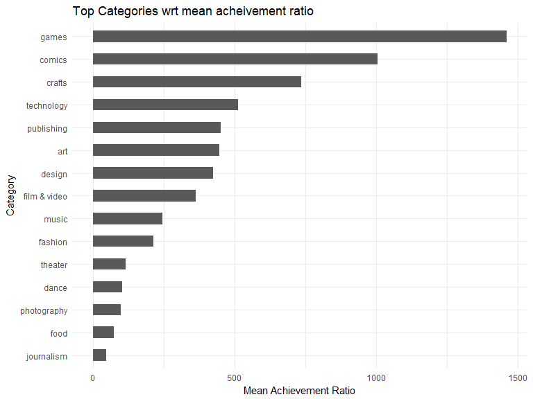
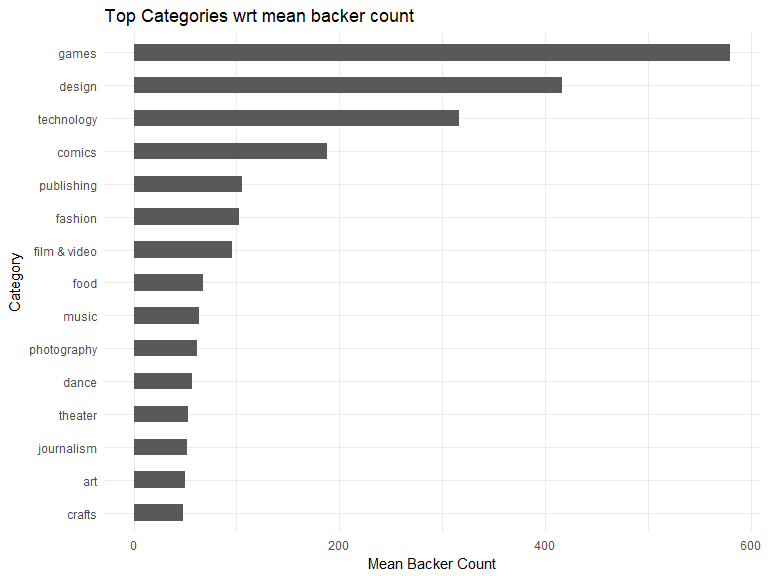
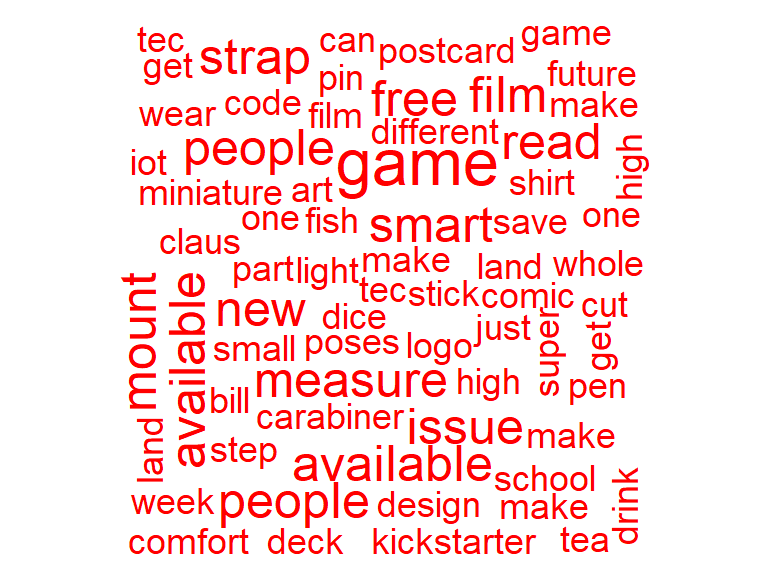
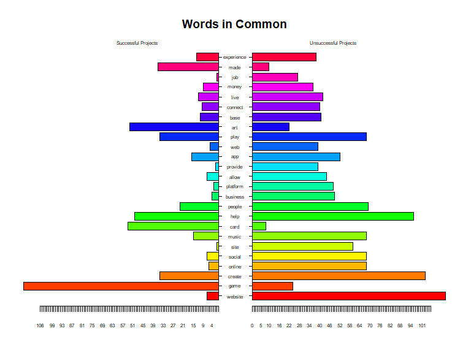
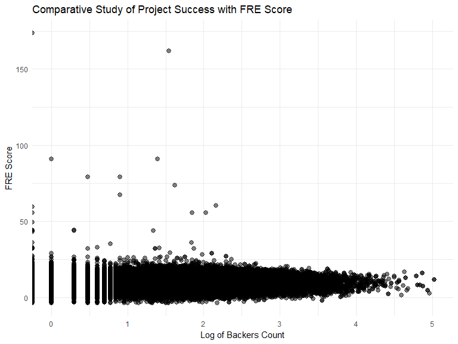
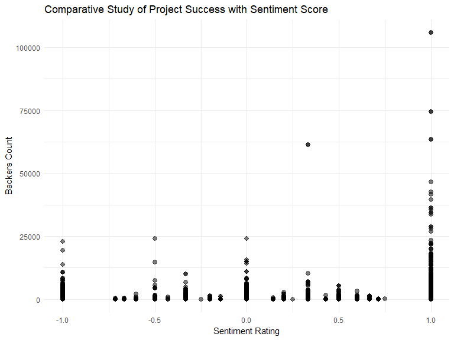
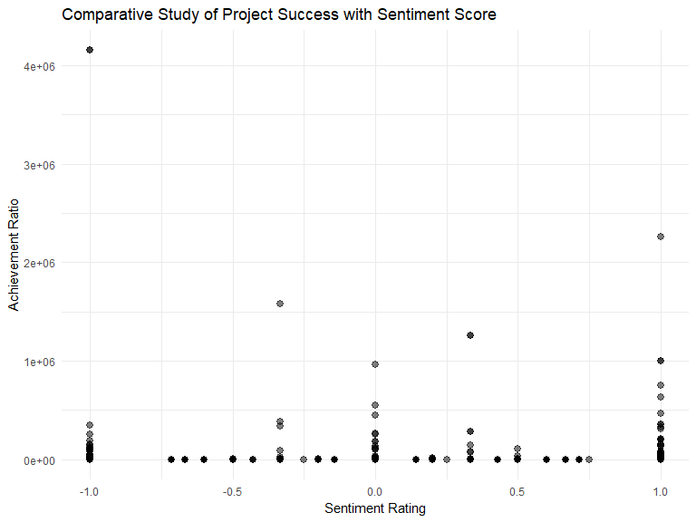
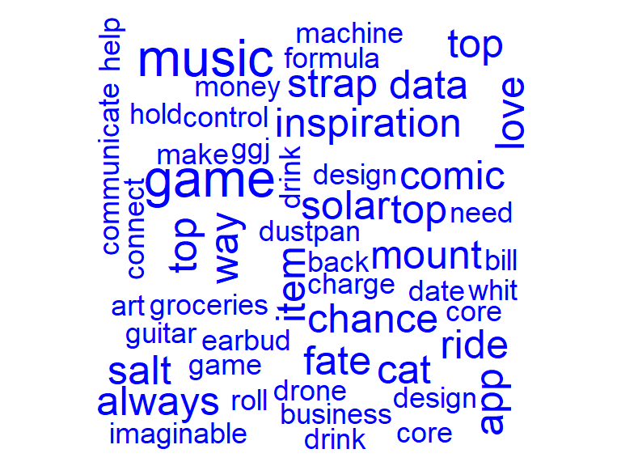
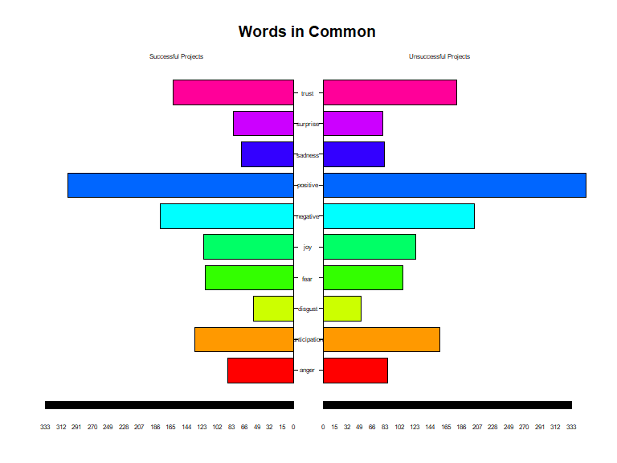

```r
library(dplyr)
library(ggthemes)
library(ggplot2)
library(plotly)
library(DT)
library(qdap)
library(tm)
library(SnowballC)
library(plotrix)
library(wordcloud)
library(leaflet)
library(tidytext)
library(quanteda)
library(maps)
library(geojsonio)
library(ggmap)
fund = read.csv("kickstarter_projects.csv")
```
  
##Q1) A) Success By Category

The following code and plots try to visually summarize the categories which were most successful with respect to the mean achievement ratio and mean backers count.  
Games, Design, Technology, Comics and Publishing occupy the top slots with respect to the mean backers count while Games, Comics, Crafts, Technology and Publishing occupy the top slots with respect to mean achievement ratio.  
  

```r
fund$achievement_ratio <- (fund$pledged/fund$goal)*100
full_fund = fund[complete.cases(fund),]
category_ar = aggregate(full_fund$achievement_ratio,list(full_fund$top_category),FUN="mean")
category_backer = aggregate(full_fund$backers_count,list(full_fund$top_category),FUN="mean")
colnames(category_ar) = c("category","mean_achievement_ratio")
colnames(category_backer) = c("category","mean_backer_count")

category_ar = merge(category_ar,category_backer,by = "category")

ar_plot = ggplot(category_ar,aes(x=reorder(category,mean_achievement_ratio),y=mean_achievement_ratio))+coord_flip()+geom_bar(stat="identity",width = 0.5)+ggtitle("Top Categories wrt mean acheivement ratio")+ylab("Mean Achievement Ratio")+xlab("Category")+theme_minimal()
ar_plot
```

<!-- -->

```r
backer_plot = ggplot(category_ar,aes(x=reorder(category,mean_backer_count),y=mean_backer_count))+coord_flip()+geom_bar(stat="identity",width = 0.5)+ggtitle("Top Categories wrt mean backer count")+ylab("Mean Backer Count")+xlab("Category")+theme_minimal()
backer_plot
```

<!-- -->
  
  
##Q1) B) Success by Location

The following code and visualization try to drive the concept of success measured by the origin or location of the Kickstarter project. The cities which occupy the top slots include Bellevue, Venice, Rhinelander, Marina del Rey, Santa Clara, etc. The states which are occupy the top slots in terms of the number of successful projects include California, New York, Texas, Illios, Washington, etc.  The following leaflet comprising of overlay groups drive in the same concept through an enriching visual summary.  
  
  

```r
success_states = subset(full_fund,full_fund$state=="successful")
states_gp = group_by(success_states,location_state)
states_summ = summarize(states_gp,count=n())
colnames(states_summ) = c("State","Count")

cities = aggregate(success_states$achievement_ratio,list(success_states$location_town),FUN="mean")
cities = cities[order(-cities$x),]
cities = cities[1:50,]
colnames(cities) = c("City","AR")

states_summ$State = state.name[match(states_summ$State,state.abb)]
states_summ = states_summ[complete.cases(states_summ),]

states_summ$longitude=NA
states_summ$latitude=NA

cities$longitude=NA
cities$latitude=NA


while((any(is.na(states_summ)))){
for(i in 1:nrow(states_summ)){
  if(is.na(states_summ[i,"longitude"])){
  Sys.sleep(2)
  result <- geocode(location = as.character(paste(states_summ[i,"State"],", USA")), output = "latlon", source = "google")
  states_summ[i,"longitude"] = result[1]
  states_summ[i,"latitude"] = result[2]
  }
}
  Sys.sleep(2)
}

while((any(is.na(cities)))){
for(i in 1:nrow(cities)){
  if(is.na(cities[i,"longitude"])){
  Sys.sleep(2)
  result <- geocode(location = as.character(paste(cities[i,"City"],", USA")), output = "latlon", source = "google")
  cities[i,"longitude"] = result[1]
  cities[i,"latitude"] = result[2]
  }
}
  Sys.sleep(2)
}


mapStates = map("state", fill = TRUE, plot = FALSE)
f_3a_addn = leaflet(mapStates) %>% setView(-96, 37.8, 4) %>% addTiles() %>%
  
  addCircles(data = states_summ,color="blue",radius=as.numeric(states_summ$Count)*10,popup = states_summ$State,group = "States")
  
  f_3a_addn<- f_3a_addn %>% addCircles(data = cities,color = 'Red',popup = cities$City,radius = as.numeric((cities$AR)),group = "Cities") %>% 
  
  addLayersControl(overlayGroups = c("States", "Cities")) 
f_3a_addn
```

<!--html_preserve--><div id="htmlwidget-234a19db41dd330014c7" style="width:768px;height:576px;" class="leaflet html-widget"></div>
<script type="application/json" data-for="htmlwidget-234a19db41dd330014c7">{"x":{"options":{"crs":{"crsClass":"L.CRS.EPSG3857","code":null,"proj4def":null,"projectedBounds":null,"options":{}}},"setView":[[37.8,-96],4,[]],"calls":[{"method":"addTiles","args":["https://{s}.tile.openstreetmap.org/{z}/{x}/{y}.png",null,null,{"minZoom":0,"maxZoom":18,"maxNativeZoom":null,"tileSize":256,"subdomains":"abc","errorTileUrl":"","tms":false,"continuousWorld":false,"noWrap":false,"zoomOffset":0,"zoomReverse":false,"opacity":1,"zIndex":null,"unloadInvisibleTiles":null,"updateWhenIdle":null,"detectRetina":false,"reuseTiles":false,"attribution":"&copy; <a href=\"http://openstreetmap.org\">OpenStreetMap<\/a> contributors, <a href=\"http://creativecommons.org/licenses/by-sa/2.0/\">CC-BY-SA<\/a>"}]},{"method":"addCircles","args":[[33.563862,32.3182314,35.20105,34.0489281,36.778261,39.5500507,41.6032207,38.9108325,27.6648274,32.1656221,21.3155434,41.8780025,44.0682019,40.6331249,40.2671941,39.011902,37.8393332,30.9842977,42.4072107,39.0457549,45.253783,44.3148443,46.729553,37.9642529,32.3546679,46.8796822,35.7595731,47.5514926,41.4925374,43.1938516,40.0583238,34.5199402,38.8026097,40.7127753,40.4172871,35.0077519,43.8041334,41.2033216,41.5800945,33.836081,43.9695148,35.5174913,31.9685988,39.3209801,37.4315734,44.5588028,47.7510741,43.7844397,38.5976262,43.0759678],[-112.28854,-86.902298,-91.8318334,-111.0937311,-119.4179324,-105.7820674,-73.087749,-75.5276699,-81.5157535,-82.9000751,-157.8615682,-93.097702,-114.7420408,-89.3985283,-86.1349019,-98.4842465,-84.2700179,-91.9623327,-71.3824374,-76.6412712,-69.4454689,-85.6023643,-94.6858998,-91.8318334,-89.3985283,-110.3625658,-79.0192997,-101.0020119,-99.9018131,-71.5723953,-74.4056612,-105.8700901,-116.419389,-74.0059728,-82.907123,-97.092877,-120.5542012,-77.1945247,-71.4774291,-81.1637245,-99.9018131,-86.5804473,-99.9018131,-111.0937311,-78.6568942,-72.5778415,-120.7401385,-88.7878678,-80.4549026,-107.2902839],[2030,3650,2320,14080,172340,17920,7200,1360,25960,17150,3470,3650,3990,37470,7950,3090,4840,8060,29920,10530,4890,18990,17200,11330,1630,2900,16650,750,2060,3180,11440,4900,8760,130310,18010,3960,27020,28560,3810,5480,920,16760,42560,12400,14070,5070,32430,9500,1470,730],null,"States",{"lineCap":null,"lineJoin":null,"clickable":true,"pointerEvents":null,"className":"","stroke":true,"color":"blue","weight":5,"opacity":0.5,"fill":true,"fillColor":"blue","fillOpacity":0.2,"dashArray":null},["Alaska","Alabama","Arkansas","Arizona","California","Colorado","Connecticut","Delaware","Florida","Georgia","Hawaii","Iowa","Idaho","Illinois","Indiana","Kansas","Kentucky","Louisiana","Massachusetts","Maryland","Maine","Michigan","Minnesota","Missouri","Mississippi","Montana","North Carolina","North Dakota","Nebraska","New Hampshire","New Jersey","New Mexico","Nevada","New York","Ohio","Oklahoma","Oregon","Pennsylvania","Rhode Island","South Carolina","South Dakota","Tennessee","Texas","Utah","Virginia","Vermont","Washington","Wisconsin","West Virginia","Wyoming"],null,null,null,null,null]},{"method":"addCircles","args":[[45.6366228,47.6101497,44.2022084,33.9802893,33.9850469,42.2917069,37.3541079,47.6162683,26.640628,43.3665007,38.9464996,39.0264985,36.200055,42.1667072,36.805531,35.1735404,36.1699412,42.1014831,37.2295733,32.4284761,29.9510658,41.6917157,32.9756415,41.0467635,29.4627365,41.8834347,38.0989961,35.0526641,42.331427,40.114955,43.0345099,34.3664951,41.4768217,41.6397696,42.6330703,36.3302284,39.5296329,35.2987362,43.4916514,43.6980782,38.9933068,42.4694321,41.5931049,44.4802412,41.7620842,37.4323341,40.0333961,34.2694474,42.4567013,39.6284514],[-89.4120753,-122.2015159,-88.4464973,-118.4517449,-118.4694832,-85.5872286,-121.9552356,-122.0355736,-81.8723084,-124.2178903,-77.1588685,-76.9741424,-86.5186054,-83.7816075,-114.06719,-80.6570304,-115.1398296,-72.589811,-80.4139393,-90.1323087,-90.0715323,-83.5579902,-96.8899636,-74.0229173,-95.357994,-71.0286543,-81.323999,-78.8783585,-83.0457538,-111.654923,-76.6238343,-89.5192484,-81.8497567,-81.4065011,-88.6437138,-119.2920585,-119.8138027,-81.6989863,-112.0339645,-85.4836557,-105.0665502,-93.8159149,-81.5267873,-93.4285587,-72.7420151,-121.8995741,-83.1582451,-118.781482,-83.9463358,-75.4984978],[155600,143519.691255124,58762.5807948718,51668.689872409,43445.4326093202,36459.1189794467,29187.7186351743,24026.4521350079,23211.3375202103,21125.5333333333,18903.205130052,14445.519,14291.1531333333,10000,9877.39663945578,9461.61,8632.16134193362,7860.65258543008,7177.05676813187,6341.72164948454,5855.38375383509,5836.52380952381,5257.44549741279,4550,4520,4223.012,4205.90171428571,4168.18091983574,4077.27876703124,3819.94334513889,3610,3588.17127909824,3532.7325,3465,3158.11234991039,3142.33303019324,3073.90844300013,2671.802,2380.54294391534,2352.25,2331.69230769231,2317.50553625626,2260.3,2242.49497487437,2228.40812897451,2221.20645,2216.28149333333,2059.43715911041,2003.34714285714,1988],null,"Cities",{"lineCap":null,"lineJoin":null,"clickable":true,"pointerEvents":null,"className":"","stroke":true,"color":"Red","weight":5,"opacity":0.5,"fill":true,"fillColor":"Red","fillOpacity":0.2,"dashArray":null},["Rhinelander","Bellevue","Menasha","Marina del Rey","Venice","Kalamazoo","Santa Clara","Sammamish","Fort Myers","Coos Bay","Langley","Hillandale","Mount Juliet","Saline","Mesquite","Mint Hill","Las Vegas","Springfield","Blacksburg","Ridgeland","New Orleans","West Toledo","Carrollton","Montvale","Manvel","East Taunton","Powellton","Fayetteville","Detroit","Spanish Fork","Port Byron","Oxford","Rocky River","Willoughby","Delavan","Visalia","Reno","Mooresboro","Idaho Falls","Big Rapids","West Midland","Webster City","Euclid","Lonsdale","West Hartford","Milpitas","Hilliard","Simi Valley","Pinckney","Pennsville"],null,null,null,null,null]},{"method":"addLayersControl","args":[[],["States","Cities"],{"collapsed":true,"autoZIndex":true,"position":"topright"}]}],"limits":{"lat":[21.3155434,47.7510741],"lng":[-157.8615682,-69.4454689]}},"evals":[],"jsHooks":[]}</script><!--/html_preserve-->
  
  
##Q2) A) Success Story: WordCloud

The input text or "blurb" had to pre-processed before any analysis could be performed on them. So following the standard operations of text pre-processing like removing whitespaces, numbers, punctuation were performed in addition to stemming and completing the stemmed document.  
One additional and important task that was performed was pertaining to removing the name of the kickstarter project from the blurb or summary of the project, since I want to identify the terms that really allow a project to stand out.  This was done by a combination of strsplit,  unlist and removeWords operation, more information about which can be found on lines ~151-160.  
Once the text processing was accomplished, the dataset was then converted to corpus and then subsequently to document-term-matrix and term-document-matrix and then to tidy format for further processing. The following wordcloud displays the most frequently occuring words based on their term frequency.  
  
  

```r
sorted_funds = full_fund[order(-full_fund$achievement_ratio),]

top_ideas_ar = head(sorted_funds,1000)
bottom_ideas_ar = tail(sorted_funds,1000)

top_summary = as.data.frame(gsub("[[:punct:] ]+"," ",top_ideas_ar$blurb))
colnames(top_summary) = c("blurb")

bt_summary = as.data.frame(gsub("[[:punct:] ]+"," ",bottom_ideas_ar$blurb))
colnames(bt_summary) = c("blurb")

top_names = as.data.frame(gsub("[[:punct:] ]+"," ",top_ideas_ar$name))
colnames(top_names) = c("name")

bt_names = as.data.frame(gsub("[[:punct:] ]+"," ",bottom_ideas_ar$name))
colnames(bt_names) = c("name")


remove_titles <- function(summary,title){
   title_split = unlist(strsplit(as.character(title)," "))
   clean_titles = removeWords(as.character(summary),title_split)
   return(clean_titles)
}

top_sum = c()
bt_sum = c()

for(i in 1:nrow(top_summary)){
  #print(i)
  top_sum=c(top_sum,remove_titles(top_summary[i,"blurb"],top_names[i,"name"]))
  #print(top_summary[i,"blurb"])
  #print(remove_titles(top_summary[i,"blurb"],top_names[i,"name"]))
  bt_sum = c(bt_sum,remove_titles(bt_summary[i,"blurb"],bt_names[i,"name"]))
}

clean_top = as.data.frame(top_sum)
colnames(clean_top) = c("blurb")
clean_bt = as.data.frame(bt_sum)
colnames(clean_bt) = c("blurb")

clean_top$blurb=as.character(clean_top$blurb)
clean_bt$blurb=as.character(clean_bt$blurb)
clean_top$doc_id = 1:1000
clean_bt$doc_id = 1:1000

clean_top = clean_top[,c(2,1)]
clean_bt = clean_bt[,c(2,1)]

colnames(clean_top) = c("doc_id","text")
colnames(clean_bt) = c("doc_id","text")

top_source = DataframeSource(clean_top)
bt_source = DataframeSource(clean_bt)

top_corpus = VCorpus(top_source)
bt_corpus = VCorpus(bt_source)


clean_corpus <- function(corpus){
# corpus <- tm_map(corpus, removePunctuation)
  corpus <- tm_map(corpus, content_transformer(tolower))
  corpus <- tm_map(corpus, removeWords, c(stopwords("en")))
  corpus <- tm_map(corpus, removeNumbers)
  corpus <- tm_map(corpus, stripWhitespace)
  return(corpus)
}

tc_clean = clean_corpus(top_corpus)
bc_clean = clean_corpus(bt_corpus)

tc_stemmed <- tm_map(tc_clean, stemDocument)
bc_stemmed <- tm_map(bc_clean, stemDocument)

stemCompletion2 <- function(x, dictionary) {
   x <- unlist(strsplit(as.character(x), " "))
   x <- x[x != ""]
   x <- stemCompletion(x, dictionary=dictionary)
   x <- paste(x, sep="", collapse=" ")
   PlainTextDocument(stripWhitespace(x))
}

tc_comp <- lapply(tc_stemmed, stemCompletion2, dictionary=tc_clean)
bc_comp <- lapply(bc_stemmed, stemCompletion2, dictionary=bc_clean)

tc_comp = as.VCorpus(tc_comp)
bc_comp = as.VCorpus(bc_comp)

tc_dtm = DocumentTermMatrix(tc_comp)
bc_dtm = DocumentTermMatrix(bc_comp)

tc_m = as.matrix(tc_dtm)
#top_m <- as.matrix(top_dtm)

tc_dt <- tidy(tc_dtm)
bc_dt <- tidy(bc_dtm)

tc_tf_idf <-  tc_dt %>%
                bind_tf_idf(term, document, count) %>%  
                arrange(desc(tf_idf)) 

bc_tf_idf <-  bc_dt %>%
                bind_tf_idf(term, document, count) %>%  
                arrange(desc(tf_idf))


set.seed(2103)

wordcloud(tc_tf_idf$term, tc_tf_idf$tf, max.words = 100, colors = "red")
```

<!-- -->

```r
tc_dt_top_words = tc_dt %>%     group_by(term) %>%
                 summarise(n = sum(count))

bc_dt_top_words = bc_dt %>%     group_by(term) %>%
                 summarise(n = sum(count))

colnames(tc_dt_top_words) = c("term","top_counts")
colnames(bc_dt_top_words) = c("term","bottom_counts")

combined_words = merge(tc_dt_top_words,bc_dt_top_words,by = "term")

difference <- abs(combined_words[, 2] - combined_words[, 3])

combined_words <- cbind(combined_words, difference)

combined_words <- combined_words[order(combined_words[, 4], decreasing = TRUE), ]


top25_df <- data.frame(x = combined_words[1:25, 2], 
                       y = combined_words[1:25, 3], 
                       labels = combined_words[1:25,1 ])
```
    
  
##Q2) B)
The following pyramid plot shows how the words between successful and unsuccessful projects differ in frequency.  
  


```r
# Create the pyramid plot
p <- pyramid.plot(top25_df$x, top25_df$y, labels = top25_df$labels, 
             gap = 10, top.labels = c("Successful Projects", " ", "Unsuccessful Projects"), 
             main = "Words in Common", laxlab = NULL, 
             raxlab = NULL, unit = NULL, labelcex=0.5)
```

<!-- -->
  
  
##Q2) C)  
The following visualization shows the relationship between the readability measure and one of the measures of success: backers  count. The FRE score of most of the kickstarter project lie in vicinity of each other with some outliers in the scatterplot.  
   


```r
require(quanteda)
require(dplyr)

sample_df = subset(full_fund,select = c("blurb"))
sample_df$doc_id= 1:148163
sample_df=  sample_df[,c(2,1)]
colnames(sample_df) = c("doc_id","text")

sample_ds = DataframeSource(sample_df)
sample_corps = Corpus(sample_ds)

qcorpus = corpus(sample_corps)

FRE_corps <- textstat_readability(qcorpus,
              measure=c('Flesch.Kincaid'))


sample_df2 = subset(full_fund,select = c("backers_count"))
sample_df2$doc_id= 1:148163

fre_score = FRE_corps

colnames(fre_score) = c("doc_id","FRE Score")
fre_score$doc_id = gsub("text","",fre_score$doc_id)
fre_score$doc_id = as.numeric(fre_score$doc_id)

merged_fre = merge(sample_df2,fre_score,by = "doc_id")

interactive = ggplot(merged_fre,aes(x=log10(merged_fre$backers_count),y=merged_fre$`FRE Score`))+geom_point(alpha=0.5,size=2.5)+xlab("Log of Backers Count")+  ylab("FRE Score")+ggtitle("Comparative Study of Project Success with FRE Score")+ theme_minimal()
interactive
```

<!-- -->
  
  
##Q3) A) 
  
The following visualization explains the relationship between the polarity of the text blurb and the measure of success: first with backers_count and then with achievement ratio. One important observation which can be drawn from both these scatterplots is that, blurbs having postive polarity tend to achieve more backers as well as their chance to convert and achieve the goal significantly increases. Ths staying postive really matters for the projects on Kickstarter.  
  

<!-- --><!-- -->
  
  
##Q3) B)
  
The successful and unsuccessful projects were segregated and combined based on their polarity (positive or negative). The following visualization tries to convey comparison between the most frequently used positive (expresses through wordcloud in blue text) and negative words (expresses through wordcloud in red text) through the use of wordclouds. 
  
  
<!-- --><!-- -->
  
  
##Q3) C)
  
The following script uses the NRC Word-Emotion Association Lexicon to calculate the prevalance of emotions across the sucessful and unsuccessful projects. While some of the emotions occur selectively only in a single category, there are some emotions which occur in both the domains for roughly the same proportion. Even if this is the case, a closer inspection is required to really understand the context of the emotion occuring in the text (semantic meaning) apart from the syntactic meaning.  
  


<!-- -->
