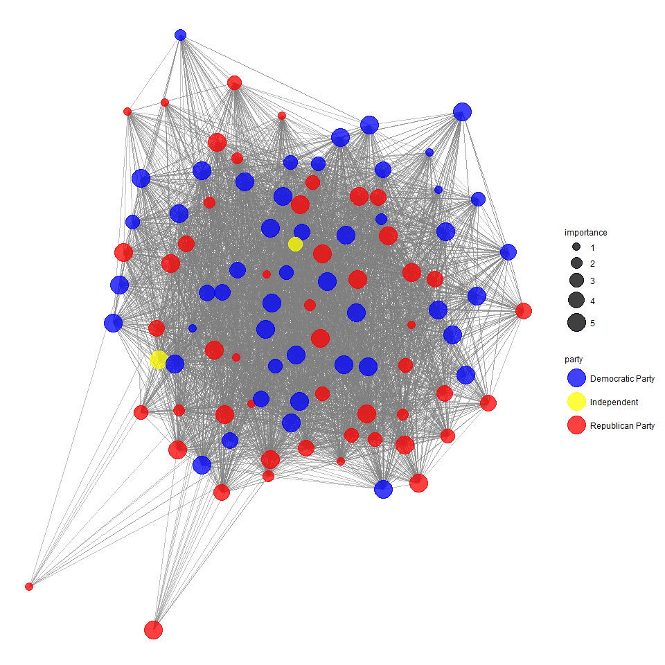
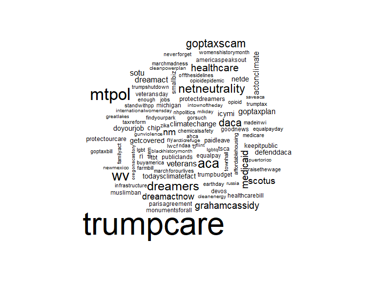
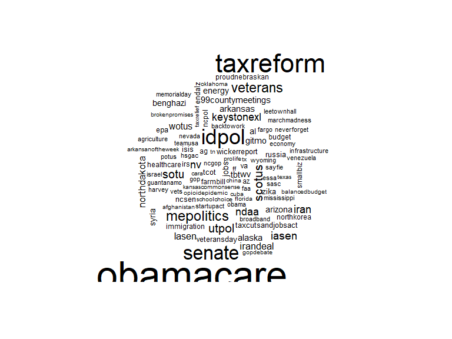
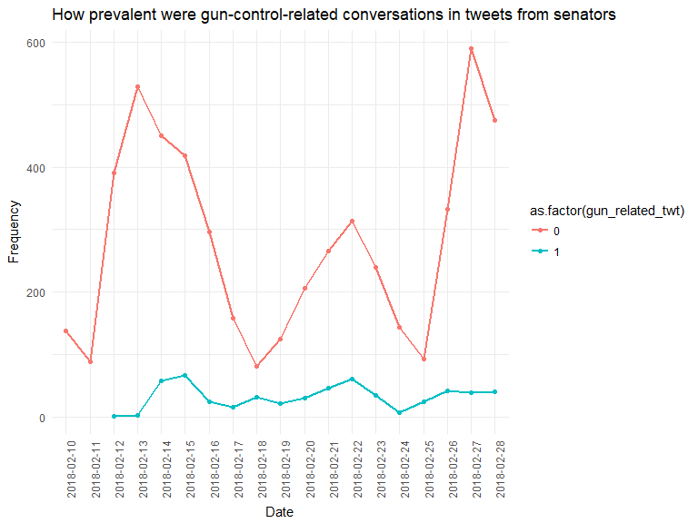
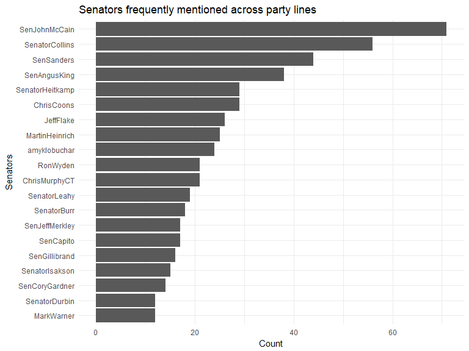
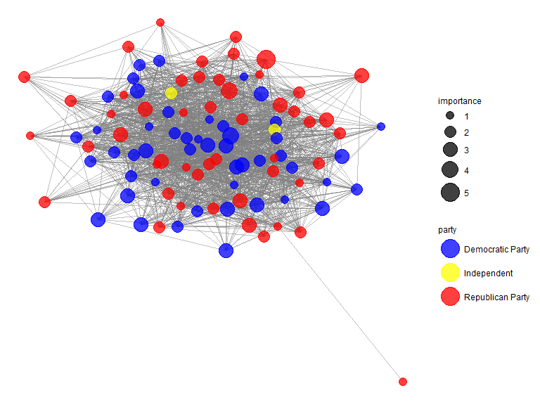
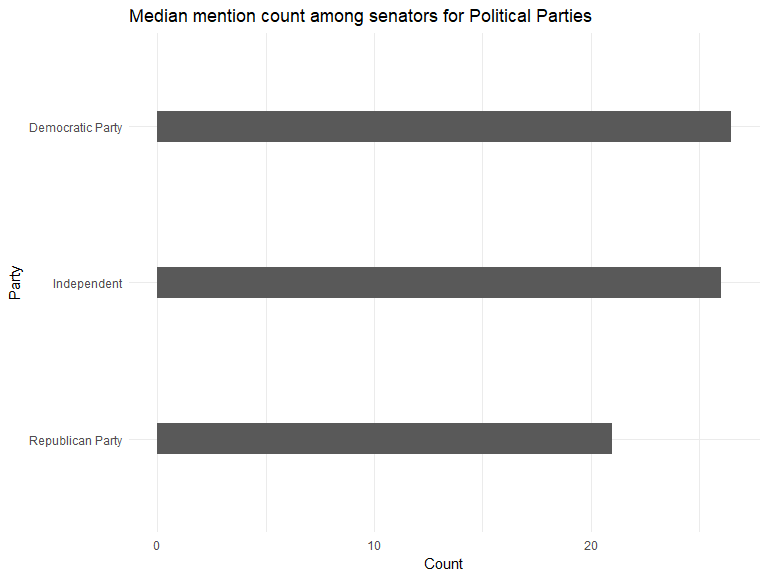

  
  
##Q1) A) Network of Followers  
The following network graph and data-tables provide an informative visual summary about the twitter activity of Senators in terms of their follower and following count and an inter-connected network in terms of followers/following activity categorized by party affiliation. The data-tables provide information about the top senators in terms of their following count and followers count.  
  
  

```r
library(dplyr)
library(ggthemes)
library(ggplot2)
library(igraph)
library(tibble)
library(ggnet)
library(plotly)
library(network)
library(DT)
library(wordcloud)

senator_list <- read.csv("senators_follow.csv") 
senator_party <- read.csv("senators_twitter.csv")

following_subset = subset(senator_list,following==TRUE)

senator_following_gp = group_by(following_subset,source)
senator_following = summarise(senator_following_gp,following_count=n())

senator_followers_gp = group_by(following_subset, target)
senator_followers = summarise(senator_followers_gp,followers_count=n())

follow_graph = graph_from_data_frame(following_subset,directed = TRUE)

indegree = igraph::degree(graph = follow_graph,v=V(follow_graph),mode="in")
indegree_df = as.data.frame(indegree)

outdegree = igraph::degree(graph = follow_graph,mode="out")
outdegree_df = as.data.frame(outdegree)

follow_sbs = subset(following_subset,select=c(1,2))
follow_nw = network(follow_sbs,directed = TRUE)
names = data.frame(Twitter_Handle = network.vertex.names(follow_nw))
names$importance_category<-NA

colnames(senator_party)[3] = c("Twitter_Handle")
colnames(senator_followers)[1] = c("Twitter_Handle")
names = merge(names, senator_party, by = "Twitter_Handle", sort = FALSE) 
names = merge(names,senator_followers,by="Twitter_Handle", sort = FALSE)

for(i in 1:nrow(names)){
  if(names[i,"followers_count"]<=15)
    names[i,"importance_category"] = 1
  else if(names[i,"followers_count"]<=30)
    names[i,"importance_category"] = 2
  else if(names[i,"followers_count"]<=45)
    names[i,"importance_category"] = 3
  else if(names[i,"followers_count"]<=60)
    names[i,"importance_category"] = 4
  else
    names[i,"importance_category"] = 5
}

follow_nw %v% "party" = as.character(names$Party.affiliation)
follow_nw %v% "importance" = as.numeric(names$importance_category)
senator_followers = senator_followers[order(-senator_followers$followers_count),]
senator_following = senator_following[order(-senator_following$following_count),]

y = c("blue","yellow","red")
names(y) = levels(names$Party.affiliation)


ggnet2(follow_nw, color = "party",palette = y,alpha = 0.75, size = "importance", edge.alpha = 0.5)
```

<!-- -->

```r
datatable(senator_followers[,1],caption = "Top Senators having the most followers amongst senators")
```

<!--html_preserve--><div id="htmlwidget-072ddf7e705ddc3f746d" style="width:100%;height:auto;" class="datatables html-widget"></div>
<script type="application/json" data-for="htmlwidget-072ddf7e705ddc3f746d">{"x":{"filter":"none","caption":"<caption>Top Senators having the most followers amongst senators<\/caption>","data":[["1","2","3","4","5","6","7","8","9","10","11","12","13","14","15","16","17","18","19","20","21","22","23","24","25","26","27","28","29","30","31","32","33","34","35","36","37","38","39","40","41","42","43","44","45","46","47","48","49","50","51","52","53","54","55","56","57","58","59","60","61","62","63","64","65","66","67","68","69","70","71","72","73","74","75","76","77","78","79","80","81","82","83","84","85","86","87","88","89","90","91","92","93","94","95","96","97","98","99"],["SenJeffMerkley","MarkWarner","SenJohnKennedy","SenMarkey","SenatorEnzi","MikeCrapo","SenDeanHeller","SenSherrodBrown","SenatorHassan","SenBobCasey","SenatorTimScott","lisamurkowski","sendavidperdue","SenatorCardin","SenThomTillis","amyklobuchar","CoryBooker","SenatorBaldwin","SenatorFischer","SenBennetCO","SenCortezMasto","JohnCornyn","SenAngusKing","SenatorTomUdall","Sen_JoeManchin","SenatorLankford","SenatorRounds","SenatorTester","ChrisCoons","SenDuckworth","SenatorCarper","SenatorCollins","SenatorBurr","SenGaryPeters","PattyMurray","SenatorDurbin","SenFeinstein","SenMikeLee","senrobportman","SenDanSullivan","SenToomey","SenatorMenendez","SenWhitehouse","SenJohnHoeven","SenWarren","RonWyden","JerryMoran","maziehirono","SenBlumenthal","SenatorShaheen","SenPatRoberts","SenSchumer","MartinHeinrich","SenShelby","SenStabenow","RoyBlunt","SenJohnBarrasso","SenatorCantwell","SenatorIsakson","SenRonJohnson","SenTedCruz","SenTinaSmith","SteveDaines","ChrisVanHollen","SenateMajLdr","SenGillibrand","SenKamalaHarris","SenThadCochran","SenatorRisch","JohnBoozman","SenCoryGardner","SenTomCotton","brianschatz","SenatorWicker","RandPaul","SenDougJones","SenAlexander","SenatorLeahy","SenSanders","SenatorHeitkamp","GrahamBlog","timkaine","SenCapito","SenJohnThune","ChuckGrassley","senorrinhatch","SenJackReed","SenJohnMcCain","SenToddYoung","ChrisMurphyCT","JimInhofe","BillCassidy","BobCorker","SenDonnelly","BenSasse","JeffFlake","clairecmc","joniernst","marcorubio"]],"container":"<table class=\"display\">\n  <thead>\n    <tr>\n      <th> <\/th>\n      <th>Twitter_Handle<\/th>\n    <\/tr>\n  <\/thead>\n<\/table>","options":{"order":[],"autoWidth":false,"orderClasses":false,"columnDefs":[{"orderable":false,"targets":0}]}},"evals":[],"jsHooks":[]}</script><!--/html_preserve-->

```r
datatable(senator_following[,1],caption = "Top Senators following most of their contemporaries")
```

<!--html_preserve--><div id="htmlwidget-e0113c5b1f1c932ec0a0" style="width:100%;height:auto;" class="datatables html-widget"></div>
<script type="application/json" data-for="htmlwidget-e0113c5b1f1c932ec0a0">{"x":{"filter":"none","caption":"<caption>Top Senators following most of their contemporaries<\/caption>","data":[["1","2","3","4","5","6","7","8","9","10","11","12","13","14","15","16","17","18","19","20","21","22","23","24","25","26","27","28","29","30","31","32","33","34","35","36","37","38","39","40","41","42","43","44","45","46","47","48","49","50","51","52","53","54","55","56","57","58","59","60","61","62","63","64","65","66","67","68","69","70","71","72","73","74","75","76","77","78","79","80","81","82","83","84","85","86","87","88","89","90","91","92","93","94","95","96","97","98","99","100"],["SenatorCollins","SenJohnMcCain","lisamurkowski","SenatorBurr","SenJohnBarrasso","RoyBlunt","SenDeanHeller","SenToomey","ChuckGrassley","Sen_JoeManchin","senrobportman","MikeCrapo","JohnCornyn","SenAlexander","SenatorIsakson","SenJohnHoeven","SenRonJohnson","GrahamBlog","JerryMoran","MarkWarner","SenAngusKing","SenatorTimScott","SenatorWicker","SenatorEnzi","SenDonnelly","SenJohnThune","CoryBooker","SenBlumenthal","SenPatRoberts","JeffFlake","JohnBoozman","RonWyden","SenatorDurbin","SenatorFischer","SenatorHeitkamp","SenatorTomUdall","SenBobCasey","SenSchumer","SenThadCochran","ChrisCoons","SenatorCardin","SenatorCarper","SenatorLeahy","SenStabenow","SenWhitehouse","maziehirono","PattyMurray","SenatorMenendez","SenatorRisch","SenBennetCO","SenJeffMerkley","SenMikeLee","SenSherrodBrown","RandPaul","SenJackReed","senorrinhatch","SenShelby","SenatorShaheen","timkaine","clairecmc","MartinHeinrich","SenFeinstein","marcorubio","SenatorBaldwin","SenBillNelson","sendavidperdue","SenGillibrand","SenatorCantwell","SenSanders","SenThomTillis","SenWarren","ChrisMurphyCT","SenGaryPeters","SenatorLankford","SenatorTester","SenCoryGardner","amyklobuchar","SenCapito","SenatorRounds","SenMarkey","SenTomCotton","JimInhofe","SenateMajLdr","SenTedCruz","SenDanSullivan","SteveDaines","SenatorHassan","SenDuckworth","ChrisVanHollen","BillCassidy","brianschatz","SenCortezMasto","SenJohnKennedy","BenSasse","SenDougJones","SenTinaSmith","SenKamalaHarris","SenToddYoung","joniernst","BobCorker"]],"container":"<table class=\"display\">\n  <thead>\n    <tr>\n      <th> <\/th>\n      <th>source<\/th>\n    <\/tr>\n  <\/thead>\n<\/table>","options":{"order":[],"autoWidth":false,"orderClasses":false,"columnDefs":[{"orderable":false,"targets":0}]}},"evals":[],"jsHooks":[]}</script><!--/html_preserve-->
  
  
##Q1) B) Communities  
The following datatable shows that party identification can be recovered by an automated mechanism of cluster identification using cluster walktraps. The 'members' column of the datatable provides the auto-generated cluster-id (out of 1,2,3) for each senator in the list. The party affiliation gives us information about a senator's affiliation.  Thus from the datatable, we can see that that members to party_affiliation is a one-to-one relationship.  
  
    

```r
wc <- cluster_walktrap(follow_graph)
members <- membership(wc)
members_df <- cbind(V(follow_graph)$name,members)
members_df <- as.data.frame(members_df)
colnames(members_df)[1]=c("Twitter_Handle")
names_subset = names[,c(1,7)]
members = merge(members_df,names_subset,by="Twitter_Handle")

datatable(members,caption = "Connection between party affiliation and community detection using cluster walktrap")
```

<!--html_preserve--><div id="htmlwidget-e09e5d616433e51037de" style="width:100%;height:auto;" class="datatables html-widget"></div>
<script type="application/json" data-for="htmlwidget-e09e5d616433e51037de">{"x":{"filter":"none","caption":"<caption>Connection between party affiliation and community detection using cluster walktrap<\/caption>","data":[["1","2","3","4","5","6","7","8","9","10","11","12","13","14","15","16","17","18","19","20","21","22","23","24","25","26","27","28","29","30","31","32","33","34","35","36","37","38","39","40","41","42","43","44","45","46","47","48","49","50","51","52","53","54","55","56","57","58","59","60","61","62","63","64","65","66","67","68","69","70","71","72","73","74","75","76","77","78","79","80","81","82","83","84","85","86","87","88","89","90","91","92","93","94"],["amyklobuchar","BenSasse","BillCassidy","BobCorker","brianschatz","ChrisCoons","ChrisMurphyCT","ChrisVanHollen","ChuckGrassley","clairecmc","CoryBooker","GrahamBlog","JeffFlake","JerryMoran","JohnBoozman","JohnCornyn","joniernst","lisamurkowski","marcorubio","MarkWarner","MartinHeinrich","maziehirono","MikeCrapo","PattyMurray","RandPaul","RonWyden","RoyBlunt","Sen_JoeManchin","SenAlexander","SenAngusKing","SenateMajLdr","SenatorBaldwin","SenatorBurr","SenatorCantwell","SenatorCardin","SenatorCarper","SenatorCollins","SenatorDurbin","SenatorEnzi","SenatorFischer","SenatorHassan","SenatorHeitkamp","SenatorIsakson","SenatorLankford","SenatorLeahy","SenatorMenendez","SenatorRisch","SenatorRounds","SenatorShaheen","SenatorTester","SenatorTimScott","SenatorTomUdall","SenatorWicker","SenBennetCO","SenBlumenthal","SenBobCasey","SenCapito","SenCortezMasto","SenCoryGardner","SenDanSullivan","SenDeanHeller","SenDonnelly","SenDougJones","SenDuckworth","SenFeinstein","SenGaryPeters","SenGillibrand","SenJackReed","SenJeffMerkley","SenJohnBarrasso","SenJohnHoeven","SenJohnKennedy","SenJohnMcCain","SenJohnThune","SenKamalaHarris","SenMikeLee","SenPatRoberts","SenRonJohnson","SenSanders","SenSchumer","SenShelby","SenSherrodBrown","SenStabenow","SenTedCruz","SenThadCochran","SenThomTillis","SenTinaSmith","SenToddYoung","SenTomCotton","SenToomey","SenWarren","SenWhitehouse","SteveDaines","timkaine"],["1","2","2","2","1","1","1","1","2","1","1","2","2","2","2","2","2","2","2","1","1","1","2","1","2","1","2","1","2","1","2","1","2","1","1","1","2","1","2","2","1","1","2","2","1","1","2","2","1","1","2","1","2","1","1","1","2","1","2","2","2","1","1","1","1","1","1","1","1","2","2","2","2","2","1","2","2","2","1","1","2","1","1","2","2","2","1","2","2","2","1","1","2","1"],["Democratic Party","Republican Party","Republican Party","Republican Party","Democratic Party","Democratic Party","Democratic Party","Democratic Party","Republican Party","Democratic Party","Democratic Party","Republican Party","Republican Party","Republican Party","Republican Party","Republican Party","Republican Party","Republican Party","Republican Party","Democratic Party","Democratic Party","Democratic Party","Republican Party","Democratic Party","Republican Party","Democratic Party","Republican Party","Democratic Party","Republican Party","Independent","Republican Party","Democratic Party","Republican Party","Democratic Party","Democratic Party","Democratic Party","Republican Party","Democratic Party","Republican Party","Republican Party","Democratic Party","Democratic Party","Republican Party","Republican Party","Democratic Party","Democratic Party","Republican Party","Republican Party","Democratic Party","Democratic Party","Republican Party","Democratic Party","Republican Party","Democratic Party","Democratic Party","Democratic Party","Republican Party","Democratic Party","Republican Party","Republican Party","Republican Party","Democratic Party","Democratic Party","Democratic Party","Democratic Party","Democratic Party","Democratic Party","Democratic Party","Democratic Party","Republican Party","Republican Party","Republican Party","Republican Party","Republican Party","Democratic Party","Republican Party","Republican Party","Republican Party","Independent","Democratic Party","Republican Party","Democratic Party","Democratic Party","Republican Party","Republican Party","Republican Party","Democratic Party","Republican Party","Republican Party","Republican Party","Democratic Party","Democratic Party","Republican Party","Democratic Party"]],"container":"<table class=\"display\">\n  <thead>\n    <tr>\n      <th> <\/th>\n      <th>Twitter_Handle<\/th>\n      <th>members<\/th>\n      <th>Party.affiliation<\/th>\n    <\/tr>\n  <\/thead>\n<\/table>","options":{"order":[],"autoWidth":false,"orderClasses":false,"columnDefs":[{"orderable":false,"targets":0}]}},"evals":[],"jsHooks":[]}</script><!--/html_preserve-->
  
  
##Q2) A) Most Common Topics Over Time  
The following plot provides an user, an insight into the most common topics over time. The visualization provides an interactive insight into the topics(hashtags) that were most discussed for each month over the years. Any value on x-axis corresponds to a specific month in the timeline and y-axis corresponds to the frequency of the most discussed hashtag for that particular month.
  
  

  

```r
senator_tweets <- readRDS("senator_tweets.RDS")
senator_tweets_org = subset(senator_tweets,is_retweet==FALSE)
tags = subset(senator_tweets_org,!is.na(hashtags))

party_list = subset(senator_party,select=c(3,6))
tags_subset = subset(tags,select=c(2,4,14))

tags_subset = merge(tags_subset,party_list,by.x="screen_name",by.y="Twitter_Handle")
date_substr = substring(as.character(tags_subset$created_at),1,7)
date_year = substring(as.character(tags_subset$created_at),1,4)


temp_tags = c()
temp_date_2 = c()
temp_date = c()
temp_party = c()

for(i in 1:nrow(tags_subset)){
  tdate = date_year[i]
  tparty = tags_subset[i,"Party.affiliation"]
  tdate_month = date_substr[i]
  ul = tolower(unlist(tags_subset[i,"hashtags"]))
  for(j in ul){
    temp_date = c(temp_date,tdate_month)
    temp_date_2 = c(temp_date_2,tdate)
    temp_tags = c(temp_tags,j)
    temp_party = c(temp_party,tparty)
  }
}

temp_tags_df = data.frame(temp_date,temp_date_2,temp_tags,temp_party)

# temp_tags = c()
# temp_date = c()
# date_substr = substring(as.character(tags$created_at),1,7)
# for(i in 1:nrow(tags)){
#   tdate = date_substr[i]
#   ul = tolower(unlist(tags[i,"hashtags"]))
#   for(j in ul){
#     temp_date = c(temp_date,tdate)
#     temp_tags = c(temp_tags,j)
#   }
# }
# temp_tags_df = data.frame(temp_date,temp_tags)

temp_tags_gp = group_by(temp_tags_df,temp_tags_df$temp_date,temp_tags_df$temp_tags)
temp_tags_summ = summarise(temp_tags_gp,count=n())
colnames(temp_tags_summ) = c("temp_date","temp_tags","count")

frequent_terms = aggregate(temp_tags_summ$count, by = list(temp_tags_summ$temp_date), max)
colnames(frequent_terms) = c("temp_date","count")

frequent_terms = merge(frequent_terms,temp_tags_summ,by=c("temp_date","count"))
frequent_terms = subset(frequent_terms,!duplicated(frequent_terms[,1]))

ggplotly(ggplot(data=frequent_terms, aes(x=frequent_terms$temp_date, y=frequent_terms$count,label=frequent_terms$temp_tags)) +
  geom_line(lwd=0.8)+geom_point()+theme(axis.text.x=element_text(angle=90,hjust=1))+scale_x_discrete(breaks = levels(frequent_terms$temp_date)[seq(1,110,by=8)])+xlab("Date")+ylab("Frequency")+ggtitle("Popular Hashtags Over the Years"))
```

<!--html_preserve--><div id="htmlwidget-a5c324a6283877a7161e" style="width:768px;height:576px;" class="plotly html-widget"></div>
<script type="application/json" data-for="htmlwidget-a5c324a6283877a7161e">{"x":{"data":[{"x":[1,null,2,null,3,null,4,null,5,null,6,null,7,null,8,null,9,null,10,null,11,null,12,null,13,null,14,null,15,null,16,null,17,null,18,null,19,null,20,null,21,null,22,null,23,null,24,null,25,null,26,null,27,null,28,null,29,null,30,null,31,null,32,null,33,null,34,null,35,null,36,null,37,null,38,null,39,null,40,null,41,null,42,null,43,null,44,null,45,null,46,null,47,null,48,null,49,null,50,null,51,null,52,null,53,null,54,null,55,null,56,null,57,null,58,null,59,null,60,null,61,null,62,null,63,null,64,null,65,null,66,null,67,null,68,null,69,null,70,null,71,null,72,null,73,null,74,null,75,null,76,null,77,null,78,null,79,null,80,null,81,null,82,null,83,null,84,null,85,null,86,null,87,null,88,null,89,null,90,null,91,null,92,null,93,null,94,null,95,null,96,null,97,null,98,null,99,null,100,null,101,null,102,null,103,null,104,null,105,null,106,null,107,null,108,null,109,null,110],"y":[6,null,1,null,1,null,2,null,3,null,6,null,3,null,1,null,4,null,5,null,3,null,5,null,2,null,13,null,7,null,6,null,20,null,29,null,33,null,124,null,3,null,6,null,6,null,3,null,5,null,7,null,6,null,2,null,10,null,10,null,4,null,14,null,6,null,35,null,10,null,9,null,21,null,6,null,16,null,24,null,37,null,33,null,17,null,9,null,24,null,36,null,16,null,27,null,62,null,45,null,58,null,61,null,86,null,86,null,124,null,121,null,176,null,67,null,138,null,159,null,144,null,58,null,68,null,53,null,38,null,59,null,75,null,94,null,59,null,54,null,133,null,46,null,63,null,40,null,59,null,91,null,145,null,64,null,147,null,100,null,112,null,108,null,207,null,78,null,113,null,71,null,70,null,105,null,59,null,112,null,136,null,137,null,103,null,53,null,211,null,128,null,821,null,162,null,428,null,725,null,331,null,123,null,568,null,288,null,435,null,418,null,395,null,142,null,152,null,57],"text":["frequent_terms$temp_date: 2008-09<br />frequent_terms$count:   6<br />frequent_terms$temp_tags: pork",null,"frequent_terms$temp_date: 2008-10<br />frequent_terms$count:   1<br />frequent_terms$temp_tags: pork",null,"frequent_terms$temp_date: 2008-11<br />frequent_terms$count:   1<br />frequent_terms$temp_tags: pork",null,"frequent_terms$temp_date: 2008-12<br />frequent_terms$count:   2<br />frequent_terms$temp_tags: flake",null,"frequent_terms$temp_date: 2009-01<br />frequent_terms$count:   3<br />frequent_terms$temp_tags: pork",null,"frequent_terms$temp_date: 2009-02<br />frequent_terms$count:   6<br />frequent_terms$temp_tags: pork",null,"frequent_terms$temp_date: 2009-03<br />frequent_terms$count:   3<br />frequent_terms$temp_tags: pork",null,"frequent_terms$temp_date: 2009-06<br />frequent_terms$count:   1<br />frequent_terms$temp_tags: arramaine",null,"frequent_terms$temp_date: 2009-09<br />frequent_terms$count:   4<br />frequent_terms$temp_tags: mepolitics",null,"frequent_terms$temp_date: 2009-10<br />frequent_terms$count:   5<br />frequent_terms$temp_tags: mepolitics",null,"frequent_terms$temp_date: 2009-11<br />frequent_terms$count:   3<br />frequent_terms$temp_tags: mepolitics",null,"frequent_terms$temp_date: 2009-12<br />frequent_terms$count:   5<br />frequent_terms$temp_tags: mepolitics",null,"frequent_terms$temp_date: 2010-01<br />frequent_terms$count:   2<br />frequent_terms$temp_tags: mepolitics",null,"frequent_terms$temp_date: 2010-04<br />frequent_terms$count:  13<br />frequent_terms$temp_tags: ncsen",null,"frequent_terms$temp_date: 2010-05<br />frequent_terms$count:   7<br />frequent_terms$temp_tags: ncgop",null,"frequent_terms$temp_date: 2010-06<br />frequent_terms$count:   6<br />frequent_terms$temp_tags: ncgop",null,"frequent_terms$temp_date: 2010-07<br />frequent_terms$count:  20<br />frequent_terms$temp_tags: ncsen",null,"frequent_terms$temp_date: 2010-08<br />frequent_terms$count:  29<br />frequent_terms$temp_tags: ncsen",null,"frequent_terms$temp_date: 2010-09<br />frequent_terms$count:  33<br />frequent_terms$temp_tags: ncsen",null,"frequent_terms$temp_date: 2010-10<br />frequent_terms$count: 124<br />frequent_terms$temp_tags: ncsen",null,"frequent_terms$temp_date: 2010-11<br />frequent_terms$count:   3<br />frequent_terms$temp_tags: ncsen",null,"frequent_terms$temp_date: 2010-12<br />frequent_terms$count:   6<br />frequent_terms$temp_tags: dadt",null,"frequent_terms$temp_date: 2011-01<br />frequent_terms$count:   6<br />frequent_terms$temp_tags: sotu",null,"frequent_terms$temp_date: 2011-02<br />frequent_terms$count:   3<br />frequent_terms$temp_tags: mo",null,"frequent_terms$temp_date: 2011-03<br />frequent_terms$count:   5<br />frequent_terms$temp_tags: bigdance",null,"frequent_terms$temp_date: 2011-04<br />frequent_terms$count:   7<br />frequent_terms$temp_tags: alabama",null,"frequent_terms$temp_date: 2011-05<br />frequent_terms$count:   6<br />frequent_terms$temp_tags: joplin",null,"frequent_terms$temp_date: 2011-06<br />frequent_terms$count:   2<br />frequent_terms$temp_tags: cocoffee",null,"frequent_terms$temp_date: 2011-07<br />frequent_terms$count:  10<br />frequent_terms$temp_tags: debt",null,"frequent_terms$temp_date: 2011-08<br />frequent_terms$count:  10<br />frequent_terms$temp_tags: coenergycojobs",null,"frequent_terms$temp_date: 2011-09<br />frequent_terms$count:   4<br />frequent_terms$temp_tags: dadt",null,"frequent_terms$temp_date: 2011-10<br />frequent_terms$count:  14<br />frequent_terms$temp_tags: sctweets",null,"frequent_terms$temp_date: 2011-11<br />frequent_terms$count:   6<br />frequent_terms$temp_tags: scpol",null,"frequent_terms$temp_date: 2011-12<br />frequent_terms$count:  35<br />frequent_terms$temp_tags: strongbba",null,"frequent_terms$temp_date: 2012-01<br />frequent_terms$count:  10<br />frequent_terms$temp_tags: sotu",null,"frequent_terms$temp_date: 2012-02<br />frequent_terms$count:   9<br />frequent_terms$temp_tags: biobased",null,"frequent_terms$temp_date: 2012-03<br />frequent_terms$count:  21<br />frequent_terms$temp_tags: obamacare",null,"frequent_terms$temp_date: 2012-04<br />frequent_terms$count:   6<br />frequent_terms$temp_tags: vawa",null,"frequent_terms$temp_date: 2012-05<br />frequent_terms$count:  16<br />frequent_terms$temp_tags: utpol",null,"frequent_terms$temp_date: 2012-06<br />frequent_terms$count:  24<br />frequent_terms$temp_tags: scotus",null,"frequent_terms$temp_date: 2012-07<br />frequent_terms$count:  37<br />frequent_terms$temp_tags: hawaii",null,"frequent_terms$temp_date: 2012-08<br />frequent_terms$count:  33<br />frequent_terms$temp_tags: hawaii",null,"frequent_terms$temp_date: 2012-09<br />frequent_terms$count:  17<br />frequent_terms$temp_tags: smallbiz",null,"frequent_terms$temp_date: 2012-10<br />frequent_terms$count:   9<br />frequent_terms$temp_tags: benghazi",null,"frequent_terms$temp_date: 2012-11<br />frequent_terms$count:  24<br />frequent_terms$temp_tags: benghazi",null,"frequent_terms$temp_date: 2012-12<br />frequent_terms$count:  36<br />frequent_terms$temp_tags: fiscalcliff",null,"frequent_terms$temp_date: 2013-01<br />frequent_terms$count:  16<br />frequent_terms$temp_tags: fiscalcliff",null,"frequent_terms$temp_date: 2013-02<br />frequent_terms$count:  27<br />frequent_terms$temp_tags: vawa",null,"frequent_terms$temp_date: 2013-03<br />frequent_terms$count:  62<br />frequent_terms$temp_tags: mepolitics",null,"frequent_terms$temp_date: 2013-04<br />frequent_terms$count:  45<br />frequent_terms$temp_tags: mepolitics",null,"frequent_terms$temp_date: 2013-05<br />frequent_terms$count:  58<br />frequent_terms$temp_tags: benghazi",null,"frequent_terms$temp_date: 2013-06<br />frequent_terms$count:  61<br />frequent_terms$temp_tags: immigration",null,"frequent_terms$temp_date: 2013-07<br />frequent_terms$count:  86<br />frequent_terms$temp_tags: obamacare",null,"frequent_terms$temp_date: 2013-08<br />frequent_terms$count:  86<br />frequent_terms$temp_tags: idpol",null,"frequent_terms$temp_date: 2013-09<br />frequent_terms$count: 124<br />frequent_terms$temp_tags: obamacare",null,"frequent_terms$temp_date: 2013-10<br />frequent_terms$count: 121<br />frequent_terms$temp_tags: obamacare",null,"frequent_terms$temp_date: 2013-11<br />frequent_terms$count: 176<br />frequent_terms$temp_tags: obamacare",null,"frequent_terms$temp_date: 2013-12<br />frequent_terms$count:  67<br />frequent_terms$temp_tags: obamacare",null,"frequent_terms$temp_date: 2014-01<br />frequent_terms$count: 138<br />frequent_terms$temp_tags: sotu",null,"frequent_terms$temp_date: 2014-02<br />frequent_terms$count: 159<br />frequent_terms$temp_tags: idpol",null,"frequent_terms$temp_date: 2014-03<br />frequent_terms$count: 144<br />frequent_terms$temp_tags: idpol",null,"frequent_terms$temp_date: 2014-04<br />frequent_terms$count:  58<br />frequent_terms$temp_tags: iasen",null,"frequent_terms$temp_date: 2014-05<br />frequent_terms$count:  68<br />frequent_terms$temp_tags: iasen",null,"frequent_terms$temp_date: 2014-06<br />frequent_terms$count:  53<br />frequent_terms$temp_tags: lasen",null,"frequent_terms$temp_date: 2014-07<br />frequent_terms$count:  38<br />frequent_terms$temp_tags: lasen",null,"frequent_terms$temp_date: 2014-08<br />frequent_terms$count:  59<br />frequent_terms$temp_tags: iasen",null,"frequent_terms$temp_date: 2014-09<br />frequent_terms$count:  75<br />frequent_terms$temp_tags: iasen",null,"frequent_terms$temp_date: 2014-10<br />frequent_terms$count:  94<br />frequent_terms$temp_tags: lasen",null,"frequent_terms$temp_date: 2014-11<br />frequent_terms$count:  59<br />frequent_terms$temp_tags: lasen",null,"frequent_terms$temp_date: 2014-12<br />frequent_terms$count:  54<br />frequent_terms$temp_tags: votecassidy",null,"frequent_terms$temp_date: 2015-01<br />frequent_terms$count: 133<br />frequent_terms$temp_tags: sotu",null,"frequent_terms$temp_date: 2015-02<br />frequent_terms$count:  46<br />frequent_terms$temp_tags: keystonexl",null,"frequent_terms$temp_date: 2015-03<br />frequent_terms$count:  63<br />frequent_terms$temp_tags: balancedbudget",null,"frequent_terms$temp_date: 2015-04<br />frequent_terms$count:  40<br />frequent_terms$temp_tags: mtpol",null,"frequent_terms$temp_date: 2015-05<br />frequent_terms$count:  59<br />frequent_terms$temp_tags: mtpol",null,"frequent_terms$temp_date: 2015-06<br />frequent_terms$count:  91<br />frequent_terms$temp_tags: ndaa",null,"frequent_terms$temp_date: 2015-07<br />frequent_terms$count: 145<br />frequent_terms$temp_tags: irandeal",null,"frequent_terms$temp_date: 2015-08<br />frequent_terms$count:  64<br />frequent_terms$temp_tags: irandeal",null,"frequent_terms$temp_date: 2015-09<br />frequent_terms$count: 147<br />frequent_terms$temp_tags: irandeal",null,"frequent_terms$temp_date: 2015-10<br />frequent_terms$count: 100<br />frequent_terms$temp_tags: ndaa",null,"frequent_terms$temp_date: 2015-11<br />frequent_terms$count: 112<br />frequent_terms$temp_tags: wotus",null,"frequent_terms$temp_date: 2015-12<br />frequent_terms$count: 108<br />frequent_terms$temp_tags: essa",null,"frequent_terms$temp_date: 2016-01<br />frequent_terms$count: 207<br />frequent_terms$temp_tags: sotu",null,"frequent_terms$temp_date: 2016-02<br />frequent_terms$count:  78<br />frequent_terms$temp_tags: scotus",null,"frequent_terms$temp_date: 2016-03<br />frequent_terms$count: 113<br />frequent_terms$temp_tags: scotus",null,"frequent_terms$temp_date: 2016-04<br />frequent_terms$count:  71<br />frequent_terms$temp_tags: endalz",null,"frequent_terms$temp_date: 2016-05<br />frequent_terms$count:  70<br />frequent_terms$temp_tags: memorialday",null,"frequent_terms$temp_date: 2016-06<br />frequent_terms$count: 105<br />frequent_terms$temp_tags: zika",null,"frequent_terms$temp_date: 2016-07<br />frequent_terms$count:  59<br />frequent_terms$temp_tags: cara",null,"frequent_terms$temp_date: 2016-08<br />frequent_terms$count: 112<br />frequent_terms$temp_tags: rio2016",null,"frequent_terms$temp_date: 2016-09<br />frequent_terms$count: 136<br />frequent_terms$temp_tags: obamacare",null,"frequent_terms$temp_date: 2016-10<br />frequent_terms$count: 137<br />frequent_terms$temp_tags: obamacare",null,"frequent_terms$temp_date: 2016-11<br />frequent_terms$count: 103<br />frequent_terms$temp_tags: veteransday",null,"frequent_terms$temp_date: 2016-12<br />frequent_terms$count:  53<br />frequent_terms$temp_tags: buyamerica",null,"frequent_terms$temp_date: 2017-01<br />frequent_terms$count: 211<br />frequent_terms$temp_tags: aca",null,"frequent_terms$temp_date: 2017-02<br />frequent_terms$count: 128<br />frequent_terms$temp_tags: scotus",null,"frequent_terms$temp_date: 2017-03<br />frequent_terms$count: 821<br />frequent_terms$temp_tags: trumpcare",null,"frequent_terms$temp_date: 2017-04<br />frequent_terms$count: 162<br />frequent_terms$temp_tags: scotus",null,"frequent_terms$temp_date: 2017-05<br />frequent_terms$count: 428<br />frequent_terms$temp_tags: trumpcare",null,"frequent_terms$temp_date: 2017-06<br />frequent_terms$count: 725<br />frequent_terms$temp_tags: trumpcare",null,"frequent_terms$temp_date: 2017-07<br />frequent_terms$count: 331<br />frequent_terms$temp_tags: trumpcare",null,"frequent_terms$temp_date: 2017-08<br />frequent_terms$count: 123<br />frequent_terms$temp_tags: defenddaca",null,"frequent_terms$temp_date: 2017-09<br />frequent_terms$count: 568<br />frequent_terms$temp_tags: grahamcassidy",null,"frequent_terms$temp_date: 2017-10<br />frequent_terms$count: 288<br />frequent_terms$temp_tags: taxreform",null,"frequent_terms$temp_date: 2017-11<br />frequent_terms$count: 435<br />frequent_terms$temp_tags: taxreform",null,"frequent_terms$temp_date: 2017-12<br />frequent_terms$count: 418<br />frequent_terms$temp_tags: goptaxscam",null,"frequent_terms$temp_date: 2018-01<br />frequent_terms$count: 395<br />frequent_terms$temp_tags: sotu",null,"frequent_terms$temp_date: 2018-02<br />frequent_terms$count: 142<br />frequent_terms$temp_tags: netneutrality",null,"frequent_terms$temp_date: 2018-03<br />frequent_terms$count: 152<br />frequent_terms$temp_tags: relief4mainstreet",null,"frequent_terms$temp_date: 2018-04<br />frequent_terms$count:  57<br />frequent_terms$temp_tags: mlk50"],"type":"scatter","mode":"lines","line":{"width":3.02362204724409,"color":"rgba(0,0,0,1)","dash":"solid"},"hoveron":"points","showlegend":false,"xaxis":"x","yaxis":"y","hoverinfo":"text","frame":null},{"x":[1,2,3,4,5,6,7,8,9,10,11,12,13,14,15,16,17,18,19,20,21,22,23,24,25,26,27,28,29,30,31,32,33,34,35,36,37,38,39,40,41,42,43,44,45,46,47,48,49,50,51,52,53,54,55,56,57,58,59,60,61,62,63,64,65,66,67,68,69,70,71,72,73,74,75,76,77,78,79,80,81,82,83,84,85,86,87,88,89,90,91,92,93,94,95,96,97,98,99,100,101,102,103,104,105,106,107,108,109,110],"y":[6,1,1,2,3,6,3,1,4,5,3,5,2,13,7,6,20,29,33,124,3,6,6,3,5,7,6,2,10,10,4,14,6,35,10,9,21,6,16,24,37,33,17,9,24,36,16,27,62,45,58,61,86,86,124,121,176,67,138,159,144,58,68,53,38,59,75,94,59,54,133,46,63,40,59,91,145,64,147,100,112,108,207,78,113,71,70,105,59,112,136,137,103,53,211,128,821,162,428,725,331,123,568,288,435,418,395,142,152,57],"text":["frequent_terms$temp_date: 2008-09<br />frequent_terms$count:   6<br />frequent_terms$temp_tags: pork","frequent_terms$temp_date: 2008-10<br />frequent_terms$count:   1<br />frequent_terms$temp_tags: pork","frequent_terms$temp_date: 2008-11<br />frequent_terms$count:   1<br />frequent_terms$temp_tags: pork","frequent_terms$temp_date: 2008-12<br />frequent_terms$count:   2<br />frequent_terms$temp_tags: flake","frequent_terms$temp_date: 2009-01<br />frequent_terms$count:   3<br />frequent_terms$temp_tags: pork","frequent_terms$temp_date: 2009-02<br />frequent_terms$count:   6<br />frequent_terms$temp_tags: pork","frequent_terms$temp_date: 2009-03<br />frequent_terms$count:   3<br />frequent_terms$temp_tags: pork","frequent_terms$temp_date: 2009-06<br />frequent_terms$count:   1<br />frequent_terms$temp_tags: arramaine","frequent_terms$temp_date: 2009-09<br />frequent_terms$count:   4<br />frequent_terms$temp_tags: mepolitics","frequent_terms$temp_date: 2009-10<br />frequent_terms$count:   5<br />frequent_terms$temp_tags: mepolitics","frequent_terms$temp_date: 2009-11<br />frequent_terms$count:   3<br />frequent_terms$temp_tags: mepolitics","frequent_terms$temp_date: 2009-12<br />frequent_terms$count:   5<br />frequent_terms$temp_tags: mepolitics","frequent_terms$temp_date: 2010-01<br />frequent_terms$count:   2<br />frequent_terms$temp_tags: mepolitics","frequent_terms$temp_date: 2010-04<br />frequent_terms$count:  13<br />frequent_terms$temp_tags: ncsen","frequent_terms$temp_date: 2010-05<br />frequent_terms$count:   7<br />frequent_terms$temp_tags: ncgop","frequent_terms$temp_date: 2010-06<br />frequent_terms$count:   6<br />frequent_terms$temp_tags: ncgop","frequent_terms$temp_date: 2010-07<br />frequent_terms$count:  20<br />frequent_terms$temp_tags: ncsen","frequent_terms$temp_date: 2010-08<br />frequent_terms$count:  29<br />frequent_terms$temp_tags: ncsen","frequent_terms$temp_date: 2010-09<br />frequent_terms$count:  33<br />frequent_terms$temp_tags: ncsen","frequent_terms$temp_date: 2010-10<br />frequent_terms$count: 124<br />frequent_terms$temp_tags: ncsen","frequent_terms$temp_date: 2010-11<br />frequent_terms$count:   3<br />frequent_terms$temp_tags: ncsen","frequent_terms$temp_date: 2010-12<br />frequent_terms$count:   6<br />frequent_terms$temp_tags: dadt","frequent_terms$temp_date: 2011-01<br />frequent_terms$count:   6<br />frequent_terms$temp_tags: sotu","frequent_terms$temp_date: 2011-02<br />frequent_terms$count:   3<br />frequent_terms$temp_tags: mo","frequent_terms$temp_date: 2011-03<br />frequent_terms$count:   5<br />frequent_terms$temp_tags: bigdance","frequent_terms$temp_date: 2011-04<br />frequent_terms$count:   7<br />frequent_terms$temp_tags: alabama","frequent_terms$temp_date: 2011-05<br />frequent_terms$count:   6<br />frequent_terms$temp_tags: joplin","frequent_terms$temp_date: 2011-06<br />frequent_terms$count:   2<br />frequent_terms$temp_tags: cocoffee","frequent_terms$temp_date: 2011-07<br />frequent_terms$count:  10<br />frequent_terms$temp_tags: debt","frequent_terms$temp_date: 2011-08<br />frequent_terms$count:  10<br />frequent_terms$temp_tags: coenergycojobs","frequent_terms$temp_date: 2011-09<br />frequent_terms$count:   4<br />frequent_terms$temp_tags: dadt","frequent_terms$temp_date: 2011-10<br />frequent_terms$count:  14<br />frequent_terms$temp_tags: sctweets","frequent_terms$temp_date: 2011-11<br />frequent_terms$count:   6<br />frequent_terms$temp_tags: scpol","frequent_terms$temp_date: 2011-12<br />frequent_terms$count:  35<br />frequent_terms$temp_tags: strongbba","frequent_terms$temp_date: 2012-01<br />frequent_terms$count:  10<br />frequent_terms$temp_tags: sotu","frequent_terms$temp_date: 2012-02<br />frequent_terms$count:   9<br />frequent_terms$temp_tags: biobased","frequent_terms$temp_date: 2012-03<br />frequent_terms$count:  21<br />frequent_terms$temp_tags: obamacare","frequent_terms$temp_date: 2012-04<br />frequent_terms$count:   6<br />frequent_terms$temp_tags: vawa","frequent_terms$temp_date: 2012-05<br />frequent_terms$count:  16<br />frequent_terms$temp_tags: utpol","frequent_terms$temp_date: 2012-06<br />frequent_terms$count:  24<br />frequent_terms$temp_tags: scotus","frequent_terms$temp_date: 2012-07<br />frequent_terms$count:  37<br />frequent_terms$temp_tags: hawaii","frequent_terms$temp_date: 2012-08<br />frequent_terms$count:  33<br />frequent_terms$temp_tags: hawaii","frequent_terms$temp_date: 2012-09<br />frequent_terms$count:  17<br />frequent_terms$temp_tags: smallbiz","frequent_terms$temp_date: 2012-10<br />frequent_terms$count:   9<br />frequent_terms$temp_tags: benghazi","frequent_terms$temp_date: 2012-11<br />frequent_terms$count:  24<br />frequent_terms$temp_tags: benghazi","frequent_terms$temp_date: 2012-12<br />frequent_terms$count:  36<br />frequent_terms$temp_tags: fiscalcliff","frequent_terms$temp_date: 2013-01<br />frequent_terms$count:  16<br />frequent_terms$temp_tags: fiscalcliff","frequent_terms$temp_date: 2013-02<br />frequent_terms$count:  27<br />frequent_terms$temp_tags: vawa","frequent_terms$temp_date: 2013-03<br />frequent_terms$count:  62<br />frequent_terms$temp_tags: mepolitics","frequent_terms$temp_date: 2013-04<br />frequent_terms$count:  45<br />frequent_terms$temp_tags: mepolitics","frequent_terms$temp_date: 2013-05<br />frequent_terms$count:  58<br />frequent_terms$temp_tags: benghazi","frequent_terms$temp_date: 2013-06<br />frequent_terms$count:  61<br />frequent_terms$temp_tags: immigration","frequent_terms$temp_date: 2013-07<br />frequent_terms$count:  86<br />frequent_terms$temp_tags: obamacare","frequent_terms$temp_date: 2013-08<br />frequent_terms$count:  86<br />frequent_terms$temp_tags: idpol","frequent_terms$temp_date: 2013-09<br />frequent_terms$count: 124<br />frequent_terms$temp_tags: obamacare","frequent_terms$temp_date: 2013-10<br />frequent_terms$count: 121<br />frequent_terms$temp_tags: obamacare","frequent_terms$temp_date: 2013-11<br />frequent_terms$count: 176<br />frequent_terms$temp_tags: obamacare","frequent_terms$temp_date: 2013-12<br />frequent_terms$count:  67<br />frequent_terms$temp_tags: obamacare","frequent_terms$temp_date: 2014-01<br />frequent_terms$count: 138<br />frequent_terms$temp_tags: sotu","frequent_terms$temp_date: 2014-02<br />frequent_terms$count: 159<br />frequent_terms$temp_tags: idpol","frequent_terms$temp_date: 2014-03<br />frequent_terms$count: 144<br />frequent_terms$temp_tags: idpol","frequent_terms$temp_date: 2014-04<br />frequent_terms$count:  58<br />frequent_terms$temp_tags: iasen","frequent_terms$temp_date: 2014-05<br />frequent_terms$count:  68<br />frequent_terms$temp_tags: iasen","frequent_terms$temp_date: 2014-06<br />frequent_terms$count:  53<br />frequent_terms$temp_tags: lasen","frequent_terms$temp_date: 2014-07<br />frequent_terms$count:  38<br />frequent_terms$temp_tags: lasen","frequent_terms$temp_date: 2014-08<br />frequent_terms$count:  59<br />frequent_terms$temp_tags: iasen","frequent_terms$temp_date: 2014-09<br />frequent_terms$count:  75<br />frequent_terms$temp_tags: iasen","frequent_terms$temp_date: 2014-10<br />frequent_terms$count:  94<br />frequent_terms$temp_tags: lasen","frequent_terms$temp_date: 2014-11<br />frequent_terms$count:  59<br />frequent_terms$temp_tags: lasen","frequent_terms$temp_date: 2014-12<br />frequent_terms$count:  54<br />frequent_terms$temp_tags: votecassidy","frequent_terms$temp_date: 2015-01<br />frequent_terms$count: 133<br />frequent_terms$temp_tags: sotu","frequent_terms$temp_date: 2015-02<br />frequent_terms$count:  46<br />frequent_terms$temp_tags: keystonexl","frequent_terms$temp_date: 2015-03<br />frequent_terms$count:  63<br />frequent_terms$temp_tags: balancedbudget","frequent_terms$temp_date: 2015-04<br />frequent_terms$count:  40<br />frequent_terms$temp_tags: mtpol","frequent_terms$temp_date: 2015-05<br />frequent_terms$count:  59<br />frequent_terms$temp_tags: mtpol","frequent_terms$temp_date: 2015-06<br />frequent_terms$count:  91<br />frequent_terms$temp_tags: ndaa","frequent_terms$temp_date: 2015-07<br />frequent_terms$count: 145<br />frequent_terms$temp_tags: irandeal","frequent_terms$temp_date: 2015-08<br />frequent_terms$count:  64<br />frequent_terms$temp_tags: irandeal","frequent_terms$temp_date: 2015-09<br />frequent_terms$count: 147<br />frequent_terms$temp_tags: irandeal","frequent_terms$temp_date: 2015-10<br />frequent_terms$count: 100<br />frequent_terms$temp_tags: ndaa","frequent_terms$temp_date: 2015-11<br />frequent_terms$count: 112<br />frequent_terms$temp_tags: wotus","frequent_terms$temp_date: 2015-12<br />frequent_terms$count: 108<br />frequent_terms$temp_tags: essa","frequent_terms$temp_date: 2016-01<br />frequent_terms$count: 207<br />frequent_terms$temp_tags: sotu","frequent_terms$temp_date: 2016-02<br />frequent_terms$count:  78<br />frequent_terms$temp_tags: scotus","frequent_terms$temp_date: 2016-03<br />frequent_terms$count: 113<br />frequent_terms$temp_tags: scotus","frequent_terms$temp_date: 2016-04<br />frequent_terms$count:  71<br />frequent_terms$temp_tags: endalz","frequent_terms$temp_date: 2016-05<br />frequent_terms$count:  70<br />frequent_terms$temp_tags: memorialday","frequent_terms$temp_date: 2016-06<br />frequent_terms$count: 105<br />frequent_terms$temp_tags: zika","frequent_terms$temp_date: 2016-07<br />frequent_terms$count:  59<br />frequent_terms$temp_tags: cara","frequent_terms$temp_date: 2016-08<br />frequent_terms$count: 112<br />frequent_terms$temp_tags: rio2016","frequent_terms$temp_date: 2016-09<br />frequent_terms$count: 136<br />frequent_terms$temp_tags: obamacare","frequent_terms$temp_date: 2016-10<br />frequent_terms$count: 137<br />frequent_terms$temp_tags: obamacare","frequent_terms$temp_date: 2016-11<br />frequent_terms$count: 103<br />frequent_terms$temp_tags: veteransday","frequent_terms$temp_date: 2016-12<br />frequent_terms$count:  53<br />frequent_terms$temp_tags: buyamerica","frequent_terms$temp_date: 2017-01<br />frequent_terms$count: 211<br />frequent_terms$temp_tags: aca","frequent_terms$temp_date: 2017-02<br />frequent_terms$count: 128<br />frequent_terms$temp_tags: scotus","frequent_terms$temp_date: 2017-03<br />frequent_terms$count: 821<br />frequent_terms$temp_tags: trumpcare","frequent_terms$temp_date: 2017-04<br />frequent_terms$count: 162<br />frequent_terms$temp_tags: scotus","frequent_terms$temp_date: 2017-05<br />frequent_terms$count: 428<br />frequent_terms$temp_tags: trumpcare","frequent_terms$temp_date: 2017-06<br />frequent_terms$count: 725<br />frequent_terms$temp_tags: trumpcare","frequent_terms$temp_date: 2017-07<br />frequent_terms$count: 331<br />frequent_terms$temp_tags: trumpcare","frequent_terms$temp_date: 2017-08<br />frequent_terms$count: 123<br />frequent_terms$temp_tags: defenddaca","frequent_terms$temp_date: 2017-09<br />frequent_terms$count: 568<br />frequent_terms$temp_tags: grahamcassidy","frequent_terms$temp_date: 2017-10<br />frequent_terms$count: 288<br />frequent_terms$temp_tags: taxreform","frequent_terms$temp_date: 2017-11<br />frequent_terms$count: 435<br />frequent_terms$temp_tags: taxreform","frequent_terms$temp_date: 2017-12<br />frequent_terms$count: 418<br />frequent_terms$temp_tags: goptaxscam","frequent_terms$temp_date: 2018-01<br />frequent_terms$count: 395<br />frequent_terms$temp_tags: sotu","frequent_terms$temp_date: 2018-02<br />frequent_terms$count: 142<br />frequent_terms$temp_tags: netneutrality","frequent_terms$temp_date: 2018-03<br />frequent_terms$count: 152<br />frequent_terms$temp_tags: relief4mainstreet","frequent_terms$temp_date: 2018-04<br />frequent_terms$count:  57<br />frequent_terms$temp_tags: mlk50"],"type":"scatter","mode":"markers","marker":{"autocolorscale":false,"color":"rgba(0,0,0,1)","opacity":1,"size":5.66929133858268,"symbol":"circle","line":{"width":1.88976377952756,"color":"rgba(0,0,0,1)"}},"hoveron":"points","showlegend":false,"xaxis":"x","yaxis":"y","hoverinfo":"text","frame":null}],"layout":{"margin":{"t":43.2754946727549,"r":7.30593607305936,"b":68.9193302891933,"l":43.1050228310502},"plot_bgcolor":"rgba(235,235,235,1)","paper_bgcolor":"rgba(255,255,255,1)","font":{"color":"rgba(0,0,0,1)","family":"","size":14.6118721461187},"title":"Popular Hashtags Over the Years","titlefont":{"color":"rgba(0,0,0,1)","family":"","size":17.5342465753425},"xaxis":{"domain":[0,1],"type":"linear","autorange":false,"tickmode":"array","range":[0.4,110.6],"ticktext":["2008-09","2009-09","2010-07","2011-03","2011-11","2012-07","2013-03","2013-11","2014-07","2015-03","2015-11","2016-07","2017-03","2017-11"],"tickvals":[1,9,17,25,33,41,49,57,65,73,81,89,97,105],"ticks":"outside","tickcolor":"rgba(51,51,51,1)","ticklen":3.65296803652968,"tickwidth":0.66417600664176,"showticklabels":true,"tickfont":{"color":"rgba(77,77,77,1)","family":"","size":11.689497716895},"tickangle":-90,"showline":false,"linecolor":null,"linewidth":0,"showgrid":true,"gridcolor":"rgba(255,255,255,1)","gridwidth":0.66417600664176,"zeroline":false,"anchor":"y","title":"Date","titlefont":{"color":"rgba(0,0,0,1)","family":"","size":14.6118721461187},"hoverformat":".2f"},"yaxis":{"domain":[0,1],"type":"linear","autorange":false,"tickmode":"array","range":[-40,862],"ticktext":["0","200","400","600","800"],"tickvals":[0,200,400,600,800],"ticks":"outside","tickcolor":"rgba(51,51,51,1)","ticklen":3.65296803652968,"tickwidth":0.66417600664176,"showticklabels":true,"tickfont":{"color":"rgba(77,77,77,1)","family":"","size":11.689497716895},"tickangle":-0,"showline":false,"linecolor":null,"linewidth":0,"showgrid":true,"gridcolor":"rgba(255,255,255,1)","gridwidth":0.66417600664176,"zeroline":false,"anchor":"x","title":"Frequency","titlefont":{"color":"rgba(0,0,0,1)","family":"","size":14.6118721461187},"hoverformat":".2f"},"shapes":[{"type":"rect","fillcolor":null,"line":{"color":null,"width":0,"linetype":[]},"yref":"paper","xref":"paper","x0":0,"x1":1,"y0":0,"y1":1}],"showlegend":false,"legend":{"bgcolor":"rgba(255,255,255,1)","bordercolor":"transparent","borderwidth":1.88976377952756,"font":{"color":"rgba(0,0,0,1)","family":"","size":11.689497716895}},"hovermode":"closest"},"source":"A","attrs":{"cc1673397":{"x":{},"y":{},"label":{},"type":"ggplotly"},"cc2bdc594a":{"x":{},"y":{},"label":{}}},"cur_data":"cc1673397","visdat":{"cc1673397":["function (y) ","x"],"cc2bdc594a":["function (y) ","x"]},"config":{"modeBarButtonsToAdd":[{"name":"Collaborate","icon":{"width":1000,"ascent":500,"descent":-50,"path":"M487 375c7-10 9-23 5-36l-79-259c-3-12-11-23-22-31-11-8-22-12-35-12l-263 0c-15 0-29 5-43 15-13 10-23 23-28 37-5 13-5 25-1 37 0 0 0 3 1 7 1 5 1 8 1 11 0 2 0 4-1 6 0 3-1 5-1 6 1 2 2 4 3 6 1 2 2 4 4 6 2 3 4 5 5 7 5 7 9 16 13 26 4 10 7 19 9 26 0 2 0 5 0 9-1 4-1 6 0 8 0 2 2 5 4 8 3 3 5 5 5 7 4 6 8 15 12 26 4 11 7 19 7 26 1 1 0 4 0 9-1 4-1 7 0 8 1 2 3 5 6 8 4 4 6 6 6 7 4 5 8 13 13 24 4 11 7 20 7 28 1 1 0 4 0 7-1 3-1 6-1 7 0 2 1 4 3 6 1 1 3 4 5 6 2 3 3 5 5 6 1 2 3 5 4 9 2 3 3 7 5 10 1 3 2 6 4 10 2 4 4 7 6 9 2 3 4 5 7 7 3 2 7 3 11 3 3 0 8 0 13-1l0-1c7 2 12 2 14 2l218 0c14 0 25-5 32-16 8-10 10-23 6-37l-79-259c-7-22-13-37-20-43-7-7-19-10-37-10l-248 0c-5 0-9-2-11-5-2-3-2-7 0-12 4-13 18-20 41-20l264 0c5 0 10 2 16 5 5 3 8 6 10 11l85 282c2 5 2 10 2 17 7-3 13-7 17-13z m-304 0c-1-3-1-5 0-7 1-1 3-2 6-2l174 0c2 0 4 1 7 2 2 2 4 4 5 7l6 18c0 3 0 5-1 7-1 1-3 2-6 2l-173 0c-3 0-5-1-8-2-2-2-4-4-4-7z m-24-73c-1-3-1-5 0-7 2-2 3-2 6-2l174 0c2 0 5 0 7 2 3 2 4 4 5 7l6 18c1 2 0 5-1 6-1 2-3 3-5 3l-174 0c-3 0-5-1-7-3-3-1-4-4-5-6z"},"click":"function(gd) { \n        // is this being viewed in RStudio?\n        if (location.search == '?viewer_pane=1') {\n          alert('To learn about plotly for collaboration, visit:\\n https://cpsievert.github.io/plotly_book/plot-ly-for-collaboration.html');\n        } else {\n          window.open('https://cpsievert.github.io/plotly_book/plot-ly-for-collaboration.html', '_blank');\n        }\n      }"}],"cloud":false},"highlight":{"on":"plotly_click","persistent":false,"dynamic":false,"selectize":false,"opacityDim":0.2,"selected":{"opacity":1}},"base_url":"https://plot.ly"},"evals":["config.modeBarButtonsToAdd.0.click"],"jsHooks":[]}</script><!--/html_preserve-->
  
  
##Q2) B) Democrats v/s Republicans  
The following visualizations show how conversations are driven for an individual based on his political affiliation. The first wordcloud shows the topics (through the use of HashTags) most discussed by Democrats and the second wordcloud shows the topics most discussed by Republicans.  
An important insight that can be drawn from the visualization and the corresponding data-table is the following, keeping the opposition party in check by frequently mentioning or criticizing the policies of the opposite party.  
For example, among the topics most discussed by Democrats, TrumpCare, goptaxscam, healthcare and daca figure at the top of the list, while similarly for republicans, the most discussed topics include ObamaCare, taxreform, brokenpromises, veterans and taxcutandjobsact, etc.  
So in general we can see twitter being used to critize the opposite party while promoting the schemes for his/her affiliated party.  
  
  

```r
party_col = data.frame(c(1,2,3),c("Democratic","Independent","Republicans"))
colnames(party_col) = c("Party_Id","Party_Name")
temp_tags_df = merge(temp_tags_df,party_col,by.x="temp_party",by.y="Party_Id")

temp_tags_gp1 = group_by(temp_tags_df,temp_tags_df$temp_date_2,temp_tags_df$Party_Name,temp_tags_df$temp_tags)
temp_tags_summ1 = summarise(temp_tags_gp1,count=n())
temp_tags_summ1 = temp_tags_summ1[order(-temp_tags_summ1$count),]
colnames(temp_tags_summ1) = c("year","party_name","hashtags","count")
```


```r
wc_gp = group_by(temp_tags_summ1,party_name,hashtags)
wc_sum = summarise(wc_gp,count_total=sum(count))

democrat = subset(wc_sum,party_name=="Democratic")
repub = subset(wc_sum,party_name=="Republicans")
```
  
The first wordcloud shows the topics (through the use of HashTags) most discussed by Democrats and the second wordcloud shows the topics most discussed by Republicans. 
  
  

```r
wordcloud(words = democrat$hashtags,freq = democrat$count_total,max.words = 100)
```

<!-- -->

```r
wordcloud(words = repub$hashtags,freq = repub$count_total,max.words = 100)
```

<!-- -->

```r
datatable(temp_tags_summ1[1:100,],caption = "Some Important issues as reflected through #Hashtags for senators with respect to party Affiliation")
```

<!--html_preserve--><div id="htmlwidget-f8809776a803b8e7bcae" style="width:100%;height:auto;" class="datatables html-widget"></div>
<script type="application/json" data-for="htmlwidget-f8809776a803b8e7bcae">{"x":{"filter":"none","caption":"<caption>Some Important issues as reflected through #Hashtags for senators with respect to party Affiliation<\/caption>","data":[["1","2","3","4","5","6","7","8","9","10","11","12","13","14","15","16","17","18","19","20","21","22","23","24","25","26","27","28","29","30","31","32","33","34","35","36","37","38","39","40","41","42","43","44","45","46","47","48","49","50","51","52","53","54","55","56","57","58","59","60","61","62","63","64","65","66","67","68","69","70","71","72","73","74","75","76","77","78","79","80","81","82","83","84","85","86","87","88","89","90","91","92","93","94","95","96","97","98","99","100"],["2017","2017","2017","2013","2017","2017","2017","2017","2014","2017","2014","2017","2016","2017","2015","2014","2013","2017","2017","2014","2018","2017","2017","2017","2017","2016","2015","2017","2015","2015","2017","2016","2017","2018","2013","2017","2018","2018","2016","2016","2017","2010","2015","2016","2017","2017","2017","2015","2016","2016","2016","2017","2017","2017","2016","2015","2017","2015","2017","2017","2015","2017","2017","2017","2018","2014","2016","2017","2014","2015","2017","2014","2017","2017","2016","2016","2017","2016","2016","2017","2017","2016","2017","2018","2015","2016","2016","2017","2013","2016","2016","2018","2017","2018","2017","2018","2010","2017","2017","2014"],["Democratic","Republicans","Democratic","Republicans","Democratic","Democratic","Democratic","Democratic","Republicans","Democratic","Republicans","Democratic","Republicans","Democratic","Democratic","Republicans","Republicans","Republicans","Republicans","Republicans","Republicans","Democratic","Democratic","Democratic","Republicans","Democratic","Democratic","Democratic","Republicans","Republicans","Democratic","Democratic","Republicans","Democratic","Independent","Democratic","Democratic","Democratic","Democratic","Republicans","Democratic","Republicans","Republicans","Republicans","Democratic","Democratic","Democratic","Independent","Republicans","Republicans","Republicans","Democratic","Democratic","Democratic","Democratic","Republicans","Democratic","Republicans","Democratic","Democratic","Republicans","Democratic","Republicans","Democratic","Democratic","Republicans","Republicans","Republicans","Republicans","Republicans","Democratic","Democratic","Democratic","Democratic","Republicans","Democratic","Democratic","Democratic","Republicans","Democratic","Democratic","Democratic","Democratic","Republicans","Republicans","Independent","Republicans","Democratic","Republicans","Democratic","Republicans","Democratic","Republicans","Democratic","Democratic","Democratic","Republicans","Republicans","Republicans","Republicans"],["trumpcare","taxreform","aca","obamacare","goptaxscam","grahamcassidy","medicaid","healthcare","idpol","dreamers","iasen","netneutrality","obamacare","daca","mtpol","obamacare","idpol","obamacare","senate","lasen","taxreform","goptaxplan","mtpol","dreamact","nv","doyourjob","wv","nm","obamacare","irandeal","dreamactnow","mtpol","scotus","netneutrality","mepolitics","defenddaca","sotu","dreamers","wv","senate","wv","ncsen","wotus","veterans","scotus","climatechange","getcovered","mepolitics","gitmo","zika","iran","protectourcare","actonclimate","todaysclimatefact","scotus","senate","parisagreement","keystonexl","healthcarebill","americaspeaksout","ndaa","devos","mepolitics","publiclands","dreamactnow","keystonexl","arkansas","veterans","mepolitics","iran","icymi","ri","monumentsforall","muslimban","99countymeetings","zika","chip","ny","alaska","goptaxbill","trumpbudget","paidleave","taxreform","taxcutsandjobsact","idpol","mepolitics","scotus","veterans","benghazi","veterans","sotu","daca","russia","goptaxscam","ahca","mtpol","ncgop","arizona","wv","northdakota"],[2576,1124,825,701,554,542,538,534,515,515,494,488,482,469,468,450,432,431,416,404,391,366,351,350,343,331,328,326,320,318,313,311,305,284,283,283,283,259,245,241,241,230,225,224,223,221,218,215,215,213,210,209,202,202,201,196,196,189,185,184,182,180,178,166,165,163,162,162,158,157,157,156,156,156,155,154,153,152,150,150,150,149,149,148,147,147,146,146,141,141,141,138,136,135,134,132,131,131,131,130]],"container":"<table class=\"display\">\n  <thead>\n    <tr>\n      <th> <\/th>\n      <th>year<\/th>\n      <th>party_name<\/th>\n      <th>hashtags<\/th>\n      <th>count<\/th>\n    <\/tr>\n  <\/thead>\n<\/table>","options":{"columnDefs":[{"className":"dt-right","targets":4},{"orderable":false,"targets":0}],"order":[],"autoWidth":false,"orderClasses":false}},"evals":[],"jsHooks":[]}</script><!--/html_preserve-->

  
##Q2) C) Gun Control I - Dems vs. Reps  
The following datatable gives us an insight into the discussions taking place on twitter for members of both Democratic and Republican Party.  
gunviolence, gunreform, etc figure among the popular hashtags for Democrats while 2ndamendment, guncontrol figure among the popular hashtags for Republicans.  
  
  

```r
gun_hashtags = c( "NeverAgain", "guncontrol", "guncontrolnow","Enough","2ndamendment", "NRA", "liberals","gunsense","gun","gunsafety","gunviolence","stopgunviolence","noguns","banguns","banfirearms","firearms","patriotic","fundamentalright","righttocarry","opencarry","senselessshooting","shooting","assaultrifles","weaponsofmurder","nobanonguns","gunlegislation","nationalrifleassociation","banassaultweapons","banbumpstocks","backgroundchecks","gunreformnow")

democrat_gun = democrat[democrat$hashtags %in% gun_hashtags,]
repub_gun = repub[repub$hashtags %in% gun_hashtags,]

gun_related = rbind(democrat_gun,repub_gun)
gun_related = gun_related[order(-gun_related$count_total),]
datatable(gun_related,caption="Tweets relevant to Firearms related Issues from Democrats and Repblicans")
```

<!--html_preserve--><div id="htmlwidget-c6d23416016c012aa8cc" style="width:100%;height:auto;" class="datatables html-widget"></div>
<script type="application/json" data-for="htmlwidget-c6d23416016c012aa8cc">{"x":{"filter":"none","caption":"<caption>Tweets relevant to Firearms related Issues from Democrats and Repblicans<\/caption>","data":[["1","2","3","4","5","6","7","8","9","10","11","12","13","14","15","16"],["Democratic","Republicans","Democratic","Democratic","Democratic","Republicans","Democratic","Democratic","Democratic","Republicans","Democratic","Republicans","Democratic","Republicans","Republicans","Republicans"],["gunviolence","2ndamendment","gunreformnow","stopgunviolence","gunsafety","guncontrol","banassaultweapons","gunsense","banbumpstocks","gunviolence","backgroundchecks","gun","guncontrol","firearms","gunsafety","shooting"],[105,62,35,32,27,24,22,13,7,7,6,6,2,2,2,1]],"container":"<table class=\"display\">\n  <thead>\n    <tr>\n      <th> <\/th>\n      <th>party_name<\/th>\n      <th>hashtags<\/th>\n      <th>count_total<\/th>\n    <\/tr>\n  <\/thead>\n<\/table>","options":{"columnDefs":[{"className":"dt-right","targets":3},{"orderable":false,"targets":0}],"order":[],"autoWidth":false,"orderClasses":false}},"evals":[],"jsHooks":[]}</script><!--/html_preserve-->
  
  
##Q2) D) Gun Control II - Parkland Shooting  
The following visualization shows a comparison of the topics discussed on twitter and their frequency and whether it was gun-related.  The timeline for this analysis is the immediate two weeks following the Parkland Shooting.  
Two peaks for gun related topics are located at 02/15, the next day of the shooting and 02/22, the day on which many students marched for gun control and safety.  
  

```r
stoneman = subset(tags_subset,grepl("2018-02-14|2018-02-15|2018-02-16|2018-02-17|2018-02-18|2018-02-19|2018-02-20|2018-02-21",tags_subset$created_at))

new_stoneman = subset(senator_tweets,grepl("2018-02-1|2018-02-2",senator_tweets$created_at))

new_stoneman = subset(new_stoneman,select=c(2,4,5,11,14))

new_stoneman$gun_related_twt = NA

new_stoneman = as.data.frame(new_stoneman)
new_stoneman$text = gsub("[^[:alnum:] ]","",new_stoneman$text)
for(i in 1:nrow(new_stoneman)){
  if(grepl("NeverAgain|guncontrol|guncontrolnow|2ndamendment|NRA|liberals|gunsense|gun|gunsafety|gunviolence|stopgunviolence|noguns|banguns|banfirearms|firearms|righttocarry|opencarry|senselessshooting|shooting|assaultrifles|weaponsofmurder|nobanonguns|gunlegislation|nationalrifleassociation|banassaultweapons|banbumpstocks|backgroundchecks|gunreformnow|school-shootings|shootings|stoneman|parkland",tolower(as.character(new_stoneman[i,"text"])))){
    new_stoneman[i,"gun_related_twt"] = 1
  }
  else
    new_stoneman[i,"gun_related_twt"] = 0
}

new_stoneman$created_at = substring(new_stoneman$created_at,1,10)

new_stoneman_gp=  group_by(new_stoneman,created_at,gun_related_twt)
new_stoneman_summ = as.data.frame(summarise(new_stoneman_gp,count=n()))

ggplot(new_stoneman_summ,aes(x=created_at,y=count,color=as.factor(gun_related_twt),group=gun_related_twt)) + geom_line(lwd=0.8) +geom_point() + xlab("Date") + ylab("Frequency") + ggtitle("How prevalent were gun-control-related conversations in tweets from senators") + theme_minimal() + theme(axis.text.x=element_text(angle=90,hjust=1))
```

<!-- -->
  
  
##Q3) A) Identifying Re-Tweets  

The first visualization through the use of Datatable provides an insight into how party affiliation plays an important role for conveying message within or across party lines. The most frequent case occurs when the source of the tweet and the person retweeting belong to the same party.  
  

```r
retweets = subset(senator_tweets,is_retweet==TRUE)
for(i in 1:nrow(retweets)){
  a = gsub(":.+$", "", retweets[i,"text"])
  retweets[i,"text"] = substring(a,5,nchar(a))
}

retweets = retweets[retweets$text %in% senator_party$Twitter_Handle,] 
retweets = subset(retweets,select=c(4,5))
colnames(retweets) = c("retweeter","origin")

retweets = merge(retweets,party_list,by.x="retweeter",by.y="Twitter_Handle")
colnames(retweets)[3] = c("retweeter_party")

retweets = merge(retweets,party_list,by.x="origin",by.y="Twitter_Handle")
colnames(retweets)[4] = c("origin_party")

retweets_gp = group_by(retweets,origin_party,retweeter_party)
retweets_summ = as.data.frame(summarise(retweets_gp,count=n()))

datatable(retweets_summ,caption="Summary of Tweet Origin and Retweet across party lines")
```

<!--html_preserve--><div id="htmlwidget-ec4dc4e7f4bda744eb30" style="width:100%;height:auto;" class="datatables html-widget"></div>
<script type="application/json" data-for="htmlwidget-ec4dc4e7f4bda744eb30">{"x":{"filter":"none","caption":"<caption>Summary of Tweet Origin and Retweet across party lines<\/caption>","data":[["1","2","3","4","5","6","7","8","9"],["Democratic Party","Democratic Party","Democratic Party","Independent","Independent","Independent","Republican Party","Republican Party","Republican Party"],["Democratic Party","Independent","Republican Party","Democratic Party","Independent","Republican Party","Democratic Party","Independent","Republican Party"],[1947,98,315,49,5,33,291,66,1545]],"container":"<table class=\"display\">\n  <thead>\n    <tr>\n      <th> <\/th>\n      <th>origin_party<\/th>\n      <th>retweeter_party<\/th>\n      <th>count<\/th>\n    <\/tr>\n  <\/thead>\n<\/table>","options":{"columnDefs":[{"className":"dt-right","targets":3},{"orderable":false,"targets":0}],"order":[],"autoWidth":false,"orderClasses":false}},"evals":[],"jsHooks":[]}</script><!--/html_preserve-->
  
  
This visualization through the use of a bar chart informs the user about the senators who get frequently retweeted across party lines.    
  

```r
retweets_diff = subset(retweets,origin_party!=retweeter_party)
diff_gp = group_by(retweets_diff,origin_party,origin)
diff_summ = as.data.frame(summarise(diff_gp,count=n()))
diff_summ = diff_summ[order(-diff_summ$count),]
diff_subset = diff_summ[1:20,]
ggplot(diff_subset,aes(x=reorder(origin,count),y=count)) + geom_bar(stat="identity") + coord_flip() + xlab("Senators") + ylab("Count") + ggtitle("Senators frequently mentioned across party lines") + theme_minimal()
```

<!-- -->

  
##Q3) B) Identifying Mentions  
The following visualization through the use of interconnected-components where the measure of strength of relationship between senators is the number of mentions. The graph is then visualized using party affiliation as differentiator. The next visualization shows the median mention count grouped by party.  
  
  

```r
mentions = subset(senator_tweets,is_retweet==FALSE)
mentions = subset(mentions,!is.na(mentions$mentions_screen_name))
mentions = mentions[mentions$mentions_screen_name %in% party_list$Twitter_Handle,]

mentions = subset(mentions,select=c("screen_name","mentions_screen_name"))
mentions$mentions_screen_name = as.character(mentions$mentions_screen_name)
mentions_gp = group_by(mentions,screen_name,mentions_screen_name)
mentions_summ = as.data.frame(summarise(mentions_gp,count=n()))

mentions_count = group_by(mentions_summ,mentions_screen_name)
mentions_cnt = as.data.frame(summarise(mentions_count,count=n()))

mention_graph = network(mentions_summ[,1:2]) 
mnames = data.frame(mentions_screen_name = network.vertex.names(mention_graph))
mnames = merge(mnames,mentions_cnt,by="mentions_screen_name")
mnames = merge(mnames,party_list,by.x="mentions_screen_name",by.y="Twitter_Handle")
mnames$importance_category=NA
for(i in 1:nrow(mnames)){
  if(mnames[i,"count"]<=15)
    mnames[i,"importance_category"] = 1
  else if(mnames[i,"count"]<=30)
    mnames[i,"importance_category"] = 2
  else if(mnames[i,"count"]<=45)
    mnames[i,"importance_category"] = 3
  else if(mnames[i,"count"]<=60)
    mnames[i,"importance_category"] = 4
  else
    mnames[i,"importance_category"] = 5
}

mention_graph %v% "party" = as.character(mnames$Party.affiliation)
mention_graph %v% "importance" = as.numeric(mnames$importance_category)
y = c("blue","yellow","red")
names(y) = levels(mnames$Party.affiliation)

mnames_agg = aggregate(mnames$count,by=list(mnames$Party.affiliation),median)

ggnet2(mention_graph, color = "party",palette = y,alpha = 0.75, size = "importance", edge.alpha = 0.5)
```

<!-- -->

```r
ggplot(mnames_agg,aes(x=reorder(Group.1,x),y=x)) + geom_bar(stat="identity",width=0.2) + coord_flip() + xlab("Party") + ylab("Count") + ggtitle("Median mention count among senators for Political Parties") + theme_minimal()
```

<!-- -->
